# Parent Section Magnitude-Probability Distributions

Only fault sections with at least one triggered aftershock are plotted. Sections are sorted by total supraseismogenic trigger rate (decreasing)

## Table Of Contents

* [Garlock (Central)](#garlock-central)
* [Tank Canyon](#tank-canyon)
* [Little Lake](#little-lake)
* [Airport Lake](#airport-lake)
* [Owl Lake](#owl-lake)
* [Panamint Valley](#panamint-valley)
* [Garlock (East)](#garlock-east)
* [Hunter Mountain-Saline Valley](#hunter-mountain-saline-valley)
* [Garlock (West)](#garlock-west)
* [Blackwater](#blackwater)
* [Ash Hill](#ash-hill)
* [Gravel Hills-Harper Lk](#gravel-hills-harper-lk)
* [San Andreas (Mojave N)](#san-andreas-mojave-n)
* [San Andreas (Mojave S)](#san-andreas-mojave-s)
* [McLean Lake](#mclean-lake)
* [So Sierra Nevada](#so-sierra-nevada)
* [Goldstone Lake](#goldstone-lake)
* [Lenwood-Lockhart-Old Woman Springs](#lenwood-lockhart-old-woman-springs)
* [Death Valley (So)](#death-valley-so)
* [Coyote Canyon](#coyote-canyon)
* [Towne Pass](#towne-pass)
* [San Andreas (San Bernardino N)](#san-andreas-san-bernardino-n)
* [Nelson Lake](#nelson-lake)
* [Paradise](#paradise)
* [San Andreas (San Bernardino S)](#san-andreas-san-bernardino-s)
* [Bicycle Lake](#bicycle-lake)
* [Helendale-So Lockhart](#helendale-so-lockhart)
* [Garlic Springs](#garlic-springs)
* [Death Valley (Black Mtns Frontal)](#death-valley-black-mtns-frontal)
* [San Andreas (San Gorgonio Pass-Garnet HIll)](#san-andreas-san-gorgonio-pass-garnet-hill)
* [San Andreas (Parkfield)](#san-andreas-parkfield)
* [San Andreas (Big Bend)](#san-andreas-big-bend)
* [Coyote Lake](#coyote-lake)
* [San Andreas (Coachella) rev](#san-andreas-coachella-rev)
* [Death Valley (No)](#death-valley-no)
* [Scodie Lineament](#scodie-lineament)
* [White Wolf (Extension)](#white-wolf-extension)
* [San Andreas (Cholame) rev](#san-andreas-cholame-rev)
* [San Andreas (North Branch Mill Creek)](#san-andreas-north-branch-mill-creek)
* [San Andreas (Carrizo) rev](#san-andreas-carrizo-rev)
* [Sierra Nevada  (No Extension)](#sierra-nevada--no-extension)
* [Elsinore (Glen Ivy) rev](#elsinore-glen-ivy-rev)
* [Ludlow](#ludlow)
* [San Jacinto (San Bernardino)](#san-jacinto-san-bernardino)
* [Cady](#cady)
* [Red Pass](#red-pass)
* [San Andreas (Creeping Section) 2011 CFM](#san-andreas-creeping-section-2011-cfm)
* [Death Valley (Fish Lake Valley)](#death-valley-fish-lake-valley)
* [Manix-Afton Hills](#manix-afton-hills)
* [Lake Isabella (Seismicity)](#lake-isabella-seismicity)
* [San Jacinto (San Jacinto Valley) rev](#san-jacinto-san-jacinto-valley-rev)
* [San Jacinto (Stepovers Combined)](#san-jacinto-stepovers-combined)
* [Calico-Hidalgo](#calico-hidalgo)
* [Kern Canyon (North Kern) 2011](#kern-canyon-north-kern-2011)
* [Mission Creek](#mission-creek)
* [Baker](#baker)
* [Santa Ynez (West)](#santa-ynez-west)
* [Santa Ynez (East)](#santa-ynez-east)
* [Mission Ridge-Arroyo Parida-Santa Ana](#mission-ridge-arroyo-parida-santa-ana)
* [San Jacinto (Anza) rev](#san-jacinto-anza-rev)
* [Independence rev 2011](#independence-rev-2011)
* [Cleghorn Lake](#cleghorn-lake)
* [Santa Rosa Island](#santa-rosa-island)
* [White Mountains](#white-mountains)
* [San Jacinto (Lytle Creek connector)](#san-jacinto-lytle-creek-connector)
* [Coronado Bank alt1](#coronado-bank-alt1)
* [Kern Canyon (South Kern) 2011](#kern-canyon-south-kern-2011)
* [Pinto Mtn](#pinto-mtn)
* [Rose Canyon](#rose-canyon)
* [Brawley (Seismic Zone) alt 1](#brawley-seismic-zone-alt-1)
* [Tin Mountain](#tin-mountain)
* [Red Mountain](#red-mountain)
* [Kern Canyon (Lake Isabella) 2011](#kern-canyon-lake-isabella-2011)
* [Great Valley 09 (Laguna Seca)](#great-valley-09-laguna-seca)
* [Oceanic - West Huasna](#oceanic---west-huasna)
* [Santa Cruz Catalina Ridge alt1](#santa-cruz-catalina-ridge-alt1)
* [Pleito](#pleito)
* [San Cayetano](#san-cayetano)
* [San Jacinto (Coyote Creek)](#san-jacinto-coyote-creek)
* [Pisgah-Bullion Mtn-Mesquite Lk](#pisgah-bullion-mtn-mesquite-lk)
* [Ortigalita (North)](#ortigalita-north)
* [White Wolf](#white-wolf)
* [Palos Verdes](#palos-verdes)
* [Deep Springs](#deep-springs)
* [Santa Cruz Island](#santa-cruz-island)
* [San Clemente](#san-clemente)
* [Oak Ridge (Onshore)](#oak-ridge-onshore)
* [Ventura-Pitas Point](#ventura-pitas-point)
* [Chino alt 1](#chino-alt-1)
* [Blue Cut](#blue-cut)
* [San Pedro Basin](#san-pedro-basin)
* [Camp Rock 2011](#camp-rock-2011)
* [Imperial](#imperial)
* [Big Pine (Central)](#big-pine-central)
* [Cleghorn Pass](#cleghorn-pass)
* [Bullion Mountains](#bullion-mountains)
* [Great Valley 07 (Orestimba)](#great-valley-07-orestimba)
* [San Diego Trough south](#san-diego-trough-south)
* [Owens Valley](#owens-valley)
* [Lost Hills](#lost-hills)
* [Dry Mountain](#dry-mountain)
* [Whittier alt 1](#whittier-alt-1)
* [San Diego Trough north alt1](#san-diego-trough-north-alt1)
* [Santa Ynez River](#santa-ynez-river)
* [Sheephole](#sheephole)
* [Channel Islands Thrust](#channel-islands-thrust)
* [Robinson Creek](#robinson-creek)
* [San Andreas (Santa Cruz Mts) 2011 CFM](#san-andreas-santa-cruz-mts-2011-cfm)
* [Pitas Point (Lower West)](#pitas-point-lower-west)
* [San Gabriel](#san-gabriel)
* [West Napa 2011 CFM](#west-napa-2011-cfm)
* [Cleghorn](#cleghorn)
* [San Jacinto (Borrego)](#san-jacinto-borrego)
* [Big Pine (East)](#big-pine-east)
* [Santa Susana alt 1](#santa-susana-alt-1)
* [Breckenridge 2011](#breckenridge-2011)
* [Fish Slough 2011 CFM](#fish-slough-2011-cfm)
* [Cucamonga](#cucamonga)
* [Newport-Inglewood alt 1](#newport-inglewood-alt-1)
* [Malibu Coast alt 1](#malibu-coast-alt-1)
* [Hartley Springs 2011 CFM](#hartley-springs-2011-cfm)
* [Ortigalita (South)](#ortigalita-south)
* [Elsinore (Stepovers Combined)](#elsinore-stepovers-combined)
* [Calaveras (So) - Paicines extension 2011 CFM](#calaveras-so---paicines-extension-2011-cfm)
* [Simi-Santa Rosa](#simi-santa-rosa)
* [Johnson Valley (No) 2011 rev](#johnson-valley-no-2011-rev)
* [San Jacinto (Superstition Mtn)](#san-jacinto-superstition-mtn)
* [Monterey Bay-Tularcitos](#monterey-bay-tularcitos)
* [Almanor 2011 CFM](#almanor-2011-cfm)
* [Greenville (No) 2011 CFM](#greenville-no-2011-cfm)
* [South Klamath Lake West](#south-klamath-lake-west)
* [Mendocino](#mendocino)
* [Newport-Inglewood (Offshore)](#newport-inglewood-offshore)
* [Del Valle](#del-valle)
* [Elsinore (Temecula) rev](#elsinore-temecula-rev)
* [San Gregorio (South) 2011 CFM](#san-gregorio-south-2011-cfm)
* [San Andreas (Offshore) 2011 CFM](#san-andreas-offshore-2011-cfm)
* [Los Osos 2011](#los-osos-2011)
* [Channel Islands Western Deep Ramp](#channel-islands-western-deep-ramp)
* [Reliz 2011 CFM](#reliz-2011-cfm)
* [Monte Vista - Shannon 2011 CFM](#monte-vista---shannon-2011-cfm)
* [Oceanside alt1](#oceanside-alt1)
* [Calaveras (Central) 2011 CFM](#calaveras-central-2011-cfm)
* [San Jacinto (Clark) rev](#san-jacinto-clark-rev)
* [Earthquake Valley (So Extension)](#earthquake-valley-so-extension)
* [San Andreas (North Coast) 2011 CFM](#san-andreas-north-coast-2011-cfm)
* [Jess Valley](#jess-valley)
* [South Klamath Lake East](#south-klamath-lake-east)
* [San Juan](#san-juan)
* [San Andreas (Peninsula) 2011 CFM](#san-andreas-peninsula-2011-cfm)
* [Santa Susana East (connector)](#santa-susana-east-connector)
* [Calaveras (So) 2011 CFM](#calaveras-so-2011-cfm)
* [Mono Lake 2011 CFM](#mono-lake-2011-cfm)
* [Elysian Park (Upper)](#elysian-park-upper)
* [Hayward (So) extension 2011 CFM](#hayward-so-extension-2011-cfm)
* [La Panza 2011](#la-panza-2011)
* [Great Valley 03 Mysterious Ridge](#great-valley-03-mysterious-ridge)
* [Bartlett Springs 2011 CFM](#bartlett-springs-2011-cfm)
* [Hosgri](#hosgri)
* [King Range 2011 CFM](#king-range-2011-cfm)
* [Pitas Point (Lower)-Montalvo](#pitas-point-lower-montalvo)
* [Pine Mtn](#pine-mtn)
* [Great Valley 14 (Kettleman Hills)](#great-valley-14-kettleman-hills)
* [Great Valley 11](#great-valley-11)
* [Raymond](#raymond)
* [San Gorgonio Pass](#san-gorgonio-pass)
* [Morales (West)](#morales-west)
* [Hunting Creek - Berryessa 2011 CFM](#hunting-creek---berryessa-2011-cfm)
* [Maacama 2011 CFM](#maacama-2011-cfm)
* [Surprise Valley 2011 CFM](#surprise-valley-2011-cfm)
* [Great Valley 08 (Quinto)](#great-valley-08-quinto)
* [Earthquake Valley](#earthquake-valley)
* [Likely 2011 CFM](#likely-2011-cfm)
* [Butano 2011 CFM](#butano-2011-cfm)
* [Round Valley](#round-valley)
* [Earthquake Valley (No  Extension)](#earthquake-valley-no--extension)
* [Emerson-Copper Mtn 2011](#emerson-copper-mtn-2011)
* [Pittville 2011 CFM](#pittville-2011-cfm)
* [Superstition Hills](#superstition-hills)
* [Hector Mine](#hector-mine)
* [Puente Hills](#puente-hills)
* [North Tahoe 2011 CFM](#north-tahoe-2011-cfm)
* [Great Valley 03a Dunnigan Hills](#great-valley-03a-dunnigan-hills)
* [Honey Lake 2011 CFM](#honey-lake-2011-cfm)
* [North Frontal  (East)](#north-frontal--east)
* [Peralta Hills](#peralta-hills)
* [Owens Valley Keough Hot Springs](#owens-valley-keough-hot-springs)
* [Point Reyes 2011 CFM](#point-reyes-2011-cfm)
* [Shoreline](#shoreline)
* [Elysian Park (Lower CFM)](#elysian-park-lower-cfm)
* [Elsinore (Coyote Mountains)](#elsinore-coyote-mountains)
* [Antelope Valley 2011](#antelope-valley-2011)
* [Hosgri (Extension)](#hosgri-extension)
* [San Jose](#san-jose)
* [Hayward (So) 2011 CFM](#hayward-so-2011-cfm)
* [San Luis Range 2011 CFM](#san-luis-range-2011-cfm)
* [Anaheim](#anaheim)
* [Sisar](#sisar)
* [Northridge](#northridge)
* [Eaton Roughs 2011 CFM](#eaton-roughs-2011-cfm)
* [Garberville - Briceland 2011 CFM](#garberville---briceland-2011-cfm)
* [Great Valley 06 (Midland) 2011 CFM alt1](#great-valley-06-midland-2011-cfm-alt1)
* [Pilarcitos 2011 CFM](#pilarcitos-2011-cfm)
* [Calaveras (No) 2011 CFM](#calaveras-no-2011-cfm)
* [San Luis Range - Oceano 2011 CFM](#san-luis-range---oceano-2011-cfm)
* [Davis Creek](#davis-creek)
* [North Frontal  (West)](#north-frontal--west)
* [South Cuyama](#south-cuyama)
* [Sargent 2011 CFM](#sargent-2011-cfm)
* [Los Alamos extension](#los-alamos-extension)
* [Los Alamos 2011 CFM](#los-alamos-2011-cfm)
* [Silver Creek 2011 CFM](#silver-creek-2011-cfm)

## Garlock (Central)
*[(top)](#table-of-contents)*

| 1 Week | 1 Month | 1 Year | 10 Year |
|-----|-----|-----|-----|
|  | 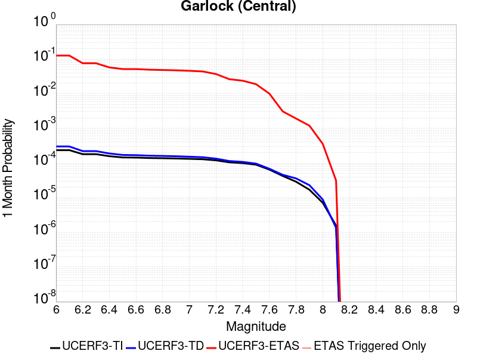 |  | 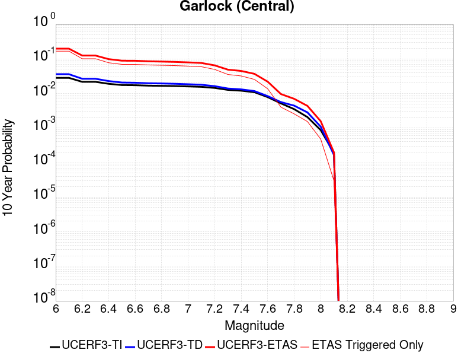 |

| Magnitude | 1 wk TI Prob | 1 wk TD Prob | 1 wk ETAS Prob | 1 wk ETAS/TD Gain | 1 wk ETAS Triggered Only | 1 mo TI Prob | 1 mo TD Prob | 1 mo ETAS Prob | 1 mo ETAS/TD Gain | 1 mo ETAS Triggered Only | 1 yr TI Prob | 1 yr TD Prob | 1 yr ETAS Prob | 1 yr ETAS/TD Gain | 1 yr ETAS Triggered Only | 10 yr TI Prob | 10 yr TD Prob | 10 yr ETAS Prob | 10 yr ETAS/TD Gain | 10 yr ETAS Triggered Only |
|-----|-----|-----|-----|-----|-----|-----|-----|-----|-----|-----|-----|-----|-----|-----|-----|-----|-----|-----|-----|-----|
| 6.0 | 5.5131142E-5 | 7.024681E-5 | 0.111172445 | 1582.5977 | 0.11111 | 2.3625491E-4 | 3.010234E-4 | 0.1262231 | 419.3133 | 0.12596 | 0.0028726095 | 0.0036588663 | 0.15252219 | 41.685642 | 0.14941 | 0.028357591 | 0.036079824 | 0.19793166 | 5.485937 | 0.16791 |
| 6.1 | 5.5131142E-5 | 7.024681E-5 | 0.111172445 | 1582.5977 | 0.11111 | 2.3625491E-4 | 3.010234E-4 | 0.1262231 | 419.3133 | 0.12596 | 0.0028726095 | 0.0036588663 | 0.15252219 | 41.685642 | 0.14941 | 0.028357591 | 0.036079824 | 0.19793166 | 5.485937 | 0.16791 |
| 6.2 | 4.216245E-5 | 5.1661493E-5 | 0.06655823 | 1288.3528 | 0.06651 | 1.806837E-4 | 2.2138779E-4 | 0.07588463 | 342.7679 | 0.07568 | 0.0021976046 | 0.0026920962 | 0.09269913 | 34.43381 | 0.09025 | 0.021759989 | 0.026689773 | 0.12535423 | 4.696714 | 0.10137 |
| 6.3 | 4.216245E-5 | 5.1661493E-5 | 0.06655823 | 1288.3528 | 0.06651 | 1.806837E-4 | 2.2138779E-4 | 0.07588463 | 342.7679 | 0.07568 | 0.0021976046 | 0.0026920962 | 0.09269913 | 34.43381 | 0.09025 | 0.021759989 | 0.026689773 | 0.12535423 | 4.696714 | 0.10137 |
| 6.4 | 3.6858168E-5 | 4.411054E-5 | 0.050231896 | 1138.7731 | 0.05019 | 1.5795401E-4 | 1.8903162E-4 | 0.05752819 | 304.33105 | 0.05735 | 0.0019213937 | 0.002299056 | 0.07088102 | 30.830488 | 0.06874 | 0.019048655 | 0.02284894 | 0.098627 | 4.3164806 | 0.07755 |
| 6.5 | 3.39199E-5 | 4.0018083E-5 | 0.045038216 | 1125.4467 | 0.045 | 1.453629E-4 | 1.7149492E-4 | 0.051572677 | 300.72424 | 0.05141 | 0.0017683565 | 0.002085973 | 0.06376704 | 30.569447 | 0.06181 | 0.017543508 | 0.020759864 | 0.08893456 | 4.2839665 | 0.06962 |
| 6.6 | 3.3571985E-5 | 3.9472274E-5 | 0.044997696 | 1139.9824 | 0.04496 | 1.4387199E-4 | 1.6915603E-4 | 0.051530465 | 304.63275 | 0.05137 | 0.0017502342 | 0.0020575512 | 0.063670516 | 30.944805 | 0.06174 | 0.017365133 | 0.020481179 | 0.08857733 | 4.3248158 | 0.06952 |
| 6.7 | 3.2580007E-5 | 3.8088703E-5 | 0.043146446 | 1132.7886 | 0.04311 | 1.3962112E-4 | 1.632272E-4 | 0.049475178 | 303.1062 | 0.04932 | 0.0016985617 | 0.0019855013 | 0.061267562 | 30.85748 | 0.0594 | 0.016856372 | 0.019773813 | 0.08526272 | 4.311901 | 0.06681 |
| 6.8 | 3.2185937E-5 | 3.7515918E-5 | 0.04231593 | 1127.9459 | 0.04228 | 1.3793244E-4 | 1.6077272E-4 | 0.048463006 | 301.438 | 0.04831 | 0.0016780337 | 0.001955672 | 0.060111716 | 30.737114 | 0.05827 | 0.016654192 | 0.019480614 | 0.083743855 | 4.2988305 | 0.06554 |
| 6.9 | 3.165394E-5 | 3.6720503E-5 | 0.041315205 | 1125.1263 | 0.04128 | 1.3565269E-4 | 1.5736422E-4 | 0.047399927 | 301.2116 | 0.04725 | 0.0016503202 | 0.001914247 | 0.058845058 | 30.740576 | 0.05704 | 0.01638118 | 0.019073246 | 0.08198989 | 4.2986856 | 0.06414 |
| 7.0 | 3.0903822E-5 | 3.5625766E-5 | 0.0400642 | 1124.585 | 0.04003 | 1.3243823E-4 | 1.5267303E-4 | 0.04589569 | 300.61423 | 0.04575 | 0.0016112428 | 0.0018572307 | 0.056904804 | 30.639599 | 0.05515 | 0.015996104 | 0.018512413 | 0.079443164 | 4.2913456 | 0.06208 |
| 7.1 | 3.0069863E-5 | 3.4392073E-5 | 0.03847307 | 1118.661 | 0.03844 | 1.2886449E-4 | 1.4738638E-4 | 0.044060912 | 298.94833 | 0.04392 | 0.0015677959 | 0.0017929734 | 0.05453823 | 30.417759 | 0.05284 | 0.01556781 | 0.017880075 | 0.07629657 | 4.267128 | 0.05948 |
| 7.2 | 2.7957109E-5 | 3.128145E-5 | 0.03213028 | 1027.135 | 0.0321 | 1.1981068E-4 | 1.340566E-4 | 0.03694912 | 275.6233 | 0.03682 | 0.0014577188 | 0.0016309366 | 0.045718916 | 28.032307 | 0.04416 | 0.014481937 | 0.016283695 | 0.06514488 | 4.0006204 | 0.04967 |
| 7.3 | 2.4519275E-5 | 2.6714795E-5 | 0.022946103 | 858.92865 | 0.02292 | 1.0507837E-4 | 1.1448703E-4 | 0.026271492 | 229.47133 | 0.02616 | 0.0012785783 | 0.001393003 | 0.032769237 | 23.524166 | 0.03142 | 0.012712469 | 0.013928054 | 0.048904024 | 3.5111887 | 0.03547 |
| 7.4 | 2.3225532E-5 | 2.51994E-5 | 0.020824675 | 826.3957 | 0.0208 | 9.95342E-5 | 1.0799304E-4 | 0.023795435 | 220.3423 | 0.02369 | 0.0012111551 | 0.0013140367 | 0.029806547 | 22.683193 | 0.02853 | 0.012045753 | 0.013145725 | 0.04488296 | 3.4142625 | 0.03216 |
| 7.5 | 2.097765E-5 | 2.2483688E-5 | 0.01664211 | 740.186 | 0.01662 | 8.9901114E-5 | 9.635517E-5 | 0.018874547 | 195.88513 | 0.01878 | 0.0010939965 | 0.0011725046 | 0.023755994 | 20.260895 | 0.02261 | 0.010886264 | 0.011740365 | 0.03700028 | 3.1515443 | 0.02556 |
| 7.6 | 1.511254E-5 | 1.5991332E-5 | 0.00883585 | 552.54 | 0.00882 | 6.476642E-5 | 6.853253E-5 | 0.010067848 | 146.90611 | 0.01 | 7.882459E-4 | 8.3407195E-4 | 0.012814071 | 15.363269 | 0.01199 | 0.007854558 | 0.008383559 | 0.021968704 | 2.620451 | 0.0137 |
| 7.7 | 9.934069E-6 | 1.0678794E-5 | 0.0027006501 | 252.89842 | 0.00269 | 4.2573887E-5 | 4.5765457E-5 | 0.003095626 | 67.6411 | 0.00305 | 5.182138E-4 | 5.570524E-4 | 0.004205019 | 7.548696 | 0.00365 | 0.00517007 | 0.005627684 | 0.0096250605 | 1.7103058 | 0.00402 |
| 7.8 | 6.7562896E-6 | 8.428449E-6 | 0.001728414 | 205.06905 | 0.00172 | 2.8955206E-5 | 3.6121426E-5 | 0.0019260532 | 53.32163 | 0.00189 | 3.5247262E-4 | 4.3968976E-4 | 0.002728683 | 6.205928 | 0.00229 | 0.0035191406 | 0.004446654 | 0.0070052263 | 1.5753926 | 0.00257 |
| 7.9 | 3.975453E-6 | 5.37103E-6 | 0.0010953652 | 203.93948 | 0.00109 | 1.7037546E-5 | 2.3018498E-5 | 0.0012029913 | 52.261936 | 0.00118 | 2.0741238E-4 | 2.8021427E-4 | 0.0016598275 | 5.923423 | 0.00138 | 0.002072189 | 0.0028336283 | 0.0043692645 | 1.5419328 | 0.00154 |
| 8.0 | 1.6729537E-6 | 2.0775144E-6 | 3.2207684E-4 | 155.0299 | 3.2E-4 | 7.169782E-6 | 8.903603E-6 | 3.589005E-4 | 40.309578 | 3.5E-4 | 8.7288594E-5 | 1.0839601E-4 | 5.1835156E-4 | 4.782017 | 4.1E-4 | 8.7254314E-4 | 0.0010969337 | 0.0015764072 | 1.4371034 | 4.8E-4 |
| 8.1 | 3.6733252E-7 | 3.1489964E-7 | 3.031489E-5 | 96.26842 | 3.0E-5 | 1.5742813E-6 | 1.3495693E-6 | 3.134953E-5 | 23.229284 | 3.0E-5 | 1.9166706E-5 | 1.6430899E-5 | 4.6430407E-5 | 2.8257983 | 3.0E-5 | 1.9165053E-4 | 1.6638759E-4 | 1.9638259E-4 | 1.1802719 | 3.0E-5 |

## Tank Canyon
*[(top)](#table-of-contents)*

| 1 Week | 1 Month | 1 Year | 10 Year |
|-----|-----|-----|-----|
|  |  |  |  |

| Magnitude | 1 wk TI Prob | 1 wk TD Prob | 1 wk ETAS Prob | 1 wk ETAS/TD Gain | 1 wk ETAS Triggered Only | 1 mo TI Prob | 1 mo TD Prob | 1 mo ETAS Prob | 1 mo ETAS/TD Gain | 1 mo ETAS Triggered Only | 1 yr TI Prob | 1 yr TD Prob | 1 yr ETAS Prob | 1 yr ETAS/TD Gain | 1 yr ETAS Triggered Only | 10 yr TI Prob | 10 yr TD Prob | 10 yr ETAS Prob | 10 yr ETAS/TD Gain | 10 yr ETAS Triggered Only |
|-----|-----|-----|-----|-----|-----|-----|-----|-----|-----|-----|-----|-----|-----|-----|-----|-----|-----|-----|-----|-----|
| 6.0 | 4.8284557E-5 | 5.7964822E-5 | 0.05313489 | 916.6747 | 0.05308 | 2.0691741E-4 | 2.4840087E-4 | 0.06313278 | 254.15683 | 0.0629 | 0.0025163088 | 0.0030207601 | 0.08238031 | 27.271383 | 0.0796 | 0.02488006 | 0.029863637 | 0.12115347 | 4.0568895 | 0.0941 |
| 6.1 | 1.7796336E-5 | 2.0873314E-5 | 0.017570507 | 841.76886 | 0.01755 | 7.626778E-5 | 8.945422E-5 | 0.020757604 | 232.04726 | 0.02067 | 9.281647E-4 | 0.0010885983 | 0.027919358 | 25.647074 | 0.02686 | 0.009242975 | 0.010836744 | 0.042964768 | 3.9647303 | 0.03248 |
| 6.2 | 1.7796336E-5 | 2.0873314E-5 | 0.017570507 | 841.76886 | 0.01755 | 7.626778E-5 | 8.945422E-5 | 0.020757604 | 232.04726 | 0.02067 | 9.281647E-4 | 0.0010885983 | 0.027919358 | 25.647074 | 0.02686 | 0.009242975 | 0.010836744 | 0.042964768 | 3.9647303 | 0.03248 |
| 6.3 | 1.3515912E-5 | 1.5759564E-5 | 0.012425564 | 788.44586 | 0.01241 | 5.792405E-5 | 6.753938E-5 | 0.014586559 | 215.97118 | 0.01452 | 7.049971E-4 | 8.2200574E-4 | 0.019726453 | 23.99795 | 0.01892 | 0.007027647 | 0.0081922645 | 0.03096417 | 3.7796838 | 0.02296 |
| 6.4 | 1.0870146E-5 | 1.2618021E-5 | 0.009242501 | 732.48425 | 0.00923 | 4.658551E-5 | 5.4076212E-5 | 0.010843493 | 200.52242 | 0.01079 | 5.67031E-4 | 6.581969E-4 | 0.014688956 | 22.316963 | 0.01404 | 0.005655863 | 0.0065644905 | 0.023512501 | 3.5817707 | 0.01706 |
| 6.5 | 7.964826E-6 | 9.196094E-6 | 0.0059591415 | 648.0079 | 0.00595 | 3.4134522E-5 | 3.9411298E-5 | 0.00691914 | 175.56236 | 0.00688 | 4.1550855E-4 | 4.7973756E-4 | 0.009545387 | 19.8971 | 0.00907 | 0.0041473247 | 0.004788321 | 0.015725698 | 3.2841778 | 0.01099 |
| 6.6 | 6.6317E-6 | 7.6122988E-6 | 0.0044175787 | 580.3212 | 0.00441 | 2.8421264E-5 | 3.2623782E-5 | 0.0051624565 | 158.24213 | 0.00513 | 3.4597394E-4 | 3.9713128E-4 | 0.0071944306 | 18.116001 | 0.0068 | 0.0034543579 | 0.003965368 | 0.012202574 | 3.0772867 | 0.00827 |
| 6.7 | 4.793663E-6 | 5.4307857E-6 | 0.0024454175 | 450.288 | 0.00244 | 2.0544108E-5 | 2.3274613E-5 | 0.0028632085 | 123.018524 | 0.00284 | 2.500958E-4 | 2.8333595E-4 | 0.004072262 | 14.372558 | 0.00379 | 0.0024981452 | 0.0028304397 | 0.0074273916 | 2.6241121 | 0.00461 |
| 6.8 | 4.382823E-6 | 4.9692567E-6 | 0.0021249587 | 427.62103 | 0.00212 | 1.8783392E-5 | 2.1296666E-5 | 0.002501244 | 117.44768 | 0.00248 | 2.286638E-4 | 2.5926033E-4 | 0.0036183891 | 13.956587 | 0.00336 | 0.0022842865 | 0.002590253 | 0.006689607 | 2.5826077 | 0.00411 |
| 6.9 | 2.729601E-6 | 3.0735416E-6 | 0.0010830702 | 352.38507 | 0.00108 | 1.1698237E-5 | 1.3172262E-5 | 0.0012231563 | 92.85849 | 0.00121 | 1.4241673E-4 | 1.6036171E-4 | 0.0017901004 | 11.162891 | 0.00163 | 0.001423255 | 0.0016026258 | 0.0036393565 | 2.270871 | 0.00204 |
| 7.0 | 1.8987357E-6 | 2.126939E-6 | 5.721257E-4 | 268.99017 | 5.7E-4 | 8.137413E-6 | 9.115425E-6 | 6.0910993E-4 | 66.82189 | 6.0E-4 | 9.90685E-5 | 1.1097535E-4 | 9.208855E-4 | 8.298108 | 8.1E-4 | 9.902435E-4 | 0.0011092679 | 0.0020682032 | 1.8644756 | 9.6E-4 |
| 7.1 | 1.4928986E-6 | 1.6641272E-6 | 3.6166352E-4 | 217.32925 | 3.6E-4 | 6.398121E-6 | 7.1319573E-6 | 3.8712926E-4 | 54.280926 | 3.8E-4 | 7.789434E-5 | 8.682871E-5 | 5.967844E-4 | 6.873123 | 5.1E-4 | 7.786704E-4 | 8.6800574E-4 | 0.0014774762 | 1.7021503 | 6.1E-4 |
| 7.2 | 1.069082E-6 | 1.1828573E-6 | 2.0118261E-4 | 170.08191 | 2.0E-4 | 4.581772E-6 | 5.0693816E-6 | 2.1506831E-4 | 42.42496 | 2.1E-4 | 5.5781646E-5 | 6.171851E-5 | 3.517006E-4 | 5.698463 | 2.9E-4 | 5.576765E-4 | 6.170659E-4 | 9.668499E-4 | 1.5668503 | 3.5E-4 |
| 7.3 | 8.776551E-7 | 9.770005E-7 | 1.6097684E-4 | 164.76639 | 1.6E-4 | 3.7613736E-6 | 4.1871413E-6 | 1.7418643E-4 | 41.600323 | 1.7E-4 | 4.579376E-5 | 5.097777E-5 | 2.5096757E-4 | 4.9230785 | 2.0E-4 | 4.5784327E-4 | 5.097118E-4 | 7.5958436E-4 | 1.4902233 | 2.5E-4 |
| 7.4 | 7.55721E-7 | 8.510244E-7 | 1.508509E-4 | 177.25801 | 1.5E-4 | 3.2388E-6 | 3.6472454E-6 | 1.536467E-4 | 42.126778 | 1.5E-4 | 3.9431678E-5 | 4.4404827E-5 | 2.2439683E-4 | 5.0534334 | 1.8E-4 | 3.942468E-4 | 4.440104E-4 | 6.639127E-4 | 1.4952639 | 2.2E-4 |
| 7.5 | 5.587665E-7 | 6.305619E-7 | 1.3063048E-4 | 207.1652 | 1.3E-4 | 2.3947114E-6 | 2.702408E-6 | 1.3270206E-4 | 49.105114 | 1.3E-4 | 2.915522E-5 | 3.290182E-5 | 1.8289688E-4 | 5.5588684 | 1.5E-4 | 2.9151395E-4 | 3.290182E-4 | 5.0895894E-4 | 1.5469022 | 1.8E-4 |

## Little Lake
*[(top)](#table-of-contents)*

| 1 Week | 1 Month | 1 Year | 10 Year |
|-----|-----|-----|-----|
|  |  |  |  |

| Magnitude | 1 wk TI Prob | 1 wk TD Prob | 1 wk ETAS Prob | 1 wk ETAS/TD Gain | 1 wk ETAS Triggered Only | 1 mo TI Prob | 1 mo TD Prob | 1 mo ETAS Prob | 1 mo ETAS/TD Gain | 1 mo ETAS Triggered Only | 1 yr TI Prob | 1 yr TD Prob | 1 yr ETAS Prob | 1 yr ETAS/TD Gain | 1 yr ETAS Triggered Only | 10 yr TI Prob | 10 yr TD Prob | 10 yr ETAS Prob | 10 yr ETAS/TD Gain | 10 yr ETAS Triggered Only |
|-----|-----|-----|-----|-----|-----|-----|-----|-----|-----|-----|-----|-----|-----|-----|-----|-----|-----|-----|-----|-----|
| 6.0 | 2.8424427E-5 | 3.120572E-5 | 0.051559597 | 1652.2483 | 0.05153 | 1.2181328E-4 | 1.337327E-4 | 0.05854592 | 437.78314 | 0.05842 | 0.0014820677 | 0.0016271127 | 0.07095413 | 43.60738 | 0.06944 | 0.014722223 | 0.016165402 | 0.09413429 | 5.823196 | 0.07925 |
| 6.1 | 2.8424427E-5 | 3.120572E-5 | 0.051559597 | 1652.2483 | 0.05153 | 1.2181328E-4 | 1.337327E-4 | 0.05854592 | 437.78314 | 0.05842 | 0.0014820677 | 0.0016271127 | 0.07095413 | 43.60738 | 0.06944 | 0.014722223 | 0.016165402 | 0.09413429 | 5.823196 | 0.07925 |
| 6.2 | 2.8424427E-5 | 3.120572E-5 | 0.051559597 | 1652.2483 | 0.05153 | 1.2181328E-4 | 1.337327E-4 | 0.05854592 | 437.78314 | 0.05842 | 0.0014820677 | 0.0016271127 | 0.07095413 | 43.60738 | 0.06944 | 0.014722223 | 0.016165402 | 0.09413429 | 5.823196 | 0.07925 |
| 6.3 | 1.48860645E-5 | 1.6081389E-5 | 0.035835505 | 2228.3835 | 0.03582 | 6.379586E-5 | 6.8918576E-5 | 0.040586125 | 588.89966 | 0.04052 | 7.7643775E-4 | 8.3878887E-4 | 0.04845881 | 57.772358 | 0.04766 | 0.007737305 | 0.008359048 | 0.062105987 | 7.429792 | 0.0542 |
| 6.4 | 1.48860645E-5 | 1.6081389E-5 | 0.035835505 | 2228.3835 | 0.03582 | 6.379586E-5 | 6.8918576E-5 | 0.040586125 | 588.89966 | 0.04052 | 7.7643775E-4 | 8.3878887E-4 | 0.04845881 | 57.772358 | 0.04766 | 0.007737305 | 0.008359048 | 0.062105987 | 7.429792 | 0.0542 |
| 6.5 | 1.2797581E-5 | 1.3765565E-5 | 0.033433307 | 2428.7637 | 0.03342 | 5.4845623E-5 | 5.899409E-5 | 0.037866764 | 641.87384 | 0.03781 | 6.675408E-4 | 7.18042E-4 | 0.04514612 | 62.87392 | 0.04446 | 0.006655392 | 0.00715977 | 0.057407413 | 8.018053 | 0.05061 |
| 6.6 | 9.661896E-6 | 1.0289038E-5 | 0.029589985 | 2875.8748 | 0.02958 | 4.1407468E-5 | 4.409522E-5 | 0.033442624 | 758.4183 | 0.0334 | 5.040193E-4 | 5.367433E-4 | 0.03974569 | 74.049706 | 0.03923 | 0.005028777 | 0.0053560743 | 0.04964757 | 9.269395 | 0.04453 |
| 6.7 | 7.767871E-6 | 8.199687E-6 | 0.026097985 | 3182.8027 | 0.02609 | 3.329045E-5 | 3.5141118E-5 | 0.029464107 | 838.45105 | 0.02943 | 4.0523586E-4 | 4.2777284E-4 | 0.03501297 | 81.84945 | 0.0346 | 0.004044977 | 0.004270846 | 0.043343257 | 10.148635 | 0.03924 |
| 6.8 | 6.4235196E-6 | 6.7357446E-6 | 0.020446599 | 3035.5364 | 0.02044 | 2.752908E-5 | 2.8867229E-5 | 0.023038203 | 798.0746 | 0.02301 | 3.35115E-4 | 3.5141467E-4 | 0.02750187 | 78.26045 | 0.02716 | 0.003346101 | 0.00350985 | 0.03423164 | 9.753021 | 0.03083 |
| 6.9 | 3.1283696E-6 | 3.1121804E-6 | 0.012873072 | 4136.3516 | 0.01287 | 1.3407229E-5 | 1.3337856E-5 | 0.014333147 | 1074.6215 | 0.01432 | 1.6322079E-4 | 1.6237781E-4 | 0.017179614 | 105.800255 | 0.01702 | 0.0016310095 | 0.00162274 | 0.020641826 | 12.720354 | 0.01905 |
| 7.0 | 2.290603E-6 | 2.2286815E-6 | 0.0076722116 | 3442.489 | 0.00767 | 9.816834E-6 | 9.551463E-6 | 0.00856947 | 897.1892 | 0.00856 | 1.19513395E-4 | 1.162839E-4 | 0.010345094 | 88.96411 | 0.01023 | 0.0011944914 | 0.0011623327 | 0.012698907 | 10.925364 | 0.01155 |
| 7.1 | 1.293693E-6 | 1.1776827E-6 | 0.0034511737 | 2930.478 | 0.00345 | 5.5443866E-6 | 5.0472063E-6 | 0.0038750276 | 767.75696 | 0.00387 | 6.750081E-5 | 6.14487E-5 | 0.004681165 | 76.180046 | 0.00462 | 6.7480316E-4 | 6.143856E-4 | 0.0058111907 | 9.458541 | 0.0052 |
| 7.2 | 4.715842E-7 | 3.0917857E-7 | 1.2030914E-4 | 389.1251 | 1.2E-4 | 2.0210737E-6 | 1.3250503E-6 | 1.4132487E-4 | 106.65622 | 1.4E-4 | 2.4606294E-5 | 1.6132375E-5 | 1.9612948E-4 | 12.157508 | 1.8E-4 | 2.460357E-4 | 1.6131258E-4 | 3.5128192E-4 | 2.1776476 | 1.9E-4 |
| 7.3 | 3.9430947E-7 | 2.3097488E-7 | 9.0230955E-5 | 390.65268 | 9.0E-5 | 1.6898966E-6 | 9.89892E-7 | 1.10989786E-4 | 112.12313 | 1.1E-4 | 2.0574296E-5 | 1.2051869E-5 | 1.3205042E-4 | 10.956842 | 1.2E-4 | 2.0572392E-4 | 1.20512224E-4 | 2.4049776E-4 | 1.9956297 | 1.2E-4 |
| 7.4 | 3.547123E-7 | 1.9679135E-7 | 9.019677E-5 | 458.33707 | 9.0E-5 | 1.5201948E-6 | 8.4339126E-7 | 1.108433E-4 | 131.42572 | 1.1E-4 | 1.8508214E-5 | 1.0268241E-5 | 1.3026701E-4 | 12.6864 | 1.2E-4 | 1.8506673E-4 | 1.02677724E-4 | 2.226654E-4 | 2.1685853 | 1.2E-4 |
| 7.5 | 2.6354266E-7 | 1.4423138E-7 | 6.0144223E-5 | 416.99817 | 6.0E-5 | 1.129468E-6 | 6.181344E-7 | 8.061808E-5 | 130.42162 | 8.0E-5 | 1.3751187E-5 | 7.5257603E-6 | 8.752516E-5 | 11.630075 | 8.0E-5 | 1.3750336E-4 | 7.5255106E-5 | 1.5524909E-4 | 2.0629709 | 8.0E-5 |
| 7.6 | 1.269913E-7 | 7.572556E-8 | 1.0075725E-5 | 133.0558 | 1.0E-5 | 5.4424834E-7 | 3.245381E-7 | 3.0324529E-5 | 93.43905 | 3.0E-5 | 6.6262032E-6 | 3.9512443E-6 | 3.3951124E-5 | 8.592515 | 3.0E-5 | 6.626006E-5 | 3.9511775E-5 | 6.951059E-5 | 1.7592373 | 3.0E-5 |

## Airport Lake
*[(top)](#table-of-contents)*

| 1 Week | 1 Month | 1 Year | 10 Year |
|-----|-----|-----|-----|
|  | 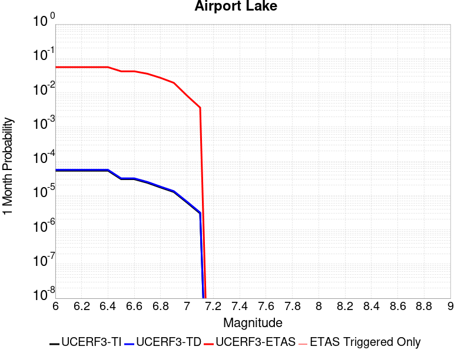 |  |  |

| Magnitude | 1 wk TI Prob | 1 wk TD Prob | 1 wk ETAS Prob | 1 wk ETAS/TD Gain | 1 wk ETAS Triggered Only | 1 mo TI Prob | 1 mo TD Prob | 1 mo ETAS Prob | 1 mo ETAS/TD Gain | 1 mo ETAS Triggered Only | 1 yr TI Prob | 1 yr TD Prob | 1 yr ETAS Prob | 1 yr ETAS/TD Gain | 1 yr ETAS Triggered Only | 10 yr TI Prob | 10 yr TD Prob | 10 yr ETAS Prob | 10 yr ETAS/TD Gain | 10 yr ETAS Triggered Only |
|-----|-----|-----|-----|-----|-----|-----|-----|-----|-----|-----|-----|-----|-----|-----|-----|-----|-----|-----|-----|-----|
| 6.0 | 1.2387061E-5 | 1.3103157E-5 | 0.04910246 | 3747.3765 | 0.04909 | 5.3086325E-5 | 5.615534E-5 | 0.05557304 | 989.63055 | 0.05552 | 6.461343E-4 | 6.8350515E-4 | 0.06619869 | 96.85178 | 0.06556 | 0.0064425888 | 0.0068168393 | 0.08042164 | 11.797498 | 0.07411 |
| 6.1 | 1.2387061E-5 | 1.3103157E-5 | 0.04910246 | 3747.3765 | 0.04909 | 5.3086325E-5 | 5.615534E-5 | 0.05557304 | 989.63055 | 0.05552 | 6.461343E-4 | 6.8350515E-4 | 0.06619869 | 96.85178 | 0.06556 | 0.0064425888 | 0.0068168393 | 0.08042164 | 11.797498 | 0.07411 |
| 6.2 | 1.2387061E-5 | 1.3103157E-5 | 0.04910246 | 3747.3765 | 0.04909 | 5.3086325E-5 | 5.615534E-5 | 0.05557304 | 989.63055 | 0.05552 | 6.461343E-4 | 6.8350515E-4 | 0.06619869 | 96.85178 | 0.06556 | 0.0064425888 | 0.0068168393 | 0.08042164 | 11.797498 | 0.07411 |
| 6.3 | 1.2387061E-5 | 1.3103157E-5 | 0.04910246 | 3747.3765 | 0.04909 | 5.3086325E-5 | 5.615534E-5 | 0.05557304 | 989.63055 | 0.05552 | 6.461343E-4 | 6.8350515E-4 | 0.06619869 | 96.85178 | 0.06556 | 0.0064425888 | 0.0068168393 | 0.08042164 | 11.797498 | 0.07411 |
| 6.4 | 1.2387061E-5 | 1.3103157E-5 | 0.04910246 | 3747.3765 | 0.04909 | 5.3086325E-5 | 5.615534E-5 | 0.05557304 | 989.63055 | 0.05552 | 6.461343E-4 | 6.8350515E-4 | 0.06619869 | 96.85178 | 0.06556 | 0.0064425888 | 0.0068168393 | 0.08042164 | 11.797498 | 0.07411 |
| 6.5 | 6.9922594E-6 | 7.384925E-6 | 0.03707711 | 5020.648 | 0.03707 | 2.996648E-5 | 3.1649324E-5 | 0.04209032 | 1329.8962 | 0.04206 | 3.6478083E-4 | 3.8526783E-4 | 0.049836207 | 129.3547 | 0.04947 | 0.003641826 | 0.0038465366 | 0.059202783 | 15.391192 | 0.05557 |
| 6.6 | 6.9922594E-6 | 7.384925E-6 | 0.03707711 | 5020.648 | 0.03707 | 2.996648E-5 | 3.1649324E-5 | 0.04209032 | 1329.8962 | 0.04206 | 3.6478083E-4 | 3.8526783E-4 | 0.049836207 | 129.3547 | 0.04947 | 0.003641826 | 0.0038465366 | 0.059202783 | 15.391192 | 0.05557 |
| 6.7 | 5.477277E-6 | 5.7860684E-6 | 0.0315456 | 5451.9927 | 0.03154 | 2.3473833E-5 | 2.4797222E-5 | 0.035663914 | 1438.222 | 0.03564 | 2.8575645E-4 | 3.0186825E-4 | 0.042269196 | 140.02531 | 0.04198 | 0.0028538927 | 0.003014966 | 0.05007266 | 16.608036 | 0.0472 |
| 6.8 | 3.9950432E-6 | 4.2190873E-6 | 0.023944119 | 5675.1895 | 0.02394 | 1.7121502E-5 | 1.8081691E-5 | 0.027037593 | 1495.3021 | 0.02702 | 2.0843433E-4 | 2.2012512E-4 | 0.032283064 | 146.6578 | 0.03207 | 0.0020823893 | 0.0021993418 | 0.03816008 | 17.350681 | 0.03604 |
| 6.9 | 2.95695E-6 | 3.1230243E-6 | 0.017273068 | 5530.879 | 0.01727 | 1.2672582E-5 | 1.3384334E-5 | 0.019403124 | 1449.6892 | 0.01939 | 1.5427776E-4 | 1.6294434E-4 | 0.023099206 | 141.76132 | 0.02294 | 0.001541707 | 0.0016284712 | 0.027306587 | 16.768234 | 0.02572 |
| 7.0 | 1.456072E-6 | 1.540812E-6 | 0.0073915296 | 4797.165 | 0.00739 | 6.2402937E-6 | 6.603469E-6 | 0.00821655 | 1244.2777 | 0.00821 | 7.597293E-5 | 8.039528E-5 | 0.009859609 | 122.63916 | 0.00978 | 7.594696E-4 | 8.0376083E-4 | 0.011864863 | 14.761684 | 0.01107 |
| 7.1 | 6.995192E-7 | 7.4089746E-7 | 0.0032807384 | 4428.06 | 0.00328 | 2.997936E-6 | 3.1752747E-6 | 0.0036631636 | 1153.6525 | 0.00366 | 3.649926E-5 | 3.865897E-5 | 0.0043884907 | 113.51805 | 0.00435 | 3.6493264E-4 | 3.865897E-4 | 0.0053046877 | 13.721751 | 0.00492 |

## Owl Lake
*[(top)](#table-of-contents)*

| 1 Week | 1 Month | 1 Year | 10 Year |
|-----|-----|-----|-----|
|  |  |  | 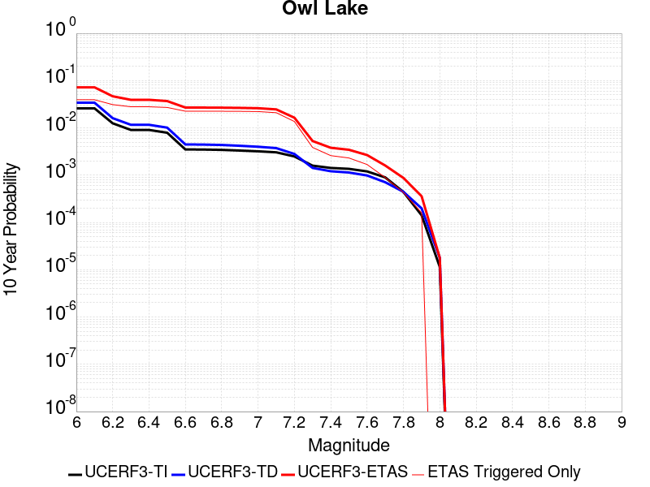 |

| Magnitude | 1 wk TI Prob | 1 wk TD Prob | 1 wk ETAS Prob | 1 wk ETAS/TD Gain | 1 wk ETAS Triggered Only | 1 mo TI Prob | 1 mo TD Prob | 1 mo ETAS Prob | 1 mo ETAS/TD Gain | 1 mo ETAS Triggered Only | 1 yr TI Prob | 1 yr TD Prob | 1 yr ETAS Prob | 1 yr ETAS/TD Gain | 1 yr ETAS Triggered Only | 10 yr TI Prob | 10 yr TD Prob | 10 yr ETAS Prob | 10 yr ETAS/TD Gain | 10 yr ETAS Triggered Only |
|-----|-----|-----|-----|-----|-----|-----|-----|-----|-----|-----|-----|-----|-----|-----|-----|-----|-----|-----|-----|-----|
| 6.0 | 5.0320643E-5 | 6.635816E-5 | 0.02248487 | 338.8411 | 0.02242 | 2.1564208E-4 | 2.843674E-4 | 0.027066749 | 95.18233 | 0.02679 | 0.0026222812 | 0.0034577388 | 0.037081074 | 10.724082 | 0.03374 | 0.02591553 | 0.034140717 | 0.072137624 | 2.1129498 | 0.03934 |
| 6.1 | 5.0320643E-5 | 6.635816E-5 | 0.02248487 | 338.8411 | 0.02242 | 2.1564208E-4 | 2.843674E-4 | 0.027066749 | 95.18233 | 0.02679 | 0.0026222812 | 0.0034577388 | 0.037081074 | 10.724082 | 0.03374 | 0.02591553 | 0.034140717 | 0.072137624 | 2.1129498 | 0.03934 |
| 6.2 | 2.4125871E-5 | 3.0981035E-5 | 0.018300414 | 590.6973 | 0.01827 | 1.0339249E-4 | 1.3277028E-4 | 0.021649914 | 163.06294 | 0.02152 | 0.0012580766 | 0.001615439 | 0.028521903 | 17.655823 | 0.02695 | 0.012509781 | 0.016070465 | 0.046641156 | 2.9022903 | 0.03107 |
| 6.3 | 1.7433485E-5 | 2.2355514E-5 | 0.01682198 | 752.47565 | 0.0168 | 7.471279E-5 | 9.580672E-5 | 0.019813918 | 206.81136 | 0.01972 | 9.0924866E-4 | 0.0011659743 | 0.025457617 | 21.833773 | 0.02432 | 0.009055373 | 0.011628896 | 0.03926375 | 3.3763955 | 0.02796 |
| 6.4 | 1.7433485E-5 | 2.2355514E-5 | 0.01682198 | 752.47565 | 0.0168 | 7.471279E-5 | 9.580672E-5 | 0.019813918 | 206.81136 | 0.01972 | 9.0924866E-4 | 0.0011659743 | 0.025457617 | 21.833773 | 0.02432 | 0.009055373 | 0.011628896 | 0.03926375 | 3.3763955 | 0.02796 |
| 6.5 | 1.5182742E-5 | 1.9429144E-5 | 0.01641911 | 845.07635 | 0.0164 | 6.506727E-5 | 8.326596E-5 | 0.01926167 | 231.32706 | 0.01918 | 7.919061E-4 | 0.0010134429 | 0.024539577 | 24.21407 | 0.02355 | 0.0078909 | 0.010118429 | 0.036904626 | 3.6472683 | 0.02706 |
| 6.6 | 6.7271576E-6 | 8.547361E-6 | 0.014288425 | 1671.6769 | 0.01428 | 2.8830356E-5 | 3.6631063E-5 | 0.016646022 | 454.42368 | 0.01661 | 3.5095305E-4 | 4.458976E-4 | 0.02054693 | 46.07993 | 0.02011 | 0.0035039932 | 0.004467813 | 0.026927019 | 6.0268908 | 0.02256 |
| 6.7 | 6.682835E-6 | 8.479807E-6 | 0.014278359 | 1683.807 | 0.01427 | 2.8640408E-5 | 3.6341557E-5 | 0.016635738 | 457.76077 | 0.0166 | 3.4864116E-4 | 4.4237426E-4 | 0.020533483 | 46.41654 | 0.0201 | 0.003480947 | 0.0044327388 | 0.02688278 | 6.064598 | 0.02255 |
| 6.8 | 6.5774975E-6 | 8.32628E-6 | 0.014258208 | 1712.4342 | 0.01425 | 2.8188972E-5 | 3.5683603E-5 | 0.016595094 | 465.06213 | 0.01656 | 3.4314668E-4 | 4.343669E-4 | 0.020485653 | 47.162094 | 0.02006 | 0.0034261728 | 0.004352885 | 0.026754946 | 6.146486 | 0.0225 |
| 6.9 | 6.363419E-6 | 7.999454E-6 | 0.014207886 | 1776.1068 | 0.0142 | 2.727151E-5 | 3.428296E-5 | 0.016523717 | 481.9805 | 0.01649 | 3.3198006E-4 | 4.1732067E-4 | 0.020368991 | 48.808968 | 0.01996 | 0.0033148455 | 0.0041828766 | 0.02648918 | 6.3327665 | 0.0224 |
| 7.0 | 6.1342453E-6 | 7.6316555E-6 | 0.014077525 | 1844.6226 | 0.01407 | 2.6289357E-5 | 3.2706717E-5 | 0.016352173 | 499.96378 | 0.01632 | 3.2002592E-4 | 3.9813702E-4 | 0.020130279 | 50.56118 | 0.01974 | 0.0031956544 | 0.003991571 | 0.026073078 | 6.5320344 | 0.02217 |
| 7.1 | 5.842926E-6 | 7.142211E-6 | 0.013487046 | 1888.3572 | 0.01348 | 2.504087E-5 | 3.0609146E-5 | 0.015630132 | 510.63596 | 0.0156 | 3.0482994E-4 | 3.7260808E-4 | 0.019125618 | 51.32905 | 0.01876 | 0.0030441214 | 0.0037370329 | 0.024618704 | 6.5877676 | 0.02096 |
| 7.2 | 4.77173E-6 | 5.358483E-6 | 0.008755311 | 1633.916 | 0.00875 | 2.045011E-5 | 2.2964748E-5 | 0.010332728 | 449.93863 | 0.01031 | 2.4895166E-4 | 2.79564E-4 | 0.012566128 | 44.94902 | 0.01229 | 0.0024867293 | 0.002808645 | 0.016420307 | 5.846345 | 0.01365 |
| 7.3 | 3.0494948E-6 | 2.710463E-6 | 0.0025027036 | 923.3492 | 0.0025 | 1.3069198E-5 | 1.1616219E-5 | 0.0029815817 | 256.67404 | 0.00297 | 1.5910587E-4 | 1.4141845E-4 | 0.0036409234 | 25.745747 | 0.0035 | 0.0015899199 | 0.0014232415 | 0.0052777478 | 3.7082589 | 0.00386 |
| 7.4 | 2.7263884E-6 | 2.3056762E-6 | 0.001632302 | 707.94934 | 0.00163 | 1.1684469E-5 | 9.881433E-6 | 0.0019498622 | 197.32587 | 0.00194 | 1.4224913E-4 | 1.20299905E-4 | 0.0024600185 | 20.449047 | 0.00234 | 0.0014215811 | 0.0012112238 | 0.0037980867 | 3.1357431 | 0.00259 |
| 7.5 | 2.6090431E-6 | 2.1656133E-6 | 0.0014721624 | 679.7901 | 0.00147 | 1.1181565E-5 | 9.281167E-6 | 0.0017392652 | 187.39725 | 0.00173 | 1.3612706E-4 | 1.1299244E-4 | 0.0022127551 | 19.583214 | 0.0021 | 0.001360437 | 0.0011379806 | 0.003445352 | 3.0276015 | 0.00231 |
| 7.6 | 2.3008756E-6 | 1.8727933E-6 | 0.0010918707 | 583.0172 | 0.00109 | 9.860858E-6 | 8.0262325E-6 | 0.0012680162 | 157.98396 | 0.00126 | 1.20049335E-4 | 9.7715085E-5 | 0.0016175666 | 16.553907 | 0.00152 | 0.001199845 | 9.849932E-4 | 0.0026633383 | 2.7039156 | 0.00168 |
| 7.7 | 1.7184348E-6 | 1.3419171E-6 | 5.913411E-4 | 440.66888 | 5.9E-4 | 7.3646997E-6 | 5.7510606E-6 | 7.0574705E-4 | 122.71597 | 7.0E-4 | 8.966153E-5 | 7.0016955E-5 | 9.0995815E-4 | 12.996254 | 8.4E-4 | 8.962536E-4 | 7.078345E-4 | 0.0015972045 | 2.2564662 | 8.9E-4 |
| 7.8 | 8.4612907E-7 | 8.4058576E-7 | 2.6084037E-4 | 310.30786 | 2.6E-4 | 3.6262625E-6 | 3.6025056E-6 | 2.9360145E-4 | 81.49924 | 2.9E-4 | 4.4148852E-5 | 4.3859643E-5 | 4.3384254E-4 | 9.891611 | 3.9E-4 | 4.414008E-4 | 4.4398365E-4 | 8.7379274E-4 | 1.9680742 | 4.3E-4 |
| 7.9 | 2.716738E-7 | 3.768106E-7 | 1.1037677E-4 | 292.92377 | 1.1E-4 | 1.1643157E-6 | 1.6149015E-6 | 1.316147E-4 | 81.50014 | 1.3E-4 | 1.4175452E-5 | 1.966126E-5 | 1.696583E-4 | 8.629066 | 1.5E-4 | 1.4174548E-4 | 1.9836679E-4 | 3.5833503E-4 | 1.8064266 | 1.6E-4 |
| 8.0 | 2.1995428E-8 | 3.384878E-8 | 3.384878E-8 | 1.0 | 0.0 | 9.426611E-8 | 1.4506621E-7 | 1.4506621E-7 | 1.0 | 0.0 | 1.1476893E-6 | 1.7661803E-6 | 1.7661803E-6 | 1.0 | 0.0 | 1.14768345E-5 | 1.7963059E-5 | 1.7963059E-5 | 1.0 | 0.0 |

## Panamint Valley
*[(top)](#table-of-contents)*

| 1 Week | 1 Month | 1 Year | 10 Year |
|-----|-----|-----|-----|
|  |  |  |  |

| Magnitude | 1 wk TI Prob | 1 wk TD Prob | 1 wk ETAS Prob | 1 wk ETAS/TD Gain | 1 wk ETAS Triggered Only | 1 mo TI Prob | 1 mo TD Prob | 1 mo ETAS Prob | 1 mo ETAS/TD Gain | 1 mo ETAS Triggered Only | 1 yr TI Prob | 1 yr TD Prob | 1 yr ETAS Prob | 1 yr ETAS/TD Gain | 1 yr ETAS Triggered Only | 10 yr TI Prob | 10 yr TD Prob | 10 yr ETAS Prob | 10 yr ETAS/TD Gain | 10 yr ETAS Triggered Only |
|-----|-----|-----|-----|-----|-----|-----|-----|-----|-----|-----|-----|-----|-----|-----|-----|-----|-----|-----|-----|-----|
| 6.0 | 3.0211835E-5 | 3.3984514E-5 | 0.019593319 | 576.53674 | 0.01956 | 1.2947287E-4 | 1.4563995E-4 | 0.022752346 | 156.22327 | 0.02261 | 0.0015751923 | 0.0017717537 | 0.029991666 | 16.927673 | 0.02827 | 0.015640736 | 0.017583137 | 0.04982606 | 2.8337412 | 0.03282 |
| 6.1 | 3.0211835E-5 | 3.3984514E-5 | 0.019593319 | 576.53674 | 0.01956 | 1.2947287E-4 | 1.4563995E-4 | 0.022752346 | 156.22327 | 0.02261 | 0.0015751923 | 0.0017717537 | 0.029991666 | 16.927673 | 0.02827 | 0.015640736 | 0.017583137 | 0.04982606 | 2.8337412 | 0.03282 |
| 6.2 | 3.0211835E-5 | 3.3984514E-5 | 0.019593319 | 576.53674 | 0.01956 | 1.2947287E-4 | 1.4563995E-4 | 0.022752346 | 156.22327 | 0.02261 | 0.0015751923 | 0.0017717537 | 0.029991666 | 16.927673 | 0.02827 | 0.015640736 | 0.017583137 | 0.04982606 | 2.8337412 | 0.03282 |
| 6.3 | 2.8573924E-5 | 3.210268E-5 | 0.019101491 | 595.0123 | 0.01907 | 1.2245393E-4 | 1.3757581E-4 | 0.022084557 | 160.52644 | 0.02195 | 0.001489857 | 0.0016737265 | 0.028928034 | 17.28361 | 0.0273 | 0.01479908 | 0.016617801 | 0.047712345 | 2.8711588 | 0.03162 |
| 6.4 | 2.8573924E-5 | 3.210268E-5 | 0.019101491 | 595.0123 | 0.01907 | 1.2245393E-4 | 1.3757581E-4 | 0.022084557 | 160.52644 | 0.02195 | 0.001489857 | 0.0016737265 | 0.028928034 | 17.28361 | 0.0273 | 0.01479908 | 0.016617801 | 0.047712345 | 2.8711588 | 0.03162 |
| 6.5 | 2.7468774E-5 | 3.0828433E-5 | 0.018820249 | 610.48346 | 0.01879 | 1.1771801E-4 | 1.3211532E-4 | 0.021719264 | 164.39624 | 0.02159 | 0.0014322745 | 0.0016073446 | 0.02829438 | 17.603182 | 0.02673 | 0.014230782 | 0.015963677 | 0.0463704 | 2.9047444 | 0.0309 |
| 6.6 | 2.6135967E-5 | 2.925248E-5 | 0.018498711 | 632.381 | 0.01847 | 1.1200648E-4 | 1.253619E-4 | 0.021302707 | 169.92967 | 0.02118 | 0.0013628257 | 0.0015252391 | 0.027645338 | 18.12525 | 0.02616 | 0.013544982 | 0.015154043 | 0.044857 | 2.960068 | 0.03016 |
| 6.7 | 2.4498746E-5 | 2.7341335E-5 | 0.017776856 | 650.18243 | 0.01775 | 1.04990395E-4 | 1.1717203E-4 | 0.02044479 | 174.48524 | 0.02033 | 0.0012775084 | 0.0014256609 | 0.026499862 | 18.587772 | 0.02511 | 0.012701893 | 0.014171274 | 0.042671584 | 3.0111322 | 0.02891 |
| 6.8 | 2.2244329E-5 | 2.4935423E-5 | 0.01706451 | 684.34814 | 0.01704 | 9.532935E-5 | 1.0686185E-4 | 0.019544784 | 182.89767 | 0.01944 | 0.0011600169 | 0.0013002884 | 0.025189186 | 19.372 | 0.02392 | 0.011539802 | 0.0129325185 | 0.04002752 | 3.0951064 | 0.02745 |
| 6.9 | 1.9902658E-5 | 2.2290267E-5 | 0.015891936 | 712.9541 | 0.01587 | 8.529431E-5 | 9.552632E-5 | 0.018133802 | 189.83043 | 0.01804 | 0.0010379635 | 0.0011624309 | 0.023146845 | 19.912449 | 0.02201 | 0.010331288 | 0.011568608 | 0.03638812 | 3.1454191 | 0.02511 |
| 7.0 | 1.8353881E-5 | 2.0566185E-5 | 0.015130255 | 735.68604 | 0.01511 | 7.865712E-5 | 8.813792E-5 | 0.01718663 | 194.99701 | 0.0171 | 9.5722964E-4 | 0.0010725686 | 0.02186025 | 20.381212 | 0.02081 | 0.009531168 | 0.010678849 | 0.033987254 | 3.1826704 | 0.02356 |
| 7.1 | 1.7667631E-5 | 1.9772613E-5 | 0.014629484 | 739.8862 | 0.01461 | 7.571623E-5 | 8.473711E-5 | 0.016653333 | 196.52939 | 0.01657 | 9.2145515E-4 | 0.0010312037 | 0.021160426 | 20.520123 | 0.02015 | 0.009176437 | 0.010269073 | 0.032834936 | 3.197459 | 0.0228 |
| 7.2 | 1.6381597E-5 | 1.8158249E-5 | 0.0129979225 | 715.8136 | 0.01298 | 7.020495E-5 | 7.781885E-5 | 0.014806673 | 190.27103 | 0.01473 | 8.544101E-4 | 9.4704994E-4 | 0.018820107 | 19.872349 | 0.01789 | 0.008511325 | 0.009434792 | 0.029473927 | 3.1239614 | 0.02023 |
| 7.3 | 1.4520491E-5 | 1.5966476E-5 | 0.0106957955 | 669.89087 | 0.01068 | 6.222919E-5 | 6.842605E-5 | 0.0121476 | 177.52887 | 0.01208 | 7.57377E-4 | 8.327849E-4 | 0.015510552 | 18.624918 | 0.01469 | 0.0075480095 | 0.00829975 | 0.02488098 | 2.9977984 | 0.01672 |
| 7.4 | 1.2852287E-5 | 1.4145411E-5 | 0.010383999 | 734.0896 | 0.01037 | 5.5080065E-5 | 6.062187E-5 | 0.011759913 | 193.98796 | 0.0117 | 6.7039346E-4 | 7.378371E-4 | 0.014917367 | 20.217697 | 0.01419 | 0.0066837464 | 0.0073567946 | 0.02339791 | 3.180449 | 0.01616 |
| 7.5 | 1.1637851E-5 | 1.2836797E-5 | 0.010302705 | 802.5915 | 0.01029 | 4.987555E-5 | 5.5013777E-5 | 0.011664375 | 212.02644 | 0.01161 | 6.070656E-4 | 6.6960254E-4 | 0.014710194 | 21.968546 | 0.01405 | 0.006054099 | 0.0066787465 | 0.022571886 | 3.3796592 | 0.016 |
| 7.6 | 3.0068115E-6 | 3.3330316E-6 | 0.004213319 | 1264.1101 | 0.00421 | 1.2886271E-5 | 1.4284384E-5 | 0.0047942162 | 335.62637 | 0.00478 | 1.5687906E-4 | 1.7390578E-4 | 0.005932904 | 34.115623 | 0.00576 | 0.0015676835 | 0.0017391363 | 0.008417501 | 4.840047 | 0.00669 |

## Garlock (East)
*[(top)](#table-of-contents)*

| 1 Week | 1 Month | 1 Year | 10 Year |
|-----|-----|-----|-----|
|  |  |  |  |

| Magnitude | 1 wk TI Prob | 1 wk TD Prob | 1 wk ETAS Prob | 1 wk ETAS/TD Gain | 1 wk ETAS Triggered Only | 1 mo TI Prob | 1 mo TD Prob | 1 mo ETAS Prob | 1 mo ETAS/TD Gain | 1 mo ETAS Triggered Only | 1 yr TI Prob | 1 yr TD Prob | 1 yr ETAS Prob | 1 yr ETAS/TD Gain | 1 yr ETAS Triggered Only | 10 yr TI Prob | 10 yr TD Prob | 10 yr ETAS Prob | 10 yr ETAS/TD Gain | 10 yr ETAS Triggered Only |
|-----|-----|-----|-----|-----|-----|-----|-----|-----|-----|-----|-----|-----|-----|-----|-----|-----|-----|-----|-----|-----|
| 6.0 | 4.5092507E-5 | 6.290325E-5 | 0.014052023 | 223.39105 | 0.01399 | 1.9323928E-4 | 2.6956003E-4 | 0.01688508 | 62.63941 | 0.01662 | 0.0023501497 | 0.0032774 | 0.024059067 | 7.3409 | 0.02085 | 0.023254504 | 0.032351844 | 0.05620437 | 1.7372849 | 0.02465 |
| 6.1 | 4.5092507E-5 | 6.290325E-5 | 0.014052023 | 223.39105 | 0.01399 | 1.9323928E-4 | 2.6956003E-4 | 0.01688508 | 62.63941 | 0.01662 | 0.0023501497 | 0.0032774 | 0.024059067 | 7.3409 | 0.02085 | 0.023254504 | 0.032351844 | 0.05620437 | 1.7372849 | 0.02465 |
| 6.2 | 2.6674514E-5 | 3.4509674E-5 | 0.011724106 | 339.7339 | 0.01169 | 1.1431433E-4 | 1.4789042E-4 | 0.013855862 | 93.69007 | 0.01371 | 0.0013908884 | 0.0017991117 | 0.018568886 | 10.321141 | 0.0168 | 0.01382215 | 0.017890299 | 0.036903944 | 2.0627906 | 0.01936 |
| 6.3 | 2.6674514E-5 | 3.4509674E-5 | 0.011724106 | 339.7339 | 0.01169 | 1.1431433E-4 | 1.4789042E-4 | 0.013855862 | 93.69007 | 0.01371 | 0.0013908884 | 0.0017991117 | 0.018568886 | 10.321141 | 0.0168 | 0.01382215 | 0.017890299 | 0.036903944 | 2.0627906 | 0.01936 |
| 6.4 | 2.5312667E-5 | 3.233893E-5 | 0.011571966 | 357.8339 | 0.01154 | 1.0847834E-4 | 1.3858822E-4 | 0.013646716 | 98.46952 | 0.01351 | 0.0013199237 | 0.0016860351 | 0.018188166 | 10.787537 | 0.01653 | 0.013121112 | 0.016778335 | 0.03547921 | 2.1145847 | 0.01902 |
| 6.5 | 2.5312667E-5 | 3.233893E-5 | 0.011571966 | 357.8339 | 0.01154 | 1.0847834E-4 | 1.3858822E-4 | 0.013646716 | 98.46952 | 0.01351 | 0.0013199237 | 0.0016860351 | 0.018188166 | 10.787537 | 0.01653 | 0.013121112 | 0.016778335 | 0.03547921 | 2.1145847 | 0.01902 |
| 6.6 | 2.246556E-5 | 2.8133776E-5 | 0.011297816 | 401.57483 | 0.01127 | 9.627742E-5 | 1.20567885E-4 | 0.013298979 | 110.302826 | 0.01318 | 0.0011715472 | 0.0014669491 | 0.017493404 | 11.925024 | 0.01605 | 0.011653901 | 0.01461866 | 0.03272997 | 2.238917 | 0.01838 |
| 6.7 | 2.2241198E-5 | 2.7803519E-5 | 0.01127749 | 405.6138 | 0.01125 | 9.531594E-5 | 1.1915263E-4 | 0.013257587 | 111.26559 | 0.01314 | 0.0011598538 | 0.0014497414 | 0.017426545 | 12.020451 | 0.016 | 0.011538187 | 0.014448853 | 0.032514006 | 2.2502828 | 0.01833 |
| 6.8 | 1.9528685E-5 | 2.389819E-5 | 0.010953637 | 458.34586 | 0.01093 | 8.369167E-5 | 1.0241691E-4 | 0.012841112 | 125.38078 | 0.01274 | 0.0010184698 | 0.0012462323 | 0.016726915 | 13.421989 | 0.0155 | 0.010138147 | 0.012436427 | 0.0298768 | 2.4023619 | 0.01766 |
| 6.9 | 1.3318621E-5 | 1.5198884E-5 | 0.010335042 | 679.9869 | 0.01032 | 5.7078556E-5 | 6.513648E-5 | 0.01198436 | 183.98845 | 0.01192 | 6.9470983E-4 | 7.927538E-4 | 0.015111393 | 19.0619 | 0.01433 | 0.0069254204 | 0.007939888 | 0.024060864 | 3.0303783 | 0.01625 |
| 7.0 | 1.1760853E-5 | 1.31077895E-5 | 0.010232974 | 780.67883 | 0.01022 | 5.0402683E-5 | 5.6175057E-5 | 0.011845512 | 210.86783 | 0.01179 | 6.134799E-4 | 6.8372174E-4 | 0.014824047 | 21.681404 | 0.01415 | 0.0061178906 | 0.00685652 | 0.022806404 | 3.326236 | 0.01606 |
| 7.1 | 1.0064758E-5 | 1.0902931E-5 | 0.010050793 | 921.8433 | 0.01004 | 4.3133965E-5 | 4.672603E-5 | 0.0115861865 | 247.96002 | 0.01154 | 5.2502943E-4 | 5.687444E-4 | 0.014380884 | 25.28532 | 0.01382 | 0.005237907 | 0.0057129986 | 0.021283533 | 3.7254574 | 0.01566 |
| 7.2 | 9.768808E-6 | 1.0498807E-5 | 0.009880396 | 941.097 | 0.00987 | 4.186565E-5 | 4.499413E-5 | 0.011384484 | 253.02153 | 0.01134 | 5.095951E-4 | 5.4766936E-4 | 0.014080253 | 25.709408 | 0.01354 | 0.0050842804 | 0.0055032647 | 0.0207489 | 3.7702892 | 0.01533 |
| 7.3 | 9.344516E-6 | 9.944468E-6 | 0.009109854 | 916.0726 | 0.0091 | 4.004731E-5 | 4.261847E-5 | 0.010502173 | 246.42303 | 0.01046 | 4.8746695E-4 | 5.1875977E-4 | 0.01300228 | 25.064163 | 0.01249 | 0.0048639905 | 0.0052149445 | 0.01926131 | 3.693483 | 0.01412 |
| 7.4 | 9.023491E-6 | 9.490661E-6 | 0.008159413 | 859.7308 | 0.00815 | 3.867153E-5 | 4.0673647E-5 | 0.009420292 | 231.60678 | 0.00938 | 4.7072413E-4 | 4.950925E-4 | 0.011719532 | 23.6714 | 0.01123 | 0.004697283 | 0.0049783974 | 0.01753557 | 3.5223324 | 0.01262 |
| 7.5 | 7.081253E-6 | 7.087672E-6 | 0.004217058 | 594.9849 | 0.00421 | 3.0347876E-5 | 3.0375388E-5 | 0.0047902307 | 157.70107 | 0.00476 | 3.6942272E-4 | 3.6975832E-4 | 0.006037662 | 16.32867 | 0.00567 | 0.003688092 | 0.0037243143 | 0.010120404 | 2.7173872 | 0.00642 |
| 7.6 | 6.116396E-6 | 5.959245E-6 | 0.0025959439 | 435.61624 | 0.00259 | 2.6212863E-5 | 2.5539372E-5 | 0.0030054632 | 117.67961 | 0.00298 | 3.1909486E-4 | 3.1089774E-4 | 0.0038198065 | 12.286376 | 0.00351 | 0.0031863707 | 0.0031357552 | 0.007103275 | 2.2652519 | 0.00398 |
| 7.7 | 4.797145E-6 | 4.757281E-6 | 0.0014047506 | 295.28433 | 0.0014 | 2.055903E-5 | 2.0388188E-5 | 0.0016403552 | 80.45615 | 0.00162 | 2.5027743E-4 | 2.4819805E-4 | 0.002157724 | 8.693558 | 0.00191 | 0.0024999576 | 0.0025093474 | 0.004614053 | 1.8387461 | 0.00211 |
| 7.8 | 3.4028885E-6 | 3.978462E-6 | 8.5397507E-4 | 214.64957 | 8.5E-4 | 1.4583726E-5 | 1.7050439E-5 | 9.770341E-4 | 57.302574 | 9.6E-4 | 1.775424E-4 | 2.0756939E-4 | 0.0012973432 | 6.250166 | 0.00109 | 0.0017740062 | 0.0021012232 | 0.0033086806 | 1.574645 | 0.00121 |
| 7.9 | 2.5928412E-6 | 3.3724489E-6 | 7.033701E-4 | 208.5636 | 7.0E-4 | 1.1112129E-5 | 1.4453272E-5 | 7.6444243E-4 | 52.890614 | 7.5E-4 | 1.3528178E-4 | 1.7595445E-4 | 0.0010358031 | 5.886769 | 8.6E-4 | 0.0013519945 | 0.0017812408 | 0.0027395308 | 1.5379901 | 9.6E-4 |
| 8.0 | 1.3743648E-6 | 1.6734747E-6 | 2.4167307E-4 | 144.41394 | 2.4E-4 | 5.8901214E-6 | 7.1720146E-6 | 2.6717014E-4 | 37.25176 | 2.6E-4 | 7.1709874E-5 | 8.731581E-5 | 3.7729047E-4 | 4.320987 | 2.9E-4 | 7.1686733E-4 | 8.837234E-4 | 0.001233414 | 1.3957015 | 3.5E-4 |
| 8.1 | 3.6733252E-7 | 3.1489964E-7 | 3.031489E-5 | 96.26842 | 3.0E-5 | 1.5742813E-6 | 1.3495693E-6 | 3.134953E-5 | 23.229284 | 3.0E-5 | 1.9166706E-5 | 1.6430899E-5 | 4.6430407E-5 | 2.8257983 | 3.0E-5 | 1.9165053E-4 | 1.6638759E-4 | 1.9638259E-4 | 1.1802719 | 3.0E-5 |

## Hunter Mountain-Saline Valley
*[(top)](#table-of-contents)*

| 1 Week | 1 Month | 1 Year | 10 Year |
|-----|-----|-----|-----|
|  |  |  |  |

| Magnitude | 1 wk TI Prob | 1 wk TD Prob | 1 wk ETAS Prob | 1 wk ETAS/TD Gain | 1 wk ETAS Triggered Only | 1 mo TI Prob | 1 mo TD Prob | 1 mo ETAS Prob | 1 mo ETAS/TD Gain | 1 mo ETAS Triggered Only | 1 yr TI Prob | 1 yr TD Prob | 1 yr ETAS Prob | 1 yr ETAS/TD Gain | 1 yr ETAS Triggered Only | 10 yr TI Prob | 10 yr TD Prob | 10 yr ETAS Prob | 10 yr ETAS/TD Gain | 10 yr ETAS Triggered Only |
|-----|-----|-----|-----|-----|-----|-----|-----|-----|-----|-----|-----|-----|-----|-----|-----|-----|-----|-----|-----|-----|
| 6.0 | 4.5103672E-5 | 5.4570177E-5 | 0.010643993 | 195.05145 | 0.01059 | 1.9328714E-4 | 2.3385242E-4 | 0.01226104 | 52.430668 | 0.01203 | 0.002350731 | 0.0028435152 | 0.017421942 | 6.126903 | 0.01462 | 0.023260195 | 0.028091887 | 0.04433247 | 1.5781237 | 0.01671 |
| 6.1 | 4.5103672E-5 | 5.4570177E-5 | 0.010643993 | 195.05145 | 0.01059 | 1.9328714E-4 | 2.3385242E-4 | 0.01226104 | 52.430668 | 0.01203 | 0.002350731 | 0.0028435152 | 0.017421942 | 6.126903 | 0.01462 | 0.023260195 | 0.028091887 | 0.04433247 | 1.5781237 | 0.01671 |
| 6.2 | 3.9363465E-5 | 4.706337E-5 | 0.010606566 | 225.36777 | 0.01056 | 1.6868966E-4 | 2.0168544E-4 | 0.012179269 | 60.387447 | 0.01198 | 0.002051862 | 0.0024528175 | 0.016967129 | 6.9174037 | 0.01455 | 0.020330196 | 0.024273481 | 0.040490057 | 1.6680778 | 0.01662 |
| 6.3 | 3.9363465E-5 | 4.706337E-5 | 0.010606566 | 225.36777 | 0.01056 | 1.6868966E-4 | 2.0168544E-4 | 0.012179269 | 60.387447 | 0.01198 | 0.002051862 | 0.0024528175 | 0.016967129 | 6.9174037 | 0.01455 | 0.020330196 | 0.024273481 | 0.040490057 | 1.6680778 | 0.01662 |
| 6.4 | 3.2311684E-5 | 3.795099E-5 | 0.010577551 | 278.71606 | 0.01054 | 1.384713E-4 | 1.6263737E-4 | 0.012120692 | 74.52587 | 0.01196 | 0.0016845843 | 0.0019783843 | 0.016469657 | 8.324802 | 0.01452 | 0.016718714 | 0.019616475 | 0.035851624 | 1.8276284 | 0.01656 |
| 6.5 | 3.2311684E-5 | 3.795099E-5 | 0.010577551 | 278.71606 | 0.01054 | 1.384713E-4 | 1.6263737E-4 | 0.012120692 | 74.52587 | 0.01196 | 0.0016845843 | 0.0019783843 | 0.016469657 | 8.324802 | 0.01452 | 0.016718714 | 0.019616475 | 0.035851624 | 1.8276284 | 0.01656 |
| 6.6 | 2.9305844E-5 | 3.418183E-5 | 0.010553822 | 308.7553 | 0.01052 | 1.2559042E-4 | 1.4648569E-4 | 0.012064739 | 82.36121 | 0.01192 | 0.0015279909 | 0.001782067 | 0.016236262 | 9.110916 | 0.01448 | 0.015175272 | 0.01768569 | 0.0339037 | 1.917013 | 0.01651 |
| 6.7 | 2.7826512E-5 | 3.2344276E-5 | 0.010552004 | 326.24023 | 0.01052 | 1.19251024E-4 | 1.386113E-4 | 0.012056959 | 86.983955 | 0.01192 | 0.0014509142 | 0.0016863465 | 0.016141929 | 9.57213 | 0.01448 | 0.014414776 | 0.016743187 | 0.032966923 | 1.9689755 | 0.0165 |
| 6.8 | 2.3389874E-5 | 2.6866714E-5 | 0.010516585 | 391.4355 | 0.01049 | 1.0023846E-4 | 1.15138246E-4 | 0.011983772 | 104.08159 | 0.01187 | 0.00121972 | 0.001400954 | 0.015790766 | 11.271439 | 0.01441 | 0.01213047 | 0.013927434 | 0.030108884 | 2.16184 | 0.01641 |
| 6.9 | 2.069209E-5 | 2.3570032E-5 | 0.010513322 | 446.0462 | 0.01049 | 8.867737E-5 | 1.01010715E-4 | 0.011969811 | 118.50042 | 0.01187 | 0.0010791123 | 0.0012291478 | 0.01560146 | 12.692908 | 0.01439 | 0.010738871 | 0.012228523 | 0.028418098 | 2.323919 | 0.01639 |
| 7.0 | 1.7462342E-5 | 1.9633546E-5 | 0.0104394285 | 531.71387 | 0.01042 | 7.483646E-5 | 8.414118E-5 | 0.011853151 | 140.87218 | 0.01177 | 9.1075303E-4 | 0.0010239601 | 0.015299328 | 14.941332 | 0.01429 | 0.009070295 | 0.0101960525 | 0.02631006 | 2.5804164 | 0.01628 |
| 7.1 | 1.4807709E-5 | 1.6441749E-5 | 0.010416271 | 633.5257 | 0.0104 | 6.3460066E-5 | 7.046283E-5 | 0.011819635 | 167.74283 | 0.01175 | 7.723524E-4 | 8.575638E-4 | 0.015085352 | 17.590939 | 0.01424 | 0.007696735 | 0.008545532 | 0.024617009 | 2.8806877 | 0.01621 |
| 7.2 | 1.4180048E-5 | 1.5698337E-5 | 0.010405535 | 662.8432 | 0.01039 | 6.077022E-5 | 6.727694E-5 | 0.011806487 | 175.49084 | 0.01174 | 7.396263E-4 | 8.188051E-4 | 0.015027162 | 18.352549 | 0.01422 | 0.0073716943 | 0.008160833 | 0.02421871 | 2.967676 | 0.01619 |
| 7.3 | 1.3730402E-5 | 1.5172075E-5 | 0.010395015 | 685.14124 | 0.01038 | 5.8843252E-5 | 6.502165E-5 | 0.011784259 | 181.23593 | 0.01172 | 7.161811E-4 | 7.9136714E-4 | 0.01498013 | 18.92943 | 0.0142 | 0.007138774 | 0.007888422 | 0.023930866 | 3.0336695 | 0.01617 |
| 7.4 | 1.2810095E-5 | 1.4109277E-5 | 0.010343963 | 733.1321 | 0.01033 | 5.489925E-5 | 6.0467017E-5 | 0.011719762 | 193.82074 | 0.01166 | 6.681934E-4 | 7.359531E-4 | 0.0148655465 | 20.199041 | 0.01414 | 0.006661878 | 0.007338053 | 0.023329837 | 3.1792953 | 0.01611 |
| 7.5 | 1.1595659E-5 | 1.2800664E-5 | 0.010262669 | 801.7295 | 0.01025 | 4.9694736E-5 | 5.4858923E-5 | 0.0116242245 | 211.89305 | 0.01157 | 6.0486543E-4 | 6.6771836E-4 | 0.01465837 | 21.952923 | 0.014 | 0.006032217 | 0.0066599925 | 0.022503765 | 3.3789477 | 0.01595 |
| 7.6 | 2.997694E-6 | 3.3251579E-6 | 0.0042133112 | 1267.1011 | 0.00421 | 1.28471975E-5 | 1.425064E-5 | 0.0047941827 | 336.41876 | 0.00478 | 1.564034E-4 | 1.73495E-4 | 0.0059224973 | 34.136414 | 0.00575 | 0.0015629337 | 0.001735031 | 0.008403441 | 4.843395 | 0.00668 |

## Garlock (West)
*[(top)](#table-of-contents)*

| 1 Week | 1 Month | 1 Year | 10 Year |
|-----|-----|-----|-----|
|  |  |  |  |

| Magnitude | 1 wk TI Prob | 1 wk TD Prob | 1 wk ETAS Prob | 1 wk ETAS/TD Gain | 1 wk ETAS Triggered Only | 1 mo TI Prob | 1 mo TD Prob | 1 mo ETAS Prob | 1 mo ETAS/TD Gain | 1 mo ETAS Triggered Only | 1 yr TI Prob | 1 yr TD Prob | 1 yr ETAS Prob | 1 yr ETAS/TD Gain | 1 yr ETAS Triggered Only | 10 yr TI Prob | 10 yr TD Prob | 10 yr ETAS Prob | 10 yr ETAS/TD Gain | 10 yr ETAS Triggered Only |
|-----|-----|-----|-----|-----|-----|-----|-----|-----|-----|-----|-----|-----|-----|-----|-----|-----|-----|-----|-----|-----|
| 6.0 | 2.5181727E-5 | 2.51973E-5 | 0.0074750097 | 296.65915 | 0.00745 | 1.0791722E-4 | 1.0798398E-4 | 0.008597068 | 79.61429 | 0.00849 | 0.0013131002 | 0.0013139155 | 0.0114705525 | 8.730054 | 0.01017 | 0.013053683 | 0.013141977 | 0.024490844 | 1.8635587 | 0.0115 |
| 6.1 | 2.5077732E-5 | 2.5098372E-5 | 0.0074749114 | 297.82455 | 0.00745 | 1.0747157E-4 | 1.0756004E-4 | 0.008596647 | 79.92417 | 0.00849 | 0.001307681 | 0.0013087603 | 0.01146545 | 8.760543 | 0.01017 | 0.013000126 | 0.013091032 | 0.024440486 | 1.866964 | 0.0115 |
| 6.2 | 2.494612E-5 | 2.498005E-5 | 0.007474794 | 299.23053 | 0.00745 | 1.0690756E-4 | 1.0705298E-4 | 0.008596144 | 80.298035 | 0.00849 | 0.0013008224 | 0.0013025942 | 0.011459347 | 8.797327 | 0.01017 | 0.012932341 | 0.013030097 | 0.02438025 | 1.871072 | 0.0115 |
| 6.3 | 2.4733758E-5 | 2.479942E-5 | 0.007474615 | 301.4028 | 0.00745 | 1.0599751E-4 | 1.06278916E-4 | 0.008595376 | 80.875656 | 0.00849 | 0.0012897556 | 0.0012931811 | 0.01145003 | 8.854157 | 0.01017 | 0.012822957 | 0.012937066 | 0.02428829 | 1.8774186 | 0.0115 |
| 6.4 | 2.3237335E-5 | 2.317873E-5 | 0.0074530067 | 321.54507 | 0.00743 | 9.958477E-5 | 9.933365E-5 | 0.008568493 | 86.25971 | 0.00847 | 0.0012117702 | 0.001208719 | 0.01134645 | 9.38717 | 0.01015 | 0.012051838 | 0.012101916 | 0.023442985 | 1.9371301 | 0.01148 |
| 6.5 | 2.2732203E-5 | 2.2993298E-5 | 0.007432823 | 323.2604 | 0.00741 | 9.742009E-5 | 9.8539E-5 | 0.0085477065 | 86.7444 | 0.00845 | 0.0011854442 | 0.0011990548 | 0.0113169085 | 9.438191 | 0.01013 | 0.011791403 | 0.012006322 | 0.023328729 | 1.9430372 | 0.01146 |
| 6.6 | 2.1319436E-5 | 2.17735E-5 | 0.0074116127 | 340.39603 | 0.00739 | 9.136581E-5 | 9.331167E-5 | 0.008522525 | 91.33397 | 0.00843 | 0.001111811 | 0.0011354799 | 0.011234 | 9.893615 | 0.01011 | 0.011062649 | 0.011377227 | 0.02268707 | 1.9940774 | 0.01144 |
| 6.7 | 1.970802E-5 | 2.0393396E-5 | 0.0074102427 | 363.36484 | 0.00739 | 8.446021E-5 | 8.739735E-5 | 0.008516661 | 97.447586 | 0.00843 | 0.001027818 | 0.001063545 | 0.011162792 | 10.495834 | 0.01011 | 0.010230771 | 0.010664964 | 0.021982957 | 2.0612311 | 0.01144 |
| 6.8 | 1.8744462E-5 | 1.9901045E-5 | 0.0074097537 | 372.3299 | 0.00739 | 8.033094E-5 | 8.5287415E-5 | 0.0085045695 | 99.71658 | 0.00842 | 9.775903E-4 | 0.0010378812 | 0.011127398 | 10.721264 | 0.0101 | 0.009733009 | 0.01041075 | 0.021721756 | 2.0864735 | 0.01143 |
| 6.9 | 1.7559682E-5 | 1.8953415E-5 | 0.0074088136 | 390.89597 | 0.00739 | 7.5253614E-5 | 8.12264E-5 | 0.0085005425 | 104.65246 | 0.00842 | 9.158276E-4 | 9.884841E-4 | 0.0110785 | 11.207564 | 0.0101 | 0.0091206245 | 0.009921231 | 0.021237832 | 2.1406448 | 0.01143 |
| 7.0 | 1.6794445E-5 | 1.8216237E-5 | 0.0074080816 | 406.67462 | 0.00739 | 7.197421E-5 | 7.8067256E-5 | 0.008487411 | 108.71921 | 0.00841 | 8.759337E-4 | 9.5005584E-4 | 0.011020479 | 11.599823 | 0.01008 | 0.008724891 | 0.009540141 | 0.020841287 | 2.1845891 | 0.01141 |
| 7.1 | 1.6337795E-5 | 1.7717046E-5 | 0.007407586 | 418.10504 | 0.00739 | 7.0017246E-5 | 7.5927994E-5 | 0.008485289 | 111.75443 | 0.00841 | 8.521265E-4 | 9.240326E-4 | 0.010994718 | 11.898626 | 0.01008 | 0.008488664 | 0.009281996 | 0.020566273 | 2.2157168 | 0.01139 |
| 7.2 | 1.5780008E-5 | 1.7165687E-5 | 0.007397039 | 430.92007 | 0.00738 | 6.762685E-5 | 7.356516E-5 | 0.008472947 | 115.17609 | 0.0084 | 8.2304585E-4 | 8.9528906E-4 | 0.010956273 | 12.237694 | 0.01007 | 0.008200042 | 0.008996838 | 0.020274455 | 2.2535088 | 0.01138 |
| 7.3 | 1.5058865E-5 | 1.6618762E-5 | 0.0073664966 | 443.26385 | 0.00735 | 6.45364E-5 | 7.122133E-5 | 0.008440625 | 118.5126 | 0.00837 | 7.854473E-4 | 8.667759E-4 | 0.010898073 | 12.573115 | 0.01004 | 0.00782677 | 0.008713539 | 0.019934902 | 2.2878077 | 0.01132 |
| 7.4 | 1.4887923E-5 | 1.6454731E-5 | 0.0072563356 | 440.98776 | 0.00724 | 6.380382E-5 | 7.051838E-5 | 0.008309937 | 117.84073 | 0.00824 | 7.7653467E-4 | 8.582243E-4 | 0.0107497275 | 12.525546 | 0.0099 | 0.0077382675 | 0.008628399 | 0.019682193 | 2.2810943 | 0.01115 |
| 7.5 | 1.4509299E-5 | 1.6046748E-5 | 0.006855937 | 427.24774 | 0.00684 | 6.218123E-5 | 6.876997E-5 | 0.007818237 | 113.68678 | 0.00775 | 7.567935E-4 | 8.36954E-4 | 0.0101291705 | 12.102423 | 0.0093 | 0.0075422134 | 0.008416704 | 0.018778749 | 2.2311287 | 0.01045 |
| 7.6 | 1.2756717E-5 | 1.4050848E-5 | 0.004623986 | 329.08945 | 0.00461 | 5.4670498E-5 | 6.0216535E-5 | 0.0052899015 | 87.84799 | 0.00523 | 6.6541E-4 | 7.328904E-4 | 0.0069783097 | 9.521628 | 0.00625 | 0.006634211 | 0.0073816874 | 0.014369721 | 1.9466715 | 0.00704 |
| 7.7 | 1.0328985E-5 | 1.1460557E-5 | 0.0027014297 | 235.7154 | 0.00269 | 4.4266326E-5 | 4.911575E-5 | 0.0030989659 | 63.095158 | 0.00305 | 5.388092E-4 | 5.978206E-4 | 0.0042456384 | 7.1018605 | 0.00365 | 0.0053750467 | 0.006038511 | 0.010034236 | 1.661707 | 0.00402 |
| 7.8 | 7.0306583E-6 | 8.899601E-6 | 0.0017288843 | 194.26537 | 0.00172 | 3.0131043E-5 | 3.814059E-5 | 0.0019280685 | 50.551617 | 0.00189 | 3.667837E-4 | 4.642629E-4 | 0.0027531998 | 5.93026 | 0.00229 | 0.003661789 | 0.0046952725 | 0.0072532054 | 1.5447891 | 0.00257 |
| 7.9 | 4.060633E-6 | 5.4653938E-6 | 0.0010954594 | 200.4356 | 0.00109 | 1.7402595E-5 | 2.3422906E-5 | 0.0012033953 | 51.376854 | 0.00118 | 2.11856E-4 | 2.851367E-4 | 0.0016647432 | 5.838404 | 0.00138 | 0.0021165414 | 0.002884201 | 0.0044197594 | 1.5324033 | 0.00154 |
| 8.0 | 1.6729537E-6 | 2.0775144E-6 | 3.2207684E-4 | 155.0299 | 3.2E-4 | 7.169782E-6 | 8.903603E-6 | 3.589005E-4 | 40.309578 | 3.5E-4 | 8.7288594E-5 | 1.0839601E-4 | 5.1835156E-4 | 4.782017 | 4.1E-4 | 8.7254314E-4 | 0.0010969337 | 0.0015764072 | 1.4371034 | 4.8E-4 |
| 8.1 | 3.6733252E-7 | 3.1489964E-7 | 3.031489E-5 | 96.26842 | 3.0E-5 | 1.5742813E-6 | 1.3495693E-6 | 3.134953E-5 | 23.229284 | 3.0E-5 | 1.9166706E-5 | 1.6430899E-5 | 4.6430407E-5 | 2.8257983 | 3.0E-5 | 1.9165053E-4 | 1.6638759E-4 | 1.9638259E-4 | 1.1802719 | 3.0E-5 |

## Blackwater
*[(top)](#table-of-contents)*

| 1 Week | 1 Month | 1 Year | 10 Year |
|-----|-----|-----|-----|
|  |  |  |  |

| Magnitude | 1 wk TI Prob | 1 wk TD Prob | 1 wk ETAS Prob | 1 wk ETAS/TD Gain | 1 wk ETAS Triggered Only | 1 mo TI Prob | 1 mo TD Prob | 1 mo ETAS Prob | 1 mo ETAS/TD Gain | 1 mo ETAS Triggered Only | 1 yr TI Prob | 1 yr TD Prob | 1 yr ETAS Prob | 1 yr ETAS/TD Gain | 1 yr ETAS Triggered Only | 10 yr TI Prob | 10 yr TD Prob | 10 yr ETAS Prob | 10 yr ETAS/TD Gain | 10 yr ETAS Triggered Only |
|-----|-----|-----|-----|-----|-----|-----|-----|-----|-----|-----|-----|-----|-----|-----|-----|-----|-----|-----|-----|-----|
| 6.0 | 3.0708583E-5 | 3.3095846E-5 | 0.0055729123 | 168.38705 | 0.00554 | 1.3160157E-4 | 1.4183241E-4 | 0.0066909036 | 47.174713 | 0.00655 | 0.0016010714 | 0.0017255784 | 0.010141032 | 5.8768883 | 0.00843 | 0.015895851 | 0.017135633 | 0.02708222 | 1.5804622 | 0.01012 |
| 6.1 | 3.0708583E-5 | 3.3095846E-5 | 0.0055729123 | 168.38705 | 0.00554 | 1.3160157E-4 | 1.4183241E-4 | 0.0066909036 | 47.174713 | 0.00655 | 0.0016010714 | 0.0017255784 | 0.010141032 | 5.8768883 | 0.00843 | 0.015895851 | 0.017135633 | 0.02708222 | 1.5804622 | 0.01012 |
| 6.2 | 1.1707779E-5 | 1.2545122E-5 | 0.0021325184 | 169.98787 | 0.00212 | 5.017523E-5 | 5.3763757E-5 | 0.0025936272 | 48.241184 | 0.00254 | 6.107122E-4 | 6.5438676E-4 | 0.003952227 | 6.0395894 | 0.0033 | 0.006090366 | 0.0065255696 | 0.010429924 | 1.5983163 | 0.00393 |
| 6.3 | 1.1707779E-5 | 1.2545122E-5 | 0.0021325184 | 169.98787 | 0.00212 | 5.017523E-5 | 5.3763757E-5 | 0.0025936272 | 48.241184 | 0.00254 | 6.107122E-4 | 6.5438676E-4 | 0.003952227 | 6.0395894 | 0.0033 | 0.006090366 | 0.0065255696 | 0.010429924 | 1.5983163 | 0.00393 |
| 6.4 | 7.929244E-6 | 8.480098E-6 | 0.001428468 | 168.44948 | 0.00142 | 3.3982033E-5 | 3.6342793E-5 | 0.001736281 | 47.775112 | 0.0017 | 4.136527E-4 | 4.423877E-4 | 0.0026314189 | 5.948219 | 0.00219 | 0.0041288356 | 0.0044154758 | 0.0070239073 | 1.5907475 | 0.00262 |
| 6.5 | 5.8832115E-6 | 6.285991E-6 | 0.0010662794 | 169.62788 | 0.00106 | 2.521352E-5 | 2.6939697E-5 | 0.0012969055 | 48.141056 | 0.00127 | 3.0693135E-4 | 3.27944E-4 | 0.0019973963 | 6.090663 | 0.00167 | 0.0030650778 | 0.0032748538 | 0.005238402 | 1.5995836 | 0.00197 |
| 6.6 | 5.8832115E-6 | 6.285991E-6 | 0.0010662794 | 169.62788 | 0.00106 | 2.521352E-5 | 2.6939697E-5 | 0.0012969055 | 48.141056 | 0.00127 | 3.0693135E-4 | 3.27944E-4 | 0.0019973963 | 6.090663 | 0.00167 | 0.0030650778 | 0.0032748538 | 0.005238402 | 1.5995836 | 0.00197 |
| 6.7 | 3.0715053E-6 | 3.2814662E-6 | 4.1328013E-4 | 125.94374 | 4.1E-4 | 1.3163528E-5 | 1.4063357E-5 | 5.240562E-4 | 37.263947 | 5.1E-4 | 1.6025416E-4 | 1.7120909E-4 | 8.4109436E-4 | 4.912674 | 6.7E-4 | 0.0016013865 | 0.0017108864 | 0.0025195007 | 1.4726288 | 8.1E-4 |
| 6.8 | 2.2722281E-6 | 2.4287538E-6 | 2.9242804E-4 | 120.40251 | 2.9E-4 | 9.738084E-6 | 1.0408908E-5 | 3.8040505E-4 | 36.54611 | 3.7E-4 | 1.1855473E-4 | 1.26722E-4 | 6.1665993E-4 | 4.866242 | 4.9E-4 | 0.001184915 | 0.0012665876 | 0.0018358657 | 1.4494581 | 5.7E-4 |
| 6.9 | 9.952399E-7 | 1.0653489E-6 | 1.2106522E-4 | 113.63904 | 1.2E-4 | 4.265307E-6 | 4.5657757E-6 | 1.4456514E-4 | 31.662777 | 1.4E-4 | 5.1928873E-5 | 5.5587418E-5 | 2.2557797E-4 | 4.058076 | 1.7E-4 | 5.191674E-4 | 5.557858E-4 | 7.356857E-4 | 1.3236858 | 1.8E-4 |
| 7.0 | 4.7385504E-7 | 5.0755597E-7 | 6.0507526E-5 | 119.21351 | 6.0E-5 | 2.0308057E-6 | 2.1752398E-6 | 7.2175084E-5 | 33.18029 | 7.0E-5 | 2.4724779E-5 | 2.6483543E-5 | 1.1648116E-4 | 4.398247 | 9.0E-5 | 2.4722028E-4 | 2.6483546E-4 | 3.548116E-4 | 1.3397436 | 9.0E-5 |

## Ash Hill
*[(top)](#table-of-contents)*

| 1 Week | 1 Month | 1 Year | 10 Year |
|-----|-----|-----|-----|
|  |  |  |  |

| Magnitude | 1 wk TI Prob | 1 wk TD Prob | 1 wk ETAS Prob | 1 wk ETAS/TD Gain | 1 wk ETAS Triggered Only | 1 mo TI Prob | 1 mo TD Prob | 1 mo ETAS Prob | 1 mo ETAS/TD Gain | 1 mo ETAS Triggered Only | 1 yr TI Prob | 1 yr TD Prob | 1 yr ETAS Prob | 1 yr ETAS/TD Gain | 1 yr ETAS Triggered Only | 10 yr TI Prob | 10 yr TD Prob | 10 yr ETAS Prob | 10 yr ETAS/TD Gain | 10 yr ETAS Triggered Only |
|-----|-----|-----|-----|-----|-----|-----|-----|-----|-----|-----|-----|-----|-----|-----|-----|-----|-----|-----|-----|-----|
| 6.0 | 2.1545662E-5 | 2.3194447E-5 | 0.004823083 | 207.94128 | 0.0048 | 9.2335285E-5 | 9.940143E-5 | 0.00584883 | 58.840496 | 0.00575 | 0.0011236023 | 0.0012096206 | 0.009110052 | 7.5313306 | 0.00791 | 0.011179381 | 0.012038348 | 0.02155242 | 1.7903136 | 0.00963 |
| 6.1 | 2.1545662E-5 | 2.3194447E-5 | 0.004823083 | 207.94128 | 0.0048 | 9.2335285E-5 | 9.940143E-5 | 0.00584883 | 58.840496 | 0.00575 | 0.0011236023 | 0.0012096206 | 0.009110052 | 7.5313306 | 0.00791 | 0.011179381 | 0.012038348 | 0.02155242 | 1.7903136 | 0.00963 |
| 6.2 | 2.1545662E-5 | 2.3194447E-5 | 0.004823083 | 207.94128 | 0.0048 | 9.2335285E-5 | 9.940143E-5 | 0.00584883 | 58.840496 | 0.00575 | 0.0011236023 | 0.0012096206 | 0.009110052 | 7.5313306 | 0.00791 | 0.011179381 | 0.012038348 | 0.02155242 | 1.7903136 | 0.00963 |
| 6.3 | 1.0025529E-5 | 1.0746934E-5 | 0.002060725 | 191.75003 | 0.00205 | 4.2965847E-5 | 4.605755E-5 | 0.0024859451 | 53.97476 | 0.00244 | 5.229836E-4 | 5.6061964E-4 | 0.0038587695 | 6.883044 | 0.0033 | 0.005217545 | 0.0055933665 | 0.009580937 | 1.7129107 | 0.00401 |
| 6.4 | 1.0025529E-5 | 1.0746934E-5 | 0.002060725 | 191.75003 | 0.00205 | 4.2965847E-5 | 4.605755E-5 | 0.0024859451 | 53.97476 | 0.00244 | 5.229836E-4 | 5.6061964E-4 | 0.0038587695 | 6.883044 | 0.0033 | 0.005217545 | 0.0055933665 | 0.009580937 | 1.7129107 | 0.00401 |
| 6.5 | 6.9617327E-6 | 7.456634E-6 | 0.0013774465 | 184.72765 | 0.00137 | 2.9835655E-5 | 3.195666E-5 | 0.0016219058 | 50.753296 | 0.00159 | 3.6318856E-4 | 3.8901155E-4 | 0.0025181829 | 6.4732857 | 0.00213 | 0.0036259557 | 0.0038841602 | 0.0063943723 | 1.6462688 | 0.00252 |
| 6.6 | 4.9919777E-6 | 5.3466883E-6 | 0.0010253412 | 191.77127 | 0.00102 | 2.1394015E-5 | 2.2914215E-5 | 0.0012228867 | 53.36804 | 0.0012 | 2.60441E-4 | 2.7895154E-4 | 0.001868508 | 6.6983247 | 0.00159 | 0.0026013597 | 0.0027866727 | 0.0046514617 | 1.6691812 | 0.00187 |
| 6.7 | 3.6630722E-6 | 3.924624E-6 | 7.539217E-4 | 192.10037 | 7.5E-4 | 1.5698786E-5 | 1.681974E-5 | 8.9680497E-4 | 53.3186 | 8.8E-4 | 1.9111596E-4 | 2.0476682E-4 | 0.001414519 | 6.9079504 | 0.00121 | 0.0019095168 | 0.0020463446 | 0.0034734183 | 1.6973771 | 0.00143 |
| 6.8 | 2.5599613E-6 | 2.744925E-6 | 5.827433E-4 | 212.29845 | 5.8E-4 | 1.0971216E-5 | 1.1763939E-5 | 6.8175606E-4 | 57.95304 | 6.7E-4 | 1.3356637E-4 | 1.4322149E-4 | 0.001033094 | 7.213261 | 8.9E-4 | 0.0013348613 | 0.0014317769 | 0.0024802736 | 1.7323045 | 0.00105 |
| 6.9 | 1.7684905E-6 | 1.8968707E-6 | 4.7189597E-4 | 248.77603 | 4.7E-4 | 7.579223E-6 | 8.129446E-6 | 5.4812507E-4 | 67.42465 | 5.4E-4 | 9.2273134E-5 | 9.8976E-5 | 7.989067E-4 | 8.071721 | 7.0E-4 | 9.223483E-4 | 9.8976E-4 | 0.0017589979 | 1.7771963 | 7.7E-4 |

## Gravel Hills-Harper Lk
*[(top)](#table-of-contents)*

| 1 Week | 1 Month | 1 Year | 10 Year |
|-----|-----|-----|-----|
|  |  |  |  |

| Magnitude | 1 wk TI Prob | 1 wk TD Prob | 1 wk ETAS Prob | 1 wk ETAS/TD Gain | 1 wk ETAS Triggered Only | 1 mo TI Prob | 1 mo TD Prob | 1 mo ETAS Prob | 1 mo ETAS/TD Gain | 1 mo ETAS Triggered Only | 1 yr TI Prob | 1 yr TD Prob | 1 yr ETAS Prob | 1 yr ETAS/TD Gain | 1 yr ETAS Triggered Only | 10 yr TI Prob | 10 yr TD Prob | 10 yr ETAS Prob | 10 yr ETAS/TD Gain | 10 yr ETAS Triggered Only |
|-----|-----|-----|-----|-----|-----|-----|-----|-----|-----|-----|-----|-----|-----|-----|-----|-----|-----|-----|-----|-----|
| 6.0 | 3.0679566E-5 | 3.1464646E-5 | 0.0027413794 | 87.1257 | 0.00271 | 1.3147724E-4 | 1.3484273E-4 | 0.0033344112 | 24.728148 | 0.0032 | 0.0015995599 | 0.0016406906 | 0.006023488 | 3.6713126 | 0.00439 | 0.015880952 | 0.01630734 | 0.021491399 | 1.3178974 | 0.00527 |
| 6.1 | 3.0679566E-5 | 3.1464646E-5 | 0.0027413794 | 87.1257 | 0.00271 | 1.3147724E-4 | 1.3484273E-4 | 0.0033344112 | 24.728148 | 0.0032 | 0.0015995599 | 0.0016406906 | 0.006023488 | 3.6713126 | 0.00439 | 0.015880952 | 0.01630734 | 0.021491399 | 1.3178974 | 0.00527 |
| 6.2 | 1.514536E-5 | 1.3635206E-5 | 9.936219E-4 | 72.87179 | 9.8E-4 | 6.490707E-5 | 5.843536E-5 | 0.0011983687 | 20.507597 | 0.00114 | 7.8995706E-4 | 7.1123015E-4 | 0.0023000992 | 3.2339733 | 0.00159 | 0.007871548 | 0.0070907404 | 0.008937552 | 1.2604539 | 0.00186 |
| 6.3 | 1.514536E-5 | 1.3635206E-5 | 9.936219E-4 | 72.87179 | 9.8E-4 | 6.490707E-5 | 5.843536E-5 | 0.0011983687 | 20.507597 | 0.00114 | 7.8995706E-4 | 7.1123015E-4 | 0.0023000992 | 3.2339733 | 0.00159 | 0.007871548 | 0.0070907404 | 0.008937552 | 1.2604539 | 0.00186 |
| 6.4 | 1.2532521E-5 | 1.06896905E-5 | 6.306831E-4 | 58.999187 | 6.2E-4 | 5.37097E-5 | 4.581219E-5 | 8.057774E-4 | 17.58871 | 7.6E-4 | 6.537194E-4 | 5.576265E-4 | 0.0015470744 | 2.774392 | 9.9E-4 | 0.0065179965 | 0.005562863 | 0.0067164097 | 1.2073658 | 0.00116 |
| 6.5 | 1.1094058E-5 | 9.083664E-6 | 4.4907967E-4 | 49.438168 | 4.4E-4 | 4.7545094E-5 | 3.892943E-5 | 5.789084E-4 | 14.870714 | 5.4E-4 | 5.787078E-4 | 4.7386673E-4 | 0.0011435492 | 2.4132297 | 6.7E-4 | 0.0057720304 | 0.0047289706 | 0.0055152345 | 1.1662654 | 7.9E-4 |
| 6.6 | 9.688328E-6 | 7.5316952E-6 | 2.3752997E-4 | 31.537384 | 2.3E-4 | 4.1520743E-5 | 3.227831E-5 | 3.52268E-4 | 10.913459 | 3.2E-4 | 5.053978E-4 | 3.9292008E-4 | 8.127551E-4 | 2.0684996 | 4.2E-4 | 0.0050424994 | 0.0039225104 | 0.004420549 | 1.1269693 | 5.0E-4 |
| 6.7 | 8.974824E-6 | 6.749413E-6 | 1.3674854E-4 | 20.260805 | 1.3E-4 | 3.8462964E-5 | 2.8925748E-5 | 2.0892054E-4 | 7.2226496 | 1.8E-4 | 4.6818596E-4 | 3.5211627E-4 | 6.020282E-4 | 1.7097428 | 2.5E-4 | 0.004672008 | 0.0035158044 | 0.0038346795 | 1.0906975 | 3.2E-4 |
| 6.8 | 7.4780046E-6 | 5.1161933E-6 | 2.5116091E-5 | 4.9091363 | 2.0E-5 | 3.20482E-5 | 2.1926366E-5 | 7.192527E-5 | 3.2803097 | 5.0E-5 | 3.9011694E-4 | 2.669222E-4 | 3.668955E-4 | 1.374541 | 1.0E-4 | 0.0038943281 | 0.0026661542 | 0.0027858343 | 1.0448886 | 1.2E-4 |
| 6.9 | 6.3409307E-6 | 3.9074966E-6 | 1.3907457E-5 | 3.559173 | 1.0E-5 | 2.7175134E-5 | 1.6746313E-5 | 4.6745812E-5 | 2.791409 | 3.0E-5 | 3.3080703E-4 | 2.0386827E-4 | 2.6385605E-4 | 1.2942476 | 6.0E-5 | 0.0033031502 | 0.0020369107 | 0.0021167477 | 1.0391952 | 8.0E-5 |
| 7.0 | 5.1239335E-6 | 2.6058565E-6 | 2.6058565E-6 | 1.0 | 0.0 | 2.195953E-5 | 1.116791E-5 | 2.1167798E-5 | 1.8954127 | 1.0E-5 | 2.6732447E-4 | 1.3596108E-4 | 1.7595563E-4 | 1.2941618 | 4.0E-5 | 0.0026700313 | 0.0013588042 | 0.0014187227 | 1.0440965 | 6.0E-5 |
| 7.1 | 4.438899E-6 | 2.0984728E-6 | 2.0984728E-6 | 1.0 | 0.0 | 1.9023713E-5 | 8.993425E-6 | 1.8993334E-5 | 2.1119134 | 1.0E-5 | 2.315891E-4 | 1.0948967E-4 | 1.3948638E-4 | 1.2739685 | 3.0E-5 | 0.002313479 | 0.0010943791 | 0.0011343354 | 1.0365103 | 4.0E-5 |
| 7.2 | 3.50367E-6 | 1.2615716E-6 | 1.2615716E-6 | 1.0 | 0.0 | 1.5015643E-5 | 5.4067245E-6 | 1.5406671E-5 | 2.8495386 | 1.0E-5 | 1.8280011E-4 | 6.582497E-5 | 8.582365E-5 | 1.3038161 | 2.0E-5 | 0.0018264982 | 6.580629E-4 | 6.7804975E-4 | 1.0303723 | 2.0E-5 |
| 7.3 | 2.561638E-6 | 7.1191585E-7 | 7.1191585E-7 | 1.0 | 0.0 | 1.0978401E-5 | 3.0510646E-6 | 1.3051034E-5 | 4.2775345 | 1.0E-5 | 1.3365384E-4 | 3.71461E-5 | 4.7145724E-5 | 1.2691972 | 1.0E-5 | 0.0013357349 | 3.7140088E-4 | 3.8139717E-4 | 1.0269151 | 1.0E-5 |
| 7.4 | 2.0368864E-6 | 5.304837E-7 | 5.304837E-7 | 1.0 | 0.0 | 8.729483E-6 | 2.2734996E-6 | 2.2734996E-6 | 1.0 | 0.0 | 1.06276275E-4 | 2.7679513E-5 | 2.7679513E-5 | 1.0 | 0.0 | 0.0010622547 | 2.767612E-4 | 2.767612E-4 | 1.0 | 0.0 |
| 7.5 | 1.1681728E-6 | 3.6030585E-7 | 3.6030585E-7 | 1.0 | 0.0 | 5.0064455E-6 | 1.544167E-6 | 1.544167E-6 | 1.0 | 0.0 | 6.0951766E-5 | 1.8800076E-5 | 1.8800076E-5 | 1.0 | 0.0 | 6.093505E-4 | 1.8798532E-4 | 1.8798532E-4 | 1.0 | 0.0 |
| 7.6 | 1.3154387E-7 | 7.1197384E-8 | 7.1197384E-8 | 1.0 | 0.0 | 5.6375933E-7 | 3.051316E-7 | 3.051316E-7 | 1.0 | 0.0 | 6.863748E-6 | 3.7149728E-6 | 3.7149728E-6 | 1.0 | 0.0 | 6.863536E-5 | 3.7149264E-5 | 3.7149264E-5 | 1.0 | 0.0 |

## San Andreas (Mojave N)
*[(top)](#table-of-contents)*

| 1 Week | 1 Month | 1 Year | 10 Year |
|-----|-----|-----|-----|
|  |  |  |  |

| Magnitude | 1 wk TI Prob | 1 wk TD Prob | 1 wk ETAS Prob | 1 wk ETAS/TD Gain | 1 wk ETAS Triggered Only | 1 mo TI Prob | 1 mo TD Prob | 1 mo ETAS Prob | 1 mo ETAS/TD Gain | 1 mo ETAS Triggered Only | 1 yr TI Prob | 1 yr TD Prob | 1 yr ETAS Prob | 1 yr ETAS/TD Gain | 1 yr ETAS Triggered Only | 10 yr TI Prob | 10 yr TD Prob | 10 yr ETAS Prob | 10 yr ETAS/TD Gain | 10 yr ETAS Triggered Only |
|-----|-----|-----|-----|-----|-----|-----|-----|-----|-----|-----|-----|-----|-----|-----|-----|-----|-----|-----|-----|-----|
| 6.0 | 9.877682E-5 | 1.9400702E-4 | 0.0034733706 | 17.903324 | 0.00328 | 4.2326056E-4 | 8.311939E-4 | 0.00453811 | 5.459749 | 0.00371 | 0.0051410277 | 0.010072956 | 0.014428635 | 1.4324132 | 0.0044 | 0.05023708 | 0.09831428 | 0.10272352 | 1.0448484 | 0.00489 |
| 6.1 | 9.877682E-5 | 1.9400702E-4 | 0.0034733706 | 17.903324 | 0.00328 | 4.2326056E-4 | 8.311939E-4 | 0.00453811 | 5.459749 | 0.00371 | 0.0051410277 | 0.010072956 | 0.014428635 | 1.4324132 | 0.0044 | 0.05023708 | 0.09831428 | 0.10272352 | 1.0448484 | 0.00489 |
| 6.2 | 9.877682E-5 | 1.9400702E-4 | 0.0034733706 | 17.903324 | 0.00328 | 4.2326056E-4 | 8.311939E-4 | 0.00453811 | 5.459749 | 0.00371 | 0.0051410277 | 0.010072956 | 0.014428635 | 1.4324132 | 0.0044 | 0.05023708 | 0.09831428 | 0.10272352 | 1.0448484 | 0.00489 |
| 6.3 | 9.877682E-5 | 1.9400702E-4 | 0.0034733706 | 17.903324 | 0.00328 | 4.2326056E-4 | 8.311939E-4 | 0.00453811 | 5.459749 | 0.00371 | 0.0051410277 | 0.010072956 | 0.014428635 | 1.4324132 | 0.0044 | 0.05023708 | 0.09831428 | 0.10272352 | 1.0448484 | 0.00489 |
| 6.4 | 9.877682E-5 | 1.9400702E-4 | 0.0034733706 | 17.903324 | 0.00328 | 4.2326056E-4 | 8.311939E-4 | 0.00453811 | 5.459749 | 0.00371 | 0.0051410277 | 0.010072956 | 0.014428635 | 1.4324132 | 0.0044 | 0.05023708 | 0.09831428 | 0.10272352 | 1.0448484 | 0.00489 |
| 6.5 | 9.861474E-5 | 1.9374468E-4 | 0.003473109 | 17.926216 | 0.00328 | 4.2256617E-4 | 8.300703E-4 | 0.0045369905 | 5.4657907 | 0.00371 | 0.0051326132 | 0.010059402 | 0.014415141 | 1.4330018 | 0.0044 | 0.050156746 | 0.098192066 | 0.10260191 | 1.0449103 | 0.00489 |
| 6.6 | 9.861474E-5 | 1.9374468E-4 | 0.003473109 | 17.926216 | 0.00328 | 4.2256617E-4 | 8.300703E-4 | 0.0045369905 | 5.4657907 | 0.00371 | 0.0051326132 | 0.010059402 | 0.014415141 | 1.4330018 | 0.0044 | 0.050156746 | 0.098192066 | 0.10260191 | 1.0449103 | 0.00489 |
| 6.7 | 9.8552715E-5 | 1.9364421E-4 | 0.003473009 | 17.935001 | 0.00328 | 4.223004E-4 | 8.2964E-4 | 0.004536562 | 5.468109 | 0.00371 | 0.0051293927 | 0.010054212 | 0.014409973 | 1.4332275 | 0.0044 | 0.050125998 | 0.098145254 | 0.10255533 | 1.0449342 | 0.00489 |
| 6.8 | 9.8464974E-5 | 1.9349584E-4 | 0.0034728611 | 17.947989 | 0.00328 | 4.219245E-4 | 8.290045E-4 | 0.004535929 | 5.471537 | 0.00371 | 0.0051248376 | 0.010046546 | 0.014402342 | 1.4335614 | 0.0044 | 0.05008251 | 0.09807528 | 0.102485694 | 1.0449697 | 0.00489 |
| 6.9 | 9.825824E-5 | 1.9317595E-4 | 0.0034725424 | 17.97606 | 0.00328 | 4.2103877E-4 | 8.276344E-4 | 0.004534564 | 5.4789457 | 0.00371 | 0.0051141046 | 0.010030019 | 0.0143858865 | 1.4342831 | 0.0044 | 0.049980022 | 0.09792438 | 0.10233553 | 1.0450464 | 0.00489 |
| 7.0 | 9.781462E-5 | 1.924896E-4 | 0.0034718583 | 18.036602 | 0.00328 | 4.1913814E-4 | 8.246948E-4 | 0.004531635 | 5.494924 | 0.00371 | 0.005091073 | 0.009994558 | 0.014350582 | 1.4358395 | 0.0044 | 0.04976007 | 0.09760077 | 0.102013506 | 1.045212 | 0.00489 |
| 7.1 | 9.7121134E-5 | 1.9150671E-4 | 0.0034708786 | 18.124056 | 0.00328 | 4.1616702E-4 | 8.204851E-4 | 0.004527441 | 5.5180054 | 0.00371 | 0.005055068 | 0.009943774 | 0.014300021 | 1.4380879 | 0.0044 | 0.04941613 | 0.09713728 | 0.101552285 | 1.0454512 | 0.00489 |
| 7.2 | 9.663819E-5 | 1.9081456E-4 | 0.0034701887 | 18.186184 | 0.00328 | 4.1409794E-4 | 8.175206E-4 | 0.0045244875 | 5.534402 | 0.00371 | 0.0050299936 | 0.00990801 | 0.014264415 | 1.4396851 | 0.0044 | 0.049176537 | 0.09681055 | 0.10122714 | 1.045621 | 0.00489 |
| 7.3 | 9.6277574E-5 | 1.9033969E-4 | 0.0034697154 | 18.229069 | 0.00328 | 4.125529E-4 | 8.154867E-4 | 0.0045224614 | 5.54572 | 0.00371 | 0.0050112694 | 0.009883473 | 0.0142399855 | 1.4407877 | 0.0044 | 0.04899759 | 0.09658401 | 0.10100171 | 1.0457395 | 0.00489 |
| 7.4 | 9.593308E-5 | 1.897375E-4 | 0.0034691151 | 18.28376 | 0.00328 | 4.1107697E-4 | 8.129075E-4 | 0.0045198915 | 5.560155 | 0.00371 | 0.0049933824 | 0.009852355 | 0.014209005 | 1.4421937 | 0.0044 | 0.04882661 | 0.09630218 | 0.10072127 | 1.0458877 | 0.00489 |
| 7.5 | 9.561707E-5 | 1.8919831E-4 | 0.0034685778 | 18.333027 | 0.00328 | 4.0972308E-4 | 8.1059814E-4 | 0.0045175906 | 5.5731573 | 0.00371 | 0.0049769743 | 0.009824493 | 0.014181265 | 1.4434602 | 0.0044 | 0.048669744 | 0.09604836 | 0.10046869 | 1.0460218 | 0.00489 |
| 7.6 | 9.418194E-5 | 1.8572104E-4 | 0.0034651118 | 18.657616 | 0.00328 | 4.0357444E-4 | 7.957047E-4 | 0.004502753 | 5.6588235 | 0.00371 | 0.004902454 | 0.009644784 | 0.014002347 | 1.4518051 | 0.0044 | 0.047957025 | 0.094430685 | 0.09885892 | 1.0468941 | 0.00489 |
| 7.7 | 8.202141E-5 | 1.6021315E-4 | 0.0029397677 | 18.349104 | 0.00278 | 3.51473E-4 | 6.8644714E-4 | 0.003854271 | 5.614811 | 0.00317 | 0.00427079 | 0.008325525 | 0.012083971 | 1.4514365 | 0.00379 | 0.04189639 | 0.08223219 | 0.086077645 | 1.0467633 | 0.00419 |
| 7.8 | 7.2859846E-5 | 1.4516473E-4 | 0.0019449034 | 13.397907 | 0.0018 | 3.1221908E-4 | 6.219862E-4 | 0.0026407298 | 4.2456403 | 0.00202 | 0.003794643 | 0.0075464295 | 0.009968016 | 1.3208917 | 0.00244 | 0.037304975 | 0.07472468 | 0.07726919 | 1.0340518 | 0.00275 |
| 7.9 | 5.3874453E-5 | 1.0045676E-4 | 0.0012603402 | 12.546097 | 0.00116 | 2.3087008E-4 | 4.3045796E-4 | 0.001709907 | 3.9722972 | 0.00128 | 0.0028072202 | 0.0052282433 | 0.006710453 | 1.2835006 | 0.00149 | 0.02772022 | 0.05242443 | 0.054016355 | 1.0303662 | 0.00168 |
| 8.0 | 3.468538E-5 | 5.4260272E-5 | 4.242402E-4 | 7.8186154 | 3.7E-4 | 1.4864317E-4 | 2.325233E-4 | 6.4242794E-4 | 2.762854 | 4.1E-4 | 0.0018082283 | 0.002827298 | 0.003295969 | 1.1657665 | 4.7E-4 | 0.017935853 | 0.028947512 | 0.02948159 | 1.0184499 | 5.5E-4 |
| 8.1 | 1.9152367E-5 | 1.940263E-5 | 5.9401853E-5 | 3.061536 | 4.0E-5 | 8.207899E-5 | 8.3151484E-5 | 1.3314733E-4 | 1.6012622 | 5.0E-5 | 9.988535E-4 | 0.0010118998 | 0.0010618492 | 1.0493621 | 5.0E-5 | 0.009943757 | 0.01085625 | 0.010905707 | 1.0045556 | 5.0E-5 |
| 8.2 | 8.643924E-6 | 5.4748625E-6 | 5.4748625E-6 | 1.0 | 0.0 | 3.704486E-5 | 2.3463486E-5 | 2.3463486E-5 | 1.0 | 0.0 | 4.5092785E-4 | 2.8563058E-4 | 2.8563058E-4 | 1.0 | 0.0 | 0.0045001395 | 0.0032487072 | 0.0032487072 | 1.0 | 0.0 |
| 8.3 | 1.983087E-6 | 7.6599065E-7 | 7.6599065E-7 | 1.0 | 0.0 | 8.498917E-6 | 3.282813E-6 | 3.282813E-6 | 1.0 | 0.0 | 1.034694E-4 | 3.9967534E-5 | 3.9967534E-5 | 1.0 | 0.0 | 0.0010342124 | 4.719687E-4 | 4.719687E-4 | 1.0 | 0.0 |

## San Andreas (Mojave S)
*[(top)](#table-of-contents)*

| 1 Week | 1 Month | 1 Year | 10 Year |
|-----|-----|-----|-----|
|  |  |  |  |

| Magnitude | 1 wk TI Prob | 1 wk TD Prob | 1 wk ETAS Prob | 1 wk ETAS/TD Gain | 1 wk ETAS Triggered Only | 1 mo TI Prob | 1 mo TD Prob | 1 mo ETAS Prob | 1 mo ETAS/TD Gain | 1 mo ETAS Triggered Only | 1 yr TI Prob | 1 yr TD Prob | 1 yr ETAS Prob | 1 yr ETAS/TD Gain | 1 yr ETAS Triggered Only | 10 yr TI Prob | 10 yr TD Prob | 10 yr ETAS Prob | 10 yr ETAS/TD Gain | 10 yr ETAS Triggered Only |
|-----|-----|-----|-----|-----|-----|-----|-----|-----|-----|-----|-----|-----|-----|-----|-----|-----|-----|-----|-----|-----|
| 6.0 | 3.1064058E-4 | 6.7460834E-4 | 0.0035626588 | 5.2810774 | 0.00289 | 0.0013306376 | 0.0028881032 | 0.0061985147 | 2.1462233 | 0.00332 | 0.016080605 | 0.03462235 | 0.038483858 | 1.1115323 | 0.004 | 0.1496549 | 0.28660452 | 0.28987902 | 1.0114251 | 0.00459 |
| 6.1 | 3.1064058E-4 | 6.7460834E-4 | 0.0035626588 | 5.2810774 | 0.00289 | 0.0013306376 | 0.0028881032 | 0.0061985147 | 2.1462233 | 0.00332 | 0.016080605 | 0.03462235 | 0.038483858 | 1.1115323 | 0.004 | 0.1496549 | 0.28660452 | 0.28987902 | 1.0114251 | 0.00459 |
| 6.2 | 3.1064058E-4 | 6.7460834E-4 | 0.0035626588 | 5.2810774 | 0.00289 | 0.0013306376 | 0.0028881032 | 0.0061985147 | 2.1462233 | 0.00332 | 0.016080605 | 0.03462235 | 0.038483858 | 1.1115323 | 0.004 | 0.1496549 | 0.28660452 | 0.28987902 | 1.0114251 | 0.00459 |
| 6.3 | 3.1064058E-4 | 6.7460834E-4 | 0.0035626588 | 5.2810774 | 0.00289 | 0.0013306376 | 0.0028881032 | 0.0061985147 | 2.1462233 | 0.00332 | 0.016080605 | 0.03462235 | 0.038483858 | 1.1115323 | 0.004 | 0.1496549 | 0.28660452 | 0.28987902 | 1.0114251 | 0.00459 |
| 6.4 | 1.9872203E-4 | 4.3179357E-4 | 0.002970697 | 6.879901 | 0.00254 | 8.5138786E-4 | 0.0018492596 | 0.004743897 | 2.5652952 | 0.0029 | 0.010316478 | 0.02228844 | 0.025749538 | 1.1552868 | 0.00354 | 0.098504856 | 0.19699748 | 0.20025767 | 1.0165493 | 0.00406 |
| 6.5 | 1.291105E-4 | 2.875267E-4 | 0.0026668424 | 9.275112 | 0.00238 | 5.5321335E-4 | 0.0012316781 | 0.0039283526 | 3.1894312 | 0.0027 | 0.006714592 | 0.0148934 | 0.018094996 | 1.2149675 | 0.00325 | 0.065152965 | 0.13803436 | 0.14124086 | 1.0232298 | 0.00372 |
| 6.6 | 1.291105E-4 | 2.875267E-4 | 0.0026668424 | 9.275112 | 0.00238 | 5.5321335E-4 | 0.0012316781 | 0.0039283526 | 3.1894312 | 0.0027 | 0.006714592 | 0.0148934 | 0.018094996 | 1.2149675 | 0.00325 | 0.065152965 | 0.13803436 | 0.14124086 | 1.0232298 | 0.00372 |
| 6.7 | 1.08001186E-4 | 2.4333889E-4 | 0.0025427793 | 10.449539 | 0.0023 | 4.6278012E-4 | 0.0010424647 | 0.0036597333 | 3.5106544 | 0.00262 | 0.0056198016 | 0.012618446 | 0.01570895 | 1.2449195 | 0.00313 | 0.054797906 | 0.119176775 | 0.12229489 | 1.0261638 | 0.00354 |
| 6.8 | 1.0624356E-4 | 2.3851555E-4 | 0.0025279694 | 10.598762 | 0.00229 | 4.5525006E-4 | 0.0010218095 | 0.0036291427 | 3.551682 | 0.00261 | 0.0055285925 | 0.012369843 | 0.01545125 | 1.2491063 | 0.00312 | 0.053930566 | 0.11712591 | 0.12024246 | 1.0266085 | 0.00353 |
| 6.9 | 1.0393785E-4 | 2.3221898E-4 | 0.0025216872 | 10.859092 | 0.00229 | 4.4537184E-4 | 9.948451E-4 | 0.0036022486 | 3.620914 | 0.00261 | 0.0054089287 | 0.012045221 | 0.015117761 | 1.2550837 | 0.00311 | 0.05279156 | 0.11442335 | 0.11754058 | 1.0272429 | 0.00352 |
| 7.0 | 1.0155622E-4 | 2.2591476E-4 | 0.0025153975 | 11.134276 | 0.00229 | 4.3516833E-4 | 9.6784724E-4 | 0.003575321 | 3.6940966 | 0.00261 | 0.005285311 | 0.0117200995 | 0.01479365 | 1.2622461 | 0.00311 | 0.05161361 | 0.111683756 | 0.11480174 | 1.027918 | 0.00351 |
| 7.1 | 9.885595E-5 | 2.1879886E-4 | 0.002488302 | 11.372556 | 0.00227 | 4.2359953E-4 | 9.3737274E-4 | 0.003524945 | 3.7604518 | 0.00259 | 0.0051451353 | 0.011352993 | 0.014398025 | 1.2682141 | 0.00308 | 0.05027629 | 0.1085682 | 0.11166147 | 1.0284915 | 0.00347 |
| 7.2 | 9.6411415E-5 | 2.124288E-4 | 0.0024819465 | 11.683663 | 0.00227 | 4.1312634E-4 | 9.1009185E-4 | 0.0034977347 | 3.8432767 | 0.00259 | 0.005018219 | 0.011024255 | 0.014070301 | 1.2763039 | 0.00308 | 0.049064007 | 0.105758004 | 0.10885208 | 1.0292562 | 0.00346 |
| 7.3 | 9.1180635E-5 | 1.9471257E-4 | 0.0024442745 | 12.553244 | 0.00225 | 3.907156E-4 | 8.342157E-4 | 0.00339208 | 4.0661907 | 0.00256 | 0.004746591 | 0.01010939 | 0.013118657 | 1.2976705 | 0.00304 | 0.046464786 | 0.09795115 | 0.10103616 | 1.0314953 | 0.00342 |
| 7.4 | 8.887388E-5 | 1.8719878E-4 | 0.0024367776 | 13.017059 | 0.00225 | 3.8083247E-4 | 8.020339E-4 | 0.0033599806 | 4.189325 | 0.00256 | 0.0046267817 | 0.00972114 | 0.0127315875 | 1.3096805 | 0.00304 | 0.045316286 | 0.09458615 | 0.09767361 | 1.0326418 | 0.00341 |
| 7.5 | 8.6750515E-5 | 1.8051457E-4 | 0.0024201102 | 13.406731 | 0.00224 | 3.7173493E-4 | 7.7340455E-4 | 0.0033214323 | 4.29456 | 0.00255 | 0.004516484 | 0.009375632 | 0.012377224 | 1.3201482 | 0.00303 | 0.04425787 | 0.091549896 | 0.09463862 | 1.0337383 | 0.0034 |
| 7.6 | 8.453092E-5 | 1.7439072E-4 | 0.002414 | 13.84248 | 0.00224 | 3.6222505E-4 | 7.471748E-4 | 0.0032952696 | 4.410306 | 0.00255 | 0.0044011753 | 0.009058985 | 0.012061535 | 1.3314446 | 0.00303 | 0.04315024 | 0.08870898 | 0.09180737 | 1.0349276 | 0.0034 |
| 7.7 | 8.259102E-5 | 1.6961215E-4 | 0.0024092323 | 14.204361 | 0.00224 | 3.539135E-4 | 7.2670676E-4 | 0.0032748536 | 4.5064306 | 0.00255 | 0.004300386 | 0.008811831 | 0.011815131 | 1.3408259 | 0.00303 | 0.042181134 | 0.08645982 | 0.08956586 | 1.0359247 | 0.0034 |
| 7.8 | 7.444844E-5 | 1.5283503E-4 | 0.0019525599 | 12.775605 | 0.0018 | 3.1902574E-4 | 6.548429E-4 | 0.00267352 | 4.0826893 | 0.00202 | 0.0038772223 | 0.007943616 | 0.0103642335 | 1.3047249 | 0.00244 | 0.03810269 | 0.078290746 | 0.08082545 | 1.0323755 | 0.00275 |
| 7.9 | 5.2586525E-5 | 1.00064186E-4 | 0.0012599481 | 12.591399 | 0.00116 | 2.2535135E-4 | 4.2877605E-4 | 0.0017082272 | 3.9839613 | 0.00128 | 0.0027402006 | 0.005207864 | 0.006690104 | 1.2846158 | 0.00149 | 0.027066574 | 0.052200034 | 0.05379234 | 1.0305039 | 0.00168 |
| 8.0 | 3.379877E-5 | 5.4074168E-5 | 4.2405416E-4 | 7.842084 | 3.7E-4 | 1.4484383E-4 | 2.3172585E-4 | 6.4163085E-4 | 2.768922 | 4.1E-4 | 0.0017620471 | 0.002817614 | 0.0032862897 | 1.1663378 | 4.7E-4 | 0.017481409 | 0.028834904 | 0.029369043 | 1.018524 | 5.5E-4 |
| 8.1 | 1.8668277E-5 | 1.9309397E-5 | 5.9308626E-5 | 3.0714903 | 4.0E-5 | 8.000444E-5 | 8.275194E-5 | 1.327478E-4 | 1.6041654 | 5.0E-5 | 9.736188E-4 | 0.0010070398 | 0.0010569894 | 1.0496005 | 5.0E-5 | 0.009693642 | 0.010798888 | 0.010848348 | 1.0045801 | 5.0E-5 |
| 8.2 | 8.541571E-6 | 5.460819E-6 | 5.460819E-6 | 1.0 | 0.0 | 3.660622E-5 | 2.3403301E-5 | 2.3403301E-5 | 1.0 | 0.0 | 4.455896E-4 | 2.84898E-4 | 2.84898E-4 | 1.0 | 0.0 | 0.0044469717 | 0.0032408056 | 0.0032408056 | 1.0 | 0.0 |
| 8.3 | 1.983087E-6 | 7.6599065E-7 | 7.6599065E-7 | 1.0 | 0.0 | 8.498917E-6 | 3.282813E-6 | 3.282813E-6 | 1.0 | 0.0 | 1.034694E-4 | 3.9967534E-5 | 3.9967534E-5 | 1.0 | 0.0 | 0.0010342124 | 4.719687E-4 | 4.719687E-4 | 1.0 | 0.0 |

## McLean Lake
*[(top)](#table-of-contents)*

| 1 Week | 1 Month | 1 Year | 10 Year |
|-----|-----|-----|-----|
|  |  |  |  |

| Magnitude | 1 wk TI Prob | 1 wk TD Prob | 1 wk ETAS Prob | 1 wk ETAS/TD Gain | 1 wk ETAS Triggered Only | 1 mo TI Prob | 1 mo TD Prob | 1 mo ETAS Prob | 1 mo ETAS/TD Gain | 1 mo ETAS Triggered Only | 1 yr TI Prob | 1 yr TD Prob | 1 yr ETAS Prob | 1 yr ETAS/TD Gain | 1 yr ETAS Triggered Only | 10 yr TI Prob | 10 yr TD Prob | 10 yr ETAS Prob | 10 yr ETAS/TD Gain | 10 yr ETAS Triggered Only |
|-----|-----|-----|-----|-----|-----|-----|-----|-----|-----|-----|-----|-----|-----|-----|-----|-----|-----|-----|-----|-----|
| 6.0 | 1.7360222E-5 | 1.8501627E-5 | 0.0018984668 | 102.6108 | 0.00188 | 7.439883E-5 | 7.9290556E-5 | 0.0025290963 | 31.896564 | 0.00245 | 9.0542925E-4 | 9.6498354E-4 | 0.004461606 | 4.6235046 | 0.0035 | 0.009017491 | 0.0096127745 | 0.014168556 | 1.4739299 | 0.0046 |
| 6.1 | 9.062689E-6 | 9.592193E-6 | 0.0010295825 | 107.33545 | 0.00102 | 3.8839516E-5 | 4.1108804E-5 | 0.0012910574 | 31.405863 | 0.00125 | 4.727685E-4 | 5.003936E-4 | 0.002209538 | 4.4156 | 0.00171 | 0.0047176396 | 0.004993552 | 0.0072621666 | 1.4543089 | 0.00228 |
| 6.2 | 9.062689E-6 | 9.592193E-6 | 0.0010295825 | 107.33545 | 0.00102 | 3.8839516E-5 | 4.1108804E-5 | 0.0012910574 | 31.405863 | 0.00125 | 4.727685E-4 | 5.003936E-4 | 0.002209538 | 4.4156 | 0.00171 | 0.0047176396 | 0.004993552 | 0.0072621666 | 1.4543089 | 0.00228 |
| 6.3 | 7.2575485E-6 | 7.66771E-6 | 6.876625E-4 | 89.682915 | 6.8E-4 | 3.110341E-5 | 3.2861237E-5 | 8.828333E-4 | 26.865492 | 8.5E-4 | 3.786182E-4 | 4.0001926E-4 | 0.0016495192 | 4.1235995 | 0.00125 | 0.0037797375 | 0.0039936965 | 0.0057167877 | 1.4314526 | 0.00173 |
| 6.4 | 7.2575485E-6 | 7.66771E-6 | 6.876625E-4 | 89.682915 | 6.8E-4 | 3.110341E-5 | 3.2861237E-5 | 8.828333E-4 | 26.865492 | 8.5E-4 | 3.786182E-4 | 4.0001926E-4 | 0.0016495192 | 4.1235995 | 0.00125 | 0.0037797375 | 0.0039936965 | 0.0057167877 | 1.4314526 | 0.00173 |
| 6.5 | 6.06582E-6 | 6.4038773E-6 | 6.164E-4 | 96.25419 | 6.1E-4 | 2.5996113E-5 | 2.7444936E-5 | 7.774244E-4 | 28.326696 | 7.5E-4 | 3.164567E-4 | 3.3409733E-4 | 0.0014237332 | 4.261432 | 0.00109 | 0.0031600643 | 0.0033365893 | 0.0048614843 | 1.4570221 | 0.00153 |
| 6.6 | 5.598744E-6 | 5.910262E-6 | 5.4590707E-4 | 92.36597 | 5.4E-4 | 2.3994397E-5 | 2.5329486E-5 | 6.853128E-4 | 27.05593 | 6.6E-4 | 2.9209262E-4 | 3.0834923E-4 | 0.0012480594 | 4.047551 | 9.4E-4 | 0.0029170897 | 0.003079843 | 0.004455593 | 1.4466947 | 0.00138 |
| 6.7 | 5.246996E-6 | 5.539162E-6 | 5.055364E-4 | 91.26586 | 5.0E-4 | 2.2486933E-5 | 2.3739085E-5 | 6.337246E-4 | 26.69541 | 6.1E-4 | 2.73744E-4 | 2.8899137E-4 | 0.0011587399 | 4.0096 | 8.7E-4 | 0.0027340704 | 0.0028867796 | 0.0041630846 | 1.4421207 | 0.00128 |
| 6.8 | 4.02324E-6 | 4.2469046E-6 | 3.842453E-4 | 90.476555 | 3.8E-4 | 1.7242342E-5 | 1.8200926E-5 | 4.981922E-4 | 27.371805 | 4.8E-4 | 2.099053E-4 | 2.2157968E-4 | 9.0142904E-4 | 4.0681934 | 6.8E-4 | 0.0020970714 | 0.002214172 | 0.0032518692 | 1.4686615 | 0.00104 |
| 6.9 | 6.835972E-7 | 7.1399285E-7 | 7.071394E-5 | 99.04013 | 7.0E-5 | 2.9296991E-6 | 3.0599674E-6 | 8.305972E-5 | 27.14399 | 8.0E-5 | 3.56685E-5 | 3.7254784E-5 | 1.6724995E-4 | 4.4893546 | 1.3E-4 | 3.5662777E-4 | 3.7251666E-4 | 5.624459E-4 | 1.5098543 | 1.9E-4 |

## So Sierra Nevada
*[(top)](#table-of-contents)*

| 1 Week | 1 Month | 1 Year | 10 Year |
|-----|-----|-----|-----|
|  |  |  |  |

| Magnitude | 1 wk TI Prob | 1 wk TD Prob | 1 wk ETAS Prob | 1 wk ETAS/TD Gain | 1 wk ETAS Triggered Only | 1 mo TI Prob | 1 mo TD Prob | 1 mo ETAS Prob | 1 mo ETAS/TD Gain | 1 mo ETAS Triggered Only | 1 yr TI Prob | 1 yr TD Prob | 1 yr ETAS Prob | 1 yr ETAS/TD Gain | 1 yr ETAS Triggered Only | 10 yr TI Prob | 10 yr TD Prob | 10 yr ETAS Prob | 10 yr ETAS/TD Gain | 10 yr ETAS Triggered Only |
|-----|-----|-----|-----|-----|-----|-----|-----|-----|-----|-----|-----|-----|-----|-----|-----|-----|-----|-----|-----|-----|
| 6.0 | 1.15488665E-5 | 1.1079643E-5 | 0.0020010576 | 180.60669 | 0.00199 | 4.9494203E-5 | 4.748339E-5 | 0.0024473695 | 51.54159 | 0.0024 | 6.024253E-4 | 5.7796965E-4 | 0.0037761203 | 6.5334225 | 0.0032 | 0.006007948 | 0.005765934 | 0.009534081 | 1.6535189 | 0.00379 |
| 6.1 | 1.15488665E-5 | 1.1079643E-5 | 0.0020010576 | 180.60669 | 0.00199 | 4.9494203E-5 | 4.748339E-5 | 0.0024473695 | 51.54159 | 0.0024 | 6.024253E-4 | 5.7796965E-4 | 0.0037761203 | 6.5334225 | 0.0032 | 0.006007948 | 0.005765934 | 0.009534081 | 1.6535189 | 0.00379 |
| 6.2 | 1.15488665E-5 | 1.1079643E-5 | 0.0020010576 | 180.60669 | 0.00199 | 4.9494203E-5 | 4.748339E-5 | 0.0024473695 | 51.54159 | 0.0024 | 6.024253E-4 | 5.7796965E-4 | 0.0037761203 | 6.5334225 | 0.0032 | 0.006007948 | 0.005765934 | 0.009534081 | 1.6535189 | 0.00379 |
| 6.3 | 1.15488665E-5 | 1.1079643E-5 | 0.0020010576 | 180.60669 | 0.00199 | 4.9494203E-5 | 4.748339E-5 | 0.0024473695 | 51.54159 | 0.0024 | 6.024253E-4 | 5.7796965E-4 | 0.0037761203 | 6.5334225 | 0.0032 | 0.006007948 | 0.005765934 | 0.009534081 | 1.6535189 | 0.00379 |
| 6.4 | 1.15488665E-5 | 1.1079643E-5 | 0.0020010576 | 180.60669 | 0.00199 | 4.9494203E-5 | 4.748339E-5 | 0.0024473695 | 51.54159 | 0.0024 | 6.024253E-4 | 5.7796965E-4 | 0.0037761203 | 6.5334225 | 0.0032 | 0.006007948 | 0.005765934 | 0.009534081 | 1.6535189 | 0.00379 |
| 6.5 | 1.15488665E-5 | 1.1079643E-5 | 0.0020010576 | 180.60669 | 0.00199 | 4.9494203E-5 | 4.748339E-5 | 0.0024473695 | 51.54159 | 0.0024 | 6.024253E-4 | 5.7796965E-4 | 0.0037761203 | 6.5334225 | 0.0032 | 0.006007948 | 0.005765934 | 0.009534081 | 1.6535189 | 0.00379 |
| 6.6 | 7.587044E-6 | 6.935635E-6 | 0.0011769275 | 169.69283 | 0.00117 | 3.2515498E-5 | 2.9723828E-5 | 0.0013996831 | 47.089596 | 0.00137 | 3.9580427E-4 | 3.6183043E-4 | 0.0021411863 | 5.917651 | 0.00178 | 0.003951 | 0.0036127048 | 0.005705118 | 1.5791819 | 0.0021 |
| 6.7 | 7.587044E-6 | 6.935635E-6 | 0.0011769275 | 169.69283 | 0.00117 | 3.2515498E-5 | 2.9723828E-5 | 0.0013996831 | 47.089596 | 0.00137 | 3.9580427E-4 | 3.6183043E-4 | 0.0021411863 | 5.917651 | 0.00178 | 0.003951 | 0.0036127048 | 0.005705118 | 1.5791819 | 0.0021 |
| 6.8 | 5.9026956E-6 | 5.1793927E-6 | 8.4517506E-4 | 163.18033 | 8.4E-4 | 2.5297022E-5 | 2.2197215E-5 | 0.0010221751 | 46.049698 | 0.001 | 3.0794772E-4 | 2.7021873E-4 | 0.0015798648 | 5.8466144 | 0.00131 | 0.0030752132 | 0.002699018 | 0.0042049424 | 1.5579528 | 0.00151 |
| 6.9 | 5.0118915E-6 | 4.2524252E-6 | 6.542497E-4 | 153.8533 | 6.5E-4 | 2.1479358E-5 | 1.8224557E-5 | 7.982103E-4 | 43.798615 | 7.8E-4 | 2.614798E-4 | 2.2186211E-4 | 0.0012616314 | 5.6865563 | 0.00104 | 0.0026117235 | 0.0022164788 | 0.0033938633 | 1.531196 | 0.00118 |
| 7.0 | 4.4924795E-6 | 3.7139177E-6 | 5.537119E-4 | 149.09105 | 5.5E-4 | 1.925334E-5 | 1.5916696E-5 | 6.759062E-4 | 42.465233 | 6.6E-4 | 2.3438422E-4 | 1.9376918E-4 | 0.0010536026 | 5.4374104 | 8.6E-4 | 0.0023413717 | 0.0019360651 | 0.002914168 | 1.5052013 | 9.8E-4 |
| 7.1 | 3.9118436E-6 | 3.1119775E-6 | 3.831108E-4 | 123.10847 | 3.8E-4 | 1.6764936E-5 | 1.3336982E-5 | 4.6333097E-4 | 34.74032 | 4.5E-4 | 2.0409399E-4 | 1.6236622E-4 | 7.622688E-4 | 4.69475 | 6.0E-4 | 0.0020390663 | 0.001622532 | 0.0023114125 | 1.4245713 | 6.9E-4 |
| 7.2 | 3.4200818E-6 | 2.6054543E-6 | 2.926047E-4 | 112.30467 | 2.9E-4 | 1.4657411E-5 | 1.11661875E-5 | 3.511624E-4 | 31.448727 | 3.4E-4 | 1.7843937E-4 | 1.3594035E-4 | 5.658819E-4 | 4.1627216 | 4.3E-4 | 0.0017829615 | 0.0013586218 | 0.0018579424 | 1.36752 | 5.0E-4 |
| 7.3 | 2.6593618E-6 | 1.8284203E-6 | 1.7182811E-4 | 93.976265 | 1.7E-4 | 1.13972155E-5 | 7.836065E-6 | 2.1783441E-4 | 27.798956 | 2.1E-4 | 1.3875226E-4 | 9.540021E-5 | 3.553754E-4 | 3.725101 | 2.6E-4 | 0.0013866565 | 9.5362146E-4 | 0.0012433449 | 1.3038139 | 2.9E-4 |
| 7.4 | 2.2577992E-6 | 1.436438E-6 | 1.3143625E-4 | 91.50151 | 1.3E-4 | 9.676246E-6 | 6.15615E-6 | 1.6615517E-4 | 26.99011 | 1.6E-4 | 1.1780193E-4 | 7.49488E-5 | 2.8493305E-4 | 3.8017027 | 2.1E-4 | 0.001177395 | 7.492603E-4 | 9.6909545E-4 | 1.2934029 | 2.2E-4 |
| 7.5 | 1.489319E-6 | 7.353936E-7 | 8.0735335E-5 | 109.7852 | 8.0E-5 | 6.3827797E-6 | 3.1516831E-6 | 1.0315137E-4 | 32.728977 | 1.0E-4 | 7.770758E-5 | 3.8371072E-5 | 1.4836685E-4 | 3.866633 | 1.1E-4 | 7.7680405E-4 | 3.836449E-4 | 5.035988E-4 | 1.3126693 | 1.2E-4 |
| 7.6 | 1.0680322E-6 | 4.6596554E-7 | 2.0465955E-5 | 43.921608 | 2.0E-5 | 4.577273E-6 | 1.9969937E-6 | 4.1996915E-5 | 21.03007 | 4.0E-5 | 5.5726876E-5 | 2.4313129E-5 | 7.4311916E-5 | 3.056452 | 5.0E-5 | 5.5712904E-4 | 2.4310495E-4 | 3.0309038E-4 | 1.246747 | 6.0E-5 |
| 7.7 | 5.509146E-7 | 1.5580486E-7 | 1.01558035E-5 | 65.18284 | 1.0E-5 | 2.3610605E-6 | 6.677349E-7 | 1.0667728E-5 | 15.975992 | 1.0E-5 | 2.8745531E-5 | 8.129644E-6 | 1.8129562E-5 | 2.2300563 | 1.0E-5 | 2.8741814E-4 | 8.1293576E-5 | 9.1292764E-5 | 1.123001 | 1.0E-5 |

## Goldstone Lake
*[(top)](#table-of-contents)*

| 1 Week | 1 Month | 1 Year | 10 Year |
|-----|-----|-----|-----|
|  |  |  |  |

| Magnitude | 1 wk TI Prob | 1 wk TD Prob | 1 wk ETAS Prob | 1 wk ETAS/TD Gain | 1 wk ETAS Triggered Only | 1 mo TI Prob | 1 mo TD Prob | 1 mo ETAS Prob | 1 mo ETAS/TD Gain | 1 mo ETAS Triggered Only | 1 yr TI Prob | 1 yr TD Prob | 1 yr ETAS Prob | 1 yr ETAS/TD Gain | 1 yr ETAS Triggered Only | 10 yr TI Prob | 10 yr TD Prob | 10 yr ETAS Prob | 10 yr ETAS/TD Gain | 10 yr ETAS Triggered Only |
|-----|-----|-----|-----|-----|-----|-----|-----|-----|-----|-----|-----|-----|-----|-----|-----|-----|-----|-----|-----|-----|
| 6.0 | 2.671352E-5 | 3.037609E-5 | 0.0016203278 | 53.342213 | 0.00159 | 1.1448149E-4 | 1.3017785E-4 | 0.0020899228 | 16.054365 | 0.00196 | 0.001392921 | 0.0015839594 | 0.00436954 | 2.7586188 | 0.00279 | 0.013842222 | 0.015746197 | 0.01925014 | 1.2225263 | 0.00356 |
| 6.1 | 2.671352E-5 | 3.037609E-5 | 0.0016203278 | 53.342213 | 0.00159 | 1.1448149E-4 | 1.3017785E-4 | 0.0020899228 | 16.054365 | 0.00196 | 0.001392921 | 0.0015839594 | 0.00436954 | 2.7586188 | 0.00279 | 0.013842222 | 0.015746197 | 0.01925014 | 1.2225263 | 0.00356 |
| 6.2 | 1.4197047E-5 | 1.6096245E-5 | 8.36083E-4 | 51.94274 | 8.2E-4 | 6.0843064E-5 | 6.8982634E-5 | 0.0011089109 | 16.075218 | 0.00104 | 7.4051257E-4 | 8.3963864E-4 | 0.0022384631 | 2.665984 | 0.0014 | 0.007380498 | 0.0083743585 | 0.010189034 | 1.2166942 | 0.00183 |
| 6.3 | 1.4197047E-5 | 1.6096245E-5 | 8.36083E-4 | 51.94274 | 8.2E-4 | 6.0843064E-5 | 6.8982634E-5 | 0.0011089109 | 16.075218 | 0.00104 | 7.4051257E-4 | 8.3963864E-4 | 0.0022384631 | 2.665984 | 0.0014 | 0.007380498 | 0.0083743585 | 0.010189034 | 1.2166942 | 0.00183 |
| 6.4 | 1.3238931E-5 | 1.500846E-5 | 7.5499737E-4 | 50.304787 | 7.4E-4 | 5.6737044E-5 | 6.4320935E-5 | 0.0010242591 | 15.924196 | 9.6E-4 | 6.9055456E-4 | 7.82924E-4 | 0.0020319454 | 2.5953288 | 0.00125 | 0.006884126 | 0.0078112837 | 0.0094583165 | 1.2108531 | 0.00166 |
| 6.5 | 1.3238931E-5 | 1.500846E-5 | 7.5499737E-4 | 50.304787 | 7.4E-4 | 5.6737044E-5 | 6.4320935E-5 | 0.0010242591 | 15.924196 | 9.6E-4 | 6.9055456E-4 | 7.82924E-4 | 0.0020319454 | 2.5953288 | 0.00125 | 0.006884126 | 0.0078112837 | 0.0094583165 | 1.2108531 | 0.00166 |
| 6.6 | 1.1328278E-5 | 1.2855166E-5 | 6.928464E-4 | 53.896343 | 6.8E-4 | 4.8548856E-5 | 5.5092944E-5 | 9.450439E-4 | 17.15363 | 8.9E-4 | 5.90922E-4 | 6.7064585E-4 | 0.0017799014 | 2.654011 | 0.00111 | 0.0058935313 | 0.0066956086 | 0.008145832 | 1.2165934 | 0.00146 |
| 6.7 | 8.651175E-6 | 9.824565E-6 | 5.1981956E-4 | 52.910187 | 5.1E-4 | 3.707594E-5 | 4.2105108E-5 | 7.3207606E-4 | 17.386871 | 6.9E-4 | 4.5130608E-4 | 5.1259965E-4 | 0.0014021434 | 2.7353578 | 8.9E-4 | 0.0045039062 | 0.005123051 | 0.0062273643 | 1.2155578 | 0.00111 |
| 6.8 | 1.0215377E-6 | 1.1754702E-6 | 1.1175459E-5 | 9.507224 | 1.0E-5 | 4.378012E-6 | 5.0377203E-6 | 2.503762E-5 | 4.9700294 | 2.0E-5 | 5.3300988E-5 | 6.1332634E-5 | 8.133141E-5 | 1.3260707 | 2.0E-5 | 5.3288206E-4 | 6.1316835E-4 | 6.331561E-4 | 1.0325974 | 2.0E-5 |
| 6.9 | 7.9360774E-7 | 9.2833966E-7 | 9.2833966E-7 | 1.0 | 0.0 | 3.4011714E-6 | 3.9785928E-6 | 3.9785928E-6 | 1.0 | 0.0 | 4.1408475E-5 | 4.843836E-5 | 4.843836E-5 | 1.0 | 0.0 | 4.140076E-4 | 4.8428503E-4 | 4.8428503E-4 | 1.0 | 0.0 |
| 7.0 | 7.4382757E-7 | 8.7473285E-7 | 8.7473285E-7 | 1.0 | 0.0 | 3.1878285E-6 | 3.74885E-6 | 3.74885E-6 | 1.0 | 0.0 | 3.8811122E-5 | 4.564136E-5 | 4.564136E-5 | 1.0 | 0.0 | 3.8804344E-4 | 4.5632652E-4 | 4.5632652E-4 | 1.0 | 0.0 |
| 7.1 | 6.4709513E-7 | 7.7113E-7 | 7.7113E-7 | 1.0 | 0.0 | 2.773262E-6 | 3.3048389E-6 | 3.3048389E-6 | 1.0 | 0.0 | 3.376394E-5 | 4.0235733E-5 | 4.0235733E-5 | 1.0 | 0.0 | 3.375881E-4 | 4.0229043E-4 | 4.0229043E-4 | 1.0 | 0.0 |
| 7.2 | 6.356704E-7 | 7.5883594E-7 | 7.5883594E-7 | 1.0 | 0.0 | 2.7242988E-6 | 3.2521505E-6 | 3.2521505E-6 | 1.0 | 0.0 | 3.3167835E-5 | 3.959427E-5 | 3.959427E-5 | 1.0 | 0.0 | 3.3162883E-4 | 3.958781E-4 | 3.958781E-4 | 1.0 | 0.0 |
| 7.3 | 5.7695723E-7 | 6.8965653E-7 | 6.8965653E-7 | 1.0 | 0.0 | 2.4726714E-6 | 2.9556677E-6 | 2.9556677E-6 | 1.0 | 0.0 | 3.0104358E-5 | 3.5984718E-5 | 3.5984718E-5 | 1.0 | 0.0 | 3.0100282E-4 | 3.5979465E-4 | 3.5979465E-4 | 1.0 | 0.0 |
| 7.4 | 5.209647E-7 | 6.193514E-7 | 6.193514E-7 | 1.0 | 0.0 | 2.232704E-6 | 2.6543607E-6 | 2.6543607E-6 | 1.0 | 0.0 | 2.718283E-5 | 3.2316417E-5 | 3.2316417E-5 | 1.0 | 0.0 | 2.7179506E-4 | 3.2312275E-4 | 3.2312275E-4 | 1.0 | 0.0 |
| 7.5 | 4.512955E-7 | 5.348885E-7 | 5.348885E-7 | 1.0 | 0.0 | 1.934122E-6 | 2.2923775E-6 | 2.2923775E-6 | 1.0 | 0.0 | 2.3547682E-5 | 2.7909393E-5 | 2.7909393E-5 | 1.0 | 0.0 | 2.3545188E-4 | 2.7906417E-4 | 2.7906417E-4 | 1.0 | 0.0 |
| 7.6 | 2.21172E-7 | 2.603961E-7 | 2.603961E-7 | 1.0 | 0.0 | 9.478797E-7 | 1.1159829E-6 | 1.1159829E-6 | 1.0 | 0.0 | 1.1540374E-5 | 1.3587036E-5 | 1.3587036E-5 | 1.0 | 0.0 | 1.1539775E-4 | 1.3586486E-4 | 1.3586486E-4 | 1.0 | 0.0 |

## Lenwood-Lockhart-Old Woman Springs
*[(top)](#table-of-contents)*

| 1 Week | 1 Month | 1 Year | 10 Year |
|-----|-----|-----|-----|
|  |  |  |  |

| Magnitude | 1 wk TI Prob | 1 wk TD Prob | 1 wk ETAS Prob | 1 wk ETAS/TD Gain | 1 wk ETAS Triggered Only | 1 mo TI Prob | 1 mo TD Prob | 1 mo ETAS Prob | 1 mo ETAS/TD Gain | 1 mo ETAS Triggered Only | 1 yr TI Prob | 1 yr TD Prob | 1 yr ETAS Prob | 1 yr ETAS/TD Gain | 1 yr ETAS Triggered Only | 10 yr TI Prob | 10 yr TD Prob | 10 yr ETAS Prob | 10 yr ETAS/TD Gain | 10 yr ETAS Triggered Only |
|-----|-----|-----|-----|-----|-----|-----|-----|-----|-----|-----|-----|-----|-----|-----|-----|-----|-----|-----|-----|-----|
| 6.0 | 3.744542E-5 | 4.396252E-5 | 0.0014239019 | 32.388996 | 0.00138 | 1.604705E-4 | 1.8839816E-4 | 0.0019180722 | 10.18095 | 0.00173 | 0.0019519776 | 0.0022915069 | 0.004526374 | 1.9752828 | 0.00224 | 0.019349206 | 0.022696787 | 0.025364826 | 1.1175513 | 0.00273 |
| 6.1 | 3.744542E-5 | 4.396252E-5 | 0.0014239019 | 32.388996 | 0.00138 | 1.604705E-4 | 1.8839816E-4 | 0.0019180722 | 10.18095 | 0.00173 | 0.0019519776 | 0.0022915069 | 0.004526374 | 1.9752828 | 0.00224 | 0.019349206 | 0.022696787 | 0.025364826 | 1.1175513 | 0.00273 |
| 6.2 | 3.744542E-5 | 4.396252E-5 | 0.0014239019 | 32.388996 | 0.00138 | 1.604705E-4 | 1.8839816E-4 | 0.0019180722 | 10.18095 | 0.00173 | 0.0019519776 | 0.0022915069 | 0.004526374 | 1.9752828 | 0.00224 | 0.019349206 | 0.022696787 | 0.025364826 | 1.1175513 | 0.00273 |
| 6.3 | 2.1079984E-5 | 2.5353434E-5 | 6.153385E-4 | 24.27042 | 5.9E-4 | 9.0339665E-5 | 1.0865316E-4 | 8.3857385E-4 | 7.7178965 | 7.3E-4 | 0.0010993304 | 0.0013220694 | 0.0022808004 | 1.7251743 | 9.6E-4 | 0.010939079 | 0.0131442575 | 0.014318616 | 1.0893438 | 0.00119 |
| 6.4 | 2.1079984E-5 | 2.5353434E-5 | 6.153385E-4 | 24.27042 | 5.9E-4 | 9.0339665E-5 | 1.0865316E-4 | 8.3857385E-4 | 7.7178965 | 7.3E-4 | 0.0010993304 | 0.0013220694 | 0.0022808004 | 1.7251743 | 9.6E-4 | 0.010939079 | 0.0131442575 | 0.014318616 | 1.0893438 | 0.00119 |
| 6.5 | 1.7397282E-5 | 2.066241E-5 | 4.806529E-4 | 23.26219 | 4.6E-4 | 7.455765E-5 | 8.8550245E-5 | 6.2850246E-4 | 7.0976925 | 5.4E-4 | 9.073613E-4 | 0.0010775778 | 0.0017968019 | 1.6674452 | 7.2E-4 | 0.009036654 | 0.010724821 | 0.011664633 | 1.0876296 | 9.5E-4 |
| 6.6 | 1.52050325E-5 | 1.7679693E-5 | 4.476721E-4 | 25.321259 | 4.3E-4 | 6.51628E-5 | 7.576796E-5 | 5.557316E-4 | 7.3346515 | 4.8E-4 | 7.9306826E-4 | 9.220924E-4 | 0.0015215392 | 1.650094 | 6.0E-4 | 0.007902439 | 0.009183526 | 0.009976179 | 1.0863125 | 8.0E-4 |
| 6.7 | 1.332523E-5 | 1.5264002E-5 | 3.5525882E-4 | 23.27429 | 3.4E-4 | 5.7106878E-5 | 6.5415545E-5 | 4.6538937E-4 | 7.1143546 | 4.0E-4 | 6.950544E-4 | 7.961491E-4 | 0.0012957511 | 1.6275231 | 5.0E-4 | 0.006928845 | 0.007933599 | 0.0085883625 | 1.0825305 | 6.6E-4 |
| 6.8 | 1.1525329E-5 | 1.3030979E-5 | 2.6302773E-4 | 20.184801 | 2.5E-4 | 4.9393333E-5 | 5.584588E-5 | 3.5582914E-4 | 6.371627 | 3.0E-4 | 6.011979E-4 | 6.797157E-4 | 0.0010594574 | 1.5586772 | 3.8E-4 | 0.00599574 | 0.006776819 | 0.0072734305 | 1.0732809 | 5.0E-4 |
| 6.9 | 1.0253909E-5 | 1.15144385E-5 | 2.1151213E-4 | 18.369297 | 2.0E-4 | 4.3944583E-5 | 4.9346683E-5 | 2.8933483E-4 | 5.863309 | 2.4E-4 | 5.3489394E-4 | 6.0063385E-4 | 9.104477E-4 | 1.5158114 | 3.1E-4 | 0.0053360825 | 0.0059904843 | 0.0064079682 | 1.0696912 | 4.2E-4 |
| 7.0 | 8.104563E-6 | 8.991279E-6 | 1.6898983E-4 | 18.79486 | 1.6E-4 | 3.4733377E-5 | 3.8533497E-5 | 2.1852656E-4 | 5.6710806 | 1.8E-4 | 4.2279682E-4 | 4.6904673E-4 | 6.8894355E-4 | 1.4688164 | 2.2E-4 | 0.0042199334 | 0.0046808156 | 0.004959505 | 1.0595386 | 2.8E-4 |
| 7.1 | 6.7986157E-6 | 7.515816E-6 | 1.2751491E-4 | 16.966211 | 1.2E-4 | 2.91366E-5 | 3.2210253E-5 | 1.7220575E-4 | 5.346302 | 1.4E-4 | 3.5468035E-4 | 3.920914E-4 | 5.420326E-4 | 1.3824139 | 1.5E-4 | 0.003541148 | 0.003914213 | 0.0041034687 | 1.048351 | 1.9E-4 |
| 7.2 | 5.6893327E-6 | 6.2800136E-6 | 9.627945E-5 | 15.331089 | 9.0E-5 | 2.4382627E-5 | 2.6914078E-5 | 1.3691111E-4 | 5.0869703 | 1.1E-4 | 2.9681803E-4 | 3.2763163E-4 | 4.475923E-4 | 1.366145 | 1.2E-4 | 0.002964219 | 0.0032716845 | 0.0034112264 | 1.0426514 | 1.4E-4 |
| 7.3 | 4.253348E-6 | 4.7069107E-6 | 9.4706484E-5 | 20.120733 | 9.0E-5 | 1.8228506E-5 | 2.0172329E-5 | 1.3017011E-4 | 6.4529047 | 1.1E-4 | 2.2190946E-4 | 2.4557224E-4 | 3.6554277E-4 | 1.4885346 | 1.2E-4 | 0.00221688 | 0.0024531898 | 0.002582871 | 1.0528623 | 1.3E-4 |
| 7.4 | 2.5448119E-6 | 2.852045E-6 | 5.28519E-5 | 18.53123 | 5.0E-5 | 1.0906291E-5 | 1.2223002E-5 | 8.222215E-5 | 6.726837 | 7.0E-5 | 1.3277601E-4 | 1.4880655E-4 | 2.2879464E-4 | 1.5375308 | 8.0E-5 | 0.001326967 | 0.0014872311 | 0.0015770973 | 1.0604252 | 9.0E-5 |
| 7.5 | 4.3706837E-8 | 4.562909E-8 | 4.562909E-8 | 1.0 | 0.0 | 1.8731501E-7 | 1.9555324E-7 | 1.9555324E-7 | 1.0 | 0.0 | 2.2805577E-6 | 2.3808586E-6 | 2.3808586E-6 | 1.0 | 0.0 | 2.2805343E-5 | 2.3808387E-5 | 2.3808387E-5 | 1.0 | 0.0 |

## Death Valley (So)
*[(top)](#table-of-contents)*

| 1 Week | 1 Month | 1 Year | 10 Year |
|-----|-----|-----|-----|
|  |  |  |  |

| Magnitude | 1 wk TI Prob | 1 wk TD Prob | 1 wk ETAS Prob | 1 wk ETAS/TD Gain | 1 wk ETAS Triggered Only | 1 mo TI Prob | 1 mo TD Prob | 1 mo ETAS Prob | 1 mo ETAS/TD Gain | 1 mo ETAS Triggered Only | 1 yr TI Prob | 1 yr TD Prob | 1 yr ETAS Prob | 1 yr ETAS/TD Gain | 1 yr ETAS Triggered Only | 10 yr TI Prob | 10 yr TD Prob | 10 yr ETAS Prob | 10 yr ETAS/TD Gain | 10 yr ETAS Triggered Only |
|-----|-----|-----|-----|-----|-----|-----|-----|-----|-----|-----|-----|-----|-----|-----|-----|-----|-----|-----|-----|-----|
| 6.0 | 2.0684236E-5 | 2.5617775E-5 | 0.0010955904 | 42.766804 | 0.00107 | 8.864371E-5 | 1.0978594E-4 | 0.001539629 | 14.023917 | 0.00143 | 0.0010787029 | 0.0013358411 | 0.0033631295 | 2.5176117 | 0.00203 | 0.010734817 | 0.013281397 | 0.015718592 | 1.1835045 | 0.00247 |
| 6.1 | 2.0684236E-5 | 2.5617775E-5 | 0.0010955904 | 42.766804 | 0.00107 | 8.864371E-5 | 1.0978594E-4 | 0.001539629 | 14.023917 | 0.00143 | 0.0010787029 | 0.0013358411 | 0.0033631295 | 2.5176117 | 0.00203 | 0.010734817 | 0.013281397 | 0.015718592 | 1.1835045 | 0.00247 |
| 6.2 | 2.0684236E-5 | 2.5617775E-5 | 0.0010955904 | 42.766804 | 0.00107 | 8.864371E-5 | 1.0978594E-4 | 0.001539629 | 14.023917 | 0.00143 | 0.0010787029 | 0.0013358411 | 0.0033631295 | 2.5176117 | 0.00203 | 0.010734817 | 0.013281397 | 0.015718592 | 1.1835045 | 0.00247 |
| 6.3 | 2.0240292E-5 | 2.511786E-5 | 0.0010450922 | 41.607533 | 0.00102 | 8.6741224E-5 | 1.07643624E-4 | 0.0014774961 | 13.725812 | 0.00137 | 0.0010555626 | 0.00130979 | 0.003247249 | 2.4792135 | 0.00194 | 0.010505628 | 0.013023956 | 0.01535322 | 1.1788446 | 0.00236 |
| 6.4 | 2.0240292E-5 | 2.511786E-5 | 0.0010450922 | 41.607533 | 0.00102 | 8.6741224E-5 | 1.07643624E-4 | 0.0014774961 | 13.725812 | 0.00137 | 0.0010555626 | 0.00130979 | 0.003247249 | 2.4792135 | 0.00194 | 0.010505628 | 0.013023956 | 0.01535322 | 1.1788446 | 0.00236 |
| 6.5 | 1.9962767E-5 | 2.4807114E-5 | 9.7478356E-4 | 39.294518 | 9.5E-4 | 8.55519E-5 | 1.0631196E-4 | 0.0014061738 | 13.226863 | 0.0013 | 0.0010410968 | 0.0012935963 | 0.0031212291 | 2.4128308 | 0.00183 | 0.010362327 | 0.012863902 | 0.015055344 | 1.1703559 | 0.00222 |
| 6.6 | 1.8937297E-5 | 2.3310964E-5 | 8.832909E-4 | 37.89165 | 8.6E-4 | 8.115732E-5 | 9.990039E-5 | 0.0012697835 | 12.710496 | 0.00117 | 9.876423E-4 | 0.0012156231 | 0.0028636174 | 2.3556786 | 0.00165 | 0.009832645 | 0.012092789 | 0.014058724 | 1.1625708 | 0.00199 |
| 6.7 | 1.8621096E-5 | 2.2911607E-5 | 8.428928E-4 | 36.788902 | 8.2E-4 | 7.980225E-5 | 9.818898E-5 | 0.001198081 | 12.201786 | 0.0011 | 9.711593E-4 | 0.0011948098 | 0.002762934 | 2.3124466 | 0.00157 | 0.009669261 | 0.011886904 | 0.013764319 | 1.1579398 | 0.0019 |
| 6.8 | 1.7830353E-5 | 2.1805688E-5 | 7.7178935E-4 | 35.393948 | 7.5E-4 | 7.641356E-5 | 9.344968E-5 | 0.0011133543 | 11.913945 | 0.00102 | 9.29938E-4 | 0.00113717 | 0.002615487 | 2.2999964 | 0.00148 | 0.009260561 | 0.011316354 | 0.0130564375 | 1.1537671 | 0.00176 |
| 6.9 | 1.3135183E-5 | 1.5303925E-5 | 5.35296E-4 | 34.97769 | 5.2E-4 | 5.6292425E-5 | 6.558664E-5 | 7.4554206E-4 | 11.367286 | 6.8E-4 | 6.8514474E-4 | 7.982312E-4 | 0.001767457 | 2.2142167 | 9.7E-4 | 0.006830362 | 0.007954649 | 0.009115342 | 1.1459138 | 0.00117 |
| 7.0 | 1.1507512E-5 | 1.3154199E-5 | 4.231488E-4 | 32.168343 | 4.1E-4 | 4.9316975E-5 | 5.6373956E-5 | 5.9634354E-4 | 10.578352 | 5.4E-4 | 6.002687E-4 | 6.8614254E-4 | 0.0014356279 | 2.0923173 | 7.5E-4 | 0.0059864987 | 0.0068409415 | 0.0077645793 | 1.1350162 | 9.3E-4 |
| 7.1 | 9.715903E-6 | 1.0865278E-5 | 2.4086278E-4 | 22.16812 | 2.3E-4 | 4.1638916E-5 | 4.656467E-5 | 3.3655117E-4 | 7.2276077 | 2.9E-4 | 5.068359E-4 | 5.667817E-4 | 9.565606E-4 | 1.6877056 | 3.9E-4 | 0.0050568148 | 0.0056538144 | 0.006131101 | 1.0844184 | 4.8E-4 |
| 7.2 | 9.233269E-6 | 1.02863105E-5 | 1.8028457E-4 | 17.52665 | 1.7E-4 | 3.9570554E-5 | 4.4083466E-5 | 2.540742E-4 | 5.7634807 | 2.1E-4 | 4.81665E-4 | 5.3658825E-4 | 8.16438E-4 | 1.5215354 | 2.8E-4 | 0.0048062233 | 0.0053533576 | 0.0056716446 | 1.0594555 | 3.2E-4 |
| 7.3 | 8.8041315E-6 | 9.808164E-6 | 1.7980649E-4 | 18.33233 | 1.7E-4 | 3.7731446E-5 | 4.2034335E-5 | 2.3202634E-4 | 5.519924 | 1.9E-4 | 4.592835E-4 | 5.1165203E-4 | 7.415344E-4 | 1.4492942 | 2.3E-4 | 0.0045833546 | 0.005105167 | 0.0053638397 | 1.0506688 | 2.6E-4 |
| 7.4 | 8.708749E-6 | 9.707175E-6 | 1.7970553E-4 | 18.51265 | 1.7E-4 | 3.7322676E-5 | 4.160154E-5 | 2.3159363E-4 | 5.566949 | 1.9E-4 | 4.5430884E-4 | 5.0638523E-4 | 7.3626876E-4 | 1.4539697 | 2.3E-4 | 0.004533812 | 0.0050527398 | 0.005311426 | 1.0511973 | 2.6E-4 |
| 7.5 | 8.612678E-6 | 9.604817E-6 | 1.7960319E-4 | 18.699282 | 1.7E-4 | 3.6910955E-5 | 4.1162875E-5 | 2.2115547E-4 | 5.372692 | 1.8E-4 | 4.492982E-4 | 5.01047E-4 | 7.109418E-4 | 1.4189124 | 2.1E-4 | 0.004483909 | 0.0049995985 | 0.005238399 | 1.0477638 | 2.4E-4 |
| 7.6 | 8.319024E-6 | 9.283916E-6 | 1.5928253E-4 | 17.156824 | 1.5E-4 | 3.5652476E-5 | 3.978763E-5 | 1.8978165E-4 | 4.769866 | 1.5E-4 | 4.3398244E-4 | 4.8431093E-4 | 6.542286E-4 | 1.3508441 | 1.7E-4 | 0.0043313587 | 0.0048329784 | 0.00502206 | 1.0391232 | 1.9E-4 |
| 7.7 | 7.4718328E-6 | 8.34517E-6 | 1.1834425E-4 | 14.181168 | 1.1E-4 | 3.2021748E-5 | 3.5764548E-5 | 1.4576061E-4 | 4.0755615 | 1.1E-4 | 3.8979502E-4 | 4.353504E-4 | 5.652938E-4 | 1.29848 | 1.3E-4 | 0.00389112 | 0.0043453807 | 0.004484772 | 1.0320781 | 1.4E-4 |
| 7.8 | 3.4586725E-7 | 3.6482615E-7 | 3.6482615E-7 | 1.0 | 0.0 | 1.4822873E-6 | 1.5635396E-6 | 1.5635396E-6 | 1.0 | 0.0 | 1.80467E-5 | 1.9035933E-5 | 1.9035933E-5 | 1.0 | 0.0 | 1.8045233E-4 | 1.9034347E-4 | 1.9034347E-4 | 1.0 | 0.0 |
| 7.9 | 2.5591178E-9 | 2.6696718E-9 | 2.6696718E-9 | 1.0 | 0.0 | 1.0967647E-8 | 1.14414505E-8 | 1.14414505E-8 | 1.0 | 0.0 | 1.335311E-7 | 1.3929966E-7 | 1.3929966E-7 | 1.0 | 0.0 | 1.3353102E-6 | 1.3929966E-6 | 1.3929966E-6 | 1.0 | 0.0 |

## Coyote Canyon
*[(top)](#table-of-contents)*

| 1 Week | 1 Month | 1 Year | 10 Year |
|-----|-----|-----|-----|
|  |  |  |  |

| Magnitude | 1 wk TI Prob | 1 wk TD Prob | 1 wk ETAS Prob | 1 wk ETAS/TD Gain | 1 wk ETAS Triggered Only | 1 mo TI Prob | 1 mo TD Prob | 1 mo ETAS Prob | 1 mo ETAS/TD Gain | 1 mo ETAS Triggered Only | 1 yr TI Prob | 1 yr TD Prob | 1 yr ETAS Prob | 1 yr ETAS/TD Gain | 1 yr ETAS Triggered Only | 10 yr TI Prob | 10 yr TD Prob | 10 yr ETAS Prob | 10 yr ETAS/TD Gain | 10 yr ETAS Triggered Only |
|-----|-----|-----|-----|-----|-----|-----|-----|-----|-----|-----|-----|-----|-----|-----|-----|-----|-----|-----|-----|-----|
| 6.0 | 3.5090034E-5 | 4.0364324E-5 | 0.0011703187 | 28.993889 | 0.00113 | 1.503772E-4 | 1.7297994E-4 | 0.001542743 | 8.918624 | 0.00137 | 0.0018293047 | 0.0021042528 | 0.0040301913 | 1.9152602 | 0.00193 | 0.018143194 | 0.020869201 | 0.023170158 | 1.1102561 | 0.00235 |
| 6.1 | 3.5090034E-5 | 4.0364324E-5 | 0.0011703187 | 28.993889 | 0.00113 | 1.503772E-4 | 1.7297994E-4 | 0.001542743 | 8.918624 | 0.00137 | 0.0018293047 | 0.0021042528 | 0.0040301913 | 1.9152602 | 0.00193 | 0.018143194 | 0.020869201 | 0.023170158 | 1.1102561 | 0.00235 |
| 6.2 | 1.841879E-5 | 2.1059794E-5 | 6.110474E-4 | 29.01488 | 5.9E-4 | 7.8935285E-5 | 9.0253714E-5 | 8.501851E-4 | 9.419947 | 7.6E-4 | 9.606133E-4 | 0.001098387 | 0.0021572227 | 1.9639915 | 0.00106 | 0.0095647145 | 0.010939667 | 0.012175992 | 1.113013 | 0.00125 |
| 6.3 | 1.841879E-5 | 2.1059794E-5 | 6.110474E-4 | 29.01488 | 5.9E-4 | 7.8935285E-5 | 9.0253714E-5 | 8.501851E-4 | 9.419947 | 7.6E-4 | 9.606133E-4 | 0.001098387 | 0.0021572227 | 1.9639915 | 0.00106 | 0.0095647145 | 0.010939667 | 0.012175992 | 1.113013 | 0.00125 |
| 6.4 | 1.712201E-5 | 1.9565212E-5 | 5.5955467E-4 | 28.599468 | 5.4E-4 | 7.337798E-5 | 8.3848776E-5 | 7.7379093E-4 | 9.22841 | 6.9E-4 | 8.930107E-4 | 0.0010204813 | 0.0019994813 | 1.9593512 | 9.8E-4 | 0.008894307 | 0.010167871 | 0.011306178 | 1.1119514 | 0.00115 |
| 6.5 | 1.4744935E-5 | 1.6836972E-5 | 4.668294E-4 | 27.726446 | 4.5E-4 | 6.3191044E-5 | 7.215698E-5 | 6.621144E-4 | 9.176027 | 5.9E-4 | 7.6907943E-4 | 8.7825063E-4 | 0.0016975305 | 1.9328542 | 8.2E-4 | 0.007664232 | 0.008756994 | 0.0097185 | 1.1097986 | 9.7E-4 |
| 6.6 | 1.2017839E-5 | 1.37240895E-5 | 3.937189E-4 | 28.68816 | 3.8E-4 | 5.150401E-5 | 5.88167E-5 | 5.487879E-4 | 9.330478 | 4.9E-4 | 6.268809E-4 | 7.159466E-4 | 0.0013654812 | 1.907239 | 6.5E-4 | 0.0062511545 | 0.0071450938 | 0.00791952 | 1.1083858 | 7.8E-4 |
| 6.7 | 1.00956095E-5 | 1.1533517E-5 | 3.415297E-4 | 29.611933 | 3.3E-4 | 4.326618E-5 | 4.942891E-5 | 4.8940716E-4 | 9.901233 | 4.4E-4 | 5.266384E-4 | 6.017178E-4 | 0.0011713748 | 1.946718 | 5.7E-4 | 0.005253921 | 0.0060094125 | 0.006705206 | 1.1157839 | 7.0E-4 |

## Towne Pass
*[(top)](#table-of-contents)*

| 1 Week | 1 Month | 1 Year | 10 Year |
|-----|-----|-----|-----|
|  |  |  |  |

| Magnitude | 1 wk TI Prob | 1 wk TD Prob | 1 wk ETAS Prob | 1 wk ETAS/TD Gain | 1 wk ETAS Triggered Only | 1 mo TI Prob | 1 mo TD Prob | 1 mo ETAS Prob | 1 mo ETAS/TD Gain | 1 mo ETAS Triggered Only | 1 yr TI Prob | 1 yr TD Prob | 1 yr ETAS Prob | 1 yr ETAS/TD Gain | 1 yr ETAS Triggered Only | 10 yr TI Prob | 10 yr TD Prob | 10 yr ETAS Prob | 10 yr ETAS/TD Gain | 10 yr ETAS Triggered Only |
|-----|-----|-----|-----|-----|-----|-----|-----|-----|-----|-----|-----|-----|-----|-----|-----|-----|-----|-----|-----|-----|
| 6.0 | 3.849728E-6 | 3.8945414E-6 | 0.0010938903 | 280.8778 | 0.00109 | 1.649873E-5 | 1.669081E-5 | 0.0013666683 | 81.881485 | 0.00135 | 2.0085352E-4 | 2.0319603E-4 | 0.002072816 | 10.201066 | 0.00187 | 0.0020067208 | 0.0020305314 | 0.0043757595 | 2.1549826 | 0.00235 |
| 6.1 | 3.849728E-6 | 3.8945414E-6 | 0.0010938903 | 280.8778 | 0.00109 | 1.649873E-5 | 1.669081E-5 | 0.0013666683 | 81.881485 | 0.00135 | 2.0085352E-4 | 2.0319603E-4 | 0.002072816 | 10.201066 | 0.00187 | 0.0020067208 | 0.0020305314 | 0.0043757595 | 2.1549826 | 0.00235 |
| 6.2 | 3.849728E-6 | 3.8945414E-6 | 0.0010938903 | 280.8778 | 0.00109 | 1.649873E-5 | 1.669081E-5 | 0.0013666683 | 81.881485 | 0.00135 | 2.0085352E-4 | 2.0319603E-4 | 0.002072816 | 10.201066 | 0.00187 | 0.0020067208 | 0.0020305314 | 0.0043757595 | 2.1549826 | 0.00235 |
| 6.3 | 3.849728E-6 | 3.8945414E-6 | 0.0010938903 | 280.8778 | 0.00109 | 1.649873E-5 | 1.669081E-5 | 0.0013666683 | 81.881485 | 0.00135 | 2.0085352E-4 | 2.0319603E-4 | 0.002072816 | 10.201066 | 0.00187 | 0.0020067208 | 0.0020305314 | 0.0043757595 | 2.1549826 | 0.00235 |
| 6.4 | 3.849728E-6 | 3.8945414E-6 | 0.0010938903 | 280.8778 | 0.00109 | 1.649873E-5 | 1.669081E-5 | 0.0013666683 | 81.881485 | 0.00135 | 2.0085352E-4 | 2.0319603E-4 | 0.002072816 | 10.201066 | 0.00187 | 0.0020067208 | 0.0020305314 | 0.0043757595 | 2.1549826 | 0.00235 |
| 6.5 | 1.1953545E-6 | 1.203052E-6 | 2.2120279E-4 | 183.86801 | 2.2E-4 | 5.1229376E-6 | 5.1559277E-6 | 2.5515465E-4 | 49.48763 | 2.5E-4 | 6.236998E-5 | 6.277173E-5 | 3.5275353E-4 | 5.619624 | 2.9E-4 | 6.235248E-4 | 6.275517E-4 | 0.0010173069 | 1.6210728 | 3.9E-4 |
| 6.6 | 1.1953545E-6 | 1.203052E-6 | 2.2120279E-4 | 183.86801 | 2.2E-4 | 5.1229376E-6 | 5.1559277E-6 | 2.5515465E-4 | 49.48763 | 2.5E-4 | 6.236998E-5 | 6.277173E-5 | 3.5275353E-4 | 5.619624 | 2.9E-4 | 6.235248E-4 | 6.275517E-4 | 0.0010173069 | 1.6210728 | 3.9E-4 |
| 6.7 | 8.375951E-7 | 8.4106705E-7 | 1.1084098E-4 | 131.78613 | 1.1E-4 | 3.5896885E-6 | 3.6045683E-6 | 1.336041E-4 | 37.065216 | 1.3E-4 | 4.370358E-5 | 4.3884793E-5 | 2.0387777E-4 | 4.6457496 | 1.6E-4 | 4.3694986E-4 | 4.38767E-4 | 6.786617E-4 | 1.5467473 | 2.4E-4 |
| 6.8 | 6.38041E-7 | 6.392156E-7 | 5.0639184E-5 | 79.22082 | 5.0E-5 | 2.7344586E-6 | 2.7394929E-6 | 7.27393E-5 | 26.552103 | 7.0E-5 | 3.3291526E-5 | 3.3352855E-5 | 1.2334985E-4 | 3.6983297 | 9.0E-5 | 3.3286537E-4 | 3.334823E-4 | 4.6343895E-4 | 1.3896958 | 1.3E-4 |
| 6.9 | 5.3460053E-7 | 5.345333E-7 | 5.0534505E-5 | 94.53949 | 5.0E-5 | 2.2911431E-6 | 2.2908553E-6 | 7.229069E-5 | 31.556204 | 7.0E-5 | 2.789431E-5 | 2.789084E-5 | 1.07888605E-4 | 3.8682454 | 8.0E-5 | 2.789081E-4 | 2.7887672E-4 | 3.8884603E-4 | 1.3943295 | 1.1E-4 |
| 7.0 | 3.557783E-7 | 3.5324226E-7 | 3.0353232E-5 | 85.92752 | 3.0E-5 | 1.5247632E-6 | 1.5138945E-6 | 4.1513835E-5 | 27.421879 | 4.0E-5 | 1.8563835E-5 | 1.843152E-5 | 6.84306E-5 | 3.7126944 | 5.0E-5 | 1.8562283E-4 | 1.8430075E-4 | 2.442897E-4 | 1.3254949 | 6.0E-5 |
| 7.1 | 3.037942E-7 | 3.0002218E-7 | 3.0300012E-5 | 100.99258 | 3.0E-5 | 1.3019744E-6 | 1.2858087E-6 | 4.128576E-5 | 32.108784 | 4.0E-5 | 1.5851423E-5 | 1.5654618E-5 | 5.565399E-5 | 3.555117 | 4.0E-5 | 1.5850292E-4 | 1.5653588E-4 | 2.0652806E-4 | 1.3193656 | 5.0E-5 |
| 7.2 | 2.0808248E-7 | 2.0217689E-7 | 3.020217E-5 | 149.38489 | 3.0E-5 | 8.917818E-7 | 8.6647213E-7 | 3.0866446E-5 | 35.623127 | 3.0E-5 | 1.0857389E-5 | 1.0549252E-5 | 4.0548934E-5 | 3.8437736 | 3.0E-5 | 1.0856859E-4 | 1.0548797E-4 | 1.4548375E-4 | 1.3791502 | 4.0E-5 |
| 7.3 | 1.1162073E-7 | 1.0636894E-7 | 1.0106368E-5 | 95.0124 | 1.0E-5 | 4.7837443E-7 | 4.558668E-7 | 1.0455862E-5 | 22.936222 | 1.0E-5 | 5.8241935E-6 | 5.550166E-6 | 1.5550111E-5 | 2.8017378 | 1.0E-5 | 5.8240406E-5 | 5.5500474E-5 | 7.549937E-5 | 1.3603373 | 2.0E-5 |

## San Andreas (San Bernardino N)
*[(top)](#table-of-contents)*

| 1 Week | 1 Month | 1 Year | 10 Year |
|-----|-----|-----|-----|
|  |  |  |  |

| Magnitude | 1 wk TI Prob | 1 wk TD Prob | 1 wk ETAS Prob | 1 wk ETAS/TD Gain | 1 wk ETAS Triggered Only | 1 mo TI Prob | 1 mo TD Prob | 1 mo ETAS Prob | 1 mo ETAS/TD Gain | 1 mo ETAS Triggered Only | 1 yr TI Prob | 1 yr TD Prob | 1 yr ETAS Prob | 1 yr ETAS/TD Gain | 1 yr ETAS Triggered Only | 10 yr TI Prob | 10 yr TD Prob | 10 yr ETAS Prob | 10 yr ETAS/TD Gain | 10 yr ETAS Triggered Only |
|-----|-----|-----|-----|-----|-----|-----|-----|-----|-----|-----|-----|-----|-----|-----|-----|-----|-----|-----|-----|-----|
| 6.0 | 1.4273766E-4 | 3.1606483E-4 | 0.0017856002 | 5.649474 | 0.00147 | 6.115894E-4 | 0.0013538664 | 0.002991646 | 2.2097056 | 0.00164 | 0.0074207084 | 0.016360244 | 0.018317686 | 1.1196463 | 0.00199 | 0.07177748 | 0.15026689 | 0.15217878 | 1.0127233 | 0.00225 |
| 6.1 | 1.4273766E-4 | 3.1606483E-4 | 0.0017856002 | 5.649474 | 0.00147 | 6.115894E-4 | 0.0013538664 | 0.002991646 | 2.2097056 | 0.00164 | 0.0074207084 | 0.016360244 | 0.018317686 | 1.1196463 | 0.00199 | 0.07177748 | 0.15026689 | 0.15217878 | 1.0127233 | 0.00225 |
| 6.2 | 1.4273766E-4 | 3.1606483E-4 | 0.0017856002 | 5.649474 | 0.00147 | 6.115894E-4 | 0.0013538664 | 0.002991646 | 2.2097056 | 0.00164 | 0.0074207084 | 0.016360244 | 0.018317686 | 1.1196463 | 0.00199 | 0.07177748 | 0.15026689 | 0.15217878 | 1.0127233 | 0.00225 |
| 6.3 | 1.3730655E-4 | 3.0511338E-4 | 0.0017746649 | 5.816411 | 0.00147 | 5.883239E-4 | 0.0013069791 | 0.0029448357 | 2.253162 | 0.00164 | 0.0071393442 | 0.015797773 | 0.017756335 | 1.1239772 | 0.00199 | 0.06914291 | 0.14556676 | 0.14748923 | 1.0132068 | 0.00225 |
| 6.4 | 1.3730655E-4 | 3.0511338E-4 | 0.0017746649 | 5.816411 | 0.00147 | 5.883239E-4 | 0.0013069791 | 0.0029448357 | 2.253162 | 0.00164 | 0.0071393442 | 0.015797773 | 0.017756335 | 1.1239772 | 0.00199 | 0.06914291 | 0.14556676 | 0.14748923 | 1.0132068 | 0.00225 |
| 6.5 | 1.2942807E-4 | 2.8925808E-4 | 0.0017488358 | 6.0459356 | 0.00146 | 5.545738E-4 | 0.0012390936 | 0.0028570862 | 2.3057873 | 0.00162 | 0.0067310524 | 0.01498286 | 0.016923344 | 1.1295136 | 0.00197 | 0.06530788 | 0.13870941 | 0.1406301 | 1.0138468 | 0.00223 |
| 6.6 | 1.1125901E-4 | 2.536472E-4 | 0.0017032794 | 6.715152 | 0.00145 | 4.767372E-4 | 0.0010866089 | 0.0026948594 | 2.480064 | 0.00161 | 0.005788839 | 0.013149847 | 0.015074205 | 1.1463407 | 0.00195 | 0.056403454 | 0.122999296 | 0.12493747 | 1.0157576 | 0.00221 |
| 6.7 | 1.02209575E-4 | 2.3499702E-4 | 0.001664661 | 7.0837536 | 0.00143 | 4.3796748E-4 | 0.0010067427 | 0.002595142 | 2.577761 | 0.00159 | 0.0053192247 | 0.012188629 | 0.014075349 | 1.1547934 | 0.00191 | 0.051936906 | 0.114790924 | 0.116711825 | 1.0167339 | 0.00217 |
| 6.8 | 9.610582E-5 | 2.2025521E-4 | 0.0016299447 | 7.4002547 | 0.00141 | 4.1181705E-4 | 9.436101E-4 | 0.0025121286 | 2.662253 | 0.00157 | 0.0050023515 | 0.011428202 | 0.013296602 | 1.1634903 | 0.00189 | 0.048912346 | 0.1081929 | 0.11011028 | 1.0177219 | 0.00215 |
| 6.9 | 9.3877505E-5 | 2.1481077E-4 | 0.001624508 | 7.5625067 | 0.00141 | 4.0227012E-4 | 9.2029345E-4 | 0.0024888485 | 2.7044077 | 0.00157 | 0.0048866454 | 0.011147255 | 0.013006299 | 1.1667714 | 0.00188 | 0.04780577 | 0.10578323 | 0.10769685 | 1.01809 | 0.00214 |
| 7.0 | 9.1019785E-5 | 2.0808022E-4 | 0.0016177868 | 7.7748227 | 0.00141 | 3.900265E-4 | 8.914682E-4 | 0.0024600686 | 2.7595696 | 0.00157 | 0.0047382377 | 0.010799837 | 0.012659533 | 1.1721967 | 0.00188 | 0.046384744 | 0.102753714 | 0.10466485 | 1.0185992 | 0.00213 |
| 7.1 | 8.771155E-5 | 1.9982594E-4 | 0.0015895482 | 7.9546638 | 0.00139 | 3.758525E-4 | 8.5611636E-4 | 0.0024047894 | 2.8089516 | 0.00155 | 0.0045664064 | 0.0103736 | 0.012204409 | 1.1764873 | 0.00185 | 0.044737056 | 0.09906527 | 0.10095723 | 1.0190982 | 0.0021 |
| 7.2 | 8.0830236E-5 | 1.8388197E-4 | 0.0015736264 | 8.557806 | 0.00139 | 3.4636928E-4 | 7.8782777E-4 | 0.0023366066 | 2.9658852 | 0.00155 | 0.0042088944 | 0.009549725 | 0.011382057 | 1.1918728 | 0.00185 | 0.041300658 | 0.09179615 | 0.09370338 | 1.0207767 | 0.0021 |
| 7.3 | 7.7668235E-5 | 1.7331762E-4 | 0.0015630767 | 9.018568 | 0.00139 | 3.328214E-4 | 7.425784E-4 | 0.0022814348 | 3.072315 | 0.00154 | 0.0040445733 | 0.009003494 | 0.010826928 | 1.2025251 | 0.00184 | 0.03971748 | 0.08706327 | 0.0889713 | 1.0219156 | 0.00209 |
| 7.4 | 7.520177E-5 | 1.6551897E-4 | 0.0015552889 | 9.396439 | 0.00139 | 3.2225347E-4 | 7.0917426E-4 | 0.002248082 | 3.1699996 | 0.00154 | 0.0039163795 | 0.008600081 | 0.010424257 | 1.2121115 | 0.00184 | 0.038480744 | 0.08351955 | 0.08542583 | 1.0228244 | 0.00208 |
| 7.5 | 7.274697E-5 | 1.5839566E-4 | 0.001538177 | 9.71098 | 0.00138 | 3.1173544E-4 | 6.78662E-4 | 0.0022076236 | 3.252906 | 0.00153 | 0.003788775 | 0.008231463 | 0.010046399 | 1.2204877 | 0.00183 | 0.03724827 | 0.08023631 | 0.08214022 | 1.0237288 | 0.00207 |
| 7.6 | 7.1185845E-5 | 1.540943E-4 | 0.0015338816 | 9.954175 | 0.00138 | 3.0504653E-4 | 6.6023704E-4 | 0.002189227 | 3.3158195 | 0.00153 | 0.0037076178 | 0.008008812 | 0.009824155 | 1.2266684 | 0.00183 | 0.036463667 | 0.07822598 | 0.08013405 | 1.0243918 | 0.00207 |
| 7.7 | 6.709961E-5 | 1.4318313E-4 | 0.0015229855 | 10.636627 | 0.00138 | 2.8753807E-4 | 6.1349774E-4 | 0.002142559 | 3.4923668 | 0.00153 | 0.003495157 | 0.0074437927 | 0.00926017 | 1.2440125 | 0.00183 | 0.034406938 | 0.07305469 | 0.07497347 | 1.0262649 | 0.00207 |
| 7.8 | 6.300812E-5 | 1.3202413E-4 | 0.0014818459 | 11.224053 | 0.00135 | 2.7000686E-4 | 5.65695E-4 | 0.0020648465 | 3.6501055 | 0.0015 | 0.0032823787 | 0.006865616 | 0.008653258 | 1.2603761 | 0.0018 | 0.032343175 | 0.06771354 | 0.0696154 | 1.0280869 | 0.00204 |
| 7.9 | 4.983037E-5 | 9.723488E-5 | 0.0012571221 | 12.928716 | 0.00116 | 2.1354125E-4 | 4.1665437E-4 | 0.0016961211 | 4.070811 | 0.00128 | 0.0025967648 | 0.0050609782 | 0.0065434375 | 1.2929195 | 0.00149 | 0.025666296 | 0.05064886 | 0.05224377 | 1.0314896 | 0.00168 |
| 8.0 | 3.2211527E-5 | 5.3304586E-5 | 4.2328486E-4 | 7.9408712 | 3.7E-4 | 1.380421E-4 | 2.2842824E-4 | 6.383346E-4 | 2.7944643 | 4.1E-4 | 0.0016793669 | 0.0027775685 | 0.0032462631 | 1.1687428 | 4.7E-4 | 0.016667323 | 0.028361378 | 0.02889578 | 1.0188426 | 5.5E-4 |
| 8.1 | 1.743376E-5 | 1.8824427E-5 | 5.8823673E-5 | 3.1248589 | 4.0E-5 | 7.471398E-5 | 8.067362E-5 | 1.3066959E-4 | 1.6197313 | 5.0E-5 | 9.0926304E-4 | 9.817594E-4 | 0.0010317103 | 1.050879 | 5.0E-5 | 0.009055517 | 0.010484105 | 0.010533581 | 1.0047191 | 5.0E-5 |
| 8.2 | 7.831616E-6 | 5.1551065E-6 | 5.1551065E-6 | 1.0 | 0.0 | 3.3563636E-5 | 2.2093127E-5 | 2.2093127E-5 | 1.0 | 0.0 | 4.0856065E-4 | 2.6895068E-4 | 2.6895068E-4 | 1.0 | 0.0 | 0.004078103 | 0.0030418145 | 0.0030418145 | 1.0 | 0.0 |
| 8.3 | 1.983087E-6 | 7.6599065E-7 | 7.6599065E-7 | 1.0 | 0.0 | 8.498917E-6 | 3.282813E-6 | 3.282813E-6 | 1.0 | 0.0 | 1.034694E-4 | 3.9967534E-5 | 3.9967534E-5 | 1.0 | 0.0 | 0.0010342124 | 4.719687E-4 | 4.719687E-4 | 1.0 | 0.0 |

## Nelson Lake
*[(top)](#table-of-contents)*

| 1 Week | 1 Month | 1 Year | 10 Year |
|-----|-----|-----|-----|
|  |  |  |  |

| Magnitude | 1 wk TI Prob | 1 wk TD Prob | 1 wk ETAS Prob | 1 wk ETAS/TD Gain | 1 wk ETAS Triggered Only | 1 mo TI Prob | 1 mo TD Prob | 1 mo ETAS Prob | 1 mo ETAS/TD Gain | 1 mo ETAS Triggered Only | 1 yr TI Prob | 1 yr TD Prob | 1 yr ETAS Prob | 1 yr ETAS/TD Gain | 1 yr ETAS Triggered Only | 10 yr TI Prob | 10 yr TD Prob | 10 yr ETAS Prob | 10 yr ETAS/TD Gain | 10 yr ETAS Triggered Only |
|-----|-----|-----|-----|-----|-----|-----|-----|-----|-----|-----|-----|-----|-----|-----|-----|-----|-----|-----|-----|-----|
| 6.0 | 9.913453E-6 | 1.0192255E-5 | 5.8018643E-4 | 56.924244 | 5.7E-4 | 4.2485535E-5 | 4.3680422E-5 | 7.4364984E-4 | 17.024786 | 7.0E-4 | 5.1713863E-4 | 5.316897E-4 | 0.0016311049 | 3.067776 | 0.0011 | 0.0051593683 | 0.005305204 | 0.0068668746 | 1.2943659 | 0.00157 |
| 6.1 | 9.913453E-6 | 1.0192255E-5 | 5.8018643E-4 | 56.924244 | 5.7E-4 | 4.2485535E-5 | 4.3680422E-5 | 7.4364984E-4 | 17.024786 | 7.0E-4 | 5.1713863E-4 | 5.316897E-4 | 0.0016311049 | 3.067776 | 0.0011 | 0.0051593683 | 0.005305204 | 0.0068668746 | 1.2943659 | 0.00157 |
| 6.2 | 4.5596407E-6 | 4.696313E-6 | 2.7469505E-4 | 58.49164 | 2.7E-4 | 1.954117E-5 | 2.0126909E-5 | 3.1012108E-4 | 15.408282 | 2.9E-4 | 2.3788778E-4 | 2.4501883E-4 | 6.7491346E-4 | 2.7545373 | 4.3E-4 | 0.0023763329 | 0.0024476128 | 0.003135924 | 1.2812173 | 6.9E-4 |
| 6.3 | 4.5596407E-6 | 4.696313E-6 | 2.7469505E-4 | 58.49164 | 2.7E-4 | 1.954117E-5 | 2.0126909E-5 | 3.1012108E-4 | 15.408282 | 2.9E-4 | 2.3788778E-4 | 2.4501883E-4 | 6.7491346E-4 | 2.7545373 | 4.3E-4 | 0.0023763329 | 0.0024476128 | 0.003135924 | 1.2812173 | 6.9E-4 |
| 6.4 | 3.4025713E-6 | 3.5098972E-6 | 1.8350927E-4 | 52.28337 | 1.8E-4 | 1.4582367E-5 | 1.5042335E-5 | 2.1503933E-4 | 14.2956085 | 2.0E-4 | 1.7752586E-4 | 1.8312587E-4 | 5.1306543E-4 | 2.8017092 | 3.3E-4 | 0.001773841 | 0.0018298327 | 0.002358863 | 1.289114 | 5.3E-4 |
| 6.5 | 2.8352947E-6 | 2.927856E-6 | 1.7292736E-4 | 59.062794 | 1.7E-4 | 1.2151207E-5 | 1.2547898E-5 | 1.9254565E-4 | 15.3448515 | 1.8E-4 | 1.479309E-4 | 1.5276071E-4 | 4.3271793E-4 | 2.832652 | 2.8E-4 | 0.0014783246 | 0.0015266308 | 0.0020058982 | 1.3139379 | 4.8E-4 |
| 6.6 | 2.251518E-6 | 2.3290677E-6 | 1.3232876E-4 | 56.816196 | 1.3E-4 | 9.649328E-6 | 9.981683E-6 | 1.4998029E-4 | 15.02555 | 1.4E-4 | 1.1747423E-4 | 1.2152085E-4 | 3.514929E-4 | 2.8924494 | 2.3E-4 | 0.0011741214 | 0.0012146058 | 0.001604132 | 1.3207018 | 3.9E-4 |
| 6.7 | 1.8911853E-6 | 1.9591396E-6 | 1.219589E-4 | 62.251255 | 1.2E-4 | 8.105055E-6 | 8.39629E-6 | 1.383952E-4 | 16.4829 | 1.3E-4 | 9.867457E-5 | 1.0222061E-4 | 3.1219915E-4 | 3.0541701 | 2.1E-4 | 9.863076E-4 | 0.0010217935 | 0.0013814255 | 1.3519617 | 3.6E-4 |
| 6.8 | 1.4874814E-6 | 1.5438305E-6 | 1.1154366E-4 | 72.251236 | 1.1E-4 | 6.374905E-6 | 6.6164025E-6 | 1.266156E-4 | 19.136623 | 1.2E-4 | 7.76117E-5 | 8.055224E-5 | 2.6053775E-4 | 3.2343946 | 1.8E-4 | 7.75846E-4 | 8.0528157E-4 | 0.0011150319 | 1.3846486 | 3.1E-4 |
| 6.9 | 6.835972E-7 | 7.1399285E-7 | 7.071394E-5 | 99.04013 | 7.0E-5 | 2.9296991E-6 | 3.0599674E-6 | 8.305972E-5 | 27.14399 | 8.0E-5 | 3.56685E-5 | 3.7254784E-5 | 1.6724995E-4 | 4.4893546 | 1.3E-4 | 3.5662777E-4 | 3.7251666E-4 | 5.624459E-4 | 1.5098543 | 1.9E-4 |

## Paradise
*[(top)](#table-of-contents)*

| 1 Week | 1 Month | 1 Year | 10 Year |
|-----|-----|-----|-----|
|  |  |  |  |

| Magnitude | 1 wk TI Prob | 1 wk TD Prob | 1 wk ETAS Prob | 1 wk ETAS/TD Gain | 1 wk ETAS Triggered Only | 1 mo TI Prob | 1 mo TD Prob | 1 mo ETAS Prob | 1 mo ETAS/TD Gain | 1 mo ETAS Triggered Only | 1 yr TI Prob | 1 yr TD Prob | 1 yr ETAS Prob | 1 yr ETAS/TD Gain | 1 yr ETAS Triggered Only | 10 yr TI Prob | 10 yr TD Prob | 10 yr ETAS Prob | 10 yr ETAS/TD Gain | 10 yr ETAS Triggered Only |
|-----|-----|-----|-----|-----|-----|-----|-----|-----|-----|-----|-----|-----|-----|-----|-----|-----|-----|-----|-----|-----|
| 6.0 | 1.4851273E-5 | 1.6694692E-5 | 5.266862E-4 | 31.548122 | 5.1E-4 | 6.364676E-5 | 7.154685E-5 | 7.015018E-4 | 9.80479 | 6.3E-4 | 7.7462377E-4 | 8.707584E-4 | 0.0017699747 | 2.0326817 | 9.0E-4 | 0.0077192914 | 0.008675844 | 0.00982578 | 1.1325445 | 0.00116 |
| 6.1 | 1.4851273E-5 | 1.6694692E-5 | 5.266862E-4 | 31.548122 | 5.1E-4 | 6.364676E-5 | 7.154685E-5 | 7.015018E-4 | 9.80479 | 6.3E-4 | 7.7462377E-4 | 8.707584E-4 | 0.0017699747 | 2.0326817 | 9.0E-4 | 0.0077192914 | 0.008675844 | 0.00982578 | 1.1325445 | 0.00116 |
| 6.2 | 1.4851273E-5 | 1.6694692E-5 | 5.266862E-4 | 31.548122 | 5.1E-4 | 6.364676E-5 | 7.154685E-5 | 7.015018E-4 | 9.80479 | 6.3E-4 | 7.7462377E-4 | 8.707584E-4 | 0.0017699747 | 2.0326817 | 9.0E-4 | 0.0077192914 | 0.008675844 | 0.00982578 | 1.1325445 | 0.00116 |
| 6.3 | 1.0426831E-5 | 1.188862E-5 | 2.31886E-4 | 19.504871 | 2.2E-4 | 4.4685654E-5 | 5.0950268E-5 | 3.2093652E-4 | 6.299015 | 2.7E-4 | 5.43912E-4 | 6.201489E-4 | 0.001009907 | 1.6284913 | 3.9E-4 | 0.0054258266 | 0.0061847917 | 0.0066916374 | 1.0819503 | 5.1E-4 |
| 6.4 | 1.0426831E-5 | 1.188862E-5 | 2.31886E-4 | 19.504871 | 2.2E-4 | 4.4685654E-5 | 5.0950268E-5 | 3.2093652E-4 | 6.299015 | 2.7E-4 | 5.43912E-4 | 6.201489E-4 | 0.001009907 | 1.6284913 | 3.9E-4 | 0.0054258266 | 0.0061847917 | 0.0066916374 | 1.0819503 | 5.1E-4 |
| 6.5 | 9.25027E-6 | 1.06199595E-5 | 1.5061848E-4 | 14.182584 | 1.4E-4 | 3.964341E-5 | 4.551335E-5 | 2.355047E-4 | 5.1744094 | 1.9E-4 | 4.8255164E-4 | 5.53989E-4 | 8.338339E-4 | 1.5051452 | 2.8E-4 | 0.0048150513 | 0.0055265795 | 0.005874645 | 1.0629803 | 3.5E-4 |
| 6.6 | 7.904275E-6 | 9.159525E-6 | 9.91587E-5 | 10.825747 | 9.0E-5 | 3.3875025E-5 | 3.9254537E-5 | 1.5924983E-4 | 4.0568514 | 1.2E-4 | 4.1235037E-4 | 4.7782314E-4 | 6.2775146E-4 | 1.3137736 | 1.5E-4 | 0.0041158604 | 0.0047683544 | 0.004967401 | 1.0417432 | 2.0E-4 |
| 6.7 | 7.2061953E-6 | 8.407248E-6 | 6.840674E-5 | 8.136639 | 6.0E-5 | 3.088333E-5 | 3.6030586E-5 | 1.2602734E-4 | 3.4977877 | 9.0E-5 | 3.7593965E-4 | 4.3858777E-4 | 5.485395E-4 | 1.250695 | 1.1E-4 | 0.003753043 | 0.004377591 | 0.004526934 | 1.0341154 | 1.5E-4 |
| 6.8 | 6.6948724E-6 | 7.842166E-6 | 5.7841775E-5 | 7.3757396 | 5.0E-5 | 2.8691995E-5 | 3.360887E-5 | 1.13606184E-4 | 3.380244 | 8.0E-5 | 3.4926904E-4 | 4.0911473E-4 | 5.0907384E-4 | 1.2443302 | 1.0E-4 | 0.003487206 | 0.0040839734 | 0.004213442 | 1.0317018 | 1.3E-4 |
| 6.9 | 6.0421025E-6 | 7.130621E-6 | 3.713041E-5 | 5.207177 | 3.0E-5 | 2.5894467E-5 | 3.0559466E-5 | 8.055794E-5 | 2.6361043 | 5.0E-5 | 3.1521954E-4 | 3.7200135E-4 | 4.3197905E-4 | 1.1612297 | 6.0E-5 | 0.0031477278 | 0.0037141247 | 0.0038037905 | 1.0241418 | 9.0E-5 |
| 7.0 | 4.134091E-6 | 5.0803087E-6 | 1.5080258E-5 | 2.9683743 | 1.0E-5 | 1.7717413E-5 | 2.177258E-5 | 3.177236E-5 | 1.4592834 | 1.0E-5 | 2.1568815E-4 | 2.6505045E-4 | 2.8504516E-4 | 1.0754373 | 2.0E-5 | 0.0021547892 | 0.0026474963 | 0.0026674434 | 1.0075343 | 2.0E-5 |
| 7.1 | 3.7674888E-6 | 4.6318696E-6 | 1.4631823E-5 | 3.1589456 | 1.0E-5 | 1.6146281E-5 | 1.9850726E-5 | 2.9850527E-5 | 1.5037498 | 1.0E-5 | 1.9656324E-4 | 2.4165731E-4 | 2.616525E-4 | 1.0827419 | 2.0E-5 | 0.0019638946 | 0.002414096 | 0.0024340476 | 1.0082647 | 2.0E-5 |
| 7.2 | 3.4065345E-6 | 4.156723E-6 | 1.4156682E-5 | 3.4057312 | 1.0E-5 | 1.4599351E-5 | 1.7814415E-5 | 2.7814236E-5 | 1.5613332 | 1.0E-5 | 1.777326E-4 | 2.1687041E-4 | 2.3686608E-4 | 1.092201 | 2.0E-5 | 0.0017759053 | 0.002166736 | 0.0021866926 | 1.0092105 | 2.0E-5 |
| 7.3 | 2.9934936E-6 | 3.6293168E-6 | 1.362928E-5 | 3.7553296 | 1.0E-5 | 1.2829195E-5 | 1.555413E-5 | 2.5553974E-5 | 1.6429061 | 1.0E-5 | 1.5618425E-4 | 1.8935655E-4 | 2.0935277E-4 | 1.1056008 | 2.0E-5 | 0.0015607453 | 0.0018920974 | 0.0019120596 | 1.0105503 | 2.0E-5 |
| 7.4 | 2.4049796E-6 | 2.8889842E-6 | 1.2888955E-5 | 4.4614143 | 1.0E-5 | 1.0307015E-5 | 1.238131E-5 | 2.2381186E-5 | 1.807659 | 1.0E-5 | 1.2548068E-4 | 1.5073347E-4 | 1.6073196E-4 | 1.0663322 | 1.0E-5 | 0.0012540985 | 0.0015064536 | 0.0015164386 | 1.0066282 | 1.0E-5 |
| 7.5 | 1.2710091E-6 | 1.5134682E-6 | 1.5134682E-6 | 1.0 | 0.0 | 5.44717E-6 | 6.4862834E-6 | 6.4862834E-6 | 1.0 | 0.0 | 6.631728E-5 | 7.8968886E-5 | 7.8968886E-5 | 1.0 | 0.0 | 6.6297496E-4 | 7.8953087E-4 | 7.8953087E-4 | 1.0 | 0.0 |
| 7.6 | 2.21172E-7 | 2.603961E-7 | 2.603961E-7 | 1.0 | 0.0 | 9.478797E-7 | 1.1159829E-6 | 1.1159829E-6 | 1.0 | 0.0 | 1.1540374E-5 | 1.3587036E-5 | 1.3587036E-5 | 1.0 | 0.0 | 1.1539775E-4 | 1.3586486E-4 | 1.3586486E-4 | 1.0 | 0.0 |

## San Andreas (San Bernardino S)
*[(top)](#table-of-contents)*

| 1 Week | 1 Month | 1 Year | 10 Year |
|-----|-----|-----|-----|
|  |  |  |  |

| Magnitude | 1 wk TI Prob | 1 wk TD Prob | 1 wk ETAS Prob | 1 wk ETAS/TD Gain | 1 wk ETAS Triggered Only | 1 mo TI Prob | 1 mo TD Prob | 1 mo ETAS Prob | 1 mo ETAS/TD Gain | 1 mo ETAS Triggered Only | 1 yr TI Prob | 1 yr TD Prob | 1 yr ETAS Prob | 1 yr ETAS/TD Gain | 1 yr ETAS Triggered Only | 10 yr TI Prob | 10 yr TD Prob | 10 yr ETAS Prob | 10 yr ETAS/TD Gain | 10 yr ETAS Triggered Only |
|-----|-----|-----|-----|-----|-----|-----|-----|-----|-----|-----|-----|-----|-----|-----|-----|-----|-----|-----|-----|-----|
| 6.0 | 1.2336002E-4 | 3.0004102E-4 | 0.001029822 | 3.4322708 | 7.3E-4 | 5.2857865E-4 | 0.0012852824 | 0.0021142156 | 1.6449424 | 8.3E-4 | 0.006416472 | 0.015540994 | 0.016495919 | 1.0614456 | 9.7E-4 | 0.06234337 | 0.14283717 | 0.14379719 | 1.0067211 | 0.00112 |
| 6.1 | 1.2336002E-4 | 3.0004102E-4 | 0.001029822 | 3.4322708 | 7.3E-4 | 5.2857865E-4 | 0.0012852824 | 0.0021142156 | 1.6449424 | 8.3E-4 | 0.006416472 | 0.015540994 | 0.016495919 | 1.0614456 | 9.7E-4 | 0.06234337 | 0.14283717 | 0.14379719 | 1.0067211 | 0.00112 |
| 6.2 | 1.2336002E-4 | 3.0004102E-4 | 0.001029822 | 3.4322708 | 7.3E-4 | 5.2857865E-4 | 0.0012852824 | 0.0021142156 | 1.6449424 | 8.3E-4 | 0.006416472 | 0.015540994 | 0.016495919 | 1.0614456 | 9.7E-4 | 0.06234337 | 0.14283717 | 0.14379719 | 1.0067211 | 0.00112 |
| 6.3 | 1.1712257E-4 | 2.8792414E-4 | 0.0010177139 | 3.53466 | 7.3E-4 | 5.018573E-4 | 0.0012334028 | 0.0020523914 | 1.6640074 | 8.2E-4 | 0.006093008 | 0.014918125 | 0.015863804 | 1.0633912 | 9.6E-4 | 0.059286322 | 0.13754563 | 0.13850296 | 1.00696 | 0.00111 |
| 6.4 | 1.1712257E-4 | 2.8792414E-4 | 0.0010177139 | 3.53466 | 7.3E-4 | 5.018573E-4 | 0.0012334028 | 0.0020523914 | 1.6640074 | 8.2E-4 | 0.006093008 | 0.014918125 | 0.015863804 | 1.0633912 | 9.6E-4 | 0.059286322 | 0.13754563 | 0.13850296 | 1.00696 | 0.00111 |
| 6.5 | 1.0689076E-4 | 2.680528E-4 | 9.878598E-4 | 3.685318 | 7.2E-4 | 4.5802278E-4 | 0.0011483167 | 0.0019573865 | 1.7045703 | 8.1E-4 | 0.0055621783 | 0.01389575 | 0.01483255 | 1.0674162 | 9.5E-4 | 0.05425003 | 0.12879294 | 0.12975128 | 1.0074408 | 0.0011 |
| 6.6 | 9.7648895E-5 | 2.50501E-4 | 9.6032314E-4 | 3.8336098 | 7.1E-4 | 4.1842813E-4 | 0.0010731576 | 0.0018722991 | 1.7446636 | 8.0E-4 | 0.005082469 | 0.012991785 | 0.013919573 | 1.0714134 | 9.4E-4 | 0.049677886 | 0.12095292 | 0.12190229 | 1.0078491 | 0.00108 |
| 6.7 | 8.757013E-5 | 2.3120902E-4 | 9.310472E-4 | 4.0268636 | 7.0E-4 | 3.7524657E-4 | 9.905418E-4 | 0.0017697692 | 1.7866678 | 7.8E-4 | 0.00455906 | 0.011997245 | 0.012906208 | 1.0757643 | 9.2E-4 | 0.04466656 | 0.11226123 | 0.11320223 | 1.0083823 | 0.00106 |
| 6.8 | 8.562978E-5 | 2.2680782E-4 | 9.266491E-4 | 4.0856133 | 7.0E-4 | 3.6693315E-4 | 9.7169366E-4 | 0.0017509357 | 1.8019421 | 7.8E-4 | 0.004458263 | 0.011770263 | 0.012679435 | 1.0772431 | 9.2E-4 | 0.043698758 | 0.11027153 | 0.111214645 | 1.0085527 | 0.00106 |
| 6.9 | 6.124075E-5 | 1.7065753E-4 | 8.405432E-4 | 4.9253216 | 6.7E-4 | 2.6243398E-4 | 7.311852E-4 | 0.0014706441 | 2.0113156 | 7.4E-4 | 0.0031904527 | 0.008866051 | 0.009718426 | 1.0961392 | 8.6E-4 | 0.031450346 | 0.08418263 | 0.08508929 | 1.0107702 | 9.9E-4 |
| 7.0 | 5.8598747E-5 | 1.649477E-4 | 8.348372E-4 | 5.0612235 | 6.7E-4 | 2.5111332E-4 | 7.06728E-4 | 0.0014462051 | 2.0463388 | 7.4E-4 | 0.0030530186 | 0.008570663 | 0.009423292 | 1.0994823 | 8.6E-4 | 0.03011414 | 0.081500374 | 0.0824005 | 1.0110445 | 9.8E-4 |
| 7.1 | 5.613814E-5 | 1.5913323E-4 | 8.190282E-4 | 5.146808 | 6.6E-4 | 2.4056983E-4 | 6.818221E-4 | 0.0014113244 | 2.0699306 | 7.3E-4 | 0.0029250039 | 0.008269769 | 0.009112739 | 1.101934 | 8.5E-4 | 0.028868021 | 0.07879931 | 0.07969288 | 1.0113398 | 9.7E-4 |
| 7.2 | 4.991222E-5 | 1.4519796E-4 | 8.051021E-4 | 5.5448585 | 6.6E-4 | 2.1389198E-4 | 6.2212895E-4 | 0.0013516748 | 2.17266 | 7.3E-4 | 0.002601025 | 0.007548217 | 0.008391801 | 1.1117594 | 8.5E-4 | 0.025707912 | 0.07225321 | 0.07315312 | 1.012455 | 9.7E-4 |
| 7.3 | 4.7410045E-5 | 1.3714004E-4 | 7.9704955E-4 | 5.811939 | 6.6E-4 | 2.0317009E-4 | 5.8761094E-4 | 0.0013071878 | 2.2245805 | 7.2E-4 | 0.0024707897 | 0.0071307817 | 0.007964792 | 1.1169591 | 8.4E-4 | 0.024434982 | 0.06853558 | 0.069429785 | 1.0130473 | 9.6E-4 |
| 7.4 | 4.5556746E-5 | 1.3121912E-4 | 7.911325E-4 | 6.0290947 | 6.6E-4 | 1.952286E-4 | 5.622468E-4 | 0.0012818419 | 2.2798564 | 7.2E-4 | 0.002374317 | 0.0068239477 | 0.0076482836 | 1.1208005 | 8.3E-4 | 0.023491086 | 0.065788016 | 0.06666617 | 1.0133483 | 9.4E-4 |
| 7.5 | 4.3084514E-5 | 1.2357246E-4 | 7.7349215E-4 | 6.2594213 | 6.5E-4 | 1.8463485E-4 | 5.2948913E-4 | 0.0012391132 | 2.3402052 | 7.1E-4 | 0.0022456115 | 0.0064275465 | 0.007242276 | 1.1267558 | 8.2E-4 | 0.022230545 | 0.062188786 | 0.06306095 | 1.0140245 | 9.3E-4 |
| 7.6 | 3.408608E-5 | 9.83552E-5 | 7.3829223E-4 | 7.5063877 | 6.4E-4 | 1.4607502E-4 | 4.214543E-4 | 0.0011211593 | 2.6602156 | 7.0E-4 | 0.0017770125 | 0.0051191594 | 0.0059250128 | 1.1574191 | 8.1E-4 | 0.017628696 | 0.050020292 | 0.050894275 | 1.0174725 | 9.2E-4 |
| 7.7 | 2.8315713E-5 | 8.248679E-5 | 7.22434E-4 | 8.758178 | 6.4E-4 | 1.2134742E-4 | 3.5346695E-4 | 0.0010532195 | 2.9796832 | 7.0E-4 | 0.0014764034 | 0.0042949775 | 0.0051014987 | 1.1877824 | 8.1E-4 | 0.01466633 | 0.0422714 | 0.043152515 | 1.0208441 | 9.2E-4 |
| 7.8 | 2.6222975E-5 | 7.463088E-5 | 6.945846E-4 | 9.306933 | 6.2E-4 | 1.1237934E-4 | 3.1980744E-4 | 9.995899E-4 | 3.1255994 | 6.8E-4 | 0.0013673597 | 0.0038867102 | 0.00467364 | 1.2024667 | 7.9E-4 | 0.013589768 | 0.03843674 | 0.039302148 | 1.022515 | 9.0E-4 |
| 7.9 | 2.1469694E-5 | 5.787864E-5 | 6.478445E-4 | 11.193153 | 5.9E-4 | 9.200973E-5 | 2.4802773E-4 | 8.978665E-4 | 3.6200244 | 6.5E-4 | 0.0011196428 | 0.0030155594 | 0.0037632976 | 1.2479601 | 7.5E-4 | 0.011140184 | 0.030152109 | 0.030986179 | 1.027662 | 8.6E-4 |
| 8.0 | 1.2420249E-5 | 3.131896E-5 | 2.3131269E-4 | 7.3857083 | 2.0E-4 | 5.322855E-5 | 1.342172E-4 | 3.5418768E-4 | 2.638914 | 2.2E-4 | 6.478649E-4 | 0.0016328706 | 0.0019024299 | 1.1650829 | 2.7E-4 | 0.0064597935 | 0.016522504 | 0.016827382 | 1.0184523 | 3.1E-4 |
| 8.1 | 4.9197724E-6 | 7.822348E-6 | 1.782227E-5 | 2.2783785 | 1.0E-5 | 2.1084568E-5 | 3.352392E-5 | 4.3523585E-5 | 1.2982844 | 1.0E-5 | 2.566744E-4 | 4.0807744E-4 | 4.1807335E-4 | 1.0244951 | 1.0E-5 | 0.002563781 | 0.0043843705 | 0.0043943264 | 1.0022708 | 1.0E-5 |
| 8.2 | 2.5634774E-6 | 2.9067196E-6 | 2.9067196E-6 | 1.0 | 0.0 | 1.0986286E-5 | 1.2457311E-5 | 1.2457311E-5 | 1.0 | 0.0 | 1.3374983E-4 | 1.5165724E-4 | 1.5165724E-4 | 1.0 | 0.0 | 0.0013366934 | 0.0017049741 | 0.0017049741 | 1.0 | 0.0 |
| 8.3 | 5.2850464E-7 | 3.2088764E-7 | 3.2088764E-7 | 1.0 | 0.0 | 2.2650179E-6 | 1.375232E-6 | 1.375232E-6 | 1.0 | 0.0 | 2.7576245E-5 | 1.6743334E-5 | 1.6743334E-5 | 1.0 | 0.0 | 2.7572823E-4 | 1.9870348E-4 | 1.9870348E-4 | 1.0 | 0.0 |

## Bicycle Lake
*[(top)](#table-of-contents)*

| 1 Week | 1 Month | 1 Year | 10 Year |
|-----|-----|-----|-----|
|  |  |  |  |

| Magnitude | 1 wk TI Prob | 1 wk TD Prob | 1 wk ETAS Prob | 1 wk ETAS/TD Gain | 1 wk ETAS Triggered Only | 1 mo TI Prob | 1 mo TD Prob | 1 mo ETAS Prob | 1 mo ETAS/TD Gain | 1 mo ETAS Triggered Only | 1 yr TI Prob | 1 yr TD Prob | 1 yr ETAS Prob | 1 yr ETAS/TD Gain | 1 yr ETAS Triggered Only | 10 yr TI Prob | 10 yr TD Prob | 10 yr ETAS Prob | 10 yr ETAS/TD Gain | 10 yr ETAS Triggered Only |
|-----|-----|-----|-----|-----|-----|-----|-----|-----|-----|-----|-----|-----|-----|-----|-----|-----|-----|-----|-----|-----|
| 6.0 | 1.9621975E-5 | 2.2097078E-5 | 5.720849E-4 | 25.889618 | 5.5E-4 | 8.4091465E-5 | 9.4699084E-5 | 7.8463374E-4 | 8.285547 | 6.9E-4 | 0.0010233327 | 0.0011524865 | 0.0020814147 | 1.8060209 | 9.3E-4 | 0.01018633 | 0.011478408 | 0.012575666 | 1.0955933 | 0.00111 |
| 6.1 | 1.9621975E-5 | 2.2097078E-5 | 5.720849E-4 | 25.889618 | 5.5E-4 | 8.4091465E-5 | 9.4699084E-5 | 7.8463374E-4 | 8.285547 | 6.9E-4 | 0.0010233327 | 0.0011524865 | 0.0020814147 | 1.8060209 | 9.3E-4 | 0.01018633 | 0.011478408 | 0.012575666 | 1.0955933 | 0.00111 |
| 6.2 | 9.9971285E-6 | 1.1255639E-5 | 3.4125193E-4 | 30.318306 | 3.3E-4 | 4.2844134E-5 | 4.8237856E-5 | 4.5821807E-4 | 9.499139 | 4.1E-4 | 5.2150246E-4 | 5.871896E-4 | 0.0011268726 | 1.9190947 | 5.4E-4 | 0.0052028033 | 0.005861487 | 0.0064778524 | 1.1051552 | 6.2E-4 |
| 6.3 | 9.589428E-6 | 1.0798346E-5 | 3.20795E-4 | 29.70779 | 3.1E-4 | 4.10969E-5 | 4.62781E-5 | 4.3626004E-4 | 9.426923 | 3.9E-4 | 5.002399E-4 | 5.6334207E-4 | 0.0010830491 | 1.9225427 | 5.2E-4 | 0.0049911533 | 0.0056242296 | 0.0062208553 | 1.1060812 | 6.0E-4 |
| 6.4 | 9.589428E-6 | 1.0798346E-5 | 3.20795E-4 | 29.70779 | 3.1E-4 | 4.10969E-5 | 4.62781E-5 | 4.3626004E-4 | 9.426923 | 3.9E-4 | 5.002399E-4 | 5.6334207E-4 | 0.0010830491 | 1.9225427 | 5.2E-4 | 0.0049911533 | 0.0056242296 | 0.0062208553 | 1.1060812 | 6.0E-4 |
| 6.5 | 5.557707E-6 | 6.2856016E-6 | 2.2628422E-4 | 36.00041 | 2.2E-4 | 2.3818526E-5 | 2.6938165E-5 | 2.969309E-4 | 11.022684 | 2.7E-4 | 2.8995197E-4 | 3.2794967E-4 | 6.4784475E-4 | 1.9754394 | 3.2E-4 | 0.0028957394 | 0.0032772934 | 0.0036460808 | 1.1125281 | 3.7E-4 |
| 6.6 | 4.8742945E-6 | 5.5132896E-6 | 1.655124E-4 | 30.020626 | 1.6E-4 | 2.0889667E-5 | 2.3628318E-5 | 2.2362359E-4 | 9.46422 | 2.0E-4 | 2.54302E-4 | 2.87663E-4 | 5.2759395E-4 | 1.8340696 | 2.4E-4 | 0.002540112 | 0.0028754752 | 0.0031546701 | 1.0970953 | 2.8E-4 |
| 6.7 | 3.991108E-6 | 4.5159104E-6 | 1.3451533E-4 | 29.786978 | 1.3E-4 | 1.7104636E-5 | 1.9353902E-5 | 1.8935061E-4 | 9.783588 | 1.7E-4 | 2.0822904E-4 | 2.3563375E-4 | 4.4558427E-4 | 1.8910036 | 2.1E-4 | 0.0020803404 | 0.0023563374 | 0.0026057484 | 1.1058469 | 2.5E-4 |

## Helendale-So Lockhart
*[(top)](#table-of-contents)*

| 1 Week | 1 Month | 1 Year | 10 Year |
|-----|-----|-----|-----|
|  |  |  |  |

| Magnitude | 1 wk TI Prob | 1 wk TD Prob | 1 wk ETAS Prob | 1 wk ETAS/TD Gain | 1 wk ETAS Triggered Only | 1 mo TI Prob | 1 mo TD Prob | 1 mo ETAS Prob | 1 mo ETAS/TD Gain | 1 mo ETAS Triggered Only | 1 yr TI Prob | 1 yr TD Prob | 1 yr ETAS Prob | 1 yr ETAS/TD Gain | 1 yr ETAS Triggered Only | 10 yr TI Prob | 10 yr TD Prob | 10 yr ETAS Prob | 10 yr ETAS/TD Gain | 10 yr ETAS Triggered Only |
|-----|-----|-----|-----|-----|-----|-----|-----|-----|-----|-----|-----|-----|-----|-----|-----|-----|-----|-----|-----|-----|
| 6.0 | 1.7296055E-5 | 1.8103729E-5 | 3.5809758E-4 | 19.780321 | 3.4E-4 | 7.412385E-5 | 7.7585224E-5 | 4.8755342E-4 | 6.2841015 | 4.1E-4 | 9.0208417E-4 | 9.4421144E-4 | 0.0015836072 | 1.6771743 | 6.4E-4 | 0.008984311 | 0.009404116 | 0.010216405 | 1.0863758 | 8.2E-4 |
| 6.1 | 1.7296055E-5 | 1.8103729E-5 | 3.5809758E-4 | 19.780321 | 3.4E-4 | 7.412385E-5 | 7.7585224E-5 | 4.8755342E-4 | 6.2841015 | 4.1E-4 | 9.0208417E-4 | 9.4421144E-4 | 0.0015836072 | 1.6771743 | 6.4E-4 | 0.008984311 | 0.009404116 | 0.010216405 | 1.0863758 | 8.2E-4 |
| 6.2 | 1.7296055E-5 | 1.8103729E-5 | 3.5809758E-4 | 19.780321 | 3.4E-4 | 7.412385E-5 | 7.7585224E-5 | 4.8755342E-4 | 6.2841015 | 4.1E-4 | 9.0208417E-4 | 9.4421144E-4 | 0.0015836072 | 1.6771743 | 6.4E-4 | 0.008984311 | 0.009404116 | 0.010216405 | 1.0863758 | 8.2E-4 |
| 6.3 | 1.0669118E-5 | 1.1135425E-5 | 2.2113309E-4 | 19.858522 | 2.1E-4 | 4.5723988E-5 | 4.772239E-5 | 3.0770997E-4 | 6.4479165 | 2.6E-4 | 5.5654737E-4 | 5.80868E-4 | 0.001000624 | 1.7226359 | 4.2E-4 | 0.0055515557 | 0.0057937936 | 0.0063306647 | 1.0926632 | 5.4E-4 |
| 6.4 | 1.0669118E-5 | 1.1135425E-5 | 2.2113309E-4 | 19.858522 | 2.1E-4 | 4.5723988E-5 | 4.772239E-5 | 3.0770997E-4 | 6.4479165 | 2.6E-4 | 5.5654737E-4 | 5.80868E-4 | 0.001000624 | 1.7226359 | 4.2E-4 | 0.0055515557 | 0.0057937936 | 0.0063306647 | 1.0926632 | 5.4E-4 |
| 6.5 | 8.790038E-6 | 9.170197E-6 | 1.8916855E-4 | 20.628624 | 1.8E-4 | 3.767105E-5 | 3.930026E-5 | 2.49292E-4 | 6.343266 | 2.1E-4 | 4.585485E-4 | 4.7837716E-4 | 8.082193E-4 | 1.6895022 | 3.3E-4 | 0.0045760344 | 0.004773638 | 0.0051916335 | 1.0875632 | 4.2E-4 |
| 6.6 | 7.396949E-6 | 7.715537E-6 | 1.7771423E-4 | 23.033293 | 1.7E-4 | 3.1700827E-5 | 3.3066175E-5 | 2.2305989E-4 | 6.7458634 | 1.9E-4 | 3.858892E-4 | 4.025073E-4 | 6.7239866E-4 | 1.6705253 | 2.7E-4 | 0.003852198 | 0.00401789 | 0.0043664835 | 1.0867604 | 3.5E-4 |
| 6.7 | 6.4600285E-6 | 6.738031E-6 | 1.4673709E-4 | 21.777443 | 1.4E-4 | 2.7685543E-5 | 2.887696E-5 | 1.8887233E-4 | 6.5405893 | 1.6E-4 | 3.3701936E-4 | 3.5152107E-4 | 5.714437E-4 | 1.6256316 | 2.2E-4 | 0.0033650869 | 0.003509732 | 0.003808679 | 1.0851766 | 3.0E-4 |
| 6.8 | 5.600104E-6 | 5.836009E-6 | 1.05835425E-4 | 18.134897 | 1.0E-4 | 2.4000226E-5 | 2.5011232E-5 | 1.3500848E-4 | 5.397914 | 1.1E-4 | 2.9216358E-4 | 3.044698E-4 | 4.5442412E-4 | 1.4925097 | 1.5E-4 | 0.0029177975 | 0.003040588 | 0.0032300104 | 1.0622979 | 1.9E-4 |
| 6.9 | 4.839122E-6 | 5.0395092E-6 | 8.503911E-5 | 16.874481 | 8.0E-5 | 2.0738931E-5 | 2.159772E-5 | 1.1159578E-4 | 5.1670165 | 9.0E-5 | 2.5246723E-4 | 2.6292098E-4 | 3.7289207E-4 | 1.4182667 | 1.1E-4 | 0.002521806 | 0.002626147 | 0.002775753 | 1.0569679 | 1.5E-4 |
| 7.0 | 3.6937633E-6 | 3.845208E-6 | 7.384494E-5 | 19.204407 | 7.0E-5 | 1.5830317E-5 | 1.647936E-5 | 8.6478205E-5 | 5.247668 | 7.0E-5 | 1.9271708E-4 | 2.0061806E-4 | 2.80602E-4 | 1.3986877 | 8.0E-5 | 0.0019255003 | 0.002004401 | 0.0021141805 | 1.0547693 | 1.1E-4 |
| 7.1 | 2.7858857E-6 | 2.8978538E-6 | 6.289768E-5 | 21.704918 | 6.0E-5 | 1.1939455E-5 | 1.2419316E-5 | 7.2418574E-5 | 5.8311243 | 6.0E-5 | 1.4535317E-4 | 1.511949E-4 | 2.1118582E-4 | 1.3967788 | 6.0E-5 | 0.0014525814 | 0.0015109418 | 0.001580836 | 1.0462587 | 7.0E-5 |
| 7.2 | 2.1672065E-6 | 2.2540128E-6 | 5.22539E-5 | 23.18261 | 5.0E-5 | 9.2879945E-6 | 9.66002E-6 | 5.965954E-5 | 6.175923 | 5.0E-5 | 1.1307546E-4 | 1.1760458E-4 | 1.675987E-4 | 1.4251035 | 5.0E-5 | 0.0011301794 | 0.0011754417 | 0.0012353711 | 1.0509846 | 6.0E-5 |
| 7.3 | 1.4823496E-6 | 1.5422102E-6 | 5.1542134E-5 | 33.42095 | 5.0E-5 | 6.3529114E-6 | 6.6094562E-6 | 5.6609126E-5 | 8.564869 | 5.0E-5 | 7.734395E-5 | 8.046731E-5 | 1.3046329E-4 | 1.6213204 | 5.0E-5 | 7.731704E-4 | 8.0439687E-4 | 8.543567E-4 | 1.0621084 | 5.0E-5 |
| 7.4 | 4.2321457E-7 | 4.4108765E-7 | 4.4108765E-7 | 1.0 | 0.0 | 1.8137755E-6 | 1.8903745E-6 | 1.8903745E-6 | 1.0 | 0.0 | 2.2082493E-5 | 2.3015113E-5 | 2.3015113E-5 | 1.0 | 0.0 | 2.2080299E-4 | 2.3013182E-4 | 2.3013182E-4 | 1.0 | 0.0 |
| 7.5 | 5.6942316E-8 | 5.9415648E-8 | 5.9415648E-8 | 1.0 | 0.0 | 2.440385E-7 | 2.5463845E-7 | 2.5463845E-7 | 1.0 | 0.0 | 2.9711643E-6 | 3.1002196E-6 | 3.1002196E-6 | 1.0 | 0.0 | 2.9711247E-5 | 3.1001844E-5 | 3.1001844E-5 | 1.0 | 0.0 |

## Garlic Springs
*[(top)](#table-of-contents)*

| 1 Week | 1 Month | 1 Year | 10 Year |
|-----|-----|-----|-----|
|  |  |  |  |

| Magnitude | 1 wk TI Prob | 1 wk TD Prob | 1 wk ETAS Prob | 1 wk ETAS/TD Gain | 1 wk ETAS Triggered Only | 1 mo TI Prob | 1 mo TD Prob | 1 mo ETAS Prob | 1 mo ETAS/TD Gain | 1 mo ETAS Triggered Only | 1 yr TI Prob | 1 yr TD Prob | 1 yr ETAS Prob | 1 yr ETAS/TD Gain | 1 yr ETAS Triggered Only | 10 yr TI Prob | 10 yr TD Prob | 10 yr ETAS Prob | 10 yr ETAS/TD Gain | 10 yr ETAS Triggered Only |
|-----|-----|-----|-----|-----|-----|-----|-----|-----|-----|-----|-----|-----|-----|-----|-----|-----|-----|-----|-----|-----|
| 6.0 | 1.6760017E-5 | 1.8776833E-5 | 4.4876875E-4 | 23.900131 | 4.3E-4 | 7.182667E-5 | 8.0470316E-5 | 5.704309E-4 | 7.0887117 | 4.9E-4 | 8.7413884E-4 | 9.794032E-4 | 0.001598796 | 1.6324186 | 6.2E-4 | 0.008707083 | 0.009762413 | 0.010534798 | 1.0791183 | 7.8E-4 |
| 6.1 | 9.852767E-6 | 1.09735865E-5 | 2.6097085E-4 | 23.781727 | 2.5E-4 | 4.222546E-5 | 4.702921E-5 | 3.170165E-4 | 6.740843 | 2.7E-4 | 5.139737E-4 | 5.7250116E-4 | 9.3229505E-4 | 1.6284597 | 3.6E-4 | 0.005127866 | 0.005717221 | 0.0061646486 | 1.0782596 | 4.5E-4 |
| 6.2 | 9.852767E-6 | 1.09735865E-5 | 2.6097085E-4 | 23.781727 | 2.5E-4 | 4.222546E-5 | 4.702921E-5 | 3.170165E-4 | 6.740843 | 2.7E-4 | 5.139737E-4 | 5.7250116E-4 | 9.3229505E-4 | 1.6284597 | 3.6E-4 | 0.005127866 | 0.005717221 | 0.0061646486 | 1.0782596 | 4.5E-4 |
| 6.3 | 4.3167724E-6 | 4.7780286E-6 | 1.0477755E-4 | 21.929033 | 1.0E-4 | 1.8500323E-5 | 2.0477235E-5 | 1.3047497E-4 | 6.3717093 | 1.1E-4 | 2.2521814E-4 | 2.4930484E-4 | 4.0926496E-4 | 1.6416246 | 1.6E-4 | 0.0022499003 | 0.00249251 | 0.0027319118 | 1.0960485 | 2.4E-4 |
| 6.4 | 4.3167724E-6 | 4.7780286E-6 | 1.0477755E-4 | 21.929033 | 1.0E-4 | 1.8500323E-5 | 2.0477235E-5 | 1.3047497E-4 | 6.3717093 | 1.1E-4 | 2.2521814E-4 | 2.4930484E-4 | 4.0926496E-4 | 1.6416246 | 1.6E-4 | 0.0022499003 | 0.00249251 | 0.0027319118 | 1.0960485 | 2.4E-4 |
| 6.5 | 4.3167724E-6 | 4.7780286E-6 | 1.0477755E-4 | 21.929033 | 1.0E-4 | 1.8500323E-5 | 2.0477235E-5 | 1.3047497E-4 | 6.3717093 | 1.1E-4 | 2.2521814E-4 | 2.4930484E-4 | 4.0926496E-4 | 1.6416246 | 1.6E-4 | 0.0022499003 | 0.00249251 | 0.0027319118 | 1.0960485 | 2.4E-4 |
| 6.6 | 4.301311E-6 | 4.760897E-6 | 1.04760424E-4 | 22.004345 | 1.0E-4 | 1.8434059E-5 | 2.0403815E-5 | 1.3040158E-4 | 6.391039 | 1.1E-4 | 2.2441156E-4 | 2.4841115E-4 | 4.0837142E-4 | 1.6439334 | 1.6E-4 | 0.0022418506 | 0.002483593 | 0.002722997 | 1.0963942 | 2.4E-4 |
| 6.7 | 3.8599724E-6 | 4.27106E-6 | 9.4270676E-5 | 22.071962 | 9.0E-5 | 1.6542634E-5 | 1.8304541E-5 | 1.083029E-4 | 5.9167223 | 9.0E-5 | 2.0138794E-4 | 2.228578E-4 | 3.628266E-4 | 1.6280633 | 1.4E-4 | 0.0020120554 | 0.002228578 | 0.0024480878 | 1.0984976 | 2.2E-4 |

## Death Valley (Black Mtns Frontal)
*[(top)](#table-of-contents)*

| 1 Week | 1 Month | 1 Year | 10 Year |
|-----|-----|-----|-----|
|  |  |  |  |

| Magnitude | 1 wk TI Prob | 1 wk TD Prob | 1 wk ETAS Prob | 1 wk ETAS/TD Gain | 1 wk ETAS Triggered Only | 1 mo TI Prob | 1 mo TD Prob | 1 mo ETAS Prob | 1 mo ETAS/TD Gain | 1 mo ETAS Triggered Only | 1 yr TI Prob | 1 yr TD Prob | 1 yr ETAS Prob | 1 yr ETAS/TD Gain | 1 yr ETAS Triggered Only | 10 yr TI Prob | 10 yr TD Prob | 10 yr ETAS Prob | 10 yr ETAS/TD Gain | 10 yr ETAS Triggered Only |
|-----|-----|-----|-----|-----|-----|-----|-----|-----|-----|-----|-----|-----|-----|-----|-----|-----|-----|-----|-----|-----|
| 6.0 | 1.6707214E-5 | 1.867027E-5 | 3.7866354E-4 | 20.281633 | 3.6E-4 | 7.160038E-5 | 8.001302E-5 | 5.099786E-4 | 6.373695 | 4.3E-4 | 8.71386E-4 | 9.737309E-4 | 0.001513205 | 1.554028 | 5.4E-4 | 0.00867977 | 0.009695496 | 0.010349098 | 1.0674129 | 6.6E-4 |
| 6.1 | 1.6707214E-5 | 1.867027E-5 | 3.7866354E-4 | 20.281633 | 3.6E-4 | 7.160038E-5 | 8.001302E-5 | 5.099786E-4 | 6.373695 | 4.3E-4 | 8.71386E-4 | 9.737309E-4 | 0.001513205 | 1.554028 | 5.4E-4 | 0.00867977 | 0.009695496 | 0.010349098 | 1.0674129 | 6.6E-4 |
| 6.2 | 1.6707214E-5 | 1.867027E-5 | 3.7866354E-4 | 20.281633 | 3.6E-4 | 7.160038E-5 | 8.001302E-5 | 5.099786E-4 | 6.373695 | 4.3E-4 | 8.71386E-4 | 9.737309E-4 | 0.001513205 | 1.554028 | 5.4E-4 | 0.00867977 | 0.009695496 | 0.010349098 | 1.0674129 | 6.6E-4 |
| 6.3 | 1.6707214E-5 | 1.867027E-5 | 3.7866354E-4 | 20.281633 | 3.6E-4 | 7.160038E-5 | 8.001302E-5 | 5.099786E-4 | 6.373695 | 4.3E-4 | 8.71386E-4 | 9.737309E-4 | 0.001513205 | 1.554028 | 5.4E-4 | 0.00867977 | 0.009695496 | 0.010349098 | 1.0674129 | 6.6E-4 |
| 6.4 | 1.5515609E-5 | 1.7338214E-5 | 3.3733266E-4 | 19.456022 | 3.2E-4 | 6.649377E-5 | 7.4304546E-5 | 4.542763E-4 | 6.113708 | 3.8E-4 | 8.0926094E-4 | 9.042885E-4 | 0.0013938454 | 1.5413724 | 4.9E-4 | 0.008063202 | 0.009006773 | 0.009601369 | 1.0660166 | 6.0E-4 |
| 6.5 | 1.5515609E-5 | 1.7338214E-5 | 3.3733266E-4 | 19.456022 | 3.2E-4 | 6.649377E-5 | 7.4304546E-5 | 4.542763E-4 | 6.113708 | 3.8E-4 | 8.0926094E-4 | 9.042885E-4 | 0.0013938454 | 1.5413724 | 4.9E-4 | 0.008063202 | 0.009006773 | 0.009601369 | 1.0660166 | 6.0E-4 |
| 6.6 | 1.5041828E-5 | 1.6809145E-5 | 3.0680426E-4 | 18.252224 | 2.9E-4 | 6.4463384E-5 | 7.203723E-5 | 4.2201203E-4 | 5.858248 | 3.5E-4 | 7.8455906E-4 | 8.767063E-4 | 0.0013363031 | 1.5242311 | 4.6E-4 | 0.00781795 | 0.008733132 | 0.009288242 | 1.0635636 | 5.6E-4 |
| 6.7 | 1.4634985E-5 | 1.6356016E-5 | 2.7635176E-4 | 16.89603 | 2.6E-4 | 6.271985E-5 | 7.009536E-5 | 3.8007364E-4 | 5.4222364 | 3.1E-4 | 7.6334673E-4 | 8.5308263E-4 | 0.0012627329 | 1.4801999 | 4.1E-4 | 0.007607299 | 0.008498715 | 0.0090043815 | 1.059499 | 5.1E-4 |
| 6.8 | 1.4209158E-5 | 1.5882048E-5 | 2.5587823E-4 | 16.111162 | 2.4E-4 | 6.089497E-5 | 6.8064175E-5 | 3.480451E-4 | 5.113485 | 2.8E-4 | 7.4114406E-4 | 8.2837185E-4 | 0.001208057 | 1.4583511 | 3.8E-4 | 0.007386771 | 0.008253456 | 0.00870966 | 1.0552742 | 4.6E-4 |
| 6.9 | 1.3780098E-5 | 1.5404594E-5 | 2.554009E-4 | 16.579529 | 2.4E-4 | 5.9056227E-5 | 6.6018045E-5 | 3.4599955E-4 | 5.240985 | 2.8E-4 | 7.1877235E-4 | 8.0347876E-4 | 0.0011731815 | 1.4601276 | 3.7E-4 | 0.0071645193 | 0.008006332 | 0.00845273 | 1.0557555 | 4.5E-4 |
| 7.0 | 1.3585064E-5 | 1.5188155E-5 | 2.551845E-4 | 16.801548 | 2.4E-4 | 5.8220405E-5 | 6.50905E-5 | 3.4507227E-4 | 5.301423 | 2.8E-4 | 7.086029E-4 | 7.9219416E-4 | 0.001161901 | 1.4666872 | 3.7E-4 | 0.007063476 | 0.007894293 | 0.00833082 | 1.0552964 | 4.4E-4 |
| 7.1 | 1.3398601E-5 | 1.49813395E-5 | 2.3497804E-4 | 15.684715 | 2.2E-4 | 5.742131E-5 | 6.420419E-5 | 3.241875E-4 | 5.0493197 | 2.6E-4 | 6.9888023E-4 | 7.8141113E-4 | 0.0011111533 | 1.4219829 | 3.3E-4 | 0.0069668638 | 0.007787224 | 0.0081741875 | 1.049692 | 3.9E-4 |
| 7.2 | 1.3126312E-5 | 1.4679561E-5 | 2.0467678E-4 | 13.942977 | 1.9E-4 | 5.6254412E-5 | 6.291092E-5 | 2.9289644E-4 | 4.655733 | 2.3E-4 | 6.846822E-4 | 7.6567667E-4 | 0.0010554546 | 1.3784599 | 2.9E-4 | 0.006825765 | 0.00763097 | 0.007968375 | 1.0442153 | 3.4E-4 |
| 7.3 | 1.2922429E-5 | 1.4453788E-5 | 1.9445119E-4 | 13.453302 | 1.8E-4 | 5.5380664E-5 | 6.194336E-5 | 2.7193036E-4 | 4.3899837 | 2.1E-4 | 6.74051E-4 | 7.53905E-4 | 0.0010137089 | 1.344611 | 2.6E-4 | 0.006720101 | 0.007514055 | 0.007821726 | 1.040946 | 3.1E-4 |
| 7.4 | 1.2768878E-5 | 1.4283772E-5 | 1.942812E-4 | 13.601534 | 1.8E-4 | 5.4722615E-5 | 6.1214756E-5 | 2.712019E-4 | 4.4303355 | 2.1E-4 | 6.660441E-4 | 7.4504025E-4 | 0.0010048465 | 1.3487145 | 2.6E-4 | 0.0066405144 | 0.0074260035 | 0.0077337013 | 1.0414352 | 3.1E-4 |
| 7.5 | 1.2521929E-5 | 1.40120155E-5 | 1.940095E-4 | 13.845938 | 1.8E-4 | 5.366431E-5 | 6.005014E-5 | 2.6003813E-4 | 4.33035 | 2.0E-4 | 6.531671E-4 | 7.3087064E-4 | 9.706952E-4 | 1.3281355 | 2.4E-4 | 0.006512506 | 0.0072852457 | 0.007573133 | 1.0395164 | 2.9E-4 |
| 7.6 | 1.1301089E-5 | 1.2648149E-5 | 1.6264625E-4 | 12.859293 | 1.5E-4 | 4.8432343E-5 | 5.4205255E-5 | 2.1419658E-4 | 3.9515834 | 1.6E-4 | 5.895042E-4 | 6.5975444E-4 | 8.496291E-4 | 1.2877959 | 1.9E-4 | 0.0058794282 | 0.00657851 | 0.006806997 | 1.0347323 | 2.3E-4 |
| 7.7 | 9.189108E-6 | 1.0283358E-5 | 1.20282224E-4 | 11.696785 | 1.1E-4 | 3.93813E-5 | 4.407082E-5 | 1.6406552E-4 | 3.7227702 | 1.2E-4 | 4.7936183E-4 | 5.3643517E-4 | 6.863547E-4 | 1.2794737 | 1.5E-4 | 0.004783291 | 0.005351914 | 0.005521004 | 1.0315944 | 1.7E-4 |
| 7.8 | 3.4586725E-7 | 3.6482615E-7 | 3.6482615E-7 | 1.0 | 0.0 | 1.4822873E-6 | 1.5635396E-6 | 1.5635396E-6 | 1.0 | 0.0 | 1.80467E-5 | 1.9035933E-5 | 1.9035933E-5 | 1.0 | 0.0 | 1.8045233E-4 | 1.9034347E-4 | 1.9034347E-4 | 1.0 | 0.0 |
| 7.9 | 2.5591178E-9 | 2.6696718E-9 | 2.6696718E-9 | 1.0 | 0.0 | 1.0967647E-8 | 1.14414505E-8 | 1.14414505E-8 | 1.0 | 0.0 | 1.335311E-7 | 1.3929966E-7 | 1.3929966E-7 | 1.0 | 0.0 | 1.3353102E-6 | 1.3929966E-6 | 1.3929966E-6 | 1.0 | 0.0 |

## San Andreas (San Gorgonio Pass-Garnet HIll)
*[(top)](#table-of-contents)*

| 1 Week | 1 Month | 1 Year | 10 Year |
|-----|-----|-----|-----|
|  |  |  |  |

| Magnitude | 1 wk TI Prob | 1 wk TD Prob | 1 wk ETAS Prob | 1 wk ETAS/TD Gain | 1 wk ETAS Triggered Only | 1 mo TI Prob | 1 mo TD Prob | 1 mo ETAS Prob | 1 mo ETAS/TD Gain | 1 mo ETAS Triggered Only | 1 yr TI Prob | 1 yr TD Prob | 1 yr ETAS Prob | 1 yr ETAS/TD Gain | 1 yr ETAS Triggered Only | 10 yr TI Prob | 10 yr TD Prob | 10 yr ETAS Prob | 10 yr ETAS/TD Gain | 10 yr ETAS Triggered Only |
|-----|-----|-----|-----|-----|-----|-----|-----|-----|-----|-----|-----|-----|-----|-----|-----|-----|-----|-----|-----|-----|
| 6.0 | 8.31567E-5 | 2.3382473E-4 | 5.437523E-4 | 2.3254693 | 3.1E-4 | 3.5633717E-4 | 0.0010017233 | 0.0013513728 | 1.3490479 | 3.5E-4 | 0.004329778 | 0.012127888 | 0.012572431 | 1.0366546 | 4.5E-4 | 0.042463828 | 0.11257892 | 0.11304038 | 1.004099 | 5.2E-4 |
| 6.1 | 8.31567E-5 | 2.3382473E-4 | 5.437523E-4 | 2.3254693 | 3.1E-4 | 3.5633717E-4 | 0.0010017233 | 0.0013513728 | 1.3490479 | 3.5E-4 | 0.004329778 | 0.012127888 | 0.012572431 | 1.0366546 | 4.5E-4 | 0.042463828 | 0.11257892 | 0.11304038 | 1.004099 | 5.2E-4 |
| 6.2 | 8.31567E-5 | 2.3382473E-4 | 5.437523E-4 | 2.3254693 | 3.1E-4 | 3.5633717E-4 | 0.0010017233 | 0.0013513728 | 1.3490479 | 3.5E-4 | 0.004329778 | 0.012127888 | 0.012572431 | 1.0366546 | 4.5E-4 | 0.042463828 | 0.11257892 | 0.11304038 | 1.004099 | 5.2E-4 |
| 6.3 | 8.31567E-5 | 2.3382473E-4 | 5.437523E-4 | 2.3254693 | 3.1E-4 | 3.5633717E-4 | 0.0010017233 | 0.0013513728 | 1.3490479 | 3.5E-4 | 0.004329778 | 0.012127888 | 0.012572431 | 1.0366546 | 4.5E-4 | 0.042463828 | 0.11257892 | 0.11304038 | 1.004099 | 5.2E-4 |
| 6.4 | 8.059055E-5 | 2.2940808E-4 | 5.2933925E-4 | 2.3074133 | 3.0E-4 | 3.4534236E-4 | 9.828096E-4 | 0.0013224754 | 1.345607 | 3.4E-4 | 0.0041964394 | 0.011900152 | 0.012334916 | 1.0365343 | 4.4E-4 | 0.041180745 | 0.11056015 | 0.11101376 | 1.0041028 | 5.1E-4 |
| 6.5 | 8.059055E-5 | 2.2940808E-4 | 5.2933925E-4 | 2.3074133 | 3.0E-4 | 3.4534236E-4 | 9.828096E-4 | 0.0013224754 | 1.345607 | 3.4E-4 | 0.0041964394 | 0.011900152 | 0.012334916 | 1.0365343 | 4.4E-4 | 0.041180745 | 0.11056015 | 0.11101376 | 1.0041028 | 5.1E-4 |
| 6.6 | 7.619237E-5 | 2.218517E-4 | 5.1178737E-4 | 2.3068895 | 2.9E-4 | 3.2649786E-4 | 9.5044886E-4 | 0.0012801352 | 1.3468744 | 3.3E-4 | 0.0039678677 | 0.01151087 | 0.011926035 | 1.0360672 | 4.2E-4 | 0.03897764 | 0.10709683 | 0.10753435 | 1.0040853 | 4.9E-4 |
| 6.7 | 7.440636E-5 | 2.1860997E-4 | 5.085466E-4 | 2.3262734 | 2.9E-4 | 3.188454E-4 | 9.3656575E-4 | 0.0012662567 | 1.3520211 | 3.3E-4 | 0.0038750346 | 0.011343609 | 0.011758844 | 1.0366052 | 4.2E-4 | 0.038081564 | 0.105605274 | 0.106043525 | 1.0041499 | 4.9E-4 |
| 6.8 | 7.3735864E-5 | 2.1708169E-4 | 5.070187E-4 | 2.3356128 | 2.9E-4 | 3.1597257E-4 | 9.3002064E-4 | 0.0012597138 | 1.3545009 | 3.3E-4 | 0.0038401815 | 0.011264749 | 0.011680017 | 1.0368644 | 4.2E-4 | 0.03774495 | 0.10490683 | 0.10534542 | 1.0041808 | 4.9E-4 |
| 6.9 | 7.27575E-5 | 2.1477141E-4 | 5.0470914E-4 | 2.3499827 | 2.9E-4 | 3.117806E-4 | 9.201265E-4 | 0.0012498229 | 1.3583163 | 3.3E-4 | 0.003789323 | 0.011145527 | 0.011560845 | 1.0372633 | 4.2E-4 | 0.037253562 | 0.103854746 | 0.10428489 | 1.0041418 | 4.8E-4 |
| 7.0 | 7.102591E-5 | 2.1061185E-4 | 5.005508E-4 | 2.3766506 | 2.9E-4 | 3.0436125E-4 | 9.023122E-4 | 0.0012320144 | 1.3653971 | 3.3E-4 | 0.003699303 | 0.010930831 | 0.01134624 | 1.0380034 | 4.2E-4 | 0.03638325 | 0.10195695 | 0.10238801 | 1.0042279 | 4.8E-4 |
| 7.1 | 7.028513E-5 | 2.0896831E-4 | 4.989077E-4 | 2.3874803 | 2.9E-4 | 3.0118722E-4 | 8.9527335E-4 | 0.0012249779 | 1.3682725 | 3.3E-4 | 0.0036607897 | 0.010845989 | 0.011261434 | 1.038304 | 4.2E-4 | 0.036010686 | 0.101199985 | 0.10163141 | 1.004263 | 4.8E-4 |
| 7.2 | 6.8498244E-5 | 2.0504706E-4 | 4.949876E-4 | 2.4140193 | 2.9E-4 | 2.9353087E-4 | 8.784794E-4 | 0.0012081895 | 1.3753191 | 3.3E-4 | 0.003567883 | 0.010643536 | 0.011059065 | 1.0390406 | 4.2E-4 | 0.035111405 | 0.09939202 | 0.09982431 | 1.0043494 | 4.8E-4 |
| 7.3 | 6.622592E-5 | 1.9732013E-4 | 4.872629E-4 | 2.469403 | 2.9E-4 | 2.8379448E-4 | 8.453858E-4 | 0.0011751069 | 1.3900243 | 3.3E-4 | 0.0034497243 | 0.0102444785 | 0.010660176 | 1.0405777 | 4.2E-4 | 0.033966612 | 0.095888525 | 0.0963225 | 1.0045258 | 4.8E-4 |
| 7.4 | 5.1050705E-5 | 1.4689034E-4 | 4.268492E-4 | 2.905904 | 2.8E-4 | 2.1877038E-4 | 6.29379E-4 | 9.491776E-4 | 1.5081177 | 3.2E-4 | 0.002660276 | 0.0076359594 | 0.008042829 | 1.0532833 | 4.1E-4 | 0.02628654 | 0.07286301 | 0.07329877 | 1.0059805 | 4.7E-4 |
| 7.5 | 3.9302922E-5 | 1.1129847E-4 | 3.7126953E-4 | 3.335801 | 2.6E-4 | 1.6843023E-4 | 4.7690657E-4 | 7.767635E-4 | 1.628754 | 3.0E-4 | 0.0020487092 | 0.005790949 | 0.00617869 | 1.0669565 | 3.9E-4 | 0.020299247 | 0.05600951 | 0.056424867 | 1.0074158 | 4.4E-4 |
| 7.6 | 2.9851626E-5 | 8.4949745E-5 | 3.349285E-4 | 3.9426665 | 2.5E-4 | 1.2792926E-4 | 3.6401965E-4 | 6.439177E-4 | 1.7689092 | 2.8E-4 | 0.0015564259 | 0.0044229585 | 0.004791322 | 1.0832844 | 3.7E-4 | 0.0154556995 | 0.04319374 | 0.043595597 | 1.0093037 | 4.2E-4 |
| 7.7 | 2.1135214E-5 | 6.3529005E-5 | 3.1351313E-4 | 4.9349604 | 2.5E-4 | 9.0576345E-5 | 2.7223877E-4 | 5.521625E-4 | 2.028229 | 2.8E-4 | 0.0011022091 | 0.0033094748 | 0.0036782504 | 1.1114302 | 3.7E-4 | 0.010967582 | 0.032582592 | 0.03298891 | 1.0124704 | 4.2E-4 |
| 7.8 | 1.883379E-5 | 5.564028E-5 | 2.856275E-4 | 5.133466 | 2.3E-4 | 8.0713755E-5 | 2.3843657E-4 | 4.983746E-4 | 2.0901768 | 2.6E-4 | 9.822468E-4 | 0.0028991038 | 0.0032480892 | 1.120377 | 3.5E-4 | 0.0097791655 | 0.028695205 | 0.029083729 | 1.0135396 | 4.0E-4 |
| 7.9 | 1.5156185E-5 | 4.1658426E-5 | 2.6164926E-4 | 6.2808247 | 2.2E-4 | 6.495346E-5 | 1.785239E-4 | 4.2847928E-4 | 2.4001226 | 2.5E-4 | 7.9052144E-4 | 0.0021713632 | 0.002510625 | 1.1562437 | 3.4E-4 | 0.007877152 | 0.021759422 | 0.022140937 | 1.0175333 | 3.9E-4 |
| 8.0 | 1.1405907E-5 | 2.9974231E-5 | 1.9996913E-4 | 6.671368 | 1.7E-4 | 4.8881542E-5 | 1.2845467E-4 | 3.0843154E-4 | 2.4010925 | 1.8E-4 | 5.9497025E-4 | 0.0015628147 | 0.0017924552 | 1.1469404 | 2.3E-4 | 0.005933798 | 0.015772851 | 0.016038591 | 1.016848 | 2.7E-4 |
| 8.1 | 4.3511436E-6 | 7.369219E-6 | 1.7369146E-5 | 2.3569858 | 1.0E-5 | 1.8647626E-5 | 3.1581985E-5 | 4.158167E-5 | 1.3166262 | 1.0E-5 | 2.2701119E-4 | 3.8444297E-4 | 3.9443912E-4 | 1.0260017 | 1.0E-5 | 0.0022677942 | 0.0041163345 | 0.0041262936 | 1.0024194 | 1.0E-5 |
| 8.2 | 2.3042528E-6 | 2.7329415E-6 | 2.7329415E-6 | 1.0 | 0.0 | 9.875332E-6 | 1.1712554E-5 | 1.1712554E-5 | 1.0 | 0.0 | 1.2022553E-4 | 1.4259106E-4 | 1.4259106E-4 | 1.0 | 0.0 | 0.0012016051 | 0.0015979785 | 0.0015979785 | 1.0 | 0.0 |
| 8.3 | 5.202968E-7 | 3.1598344E-7 | 3.1598344E-7 | 1.0 | 0.0 | 2.2298414E-6 | 1.3542141E-6 | 1.3542141E-6 | 1.0 | 0.0 | 2.714798E-5 | 1.6487444E-5 | 1.6487444E-5 | 1.0 | 0.0 | 2.7144665E-4 | 1.9563142E-4 | 1.9563142E-4 | 1.0 | 0.0 |

## San Andreas (Parkfield)
*[(top)](#table-of-contents)*

| 1 Week | 1 Month | 1 Year | 10 Year |
|-----|-----|-----|-----|
|  |  |  |  |

| Magnitude | 1 wk TI Prob | 1 wk TD Prob | 1 wk ETAS Prob | 1 wk ETAS/TD Gain | 1 wk ETAS Triggered Only | 1 mo TI Prob | 1 mo TD Prob | 1 mo ETAS Prob | 1 mo ETAS/TD Gain | 1 mo ETAS Triggered Only | 1 yr TI Prob | 1 yr TD Prob | 1 yr ETAS Prob | 1 yr ETAS/TD Gain | 1 yr ETAS Triggered Only | 10 yr TI Prob | 10 yr TD Prob | 10 yr ETAS Prob | 10 yr ETAS/TD Gain | 10 yr ETAS Triggered Only |
|-----|-----|-----|-----|-----|-----|-----|-----|-----|-----|-----|-----|-----|-----|-----|-----|-----|-----|-----|-----|-----|
| 6.0 | 5.556969E-4 | 7.7782426E-4 | 0.0010775909 | 1.3853912 | 3.0E-4 | 0.0023793848 | 0.0033298214 | 0.003678656 | 1.1047608 | 3.5E-4 | 0.028586963 | 0.040191233 | 0.040565558 | 1.0093136 | 3.9E-4 | 0.25176284 | 0.33716413 | 0.33749557 | 1.000983 | 5.0E-4 |
| 6.1 | 1.925858E-4 | 3.0276453E-4 | 4.527191E-4 | 1.4952846 | 1.5E-4 | 8.2510663E-4 | 0.0012970108 | 0.0014667903 | 1.1309006 | 1.7E-4 | 0.0099994885 | 0.015778083 | 0.015955243 | 1.0112282 | 1.8E-4 | 0.095613256 | 0.1497237 | 0.14992775 | 1.0013629 | 2.4E-4 |
| 6.2 | 9.4306815E-5 | 1.8242796E-4 | 3.2240243E-4 | 1.7672862 | 1.4E-4 | 4.0410945E-4 | 7.816011E-4 | 9.41476E-4 | 1.204548 | 1.6E-4 | 0.0049089384 | 0.009474681 | 0.0096430695 | 1.0177726 | 1.7E-4 | 0.048019063 | 0.09185409 | 0.092062965 | 1.0022739 | 2.3E-4 |
| 6.3 | 9.283051E-5 | 1.7939322E-4 | 3.193681E-4 | 1.7802685 | 1.4E-4 | 3.9778434E-4 | 7.686027E-4 | 9.2847977E-4 | 1.20801 | 1.6E-4 | 0.0048322747 | 0.009317789 | 0.009486205 | 1.0180746 | 1.7E-4 | 0.047285385 | 0.09050704 | 0.09071622 | 1.0023112 | 2.3E-4 |
| 6.4 | 9.138826E-5 | 1.770153E-4 | 3.1699054E-4 | 1.790752 | 1.4E-4 | 3.916052E-4 | 7.5841765E-4 | 9.182963E-4 | 1.2108055 | 1.6E-4 | 0.0047573745 | 0.00919484 | 0.009363277 | 1.0183187 | 1.7E-4 | 0.046568092 | 0.08940927 | 0.089618705 | 1.0023425 | 2.3E-4 |
| 6.5 | 9.000255E-5 | 1.7459576E-4 | 3.145713E-4 | 1.8017123 | 1.4E-4 | 3.8566816E-4 | 7.480541E-4 | 9.0793445E-4 | 1.2137283 | 1.6E-4 | 0.0046854047 | 0.009069731 | 0.00923819 | 1.0185736 | 1.7E-4 | 0.045878403 | 0.088295065 | 0.088504754 | 1.0023749 | 2.3E-4 |
| 6.6 | 8.8109264E-5 | 1.7140752E-4 | 3.113835E-4 | 1.816627 | 1.4E-4 | 3.7755648E-4 | 7.3439797E-4 | 8.942805E-4 | 1.2177055 | 1.6E-4 | 0.0045870654 | 0.008904854 | 0.00907334 | 1.0189207 | 1.7E-4 | 0.04493529 | 0.0868267 | 0.08703672 | 1.002419 | 2.3E-4 |
| 6.7 | 8.738073E-5 | 1.7007832E-4 | 3.1005451E-4 | 1.8230102 | 1.4E-4 | 3.7443507E-4 | 7.287046E-4 | 8.88588E-4 | 1.2194077 | 1.6E-4 | 0.0045492216 | 0.008836143 | 0.009004641 | 1.0190692 | 1.7E-4 | 0.04457213 | 0.08622707 | 0.08643723 | 1.0024374 | 2.3E-4 |
| 6.8 | 8.710195E-5 | 1.6953335E-4 | 3.095096E-4 | 1.8256563 | 1.4E-4 | 3.7324068E-4 | 7.263703E-4 | 8.8625407E-4 | 1.2201133 | 1.6E-4 | 0.0045347405 | 0.008807961 | 0.008976463 | 1.0191307 | 1.7E-4 | 0.04443313 | 0.08597467 | 0.0861849 | 1.0024452 | 2.3E-4 |
| 6.9 | 8.6801556E-5 | 1.689429E-4 | 3.0891926E-4 | 1.8285424 | 1.4E-4 | 3.7195362E-4 | 7.2384125E-4 | 8.837254E-4 | 1.2208829 | 1.6E-4 | 0.0045191357 | 0.008777418 | 0.008945926 | 1.019198 | 1.7E-4 | 0.044283327 | 0.085700735 | 0.08591102 | 1.0024538 | 2.3E-4 |
| 7.0 | 8.5571606E-5 | 1.6647128E-4 | 3.0644797E-4 | 1.840846 | 1.4E-4 | 3.6668387E-4 | 7.132544E-4 | 8.731403E-4 | 1.2241639 | 1.6E-4 | 0.004455241 | 0.008649553 | 0.008818083 | 1.0194842 | 1.7E-4 | 0.043669727 | 0.08454914 | 0.08475969 | 1.0024903 | 2.3E-4 |
| 7.1 | 7.82589E-5 | 1.5128135E-4 | 2.612647E-4 | 1.727012 | 1.1E-4 | 3.3535215E-4 | 6.481883E-4 | 7.78104E-4 | 1.200429 | 1.3E-4 | 0.0040752706 | 0.007863307 | 0.008002206 | 1.0176642 | 1.4E-4 | 0.040013418 | 0.07746111 | 0.07763639 | 1.0022628 | 1.9E-4 |
| 7.2 | 7.690929E-5 | 1.4865391E-4 | 2.5863756E-4 | 1.7398638 | 1.1E-4 | 3.2956956E-4 | 6.369334E-4 | 7.6685054E-4 | 1.2039729 | 1.3E-4 | 0.004005129 | 0.007727258 | 0.007866176 | 1.0179777 | 1.4E-4 | 0.0393371 | 0.07623427 | 0.07640979 | 1.0023023 | 1.9E-4 |
| 7.3 | 7.5543794E-5 | 1.4561978E-4 | 2.5560375E-4 | 1.7552819 | 1.1E-4 | 3.2371894E-4 | 6.2393624E-4 | 7.538551E-4 | 1.2082247 | 1.3E-4 | 0.003934157 | 0.007570127 | 0.0077090673 | 1.0183537 | 1.4E-4 | 0.038652334 | 0.074797355 | 0.074973136 | 1.0023502 | 1.9E-4 |
| 7.4 | 7.4214564E-5 | 1.4262961E-4 | 2.526139E-4 | 1.7711183 | 1.1E-4 | 3.1802364E-4 | 6.111273E-4 | 7.4104784E-4 | 1.2125916 | 1.3E-4 | 0.003865065 | 0.00741525 | 0.0075542117 | 1.01874 | 1.4E-4 | 0.03798529 | 0.07337123 | 0.073547296 | 1.0023996 | 1.9E-4 |
| 7.5 | 6.149578E-5 | 1.11907226E-4 | 2.0189716E-4 | 1.8041476 | 9.0E-5 | 2.6352672E-4 | 4.7951436E-4 | 5.894616E-4 | 1.2292888 | 1.1E-4 | 0.0032037178 | 0.0058224914 | 0.0059417924 | 1.0204897 | 1.2E-4 | 0.03157923 | 0.058557566 | 0.058708195 | 1.0025723 | 1.6E-4 |
| 7.6 | 6.0643448E-5 | 1.10193796E-4 | 2.0018389E-4 | 1.8166529 | 9.0E-5 | 2.598746E-4 | 4.7217376E-4 | 5.8212184E-4 | 1.2328551 | 1.1E-4 | 0.0031593828 | 0.0057335934 | 0.0058529056 | 1.0208093 | 1.2E-4 | 0.031148417 | 0.057718582 | 0.057869345 | 1.0026121 | 1.6E-4 |
| 7.7 | 5.1652263E-5 | 9.174698E-5 | 1.5174148E-4 | 1.6539124 | 6.0E-5 | 2.2134806E-4 | 3.931421E-4 | 4.7311067E-4 | 1.2034087 | 8.0E-5 | 0.002691582 | 0.0047760103 | 0.0048655802 | 1.0187541 | 9.0E-5 | 0.026592141 | 0.04853623 | 0.048659917 | 1.0025485 | 1.3E-4 |
| 7.8 | 4.8090482E-5 | 8.559635E-5 | 1.4559121E-4 | 1.7009045 | 6.0E-5 | 2.060858E-4 | 3.6678996E-4 | 4.4676062E-4 | 1.2180284 | 8.0E-5 | 0.0025062072 | 0.0044565317 | 0.004546131 | 1.0201051 | 9.0E-5 | 0.024781305 | 0.04530245 | 0.04542656 | 1.0027395 | 1.3E-4 |
| 7.9 | 3.970278E-5 | 6.750426E-5 | 1.2750021E-4 | 1.8887728 | 6.0E-5 | 1.7014367E-4 | 2.892719E-4 | 3.6924877E-4 | 1.2764764 | 8.0E-5 | 0.002069531 | 0.0035162016 | 0.0036058852 | 1.0255058 | 9.0E-5 | 0.020503636 | 0.035881363 | 0.035997055 | 1.0032244 | 1.2E-4 |
| 8.0 | 2.8982335E-5 | 4.069796E-5 | 8.069633E-5 | 1.9828103 | 4.0E-5 | 1.2420409E-4 | 1.7440817E-4 | 2.2439945E-4 | 1.2866338 | 5.0E-5 | 0.0015111357 | 0.0021213528 | 0.0021712466 | 1.0235199 | 5.0E-5 | 0.015009012 | 0.022010697 | 0.022069376 | 1.002666 | 6.0E-5 |
| 8.1 | 1.8836186E-5 | 1.8681134E-5 | 2.8680948E-5 | 1.5352894 | 1.0E-5 | 8.0724014E-5 | 8.005955E-5 | 1.0005795E-4 | 1.249794 | 2.0E-5 | 9.823717E-4 | 9.742898E-4 | 9.942703E-4 | 1.0205078 | 2.0E-5 | 0.009780403 | 0.010488115 | 0.010507906 | 1.001887 | 2.0E-5 |
| 8.2 | 8.643924E-6 | 5.4748625E-6 | 5.4748625E-6 | 1.0 | 0.0 | 3.704486E-5 | 2.3463486E-5 | 2.3463486E-5 | 1.0 | 0.0 | 4.5092785E-4 | 2.8563058E-4 | 2.8563058E-4 | 1.0 | 0.0 | 0.0045001395 | 0.0032487072 | 0.0032487072 | 1.0 | 0.0 |
| 8.3 | 1.983087E-6 | 7.6599065E-7 | 7.6599065E-7 | 1.0 | 0.0 | 8.498917E-6 | 3.282813E-6 | 3.282813E-6 | 1.0 | 0.0 | 1.034694E-4 | 3.9967534E-5 | 3.9967534E-5 | 1.0 | 0.0 | 0.0010342124 | 4.719687E-4 | 4.719687E-4 | 1.0 | 0.0 |

## San Andreas (Big Bend)
*[(top)](#table-of-contents)*

| 1 Week | 1 Month | 1 Year | 10 Year |
|-----|-----|-----|-----|
|  |  |  |  |

| Magnitude | 1 wk TI Prob | 1 wk TD Prob | 1 wk ETAS Prob | 1 wk ETAS/TD Gain | 1 wk ETAS Triggered Only | 1 mo TI Prob | 1 mo TD Prob | 1 mo ETAS Prob | 1 mo ETAS/TD Gain | 1 mo ETAS Triggered Only | 1 yr TI Prob | 1 yr TD Prob | 1 yr ETAS Prob | 1 yr ETAS/TD Gain | 1 yr ETAS Triggered Only | 10 yr TI Prob | 10 yr TD Prob | 10 yr ETAS Prob | 10 yr ETAS/TD Gain | 10 yr ETAS Triggered Only |
|-----|-----|-----|-----|-----|-----|-----|-----|-----|-----|-----|-----|-----|-----|-----|-----|-----|-----|-----|-----|-----|
| 6.0 | 1.0179969E-4 | 2.0072258E-4 | 4.506724E-4 | 2.24525 | 2.5E-4 | 4.362114E-4 | 8.599571E-4 | 0.0011896733 | 1.3834101 | 3.3E-4 | 0.0052979486 | 0.010419999 | 0.010845518 | 1.0408368 | 4.3E-4 | 0.051734097 | 0.10144902 | 0.10188931 | 1.00434 | 4.9E-4 |
| 6.1 | 1.0179969E-4 | 2.0072258E-4 | 4.506724E-4 | 2.24525 | 2.5E-4 | 4.362114E-4 | 8.599571E-4 | 0.0011896733 | 1.3834101 | 3.3E-4 | 0.0052979486 | 0.010419999 | 0.010845518 | 1.0408368 | 4.3E-4 | 0.051734097 | 0.10144902 | 0.10188931 | 1.00434 | 4.9E-4 |
| 6.2 | 1.0179969E-4 | 2.0072258E-4 | 4.506724E-4 | 2.24525 | 2.5E-4 | 4.362114E-4 | 8.599571E-4 | 0.0011896733 | 1.3834101 | 3.3E-4 | 0.0052979486 | 0.010419999 | 0.010845518 | 1.0408368 | 4.3E-4 | 0.051734097 | 0.10144902 | 0.10188931 | 1.00434 | 4.9E-4 |
| 6.3 | 1.0179969E-4 | 2.0072258E-4 | 4.506724E-4 | 2.24525 | 2.5E-4 | 4.362114E-4 | 8.599571E-4 | 0.0011896733 | 1.3834101 | 3.3E-4 | 0.0052979486 | 0.010419999 | 0.010845518 | 1.0408368 | 4.3E-4 | 0.051734097 | 0.10144902 | 0.10188931 | 1.00434 | 4.9E-4 |
| 6.4 | 9.1639464E-5 | 1.8429532E-4 | 3.4426583E-4 | 1.8680118 | 1.6E-4 | 3.9268145E-4 | 7.895982E-4 | 9.994324E-4 | 1.265748 | 2.1E-4 | 0.0047704205 | 0.009571102 | 0.009828614 | 1.0269051 | 2.6E-4 | 0.046693064 | 0.09377527 | 0.094056204 | 1.0029957 | 3.1E-4 |
| 6.5 | 9.1639464E-5 | 1.8429532E-4 | 3.4426583E-4 | 1.8680118 | 1.6E-4 | 3.9268145E-4 | 7.895982E-4 | 9.994324E-4 | 1.265748 | 2.1E-4 | 0.0047704205 | 0.009571102 | 0.009828614 | 1.0269051 | 2.6E-4 | 0.046693064 | 0.09377527 | 0.094056204 | 1.0029957 | 3.1E-4 |
| 6.6 | 9.042622E-5 | 1.823659E-4 | 3.2234038E-4 | 1.7675474 | 1.4E-4 | 3.8748336E-4 | 7.8133424E-4 | 9.711858E-4 | 1.2429838 | 1.9E-4 | 0.0047074095 | 0.009471365 | 0.009709092 | 1.0250995 | 2.4E-4 | 0.046089325 | 0.092869274 | 0.09312327 | 1.002735 | 2.8E-4 |
| 6.7 | 8.9836685E-5 | 1.8150927E-4 | 3.2148385E-4 | 1.7711705 | 1.4E-4 | 3.8495753E-4 | 7.776651E-4 | 9.675174E-4 | 1.2441311 | 1.9E-4 | 0.00467679 | 0.00942708 | 0.009664818 | 1.0252186 | 2.4E-4 | 0.045795817 | 0.09246355 | 0.09271766 | 1.0027483 | 2.8E-4 |
| 6.8 | 8.9471854E-5 | 1.8097709E-4 | 3.2095175E-4 | 1.7734386 | 1.4E-4 | 3.8339442E-4 | 7.7538576E-4 | 9.6523843E-4 | 1.2448493 | 1.9E-4 | 0.004657841 | 0.009399569 | 0.009637313 | 1.0252931 | 2.4E-4 | 0.04561414 | 0.092210755 | 0.09246494 | 1.0027565 | 2.8E-4 |
| 6.9 | 8.858234E-5 | 1.7979681E-4 | 3.1977164E-4 | 1.7785168 | 1.4E-4 | 3.7958333E-4 | 7.703304E-4 | 9.601841E-4 | 1.2464575 | 1.9E-4 | 0.004611638 | 0.009338548 | 0.009576308 | 1.0254599 | 2.4E-4 | 0.04517103 | 0.09165087 | 0.091905214 | 1.0027751 | 2.8E-4 |
| 7.0 | 8.7433385E-5 | 1.7818481E-4 | 3.1815987E-4 | 1.7855611 | 1.4E-4 | 3.746607E-4 | 7.634259E-4 | 9.432885E-4 | 1.2355993 | 1.8E-4 | 0.004551957 | 0.009255203 | 0.009483075 | 1.0246209 | 2.3E-4 | 0.044598386 | 0.09088532 | 0.09113078 | 1.0027008 | 2.7E-4 |
| 7.1 | 8.684964E-5 | 1.7730435E-4 | 3.1727954E-4 | 1.7894627 | 1.4E-4 | 3.7215967E-4 | 7.596547E-4 | 9.39518E-4 | 1.2367698 | 1.8E-4 | 0.0045216335 | 0.009209678 | 0.009437559 | 1.0247437 | 2.3E-4 | 0.04430731 | 0.09046686 | 0.090712436 | 1.0027145 | 2.7E-4 |
| 7.2 | 8.606521E-5 | 1.762105E-4 | 3.1618582E-4 | 1.7943643 | 1.4E-4 | 3.6879873E-4 | 7.549695E-4 | 9.348336E-4 | 1.2382402 | 1.8E-4 | 0.0044808835 | 0.0091531165 | 0.009381011 | 1.024898 | 2.3E-4 | 0.043916024 | 0.089947365 | 0.090193085 | 1.0027318 | 2.7E-4 |
| 7.3 | 8.568266E-5 | 1.7563057E-4 | 3.1560598E-4 | 1.7969878 | 1.4E-4 | 3.6715972E-4 | 7.524855E-4 | 9.3235006E-4 | 1.2390273 | 1.8E-4 | 0.0044610105 | 0.009123127 | 0.009351029 | 1.0249807 | 2.3E-4 | 0.043725148 | 0.08966853 | 0.089914314 | 1.0027411 | 2.7E-4 |
| 7.4 | 8.5432206E-5 | 1.7525644E-4 | 3.152319E-4 | 1.7986894 | 1.4E-4 | 3.6608664E-4 | 7.50883E-4 | 9.307479E-4 | 1.2395377 | 1.8E-4 | 0.004447999 | 0.009103781 | 0.009331686 | 1.0250342 | 2.3E-4 | 0.043600157 | 0.08948871 | 0.08973455 | 1.0027472 | 2.7E-4 |
| 7.5 | 8.4791965E-5 | 1.7394972E-4 | 3.1392538E-4 | 1.8046902 | 1.4E-4 | 3.633435E-4 | 7.4528606E-4 | 9.2515186E-4 | 1.241338 | 1.8E-4 | 0.0044147377 | 0.009036204 | 0.0092641255 | 1.0252231 | 2.3E-4 | 0.043280575 | 0.088866346 | 0.08911235 | 1.0027683 | 2.7E-4 |
| 7.6 | 8.241105E-5 | 1.6840403E-4 | 3.0838046E-4 | 1.831194 | 1.4E-4 | 3.531424E-4 | 7.215321E-4 | 9.0140227E-4 | 1.2492892 | 1.8E-4 | 0.0042910352 | 0.008749358 | 0.008977346 | 1.0260576 | 2.3E-4 | 0.042091176 | 0.086243294 | 0.086490005 | 1.0028607 | 2.7E-4 |
| 7.7 | 7.00432E-5 | 1.42045E-4 | 2.3203222E-4 | 1.633512 | 9.0E-5 | 3.001506E-4 | 6.0862233E-4 | 7.385432E-4 | 1.2134671 | 1.3E-4 | 0.0036482112 | 0.0073848404 | 0.007533733 | 1.0201619 | 1.5E-4 | 0.035888977 | 0.07351733 | 0.07369336 | 1.0023944 | 1.9E-4 |
| 7.8 | 6.415362E-5 | 1.2968935E-4 | 2.0967897E-4 | 1.6167787 | 8.0E-5 | 2.749151E-4 | 5.556931E-4 | 6.756264E-4 | 1.2158265 | 1.2E-4 | 0.0033419547 | 0.0067446055 | 0.0068836613 | 1.0206174 | 1.4E-4 | 0.03292141 | 0.06725231 | 0.0674202 | 1.0024965 | 1.8E-4 |
| 7.9 | 4.939911E-5 | 9.3411545E-5 | 1.63405E-4 | 1.749302 | 7.0E-5 | 2.116933E-4 | 4.0027377E-4 | 5.002337E-4 | 1.249729 | 1.0E-4 | 0.0025743195 | 0.004862453 | 0.0049719177 | 1.0225123 | 1.1E-4 | 0.025447013 | 0.048914436 | 0.04904759 | 1.0027221 | 1.4E-4 |
| 8.0 | 3.344983E-5 | 5.222685E-5 | 1.02224236E-4 | 1.957312 | 5.0E-5 | 1.4334853E-4 | 2.2381016E-4 | 2.8379675E-4 | 1.2680243 | 6.0E-5 | 0.0017438711 | 0.0027214854 | 0.0027813222 | 1.0219868 | 6.0E-5 | 0.017302496 | 0.027922187 | 0.027990233 | 1.002437 | 7.0E-5 |
| 8.1 | 1.9104898E-5 | 1.9173063E-5 | 2.9172872E-5 | 1.5215551 | 1.0E-5 | 8.1875565E-5 | 8.216769E-5 | 1.0216604E-4 | 1.2433847 | 2.0E-5 | 9.963791E-4 | 9.999331E-4 | 0.0010199131 | 1.0199814 | 2.0E-5 | 0.009919235 | 0.010749801 | 0.010769586 | 1.0018405 | 2.0E-5 |
| 8.2 | 8.643924E-6 | 5.4748625E-6 | 5.4748625E-6 | 1.0 | 0.0 | 3.704486E-5 | 2.3463486E-5 | 2.3463486E-5 | 1.0 | 0.0 | 4.5092785E-4 | 2.8563058E-4 | 2.8563058E-4 | 1.0 | 0.0 | 0.0045001395 | 0.0032487072 | 0.0032487072 | 1.0 | 0.0 |
| 8.3 | 1.983087E-6 | 7.6599065E-7 | 7.6599065E-7 | 1.0 | 0.0 | 8.498917E-6 | 3.282813E-6 | 3.282813E-6 | 1.0 | 0.0 | 1.034694E-4 | 3.9967534E-5 | 3.9967534E-5 | 1.0 | 0.0 | 0.0010342124 | 4.719687E-4 | 4.719687E-4 | 1.0 | 0.0 |

## Coyote Lake
*[(top)](#table-of-contents)*

| 1 Week | 1 Month | 1 Year | 10 Year |
|-----|-----|-----|-----|
|  |  |  |  |

| Magnitude | 1 wk TI Prob | 1 wk TD Prob | 1 wk ETAS Prob | 1 wk ETAS/TD Gain | 1 wk ETAS Triggered Only | 1 mo TI Prob | 1 mo TD Prob | 1 mo ETAS Prob | 1 mo ETAS/TD Gain | 1 mo ETAS Triggered Only | 1 yr TI Prob | 1 yr TD Prob | 1 yr ETAS Prob | 1 yr ETAS/TD Gain | 1 yr ETAS Triggered Only | 10 yr TI Prob | 10 yr TD Prob | 10 yr ETAS Prob | 10 yr ETAS/TD Gain | 10 yr ETAS Triggered Only |
|-----|-----|-----|-----|-----|-----|-----|-----|-----|-----|-----|-----|-----|-----|-----|-----|-----|-----|-----|-----|-----|
| 6.0 | 1.980352E-5 | 2.1706745E-5 | 2.6170153E-4 | 12.0562315 | 2.4E-4 | 8.486947E-5 | 9.302599E-5 | 3.5300181E-4 | 3.7946577 | 2.6E-4 | 0.0010327959 | 0.0011320751 | 0.0015016561 | 1.3264635 | 3.7E-4 | 0.010280091 | 0.011270258 | 0.011744848 | 1.04211 | 4.8E-4 |
| 6.1 | 1.980352E-5 | 2.1706745E-5 | 2.6170153E-4 | 12.0562315 | 2.4E-4 | 8.486947E-5 | 9.302599E-5 | 3.5300181E-4 | 3.7946577 | 2.6E-4 | 0.0010327959 | 0.0011320751 | 0.0015016561 | 1.3264635 | 3.7E-4 | 0.010280091 | 0.011270258 | 0.011744848 | 1.04211 | 4.8E-4 |
| 6.2 | 1.980352E-5 | 2.1706745E-5 | 2.6170153E-4 | 12.0562315 | 2.4E-4 | 8.486947E-5 | 9.302599E-5 | 3.5300181E-4 | 3.7946577 | 2.6E-4 | 0.0010327959 | 0.0011320751 | 0.0015016561 | 1.3264635 | 3.7E-4 | 0.010280091 | 0.011270258 | 0.011744848 | 1.04211 | 4.8E-4 |
| 6.3 | 1.5344787E-5 | 1.682067E-5 | 1.6681815E-4 | 9.91745 | 1.5E-4 | 6.576172E-5 | 7.2086936E-5 | 2.320754E-4 | 3.2193823 | 1.6E-4 | 8.003548E-4 | 8.773662E-4 | 0.0011171557 | 1.273306 | 2.4E-4 | 0.007974784 | 0.00874507 | 0.009092009 | 1.0396725 | 3.5E-4 |
| 6.4 | 1.5344787E-5 | 1.682067E-5 | 1.6681815E-4 | 9.91745 | 1.5E-4 | 6.576172E-5 | 7.2086936E-5 | 2.320754E-4 | 3.2193823 | 1.6E-4 | 8.003548E-4 | 8.773662E-4 | 0.0011171557 | 1.273306 | 2.4E-4 | 0.007974784 | 0.00874507 | 0.009092009 | 1.0396725 | 3.5E-4 |
| 6.5 | 1.4189697E-5 | 1.5557987E-5 | 1.5555581E-4 | 9.998453 | 1.4E-4 | 6.081157E-5 | 6.6675726E-5 | 2.1666572E-4 | 3.2495444 | 1.5E-4 | 7.401293E-4 | 8.115349E-4 | 0.0010213645 | 1.2585589 | 2.1E-4 | 0.0073766913 | 0.008091656 | 0.008409067 | 1.0392269 | 3.2E-4 |
| 6.6 | 1.3469301E-5 | 1.4771577E-5 | 1.5476951E-4 | 10.477521 | 1.4E-4 | 5.7724297E-5 | 6.330556E-5 | 2.1329607E-4 | 3.3693101 | 1.5E-4 | 7.025667E-4 | 7.7053264E-4 | 9.803708E-4 | 1.2723287 | 2.1E-4 | 0.0070034964 | 0.0076845144 | 0.008002055 | 1.0413222 | 3.2E-4 |
| 6.7 | 1.3027966E-5 | 1.4281745E-5 | 1.4427988E-4 | 10.102399 | 1.3E-4 | 5.5832945E-5 | 6.120638E-5 | 1.9119843E-4 | 3.1238315 | 1.3E-4 | 6.7955407E-4 | 7.4499263E-4 | 9.3485106E-4 | 1.2548461 | 1.9E-4 | 0.006774798 | 0.0074308286 | 0.0077285995 | 1.0400723 | 3.0E-4 |
| 6.8 | 5.695434E-6 | 6.2244176E-6 | 4.622417E-5 | 7.426264 | 4.0E-5 | 2.4408775E-5 | 2.6675973E-5 | 6.6674904E-5 | 2.4994366 | 4.0E-5 | 2.971363E-4 | 3.2476155E-4 | 3.6474856E-4 | 1.1231273 | 4.0E-5 | 0.0029673933 | 0.0032458105 | 0.0033056156 | 1.0184253 | 6.0E-5 |
| 6.9 | 4.385688E-6 | 4.7930553E-6 | 2.479296E-5 | 5.1726837 | 2.0E-5 | 1.879567E-5 | 2.0541665E-5 | 4.0541254E-5 | 1.9736109 | 2.0E-5 | 2.2881327E-4 | 2.5009477E-4 | 2.7008977E-4 | 1.0799497 | 2.0E-5 | 0.002285778 | 0.0025009478 | 0.0025408478 | 1.0159539 | 4.0E-5 |

## San Andreas (Coachella) rev
*[(top)](#table-of-contents)*

| 1 Week | 1 Month | 1 Year | 10 Year |
|-----|-----|-----|-----|
|  |  |  |  |

| Magnitude | 1 wk TI Prob | 1 wk TD Prob | 1 wk ETAS Prob | 1 wk ETAS/TD Gain | 1 wk ETAS Triggered Only | 1 mo TI Prob | 1 mo TD Prob | 1 mo ETAS Prob | 1 mo ETAS/TD Gain | 1 mo ETAS Triggered Only | 1 yr TI Prob | 1 yr TD Prob | 1 yr ETAS Prob | 1 yr ETAS/TD Gain | 1 yr ETAS Triggered Only | 10 yr TI Prob | 10 yr TD Prob | 10 yr ETAS Prob | 10 yr ETAS/TD Gain | 10 yr ETAS Triggered Only |
|-----|-----|-----|-----|-----|-----|-----|-----|-----|-----|-----|-----|-----|-----|-----|-----|-----|-----|-----|-----|-----|
| 6.0 | 1.1925945E-4 | 3.2729402E-4 | 5.872089E-4 | 1.7941328 | 2.6E-4 | 5.110118E-4 | 0.0014019393 | 0.0017015187 | 1.2136893 | 3.0E-4 | 0.0062038354 | 0.016936364 | 0.017300097 | 1.0214765 | 3.7E-4 | 0.060334753 | 0.15265316 | 0.15301752 | 1.0023868 | 4.3E-4 |
| 6.1 | 1.1925945E-4 | 3.2729402E-4 | 5.872089E-4 | 1.7941328 | 2.6E-4 | 5.110118E-4 | 0.0014019393 | 0.0017015187 | 1.2136893 | 3.0E-4 | 0.0062038354 | 0.016936364 | 0.017300097 | 1.0214765 | 3.7E-4 | 0.060334753 | 0.15265316 | 0.15301752 | 1.0023868 | 4.3E-4 |
| 6.2 | 1.07432395E-4 | 3.0230157E-4 | 5.42229E-4 | 1.7936692 | 2.4E-4 | 4.603433E-4 | 0.0012949388 | 0.0015745763 | 1.2159464 | 2.8E-4 | 0.005590286 | 0.015653009 | 0.015997529 | 1.02201 | 3.5E-4 | 0.05451731 | 0.14182423 | 0.14217609 | 1.0024809 | 4.1E-4 |
| 6.3 | 1.0718766E-4 | 3.0175463E-4 | 5.416822E-4 | 1.7951082 | 2.4E-4 | 4.592948E-4 | 0.0012925972 | 0.0015722353 | 1.2163382 | 2.8E-4 | 0.005577586 | 0.015624908 | 0.015969438 | 1.0220501 | 3.5E-4 | 0.054396555 | 0.14159249 | 0.14194444 | 1.0024856 | 4.1E-4 |
| 6.4 | 1.0355944E-4 | 2.9383553E-4 | 5.33765E-4 | 1.8165435 | 2.4E-4 | 4.4375064E-4 | 0.0012586913 | 0.0015383388 | 1.2221732 | 2.8E-4 | 0.0053892885 | 0.015217941 | 0.015562615 | 1.0226492 | 3.5E-4 | 0.052604496 | 0.13815255 | 0.1385059 | 1.0025578 | 4.1E-4 |
| 6.5 | 1.0227914E-4 | 2.9102986E-4 | 5.3096004E-4 | 1.8244176 | 2.4E-4 | 4.382655E-4 | 0.0012466786 | 0.0015263295 | 1.2243168 | 2.8E-4 | 0.0053228354 | 0.01507372 | 0.015418445 | 1.0228692 | 3.5E-4 | 0.051971316 | 0.13693172 | 0.13728558 | 1.0025842 | 4.1E-4 |
| 6.6 | 1.0116757E-4 | 2.8868738E-4 | 5.18621E-4 | 1.7964796 | 2.3E-4 | 4.3350324E-4 | 0.0012366489 | 0.0015063151 | 1.2180619 | 2.7E-4 | 0.0052651367 | 0.01495329 | 0.015288207 | 1.0223975 | 3.4E-4 | 0.051421247 | 0.1359099 | 0.13625553 | 1.0025431 | 4.0E-4 |
| 6.7 | 1.0050676E-4 | 2.8727303E-4 | 5.1720697E-4 | 1.8004022 | 2.3E-4 | 4.3067214E-4 | 0.0012305931 | 0.0015002608 | 1.2191364 | 2.7E-4 | 0.005230834 | 0.014880571 | 0.0152155105 | 1.0225086 | 3.4E-4 | 0.051094085 | 0.13529462 | 0.1356405 | 1.0025566 | 4.0E-4 |
| 6.8 | 9.976819E-5 | 2.853096E-4 | 5.1524397E-4 | 1.8059119 | 2.3E-4 | 4.2750788E-4 | 0.0012221863 | 0.0014918563 | 1.2206455 | 2.7E-4 | 0.0051924936 | 0.0147796115 | 0.015114586 | 1.0226647 | 3.4E-4 | 0.050728295 | 0.13444631 | 0.13479254 | 1.0025752 | 4.0E-4 |
| 6.9 | 9.77719E-5 | 2.8027873E-4 | 5.102143E-4 | 1.8203816 | 2.3E-4 | 4.1895514E-4 | 0.0012006456 | 0.0014703213 | 1.224609 | 2.7E-4 | 0.0050888555 | 0.014520878 | 0.014855941 | 1.0230745 | 3.4E-4 | 0.049738888 | 0.1322748 | 0.13261323 | 1.0025584 | 3.9E-4 |
| 7.0 | 8.500761E-5 | 2.4762485E-4 | 4.775679E-4 | 1.9285944 | 2.3E-4 | 3.6426744E-4 | 0.001060821 | 0.0013305346 | 1.2542498 | 2.7E-4 | 0.0044259406 | 0.012839786 | 0.01317542 | 1.0261402 | 3.4E-4 | 0.04338823 | 0.11813272 | 0.11847665 | 1.0029113 | 3.9E-4 |
| 7.1 | 8.319876E-5 | 2.4365232E-4 | 4.6359873E-4 | 1.9027059 | 2.2E-4 | 3.5651738E-4 | 0.0010438096 | 0.0013035382 | 1.2488276 | 2.6E-4 | 0.004331963 | 0.012635092 | 0.012960923 | 1.0257877 | 3.3E-4 | 0.042484846 | 0.116353 | 0.11668879 | 1.0028859 | 3.8E-4 |
| 7.2 | 7.563917E-5 | 2.2413683E-4 | 4.4408752E-4 | 1.9813232 | 2.2E-4 | 3.2412758E-4 | 9.602359E-4 | 0.0012199862 | 1.2705069 | 2.6E-4 | 0.0039391145 | 0.011628893 | 0.011955056 | 1.0280476 | 3.3E-4 | 0.03870018 | 0.10775925 | 0.1080983 | 1.0031464 | 3.8E-4 |
| 7.3 | 7.082985E-5 | 2.0729867E-4 | 4.2725305E-4 | 2.0610507 | 2.2E-4 | 3.0352117E-4 | 8.881233E-4 | 0.0011478923 | 1.2924922 | 2.6E-4 | 0.0036891096 | 0.010759917 | 0.011086366 | 1.0303394 | 3.3E-4 | 0.03628465 | 0.100282 | 0.10062389 | 1.0034093 | 3.8E-4 |
| 7.4 | 5.146215E-5 | 1.4273795E-4 | 3.6270655E-4 | 2.5410662 | 2.2E-4 | 2.2053342E-4 | 6.115915E-4 | 8.714325E-4 | 1.4248604 | 2.6E-4 | 0.0026816884 | 0.0074208933 | 0.0077484446 | 1.044139 | 3.3E-4 | 0.02649557 | 0.070849575 | 0.07120265 | 1.0049834 | 3.8E-4 |
| 7.5 | 4.0285166E-5 | 1.09416E-4 | 3.0939412E-4 | 2.8276863 | 2.0E-4 | 1.7263928E-4 | 4.6884175E-4 | 7.0872926E-4 | 1.5116597 | 2.4E-4 | 0.002099857 | 0.0056932783 | 0.0060015135 | 1.0541402 | 3.1E-4 | 0.020801254 | 0.055011146 | 0.055341892 | 1.0060123 | 3.5E-4 |
| 7.6 | 3.1168736E-5 | 8.4389096E-5 | 2.7437307E-4 | 3.2512858 | 1.9E-4 | 1.3357346E-4 | 3.6161754E-4 | 5.81538E-4 | 1.6081575 | 2.2E-4 | 0.0016250437 | 0.0043938323 | 0.004682558 | 1.0657116 | 2.9E-4 | 0.016132116 | 0.04281005 | 0.04312592 | 1.0073785 | 3.3E-4 |
| 7.7 | 2.2100989E-5 | 6.238755E-5 | 2.523757E-4 | 4.0452895 | 1.9E-4 | 9.4715084E-5 | 2.6734784E-4 | 4.8728904E-4 | 1.822678 | 2.2E-4 | 0.001152546 | 0.0032501083 | 0.0035391657 | 1.0889378 | 2.9E-4 | 0.011465867 | 0.0319002 | 0.03221967 | 1.0100148 | 3.3E-4 |
| 7.8 | 1.7484861E-5 | 5.179572E-5 | 2.317864E-4 | 4.475011 | 1.8E-4 | 7.493296E-5 | 2.2196278E-4 | 4.3191618E-4 | 1.9458946 | 2.1E-4 | 9.1192697E-4 | 0.0026990508 | 0.002978295 | 1.1034602 | 2.8E-4 | 0.009081938 | 0.026640115 | 0.02695159 | 1.0116919 | 3.2E-4 |
| 7.9 | 1.3967285E-5 | 3.822255E-5 | 2.0821605E-4 | 5.447466 | 1.7E-4 | 5.985842E-5 | 1.6380067E-4 | 3.5376954E-4 | 2.1597564 | 1.9E-4 | 7.2853256E-4 | 0.00199245 | 0.002241952 | 1.1252236 | 2.5E-4 | 0.0072614877 | 0.019909438 | 0.020193662 | 1.0142759 | 2.9E-4 |
| 8.0 | 1.1887396E-5 | 3.106521E-5 | 2.0105993E-4 | 6.4721894 | 1.7E-4 | 5.094499E-5 | 1.3312983E-4 | 3.2310453E-4 | 2.4269884 | 1.9E-4 | 6.200787E-4 | 0.0016196516 | 0.0018692466 | 1.1541042 | 2.5E-4 | 0.006183513 | 0.016279267 | 0.016564546 | 1.0175241 | 2.9E-4 |
| 8.1 | 5.100864E-6 | 8.973418E-6 | 1.8973327E-5 | 2.1143928 | 1.0E-5 | 2.1860664E-5 | 3.8456936E-5 | 5.8456168E-5 | 1.5200422 | 2.0E-5 | 2.6612106E-4 | 4.6811273E-4 | 4.881034E-4 | 1.0427047 | 2.0E-5 | 0.002658026 | 0.004917731 | 0.0049376325 | 1.0040469 | 2.0E-5 |
| 8.2 | 2.3004484E-6 | 2.7864487E-6 | 2.7864487E-6 | 1.0 | 0.0 | 9.859027E-6 | 1.1941868E-5 | 1.1941868E-5 | 1.0 | 0.0 | 1.2002704E-4 | 1.4538258E-4 | 1.4538258E-4 | 1.0 | 0.0 | 0.0011996223 | 0.0015973912 | 0.0015973912 | 1.0 | 0.0 |
| 8.3 | 1.0424446E-7 | 5.8161504E-8 | 5.8161504E-8 | 1.0 | 0.0 | 4.4676187E-7 | 2.4926356E-7 | 2.4926356E-7 | 1.0 | 0.0 | 5.439312E-6 | 3.03478E-6 | 3.03478E-6 | 1.0 | 0.0 | 5.4391792E-5 | 3.190716E-5 | 3.190716E-5 | 1.0 | 0.0 |

## Death Valley (No)
*[(top)](#table-of-contents)*

| 1 Week | 1 Month | 1 Year | 10 Year |
|-----|-----|-----|-----|
|  |  |  |  |

| Magnitude | 1 wk TI Prob | 1 wk TD Prob | 1 wk ETAS Prob | 1 wk ETAS/TD Gain | 1 wk ETAS Triggered Only | 1 mo TI Prob | 1 mo TD Prob | 1 mo ETAS Prob | 1 mo ETAS/TD Gain | 1 mo ETAS Triggered Only | 1 yr TI Prob | 1 yr TD Prob | 1 yr ETAS Prob | 1 yr ETAS/TD Gain | 1 yr ETAS Triggered Only | 10 yr TI Prob | 10 yr TD Prob | 10 yr ETAS Prob | 10 yr ETAS/TD Gain | 10 yr ETAS Triggered Only |
|-----|-----|-----|-----|-----|-----|-----|-----|-----|-----|-----|-----|-----|-----|-----|-----|-----|-----|-----|-----|-----|
| 6.0 | 2.0074807E-5 | 2.2500084E-5 | 2.7249445E-4 | 12.11082 | 2.5E-4 | 8.603206E-5 | 9.642541E-5 | 3.763984E-4 | 3.903519 | 2.8E-4 | 0.001046937 | 0.0011733545 | 0.0015229438 | 1.2979401 | 3.5E-4 | 0.010420183 | 0.011672506 | 0.012097487 | 1.0364087 | 4.3E-4 |
| 6.1 | 2.0074807E-5 | 2.2500084E-5 | 2.7249445E-4 | 12.11082 | 2.5E-4 | 8.603206E-5 | 9.642541E-5 | 3.763984E-4 | 3.903519 | 2.8E-4 | 0.001046937 | 0.0011733545 | 0.0015229438 | 1.2979401 | 3.5E-4 | 0.010420183 | 0.011672506 | 0.012097487 | 1.0364087 | 4.3E-4 |
| 6.2 | 2.0074807E-5 | 2.2500084E-5 | 2.7249445E-4 | 12.11082 | 2.5E-4 | 8.603206E-5 | 9.642541E-5 | 3.763984E-4 | 3.903519 | 2.8E-4 | 0.001046937 | 0.0011733545 | 0.0015229438 | 1.2979401 | 3.5E-4 | 0.010420183 | 0.011672506 | 0.012097487 | 1.0364087 | 4.3E-4 |
| 6.3 | 1.9050609E-5 | 2.1336948E-5 | 2.713316E-4 | 12.716516 | 2.5E-4 | 8.164292E-5 | 9.1440896E-5 | 3.7141528E-4 | 4.061807 | 2.8E-4 | 9.935491E-4 | 0.001112731 | 0.0014623416 | 1.3141915 | 3.5E-4 | 0.009891188 | 0.011072419 | 0.011497658 | 1.0384052 | 4.3E-4 |
| 6.4 | 1.9050609E-5 | 2.1336948E-5 | 2.713316E-4 | 12.716516 | 2.5E-4 | 8.164292E-5 | 9.1440896E-5 | 3.7141528E-4 | 4.061807 | 2.8E-4 | 9.935491E-4 | 0.001112731 | 0.0014623416 | 1.3141915 | 3.5E-4 | 0.009891188 | 0.011072419 | 0.011497658 | 1.0384052 | 4.3E-4 |
| 6.5 | 1.8367004E-5 | 2.0561009E-5 | 2.7055587E-4 | 13.158687 | 2.5E-4 | 7.8713354E-5 | 8.811567E-5 | 3.68091E-4 | 4.1773615 | 2.8E-4 | 9.5791375E-4 | 0.0010722869 | 0.0014219115 | 1.3260552 | 3.5E-4 | 0.009537951 | 0.0106719155 | 0.011097327 | 1.0398626 | 4.3E-4 |
| 6.6 | 1.779439E-5 | 1.9910927E-5 | 2.3990654E-4 | 12.048988 | 2.2E-4 | 7.625944E-5 | 8.53298E-5 | 3.3530846E-4 | 3.929559 | 2.5E-4 | 9.280632E-4 | 0.0010384015 | 0.0013480796 | 1.2982258 | 3.1E-4 | 0.009241969 | 0.010336253 | 0.010712325 | 1.0363837 | 3.8E-4 |
| 6.7 | 1.7025437E-5 | 1.9043426E-5 | 2.3903923E-4 | 12.552323 | 2.2E-4 | 7.296412E-5 | 8.161216E-5 | 3.3159176E-4 | 4.063019 | 2.5E-4 | 8.87976E-4 | 9.931813E-4 | 0.0012928833 | 1.3017596 | 3.0E-4 | 0.008844362 | 0.009888145 | 0.010254486 | 1.0370486 | 3.7E-4 |
| 6.8 | 1.6545107E-5 | 1.8512545E-5 | 2.3850847E-4 | 12.883613 | 2.2E-4 | 7.090568E-5 | 7.93371E-5 | 3.1931806E-4 | 4.0248265 | 2.4E-4 | 8.629347E-4 | 9.655073E-4 | 0.0012552273 | 1.3000703 | 2.9E-4 | 0.008595915 | 0.009613829 | 0.009970368 | 1.037086 | 3.6E-4 |
| 6.9 | 1.615478E-5 | 1.8087594E-5 | 2.3808361E-4 | 13.162813 | 2.2E-4 | 6.9232934E-5 | 7.751599E-5 | 3.1749738E-4 | 4.0958953 | 2.4E-4 | 8.4258494E-4 | 9.433546E-4 | 0.0012330811 | 1.3071235 | 2.9E-4 | 0.008393973 | 0.009394196 | 0.009731001 | 1.0358526 | 3.4E-4 |
| 7.0 | 1.5894311E-5 | 1.780555E-5 | 2.2780181E-4 | 12.793865 | 2.1E-4 | 6.81167E-5 | 7.6307304E-5 | 3.0628976E-4 | 4.0138984 | 2.3E-4 | 8.2900526E-4 | 9.286515E-4 | 0.0012083915 | 1.3012325 | 2.8E-4 | 0.008259195 | 0.009248397 | 0.009575346 | 1.0353519 | 3.3E-4 |
| 7.1 | 1.5602263E-5 | 1.7483504E-5 | 2.1748E-4 | 12.439155 | 2.0E-4 | 6.6865134E-5 | 7.492718E-5 | 2.949107E-4 | 3.935964 | 2.2E-4 | 8.137789E-4 | 9.118627E-4 | 0.0011816166 | 1.2958272 | 2.7E-4 | 0.008108052 | 0.009081894 | 0.0093989875 | 1.034915 | 3.2E-4 |
| 7.2 | 1.5323829E-5 | 1.717063E-5 | 2.171672E-4 | 12.647596 | 2.0E-4 | 6.56719E-5 | 7.358637E-5 | 2.935702E-4 | 3.989464 | 2.2E-4 | 7.99262E-4 | 8.9555193E-4 | 0.0011653102 | 1.30122 | 2.7E-4 | 0.007963934 | 0.008920107 | 0.009237252 | 1.035554 | 3.2E-4 |
| 7.3 | 1.4556212E-5 | 1.6302456E-5 | 1.9629952E-4 | 12.041101 | 1.8E-4 | 6.238227E-5 | 6.9865826E-5 | 2.6985185E-4 | 3.8624299 | 2.0E-4 | 7.592395E-4 | 8.5029035E-4 | 0.0011000778 | 1.2937672 | 2.5E-4 | 0.0075665074 | 0.008471014 | 0.008768473 | 1.0351149 | 3.0E-4 |
| 7.4 | 1.411725E-5 | 1.580796E-5 | 1.9580511E-4 | 12.386489 | 1.8E-4 | 6.0501097E-5 | 6.7746674E-5 | 2.6773312E-4 | 3.9519744 | 2.0E-4 | 7.363519E-4 | 8.245094E-4 | 0.0010743033 | 1.3029606 | 2.5E-4 | 0.0073391674 | 0.008215138 | 0.008512674 | 1.0362179 | 3.0E-4 |
| 7.5 | 1.3503312E-5 | 1.5126289E-5 | 1.9512356E-4 | 12.899632 | 1.8E-4 | 5.7870053E-5 | 6.482538E-5 | 2.648124E-4 | 4.0850115 | 2.0E-4 | 7.043401E-4 | 7.8896893E-4 | 0.0010287795 | 1.3039545 | 2.4E-4 | 0.007021119 | 0.007862304 | 0.008150024 | 1.0365949 | 2.9E-4 |
| 7.6 | 1.1279839E-5 | 1.2626327E-5 | 1.6262443E-4 | 12.879789 | 1.5E-4 | 4.834127E-5 | 5.4111737E-5 | 2.1410309E-4 | 3.9566846 | 1.6E-4 | 5.88396E-4 | 6.5861654E-4 | 8.4849144E-4 | 1.2882935 | 1.9E-4 | 0.005868405 | 0.006567199 | 0.006795688 | 1.0347925 | 2.3E-4 |
| 7.7 | 9.189108E-6 | 1.0283358E-5 | 1.20282224E-4 | 11.696785 | 1.1E-4 | 3.93813E-5 | 4.407082E-5 | 1.6406552E-4 | 3.7227702 | 1.2E-4 | 4.7936183E-4 | 5.3643517E-4 | 6.863547E-4 | 1.2794737 | 1.5E-4 | 0.004783291 | 0.005351914 | 0.005521004 | 1.0315944 | 1.7E-4 |
| 7.8 | 3.4586725E-7 | 3.6482615E-7 | 3.6482615E-7 | 1.0 | 0.0 | 1.4822873E-6 | 1.5635396E-6 | 1.5635396E-6 | 1.0 | 0.0 | 1.80467E-5 | 1.9035933E-5 | 1.9035933E-5 | 1.0 | 0.0 | 1.8045233E-4 | 1.9034347E-4 | 1.9034347E-4 | 1.0 | 0.0 |
| 7.9 | 2.5591178E-9 | 2.6696718E-9 | 2.6696718E-9 | 1.0 | 0.0 | 1.0967647E-8 | 1.14414505E-8 | 1.14414505E-8 | 1.0 | 0.0 | 1.335311E-7 | 1.3929966E-7 | 1.3929966E-7 | 1.0 | 0.0 | 1.3353102E-6 | 1.3929966E-6 | 1.3929966E-6 | 1.0 | 0.0 |

## Scodie Lineament
*[(top)](#table-of-contents)*

| 1 Week | 1 Month | 1 Year | 10 Year |
|-----|-----|-----|-----|
|  |  |  |  |

| Magnitude | 1 wk TI Prob | 1 wk TD Prob | 1 wk ETAS Prob | 1 wk ETAS/TD Gain | 1 wk ETAS Triggered Only | 1 mo TI Prob | 1 mo TD Prob | 1 mo ETAS Prob | 1 mo ETAS/TD Gain | 1 mo ETAS Triggered Only | 1 yr TI Prob | 1 yr TD Prob | 1 yr ETAS Prob | 1 yr ETAS/TD Gain | 1 yr ETAS Triggered Only | 10 yr TI Prob | 10 yr TD Prob | 10 yr ETAS Prob | 10 yr ETAS/TD Gain | 10 yr ETAS Triggered Only |
|-----|-----|-----|-----|-----|-----|-----|-----|-----|-----|-----|-----|-----|-----|-----|-----|-----|-----|-----|-----|-----|
| 6.0 | 3.2919327E-6 | 3.0133422E-6 | 2.1301271E-4 | 70.68985 | 2.1E-4 | 1.4108206E-5 | 1.2914278E-5 | 3.1291042E-4 | 24.229803 | 3.0E-4 | 1.7175387E-4 | 1.5722317E-4 | 4.871713E-4 | 3.0985973 | 3.3E-4 | 0.0017162118 | 0.0015714309 | 0.0019708024 | 1.254145 | 4.0E-4 |
| 6.1 | 1.8663811E-6 | 1.5490499E-6 | 8.1548926E-5 | 52.644478 | 8.0E-5 | 7.998751E-6 | 6.6387715E-6 | 1.0663811E-4 | 16.06293 | 1.0E-4 | 9.738045E-5 | 8.082454E-5 | 2.0081484E-4 | 2.4845777 | 1.2E-4 | 9.7337784E-4 | 8.080003E-4 | 9.5787906E-4 | 1.1854935 | 1.5E-4 |
| 6.2 | 1.8663811E-6 | 1.5490499E-6 | 8.1548926E-5 | 52.644478 | 8.0E-5 | 7.998751E-6 | 6.6387715E-6 | 1.0663811E-4 | 16.06293 | 1.0E-4 | 9.738045E-5 | 8.082454E-5 | 2.0081484E-4 | 2.4845777 | 1.2E-4 | 9.7337784E-4 | 8.080003E-4 | 9.5787906E-4 | 1.1854935 | 1.5E-4 |
| 6.3 | 1.8663811E-6 | 1.5490499E-6 | 8.1548926E-5 | 52.644478 | 8.0E-5 | 7.998751E-6 | 6.6387715E-6 | 1.0663811E-4 | 16.06293 | 1.0E-4 | 9.738045E-5 | 8.082454E-5 | 2.0081484E-4 | 2.4845777 | 1.2E-4 | 9.7337784E-4 | 8.080003E-4 | 9.5787906E-4 | 1.1854935 | 1.5E-4 |
| 6.4 | 1.8663811E-6 | 1.5490499E-6 | 8.1548926E-5 | 52.644478 | 8.0E-5 | 7.998751E-6 | 6.6387715E-6 | 1.0663811E-4 | 16.06293 | 1.0E-4 | 9.738045E-5 | 8.082454E-5 | 2.0081484E-4 | 2.4845777 | 1.2E-4 | 9.7337784E-4 | 8.080003E-4 | 9.5787906E-4 | 1.1854935 | 1.5E-4 |
| 6.5 | 1.8106311E-6 | 1.4909839E-6 | 8.149086E-5 | 54.65576 | 8.0E-5 | 7.759824E-6 | 6.3899183E-6 | 1.0638928E-4 | 16.649551 | 1.0E-4 | 9.447177E-5 | 7.7794975E-5 | 1.9778564E-4 | 2.542396 | 1.2E-4 | 9.4431615E-4 | 7.7772606E-4 | 9.276094E-4 | 1.1927199 | 1.5E-4 |
| 6.6 | 1.2414679E-6 | 8.997558E-7 | 4.089972E-5 | 45.45647 | 4.0E-5 | 5.320566E-6 | 3.856091E-6 | 5.38559E-5 | 13.966449 | 5.0E-5 | 6.477596E-5 | 4.6946985E-5 | 9.6944634E-5 | 2.0649812 | 5.0E-5 | 6.475708E-4 | 4.693793E-4 | 5.293512E-4 | 1.1277684 | 6.0E-5 |
| 6.7 | 1.1062215E-6 | 7.594311E-7 | 3.075941E-5 | 40.503223 | 3.0E-5 | 4.7409408E-6 | 3.2547011E-6 | 4.325457E-5 | 13.289875 | 4.0E-5 | 5.7719422E-5 | 3.9625334E-5 | 7.962375E-5 | 2.0094151 | 4.0E-5 | 5.770443E-4 | 3.961897E-4 | 4.4616987E-4 | 1.1261522 | 5.0E-5 |
| 6.8 | 1.0006736E-6 | 6.500397E-7 | 3.065002E-5 | 47.151 | 3.0E-5 | 4.288594E-6 | 2.7858816E-6 | 3.27858E-5 | 11.768554 | 3.0E-5 | 5.221238E-5 | 3.3917644E-5 | 6.3916625E-5 | 1.8844655 | 3.0E-5 | 5.220012E-4 | 3.3913075E-4 | 3.7911718E-4 | 1.1179086 | 4.0E-5 |
| 6.9 | 9.167364E-7 | 5.631625E-7 | 1.0563157E-5 | 18.756855 | 1.0E-5 | 3.9288643E-6 | 2.4135516E-6 | 1.2413528E-5 | 5.143262 | 1.0E-5 | 4.7832873E-5 | 2.9384651E-5 | 3.938436E-5 | 1.3403037 | 1.0E-5 | 4.782258E-4 | 2.9381333E-4 | 3.1380745E-4 | 1.0680504 | 2.0E-5 |
| 7.0 | 7.6987664E-7 | 4.113383E-7 | 1.0411334E-5 | 25.31088 | 1.0E-5 | 3.2994672E-6 | 1.7628774E-6 | 1.176286E-5 | 6.672534 | 1.0E-5 | 4.0170275E-5 | 2.1462862E-5 | 3.1462645E-5 | 1.4659111 | 1.0E-5 | 4.0163012E-4 | 2.1461173E-4 | 2.3460745E-4 | 1.0931716 | 2.0E-5 |
| 7.1 | 7.1038727E-7 | 3.5211494E-7 | 1.03521115E-5 | 29.399809 | 1.0E-5 | 3.0445133E-6 | 1.5090633E-6 | 1.1509048E-5 | 7.6266174 | 1.0E-5 | 3.706632E-5 | 1.8372726E-5 | 2.8372542E-5 | 1.544275 | 1.0E-5 | 3.7060137E-4 | 1.8371557E-4 | 2.037119E-4 | 1.1088439 | 2.0E-5 |
| 7.2 | 2.0799602E-7 | 3.1186854E-8 | 3.1186854E-8 | 1.0 | 0.0 | 8.914113E-7 | 1.3365793E-7 | 1.3365793E-7 | 1.0 | 0.0 | 1.0852878E-5 | 1.6272843E-6 | 1.6272843E-6 | 1.0 | 0.0 | 1.08523476E-4 | 1.627273E-5 | 1.627273E-5 | 1.0 | 0.0 |
| 7.3 | 1.5048182E-7 | 1.5945696E-8 | 1.5945696E-8 | 1.0 | 0.0 | 6.449219E-7 | 6.83387E-8 | 6.83387E-8 | 1.0 | 0.0 | 7.851896E-6 | 8.320234E-7 | 8.320234E-7 | 1.0 | 0.0 | 7.851618E-5 | 8.320206E-6 | 8.320206E-6 | 1.0 | 0.0 |
| 7.4 | 5.9334678E-8 | 4.8683537E-9 | 4.8683537E-9 | 1.0 | 0.0 | 2.5429145E-7 | 2.0864372E-8 | 2.0864372E-8 | 1.0 | 0.0 | 3.095994E-6 | 2.5402372E-7 | 2.5402372E-7 | 1.0 | 0.0 | 3.095951E-5 | 2.5402353E-6 | 2.5402353E-6 | 1.0 | 0.0 |

## White Wolf (Extension)
*[(top)](#table-of-contents)*

| 1 Week | 1 Month | 1 Year | 10 Year |
|-----|-----|-----|-----|
|  |  |  |  |

| Magnitude | 1 wk TI Prob | 1 wk TD Prob | 1 wk ETAS Prob | 1 wk ETAS/TD Gain | 1 wk ETAS Triggered Only | 1 mo TI Prob | 1 mo TD Prob | 1 mo ETAS Prob | 1 mo ETAS/TD Gain | 1 mo ETAS Triggered Only | 1 yr TI Prob | 1 yr TD Prob | 1 yr ETAS Prob | 1 yr ETAS/TD Gain | 1 yr ETAS Triggered Only | 10 yr TI Prob | 10 yr TD Prob | 10 yr ETAS Prob | 10 yr ETAS/TD Gain | 10 yr ETAS Triggered Only |
|-----|-----|-----|-----|-----|-----|-----|-----|-----|-----|-----|-----|-----|-----|-----|-----|-----|-----|-----|-----|-----|
| 6.0 | 8.222555E-6 | 6.0666657E-6 | 2.160654E-4 | 35.61518 | 2.1E-4 | 3.5239045E-5 | 2.5999774E-5 | 3.059925E-4 | 11.769044 | 2.8E-4 | 4.289509E-4 | 3.1650788E-4 | 6.663971E-4 | 2.1054676 | 3.5E-4 | 0.0042812387 | 0.003161223 | 0.0035599584 | 1.1261333 | 4.0E-4 |
| 6.1 | 8.222555E-6 | 6.0666657E-6 | 2.160654E-4 | 35.61518 | 2.1E-4 | 3.5239045E-5 | 2.5999774E-5 | 3.059925E-4 | 11.769044 | 2.8E-4 | 4.289509E-4 | 3.1650788E-4 | 6.663971E-4 | 2.1054676 | 3.5E-4 | 0.0042812387 | 0.003161223 | 0.0035599584 | 1.1261333 | 4.0E-4 |
| 6.2 | 8.222555E-6 | 6.0666657E-6 | 2.160654E-4 | 35.61518 | 2.1E-4 | 3.5239045E-5 | 2.5999774E-5 | 3.059925E-4 | 11.769044 | 2.8E-4 | 4.289509E-4 | 3.1650788E-4 | 6.663971E-4 | 2.1054676 | 3.5E-4 | 0.0042812387 | 0.003161223 | 0.0035599584 | 1.1261333 | 4.0E-4 |
| 6.3 | 8.222555E-6 | 6.0666657E-6 | 2.160654E-4 | 35.61518 | 2.1E-4 | 3.5239045E-5 | 2.5999774E-5 | 3.059925E-4 | 11.769044 | 2.8E-4 | 4.289509E-4 | 3.1650788E-4 | 6.663971E-4 | 2.1054676 | 3.5E-4 | 0.0042812387 | 0.003161223 | 0.0035599584 | 1.1261333 | 4.0E-4 |
| 6.4 | 5.821773E-6 | 3.5571766E-6 | 1.2355675E-4 | 34.7345 | 1.2E-4 | 2.4950215E-5 | 1.5244959E-5 | 1.9524222E-4 | 12.807001 | 1.8E-4 | 3.0372653E-4 | 1.8559267E-4 | 4.0555184E-4 | 2.1851716 | 2.2E-4 | 0.0030331176 | 0.001854485 | 0.0021040214 | 1.1345583 | 2.5E-4 |
| 6.5 | 5.766023E-6 | 3.4991106E-6 | 1.2349868E-4 | 35.294308 | 1.2E-4 | 2.4711293E-5 | 1.4996108E-5 | 1.9499341E-4 | 13.002934 | 1.8E-4 | 3.0081844E-4 | 1.8256342E-4 | 4.0252326E-4 | 2.2048407 | 2.2E-4 | 0.0030041158 | 0.0018242426 | 0.0020737865 | 1.1367931 | 2.5E-4 |
| 6.6 | 4.643576E-6 | 2.332624E-6 | 6.233248E-5 | 26.722044 | 6.0E-5 | 1.9900888E-5 | 9.996925E-6 | 9.9996025E-5 | 10.002679 | 9.0E-5 | 2.4226638E-4 | 1.2170619E-4 | 2.2169402E-4 | 1.821551 | 1.0E-4 | 0.0024200242 | 0.0012164378 | 0.0013263039 | 1.090318 | 1.1E-4 |
| 6.7 | 3.9529173E-6 | 1.6483477E-6 | 4.1648284E-5 | 25.266684 | 4.0E-5 | 1.6940963E-5 | 7.0643296E-6 | 6.7063906E-5 | 9.493315 | 6.0E-5 | 2.0623671E-4 | 8.6005006E-5 | 1.5599899E-4 | 1.8138361 | 7.0E-5 | 0.002060454 | 8.597357E-4 | 9.3966693E-4 | 1.0929718 | 8.0E-5 |
| 6.8 | 3.4377522E-6 | 1.2245237E-6 | 4.1224474E-5 | 33.66572 | 4.0E-5 | 1.473314E-5 | 5.2479486E-6 | 5.5247685E-5 | 10.527482 | 5.0E-5 | 1.7936122E-4 | 6.3891996E-5 | 1.2388817E-4 | 1.9390248 | 6.0E-5 | 0.0017921652 | 6.387454E-4 | 7.087006E-4 | 1.1095198 | 7.0E-5 |
| 6.9 | 3.1367306E-6 | 1.0033783E-6 | 2.1003358E-5 | 20.93264 | 2.0E-5 | 1.3443062E-5 | 4.3001864E-6 | 3.4300057E-5 | 7.976412 | 3.0E-5 | 1.63657E-4 | 5.235359E-5 | 9.2351496E-5 | 1.7639955 | 4.0E-5 | 0.0016353652 | 5.2342017E-4 | 5.73394E-4 | 1.0954756 | 5.0E-5 |
| 7.0 | 2.8298145E-6 | 7.4286646E-7 | 2.0742851E-5 | 27.922718 | 2.0E-5 | 1.2127721E-5 | 3.1837099E-6 | 3.3183613E-5 | 10.422939 | 3.0E-5 | 1.47645E-4 | 3.8761027E-5 | 7.8759476E-5 | 2.0319242 | 4.0E-5 | 0.0014754693 | 3.8754768E-4 | 4.375283E-4 | 1.1289663 | 5.0E-5 |
| 7.1 | 2.4091064E-6 | 5.4227525E-7 | 2.0542264E-5 | 37.881622 | 2.0E-5 | 1.03247E-5 | 2.3240348E-6 | 3.2323966E-5 | 13.908554 | 3.0E-5 | 1.2569598E-4 | 2.8294799E-5 | 6.8293666E-5 | 2.4136474 | 4.0E-5 | 0.001256249 | 2.8291598E-4 | 3.3290184E-4 | 1.1766809 | 5.0E-5 |
| 7.2 | 1.3875518E-6 | 1.0743063E-7 | 1.0743063E-7 | 1.0 | 0.0 | 5.9466374E-6 | 4.6041689E-7 | 1.0460412E-5 | 22.719437 | 1.0E-5 | 7.23979E-5 | 5.6055624E-6 | 2.560545E-5 | 4.5678644 | 2.0E-5 | 7.2374323E-4 | 5.6054323E-5 | 7.6053206E-5 | 1.3567767 | 2.0E-5 |
| 7.3 | 7.056077E-7 | 5.002034E-8 | 5.002034E-8 | 1.0 | 0.0 | 3.0240296E-6 | 2.1437286E-7 | 1.021437E-5 | 47.647686 | 1.0E-5 | 3.681694E-5 | 2.609987E-6 | 1.2609961E-5 | 4.8314266 | 1.0E-5 | 3.681084E-4 | 2.609961E-5 | 3.6099347E-5 | 1.3831375 | 1.0E-5 |
| 7.4 | 5.9334678E-8 | 4.8683537E-9 | 4.8683537E-9 | 1.0 | 0.0 | 2.5429145E-7 | 2.0864372E-8 | 2.0864372E-8 | 1.0 | 0.0 | 3.095994E-6 | 2.5402372E-7 | 2.5402372E-7 | 1.0 | 0.0 | 3.095951E-5 | 2.5402353E-6 | 2.5402353E-6 | 1.0 | 0.0 |

## San Andreas (Cholame) rev
*[(top)](#table-of-contents)*

| 1 Week | 1 Month | 1 Year | 10 Year |
|-----|-----|-----|-----|
|  |  |  |  |

| Magnitude | 1 wk TI Prob | 1 wk TD Prob | 1 wk ETAS Prob | 1 wk ETAS/TD Gain | 1 wk ETAS Triggered Only | 1 mo TI Prob | 1 mo TD Prob | 1 mo ETAS Prob | 1 mo ETAS/TD Gain | 1 mo ETAS Triggered Only | 1 yr TI Prob | 1 yr TD Prob | 1 yr ETAS Prob | 1 yr ETAS/TD Gain | 1 yr ETAS Triggered Only | 10 yr TI Prob | 10 yr TD Prob | 10 yr ETAS Prob | 10 yr ETAS/TD Gain | 10 yr ETAS Triggered Only |
|-----|-----|-----|-----|-----|-----|-----|-----|-----|-----|-----|-----|-----|-----|-----|-----|-----|-----|-----|-----|-----|
| 6.0 | 1.2302514E-4 | 2.5204287E-4 | 4.4199498E-4 | 1.75365 | 1.9E-4 | 5.27144E-4 | 0.0010797381 | 0.0013194791 | 1.2220361 | 2.4E-4 | 0.0063991086 | 0.0130670825 | 0.013333554 | 1.0203927 | 2.7E-4 | 0.06217949 | 0.12439073 | 0.12468843 | 1.0023934 | 3.4E-4 |
| 6.1 | 1.2302514E-4 | 2.5204287E-4 | 4.4199498E-4 | 1.75365 | 1.9E-4 | 5.27144E-4 | 0.0010797381 | 0.0013194791 | 1.2220361 | 2.4E-4 | 0.0063991086 | 0.0130670825 | 0.013333554 | 1.0203927 | 2.7E-4 | 0.06217949 | 0.12439073 | 0.12468843 | 1.0023934 | 3.4E-4 |
| 6.2 | 1.2203569E-4 | 2.5021084E-4 | 4.401633E-4 | 1.7591696 | 1.9E-4 | 5.2290526E-4 | 0.0010718931 | 0.0013116358 | 1.223663 | 2.4E-4 | 0.006347804 | 0.01297271 | 0.013239207 | 1.020543 | 2.7E-4 | 0.061695136 | 0.12357691 | 0.12387489 | 1.0024114 | 3.4E-4 |
| 6.3 | 1.2142645E-4 | 2.4907055E-4 | 4.3902325E-4 | 1.7626461 | 1.9E-4 | 5.202953E-4 | 0.0010670102 | 0.0013067541 | 1.2246876 | 2.4E-4 | 0.006316212 | 0.012913967 | 0.01318048 | 1.0206376 | 2.7E-4 | 0.06139677 | 0.12307103 | 0.12336919 | 1.0024227 | 3.4E-4 |
| 6.4 | 1.1865206E-4 | 2.44126E-4 | 4.3407961E-4 | 1.7780966 | 1.9E-4 | 5.0840975E-4 | 0.0010458364 | 0.0012755959 | 1.2196897 | 2.3E-4 | 0.006172335 | 0.012659196 | 0.012915905 | 1.0202785 | 2.6E-4 | 0.060036868 | 0.1208638 | 0.12114513 | 1.0023276 | 3.2E-4 |
| 6.5 | 1.17443946E-4 | 2.4205919E-4 | 4.320132E-4 | 1.784742 | 1.9E-4 | 5.032341E-4 | 0.0010369857 | 0.0012667471 | 1.2215667 | 2.3E-4 | 0.006109677 | 0.012552682 | 0.012809419 | 1.0204527 | 2.6E-4 | 0.059444077 | 0.11993805 | 0.12021967 | 1.0023481 | 3.2E-4 |
| 6.6 | 1.13579066E-4 | 2.3514954E-4 | 4.2510487E-4 | 1.8078065 | 1.9E-4 | 4.866766E-4 | 0.001007396 | 0.0012371644 | 1.2280813 | 2.3E-4 | 0.0059092017 | 0.012196515 | 0.012453344 | 1.0210576 | 2.6E-4 | 0.057545185 | 0.11685214 | 0.11713475 | 1.0024185 | 3.2E-4 |
| 6.7 | 1.1271412E-4 | 2.3359268E-4 | 4.235483E-4 | 1.8131917 | 1.9E-4 | 4.829711E-4 | 0.0010007289 | 0.0012304988 | 1.2296025 | 2.3E-4 | 0.005864331 | 0.012116249 | 0.012373098 | 1.0211987 | 2.6E-4 | 0.057119697 | 0.116155714 | 0.116438545 | 1.002435 | 3.2E-4 |
| 6.8 | 1.1217975E-4 | 2.3247694E-4 | 4.224328E-4 | 1.8170953 | 1.9E-4 | 4.8068175E-4 | 9.959509E-4 | 0.0012257218 | 1.2307051 | 2.3E-4 | 0.005836608 | 0.012058721 | 0.012315586 | 1.0213012 | 2.6E-4 | 0.056856725 | 0.11565396 | 0.11593696 | 1.0024469 | 3.2E-4 |
| 6.9 | 1.1146753E-4 | 2.3096445E-4 | 4.2092058E-4 | 1.8224474 | 1.9E-4 | 4.7763053E-4 | 9.894737E-4 | 0.0012192461 | 1.2322168 | 2.3E-4 | 0.0057996577 | 0.011980731 | 0.012237617 | 1.0214415 | 2.6E-4 | 0.056506127 | 0.11497439 | 0.1152576 | 1.0024632 | 3.2E-4 |
| 7.0 | 1.0965793E-4 | 2.2719789E-4 | 4.1715472E-4 | 1.8360853 | 1.9E-4 | 4.698779E-4 | 9.733434E-4 | 0.0012031195 | 1.236069 | 2.3E-4 | 0.005705768 | 0.011786487 | 0.012043422 | 1.0217992 | 2.6E-4 | 0.055614736 | 0.11327597 | 0.113559715 | 1.002505 | 3.2E-4 |
| 7.1 | 9.927982E-5 | 2.0538924E-4 | 3.453605E-4 | 1.6814926 | 1.4E-4 | 4.2541555E-4 | 8.7994366E-4 | 0.0010597853 | 1.2043786 | 1.8E-4 | 0.0051671406 | 0.010660981 | 0.010868742 | 1.019488 | 2.1E-4 | 0.05048634 | 0.1033706 | 0.10360372 | 1.0022552 | 2.6E-4 |
| 7.2 | 9.696786E-5 | 2.0043184E-4 | 3.4040379E-4 | 1.6983519 | 1.4E-4 | 4.1551032E-4 | 8.5871184E-4 | 0.0010385573 | 1.2094363 | 1.8E-4 | 0.00504711 | 0.010404981 | 0.010612796 | 1.0199727 | 2.1E-4 | 0.04934009 | 0.1011086 | 0.10134231 | 1.0023115 | 2.6E-4 |
| 7.3 | 9.4727984E-5 | 1.9472468E-4 | 3.3469743E-4 | 1.7188238 | 1.4E-4 | 4.0591392E-4 | 8.3426846E-4 | 0.0010141183 | 1.2155778 | 1.8E-4 | 0.0049308087 | 0.010110183 | 0.0103180595 | 1.0205611 | 2.1E-4 | 0.048228268 | 0.09847952 | 0.09871391 | 1.0023801 | 2.6E-4 |
| 7.4 | 9.220358E-5 | 1.8843076E-4 | 3.2840436E-4 | 1.7428385 | 1.4E-4 | 3.9509835E-4 | 8.073114E-4 | 9.871661E-4 | 1.2227823 | 1.8E-4 | 0.004799717 | 0.009784967 | 0.0099929115 | 1.0212514 | 2.1E-4 | 0.046973653 | 0.095557496 | 0.09579265 | 1.0024608 | 2.6E-4 |
| 7.5 | 7.71631E-5 | 1.5177966E-4 | 2.7176144E-4 | 1.7904998 | 1.2E-4 | 3.306571E-4 | 6.503223E-4 | 8.102182E-4 | 1.2458719 | 1.6E-4 | 0.0040183207 | 0.007889002 | 0.008077502 | 1.0238942 | 1.9E-4 | 0.03946433 | 0.07828531 | 0.0784973 | 1.002708 | 2.3E-4 |
| 7.6 | 7.5634416E-5 | 1.483744E-4 | 2.6835658E-4 | 1.8086449 | 1.2E-4 | 3.241072E-4 | 6.3573546E-4 | 7.9563376E-4 | 1.251517 | 1.6E-4 | 0.0039388672 | 0.0077126776 | 0.007901212 | 1.0244448 | 1.9E-4 | 0.038697794 | 0.07664872 | 0.07686109 | 1.0027707 | 2.3E-4 |
| 7.7 | 6.3783E-5 | 1.235872E-4 | 1.9357855E-4 | 1.5663316 | 7.0E-5 | 2.7332708E-4 | 5.29552E-4 | 6.3949375E-4 | 1.2076128 | 1.1E-4 | 0.0033226798 | 0.0064282627 | 0.006547491 | 1.0185475 | 1.2E-4 | 0.032734364 | 0.06454029 | 0.064689964 | 1.0023191 | 1.6E-4 |
| 7.8 | 5.863422E-5 | 1.1416107E-4 | 1.8415308E-4 | 1.6130987 | 7.0E-5 | 2.512653E-4 | 4.8917E-4 | 5.991162E-4 | 1.2247607 | 1.1E-4 | 0.003054864 | 0.0059394026 | 0.00605869 | 1.020084 | 1.2E-4 | 0.030132094 | 0.059659187 | 0.05980964 | 1.0025219 | 1.6E-4 |
| 7.9 | 4.595283E-5 | 8.426331E-5 | 1.5425742E-4 | 1.8306593 | 7.0E-5 | 1.9692584E-4 | 3.610785E-4 | 4.610424E-4 | 1.2768481 | 1.0E-4 | 0.0023949358 | 0.0043872762 | 0.0044967937 | 1.0249625 | 1.1E-4 | 0.023692891 | 0.044362005 | 0.044495795 | 1.0030159 | 1.4E-4 |
| 8.0 | 3.2950178E-5 | 5.0772942E-5 | 1.00770405E-4 | 1.9847264 | 5.0E-5 | 1.412074E-4 | 2.1758018E-4 | 2.7756713E-4 | 1.2757004 | 6.0E-5 | 0.0017178444 | 0.0026458222 | 0.0027056637 | 1.0226172 | 6.0E-5 | 0.017046256 | 0.027180137 | 0.027248235 | 1.0025054 | 7.0E-5 |
| 8.1 | 1.9177472E-5 | 1.9185145E-5 | 2.9184954E-5 | 1.5212266 | 1.0E-5 | 8.218658E-5 | 8.221946E-5 | 1.0221782E-4 | 1.2432314 | 2.0E-5 | 0.0010001622 | 0.0010005629 | 0.0010205429 | 1.0199687 | 2.0E-5 | 0.009956728 | 0.010758142 | 0.010777927 | 1.001839 | 2.0E-5 |
| 8.2 | 8.643924E-6 | 5.4748625E-6 | 5.4748625E-6 | 1.0 | 0.0 | 3.704486E-5 | 2.3463486E-5 | 2.3463486E-5 | 1.0 | 0.0 | 4.5092785E-4 | 2.8563058E-4 | 2.8563058E-4 | 1.0 | 0.0 | 0.0045001395 | 0.0032487072 | 0.0032487072 | 1.0 | 0.0 |
| 8.3 | 1.983087E-6 | 7.6599065E-7 | 7.6599065E-7 | 1.0 | 0.0 | 8.498917E-6 | 3.282813E-6 | 3.282813E-6 | 1.0 | 0.0 | 1.034694E-4 | 3.9967534E-5 | 3.9967534E-5 | 1.0 | 0.0 | 0.0010342124 | 4.719687E-4 | 4.719687E-4 | 1.0 | 0.0 |

## San Andreas (North Branch Mill Creek)
*[(top)](#table-of-contents)*

| 1 Week | 1 Month | 1 Year | 10 Year |
|-----|-----|-----|-----|
|  |  |  |  |

| Magnitude | 1 wk TI Prob | 1 wk TD Prob | 1 wk ETAS Prob | 1 wk ETAS/TD Gain | 1 wk ETAS Triggered Only | 1 mo TI Prob | 1 mo TD Prob | 1 mo ETAS Prob | 1 mo ETAS/TD Gain | 1 mo ETAS Triggered Only | 1 yr TI Prob | 1 yr TD Prob | 1 yr ETAS Prob | 1 yr ETAS/TD Gain | 1 yr ETAS Triggered Only | 10 yr TI Prob | 10 yr TD Prob | 10 yr ETAS Prob | 10 yr ETAS/TD Gain | 10 yr ETAS Triggered Only |
|-----|-----|-----|-----|-----|-----|-----|-----|-----|-----|-----|-----|-----|-----|-----|-----|-----|-----|-----|-----|-----|
| 6.0 | 1.3461156E-5 | 2.3499893E-5 | 2.0349566E-4 | 8.65943 | 1.8E-4 | 5.7689394E-5 | 1.00709956E-4 | 3.306868E-4 | 3.283556 | 2.3E-4 | 7.02142E-4 | 0.0012254574 | 0.0015051143 | 1.2282062 | 2.8E-4 | 0.0069992766 | 0.01222957 | 0.012545656 | 1.0258461 | 3.2E-4 |
| 6.1 | 1.3461156E-5 | 2.3499893E-5 | 2.0349566E-4 | 8.65943 | 1.8E-4 | 5.7689394E-5 | 1.00709956E-4 | 3.306868E-4 | 3.283556 | 2.3E-4 | 7.02142E-4 | 0.0012254574 | 0.0015051143 | 1.2282062 | 2.8E-4 | 0.0069992766 | 0.01222957 | 0.012545656 | 1.0258461 | 3.2E-4 |
| 6.2 | 1.3461156E-5 | 2.3499893E-5 | 2.0349566E-4 | 8.65943 | 1.8E-4 | 5.7689394E-5 | 1.00709956E-4 | 3.306868E-4 | 3.283556 | 2.3E-4 | 7.02142E-4 | 0.0012254574 | 0.0015051143 | 1.2282062 | 2.8E-4 | 0.0069992766 | 0.01222957 | 0.012545656 | 1.0258461 | 3.2E-4 |
| 6.3 | 1.3461156E-5 | 2.3499893E-5 | 2.0349566E-4 | 8.65943 | 1.8E-4 | 5.7689394E-5 | 1.00709956E-4 | 3.306868E-4 | 3.283556 | 2.3E-4 | 7.02142E-4 | 0.0012254574 | 0.0015051143 | 1.2282062 | 2.8E-4 | 0.0069992766 | 0.01222957 | 0.012545656 | 1.0258461 | 3.2E-4 |
| 6.4 | 1.3461156E-5 | 2.3499893E-5 | 2.0349566E-4 | 8.65943 | 1.8E-4 | 5.7689394E-5 | 1.00709956E-4 | 3.306868E-4 | 3.283556 | 2.3E-4 | 7.02142E-4 | 0.0012254574 | 0.0015051143 | 1.2282062 | 2.8E-4 | 0.0069992766 | 0.01222957 | 0.012545656 | 1.0258461 | 3.2E-4 |
| 6.5 | 1.3450706E-5 | 2.3488852E-5 | 2.0348463E-4 | 8.66303 | 1.8E-4 | 5.764461E-5 | 1.0066265E-4 | 3.306395E-4 | 3.2846293 | 2.3E-4 | 7.0159714E-4 | 0.001224882 | 0.001504539 | 1.2283134 | 2.8E-4 | 0.006993862 | 0.01222388 | 0.012539968 | 1.0258583 | 3.2E-4 |
| 6.6 | 1.3074523E-5 | 2.3103135E-5 | 2.0309897E-4 | 8.79097 | 1.8E-4 | 5.6032466E-5 | 9.9009696E-5 | 3.2898693E-4 | 3.3227746 | 2.3E-4 | 6.8198174E-4 | 0.0012047797 | 0.0014844424 | 1.2321277 | 2.8E-4 | 0.006798926 | 0.012025044 | 0.012341197 | 1.0262911 | 3.2E-4 |
| 6.7 | 1.3050216E-5 | 2.3078432E-5 | 2.0307428E-4 | 8.79931 | 1.8E-4 | 5.59283E-5 | 9.890384E-5 | 3.2888108E-4 | 3.325261 | 2.3E-4 | 6.8071426E-4 | 0.0012034923 | 0.0014831553 | 1.2323762 | 2.8E-4 | 0.0067863287 | 0.012012309 | 0.0123284655 | 1.0263194 | 3.2E-4 |
| 6.8 | 1.29049395E-5 | 2.292684E-5 | 2.0292272E-4 | 8.85088 | 1.8E-4 | 5.530571E-5 | 9.825421E-5 | 3.282316E-4 | 3.3406367 | 2.3E-4 | 6.73139E-4 | 0.0011955918 | 0.001475257 | 1.2339137 | 2.8E-4 | 0.0067110364 | 0.011934154 | 0.012250335 | 1.0264938 | 3.2E-4 |
| 6.9 | 1.2867369E-5 | 2.2886245E-5 | 2.0288212E-4 | 8.864806 | 1.8E-4 | 5.51447E-5 | 9.8080236E-5 | 3.2805768E-4 | 3.3447888 | 2.3E-4 | 6.711799E-4 | 0.0011934759 | 0.0014731417 | 1.2343289 | 2.8E-4 | 0.006691564 | 0.011913223 | 0.012229411 | 1.0265409 | 3.2E-4 |
| 7.0 | 1.2495996E-5 | 2.2286325E-5 | 2.0228232E-4 | 9.076522 | 1.8E-4 | 5.3553173E-5 | 9.550934E-5 | 3.2548737E-4 | 3.4079113 | 2.3E-4 | 6.518148E-4 | 0.0011622087 | 0.0014418834 | 1.2406405 | 2.8E-4 | 0.0064990623 | 0.0116038285 | 0.011920115 | 1.0272571 | 3.2E-4 |
| 7.1 | 1.2452067E-5 | 2.2231397E-5 | 2.022274E-4 | 9.096477 | 1.8E-4 | 5.3364907E-5 | 9.527396E-5 | 3.2525204E-4 | 3.413861 | 2.3E-4 | 6.4952404E-4 | 0.0011593461 | 0.0014390214 | 1.2412355 | 2.8E-4 | 0.0064762887 | 0.0115755 | 0.011891795 | 1.0273246 | 3.2E-4 |
| 7.2 | 1.2002777E-5 | 2.1609963E-5 | 2.0160608E-4 | 9.329311 | 1.8E-4 | 5.143946E-5 | 9.2610855E-5 | 3.2258956E-4 | 3.4832802 | 2.3E-4 | 6.2609545E-4 | 0.0011269567 | 0.0014066411 | 1.2481768 | 2.8E-4 | 0.006243344 | 0.011254923 | 0.011571322 | 1.028112 | 3.2E-4 |
| 7.3 | 1.1923425E-5 | 2.1479793E-5 | 2.0147592E-4 | 9.379789 | 1.8E-4 | 5.109939E-5 | 9.205302E-5 | 3.2203185E-4 | 3.49833 | 2.3E-4 | 6.219575E-4 | 0.001120172 | 0.0013998583 | 1.2496816 | 2.8E-4 | 0.0062021962 | 0.011187789 | 0.011504209 | 1.0282826 | 3.2E-4 |
| 7.4 | 1.16105175E-5 | 2.0853771E-5 | 2.0085002E-4 | 9.631352 | 1.8E-4 | 4.975841E-5 | 8.937026E-5 | 3.193497E-4 | 3.573333 | 2.3E-4 | 6.0564023E-4 | 0.0010875424 | 0.0013672379 | 1.2571813 | 2.8E-4 | 0.006039923 | 0.010865397 | 0.01118192 | 1.0291313 | 3.2E-4 |
| 7.5 | 1.1037265E-5 | 1.9553907E-5 | 1.8955058E-4 | 9.693745 | 1.7E-4 | 4.7301706E-5 | 8.379978E-5 | 3.0378133E-4 | 3.6250854 | 2.2E-4 | 5.757461E-4 | 0.0010197869 | 0.0012895116 | 1.2644912 | 2.7E-4 | 0.005742567 | 0.010194898 | 0.010501737 | 1.0300974 | 3.1E-4 |
| 7.6 | 1.0720915E-5 | 1.899582E-5 | 1.8899259E-4 | 9.949168 | 1.7E-4 | 4.5945973E-5 | 8.140812E-5 | 3.0139022E-4 | 3.702213 | 2.2E-4 | 5.592486E-4 | 9.906954E-4 | 0.0012604279 | 1.2722658 | 2.7E-4 | 0.005578433 | 0.009906623 | 0.010213551 | 1.0309823 | 3.1E-4 |
| 7.7 | 9.276279E-6 | 1.6441649E-5 | 1.8643885E-4 | 11.339426 | 1.7E-4 | 3.9754876E-5 | 7.0462316E-5 | 2.9044683E-4 | 4.1220164 | 2.2E-4 | 4.839081E-4 | 8.575427E-4 | 0.0011273111 | 1.3145832 | 2.7E-4 | 0.0048285574 | 0.008586041 | 0.008893379 | 1.0357951 | 3.1E-4 |
| 7.8 | 5.8346777E-6 | 1.1155013E-5 | 1.8115311E-4 | 16.239614 | 1.7E-4 | 2.5005522E-5 | 4.7806327E-5 | 2.677958E-4 | 5.6016817 | 2.2E-4 | 3.043997E-4 | 5.818867E-4 | 8.517296E-4 | 1.4637378 | 2.7E-4 | 0.0030398308 | 0.0058469265 | 0.0061551137 | 1.0527093 | 3.1E-4 |
| 7.9 | 4.690204E-6 | 8.509093E-6 | 1.7850765E-4 | 20.978456 | 1.7E-4 | 2.0100719E-5 | 3.6467034E-5 | 2.4645939E-4 | 6.7584157 | 2.1E-4 | 2.4469878E-4 | 4.4389578E-4 | 6.937848E-4 | 1.5629452 | 2.5E-4 | 0.002444295 | 0.0044707474 | 0.004759451 | 1.0645761 | 2.9E-4 |
| 8.0 | 2.9570454E-6 | 4.846947E-6 | 4.4846754E-5 | 9.252578 | 4.0E-5 | 1.267299E-5 | 2.0772464E-5 | 7.077143E-5 | 3.4069827 | 5.0E-5 | 1.5428272E-4 | 2.5287544E-4 | 3.1286024E-4 | 1.237211 | 6.0E-5 | 0.0015417566 | 0.002549644 | 0.0026394147 | 1.0352091 | 9.0E-5 |
| 8.1 | 1.6376824E-6 | 2.1968929E-6 | 2.1968929E-6 | 1.0 | 0.0 | 7.01862E-6 | 9.41522E-6 | 1.9415127E-5 | 2.0621 | 1.0E-5 | 8.544835E-5 | 1.14624294E-4 | 1.2462315E-4 | 1.0872315 | 1.0E-5 | 8.54155E-4 | 0.0011606582 | 0.0011706466 | 1.0086058 | 1.0E-5 |
| 8.2 | 6.9631557E-7 | 4.5360213E-7 | 4.5360213E-7 | 1.0 | 0.0 | 2.984206E-6 | 1.9440076E-6 | 1.9440076E-6 | 1.0 | 0.0 | 3.63321E-5 | 2.3668037E-5 | 2.3668037E-5 | 1.0 | 0.0 | 3.6326164E-4 | 2.451564E-4 | 2.451564E-4 | 1.0 | 0.0 |
| 8.3 | 1.7876137E-7 | 8.360375E-8 | 8.360375E-8 | 1.0 | 0.0 | 7.661199E-7 | 3.5830175E-7 | 3.5830175E-7 | 1.0 | 0.0 | 9.32747E-6 | 4.3623154E-6 | 4.3623154E-6 | 1.0 | 0.0 | 9.3270784E-5 | 4.5817014E-5 | 4.5817014E-5 | 1.0 | 0.0 |

## San Andreas (Carrizo) rev
*[(top)](#table-of-contents)*

| 1 Week | 1 Month | 1 Year | 10 Year |
|-----|-----|-----|-----|
|  |  |  |  |

| Magnitude | 1 wk TI Prob | 1 wk TD Prob | 1 wk ETAS Prob | 1 wk ETAS/TD Gain | 1 wk ETAS Triggered Only | 1 mo TI Prob | 1 mo TD Prob | 1 mo ETAS Prob | 1 mo ETAS/TD Gain | 1 mo ETAS Triggered Only | 1 yr TI Prob | 1 yr TD Prob | 1 yr ETAS Prob | 1 yr ETAS/TD Gain | 1 yr ETAS Triggered Only | 10 yr TI Prob | 10 yr TD Prob | 10 yr ETAS Prob | 10 yr ETAS/TD Gain | 10 yr ETAS Triggered Only |
|-----|-----|-----|-----|-----|-----|-----|-----|-----|-----|-----|-----|-----|-----|-----|-----|-----|-----|-----|-----|-----|
| 6.0 | 1.1674632E-4 | 2.432302E-4 | 4.1318886E-4 | 1.6987563 | 1.7E-4 | 5.002454E-4 | 0.0010420004 | 0.0012517815 | 1.2013254 | 2.1E-4 | 0.006073493 | 0.012613042 | 0.012859889 | 1.0195707 | 2.5E-4 | 0.0591016 | 0.12061418 | 0.12088679 | 1.0022602 | 3.1E-4 |
| 6.1 | 1.1674632E-4 | 2.432302E-4 | 4.1318886E-4 | 1.6987563 | 1.7E-4 | 5.002454E-4 | 0.0010420004 | 0.0012517815 | 1.2013254 | 2.1E-4 | 0.006073493 | 0.012613042 | 0.012859889 | 1.0195707 | 2.5E-4 | 0.0591016 | 0.12061418 | 0.12088679 | 1.0022602 | 3.1E-4 |
| 6.2 | 1.1674632E-4 | 2.432302E-4 | 4.1318886E-4 | 1.6987563 | 1.7E-4 | 5.002454E-4 | 0.0010420004 | 0.0012517815 | 1.2013254 | 2.1E-4 | 0.006073493 | 0.012613042 | 0.012859889 | 1.0195707 | 2.5E-4 | 0.0591016 | 0.12061418 | 0.12088679 | 1.0022602 | 3.1E-4 |
| 6.3 | 1.1674632E-4 | 2.432302E-4 | 4.1318886E-4 | 1.6987563 | 1.7E-4 | 5.002454E-4 | 0.0010420004 | 0.0012517815 | 1.2013254 | 2.1E-4 | 0.006073493 | 0.012613042 | 0.012859889 | 1.0195707 | 2.5E-4 | 0.0591016 | 0.12061418 | 0.12088679 | 1.0022602 | 3.1E-4 |
| 6.4 | 1.1674632E-4 | 2.432302E-4 | 4.1318886E-4 | 1.6987563 | 1.7E-4 | 5.002454E-4 | 0.0010420004 | 0.0012517815 | 1.2013254 | 2.1E-4 | 0.006073493 | 0.012613042 | 0.012859889 | 1.0195707 | 2.5E-4 | 0.0591016 | 0.12061418 | 0.12088679 | 1.0022602 | 3.1E-4 |
| 6.5 | 1.13136164E-4 | 2.3643032E-4 | 3.9639248E-4 | 1.6765722 | 1.6E-4 | 4.847792E-4 | 0.0010128808 | 0.0012126783 | 1.1972566 | 2.0E-4 | 0.0058862255 | 0.012262545 | 0.012499602 | 1.0193318 | 2.4E-4 | 0.057327334 | 0.117585555 | 0.11784145 | 1.0021763 | 2.9E-4 |
| 6.6 | 1.13136164E-4 | 2.3643032E-4 | 3.9639248E-4 | 1.6765722 | 1.6E-4 | 4.847792E-4 | 0.0010128808 | 0.0012126783 | 1.1972566 | 2.0E-4 | 0.0058862255 | 0.012262545 | 0.012499602 | 1.0193318 | 2.4E-4 | 0.057327334 | 0.117585555 | 0.11784145 | 1.0021763 | 2.9E-4 |
| 6.7 | 1.1149675E-4 | 2.3334254E-4 | 3.933052E-4 | 1.6855272 | 1.6E-4 | 4.777557E-4 | 9.996577E-4 | 0.0011994578 | 1.1998684 | 2.0E-4 | 0.0058011734 | 0.012103349 | 0.012340444 | 1.0195892 | 2.4E-4 | 0.05652051 | 0.1162071 | 0.1164634 | 1.0022055 | 2.9E-4 |
| 6.8 | 1.1103589E-4 | 2.3236412E-4 | 3.9232694E-4 | 1.6884145 | 1.6E-4 | 4.7578133E-4 | 9.954676E-4 | 0.0011952686 | 1.2007105 | 2.0E-4 | 0.005777263 | 0.012052901 | 0.012290008 | 1.0196723 | 2.4E-4 | 0.056293584 | 0.1157674 | 0.11602382 | 1.002215 | 2.9E-4 |
| 6.9 | 1.1053259E-4 | 2.3128795E-4 | 3.9125094E-4 | 1.6916183 | 1.6E-4 | 4.7362508E-4 | 9.90859E-4 | 0.0011906609 | 1.201645 | 2.0E-4 | 0.0057511497 | 0.01199741 | 0.012234531 | 1.0197643 | 2.4E-4 | 0.05604569 | 0.11528359 | 0.11554016 | 1.0022255 | 2.9E-4 |
| 7.0 | 1.1005377E-4 | 2.3029637E-4 | 3.9025952E-4 | 1.6945969 | 1.6E-4 | 4.7157376E-4 | 9.866126E-4 | 0.0011864153 | 1.2025138 | 2.0E-4 | 0.0057263062 | 0.011946279 | 0.012183412 | 1.0198499 | 2.4E-4 | 0.055809796 | 0.11483591 | 0.115092605 | 1.0022353 | 2.9E-4 |
| 7.1 | 1.0308142E-4 | 2.1539345E-4 | 3.553633E-4 | 1.6498333 | 1.4E-4 | 4.417027E-4 | 9.227892E-4 | 0.0011026231 | 1.1948808 | 1.8E-4 | 0.0053644776 | 0.011177397 | 0.011394938 | 1.0194626 | 2.2E-4 | 0.052368138 | 0.108092256 | 0.10833307 | 1.0022279 | 2.7E-4 |
| 7.2 | 1.0027479E-4 | 2.094724E-4 | 3.494431E-4 | 1.6682057 | 1.4E-4 | 4.296783E-4 | 8.9743105E-4 | 0.0010772696 | 1.2003925 | 1.8E-4 | 0.0052187922 | 0.010871782 | 0.01108939 | 1.0200158 | 2.2E-4 | 0.050979212 | 0.10539625 | 0.10563779 | 1.0022918 | 2.7E-4 |
| 7.3 | 9.816942E-5 | 2.0422463E-4 | 3.4419604E-4 | 1.6853796 | 1.4E-4 | 4.2065824E-4 | 8.7495585E-4 | 0.0010547984 | 1.2055447 | 1.8E-4 | 0.005109493 | 0.010600842 | 0.010818509 | 1.0205331 | 2.2E-4 | 0.049935985 | 0.102979995 | 0.10322219 | 1.0023519 | 2.7E-4 |
| 7.4 | 9.5634205E-5 | 1.9791997E-4 | 3.3789227E-4 | 1.7072166 | 1.4E-4 | 4.0979648E-4 | 8.479536E-4 | 0.001027801 | 1.2120957 | 1.8E-4 | 0.0049778637 | 0.010275229 | 0.010492968 | 1.0211908 | 2.2E-4 | 0.048678253 | 0.10006632 | 0.1003093 | 1.0024282 | 2.7E-4 |
| 7.5 | 8.052417E-5 | 1.611261E-4 | 2.8110677E-4 | 1.7446383 | 1.2E-4 | 3.4505792E-4 | 6.903579E-4 | 8.502474E-4 | 1.2316039 | 1.6E-4 | 0.0041929903 | 0.008372796 | 0.008571121 | 1.0236869 | 2.0E-4 | 0.04114753 | 0.08281049 | 0.08303062 | 1.0026581 | 2.4E-4 |
| 7.6 | 7.897024E-5 | 1.5765853E-4 | 2.7763963E-4 | 1.7610186 | 1.2E-4 | 3.384E-4 | 6.755046E-4 | 8.353966E-4 | 1.2366999 | 1.6E-4 | 0.0041122385 | 0.008193332 | 0.008391693 | 1.0242101 | 2.0E-4 | 0.040369697 | 0.08115171 | 0.08137223 | 1.0027174 | 2.4E-4 |
| 7.7 | 6.707427E-5 | 1.3276102E-4 | 2.0275173E-4 | 1.5271932 | 7.0E-5 | 2.8742946E-4 | 5.688518E-4 | 6.787892E-4 | 1.193262 | 1.1E-4 | 0.003493839 | 0.00690381 | 0.0070229815 | 1.0172617 | 1.2E-4 | 0.034394164 | 0.069048055 | 0.06919701 | 1.0021572 | 1.6E-4 |
| 7.8 | 6.147705E-5 | 1.2197486E-4 | 1.9196632E-4 | 1.5738187 | 7.0E-5 | 2.6344648E-4 | 5.226447E-4 | 6.3258724E-4 | 1.210358 | 1.1E-4 | 0.0032027436 | 0.006344659 | 0.006463898 | 1.0187936 | 1.2E-4 | 0.031569764 | 0.06351457 | 0.0636644 | 1.0023592 | 1.6E-4 |
| 7.9 | 4.7636717E-5 | 8.87977E-5 | 1.5879149E-4 | 1.7882386 | 7.0E-5 | 2.0414138E-4 | 3.8050607E-4 | 4.8046804E-4 | 1.262708 | 1.0E-4 | 0.0024825884 | 0.0046228287 | 0.00473232 | 1.023685 | 1.1E-4 | 0.024550365 | 0.046628095 | 0.046761565 | 1.0028625 | 1.4E-4 |
| 8.0 | 3.3554235E-5 | 5.2136907E-5 | 1.02134305E-4 | 1.9589635 | 5.0E-5 | 1.4379594E-4 | 2.2342477E-4 | 2.8341135E-4 | 1.2684867 | 6.0E-5 | 0.0017493097 | 0.002716805 | 0.002776642 | 1.0220248 | 6.0E-5 | 0.017356034 | 0.027880952 | 0.027949002 | 1.0024407 | 7.0E-5 |
| 8.1 | 1.9175432E-5 | 1.9184976E-5 | 2.9184785E-5 | 1.5212312 | 1.0E-5 | 8.217783E-5 | 8.2218736E-5 | 1.0221709E-4 | 1.2432336 | 2.0E-5 | 0.0010000558 | 0.0010005541 | 0.0010205341 | 1.0199689 | 2.0E-5 | 0.009955673 | 0.0107580265 | 0.0107778115 | 1.001839 | 2.0E-5 |
| 8.2 | 8.643924E-6 | 5.4748625E-6 | 5.4748625E-6 | 1.0 | 0.0 | 3.704486E-5 | 2.3463486E-5 | 2.3463486E-5 | 1.0 | 0.0 | 4.5092785E-4 | 2.8563058E-4 | 2.8563058E-4 | 1.0 | 0.0 | 0.0045001395 | 0.0032487072 | 0.0032487072 | 1.0 | 0.0 |
| 8.3 | 1.983087E-6 | 7.6599065E-7 | 7.6599065E-7 | 1.0 | 0.0 | 8.498917E-6 | 3.282813E-6 | 3.282813E-6 | 1.0 | 0.0 | 1.034694E-4 | 3.9967534E-5 | 3.9967534E-5 | 1.0 | 0.0 | 0.0010342124 | 4.719687E-4 | 4.719687E-4 | 1.0 | 0.0 |

## Sierra Nevada  (No Extension)
*[(top)](#table-of-contents)*

| 1 Week | 1 Month | 1 Year | 10 Year |
|-----|-----|-----|-----|
|  |  |  |  |

| Magnitude | 1 wk TI Prob | 1 wk TD Prob | 1 wk ETAS Prob | 1 wk ETAS/TD Gain | 1 wk ETAS Triggered Only | 1 mo TI Prob | 1 mo TD Prob | 1 mo ETAS Prob | 1 mo ETAS/TD Gain | 1 mo ETAS Triggered Only | 1 yr TI Prob | 1 yr TD Prob | 1 yr ETAS Prob | 1 yr ETAS/TD Gain | 1 yr ETAS Triggered Only | 10 yr TI Prob | 10 yr TD Prob | 10 yr ETAS Prob | 10 yr ETAS/TD Gain | 10 yr ETAS Triggered Only |
|-----|-----|-----|-----|-----|-----|-----|-----|-----|-----|-----|-----|-----|-----|-----|-----|-----|-----|-----|-----|-----|
| 6.0 | 7.7690465E-6 | 6.976322E-6 | 2.1697486E-4 | 31.101612 | 2.1E-4 | 3.329549E-5 | 2.9898381E-5 | 2.698912E-4 | 9.026951 | 2.4E-4 | 4.0529718E-4 | 3.6398784E-4 | 6.638786E-4 | 1.8239033 | 3.0E-4 | 0.004045588 | 0.0036374326 | 0.0039463053 | 1.0849149 | 3.1E-4 |
| 6.1 | 7.7690465E-6 | 6.976322E-6 | 2.1697486E-4 | 31.101612 | 2.1E-4 | 3.329549E-5 | 2.9898381E-5 | 2.698912E-4 | 9.026951 | 2.4E-4 | 4.0529718E-4 | 3.6398784E-4 | 6.638786E-4 | 1.8239033 | 3.0E-4 | 0.004045588 | 0.0036374326 | 0.0039463053 | 1.0849149 | 3.1E-4 |
| 6.2 | 7.7690465E-6 | 6.976322E-6 | 2.1697486E-4 | 31.101612 | 2.1E-4 | 3.329549E-5 | 2.9898381E-5 | 2.698912E-4 | 9.026951 | 2.4E-4 | 4.0529718E-4 | 3.6398784E-4 | 6.638786E-4 | 1.8239033 | 3.0E-4 | 0.004045588 | 0.0036374326 | 0.0039463053 | 1.0849149 | 3.1E-4 |
| 6.3 | 7.7690465E-6 | 6.976322E-6 | 2.1697486E-4 | 31.101612 | 2.1E-4 | 3.329549E-5 | 2.9898381E-5 | 2.698912E-4 | 9.026951 | 2.4E-4 | 4.0529718E-4 | 3.6398784E-4 | 6.638786E-4 | 1.8239033 | 3.0E-4 | 0.004045588 | 0.0036374326 | 0.0039463053 | 1.0849149 | 3.1E-4 |
| 6.4 | 7.7690465E-6 | 6.976322E-6 | 2.1697486E-4 | 31.101612 | 2.1E-4 | 3.329549E-5 | 2.9898381E-5 | 2.698912E-4 | 9.026951 | 2.4E-4 | 4.0529718E-4 | 3.6398784E-4 | 6.638786E-4 | 1.8239033 | 3.0E-4 | 0.004045588 | 0.0036374326 | 0.0039463053 | 1.0849149 | 3.1E-4 |
| 6.5 | 7.7690465E-6 | 6.976322E-6 | 2.1697486E-4 | 31.101612 | 2.1E-4 | 3.329549E-5 | 2.9898381E-5 | 2.698912E-4 | 9.026951 | 2.4E-4 | 4.0529718E-4 | 3.6398784E-4 | 6.638786E-4 | 1.8239033 | 3.0E-4 | 0.004045588 | 0.0036374326 | 0.0039463053 | 1.0849149 | 3.1E-4 |
| 6.6 | 2.653E-6 | 1.614854E-6 | 1.3161464E-4 | 81.5025 | 1.3E-4 | 1.136995E-5 | 6.9207845E-6 | 1.5691975E-4 | 22.673693 | 1.5E-4 | 1.3842035E-4 | 8.425733E-5 | 2.7424132E-4 | 3.2548068 | 1.9E-4 | 0.0013833415 | 8.422573E-4 | 0.0010420888 | 1.2372571 | 2.0E-4 |
| 6.7 | 2.5902466E-6 | 1.5501876E-6 | 1.3154998E-4 | 84.860695 | 1.3E-4 | 1.11010095E-5 | 6.643644E-6 | 1.5664265E-4 | 23.57782 | 1.5E-4 | 1.351464E-4 | 8.0883394E-5 | 2.70868E-4 | 3.3488708 | 1.9E-4 | 0.0013506424 | 8.0854254E-4 | 0.0010083808 | 1.2471586 | 2.0E-4 |
| 6.8 | 2.5853892E-6 | 1.5469877E-6 | 1.3154678E-4 | 85.03415 | 1.3E-4 | 1.1080193E-5 | 6.629931E-6 | 1.5662894E-4 | 23.624521 | 1.5E-4 | 1.34893E-4 | 8.071645E-5 | 2.707011E-4 | 3.3537292 | 1.9E-4 | 0.0013481114 | 8.068743E-4 | 0.0010067129 | 1.24767 | 2.0E-4 |
| 6.9 | 2.458257E-6 | 1.4220619E-6 | 1.3142188E-4 | 92.41642 | 1.3E-4 | 1.0535345E-5 | 6.094537E-6 | 1.5609362E-4 | 25.612055 | 1.5E-4 | 1.2826028E-4 | 7.4198484E-5 | 2.6418437E-4 | 3.5605092 | 1.9E-4 | 0.0012818627 | 7.4173906E-4 | 9.415907E-4 | 1.2694366 | 2.0E-4 |
| 7.0 | 2.4341468E-6 | 1.3990258E-6 | 1.3139885E-4 | 93.92167 | 1.3E-4 | 1.0432016E-5 | 5.9958115E-6 | 1.5599492E-4 | 26.017315 | 1.5E-4 | 1.270024E-4 | 7.2996576E-5 | 2.629827E-4 | 3.6026719 | 1.9E-4 | 0.0012692984 | 7.297279E-4 | 9.2958193E-4 | 1.2738748 | 2.0E-4 |
| 7.1 | 2.3652476E-6 | 1.3339754E-6 | 1.313338E-4 | 98.45294 | 1.3E-4 | 1.0136736E-5 | 5.717025E-6 | 1.5571617E-4 | 27.237272 | 1.5E-4 | 1.2340778E-4 | 6.9602575E-5 | 2.5958935E-4 | 3.729594 | 1.9E-4 | 0.0012333926 | 6.9580943E-4 | 8.9567027E-4 | 1.287235 | 2.0E-4 |
| 7.2 | 2.272158E-6 | 1.2502821E-6 | 1.3125013E-4 | 104.9764 | 1.3E-4 | 9.737784E-6 | 5.3583412E-6 | 1.5535754E-4 | 28.99359 | 1.5E-4 | 1.1855107E-4 | 6.5235865E-5 | 2.5522348E-4 | 3.9123182 | 1.9E-4 | 0.0011848784 | 6.5216864E-4 | 8.520382E-4 | 1.3064691 | 2.0E-4 |
| 7.3 | 2.1382127E-6 | 1.1419703E-6 | 1.21141835E-4 | 106.08142 | 1.2E-4 | 9.163737E-6 | 4.8941492E-6 | 1.4489346E-4 | 29.605444 | 1.4E-4 | 1.1156279E-4 | 5.958465E-5 | 2.2957452E-4 | 3.8529139 | 1.7E-4 | 0.001115068 | 5.956879E-4 | 7.755807E-4 | 1.3019917 | 1.8E-4 |
| 7.4 | 1.9048055E-6 | 9.575242E-7 | 1.1095742E-4 | 115.879486 | 1.1E-4 | 8.163426E-6 | 4.1036687E-6 | 1.3410313E-4 | 32.67884 | 1.3E-4 | 9.9385186E-5 | 4.996103E-5 | 2.0995304E-4 | 4.202336 | 1.6E-4 | 9.934074E-4 | 4.994987E-4 | 6.6941377E-4 | 1.3401712 | 1.7E-4 |
| 7.5 | 1.5373403E-6 | 7.560042E-7 | 8.075594E-5 | 106.819435 | 8.0E-5 | 6.5885843E-6 | 3.2400142E-6 | 1.0323969E-4 | 31.863962 | 1.0E-4 | 8.021306E-5 | 3.9446462E-5 | 1.4944213E-4 | 3.7884798 | 1.1E-4 | 8.0184115E-4 | 3.943951E-4 | 5.1434775E-4 | 1.3041434 | 1.2E-4 |
| 7.6 | 1.0680322E-6 | 4.6596554E-7 | 2.0465955E-5 | 43.921608 | 2.0E-5 | 4.577273E-6 | 1.9969937E-6 | 4.1996915E-5 | 21.03007 | 4.0E-5 | 5.5726876E-5 | 2.4313129E-5 | 7.4311916E-5 | 3.056452 | 5.0E-5 | 5.5712904E-4 | 2.4310495E-4 | 3.0309038E-4 | 1.246747 | 6.0E-5 |
| 7.7 | 5.509146E-7 | 1.5580486E-7 | 1.01558035E-5 | 65.18284 | 1.0E-5 | 2.3610605E-6 | 6.677349E-7 | 1.0667728E-5 | 15.975992 | 1.0E-5 | 2.8745531E-5 | 8.129644E-6 | 1.8129562E-5 | 2.2300563 | 1.0E-5 | 2.8741814E-4 | 8.1293576E-5 | 9.1292764E-5 | 1.123001 | 1.0E-5 |

## Elsinore (Glen Ivy) rev
*[(top)](#table-of-contents)*

| 1 Week | 1 Month | 1 Year | 10 Year |
|-----|-----|-----|-----|
|  |  |  |  |

| Magnitude | 1 wk TI Prob | 1 wk TD Prob | 1 wk ETAS Prob | 1 wk ETAS/TD Gain | 1 wk ETAS Triggered Only | 1 mo TI Prob | 1 mo TD Prob | 1 mo ETAS Prob | 1 mo ETAS/TD Gain | 1 mo ETAS Triggered Only | 1 yr TI Prob | 1 yr TD Prob | 1 yr ETAS Prob | 1 yr ETAS/TD Gain | 1 yr ETAS Triggered Only | 10 yr TI Prob | 10 yr TD Prob | 10 yr ETAS Prob | 10 yr ETAS/TD Gain | 10 yr ETAS Triggered Only |
|-----|-----|-----|-----|-----|-----|-----|-----|-----|-----|-----|-----|-----|-----|-----|-----|-----|-----|-----|-----|-----|
| 6.0 | 1.6204086E-4 | 2.9360707E-4 | 4.3356596E-4 | 1.4766878 | 1.4E-4 | 6.94276E-4 | 0.0012578638 | 0.0014176626 | 1.1270398 | 1.6E-4 | 0.008420097 | 0.015234485 | 0.015460981 | 1.0148673 | 2.3E-4 | 0.081081145 | 0.13969168 | 0.13993256 | 1.0017244 | 2.8E-4 |
| 6.1 | 1.6204086E-4 | 2.9360707E-4 | 4.3356596E-4 | 1.4766878 | 1.4E-4 | 6.94276E-4 | 0.0012578638 | 0.0014176626 | 1.1270398 | 1.6E-4 | 0.008420097 | 0.015234485 | 0.015460981 | 1.0148673 | 2.3E-4 | 0.081081145 | 0.13969168 | 0.13993256 | 1.0017244 | 2.8E-4 |
| 6.2 | 1.6204086E-4 | 2.9360707E-4 | 4.3356596E-4 | 1.4766878 | 1.4E-4 | 6.94276E-4 | 0.0012578638 | 0.0014176626 | 1.1270398 | 1.6E-4 | 0.008420097 | 0.015234485 | 0.015460981 | 1.0148673 | 2.3E-4 | 0.081081145 | 0.13969168 | 0.13993256 | 1.0017244 | 2.8E-4 |
| 6.3 | 1.0111737E-4 | 1.7703383E-4 | 2.670179E-4 | 1.5082874 | 9.0E-5 | 4.332882E-4 | 7.5861247E-4 | 8.68529E-4 | 1.1448916 | 1.1E-4 | 0.005262531 | 0.009217682 | 0.0093663 | 1.016123 | 1.5E-4 | 0.0513964 | 0.0870191 | 0.087192565 | 1.0019934 | 1.9E-4 |
| 6.4 | 1.0111737E-4 | 1.7703383E-4 | 2.670179E-4 | 1.5082874 | 9.0E-5 | 4.332882E-4 | 7.5861247E-4 | 8.68529E-4 | 1.1448916 | 1.1E-4 | 0.005262531 | 0.009217682 | 0.0093663 | 1.016123 | 1.5E-4 | 0.0513964 | 0.0870191 | 0.087192565 | 1.0019934 | 1.9E-4 |
| 6.5 | 3.6624708E-5 | 4.6391084E-5 | 7.638969E-5 | 1.646646 | 3.0E-5 | 1.569536E-4 | 1.9880582E-4 | 2.2879986E-4 | 1.150871 | 3.0E-5 | 0.001909235 | 0.0024181372 | 0.0024480645 | 1.0123762 | 3.0E-5 | 0.01892915 | 0.023739954 | 0.023779005 | 1.001645 | 4.0E-5 |
| 6.6 | 2.5051324E-5 | 2.614772E-5 | 4.6147197E-5 | 1.764865 | 2.0E-5 | 1.073584E-4 | 1.12057096E-4 | 1.3205485E-4 | 1.1784605 | 2.0E-5 | 0.0013063047 | 0.0013634858 | 0.0013834585 | 1.0146483 | 2.0E-5 | 0.012986525 | 0.013564618 | 0.013594211 | 1.0021816 | 3.0E-5 |
| 6.7 | 2.2189772E-5 | 2.2072849E-5 | 4.2072406E-5 | 1.9060706 | 2.0E-5 | 9.509556E-5 | 9.4594696E-5 | 1.145928E-4 | 1.2114084 | 2.0E-5 | 0.0011571734 | 0.0011511183 | 0.0011710953 | 1.0173544 | 2.0E-5 | 0.011511663 | 0.011465415 | 0.011495071 | 1.0025866 | 3.0E-5 |
| 6.8 | 1.6654378E-5 | 1.4437705E-5 | 3.4437417E-5 | 2.3852417 | 2.0E-5 | 7.137396E-5 | 6.187444E-5 | 8.18732E-5 | 1.3232152 | 2.0E-5 | 8.686314E-4 | 7.530661E-4 | 7.7305106E-4 | 1.0265381 | 2.0E-5 | 0.008652439 | 0.00751048 | 0.007540255 | 1.0039644 | 3.0E-5 |
| 6.9 | 1.5042909E-5 | 1.2332022E-5 | 2.2331898E-5 | 1.810887 | 1.0E-5 | 6.446802E-5 | 5.285047E-5 | 6.284994E-5 | 1.189203 | 1.0E-5 | 7.8461546E-4 | 6.4326765E-4 | 6.532612E-4 | 1.0155356 | 1.0E-5 | 0.007818509 | 0.00641828 | 0.0064381515 | 1.0030961 | 2.0E-5 |
| 7.0 | 1.4361385E-5 | 1.1451324E-5 | 2.145121E-5 | 1.8732514 | 1.0E-5 | 6.154734E-5 | 4.9076196E-5 | 5.9075704E-5 | 1.2037548 | 1.0E-5 | 7.490812E-4 | 5.973418E-4 | 6.073358E-4 | 1.0167308 | 1.0E-5 | 0.007465612 | 0.0059613534 | 0.005981234 | 1.003335 | 2.0E-5 |
| 7.1 | 1.3265571E-5 | 1.0244926E-5 | 1.0244926E-5 | 1.0 | 0.0 | 5.6851208E-5 | 4.39061E-5 | 4.39061E-5 | 1.0 | 0.0 | 6.919436E-4 | 5.344282E-4 | 5.344282E-4 | 1.0 | 0.0 | 0.006897931 | 0.0053347866 | 0.0053347866 | 1.0 | 0.0 |
| 7.2 | 1.1596403E-5 | 8.505067E-6 | 8.505067E-6 | 1.0 | 0.0 | 4.9697923E-5 | 3.6449786E-5 | 3.6449786E-5 | 1.0 | 0.0 | 6.049042E-4 | 4.436875E-4 | 4.436875E-4 | 1.0 | 0.0 | 0.006032603 | 0.0044294316 | 0.0044294316 | 1.0 | 0.0 |
| 7.3 | 1.0150827E-5 | 7.2387597E-6 | 7.2387597E-6 | 1.0 | 0.0 | 4.3502816E-5 | 3.1022897E-5 | 3.1022897E-5 | 1.0 | 0.0 | 5.2951806E-4 | 3.7763975E-4 | 3.7763975E-4 | 1.0 | 0.0 | 0.005282581 | 0.0037703665 | 0.0037703665 | 1.0 | 0.0 |
| 7.4 | 9.080705E-6 | 6.352519E-6 | 6.352519E-6 | 1.0 | 0.0 | 3.8916725E-5 | 2.7224805E-5 | 2.7224805E-5 | 1.0 | 0.0 | 4.7370812E-4 | 3.3141294E-4 | 3.3141294E-4 | 1.0 | 0.0 | 0.004726996 | 0.0033093381 | 0.0033093381 | 1.0 | 0.0 |
| 7.5 | 7.671649E-6 | 5.2256332E-6 | 5.2256332E-6 | 1.0 | 0.0 | 3.287808E-5 | 2.2395385E-5 | 2.2395385E-5 | 1.0 | 0.0 | 4.0021708E-4 | 2.7263095E-4 | 2.7263095E-4 | 1.0 | 0.0 | 0.0039949706 | 0.00272309 | 0.00272309 | 1.0 | 0.0 |
| 7.6 | 6.990086E-6 | 4.687545E-6 | 4.687545E-6 | 1.0 | 0.0 | 2.9957167E-5 | 2.008933E-5 | 2.008933E-5 | 1.0 | 0.0 | 3.6466747E-4 | 2.445613E-4 | 2.445613E-4 | 1.0 | 0.0 | 0.0036406964 | 0.002443038 | 0.002443038 | 1.0 | 0.0 |
| 7.7 | 4.163505E-6 | 2.3295343E-6 | 2.3295343E-6 | 1.0 | 0.0 | 1.7843471E-5 | 9.983683E-6 | 9.983683E-6 | 1.0 | 0.0 | 2.172226E-4 | 1.21545316E-4 | 1.21545316E-4 | 1.0 | 0.0 | 0.0021701038 | 0.0012148614 | 0.0012148614 | 1.0 | 0.0 |
| 7.8 | 2.2692414E-7 | 9.3854695E-8 | 9.3854695E-8 | 1.0 | 0.0 | 9.725317E-7 | 4.0223435E-7 | 4.0223435E-7 | 1.0 | 0.0 | 1.1840509E-5 | 4.8971956E-6 | 4.8971956E-6 | 1.0 | 0.0 | 1.1839878E-4 | 4.8971204E-5 | 4.8971204E-5 | 1.0 | 0.0 |
| 7.9 | 6.676829E-9 | 3.439853E-9 | 3.439853E-9 | 1.0 | 0.0 | 2.861498E-8 | 1.4742227E-8 | 1.4742227E-8 | 1.0 | 0.0 | 3.4838732E-7 | 1.7948659E-7 | 1.7948659E-7 | 1.0 | 0.0 | 3.4838679E-6 | 1.7948646E-6 | 1.7948646E-6 | 1.0 | 0.0 |

## Ludlow
*[(top)](#table-of-contents)*

| 1 Week | 1 Month | 1 Year | 10 Year |
|-----|-----|-----|-----|
| 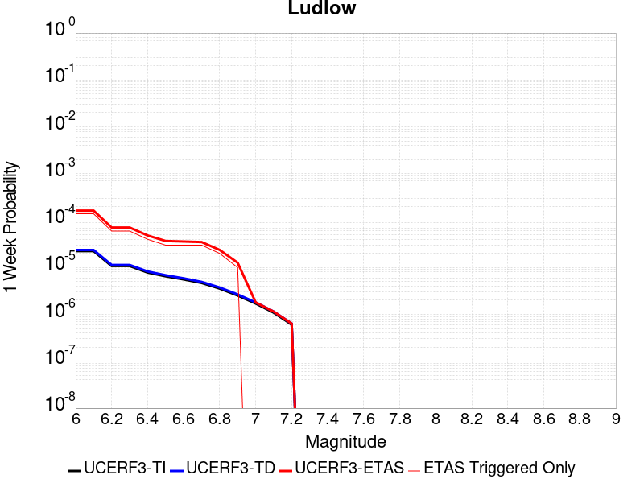 |  |  |  |

| Magnitude | 1 wk TI Prob | 1 wk TD Prob | 1 wk ETAS Prob | 1 wk ETAS/TD Gain | 1 wk ETAS Triggered Only | 1 mo TI Prob | 1 mo TD Prob | 1 mo ETAS Prob | 1 mo ETAS/TD Gain | 1 mo ETAS Triggered Only | 1 yr TI Prob | 1 yr TD Prob | 1 yr ETAS Prob | 1 yr ETAS/TD Gain | 1 yr ETAS Triggered Only | 10 yr TI Prob | 10 yr TD Prob | 10 yr ETAS Prob | 10 yr ETAS/TD Gain | 10 yr ETAS Triggered Only |
|-----|-----|-----|-----|-----|-----|-----|-----|-----|-----|-----|-----|-----|-----|-----|-----|-----|-----|-----|-----|-----|
| 6.0 | 2.2407607E-5 | 2.3657254E-5 | 1.6365394E-4 | 6.9177065 | 1.4E-4 | 9.602906E-5 | 1.0138454E-4 | 2.7136732E-4 | 2.6766143 | 1.7E-4 | 0.0011685267 | 0.001233702 | 0.0014534305 | 1.1781051 | 2.2E-4 | 0.011624013 | 0.012273042 | 0.012539729 | 1.0217295 | 2.7E-4 |
| 6.1 | 2.2407607E-5 | 2.3657254E-5 | 1.6365394E-4 | 6.9177065 | 1.4E-4 | 9.602906E-5 | 1.0138454E-4 | 2.7136732E-4 | 2.6766143 | 1.7E-4 | 0.0011685267 | 0.001233702 | 0.0014534305 | 1.1781051 | 2.2E-4 | 0.011624013 | 0.012273042 | 0.012539729 | 1.0217295 | 2.7E-4 |
| 6.2 | 1.0781252E-5 | 1.1365663E-5 | 7.136498E-5 | 6.2789984 | 6.0E-5 | 4.620455E-5 | 4.8709102E-5 | 1.287052E-4 | 2.6423235 | 8.0E-5 | 5.623952E-4 | 5.9287593E-4 | 7.0281076E-4 | 1.1854262 | 1.1E-4 | 0.00560974 | 0.0059133614 | 0.0060425927 | 1.0218542 | 1.3E-4 |
| 6.3 | 1.0781252E-5 | 1.1365663E-5 | 7.136498E-5 | 6.2789984 | 6.0E-5 | 4.620455E-5 | 4.8709102E-5 | 1.287052E-4 | 2.6423235 | 8.0E-5 | 5.623952E-4 | 5.9287593E-4 | 7.0281076E-4 | 1.1854262 | 1.1E-4 | 0.00560974 | 0.0059133614 | 0.0060425927 | 1.0218542 | 1.3E-4 |
| 6.4 | 7.814439E-6 | 8.237729E-6 | 4.8237398E-5 | 5.855667 | 4.0E-5 | 3.3490025E-5 | 3.530408E-5 | 9.530196E-5 | 2.6994603 | 6.0E-5 | 4.0766477E-4 | 4.2974384E-4 | 5.0970947E-4 | 1.1860774 | 8.0E-5 | 0.0040691774 | 0.0042892746 | 0.0043888455 | 1.023214 | 1.0E-4 |
| 6.5 | 6.4986366E-6 | 6.85092E-6 | 3.6850714E-5 | 5.3789444 | 3.0E-5 | 2.7851002E-5 | 2.9360759E-5 | 6.935959E-5 | 2.3623226 | 4.0E-5 | 3.390332E-4 | 3.5740953E-4 | 4.1738807E-4 | 1.1678146 | 6.0E-5 | 0.003385164 | 0.0035684432 | 0.0036381935 | 1.0195464 | 7.0E-5 |
| 6.6 | 5.582177E-6 | 5.8860055E-6 | 3.588583E-5 | 6.096805 | 3.0E-5 | 2.3923398E-5 | 2.5225498E-5 | 6.522449E-5 | 2.5856571 | 4.0E-5 | 2.9122844E-4 | 3.0707786E-4 | 3.5706253E-4 | 1.1627752 | 5.0E-5 | 0.0029084706 | 0.003066609 | 0.003126425 | 1.0195056 | 6.0E-5 |
| 6.7 | 4.6858763E-6 | 4.940427E-6 | 3.494028E-5 | 7.0723195 | 3.0E-5 | 2.0082172E-5 | 2.1173091E-5 | 6.117224E-5 | 2.8891504 | 4.0E-5 | 2.4447302E-4 | 2.5775246E-4 | 3.0773957E-4 | 1.1939346 | 5.0E-5 | 0.0024420423 | 0.0025745912 | 0.0026344368 | 1.0232446 | 6.0E-5 |
| 6.8 | 3.5584908E-6 | 3.7520183E-6 | 2.3751943E-5 | 6.3304443 | 2.0E-5 | 1.5250586E-5 | 1.6079981E-5 | 4.6079498E-5 | 2.8656437 | 3.0E-5 | 1.8566006E-4 | 1.957566E-4 | 2.3574877E-4 | 1.2042954 | 4.0E-5 | 0.0018550502 | 0.0019558826 | 0.002005785 | 1.0255139 | 5.0E-5 |
| 6.9 | 2.532834E-6 | 2.6710034E-6 | 1.26709765E-5 | 4.7439013 | 1.0E-5 | 1.0854958E-5 | 1.1447109E-5 | 3.144688E-5 | 2.7471461 | 2.0E-5 | 1.3215111E-4 | 1.3935992E-4 | 1.6935574E-4 | 1.2152399 | 3.0E-5 | 0.0013207254 | 0.0013927529 | 0.0014326972 | 1.0286801 | 4.0E-5 |
| 7.0 | 1.7083285E-6 | 1.8019439E-6 | 1.8019439E-6 | 1.0 | 0.0 | 7.3213873E-6 | 7.722595E-6 | 7.722595E-6 | 1.0 | 0.0 | 8.913424E-5 | 9.40187E-5 | 9.40187E-5 | 1.0 | 0.0 | 8.9098496E-4 | 9.3980576E-4 | 9.4979635E-4 | 1.0106305 | 1.0E-5 |
| 7.1 | 1.0905424E-6 | 1.1497619E-6 | 1.1497619E-6 | 1.0 | 0.0 | 4.6737446E-6 | 4.9275427E-6 | 4.9275427E-6 | 1.0 | 0.0 | 5.6901354E-5 | 5.999128E-5 | 5.999128E-5 | 1.0 | 0.0 | 5.6886784E-4 | 5.997606E-4 | 6.0975464E-4 | 1.0166633 | 1.0E-5 |
| 7.2 | 6.06668E-7 | 6.387277E-7 | 6.387277E-7 | 1.0 | 0.0 | 2.600003E-6 | 2.7374022E-6 | 2.7374022E-6 | 1.0 | 0.0 | 3.1654577E-5 | 3.3327433E-5 | 3.3327433E-5 | 1.0 | 0.0 | 3.1650066E-4 | 3.3323118E-4 | 3.4322785E-4 | 1.0299993 | 1.0E-5 |

## San Jacinto (San Bernardino)
*[(top)](#table-of-contents)*

| 1 Week | 1 Month | 1 Year | 10 Year |
|-----|-----|-----|-----|
|  |  |  |  |

| Magnitude | 1 wk TI Prob | 1 wk TD Prob | 1 wk ETAS Prob | 1 wk ETAS/TD Gain | 1 wk ETAS Triggered Only | 1 mo TI Prob | 1 mo TD Prob | 1 mo ETAS Prob | 1 mo ETAS/TD Gain | 1 mo ETAS Triggered Only | 1 yr TI Prob | 1 yr TD Prob | 1 yr ETAS Prob | 1 yr ETAS/TD Gain | 1 yr ETAS Triggered Only | 10 yr TI Prob | 10 yr TD Prob | 10 yr ETAS Prob | 10 yr ETAS/TD Gain | 10 yr ETAS Triggered Only |
|-----|-----|-----|-----|-----|-----|-----|-----|-----|-----|-----|-----|-----|-----|-----|-----|-----|-----|-----|-----|-----|
| 6.0 | 3.409352E-5 | 3.5986508E-5 | 2.6597822E-4 | 7.391054 | 2.3E-4 | 1.461069E-4 | 1.542188E-4 | 4.0418023E-4 | 2.6208236 | 2.5E-4 | 0.0017774 | 0.0018759987 | 0.0021454922 | 1.1436534 | 2.7E-4 | 0.01763251 | 0.019349935 | 0.019624516 | 1.0141903 | 2.8E-4 |
| 6.1 | 3.409352E-5 | 3.5986508E-5 | 2.6597822E-4 | 7.391054 | 2.3E-4 | 1.461069E-4 | 1.542188E-4 | 4.0418023E-4 | 2.6208236 | 2.5E-4 | 0.0017774 | 0.0018759987 | 0.0021454922 | 1.1436534 | 2.7E-4 | 0.01763251 | 0.019349935 | 0.019624516 | 1.0141903 | 2.8E-4 |
| 6.2 | 3.409352E-5 | 3.5986508E-5 | 2.6597822E-4 | 7.391054 | 2.3E-4 | 1.461069E-4 | 1.542188E-4 | 4.0418023E-4 | 2.6208236 | 2.5E-4 | 0.0017774 | 0.0018759987 | 0.0021454922 | 1.1436534 | 2.7E-4 | 0.01763251 | 0.019349935 | 0.019624516 | 1.0141903 | 2.8E-4 |
| 6.3 | 3.409352E-5 | 3.5986508E-5 | 2.6597822E-4 | 7.391054 | 2.3E-4 | 1.461069E-4 | 1.542188E-4 | 4.0418023E-4 | 2.6208236 | 2.5E-4 | 0.0017774 | 0.0018759987 | 0.0021454922 | 1.1436534 | 2.7E-4 | 0.01763251 | 0.019349935 | 0.019624516 | 1.0141903 | 2.8E-4 |
| 6.4 | 3.400795E-5 | 3.5879173E-5 | 2.658709E-4 | 7.4101744 | 2.3E-4 | 1.4574021E-4 | 1.5375883E-4 | 4.037204E-4 | 2.6256728 | 2.5E-4 | 0.0017729428 | 0.0018704084 | 0.0021399034 | 1.1440835 | 2.7E-4 | 0.017588645 | 0.019295016 | 0.019569615 | 1.0142316 | 2.8E-4 |
| 6.5 | 3.341482E-5 | 3.5139812E-5 | 2.551321E-4 | 7.260485 | 2.2E-4 | 1.4319851E-4 | 1.5059051E-4 | 3.9055437E-4 | 2.593486 | 2.4E-4 | 0.0017420477 | 0.0018318989 | 0.0020914227 | 1.1416693 | 2.6E-4 | 0.017284546 | 0.018916558 | 0.01918145 | 1.0140032 | 2.7E-4 |
| 6.6 | 3.3364955E-5 | 3.5077028E-5 | 2.5506932E-4 | 7.271691 | 2.2E-4 | 1.4298483E-4 | 1.5032147E-4 | 3.902854E-4 | 2.5963383 | 2.4E-4 | 0.0017394501 | 0.001828629 | 0.0020881535 | 1.1419231 | 2.6E-4 | 0.017258976 | 0.018884424 | 0.019149324 | 1.0140275 | 2.7E-4 |
| 6.7 | 3.335922E-5 | 3.5066805E-5 | 2.550591E-4 | 7.2735195 | 2.2E-4 | 1.4296026E-4 | 1.5027766E-4 | 3.902416E-4 | 2.596804 | 2.4E-4 | 0.0017391514 | 0.0018280965 | 0.002087621 | 1.1419644 | 2.6E-4 | 0.017256035 | 0.018879214 | 0.019144118 | 1.0140314 | 2.7E-4 |
| 6.8 | 3.327683E-5 | 3.496087E-5 | 2.549532E-4 | 7.2925296 | 2.2E-4 | 1.4260718E-4 | 1.498237E-4 | 3.8978775E-4 | 2.6016428 | 2.4E-4 | 0.0017348597 | 0.0018225788 | 0.002082105 | 1.142395 | 2.6E-4 | 0.017213784 | 0.018824987 | 0.019089904 | 1.0140727 | 2.7E-4 |
| 6.9 | 3.3235785E-5 | 3.4901823E-5 | 2.5489414E-4 | 7.3031754 | 2.2E-4 | 1.4243131E-4 | 1.4957068E-4 | 3.8953478E-4 | 2.6043525 | 2.4E-4 | 0.0017327217 | 0.0018195034 | 0.0020790303 | 1.1426362 | 2.6E-4 | 0.017192734 | 0.018794855 | 0.019059781 | 1.0140957 | 2.7E-4 |
| 7.0 | 3.3197095E-5 | 3.4841752E-5 | 2.548341E-4 | 7.314043 | 2.2E-4 | 1.422655E-4 | 1.4931326E-4 | 3.8927744E-4 | 2.6071188 | 2.4E-4 | 0.0017307063 | 0.0018163746 | 0.0020759024 | 1.1428822 | 2.6E-4 | 0.017172894 | 0.018764233 | 0.019029167 | 1.014119 | 2.7E-4 |
| 7.1 | 3.3129716E-5 | 3.4721965E-5 | 2.5471434E-4 | 7.335827 | 2.2E-4 | 1.4197677E-4 | 1.4879994E-4 | 3.8876422E-4 | 2.6126637 | 2.4E-4 | 0.0017271966 | 0.0018101353 | 0.0020696647 | 1.1433756 | 2.6E-4 | 0.017138338 | 0.018703312 | 0.018968262 | 1.014166 | 2.7E-4 |
| 7.2 | 3.3034008E-5 | 3.458941E-5 | 2.545818E-4 | 7.360108 | 2.2E-4 | 1.4156665E-4 | 1.4823192E-4 | 3.8819635E-4 | 2.6188445 | 2.4E-4 | 0.0017222111 | 0.0018032312 | 0.0020627624 | 1.1439257 | 2.6E-4 | 0.017089253 | 0.018635705 | 0.018900674 | 1.0142183 | 2.7E-4 |
| 7.3 | 3.2956614E-5 | 3.445717E-5 | 2.5444958E-4 | 7.384518 | 2.2E-4 | 1.4123498E-4 | 1.4766524E-4 | 3.8762979E-4 | 2.625058 | 2.4E-4 | 0.0017181796 | 0.0017963431 | 0.0020558762 | 1.1444784 | 2.6E-4 | 0.017049557 | 0.018568452 | 0.01883344 | 1.0142708 | 2.7E-4 |
| 7.4 | 3.2915937E-5 | 3.4378863E-5 | 2.543713E-4 | 7.3990607 | 2.2E-4 | 1.4106068E-4 | 1.4732967E-4 | 3.8729433E-4 | 2.6287596 | 2.4E-4 | 0.0017160608 | 0.0017922645 | 0.0020517986 | 1.1448078 | 2.6E-4 | 0.017028693 | 0.018528719 | 0.018793715 | 1.014302 | 2.7E-4 |
| 7.5 | 3.281791E-5 | 3.4243778E-5 | 2.5423625E-4 | 7.4243045 | 2.2E-4 | 1.406406E-4 | 1.4675081E-4 | 3.8671558E-4 | 2.6351855 | 2.4E-4 | 0.0017109542 | 0.0017852283 | 0.002044764 | 1.1453797 | 2.6E-4 | 0.016978411 | 0.018459605 | 0.018724622 | 1.0143565 | 2.7E-4 |
| 7.6 | 3.2521442E-5 | 3.396873E-5 | 2.5396125E-4 | 7.4763246 | 2.2E-4 | 1.3937015E-4 | 1.4557215E-4 | 3.8553722E-4 | 2.648427 | 2.4E-4 | 0.0016955109 | 0.0017709016 | 0.0020304413 | 1.1465578 | 2.6E-4 | 0.016826328 | 0.018317232 | 0.018582286 | 1.0144702 | 2.7E-4 |
| 7.7 | 3.0287873E-5 | 3.245276E-5 | 2.5244564E-4 | 7.778864 | 2.2E-4 | 1.297987E-4 | 1.3907586E-4 | 3.7904247E-4 | 2.725437 | 2.4E-4 | 0.0015791537 | 0.0016919347 | 0.0019514947 | 1.1534102 | 2.6E-4 | 0.01567979 | 0.01752809 | 0.017793357 | 1.0151339 | 2.7E-4 |
| 7.8 | 2.6316151E-5 | 2.9663592E-5 | 2.3965735E-4 | 8.079176 | 2.1E-4 | 1.1277862E-4 | 1.2712348E-4 | 3.5709425E-4 | 2.8090343 | 2.3E-4 | 0.0013722149 | 0.0015466306 | 0.001796244 | 1.1613917 | 2.5E-4 | 0.013637724 | 0.016069634 | 0.016325455 | 1.0159196 | 2.6E-4 |
| 7.9 | 2.0761147E-5 | 2.34181E-5 | 2.1341364E-4 | 9.113192 | 1.9E-4 | 8.897331E-5 | 1.0035944E-4 | 3.0033936E-4 | 2.9926372 | 2.0E-4 | 0.0010827117 | 0.0012211921 | 0.0014409234 | 1.1799319 | 2.2E-4 | 0.010774517 | 0.012793174 | 0.013020231 | 1.0177484 | 2.3E-4 |
| 8.0 | 1.5738568E-5 | 1.6033575E-5 | 1.460315E-4 | 9.107856 | 1.3E-4 | 6.744926E-5 | 6.871352E-5 | 2.087039E-4 | 3.0373049 | 1.4E-4 | 8.2088535E-4 | 8.3626667E-4 | 9.761496E-4 | 1.1672707 | 1.4E-4 | 0.008178596 | 0.008865921 | 0.009014591 | 1.0167687 | 1.5E-4 |
| 8.1 | 1.0105832E-5 | 8.3304985E-6 | 3.8330247E-5 | 4.6011953 | 3.0E-5 | 4.3309992E-5 | 3.570165E-5 | 6.570058E-5 | 1.8402673 | 3.0E-5 | 5.2717153E-4 | 4.345814E-4 | 4.6456838E-4 | 1.0690019 | 3.0E-5 | 0.005259227 | 0.004677232 | 0.0047070915 | 1.006384 | 3.0E-5 |
| 8.2 | 4.189207E-6 | 1.5784357E-6 | 1.5784357E-6 | 1.0 | 0.0 | 1.7953622E-5 | 6.7647065E-6 | 6.7647065E-6 | 1.0 | 0.0 | 2.1856341E-4 | 8.235722E-5 | 8.235722E-5 | 1.0 | 0.0 | 0.0021834858 | 9.565867E-4 | 9.565867E-4 | 1.0 | 0.0 |
| 8.3 | 1.2758221E-6 | 3.6149942E-7 | 3.6149942E-7 | 1.0 | 0.0 | 5.4677976E-6 | 1.5492824E-6 | 1.5492824E-6 | 1.0 | 0.0 | 6.65684E-5 | 1.8862354E-5 | 1.8862354E-5 | 1.0 | 0.0 | 6.6548464E-4 | 2.2751294E-4 | 2.2751294E-4 | 1.0 | 0.0 |

## Cady
*[(top)](#table-of-contents)*

| 1 Week | 1 Month | 1 Year | 10 Year |
|-----|-----|-----|-----|
|  |  |  |  |

| Magnitude | 1 wk TI Prob | 1 wk TD Prob | 1 wk ETAS Prob | 1 wk ETAS/TD Gain | 1 wk ETAS Triggered Only | 1 mo TI Prob | 1 mo TD Prob | 1 mo ETAS Prob | 1 mo ETAS/TD Gain | 1 mo ETAS Triggered Only | 1 yr TI Prob | 1 yr TD Prob | 1 yr ETAS Prob | 1 yr ETAS/TD Gain | 1 yr ETAS Triggered Only | 10 yr TI Prob | 10 yr TD Prob | 10 yr ETAS Prob | 10 yr ETAS/TD Gain | 10 yr ETAS Triggered Only |
|-----|-----|-----|-----|-----|-----|-----|-----|-----|-----|-----|-----|-----|-----|-----|-----|-----|-----|-----|-----|-----|
| 6.0 | 1.9892565E-5 | 2.1858728E-5 | 1.6185567E-4 | 7.404624 | 1.4E-4 | 8.525106E-5 | 9.3677416E-5 | 2.4366337E-4 | 2.6010897 | 1.5E-4 | 0.0010374374 | 0.0011400167 | 0.0013098229 | 1.1489506 | 1.7E-4 | 0.010326075 | 0.011350701 | 0.011617635 | 1.0235171 | 2.7E-4 |
| 6.1 | 1.9892565E-5 | 2.1858728E-5 | 1.6185567E-4 | 7.404624 | 1.4E-4 | 8.525106E-5 | 9.3677416E-5 | 2.4366337E-4 | 2.6010897 | 1.5E-4 | 0.0010374374 | 0.0011400167 | 0.0013098229 | 1.1489506 | 1.7E-4 | 0.010326075 | 0.011350701 | 0.011617635 | 1.0235171 | 2.7E-4 |
| 6.2 | 1.9892565E-5 | 2.1858728E-5 | 1.6185567E-4 | 7.404624 | 1.4E-4 | 8.525106E-5 | 9.3677416E-5 | 2.4366337E-4 | 2.6010897 | 1.5E-4 | 0.0010374374 | 0.0011400167 | 0.0013098229 | 1.1489506 | 1.7E-4 | 0.010326075 | 0.011350701 | 0.011617635 | 1.0235171 | 2.7E-4 |
| 6.3 | 1.1117327E-5 | 1.2176583E-5 | 8.2175735E-5 | 6.748669 | 7.0E-5 | 4.764482E-5 | 5.2184492E-5 | 1.3218031E-4 | 2.5329425 | 8.0E-5 | 5.7992124E-4 | 6.351925E-4 | 7.35129E-4 | 1.1573325 | 1.0E-4 | 0.0057841022 | 0.0063368753 | 0.0064958613 | 1.025089 | 1.6E-4 |
| 6.4 | 1.1117327E-5 | 1.2176583E-5 | 8.2175735E-5 | 6.748669 | 7.0E-5 | 4.764482E-5 | 5.2184492E-5 | 1.3218031E-4 | 2.5329425 | 8.0E-5 | 5.7992124E-4 | 6.351925E-4 | 7.35129E-4 | 1.1573325 | 1.0E-4 | 0.0057841022 | 0.0063368753 | 0.0064958613 | 1.025089 | 1.6E-4 |
| 6.5 | 6.103093E-6 | 6.672021E-6 | 2.6671887E-5 | 3.9975727 | 2.0E-5 | 2.615585E-5 | 2.8594131E-5 | 5.8593272E-5 | 2.0491364 | 3.0E-5 | 3.1840094E-4 | 3.480905E-4 | 3.880766E-4 | 1.1148727 | 4.0E-5 | 0.0031794512 | 0.0034766865 | 0.0035265128 | 1.0143315 | 5.0E-5 |
| 6.6 | 5.817237E-6 | 6.3656585E-6 | 2.6365531E-5 | 4.1418386 | 2.0E-5 | 2.4930776E-5 | 2.728118E-5 | 5.7280362E-5 | 2.0996292 | 3.0E-5 | 3.034899E-4 | 3.3211018E-4 | 3.720969E-4 | 1.120402 | 4.0E-5 | 0.0030307577 | 0.0033173605 | 0.0033671947 | 1.0150223 | 5.0E-5 |
| 6.7 | 4.8846314E-6 | 5.3405684E-6 | 5.3405684E-6 | 1.0 | 0.0 | 2.0933967E-5 | 2.2888014E-5 | 3.2887787E-5 | 1.4368999 | 1.0E-5 | 2.5484123E-4 | 2.7863772E-4 | 2.9863216E-4 | 1.0717578 | 2.0E-5 | 0.0025454918 | 0.0027840391 | 0.0028139555 | 1.0107458 | 3.0E-5 |
| 6.8 | 1.7788773E-6 | 1.9399079E-6 | 1.9399079E-6 | 1.0 | 0.0 | 7.6237375E-6 | 8.313874E-6 | 8.313874E-6 | 1.0 | 0.0 | 9.281505E-5 | 1.01218284E-4 | 1.01218284E-4 | 1.0 | 0.0 | 9.2776294E-4 | 0.0010118765 | 0.0010118765 | 1.0 | 0.0 |
| 6.9 | 7.5455404E-7 | 8.297092E-7 | 8.297092E-7 | 1.0 | 0.0 | 3.233799E-6 | 3.5558937E-6 | 3.5558937E-6 | 1.0 | 0.0 | 3.937079E-5 | 4.3292483E-5 | 4.3292483E-5 | 1.0 | 0.0 | 3.9363815E-4 | 4.3287344E-4 | 4.3287344E-4 | 1.0 | 0.0 |
| 7.0 | 6.8578805E-7 | 7.541816E-7 | 7.541816E-7 | 1.0 | 0.0 | 2.9390883E-6 | 3.2322048E-6 | 3.2322048E-6 | 1.0 | 0.0 | 3.578281E-5 | 3.9351715E-5 | 3.9351715E-5 | 1.0 | 0.0 | 3.577705E-4 | 3.9347992E-4 | 3.9347992E-4 | 1.0 | 0.0 |

## Red Pass
*[(top)](#table-of-contents)*

| 1 Week | 1 Month | 1 Year | 10 Year |
|-----|-----|-----|-----|
|  |  |  |  |

| Magnitude | 1 wk TI Prob | 1 wk TD Prob | 1 wk ETAS Prob | 1 wk ETAS/TD Gain | 1 wk ETAS Triggered Only | 1 mo TI Prob | 1 mo TD Prob | 1 mo ETAS Prob | 1 mo ETAS/TD Gain | 1 mo ETAS Triggered Only | 1 yr TI Prob | 1 yr TD Prob | 1 yr ETAS Prob | 1 yr ETAS/TD Gain | 1 yr ETAS Triggered Only | 10 yr TI Prob | 10 yr TD Prob | 10 yr ETAS Prob | 10 yr ETAS/TD Gain | 10 yr ETAS Triggered Only |
|-----|-----|-----|-----|-----|-----|-----|-----|-----|-----|-----|-----|-----|-----|-----|-----|-----|-----|-----|-----|-----|
| 6.0 | 8.258278E-6 | 8.551265E-6 | 1.3855015E-4 | 16.2023 | 1.3E-4 | 3.539214E-5 | 3.6647863E-5 | 2.1664127E-4 | 5.9114294 | 1.8E-4 | 4.308141E-4 | 4.4611428E-4 | 6.7601167E-4 | 1.5153329 | 2.3E-4 | 0.0042997985 | 0.004453945 | 0.004702831 | 1.0558801 | 2.5E-4 |
| 6.1 | 3.649988E-6 | 3.7753161E-6 | 6.377509E-5 | 16.892649 | 6.0E-5 | 1.5642712E-5 | 1.6179853E-5 | 8.617872E-5 | 5.326298 | 7.0E-5 | 1.9043336E-4 | 1.9697666E-4 | 2.8695894E-4 | 1.4568169 | 9.0E-5 | 0.0019027026 | 0.001968488 | 0.002058311 | 1.0456303 | 9.0E-5 |
| 6.2 | 3.649988E-6 | 3.7753161E-6 | 6.377509E-5 | 16.892649 | 6.0E-5 | 1.5642712E-5 | 1.6179853E-5 | 8.617872E-5 | 5.326298 | 7.0E-5 | 1.9043336E-4 | 1.9697666E-4 | 2.8695894E-4 | 1.4568169 | 9.0E-5 | 0.0019027026 | 0.001968488 | 0.002058311 | 1.0456303 | 9.0E-5 |
| 6.3 | 1.3924937E-6 | 1.4411166E-6 | 5.1441046E-5 | 35.695267 | 5.0E-5 | 5.9678164E-6 | 6.1762075E-6 | 5.6175897E-5 | 9.095533 | 5.0E-5 | 7.265574E-5 | 7.519415E-5 | 1.3518964E-4 | 1.7978745 | 6.0E-5 | 7.263199E-4 | 7.518258E-4 | 8.117807E-4 | 1.0797458 | 6.0E-5 |
| 6.4 | 1.3924937E-6 | 1.4411166E-6 | 5.1441046E-5 | 35.695267 | 5.0E-5 | 5.9678164E-6 | 6.1762075E-6 | 5.6175897E-5 | 9.095533 | 5.0E-5 | 7.265574E-5 | 7.519415E-5 | 1.3518964E-4 | 1.7978745 | 6.0E-5 | 7.263199E-4 | 7.518258E-4 | 8.117807E-4 | 1.0797458 | 6.0E-5 |
| 6.5 | 9.876812E-7 | 1.0221912E-6 | 4.102215E-5 | 40.13158 | 4.0E-5 | 4.2329125E-6 | 4.3808195E-6 | 4.4380646E-5 | 10.1306715 | 4.0E-5 | 5.153449E-5 | 5.3336476E-5 | 9.333435E-5 | 1.7499158 | 4.0E-5 | 5.1522546E-4 | 5.333648E-4 | 5.733434E-4 | 1.0749556 | 4.0E-5 |

## San Andreas (Creeping Section) 2011 CFM
*[(top)](#table-of-contents)*

| 1 Week | 1 Month | 1 Year | 10 Year |
|-----|-----|-----|-----|
|  |  |  |  |

| Magnitude | 1 wk TI Prob | 1 wk TD Prob | 1 wk ETAS Prob | 1 wk ETAS/TD Gain | 1 wk ETAS Triggered Only | 1 mo TI Prob | 1 mo TD Prob | 1 mo ETAS Prob | 1 mo ETAS/TD Gain | 1 mo ETAS Triggered Only | 1 yr TI Prob | 1 yr TD Prob | 1 yr ETAS Prob | 1 yr ETAS/TD Gain | 1 yr ETAS Triggered Only | 10 yr TI Prob | 10 yr TD Prob | 10 yr ETAS Prob | 10 yr ETAS/TD Gain | 10 yr ETAS Triggered Only |
|-----|-----|-----|-----|-----|-----|-----|-----|-----|-----|-----|-----|-----|-----|-----|-----|-----|-----|-----|-----|-----|
| 6.0 | 5.986481E-4 | 0.001228691 | 0.0013385558 | 1.0894161 | 1.1E-4 | 0.0025631124 | 0.005246795 | 0.005376113 | 1.024647 | 1.3E-4 | 0.030762846 | 0.061203245 | 0.06137223 | 1.002761 | 1.8E-4 | 0.26835477 | 0.425928 | 0.42606005 | 1.00031 | 2.3E-4 |
| 6.1 | 5.015945E-4 | 0.0010230356 | 0.0011029538 | 1.0781187 | 8.0E-5 | 0.00214792 | 0.004369436 | 0.004468999 | 1.0227863 | 1.0E-4 | 0.025839351 | 0.051246606 | 0.05138892 | 1.002777 | 1.5E-4 | 0.23032776 | 0.37284943 | 0.3729686 | 1.0003196 | 1.9E-4 |
| 6.2 | 4.073338E-4 | 8.1157376E-4 | 8.915088E-4 | 1.0984939 | 8.0E-5 | 0.0017445484 | 0.0034683137 | 0.0035679669 | 1.0287324 | 1.0E-4 | 0.021034058 | 0.04093177 | 0.04106604 | 1.0032803 | 1.4E-4 | 0.19150782 | 0.31302592 | 0.31314957 | 1.000395 | 1.8E-4 |
| 6.3 | 3.464099E-4 | 6.7455834E-4 | 7.5450435E-4 | 1.1185161 | 8.0E-5 | 0.0014837692 | 0.0028832308 | 0.0029829426 | 1.0345833 | 1.0E-4 | 0.017915873 | 0.034187846 | 0.03432306 | 1.003955 | 1.4E-4 | 0.16538359 | 0.27130842 | 0.27143958 | 1.0004834 | 1.8E-4 |
| 6.4 | 2.935057E-4 | 5.5516965E-4 | 6.3512527E-4 | 1.1440201 | 8.0E-5 | 0.0012572751 | 0.0023727308 | 0.0024724936 | 1.0420455 | 1.0E-4 | 0.015200248 | 0.02826279 | 0.028398834 | 1.0048136 | 1.4E-4 | 0.14201577 | 0.23297668 | 0.23311473 | 1.0005926 | 1.8E-4 |
| 6.5 | 2.3409708E-4 | 4.2132285E-4 | 5.0128915E-4 | 1.1897981 | 8.0E-5 | 0.0010028875 | 0.0018017791 | 0.001901599 | 1.0554007 | 1.0E-4 | 0.012141965 | 0.021586355 | 0.021723332 | 1.0063456 | 1.4E-4 | 0.11499573 | 0.1868149 | 0.18696128 | 1.0007836 | 1.8E-4 |
| 6.6 | 1.5842178E-4 | 2.5068692E-4 | 3.2066938E-4 | 1.2791628 | 7.0E-5 | 6.7877385E-4 | 0.0010739256 | 0.001163829 | 1.0837147 | 9.0E-5 | 0.0082328 | 0.012995283 | 0.013103854 | 1.0083547 | 1.1E-4 | 0.07934396 | 0.12313759 | 0.123269126 | 1.0010681 | 1.5E-4 |
| 6.7 | 1.5616413E-4 | 2.4605254E-4 | 3.1603532E-4 | 1.284422 | 7.0E-5 | 6.691031E-4 | 0.0010540807 | 0.0011439858 | 1.0852925 | 9.0E-5 | 0.0081159435 | 0.012757154 | 0.012855878 | 1.0077387 | 1.0E-4 | 0.0782586 | 0.12116472 | 0.121287756 | 1.0010154 | 1.4E-4 |
| 6.8 | 1.5538467E-4 | 2.442914E-4 | 3.142743E-4 | 1.286473 | 7.0E-5 | 6.6576427E-4 | 0.001046539 | 0.0011364449 | 1.0859077 | 9.0E-5 | 0.008075596 | 0.012666538 | 0.012765272 | 1.0077949 | 1.0E-4 | 0.07788358 | 0.12039561 | 0.12051875 | 1.0010228 | 1.4E-4 |
| 6.9 | 1.5153569E-4 | 2.3538464E-4 | 3.0536816E-4 | 1.2973156 | 7.0E-5 | 6.49277E-4 | 0.0010084033 | 0.0010983126 | 1.08916 | 9.0E-5 | 0.007876333 | 0.012208726 | 0.012307505 | 1.0080909 | 1.0E-4 | 0.07602952 | 0.11646574 | 0.116589434 | 1.001062 | 1.4E-4 |
| 7.0 | 1.4588932E-4 | 2.2395732E-4 | 2.9394164E-4 | 1.3124895 | 7.0E-5 | 6.250901E-4 | 9.59466E-4 | 0.0010493797 | 1.0937122 | 9.0E-5 | 0.0075839474 | 0.011619428 | 0.011718266 | 1.0085063 | 1.0E-4 | 0.073302895 | 0.11131206 | 0.11143648 | 1.0011177 | 1.4E-4 |
| 7.1 | 1.1565079E-4 | 1.6281323E-4 | 2.3280183E-4 | 1.4298705 | 7.0E-5 | 4.955521E-4 | 6.9758523E-4 | 7.875224E-4 | 1.1289265 | 9.0E-5 | 0.006016669 | 0.008460228 | 0.008559382 | 1.0117201 | 1.0E-4 | 0.058563538 | 0.08366478 | 0.083793074 | 1.0015334 | 1.4E-4 |
| 7.2 | 1.0393792E-4 | 1.4615392E-4 | 2.1614369E-4 | 1.4788772 | 7.0E-5 | 4.4537216E-4 | 6.262243E-4 | 7.1616797E-4 | 1.1436285 | 9.0E-5 | 0.005408933 | 0.0075977976 | 0.007697038 | 1.0130618 | 1.0E-4 | 0.052791595 | 0.07561503 | 0.07574445 | 1.0017115 | 1.4E-4 |
| 7.3 | 9.332884E-5 | 1.2780601E-4 | 1.9779705E-4 | 1.5476351 | 7.0E-5 | 3.999194E-4 | 5.4762565E-4 | 6.375764E-4 | 1.1642559 | 9.0E-5 | 0.0048581534 | 0.0066470946 | 0.00674643 | 1.0149442 | 1.0E-4 | 0.047533102 | 0.06647954 | 0.06661023 | 1.0019659 | 1.4E-4 |
| 7.4 | 8.670252E-5 | 1.1702972E-4 | 1.8702152E-4 | 1.5980687 | 7.0E-5 | 3.715293E-4 | 5.014601E-4 | 5.91415E-4 | 1.1793859 | 9.0E-5 | 0.004513991 | 0.0060883067 | 0.006187698 | 1.0163249 | 1.0E-4 | 0.044233937 | 0.061148684 | 0.061280124 | 1.0021495 | 1.4E-4 |
| 7.5 | 7.3036405E-5 | 9.005699E-5 | 1.4005248E-4 | 1.5551541 | 5.0E-5 | 3.129756E-4 | 3.859015E-4 | 4.5587448E-4 | 1.1813234 | 7.0E-5 | 0.0038038217 | 0.0046882504 | 0.004767875 | 1.016984 | 8.0E-5 | 0.03739367 | 0.047875606 | 0.047980342 | 1.0021876 | 1.1E-4 |
| 7.6 | 6.3935775E-5 | 8.280209E-5 | 1.3279796E-4 | 1.6037995 | 5.0E-5 | 2.7398168E-4 | 3.5481792E-4 | 4.2479308E-4 | 1.1972142 | 7.0E-5 | 0.0033306254 | 0.00431137 | 0.0043910253 | 1.0184755 | 8.0E-5 | 0.032811474 | 0.043990135 | 0.044095296 | 1.0023905 | 1.1E-4 |
| 7.7 | 5.5050095E-5 | 6.661729E-5 | 1.0661463E-4 | 1.6004047 | 4.0E-5 | 2.3590765E-4 | 2.8547147E-4 | 3.4545432E-4 | 1.2101187 | 6.0E-5 | 0.0028683927 | 0.0034700802 | 0.0035398372 | 1.0201025 | 7.0E-5 | 0.0283165 | 0.03579509 | 0.035891507 | 1.0026937 | 1.0E-4 |
| 7.8 | 5.027131E-5 | 6.1627725E-5 | 1.0162526E-4 | 1.6490185 | 4.0E-5 | 2.1543067E-4 | 2.640921E-4 | 3.2407625E-4 | 1.2271335 | 6.0E-5 | 0.0026197135 | 0.003210584 | 0.003280359 | 1.0217329 | 7.0E-5 | 0.025890453 | 0.03312572 | 0.033222407 | 1.0029188 | 1.0E-4 |
| 7.9 | 3.7271806E-5 | 5.0224386E-5 | 9.022238E-5 | 1.7963859 | 4.0E-5 | 1.5972654E-4 | 2.1522962E-4 | 2.752167E-4 | 1.278712 | 6.0E-5 | 0.0019429359 | 0.0026172737 | 0.0026870905 | 1.0266753 | 7.0E-5 | 0.019260362 | 0.027066687 | 0.027154252 | 1.0032351 | 9.0E-5 |
| 8.0 | 2.7310243E-5 | 3.1428404E-5 | 7.1427145E-5 | 2.272694 | 4.0E-5 | 1.17038646E-4 | 1.3468621E-4 | 1.8467948E-4 | 1.3711833 | 5.0E-5 | 0.0014240141 | 0.0016385721 | 0.0016884902 | 1.0304644 | 5.0E-5 | 0.014149235 | 0.01721387 | 0.017272836 | 1.0034256 | 6.0E-5 |
| 8.1 | 1.7940547E-5 | 1.7400796E-5 | 2.7400622E-5 | 1.5746764 | 1.0E-5 | 7.688579E-5 | 7.457271E-5 | 9.457122E-5 | 1.2681746 | 2.0E-5 | 9.3568244E-4 | 9.075451E-4 | 9.2752697E-4 | 1.0220175 | 2.0E-5 | 0.009317525 | 0.009799073 | 0.009818878 | 1.002021 | 2.0E-5 |
| 8.2 | 8.643924E-6 | 5.4748625E-6 | 5.4748625E-6 | 1.0 | 0.0 | 3.704486E-5 | 2.3463486E-5 | 2.3463486E-5 | 1.0 | 0.0 | 4.5092785E-4 | 2.8563058E-4 | 2.8563058E-4 | 1.0 | 0.0 | 0.0045001395 | 0.0032487072 | 0.0032487072 | 1.0 | 0.0 |
| 8.3 | 1.983087E-6 | 7.6599065E-7 | 7.6599065E-7 | 1.0 | 0.0 | 8.498917E-6 | 3.282813E-6 | 3.282813E-6 | 1.0 | 0.0 | 1.034694E-4 | 3.9967534E-5 | 3.9967534E-5 | 1.0 | 0.0 | 0.0010342124 | 4.719687E-4 | 4.719687E-4 | 1.0 | 0.0 |

## Death Valley (Fish Lake Valley)
*[(top)](#table-of-contents)*

| 1 Week | 1 Month | 1 Year | 10 Year |
|-----|-----|-----|-----|
|  |  |  |  |

| Magnitude | 1 wk TI Prob | 1 wk TD Prob | 1 wk ETAS Prob | 1 wk ETAS/TD Gain | 1 wk ETAS Triggered Only | 1 mo TI Prob | 1 mo TD Prob | 1 mo ETAS Prob | 1 mo ETAS/TD Gain | 1 mo ETAS Triggered Only | 1 yr TI Prob | 1 yr TD Prob | 1 yr ETAS Prob | 1 yr ETAS/TD Gain | 1 yr ETAS Triggered Only | 10 yr TI Prob | 10 yr TD Prob | 10 yr ETAS Prob | 10 yr ETAS/TD Gain | 10 yr ETAS Triggered Only |
|-----|-----|-----|-----|-----|-----|-----|-----|-----|-----|-----|-----|-----|-----|-----|-----|-----|-----|-----|-----|-----|
| 6.0 | 3.872328E-5 | 4.7267473E-5 | 1.7726133E-4 | 3.7501757 | 1.3E-4 | 1.6594635E-4 | 2.0256084E-4 | 3.425325E-4 | 1.6910104 | 1.4E-4 | 0.0020185246 | 0.002463534 | 0.0026430907 | 1.0728858 | 1.8E-4 | 0.02000288 | 0.024388181 | 0.024593059 | 1.0084007 | 2.1E-4 |
| 6.1 | 3.872328E-5 | 4.7267473E-5 | 1.7726133E-4 | 3.7501757 | 1.3E-4 | 1.6594635E-4 | 2.0256084E-4 | 3.425325E-4 | 1.6910104 | 1.4E-4 | 0.0020185246 | 0.002463534 | 0.0026430907 | 1.0728858 | 1.8E-4 | 0.02000288 | 0.024388181 | 0.024593059 | 1.0084007 | 2.1E-4 |
| 6.2 | 3.872328E-5 | 4.7267473E-5 | 1.7726133E-4 | 3.7501757 | 1.3E-4 | 1.6594635E-4 | 2.0256084E-4 | 3.425325E-4 | 1.6910104 | 1.4E-4 | 0.0020185246 | 0.002463534 | 0.0026430907 | 1.0728858 | 1.8E-4 | 0.02000288 | 0.024388181 | 0.024593059 | 1.0084007 | 2.1E-4 |
| 6.3 | 2.8356371E-5 | 3.3609853E-5 | 1.6360548E-4 | 4.8677835 | 1.3E-4 | 1.2152165E-4 | 1.4403471E-4 | 2.8401456E-4 | 1.9718479 | 1.4E-4 | 0.0014785219 | 0.0017522911 | 0.0019319757 | 1.1025426 | 1.8E-4 | 0.014687235 | 0.017391782 | 0.01759813 | 1.0118647 | 2.1E-4 |
| 6.4 | 2.8356371E-5 | 3.3609853E-5 | 1.6360548E-4 | 4.8677835 | 1.3E-4 | 1.2152165E-4 | 1.4403471E-4 | 2.8401456E-4 | 1.9718479 | 1.4E-4 | 0.0014785219 | 0.0017522911 | 0.0019319757 | 1.1025426 | 1.8E-4 | 0.014687235 | 0.017391782 | 0.01759813 | 1.0118647 | 2.1E-4 |
| 6.5 | 2.4448687E-5 | 2.8607552E-5 | 1.5860383E-4 | 5.5441246 | 1.3E-4 | 1.0477588E-4 | 1.2259831E-4 | 2.6258116E-4 | 2.1418006 | 1.4E-4 | 0.0012748998 | 0.0014916632 | 0.0016713946 | 1.1204907 | 1.8E-4 | 0.012676105 | 0.014821377 | 0.015028264 | 1.0139587 | 2.1E-4 |
| 6.6 | 2.1298161E-5 | 2.4660083E-5 | 1.5465688E-4 | 6.2715473 | 1.3E-4 | 9.127464E-5 | 1.0568198E-4 | 2.4566718E-4 | 2.324589 | 1.4E-4 | 0.0011107022 | 0.0012859525 | 0.001465721 | 1.1397941 | 1.8E-4 | 0.011051672 | 0.012788526 | 0.01299584 | 1.0162109 | 2.1E-4 |
| 6.7 | 1.8959729E-5 | 2.1781025E-5 | 1.517782E-4 | 6.9683676 | 1.3E-4 | 8.125345E-5 | 9.334405E-5 | 2.3333098E-4 | 2.4996877 | 1.4E-4 | 9.888117E-4 | 0.001135897 | 0.0013156924 | 1.158285 | 1.8E-4 | 0.009844234 | 0.01130357 | 0.011511196 | 1.0183682 | 2.1E-4 |
| 6.8 | 1.6691629E-5 | 1.9018353E-5 | 1.4901588E-4 | 7.835373 | 1.3E-4 | 7.153359E-5 | 8.150477E-5 | 2.2149336E-4 | 2.7175508 | 1.4E-4 | 8.7057345E-4 | 9.918857E-4 | 0.0011617171 | 1.1712207 | 1.7E-4 | 0.008671708 | 0.009876343 | 0.010074369 | 1.0200504 | 2.0E-4 |
| 6.9 | 1.450505E-5 | 1.638954E-5 | 1.3638758E-4 | 8.321623 | 1.2E-4 | 6.216302E-5 | 7.0239046E-5 | 2.0022992E-4 | 2.8506925 | 1.3E-4 | 7.5657194E-4 | 8.5483363E-4 | 0.0010146969 | 1.1870109 | 1.6E-4 | 0.007540013 | 0.008516385 | 0.008704768 | 1.0221199 | 1.9E-4 |
| 7.0 | 1.2940855E-5 | 1.4537972E-5 | 1.3453623E-4 | 9.254127 | 1.2E-4 | 5.545963E-5 | 6.230414E-5 | 1.9229604E-4 | 3.0864089 | 1.3E-4 | 6.750118E-4 | 7.5829466E-4 | 9.1817335E-4 | 1.2108397 | 1.6E-4 | 0.006729651 | 0.0075576897 | 0.007746254 | 1.0249499 | 1.9E-4 |
| 7.1 | 1.2544658E-5 | 1.4078208E-5 | 1.3407652E-4 | 9.523692 | 1.2E-4 | 5.3761712E-5 | 6.0333812E-5 | 1.9032597E-4 | 3.1545491 | 1.3E-4 | 6.5435225E-4 | 7.343222E-4 | 8.942047E-4 | 1.217728 | 1.6E-4 | 0.006524288 | 0.007319551 | 0.00750816 | 1.0257679 | 1.9E-4 |
| 7.2 | 1.2489416E-5 | 1.4015674E-5 | 1.3401399E-4 | 9.561723 | 1.2E-4 | 5.3524967E-5 | 6.0065824E-5 | 1.9005801E-4 | 3.1641624 | 1.3E-4 | 6.514716E-4 | 7.310616E-4 | 8.909447E-4 | 1.2186998 | 1.6E-4 | 0.006495651 | 0.0072871596 | 0.007475775 | 1.0258833 | 1.9E-4 |
| 7.3 | 1.2368307E-5 | 1.3879812E-5 | 1.3387814E-4 | 9.64553 | 1.2E-4 | 5.3005948E-5 | 5.9483587E-5 | 1.8947585E-4 | 3.1853468 | 1.3E-4 | 6.451563E-4 | 7.2397763E-4 | 8.838618E-4 | 1.2208413 | 1.6E-4 | 0.0064328653 | 0.007216782 | 0.0074054105 | 1.0261375 | 1.9E-4 |
| 7.4 | 1.2161707E-5 | 1.36478675E-5 | 1.3364623E-4 | 9.792462 | 1.2E-4 | 5.212056E-5 | 5.8489582E-5 | 1.8848198E-4 | 3.222488 | 1.3E-4 | 6.3438306E-4 | 7.118836E-4 | 8.717697E-4 | 1.2245959 | 1.6E-4 | 0.006325751 | 0.0070966207 | 0.0072852722 | 1.0265833 | 1.9E-4 |
| 7.5 | 1.1707948E-5 | 1.3145515E-5 | 1.3314394E-4 | 10.1284685 | 1.2E-4 | 5.0175953E-5 | 5.6336736E-5 | 1.8632942E-4 | 3.3074229 | 1.3E-4 | 6.10721E-4 | 6.856895E-4 | 8.455798E-4 | 1.2331817 | 1.6E-4 | 0.0060904534 | 0.006836321 | 0.0070250225 | 1.0276027 | 1.9E-4 |
| 7.6 | 1.0319538E-5 | 1.1579622E-5 | 1.3157823E-4 | 11.362912 | 1.2E-4 | 4.4225842E-5 | 4.9626036E-5 | 1.7961959E-4 | 3.6194625 | 1.3E-4 | 5.383166E-4 | 6.040347E-4 | 7.6393806E-4 | 1.2647254 | 1.6E-4 | 0.0053701443 | 0.0060244603 | 0.0062133158 | 1.0313481 | 1.9E-4 |
| 7.7 | 8.937764E-6 | 1.0022779E-5 | 1.2002168E-4 | 11.97489 | 1.1E-4 | 3.830414E-5 | 4.295409E-5 | 1.6294894E-4 | 3.7935605 | 1.2E-4 | 4.6625308E-4 | 5.228456E-4 | 6.727672E-4 | 1.2867416 | 1.5E-4 | 0.0046527605 | 0.005216664 | 0.0053857774 | 1.0324179 | 1.7E-4 |
| 7.8 | 3.108007E-7 | 3.284654E-7 | 3.284654E-7 | 1.0 | 0.0 | 1.3320023E-6 | 1.407708E-6 | 1.407708E-6 | 1.0 | 0.0 | 1.6217007E-5 | 1.7138715E-5 | 1.7138715E-5 | 1.0 | 0.0 | 1.6215823E-4 | 1.7137431E-4 | 1.7137431E-4 | 1.0 | 0.0 |
| 7.9 | 2.5591178E-9 | 2.6696718E-9 | 2.6696718E-9 | 1.0 | 0.0 | 1.0967647E-8 | 1.14414505E-8 | 1.14414505E-8 | 1.0 | 0.0 | 1.335311E-7 | 1.3929966E-7 | 1.3929966E-7 | 1.0 | 0.0 | 1.3353102E-6 | 1.3929966E-6 | 1.3929966E-6 | 1.0 | 0.0 |

## Manix-Afton Hills
*[(top)](#table-of-contents)*

| 1 Week | 1 Month | 1 Year | 10 Year |
|-----|-----|-----|-----|
|  |  |  |  |

| Magnitude | 1 wk TI Prob | 1 wk TD Prob | 1 wk ETAS Prob | 1 wk ETAS/TD Gain | 1 wk ETAS Triggered Only | 1 mo TI Prob | 1 mo TD Prob | 1 mo ETAS Prob | 1 mo ETAS/TD Gain | 1 mo ETAS Triggered Only | 1 yr TI Prob | 1 yr TD Prob | 1 yr ETAS Prob | 1 yr ETAS/TD Gain | 1 yr ETAS Triggered Only | 10 yr TI Prob | 10 yr TD Prob | 10 yr ETAS Prob | 10 yr ETAS/TD Gain | 10 yr ETAS Triggered Only |
|-----|-----|-----|-----|-----|-----|-----|-----|-----|-----|-----|-----|-----|-----|-----|-----|-----|-----|-----|-----|-----|
| 6.0 | 1.3783202E-5 | 1.47110895E-5 | 1.2470948E-4 | 8.477242 | 1.1E-4 | 5.906953E-5 | 6.30461E-5 | 1.9303791E-4 | 3.0618532 | 1.3E-4 | 7.189342E-4 | 7.6733343E-4 | 9.37203E-4 | 1.2213764 | 1.7E-4 | 0.0071661277 | 0.007648596 | 0.007856989 | 1.027246 | 2.1E-4 |
| 6.1 | 1.3783202E-5 | 1.47110895E-5 | 1.2470948E-4 | 8.477242 | 1.1E-4 | 5.906953E-5 | 6.30461E-5 | 1.9303791E-4 | 3.0618532 | 1.3E-4 | 7.189342E-4 | 7.6733343E-4 | 9.37203E-4 | 1.2213764 | 1.7E-4 | 0.0071661277 | 0.007648596 | 0.007856989 | 1.027246 | 2.1E-4 |
| 6.2 | 1.3783202E-5 | 1.47110895E-5 | 1.2470948E-4 | 8.477242 | 1.1E-4 | 5.906953E-5 | 6.30461E-5 | 1.9303791E-4 | 3.0618532 | 1.3E-4 | 7.189342E-4 | 7.6733343E-4 | 9.37203E-4 | 1.2213764 | 1.7E-4 | 0.0071661277 | 0.007648596 | 0.007856989 | 1.027246 | 2.1E-4 |
| 6.3 | 1.10494875E-5 | 1.1793136E-5 | 1.0179207E-4 | 8.631468 | 9.0E-5 | 4.7354086E-5 | 5.054109E-5 | 1.5053604E-4 | 2.9784882 | 1.0E-4 | 5.763835E-4 | 6.151744E-4 | 7.550883E-4 | 1.2274377 | 1.4E-4 | 0.005748908 | 0.0061357557 | 0.0063047125 | 1.0275364 | 1.7E-4 |
| 6.4 | 1.10494875E-5 | 1.1793136E-5 | 1.0179207E-4 | 8.631468 | 9.0E-5 | 4.7354086E-5 | 5.054109E-5 | 1.5053604E-4 | 2.9784882 | 1.0E-4 | 5.763835E-4 | 6.151744E-4 | 7.550883E-4 | 1.2274377 | 1.4E-4 | 0.005748908 | 0.0061357557 | 0.0063047125 | 1.0275364 | 1.7E-4 |
| 6.5 | 9.788949E-6 | 1.045432E-5 | 8.045359E-5 | 7.695727 | 7.0E-5 | 4.1951964E-5 | 4.480351E-5 | 1.2479993E-4 | 2.7854943 | 8.0E-5 | 5.1064545E-4 | 5.453555E-4 | 6.6529005E-4 | 1.2199199 | 1.2E-4 | 0.0050947363 | 0.0054410985 | 0.005580337 | 1.0255901 | 1.4E-4 |
| 6.6 | 8.810006E-6 | 9.4136285E-6 | 6.9413065E-5 | 7.373678 | 6.0E-5 | 3.775662E-5 | 4.0343548E-5 | 1.1034072E-4 | 2.7350278 | 7.0E-5 | 4.5958988E-4 | 4.9108086E-4 | 5.9103174E-4 | 1.2035325 | 1.0E-4 | 0.0045864056 | 0.004900839 | 0.005020251 | 1.0243655 | 1.2E-4 |
| 6.7 | 8.80128E-6 | 9.404108E-6 | 6.940354E-5 | 7.3801303 | 6.0E-5 | 3.7719226E-5 | 4.0302748E-5 | 1.1029992E-4 | 2.7367842 | 7.0E-5 | 4.591348E-4 | 4.9058435E-4 | 5.905353E-4 | 1.2037386 | 1.0E-4 | 0.004581874 | 0.0048958957 | 0.0050153085 | 1.0243903 | 1.2E-4 |
| 6.8 | 6.8994877E-6 | 7.380076E-6 | 6.737963E-5 | 9.129937 | 6.0E-5 | 2.9568899E-5 | 3.162856E-5 | 9.1626665E-5 | 2.8969598 | 6.0E-5 | 3.5994186E-4 | 3.8501783E-4 | 4.749832E-4 | 1.2336653 | 9.0E-5 | 0.003593594 | 0.0038443129 | 0.00395389 | 1.0285037 | 1.1E-4 |
| 6.9 | 4.9328037E-6 | 5.2709615E-6 | 5.52707E-5 | 10.485886 | 5.0E-5 | 2.1140417E-5 | 2.2589675E-5 | 7.258855E-5 | 3.2133508 | 5.0E-5 | 2.5735417E-4 | 2.7500073E-4 | 3.4498147E-4 | 1.2544748 | 7.0E-5 | 0.0025705635 | 0.0027472095 | 0.0028269896 | 1.0290405 | 8.0E-5 |
| 7.0 | 3.347973E-6 | 3.59003E-6 | 2.3589959E-5 | 6.5709643 | 2.0E-5 | 1.4348378E-5 | 1.5385775E-5 | 3.5385467E-5 | 2.299882 | 2.0E-5 | 1.746775E-4 | 1.8730981E-4 | 2.2730233E-4 | 1.2135099 | 4.0E-5 | 0.0017454025 | 0.0018719219 | 0.001911847 | 1.0213284 | 4.0E-5 |
| 7.1 | 1.2073567E-6 | 1.293482E-6 | 1.12934695E-5 | 8.73106 | 1.0E-5 | 5.1743755E-6 | 5.543492E-6 | 1.5543437E-5 | 2.8039072 | 1.0E-5 | 6.29962E-5 | 6.749156E-5 | 7.7490884E-5 | 1.1481566 | 1.0E-5 | 6.297835E-4 | 6.7487074E-4 | 6.84864E-4 | 1.0148077 | 1.0E-5 |

## Lake Isabella (Seismicity)
*[(top)](#table-of-contents)*

| 1 Week | 1 Month | 1 Year | 10 Year |
|-----|-----|-----|-----|
|  |  |  |  |

| Magnitude | 1 wk TI Prob | 1 wk TD Prob | 1 wk ETAS Prob | 1 wk ETAS/TD Gain | 1 wk ETAS Triggered Only | 1 mo TI Prob | 1 mo TD Prob | 1 mo ETAS Prob | 1 mo ETAS/TD Gain | 1 mo ETAS Triggered Only | 1 yr TI Prob | 1 yr TD Prob | 1 yr ETAS Prob | 1 yr ETAS/TD Gain | 1 yr ETAS Triggered Only | 10 yr TI Prob | 10 yr TD Prob | 10 yr ETAS Prob | 10 yr ETAS/TD Gain | 10 yr ETAS Triggered Only |
|-----|-----|-----|-----|-----|-----|-----|-----|-----|-----|-----|-----|-----|-----|-----|-----|-----|-----|-----|-----|-----|
| 6.0 | 9.431637E-6 | 9.741651E-6 | 1.4974028E-4 | 15.37114 | 1.4E-4 | 4.0420677E-5 | 4.1749343E-5 | 1.817435E-4 | 4.353206 | 1.4E-4 | 4.920106E-4 | 5.0819275E-4 | 6.781064E-4 | 1.3343488 | 1.7E-4 | 0.004909227 | 0.005071599 | 0.0052705845 | 1.0392354 | 2.0E-4 |
| 6.1 | 9.431637E-6 | 9.741651E-6 | 1.4974028E-4 | 15.37114 | 1.4E-4 | 4.0420677E-5 | 4.1749343E-5 | 1.817435E-4 | 4.353206 | 1.4E-4 | 4.920106E-4 | 5.0819275E-4 | 6.781064E-4 | 1.3343488 | 1.7E-4 | 0.004909227 | 0.005071599 | 0.0052705845 | 1.0392354 | 2.0E-4 |
| 6.2 | 9.431637E-6 | 9.741651E-6 | 1.4974028E-4 | 15.37114 | 1.4E-4 | 4.0420677E-5 | 4.1749343E-5 | 1.817435E-4 | 4.353206 | 1.4E-4 | 4.920106E-4 | 5.0819275E-4 | 6.781064E-4 | 1.3343488 | 1.7E-4 | 0.004909227 | 0.005071599 | 0.0052705845 | 1.0392354 | 2.0E-4 |
| 6.3 | 9.431637E-6 | 9.741651E-6 | 1.4974028E-4 | 15.37114 | 1.4E-4 | 4.0420677E-5 | 4.1749343E-5 | 1.817435E-4 | 4.353206 | 1.4E-4 | 4.920106E-4 | 5.0819275E-4 | 6.781064E-4 | 1.3343488 | 1.7E-4 | 0.004909227 | 0.005071599 | 0.0052705845 | 1.0392354 | 2.0E-4 |
| 6.4 | 5.144063E-6 | 5.3000763E-6 | 9.52996E-5 | 17.980799 | 9.0E-5 | 2.2045799E-5 | 2.2714434E-5 | 1.1271239E-4 | 4.962148 | 9.0E-5 | 2.6837454E-4 | 2.765166E-4 | 3.964834E-4 | 1.4338503 | 1.2E-4 | 0.0026805066 | 0.0027620657 | 0.0028917065 | 1.0469363 | 1.3E-4 |
| 6.5 | 5.144063E-6 | 5.3000763E-6 | 9.52996E-5 | 17.980799 | 9.0E-5 | 2.2045799E-5 | 2.2714434E-5 | 1.1271239E-4 | 4.962148 | 9.0E-5 | 2.6837454E-4 | 2.765166E-4 | 3.964834E-4 | 1.4338503 | 1.2E-4 | 0.0026805066 | 0.0027620657 | 0.0028917065 | 1.0469363 | 1.3E-4 |
| 6.6 | 3.4009804E-6 | 3.498786E-6 | 6.349858E-5 | 18.148745 | 6.0E-5 | 1.4575549E-5 | 1.4994721E-5 | 7.499382E-5 | 5.0013485 | 6.0E-5 | 1.7744285E-4 | 1.8254704E-4 | 2.5253426E-4 | 1.3833928 | 7.0E-5 | 0.0017730123 | 0.0018241286 | 0.0018940009 | 1.0383044 | 7.0E-5 |
| 6.7 | 3.3880428E-6 | 3.4856528E-6 | 6.3485444E-5 | 18.213358 | 6.0E-5 | 1.4520103E-5 | 1.4938435E-5 | 7.493754E-5 | 5.0164247 | 6.0E-5 | 1.767679E-4 | 1.8186188E-4 | 2.5184915E-4 | 1.3848375 | 7.0E-5 | 0.0017662736 | 0.0018172882 | 0.001887161 | 1.0384489 | 7.0E-5 |
| 6.8 | 2.6582E-6 | 2.7337003E-6 | 4.273359E-5 | 15.632142 | 4.0E-5 | 1.1392236E-5 | 1.1715813E-5 | 5.1715346E-5 | 4.414149 | 4.0E-5 | 1.3869164E-4 | 1.4263204E-4 | 1.926249E-4 | 1.3505024 | 5.0E-5 | 0.0013860512 | 0.0014255369 | 0.0014754656 | 1.0350245 | 5.0E-5 |
| 6.9 | 2.406011E-6 | 2.4743288E-6 | 4.247423E-5 | 17.16596 | 4.0E-5 | 1.0311434E-5 | 1.0604231E-5 | 5.0603805E-5 | 4.7720394 | 4.0E-5 | 1.2553448E-4 | 1.2910018E-4 | 1.7909372E-4 | 1.3872461 | 5.0E-5 | 0.0012546359 | 0.0012903814 | 0.001340317 | 1.0386982 | 5.0E-5 |
| 7.0 | 1.6953097E-6 | 1.7429371E-6 | 2.1742902E-5 | 12.474863 | 2.0E-5 | 7.265593E-6 | 7.469715E-6 | 2.7469567E-5 | 3.6774583 | 2.0E-5 | 8.8455E-5 | 9.094104E-5 | 1.1093922E-4 | 1.2199028 | 2.0E-5 | 8.84198E-4 | 9.09141E-4 | 9.291228E-4 | 1.0219787 | 2.0E-5 |
| 7.1 | 3.5013824E-7 | 3.5714822E-7 | 1.0357145E-5 | 28.999569 | 1.0E-5 | 1.5005916E-6 | 1.5306344E-6 | 1.1530619E-5 | 7.533229 | 1.0E-5 | 1.826955E-5 | 1.8635317E-5 | 2.8635131E-5 | 1.5366055 | 1.0E-5 | 1.8268047E-4 | 1.863378E-4 | 1.9633592E-4 | 1.053656 | 1.0E-5 |
| 7.2 | 2.2321095E-7 | 2.2750574E-7 | 1.02275035E-5 | 44.954926 | 1.0E-5 | 9.56618E-7 | 9.750242E-7 | 1.0975014E-5 | 11.2561455 | 1.0E-5 | 1.1646762E-5 | 1.1870856E-5 | 2.1870737E-5 | 1.8423892 | 1.0E-5 | 1.1646151E-4 | 1.1870232E-4 | 1.2870114E-4 | 1.0842344 | 1.0E-5 |
| 7.3 | 1.5760406E-7 | 1.6060922E-7 | 1.6060922E-7 | 1.0 | 0.0 | 6.7544585E-7 | 6.8832503E-7 | 6.8832503E-7 | 1.0 | 0.0 | 8.223522E-6 | 8.380326E-6 | 8.380326E-6 | 1.0 | 0.0 | 8.2232174E-5 | 8.3800165E-5 | 8.3800165E-5 | 1.0 | 0.0 |
| 7.4 | 1.1216497E-7 | 1.1431706E-7 | 1.1431706E-7 | 1.0 | 0.0 | 4.8070694E-7 | 4.899302E-7 | 4.899302E-7 | 1.0 | 0.0 | 5.852591E-6 | 5.964884E-6 | 5.964884E-6 | 1.0 | 0.0 | 5.8524372E-5 | 5.9647282E-5 | 5.9647282E-5 | 1.0 | 0.0 |
| 7.5 | 4.885185E-8 | 4.9787737E-8 | 4.9787737E-8 | 1.0 | 0.0 | 2.0936506E-7 | 2.13376E-7 | 2.13376E-7 | 1.0 | 0.0 | 2.5490165E-6 | 2.59785E-6 | 2.59785E-6 | 1.0 | 0.0 | 2.5489873E-5 | 2.5978214E-5 | 2.5978214E-5 | 1.0 | 0.0 |
| 7.6 | 1.504641E-9 | 1.5317903E-9 | 1.5317903E-9 | 1.0 | 0.0 | 6.4484613E-9 | 6.5648154E-9 | 6.5648154E-9 | 1.0 | 0.0 | 7.851001E-8 | 7.992663E-8 | 7.992663E-8 | 1.0 | 0.0 | 7.8509987E-7 | 7.992663E-7 | 7.992663E-7 | 1.0 | 0.0 |

## San Jacinto (San Jacinto Valley) rev
*[(top)](#table-of-contents)*

| 1 Week | 1 Month | 1 Year | 10 Year |
|-----|-----|-----|-----|
|  |  |  |  |

| Magnitude | 1 wk TI Prob | 1 wk TD Prob | 1 wk ETAS Prob | 1 wk ETAS/TD Gain | 1 wk ETAS Triggered Only | 1 mo TI Prob | 1 mo TD Prob | 1 mo ETAS Prob | 1 mo ETAS/TD Gain | 1 mo ETAS Triggered Only | 1 yr TI Prob | 1 yr TD Prob | 1 yr ETAS Prob | 1 yr ETAS/TD Gain | 1 yr ETAS Triggered Only | 10 yr TI Prob | 10 yr TD Prob | 10 yr ETAS Prob | 10 yr ETAS/TD Gain | 10 yr ETAS Triggered Only |
|-----|-----|-----|-----|-----|-----|-----|-----|-----|-----|-----|-----|-----|-----|-----|-----|-----|-----|-----|-----|-----|
| 6.0 | 3.652694E-5 | 3.4402394E-5 | 2.0439655E-4 | 5.9413466 | 1.7E-4 | 1.5653463E-4 | 1.474305E-4 | 3.2740398E-4 | 2.2207341 | 1.8E-4 | 0.0019041431 | 0.00179349 | 0.0019831492 | 1.1057487 | 1.9E-4 | 0.018879099 | 0.018526595 | 0.01872289 | 1.0105953 | 2.0E-4 |
| 6.1 | 3.652694E-5 | 3.4402394E-5 | 2.0439655E-4 | 5.9413466 | 1.7E-4 | 1.5653463E-4 | 1.474305E-4 | 3.2740398E-4 | 2.2207341 | 1.8E-4 | 0.0019041431 | 0.00179349 | 0.0019831492 | 1.1057487 | 1.9E-4 | 0.018879099 | 0.018526595 | 0.01872289 | 1.0105953 | 2.0E-4 |
| 6.2 | 3.652694E-5 | 3.4402394E-5 | 2.0439655E-4 | 5.9413466 | 1.7E-4 | 1.5653463E-4 | 1.474305E-4 | 3.2740398E-4 | 2.2207341 | 1.8E-4 | 0.0019041431 | 0.00179349 | 0.0019831492 | 1.1057487 | 1.9E-4 | 0.018879099 | 0.018526595 | 0.01872289 | 1.0105953 | 2.0E-4 |
| 6.3 | 3.652694E-5 | 3.4402394E-5 | 2.0439655E-4 | 5.9413466 | 1.7E-4 | 1.5653463E-4 | 1.474305E-4 | 3.2740398E-4 | 2.2207341 | 1.8E-4 | 0.0019041431 | 0.00179349 | 0.0019831492 | 1.1057487 | 1.9E-4 | 0.018879099 | 0.018526595 | 0.01872289 | 1.0105953 | 2.0E-4 |
| 6.4 | 3.646941E-5 | 3.432397E-5 | 2.0431813E-4 | 5.952637 | 1.7E-4 | 1.5628811E-4 | 1.4709444E-4 | 3.2706797E-4 | 2.2235236 | 1.8E-4 | 0.0019011468 | 0.0017894056 | 0.0019790656 | 1.1059905 | 1.9E-4 | 0.018849645 | 0.018486476 | 0.018682778 | 1.0106187 | 2.0E-4 |
| 6.5 | 3.646941E-5 | 3.432397E-5 | 2.0431813E-4 | 5.952637 | 1.7E-4 | 1.5628811E-4 | 1.4709444E-4 | 3.2706797E-4 | 2.2235236 | 1.8E-4 | 0.0019011468 | 0.0017894056 | 0.0019790656 | 1.1059905 | 1.9E-4 | 0.018849645 | 0.018486476 | 0.018682778 | 1.0106187 | 2.0E-4 |
| 6.6 | 3.6442503E-5 | 3.4287354E-5 | 2.0428153E-4 | 5.9579263 | 1.7E-4 | 1.561728E-4 | 1.4693754E-4 | 3.269111E-4 | 2.2248304 | 1.8E-4 | 0.0018997455 | 0.0017874985 | 0.001977159 | 1.1061038 | 1.9E-4 | 0.018835869 | 0.018467745 | 0.01866405 | 1.0106297 | 2.0E-4 |
| 6.7 | 3.6432113E-5 | 3.4272925E-5 | 2.042671E-4 | 5.9600134 | 1.7E-4 | 1.5612828E-4 | 1.4687571E-4 | 3.268493E-4 | 2.2253458 | 1.8E-4 | 0.0018992044 | 0.0017867472 | 0.0019764078 | 1.1061485 | 1.9E-4 | 0.018830549 | 0.018460369 | 0.018656677 | 1.0106341 | 2.0E-4 |
| 6.8 | 3.6409598E-5 | 3.424198E-5 | 2.0423616E-4 | 5.964496 | 1.7E-4 | 1.560318E-4 | 1.4674311E-4 | 3.267167E-4 | 2.2264533 | 1.8E-4 | 0.0018980318 | 0.0017851355 | 0.0019747962 | 1.1062444 | 1.9E-4 | 0.018819023 | 0.018444523 | 0.018640835 | 1.0106434 | 2.0E-4 |
| 6.9 | 3.638078E-5 | 3.4202407E-5 | 2.0419659E-4 | 5.9702406 | 1.7E-4 | 1.5590832E-4 | 1.4657351E-4 | 3.2654713E-4 | 2.2278726 | 1.8E-4 | 0.0018965311 | 0.001783074 | 0.0019727352 | 1.1063676 | 1.9E-4 | 0.018804269 | 0.018424258 | 0.018620573 | 1.0106553 | 2.0E-4 |
| 7.0 | 3.6294874E-5 | 3.408442E-5 | 2.0407862E-4 | 5.987446 | 1.7E-4 | 1.5554018E-4 | 1.4606792E-4 | 3.2604163E-4 | 2.2321234 | 1.8E-4 | 0.0018920569 | 0.001776929 | 0.0019665915 | 1.1067361 | 1.9E-4 | 0.018760284 | 0.018363839 | 0.018560167 | 1.0106909 | 2.0E-4 |
| 7.1 | 3.6260717E-5 | 3.4040702E-5 | 2.0403492E-4 | 5.9938517 | 1.7E-4 | 1.5539382E-4 | 1.4588058E-4 | 3.2585431E-4 | 2.233706 | 1.8E-4 | 0.001890278 | 0.0017746518 | 0.0019643146 | 1.1068733 | 1.9E-4 | 0.018742796 | 0.018341439 | 0.018537771 | 1.0107043 | 2.0E-4 |
| 7.2 | 3.6210204E-5 | 3.397492E-5 | 2.0396915E-4 | 6.003521 | 1.7E-4 | 1.5517735E-4 | 1.455987E-4 | 3.2557247E-4 | 2.2360947 | 1.8E-4 | 0.001887647 | 0.0017712255 | 0.001960889 | 1.1070803 | 1.9E-4 | 0.01871693 | 0.01830772 | 0.018504057 | 1.0107243 | 2.0E-4 |
| 7.3 | 3.6119454E-5 | 3.386321E-5 | 2.0385745E-4 | 6.0200276 | 1.7E-4 | 1.5478847E-4 | 1.4511998E-4 | 3.2509386E-4 | 2.240173 | 1.8E-4 | 0.0018829206 | 0.0017654065 | 0.001955071 | 1.1074339 | 1.9E-4 | 0.018670462 | 0.018250274 | 0.018446622 | 1.0107588 | 2.0E-4 |
| 7.4 | 3.607848E-5 | 3.381071E-5 | 2.0380496E-4 | 6.027823 | 1.7E-4 | 1.5461289E-4 | 1.44895E-4 | 3.2486892E-4 | 2.2420988 | 1.8E-4 | 0.0018807866 | 0.0017626719 | 0.001952337 | 1.1076009 | 1.9E-4 | 0.018649481 | 0.018223269 | 0.018419623 | 1.010775 | 2.0E-4 |
| 7.5 | 3.5856774E-5 | 3.3620483E-5 | 2.0361476E-4 | 6.0562716 | 1.7E-4 | 1.5366284E-4 | 1.4407984E-4 | 3.240539E-4 | 2.2491274 | 1.8E-4 | 0.0018692396 | 0.0017527633 | 0.0019424302 | 1.1082102 | 1.9E-4 | 0.018535944 | 0.018124366 | 0.018320741 | 1.0108348 | 2.0E-4 |
| 7.6 | 3.286655E-5 | 3.2143445E-5 | 2.0213798E-4 | 6.288622 | 1.7E-4 | 1.4084904E-4 | 1.3775036E-4 | 3.1772556E-4 | 2.3065317 | 1.8E-4 | 0.001713488 | 0.0016758227 | 0.0018655042 | 1.1131872 | 1.9E-4 | 0.017003361 | 0.017344031 | 0.017540563 | 1.0113313 | 2.0E-4 |
| 7.7 | 2.8882527E-5 | 2.9236293E-5 | 1.9923132E-4 | 6.8145204 | 1.7E-4 | 1.237764E-4 | 1.2529238E-4 | 3.0526984E-4 | 2.4364595 | 1.8E-4 | 0.0015059357 | 0.0015243685 | 0.001714079 | 1.1244518 | 1.9E-4 | 0.014957713 | 0.015830461 | 0.016027294 | 1.0124339 | 2.0E-4 |
| 7.8 | 2.4950225E-5 | 2.6527203E-5 | 1.8652296E-4 | 7.031384 | 1.6E-4 | 1.0692515E-4 | 1.1368306E-4 | 2.8366374E-4 | 2.4952154 | 1.7E-4 | 0.0013010362 | 0.0013832134 | 0.0015629644 | 1.1299517 | 1.8E-4 | 0.012934455 | 0.014411755 | 0.014599017 | 1.0129937 | 1.9E-4 |
| 7.9 | 1.9881603E-5 | 2.1507445E-5 | 1.81504E-4 | 8.439124 | 1.6E-4 | 8.520408E-5 | 9.217151E-5 | 2.6215584E-4 | 2.8442175 | 1.7E-4 | 0.001036866 | 0.0011216112 | 0.0013014093 | 1.1603034 | 1.8E-4 | 0.010320415 | 0.011777027 | 0.011964789 | 1.015943 | 1.9E-4 |
| 8.0 | 1.563292E-5 | 1.5937347E-5 | 1.4593528E-4 | 9.156812 | 1.3E-4 | 6.6996516E-5 | 6.8301124E-5 | 2.0829156E-4 | 3.0496066 | 1.4E-4 | 8.153773E-4 | 8.3124964E-4 | 9.711333E-4 | 1.1682811 | 1.4E-4 | 0.00812392 | 0.008810506 | 0.008959184 | 1.0168751 | 1.5E-4 |
| 8.1 | 1.0045313E-5 | 8.301802E-6 | 3.8301554E-5 | 4.613643 | 3.0E-5 | 4.305063E-5 | 3.5578672E-5 | 6.55776E-5 | 1.8431718 | 3.0E-5 | 5.2401534E-4 | 4.3308473E-4 | 4.6307174E-4 | 1.0692405 | 3.0E-5 | 0.0052278144 | 0.0046591135 | 0.004688974 | 1.006409 | 3.0E-5 |
| 8.2 | 4.1554413E-6 | 1.5655598E-6 | 1.5655598E-6 | 1.0 | 0.0 | 1.7808914E-5 | 6.709525E-6 | 6.709525E-6 | 1.0 | 0.0 | 2.1680194E-4 | 8.168544E-5 | 8.168544E-5 | 1.0 | 0.0 | 0.0021659054 | 9.482903E-4 | 9.482903E-4 | 1.0 | 0.0 |
| 8.3 | 1.2758221E-6 | 3.6149942E-7 | 3.6149942E-7 | 1.0 | 0.0 | 5.4677976E-6 | 1.5492824E-6 | 1.5492824E-6 | 1.0 | 0.0 | 6.65684E-5 | 1.8862354E-5 | 1.8862354E-5 | 1.0 | 0.0 | 6.6548464E-4 | 2.2751294E-4 | 2.2751294E-4 | 1.0 | 0.0 |

## San Jacinto (Stepovers Combined)
*[(top)](#table-of-contents)*

| 1 Week | 1 Month | 1 Year | 10 Year |
|-----|-----|-----|-----|
|  |  |  |  |

| Magnitude | 1 wk TI Prob | 1 wk TD Prob | 1 wk ETAS Prob | 1 wk ETAS/TD Gain | 1 wk ETAS Triggered Only | 1 mo TI Prob | 1 mo TD Prob | 1 mo ETAS Prob | 1 mo ETAS/TD Gain | 1 mo ETAS Triggered Only | 1 yr TI Prob | 1 yr TD Prob | 1 yr ETAS Prob | 1 yr ETAS/TD Gain | 1 yr ETAS Triggered Only | 10 yr TI Prob | 10 yr TD Prob | 10 yr ETAS Prob | 10 yr ETAS/TD Gain | 10 yr ETAS Triggered Only |
|-----|-----|-----|-----|-----|-----|-----|-----|-----|-----|-----|-----|-----|-----|-----|-----|-----|-----|-----|-----|-----|
| 6.0 | 4.0667746E-5 | 3.5272755E-5 | 1.9526712E-4 | 5.5359187 | 1.6E-4 | 1.742787E-4 | 1.5116022E-4 | 3.2113452E-4 | 2.1244645 | 1.7E-4 | 0.0021197782 | 0.0018388226 | 0.0020184917 | 1.0977087 | 1.8E-4 | 0.020996714 | 0.018986892 | 0.019173285 | 1.0098169 | 1.9E-4 |
| 6.1 | 4.0667746E-5 | 3.5272755E-5 | 1.9526712E-4 | 5.5359187 | 1.6E-4 | 1.742787E-4 | 1.5116022E-4 | 3.2113452E-4 | 2.1244645 | 1.7E-4 | 0.0021197782 | 0.0018388226 | 0.0020184917 | 1.0977087 | 1.8E-4 | 0.020996714 | 0.018986892 | 0.019173285 | 1.0098169 | 1.9E-4 |
| 6.2 | 4.0667746E-5 | 3.5272755E-5 | 1.9526712E-4 | 5.5359187 | 1.6E-4 | 1.742787E-4 | 1.5116022E-4 | 3.2113452E-4 | 2.1244645 | 1.7E-4 | 0.0021197782 | 0.0018388226 | 0.0020184917 | 1.0977087 | 1.8E-4 | 0.020996714 | 0.018986892 | 0.019173285 | 1.0098169 | 1.9E-4 |
| 6.3 | 4.0667746E-5 | 3.5272755E-5 | 1.9526712E-4 | 5.5359187 | 1.6E-4 | 1.742787E-4 | 1.5116022E-4 | 3.2113452E-4 | 2.1244645 | 1.7E-4 | 0.0021197782 | 0.0018388226 | 0.0020184917 | 1.0977087 | 1.8E-4 | 0.020996714 | 0.018986892 | 0.019173285 | 1.0098169 | 1.9E-4 |
| 6.4 | 4.0577226E-5 | 3.5144654E-5 | 1.9513903E-4 | 5.5524526 | 1.6E-4 | 1.738908E-4 | 1.5061127E-4 | 3.2058568E-4 | 2.1285636 | 1.7E-4 | 0.0021150648 | 0.0018321523 | 0.0020118225 | 1.0980651 | 1.8E-4 | 0.020950472 | 0.018921461 | 0.019107865 | 1.0098515 | 1.9E-4 |
| 6.5 | 4.0577226E-5 | 3.5144654E-5 | 1.9513903E-4 | 5.5524526 | 1.6E-4 | 1.738908E-4 | 1.5061127E-4 | 3.2058568E-4 | 2.1285636 | 1.7E-4 | 0.0021150648 | 0.0018321523 | 0.0020118225 | 1.0980651 | 1.8E-4 | 0.020950472 | 0.018921461 | 0.019107865 | 1.0098515 | 1.9E-4 |
| 6.6 | 4.053861E-5 | 3.509E-5 | 1.9508439E-4 | 5.5595436 | 1.6E-4 | 1.7372532E-4 | 1.5037706E-4 | 3.203515E-4 | 2.1303215 | 1.7E-4 | 0.0021130538 | 0.0018293057 | 0.0020089764 | 1.098218 | 1.8E-4 | 0.020930743 | 0.018893538 | 0.01907995 | 1.0098664 | 1.9E-4 |
| 6.7 | 4.0516545E-5 | 3.5059067E-5 | 1.9505346E-4 | 5.5635667 | 1.6E-4 | 1.7363077E-4 | 1.5024451E-4 | 3.2021897E-4 | 2.1313188 | 1.7E-4 | 0.002111905 | 0.001827695 | 0.002007366 | 1.0983047 | 1.8E-4 | 0.020919468 | 0.018877735 | 0.019064149 | 1.0098748 | 1.9E-4 |
| 6.8 | 4.049434E-5 | 3.5030633E-5 | 1.9502503E-4 | 5.567271 | 1.6E-4 | 1.7353562E-4 | 1.5012265E-4 | 3.2009714E-4 | 2.1322374 | 1.7E-4 | 0.0021107488 | 0.0018262138 | 0.0020058851 | 1.0983846 | 1.8E-4 | 0.020908125 | 0.018863149 | 0.019049564 | 1.0098826 | 1.9E-4 |
| 6.9 | 4.046386E-5 | 3.499319E-5 | 1.9498759E-4 | 5.572158 | 1.6E-4 | 1.73405E-4 | 1.4996222E-4 | 3.1993672E-4 | 2.1334488 | 1.7E-4 | 0.0021091616 | 0.0018242638 | 0.0020039354 | 1.09849 | 1.8E-4 | 0.020892553 | 0.01884392 | 0.01903034 | 1.0098928 | 1.9E-4 |
| 7.0 | 4.036382E-5 | 3.487376E-5 | 1.9486817E-4 | 5.587817 | 1.6E-4 | 1.7297632E-4 | 1.4945042E-4 | 3.1942502E-4 | 2.137331 | 1.7E-4 | 0.0021039525 | 0.0018180435 | 0.0019977163 | 1.0988275 | 1.8E-4 | 0.02084144 | 0.018782536 | 0.018968968 | 1.0099257 | 1.9E-4 |
| 7.1 | 4.0343282E-5 | 3.4852223E-5 | 1.9484664E-4 | 5.590652 | 1.6E-4 | 1.7288832E-4 | 1.4935812E-4 | 3.1933273E-4 | 2.1380339 | 1.7E-4 | 0.002102883 | 0.0018169218 | 0.0019965947 | 1.0988886 | 1.8E-4 | 0.020830948 | 0.018771412 | 0.018957846 | 1.0099318 | 1.9E-4 |
| 7.2 | 4.0257353E-5 | 3.4756722E-5 | 1.9475116E-4 | 5.6032662 | 1.6E-4 | 1.725201E-4 | 1.489489E-4 | 3.1892356E-4 | 2.141161 | 1.7E-4 | 0.0020984085 | 0.0018119477 | 0.0019916215 | 1.0991607 | 1.8E-4 | 0.020787042 | 0.018722152 | 0.018908596 | 1.0099584 | 1.9E-4 |
| 7.3 | 3.9940667E-5 | 3.4584376E-5 | 1.9457884E-4 | 5.6262064 | 1.6E-4 | 1.7116306E-4 | 1.4821035E-4 | 3.1818516E-4 | 2.1468484 | 1.7E-4 | 0.0020819185 | 0.0018029709 | 0.0019826463 | 1.0996553 | 1.8E-4 | 0.020625217 | 0.018630784 | 0.018817244 | 1.0100082 | 1.9E-4 |
| 7.4 | 3.9721202E-5 | 3.4469766E-5 | 1.9446426E-4 | 5.6415887 | 1.6E-4 | 1.7022261E-4 | 1.4771923E-4 | 3.1769412E-4 | 2.150662 | 1.7E-4 | 0.0020704903 | 0.0017970012 | 0.0019766777 | 1.0999869 | 1.8E-4 | 0.020513052 | 0.018569905 | 0.018756378 | 1.0100416 | 1.9E-4 |
| 7.5 | 3.7036873E-5 | 3.3537188E-5 | 1.9353181E-4 | 5.7706637 | 1.6E-4 | 1.5871979E-4 | 1.437229E-4 | 3.1369846E-4 | 2.1826618 | 1.7E-4 | 0.0019307006 | 0.0017484248 | 0.0019281101 | 1.1027699 | 1.8E-4 | 0.019140124 | 0.018071463 | 0.01825803 | 1.0103238 | 1.9E-4 |
| 7.6 | 3.2940967E-5 | 3.1317984E-5 | 1.9131298E-4 | 6.1087255 | 1.6E-4 | 1.4116794E-4 | 1.3421304E-4 | 3.0419024E-4 | 2.2664728 | 1.7E-4 | 0.0017173645 | 0.0016328214 | 0.0018125274 | 1.1100587 | 1.8E-4 | 0.01704153 | 0.016904354 | 0.017091142 | 1.0110497 | 1.9E-4 |
| 7.7 | 2.8236149E-5 | 2.7883889E-5 | 1.8787943E-4 | 6.7379203 | 1.6E-4 | 1.2100645E-4 | 1.19496915E-4 | 2.894766E-4 | 2.4224608 | 1.7E-4 | 0.0014722579 | 0.001453905 | 0.0016336433 | 1.1236246 | 1.8E-4 | 0.014625421 | 0.015115095 | 0.015302223 | 1.0123802 | 1.9E-4 |
| 7.8 | 2.4329287E-5 | 2.5207537E-5 | 1.7520375E-4 | 6.9504514 | 1.5E-4 | 1.042642E-4 | 1.0802783E-4 | 2.6801054E-4 | 2.4809399 | 1.6E-4 | 0.0012686774 | 0.0013144462 | 0.0014842227 | 1.1291621 | 1.7E-4 | 0.012614589 | 0.013712396 | 0.013889927 | 1.0129468 | 1.8E-4 |
| 7.9 | 1.9370926E-5 | 2.0421452E-5 | 1.7041838E-4 | 8.345067 | 1.5E-4 | 8.301561E-5 | 8.7517576E-5 | 2.4750357E-4 | 2.8280442 | 1.6E-4 | 0.0010102465 | 0.0010650064 | 0.0012348254 | 1.1594535 | 1.7E-4 | 0.0100566605 | 0.011199483 | 0.011377466 | 1.0158921 | 1.8E-4 |
| 8.0 | 1.5583017E-5 | 1.588647E-5 | 1.458844E-4 | 9.182935 | 1.3E-4 | 6.6782646E-5 | 6.808309E-5 | 2.0807356E-4 | 3.0561707 | 1.4E-4 | 8.127754E-4 | 8.285971E-4 | 9.684811E-4 | 1.1688203 | 1.4E-4 | 0.008098091 | 0.008781809 | 0.008930492 | 1.0169308 | 1.5E-4 |
| 8.1 | 1.0024873E-5 | 8.292404E-6 | 3.8292157E-5 | 4.6177387 | 3.0E-5 | 4.2963035E-5 | 3.5538393E-5 | 6.553733E-5 | 1.8441274 | 3.0E-5 | 5.229494E-4 | 4.3259456E-4 | 4.6258158E-4 | 1.069319 | 3.0E-5 | 0.0052172043 | 0.0046534105 | 0.004683271 | 1.0064169 | 3.0E-5 |
| 8.2 | 4.142796E-6 | 1.5610041E-6 | 1.5610041E-6 | 1.0 | 0.0 | 1.775472E-5 | 6.69E-6 | 6.69E-6 | 1.0 | 0.0 | 2.1614227E-4 | 8.144774E-5 | 8.144774E-5 | 1.0 | 0.0 | 0.0021593217 | 9.454649E-4 | 9.454649E-4 | 1.0 | 0.0 |
| 8.3 | 1.2750878E-6 | 3.612133E-7 | 3.612133E-7 | 1.0 | 0.0 | 5.4646503E-6 | 1.548056E-6 | 1.548056E-6 | 1.0 | 0.0 | 6.653009E-5 | 1.8847424E-5 | 1.8847424E-5 | 1.0 | 0.0 | 6.6510175E-4 | 2.2734253E-4 | 2.2734253E-4 | 1.0 | 0.0 |

## Calico-Hidalgo
*[(top)](#table-of-contents)*

| 1 Week | 1 Month | 1 Year | 10 Year |
|-----|-----|-----|-----|
|  |  |  |  |

| Magnitude | 1 wk TI Prob | 1 wk TD Prob | 1 wk ETAS Prob | 1 wk ETAS/TD Gain | 1 wk ETAS Triggered Only | 1 mo TI Prob | 1 mo TD Prob | 1 mo ETAS Prob | 1 mo ETAS/TD Gain | 1 mo ETAS Triggered Only | 1 yr TI Prob | 1 yr TD Prob | 1 yr ETAS Prob | 1 yr ETAS/TD Gain | 1 yr ETAS Triggered Only | 10 yr TI Prob | 10 yr TD Prob | 10 yr ETAS Prob | 10 yr ETAS/TD Gain | 10 yr ETAS Triggered Only |
|-----|-----|-----|-----|-----|-----|-----|-----|-----|-----|-----|-----|-----|-----|-----|-----|-----|-----|-----|-----|-----|
| 6.0 | 4.0906612E-5 | 5.0703686E-5 | 1.3069963E-4 | 2.5777144 | 8.0E-5 | 1.7530227E-4 | 2.172857E-4 | 3.1726397E-4 | 1.4601235 | 1.0E-4 | 0.0021322158 | 0.002642648 | 0.0028022253 | 1.0603853 | 1.6E-4 | 0.02111873 | 0.026152607 | 0.026337638 | 1.0070751 | 1.9E-4 |
| 6.1 | 4.0906612E-5 | 5.0703686E-5 | 1.3069963E-4 | 2.5777144 | 8.0E-5 | 1.7530227E-4 | 2.172857E-4 | 3.1726397E-4 | 1.4601235 | 1.0E-4 | 0.0021322158 | 0.002642648 | 0.0028022253 | 1.0603853 | 1.6E-4 | 0.02111873 | 0.026152607 | 0.026337638 | 1.0070751 | 1.9E-4 |
| 6.2 | 4.0906612E-5 | 5.0703686E-5 | 1.3069963E-4 | 2.5777144 | 8.0E-5 | 1.7530227E-4 | 2.172857E-4 | 3.1726397E-4 | 1.4601235 | 1.0E-4 | 0.0021322158 | 0.002642648 | 0.0028022253 | 1.0603853 | 1.6E-4 | 0.02111873 | 0.026152607 | 0.026337638 | 1.0070751 | 1.9E-4 |
| 6.3 | 2.4242801E-5 | 3.0090669E-5 | 7.008947E-5 | 2.3292758 | 4.0E-5 | 1.0389358E-4 | 1.2895382E-4 | 1.8894608E-4 | 1.4652228 | 6.0E-5 | 0.0012641704 | 0.0015689151 | 0.0016687582 | 1.0636383 | 1.0E-4 | 0.01257003 | 0.01558206 | 0.015680503 | 1.0063176 | 1.0E-4 |
| 6.4 | 2.4242801E-5 | 3.0090669E-5 | 7.008947E-5 | 2.3292758 | 4.0E-5 | 1.0389358E-4 | 1.2895382E-4 | 1.8894608E-4 | 1.4652228 | 6.0E-5 | 0.0012641704 | 0.0015689151 | 0.0016687582 | 1.0636383 | 1.0E-4 | 0.01257003 | 0.01558206 | 0.015680503 | 1.0063176 | 1.0E-4 |
| 6.5 | 2.0286952E-5 | 2.5315738E-5 | 6.531473E-5 | 2.5800047 | 4.0E-5 | 8.694118E-5 | 1.0849161E-4 | 1.684851E-4 | 1.5529782 | 6.0E-5 | 0.0010579949 | 0.001320102 | 0.0014199701 | 1.0756518 | 1.0E-4 | 0.010529719 | 0.013124538 | 0.013223225 | 1.0075194 | 1.0E-4 |
| 6.6 | 2.0269223E-5 | 2.5296687E-5 | 6.529567E-5 | 2.5811946 | 4.0E-5 | 8.6865206E-5 | 1.08409964E-4 | 1.6840347E-4 | 1.5533947 | 6.0E-5 | 0.0010570707 | 0.0013191093 | 0.0014189774 | 1.0757087 | 1.0E-4 | 0.010520565 | 0.013114728 | 0.013213417 | 1.007525 | 1.0E-4 |
| 6.7 | 1.799852E-5 | 2.25406E-5 | 6.25397E-5 | 2.7745357 | 4.0E-5 | 7.713423E-5 | 9.659908E-5 | 1.4659425E-4 | 1.5175533 | 5.0E-5 | 9.3870464E-4 | 0.0011754738 | 0.0012553798 | 1.0679777 | 8.0E-5 | 0.009347493 | 0.011694173 | 0.011773238 | 1.006761 | 8.0E-5 |
| 6.8 | 1.7458793E-5 | 2.184212E-5 | 5.1841464E-5 | 2.3734632 | 3.0E-5 | 7.4821255E-5 | 9.3605806E-5 | 1.3360207E-4 | 1.4272839 | 4.0E-5 | 9.10568E-4 | 0.0011390693 | 0.0012089896 | 1.0613837 | 7.0E-5 | 0.009068459 | 0.011333893 | 0.0114031 | 1.0061061 | 7.0E-5 |
| 6.9 | 1.542884E-5 | 1.9025927E-5 | 4.9025355E-5 | 2.5767658 | 3.0E-5 | 6.612192E-5 | 8.153721E-5 | 1.1153477E-4 | 1.3679001 | 3.0E-5 | 8.04737E-4 | 9.922766E-4 | 0.0010522171 | 1.060407 | 6.0E-5 | 0.008018291 | 0.009879857 | 0.0099392645 | 1.0060129 | 6.0E-5 |
| 7.0 | 1.468253E-5 | 1.8030598E-5 | 3.8030237E-5 | 2.1092055 | 2.0E-5 | 6.292361E-5 | 7.7271776E-5 | 9.727023E-5 | 1.2588067 | 2.0E-5 | 7.658257E-4 | 9.4039086E-4 | 9.803532E-4 | 1.0424955 | 4.0E-5 | 0.0076319184 | 0.009365481 | 0.009405106 | 1.004231 | 4.0E-5 |
| 7.1 | 1.3139281E-5 | 1.6200942E-5 | 3.6200618E-5 | 2.234476 | 2.0E-5 | 5.6309986E-5 | 6.943083E-5 | 8.942944E-5 | 1.2880365 | 2.0E-5 | 6.853584E-4 | 8.4500515E-4 | 8.8497135E-4 | 1.047297 | 4.0E-5 | 0.0068324856 | 0.0084192185 | 0.008458882 | 1.004711 | 4.0E-5 |
| 7.2 | 1.1127404E-5 | 1.3866597E-5 | 2.3866458E-5 | 1.7211474 | 1.0E-5 | 4.7688E-5 | 5.942698E-5 | 6.942639E-5 | 1.1682637 | 1.0E-5 | 5.8044674E-4 | 7.232942E-4 | 7.532725E-4 | 1.0414469 | 3.0E-5 | 0.0057893298 | 0.0072105085 | 0.007240292 | 1.0041306 | 3.0E-5 |
| 7.3 | 9.808154E-6 | 1.2176215E-5 | 2.2176093E-5 | 1.8212633 | 1.0E-5 | 4.2034266E-5 | 5.2182797E-5 | 6.218228E-5 | 1.191624 | 1.0E-5 | 5.11647E-4 | 6.3515105E-4 | 6.65132E-4 | 1.0472028 | 3.0E-5 | 0.0051047057 | 0.006334433 | 0.006364243 | 1.004706 | 3.0E-5 |
| 7.4 | 7.942452E-6 | 9.792144E-6 | 1.9792045E-5 | 2.0212169 | 1.0E-5 | 3.4038632E-5 | 4.1965708E-5 | 5.1965286E-5 | 1.2382798 | 1.0E-5 | 4.1434157E-4 | 5.1082217E-4 | 5.3081196E-4 | 1.0391326 | 2.0E-5 | 0.0041356985 | 0.005097421 | 0.005117319 | 1.0039035 | 2.0E-5 |
| 7.5 | 4.7121216E-6 | 5.772836E-6 | 5.772836E-6 | 1.0 | 0.0 | 2.019465E-5 | 2.4740535E-5 | 2.4740535E-5 | 1.0 | 0.0 | 2.4584212E-4 | 3.0118204E-4 | 3.1117903E-4 | 1.0331925 | 1.0E-5 | 0.0024557032 | 0.0030084911 | 0.003018461 | 1.0033139 | 1.0E-5 |
| 7.6 | 2.21172E-7 | 2.603961E-7 | 2.603961E-7 | 1.0 | 0.0 | 9.478797E-7 | 1.1159829E-6 | 1.1159829E-6 | 1.0 | 0.0 | 1.1540374E-5 | 1.3587036E-5 | 1.3587036E-5 | 1.0 | 0.0 | 1.1539775E-4 | 1.3586486E-4 | 1.3586486E-4 | 1.0 | 0.0 |

## Kern Canyon (North Kern) 2011
*[(top)](#table-of-contents)*

| 1 Week | 1 Month | 1 Year | 10 Year |
|-----|-----|-----|-----|
|  |  |  |  |

| Magnitude | 1 wk TI Prob | 1 wk TD Prob | 1 wk ETAS Prob | 1 wk ETAS/TD Gain | 1 wk ETAS Triggered Only | 1 mo TI Prob | 1 mo TD Prob | 1 mo ETAS Prob | 1 mo ETAS/TD Gain | 1 mo ETAS Triggered Only | 1 yr TI Prob | 1 yr TD Prob | 1 yr ETAS Prob | 1 yr ETAS/TD Gain | 1 yr ETAS Triggered Only | 10 yr TI Prob | 10 yr TD Prob | 10 yr ETAS Prob | 10 yr ETAS/TD Gain | 10 yr ETAS Triggered Only |
|-----|-----|-----|-----|-----|-----|-----|-----|-----|-----|-----|-----|-----|-----|-----|-----|-----|-----|-----|-----|-----|
| 6.0 | 6.6264497E-6 | 6.75733E-6 | 1.16756586E-4 | 17.27851 | 1.1E-4 | 2.8398761E-5 | 2.895971E-5 | 1.5895594E-4 | 5.4888654 | 1.3E-4 | 3.4570007E-4 | 3.5253543E-4 | 5.1247905E-4 | 1.453695 | 1.6E-4 | 0.0034516277 | 0.0035205502 | 0.0037098813 | 1.0537789 | 1.9E-4 |
| 6.1 | 6.6264497E-6 | 6.75733E-6 | 1.16756586E-4 | 17.27851 | 1.1E-4 | 2.8398761E-5 | 2.895971E-5 | 1.5895594E-4 | 5.4888654 | 1.3E-4 | 3.4570007E-4 | 3.5253543E-4 | 5.1247905E-4 | 1.453695 | 1.6E-4 | 0.0034516277 | 0.0035205502 | 0.0037098813 | 1.0537789 | 1.9E-4 |
| 6.2 | 6.6264497E-6 | 6.75733E-6 | 1.16756586E-4 | 17.27851 | 1.1E-4 | 2.8398761E-5 | 2.895971E-5 | 1.5895594E-4 | 5.4888654 | 1.3E-4 | 3.4570007E-4 | 3.5253543E-4 | 5.1247905E-4 | 1.453695 | 1.6E-4 | 0.0034516277 | 0.0035205502 | 0.0037098813 | 1.0537789 | 1.9E-4 |
| 6.3 | 6.6264497E-6 | 6.75733E-6 | 1.16756586E-4 | 17.27851 | 1.1E-4 | 2.8398761E-5 | 2.895971E-5 | 1.5895594E-4 | 5.4888654 | 1.3E-4 | 3.4570007E-4 | 3.5253543E-4 | 5.1247905E-4 | 1.453695 | 1.6E-4 | 0.0034516277 | 0.0035205502 | 0.0037098813 | 1.0537789 | 1.9E-4 |
| 6.4 | 6.6264497E-6 | 6.75733E-6 | 1.16756586E-4 | 17.27851 | 1.1E-4 | 2.8398761E-5 | 2.895971E-5 | 1.5895594E-4 | 5.4888654 | 1.3E-4 | 3.4570007E-4 | 3.5253543E-4 | 5.1247905E-4 | 1.453695 | 1.6E-4 | 0.0034516277 | 0.0035205502 | 0.0037098813 | 1.0537789 | 1.9E-4 |
| 6.5 | 3.2162225E-6 | 3.2570915E-6 | 9.32568E-5 | 28.631926 | 9.0E-5 | 1.3783738E-5 | 1.3958893E-5 | 1.13957496E-4 | 8.163792 | 1.0E-4 | 1.6780409E-4 | 1.6993708E-4 | 2.7991837E-4 | 1.6471884 | 1.1E-4 | 0.0016767744 | 0.001698151 | 0.0018179473 | 1.0705451 | 1.2E-4 |
| 6.6 | 3.2162225E-6 | 3.2570915E-6 | 9.32568E-5 | 28.631926 | 9.0E-5 | 1.3783738E-5 | 1.3958893E-5 | 1.13957496E-4 | 8.163792 | 1.0E-4 | 1.6780409E-4 | 1.6993708E-4 | 2.7991837E-4 | 1.6471884 | 1.1E-4 | 0.0016767744 | 0.001698151 | 0.0018179473 | 1.0705451 | 1.2E-4 |
| 6.7 | 2.1908265E-6 | 2.2071222E-6 | 6.220699E-5 | 28.184662 | 6.0E-5 | 9.389223E-6 | 9.459061E-6 | 6.9458496E-5 | 7.343064 | 6.0E-5 | 1.1430779E-4 | 1.1515819E-4 | 1.7515128E-4 | 1.5209625 | 6.0E-5 | 0.0011424901 | 0.0011510046 | 0.001220924 | 1.0607464 | 7.0E-5 |
| 6.8 | 1.7303895E-6 | 1.7365529E-6 | 5.1736468E-5 | 29.792624 | 5.0E-5 | 7.415934E-6 | 7.4423488E-6 | 5.7441976E-5 | 7.7182593 | 5.0E-5 | 9.028525E-5 | 9.0606925E-5 | 1.406024E-4 | 1.5517842 | 5.0E-5 | 9.024858E-4 | 9.057096E-4 | 9.6565526E-4 | 1.0661864 | 6.0E-5 |
| 6.9 | 1.3700314E-6 | 1.3688622E-6 | 3.136882E-5 | 22.915981 | 3.0E-5 | 5.87155E-6 | 5.8665396E-6 | 3.5866364E-5 | 6.113717 | 3.0E-5 | 7.148377E-5 | 7.142282E-5 | 1.0142068E-4 | 1.4200038 | 3.0E-5 | 7.146078E-4 | 7.140032E-4 | 7.539747E-4 | 1.0559821 | 4.0E-5 |
| 7.0 | 1.1467797E-6 | 1.1413804E-6 | 2.1141357E-5 | 18.522621 | 2.0E-5 | 4.9147607E-6 | 4.8916213E-6 | 2.4891524E-5 | 5.088604 | 2.0E-5 | 5.983557E-5 | 5.9553895E-5 | 7.95527E-5 | 1.3358103 | 2.0E-5 | 5.981946E-4 | 5.953825E-4 | 6.2536466E-4 | 1.0503578 | 3.0E-5 |
| 7.1 | 9.3952065E-7 | 9.3026904E-7 | 2.093025E-5 | 22.499138 | 2.0E-5 | 4.026511E-6 | 3.9868614E-6 | 2.3986782E-5 | 6.0164576 | 2.0E-5 | 4.9021666E-5 | 4.8538972E-5 | 6.8538E-5 | 1.4120201 | 2.0E-5 | 4.901085E-4 | 4.8528548E-4 | 5.152709E-4 | 1.0617893 | 3.0E-5 |
| 7.2 | 6.858055E-7 | 6.7193E-7 | 1.06719235E-5 | 15.882492 | 1.0E-5 | 2.939163E-6 | 2.879697E-6 | 1.2879668E-5 | 4.4725776 | 1.0E-5 | 3.5783723E-5 | 3.5059755E-5 | 4.5059405E-5 | 1.2852173 | 1.0E-5 | 3.5777962E-4 | 3.5054312E-4 | 3.6053962E-4 | 1.0285171 | 1.0E-5 |
| 7.3 | 5.1101983E-7 | 4.9393E-7 | 1.0493925E-5 | 21.245775 | 1.0E-5 | 2.1900833E-6 | 2.116841E-6 | 1.211682E-5 | 5.7240105 | 1.0E-5 | 2.6663936E-5 | 2.5772239E-5 | 3.577198E-5 | 1.3880044 | 1.0E-5 | 2.6660739E-4 | 2.57693E-4 | 2.676904E-4 | 1.0387958 | 1.0E-5 |
| 7.4 | 3.4999414E-7 | 3.2995905E-7 | 3.2995905E-7 | 1.0 | 0.0 | 1.499974E-6 | 1.4141094E-6 | 1.4141094E-6 | 1.0 | 0.0 | 1.8262032E-5 | 1.721665E-5 | 1.721665E-5 | 1.0 | 0.0 | 1.826053E-4 | 1.7215339E-4 | 1.7215339E-4 | 1.0 | 0.0 |
| 7.5 | 1.7021522E-7 | 1.4750044E-7 | 1.4750044E-7 | 1.0 | 0.0 | 7.2949354E-7 | 6.321446E-7 | 6.321446E-7 | 1.0 | 0.0 | 8.881548E-6 | 7.696334E-6 | 7.696334E-6 | 1.0 | 0.0 | 8.8811925E-5 | 7.696076E-5 | 7.696076E-5 | 1.0 | 0.0 |
| 7.6 | 2.572245E-8 | 1.7352555E-8 | 1.7352555E-8 | 1.0 | 0.0 | 1.10239064E-7 | 7.436809E-8 | 7.436809E-8 | 1.0 | 0.0 | 1.3421597E-6 | 9.054312E-7 | 9.054312E-7 | 1.0 | 0.0 | 1.3421517E-5 | 9.05428E-6 | 9.05428E-6 | 1.0 | 0.0 |

## Mission Creek
*[(top)](#table-of-contents)*

| 1 Week | 1 Month | 1 Year | 10 Year |
|-----|-----|-----|-----|
|  |  |  |  |

| Magnitude | 1 wk TI Prob | 1 wk TD Prob | 1 wk ETAS Prob | 1 wk ETAS/TD Gain | 1 wk ETAS Triggered Only | 1 mo TI Prob | 1 mo TD Prob | 1 mo ETAS Prob | 1 mo ETAS/TD Gain | 1 mo ETAS Triggered Only | 1 yr TI Prob | 1 yr TD Prob | 1 yr ETAS Prob | 1 yr ETAS/TD Gain | 1 yr ETAS Triggered Only | 10 yr TI Prob | 10 yr TD Prob | 10 yr ETAS Prob | 10 yr ETAS/TD Gain | 10 yr ETAS Triggered Only |
|-----|-----|-----|-----|-----|-----|-----|-----|-----|-----|-----|-----|-----|-----|-----|-----|-----|-----|-----|-----|-----|
| 6.0 | 1.1549387E-5 | 1.632237E-5 | 1.16320734E-4 | 7.1264615 | 1.0E-4 | 4.9496433E-5 | 6.9951224E-5 | 1.8994283E-4 | 2.715361 | 1.2E-4 | 6.0245243E-4 | 8.513384E-4 | 9.812277E-4 | 1.1525707 | 1.3E-4 | 0.006008218 | 0.008509998 | 0.008688467 | 1.0209715 | 1.8E-4 |
| 6.1 | 1.1549387E-5 | 1.632237E-5 | 1.16320734E-4 | 7.1264615 | 1.0E-4 | 4.9496433E-5 | 6.9951224E-5 | 1.8994283E-4 | 2.715361 | 1.2E-4 | 6.0245243E-4 | 8.513384E-4 | 9.812277E-4 | 1.1525707 | 1.3E-4 | 0.006008218 | 0.008509998 | 0.008688467 | 1.0209715 | 1.8E-4 |
| 6.2 | 1.1549387E-5 | 1.632237E-5 | 1.16320734E-4 | 7.1264615 | 1.0E-4 | 4.9496433E-5 | 6.9951224E-5 | 1.8994283E-4 | 2.715361 | 1.2E-4 | 6.0245243E-4 | 8.513384E-4 | 9.812277E-4 | 1.1525707 | 1.3E-4 | 0.006008218 | 0.008509998 | 0.008688467 | 1.0209715 | 1.8E-4 |
| 6.3 | 1.1549387E-5 | 1.632237E-5 | 1.16320734E-4 | 7.1264615 | 1.0E-4 | 4.9496433E-5 | 6.9951224E-5 | 1.8994283E-4 | 2.715361 | 1.2E-4 | 6.0245243E-4 | 8.513384E-4 | 9.812277E-4 | 1.1525707 | 1.3E-4 | 0.006008218 | 0.008509998 | 0.008688467 | 1.0209715 | 1.8E-4 |
| 6.4 | 1.1549387E-5 | 1.632237E-5 | 1.16320734E-4 | 7.1264615 | 1.0E-4 | 4.9496433E-5 | 6.9951224E-5 | 1.8994283E-4 | 2.715361 | 1.2E-4 | 6.0245243E-4 | 8.513384E-4 | 9.812277E-4 | 1.1525707 | 1.3E-4 | 0.006008218 | 0.008509998 | 0.008688467 | 1.0209715 | 1.8E-4 |
| 6.5 | 1.1549387E-5 | 1.632237E-5 | 1.16320734E-4 | 7.1264615 | 1.0E-4 | 4.9496433E-5 | 6.9951224E-5 | 1.8994283E-4 | 2.715361 | 1.2E-4 | 6.0245243E-4 | 8.513384E-4 | 9.812277E-4 | 1.1525707 | 1.3E-4 | 0.006008218 | 0.008509998 | 0.008688467 | 1.0209715 | 1.8E-4 |
| 6.6 | 9.202681E-6 | 1.3845646E-5 | 1.1384426E-4 | 8.222386 | 1.0E-4 | 3.9439463E-5 | 5.9337188E-5 | 1.7933006E-4 | 3.0222206 | 1.2E-4 | 4.800697E-4 | 7.221998E-4 | 8.521059E-4 | 1.1798756 | 1.3E-4 | 0.004790339 | 0.0072271815 | 0.007386025 | 1.0219786 | 1.6E-4 |
| 6.7 | 9.019164E-6 | 1.3651316E-5 | 1.1364995E-4 | 8.325201 | 1.0E-4 | 3.8652986E-5 | 5.8504378E-5 | 1.7849736E-4 | 3.0510085 | 1.2E-4 | 4.7049852E-4 | 7.12067E-4 | 8.4197446E-4 | 1.1824371 | 1.3E-4 | 0.004695036 | 0.007126506 | 0.0072853654 | 1.0222914 | 1.6E-4 |
| 6.8 | 8.673558E-6 | 1.3273427E-5 | 1.132721E-4 | 8.53375 | 1.0E-4 | 3.717186E-5 | 5.6884925E-5 | 1.768781E-4 | 3.109402 | 1.2E-4 | 4.524734E-4 | 6.923627E-4 | 8.2227273E-4 | 1.1876328 | 1.3E-4 | 0.0045155324 | 0.006930694 | 0.007089585 | 1.0229257 | 1.6E-4 |
| 6.9 | 7.002255E-6 | 1.1477657E-5 | 1.1147651E-4 | 9.71248 | 1.0E-4 | 3.000932E-5 | 4.9189068E-5 | 1.6918317E-4 | 3.4394464 | 1.2E-4 | 3.653022E-4 | 5.9871917E-4 | 7.2864135E-4 | 1.2170001 | 1.3E-4 | 0.0036470229 | 0.005999517 | 0.0061585573 | 1.0265088 | 1.6E-4 |
| 7.0 | 5.84644E-6 | 9.67498E-6 | 1.0967401E-4 | 11.335838 | 1.0E-4 | 2.5055931E-5 | 4.1463565E-5 | 1.6145859E-4 | 3.893987 | 1.2E-4 | 3.0501327E-4 | 5.047066E-4 | 6.346409E-4 | 1.2574455 | 1.3E-4 | 0.0030459496 | 0.0050638523 | 0.0052130925 | 1.0294718 | 1.5E-4 |
| 7.1 | 5.54703E-6 | 9.329456E-6 | 1.09328525E-4 | 11.718638 | 1.0E-4 | 2.377277E-5 | 3.9982795E-5 | 1.59978E-4 | 4.001171 | 1.2E-4 | 2.8939504E-4 | 4.8668624E-4 | 6.16623E-4 | 1.2669826 | 1.3E-4 | 0.0028901845 | 0.004884446 | 0.0050337138 | 1.0305598 | 1.5E-4 |
| 7.2 | 4.384709E-6 | 7.68157E-6 | 1.07680804E-4 | 14.018071 | 1.0E-4 | 1.8791474E-5 | 3.2920623E-5 | 1.5291668E-4 | 4.6450114 | 1.2E-4 | 2.2876218E-4 | 4.0073853E-4 | 5.306864E-4 | 1.3242711 | 1.3E-4 | 0.0022852682 | 0.004028366 | 0.0041777613 | 1.0370859 | 1.5E-4 |
| 7.3 | 3.7888456E-6 | 6.915452E-6 | 1.0691476E-4 | 15.460271 | 1.0E-4 | 1.623781E-5 | 2.9637333E-5 | 1.4963378E-4 | 5.048827 | 1.2E-4 | 1.9767738E-4 | 3.6077813E-4 | 4.907312E-4 | 1.3602023 | 1.3E-4 | 0.0019750162 | 0.0036301152 | 0.0037795706 | 1.041171 | 1.5E-4 |
| 7.4 | 2.1982462E-6 | 5.0237763E-6 | 1.05023275E-4 | 20.905245 | 1.0E-4 | 9.421021E-6 | 2.1530293E-5 | 1.4152771E-4 | 6.573422 | 1.2E-4 | 1.1469489E-4 | 2.621E-4 | 3.8206854E-4 | 1.4577205 | 1.2E-4 | 0.0011463572 | 0.0026458844 | 0.002785514 | 1.0527724 | 1.4E-4 |
| 7.5 | 2.051923E-6 | 4.615016E-6 | 1.04614555E-4 | 22.668297 | 1.0E-4 | 8.793926E-6 | 1.9778492E-5 | 1.3977612E-4 | 7.0670767 | 1.2E-4 | 1.0706078E-4 | 2.4077666E-4 | 3.6074777E-4 | 1.4982672 | 1.2E-4 | 0.0010700922 | 0.0024335422 | 0.0025732014 | 1.0573893 | 1.4E-4 |
| 7.6 | 1.8733427E-6 | 4.1233748E-6 | 1.0412296E-4 | 25.251879 | 1.0E-4 | 8.028587E-6 | 1.7671488E-5 | 1.3766937E-4 | 7.7904797 | 1.2E-4 | 9.774366E-5 | 2.151292E-4 | 3.351034E-4 | 1.5576843 | 1.2E-4 | 9.770069E-4 | 0.0021780801 | 0.0023177753 | 1.0641367 | 1.4E-4 |
| 7.7 | 1.8411953E-6 | 4.0430496E-6 | 1.0404264E-4 | 25.733706 | 1.0E-4 | 7.890813E-6 | 1.732724E-5 | 1.3732516E-4 | 7.925391 | 1.2E-4 | 9.606641E-5 | 2.1093882E-4 | 3.3091352E-4 | 1.5687653 | 1.2E-4 | 9.6024893E-4 | 0.0021363653 | 0.0022760662 | 1.0653919 | 1.4E-4 |
| 7.8 | 1.7194251E-6 | 3.7104276E-6 | 1.0371006E-4 | 27.950972 | 1.0E-4 | 7.368944E-6 | 1.5901736E-5 | 1.3589983E-4 | 8.546226 | 1.2E-4 | 8.97132E-5 | 1.9358651E-4 | 3.1356327E-4 | 1.6197579 | 1.2E-4 | 8.967699E-4 | 0.0019623525 | 0.0021020777 | 1.071203 | 1.4E-4 |
| 7.9 | 1.4035052E-6 | 2.9500632E-6 | 1.02949765E-4 | 34.89748 | 1.0E-4 | 6.0150082E-6 | 1.2643067E-5 | 1.3264155E-4 | 10.491248 | 1.2E-4 | 7.3230265E-5 | 1.5391852E-4 | 2.7390005E-4 | 1.7795132 | 1.2E-4 | 7.3206134E-4 | 0.0015631086 | 0.0017028898 | 1.0894251 | 1.4E-4 |
| 8.0 | 3.9318823E-7 | 5.528522E-7 | 3.0552837E-5 | 55.26402 | 3.0E-5 | 1.6850913E-6 | 2.3693647E-6 | 4.236927E-5 | 17.882124 | 4.0E-5 | 2.0515794E-5 | 2.8846638E-5 | 6.884548E-5 | 2.3866034 | 4.0E-5 | 2.0513899E-4 | 2.9899E-4 | 3.3897802E-4 | 1.1337438 | 4.0E-5 |
| 8.1 | 1.596793E-7 | 1.1380002E-7 | 1.1380002E-7 | 1.0 | 0.0 | 6.8433974E-7 | 4.877143E-7 | 4.877143E-7 | 1.0 | 0.0 | 8.331805E-6 | 5.937906E-6 | 5.937906E-6 | 1.0 | 0.0 | 8.331492E-5 | 6.549966E-5 | 6.549966E-5 | 1.0 | 0.0 |
| 8.2 | 4.9003038E-8 | 2.5444924E-8 | 2.5444924E-8 | 1.0 | 0.0 | 2.10013E-7 | 1.0904967E-7 | 1.0904967E-7 | 1.0 | 0.0 | 2.5569052E-6 | 1.327679E-6 | 1.327679E-6 | 1.0 | 0.0 | 2.556876E-5 | 1.495635E-5 | 1.495635E-5 | 1.0 | 0.0 |

## Baker
*[(top)](#table-of-contents)*

| 1 Week | 1 Month | 1 Year | 10 Year |
|-----|-----|-----|-----|
|  |  |  |  |

| Magnitude | 1 wk TI Prob | 1 wk TD Prob | 1 wk ETAS Prob | 1 wk ETAS/TD Gain | 1 wk ETAS Triggered Only | 1 mo TI Prob | 1 mo TD Prob | 1 mo ETAS Prob | 1 mo ETAS/TD Gain | 1 mo ETAS Triggered Only | 1 yr TI Prob | 1 yr TD Prob | 1 yr ETAS Prob | 1 yr ETAS/TD Gain | 1 yr ETAS Triggered Only | 10 yr TI Prob | 10 yr TD Prob | 10 yr ETAS Prob | 10 yr ETAS/TD Gain | 10 yr ETAS Triggered Only |
|-----|-----|-----|-----|-----|-----|-----|-----|-----|-----|-----|-----|-----|-----|-----|-----|-----|-----|-----|-----|-----|
| 6.0 | 5.695525E-6 | 5.8348373E-6 | 5.5834545E-5 | 9.569169 | 5.0E-5 | 2.4409164E-5 | 2.5006228E-5 | 9.500448E-5 | 3.7992327 | 7.0E-5 | 2.9714106E-4 | 3.044123E-4 | 3.943849E-4 | 1.2955617 | 9.0E-5 | 0.0029674405 | 0.0030403486 | 0.003209832 | 1.0557446 | 1.7E-4 |
| 6.1 | 5.695525E-6 | 5.8348373E-6 | 5.5834545E-5 | 9.569169 | 5.0E-5 | 2.4409164E-5 | 2.5006228E-5 | 9.500448E-5 | 3.7992327 | 7.0E-5 | 2.9714106E-4 | 3.044123E-4 | 3.943849E-4 | 1.2955617 | 9.0E-5 | 0.0029674405 | 0.0030403486 | 0.003209832 | 1.0557446 | 1.7E-4 |
| 6.2 | 5.695525E-6 | 5.8348373E-6 | 5.5834545E-5 | 9.569169 | 5.0E-5 | 2.4409164E-5 | 2.5006228E-5 | 9.500448E-5 | 3.7992327 | 7.0E-5 | 2.9714106E-4 | 3.044123E-4 | 3.943849E-4 | 1.2955617 | 9.0E-5 | 0.0029674405 | 0.0030403486 | 0.003209832 | 1.0557446 | 1.7E-4 |
| 6.3 | 3.2995713E-6 | 3.383667E-6 | 4.338353E-5 | 12.821454 | 4.0E-5 | 1.4140943E-5 | 1.4501353E-5 | 6.450063E-5 | 4.447904 | 5.0E-5 | 1.7215237E-4 | 1.7654014E-4 | 2.3652954E-4 | 1.3398061 | 6.0E-5 | 0.0017201907 | 0.001764046 | 0.0018638696 | 1.0565878 | 1.0E-4 |
| 6.4 | 3.2995713E-6 | 3.383667E-6 | 4.338353E-5 | 12.821454 | 4.0E-5 | 1.4140943E-5 | 1.4501353E-5 | 6.450063E-5 | 4.447904 | 5.0E-5 | 1.7215237E-4 | 1.7654014E-4 | 2.3652954E-4 | 1.3398061 | 6.0E-5 | 0.0017201907 | 0.001764046 | 0.0018638696 | 1.0565878 | 1.0E-4 |
| 6.5 | 2.782202E-6 | 2.8558404E-6 | 4.2855725E-5 | 15.006345 | 4.0E-5 | 1.1923668E-5 | 1.223926E-5 | 6.223865E-5 | 5.085164 | 5.0E-5 | 1.4516099E-4 | 1.4900314E-4 | 2.089942E-4 | 1.4026161 | 6.0E-5 | 0.001450662 | 0.0014890651 | 0.0015889162 | 1.0670562 | 1.0E-4 |
| 6.6 | 2.3163404E-6 | 2.38092E-6 | 3.238085E-5 | 13.600142 | 3.0E-5 | 9.927136E-6 | 1.0203904E-5 | 4.02036E-5 | 3.9400213 | 3.0E-5 | 1.20856166E-4 | 1.2422565E-4 | 1.6422068E-4 | 1.3219547 | 4.0E-5 | 0.0012079047 | 0.0012415823 | 0.0013214829 | 1.064354 | 8.0E-5 |
| 6.7 | 2.037056E-6 | 2.0965003E-6 | 3.209644E-5 | 15.30953 | 3.0E-5 | 8.7302105E-6 | 8.984972E-6 | 3.89847E-5 | 4.3388786 | 3.0E-5 | 1.0628513E-4 | 1.093867E-4 | 1.3938342E-4 | 1.2742263 | 3.0E-5 | 0.0010623431 | 0.0010933448 | 0.0011632682 | 1.0639538 | 7.0E-5 |
| 6.8 | 1.8356744E-6 | 1.8915287E-6 | 3.189147E-5 | 16.860157 | 3.0E-5 | 7.867153E-6 | 8.106527E-6 | 3.8106286E-5 | 4.7006917 | 3.0E-5 | 9.577837E-5 | 9.869264E-5 | 1.2868967E-4 | 1.303944 | 3.0E-5 | 9.57371E-4 | 9.86502E-4 | 0.001056433 | 1.0708878 | 7.0E-5 |
| 6.9 | 1.6310546E-6 | 1.6832072E-6 | 3.1683157E-5 | 18.823088 | 3.0E-5 | 6.9902153E-6 | 7.213726E-6 | 3.721351E-5 | 5.1587086 | 3.0E-5 | 8.510255E-5 | 8.782368E-5 | 1.1782105E-4 | 1.3415635 | 3.0E-5 | 8.5069967E-4 | 8.7790104E-4 | 9.278572E-4 | 1.0569041 | 5.0E-5 |
| 7.0 | 1.2058036E-6 | 1.2508665E-6 | 2.1250842E-5 | 16.988895 | 2.0E-5 | 5.1677193E-6 | 5.3608455E-6 | 2.5360738E-5 | 4.730735 | 2.0E-5 | 6.291517E-5 | 6.5266366E-5 | 8.526506E-5 | 1.3064165 | 2.0E-5 | 6.289736E-4 | 6.524743E-4 | 6.924482E-4 | 1.0612651 | 4.0E-5 |
| 7.1 | 1.052382E-6 | 1.0951609E-6 | 1.109515E-5 | 10.131069 | 1.0E-5 | 4.5102006E-6 | 4.693538E-6 | 1.4693491E-5 | 3.1305788 | 1.0E-5 | 5.491031E-5 | 5.7142337E-5 | 6.7141766E-5 | 1.1749916 | 1.0E-5 | 5.4896745E-4 | 5.7127734E-4 | 6.0126017E-4 | 1.0524839 | 3.0E-5 |
| 7.2 | 1.0067454E-6 | 1.0487711E-6 | 1.0487711E-6 | 1.0 | 0.0 | 4.3146156E-6 | 4.4947255E-6 | 4.4947255E-6 | 1.0 | 0.0 | 5.252918E-5 | 5.4721917E-5 | 5.4721917E-5 | 1.0 | 0.0 | 5.251676E-4 | 5.470853E-4 | 5.470853E-4 | 1.0 | 0.0 |
| 7.3 | 9.3596316E-7 | 9.767723E-7 | 9.767723E-7 | 1.0 | 0.0 | 4.0112645E-6 | 4.1861604E-6 | 4.1861604E-6 | 1.0 | 0.0 | 4.8836053E-5 | 5.096532E-5 | 5.096532E-5 | 1.0 | 0.0 | 4.8825322E-4 | 5.095371E-4 | 5.095371E-4 | 1.0 | 0.0 |
| 7.4 | 8.8117395E-7 | 9.2076635E-7 | 9.2076635E-7 | 1.0 | 0.0 | 3.7764542E-6 | 3.9461356E-6 | 3.9461356E-6 | 1.0 | 0.0 | 4.5977362E-5 | 4.8043148E-5 | 4.8043148E-5 | 1.0 | 0.0 | 4.596785E-4 | 4.8032837E-4 | 4.8032837E-4 | 1.0 | 0.0 |
| 7.5 | 8.292386E-7 | 8.6745956E-7 | 8.6745956E-7 | 1.0 | 0.0 | 3.5538749E-6 | 3.7176785E-6 | 3.7176785E-6 | 1.0 | 0.0 | 4.326757E-5 | 4.5261804E-5 | 4.5261804E-5 | 1.0 | 0.0 | 4.3259145E-4 | 4.5252658E-4 | 4.5252658E-4 | 1.0 | 0.0 |
| 7.6 | 7.553842E-7 | 7.9144706E-7 | 7.9144706E-7 | 1.0 | 0.0 | 3.2373566E-6 | 3.3919116E-6 | 3.3919116E-6 | 1.0 | 0.0 | 3.9414106E-5 | 4.129575E-5 | 4.129575E-5 | 1.0 | 0.0 | 3.9407116E-4 | 4.1288146E-4 | 4.1288146E-4 | 1.0 | 0.0 |
| 7.7 | 6.5285366E-7 | 6.852797E-7 | 6.852797E-7 | 1.0 | 0.0 | 2.797941E-6 | 2.9369096E-6 | 2.9369096E-6 | 1.0 | 0.0 | 3.40644E-5 | 3.5756293E-5 | 3.5756293E-5 | 1.0 | 0.0 | 3.405918E-4 | 3.5750607E-4 | 3.5750607E-4 | 1.0 | 0.0 |
| 7.8 | 3.4586725E-7 | 3.6482615E-7 | 3.6482615E-7 | 1.0 | 0.0 | 1.4822873E-6 | 1.5635396E-6 | 1.5635396E-6 | 1.0 | 0.0 | 1.80467E-5 | 1.9035933E-5 | 1.9035933E-5 | 1.0 | 0.0 | 1.8045233E-4 | 1.9034347E-4 | 1.9034347E-4 | 1.0 | 0.0 |
| 7.9 | 2.5591178E-9 | 2.6696718E-9 | 2.6696718E-9 | 1.0 | 0.0 | 1.0967647E-8 | 1.14414505E-8 | 1.14414505E-8 | 1.0 | 0.0 | 1.335311E-7 | 1.3929966E-7 | 1.3929966E-7 | 1.0 | 0.0 | 1.3353102E-6 | 1.3929966E-6 | 1.3929966E-6 | 1.0 | 0.0 |

## Santa Ynez (West)
*[(top)](#table-of-contents)*

| 1 Week | 1 Month | 1 Year | 10 Year |
|-----|-----|-----|-----|
|  |  |  |  |

| Magnitude | 1 wk TI Prob | 1 wk TD Prob | 1 wk ETAS Prob | 1 wk ETAS/TD Gain | 1 wk ETAS Triggered Only | 1 mo TI Prob | 1 mo TD Prob | 1 mo ETAS Prob | 1 mo ETAS/TD Gain | 1 mo ETAS Triggered Only | 1 yr TI Prob | 1 yr TD Prob | 1 yr ETAS Prob | 1 yr ETAS/TD Gain | 1 yr ETAS Triggered Only | 10 yr TI Prob | 10 yr TD Prob | 10 yr ETAS Prob | 10 yr ETAS/TD Gain | 10 yr ETAS Triggered Only |
|-----|-----|-----|-----|-----|-----|-----|-----|-----|-----|-----|-----|-----|-----|-----|-----|-----|-----|-----|-----|-----|
| 6.0 | 4.7352758E-5 | 5.4972126E-5 | 1.14968825E-4 | 2.0914023 | 6.0E-5 | 2.0292461E-4 | 2.3557522E-4 | 3.0555873E-4 | 1.297075 | 7.0E-5 | 0.0024678076 | 0.0028645284 | 0.0029742133 | 1.0382907 | 1.1E-4 | 0.024405818 | 0.028304417 | 0.028440455 | 1.0048063 | 1.4E-4 |
| 6.1 | 4.7352758E-5 | 5.4972126E-5 | 9.4969924E-5 | 1.7276015 | 4.0E-5 | 2.0292461E-4 | 2.3557522E-4 | 2.755658E-4 | 1.1697571 | 4.0E-5 | 0.0024678076 | 0.0028645284 | 0.0029442993 | 1.0278478 | 8.0E-5 | 0.024405818 | 0.028304417 | 0.028411305 | 1.0037763 | 1.1E-4 |
| 6.2 | 3.0415853E-5 | 3.392511E-5 | 6.392409E-5 | 1.8842708 | 3.0E-5 | 1.3034715E-4 | 1.4538545E-4 | 1.7538108E-4 | 1.206318 | 3.0E-5 | 0.0015858212 | 0.0017686661 | 0.0018285599 | 1.0338639 | 6.0E-5 | 0.015745522 | 0.017549807 | 0.017628403 | 1.0044785 | 8.0E-5 |
| 6.3 | 3.0415853E-5 | 3.392511E-5 | 6.392409E-5 | 1.8842708 | 3.0E-5 | 1.3034715E-4 | 1.4538545E-4 | 1.7538108E-4 | 1.206318 | 3.0E-5 | 0.0015858212 | 0.0017686661 | 0.0018285599 | 1.0338639 | 6.0E-5 | 0.015745522 | 0.017549807 | 0.017628403 | 1.0044785 | 8.0E-5 |
| 6.4 | 2.5452082E-5 | 2.7912422E-5 | 4.7911864E-5 | 1.7165068 | 2.0E-5 | 1.09075794E-4 | 1.196193E-4 | 1.3961691E-4 | 1.1671771 | 2.0E-5 | 0.0013271887 | 0.0014554089 | 0.001505336 | 1.0343046 | 5.0E-5 | 0.013192902 | 0.014460951 | 0.014529939 | 1.0047706 | 7.0E-5 |
| 6.5 | 2.3143784E-5 | 2.5128256E-5 | 4.5127756E-5 | 1.7958968 | 2.0E-5 | 9.9183875E-5 | 1.0768817E-4 | 1.2768601E-4 | 1.1857014 | 2.0E-5 | 0.0012068948 | 0.0013103267 | 0.0013602612 | 1.0381085 | 5.0E-5 | 0.012003611 | 0.01302768 | 0.013096768 | 1.0053031 | 7.0E-5 |
| 6.6 | 1.9118515E-5 | 2.035434E-5 | 4.0353934E-5 | 1.9825715 | 2.0E-5 | 8.193392E-5 | 8.7230015E-5 | 1.0722827E-4 | 1.2292589 | 2.0E-5 | 9.97089E-4 | 0.001061516 | 0.001111463 | 1.0470525 | 5.0E-5 | 0.00992627 | 0.010565365 | 0.010624731 | 1.0056189 | 6.0E-5 |
| 6.7 | 1.722807E-5 | 1.8146347E-5 | 3.8145983E-5 | 2.1021302 | 2.0E-5 | 7.3832496E-5 | 7.776777E-5 | 9.776622E-5 | 1.2571559 | 2.0E-5 | 8.985399E-4 | 9.464169E-4 | 9.963696E-4 | 1.0527809 | 5.0E-5 | 0.008949154 | 0.0094245095 | 0.009483945 | 1.0063064 | 6.0E-5 |
| 6.8 | 1.5317364E-5 | 1.5926486E-5 | 3.5926165E-5 | 2.25575 | 2.0E-5 | 6.56442E-5 | 6.82546E-5 | 8.825324E-5 | 1.2930006 | 2.0E-5 | 7.98925E-4 | 8.306873E-4 | 8.806457E-4 | 1.0601411 | 5.0E-5 | 0.007960589 | 0.00827631 | 0.008335813 | 1.0071896 | 6.0E-5 |
| 6.9 | 1.3071226E-5 | 1.3329624E-5 | 2.332949E-5 | 1.7501987 | 1.0E-5 | 5.6018336E-5 | 5.7125722E-5 | 6.712515E-5 | 1.1750425 | 1.0E-5 | 6.8180985E-4 | 6.9528597E-4 | 7.3525816E-4 | 1.0574902 | 4.0E-5 | 0.0067972173 | 0.006931367 | 0.0069810203 | 1.0071635 | 5.0E-5 |
| 7.0 | 1.1836986E-5 | 1.19327815E-5 | 2.1932663E-5 | 1.8380176 | 1.0E-5 | 5.0728955E-5 | 5.11395E-5 | 6.113899E-5 | 1.1955335 | 1.0E-5 | 6.1745E-4 | 6.2244723E-4 | 6.6242233E-4 | 1.0642225 | 4.0E-5 | 0.006157372 | 0.006207231 | 0.0062569208 | 1.0080051 | 5.0E-5 |
| 7.1 | 1.0597169E-5 | 1.0542201E-5 | 2.0542097E-5 | 1.9485586 | 1.0E-5 | 4.541565E-5 | 4.5180084E-5 | 5.5179633E-5 | 1.2213265 | 1.0E-5 | 5.5279525E-4 | 5.4992986E-4 | 5.8990787E-4 | 1.0726966 | 4.0E-5 | 0.0055142213 | 0.005485821 | 0.0055355467 | 1.0090644 | 5.0E-5 |
| 7.2 | 9.59113E-6 | 9.459144E-6 | 1.945905E-5 | 2.057168 | 1.0E-5 | 4.11042E-5 | 4.0538565E-5 | 5.0538158E-5 | 1.2466687 | 1.0E-5 | 5.0032866E-4 | 4.934463E-4 | 5.334266E-4 | 1.0810225 | 4.0E-5 | 0.004992037 | 0.0049236254 | 0.004973379 | 1.0101051 | 5.0E-5 |
| 7.3 | 8.586084E-6 | 8.379583E-6 | 1.83795E-5 | 2.1933668 | 1.0E-5 | 3.679698E-5 | 3.5912013E-5 | 4.5911653E-5 | 1.2784483 | 1.0E-5 | 4.4791115E-4 | 4.3714207E-4 | 4.6712894E-4 | 1.0685976 | 3.0E-5 | 0.004470094 | 0.004362933 | 0.0044027586 | 1.0091281 | 4.0E-5 |
| 7.4 | 7.2622997E-6 | 6.9515427E-6 | 1.6951473E-5 | 2.4385197 | 1.0E-5 | 3.112377E-5 | 2.979199E-5 | 3.9791692E-5 | 1.3356507 | 1.0E-5 | 3.78866E-4 | 3.626581E-4 | 3.8265085E-4 | 1.0551283 | 2.0E-5 | 0.0037822074 | 0.0036207628 | 0.0036506543 | 1.0082556 | 3.0E-5 |
| 7.5 | 5.627296E-6 | 5.251588E-6 | 1.5251535E-5 | 2.904176 | 1.0E-5 | 2.411676E-5 | 2.2506614E-5 | 3.250639E-5 | 1.4443039 | 1.0E-5 | 2.9358198E-4 | 2.739843E-4 | 2.939788E-4 | 1.0729768 | 2.0E-5 | 0.0029319443 | 0.002736537 | 0.0027664548 | 1.0109328 | 3.0E-5 |
| 7.6 | 2.265244E-6 | 2.0608625E-6 | 1.2060842E-5 | 5.8523273 | 1.0E-5 | 9.708152E-6 | 8.832238E-6 | 1.883215E-5 | 2.132206 | 1.0E-5 | 1.18190335E-4 | 1.0752728E-4 | 1.2752513E-4 | 1.1859794 | 2.0E-5 | 0.001181275 | 0.0010747612 | 0.0010947397 | 1.0185888 | 2.0E-5 |
| 7.7 | 1.3099874E-6 | 1.1016252E-6 | 1.1016252E-6 | 1.0 | 0.0 | 5.61422E-6 | 4.7212425E-6 | 4.7212425E-6 | 1.0 | 0.0 | 6.8350986E-5 | 5.7479636E-5 | 5.7479636E-5 | 1.0 | 0.0 | 6.832996E-4 | 5.7465007E-4 | 5.7465007E-4 | 1.0 | 0.0 |
| 7.8 | 7.903951E-7 | 6.0711415E-7 | 6.0711415E-7 | 1.0 | 0.0 | 3.3874032E-6 | 2.6019152E-6 | 2.6019152E-6 | 1.0 | 0.0 | 4.1240855E-5 | 3.167787E-5 | 3.167787E-5 | 1.0 | 0.0 | 4.12332E-4 | 3.167349E-4 | 3.167349E-4 | 1.0 | 0.0 |
| 7.9 | 7.0753297E-9 | 5.0899476E-9 | 5.0899476E-9 | 1.0 | 0.0 | 3.032284E-8 | 2.181406E-8 | 2.181406E-8 | 1.0 | 0.0 | 3.6918053E-7 | 2.6558615E-7 | 2.6558615E-7 | 1.0 | 0.0 | 3.691799E-6 | 2.6558594E-6 | 2.6558594E-6 | 1.0 | 0.0 |

## Santa Ynez (East)
*[(top)](#table-of-contents)*

| 1 Week | 1 Month | 1 Year | 10 Year |
|-----|-----|-----|-----|
|  |  |  |  |

| Magnitude | 1 wk TI Prob | 1 wk TD Prob | 1 wk ETAS Prob | 1 wk ETAS/TD Gain | 1 wk ETAS Triggered Only | 1 mo TI Prob | 1 mo TD Prob | 1 mo ETAS Prob | 1 mo ETAS/TD Gain | 1 mo ETAS Triggered Only | 1 yr TI Prob | 1 yr TD Prob | 1 yr ETAS Prob | 1 yr ETAS/TD Gain | 1 yr ETAS Triggered Only | 10 yr TI Prob | 10 yr TD Prob | 10 yr ETAS Prob | 10 yr ETAS/TD Gain | 10 yr ETAS Triggered Only |
|-----|-----|-----|-----|-----|-----|-----|-----|-----|-----|-----|-----|-----|-----|-----|-----|-----|-----|-----|-----|-----|
| 6.0 | 3.2269712E-5 | 3.67505E-5 | 1.267472E-4 | 3.448856 | 9.0E-5 | 1.3829143E-4 | 1.5749598E-4 | 2.5748022E-4 | 1.6348369 | 1.0E-4 | 0.0016823979 | 0.0019164166 | 0.0020461674 | 1.0677049 | 1.3E-4 | 0.016697178 | 0.019056441 | 0.019193774 | 1.0072066 | 1.4E-4 |
| 6.1 | 3.2269712E-5 | 3.67505E-5 | 1.267472E-4 | 3.448856 | 9.0E-5 | 1.3829143E-4 | 1.5749598E-4 | 2.5748022E-4 | 1.6348369 | 1.0E-4 | 0.0016823979 | 0.0019164166 | 0.0020461674 | 1.0677049 | 1.3E-4 | 0.016697178 | 0.019056441 | 0.019193774 | 1.0072066 | 1.4E-4 |
| 6.2 | 3.2269712E-5 | 3.67505E-5 | 1.267472E-4 | 3.448856 | 9.0E-5 | 1.3829143E-4 | 1.5749598E-4 | 2.5748022E-4 | 1.6348369 | 1.0E-4 | 0.0016823979 | 0.0019164166 | 0.0020461674 | 1.0677049 | 1.3E-4 | 0.016697178 | 0.019056441 | 0.019193774 | 1.0072066 | 1.4E-4 |
| 6.3 | 3.2269712E-5 | 3.67505E-5 | 1.267472E-4 | 3.448856 | 9.0E-5 | 1.3829143E-4 | 1.5749598E-4 | 2.5748022E-4 | 1.6348369 | 1.0E-4 | 0.0016823979 | 0.0019164166 | 0.0020461674 | 1.0677049 | 1.3E-4 | 0.016697178 | 0.019056441 | 0.019193774 | 1.0072066 | 1.4E-4 |
| 6.4 | 1.4404779E-5 | 1.4849382E-5 | 3.4849087E-5 | 2.3468373 | 2.0E-5 | 6.1733306E-5 | 6.363868E-5 | 8.363741E-5 | 1.3142543 | 2.0E-5 | 7.513438E-4 | 7.745306E-4 | 8.144996E-4 | 1.0516042 | 4.0E-5 | 0.0074880854 | 0.007718862 | 0.007768476 | 1.0064276 | 5.0E-5 |
| 6.5 | 1.4404779E-5 | 1.4849382E-5 | 3.4849087E-5 | 2.3468373 | 2.0E-5 | 6.1733306E-5 | 6.363868E-5 | 8.363741E-5 | 1.3142543 | 2.0E-5 | 7.513438E-4 | 7.745306E-4 | 8.144996E-4 | 1.0516042 | 4.0E-5 | 0.0074880854 | 0.007718862 | 0.007768476 | 1.0064276 | 5.0E-5 |
| 6.6 | 1.280208E-5 | 1.3011947E-5 | 3.3011685E-5 | 2.537029 | 2.0E-5 | 5.4864904E-5 | 5.5764307E-5 | 7.576319E-5 | 1.3586323 | 2.0E-5 | 6.6777546E-4 | 6.787207E-4 | 7.1869354E-4 | 1.0588944 | 4.0E-5 | 0.006657724 | 0.0067666885 | 0.0068163504 | 1.0073391 | 5.0E-5 |
| 6.7 | 1.2457027E-5 | 1.2628468E-5 | 3.2628213E-5 | 2.5837035 | 2.0E-5 | 5.3386164E-5 | 5.412089E-5 | 7.411981E-5 | 1.369523 | 2.0E-5 | 6.497827E-4 | 6.587243E-4 | 6.986979E-4 | 1.0606835 | 4.0E-5 | 0.00647886 | 0.006567915 | 0.0066175866 | 1.0075628 | 5.0E-5 |
| 6.8 | 1.2095134E-5 | 1.2230915E-5 | 3.223067E-5 | 2.6351807 | 2.0E-5 | 5.1835254E-5 | 5.241716E-5 | 7.2416115E-5 | 1.3815345 | 2.0E-5 | 6.309115E-4 | 6.379937E-4 | 6.7796814E-4 | 1.0626565 | 4.0E-5 | 0.0062912325 | 0.006361809 | 0.006411491 | 1.0078094 | 5.0E-5 |
| 6.9 | 1.1104036E-5 | 1.1157347E-5 | 3.1157124E-5 | 2.7925208 | 2.0E-5 | 4.758786E-5 | 4.781633E-5 | 6.7815374E-5 | 1.4182471 | 2.0E-5 | 5.7922816E-4 | 5.820096E-4 | 6.2198634E-4 | 1.0686874 | 4.0E-5 | 0.005777207 | 0.0058049993 | 0.005854709 | 1.0085633 | 5.0E-5 |
| 7.0 | 1.0577444E-5 | 1.058168E-5 | 3.058147E-5 | 2.890039 | 2.0E-5 | 4.5331115E-5 | 4.5349276E-5 | 6.534837E-5 | 1.4410014 | 2.0E-5 | 5.5176654E-4 | 5.519888E-4 | 5.919667E-4 | 1.0724252 | 4.0E-5 | 0.0055039856 | 0.0055063153 | 0.00555604 | 1.0090305 | 5.0E-5 |
| 7.1 | 1.0021775E-5 | 9.980988E-6 | 2.9980787E-5 | 3.0037897 | 2.0E-5 | 4.294976E-5 | 4.2774966E-5 | 6.277411E-5 | 1.4675432 | 2.0E-5 | 5.2278786E-4 | 5.2066194E-4 | 5.606411E-4 | 1.0767853 | 4.0E-5 | 0.0052155964 | 0.0051945536 | 0.0052442937 | 1.0095755 | 5.0E-5 |
| 7.2 | 8.874109E-6 | 8.748793E-6 | 2.8748618E-5 | 3.2860096 | 2.0E-5 | 3.8031343E-5 | 3.7494297E-5 | 5.7493548E-5 | 1.5333945 | 2.0E-5 | 4.629332E-4 | 4.5639853E-4 | 4.9638026E-4 | 1.0876027 | 4.0E-5 | 0.0046197 | 0.0045547304 | 0.0046045026 | 1.0109276 | 5.0E-5 |
| 7.3 | 7.5504267E-6 | 7.5051175E-6 | 1.7505043E-5 | 2.3324142 | 1.0E-5 | 3.235857E-5 | 3.21644E-5 | 4.2164076E-5 | 1.3108927 | 1.0E-5 | 3.9389438E-4 | 3.915322E-4 | 4.2152047E-4 | 1.0765921 | 3.0E-5 | 0.0039319694 | 0.003908531 | 0.0039483747 | 1.0101941 | 4.0E-5 |
| 7.4 | 6.309394E-6 | 6.1831556E-6 | 1.6183094E-5 | 2.6172872 | 1.0E-5 | 2.703998E-5 | 2.6498974E-5 | 3.649871E-5 | 1.3773631 | 1.0E-5 | 3.2916202E-4 | 3.225782E-4 | 3.4257176E-4 | 1.0619805 | 2.0E-5 | 0.003286749 | 0.003221197 | 0.0032511004 | 1.0092833 | 3.0E-5 |
| 7.5 | 4.6103073E-6 | 4.4408903E-6 | 4.4408903E-6 | 1.0 | 0.0 | 1.975831E-5 | 1.9032252E-5 | 1.9032252E-5 | 1.0 | 0.0 | 2.4053088E-4 | 2.3169373E-4 | 2.416914E-4 | 1.0431504 | 1.0E-5 | 0.002402707 | 0.002314591 | 0.002334545 | 1.0086209 | 2.0E-5 |
| 7.6 | 1.2858658E-6 | 1.3008173E-6 | 1.3008173E-6 | 1.0 | 0.0 | 5.5108417E-6 | 5.5749197E-6 | 5.5749197E-6 | 1.0 | 0.0 | 6.7092435E-5 | 6.78726E-5 | 6.78726E-5 | 1.0 | 0.0 | 6.707218E-4 | 6.785256E-4 | 6.785256E-4 | 1.0 | 0.0 |
| 7.7 | 5.3302307E-7 | 5.612138E-7 | 5.612138E-7 | 1.0 | 0.0 | 2.2843826E-6 | 2.4052001E-6 | 2.4052001E-6 | 1.0 | 0.0 | 2.7812002E-5 | 2.9282954E-5 | 2.9282954E-5 | 1.0 | 0.0 | 2.7808524E-4 | 2.9279452E-4 | 2.9279452E-4 | 1.0 | 0.0 |
| 7.8 | 4.613933E-8 | 4.80301E-8 | 4.80301E-8 | 1.0 | 0.0 | 1.9773998E-7 | 2.0584326E-7 | 2.0584326E-7 | 1.0 | 0.0 | 2.4074816E-6 | 2.5061388E-6 | 2.5061388E-6 | 1.0 | 0.0 | 2.4074554E-5 | 2.5061116E-5 | 2.5061116E-5 | 1.0 | 0.0 |

## Mission Ridge-Arroyo Parida-Santa Ana
*[(top)](#table-of-contents)*

| 1 Week | 1 Month | 1 Year | 10 Year |
|-----|-----|-----|-----|
|  |  |  |  |

| Magnitude | 1 wk TI Prob | 1 wk TD Prob | 1 wk ETAS Prob | 1 wk ETAS/TD Gain | 1 wk ETAS Triggered Only | 1 mo TI Prob | 1 mo TD Prob | 1 mo ETAS Prob | 1 mo ETAS/TD Gain | 1 mo ETAS Triggered Only | 1 yr TI Prob | 1 yr TD Prob | 1 yr ETAS Prob | 1 yr ETAS/TD Gain | 1 yr ETAS Triggered Only | 10 yr TI Prob | 10 yr TD Prob | 10 yr ETAS Prob | 10 yr ETAS/TD Gain | 10 yr ETAS Triggered Only |
|-----|-----|-----|-----|-----|-----|-----|-----|-----|-----|-----|-----|-----|-----|-----|-----|-----|-----|-----|-----|-----|
| 6.0 | 4.169034E-5 | 4.7138263E-5 | 1.17134965E-4 | 2.4849231 | 7.0E-5 | 1.7866064E-4 | 2.0201034E-4 | 2.8199417E-4 | 1.3959394 | 8.0E-5 | 0.0021730233 | 0.00245745 | 0.0025572043 | 1.0405926 | 1.0E-4 | 0.021518968 | 0.024384614 | 0.0245212 | 1.0056013 | 1.4E-4 |
| 6.1 | 1.73813E-5 | 1.6854226E-5 | 5.685355E-5 | 3.373252 | 4.0E-5 | 7.4489166E-5 | 7.223046E-5 | 1.1222757E-4 | 1.553743 | 4.0E-5 | 9.065282E-4 | 8.790618E-4 | 9.190267E-4 | 1.0454631 | 4.0E-5 | 0.009028391 | 0.008756988 | 0.00880655 | 1.0056597 | 5.0E-5 |
| 6.2 | 1.4622182E-5 | 1.367329E-5 | 5.3672742E-5 | 3.9253716 | 4.0E-5 | 6.2664985E-5 | 5.8598518E-5 | 9.8596174E-5 | 1.6825712 | 4.0E-5 | 7.6267915E-4 | 7.132073E-4 | 7.531788E-4 | 1.0560447 | 4.0E-5 | 0.007600669 | 0.007109627 | 0.007149343 | 1.0055861 | 4.0E-5 |
| 6.3 | 1.3552434E-5 | 1.2482201E-5 | 5.24817E-5 | 4.204523 | 4.0E-5 | 5.8080568E-5 | 5.3494066E-5 | 9.349193E-5 | 1.7477065 | 4.0E-5 | 7.069015E-4 | 6.510988E-4 | 6.910727E-4 | 1.0613946 | 4.0E-5 | 0.00704657 | 0.006492275 | 0.0065320153 | 1.0061212 | 4.0E-5 |
| 6.4 | 1.30977305E-5 | 1.1979156E-5 | 5.1978677E-5 | 4.339093 | 4.0E-5 | 5.613192E-5 | 5.1338247E-5 | 9.1336195E-5 | 1.7791063 | 4.0E-5 | 6.831918E-4 | 6.248669E-4 | 6.648419E-4 | 1.0639737 | 4.0E-5 | 0.006810953 | 0.0062314444 | 0.006271195 | 1.006379 | 4.0E-5 |
| 6.5 | 1.225205E-5 | 1.1048803E-5 | 4.104847E-5 | 3.7151964 | 3.0E-5 | 5.2507727E-5 | 4.7351168E-5 | 7.7349745E-5 | 1.6335341 | 3.0E-5 | 6.3909404E-4 | 5.7635066E-4 | 6.063334E-4 | 1.0520216 | 3.0E-5 | 0.006372592 | 0.005748869 | 0.0057786964 | 1.0051885 | 3.0E-5 |
| 6.6 | 1.1352241E-5 | 1.0063535E-5 | 4.0063234E-5 | 3.9810297 | 3.0E-5 | 4.8651553E-5 | 4.3128734E-5 | 7.312744E-5 | 1.6955619 | 3.0E-5 | 5.921717E-4 | 5.2496797E-4 | 5.549522E-4 | 1.0571164 | 3.0E-5 | 0.0059059616 | 0.0052375244 | 0.005267367 | 1.0056978 | 3.0E-5 |
| 6.7 | 1.0864116E-5 | 9.517027E-6 | 3.951674E-5 | 4.152215 | 3.0E-5 | 4.6559664E-5 | 4.0786632E-5 | 7.0785405E-5 | 1.7355051 | 3.0E-5 | 5.667165E-4 | 4.964661E-4 | 5.264512E-4 | 1.060397 | 3.0E-5 | 0.005652734 | 0.004953804 | 0.004983655 | 1.0060259 | 3.0E-5 |
| 6.8 | 1.0666365E-5 | 9.299779E-6 | 3.92995E-5 | 4.2258534 | 3.0E-5 | 4.571219E-5 | 3.9855597E-5 | 6.98544E-5 | 1.7526873 | 3.0E-5 | 5.564038E-4 | 4.8513585E-4 | 5.1512127E-4 | 1.0618083 | 3.0E-5 | 0.005550127 | 0.0048410003 | 0.004870855 | 1.006167 | 3.0E-5 |
| 6.9 | 1.0038665E-5 | 8.592046E-6 | 3.859179E-5 | 4.491572 | 3.0E-5 | 4.302214E-5 | 3.682254E-5 | 6.6821434E-5 | 1.8146883 | 3.0E-5 | 5.236687E-4 | 4.4822405E-4 | 4.782106E-4 | 1.0669008 | 3.0E-5 | 0.005224364 | 0.004473411 | 0.0045032767 | 1.0066763 | 3.0E-5 |
| 7.0 | 9.5379955E-6 | 8.025073E-6 | 3.802483E-5 | 4.7382536 | 3.0E-5 | 4.0876483E-5 | 3.4392728E-5 | 6.4391694E-5 | 1.8722475 | 3.0E-5 | 4.975576E-4 | 4.1865272E-4 | 4.4864014E-4 | 1.0716285 | 3.0E-5 | 0.00496445 | 0.0041788397 | 0.0042087142 | 1.007149 | 3.0E-5 |
| 7.1 | 9.207389E-6 | 7.652375E-6 | 3.7652146E-5 | 4.9203215 | 3.0E-5 | 3.945964E-5 | 3.279549E-5 | 6.2794505E-5 | 1.91473 | 3.0E-5 | 4.803152E-4 | 3.9921363E-4 | 4.2920167E-4 | 1.0751177 | 3.0E-5 | 0.004792784 | 0.003985161 | 0.0040150415 | 1.0074979 | 3.0E-5 |
| 7.2 | 7.638091E-6 | 5.9311183E-6 | 3.593094E-5 | 6.058038 | 3.0E-5 | 3.2734264E-5 | 2.541883E-5 | 5.541807E-5 | 2.1801972 | 3.0E-5 | 3.984668E-4 | 3.0943064E-4 | 3.3942136E-4 | 1.0969223 | 3.0E-5 | 0.0039775306 | 0.0030900547 | 0.003119962 | 1.0096786 | 3.0E-5 |
| 7.3 | 7.2500147E-6 | 5.5961527E-6 | 3.5595986E-5 | 6.360796 | 3.0E-5 | 3.1071122E-5 | 2.3983293E-5 | 5.3982574E-5 | 2.2508407 | 3.0E-5 | 3.7822526E-4 | 2.9195778E-4 | 3.2194902E-4 | 1.1027246 | 3.0E-5 | 0.0037758215 | 0.0029157975 | 0.00294571 | 1.0102588 | 3.0E-5 |
| 7.4 | 6.3899715E-6 | 4.9184964E-6 | 3.491835E-5 | 7.0993953 | 3.0E-5 | 2.7385306E-5 | 2.10791E-5 | 5.1078467E-5 | 2.4231806 | 3.0E-5 | 3.3336508E-4 | 2.5660804E-4 | 2.8660032E-4 | 1.1168798 | 3.0E-5 | 0.0033286542 | 0.0025631618 | 0.0025930847 | 1.0116743 | 3.0E-5 |
| 7.5 | 5.379025E-6 | 4.0838527E-6 | 3.408373E-5 | 8.345974 | 3.0E-5 | 2.305276E-5 | 1.7502109E-5 | 4.7501584E-5 | 2.714049 | 3.0E-5 | 2.806312E-4 | 2.1306744E-4 | 2.4306105E-4 | 1.1407704 | 3.0E-5 | 0.0028027708 | 0.002128643 | 0.0021585792 | 1.0140635 | 3.0E-5 |
| 7.6 | 4.1270696E-6 | 3.0883439E-6 | 3.308825E-5 | 10.713914 | 3.0E-5 | 1.768732E-5 | 1.3235693E-5 | 4.3235297E-5 | 3.2665684 | 3.0E-5 | 2.1532185E-4 | 1.6113273E-4 | 1.911279E-4 | 1.1861519 | 3.0E-5 | 0.0021511333 | 0.001610167 | 0.0016401187 | 1.0186017 | 3.0E-5 |
| 7.7 | 2.5406805E-6 | 1.8282013E-6 | 2.1828164E-5 | 11.939694 | 2.0E-5 | 1.0888585E-5 | 7.835125E-6 | 2.7834969E-5 | 3.5525875 | 2.0E-5 | 1.3256045E-4 | 9.538854E-5 | 1.1538663E-4 | 1.2096488 | 2.0E-5 | 0.0013248142 | 9.534821E-4 | 9.7346306E-4 | 1.0209558 | 2.0E-5 |
| 7.8 | 4.8608285E-7 | 3.5098864E-7 | 3.5098864E-7 | 1.0 | 0.0 | 2.0832106E-6 | 1.5042363E-6 | 1.5042363E-6 | 1.0 | 0.0 | 2.5362791E-5 | 1.8313924E-5 | 1.8313924E-5 | 1.0 | 0.0 | 2.5359896E-4 | 1.8312426E-4 | 1.8312426E-4 | 1.0 | 0.0 |
| 7.9 | 2.0472514E-8 | 1.2688783E-8 | 1.2688783E-8 | 1.0 | 0.0 | 8.7739345E-8 | 5.43805E-8 | 5.43805E-8 | 1.0 | 0.0 | 1.068226E-6 | 6.6208236E-7 | 6.6208236E-7 | 1.0 | 0.0 | 1.0682209E-5 | 6.620805E-6 | 6.620805E-6 | 1.0 | 0.0 |
| 8.0 | 4.443582E-9 | 2.0321211E-9 | 2.0321211E-9 | 1.0 | 0.0 | 1.9043922E-8 | 8.70909E-9 | 8.70909E-9 | 1.0 | 0.0 | 2.3185973E-7 | 1.0603316E-7 | 1.0603316E-7 | 1.0 | 0.0 | 2.3185949E-6 | 1.0603312E-6 | 1.0603312E-6 | 1.0 | 0.0 |

## San Jacinto (Anza) rev
*[(top)](#table-of-contents)*

| 1 Week | 1 Month | 1 Year | 10 Year |
|-----|-----|-----|-----|
|  |  |  | 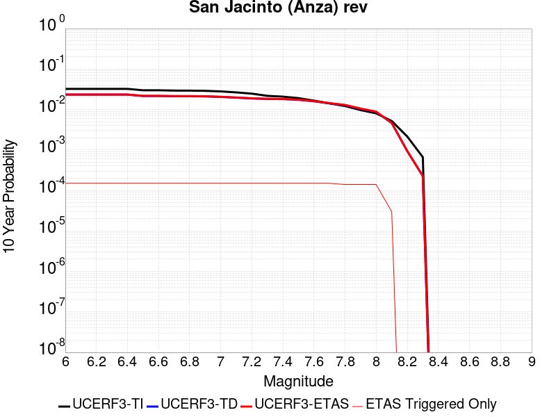 |

| Magnitude | 1 wk TI Prob | 1 wk TD Prob | 1 wk ETAS Prob | 1 wk ETAS/TD Gain | 1 wk ETAS Triggered Only | 1 mo TI Prob | 1 mo TD Prob | 1 mo ETAS Prob | 1 mo ETAS/TD Gain | 1 mo ETAS Triggered Only | 1 yr TI Prob | 1 yr TD Prob | 1 yr ETAS Prob | 1 yr ETAS/TD Gain | 1 yr ETAS Triggered Only | 10 yr TI Prob | 10 yr TD Prob | 10 yr ETAS Prob | 10 yr ETAS/TD Gain | 10 yr ETAS Triggered Only |
|-----|-----|-----|-----|-----|-----|-----|-----|-----|-----|-----|-----|-----|-----|-----|-----|-----|-----|-----|-----|-----|
| 6.0 | 6.3015636E-5 | 4.3302647E-5 | 1.7329701E-4 | 4.001996 | 1.3E-4 | 2.7003905E-4 | 1.8556965E-4 | 3.2554366E-4 | 1.7542938 | 1.4E-4 | 0.0032827691 | 0.0022569813 | 0.0023966653 | 1.0618898 | 1.4E-4 | 0.032346968 | 0.023296192 | 0.023442699 | 1.0062888 | 1.5E-4 |
| 6.1 | 6.3015636E-5 | 4.3302647E-5 | 1.7329701E-4 | 4.001996 | 1.3E-4 | 2.7003905E-4 | 1.8556965E-4 | 3.2554366E-4 | 1.7542938 | 1.4E-4 | 0.0032827691 | 0.0022569813 | 0.0023966653 | 1.0618898 | 1.4E-4 | 0.032346968 | 0.023296192 | 0.023442699 | 1.0062888 | 1.5E-4 |
| 6.2 | 6.3015636E-5 | 4.3302647E-5 | 1.7329701E-4 | 4.001996 | 1.3E-4 | 2.7003905E-4 | 1.8556965E-4 | 3.2554366E-4 | 1.7542938 | 1.4E-4 | 0.0032827691 | 0.0022569813 | 0.0023966653 | 1.0618898 | 1.4E-4 | 0.032346968 | 0.023296192 | 0.023442699 | 1.0062888 | 1.5E-4 |
| 6.3 | 6.3015636E-5 | 4.3302647E-5 | 1.7329701E-4 | 4.001996 | 1.3E-4 | 2.7003905E-4 | 1.8556965E-4 | 3.2554366E-4 | 1.7542938 | 1.4E-4 | 0.0032827691 | 0.0022569813 | 0.0023966653 | 1.0618898 | 1.4E-4 | 0.032346968 | 0.023296192 | 0.023442699 | 1.0062888 | 1.5E-4 |
| 6.4 | 6.3015636E-5 | 4.3302647E-5 | 1.7329701E-4 | 4.001996 | 1.3E-4 | 2.7003905E-4 | 1.8556965E-4 | 3.2554366E-4 | 1.7542938 | 1.4E-4 | 0.0032827691 | 0.0022569813 | 0.0023966653 | 1.0618898 | 1.4E-4 | 0.032346968 | 0.023296192 | 0.023442699 | 1.0062888 | 1.5E-4 |
| 6.5 | 5.811017E-5 | 4.0082516E-5 | 1.700773E-4 | 4.2431793 | 1.3E-4 | 2.4901982E-4 | 1.7177092E-4 | 3.1174687E-4 | 1.814899 | 1.4E-4 | 0.0030276014 | 0.002089311 | 0.0022290184 | 1.0668677 | 1.4E-4 | 0.02986684 | 0.021593736 | 0.021740498 | 1.0067965 | 1.5E-4 |
| 6.6 | 5.811017E-5 | 4.0082516E-5 | 1.700773E-4 | 4.2431793 | 1.3E-4 | 2.4901982E-4 | 1.7177092E-4 | 3.1174687E-4 | 1.814899 | 1.4E-4 | 0.0030276014 | 0.002089311 | 0.0022290184 | 1.0668677 | 1.4E-4 | 0.02986684 | 0.021593736 | 0.021740498 | 1.0067965 | 1.5E-4 |
| 6.7 | 5.712442E-5 | 3.9505223E-5 | 1.6950008E-4 | 4.290574 | 1.3E-4 | 2.4479596E-4 | 1.6929714E-4 | 3.0927346E-4 | 1.8268083 | 1.4E-4 | 0.0029763177 | 0.0020592497 | 0.0021989613 | 1.067846 | 1.4E-4 | 0.029367693 | 0.021285562 | 0.02143237 | 1.006897 | 1.5E-4 |
| 6.8 | 5.6967532E-5 | 3.9361643E-5 | 1.6935653E-4 | 4.3025775 | 1.3E-4 | 2.4412372E-4 | 1.6868189E-4 | 3.0865826E-4 | 1.8298247 | 1.4E-4 | 0.0029681553 | 0.002051773 | 0.0021914858 | 1.0680937 | 1.4E-4 | 0.029288229 | 0.021210281 | 0.0213571 | 1.006922 | 1.5E-4 |
| 6.9 | 5.6211324E-5 | 3.9066435E-5 | 1.6906136E-4 | 4.3275347 | 1.3E-4 | 2.4088343E-4 | 1.6741687E-4 | 3.0739343E-4 | 1.8360959 | 1.4E-4 | 0.0029288116 | 0.0020364004 | 0.0021761153 | 1.0686088 | 1.4E-4 | 0.028905109 | 0.021049714 | 0.021196555 | 1.006976 | 1.5E-4 |
| 7.0 | 5.4383527E-5 | 3.792697E-5 | 1.6792204E-4 | 4.4275103 | 1.3E-4 | 2.3305144E-4 | 1.6253405E-4 | 3.025113E-4 | 1.861218 | 1.4E-4 | 0.0028337094 | 0.001977061 | 0.0021167842 | 1.0706722 | 1.4E-4 | 0.027978465 | 0.020440677 | 0.02058761 | 1.0071883 | 1.5E-4 |
| 7.1 | 5.1393665E-5 | 3.6389913E-5 | 1.6638519E-4 | 4.5722885 | 1.3E-4 | 2.2023996E-4 | 1.5594746E-4 | 2.9592562E-4 | 1.8975981 | 1.4E-4 | 0.0026781242 | 0.0018970112 | 0.0020367457 | 1.0736603 | 1.4E-4 | 0.026460782 | 0.019614287 | 0.019761344 | 1.0074974 | 1.5E-4 |
| 7.2 | 4.785222E-5 | 3.4741795E-5 | 1.6473728E-4 | 4.7417607 | 1.3E-4 | 2.0506482E-4 | 1.4888494E-4 | 2.888641E-4 | 1.9401835 | 1.4E-4 | 0.0024938055 | 0.0018111705 | 0.001950917 | 1.0771581 | 1.4E-4 | 0.024660049 | 0.018728992 | 0.018876182 | 1.007859 | 1.5E-4 |
| 7.3 | 4.2143256E-5 | 3.383628E-5 | 1.6383188E-4 | 4.8419 | 1.3E-4 | 1.8060145E-4 | 1.4500458E-4 | 2.8498427E-4 | 1.9653467 | 1.4E-4 | 0.002196605 | 0.0017640047 | 0.0019037577 | 1.0792248 | 1.4E-4 | 0.02175019 | 0.01823724 | 0.018384505 | 1.0080749 | 1.5E-4 |
| 7.4 | 4.0264713E-5 | 3.347446E-5 | 1.6347012E-4 | 4.8834276 | 1.3E-4 | 1.7255165E-4 | 1.4345412E-4 | 2.8343403E-4 | 1.9757818 | 1.4E-4 | 0.002098792 | 0.0017451581 | 0.0018849138 | 1.0800819 | 1.4E-4 | 0.020790804 | 0.018041821 | 0.018189114 | 1.008164 | 1.5E-4 |
| 7.5 | 3.694492E-5 | 3.218847E-5 | 1.6218428E-4 | 5.0385838 | 1.3E-4 | 1.5832575E-4 | 1.379433E-4 | 2.7792397E-4 | 2.0147698 | 1.4E-4 | 0.0019259118 | 0.001678169 | 0.001817934 | 1.0832843 | 1.4E-4 | 0.01909306 | 0.01735827 | 0.017505666 | 1.0084914 | 1.5E-4 |
| 7.6 | 3.200565E-5 | 2.9504106E-5 | 1.5950027E-4 | 5.4060364 | 1.3E-4 | 1.3715986E-4 | 1.2644005E-4 | 2.6642234E-4 | 2.107104 | 1.4E-4 | 0.001668642 | 0.0015383229 | 0.0016781075 | 1.0908682 | 1.4E-4 | 0.01656168 | 0.0159463 | 0.016093908 | 1.0092566 | 1.5E-4 |
| 7.7 | 2.731642E-5 | 2.6092788E-5 | 1.560894E-4 | 5.9820895 | 1.3E-4 | 1.1706512E-4 | 1.1182144E-4 | 2.518058E-4 | 2.251856 | 1.4E-4 | 0.001424336 | 0.0013605768 | 0.0015003864 | 1.1027576 | 1.4E-4 | 0.014152412 | 0.014167004 | 0.01431488 | 1.010438 | 1.5E-4 |
| 7.8 | 2.3466424E-5 | 2.3504817E-5 | 1.43502E-4 | 6.1052165 | 1.2E-4 | 1.0056651E-4 | 1.0073105E-4 | 2.3071795E-4 | 2.2904353 | 1.3E-4 | 0.0012237094 | 0.0012257113 | 0.001355552 | 1.1059308 | 1.3E-4 | 0.012169928 | 0.012808893 | 0.012947099 | 1.0107899 | 1.4E-4 |
| 7.9 | 1.8611925E-5 | 1.8908117E-5 | 1.3890585E-4 | 7.3463607 | 1.2E-4 | 7.9762955E-5 | 8.1032274E-5 | 2.1102175E-4 | 2.6041691 | 1.3E-4 | 9.7068126E-4 | 9.861222E-4 | 0.001115994 | 1.1316996 | 1.3E-4 | 0.0096645225 | 0.010393824 | 0.010532369 | 1.0133295 | 1.4E-4 |
| 8.0 | 1.5460775E-5 | 1.5740965E-5 | 1.3573907E-4 | 8.623301 | 1.2E-4 | 6.6258784E-5 | 6.7459536E-5 | 1.9745076E-4 | 2.9269512 | 1.3E-4 | 8.0640207E-4 | 8.21011E-4 | 9.5090433E-4 | 1.1582114 | 1.3E-4 | 0.008034821 | 0.0087028835 | 0.008841665 | 1.0159466 | 1.4E-4 |
| 8.1 | 9.983884E-6 | 8.269952E-6 | 3.8269704E-5 | 4.6275606 | 3.0E-5 | 4.2787375E-5 | 3.544217E-5 | 6.5441105E-5 | 1.8464192 | 3.0E-5 | 5.2081177E-4 | 4.314235E-4 | 4.614106E-4 | 1.0695072 | 3.0E-5 | 0.0051959283 | 0.004640022 | 0.004669883 | 1.0064355 | 3.0E-5 |
| 8.2 | 4.1226E-6 | 1.5529788E-6 | 1.5529788E-6 | 1.0 | 0.0 | 1.7668166E-5 | 6.6556063E-6 | 6.6556063E-6 | 1.0 | 0.0 | 2.1508869E-4 | 8.102902E-5 | 8.102902E-5 | 1.0 | 0.0 | 0.0021488064 | 9.4050163E-4 | 9.4050163E-4 | 1.0 | 0.0 |
| 8.3 | 1.2750878E-6 | 3.612133E-7 | 3.612133E-7 | 1.0 | 0.0 | 5.4646503E-6 | 1.548056E-6 | 1.548056E-6 | 1.0 | 0.0 | 6.653009E-5 | 1.8847424E-5 | 1.8847424E-5 | 1.0 | 0.0 | 6.6510175E-4 | 2.2734253E-4 | 2.2734253E-4 | 1.0 | 0.0 |

## Independence rev 2011
*[(top)](#table-of-contents)*

| 1 Week | 1 Month | 1 Year | 10 Year |
|-----|-----|-----|-----|
|  |  |  |  |

| Magnitude | 1 wk TI Prob | 1 wk TD Prob | 1 wk ETAS Prob | 1 wk ETAS/TD Gain | 1 wk ETAS Triggered Only | 1 mo TI Prob | 1 mo TD Prob | 1 mo ETAS Prob | 1 mo ETAS/TD Gain | 1 mo ETAS Triggered Only | 1 yr TI Prob | 1 yr TD Prob | 1 yr ETAS Prob | 1 yr ETAS/TD Gain | 1 yr ETAS Triggered Only | 10 yr TI Prob | 10 yr TD Prob | 10 yr ETAS Prob | 10 yr ETAS/TD Gain | 10 yr ETAS Triggered Only |
|-----|-----|-----|-----|-----|-----|-----|-----|-----|-----|-----|-----|-----|-----|-----|-----|-----|-----|-----|-----|-----|
| 6.0 | 4.422171E-6 | 4.326227E-6 | 1.14325754E-4 | 26.426203 | 1.1E-4 | 1.8952025E-5 | 1.8540857E-5 | 1.3853863E-4 | 7.4720726 | 1.2E-4 | 2.3071647E-4 | 2.2571455E-4 | 3.6568294E-4 | 1.6201124 | 1.4E-4 | 0.0023047708 | 0.0022551466 | 0.0024048083 | 1.0663645 | 1.5E-4 |
| 6.1 | 4.422171E-6 | 4.326227E-6 | 1.14325754E-4 | 26.426203 | 1.1E-4 | 1.8952025E-5 | 1.8540857E-5 | 1.3853863E-4 | 7.4720726 | 1.2E-4 | 2.3071647E-4 | 2.2571455E-4 | 3.6568294E-4 | 1.6201124 | 1.4E-4 | 0.0023047708 | 0.0022551466 | 0.0024048083 | 1.0663645 | 1.5E-4 |
| 6.2 | 4.422171E-6 | 4.326227E-6 | 1.14325754E-4 | 26.426203 | 1.1E-4 | 1.8952025E-5 | 1.8540857E-5 | 1.3853863E-4 | 7.4720726 | 1.2E-4 | 2.3071647E-4 | 2.2571455E-4 | 3.6568294E-4 | 1.6201124 | 1.4E-4 | 0.0023047708 | 0.0022551466 | 0.0024048083 | 1.0663645 | 1.5E-4 |
| 6.3 | 4.422171E-6 | 4.326227E-6 | 1.14325754E-4 | 26.426203 | 1.1E-4 | 1.8952025E-5 | 1.8540857E-5 | 1.3853863E-4 | 7.4720726 | 1.2E-4 | 2.3071647E-4 | 2.2571455E-4 | 3.6568294E-4 | 1.6201124 | 1.4E-4 | 0.0023047708 | 0.0022551466 | 0.0024048083 | 1.0663645 | 1.5E-4 |
| 6.4 | 4.422171E-6 | 4.326227E-6 | 1.14325754E-4 | 26.426203 | 1.1E-4 | 1.8952025E-5 | 1.8540857E-5 | 1.3853863E-4 | 7.4720726 | 1.2E-4 | 2.3071647E-4 | 2.2571455E-4 | 3.6568294E-4 | 1.6201124 | 1.4E-4 | 0.0023047708 | 0.0022551466 | 0.0024048083 | 1.0663645 | 1.5E-4 |
| 6.5 | 4.422171E-6 | 4.326227E-6 | 1.14325754E-4 | 26.426203 | 1.1E-4 | 1.8952025E-5 | 1.8540857E-5 | 1.3853863E-4 | 7.4720726 | 1.2E-4 | 2.3071647E-4 | 2.2571455E-4 | 3.6568294E-4 | 1.6201124 | 1.4E-4 | 0.0023047708 | 0.0022551466 | 0.0024048083 | 1.0663645 | 1.5E-4 |
| 6.6 | 2.663744E-6 | 2.5319862E-6 | 1.0253173E-4 | 40.494587 | 1.0E-4 | 1.1415996E-5 | 1.0851327E-5 | 1.20850134E-4 | 11.136899 | 1.1E-4 | 1.3898089E-4 | 1.3210738E-4 | 2.620902E-4 | 1.983918 | 1.3E-4 | 0.0013889399 | 0.0013203367 | 0.001460152 | 1.1058936 | 1.4E-4 |
| 6.7 | 2.663744E-6 | 2.5319862E-6 | 1.0253173E-4 | 40.494587 | 1.0E-4 | 1.1415996E-5 | 1.0851327E-5 | 1.20850134E-4 | 11.136899 | 1.1E-4 | 1.3898089E-4 | 1.3210738E-4 | 2.620902E-4 | 1.983918 | 1.3E-4 | 0.0013889399 | 0.0013203367 | 0.001460152 | 1.1058936 | 1.4E-4 |
| 6.8 | 1.9716529E-6 | 1.8322585E-6 | 9.1832095E-5 | 50.119617 | 9.0E-5 | 8.449913E-6 | 7.852514E-6 | 1.0785173E-4 | 13.734676 | 1.0E-4 | 1.0287284E-4 | 9.5600284E-5 | 2.155888E-4 | 2.2551064 | 1.2E-4 | 0.0010282523 | 9.556045E-4 | 0.0010854802 | 1.1359096 | 1.3E-4 |
| 6.9 | 1.8788617E-6 | 1.7429993E-6 | 9.174284E-5 | 52.635044 | 9.0E-5 | 8.0522395E-6 | 7.4699765E-6 | 1.07469226E-4 | 14.386824 | 1.0E-4 | 9.80316E-5 | 9.0943286E-5 | 2.1093237E-4 | 2.3193836 | 1.2E-4 | 9.798837E-4 | 9.0907275E-4 | 0.0010389546 | 1.1428728 | 1.3E-4 |
| 7.0 | 1.5045488E-6 | 1.3849503E-6 | 9.138483E-5 | 65.984184 | 9.0E-5 | 6.44805E-6 | 5.9354884E-6 | 1.05934894E-4 | 17.847713 | 1.0E-4 | 7.8502184E-5 | 7.226223E-5 | 1.9225356E-4 | 2.6604986 | 1.2E-4 | 7.8474457E-4 | 7.2239246E-4 | 8.522985E-4 | 1.1798276 | 1.3E-4 |
| 7.1 | 1.272341E-6 | 1.1625096E-6 | 8.116242E-5 | 69.81655 | 8.0E-5 | 5.4528787E-6 | 4.982175E-6 | 9.4981726E-5 | 19.06431 | 9.0E-5 | 6.6386776E-5 | 6.0656326E-5 | 1.7064966E-4 | 2.813386 | 1.1E-4 | 6.636695E-4 | 6.064009E-4 | 7.263281E-4 | 1.1977689 | 1.2E-4 |
| 7.2 | 1.0416892E-6 | 9.4098806E-7 | 8.094091E-5 | 86.01694 | 8.0E-5 | 4.464375E-6 | 4.0328E-6 | 9.403244E-5 | 23.316912 | 9.0E-5 | 5.4352407E-5 | 4.909825E-5 | 1.5909284E-4 | 3.2402956 | 1.1E-4 | 5.4339116E-4 | 4.9087586E-4 | 6.10817E-4 | 1.244341 | 1.2E-4 |
| 7.3 | 7.9450155E-7 | 7.235002E-7 | 8.072344E-5 | 111.573494 | 8.0E-5 | 3.4050022E-6 | 3.1007114E-6 | 9.310043E-5 | 30.025507 | 9.0E-5 | 4.1455114E-5 | 3.775052E-5 | 1.4774637E-4 | 3.9137573 | 1.1E-4 | 4.144738E-4 | 3.7744216E-4 | 4.9739686E-4 | 1.3178095 | 1.2E-4 |
| 7.4 | 5.3893444E-7 | 5.019512E-7 | 7.050192E-5 | 140.45572 | 7.0E-5 | 2.309717E-6 | 2.1512178E-6 | 8.215105E-5 | 38.18816 | 8.0E-5 | 2.8120441E-5 | 2.6190766E-5 | 1.2618814E-4 | 4.8180394 | 1.0E-4 | 2.8116882E-4 | 2.6187726E-4 | 3.7184844E-4 | 1.4199342 | 1.1E-4 |
| 7.5 | 3.8852085E-7 | 3.682554E-7 | 6.0368235E-5 | 163.93034 | 6.0E-5 | 1.6650882E-6 | 1.5782365E-6 | 7.157813E-5 | 45.353233 | 7.0E-5 | 2.027226E-5 | 1.9214862E-5 | 9.921332E-5 | 5.163364 | 8.0E-5 | 2.0270412E-4 | 1.9213221E-4 | 2.8211492E-4 | 1.4683374 | 9.0E-5 |
| 7.6 | 2.414929E-7 | 2.345755E-7 | 2.0234571E-5 | 86.260376 | 2.0E-5 | 1.0349692E-6 | 1.0053232E-6 | 3.1005293E-5 | 30.84112 | 3.0E-5 | 1.2600677E-5 | 1.2239742E-5 | 5.223925E-5 | 4.2680025 | 4.0E-5 | 1.2599962E-4 | 1.223908E-4 | 1.7238468E-4 | 1.4084774 | 5.0E-5 |
| 7.7 | 6.8298014E-8 | 6.85897E-8 | 1.0068589E-5 | 146.79448 | 1.0E-5 | 2.9270575E-7 | 2.9395582E-7 | 1.0293953E-5 | 35.018707 | 1.0E-5 | 3.5636867E-6 | 3.5789067E-6 | 1.35788705E-5 | 3.7941394 | 1.0E-5 | 3.5636294E-5 | 3.5788536E-5 | 4.578818E-5 | 1.279409 | 1.0E-5 |

## Cleghorn Lake
*[(top)](#table-of-contents)*

| 1 Week | 1 Month | 1 Year | 10 Year |
|-----|-----|-----|-----|
|  |  |  |  |

| Magnitude | 1 wk TI Prob | 1 wk TD Prob | 1 wk ETAS Prob | 1 wk ETAS/TD Gain | 1 wk ETAS Triggered Only | 1 mo TI Prob | 1 mo TD Prob | 1 mo ETAS Prob | 1 mo ETAS/TD Gain | 1 mo ETAS Triggered Only | 1 yr TI Prob | 1 yr TD Prob | 1 yr ETAS Prob | 1 yr ETAS/TD Gain | 1 yr ETAS Triggered Only | 10 yr TI Prob | 10 yr TD Prob | 10 yr ETAS Prob | 10 yr ETAS/TD Gain | 10 yr ETAS Triggered Only |
|-----|-----|-----|-----|-----|-----|-----|-----|-----|-----|-----|-----|-----|-----|-----|-----|-----|-----|-----|-----|-----|
| 6.0 | 1.5467183E-5 | 1.6794203E-5 | 8.679303E-5 | 5.1680346 | 7.0E-5 | 6.6286244E-5 | 7.197348E-5 | 1.8196556E-4 | 2.5282307 | 1.1E-4 | 8.067362E-4 | 8.759797E-4 | 0.0010058659 | 1.1482753 | 1.3E-4 | 0.008038137 | 0.008730696 | 0.008879386 | 1.0170307 | 1.5E-4 |
| 6.1 | 1.5467183E-5 | 1.6794203E-5 | 8.679303E-5 | 5.1680346 | 7.0E-5 | 6.6286244E-5 | 7.197348E-5 | 1.8196556E-4 | 2.5282307 | 1.1E-4 | 8.067362E-4 | 8.759797E-4 | 0.0010058659 | 1.1482753 | 1.3E-4 | 0.008038137 | 0.008730696 | 0.008879386 | 1.0170307 | 1.5E-4 |
| 6.2 | 1.2624631E-5 | 1.3681544E-5 | 7.368073E-5 | 5.38541 | 6.0E-5 | 5.410444E-5 | 5.863415E-5 | 1.4862887E-4 | 2.5348518 | 9.0E-5 | 6.585225E-4 | 7.1368564E-4 | 8.236071E-4 | 1.1540195 | 1.1E-4 | 0.0065657445 | 0.0071187317 | 0.0072478065 | 1.0181317 | 1.3E-4 |
| 6.3 | 1.2624631E-5 | 1.3681544E-5 | 7.368073E-5 | 5.38541 | 6.0E-5 | 5.410444E-5 | 5.863415E-5 | 1.4862887E-4 | 2.5348518 | 9.0E-5 | 6.585225E-4 | 7.1368564E-4 | 8.236071E-4 | 1.1540195 | 1.1E-4 | 0.0065657445 | 0.0071187317 | 0.0072478065 | 1.0181317 | 1.3E-4 |
| 6.4 | 9.417684E-6 | 1.0170118E-5 | 6.016961E-5 | 5.916314 | 5.0E-5 | 4.036088E-5 | 4.3585722E-5 | 1.2358224E-4 | 2.8353834 | 8.0E-5 | 4.912829E-4 | 5.3056807E-4 | 6.30515E-4 | 1.1883773 | 1.0E-4 | 0.004901982 | 0.005297049 | 0.0054064663 | 1.0206562 | 1.1E-4 |
| 6.5 | 9.368219E-6 | 1.0117545E-5 | 6.011704E-5 | 5.9418607 | 5.0E-5 | 4.014889E-5 | 4.3360415E-5 | 1.2335695E-4 | 2.8449209 | 8.0E-5 | 4.8870314E-4 | 5.2782625E-4 | 6.2777346E-4 | 1.1893563 | 1.0E-4 | 0.004876298 | 0.0052697617 | 0.005379182 | 1.0207638 | 1.1E-4 |
| 6.6 | 7.803798E-6 | 8.441831E-6 | 4.8441492E-5 | 5.7382684 | 4.0E-5 | 3.3444423E-5 | 3.6179E-5 | 8.617719E-5 | 2.3819673 | 5.0E-5 | 4.0710976E-4 | 4.4043022E-4 | 5.103994E-4 | 1.1588655 | 7.0E-5 | 0.0040636472 | 0.0043994905 | 0.0044791386 | 1.018104 | 8.0E-5 |
| 6.7 | 2.3108669E-6 | 2.4438336E-6 | 1.2443809E-5 | 5.0919213 | 1.0E-5 | 9.903678E-6 | 1.0473532E-5 | 3.0473322E-5 | 2.9095554 | 2.0E-5 | 1.205706E-4 | 1.2750797E-4 | 1.4750543E-4 | 1.1568329 | 2.0E-5 | 0.001205052 | 0.0012743667 | 0.0013043286 | 1.023511 | 3.0E-5 |
| 6.8 | 2.0882828E-6 | 2.2062823E-6 | 1.220626E-5 | 5.5325017 | 1.0E-5 | 8.949753E-6 | 9.455462E-6 | 2.9455272E-5 | 3.1151595 | 2.0E-5 | 1.08957785E-4 | 1.1511434E-4 | 1.3511203E-4 | 1.1737204 | 2.0E-5 | 0.0010890438 | 0.0011505639 | 0.0011805294 | 1.0260441 | 3.0E-5 |
| 6.9 | 1.876935E-6 | 1.981051E-6 | 1.981051E-6 | 1.0 | 0.0 | 8.043982E-6 | 8.490192E-6 | 1.8490107E-5 | 2.1778197 | 1.0E-5 | 9.7931086E-5 | 1.03363345E-4 | 1.1336231E-4 | 1.0967361 | 1.0E-5 | 9.788794E-4 | 0.0010331686 | 0.001053148 | 1.0193379 | 2.0E-5 |
| 7.0 | 1.5357559E-6 | 1.6202807E-6 | 1.6202807E-6 | 1.0 | 0.0 | 6.5817944E-6 | 6.9440425E-6 | 6.9440425E-6 | 1.0 | 0.0 | 8.01304E-5 | 8.454057E-5 | 8.454057E-5 | 1.0 | 0.0 | 8.010151E-4 | 8.450965E-4 | 8.55088E-4 | 1.0118229 | 1.0E-5 |
| 7.1 | 1.0905424E-6 | 1.1497619E-6 | 1.1497619E-6 | 1.0 | 0.0 | 4.6737446E-6 | 4.9275427E-6 | 4.9275427E-6 | 1.0 | 0.0 | 5.6901354E-5 | 5.999128E-5 | 5.999128E-5 | 1.0 | 0.0 | 5.6886784E-4 | 5.997606E-4 | 6.0975464E-4 | 1.0166633 | 1.0E-5 |
| 7.2 | 6.06668E-7 | 6.387277E-7 | 6.387277E-7 | 1.0 | 0.0 | 2.600003E-6 | 2.7374022E-6 | 2.7374022E-6 | 1.0 | 0.0 | 3.1654577E-5 | 3.3327433E-5 | 3.3327433E-5 | 1.0 | 0.0 | 3.1650066E-4 | 3.3323118E-4 | 3.4322785E-4 | 1.0299993 | 1.0E-5 |

## Santa Rosa Island
*[(top)](#table-of-contents)*

| 1 Week | 1 Month | 1 Year | 10 Year |
|-----|-----|-----|-----|
|  |  |  |  |

| Magnitude | 1 wk TI Prob | 1 wk TD Prob | 1 wk ETAS Prob | 1 wk ETAS/TD Gain | 1 wk ETAS Triggered Only | 1 mo TI Prob | 1 mo TD Prob | 1 mo ETAS Prob | 1 mo ETAS/TD Gain | 1 mo ETAS Triggered Only | 1 yr TI Prob | 1 yr TD Prob | 1 yr ETAS Prob | 1 yr ETAS/TD Gain | 1 yr ETAS Triggered Only | 10 yr TI Prob | 10 yr TD Prob | 10 yr ETAS Prob | 10 yr ETAS/TD Gain | 10 yr ETAS Triggered Only |
|-----|-----|-----|-----|-----|-----|-----|-----|-----|-----|-----|-----|-----|-----|-----|-----|-----|-----|-----|-----|-----|
| 6.0 | 4.1143165E-5 | 4.7091133E-5 | 1.1708784E-4 | 2.4864094 | 7.0E-5 | 1.7631594E-4 | 2.0180465E-4 | 3.0178446E-4 | 1.4954287 | 1.0E-4 | 0.002144533 | 0.0024544 | 0.00256413 | 1.0447074 | 1.1E-4 | 0.021239553 | 0.024293551 | 0.024420394 | 1.0052212 | 1.3E-4 |
| 6.1 | 2.1061249E-5 | 2.3864959E-5 | 4.3864482E-5 | 1.8380288 | 2.0E-5 | 9.0259375E-5 | 1.0227455E-4 | 1.5226944E-4 | 1.4888302 | 5.0E-5 | 0.0010983539 | 0.0012445104 | 0.0013044357 | 1.0481517 | 6.0E-5 | 0.01092941 | 0.012378449 | 0.012447582 | 1.005585 | 7.0E-5 |
| 6.2 | 2.1061249E-5 | 2.3864959E-5 | 4.3864482E-5 | 1.8380288 | 2.0E-5 | 9.0259375E-5 | 1.0227455E-4 | 1.5226944E-4 | 1.4888302 | 5.0E-5 | 0.0010983539 | 0.0012445104 | 0.0013044357 | 1.0481517 | 6.0E-5 | 0.01092941 | 0.012378449 | 0.012447582 | 1.005585 | 7.0E-5 |
| 6.3 | 1.5158236E-5 | 1.7074419E-5 | 3.7074078E-5 | 2.1713228 | 2.0E-5 | 6.496225E-5 | 7.3174095E-5 | 1.2317044E-4 | 1.6832519 | 5.0E-5 | 7.906284E-4 | 8.905424E-4 | 9.50489E-4 | 1.0673146 | 6.0E-5 | 0.007878214 | 0.008870989 | 0.008940369 | 1.0078208 | 7.0E-5 |
| 6.4 | 1.2341918E-5 | 1.3852917E-5 | 3.385264E-5 | 2.4437194 | 2.0E-5 | 5.2892858E-5 | 5.9368336E-5 | 1.0936537E-4 | 1.8421497 | 5.0E-5 | 6.437803E-4 | 7.225779E-4 | 7.8253454E-4 | 1.082976 | 6.0E-5 | 0.006419184 | 0.007203121 | 0.007272617 | 1.009648 | 7.0E-5 |
| 6.5 | 9.061158E-6 | 1.0117031E-5 | 3.011683E-5 | 2.9768445 | 2.0E-5 | 3.883296E-5 | 4.3358013E-5 | 9.335585E-5 | 2.1531394 | 5.0E-5 | 4.726887E-4 | 5.277613E-4 | 5.877296E-4 | 1.1136278 | 6.0E-5 | 0.004716845 | 0.0052656173 | 0.0053253016 | 1.0113347 | 6.0E-5 |
| 6.6 | 7.5461685E-6 | 8.400733E-6 | 8.400733E-6 | 1.0 | 0.0 | 3.2340322E-5 | 3.600267E-5 | 6.6001594E-5 | 1.8332415 | 3.0E-5 | 3.936723E-4 | 4.3824865E-4 | 4.6823552E-4 | 1.0684243 | 3.0E-5 | 0.003929756 | 0.0043742736 | 0.0044041425 | 1.0068283 | 3.0E-5 |
| 6.7 | 5.5023775E-6 | 6.087381E-6 | 6.087381E-6 | 1.0 | 0.0 | 2.3581404E-5 | 2.6088532E-5 | 4.608801E-5 | 1.7666004 | 2.0E-5 | 2.8706578E-4 | 3.1758484E-4 | 3.3757847E-4 | 1.0629553 | 2.0E-5 | 0.0028669522 | 0.0031716314 | 0.003191568 | 1.0062859 | 2.0E-5 |
| 6.8 | 3.7351679E-6 | 4.0831405E-6 | 4.0831405E-6 | 1.0 | 0.0 | 1.6007763E-5 | 1.749907E-5 | 1.749907E-5 | 1.0 | 0.0 | 1.948771E-4 | 2.1303284E-4 | 2.1303284E-4 | 1.0 | 0.0 | 0.0019470629 | 0.0021285315 | 0.0021285315 | 1.0 | 0.0 |
| 6.9 | 2.456366E-6 | 2.6292705E-6 | 2.6292705E-6 | 1.0 | 0.0 | 1.0527241E-5 | 1.1268254E-5 | 1.1268254E-5 | 1.0 | 0.0 | 1.2816161E-4 | 1.3718237E-4 | 1.3718237E-4 | 1.0 | 0.0 | 0.0012808773 | 0.0013709799 | 0.0013709799 | 1.0 | 0.0 |
| 7.0 | 2.3245157E-6 | 2.4827782E-6 | 2.4827782E-6 | 1.0 | 0.0 | 9.962172E-6 | 1.0640435E-5 | 1.0640435E-5 | 1.0 | 0.0 | 1.2128269E-4 | 1.2953962E-4 | 1.2953962E-4 | 1.0 | 0.0 | 0.0012121652 | 0.0012946434 | 0.0012946434 | 1.0 | 0.0 |
| 7.1 | 2.2248344E-6 | 2.37325E-6 | 2.37325E-6 | 1.0 | 0.0 | 9.53497E-6 | 1.0171032E-5 | 1.0171032E-5 | 1.0 | 0.0 | 1.1608207E-4 | 1.2382529E-4 | 1.2382529E-4 | 1.0 | 0.0 | 0.0011602144 | 0.001237565 | 0.001237565 | 1.0 | 0.0 |
| 7.2 | 2.1350402E-6 | 2.276154E-6 | 2.276154E-6 | 1.0 | 0.0 | 9.150141E-6 | 9.754909E-6 | 9.754909E-6 | 1.0 | 0.0 | 1.1139726E-4 | 1.1875956E-4 | 1.1875956E-4 | 1.0 | 0.0 | 0.0011134144 | 0.0011869629 | 0.0011869629 | 1.0 | 0.0 |
| 7.3 | 1.9793572E-6 | 2.108719E-6 | 2.108719E-6 | 1.0 | 0.0 | 8.482932E-6 | 9.037336E-6 | 9.037336E-6 | 1.0 | 0.0 | 1.032748E-4 | 1.10024026E-4 | 1.10024026E-4 | 1.0 | 0.0 | 0.0010322682 | 0.0010996973 | 0.0010996973 | 1.0 | 0.0 |
| 7.4 | 1.6951194E-6 | 1.8045733E-6 | 1.8045733E-6 | 1.0 | 0.0 | 7.264777E-6 | 7.733863E-6 | 7.733863E-6 | 1.0 | 0.0 | 8.844508E-5 | 9.415573E-5 | 9.415573E-5 | 1.0 | 0.0 | 8.840988E-4 | 9.4116E-4 | 9.4116E-4 | 1.0 | 0.0 |
| 7.5 | 8.987207E-7 | 9.5122147E-7 | 9.5122147E-7 | 1.0 | 0.0 | 3.8516546E-6 | 4.076657E-6 | 4.076657E-6 | 1.0 | 0.0 | 4.6892885E-5 | 4.963218E-5 | 4.963218E-5 | 1.0 | 0.0 | 4.688299E-4 | 4.9621216E-4 | 4.9621216E-4 | 1.0 | 0.0 |
| 7.6 | 3.8783037E-7 | 4.052932E-7 | 4.052932E-7 | 1.0 | 0.0 | 1.6621291E-6 | 1.7369698E-6 | 1.7369698E-6 | 1.0 | 0.0 | 2.0236233E-5 | 2.1147409E-5 | 2.1147409E-5 | 1.0 | 0.0 | 2.023439E-4 | 2.1145462E-4 | 2.1145462E-4 | 1.0 | 0.0 |
| 7.7 | 6.181804E-8 | 6.339035E-8 | 6.339035E-8 | 1.0 | 0.0 | 2.6493444E-7 | 2.7167292E-7 | 2.7167292E-7 | 1.0 | 0.0 | 3.225572E-6 | 3.3076128E-6 | 3.3076128E-6 | 1.0 | 0.0 | 3.225525E-5 | 3.307564E-5 | 3.307564E-5 | 1.0 | 0.0 |
| 7.8 | 1.3704449E-9 | 1.3964153E-9 | 1.3964153E-9 | 1.0 | 0.0 | 5.873335E-9 | 5.984637E-9 | 5.984637E-9 | 1.0 | 0.0 | 7.1507856E-8 | 7.286295E-8 | 7.286295E-8 | 1.0 | 0.0 | 7.1507833E-7 | 7.286294E-7 | 7.286294E-7 | 1.0 | 0.0 |

## White Mountains
*[(top)](#table-of-contents)*

| 1 Week | 1 Month | 1 Year | 10 Year |
|-----|-----|-----|-----|
|  |  |  |  |

| Magnitude | 1 wk TI Prob | 1 wk TD Prob | 1 wk ETAS Prob | 1 wk ETAS/TD Gain | 1 wk ETAS Triggered Only | 1 mo TI Prob | 1 mo TD Prob | 1 mo ETAS Prob | 1 mo ETAS/TD Gain | 1 mo ETAS Triggered Only | 1 yr TI Prob | 1 yr TD Prob | 1 yr ETAS Prob | 1 yr ETAS/TD Gain | 1 yr ETAS Triggered Only | 10 yr TI Prob | 10 yr TD Prob | 10 yr ETAS Prob | 10 yr ETAS/TD Gain | 10 yr ETAS Triggered Only |
|-----|-----|-----|-----|-----|-----|-----|-----|-----|-----|-----|-----|-----|-----|-----|-----|-----|-----|-----|-----|-----|
| 6.0 | 3.503579E-5 | 3.378405E-5 | 1.3378068E-4 | 3.9598765 | 1.0E-4 | 1.5014476E-4 | 1.4478143E-4 | 2.547655E-4 | 1.759656 | 1.1E-4 | 0.0018264796 | 0.0017614096 | 0.0018712158 | 1.06234 | 1.1E-4 | 0.018115403 | 0.017486818 | 0.01762437 | 1.007866 | 1.4E-4 |
| 6.1 | 3.503579E-5 | 3.378405E-5 | 1.3378068E-4 | 3.9598765 | 1.0E-4 | 1.5014476E-4 | 1.4478143E-4 | 2.547655E-4 | 1.759656 | 1.1E-4 | 0.0018264796 | 0.0017614096 | 0.0018712158 | 1.06234 | 1.1E-4 | 0.018115403 | 0.017486818 | 0.01762437 | 1.007866 | 1.4E-4 |
| 6.2 | 3.503579E-5 | 3.378405E-5 | 1.3378068E-4 | 3.9598765 | 1.0E-4 | 1.5014476E-4 | 1.4478143E-4 | 2.547655E-4 | 1.759656 | 1.1E-4 | 0.0018264796 | 0.0017614096 | 0.0018712158 | 1.06234 | 1.1E-4 | 0.018115403 | 0.017486818 | 0.01762437 | 1.007866 | 1.4E-4 |
| 6.3 | 1.7818425E-5 | 1.5916074E-5 | 7.591512E-5 | 4.769714 | 6.0E-5 | 7.636245E-5 | 6.821004E-5 | 1.2820595E-4 | 1.8795758 | 6.0E-5 | 9.293162E-4 | 8.301551E-4 | 8.901053E-4 | 1.0722157 | 6.0E-5 | 0.009254395 | 0.008271999 | 0.008331502 | 1.0071933 | 6.0E-5 |
| 6.4 | 1.7818425E-5 | 1.5916074E-5 | 7.591512E-5 | 4.769714 | 6.0E-5 | 7.636245E-5 | 6.821004E-5 | 1.2820595E-4 | 1.8795758 | 6.0E-5 | 9.293162E-4 | 8.301551E-4 | 8.901053E-4 | 1.0722157 | 6.0E-5 | 0.009254395 | 0.008271999 | 0.008331502 | 1.0071933 | 6.0E-5 |
| 6.5 | 1.3397557E-5 | 1.13362685E-5 | 6.1335704E-5 | 5.4105725 | 5.0E-5 | 5.741684E-5 | 4.858314E-5 | 9.858071E-5 | 2.0291135 | 5.0E-5 | 6.988258E-4 | 5.913462E-4 | 6.4131664E-4 | 1.0845028 | 5.0E-5 | 0.006966323 | 0.005898432 | 0.005948137 | 1.0084268 | 5.0E-5 |
| 6.6 | 1.0818695E-5 | 8.625366E-6 | 4.862502E-5 | 5.6374445 | 4.0E-5 | 4.6365014E-5 | 3.6965357E-5 | 7.696388E-5 | 2.0820544 | 4.0E-5 | 5.6434784E-4 | 4.4996463E-4 | 4.8994663E-4 | 1.0888559 | 4.0E-5 | 0.005629168 | 0.004490972 | 0.0045307926 | 1.0088668 | 4.0E-5 |
| 6.7 | 9.067908E-6 | 6.802442E-6 | 2.6802307E-5 | 3.9401007 | 2.0E-5 | 3.8861883E-5 | 2.9153016E-5 | 4.9152433E-5 | 1.6860154 | 2.0E-5 | 4.7304068E-4 | 3.5488335E-4 | 3.7487625E-4 | 1.0563365 | 2.0E-5 | 0.00472035 | 0.0035434833 | 0.0035634125 | 1.0056242 | 2.0E-5 |
| 6.8 | 7.295947E-6 | 4.936391E-6 | 2.4936293E-5 | 5.0515227 | 2.0E-5 | 3.126797E-5 | 2.1155796E-5 | 4.1155374E-5 | 1.9453474 | 2.0E-5 | 3.8062103E-4 | 2.575425E-4 | 2.7753736E-4 | 1.0776371 | 2.0E-5 | 0.0037996976 | 0.0025725532 | 0.002592502 | 1.0077543 | 2.0E-5 |
| 6.9 | 6.2243444E-6 | 3.832213E-6 | 2.3832137E-5 | 6.2188964 | 2.0E-5 | 2.6675489E-5 | 1.642367E-5 | 3.6423342E-5 | 2.2177346 | 2.0E-5 | 3.2472567E-4 | 1.9994036E-4 | 2.1993637E-4 | 1.1000098 | 2.0E-5 | 0.0032425157 | 0.0019976576 | 0.0020176175 | 1.0099918 | 2.0E-5 |
| 7.0 | 4.9878413E-6 | 2.6795342E-6 | 2.267948E-5 | 8.4639635 | 2.0E-5 | 2.1376287E-5 | 1.14836685E-5 | 3.148344E-5 | 2.7415836 | 2.0E-5 | 2.602252E-4 | 1.3980496E-4 | 1.5980216E-4 | 1.1430365 | 2.0E-5 | 0.002599207 | 0.0013971963 | 0.0014171684 | 1.0142944 | 2.0E-5 |
| 7.1 | 4.0252844E-6 | 1.8857575E-6 | 1.8857575E-6 | 1.0 | 0.0 | 1.7251105E-5 | 8.081794E-6 | 8.081794E-6 | 1.0 | 0.0 | 2.1001195E-4 | 9.8391516E-5 | 9.8391516E-5 | 1.0 | 0.0 | 0.0020981359 | 9.834924E-4 | 9.834924E-4 | 1.0 | 0.0 |
| 7.2 | 3.3284066E-6 | 1.281964E-6 | 1.281964E-6 | 1.0 | 0.0 | 1.4264522E-5 | 5.494121E-6 | 5.494121E-6 | 1.0 | 0.0 | 1.736567E-4 | 6.688897E-5 | 6.688897E-5 | 1.0 | 0.0 | 0.0017352107 | 6.6869846E-4 | 6.6869846E-4 | 1.0 | 0.0 |
| 7.3 | 2.458226E-6 | 6.05722E-7 | 6.05722E-7 | 1.0 | 0.0 | 1.0535211E-5 | 2.5959491E-6 | 2.5959491E-6 | 1.0 | 0.0 | 1.2825865E-4 | 3.1605257E-5 | 3.1605257E-5 | 1.0 | 0.0 | 0.0012818464 | 3.160114E-4 | 3.160114E-4 | 1.0 | 0.0 |
| 7.4 | 1.965953E-6 | 3.1089303E-7 | 3.1089303E-7 | 1.0 | 0.0 | 8.425486E-6 | 1.332398E-6 | 1.332398E-6 | 1.0 | 0.0 | 1.0257547E-4 | 1.6221828E-5 | 1.6221828E-5 | 1.0 | 0.0 | 0.0010252813 | 1.6220656E-4 | 1.6220656E-4 | 1.0 | 0.0 |
| 7.5 | 1.2014192E-6 | 1.8244253E-7 | 1.8244253E-7 | 1.0 | 0.0 | 5.148929E-6 | 7.8189635E-7 | 7.8189635E-7 | 1.0 | 0.0 | 6.2686406E-5 | 9.519547E-6 | 9.519547E-6 | 1.0 | 0.0 | 6.266873E-4 | 9.519148E-5 | 9.519148E-5 | 1.0 | 0.0 |
| 7.6 | 2.5612175E-7 | 4.8946475E-8 | 4.8946475E-8 | 1.0 | 0.0 | 1.0976642E-6 | 2.0977059E-7 | 2.0977059E-7 | 1.0 | 0.0 | 1.3363979E-5 | 2.5539543E-6 | 2.5539543E-6 | 1.0 | 0.0 | 1.3363175E-4 | 2.5539286E-5 | 2.5539286E-5 | 1.0 | 0.0 |

## San Jacinto (Lytle Creek connector)
*[(top)](#table-of-contents)*

| 1 Week | 1 Month | 1 Year | 10 Year |
|-----|-----|-----|-----|
|  |  |  |  |

| Magnitude | 1 wk TI Prob | 1 wk TD Prob | 1 wk ETAS Prob | 1 wk ETAS/TD Gain | 1 wk ETAS Triggered Only | 1 mo TI Prob | 1 mo TD Prob | 1 mo ETAS Prob | 1 mo ETAS/TD Gain | 1 mo ETAS Triggered Only | 1 yr TI Prob | 1 yr TD Prob | 1 yr ETAS Prob | 1 yr ETAS/TD Gain | 1 yr ETAS Triggered Only | 10 yr TI Prob | 10 yr TD Prob | 10 yr ETAS Prob | 10 yr ETAS/TD Gain | 10 yr ETAS Triggered Only |
|-----|-----|-----|-----|-----|-----|-----|-----|-----|-----|-----|-----|-----|-----|-----|-----|-----|-----|-----|-----|-----|
| 6.0 | 6.693995E-6 | 6.660216E-6 | 1.1665948E-4 | 17.515871 | 1.1E-4 | 2.8688235E-5 | 2.854347E-5 | 1.3854033E-4 | 4.853661 | 1.1E-4 | 3.492233E-4 | 3.4746144E-4 | 4.5742322E-4 | 1.3164719 | 1.1E-4 | 0.00348675 | 0.0035493854 | 0.0036689595 | 1.0336887 | 1.2E-4 |
| 6.1 | 6.693995E-6 | 6.660216E-6 | 1.1665948E-4 | 17.515871 | 1.1E-4 | 2.8688235E-5 | 2.854347E-5 | 1.3854033E-4 | 4.853661 | 1.1E-4 | 3.492233E-4 | 3.4746144E-4 | 4.5742322E-4 | 1.3164719 | 1.1E-4 | 0.00348675 | 0.0035493854 | 0.0036689595 | 1.0336887 | 1.2E-4 |
| 6.2 | 6.693995E-6 | 6.660216E-6 | 1.1665948E-4 | 17.515871 | 1.1E-4 | 2.8688235E-5 | 2.854347E-5 | 1.3854033E-4 | 4.853661 | 1.1E-4 | 3.492233E-4 | 3.4746144E-4 | 4.5742322E-4 | 1.3164719 | 1.1E-4 | 0.00348675 | 0.0035493854 | 0.0036689595 | 1.0336887 | 1.2E-4 |
| 6.3 | 6.693995E-6 | 6.660216E-6 | 1.1665948E-4 | 17.515871 | 1.1E-4 | 2.8688235E-5 | 2.854347E-5 | 1.3854033E-4 | 4.853661 | 1.1E-4 | 3.492233E-4 | 3.4746144E-4 | 4.5742322E-4 | 1.3164719 | 1.1E-4 | 0.00348675 | 0.0035493854 | 0.0036689595 | 1.0336887 | 1.2E-4 |
| 6.4 | 6.693995E-6 | 6.660216E-6 | 1.1665948E-4 | 17.515871 | 1.1E-4 | 2.8688235E-5 | 2.854347E-5 | 1.3854033E-4 | 4.853661 | 1.1E-4 | 3.492233E-4 | 3.4746144E-4 | 4.5742322E-4 | 1.3164719 | 1.1E-4 | 0.00348675 | 0.0035493854 | 0.0036689595 | 1.0336887 | 1.2E-4 |
| 6.5 | 6.6561875E-6 | 6.6204343E-6 | 1.166197E-4 | 17.615114 | 1.1E-4 | 2.8526205E-5 | 2.837298E-5 | 1.3836985E-4 | 4.8768177 | 1.1E-4 | 3.472512E-4 | 3.4538636E-4 | 4.5534837E-4 | 1.3183739 | 1.1E-4 | 0.0034670907 | 0.003528701 | 0.0036482774 | 1.0338869 | 1.2E-4 |
| 6.6 | 6.6561875E-6 | 6.6204343E-6 | 1.166197E-4 | 17.615114 | 1.1E-4 | 2.8526205E-5 | 2.837298E-5 | 1.3836985E-4 | 4.8768177 | 1.1E-4 | 3.472512E-4 | 3.4538636E-4 | 4.5534837E-4 | 1.3183739 | 1.1E-4 | 0.0034670907 | 0.003528701 | 0.0036482774 | 1.0338869 | 1.2E-4 |
| 6.7 | 6.5802237E-6 | 6.539611E-6 | 1.1653889E-4 | 17.820463 | 1.1E-4 | 2.8200653E-5 | 2.8026603E-5 | 1.3802352E-4 | 4.924732 | 1.1E-4 | 3.4328885E-4 | 3.4117055E-4 | 4.51133E-4 | 1.3223094 | 1.1E-4 | 0.0034275902 | 0.0034866752 | 0.0036062568 | 1.0342968 | 1.2E-4 |
| 6.8 | 6.575632E-6 | 6.5341005E-6 | 1.1653338E-4 | 17.834648 | 1.1E-4 | 2.8180975E-5 | 2.8002989E-5 | 1.379999E-4 | 4.9280424 | 1.1E-4 | 3.4304935E-4 | 3.4088313E-4 | 4.5084563E-4 | 1.3225813 | 1.1E-4 | 0.0034252026 | 0.00348381 | 0.003603392 | 1.034325 | 1.2E-4 |
| 6.9 | 6.570433E-6 | 6.525495E-6 | 1.16524774E-4 | 17.85685 | 1.1E-4 | 2.8158694E-5 | 2.7966107E-5 | 1.3796303E-4 | 4.933223 | 1.1E-4 | 3.4277816E-4 | 3.4043423E-4 | 4.5039676E-4 | 1.3230067 | 1.1E-4 | 0.0034224992 | 0.0034793352 | 0.0035989177 | 1.0343693 | 1.2E-4 |
| 7.0 | 6.5643826E-6 | 6.515616E-6 | 1.165149E-4 | 17.882408 | 1.1E-4 | 2.8132765E-5 | 2.792377E-5 | 1.379207E-4 | 4.939186 | 1.1E-4 | 3.424626E-4 | 3.3991894E-4 | 4.4988154E-4 | 1.3234966 | 1.1E-4 | 0.0034193532 | 0.0034741985 | 0.0035937815 | 1.0344204 | 1.2E-4 |
| 7.1 | 6.557402E-6 | 6.5043278E-6 | 1.16503616E-4 | 17.911707 | 1.1E-4 | 2.8102848E-5 | 2.7875392E-5 | 1.3787232E-4 | 4.9460225 | 1.1E-4 | 3.4209844E-4 | 3.3933012E-4 | 4.492928E-4 | 1.324058 | 1.1E-4 | 0.0034157229 | 0.0034683298 | 0.0035879137 | 1.0344788 | 1.2E-4 |
| 7.2 | 6.546394E-6 | 6.4862943E-6 | 1.1648558E-4 | 17.958725 | 1.1E-4 | 2.8055672E-5 | 2.7798109E-5 | 1.3779505E-4 | 4.9569936 | 1.1E-4 | 3.4152428E-4 | 3.3838948E-4 | 4.4835228E-4 | 1.3249592 | 1.1E-4 | 0.0034099987 | 0.0034589572 | 0.003578542 | 1.0345725 | 1.2E-4 |
| 7.3 | 6.5364216E-6 | 6.4670803E-6 | 1.1646637E-4 | 18.009111 | 1.1E-4 | 2.8012933E-5 | 2.7715765E-5 | 1.3771272E-4 | 4.9687505 | 1.1E-4 | 3.4100408E-4 | 3.3738726E-4 | 4.4735015E-4 | 1.3259249 | 1.1E-4 | 0.003404813 | 0.0034489788 | 0.0035685648 | 1.0346729 | 1.2E-4 |
| 7.4 | 6.5269523E-6 | 6.4481674E-6 | 1.1644746E-4 | 18.059 | 1.1E-4 | 2.7972354E-5 | 2.7634711E-5 | 1.3763166E-4 | 4.980391 | 1.1E-4 | 3.4051016E-4 | 3.3640073E-4 | 4.4636373E-4 | 1.3268809 | 1.1E-4 | 0.0033998888 | 0.003439161 | 0.0035587482 | 1.0347723 | 1.2E-4 |
| 7.5 | 6.5111835E-6 | 6.424442E-6 | 1.1642373E-4 | 18.122 | 1.1E-4 | 2.7904773E-5 | 2.7533031E-5 | 1.3753E-4 | 4.995091 | 1.1E-4 | 3.3968766E-4 | 3.3516317E-4 | 4.4512632E-4 | 1.3280884 | 1.1E-4 | 0.0033916887 | 0.003426834 | 0.0035464228 | 1.0348978 | 1.2E-4 |
| 7.6 | 6.4768806E-6 | 6.383551E-6 | 1.1638285E-4 | 18.231678 | 1.1E-4 | 2.7757764E-5 | 2.735779E-5 | 1.3735479E-4 | 5.020683 | 1.1E-4 | 3.3789838E-4 | 3.3303024E-4 | 4.4299362E-4 | 1.3301903 | 1.1E-4 | 0.0033738504 | 0.0034055663 | 0.0035251575 | 1.0351164 | 1.2E-4 |
| 7.7 | 6.1655364E-6 | 6.1760365E-6 | 1.1617536E-4 | 18.810665 | 1.1E-4 | 2.642346E-5 | 2.646846E-5 | 1.3646555E-4 | 5.15578 | 1.1E-4 | 3.2165812E-4 | 3.2220592E-4 | 4.3217046E-4 | 1.3412865 | 1.1E-4 | 0.0032119295 | 0.0032971818 | 0.003416786 | 1.0362747 | 1.2E-4 |
| 7.8 | 5.5043524E-6 | 5.737097E-6 | 1.1573647E-4 | 20.173351 | 1.1E-4 | 2.3589868E-5 | 2.4587327E-5 | 1.3458462E-4 | 5.4737396 | 1.1E-4 | 2.871688E-4 | 2.9930964E-4 | 4.0927672E-4 | 1.3674024 | 1.1E-4 | 0.0028679797 | 0.0030672832 | 0.0031869153 | 1.0390025 | 1.2E-4 |
| 7.9 | 3.889249E-6 | 4.076761E-6 | 9.407639E-5 | 23.07626 | 9.0E-5 | 1.6668104E-5 | 1.7471715E-5 | 1.0747014E-4 | 6.1510925 | 9.0E-5 | 2.0291525E-4 | 2.1269741E-4 | 3.0267827E-4 | 1.4230464 | 9.0E-5 | 0.0020273007 | 0.0021943315 | 0.002284134 | 1.0409248 | 9.0E-5 |
| 8.0 | 2.668535E-6 | 2.5315155E-6 | 4.2531414E-5 | 16.800772 | 4.0E-5 | 1.1436528E-5 | 1.0849307E-5 | 5.0848874E-5 | 4.6868315 | 4.0E-5 | 1.3923083E-4 | 1.3208234E-4 | 1.7207705E-4 | 1.3028014 | 4.0E-5 | 0.0013914363 | 0.0013757964 | 0.0014157413 | 1.029034 | 4.0E-5 |
| 8.1 | 1.5911459E-6 | 1.218661E-6 | 2.1218637E-5 | 17.411434 | 2.0E-5 | 6.8191785E-6 | 5.2228224E-6 | 2.5222718E-5 | 4.829327 | 2.0E-5 | 8.3020335E-5 | 6.3586034E-5 | 8.358476E-5 | 1.3145145 | 2.0E-5 | 8.298933E-4 | 6.6932244E-4 | 6.8930903E-4 | 1.029861 | 2.0E-5 |
| 8.2 | 6.1294963E-7 | 2.1812275E-7 | 2.1812275E-7 | 1.0 | 0.0 | 2.6269242E-6 | 9.3481145E-7 | 9.3481145E-7 | 1.0 | 0.0 | 3.1982334E-5 | 1.138127E-5 | 1.138127E-5 | 1.0 | 0.0 | 3.1977732E-4 | 1.2784546E-4 | 1.2784546E-4 | 1.0 | 0.0 |
| 8.3 | 1.762871E-7 | 4.7546838E-8 | 4.7546838E-8 | 1.0 | 0.0 | 7.5551594E-7 | 2.0377215E-7 | 2.0377215E-7 | 1.0 | 0.0 | 9.1983675E-6 | 2.480923E-6 | 2.480923E-6 | 1.0 | 0.0 | 9.197987E-5 | 2.868753E-5 | 2.868753E-5 | 1.0 | 0.0 |

## Coronado Bank alt1
*[(top)](#table-of-contents)*

| 1 Week | 1 Month | 1 Year | 10 Year |
|-----|-----|-----|-----|
|  |  |  |  |

| Magnitude | 1 wk TI Prob | 1 wk TD Prob | 1 wk ETAS Prob | 1 wk ETAS/TD Gain | 1 wk ETAS Triggered Only | 1 mo TI Prob | 1 mo TD Prob | 1 mo ETAS Prob | 1 mo ETAS/TD Gain | 1 mo ETAS Triggered Only | 1 yr TI Prob | 1 yr TD Prob | 1 yr ETAS Prob | 1 yr ETAS/TD Gain | 1 yr ETAS Triggered Only | 10 yr TI Prob | 10 yr TD Prob | 10 yr ETAS Prob | 10 yr ETAS/TD Gain | 10 yr ETAS Triggered Only |
|-----|-----|-----|-----|-----|-----|-----|-----|-----|-----|-----|-----|-----|-----|-----|-----|-----|-----|-----|-----|-----|
| 6.0 | 7.533492E-5 | 9.394913E-5 | 1.6394256E-4 | 1.7450141 | 7.0E-5 | 3.22824E-4 | 4.0258127E-4 | 4.8254905E-4 | 1.1986376 | 8.0E-5 | 0.0039233007 | 0.0048909658 | 0.0049904766 | 1.0203458 | 1.0E-4 | 0.03854755 | 0.04790356 | 0.048017815 | 1.002385 | 1.2E-4 |
| 6.1 | 4.1807285E-5 | 5.049283E-5 | 6.0492326E-5 | 1.1980379 | 1.0E-5 | 1.7916178E-4 | 2.1638049E-4 | 2.2637832E-4 | 1.0462049 | 1.0E-5 | 0.0021791123 | 0.0026313474 | 0.0026413212 | 1.0037904 | 1.0E-5 | 0.021578677 | 0.026011046 | 0.026030527 | 1.0007489 | 2.0E-5 |
| 6.2 | 4.1807285E-5 | 5.049283E-5 | 6.0492326E-5 | 1.1980379 | 1.0E-5 | 1.7916178E-4 | 2.1638049E-4 | 2.2637832E-4 | 1.0462049 | 1.0E-5 | 0.0021791123 | 0.0026313474 | 0.0026413212 | 1.0037904 | 1.0E-5 | 0.021578677 | 0.026011046 | 0.026030527 | 1.0007489 | 2.0E-5 |
| 6.3 | 3.1793104E-5 | 3.7711117E-5 | 4.771074E-5 | 1.2651638 | 1.0E-5 | 1.3624904E-4 | 1.6160926E-4 | 1.7160765E-4 | 1.0618676 | 1.0E-5 | 0.0016575698 | 0.001965848 | 0.0019758283 | 1.0050769 | 1.0E-5 | 0.016452603 | 0.019488465 | 0.019508075 | 1.0010062 | 2.0E-5 |
| 6.4 | 2.9878007E-5 | 3.5335794E-5 | 4.533544E-5 | 1.2829891 | 1.0E-5 | 1.2804232E-4 | 1.5143053E-4 | 1.6142902E-4 | 1.0660269 | 1.0E-5 | 0.0015578003 | 0.0018421387 | 0.0018521203 | 1.0054184 | 1.0E-5 | 0.015469253 | 0.01827244 | 0.018292075 | 1.0010746 | 2.0E-5 |
| 6.5 | 2.4512565E-5 | 2.8764043E-5 | 2.8764043E-5 | 1.0 | 0.0 | 1.0504962E-4 | 1.2326881E-4 | 1.2326881E-4 | 1.0 | 0.0 | 0.0012782287 | 0.0014997921 | 0.0014997921 | 1.0 | 0.0 | 0.012709012 | 0.014899683 | 0.014909534 | 1.0006611 | 1.0E-5 |
| 6.6 | 2.1317413E-5 | 2.490667E-5 | 2.490667E-5 | 1.0 | 0.0 | 9.135714E-5 | 1.0673863E-4 | 1.0673863E-4 | 1.0 | 0.0 | 0.0011117056 | 0.0012987906 | 0.0012987906 | 1.0 | 0.0 | 0.011061605 | 0.012914404 | 0.012924275 | 1.0007644 | 1.0E-5 |
| 6.7 | 1.8585655E-5 | 2.163488E-5 | 2.163488E-5 | 1.0 | 0.0 | 7.9650374E-5 | 9.271773E-5 | 9.271773E-5 | 1.0 | 0.0 | 9.6931186E-4 | 0.0011282742 | 0.0011282742 | 1.0 | 0.0 | 0.0096509475 | 0.011227623 | 0.011227623 | 1.0 | 0.0 |
| 6.8 | 1.5862879E-5 | 1.8419474E-5 | 1.8419474E-5 | 1.0 | 0.0 | 6.798199E-5 | 7.893833E-5 | 7.893833E-5 | 1.0 | 0.0 | 8.273665E-4 | 9.6066965E-4 | 9.6066965E-4 | 1.0 | 0.0 | 0.008242928 | 0.00956715 | 0.00956715 | 1.0 | 0.0 |
| 6.9 | 1.3021509E-5 | 1.5095265E-5 | 1.5095265E-5 | 1.0 | 0.0 | 5.5805274E-5 | 6.469249E-5 | 6.469249E-5 | 1.0 | 0.0 | 6.792174E-4 | 7.8736455E-4 | 7.8736455E-4 | 1.0 | 0.0 | 0.006771452 | 0.007847573 | 0.007847573 | 1.0 | 0.0 |
| 7.0 | 1.0974371E-5 | 1.2720104E-5 | 1.2720104E-5 | 1.0 | 0.0 | 4.7032172E-5 | 5.451369E-5 | 5.451369E-5 | 1.0 | 0.0 | 5.7246623E-4 | 6.6351966E-4 | 6.6351966E-4 | 1.0 | 0.0 | 0.0057099373 | 0.006617135 | 0.006617135 | 1.0 | 0.0 |
| 7.1 | 8.766221E-6 | 1.01638325E-5 | 1.01638325E-5 | 1.0 | 0.0 | 3.7568978E-5 | 4.355865E-5 | 4.355865E-5 | 1.0 | 0.0 | 4.573063E-4 | 5.3021475E-4 | 5.3021475E-4 | 1.0 | 0.0 | 0.0045636636 | 0.0052911965 | 0.0052911965 | 1.0 | 0.0 |
| 7.2 | 8.026024E-7 | 8.331765E-7 | 8.331765E-7 | 1.0 | 0.0 | 3.43972E-6 | 3.5707515E-6 | 3.5707515E-6 | 1.0 | 0.0 | 4.1877785E-5 | 4.3473043E-5 | 4.3473043E-5 | 1.0 | 0.0 | 4.1869894E-4 | 4.3464647E-4 | 4.3464647E-4 | 1.0 | 0.0 |
| 7.3 | 3.7293114E-7 | 3.7000953E-7 | 3.7000953E-7 | 1.0 | 0.0 | 1.5982754E-6 | 1.5857541E-6 | 1.5857541E-6 | 1.0 | 0.0 | 1.9458828E-5 | 1.9306386E-5 | 1.9306386E-5 | 1.0 | 0.0 | 1.9457124E-4 | 1.9304715E-4 | 1.9304715E-4 | 1.0 | 0.0 |
| 7.4 | 2.0557036E-7 | 1.9674363E-7 | 1.9674363E-7 | 1.0 | 0.0 | 8.810155E-7 | 8.431867E-7 | 8.431867E-7 | 1.0 | 0.0 | 1.0726311E-5 | 1.026575E-5 | 1.026575E-5 | 1.0 | 0.0 | 1.0725793E-4 | 1.0265279E-4 | 1.0265279E-4 | 1.0 | 0.0 |
| 7.5 | 6.845446E-8 | 6.279369E-8 | 6.279369E-8 | 1.0 | 0.0 | 2.9337625E-7 | 2.691158E-7 | 2.691158E-7 | 1.0 | 0.0 | 3.5718497E-6 | 3.2764797E-6 | 3.2764797E-6 | 1.0 | 0.0 | 3.5717923E-5 | 3.2764325E-5 | 3.2764325E-5 | 1.0 | 0.0 |
| 7.6 | 6.0975145E-9 | 5.53185E-9 | 5.53185E-9 | 1.0 | 0.0 | 2.6132206E-8 | 2.370793E-8 | 2.370793E-8 | 1.0 | 0.0 | 3.1815955E-7 | 2.88644E-7 | 2.88644E-7 | 1.0 | 0.0 | 3.181591E-6 | 2.8864374E-6 | 2.8864374E-6 | 1.0 | 0.0 |

## Kern Canyon (South Kern) 2011
*[(top)](#table-of-contents)*

| 1 Week | 1 Month | 1 Year | 10 Year |
|-----|-----|-----|-----|
|  |  |  |  |

| Magnitude | 1 wk TI Prob | 1 wk TD Prob | 1 wk ETAS Prob | 1 wk ETAS/TD Gain | 1 wk ETAS Triggered Only | 1 mo TI Prob | 1 mo TD Prob | 1 mo ETAS Prob | 1 mo ETAS/TD Gain | 1 mo ETAS Triggered Only | 1 yr TI Prob | 1 yr TD Prob | 1 yr ETAS Prob | 1 yr ETAS/TD Gain | 1 yr ETAS Triggered Only | 10 yr TI Prob | 10 yr TD Prob | 10 yr ETAS Prob | 10 yr ETAS/TD Gain | 10 yr ETAS Triggered Only |
|-----|-----|-----|-----|-----|-----|-----|-----|-----|-----|-----|-----|-----|-----|-----|-----|-----|-----|-----|-----|-----|
| 6.0 | 4.105075E-6 | 4.1137264E-6 | 6.411348E-5 | 15.585256 | 6.0E-5 | 1.7593058E-5 | 1.763014E-5 | 1.07628555E-4 | 6.104804 | 9.0E-5 | 2.1417443E-4 | 2.1462646E-4 | 3.14605E-4 | 1.4658258 | 1.0E-4 | 0.0021396813 | 0.0021442557 | 0.0022540197 | 1.0511899 | 1.1E-4 |
| 6.1 | 4.105075E-6 | 4.1137264E-6 | 6.411348E-5 | 15.585256 | 6.0E-5 | 1.7593058E-5 | 1.763014E-5 | 1.07628555E-4 | 6.104804 | 9.0E-5 | 2.1417443E-4 | 2.1462646E-4 | 3.14605E-4 | 1.4658258 | 1.0E-4 | 0.0021396813 | 0.0021442557 | 0.0022540197 | 1.0511899 | 1.1E-4 |
| 6.2 | 4.105075E-6 | 4.1137264E-6 | 6.411348E-5 | 15.585256 | 6.0E-5 | 1.7593058E-5 | 1.763014E-5 | 1.07628555E-4 | 6.104804 | 9.0E-5 | 2.1417443E-4 | 2.1462646E-4 | 3.14605E-4 | 1.4658258 | 1.0E-4 | 0.0021396813 | 0.0021442557 | 0.0022540197 | 1.0511899 | 1.1E-4 |
| 6.3 | 4.105075E-6 | 4.1137264E-6 | 6.411348E-5 | 15.585256 | 6.0E-5 | 1.7593058E-5 | 1.763014E-5 | 1.07628555E-4 | 6.104804 | 9.0E-5 | 2.1417443E-4 | 2.1462646E-4 | 3.14605E-4 | 1.4658258 | 1.0E-4 | 0.0021396813 | 0.0021442557 | 0.0022540197 | 1.0511899 | 1.1E-4 |
| 6.4 | 4.105075E-6 | 4.1137264E-6 | 6.411348E-5 | 15.585256 | 6.0E-5 | 1.7593058E-5 | 1.763014E-5 | 1.07628555E-4 | 6.104804 | 9.0E-5 | 2.1417443E-4 | 2.1462646E-4 | 3.14605E-4 | 1.4658258 | 1.0E-4 | 0.0021396813 | 0.0021442557 | 0.0022540197 | 1.0511899 | 1.1E-4 |
| 6.5 | 2.9849807E-6 | 2.9731548E-6 | 6.297298E-5 | 21.180525 | 6.0E-5 | 1.2792712E-5 | 1.274203E-5 | 9.274101E-5 | 7.278354 | 8.0E-5 | 1.5574014E-4 | 1.5512333E-4 | 2.4510938E-4 | 1.5800935 | 9.0E-5 | 0.0015563103 | 0.0015501656 | 0.0016500106 | 1.0644093 | 1.0E-4 |
| 6.6 | 2.9849807E-6 | 2.9731548E-6 | 6.297298E-5 | 21.180525 | 6.0E-5 | 1.2792712E-5 | 1.274203E-5 | 9.274101E-5 | 7.278354 | 8.0E-5 | 1.5574014E-4 | 1.5512333E-4 | 2.4510938E-4 | 1.5800935 | 9.0E-5 | 0.0015563103 | 0.0015501656 | 0.0016500106 | 1.0644093 | 1.0E-4 |
| 6.7 | 2.6756725E-6 | 2.6582206E-6 | 6.265806E-5 | 23.571428 | 6.0E-5 | 1.1467117E-5 | 1.1392325E-5 | 9.139141E-5 | 8.022191 | 8.0E-5 | 1.396032E-4 | 1.3869285E-4 | 2.1868174E-4 | 1.5767342 | 8.0E-5 | 0.0013951553 | 0.0013860738 | 0.0014759491 | 1.0648416 | 9.0E-5 |
| 6.8 | 2.3283721E-6 | 2.3047787E-6 | 6.230464E-5 | 27.032806 | 6.0E-5 | 9.9787E-6 | 9.877586E-6 | 8.98768E-5 | 9.099065 | 8.0E-5 | 1.214839E-4 | 1.20253055E-4 | 2.0024343E-4 | 1.6651838 | 8.0E-5 | 0.001214175 | 0.0012018873 | 0.0012917791 | 1.0747923 | 9.0E-5 |
| 6.9 | 2.0972677E-6 | 2.0696411E-6 | 6.2069514E-5 | 29.990473 | 6.0E-5 | 8.988259E-6 | 8.869861E-6 | 7.886924E-5 | 8.891824 | 7.0E-5 | 1.0942656E-4 | 1.0798526E-4 | 1.779777E-4 | 1.6481667 | 7.0E-5 | 0.0010937268 | 0.0010793337 | 0.0011592474 | 1.0740398 | 8.0E-5 |
| 7.0 | 1.7132242E-6 | 1.6787036E-6 | 2.167867E-5 | 12.913936 | 2.0E-5 | 7.3423685E-6 | 7.194424E-6 | 3.7194208E-5 | 5.169866 | 3.0E-5 | 8.938967E-5 | 8.758863E-5 | 1.17586E-4 | 1.3424802 | 3.0E-5 | 8.935372E-4 | 8.7554497E-4 | 9.1550994E-4 | 1.0456458 | 4.0E-5 |
| 7.1 | 1.4215541E-6 | 1.3815752E-6 | 2.1381547E-5 | 15.47621 | 2.0E-5 | 6.0923603E-6 | 5.9210233E-6 | 3.5920846E-5 | 6.066662 | 3.0E-5 | 7.417196E-5 | 7.20861E-5 | 1.0208394E-4 | 1.416139 | 3.0E-5 | 7.414721E-4 | 7.206299E-4 | 7.606011E-4 | 1.055467 | 4.0E-5 |
| 7.2 | 9.097853E-7 | 8.6037755E-7 | 1.0860369E-5 | 12.622794 | 1.0E-5 | 3.899074E-6 | 3.6873273E-6 | 2.3687253E-5 | 6.423963 | 2.0E-5 | 4.7470192E-5 | 4.4892295E-5 | 6.48914E-5 | 1.4454907 | 2.0E-5 | 4.7460053E-4 | 4.4883334E-4 | 4.6882438E-4 | 1.0445399 | 2.0E-5 |
| 7.3 | 6.144169E-7 | 5.628206E-7 | 1.0562815E-5 | 18.767641 | 1.0E-5 | 2.6332125E-6 | 2.4120861E-6 | 2.2412038E-5 | 9.291557 | 2.0E-5 | 3.205889E-5 | 2.9366758E-5 | 4.9366172E-5 | 1.6810222 | 2.0E-5 | 3.2054266E-4 | 2.936293E-4 | 3.1362343E-4 | 1.0680931 | 2.0E-5 |
| 7.4 | 4.049844E-7 | 3.5728314E-7 | 3.5728314E-7 | 1.0 | 0.0 | 1.7356463E-6 | 1.5312125E-6 | 1.1531197E-5 | 7.530762 | 1.0E-5 | 2.1131287E-5 | 1.8642357E-5 | 2.864217E-5 | 1.536403 | 1.0E-5 | 2.1129279E-4 | 1.8640817E-4 | 1.964063E-4 | 1.0536357 | 1.0E-5 |
| 7.5 | 1.9871162E-7 | 1.583044E-7 | 1.583044E-7 | 1.0 | 0.0 | 8.5162094E-7 | 6.7844724E-7 | 1.067844E-5 | 15.73953 | 1.0E-5 | 1.0368436E-5 | 8.260065E-6 | 1.8259982E-5 | 2.2106342 | 1.0E-5 | 1.0367952E-4 | 8.259767E-5 | 9.259684E-5 | 1.1210588 | 1.0E-5 |
| 7.6 | 2.572245E-8 | 1.7352555E-8 | 1.7352555E-8 | 1.0 | 0.0 | 1.10239064E-7 | 7.436809E-8 | 7.436809E-8 | 1.0 | 0.0 | 1.3421597E-6 | 9.054312E-7 | 9.054312E-7 | 1.0 | 0.0 | 1.3421517E-5 | 9.05428E-6 | 9.05428E-6 | 1.0 | 0.0 |

## Pinto Mtn
*[(top)](#table-of-contents)*

| 1 Week | 1 Month | 1 Year | 10 Year |
|-----|-----|-----|-----|
|  |  |  |  |

| Magnitude | 1 wk TI Prob | 1 wk TD Prob | 1 wk ETAS Prob | 1 wk ETAS/TD Gain | 1 wk ETAS Triggered Only | 1 mo TI Prob | 1 mo TD Prob | 1 mo ETAS Prob | 1 mo ETAS/TD Gain | 1 mo ETAS Triggered Only | 1 yr TI Prob | 1 yr TD Prob | 1 yr ETAS Prob | 1 yr ETAS/TD Gain | 1 yr ETAS Triggered Only | 10 yr TI Prob | 10 yr TD Prob | 10 yr ETAS Prob | 10 yr ETAS/TD Gain | 10 yr ETAS Triggered Only |
|-----|-----|-----|-----|-----|-----|-----|-----|-----|-----|-----|-----|-----|-----|-----|-----|-----|-----|-----|-----|-----|
| 6.0 | 4.4194956E-5 | 4.785362E-5 | 1.0785075E-4 | 2.2537637 | 6.0E-5 | 1.893932E-4 | 2.0507174E-4 | 2.950533E-4 | 1.4387808 | 9.0E-5 | 0.0023034236 | 0.0024940541 | 0.0025938048 | 1.0399953 | 1.0E-4 | 0.022796938 | 0.024678145 | 0.024775676 | 1.0039521 | 1.0E-4 |
| 6.1 | 4.4194956E-5 | 4.785362E-5 | 1.0785075E-4 | 2.2537637 | 6.0E-5 | 1.893932E-4 | 2.0507174E-4 | 2.950533E-4 | 1.4387808 | 9.0E-5 | 0.0023034236 | 0.0024940541 | 0.0025938048 | 1.0399953 | 1.0E-4 | 0.022796938 | 0.024678145 | 0.024775676 | 1.0039521 | 1.0E-4 |
| 6.2 | 4.4194956E-5 | 4.785362E-5 | 1.0785075E-4 | 2.2537637 | 6.0E-5 | 1.893932E-4 | 2.0507174E-4 | 2.950533E-4 | 1.4387808 | 9.0E-5 | 0.0023034236 | 0.0024940541 | 0.0025938048 | 1.0399953 | 1.0E-4 | 0.022796938 | 0.024678145 | 0.024775676 | 1.0039521 | 1.0E-4 |
| 6.3 | 4.4194956E-5 | 4.785362E-5 | 1.0785075E-4 | 2.2537637 | 6.0E-5 | 1.893932E-4 | 2.0507174E-4 | 2.950533E-4 | 1.4387808 | 9.0E-5 | 0.0023034236 | 0.0024940541 | 0.0025938048 | 1.0399953 | 1.0E-4 | 0.022796938 | 0.024678145 | 0.024775676 | 1.0039521 | 1.0E-4 |
| 6.4 | 3.729929E-5 | 3.9603186E-5 | 8.9601206E-5 | 2.2624748 | 5.0E-5 | 1.5984432E-4 | 1.6971743E-4 | 2.3970555E-4 | 1.4123803 | 7.0E-5 | 0.0019443673 | 0.002064445 | 0.00214428 | 1.0386714 | 8.0E-5 | 0.019274427 | 0.02046269 | 0.020541053 | 1.0038296 | 8.0E-5 |
| 6.5 | 3.729929E-5 | 3.9603186E-5 | 8.9601206E-5 | 2.2624748 | 5.0E-5 | 1.5984432E-4 | 1.6971743E-4 | 2.3970555E-4 | 1.4123803 | 7.0E-5 | 0.0019443673 | 0.002064445 | 0.00214428 | 1.0386714 | 8.0E-5 | 0.019274427 | 0.02046269 | 0.020541053 | 1.0038296 | 8.0E-5 |
| 6.6 | 3.0204548E-5 | 3.1205298E-5 | 6.120436E-5 | 1.9613452 | 3.0E-5 | 1.2944164E-4 | 1.3373033E-4 | 1.7372498E-4 | 1.2990694 | 4.0E-5 | 0.0015748127 | 0.0016269855 | 0.0016769042 | 1.0306817 | 5.0E-5 | 0.015636992 | 0.01615461 | 0.016203802 | 1.0030451 | 5.0E-5 |
| 6.7 | 2.9857754E-5 | 3.081468E-5 | 6.0813756E-5 | 1.9735318 | 3.0E-5 | 1.2795553E-4 | 1.3205643E-4 | 1.7205115E-4 | 1.3028609 | 4.0E-5 | 0.0015567453 | 0.001606636 | 0.0016565556 | 1.031071 | 5.0E-5 | 0.015458848 | 0.01595405 | 0.016003251 | 1.003084 | 5.0E-5 |
| 6.8 | 2.4819734E-5 | 2.5009364E-5 | 3.5009114E-5 | 1.3998402 | 1.0E-5 | 1.0636595E-4 | 1.07178705E-4 | 1.2717657E-4 | 1.1865842 | 2.0E-5 | 0.0012942362 | 0.0013041412 | 0.0013341021 | 1.0229737 | 3.0E-5 | 0.012867244 | 0.0129672475 | 0.012996858 | 1.0022836 | 3.0E-5 |
| 6.9 | 2.331124E-5 | 2.3337643E-5 | 3.333741E-5 | 1.4284823 | 1.0E-5 | 9.990149E-5 | 1.00014746E-4 | 1.20012744E-4 | 1.1999505 | 2.0E-5 | 0.001215622 | 0.0012170197 | 0.0012469832 | 1.0246204 | 3.0E-5 | 0.012089936 | 0.012105742 | 0.012135378 | 1.0024482 | 3.0E-5 |
| 7.0 | 2.1818534E-5 | 2.1760772E-5 | 3.1760555E-5 | 1.4595325 | 1.0E-5 | 9.3504656E-5 | 9.325723E-5 | 1.032563E-4 | 1.1072203 | 1.0E-5 | 0.0011378246 | 0.0011348352 | 0.0011548125 | 1.0176038 | 2.0E-5 | 0.011320163 | 0.011292503 | 0.011312278 | 1.0017511 | 2.0E-5 |
| 7.1 | 2.066081E-5 | 2.0540418E-5 | 3.0540214E-5 | 1.486835 | 1.0E-5 | 8.854332E-5 | 8.8027504E-5 | 9.802662E-5 | 1.1135908 | 1.0E-5 | 0.0010774818 | 0.0010712275 | 0.001091206 | 1.0186502 | 2.0E-5 | 0.010722724 | 0.010662688 | 0.010682475 | 1.0018557 | 2.0E-5 |
| 7.2 | 1.8990233E-5 | 1.9053701E-5 | 2.9053512E-5 | 1.5248224 | 1.0E-5 | 8.138417E-5 | 8.1656275E-5 | 9.1655456E-5 | 1.1224545 | 1.0E-5 | 9.904018E-4 | 9.937311E-4 | 0.0010137112 | 1.0201062 | 2.0E-5 | 0.009859995 | 0.009894874 | 0.009914676 | 1.0020013 | 2.0E-5 |
| 7.3 | 1.3335872E-5 | 1.4906372E-5 | 1.4906372E-5 | 1.0 | 0.0 | 5.7152483E-5 | 6.388296E-5 | 6.388296E-5 | 1.0 | 0.0 | 6.956093E-4 | 7.775102E-4 | 7.8750245E-4 | 1.0128516 | 1.0E-5 | 0.006934359 | 0.0077491994 | 0.0077591217 | 1.0012804 | 1.0E-5 |
| 7.4 | 9.414066E-6 | 1.186061E-5 | 1.186061E-5 | 1.0 | 0.0 | 4.0345374E-5 | 5.0830247E-5 | 5.0830247E-5 | 1.0 | 0.0 | 4.910942E-4 | 6.1869196E-4 | 6.286858E-4 | 1.0161531 | 1.0E-5 | 0.0049001034 | 0.006170644 | 0.006180582 | 1.0016105 | 1.0E-5 |
| 7.5 | 7.2101157E-6 | 9.157893E-6 | 9.157893E-6 | 1.0 | 0.0 | 3.090013E-5 | 3.924757E-5 | 3.924757E-5 | 1.0 | 0.0 | 3.7614413E-4 | 4.7774217E-4 | 4.8773742E-4 | 1.0209218 | 1.0E-5 | 0.0037550807 | 0.004767927 | 0.004777879 | 1.0020874 | 1.0E-5 |
| 7.6 | 3.296375E-6 | 4.5453176E-6 | 4.5453176E-6 | 1.0 | 0.0 | 1.4127245E-5 | 1.9479796E-5 | 1.9479796E-5 | 1.0 | 0.0 | 1.7198564E-4 | 2.3714209E-4 | 2.3714209E-4 | 1.0 | 0.0 | 0.0017185259 | 0.0023690276 | 0.0023690276 | 1.0 | 0.0 |
| 7.7 | 2.5741092E-6 | 3.584251E-6 | 3.584251E-6 | 1.0 | 0.0 | 1.103185E-5 | 1.5360993E-5 | 1.5360993E-5 | 1.0 | 0.0 | 1.3430449E-4 | 1.8700535E-4 | 1.8700535E-4 | 1.0 | 0.0 | 0.0013422335 | 0.0018686098 | 0.0018686098 | 1.0 | 0.0 |

## Rose Canyon
*[(top)](#table-of-contents)*

| 1 Week | 1 Month | 1 Year | 10 Year |
|-----|-----|-----|-----|
|  |  |  |  |

| Magnitude | 1 wk TI Prob | 1 wk TD Prob | 1 wk ETAS Prob | 1 wk ETAS/TD Gain | 1 wk ETAS Triggered Only | 1 mo TI Prob | 1 mo TD Prob | 1 mo ETAS Prob | 1 mo ETAS/TD Gain | 1 mo ETAS Triggered Only | 1 yr TI Prob | 1 yr TD Prob | 1 yr ETAS Prob | 1 yr ETAS/TD Gain | 1 yr ETAS Triggered Only | 10 yr TI Prob | 10 yr TD Prob | 10 yr ETAS Prob | 10 yr ETAS/TD Gain | 10 yr ETAS Triggered Only |
|-----|-----|-----|-----|-----|-----|-----|-----|-----|-----|-----|-----|-----|-----|-----|-----|-----|-----|-----|-----|-----|
| 6.0 | 4.5923203E-5 | 4.9714225E-5 | 8.971224E-5 | 1.8045586 | 4.0E-5 | 1.9679888E-4 | 2.1304491E-4 | 2.5303639E-4 | 1.1877139 | 4.0E-5 | 0.0023933933 | 0.0025909345 | 0.002660753 | 1.0269473 | 7.0E-5 | 0.023677798 | 0.02563999 | 0.025737427 | 1.0038002 | 1.0E-4 |
| 6.1 | 4.5923203E-5 | 4.9714225E-5 | 8.971224E-5 | 1.8045586 | 4.0E-5 | 1.9679888E-4 | 2.1304491E-4 | 2.5303639E-4 | 1.1877139 | 4.0E-5 | 0.0023933933 | 0.0025909345 | 0.002650779 | 1.0230976 | 6.0E-5 | 0.023677798 | 0.02563999 | 0.025708197 | 1.0026602 | 7.0E-5 |
| 6.2 | 2.8844734E-5 | 2.9668723E-5 | 3.9668426E-5 | 1.3370453 | 1.0E-5 | 1.2361443E-4 | 1.2714567E-4 | 1.371444E-4 | 1.07864 | 1.0E-5 | 0.0015039665 | 0.0015468939 | 0.0015668629 | 1.0129092 | 2.0E-5 | 0.0149382865 | 0.015374276 | 0.015403815 | 1.0019213 | 3.0E-5 |
| 6.3 | 2.3171577E-5 | 2.3161238E-5 | 3.3161006E-5 | 1.4317459 | 1.0E-5 | 9.9302975E-5 | 9.9258745E-5 | 1.0925776E-4 | 1.1007367 | 1.0E-5 | 0.0012083431 | 0.0012078186 | 0.0012277944 | 1.0165387 | 2.0E-5 | 0.012017938 | 0.012022437 | 0.012052076 | 1.0024654 | 3.0E-5 |
| 6.4 | 2.0066604E-5 | 1.9667024E-5 | 2.9666828E-5 | 1.5084553 | 1.0E-5 | 8.599689E-5 | 8.4284584E-5 | 9.428374E-5 | 1.1186357 | 1.0E-5 | 0.0010465092 | 0.0010256917 | 0.0010456712 | 1.019479 | 2.0E-5 | 0.010415946 | 0.010217559 | 0.010247252 | 1.0029061 | 3.0E-5 |
| 6.5 | 1.776989E-5 | 1.7113807E-5 | 2.7113636E-5 | 1.5843135 | 1.0E-5 | 7.615444E-5 | 7.334287E-5 | 8.334213E-5 | 1.136336 | 1.0E-5 | 9.267859E-4 | 8.925905E-4 | 9.1257266E-4 | 1.0223867 | 2.0E-5 | 0.009229303 | 0.008896211 | 0.008925944 | 1.0033423 | 3.0E-5 |
| 6.6 | 1.5227364E-5 | 1.433926E-5 | 2.4339117E-5 | 1.697376 | 1.0E-5 | 6.52585E-5 | 6.1452556E-5 | 7.145194E-5 | 1.1627172 | 1.0E-5 | 7.942326E-4 | 7.479332E-4 | 7.6791825E-4 | 1.0267204 | 2.0E-5 | 0.007914 | 0.007458359 | 0.0074881352 | 1.0039923 | 3.0E-5 |
| 6.7 | 1.2703898E-5 | 1.1673274E-5 | 1.1673274E-5 | 1.0 | 0.0 | 5.4444143E-5 | 5.0027378E-5 | 5.0027378E-5 | 1.0 | 0.0 | 6.626558E-4 | 6.089174E-4 | 6.089174E-4 | 1.0 | 0.0 | 0.006606833 | 0.0060750856 | 0.006085025 | 1.001636 | 1.0E-5 |
| 6.8 | 1.1554917E-5 | 1.0609337E-5 | 1.0609337E-5 | 1.0 | 0.0 | 4.9520135E-5 | 4.546782E-5 | 4.546782E-5 | 1.0 | 0.0 | 6.0274085E-4 | 5.5343413E-4 | 5.5343413E-4 | 1.0 | 0.0 | 0.0060110865 | 0.0055225673 | 0.005532512 | 1.0018008 | 1.0E-5 |
| 6.9 | 8.732078E-6 | 7.881357E-6 | 7.881357E-6 | 1.0 | 0.0 | 3.7422655E-5 | 3.3776825E-5 | 3.3776825E-5 | 1.0 | 0.0 | 4.5552556E-4 | 4.111582E-4 | 4.111582E-4 | 1.0 | 0.0 | 0.0045459294 | 0.0041048084 | 0.0041048084 | 1.0 | 0.0 |
| 7.0 | 5.9337494E-6 | 5.1074853E-6 | 5.1074853E-6 | 1.0 | 0.0 | 2.5430107E-5 | 2.188904E-5 | 2.188904E-5 | 1.0 | 0.0 | 3.0956755E-4 | 2.664666E-4 | 2.664666E-4 | 1.0 | 0.0 | 0.0030913667 | 0.0026614866 | 0.0026614866 | 1.0 | 0.0 |
| 7.1 | 5.013409E-6 | 4.1773833E-6 | 4.1773833E-6 | 1.0 | 0.0 | 2.1485863E-5 | 1.7902948E-5 | 1.7902948E-5 | 1.0 | 0.0 | 2.6155898E-4 | 2.179467E-4 | 2.179467E-4 | 1.0 | 0.0 | 0.0026125133 | 0.0021773411 | 0.0021773411 | 1.0 | 0.0 |
| 7.2 | 4.120763E-6 | 3.2821383E-6 | 3.2821383E-6 | 1.0 | 0.0 | 1.7660293E-5 | 1.4066231E-5 | 1.4066231E-5 | 1.0 | 0.0 | 2.1499286E-4 | 1.7124301E-4 | 1.7124301E-4 | 1.0 | 0.0 | 0.0021478499 | 0.00171112 | 0.00171112 | 1.0 | 0.0 |
| 7.3 | 3.2081239E-6 | 2.4405372E-6 | 2.4405372E-6 | 1.0 | 0.0 | 1.374903E-5 | 1.0459404E-5 | 1.0459404E-5 | 1.0 | 0.0 | 1.6738157E-4 | 1.2733586E-4 | 1.2733586E-4 | 1.0 | 0.0 | 0.0016725556 | 0.001272636 | 0.001272636 | 1.0 | 0.0 |
| 7.4 | 2.4194755E-6 | 1.7680634E-6 | 1.7680634E-6 | 1.0 | 0.0 | 1.0369139E-5 | 7.577393E-6 | 7.577393E-6 | 1.0 | 0.0 | 1.2623696E-4 | 9.2250906E-5 | 9.2250906E-5 | 1.0 | 0.0 | 0.0012616527 | 9.2213147E-4 | 9.2213147E-4 | 1.0 | 0.0 |
| 7.5 | 1.3842889E-6 | 9.3786275E-7 | 9.3786275E-7 | 1.0 | 0.0 | 5.9326535E-6 | 4.019406E-6 | 4.019406E-6 | 1.0 | 0.0 | 7.222766E-5 | 4.8935202E-5 | 4.8935202E-5 | 1.0 | 0.0 | 7.220419E-4 | 4.892478E-4 | 4.892478E-4 | 1.0 | 0.0 |
| 7.6 | 1.0021575E-6 | 6.411463E-7 | 6.411463E-7 | 1.0 | 0.0 | 4.2949537E-6 | 2.7477672E-6 | 2.7477672E-6 | 1.0 | 0.0 | 5.2289808E-5 | 3.3453573E-5 | 3.3453573E-5 | 1.0 | 0.0 | 5.2277505E-4 | 3.344875E-4 | 3.344875E-4 | 1.0 | 0.0 |
| 7.7 | 8.7620116E-8 | 6.4492404E-8 | 6.4492404E-8 | 1.0 | 0.0 | 3.7551473E-7 | 2.76396E-7 | 2.76396E-7 | 1.0 | 0.0 | 4.5718825E-6 | 3.3651165E-6 | 3.3651165E-6 | 1.0 | 0.0 | 4.5717883E-5 | 3.3650686E-5 | 3.3650686E-5 | 1.0 | 0.0 |

## Brawley (Seismic Zone) alt 1
*[(top)](#table-of-contents)*

| 1 Week | 1 Month | 1 Year | 10 Year |
|-----|-----|-----|-----|
|  |  |  |  |

| Magnitude | 1 wk TI Prob | 1 wk TD Prob | 1 wk ETAS Prob | 1 wk ETAS/TD Gain | 1 wk ETAS Triggered Only | 1 mo TI Prob | 1 mo TD Prob | 1 mo ETAS Prob | 1 mo ETAS/TD Gain | 1 mo ETAS Triggered Only | 1 yr TI Prob | 1 yr TD Prob | 1 yr ETAS Prob | 1 yr ETAS/TD Gain | 1 yr ETAS Triggered Only | 10 yr TI Prob | 10 yr TD Prob | 10 yr ETAS Prob | 10 yr ETAS/TD Gain | 10 yr ETAS Triggered Only |
|-----|-----|-----|-----|-----|-----|-----|-----|-----|-----|-----|-----|-----|-----|-----|-----|-----|-----|-----|-----|-----|
| 6.0 | 2.2521618E-4 | 4.7632487E-4 | 5.362963E-4 | 1.1259044 | 6.0E-5 | 9.6485513E-4 | 0.0020398323 | 0.0021196692 | 1.0391389 | 8.0E-5 | 0.011683988 | 0.024546238 | 0.024624273 | 1.0031792 | 8.0E-5 | 0.11088423 | 0.21350002 | 0.2135708 | 1.0003315 | 9.0E-5 |
| 6.1 | 2.2521618E-4 | 4.7632487E-4 | 5.362963E-4 | 1.1259044 | 6.0E-5 | 9.6485513E-4 | 0.0020398323 | 0.0021196692 | 1.0391389 | 8.0E-5 | 0.011683988 | 0.024546238 | 0.024624273 | 1.0031792 | 8.0E-5 | 0.11088423 | 0.21350002 | 0.2135708 | 1.0003315 | 9.0E-5 |
| 6.2 | 2.198148E-4 | 4.6717093E-4 | 5.271429E-4 | 1.1283727 | 6.0E-5 | 9.417233E-4 | 0.0020006616 | 0.0020805015 | 1.0399067 | 8.0E-5 | 0.011405343 | 0.024080504 | 0.024158577 | 1.0032421 | 8.0E-5 | 0.10837428 | 0.20993657 | 0.21000768 | 1.0003387 | 9.0E-5 |
| 6.3 | 2.1704129E-4 | 4.615278E-4 | 5.215001E-4 | 1.129943 | 6.0E-5 | 9.298453E-4 | 0.0019765133 | 0.0020563554 | 1.0403953 | 8.0E-5 | 0.011262234 | 0.02379366 | 0.023871757 | 1.0032822 | 8.0E-5 | 0.107082725 | 0.20782755 | 0.20789884 | 1.0003431 | 9.0E-5 |
| 6.4 | 1.876142E-4 | 4.00449E-4 | 4.6042498E-4 | 1.1497718 | 6.0E-5 | 8.038131E-4 | 0.0017150956 | 0.0017949584 | 1.0465646 | 8.0E-5 | 0.00974259 | 0.020680401 | 0.020758746 | 1.0037884 | 8.0E-5 | 0.093263686 | 0.18457815 | 0.18465154 | 1.0003976 | 9.0E-5 |
| 6.5 | 1.7390939E-4 | 3.7477075E-4 | 4.3474828E-4 | 1.1600379 | 6.0E-5 | 7.45113E-4 | 0.0016051838 | 0.0016850554 | 1.0497586 | 8.0E-5 | 0.009034078 | 0.019368723 | 0.019447174 | 1.0040504 | 8.0E-5 | 0.086755216 | 0.17440031 | 0.17447463 | 1.000426 | 9.0E-5 |
| 6.6 | 1.591791E-4 | 3.4891962E-4 | 4.088987E-4 | 1.1718993 | 6.0E-5 | 6.8201777E-4 | 0.0014945229 | 0.0015744034 | 1.0534488 | 8.0E-5 | 0.008271996 | 0.018045569 | 0.018124126 | 1.0043532 | 8.0E-5 | 0.07970774 | 0.16380852 | 0.16388379 | 1.0004594 | 9.0E-5 |
| 6.7 | 1.4268003E-4 | 3.20582E-4 | 3.8056276E-4 | 1.1870996 | 6.0E-5 | 6.1134255E-4 | 0.0013732077 | 0.0014530978 | 1.0581777 | 8.0E-5 | 0.007417723 | 0.016592601 | 0.016671274 | 1.0047414 | 8.0E-5 | 0.07174956 | 0.15193306 | 0.1520094 | 1.0005023 | 9.0E-5 |
| 6.8 | 1.239713E-4 | 2.9053655E-4 | 3.5051914E-4 | 1.2064545 | 6.0E-5 | 5.3119735E-4 | 0.0012445687 | 0.0013244691 | 1.0641993 | 8.0E-5 | 0.0064481674 | 0.015048777 | 0.015127573 | 1.005236 | 8.0E-5 | 0.06264243 | 0.13837762 | 0.13845517 | 1.0005604 | 9.0E-5 |
| 6.9 | 1.0180238E-4 | 2.625439E-4 | 3.2252815E-4 | 1.2284732 | 6.0E-5 | 4.3622297E-4 | 0.0011247073 | 0.0012046172 | 1.0710496 | 8.0E-5 | 0.005298089 | 0.013608336 | 0.013687247 | 1.0057987 | 8.0E-5 | 0.05173543 | 0.124961674 | 0.12504043 | 1.0006303 | 9.0E-5 |
| 7.0 | 7.6619996E-5 | 2.23993E-4 | 2.8397955E-4 | 1.2678055 | 6.0E-5 | 3.283301E-4 | 9.5962E-4 | 0.0010395432 | 1.0832863 | 8.0E-5 | 0.0039900932 | 0.011621496 | 0.011700566 | 1.0068038 | 8.0E-5 | 0.039192066 | 0.107266866 | 0.10734721 | 1.000749 | 9.0E-5 |
| 7.1 | 7.5127435E-5 | 2.2082464E-4 | 2.708136E-4 | 1.226374 | 5.0E-5 | 3.2193496E-4 | 9.4605127E-4 | 0.001015985 | 1.0739218 | 7.0E-5 | 0.0039125155 | 0.011458045 | 0.011527242 | 1.0060393 | 7.0E-5 | 0.038443442 | 0.10583085 | 0.10590238 | 1.0006759 | 8.0E-5 |
| 7.2 | 6.788582E-5 | 2.0210193E-4 | 2.5209182E-4 | 1.2473499 | 5.0E-5 | 2.9090676E-4 | 8.6586666E-4 | 9.358061E-4 | 1.0807738 | 7.0E-5 | 0.0035360386 | 0.0104916105 | 0.010560876 | 1.006602 | 7.0E-5 | 0.034803 | 0.09750131 | 0.09757351 | 1.0007405 | 8.0E-5 |
| 7.3 | 6.399602E-5 | 1.8841137E-4 | 2.3840195E-4 | 1.2653267 | 5.0E-5 | 2.7423984E-4 | 8.072303E-4 | 8.771738E-4 | 1.0866463 | 7.0E-5 | 0.0033337586 | 0.009784332 | 0.009853646 | 1.0070843 | 7.0E-5 | 0.03284188 | 0.09139617 | 0.091468856 | 1.0007954 | 8.0E-5 |
| 7.4 | 4.506759E-5 | 1.2529209E-4 | 1.7528582E-4 | 1.3990175 | 5.0E-5 | 1.9313251E-4 | 5.368565E-4 | 6.068189E-4 | 1.1303186 | 7.0E-5 | 0.0023488526 | 0.0065168133 | 0.006586357 | 1.0106715 | 7.0E-5 | 0.023241805 | 0.062363707 | 0.062438715 | 1.0012028 | 8.0E-5 |
| 7.5 | 3.43289E-5 | 9.33541E-5 | 1.233513E-4 | 1.3213271 | 3.0E-5 | 1.4711556E-4 | 4.00028E-4 | 4.5000797E-4 | 1.1249412 | 5.0E-5 | 0.0017896603 | 0.0048595266 | 0.0049092835 | 1.0102391 | 5.0E-5 | 0.01775316 | 0.04705519 | 0.047102835 | 1.0010126 | 5.0E-5 |
| 7.6 | 2.5980507E-5 | 7.053101E-5 | 9.05296E-5 | 1.2835432 | 2.0E-5 | 1.1134028E-4 | 3.0224086E-4 | 3.322318E-4 | 1.0992286 | 3.0E-5 | 0.001354725 | 0.003673598 | 0.0037034876 | 1.0081364 | 3.0E-5 | 0.013464959 | 0.035840835 | 0.03586976 | 1.000807 | 3.0E-5 |
| 7.7 | 1.7292105E-5 | 4.9407296E-5 | 6.9406306E-5 | 1.4047785 | 2.0E-5 | 7.4106916E-5 | 2.117284E-4 | 2.4172205E-4 | 1.1416609 | 3.0E-5 | 9.018782E-4 | 0.0025747516 | 0.0026046743 | 1.0116216 | 3.0E-5 | 0.008982267 | 0.025290398 | 0.02531964 | 1.0011562 | 3.0E-5 |
| 7.8 | 1.2927471E-5 | 3.9693266E-5 | 4.969287E-5 | 1.2519219 | 1.0E-5 | 5.5402274E-5 | 1.7010293E-4 | 1.9009953E-4 | 1.1175559 | 2.0E-5 | 6.743139E-4 | 0.0020690386 | 0.0020889973 | 1.0096463 | 2.0E-5 | 0.0067227143 | 0.020431727 | 0.020451318 | 1.0009589 | 2.0E-5 |
| 7.9 | 1.0200774E-5 | 2.874569E-5 | 3.8745402E-5 | 1.3478682 | 1.0E-5 | 4.371687E-5 | 1.2319001E-4 | 1.3318878E-4 | 1.0811654 | 1.0E-5 | 5.321229E-4 | 0.0014988075 | 0.0015087925 | 1.006662 | 1.0E-5 | 0.005308505 | 0.014991644 | 0.0150014935 | 1.0006571 | 1.0E-5 |
| 8.0 | 8.650396E-6 | 2.3277367E-5 | 3.3277134E-5 | 1.4295919 | 1.0E-5 | 3.70726E-5 | 9.975634E-5 | 1.0975534E-4 | 1.1002343 | 1.0E-5 | 4.5126543E-4 | 0.0012138576 | 0.0012238454 | 1.0082282 | 1.0E-5 | 0.0045035016 | 0.012211097 | 0.012220975 | 1.000809 | 1.0E-5 |
| 8.1 | 3.9368224E-6 | 7.3279825E-6 | 1.732791E-5 | 2.364622 | 1.0E-5 | 1.6871985E-5 | 3.140526E-5 | 4.1404946E-5 | 1.318408 | 1.0E-5 | 2.0539707E-4 | 3.8229208E-4 | 3.9228826E-4 | 1.026148 | 1.0E-5 | 0.0020520731 | 0.004001185 | 0.0040111444 | 1.0024892 | 1.0E-5 |
| 8.2 | 1.7101195E-6 | 2.217876E-6 | 2.217876E-6 | 1.0 | 0.0 | 7.329063E-6 | 9.505149E-6 | 9.505149E-6 | 1.0 | 0.0 | 8.922769E-5 | 1.1571907E-4 | 1.1571907E-4 | 1.0 | 0.0 | 8.9191867E-4 | 0.0012666774 | 0.0012666774 | 1.0 | 0.0 |
| 8.3 | 3.0346666E-8 | 1.721586E-8 | 1.721586E-8 | 1.0 | 0.0 | 1.3005713E-7 | 7.378226E-8 | 7.378226E-8 | 1.0 | 0.0 | 1.5834444E-6 | 8.9829894E-7 | 8.9829894E-7 | 1.0 | 0.0 | 1.5834332E-5 | 9.367729E-6 | 9.367729E-6 | 1.0 | 0.0 |

## Tin Mountain
*[(top)](#table-of-contents)*

| 1 Week | 1 Month | 1 Year | 10 Year |
|-----|-----|-----|-----|
|  |  |  |  |

| Magnitude | 1 wk TI Prob | 1 wk TD Prob | 1 wk ETAS Prob | 1 wk ETAS/TD Gain | 1 wk ETAS Triggered Only | 1 mo TI Prob | 1 mo TD Prob | 1 mo ETAS Prob | 1 mo ETAS/TD Gain | 1 mo ETAS Triggered Only | 1 yr TI Prob | 1 yr TD Prob | 1 yr ETAS Prob | 1 yr ETAS/TD Gain | 1 yr ETAS Triggered Only | 10 yr TI Prob | 10 yr TD Prob | 10 yr ETAS Prob | 10 yr ETAS/TD Gain | 10 yr ETAS Triggered Only |
|-----|-----|-----|-----|-----|-----|-----|-----|-----|-----|-----|-----|-----|-----|-----|-----|-----|-----|-----|-----|-----|
| 6.0 | 4.083776E-6 | 4.1815365E-6 | 4.4181368E-5 | 10.565822 | 4.0E-5 | 1.750178E-5 | 1.792077E-5 | 5.7920053E-5 | 3.232007 | 4.0E-5 | 2.1306332E-4 | 2.1816725E-4 | 2.6815635E-4 | 1.2291319 | 5.0E-5 | 0.0021285915 | 0.0021798965 | 0.0022796784 | 1.0457737 | 1.0E-4 |
| 6.1 | 4.083776E-6 | 4.1815365E-6 | 4.4181368E-5 | 10.565822 | 4.0E-5 | 1.750178E-5 | 1.792077E-5 | 5.7920053E-5 | 3.232007 | 4.0E-5 | 2.1306332E-4 | 2.1816725E-4 | 2.6815635E-4 | 1.2291319 | 5.0E-5 | 0.0021285915 | 0.0021798965 | 0.0022796784 | 1.0457737 | 1.0E-4 |
| 6.2 | 4.083776E-6 | 4.1815365E-6 | 4.4181368E-5 | 10.565822 | 4.0E-5 | 1.750178E-5 | 1.792077E-5 | 5.7920053E-5 | 3.232007 | 4.0E-5 | 2.1306332E-4 | 2.1816725E-4 | 2.6815635E-4 | 1.2291319 | 5.0E-5 | 0.0021285915 | 0.0021798965 | 0.0022796784 | 1.0457737 | 1.0E-4 |
| 6.3 | 4.083776E-6 | 4.1815365E-6 | 4.4181368E-5 | 10.565822 | 4.0E-5 | 1.750178E-5 | 1.792077E-5 | 5.7920053E-5 | 3.232007 | 4.0E-5 | 2.1306332E-4 | 2.1816725E-4 | 2.6815635E-4 | 1.2291319 | 5.0E-5 | 0.0021285915 | 0.0021798965 | 0.0022796784 | 1.0457737 | 1.0E-4 |
| 6.4 | 4.083776E-6 | 4.1815365E-6 | 4.4181368E-5 | 10.565822 | 4.0E-5 | 1.750178E-5 | 1.792077E-5 | 5.7920053E-5 | 3.232007 | 4.0E-5 | 2.1306332E-4 | 2.1816725E-4 | 2.6815635E-4 | 1.2291319 | 5.0E-5 | 0.0021285915 | 0.0021798965 | 0.0022796784 | 1.0457737 | 1.0E-4 |
| 6.5 | 2.3143427E-6 | 2.3731573E-6 | 2.237311E-5 | 9.427572 | 2.0E-5 | 9.9185745E-6 | 1.0170638E-5 | 3.0170435E-5 | 2.966425 | 2.0E-5 | 1.2075195E-4 | 1.2382126E-4 | 1.4381878E-4 | 1.1615032 | 2.0E-5 | 0.0012068636 | 0.0012375986 | 0.0012875367 | 1.0403508 | 5.0E-5 |
| 6.6 | 2.3143427E-6 | 2.3731573E-6 | 2.237311E-5 | 9.427572 | 2.0E-5 | 9.9185745E-6 | 1.0170638E-5 | 3.0170435E-5 | 2.966425 | 2.0E-5 | 1.2075195E-4 | 1.2382126E-4 | 1.4381878E-4 | 1.1615032 | 2.0E-5 | 0.0012068636 | 0.0012375986 | 0.0012875367 | 1.0403508 | 5.0E-5 |
| 6.7 | 1.7029532E-6 | 1.7497915E-6 | 2.1749756E-5 | 12.4299135 | 2.0E-5 | 7.2983503E-6 | 7.499088E-6 | 2.7498938E-5 | 3.666971 | 2.0E-5 | 8.885379E-5 | 9.1298105E-5 | 1.1129628E-4 | 1.2190425 | 2.0E-5 | 8.881827E-4 | 9.1265864E-4 | 9.62613E-4 | 1.054735 | 5.0E-5 |
| 6.8 | 1.2914646E-6 | 1.3299378E-6 | 1.1329925E-5 | 8.519138 | 1.0E-5 | 5.534837E-6 | 5.6997237E-6 | 1.5699667E-5 | 2.754461 | 1.0E-5 | 6.738455E-5 | 6.939237E-5 | 7.939168E-5 | 1.144098 | 1.0E-5 | 6.736412E-4 | 6.9375033E-4 | 7.337226E-4 | 1.0576177 | 4.0E-5 |
| 6.9 | 5.8708974E-7 | 6.1169936E-7 | 1.0611693E-5 | 17.347889 | 1.0E-5 | 2.5160964E-6 | 2.6215664E-6 | 1.262154E-5 | 4.8145037 | 1.0E-5 | 3.0633044E-5 | 3.1917145E-5 | 4.1916825E-5 | 1.3133012 | 1.0E-5 | 3.0628822E-4 | 3.191297E-4 | 3.2912652E-4 | 1.0313252 | 1.0E-5 |
| 7.0 | 4.6248786E-7 | 4.832015E-7 | 4.832015E-7 | 1.0 | 0.0 | 1.9820893E-6 | 2.0708624E-6 | 2.0708624E-6 | 1.0 | 0.0 | 2.413167E-5 | 2.5212494E-5 | 2.5212494E-5 | 1.0 | 0.0 | 2.412905E-4 | 2.5210003E-4 | 2.5210003E-4 | 1.0 | 0.0 |
| 7.1 | 3.804606E-7 | 3.987147E-7 | 3.987147E-7 | 1.0 | 0.0 | 1.6305444E-6 | 1.7087764E-6 | 1.7087764E-6 | 1.0 | 0.0 | 1.9851697E-5 | 2.0804187E-5 | 2.0804187E-5 | 1.0 | 0.0 | 1.9849923E-4 | 2.0802575E-4 | 2.0802575E-4 | 1.0 | 0.0 |
| 7.2 | 3.5864858E-7 | 3.7616863E-7 | 3.7616863E-7 | 1.0 | 0.0 | 1.5370645E-6 | 1.6121504E-6 | 1.6121504E-6 | 1.0 | 0.0 | 1.87136E-5 | 1.9627789E-5 | 1.9627789E-5 | 1.0 | 0.0 | 1.8712023E-4 | 1.9626386E-4 | 1.9626386E-4 | 1.0 | 0.0 |
| 7.3 | 3.342063E-7 | 3.506347E-7 | 3.506347E-7 | 1.0 | 0.0 | 1.4323119E-6 | 1.5027196E-6 | 1.5027196E-6 | 1.0 | 0.0 | 1.7438259E-5 | 1.829549E-5 | 1.829549E-5 | 1.0 | 0.0 | 1.743689E-4 | 1.8294314E-4 | 1.8294314E-4 | 1.0 | 0.0 |
| 7.4 | 2.971242E-7 | 3.1165817E-7 | 3.1165817E-7 | 1.0 | 0.0 | 1.2733886E-6 | 1.3356774E-6 | 1.3356774E-6 | 1.0 | 0.0 | 1.5503398E-5 | 1.6261785E-5 | 1.6261785E-5 | 1.0 | 0.0 | 1.5502315E-4 | 1.6260923E-4 | 1.6260923E-4 | 1.0 | 0.0 |
| 7.5 | 1.4326713E-7 | 1.5012525E-7 | 1.5012525E-7 | 1.0 | 0.0 | 6.140018E-7 | 6.433939E-7 | 6.433939E-7 | 1.0 | 0.0 | 7.4754466E-6 | 7.8333205E-6 | 7.8333205E-6 | 1.0 | 0.0 | 7.475195E-5 | 7.833321E-5 | 7.833321E-5 | 1.0 | 0.0 |

## Red Mountain
*[(top)](#table-of-contents)*

| 1 Week | 1 Month | 1 Year | 10 Year |
|-----|-----|-----|-----|
|  |  |  |  |

| Magnitude | 1 wk TI Prob | 1 wk TD Prob | 1 wk ETAS Prob | 1 wk ETAS/TD Gain | 1 wk ETAS Triggered Only | 1 mo TI Prob | 1 mo TD Prob | 1 mo ETAS Prob | 1 mo ETAS/TD Gain | 1 mo ETAS Triggered Only | 1 yr TI Prob | 1 yr TD Prob | 1 yr ETAS Prob | 1 yr ETAS/TD Gain | 1 yr ETAS Triggered Only | 10 yr TI Prob | 10 yr TD Prob | 10 yr ETAS Prob | 10 yr ETAS/TD Gain | 10 yr ETAS Triggered Only |
|-----|-----|-----|-----|-----|-----|-----|-----|-----|-----|-----|-----|-----|-----|-----|-----|-----|-----|-----|-----|-----|
| 6.0 | 4.1810763E-5 | 4.7589947E-5 | 8.758804E-5 | 1.8404737 | 4.0E-5 | 1.7917668E-4 | 2.039419E-4 | 2.4393374E-4 | 1.1960943 | 4.0E-5 | 0.0021792934 | 0.0024803306 | 0.0025302067 | 1.0201086 | 5.0E-5 | 0.021580452 | 0.024544092 | 0.024631882 | 1.0035769 | 9.0E-5 |
| 6.1 | 4.1810763E-5 | 4.7589947E-5 | 8.758804E-5 | 1.8404737 | 4.0E-5 | 1.7917668E-4 | 2.039419E-4 | 2.4393374E-4 | 1.1960943 | 4.0E-5 | 0.0021792934 | 0.0024803306 | 0.0025302067 | 1.0201086 | 5.0E-5 | 0.021580452 | 0.024544092 | 0.024631882 | 1.0035769 | 9.0E-5 |
| 6.2 | 4.1810763E-5 | 4.7589947E-5 | 8.758804E-5 | 1.8404737 | 4.0E-5 | 1.7917668E-4 | 2.039419E-4 | 2.4393374E-4 | 1.1960943 | 4.0E-5 | 0.0021792934 | 0.0024803306 | 0.0025302067 | 1.0201086 | 5.0E-5 | 0.021580452 | 0.024544092 | 0.024631882 | 1.0035769 | 9.0E-5 |
| 6.3 | 4.1810763E-5 | 4.7589947E-5 | 8.758804E-5 | 1.8404737 | 4.0E-5 | 1.7917668E-4 | 2.039419E-4 | 2.4393374E-4 | 1.1960943 | 4.0E-5 | 0.0021792934 | 0.0024803306 | 0.0025302067 | 1.0201086 | 5.0E-5 | 0.021580452 | 0.024544092 | 0.024631882 | 1.0035769 | 9.0E-5 |
| 6.4 | 4.1810763E-5 | 4.7589947E-5 | 8.758804E-5 | 1.8404737 | 4.0E-5 | 1.7917668E-4 | 2.039419E-4 | 2.4393374E-4 | 1.1960943 | 4.0E-5 | 0.0021792934 | 0.0024803306 | 0.0025302067 | 1.0201086 | 5.0E-5 | 0.021580452 | 0.024544092 | 0.024631882 | 1.0035769 | 9.0E-5 |
| 6.5 | 3.154503E-5 | 3.5359728E-5 | 7.5358315E-5 | 2.1311905 | 4.0E-5 | 1.3518598E-4 | 1.5153342E-4 | 1.9152735E-4 | 1.2639282 | 4.0E-5 | 0.0016446467 | 0.0018434501 | 0.001893358 | 1.027073 | 5.0E-5 | 0.01632528 | 0.018291233 | 0.018359954 | 1.003757 | 7.0E-5 |
| 6.6 | 3.1535834E-5 | 3.534911E-5 | 7.534769E-5 | 2.1315303 | 4.0E-5 | 1.3514658E-4 | 1.5148791E-4 | 1.9148184E-4 | 1.2640074 | 4.0E-5 | 0.0016441676 | 0.001842897 | 0.001892805 | 1.0270813 | 5.0E-5 | 0.01632056 | 0.018285794 | 0.018354515 | 1.0037581 | 7.0E-5 |
| 6.7 | 2.8267326E-5 | 3.146934E-5 | 7.146808E-5 | 2.2710385 | 4.0E-5 | 1.2114006E-4 | 1.348621E-4 | 1.7485672E-4 | 1.2965592 | 4.0E-5 | 0.0014738824 | 0.0016407946 | 0.0016907125 | 1.030423 | 5.0E-5 | 0.014641452 | 0.016295563 | 0.016364424 | 1.0042256 | 7.0E-5 |
| 6.8 | 2.8212884E-5 | 3.1407224E-5 | 7.140597E-5 | 2.2735524 | 4.0E-5 | 1.20906756E-4 | 1.3459593E-4 | 1.7459055E-4 | 1.2971458 | 4.0E-5 | 0.0014710457 | 0.0016375587 | 0.0016874769 | 1.0304832 | 5.0E-5 | 0.014613459 | 0.01626368 | 0.01633254 | 1.0042341 | 7.0E-5 |
| 6.9 | 2.4227871E-5 | 2.6706979E-5 | 6.670591E-5 | 2.497696 | 4.0E-5 | 1.03829596E-4 | 1.14453884E-4 | 1.5444931E-4 | 1.3494457 | 4.0E-5 | 0.0012633923 | 0.0013926612 | 0.0014425915 | 1.0358524 | 5.0E-5 | 0.012562336 | 0.013847026 | 0.013906195 | 1.004273 | 6.0E-5 |
| 7.0 | 2.348524E-5 | 2.5835763E-5 | 6.583473E-5 | 2.5482016 | 4.0E-5 | 1.0064714E-4 | 1.1072042E-4 | 1.5071599E-4 | 1.3612303 | 4.0E-5 | 0.0012246901 | 0.0013472632 | 0.0013971959 | 1.0370623 | 5.0E-5 | 0.012179627 | 0.01339859 | 0.013457785 | 1.0044181 | 6.0E-5 |
| 7.1 | 2.2311642E-5 | 2.4462828E-5 | 5.4462096E-5 | 2.2263205 | 3.0E-5 | 9.561782E-5 | 1.048369E-4 | 1.3483375E-4 | 1.2861288 | 3.0E-5 | 0.0011635252 | 0.0012757168 | 0.0013156658 | 1.031315 | 4.0E-5 | 0.01157452 | 0.012691451 | 0.012740817 | 1.0038897 | 5.0E-5 |
| 7.2 | 1.6533986E-5 | 1.7670347E-5 | 4.7669815E-5 | 2.6977296 | 3.0E-5 | 7.085802E-5 | 7.572822E-5 | 1.0572594E-4 | 1.3961235 | 3.0E-5 | 8.623549E-4 | 9.216645E-4 | 9.6162764E-4 | 1.0433598 | 4.0E-5 | 0.008590161 | 0.009184699 | 0.009224331 | 1.004315 | 4.0E-5 |
| 7.3 | 1.4703092E-5 | 1.555952E-5 | 4.5559053E-5 | 2.92805 | 3.0E-5 | 6.301173E-5 | 6.66823E-5 | 9.6680305E-5 | 1.4498645 | 3.0E-5 | 7.668978E-4 | 8.1161625E-4 | 8.515838E-4 | 1.0492444 | 4.0E-5 | 0.0076425658 | 0.008092596 | 0.008132272 | 1.0049028 | 4.0E-5 |
| 7.4 | 6.1331984E-6 | 5.528872E-6 | 3.5528705E-5 | 6.4260316 | 3.0E-5 | 2.6284872E-5 | 2.3694953E-5 | 5.3694243E-5 | 2.2660625 | 3.0E-5 | 3.199713E-4 | 2.8844838E-4 | 3.2843684E-4 | 1.138633 | 4.0E-5 | 0.0031951098 | 0.0028807942 | 0.002920679 | 1.0138451 | 4.0E-5 |
| 7.5 | 5.954766E-6 | 5.3385015E-6 | 3.533834E-5 | 6.6195245 | 3.0E-5 | 2.5520176E-5 | 2.2879094E-5 | 5.2878408E-5 | 2.3112106 | 3.0E-5 | 3.1066386E-4 | 2.785179E-4 | 3.1850676E-4 | 1.1435773 | 4.0E-5 | 0.003102299 | 0.0027817423 | 0.002821631 | 1.0143394 | 4.0E-5 |
| 7.6 | 4.9726646E-6 | 4.315295E-6 | 3.4315166E-5 | 7.9519863 | 3.0E-5 | 2.1311245E-5 | 1.8493993E-5 | 4.8493435E-5 | 2.6221185 | 3.0E-5 | 2.5943352E-4 | 2.2514143E-4 | 2.6513243E-4 | 1.1776261 | 4.0E-5 | 0.0025913084 | 0.002249168 | 0.002289078 | 1.0177443 | 4.0E-5 |
| 7.7 | 3.3613894E-6 | 2.8526642E-6 | 2.2852608E-5 | 8.010969 | 2.0E-5 | 1.4405875E-5 | 1.2225649E-5 | 3.2225405E-5 | 2.635885 | 2.0E-5 | 1.7537741E-4 | 1.4883737E-4 | 1.6883439E-4 | 1.1343548 | 2.0E-5 | 0.0017523908 | 0.0014874031 | 0.0015073734 | 1.0134263 | 2.0E-5 |
| 7.8 | 1.1828961E-6 | 1.0122756E-6 | 1.0122756E-6 | 1.0 | 0.0 | 5.069545E-6 | 4.338317E-6 | 4.338317E-6 | 1.0 | 0.0 | 6.171996E-5 | 5.281776E-5 | 5.281776E-5 | 1.0 | 0.0 | 6.170282E-4 | 5.2805495E-4 | 5.2805495E-4 | 1.0 | 0.0 |
| 7.9 | 2.2967266E-7 | 1.8618952E-7 | 1.8618952E-7 | 1.0 | 0.0 | 9.843111E-7 | 7.9795484E-7 | 7.9795484E-7 | 1.0 | 0.0 | 1.19839215E-5 | 9.7150605E-6 | 9.7150605E-6 | 1.0 | 0.0 | 1.1983275E-4 | 9.714664E-5 | 9.714664E-5 | 1.0 | 0.0 |

## Kern Canyon (Lake Isabella) 2011
*[(top)](#table-of-contents)*

| 1 Week | 1 Month | 1 Year | 10 Year |
|-----|-----|-----|-----|
|  |  |  |  |

| Magnitude | 1 wk TI Prob | 1 wk TD Prob | 1 wk ETAS Prob | 1 wk ETAS/TD Gain | 1 wk ETAS Triggered Only | 1 mo TI Prob | 1 mo TD Prob | 1 mo ETAS Prob | 1 mo ETAS/TD Gain | 1 mo ETAS Triggered Only | 1 yr TI Prob | 1 yr TD Prob | 1 yr ETAS Prob | 1 yr ETAS/TD Gain | 1 yr ETAS Triggered Only | 10 yr TI Prob | 10 yr TD Prob | 10 yr ETAS Prob | 10 yr ETAS/TD Gain | 10 yr ETAS Triggered Only |
|-----|-----|-----|-----|-----|-----|-----|-----|-----|-----|-----|-----|-----|-----|-----|-----|-----|-----|-----|-----|-----|
| 6.0 | 4.2387383E-6 | 4.001639E-6 | 3.4001518E-5 | 8.496899 | 3.0E-5 | 1.8165894E-5 | 1.7149778E-5 | 7.714875E-5 | 4.4985275 | 6.0E-5 | 2.2114732E-4 | 2.087804E-4 | 2.887637E-4 | 1.3830978 | 8.0E-5 | 0.0022092736 | 0.0020860266 | 0.0021758387 | 1.0430542 | 9.0E-5 |
| 6.1 | 4.2387383E-6 | 4.001639E-6 | 3.4001518E-5 | 8.496899 | 3.0E-5 | 1.8165894E-5 | 1.7149778E-5 | 7.714875E-5 | 4.4985275 | 6.0E-5 | 2.2114732E-4 | 2.087804E-4 | 2.887637E-4 | 1.3830978 | 8.0E-5 | 0.0022092736 | 0.0020860266 | 0.0021758387 | 1.0430542 | 9.0E-5 |
| 6.2 | 4.2387383E-6 | 4.001639E-6 | 3.4001518E-5 | 8.496899 | 3.0E-5 | 1.8165894E-5 | 1.7149778E-5 | 7.714875E-5 | 4.4985275 | 6.0E-5 | 2.2114732E-4 | 2.087804E-4 | 2.887637E-4 | 1.3830978 | 8.0E-5 | 0.0022092736 | 0.0020860266 | 0.0021758387 | 1.0430542 | 9.0E-5 |
| 6.3 | 4.2387383E-6 | 4.001639E-6 | 3.4001518E-5 | 8.496899 | 3.0E-5 | 1.8165894E-5 | 1.7149778E-5 | 7.714875E-5 | 4.4985275 | 6.0E-5 | 2.2114732E-4 | 2.087804E-4 | 2.887637E-4 | 1.3830978 | 8.0E-5 | 0.0022092736 | 0.0020860266 | 0.0021758387 | 1.0430542 | 9.0E-5 |
| 6.4 | 4.2387383E-6 | 4.001639E-6 | 3.4001518E-5 | 8.496899 | 3.0E-5 | 1.8165894E-5 | 1.7149778E-5 | 7.714875E-5 | 4.4985275 | 6.0E-5 | 2.2114732E-4 | 2.087804E-4 | 2.887637E-4 | 1.3830978 | 8.0E-5 | 0.0022092736 | 0.0020860266 | 0.0021758387 | 1.0430542 | 9.0E-5 |
| 6.5 | 2.7857532E-6 | 2.517867E-6 | 2.2517817E-5 | 8.943212 | 2.0E-5 | 1.1938888E-5 | 1.0790815E-5 | 6.0790277E-5 | 5.63352 | 5.0E-5 | 1.4534626E-4 | 1.3137059E-4 | 1.913627E-4 | 1.4566633 | 6.0E-5 | 0.0014525123 | 0.001312962 | 0.0013728832 | 1.0456382 | 6.0E-5 |
| 6.6 | 2.2233348E-6 | 1.9441236E-6 | 2.1944084E-5 | 11.287392 | 2.0E-5 | 9.528543E-6 | 8.331932E-6 | 4.83316E-5 | 5.8007674 | 4.0E-5 | 1.1600384E-4 | 1.01436635E-4 | 1.5143157E-4 | 1.4928685 | 5.0E-5 | 0.001159433 | 0.001013912 | 0.0010638613 | 1.049264 | 5.0E-5 |
| 6.7 | 2.1635126E-6 | 1.8835036E-6 | 2.1883467E-5 | 11.618489 | 2.0E-5 | 9.272164E-6 | 8.072134E-6 | 4.807181E-5 | 5.9552794 | 4.0E-5 | 1.1288274E-4 | 9.827388E-5 | 1.4826897E-4 | 1.5087322 | 5.0E-5 | 0.0011282542 | 9.823124E-4 | 0.0010322633 | 1.0508503 | 5.0E-5 |
| 6.8 | 1.8685711E-6 | 1.5831425E-6 | 2.1583111E-5 | 13.633081 | 2.0E-5 | 8.008137E-6 | 6.784879E-6 | 4.6784608E-5 | 6.8954225 | 4.0E-5 | 9.74947E-5 | 8.260282E-5 | 1.325987E-4 | 1.6052562 | 5.0E-5 | 9.745194E-4 | 8.2572614E-4 | 8.7568484E-4 | 1.0605028 | 5.0E-5 |
| 6.9 | 1.5815071E-6 | 1.3064928E-6 | 2.1306467E-5 | 16.30814 | 2.0E-5 | 6.77787E-6 | 5.599243E-6 | 3.5599074E-5 | 6.357837 | 3.0E-5 | 8.251744E-5 | 6.816868E-5 | 1.0816595E-4 | 1.5867398 | 4.0E-5 | 8.248681E-4 | 6.8148033E-4 | 7.214531E-4 | 1.0586557 | 4.0E-5 |
| 7.0 | 1.3772564E-6 | 1.1210718E-6 | 1.112106E-5 | 9.920025 | 1.0E-5 | 5.9025137E-6 | 4.8045845E-6 | 2.4804489E-5 | 5.1626706 | 2.0E-5 | 7.186073E-5 | 5.8494268E-5 | 8.849251E-5 | 1.5128407 | 3.0E-5 | 7.18375E-4 | 5.847908E-4 | 6.1477325E-4 | 1.0512704 | 3.0E-5 |
| 7.1 | 1.0916998E-6 | 8.763777E-7 | 1.0876369E-5 | 12.410595 | 1.0E-5 | 4.678705E-6 | 3.7558991E-6 | 2.3755823E-5 | 6.3249364 | 2.0E-5 | 5.6961744E-5 | 4.5727127E-5 | 6.572621E-5 | 1.4373572 | 2.0E-5 | 5.6947145E-4 | 4.571785E-4 | 4.7716938E-4 | 1.0437266 | 2.0E-5 |
| 7.2 | 7.6277024E-7 | 5.901454E-7 | 1.059014E-5 | 17.944965 | 1.0E-5 | 3.2690114E-6 | 2.5291922E-6 | 2.2529142E-5 | 8.907642 | 2.0E-5 | 3.9799485E-5 | 3.0792486E-5 | 5.079187E-5 | 1.649489 | 2.0E-5 | 3.9792358E-4 | 3.0788282E-4 | 3.2787665E-4 | 1.0649397 | 2.0E-5 |
| 7.3 | 5.3265916E-7 | 4.3824414E-7 | 4.3824414E-7 | 1.0 | 0.0 | 2.282823E-6 | 1.878188E-6 | 1.1878169E-5 | 6.3242707 | 1.0E-5 | 2.7793016E-5 | 2.2866701E-5 | 3.2866472E-5 | 1.4373071 | 1.0E-5 | 2.778954E-4 | 2.2864387E-4 | 2.3864159E-4 | 1.0437261 | 1.0E-5 |
| 7.4 | 3.4946007E-7 | 3.006571E-7 | 3.006571E-7 | 1.0 | 0.0 | 1.497685E-6 | 1.2885298E-6 | 1.1288517E-5 | 8.760773 | 1.0E-5 | 1.8234163E-5 | 1.568774E-5 | 2.5687583E-5 | 1.6374304 | 1.0E-5 | 1.8232666E-4 | 1.5686655E-4 | 1.6686496E-4 | 1.0637385 | 1.0E-5 |
| 7.5 | 1.8317026E-7 | 1.4244812E-7 | 1.4244812E-7 | 1.0 | 0.0 | 7.850152E-7 | 6.104918E-7 | 1.0610485E-5 | 17.380226 | 1.0E-5 | 9.557518E-6 | 7.432713E-6 | 1.743264E-5 | 2.3453937 | 1.0E-5 | 9.5571064E-5 | 7.432472E-5 | 8.432398E-5 | 1.1345347 | 1.0E-5 |
| 7.6 | 2.572245E-8 | 1.7352555E-8 | 1.7352555E-8 | 1.0 | 0.0 | 1.10239064E-7 | 7.436809E-8 | 7.436809E-8 | 1.0 | 0.0 | 1.3421597E-6 | 9.054312E-7 | 9.054312E-7 | 1.0 | 0.0 | 1.3421517E-5 | 9.05428E-6 | 9.05428E-6 | 1.0 | 0.0 |

## Great Valley 09 (Laguna Seca)
*[(top)](#table-of-contents)*

| 1 Week | 1 Month | 1 Year | 10 Year |
|-----|-----|-----|-----|
|  |  |  |  |

| Magnitude | 1 wk TI Prob | 1 wk TD Prob | 1 wk ETAS Prob | 1 wk ETAS/TD Gain | 1 wk ETAS Triggered Only | 1 mo TI Prob | 1 mo TD Prob | 1 mo ETAS Prob | 1 mo ETAS/TD Gain | 1 mo ETAS Triggered Only | 1 yr TI Prob | 1 yr TD Prob | 1 yr ETAS Prob | 1 yr ETAS/TD Gain | 1 yr ETAS Triggered Only | 10 yr TI Prob | 10 yr TD Prob | 10 yr ETAS Prob | 10 yr ETAS/TD Gain | 10 yr ETAS Triggered Only |
|-----|-----|-----|-----|-----|-----|-----|-----|-----|-----|-----|-----|-----|-----|-----|-----|-----|-----|-----|-----|-----|
| 6.0 | 5.4353277E-5 | 7.05022E-5 | 1.2049868E-4 | 1.7091477 | 5.0E-5 | 2.3292181E-4 | 3.0211566E-4 | 3.6209755E-4 | 1.1985394 | 6.0E-5 | 0.0028321352 | 0.0036721937 | 0.0037519 | 1.0217054 | 8.0E-5 | 0.02796312 | 0.03611547 | 0.03619258 | 1.0021352 | 8.0E-5 |
| 6.1 | 4.5578287E-5 | 5.822118E-5 | 7.8220015E-5 | 1.3434976 | 2.0E-5 | 1.953209E-4 | 2.4949326E-4 | 2.7948577E-4 | 1.1202137 | 3.0E-5 | 0.0023754383 | 0.003033432 | 0.0030832803 | 1.016433 | 5.0E-5 | 0.023502063 | 0.029919548 | 0.029968051 | 1.0016211 | 5.0E-5 |
| 6.2 | 2.8536782E-5 | 3.4737273E-5 | 5.4736578E-5 | 1.5757304 | 2.0E-5 | 1.2229476E-4 | 1.4886224E-4 | 1.6885926E-4 | 1.1343324 | 2.0E-5 | 0.0014879217 | 0.001810813 | 0.0018407586 | 1.0165372 | 3.0E-5 | 0.014779986 | 0.017958116 | 0.017987577 | 1.0016406 | 3.0E-5 |
| 6.3 | 2.3698774E-5 | 2.8213295E-5 | 2.8213295E-5 | 1.0 | 0.0 | 1.01562226E-4 | 1.20905075E-4 | 1.20905075E-4 | 1.0 | 0.0 | 0.0012358186 | 0.0014710218 | 0.0014810071 | 1.006788 | 1.0E-5 | 0.012289686 | 0.014611342 | 0.014621195 | 1.0006744 | 1.0E-5 |
| 6.4 | 1.9191197E-5 | 2.2123184E-5 | 2.2123184E-5 | 1.0 | 0.0 | 8.2245395E-5 | 9.4806666E-5 | 9.4806666E-5 | 1.0 | 0.0 | 0.0010008777 | 0.0011536429 | 0.0011536429 | 1.0 | 0.0 | 0.009963818 | 0.011476948 | 0.011476948 | 1.0 | 0.0 |
| 6.5 | 1.5203241E-5 | 1.6802203E-5 | 1.6802203E-5 | 1.0 | 0.0 | 6.5155116E-5 | 7.200386E-5 | 7.200386E-5 | 1.0 | 0.0 | 7.9297484E-4 | 8.7626575E-4 | 8.7626575E-4 | 1.0 | 0.0 | 0.007901512 | 0.0087295165 | 0.0087295165 | 1.0 | 0.0 |
| 6.6 | 1.0984925E-5 | 1.1242595E-5 | 1.1242595E-5 | 1.0 | 0.0 | 4.70774E-5 | 4.8181686E-5 | 4.8181686E-5 | 1.0 | 0.0 | 5.730166E-4 | 5.8645656E-4 | 5.8645656E-4 | 1.0 | 0.0 | 0.005715413 | 0.0058494853 | 0.0058494853 | 1.0 | 0.0 |
| 6.7 | 9.134616E-6 | 9.019894E-6 | 9.019894E-6 | 1.0 | 0.0 | 3.9147766E-5 | 3.865613E-5 | 3.865613E-5 | 1.0 | 0.0 | 4.7651984E-4 | 4.7053912E-4 | 4.7053912E-4 | 1.0 | 0.0 | 0.004754993 | 0.0046956735 | 0.0046956735 | 1.0 | 0.0 |
| 6.8 | 7.785589E-6 | 7.4519444E-6 | 7.4519444E-6 | 1.0 | 0.0 | 3.3366385E-5 | 3.1936524E-5 | 3.1936524E-5 | 1.0 | 0.0 | 4.0616E-4 | 3.8875983E-4 | 3.8875983E-4 | 1.0 | 0.0 | 0.0040541845 | 0.0038810016 | 0.0038810016 | 1.0 | 0.0 |
| 6.9 | 5.579095E-6 | 4.898492E-6 | 4.898492E-6 | 1.0 | 0.0 | 2.3910188E-5 | 2.0993377E-5 | 2.0993377E-5 | 1.0 | 0.0 | 2.9106764E-4 | 2.5556577E-4 | 2.5556577E-4 | 1.0 | 0.0 | 0.002906867 | 0.002552856 | 0.002552856 | 1.0 | 0.0 |
| 7.0 | 2.6816688E-6 | 1.5216126E-6 | 1.5216126E-6 | 1.0 | 0.0 | 1.1492816E-5 | 6.521181E-6 | 6.521181E-6 | 1.0 | 0.0 | 1.3991605E-4 | 7.939258E-5 | 7.939258E-5 | 1.0 | 0.0 | 0.0013982799 | 7.9365086E-4 | 7.9365086E-4 | 1.0 | 0.0 |
| 7.1 | 1.9951021E-6 | 7.453827E-7 | 7.453827E-7 | 1.0 | 0.0 | 8.55041E-6 | 3.1944935E-6 | 3.1944935E-6 | 1.0 | 0.0 | 1.0409627E-4 | 3.8892307E-5 | 3.8892307E-5 | 1.0 | 0.0 | 0.0010404752 | 3.8885913E-4 | 3.8885913E-4 | 1.0 | 0.0 |
| 7.2 | 1.9951021E-6 | 7.453827E-7 | 7.453827E-7 | 1.0 | 0.0 | 8.55041E-6 | 3.1944935E-6 | 3.1944935E-6 | 1.0 | 0.0 | 1.0409627E-4 | 3.8892307E-5 | 3.8892307E-5 | 1.0 | 0.0 | 0.0010404752 | 3.8885913E-4 | 3.8885913E-4 | 1.0 | 0.0 |
| 7.3 | 1.7087556E-6 | 6.578881E-7 | 6.578881E-7 | 1.0 | 0.0 | 7.3232177E-6 | 2.8195177E-6 | 2.8195177E-6 | 1.0 | 0.0 | 8.915652E-5 | 3.4327128E-5 | 3.4327128E-5 | 1.0 | 0.0 | 8.9120766E-4 | 3.432223E-4 | 3.432223E-4 | 1.0 | 0.0 |
| 7.4 | 1.3804846E-6 | 6.073852E-7 | 6.073852E-7 | 1.0 | 0.0 | 5.916349E-6 | 2.6030768E-6 | 2.6030768E-6 | 1.0 | 0.0 | 7.2029165E-5 | 3.169204E-5 | 3.169204E-5 | 1.0 | 0.0 | 7.200583E-4 | 3.1687922E-4 | 3.1687922E-4 | 1.0 | 0.0 |
| 7.5 | 1.3804846E-6 | 6.073852E-7 | 6.073852E-7 | 1.0 | 0.0 | 5.916349E-6 | 2.6030768E-6 | 2.6030768E-6 | 1.0 | 0.0 | 7.2029165E-5 | 3.169204E-5 | 3.169204E-5 | 1.0 | 0.0 | 7.200583E-4 | 3.1687922E-4 | 3.1687922E-4 | 1.0 | 0.0 |

## Oceanic - West Huasna
*[(top)](#table-of-contents)*

| 1 Week | 1 Month | 1 Year | 10 Year |
|-----|-----|-----|-----|
|  |  |  |  |

| Magnitude | 1 wk TI Prob | 1 wk TD Prob | 1 wk ETAS Prob | 1 wk ETAS/TD Gain | 1 wk ETAS Triggered Only | 1 mo TI Prob | 1 mo TD Prob | 1 mo ETAS Prob | 1 mo ETAS/TD Gain | 1 mo ETAS Triggered Only | 1 yr TI Prob | 1 yr TD Prob | 1 yr ETAS Prob | 1 yr ETAS/TD Gain | 1 yr ETAS Triggered Only | 10 yr TI Prob | 10 yr TD Prob | 10 yr ETAS Prob | 10 yr ETAS/TD Gain | 10 yr ETAS Triggered Only |
|-----|-----|-----|-----|-----|-----|-----|-----|-----|-----|-----|-----|-----|-----|-----|-----|-----|-----|-----|-----|-----|
| 6.0 | 3.195567E-5 | 2.7926868E-5 | 6.792575E-5 | 2.4322724 | 4.0E-5 | 1.3694567E-4 | 1.1968133E-4 | 1.6967535E-4 | 1.4177262 | 5.0E-5 | 0.0016660384 | 0.0014561893 | 0.001516102 | 1.0411434 | 6.0E-5 | 0.016536033 | 0.014471028 | 0.01454987 | 1.0054483 | 8.0E-5 |
| 6.1 | 2.1156782E-5 | 1.7573486E-5 | 4.7572958E-5 | 2.7070873 | 3.0E-5 | 9.066878E-5 | 7.531282E-5 | 1.15309806E-4 | 1.5310781 | 4.0E-5 | 0.0011033333 | 9.165572E-4 | 9.5652055E-4 | 1.0436016 | 4.0E-5 | 0.010978713 | 0.009128777 | 0.009168413 | 1.0043417 | 4.0E-5 |
| 6.2 | 1.6195117E-5 | 1.3327152E-5 | 4.3326752E-5 | 3.2510135 | 3.0E-5 | 6.9405796E-5 | 5.7115132E-5 | 9.711285E-5 | 1.7002997 | 4.0E-5 | 8.44688E-4 | 6.9515745E-4 | 7.3512964E-4 | 1.057501 | 4.0E-5 | 0.008414844 | 0.006930123 | 0.006969846 | 1.0057319 | 4.0E-5 |
| 6.3 | 1.3559345E-5 | 1.1179142E-5 | 4.1178806E-5 | 3.683539 | 3.0E-5 | 5.811018E-5 | 4.7909736E-5 | 7.79083E-5 | 1.6261475 | 3.0E-5 | 7.072618E-4 | 5.831459E-4 | 6.131284E-4 | 1.0514151 | 3.0E-5 | 0.0070501505 | 0.0058162753 | 0.005846101 | 1.0051279 | 3.0E-5 |
| 6.4 | 1.2120619E-5 | 1.0000977E-5 | 4.000068E-5 | 3.9996767 | 3.0E-5 | 5.1944477E-5 | 4.2860633E-5 | 7.2859344E-5 | 1.699913 | 3.0E-5 | 6.322405E-4 | 5.2170374E-4 | 5.516881E-4 | 1.0574739 | 3.0E-5 | 0.006304447 | 0.0052048573 | 0.005234701 | 1.0057338 | 3.0E-5 |
| 6.5 | 1.13511915E-5 | 9.3674735E-6 | 3.936719E-5 | 4.202541 | 3.0E-5 | 4.8647056E-5 | 4.01457E-5 | 7.0144495E-5 | 1.747248 | 3.0E-5 | 5.9211696E-4 | 4.886647E-4 | 5.1865005E-4 | 1.0613618 | 3.0E-5 | 0.0059054173 | 0.0048759608 | 0.0049058143 | 1.0061226 | 3.0E-5 |
| 6.6 | 9.850605E-6 | 8.135418E-6 | 2.8135255E-5 | 3.4583662 | 2.0E-5 | 4.2216197E-5 | 3.4865614E-5 | 5.4864915E-5 | 1.5736111 | 2.0E-5 | 5.1386096E-4 | 4.2440637E-4 | 4.4439788E-4 | 1.0471046 | 2.0E-5 | 0.0051267436 | 0.004235991 | 0.004255906 | 1.0047015 | 2.0E-5 |
| 6.7 | 8.8558645E-6 | 7.318433E-6 | 2.7318287E-5 | 3.7328055 | 2.0E-5 | 3.7953152E-5 | 3.1364336E-5 | 5.136371E-5 | 1.6376469 | 2.0E-5 | 4.6198163E-4 | 3.8179406E-4 | 4.017864E-4 | 1.0523642 | 2.0E-5 | 0.004610224 | 0.0038114067 | 0.0038313305 | 1.0052274 | 2.0E-5 |
| 6.8 | 7.67136E-6 | 6.391756E-6 | 2.6391628E-5 | 4.1290107 | 2.0E-5 | 3.2876844E-5 | 2.7392953E-5 | 4.7392405E-5 | 1.7300948 | 2.0E-5 | 4.0020206E-4 | 3.3345833E-4 | 3.5345164E-4 | 1.0599575 | 2.0E-5 | 0.003994821 | 0.0033296007 | 0.003349534 | 1.0059867 | 2.0E-5 |
| 6.9 | 6.534529E-6 | 5.4583297E-6 | 2.5458221E-5 | 4.6641045 | 2.0E-5 | 2.8004823E-5 | 2.3392633E-5 | 4.3392163E-5 | 1.8549501 | 2.0E-5 | 3.4090536E-4 | 2.847682E-4 | 3.047625E-4 | 1.0702126 | 2.0E-5 | 0.0034038287 | 0.0028440498 | 0.002863993 | 1.0070122 | 2.0E-5 |
| 7.0 | 5.460525E-6 | 4.5699517E-6 | 2.4569861E-5 | 5.376394 | 2.0E-5 | 2.3402039E-5 | 1.958536E-5 | 3.9584967E-5 | 2.0211508 | 2.0E-5 | 2.8488258E-4 | 2.3842578E-4 | 2.5842103E-4 | 1.0838635 | 2.0E-5 | 0.0028451765 | 0.0023817138 | 0.002401666 | 1.0083773 | 2.0E-5 |
| 7.1 | 4.4825083E-6 | 3.7524428E-6 | 1.3752406E-5 | 3.6649206 | 1.0E-5 | 1.9210609E-5 | 1.60818E-5 | 2.6081638E-5 | 1.6218109 | 1.0E-5 | 2.3386406E-4 | 1.9577841E-4 | 2.0577647E-4 | 1.0510682 | 1.0E-5 | 0.002336181 | 0.0019560715 | 0.0019660518 | 1.0051023 | 1.0E-5 |
| 7.2 | 2.821708E-6 | 2.4249334E-6 | 2.4249334E-6 | 1.0 | 0.0 | 1.2092979E-5 | 1.039253E-5 | 1.039253E-5 | 1.0 | 0.0 | 1.4722206E-4 | 1.2652173E-4 | 1.2652173E-4 | 1.0 | 0.0 | 0.0014712457 | 0.0012644994 | 0.0012644994 | 1.0 | 0.0 |
| 7.3 | 2.0644757E-6 | 1.7687412E-6 | 1.7687412E-6 | 1.0 | 0.0 | 8.847723E-6 | 7.5802973E-6 | 7.5802973E-6 | 1.0 | 0.0 | 1.0771569E-4 | 9.228622E-5 | 9.228622E-5 | 1.0 | 0.0 | 0.001076635 | 9.2248066E-4 | 9.2248066E-4 | 1.0 | 0.0 |
| 7.4 | 1.6980367E-6 | 1.4379892E-6 | 1.4379892E-6 | 1.0 | 0.0 | 7.27728E-6 | 6.162796E-6 | 6.162796E-6 | 1.0 | 0.0 | 8.8597284E-5 | 7.5029464E-5 | 7.5029464E-5 | 1.0 | 0.0 | 8.8561967E-4 | 7.500429E-4 | 7.500429E-4 | 1.0 | 0.0 |
| 7.5 | 1.3637683E-6 | 1.1302635E-6 | 1.1302635E-6 | 1.0 | 0.0 | 5.844708E-6 | 4.8439774E-6 | 4.8439774E-6 | 1.0 | 0.0 | 7.1156996E-5 | 5.897383E-5 | 5.897383E-5 | 1.0 | 0.0 | 7.1134215E-4 | 5.895833E-4 | 5.895833E-4 | 1.0 | 0.0 |
| 7.6 | 9.802994E-7 | 7.677247E-7 | 7.677247E-7 | 1.0 | 0.0 | 4.2012766E-6 | 3.2902446E-6 | 3.2902446E-6 | 1.0 | 0.0 | 5.1149345E-5 | 4.0057992E-5 | 4.0057992E-5 | 1.0 | 0.0 | 5.113757E-4 | 4.0050913E-4 | 4.0050913E-4 | 1.0 | 0.0 |
| 7.7 | 5.986191E-7 | 4.0050548E-7 | 4.0050548E-7 | 1.0 | 0.0 | 2.5655079E-6 | 1.7164509E-6 | 1.7164509E-6 | 1.0 | 0.0 | 3.1234613E-5 | 2.089759E-5 | 2.089759E-5 | 1.0 | 0.0 | 3.123022E-4 | 2.089576E-4 | 2.089576E-4 | 1.0 | 0.0 |
| 7.8 | 2.9189815E-7 | 1.5285792E-7 | 1.5285792E-7 | 1.0 | 0.0 | 1.2509914E-6 | 6.5510517E-7 | 6.5510517E-7 | 1.0 | 0.0 | 1.5230714E-5 | 7.9758765E-6 | 7.9758765E-6 | 1.0 | 0.0 | 1.522967E-4 | 7.9757214E-5 | 7.9757214E-5 | 1.0 | 0.0 |
| 7.9 | 1.2057845E-7 | 4.621248E-8 | 4.621248E-8 | 1.0 | 0.0 | 5.1676466E-7 | 1.9805347E-7 | 1.9805347E-7 | 1.0 | 0.0 | 6.2915915E-6 | 2.4112983E-6 | 2.4112983E-6 | 1.0 | 0.0 | 6.2914136E-5 | 2.4114026E-5 | 2.4114026E-5 | 1.0 | 0.0 |
| 8.0 | 3.3806387E-9 | 9.011393E-10 | 9.011393E-10 | 1.0 | 0.0 | 1.4488451E-8 | 3.8620254E-9 | 3.8620254E-9 | 1.0 | 0.0 | 1.7639688E-7 | 4.702016E-8 | 4.702016E-8 | 1.0 | 0.0 | 1.7639674E-6 | 4.7129527E-7 | 4.7129527E-7 | 1.0 | 0.0 |

## Santa Cruz Catalina Ridge alt1
*[(top)](#table-of-contents)*

| 1 Week | 1 Month | 1 Year | 10 Year |
|-----|-----|-----|-----|
|  |  |  |  |

| Magnitude | 1 wk TI Prob | 1 wk TD Prob | 1 wk ETAS Prob | 1 wk ETAS/TD Gain | 1 wk ETAS Triggered Only | 1 mo TI Prob | 1 mo TD Prob | 1 mo ETAS Prob | 1 mo ETAS/TD Gain | 1 mo ETAS Triggered Only | 1 yr TI Prob | 1 yr TD Prob | 1 yr ETAS Prob | 1 yr ETAS/TD Gain | 1 yr ETAS Triggered Only | 10 yr TI Prob | 10 yr TD Prob | 10 yr ETAS Prob | 10 yr ETAS/TD Gain | 10 yr ETAS Triggered Only |
|-----|-----|-----|-----|-----|-----|-----|-----|-----|-----|-----|-----|-----|-----|-----|-----|-----|-----|-----|-----|-----|
| 6.0 | 3.2833184E-5 | 3.65584E-5 | 7.6556935E-5 | 2.0940998 | 4.0E-5 | 1.4070606E-4 | 1.5667039E-4 | 2.1666098E-4 | 1.3829097 | 6.0E-5 | 0.00171175 | 0.0019059596 | 0.0019758262 | 1.0366569 | 7.0E-5 | 0.016986247 | 0.018913029 | 0.018991517 | 1.0041499 | 8.0E-5 |
| 6.1 | 1.9835548E-5 | 2.1659505E-5 | 4.165907E-5 | 1.9233621 | 2.0E-5 | 8.500672E-5 | 9.282326E-5 | 1.12821406E-4 | 1.2154433 | 2.0E-5 | 0.0010344655 | 0.0011295575 | 0.0011595236 | 1.0265291 | 3.0E-5 | 0.010296632 | 0.011240295 | 0.011279846 | 1.0035186 | 4.0E-5 |
| 6.2 | 1.9835548E-5 | 2.1659505E-5 | 4.165907E-5 | 1.9233621 | 2.0E-5 | 8.500672E-5 | 9.282326E-5 | 1.12821406E-4 | 1.2154433 | 2.0E-5 | 0.0010344655 | 0.0011295575 | 0.0011595236 | 1.0265291 | 3.0E-5 | 0.010296632 | 0.011240295 | 0.011279846 | 1.0035186 | 4.0E-5 |
| 6.3 | 1.5728183E-5 | 1.703395E-5 | 3.703361E-5 | 2.174106 | 2.0E-5 | 6.7404755E-5 | 7.300063E-5 | 9.299917E-5 | 1.2739502 | 2.0E-5 | 8.2034385E-4 | 8.884264E-4 | 9.183997E-4 | 1.0337375 | 3.0E-5 | 0.008173222 | 0.008849427 | 0.008889073 | 1.0044801 | 4.0E-5 |
| 6.4 | 1.5728183E-5 | 1.703395E-5 | 3.703361E-5 | 2.174106 | 2.0E-5 | 6.7404755E-5 | 7.300063E-5 | 9.299917E-5 | 1.2739502 | 2.0E-5 | 8.2034385E-4 | 8.884264E-4 | 9.183997E-4 | 1.0337375 | 3.0E-5 | 0.008173222 | 0.008849427 | 0.008889073 | 1.0044801 | 4.0E-5 |
| 6.5 | 1.3707734E-5 | 1.4794522E-5 | 3.4794226E-5 | 2.3518317 | 2.0E-5 | 5.8746107E-5 | 6.3403575E-5 | 8.34023E-5 | 1.3154197 | 2.0E-5 | 7.1499916E-4 | 7.716686E-4 | 8.0164545E-4 | 1.0388469 | 3.0E-5 | 0.0071270303 | 0.0076902895 | 0.007729982 | 1.0051614 | 4.0E-5 |
| 6.6 | 1.2539813E-5 | 1.3510219E-5 | 3.350995E-5 | 2.480341 | 2.0E-5 | 5.3740947E-5 | 5.789967E-5 | 7.789851E-5 | 1.3454051 | 2.0E-5 | 6.540996E-4 | 7.0470315E-4 | 7.34682E-4 | 1.0425411 | 3.0E-5 | 0.0065217763 | 0.0070249885 | 0.0070647076 | 1.005654 | 4.0E-5 |
| 6.7 | 1.1504083E-5 | 1.2377375E-5 | 3.2377127E-5 | 2.6158316 | 2.0E-5 | 4.930228E-5 | 5.3044827E-5 | 7.304377E-5 | 1.3770196 | 2.0E-5 | 6.0008996E-4 | 6.456314E-4 | 6.6561846E-4 | 1.0309575 | 2.0E-5 | 0.005984721 | 0.006437786 | 0.006467593 | 1.00463 | 3.0E-5 |
| 6.8 | 1.012739E-5 | 1.0877071E-5 | 3.0876854E-5 | 2.8387103 | 2.0E-5 | 4.340238E-5 | 4.6615194E-5 | 6.6614266E-5 | 1.4290247 | 2.0E-5 | 5.282958E-4 | 5.673937E-4 | 5.8738235E-4 | 1.0352288 | 2.0E-5 | 0.0052704164 | 0.0056596193 | 0.0056894496 | 1.0052707 | 3.0E-5 |
| 6.9 | 8.9607865E-6 | 9.609117E-6 | 2.9608926E-5 | 3.0813367 | 2.0E-5 | 3.8402806E-5 | 4.1181287E-5 | 6.1180464E-5 | 1.4856374 | 2.0E-5 | 4.6745385E-4 | 5.012679E-4 | 5.2125787E-4 | 1.0398788 | 2.0E-5 | 0.0046647177 | 0.005001492 | 0.0050313417 | 1.0059682 | 3.0E-5 |
| 7.0 | 8.046829E-6 | 8.619746E-6 | 2.8619574E-5 | 3.320234 | 2.0E-5 | 3.4485955E-5 | 3.694125E-5 | 5.694051E-5 | 1.5413802 | 2.0E-5 | 4.1978562E-4 | 4.496677E-4 | 4.6965873E-4 | 1.0444573 | 2.0E-5 | 0.004189935 | 0.0044876686 | 0.0045175343 | 1.006655 | 3.0E-5 |
| 7.1 | 7.136131E-6 | 7.637656E-6 | 2.7637503E-5 | 3.6185844 | 2.0E-5 | 3.0583058E-5 | 3.2732405E-5 | 5.273175E-5 | 1.6109953 | 2.0E-5 | 3.7228514E-4 | 3.9844486E-4 | 4.184369E-4 | 1.0501752 | 2.0E-5 | 0.0037166206 | 0.003977381 | 0.0040072617 | 1.0075127 | 3.0E-5 |
| 7.2 | 6.362014E-6 | 6.8049585E-6 | 2.6804822E-5 | 3.9390132 | 2.0E-5 | 2.726549E-5 | 2.9163786E-5 | 4.91632E-5 | 1.685762 | 2.0E-5 | 3.3190678E-4 | 3.550119E-4 | 3.7500478E-4 | 1.0563161 | 2.0E-5 | 0.0033141149 | 0.003544516 | 0.0035744098 | 1.0084338 | 3.0E-5 |
| 7.3 | 5.004101E-6 | 5.351715E-6 | 2.5351608E-5 | 4.7370996 | 2.0E-5 | 2.1445969E-5 | 2.2935723E-5 | 4.2935266E-5 | 1.8719822 | 2.0E-5 | 2.6107338E-4 | 2.792072E-4 | 2.9920158E-4 | 1.0716114 | 2.0E-5 | 0.002607669 | 0.0027886187 | 0.0028185348 | 1.010728 | 3.0E-5 |
| 7.4 | 3.4901443E-6 | 3.7320526E-6 | 2.3731978E-5 | 6.3589616 | 2.0E-5 | 1.4957676E-5 | 1.5994416E-5 | 3.5994093E-5 | 2.2504165 | 2.0E-5 | 1.8209449E-4 | 1.9471499E-4 | 2.147111E-4 | 1.1026943 | 2.0E-5 | 0.0018194534 | 0.0019454823 | 0.0019754241 | 1.0153904 | 3.0E-5 |
| 7.5 | 1.1215045E-6 | 1.189387E-6 | 2.1189364E-5 | 17.815365 | 2.0E-5 | 4.806439E-6 | 5.097363E-6 | 2.509726E-5 | 4.9235773 | 2.0E-5 | 5.851682E-5 | 6.205866E-5 | 8.205742E-5 | 1.3222557 | 2.0E-5 | 5.850142E-4 | 6.2041637E-4 | 6.4040394E-4 | 1.0322164 | 2.0E-5 |
| 7.6 | 2.8599047E-7 | 2.9951994E-7 | 1.0299517E-5 | 34.38675 | 1.0E-5 | 1.2256729E-6 | 1.2836562E-6 | 1.1283643E-5 | 8.790237 | 1.0E-5 | 1.4922465E-5 | 1.5628404E-5 | 2.5628247E-5 | 1.6398506 | 1.0E-5 | 1.4921463E-4 | 1.5627318E-4 | 1.6627162E-4 | 1.0639805 | 1.0E-5 |
| 7.7 | 2.0781519E-7 | 2.1744323E-7 | 2.1744323E-7 | 1.0 | 0.0 | 8.906362E-7 | 9.3189925E-7 | 9.3189925E-7 | 1.0 | 0.0 | 1.08434415E-5 | 1.13458145E-5 | 1.13458145E-5 | 1.0 | 0.0 | 1.0842913E-4 | 1.1345245E-4 | 1.1345245E-4 | 1.0 | 0.0 |
| 7.8 | 3.614776E-8 | 3.764102E-8 | 3.764102E-8 | 1.0 | 0.0 | 1.5491896E-7 | 1.6131864E-7 | 1.6131864E-7 | 1.0 | 0.0 | 1.8861368E-6 | 1.9640527E-6 | 1.9640527E-6 | 1.0 | 0.0 | 1.8861208E-5 | 1.9640367E-5 | 1.9640367E-5 | 1.0 | 0.0 |

## Pleito
*[(top)](#table-of-contents)*

| 1 Week | 1 Month | 1 Year | 10 Year |
|-----|-----|-----|-----|
|  |  |  |  |

| Magnitude | 1 wk TI Prob | 1 wk TD Prob | 1 wk ETAS Prob | 1 wk ETAS/TD Gain | 1 wk ETAS Triggered Only | 1 mo TI Prob | 1 mo TD Prob | 1 mo ETAS Prob | 1 mo ETAS/TD Gain | 1 mo ETAS Triggered Only | 1 yr TI Prob | 1 yr TD Prob | 1 yr ETAS Prob | 1 yr ETAS/TD Gain | 1 yr ETAS Triggered Only | 10 yr TI Prob | 10 yr TD Prob | 10 yr ETAS Prob | 10 yr ETAS/TD Gain | 10 yr ETAS Triggered Only |
|-----|-----|-----|-----|-----|-----|-----|-----|-----|-----|-----|-----|-----|-----|-----|-----|-----|-----|-----|-----|-----|
| 6.0 | 1.6763008E-5 | 2.4763838E-5 | 5.4763095E-5 | 2.2114139 | 3.0E-5 | 7.183948E-5 | 1.0612683E-4 | 1.5612152E-4 | 1.4710844 | 5.0E-5 | 8.742947E-4 | 0.0012914003 | 0.0013513229 | 1.0464011 | 6.0E-5 | 0.00870863 | 0.0129538905 | 0.013032854 | 1.0060958 | 8.0E-5 |
| 6.1 | 1.6763008E-5 | 2.4763838E-5 | 5.4763095E-5 | 2.2114139 | 3.0E-5 | 7.183948E-5 | 1.0612683E-4 | 1.5612152E-4 | 1.4710844 | 5.0E-5 | 8.742947E-4 | 0.0012914003 | 0.0013513229 | 1.0464011 | 6.0E-5 | 0.00870863 | 0.0129538905 | 0.013032854 | 1.0060958 | 8.0E-5 |
| 6.2 | 1.6763008E-5 | 2.4763838E-5 | 5.4763095E-5 | 2.2114139 | 3.0E-5 | 7.183948E-5 | 1.0612683E-4 | 1.5612152E-4 | 1.4710844 | 5.0E-5 | 8.742947E-4 | 0.0012914003 | 0.0013513229 | 1.0464011 | 6.0E-5 | 0.00870863 | 0.0129538905 | 0.013032854 | 1.0060958 | 8.0E-5 |
| 6.3 | 1.6763008E-5 | 2.4763838E-5 | 5.4763095E-5 | 2.2114139 | 3.0E-5 | 7.183948E-5 | 1.0612683E-4 | 1.5612152E-4 | 1.4710844 | 5.0E-5 | 8.742947E-4 | 0.0012914003 | 0.0013513229 | 1.0464011 | 6.0E-5 | 0.00870863 | 0.0129538905 | 0.013032854 | 1.0060958 | 8.0E-5 |
| 6.4 | 1.6763008E-5 | 2.4763838E-5 | 5.4763095E-5 | 2.2114139 | 3.0E-5 | 7.183948E-5 | 1.0612683E-4 | 1.5612152E-4 | 1.4710844 | 5.0E-5 | 8.742947E-4 | 0.0012914003 | 0.0013513229 | 1.0464011 | 6.0E-5 | 0.00870863 | 0.0129538905 | 0.013032854 | 1.0060958 | 8.0E-5 |
| 6.5 | 1.6763008E-5 | 2.4763838E-5 | 5.4763095E-5 | 2.2114139 | 3.0E-5 | 7.183948E-5 | 1.0612683E-4 | 1.5612152E-4 | 1.4710844 | 5.0E-5 | 8.742947E-4 | 0.0012914003 | 0.0013513229 | 1.0464011 | 6.0E-5 | 0.00870863 | 0.0129538905 | 0.013032854 | 1.0060958 | 8.0E-5 |
| 6.6 | 9.910213E-6 | 1.7214623E-5 | 3.721428E-5 | 2.161783 | 2.0E-5 | 4.247165E-5 | 7.377489E-5 | 1.13771945E-4 | 1.5421499 | 4.0E-5 | 5.169696E-4 | 8.978429E-4 | 9.3780697E-4 | 1.0445112 | 4.0E-5 | 0.0051576863 | 0.009050702 | 0.009100249 | 1.0054744 | 5.0E-5 |
| 6.7 | 9.910213E-6 | 1.7214623E-5 | 3.721428E-5 | 2.161783 | 2.0E-5 | 4.247165E-5 | 7.377489E-5 | 1.13771945E-4 | 1.5421499 | 4.0E-5 | 5.169696E-4 | 8.978429E-4 | 9.3780697E-4 | 1.0445112 | 4.0E-5 | 0.0051576863 | 0.009050702 | 0.009100249 | 1.0054744 | 5.0E-5 |
| 6.8 | 8.300162E-6 | 1.5474232E-5 | 2.5474077E-5 | 1.6462256 | 1.0E-5 | 3.557164E-5 | 6.631646E-5 | 8.6315136E-5 | 1.3015642 | 2.0E-5 | 4.3299864E-4 | 8.071053E-4 | 8.270891E-4 | 1.0247599 | 2.0E-5 | 0.004321559 | 0.008150139 | 0.008179895 | 1.0036509 | 3.0E-5 |
| 6.9 | 8.183114E-6 | 1.5345448E-5 | 2.5345294E-5 | 1.6516491 | 1.0E-5 | 3.5070017E-5 | 6.576455E-5 | 8.576324E-5 | 1.3040951 | 2.0E-5 | 4.2689382E-4 | 8.003907E-4 | 8.203747E-4 | 1.0249678 | 2.0E-5 | 0.0042607468 | 0.008083483 | 0.008113241 | 1.0036813 | 3.0E-5 |
| 7.0 | 7.1748823E-6 | 1.413244E-5 | 2.4132298E-5 | 1.7075819 | 1.0E-5 | 3.0749135E-5 | 6.0566195E-5 | 7.056559E-5 | 1.1650985 | 1.0E-5 | 3.743064E-4 | 7.371445E-4 | 7.471371E-4 | 1.0135559 | 1.0E-5 | 0.0037367654 | 0.007454939 | 0.0074747903 | 1.0026628 | 2.0E-5 |
| 7.1 | 7.1671807E-6 | 1.412281E-5 | 2.412267E-5 | 1.7080643 | 1.0E-5 | 3.0716128E-5 | 6.052493E-5 | 7.052432E-5 | 1.1652112 | 1.0E-5 | 3.7390468E-4 | 7.366424E-4 | 7.46635E-4 | 1.0135651 | 1.0E-5 | 0.0037327618 | 0.0074499524 | 0.007469803 | 1.0026646 | 2.0E-5 |
| 7.2 | 7.0649667E-6 | 1.39701015E-5 | 2.3969962E-5 | 1.7158045 | 1.0E-5 | 3.0278077E-5 | 5.9870494E-5 | 6.986989E-5 | 1.1670172 | 1.0E-5 | 3.6857324E-4 | 7.2868E-4 | 7.386727E-4 | 1.0137135 | 1.0E-5 | 0.0036796255 | 0.0073707094 | 0.007390562 | 1.0026934 | 2.0E-5 |
| 7.3 | 7.02082E-6 | 1.3913556E-5 | 2.3913417E-5 | 1.7187135 | 1.0E-5 | 3.008888E-5 | 5.9628168E-5 | 6.9627575E-5 | 1.167696 | 1.0E-5 | 3.6627054E-4 | 7.2573166E-4 | 7.357244E-4 | 1.0137691 | 1.0E-5 | 0.0036566744 | 0.007341209 | 0.007361062 | 1.0027044 | 2.0E-5 |
| 7.4 | 6.987146E-6 | 1.3873118E-5 | 2.3872979E-5 | 1.7208085 | 1.0E-5 | 2.9944567E-5 | 5.945487E-5 | 6.9454276E-5 | 1.1681848 | 1.0E-5 | 3.6451413E-4 | 7.2362315E-4 | 7.336159E-4 | 1.0138093 | 1.0E-5 | 0.0036391679 | 0.007320144 | 0.0073399977 | 1.0027121 | 2.0E-5 |
| 7.5 | 6.9494554E-6 | 1.3830024E-5 | 2.3829885E-5 | 1.7230545 | 1.0E-5 | 2.9783041E-5 | 5.9270187E-5 | 6.92696E-5 | 1.1687089 | 1.0E-5 | 3.625482E-4 | 7.2137616E-4 | 7.313689E-4 | 1.0138524 | 1.0E-5 | 0.0036195726 | 0.0072977724 | 0.007317627 | 1.0027206 | 2.0E-5 |
| 7.6 | 6.92694E-6 | 1.3789138E-5 | 2.3789E-5 | 1.7251985 | 1.0E-5 | 2.9686547E-5 | 5.909497E-5 | 6.909438E-5 | 1.1692091 | 1.0E-5 | 3.6137376E-4 | 7.1924424E-4 | 7.292371E-4 | 1.0138935 | 1.0E-5 | 0.0036078666 | 0.0072765257 | 0.00729638 | 1.0027286 | 2.0E-5 |
| 7.7 | 6.395867E-6 | 1.2668219E-5 | 2.2668091E-5 | 1.789367 | 1.0E-5 | 2.741057E-5 | 5.429124E-5 | 6.4290696E-5 | 1.1841818 | 1.0E-5 | 3.336726E-4 | 6.6079566E-4 | 6.707891E-4 | 1.0151232 | 1.0E-5 | 0.0033317201 | 0.0066951844 | 0.0067150504 | 1.0029672 | 2.0E-5 |
| 7.8 | 5.8664327E-6 | 1.153586E-5 | 2.1535745E-5 | 1.8668522 | 1.0E-5 | 2.5141611E-5 | 4.9438466E-5 | 5.943797E-5 | 1.2022617 | 1.0E-5 | 3.060561E-4 | 6.017473E-4 | 6.1174127E-4 | 1.0166082 | 1.0E-5 | 0.0030563495 | 0.0061006667 | 0.0061205444 | 1.0032583 | 2.0E-5 |
| 7.9 | 3.7167474E-6 | 7.1140853E-6 | 1.7114015E-5 | 2.405652 | 1.0E-5 | 1.592882E-5 | 3.0488582E-5 | 4.0488278E-5 | 1.3279816 | 1.0E-5 | 1.9391612E-4 | 3.7113542E-4 | 3.811317E-4 | 1.0269344 | 1.0E-5 | 0.0019374699 | 0.0037674906 | 0.0037874153 | 1.0052886 | 2.0E-5 |
| 8.0 | 1.0903841E-6 | 1.2879392E-6 | 1.2879392E-6 | 1.0 | 0.0 | 4.6730665E-6 | 5.5197274E-6 | 5.5197274E-6 | 1.0 | 0.0 | 5.68931E-5 | 6.720063E-5 | 6.720063E-5 | 1.0 | 0.0 | 5.6878536E-4 | 6.941948E-4 | 6.941948E-4 | 1.0 | 0.0 |
| 8.1 | 2.6894583E-7 | 1.1060341E-7 | 1.1060341E-7 | 1.0 | 0.0 | 1.1526245E-6 | 4.740145E-7 | 4.740145E-7 | 1.0 | 0.0 | 1.4033113E-5 | 5.7711113E-6 | 5.7711113E-6 | 1.0 | 0.0 | 1.4032227E-4 | 6.456908E-5 | 6.456908E-5 | 1.0 | 0.0 |
| 8.2 | 5.2967013E-9 | 2.4578228E-9 | 2.4578228E-9 | 1.0 | 0.0 | 2.2700148E-8 | 1.0533527E-8 | 1.0533527E-8 | 1.0 | 0.0 | 2.7637427E-7 | 1.2824569E-7 | 1.2824569E-7 | 1.0 | 0.0 | 2.7637393E-6 | 1.4592787E-6 | 1.4592787E-6 | 1.0 | 0.0 |

## San Cayetano
*[(top)](#table-of-contents)*

| 1 Week | 1 Month | 1 Year | 10 Year |
|-----|-----|-----|-----|
|  |  |  |  |

| Magnitude | 1 wk TI Prob | 1 wk TD Prob | 1 wk ETAS Prob | 1 wk ETAS/TD Gain | 1 wk ETAS Triggered Only | 1 mo TI Prob | 1 mo TD Prob | 1 mo ETAS Prob | 1 mo ETAS/TD Gain | 1 mo ETAS Triggered Only | 1 yr TI Prob | 1 yr TD Prob | 1 yr ETAS Prob | 1 yr ETAS/TD Gain | 1 yr ETAS Triggered Only | 10 yr TI Prob | 10 yr TD Prob | 10 yr ETAS Prob | 10 yr ETAS/TD Gain | 10 yr ETAS Triggered Only |
|-----|-----|-----|-----|-----|-----|-----|-----|-----|-----|-----|-----|-----|-----|-----|-----|-----|-----|-----|-----|-----|
| 6.0 | 2.3476267E-5 | 1.816928E-5 | 7.816819E-5 | 4.3022175 | 6.0E-5 | 1.0060869E-4 | 7.786603E-5 | 1.3786137E-4 | 1.7704942 | 6.0E-5 | 0.0012242225 | 9.476103E-4 | 0.001017544 | 1.0738001 | 7.0E-5 | 0.012175002 | 0.009436584 | 0.009515829 | 1.0083977 | 8.0E-5 |
| 6.1 | 2.3476267E-5 | 1.816928E-5 | 7.816819E-5 | 4.3022175 | 6.0E-5 | 1.0060869E-4 | 7.786603E-5 | 1.3786137E-4 | 1.7704942 | 6.0E-5 | 0.0012242225 | 9.476103E-4 | 0.001017544 | 1.0738001 | 7.0E-5 | 0.012175002 | 0.009436584 | 0.009515829 | 1.0083977 | 8.0E-5 |
| 6.2 | 2.3476267E-5 | 1.816928E-5 | 7.816819E-5 | 4.3022175 | 6.0E-5 | 1.0060869E-4 | 7.786603E-5 | 1.3786137E-4 | 1.7704942 | 6.0E-5 | 0.0012242225 | 9.476103E-4 | 0.001017544 | 1.0738001 | 7.0E-5 | 0.012175002 | 0.009436584 | 0.009515829 | 1.0083977 | 8.0E-5 |
| 6.3 | 2.3476267E-5 | 1.816928E-5 | 7.816819E-5 | 4.3022175 | 6.0E-5 | 1.0060869E-4 | 7.786603E-5 | 1.3786137E-4 | 1.7704942 | 6.0E-5 | 0.0012242225 | 9.476103E-4 | 0.001017544 | 1.0738001 | 7.0E-5 | 0.012175002 | 0.009436584 | 0.009515829 | 1.0083977 | 8.0E-5 |
| 6.4 | 2.3476267E-5 | 1.816928E-5 | 7.816819E-5 | 4.3022175 | 6.0E-5 | 1.0060869E-4 | 7.786603E-5 | 1.3786137E-4 | 1.7704942 | 6.0E-5 | 0.0012242225 | 9.476103E-4 | 0.001017544 | 1.0738001 | 7.0E-5 | 0.012175002 | 0.009436584 | 0.009515829 | 1.0083977 | 8.0E-5 |
| 6.5 | 2.3476267E-5 | 1.816928E-5 | 7.816819E-5 | 4.3022175 | 6.0E-5 | 1.0060869E-4 | 7.786603E-5 | 1.3786137E-4 | 1.7704942 | 6.0E-5 | 0.0012242225 | 9.476103E-4 | 0.001017544 | 1.0738001 | 7.0E-5 | 0.012175002 | 0.009436584 | 0.009515829 | 1.0083977 | 8.0E-5 |
| 6.6 | 2.3476267E-5 | 1.816928E-5 | 7.816819E-5 | 4.3022175 | 6.0E-5 | 1.0060869E-4 | 7.786603E-5 | 1.3786137E-4 | 1.7704942 | 6.0E-5 | 0.0012242225 | 9.476103E-4 | 0.001017544 | 1.0738001 | 7.0E-5 | 0.012175002 | 0.009436584 | 0.009515829 | 1.0083977 | 8.0E-5 |
| 6.7 | 2.3476267E-5 | 1.816928E-5 | 7.816819E-5 | 4.3022175 | 6.0E-5 | 1.0060869E-4 | 7.786603E-5 | 1.3786137E-4 | 1.7704942 | 6.0E-5 | 0.0012242225 | 9.476103E-4 | 0.001017544 | 1.0738001 | 7.0E-5 | 0.012175002 | 0.009436584 | 0.009515829 | 1.0083977 | 8.0E-5 |
| 6.8 | 2.3241924E-5 | 1.7936987E-5 | 7.793591E-5 | 4.3449836 | 6.0E-5 | 9.960445E-5 | 7.687056E-5 | 1.3686594E-4 | 1.7804729 | 6.0E-5 | 0.0012120095 | 9.3550084E-4 | 0.0010054354 | 1.0747563 | 7.0E-5 | 0.012054204 | 0.009316482 | 0.009395736 | 1.0085069 | 8.0E-5 |
| 6.9 | 2.2761007E-5 | 1.7432423E-5 | 7.7431374E-5 | 4.441802 | 6.0E-5 | 9.7543525E-5 | 7.470827E-5 | 1.3470379E-4 | 1.803064 | 6.0E-5 | 0.0011869454 | 9.09197E-4 | 9.791334E-4 | 1.076921 | 7.0E-5 | 0.011806256 | 0.009055603 | 0.009134878 | 1.0087543 | 8.0E-5 |
| 7.0 | 2.240283E-5 | 1.7066168E-5 | 7.7065146E-5 | 4.5156674 | 6.0E-5 | 9.600859E-5 | 7.313869E-5 | 1.3313431E-4 | 1.8202993 | 6.0E-5 | 0.0011682777 | 8.9010317E-4 | 9.600409E-4 | 1.0785725 | 7.0E-5 | 0.011621549 | 0.008866196 | 0.008945486 | 1.0089431 | 8.0E-5 |
| 7.1 | 2.1871154E-5 | 1.6586018E-5 | 7.658502E-5 | 4.617445 | 6.0E-5 | 9.373015E-5 | 7.108101E-5 | 1.3107675E-4 | 1.8440472 | 6.0E-5 | 0.0011405671 | 8.6507114E-4 | 9.3501055E-4 | 1.0808482 | 7.0E-5 | 0.011347309 | 0.008617838 | 0.008697149 | 1.0092031 | 8.0E-5 |
| 7.2 | 2.0714133E-5 | 1.5564561E-5 | 7.556363E-5 | 4.8548512 | 6.0E-5 | 8.8771834E-5 | 6.670357E-5 | 1.2669957E-4 | 1.8994421 | 6.0E-5 | 0.0010802611 | 8.1181666E-4 | 8.8175986E-4 | 1.0861564 | 7.0E-5 | 0.010750249 | 0.008089285 | 0.008168638 | 1.0098096 | 8.0E-5 |
| 7.3 | 1.8408395E-5 | 1.3996864E-5 | 6.3996165E-5 | 4.5721784 | 5.0E-5 | 7.8890735E-5 | 5.99852E-5 | 1.09982204E-4 | 1.833489 | 5.0E-5 | 9.600714E-4 | 7.300781E-4 | 7.900343E-4 | 1.082123 | 6.0E-5 | 0.009559342 | 0.0072775153 | 0.007347006 | 1.0095487 | 7.0E-5 |
| 7.4 | 1.6856795E-5 | 1.28500815E-5 | 6.284944E-5 | 4.890976 | 5.0E-5 | 7.2241404E-5 | 5.5070628E-5 | 1.0506788E-4 | 1.907875 | 5.0E-5 | 8.7918417E-4 | 6.7028153E-4 | 7.302413E-4 | 1.0894547 | 6.0E-5 | 0.00875714 | 0.0066832784 | 0.0067528104 | 1.0104039 | 7.0E-5 |
| 7.5 | 1.2822778E-5 | 9.577542E-6 | 4.957716E-5 | 5.176397 | 4.0E-5 | 5.495361E-5 | 4.1045972E-5 | 8.104433E-5 | 1.974477 | 4.0E-5 | 6.688548E-4 | 4.996217E-4 | 5.4959673E-4 | 1.1000258 | 5.0E-5 | 0.006668452 | 0.0049851555 | 0.0050448566 | 1.0119758 | 6.0E-5 |
| 7.6 | 5.6272684E-6 | 3.854903E-6 | 2.3854825E-5 | 6.188178 | 2.0E-5 | 2.4116642E-5 | 1.652091E-5 | 3.6520578E-5 | 2.2105672 | 2.0E-5 | 2.9358055E-4 | 2.0112359E-4 | 2.2111958E-4 | 1.0994214 | 2.0E-5 | 0.0029319301 | 0.0020094267 | 0.0020293863 | 1.0099331 | 2.0E-5 |
| 7.7 | 3.5261346E-6 | 2.3407013E-6 | 2.2340655E-5 | 9.544428 | 2.0E-5 | 1.5111918E-5 | 1.0031539E-5 | 3.0031339E-5 | 2.9936922 | 2.0E-5 | 1.8397206E-4 | 1.2212721E-4 | 1.4212477E-4 | 1.1637436 | 2.0E-5 | 0.0018381984 | 0.0012206084 | 0.001240584 | 1.0163653 | 2.0E-5 |
| 7.8 | 1.4826929E-6 | 1.056428E-6 | 1.056428E-6 | 1.0 | 0.0 | 6.354383E-6 | 4.5275406E-6 | 4.5275406E-6 | 1.0 | 0.0 | 7.736187E-5 | 5.5121433E-5 | 5.5121433E-5 | 1.0 | 0.0 | 7.733494E-4 | 5.5107963E-4 | 5.5107963E-4 | 1.0 | 0.0 |
| 7.9 | 2.7568166E-7 | 1.6978244E-7 | 1.6978244E-7 | 1.0 | 0.0 | 1.1814923E-6 | 7.2763885E-7 | 7.2763885E-7 | 1.0 | 0.0 | 1.4384574E-5 | 8.858967E-6 | 8.858967E-6 | 1.0 | 0.0 | 1.4383643E-4 | 8.8586174E-5 | 8.8586174E-5 | 1.0 | 0.0 |
| 8.0 | 5.407832E-8 | 2.6887697E-8 | 2.6887697E-8 | 1.0 | 0.0 | 2.3176422E-7 | 1.15232986E-7 | 1.15232986E-7 | 1.0 | 0.0 | 2.8217257E-6 | 1.4029607E-6 | 1.4029607E-6 | 1.0 | 0.0 | 2.8216898E-5 | 1.4029522E-5 | 1.4029522E-5 | 1.0 | 0.0 |

## San Jacinto (Coyote Creek)
*[(top)](#table-of-contents)*

| 1 Week | 1 Month | 1 Year | 10 Year |
|-----|-----|-----|-----|
|  |  |  |  |

| Magnitude | 1 wk TI Prob | 1 wk TD Prob | 1 wk ETAS Prob | 1 wk ETAS/TD Gain | 1 wk ETAS Triggered Only | 1 mo TI Prob | 1 mo TD Prob | 1 mo ETAS Prob | 1 mo ETAS/TD Gain | 1 mo ETAS Triggered Only | 1 yr TI Prob | 1 yr TD Prob | 1 yr ETAS Prob | 1 yr ETAS/TD Gain | 1 yr ETAS Triggered Only | 10 yr TI Prob | 10 yr TD Prob | 10 yr ETAS Prob | 10 yr ETAS/TD Gain | 10 yr ETAS Triggered Only |
|-----|-----|-----|-----|-----|-----|-----|-----|-----|-----|-----|-----|-----|-----|-----|-----|-----|-----|-----|-----|-----|
| 6.0 | 2.7374346E-5 | 2.4145214E-5 | 9.414352E-5 | 3.8990552 | 7.0E-5 | 1.1731335E-4 | 1.034754E-4 | 1.8346713E-4 | 1.7730507 | 8.0E-5 | 0.0014273542 | 0.0012590875 | 0.0013389868 | 1.0634581 | 8.0E-5 | 0.01418221 | 0.012928318 | 0.013007284 | 1.0061079 | 8.0E-5 |
| 6.1 | 2.7374346E-5 | 2.4145214E-5 | 9.414352E-5 | 3.8990552 | 7.0E-5 | 1.1731335E-4 | 1.034754E-4 | 1.8346713E-4 | 1.7730507 | 8.0E-5 | 0.0014273542 | 0.0012590875 | 0.0013389868 | 1.0634581 | 8.0E-5 | 0.01418221 | 0.012928318 | 0.013007284 | 1.0061079 | 8.0E-5 |
| 6.2 | 2.7374346E-5 | 2.4145214E-5 | 9.414352E-5 | 3.8990552 | 7.0E-5 | 1.1731335E-4 | 1.034754E-4 | 1.8346713E-4 | 1.7730507 | 8.0E-5 | 0.0014273542 | 0.0012590875 | 0.0013389868 | 1.0634581 | 8.0E-5 | 0.01418221 | 0.012928318 | 0.013007284 | 1.0061079 | 8.0E-5 |
| 6.3 | 2.7374346E-5 | 2.4145214E-5 | 9.414352E-5 | 3.8990552 | 7.0E-5 | 1.1731335E-4 | 1.034754E-4 | 1.8346713E-4 | 1.7730507 | 8.0E-5 | 0.0014273542 | 0.0012590875 | 0.0013389868 | 1.0634581 | 8.0E-5 | 0.01418221 | 0.012928318 | 0.013007284 | 1.0061079 | 8.0E-5 |
| 6.4 | 2.7374346E-5 | 2.4145214E-5 | 9.414352E-5 | 3.8990552 | 7.0E-5 | 1.1731335E-4 | 1.034754E-4 | 1.8346713E-4 | 1.7730507 | 8.0E-5 | 0.0014273542 | 0.0012590875 | 0.0013389868 | 1.0634581 | 8.0E-5 | 0.01418221 | 0.012928318 | 0.013007284 | 1.0061079 | 8.0E-5 |
| 6.5 | 2.7282445E-5 | 2.4031293E-5 | 9.402961E-5 | 3.9127986 | 7.0E-5 | 1.16919524E-4 | 1.029872E-4 | 1.8297897E-4 | 1.7767155 | 8.0E-5 | 0.0014225657 | 0.0012531505 | 0.0013330503 | 1.0637591 | 8.0E-5 | 0.014134934 | 0.012869646 | 0.012948616 | 1.0061362 | 8.0E-5 |
| 6.6 | 2.7282445E-5 | 2.4031293E-5 | 9.402961E-5 | 3.9127986 | 7.0E-5 | 1.16919524E-4 | 1.029872E-4 | 1.8297897E-4 | 1.7767155 | 8.0E-5 | 0.0014225657 | 0.0012531505 | 0.0013330503 | 1.0637591 | 8.0E-5 | 0.014134934 | 0.012869646 | 0.012948616 | 1.0061362 | 8.0E-5 |
| 6.7 | 2.7216198E-5 | 2.3956412E-5 | 9.395474E-5 | 3.9219034 | 7.0E-5 | 1.1663563E-4 | 1.02666316E-4 | 1.826581E-4 | 1.7791435 | 8.0E-5 | 0.0014191137 | 0.0012492483 | 0.0013291484 | 1.0639585 | 8.0E-5 | 0.014100855 | 0.0128310565 | 0.01291003 | 1.0061549 | 8.0E-5 |
| 6.8 | 2.7078617E-5 | 2.387363E-5 | 9.387196E-5 | 3.9320354 | 7.0E-5 | 1.1604605E-4 | 1.0231156E-4 | 1.8230338E-4 | 1.7818453 | 8.0E-5 | 0.001411945 | 0.0012449342 | 0.0013248345 | 1.0641804 | 8.0E-5 | 0.014030075 | 0.012788199 | 0.012867176 | 1.0061758 | 8.0E-5 |
| 6.9 | 2.6982952E-5 | 2.3793142E-5 | 9.3791474E-5 | 3.9419544 | 7.0E-5 | 1.15636096E-4 | 1.0196664E-4 | 1.8195847E-4 | 1.7844903 | 8.0E-5 | 0.0014069602 | 0.0012407395 | 0.0013206402 | 1.0643977 | 8.0E-5 | 0.013980856 | 0.012746515 | 0.012825495 | 1.0061963 | 8.0E-5 |
| 7.0 | 2.6449972E-5 | 2.3370165E-5 | 9.336853E-5 | 3.995202 | 7.0E-5 | 1.1335209E-4 | 1.00154015E-4 | 1.80146E-4 | 1.7986897 | 8.0E-5 | 0.001379188 | 0.0012186957 | 0.0012985981 | 1.0655639 | 8.0E-5 | 0.0137065975 | 0.0125278765 | 0.012606875 | 1.0063058 | 8.0E-5 |
| 7.1 | 2.6257849E-5 | 2.3196202E-5 | 9.3194576E-5 | 4.0176654 | 7.0E-5 | 1.1252879E-4 | 9.940852E-5 | 1.7940057E-4 | 1.80468 | 8.0E-5 | 0.0013691769 | 0.0012096294 | 0.0012895325 | 1.066056 | 8.0E-5 | 0.013607717 | 0.012437741 | 0.012516746 | 1.0063521 | 8.0E-5 |
| 7.2 | 2.5270041E-5 | 2.2390966E-5 | 9.23894E-5 | 4.1261907 | 7.0E-5 | 1.0829568E-4 | 9.595777E-5 | 1.7595009E-4 | 1.8336201 | 8.0E-5 | 0.0013177024 | 0.0011676621 | 0.0012475686 | 1.0684329 | 8.0E-5 | 0.013099162 | 0.012018777 | 0.012097816 | 1.0065763 | 8.0E-5 |
| 7.3 | 2.339701E-5 | 2.1122814E-5 | 9.1121336E-5 | 4.3138824 | 7.0E-5 | 1.0026905E-4 | 9.0523215E-5 | 1.7051598E-4 | 1.8836712 | 8.0E-5 | 0.001220092 | 0.0011015651 | 0.0011814769 | 1.072544 | 8.0E-5 | 0.012134149 | 0.011357696 | 0.011436787 | 1.0069637 | 8.0E-5 |
| 7.4 | 2.296333E-5 | 2.0853171E-5 | 9.085171E-5 | 4.356734 | 7.0E-5 | 9.841056E-5 | 8.936768E-5 | 1.6936053E-4 | 1.8950982 | 8.0E-5 | 0.0011974899 | 0.0010875105 | 0.0011674234 | 1.0734825 | 8.0E-5 | 0.011910575 | 0.01121681 | 0.011295912 | 1.0070522 | 8.0E-5 |
| 7.5 | 2.2188895E-5 | 2.0376096E-5 | 9.037467E-5 | 4.435328 | 7.0E-5 | 9.50918E-5 | 8.732321E-5 | 1.6731622E-4 | 1.9160568 | 8.0E-5 | 0.0011571277 | 0.0010626436 | 0.0011425585 | 1.0752039 | 8.0E-5 | 0.011511209 | 0.010966429 | 0.011045551 | 1.007215 | 8.0E-5 |
| 7.6 | 2.0013189E-5 | 1.8962366E-5 | 8.896104E-5 | 4.6914525 | 7.0E-5 | 8.5767984E-5 | 8.1264756E-5 | 1.6125826E-4 | 1.9843565 | 8.0E-5 | 0.001043725 | 9.889511E-4 | 0.001068872 | 1.0808138 | 8.0E-5 | 0.010388365 | 0.010224434 | 0.010303616 | 1.0077444 | 8.0E-5 |
| 7.7 | 1.7230794E-5 | 1.674371E-5 | 8.674254E-5 | 5.1806045 | 7.0E-5 | 7.384417E-5 | 7.175679E-5 | 1.5175105E-4 | 2.114797 | 8.0E-5 | 8.986819E-4 | 8.7328954E-4 | 9.5321966E-4 | 1.0915277 | 8.0E-5 | 0.008950562 | 0.009062956 | 0.009142231 | 1.0087471 | 8.0E-5 |
| 7.8 | 1.4478809E-5 | 1.4990978E-5 | 7.499008E-5 | 5.0023475 | 6.0E-5 | 6.205057E-5 | 6.424547E-5 | 1.3424097E-4 | 2.089501 | 7.0E-5 | 7.552038E-4 | 7.819085E-4 | 8.518538E-4 | 1.0894545 | 7.0E-5 | 0.0075264242 | 0.008141387 | 0.008210817 | 1.008528 | 7.0E-5 |
| 7.9 | 1.1114467E-5 | 1.1645102E-5 | 7.1644405E-5 | 6.152321 | 6.0E-5 | 4.7632562E-5 | 4.990663E-5 | 1.1990313E-4 | 2.4025493 | 7.0E-5 | 5.797721E-4 | 6.074444E-4 | 6.7740184E-4 | 1.1151669 | 7.0E-5 | 0.0057826187 | 0.0063803247 | 0.006449878 | 1.0109012 | 7.0E-5 |
| 8.0 | 9.327402E-6 | 9.899186E-6 | 6.989859E-5 | 7.061044 | 6.0E-5 | 3.9973966E-5 | 4.2424395E-5 | 1.12421425E-4 | 2.649924 | 7.0E-5 | 4.8657437E-4 | 5.1639514E-4 | 5.86359E-4 | 1.135485 | 7.0E-5 | 0.0048551033 | 0.0054499684 | 0.005519587 | 1.0127741 | 7.0E-5 |
| 8.1 | 7.0235833E-6 | 6.827495E-6 | 3.682729E-5 | 5.393968 | 3.0E-5 | 3.0100724E-5 | 2.9260367E-5 | 5.9259488E-5 | 2.0252476 | 3.0E-5 | 3.664147E-4 | 3.5618723E-4 | 3.8617654E-4 | 1.0841954 | 3.0E-5 | 0.003658111 | 0.0037876023 | 0.0038174887 | 1.0078906 | 3.0E-5 |
| 8.2 | 2.0358202E-6 | 8.994527E-7 | 8.994527E-7 | 1.0 | 0.0 | 8.724915E-6 | 3.854792E-6 | 3.854792E-6 | 1.0 | 0.0 | 1.06220665E-4 | 4.69311E-5 | 4.69311E-5 | 1.0 | 0.0 | 0.001061699 | 5.3254166E-4 | 5.3254166E-4 | 1.0 | 0.0 |
| 8.3 | 2.0051264E-7 | 6.617272E-8 | 6.617272E-8 | 1.0 | 0.0 | 8.5933965E-7 | 2.8359733E-7 | 2.8359733E-7 | 1.0 | 0.0 | 1.046241E-5 | 3.4527925E-6 | 3.4527925E-6 | 1.0 | 0.0 | 1.0461917E-4 | 4.01389E-5 | 4.01389E-5 | 1.0 | 0.0 |

## Pisgah-Bullion Mtn-Mesquite Lk
*[(top)](#table-of-contents)*

| 1 Week | 1 Month | 1 Year | 10 Year |
|-----|-----|-----|-----|
|  |  |  |  |

| Magnitude | 1 wk TI Prob | 1 wk TD Prob | 1 wk ETAS Prob | 1 wk ETAS/TD Gain | 1 wk ETAS Triggered Only | 1 mo TI Prob | 1 mo TD Prob | 1 mo ETAS Prob | 1 mo ETAS/TD Gain | 1 mo ETAS Triggered Only | 1 yr TI Prob | 1 yr TD Prob | 1 yr ETAS Prob | 1 yr ETAS/TD Gain | 1 yr ETAS Triggered Only | 10 yr TI Prob | 10 yr TD Prob | 10 yr ETAS Prob | 10 yr ETAS/TD Gain | 10 yr ETAS Triggered Only |
|-----|-----|-----|-----|-----|-----|-----|-----|-----|-----|-----|-----|-----|-----|-----|-----|-----|-----|-----|-----|-----|
| 6.0 | 3.0240792E-5 | 2.4091114E-5 | 5.4090393E-5 | 2.2452424 | 3.0E-5 | 1.2959696E-4 | 1.03244114E-4 | 1.7323688E-4 | 1.6779348 | 7.0E-5 | 0.0015767008 | 0.0012563728 | 0.0013262848 | 1.055646 | 7.0E-5 | 0.015655609 | 0.012502721 | 0.012581721 | 1.0063186 | 8.0E-5 |
| 6.1 | 3.0240792E-5 | 2.4091114E-5 | 5.4090393E-5 | 2.2452424 | 3.0E-5 | 1.2959696E-4 | 1.03244114E-4 | 1.7323688E-4 | 1.6779348 | 7.0E-5 | 0.0015767008 | 0.0012563728 | 0.0013262848 | 1.055646 | 7.0E-5 | 0.015655609 | 0.012502721 | 0.012581721 | 1.0063186 | 8.0E-5 |
| 6.2 | 3.0240792E-5 | 2.4091114E-5 | 5.4090393E-5 | 2.2452424 | 3.0E-5 | 1.2959696E-4 | 1.03244114E-4 | 1.7323688E-4 | 1.6779348 | 7.0E-5 | 0.0015767008 | 0.0012563728 | 0.0013262848 | 1.055646 | 7.0E-5 | 0.015655609 | 0.012502721 | 0.012581721 | 1.0063186 | 8.0E-5 |
| 6.3 | 2.0498217E-5 | 1.36380695E-5 | 3.3637796E-5 | 2.4664633 | 2.0E-5 | 8.784654E-5 | 5.844765E-5 | 9.8445315E-5 | 1.6843331 | 4.0E-5 | 0.0010690069 | 7.1138405E-4 | 7.513556E-4 | 1.0561885 | 4.0E-5 | 0.01063879 | 0.0070926943 | 0.0071324105 | 1.0055996 | 4.0E-5 |
| 6.4 | 2.0498217E-5 | 1.36380695E-5 | 3.3637796E-5 | 2.4664633 | 2.0E-5 | 8.784654E-5 | 5.844765E-5 | 9.8445315E-5 | 1.6843331 | 4.0E-5 | 0.0010690069 | 7.1138405E-4 | 7.513556E-4 | 1.0561885 | 4.0E-5 | 0.01063879 | 0.0070926943 | 0.0071324105 | 1.0055996 | 4.0E-5 |
| 6.5 | 1.7316182E-5 | 1.0477042E-5 | 3.0476833E-5 | 2.9089155 | 2.0E-5 | 7.42101E-5 | 4.4900895E-5 | 8.48991E-5 | 1.8908108 | 4.0E-5 | 9.0313336E-4 | 5.465413E-4 | 5.865194E-4 | 1.0731475 | 4.0E-5 | 0.008994718 | 0.0054529672 | 0.005492749 | 1.0072955 | 4.0E-5 |
| 6.6 | 1.5251077E-5 | 8.414273E-6 | 1.8414188E-5 | 2.1884468 | 1.0E-5 | 6.536012E-5 | 3.6060712E-5 | 6.605963E-5 | 1.8319004 | 3.0E-5 | 7.9546886E-4 | 4.3895794E-4 | 4.6894478E-4 | 1.0683137 | 3.0E-5 | 0.007926274 | 0.0043816264 | 0.004411495 | 1.0068167 | 3.0E-5 |
| 6.7 | 1.2997425E-5 | 6.4114965E-6 | 1.6411432E-5 | 2.5596883 | 1.0E-5 | 5.570206E-5 | 2.7477578E-5 | 4.7477028E-5 | 1.7278461 | 2.0E-5 | 6.7796157E-4 | 3.3449283E-4 | 3.5448614E-4 | 1.059772 | 2.0E-5 | 0.0067589693 | 0.0033403537 | 0.0033602868 | 1.0059674 | 2.0E-5 |
| 6.8 | 1.035386E-5 | 4.3332193E-6 | 1.4333176E-5 | 3.307743 | 1.0E-5 | 4.437293E-5 | 1.8570812E-5 | 3.857044E-5 | 2.0769389 | 2.0E-5 | 5.401065E-4 | 2.2607706E-4 | 2.4607254E-4 | 1.0884454 | 2.0E-5 | 0.0053879567 | 0.0022585576 | 0.0022785123 | 1.0088352 | 2.0E-5 |
| 6.9 | 8.816252E-6 | 3.580638E-6 | 3.580638E-6 | 1.0 | 0.0 | 3.778339E-5 | 1.5345504E-5 | 2.534535E-5 | 1.6516467 | 1.0E-5 | 4.5991567E-4 | 1.8681608E-4 | 1.968142E-4 | 1.0535185 | 1.0E-5 | 0.00458965 | 0.0018666488 | 0.0018766301 | 1.0053473 | 1.0E-5 |
| 7.0 | 6.8232207E-6 | 2.5675843E-6 | 2.5675843E-6 | 1.0 | 0.0 | 2.9242048E-5 | 1.1003888E-5 | 1.1003888E-5 | 1.0 | 0.0 | 3.5596377E-4 | 1.3396442E-4 | 1.3396442E-4 | 1.0 | 0.0 | 0.0035539411 | 0.0013388677 | 0.0013388677 | 1.0 | 0.0 |
| 7.1 | 5.837013E-6 | 2.22738E-6 | 2.22738E-6 | 1.0 | 0.0 | 2.501553E-5 | 9.545881E-6 | 9.545881E-6 | 1.0 | 0.0 | 3.045215E-4 | 1.16215204E-4 | 1.16215204E-4 | 1.0 | 0.0 | 0.0030410455 | 0.0011615733 | 0.0011615733 | 1.0 | 0.0 |
| 7.2 | 4.278052E-6 | 1.6275711E-6 | 1.6275711E-6 | 1.0 | 0.0 | 1.833438E-5 | 6.9752873E-6 | 6.9752873E-6 | 1.0 | 0.0 | 2.231982E-4 | 8.492105E-5 | 8.492105E-5 | 1.0 | 0.0 | 0.0022297418 | 8.489092E-4 | 8.489092E-4 | 1.0 | 0.0 |
| 7.3 | 1.8803692E-6 | 8.344926E-7 | 8.344926E-7 | 1.0 | 0.0 | 8.0587E-6 | 3.5763926E-6 | 3.5763926E-6 | 1.0 | 0.0 | 9.811026E-5 | 4.354186E-5 | 4.354186E-5 | 1.0 | 0.0 | 9.806695E-4 | 4.3534773E-4 | 4.3534773E-4 | 1.0 | 0.0 |

## Ortigalita (North)
*[(top)](#table-of-contents)*

| 1 Week | 1 Month | 1 Year | 10 Year |
|-----|-----|-----|-----|
|  |  |  |  |

| Magnitude | 1 wk TI Prob | 1 wk TD Prob | 1 wk ETAS Prob | 1 wk ETAS/TD Gain | 1 wk ETAS Triggered Only | 1 mo TI Prob | 1 mo TD Prob | 1 mo ETAS Prob | 1 mo ETAS/TD Gain | 1 mo ETAS Triggered Only | 1 yr TI Prob | 1 yr TD Prob | 1 yr ETAS Prob | 1 yr ETAS/TD Gain | 1 yr ETAS Triggered Only | 10 yr TI Prob | 10 yr TD Prob | 10 yr ETAS Prob | 10 yr ETAS/TD Gain | 10 yr ETAS Triggered Only |
|-----|-----|-----|-----|-----|-----|-----|-----|-----|-----|-----|-----|-----|-----|-----|-----|-----|-----|-----|-----|-----|
| 6.0 | 7.711876E-5 | 1.05064966E-4 | 1.3506181E-4 | 1.2855076 | 3.0E-5 | 3.3046713E-4 | 4.502116E-4 | 5.001891E-4 | 1.1110089 | 5.0E-5 | 0.004016016 | 0.0054681194 | 0.0055277916 | 1.0109127 | 6.0E-5 | 0.039442103 | 0.053454787 | 0.053511582 | 1.0010624 | 6.0E-5 |
| 6.1 | 4.607858E-5 | 6.0239203E-5 | 9.0237394E-5 | 1.4979845 | 3.0E-5 | 1.9746469E-4 | 2.5814527E-4 | 2.8813753E-4 | 1.1161836 | 3.0E-5 | 0.0024014818 | 0.0031387596 | 0.0031686653 | 1.0095279 | 3.0E-5 | 0.023756953 | 0.030975068 | 0.03100414 | 1.0009385 | 3.0E-5 |
| 6.2 | 4.607858E-5 | 6.0239203E-5 | 9.0237394E-5 | 1.4979845 | 3.0E-5 | 1.9746469E-4 | 2.5814527E-4 | 2.8813753E-4 | 1.1161836 | 3.0E-5 | 0.0024014818 | 0.0031387596 | 0.0031686653 | 1.0095279 | 3.0E-5 | 0.023756953 | 0.030975068 | 0.03100414 | 1.0009385 | 3.0E-5 |
| 6.3 | 3.327423E-5 | 4.2475127E-5 | 7.247386E-5 | 1.7062657 | 3.0E-5 | 1.4259605E-4 | 1.8202531E-4 | 2.1201985E-4 | 1.1647823 | 3.0E-5 | 0.0017347244 | 0.002214197 | 0.0022441307 | 1.0135189 | 3.0E-5 | 0.017212452 | 0.021945644 | 0.021974986 | 1.001337 | 3.0E-5 |
| 6.4 | 2.7732503E-5 | 3.4998593E-5 | 4.4998244E-5 | 1.2857158 | 1.0E-5 | 1.1884817E-4 | 1.4998685E-4 | 1.5998536E-4 | 1.0666625 | 1.0E-5 | 0.001446016 | 0.0018248095 | 0.0018347913 | 1.00547 | 1.0E-5 | 0.014366428 | 0.018121224 | 0.018131042 | 1.0005418 | 1.0E-5 |
| 6.5 | 2.7689714E-5 | 3.4948407E-5 | 4.4948058E-5 | 1.286126 | 1.0E-5 | 1.186648E-4 | 1.497718E-4 | 1.597703E-4 | 1.0667583 | 1.0E-5 | 0.0014437864 | 0.0018221956 | 0.0018321774 | 1.0054779 | 1.0E-5 | 0.014344421 | 0.01809551 | 0.01810533 | 1.0005426 | 1.0E-5 |
| 6.6 | 2.2976905E-5 | 2.8718265E-5 | 3.871798E-5 | 1.3482004 | 1.0E-5 | 9.846873E-5 | 1.230739E-4 | 1.3307267E-4 | 1.081242 | 1.0E-5 | 0.0011981975 | 0.0014976363 | 0.0015076214 | 1.0066671 | 1.0E-5 | 0.011917574 | 0.014898697 | 0.014908548 | 1.0006613 | 1.0E-5 |
| 6.7 | 1.9871539E-5 | 2.4904411E-5 | 3.4904162E-5 | 1.4015253 | 1.0E-5 | 8.516096E-5 | 1.0673023E-4 | 1.1672916E-4 | 1.0936842 | 1.0E-5 | 0.0010363415 | 0.0012989145 | 0.0013089016 | 1.0076888 | 1.0E-5 | 0.010315218 | 0.012936919 | 0.01294679 | 1.0007629 | 1.0E-5 |
| 6.8 | 6.5640475E-6 | 7.6054926E-6 | 7.6054926E-6 | 1.0 | 0.0 | 2.813133E-5 | 3.2594577E-5 | 3.2594577E-5 | 1.0 | 0.0 | 3.424451E-4 | 3.9676955E-4 | 3.9676955E-4 | 1.0 | 0.0 | 0.0034191788 | 0.003960899 | 0.003960899 | 1.0 | 0.0 |
| 6.9 | 5.6219683E-6 | 6.5018376E-6 | 6.5018376E-6 | 1.0 | 0.0 | 2.4093928E-5 | 2.7864735E-5 | 2.7864735E-5 | 1.0 | 0.0 | 2.933041E-4 | 3.3920293E-4 | 3.3920293E-4 | 1.0 | 0.0 | 0.0029291727 | 0.003387109 | 0.003387109 | 1.0 | 0.0 |
| 7.0 | 3.875591E-6 | 4.4847548E-6 | 4.4847548E-6 | 1.0 | 0.0 | 1.6609569E-5 | 1.9220248E-5 | 1.9220248E-5 | 1.0 | 0.0 | 2.0220275E-4 | 2.339835E-4 | 2.339835E-4 | 1.0 | 0.0 | 0.0020201886 | 0.0023375798 | 0.0023375798 | 1.0 | 0.0 |
| 7.1 | 1.6017933E-6 | 1.8570418E-6 | 1.8570418E-6 | 1.0 | 0.0 | 6.8648105E-6 | 7.958732E-6 | 7.958732E-6 | 1.0 | 0.0 | 8.357586E-5 | 9.689432E-5 | 9.689432E-5 | 1.0 | 0.0 | 8.3544437E-4 | 9.686254E-4 | 9.686254E-4 | 1.0 | 0.0 |

## White Wolf
*[(top)](#table-of-contents)*

| 1 Week | 1 Month | 1 Year | 10 Year |
|-----|-----|-----|-----|
|  |  |  |  |

| Magnitude | 1 wk TI Prob | 1 wk TD Prob | 1 wk ETAS Prob | 1 wk ETAS/TD Gain | 1 wk ETAS Triggered Only | 1 mo TI Prob | 1 mo TD Prob | 1 mo ETAS Prob | 1 mo ETAS/TD Gain | 1 mo ETAS Triggered Only | 1 yr TI Prob | 1 yr TD Prob | 1 yr ETAS Prob | 1 yr ETAS/TD Gain | 1 yr ETAS Triggered Only | 10 yr TI Prob | 10 yr TD Prob | 10 yr ETAS Prob | 10 yr ETAS/TD Gain | 10 yr ETAS Triggered Only |
|-----|-----|-----|-----|-----|-----|-----|-----|-----|-----|-----|-----|-----|-----|-----|-----|-----|-----|-----|-----|-----|
| 6.0 | 2.0037822E-5 | 1.0469162E-6 | 2.1046895E-5 | 20.103706 | 2.0E-5 | 8.587355E-5 | 4.486776E-6 | 4.44866E-5 | 9.915047 | 4.0E-5 | 0.001045009 | 5.4625183E-5 | 1.1462191E-4 | 2.0983346 | 6.0E-5 | 0.010401085 | 5.461226E-4 | 6.160844E-4 | 1.1281064 | 7.0E-5 |
| 6.1 | 2.0037822E-5 | 1.0469162E-6 | 2.1046895E-5 | 20.103706 | 2.0E-5 | 8.587355E-5 | 4.486776E-6 | 4.44866E-5 | 9.915047 | 4.0E-5 | 0.001045009 | 5.4625183E-5 | 1.1462191E-4 | 2.0983346 | 6.0E-5 | 0.010401085 | 5.461226E-4 | 6.160844E-4 | 1.1281064 | 7.0E-5 |
| 6.2 | 2.0037822E-5 | 1.0469162E-6 | 2.1046895E-5 | 20.103706 | 2.0E-5 | 8.587355E-5 | 4.486776E-6 | 4.44866E-5 | 9.915047 | 4.0E-5 | 0.001045009 | 5.4625183E-5 | 1.1462191E-4 | 2.0983346 | 6.0E-5 | 0.010401085 | 5.461226E-4 | 6.160844E-4 | 1.1281064 | 7.0E-5 |
| 6.3 | 2.0037822E-5 | 1.0469162E-6 | 2.1046895E-5 | 20.103706 | 2.0E-5 | 8.587355E-5 | 4.486776E-6 | 4.44866E-5 | 9.915047 | 4.0E-5 | 0.001045009 | 5.4625183E-5 | 1.1462191E-4 | 2.0983346 | 6.0E-5 | 0.010401085 | 5.461226E-4 | 6.160844E-4 | 1.1281064 | 7.0E-5 |
| 6.4 | 1.132487E-5 | 1.0469162E-6 | 2.1046895E-5 | 20.103706 | 2.0E-5 | 4.8534253E-5 | 4.486776E-6 | 4.44866E-5 | 9.915047 | 4.0E-5 | 5.907443E-4 | 5.4625183E-5 | 1.1462191E-4 | 2.0983346 | 6.0E-5 | 0.005891764 | 5.461226E-4 | 6.160844E-4 | 1.1281064 | 7.0E-5 |
| 6.5 | 1.132487E-5 | 1.0469162E-6 | 2.1046895E-5 | 20.103706 | 2.0E-5 | 4.8534253E-5 | 4.486776E-6 | 4.44866E-5 | 9.915047 | 4.0E-5 | 5.907443E-4 | 5.4625183E-5 | 1.1462191E-4 | 2.0983346 | 6.0E-5 | 0.005891764 | 5.461226E-4 | 6.160844E-4 | 1.1281064 | 7.0E-5 |
| 6.6 | 9.347473E-6 | 1.0469162E-6 | 2.1046895E-5 | 20.103706 | 2.0E-5 | 4.0059982E-5 | 4.486776E-6 | 4.44866E-5 | 9.915047 | 4.0E-5 | 4.8762115E-4 | 5.4625183E-5 | 1.1462191E-4 | 2.0983346 | 6.0E-5 | 0.0048655253 | 5.461226E-4 | 6.160844E-4 | 1.1281064 | 7.0E-5 |
| 6.7 | 7.842647E-6 | 1.0048342E-6 | 2.1004815E-5 | 20.90376 | 2.0E-5 | 3.361091E-5 | 4.3064256E-6 | 4.4306253E-5 | 10.288406 | 4.0E-5 | 4.0913603E-4 | 5.2429517E-5 | 1.1242637E-4 | 2.1443336 | 6.0E-5 | 0.004083836 | 5.2417646E-4 | 5.9413974E-4 | 1.1334728 | 7.0E-5 |
| 6.8 | 6.26597E-6 | 9.734822E-7 | 2.0973463E-5 | 21.544783 | 2.0E-5 | 2.685388E-5 | 4.17206E-6 | 4.4171895E-5 | 10.587549 | 4.0E-5 | 3.2689696E-4 | 5.0793697E-5 | 1.1079065E-4 | 2.1811888 | 6.0E-5 | 0.003264165 | 5.078258E-4 | 5.7779026E-4 | 1.1377726 | 7.0E-5 |
| 6.9 | 5.258436E-6 | 9.183254E-7 | 2.0918307E-5 | 22.778753 | 2.0E-5 | 2.2535958E-5 | 3.9356746E-6 | 4.3935517E-5 | 11.163403 | 4.0E-5 | 2.7434074E-4 | 4.7915833E-5 | 1.0791296E-4 | 2.2521358 | 6.0E-5 | 0.0027400232 | 4.790598E-4 | 5.4902624E-4 | 1.1460495 | 7.0E-5 |
| 7.0 | 4.675028E-6 | 8.6611794E-7 | 2.08661E-5 | 24.091522 | 2.0E-5 | 2.003568E-5 | 3.7119291E-6 | 4.371178E-5 | 11.776028 | 4.0E-5 | 2.4390711E-4 | 4.5191846E-5 | 1.0518914E-4 | 2.327613 | 6.0E-5 | 0.0024363957 | 4.518313E-4 | 5.2179967E-4 | 1.1548551 | 7.0E-5 |
| 7.1 | 2.8270078E-6 | 6.8741696E-7 | 2.0687403E-5 | 30.094402 | 2.0E-5 | 1.2115692E-5 | 2.9460696E-6 | 4.294595E-5 | 14.577372 | 4.0E-5 | 1.4749856E-4 | 3.5867848E-5 | 8.586606E-5 | 2.3939562 | 5.0E-5 | 0.001474007 | 3.586247E-4 | 4.1860316E-4 | 1.1672459 | 6.0E-5 |
| 7.2 | 1.6881406E-6 | 2.2706382E-7 | 2.2706382E-7 | 1.0 | 0.0 | 7.2348685E-6 | 9.731303E-7 | 2.0973112E-5 | 21.552212 | 2.0E-5 | 8.808096E-5 | 1.1847799E-5 | 4.1847445E-5 | 3.532086 | 3.0E-5 | 8.8046055E-4 | 1.1847183E-4 | 1.4846827E-4 | 1.2531948 | 3.0E-5 |
| 7.3 | 9.086107E-7 | 1.5266386E-7 | 1.5266386E-7 | 1.0 | 0.0 | 3.8940398E-6 | 6.5427355E-7 | 2.065426E-5 | 31.568235 | 2.0E-5 | 4.7408903E-5 | 7.965752E-6 | 2.7965592E-5 | 3.5107286 | 2.0E-5 | 4.739879E-4 | 7.965475E-5 | 9.965315E-5 | 1.2510636 | 2.0E-5 |
| 7.4 | 1.9717383E-7 | 9.003913E-8 | 9.003913E-8 | 1.0 | 0.0 | 8.450304E-7 | 3.8588192E-7 | 1.0385878E-5 | 26.914654 | 1.0E-5 | 1.0288197E-5 | 4.6981027E-6 | 1.4698056E-5 | 3.1285088 | 1.0E-5 | 1.028772E-4 | 4.6980065E-5 | 5.6979592E-5 | 1.2128463 | 1.0E-5 |
| 7.5 | 1.086975E-7 | 6.6597195E-8 | 6.6597195E-8 | 1.0 | 0.0 | 4.6584634E-7 | 2.8541652E-7 | 1.0285414E-5 | 36.036503 | 1.0E-5 | 5.6716644E-6 | 3.474941E-6 | 1.3474906E-5 | 3.8777368 | 1.0E-5 | 5.6715195E-5 | 3.474889E-5 | 4.474854E-5 | 1.287769 | 1.0E-5 |
| 7.6 | 2.4217808E-8 | 1.5820765E-8 | 1.5820765E-8 | 1.0 | 0.0 | 1.03790605E-7 | 6.780328E-8 | 6.780328E-8 | 1.0 | 0.0 | 1.2636499E-6 | 8.255046E-7 | 8.255046E-7 | 1.0 | 0.0 | 1.2636427E-5 | 8.2550205E-6 | 8.2550205E-6 | 1.0 | 0.0 |

## Palos Verdes
*[(top)](#table-of-contents)*

| 1 Week | 1 Month | 1 Year | 10 Year |
|-----|-----|-----|-----|
|  |  |  |  |

| Magnitude | 1 wk TI Prob | 1 wk TD Prob | 1 wk ETAS Prob | 1 wk ETAS/TD Gain | 1 wk ETAS Triggered Only | 1 mo TI Prob | 1 mo TD Prob | 1 mo ETAS Prob | 1 mo ETAS/TD Gain | 1 mo ETAS Triggered Only | 1 yr TI Prob | 1 yr TD Prob | 1 yr ETAS Prob | 1 yr ETAS/TD Gain | 1 yr ETAS Triggered Only | 10 yr TI Prob | 10 yr TD Prob | 10 yr ETAS Prob | 10 yr ETAS/TD Gain | 10 yr ETAS Triggered Only |
|-----|-----|-----|-----|-----|-----|-----|-----|-----|-----|-----|-----|-----|-----|-----|-----|-----|-----|-----|-----|-----|
| 6.0 | 6.126063E-5 | 7.622612E-5 | 1.1622307E-4 | 1.5247145 | 4.0E-5 | 2.6251914E-4 | 3.2664582E-4 | 3.766295E-4 | 1.153021 | 5.0E-5 | 0.0031914865 | 0.003970174 | 0.004029936 | 1.0150527 | 6.0E-5 | 0.031460393 | 0.039048895 | 0.039116163 | 1.0017226 | 7.0E-5 |
| 6.1 | 6.126063E-5 | 7.622612E-5 | 1.1622307E-4 | 1.5247145 | 4.0E-5 | 2.6251914E-4 | 3.2664582E-4 | 3.766295E-4 | 1.153021 | 5.0E-5 | 0.0031914865 | 0.003970174 | 0.004029936 | 1.0150527 | 6.0E-5 | 0.031460393 | 0.039048895 | 0.039116163 | 1.0017226 | 7.0E-5 |
| 6.2 | 6.126063E-5 | 7.622612E-5 | 1.1622307E-4 | 1.5247145 | 4.0E-5 | 2.6251914E-4 | 3.2664582E-4 | 3.766295E-4 | 1.153021 | 5.0E-5 | 0.0031914865 | 0.003970174 | 0.004029936 | 1.0150527 | 6.0E-5 | 0.031460393 | 0.039048895 | 0.039116163 | 1.0017226 | 7.0E-5 |
| 6.3 | 4.0838047E-5 | 4.9749437E-5 | 8.9747446E-5 | 1.8039893 | 4.0E-5 | 1.7500846E-4 | 2.1319572E-4 | 2.6318507E-4 | 1.2344763 | 5.0E-5 | 0.0021286458 | 0.0025927818 | 0.0026426523 | 1.0192343 | 5.0E-5 | 0.021083709 | 0.025646681 | 0.025695398 | 1.0018996 | 5.0E-5 |
| 6.4 | 4.0838047E-5 | 4.9749437E-5 | 8.9747446E-5 | 1.8039893 | 4.0E-5 | 1.7500846E-4 | 2.1319572E-4 | 2.6318507E-4 | 1.2344763 | 5.0E-5 | 0.0021286458 | 0.0025927818 | 0.0026426523 | 1.0192343 | 5.0E-5 | 0.021083709 | 0.025646681 | 0.025695398 | 1.0018996 | 5.0E-5 |
| 6.5 | 3.0512005E-5 | 3.656162E-5 | 5.656089E-5 | 1.5470017 | 2.0E-5 | 1.3075917E-4 | 1.5668393E-4 | 1.8667923E-4 | 1.1914383 | 3.0E-5 | 0.0015908304 | 0.0019060767 | 0.0019360194 | 1.0157092 | 3.0E-5 | 0.015794903 | 0.018909154 | 0.018938586 | 1.0015565 | 3.0E-5 |
| 6.6 | 2.9255087E-5 | 3.515442E-5 | 5.5153716E-5 | 1.5688986 | 2.0E-5 | 1.2537291E-4 | 1.5065377E-4 | 1.8064924E-4 | 1.199102 | 3.0E-5 | 0.0015253464 | 0.0018327828 | 0.0018627278 | 1.0163386 | 3.0E-5 | 0.015149189 | 0.018188225 | 0.01821768 | 1.0016195 | 3.0E-5 |
| 6.7 | 2.287198E-5 | 2.7248278E-5 | 3.7248006E-5 | 1.3669857 | 1.0E-5 | 9.801909E-5 | 1.16773626E-4 | 1.367713E-4 | 1.1712515 | 2.0E-5 | 0.001192729 | 0.0014208833 | 0.001440855 | 1.0140557 | 2.0E-5 | 0.011863477 | 0.014127217 | 0.014146934 | 1.0013957 | 2.0E-5 |
| 6.8 | 2.1325764E-5 | 2.5431877E-5 | 3.543162E-5 | 1.3931973 | 1.0E-5 | 9.139293E-5 | 1.0898971E-4 | 1.2898754E-4 | 1.1834836 | 2.0E-5 | 0.001112141 | 0.0013262323 | 0.0013462057 | 1.0150603 | 2.0E-5 | 0.011065915 | 0.013192211 | 0.013211947 | 1.0014961 | 2.0E-5 |
| 6.9 | 1.9009392E-5 | 2.2613547E-5 | 3.2613323E-5 | 1.4422028 | 1.0E-5 | 8.1466285E-5 | 9.6912096E-5 | 1.1691016E-4 | 1.2063526 | 2.0E-5 | 9.914007E-4 | 0.0011793535 | 0.0011993299 | 1.0169384 | 2.0E-5 | 0.009869894 | 0.011739632 | 0.011759398 | 1.0016836 | 2.0E-5 |
| 7.0 | 1.7098473E-5 | 2.0319356E-5 | 3.0319152E-5 | 1.4921316 | 1.0E-5 | 7.3277115E-5 | 8.708052E-5 | 1.07078784E-4 | 1.2296525 | 2.0E-5 | 8.917837E-4 | 0.001059775 | 0.0010797537 | 1.0188519 | 2.0E-5 | 0.008882134 | 0.010555646 | 0.010575435 | 1.0018747 | 2.0E-5 |
| 7.1 | 1.5982785E-5 | 1.899476E-5 | 2.8994571E-5 | 1.526451 | 1.0E-5 | 6.849585E-5 | 8.1404054E-5 | 1.01402424E-4 | 1.245668 | 2.0E-5 | 8.336179E-4 | 9.907284E-4 | 0.0010107086 | 1.0201671 | 2.0E-5 | 0.008304977 | 0.009871479 | 0.009891282 | 1.002006 | 2.0E-5 |
| 7.2 | 1.4468002E-5 | 1.7197237E-5 | 1.7197237E-5 | 1.0 | 0.0 | 6.200425E-5 | 7.370083E-5 | 8.370009E-5 | 1.1356736 | 1.0E-5 | 7.546402E-4 | 8.970222E-4 | 9.0701325E-4 | 1.011138 | 1.0E-5 | 0.007520827 | 0.008942284 | 0.008952194 | 1.0011083 | 1.0E-5 |
| 7.3 | 5.288233E-6 | 6.2036747E-6 | 6.2036747E-6 | 1.0 | 0.0 | 2.2663658E-5 | 2.6587102E-5 | 2.6587102E-5 | 1.0 | 0.0 | 2.7589512E-4 | 3.236848E-4 | 3.236848E-4 | 1.0 | 0.0 | 0.0027555283 | 0.0032355562 | 0.0032355562 | 1.0 | 0.0 |
| 7.4 | 8.279556E-7 | 8.408347E-7 | 8.408347E-7 | 1.0 | 0.0 | 3.5483763E-6 | 3.6035726E-6 | 3.6035726E-6 | 1.0 | 0.0 | 4.3200624E-5 | 4.3872686E-5 | 4.3872686E-5 | 1.0 | 0.0 | 4.3192226E-4 | 4.3864746E-4 | 4.3864746E-4 | 1.0 | 0.0 |
| 7.5 | 6.559831E-7 | 6.667229E-7 | 6.667229E-7 | 1.0 | 0.0 | 2.8113532E-6 | 2.857381E-6 | 2.857381E-6 | 1.0 | 0.0 | 3.4227687E-5 | 3.4788125E-5 | 3.4788125E-5 | 1.0 | 0.0 | 3.4222414E-4 | 3.4783344E-4 | 3.4783344E-4 | 1.0 | 0.0 |
| 7.6 | 3.5018968E-7 | 3.5620027E-7 | 3.5620027E-7 | 1.0 | 0.0 | 1.500812E-6 | 1.526572E-6 | 1.526572E-6 | 1.0 | 0.0 | 1.8272232E-5 | 1.8585903E-5 | 1.8585903E-5 | 1.0 | 0.0 | 1.8270731E-4 | 1.8584808E-4 | 1.8584808E-4 | 1.0 | 0.0 |
| 7.7 | 1.1986104E-7 | 1.2198376E-7 | 1.2198376E-7 | 1.0 | 0.0 | 5.1369005E-7 | 5.2278745E-7 | 5.2278745E-7 | 1.0 | 0.0 | 6.2541585E-6 | 6.364919E-6 | 6.364919E-6 | 1.0 | 0.0 | 6.2539824E-5 | 6.364741E-5 | 6.364741E-5 | 1.0 | 0.0 |
| 7.8 | 3.0445005E-8 | 3.1027582E-8 | 3.1027582E-8 | 1.0 | 0.0 | 1.3047858E-7 | 1.3297536E-7 | 1.3297536E-7 | 1.0 | 0.0 | 1.5885756E-6 | 1.6189739E-6 | 1.6189739E-6 | 1.0 | 0.0 | 1.5885644E-5 | 1.6189642E-5 | 1.6189642E-5 | 1.0 | 0.0 |

## Deep Springs
*[(top)](#table-of-contents)*

| 1 Week | 1 Month | 1 Year | 10 Year |
|-----|-----|-----|-----|
|  |  |  |  |

| Magnitude | 1 wk TI Prob | 1 wk TD Prob | 1 wk ETAS Prob | 1 wk ETAS/TD Gain | 1 wk ETAS Triggered Only | 1 mo TI Prob | 1 mo TD Prob | 1 mo ETAS Prob | 1 mo ETAS/TD Gain | 1 mo ETAS Triggered Only | 1 yr TI Prob | 1 yr TD Prob | 1 yr ETAS Prob | 1 yr ETAS/TD Gain | 1 yr ETAS Triggered Only | 10 yr TI Prob | 10 yr TD Prob | 10 yr ETAS Prob | 10 yr ETAS/TD Gain | 10 yr ETAS Triggered Only |
|-----|-----|-----|-----|-----|-----|-----|-----|-----|-----|-----|-----|-----|-----|-----|-----|-----|-----|-----|-----|-----|
| 6.0 | 1.9810619E-5 | 2.311252E-5 | 4.3112057E-5 | 1.8653119 | 2.0E-5 | 8.489989E-5 | 9.905276E-5 | 1.390488E-4 | 1.4037852 | 4.0E-5 | 0.001033166 | 0.0012058079 | 0.0012657356 | 1.0496992 | 6.0E-5 | 0.010283757 | 0.012042425 | 0.012111582 | 1.0057428 | 7.0E-5 |
| 6.1 | 1.9810619E-5 | 2.311252E-5 | 4.3112057E-5 | 1.8653119 | 2.0E-5 | 8.489989E-5 | 9.905276E-5 | 1.390488E-4 | 1.4037852 | 4.0E-5 | 0.001033166 | 0.0012058079 | 0.0012657356 | 1.0496992 | 6.0E-5 | 0.010283757 | 0.012042425 | 0.012111582 | 1.0057428 | 7.0E-5 |
| 6.2 | 1.9810619E-5 | 2.311252E-5 | 4.3112057E-5 | 1.8653119 | 2.0E-5 | 8.489989E-5 | 9.905276E-5 | 1.390488E-4 | 1.4037852 | 4.0E-5 | 0.001033166 | 0.0012058079 | 0.0012657356 | 1.0496992 | 6.0E-5 | 0.010283757 | 0.012042425 | 0.012111582 | 1.0057428 | 7.0E-5 |
| 6.3 | 1.9810619E-5 | 2.311252E-5 | 4.3112057E-5 | 1.8653119 | 2.0E-5 | 8.489989E-5 | 9.905276E-5 | 1.390488E-4 | 1.4037852 | 4.0E-5 | 0.001033166 | 0.0012058079 | 0.0012657356 | 1.0496992 | 6.0E-5 | 0.010283757 | 0.012042425 | 0.012111582 | 1.0057428 | 7.0E-5 |
| 6.4 | 1.9810619E-5 | 2.311252E-5 | 4.3112057E-5 | 1.8653119 | 2.0E-5 | 8.489989E-5 | 9.905276E-5 | 1.390488E-4 | 1.4037852 | 4.0E-5 | 0.001033166 | 0.0012058079 | 0.0012657356 | 1.0496992 | 6.0E-5 | 0.010283757 | 0.012042425 | 0.012111582 | 1.0057428 | 7.0E-5 |
| 6.5 | 1.7190405E-5 | 2.0050555E-5 | 3.0050354E-5 | 1.4987293 | 1.0E-5 | 7.367108E-5 | 8.593095E-5 | 1.0592923E-4 | 1.232725 | 2.0E-5 | 8.9657627E-4 | 0.0010462094 | 0.0010861675 | 1.0381932 | 4.0E-5 | 0.008929676 | 0.010462056 | 0.010511533 | 1.0047292 | 5.0E-5 |
| 6.6 | 1.7190405E-5 | 2.0050555E-5 | 3.0050354E-5 | 1.4987293 | 1.0E-5 | 7.367108E-5 | 8.593095E-5 | 1.0592923E-4 | 1.232725 | 2.0E-5 | 8.9657627E-4 | 0.0010462094 | 0.0010861675 | 1.0381932 | 4.0E-5 | 0.008929676 | 0.010462056 | 0.010511533 | 1.0047292 | 5.0E-5 |

## Santa Cruz Island
*[(top)](#table-of-contents)*

| 1 Week | 1 Month | 1 Year | 10 Year |
|-----|-----|-----|-----|
|  |  |  |  |

| Magnitude | 1 wk TI Prob | 1 wk TD Prob | 1 wk ETAS Prob | 1 wk ETAS/TD Gain | 1 wk ETAS Triggered Only | 1 mo TI Prob | 1 mo TD Prob | 1 mo ETAS Prob | 1 mo ETAS/TD Gain | 1 mo ETAS Triggered Only | 1 yr TI Prob | 1 yr TD Prob | 1 yr ETAS Prob | 1 yr ETAS/TD Gain | 1 yr ETAS Triggered Only | 10 yr TI Prob | 10 yr TD Prob | 10 yr ETAS Prob | 10 yr ETAS/TD Gain | 10 yr ETAS Triggered Only |
|-----|-----|-----|-----|-----|-----|-----|-----|-----|-----|-----|-----|-----|-----|-----|-----|-----|-----|-----|-----|-----|
| 6.0 | 2.9164563E-5 | 3.1599742E-5 | 8.159816E-5 | 2.5822413 | 5.0E-5 | 1.2498499E-4 | 1.3542121E-4 | 1.8541444E-4 | 1.3691684 | 5.0E-5 | 0.0015206301 | 0.0016476426 | 0.0016975602 | 1.0302964 | 5.0E-5 | 0.015102667 | 0.016368 | 0.016436853 | 1.0042067 | 7.0E-5 |
| 6.1 | 2.9164563E-5 | 3.1599742E-5 | 8.159816E-5 | 2.5822413 | 5.0E-5 | 1.2498499E-4 | 1.3542121E-4 | 1.8541444E-4 | 1.3691684 | 5.0E-5 | 0.0015206301 | 0.0016476426 | 0.0016975602 | 1.0302964 | 5.0E-5 | 0.015102667 | 0.016368 | 0.016436853 | 1.0042067 | 7.0E-5 |
| 6.2 | 2.9164563E-5 | 3.1599742E-5 | 8.159816E-5 | 2.5822413 | 5.0E-5 | 1.2498499E-4 | 1.3542121E-4 | 1.8541444E-4 | 1.3691684 | 5.0E-5 | 0.0015206301 | 0.0016476426 | 0.0016975602 | 1.0302964 | 5.0E-5 | 0.015102667 | 0.016368 | 0.016436853 | 1.0042067 | 7.0E-5 |
| 6.3 | 1.6635553E-5 | 1.780436E-5 | 2.780418E-5 | 1.5616503 | 1.0E-5 | 7.1293274E-5 | 7.630226E-5 | 8.63015E-5 | 1.1310477 | 1.0E-5 | 8.6765E-4 | 9.2860236E-4 | 9.385931E-4 | 1.0107589 | 1.0E-5 | 0.008642701 | 0.009249094 | 0.009278816 | 1.0032135 | 3.0E-5 |
| 6.4 | 1.6635553E-5 | 1.780436E-5 | 2.780418E-5 | 1.5616503 | 1.0E-5 | 7.1293274E-5 | 7.630226E-5 | 8.63015E-5 | 1.1310477 | 1.0E-5 | 8.6765E-4 | 9.2860236E-4 | 9.385931E-4 | 1.0107589 | 1.0E-5 | 0.008642701 | 0.009249094 | 0.009278816 | 1.0032135 | 3.0E-5 |
| 6.5 | 1.2238748E-5 | 1.3042995E-5 | 1.3042995E-5 | 1.0 | 0.0 | 5.2450723E-5 | 5.5897377E-5 | 5.5897377E-5 | 1.0 | 0.0 | 6.3840044E-4 | 6.8034173E-4 | 6.8034173E-4 | 1.0 | 0.0 | 0.0063656955 | 0.0067829876 | 0.00679292 | 1.0014642 | 1.0E-5 |
| 6.6 | 1.0489767E-5 | 1.1156636E-5 | 1.1156636E-5 | 1.0 | 0.0 | 4.495537E-5 | 4.781329E-5 | 4.781329E-5 | 1.0 | 0.0 | 5.4719415E-4 | 5.819735E-4 | 5.819735E-4 | 1.0 | 0.0 | 0.005458487 | 0.0058047357 | 0.0058146776 | 1.0017127 | 1.0E-5 |
| 6.7 | 8.699222E-6 | 9.236782E-6 | 9.236782E-6 | 1.0 | 0.0 | 3.7281847E-5 | 3.958561E-5 | 3.958561E-5 | 1.0 | 0.0 | 4.5381195E-4 | 4.8184878E-4 | 4.8184878E-4 | 1.0 | 0.0 | 0.0045288634 | 0.004808108 | 0.00481806 | 1.0020698 | 1.0E-5 |
| 6.8 | 8.307732E-6 | 8.8169045E-6 | 8.8169045E-6 | 1.0 | 0.0 | 3.560408E-5 | 3.7786187E-5 | 3.7786187E-5 | 1.0 | 0.0 | 4.3339343E-4 | 4.5995016E-4 | 4.5995016E-4 | 1.0 | 0.0 | 0.004325492 | 0.0045900354 | 0.0045999894 | 1.0021687 | 1.0E-5 |
| 6.9 | 8.073121E-6 | 8.564939E-6 | 8.564939E-6 | 1.0 | 0.0 | 3.459863E-5 | 3.6706366E-5 | 3.6706366E-5 | 1.0 | 0.0 | 4.2115687E-4 | 4.468088E-4 | 4.468088E-4 | 1.0 | 0.0 | 0.004203596 | 0.004459156 | 0.0044691116 | 1.0022326 | 1.0E-5 |
| 7.0 | 7.617019E-6 | 8.074664E-6 | 8.074664E-6 | 1.0 | 0.0 | 3.264396E-5 | 3.4605247E-5 | 3.4605247E-5 | 1.0 | 0.0 | 3.9736772E-4 | 4.212378E-4 | 4.212378E-4 | 1.0 | 0.0 | 0.003966579 | 0.0042044413 | 0.004214399 | 1.0023685 | 1.0E-5 |
| 7.1 | 7.1224836E-6 | 7.545788E-6 | 7.545788E-6 | 1.0 | 0.0 | 3.052457E-5 | 3.2338692E-5 | 3.2338692E-5 | 1.0 | 0.0 | 3.715733E-4 | 3.936528E-4 | 3.936528E-4 | 1.0 | 0.0 | 0.003709526 | 0.003929598 | 0.0039395588 | 1.0025347 | 1.0E-5 |
| 7.2 | 6.441115E-6 | 6.8273835E-6 | 6.8273835E-6 | 1.0 | 0.0 | 2.7604487E-5 | 2.9259887E-5 | 2.9259887E-5 | 1.0 | 0.0 | 3.360328E-4 | 3.5618112E-4 | 3.5618112E-4 | 1.0 | 0.0 | 0.0033552512 | 0.003556131 | 0.0035660954 | 1.002802 | 1.0E-5 |
| 7.3 | 5.494274E-6 | 5.8199944E-6 | 5.8199944E-6 | 1.0 | 0.0 | 2.3546674E-5 | 2.4942596E-5 | 2.4942596E-5 | 1.0 | 0.0 | 2.8664304E-4 | 3.0363398E-4 | 3.0363398E-4 | 1.0 | 0.0 | 0.002862736 | 0.0030322142 | 0.003042184 | 1.0032879 | 1.0E-5 |
| 7.4 | 4.0802624E-6 | 4.312256E-6 | 4.312256E-6 | 1.0 | 0.0 | 1.7486722E-5 | 1.8480967E-5 | 1.8480967E-5 | 1.0 | 0.0 | 2.1288003E-4 | 2.2498262E-4 | 2.2498262E-4 | 1.0 | 0.0 | 0.0021267622 | 0.0022475575 | 0.002257535 | 1.0044392 | 1.0E-5 |
| 7.5 | 2.3584746E-6 | 2.4753094E-6 | 2.4753094E-6 | 1.0 | 0.0 | 1.0107709E-5 | 1.0608426E-5 | 1.0608426E-5 | 1.0 | 0.0 | 1.2305441E-4 | 1.2915E-4 | 1.2915E-4 | 1.0 | 0.0 | 0.0012298629 | 0.0012907543 | 0.0012907543 | 1.0 | 0.0 |
| 7.6 | 9.4981914E-7 | 9.86093E-7 | 9.86093E-7 | 1.0 | 0.0 | 4.0706473E-6 | 4.2261063E-6 | 4.2261063E-6 | 1.0 | 0.0 | 4.9559E-5 | 5.145164E-5 | 5.145164E-5 | 1.0 | 0.0 | 4.954795E-4 | 5.1439856E-4 | 5.1439856E-4 | 1.0 | 0.0 |
| 7.7 | 2.6013532E-7 | 2.6416603E-7 | 2.6416603E-7 | 1.0 | 0.0 | 1.1148652E-6 | 1.1321397E-6 | 1.1321397E-6 | 1.0 | 0.0 | 1.3573399E-5 | 1.3783714E-5 | 1.3783714E-5 | 1.0 | 0.0 | 1.357257E-4 | 1.3782867E-4 | 1.3782867E-4 | 1.0 | 0.0 |
| 7.8 | 4.1522263E-8 | 3.965679E-8 | 3.965679E-8 | 1.0 | 0.0 | 1.7795254E-7 | 1.6995766E-7 | 1.6995766E-7 | 1.0 | 0.0 | 2.16657E-6 | 2.0692328E-6 | 2.0692328E-6 | 1.0 | 0.0 | 2.1665488E-5 | 2.0692156E-5 | 2.0692156E-5 | 1.0 | 0.0 |
| 7.9 | 7.7242046E-10 | 5.9468175E-10 | 5.9468175E-10 | 1.0 | 0.0 | 3.3103735E-9 | 2.5486364E-9 | 2.5486364E-9 | 1.0 | 0.0 | 4.0303796E-8 | 3.1029646E-8 | 3.1029646E-8 | 1.0 | 0.0 | 4.030379E-7 | 3.1029643E-7 | 3.1029643E-7 | 1.0 | 0.0 |

## San Clemente
*[(top)](#table-of-contents)*

| 1 Week | 1 Month | 1 Year | 10 Year |
|-----|-----|-----|-----|
|  |  |  |  |

| Magnitude | 1 wk TI Prob | 1 wk TD Prob | 1 wk ETAS Prob | 1 wk ETAS/TD Gain | 1 wk ETAS Triggered Only | 1 mo TI Prob | 1 mo TD Prob | 1 mo ETAS Prob | 1 mo ETAS/TD Gain | 1 mo ETAS Triggered Only | 1 yr TI Prob | 1 yr TD Prob | 1 yr ETAS Prob | 1 yr ETAS/TD Gain | 1 yr ETAS Triggered Only | 10 yr TI Prob | 10 yr TD Prob | 10 yr ETAS Prob | 10 yr ETAS/TD Gain | 10 yr ETAS Triggered Only |
|-----|-----|-----|-----|-----|-----|-----|-----|-----|-----|-----|-----|-----|-----|-----|-----|-----|-----|-----|-----|-----|
| 6.0 | 6.681379E-5 | 8.163422E-5 | 1.3163014E-4 | 1.6124382 | 5.0E-5 | 2.8631336E-4 | 3.498173E-4 | 3.997998E-4 | 1.1428818 | 5.0E-5 | 0.003480294 | 0.0042512873 | 0.004301075 | 1.0117111 | 5.0E-5 | 0.03426291 | 0.041755714 | 0.04182279 | 1.0016065 | 7.0E-5 |
| 6.1 | 6.681379E-5 | 8.163422E-5 | 1.2163096E-4 | 1.4899505 | 4.0E-5 | 2.8631336E-4 | 3.498173E-4 | 3.8980332E-4 | 1.1143054 | 4.0E-5 | 0.003480294 | 0.0042512873 | 0.0042911177 | 1.0093689 | 4.0E-5 | 0.03426291 | 0.041755714 | 0.04181321 | 1.001377 | 6.0E-5 |
| 6.2 | 3.9400576E-5 | 4.6451984E-5 | 7.645059E-5 | 1.6457982 | 3.0E-5 | 1.6884868E-4 | 1.9906509E-4 | 2.2905912E-4 | 1.1506745 | 3.0E-5 | 0.0020537945 | 0.002420985 | 0.0024509123 | 1.0123616 | 3.0E-5 | 0.020349167 | 0.02395286 | 0.023982141 | 1.0012225 | 3.0E-5 |
| 6.3 | 3.2590255E-5 | 3.7929087E-5 | 5.792833E-5 | 1.5272797 | 2.0E-5 | 1.3966505E-4 | 1.6254328E-4 | 1.8254002E-4 | 1.1230241 | 2.0E-5 | 0.0016990956 | 0.0019771985 | 0.0019971589 | 1.0100954 | 2.0E-5 | 0.01686163 | 0.019599866 | 0.019619474 | 1.0010004 | 2.0E-5 |
| 6.4 | 2.9454652E-5 | 3.4097775E-5 | 5.4097094E-5 | 1.5865285 | 2.0E-5 | 1.2622811E-4 | 1.4612528E-4 | 1.6612237E-4 | 1.1368488 | 2.0E-5 | 0.0015357438 | 0.0017776482 | 0.0017976126 | 1.0112308 | 2.0E-5 | 0.015251739 | 0.017637458 | 0.017657105 | 1.0011139 | 2.0E-5 |
| 6.5 | 2.790836E-5 | 3.2247463E-5 | 4.224714E-5 | 1.310092 | 1.0E-5 | 1.1960178E-4 | 1.3819622E-4 | 1.4819484E-4 | 1.0723509 | 1.0E-5 | 0.001455179 | 0.0016812651 | 0.0016912483 | 1.0059379 | 1.0E-5 | 0.014456868 | 0.016688475 | 0.016698308 | 1.0005893 | 1.0E-5 |
| 6.6 | 2.2492153E-5 | 2.5762707E-5 | 2.5762707E-5 | 1.0 | 0.0 | 9.639138E-5 | 1.1040701E-4 | 1.1040701E-4 | 1.0 | 0.0 | 0.0011729331 | 0.0013433908 | 0.0013433908 | 1.0 | 0.0 | 0.011667615 | 0.013354415 | 0.013354415 | 1.0 | 0.0 |
| 6.7 | 1.9862755E-5 | 2.2666423E-5 | 2.2666423E-5 | 1.0 | 0.0 | 8.512331E-5 | 9.713826E-5 | 9.713826E-5 | 1.0 | 0.0 | 0.0010358836 | 0.0011820279 | 0.0011820279 | 1.0 | 0.0 | 0.010310682 | 0.011758701 | 0.011758701 | 1.0 | 0.0 |
| 6.8 | 1.6697575E-5 | 1.897771E-5 | 1.897771E-5 | 1.0 | 0.0 | 7.155907E-5 | 8.133056E-5 | 8.133056E-5 | 1.0 | 0.0 | 8.7088346E-4 | 9.897591E-4 | 9.897591E-4 | 1.0 | 0.0 | 0.008674784 | 0.0098545365 | 0.0098545365 | 1.0 | 0.0 |
| 6.9 | 1.5218415E-5 | 1.72694E-5 | 1.72694E-5 | 1.0 | 0.0 | 6.522015E-5 | 7.4009666E-5 | 7.4009666E-5 | 1.0 | 0.0 | 7.93766E-4 | 9.00704E-4 | 9.00704E-4 | 1.0 | 0.0 | 0.007909367 | 0.008971481 | 0.008971481 | 1.0 | 0.0 |
| 7.0 | 1.2392958E-5 | 1.4033016E-5 | 1.4033016E-5 | 1.0 | 0.0 | 5.3111595E-5 | 6.014015E-5 | 6.014015E-5 | 1.0 | 0.0 | 6.4644177E-4 | 7.319679E-4 | 7.319679E-4 | 1.0 | 0.0 | 0.0064456454 | 0.0072963564 | 0.0072963564 | 1.0 | 0.0 |
| 7.1 | 1.0934128E-5 | 1.2375138E-5 | 1.2375138E-5 | 1.0 | 0.0 | 4.6859706E-5 | 5.303527E-5 | 5.303527E-5 | 1.0 | 0.0 | 5.7036756E-4 | 6.455204E-4 | 6.455204E-4 | 1.0 | 0.0 | 0.0056890585 | 0.0064371997 | 0.0064371997 | 1.0 | 0.0 |
| 7.2 | 9.5798805E-6 | 1.0844935E-5 | 1.0844935E-5 | 1.0 | 0.0 | 4.1055984E-5 | 4.6477508E-5 | 4.6477508E-5 | 1.0 | 0.0 | 4.9974193E-4 | 5.657239E-4 | 5.657239E-4 | 1.0 | 0.0 | 0.0049861963 | 0.0056435615 | 0.0056435615 | 1.0 | 0.0 |
| 7.3 | 8.0167365E-6 | 9.083918E-6 | 9.083918E-6 | 1.0 | 0.0 | 3.4356988E-5 | 3.8930535E-5 | 3.8930535E-5 | 1.0 | 0.0 | 4.1821605E-4 | 4.7388324E-4 | 4.7388324E-4 | 1.0 | 0.0 | 0.0041742986 | 0.0047294297 | 0.0047294297 | 1.0 | 0.0 |
| 7.4 | 2.9581017E-6 | 3.3623792E-6 | 3.3623792E-6 | 1.0 | 0.0 | 1.2677518E-5 | 1.4410146E-5 | 1.4410146E-5 | 1.0 | 0.0 | 1.5433785E-4 | 1.7543444E-4 | 1.7543444E-4 | 1.0 | 0.0 | 0.001542307 | 0.0017534546 | 0.0017534546 | 1.0 | 0.0 |

## Oak Ridge (Onshore)
*[(top)](#table-of-contents)*

| 1 Week | 1 Month | 1 Year | 10 Year |
|-----|-----|-----|-----|
|  |  |  |  |

| Magnitude | 1 wk TI Prob | 1 wk TD Prob | 1 wk ETAS Prob | 1 wk ETAS/TD Gain | 1 wk ETAS Triggered Only | 1 mo TI Prob | 1 mo TD Prob | 1 mo ETAS Prob | 1 mo ETAS/TD Gain | 1 mo ETAS Triggered Only | 1 yr TI Prob | 1 yr TD Prob | 1 yr ETAS Prob | 1 yr ETAS/TD Gain | 1 yr ETAS Triggered Only | 10 yr TI Prob | 10 yr TD Prob | 10 yr ETAS Prob | 10 yr ETAS/TD Gain | 10 yr ETAS Triggered Only |
|-----|-----|-----|-----|-----|-----|-----|-----|-----|-----|-----|-----|-----|-----|-----|-----|-----|-----|-----|-----|-----|
| 6.0 | 3.155064E-5 | 2.9525974E-5 | 9.952391E-5 | 3.370724 | 7.0E-5 | 1.3521002E-4 | 1.2653397E-4 | 1.9652511E-4 | 1.5531411 | 7.0E-5 | 0.001644939 | 0.0015395004 | 0.0016093927 | 1.0453993 | 7.0E-5 | 0.01632816 | 0.015292859 | 0.015361789 | 1.0045073 | 7.0E-5 |
| 6.1 | 3.155064E-5 | 2.9525974E-5 | 9.952391E-5 | 3.370724 | 7.0E-5 | 1.3521002E-4 | 1.2653397E-4 | 1.9652511E-4 | 1.5531411 | 7.0E-5 | 0.001644939 | 0.0015395004 | 0.0016093927 | 1.0453993 | 7.0E-5 | 0.01632816 | 0.015292859 | 0.015361789 | 1.0045073 | 7.0E-5 |
| 6.2 | 3.155064E-5 | 2.9525974E-5 | 9.952391E-5 | 3.370724 | 7.0E-5 | 1.3521002E-4 | 1.2653397E-4 | 1.9652511E-4 | 1.5531411 | 7.0E-5 | 0.001644939 | 0.0015395004 | 0.0016093927 | 1.0453993 | 7.0E-5 | 0.01632816 | 0.015292859 | 0.015361789 | 1.0045073 | 7.0E-5 |
| 6.3 | 3.155064E-5 | 2.9525974E-5 | 9.952391E-5 | 3.370724 | 7.0E-5 | 1.3521002E-4 | 1.2653397E-4 | 1.9652511E-4 | 1.5531411 | 7.0E-5 | 0.001644939 | 0.0015395004 | 0.0016093927 | 1.0453993 | 7.0E-5 | 0.01632816 | 0.015292859 | 0.015361789 | 1.0045073 | 7.0E-5 |
| 6.4 | 3.155064E-5 | 2.9525974E-5 | 9.952391E-5 | 3.370724 | 7.0E-5 | 1.3521002E-4 | 1.2653397E-4 | 1.9652511E-4 | 1.5531411 | 7.0E-5 | 0.001644939 | 0.0015395004 | 0.0016093927 | 1.0453993 | 7.0E-5 | 0.01632816 | 0.015292859 | 0.015361789 | 1.0045073 | 7.0E-5 |
| 6.5 | 3.155064E-5 | 2.9525974E-5 | 9.952391E-5 | 3.370724 | 7.0E-5 | 1.3521002E-4 | 1.2653397E-4 | 1.9652511E-4 | 1.5531411 | 7.0E-5 | 0.001644939 | 0.0015395004 | 0.0016093927 | 1.0453993 | 7.0E-5 | 0.01632816 | 0.015292859 | 0.015361789 | 1.0045073 | 7.0E-5 |
| 6.6 | 3.155064E-5 | 2.9525974E-5 | 9.952391E-5 | 3.370724 | 7.0E-5 | 1.3521002E-4 | 1.2653397E-4 | 1.9652511E-4 | 1.5531411 | 7.0E-5 | 0.001644939 | 0.0015395004 | 0.0016093927 | 1.0453993 | 7.0E-5 | 0.01632816 | 0.015292859 | 0.015361789 | 1.0045073 | 7.0E-5 |
| 6.7 | 3.098897E-5 | 2.8864175E-5 | 9.8862154E-5 | 3.4250817 | 7.0E-5 | 1.328031E-4 | 1.2369796E-4 | 1.936893E-4 | 1.5658246 | 7.0E-5 | 0.0016156785 | 0.0015050198 | 0.0015749144 | 1.046441 | 7.0E-5 | 0.016039822 | 0.014952714 | 0.015021667 | 1.0046114 | 7.0E-5 |
| 6.8 | 3.0449872E-5 | 2.8239372E-5 | 8.823768E-5 | 3.124633 | 6.0E-5 | 1.3049292E-4 | 1.2102048E-4 | 1.8101322E-4 | 1.4957238 | 6.0E-5 | 0.0015875935 | 0.0014724657 | 0.0015323773 | 1.040688 | 6.0E-5 | 0.015762992 | 0.014631462 | 0.014690584 | 1.0040407 | 6.0E-5 |
| 6.9 | 2.697928E-5 | 2.4219773E-5 | 7.4218566E-5 | 3.064379 | 5.0E-5 | 1.15620365E-4 | 1.0379502E-4 | 1.5378984E-4 | 1.4816687 | 5.0E-5 | 0.0014067689 | 0.0012629933 | 0.0013129301 | 1.0395385 | 5.0E-5 | 0.0139789665 | 0.01256087 | 0.012610242 | 1.0039306 | 5.0E-5 |
| 7.0 | 2.4893961E-5 | 2.1862043E-5 | 7.186095E-5 | 3.287019 | 5.0E-5 | 1.0668404E-4 | 9.3691204E-5 | 1.4368651E-4 | 1.5336181 | 5.0E-5 | 0.0012981043 | 0.0011401111 | 0.0011900541 | 1.0438054 | 5.0E-5 | 0.012905477 | 0.011344905 | 0.011394338 | 1.0043572 | 5.0E-5 |
| 7.1 | 2.0945363E-5 | 1.7354487E-5 | 6.735362E-5 | 3.8810492 | 5.0E-5 | 8.976275E-5 | 7.437428E-5 | 1.2437056E-4 | 1.6722255 | 5.0E-5 | 0.0010923136 | 9.051354E-4 | 9.5509016E-4 | 1.0551903 | 5.0E-5 | 0.0108696 | 0.009015423 | 0.009064972 | 1.005496 | 5.0E-5 |
| 7.2 | 2.0439404E-5 | 1.6809423E-5 | 6.6808585E-5 | 3.974472 | 5.0E-5 | 8.7594504E-5 | 7.203843E-5 | 1.2203482E-4 | 1.6940241 | 5.0E-5 | 0.0010659413 | 8.767196E-4 | 9.2667574E-4 | 1.0569807 | 5.0E-5 | 0.010608427 | 0.008733526 | 0.00878309 | 1.0056751 | 5.0E-5 |
| 7.3 | 1.8463334E-5 | 1.5381811E-5 | 6.538104E-5 | 4.2505426 | 5.0E-5 | 7.912617E-5 | 6.59204E-5 | 1.1591711E-4 | 1.7584405 | 5.0E-5 | 9.6293533E-4 | 8.0228975E-4 | 8.522496E-4 | 1.0622716 | 5.0E-5 | 0.009587734 | 0.007994797 | 0.008044397 | 1.006204 | 5.0E-5 |
| 7.4 | 1.763139E-5 | 1.451684E-5 | 6.451611E-5 | 4.444226 | 5.0E-5 | 7.556091E-5 | 6.221356E-5 | 1.1221046E-4 | 1.8036332 | 5.0E-5 | 9.1956573E-4 | 7.571909E-4 | 8.0715306E-4 | 1.0659835 | 5.0E-5 | 0.009157699 | 0.007546914 | 0.007596536 | 1.0065752 | 5.0E-5 |
| 7.5 | 1.3594944E-5 | 1.1163356E-5 | 6.11628E-5 | 5.47889 | 5.0E-5 | 5.8262744E-5 | 4.784209E-5 | 9.78397E-5 | 2.045055 | 5.0E-5 | 7.0911803E-4 | 5.8232434E-4 | 6.322952E-4 | 1.0858128 | 5.0E-5 | 0.007068595 | 0.0058082556 | 0.0058579654 | 1.0085584 | 5.0E-5 |
| 7.6 | 6.9889534E-6 | 5.6367144E-6 | 3.5636545E-5 | 6.3222194 | 3.0E-5 | 2.9952313E-5 | 2.4157125E-5 | 5.41564E-5 | 2.2418396 | 3.0E-5 | 3.646084E-4 | 2.9407372E-4 | 3.240649E-4 | 1.1019852 | 3.0E-5 | 0.0036401073 | 0.0029368899 | 0.0029668016 | 1.0101849 | 3.0E-5 |
| 7.7 | 4.0824193E-6 | 3.2832586E-6 | 2.3283194E-5 | 7.0914893 | 2.0E-5 | 1.7495966E-5 | 1.4071033E-5 | 3.4070752E-5 | 2.4213398 | 2.0E-5 | 2.1299256E-4 | 1.713015E-4 | 1.9129807E-4 | 1.1167332 | 2.0E-5 | 0.0021278851 | 0.0017117079 | 0.0017316736 | 1.0116643 | 2.0E-5 |
| 7.8 | 1.7023609E-6 | 1.4370495E-6 | 1.4370495E-6 | 1.0 | 0.0 | 7.295812E-6 | 6.1587693E-6 | 6.1587693E-6 | 1.0 | 0.0 | 8.882289E-5 | 7.498047E-5 | 7.498047E-5 | 1.0 | 0.0 | 8.8787393E-4 | 7.495545E-4 | 7.495545E-4 | 1.0 | 0.0 |
| 7.9 | 2.721225E-7 | 2.2616497E-7 | 2.2616497E-7 | 1.0 | 0.0 | 1.1662388E-6 | 9.692781E-7 | 9.692781E-7 | 1.0 | 0.0 | 1.4198865E-5 | 1.1800899E-5 | 1.1800899E-5 | 1.0 | 0.0 | 1.4197957E-4 | 1.1800301E-4 | 1.1800301E-4 | 1.0 | 0.0 |
| 8.0 | 9.364255E-9 | 5.1206666E-9 | 5.1206666E-9 | 1.0 | 0.0 | 4.0132523E-8 | 2.1945715E-8 | 2.1945715E-8 | 1.0 | 0.0 | 4.8861335E-7 | 2.6718905E-7 | 2.6718905E-7 | 1.0 | 0.0 | 4.8861225E-6 | 2.6718876E-6 | 2.6718876E-6 | 1.0 | 0.0 |

## Ventura-Pitas Point
*[(top)](#table-of-contents)*

| 1 Week | 1 Month | 1 Year | 10 Year |
|-----|-----|-----|-----|
|  |  |  |  |

| Magnitude | 1 wk TI Prob | 1 wk TD Prob | 1 wk ETAS Prob | 1 wk ETAS/TD Gain | 1 wk ETAS Triggered Only | 1 mo TI Prob | 1 mo TD Prob | 1 mo ETAS Prob | 1 mo ETAS/TD Gain | 1 mo ETAS Triggered Only | 1 yr TI Prob | 1 yr TD Prob | 1 yr ETAS Prob | 1 yr ETAS/TD Gain | 1 yr ETAS Triggered Only | 10 yr TI Prob | 10 yr TD Prob | 10 yr ETAS Prob | 10 yr ETAS/TD Gain | 10 yr ETAS Triggered Only |
|-----|-----|-----|-----|-----|-----|-----|-----|-----|-----|-----|-----|-----|-----|-----|-----|-----|-----|-----|-----|-----|
| 6.0 | 3.3179622E-5 | 3.3735185E-5 | 9.373316E-5 | 2.7784986 | 6.0E-5 | 1.4219063E-4 | 1.445728E-4 | 2.0456412E-4 | 1.4149559 | 6.0E-5 | 0.0017297962 | 0.0017590096 | 0.0018288865 | 1.0397251 | 7.0E-5 | 0.017163932 | 0.0174764 | 0.017545177 | 1.0039355 | 7.0E-5 |
| 6.1 | 3.3179622E-5 | 3.3735185E-5 | 9.373316E-5 | 2.7784986 | 6.0E-5 | 1.4219063E-4 | 1.445728E-4 | 2.0456412E-4 | 1.4149559 | 6.0E-5 | 0.0017297962 | 0.0017590096 | 0.0018288865 | 1.0397251 | 7.0E-5 | 0.017163932 | 0.0174764 | 0.017545177 | 1.0039355 | 7.0E-5 |
| 6.2 | 3.3179622E-5 | 3.3735185E-5 | 9.373316E-5 | 2.7784986 | 6.0E-5 | 1.4219063E-4 | 1.445728E-4 | 2.0456412E-4 | 1.4149559 | 6.0E-5 | 0.0017297962 | 0.0017590096 | 0.0018288865 | 1.0397251 | 7.0E-5 | 0.017163932 | 0.0174764 | 0.017545177 | 1.0039355 | 7.0E-5 |
| 6.3 | 3.3179622E-5 | 3.3735185E-5 | 9.373316E-5 | 2.7784986 | 6.0E-5 | 1.4219063E-4 | 1.445728E-4 | 2.0456412E-4 | 1.4149559 | 6.0E-5 | 0.0017297962 | 0.0017590096 | 0.0018288865 | 1.0397251 | 7.0E-5 | 0.017163932 | 0.0174764 | 0.017545177 | 1.0039355 | 7.0E-5 |
| 6.4 | 1.8754668E-5 | 1.701961E-5 | 4.70191E-5 | 2.7626426 | 3.0E-5 | 8.037467E-5 | 7.293928E-5 | 1.0293709E-4 | 1.411271 | 3.0E-5 | 9.781223E-4 | 8.8769704E-4 | 9.176704E-4 | 1.0337653 | 3.0E-5 | 0.009738282 | 0.008843848 | 0.008873583 | 1.0033622 | 3.0E-5 |
| 6.5 | 1.8754668E-5 | 1.701961E-5 | 4.70191E-5 | 2.7626426 | 3.0E-5 | 8.037467E-5 | 7.293928E-5 | 1.0293709E-4 | 1.411271 | 3.0E-5 | 9.781223E-4 | 8.8769704E-4 | 9.176704E-4 | 1.0337653 | 3.0E-5 | 0.009738282 | 0.008843848 | 0.008873583 | 1.0033622 | 3.0E-5 |
| 6.6 | 1.4361558E-5 | 1.2122275E-5 | 3.2122032E-5 | 2.6498353 | 2.0E-5 | 6.154808E-5 | 5.1951585E-5 | 7.195055E-5 | 1.3849539 | 2.0E-5 | 7.490902E-4 | 6.3232926E-4 | 6.523166E-4 | 1.031609 | 2.0E-5 | 0.0074657016 | 0.0063055577 | 0.0063254316 | 1.0031518 | 2.0E-5 |
| 6.7 | 1.4361558E-5 | 1.2122275E-5 | 3.2122032E-5 | 2.6498353 | 2.0E-5 | 6.154808E-5 | 5.1951585E-5 | 7.195055E-5 | 1.3849539 | 2.0E-5 | 7.490902E-4 | 6.3232926E-4 | 6.523166E-4 | 1.031609 | 2.0E-5 | 0.0074657016 | 0.0063055577 | 0.0063254316 | 1.0031518 | 2.0E-5 |
| 6.8 | 1.3663846E-5 | 1.13444175E-5 | 3.1344192E-5 | 2.7629616 | 2.0E-5 | 5.8558027E-5 | 4.861804E-5 | 6.861707E-5 | 1.4113499 | 2.0E-5 | 7.127108E-4 | 5.917658E-4 | 6.1175396E-4 | 1.0337771 | 2.0E-5 | 0.007104293 | 0.005902116 | 0.005921998 | 1.0033686 | 2.0E-5 |
| 6.9 | 1.3644157E-5 | 1.1322519E-5 | 3.132229E-5 | 2.7663715 | 2.0E-5 | 5.8473648E-5 | 4.8524187E-5 | 6.8523215E-5 | 1.4121456 | 2.0E-5 | 7.116841E-4 | 5.9062376E-4 | 6.10612E-4 | 1.0338424 | 2.0E-5 | 0.007094092 | 0.0058907564 | 0.0059106387 | 1.0033752 | 2.0E-5 |
| 7.0 | 1.3568845E-5 | 1.1242086E-5 | 3.124186E-5 | 2.7790093 | 2.0E-5 | 5.8150898E-5 | 4.817949E-5 | 6.8178524E-5 | 1.4150944 | 2.0E-5 | 7.077572E-4 | 5.864293E-4 | 6.064176E-4 | 1.0340847 | 2.0E-5 | 0.007055073 | 0.0058490336 | 0.0058689164 | 1.0033994 | 2.0E-5 |
| 7.1 | 1.306572E-5 | 1.072054E-5 | 3.0720326E-5 | 2.8655577 | 2.0E-5 | 5.599474E-5 | 4.5944373E-5 | 6.594345E-5 | 1.435289 | 2.0E-5 | 6.815227E-4 | 5.5923103E-4 | 5.7921984E-4 | 1.0357434 | 2.0E-5 | 0.0067943637 | 0.0055784425 | 0.005598331 | 1.0035652 | 2.0E-5 |
| 7.2 | 1.232604E-5 | 9.995143E-6 | 2.9994942E-5 | 3.0009518 | 2.0E-5 | 5.2824813E-5 | 4.2835632E-5 | 6.283478E-5 | 1.466881 | 2.0E-5 | 6.429523E-4 | 5.214008E-4 | 5.413904E-4 | 1.0383382 | 2.0E-5 | 0.0064109527 | 0.005201967 | 0.005221863 | 1.0038247 | 2.0E-5 |
| 7.3 | 1.0917261E-5 | 8.84384E-6 | 2.8843664E-5 | 3.261441 | 2.0E-5 | 4.678742E-5 | 3.790163E-5 | 5.7900874E-5 | 1.5276618 | 2.0E-5 | 5.69488E-4 | 4.6135622E-4 | 4.81347E-4 | 1.0433304 | 2.0E-5 | 0.0056803077 | 0.00460415 | 0.004624058 | 1.004324 | 2.0E-5 |
| 7.4 | 1.039959E-5 | 8.423562E-6 | 2.8423394E-5 | 3.3742726 | 2.0E-5 | 4.456891E-5 | 3.610049E-5 | 5.609977E-5 | 1.553989 | 2.0E-5 | 5.424914E-4 | 4.3943635E-4 | 4.5942757E-4 | 1.0454929 | 2.0E-5 | 0.0054116896 | 0.004385836 | 0.004405748 | 1.0045401 | 2.0E-5 |
| 7.5 | 9.015877E-6 | 7.2975445E-6 | 2.72974E-5 | 3.7406278 | 2.0E-5 | 3.86389E-5 | 3.1274823E-5 | 5.1274197E-5 | 1.639472 | 2.0E-5 | 4.7032707E-4 | 3.8070587E-4 | 4.0069825E-4 | 1.052514 | 2.0E-5 | 0.004693329 | 0.0038006818 | 0.0038206058 | 1.0052422 | 2.0E-5 |
| 7.6 | 4.900162E-6 | 3.8741155E-6 | 3.8741155E-6 | 1.0 | 0.0 | 2.1000526E-5 | 1.6603248E-5 | 1.6603248E-5 | 1.0 | 0.0 | 2.556514E-4 | 2.0212591E-4 | 2.0212591E-4 | 1.0 | 0.0 | 0.0025535747 | 0.0020194345 | 0.0020194345 | 1.0 | 0.0 |
| 7.7 | 3.8850626E-6 | 3.1267302E-6 | 3.1267302E-6 | 1.0 | 0.0 | 1.6650163E-5 | 1.3400205E-5 | 1.3400205E-5 | 1.0 | 0.0 | 2.0269687E-4 | 1.6313537E-4 | 1.6313537E-4 | 1.0 | 0.0 | 0.002025121 | 0.0016301654 | 0.0016301654 | 1.0 | 0.0 |
| 7.8 | 2.4654719E-6 | 2.029875E-6 | 2.029875E-6 | 1.0 | 0.0 | 1.0566265E-5 | 8.699436E-6 | 8.699436E-6 | 1.0 | 0.0 | 1.2863669E-4 | 1.0591053E-4 | 1.0591053E-4 | 1.0 | 0.0 | 0.0012856225 | 0.0010586053 | 0.0010586053 | 1.0 | 0.0 |
| 7.9 | 4.095894E-7 | 3.2764765E-7 | 3.2764765E-7 | 1.0 | 0.0 | 1.7553821E-6 | 1.4042034E-6 | 1.4042034E-6 | 1.0 | 0.0 | 2.1371567E-5 | 1.7096047E-5 | 1.7096047E-5 | 1.0 | 0.0 | 2.1369511E-4 | 1.7094762E-4 | 1.7094762E-4 | 1.0 | 0.0 |
| 8.0 | 7.791402E-9 | 5.683497E-9 | 5.683497E-9 | 1.0 | 0.0 | 3.3391725E-8 | 2.4357844E-8 | 2.4357844E-8 | 1.0 | 0.0 | 4.0654416E-7 | 2.9655675E-7 | 2.9655675E-7 | 1.0 | 0.0 | 4.065434E-6 | 2.9655655E-6 | 2.9655655E-6 | 1.0 | 0.0 |

## Chino alt 1
*[(top)](#table-of-contents)*

| 1 Week | 1 Month | 1 Year | 10 Year |
|-----|-----|-----|-----|
|  |  |  |  |

| Magnitude | 1 wk TI Prob | 1 wk TD Prob | 1 wk ETAS Prob | 1 wk ETAS/TD Gain | 1 wk ETAS Triggered Only | 1 mo TI Prob | 1 mo TD Prob | 1 mo ETAS Prob | 1 mo ETAS/TD Gain | 1 mo ETAS Triggered Only | 1 yr TI Prob | 1 yr TD Prob | 1 yr ETAS Prob | 1 yr ETAS/TD Gain | 1 yr ETAS Triggered Only | 10 yr TI Prob | 10 yr TD Prob | 10 yr ETAS Prob | 10 yr ETAS/TD Gain | 10 yr ETAS Triggered Only |
|-----|-----|-----|-----|-----|-----|-----|-----|-----|-----|-----|-----|-----|-----|-----|-----|-----|-----|-----|-----|-----|
| 6.0 | 3.939946E-5 | 4.8948554E-5 | 8.8946595E-5 | 1.8171445 | 4.0E-5 | 1.6884391E-4 | 2.097656E-4 | 2.597551E-4 | 1.2383113 | 5.0E-5 | 0.0020537362 | 0.0025513945 | 0.002601267 | 1.0195471 | 5.0E-5 | 0.020348595 | 0.025277847 | 0.02533633 | 1.0023136 | 6.0E-5 |
| 6.1 | 2.1505624E-5 | 2.6879026E-5 | 4.687849E-5 | 1.7440546 | 2.0E-5 | 9.2163704E-5 | 1.1519137E-4 | 1.3518907E-4 | 1.1736041 | 2.0E-5 | 0.0011215154 | 0.001401664 | 0.001421636 | 1.0142487 | 2.0E-5 | 0.011158722 | 0.013945141 | 0.013964863 | 1.0014142 | 2.0E-5 |
| 6.2 | 2.1505624E-5 | 2.6879026E-5 | 4.687849E-5 | 1.7440546 | 2.0E-5 | 9.2163704E-5 | 1.1519137E-4 | 1.3518907E-4 | 1.1736041 | 2.0E-5 | 0.0011215154 | 0.001401664 | 0.001421636 | 1.0142487 | 2.0E-5 | 0.011158722 | 0.013945141 | 0.013964863 | 1.0014142 | 2.0E-5 |
| 6.3 | 1.4290785E-5 | 1.8165128E-5 | 2.8164946E-5 | 1.5504954 | 1.0E-5 | 6.1244784E-5 | 7.784848E-5 | 8.78477E-5 | 1.1284447 | 1.0E-5 | 7.454001E-4 | 9.4743853E-4 | 9.57429E-4 | 1.0105448 | 1.0E-5 | 0.007429048 | 0.0094444575 | 0.009454363 | 1.0010488 | 1.0E-5 |
| 6.4 | 1.4290785E-5 | 1.8165128E-5 | 2.8164946E-5 | 1.5504954 | 1.0E-5 | 6.1244784E-5 | 7.784848E-5 | 8.78477E-5 | 1.1284447 | 1.0E-5 | 7.454001E-4 | 9.4743853E-4 | 9.57429E-4 | 1.0105448 | 1.0E-5 | 0.007429048 | 0.0094444575 | 0.009454363 | 1.0010488 | 1.0E-5 |
| 6.5 | 1.3017944E-5 | 1.6652088E-5 | 2.6651922E-5 | 1.6005152 | 1.0E-5 | 5.5789995E-5 | 7.136439E-5 | 8.136367E-5 | 1.1401159 | 1.0E-5 | 6.790315E-4 | 8.685589E-4 | 8.7855017E-4 | 1.0115033 | 1.0E-5 | 0.0067696036 | 0.008661949 | 0.008671863 | 1.0011445 | 1.0E-5 |
| 6.6 | 9.470016E-6 | 1.2039424E-5 | 2.2039305E-5 | 1.8305945 | 1.0E-5 | 4.058515E-5 | 5.1596704E-5 | 6.159619E-5 | 1.1938008 | 1.0E-5 | 4.940122E-4 | 6.280428E-4 | 6.3803646E-4 | 1.0159125 | 1.0E-5 | 0.004929154 | 0.0062718987 | 0.006281836 | 1.0015844 | 1.0E-5 |
| 6.7 | 8.314155E-6 | 1.0407736E-5 | 2.0407633E-5 | 1.9608136 | 1.0E-5 | 3.5631605E-5 | 4.4604003E-5 | 5.460356E-5 | 1.2241851 | 1.0E-5 | 4.3372845E-4 | 5.429507E-4 | 5.5294525E-4 | 1.0184078 | 1.0E-5 | 0.004328829 | 0.005425775 | 0.005435721 | 1.0018331 | 1.0E-5 |
| 6.8 | 3.4856364E-6 | 3.8133708E-6 | 1.3813333E-5 | 3.6223419 | 1.0E-5 | 1.4938357E-5 | 1.6342927E-5 | 2.6342763E-5 | 1.6118755 | 1.0E-5 | 1.8185932E-4 | 1.9895904E-4 | 2.0895705E-4 | 1.0502516 | 1.0E-5 | 0.0018171056 | 0.0019894864 | 0.0019994667 | 1.0050164 | 1.0E-5 |
| 6.9 | 2.2645952E-6 | 2.1529022E-6 | 2.1529022E-6 | 1.0 | 0.0 | 9.705372E-6 | 9.226692E-6 | 9.226692E-6 | 1.0 | 0.0 | 1.18156495E-4 | 1.123294E-4 | 1.123294E-4 | 1.0 | 0.0 | 0.0011809369 | 0.0011233423 | 0.0011233423 | 1.0 | 0.0 |
| 7.0 | 1.7864003E-6 | 1.5430785E-6 | 1.5430785E-6 | 1.0 | 0.0 | 7.655979E-6 | 6.613177E-6 | 6.613177E-6 | 1.0 | 0.0 | 9.3207556E-5 | 8.051251E-5 | 8.051251E-5 | 1.0 | 0.0 | 9.316847E-4 | 8.0528046E-4 | 8.0528046E-4 | 1.0 | 0.0 |
| 7.1 | 1.7315456E-6 | 1.4733511E-6 | 1.4733511E-6 | 1.0 | 0.0 | 7.420889E-6 | 6.3143466E-6 | 6.3143466E-6 | 1.0 | 0.0 | 9.034557E-5 | 7.6874516E-5 | 7.6874516E-5 | 1.0 | 0.0 | 9.0308854E-4 | 7.6891703E-4 | 7.6891703E-4 | 1.0 | 0.0 |
| 7.2 | 1.6008337E-6 | 1.3574215E-6 | 1.3574215E-6 | 1.0 | 0.0 | 6.860698E-6 | 5.817508E-6 | 5.817508E-6 | 1.0 | 0.0 | 8.352579E-5 | 7.082591E-5 | 7.082591E-5 | 1.0 | 0.0 | 8.34944E-4 | 7.0845755E-4 | 7.0845755E-4 | 1.0 | 0.0 |
| 7.3 | 1.3320939E-6 | 1.121782E-6 | 1.121782E-6 | 1.0 | 0.0 | 5.7089615E-6 | 4.807629E-6 | 4.807629E-6 | 1.0 | 0.0 | 6.9504385E-5 | 5.8531357E-5 | 5.8531357E-5 | 1.0 | 0.0 | 6.9482654E-4 | 5.8530393E-4 | 5.8530393E-4 | 1.0 | 0.0 |
| 7.4 | 1.114294E-6 | 9.237111E-7 | 9.237111E-7 | 1.0 | 0.0 | 4.775537E-6 | 3.958756E-6 | 3.958756E-6 | 1.0 | 0.0 | 5.8140613E-5 | 4.8196827E-5 | 4.8196827E-5 | 1.0 | 0.0 | 5.81254E-4 | 4.8188053E-4 | 4.8188053E-4 | 1.0 | 0.0 |
| 7.5 | 9.354081E-7 | 7.6234323E-7 | 7.6234323E-7 | 1.0 | 0.0 | 4.0088858E-6 | 3.2671815E-6 | 3.2671815E-6 | 1.0 | 0.0 | 4.8807087E-5 | 3.9777242E-5 | 3.9777242E-5 | 1.0 | 0.0 | 4.879637E-4 | 3.977046E-4 | 3.977046E-4 | 1.0 | 0.0 |
| 7.6 | 8.521771E-7 | 6.88071E-7 | 6.88071E-7 | 1.0 | 0.0 | 3.6521824E-6 | 2.9488726E-6 | 2.9488726E-6 | 1.0 | 0.0 | 4.4464414E-5 | 3.5901965E-5 | 3.5901965E-5 | 1.0 | 0.0 | 4.4455516E-4 | 3.589648E-4 | 3.589648E-4 | 1.0 | 0.0 |
| 7.7 | 2.1803626E-7 | 1.418649E-7 | 1.418649E-7 | 1.0 | 0.0 | 9.344408E-7 | 6.079923E-7 | 6.079923E-7 | 1.0 | 0.0 | 1.1376757E-5 | 7.4022914E-6 | 7.4022914E-6 | 1.0 | 0.0 | 1.13761744E-4 | 7.402141E-5 | 7.402141E-5 | 1.0 | 0.0 |

## Blue Cut
*[(top)](#table-of-contents)*

| 1 Week | 1 Month | 1 Year | 10 Year |
|-----|-----|-----|-----|
|  |  |  |  |

| Magnitude | 1 wk TI Prob | 1 wk TD Prob | 1 wk ETAS Prob | 1 wk ETAS/TD Gain | 1 wk ETAS Triggered Only | 1 mo TI Prob | 1 mo TD Prob | 1 mo ETAS Prob | 1 mo ETAS/TD Gain | 1 mo ETAS Triggered Only | 1 yr TI Prob | 1 yr TD Prob | 1 yr ETAS Prob | 1 yr ETAS/TD Gain | 1 yr ETAS Triggered Only | 10 yr TI Prob | 10 yr TD Prob | 10 yr ETAS Prob | 10 yr ETAS/TD Gain | 10 yr ETAS Triggered Only |
|-----|-----|-----|-----|-----|-----|-----|-----|-----|-----|-----|-----|-----|-----|-----|-----|-----|-----|-----|-----|-----|
| 6.0 | 2.1227985E-5 | 2.2719574E-5 | 5.2718893E-5 | 2.3204172 | 3.0E-5 | 9.097391E-5 | 9.73663E-5 | 1.3736241E-4 | 1.4107797 | 4.0E-5 | 0.0011070445 | 0.0011848481 | 0.0012347889 | 1.0421495 | 5.0E-5 | 0.011015458 | 0.011791152 | 0.011860326 | 1.0058666 | 7.0E-5 |
| 6.1 | 2.1227985E-5 | 2.2719574E-5 | 5.2718893E-5 | 2.3204172 | 3.0E-5 | 9.097391E-5 | 9.73663E-5 | 1.3736241E-4 | 1.4107797 | 4.0E-5 | 0.0011070445 | 0.0011848481 | 0.0012347889 | 1.0421495 | 5.0E-5 | 0.011015458 | 0.011791152 | 0.011860326 | 1.0058666 | 7.0E-5 |
| 6.2 | 2.1227985E-5 | 2.2719574E-5 | 5.2718893E-5 | 2.3204172 | 3.0E-5 | 9.097391E-5 | 9.73663E-5 | 1.3736241E-4 | 1.4107797 | 4.0E-5 | 0.0011070445 | 0.0011848481 | 0.0012347889 | 1.0421495 | 5.0E-5 | 0.011015458 | 0.011791152 | 0.011860326 | 1.0058666 | 7.0E-5 |
| 6.3 | 1.1613981E-5 | 1.2353542E-5 | 3.2353295E-5 | 2.618949 | 2.0E-5 | 4.9773254E-5 | 5.2942745E-5 | 7.2941686E-5 | 1.3777466 | 2.0E-5 | 6.0582085E-4 | 6.443998E-4 | 6.643869E-4 | 1.0310166 | 2.0E-5 | 0.0060417196 | 0.0064265593 | 0.006466302 | 1.0061842 | 4.0E-5 |
| 6.4 | 1.1613981E-5 | 1.2353542E-5 | 3.2353295E-5 | 2.618949 | 2.0E-5 | 4.9773254E-5 | 5.2942745E-5 | 7.2941686E-5 | 1.3777466 | 2.0E-5 | 6.0582085E-4 | 6.443998E-4 | 6.643869E-4 | 1.0310166 | 2.0E-5 | 0.0060417196 | 0.0064265593 | 0.006466302 | 1.0061842 | 4.0E-5 |
| 6.5 | 8.931326E-6 | 9.4816E-6 | 1.9481506E-5 | 2.0546644 | 1.0E-5 | 3.8276554E-5 | 4.0634844E-5 | 5.063444E-5 | 1.2460842 | 1.0E-5 | 4.6591737E-4 | 4.946261E-4 | 5.0462113E-4 | 1.0202073 | 1.0E-5 | 0.0046494175 | 0.004936161 | 0.0049560624 | 1.0040318 | 2.0E-5 |
| 6.6 | 7.345353E-6 | 7.79028E-6 | 7.79028E-6 | 1.0 | 0.0 | 3.1479703E-5 | 3.338653E-5 | 3.338653E-5 | 1.0 | 0.0 | 3.83198E-4 | 4.064132E-4 | 4.064132E-4 | 1.0 | 0.0 | 0.0038253788 | 0.0040574907 | 0.0040674503 | 1.0024545 | 1.0E-5 |
| 6.7 | 6.2775666E-6 | 6.655149E-6 | 6.655149E-6 | 1.0 | 0.0 | 2.690358E-5 | 2.8521798E-5 | 2.8521798E-5 | 1.0 | 0.0 | 3.2750185E-4 | 3.472051E-4 | 3.472051E-4 | 1.0 | 0.0 | 0.0032701963 | 0.003467367 | 0.003467367 | 1.0 | 0.0 |
| 6.8 | 5.5234095E-6 | 5.8551113E-6 | 5.8551113E-6 | 1.0 | 0.0 | 2.367154E-5 | 2.5093133E-5 | 2.5093133E-5 | 1.0 | 0.0 | 2.8816288E-4 | 3.0547334E-4 | 3.0547334E-4 | 1.0 | 0.0 | 0.002877895 | 0.0030512505 | 0.0030512505 | 1.0 | 0.0 |
| 6.9 | 4.7780054E-6 | 5.0654203E-6 | 5.0654203E-6 | 1.0 | 0.0 | 2.0477004E-5 | 2.1708804E-5 | 2.1708804E-5 | 1.0 | 0.0 | 2.4927902E-4 | 2.642797E-4 | 2.642797E-4 | 1.0 | 0.0 | 0.0024899957 | 0.002640346 | 0.002640346 | 1.0 | 0.0 |
| 7.0 | 3.883171E-6 | 4.118487E-6 | 4.118487E-6 | 1.0 | 0.0 | 1.6642054E-5 | 1.7650578E-5 | 1.7650578E-5 | 1.0 | 0.0 | 2.0259817E-4 | 2.1488148E-4 | 2.1488148E-4 | 1.0 | 0.0 | 0.0020241356 | 0.0021474129 | 0.0021474129 | 1.0 | 0.0 |
| 7.1 | 2.8358215E-6 | 3.0097158E-6 | 3.0097158E-6 | 1.0 | 0.0 | 1.2153464E-5 | 1.2898756E-5 | 1.2898756E-5 | 1.0 | 0.0 | 1.4795837E-4 | 1.5703762E-4 | 1.5703762E-4 | 1.0 | 0.0 | 0.001478599 | 0.0015699116 | 0.0015699116 | 1.0 | 0.0 |

## San Pedro Basin
*[(top)](#table-of-contents)*

| 1 Week | 1 Month | 1 Year | 10 Year |
|-----|-----|-----|-----|
|  |  |  |  |

| Magnitude | 1 wk TI Prob | 1 wk TD Prob | 1 wk ETAS Prob | 1 wk ETAS/TD Gain | 1 wk ETAS Triggered Only | 1 mo TI Prob | 1 mo TD Prob | 1 mo ETAS Prob | 1 mo ETAS/TD Gain | 1 mo ETAS Triggered Only | 1 yr TI Prob | 1 yr TD Prob | 1 yr ETAS Prob | 1 yr ETAS/TD Gain | 1 yr ETAS Triggered Only | 10 yr TI Prob | 10 yr TD Prob | 10 yr ETAS Prob | 10 yr ETAS/TD Gain | 10 yr ETAS Triggered Only |
|-----|-----|-----|-----|-----|-----|-----|-----|-----|-----|-----|-----|-----|-----|-----|-----|-----|-----|-----|-----|-----|
| 6.0 | 5.3449043E-5 | 6.336954E-5 | 1.03367E-4 | 1.6311781 | 4.0E-5 | 2.2904722E-4 | 2.715589E-4 | 3.2154535E-4 | 1.1840721 | 5.0E-5 | 0.0027850836 | 0.0033018254 | 0.0033616272 | 1.0181118 | 6.0E-5 | 0.027504366 | 0.03258945 | 0.03265717 | 1.0020779 | 7.0E-5 |
| 6.1 | 5.3449043E-5 | 6.336954E-5 | 1.03367E-4 | 1.6311781 | 4.0E-5 | 2.2904722E-4 | 2.715589E-4 | 3.2154535E-4 | 1.1840721 | 5.0E-5 | 0.0027850836 | 0.0033018254 | 0.0033616272 | 1.0181118 | 6.0E-5 | 0.027504366 | 0.03258945 | 0.03265717 | 1.0020779 | 7.0E-5 |
| 6.2 | 2.3189454E-5 | 2.6642796E-5 | 3.664253E-5 | 1.375326 | 1.0E-5 | 9.9379584E-5 | 1.14178685E-4 | 1.2417755E-4 | 1.087572 | 1.0E-5 | 0.0012092749 | 0.0013892864 | 0.0014092586 | 1.0143759 | 2.0E-5 | 0.012027155 | 0.013810883 | 0.013830608 | 1.0014281 | 2.0E-5 |
| 6.3 | 2.3189454E-5 | 2.6642796E-5 | 3.664253E-5 | 1.375326 | 1.0E-5 | 9.9379584E-5 | 1.14178685E-4 | 1.2417755E-4 | 1.087572 | 1.0E-5 | 0.0012092749 | 0.0013892864 | 0.0014092586 | 1.0143759 | 2.0E-5 | 0.012027155 | 0.013810883 | 0.013830608 | 1.0014281 | 2.0E-5 |
| 6.4 | 1.966056E-5 | 2.2463413E-5 | 2.2463413E-5 | 1.0 | 0.0 | 8.425682E-5 | 9.626844E-5 | 9.626844E-5 | 1.0 | 0.0 | 0.001025344 | 0.0011714783 | 0.0011814666 | 1.0085262 | 1.0E-5 | 0.010206259 | 0.011657117 | 0.011667 | 1.0008478 | 1.0E-5 |
| 6.5 | 1.7342953E-5 | 1.9745148E-5 | 1.9745148E-5 | 1.0 | 0.0 | 7.4324824E-5 | 8.4619525E-5 | 8.4619525E-5 | 1.0 | 0.0 | 9.04529E-4 | 0.0010297928 | 0.0010397824 | 1.0097007 | 1.0E-5 | 0.009008561 | 0.010253931 | 0.010263829 | 1.0009652 | 1.0E-5 |
| 6.6 | 1.439804E-5 | 1.6322716E-5 | 1.6322716E-5 | 1.0 | 0.0 | 6.170443E-5 | 6.99528E-5 | 6.99528E-5 | 1.0 | 0.0 | 7.509924E-4 | 8.513747E-4 | 8.6136616E-4 | 1.0117357 | 1.0E-5 | 0.0074845953 | 0.008484332 | 0.008494248 | 1.0011686 | 1.0E-5 |
| 6.7 | 1.2634884E-5 | 1.4285297E-5 | 1.4285297E-5 | 1.0 | 0.0 | 5.414838E-5 | 6.1221435E-5 | 6.1221435E-5 | 1.0 | 0.0 | 6.590571E-4 | 7.4514654E-4 | 7.551391E-4 | 1.0134102 | 1.0E-5 | 0.006571059 | 0.007429501 | 0.007439427 | 1.001336 | 1.0E-5 |
| 6.8 | 1.146091E-5 | 1.2933192E-5 | 1.2933192E-5 | 1.0 | 0.0 | 4.911726E-5 | 5.5426954E-5 | 5.5426954E-5 | 1.0 | 0.0 | 5.9783855E-4 | 6.7464396E-4 | 6.846372E-4 | 1.0148126 | 1.0E-5 | 0.0059623276 | 0.006728899 | 0.0067388318 | 1.0014762 | 1.0E-5 |
| 6.9 | 9.109035E-6 | 1.0235011E-5 | 1.0235011E-5 | 1.0 | 0.0 | 3.9038136E-5 | 4.3863754E-5 | 4.3863754E-5 | 1.0 | 0.0 | 4.7518566E-4 | 5.3393835E-4 | 5.43933E-4 | 1.0187187 | 1.0E-5 | 0.0047417083 | 0.005329309 | 0.0053392556 | 1.0018665 | 1.0E-5 |
| 7.0 | 5.9351028E-6 | 6.583964E-6 | 6.583964E-6 | 1.0 | 0.0 | 2.5435906E-5 | 2.8216817E-5 | 2.8216817E-5 | 1.0 | 0.0 | 3.0963816E-4 | 3.435092E-4 | 3.435092E-4 | 1.0 | 0.0 | 0.0030920706 | 0.0034320992 | 0.0034320992 | 1.0 | 0.0 |
| 7.1 | 2.1557585E-6 | 2.209648E-6 | 2.209648E-6 | 1.0 | 0.0 | 9.238933E-6 | 9.469887E-6 | 9.469887E-6 | 1.0 | 0.0 | 1.1247819E-4 | 1.1528993E-4 | 1.1528993E-4 | 1.0 | 0.0 | 0.0011242128 | 0.0011523166 | 0.0011523166 | 1.0 | 0.0 |
| 7.2 | 2.1251979E-6 | 2.1779945E-6 | 2.1779945E-6 | 1.0 | 0.0 | 9.107958E-6 | 9.334229E-6 | 9.334229E-6 | 1.0 | 0.0 | 1.1088375E-4 | 1.1363847E-4 | 1.1363847E-4 | 1.0 | 0.0 | 0.0011082845 | 0.0011358189 | 0.0011358189 | 1.0 | 0.0 |
| 7.3 | 1.7145798E-6 | 1.7442874E-6 | 1.7442874E-6 | 1.0 | 0.0 | 7.3481783E-6 | 7.4754967E-6 | 7.4754967E-6 | 1.0 | 0.0 | 8.94604E-5 | 9.1010465E-5 | 9.1010465E-5 | 1.0 | 0.0 | 8.9424395E-4 | 9.0974104E-4 | 9.0974104E-4 | 1.0 | 0.0 |
| 7.4 | 1.4467993E-6 | 1.4641868E-6 | 1.4641868E-6 | 1.0 | 0.0 | 6.200554E-6 | 6.2750714E-6 | 6.2750714E-6 | 1.0 | 0.0 | 7.548913E-5 | 7.639639E-5 | 7.639639E-5 | 1.0 | 0.0 | 7.546349E-4 | 7.6370855E-4 | 7.6370855E-4 | 1.0 | 0.0 |
| 7.5 | 1.2803735E-6 | 1.2931497E-6 | 1.2931497E-6 | 1.0 | 0.0 | 5.487303E-6 | 5.5420587E-6 | 5.5420587E-6 | 1.0 | 0.0 | 6.680587E-5 | 6.7472545E-5 | 6.7472545E-5 | 1.0 | 0.0 | 6.678579E-4 | 6.7452766E-4 | 6.7452766E-4 | 1.0 | 0.0 |
| 7.6 | 6.755009E-7 | 6.769465E-7 | 6.769465E-7 | 1.0 | 0.0 | 2.8950008E-6 | 2.9011965E-6 | 2.9011965E-6 | 1.0 | 0.0 | 3.5246063E-5 | 3.5321555E-5 | 3.5321555E-5 | 1.0 | 0.0 | 3.5240475E-4 | 3.5316512E-4 | 3.5316512E-4 | 1.0 | 0.0 |
| 7.7 | 6.211885E-8 | 4.569953E-8 | 4.569953E-8 | 1.0 | 0.0 | 2.6622362E-7 | 1.9585512E-7 | 1.9585512E-7 | 1.0 | 0.0 | 3.2412677E-6 | 2.3845337E-6 | 2.3845337E-6 | 1.0 | 0.0 | 3.2412205E-5 | 2.3845101E-5 | 2.3845101E-5 | 1.0 | 0.0 |
| 7.8 | 2.6580573E-9 | 1.5138163E-9 | 1.5138163E-9 | 1.0 | 0.0 | 1.1391674E-8 | 6.487784E-9 | 6.487784E-9 | 1.0 | 0.0 | 1.3869362E-7 | 7.898877E-8 | 7.898877E-8 | 1.0 | 0.0 | 1.3869354E-6 | 7.898877E-7 | 7.898877E-7 | 1.0 | 0.0 |

## Camp Rock 2011
*[(top)](#table-of-contents)*

| 1 Week | 1 Month | 1 Year | 10 Year |
|-----|-----|-----|-----|
|  |  |  |  |

| Magnitude | 1 wk TI Prob | 1 wk TD Prob | 1 wk ETAS Prob | 1 wk ETAS/TD Gain | 1 wk ETAS Triggered Only | 1 mo TI Prob | 1 mo TD Prob | 1 mo ETAS Prob | 1 mo ETAS/TD Gain | 1 mo ETAS Triggered Only | 1 yr TI Prob | 1 yr TD Prob | 1 yr ETAS Prob | 1 yr ETAS/TD Gain | 1 yr ETAS Triggered Only | 10 yr TI Prob | 10 yr TD Prob | 10 yr ETAS Prob | 10 yr ETAS/TD Gain | 10 yr ETAS Triggered Only |
|-----|-----|-----|-----|-----|-----|-----|-----|-----|-----|-----|-----|-----|-----|-----|-----|-----|-----|-----|-----|-----|
| 6.0 | 1.6710783E-5 | 4.25026E-6 | 1.4250218E-5 | 3.352787 | 1.0E-5 | 7.161568E-5 | 1.8215276E-5 | 3.8214912E-5 | 2.0979595 | 2.0E-5 | 8.7157206E-4 | 2.2174895E-4 | 2.7173787E-4 | 1.2254303 | 5.0E-5 | 0.008681616 | 0.0022153298 | 0.0022851746 | 1.031528 | 7.0E-5 |
| 6.1 | 1.6710783E-5 | 4.25026E-6 | 1.4250218E-5 | 3.352787 | 1.0E-5 | 7.161568E-5 | 1.8215276E-5 | 3.8214912E-5 | 2.0979595 | 2.0E-5 | 8.7157206E-4 | 2.2174895E-4 | 2.7173787E-4 | 1.2254303 | 5.0E-5 | 0.008681616 | 0.0022153298 | 0.0022851746 | 1.031528 | 7.0E-5 |
| 6.2 | 1.6710783E-5 | 4.25026E-6 | 1.4250218E-5 | 3.352787 | 1.0E-5 | 7.161568E-5 | 1.8215276E-5 | 3.8214912E-5 | 2.0979595 | 2.0E-5 | 8.7157206E-4 | 2.2174895E-4 | 2.7173787E-4 | 1.2254303 | 5.0E-5 | 0.008681616 | 0.0022153298 | 0.0022851746 | 1.031528 | 7.0E-5 |
| 6.3 | 1.6710783E-5 | 4.25026E-6 | 1.4250218E-5 | 3.352787 | 1.0E-5 | 7.161568E-5 | 1.8215276E-5 | 3.8214912E-5 | 2.0979595 | 2.0E-5 | 8.7157206E-4 | 2.2174895E-4 | 2.7173787E-4 | 1.2254303 | 5.0E-5 | 0.008681616 | 0.0022153298 | 0.0022851746 | 1.031528 | 7.0E-5 |
| 6.4 | 7.982846E-6 | 3.6820884E-6 | 3.6820884E-6 | 1.0 | 0.0 | 3.421175E-5 | 1.5780286E-5 | 2.5780128E-5 | 1.633692 | 1.0E-5 | 4.1644843E-4 | 1.9210839E-4 | 2.321007E-4 | 1.2081758 | 4.0E-5 | 0.0041566887 | 0.001919458 | 0.001979343 | 1.0311989 | 6.0E-5 |
| 6.5 | 7.982846E-6 | 3.6820884E-6 | 3.6820884E-6 | 1.0 | 0.0 | 3.421175E-5 | 1.5780286E-5 | 2.5780128E-5 | 1.633692 | 1.0E-5 | 4.1644843E-4 | 1.9210839E-4 | 2.321007E-4 | 1.2081758 | 4.0E-5 | 0.0041566887 | 0.001919458 | 0.001979343 | 1.0311989 | 6.0E-5 |
| 6.6 | 7.048869E-6 | 3.4243571E-6 | 3.4243571E-6 | 1.0 | 0.0 | 3.0209088E-5 | 1.4675736E-5 | 2.467559E-5 | 1.6813868 | 1.0E-5 | 3.677336E-4 | 1.7866275E-4 | 2.1865561E-4 | 1.2238455 | 4.0E-5 | 0.0036712566 | 0.0017852228 | 0.0018451157 | 1.0335493 | 6.0E-5 |
| 6.7 | 6.987307E-6 | 3.3623348E-6 | 3.3623348E-6 | 1.0 | 0.0 | 2.9945259E-5 | 1.4409929E-5 | 2.4409785E-5 | 1.693956 | 1.0E-5 | 3.6452254E-4 | 1.7542706E-4 | 2.1542005E-4 | 1.227975 | 4.0E-5 | 0.0036392517 | 0.001752917 | 0.0018128118 | 1.0341687 | 6.0E-5 |
| 6.8 | 6.3737602E-6 | 3.1179077E-6 | 3.1179077E-6 | 1.0 | 0.0 | 2.731583E-5 | 1.3362394E-5 | 2.3362261E-5 | 1.7483588 | 1.0E-5 | 3.3251947E-4 | 1.626753E-4 | 2.0266879E-4 | 1.2458487 | 4.0E-5 | 0.0033202237 | 0.0016255907 | 0.0016854932 | 1.0368496 | 6.0E-5 |
| 6.9 | 6.112211E-6 | 2.9331156E-6 | 2.9331156E-6 | 1.0 | 0.0 | 2.6194928E-5 | 1.2570436E-5 | 2.257031E-5 | 1.7955073 | 1.0E-5 | 3.1887658E-4 | 1.5303459E-4 | 1.9302848E-4 | 1.2613388 | 4.0E-5 | 0.003184194 | 0.0015293199 | 0.001589228 | 1.0391731 | 6.0E-5 |
| 7.0 | 5.5140117E-6 | 2.641923E-6 | 2.641923E-6 | 1.0 | 0.0 | 2.3631264E-5 | 1.132248E-5 | 2.1322367E-5 | 1.8831888 | 1.0E-5 | 2.8767265E-4 | 1.3784273E-4 | 1.7783721E-4 | 1.2901458 | 4.0E-5 | 0.0028730053 | 0.0013775975 | 0.0014375148 | 1.0434941 | 6.0E-5 |
| 7.1 | 4.8151105E-6 | 2.1342705E-6 | 2.1342705E-6 | 1.0 | 0.0 | 2.0636026E-5 | 9.146843E-6 | 1.9146752E-5 | 2.0932634 | 1.0E-5 | 2.5121463E-4 | 1.1135734E-4 | 1.41354E-4 | 1.2693729 | 3.0E-5 | 0.0025093083 | 0.0011130372 | 0.0011529927 | 1.0358977 | 4.0E-5 |
| 7.2 | 3.818335E-6 | 1.2937425E-6 | 1.2937425E-6 | 1.0 | 0.0 | 1.6364189E-5 | 5.5445994E-6 | 1.5544543E-5 | 2.803547 | 1.0E-5 | 1.9921579E-4 | 6.750349E-5 | 8.7502136E-5 | 1.296261 | 2.0E-5 | 0.0019903728 | 6.748381E-4 | 6.9482456E-4 | 1.0296167 | 2.0E-5 |
| 7.3 | 2.7166698E-6 | 7.3835776E-7 | 7.3835776E-7 | 1.0 | 0.0 | 1.1642818E-5 | 3.1643867E-6 | 1.3164355E-5 | 4.16016 | 1.0E-5 | 1.4174209E-4 | 3.8525748E-5 | 4.8525362E-5 | 1.2595567 | 1.0E-5 | 0.0014165172 | 3.851927E-4 | 3.9518884E-4 | 1.025951 | 1.0E-5 |
| 7.4 | 2.0893426E-6 | 5.4618386E-7 | 5.4618386E-7 | 1.0 | 0.0 | 8.954295E-6 | 2.3407858E-6 | 2.3407858E-6 | 1.0 | 0.0 | 1.0901308E-4 | 2.84987E-5 | 2.84987E-5 | 1.0 | 0.0 | 0.0010895962 | 2.84951E-4 | 2.84951E-4 | 1.0 | 0.0 |
| 7.5 | 1.1681728E-6 | 3.6030585E-7 | 3.6030585E-7 | 1.0 | 0.0 | 5.0064455E-6 | 1.544167E-6 | 1.544167E-6 | 1.0 | 0.0 | 6.0951766E-5 | 1.8800076E-5 | 1.8800076E-5 | 1.0 | 0.0 | 6.093505E-4 | 1.8798532E-4 | 1.8798532E-4 | 1.0 | 0.0 |
| 7.6 | 1.3154387E-7 | 7.1197384E-8 | 7.1197384E-8 | 1.0 | 0.0 | 5.6375933E-7 | 3.051316E-7 | 3.051316E-7 | 1.0 | 0.0 | 6.863748E-6 | 3.7149728E-6 | 3.7149728E-6 | 1.0 | 0.0 | 6.863536E-5 | 3.7149264E-5 | 3.7149264E-5 | 1.0 | 0.0 |

## Imperial
*[(top)](#table-of-contents)*

| 1 Week | 1 Month | 1 Year | 10 Year |
|-----|-----|-----|-----|
|  |  |  |  |

| Magnitude | 1 wk TI Prob | 1 wk TD Prob | 1 wk ETAS Prob | 1 wk ETAS/TD Gain | 1 wk ETAS Triggered Only | 1 mo TI Prob | 1 mo TD Prob | 1 mo ETAS Prob | 1 mo ETAS/TD Gain | 1 mo ETAS Triggered Only | 1 yr TI Prob | 1 yr TD Prob | 1 yr ETAS Prob | 1 yr ETAS/TD Gain | 1 yr ETAS Triggered Only | 10 yr TI Prob | 10 yr TD Prob | 10 yr ETAS Prob | 10 yr ETAS/TD Gain | 10 yr ETAS Triggered Only |
|-----|-----|-----|-----|-----|-----|-----|-----|-----|-----|-----|-----|-----|-----|-----|-----|-----|-----|-----|-----|-----|
| 6.0 | 2.7496446E-4 | 5.0552754E-4 | 5.5550225E-4 | 1.0988566 | 5.0E-5 | 0.0011778869 | 0.002164787 | 0.002224657 | 1.0276563 | 6.0E-5 | 0.0142467655 | 0.026038699 | 0.026097136 | 1.0022442 | 6.0E-5 | 0.13367249 | 0.2280438 | 0.22809783 | 1.000237 | 7.0E-5 |
| 6.1 | 2.5356023E-4 | 4.8656776E-4 | 5.3654343E-4 | 1.1027106 | 5.0E-5 | 0.001086234 | 0.0020836622 | 0.0021435372 | 1.0287354 | 6.0E-5 | 0.013144928 | 0.025071215 | 0.025129711 | 1.0023332 | 6.0E-5 | 0.123940155 | 0.21947981 | 0.21953444 | 1.0002489 | 7.0E-5 |
| 6.2 | 2.4820742E-4 | 4.7752203E-4 | 5.2749814E-4 | 1.1046572 | 5.0E-5 | 0.0010633124 | 0.0020449557 | 0.002104833 | 1.0292805 | 6.0E-5 | 0.01286919 | 0.024611235 | 0.024669759 | 1.0023779 | 6.0E-5 | 0.12148927 | 0.21598552 | 0.2160404 | 1.0002542 | 7.0E-5 |
| 6.3 | 2.3205351E-4 | 4.5890483E-4 | 5.088819E-4 | 1.1089051 | 5.0E-5 | 9.94136E-4 | 0.0019652895 | 0.0020251714 | 1.0304699 | 6.0E-5 | 0.012036599 | 0.02366133 | 0.02371991 | 1.0024757 | 6.0E-5 | 0.11405133 | 0.20793462 | 0.20799007 | 1.0002667 | 7.0E-5 |
| 6.4 | 2.0304754E-4 | 3.987652E-4 | 4.4874524E-4 | 1.1253371 | 5.0E-5 | 8.6991355E-4 | 0.0017078889 | 0.0017677865 | 1.0350711 | 6.0E-5 | 0.010539869 | 0.020595672 | 0.020654436 | 1.0028533 | 6.0E-5 | 0.100537635 | 0.1850669 | 0.18512394 | 1.0003083 | 7.0E-5 |
| 6.5 | 1.854992E-4 | 3.6988858E-4 | 4.198701E-4 | 1.1351259 | 5.0E-5 | 7.9475436E-4 | 0.0015842861 | 0.001644191 | 1.037812 | 6.0E-5 | 0.009633281 | 0.01911948 | 0.019178335 | 1.0030781 | 6.0E-5 | 0.0922623 | 0.173298 | 0.17335588 | 1.0003339 | 7.0E-5 |
| 6.6 | 1.6586106E-4 | 3.403506E-4 | 3.9033362E-4 | 1.1468574 | 5.0E-5 | 7.106394E-4 | 0.0014578402 | 0.0015177528 | 1.0410968 | 6.0E-5 | 0.008617763 | 0.01760642 | 0.017665364 | 1.0033479 | 6.0E-5 | 0.08291132 | 0.16077545 | 0.1608342 | 1.0003654 | 7.0E-5 |
| 6.7 | 1.4224656E-4 | 3.076692E-4 | 3.576538E-4 | 1.1624622 | 5.0E-5 | 6.094856E-4 | 0.001317924 | 0.001377845 | 1.0454662 | 6.0E-5 | 0.0073952693 | 0.015929576 | 0.015988622 | 1.0037066 | 6.0E-5 | 0.07153955 | 0.14648417 | 0.1465439 | 1.0004078 | 7.0E-5 |
| 6.8 | 1.2317259E-4 | 2.779122E-4 | 3.2789828E-4 | 1.179863 | 5.0E-5 | 5.2777573E-4 | 0.0011905148 | 0.0012504433 | 1.0503384 | 6.0E-5 | 0.0064067547 | 0.0143995695 | 0.014458706 | 1.0041068 | 6.0E-5 | 0.06225166 | 0.13293684 | 0.13299753 | 1.0004566 | 7.0E-5 |
| 6.9 | 9.859898E-5 | 2.5014306E-4 | 3.0013054E-4 | 1.1998357 | 5.0E-5 | 4.2249862E-4 | 0.0010716055 | 0.0011315412 | 1.0559307 | 6.0E-5 | 0.0051317946 | 0.012969712 | 0.013028934 | 1.0045662 | 6.0E-5 | 0.05014893 | 0.11940631 | 0.11946796 | 1.0005162 | 7.0E-5 |
| 7.0 | 7.3191884E-5 | 2.1266776E-4 | 2.6265712E-4 | 1.2350585 | 5.0E-5 | 3.136418E-4 | 9.1111806E-4 | 9.710634E-4 | 1.0657932 | 6.0E-5 | 0.003811904 | 0.011037128 | 0.011096465 | 1.0053762 | 6.0E-5 | 0.037471764 | 0.10206493 | 0.10212778 | 1.0006158 | 7.0E-5 |
| 7.1 | 7.1760296E-5 | 2.0968143E-4 | 2.4967303E-4 | 1.1907256 | 4.0E-5 | 3.0750787E-4 | 8.983284E-4 | 9.482834E-4 | 1.055609 | 5.0E-5 | 0.003737482 | 0.010882978 | 0.010932434 | 1.0045444 | 5.0E-5 | 0.03675245 | 0.10070146 | 0.100755416 | 1.0005358 | 6.0E-5 |
| 7.2 | 6.46614E-5 | 1.9136685E-4 | 2.3135921E-4 | 1.2089826 | 4.0E-5 | 2.7709085E-4 | 8.1988896E-4 | 8.6984795E-4 | 1.0609338 | 5.0E-5 | 0.0033683628 | 0.0099370815 | 0.009986585 | 1.0049816 | 5.0E-5 | 0.033177625 | 0.09250898 | 0.09256343 | 1.0005885 | 6.0E-5 |
| 7.3 | 6.088115E-5 | 1.78084E-4 | 2.1807686E-4 | 1.2245731 | 4.0E-5 | 2.6089314E-4 | 7.6299673E-4 | 8.129586E-4 | 1.0654811 | 5.0E-5 | 0.0031717476 | 0.009250494 | 0.009300031 | 1.0053551 | 5.0E-5 | 0.031268585 | 0.08655989 | 0.0866147 | 1.0006331 | 6.0E-5 |
| 7.4 | 4.199346E-5 | 1.1510366E-4 | 1.5509906E-4 | 1.3474728 | 4.0E-5 | 1.7995955E-4 | 4.9320905E-4 | 5.4318435E-4 | 1.101327 | 5.0E-5 | 0.0021888057 | 0.0059884563 | 0.006038157 | 1.0082994 | 5.0E-5 | 0.02167372 | 0.057439793 | 0.057496347 | 1.0009845 | 6.0E-5 |
| 7.5 | 3.130448E-5 | 8.33328E-5 | 1.133303E-4 | 1.3599724 | 3.0E-5 | 1.3415517E-4 | 3.57092E-4 | 3.9707773E-4 | 1.1119759 | 4.0E-5 | 0.0016321153 | 0.004338988 | 0.0043788147 | 1.0091788 | 4.0E-5 | 0.016201803 | 0.04213201 | 0.042170323 | 1.0009094 | 4.0E-5 |
| 7.6 | 2.3074248E-5 | 6.0844646E-5 | 8.0843434E-5 | 1.328686 | 2.0E-5 | 9.888588E-5 | 2.6073685E-4 | 2.8073162E-4 | 1.0766857 | 2.0E-5 | 0.0012032706 | 0.0031698733 | 0.0031898099 | 1.0062894 | 2.0E-5 | 0.011967761 | 0.031026395 | 0.031045774 | 1.0006247 | 2.0E-5 |
| 7.7 | 1.45864815E-5 | 4.0124698E-5 | 6.0123897E-5 | 1.4984261 | 2.0E-5 | 6.2511994E-5 | 1.7195169E-4 | 1.9194825E-4 | 1.1162918 | 2.0E-5 | 7.608177E-4 | 0.0020915072 | 0.0021114652 | 1.0095425 | 2.0E-5 | 0.007582182 | 0.020627763 | 0.02064735 | 1.0009496 | 2.0E-5 |
| 7.8 | 1.0352979E-5 | 3.0960902E-5 | 4.0960593E-5 | 1.322978 | 1.0E-5 | 4.4369157E-5 | 1.3268284E-4 | 1.4268151E-4 | 1.0753577 | 1.0E-5 | 5.400606E-4 | 0.0016142189 | 0.0016242028 | 1.0061849 | 1.0E-5 | 0.0053875 | 0.016016833 | 0.016026672 | 1.0006143 | 1.0E-5 |
| 7.9 | 8.137906E-6 | 2.2149103E-5 | 3.214888E-5 | 1.4514756 | 1.0E-5 | 3.4876273E-5 | 9.492128E-5 | 1.0492033E-4 | 1.1053405 | 1.0E-5 | 4.2453592E-4 | 0.0011550548 | 0.0011650432 | 1.0086476 | 1.0E-5 | 0.004237258 | 0.011617903 | 0.011627787 | 1.0008508 | 1.0E-5 |
| 8.0 | 6.93792E-6 | 1.8008766E-5 | 2.8008586E-5 | 1.5552752 | 1.0E-5 | 2.9733603E-5 | 7.717814E-5 | 8.7177374E-5 | 1.1295604 | 1.0E-5 | 3.6194647E-4 | 9.3923963E-4 | 9.492302E-4 | 1.0106369 | 1.0E-5 | 0.0036135751 | 0.00950155 | 0.009511456 | 1.0010425 | 1.0E-5 |
| 8.1 | 3.4286315E-6 | 6.379872E-6 | 1.6379809E-5 | 2.5674195 | 1.0E-5 | 1.4694053E-5 | 2.7342023E-5 | 3.734175E-5 | 1.3657274 | 1.0E-5 | 1.7888541E-4 | 3.328384E-4 | 3.4283506E-4 | 1.0300347 | 1.0E-5 | 0.0017874148 | 0.003486031 | 0.003495996 | 1.0028586 | 1.0E-5 |
| 8.2 | 1.4906886E-6 | 1.9366646E-6 | 1.9366646E-6 | 1.0 | 0.0 | 6.3886496E-6 | 8.299965E-6 | 8.299965E-6 | 1.0 | 0.0 | 7.7779034E-5 | 1.0104742E-4 | 1.0104742E-4 | 1.0 | 0.0 | 7.775182E-4 | 0.0011075331 | 0.0011075331 | 1.0 | 0.0 |
| 8.3 | 2.5758007E-8 | 1.4500102E-8 | 1.4500102E-8 | 1.0 | 0.0 | 1.10391454E-7 | 6.214329E-8 | 6.214329E-8 | 1.0 | 0.0 | 1.3440151E-6 | 7.565946E-7 | 7.565946E-7 | 1.0 | 0.0 | 1.344007E-5 | 7.887763E-6 | 7.887763E-6 | 1.0 | 0.0 |

## Big Pine (Central)
*[(top)](#table-of-contents)*

| 1 Week | 1 Month | 1 Year | 10 Year |
|-----|-----|-----|-----|
|  |  |  |  |

| Magnitude | 1 wk TI Prob | 1 wk TD Prob | 1 wk ETAS Prob | 1 wk ETAS/TD Gain | 1 wk ETAS Triggered Only | 1 mo TI Prob | 1 mo TD Prob | 1 mo ETAS Prob | 1 mo ETAS/TD Gain | 1 mo ETAS Triggered Only | 1 yr TI Prob | 1 yr TD Prob | 1 yr ETAS Prob | 1 yr ETAS/TD Gain | 1 yr ETAS Triggered Only | 10 yr TI Prob | 10 yr TD Prob | 10 yr ETAS Prob | 10 yr ETAS/TD Gain | 10 yr ETAS Triggered Only |
|-----|-----|-----|-----|-----|-----|-----|-----|-----|-----|-----|-----|-----|-----|-----|-----|-----|-----|-----|-----|-----|
| 6.0 | 1.2706755E-5 | 1.4250529E-5 | 5.424996E-5 | 3.8068736 | 4.0E-5 | 5.4456385E-5 | 6.107247E-5 | 1.0107003E-4 | 1.6549196 | 4.0E-5 | 6.628048E-4 | 7.433402E-4 | 7.93303E-4 | 1.0672139 | 5.0E-5 | 0.006608314 | 0.0074135666 | 0.007473122 | 1.0080333 | 6.0E-5 |
| 6.1 | 8.342579E-6 | 9.510762E-6 | 2.9510571E-5 | 3.102861 | 2.0E-5 | 3.5753423E-5 | 4.0759893E-5 | 6.0759077E-5 | 1.4906584 | 2.0E-5 | 4.3521097E-4 | 4.961604E-4 | 5.161505E-4 | 1.0402895 | 2.0E-5 | 0.0043435963 | 0.0049540824 | 0.0049839336 | 1.0060256 | 3.0E-5 |
| 6.2 | 6.923899E-6 | 7.967147E-6 | 1.7967068E-5 | 2.2551444 | 1.0E-5 | 2.9673516E-5 | 3.4144578E-5 | 4.414424E-5 | 1.2928623 | 1.0E-5 | 3.6121515E-4 | 4.156502E-4 | 4.2564602E-4 | 1.0240487 | 1.0E-5 | 0.003606286 | 0.0041520367 | 0.0041719535 | 1.0047969 | 2.0E-5 |
| 6.3 | 2.728396E-6 | 3.4242908E-6 | 3.4242908E-6 | 1.0 | 0.0 | 1.1693074E-5 | 1.4675454E-5 | 1.4675454E-5 | 1.0 | 0.0 | 1.4235388E-4 | 1.7865987E-4 | 1.7865987E-4 | 1.0 | 0.0 | 0.0014226272 | 0.0017866704 | 0.0017966526 | 1.005587 | 1.0E-5 |
| 6.4 | 2.7136944E-6 | 3.408584E-6 | 3.408584E-6 | 1.0 | 0.0 | 1.1630066E-5 | 1.4608141E-5 | 1.4608141E-5 | 1.0 | 0.0 | 1.4158686E-4 | 1.7784047E-4 | 1.7784047E-4 | 1.0 | 0.0 | 0.0014149669 | 0.0017784894 | 0.0017884717 | 1.0056127 | 1.0E-5 |
| 6.5 | 2.6971882E-6 | 3.3909291E-6 | 3.3909291E-6 | 1.0 | 0.0 | 1.1559327E-5 | 1.45324775E-5 | 1.45324775E-5 | 1.0 | 0.0 | 1.4072572E-4 | 1.7691942E-4 | 1.7691942E-4 | 1.0 | 0.0 | 0.0014063664 | 0.0017692937 | 0.001779276 | 1.0056419 | 1.0E-5 |
| 6.6 | 2.669092E-6 | 3.3609497E-6 | 3.3609497E-6 | 1.0 | 0.0 | 1.1438916E-5 | 1.4403995E-5 | 1.4403995E-5 | 1.0 | 0.0 | 1.3925991E-4 | 1.753554E-4 | 1.753554E-4 | 1.0 | 0.0 | 0.0013917267 | 0.0017536782 | 0.0017636607 | 1.0056922 | 1.0E-5 |
| 6.7 | 2.6408059E-6 | 3.3309752E-6 | 3.3309752E-6 | 1.0 | 0.0 | 1.1317691E-5 | 1.4275535E-5 | 1.4275535E-5 | 1.0 | 0.0 | 1.3778417E-4 | 1.7379165E-4 | 1.7379165E-4 | 1.0 | 0.0 | 0.0013769877 | 0.0017380653 | 0.0017480479 | 1.0057435 | 1.0E-5 |
| 6.8 | 2.1786943E-6 | 2.8544325E-6 | 2.8544325E-6 | 1.0 | 0.0 | 9.337228E-6 | 1.2233229E-5 | 1.2233229E-5 | 1.0 | 0.0 | 1.1367482E-4 | 1.4893012E-4 | 1.4893012E-4 | 1.0 | 0.0 | 0.0011361669 | 0.0014897975 | 0.0014897975 | 1.0 | 0.0 |
| 6.9 | 1.4411696E-6 | 2.068499E-6 | 2.068499E-6 | 1.0 | 0.0 | 6.1764263E-6 | 8.864968E-6 | 8.864968E-6 | 1.0 | 0.0 | 7.51954E-5 | 1.079259E-4 | 1.079259E-4 | 1.0 | 0.0 | 7.5169955E-4 | 0.0010801847 | 0.0010801847 | 1.0 | 0.0 |
| 7.0 | 1.0073411E-6 | 1.554261E-6 | 1.554261E-6 | 1.0 | 0.0 | 4.317169E-6 | 6.6611024E-6 | 6.6611024E-6 | 1.0 | 0.0 | 5.2560266E-5 | 8.1096056E-5 | 8.1096056E-5 | 1.0 | 0.0 | 5.2547833E-4 | 8.1210316E-4 | 8.1210316E-4 | 1.0 | 0.0 |
| 7.1 | 8.947104E-7 | 1.4302494E-6 | 1.4302494E-6 | 1.0 | 0.0 | 3.834468E-6 | 6.129627E-6 | 6.129627E-6 | 1.0 | 0.0 | 4.6683643E-5 | 7.46258E-5 | 7.46258E-5 | 1.0 | 0.0 | 4.6673836E-4 | 7.474457E-4 | 7.474457E-4 | 1.0 | 0.0 |
| 7.2 | 5.215166E-7 | 1.0111678E-6 | 1.0111678E-6 | 1.0 | 0.0 | 2.2350691E-6 | 4.3335694E-6 | 4.3335694E-6 | 1.0 | 0.0 | 2.7211627E-5 | 5.2759973E-5 | 5.2759973E-5 | 1.0 | 0.0 | 2.7208295E-4 | 5.2890263E-4 | 5.2890263E-4 | 1.0 | 0.0 |
| 7.3 | 4.4024807E-7 | 9.219589E-7 | 9.219589E-7 | 1.0 | 0.0 | 1.8867761E-6 | 3.9512465E-6 | 3.9512465E-6 | 1.0 | 0.0 | 2.2971257E-5 | 4.810541E-5 | 4.810541E-5 | 1.0 | 0.0 | 2.2968883E-4 | 4.8237795E-4 | 4.8237795E-4 | 1.0 | 0.0 |
| 7.4 | 3.6130905E-7 | 8.358523E-7 | 8.358523E-7 | 1.0 | 0.0 | 1.5484665E-6 | 3.5822195E-6 | 3.5822195E-6 | 1.0 | 0.0 | 1.8852415E-5 | 4.3612687E-5 | 4.3612687E-5 | 1.0 | 0.0 | 1.8850817E-4 | 4.374597E-4 | 4.374597E-4 | 1.0 | 0.0 |
| 7.5 | 3.408184E-7 | 8.108147E-7 | 8.108147E-7 | 1.0 | 0.0 | 1.4606494E-6 | 3.4749157E-6 | 3.4749157E-6 | 1.0 | 0.0 | 1.7783263E-5 | 4.2306317E-5 | 4.2306317E-5 | 1.0 | 0.0 | 1.778184E-4 | 4.2437963E-4 | 4.2437963E-4 | 1.0 | 0.0 |
| 7.6 | 3.1428627E-7 | 7.7316E-7 | 7.7316E-7 | 1.0 | 0.0 | 1.3469405E-6 | 3.3135389E-6 | 3.3135389E-6 | 1.0 | 0.0 | 1.6398877E-5 | 4.0341627E-5 | 4.0341627E-5 | 1.0 | 0.0 | 1.6397667E-4 | 4.0471106E-4 | 4.0471106E-4 | 1.0 | 0.0 |
| 7.7 | 1.7972785E-7 | 5.077752E-7 | 5.077752E-7 | 1.0 | 0.0 | 7.70262E-7 | 2.1761778E-6 | 2.1761778E-6 | 1.0 | 0.0 | 9.377899E-6 | 2.6494654E-5 | 2.6494654E-5 | 1.0 | 0.0 | 9.377503E-5 | 2.662899E-4 | 2.662899E-4 | 1.0 | 0.0 |
| 7.8 | 4.9230927E-8 | 1.198079E-7 | 1.198079E-7 | 1.0 | 0.0 | 2.1098968E-7 | 5.134623E-7 | 5.134623E-7 | 1.0 | 0.0 | 2.5687964E-6 | 6.2513873E-6 | 6.2513873E-6 | 1.0 | 0.0 | 2.5687666E-5 | 6.295415E-5 | 6.295415E-5 | 1.0 | 0.0 |
| 7.9 | 3.6805972E-9 | 4.105293E-9 | 4.105293E-9 | 1.0 | 0.0 | 1.5773987E-8 | 1.7594115E-8 | 1.7594115E-8 | 1.0 | 0.0 | 1.9204828E-7 | 2.1420831E-7 | 2.1420831E-7 | 1.0 | 0.0 | 1.920481E-6 | 2.1900614E-6 | 2.1900614E-6 | 1.0 | 0.0 |

## Cleghorn Pass
*[(top)](#table-of-contents)*

| 1 Week | 1 Month | 1 Year | 10 Year |
|-----|-----|-----|-----|
|  |  |  |  |

| Magnitude | 1 wk TI Prob | 1 wk TD Prob | 1 wk ETAS Prob | 1 wk ETAS/TD Gain | 1 wk ETAS Triggered Only | 1 mo TI Prob | 1 mo TD Prob | 1 mo ETAS Prob | 1 mo ETAS/TD Gain | 1 mo ETAS Triggered Only | 1 yr TI Prob | 1 yr TD Prob | 1 yr ETAS Prob | 1 yr ETAS/TD Gain | 1 yr ETAS Triggered Only | 10 yr TI Prob | 10 yr TD Prob | 10 yr ETAS Prob | 10 yr ETAS/TD Gain | 10 yr ETAS Triggered Only |
|-----|-----|-----|-----|-----|-----|-----|-----|-----|-----|-----|-----|-----|-----|-----|-----|-----|-----|-----|-----|-----|
| 6.0 | 1.0522846E-5 | 1.1040642E-5 | 4.104031E-5 | 3.7172034 | 3.0E-5 | 4.509713E-5 | 4.7316473E-5 | 8.7314584E-5 | 1.8453315 | 4.0E-5 | 5.4891926E-4 | 5.759784E-4 | 6.2594964E-4 | 1.0867589 | 5.0E-5 | 0.0054756533 | 0.005750022 | 0.005809677 | 1.0103748 | 6.0E-5 |
| 6.1 | 1.0522846E-5 | 1.1040642E-5 | 4.104031E-5 | 3.7172034 | 3.0E-5 | 4.509713E-5 | 4.7316473E-5 | 8.7314584E-5 | 1.8453315 | 4.0E-5 | 5.4891926E-4 | 5.759784E-4 | 6.2594964E-4 | 1.0867589 | 5.0E-5 | 0.0054756533 | 0.005750022 | 0.005809677 | 1.0103748 | 6.0E-5 |
| 6.2 | 2.1045846E-6 | 2.2082024E-6 | 1.220818E-5 | 5.52856 | 1.0E-5 | 9.019617E-6 | 9.463714E-6 | 1.946362E-5 | 2.0566576 | 1.0E-5 | 1.098083E-4 | 1.1521882E-4 | 1.2521767E-4 | 1.0867814 | 1.0E-5 | 0.0010975406 | 0.0011520023 | 0.0011619907 | 1.0086706 | 1.0E-5 |
| 6.3 | 2.1045846E-6 | 2.2082024E-6 | 1.220818E-5 | 5.52856 | 1.0E-5 | 9.019617E-6 | 9.463714E-6 | 1.946362E-5 | 2.0566576 | 1.0E-5 | 1.098083E-4 | 1.1521882E-4 | 1.2521767E-4 | 1.0867814 | 1.0E-5 | 0.0010975406 | 0.0011520023 | 0.0011619907 | 1.0086706 | 1.0E-5 |
| 6.4 | 1.7259927E-6 | 1.810877E-6 | 1.1810859E-5 | 6.522176 | 1.0E-5 | 7.3970905E-6 | 7.760902E-6 | 1.7760824E-5 | 2.2885 | 1.0E-5 | 9.005586E-5 | 9.4488976E-5 | 1.04488034E-4 | 1.1058224 | 1.0E-5 | 9.001937E-4 | 9.448898E-4 | 9.548803E-4 | 1.0105733 | 1.0E-5 |

## Bullion Mountains
*[(top)](#table-of-contents)*

| 1 Week | 1 Month | 1 Year | 10 Year |
|-----|-----|-----|-----|
|  |  |  |  |

| Magnitude | 1 wk TI Prob | 1 wk TD Prob | 1 wk ETAS Prob | 1 wk ETAS/TD Gain | 1 wk ETAS Triggered Only | 1 mo TI Prob | 1 mo TD Prob | 1 mo ETAS Prob | 1 mo ETAS/TD Gain | 1 mo ETAS Triggered Only | 1 yr TI Prob | 1 yr TD Prob | 1 yr ETAS Prob | 1 yr ETAS/TD Gain | 1 yr ETAS Triggered Only | 10 yr TI Prob | 10 yr TD Prob | 10 yr ETAS Prob | 10 yr ETAS/TD Gain | 10 yr ETAS Triggered Only |
|-----|-----|-----|-----|-----|-----|-----|-----|-----|-----|-----|-----|-----|-----|-----|-----|-----|-----|-----|-----|-----|
| 6.0 | 1.6420427E-5 | 1.4692089E-5 | 4.469165E-5 | 3.0418851 | 3.0E-5 | 7.037136E-5 | 6.296479E-5 | 1.2296102E-4 | 1.9528534 | 6.0E-5 | 8.5643446E-4 | 7.663651E-4 | 8.263191E-4 | 1.0782317 | 6.0E-5 | 0.008531413 | 0.007641016 | 0.007700558 | 1.0077924 | 6.0E-5 |
| 6.1 | 1.6420427E-5 | 1.4692089E-5 | 4.469165E-5 | 3.0418851 | 3.0E-5 | 7.037136E-5 | 6.296479E-5 | 1.2296102E-4 | 1.9528534 | 6.0E-5 | 8.5643446E-4 | 7.663651E-4 | 8.263191E-4 | 1.0782317 | 6.0E-5 | 0.008531413 | 0.007641016 | 0.007700558 | 1.0077924 | 6.0E-5 |
| 6.2 | 1.6420427E-5 | 1.4692089E-5 | 4.469165E-5 | 3.0418851 | 3.0E-5 | 7.037136E-5 | 6.296479E-5 | 1.2296102E-4 | 1.9528534 | 6.0E-5 | 8.5643446E-4 | 7.663651E-4 | 8.263191E-4 | 1.0782317 | 6.0E-5 | 0.008531413 | 0.007641016 | 0.007700558 | 1.0077924 | 6.0E-5 |
| 6.3 | 1.2046778E-5 | 9.862335E-6 | 1.9862237E-5 | 2.0139487 | 1.0E-5 | 5.1628023E-5 | 4.2266598E-5 | 8.226491E-5 | 1.9463338 | 4.0E-5 | 6.283899E-4 | 5.144975E-4 | 5.544769E-4 | 1.0777057 | 4.0E-5 | 0.0062661595 | 0.005135345 | 0.0051751393 | 1.0077492 | 4.0E-5 |
| 6.4 | 1.2046778E-5 | 9.862335E-6 | 1.9862237E-5 | 2.0139487 | 1.0E-5 | 5.1628023E-5 | 4.2266598E-5 | 8.226491E-5 | 1.9463338 | 4.0E-5 | 6.283899E-4 | 5.144975E-4 | 5.544769E-4 | 1.0777057 | 4.0E-5 | 0.0062661595 | 0.005135345 | 0.0051751393 | 1.0077492 | 4.0E-5 |
| 6.5 | 1.0244343E-5 | 7.879458E-6 | 1.787938E-5 | 2.2691128 | 1.0E-5 | 4.390359E-5 | 3.3768785E-5 | 7.3767435E-5 | 2.184486 | 4.0E-5 | 5.343951E-4 | 4.110781E-4 | 4.5106164E-4 | 1.0972651 | 4.0E-5 | 0.005331118 | 0.004105208 | 0.004145044 | 1.0097038 | 4.0E-5 |
| 6.6 | 9.605408E-6 | 7.1774966E-6 | 1.7177425E-5 | 2.3932335 | 1.0E-5 | 4.1165385E-5 | 3.076045E-5 | 7.075922E-5 | 2.300331 | 4.0E-5 | 5.010733E-4 | 3.744645E-4 | 4.1444952E-4 | 1.1067792 | 4.0E-5 | 0.00499945 | 0.003740332 | 0.0037801825 | 1.0106542 | 4.0E-5 |
| 6.7 | 8.60418E-6 | 6.1240044E-6 | 1.6123944E-5 | 2.6329083 | 1.0E-5 | 3.687454E-5 | 2.624558E-5 | 6.624453E-5 | 2.5240262 | 4.0E-5 | 4.48855E-4 | 3.1951256E-4 | 3.594998E-4 | 1.1251507 | 4.0E-5 | 0.004479495 | 0.0031924439 | 0.003232316 | 1.0124896 | 4.0E-5 |
| 6.8 | 5.187994E-6 | 2.5631666E-6 | 1.2563141E-5 | 4.901414 | 1.0E-5 | 2.223407E-5 | 1.0984976E-5 | 2.0984866E-5 | 1.9103242 | 1.0E-5 | 2.7066618E-4 | 1.3373788E-4 | 1.4373654E-4 | 1.0747632 | 1.0E-5 | 0.0027033675 | 0.0013369655 | 0.0013469522 | 1.0074697 | 1.0E-5 |
| 6.9 | 4.5302368E-6 | 2.3443165E-6 | 1.2344293E-5 | 5.2656255 | 1.0E-5 | 1.9415156E-5 | 1.0047055E-5 | 2.0046955E-5 | 1.9953066 | 1.0E-5 | 2.3635388E-4 | 1.2232E-4 | 1.3231878E-4 | 1.0817428 | 1.0E-5 | 0.0023610266 | 0.0012229157 | 0.0012329036 | 1.0081671 | 1.0E-5 |
| 7.0 | 3.431668E-6 | 1.6882402E-6 | 1.1688223E-5 | 6.9233174 | 1.0E-5 | 1.4707065E-5 | 7.235315E-6 | 1.7235243E-5 | 2.3820999 | 1.0E-5 | 1.7904381E-4 | 8.808996E-5 | 9.808908E-5 | 1.1135104 | 1.0E-5 | 0.0017889962 | 8.808996E-4 | 8.9089083E-4 | 1.011342 | 1.0E-5 |

## Great Valley 07 (Orestimba)
*[(top)](#table-of-contents)*

| 1 Week | 1 Month | 1 Year | 10 Year |
|-----|-----|-----|-----|
|  |  |  |  |

| Magnitude | 1 wk TI Prob | 1 wk TD Prob | 1 wk ETAS Prob | 1 wk ETAS/TD Gain | 1 wk ETAS Triggered Only | 1 mo TI Prob | 1 mo TD Prob | 1 mo ETAS Prob | 1 mo ETAS/TD Gain | 1 mo ETAS Triggered Only | 1 yr TI Prob | 1 yr TD Prob | 1 yr ETAS Prob | 1 yr ETAS/TD Gain | 1 yr ETAS Triggered Only | 10 yr TI Prob | 10 yr TD Prob | 10 yr ETAS Prob | 10 yr ETAS/TD Gain | 10 yr ETAS Triggered Only |
|-----|-----|-----|-----|-----|-----|-----|-----|-----|-----|-----|-----|-----|-----|-----|-----|-----|-----|-----|-----|-----|
| 6.0 | 2.9687902E-5 | 3.27575E-5 | 7.2756186E-5 | 2.2210546 | 4.0E-5 | 1.2722766E-4 | 1.4038214E-4 | 1.8037652E-4 | 1.2848965 | 4.0E-5 | 0.0015478961 | 0.0017078844 | 0.0017577991 | 1.029226 | 5.0E-5 | 0.015371585 | 0.016955135 | 0.017004289 | 1.0028989 | 5.0E-5 |
| 6.1 | 2.9687902E-5 | 3.27575E-5 | 7.2756186E-5 | 2.2210546 | 4.0E-5 | 1.2722766E-4 | 1.4038214E-4 | 1.8037652E-4 | 1.2848965 | 4.0E-5 | 0.0015478961 | 0.0017078844 | 0.0017577991 | 1.029226 | 5.0E-5 | 0.015371585 | 0.016955135 | 0.017004289 | 1.0028989 | 5.0E-5 |
| 6.2 | 1.9231524E-5 | 2.1159167E-5 | 6.115832E-5 | 2.8903937 | 4.0E-5 | 8.2418206E-5 | 9.067912E-5 | 1.3067549E-4 | 1.4410759 | 4.0E-5 | 0.0010029797 | 0.0011034822 | 0.0011534271 | 1.0452611 | 5.0E-5 | 0.00998465 | 0.01098244 | 0.011031891 | 1.0045028 | 5.0E-5 |
| 6.3 | 1.324766E-5 | 1.4548534E-5 | 5.4547952E-5 | 3.749378 | 4.0E-5 | 5.6774446E-5 | 6.234942E-5 | 1.0234692E-4 | 1.6415057 | 4.0E-5 | 6.910097E-4 | 7.5884897E-4 | 8.08811E-4 | 1.0658393 | 5.0E-5 | 0.006888649 | 0.0075635235 | 0.0076131453 | 1.0065607 | 5.0E-5 |
| 6.4 | 7.818645E-6 | 8.57284E-6 | 2.857267E-5 | 3.3329291 | 2.0E-5 | 3.3508048E-5 | 3.6740246E-5 | 5.673951E-5 | 1.5443422 | 2.0E-5 | 4.078841E-4 | 4.4722404E-4 | 4.7721062E-4 | 1.0670505 | 3.0E-5 | 0.004071363 | 0.0044635804 | 0.0044934466 | 1.0066911 | 3.0E-5 |
| 6.5 | 5.3076565E-6 | 5.8178007E-6 | 1.5817743E-5 | 2.7188525 | 1.0E-5 | 2.27469E-5 | 2.4933206E-5 | 3.4932957E-5 | 1.4010615 | 1.0E-5 | 2.7690834E-4 | 3.035216E-4 | 3.1351857E-4 | 1.0329366 | 1.0E-5 | 0.0027656353 | 0.00303128 | 0.0030412497 | 1.003289 | 1.0E-5 |
| 6.6 | 3.6003578E-6 | 3.9484953E-6 | 3.9484953E-6 | 1.0 | 0.0 | 1.5430012E-5 | 1.6922022E-5 | 1.6922022E-5 | 1.0 | 0.0 | 1.8784421E-4 | 2.0600771E-4 | 2.0600771E-4 | 1.0 | 0.0 | 0.0018768552 | 0.0020583214 | 0.0020583214 | 1.0 | 0.0 |
| 6.7 | 2.5361826E-6 | 2.7834678E-6 | 2.7834678E-6 | 1.0 | 0.0 | 1.0869308E-5 | 1.1929101E-5 | 1.1929101E-5 | 1.0 | 0.0 | 1.3232579E-4 | 1.4522845E-4 | 1.4522845E-4 | 1.0 | 0.0 | 0.0013224703 | 0.0014514653 | 0.0014514653 | 1.0 | 0.0 |
| 6.8 | 1.2115831E-6 | 1.3313797E-6 | 1.3313797E-6 | 1.0 | 0.0 | 5.1924885E-6 | 5.7059065E-6 | 5.7059065E-6 | 1.0 | 0.0 | 6.3216714E-5 | 6.9468166E-5 | 6.9468166E-5 | 1.0 | 0.0 | 6.3198735E-4 | 6.945596E-4 | 6.945596E-4 | 1.0 | 0.0 |

## San Diego Trough south
*[(top)](#table-of-contents)*

| 1 Week | 1 Month | 1 Year | 10 Year |
|-----|-----|-----|-----|
|  |  |  |  |

| Magnitude | 1 wk TI Prob | 1 wk TD Prob | 1 wk ETAS Prob | 1 wk ETAS/TD Gain | 1 wk ETAS Triggered Only | 1 mo TI Prob | 1 mo TD Prob | 1 mo ETAS Prob | 1 mo ETAS/TD Gain | 1 mo ETAS Triggered Only | 1 yr TI Prob | 1 yr TD Prob | 1 yr ETAS Prob | 1 yr ETAS/TD Gain | 1 yr ETAS Triggered Only | 10 yr TI Prob | 10 yr TD Prob | 10 yr ETAS Prob | 10 yr ETAS/TD Gain | 10 yr ETAS Triggered Only |
|-----|-----|-----|-----|-----|-----|-----|-----|-----|-----|-----|-----|-----|-----|-----|-----|-----|-----|-----|-----|-----|
| 6.0 | 8.279495E-5 | 1.04241306E-4 | 1.4423714E-4 | 1.383685 | 4.0E-5 | 3.5478722E-4 | 4.4667677E-4 | 4.8665892E-4 | 1.0895102 | 4.0E-5 | 0.004310982 | 0.0054256152 | 0.0054653985 | 1.0073324 | 4.0E-5 | 0.042283054 | 0.05299221 | 0.05303956 | 1.0008936 | 5.0E-5 |
| 6.1 | 4.6961468E-5 | 5.772944E-5 | 7.7728284E-5 | 1.3464236 | 2.0E-5 | 2.0124791E-4 | 2.473894E-4 | 2.6738446E-4 | 1.0808243 | 2.0E-5 | 0.00244744 | 0.0030079768 | 0.0030279167 | 1.006629 | 2.0E-5 | 0.024206603 | 0.029679462 | 0.029708572 | 1.0009809 | 3.0E-5 |
| 6.2 | 3.5079658E-5 | 4.214154E-5 | 6.2140694E-5 | 1.4745711 | 2.0E-5 | 1.5033272E-4 | 1.8059435E-4 | 2.0059074E-4 | 1.1107254 | 2.0E-5 | 0.0018287642 | 0.0021965632 | 0.002216519 | 1.0090852 | 2.0E-5 | 0.018137876 | 0.021751117 | 0.021770682 | 1.0008994 | 2.0E-5 |
| 6.3 | 3.5079658E-5 | 4.214154E-5 | 6.2140694E-5 | 1.4745711 | 2.0E-5 | 1.5033272E-4 | 1.8059435E-4 | 2.0059074E-4 | 1.1107254 | 2.0E-5 | 0.0018287642 | 0.0021965632 | 0.002216519 | 1.0090852 | 2.0E-5 | 0.018137876 | 0.021751117 | 0.021770682 | 1.0008994 | 2.0E-5 |
| 6.4 | 2.7196904E-5 | 3.2087162E-5 | 4.2086842E-5 | 1.3116411 | 1.0E-5 | 1.16552954E-4 | 1.3750927E-4 | 1.4750789E-4 | 1.0727124 | 1.0E-5 | 0.0014181085 | 0.0016729041 | 0.0016828874 | 1.0059676 | 1.0E-5 | 0.014090929 | 0.016604643 | 0.016614476 | 1.0005922 | 1.0E-5 |
| 6.5 | 2.5584688E-5 | 3.010164E-5 | 4.010134E-5 | 1.3321978 | 1.0E-5 | 1.0964406E-4 | 1.2900073E-4 | 1.3899944E-4 | 1.0775089 | 1.0E-5 | 0.0013340989 | 0.0015694655 | 0.0015794499 | 1.0063616 | 1.0E-5 | 0.013261181 | 0.015585314 | 0.015595158 | 1.0006316 | 1.0E-5 |
| 6.6 | 2.2034688E-5 | 2.5742738E-5 | 3.574248E-5 | 1.3884491 | 1.0E-5 | 9.443096E-5 | 1.1032141E-4 | 1.2032031E-4 | 1.0906342 | 1.0E-5 | 0.0011490905 | 0.0013423424 | 0.0013523289 | 1.0074396 | 1.0E-5 | 0.011431668 | 0.013343317 | 0.013353184 | 1.0007395 | 1.0E-5 |
| 6.7 | 1.9394853E-5 | 2.254176E-5 | 3.2541535E-5 | 1.443611 | 1.0E-5 | 8.311815E-5 | 9.6603995E-5 | 1.0660303E-4 | 1.1035054 | 1.0E-5 | 0.0010114936 | 0.0011755243 | 0.0011855125 | 1.0084969 | 1.0E-5 | 0.01006902 | 0.011693766 | 0.01170365 | 1.0008452 | 1.0E-5 |
| 6.8 | 1.7615313E-5 | 2.0403182E-5 | 3.0402978E-5 | 1.4901096 | 1.0E-5 | 7.549201E-5 | 8.74393E-5 | 9.743843E-5 | 1.1143551 | 1.0E-5 | 9.1872766E-4 | 0.0010640579 | 0.0010740473 | 1.009388 | 1.0E-5 | 0.009149387 | 0.010590198 | 0.010600092 | 1.0009342 | 1.0E-5 |
| 6.9 | 1.5621423E-5 | 1.8026114E-5 | 2.8025934E-5 | 1.5547407 | 1.0E-5 | 6.6947236E-5 | 7.725251E-5 | 8.7251734E-5 | 1.1294357 | 1.0E-5 | 8.147778E-4 | 9.40147E-4 | 9.5013756E-4 | 1.0106267 | 1.0E-5 | 0.008117969 | 0.009362142 | 0.009372048 | 1.0010581 | 1.0E-5 |
| 7.0 | 1.3444376E-5 | 1.544809E-5 | 1.544809E-5 | 1.0 | 0.0 | 5.7617483E-5 | 6.620443E-5 | 6.620443E-5 | 1.0 | 0.0 | 7.0126704E-4 | 8.057436E-4 | 8.057436E-4 | 1.0 | 0.0 | 0.006990582 | 0.008028555 | 0.008028555 | 1.0 | 0.0 |
| 7.1 | 1.2268361E-5 | 1.407303E-5 | 1.407303E-5 | 1.0 | 0.0 | 5.2577634E-5 | 6.0311606E-5 | 6.0311606E-5 | 1.0 | 0.0 | 6.399447E-4 | 7.3404907E-4 | 7.3404907E-4 | 1.0 | 0.0 | 0.0063810493 | 0.0073165493 | 0.0073165493 | 1.0 | 0.0 |
| 7.2 | 1.0922655E-5 | 1.2513563E-5 | 1.2513563E-5 | 1.0 | 0.0 | 4.681054E-5 | 5.3628468E-5 | 5.3628468E-5 | 1.0 | 0.0 | 5.697693E-4 | 6.5273355E-4 | 6.5273355E-4 | 1.0 | 0.0 | 0.0056831064 | 0.0065084435 | 0.0065084435 | 1.0 | 0.0 |
| 7.3 | 6.1106753E-6 | 6.928925E-6 | 6.928925E-6 | 1.0 | 0.0 | 2.6188345E-5 | 2.9695057E-5 | 2.9695057E-5 | 1.0 | 0.0 | 3.1879646E-4 | 3.6147775E-4 | 3.6147775E-4 | 1.0 | 0.0 | 0.0031833951 | 0.003608943 | 0.003608943 | 1.0 | 0.0 |
| 7.4 | 4.933187E-6 | 5.5895525E-6 | 5.5895525E-6 | 1.0 | 0.0 | 2.114206E-5 | 2.3955008E-5 | 2.3955008E-5 | 1.0 | 0.0 | 2.5737417E-4 | 2.9161357E-4 | 2.9161357E-4 | 1.0 | 0.0 | 0.002570763 | 0.0029123505 | 0.0029123505 | 1.0 | 0.0 |
| 7.5 | 1.7489613E-6 | 1.969678E-6 | 1.969678E-6 | 1.0 | 0.0 | 7.495527E-6 | 8.4414505E-6 | 8.4414505E-6 | 1.0 | 0.0 | 9.125422E-5 | 1.02770035E-4 | 1.02770035E-4 | 1.0 | 0.0 | 9.1216754E-4 | 0.0010272472 | 0.0010272472 | 1.0 | 0.0 |
| 7.6 | 1.6988751E-7 | 1.7533823E-7 | 1.7533823E-7 | 1.0 | 0.0 | 7.2808916E-7 | 7.5144936E-7 | 7.5144936E-7 | 1.0 | 0.0 | 8.864449E-6 | 9.14886E-6 | 9.14886E-6 | 1.0 | 0.0 | 8.8640954E-5 | 9.1485024E-5 | 9.1485024E-5 | 1.0 | 0.0 |

## Owens Valley
*[(top)](#table-of-contents)*

| 1 Week | 1 Month | 1 Year | 10 Year |
|-----|-----|-----|-----|
|  |  |  | 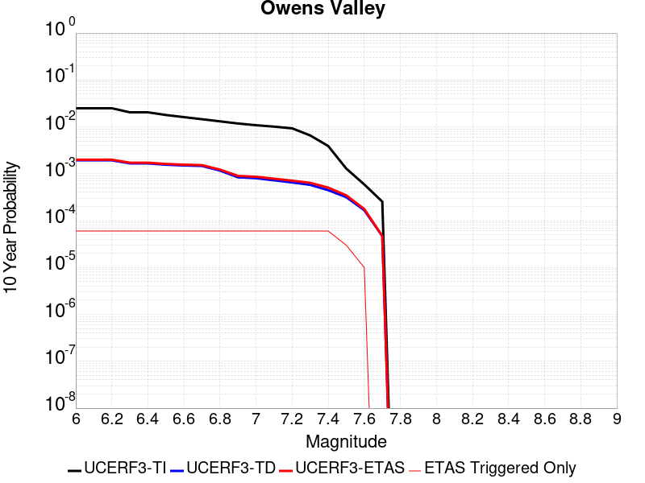 |

| Magnitude | 1 wk TI Prob | 1 wk TD Prob | 1 wk ETAS Prob | 1 wk ETAS/TD Gain | 1 wk ETAS Triggered Only | 1 mo TI Prob | 1 mo TD Prob | 1 mo ETAS Prob | 1 mo ETAS/TD Gain | 1 mo ETAS Triggered Only | 1 yr TI Prob | 1 yr TD Prob | 1 yr ETAS Prob | 1 yr ETAS/TD Gain | 1 yr ETAS Triggered Only | 10 yr TI Prob | 10 yr TD Prob | 10 yr ETAS Prob | 10 yr ETAS/TD Gain | 10 yr ETAS Triggered Only |
|-----|-----|-----|-----|-----|-----|-----|-----|-----|-----|-----|-----|-----|-----|-----|-----|-----|-----|-----|-----|-----|
| 6.0 | 4.83821E-5 | 3.626567E-6 | 4.3626424E-5 | 12.0296755 | 4.0E-5 | 2.0733538E-4 | 1.5542342E-5 | 6.5541564E-5 | 4.216968 | 5.0E-5 | 0.002521386 | 1.8921259E-4 | 2.4920123E-4 | 1.3170437 | 6.0E-5 | 0.024929691 | 0.001925011 | 0.0019848954 | 1.0311086 | 6.0E-5 |
| 6.1 | 4.83821E-5 | 3.626567E-6 | 4.3626424E-5 | 12.0296755 | 4.0E-5 | 2.0733538E-4 | 1.5542342E-5 | 6.5541564E-5 | 4.216968 | 5.0E-5 | 0.002521386 | 1.8921259E-4 | 2.4920123E-4 | 1.3170437 | 6.0E-5 | 0.024929691 | 0.001925011 | 0.0019848954 | 1.0311086 | 6.0E-5 |
| 6.2 | 4.83821E-5 | 3.626567E-6 | 4.3626424E-5 | 12.0296755 | 4.0E-5 | 2.0733538E-4 | 1.5542342E-5 | 6.5541564E-5 | 4.216968 | 5.0E-5 | 0.002521386 | 1.8921259E-4 | 2.4920123E-4 | 1.3170437 | 6.0E-5 | 0.024929691 | 0.001925011 | 0.0019848954 | 1.0311086 | 6.0E-5 |
| 6.3 | 3.953008E-5 | 3.1553948E-6 | 4.315527E-5 | 13.676662 | 4.0E-5 | 1.6940363E-4 | 1.3523055E-5 | 6.352238E-5 | 4.6973395 | 5.0E-5 | 0.002060538 | 1.6463149E-4 | 2.2462162E-4 | 1.3643904 | 6.0E-5 | 0.020415364 | 0.0016592 | 0.0017191004 | 1.036102 | 6.0E-5 |
| 6.4 | 3.953008E-5 | 3.1553948E-6 | 4.315527E-5 | 13.676662 | 4.0E-5 | 1.6940363E-4 | 1.3523055E-5 | 6.352238E-5 | 4.6973395 | 5.0E-5 | 0.002060538 | 1.6463149E-4 | 2.2462162E-4 | 1.3643904 | 6.0E-5 | 0.020415364 | 0.0016592 | 0.0017191004 | 1.036102 | 6.0E-5 |
| 6.5 | 3.457342E-5 | 2.9715961E-6 | 4.297148E-5 | 14.460739 | 4.0E-5 | 1.4816338E-4 | 1.2735354E-5 | 6.273472E-5 | 4.9260287 | 5.0E-5 | 0.0018023965 | 1.550426E-4 | 2.150333E-4 | 1.3869305 | 6.0E-5 | 0.017878477 | 0.001555719 | 0.0016156256 | 1.0385073 | 6.0E-5 |
| 6.6 | 3.1127765E-5 | 2.8744932E-6 | 4.2874377E-5 | 14.915456 | 4.0E-5 | 1.3339789E-4 | 1.2319203E-5 | 6.2318584E-5 | 5.0586543 | 5.0E-5 | 0.0016229092 | 1.4997667E-4 | 2.0996766E-4 | 1.4000022 | 6.0E-5 | 0.016111081 | 0.0015012559 | 0.0015611658 | 1.0399065 | 6.0E-5 |
| 6.7 | 2.806885E-5 | 2.8104134E-6 | 4.28103E-5 | 15.232741 | 4.0E-5 | 1.2028952E-4 | 1.20445775E-5 | 6.2043975E-5 | 5.151196 | 5.0E-5 | 0.001463541 | 1.4663354E-4 | 2.0662474E-4 | 1.4091233 | 6.0E-5 | 0.014539397 | 0.0014657511 | 0.0015256631 | 1.0408746 | 6.0E-5 |
| 6.8 | 2.524524E-5 | 2.2353688E-6 | 4.223528E-5 | 18.8941 | 4.0E-5 | 1.0818939E-4 | 9.580118E-6 | 5.957964E-5 | 6.2190924 | 5.0E-5 | 0.0013164099 | 1.16632E-4 | 1.76625E-4 | 1.5143785 | 6.0E-5 | 0.01308639 | 0.0011659812 | 0.0012259112 | 1.0513988 | 6.0E-5 |
| 6.9 | 2.2704568E-5 | 1.6081682E-6 | 4.1608106E-5 | 25.87298 | 4.0E-5 | 9.730166E-5 | 6.8921313E-6 | 5.6891786E-5 | 8.2546 | 5.0E-5 | 0.0011840039 | 8.390849E-5 | 1.4390345E-4 | 1.7150047 | 6.0E-5 | 0.011777153 | 8.3897985E-4 | 8.989295E-4 | 1.0714555 | 6.0E-5 |
| 7.0 | 2.0871712E-5 | 1.5395453E-6 | 4.1539482E-5 | 26.981657 | 4.0E-5 | 8.944713E-5 | 6.598035E-6 | 5.6597706E-5 | 8.577964 | 5.0E-5 | 0.0010884746 | 8.032813E-5 | 1.403233E-4 | 1.7468764 | 6.0E-5 | 0.010831586 | 8.0316263E-4 | 8.6311443E-4 | 1.0746447 | 6.0E-5 |
| 7.1 | 1.944928E-5 | 1.3864178E-6 | 4.1386364E-5 | 29.851292 | 4.0E-5 | 8.335139E-5 | 5.941777E-6 | 5.594148E-5 | 9.414941 | 5.0E-5 | 0.0010143308 | 7.233874E-5 | 1.323344E-4 | 1.8293711 | 6.0E-5 | 0.010097133 | 7.2330976E-4 | 7.832664E-4 | 1.0828921 | 6.0E-5 |
| 7.2 | 1.7876306E-5 | 1.2489141E-6 | 4.1248863E-5 | 33.027782 | 4.0E-5 | 7.6610486E-5 | 5.352478E-6 | 5.535221E-5 | 10.341417 | 5.0E-5 | 9.3233347E-4 | 6.516448E-5 | 1.2516057E-4 | 1.920687 | 6.0E-5 | 0.009284316 | 6.5159105E-4 | 7.115519E-4 | 1.0920223 | 6.0E-5 |
| 7.3 | 1.2618672E-5 | 1.1115209E-6 | 4.1111478E-5 | 36.986687 | 4.0E-5 | 5.40789E-5 | 4.763652E-6 | 5.4763415E-5 | 11.4960985 | 5.0E-5 | 6.582117E-4 | 5.799593E-5 | 1.1799245E-4 | 2.0344954 | 6.0E-5 | 0.0065626553 | 5.7994033E-4 | 6.399055E-4 | 1.1033989 | 6.0E-5 |
| 7.4 | 7.4874442E-6 | 8.5486437E-7 | 4.085483E-5 | 47.791008 | 4.0E-5 | 3.208865E-5 | 3.6636993E-6 | 5.3663516E-5 | 14.647358 | 5.0E-5 | 3.906093E-4 | 4.4604632E-5 | 1.0460195E-4 | 2.3450918 | 6.0E-5 | 0.003899234 | 4.4604883E-4 | 5.060221E-4 | 1.1344544 | 6.0E-5 |
| 7.5 | 2.4734156E-6 | 6.068616E-7 | 2.0606849E-5 | 33.956425 | 2.0E-5 | 1.060031E-5 | 2.6008327E-6 | 3.2600754E-5 | 12.534738 | 3.0E-5 | 1.2905113E-4 | 3.166468E-5 | 6.166373E-5 | 1.9473978 | 3.0E-5 | 0.0012897621 | 3.1660203E-4 | 3.4659254E-4 | 1.0947262 | 3.0E-5 |
| 7.6 | 1.1328841E-6 | 3.196531E-7 | 3.196531E-7 | 1.0 | 0.0 | 4.8552088E-6 | 1.3699412E-6 | 1.1369927E-5 | 8.299574 | 1.0E-5 | 5.9110564E-5 | 1.6678909E-5 | 2.6678741E-5 | 1.5995497 | 1.0E-5 | 5.9094845E-4 | 1.6677675E-4 | 1.7677508E-4 | 1.0599504 | 1.0E-5 |
| 7.7 | 4.8613185E-7 | 8.964689E-8 | 8.964689E-8 | 1.0 | 0.0 | 2.0834207E-6 | 3.8420092E-7 | 3.8420092E-7 | 1.0 | 0.0 | 2.536535E-5 | 4.6776368E-6 | 4.6776368E-6 | 1.0 | 0.0 | 2.5362454E-4 | 4.677545E-5 | 4.677545E-5 | 1.0 | 0.0 |

## Lost Hills
*[(top)](#table-of-contents)*

| 1 Week | 1 Month | 1 Year | 10 Year |
|-----|-----|-----|-----|
|  |  |  |  |

| Magnitude | 1 wk TI Prob | 1 wk TD Prob | 1 wk ETAS Prob | 1 wk ETAS/TD Gain | 1 wk ETAS Triggered Only | 1 mo TI Prob | 1 mo TD Prob | 1 mo ETAS Prob | 1 mo ETAS/TD Gain | 1 mo ETAS Triggered Only | 1 yr TI Prob | 1 yr TD Prob | 1 yr ETAS Prob | 1 yr ETAS/TD Gain | 1 yr ETAS Triggered Only | 10 yr TI Prob | 10 yr TD Prob | 10 yr ETAS Prob | 10 yr ETAS/TD Gain | 10 yr ETAS Triggered Only |
|-----|-----|-----|-----|-----|-----|-----|-----|-----|-----|-----|-----|-----|-----|-----|-----|-----|-----|-----|-----|-----|
| 6.0 | 2.233523E-5 | 2.5106583E-5 | 5.510583E-5 | 2.1948757 | 3.0E-5 | 9.571891E-5 | 1.0759615E-4 | 1.3759293E-4 | 1.2787904 | 3.0E-5 | 0.0011647546 | 0.001309364 | 0.0013692855 | 1.0457637 | 6.0E-5 | 0.011586686 | 0.013033091 | 0.013092308 | 1.0045437 | 6.0E-5 |
| 6.1 | 2.233523E-5 | 2.5106583E-5 | 5.510583E-5 | 2.1948757 | 3.0E-5 | 9.571891E-5 | 1.0759615E-4 | 1.3759293E-4 | 1.2787904 | 3.0E-5 | 0.0011647546 | 0.001309364 | 0.0013692855 | 1.0457637 | 6.0E-5 | 0.011586686 | 0.013033091 | 0.013092308 | 1.0045437 | 6.0E-5 |
| 6.2 | 2.233523E-5 | 2.5106583E-5 | 5.510583E-5 | 2.1948757 | 3.0E-5 | 9.571891E-5 | 1.0759615E-4 | 1.3759293E-4 | 1.2787904 | 3.0E-5 | 0.0011647546 | 0.001309364 | 0.0013692855 | 1.0457637 | 6.0E-5 | 0.011586686 | 0.013033091 | 0.013092308 | 1.0045437 | 6.0E-5 |
| 6.3 | 2.233523E-5 | 2.5106583E-5 | 5.510583E-5 | 2.1948757 | 3.0E-5 | 9.571891E-5 | 1.0759615E-4 | 1.3759293E-4 | 1.2787904 | 3.0E-5 | 0.0011647546 | 0.001309364 | 0.0013692855 | 1.0457637 | 6.0E-5 | 0.011586686 | 0.013033091 | 0.013092308 | 1.0045437 | 6.0E-5 |
| 6.4 | 1.2288092E-5 | 1.3781108E-5 | 3.378083E-5 | 2.4512422 | 2.0E-5 | 5.2662188E-5 | 5.906108E-5 | 7.90599E-5 | 1.3386124 | 2.0E-5 | 6.409735E-4 | 7.189252E-4 | 7.5889647E-4 | 1.0555986 | 4.0E-5 | 0.006391279 | 0.0071752006 | 0.0072149136 | 1.0055348 | 4.0E-5 |
| 6.5 | 1.2288092E-5 | 1.3781108E-5 | 3.378083E-5 | 2.4512422 | 2.0E-5 | 5.2662188E-5 | 5.906108E-5 | 7.90599E-5 | 1.3386124 | 2.0E-5 | 6.409735E-4 | 7.189252E-4 | 7.5889647E-4 | 1.0555986 | 4.0E-5 | 0.006391279 | 0.0071752006 | 0.0072149136 | 1.0055348 | 4.0E-5 |
| 6.6 | 8.58281E-6 | 9.63377E-6 | 2.9633577E-5 | 3.0760105 | 2.0E-5 | 3.6782953E-5 | 4.12874E-5 | 6.128658E-5 | 1.4843893 | 2.0E-5 | 4.4774043E-4 | 5.026414E-4 | 5.426213E-4 | 1.0795397 | 4.0E-5 | 0.0044683935 | 0.005023205 | 0.0050630043 | 1.007923 | 4.0E-5 |
| 6.7 | 7.205685E-6 | 8.088302E-6 | 2.808814E-5 | 3.472687 | 2.0E-5 | 3.088114E-5 | 3.466415E-5 | 5.466346E-5 | 1.576945 | 2.0E-5 | 3.7591302E-4 | 4.2203604E-4 | 4.6201915E-4 | 1.0947386 | 4.0E-5 | 0.0037527776 | 0.0042203604 | 0.0042601917 | 1.0094379 | 4.0E-5 |

## Dry Mountain
*[(top)](#table-of-contents)*

| 1 Week | 1 Month | 1 Year | 10 Year |
|-----|-----|-----|-----|
|  |  |  |  |

| Magnitude | 1 wk TI Prob | 1 wk TD Prob | 1 wk ETAS Prob | 1 wk ETAS/TD Gain | 1 wk ETAS Triggered Only | 1 mo TI Prob | 1 mo TD Prob | 1 mo ETAS Prob | 1 mo ETAS/TD Gain | 1 mo ETAS Triggered Only | 1 yr TI Prob | 1 yr TD Prob | 1 yr ETAS Prob | 1 yr ETAS/TD Gain | 1 yr ETAS Triggered Only | 10 yr TI Prob | 10 yr TD Prob | 10 yr ETAS Prob | 10 yr ETAS/TD Gain | 10 yr ETAS Triggered Only |
|-----|-----|-----|-----|-----|-----|-----|-----|-----|-----|-----|-----|-----|-----|-----|-----|-----|-----|-----|-----|-----|
| 6.0 | 6.222801E-6 | 6.439381E-6 | 1.6439317E-5 | 2.5529342 | 1.0E-5 | 2.6668875E-5 | 2.7597147E-5 | 3.759687E-5 | 1.3623463 | 1.0E-5 | 3.2464517E-4 | 3.3595937E-4 | 3.7594594E-4 | 1.119022 | 4.0E-5 | 0.0032417132 | 0.0033560768 | 0.003405909 | 1.0148484 | 5.0E-5 |
| 6.1 | 6.222801E-6 | 6.439381E-6 | 1.6439317E-5 | 2.5529342 | 1.0E-5 | 2.6668875E-5 | 2.7597147E-5 | 3.759687E-5 | 1.3623463 | 1.0E-5 | 3.2464517E-4 | 3.3595937E-4 | 3.7594594E-4 | 1.119022 | 4.0E-5 | 0.0032417132 | 0.0033560768 | 0.003405909 | 1.0148484 | 5.0E-5 |
| 6.2 | 6.222801E-6 | 6.439381E-6 | 1.6439317E-5 | 2.5529342 | 1.0E-5 | 2.6668875E-5 | 2.7597147E-5 | 3.759687E-5 | 1.3623463 | 1.0E-5 | 3.2464517E-4 | 3.3595937E-4 | 3.7594594E-4 | 1.119022 | 4.0E-5 | 0.0032417132 | 0.0033560768 | 0.003405909 | 1.0148484 | 5.0E-5 |
| 6.3 | 6.222801E-6 | 6.439381E-6 | 1.6439317E-5 | 2.5529342 | 1.0E-5 | 2.6668875E-5 | 2.7597147E-5 | 3.759687E-5 | 1.3623463 | 1.0E-5 | 3.2464517E-4 | 3.3595937E-4 | 3.7594594E-4 | 1.119022 | 4.0E-5 | 0.0032417132 | 0.0033560768 | 0.003405909 | 1.0148484 | 5.0E-5 |
| 6.4 | 6.222801E-6 | 6.439381E-6 | 1.6439317E-5 | 2.5529342 | 1.0E-5 | 2.6668875E-5 | 2.7597147E-5 | 3.759687E-5 | 1.3623463 | 1.0E-5 | 3.2464517E-4 | 3.3595937E-4 | 3.7594594E-4 | 1.119022 | 4.0E-5 | 0.0032417132 | 0.0033560768 | 0.003405909 | 1.0148484 | 5.0E-5 |
| 6.5 | 2.8528623E-6 | 2.9521684E-6 | 1.2952139E-5 | 4.3873305 | 1.0E-5 | 1.22264955E-5 | 1.2652138E-5 | 2.2652011E-5 | 1.7903702 | 1.0E-5 | 1.4884741E-4 | 1.540376E-4 | 1.6403606E-4 | 1.0649092 | 1.0E-5 | 0.0014874774 | 0.0015401616 | 0.0015501463 | 1.0064828 | 1.0E-5 |
| 6.6 | 2.8528623E-6 | 2.9521684E-6 | 1.2952139E-5 | 4.3873305 | 1.0E-5 | 1.22264955E-5 | 1.2652138E-5 | 2.2652011E-5 | 1.7903702 | 1.0E-5 | 1.4884741E-4 | 1.540376E-4 | 1.6403606E-4 | 1.0649092 | 1.0E-5 | 0.0014874774 | 0.0015401616 | 0.0015501463 | 1.0064828 | 1.0E-5 |
| 6.7 | 2.541E-6 | 2.6293578E-6 | 1.2629332E-5 | 4.8032 | 1.0E-5 | 1.0889954E-5 | 1.1268677E-5 | 2.1268565E-5 | 1.8874056 | 1.0E-5 | 1.3257713E-4 | 1.3719614E-4 | 1.4719476E-4 | 1.0728784 | 1.0E-5 | 0.0013249806 | 0.0013719613 | 0.0013819477 | 1.0072788 | 1.0E-5 |

## Whittier alt 1
*[(top)](#table-of-contents)*

| 1 Week | 1 Month | 1 Year | 10 Year |
|-----|-----|-----|-----|
|  |  |  |  |

| Magnitude | 1 wk TI Prob | 1 wk TD Prob | 1 wk ETAS Prob | 1 wk ETAS/TD Gain | 1 wk ETAS Triggered Only | 1 mo TI Prob | 1 mo TD Prob | 1 mo ETAS Prob | 1 mo ETAS/TD Gain | 1 mo ETAS Triggered Only | 1 yr TI Prob | 1 yr TD Prob | 1 yr ETAS Prob | 1 yr ETAS/TD Gain | 1 yr ETAS Triggered Only | 10 yr TI Prob | 10 yr TD Prob | 10 yr ETAS Prob | 10 yr ETAS/TD Gain | 10 yr ETAS Triggered Only |
|-----|-----|-----|-----|-----|-----|-----|-----|-----|-----|-----|-----|-----|-----|-----|-----|-----|-----|-----|-----|-----|
| 6.0 | 4.2554693E-5 | 4.725218E-5 | 8.7250286E-5 | 1.8464818 | 4.0E-5 | 1.8236451E-4 | 2.0249544E-4 | 2.4248734E-4 | 1.1974953 | 4.0E-5 | 0.002218027 | 0.0024629154 | 0.0025127921 | 1.0202512 | 5.0E-5 | 0.02196019 | 0.024390234 | 0.024439014 | 1.002 | 5.0E-5 |
| 6.1 | 4.2554693E-5 | 4.725218E-5 | 8.7250286E-5 | 1.8464818 | 4.0E-5 | 1.8236451E-4 | 2.0249544E-4 | 2.4248734E-4 | 1.1974953 | 4.0E-5 | 0.002218027 | 0.0024629154 | 0.0025127921 | 1.0202512 | 5.0E-5 | 0.02196019 | 0.024390234 | 0.024439014 | 1.002 | 5.0E-5 |
| 6.2 | 4.2554693E-5 | 4.725218E-5 | 8.7250286E-5 | 1.8464818 | 4.0E-5 | 1.8236451E-4 | 2.0249544E-4 | 2.4248734E-4 | 1.1974953 | 4.0E-5 | 0.002218027 | 0.0024629154 | 0.0025127921 | 1.0202512 | 5.0E-5 | 0.02196019 | 0.024390234 | 0.024439014 | 1.002 | 5.0E-5 |
| 6.3 | 1.9617712E-5 | 1.8268593E-5 | 4.8268044E-5 | 2.6421328 | 3.0E-5 | 8.40732E-5 | 7.829172E-5 | 1.0828937E-4 | 1.3831522 | 3.0E-5 | 0.0010231105 | 9.52804E-4 | 9.927659E-4 | 1.0419414 | 4.0E-5 | 0.01018413 | 0.009490474 | 0.009530094 | 1.0041747 | 4.0E-5 |
| 6.4 | 1.5611336E-5 | 1.3604271E-5 | 4.360386E-5 | 3.20516 | 3.0E-5 | 6.690401E-5 | 5.8302747E-5 | 8.8301E-5 | 1.5145255 | 3.0E-5 | 8.142519E-4 | 7.0961076E-4 | 7.4958237E-4 | 1.0563289 | 4.0E-5 | 0.008112748 | 0.0070754145 | 0.0071151317 | 1.0056133 | 4.0E-5 |
| 6.5 | 1.5150166E-5 | 1.3100925E-5 | 4.3100532E-5 | 3.2898846 | 3.0E-5 | 6.492767E-5 | 5.6145647E-5 | 8.614396E-5 | 1.5342946 | 3.0E-5 | 7.9020765E-4 | 6.8336475E-4 | 7.233374E-4 | 1.0584939 | 4.0E-5 | 0.007874036 | 0.0068145846 | 0.006854312 | 1.0058298 | 4.0E-5 |
| 6.6 | 1.295588E-5 | 1.0380725E-5 | 3.0380517E-5 | 2.9266276 | 2.0E-5 | 5.552402E-5 | 4.4488075E-5 | 6.448718E-5 | 1.4495387 | 2.0E-5 | 6.7579525E-4 | 5.4150965E-4 | 5.614988E-4 | 1.0369138 | 2.0E-5 | 0.006737438 | 0.0054033357 | 0.0054232273 | 1.0036814 | 2.0E-5 |
| 6.7 | 1.2542085E-5 | 9.899369E-6 | 2.989917E-5 | 3.0203109 | 2.0E-5 | 5.3750682E-5 | 4.242519E-5 | 6.242434E-5 | 1.4713981 | 2.0E-5 | 6.542181E-4 | 5.164061E-4 | 5.3639576E-4 | 1.0387092 | 2.0E-5 | 0.006522954 | 0.0051534795 | 0.0051733763 | 1.0038608 | 2.0E-5 |
| 6.8 | 1.2195878E-5 | 9.495415E-6 | 2.9495224E-5 | 3.1062598 | 2.0E-5 | 5.2267E-5 | 4.069401E-5 | 6.0693194E-5 | 1.4914528 | 2.0E-5 | 6.36165E-4 | 4.9533875E-4 | 5.153289E-4 | 1.0403564 | 2.0E-5 | 0.0063434686 | 0.004943688 | 0.0049635894 | 1.0040256 | 2.0E-5 |
| 6.9 | 1.1580298E-5 | 8.772933E-6 | 1.8772846E-5 | 2.1398597 | 1.0E-5 | 4.9628903E-5 | 3.7597754E-5 | 4.759738E-5 | 1.2659633 | 1.0E-5 | 6.040644E-4 | 4.5765814E-4 | 4.676536E-4 | 1.0218403 | 1.0E-5 | 0.00602425 | 0.0045684157 | 0.00457837 | 1.0021789 | 1.0E-5 |
| 7.0 | 1.0964795E-5 | 8.083994E-6 | 1.8083912E-5 | 2.2370024 | 1.0E-5 | 4.6991136E-5 | 3.4645236E-5 | 4.464489E-5 | 1.28863 | 1.0E-5 | 5.7196687E-4 | 4.2172565E-4 | 4.3172142E-4 | 1.0237021 | 1.0E-5 | 0.0057049696 | 0.004210462 | 0.0042204196 | 1.002365 | 1.0E-5 |
| 7.1 | 1.0230601E-5 | 7.3266697E-6 | 7.3266697E-6 | 1.0 | 0.0 | 4.3844695E-5 | 3.1399642E-5 | 3.1399642E-5 | 1.0 | 0.0 | 5.336784E-4 | 3.8222488E-4 | 3.8222488E-4 | 1.0 | 0.0 | 0.005323986 | 0.0038168381 | 0.0038168381 | 1.0 | 0.0 |
| 7.2 | 9.40865E-6 | 6.543289E-6 | 6.543289E-6 | 1.0 | 0.0 | 4.032216E-5 | 2.8042374E-5 | 2.8042374E-5 | 1.0 | 0.0 | 4.908117E-4 | 3.4136363E-4 | 3.4136363E-4 | 1.0 | 0.0 | 0.0048972913 | 0.003409485 | 0.003409485 | 1.0 | 0.0 |
| 7.3 | 8.237384E-6 | 5.5977525E-6 | 5.5977525E-6 | 1.0 | 0.0 | 3.5302593E-5 | 2.3990153E-5 | 2.3990153E-5 | 1.0 | 0.0 | 4.2972428E-4 | 2.92042E-4 | 2.92042E-4 | 1.0 | 0.0 | 0.0042889426 | 0.002916903 | 0.002916903 | 1.0 | 0.0 |
| 7.4 | 7.5316966E-6 | 5.027819E-6 | 5.027819E-6 | 1.0 | 0.0 | 3.2278298E-5 | 2.1547625E-5 | 2.1547625E-5 | 1.0 | 0.0 | 3.9291743E-4 | 2.6231175E-4 | 2.6231175E-4 | 1.0 | 0.0 | 0.0039222343 | 0.0026201333 | 0.0026201333 | 1.0 | 0.0 |
| 7.5 | 6.149649E-6 | 3.933841E-6 | 3.933841E-6 | 1.0 | 0.0 | 2.6355372E-5 | 1.6859214E-5 | 1.6859214E-5 | 1.0 | 0.0 | 3.208294E-4 | 2.052425E-4 | 2.052425E-4 | 1.0 | 0.0 | 0.003203666 | 0.0020506186 | 0.0020506186 | 1.0 | 0.0 |
| 7.6 | 5.457711E-6 | 3.3953788E-6 | 3.3953788E-6 | 1.0 | 0.0 | 2.338998E-5 | 1.4551547E-5 | 1.4551547E-5 | 1.0 | 0.0 | 2.8473578E-4 | 1.771515E-4 | 1.771515E-4 | 1.0 | 0.0 | 0.0028437122 | 0.0017701836 | 0.0017701836 | 1.0 | 0.0 |
| 7.7 | 4.1676276E-6 | 2.3331952E-6 | 2.3331952E-6 | 1.0 | 0.0 | 1.7861139E-5 | 9.999374E-6 | 9.999374E-6 | 1.0 | 0.0 | 2.1743766E-4 | 1.2173632E-4 | 1.2173632E-4 | 1.0 | 0.0 | 0.0021722503 | 0.0012167693 | 0.0012167693 | 1.0 | 0.0 |
| 7.8 | 2.2692414E-7 | 9.3854695E-8 | 9.3854695E-8 | 1.0 | 0.0 | 9.725317E-7 | 4.0223435E-7 | 4.0223435E-7 | 1.0 | 0.0 | 1.1840509E-5 | 4.8971956E-6 | 4.8971956E-6 | 1.0 | 0.0 | 1.1839878E-4 | 4.8971204E-5 | 4.8971204E-5 | 1.0 | 0.0 |
| 7.9 | 6.676829E-9 | 3.439853E-9 | 3.439853E-9 | 1.0 | 0.0 | 2.861498E-8 | 1.4742227E-8 | 1.4742227E-8 | 1.0 | 0.0 | 3.4838732E-7 | 1.7948659E-7 | 1.7948659E-7 | 1.0 | 0.0 | 3.4838679E-6 | 1.7948646E-6 | 1.7948646E-6 | 1.0 | 0.0 |

## San Diego Trough north alt1
*[(top)](#table-of-contents)*

| 1 Week | 1 Month | 1 Year | 10 Year |
|-----|-----|-----|-----|
|  |  |  |  |

| Magnitude | 1 wk TI Prob | 1 wk TD Prob | 1 wk ETAS Prob | 1 wk ETAS/TD Gain | 1 wk ETAS Triggered Only | 1 mo TI Prob | 1 mo TD Prob | 1 mo ETAS Prob | 1 mo ETAS/TD Gain | 1 mo ETAS Triggered Only | 1 yr TI Prob | 1 yr TD Prob | 1 yr ETAS Prob | 1 yr ETAS/TD Gain | 1 yr ETAS Triggered Only | 10 yr TI Prob | 10 yr TD Prob | 10 yr ETAS Prob | 10 yr ETAS/TD Gain | 10 yr ETAS Triggered Only |
|-----|-----|-----|-----|-----|-----|-----|-----|-----|-----|-----|-----|-----|-----|-----|-----|-----|-----|-----|-----|-----|
| 6.0 | 7.329252E-5 | 8.821093E-5 | 1.2820741E-4 | 1.4534185 | 4.0E-5 | 3.14073E-4 | 3.7799572E-4 | 4.279768E-4 | 1.1322266 | 5.0E-5 | 0.0038171355 | 0.004593027 | 0.004642797 | 1.0108361 | 5.0E-5 | 0.03752231 | 0.045044992 | 0.04509274 | 1.00106 | 5.0E-5 |
| 6.1 | 3.7940346E-5 | 4.4885E-5 | 5.4884553E-5 | 1.2227815 | 1.0E-5 | 1.6259136E-4 | 1.9235066E-4 | 2.0234875E-4 | 1.0519783 | 1.0E-5 | 0.0019777524 | 0.0023394432 | 0.0023494198 | 1.0042645 | 1.0E-5 | 0.019602431 | 0.023156688 | 0.023166455 | 1.0004219 | 1.0E-5 |
| 6.2 | 2.8645263E-5 | 3.329678E-5 | 4.3296448E-5 | 1.3003193 | 1.0E-5 | 1.2275964E-4 | 1.4269284E-4 | 1.5269141E-4 | 1.0700706 | 1.0E-5 | 0.0014935739 | 0.0017359189 | 0.0017459015 | 1.0057507 | 1.0E-5 | 0.0148357535 | 0.017226247 | 0.017236074 | 1.0005705 | 1.0E-5 |
| 6.3 | 2.8645263E-5 | 3.329678E-5 | 4.3296448E-5 | 1.3003193 | 1.0E-5 | 1.2275964E-4 | 1.4269284E-4 | 1.5269141E-4 | 1.0700706 | 1.0E-5 | 0.0014935739 | 0.0017359189 | 0.0017459015 | 1.0057507 | 1.0E-5 | 0.0148357535 | 0.017226247 | 0.017236074 | 1.0005705 | 1.0E-5 |
| 6.4 | 2.2204576E-5 | 2.5448318E-5 | 2.5448318E-5 | 1.0 | 0.0 | 9.5159E-5 | 1.0905972E-4 | 1.0905972E-4 | 1.0 | 0.0 | 0.001157945 | 0.0013270034 | 0.0013270034 | 1.0 | 0.0 | 0.011519298 | 0.013191955 | 0.013191955 | 1.0 | 0.0 |
| 6.5 | 2.1004838E-5 | 2.4024694E-5 | 2.4024694E-5 | 1.0 | 0.0 | 9.0017624E-5 | 1.0295896E-4 | 1.0295896E-4 | 1.0 | 0.0 | 0.0010954136 | 0.0012528138 | 0.0012528138 | 1.0 | 0.0 | 0.010900296 | 0.012458589 | 0.012458589 | 1.0 | 0.0 |
| 6.6 | 1.820557E-5 | 2.0704787E-5 | 2.0704787E-5 | 1.0 | 0.0 | 7.802154E-5 | 8.873181E-5 | 8.873181E-5 | 1.0 | 0.0 | 9.4949827E-4 | 0.0010797799 | 0.0010797799 | 1.0 | 0.0 | 0.009454516 | 0.010746004 | 0.010746004 | 1.0 | 0.0 |
| 6.7 | 1.5884485E-5 | 1.7983646E-5 | 1.7983646E-5 | 1.0 | 0.0 | 6.807459E-5 | 7.707051E-5 | 7.707051E-5 | 1.0 | 0.0 | 8.284929E-4 | 9.3793223E-4 | 9.3793223E-4 | 1.0 | 0.0 | 0.008254109 | 0.009340104 | 0.009340104 | 1.0 | 0.0 |
| 6.8 | 1.4331171E-5 | 1.6201066E-5 | 1.6201066E-5 | 1.0 | 0.0 | 6.141786E-5 | 6.94313E-5 | 6.94313E-5 | 1.0 | 0.0 | 7.4750587E-4 | 8.450002E-4 | 8.450002E-4 | 1.0 | 0.0 | 0.0074499645 | 0.008418139 | 0.008418139 | 1.0 | 0.0 |
| 6.9 | 1.2574203E-5 | 1.4205835E-5 | 1.4205835E-5 | 1.0 | 0.0 | 5.3888325E-5 | 6.0880735E-5 | 6.0880735E-5 | 1.0 | 0.0 | 6.558929E-4 | 7.409723E-4 | 7.409723E-4 | 1.0 | 0.0 | 0.0065396037 | 0.007385203 | 0.007385203 | 1.0 | 0.0 |
| 7.0 | 1.0883844E-5 | 1.2289262E-5 | 1.2289262E-5 | 1.0 | 0.0 | 4.664421E-5 | 5.2667205E-5 | 5.2667205E-5 | 1.0 | 0.0 | 5.677453E-4 | 6.4103556E-4 | 6.4103556E-4 | 1.0 | 0.0 | 0.00566297 | 0.006391993 | 0.006391993 | 1.0 | 0.0 |
| 7.1 | 9.393088E-6 | 1.060702E-5 | 1.060702E-5 | 1.0 | 0.0 | 4.025547E-5 | 4.545787E-5 | 4.545787E-5 | 1.0 | 0.0 | 4.900001E-4 | 5.533098E-4 | 5.533098E-4 | 1.0 | 0.0 | 0.0048892107 | 0.005519418 | 0.005519418 | 1.0 | 0.0 |
| 7.2 | 8.190791E-6 | 9.258625E-6 | 9.258625E-6 | 1.0 | 0.0 | 3.510292E-5 | 3.9679224E-5 | 3.9679224E-5 | 1.0 | 0.0 | 4.2729423E-4 | 4.8298817E-4 | 4.8298817E-4 | 1.0 | 0.0 | 0.0042647356 | 0.004819465 | 0.004819465 | 1.0 | 0.0 |
| 7.3 | 6.268162E-6 | 7.089716E-6 | 7.089716E-6 | 1.0 | 0.0 | 2.6863276E-5 | 3.0384144E-5 | 3.0384144E-5 | 1.0 | 0.0 | 3.2701128E-4 | 3.6986457E-4 | 3.6986457E-4 | 1.0 | 0.0 | 0.003265305 | 0.003692536 | 0.003692536 | 1.0 | 0.0 |
| 7.4 | 4.985186E-6 | 5.6426816E-6 | 5.6426816E-6 | 1.0 | 0.0 | 2.1364907E-5 | 2.4182698E-5 | 2.4182698E-5 | 1.0 | 0.0 | 2.600867E-4 | 2.9438498E-4 | 2.9438498E-4 | 1.0 | 0.0 | 0.002597825 | 0.0029399914 | 0.0029399914 | 1.0 | 0.0 |
| 7.5 | 1.7489613E-6 | 1.969678E-6 | 1.969678E-6 | 1.0 | 0.0 | 7.495527E-6 | 8.4414505E-6 | 8.4414505E-6 | 1.0 | 0.0 | 9.125422E-5 | 1.02770035E-4 | 1.02770035E-4 | 1.0 | 0.0 | 9.1216754E-4 | 0.0010272472 | 0.0010272472 | 1.0 | 0.0 |
| 7.6 | 1.6988751E-7 | 1.7533823E-7 | 1.7533823E-7 | 1.0 | 0.0 | 7.2808916E-7 | 7.5144936E-7 | 7.5144936E-7 | 1.0 | 0.0 | 8.864449E-6 | 9.14886E-6 | 9.14886E-6 | 1.0 | 0.0 | 8.8640954E-5 | 9.1485024E-5 | 9.1485024E-5 | 1.0 | 0.0 |

## Santa Ynez River
*[(top)](#table-of-contents)*

| 1 Week | 1 Month | 1 Year | 10 Year |
|-----|-----|-----|-----|
|  |  |  |  |

| Magnitude | 1 wk TI Prob | 1 wk TD Prob | 1 wk ETAS Prob | 1 wk ETAS/TD Gain | 1 wk ETAS Triggered Only | 1 mo TI Prob | 1 mo TD Prob | 1 mo ETAS Prob | 1 mo ETAS/TD Gain | 1 mo ETAS Triggered Only | 1 yr TI Prob | 1 yr TD Prob | 1 yr ETAS Prob | 1 yr ETAS/TD Gain | 1 yr ETAS Triggered Only | 10 yr TI Prob | 10 yr TD Prob | 10 yr ETAS Prob | 10 yr ETAS/TD Gain | 10 yr ETAS Triggered Only |
|-----|-----|-----|-----|-----|-----|-----|-----|-----|-----|-----|-----|-----|-----|-----|-----|-----|-----|-----|-----|-----|
| 6.0 | 1.6396456E-5 | 1.7209435E-5 | 1.7209435E-5 | 1.0 | 0.0 | 7.026863E-5 | 7.375284E-5 | 7.375284E-5 | 1.0 | 0.0 | 8.551848E-4 | 8.976064E-4 | 9.075975E-4 | 1.0111307 | 1.0E-5 | 0.0085190125 | 0.008943358 | 0.008992911 | 1.0055407 | 5.0E-5 |
| 6.1 | 1.6396456E-5 | 1.7209435E-5 | 1.7209435E-5 | 1.0 | 0.0 | 7.026863E-5 | 7.375284E-5 | 7.375284E-5 | 1.0 | 0.0 | 8.551848E-4 | 8.976064E-4 | 9.075975E-4 | 1.0111307 | 1.0E-5 | 0.0085190125 | 0.008943358 | 0.008992911 | 1.0055407 | 5.0E-5 |
| 6.2 | 1.6396456E-5 | 1.7209435E-5 | 1.7209435E-5 | 1.0 | 0.0 | 7.026863E-5 | 7.375284E-5 | 7.375284E-5 | 1.0 | 0.0 | 8.551848E-4 | 8.976064E-4 | 9.075975E-4 | 1.0111307 | 1.0E-5 | 0.0085190125 | 0.008943358 | 0.008992911 | 1.0055407 | 5.0E-5 |
| 6.3 | 9.736976E-6 | 1.012233E-5 | 1.012233E-5 | 1.0 | 0.0 | 4.172923E-5 | 4.338072E-5 | 4.338072E-5 | 1.0 | 0.0 | 5.0793495E-4 | 5.280373E-4 | 5.3803204E-4 | 1.018928 | 1.0E-5 | 0.005067755 | 0.005268332 | 0.0053081214 | 1.0075525 | 4.0E-5 |
| 6.4 | 9.736976E-6 | 1.012233E-5 | 1.012233E-5 | 1.0 | 0.0 | 4.172923E-5 | 4.338072E-5 | 4.338072E-5 | 1.0 | 0.0 | 5.0793495E-4 | 5.280373E-4 | 5.3803204E-4 | 1.018928 | 1.0E-5 | 0.005067755 | 0.005268332 | 0.0053081214 | 1.0075525 | 4.0E-5 |
| 6.5 | 7.081964E-6 | 7.3298966E-6 | 7.3298966E-6 | 1.0 | 0.0 | 3.035092E-5 | 3.1413474E-5 | 3.1413474E-5 | 1.0 | 0.0 | 3.694598E-4 | 3.8239348E-4 | 3.9238966E-4 | 1.026141 | 1.0E-5 | 0.0036884616 | 0.0038175168 | 0.0038573642 | 1.010438 | 4.0E-5 |
| 6.6 | 5.873247E-6 | 6.059743E-6 | 6.059743E-6 | 1.0 | 0.0 | 2.5170815E-5 | 2.5970074E-5 | 2.5970074E-5 | 1.0 | 0.0 | 3.064116E-4 | 3.1614062E-4 | 3.2613747E-4 | 1.0316215 | 1.0E-5 | 0.0030598943 | 0.0031569963 | 0.0031869016 | 1.0094727 | 3.0E-5 |
| 6.7 | 4.973277E-6 | 5.115901E-6 | 5.115901E-6 | 1.0 | 0.0 | 2.1313872E-5 | 2.1925109E-5 | 2.1925109E-5 | 1.0 | 0.0 | 2.5946548E-4 | 2.66906E-4 | 2.66906E-4 | 1.0 | 0.0 | 0.0025916274 | 0.0026659032 | 0.0026858498 | 1.0074822 | 2.0E-5 |
| 6.8 | 4.396492E-6 | 4.5109778E-6 | 4.5109778E-6 | 1.0 | 0.0 | 1.884197E-5 | 1.9332621E-5 | 1.9332621E-5 | 1.0 | 0.0 | 2.2937685E-4 | 2.3534958E-4 | 2.3534958E-4 | 1.0 | 0.0 | 0.0022914023 | 0.0023510386 | 0.0023709917 | 1.0084869 | 2.0E-5 |
| 6.9 | 3.5255632E-6 | 3.6013332E-6 | 3.6013332E-6 | 1.0 | 0.0 | 1.5109469E-5 | 1.5434196E-5 | 1.5434196E-5 | 1.0 | 0.0 | 1.8394225E-4 | 1.8789528E-4 | 1.8789528E-4 | 1.0 | 0.0 | 0.0018379007 | 0.0018773803 | 0.0018973427 | 1.0106331 | 2.0E-5 |
| 7.0 | 3.211603E-6 | 3.273654E-6 | 3.273654E-6 | 1.0 | 0.0 | 1.376394E-5 | 1.4029872E-5 | 1.4029872E-5 | 1.0 | 0.0 | 1.6756308E-4 | 1.7080043E-4 | 1.7080043E-4 | 1.0 | 0.0 | 0.0016743679 | 0.0017067058 | 0.0017266716 | 1.0116985 | 2.0E-5 |
| 7.1 | 2.5094619E-6 | 2.5409204E-6 | 2.5409204E-6 | 1.0 | 0.0 | 1.0754793E-5 | 1.0889614E-5 | 1.0889614E-5 | 1.0 | 0.0 | 1.3093173E-4 | 1.3257304E-4 | 1.3257304E-4 | 1.0 | 0.0 | 0.0013085462 | 0.0013249456 | 0.0013349323 | 1.0075375 | 1.0E-5 |
| 7.2 | 2.0515774E-6 | 2.0619375E-6 | 2.0619375E-6 | 1.0 | 0.0 | 8.792445E-6 | 8.836846E-6 | 8.836846E-6 | 1.0 | 0.0 | 1.0704277E-4 | 1.0758333E-4 | 1.0758333E-4 | 1.0 | 0.0 | 0.0010699122 | 0.0010753168 | 0.001085306 | 1.0092896 | 1.0E-5 |
| 7.3 | 1.6845745E-6 | 1.6773907E-6 | 1.6773907E-6 | 1.0 | 0.0 | 7.219585E-6 | 7.1887976E-6 | 7.1887976E-6 | 1.0 | 0.0 | 8.78949E-5 | 8.752012E-5 | 8.752012E-5 | 1.0 | 0.0 | 8.7860145E-4 | 8.7485946E-4 | 8.848507E-4 | 1.0114204 | 1.0E-5 |
| 7.4 | 1.3600285E-6 | 1.3333357E-6 | 1.3333357E-6 | 1.0 | 0.0 | 5.82868E-6 | 5.714284E-6 | 5.714284E-6 | 1.0 | 0.0 | 7.096187E-5 | 6.956921E-5 | 6.956921E-5 | 1.0 | 0.0 | 7.0939213E-4 | 6.954765E-4 | 7.054695E-4 | 1.0143687 | 1.0E-5 |
| 7.5 | 9.735342E-7 | 9.290103E-7 | 9.290103E-7 | 1.0 | 0.0 | 4.172283E-6 | 3.9814668E-6 | 3.9814668E-6 | 1.0 | 0.0 | 5.079636E-5 | 4.8473295E-5 | 4.8473295E-5 | 1.0 | 0.0 | 5.0784746E-4 | 4.8462892E-4 | 4.946241E-4 | 1.0206244 | 1.0E-5 |
| 7.6 | 5.067187E-7 | 4.77857E-7 | 4.77857E-7 | 1.0 | 0.0 | 2.1716498E-6 | 2.047957E-6 | 2.047957E-6 | 1.0 | 0.0 | 2.6439517E-5 | 2.4933597E-5 | 2.4933597E-5 | 1.0 | 0.0 | 2.643637E-4 | 2.4930874E-4 | 2.4930874E-4 | 1.0 | 0.0 |
| 7.7 | 2.769089E-7 | 2.5759124E-7 | 2.5759124E-7 | 1.0 | 0.0 | 1.1867519E-6 | 1.1039621E-6 | 1.1039621E-6 | 1.0 | 0.0 | 1.4448608E-5 | 1.34406555E-5 | 1.34406555E-5 | 1.0 | 0.0 | 1.444767E-4 | 1.3439846E-4 | 1.3439846E-4 | 1.0 | 0.0 |
| 7.8 | 1.7044663E-7 | 1.5449015E-7 | 1.5449015E-7 | 1.0 | 0.0 | 7.3048534E-7 | 6.621005E-7 | 6.621005E-7 | 1.0 | 0.0 | 8.893623E-6 | 8.061043E-6 | 8.061043E-6 | 1.0 | 0.0 | 8.893267E-5 | 8.060753E-5 | 8.060753E-5 | 1.0 | 0.0 |
| 7.9 | 4.8344287E-8 | 4.0910923E-8 | 4.0910923E-8 | 1.0 | 0.0 | 2.0718979E-7 | 1.7533252E-7 | 1.7533252E-7 | 1.0 | 0.0 | 2.5225327E-6 | 2.1346711E-6 | 2.1346711E-6 | 1.0 | 0.0 | 2.5225041E-5 | 2.1346512E-5 | 2.1346512E-5 | 1.0 | 0.0 |

## Sheephole
*[(top)](#table-of-contents)*

| 1 Week | 1 Month | 1 Year | 10 Year |
|-----|-----|-----|-----|
|  |  |  |  |

| Magnitude | 1 wk TI Prob | 1 wk TD Prob | 1 wk ETAS Prob | 1 wk ETAS/TD Gain | 1 wk ETAS Triggered Only | 1 mo TI Prob | 1 mo TD Prob | 1 mo ETAS Prob | 1 mo ETAS/TD Gain | 1 mo ETAS Triggered Only | 1 yr TI Prob | 1 yr TD Prob | 1 yr ETAS Prob | 1 yr ETAS/TD Gain | 1 yr ETAS Triggered Only | 10 yr TI Prob | 10 yr TD Prob | 10 yr ETAS Prob | 10 yr ETAS/TD Gain | 10 yr ETAS Triggered Only |
|-----|-----|-----|-----|-----|-----|-----|-----|-----|-----|-----|-----|-----|-----|-----|-----|-----|-----|-----|-----|-----|
| 6.0 | 4.5579695E-6 | 4.7412627E-6 | 2.4741168E-5 | 5.2182655 | 2.0E-5 | 1.9534009E-5 | 2.031957E-5 | 5.031896E-5 | 2.4763792 | 3.0E-5 | 2.3780059E-4 | 2.473682E-4 | 2.7736078E-4 | 1.1212467 | 3.0E-5 | 0.0023754628 | 0.002471473 | 0.0025113742 | 1.0161446 | 4.0E-5 |
| 6.1 | 4.5579695E-6 | 4.7412627E-6 | 2.4741168E-5 | 5.2182655 | 2.0E-5 | 1.9534009E-5 | 2.031957E-5 | 5.031896E-5 | 2.4763792 | 3.0E-5 | 2.3780059E-4 | 2.473682E-4 | 2.7736078E-4 | 1.1212467 | 3.0E-5 | 0.0023754628 | 0.002471473 | 0.0025113742 | 1.0161446 | 4.0E-5 |
| 6.2 | 2.6677674E-6 | 2.7873941E-6 | 2.7873941E-6 | 1.0 | 0.0 | 1.1433239E-5 | 1.1945926E-5 | 2.1945807E-5 | 1.8370954 | 1.0E-5 | 1.3919079E-4 | 1.4543302E-4 | 1.5543157E-4 | 1.0687501 | 1.0E-5 | 0.0013910364 | 0.0014534844 | 0.0014734553 | 1.0137401 | 2.0E-5 |
| 6.3 | 2.6677674E-6 | 2.7873941E-6 | 2.7873941E-6 | 1.0 | 0.0 | 1.1433239E-5 | 1.1945926E-5 | 2.1945807E-5 | 1.8370954 | 1.0E-5 | 1.3919079E-4 | 1.4543302E-4 | 1.5543157E-4 | 1.0687501 | 1.0E-5 | 0.0013910364 | 0.0014534844 | 0.0014734553 | 1.0137401 | 2.0E-5 |
| 6.4 | 2.2159759E-6 | 2.3228788E-6 | 2.3228788E-6 | 1.0 | 0.0 | 9.497005E-6 | 9.955161E-6 | 1.9955061E-5 | 2.0044942 | 1.0E-5 | 1.156199E-4 | 1.2119815E-4 | 1.3119694E-4 | 1.0824995 | 1.0E-5 | 0.0011555976 | 0.0012113999 | 0.0012313756 | 1.0164899 | 2.0E-5 |
| 6.5 | 2.1986082E-6 | 2.304759E-6 | 2.304759E-6 | 1.0 | 0.0 | 9.4225725E-6 | 9.877506E-6 | 1.9877407E-5 | 2.0123913 | 1.0E-5 | 1.1471378E-4 | 1.2025281E-4 | 1.302516E-4 | 1.0831481 | 1.0E-5 | 0.0011465458 | 0.0012019566 | 0.0012219326 | 1.0166196 | 2.0E-5 |
| 6.6 | 1.5232331E-6 | 1.6018919E-6 | 1.6018919E-6 | 1.0 | 0.0 | 6.5281256E-6 | 6.865234E-6 | 1.6865166E-5 | 2.4566047 | 1.0E-5 | 7.947703E-5 | 8.35812E-5 | 9.358037E-5 | 1.1196342 | 1.0E-5 | 7.9448614E-4 | 8.3551643E-4 | 8.554997E-4 | 1.0239173 | 2.0E-5 |
| 6.7 | 1.3137362E-6 | 1.382819E-6 | 1.382819E-6 | 1.0 | 0.0 | 5.6302856E-6 | 5.926355E-6 | 1.5926295E-5 | 2.687368 | 1.0E-5 | 6.854657E-5 | 7.215112E-5 | 8.21504E-5 | 1.138588 | 1.0E-5 | 6.8525434E-4 | 7.212908E-4 | 7.412764E-4 | 1.027708 | 2.0E-5 |
| 6.8 | 1.2275751E-6 | 1.2922847E-6 | 1.2922847E-6 | 1.0 | 0.0 | 5.2610258E-6 | 5.5383516E-6 | 1.5538297E-5 | 2.8055813 | 1.0E-5 | 6.4051106E-5 | 6.7427485E-5 | 7.7426805E-5 | 1.1482974 | 1.0E-5 | 6.4032647E-4 | 6.740836E-4 | 6.940701E-4 | 1.0296499 | 2.0E-5 |
| 6.9 | 1.1837088E-6 | 1.246102E-6 | 1.246102E-6 | 1.0 | 0.0 | 5.0730278E-6 | 5.340427E-6 | 1.5340374E-5 | 2.8724995 | 1.0E-5 | 6.176237E-5 | 6.501789E-5 | 7.501724E-5 | 1.1537938 | 1.0E-5 | 6.17452E-4 | 6.5000186E-4 | 6.6998886E-4 | 1.0307492 | 2.0E-5 |
| 7.0 | 9.849371E-7 | 1.0366288E-6 | 1.0366288E-6 | 1.0 | 0.0 | 4.2211523E-6 | 4.442688E-6 | 4.442688E-6 | 1.0 | 0.0 | 5.1391315E-5 | 5.4088487E-5 | 5.4088487E-5 | 1.0 | 0.0 | 5.137943E-4 | 5.407633E-4 | 5.5075786E-4 | 1.0184823 | 1.0E-5 |
| 7.1 | 8.1643645E-7 | 8.591669E-7 | 8.591669E-7 | 1.0 | 0.0 | 3.4990085E-6 | 3.682139E-6 | 3.682139E-6 | 1.0 | 0.0 | 4.2599597E-5 | 4.482921E-5 | 4.482921E-5 | 1.0 | 0.0 | 4.259143E-4 | 4.4821028E-4 | 4.5820582E-4 | 1.022301 | 1.0E-5 |
| 7.2 | 5.7295756E-7 | 6.029502E-7 | 6.029502E-7 | 1.0 | 0.0 | 2.45553E-6 | 2.58407E-6 | 2.58407E-6 | 1.0 | 0.0 | 2.9895667E-5 | 3.1460666E-5 | 3.1460666E-5 | 1.0 | 0.0 | 2.9891645E-4 | 3.145688E-4 | 3.2456568E-4 | 1.0317795 | 1.0E-5 |

## Channel Islands Thrust
*[(top)](#table-of-contents)*

| 1 Week | 1 Month | 1 Year | 10 Year |
|-----|-----|-----|-----|
| 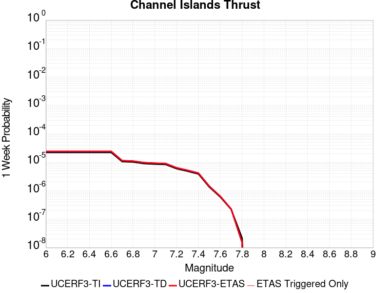 |  | 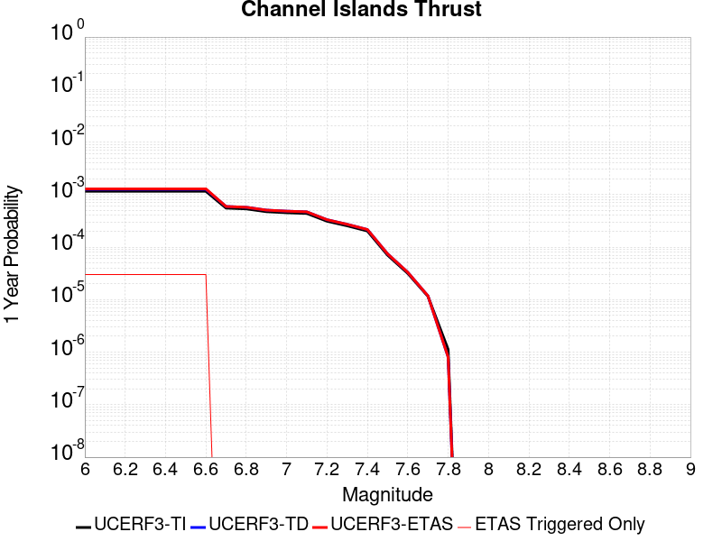 |  |

| Magnitude | 1 wk TI Prob | 1 wk TD Prob | 1 wk ETAS Prob | 1 wk ETAS/TD Gain | 1 wk ETAS Triggered Only | 1 mo TI Prob | 1 mo TD Prob | 1 mo ETAS Prob | 1 mo ETAS/TD Gain | 1 mo ETAS Triggered Only | 1 yr TI Prob | 1 yr TD Prob | 1 yr ETAS Prob | 1 yr ETAS/TD Gain | 1 yr ETAS Triggered Only | 10 yr TI Prob | 10 yr TD Prob | 10 yr ETAS Prob | 10 yr ETAS/TD Gain | 10 yr ETAS Triggered Only |
|-----|-----|-----|-----|-----|-----|-----|-----|-----|-----|-----|-----|-----|-----|-----|-----|-----|-----|-----|-----|-----|
| 6.0 | 2.2156251E-5 | 2.4092022E-5 | 2.4092022E-5 | 1.0 | 0.0 | 9.495191E-5 | 1.03248036E-4 | 1.2324598E-4 | 1.1936883 | 2.0E-5 | 0.0011554264 | 0.0012564264 | 0.0012863888 | 1.0238472 | 3.0E-5 | 0.011494373 | 0.0125038205 | 0.012543321 | 1.003159 | 4.0E-5 |
| 6.1 | 2.2156251E-5 | 2.4092022E-5 | 2.4092022E-5 | 1.0 | 0.0 | 9.495191E-5 | 1.03248036E-4 | 1.2324598E-4 | 1.1936883 | 2.0E-5 | 0.0011554264 | 0.0012564264 | 0.0012863888 | 1.0238472 | 3.0E-5 | 0.011494373 | 0.0125038205 | 0.012543321 | 1.003159 | 4.0E-5 |
| 6.2 | 2.2156251E-5 | 2.4092022E-5 | 2.4092022E-5 | 1.0 | 0.0 | 9.495191E-5 | 1.03248036E-4 | 1.2324598E-4 | 1.1936883 | 2.0E-5 | 0.0011554264 | 0.0012564264 | 0.0012863888 | 1.0238472 | 3.0E-5 | 0.011494373 | 0.0125038205 | 0.012543321 | 1.003159 | 4.0E-5 |
| 6.3 | 2.2156251E-5 | 2.4092022E-5 | 2.4092022E-5 | 1.0 | 0.0 | 9.495191E-5 | 1.03248036E-4 | 1.2324598E-4 | 1.1936883 | 2.0E-5 | 0.0011554264 | 0.0012564264 | 0.0012863888 | 1.0238472 | 3.0E-5 | 0.011494373 | 0.0125038205 | 0.012543321 | 1.003159 | 4.0E-5 |
| 6.4 | 2.2156251E-5 | 2.4092022E-5 | 2.4092022E-5 | 1.0 | 0.0 | 9.495191E-5 | 1.03248036E-4 | 1.2324598E-4 | 1.1936883 | 2.0E-5 | 0.0011554264 | 0.0012564264 | 0.0012863888 | 1.0238472 | 3.0E-5 | 0.011494373 | 0.0125038205 | 0.012543321 | 1.003159 | 4.0E-5 |
| 6.5 | 2.2156251E-5 | 2.4092022E-5 | 2.4092022E-5 | 1.0 | 0.0 | 9.495191E-5 | 1.03248036E-4 | 1.2324598E-4 | 1.1936883 | 2.0E-5 | 0.0011554264 | 0.0012564264 | 0.0012863888 | 1.0238472 | 3.0E-5 | 0.011494373 | 0.0125038205 | 0.012543321 | 1.003159 | 4.0E-5 |
| 6.6 | 2.2156251E-5 | 2.4092022E-5 | 2.4092022E-5 | 1.0 | 0.0 | 9.495191E-5 | 1.03248036E-4 | 1.2324598E-4 | 1.1936883 | 2.0E-5 | 0.0011554264 | 0.0012564264 | 0.0012863888 | 1.0238472 | 3.0E-5 | 0.011494373 | 0.0125038205 | 0.012543321 | 1.003159 | 4.0E-5 |
| 6.7 | 1.0601296E-5 | 1.1379544E-5 | 1.1379544E-5 | 1.0 | 0.0 | 4.5433335E-5 | 4.876859E-5 | 4.876859E-5 | 1.0 | 0.0 | 5.5301044E-4 | 5.936007E-4 | 5.936007E-4 | 1.0 | 0.0 | 0.005516363 | 0.005920653 | 0.005930594 | 1.001679 | 1.0E-5 |
| 6.8 | 1.0246747E-5 | 1.0996669E-5 | 1.0996669E-5 | 1.0 | 0.0 | 4.391389E-5 | 4.7127756E-5 | 4.7127756E-5 | 1.0 | 0.0 | 5.345204E-4 | 5.7363417E-4 | 5.7363417E-4 | 1.0 | 0.0 | 0.0053323656 | 0.005722025 | 0.0057319677 | 1.0017376 | 1.0E-5 |
| 6.9 | 9.049551E-6 | 9.699645E-6 | 9.699645E-6 | 1.0 | 0.0 | 3.878322E-5 | 4.1569267E-5 | 4.1569267E-5 | 1.0 | 0.0 | 4.7208337E-4 | 5.059924E-4 | 5.059924E-4 | 1.0 | 0.0 | 0.0047108172 | 0.0050488203 | 0.0050587696 | 1.0019706 | 1.0E-5 |
| 7.0 | 8.6542195E-6 | 9.274603E-6 | 9.274603E-6 | 1.0 | 0.0 | 3.7088983E-5 | 3.9747716E-5 | 3.9747716E-5 | 1.0 | 0.0 | 4.5146482E-4 | 4.8382508E-4 | 4.8382508E-4 | 1.0 | 0.0 | 0.004505487 | 0.004828129 | 0.004838081 | 1.0020612 | 1.0E-5 |
| 7.1 | 8.391028E-6 | 8.992924E-6 | 8.992924E-6 | 1.0 | 0.0 | 3.5961057E-5 | 3.854056E-5 | 3.854056E-5 | 1.0 | 0.0 | 4.3773788E-4 | 4.6913436E-4 | 4.6913436E-4 | 1.0 | 0.0 | 0.004368766 | 0.0046818503 | 0.0046918034 | 1.0021259 | 1.0E-5 |
| 7.2 | 5.965188E-6 | 6.3716952E-6 | 6.3716952E-6 | 1.0 | 0.0 | 2.556484E-5 | 2.7306982E-5 | 2.7306982E-5 | 1.0 | 0.0 | 3.1120746E-4 | 3.3241234E-4 | 3.3241234E-4 | 1.0 | 0.0 | 0.00310772 | 0.0033192092 | 0.003329176 | 1.0030028 | 1.0E-5 |
| 7.3 | 4.877518E-6 | 5.2060063E-6 | 5.2060063E-6 | 1.0 | 0.0 | 2.0903482E-5 | 2.2311267E-5 | 2.2311267E-5 | 1.0 | 0.0 | 2.5447016E-4 | 2.716063E-4 | 2.716063E-4 | 1.0 | 0.0 | 0.0025417898 | 0.0027127895 | 0.0027227623 | 1.0036763 | 1.0E-5 |
| 7.4 | 3.8829853E-6 | 4.141863E-6 | 4.141863E-6 | 1.0 | 0.0 | 1.664126E-5 | 1.7750723E-5 | 1.7750723E-5 | 1.0 | 0.0 | 2.0258849E-4 | 2.1609402E-4 | 2.1609402E-4 | 1.0 | 0.0 | 0.002024039 | 0.0021588807 | 0.0021688591 | 1.004622 | 1.0E-5 |
| 7.5 | 1.3489616E-6 | 1.4277903E-6 | 1.4277903E-6 | 1.0 | 0.0 | 5.7812517E-6 | 6.119087E-6 | 6.119087E-6 | 1.0 | 0.0 | 7.038446E-5 | 7.449738E-5 | 7.449738E-5 | 1.0 | 0.0 | 7.036218E-4 | 7.44728E-4 | 7.44728E-4 | 1.0 | 0.0 |
| 7.6 | 6.058192E-7 | 6.353778E-7 | 6.353778E-7 | 1.0 | 0.0 | 2.5963652E-6 | 2.7230449E-6 | 2.7230449E-6 | 1.0 | 0.0 | 3.161029E-5 | 3.3152584E-5 | 3.3152584E-5 | 1.0 | 0.0 | 3.1605794E-4 | 3.31478E-4 | 3.31478E-4 | 1.0 | 0.0 |
| 7.7 | 2.2170494E-7 | 2.2607902E-7 | 2.2607902E-7 | 1.0 | 0.0 | 9.5016367E-7 | 9.689098E-7 | 9.689098E-7 | 1.0 | 0.0 | 1.1568181E-5 | 1.1796425E-5 | 1.1796425E-5 | 1.0 | 0.0 | 1.1567579E-4 | 1.1795909E-4 | 1.1795909E-4 | 1.0 | 0.0 |
| 7.8 | 2.1613102E-8 | 1.5466682E-8 | 1.5466682E-8 | 1.0 | 0.0 | 9.262757E-8 | 6.628578E-8 | 6.628578E-8 | 1.0 | 0.0 | 1.1277401E-6 | 8.070291E-7 | 8.070291E-7 | 1.0 | 0.0 | 1.1277344E-5 | 8.070269E-6 | 8.070269E-6 | 1.0 | 0.0 |

## Robinson Creek
*[(top)](#table-of-contents)*

| 1 Week | 1 Month | 1 Year | 10 Year |
|-----|-----|-----|-----|
|  |  |  |  |

| Magnitude | 1 wk TI Prob | 1 wk TD Prob | 1 wk ETAS Prob | 1 wk ETAS/TD Gain | 1 wk ETAS Triggered Only | 1 mo TI Prob | 1 mo TD Prob | 1 mo ETAS Prob | 1 mo ETAS/TD Gain | 1 mo ETAS Triggered Only | 1 yr TI Prob | 1 yr TD Prob | 1 yr ETAS Prob | 1 yr ETAS/TD Gain | 1 yr ETAS Triggered Only | 10 yr TI Prob | 10 yr TD Prob | 10 yr ETAS Prob | 10 yr ETAS/TD Gain | 10 yr ETAS Triggered Only |
|-----|-----|-----|-----|-----|-----|-----|-----|-----|-----|-----|-----|-----|-----|-----|-----|-----|-----|-----|-----|-----|
| 6.0 | 1.3705327E-5 | 1.5285013E-5 | 4.5284556E-5 | 2.9626768 | 3.0E-5 | 5.8735794E-5 | 6.55072E-5 | 9.550524E-5 | 1.457935 | 3.0E-5 | 7.1487366E-4 | 7.9755014E-4 | 8.3751825E-4 | 1.0501136 | 4.0E-5 | 0.0071257832 | 0.007975501 | 0.008015183 | 1.0049753 | 4.0E-5 |
| 6.1 | 1.3705327E-5 | 1.5285013E-5 | 4.5284556E-5 | 2.9626768 | 3.0E-5 | 5.8735794E-5 | 6.55072E-5 | 9.550524E-5 | 1.457935 | 3.0E-5 | 7.1487366E-4 | 7.9755014E-4 | 8.3751825E-4 | 1.0501136 | 4.0E-5 | 0.0071257832 | 0.007975501 | 0.008015183 | 1.0049753 | 4.0E-5 |
| 6.2 | 1.3705327E-5 | 1.5285013E-5 | 4.5284556E-5 | 2.9626768 | 3.0E-5 | 5.8735794E-5 | 6.55072E-5 | 9.550524E-5 | 1.457935 | 3.0E-5 | 7.1487366E-4 | 7.9755014E-4 | 8.3751825E-4 | 1.0501136 | 4.0E-5 | 0.0071257832 | 0.007975501 | 0.008015183 | 1.0049753 | 4.0E-5 |
| 6.3 | 1.3705327E-5 | 1.5285013E-5 | 4.5284556E-5 | 2.9626768 | 3.0E-5 | 5.8735794E-5 | 6.55072E-5 | 9.550524E-5 | 1.457935 | 3.0E-5 | 7.1487366E-4 | 7.9755014E-4 | 8.3751825E-4 | 1.0501136 | 4.0E-5 | 0.0071257832 | 0.007975501 | 0.008015183 | 1.0049753 | 4.0E-5 |
| 6.4 | 1.3705327E-5 | 1.5285013E-5 | 4.5284556E-5 | 2.9626768 | 3.0E-5 | 5.8735794E-5 | 6.55072E-5 | 9.550524E-5 | 1.457935 | 3.0E-5 | 7.1487366E-4 | 7.9755014E-4 | 8.3751825E-4 | 1.0501136 | 4.0E-5 | 0.0071257832 | 0.007975501 | 0.008015183 | 1.0049753 | 4.0E-5 |

## San Andreas (Santa Cruz Mts) 2011 CFM
*[(top)](#table-of-contents)*

| 1 Week | 1 Month | 1 Year | 10 Year |
|-----|-----|-----|-----|
|  |  | 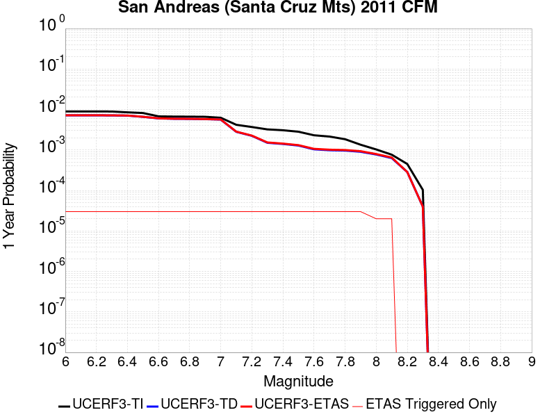 |  |

| Magnitude | 1 wk TI Prob | 1 wk TD Prob | 1 wk ETAS Prob | 1 wk ETAS/TD Gain | 1 wk ETAS Triggered Only | 1 mo TI Prob | 1 mo TD Prob | 1 mo ETAS Prob | 1 mo ETAS/TD Gain | 1 mo ETAS Triggered Only | 1 yr TI Prob | 1 yr TD Prob | 1 yr ETAS Prob | 1 yr ETAS/TD Gain | 1 yr ETAS Triggered Only | 10 yr TI Prob | 10 yr TD Prob | 10 yr ETAS Prob | 10 yr ETAS/TD Gain | 10 yr ETAS Triggered Only |
|-----|-----|-----|-----|-----|-----|-----|-----|-----|-----|-----|-----|-----|-----|-----|-----|-----|-----|-----|-----|-----|
| 6.0 | 1.7221631E-4 | 1.3793171E-4 | 1.4793033E-4 | 1.0724896 | 1.0E-5 | 7.378611E-4 | 5.9100403E-4 | 6.109922E-4 | 1.0338207 | 2.0E-5 | 0.008946515 | 0.007172124 | 0.0072019086 | 1.0041529 | 3.0E-5 | 0.08594794 | 0.0705551 | 0.07059228 | 1.0005269 | 4.0E-5 |
| 6.1 | 1.7221631E-4 | 1.3793171E-4 | 1.4793033E-4 | 1.0724896 | 1.0E-5 | 7.378611E-4 | 5.9100403E-4 | 6.109922E-4 | 1.0338207 | 2.0E-5 | 0.008946515 | 0.007172124 | 0.0072019086 | 1.0041529 | 3.0E-5 | 0.08594794 | 0.0705551 | 0.07059228 | 1.0005269 | 4.0E-5 |
| 6.2 | 1.7221631E-4 | 1.3793171E-4 | 1.4793033E-4 | 1.0724896 | 1.0E-5 | 7.378611E-4 | 5.9100403E-4 | 6.109922E-4 | 1.0338207 | 2.0E-5 | 0.008946515 | 0.007172124 | 0.0072019086 | 1.0041529 | 3.0E-5 | 0.08594794 | 0.0705551 | 0.07059228 | 1.0005269 | 4.0E-5 |
| 6.3 | 1.716926E-4 | 1.3712609E-4 | 1.4712471E-4 | 1.0729156 | 1.0E-5 | 7.3561794E-4 | 5.875529E-4 | 6.075411E-4 | 1.0340195 | 2.0E-5 | 0.008919428 | 0.0071303817 | 0.0071601677 | 1.0041773 | 3.0E-5 | 0.08569809 | 0.070167266 | 0.07020446 | 1.0005301 | 4.0E-5 |
| 6.4 | 1.6392978E-4 | 1.3588481E-4 | 1.4588344E-4 | 1.0735817 | 1.0E-5 | 7.02367E-4 | 5.822355E-4 | 6.0222385E-4 | 1.0343304 | 2.0E-5 | 0.008517839 | 0.007066063 | 0.007095851 | 1.0042156 | 3.0E-5 | 0.08198654 | 0.06940135 | 0.06943858 | 1.0005363 | 4.0E-5 |
| 6.5 | 1.5742714E-4 | 1.2648388E-4 | 1.364826E-4 | 1.0790515 | 1.0E-5 | 6.745133E-4 | 5.4196286E-4 | 5.61952E-4 | 1.0368829 | 2.0E-5 | 0.00818132 | 0.0065787593 | 0.0066085616 | 1.0045301 | 3.0E-5 | 0.078865945 | 0.06486309 | 0.0649005 | 1.0005767 | 4.0E-5 |
| 6.6 | 1.3038084E-4 | 1.1588213E-4 | 1.2588098E-4 | 1.0862846 | 1.0E-5 | 5.5865536E-4 | 4.9654447E-4 | 5.1653455E-4 | 1.0402584 | 2.0E-5 | 0.006780438 | 0.0060289134 | 0.0060587325 | 1.004946 | 3.0E-5 | 0.0657725 | 0.05932738 | 0.059365004 | 1.0006342 | 4.0E-5 |
| 6.7 | 1.2867592E-4 | 1.1314701E-4 | 1.2314587E-4 | 1.0883706 | 1.0E-5 | 5.5135164E-4 | 4.8482692E-4 | 5.0481723E-4 | 1.0412319 | 2.0E-5 | 0.0066920654 | 0.00588703 | 0.005916854 | 1.0050659 | 3.0E-5 | 0.06494093 | 0.058038417 | 0.058076095 | 1.0006492 | 4.0E-5 |
| 6.8 | 1.2801298E-4 | 1.1252261E-4 | 1.2252148E-4 | 1.088861 | 1.0E-5 | 5.485117E-4 | 4.8215193E-4 | 5.021423E-4 | 1.0414608 | 2.0E-5 | 0.0066577005 | 0.0058546383 | 0.0058844625 | 1.0050942 | 3.0E-5 | 0.06461738 | 0.057752274 | 0.057789963 | 1.0006527 | 4.0E-5 |
| 6.9 | 1.269149E-4 | 1.1094465E-4 | 1.2094354E-4 | 1.0901251 | 1.0E-5 | 5.4380763E-4 | 4.7539172E-4 | 4.9538224E-4 | 1.0420506 | 2.0E-5 | 0.006600777 | 0.005772772 | 0.005802599 | 1.0051668 | 3.0E-5 | 0.06408122 | 0.0570241 | 0.057061817 | 1.0006615 | 4.0E-5 |
| 7.0 | 1.2030331E-4 | 1.0824504E-4 | 1.1824395E-4 | 1.092373 | 1.0E-5 | 5.154837E-4 | 4.638261E-4 | 4.838168E-4 | 1.0430996 | 2.0E-5 | 0.006257969 | 0.0056326967 | 0.0056625274 | 1.005296 | 3.0E-5 | 0.06084648 | 0.055696685 | 0.05573446 | 1.0006782 | 4.0E-5 |
| 7.1 | 8.049617E-5 | 5.3926604E-5 | 6.392606E-5 | 1.1854272 | 1.0E-5 | 3.4493793E-4 | 2.3109373E-4 | 2.510891E-4 | 1.086525 | 2.0E-5 | 0.0041915346 | 0.0028099709 | 0.0028398866 | 1.0106462 | 3.0E-5 | 0.041133516 | 0.029618956 | 0.029657772 | 1.0013105 | 4.0E-5 |
| 7.2 | 7.093979E-5 | 4.2937932E-5 | 5.2937503E-5 | 1.2328843 | 1.0E-5 | 3.0399222E-4 | 1.8400686E-4 | 2.0400317E-4 | 1.1086715 | 2.0E-5 | 0.0036948253 | 0.0022380045 | 0.0022679374 | 1.0133748 | 3.0E-5 | 0.03633994 | 0.023941692 | 0.023980733 | 1.0016308 | 4.0E-5 |
| 7.3 | 6.193693E-5 | 2.8894141E-5 | 3.8893853E-5 | 1.3460809 | 1.0E-5 | 2.6541698E-4 | 1.2382616E-4 | 1.438237E-4 | 1.1614968 | 2.0E-5 | 0.0032266637 | 0.0015065427 | 0.0015364975 | 1.0198832 | 3.0E-5 | 0.031802133 | 0.016499156 | 0.016538497 | 1.0023844 | 4.0E-5 |
| 7.4 | 5.906492E-5 | 2.702346E-5 | 3.702319E-5 | 1.3700389 | 1.0E-5 | 2.5311083E-4 | 1.1580969E-4 | 1.3580738E-4 | 1.1726772 | 2.0E-5 | 0.0030772698 | 0.0014090725 | 0.0014390303 | 1.0212606 | 3.0E-5 | 0.030350044 | 0.015471023 | 0.015510404 | 1.0025455 | 4.0E-5 |
| 7.5 | 5.424296E-5 | 2.4678277E-5 | 3.467803E-5 | 1.4052047 | 1.0E-5 | 2.324491E-4 | 1.05759755E-4 | 1.2575764E-4 | 1.1890879 | 2.0E-5 | 0.002826395 | 0.0012868657 | 0.001316827 | 1.0232824 | 3.0E-5 | 0.027907165 | 0.014163188 | 0.014202621 | 1.0027843 | 4.0E-5 |
| 7.6 | 4.43084E-5 | 1.990431E-5 | 2.9904111E-5 | 1.5023937 | 1.0E-5 | 1.8987931E-4 | 8.53014E-5 | 1.0529969E-4 | 1.2344427 | 2.0E-5 | 0.0023093296 | 0.0010380499 | 0.0010680188 | 1.0288703 | 3.0E-5 | 0.022854783 | 0.011412679 | 0.011452223 | 1.0034648 | 4.0E-5 |
| 7.7 | 4.118098E-5 | 1.8936442E-5 | 2.8936252E-5 | 1.5280724 | 1.0E-5 | 1.7647797E-4 | 8.115366E-5 | 1.01152036E-4 | 1.2464261 | 2.0E-5 | 0.002146502 | 9.875982E-4 | 0.0010175685 | 1.0303468 | 3.0E-5 | 0.021258866 | 0.010870468 | 0.010910033 | 1.0036397 | 4.0E-5 |
| 7.8 | 3.5408906E-5 | 1.856446E-5 | 2.8564275E-5 | 1.5386536 | 1.0E-5 | 1.5174363E-4 | 7.955955E-5 | 9.9557954E-5 | 1.251364 | 2.0E-5 | 0.0018459131 | 9.682073E-4 | 9.981783E-4 | 1.0309551 | 3.0E-5 | 0.018306552 | 0.010652021 | 0.010691594 | 1.0037152 | 4.0E-5 |
| 7.9 | 2.5860836E-5 | 1.7315993E-5 | 2.731582E-5 | 1.5774908 | 1.0E-5 | 1.10827445E-4 | 7.420929E-5 | 9.4207804E-5 | 1.2694881 | 2.0E-5 | 0.001348489 | 9.031238E-4 | 9.3309674E-4 | 1.033188 | 3.0E-5 | 0.013403354 | 0.009907599 | 0.009937301 | 1.002998 | 3.0E-5 |
| 8.0 | 1.9777332E-5 | 1.4839596E-5 | 2.4839448E-5 | 1.6738628 | 1.0E-5 | 8.4757245E-5 | 6.3596715E-5 | 8.359545E-5 | 1.3144616 | 2.0E-5 | 0.0010314309 | 7.740152E-4 | 7.939997E-4 | 1.0258193 | 2.0E-5 | 0.010266567 | 0.008508967 | 0.008528798 | 1.0023304 | 2.0E-5 |
| 8.1 | 1.468494E-5 | 1.2107374E-5 | 2.2107253E-5 | 1.825933 | 1.0E-5 | 6.293394E-5 | 5.1887713E-5 | 7.188667E-5 | 1.3854277 | 2.0E-5 | 7.6595135E-4 | 6.3155E-4 | 6.515373E-4 | 1.0316482 | 2.0E-5 | 0.0076331664 | 0.006969149 | 0.0069890097 | 1.0028498 | 2.0E-5 |
| 8.2 | 8.63836E-6 | 5.469061E-6 | 5.469061E-6 | 1.0 | 0.0 | 3.7021015E-5 | 2.3438623E-5 | 2.3438623E-5 | 1.0 | 0.0 | 4.5063766E-4 | 2.8532793E-4 | 2.8532793E-4 | 1.0 | 0.0 | 0.004497249 | 0.00324569 | 0.00324569 | 1.0 | 0.0 |
| 8.3 | 1.983087E-6 | 7.6599065E-7 | 7.6599065E-7 | 1.0 | 0.0 | 8.498917E-6 | 3.282813E-6 | 3.282813E-6 | 1.0 | 0.0 | 1.034694E-4 | 3.9967534E-5 | 3.9967534E-5 | 1.0 | 0.0 | 0.0010342124 | 4.719687E-4 | 4.719687E-4 | 1.0 | 0.0 |

## Pitas Point (Lower West)
*[(top)](#table-of-contents)*

| 1 Week | 1 Month | 1 Year | 10 Year |
|-----|-----|-----|-----|
|  |  |  |  |

| Magnitude | 1 wk TI Prob | 1 wk TD Prob | 1 wk ETAS Prob | 1 wk ETAS/TD Gain | 1 wk ETAS Triggered Only | 1 mo TI Prob | 1 mo TD Prob | 1 mo ETAS Prob | 1 mo ETAS/TD Gain | 1 mo ETAS Triggered Only | 1 yr TI Prob | 1 yr TD Prob | 1 yr ETAS Prob | 1 yr ETAS/TD Gain | 1 yr ETAS Triggered Only | 10 yr TI Prob | 10 yr TD Prob | 10 yr ETAS Prob | 10 yr ETAS/TD Gain | 10 yr ETAS Triggered Only |
|-----|-----|-----|-----|-----|-----|-----|-----|-----|-----|-----|-----|-----|-----|-----|-----|-----|-----|-----|-----|-----|
| 6.0 | 8.151497E-6 | 7.855762E-6 | 3.7855527E-5 | 4.818823 | 3.0E-5 | 3.493452E-5 | 3.3667122E-5 | 6.366611E-5 | 1.891047 | 3.0E-5 | 4.252448E-4 | 4.0982084E-4 | 4.4980447E-4 | 1.0975636 | 4.0E-5 | 0.0042443196 | 0.0040907315 | 0.004130568 | 1.0097382 | 4.0E-5 |
| 6.1 | 8.151497E-6 | 7.855762E-6 | 3.7855527E-5 | 4.818823 | 3.0E-5 | 3.493452E-5 | 3.3667122E-5 | 6.366611E-5 | 1.891047 | 3.0E-5 | 4.252448E-4 | 4.0982084E-4 | 4.4980447E-4 | 1.0975636 | 4.0E-5 | 0.0042443196 | 0.0040907315 | 0.004130568 | 1.0097382 | 4.0E-5 |
| 6.2 | 8.151497E-6 | 7.855762E-6 | 3.7855527E-5 | 4.818823 | 3.0E-5 | 3.493452E-5 | 3.3667122E-5 | 6.366611E-5 | 1.891047 | 3.0E-5 | 4.252448E-4 | 4.0982084E-4 | 4.4980447E-4 | 1.0975636 | 4.0E-5 | 0.0042443196 | 0.0040907315 | 0.004130568 | 1.0097382 | 4.0E-5 |
| 6.3 | 8.151497E-6 | 7.855762E-6 | 3.7855527E-5 | 4.818823 | 3.0E-5 | 3.493452E-5 | 3.3667122E-5 | 6.366611E-5 | 1.891047 | 3.0E-5 | 4.252448E-4 | 4.0982084E-4 | 4.4980447E-4 | 1.0975636 | 4.0E-5 | 0.0042443196 | 0.0040907315 | 0.004130568 | 1.0097382 | 4.0E-5 |
| 6.4 | 8.151497E-6 | 7.855762E-6 | 3.7855527E-5 | 4.818823 | 3.0E-5 | 3.493452E-5 | 3.3667122E-5 | 6.366611E-5 | 1.891047 | 3.0E-5 | 4.252448E-4 | 4.0982084E-4 | 4.4980447E-4 | 1.0975636 | 4.0E-5 | 0.0042443196 | 0.0040907315 | 0.004130568 | 1.0097382 | 4.0E-5 |
| 6.5 | 8.151497E-6 | 7.855762E-6 | 3.7855527E-5 | 4.818823 | 3.0E-5 | 3.493452E-5 | 3.3667122E-5 | 6.366611E-5 | 1.891047 | 3.0E-5 | 4.252448E-4 | 4.0982084E-4 | 4.4980447E-4 | 1.0975636 | 4.0E-5 | 0.0042443196 | 0.0040907315 | 0.004130568 | 1.0097382 | 4.0E-5 |
| 6.6 | 8.151497E-6 | 7.855762E-6 | 3.7855527E-5 | 4.818823 | 3.0E-5 | 3.493452E-5 | 3.3667122E-5 | 6.366611E-5 | 1.891047 | 3.0E-5 | 4.252448E-4 | 4.0982084E-4 | 4.4980447E-4 | 1.0975636 | 4.0E-5 | 0.0042443196 | 0.0040907315 | 0.004130568 | 1.0097382 | 4.0E-5 |
| 6.7 | 8.151497E-6 | 7.855762E-6 | 3.7855527E-5 | 4.818823 | 3.0E-5 | 3.493452E-5 | 3.3667122E-5 | 6.366611E-5 | 1.891047 | 3.0E-5 | 4.252448E-4 | 4.0982084E-4 | 4.4980447E-4 | 1.0975636 | 4.0E-5 | 0.0042443196 | 0.0040907315 | 0.004130568 | 1.0097382 | 4.0E-5 |
| 6.8 | 8.151497E-6 | 7.855762E-6 | 3.7855527E-5 | 4.818823 | 3.0E-5 | 3.493452E-5 | 3.3667122E-5 | 6.366611E-5 | 1.891047 | 3.0E-5 | 4.252448E-4 | 4.0982084E-4 | 4.4980447E-4 | 1.0975636 | 4.0E-5 | 0.0042443196 | 0.0040907315 | 0.004130568 | 1.0097382 | 4.0E-5 |
| 6.9 | 8.151497E-6 | 7.855762E-6 | 3.7855527E-5 | 4.818823 | 3.0E-5 | 3.493452E-5 | 3.3667122E-5 | 6.366611E-5 | 1.891047 | 3.0E-5 | 4.252448E-4 | 4.0982084E-4 | 4.4980447E-4 | 1.0975636 | 4.0E-5 | 0.0042443196 | 0.0040907315 | 0.004130568 | 1.0097382 | 4.0E-5 |
| 7.0 | 8.103535E-6 | 7.805192E-6 | 3.780496E-5 | 4.8435655 | 3.0E-5 | 3.4728975E-5 | 3.3450397E-5 | 6.344939E-5 | 1.8968203 | 3.0E-5 | 4.2274324E-4 | 4.0718322E-4 | 4.4716694E-4 | 1.0981959 | 4.0E-5 | 0.0042193993 | 0.004064452 | 0.004104289 | 1.0098014 | 4.0E-5 |
| 7.1 | 7.853298E-6 | 7.540883E-6 | 2.7540733E-5 | 3.6521893 | 2.0E-5 | 3.3656554E-5 | 3.2317676E-5 | 5.2317027E-5 | 1.6188364 | 2.0E-5 | 4.096915E-4 | 3.9339735E-4 | 4.2338553E-4 | 1.0762287 | 3.0E-5 | 0.00408937 | 0.0039270855 | 0.0039569675 | 1.0076092 | 3.0E-5 |
| 7.2 | 7.771102E-6 | 7.453165E-6 | 2.7453016E-5 | 3.6834037 | 2.0E-5 | 3.33043E-5 | 3.194175E-5 | 5.1941108E-5 | 1.6261199 | 2.0E-5 | 4.0540437E-4 | 3.8882208E-4 | 4.1881044E-4 | 1.0771261 | 3.0E-5 | 0.0040466557 | 0.0038814936 | 0.003911377 | 1.007699 | 3.0E-5 |
| 7.3 | 7.3945344E-6 | 7.0492697E-6 | 2.704913E-5 | 3.8371534 | 2.0E-5 | 3.1690477E-5 | 3.021081E-5 | 5.0210205E-5 | 1.6619947 | 2.0E-5 | 3.8576324E-4 | 3.6775516E-4 | 3.9774412E-4 | 1.0815461 | 3.0E-5 | 0.0038509427 | 0.0036715334 | 0.0037014233 | 1.0081409 | 3.0E-5 |
| 7.4 | 6.964645E-6 | 6.5901186E-6 | 2.6589987E-5 | 4.0348268 | 2.0E-5 | 2.9848137E-5 | 2.8243063E-5 | 4.82425E-5 | 1.7081186 | 2.0E-5 | 3.6334046E-4 | 3.4380553E-4 | 3.7379522E-4 | 1.0872287 | 3.0E-5 | 0.0036274698 | 0.0034327896 | 0.0034626867 | 1.0087092 | 3.0E-5 |
| 7.5 | 6.6525035E-6 | 6.259157E-6 | 2.6259031E-5 | 4.195298 | 2.0E-5 | 2.851042E-5 | 2.6824686E-5 | 4.682415E-5 | 1.7455618 | 2.0E-5 | 3.4705905E-4 | 3.265421E-4 | 3.5653228E-4 | 1.0918418 | 3.0E-5 | 0.0034651754 | 0.0032606742 | 0.0032905764 | 1.0091705 | 3.0E-5 |
| 7.6 | 5.613338E-6 | 5.151386E-6 | 2.5151283E-5 | 4.88243 | 2.0E-5 | 2.405694E-5 | 2.2077185E-5 | 4.2076743E-5 | 1.9058926 | 2.0E-5 | 2.928539E-4 | 2.6875688E-4 | 2.987488E-4 | 1.111595 | 3.0E-5 | 0.0029246826 | 0.0026843501 | 0.0027142696 | 1.0111458 | 3.0E-5 |
| 7.7 | 4.494704E-6 | 3.996911E-6 | 3.996911E-6 | 1.0 | 0.0 | 1.9262876E-5 | 1.7129507E-5 | 1.7129507E-5 | 1.0 | 0.0 | 2.3450027E-4 | 2.0853203E-4 | 2.0853203E-4 | 1.0 | 0.0 | 0.0023425296 | 0.0020833875 | 0.0020833875 | 1.0 | 0.0 |
| 7.8 | 2.6075882E-6 | 2.1836374E-6 | 2.1836374E-6 | 1.0 | 0.0 | 1.117533E-5 | 9.358413E-6 | 9.358413E-6 | 1.0 | 0.0 | 1.3605114E-4 | 1.1393277E-4 | 1.1393277E-4 | 1.0 | 0.0 | 0.0013596788 | 0.0011387484 | 0.0011387484 | 1.0 | 0.0 |
| 7.9 | 4.045984E-7 | 3.242375E-7 | 3.242375E-7 | 1.0 | 0.0 | 1.733992E-6 | 1.3895885E-6 | 1.3895885E-6 | 1.0 | 0.0 | 2.1111147E-5 | 1.6918111E-5 | 1.6918111E-5 | 1.0 | 0.0 | 2.1109142E-4 | 1.6916855E-4 | 1.6916855E-4 | 1.0 | 0.0 |
| 8.0 | 7.791402E-9 | 5.683497E-9 | 5.683497E-9 | 1.0 | 0.0 | 3.3391725E-8 | 2.4357844E-8 | 2.4357844E-8 | 1.0 | 0.0 | 4.0654416E-7 | 2.9655675E-7 | 2.9655675E-7 | 1.0 | 0.0 | 4.065434E-6 | 2.9655655E-6 | 2.9655655E-6 | 1.0 | 0.0 |

## San Gabriel
*[(top)](#table-of-contents)*

| 1 Week | 1 Month | 1 Year | 10 Year |
|-----|-----|-----|-----|
|  |  |  |  |

| Magnitude | 1 wk TI Prob | 1 wk TD Prob | 1 wk ETAS Prob | 1 wk ETAS/TD Gain | 1 wk ETAS Triggered Only | 1 mo TI Prob | 1 mo TD Prob | 1 mo ETAS Prob | 1 mo ETAS/TD Gain | 1 mo ETAS Triggered Only | 1 yr TI Prob | 1 yr TD Prob | 1 yr ETAS Prob | 1 yr ETAS/TD Gain | 1 yr ETAS Triggered Only | 10 yr TI Prob | 10 yr TD Prob | 10 yr ETAS Prob | 10 yr ETAS/TD Gain | 10 yr ETAS Triggered Only |
|-----|-----|-----|-----|-----|-----|-----|-----|-----|-----|-----|-----|-----|-----|-----|-----|-----|-----|-----|-----|-----|
| 6.0 | 1.083775E-5 | 1.19851875E-5 | 2.1985068E-5 | 1.8343532 | 1.0E-5 | 4.6446676E-5 | 5.1364143E-5 | 6.136363E-5 | 1.1946783 | 1.0E-5 | 5.653415E-4 | 6.251903E-4 | 6.651653E-4 | 1.0639405 | 4.0E-5 | 0.0056390543 | 0.006246409 | 0.006286159 | 1.0063636 | 4.0E-5 |
| 6.1 | 1.083775E-5 | 1.19851875E-5 | 2.1985068E-5 | 1.8343532 | 1.0E-5 | 4.6446676E-5 | 5.1364143E-5 | 6.136363E-5 | 1.1946783 | 1.0E-5 | 5.653415E-4 | 6.251903E-4 | 6.651653E-4 | 1.0639405 | 4.0E-5 | 0.0056390543 | 0.006246409 | 0.006286159 | 1.0063636 | 4.0E-5 |
| 6.2 | 1.083775E-5 | 1.19851875E-5 | 2.1985068E-5 | 1.8343532 | 1.0E-5 | 4.6446676E-5 | 5.1364143E-5 | 6.136363E-5 | 1.1946783 | 1.0E-5 | 5.653415E-4 | 6.251903E-4 | 6.651653E-4 | 1.0639405 | 4.0E-5 | 0.0056390543 | 0.006246409 | 0.006286159 | 1.0063636 | 4.0E-5 |
| 6.3 | 1.083775E-5 | 1.19851875E-5 | 2.1985068E-5 | 1.8343532 | 1.0E-5 | 4.6446676E-5 | 5.1364143E-5 | 6.136363E-5 | 1.1946783 | 1.0E-5 | 5.653415E-4 | 6.251903E-4 | 6.651653E-4 | 1.0639405 | 4.0E-5 | 0.0056390543 | 0.006246409 | 0.006286159 | 1.0063636 | 4.0E-5 |
| 6.4 | 1.083775E-5 | 1.19851875E-5 | 2.1985068E-5 | 1.8343532 | 1.0E-5 | 4.6446676E-5 | 5.1364143E-5 | 6.136363E-5 | 1.1946783 | 1.0E-5 | 5.653415E-4 | 6.251903E-4 | 6.651653E-4 | 1.0639405 | 4.0E-5 | 0.0056390543 | 0.006246409 | 0.006286159 | 1.0063636 | 4.0E-5 |
| 6.5 | 6.7317824E-6 | 7.716944E-6 | 1.7716868E-5 | 2.2958395 | 1.0E-5 | 2.8850178E-5 | 3.3072207E-5 | 4.3071876E-5 | 1.3023587 | 1.0E-5 | 3.511943E-4 | 4.0258077E-4 | 4.4256466E-4 | 1.099319 | 4.0E-5 | 0.003506398 | 0.0040296097 | 0.0040694484 | 1.0098865 | 4.0E-5 |
| 6.6 | 6.7317824E-6 | 7.716944E-6 | 1.7716868E-5 | 2.2958395 | 1.0E-5 | 2.8850178E-5 | 3.3072207E-5 | 4.3071876E-5 | 1.3023587 | 1.0E-5 | 3.511943E-4 | 4.0258077E-4 | 4.4256466E-4 | 1.099319 | 4.0E-5 | 0.003506398 | 0.0040296097 | 0.0040694484 | 1.0098865 | 4.0E-5 |
| 6.7 | 6.274881E-6 | 7.2458647E-6 | 1.7245793E-5 | 2.3800876 | 1.0E-5 | 2.6892068E-5 | 3.1053343E-5 | 4.105303E-5 | 1.3220165 | 1.0E-5 | 3.2736175E-4 | 3.780098E-4 | 4.1799468E-4 | 1.1057774 | 4.0E-5 | 0.0032687993 | 0.0037847564 | 0.003824605 | 1.0105287 | 4.0E-5 |
| 6.8 | 5.996209E-6 | 6.958585E-6 | 1.6958515E-5 | 2.4370637 | 1.0E-5 | 2.5697784E-5 | 2.9822171E-5 | 3.9821873E-5 | 1.3353109 | 1.0E-5 | 3.128256E-4 | 3.6302538E-4 | 4.0301087E-4 | 1.1101451 | 4.0E-5 | 0.003123856 | 0.0036354093 | 0.0036752638 | 1.0109628 | 4.0E-5 |
| 6.9 | 5.686331E-6 | 6.6236316E-6 | 1.6623566E-5 | 2.5097358 | 1.0E-5 | 2.4369761E-5 | 2.8386688E-5 | 3.8386406E-5 | 1.3522677 | 1.0E-5 | 2.9666146E-4 | 3.4555403E-4 | 3.8554022E-4 | 1.1157161 | 4.0E-5 | 0.0029626573 | 0.0034612515 | 0.003501113 | 1.0115166 | 4.0E-5 |
| 7.0 | 5.2329838E-6 | 6.147514E-6 | 1.6147453E-5 | 2.6266637 | 1.0E-5 | 2.242688E-5 | 2.6346226E-5 | 3.6345962E-5 | 1.3795509 | 1.0E-5 | 2.7301308E-4 | 3.2071886E-4 | 3.6070604E-4 | 1.1246798 | 4.0E-5 | 0.002726779 | 0.0032136322 | 0.0032535035 | 1.012407 | 4.0E-5 |
| 7.1 | 5.135671E-6 | 6.03764E-6 | 1.603758E-5 | 2.6562662 | 1.0E-5 | 2.2009834E-5 | 2.5875348E-5 | 3.5875088E-5 | 1.3864583 | 1.0E-5 | 2.6793676E-4 | 3.1498758E-4 | 3.5497497E-4 | 1.1269492 | 4.0E-5 | 0.0026761394 | 0.0031564834 | 0.003196357 | 1.0126324 | 4.0E-5 |
| 7.2 | 4.989062E-6 | 5.87102E-6 | 1.587096E-5 | 2.7032714 | 1.0E-5 | 2.1381518E-5 | 2.5161276E-5 | 3.5161025E-5 | 1.3974261 | 1.0E-5 | 2.6028889E-4 | 3.0629625E-4 | 3.4628398E-4 | 1.1305525 | 4.0E-5 | 0.0025998424 | 0.003069813 | 0.00310969 | 1.0129901 | 4.0E-5 |
| 7.3 | 4.8219395E-6 | 5.702574E-6 | 1.5702517E-5 | 2.753584 | 1.0E-5 | 2.0665291E-5 | 2.443938E-5 | 3.4439134E-5 | 1.4091657 | 1.0E-5 | 2.5157086E-4 | 2.9750957E-4 | 3.3749765E-4 | 1.1344094 | 4.0E-5 | 0.0025128627 | 0.0029821852 | 0.0030220659 | 1.013373 | 4.0E-5 |
| 7.4 | 4.7118383E-6 | 5.5911332E-6 | 1.5591077E-5 | 2.7885363 | 1.0E-5 | 2.0193436E-5 | 2.3961782E-5 | 3.3961544E-5 | 1.4173212 | 1.0E-5 | 2.4582737E-4 | 2.916964E-4 | 3.3168474E-4 | 1.1370889 | 4.0E-5 | 0.002455556 | 0.0029242067 | 0.0029640899 | 1.013639 | 4.0E-5 |
| 7.5 | 4.5506545E-6 | 5.4365014E-6 | 1.5436446E-5 | 2.8394084 | 1.0E-5 | 1.9502659E-5 | 2.3299088E-5 | 3.3298853E-5 | 1.4291914 | 1.0E-5 | 2.37419E-4 | 2.8363022E-4 | 3.2361888E-4 | 1.1409887 | 4.0E-5 | 0.002371655 | 0.002843753 | 0.0028836392 | 1.0140259 | 4.0E-5 |
| 7.6 | 4.343636E-6 | 5.2293817E-6 | 1.522933E-5 | 2.912262 | 1.0E-5 | 1.861545E-5 | 2.2411448E-5 | 3.2411222E-5 | 1.4461906 | 1.0E-5 | 2.2661954E-4 | 2.7282597E-4 | 3.1281504E-4 | 1.1465737 | 4.0E-5 | 0.0022638857 | 0.0027359722 | 0.0027758628 | 1.01458 | 4.0E-5 |
| 7.7 | 2.936235E-6 | 2.7440458E-6 | 2.7440458E-6 | 1.0 | 0.0 | 1.2583803E-5 | 1.1760143E-5 | 1.1760143E-5 | 1.0 | 0.0 | 1.5319703E-4 | 1.4317037E-4 | 1.4317037E-4 | 1.0 | 0.0 | 0.0015309147 | 0.0014380751 | 0.0014380751 | 1.0 | 0.0 |
| 7.8 | 1.4541639E-6 | 9.1237047E-7 | 9.1237047E-7 | 1.0 | 0.0 | 6.232116E-6 | 3.9101533E-6 | 3.9101533E-6 | 1.0 | 0.0 | 7.587337E-5 | 4.7605077E-5 | 4.7605077E-5 | 1.0 | 0.0 | 7.584747E-4 | 4.8085177E-4 | 4.8085177E-4 | 1.0 | 0.0 |
| 7.9 | 8.098958E-7 | 2.41753E-7 | 2.41753E-7 | 1.0 | 0.0 | 3.4709774E-6 | 1.0360839E-6 | 1.0360839E-6 | 1.0 | 0.0 | 4.225833E-5 | 1.2614248E-5 | 1.2614248E-5 | 1.0 | 0.0 | 4.2250296E-4 | 1.2921814E-4 | 1.2921814E-4 | 1.0 | 0.0 |
| 8.0 | 5.2473234E-7 | 7.6792055E-8 | 7.6792055E-8 | 1.0 | 0.0 | 2.248851E-6 | 3.2910876E-7 | 3.2910876E-7 | 1.0 | 0.0 | 2.7379416E-5 | 4.0068917E-6 | 4.0068917E-6 | 1.0 | 0.0 | 2.7376044E-4 | 4.21918E-5 | 4.21918E-5 | 1.0 | 0.0 |
| 8.1 | 3.3162388E-7 | 4.1496126E-8 | 4.1496126E-8 | 1.0 | 0.0 | 1.4212444E-6 | 1.7784053E-7 | 1.7784053E-7 | 1.0 | 0.0 | 1.7303513E-5 | 2.1652063E-6 | 2.1652063E-6 | 1.0 | 0.0 | 1.7302166E-4 | 2.2965523E-5 | 2.2965523E-5 | 1.0 | 0.0 |
| 8.2 | 1.0235345E-7 | 1.4043474E-8 | 1.4043474E-8 | 1.0 | 0.0 | 4.3865757E-7 | 6.0186316E-8 | 6.0186316E-8 | 1.0 | 0.0 | 5.340643E-6 | 7.327681E-7 | 7.327681E-7 | 1.0 | 0.0 | 5.3405143E-5 | 7.9273705E-6 | 7.9273705E-6 | 1.0 | 0.0 |

## West Napa 2011 CFM
*[(top)](#table-of-contents)*

| 1 Week | 1 Month | 1 Year | 10 Year |
|-----|-----|-----|-----|
|  |  |  |  |

| Magnitude | 1 wk TI Prob | 1 wk TD Prob | 1 wk ETAS Prob | 1 wk ETAS/TD Gain | 1 wk ETAS Triggered Only | 1 mo TI Prob | 1 mo TD Prob | 1 mo ETAS Prob | 1 mo ETAS/TD Gain | 1 mo ETAS Triggered Only | 1 yr TI Prob | 1 yr TD Prob | 1 yr ETAS Prob | 1 yr ETAS/TD Gain | 1 yr ETAS Triggered Only | 10 yr TI Prob | 10 yr TD Prob | 10 yr ETAS Prob | 10 yr ETAS/TD Gain | 10 yr ETAS Triggered Only |
|-----|-----|-----|-----|-----|-----|-----|-----|-----|-----|-----|-----|-----|-----|-----|-----|-----|-----|-----|-----|-----|
| 6.0 | 3.773104E-5 | 4.452845E-5 | 7.452711E-5 | 1.6736966 | 3.0E-5 | 1.6169442E-4 | 1.9082405E-4 | 2.2081833E-4 | 1.1571829 | 3.0E-5 | 0.001966852 | 0.0023211248 | 0.0023510552 | 1.0128947 | 3.0E-5 | 0.019495348 | 0.023002245 | 0.023041325 | 1.001699 | 4.0E-5 |
| 6.1 | 3.773104E-5 | 4.452845E-5 | 7.452711E-5 | 1.6736966 | 3.0E-5 | 1.6169442E-4 | 1.9082405E-4 | 2.2081833E-4 | 1.1571829 | 3.0E-5 | 0.001966852 | 0.0023211248 | 0.0023510552 | 1.0128947 | 3.0E-5 | 0.019495348 | 0.023002245 | 0.023041325 | 1.001699 | 4.0E-5 |
| 6.2 | 3.773104E-5 | 4.452845E-5 | 7.452711E-5 | 1.6736966 | 3.0E-5 | 1.6169442E-4 | 1.9082405E-4 | 2.2081833E-4 | 1.1571829 | 3.0E-5 | 0.001966852 | 0.0023211248 | 0.0023510552 | 1.0128947 | 3.0E-5 | 0.019495348 | 0.023002245 | 0.023041325 | 1.001699 | 4.0E-5 |
| 6.3 | 2.147964E-5 | 2.4987039E-5 | 4.498654E-5 | 1.800395 | 2.0E-5 | 9.2052345E-5 | 1.0708343E-4 | 1.270813E-4 | 1.1867503 | 2.0E-5 | 0.001120161 | 0.0013030528 | 0.0013230267 | 1.0153285 | 2.0E-5 | 0.011145315 | 0.0129647385 | 0.012994349 | 1.0022839 | 3.0E-5 |
| 6.4 | 2.147964E-5 | 2.4987039E-5 | 4.498654E-5 | 1.800395 | 2.0E-5 | 9.2052345E-5 | 1.0708343E-4 | 1.270813E-4 | 1.1867503 | 2.0E-5 | 0.001120161 | 0.0013030528 | 0.0013230267 | 1.0153285 | 2.0E-5 | 0.011145315 | 0.0129647385 | 0.012994349 | 1.0022839 | 3.0E-5 |
| 6.5 | 1.688201E-5 | 1.9547346E-5 | 2.9547151E-5 | 1.5115684 | 1.0E-5 | 7.234947E-5 | 8.377206E-5 | 9.3771225E-5 | 1.1193615 | 1.0E-5 | 8.804988E-4 | 0.0010195201 | 0.0010295099 | 1.0097985 | 1.0E-5 | 0.008770182 | 0.010157098 | 0.010176895 | 1.0019491 | 2.0E-5 |
| 6.6 | 1.6846381E-5 | 1.9507039E-5 | 2.9506844E-5 | 1.5126255 | 1.0E-5 | 7.219678E-5 | 8.359933E-5 | 9.359849E-5 | 1.1196082 | 1.0E-5 | 8.7864127E-4 | 0.001017419 | 0.0010274089 | 1.0098188 | 1.0E-5 | 0.008751754 | 0.010136279 | 0.010156076 | 1.0019531 | 2.0E-5 |
| 6.7 | 1.3396501E-5 | 1.5467655E-5 | 2.54675E-5 | 1.6465005 | 1.0E-5 | 5.7412315E-5 | 6.628862E-5 | 7.628796E-5 | 1.1508454 | 1.0E-5 | 6.9877075E-4 | 8.0682867E-4 | 8.168206E-4 | 1.0123842 | 1.0E-5 | 0.0069657755 | 0.008046719 | 0.008066558 | 1.0024655 | 2.0E-5 |
| 6.8 | 1.0139058E-5 | 1.1672149E-5 | 2.1672033E-5 | 1.8567302 | 1.0E-5 | 4.3452383E-5 | 5.0022853E-5 | 6.0022354E-5 | 1.1998986 | 1.0E-5 | 5.289043E-4 | 6.0891354E-4 | 6.1890745E-4 | 1.0164127 | 1.0E-5 | 0.005276473 | 0.006079373 | 0.006099251 | 1.0032698 | 2.0E-5 |
| 6.9 | 7.761281E-6 | 8.890694E-6 | 1.8890605E-5 | 2.1247616 | 1.0E-5 | 3.326221E-5 | 3.8102706E-5 | 4.8102323E-5 | 1.2624385 | 1.0E-5 | 4.0489217E-4 | 4.6385307E-4 | 4.7384843E-4 | 1.0215485 | 1.0E-5 | 0.0040415525 | 0.004635363 | 0.00465527 | 1.0042946 | 2.0E-5 |
| 7.0 | 2.2109202E-6 | 2.3666025E-6 | 2.3666025E-6 | 1.0 | 0.0 | 9.475338E-6 | 1.0142544E-5 | 1.0142544E-5 | 1.0 | 0.0 | 1.1535613E-4 | 1.2347854E-4 | 1.2347854E-4 | 1.0 | 0.0 | 0.0011529627 | 0.0012355851 | 0.0012355851 | 1.0 | 0.0 |
| 7.1 | 1.9008926E-6 | 2.0132914E-6 | 2.0132914E-6 | 1.0 | 0.0 | 8.146657E-6 | 8.6283635E-6 | 8.6283635E-6 | 1.0 | 0.0 | 9.918104E-5 | 1.05045285E-4 | 1.05045285E-4 | 1.0 | 0.0 | 9.913679E-4 | 0.001051437 | 0.001051437 | 1.0 | 0.0 |
| 7.2 | 1.8495944E-6 | 1.9560982E-6 | 1.9560982E-6 | 1.0 | 0.0 | 7.926808E-6 | 8.383251E-6 | 8.383251E-6 | 1.0 | 0.0 | 9.650462E-5 | 1.0206133E-4 | 1.0206133E-4 | 1.0 | 0.0 | 9.6462725E-4 | 0.0010216252 | 0.0010216252 | 1.0 | 0.0 |
| 7.3 | 1.7883189E-6 | 1.8880608E-6 | 1.8880608E-6 | 1.0 | 0.0 | 7.664201E-6 | 8.091664E-6 | 8.091664E-6 | 1.0 | 0.0 | 9.330765E-5 | 9.8511584E-5 | 9.8511584E-5 | 1.0 | 0.0 | 9.3268487E-4 | 9.861597E-4 | 9.861597E-4 | 1.0 | 0.0 |
| 7.4 | 1.6520572E-6 | 1.741484E-6 | 1.741484E-6 | 1.0 | 0.0 | 7.0802257E-6 | 7.463482E-6 | 7.463482E-6 | 1.0 | 0.0 | 8.6198335E-5 | 9.086413E-5 | 9.086413E-5 | 1.0 | 0.0 | 8.616491E-4 | 9.0974604E-4 | 9.0974604E-4 | 1.0 | 0.0 |
| 7.5 | 1.4040345E-6 | 1.4800074E-6 | 1.4800074E-6 | 1.0 | 0.0 | 6.0172765E-6 | 6.3428733E-6 | 6.3428733E-6 | 1.0 | 0.0 | 7.325788E-5 | 7.7221775E-5 | 7.7221775E-5 | 1.0 | 0.0 | 7.3233736E-4 | 7.7339396E-4 | 7.7339396E-4 | 1.0 | 0.0 |
| 7.6 | 1.3013842E-7 | 1.4415936E-7 | 1.4415936E-7 | 1.0 | 0.0 | 5.57736E-7 | 6.1782566E-7 | 6.1782566E-7 | 1.0 | 0.0 | 6.790414E-6 | 7.5220014E-6 | 7.5220014E-6 | 1.0 | 0.0 | 6.790207E-5 | 7.614869E-5 | 7.614869E-5 | 1.0 | 0.0 |
| 7.7 | 8.541512E-8 | 9.716316E-8 | 9.716316E-8 | 1.0 | 0.0 | 3.6606474E-7 | 4.1641349E-7 | 4.1641349E-7 | 1.0 | 0.0 | 4.456829E-6 | 5.0698222E-6 | 5.0698222E-6 | 1.0 | 0.0 | 4.4567398E-5 | 5.160297E-5 | 5.160297E-5 | 1.0 | 0.0 |
| 7.8 | 5.6074793E-8 | 6.89534E-8 | 6.89534E-8 | 1.0 | 0.0 | 2.403205E-7 | 2.9551452E-7 | 2.9551452E-7 | 1.0 | 0.0 | 2.9258983E-6 | 3.5978833E-6 | 3.5978833E-6 | 1.0 | 0.0 | 2.9258597E-5 | 3.681433E-5 | 3.681433E-5 | 1.0 | 0.0 |
| 7.9 | 2.9475839E-8 | 3.8566046E-8 | 3.8566046E-8 | 1.0 | 0.0 | 1.2632502E-7 | 1.6528305E-7 | 1.6528305E-7 | 1.0 | 0.0 | 1.538006E-6 | 2.0123193E-6 | 2.0123193E-6 | 1.0 | 0.0 | 1.5379954E-5 | 2.0665891E-5 | 2.0665891E-5 | 1.0 | 0.0 |
| 8.0 | 1.3337122E-8 | 2.163124E-8 | 2.163124E-8 | 1.0 | 0.0 | 5.7159088E-8 | 9.270532E-8 | 9.270532E-8 | 1.0 | 0.0 | 6.959117E-7 | 1.1286867E-6 | 1.1286867E-6 | 1.0 | 0.0 | 6.959095E-6 | 1.1645628E-5 | 1.1645628E-5 | 1.0 | 0.0 |
| 8.1 | 2.6589986E-10 | 4.8615456E-10 | 4.8615456E-10 | 1.0 | 0.0 | 1.1395708E-9 | 2.0835205E-9 | 2.0835205E-9 | 1.0 | 0.0 | 1.3874274E-8 | 2.536686E-8 | 2.536686E-8 | 1.0 | 0.0 | 1.3874273E-7 | 2.6035906E-7 | 2.6035906E-7 | 1.0 | 0.0 |

## Cleghorn
*[(top)](#table-of-contents)*

| 1 Week | 1 Month | 1 Year | 10 Year |
|-----|-----|-----|-----|
|  |  |  |  |

| Magnitude | 1 wk TI Prob | 1 wk TD Prob | 1 wk ETAS Prob | 1 wk ETAS/TD Gain | 1 wk ETAS Triggered Only | 1 mo TI Prob | 1 mo TD Prob | 1 mo ETAS Prob | 1 mo ETAS/TD Gain | 1 mo ETAS Triggered Only | 1 yr TI Prob | 1 yr TD Prob | 1 yr ETAS Prob | 1 yr ETAS/TD Gain | 1 yr ETAS Triggered Only | 10 yr TI Prob | 10 yr TD Prob | 10 yr ETAS Prob | 10 yr ETAS/TD Gain | 10 yr ETAS Triggered Only |
|-----|-----|-----|-----|-----|-----|-----|-----|-----|-----|-----|-----|-----|-----|-----|-----|-----|-----|-----|-----|-----|
| 6.0 | 7.9267165E-6 | 9.831582E-6 | 2.9831386E-5 | 3.0342405 | 2.0E-5 | 3.39712E-5 | 4.2134732E-5 | 6.213389E-5 | 1.4746478 | 2.0E-5 | 4.1352084E-4 | 5.128803E-4 | 5.4286484E-4 | 1.0584632 | 3.0E-5 | 0.004127522 | 0.0051320773 | 0.0051718717 | 1.0077541 | 4.0E-5 |
| 6.1 | 7.9267165E-6 | 9.831582E-6 | 2.9831386E-5 | 3.0342405 | 2.0E-5 | 3.39712E-5 | 4.2134732E-5 | 6.213389E-5 | 1.4746478 | 2.0E-5 | 4.1352084E-4 | 5.128803E-4 | 5.4286484E-4 | 1.0584632 | 3.0E-5 | 0.004127522 | 0.0051320773 | 0.0051718717 | 1.0077541 | 4.0E-5 |
| 6.2 | 7.9267165E-6 | 9.831582E-6 | 2.9831386E-5 | 3.0342405 | 2.0E-5 | 3.39712E-5 | 4.2134732E-5 | 6.213389E-5 | 1.4746478 | 2.0E-5 | 4.1352084E-4 | 5.128803E-4 | 5.4286484E-4 | 1.0584632 | 3.0E-5 | 0.004127522 | 0.0051320773 | 0.0051718717 | 1.0077541 | 4.0E-5 |
| 6.3 | 7.9267165E-6 | 9.831582E-6 | 2.9831386E-5 | 3.0342405 | 2.0E-5 | 3.39712E-5 | 4.2134732E-5 | 6.213389E-5 | 1.4746478 | 2.0E-5 | 4.1352084E-4 | 5.128803E-4 | 5.4286484E-4 | 1.0584632 | 3.0E-5 | 0.004127522 | 0.0051320773 | 0.0051718717 | 1.0077541 | 4.0E-5 |
| 6.4 | 4.3445207E-6 | 6.0914435E-6 | 6.0914435E-6 | 1.0 | 0.0 | 1.8619241E-5 | 2.610593E-5 | 2.610593E-5 | 1.0 | 0.0 | 2.2666567E-4 | 3.1779436E-4 | 3.2779117E-4 | 1.031457 | 1.0E-5 | 0.0022643462 | 0.0031875873 | 0.0031975554 | 1.0031272 | 1.0E-5 |
| 6.5 | 4.3445207E-6 | 6.0914435E-6 | 6.0914435E-6 | 1.0 | 0.0 | 1.8619241E-5 | 2.610593E-5 | 2.610593E-5 | 1.0 | 0.0 | 2.2666567E-4 | 3.1779436E-4 | 3.2779117E-4 | 1.031457 | 1.0E-5 | 0.0022643462 | 0.0031875873 | 0.0031975554 | 1.0031272 | 1.0E-5 |
| 6.6 | 4.040109E-6 | 5.773851E-6 | 5.773851E-6 | 1.0 | 0.0 | 1.7314638E-5 | 2.4744846E-5 | 2.4744846E-5 | 1.0 | 0.0 | 2.1078532E-4 | 3.012278E-4 | 3.1122478E-4 | 1.0331875 | 1.0E-5 | 0.002105855 | 0.003022377 | 0.0030323467 | 1.0032986 | 1.0E-5 |
| 6.7 | 3.3632055E-6 | 5.067348E-6 | 5.067348E-6 | 1.0 | 0.0 | 1.4413658E-5 | 2.1717027E-5 | 2.1717027E-5 | 1.0 | 0.0 | 1.7547216E-4 | 2.6437303E-4 | 2.743704E-4 | 1.0378153 | 1.0E-5 | 0.0017533366 | 0.0026547113 | 0.0026646846 | 1.0037569 | 1.0E-5 |
| 6.8 | 3.2902772E-6 | 4.9892556E-6 | 4.9892556E-6 | 1.0 | 0.0 | 1.4101111E-5 | 2.1382351E-5 | 2.1382351E-5 | 1.0 | 0.0 | 1.716675E-4 | 2.6029933E-4 | 2.7029673E-4 | 1.0384073 | 1.0E-5 | 0.0017153495 | 0.0026140702 | 0.002624044 | 1.0038154 | 1.0E-5 |
| 6.9 | 3.031547E-6 | 4.6910186E-6 | 4.6910186E-6 | 1.0 | 0.0 | 1.299228E-5 | 2.0104211E-5 | 2.0104211E-5 | 1.0 | 0.0 | 1.5816953E-4 | 2.4474156E-4 | 2.547391E-4 | 1.0408494 | 1.0E-5 | 0.00158057 | 0.0024588439 | 0.0024688193 | 1.0040569 | 1.0E-5 |
| 7.0 | 2.8259715E-6 | 4.3705895E-6 | 4.3705895E-6 | 1.0 | 0.0 | 1.211125E-5 | 1.8730963E-5 | 1.8730963E-5 | 1.0 | 0.0 | 1.4744449E-4 | 2.2802586E-4 | 2.3802358E-4 | 1.0438447 | 1.0E-5 | 0.001473467 | 0.0022920412 | 0.0023020182 | 1.0043529 | 1.0E-5 |
| 7.1 | 2.5962665E-6 | 4.0658106E-6 | 4.0658106E-6 | 1.0 | 0.0 | 1.1126809E-5 | 1.7424789E-5 | 1.7424789E-5 | 1.0 | 0.0 | 1.3546048E-4 | 2.1212637E-4 | 2.1212637E-4 | 1.0 | 0.0 | 0.0013537793 | 0.002133366 | 0.002133366 | 1.0 | 0.0 |
| 7.2 | 2.3247253E-6 | 3.6763672E-6 | 3.6763672E-6 | 1.0 | 0.0 | 9.96307E-6 | 1.5755764E-5 | 1.5755764E-5 | 1.0 | 0.0 | 1.21293626E-4 | 1.9180974E-4 | 1.9180974E-4 | 1.0 | 0.0 | 0.0012122744 | 0.0019305905 | 0.0019305905 | 1.0 | 0.0 |
| 7.3 | 2.056928E-6 | 3.2350938E-6 | 3.2350938E-6 | 1.0 | 0.0 | 8.815376E-6 | 1.3864615E-5 | 1.3864615E-5 | 1.0 | 0.0 | 1.0732192E-4 | 1.6878877E-4 | 1.6878877E-4 | 1.0 | 0.0 | 0.001072701 | 0.0017008206 | 0.0017008206 | 1.0 | 0.0 |
| 7.4 | 1.8055999E-6 | 2.8255042E-6 | 2.8255042E-6 | 1.0 | 0.0 | 7.738263E-6 | 1.2109249E-5 | 1.2109249E-5 | 1.0 | 0.0 | 9.4209274E-5 | 1.4742027E-4 | 1.4742027E-4 | 1.0 | 0.0 | 9.4169343E-4 | 0.0014875771 | 0.0014875771 | 1.0 | 0.0 |
| 7.5 | 1.4683443E-6 | 2.4247483E-6 | 2.4247483E-6 | 1.0 | 0.0 | 6.292889E-6 | 1.0391738E-5 | 1.0391738E-5 | 1.0 | 0.0 | 7.661323E-5 | 1.2651215E-4 | 1.2651215E-4 | 1.0 | 0.0 | 7.658682E-4 | 0.0012787961 | 0.0012787961 | 1.0 | 0.0 |
| 7.6 | 9.804088E-7 | 1.900266E-6 | 1.900266E-6 | 1.0 | 0.0 | 4.201745E-6 | 8.143972E-6 | 8.143972E-6 | 1.0 | 0.0 | 5.1155046E-5 | 9.91484E-5 | 9.91484E-5 | 1.0 | 0.0 | 5.114327E-4 | 0.001005471 | 0.001005471 | 1.0 | 0.0 |
| 7.7 | 7.3434086E-7 | 1.6284146E-6 | 1.6284146E-6 | 1.0 | 0.0 | 3.1471714E-6 | 6.978901E-6 | 6.978901E-6 | 1.0 | 0.0 | 3.831614E-5 | 8.4964835E-5 | 8.4964835E-5 | 1.0 | 0.0 | 3.8309532E-4 | 8.6378685E-4 | 8.6378685E-4 | 1.0 | 0.0 |
| 7.8 | 6.434184E-7 | 1.5220047E-6 | 1.5220047E-6 | 1.0 | 0.0 | 2.7575045E-6 | 6.5228614E-6 | 6.5228614E-6 | 1.0 | 0.0 | 3.35721E-5 | 7.941297E-5 | 7.941297E-5 | 1.0 | 0.0 | 3.3567028E-4 | 8.079678E-4 | 8.079678E-4 | 1.0 | 0.0 |
| 7.9 | 3.4943926E-7 | 7.574459E-7 | 7.574459E-7 | 1.0 | 0.0 | 1.497596E-6 | 3.2461926E-6 | 3.2461926E-6 | 1.0 | 0.0 | 1.8233079E-5 | 3.952169E-5 | 3.952169E-5 | 1.0 | 0.0 | 1.8231584E-4 | 4.040099E-4 | 4.040099E-4 | 1.0 | 0.0 |
| 8.0 | 6.717524E-8 | 5.838828E-8 | 5.838828E-8 | 1.0 | 0.0 | 2.8789387E-7 | 2.5023547E-7 | 2.5023547E-7 | 1.0 | 0.0 | 3.505102E-6 | 3.0466126E-6 | 3.0466126E-6 | 1.0 | 0.0 | 3.5050467E-5 | 3.273506E-5 | 3.273506E-5 | 1.0 | 0.0 |
| 8.1 | 3.1984914E-8 | 1.2956093E-8 | 1.2956093E-8 | 1.0 | 0.0 | 1.370782E-7 | 5.552611E-8 | 5.552611E-8 | 1.0 | 0.0 | 1.6689258E-6 | 6.760302E-7 | 6.760302E-7 | 1.0 | 0.0 | 1.6689133E-5 | 7.74454E-6 | 7.74454E-6 | 1.0 | 0.0 |
| 8.2 | 1.21887656E-8 | 3.6495305E-9 | 3.6495305E-9 | 1.0 | 0.0 | 5.2237567E-8 | 1.5640845E-8 | 1.5640845E-8 | 1.0 | 0.0 | 6.359922E-7 | 1.9042727E-7 | 1.9042727E-7 | 1.0 | 0.0 | 6.3599036E-6 | 2.2470974E-6 | 2.2470974E-6 | 1.0 | 0.0 |

## San Jacinto (Borrego)
*[(top)](#table-of-contents)*

| 1 Week | 1 Month | 1 Year | 10 Year |
|-----|-----|-----|-----|
|  |  |  |  |

| Magnitude | 1 wk TI Prob | 1 wk TD Prob | 1 wk ETAS Prob | 1 wk ETAS/TD Gain | 1 wk ETAS Triggered Only | 1 mo TI Prob | 1 mo TD Prob | 1 mo ETAS Prob | 1 mo ETAS/TD Gain | 1 mo ETAS Triggered Only | 1 yr TI Prob | 1 yr TD Prob | 1 yr ETAS Prob | 1 yr ETAS/TD Gain | 1 yr ETAS Triggered Only | 10 yr TI Prob | 10 yr TD Prob | 10 yr ETAS Prob | 10 yr ETAS/TD Gain | 10 yr ETAS Triggered Only |
|-----|-----|-----|-----|-----|-----|-----|-----|-----|-----|-----|-----|-----|-----|-----|-----|-----|-----|-----|-----|-----|
| 6.0 | 3.543992E-5 | 2.7926513E-5 | 6.792539E-5 | 2.4322906 | 4.0E-5 | 1.5187653E-4 | 1.1967963E-4 | 1.5967485E-4 | 1.3341856 | 4.0E-5 | 0.0018475284 | 0.0014561379 | 0.0014960796 | 1.0274299 | 4.0E-5 | 0.018322436 | 0.014869647 | 0.014909052 | 1.00265 | 4.0E-5 |
| 6.1 | 3.542281E-5 | 2.7926513E-5 | 6.792539E-5 | 2.4322906 | 4.0E-5 | 1.5180321E-4 | 1.1967963E-4 | 1.5967485E-4 | 1.3341856 | 4.0E-5 | 0.0018466372 | 0.0014561379 | 0.0014960796 | 1.0274299 | 4.0E-5 | 0.018313672 | 0.014869647 | 0.014909052 | 1.00265 | 4.0E-5 |
| 6.2 | 3.4688688E-5 | 2.7926511E-5 | 6.792539E-5 | 2.4322908 | 4.0E-5 | 1.4865733E-4 | 1.1967963E-4 | 1.5967485E-4 | 1.3341856 | 4.0E-5 | 0.0018084005 | 0.0014561379 | 0.0014960796 | 1.0274299 | 4.0E-5 | 0.017937548 | 0.014869647 | 0.014909052 | 1.00265 | 4.0E-5 |
| 6.3 | 3.2087122E-5 | 2.7771865E-5 | 6.777075E-5 | 2.4402666 | 4.0E-5 | 1.3750899E-4 | 1.1901691E-4 | 1.5901215E-4 | 1.3360467 | 4.0E-5 | 0.0016728862 | 0.00144808 | 0.001488022 | 1.0275828 | 4.0E-5 | 0.016603488 | 0.014790683 | 0.014830091 | 1.0026644 | 4.0E-5 |
| 6.4 | 3.1828724E-5 | 2.7738852E-5 | 6.773774E-5 | 2.4419808 | 4.0E-5 | 1.364017E-4 | 1.1887544E-4 | 1.5887068E-4 | 1.3364466 | 4.0E-5 | 0.0016594254 | 0.0014463598 | 0.001486302 | 1.0276157 | 4.0E-5 | 0.016470885 | 0.014773762 | 0.014813171 | 1.0026675 | 4.0E-5 |
| 6.5 | 3.1563577E-5 | 2.747857E-5 | 6.747747E-5 | 2.4556398 | 4.0E-5 | 1.3526545E-4 | 1.1776006E-4 | 1.5775535E-4 | 1.3396337 | 4.0E-5 | 0.0016456128 | 0.0014327979 | 0.0014727406 | 1.0278774 | 4.0E-5 | 0.0163348 | 0.014640348 | 0.014679763 | 1.0026922 | 4.0E-5 |
| 6.6 | 3.1467625E-5 | 2.7322796E-5 | 6.73217E-5 | 2.463939 | 4.0E-5 | 1.3485427E-4 | 1.1709251E-4 | 1.5708782E-4 | 1.3415703 | 4.0E-5 | 0.0016406142 | 0.0014246812 | 0.0014646242 | 1.0280365 | 4.0E-5 | 0.016285548 | 0.014560594 | 0.014600012 | 1.0027071 | 4.0E-5 |
| 6.7 | 3.1223695E-5 | 2.6940816E-5 | 6.6939734E-5 | 2.4846961 | 4.0E-5 | 1.3380898E-4 | 1.15455594E-4 | 1.5545098E-4 | 1.3464135 | 4.0E-5 | 0.0016279068 | 0.0014047775 | 0.0014447214 | 1.0284343 | 4.0E-5 | 0.01616033 | 0.014364966 | 0.014404392 | 1.0027446 | 4.0E-5 |
| 6.8 | 3.1015585E-5 | 2.6761822E-5 | 6.676075E-5 | 2.4946265 | 4.0E-5 | 1.3291716E-4 | 1.1468855E-4 | 1.5468396E-4 | 1.3487307 | 4.0E-5 | 0.001617065 | 0.0013954508 | 0.001435395 | 1.0286245 | 4.0E-5 | 0.016053487 | 0.014272246 | 0.014311675 | 1.0027627 | 4.0E-5 |
| 6.9 | 2.6641965E-5 | 2.2184247E-5 | 6.218336E-5 | 2.8030412 | 4.0E-5 | 1.1417485E-4 | 9.50719E-5 | 1.350681E-4 | 1.4206942 | 4.0E-5 | 0.0013891924 | 0.0011568897 | 0.0011968433 | 1.0345354 | 4.0E-5 | 0.0138054015 | 0.011882438 | 0.011921964 | 1.0033263 | 4.0E-5 |
| 7.0 | 2.3854353E-5 | 2.0479023E-5 | 6.0478204E-5 | 2.9531782 | 4.0E-5 | 1.02228936E-4 | 8.77643E-5 | 1.277608E-4 | 1.4557261 | 4.0E-5 | 0.0012439266 | 0.0010680092 | 0.0011079664 | 1.0374129 | 4.0E-5 | 0.012369866 | 0.0109828 | 0.011022361 | 1.003602 | 4.0E-5 |
| 7.1 | 2.3672901E-5 | 2.031551E-5 | 6.03147E-5 | 2.968899 | 4.0E-5 | 1.0145135E-4 | 8.7063585E-5 | 1.270601E-4 | 1.4593943 | 4.0E-5 | 0.0012344702 | 0.0010594862 | 0.0010994439 | 1.0377141 | 4.0E-5 | 0.0122763505 | 0.010897976 | 0.01093754 | 1.0036304 | 4.0E-5 |
| 7.2 | 2.2717244E-5 | 1.9542893E-5 | 5.954211E-5 | 3.0467398 | 4.0E-5 | 9.735599E-5 | 8.375258E-5 | 1.2374923E-4 | 1.4775572 | 4.0E-5 | 0.0011846646 | 0.001019213 | 0.0010591722 | 1.039206 | 4.0E-5 | 0.01178369 | 0.010495341 | 0.010534922 | 1.0037712 | 4.0E-5 |
| 7.3 | 2.1016205E-5 | 1.8384526E-5 | 5.838379E-5 | 3.1757028 | 4.0E-5 | 9.006634E-5 | 7.878846E-5 | 1.18785305E-4 | 1.5076486 | 4.0E-5 | 0.001096006 | 9.5882936E-4 | 9.98791E-4 | 1.0416776 | 4.0E-5 | 0.010906163 | 0.009890967 | 0.009930572 | 1.0040041 | 4.0E-5 |
| 7.4 | 2.0683625E-5 | 1.8187047E-5 | 5.818632E-5 | 3.1993275 | 4.0E-5 | 8.86411E-5 | 7.794217E-5 | 1.1793905E-4 | 1.5131611 | 4.0E-5 | 0.001078671 | 9.485349E-4 | 9.884969E-4 | 1.0421304 | 4.0E-5 | 0.010734501 | 0.009787692 | 0.009827301 | 1.0040468 | 4.0E-5 |
| 7.5 | 1.9993966E-5 | 1.7782075E-5 | 5.7781363E-5 | 3.2494164 | 4.0E-5 | 8.568561E-5 | 7.620667E-5 | 1.1620363E-4 | 1.5248485 | 4.0E-5 | 0.001042723 | 9.2742336E-4 | 9.6738624E-4 | 1.0430902 | 4.0E-5 | 0.010378438 | 0.009574614 | 0.009614231 | 1.0041378 | 4.0E-5 |
| 7.6 | 1.788966E-5 | 1.6435291E-5 | 5.6434634E-5 | 3.4337473 | 4.0E-5 | 7.666772E-5 | 7.043507E-5 | 1.1043225E-4 | 1.5678589 | 4.0E-5 | 9.3302975E-4 | 8.572113E-4 | 8.9717703E-4 | 1.046623 | 4.0E-5 | 0.00929122 | 0.008866487 | 0.008906132 | 1.0044714 | 4.0E-5 |
| 7.7 | 1.5125781E-5 | 1.4237377E-5 | 5.4236807E-5 | 3.8094661 | 4.0E-5 | 6.4823165E-5 | 6.1015908E-5 | 1.01013466E-4 | 1.6555268 | 4.0E-5 | 7.889362E-4 | 7.426163E-4 | 7.825866E-4 | 1.0538236 | 4.0E-5 | 0.007861412 | 0.0077142045 | 0.0077538956 | 1.0051452 | 4.0E-5 |
| 7.8 | 1.250089E-5 | 1.26304985E-5 | 4.263012E-5 | 3.375173 | 3.0E-5 | 5.3574146E-5 | 5.412959E-5 | 8.412796E-5 | 1.5541955 | 3.0E-5 | 6.5207E-4 | 6.588291E-4 | 6.888093E-4 | 1.0455053 | 3.0E-5 | 0.006501599 | 0.0068677636 | 0.0068975575 | 1.0043383 | 3.0E-5 |
| 7.9 | 9.561E-6 | 9.754616E-6 | 3.9754323E-5 | 4.075437 | 3.0E-5 | 4.0975072E-5 | 4.1804833E-5 | 7.180358E-5 | 1.7175903 | 3.0E-5 | 4.987573E-4 | 5.088555E-4 | 5.3884025E-4 | 1.0589259 | 3.0E-5 | 0.0049763937 | 0.0053523467 | 0.005382186 | 1.0055751 | 3.0E-5 |
| 8.0 | 8.01699E-6 | 8.293488E-6 | 3.8293238E-5 | 4.617266 | 3.0E-5 | 3.4358076E-5 | 3.554304E-5 | 6.554197E-5 | 1.8440171 | 3.0E-5 | 4.1822926E-4 | 4.3265108E-4 | 4.626381E-4 | 1.06931 | 3.0E-5 | 0.0041744304 | 0.004573375 | 0.004603238 | 1.0065297 | 3.0E-5 |
| 8.1 | 6.541947E-6 | 6.4622354E-6 | 3.6462043E-5 | 5.6423264 | 3.0E-5 | 2.8036617E-5 | 2.7695003E-5 | 5.769417E-5 | 2.0831978 | 3.0E-5 | 3.4129233E-4 | 3.37135E-4 | 3.6712489E-4 | 1.0889552 | 3.0E-5 | 0.0034076865 | 0.0035806994 | 0.003610592 | 1.0083482 | 3.0E-5 |
| 8.2 | 1.7968189E-6 | 7.9713476E-7 | 7.9713476E-7 | 1.0 | 0.0 | 7.70063E-6 | 3.4162877E-6 | 3.4162877E-6 | 1.0 | 0.0 | 9.3751136E-5 | 4.159253E-5 | 4.159253E-5 | 1.0 | 0.0 | 9.371159E-4 | 4.712058E-4 | 4.712058E-4 | 1.0 | 0.0 |
| 8.3 | 1.5167889E-7 | 4.897714E-8 | 4.897714E-8 | 1.0 | 0.0 | 6.500522E-7 | 2.09902E-7 | 2.09902E-7 | 1.0 | 0.0 | 7.9143565E-6 | 2.5555544E-6 | 2.5555544E-6 | 1.0 | 0.0 | 7.914075E-5 | 2.969505E-5 | 2.969505E-5 | 1.0 | 0.0 |

## Big Pine (East)
*[(top)](#table-of-contents)*

| 1 Week | 1 Month | 1 Year | 10 Year |
|-----|-----|-----|-----|
|  |  |  |  |

| Magnitude | 1 wk TI Prob | 1 wk TD Prob | 1 wk ETAS Prob | 1 wk ETAS/TD Gain | 1 wk ETAS Triggered Only | 1 mo TI Prob | 1 mo TD Prob | 1 mo ETAS Prob | 1 mo ETAS/TD Gain | 1 mo ETAS Triggered Only | 1 yr TI Prob | 1 yr TD Prob | 1 yr ETAS Prob | 1 yr ETAS/TD Gain | 1 yr ETAS Triggered Only | 10 yr TI Prob | 10 yr TD Prob | 10 yr ETAS Prob | 10 yr ETAS/TD Gain | 10 yr ETAS Triggered Only |
|-----|-----|-----|-----|-----|-----|-----|-----|-----|-----|-----|-----|-----|-----|-----|-----|-----|-----|-----|-----|-----|
| 6.0 | 9.916913E-6 | 1.2816984E-5 | 4.28166E-5 | 3.340614 | 3.0E-5 | 4.250036E-5 | 5.49289E-5 | 8.4927255E-5 | 1.5461305 | 3.0E-5 | 5.173191E-4 | 6.685763E-4 | 7.085495E-4 | 1.0597886 | 4.0E-5 | 0.0051611643 | 0.006670441 | 0.0067101745 | 1.0059566 | 4.0E-5 |
| 6.1 | 9.916913E-6 | 1.2816984E-5 | 4.28166E-5 | 3.340614 | 3.0E-5 | 4.250036E-5 | 5.49289E-5 | 8.4927255E-5 | 1.5461305 | 3.0E-5 | 5.173191E-4 | 6.685763E-4 | 7.085495E-4 | 1.0597886 | 4.0E-5 | 0.0051611643 | 0.006670441 | 0.0067101745 | 1.0059566 | 4.0E-5 |
| 6.2 | 9.916913E-6 | 1.2816984E-5 | 4.28166E-5 | 3.340614 | 3.0E-5 | 4.250036E-5 | 5.49289E-5 | 8.4927255E-5 | 1.5461305 | 3.0E-5 | 5.173191E-4 | 6.685763E-4 | 7.085495E-4 | 1.0597886 | 4.0E-5 | 0.0051611643 | 0.006670441 | 0.0067101745 | 1.0059566 | 4.0E-5 |
| 6.3 | 5.479711E-6 | 8.112951E-6 | 1.811287E-5 | 2.232587 | 1.0E-5 | 2.3484265E-5 | 3.4769346E-5 | 4.4769E-5 | 1.2875997 | 1.0E-5 | 2.858834E-4 | 4.2323777E-4 | 4.3323354E-4 | 1.0236174 | 1.0E-5 | 0.0028551589 | 0.004227244 | 0.0042372015 | 1.0023556 | 1.0E-5 |
| 6.4 | 5.465009E-6 | 8.097245E-6 | 1.8097164E-5 | 2.234978 | 1.0E-5 | 2.3421257E-5 | 3.4702036E-5 | 4.4701686E-5 | 1.2881576 | 1.0E-5 | 2.851165E-4 | 4.2241855E-4 | 4.3241432E-4 | 1.0236632 | 1.0E-5 | 0.0028475097 | 0.0042190826 | 0.0042290404 | 1.0023602 | 1.0E-5 |
| 6.5 | 4.826767E-6 | 7.422301E-6 | 1.7422228E-5 | 2.347281 | 1.0E-5 | 2.068598E-5 | 3.180949E-5 | 4.1809173E-5 | 1.3143616 | 1.0E-5 | 2.518227E-4 | 3.872145E-4 | 3.9721062E-4 | 1.0258155 | 1.0E-5 | 0.0025153751 | 0.003868283 | 0.0038782442 | 1.0025752 | 1.0E-5 |
| 6.6 | 4.3146847E-6 | 6.8822374E-6 | 1.6882168E-5 | 2.4530058 | 1.0E-5 | 1.8491375E-5 | 2.9494982E-5 | 3.9494687E-5 | 1.3390307 | 1.0E-5 | 2.2510924E-4 | 3.590447E-4 | 3.690411E-4 | 1.0278417 | 1.0E-5 | 0.0022488134 | 0.0035874986 | 0.0035974625 | 1.0027775 | 1.0E-5 |
| 6.7 | 3.6968106E-6 | 5.9954727E-6 | 1.5995412E-5 | 2.667915 | 1.0E-5 | 1.5843378E-5 | 2.5694639E-5 | 3.5694382E-5 | 1.3891762 | 1.0E-5 | 1.9287605E-4 | 3.1278885E-4 | 3.2278572E-4 | 1.0319605 | 1.0E-5 | 0.0019270873 | 0.0031262483 | 0.003136217 | 1.0031887 | 1.0E-5 |
| 6.8 | 3.4671132E-6 | 5.702177E-6 | 1.570212E-5 | 2.7537062 | 1.0E-5 | 1.4858972E-5 | 2.4437682E-5 | 3.443744E-5 | 1.4091941 | 1.0E-5 | 1.8089297E-4 | 2.974896E-4 | 3.0748663E-4 | 1.0336046 | 1.0E-5 | 0.0018074579 | 0.002973667 | 0.0029836374 | 1.0033529 | 1.0E-5 |
| 6.9 | 2.7686972E-6 | 4.825223E-6 | 1.4825175E-5 | 3.072433 | 1.0E-5 | 1.1865792E-5 | 2.0679368E-5 | 3.0679163E-5 | 1.4835638 | 1.0E-5 | 1.4445644E-4 | 2.5174298E-4 | 2.6174047E-4 | 1.039713 | 1.0E-5 | 0.0014436257 | 0.0025172636 | 0.0025272386 | 1.0039625 | 1.0E-5 |
| 7.0 | 2.1472624E-6 | 3.9850406E-6 | 1.3985001E-5 | 3.5093746 | 1.0E-5 | 9.20252E-6 | 1.7078637E-5 | 2.7078466E-5 | 1.5855168 | 1.0E-5 | 1.12034926E-4 | 2.079131E-4 | 2.1791102E-4 | 1.048087 | 1.0E-5 | 0.0011197845 | 0.0020798394 | 0.0020898185 | 1.004798 | 1.0E-5 |
| 7.1 | 1.7018335E-6 | 3.344876E-6 | 1.3344843E-5 | 3.9896374 | 1.0E-5 | 7.293552E-6 | 1.4335106E-5 | 2.4334962E-5 | 1.6975782 | 1.0E-5 | 8.879537E-5 | 1.7451629E-4 | 1.8451455E-4 | 1.0572913 | 1.0E-5 | 8.87599E-4 | 0.0017464145 | 0.001756397 | 1.005716 | 1.0E-5 |
| 7.2 | 1.25603E-6 | 2.794484E-6 | 1.2794456E-5 | 4.578468 | 1.0E-5 | 5.3829745E-6 | 1.1976307E-5 | 2.1976188E-5 | 1.8349719 | 1.0E-5 | 6.553574E-5 | 1.4580201E-4 | 1.5580055E-4 | 1.0685762 | 1.0E-5 | 6.551642E-4 | 0.001459661 | 0.0014696465 | 1.006841 | 1.0E-5 |
| 7.3 | 1.112297E-6 | 2.610332E-6 | 1.2610306E-5 | 4.83092 | 1.0E-5 | 4.7669787E-6 | 1.118709E-5 | 2.118698E-5 | 1.8938775 | 1.0E-5 | 5.803642E-5 | 1.3619453E-4 | 1.4619317E-4 | 1.0734144 | 1.0E-5 | 5.802127E-4 | 0.0013635408 | 0.0013735272 | 1.0073239 | 1.0E-5 |
| 7.4 | 1.0137181E-6 | 2.4834917E-6 | 1.2483467E-5 | 5.026579 | 1.0E-5 | 4.3444993E-6 | 1.0643494E-5 | 2.0643387E-5 | 1.9395311 | 1.0E-5 | 5.2892992E-5 | 1.2957705E-4 | 1.3957576E-4 | 1.0771642 | 1.0E-5 | 5.288041E-4 | 0.0012972289 | 0.0013072159 | 1.0076988 | 1.0E-5 |
| 7.5 | 9.598608E-7 | 2.4071483E-6 | 1.2407124E-5 | 5.1542835 | 1.0E-5 | 4.1136827E-6 | 1.031631E-5 | 2.0316207E-5 | 1.9693289 | 1.0E-5 | 5.0082934E-5 | 1.2559404E-4 | 1.355928E-4 | 1.0796117 | 1.0E-5 | 5.007165E-4 | 0.0012572526 | 0.00126724 | 1.0079439 | 1.0E-5 |
| 7.6 | 7.929459E-7 | 2.0448588E-6 | 1.20448385E-5 | 5.890303 | 1.0E-5 | 3.3983351E-6 | 8.763653E-6 | 1.8763565E-5 | 2.1410668 | 1.0E-5 | 4.1373947E-5 | 1.06692416E-4 | 1.1669135E-4 | 1.0937173 | 1.0E-5 | 4.1366243E-4 | 0.0010685222 | 0.0010785116 | 1.0093488 | 1.0E-5 |
| 7.7 | 4.155788E-7 | 1.1605589E-6 | 1.1160548E-5 | 9.616528 | 1.0E-5 | 1.7810507E-6 | 4.9738146E-6 | 1.4973765E-5 | 3.0105193 | 1.0E-5 | 2.1684076E-5 | 6.0554554E-5 | 7.055395E-5 | 1.1651304 | 1.0E-5 | 2.1681961E-4 | 6.0857297E-4 | 6.185669E-4 | 1.0164219 | 1.0E-5 |
| 7.8 | 1.14666925E-7 | 2.592015E-7 | 2.592015E-7 | 1.0 | 0.0 | 4.914296E-7 | 1.1108631E-6 | 1.1108631E-6 | 1.0 | 0.0 | 5.9831386E-6 | 1.3524678E-5 | 1.3524678E-5 | 1.0 | 0.0 | 5.9829777E-5 | 1.3634123E-4 | 1.3634123E-4 | 1.0 | 0.0 |
| 7.9 | 2.9231824E-8 | 4.1463963E-8 | 4.1463963E-8 | 1.0 | 0.0 | 1.2527924E-7 | 1.7770269E-7 | 1.7770269E-7 | 1.0 | 0.0 | 1.5252737E-6 | 2.1635283E-6 | 2.1635283E-6 | 1.0 | 0.0 | 1.5252632E-5 | 2.1967755E-5 | 2.1967755E-5 | 1.0 | 0.0 |

## Santa Susana alt 1
*[(top)](#table-of-contents)*

| 1 Week | 1 Month | 1 Year | 10 Year |
|-----|-----|-----|-----|
|  |  | 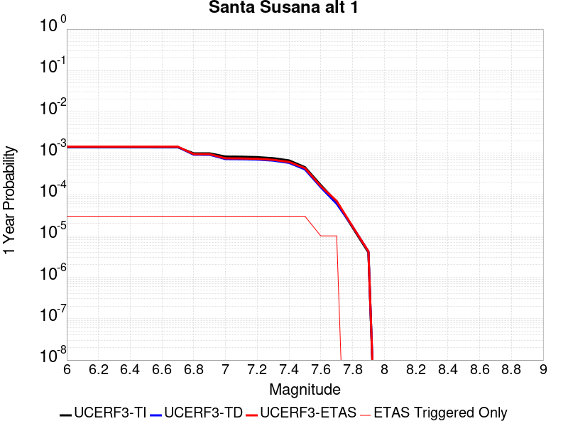 |  |

| Magnitude | 1 wk TI Prob | 1 wk TD Prob | 1 wk ETAS Prob | 1 wk ETAS/TD Gain | 1 wk ETAS Triggered Only | 1 mo TI Prob | 1 mo TD Prob | 1 mo ETAS Prob | 1 mo ETAS/TD Gain | 1 mo ETAS Triggered Only | 1 yr TI Prob | 1 yr TD Prob | 1 yr ETAS Prob | 1 yr ETAS/TD Gain | 1 yr ETAS Triggered Only | 10 yr TI Prob | 10 yr TD Prob | 10 yr ETAS Prob | 10 yr ETAS/TD Gain | 10 yr ETAS Triggered Only |
|-----|-----|-----|-----|-----|-----|-----|-----|-----|-----|-----|-----|-----|-----|-----|-----|-----|-----|-----|-----|-----|
| 6.0 | 2.674877E-5 | 2.7198023E-5 | 5.7197205E-5 | 2.1029913 | 3.0E-5 | 1.1463255E-4 | 1.1655839E-4 | 1.4655488E-4 | 1.2573518 | 3.0E-5 | 0.0013947578 | 0.0014182882 | 0.0014482456 | 1.0211222 | 3.0E-5 | 0.013860362 | 0.014104128 | 0.014133705 | 1.002097 | 3.0E-5 |
| 6.1 | 2.674877E-5 | 2.7198023E-5 | 5.7197205E-5 | 2.1029913 | 3.0E-5 | 1.1463255E-4 | 1.1655839E-4 | 1.4655488E-4 | 1.2573518 | 3.0E-5 | 0.0013947578 | 0.0014182882 | 0.0014482456 | 1.0211222 | 3.0E-5 | 0.013860362 | 0.014104128 | 0.014133705 | 1.002097 | 3.0E-5 |
| 6.2 | 2.674877E-5 | 2.7198023E-5 | 5.7197205E-5 | 2.1029913 | 3.0E-5 | 1.1463255E-4 | 1.1655839E-4 | 1.4655488E-4 | 1.2573518 | 3.0E-5 | 0.0013947578 | 0.0014182882 | 0.0014482456 | 1.0211222 | 3.0E-5 | 0.013860362 | 0.014104128 | 0.014133705 | 1.002097 | 3.0E-5 |
| 6.3 | 2.674877E-5 | 2.7198023E-5 | 5.7197205E-5 | 2.1029913 | 3.0E-5 | 1.1463255E-4 | 1.1655839E-4 | 1.4655488E-4 | 1.2573518 | 3.0E-5 | 0.0013947578 | 0.0014182882 | 0.0014482456 | 1.0211222 | 3.0E-5 | 0.013860362 | 0.014104128 | 0.014133705 | 1.002097 | 3.0E-5 |
| 6.4 | 2.674877E-5 | 2.7198023E-5 | 5.7197205E-5 | 2.1029913 | 3.0E-5 | 1.1463255E-4 | 1.1655839E-4 | 1.4655488E-4 | 1.2573518 | 3.0E-5 | 0.0013947578 | 0.0014182882 | 0.0014482456 | 1.0211222 | 3.0E-5 | 0.013860362 | 0.014104128 | 0.014133705 | 1.002097 | 3.0E-5 |
| 6.5 | 2.674877E-5 | 2.7198023E-5 | 5.7197205E-5 | 2.1029913 | 3.0E-5 | 1.1463255E-4 | 1.1655839E-4 | 1.4655488E-4 | 1.2573518 | 3.0E-5 | 0.0013947578 | 0.0014182882 | 0.0014482456 | 1.0211222 | 3.0E-5 | 0.013860362 | 0.014104128 | 0.014133705 | 1.002097 | 3.0E-5 |
| 6.6 | 2.6647976E-5 | 2.7074359E-5 | 5.7073546E-5 | 2.1080294 | 3.0E-5 | 1.14200615E-4 | 1.1602845E-4 | 1.4602496E-4 | 1.2585273 | 3.0E-5 | 0.0013895056 | 0.0014118447 | 0.0014418025 | 1.0212188 | 3.0E-5 | 0.013808494 | 0.014040513 | 0.014070092 | 1.0021067 | 3.0E-5 |
| 6.7 | 2.6647976E-5 | 2.7074359E-5 | 5.7073546E-5 | 2.1080294 | 3.0E-5 | 1.14200615E-4 | 1.1602845E-4 | 1.4602496E-4 | 1.2585273 | 3.0E-5 | 0.0013895056 | 0.0014118447 | 0.0014418025 | 1.0212188 | 3.0E-5 | 0.013808494 | 0.014040513 | 0.014070092 | 1.0021067 | 3.0E-5 |
| 6.8 | 1.9073179E-5 | 1.7637283E-5 | 4.7636753E-5 | 2.7009122 | 3.0E-5 | 8.1739636E-5 | 7.558627E-5 | 1.05584004E-4 | 1.3968675 | 3.0E-5 | 9.947256E-4 | 9.198925E-4 | 9.498649E-4 | 1.0325825 | 3.0E-5 | 0.009902848 | 0.009163101 | 0.009192826 | 1.003244 | 3.0E-5 |
| 6.9 | 1.9041876E-5 | 1.7619415E-5 | 4.7618887E-5 | 2.7026372 | 3.0E-5 | 8.160549E-5 | 7.55097E-5 | 1.0550743E-4 | 1.39727 | 3.0E-5 | 9.930939E-4 | 9.1896096E-4 | 9.4893336E-4 | 1.0326155 | 3.0E-5 | 0.0098866755 | 0.0091538625 | 0.009183588 | 1.0032473 | 3.0E-5 |
| 7.0 | 1.5917482E-5 | 1.3863864E-5 | 4.386345E-5 | 3.1638687 | 3.0E-5 | 6.8215995E-5 | 5.9415237E-5 | 8.941346E-5 | 1.504891 | 3.0E-5 | 8.302132E-4 | 7.231451E-4 | 7.531234E-4 | 1.0414555 | 3.0E-5 | 0.008271185 | 0.0072088144 | 0.007238598 | 1.0041316 | 3.0E-5 |
| 7.1 | 1.577788E-5 | 1.3743872E-5 | 4.374346E-5 | 3.182761 | 3.0E-5 | 6.761774E-5 | 5.8901005E-5 | 8.8899236E-5 | 1.5092992 | 3.0E-5 | 8.2293496E-4 | 7.1688846E-4 | 7.468669E-4 | 1.0418175 | 3.0E-5 | 0.008198941 | 0.007146652 | 0.0071764374 | 1.0041678 | 3.0E-5 |
| 7.2 | 1.5416446E-5 | 1.3469944E-5 | 4.346954E-5 | 3.2271507 | 3.0E-5 | 6.606882E-5 | 5.772708E-5 | 8.772535E-5 | 1.5196568 | 3.0E-5 | 8.0409093E-4 | 7.026052E-4 | 7.325841E-4 | 1.0426682 | 3.0E-5 | 0.008011877 | 0.0070047234 | 0.007034513 | 1.0042528 | 3.0E-5 |
| 7.3 | 1.4534083E-5 | 1.2717879E-5 | 4.2717496E-5 | 3.3588538 | 3.0E-5 | 6.228744E-5 | 5.4504082E-5 | 8.450245E-5 | 1.5503875 | 3.0E-5 | 7.580857E-4 | 6.633896E-4 | 6.933697E-4 | 1.0451922 | 3.0E-5 | 0.007555048 | 0.0066149444 | 0.006644746 | 1.0045052 | 3.0E-5 |
| 7.4 | 1.2858995E-5 | 1.1229652E-5 | 4.1229316E-5 | 3.6714685 | 3.0E-5 | 5.5108816E-5 | 4.8126214E-5 | 7.812477E-5 | 1.6233308 | 3.0E-5 | 6.7074323E-4 | 5.857831E-4 | 6.157655E-4 | 1.0511835 | 3.0E-5 | 0.0066872234 | 0.005843165 | 0.0058729895 | 1.0051042 | 3.0E-5 |
| 7.5 | 8.827668E-6 | 7.805457E-6 | 3.7805225E-5 | 4.843435 | 3.0E-5 | 3.7832317E-5 | 3.3451546E-5 | 6.345054E-5 | 1.8967896 | 3.0E-5 | 4.605111E-4 | 4.071989E-4 | 4.3718668E-4 | 1.073644 | 3.0E-5 | 0.0045955796 | 0.0040647765 | 0.0040946547 | 1.0073504 | 3.0E-5 |
| 7.6 | 3.2533426E-6 | 2.871988E-6 | 1.2871959E-5 | 4.481899 | 1.0E-5 | 1.3942822E-5 | 1.2308465E-5 | 2.230834E-5 | 1.8124391 | 1.0E-5 | 1.6974064E-4 | 1.4984563E-4 | 1.5984412E-4 | 1.0667254 | 1.0E-5 | 0.0016961104 | 0.0014974826 | 0.0015074677 | 1.0066679 | 1.0E-5 |
| 7.7 | 1.2751709E-6 | 1.1491089E-6 | 1.1149097E-5 | 9.702385 | 1.0E-5 | 5.4650063E-6 | 4.9247437E-6 | 1.4924694E-5 | 3.0305524 | 1.0E-5 | 6.653442E-5 | 5.9957198E-5 | 6.99566E-5 | 1.1667757 | 1.0E-5 | 6.6514505E-4 | 5.994191E-4 | 6.0941314E-4 | 1.0166728 | 1.0E-5 |
| 7.8 | 3.067544E-7 | 3.2400436E-7 | 3.2400436E-7 | 1.0 | 0.0 | 1.3146611E-6 | 1.3885895E-6 | 1.3885895E-6 | 1.0 | 0.0 | 1.600588E-5 | 1.6905957E-5 | 1.6905957E-5 | 1.0 | 0.0 | 1.6004729E-4 | 1.6904772E-4 | 1.6904772E-4 | 1.0 | 0.0 |
| 7.9 | 7.622999E-8 | 8.087964E-8 | 8.087964E-8 | 1.0 | 0.0 | 3.2669993E-7 | 3.4662696E-7 | 3.4662696E-7 | 1.0 | 0.0 | 3.977564E-6 | 4.2201773E-6 | 4.2201773E-6 | 1.0 | 0.0 | 3.977493E-5 | 4.220118E-5 | 4.220118E-5 | 1.0 | 0.0 |

## Breckenridge 2011
*[(top)](#table-of-contents)*

| 1 Week | 1 Month | 1 Year | 10 Year |
|-----|-----|-----|-----|
|  |  |  |  |

| Magnitude | 1 wk TI Prob | 1 wk TD Prob | 1 wk ETAS Prob | 1 wk ETAS/TD Gain | 1 wk ETAS Triggered Only | 1 mo TI Prob | 1 mo TD Prob | 1 mo ETAS Prob | 1 mo ETAS/TD Gain | 1 mo ETAS Triggered Only | 1 yr TI Prob | 1 yr TD Prob | 1 yr ETAS Prob | 1 yr ETAS/TD Gain | 1 yr ETAS Triggered Only | 10 yr TI Prob | 10 yr TD Prob | 10 yr ETAS Prob | 10 yr ETAS/TD Gain | 10 yr ETAS Triggered Only |
|-----|-----|-----|-----|-----|-----|-----|-----|-----|-----|-----|-----|-----|-----|-----|-----|-----|-----|-----|-----|-----|
| 6.0 | 1.1490393E-6 | 6.7380773E-7 | 1.0673801E-5 | 15.841019 | 1.0E-5 | 4.924445E-6 | 2.8877444E-6 | 2.2887687E-5 | 7.925801 | 2.0E-5 | 5.995347E-5 | 3.515774E-5 | 6.515669E-5 | 1.8532672 | 3.0E-5 | 5.9937296E-4 | 3.5152383E-4 | 3.815133E-4 | 1.0853127 | 3.0E-5 |
| 6.1 | 1.1490393E-6 | 6.7380773E-7 | 1.0673801E-5 | 15.841019 | 1.0E-5 | 4.924445E-6 | 2.8877444E-6 | 2.2887687E-5 | 7.925801 | 2.0E-5 | 5.995347E-5 | 3.515774E-5 | 6.515669E-5 | 1.8532672 | 3.0E-5 | 5.9937296E-4 | 3.5152383E-4 | 3.815133E-4 | 1.0853127 | 3.0E-5 |
| 6.2 | 1.1490393E-6 | 6.7380773E-7 | 1.0673801E-5 | 15.841019 | 1.0E-5 | 4.924445E-6 | 2.8877444E-6 | 2.2887687E-5 | 7.925801 | 2.0E-5 | 5.995347E-5 | 3.515774E-5 | 6.515669E-5 | 1.8532672 | 3.0E-5 | 5.9937296E-4 | 3.5152383E-4 | 3.815133E-4 | 1.0853127 | 3.0E-5 |
| 6.3 | 1.064617E-6 | 5.886475E-7 | 1.0588642E-5 | 17.988085 | 1.0E-5 | 4.5626366E-6 | 2.5227728E-6 | 2.2522721E-5 | 8.927765 | 2.0E-5 | 5.5548684E-5 | 3.0714335E-5 | 6.0713413E-5 | 1.9767126 | 3.0E-5 | 5.55348E-4 | 3.0710208E-4 | 3.3709288E-4 | 1.0976574 | 3.0E-5 |
| 6.4 | 1.064617E-6 | 5.886475E-7 | 1.0588642E-5 | 17.988085 | 1.0E-5 | 4.5626366E-6 | 2.5227728E-6 | 2.2522721E-5 | 8.927765 | 2.0E-5 | 5.5548684E-5 | 3.0714335E-5 | 6.0713413E-5 | 1.9767126 | 3.0E-5 | 5.55348E-4 | 3.0710208E-4 | 3.3709288E-4 | 1.0976574 | 3.0E-5 |
| 6.5 | 1.064617E-6 | 5.886475E-7 | 1.0588642E-5 | 17.988085 | 1.0E-5 | 4.5626366E-6 | 2.5227728E-6 | 2.2522721E-5 | 8.927765 | 2.0E-5 | 5.5548684E-5 | 3.0714335E-5 | 6.0713413E-5 | 1.9767126 | 3.0E-5 | 5.55348E-4 | 3.0710208E-4 | 3.3709288E-4 | 1.0976574 | 3.0E-5 |
| 6.6 | 1.064617E-6 | 5.886475E-7 | 1.0588642E-5 | 17.988085 | 1.0E-5 | 4.5626366E-6 | 2.5227728E-6 | 2.2522721E-5 | 8.927765 | 2.0E-5 | 5.5548684E-5 | 3.0714335E-5 | 6.0713413E-5 | 1.9767126 | 3.0E-5 | 5.55348E-4 | 3.0710208E-4 | 3.3709288E-4 | 1.0976574 | 3.0E-5 |
| 6.7 | 9.4219524E-7 | 4.954078E-7 | 1.0495402E-5 | 21.18538 | 1.0E-5 | 4.037973E-6 | 2.1231745E-6 | 2.2123131E-5 | 10.419837 | 2.0E-5 | 4.916122E-5 | 2.5849351E-5 | 5.5848574E-5 | 2.1605408 | 3.0E-5 | 4.9150345E-4 | 2.5846408E-4 | 2.8845633E-4 | 1.1160402 | 3.0E-5 |
| 6.8 | 8.556422E-7 | 4.311975E-7 | 1.0431193E-5 | 24.19122 | 1.0E-5 | 3.667033E-6 | 1.847988E-6 | 2.184795E-5 | 11.822561 | 2.0E-5 | 4.464521E-5 | 2.2499025E-5 | 5.249835E-5 | 2.3333611 | 3.0E-5 | 4.4636242E-4 | 2.2496787E-4 | 2.549611E-4 | 1.1333224 | 3.0E-5 |
| 6.9 | 7.7357794E-7 | 3.8420345E-7 | 1.0384199E-5 | 27.027866 | 1.0E-5 | 3.3153299E-6 | 1.6465851E-6 | 2.1646552E-5 | 13.14633 | 2.0E-5 | 4.0363393E-5 | 2.0046993E-5 | 5.004639E-5 | 2.4964538 | 3.0E-5 | 4.035606E-4 | 2.0045215E-4 | 2.3044614E-4 | 1.1496316 | 3.0E-5 |
| 7.0 | 6.8172454E-7 | 3.3471417E-7 | 1.0334711E-5 | 30.876226 | 1.0E-5 | 2.9216735E-6 | 1.4344886E-6 | 2.143446E-5 | 14.942231 | 2.0E-5 | 3.5570793E-5 | 1.7464761E-5 | 4.7464237E-5 | 2.7177148 | 3.0E-5 | 3.55651E-4 | 1.746341E-4 | 2.0462887E-4 | 1.1717577 | 3.0E-5 |
| 7.1 | 5.5936397E-7 | 2.890966E-7 | 1.0289094E-5 | 35.590504 | 1.0E-5 | 2.397272E-6 | 1.2389849E-6 | 2.123896E-5 | 17.142227 | 2.0E-5 | 2.9186394E-5 | 1.5084538E-5 | 3.5084235E-5 | 2.325841 | 2.0E-5 | 2.9182562E-4 | 1.5083532E-4 | 1.7083231E-4 | 1.1325749 | 2.0E-5 |
| 7.2 | 3.8420822E-7 | 2.0468339E-7 | 1.02046815E-5 | 49.855934 | 1.0E-5 | 1.6466057E-6 | 8.7721423E-7 | 2.0877196E-5 | 23.799427 | 2.0E-5 | 2.004724E-5 | 1.0680032E-5 | 3.0679817E-5 | 2.8726337 | 2.0E-5 | 2.004543E-4 | 1.0679527E-4 | 1.2679314E-4 | 1.1872542 | 2.0E-5 |
| 7.3 | 2.6405158E-7 | 1.647323E-7 | 1.647323E-7 | 1.0 | 0.0 | 1.1316491E-6 | 7.059954E-7 | 1.0705989E-5 | 15.164389 | 1.0E-5 | 1.37777415E-5 | 8.595461E-6 | 1.8595374E-5 | 2.163395 | 1.0E-5 | 1.3776887E-4 | 8.5951346E-5 | 9.595048E-5 | 1.1163349 | 1.0E-5 |
| 7.4 | 1.792114E-7 | 1.2725314E-7 | 1.2725314E-7 | 1.0 | 0.0 | 7.6804866E-7 | 5.4537054E-7 | 1.05453655E-5 | 19.336147 | 1.0E-5 | 9.3509525E-6 | 6.6398666E-6 | 1.66398E-5 | 2.5060444 | 1.0E-5 | 9.350559E-5 | 6.639673E-5 | 7.639606E-5 | 1.1505998 | 1.0E-5 |
| 7.5 | 1.3548703E-7 | 9.3854034E-8 | 9.3854034E-8 | 1.0 | 0.0 | 5.8065854E-7 | 4.022315E-7 | 1.0402227E-5 | 25.861296 | 1.0E-5 | 7.0694946E-6 | 4.897158E-6 | 1.48971085E-5 | 3.0419908 | 1.0E-5 | 7.0692695E-5 | 4.8970534E-5 | 5.8970047E-5 | 1.2041944 | 1.0E-5 |
| 7.6 | 2.572245E-8 | 1.7352555E-8 | 1.7352555E-8 | 1.0 | 0.0 | 1.10239064E-7 | 7.436809E-8 | 7.436809E-8 | 1.0 | 0.0 | 1.3421597E-6 | 9.054312E-7 | 9.054312E-7 | 1.0 | 0.0 | 1.3421517E-5 | 9.05428E-6 | 9.05428E-6 | 1.0 | 0.0 |

## Fish Slough 2011 CFM
*[(top)](#table-of-contents)*

| 1 Week | 1 Month | 1 Year | 10 Year |
|-----|-----|-----|-----|
|  |  |  |  |

| Magnitude | 1 wk TI Prob | 1 wk TD Prob | 1 wk ETAS Prob | 1 wk ETAS/TD Gain | 1 wk ETAS Triggered Only | 1 mo TI Prob | 1 mo TD Prob | 1 mo ETAS Prob | 1 mo ETAS/TD Gain | 1 mo ETAS Triggered Only | 1 yr TI Prob | 1 yr TD Prob | 1 yr ETAS Prob | 1 yr ETAS/TD Gain | 1 yr ETAS Triggered Only | 10 yr TI Prob | 10 yr TD Prob | 10 yr ETAS Prob | 10 yr ETAS/TD Gain | 10 yr ETAS Triggered Only |
|-----|-----|-----|-----|-----|-----|-----|-----|-----|-----|-----|-----|-----|-----|-----|-----|-----|-----|-----|-----|-----|
| 6.0 | 4.3629925E-6 | 3.6772697E-6 | 2.3677196E-5 | 6.438798 | 2.0E-5 | 1.8698405E-5 | 1.5759644E-5 | 3.575933E-5 | 2.2690442 | 2.0E-5 | 2.276293E-4 | 1.918589E-4 | 2.1185506E-4 | 1.1042233 | 2.0E-5 | 0.0022739628 | 0.0019171416 | 0.0019470841 | 1.0156183 | 3.0E-5 |
| 6.1 | 4.3629925E-6 | 3.6772697E-6 | 2.3677196E-5 | 6.438798 | 2.0E-5 | 1.8698405E-5 | 1.5759644E-5 | 3.575933E-5 | 2.2690442 | 2.0E-5 | 2.276293E-4 | 1.918589E-4 | 2.1185506E-4 | 1.1042233 | 2.0E-5 | 0.0022739628 | 0.0019171416 | 0.0019470841 | 1.0156183 | 3.0E-5 |
| 6.2 | 4.3629925E-6 | 3.6772697E-6 | 2.3677196E-5 | 6.438798 | 2.0E-5 | 1.8698405E-5 | 1.5759644E-5 | 3.575933E-5 | 2.2690442 | 2.0E-5 | 2.276293E-4 | 1.918589E-4 | 2.1185506E-4 | 1.1042233 | 2.0E-5 | 0.0022739628 | 0.0019171416 | 0.0019470841 | 1.0156183 | 3.0E-5 |
| 6.3 | 4.3629925E-6 | 3.6772697E-6 | 2.3677196E-5 | 6.438798 | 2.0E-5 | 1.8698405E-5 | 1.5759644E-5 | 3.575933E-5 | 2.2690442 | 2.0E-5 | 2.276293E-4 | 1.918589E-4 | 2.1185506E-4 | 1.1042233 | 2.0E-5 | 0.0022739628 | 0.0019171416 | 0.0019470841 | 1.0156183 | 3.0E-5 |
| 6.4 | 4.3629925E-6 | 3.6772697E-6 | 2.3677196E-5 | 6.438798 | 2.0E-5 | 1.8698405E-5 | 1.5759644E-5 | 3.575933E-5 | 2.2690442 | 2.0E-5 | 2.276293E-4 | 1.918589E-4 | 2.1185506E-4 | 1.1042233 | 2.0E-5 | 0.0022739628 | 0.0019171416 | 0.0019470841 | 1.0156183 | 3.0E-5 |
| 6.5 | 2.991715E-6 | 2.2703898E-6 | 2.2270344E-5 | 9.80904 | 2.0E-5 | 1.2821573E-5 | 9.730211E-6 | 2.9730016E-5 | 3.055434 | 2.0E-5 | 1.5609147E-4 | 1.1845979E-4 | 1.3845743E-4 | 1.1688137 | 2.0E-5 | 0.0015598187 | 0.0011840566 | 0.0012040329 | 1.0168711 | 2.0E-5 |
| 6.6 | 2.991715E-6 | 2.2703898E-6 | 2.2270344E-5 | 9.80904 | 2.0E-5 | 1.2821573E-5 | 9.730211E-6 | 2.9730016E-5 | 3.055434 | 2.0E-5 | 1.5609147E-4 | 1.1845979E-4 | 1.3845743E-4 | 1.1688137 | 2.0E-5 | 0.0015598187 | 0.0011840566 | 0.0012040329 | 1.0168711 | 2.0E-5 |
| 6.7 | 2.7890346E-6 | 2.0621853E-6 | 2.2062144E-5 | 10.69843 | 2.0E-5 | 1.1952951E-5 | 8.837912E-6 | 2.8837736E-5 | 3.262958 | 2.0E-5 | 1.4551746E-4 | 1.0759717E-4 | 1.27595E-4 | 1.1858585 | 2.0E-5 | 0.0014542221 | 0.0010755389 | 0.0010955174 | 1.0185753 | 2.0E-5 |
| 6.8 | 1.9416723E-6 | 1.192555E-6 | 2.119253E-5 | 17.770695 | 2.0E-5 | 8.321425E-6 | 5.1109405E-6 | 2.5110838E-5 | 4.913154 | 2.0E-5 | 1.01308644E-4 | 6.222397E-5 | 8.222272E-5 | 1.3213996 | 2.0E-5 | 0.0010126247 | 6.220695E-4 | 6.4205704E-4 | 1.0321307 | 2.0E-5 |
| 6.9 | 1.8567416E-6 | 1.1046966E-6 | 2.1104675E-5 | 19.104498 | 2.0E-5 | 7.957439E-6 | 4.7344056E-6 | 2.473431E-5 | 5.2243752 | 2.0E-5 | 9.687752E-5 | 5.7639903E-5 | 7.763875E-5 | 1.3469619 | 2.0E-5 | 9.6835295E-4 | 5.762534E-4 | 5.9624185E-4 | 1.0346869 | 2.0E-5 |
| 7.0 | 1.6634067E-6 | 9.073966E-7 | 2.0907379E-5 | 23.04106 | 2.0E-5 | 7.1288664E-6 | 3.888837E-6 | 2.3888759E-5 | 6.1429057 | 2.0E-5 | 8.679049E-5 | 4.734559E-5 | 6.734464E-5 | 1.4224058 | 2.0E-5 | 8.6756604E-4 | 4.733579E-4 | 4.9334846E-4 | 1.0422313 | 2.0E-5 |
| 7.1 | 1.4281054E-6 | 6.7366227E-7 | 6.7366227E-7 | 1.0 | 0.0 | 6.1204373E-6 | 2.8871211E-6 | 2.8871211E-6 | 1.0 | 0.0 | 7.451377E-5 | 3.515015E-5 | 3.515015E-5 | 1.0 | 0.0 | 7.44888E-4 | 3.5144767E-4 | 3.5144767E-4 | 1.0 | 0.0 |
| 7.2 | 1.1810387E-6 | 4.408355E-7 | 4.408355E-7 | 1.0 | 0.0 | 5.0615845E-6 | 1.8892936E-6 | 1.8892936E-6 | 1.0 | 0.0 | 6.1623046E-5 | 2.3001916E-5 | 2.3001916E-5 | 1.0 | 0.0 | 6.160596E-4 | 2.2999625E-4 | 2.2999625E-4 | 1.0 | 0.0 |
| 7.3 | 9.918052E-7 | 2.8733467E-7 | 2.8733467E-7 | 1.0 | 0.0 | 4.2505867E-6 | 1.2314338E-6 | 1.2314338E-6 | 1.0 | 0.0 | 5.1749663E-5 | 1.4992604E-5 | 1.4992604E-5 | 1.0 | 0.0 | 5.173762E-4 | 1.4991604E-4 | 1.4991604E-4 | 1.0 | 0.0 |
| 7.4 | 8.25252E-7 | 2.0694807E-7 | 2.0694807E-7 | 1.0 | 0.0 | 3.5367896E-6 | 8.8692E-7 | 8.8692E-7 | 1.0 | 0.0 | 4.3059565E-5 | 1.0798199E-5 | 1.0798199E-5 | 1.0 | 0.0 | 4.305122E-4 | 1.07976804E-4 | 1.07976804E-4 | 1.0 | 0.0 |
| 7.5 | 5.3248567E-7 | 1.2072739E-7 | 1.2072739E-7 | 1.0 | 0.0 | 2.2820795E-6 | 5.17403E-7 | 5.17403E-7 | 1.0 | 0.0 | 2.7783964E-5 | 6.299364E-6 | 6.299364E-6 | 1.0 | 0.0 | 2.778049E-4 | 6.2991894E-5 | 6.2991894E-5 | 1.0 | 0.0 |
| 7.6 | 2.037542E-7 | 4.7129152E-8 | 4.7129152E-8 | 1.0 | 0.0 | 8.73232E-7 | 2.0198206E-7 | 2.0198206E-7 | 1.0 | 0.0 | 1.0631547E-5 | 2.459129E-6 | 2.459129E-6 | 1.0 | 0.0 | 1.0631039E-4 | 2.459104E-5 | 2.459104E-5 | 1.0 | 0.0 |
| 7.7 | 2.2501226E-8 | 3.1514258E-9 | 3.1514258E-9 | 1.0 | 0.0 | 9.6433816E-8 | 1.350611E-8 | 1.350611E-8 | 1.0 | 0.0 | 1.1740811E-6 | 1.6443688E-7 | 1.6443688E-7 | 1.0 | 0.0 | 1.1740749E-5 | 1.6443678E-6 | 1.6443678E-6 | 1.0 | 0.0 |

## Cucamonga
*[(top)](#table-of-contents)*

| 1 Week | 1 Month | 1 Year | 10 Year |
|-----|-----|-----|-----|
|  |  |  | 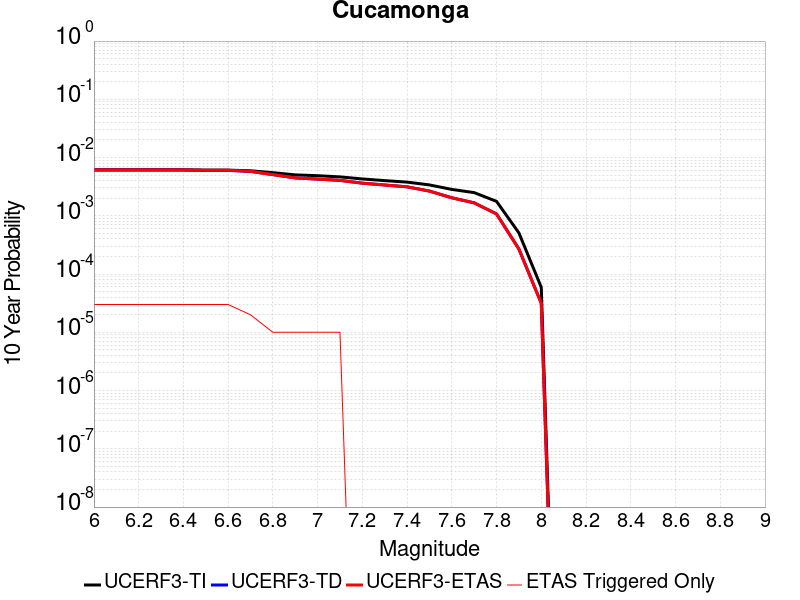 |

| Magnitude | 1 wk TI Prob | 1 wk TD Prob | 1 wk ETAS Prob | 1 wk ETAS/TD Gain | 1 wk ETAS Triggered Only | 1 mo TI Prob | 1 mo TD Prob | 1 mo ETAS Prob | 1 mo ETAS/TD Gain | 1 mo ETAS Triggered Only | 1 yr TI Prob | 1 yr TD Prob | 1 yr ETAS Prob | 1 yr ETAS/TD Gain | 1 yr ETAS Triggered Only | 10 yr TI Prob | 10 yr TD Prob | 10 yr ETAS Prob | 10 yr ETAS/TD Gain | 10 yr ETAS Triggered Only |
|-----|-----|-----|-----|-----|-----|-----|-----|-----|-----|-----|-----|-----|-----|-----|-----|-----|-----|-----|-----|-----|
| 6.0 | 1.1848348E-5 | 1.1737008E-5 | 3.1736774E-5 | 2.7039917 | 2.0E-5 | 5.0777642E-5 | 5.030051E-5 | 7.02995E-5 | 1.3975903 | 2.0E-5 | 6.180424E-4 | 6.1223935E-4 | 6.4222096E-4 | 1.0489705 | 3.0E-5 | 0.0061632637 | 0.0061067017 | 0.0061365184 | 1.0048827 | 3.0E-5 |
| 6.1 | 1.1848348E-5 | 1.1737008E-5 | 3.1736774E-5 | 2.7039917 | 2.0E-5 | 5.0777642E-5 | 5.030051E-5 | 7.02995E-5 | 1.3975903 | 2.0E-5 | 6.180424E-4 | 6.1223935E-4 | 6.4222096E-4 | 1.0489705 | 3.0E-5 | 0.0061632637 | 0.0061067017 | 0.0061365184 | 1.0048827 | 3.0E-5 |
| 6.2 | 1.1848348E-5 | 1.1737008E-5 | 3.1736774E-5 | 2.7039917 | 2.0E-5 | 5.0777642E-5 | 5.030051E-5 | 7.02995E-5 | 1.3975903 | 2.0E-5 | 6.180424E-4 | 6.1223935E-4 | 6.4222096E-4 | 1.0489705 | 3.0E-5 | 0.0061632637 | 0.0061067017 | 0.0061365184 | 1.0048827 | 3.0E-5 |
| 6.3 | 1.1848348E-5 | 1.1737008E-5 | 3.1736774E-5 | 2.7039917 | 2.0E-5 | 5.0777642E-5 | 5.030051E-5 | 7.02995E-5 | 1.3975903 | 2.0E-5 | 6.180424E-4 | 6.1223935E-4 | 6.4222096E-4 | 1.0489705 | 3.0E-5 | 0.0061632637 | 0.0061067017 | 0.0061365184 | 1.0048827 | 3.0E-5 |
| 6.4 | 1.1848348E-5 | 1.1737008E-5 | 3.1736774E-5 | 2.7039917 | 2.0E-5 | 5.0777642E-5 | 5.030051E-5 | 7.02995E-5 | 1.3975903 | 2.0E-5 | 6.180424E-4 | 6.1223935E-4 | 6.4222096E-4 | 1.0489705 | 3.0E-5 | 0.0061632637 | 0.0061067017 | 0.0061365184 | 1.0048827 | 3.0E-5 |
| 6.5 | 1.16988695E-5 | 1.15760395E-5 | 3.1575808E-5 | 2.7276866 | 2.0E-5 | 5.013705E-5 | 4.9610666E-5 | 6.9609676E-5 | 1.4031191 | 2.0E-5 | 6.102476E-4 | 6.0384517E-4 | 6.3382706E-4 | 1.0496516 | 3.0E-5 | 0.006085745 | 0.006023216 | 0.0060530356 | 1.0049508 | 3.0E-5 |
| 6.6 | 1.16988695E-5 | 1.15760395E-5 | 3.1575808E-5 | 2.7276866 | 2.0E-5 | 5.013705E-5 | 4.9610666E-5 | 6.9609676E-5 | 1.4031191 | 2.0E-5 | 6.102476E-4 | 6.0384517E-4 | 6.3382706E-4 | 1.0496516 | 3.0E-5 | 0.006085745 | 0.006023216 | 0.0060530356 | 1.0049508 | 3.0E-5 |
| 6.7 | 1.1397107E-5 | 1.11149475E-5 | 3.1114727E-5 | 2.7993586 | 2.0E-5 | 4.884383E-5 | 4.7634636E-5 | 6.763368E-5 | 1.4198426 | 2.0E-5 | 5.9451134E-4 | 5.797998E-4 | 5.9978827E-4 | 1.0344746 | 2.0E-5 | 0.005929234 | 0.0057840226 | 0.0058039073 | 1.0034378 | 2.0E-5 |
| 6.8 | 1.058387E-5 | 9.784992E-6 | 1.9784893E-5 | 2.0219634 | 1.0E-5 | 4.5358654E-5 | 4.193501E-5 | 5.1934592E-5 | 1.2384542 | 1.0E-5 | 5.521017E-4 | 5.1044027E-4 | 5.2043516E-4 | 1.019581 | 1.0E-5 | 0.00550732 | 0.0050936877 | 0.0051036365 | 1.0019532 | 1.0E-5 |
| 6.9 | 9.690046E-6 | 8.57948E-6 | 1.8579394E-5 | 2.1655617 | 1.0E-5 | 4.1528107E-5 | 3.6768684E-5 | 4.6768317E-5 | 1.2719606 | 1.0E-5 | 5.054874E-4 | 4.475672E-4 | 4.575627E-4 | 1.022333 | 1.0E-5 | 0.005043391 | 0.004467594 | 0.0044775493 | 1.0022284 | 1.0E-5 |
| 7.0 | 9.381461E-6 | 8.187101E-6 | 1.818702E-5 | 2.2214236 | 1.0E-5 | 4.020564E-5 | 3.5087105E-5 | 4.5086756E-5 | 1.284995 | 1.0E-5 | 4.893937E-4 | 4.2710215E-4 | 4.370979E-4 | 1.0234036 | 1.0E-5 | 0.0048831734 | 0.0042637475 | 0.0042737047 | 1.0023353 | 1.0E-5 |
| 7.1 | 8.946492E-6 | 7.781886E-6 | 1.7781807E-5 | 2.2850256 | 1.0E-5 | 3.8341543E-5 | 3.3350516E-5 | 4.335018E-5 | 1.2998354 | 1.0E-5 | 4.667083E-4 | 4.0596718E-4 | 4.1596312E-4 | 1.0246226 | 1.0E-5 | 0.0046572937 | 0.004053192 | 0.004063152 | 1.0024571 | 1.0E-5 |
| 7.2 | 8.251016E-6 | 6.9752796E-6 | 6.9752796E-6 | 1.0 | 0.0 | 3.5361016E-5 | 2.9893714E-5 | 2.9893714E-5 | 1.0 | 0.0 | 4.3043532E-4 | 3.6389544E-4 | 3.6389544E-4 | 1.0 | 0.0 | 0.0042960253 | 0.0036339292 | 0.0036339292 | 1.0 | 0.0 |
| 7.3 | 7.717881E-6 | 6.4863502E-6 | 6.4863502E-6 | 1.0 | 0.0 | 3.3076216E-5 | 2.7798349E-5 | 2.7798349E-5 | 1.0 | 0.0 | 4.026285E-4 | 3.3839257E-4 | 3.3839257E-4 | 1.0 | 0.0 | 0.004018998 | 0.00337971 | 0.00337971 | 1.0 | 0.0 |
| 7.4 | 7.275623E-6 | 6.031997E-6 | 6.031997E-6 | 1.0 | 0.0 | 3.118087E-5 | 2.585116E-5 | 2.585116E-5 | 1.0 | 0.0 | 3.7956095E-4 | 3.1469265E-4 | 3.1469265E-4 | 1.0 | 0.0 | 0.0037891332 | 0.0031434062 | 0.0031434062 | 1.0 | 0.0 |
| 7.5 | 6.5109502E-6 | 5.1006014E-6 | 5.1006014E-6 | 1.0 | 0.0 | 2.7903774E-5 | 2.1859538E-5 | 2.1859538E-5 | 1.0 | 0.0 | 3.3967546E-4 | 2.661075E-4 | 2.661075E-4 | 1.0 | 0.0 | 0.0033915674 | 0.002658813 | 0.002658813 | 1.0 | 0.0 |
| 7.6 | 5.4495326E-6 | 3.90857E-6 | 3.90857E-6 | 1.0 | 0.0 | 2.335493E-5 | 1.6750908E-5 | 1.6750908E-5 | 1.0 | 0.0 | 2.8430918E-4 | 2.0392328E-4 | 2.0392328E-4 | 1.0 | 0.0 | 0.0028394572 | 0.002038282 | 0.002038282 | 1.0 | 0.0 |
| 7.7 | 4.7997164E-6 | 3.2002547E-6 | 3.2002547E-6 | 1.0 | 0.0 | 2.057005E-5 | 1.3715306E-5 | 1.3715306E-5 | 1.0 | 0.0 | 2.504116E-4 | 1.6697108E-4 | 1.6697108E-4 | 1.0 | 0.0 | 0.002501296 | 0.0016693877 | 0.0016693877 | 1.0 | 0.0 |
| 7.8 | 3.3941733E-6 | 2.0641899E-6 | 2.0641899E-6 | 1.0 | 0.0 | 1.4546376E-5 | 8.846498E-6 | 8.846498E-6 | 1.0 | 0.0 | 1.7708774E-4 | 1.07700806E-4 | 1.07700806E-4 | 1.0 | 0.0 | 0.0017694668 | 0.001076723 | 0.001076723 | 1.0 | 0.0 |
| 7.9 | 9.750552E-7 | 5.155946E-7 | 5.155946E-7 | 1.0 | 0.0 | 4.178801E-6 | 2.2096892E-6 | 2.2096892E-6 | 1.0 | 0.0 | 5.0875715E-5 | 2.690264E-5 | 2.690264E-5 | 1.0 | 0.0 | 5.086407E-4 | 2.6899425E-4 | 2.6899425E-4 | 1.0 | 0.0 |
| 8.0 | 1.133857E-7 | 6.053707E-8 | 6.053707E-8 | 1.0 | 0.0 | 4.8593864E-7 | 2.5944456E-7 | 2.5944456E-7 | 1.0 | 0.0 | 5.9162867E-6 | 3.158733E-6 | 3.158733E-6 | 1.0 | 0.0 | 5.916129E-5 | 3.1586897E-5 | 3.1586897E-5 | 1.0 | 0.0 |

## Newport-Inglewood alt 1
*[(top)](#table-of-contents)*

| 1 Week | 1 Month | 1 Year | 10 Year |
|-----|-----|-----|-----|
|  |  |  |  |

| Magnitude | 1 wk TI Prob | 1 wk TD Prob | 1 wk ETAS Prob | 1 wk ETAS/TD Gain | 1 wk ETAS Triggered Only | 1 mo TI Prob | 1 mo TD Prob | 1 mo ETAS Prob | 1 mo ETAS/TD Gain | 1 mo ETAS Triggered Only | 1 yr TI Prob | 1 yr TD Prob | 1 yr ETAS Prob | 1 yr ETAS/TD Gain | 1 yr ETAS Triggered Only | 10 yr TI Prob | 10 yr TD Prob | 10 yr ETAS Prob | 10 yr ETAS/TD Gain | 10 yr ETAS Triggered Only |
|-----|-----|-----|-----|-----|-----|-----|-----|-----|-----|-----|-----|-----|-----|-----|-----|-----|-----|-----|-----|-----|
| 6.0 | 2.9668912E-5 | 3.0404817E-5 | 5.0404207E-5 | 1.6577705 | 2.0E-5 | 1.2714628E-4 | 1.303026E-4 | 1.6029869E-4 | 1.2302033 | 3.0E-5 | 0.0015469068 | 0.0015857625 | 0.001615715 | 1.0188884 | 3.0E-5 | 0.015361829 | 0.015792042 | 0.015821569 | 1.0018697 | 3.0E-5 |
| 6.1 | 2.9668912E-5 | 3.0404817E-5 | 5.0404207E-5 | 1.6577705 | 2.0E-5 | 1.2714628E-4 | 1.303026E-4 | 1.6029869E-4 | 1.2302033 | 3.0E-5 | 0.0015469068 | 0.0015857625 | 0.001615715 | 1.0188884 | 3.0E-5 | 0.015361829 | 0.015792042 | 0.015821569 | 1.0018697 | 3.0E-5 |
| 6.2 | 2.9668912E-5 | 3.0404817E-5 | 5.0404207E-5 | 1.6577705 | 2.0E-5 | 1.2714628E-4 | 1.303026E-4 | 1.6029869E-4 | 1.2302033 | 3.0E-5 | 0.0015469068 | 0.0015857625 | 0.001615715 | 1.0188884 | 3.0E-5 | 0.015361829 | 0.015792042 | 0.015821569 | 1.0018697 | 3.0E-5 |
| 6.3 | 2.9668912E-5 | 3.0404817E-5 | 5.0404207E-5 | 1.6577705 | 2.0E-5 | 1.2714628E-4 | 1.303026E-4 | 1.6029869E-4 | 1.2302033 | 3.0E-5 | 0.0015469068 | 0.0015857625 | 0.001615715 | 1.0188884 | 3.0E-5 | 0.015361829 | 0.015792042 | 0.015821569 | 1.0018697 | 3.0E-5 |
| 6.4 | 1.275942E-5 | 1.0272503E-5 | 1.0272503E-5 | 1.0 | 0.0 | 5.4682085E-5 | 4.402429E-5 | 4.402429E-5 | 1.0 | 0.0 | 6.65551E-4 | 5.358681E-4 | 5.358681E-4 | 1.0 | 0.0 | 0.0066356123 | 0.005346184 | 0.005346184 | 1.0 | 0.0 |
| 6.5 | 1.275942E-5 | 1.0272503E-5 | 1.0272503E-5 | 1.0 | 0.0 | 5.4682085E-5 | 4.402429E-5 | 4.402429E-5 | 1.0 | 0.0 | 6.65551E-4 | 5.358681E-4 | 5.358681E-4 | 1.0 | 0.0 | 0.0066356123 | 0.005346184 | 0.005346184 | 1.0 | 0.0 |
| 6.6 | 1.1255358E-5 | 8.661884E-6 | 8.661884E-6 | 1.0 | 0.0 | 4.8236358E-5 | 3.712184E-5 | 3.712184E-5 | 1.0 | 0.0 | 5.871194E-4 | 4.518664E-4 | 4.518664E-4 | 1.0 | 0.0 | 0.005855706 | 0.004509653 | 0.004509653 | 1.0 | 0.0 |
| 6.7 | 1.0504745E-5 | 7.8997955E-6 | 7.8997955E-6 | 1.0 | 0.0 | 4.5019555E-5 | 3.3855835E-5 | 3.3855835E-5 | 1.0 | 0.0 | 5.4797524E-4 | 4.1211807E-4 | 4.1211807E-4 | 1.0 | 0.0 | 0.0054662596 | 0.004113668 | 0.004113668 | 1.0 | 0.0 |
| 6.8 | 1.0476007E-5 | 7.881176E-6 | 7.881176E-6 | 1.0 | 0.0 | 4.4896402E-5 | 3.3776043E-5 | 3.3776043E-5 | 1.0 | 0.0 | 5.464766E-4 | 4.1114696E-4 | 4.1114696E-4 | 1.0 | 0.0 | 0.005451347 | 0.0041039926 | 0.0041039926 | 1.0 | 0.0 |
| 6.9 | 9.076797E-6 | 6.4896312E-6 | 6.4896312E-6 | 1.0 | 0.0 | 3.889998E-5 | 2.781241E-5 | 2.781241E-5 | 1.0 | 0.0 | 4.7350433E-4 | 3.385638E-4 | 3.385638E-4 | 1.0 | 0.0 | 0.004724967 | 0.0033805177 | 0.0033805177 | 1.0 | 0.0 |
| 7.0 | 8.73795E-6 | 6.2120125E-6 | 6.2120125E-6 | 1.0 | 0.0 | 3.7447822E-5 | 2.6622642E-5 | 2.6622642E-5 | 1.0 | 0.0 | 4.5583185E-4 | 3.2408274E-4 | 3.2408274E-4 | 1.0 | 0.0 | 0.0045489795 | 0.0032361327 | 0.0032361327 | 1.0 | 0.0 |
| 7.1 | 8.391299E-6 | 5.95579E-6 | 5.95579E-6 | 1.0 | 0.0 | 3.5962214E-5 | 2.5524565E-5 | 2.5524565E-5 | 1.0 | 0.0 | 4.37752E-4 | 3.1071753E-4 | 3.1071753E-4 | 1.0 | 0.0 | 0.004368907 | 0.0031028606 | 0.0031028606 | 1.0 | 0.0 |
| 7.2 | 7.796882E-6 | 5.4965344E-6 | 5.4965344E-6 | 1.0 | 0.0 | 3.341478E-5 | 2.3556364E-5 | 2.3556364E-5 | 1.0 | 0.0 | 4.06749E-4 | 2.867612E-4 | 2.867612E-4 | 1.0 | 0.0 | 0.0040600533 | 0.0028639357 | 0.0028639357 | 1.0 | 0.0 |
| 7.3 | 6.4738833E-6 | 4.6478162E-6 | 4.6478162E-6 | 1.0 | 0.0 | 2.774492E-5 | 1.9919062E-5 | 1.9919062E-5 | 1.0 | 0.0 | 3.3774204E-4 | 2.4248775E-4 | 2.4248775E-4 | 1.0 | 0.0 | 0.0033722918 | 0.0024222482 | 0.0024222482 | 1.0 | 0.0 |
| 7.4 | 5.382145E-6 | 3.8857597E-6 | 3.8857597E-6 | 1.0 | 0.0 | 2.3066134E-5 | 1.665315E-5 | 1.665315E-5 | 1.0 | 0.0 | 2.8079396E-4 | 2.0273338E-4 | 2.0273338E-4 | 1.0 | 0.0 | 0.0028043943 | 0.0020254988 | 0.0020254988 | 1.0 | 0.0 |
| 7.5 | 3.648244E-6 | 2.5737843E-6 | 2.5737843E-6 | 1.0 | 0.0 | 1.5635238E-5 | 1.1030458E-5 | 1.1030458E-5 | 1.0 | 0.0 | 1.9034238E-4 | 1.3428765E-4 | 1.3428765E-4 | 1.0 | 0.0 | 0.0019017943 | 0.0013420755 | 0.0013420755 | 1.0 | 0.0 |
| 7.6 | 2.2906888E-6 | 1.5479842E-6 | 1.5479842E-6 | 1.0 | 0.0 | 9.817201E-6 | 6.634202E-6 | 6.634202E-6 | 1.0 | 0.0 | 1.1951787E-4 | 8.076848E-5 | 8.076848E-5 | 1.0 | 0.0 | 0.0011945361 | 8.07398E-4 | 8.07398E-4 | 1.0 | 0.0 |
| 7.7 | 6.0479874E-7 | 3.397512E-7 | 3.397512E-7 | 1.0 | 0.0 | 2.5919921E-6 | 1.4560758E-6 | 1.4560758E-6 | 1.0 | 0.0 | 3.1557047E-5 | 1.7727592E-5 | 1.7727592E-5 | 1.0 | 0.0 | 3.1552566E-4 | 1.7726317E-4 | 1.7726317E-4 | 1.0 | 0.0 |
| 7.8 | 1.16056995E-8 | 9.782373E-9 | 9.782373E-9 | 1.0 | 0.0 | 4.9738713E-8 | 4.1924455E-8 | 4.1924455E-8 | 1.0 | 0.0 | 6.0556863E-7 | 5.1043025E-7 | 5.1043025E-7 | 1.0 | 0.0 | 6.05567E-6 | 5.1043025E-6 | 5.1043025E-6 | 1.0 | 0.0 |

## Malibu Coast alt 1
*[(top)](#table-of-contents)*

| 1 Week | 1 Month | 1 Year | 10 Year |
|-----|-----|-----|-----|
|  |  |  |  |

| Magnitude | 1 wk TI Prob | 1 wk TD Prob | 1 wk ETAS Prob | 1 wk ETAS/TD Gain | 1 wk ETAS Triggered Only | 1 mo TI Prob | 1 mo TD Prob | 1 mo ETAS Prob | 1 mo ETAS/TD Gain | 1 mo ETAS Triggered Only | 1 yr TI Prob | 1 yr TD Prob | 1 yr ETAS Prob | 1 yr ETAS/TD Gain | 1 yr ETAS Triggered Only | 10 yr TI Prob | 10 yr TD Prob | 10 yr ETAS Prob | 10 yr ETAS/TD Gain | 10 yr ETAS Triggered Only |
|-----|-----|-----|-----|-----|-----|-----|-----|-----|-----|-----|-----|-----|-----|-----|-----|-----|-----|-----|-----|-----|
| 6.0 | 1.6572556E-5 | 1.7598066E-5 | 4.759754E-5 | 2.7047029 | 3.0E-5 | 7.102331E-5 | 7.541821E-5 | 1.05415944E-4 | 1.3977519 | 3.0E-5 | 8.6436566E-4 | 9.178488E-4 | 9.4782125E-4 | 1.0326551 | 3.0E-5 | 0.0086101135 | 0.009142512 | 0.009172238 | 1.0032513 | 3.0E-5 |
| 6.1 | 1.6572556E-5 | 1.7598066E-5 | 2.7597891E-5 | 1.5682342 | 1.0E-5 | 7.102331E-5 | 7.541821E-5 | 8.541746E-5 | 1.132584 | 1.0E-5 | 8.6436566E-4 | 9.178488E-4 | 9.278396E-4 | 1.010885 | 1.0E-5 | 0.0086101135 | 0.009142512 | 0.009152421 | 1.0010837 | 1.0E-5 |
| 6.2 | 1.1085717E-5 | 1.1557147E-5 | 1.1557147E-5 | 1.0 | 0.0 | 4.750935E-5 | 4.952971E-5 | 4.952971E-5 | 1.0 | 0.0 | 5.782728E-4 | 6.028609E-4 | 6.028609E-4 | 1.0 | 0.0 | 0.0057677035 | 0.0060126255 | 0.0060126255 | 1.0 | 0.0 |
| 6.3 | 1.0208568E-5 | 1.0592237E-5 | 1.0592237E-5 | 1.0 | 0.0 | 4.375027E-5 | 4.539453E-5 | 4.539453E-5 | 1.0 | 0.0 | 5.325294E-4 | 5.5254117E-4 | 5.5254117E-4 | 1.0 | 0.0 | 0.0053125503 | 0.0055119814 | 0.0055119814 | 1.0 | 0.0 |
| 6.4 | 9.0682315E-6 | 9.342637E-6 | 9.342637E-6 | 1.0 | 0.0 | 3.8863272E-5 | 4.003927E-5 | 4.003927E-5 | 1.0 | 0.0 | 4.730576E-4 | 4.8737114E-4 | 4.8737114E-4 | 1.0 | 0.0 | 0.0047205184 | 0.004863236 | 0.004863236 | 1.0 | 0.0 |
| 6.5 | 7.605796E-6 | 7.748587E-6 | 7.748587E-6 | 1.0 | 0.0 | 3.259586E-5 | 3.3207816E-5 | 3.3207816E-5 | 1.0 | 0.0 | 3.9678233E-4 | 4.0423148E-4 | 4.0423148E-4 | 1.0 | 0.0 | 0.0039607463 | 0.0040351 | 0.0040351 | 1.0 | 0.0 |
| 6.6 | 5.889873E-6 | 5.8795385E-6 | 5.8795385E-6 | 1.0 | 0.0 | 2.5242069E-5 | 2.519778E-5 | 2.519778E-5 | 1.0 | 0.0 | 3.0727885E-4 | 3.0673988E-4 | 3.0673988E-4 | 1.0 | 0.0 | 0.003068543 | 0.0030631777 | 0.0030631777 | 1.0 | 0.0 |
| 6.7 | 5.66586E-6 | 5.641641E-6 | 5.641641E-6 | 1.0 | 0.0 | 2.428203E-5 | 2.417824E-5 | 2.417824E-5 | 1.0 | 0.0 | 2.955936E-4 | 2.9433038E-4 | 2.9433038E-4 | 1.0 | 0.0 | 0.0029520073 | 0.0029394177 | 0.0029394177 | 1.0 | 0.0 |
| 6.8 | 5.521556E-6 | 5.489427E-6 | 5.489427E-6 | 1.0 | 0.0 | 2.3663597E-5 | 2.3525903E-5 | 2.3525903E-5 | 1.0 | 0.0 | 2.880662E-4 | 2.8639034E-4 | 2.8639034E-4 | 1.0 | 0.0 | 0.0028769306 | 0.002860224 | 0.002860224 | 1.0 | 0.0 |
| 6.9 | 5.29752E-6 | 5.2499317E-6 | 5.2499317E-6 | 1.0 | 0.0 | 2.270346E-5 | 2.2499513E-5 | 2.2499513E-5 | 1.0 | 0.0 | 2.7637955E-4 | 2.7389723E-4 | 2.7389723E-4 | 1.0 | 0.0 | 0.0027603607 | 0.0027356069 | 0.0027356069 | 1.0 | 0.0 |
| 7.0 | 5.106743E-6 | 5.0476788E-6 | 5.0476788E-6 | 1.0 | 0.0 | 2.1885859E-5 | 2.163273E-5 | 2.163273E-5 | 1.0 | 0.0 | 2.6642776E-4 | 2.6334674E-4 | 2.6334674E-4 | 1.0 | 0.0 | 0.0026610855 | 0.0026303562 | 0.0026303562 | 1.0 | 0.0 |
| 7.1 | 4.8469647E-6 | 4.770373E-6 | 4.770373E-6 | 1.0 | 0.0 | 2.0772539E-5 | 2.0444295E-5 | 2.0444295E-5 | 1.0 | 0.0 | 2.528763E-4 | 2.4888094E-4 | 2.4888094E-4 | 1.0 | 0.0 | 0.0025258875 | 0.00248603 | 0.00248603 | 1.0 | 0.0 |
| 7.2 | 4.545514E-6 | 4.4481935E-6 | 4.4481935E-6 | 1.0 | 0.0 | 1.9480629E-5 | 1.9063547E-5 | 1.9063547E-5 | 1.0 | 0.0 | 2.3715083E-4 | 2.3207403E-4 | 2.3207403E-4 | 1.0 | 0.0 | 0.0023689792 | 0.0023183243 | 0.0023183243 | 1.0 | 0.0 |
| 7.3 | 3.794097E-6 | 3.6519348E-6 | 3.6519348E-6 | 1.0 | 0.0 | 1.6260314E-5 | 1.5651056E-5 | 1.5651056E-5 | 1.0 | 0.0 | 1.9795135E-4 | 1.9053498E-4 | 1.9053498E-4 | 1.0 | 0.0 | 0.001977751 | 0.0019037209 | 0.0019037209 | 1.0 | 0.0 |
| 7.4 | 2.808217E-6 | 2.719077E-6 | 2.719077E-6 | 1.0 | 0.0 | 1.203516E-5 | 1.1653135E-5 | 1.1653135E-5 | 1.0 | 0.0 | 1.4651821E-4 | 1.418677E-4 | 1.418677E-4 | 1.0 | 0.0 | 0.0014642165 | 0.001417774 | 0.001417774 | 1.0 | 0.0 |
| 7.5 | 1.83809E-6 | 1.8190691E-6 | 1.8190691E-6 | 1.0 | 0.0 | 7.877505E-6 | 7.795988E-6 | 7.795988E-6 | 1.0 | 0.0 | 9.59044E-5 | 9.491203E-5 | 9.491203E-5 | 1.0 | 0.0 | 9.5863023E-4 | 9.48717E-4 | 9.48717E-4 | 1.0 | 0.0 |
| 7.6 | 1.1292672E-6 | 1.1001447E-6 | 1.1001447E-6 | 1.0 | 0.0 | 4.839708E-6 | 4.714897E-6 | 4.714897E-6 | 1.0 | 0.0 | 5.8921847E-5 | 5.7402376E-5 | 5.7402376E-5 | 1.0 | 0.0 | 5.890623E-4 | 5.738771E-4 | 5.738771E-4 | 1.0 | 0.0 |
| 7.7 | 5.065272E-7 | 4.609151E-7 | 4.609151E-7 | 1.0 | 0.0 | 2.170829E-6 | 1.975349E-6 | 1.975349E-6 | 1.0 | 0.0 | 2.6429525E-5 | 2.404962E-5 | 2.404962E-5 | 1.0 | 0.0 | 2.642638E-4 | 2.4047129E-4 | 2.4047129E-4 | 1.0 | 0.0 |
| 7.8 | 8.952991E-8 | 6.707874E-8 | 6.707874E-8 | 1.0 | 0.0 | 3.8369956E-7 | 2.8748025E-7 | 2.8748025E-7 | 1.0 | 0.0 | 4.671532E-6 | 3.5000667E-6 | 3.5000667E-6 | 1.0 | 0.0 | 4.671434E-5 | 3.5000136E-5 | 3.5000136E-5 | 1.0 | 0.0 |
| 7.9 | 8.007447E-10 | 6.1608785E-10 | 6.1608785E-10 | 1.0 | 0.0 | 3.4317629E-9 | 2.6403764E-9 | 2.6403764E-9 | 1.0 | 0.0 | 4.1781714E-8 | 3.2146584E-8 | 3.2146584E-8 | 1.0 | 0.0 | 4.1781706E-7 | 3.214658E-7 | 3.214658E-7 | 1.0 | 0.0 |

## Hartley Springs 2011 CFM
*[(top)](#table-of-contents)*

| 1 Week | 1 Month | 1 Year | 10 Year |
|-----|-----|-----|-----|
|  |  |  |  |

| Magnitude | 1 wk TI Prob | 1 wk TD Prob | 1 wk ETAS Prob | 1 wk ETAS/TD Gain | 1 wk ETAS Triggered Only | 1 mo TI Prob | 1 mo TD Prob | 1 mo ETAS Prob | 1 mo ETAS/TD Gain | 1 mo ETAS Triggered Only | 1 yr TI Prob | 1 yr TD Prob | 1 yr ETAS Prob | 1 yr ETAS/TD Gain | 1 yr ETAS Triggered Only | 10 yr TI Prob | 10 yr TD Prob | 10 yr ETAS Prob | 10 yr ETAS/TD Gain | 10 yr ETAS Triggered Only |
|-----|-----|-----|-----|-----|-----|-----|-----|-----|-----|-----|-----|-----|-----|-----|-----|-----|-----|-----|-----|-----|
| 6.0 | 1.4352418E-5 | 1.4434182E-5 | 3.443389E-5 | 2.3855798 | 2.0E-5 | 6.1508916E-5 | 6.1860235E-5 | 9.185838E-5 | 1.4849342 | 3.0E-5 | 7.486137E-4 | 7.5305253E-4 | 7.8302994E-4 | 1.0398079 | 3.0E-5 | 0.007460968 | 0.0075211283 | 0.0075509027 | 1.0039588 | 3.0E-5 |
| 6.1 | 1.4352418E-5 | 1.4434182E-5 | 3.443389E-5 | 2.3855798 | 2.0E-5 | 6.1508916E-5 | 6.1860235E-5 | 9.185838E-5 | 1.4849342 | 3.0E-5 | 7.486137E-4 | 7.5305253E-4 | 7.8302994E-4 | 1.0398079 | 3.0E-5 | 0.007460968 | 0.0075211283 | 0.0075509027 | 1.0039588 | 3.0E-5 |
| 6.2 | 1.4352418E-5 | 1.4434182E-5 | 3.443389E-5 | 2.3855798 | 2.0E-5 | 6.1508916E-5 | 6.1860235E-5 | 9.185838E-5 | 1.4849342 | 3.0E-5 | 7.486137E-4 | 7.5305253E-4 | 7.8302994E-4 | 1.0398079 | 3.0E-5 | 0.007460968 | 0.0075211283 | 0.0075509027 | 1.0039588 | 3.0E-5 |
| 6.3 | 1.4352418E-5 | 1.4434182E-5 | 3.443389E-5 | 2.3855798 | 2.0E-5 | 6.1508916E-5 | 6.1860235E-5 | 9.185838E-5 | 1.4849342 | 3.0E-5 | 7.486137E-4 | 7.5305253E-4 | 7.8302994E-4 | 1.0398079 | 3.0E-5 | 0.007460968 | 0.0075211283 | 0.0075509027 | 1.0039588 | 3.0E-5 |
| 6.4 | 1.4352418E-5 | 1.4434182E-5 | 3.443389E-5 | 2.3855798 | 2.0E-5 | 6.1508916E-5 | 6.1860235E-5 | 9.185838E-5 | 1.4849342 | 3.0E-5 | 7.486137E-4 | 7.5305253E-4 | 7.8302994E-4 | 1.0398079 | 3.0E-5 | 0.007460968 | 0.0075211283 | 0.0075509027 | 1.0039588 | 3.0E-5 |
| 6.5 | 1.2279858E-5 | 1.2133106E-5 | 2.2132985E-5 | 1.8241813 | 1.0E-5 | 5.26269E-5 | 5.1998883E-5 | 7.199784E-5 | 1.3846036 | 2.0E-5 | 6.4054417E-4 | 6.3306064E-4 | 6.53048E-4 | 1.0315726 | 2.0E-5 | 0.0063870098 | 0.006328085 | 0.006347958 | 1.0031406 | 2.0E-5 |
| 6.6 | 1.2279858E-5 | 1.2133106E-5 | 2.2132985E-5 | 1.8241813 | 1.0E-5 | 5.26269E-5 | 5.1998883E-5 | 7.199784E-5 | 1.3846036 | 2.0E-5 | 6.4054417E-4 | 6.3306064E-4 | 6.53048E-4 | 1.0315726 | 2.0E-5 | 0.0063870098 | 0.006328085 | 0.006347958 | 1.0031406 | 2.0E-5 |
| 6.7 | 2.1282601E-6 | 8.8948315E-7 | 8.8948315E-7 | 1.0 | 0.0 | 9.121083E-6 | 3.8120663E-6 | 3.8120663E-6 | 1.0 | 0.0 | 1.11043526E-4 | 4.641118E-5 | 4.641118E-5 | 1.0 | 0.0 | 0.0011098806 | 4.6404017E-4 | 4.6404017E-4 | 1.0 | 0.0 |
| 6.8 | 2.00516E-6 | 8.517597E-7 | 8.517597E-7 | 1.0 | 0.0 | 8.593515E-6 | 3.650395E-6 | 3.650395E-6 | 1.0 | 0.0 | 1.04621024E-4 | 4.444291E-5 | 4.444291E-5 | 1.0 | 0.0 | 0.0010457177 | 4.4436535E-4 | 4.4436535E-4 | 1.0 | 0.0 |
| 6.9 | 2.00516E-6 | 8.517597E-7 | 8.517597E-7 | 1.0 | 0.0 | 8.593515E-6 | 3.650395E-6 | 3.650395E-6 | 1.0 | 0.0 | 1.04621024E-4 | 4.444291E-5 | 4.444291E-5 | 1.0 | 0.0 | 0.0010457177 | 4.4436535E-4 | 4.4436535E-4 | 1.0 | 0.0 |
| 7.0 | 1.8366732E-6 | 8.237307E-7 | 8.237307E-7 | 1.0 | 0.0 | 7.871433E-6 | 3.5302712E-6 | 3.5302712E-6 | 1.0 | 0.0 | 9.583048E-5 | 4.298046E-5 | 4.298046E-5 | 1.0 | 0.0 | 9.5789164E-4 | 4.2974652E-4 | 4.2974652E-4 | 1.0 | 0.0 |
| 7.1 | 1.5097997E-6 | 7.1902616E-7 | 7.1902616E-7 | 1.0 | 0.0 | 6.470554E-6 | 3.0815384E-6 | 3.0815384E-6 | 1.0 | 0.0 | 7.877615E-5 | 3.7517326E-5 | 3.7517326E-5 | 1.0 | 0.0 | 7.874823E-4 | 3.7513362E-4 | 3.7513362E-4 | 1.0 | 0.0 |
| 7.2 | 1.3490993E-6 | 6.405254E-7 | 6.405254E-7 | 1.0 | 0.0 | 5.7818415E-6 | 2.7451074E-6 | 2.7451074E-6 | 1.0 | 0.0 | 7.0391645E-5 | 3.3421402E-5 | 3.3421402E-5 | 1.0 | 0.0 | 7.0369354E-4 | 3.341867E-4 | 3.341867E-4 | 1.0 | 0.0 |
| 7.3 | 7.900015E-7 | 4.0889498E-7 | 4.0889498E-7 | 1.0 | 0.0 | 3.3857161E-6 | 1.752407E-6 | 1.752407E-6 | 1.0 | 0.0 | 4.1220315E-5 | 2.1335554E-5 | 2.1335554E-5 | 1.0 | 0.0 | 4.121267E-4 | 2.1335555E-4 | 2.1335555E-4 | 1.0 | 0.0 |

## Ortigalita (South)
*[(top)](#table-of-contents)*

| 1 Week | 1 Month | 1 Year | 10 Year |
|-----|-----|-----|-----|
|  |  |  |  |

| Magnitude | 1 wk TI Prob | 1 wk TD Prob | 1 wk ETAS Prob | 1 wk ETAS/TD Gain | 1 wk ETAS Triggered Only | 1 mo TI Prob | 1 mo TD Prob | 1 mo ETAS Prob | 1 mo ETAS/TD Gain | 1 mo ETAS Triggered Only | 1 yr TI Prob | 1 yr TD Prob | 1 yr ETAS Prob | 1 yr ETAS/TD Gain | 1 yr ETAS Triggered Only | 10 yr TI Prob | 10 yr TD Prob | 10 yr ETAS Prob | 10 yr ETAS/TD Gain | 10 yr ETAS Triggered Only |
|-----|-----|-----|-----|-----|-----|-----|-----|-----|-----|-----|-----|-----|-----|-----|-----|-----|-----|-----|-----|-----|
| 6.0 | 3.72394E-5 | 4.325562E-5 | 5.3255186E-5 | 1.2311739 | 1.0E-5 | 1.5958765E-4 | 1.8536893E-4 | 2.0536523E-4 | 1.107873 | 2.0E-5 | 0.0019412481 | 0.0022546875 | 0.0022746425 | 1.0088505 | 2.0E-5 | 0.019243775 | 0.022334497 | 0.022363827 | 1.0013132 | 3.0E-5 |
| 6.1 | 2.7299884E-5 | 3.149204E-5 | 4.1491727E-5 | 1.3175305 | 1.0E-5 | 1.16994255E-4 | 1.3495922E-4 | 1.5495653E-4 | 1.1481729 | 2.0E-5 | 0.0014234743 | 0.0016419457 | 0.0016619129 | 1.0121607 | 2.0E-5 | 0.014143906 | 0.01630407 | 0.016323743 | 1.0012066 | 2.0E-5 |
| 6.2 | 2.7299884E-5 | 3.149204E-5 | 4.1491727E-5 | 1.3175305 | 1.0E-5 | 1.16994255E-4 | 1.3495922E-4 | 1.5495653E-4 | 1.1481729 | 2.0E-5 | 0.0014234743 | 0.0016419457 | 0.0016619129 | 1.0121607 | 2.0E-5 | 0.014143906 | 0.01630407 | 0.016323743 | 1.0012066 | 2.0E-5 |
| 6.3 | 2.0546433E-5 | 2.363145E-5 | 2.363145E-5 | 1.0 | 0.0 | 8.805317E-5 | 1.0127382E-4 | 1.11272806E-4 | 1.0987322 | 1.0E-5 | 0.00107152 | 0.0012323303 | 0.001242318 | 1.0081047 | 1.0E-5 | 0.010663681 | 0.01225703 | 0.012266908 | 1.0008059 | 1.0E-5 |
| 6.4 | 2.0546433E-5 | 2.363145E-5 | 2.363145E-5 | 1.0 | 0.0 | 8.805317E-5 | 1.0127382E-4 | 1.11272806E-4 | 1.0987322 | 1.0E-5 | 0.00107152 | 0.0012323303 | 0.001242318 | 1.0081047 | 1.0E-5 | 0.010663681 | 0.01225703 | 0.012266908 | 1.0008059 | 1.0E-5 |
| 6.5 | 1.7779594E-5 | 2.0446974E-5 | 2.0446974E-5 | 1.0 | 0.0 | 7.619603E-5 | 8.762702E-5 | 9.762614E-5 | 1.11411 | 1.0E-5 | 9.272918E-4 | 0.0010663504 | 0.0010763397 | 1.0093678 | 1.0E-5 | 0.009234319 | 0.010613803 | 0.010623697 | 1.0009322 | 1.0E-5 |
| 6.6 | 1.6272212E-5 | 1.8714967E-5 | 1.8714967E-5 | 1.0 | 0.0 | 6.973618E-5 | 8.0204605E-5 | 9.02038E-5 | 1.1246711 | 1.0E-5 | 8.487073E-4 | 9.760658E-4 | 9.86056E-4 | 1.0102352 | 1.0E-5 | 0.008454733 | 0.009719091 | 0.009728993 | 1.0010189 | 1.0E-5 |
| 6.7 | 1.3051484E-5 | 1.5038758E-5 | 1.5038758E-5 | 1.0 | 0.0 | 5.593373E-5 | 6.445028E-5 | 7.4449636E-5 | 1.1551484 | 1.0E-5 | 6.807804E-4 | 7.844092E-4 | 7.9440133E-4 | 1.0127385 | 1.0E-5 | 0.006786986 | 0.007817388 | 0.00782731 | 1.0012692 | 1.0E-5 |
| 6.8 | 1.04277415E-5 | 1.1987235E-5 | 1.1987235E-5 | 1.0 | 0.0 | 4.4689557E-5 | 5.1372896E-5 | 5.1372896E-5 | 1.0 | 0.0 | 5.439595E-4 | 6.2529295E-4 | 6.2529295E-4 | 1.0 | 0.0 | 0.0054262993 | 0.00623609 | 0.00623609 | 1.0 | 0.0 |
| 6.9 | 7.639968E-6 | 8.791503E-6 | 8.791503E-6 | 1.0 | 0.0 | 3.274231E-5 | 3.767736E-5 | 3.767736E-5 | 1.0 | 0.0 | 3.9856473E-4 | 4.586312E-4 | 4.586312E-4 | 1.0 | 0.0 | 0.003978506 | 0.004577433 | 0.004577433 | 1.0 | 0.0 |
| 7.0 | 3.919831E-6 | 4.5334014E-6 | 4.5334014E-6 | 1.0 | 0.0 | 1.679917E-5 | 1.942873E-5 | 1.942873E-5 | 1.0 | 0.0 | 2.045107E-4 | 2.3652123E-4 | 2.3652123E-4 | 1.0 | 0.0 | 0.0020432258 | 0.0023629034 | 0.0023629034 | 1.0 | 0.0 |
| 7.1 | 1.6017933E-6 | 1.8570418E-6 | 1.8570418E-6 | 1.0 | 0.0 | 6.8648105E-6 | 7.958732E-6 | 7.958732E-6 | 1.0 | 0.0 | 8.357586E-5 | 9.689432E-5 | 9.689432E-5 | 1.0 | 0.0 | 8.3544437E-4 | 9.686254E-4 | 9.686254E-4 | 1.0 | 0.0 |

## Elsinore (Stepovers Combined)
*[(top)](#table-of-contents)*

| 1 Week | 1 Month | 1 Year | 10 Year |
|-----|-----|-----|-----|
|  |  |  |  |

| Magnitude | 1 wk TI Prob | 1 wk TD Prob | 1 wk ETAS Prob | 1 wk ETAS/TD Gain | 1 wk ETAS Triggered Only | 1 mo TI Prob | 1 mo TD Prob | 1 mo ETAS Prob | 1 mo ETAS/TD Gain | 1 mo ETAS Triggered Only | 1 yr TI Prob | 1 yr TD Prob | 1 yr ETAS Prob | 1 yr ETAS/TD Gain | 1 yr ETAS Triggered Only | 10 yr TI Prob | 10 yr TD Prob | 10 yr ETAS Prob | 10 yr ETAS/TD Gain | 10 yr ETAS Triggered Only |
|-----|-----|-----|-----|-----|-----|-----|-----|-----|-----|-----|-----|-----|-----|-----|-----|-----|-----|-----|-----|-----|
| 6.0 | 2.144392E-5 | 1.9760193E-5 | 2.9759995E-5 | 1.506058 | 1.0E-5 | 9.189928E-5 | 8.468392E-5 | 9.468307E-5 | 1.1180762 | 1.0E-5 | 0.0011182994 | 0.0010305607 | 0.0010405504 | 1.0096935 | 1.0E-5 | 0.011126885 | 0.010264917 | 0.01029461 | 1.0028926 | 3.0E-5 |
| 6.1 | 2.144392E-5 | 1.9760193E-5 | 2.9759995E-5 | 1.506058 | 1.0E-5 | 9.189928E-5 | 8.468392E-5 | 9.468307E-5 | 1.1180762 | 1.0E-5 | 0.0011182994 | 0.0010305607 | 0.0010405504 | 1.0096935 | 1.0E-5 | 0.011126885 | 0.010264917 | 0.01029461 | 1.0028926 | 3.0E-5 |
| 6.2 | 2.144392E-5 | 1.9760193E-5 | 2.9759995E-5 | 1.506058 | 1.0E-5 | 9.189928E-5 | 8.468392E-5 | 9.468307E-5 | 1.1180762 | 1.0E-5 | 0.0011182994 | 0.0010305607 | 0.0010405504 | 1.0096935 | 1.0E-5 | 0.011126885 | 0.010264917 | 0.01029461 | 1.0028926 | 3.0E-5 |
| 6.3 | 1.9751555E-5 | 1.7741453E-5 | 1.7741453E-5 | 1.0 | 0.0 | 8.4646774E-5 | 7.603267E-5 | 7.603267E-5 | 1.0 | 0.0 | 0.0010300872 | 9.253213E-4 | 9.253213E-4 | 1.0 | 0.0 | 0.010253254 | 0.009221276 | 0.009231185 | 1.0010744 | 1.0E-5 |
| 6.4 | 1.9751555E-5 | 1.7741453E-5 | 1.7741453E-5 | 1.0 | 0.0 | 8.4646774E-5 | 7.603267E-5 | 7.603267E-5 | 1.0 | 0.0 | 0.0010300872 | 9.253213E-4 | 9.253213E-4 | 1.0 | 0.0 | 0.010253254 | 0.009221276 | 0.009231185 | 1.0010744 | 1.0E-5 |
| 6.5 | 1.9751555E-5 | 1.7741453E-5 | 1.7741453E-5 | 1.0 | 0.0 | 8.4646774E-5 | 7.603267E-5 | 7.603267E-5 | 1.0 | 0.0 | 0.0010300872 | 9.253213E-4 | 9.253213E-4 | 1.0 | 0.0 | 0.010253254 | 0.009221276 | 0.009231185 | 1.0010744 | 1.0E-5 |
| 6.6 | 1.9188685E-5 | 1.7003393E-5 | 1.7003393E-5 | 1.0 | 0.0 | 8.2234634E-5 | 7.286974E-5 | 7.286974E-5 | 1.0 | 0.0 | 0.0010007467 | 8.868442E-4 | 8.868442E-4 | 1.0 | 0.0 | 0.00996252 | 0.0088398475 | 0.008849759 | 1.0011213 | 1.0E-5 |
| 6.7 | 1.7608272E-5 | 1.4732616E-5 | 1.4732616E-5 | 1.0 | 0.0 | 7.546184E-5 | 6.3138315E-5 | 6.3138315E-5 | 1.0 | 0.0 | 9.183606E-4 | 7.684476E-4 | 7.684476E-4 | 1.0 | 0.0 | 0.009145746 | 0.00766491 | 0.0076748333 | 1.0012946 | 1.0E-5 |
| 6.8 | 1.697165E-5 | 1.3783365E-5 | 1.3783365E-5 | 1.0 | 0.0 | 7.273361E-5 | 5.9070277E-5 | 5.9070277E-5 | 1.0 | 0.0 | 8.8517193E-4 | 7.18952E-4 | 7.18952E-4 | 1.0 | 0.0 | 0.008816543 | 0.007172675 | 0.0071826032 | 1.0013841 | 1.0E-5 |
| 6.9 | 1.600365E-5 | 1.2846671E-5 | 1.2846671E-5 | 1.0 | 0.0 | 6.858527E-5 | 5.5056043E-5 | 5.5056043E-5 | 1.0 | 0.0 | 8.347058E-4 | 6.7010894E-4 | 6.7010894E-4 | 1.0 | 0.0 | 0.008315775 | 0.0066867657 | 0.006696699 | 1.0014855 | 1.0E-5 |
| 7.0 | 1.3314581E-5 | 1.0447548E-5 | 1.0447548E-5 | 1.0 | 0.0 | 5.7061243E-5 | 4.4774453E-5 | 4.4774453E-5 | 1.0 | 0.0 | 6.944992E-4 | 5.449953E-4 | 5.449953E-4 | 1.0 | 0.0 | 0.006923327 | 0.0054405155 | 0.005450461 | 1.0018281 | 1.0E-5 |
| 7.1 | 1.2865345E-5 | 9.937536E-6 | 9.937536E-6 | 1.0 | 0.0 | 5.5136024E-5 | 4.258876E-5 | 4.258876E-5 | 1.0 | 0.0 | 6.710743E-4 | 5.183973E-4 | 5.183973E-4 | 1.0 | 0.0 | 0.0066905143 | 0.0051752133 | 0.0051752133 | 1.0 | 0.0 |
| 7.2 | 1.1650051E-5 | 8.633809E-6 | 8.633809E-6 | 1.0 | 0.0 | 4.9927836E-5 | 3.7001522E-5 | 3.7001522E-5 | 1.0 | 0.0 | 6.0770183E-4 | 4.504022E-4 | 4.504022E-4 | 1.0 | 0.0 | 0.0060604266 | 0.0044963174 | 0.0044963174 | 1.0 | 0.0 |
| 7.3 | 1.0008533E-5 | 7.2010425E-6 | 7.2010425E-6 | 1.0 | 0.0 | 4.2893007E-5 | 3.0861254E-5 | 3.0861254E-5 | 1.0 | 0.0 | 5.220972E-4 | 3.7567242E-4 | 3.7567242E-4 | 1.0 | 0.0 | 0.005208723 | 0.003750761 | 0.003750761 | 1.0 | 0.0 |
| 7.4 | 9.116759E-6 | 6.410068E-6 | 6.410068E-6 | 1.0 | 0.0 | 3.907124E-5 | 2.747144E-5 | 2.747144E-5 | 1.0 | 0.0 | 4.7558855E-4 | 3.3441483E-4 | 3.3441483E-4 | 1.0 | 0.0 | 0.00474572 | 0.0033392678 | 0.0033392678 | 1.0 | 0.0 |
| 7.5 | 7.870524E-6 | 5.3825365E-6 | 5.3825365E-6 | 1.0 | 0.0 | 3.3730383E-5 | 2.3067816E-5 | 2.3067816E-5 | 1.0 | 0.0 | 4.1059E-4 | 2.8081573E-4 | 2.8081573E-4 | 1.0 | 0.0 | 0.0040983222 | 0.0028047354 | 0.0028047354 | 1.0 | 0.0 |
| 7.6 | 6.9774537E-6 | 4.6776067E-6 | 4.6776067E-6 | 1.0 | 0.0 | 2.990303E-5 | 2.0046738E-5 | 2.0046738E-5 | 1.0 | 0.0 | 3.640086E-4 | 2.4404288E-4 | 2.4404288E-4 | 1.0 | 0.0 | 0.003634129 | 0.0024378651 | 0.0024378651 | 1.0 | 0.0 |
| 7.7 | 4.1616954E-6 | 2.32834E-6 | 2.32834E-6 | 1.0 | 0.0 | 1.7835715E-5 | 9.978567E-6 | 9.978567E-6 | 1.0 | 0.0 | 2.171282E-4 | 1.2148302E-4 | 1.2148302E-4 | 1.0 | 0.0 | 0.0021691616 | 0.0012142392 | 0.0012142392 | 1.0 | 0.0 |
| 7.8 | 2.2692414E-7 | 9.3854695E-8 | 9.3854695E-8 | 1.0 | 0.0 | 9.725317E-7 | 4.0223435E-7 | 4.0223435E-7 | 1.0 | 0.0 | 1.1840509E-5 | 4.8971956E-6 | 4.8971956E-6 | 1.0 | 0.0 | 1.1839878E-4 | 4.8971204E-5 | 4.8971204E-5 | 1.0 | 0.0 |
| 7.9 | 6.676829E-9 | 3.439853E-9 | 3.439853E-9 | 1.0 | 0.0 | 2.861498E-8 | 1.4742227E-8 | 1.4742227E-8 | 1.0 | 0.0 | 3.4838732E-7 | 1.7948659E-7 | 1.7948659E-7 | 1.0 | 0.0 | 3.4838679E-6 | 1.7948646E-6 | 1.7948646E-6 | 1.0 | 0.0 |

## Calaveras (So) - Paicines extension 2011 CFM
*[(top)](#table-of-contents)*

| 1 Week | 1 Month | 1 Year | 10 Year |
|-----|-----|-----|-----|
|  |  |  |  |

| Magnitude | 1 wk TI Prob | 1 wk TD Prob | 1 wk ETAS Prob | 1 wk ETAS/TD Gain | 1 wk ETAS Triggered Only | 1 mo TI Prob | 1 mo TD Prob | 1 mo ETAS Prob | 1 mo ETAS/TD Gain | 1 mo ETAS Triggered Only | 1 yr TI Prob | 1 yr TD Prob | 1 yr ETAS Prob | 1 yr ETAS/TD Gain | 1 yr ETAS Triggered Only | 10 yr TI Prob | 10 yr TD Prob | 10 yr ETAS Prob | 10 yr ETAS/TD Gain | 10 yr ETAS Triggered Only |
|-----|-----|-----|-----|-----|-----|-----|-----|-----|-----|-----|-----|-----|-----|-----|-----|-----|-----|-----|-----|-----|
| 6.0 | 1.5183659E-4 | 3.0533716E-4 | 3.0533716E-4 | 1.0 | 0.0 | 6.5056595E-4 | 0.0013069661 | 0.0013069661 | 1.0 | 0.0 | 0.007891912 | 0.01569571 | 0.015705554 | 1.0006272 | 1.0E-5 | 0.076174594 | 0.13848671 | 0.13851257 | 1.0001867 | 3.0E-5 |
| 6.1 | 1.5024997E-4 | 3.0227835E-4 | 3.0227835E-4 | 1.0 | 0.0 | 6.437695E-4 | 0.00129387 | 0.00129387 | 1.0 | 0.0 | 0.0078097614 | 0.015539104 | 0.015548949 | 1.0006335 | 1.0E-5 | 0.075409345 | 0.13715632 | 0.1371822 | 1.0001887 | 3.0E-5 |
| 6.2 | 1.2743923E-4 | 2.5306802E-4 | 2.5306802E-4 | 1.0 | 0.0 | 5.460538E-4 | 0.0010841049 | 0.0010841049 | 1.0 | 0.0 | 0.0066279583 | 0.013046704 | 0.013046704 | 1.0 | 0.0 | 0.064337276 | 0.11725405 | 0.1172717 | 1.0001506 | 2.0E-5 |
| 6.3 | 1.1525114E-4 | 2.2595265E-4 | 2.2595265E-4 | 1.0 | 0.0 | 4.9383997E-4 | 9.6799526E-4 | 9.6799526E-4 | 1.0 | 0.0 | 0.0059959386 | 0.011667927 | 0.011667927 | 1.0 | 0.0 | 0.058367174 | 0.10637007 | 0.10638794 | 1.000168 | 2.0E-5 |
| 6.4 | 1.07200925E-4 | 2.0836305E-4 | 2.0836305E-4 | 1.0 | 0.0 | 4.5935164E-4 | 8.926636E-4 | 8.926636E-4 | 1.0 | 0.0 | 0.0055782744 | 0.010772766 | 0.010772766 | 1.0 | 0.0 | 0.0544031 | 0.09919256 | 0.099210575 | 1.0001817 | 2.0E-5 |
| 6.5 | 9.69631E-5 | 1.8729115E-4 | 1.8729115E-4 | 1.0 | 0.0 | 4.1548995E-4 | 8.024135E-4 | 8.024135E-4 | 1.0 | 0.0 | 0.0050468626 | 0.009694662 | 0.009694662 | 1.0 | 0.0 | 0.04933773 | 0.090084255 | 0.09010246 | 1.0002021 | 2.0E-5 |
| 6.6 | 8.0552316E-5 | 1.5070537E-4 | 1.5070537E-4 | 1.0 | 0.0 | 3.4517853E-4 | 6.456994E-4 | 6.456994E-4 | 1.0 | 0.0 | 0.0041944524 | 0.007826256 | 0.007826256 | 1.0 | 0.0 | 0.04116161 | 0.074854024 | 0.07487253 | 1.0002472 | 2.0E-5 |
| 6.7 | 7.815757E-5 | 1.4610609E-4 | 1.4610609E-4 | 1.0 | 0.0 | 3.34918E-4 | 6.260017E-4 | 6.260017E-4 | 1.0 | 0.0 | 0.004070005 | 0.0075890915 | 0.0075890915 | 1.0 | 0.0 | 0.039962657 | 0.072703585 | 0.07272213 | 1.0002551 | 2.0E-5 |
| 6.8 | 6.965264E-5 | 1.2721405E-4 | 1.2721405E-4 | 1.0 | 0.0 | 2.9847719E-4 | 5.450839E-4 | 5.450839E-4 | 1.0 | 0.0 | 0.0036279052 | 0.00661342 | 0.00661342 | 1.0 | 0.0 | 0.03569247 | 0.06379891 | 0.063817635 | 1.0002935 | 2.0E-5 |
| 6.9 | 5.8000453E-5 | 1.01435086E-4 | 1.01435086E-4 | 1.0 | 0.0 | 2.4854968E-4 | 4.3464993E-4 | 4.3464993E-4 | 1.0 | 0.0 | 0.0030218933 | 0.0052791284 | 0.0052791284 | 1.0 | 0.0 | 0.029811295 | 0.051501602 | 0.051511087 | 1.0001842 | 1.0E-5 |
| 7.0 | 4.9865852E-5 | 8.567692E-5 | 8.567692E-5 | 1.0 | 0.0 | 2.1369329E-4 | 3.671356E-4 | 3.671356E-4 | 1.0 | 0.0 | 0.0025986114 | 0.0044608037 | 0.0044608037 | 1.0 | 0.0 | 0.025684336 | 0.043781694 | 0.043791257 | 1.0002184 | 1.0E-5 |
| 7.1 | 4.283875E-5 | 7.112159E-5 | 7.112159E-5 | 1.0 | 0.0 | 1.8358172E-4 | 3.047715E-4 | 3.047715E-4 | 1.0 | 0.0 | 0.0022328163 | 0.003704336 | 0.003704336 | 1.0 | 0.0 | 0.022105146 | 0.03673583 | 0.036745463 | 1.0002623 | 1.0E-5 |
| 7.2 | 3.450115E-5 | 5.5776054E-5 | 5.5776054E-5 | 1.0 | 0.0 | 1.478537E-4 | 2.390185E-4 | 2.390185E-4 | 1.0 | 0.0 | 0.0017986323 | 0.0029061958 | 0.0029061958 | 1.0 | 0.0 | 0.017841442 | 0.029079199 | 0.029079199 | 1.0 | 0.0 |
| 7.3 | 2.5709045E-5 | 4.0588155E-5 | 4.0588155E-5 | 1.0 | 0.0 | 1.1017697E-4 | 1.7393773E-4 | 1.7393773E-4 | 1.0 | 0.0 | 0.0013405791 | 0.002115652 | 0.002115652 | 1.0 | 0.0 | 0.013325208 | 0.021297242 | 0.021297242 | 1.0 | 0.0 |
| 7.4 | 1.8003093E-5 | 2.8509934E-5 | 2.8509934E-5 | 1.0 | 0.0 | 7.715383E-5 | 1.2217973E-4 | 1.2217973E-4 | 1.0 | 0.0 | 9.3894306E-4 | 0.0014865254 | 0.0014865254 | 1.0 | 0.0 | 0.009349857 | 0.015052196 | 0.015052196 | 1.0 | 0.0 |
| 7.5 | 1.5595824E-5 | 2.5822499E-5 | 2.5822499E-5 | 1.0 | 0.0 | 6.683753E-5 | 1.1066317E-4 | 1.1066317E-4 | 1.0 | 0.0 | 8.134431E-4 | 0.0013464936 | 0.0013464936 | 1.0 | 0.0 | 0.008104719 | 0.01365213 | 0.01365213 | 1.0 | 0.0 |
| 7.6 | 1.1110309E-5 | 1.9222098E-5 | 1.9222098E-5 | 1.0 | 0.0 | 4.761474E-5 | 8.2377825E-5 | 8.2377825E-5 | 1.0 | 0.0 | 5.795553E-4 | 0.0010024898 | 0.0010024898 | 1.0 | 0.0 | 0.0057804612 | 0.010203943 | 0.010203943 | 1.0 | 0.0 |
| 7.7 | 6.2140443E-6 | 1.0437076E-5 | 1.0437076E-5 | 1.0 | 0.0 | 2.6631347E-5 | 4.4729557E-5 | 4.4729557E-5 | 1.0 | 0.0 | 3.241884E-4 | 5.444464E-4 | 5.444464E-4 | 1.0 | 0.0 | 0.0032371588 | 0.005619835 | 0.005619835 | 1.0 | 0.0 |
| 7.8 | 5.305533E-6 | 9.433038E-6 | 9.433038E-6 | 1.0 | 0.0 | 2.27378E-5 | 4.042668E-5 | 4.042668E-5 | 1.0 | 0.0 | 2.7679754E-4 | 4.920837E-4 | 4.920837E-4 | 1.0 | 0.0 | 0.0027645302 | 0.005074324 | 0.005074324 | 1.0 | 0.0 |
| 7.9 | 3.363505E-6 | 7.3848937E-6 | 7.3848937E-6 | 1.0 | 0.0 | 1.4414942E-5 | 3.164916E-5 | 3.164916E-5 | 1.0 | 0.0 | 1.7548777E-4 | 3.8526047E-4 | 3.8526047E-4 | 1.0 | 0.0 | 0.0017534926 | 0.003948527 | 0.003948527 | 1.0 | 0.0 |
| 8.0 | 2.0271132E-6 | 4.413104E-6 | 4.413104E-6 | 1.0 | 0.0 | 8.687599E-6 | 1.8913164E-5 | 1.8913164E-5 | 1.0 | 0.0 | 1.05766376E-4 | 2.302435E-4 | 2.302435E-4 | 1.0 | 0.0 | 0.0010571606 | 0.002351099 | 0.002351099 | 1.0 | 0.0 |
| 8.1 | 1.2206116E-6 | 2.3751331E-6 | 2.3751331E-6 | 1.0 | 0.0 | 5.2311816E-6 | 1.0179103E-5 | 1.0179103E-5 | 1.0 | 0.0 | 6.3687774E-5 | 1.2392356E-4 | 1.2392356E-4 | 1.0 | 0.0 | 6.366953E-4 | 0.0012705477 | 0.0012705477 | 1.0 | 0.0 |

## Simi-Santa Rosa
*[(top)](#table-of-contents)*

| 1 Week | 1 Month | 1 Year | 10 Year |
|-----|-----|-----|-----|
|  |  |  |  |

| Magnitude | 1 wk TI Prob | 1 wk TD Prob | 1 wk ETAS Prob | 1 wk ETAS/TD Gain | 1 wk ETAS Triggered Only | 1 mo TI Prob | 1 mo TD Prob | 1 mo ETAS Prob | 1 mo ETAS/TD Gain | 1 mo ETAS Triggered Only | 1 yr TI Prob | 1 yr TD Prob | 1 yr ETAS Prob | 1 yr ETAS/TD Gain | 1 yr ETAS Triggered Only | 10 yr TI Prob | 10 yr TD Prob | 10 yr ETAS Prob | 10 yr ETAS/TD Gain | 10 yr ETAS Triggered Only |
|-----|-----|-----|-----|-----|-----|-----|-----|-----|-----|-----|-----|-----|-----|-----|-----|-----|-----|-----|-----|-----|
| 6.0 | 2.198912E-5 | 2.2275442E-5 | 3.227522E-5 | 1.4489149 | 1.0E-5 | 9.4235686E-5 | 9.5462936E-5 | 1.0546198E-4 | 1.1047426 | 1.0E-5 | 0.0011467156 | 0.0011616853 | 0.0011816622 | 1.0171964 | 2.0E-5 | 0.011408163 | 0.011560575 | 0.011580344 | 1.00171 | 2.0E-5 |
| 6.1 | 2.198912E-5 | 2.2275442E-5 | 3.227522E-5 | 1.4489149 | 1.0E-5 | 9.4235686E-5 | 9.5462936E-5 | 1.0546198E-4 | 1.1047426 | 1.0E-5 | 0.0011467156 | 0.0011616853 | 0.0011816622 | 1.0171964 | 2.0E-5 | 0.011408163 | 0.011560575 | 0.011580344 | 1.00171 | 2.0E-5 |
| 6.2 | 1.69983E-5 | 1.6668559E-5 | 2.6668393E-5 | 1.5999218 | 1.0E-5 | 7.284782E-5 | 7.143489E-5 | 8.143418E-5 | 1.1399776 | 1.0E-5 | 8.865613E-4 | 8.6940196E-4 | 8.8938454E-4 | 1.0229843 | 2.0E-5 | 0.008830327 | 0.008662928 | 0.008682754 | 1.0022887 | 2.0E-5 |
| 6.3 | 1.69983E-5 | 1.6668559E-5 | 2.6668393E-5 | 1.5999218 | 1.0E-5 | 7.284782E-5 | 7.143489E-5 | 8.143418E-5 | 1.1399776 | 1.0E-5 | 8.865613E-4 | 8.6940196E-4 | 8.8938454E-4 | 1.0229843 | 2.0E-5 | 0.008830327 | 0.008662928 | 0.008682754 | 1.0022887 | 2.0E-5 |
| 6.4 | 1.4666188E-5 | 1.4052543E-5 | 2.4052402E-5 | 1.711605 | 1.0E-5 | 6.285358E-5 | 6.0223934E-5 | 7.022333E-5 | 1.166037 | 1.0E-5 | 7.6497364E-4 | 7.3300465E-4 | 7.5298996E-4 | 1.027265 | 2.0E-5 | 0.0076234564 | 0.007308344 | 0.007328198 | 1.0027165 | 2.0E-5 |
| 6.5 | 1.4666188E-5 | 1.4052543E-5 | 2.4052402E-5 | 1.711605 | 1.0E-5 | 6.285358E-5 | 6.0223934E-5 | 7.022333E-5 | 1.166037 | 1.0E-5 | 7.6497364E-4 | 7.3300465E-4 | 7.5298996E-4 | 1.027265 | 2.0E-5 | 0.0076234564 | 0.007308344 | 0.007328198 | 1.0027165 | 2.0E-5 |
| 6.6 | 1.4377586E-5 | 1.3729583E-5 | 2.3729444E-5 | 1.7283443 | 1.0E-5 | 6.1616774E-5 | 5.883988E-5 | 6.883929E-5 | 1.1699427 | 1.0E-5 | 7.4992597E-4 | 7.1616494E-4 | 7.361506E-4 | 1.0279065 | 2.0E-5 | 0.007474003 | 0.0071410383 | 0.0071608955 | 1.0027807 | 2.0E-5 |
| 6.7 | 1.3881404E-5 | 1.320755E-5 | 2.3207418E-5 | 1.7571326 | 1.0E-5 | 5.9490372E-5 | 5.66027E-5 | 6.660214E-5 | 1.1766601 | 1.0E-5 | 7.240546E-4 | 6.8894465E-4 | 7.089309E-4 | 1.0290099 | 2.0E-5 | 0.007217 | 0.006870538 | 0.006890401 | 1.002891 | 2.0E-5 |
| 6.8 | 1.0176516E-5 | 9.154151E-6 | 9.154151E-6 | 1.0 | 0.0 | 4.3612912E-5 | 3.9231574E-5 | 3.9231574E-5 | 1.0 | 0.0 | 5.308578E-4 | 4.7755634E-4 | 4.7755634E-4 | 1.0 | 0.0 | 0.0052959146 | 0.004766934 | 0.004766934 | 1.0 | 0.0 |
| 6.9 | 9.699797E-6 | 8.774719E-6 | 8.774719E-6 | 1.0 | 0.0 | 4.15699E-5 | 3.7605492E-5 | 3.7605492E-5 | 1.0 | 0.0 | 5.05996E-4 | 4.577671E-4 | 4.577671E-4 | 1.0 | 0.0 | 0.005048454 | 0.0045698597 | 0.0045698597 | 1.0 | 0.0 |
| 7.0 | 7.4049476E-6 | 6.559333E-6 | 6.559333E-6 | 1.0 | 0.0 | 3.1735104E-5 | 2.8111197E-5 | 2.8111197E-5 | 1.0 | 0.0 | 3.8630638E-4 | 3.422127E-4 | 3.422127E-4 | 1.0 | 0.0 | 0.0038563553 | 0.0034180996 | 0.0034180996 | 1.0 | 0.0 |
| 7.1 | 3.873439E-6 | 2.7595095E-6 | 2.7595095E-6 | 1.0 | 0.0 | 1.6600346E-5 | 1.1826417E-5 | 1.1826417E-5 | 1.0 | 0.0 | 2.0209046E-4 | 1.4397735E-4 | 1.4397735E-4 | 1.0 | 0.0 | 0.0020190678 | 0.0014388643 | 0.0014388643 | 1.0 | 0.0 |
| 7.2 | 3.417706E-6 | 2.3676484E-6 | 2.3676484E-6 | 1.0 | 0.0 | 1.4647229E-5 | 1.0147027E-5 | 1.0147027E-5 | 1.0 | 0.0 | 1.7831543E-4 | 1.2353327E-4 | 1.2353327E-4 | 1.0 | 0.0 | 0.0017817242 | 0.0012346683 | 0.0012346683 | 1.0 | 0.0 |
| 7.3 | 1.90225E-6 | 1.4073753E-6 | 1.4073753E-6 | 1.0 | 0.0 | 8.152474E-6 | 6.0315947E-6 | 6.0315947E-6 | 1.0 | 0.0 | 9.9251854E-5 | 7.343221E-5 | 7.343221E-5 | 1.0 | 0.0 | 9.920754E-4 | 7.340817E-4 | 7.340817E-4 | 1.0 | 0.0 |
| 7.4 | 1.5170556E-6 | 1.1024773E-6 | 1.1024773E-6 | 1.0 | 0.0 | 6.5016507E-6 | 4.724894E-6 | 4.724894E-6 | 1.0 | 0.0 | 7.915472E-5 | 5.7524077E-5 | 5.7524077E-5 | 1.0 | 0.0 | 7.9126534E-4 | 5.7509297E-4 | 5.7509297E-4 | 1.0 | 0.0 |
| 7.5 | 1.178732E-6 | 8.535102E-7 | 8.535102E-7 | 1.0 | 0.0 | 5.0516987E-6 | 3.6578958E-6 | 3.6578958E-6 | 1.0 | 0.0 | 6.1502695E-5 | 4.453398E-5 | 4.453398E-5 | 1.0 | 0.0 | 6.148568E-4 | 4.452515E-4 | 4.452515E-4 | 1.0 | 0.0 |
| 7.6 | 6.8722386E-7 | 4.793198E-7 | 4.793198E-7 | 1.0 | 0.0 | 2.9452417E-6 | 2.054226E-6 | 2.054226E-6 | 1.0 | 0.0 | 3.5857727E-5 | 2.5009915E-5 | 2.5009915E-5 | 1.0 | 0.0 | 3.5851944E-4 | 2.5007114E-4 | 2.5007114E-4 | 1.0 | 0.0 |
| 7.7 | 5.5126515E-7 | 3.6731157E-7 | 3.6731157E-7 | 1.0 | 0.0 | 2.3625628E-6 | 1.5741915E-6 | 1.5741915E-6 | 1.0 | 0.0 | 2.8763823E-5 | 1.9165615E-5 | 1.9165615E-5 | 1.0 | 0.0 | 2.87601E-4 | 1.9163972E-4 | 1.9163972E-4 | 1.0 | 0.0 |
| 7.8 | 3.3860243E-7 | 2.0075942E-7 | 2.0075942E-7 | 1.0 | 0.0 | 1.4511525E-6 | 8.6039717E-7 | 8.6039717E-7 | 1.0 | 0.0 | 1.7667637E-5 | 1.0475286E-5 | 1.0475286E-5 | 1.0 | 0.0 | 1.7666233E-4 | 1.04747975E-4 | 1.04747975E-4 | 1.0 | 0.0 |
| 7.9 | 2.7955386E-7 | 1.4649108E-7 | 1.4649108E-7 | 1.0 | 0.0 | 1.1980875E-6 | 6.278188E-7 | 6.278188E-7 | 1.0 | 0.0 | 1.4586617E-5 | 7.643667E-6 | 7.643667E-6 | 1.0 | 0.0 | 1.458566E-4 | 7.643409E-5 | 7.643409E-5 | 1.0 | 0.0 |
| 8.0 | 5.6259015E-8 | 3.3355324E-8 | 3.3355324E-8 | 1.0 | 0.0 | 2.4111003E-7 | 1.4295138E-7 | 1.4295138E-7 | 1.0 | 0.0 | 2.9355108E-6 | 1.7404317E-6 | 1.7404317E-6 | 1.0 | 0.0 | 2.935472E-5 | 1.7404194E-5 | 1.7404194E-5 | 1.0 | 0.0 |

## Johnson Valley (No) 2011 rev
*[(top)](#table-of-contents)*

| 1 Week | 1 Month | 1 Year | 10 Year |
|-----|-----|-----|-----|
|  |  |  |  |

| Magnitude | 1 wk TI Prob | 1 wk TD Prob | 1 wk ETAS Prob | 1 wk ETAS/TD Gain | 1 wk ETAS Triggered Only | 1 mo TI Prob | 1 mo TD Prob | 1 mo ETAS Prob | 1 mo ETAS/TD Gain | 1 mo ETAS Triggered Only | 1 yr TI Prob | 1 yr TD Prob | 1 yr ETAS Prob | 1 yr ETAS/TD Gain | 1 yr ETAS Triggered Only | 10 yr TI Prob | 10 yr TD Prob | 10 yr ETAS Prob | 10 yr ETAS/TD Gain | 10 yr ETAS Triggered Only |
|-----|-----|-----|-----|-----|-----|-----|-----|-----|-----|-----|-----|-----|-----|-----|-----|-----|-----|-----|-----|-----|
| 6.0 | 2.577707E-5 | 1.2900938E-5 | 2.290081E-5 | 1.7751274 | 1.0E-5 | 1.1046848E-4 | 5.5288787E-5 | 6.528823E-5 | 1.1808585 | 1.0E-5 | 0.0013441239 | 6.7297276E-4 | 6.929593E-4 | 1.0296988 | 2.0E-5 | 0.013360229 | 0.006713257 | 0.0067331227 | 1.0029591 | 2.0E-5 |
| 6.1 | 2.577707E-5 | 1.2900938E-5 | 2.290081E-5 | 1.7751274 | 1.0E-5 | 1.1046848E-4 | 5.5288787E-5 | 6.528823E-5 | 1.1808585 | 1.0E-5 | 0.0013441239 | 6.7297276E-4 | 6.929593E-4 | 1.0296988 | 2.0E-5 | 0.013360229 | 0.006713257 | 0.0067331227 | 1.0029591 | 2.0E-5 |
| 6.2 | 2.577707E-5 | 1.2900938E-5 | 2.290081E-5 | 1.7751274 | 1.0E-5 | 1.1046848E-4 | 5.5288787E-5 | 6.528823E-5 | 1.1808585 | 1.0E-5 | 0.0013441239 | 6.7297276E-4 | 6.929593E-4 | 1.0296988 | 2.0E-5 | 0.013360229 | 0.006713257 | 0.0067331227 | 1.0029591 | 2.0E-5 |
| 6.3 | 2.577707E-5 | 1.2900938E-5 | 2.290081E-5 | 1.7751274 | 1.0E-5 | 1.1046848E-4 | 5.5288787E-5 | 6.528823E-5 | 1.1808585 | 1.0E-5 | 0.0013441239 | 6.7297276E-4 | 6.929593E-4 | 1.0296988 | 2.0E-5 | 0.013360229 | 0.006713257 | 0.0067331227 | 1.0029591 | 2.0E-5 |
| 6.4 | 1.5296591E-5 | 7.536742E-6 | 1.7536666E-5 | 2.3268232 | 1.0E-5 | 6.555518E-5 | 3.2300028E-5 | 4.2299707E-5 | 1.3095872 | 1.0E-5 | 7.97842E-4 | 3.9320064E-4 | 4.1319279E-4 | 1.0508447 | 2.0E-5 | 0.007949836 | 0.0039268904 | 0.0039468124 | 1.0050731 | 2.0E-5 |
| 6.5 | 1.5296591E-5 | 7.536742E-6 | 1.7536666E-5 | 2.3268232 | 1.0E-5 | 6.555518E-5 | 3.2300028E-5 | 4.2299707E-5 | 1.3095872 | 1.0E-5 | 7.97842E-4 | 3.9320064E-4 | 4.1319279E-4 | 1.0508447 | 2.0E-5 | 0.007949836 | 0.0039268904 | 0.0039468124 | 1.0050731 | 2.0E-5 |
| 6.6 | 1.3289383E-5 | 5.9917306E-6 | 1.599167E-5 | 2.668957 | 1.0E-5 | 5.6953253E-5 | 2.5678688E-5 | 3.5678433E-5 | 1.389418 | 1.0E-5 | 6.9318525E-4 | 3.1261015E-4 | 3.326039E-4 | 1.0639575 | 2.0E-5 | 0.0069102696 | 0.0031233684 | 0.003143306 | 1.0063833 | 2.0E-5 |
| 6.7 | 1.3289383E-5 | 5.9917306E-6 | 1.599167E-5 | 2.668957 | 1.0E-5 | 5.6953253E-5 | 2.5678688E-5 | 3.5678433E-5 | 1.389418 | 1.0E-5 | 6.9318525E-4 | 3.1261015E-4 | 3.326039E-4 | 1.0639575 | 2.0E-5 | 0.0069102696 | 0.0031233684 | 0.003143306 | 1.0063833 | 2.0E-5 |
| 6.8 | 8.330789E-6 | 2.9211888E-6 | 1.2921159E-5 | 4.423254 | 1.0E-5 | 3.570289E-5 | 1.2519352E-5 | 2.2519227E-5 | 1.7987534 | 1.0E-5 | 4.34596E-4 | 1.5241816E-4 | 1.7241511E-4 | 1.1311979 | 2.0E-5 | 0.0043374705 | 0.0015236961 | 0.0015436657 | 1.013106 | 2.0E-5 |
| 6.9 | 7.2359003E-6 | 2.3013247E-6 | 1.23013015E-5 | 5.3453135 | 1.0E-5 | 3.1010633E-5 | 9.8628125E-6 | 1.9862713E-5 | 2.0138996 | 1.0E-5 | 3.7748902E-4 | 1.2007845E-4 | 1.4007605E-4 | 1.1665378 | 2.0E-5 | 0.0037684843 | 0.0012006586 | 0.0012206346 | 1.0166376 | 2.0E-5 |
| 7.0 | 6.5149957E-6 | 2.088482E-6 | 1.20884615E-5 | 5.7881565 | 1.0E-5 | 2.792111E-5 | 8.950637E-6 | 1.8950546E-5 | 2.117229 | 1.0E-5 | 3.398865E-4 | 1.0897385E-4 | 1.2897167E-4 | 1.1835103 | 2.0E-5 | 0.003393671 | 0.0010897239 | 0.001109702 | 1.0183333 | 2.0E-5 |
| 7.1 | 1.1662233E-6 | 2.8802024E-8 | 2.8802024E-8 | 1.0 | 0.0 | 4.9980904E-6 | 1.2343725E-7 | 1.2343725E-7 | 1.0 | 0.0 | 6.0850052E-5 | 1.5028476E-6 | 1.5028476E-6 | 1.0 | 0.0 | 6.083339E-4 | 1.50283895E-5 | 1.50283895E-5 | 1.0 | 0.0 |
| 7.2 | 5.413881E-7 | 2.8802024E-8 | 2.8802024E-8 | 1.0 | 0.0 | 2.3202326E-6 | 1.2343725E-7 | 1.2343725E-7 | 1.0 | 0.0 | 2.8248465E-5 | 1.5028476E-6 | 1.5028476E-6 | 1.0 | 0.0 | 2.8244875E-4 | 1.50283895E-5 | 1.50283895E-5 | 1.0 | 0.0 |
| 7.3 | 5.076821E-7 | 2.8802024E-8 | 2.8802024E-8 | 1.0 | 0.0 | 2.1757785E-6 | 1.2343723E-7 | 1.2343723E-7 | 1.0 | 0.0 | 2.648978E-5 | 1.5028475E-6 | 1.5028475E-6 | 1.0 | 0.0 | 2.6486625E-4 | 1.50283895E-5 | 1.50283895E-5 | 1.0 | 0.0 |
| 7.4 | 4.7568687E-7 | 2.8783948E-8 | 2.8783948E-8 | 1.0 | 0.0 | 2.0386565E-6 | 1.2335977E-7 | 1.2335977E-7 | 1.0 | 0.0 | 2.482036E-5 | 1.5019043E-6 | 1.5019043E-6 | 1.0 | 0.0 | 2.4817587E-4 | 1.5018958E-5 | 1.5018958E-5 | 1.0 | 0.0 |
| 7.5 | 3.435626E-7 | 2.5357679E-8 | 2.5357679E-8 | 1.0 | 0.0 | 1.4724103E-6 | 1.0867576E-7 | 1.0867576E-7 | 1.0 | 0.0 | 1.7926448E-5 | 1.3231268E-6 | 1.3231268E-6 | 1.0 | 0.0 | 1.7925001E-4 | 1.3231205E-5 | 1.3231205E-5 | 1.0 | 0.0 |

## San Jacinto (Superstition Mtn)
*[(top)](#table-of-contents)*

| 1 Week | 1 Month | 1 Year | 10 Year |
|-----|-----|-----|-----|
|  |  |  |  |

| Magnitude | 1 wk TI Prob | 1 wk TD Prob | 1 wk ETAS Prob | 1 wk ETAS/TD Gain | 1 wk ETAS Triggered Only | 1 mo TI Prob | 1 mo TD Prob | 1 mo ETAS Prob | 1 mo ETAS/TD Gain | 1 mo ETAS Triggered Only | 1 yr TI Prob | 1 yr TD Prob | 1 yr ETAS Prob | 1 yr ETAS/TD Gain | 1 yr ETAS Triggered Only | 10 yr TI Prob | 10 yr TD Prob | 10 yr ETAS Prob | 10 yr ETAS/TD Gain | 10 yr ETAS Triggered Only |
|-----|-----|-----|-----|-----|-----|-----|-----|-----|-----|-----|-----|-----|-----|-----|-----|-----|-----|-----|-----|-----|
| 6.0 | 6.4193904E-5 | 9.599367E-5 | 1.1599175E-4 | 1.208327 | 2.0E-5 | 2.7508775E-4 | 4.1134638E-4 | 4.3133815E-4 | 1.0486008 | 2.0E-5 | 0.0033440501 | 0.0049980893 | 0.0050179893 | 1.0039815 | 2.0E-5 | 0.03294174 | 0.048823986 | 0.048843008 | 1.0003896 | 2.0E-5 |
| 6.1 | 6.4193904E-5 | 9.599367E-5 | 1.1599175E-4 | 1.208327 | 2.0E-5 | 2.7508775E-4 | 4.1134638E-4 | 4.3133815E-4 | 1.0486008 | 2.0E-5 | 0.0033440501 | 0.0049980893 | 0.0050179893 | 1.0039815 | 2.0E-5 | 0.03294174 | 0.048823986 | 0.048843008 | 1.0003896 | 2.0E-5 |
| 6.2 | 5.7023593E-5 | 8.3144434E-5 | 1.0314277E-4 | 1.2405252 | 2.0E-5 | 2.4436394E-4 | 3.5629404E-4 | 3.762869E-4 | 1.0561134 | 2.0E-5 | 0.002971072 | 0.0043308944 | 0.004350808 | 1.004598 | 2.0E-5 | 0.029316625 | 0.04250403 | 0.04252318 | 1.0004505 | 2.0E-5 |
| 6.3 | 5.6940098E-5 | 8.298979E-5 | 1.0298813E-4 | 1.2409735 | 2.0E-5 | 2.4400617E-4 | 3.5563146E-4 | 3.7562437E-4 | 1.056218 | 2.0E-5 | 0.002966728 | 0.00432286 | 0.0043427735 | 1.0046066 | 2.0E-5 | 0.029274331 | 0.042427283 | 0.042446434 | 1.0004514 | 2.0E-5 |
| 6.4 | 5.4171585E-5 | 7.7483564E-5 | 8.748279E-5 | 1.1290497 | 1.0E-5 | 2.3214328E-4 | 3.3203943E-4 | 3.4203613E-4 | 1.0301069 | 1.0E-5 | 0.0028226813 | 0.0040367353 | 0.004046695 | 1.0024673 | 1.0E-5 | 0.02787096 | 0.03971653 | 0.039726134 | 1.0002418 | 1.0E-5 |
| 6.5 | 4.375144E-5 | 5.642133E-5 | 6.642076E-5 | 1.177228 | 1.0E-5 | 1.874927E-4 | 2.4178992E-4 | 2.517875E-4 | 1.0413482 | 1.0E-5 | 0.0022803338 | 0.002940994 | 0.0029509645 | 1.0033902 | 1.0E-5 | 0.022570757 | 0.029236801 | 0.02924651 | 1.000332 | 1.0E-5 |
| 6.6 | 2.772192E-5 | 2.5488358E-5 | 3.54881E-5 | 1.392326 | 1.0E-5 | 1.1880282E-4 | 1.09231354E-4 | 1.1923026E-4 | 1.0915388 | 1.0E-5 | 0.0014454646 | 0.0013290998 | 0.0013390864 | 1.0075139 | 1.0E-5 | 0.014360986 | 0.01354049 | 0.013550354 | 1.0007285 | 1.0E-5 |
| 6.7 | 2.7124124E-5 | 2.4699386E-5 | 3.469914E-5 | 1.4048584 | 1.0E-5 | 1.1624106E-4 | 1.05850326E-4 | 1.1584927E-4 | 1.094463 | 1.0E-5 | 0.0014143161 | 0.001287985 | 0.0012979722 | 1.0077541 | 1.0E-5 | 0.014053487 | 0.013133943 | 0.013143812 | 1.0007514 | 1.0E-5 |
| 6.8 | 2.5475807E-5 | 2.216446E-5 | 3.2164236E-5 | 1.4511627 | 1.0E-5 | 1.0917746E-4 | 9.4987154E-5 | 1.04986204E-4 | 1.1052674 | 1.0E-5 | 0.001328425 | 0.001155867 | 0.0011658554 | 1.0086415 | 1.0E-5 | 0.0132051185 | 0.011822182 | 0.011832063 | 1.0008359 | 1.0E-5 |
| 6.9 | 2.1162023E-5 | 1.7626244E-5 | 2.7626067E-5 | 1.5673258 | 1.0E-5 | 9.069123E-5 | 7.5538876E-5 | 8.553812E-5 | 1.1323721 | 1.0E-5 | 0.0011036064 | 9.193016E-4 | 9.292924E-4 | 1.0108678 | 1.0E-5 | 0.010981417 | 0.00944688 | 0.009456785 | 1.0010486 | 1.0E-5 |
| 7.0 | 1.8754288E-5 | 1.6161559E-5 | 2.6161397E-5 | 1.6187422 | 1.0E-5 | 8.037304E-5 | 6.9261994E-5 | 7.926131E-5 | 1.1443694 | 1.0E-5 | 9.781026E-4 | 8.4294105E-4 | 8.5293263E-4 | 1.0118532 | 1.0E-5 | 0.009738087 | 0.008670042 | 0.008679955 | 1.0011435 | 1.0E-5 |
| 7.1 | 1.8678527E-5 | 1.6086702E-5 | 2.608654E-5 | 1.6216215 | 1.0E-5 | 8.0048376E-5 | 6.89412E-5 | 7.894051E-5 | 1.1450411 | 1.0E-5 | 9.7415317E-4 | 8.3903834E-4 | 8.490299E-4 | 1.0119084 | 1.0E-5 | 0.009698939 | 0.008630998 | 0.008640911 | 1.0011486 | 1.0E-5 |
| 7.2 | 1.7804578E-5 | 1.5381282E-5 | 2.5381127E-5 | 1.6501309 | 1.0E-5 | 7.6303106E-5 | 6.5918124E-5 | 7.5917465E-5 | 1.1516933 | 1.0E-5 | 9.285943E-4 | 8.022599E-4 | 8.122519E-4 | 1.0124547 | 1.0E-5 | 0.009247236 | 0.008262311 | 0.008272229 | 1.0012003 | 1.0E-5 |
| 7.3 | 1.6583685E-5 | 1.4530388E-5 | 2.4530244E-5 | 1.6882029 | 1.0E-5 | 7.1070994E-5 | 6.227162E-5 | 7.2270996E-5 | 1.1605768 | 1.0E-5 | 8.649459E-4 | 7.5789524E-4 | 7.678876E-4 | 1.0131844 | 1.0E-5 | 0.00861587 | 0.007817623 | 0.0078275455 | 1.0012691 | 1.0E-5 |
| 7.4 | 1.6387552E-5 | 1.4395274E-5 | 2.4395129E-5 | 1.6946625 | 1.0E-5 | 7.023047E-5 | 6.169258E-5 | 7.169197E-5 | 1.162084 | 1.0E-5 | 8.5472054E-4 | 7.5085036E-4 | 7.608429E-4 | 1.0133083 | 1.0E-5 | 0.008514405 | 0.0077470057 | 0.0077569284 | 1.0012808 | 1.0E-5 |
| 7.5 | 1.5790754E-5 | 1.4035962E-5 | 2.4035822E-5 | 1.7124456 | 1.0E-5 | 6.767291E-5 | 6.0152746E-5 | 7.015214E-5 | 1.1662334 | 1.0E-5 | 8.236062E-4 | 7.321156E-4 | 7.4210827E-4 | 1.013649 | 1.0E-5 | 0.008205604 | 0.007557569 | 0.0075674937 | 1.0013132 | 1.0E-5 |
| 7.6 | 1.4248672E-5 | 1.3054932E-5 | 2.3054801E-5 | 1.765984 | 1.0E-5 | 6.106431E-5 | 5.594852E-5 | 6.594796E-5 | 1.1787257 | 1.0E-5 | 7.432043E-4 | 6.8096205E-4 | 6.9095526E-4 | 1.0146751 | 1.0E-5 | 0.007407237 | 0.0070401574 | 0.0070500867 | 1.0014104 | 1.0E-5 |
| 7.7 | 1.15449975E-5 | 1.090368E-5 | 2.090357E-5 | 1.9171116 | 1.0E-5 | 4.947762E-5 | 4.6729223E-5 | 5.6728757E-5 | 1.2139889 | 1.0E-5 | 6.022235E-4 | 5.687805E-4 | 5.7877484E-4 | 1.0175714 | 1.0E-5 | 0.006005941 | 0.0059101824 | 0.0059201233 | 1.001682 | 1.0E-5 |
| 7.8 | 9.1391985E-6 | 9.514299E-6 | 9.514299E-6 | 1.0 | 0.0 | 3.9167408E-5 | 4.0774932E-5 | 4.0774932E-5 | 1.0 | 0.0 | 4.767588E-4 | 4.963223E-4 | 4.963223E-4 | 1.0 | 0.0 | 0.0047573727 | 0.0051766867 | 0.0051766867 | 1.0 | 0.0 |
| 7.9 | 6.973017E-6 | 7.3821784E-6 | 7.3821784E-6 | 1.0 | 0.0 | 2.9884017E-5 | 3.1637526E-5 | 3.1637526E-5 | 1.0 | 0.0 | 3.6377716E-4 | 3.8511935E-4 | 3.8511935E-4 | 1.0 | 0.0 | 0.0036318225 | 0.0040517948 | 0.0040517948 | 1.0 | 0.0 |
| 8.0 | 5.7638235E-6 | 6.259972E-6 | 6.259972E-6 | 1.0 | 0.0 | 2.4701867E-5 | 2.6828178E-5 | 2.6828178E-5 | 1.0 | 0.0 | 3.0070372E-4 | 3.2658462E-4 | 3.2658462E-4 | 1.0 | 0.0 | 0.0030029714 | 0.0034534496 | 0.0034534496 | 1.0 | 0.0 |
| 8.1 | 5.1124434E-6 | 5.4956718E-6 | 5.4956718E-6 | 1.0 | 0.0 | 2.1910288E-5 | 2.355267E-5 | 2.355267E-5 | 1.0 | 0.0 | 2.6672508E-4 | 2.867165E-4 | 2.867165E-4 | 1.0 | 0.0 | 0.0026640517 | 0.003040336 | 0.003040336 | 1.0 | 0.0 |
| 8.2 | 1.1075938E-6 | 5.336568E-7 | 5.336568E-7 | 1.0 | 0.0 | 4.7468216E-6 | 2.2870988E-6 | 2.2870988E-6 | 1.0 | 0.0 | 5.779102E-5 | 2.7845093E-5 | 2.7845093E-5 | 1.0 | 0.0 | 5.777599E-4 | 3.1346595E-4 | 3.1346595E-4 | 1.0 | 0.0 |
| 8.3 | 1.3584393E-8 | 4.473836E-9 | 4.473836E-9 | 1.0 | 0.0 | 5.8218827E-8 | 1.9173582E-8 | 1.9173582E-8 | 1.0 | 0.0 | 7.0881396E-7 | 2.3343837E-7 | 2.3343837E-7 | 1.0 | 0.0 | 7.0881174E-6 | 2.6163038E-6 | 2.6163038E-6 | 1.0 | 0.0 |

## Monterey Bay-Tularcitos
*[(top)](#table-of-contents)*

| 1 Week | 1 Month | 1 Year | 10 Year |
|-----|-----|-----|-----|
|  |  |  |  |

| Magnitude | 1 wk TI Prob | 1 wk TD Prob | 1 wk ETAS Prob | 1 wk ETAS/TD Gain | 1 wk ETAS Triggered Only | 1 mo TI Prob | 1 mo TD Prob | 1 mo ETAS Prob | 1 mo ETAS/TD Gain | 1 mo ETAS Triggered Only | 1 yr TI Prob | 1 yr TD Prob | 1 yr ETAS Prob | 1 yr ETAS/TD Gain | 1 yr ETAS Triggered Only | 10 yr TI Prob | 10 yr TD Prob | 10 yr ETAS Prob | 10 yr ETAS/TD Gain | 10 yr ETAS Triggered Only |
|-----|-----|-----|-----|-----|-----|-----|-----|-----|-----|-----|-----|-----|-----|-----|-----|-----|-----|-----|-----|-----|
| 6.0 | 3.0131365E-5 | 3.279877E-5 | 3.279877E-5 | 1.0 | 0.0 | 1.2912804E-4 | 1.4055918E-4 | 1.5055778E-4 | 1.0711344 | 1.0E-5 | 0.001571 | 0.0017100703 | 0.0017200531 | 1.0058377 | 1.0E-5 | 0.015599402 | 0.016979916 | 0.016999578 | 1.0011579 | 2.0E-5 |
| 6.1 | 3.0131365E-5 | 3.279877E-5 | 3.279877E-5 | 1.0 | 0.0 | 1.2912804E-4 | 1.4055918E-4 | 1.5055778E-4 | 1.0711344 | 1.0E-5 | 0.001571 | 0.0017100703 | 0.0017200531 | 1.0058377 | 1.0E-5 | 0.015599402 | 0.016979916 | 0.016999578 | 1.0011579 | 2.0E-5 |
| 6.2 | 3.0131365E-5 | 3.279877E-5 | 3.279877E-5 | 1.0 | 0.0 | 1.2912804E-4 | 1.4055918E-4 | 1.5055778E-4 | 1.0711344 | 1.0E-5 | 0.001571 | 0.0017100703 | 0.0017200531 | 1.0058377 | 1.0E-5 | 0.015599402 | 0.016979916 | 0.016999578 | 1.0011579 | 2.0E-5 |
| 6.3 | 1.6998249E-5 | 1.8330798E-5 | 1.8330798E-5 | 1.0 | 0.0 | 7.28476E-5 | 7.85583E-5 | 7.85583E-5 | 1.0 | 0.0 | 8.865586E-4 | 9.5604634E-4 | 9.5604634E-4 | 1.0 | 0.0 | 0.0088303005 | 0.009521258 | 0.009531163 | 1.0010403 | 1.0E-5 |
| 6.4 | 1.6998249E-5 | 1.8330798E-5 | 1.8330798E-5 | 1.0 | 0.0 | 7.28476E-5 | 7.85583E-5 | 7.85583E-5 | 1.0 | 0.0 | 8.865586E-4 | 9.5604634E-4 | 9.5604634E-4 | 1.0 | 0.0 | 0.0088303005 | 0.009521258 | 0.009531163 | 1.0010403 | 1.0E-5 |
| 6.5 | 1.27470785E-5 | 1.3693312E-5 | 1.3693312E-5 | 1.0 | 0.0 | 5.4629192E-5 | 5.8684363E-5 | 5.8684363E-5 | 1.0 | 0.0 | 6.649074E-4 | 7.1425823E-4 | 7.1425823E-4 | 1.0 | 0.0 | 0.0066292146 | 0.007120678 | 0.007130607 | 1.0013944 | 1.0E-5 |
| 6.6 | 1.2739422E-5 | 1.36854E-5 | 1.36854E-5 | 1.0 | 0.0 | 5.4596385E-5 | 5.8650454E-5 | 5.8650454E-5 | 1.0 | 0.0 | 6.645082E-4 | 7.1384566E-4 | 7.1384566E-4 | 1.0 | 0.0 | 0.0066252467 | 0.007116579 | 0.007126508 | 1.0013952 | 1.0E-5 |
| 6.7 | 1.0160109E-5 | 1.0885755E-5 | 1.0885755E-5 | 1.0 | 0.0 | 4.35426E-5 | 4.665244E-5 | 4.665244E-5 | 1.0 | 0.0 | 5.300022E-4 | 5.6785246E-4 | 5.6785246E-4 | 1.0 | 0.0 | 0.005287399 | 0.0056647263 | 0.0056647263 | 1.0 | 0.0 |
| 6.8 | 8.349859E-6 | 8.932587E-6 | 8.932587E-6 | 1.0 | 0.0 | 3.578462E-5 | 3.8281985E-5 | 3.8281985E-5 | 1.0 | 0.0 | 4.3559066E-4 | 4.6598914E-4 | 4.6598914E-4 | 1.0 | 0.0 | 0.004347378 | 0.004650685 | 0.004650685 | 1.0 | 0.0 |
| 6.9 | 5.193639E-6 | 5.53643E-6 | 5.53643E-6 | 1.0 | 0.0 | 2.2258262E-5 | 2.372736E-5 | 2.372736E-5 | 1.0 | 0.0 | 2.7096065E-4 | 2.8884556E-4 | 2.8884556E-4 | 1.0 | 0.0 | 0.0027063051 | 0.0028850222 | 0.0028850222 | 1.0 | 0.0 |
| 7.0 | 4.359381E-6 | 4.643366E-6 | 4.643366E-6 | 1.0 | 0.0 | 1.8682927E-5 | 1.9900004E-5 | 1.9900004E-5 | 1.0 | 0.0 | 2.274409E-4 | 2.422586E-4 | 2.422586E-4 | 1.0 | 0.0 | 0.0022720827 | 0.002420238 | 0.002420238 | 1.0 | 0.0 |
| 7.1 | 3.0398533E-6 | 3.2310427E-6 | 3.2310427E-6 | 1.0 | 0.0 | 1.3027877E-5 | 1.3847267E-5 | 1.3847267E-5 | 1.0 | 0.0 | 1.5860285E-4 | 1.6858005E-4 | 1.6858005E-4 | 1.0 | 0.0 | 0.001584897 | 0.0016847793 | 0.0016847793 | 1.0 | 0.0 |
| 7.2 | 1.642335E-6 | 1.7333153E-6 | 1.7333153E-6 | 1.0 | 0.0 | 7.0385595E-6 | 7.428485E-6 | 7.428485E-6 | 1.0 | 0.0 | 8.569109E-5 | 9.044012E-5 | 9.044012E-5 | 1.0 | 0.0 | 8.5658056E-4 | 9.042358E-4 | 9.042358E-4 | 1.0 | 0.0 |
| 7.3 | 3.356842E-7 | 3.2952389E-7 | 3.2952389E-7 | 1.0 | 0.0 | 1.4386458E-6 | 1.4122444E-6 | 1.4122444E-6 | 1.0 | 0.0 | 1.7515373E-5 | 1.7193941E-5 | 1.7193941E-5 | 1.0 | 0.0 | 1.7513991E-4 | 1.719262E-4 | 1.719262E-4 | 1.0 | 0.0 |
| 7.4 | 2.1973483E-7 | 2.1006413E-7 | 2.1006413E-7 | 1.0 | 0.0 | 9.417204E-7 | 9.0027453E-7 | 9.0027453E-7 | 1.0 | 0.0 | 1.1465385E-5 | 1.0960787E-5 | 1.0960787E-5 | 1.0 | 0.0 | 1.1464794E-4 | 1.096025E-4 | 1.096025E-4 | 1.0 | 0.0 |
| 7.5 | 1.1944135E-7 | 1.0696043E-7 | 1.0696043E-7 | 1.0 | 0.0 | 5.118914E-7 | 4.5840173E-7 | 4.5840173E-7 | 1.0 | 0.0 | 6.23226E-6 | 5.581027E-6 | 5.581027E-6 | 1.0 | 0.0 | 6.2320854E-5 | 5.5808883E-5 | 5.5808883E-5 | 1.0 | 0.0 |
| 7.6 | 4.636058E-8 | 3.336489E-8 | 3.336489E-8 | 1.0 | 0.0 | 1.9868818E-7 | 1.4299238E-7 | 1.4299238E-7 | 1.0 | 0.0 | 2.419026E-6 | 1.7409308E-6 | 1.7409308E-6 | 1.0 | 0.0 | 2.4189996E-5 | 1.7409173E-5 | 1.7409173E-5 | 1.0 | 0.0 |
| 7.7 | 1.8588572E-8 | 8.003744E-9 | 8.003744E-9 | 1.0 | 0.0 | 7.9665305E-8 | 3.430176E-8 | 3.430176E-8 | 1.0 | 0.0 | 9.699246E-7 | 4.1762385E-7 | 4.1762385E-7 | 1.0 | 0.0 | 9.699204E-6 | 4.176231E-6 | 4.176231E-6 | 1.0 | 0.0 |
| 7.8 | 2.7960154E-9 | 7.6099427E-10 | 7.6099427E-10 | 1.0 | 0.0 | 1.1982923E-8 | 3.2614043E-9 | 3.2614043E-9 | 1.0 | 0.0 | 1.4589209E-7 | 3.9707597E-8 | 3.9707597E-8 | 1.0 | 0.0 | 1.4589199E-6 | 3.9707595E-7 | 3.9707595E-7 | 1.0 | 0.0 |

## Almanor 2011 CFM
*[(top)](#table-of-contents)*

| 1 Week | 1 Month | 1 Year | 10 Year |
|-----|-----|-----|-----|
|  |  |  |  |

| Magnitude | 1 wk TI Prob | 1 wk TD Prob | 1 wk ETAS Prob | 1 wk ETAS/TD Gain | 1 wk ETAS Triggered Only | 1 mo TI Prob | 1 mo TD Prob | 1 mo ETAS Prob | 1 mo ETAS/TD Gain | 1 mo ETAS Triggered Only | 1 yr TI Prob | 1 yr TD Prob | 1 yr ETAS Prob | 1 yr ETAS/TD Gain | 1 yr ETAS Triggered Only | 10 yr TI Prob | 10 yr TD Prob | 10 yr ETAS Prob | 10 yr ETAS/TD Gain | 10 yr ETAS Triggered Only |
|-----|-----|-----|-----|-----|-----|-----|-----|-----|-----|-----|-----|-----|-----|-----|-----|-----|-----|-----|-----|-----|
| 6.0 | 6.1479834E-5 | 8.32787E-5 | 9.3277864E-5 | 1.1200687 | 1.0E-5 | 2.6345838E-4 | 3.5686578E-4 | 3.668622E-4 | 1.0280118 | 1.0E-5 | 0.0032028882 | 0.0043366123 | 0.0043565254 | 1.004592 | 2.0E-5 | 0.031571172 | 0.04258577 | 0.04260492 | 1.0004497 | 2.0E-5 |
| 6.1 | 4.4387216E-5 | 5.9770442E-5 | 6.976985E-5 | 1.1672968 | 1.0E-5 | 1.9021705E-4 | 2.561381E-4 | 2.6613552E-4 | 1.0390314 | 1.0E-5 | 0.0023134327 | 0.003114426 | 0.0031343638 | 1.0064018 | 2.0E-5 | 0.022894967 | 0.030755036 | 0.03077442 | 1.0006303 | 2.0E-5 |
| 6.2 | 4.4387216E-5 | 5.9770442E-5 | 6.976985E-5 | 1.1672968 | 1.0E-5 | 1.9021705E-4 | 2.561381E-4 | 2.6613552E-4 | 1.0390314 | 1.0E-5 | 0.0023134327 | 0.003114426 | 0.0031343638 | 1.0064018 | 2.0E-5 | 0.022894967 | 0.030755036 | 0.03077442 | 1.0006303 | 2.0E-5 |
| 6.3 | 2.9523822E-5 | 3.954719E-5 | 3.954719E-5 | 1.0 | 0.0 | 1.2652454E-4 | 1.6947983E-4 | 1.6947983E-4 | 1.0 | 0.0 | 0.0015393476 | 0.0020618725 | 0.0020718519 | 1.00484 | 1.0E-5 | 0.015287281 | 0.020460794 | 0.02047059 | 1.0004787 | 1.0E-5 |
| 6.4 | 2.0512744E-5 | 2.7431617E-5 | 2.7431617E-5 | 1.0 | 0.0 | 8.79088E-5 | 1.175612E-4 | 1.175612E-4 | 1.0 | 0.0 | 0.001069764 | 0.0014307408 | 0.0014407266 | 1.0069793 | 1.0E-5 | 0.010646289 | 0.014244413 | 0.014254271 | 1.000692 | 1.0E-5 |
| 6.5 | 1.6750226E-5 | 2.23913E-5 | 2.23913E-5 | 1.0 | 0.0 | 7.178471E-5 | 9.596152E-5 | 9.596152E-5 | 1.0 | 0.0 | 8.7362836E-4 | 0.0011680633 | 0.0011780516 | 1.0085511 | 1.0E-5 | 0.008702018 | 0.011649038 | 0.011658922 | 1.0008484 | 1.0E-5 |
| 6.6 | 1.4745303E-5 | 1.9707952E-5 | 1.9707952E-5 | 1.0 | 0.0 | 6.319262E-5 | 8.446223E-5 | 8.446223E-5 | 1.0 | 0.0 | 7.690986E-4 | 0.0010281964 | 0.0010381861 | 1.0097158 | 1.0E-5 | 0.0076644225 | 0.010264971 | 0.010274868 | 1.0009642 | 1.0E-5 |
| 6.7 | 9.951145E-7 | 1.1616347E-6 | 1.1616347E-6 | 1.0 | 0.0 | 4.26477E-6 | 4.9784257E-6 | 4.9784257E-6 | 1.0 | 0.0 | 5.1922336E-5 | 6.0610826E-5 | 6.0610826E-5 | 1.0 | 0.0 | 5.1910203E-4 | 6.059602E-4 | 6.059602E-4 | 1.0 | 0.0 |
| 6.8 | 5.866312E-7 | 6.849384E-7 | 6.849384E-7 | 1.0 | 0.0 | 2.5141312E-6 | 2.9354478E-6 | 2.9354478E-6 | 1.0 | 0.0 | 3.0609117E-5 | 3.5738623E-5 | 3.5738623E-5 | 1.0 | 0.0 | 3.06049E-4 | 3.5734157E-4 | 3.5734157E-4 | 1.0 | 0.0 |

## Greenville (No) 2011 CFM
*[(top)](#table-of-contents)*

| 1 Week | 1 Month | 1 Year | 10 Year |
|-----|-----|-----|-----|
|  |  |  |  |

| Magnitude | 1 wk TI Prob | 1 wk TD Prob | 1 wk ETAS Prob | 1 wk ETAS/TD Gain | 1 wk ETAS Triggered Only | 1 mo TI Prob | 1 mo TD Prob | 1 mo ETAS Prob | 1 mo ETAS/TD Gain | 1 mo ETAS Triggered Only | 1 yr TI Prob | 1 yr TD Prob | 1 yr ETAS Prob | 1 yr ETAS/TD Gain | 1 yr ETAS Triggered Only | 10 yr TI Prob | 10 yr TD Prob | 10 yr ETAS Prob | 10 yr ETAS/TD Gain | 10 yr ETAS Triggered Only |
|-----|-----|-----|-----|-----|-----|-----|-----|-----|-----|-----|-----|-----|-----|-----|-----|-----|-----|-----|-----|-----|
| 6.0 | 3.286654E-5 | 4.036648E-5 | 5.0366078E-5 | 1.2477202 | 1.0E-5 | 1.4084899E-4 | 1.7298796E-4 | 1.8298623E-4 | 1.0577976 | 1.0E-5 | 0.0017134876 | 0.002104132 | 0.00212409 | 1.0094851 | 2.0E-5 | 0.017003356 | 0.020846982 | 0.020866565 | 1.0009394 | 2.0E-5 |
| 6.1 | 3.286654E-5 | 4.036648E-5 | 4.036648E-5 | 1.0 | 0.0 | 1.4084899E-4 | 1.7298796E-4 | 1.7298796E-4 | 1.0 | 0.0 | 0.0017134876 | 0.002104132 | 0.002114111 | 1.0047425 | 1.0E-5 | 0.017003356 | 0.020846982 | 0.020856773 | 1.0004697 | 1.0E-5 |
| 6.2 | 3.1697953E-5 | 3.8929385E-5 | 3.8929385E-5 | 1.0 | 0.0 | 1.358413E-4 | 1.6682976E-4 | 1.6682976E-4 | 1.0 | 0.0 | 0.0016526132 | 0.002029298 | 0.002039278 | 1.0049179 | 1.0E-5 | 0.01640377 | 0.020112377 | 0.020122174 | 1.0004872 | 1.0E-5 |
| 6.3 | 3.1363317E-5 | 3.851826E-5 | 3.851826E-5 | 1.0 | 0.0 | 1.344073E-4 | 1.6506804E-4 | 1.6506804E-4 | 1.0 | 0.0 | 0.0016351803 | 0.0020078886 | 0.0020178687 | 1.0049703 | 1.0E-5 | 0.016232004 | 0.019902144 | 0.019911945 | 1.0004925 | 1.0E-5 |
| 6.4 | 3.0228604E-5 | 3.7125395E-5 | 3.7125395E-5 | 1.0 | 0.0 | 1.2954473E-4 | 1.5909935E-4 | 1.5909935E-4 | 1.0 | 0.0 | 0.0015760659 | 0.0019353506 | 0.0019453312 | 1.005157 | 1.0E-5 | 0.015649348 | 0.019189484 | 0.019199293 | 1.0005112 | 1.0E-5 |
| 6.5 | 2.9537814E-5 | 3.6280853E-5 | 3.6280853E-5 | 1.0 | 0.0 | 1.2658449E-4 | 1.554803E-4 | 1.554803E-4 | 1.0 | 0.0 | 0.0015400766 | 0.0018913659 | 0.001901347 | 1.0052772 | 1.0E-5 | 0.01529447 | 0.018757146 | 0.018766958 | 1.0005231 | 1.0E-5 |
| 6.6 | 2.7345395E-5 | 3.3590182E-5 | 3.3590182E-5 | 1.0 | 0.0 | 1.1718928E-4 | 1.4395016E-4 | 1.4395016E-4 | 1.0 | 0.0 | 0.0014258457 | 0.0017512152 | 0.0017512152 | 1.0 | 0.0 | 0.014167317 | 0.01737797 | 0.01737797 | 1.0 | 0.0 |
| 6.7 | 2.5615784E-5 | 3.1567088E-5 | 3.1567088E-5 | 1.0 | 0.0 | 1.09777306E-4 | 1.3528067E-4 | 1.3528067E-4 | 1.0 | 0.0 | 0.0013357193 | 0.0016458282 | 0.0016458282 | 1.0 | 0.0 | 0.013277191 | 0.016340064 | 0.016340064 | 1.0 | 0.0 |
| 6.8 | 2.0059057E-5 | 2.4712073E-5 | 2.4712073E-5 | 1.0 | 0.0 | 8.596455E-5 | 1.0590468E-4 | 1.0590468E-4 | 1.0 | 0.0 | 0.0010461159 | 0.001288643 | 0.001288643 | 1.0 | 0.0 | 0.0104120495 | 0.012813724 | 0.012813724 | 1.0 | 0.0 |
| 6.9 | 1.6321746E-5 | 2.018467E-5 | 2.018467E-5 | 1.0 | 0.0 | 6.9948466E-5 | 8.650293E-5 | 8.650293E-5 | 1.0 | 0.0 | 8.5128983E-4 | 0.0010526767 | 0.0010526767 | 1.0 | 0.0 | 0.008480361 | 0.010478431 | 0.010478431 | 1.0 | 0.0 |
| 7.0 | 1.22527645E-5 | 1.5135633E-5 | 1.5135633E-5 | 1.0 | 0.0 | 5.2510793E-5 | 6.486541E-5 | 6.486541E-5 | 1.0 | 0.0 | 6.3913135E-4 | 7.894544E-4 | 7.894544E-4 | 1.0 | 0.0 | 0.0063729626 | 0.007867137 | 0.007867137 | 1.0 | 0.0 |
| 7.1 | 8.996482E-6 | 1.1164954E-5 | 1.1164954E-5 | 1.0 | 0.0 | 3.8555783E-5 | 4.7848935E-5 | 4.7848935E-5 | 1.0 | 0.0 | 4.6931554E-4 | 5.824063E-4 | 5.824063E-4 | 1.0 | 0.0 | 0.004683256 | 0.0058090906 | 0.0058090906 | 1.0 | 0.0 |
| 7.2 | 6.0273087E-6 | 7.569474E-6 | 7.569474E-6 | 1.0 | 0.0 | 2.5831067E-5 | 3.2440203E-5 | 3.2440203E-5 | 1.0 | 0.0 | 3.1444785E-4 | 3.9488857E-4 | 3.9488857E-4 | 1.0 | 0.0 | 0.0031400328 | 0.003942066 | 0.003942066 | 1.0 | 0.0 |
| 7.3 | 3.1209995E-6 | 3.9663746E-6 | 3.9663746E-6 | 1.0 | 0.0 | 1.3375643E-5 | 1.699864E-5 | 1.699864E-5 | 1.0 | 0.0 | 1.6283628E-4 | 2.0693893E-4 | 2.0693893E-4 | 1.0 | 0.0 | 0.0016271701 | 0.0020675526 | 0.0020675526 | 1.0 | 0.0 |
| 7.4 | 2.0254208E-6 | 2.6096043E-6 | 2.6096043E-6 | 1.0 | 0.0 | 8.680347E-6 | 1.1183971E-5 | 1.1183971E-5 | 1.0 | 0.0 | 1.0567809E-4 | 1.361564E-4 | 1.361564E-4 | 1.0 | 0.0 | 0.0010562785 | 0.0013607866 | 0.0013607866 | 1.0 | 0.0 |
| 7.5 | 1.6763418E-6 | 2.173353E-6 | 2.173353E-6 | 1.0 | 0.0 | 7.184302E-6 | 9.314337E-6 | 9.314337E-6 | 1.0 | 0.0 | 8.746537E-5 | 1.1339621E-4 | 1.1339621E-4 | 1.0 | 0.0 | 8.743095E-4 | 0.0011334305 | 0.0011334305 | 1.0 | 0.0 |
| 7.6 | 1.1935462E-6 | 1.5458467E-6 | 1.5458467E-6 | 1.0 | 0.0 | 5.115188E-6 | 6.6250404E-6 | 6.6250404E-6 | 1.0 | 0.0 | 6.2275634E-5 | 8.065693E-5 | 8.065693E-5 | 1.0 | 0.0 | 6.2258187E-4 | 8.0630725E-4 | 8.0630725E-4 | 1.0 | 0.0 |
| 7.7 | 3.0464201E-7 | 3.9846822E-7 | 3.9846822E-7 | 1.0 | 0.0 | 1.3056081E-6 | 1.7077199E-6 | 1.7077199E-6 | 1.0 | 0.0 | 1.589566E-5 | 2.0791296E-5 | 2.0791296E-5 | 1.0 | 0.0 | 1.5894524E-4 | 2.0789822E-4 | 2.0789822E-4 | 1.0 | 0.0 |

## South Klamath Lake West
*[(top)](#table-of-contents)*

| 1 Week | 1 Month | 1 Year | 10 Year |
|-----|-----|-----|-----|
|  |  |  |  |

| Magnitude | 1 wk TI Prob | 1 wk TD Prob | 1 wk ETAS Prob | 1 wk ETAS/TD Gain | 1 wk ETAS Triggered Only | 1 mo TI Prob | 1 mo TD Prob | 1 mo ETAS Prob | 1 mo ETAS/TD Gain | 1 mo ETAS Triggered Only | 1 yr TI Prob | 1 yr TD Prob | 1 yr ETAS Prob | 1 yr ETAS/TD Gain | 1 yr ETAS Triggered Only | 10 yr TI Prob | 10 yr TD Prob | 10 yr ETAS Prob | 10 yr ETAS/TD Gain | 10 yr ETAS Triggered Only |
|-----|-----|-----|-----|-----|-----|-----|-----|-----|-----|-----|-----|-----|-----|-----|-----|-----|-----|-----|-----|-----|
| 6.0 | 2.174025E-5 | 2.3042025E-5 | 2.3042025E-5 | 1.0 | 0.0 | 9.3169176E-5 | 9.874817E-5 | 1.0874718E-4 | 1.1012577 | 1.0E-5 | 0.0011337444 | 0.0012016617 | 0.0012116497 | 1.0083119 | 1.0E-5 | 0.011279777 | 0.0119582405 | 0.011978001 | 1.0016525 | 2.0E-5 |
| 6.1 | 2.174025E-5 | 2.3042025E-5 | 2.3042025E-5 | 1.0 | 0.0 | 9.3169176E-5 | 9.874817E-5 | 1.0874718E-4 | 1.1012577 | 1.0E-5 | 0.0011337444 | 0.0012016617 | 0.0012116497 | 1.0083119 | 1.0E-5 | 0.011279777 | 0.0119582405 | 0.011978001 | 1.0016525 | 2.0E-5 |
| 6.2 | 9.834929E-6 | 1.0393841E-5 | 1.0393841E-5 | 1.0 | 0.0 | 4.2149015E-5 | 4.4544326E-5 | 4.4544326E-5 | 1.0 | 0.0 | 5.1304343E-4 | 5.422012E-4 | 5.422012E-4 | 1.0 | 0.0 | 0.0051186057 | 0.0054096854 | 0.0054196315 | 1.0018386 | 1.0E-5 |
| 6.3 | 9.834929E-6 | 1.0393841E-5 | 1.0393841E-5 | 1.0 | 0.0 | 4.2149015E-5 | 4.4544326E-5 | 4.4544326E-5 | 1.0 | 0.0 | 5.1304343E-4 | 5.422012E-4 | 5.422012E-4 | 1.0 | 0.0 | 0.0051186057 | 0.0054096854 | 0.0054196315 | 1.0018386 | 1.0E-5 |
| 6.4 | 6.066321E-6 | 6.40043E-6 | 6.40043E-6 | 1.0 | 0.0 | 2.5998259E-5 | 2.743014E-5 | 2.743014E-5 | 1.0 | 0.0 | 3.1648282E-4 | 3.3391351E-4 | 3.3391351E-4 | 1.0 | 0.0 | 0.0031603249 | 0.0033343881 | 0.0033443547 | 1.002989 | 1.0E-5 |
| 6.5 | 6.066321E-6 | 6.40043E-6 | 6.40043E-6 | 1.0 | 0.0 | 2.5998259E-5 | 2.743014E-5 | 2.743014E-5 | 1.0 | 0.0 | 3.1648282E-4 | 3.3391351E-4 | 3.3391351E-4 | 1.0 | 0.0 | 0.0031603249 | 0.0033343881 | 0.0033443547 | 1.002989 | 1.0E-5 |
| 6.6 | 4.2321803E-6 | 4.461291E-6 | 4.461291E-6 | 1.0 | 0.0 | 1.8137789E-5 | 1.9119685E-5 | 1.9119685E-5 | 1.0 | 0.0 | 2.208052E-4 | 2.3275832E-4 | 2.3275832E-4 | 1.0 | 0.0 | 0.0022058594 | 0.0023252473 | 0.002335224 | 1.0042906 | 1.0E-5 |
| 6.7 | 3.186646E-6 | 3.360305E-6 | 3.360305E-6 | 1.0 | 0.0 | 1.3656982E-5 | 1.4401232E-5 | 1.4401232E-5 | 1.0 | 0.0 | 1.6626107E-4 | 1.7532158E-4 | 1.7532158E-4 | 1.0 | 0.0 | 0.0016613674 | 0.0017518997 | 0.0017518997 | 1.0 | 0.0 |
| 6.8 | 2.380121E-6 | 2.510907E-6 | 2.510907E-6 | 1.0 | 0.0 | 1.0200479E-5 | 1.07609885E-5 | 1.07609885E-5 | 1.0 | 0.0 | 1.2418375E-4 | 1.3100762E-4 | 1.3100762E-4 | 1.0 | 0.0 | 0.0012411437 | 0.0013093497 | 0.0013093497 | 1.0 | 0.0 |
| 6.9 | 8.928287E-7 | 9.4302504E-7 | 9.4302504E-7 | 1.0 | 0.0 | 3.826403E-6 | 4.0415307E-6 | 4.0415307E-6 | 1.0 | 0.0 | 4.658546E-5 | 4.9204747E-5 | 4.9204747E-5 | 1.0 | 0.0 | 4.6575698E-4 | 4.9196015E-4 | 4.9196015E-4 | 1.0 | 0.0 |

## Mendocino
*[(top)](#table-of-contents)*

| 1 Week | 1 Month | 1 Year | 10 Year |
|-----|-----|-----|-----|
|  |  |  |  |

| Magnitude | 1 wk TI Prob | 1 wk TD Prob | 1 wk ETAS Prob | 1 wk ETAS/TD Gain | 1 wk ETAS Triggered Only | 1 mo TI Prob | 1 mo TD Prob | 1 mo ETAS Prob | 1 mo ETAS/TD Gain | 1 mo ETAS Triggered Only | 1 yr TI Prob | 1 yr TD Prob | 1 yr ETAS Prob | 1 yr ETAS/TD Gain | 1 yr ETAS Triggered Only | 10 yr TI Prob | 10 yr TD Prob | 10 yr ETAS Prob | 10 yr ETAS/TD Gain | 10 yr ETAS Triggered Only |
|-----|-----|-----|-----|-----|-----|-----|-----|-----|-----|-----|-----|-----|-----|-----|-----|-----|-----|-----|-----|-----|
| 6.0 | 5.5409013E-4 | 0.0010850244 | 0.0011050027 | 1.0184127 | 2.0E-5 | 0.0023725112 | 0.004636911 | 0.0046568187 | 1.0042932 | 2.0E-5 | 0.028505474 | 0.05467285 | 0.054691754 | 1.0003458 | 2.0E-5 | 0.25113493 | 0.411882 | 0.41189378 | 1.0000286 | 2.0E-5 |
| 6.1 | 4.2515888E-4 | 8.233315E-4 | 8.4331504E-4 | 1.0242716 | 2.0E-5 | 0.0018208373 | 0.0035215917 | 0.0035415213 | 1.0056592 | 2.0E-5 | 0.021944538 | 0.041749846 | 0.041769013 | 1.0004591 | 2.0E-5 | 0.19899574 | 0.32995537 | 0.32996878 | 1.0000407 | 2.0E-5 |
| 6.2 | 4.2515888E-4 | 8.233315E-4 | 8.4331504E-4 | 1.0242716 | 2.0E-5 | 0.0018208373 | 0.0035215917 | 0.0035415213 | 1.0056592 | 2.0E-5 | 0.021944538 | 0.041749846 | 0.041769013 | 1.0004591 | 2.0E-5 | 0.19899574 | 0.32995537 | 0.32996878 | 1.0000407 | 2.0E-5 |
| 6.3 | 3.2773745E-4 | 6.1941805E-4 | 6.394057E-4 | 1.0322684 | 2.0E-5 | 0.0014038329 | 0.0026506495 | 0.0026705964 | 1.0075253 | 2.0E-5 | 0.016958237 | 0.031592727 | 0.031612094 | 1.0006131 | 2.0E-5 | 0.1572094 | 0.26077813 | 0.2607929 | 1.0000567 | 2.0E-5 |
| 6.4 | 2.7417165E-4 | 5.0483743E-4 | 5.2482734E-4 | 1.0395967 | 2.0E-5 | 0.0011744922 | 0.0021604756 | 0.0021804322 | 1.0092372 | 2.0E-5 | 0.014205975 | 0.025837418 | 0.025856901 | 1.0007541 | 2.0E-5 | 0.13331394 | 0.21947995 | 0.21949555 | 1.0000712 | 2.0E-5 |
| 6.5 | 2.3984899E-4 | 4.322691E-4 | 4.5226046E-4 | 1.0462475 | 2.0E-5 | 0.0010275192 | 0.0018508129 | 0.001870776 | 1.010786 | 2.0E-5 | 0.012438473 | 0.022180691 | 0.022200247 | 1.0008817 | 2.0E-5 | 0.11764851 | 0.19203661 | 0.19205277 | 1.0000842 | 2.0E-5 |
| 6.6 | 2.1023539E-4 | 3.6937738E-4 | 3.8937E-4 | 1.0541252 | 2.0E-5 | 9.0069766E-4 | 0.0015816262 | 0.0016015946 | 1.0126252 | 2.0E-5 | 0.010910975 | 0.018990388 | 0.01901001 | 1.0010332 | 2.0E-5 | 0.10390546 | 0.16749348 | 0.16751012 | 1.0000994 | 2.0E-5 |
| 6.7 | 1.2592976E-4 | 1.8438937E-4 | 1.9438752E-4 | 1.0542231 | 1.0E-5 | 5.395873E-4 | 7.8949484E-4 | 7.9948694E-4 | 1.0126563 | 1.0E-5 | 0.006549705 | 0.009555929 | 0.009565833 | 1.0010365 | 1.0E-5 | 0.063599944 | 0.09096867 | 0.09097776 | 1.0000999 | 1.0E-5 |
| 6.8 | 1.13663555E-4 | 1.5403709E-4 | 1.6403555E-4 | 1.0649095 | 1.0E-5 | 4.8703855E-4 | 6.599124E-4 | 6.6990586E-4 | 1.0151435 | 1.0E-5 | 0.0059135845 | 0.007999982 | 0.008009901 | 1.00124 | 1.0E-5 | 0.057586733 | 0.07739284 | 0.07740206 | 1.0001192 | 1.0E-5 |
| 6.9 | 9.926894E-5 | 1.229904E-4 | 1.3298917E-4 | 1.0812972 | 1.0E-5 | 4.2536893E-4 | 5.2698E-4 | 5.369747E-4 | 1.0189661 | 1.0E-5 | 0.0051665753 | 0.006396752 | 0.006406688 | 1.0015533 | 1.0E-5 | 0.050480947 | 0.06286036 | 0.062869735 | 1.0001491 | 1.0E-5 |
| 7.0 | 9.168125E-5 | 1.0784077E-4 | 1.1783969E-4 | 1.0927193 | 1.0E-5 | 3.9286047E-4 | 4.6207767E-4 | 4.7207306E-4 | 1.0216314 | 1.0E-5 | 0.004772591 | 0.0056109587 | 0.005620903 | 1.0017723 | 1.0E-5 | 0.04671385 | 0.055621758 | 0.0556312 | 1.0001698 | 1.0E-5 |
| 7.1 | 8.2854116E-5 | 9.1050766E-5 | 1.0104985E-4 | 1.1098188 | 1.0E-5 | 3.5504074E-4 | 3.9016004E-4 | 4.0015616E-4 | 1.0256205 | 1.0E-5 | 0.004314056 | 0.0047398703 | 0.004749823 | 1.0020998 | 1.0E-5 | 0.042312626 | 0.047481373 | 0.0474909 | 1.0002006 | 1.0E-5 |
| 7.2 | 7.8255274E-5 | 8.300278E-5 | 9.300195E-5 | 1.1204679 | 1.0E-5 | 3.3533663E-4 | 3.5567852E-4 | 3.6567496E-4 | 1.0281053 | 1.0E-5 | 0.0040750825 | 0.0043219337 | 0.0043318905 | 1.0023038 | 1.0E-5 | 0.040011603 | 0.043525863 | 0.04353543 | 1.0002197 | 1.0E-5 |
| 7.3 | 6.887904E-5 | 6.2587686E-5 | 7.258706E-5 | 1.1597658 | 1.0E-5 | 2.9516246E-4 | 2.682059E-4 | 2.7820322E-4 | 1.0372748 | 1.0E-5 | 0.0035876823 | 0.0032606125 | 0.00327058 | 1.0030569 | 1.0E-5 | 0.035303112 | 0.033351965 | 0.03336163 | 1.0002898 | 1.0E-5 |
| 7.4 | 5.4898497E-5 | 3.7399142E-5 | 4.7398767E-5 | 1.2673758 | 1.0E-5 | 2.3525805E-4 | 1.6027251E-4 | 1.7027091E-4 | 1.0623838 | 1.0E-5 | 0.0028605047 | 0.0019496274 | 0.001959608 | 1.0051192 | 1.0E-5 | 0.02823963 | 0.020410953 | 0.020420749 | 1.0004799 | 1.0E-5 |
| 7.5 | 3.9103943E-5 | 1.1307368E-5 | 2.1307254E-5 | 1.8843691 | 1.0E-5 | 1.6757756E-4 | 4.8459257E-5 | 5.8458772E-5 | 1.2063489 | 1.0E-5 | 0.0020383475 | 5.8983336E-4 | 5.9982744E-4 | 1.0169439 | 1.0E-5 | 0.020197518 | 0.00662414 | 0.006634074 | 1.0014997 | 1.0E-5 |
| 7.6 | 3.641042E-5 | 8.984288E-6 | 1.8984198E-5 | 2.1130443 | 1.0E-5 | 1.5603533E-4 | 3.850353E-5 | 4.8503145E-5 | 1.2597065 | 1.0E-5 | 0.0018980748 | 4.68681E-4 | 4.7867632E-4 | 1.0213264 | 1.0E-5 | 0.018819444 | 0.005348026 | 0.0053579723 | 1.0018599 | 1.0E-5 |
| 7.7 | 3.1318774E-5 | 4.4553763E-6 | 4.4553763E-6 | 1.0 | 0.0 | 1.342164E-4 | 1.9094332E-5 | 1.9094332E-5 | 1.0 | 0.0 | 0.0016328598 | 2.3244887E-4 | 2.3244887E-4 | 1.0 | 0.0 | 0.016209139 | 0.0028659757 | 0.0028659757 | 1.0 | 0.0 |
| 7.8 | 2.209241E-5 | 2.6815096E-6 | 2.6815096E-6 | 1.0 | 0.0 | 9.467832E-5 | 1.1492133E-5 | 1.1492133E-5 | 1.0 | 0.0 | 0.001152099 | 1.3990777E-4 | 1.3990777E-4 | 1.0 | 0.0 | 0.011461443 | 0.0017378427 | 0.0017378427 | 1.0 | 0.0 |
| 7.9 | 1.2640477E-5 | 2.0423045E-6 | 2.0423045E-6 | 1.0 | 0.0 | 5.4172346E-5 | 8.752703E-6 | 8.752703E-6 | 1.0 | 0.0 | 6.593487E-4 | 1.0655898E-4 | 1.0655898E-4 | 1.0 | 0.0 | 0.006573958 | 0.0012980766 | 0.0012980766 | 1.0 | 0.0 |
| 8.0 | 6.5548907E-6 | 1.638728E-6 | 1.638728E-6 | 1.0 | 0.0 | 2.8092087E-5 | 7.0231013E-6 | 7.0231013E-6 | 1.0 | 0.0 | 3.4196748E-4 | 8.550293E-5 | 8.550293E-5 | 1.0 | 0.0 | 0.0034144172 | 0.0010310268 | 0.0010310268 | 1.0 | 0.0 |
| 8.1 | 3.1916707E-6 | 1.3582962E-6 | 1.3582962E-6 | 1.0 | 0.0 | 1.3678517E-5 | 5.8212563E-6 | 5.8212563E-6 | 1.0 | 0.0 | 1.6652321E-4 | 7.0871516E-5 | 7.0871516E-5 | 1.0 | 0.0 | 0.0016639848 | 8.627292E-4 | 8.627292E-4 | 1.0 | 0.0 |
| 8.2 | 2.1193785E-6 | 1.0301144E-6 | 1.0301144E-6 | 1.0 | 0.0 | 9.083019E-6 | 4.4147682E-6 | 4.4147682E-6 | 1.0 | 0.0 | 1.1058014E-4 | 5.37485E-5 | 5.37485E-5 | 1.0 | 0.0 | 0.0011052513 | 6.5027695E-4 | 6.5027695E-4 | 1.0 | 0.0 |
| 8.3 | 7.536878E-7 | 3.927364E-7 | 3.927364E-7 | 1.0 | 0.0 | 3.2300866E-6 | 1.683155E-6 | 1.683155E-6 | 1.0 | 0.0 | 3.9325594E-5 | 2.0492233E-5 | 2.0492233E-5 | 1.0 | 0.0 | 3.9318635E-4 | 2.4130501E-4 | 2.4130501E-4 | 1.0 | 0.0 |

## Newport-Inglewood (Offshore)
*[(top)](#table-of-contents)*

| 1 Week | 1 Month | 1 Year | 10 Year |
|-----|-----|-----|-----|
|  |  |  |  |

| Magnitude | 1 wk TI Prob | 1 wk TD Prob | 1 wk ETAS Prob | 1 wk ETAS/TD Gain | 1 wk ETAS Triggered Only | 1 mo TI Prob | 1 mo TD Prob | 1 mo ETAS Prob | 1 mo ETAS/TD Gain | 1 mo ETAS Triggered Only | 1 yr TI Prob | 1 yr TD Prob | 1 yr ETAS Prob | 1 yr ETAS/TD Gain | 1 yr ETAS Triggered Only | 10 yr TI Prob | 10 yr TD Prob | 10 yr ETAS Prob | 10 yr ETAS/TD Gain | 10 yr ETAS Triggered Only |
|-----|-----|-----|-----|-----|-----|-----|-----|-----|-----|-----|-----|-----|-----|-----|-----|-----|-----|-----|-----|-----|
| 6.0 | 1.9626508E-5 | 1.8965357E-5 | 2.8965167E-5 | 1.5272672 | 1.0E-5 | 8.411089E-5 | 8.1277634E-5 | 9.127682E-5 | 1.1230251 | 1.0E-5 | 0.001023569 | 9.891186E-4 | 9.991087E-4 | 1.0101 | 1.0E-5 | 0.010188672 | 0.009848503 | 0.009868307 | 1.0020108 | 2.0E-5 |
| 6.1 | 1.331886E-5 | 1.2218092E-5 | 2.221797E-5 | 1.8184484 | 1.0E-5 | 5.707958E-5 | 5.2362207E-5 | 6.236169E-5 | 1.1909674 | 1.0E-5 | 6.947222E-4 | 6.3732493E-4 | 6.4731855E-4 | 1.0156806 | 1.0E-5 | 0.006925544 | 0.006355149 | 0.0063650855 | 1.0015635 | 1.0E-5 |
| 6.2 | 1.2250852E-5 | 1.1076029E-5 | 2.1075919E-5 | 1.9028406 | 1.0E-5 | 5.2502597E-5 | 4.7467838E-5 | 5.7467365E-5 | 1.2106589 | 1.0E-5 | 6.3903164E-4 | 5.777687E-4 | 5.877629E-4 | 1.017298 | 1.0E-5 | 0.006371971 | 0.0057627866 | 0.005772729 | 1.0017253 | 1.0E-5 |
| 6.3 | 1.2106258E-5 | 1.0918891E-5 | 2.0918782E-5 | 1.915834 | 1.0E-5 | 5.1882926E-5 | 4.6794412E-5 | 5.6793946E-5 | 1.2136908 | 1.0E-5 | 6.3149154E-4 | 5.69574E-4 | 5.795683E-4 | 1.017547 | 1.0E-5 | 0.0062970007 | 0.005681259 | 0.0056912024 | 1.0017502 | 1.0E-5 |
| 6.4 | 1.1348758E-5 | 1.0109362E-5 | 2.010926E-5 | 1.9891721 | 1.0E-5 | 4.8636626E-5 | 4.3325123E-5 | 5.332469E-5 | 1.230803 | 1.0E-5 | 5.919901E-4 | 5.273565E-4 | 5.3735124E-4 | 1.0189525 | 1.0E-5 | 0.005904155 | 0.0052611465 | 0.005271094 | 1.0018908 | 1.0E-5 |
| 6.5 | 1.100837E-5 | 9.7433895E-6 | 1.9743291E-5 | 2.026327 | 1.0E-5 | 4.7177873E-5 | 4.1756717E-5 | 5.17563E-5 | 1.2394724 | 1.0E-5 | 5.7423924E-4 | 5.082702E-4 | 5.182651E-4 | 1.0196645 | 1.0E-5 | 0.005727576 | 0.0050711688 | 0.005081118 | 1.001962 | 1.0E-5 |
| 6.6 | 1.0634696E-5 | 9.345544E-6 | 1.934545E-5 | 2.0700188 | 1.0E-5 | 4.557647E-5 | 4.0051716E-5 | 5.0051316E-5 | 1.2496672 | 1.0E-5 | 5.5475225E-4 | 4.8752132E-4 | 4.975164E-4 | 1.020502 | 1.0E-5 | 0.0055336943 | 0.0048646047 | 0.004874556 | 1.0020456 | 1.0E-5 |
| 6.7 | 9.9780855E-6 | 8.667911E-6 | 1.8667824E-5 | 2.1536705 | 1.0E-5 | 4.276252E-5 | 3.7147664E-5 | 4.7147292E-5 | 1.2691859 | 1.0E-5 | 5.205093E-4 | 4.5217964E-4 | 4.621751E-4 | 1.0221051 | 1.0E-5 | 0.0051929182 | 0.004512675 | 0.0045226295 | 1.002206 | 1.0E-5 |
| 6.8 | 9.59546E-6 | 8.27295E-6 | 1.8272867E-5 | 2.2087486 | 1.0E-5 | 4.1122752E-5 | 3.5455025E-5 | 4.5454668E-5 | 1.2820375 | 1.0E-5 | 5.0055445E-4 | 4.315801E-4 | 4.4157577E-4 | 1.0231607 | 1.0E-5 | 0.004994285 | 0.004307495 | 0.004317452 | 1.0023116 | 1.0E-5 |
| 6.9 | 9.000614E-6 | 7.70684E-6 | 7.70684E-6 | 1.0 | 0.0 | 3.857349E-5 | 3.30289E-5 | 3.30289E-5 | 1.0 | 0.0 | 4.6953102E-4 | 4.0205332E-4 | 4.0205332E-4 | 1.0 | 0.0 | 0.004685402 | 0.0040133307 | 0.0040133307 | 1.0 | 0.0 |
| 7.0 | 7.4070194E-6 | 6.148904E-6 | 6.148904E-6 | 1.0 | 0.0 | 3.1743984E-5 | 2.635218E-5 | 2.635218E-5 | 1.0 | 0.0 | 3.8641447E-4 | 3.207907E-4 | 3.207907E-4 | 1.0 | 0.0 | 0.0038574322 | 0.0032032963 | 0.0032032963 | 1.0 | 0.0 |
| 7.1 | 6.299615E-6 | 5.0565927E-6 | 5.0565927E-6 | 1.0 | 0.0 | 2.699807E-5 | 2.1670932E-5 | 2.1670932E-5 | 1.0 | 0.0 | 3.2865192E-4 | 2.638118E-4 | 2.638118E-4 | 1.0 | 0.0 | 0.003281663 | 0.002635001 | 0.002635001 | 1.0 | 0.0 |
| 7.2 | 5.096653E-6 | 3.892769E-6 | 3.892769E-6 | 1.0 | 0.0 | 2.1842614E-5 | 1.668319E-5 | 1.668319E-5 | 1.0 | 0.0 | 2.6590136E-4 | 2.0309901E-4 | 2.0309901E-4 | 1.0 | 0.0 | 0.0026558342 | 0.0020291451 | 0.0020291451 | 1.0 | 0.0 |
| 7.3 | 3.9753018E-6 | 2.9099103E-6 | 2.9099103E-6 | 1.0 | 0.0 | 1.7036897E-5 | 1.2470985E-5 | 1.2470985E-5 | 1.0 | 0.0 | 2.0740448E-4 | 1.5182374E-4 | 1.5182374E-4 | 1.0 | 0.0 | 0.00207211 | 0.0015172083 | 0.0015172083 | 1.0 | 0.0 |
| 7.4 | 3.0568392E-6 | 2.1449955E-6 | 2.1449955E-6 | 1.0 | 0.0 | 1.3100675E-5 | 9.192806E-6 | 9.192806E-6 | 1.0 | 0.0 | 1.5948903E-4 | 1.1191672E-4 | 1.1191672E-4 | 1.0 | 0.0 | 0.0015937461 | 0.0011186098 | 0.0011186098 | 1.0 | 0.0 |
| 7.5 | 1.7279019E-6 | 1.1469883E-6 | 1.1469883E-6 | 1.0 | 0.0 | 7.405273E-6 | 4.915655E-6 | 4.915655E-6 | 1.0 | 0.0 | 9.015547E-5 | 5.9846494E-5 | 5.9846494E-5 | 1.0 | 0.0 | 9.01189E-4 | 5.9830764E-4 | 5.9830764E-4 | 1.0 | 0.0 |
| 7.6 | 1.1156416E-6 | 7.223012E-7 | 7.223012E-7 | 1.0 | 0.0 | 4.7813123E-6 | 3.095573E-6 | 3.095573E-6 | 1.0 | 0.0 | 5.821092E-5 | 3.7687976E-5 | 3.7687976E-5 | 1.0 | 0.0 | 5.8195676E-4 | 3.7681818E-4 | 3.7681818E-4 | 1.0 | 0.0 |
| 7.7 | 9.117973E-8 | 6.734145E-8 | 6.734145E-8 | 1.0 | 0.0 | 3.907702E-7 | 2.886062E-7 | 2.886062E-7 | 1.0 | 0.0 | 4.757617E-6 | 3.513775E-6 | 3.513775E-6 | 1.0 | 0.0 | 4.7575148E-5 | 3.5137225E-5 | 3.5137225E-5 | 1.0 | 0.0 |

## Del Valle
*[(top)](#table-of-contents)*

| 1 Week | 1 Month | 1 Year | 10 Year |
|-----|-----|-----|-----|
|  |  |  |  |

| Magnitude | 1 wk TI Prob | 1 wk TD Prob | 1 wk ETAS Prob | 1 wk ETAS/TD Gain | 1 wk ETAS Triggered Only | 1 mo TI Prob | 1 mo TD Prob | 1 mo ETAS Prob | 1 mo ETAS/TD Gain | 1 mo ETAS Triggered Only | 1 yr TI Prob | 1 yr TD Prob | 1 yr ETAS Prob | 1 yr ETAS/TD Gain | 1 yr ETAS Triggered Only | 10 yr TI Prob | 10 yr TD Prob | 10 yr ETAS Prob | 10 yr ETAS/TD Gain | 10 yr ETAS Triggered Only |
|-----|-----|-----|-----|-----|-----|-----|-----|-----|-----|-----|-----|-----|-----|-----|-----|-----|-----|-----|-----|-----|
| 6.0 | 1.0716125E-5 | 8.767882E-6 | 1.8767794E-5 | 2.1405163 | 1.0E-5 | 4.592544E-5 | 3.7576207E-5 | 4.757583E-5 | 1.2661159 | 1.0E-5 | 5.589988E-4 | 4.5741405E-4 | 4.774049E-4 | 1.043704 | 2.0E-5 | 0.0055759475 | 0.00456668 | 0.004586589 | 1.0043596 | 2.0E-5 |
| 6.1 | 1.0716125E-5 | 8.767882E-6 | 1.8767794E-5 | 2.1405163 | 1.0E-5 | 4.592544E-5 | 3.7576207E-5 | 4.757583E-5 | 1.2661159 | 1.0E-5 | 5.589988E-4 | 4.5741405E-4 | 4.774049E-4 | 1.043704 | 2.0E-5 | 0.0055759475 | 0.00456668 | 0.004586589 | 1.0043596 | 2.0E-5 |
| 6.2 | 1.0716125E-5 | 8.767882E-6 | 1.8767794E-5 | 2.1405163 | 1.0E-5 | 4.592544E-5 | 3.7576207E-5 | 4.757583E-5 | 1.2661159 | 1.0E-5 | 5.589988E-4 | 4.5741405E-4 | 4.774049E-4 | 1.043704 | 2.0E-5 | 0.0055759475 | 0.00456668 | 0.004586589 | 1.0043596 | 2.0E-5 |
| 6.3 | 7.1293784E-6 | 4.865823E-6 | 1.4865775E-5 | 3.0551407 | 1.0E-5 | 3.055412E-5 | 2.0853364E-5 | 3.0853156E-5 | 1.4795289 | 1.0E-5 | 3.7193293E-4 | 2.5386087E-4 | 2.6385832E-4 | 1.0393816 | 1.0E-5 | 0.0037131102 | 0.0025357946 | 0.0025457693 | 1.0039335 | 1.0E-5 |
| 6.4 | 7.1293784E-6 | 4.865823E-6 | 1.4865775E-5 | 3.0551407 | 1.0E-5 | 3.055412E-5 | 2.0853364E-5 | 3.0853156E-5 | 1.4795289 | 1.0E-5 | 3.7193293E-4 | 2.5386087E-4 | 2.6385832E-4 | 1.0393816 | 1.0E-5 | 0.0037131102 | 0.0025357946 | 0.0025457693 | 1.0039335 | 1.0E-5 |
| 6.5 | 7.1293784E-6 | 4.865823E-6 | 1.4865775E-5 | 3.0551407 | 1.0E-5 | 3.055412E-5 | 2.0853364E-5 | 3.0853156E-5 | 1.4795289 | 1.0E-5 | 3.7193293E-4 | 2.5386087E-4 | 2.6385832E-4 | 1.0393816 | 1.0E-5 | 0.0037131102 | 0.0025357946 | 0.0025457693 | 1.0039335 | 1.0E-5 |
| 6.6 | 7.1293784E-6 | 4.865823E-6 | 1.4865775E-5 | 3.0551407 | 1.0E-5 | 3.055412E-5 | 2.0853364E-5 | 3.0853156E-5 | 1.4795289 | 1.0E-5 | 3.7193293E-4 | 2.5386087E-4 | 2.6385832E-4 | 1.0393816 | 1.0E-5 | 0.0037131102 | 0.0025357946 | 0.0025457693 | 1.0039335 | 1.0E-5 |
| 6.7 | 7.12272E-6 | 4.8631987E-6 | 1.486315E-5 | 3.0562499 | 1.0E-5 | 3.0525585E-5 | 2.0842117E-5 | 3.0841908E-5 | 1.4797877 | 1.0E-5 | 3.7158563E-4 | 2.5372396E-4 | 2.6372142E-4 | 1.039403 | 1.0E-5 | 0.003709649 | 0.0025344288 | 0.0025444035 | 1.0039357 | 1.0E-5 |
| 6.8 | 6.7558703E-6 | 4.5594015E-6 | 1.4559356E-5 | 3.1932604 | 1.0E-5 | 2.895341E-5 | 1.9540148E-5 | 2.9539953E-5 | 1.5117568 | 1.0E-5 | 3.5245073E-4 | 2.3787597E-4 | 2.478736E-4 | 1.0420287 | 1.0E-5 | 0.0035189227 | 0.0023762889 | 0.002386265 | 1.0041982 | 1.0E-5 |
| 6.9 | 6.6700386E-6 | 4.502539E-6 | 1.4502494E-5 | 3.2209592 | 1.0E-5 | 2.8585566E-5 | 1.9296456E-5 | 2.9296263E-5 | 1.5182198 | 1.0E-5 | 3.479737E-4 | 2.3490966E-4 | 2.449073E-4 | 1.0425595 | 1.0E-5 | 0.003474293 | 0.0023466884 | 0.002356665 | 1.0042514 | 1.0E-5 |
| 7.0 | 6.3181424E-6 | 4.0987034E-6 | 1.4098662E-5 | 3.439786 | 1.0E-5 | 2.7077473E-5 | 1.7565755E-5 | 2.756558E-5 | 1.5692794 | 1.0E-5 | 3.2961834E-4 | 2.1384252E-4 | 2.2384037E-4 | 1.0467534 | 1.0E-5 | 0.0032912986 | 0.002136422 | 0.0021464007 | 1.0046707 | 1.0E-5 |
| 7.1 | 6.248759E-6 | 4.033895E-6 | 1.4033854E-5 | 3.4789836 | 1.0E-5 | 2.678012E-5 | 1.7288008E-5 | 2.7287835E-5 | 1.5784256 | 1.0E-5 | 3.2599916E-4 | 2.104616E-4 | 2.204595E-4 | 1.0475047 | 1.0E-5 | 0.0032552136 | 0.0021026772 | 0.0021126561 | 1.0047458 | 1.0E-5 |
| 7.2 | 6.0411944E-6 | 3.869888E-6 | 1.386985E-5 | 3.5840442 | 1.0E-5 | 2.5890577E-5 | 1.658513E-5 | 2.6584965E-5 | 1.6029397 | 1.0E-5 | 3.1517216E-4 | 2.0190567E-4 | 2.1190365E-4 | 1.0495181 | 1.0E-5 | 0.0031472554 | 0.0020172757 | 0.0020272555 | 1.0049472 | 1.0E-5 |
| 7.3 | 4.7691183E-6 | 3.0781202E-6 | 1.307809E-5 | 4.248726 | 1.0E-5 | 2.0438918E-5 | 1.3191879E-5 | 2.3191747E-5 | 1.7580321 | 1.0E-5 | 2.488154E-4 | 1.605995E-4 | 1.705979E-4 | 1.0622567 | 1.0E-5 | 0.00248537 | 0.0016048603 | 0.0016148442 | 1.006221 | 1.0E-5 |
| 7.4 | 3.5524722E-6 | 2.1893363E-6 | 1.21893145E-5 | 5.567584 | 1.0E-5 | 1.5224792E-5 | 9.382837E-6 | 1.9382744E-5 | 2.0657659 | 1.0E-5 | 1.8534607E-4 | 1.1423013E-4 | 1.2422899E-4 | 1.0875325 | 1.0E-5 | 0.0018519156 | 0.0011417224 | 0.001151711 | 1.0087487 | 1.0E-5 |
| 7.5 | 2.7133442E-6 | 1.5916097E-6 | 1.5916097E-6 | 1.0 | 0.0 | 1.1628566E-5 | 6.821167E-6 | 6.821167E-6 | 1.0 | 0.0 | 1.415686E-4 | 8.304456E-5 | 8.304456E-5 | 1.0 | 0.0 | 0.0014147845 | 8.301372E-4 | 8.301372E-4 | 1.0 | 0.0 |
| 7.6 | 1.915338E-6 | 1.173914E-6 | 1.173914E-6 | 1.0 | 0.0 | 8.208566E-6 | 5.0310505E-6 | 5.0310505E-6 | 1.0 | 0.0 | 9.993471E-5 | 6.125133E-5 | 6.125133E-5 | 1.0 | 0.0 | 9.988978E-4 | 6.123454E-4 | 6.123454E-4 | 1.0 | 0.0 |
| 7.7 | 1.2120448E-6 | 7.180313E-7 | 7.180313E-7 | 1.0 | 0.0 | 5.194467E-6 | 3.0772733E-6 | 3.0772733E-6 | 1.0 | 0.0 | 6.3240805E-5 | 3.746516E-5 | 3.746516E-5 | 1.0 | 0.0 | 6.322281E-4 | 3.7458882E-4 | 3.7458882E-4 | 1.0 | 0.0 |
| 7.8 | 6.272381E-7 | 3.932549E-7 | 3.932549E-7 | 1.0 | 0.0 | 2.6881603E-6 | 1.6853771E-6 | 1.6853771E-6 | 1.0 | 0.0 | 3.272786E-5 | 2.0519275E-5 | 2.0519275E-5 | 1.0 | 0.0 | 3.272304E-4 | 2.0517396E-4 | 2.0517396E-4 | 1.0 | 0.0 |
| 7.9 | 2.0292627E-7 | 1.2004622E-7 | 1.2004622E-7 | 1.0 | 0.0 | 8.6968373E-7 | 5.1448376E-7 | 5.1448376E-7 | 1.0 | 0.0 | 1.0588348E-5 | 6.263822E-6 | 6.263822E-6 | 1.0 | 0.0 | 1.0587843E-4 | 6.263647E-5 | 6.263647E-5 | 1.0 | 0.0 |
| 8.0 | 4.374492E-8 | 2.189964E-8 | 2.189964E-8 | 1.0 | 0.0 | 1.8747821E-7 | 9.385559E-8 | 9.385559E-8 | 1.0 | 0.0 | 2.2825448E-6 | 1.1426913E-6 | 1.1426913E-6 | 1.0 | 0.0 | 2.2825214E-5 | 1.1426858E-5 | 1.1426858E-5 | 1.0 | 0.0 |

## Elsinore (Temecula) rev
*[(top)](#table-of-contents)*

| 1 Week | 1 Month | 1 Year | 10 Year |
|-----|-----|-----|-----|
|  |  |  |  |

| Magnitude | 1 wk TI Prob | 1 wk TD Prob | 1 wk ETAS Prob | 1 wk ETAS/TD Gain | 1 wk ETAS Triggered Only | 1 mo TI Prob | 1 mo TD Prob | 1 mo ETAS Prob | 1 mo ETAS/TD Gain | 1 mo ETAS Triggered Only | 1 yr TI Prob | 1 yr TD Prob | 1 yr ETAS Prob | 1 yr ETAS/TD Gain | 1 yr ETAS Triggered Only | 10 yr TI Prob | 10 yr TD Prob | 10 yr ETAS Prob | 10 yr ETAS/TD Gain | 10 yr ETAS Triggered Only |
|-----|-----|-----|-----|-----|-----|-----|-----|-----|-----|-----|-----|-----|-----|-----|-----|-----|-----|-----|-----|-----|
| 6.0 | 2.9514995E-5 | 2.2517117E-5 | 3.251689E-5 | 1.4440966 | 1.0E-5 | 1.264867E-4 | 9.649849E-5 | 1.0649752E-4 | 1.1036186 | 1.0E-5 | 0.0015388876 | 0.0011742581 | 0.0011842463 | 1.0085061 | 1.0E-5 | 0.015282745 | 0.011696897 | 0.011716664 | 1.0016899 | 2.0E-5 |
| 6.1 | 2.9514995E-5 | 2.2517117E-5 | 3.251689E-5 | 1.4440966 | 1.0E-5 | 1.264867E-4 | 9.649849E-5 | 1.0649752E-4 | 1.1036186 | 1.0E-5 | 0.0015388876 | 0.0011742581 | 0.0011842463 | 1.0085061 | 1.0E-5 | 0.015282745 | 0.011696897 | 0.011716664 | 1.0016899 | 2.0E-5 |
| 6.2 | 2.9514995E-5 | 2.2517117E-5 | 3.251689E-5 | 1.4440966 | 1.0E-5 | 1.264867E-4 | 9.649849E-5 | 1.0649752E-4 | 1.1036186 | 1.0E-5 | 0.0015388876 | 0.0011742581 | 0.0011842463 | 1.0085061 | 1.0E-5 | 0.015282745 | 0.011696897 | 0.011716664 | 1.0016899 | 2.0E-5 |
| 6.3 | 2.3223649E-5 | 1.8406454E-5 | 2.840627E-5 | 1.5432777 | 1.0E-5 | 9.952613E-5 | 7.888251E-5 | 8.888173E-5 | 1.1267608 | 1.0E-5 | 0.001211057 | 9.599888E-4 | 9.6997916E-4 | 1.0104067 | 1.0E-5 | 0.012044783 | 0.009569948 | 0.009589756 | 1.0020698 | 2.0E-5 |
| 6.4 | 2.3223649E-5 | 1.8406454E-5 | 2.840627E-5 | 1.5432777 | 1.0E-5 | 9.952613E-5 | 7.888251E-5 | 8.888173E-5 | 1.1267608 | 1.0E-5 | 0.001211057 | 9.599888E-4 | 9.6997916E-4 | 1.0104067 | 1.0E-5 | 0.012044783 | 0.009569948 | 0.009589756 | 1.0020698 | 2.0E-5 |
| 6.5 | 1.8338875E-5 | 1.4750118E-5 | 1.4750118E-5 | 1.0 | 0.0 | 7.8592806E-5 | 6.321331E-5 | 6.321331E-5 | 1.0 | 0.0 | 9.5644733E-4 | 7.69359E-4 | 7.69359E-4 | 1.0 | 0.0 | 0.009523412 | 0.0076739118 | 0.007683835 | 1.0012931 | 1.0E-5 |
| 6.6 | 1.8223333E-5 | 1.4612673E-5 | 1.4612673E-5 | 1.0 | 0.0 | 7.809766E-5 | 6.262429E-5 | 6.262429E-5 | 1.0 | 0.0 | 9.504242E-4 | 7.6219277E-4 | 7.6219277E-4 | 1.0 | 0.0 | 0.009463696 | 0.0076027405 | 0.0076126647 | 1.0013053 | 1.0E-5 |
| 6.7 | 1.7512752E-5 | 1.402721E-5 | 1.402721E-5 | 1.0 | 0.0 | 7.505249E-5 | 6.011528E-5 | 6.011528E-5 | 1.0 | 0.0 | 9.13381E-4 | 7.3166634E-4 | 7.3166634E-4 | 1.0 | 0.0 | 0.00909636 | 0.00729892 | 0.007308847 | 1.00136 | 1.0E-5 |
| 6.8 | 1.7417142E-5 | 1.3951195E-5 | 1.3951195E-5 | 1.0 | 0.0 | 7.4642754E-5 | 5.9789512E-5 | 5.9789512E-5 | 1.0 | 0.0 | 9.083966E-4 | 7.277028E-4 | 7.277028E-4 | 1.0 | 0.0 | 0.009046922 | 0.0072594886 | 0.007269416 | 1.0013674 | 1.0E-5 |
| 6.9 | 1.6402591E-5 | 1.2988613E-5 | 1.2988613E-5 | 1.0 | 0.0 | 7.0294926E-5 | 5.5664343E-5 | 5.5664343E-5 | 1.0 | 0.0 | 8.5550465E-4 | 6.775103E-4 | 6.775103E-4 | 1.0 | 0.0 | 0.008522186 | 0.006760169 | 0.0067701014 | 1.0014693 | 1.0E-5 |
| 7.0 | 1.3912486E-5 | 1.0878233E-5 | 1.0878233E-5 | 1.0 | 0.0 | 5.9623577E-5 | 4.6620182E-5 | 4.6620182E-5 | 1.0 | 0.0 | 7.2567526E-4 | 5.674556E-4 | 5.674556E-4 | 1.0 | 0.0 | 0.0072331014 | 0.005663986 | 0.005673929 | 1.0017556 | 1.0E-5 |
| 7.1 | 1.3405147E-5 | 1.03274215E-5 | 1.03274215E-5 | 1.0 | 0.0 | 5.7449364E-5 | 4.425964E-5 | 4.425964E-5 | 1.0 | 0.0 | 6.9922156E-4 | 5.3873047E-4 | 5.3873047E-4 | 1.0 | 0.0 | 0.0069702556 | 0.005377577 | 0.005377577 | 1.0 | 0.0 |
| 7.2 | 1.21402E-5 | 8.996737E-6 | 8.996737E-6 | 1.0 | 0.0 | 5.202839E-5 | 3.8556886E-5 | 3.8556886E-5 | 1.0 | 0.0 | 6.332616E-4 | 4.6933076E-4 | 4.6933076E-4 | 1.0 | 0.0 | 0.0063146 | 0.004684821 | 0.004684821 | 1.0 | 0.0 |
| 7.3 | 1.05047775E-5 | 7.571771E-6 | 7.571771E-6 | 1.0 | 0.0 | 4.5019697E-5 | 3.245005E-5 | 3.245005E-5 | 1.0 | 0.0 | 5.4797693E-4 | 3.950092E-4 | 3.950092E-4 | 1.0 | 0.0 | 0.005466277 | 0.00394346 | 0.00394346 | 1.0 | 0.0 |
| 7.4 | 9.624483E-6 | 6.7868696E-6 | 6.7868696E-6 | 1.0 | 0.0 | 4.124713E-5 | 2.9086266E-5 | 2.9086266E-5 | 1.0 | 0.0 | 5.0206814E-4 | 3.5406914E-4 | 3.5406914E-4 | 1.0 | 0.0 | 0.005009353 | 0.003535204 | 0.003535204 | 1.0 | 0.0 |
| 7.5 | 8.215151E-6 | 5.635538E-6 | 5.635538E-6 | 1.0 | 0.0 | 3.5207315E-5 | 2.4152088E-5 | 2.4152088E-5 | 1.0 | 0.0 | 4.2856473E-4 | 2.9401327E-4 | 2.9401327E-4 | 1.0 | 0.0 | 0.004277392 | 0.002936371 | 0.002936371 | 1.0 | 0.0 |
| 7.6 | 6.975058E-6 | 4.676045E-6 | 4.676045E-6 | 1.0 | 0.0 | 2.9892764E-5 | 2.0040046E-5 | 2.0040046E-5 | 1.0 | 0.0 | 3.6388362E-4 | 2.439614E-4 | 2.439614E-4 | 1.0 | 0.0 | 0.0036328835 | 0.002437052 | 0.002437052 | 1.0 | 0.0 |
| 7.7 | 4.159604E-6 | 2.3269924E-6 | 2.3269924E-6 | 1.0 | 0.0 | 1.7826753E-5 | 9.97279E-6 | 9.97279E-6 | 1.0 | 0.0 | 2.1701909E-4 | 1.21412704E-4 | 1.21412704E-4 | 1.0 | 0.0 | 0.0021680726 | 0.0012135367 | 0.0012135367 | 1.0 | 0.0 |
| 7.8 | 2.2692414E-7 | 9.3854695E-8 | 9.3854695E-8 | 1.0 | 0.0 | 9.725317E-7 | 4.0223435E-7 | 4.0223435E-7 | 1.0 | 0.0 | 1.1840509E-5 | 4.8971956E-6 | 4.8971956E-6 | 1.0 | 0.0 | 1.1839878E-4 | 4.8971204E-5 | 4.8971204E-5 | 1.0 | 0.0 |
| 7.9 | 6.676829E-9 | 3.439853E-9 | 3.439853E-9 | 1.0 | 0.0 | 2.861498E-8 | 1.4742227E-8 | 1.4742227E-8 | 1.0 | 0.0 | 3.4838732E-7 | 1.7948659E-7 | 1.7948659E-7 | 1.0 | 0.0 | 3.4838679E-6 | 1.7948646E-6 | 1.7948646E-6 | 1.0 | 0.0 |

## San Gregorio (South) 2011 CFM
*[(top)](#table-of-contents)*

| 1 Week | 1 Month | 1 Year | 10 Year |
|-----|-----|-----|-----|
|  |  |  |  |

| Magnitude | 1 wk TI Prob | 1 wk TD Prob | 1 wk ETAS Prob | 1 wk ETAS/TD Gain | 1 wk ETAS Triggered Only | 1 mo TI Prob | 1 mo TD Prob | 1 mo ETAS Prob | 1 mo ETAS/TD Gain | 1 mo ETAS Triggered Only | 1 yr TI Prob | 1 yr TD Prob | 1 yr ETAS Prob | 1 yr ETAS/TD Gain | 1 yr ETAS Triggered Only | 10 yr TI Prob | 10 yr TD Prob | 10 yr ETAS Prob | 10 yr ETAS/TD Gain | 10 yr ETAS Triggered Only |
|-----|-----|-----|-----|-----|-----|-----|-----|-----|-----|-----|-----|-----|-----|-----|-----|-----|-----|-----|-----|-----|
| 6.0 | 1.8770423E-5 | 1.6279751E-5 | 3.6279427E-5 | 2.2285 | 2.0E-5 | 8.044219E-5 | 6.976852E-5 | 8.976712E-5 | 1.2866422 | 2.0E-5 | 9.789435E-4 | 8.491044E-4 | 8.6908747E-4 | 1.0235342 | 2.0E-5 | 0.009746423 | 0.008471312 | 0.008491143 | 1.0023409 | 2.0E-5 |
| 6.1 | 1.8770423E-5 | 1.6279751E-5 | 3.6279427E-5 | 2.2285 | 2.0E-5 | 8.044219E-5 | 6.976852E-5 | 8.976712E-5 | 1.2866422 | 2.0E-5 | 9.789435E-4 | 8.491044E-4 | 8.6908747E-4 | 1.0235342 | 2.0E-5 | 0.009746423 | 0.008471312 | 0.008491143 | 1.0023409 | 2.0E-5 |
| 6.2 | 1.7508692E-5 | 1.4899257E-5 | 2.4899107E-5 | 1.6711644 | 1.0E-5 | 7.5035096E-5 | 6.3852414E-5 | 7.385177E-5 | 1.1566012 | 1.0E-5 | 9.1316935E-4 | 7.7712885E-4 | 7.8712107E-4 | 1.0128579 | 1.0E-5 | 0.00909426 | 0.00775674 | 0.007766662 | 1.0012792 | 1.0E-5 |
| 6.3 | 1.7508692E-5 | 1.4899257E-5 | 2.4899107E-5 | 1.6711644 | 1.0E-5 | 7.5035096E-5 | 6.3852414E-5 | 7.385177E-5 | 1.1566012 | 1.0E-5 | 9.1316935E-4 | 7.7712885E-4 | 7.8712107E-4 | 1.0128579 | 1.0E-5 | 0.00909426 | 0.00775674 | 0.007766662 | 1.0012792 | 1.0E-5 |
| 6.4 | 1.6004591E-5 | 1.3249094E-5 | 1.3249094E-5 | 1.0 | 0.0 | 6.85893E-5 | 5.6780602E-5 | 5.6780602E-5 | 1.0 | 0.0 | 8.347548E-4 | 6.910856E-4 | 6.910856E-4 | 1.0 | 0.0 | 0.008316261 | 0.006901791 | 0.006901791 | 1.0 | 0.0 |
| 6.5 | 1.6004591E-5 | 1.3249094E-5 | 1.3249094E-5 | 1.0 | 0.0 | 6.85893E-5 | 5.6780602E-5 | 5.6780602E-5 | 1.0 | 0.0 | 8.347548E-4 | 6.910856E-4 | 6.910856E-4 | 1.0 | 0.0 | 0.008316261 | 0.006901791 | 0.006901791 | 1.0 | 0.0 |
| 6.6 | 1.5442201E-5 | 1.2633725E-5 | 1.2633725E-5 | 1.0 | 0.0 | 6.617918E-5 | 5.4143416E-5 | 5.4143416E-5 | 1.0 | 0.0 | 8.0543366E-4 | 6.5899757E-4 | 6.5899757E-4 | 1.0 | 0.0 | 0.008025207 | 0.006582842 | 0.006582842 | 1.0 | 0.0 |
| 6.7 | 1.489921E-5 | 1.2042234E-5 | 1.2042234E-5 | 1.0 | 0.0 | 6.3852196E-5 | 5.1608557E-5 | 5.1608557E-5 | 1.0 | 0.0 | 7.7712315E-4 | 6.2815374E-4 | 6.2815374E-4 | 1.0 | 0.0 | 0.0077441116 | 0.006276176 | 0.006276176 | 1.0 | 0.0 |
| 6.8 | 1.3876024E-5 | 1.0921184E-5 | 1.0921184E-5 | 1.0 | 0.0 | 5.9467322E-5 | 4.6804238E-5 | 4.6804238E-5 | 1.0 | 0.0 | 7.237741E-4 | 5.69693E-4 | 5.69693E-4 | 1.0 | 0.0 | 0.0072142133 | 0.0056946846 | 0.0056946846 | 1.0 | 0.0 |
| 6.9 | 1.33922495E-5 | 1.0392687E-5 | 1.0392687E-5 | 1.0 | 0.0 | 5.7394092E-5 | 4.4539327E-5 | 4.4539327E-5 | 1.0 | 0.0 | 6.9854903E-4 | 5.4213166E-4 | 5.4213166E-4 | 1.0 | 0.0 | 0.0069635725 | 0.005420442 | 0.005420442 | 1.0 | 0.0 |
| 7.0 | 1.2807324E-5 | 9.752649E-6 | 9.752649E-6 | 1.0 | 0.0 | 5.4887376E-5 | 4.1796397E-5 | 4.1796397E-5 | 1.0 | 0.0 | 6.680489E-4 | 5.087525E-4 | 5.087525E-4 | 1.0 | 0.0 | 0.006660442 | 0.0050882204 | 0.0050882204 | 1.0 | 0.0 |
| 7.1 | 1.2191438E-5 | 9.061537E-6 | 9.061537E-6 | 1.0 | 0.0 | 5.224797E-5 | 3.8834576E-5 | 3.8834576E-5 | 1.0 | 0.0 | 6.3593336E-4 | 4.727085E-4 | 4.727085E-4 | 1.0 | 0.0 | 0.0063411663 | 0.0047293645 | 0.0047293645 | 1.0 | 0.0 |
| 7.2 | 1.1769438E-5 | 8.581731E-6 | 8.581731E-6 | 1.0 | 0.0 | 5.0439474E-5 | 3.677833E-5 | 3.677833E-5 | 1.0 | 0.0 | 6.1392755E-4 | 4.4768423E-4 | 4.4768423E-4 | 1.0 | 0.0 | 0.0061223423 | 0.004480157 | 0.004480157 | 1.0 | 0.0 |
| 7.3 | 1.150374E-5 | 8.29716E-6 | 8.29716E-6 | 1.0 | 0.0 | 4.9300812E-5 | 3.5558773E-5 | 3.5558773E-5 | 1.0 | 0.0 | 6.0007203E-4 | 4.3284212E-4 | 4.3284212E-4 | 1.0 | 0.0 | 0.0059845424 | 0.0043323063 | 0.0043323063 | 1.0 | 0.0 |
| 7.4 | 1.12514E-5 | 8.042902E-6 | 8.042902E-6 | 1.0 | 0.0 | 4.8219394E-5 | 3.4469125E-5 | 3.4469125E-5 | 1.0 | 0.0 | 5.8691297E-4 | 4.1958084E-4 | 4.1958084E-4 | 1.0 | 0.0 | 0.005853653 | 0.0042001884 | 0.0042001884 | 1.0 | 0.0 |
| 7.5 | 1.059696E-5 | 7.3931915E-6 | 7.3931915E-6 | 1.0 | 0.0 | 4.5414752E-5 | 3.168472E-5 | 3.168472E-5 | 1.0 | 0.0 | 5.5278436E-4 | 3.8569325E-4 | 3.8569325E-4 | 1.0 | 0.0 | 0.0055141128 | 0.0038624762 | 0.0038624762 | 1.0 | 0.0 |
| 7.6 | 9.018592E-6 | 5.8369624E-6 | 5.8369624E-6 | 1.0 | 0.0 | 3.8650534E-5 | 2.5015313E-5 | 2.5015313E-5 | 1.0 | 0.0 | 4.7046866E-4 | 3.045189E-4 | 3.045189E-4 | 1.0 | 0.0 | 0.004694739 | 0.0030528754 | 0.0030528754 | 1.0 | 0.0 |
| 7.7 | 6.243489E-6 | 3.2395455E-6 | 3.2395455E-6 | 1.0 | 0.0 | 2.6757538E-5 | 1.3883692E-5 | 1.3883692E-5 | 1.0 | 0.0 | 3.257243E-4 | 1.6902086E-4 | 1.6902086E-4 | 1.0 | 0.0 | 0.003252473 | 0.001699108 | 0.001699108 | 1.0 | 0.0 |
| 7.8 | 3.1941963E-6 | 1.3809986E-6 | 1.3809986E-6 | 1.0 | 0.0 | 1.368934E-5 | 5.9185513E-6 | 5.9185513E-6 | 1.0 | 0.0 | 1.6665498E-4 | 7.2055984E-5 | 7.2055984E-5 | 1.0 | 0.0 | 0.0016653005 | 7.263174E-4 | 7.263174E-4 | 1.0 | 0.0 |
| 7.9 | 2.0098398E-6 | 6.9161155E-7 | 6.9161155E-7 | 1.0 | 0.0 | 8.6135715E-6 | 2.964046E-6 | 2.964046E-6 | 1.0 | 0.0 | 1.0486518E-4 | 3.608666E-5 | 3.608666E-5 | 1.0 | 0.0 | 0.0010481571 | 3.657225E-4 | 3.657225E-4 | 1.0 | 0.0 |
| 8.0 | 8.353119E-7 | 3.1623412E-7 | 3.1623412E-7 | 1.0 | 0.0 | 3.579903E-6 | 1.3552883E-6 | 1.3552883E-6 | 1.0 | 0.0 | 4.358445E-5 | 1.6500511E-5 | 1.6500511E-5 | 1.0 | 0.0 | 4.3575902E-4 | 1.6619264E-4 | 1.6619264E-4 | 1.0 | 0.0 |
| 8.1 | 1.5033264E-7 | 6.527624E-8 | 6.527624E-8 | 1.0 | 0.0 | 6.442826E-7 | 2.7975528E-7 | 2.7975528E-7 | 1.0 | 0.0 | 7.844113E-6 | 3.4060151E-6 | 3.4060151E-6 | 1.0 | 0.0 | 7.843835E-5 | 3.407693E-5 | 3.407693E-5 | 1.0 | 0.0 |

## San Andreas (Offshore) 2011 CFM
*[(top)](#table-of-contents)*

| 1 Week | 1 Month | 1 Year | 10 Year |
|-----|-----|-----|-----|
|  |  |  |  |

| Magnitude | 1 wk TI Prob | 1 wk TD Prob | 1 wk ETAS Prob | 1 wk ETAS/TD Gain | 1 wk ETAS Triggered Only | 1 mo TI Prob | 1 mo TD Prob | 1 mo ETAS Prob | 1 mo ETAS/TD Gain | 1 mo ETAS Triggered Only | 1 yr TI Prob | 1 yr TD Prob | 1 yr ETAS Prob | 1 yr ETAS/TD Gain | 1 yr ETAS Triggered Only | 10 yr TI Prob | 10 yr TD Prob | 10 yr ETAS Prob | 10 yr ETAS/TD Gain | 10 yr ETAS Triggered Only |
|-----|-----|-----|-----|-----|-----|-----|-----|-----|-----|-----|-----|-----|-----|-----|-----|-----|-----|-----|-----|-----|
| 6.0 | 1.7072787E-4 | 1.9226041E-4 | 2.022585E-4 | 1.0520028 | 1.0E-5 | 7.3148566E-4 | 8.237154E-4 | 8.337072E-4 | 1.0121301 | 1.0E-5 | 0.008869528 | 0.0099831335 | 0.009993034 | 1.0009917 | 1.0E-5 | 0.085237645 | 0.09682738 | 0.09684545 | 1.0001866 | 2.0E-5 |
| 6.1 | 1.7072787E-4 | 1.9226041E-4 | 2.022585E-4 | 1.0520028 | 1.0E-5 | 7.3148566E-4 | 8.237154E-4 | 8.337072E-4 | 1.0121301 | 1.0E-5 | 0.008869528 | 0.0099831335 | 0.009993034 | 1.0009917 | 1.0E-5 | 0.085237645 | 0.09682738 | 0.09684545 | 1.0001866 | 2.0E-5 |
| 6.2 | 1.6312556E-4 | 1.8407789E-4 | 1.9407604E-4 | 1.0543149 | 1.0E-5 | 6.989222E-4 | 7.8866904E-4 | 7.986612E-4 | 1.0126696 | 1.0E-5 | 0.008476226 | 0.009560268 | 0.009570173 | 1.001036 | 1.0E-5 | 0.08160117 | 0.09284818 | 0.092866324 | 1.0001954 | 2.0E-5 |
| 6.3 | 1.5103363E-4 | 1.6880741E-4 | 1.7880571E-4 | 1.0592291 | 1.0E-5 | 6.471264E-4 | 7.232619E-4 | 7.3325465E-4 | 1.0138162 | 1.0E-5 | 0.007850339 | 0.008770605 | 0.008780517 | 1.0011302 | 1.0E-5 | 0.075787395 | 0.085489064 | 0.085507356 | 1.000214 | 2.0E-5 |
| 6.4 | 1.5047993E-4 | 1.676667E-4 | 1.7766502E-4 | 1.0596322 | 1.0E-5 | 6.4475456E-4 | 7.1837584E-4 | 7.2836864E-4 | 1.0139103 | 1.0E-5 | 0.007821669 | 0.008711592 | 0.008721505 | 1.0011379 | 1.0E-5 | 0.0755203 | 0.08496926 | 0.084987566 | 1.0002154 | 2.0E-5 |
| 6.5 | 1.2760791E-4 | 1.3735025E-4 | 1.4734887E-4 | 1.0727966 | 1.0E-5 | 5.467764E-4 | 5.885125E-4 | 5.985066E-4 | 1.016982 | 1.0E-5 | 0.0066367025 | 0.0071418737 | 0.007151802 | 1.0013902 | 1.0E-5 | 0.064419635 | 0.07025001 | 0.07025931 | 1.0001323 | 1.0E-5 |
| 6.6 | 1.1063525E-4 | 1.15566356E-4 | 1.255652E-4 | 1.0865204 | 1.0E-5 | 4.740649E-4 | 4.9519143E-4 | 5.051865E-4 | 1.0201842 | 1.0E-5 | 0.0057564764 | 0.006012491 | 0.006022431 | 1.0016532 | 1.0E-5 | 0.05609626 | 0.05948894 | 0.059498347 | 1.0001581 | 1.0E-5 |
| 6.7 | 1.0391049E-4 | 1.0645922E-4 | 1.1645816E-4 | 1.0939227 | 1.0E-5 | 4.4525467E-4 | 4.5617504E-4 | 4.661705E-4 | 1.0219114 | 1.0E-5 | 0.0054075094 | 0.005539975 | 0.00554992 | 1.001795 | 1.0E-5 | 0.052778035 | 0.05498876 | 0.05499821 | 1.0001719 | 1.0E-5 |
| 6.8 | 1.0096706E-4 | 1.01582686E-4 | 1.1158167E-4 | 1.098432 | 1.0E-5 | 4.3264418E-4 | 4.3528268E-4 | 4.452783E-4 | 1.0229635 | 1.0E-5 | 0.0052547283 | 0.005286866 | 0.005296813 | 1.0018815 | 1.0E-5 | 0.051321987 | 0.052687574 | 0.052697048 | 1.0001798 | 1.0E-5 |
| 6.9 | 9.800265E-5 | 9.588748E-5 | 1.05886524E-4 | 1.1042789 | 1.0E-5 | 4.1994374E-4 | 4.1088252E-4 | 4.208784E-4 | 1.0243279 | 1.0E-5 | 0.0051008356 | 0.0049911886 | 0.005001139 | 1.0019935 | 1.0E-5 | 0.049853306 | 0.05001504 | 0.05002454 | 1.0001899 | 1.0E-5 |
| 7.0 | 9.4642375E-5 | 9.002143E-5 | 1.0002053E-4 | 1.1110747 | 1.0E-5 | 4.0554712E-4 | 3.8574997E-4 | 3.957461E-4 | 1.0259135 | 1.0E-5 | 0.004926363 | 0.0046865544 | 0.0046965075 | 1.0021237 | 1.0E-5 | 0.048185747 | 0.047196057 | 0.047205586 | 1.000202 | 1.0E-5 |
| 7.1 | 9.0996844E-5 | 8.354169E-5 | 9.354085E-5 | 1.1196908 | 1.0E-5 | 3.8992817E-4 | 3.5798753E-4 | 3.6798394E-4 | 1.027924 | 1.0E-5 | 0.004737046 | 0.004349944 | 0.004359901 | 1.0022889 | 1.0E-5 | 0.04637333 | 0.044047635 | 0.044057194 | 1.0002171 | 1.0E-5 |
| 7.2 | 8.848287E-5 | 7.9818135E-5 | 8.981734E-5 | 1.1252748 | 1.0E-5 | 3.791572E-4 | 3.4203375E-4 | 3.5203033E-4 | 1.0292269 | 1.0E-5 | 0.004606472 | 0.0041564633 | 0.004166422 | 1.0023959 | 1.0E-5 | 0.045121472 | 0.042191572 | 0.04220115 | 1.000227 | 1.0E-5 |
| 7.3 | 7.9280784E-5 | 6.1276216E-5 | 7.12756E-5 | 1.1631855 | 1.0E-5 | 3.3973053E-4 | 2.625865E-4 | 2.7258386E-4 | 1.0380727 | 1.0E-5 | 0.004128377 | 0.0031924061 | 0.0032023743 | 1.0031224 | 1.0E-5 | 0.040525194 | 0.032904375 | 0.032914046 | 1.000294 | 1.0E-5 |
| 7.4 | 6.468038E-5 | 3.7933212E-5 | 4.7932834E-5 | 1.2636112 | 1.0E-5 | 2.771722E-4 | 1.625611E-4 | 1.7255948E-4 | 1.0615053 | 1.0E-5 | 0.0033693502 | 0.0019774425 | 0.0019874228 | 1.0050471 | 1.0E-5 | 0.0331872 | 0.02082181 | 0.020831602 | 1.0004703 | 1.0E-5 |
| 7.5 | 4.930574E-5 | 1.2703362E-5 | 2.2703234E-5 | 1.7871832 | 1.0E-5 | 2.1129321E-4 | 5.444185E-5 | 6.444131E-5 | 1.1836722 | 1.0E-5 | 0.0025694598 | 6.6262955E-4 | 6.7262293E-4 | 1.0150814 | 1.0E-5 | 0.02539953 | 0.007481418 | 0.0074913437 | 1.0013267 | 1.0E-5 |
| 7.6 | 4.612566E-5 | 1.0336213E-5 | 2.0336109E-5 | 1.9674623 | 1.0E-5 | 1.9766642E-4 | 4.429731E-5 | 5.4296866E-5 | 1.2257373 | 1.0E-5 | 0.0024039324 | 5.391877E-4 | 5.491823E-4 | 1.0185364 | 1.0E-5 | 0.023780935 | 0.006172099 | 0.0061820373 | 1.0016102 | 1.0E-5 |
| 7.7 | 3.9435414E-5 | 5.574925E-6 | 5.574925E-6 | 1.0 | 0.0 | 1.6899795E-4 | 2.3892318E-5 | 2.3892318E-5 | 1.0 | 0.0 | 0.0020556084 | 2.9085035E-4 | 2.9085035E-4 | 1.0 | 0.0 | 0.020366974 | 0.0035420412 | 0.0035420412 | 1.0 | 0.0 |
| 7.8 | 2.7787428E-5 | 3.7553348E-6 | 3.7553348E-6 | 1.0 | 0.0 | 1.1908354E-4 | 1.6094193E-5 | 1.6094193E-5 | 1.0 | 0.0 | 0.0014488777 | 1.9592921E-4 | 1.9592921E-4 | 1.0 | 0.0 | 0.014394675 | 0.0023877125 | 0.0023877125 | 1.0 | 0.0 |
| 7.9 | 1.590671E-5 | 3.04085E-6 | 3.04085E-6 | 1.0 | 0.0 | 6.816983E-5 | 1.303215E-5 | 1.303215E-5 | 1.0 | 0.0 | 8.2965166E-4 | 1.586549E-4 | 1.586549E-4 | 1.0 | 0.0 | 0.008265611 | 0.001904262 | 0.001904262 | 1.0 | 0.0 |
| 8.0 | 9.193638E-6 | 2.5920847E-6 | 2.5920847E-6 | 1.0 | 0.0 | 3.940071E-5 | 1.1108887E-5 | 1.1108887E-5 | 1.0 | 0.0 | 4.7959806E-4 | 1.3524233E-4 | 1.3524233E-4 | 1.0 | 0.0 | 0.0047856434 | 0.0016115032 | 0.0016115032 | 1.0 | 0.0 |
| 8.1 | 5.601576E-6 | 2.2343472E-6 | 2.2343472E-6 | 1.0 | 0.0 | 2.4006533E-5 | 9.575739E-6 | 9.575739E-6 | 1.0 | 0.0 | 2.9224035E-4 | 1.16578405E-4 | 1.16578405E-4 | 1.0 | 0.0 | 0.0029185633 | 0.0014020674 | 0.0014020674 | 1.0 | 0.0 |
| 8.2 | 4.3508785E-6 | 1.857566E-6 | 1.857566E-6 | 1.0 | 0.0 | 1.864649E-5 | 7.960973E-6 | 7.960973E-6 | 1.0 | 0.0 | 2.2699735E-4 | 9.692056E-5 | 9.692056E-5 | 1.0 | 0.0 | 0.0022676561 | 0.0011594221 | 0.0011594221 | 1.0 | 0.0 |
| 8.3 | 1.9573292E-6 | 7.514906E-7 | 7.514906E-7 | 1.0 | 0.0 | 8.388526E-6 | 3.22067E-6 | 3.22067E-6 | 1.0 | 0.0 | 1.0212552E-4 | 3.921097E-5 | 3.921097E-5 | 1.0 | 0.0 | 0.001020786 | 4.640846E-4 | 4.640846E-4 | 1.0 | 0.0 |

## Los Osos 2011
*[(top)](#table-of-contents)*

| 1 Week | 1 Month | 1 Year | 10 Year |
|-----|-----|-----|-----|
|  |  |  |  |

| Magnitude | 1 wk TI Prob | 1 wk TD Prob | 1 wk ETAS Prob | 1 wk ETAS/TD Gain | 1 wk ETAS Triggered Only | 1 mo TI Prob | 1 mo TD Prob | 1 mo ETAS Prob | 1 mo ETAS/TD Gain | 1 mo ETAS Triggered Only | 1 yr TI Prob | 1 yr TD Prob | 1 yr ETAS Prob | 1 yr ETAS/TD Gain | 1 yr ETAS Triggered Only | 10 yr TI Prob | 10 yr TD Prob | 10 yr ETAS Prob | 10 yr ETAS/TD Gain | 10 yr ETAS Triggered Only |
|-----|-----|-----|-----|-----|-----|-----|-----|-----|-----|-----|-----|-----|-----|-----|-----|-----|-----|-----|-----|-----|
| 6.0 | 4.8871775E-6 | 4.9814835E-6 | 1.4981433E-5 | 3.007424 | 1.0E-5 | 2.0944879E-5 | 2.1349055E-5 | 3.134884E-5 | 1.4683948 | 1.0E-5 | 2.5497406E-4 | 2.5989654E-4 | 2.7989133E-4 | 1.0769337 | 2.0E-5 | 0.002546817 | 0.0025962002 | 0.0026161484 | 1.0076835 | 2.0E-5 |
| 6.1 | 4.8871775E-6 | 4.9814835E-6 | 1.4981433E-5 | 3.007424 | 1.0E-5 | 2.0944879E-5 | 2.1349055E-5 | 3.134884E-5 | 1.4683948 | 1.0E-5 | 2.5497406E-4 | 2.5989654E-4 | 2.7989133E-4 | 1.0769337 | 2.0E-5 | 0.002546817 | 0.0025962002 | 0.0026161484 | 1.0076835 | 2.0E-5 |
| 6.2 | 4.8871775E-6 | 4.9814835E-6 | 1.4981433E-5 | 3.007424 | 1.0E-5 | 2.0944879E-5 | 2.1349055E-5 | 3.134884E-5 | 1.4683948 | 1.0E-5 | 2.5497406E-4 | 2.5989654E-4 | 2.7989133E-4 | 1.0769337 | 2.0E-5 | 0.002546817 | 0.0025962002 | 0.0026161484 | 1.0076835 | 2.0E-5 |
| 6.3 | 4.8871775E-6 | 4.9814835E-6 | 1.4981433E-5 | 3.007424 | 1.0E-5 | 2.0944879E-5 | 2.1349055E-5 | 3.134884E-5 | 1.4683948 | 1.0E-5 | 2.5497406E-4 | 2.5989654E-4 | 2.7989133E-4 | 1.0769337 | 2.0E-5 | 0.002546817 | 0.0025962002 | 0.0026161484 | 1.0076835 | 2.0E-5 |
| 6.4 | 4.8871775E-6 | 4.9814835E-6 | 1.4981433E-5 | 3.007424 | 1.0E-5 | 2.0944879E-5 | 2.1349055E-5 | 3.134884E-5 | 1.4683948 | 1.0E-5 | 2.5497406E-4 | 2.5989654E-4 | 2.7989133E-4 | 1.0769337 | 2.0E-5 | 0.002546817 | 0.0025962002 | 0.0026161484 | 1.0076835 | 2.0E-5 |
| 6.5 | 3.1724062E-6 | 3.223395E-6 | 1.3223363E-5 | 4.102309 | 1.0E-5 | 1.3595956E-5 | 1.3814477E-5 | 2.3814338E-5 | 1.7238683 | 1.0E-5 | 1.6551818E-4 | 1.681784E-4 | 1.7817674E-4 | 1.0594506 | 1.0E-5 | 0.0016539496 | 0.0016805249 | 0.0016905081 | 1.0059406 | 1.0E-5 |
| 6.6 | 3.1022591E-6 | 3.1511045E-6 | 1.3151073E-5 | 4.1734805 | 1.0E-5 | 1.3295328E-5 | 1.3504664E-5 | 2.3504528E-5 | 1.7404749 | 1.0E-5 | 1.618586E-4 | 1.64407E-4 | 1.7440536E-4 | 1.0608146 | 1.0E-5 | 0.0016174077 | 0.0016428665 | 0.0016528501 | 1.0060769 | 1.0E-5 |
| 6.7 | 2.611518E-6 | 2.6491832E-6 | 1.2649157E-5 | 4.7747383 | 1.0E-5 | 1.1192172E-5 | 1.1353593E-5 | 2.135348E-5 | 1.8807684 | 1.0E-5 | 1.3625617E-4 | 1.3822126E-4 | 1.4821989E-4 | 1.0723377 | 1.0E-5 | 0.0013617266 | 0.0013813575 | 0.0013913437 | 1.0072292 | 1.0E-5 |
| 6.8 | 2.4780884E-6 | 2.5121592E-6 | 1.2512134E-5 | 4.9806294 | 1.0E-5 | 1.0620336E-5 | 1.0766353E-5 | 2.0766245E-5 | 1.9288096 | 1.0E-5 | 1.2929492E-4 | 1.3107249E-4 | 1.4107118E-4 | 1.0762837 | 1.0E-5 | 0.0012921972 | 0.001309956 | 0.0013199429 | 1.0076238 | 1.0E-5 |
| 6.9 | 2.1376322E-6 | 2.1635055E-6 | 1.2163484E-5 | 5.622118 | 1.0E-5 | 9.161248E-6 | 9.272134E-6 | 1.9272042E-5 | 2.0784905 | 1.0E-5 | 1.1153249E-4 | 1.128824E-4 | 1.2288128E-4 | 1.0885777 | 1.0E-5 | 0.0011147653 | 0.0011282525 | 0.0011382413 | 1.0088533 | 1.0E-5 |
| 7.0 | 1.9282882E-6 | 1.9494585E-6 | 1.1949439E-5 | 6.1296196 | 1.0E-5 | 8.264066E-6 | 8.354796E-6 | 1.8354713E-5 | 2.1969073 | 1.0E-5 | 1.0061036E-4 | 1.017149E-4 | 1.1171388E-4 | 1.098304 | 1.0E-5 | 0.0010056482 | 0.0010166848 | 0.0010266746 | 1.009826 | 1.0E-5 |
| 7.1 | 1.6353226E-6 | 1.6501118E-6 | 1.1650095E-5 | 7.0601854 | 1.0E-5 | 7.0085066E-6 | 7.0718884E-6 | 1.7071818E-5 | 2.4140394 | 1.0E-5 | 8.532523E-5 | 8.609685E-5 | 9.609599E-5 | 1.1161382 | 1.0E-5 | 8.529247E-4 | 8.6063566E-4 | 8.7062706E-4 | 1.0116093 | 1.0E-5 |
| 7.2 | 1.4446276E-6 | 1.4553341E-6 | 1.14553195E-5 | 7.8712645 | 1.0E-5 | 6.191247E-6 | 6.237131E-6 | 1.6237069E-5 | 2.6032913 | 1.0E-5 | 7.537582E-5 | 7.593443E-5 | 8.593367E-5 | 1.1316825 | 1.0E-5 | 7.535026E-4 | 7.590854E-4 | 7.6907786E-4 | 1.0131638 | 1.0E-5 |
| 7.3 | 1.2014582E-6 | 1.2069073E-6 | 1.1206896E-5 | 9.285631 | 1.0E-5 | 5.149096E-6 | 5.1724496E-6 | 1.5172398E-5 | 2.93331 | 1.0E-5 | 6.268844E-5 | 6.297276E-5 | 7.297213E-5 | 1.1587888 | 1.0E-5 | 6.267076E-4 | 6.295495E-4 | 6.395432E-4 | 1.0158744 | 1.0E-5 |
| 7.4 | 9.707733E-7 | 9.709773E-7 | 1.0970967E-5 | 11.298892 | 1.0E-5 | 4.16045E-6 | 4.161325E-6 | 1.4161283E-5 | 3.403071 | 1.0E-5 | 5.0652303E-5 | 5.066295E-5 | 6.0662445E-5 | 1.1973729 | 1.0E-5 | 5.064076E-4 | 5.065143E-4 | 5.1650923E-4 | 1.0197328 | 1.0E-5 |
| 7.5 | 7.174908E-7 | 7.1149134E-7 | 1.0711484E-5 | 15.054975 | 1.0E-5 | 3.074957E-6 | 3.0492452E-6 | 1.3049214E-5 | 4.2794905 | 1.0E-5 | 3.743696E-5 | 3.712393E-5 | 4.7123558E-5 | 1.269358 | 1.0E-5 | 3.7430652E-4 | 3.7117745E-4 | 3.8117374E-4 | 1.0269313 | 1.0E-5 |
| 7.6 | 4.5535776E-7 | 4.420792E-7 | 4.420792E-7 | 1.0 | 0.0 | 1.9515319E-6 | 1.8946238E-6 | 1.8946238E-6 | 1.0 | 0.0 | 2.3759641E-5 | 2.3066801E-5 | 2.3066801E-5 | 1.0 | 0.0 | 2.37571E-4 | 2.3064416E-4 | 2.3064416E-4 | 1.0 | 0.0 |
| 7.7 | 2.1173553E-7 | 1.9060796E-7 | 1.9060796E-7 | 1.0 | 0.0 | 9.0743765E-7 | 8.1689103E-7 | 8.1689103E-7 | 1.0 | 0.0 | 1.1047998E-5 | 9.945603E-6 | 9.945603E-6 | 1.0 | 0.0 | 1.1047449E-4 | 9.945161E-5 | 9.945161E-5 | 1.0 | 0.0 |
| 7.8 | 9.873608E-8 | 7.3675665E-8 | 7.3675665E-8 | 1.0 | 0.0 | 4.2315455E-7 | 3.157528E-7 | 3.157528E-7 | 1.0 | 0.0 | 5.1518946E-6 | 3.8442836E-6 | 3.8442836E-6 | 1.0 | 0.0 | 5.1517753E-5 | 3.8442176E-5 | 3.8442176E-5 | 1.0 | 0.0 |
| 7.9 | 5.4399106E-8 | 3.1880155E-8 | 3.1880155E-8 | 1.0 | 0.0 | 2.33139E-7 | 1.3662923E-7 | 1.3662923E-7 | 1.0 | 0.0 | 2.8384638E-6 | 1.6634596E-6 | 1.6634596E-6 | 1.0 | 0.0 | 2.8384275E-5 | 1.6634473E-5 | 1.6634473E-5 | 1.0 | 0.0 |
| 8.0 | 1.817203E-8 | 8.420727E-9 | 8.420727E-9 | 1.0 | 0.0 | 7.7880124E-8 | 3.608883E-8 | 3.608883E-8 | 1.0 | 0.0 | 9.481901E-7 | 4.393814E-7 | 4.393814E-7 | 1.0 | 0.0 | 9.481861E-6 | 4.3938057E-6 | 4.3938057E-6 | 1.0 | 0.0 |

## Channel Islands Western Deep Ramp
*[(top)](#table-of-contents)*

| 1 Week | 1 Month | 1 Year | 10 Year |
|-----|-----|-----|-----|
|  |  |  |  |

| Magnitude | 1 wk TI Prob | 1 wk TD Prob | 1 wk ETAS Prob | 1 wk ETAS/TD Gain | 1 wk ETAS Triggered Only | 1 mo TI Prob | 1 mo TD Prob | 1 mo ETAS Prob | 1 mo ETAS/TD Gain | 1 mo ETAS Triggered Only | 1 yr TI Prob | 1 yr TD Prob | 1 yr ETAS Prob | 1 yr ETAS/TD Gain | 1 yr ETAS Triggered Only | 10 yr TI Prob | 10 yr TD Prob | 10 yr ETAS Prob | 10 yr ETAS/TD Gain | 10 yr ETAS Triggered Only |
|-----|-----|-----|-----|-----|-----|-----|-----|-----|-----|-----|-----|-----|-----|-----|-----|-----|-----|-----|-----|-----|
| 6.0 | 6.0213506E-6 | 6.2548684E-6 | 2.6254744E-5 | 4.1974893 | 2.0E-5 | 2.5805533E-5 | 2.6806329E-5 | 4.680579E-5 | 1.7460725 | 2.0E-5 | 3.1413708E-4 | 3.2632265E-4 | 3.463161E-4 | 1.061269 | 2.0E-5 | 0.0031369338 | 0.0032588763 | 0.003278811 | 1.0061171 | 2.0E-5 |
| 6.1 | 6.0213506E-6 | 6.2548684E-6 | 2.6254744E-5 | 4.1974893 | 2.0E-5 | 2.5805533E-5 | 2.6806329E-5 | 4.680579E-5 | 1.7460725 | 2.0E-5 | 3.1413708E-4 | 3.2632265E-4 | 3.463161E-4 | 1.061269 | 2.0E-5 | 0.0031369338 | 0.0032588763 | 0.003278811 | 1.0061171 | 2.0E-5 |
| 6.2 | 6.0213506E-6 | 6.2548684E-6 | 2.6254744E-5 | 4.1974893 | 2.0E-5 | 2.5805533E-5 | 2.6806329E-5 | 4.680579E-5 | 1.7460725 | 2.0E-5 | 3.1413708E-4 | 3.2632265E-4 | 3.463161E-4 | 1.061269 | 2.0E-5 | 0.0031369338 | 0.0032588763 | 0.003278811 | 1.0061171 | 2.0E-5 |
| 6.3 | 6.0213506E-6 | 6.2548684E-6 | 2.6254744E-5 | 4.1974893 | 2.0E-5 | 2.5805533E-5 | 2.6806329E-5 | 4.680579E-5 | 1.7460725 | 2.0E-5 | 3.1413708E-4 | 3.2632265E-4 | 3.463161E-4 | 1.061269 | 2.0E-5 | 0.0031369338 | 0.0032588763 | 0.003278811 | 1.0061171 | 2.0E-5 |
| 6.4 | 6.0213506E-6 | 6.2548684E-6 | 2.6254744E-5 | 4.1974893 | 2.0E-5 | 2.5805533E-5 | 2.6806329E-5 | 4.680579E-5 | 1.7460725 | 2.0E-5 | 3.1413708E-4 | 3.2632265E-4 | 3.463161E-4 | 1.061269 | 2.0E-5 | 0.0031369338 | 0.0032588763 | 0.003278811 | 1.0061171 | 2.0E-5 |
| 6.5 | 6.0213506E-6 | 6.2548684E-6 | 2.6254744E-5 | 4.1974893 | 2.0E-5 | 2.5805533E-5 | 2.6806329E-5 | 4.680579E-5 | 1.7460725 | 2.0E-5 | 3.1413708E-4 | 3.2632265E-4 | 3.463161E-4 | 1.061269 | 2.0E-5 | 0.0031369338 | 0.0032588763 | 0.003278811 | 1.0061171 | 2.0E-5 |
| 6.6 | 6.0213506E-6 | 6.2548684E-6 | 2.6254744E-5 | 4.1974893 | 2.0E-5 | 2.5805533E-5 | 2.6806329E-5 | 4.680579E-5 | 1.7460725 | 2.0E-5 | 3.1413708E-4 | 3.2632265E-4 | 3.463161E-4 | 1.061269 | 2.0E-5 | 0.0031369338 | 0.0032588763 | 0.003278811 | 1.0061171 | 2.0E-5 |
| 6.7 | 5.313309E-6 | 5.5252403E-6 | 2.552513E-5 | 4.619732 | 2.0E-5 | 2.2771126E-5 | 2.367941E-5 | 4.3678938E-5 | 1.8445957 | 2.0E-5 | 2.772032E-4 | 2.8826276E-4 | 3.08257E-4 | 1.0693611 | 2.0E-5 | 0.0027685766 | 0.0028792918 | 0.0028992342 | 1.0069262 | 2.0E-5 |
| 6.8 | 5.313309E-6 | 5.5252403E-6 | 2.552513E-5 | 4.619732 | 2.0E-5 | 2.2771126E-5 | 2.367941E-5 | 4.3678938E-5 | 1.8445957 | 2.0E-5 | 2.772032E-4 | 2.8826276E-4 | 3.08257E-4 | 1.0693611 | 2.0E-5 | 0.0027685766 | 0.0028792918 | 0.0028992342 | 1.0069262 | 2.0E-5 |
| 6.9 | 4.744377E-6 | 4.9394303E-6 | 2.4939332E-5 | 5.04903 | 2.0E-5 | 2.0332885E-5 | 2.1168837E-5 | 4.1168412E-5 | 1.944765 | 2.0E-5 | 2.4752476E-4 | 2.5770385E-4 | 2.7769868E-4 | 1.0775884 | 2.0E-5 | 0.0024724922 | 0.0025744175 | 0.002594366 | 1.0077487 | 2.0E-5 |
| 7.0 | 4.722209E-6 | 4.9164732E-6 | 2.4916375E-5 | 5.067937 | 2.0E-5 | 2.0237881E-5 | 2.107045E-5 | 4.1070027E-5 | 1.9491767 | 2.0E-5 | 2.4636835E-4 | 2.5650626E-4 | 2.7650114E-4 | 1.0779508 | 2.0E-5 | 0.002460954 | 0.0025624693 | 0.002582418 | 1.007785 | 2.0E-5 |
| 7.1 | 4.611174E-6 | 4.801409E-6 | 2.4801313E-5 | 5.165424 | 2.0E-5 | 1.9762025E-5 | 2.0577325E-5 | 4.0576913E-5 | 1.9719236 | 2.0E-5 | 2.4057609E-4 | 2.5050386E-4 | 2.7049886E-4 | 1.0798191 | 2.0E-5 | 0.002403158 | 0.002502582 | 0.002522532 | 1.0079718 | 2.0E-5 |
| 7.2 | 4.043994E-6 | 4.2120264E-6 | 2.4211942E-5 | 5.748288 | 2.0E-5 | 1.7331287E-5 | 1.8051438E-5 | 3.8051076E-5 | 2.107925 | 2.0E-5 | 2.10988E-4 | 2.1975765E-4 | 2.3975327E-4 | 1.0909894 | 2.0E-5 | 0.002107878 | 0.0021957543 | 0.0022157102 | 1.0090885 | 2.0E-5 |
| 7.3 | 2.1233036E-6 | 2.2297875E-6 | 2.2229742E-5 | 9.969445 | 2.0E-5 | 9.099841E-6 | 9.556197E-6 | 2.9556006E-5 | 3.0928626 | 2.0E-5 | 1.1078493E-4 | 1.1634055E-4 | 1.3633822E-4 | 1.1718891 | 2.0E-5 | 0.0011072971 | 0.001162802 | 0.0011827787 | 1.0171798 | 2.0E-5 |
| 7.4 | 1.9051884E-6 | 2.0014973E-6 | 2.2001457E-5 | 10.992499 | 2.0E-5 | 8.165067E-6 | 8.577817E-6 | 2.8577646E-5 | 3.3315754 | 2.0E-5 | 9.940516E-5 | 1.0442998E-4 | 1.2442788E-4 | 1.1914959 | 2.0E-5 | 9.93607E-4 | 0.0010438144 | 0.0010637934 | 1.0191405 | 2.0E-5 |
| 7.5 | 1.2408497E-6 | 1.3038839E-6 | 2.1303858E-5 | 16.338768 | 2.0E-5 | 5.317916E-6 | 5.588062E-6 | 2.558795E-5 | 4.579038 | 2.0E-5 | 6.4743705E-5 | 6.8032554E-5 | 8.803119E-5 | 1.2939569 | 2.0E-5 | 6.4724847E-4 | 6.8011944E-4 | 7.0010585E-4 | 1.0293866 | 2.0E-5 |
| 7.6 | 6.5440025E-7 | 6.886718E-7 | 1.0688665E-5 | 15.520695 | 1.0E-5 | 2.8045695E-6 | 2.9514472E-6 | 1.2951417E-5 | 4.3881583 | 1.0E-5 | 3.4145098E-5 | 3.593329E-5 | 4.5932935E-5 | 1.2782835 | 1.0E-5 | 3.4139853E-4 | 3.5927625E-4 | 3.6927266E-4 | 1.0278237 | 1.0E-5 |
| 7.7 | 3.985963E-7 | 4.1930787E-7 | 4.1930787E-7 | 1.0 | 0.0 | 1.7082689E-6 | 1.7970326E-6 | 1.7970326E-6 | 1.0 | 0.0 | 2.0797976E-5 | 2.1878664E-5 | 2.1878664E-5 | 1.0 | 0.0 | 2.0796029E-4 | 2.1876628E-4 | 2.1876628E-4 | 1.0 | 0.0 |
| 7.8 | 3.706329E-8 | 3.8591796E-8 | 3.8591796E-8 | 1.0 | 0.0 | 1.5884267E-7 | 1.653934E-7 | 1.653934E-7 | 1.0 | 0.0 | 1.9339077E-6 | 2.0136629E-6 | 2.0136629E-6 | 1.0 | 0.0 | 1.933891E-5 | 2.0136458E-5 | 2.0136458E-5 | 1.0 | 0.0 |

## Reliz 2011 CFM
*[(top)](#table-of-contents)*

| 1 Week | 1 Month | 1 Year | 10 Year |
|-----|-----|-----|-----|
|  |  |  |  |

| Magnitude | 1 wk TI Prob | 1 wk TD Prob | 1 wk ETAS Prob | 1 wk ETAS/TD Gain | 1 wk ETAS Triggered Only | 1 mo TI Prob | 1 mo TD Prob | 1 mo ETAS Prob | 1 mo ETAS/TD Gain | 1 mo ETAS Triggered Only | 1 yr TI Prob | 1 yr TD Prob | 1 yr ETAS Prob | 1 yr ETAS/TD Gain | 1 yr ETAS Triggered Only | 10 yr TI Prob | 10 yr TD Prob | 10 yr ETAS Prob | 10 yr ETAS/TD Gain | 10 yr ETAS Triggered Only |
|-----|-----|-----|-----|-----|-----|-----|-----|-----|-----|-----|-----|-----|-----|-----|-----|-----|-----|-----|-----|-----|
| 6.0 | 1.6002472E-5 | 1.6282804E-5 | 2.6282642E-5 | 1.6141348 | 1.0E-5 | 6.8580215E-5 | 6.9781694E-5 | 8.97803E-5 | 1.2865881 | 2.0E-5 | 8.3464425E-4 | 8.4928074E-4 | 8.692638E-4 | 1.0235293 | 2.0E-5 | 0.008315164 | 0.008462547 | 0.008482378 | 1.0023433 | 2.0E-5 |
| 6.1 | 1.6002472E-5 | 1.6282804E-5 | 2.6282642E-5 | 1.6141348 | 1.0E-5 | 6.8580215E-5 | 6.9781694E-5 | 8.97803E-5 | 1.2865881 | 2.0E-5 | 8.3464425E-4 | 8.4928074E-4 | 8.692638E-4 | 1.0235293 | 2.0E-5 | 0.008315164 | 0.008462547 | 0.008482378 | 1.0023433 | 2.0E-5 |
| 6.2 | 1.6002472E-5 | 1.6282804E-5 | 2.6282642E-5 | 1.6141348 | 1.0E-5 | 6.8580215E-5 | 6.9781694E-5 | 8.97803E-5 | 1.2865881 | 2.0E-5 | 8.3464425E-4 | 8.4928074E-4 | 8.692638E-4 | 1.0235293 | 2.0E-5 | 0.008315164 | 0.008462547 | 0.008482378 | 1.0023433 | 2.0E-5 |
| 6.3 | 7.792404E-6 | 7.803802E-6 | 7.803802E-6 | 1.0 | 0.0 | 3.339559E-5 | 3.344444E-5 | 4.3444106E-5 | 1.2989933 | 1.0E-5 | 4.0651546E-4 | 4.0711078E-4 | 4.171067E-4 | 1.0245533 | 1.0E-5 | 0.0040577264 | 0.004063926 | 0.0040738857 | 1.0024507 | 1.0E-5 |
| 6.4 | 7.792404E-6 | 7.803802E-6 | 7.803802E-6 | 1.0 | 0.0 | 3.339559E-5 | 3.344444E-5 | 4.3444106E-5 | 1.2989933 | 1.0E-5 | 4.0651546E-4 | 4.0711078E-4 | 4.171067E-4 | 1.0245533 | 1.0E-5 | 0.0040577264 | 0.004063926 | 0.0040738857 | 1.0024507 | 1.0E-5 |
| 6.5 | 5.9659374E-6 | 5.928738E-6 | 5.928738E-6 | 1.0 | 0.0 | 2.5568053E-5 | 2.5408632E-5 | 3.540838E-5 | 1.3935571 | 1.0E-5 | 3.1124658E-4 | 3.093064E-4 | 3.193033E-4 | 1.0323204 | 1.0E-5 | 0.00310811 | 0.0030889767 | 0.0030989458 | 1.0032274 | 1.0E-5 |
| 6.6 | 5.2350692E-6 | 5.178986E-6 | 5.178986E-6 | 1.0 | 0.0 | 2.2435817E-5 | 2.2195467E-5 | 3.2195243E-5 | 1.4505324 | 1.0E-5 | 2.7312184E-4 | 2.7019644E-4 | 2.8019375E-4 | 1.0370001 | 1.0E-5 | 0.002727864 | 0.0026988892 | 0.0027088623 | 1.0036952 | 1.0E-5 |
| 6.7 | 4.580206E-6 | 4.5061206E-6 | 4.5061206E-6 | 1.0 | 0.0 | 1.9629308E-5 | 1.9311801E-5 | 2.9311608E-5 | 1.5178081 | 1.0E-5 | 2.389606E-4 | 2.350959E-4 | 2.4509354E-4 | 1.0425259 | 1.0E-5 | 0.002387038 | 0.0023486738 | 0.0023586503 | 1.0042477 | 1.0E-5 |
| 6.8 | 4.0765017E-6 | 3.9882384E-6 | 3.9882384E-6 | 1.0 | 0.0 | 1.7470604E-5 | 1.7092338E-5 | 1.7092338E-5 | 1.0 | 0.0 | 2.1268385E-4 | 2.0807938E-4 | 2.0807938E-4 | 1.0 | 0.0 | 0.002124804 | 0.0020790435 | 0.0020790435 | 1.0 | 0.0 |
| 6.9 | 3.5752896E-6 | 3.4725176E-6 | 3.4725176E-6 | 1.0 | 0.0 | 1.532258E-5 | 1.4882134E-5 | 1.4882134E-5 | 1.0 | 0.0 | 1.8653645E-4 | 1.8117494E-4 | 1.8117494E-4 | 1.0 | 0.0 | 0.0018637994 | 0.0018104686 | 0.0018104686 | 1.0 | 0.0 |
| 7.0 | 3.0259848E-6 | 2.9079417E-6 | 2.9079417E-6 | 1.0 | 0.0 | 1.2968442E-5 | 1.2462548E-5 | 1.2462548E-5 | 1.0 | 0.0 | 1.5787935E-4 | 1.5172097E-4 | 1.5172097E-4 | 1.0 | 0.0 | 0.0015776722 | 0.001516369 | 0.001516369 | 1.0 | 0.0 |
| 7.1 | 2.5861116E-6 | 2.455167E-6 | 2.455167E-6 | 1.0 | 0.0 | 1.1083288E-5 | 1.05221025E-5 | 1.05221025E-5 | 1.0 | 0.0 | 1.3493067E-4 | 1.2809907E-4 | 1.2809907E-4 | 1.0 | 0.0 | 0.0013484878 | 0.001280447 | 0.001280447 | 1.0 | 0.0 |
| 7.2 | 2.1482588E-6 | 2.003237E-6 | 2.003237E-6 | 1.0 | 0.0 | 9.20679E-6 | 8.585273E-6 | 8.585273E-6 | 1.0 | 0.0 | 1.12086906E-4 | 1.0452068E-4 | 1.0452068E-4 | 1.0 | 0.0 | 0.0011203039 | 0.0010449095 | 0.0010449095 | 1.0 | 0.0 |
| 7.3 | 1.7194744E-6 | 1.5611241E-6 | 1.5611241E-6 | 1.0 | 0.0 | 7.3691554E-6 | 6.690515E-6 | 6.690515E-6 | 1.0 | 0.0 | 8.971577E-5 | 8.1453974E-5 | 8.1453974E-5 | 1.0 | 0.0 | 8.967956E-4 | 8.1443513E-4 | 8.1443513E-4 | 1.0 | 0.0 |
| 7.4 | 1.2755178E-6 | 1.10563E-6 | 1.10563E-6 | 1.0 | 0.0 | 5.4664933E-6 | 4.7384056E-6 | 4.7384056E-6 | 1.0 | 0.0 | 6.655252E-5 | 5.768856E-5 | 5.768856E-5 | 1.0 | 0.0 | 6.6532596E-4 | 5.7692965E-4 | 5.7692965E-4 | 1.0 | 0.0 |
| 7.5 | 8.8463224E-7 | 7.0580273E-7 | 7.0580273E-7 | 1.0 | 0.0 | 3.7912755E-6 | 3.0248652E-6 | 3.0248652E-6 | 1.0 | 0.0 | 4.6157802E-5 | 3.6827114E-5 | 3.6827114E-5 | 1.0 | 0.0 | 4.6148215E-4 | 3.684038E-4 | 3.684038E-4 | 1.0 | 0.0 |
| 7.6 | 5.291355E-7 | 3.500777E-7 | 3.500777E-7 | 1.0 | 0.0 | 2.2677216E-6 | 1.5003321E-6 | 1.5003321E-6 | 1.0 | 0.0 | 2.760916E-5 | 1.8266392E-5 | 1.8266392E-5 | 1.0 | 0.0 | 2.760573E-4 | 1.8284164E-4 | 1.8284164E-4 | 1.0 | 0.0 |
| 7.7 | 2.9663357E-7 | 1.351113E-7 | 1.351113E-7 | 1.0 | 0.0 | 1.2712861E-6 | 5.7904833E-7 | 5.7904833E-7 | 1.0 | 0.0 | 1.5477797E-5 | 7.049891E-6 | 7.049891E-6 | 1.0 | 0.0 | 1.547672E-4 | 7.068132E-5 | 7.068132E-5 | 1.0 | 0.0 |
| 7.8 | 1.2509386E-7 | 2.7157126E-8 | 2.7157126E-8 | 1.0 | 0.0 | 5.3611643E-7 | 1.1638769E-7 | 1.1638769E-7 | 1.0 | 0.0 | 6.527198E-6 | 1.4170191E-6 | 1.4170191E-6 | 1.0 | 0.0 | 6.527006E-5 | 1.4326506E-5 | 1.4326506E-5 | 1.0 | 0.0 |
| 7.9 | 6.213493E-8 | 1.1482114E-8 | 1.1482114E-8 | 1.0 | 0.0 | 2.6629255E-7 | 4.920906E-8 | 4.920906E-8 | 1.0 | 0.0 | 3.242107E-6 | 5.9912014E-7 | 5.9912014E-7 | 1.0 | 0.0 | 3.2420594E-5 | 6.1224223E-6 | 6.1224223E-6 | 1.0 | 0.0 |
| 8.0 | 5.92383E-9 | 1.677887E-9 | 1.677887E-9 | 1.0 | 0.0 | 2.5387841E-8 | 7.190944E-9 | 7.190944E-9 | 1.0 | 0.0 | 3.0909692E-7 | 8.754974E-8 | 8.754974E-8 | 1.0 | 0.0 | 3.090965E-6 | 9.003061E-7 | 9.003061E-7 | 1.0 | 0.0 |

## Monte Vista - Shannon 2011 CFM
*[(top)](#table-of-contents)*

| 1 Week | 1 Month | 1 Year | 10 Year |
|-----|-----|-----|-----|
|  |  |  |  |

| Magnitude | 1 wk TI Prob | 1 wk TD Prob | 1 wk ETAS Prob | 1 wk ETAS/TD Gain | 1 wk ETAS Triggered Only | 1 mo TI Prob | 1 mo TD Prob | 1 mo ETAS Prob | 1 mo ETAS/TD Gain | 1 mo ETAS Triggered Only | 1 yr TI Prob | 1 yr TD Prob | 1 yr ETAS Prob | 1 yr ETAS/TD Gain | 1 yr ETAS Triggered Only | 10 yr TI Prob | 10 yr TD Prob | 10 yr ETAS Prob | 10 yr ETAS/TD Gain | 10 yr ETAS Triggered Only |
|-----|-----|-----|-----|-----|-----|-----|-----|-----|-----|-----|-----|-----|-----|-----|-----|-----|-----|-----|-----|-----|
| 6.0 | 2.7907707E-5 | 2.7584209E-5 | 3.7583934E-5 | 1.3625163 | 1.0E-5 | 1.19598975E-4 | 1.1821338E-4 | 1.282122E-4 | 1.0845828 | 1.0E-5 | 0.0014551448 | 0.0014384214 | 0.001448407 | 1.006942 | 1.0E-5 | 0.014456532 | 0.014320195 | 0.014330052 | 1.0006883 | 1.0E-5 |
| 6.1 | 2.7907707E-5 | 2.7584209E-5 | 3.7583934E-5 | 1.3625163 | 1.0E-5 | 1.19598975E-4 | 1.1821338E-4 | 1.282122E-4 | 1.0845828 | 1.0E-5 | 0.0014551448 | 0.0014384214 | 0.001448407 | 1.006942 | 1.0E-5 | 0.014456532 | 0.014320195 | 0.014330052 | 1.0006883 | 1.0E-5 |
| 6.2 | 2.7907707E-5 | 2.7584209E-5 | 3.7583934E-5 | 1.3625163 | 1.0E-5 | 1.19598975E-4 | 1.1821338E-4 | 1.282122E-4 | 1.0845828 | 1.0E-5 | 0.0014551448 | 0.0014384214 | 0.001448407 | 1.006942 | 1.0E-5 | 0.014456532 | 0.014320195 | 0.014330052 | 1.0006883 | 1.0E-5 |
| 6.3 | 2.7907707E-5 | 2.7584209E-5 | 3.7583934E-5 | 1.3625163 | 1.0E-5 | 1.19598975E-4 | 1.1821338E-4 | 1.282122E-4 | 1.0845828 | 1.0E-5 | 0.0014551448 | 0.0014384214 | 0.001448407 | 1.006942 | 1.0E-5 | 0.014456532 | 0.014320195 | 0.014330052 | 1.0006883 | 1.0E-5 |
| 6.4 | 2.7907707E-5 | 2.7584209E-5 | 3.7583934E-5 | 1.3625163 | 1.0E-5 | 1.19598975E-4 | 1.1821338E-4 | 1.282122E-4 | 1.0845828 | 1.0E-5 | 0.0014551448 | 0.0014384214 | 0.001448407 | 1.006942 | 1.0E-5 | 0.014456532 | 0.014320195 | 0.014330052 | 1.0006883 | 1.0E-5 |
| 6.5 | 1.7990213E-5 | 1.6639884E-5 | 2.6639718E-5 | 1.6009557 | 1.0E-5 | 7.709863E-5 | 7.131221E-5 | 8.1311504E-5 | 1.1402184 | 1.0E-5 | 9.382716E-4 | 8.679467E-4 | 8.77938E-4 | 1.0115114 | 1.0E-5 | 0.0093431985 | 0.008668941 | 0.008678854 | 1.0011436 | 1.0E-5 |
| 6.6 | 9.650407E-6 | 7.4571435E-6 | 1.7457069E-5 | 2.340986 | 1.0E-5 | 4.135823E-5 | 3.195884E-5 | 4.195852E-5 | 1.3128924 | 1.0E-5 | 5.0342013E-4 | 3.8903722E-4 | 3.9903334E-4 | 1.0256945 | 1.0E-5 | 0.005022812 | 0.0039012418 | 0.003911203 | 1.0025533 | 1.0E-5 |
| 6.7 | 9.62828E-6 | 7.4350583E-6 | 1.7434984E-5 | 2.3449693 | 1.0E-5 | 4.1263404E-5 | 3.186419E-5 | 4.186387E-5 | 1.3138219 | 1.0E-5 | 5.022661E-4 | 3.878853E-4 | 3.978814E-4 | 1.0257708 | 1.0E-5 | 0.0050113243 | 0.003889763 | 0.003899724 | 1.0025609 | 1.0E-5 |
| 6.8 | 6.887523E-6 | 4.4615676E-6 | 1.4461523E-5 | 3.2413547 | 1.0E-5 | 2.9517621E-5 | 1.9120876E-5 | 2.9120685E-5 | 1.5229785 | 1.0E-5 | 3.5931775E-4 | 2.3277402E-4 | 2.427717E-4 | 1.0429502 | 1.0E-5 | 0.0035873733 | 0.0023424553 | 0.0023524319 | 1.004259 | 1.0E-5 |
| 6.9 | 6.2722347E-6 | 3.8034377E-6 | 1.3803399E-5 | 3.6291904 | 1.0E-5 | 2.6880729E-5 | 1.6300357E-5 | 2.6300193E-5 | 1.6134735 | 1.0E-5 | 3.2722374E-4 | 1.984408E-4 | 2.0843881E-4 | 1.0503829 | 1.0E-5 | 0.003267423 | 0.0019997752 | 0.0020097552 | 1.0049906 | 1.0E-5 |
| 7.0 | 5.5320347E-6 | 3.0305885E-6 | 1.3030558E-5 | 4.2996793 | 1.0E-5 | 2.3708504E-5 | 1.2988182E-5 | 2.2988052E-5 | 1.7699207 | 1.0E-5 | 2.8861282E-4 | 1.5812147E-4 | 1.6811989E-4 | 1.0632325 | 1.0E-5 | 0.0028823826 | 0.001597215 | 0.0016071991 | 1.0062509 | 1.0E-5 |
| 7.1 | 3.8794055E-6 | 1.2837862E-6 | 1.1283773E-5 | 8.789449 | 1.0E-5 | 1.6625918E-5 | 5.5019295E-6 | 1.5501875E-5 | 2.8175342 | 1.0E-5 | 2.0240174E-4 | 6.698394E-5 | 7.698328E-5 | 1.1492795 | 1.0E-5 | 0.002022175 | 6.865884E-4 | 6.965815E-4 | 1.0145547 | 1.0E-5 |
| 7.2 | 3.4813652E-6 | 9.671046E-7 | 1.0967095E-5 | 11.340134 | 1.0E-5 | 1.49200505E-5 | 4.1447274E-6 | 1.4144686E-5 | 3.412694 | 1.0E-5 | 1.8163648E-4 | 5.0460894E-5 | 6.0460392E-5 | 1.1981633 | 1.0E-5 | 0.0018148809 | 5.214329E-4 | 5.3142774E-4 | 1.0191679 | 1.0E-5 |
| 7.3 | 3.1682148E-6 | 7.719097E-7 | 1.07719015E-5 | 13.954873 | 1.0E-5 | 1.3577992E-5 | 3.30818E-6 | 1.3308147E-5 | 4.0228 | 1.0E-5 | 1.6529951E-4 | 4.027635E-5 | 5.027595E-5 | 1.2482747 | 1.0E-5 | 0.0016517661 | 4.1960424E-4 | 4.2960004E-4 | 1.023822 | 1.0E-5 |
| 7.4 | 2.9707667E-6 | 7.3457204E-7 | 1.0734565E-5 | 14.6133585 | 1.0E-5 | 1.2731795E-5 | 3.148162E-6 | 1.3148131E-5 | 4.1764464 | 1.0E-5 | 1.5499859E-4 | 3.8328202E-5 | 4.832782E-5 | 1.2608945 | 1.0E-5 | 0.0015489052 | 3.9992164E-4 | 4.0991764E-4 | 1.0249949 | 1.0E-5 |
| 7.5 | 2.3462758E-6 | 6.007889E-7 | 1.0600783E-5 | 17.644772 | 1.0E-5 | 1.0055429E-5 | 2.574807E-6 | 1.2574781E-5 | 4.883776 | 1.0E-5 | 1.2241797E-4 | 3.1347827E-5 | 4.134751E-5 | 1.3189914 | 1.0E-5 | 0.0012235056 | 3.2839534E-4 | 3.3839207E-4 | 1.030441 | 1.0E-5 |
| 7.6 | 2.112783E-6 | 5.251582E-7 | 1.0525153E-5 | 20.04187 | 1.0E-5 | 9.054753E-6 | 2.250676E-6 | 1.22506535E-5 | 5.4430995 | 1.0E-5 | 1.1023604E-4 | 2.7401638E-5 | 3.7401365E-5 | 1.3649317 | 1.0E-5 | 0.0011018137 | 2.885138E-4 | 2.9851095E-4 | 1.0346503 | 1.0E-5 |
| 7.7 | 1.7022471E-6 | 4.231601E-7 | 1.0423156E-5 | 24.631708 | 1.0E-5 | 7.2953244E-6 | 1.8135419E-6 | 1.1813524E-5 | 6.5140615 | 1.0E-5 | 8.881695E-5 | 2.207965E-5 | 3.207943E-5 | 1.4528958 | 1.0E-5 | 8.878146E-4 | 2.3398738E-4 | 2.4398504E-4 | 1.0427274 | 1.0E-5 |
| 7.8 | 7.230914E-7 | 3.7285864E-7 | 1.0372855E-5 | 27.819805 | 1.0E-5 | 3.0989595E-6 | 1.5979647E-6 | 1.1597948E-5 | 7.257951 | 1.0E-5 | 3.772918E-5 | 1.9455047E-5 | 2.9454852E-5 | 1.5139954 | 1.0E-5 | 3.7722773E-4 | 2.0726922E-4 | 2.1726714E-4 | 1.0482365 | 1.0E-5 |
| 7.9 | 4.3588446E-7 | 3.4305793E-7 | 1.0343055E-5 | 30.149586 | 1.0E-5 | 1.868075E-6 | 1.4702474E-6 | 1.14702325E-5 | 7.801566 | 1.0E-5 | 2.2743576E-5 | 1.7900116E-5 | 2.7899938E-5 | 1.5586456 | 1.0E-5 | 2.2741247E-4 | 1.8995286E-4 | 1.9995095E-4 | 1.0526346 | 1.0E-5 |
| 8.0 | 2.3317523E-7 | 3.1513588E-7 | 1.0315132E-5 | 32.732334 | 1.0E-5 | 9.99322E-7 | 1.3505817E-6 | 1.13505685E-5 | 8.404207 | 1.0E-5 | 1.2166677E-5 | 1.644321E-5 | 2.6443045E-5 | 1.6081438 | 1.0E-5 | 1.21660116E-4 | 1.7399415E-4 | 1.8399241E-4 | 1.0574632 | 1.0E-5 |
| 8.1 | 1.4662456E-7 | 2.030774E-7 | 1.0203075E-5 | 50.2423 | 1.0E-5 | 6.283908E-7 | 8.703314E-7 | 1.08703225E-5 | 12.489866 | 1.0E-5 | 7.650631E-6 | 1.05962345E-5 | 2.059613E-5 | 1.9437214 | 1.0E-5 | 7.650368E-5 | 1.113227E-4 | 1.2132158E-4 | 1.089819 | 1.0E-5 |
| 8.2 | 5.4931775E-9 | 5.07573E-9 | 5.07573E-9 | 1.0 | 0.0 | 2.3542189E-8 | 2.1753127E-8 | 2.1753127E-8 | 1.0 | 0.0 | 2.8662612E-7 | 2.6484432E-7 | 2.6484432E-7 | 1.0 | 0.0 | 2.8662573E-6 | 2.7539324E-6 | 2.7539324E-6 | 1.0 | 0.0 |

## Oceanside alt1
*[(top)](#table-of-contents)*

| 1 Week | 1 Month | 1 Year | 10 Year |
|-----|-----|-----|-----|
|  |  |  |  |

| Magnitude | 1 wk TI Prob | 1 wk TD Prob | 1 wk ETAS Prob | 1 wk ETAS/TD Gain | 1 wk ETAS Triggered Only | 1 mo TI Prob | 1 mo TD Prob | 1 mo ETAS Prob | 1 mo ETAS/TD Gain | 1 mo ETAS Triggered Only | 1 yr TI Prob | 1 yr TD Prob | 1 yr ETAS Prob | 1 yr ETAS/TD Gain | 1 yr ETAS Triggered Only | 10 yr TI Prob | 10 yr TD Prob | 10 yr ETAS Prob | 10 yr ETAS/TD Gain | 10 yr ETAS Triggered Only |
|-----|-----|-----|-----|-----|-----|-----|-----|-----|-----|-----|-----|-----|-----|-----|-----|-----|-----|-----|-----|-----|
| 6.0 | 1.1617542E-5 | 1.1423493E-5 | 2.1423379E-5 | 1.8753791 | 1.0E-5 | 4.9788516E-5 | 4.8956997E-5 | 6.895602E-5 | 1.4085017 | 2.0E-5 | 6.060066E-4 | 5.9590454E-4 | 6.158926E-4 | 1.0335424 | 2.0E-5 | 0.0060435664 | 0.005944664 | 0.0059645455 | 1.0033444 | 2.0E-5 |
| 6.1 | 1.1617542E-5 | 1.1423493E-5 | 2.1423379E-5 | 1.8753791 | 1.0E-5 | 4.9788516E-5 | 4.8956997E-5 | 6.895602E-5 | 1.4085017 | 2.0E-5 | 6.060066E-4 | 5.9590454E-4 | 6.158926E-4 | 1.0335424 | 2.0E-5 | 0.0060435664 | 0.005944664 | 0.0059645455 | 1.0033444 | 2.0E-5 |
| 6.2 | 1.1617542E-5 | 1.1423493E-5 | 2.1423379E-5 | 1.8753791 | 1.0E-5 | 4.9788516E-5 | 4.8956997E-5 | 6.895602E-5 | 1.4085017 | 2.0E-5 | 6.060066E-4 | 5.9590454E-4 | 6.158926E-4 | 1.0335424 | 2.0E-5 | 0.0060435664 | 0.005944664 | 0.0059645455 | 1.0033444 | 2.0E-5 |
| 6.3 | 1.1617542E-5 | 1.1423493E-5 | 2.1423379E-5 | 1.8753791 | 1.0E-5 | 4.9788516E-5 | 4.8956997E-5 | 6.895602E-5 | 1.4085017 | 2.0E-5 | 6.060066E-4 | 5.9590454E-4 | 6.158926E-4 | 1.0335424 | 2.0E-5 | 0.0060435664 | 0.005944664 | 0.0059645455 | 1.0033444 | 2.0E-5 |
| 6.4 | 1.1617542E-5 | 1.1423493E-5 | 2.1423379E-5 | 1.8753791 | 1.0E-5 | 4.9788516E-5 | 4.8956997E-5 | 6.895602E-5 | 1.4085017 | 2.0E-5 | 6.060066E-4 | 5.9590454E-4 | 6.158926E-4 | 1.0335424 | 2.0E-5 | 0.0060435664 | 0.005944664 | 0.0059645455 | 1.0033444 | 2.0E-5 |
| 6.5 | 1.1617542E-5 | 1.1423493E-5 | 2.1423379E-5 | 1.8753791 | 1.0E-5 | 4.9788516E-5 | 4.8956997E-5 | 6.895602E-5 | 1.4085017 | 2.0E-5 | 6.060066E-4 | 5.9590454E-4 | 6.158926E-4 | 1.0335424 | 2.0E-5 | 0.0060435664 | 0.005944664 | 0.0059645455 | 1.0033444 | 2.0E-5 |
| 6.6 | 7.561768E-6 | 7.1336153E-6 | 7.1336153E-6 | 1.0 | 0.0 | 3.2407173E-5 | 3.0572286E-5 | 3.0572286E-5 | 1.0 | 0.0 | 3.9448592E-4 | 3.7215507E-4 | 3.7215507E-4 | 1.0 | 0.0 | 0.0039378637 | 0.00371543 | 0.00371543 | 1.0 | 0.0 |
| 6.7 | 7.1042605E-6 | 6.6556854E-6 | 6.6556854E-6 | 1.0 | 0.0 | 3.0446476E-5 | 2.8524059E-5 | 2.8524059E-5 | 1.0 | 0.0 | 3.706228E-4 | 3.472259E-4 | 3.472259E-4 | 1.0 | 0.0 | 0.0037000529 | 0.003466917 | 0.003466917 | 1.0 | 0.0 |
| 6.8 | 6.285554E-6 | 5.799706E-6 | 5.799706E-6 | 1.0 | 0.0 | 2.693781E-5 | 2.4855648E-5 | 2.4855648E-5 | 1.0 | 0.0 | 3.2791847E-4 | 3.0257605E-4 | 3.0257605E-4 | 1.0 | 0.0 | 0.0032743502 | 0.0030216982 | 0.0030216982 | 1.0 | 0.0 |
| 6.9 | 6.148883E-6 | 5.6565445E-6 | 5.6565445E-6 | 1.0 | 0.0 | 2.635209E-5 | 2.424211E-5 | 2.424211E-5 | 1.0 | 0.0 | 3.2078946E-4 | 2.9510827E-4 | 2.9510827E-4 | 1.0 | 0.0 | 0.003203268 | 0.0029472208 | 0.0029472208 | 1.0 | 0.0 |
| 7.0 | 5.253857E-6 | 4.722404E-6 | 4.722404E-6 | 1.0 | 0.0 | 2.2516335E-5 | 2.0238718E-5 | 2.0238718E-5 | 1.0 | 0.0 | 2.7410188E-4 | 2.4637886E-4 | 2.4637886E-4 | 1.0 | 0.0 | 0.0027376404 | 0.0024610884 | 0.0024610884 | 1.0 | 0.0 |
| 7.1 | 4.730754E-6 | 4.17851E-6 | 4.17851E-6 | 1.0 | 0.0 | 2.0274503E-5 | 1.7907778E-5 | 1.7907778E-5 | 1.0 | 0.0 | 2.468141E-4 | 2.1800565E-4 | 2.1800565E-4 | 1.0 | 0.0 | 0.0024654015 | 0.0021779444 | 0.0021779444 | 1.0 | 0.0 |
| 7.2 | 3.7998386E-6 | 3.214026E-6 | 3.214026E-6 | 1.0 | 0.0 | 1.6284921E-5 | 1.37743245E-5 | 1.37743245E-5 | 1.0 | 0.0 | 1.9825088E-4 | 1.6768962E-4 | 1.6768962E-4 | 1.0 | 0.0 | 0.001980741 | 0.001675643 | 0.001675643 | 1.0 | 0.0 |
| 7.3 | 3.2656465E-6 | 2.698376E-6 | 2.698376E-6 | 1.0 | 0.0 | 1.3995553E-5 | 1.1564418E-5 | 1.1564418E-5 | 1.0 | 0.0 | 1.7038253E-4 | 1.407878E-4 | 1.407878E-4 | 1.0 | 0.0 | 0.0017025196 | 0.0014069972 | 0.0014069972 | 1.0 | 0.0 |
| 7.4 | 2.593703E-6 | 2.0680277E-6 | 2.0680277E-6 | 1.0 | 0.0 | 1.1115822E-5 | 8.862946E-6 | 8.862946E-6 | 1.0 | 0.0 | 1.3532673E-4 | 1.0790111E-4 | 1.0790111E-4 | 1.0 | 0.0 | 0.0013524436 | 0.0010784961 | 0.0010784961 | 1.0 | 0.0 |
| 7.5 | 1.8715585E-6 | 1.4137177E-6 | 1.4137177E-6 | 1.0 | 0.0 | 8.020941E-6 | 6.0587763E-6 | 6.0587763E-6 | 1.0 | 0.0 | 9.7650576E-5 | 7.376316E-5 | 7.376316E-5 | 1.0 | 0.0 | 9.7607676E-4 | 7.3739287E-4 | 7.3739287E-4 | 1.0 | 0.0 |
| 7.6 | 1.2246786E-6 | 8.5268175E-7 | 8.5268175E-7 | 1.0 | 0.0 | 5.248612E-6 | 3.6543456E-6 | 3.6543456E-6 | 1.0 | 0.0 | 6.389998E-5 | 4.4490793E-5 | 4.4490793E-5 | 1.0 | 0.0 | 6.3881604E-4 | 4.4482335E-4 | 4.4482335E-4 | 1.0 | 0.0 |
| 7.7 | 5.140719E-7 | 2.734703E-7 | 2.734703E-7 | 1.0 | 0.0 | 2.2031636E-6 | 1.1720151E-6 | 1.1720151E-6 | 1.0 | 0.0 | 2.6823185E-5 | 1.4269205E-5 | 1.4269205E-5 | 1.0 | 0.0 | 2.6819948E-4 | 1.4268424E-4 | 1.4268424E-4 | 1.0 | 0.0 |
| 7.8 | 1.16056995E-8 | 9.782373E-9 | 9.782373E-9 | 1.0 | 0.0 | 4.9738713E-8 | 4.1924455E-8 | 4.1924455E-8 | 1.0 | 0.0 | 6.0556863E-7 | 5.1043025E-7 | 5.1043025E-7 | 1.0 | 0.0 | 6.05567E-6 | 5.1043025E-6 | 5.1043025E-6 | 1.0 | 0.0 |

## Calaveras (Central) 2011 CFM
*[(top)](#table-of-contents)*

| 1 Week | 1 Month | 1 Year | 10 Year |
|-----|-----|-----|-----|
|  |  |  |  |

| Magnitude | 1 wk TI Prob | 1 wk TD Prob | 1 wk ETAS Prob | 1 wk ETAS/TD Gain | 1 wk ETAS Triggered Only | 1 mo TI Prob | 1 mo TD Prob | 1 mo ETAS Prob | 1 mo ETAS/TD Gain | 1 mo ETAS Triggered Only | 1 yr TI Prob | 1 yr TD Prob | 1 yr ETAS Prob | 1 yr ETAS/TD Gain | 1 yr ETAS Triggered Only | 10 yr TI Prob | 10 yr TD Prob | 10 yr ETAS Prob | 10 yr ETAS/TD Gain | 10 yr ETAS Triggered Only |
|-----|-----|-----|-----|-----|-----|-----|-----|-----|-----|-----|-----|-----|-----|-----|-----|-----|-----|-----|-----|-----|
| 6.0 | 1.5010907E-4 | 2.481574E-4 | 2.481574E-4 | 1.0 | 0.0 | 6.4316596E-4 | 0.0010621005 | 0.0010621005 | 1.0 | 0.0 | 0.0078024664 | 0.012850073 | 0.012850073 | 1.0 | 0.0 | 0.07534136 | 0.120401435 | 0.120419025 | 1.0001462 | 2.0E-5 |
| 6.1 | 1.4521465E-4 | 2.397987E-4 | 2.397987E-4 | 1.0 | 0.0 | 6.222001E-4 | 0.0010263061 | 0.0010263061 | 1.0 | 0.0 | 0.0075490056 | 0.012419341 | 0.012419341 | 1.0 | 0.0 | 0.07297657 | 0.11667323 | 0.1166909 | 1.0001514 | 2.0E-5 |
| 6.2 | 1.429998E-4 | 2.3911126E-4 | 2.3911126E-4 | 1.0 | 0.0 | 6.127123E-4 | 0.0010233623 | 0.0010233623 | 1.0 | 0.0 | 0.007434286 | 0.01238394 | 0.01238394 | 1.0 | 0.0 | 0.07190444 | 0.1163272 | 0.11634487 | 1.0001519 | 2.0E-5 |
| 6.3 | 1.3536277E-4 | 2.3242626E-4 | 2.3242626E-4 | 1.0 | 0.0 | 5.799972E-4 | 9.947343E-4 | 9.947343E-4 | 1.0 | 0.0 | 0.0070386264 | 0.012040132 | 0.012040132 | 1.0 | 0.0 | 0.0681982 | 0.11323977 | 0.11325751 | 1.0001566 | 2.0E-5 |
| 6.4 | 1.2993296E-4 | 2.2666177E-4 | 2.2666177E-4 | 1.0 | 0.0 | 5.5673666E-4 | 9.700479E-4 | 9.700479E-4 | 1.0 | 0.0 | 0.006757223 | 0.011742937 | 0.011742937 | 1.0 | 0.0 | 0.06555412 | 0.11051771 | 0.1105355 | 1.0001609 | 2.0E-5 |
| 6.5 | 1.0498927E-4 | 1.7981697E-4 | 1.7981697E-4 | 1.0 | 0.0 | 4.498764E-4 | 7.704157E-4 | 7.704157E-4 | 1.0 | 0.0 | 0.005463498 | 0.00933924 | 0.00933924 | 1.0 | 0.0 | 0.053311124 | 0.089199215 | 0.08921743 | 1.0002042 | 2.0E-5 |
| 6.6 | 1.0157505E-4 | 1.7469203E-4 | 1.7469203E-4 | 1.0 | 0.0 | 4.35249E-4 | 7.484645E-4 | 7.484645E-4 | 1.0 | 0.0 | 0.0052862884 | 0.009074297 | 0.009074297 | 1.0 | 0.0 | 0.05162293 | 0.08677671 | 0.08679497 | 1.0002105 | 2.0E-5 |
| 6.7 | 9.660386E-5 | 1.6728524E-4 | 1.6728524E-4 | 1.0 | 0.0 | 4.1395082E-4 | 7.1673887E-4 | 7.1673887E-4 | 1.0 | 0.0 | 0.0050282106 | 0.008691208 | 0.008691208 | 1.0 | 0.0 | 0.049159497 | 0.083266065 | 0.0832844 | 1.0002202 | 2.0E-5 |
| 6.8 | 9.089927E-5 | 1.5643016E-4 | 1.5643016E-4 | 1.0 | 0.0 | 3.8951015E-4 | 6.702439E-4 | 6.702439E-4 | 1.0 | 0.0 | 0.0047319788 | 0.008129478 | 0.008129478 | 1.0 | 0.0 | 0.046324775 | 0.078159414 | 0.078177854 | 1.0002359 | 2.0E-5 |
| 6.9 | 7.353187E-5 | 1.2295354E-4 | 1.2295354E-4 | 1.0 | 0.0 | 3.150985E-4 | 5.2683795E-4 | 5.2683795E-4 | 1.0 | 0.0 | 0.0038295772 | 0.006395508 | 0.006395508 | 1.0 | 0.0 | 0.037642512 | 0.062187865 | 0.062197242 | 1.0001508 | 1.0E-5 |
| 7.0 | 5.746064E-5 | 9.3887444E-5 | 9.3887444E-5 | 1.0 | 0.0 | 2.4623662E-4 | 4.0231308E-4 | 4.0231308E-4 | 1.0 | 0.0 | 0.0029938098 | 0.004887232 | 0.004887232 | 1.0 | 0.0 | 0.02953797 | 0.04798685 | 0.047996372 | 1.0001984 | 1.0E-5 |
| 7.1 | 4.9557195E-5 | 8.052461E-5 | 8.052461E-5 | 1.0 | 0.0 | 2.123707E-4 | 3.4506017E-4 | 3.4506017E-4 | 1.0 | 0.0 | 0.0025825473 | 0.0041930773 | 0.0041930773 | 1.0 | 0.0 | 0.0255274 | 0.041373078 | 0.041382667 | 1.0002317 | 1.0E-5 |
| 7.2 | 3.687595E-5 | 5.9524526E-5 | 5.9524526E-5 | 1.0 | 0.0 | 1.5803022E-4 | 2.5508032E-4 | 2.5508032E-4 | 1.0 | 0.0 | 0.0019223199 | 0.0031012094 | 0.0031012094 | 1.0 | 0.0 | 0.01905776 | 0.030883716 | 0.030883716 | 1.0 | 0.0 |
| 7.3 | 2.5846984E-5 | 4.247213E-5 | 4.247213E-5 | 1.0 | 0.0 | 1.1076809E-4 | 1.8201082E-4 | 1.8201082E-4 | 1.0 | 0.0 | 0.0013477671 | 0.002213747 | 0.002213747 | 1.0 | 0.0 | 0.013396223 | 0.02217554 | 0.02217554 | 1.0 | 0.0 |
| 7.4 | 1.7747854E-5 | 2.9936204E-5 | 2.9936204E-5 | 1.0 | 0.0 | 7.6060016E-5 | 1.2829172E-4 | 1.2829172E-4 | 1.0 | 0.0 | 9.2563726E-4 | 0.0015608355 | 0.0015608355 | 1.0 | 0.0 | 0.009217911 | 0.015709236 | 0.015709236 | 1.0 | 0.0 |
| 7.5 | 1.4883479E-5 | 2.6243379E-5 | 2.6243379E-5 | 1.0 | 0.0 | 6.378478E-5 | 1.1246678E-4 | 1.1246678E-4 | 1.0 | 0.0 | 7.76303E-4 | 0.0013684258 | 0.0013684258 | 1.0 | 0.0 | 0.0077359667 | 0.013802425 | 0.013802425 | 1.0 | 0.0 |
| 7.6 | 8.166975E-6 | 1.4963478E-5 | 1.4963478E-5 | 1.0 | 0.0 | 3.5000852E-5 | 6.412763E-5 | 6.412763E-5 | 1.0 | 0.0 | 4.2605202E-4 | 7.804755E-4 | 7.804755E-4 | 1.0 | 0.0 | 0.004252361 | 0.00793984 | 0.00793984 | 1.0 | 0.0 |
| 7.7 | 3.3858064E-6 | 6.253914E-6 | 6.253914E-6 | 1.0 | 0.0 | 1.4510518E-5 | 2.6802214E-5 | 2.6802214E-5 | 1.0 | 0.0 | 1.7665124E-4 | 3.2626814E-4 | 3.2626814E-4 | 1.0 | 0.0 | 0.0017651088 | 0.0033882293 | 0.0033882293 | 1.0 | 0.0 |
| 7.8 | 2.7721615E-6 | 5.3663807E-6 | 5.3663807E-6 | 1.0 | 0.0 | 1.1880637E-5 | 2.2998573E-5 | 2.2998573E-5 | 1.0 | 0.0 | 1.4463716E-4 | 2.799717E-4 | 2.799717E-4 | 1.0 | 0.0 | 0.0014454306 | 0.0029074624 | 0.0029074624 | 1.0 | 0.0 |
| 7.9 | 1.9736292E-6 | 4.1284193E-6 | 4.1284193E-6 | 1.0 | 0.0 | 8.4583835E-6 | 1.7693106E-5 | 1.7693106E-5 | 1.0 | 0.0 | 1.0297595E-4 | 2.1539231E-4 | 2.1539231E-4 | 1.0 | 0.0 | 0.0010292825 | 0.0022236116 | 0.0022236116 | 1.0 | 0.0 |
| 8.0 | 1.1767289E-6 | 2.5544743E-6 | 2.5544743E-6 | 1.0 | 0.0 | 5.0431145E-6 | 1.0947701E-5 | 1.0947701E-5 | 1.0 | 0.0 | 6.139818E-5 | 1.3328013E-4 | 1.3328013E-4 | 1.0 | 0.0 | 6.1381224E-4 | 0.0013660848 | 0.0013660848 | 1.0 | 0.0 |
| 8.1 | 7.5112825E-7 | 1.5409794E-6 | 1.5409794E-6 | 1.0 | 0.0 | 3.2191172E-6 | 6.6041807E-6 | 6.6041807E-6 | 1.0 | 0.0 | 3.9192048E-5 | 8.0402955E-5 | 8.0402955E-5 | 1.0 | 0.0 | 3.9185135E-4 | 8.235564E-4 | 8.235564E-4 | 1.0 | 0.0 |

## San Jacinto (Clark) rev
*[(top)](#table-of-contents)*

| 1 Week | 1 Month | 1 Year | 10 Year |
|-----|-----|-----|-----|
|  |  |  |  |

| Magnitude | 1 wk TI Prob | 1 wk TD Prob | 1 wk ETAS Prob | 1 wk ETAS/TD Gain | 1 wk ETAS Triggered Only | 1 mo TI Prob | 1 mo TD Prob | 1 mo ETAS Prob | 1 mo ETAS/TD Gain | 1 mo ETAS Triggered Only | 1 yr TI Prob | 1 yr TD Prob | 1 yr ETAS Prob | 1 yr ETAS/TD Gain | 1 yr ETAS Triggered Only | 10 yr TI Prob | 10 yr TD Prob | 10 yr ETAS Prob | 10 yr ETAS/TD Gain | 10 yr ETAS Triggered Only |
|-----|-----|-----|-----|-----|-----|-----|-----|-----|-----|-----|-----|-----|-----|-----|-----|-----|-----|-----|-----|-----|
| 6.0 | 4.482615E-5 | 2.1154196E-5 | 4.1153773E-5 | 1.945419 | 2.0E-5 | 1.9209793E-4 | 9.065773E-5 | 1.1065592E-4 | 1.22059 | 2.0E-5 | 0.0023362834 | 0.0011032083 | 0.0011231862 | 1.018109 | 2.0E-5 | 0.02311874 | 0.011503847 | 0.0115236165 | 1.0017185 | 2.0E-5 |
| 6.1 | 4.482615E-5 | 2.1154196E-5 | 4.1153773E-5 | 1.945419 | 2.0E-5 | 1.9209793E-4 | 9.065773E-5 | 1.1065592E-4 | 1.22059 | 2.0E-5 | 0.0023362834 | 0.0011032083 | 0.0011231862 | 1.018109 | 2.0E-5 | 0.02311874 | 0.011503847 | 0.0115236165 | 1.0017185 | 2.0E-5 |
| 6.2 | 4.482615E-5 | 2.1154196E-5 | 4.1153773E-5 | 1.945419 | 2.0E-5 | 1.9209793E-4 | 9.065773E-5 | 1.1065592E-4 | 1.22059 | 2.0E-5 | 0.0023362834 | 0.0011032083 | 0.0011231862 | 1.018109 | 2.0E-5 | 0.02311874 | 0.011503847 | 0.0115236165 | 1.0017185 | 2.0E-5 |
| 6.3 | 4.482615E-5 | 2.1154196E-5 | 4.1153773E-5 | 1.945419 | 2.0E-5 | 1.9209793E-4 | 9.065773E-5 | 1.1065592E-4 | 1.22059 | 2.0E-5 | 0.0023362834 | 0.0011032083 | 0.0011231862 | 1.018109 | 2.0E-5 | 0.02311874 | 0.011503847 | 0.0115236165 | 1.0017185 | 2.0E-5 |
| 6.4 | 4.482615E-5 | 2.1154196E-5 | 4.1153773E-5 | 1.945419 | 2.0E-5 | 1.9209793E-4 | 9.065773E-5 | 1.1065592E-4 | 1.22059 | 2.0E-5 | 0.0023362834 | 0.0011032083 | 0.0011231862 | 1.018109 | 2.0E-5 | 0.02311874 | 0.011503847 | 0.0115236165 | 1.0017185 | 2.0E-5 |
| 6.5 | 3.7294863E-5 | 1.7356087E-5 | 3.735574E-5 | 2.1523135 | 2.0E-5 | 1.5982533E-4 | 7.438113E-5 | 9.437965E-5 | 1.2688653 | 2.0E-5 | 0.0019441366 | 9.052186E-4 | 9.2520047E-4 | 1.0220741 | 2.0E-5 | 0.01927216 | 0.0094941035 | 0.009513914 | 1.0020865 | 2.0E-5 |
| 6.6 | 3.7294863E-5 | 1.7356087E-5 | 3.735574E-5 | 2.1523135 | 2.0E-5 | 1.5982533E-4 | 7.438113E-5 | 9.437965E-5 | 1.2688653 | 2.0E-5 | 0.0019441366 | 9.052186E-4 | 9.2520047E-4 | 1.0220741 | 2.0E-5 | 0.01927216 | 0.0094941035 | 0.009513914 | 1.0020865 | 2.0E-5 |
| 6.7 | 3.6039248E-5 | 1.6604314E-5 | 3.6603982E-5 | 2.2044864 | 2.0E-5 | 1.5444479E-4 | 7.1159426E-5 | 9.1158E-5 | 1.281039 | 2.0E-5 | 0.0018787434 | 8.6602574E-4 | 8.8600843E-4 | 1.023074 | 2.0E-5 | 0.01862939 | 0.009096047 | 0.0091158645 | 1.0021788 | 2.0E-5 |
| 6.8 | 3.5031844E-5 | 1.6232942E-5 | 3.6232617E-5 | 2.2320426 | 2.0E-5 | 1.5012783E-4 | 6.956792E-5 | 8.956653E-5 | 1.2874688 | 2.0E-5 | 0.0018262739 | 8.4666436E-4 | 8.666474E-4 | 1.0236021 | 2.0E-5 | 0.01811338 | 0.008895969 | 0.008915791 | 1.0022283 | 2.0E-5 |
| 6.9 | 3.435112E-5 | 1.6063195E-5 | 3.6062873E-5 | 2.2450624 | 2.0E-5 | 1.4721078E-4 | 6.884047E-5 | 8.883909E-5 | 1.2905068 | 2.0E-5 | 0.0017908178 | 8.3781447E-4 | 8.5779774E-4 | 1.0238516 | 2.0E-5 | 0.017764548 | 0.008804181 | 0.008824004 | 1.0022516 | 2.0E-5 |
| 7.0 | 2.8959772E-5 | 1.4336745E-5 | 3.433646E-5 | 2.394997 | 2.0E-5 | 1.241074E-4 | 6.144176E-5 | 8.1440536E-5 | 1.3254915 | 2.0E-5 | 0.0015099603 | 7.477995E-4 | 7.6778454E-4 | 1.0267252 | 2.0E-5 | 0.014997416 | 0.007868037 | 0.007887879 | 1.0025219 | 2.0E-5 |
| 7.1 | 2.6002877E-5 | 1.2829002E-5 | 3.2828746E-5 | 2.5589478 | 2.0E-5 | 1.11436144E-4 | 5.498029E-5 | 7.497919E-5 | 1.3637468 | 2.0E-5 | 0.0013558907 | 6.691816E-4 | 6.8916817E-4 | 1.0298673 | 2.0E-5 | 0.013476475 | 0.0070465137 | 0.007066373 | 1.0028182 | 2.0E-5 |
| 7.2 | 2.2544838E-5 | 1.1262543E-5 | 3.126232E-5 | 2.7757778 | 2.0E-5 | 9.661716E-5 | 4.8267157E-5 | 6.826619E-5 | 1.4143404 | 2.0E-5 | 0.001175679 | 5.874956E-4 | 6.074839E-4 | 1.0340228 | 2.0E-5 | 0.011694785 | 0.0061927503 | 0.006212626 | 1.0032096 | 2.0E-5 |
| 7.3 | 1.75334E-5 | 1.0811715E-5 | 3.0811498E-5 | 2.8498254 | 2.0E-5 | 7.514098E-5 | 4.6335106E-5 | 6.633418E-5 | 1.4316182 | 2.0E-5 | 9.144575E-4 | 5.6398526E-4 | 5.83974E-4 | 1.0354419 | 2.0E-5 | 0.009107036 | 0.0059337732 | 0.0059536546 | 1.0033505 | 2.0E-5 |
| 7.4 | 1.5924552E-5 | 1.0611516E-5 | 3.0611303E-5 | 2.8847249 | 2.0E-5 | 6.82463E-5 | 4.547714E-5 | 6.547623E-5 | 1.4397614 | 2.0E-5 | 8.305819E-4 | 5.535449E-4 | 5.735338E-4 | 1.0361108 | 2.0E-5 | 0.008274844 | 0.0058210334 | 0.005840917 | 1.0034158 | 2.0E-5 |
| 7.5 | 1.3428931E-5 | 9.8519E-6 | 2.9851702E-5 | 3.0300453 | 2.0E-5 | 5.7551293E-5 | 4.2221753E-5 | 6.2220905E-5 | 1.4736695 | 2.0E-5 | 7.004617E-4 | 5.1392964E-4 | 5.339194E-4 | 1.0388958 | 2.0E-5 | 0.006982579 | 0.0054066023 | 0.0054264944 | 1.0036792 | 2.0E-5 |
| 7.6 | 1.0688787E-5 | 8.614839E-6 | 2.8614668E-5 | 3.3215554 | 2.0E-5 | 4.5808283E-5 | 3.692022E-5 | 5.691948E-5 | 1.5416886 | 2.0E-5 | 5.5757316E-4 | 4.4941145E-4 | 4.6940247E-4 | 1.0444826 | 2.0E-5 | 0.005561762 | 0.0047416524 | 0.0047615576 | 1.004198 | 2.0E-5 |
| 7.7 | 8.81236E-6 | 7.4680274E-6 | 2.7467879E-5 | 3.6780634 | 2.0E-5 | 3.776671E-5 | 3.2005442E-5 | 5.20048E-5 | 1.6248738 | 2.0E-5 | 4.597127E-4 | 3.8959677E-4 | 4.0958897E-4 | 1.0513151 | 2.0E-5 | 0.0045876284 | 0.0041346536 | 0.004154571 | 1.0048171 | 2.0E-5 |
| 7.8 | 7.780431E-6 | 6.696579E-6 | 2.6696445E-5 | 3.9865797 | 2.0E-5 | 3.3344273E-5 | 2.8699309E-5 | 4.8698737E-5 | 1.6968609 | 2.0E-5 | 4.0589093E-4 | 3.4935825E-4 | 3.6935127E-4 | 1.0572278 | 2.0E-5 | 0.0040515037 | 0.0037227906 | 0.0037427163 | 1.0053523 | 2.0E-5 |
| 7.9 | 6.5437994E-6 | 5.780382E-6 | 2.5780266E-5 | 4.459959 | 2.0E-5 | 2.8044553E-5 | 2.477283E-5 | 4.4772336E-5 | 1.8073161 | 2.0E-5 | 3.4138895E-4 | 3.0156763E-4 | 3.2156162E-4 | 1.0663002 | 2.0E-5 | 0.0034086495 | 0.0032344845 | 0.00325442 | 1.0061634 | 2.0E-5 |
| 8.0 | 5.4488164E-6 | 4.8133406E-6 | 2.4813244E-5 | 5.1550984 | 2.0E-5 | 2.3351862E-5 | 2.062844E-5 | 4.0628027E-5 | 1.9695152 | 2.0E-5 | 2.8427184E-4 | 2.5112246E-4 | 2.7111746E-4 | 1.0796224 | 2.0E-5 | 0.0028390845 | 0.002710839 | 0.0027307847 | 1.0073578 | 2.0E-5 |
| 8.1 | 2.8397242E-6 | 1.3670389E-6 | 1.3670389E-6 | 1.0 | 0.0 | 1.217019E-5 | 5.858725E-6 | 5.858725E-6 | 1.0 | 0.0 | 1.4816198E-4 | 7.132765E-5 | 7.132765E-5 | 1.0 | 0.0 | 0.0014806325 | 8.115382E-4 | 8.115382E-4 | 1.0 | 0.0 |
| 8.2 | 2.030244E-6 | 6.318974E-7 | 6.318974E-7 | 1.0 | 0.0 | 8.701017E-6 | 2.708129E-6 | 2.708129E-6 | 1.0 | 0.0 | 1.05929736E-4 | 3.2970976E-5 | 3.2970976E-5 | 1.0 | 0.0 | 0.0010587925 | 3.9486602E-4 | 3.9486602E-4 | 1.0 | 0.0 |
| 8.3 | 1.0659804E-6 | 2.9250086E-7 | 2.9250086E-7 | 1.0 | 0.0 | 4.568479E-6 | 1.2535745E-6 | 1.2535745E-6 | 1.0 | 0.0 | 5.5619817E-5 | 1.5262167E-5 | 1.5262167E-5 | 1.0 | 0.0 | 5.5605895E-4 | 1.8566217E-4 | 1.8566217E-4 | 1.0 | 0.0 |

## Earthquake Valley (So Extension)
*[(top)](#table-of-contents)*

| 1 Week | 1 Month | 1 Year | 10 Year |
|-----|-----|-----|-----|
|  |  |  |  |

| Magnitude | 1 wk TI Prob | 1 wk TD Prob | 1 wk ETAS Prob | 1 wk ETAS/TD Gain | 1 wk ETAS Triggered Only | 1 mo TI Prob | 1 mo TD Prob | 1 mo ETAS Prob | 1 mo ETAS/TD Gain | 1 mo ETAS Triggered Only | 1 yr TI Prob | 1 yr TD Prob | 1 yr ETAS Prob | 1 yr ETAS/TD Gain | 1 yr ETAS Triggered Only | 10 yr TI Prob | 10 yr TD Prob | 10 yr ETAS Prob | 10 yr ETAS/TD Gain | 10 yr ETAS Triggered Only |
|-----|-----|-----|-----|-----|-----|-----|-----|-----|-----|-----|-----|-----|-----|-----|-----|-----|-----|-----|-----|-----|
| 6.0 | 3.0194888E-5 | 3.7072114E-5 | 4.7071742E-5 | 1.2697345 | 1.0E-5 | 1.2940024E-4 | 1.5887388E-4 | 1.6887228E-4 | 1.062933 | 1.0E-5 | 0.0015743093 | 0.0019331174 | 0.001943098 | 1.005163 | 1.0E-5 | 0.01563203 | 0.019213019 | 0.019232634 | 1.0010209 | 2.0E-5 |
| 6.1 | 3.0194888E-5 | 3.7072114E-5 | 4.7071742E-5 | 1.2697345 | 1.0E-5 | 1.2940024E-4 | 1.5887388E-4 | 1.6887228E-4 | 1.062933 | 1.0E-5 | 0.0015743093 | 0.0019331174 | 0.001943098 | 1.005163 | 1.0E-5 | 0.01563203 | 0.019213019 | 0.019232634 | 1.0010209 | 2.0E-5 |
| 6.2 | 3.0194888E-5 | 3.7072114E-5 | 4.7071742E-5 | 1.2697345 | 1.0E-5 | 1.2940024E-4 | 1.5887388E-4 | 1.6887228E-4 | 1.062933 | 1.0E-5 | 0.0015743093 | 0.0019331174 | 0.001943098 | 1.005163 | 1.0E-5 | 0.01563203 | 0.019213019 | 0.019232634 | 1.0010209 | 2.0E-5 |
| 6.3 | 1.5795305E-5 | 1.844658E-5 | 1.844658E-5 | 1.0 | 0.0 | 6.769241E-5 | 7.9055004E-5 | 7.9055004E-5 | 1.0 | 0.0 | 8.238434E-4 | 9.6218096E-4 | 9.6218096E-4 | 1.0 | 0.0 | 0.008207959 | 0.009591061 | 0.009600965 | 1.0010326 | 1.0E-5 |
| 6.4 | 1.5795305E-5 | 1.844658E-5 | 1.844658E-5 | 1.0 | 0.0 | 6.769241E-5 | 7.9055004E-5 | 7.9055004E-5 | 1.0 | 0.0 | 8.238434E-4 | 9.6218096E-4 | 9.6218096E-4 | 1.0 | 0.0 | 0.008207959 | 0.009591061 | 0.009600965 | 1.0010326 | 1.0E-5 |
| 6.5 | 1.5795305E-5 | 1.844658E-5 | 1.844658E-5 | 1.0 | 0.0 | 6.769241E-5 | 7.9055004E-5 | 7.9055004E-5 | 1.0 | 0.0 | 8.238434E-4 | 9.6218096E-4 | 9.6218096E-4 | 1.0 | 0.0 | 0.008207959 | 0.009591061 | 0.009600965 | 1.0010326 | 1.0E-5 |
| 6.6 | 1.5795305E-5 | 1.844658E-5 | 1.844658E-5 | 1.0 | 0.0 | 6.769241E-5 | 7.9055004E-5 | 7.9055004E-5 | 1.0 | 0.0 | 8.238434E-4 | 9.6218096E-4 | 9.6218096E-4 | 1.0 | 0.0 | 0.008207959 | 0.009591061 | 0.009600965 | 1.0010326 | 1.0E-5 |
| 6.7 | 1.1363076E-5 | 1.3138294E-5 | 1.3138294E-5 | 1.0 | 0.0 | 4.8697988E-5 | 5.6306188E-5 | 5.6306188E-5 | 1.0 | 0.0 | 5.927367E-4 | 6.8538834E-4 | 6.8538834E-4 | 1.0 | 0.0 | 0.0059115817 | 0.0068402183 | 0.00685015 | 1.001452 | 1.0E-5 |
| 6.8 | 1.0049611E-5 | 1.1594334E-5 | 1.1594334E-5 | 1.0 | 0.0 | 4.306905E-5 | 4.9689468E-5 | 4.9689468E-5 | 1.0 | 0.0 | 5.242395E-4 | 6.048745E-4 | 6.048745E-4 | 1.0 | 0.0 | 0.0052300454 | 0.006039458 | 0.006049398 | 1.0016458 | 1.0E-5 |
| 6.9 | 1.0049611E-5 | 1.1594334E-5 | 1.1594334E-5 | 1.0 | 0.0 | 4.306905E-5 | 4.9689468E-5 | 4.9689468E-5 | 1.0 | 0.0 | 5.242395E-4 | 6.048745E-4 | 6.048745E-4 | 1.0 | 0.0 | 0.0052300454 | 0.006039458 | 0.006049398 | 1.0016458 | 1.0E-5 |
| 7.0 | 1.0049611E-5 | 1.1594334E-5 | 1.1594334E-5 | 1.0 | 0.0 | 4.306905E-5 | 4.9689468E-5 | 4.9689468E-5 | 1.0 | 0.0 | 5.242395E-4 | 6.048745E-4 | 6.048745E-4 | 1.0 | 0.0 | 0.0052300454 | 0.006039458 | 0.006049398 | 1.0016458 | 1.0E-5 |
| 7.1 | 8.140254E-6 | 9.383458E-6 | 9.383458E-6 | 1.0 | 0.0 | 3.4886336E-5 | 4.0214578E-5 | 4.0214578E-5 | 1.0 | 0.0 | 4.2465836E-4 | 4.8956956E-4 | 4.8956956E-4 | 1.0 | 0.0 | 0.0042384774 | 0.0048914864 | 0.0049014376 | 1.0020344 | 1.0E-5 |
| 7.2 | 1.673835E-7 | 1.4154125E-7 | 1.4154125E-7 | 1.0 | 0.0 | 7.173577E-7 | 6.066052E-7 | 6.066052E-7 | 1.0 | 0.0 | 8.733795E-6 | 7.385397E-6 | 7.385397E-6 | 1.0 | 0.0 | 8.733451E-5 | 7.385187E-5 | 7.385187E-5 | 1.0 | 0.0 |
| 7.3 | 1.6632116E-7 | 1.4052354E-7 | 1.4052354E-7 | 1.0 | 0.0 | 7.1280476E-7 | 6.0224363E-7 | 6.0224363E-7 | 1.0 | 0.0 | 8.678364E-6 | 7.332295E-6 | 7.332295E-6 | 1.0 | 0.0 | 8.6780245E-5 | 7.332089E-5 | 7.332089E-5 | 1.0 | 0.0 |
| 7.4 | 1.6569169E-7 | 1.3996983E-7 | 1.3996983E-7 | 1.0 | 0.0 | 7.1010703E-7 | 5.9987053E-7 | 5.9987053E-7 | 1.0 | 0.0 | 8.645519E-6 | 7.303403E-6 | 7.303403E-6 | 1.0 | 0.0 | 8.645182E-5 | 7.303199E-5 | 7.303199E-5 | 1.0 | 0.0 |
| 7.5 | 1.1764555E-7 | 1.0095917E-7 | 1.0095917E-7 | 1.0 | 0.0 | 5.041951E-7 | 4.326821E-7 | 4.326821E-7 | 1.0 | 0.0 | 6.138558E-6 | 5.267894E-6 | 5.267894E-6 | 1.0 | 0.0 | 6.1383886E-5 | 5.2677904E-5 | 5.2677904E-5 | 1.0 | 0.0 |
| 7.6 | 1.07927605E-7 | 9.260736E-8 | 9.260736E-8 | 1.0 | 0.0 | 4.6254678E-7 | 3.9688865E-7 | 3.9688865E-7 | 1.0 | 0.0 | 5.6314925E-6 | 4.832111E-6 | 4.832111E-6 | 1.0 | 0.0 | 5.63135E-5 | 4.8320264E-5 | 4.8320264E-5 | 1.0 | 0.0 |
| 7.7 | 2.1826905E-8 | 1.1180516E-8 | 1.1180516E-8 | 1.0 | 0.0 | 9.3543875E-8 | 4.7916494E-8 | 4.7916494E-8 | 1.0 | 0.0 | 1.1388961E-6 | 5.833832E-7 | 5.833832E-7 | 1.0 | 0.0 | 1.1388902E-5 | 5.8338223E-6 | 5.8338223E-6 | 1.0 | 0.0 |
| 7.8 | 2.6169649E-9 | 1.1969472E-9 | 1.1969472E-9 | 1.0 | 0.0 | 1.1215564E-8 | 5.1297735E-9 | 5.1297735E-9 | 1.0 | 0.0 | 1.3654947E-7 | 6.2454994E-8 | 6.2454994E-8 | 1.0 | 0.0 | 1.365494E-6 | 6.245499E-7 | 6.245499E-7 | 1.0 | 0.0 |

## San Andreas (North Coast) 2011 CFM
*[(top)](#table-of-contents)*

| 1 Week | 1 Month | 1 Year | 10 Year |
|-----|-----|-----|-----|
|  |  |  |  |

| Magnitude | 1 wk TI Prob | 1 wk TD Prob | 1 wk ETAS Prob | 1 wk ETAS/TD Gain | 1 wk ETAS Triggered Only | 1 mo TI Prob | 1 mo TD Prob | 1 mo ETAS Prob | 1 mo ETAS/TD Gain | 1 mo ETAS Triggered Only | 1 yr TI Prob | 1 yr TD Prob | 1 yr ETAS Prob | 1 yr ETAS/TD Gain | 1 yr ETAS Triggered Only | 10 yr TI Prob | 10 yr TD Prob | 10 yr ETAS Prob | 10 yr ETAS/TD Gain | 10 yr ETAS Triggered Only |
|-----|-----|-----|-----|-----|-----|-----|-----|-----|-----|-----|-----|-----|-----|-----|-----|-----|-----|-----|-----|-----|
| 6.0 | 1.5333705E-4 | 7.1106435E-5 | 8.1105725E-5 | 1.1406243 | 1.0E-5 | 6.5699324E-4 | 3.0470645E-4 | 3.147034E-4 | 1.0328084 | 1.0E-5 | 0.007969595 | 0.0037035241 | 0.0037134872 | 1.0026901 | 1.0E-5 | 0.0768977 | 0.03935284 | 0.039372053 | 1.0004883 | 2.0E-5 |
| 6.1 | 1.5333705E-4 | 7.1106435E-5 | 8.1105725E-5 | 1.1406243 | 1.0E-5 | 6.5699324E-4 | 3.0470645E-4 | 3.147034E-4 | 1.0328084 | 1.0E-5 | 0.007969595 | 0.0037035241 | 0.0037134872 | 1.0026901 | 1.0E-5 | 0.0768977 | 0.03935284 | 0.039372053 | 1.0004883 | 2.0E-5 |
| 6.2 | 1.3912938E-4 | 6.050204E-5 | 7.050143E-5 | 1.1652737 | 1.0E-5 | 5.961325E-4 | 2.5926883E-4 | 2.6926622E-4 | 1.03856 | 1.0E-5 | 0.007233787 | 0.003152056 | 0.0031620245 | 1.0031625 | 1.0E-5 | 0.07002798 | 0.03369227 | 0.033711597 | 1.0005736 | 2.0E-5 |
| 6.3 | 1.3912938E-4 | 6.050204E-5 | 7.050143E-5 | 1.1652737 | 1.0E-5 | 5.961325E-4 | 2.5926883E-4 | 2.6926622E-4 | 1.03856 | 1.0E-5 | 0.007233787 | 0.003152056 | 0.0031620245 | 1.0031625 | 1.0E-5 | 0.07002798 | 0.03369227 | 0.033711597 | 1.0005736 | 2.0E-5 |
| 6.4 | 1.2623647E-4 | 5.0442024E-5 | 6.0441518E-5 | 1.1982374 | 1.0E-5 | 5.4090127E-4 | 2.161623E-4 | 2.2616013E-4 | 1.0462515 | 1.0E-5 | 0.0065656058 | 0.0026286195 | 0.0026385933 | 1.0037943 | 1.0E-5 | 0.06374981 | 0.028303223 | 0.028322656 | 1.0006866 | 2.0E-5 |
| 6.5 | 1.1736096E-4 | 4.3523814E-5 | 5.3523378E-5 | 1.2297493 | 1.0E-5 | 5.028786E-4 | 1.8651738E-4 | 1.9651551E-4 | 1.0536044 | 1.0E-5 | 0.006105373 | 0.0022685004 | 0.0022784777 | 1.0043982 | 1.0E-5 | 0.05940335 | 0.024579322 | 0.02459883 | 1.0007937 | 2.0E-5 |
| 6.6 | 1.1586959E-4 | 4.2423668E-5 | 5.2423246E-5 | 1.2357075 | 1.0E-5 | 4.964894E-4 | 1.8180315E-4 | 1.9180133E-4 | 1.0549946 | 1.0E-5 | 0.006028018 | 0.0022112224 | 0.0022212004 | 1.0045124 | 1.0E-5 | 0.058671024 | 0.023984991 | 0.024004512 | 1.0008138 | 2.0E-5 |
| 6.7 | 1.13693764E-4 | 4.073593E-5 | 5.073552E-5 | 1.2454735 | 1.0E-5 | 4.87168E-4 | 1.7457096E-4 | 1.8456922E-4 | 1.0572733 | 1.0E-5 | 0.005915152 | 0.0021233456 | 0.0021333243 | 1.0046996 | 1.0E-5 | 0.057601593 | 0.023076393 | 0.023095932 | 1.0008467 | 2.0E-5 |
| 6.8 | 1.1204889E-4 | 3.9953447E-5 | 4.995305E-5 | 1.2502813 | 1.0E-5 | 4.8012115E-4 | 1.7121792E-4 | 1.8121621E-4 | 1.0583951 | 1.0E-5 | 0.005829819 | 0.002082601 | 0.0020925803 | 1.0047917 | 1.0E-5 | 0.05679232 | 0.022636656 | 0.022656202 | 1.0008636 | 2.0E-5 |
| 6.9 | 1.1005794E-4 | 3.900957E-5 | 4.900918E-5 | 1.2563374 | 1.0E-5 | 4.7159163E-4 | 1.6717325E-4 | 1.7717158E-4 | 1.0598081 | 1.0E-5 | 0.0057265228 | 0.0020334502 | 0.0020434298 | 1.0049077 | 1.0E-5 | 0.055811852 | 0.022102542 | 0.022112321 | 1.0004424 | 1.0E-5 |
| 7.0 | 1.0647948E-4 | 3.7166337E-5 | 4.7165966E-5 | 1.2690507 | 1.0E-5 | 4.562608E-4 | 1.5927466E-4 | 1.6927307E-4 | 1.0627747 | 1.0E-5 | 0.0055408357 | 0.0019374598 | 0.0019474404 | 1.0051514 | 1.0E-5 | 0.054047033 | 0.021062272 | 0.021072062 | 1.0004648 | 1.0E-5 |
| 7.1 | 1.04795035E-4 | 3.6215948E-5 | 4.6215588E-5 | 1.2761115 | 1.0E-5 | 4.4904428E-4 | 1.5520205E-4 | 1.652005E-4 | 1.0644221 | 1.0E-5 | 0.0054534175 | 0.0018879628 | 0.001897944 | 1.0052867 | 1.0E-5 | 0.053215165 | 0.020530313 | 0.020540107 | 1.0004771 | 1.0E-5 |
| 7.2 | 1.02724036E-4 | 3.5124547E-5 | 4.5124194E-5 | 1.2846912 | 1.0E-5 | 4.401716E-4 | 1.5052517E-4 | 1.6052366E-4 | 1.066424 | 1.0E-5 | 0.0053459285 | 0.0018311188 | 0.0018411005 | 1.0054511 | 1.0E-5 | 0.052191395 | 0.019919246 | 0.019929048 | 1.000492 | 1.0E-5 |
| 7.3 | 1.00650694E-4 | 3.4592013E-5 | 4.4591667E-5 | 1.2890741 | 1.0E-5 | 4.312888E-4 | 1.4824314E-4 | 1.5824166E-4 | 1.0674467 | 1.0E-5 | 0.005238306 | 0.0018033815 | 0.0018133634 | 1.0055351 | 1.0E-5 | 0.051165357 | 0.019596443 | 0.019606246 | 1.0005003 | 1.0E-5 |
| 7.4 | 9.672919E-5 | 3.338123E-5 | 4.3380896E-5 | 1.2995596 | 1.0E-5 | 4.144878E-4 | 1.4305465E-4 | 1.5305322E-4 | 1.0698934 | 1.0E-5 | 0.005034718 | 0.0017403142 | 0.0017502968 | 1.0057361 | 1.0E-5 | 0.049221683 | 0.018869769 | 0.01887958 | 1.00052 | 1.0E-5 |
| 7.5 | 8.7600405E-5 | 2.2700917E-5 | 3.270069E-5 | 1.4405009 | 1.0E-5 | 3.753763E-4 | 9.728602E-5 | 1.0728505E-4 | 1.1027797 | 1.0E-5 | 0.0045606326 | 0.0011838155 | 0.0011938037 | 1.0084373 | 1.0E-5 | 0.04468165 | 0.013130207 | 0.013140076 | 1.0007516 | 1.0E-5 |
| 7.6 | 7.9562284E-5 | 1.9226305E-5 | 2.9226114E-5 | 1.5201107 | 1.0E-5 | 3.4093665E-4 | 8.239586E-5 | 9.2395036E-5 | 1.1213553 | 1.0E-5 | 0.0041430052 | 0.0010027094 | 0.0010126993 | 1.009963 | 1.0E-5 | 0.040666126 | 0.011221658 | 0.011231546 | 1.0008811 | 1.0E-5 |
| 7.7 | 6.3866544E-5 | 1.1941707E-5 | 1.1941707E-5 | 1.0 | 0.0 | 2.7368503E-4 | 5.117774E-5 | 5.117774E-5 | 1.0 | 0.0 | 0.0033270244 | 6.2291115E-4 | 6.2291115E-4 | 1.0 | 0.0 | 0.032776527 | 0.007210334 | 0.007210334 | 1.0 | 0.0 |
| 7.8 | 4.2543215E-5 | 9.076524E-6 | 9.076524E-6 | 1.0 | 0.0 | 1.8231533E-4 | 3.8898812E-5 | 3.8898812E-5 | 1.0 | 0.0 | 0.0022174292 | 4.7349022E-4 | 4.7349022E-4 | 1.0 | 0.0 | 0.021954332 | 0.005490525 | 0.005490525 | 1.0 | 0.0 |
| 7.9 | 2.2636612E-5 | 7.81435E-6 | 7.81435E-6 | 1.0 | 0.0 | 9.7010445E-5 | 3.3489643E-5 | 3.3489643E-5 | 1.0 | 0.0 | 0.0011804621 | 4.076602E-4 | 4.076602E-4 | 1.0 | 0.0 | 0.011742111 | 0.0046832846 | 0.0046832846 | 1.0 | 0.0 |
| 8.0 | 1.5167874E-5 | 7.0494675E-6 | 7.0494675E-6 | 1.0 | 0.0 | 6.500356E-5 | 3.0211655E-5 | 3.0211655E-5 | 1.0 | 0.0 | 7.9113094E-4 | 3.677649E-4 | 3.677649E-4 | 1.0 | 0.0 | 0.007883203 | 0.004215588 | 0.004215588 | 1.0 | 0.0 |
| 8.1 | 1.0681047E-5 | 6.386992E-6 | 6.386992E-6 | 1.0 | 0.0 | 4.5775112E-5 | 2.7372536E-5 | 2.7372536E-5 | 1.0 | 0.0 | 5.5716943E-4 | 3.3320975E-4 | 3.3320975E-4 | 1.0 | 0.0 | 0.0055577457 | 0.003817393 | 0.003817393 | 1.0 | 0.0 |
| 8.2 | 8.226114E-6 | 5.1150587E-6 | 5.1150587E-6 | 1.0 | 0.0 | 3.52543E-5 | 2.1921496E-5 | 2.1921496E-5 | 1.0 | 0.0 | 4.2913653E-4 | 2.668616E-4 | 2.668616E-4 | 1.0 | 0.0 | 0.004283088 | 0.0030450926 | 0.0030450926 | 1.0 | 0.0 |
| 8.3 | 1.983087E-6 | 7.6599065E-7 | 7.6599065E-7 | 1.0 | 0.0 | 8.498917E-6 | 3.282813E-6 | 3.282813E-6 | 1.0 | 0.0 | 1.034694E-4 | 3.9967534E-5 | 3.9967534E-5 | 1.0 | 0.0 | 0.0010342124 | 4.719687E-4 | 4.719687E-4 | 1.0 | 0.0 |

## Jess Valley
*[(top)](#table-of-contents)*

| 1 Week | 1 Month | 1 Year | 10 Year |
|-----|-----|-----|-----|
|  |  |  |  |

| Magnitude | 1 wk TI Prob | 1 wk TD Prob | 1 wk ETAS Prob | 1 wk ETAS/TD Gain | 1 wk ETAS Triggered Only | 1 mo TI Prob | 1 mo TD Prob | 1 mo ETAS Prob | 1 mo ETAS/TD Gain | 1 mo ETAS Triggered Only | 1 yr TI Prob | 1 yr TD Prob | 1 yr ETAS Prob | 1 yr ETAS/TD Gain | 1 yr ETAS Triggered Only | 10 yr TI Prob | 10 yr TD Prob | 10 yr ETAS Prob | 10 yr ETAS/TD Gain | 10 yr ETAS Triggered Only |
|-----|-----|-----|-----|-----|-----|-----|-----|-----|-----|-----|-----|-----|-----|-----|-----|-----|-----|-----|-----|-----|
| 6.0 | 3.3861274E-6 | 3.4340592E-6 | 2.3433991E-5 | 6.8239913 | 2.0E-5 | 1.4511894E-5 | 1.471733E-5 | 3.4717035E-5 | 2.3589222 | 2.0E-5 | 1.7666799E-4 | 1.7917156E-4 | 1.9916799E-4 | 1.1116048 | 2.0E-5 | 0.001765276 | 0.0017905476 | 0.0018105118 | 1.0111498 | 2.0E-5 |
| 6.1 | 3.3861274E-6 | 3.4340592E-6 | 2.3433991E-5 | 6.8239913 | 2.0E-5 | 1.4511894E-5 | 1.471733E-5 | 3.4717035E-5 | 2.3589222 | 2.0E-5 | 1.7666799E-4 | 1.7917156E-4 | 1.9916799E-4 | 1.1116048 | 2.0E-5 | 0.001765276 | 0.0017905476 | 0.0018105118 | 1.0111498 | 2.0E-5 |
| 6.2 | 3.3861274E-6 | 3.4340592E-6 | 2.3433991E-5 | 6.8239913 | 2.0E-5 | 1.4511894E-5 | 1.471733E-5 | 3.4717035E-5 | 2.3589222 | 2.0E-5 | 1.7666799E-4 | 1.7917156E-4 | 1.9916799E-4 | 1.1116048 | 2.0E-5 | 0.001765276 | 0.0017905476 | 0.0018105118 | 1.0111498 | 2.0E-5 |
| 6.3 | 3.3861274E-6 | 3.4340592E-6 | 2.3433991E-5 | 6.8239913 | 2.0E-5 | 1.4511894E-5 | 1.471733E-5 | 3.4717035E-5 | 2.3589222 | 2.0E-5 | 1.7666799E-4 | 1.7917156E-4 | 1.9916799E-4 | 1.1116048 | 2.0E-5 | 0.001765276 | 0.0017905476 | 0.0018105118 | 1.0111498 | 2.0E-5 |
| 6.4 | 1.5291708E-6 | 1.5502784E-6 | 2.1550248E-5 | 13.900888 | 2.0E-5 | 6.553573E-6 | 6.644038E-6 | 2.6643906E-5 | 4.0101976 | 2.0E-5 | 7.978683E-5 | 8.088895E-5 | 1.0088734E-4 | 1.2472326 | 2.0E-5 | 7.975819E-4 | 8.086733E-4 | 8.286572E-4 | 1.0247118 | 2.0E-5 |
| 6.5 | 1.5291708E-6 | 1.5502784E-6 | 2.1550248E-5 | 13.900888 | 2.0E-5 | 6.553573E-6 | 6.644038E-6 | 2.6643906E-5 | 4.0101976 | 2.0E-5 | 7.978683E-5 | 8.088895E-5 | 1.0088734E-4 | 1.2472326 | 2.0E-5 | 7.975819E-4 | 8.086733E-4 | 8.286572E-4 | 1.0247118 | 2.0E-5 |
| 6.6 | 5.396423E-7 | 5.4719953E-7 | 1.05471945E-5 | 19.274858 | 1.0E-5 | 2.312751E-6 | 2.3451398E-6 | 1.2345116E-5 | 5.264128 | 1.0E-5 | 2.8157378E-5 | 2.855189E-5 | 3.8551607E-5 | 1.3502295 | 1.0E-5 | 2.8153812E-4 | 2.8550063E-4 | 2.954978E-4 | 1.0350162 | 1.0E-5 |
| 6.7 | 5.396423E-7 | 5.4719953E-7 | 1.05471945E-5 | 19.274858 | 1.0E-5 | 2.312751E-6 | 2.3451398E-6 | 1.2345116E-5 | 5.264128 | 1.0E-5 | 2.8157378E-5 | 2.855189E-5 | 3.8551607E-5 | 1.3502295 | 1.0E-5 | 2.8153812E-4 | 2.8550063E-4 | 2.954978E-4 | 1.0350162 | 1.0E-5 |
| 6.8 | 3.6058395E-7 | 3.6563068E-7 | 1.0365627E-5 | 28.349993 | 1.0E-5 | 1.5453588E-6 | 1.5669885E-6 | 1.1566973E-5 | 7.3816576 | 1.0E-5 | 1.8814582E-5 | 1.9078087E-5 | 2.9077895E-5 | 1.5241516 | 1.0E-5 | 1.8812988E-4 | 1.9078086E-4 | 2.0077896E-4 | 1.0524062 | 1.0E-5 |

## South Klamath Lake East
*[(top)](#table-of-contents)*

| 1 Week | 1 Month | 1 Year | 10 Year |
|-----|-----|-----|-----|
|  |  |  |  |

| Magnitude | 1 wk TI Prob | 1 wk TD Prob | 1 wk ETAS Prob | 1 wk ETAS/TD Gain | 1 wk ETAS Triggered Only | 1 mo TI Prob | 1 mo TD Prob | 1 mo ETAS Prob | 1 mo ETAS/TD Gain | 1 mo ETAS Triggered Only | 1 yr TI Prob | 1 yr TD Prob | 1 yr ETAS Prob | 1 yr ETAS/TD Gain | 1 yr ETAS Triggered Only | 10 yr TI Prob | 10 yr TD Prob | 10 yr ETAS Prob | 10 yr ETAS/TD Gain | 10 yr ETAS Triggered Only |
|-----|-----|-----|-----|-----|-----|-----|-----|-----|-----|-----|-----|-----|-----|-----|-----|-----|-----|-----|-----|-----|
| 6.0 | 2.3539369E-5 | 2.5047308E-5 | 3.504706E-5 | 1.3992345 | 1.0E-5 | 1.0087911E-4 | 1.0734166E-4 | 1.273395E-4 | 1.186301 | 2.0E-5 | 0.0012275111 | 0.0013061843 | 0.0013261583 | 1.0152918 | 2.0E-5 | 0.012207527 | 0.012993417 | 0.013013157 | 1.0015192 | 2.0E-5 |
| 6.1 | 2.3539369E-5 | 2.5047308E-5 | 3.504706E-5 | 1.3992345 | 1.0E-5 | 1.0087911E-4 | 1.0734166E-4 | 1.273395E-4 | 1.186301 | 2.0E-5 | 0.0012275111 | 0.0013061843 | 0.0013261583 | 1.0152918 | 2.0E-5 | 0.012207527 | 0.012993417 | 0.013013157 | 1.0015192 | 2.0E-5 |
| 6.2 | 2.3539369E-5 | 2.5047308E-5 | 3.504706E-5 | 1.3992345 | 1.0E-5 | 1.0087911E-4 | 1.0734166E-4 | 1.273395E-4 | 1.186301 | 2.0E-5 | 0.0012275111 | 0.0013061843 | 0.0013261583 | 1.0152918 | 2.0E-5 | 0.012207527 | 0.012993417 | 0.013013157 | 1.0015192 | 2.0E-5 |
| 6.3 | 9.807823E-6 | 1.0396044E-5 | 1.0396044E-5 | 1.0 | 0.0 | 4.2032847E-5 | 4.455376E-5 | 4.455376E-5 | 1.0 | 0.0 | 5.1162974E-4 | 5.4231536E-4 | 5.4231536E-4 | 1.0 | 0.0 | 0.005104534 | 0.005410756 | 0.005410756 | 1.0 | 0.0 |
| 6.4 | 9.807823E-6 | 1.0396044E-5 | 1.0396044E-5 | 1.0 | 0.0 | 4.2032847E-5 | 4.455376E-5 | 4.455376E-5 | 1.0 | 0.0 | 5.1162974E-4 | 5.4231536E-4 | 5.4231536E-4 | 1.0 | 0.0 | 0.005104534 | 0.005410756 | 0.005410756 | 1.0 | 0.0 |
| 6.5 | 6.191981E-6 | 6.5508398E-6 | 6.5508398E-6 | 1.0 | 0.0 | 2.653679E-5 | 2.8074743E-5 | 2.8074743E-5 | 1.0 | 0.0 | 3.2303753E-4 | 3.4175918E-4 | 3.4175918E-4 | 1.0 | 0.0 | 0.0032256835 | 0.003412614 | 0.003412614 | 1.0 | 0.0 |
| 6.6 | 4.3693776E-6 | 4.6165574E-6 | 4.6165574E-6 | 1.0 | 0.0 | 1.8725768E-5 | 1.9785102E-5 | 1.9785102E-5 | 1.0 | 0.0 | 2.2796239E-4 | 2.4085813E-4 | 2.4085813E-4 | 1.0 | 0.0 | 0.0022772867 | 0.0024060833 | 0.0024060833 | 1.0 | 0.0 |
| 6.7 | 3.360834E-6 | 3.5512403E-6 | 3.5512403E-6 | 1.0 | 0.0 | 1.4403494E-5 | 1.5219517E-5 | 1.5219517E-5 | 1.0 | 0.0 | 1.7534842E-4 | 1.8528267E-4 | 1.8528267E-4 | 1.0 | 0.0 | 0.0017521014 | 0.0018513618 | 0.0018513618 | 1.0 | 0.0 |
| 6.8 | 2.57873E-6 | 2.7251708E-6 | 2.7251708E-6 | 1.0 | 0.0 | 1.1051653E-5 | 1.1679254E-5 | 1.1679254E-5 | 1.0 | 0.0 | 1.3454557E-4 | 1.4218627E-4 | 1.4218627E-4 | 1.0 | 0.0 | 0.0013446413 | 0.0014210136 | 0.0014210136 | 1.0 | 0.0 |
| 6.9 | 9.987825E-7 | 1.0566213E-6 | 1.0566213E-6 | 1.0 | 0.0 | 4.2804895E-6 | 4.528371E-6 | 4.528371E-6 | 1.0 | 0.0 | 5.211371E-5 | 5.5131848E-5 | 5.5131848E-5 | 1.0 | 0.0 | 5.210149E-4 | 5.5121386E-4 | 5.5121386E-4 | 1.0 | 0.0 |

## San Juan
*[(top)](#table-of-contents)*

| 1 Week | 1 Month | 1 Year | 10 Year |
|-----|-----|-----|-----|
|  |  |  |  |

| Magnitude | 1 wk TI Prob | 1 wk TD Prob | 1 wk ETAS Prob | 1 wk ETAS/TD Gain | 1 wk ETAS Triggered Only | 1 mo TI Prob | 1 mo TD Prob | 1 mo ETAS Prob | 1 mo ETAS/TD Gain | 1 mo ETAS Triggered Only | 1 yr TI Prob | 1 yr TD Prob | 1 yr ETAS Prob | 1 yr ETAS/TD Gain | 1 yr ETAS Triggered Only | 10 yr TI Prob | 10 yr TD Prob | 10 yr ETAS Prob | 10 yr ETAS/TD Gain | 10 yr ETAS Triggered Only |
|-----|-----|-----|-----|-----|-----|-----|-----|-----|-----|-----|-----|-----|-----|-----|-----|-----|-----|-----|-----|-----|
| 6.0 | 8.682808E-6 | 8.7491635E-6 | 2.874899E-5 | 3.2859128 | 2.0E-5 | 3.72115E-5 | 3.74959E-5 | 5.7495152E-5 | 1.5333716 | 2.0E-5 | 4.5295584E-4 | 4.564218E-4 | 4.7641268E-4 | 1.0437992 | 2.0E-5 | 0.004520337 | 0.004555385 | 0.004575294 | 1.0043705 | 2.0E-5 |
| 6.1 | 8.682808E-6 | 8.7491635E-6 | 2.874899E-5 | 3.2859128 | 2.0E-5 | 3.72115E-5 | 3.74959E-5 | 5.7495152E-5 | 1.5333716 | 2.0E-5 | 4.5295584E-4 | 4.564218E-4 | 4.7641268E-4 | 1.0437992 | 2.0E-5 | 0.004520337 | 0.004555385 | 0.004575294 | 1.0043705 | 2.0E-5 |
| 6.2 | 8.682808E-6 | 8.7491635E-6 | 2.874899E-5 | 3.2859128 | 2.0E-5 | 3.72115E-5 | 3.74959E-5 | 5.7495152E-5 | 1.5333716 | 2.0E-5 | 4.5295584E-4 | 4.564218E-4 | 4.7641268E-4 | 1.0437992 | 2.0E-5 | 0.004520337 | 0.004555385 | 0.004575294 | 1.0043705 | 2.0E-5 |
| 6.3 | 6.3054235E-6 | 6.2825848E-6 | 1.6282522E-5 | 2.5916915 | 1.0E-5 | 2.7022963E-5 | 2.6925094E-5 | 3.6924826E-5 | 1.3713907 | 1.0E-5 | 3.2895492E-4 | 3.2776513E-4 | 3.3776183E-4 | 1.0304997 | 1.0E-5 | 0.003284684 | 0.003273017 | 0.0032829843 | 1.0030453 | 1.0E-5 |
| 6.4 | 6.1490473E-6 | 6.1144656E-6 | 1.6114405E-5 | 2.6354558 | 1.0E-5 | 2.6352795E-5 | 2.6204598E-5 | 3.6204336E-5 | 1.3816024 | 1.0E-5 | 3.2079802E-4 | 3.1899565E-4 | 3.2899246E-4 | 1.0313383 | 1.0E-5 | 0.0032033534 | 0.0031855737 | 0.003195542 | 1.0031291 | 1.0E-5 |
| 6.5 | 5.204848E-6 | 5.137233E-6 | 5.137233E-6 | 1.0 | 0.0 | 2.23063E-5 | 2.2016533E-5 | 2.2016533E-5 | 1.0 | 0.0 | 2.7154534E-4 | 2.6801927E-4 | 2.6801927E-4 | 1.0 | 0.0 | 0.0027121378 | 0.0026771144 | 0.0026771144 | 1.0 | 0.0 |
| 6.6 | 4.5179986E-6 | 4.4150297E-6 | 4.4150297E-6 | 1.0 | 0.0 | 1.9362706E-5 | 1.8921424E-5 | 1.8921424E-5 | 1.0 | 0.0 | 2.3571544E-4 | 2.3034477E-4 | 2.3034477E-4 | 1.0 | 0.0 | 0.0023546559 | 0.0023011973 | 0.0023011973 | 1.0 | 0.0 |
| 6.7 | 3.9442616E-6 | 3.819828E-6 | 3.819828E-6 | 1.0 | 0.0 | 1.6903869E-5 | 1.6370592E-5 | 1.6370592E-5 | 1.0 | 0.0 | 2.0578515E-4 | 1.992944E-4 | 1.992944E-4 | 1.0 | 0.0 | 0.002055947 | 0.0019912818 | 0.0019912818 | 1.0 | 0.0 |
| 6.8 | 3.4536245E-6 | 3.3163353E-6 | 3.3163353E-6 | 1.0 | 0.0 | 1.4801163E-5 | 1.4212792E-5 | 1.4212792E-5 | 1.0 | 0.0 | 1.8018926E-4 | 1.7302761E-4 | 1.7302761E-4 | 1.0 | 0.0 | 0.0018004322 | 0.0017290477 | 0.0017290477 | 1.0 | 0.0 |
| 6.9 | 3.059865E-6 | 2.9120315E-6 | 2.9120315E-6 | 1.0 | 0.0 | 1.3113641E-5 | 1.2480078E-5 | 1.2480078E-5 | 1.0 | 0.0 | 1.596469E-4 | 1.5193493E-4 | 1.5193493E-4 | 1.0 | 0.0 | 0.0015953224 | 0.0015184252 | 0.0015184252 | 1.0 | 0.0 |
| 7.0 | 2.6504351E-6 | 2.4920002E-6 | 2.4920002E-6 | 1.0 | 0.0 | 1.1358958E-5 | 1.0679961E-5 | 1.0679961E-5 | 1.0 | 0.0 | 1.3828653E-4 | 1.300213E-4 | 1.300213E-4 | 1.0 | 0.0 | 0.0013820052 | 0.0012995641 | 0.0012995641 | 1.0 | 0.0 |
| 7.1 | 2.2039317E-6 | 2.0338296E-6 | 2.0338296E-6 | 1.0 | 0.0 | 9.445387E-6 | 8.716386E-6 | 8.716386E-6 | 1.0 | 0.0 | 1.1499152E-4 | 1.0611736E-4 | 1.0611736E-4 | 1.0 | 0.0 | 0.0011493203 | 0.0010607769 | 0.0010607769 | 1.0 | 0.0 |
| 7.2 | 1.0786707E-6 | 8.7701903E-7 | 8.7701903E-7 | 1.0 | 0.0 | 4.622866E-6 | 3.7586476E-6 | 3.7586476E-6 | 1.0 | 0.0 | 5.628194E-5 | 4.5760586E-5 | 4.5760586E-5 | 1.0 | 0.0 | 5.6267687E-4 | 4.5757066E-4 | 4.5757066E-4 | 1.0 | 0.0 |
| 7.3 | 6.846433E-7 | 4.868805E-7 | 4.868805E-7 | 1.0 | 0.0 | 2.9341822E-6 | 2.086629E-6 | 2.086629E-6 | 1.0 | 0.0 | 3.5723086E-5 | 2.5404412E-5 | 2.5404412E-5 | 1.0 | 0.0 | 3.571734E-4 | 2.540486E-4 | 2.540486E-4 | 1.0 | 0.0 |
| 7.4 | 5.23043E-7 | 3.2628162E-7 | 3.2628162E-7 | 1.0 | 0.0 | 2.2416111E-6 | 1.398349E-6 | 1.398349E-6 | 1.0 | 0.0 | 2.7291273E-5 | 1.7024766E-5 | 1.7024766E-5 | 1.0 | 0.0 | 2.7287923E-4 | 1.7026656E-4 | 1.7026656E-4 | 1.0 | 0.0 |
| 7.5 | 4.648444E-7 | 2.7234944E-7 | 2.7234944E-7 | 1.0 | 0.0 | 1.9921886E-6 | 1.1672114E-6 | 1.1672114E-6 | 1.0 | 0.0 | 2.4254627E-5 | 1.42107065E-5 | 1.42107065E-5 | 1.0 | 0.0 | 2.425198E-4 | 1.421276E-4 | 1.421276E-4 | 1.0 | 0.0 |
| 7.6 | 3.9906567E-7 | 2.2083314E-7 | 2.2083314E-7 | 1.0 | 0.0 | 1.7102802E-6 | 9.464274E-7 | 9.464274E-7 | 1.0 | 0.0 | 2.0822463E-5 | 1.1522693E-5 | 1.1522693E-5 | 1.0 | 0.0 | 2.0820512E-4 | 1.15245566E-4 | 1.15245566E-4 | 1.0 | 0.0 |
| 7.7 | 1.8784601E-7 | 5.3666906E-8 | 5.3666906E-8 | 1.0 | 0.0 | 8.0505407E-7 | 2.30001E-7 | 2.30001E-7 | 1.0 | 0.0 | 9.80149E-6 | 2.8002585E-6 | 2.8002585E-6 | 1.0 | 0.0 | 9.801057E-5 | 2.8011282E-5 | 2.8011282E-5 | 1.0 | 0.0 |
| 7.8 | 1.00154914E-7 | 1.2415832E-8 | 1.2415832E-8 | 1.0 | 0.0 | 4.2923529E-7 | 5.3210716E-8 | 5.3210716E-8 | 1.0 | 0.0 | 5.225927E-6 | 6.4784024E-7 | 6.4784024E-7 | 1.0 | 0.0 | 5.225804E-5 | 6.484273E-6 | 6.484273E-6 | 1.0 | 0.0 |
| 7.9 | 6.171429E-8 | 4.2966155E-9 | 4.2966155E-9 | 1.0 | 0.0 | 2.6448978E-7 | 1.8414067E-8 | 1.8414067E-8 | 1.0 | 0.0 | 3.2201583E-6 | 2.2419121E-7 | 2.2419121E-7 | 1.0 | 0.0 | 3.2201115E-5 | 2.2472002E-6 | 2.2472002E-6 | 1.0 | 0.0 |
| 8.0 | 1.3974572E-8 | 3.3788217E-10 | 3.3788217E-10 | 1.0 | 0.0 | 5.989102E-8 | 1.448067E-9 | 1.448067E-9 | 1.0 | 0.0 | 7.2917294E-7 | 1.763022E-8 | 1.763022E-8 | 1.0 | 0.0 | 7.2917055E-6 | 1.8060365E-7 | 1.8060365E-7 | 1.0 | 0.0 |
| 8.1 | 1.8403477E-9 | 1.1302803E-10 | 1.1302803E-10 | 1.0 | 0.0 | 7.887204E-9 | 4.844063E-10 | 4.844063E-10 | 1.0 | 0.0 | 9.602671E-8 | 5.8976446E-9 | 5.8976446E-9 | 1.0 | 0.0 | 9.602667E-7 | 6.021993E-8 | 6.021993E-8 | 1.0 | 0.0 |

## San Andreas (Peninsula) 2011 CFM
*[(top)](#table-of-contents)*

| 1 Week | 1 Month | 1 Year | 10 Year |
|-----|-----|-----|-----|
|  |  |  |  |

| Magnitude | 1 wk TI Prob | 1 wk TD Prob | 1 wk ETAS Prob | 1 wk ETAS/TD Gain | 1 wk ETAS Triggered Only | 1 mo TI Prob | 1 mo TD Prob | 1 mo ETAS Prob | 1 mo ETAS/TD Gain | 1 mo ETAS Triggered Only | 1 yr TI Prob | 1 yr TD Prob | 1 yr ETAS Prob | 1 yr ETAS/TD Gain | 1 yr ETAS Triggered Only | 10 yr TI Prob | 10 yr TD Prob | 10 yr ETAS Prob | 10 yr ETAS/TD Gain | 10 yr ETAS Triggered Only |
|-----|-----|-----|-----|-----|-----|-----|-----|-----|-----|-----|-----|-----|-----|-----|-----|-----|-----|-----|-----|-----|
| 6.0 | 8.6200685E-5 | 2.52136E-5 | 3.5213347E-5 | 1.3966013 | 1.0E-5 | 3.6937918E-4 | 1.0805382E-4 | 1.1805274E-4 | 1.0925364 | 1.0E-5 | 0.0044879215 | 0.001314763 | 0.0013247498 | 1.0075959 | 1.0E-5 | 0.043983612 | 0.014774441 | 0.014794146 | 1.0013337 | 2.0E-5 |
| 6.1 | 8.6200685E-5 | 2.52136E-5 | 3.5213347E-5 | 1.3966013 | 1.0E-5 | 3.6937918E-4 | 1.0805382E-4 | 1.1805274E-4 | 1.0925364 | 1.0E-5 | 0.0044879215 | 0.001314763 | 0.0013247498 | 1.0075959 | 1.0E-5 | 0.043983612 | 0.014774441 | 0.014794146 | 1.0013337 | 2.0E-5 |
| 6.2 | 8.6200685E-5 | 2.52136E-5 | 3.5213347E-5 | 1.3966013 | 1.0E-5 | 3.6937918E-4 | 1.0805382E-4 | 1.1805274E-4 | 1.0925364 | 1.0E-5 | 0.0044879215 | 0.001314763 | 0.0013247498 | 1.0075959 | 1.0E-5 | 0.043983612 | 0.014774441 | 0.014794146 | 1.0013337 | 2.0E-5 |
| 6.3 | 8.551163E-5 | 2.490552E-5 | 3.490527E-5 | 1.4015074 | 1.0E-5 | 3.6642692E-4 | 1.06733576E-4 | 1.1673251E-4 | 1.0936812 | 1.0E-5 | 0.004452125 | 0.0012987083 | 0.0013086953 | 1.00769 | 1.0E-5 | 0.043639794 | 0.014601416 | 0.014621124 | 1.0013497 | 2.0E-5 |
| 6.4 | 8.551163E-5 | 2.490552E-5 | 3.490527E-5 | 1.4015074 | 1.0E-5 | 3.6642692E-4 | 1.06733576E-4 | 1.1673251E-4 | 1.0936812 | 1.0E-5 | 0.004452125 | 0.0012987083 | 0.0013086953 | 1.00769 | 1.0E-5 | 0.043639794 | 0.014601416 | 0.014621124 | 1.0013497 | 2.0E-5 |
| 6.5 | 8.511146E-5 | 2.4726973E-5 | 3.4726723E-5 | 1.4044067 | 1.0E-5 | 3.647124E-4 | 1.05968444E-4 | 1.1596738E-4 | 1.0943577 | 1.0E-5 | 0.004431336 | 0.0012894038 | 0.0012993909 | 1.0077455 | 1.0E-5 | 0.04344007 | 0.0145011945 | 0.014520904 | 1.0013592 | 2.0E-5 |
| 6.6 | 8.4985084E-5 | 2.4657606E-5 | 3.4657358E-5 | 1.4055444 | 1.0E-5 | 3.6417096E-4 | 1.05671184E-4 | 1.15670126E-4 | 1.0946232 | 1.0E-5 | 0.0044247704 | 0.001285789 | 0.0012957761 | 1.0077673 | 1.0E-5 | 0.043376986 | 0.014463263 | 0.014482973 | 1.0013628 | 2.0E-5 |
| 6.7 | 8.462618E-5 | 2.4486113E-5 | 3.4485867E-5 | 1.4083848 | 1.0E-5 | 3.6263323E-4 | 1.0493627E-4 | 1.1493522E-4 | 1.0952859 | 1.0E-5 | 0.004406125 | 0.0012768519 | 0.0012868391 | 1.0078218 | 1.0E-5 | 0.043197807 | 0.01436807 | 0.014387783 | 1.001372 | 2.0E-5 |
| 6.8 | 8.42337E-5 | 2.438192E-5 | 3.4381676E-5 | 1.41013 | 1.0E-5 | 3.6095164E-4 | 1.04489765E-4 | 1.1448872E-4 | 1.0956931 | 1.0E-5 | 0.004385734 | 0.0012714221 | 0.0012814094 | 1.0078552 | 1.0E-5 | 0.043001823 | 0.014308756 | 0.0143284695 | 1.0013777 | 2.0E-5 |
| 6.9 | 8.365989E-5 | 2.4186513E-5 | 3.4186272E-5 | 1.4134436 | 1.0E-5 | 3.5849313E-4 | 1.03652375E-4 | 1.1365134E-4 | 1.0964663 | 1.0E-5 | 0.004355922 | 0.0012612387 | 0.0012712261 | 1.0079187 | 1.0E-5 | 0.04271523 | 0.014201242 | 0.014220958 | 1.0013883 | 2.0E-5 |
| 7.0 | 8.30936E-5 | 2.3948E-5 | 3.394776E-5 | 1.4175614 | 1.0E-5 | 3.560668E-4 | 1.02630256E-4 | 1.12629226E-4 | 1.0974271 | 1.0E-5 | 0.004326499 | 0.0012488087 | 0.0012587962 | 1.0079976 | 1.0E-5 | 0.042432297 | 0.014072227 | 0.014091945 | 1.0014012 | 2.0E-5 |
| 7.1 | 8.041264E-5 | 2.3634402E-5 | 3.3634165E-5 | 1.423102 | 1.0E-5 | 3.4458007E-4 | 1.0128637E-4 | 1.1128536E-4 | 1.09872 | 1.0E-5 | 0.0041871946 | 0.0012324656 | 0.0012424532 | 1.0081038 | 1.0E-5 | 0.041091725 | 0.013895032 | 0.013914754 | 1.0014193 | 2.0E-5 |
| 7.2 | 7.8427016E-5 | 2.3058019E-5 | 3.3057786E-5 | 1.4336786 | 1.0E-5 | 3.3607247E-4 | 9.8816345E-5 | 1.0881535E-4 | 1.1011878 | 1.0E-5 | 0.004084008 | 0.0012024266 | 0.0012124146 | 1.0083065 | 1.0E-5 | 0.040097635 | 0.013579085 | 0.013598813 | 1.0014528 | 2.0E-5 |
| 7.3 | 7.721087E-5 | 2.2842805E-5 | 3.2842578E-5 | 1.4377646 | 1.0E-5 | 3.3086175E-4 | 9.7894066E-5 | 1.0789309E-4 | 1.1021413 | 1.0E-5 | 0.004020803 | 0.0011912102 | 0.0012011983 | 1.0083848 | 1.0E-5 | 0.03948827 | 0.013462781 | 0.013482512 | 1.0014656 | 2.0E-5 |
| 7.4 | 7.3536525E-5 | 2.0960428E-5 | 3.096022E-5 | 1.4770795 | 1.0E-5 | 3.1511846E-4 | 8.982732E-5 | 9.982642E-5 | 1.1113147 | 1.0E-5 | 0.0038298194 | 0.0010931002 | 0.0011030893 | 1.0091383 | 1.0E-5 | 0.037644852 | 0.012419564 | 0.012439315 | 1.0015904 | 2.0E-5 |
| 7.5 | 6.806207E-5 | 1.876674E-5 | 2.8766552E-5 | 1.5328476 | 1.0E-5 | 2.9166197E-4 | 8.042641E-5 | 9.042561E-5 | 1.1243273 | 1.0E-5 | 0.0035452035 | 9.787527E-4 | 9.887429E-4 | 1.010207 | 1.0E-5 | 0.034891766 | 0.01117254 | 0.011192316 | 1.0017701 | 2.0E-5 |
| 7.6 | 5.6731416E-5 | 1.4177827E-5 | 2.4177685E-5 | 1.7053167 | 1.0E-5 | 2.43112E-4 | 6.07607E-5 | 7.076009E-5 | 1.1645701 | 1.0E-5 | 0.0029558712 | 7.395106E-4 | 7.495032E-4 | 1.0135125 | 1.0E-5 | 0.02916862 | 0.008485565 | 0.008505396 | 1.002337 | 2.0E-5 |
| 7.7 | 4.946994E-5 | 1.3246218E-5 | 2.3246086E-5 | 1.7549225 | 1.0E-5 | 2.1199681E-4 | 5.6768273E-5 | 6.67677E-5 | 1.1761447 | 1.0E-5 | 0.002578006 | 6.9093466E-4 | 7.0092775E-4 | 1.0144632 | 1.0E-5 | 0.02548303 | 0.0079078935 | 0.007927735 | 1.0025091 | 2.0E-5 |
| 7.8 | 3.9718198E-5 | 1.2982541E-5 | 2.298241E-5 | 1.7702552 | 1.0E-5 | 1.7020974E-4 | 5.5638273E-5 | 6.5637716E-5 | 1.1797224 | 1.0E-5 | 0.0020703338 | 6.771856E-4 | 6.871788E-4 | 1.014757 | 1.0E-5 | 0.020511515 | 0.0077184658 | 0.007738312 | 1.0025712 | 2.0E-5 |
| 7.9 | 2.4115114E-5 | 1.218559E-5 | 2.2185468E-5 | 1.8206314 | 1.0E-5 | 1.0334639E-4 | 5.2222913E-5 | 6.222239E-5 | 1.1914768 | 1.0E-5 | 0.001257516 | 6.3562865E-4 | 6.4562226E-4 | 1.0157225 | 1.0E-5 | 0.012504238 | 0.007159044 | 0.0071689724 | 1.0013869 | 1.0E-5 |
| 8.0 | 1.7756569E-5 | 1.1410005E-5 | 2.140989E-5 | 1.8764138 | 1.0E-5 | 7.6097356E-5 | 4.8899106E-5 | 5.8898615E-5 | 1.2044927 | 1.0E-5 | 9.260915E-4 | 5.951841E-4 | 6.051782E-4 | 1.0167916 | 1.0E-5 | 0.009222416 | 0.006659493 | 0.0066694263 | 1.0014917 | 1.0E-5 |
| 8.1 | 1.3159258E-5 | 9.746194E-6 | 1.9746098E-5 | 2.0260315 | 1.0E-5 | 5.6395602E-5 | 4.1768737E-5 | 5.176832E-5 | 1.2394035 | 1.0E-5 | 6.864001E-4 | 5.0841586E-4 | 5.1841076E-4 | 1.0196589 | 1.0E-5 | 0.0068428386 | 0.005689538 | 0.005699481 | 1.0017476 | 1.0E-5 |
| 8.2 | 8.635426E-6 | 5.466912E-6 | 5.466912E-6 | 1.0 | 0.0 | 3.700844E-5 | 2.3429413E-5 | 2.3429413E-5 | 1.0 | 0.0 | 4.5048463E-4 | 2.8521585E-4 | 2.8521585E-4 | 1.0 | 0.0 | 0.004495725 | 0.0032445018 | 0.0032445018 | 1.0 | 0.0 |
| 8.3 | 1.983087E-6 | 7.6599065E-7 | 7.6599065E-7 | 1.0 | 0.0 | 8.498917E-6 | 3.282813E-6 | 3.282813E-6 | 1.0 | 0.0 | 1.034694E-4 | 3.9967534E-5 | 3.9967534E-5 | 1.0 | 0.0 | 0.0010342124 | 4.719687E-4 | 4.719687E-4 | 1.0 | 0.0 |

## Santa Susana East (connector)
*[(top)](#table-of-contents)*

| 1 Week | 1 Month | 1 Year | 10 Year |
|-----|-----|-----|-----|
|  |  |  |  |

| Magnitude | 1 wk TI Prob | 1 wk TD Prob | 1 wk ETAS Prob | 1 wk ETAS/TD Gain | 1 wk ETAS Triggered Only | 1 mo TI Prob | 1 mo TD Prob | 1 mo ETAS Prob | 1 mo ETAS/TD Gain | 1 mo ETAS Triggered Only | 1 yr TI Prob | 1 yr TD Prob | 1 yr ETAS Prob | 1 yr ETAS/TD Gain | 1 yr ETAS Triggered Only | 10 yr TI Prob | 10 yr TD Prob | 10 yr ETAS Prob | 10 yr ETAS/TD Gain | 10 yr ETAS Triggered Only |
|-----|-----|-----|-----|-----|-----|-----|-----|-----|-----|-----|-----|-----|-----|-----|-----|-----|-----|-----|-----|-----|
| 6.0 | 2.858397E-5 | 3.202091E-5 | 5.202027E-5 | 1.6245718 | 2.0E-5 | 1.2249697E-4 | 1.3722685E-4 | 1.572241E-4 | 1.145724 | 2.0E-5 | 0.0014903803 | 0.0016697381 | 0.0016897047 | 1.0119579 | 2.0E-5 | 0.014804244 | 0.016599052 | 0.01661872 | 1.0011849 | 2.0E-5 |
| 6.1 | 2.858397E-5 | 3.202091E-5 | 5.202027E-5 | 1.6245718 | 2.0E-5 | 1.2249697E-4 | 1.3722685E-4 | 1.572241E-4 | 1.145724 | 2.0E-5 | 0.0014903803 | 0.0016697381 | 0.0016897047 | 1.0119579 | 2.0E-5 | 0.014804244 | 0.016599052 | 0.01661872 | 1.0011849 | 2.0E-5 |
| 6.2 | 2.858397E-5 | 3.202091E-5 | 5.202027E-5 | 1.6245718 | 2.0E-5 | 1.2249697E-4 | 1.3722685E-4 | 1.572241E-4 | 1.145724 | 2.0E-5 | 0.0014903803 | 0.0016697381 | 0.0016897047 | 1.0119579 | 2.0E-5 | 0.014804244 | 0.016599052 | 0.01661872 | 1.0011849 | 2.0E-5 |
| 6.3 | 1.943582E-5 | 2.036718E-5 | 3.0366977E-5 | 1.490976 | 1.0E-5 | 8.329371E-5 | 8.7285625E-5 | 9.7284756E-5 | 1.1145564 | 1.0E-5 | 0.001013629 | 0.0010622967 | 0.001072286 | 1.0094036 | 1.0E-5 | 0.010090181 | 0.010583619 | 0.010593513 | 1.0009348 | 1.0E-5 |
| 6.4 | 1.943582E-5 | 2.036718E-5 | 3.0366977E-5 | 1.490976 | 1.0E-5 | 8.329371E-5 | 8.7285625E-5 | 9.7284756E-5 | 1.1145564 | 1.0E-5 | 0.001013629 | 0.0010622967 | 0.001072286 | 1.0094036 | 1.0E-5 | 0.010090181 | 0.010583619 | 0.010593513 | 1.0009348 | 1.0E-5 |
| 6.5 | 1.943582E-5 | 2.036718E-5 | 3.0366977E-5 | 1.490976 | 1.0E-5 | 8.329371E-5 | 8.7285625E-5 | 9.7284756E-5 | 1.1145564 | 1.0E-5 | 0.001013629 | 0.0010622967 | 0.001072286 | 1.0094036 | 1.0E-5 | 0.010090181 | 0.010583619 | 0.010593513 | 1.0009348 | 1.0E-5 |
| 6.6 | 1.943582E-5 | 2.036718E-5 | 3.0366977E-5 | 1.490976 | 1.0E-5 | 8.329371E-5 | 8.7285625E-5 | 9.7284756E-5 | 1.1145564 | 1.0E-5 | 0.001013629 | 0.0010622967 | 0.001072286 | 1.0094036 | 1.0E-5 | 0.010090181 | 0.010583619 | 0.010593513 | 1.0009348 | 1.0E-5 |
| 6.7 | 1.9404439E-5 | 2.03546E-5 | 3.0354397E-5 | 1.4912794 | 1.0E-5 | 8.3159226E-5 | 8.723172E-5 | 9.723085E-5 | 1.1146272 | 1.0E-5 | 0.0010119933 | 0.0010616409 | 0.0010716304 | 1.0094094 | 1.0E-5 | 0.010073971 | 0.010577125 | 0.010587019 | 1.0009354 | 1.0E-5 |
| 6.8 | 1.2217526E-5 | 1.1592998E-5 | 2.1592881E-5 | 1.8625797 | 1.0E-5 | 5.2359774E-5 | 4.9683425E-5 | 5.9682927E-5 | 1.2012644 | 1.0E-5 | 6.372938E-4 | 6.0474465E-4 | 6.147386E-4 | 1.0165259 | 1.0E-5 | 0.0063546924 | 0.006033037 | 0.0060429764 | 1.0016476 | 1.0E-5 |
| 6.9 | 1.2217526E-5 | 1.1592998E-5 | 2.1592881E-5 | 1.8625797 | 1.0E-5 | 5.2359774E-5 | 4.9683425E-5 | 5.9682927E-5 | 1.2012644 | 1.0E-5 | 6.372938E-4 | 6.0474465E-4 | 6.147386E-4 | 1.0165259 | 1.0E-5 | 0.0063546924 | 0.006033037 | 0.0060429764 | 1.0016476 | 1.0E-5 |
| 7.0 | 9.276017E-6 | 8.059113E-6 | 1.8059032E-5 | 2.2408214 | 1.0E-5 | 3.9753755E-5 | 3.4538618E-5 | 4.4538272E-5 | 1.289521 | 1.0E-5 | 4.8389446E-4 | 4.2042998E-4 | 4.3042577E-4 | 1.0237752 | 1.0E-5 | 0.0048284214 | 0.0041970722 | 0.0042070304 | 1.0023726 | 1.0E-5 |
| 7.1 | 9.130355E-6 | 7.942286E-6 | 1.7942208E-5 | 2.2590733 | 1.0E-5 | 3.9129503E-5 | 3.4037945E-5 | 4.4037606E-5 | 1.2937797 | 1.0E-5 | 4.7629757E-4 | 4.1433662E-4 | 4.2433248E-4 | 1.024125 | 1.0E-5 | 0.00475278 | 0.004136367 | 0.0041463254 | 1.0024076 | 1.0E-5 |
| 7.2 | 8.851015E-6 | 7.741445E-6 | 1.7741368E-5 | 2.2917385 | 1.0E-5 | 3.7932372E-5 | 3.317722E-5 | 4.317689E-5 | 1.3014016 | 1.0E-5 | 4.6172875E-4 | 4.038612E-4 | 4.1385717E-4 | 1.024751 | 1.0E-5 | 0.0046077054 | 0.0040319953 | 0.0040419553 | 1.0024701 | 1.0E-5 |
| 7.3 | 8.573006E-6 | 7.550166E-6 | 1.755009E-5 | 2.324464 | 1.0E-5 | 3.6740938E-5 | 3.2357475E-5 | 4.235715E-5 | 1.3090376 | 1.0E-5 | 4.472291E-4 | 3.9388443E-4 | 4.038805E-4 | 1.0253781 | 1.0E-5 | 0.004463301 | 0.0039325804 | 0.0039425413 | 1.0025328 | 1.0E-5 |
| 7.4 | 7.852282E-6 | 6.817687E-6 | 1.681762E-5 | 2.4667633 | 1.0E-5 | 3.36522E-5 | 2.9218349E-5 | 3.9218055E-5 | 1.3422407 | 1.0E-5 | 4.096385E-4 | 3.5567835E-4 | 3.656748E-4 | 1.0281053 | 1.0E-5 | 0.0040888423 | 0.0035517553 | 0.0035617198 | 1.0028055 | 1.0E-5 |
| 7.5 | 4.8869324E-6 | 4.279055E-6 | 1.4279012E-5 | 3.3369546 | 1.0E-5 | 2.0943828E-5 | 1.8338687E-5 | 2.8338503E-5 | 1.5452853 | 1.0E-5 | 2.5496128E-4 | 2.232523E-4 | 2.3325007E-4 | 1.0447824 | 1.0E-5 | 0.0025466895 | 0.0022304445 | 0.0022404222 | 1.0044734 | 1.0E-5 |
| 7.6 | 1.3894544E-6 | 1.1568179E-6 | 1.1568179E-6 | 1.0 | 0.0 | 5.954791E-6 | 4.957783E-6 | 4.957783E-6 | 1.0 | 0.0 | 7.249717E-5 | 6.0359558E-5 | 6.0359558E-5 | 1.0 | 0.0 | 7.247352E-4 | 6.0345343E-4 | 6.0345343E-4 | 1.0 | 0.0 |
| 7.7 | 2.9924632E-7 | 2.371928E-7 | 2.371928E-7 | 1.0 | 0.0 | 1.2824837E-6 | 1.0165402E-6 | 1.0165402E-6 | 1.0 | 0.0 | 1.5614127E-5 | 1.2376314E-5 | 1.2376314E-5 | 1.0 | 0.0 | 1.5613029E-4 | 1.2375697E-4 | 1.2375697E-4 | 1.0 | 0.0 |
| 7.8 | 4.8188564E-8 | 2.6323061E-8 | 2.6323061E-8 | 1.0 | 0.0 | 2.065224E-7 | 1.1281311E-7 | 1.1281311E-7 | 1.0 | 0.0 | 2.5144072E-6 | 1.3734989E-6 | 1.3734989E-6 | 1.0 | 0.0 | 2.5143789E-5 | 1.3734912E-5 | 1.3734912E-5 | 1.0 | 0.0 |
| 7.9 | 2.6127251E-9 | 2.7681102E-9 | 2.7681102E-9 | 1.0 | 0.0 | 1.1197393E-8 | 1.186333E-8 | 1.186333E-8 | 1.0 | 0.0 | 1.3632825E-7 | 1.4443603E-7 | 1.4443603E-7 | 1.0 | 0.0 | 1.3632817E-6 | 1.4443604E-6 | 1.4443604E-6 | 1.0 | 0.0 |

## Calaveras (So) 2011 CFM
*[(top)](#table-of-contents)*

| 1 Week | 1 Month | 1 Year | 10 Year |
|-----|-----|-----|-----|
|  |  |  |  |

| Magnitude | 1 wk TI Prob | 1 wk TD Prob | 1 wk ETAS Prob | 1 wk ETAS/TD Gain | 1 wk ETAS Triggered Only | 1 mo TI Prob | 1 mo TD Prob | 1 mo ETAS Prob | 1 mo ETAS/TD Gain | 1 mo ETAS Triggered Only | 1 yr TI Prob | 1 yr TD Prob | 1 yr ETAS Prob | 1 yr ETAS/TD Gain | 1 yr ETAS Triggered Only | 10 yr TI Prob | 10 yr TD Prob | 10 yr ETAS Prob | 10 yr ETAS/TD Gain | 10 yr ETAS Triggered Only |
|-----|-----|-----|-----|-----|-----|-----|-----|-----|-----|-----|-----|-----|-----|-----|-----|-----|-----|-----|-----|-----|
| 6.0 | 1.5950744E-4 | 3.071188E-4 | 3.071188E-4 | 1.0 | 0.0 | 6.834242E-4 | 0.0013155643 | 0.0013155643 | 1.0 | 0.0 | 0.00828899 | 0.01585904 | 0.01585904 | 1.0 | 0.0 | 0.079865426 | 0.14440064 | 0.14441776 | 1.0001185 | 2.0E-5 |
| 6.1 | 1.3584697E-4 | 2.6036944E-4 | 2.6036944E-4 | 1.0 | 0.0 | 5.8207137E-4 | 0.0011153965 | 0.0011153965 | 1.0 | 0.0 | 0.007063716 | 0.013462106 | 0.013462106 | 1.0 | 0.0 | 0.06843361 | 0.12402854 | 0.124046065 | 1.0001413 | 2.0E-5 |
| 6.2 | 1.14676266E-4 | 2.1726108E-4 | 2.1726108E-4 | 1.0 | 0.0 | 4.9137714E-4 | 9.307893E-4 | 9.307893E-4 | 1.0 | 0.0 | 0.0059661185 | 0.011245592 | 0.011245592 | 1.0 | 0.0 | 0.058084648 | 0.105019294 | 0.10503719 | 1.0001705 | 2.0E-5 |
| 6.3 | 8.691518E-5 | 1.5987165E-4 | 1.5987165E-4 | 1.0 | 0.0 | 3.7244044E-4 | 6.8496726E-4 | 6.8496726E-4 | 1.0 | 0.0 | 0.004525038 | 0.008300893 | 0.008300893 | 1.0 | 0.0 | 0.044339992 | 0.0793347 | 0.07935312 | 1.0002321 | 2.0E-5 |
| 6.4 | 8.50982E-5 | 1.5693568E-4 | 1.5693568E-4 | 1.0 | 0.0 | 3.646556E-4 | 6.7239115E-4 | 6.7239115E-4 | 1.0 | 0.0 | 0.0044306475 | 0.008148931 | 0.008148931 | 1.0 | 0.0 | 0.04343345 | 0.077940844 | 0.077959284 | 1.0002366 | 2.0E-5 |
| 6.5 | 8.4062965E-5 | 1.5518135E-4 | 1.5518135E-4 | 1.0 | 0.0 | 3.602201E-4 | 6.648764E-4 | 6.648764E-4 | 1.0 | 0.0 | 0.004376863 | 0.008058134 | 0.008058134 | 1.0 | 0.0 | 0.042916555 | 0.077112116 | 0.07713057 | 1.0002394 | 2.0E-5 |
| 6.6 | 8.194716E-5 | 1.5154095E-4 | 1.5154095E-4 | 1.0 | 0.0 | 3.5115483E-4 | 6.492825E-4 | 6.492825E-4 | 1.0 | 0.0 | 0.0042669317 | 0.007869979 | 0.007869979 | 1.0 | 0.0 | 0.04185927 | 0.07539739 | 0.07541588 | 1.0002452 | 2.0E-5 |
| 6.7 | 8.012326E-5 | 1.4821833E-4 | 1.4821833E-4 | 1.0 | 0.0 | 3.433402E-4 | 6.350497E-4 | 6.350497E-4 | 1.0 | 0.0 | 0.004172157 | 0.007698474 | 0.007698474 | 1.0 | 0.0 | 0.040946912 | 0.073839515 | 0.07385804 | 1.0002508 | 2.0E-5 |
| 6.8 | 7.119773E-5 | 1.2880519E-4 | 1.2880519E-4 | 1.0 | 0.0 | 3.0509746E-4 | 5.519001E-4 | 5.519001E-4 | 1.0 | 0.0 | 0.0037082357 | 0.0066958875 | 0.0066958875 | 1.0 | 0.0 | 0.036469642 | 0.06468402 | 0.06470272 | 1.0002892 | 2.0E-5 |
| 6.9 | 5.7343088E-5 | 9.9189E-5 | 9.9189E-5 | 1.0 | 0.0 | 2.4573295E-4 | 4.2502693E-4 | 4.2502693E-4 | 1.0 | 0.0 | 0.0029876942 | 0.0051625078 | 0.0051625078 | 1.0 | 0.0 | 0.02947844 | 0.050509132 | 0.05051863 | 1.000188 | 1.0E-5 |
| 7.0 | 4.8746577E-5 | 8.284751E-5 | 8.284751E-5 | 1.0 | 0.0 | 2.0889717E-4 | 3.550128E-4 | 3.550128E-4 | 1.0 | 0.0 | 0.0025403565 | 0.004313781 | 0.004313781 | 1.0 | 0.0 | 0.025115121 | 0.04248505 | 0.042494625 | 1.0002254 | 1.0E-5 |
| 7.1 | 4.2998014E-5 | 7.264914E-5 | 7.264914E-5 | 1.0 | 0.0 | 1.8426418E-4 | 3.1131663E-4 | 3.1131663E-4 | 1.0 | 0.0 | 0.002241108 | 0.0037837527 | 0.0037837527 | 1.0 | 0.0 | 0.022186412 | 0.037423246 | 0.037432868 | 1.0002573 | 1.0E-5 |
| 7.2 | 3.221292E-5 | 5.390566E-5 | 5.390566E-5 | 1.0 | 0.0 | 1.3804805E-4 | 2.3100396E-4 | 2.3100396E-4 | 1.0 | 0.0 | 0.0016794393 | 0.0028088738 | 0.0028088738 | 1.0 | 0.0 | 0.016668037 | 0.028035998 | 0.028035998 | 1.0 | 0.0 |
| 7.3 | 2.3756531E-5 | 3.9471706E-5 | 3.9471706E-5 | 1.0 | 0.0 | 1.0180973E-4 | 1.6915359E-4 | 1.6915359E-4 | 1.0 | 0.0 | 0.0012388286 | 0.0020575167 | 0.0020575167 | 1.0 | 0.0 | 0.012319452 | 0.02064345 | 0.02064345 | 1.0 | 0.0 |
| 7.4 | 1.5997684E-5 | 2.734085E-5 | 2.734085E-5 | 1.0 | 0.0 | 6.8559704E-5 | 1.1716982E-4 | 1.1716982E-4 | 1.0 | 0.0 | 8.343947E-4 | 0.0014256114 | 0.0014256114 | 1.0 | 0.0 | 0.008312687 | 0.014376549 | 0.014376549 | 1.0 | 0.0 |
| 7.5 | 1.3814293E-5 | 2.4782603E-5 | 2.4782603E-5 | 1.0 | 0.0 | 5.9202768E-5 | 1.0620684E-4 | 1.0620684E-4 | 1.0 | 0.0 | 7.205553E-4 | 0.0012923037 | 0.0012923037 | 1.0 | 0.0 | 0.007182234 | 0.013055766 | 0.013055766 | 1.0 | 0.0 |
| 7.6 | 8.817309E-6 | 1.6429829E-5 | 1.6429829E-5 | 1.0 | 0.0 | 3.7787922E-5 | 7.041166E-5 | 7.041166E-5 | 1.0 | 0.0 | 4.5997082E-4 | 8.5692614E-4 | 8.5692614E-4 | 1.0 | 0.0 | 0.004590199 | 0.008719863 | 0.008719863 | 1.0 | 0.0 |
| 7.7 | 4.0352206E-6 | 7.706877E-6 | 7.706877E-6 | 1.0 | 0.0 | 1.7293689E-5 | 3.3029053E-5 | 3.3029053E-5 | 1.0 | 0.0 | 2.1053031E-4 | 4.020546E-4 | 4.020546E-4 | 1.0 | 0.0 | 0.0021033096 | 0.0041649863 | 0.0041649863 | 1.0 | 0.0 |
| 7.8 | 3.413169E-6 | 6.7868646E-6 | 6.7868646E-6 | 1.0 | 0.0 | 1.4627784E-5 | 2.9086239E-5 | 2.9086239E-5 | 1.0 | 0.0 | 1.7807873E-4 | 3.5406748E-4 | 3.5406748E-4 | 1.0 | 0.0 | 0.0017793609 | 0.0036663096 | 0.0036663096 | 1.0 | 0.0 |
| 7.9 | 2.4740732E-6 | 5.278809E-6 | 5.278809E-6 | 1.0 | 0.0 | 1.06031275E-5 | 2.2623271E-5 | 2.2623271E-5 | 1.0 | 0.0 | 1.2908543E-4 | 2.7540355E-4 | 2.7540355E-4 | 1.0 | 0.0 | 0.0012901047 | 0.002834638 | 0.002834638 | 1.0 | 0.0 |
| 8.0 | 1.5231818E-6 | 3.2887135E-6 | 3.2887135E-6 | 1.0 | 0.0 | 6.527906E-6 | 1.409441E-5 | 1.409441E-5 | 1.0 | 0.0 | 7.9474354E-5 | 1.7158597E-4 | 1.7158597E-4 | 1.0 | 0.0 | 7.944594E-4 | 0.001756374 | 0.001756374 | 1.0 | 0.0 |
| 8.1 | 1.0104524E-6 | 2.0456548E-6 | 2.0456548E-6 | 1.0 | 0.0 | 4.330503E-6 | 8.767062E-6 | 8.767062E-6 | 1.0 | 0.0 | 5.2722597E-5 | 1.06733794E-4 | 1.06733794E-4 | 1.0 | 0.0 | 5.271009E-4 | 0.0010929212 | 0.0010929212 | 1.0 | 0.0 |

## Mono Lake 2011 CFM
*[(top)](#table-of-contents)*

| 1 Week | 1 Month | 1 Year | 10 Year |
|-----|-----|-----|-----|
|  | 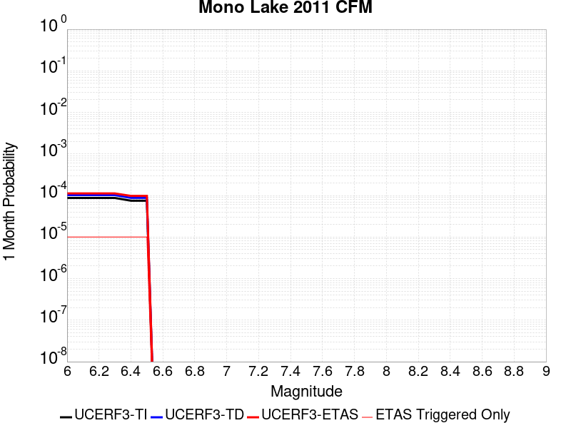 |  |  |

| Magnitude | 1 wk TI Prob | 1 wk TD Prob | 1 wk ETAS Prob | 1 wk ETAS/TD Gain | 1 wk ETAS Triggered Only | 1 mo TI Prob | 1 mo TD Prob | 1 mo ETAS Prob | 1 mo ETAS/TD Gain | 1 mo ETAS Triggered Only | 1 yr TI Prob | 1 yr TD Prob | 1 yr ETAS Prob | 1 yr ETAS/TD Gain | 1 yr ETAS Triggered Only | 10 yr TI Prob | 10 yr TD Prob | 10 yr ETAS Prob | 10 yr ETAS/TD Gain | 10 yr ETAS Triggered Only |
|-----|-----|-----|-----|-----|-----|-----|-----|-----|-----|-----|-----|-----|-----|-----|-----|-----|-----|-----|-----|-----|
| 6.0 | 2.0341662E-5 | 2.3828166E-5 | 3.3827928E-5 | 1.4196614 | 1.0E-5 | 8.717564E-5 | 1.0211971E-4 | 1.12118694E-4 | 1.0979143 | 1.0E-5 | 0.0010608466 | 0.0012431298 | 0.001263105 | 1.0160685 | 2.0E-5 | 0.010557966 | 0.012413835 | 0.012433587 | 1.0015911 | 2.0E-5 |
| 6.1 | 2.0341662E-5 | 2.3828166E-5 | 3.3827928E-5 | 1.4196614 | 1.0E-5 | 8.717564E-5 | 1.0211971E-4 | 1.12118694E-4 | 1.0979143 | 1.0E-5 | 0.0010608466 | 0.0012431298 | 0.001263105 | 1.0160685 | 2.0E-5 | 0.010557966 | 0.012413835 | 0.012433587 | 1.0015911 | 2.0E-5 |
| 6.2 | 2.0341662E-5 | 2.3828166E-5 | 3.3827928E-5 | 1.4196614 | 1.0E-5 | 8.717564E-5 | 1.0211971E-4 | 1.12118694E-4 | 1.0979143 | 1.0E-5 | 0.0010608466 | 0.0012431298 | 0.001263105 | 1.0160685 | 2.0E-5 | 0.010557966 | 0.012413835 | 0.012433587 | 1.0015911 | 2.0E-5 |
| 6.3 | 2.0341662E-5 | 2.3828166E-5 | 3.3827928E-5 | 1.4196614 | 1.0E-5 | 8.717564E-5 | 1.0211971E-4 | 1.12118694E-4 | 1.0979143 | 1.0E-5 | 0.0010608466 | 0.0012431298 | 0.001263105 | 1.0160685 | 2.0E-5 | 0.010557966 | 0.012413835 | 0.012433587 | 1.0015911 | 2.0E-5 |
| 6.4 | 1.749821E-5 | 2.0490985E-5 | 3.049078E-5 | 1.4880095 | 1.0E-5 | 7.499018E-5 | 8.781851E-5 | 9.781763E-5 | 1.1138612 | 1.0E-5 | 9.1262296E-4 | 0.0010691903 | 0.001089169 | 1.0186857 | 2.0E-5 | 0.009088841 | 0.010691865 | 0.010711651 | 1.0018506 | 2.0E-5 |
| 6.5 | 1.749821E-5 | 2.0490985E-5 | 3.049078E-5 | 1.4880095 | 1.0E-5 | 7.499018E-5 | 8.781851E-5 | 9.781763E-5 | 1.1138612 | 1.0E-5 | 9.1262296E-4 | 0.0010691903 | 0.001089169 | 1.0186857 | 2.0E-5 | 0.009088841 | 0.010691865 | 0.010711651 | 1.0018506 | 2.0E-5 |

## Elysian Park (Upper)
*[(top)](#table-of-contents)*

| 1 Week | 1 Month | 1 Year | 10 Year |
|-----|-----|-----|-----|
|  |  |  |  |

| Magnitude | 1 wk TI Prob | 1 wk TD Prob | 1 wk ETAS Prob | 1 wk ETAS/TD Gain | 1 wk ETAS Triggered Only | 1 mo TI Prob | 1 mo TD Prob | 1 mo ETAS Prob | 1 mo ETAS/TD Gain | 1 mo ETAS Triggered Only | 1 yr TI Prob | 1 yr TD Prob | 1 yr ETAS Prob | 1 yr ETAS/TD Gain | 1 yr ETAS Triggered Only | 10 yr TI Prob | 10 yr TD Prob | 10 yr ETAS Prob | 10 yr ETAS/TD Gain | 10 yr ETAS Triggered Only |
|-----|-----|-----|-----|-----|-----|-----|-----|-----|-----|-----|-----|-----|-----|-----|-----|-----|-----|-----|-----|-----|
| 6.0 | 3.1876025E-5 | 3.7035516E-5 | 3.7035516E-5 | 1.0 | 0.0 | 1.3660437E-4 | 1.587167E-4 | 1.6871512E-4 | 1.0629953 | 1.0E-5 | 0.0016618895 | 0.0019311075 | 0.0019410881 | 1.0051683 | 1.0E-5 | 0.016495159 | 0.019189782 | 0.0192094 | 1.0010222 | 2.0E-5 |
| 6.1 | 3.1876025E-5 | 3.7035516E-5 | 3.7035516E-5 | 1.0 | 0.0 | 1.3660437E-4 | 1.587167E-4 | 1.6871512E-4 | 1.0629953 | 1.0E-5 | 0.0016618895 | 0.0019311075 | 0.0019410881 | 1.0051683 | 1.0E-5 | 0.016495159 | 0.019189782 | 0.0192094 | 1.0010222 | 2.0E-5 |
| 6.2 | 3.1876025E-5 | 3.7035516E-5 | 3.7035516E-5 | 1.0 | 0.0 | 1.3660437E-4 | 1.587167E-4 | 1.6871512E-4 | 1.0629953 | 1.0E-5 | 0.0016618895 | 0.0019311075 | 0.0019410881 | 1.0051683 | 1.0E-5 | 0.016495159 | 0.019189782 | 0.0192094 | 1.0010222 | 2.0E-5 |
| 6.3 | 3.1876025E-5 | 3.7035516E-5 | 3.7035516E-5 | 1.0 | 0.0 | 1.3660437E-4 | 1.587167E-4 | 1.6871512E-4 | 1.0629953 | 1.0E-5 | 0.0016618895 | 0.0019311075 | 0.0019410881 | 1.0051683 | 1.0E-5 | 0.016495159 | 0.019189782 | 0.0192094 | 1.0010222 | 2.0E-5 |
| 6.4 | 1.9273462E-5 | 2.1202266E-5 | 2.1202266E-5 | 1.0 | 0.0 | 8.259794E-5 | 9.086466E-5 | 1.00863756E-4 | 1.1100438 | 1.0E-5 | 0.001005166 | 0.0011058892 | 0.0011158782 | 1.0090325 | 1.0E-5 | 0.010006315 | 0.011020724 | 0.011040503 | 1.0017948 | 2.0E-5 |
| 6.5 | 1.9273462E-5 | 2.1202266E-5 | 2.1202266E-5 | 1.0 | 0.0 | 8.259794E-5 | 9.086466E-5 | 1.00863756E-4 | 1.1100438 | 1.0E-5 | 0.001005166 | 0.0011058892 | 0.0011158782 | 1.0090325 | 1.0E-5 | 0.010006315 | 0.011020724 | 0.011040503 | 1.0017948 | 2.0E-5 |
| 6.6 | 9.813258E-6 | 9.665599E-6 | 9.665599E-6 | 1.0 | 0.0 | 4.205614E-5 | 4.1423376E-5 | 4.1423376E-5 | 1.0 | 0.0 | 5.119132E-4 | 5.0422014E-4 | 5.0422014E-4 | 1.0 | 0.0 | 0.005107356 | 0.0050314846 | 0.0050314846 | 1.0 | 0.0 |
| 6.7 | 9.801478E-6 | 9.653168E-6 | 9.653168E-6 | 1.0 | 0.0 | 4.2005657E-5 | 4.1370105E-5 | 4.1370105E-5 | 1.0 | 0.0 | 5.112989E-4 | 5.035719E-4 | 5.035719E-4 | 1.0 | 0.0 | 0.0051012407 | 0.0050250315 | 0.0050250315 | 1.0 | 0.0 |
| 6.8 | 8.102489E-6 | 7.773004E-6 | 7.773004E-6 | 1.0 | 0.0 | 3.4724493E-5 | 3.3312477E-5 | 3.3312477E-5 | 1.0 | 0.0 | 4.2268867E-4 | 4.055089E-4 | 4.055089E-4 | 1.0 | 0.0 | 0.004218856 | 0.0040481836 | 0.0040481836 | 1.0 | 0.0 |
| 6.9 | 6.08275E-6 | 5.4814514E-6 | 5.4814514E-6 | 1.0 | 0.0 | 2.6068668E-5 | 2.3491726E-5 | 2.3491726E-5 | 1.0 | 0.0 | 3.173398E-4 | 2.85975E-4 | 2.85975E-4 | 1.0 | 0.0 | 0.0031688702 | 0.0028561477 | 0.0028561477 | 1.0 | 0.0 |
| 7.0 | 5.5995934E-6 | 4.98278E-6 | 4.98278E-6 | 1.0 | 0.0 | 2.3998036E-5 | 2.13546E-5 | 2.13546E-5 | 1.0 | 0.0 | 2.9213692E-4 | 2.599619E-4 | 2.599619E-4 | 1.0 | 0.0 | 0.0029175316 | 0.0025966454 | 0.0025966454 | 1.0 | 0.0 |
| 7.1 | 4.709881E-6 | 4.0874015E-6 | 4.0874015E-6 | 1.0 | 0.0 | 2.0185047E-5 | 1.7517319E-5 | 1.7517319E-5 | 1.0 | 0.0 | 2.4572524E-4 | 2.132529E-4 | 2.132529E-4 | 1.0 | 0.0 | 0.002454537 | 0.002130524 | 0.002130524 | 1.0 | 0.0 |
| 7.2 | 3.6063436E-6 | 2.9779544E-6 | 2.9779544E-6 | 1.0 | 0.0 | 1.5455667E-5 | 1.27626E-5 | 1.27626E-5 | 1.0 | 0.0 | 1.881565E-4 | 1.5537368E-4 | 1.5537368E-4 | 1.0 | 0.0 | 0.0018799726 | 0.0015526618 | 0.0015526618 | 1.0 | 0.0 |
| 7.3 | 2.471135E-6 | 2.0954615E-6 | 2.0954615E-6 | 1.0 | 0.0 | 1.0590536E-5 | 8.980519E-6 | 8.980519E-6 | 1.0 | 0.0 | 1.2893214E-4 | 1.093324E-4 | 1.093324E-4 | 1.0 | 0.0 | 0.0012885736 | 0.0010927934 | 0.0010927934 | 1.0 | 0.0 |
| 7.4 | 1.163943E-6 | 1.0275091E-6 | 1.0275091E-6 | 1.0 | 0.0 | 4.988318E-6 | 4.4036033E-6 | 4.4036033E-6 | 1.0 | 0.0 | 6.0731076E-5 | 5.3612584E-5 | 5.3612584E-5 | 1.0 | 0.0 | 6.071448E-4 | 5.359995E-4 | 5.359995E-4 | 1.0 | 0.0 |
| 7.5 | 4.99459E-7 | 4.917604E-7 | 4.917604E-7 | 1.0 | 0.0 | 2.140537E-6 | 2.1075427E-6 | 2.1075427E-6 | 1.0 | 0.0 | 2.6060725E-5 | 2.5659048E-5 | 2.5659048E-5 | 1.0 | 0.0 | 2.605767E-4 | 2.5656243E-4 | 2.5656243E-4 | 1.0 | 0.0 |
| 7.6 | 2.4667852E-7 | 2.4778336E-7 | 2.4778336E-7 | 1.0 | 0.0 | 1.0571932E-6 | 1.0619283E-6 | 1.0619283E-6 | 1.0 | 0.0 | 1.2871251E-5 | 1.2928905E-5 | 1.2928905E-5 | 1.0 | 0.0 | 1.2870505E-4 | 1.2928189E-4 | 1.2928189E-4 | 1.0 | 0.0 |
| 7.7 | 8.2312795E-8 | 7.3864456E-8 | 7.3864456E-8 | 1.0 | 0.0 | 3.527691E-7 | 3.165619E-7 | 3.165619E-7 | 1.0 | 0.0 | 4.294955E-6 | 3.8541357E-6 | 3.8541357E-6 | 1.0 | 0.0 | 4.2948723E-5 | 3.8540802E-5 | 3.8540802E-5 | 1.0 | 0.0 |
| 7.8 | 2.7819295E-8 | 1.7566023E-8 | 1.7566023E-8 | 1.0 | 0.0 | 1.1922555E-7 | 7.5282955E-8 | 7.5282955E-8 | 1.0 | 0.0 | 1.45157E-6 | 9.165697E-7 | 9.165697E-7 | 1.0 | 0.0 | 1.45156055E-5 | 9.165675E-6 | 9.165675E-6 | 1.0 | 0.0 |

## Hayward (So) extension 2011 CFM
*[(top)](#table-of-contents)*

| 1 Week | 1 Month | 1 Year | 10 Year |
|-----|-----|-----|-----|
|  |  |  |  |

| Magnitude | 1 wk TI Prob | 1 wk TD Prob | 1 wk ETAS Prob | 1 wk ETAS/TD Gain | 1 wk ETAS Triggered Only | 1 mo TI Prob | 1 mo TD Prob | 1 mo ETAS Prob | 1 mo ETAS/TD Gain | 1 mo ETAS Triggered Only | 1 yr TI Prob | 1 yr TD Prob | 1 yr ETAS Prob | 1 yr ETAS/TD Gain | 1 yr ETAS Triggered Only | 10 yr TI Prob | 10 yr TD Prob | 10 yr ETAS Prob | 10 yr ETAS/TD Gain | 10 yr ETAS Triggered Only |
|-----|-----|-----|-----|-----|-----|-----|-----|-----|-----|-----|-----|-----|-----|-----|-----|-----|-----|-----|-----|-----|
| 6.0 | 1.1721256E-4 | 2.3697627E-4 | 2.469739E-4 | 1.0421883 | 1.0E-5 | 5.022428E-4 | 0.0010129517 | 0.0010329314 | 1.0197242 | 2.0E-5 | 0.0060976758 | 0.012248711 | 0.012268466 | 1.0016128 | 2.0E-5 | 0.0593305 | 0.112843215 | 0.112860955 | 1.0001572 | 2.0E-5 |
| 6.1 | 6.99169E-5 | 1.3822885E-4 | 1.4822747E-4 | 1.0723338 | 1.0E-5 | 2.9960944E-4 | 5.9128006E-4 | 6.0127414E-4 | 1.0169024 | 1.0E-5 | 0.0036416445 | 0.0071720886 | 0.007182017 | 1.0013843 | 1.0E-5 | 0.035825435 | 0.067803554 | 0.067812875 | 1.0001374 | 1.0E-5 |
| 6.2 | 6.99169E-5 | 1.3822885E-4 | 1.4822747E-4 | 1.0723338 | 1.0E-5 | 2.9960944E-4 | 5.9128006E-4 | 6.0127414E-4 | 1.0169024 | 1.0E-5 | 0.0036416445 | 0.0071720886 | 0.007182017 | 1.0013843 | 1.0E-5 | 0.035825435 | 0.067803554 | 0.067812875 | 1.0001374 | 1.0E-5 |
| 6.3 | 6.970908E-5 | 1.379104E-4 | 1.4790903E-4 | 1.0725008 | 1.0E-5 | 2.9871898E-4 | 5.899159E-4 | 5.9991E-4 | 1.0169415 | 1.0E-5 | 0.0036308395 | 0.007155625 | 0.0071655535 | 1.0013875 | 1.0E-5 | 0.035720866 | 0.067652516 | 0.06766184 | 1.0001378 | 1.0E-5 |
| 6.4 | 6.9517155E-5 | 1.375792E-4 | 1.4757783E-4 | 1.0726753 | 1.0E-5 | 2.9789665E-4 | 5.884971E-4 | 5.984912E-4 | 1.0169824 | 1.0E-5 | 0.0036208609 | 0.0071385372 | 0.007148466 | 1.0013908 | 1.0E-5 | 0.03562429 | 0.06749655 | 0.06750588 | 1.0001382 | 1.0E-5 |
| 6.5 | 4.786248E-5 | 9.41498E-5 | 1.0414886E-4 | 1.1062037 | 1.0E-5 | 2.0510878E-4 | 4.034394E-4 | 4.1343534E-4 | 1.0247768 | 1.0E-5 | 0.0024943394 | 0.004901227 | 0.0049111783 | 1.0020303 | 1.0E-5 | 0.02466527 | 0.046901822 | 0.04691135 | 1.0002033 | 1.0E-5 |
| 6.6 | 4.4662214E-5 | 8.881654E-5 | 9.881565E-5 | 1.1125816 | 1.0E-5 | 1.9139545E-4 | 3.805894E-4 | 3.9058557E-4 | 1.026265 | 1.0E-5 | 0.0023277493 | 0.0046242937 | 0.004634247 | 1.0021524 | 1.0E-5 | 0.02303517 | 0.044293344 | 0.044302903 | 1.0002158 | 1.0E-5 |
| 6.7 | 3.884542E-5 | 7.8648096E-5 | 8.8647306E-5 | 1.1271386 | 1.0E-5 | 1.6646975E-4 | 3.370222E-4 | 3.4701882E-4 | 1.0296617 | 1.0E-5 | 0.002024885 | 0.0040959697 | 0.004105929 | 1.0024314 | 1.0E-5 | 0.020065336 | 0.039333146 | 0.039342754 | 1.0002443 | 1.0E-5 |
| 6.8 | 3.4221863E-5 | 6.855653E-5 | 7.855585E-5 | 1.1458551 | 1.0E-5 | 1.4665688E-4 | 2.93783E-4 | 3.0378008E-4 | 1.0340288 | 1.0E-5 | 0.0017840851 | 0.0035713627 | 0.003581327 | 1.0027901 | 1.0E-5 | 0.017698295 | 0.034421004 | 0.034430657 | 1.0002805 | 1.0E-5 |
| 6.9 | 1.6927712E-5 | 3.0061563E-5 | 3.0061563E-5 | 1.0 | 0.0 | 7.2545314E-5 | 1.2882923E-4 | 1.2882923E-4 | 1.0 | 0.0 | 8.828813E-4 | 0.0015674243 | 0.0015674243 | 1.0 | 0.0 | 0.008793819 | 0.01546327 | 0.01546327 | 1.0 | 0.0 |
| 7.0 | 1.2509653E-5 | 2.2462571E-5 | 2.2462571E-5 | 1.0 | 0.0 | 5.3611697E-5 | 9.6264856E-5 | 9.6264856E-5 | 1.0 | 0.0 | 6.525269E-4 | 0.0011714385 | 0.0011714385 | 1.0 | 0.0 | 0.0065061417 | 0.01158231 | 0.01158231 | 1.0 | 0.0 |
| 7.1 | 8.751583E-6 | 1.4925648E-5 | 1.4925648E-5 | 1.0 | 0.0 | 3.750624E-5 | 6.3965526E-5 | 6.3965526E-5 | 1.0 | 0.0 | 4.5654282E-4 | 7.785079E-4 | 7.785079E-4 | 1.0 | 0.0 | 0.0045560603 | 0.007763496 | 0.007763496 | 1.0 | 0.0 |
| 7.2 | 6.354379E-6 | 1.1498636E-5 | 1.1498636E-5 | 1.0 | 0.0 | 2.7232769E-5 | 4.9278966E-5 | 4.9278966E-5 | 1.0 | 0.0 | 3.3150852E-4 | 5.99811E-4 | 5.99811E-4 | 1.0 | 0.0 | 0.0033101442 | 0.0060003046 | 0.0060003046 | 1.0 | 0.0 |
| 7.3 | 4.645554E-6 | 8.818172E-6 | 8.818172E-6 | 1.0 | 0.0 | 1.9909365E-5 | 3.779164E-5 | 3.779164E-5 | 1.0 | 0.0 | 2.4236954E-4 | 4.6002E-4 | 4.6002E-4 | 1.0 | 0.0 | 0.0024210536 | 0.004610708 | 0.004610708 | 1.0 | 0.0 |
| 7.4 | 4.23437E-6 | 7.992532E-6 | 7.992532E-6 | 1.0 | 0.0 | 1.8147173E-5 | 3.425328E-5 | 3.425328E-5 | 1.0 | 0.0 | 2.2091944E-4 | 4.1695772E-4 | 4.1695772E-4 | 1.0 | 0.0 | 0.0022069993 | 0.004181972 | 0.004181972 | 1.0 | 0.0 |
| 7.5 | 2.2187417E-6 | 3.9522306E-6 | 3.9522306E-6 | 1.0 | 0.0 | 9.508858E-6 | 1.6938036E-5 | 1.6938036E-5 | 1.0 | 0.0 | 1.157642E-4 | 2.0620368E-4 | 2.0620368E-4 | 1.0 | 0.0 | 0.0011570391 | 0.0020734754 | 0.0020734754 | 1.0 | 0.0 |
| 7.6 | 2.7952495E-8 | 3.878529E-8 | 3.878529E-8 | 1.0 | 0.0 | 1.1979641E-7 | 1.6622266E-7 | 1.6622266E-7 | 1.0 | 0.0 | 1.4585203E-6 | 2.0237592E-6 | 2.0237592E-6 | 1.0 | 0.0 | 1.4585107E-5 | 2.0328182E-5 | 2.0328182E-5 | 1.0 | 0.0 |
| 7.7 | 1.7192724E-8 | 2.3436517E-8 | 2.3436517E-8 | 1.0 | 0.0 | 7.36831E-8 | 1.0044221E-7 | 1.0044221E-7 | 1.0 | 0.0 | 8.9709135E-7 | 1.2228833E-6 | 1.2228833E-6 | 1.0 | 0.0 | 8.970877E-6 | 1.2296933E-5 | 1.2296933E-5 | 1.0 | 0.0 |

## La Panza 2011
*[(top)](#table-of-contents)*

| 1 Week | 1 Month | 1 Year | 10 Year |
|-----|-----|-----|-----|
|  |  |  |  |

| Magnitude | 1 wk TI Prob | 1 wk TD Prob | 1 wk ETAS Prob | 1 wk ETAS/TD Gain | 1 wk ETAS Triggered Only | 1 mo TI Prob | 1 mo TD Prob | 1 mo ETAS Prob | 1 mo ETAS/TD Gain | 1 mo ETAS Triggered Only | 1 yr TI Prob | 1 yr TD Prob | 1 yr ETAS Prob | 1 yr ETAS/TD Gain | 1 yr ETAS Triggered Only | 10 yr TI Prob | 10 yr TD Prob | 10 yr ETAS Prob | 10 yr ETAS/TD Gain | 10 yr ETAS Triggered Only |
|-----|-----|-----|-----|-----|-----|-----|-----|-----|-----|-----|-----|-----|-----|-----|-----|-----|-----|-----|-----|-----|
| 6.0 | 4.6754544E-6 | 4.717587E-6 | 2.4717492E-5 | 5.2394357 | 2.0E-5 | 2.0037509E-5 | 2.0218084E-5 | 4.021768E-5 | 1.9891934 | 2.0E-5 | 2.4392935E-4 | 2.4612935E-4 | 2.661244E-4 | 1.081238 | 2.0E-5 | 0.0024366176 | 0.002458762 | 0.0024787127 | 1.0081142 | 2.0E-5 |
| 6.1 | 4.6754544E-6 | 4.717587E-6 | 2.4717492E-5 | 5.2394357 | 2.0E-5 | 2.0037509E-5 | 2.0218084E-5 | 4.021768E-5 | 1.9891934 | 2.0E-5 | 2.4392935E-4 | 2.4612935E-4 | 2.661244E-4 | 1.081238 | 2.0E-5 | 0.0024366176 | 0.002458762 | 0.0024787127 | 1.0081142 | 2.0E-5 |
| 6.2 | 4.6754544E-6 | 4.717587E-6 | 2.4717492E-5 | 5.2394357 | 2.0E-5 | 2.0037509E-5 | 2.0218084E-5 | 4.021768E-5 | 1.9891934 | 2.0E-5 | 2.4392935E-4 | 2.4612935E-4 | 2.661244E-4 | 1.081238 | 2.0E-5 | 0.0024366176 | 0.002458762 | 0.0024787127 | 1.0081142 | 2.0E-5 |
| 6.3 | 4.6754544E-6 | 4.717587E-6 | 2.4717492E-5 | 5.2394357 | 2.0E-5 | 2.0037509E-5 | 2.0218084E-5 | 4.021768E-5 | 1.9891934 | 2.0E-5 | 2.4392935E-4 | 2.4612935E-4 | 2.661244E-4 | 1.081238 | 2.0E-5 | 0.0024366176 | 0.002458762 | 0.0024787127 | 1.0081142 | 2.0E-5 |
| 6.4 | 4.6754544E-6 | 4.717587E-6 | 2.4717492E-5 | 5.2394357 | 2.0E-5 | 2.0037509E-5 | 2.0218084E-5 | 4.021768E-5 | 1.9891934 | 2.0E-5 | 2.4392935E-4 | 2.4612935E-4 | 2.661244E-4 | 1.081238 | 2.0E-5 | 0.0024366176 | 0.002458762 | 0.0024787127 | 1.0081142 | 2.0E-5 |
| 6.5 | 2.485343E-6 | 2.5005988E-6 | 2.250055E-5 | 8.998064 | 2.0E-5 | 1.0651426E-5 | 1.0716811E-5 | 3.0716597E-5 | 2.866207 | 2.0E-5 | 1.296734E-4 | 1.3046975E-4 | 1.5046714E-4 | 1.1532723 | 2.0E-5 | 0.0012959775 | 0.0013039699 | 0.0013239438 | 1.0153178 | 2.0E-5 |
| 6.6 | 2.485343E-6 | 2.5005988E-6 | 2.250055E-5 | 8.998064 | 2.0E-5 | 1.0651426E-5 | 1.0716811E-5 | 3.0716597E-5 | 2.866207 | 2.0E-5 | 1.296734E-4 | 1.3046975E-4 | 1.5046714E-4 | 1.1532723 | 2.0E-5 | 0.0012959775 | 0.0013039699 | 0.0013239438 | 1.0153178 | 2.0E-5 |
| 6.7 | 1.5108508E-6 | 1.5146375E-6 | 2.1514606E-5 | 14.20446 | 2.0E-5 | 6.4750584E-6 | 6.491288E-6 | 2.6491158E-5 | 4.0810328 | 2.0E-5 | 7.8830984E-5 | 7.902867E-5 | 9.902709E-5 | 1.2530527 | 2.0E-5 | 7.880303E-4 | 7.900165E-4 | 8.100007E-4 | 1.025296 | 2.0E-5 |
| 6.8 | 1.3865837E-6 | 1.3885102E-6 | 2.1388483E-5 | 15.403908 | 2.0E-5 | 5.942488E-6 | 5.9507447E-6 | 2.5950625E-5 | 4.3609037 | 2.0E-5 | 7.234739E-5 | 7.244801E-5 | 9.244656E-5 | 1.2760401 | 2.0E-5 | 7.232384E-4 | 7.242537E-4 | 7.4423925E-4 | 1.0275947 | 2.0E-5 |
| 6.9 | 9.826583E-7 | 9.796287E-7 | 2.0979609E-5 | 21.41588 | 2.0E-5 | 4.2113857E-6 | 4.198402E-6 | 2.4198318E-5 | 5.763697 | 2.0E-5 | 5.1272415E-5 | 5.11144E-5 | 7.1113376E-5 | 1.3912592 | 2.0E-5 | 5.126059E-4 | 5.110318E-4 | 5.3102156E-4 | 1.0391165 | 2.0E-5 |
| 7.0 | 6.7797646E-7 | 6.7102144E-7 | 1.0671015E-5 | 15.902643 | 1.0E-5 | 2.9056102E-6 | 2.8758034E-6 | 1.2875775E-5 | 4.477279 | 1.0E-5 | 3.537523E-5 | 3.5012374E-5 | 4.5012024E-5 | 1.2856033 | 1.0E-5 | 3.5369597E-4 | 3.5007167E-4 | 3.6006817E-4 | 1.0285556 | 1.0E-5 |
| 7.1 | 3.4979826E-7 | 3.387388E-7 | 3.387388E-7 | 1.0 | 0.0 | 1.4991346E-6 | 1.4517369E-6 | 1.4517369E-6 | 1.0 | 0.0 | 1.825181E-5 | 1.7674765E-5 | 1.7674765E-5 | 1.0 | 0.0 | 1.825031E-4 | 1.7673477E-4 | 1.7673477E-4 | 1.0 | 0.0 |
| 7.2 | 2.5088332E-7 | 2.3831899E-7 | 2.3831899E-7 | 1.0 | 0.0 | 1.0752137E-6 | 1.0213668E-6 | 1.0213668E-6 | 1.0 | 0.0 | 1.3090649E-5 | 1.2435077E-5 | 1.2435077E-5 | 1.0 | 0.0 | 1.3089878E-4 | 1.2434467E-4 | 1.2434467E-4 | 1.0 | 0.0 |
| 7.3 | 1.0159086E-7 | 8.64462E-8 | 8.64462E-8 | 1.0 | 0.0 | 4.3538932E-7 | 3.7048366E-7 | 3.7048366E-7 | 1.0 | 0.0 | 5.300852E-6 | 4.5106294E-6 | 4.5106294E-6 | 1.0 | 0.0 | 5.3007258E-5 | 4.5105422E-5 | 4.5105422E-5 | 1.0 | 0.0 |
| 7.4 | 3.5006252E-8 | 1.9404325E-8 | 1.9404325E-8 | 1.0 | 0.0 | 1.5002678E-7 | 8.3161396E-8 | 8.3161396E-8 | 1.0 | 0.0 | 1.8265745E-6 | 1.0124895E-6 | 1.0124895E-6 | 1.0 | 0.0 | 1.8265595E-5 | 1.01248515E-5 | 1.01248515E-5 | 1.0 | 0.0 |
| 7.5 | 2.592274E-8 | 1.0239094E-8 | 1.0239094E-8 | 1.0 | 0.0 | 1.1109746E-7 | 4.388183E-8 | 4.388183E-8 | 1.0 | 0.0 | 1.3526106E-6 | 5.342612E-7 | 5.342612E-7 | 1.0 | 0.0 | 1.3526024E-5 | 5.3425997E-6 | 5.3425997E-6 | 1.0 | 0.0 |
| 7.6 | 1.9016717E-8 | 5.244801E-9 | 5.244801E-9 | 1.0 | 0.0 | 8.150022E-8 | 2.247772E-8 | 2.247772E-8 | 1.0 | 0.0 | 9.922647E-7 | 2.736662E-7 | 2.736662E-7 | 1.0 | 0.0 | 9.922603E-6 | 2.7366589E-6 | 2.7366589E-6 | 1.0 | 0.0 |
| 7.7 | 1.17738495E-8 | 1.2398075E-9 | 1.2398075E-9 | 1.0 | 0.0 | 5.0459356E-8 | 5.3134603E-9 | 5.3134603E-9 | 1.0 | 0.0 | 6.1434247E-7 | 6.469138E-8 | 6.469138E-8 | 1.0 | 0.0 | 6.143408E-6 | 6.469136E-7 | 6.469136E-7 | 1.0 | 0.0 |
| 7.8 | 5.489079E-9 | 2.0111768E-10 | 2.0111768E-10 | 1.0 | 0.0 | 2.3524624E-8 | 8.6193275E-10 | 8.6193275E-10 | 1.0 | 0.0 | 2.8641225E-7 | 1.04940305E-8 | 1.04940305E-8 | 1.0 | 0.0 | 2.8641189E-6 | 1.04940305E-7 | 1.04940305E-7 | 1.0 | 0.0 |
| 7.9 | 2.5081048E-9 | 6.683887E-11 | 6.683887E-11 | 1.0 | 0.0 | 1.0749021E-8 | 2.8645197E-10 | 2.8645197E-10 | 1.0 | 0.0 | 1.3086932E-7 | 3.487552E-9 | 3.487552E-9 | 1.0 | 0.0 | 1.3086925E-6 | 3.487552E-8 | 3.487552E-8 | 1.0 | 0.0 |

## Great Valley 03 Mysterious Ridge
*[(top)](#table-of-contents)*

| 1 Week | 1 Month | 1 Year | 10 Year |
|-----|-----|-----|-----|
|  |  |  |  |

| Magnitude | 1 wk TI Prob | 1 wk TD Prob | 1 wk ETAS Prob | 1 wk ETAS/TD Gain | 1 wk ETAS Triggered Only | 1 mo TI Prob | 1 mo TD Prob | 1 mo ETAS Prob | 1 mo ETAS/TD Gain | 1 mo ETAS Triggered Only | 1 yr TI Prob | 1 yr TD Prob | 1 yr ETAS Prob | 1 yr ETAS/TD Gain | 1 yr ETAS Triggered Only | 10 yr TI Prob | 10 yr TD Prob | 10 yr ETAS Prob | 10 yr ETAS/TD Gain | 10 yr ETAS Triggered Only |
|-----|-----|-----|-----|-----|-----|-----|-----|-----|-----|-----|-----|-----|-----|-----|-----|-----|-----|-----|-----|-----|
| 6.0 | 3.1182444E-5 | 3.603423E-5 | 4.603387E-5 | 1.277504 | 1.0E-5 | 1.336322E-4 | 1.544242E-4 | 1.6442266E-4 | 1.0647467 | 1.0E-5 | 0.0016257578 | 0.0018786696 | 0.001898632 | 1.0106258 | 2.0E-5 | 0.016139153 | 0.018646652 | 0.018666279 | 1.0010526 | 2.0E-5 |
| 6.1 | 3.1182444E-5 | 3.603423E-5 | 4.603387E-5 | 1.277504 | 1.0E-5 | 1.336322E-4 | 1.544242E-4 | 1.6442266E-4 | 1.0647467 | 1.0E-5 | 0.0016257578 | 0.0018786696 | 0.001898632 | 1.0106258 | 2.0E-5 | 0.016139153 | 0.018646652 | 0.018666279 | 1.0010526 | 2.0E-5 |
| 6.2 | 3.1182444E-5 | 3.603423E-5 | 4.603387E-5 | 1.277504 | 1.0E-5 | 1.336322E-4 | 1.544242E-4 | 1.6442266E-4 | 1.0647467 | 1.0E-5 | 0.0016257578 | 0.0018786696 | 0.001898632 | 1.0106258 | 2.0E-5 | 0.016139153 | 0.018646652 | 0.018666279 | 1.0010526 | 2.0E-5 |
| 6.3 | 2.106934E-5 | 2.3850307E-5 | 3.385007E-5 | 1.4192718 | 1.0E-5 | 9.0294045E-5 | 1.0221177E-4 | 1.1221076E-4 | 1.0978261 | 1.0E-5 | 0.0010987755 | 0.0012437489 | 0.0012537364 | 1.0080302 | 1.0E-5 | 0.010933585 | 0.012371127 | 0.012381003 | 1.0007983 | 1.0E-5 |
| 6.4 | 2.106934E-5 | 2.3850307E-5 | 3.385007E-5 | 1.4192718 | 1.0E-5 | 9.0294045E-5 | 1.0221177E-4 | 1.1221076E-4 | 1.0978261 | 1.0E-5 | 0.0010987755 | 0.0012437489 | 0.0012537364 | 1.0080302 | 1.0E-5 | 0.010933585 | 0.012371127 | 0.012381003 | 1.0007983 | 1.0E-5 |
| 6.5 | 1.9389783E-5 | 2.1884984E-5 | 3.1884763E-5 | 1.4569243 | 1.0E-5 | 8.309642E-5 | 9.3789575E-5 | 1.0378863E-4 | 1.1066116 | 1.0E-5 | 0.0010112294 | 0.0011413174 | 0.001151306 | 1.0087517 | 1.0E-5 | 0.010066401 | 0.011357434 | 0.01136732 | 1.0008705 | 1.0E-5 |
| 6.6 | 1.9370193E-5 | 2.1864906E-5 | 3.1864685E-5 | 1.4573439 | 1.0E-5 | 8.301247E-5 | 9.370353E-5 | 1.0370259E-4 | 1.1067096 | 1.0E-5 | 0.0010102082 | 0.001140271 | 0.0011502595 | 1.0087599 | 1.0E-5 | 0.010056281 | 0.011347076 | 0.011356962 | 1.0008713 | 1.0E-5 |
| 6.7 | 1.6723505E-5 | 1.8799281E-5 | 1.8799281E-5 | 1.0 | 0.0 | 7.16702E-5 | 8.056597E-5 | 8.056597E-5 | 1.0 | 0.0 | 8.722353E-4 | 9.804688E-4 | 9.804688E-4 | 1.0 | 0.0 | 0.008688197 | 0.009763439 | 0.009763439 | 1.0 | 0.0 |
| 6.8 | 1.426937E-5 | 1.599721E-5 | 1.599721E-5 | 1.0 | 0.0 | 6.115301E-5 | 6.855775E-5 | 6.855775E-5 | 1.0 | 0.0 | 7.4428355E-4 | 8.343854E-4 | 8.343854E-4 | 1.0 | 0.0 | 0.007417957 | 0.008314005 | 0.008314005 | 1.0 | 0.0 |
| 6.9 | 1.2469891E-5 | 1.3956928E-5 | 1.3956928E-5 | 1.0 | 0.0 | 5.3441294E-5 | 5.9814105E-5 | 5.9814105E-5 | 1.0 | 0.0 | 6.504535E-4 | 7.280055E-4 | 7.280055E-4 | 1.0 | 0.0 | 0.006485529 | 0.00725743 | 0.00725743 | 1.0 | 0.0 |
| 7.0 | 8.7746275E-6 | 9.791734E-6 | 9.791734E-6 | 1.0 | 0.0 | 3.7605005E-5 | 4.196394E-5 | 4.196394E-5 | 1.0 | 0.0 | 4.5774475E-4 | 5.1079853E-4 | 5.1079853E-4 | 1.0 | 0.0 | 0.00456803 | 0.005096977 | 0.005096977 | 1.0 | 0.0 |
| 7.1 | 6.1067153E-6 | 6.813725E-6 | 6.813725E-6 | 1.0 | 0.0 | 2.6171374E-5 | 2.9201385E-5 | 2.9201385E-5 | 1.0 | 0.0 | 3.1858988E-4 | 3.5547445E-4 | 3.5547445E-4 | 1.0 | 0.0 | 0.0031813353 | 0.003549609 | 0.003549609 | 1.0 | 0.0 |
| 7.2 | 2.939283E-6 | 3.2741057E-6 | 3.2741057E-6 | 1.0 | 0.0 | 1.2596866E-5 | 1.4031816E-5 | 1.4031816E-5 | 1.0 | 0.0 | 1.5335606E-4 | 1.7082572E-4 | 1.7082572E-4 | 1.0 | 0.0 | 0.0015325027 | 0.001707116 | 0.001707116 | 1.0 | 0.0 |
| 7.3 | 7.2387763E-7 | 8.008505E-7 | 8.008505E-7 | 1.0 | 0.0 | 3.102329E-6 | 3.4322145E-6 | 3.4322145E-6 | 1.0 | 0.0 | 3.77702E-5 | 4.178687E-5 | 4.178687E-5 | 1.0 | 0.0 | 3.7763783E-4 | 4.1783508E-4 | 4.1783508E-4 | 1.0 | 0.0 |
| 7.4 | 3.112171E-8 | 3.2068368E-8 | 3.2068368E-8 | 1.0 | 0.0 | 1.3337875E-7 | 1.3743585E-7 | 1.3743585E-7 | 1.0 | 0.0 | 1.6238852E-6 | 1.6732803E-6 | 1.6732803E-6 | 1.0 | 0.0 | 1.6238733E-5 | 1.6732685E-5 | 1.6732685E-5 | 1.0 | 0.0 |

## Bartlett Springs 2011 CFM
*[(top)](#table-of-contents)*

| 1 Week | 1 Month | 1 Year | 10 Year |
|-----|-----|-----|-----|
|  |  |  |  |

| Magnitude | 1 wk TI Prob | 1 wk TD Prob | 1 wk ETAS Prob | 1 wk ETAS/TD Gain | 1 wk ETAS Triggered Only | 1 mo TI Prob | 1 mo TD Prob | 1 mo ETAS Prob | 1 mo ETAS/TD Gain | 1 mo ETAS Triggered Only | 1 yr TI Prob | 1 yr TD Prob | 1 yr ETAS Prob | 1 yr ETAS/TD Gain | 1 yr ETAS Triggered Only | 10 yr TI Prob | 10 yr TD Prob | 10 yr ETAS Prob | 10 yr ETAS/TD Gain | 10 yr ETAS Triggered Only |
|-----|-----|-----|-----|-----|-----|-----|-----|-----|-----|-----|-----|-----|-----|-----|-----|-----|-----|-----|-----|-----|
| 6.0 | 6.2326144E-5 | 8.060613E-5 | 9.0605325E-5 | 1.12405 | 1.0E-5 | 2.6708472E-4 | 3.454099E-4 | 3.5540646E-4 | 1.0289412 | 1.0E-5 | 0.003246908 | 0.0041973945 | 0.0042073526 | 1.0023724 | 1.0E-5 | 0.031998757 | 0.04119771 | 0.0412073 | 1.0002327 | 1.0E-5 |
| 6.1 | 6.227657E-5 | 8.054363E-5 | 9.0542824E-5 | 1.1241463 | 1.0E-5 | 2.668723E-4 | 3.4514212E-4 | 3.5513868E-4 | 1.0289636 | 1.0E-5 | 0.0032443295 | 0.004194147 | 0.004204105 | 1.0023743 | 1.0E-5 | 0.031973712 | 0.041166443 | 0.041176032 | 1.0002329 | 1.0E-5 |
| 6.2 | 6.22452E-5 | 8.050423E-5 | 9.0503425E-5 | 1.124207 | 1.0E-5 | 2.6673786E-4 | 3.4497332E-4 | 3.5496987E-4 | 1.0289778 | 1.0E-5 | 0.0032426978 | 0.0041921 | 0.004202058 | 1.0023755 | 1.0E-5 | 0.03195787 | 0.041146737 | 0.041156325 | 1.000233 | 1.0E-5 |
| 6.3 | 6.219006E-5 | 8.043407E-5 | 9.043326E-5 | 1.1243154 | 1.0E-5 | 2.6650162E-4 | 3.4467268E-4 | 3.5466923E-4 | 1.029003 | 1.0E-5 | 0.00323983 | 0.0041884542 | 0.0041984124 | 1.0023775 | 1.0E-5 | 0.031930014 | 0.041111637 | 0.041121226 | 1.0002333 | 1.0E-5 |
| 6.4 | 5.2175856E-5 | 6.725342E-5 | 6.725342E-5 | 1.0 | 0.0 | 2.2359163E-4 | 2.8819745E-4 | 2.8819745E-4 | 1.0 | 0.0 | 0.0027188298 | 0.0035032115 | 0.0035032115 | 1.0 | 0.0 | 0.026858058 | 0.034489222 | 0.034489222 | 1.0 | 0.0 |
| 6.5 | 5.205166E-5 | 6.7096094E-5 | 6.7096094E-5 | 1.0 | 0.0 | 2.2305945E-4 | 2.8752335E-4 | 2.8752335E-4 | 1.0 | 0.0 | 0.0027123666 | 0.0034950306 | 0.0034950306 | 1.0 | 0.0 | 0.026794989 | 0.034409966 | 0.034409966 | 1.0 | 0.0 |
| 6.6 | 5.0085426E-5 | 6.449277E-5 | 6.449277E-5 | 1.0 | 0.0 | 2.1463417E-4 | 2.763686E-4 | 2.763686E-4 | 1.0 | 0.0 | 0.0026100394 | 0.0033596456 | 0.0033596456 | 1.0 | 0.0 | 0.025795965 | 0.033097573 | 0.033097573 | 1.0 | 0.0 |
| 6.7 | 4.8930866E-5 | 6.3017396E-5 | 6.3017396E-5 | 1.0 | 0.0 | 2.0968684E-4 | 2.7004688E-4 | 2.7004688E-4 | 1.0 | 0.0 | 0.0025499484 | 0.0032829174 | 0.0032829174 | 1.0 | 0.0 | 0.025208864 | 0.03235294 | 0.03235294 | 1.0 | 0.0 |
| 6.8 | 4.5679535E-5 | 5.8741858E-5 | 5.8741858E-5 | 1.0 | 0.0 | 1.9575475E-4 | 2.5172674E-4 | 2.5172674E-4 | 1.0 | 0.0 | 0.002380709 | 0.0030605064 | 0.0030605064 | 1.0 | 0.0 | 0.023553653 | 0.03019042 | 0.03019042 | 1.0 | 0.0 |
| 6.9 | 4.1439176E-5 | 5.3220094E-5 | 5.3220094E-5 | 1.0 | 0.0 | 1.7758438E-4 | 2.2806633E-4 | 2.2806633E-4 | 1.0 | 0.0 | 0.002159946 | 0.0027731995 | 0.0027731995 | 1.0 | 0.0 | 0.021390721 | 0.027390772 | 0.027390772 | 1.0 | 0.0 |
| 7.0 | 3.5920104E-5 | 4.600871E-5 | 4.600871E-5 | 1.0 | 0.0 | 1.5393422E-4 | 1.9716538E-4 | 1.9716538E-4 | 1.0 | 0.0 | 0.001872538 | 0.0023978627 | 0.0023978627 | 1.0 | 0.0 | 0.018568378 | 0.023723004 | 0.023723004 | 1.0 | 0.0 |
| 7.1 | 3.338812E-5 | 4.2689582E-5 | 4.2689582E-5 | 1.0 | 0.0 | 1.430841E-4 | 1.829426E-4 | 1.829426E-4 | 1.0 | 0.0 | 0.0017406568 | 0.0022250658 | 0.0022250658 | 1.0 | 0.0 | 0.017270854 | 0.02203054 | 0.02203054 | 1.0 | 0.0 |
| 7.2 | 2.8619615E-5 | 3.6401652E-5 | 3.6401652E-5 | 1.0 | 0.0 | 1.2264973E-4 | 1.5599781E-4 | 1.5599781E-4 | 1.0 | 0.0 | 0.0014922376 | 0.0018976285 | 0.0018976285 | 1.0 | 0.0 | 0.014822568 | 0.01881613 | 0.01881613 | 1.0 | 0.0 |
| 7.3 | 2.6376783E-5 | 3.342276E-5 | 3.342276E-5 | 1.0 | 0.0 | 1.13038455E-4 | 1.4323258E-4 | 1.4323258E-4 | 1.0 | 0.0 | 0.0013753743 | 0.001742471 | 0.001742471 | 1.0 | 0.0 | 0.01366893 | 0.01728972 | 0.01728972 | 1.0 | 0.0 |
| 7.4 | 2.3738676E-5 | 2.9978975E-5 | 2.9978975E-5 | 1.0 | 0.0 | 1.0173322E-4 | 1.2847505E-4 | 1.2847505E-4 | 1.0 | 0.0 | 0.0012378981 | 0.0015630693 | 0.0015630693 | 1.0 | 0.0 | 0.012310251 | 0.015522073 | 0.015522073 | 1.0 | 0.0 |
| 7.5 | 2.1789481E-5 | 2.7439388E-5 | 2.7439388E-5 | 1.0 | 0.0 | 9.338015E-5 | 1.1759212E-4 | 1.1759212E-4 | 1.0 | 0.0 | 0.0011363103 | 0.0014307518 | 0.0014307518 | 1.0 | 0.0 | 0.011305175 | 0.014216576 | 0.014216576 | 1.0 | 0.0 |
| 7.6 | 1.3895281E-5 | 1.7368426E-5 | 1.7368426E-5 | 1.0 | 0.0 | 5.9549846E-5 | 7.4434E-5 | 7.4434E-5 | 1.0 | 0.0 | 7.2477816E-4 | 9.0586004E-4 | 9.0586004E-4 | 1.0 | 0.0 | 0.0072241887 | 0.009022084 | 0.009022084 | 1.0 | 0.0 |
| 7.7 | 4.245981E-6 | 5.1624675E-6 | 5.1624675E-6 | 1.0 | 0.0 | 1.8196934E-5 | 2.2124674E-5 | 2.2124674E-5 | 1.0 | 0.0 | 2.2152514E-4 | 2.693348E-4 | 2.693348E-4 | 1.0 | 0.0 | 0.0022130446 | 0.0026901034 | 0.0026901034 | 1.0 | 0.0 |
| 7.8 | 6.145192E-7 | 7.047006E-7 | 7.047006E-7 | 1.0 | 0.0 | 2.633651E-6 | 3.020142E-6 | 3.020142E-6 | 1.0 | 0.0 | 3.206423E-5 | 3.676962E-5 | 3.676962E-5 | 1.0 | 0.0 | 3.2059604E-4 | 3.6763478E-4 | 3.6763478E-4 | 1.0 | 0.0 |

## Hosgri
*[(top)](#table-of-contents)*

| 1 Week | 1 Month | 1 Year | 10 Year |
|-----|-----|-----|-----|
|  |  |  |  |

| Magnitude | 1 wk TI Prob | 1 wk TD Prob | 1 wk ETAS Prob | 1 wk ETAS/TD Gain | 1 wk ETAS Triggered Only | 1 mo TI Prob | 1 mo TD Prob | 1 mo ETAS Prob | 1 mo ETAS/TD Gain | 1 mo ETAS Triggered Only | 1 yr TI Prob | 1 yr TD Prob | 1 yr ETAS Prob | 1 yr ETAS/TD Gain | 1 yr ETAS Triggered Only | 10 yr TI Prob | 10 yr TD Prob | 10 yr ETAS Prob | 10 yr ETAS/TD Gain | 10 yr ETAS Triggered Only |
|-----|-----|-----|-----|-----|-----|-----|-----|-----|-----|-----|-----|-----|-----|-----|-----|-----|-----|-----|-----|-----|
| 6.0 | 2.883978E-5 | 2.9128416E-5 | 2.9128416E-5 | 1.0 | 0.0 | 1.235932E-4 | 1.2483024E-4 | 1.2483024E-4 | 1.0 | 0.0 | 0.0015037085 | 0.001518776 | 0.0015287608 | 1.0065743 | 1.0E-5 | 0.01493574 | 0.01508774 | 0.015097589 | 1.0006528 | 1.0E-5 |
| 6.1 | 2.883978E-5 | 2.9128416E-5 | 2.9128416E-5 | 1.0 | 0.0 | 1.235932E-4 | 1.2483024E-4 | 1.2483024E-4 | 1.0 | 0.0 | 0.0015037085 | 0.001518776 | 0.0015287608 | 1.0065743 | 1.0E-5 | 0.01493574 | 0.01508774 | 0.015097589 | 1.0006528 | 1.0E-5 |
| 6.2 | 2.883978E-5 | 2.9128416E-5 | 2.9128416E-5 | 1.0 | 0.0 | 1.235932E-4 | 1.2483024E-4 | 1.2483024E-4 | 1.0 | 0.0 | 0.0015037085 | 0.001518776 | 0.0015287608 | 1.0065743 | 1.0E-5 | 0.01493574 | 0.01508774 | 0.015097589 | 1.0006528 | 1.0E-5 |
| 6.3 | 2.2914428E-5 | 2.2641969E-5 | 2.2641969E-5 | 1.0 | 0.0 | 9.8200995E-5 | 9.703343E-5 | 9.703343E-5 | 1.0 | 0.0 | 0.0011949413 | 0.0011807467 | 0.0011907349 | 1.0084592 | 1.0E-5 | 0.011885363 | 0.011746133 | 0.011756015 | 1.0008414 | 1.0E-5 |
| 6.4 | 2.0195741E-5 | 1.969656E-5 | 1.969656E-5 | 1.0 | 0.0 | 8.65503E-5 | 8.4411105E-5 | 8.4411105E-5 | 1.0 | 0.0 | 0.0010532405 | 0.0010272227 | 0.0010372124 | 1.009725 | 1.0E-5 | 0.010482626 | 0.010225792 | 0.0102356905 | 1.0009679 | 1.0E-5 |
| 6.5 | 1.9924333E-5 | 1.940898E-5 | 1.940898E-5 | 1.0 | 0.0 | 8.53872E-5 | 8.3178704E-5 | 8.3178704E-5 | 1.0 | 0.0 | 0.0010390934 | 0.0010122322 | 0.0010222221 | 1.0098691 | 1.0E-5 | 0.010342481 | 0.010077253 | 0.010087152 | 1.0009823 | 1.0E-5 |
| 6.6 | 1.809694E-5 | 1.74583E-5 | 1.74583E-5 | 1.0 | 0.0 | 7.7556004E-5 | 7.4819145E-5 | 7.4819145E-5 | 1.0 | 0.0 | 9.438353E-4 | 9.105437E-4 | 9.105437E-4 | 1.0 | 0.0 | 0.009398366 | 0.009069073 | 0.009069073 | 1.0 | 0.0 |
| 6.7 | 1.675989E-5 | 1.6042764E-5 | 1.6042764E-5 | 1.0 | 0.0 | 7.182612E-5 | 6.87529E-5 | 6.87529E-5 | 1.0 | 0.0 | 8.7413215E-4 | 8.3674624E-4 | 8.3674624E-4 | 1.0 | 0.0 | 0.008707017 | 0.0083368635 | 0.0083368635 | 1.0 | 0.0 |
| 6.8 | 1.5401129E-5 | 1.4614083E-5 | 1.4614083E-5 | 1.0 | 0.0 | 6.6003166E-5 | 6.2630286E-5 | 6.2630286E-5 | 1.0 | 0.0 | 8.032922E-4 | 7.622578E-4 | 7.622578E-4 | 1.0 | 0.0 | 0.008003947 | 0.007597296 | 0.007597296 | 1.0 | 0.0 |
| 6.9 | 1.356559E-5 | 1.2689968E-5 | 1.2689968E-5 | 1.0 | 0.0 | 5.8136946E-5 | 5.4384444E-5 | 5.4384444E-5 | 1.0 | 0.0 | 7.0758746E-4 | 6.619299E-4 | 6.619299E-4 | 1.0 | 0.0 | 0.007053386 | 0.006600388 | 0.006600388 | 1.0 | 0.0 |
| 7.0 | 1.2030819E-5 | 1.1095962E-5 | 1.1095962E-5 | 1.0 | 0.0 | 5.155963E-5 | 4.7553254E-5 | 4.7553254E-5 | 1.0 | 0.0 | 6.275577E-4 | 5.7880714E-4 | 5.7880714E-4 | 1.0 | 0.0 | 0.006257884 | 0.005773757 | 0.005773757 | 1.0 | 0.0 |
| 7.1 | 1.0972698E-5 | 1.0022179E-5 | 1.0022179E-5 | 1.0 | 0.0 | 4.7025E-5 | 4.2951488E-5 | 4.2951488E-5 | 1.0 | 0.0 | 5.72379E-4 | 5.22809E-4 | 5.22809E-4 | 1.0 | 0.0 | 0.0057090693 | 0.005216542 | 0.005216542 | 1.0 | 0.0 |
| 7.2 | 9.961926E-6 | 9.034746E-6 | 9.034746E-6 | 1.0 | 0.0 | 4.2693267E-5 | 3.8719765E-5 | 3.8719765E-5 | 1.0 | 0.0 | 5.1966653E-4 | 4.713112E-4 | 4.713112E-4 | 1.0 | 0.0 | 0.00518453 | 0.0047038626 | 0.0047038626 | 1.0 | 0.0 |
| 7.3 | 8.700929E-6 | 7.8281E-6 | 7.8281E-6 | 1.0 | 0.0 | 3.7289166E-5 | 3.354857E-5 | 3.354857E-5 | 1.0 | 0.0 | 4.53901E-4 | 4.0837732E-4 | 4.0837732E-4 | 1.0 | 0.0 | 0.00452975 | 0.004077008 | 0.004077008 | 1.0 | 0.0 |
| 7.4 | 7.866285E-6 | 6.998739E-6 | 6.998739E-6 | 1.0 | 0.0 | 3.3712215E-5 | 2.9994251E-5 | 2.9994251E-5 | 1.0 | 0.0 | 4.103689E-4 | 3.6511885E-4 | 3.6511885E-4 | 1.0 | 0.0 | 0.004096119 | 0.0036459267 | 0.0036459267 | 1.0 | 0.0 |
| 7.5 | 6.8381305E-6 | 5.9596955E-6 | 5.9596955E-6 | 1.0 | 0.0 | 2.9305946E-5 | 2.5541302E-5 | 2.5541302E-5 | 1.0 | 0.0 | 3.5674145E-4 | 3.10921E-4 | 3.10921E-4 | 1.0 | 0.0 | 0.0035616932 | 0.0031055948 | 0.0031055948 | 1.0 | 0.0 |
| 7.6 | 5.503376E-6 | 4.5952443E-6 | 4.5952443E-6 | 1.0 | 0.0 | 2.3585684E-5 | 1.9693754E-5 | 1.9693754E-5 | 1.0 | 0.0 | 2.8711787E-4 | 2.397451E-4 | 2.397451E-4 | 1.0 | 0.0 | 0.002867472 | 0.0023955975 | 0.0023955975 | 1.0 | 0.0 |
| 7.7 | 3.6144982E-6 | 2.6522112E-6 | 2.6522112E-6 | 1.0 | 0.0 | 1.5490614E-5 | 1.1366569E-5 | 1.1366569E-5 | 1.0 | 0.0 | 1.8858191E-4 | 1.383792E-4 | 1.383792E-4 | 1.0 | 0.0 | 0.0018842196 | 0.0013836613 | 0.0013836613 | 1.0 | 0.0 |
| 7.8 | 1.9853494E-6 | 1.1361129E-6 | 1.1361129E-6 | 1.0 | 0.0 | 8.508612E-6 | 4.8690463E-6 | 4.8690463E-6 | 1.0 | 0.0 | 1.0358743E-4 | 5.9279027E-5 | 5.9279027E-5 | 1.0 | 0.0 | 0.0010353916 | 5.9336185E-4 | 5.9336185E-4 | 1.0 | 0.0 |
| 7.9 | 1.1818757E-6 | 5.2951856E-7 | 5.2951856E-7 | 1.0 | 0.0 | 5.0651715E-6 | 2.2693632E-6 | 2.2693632E-6 | 1.0 | 0.0 | 6.1666724E-5 | 2.7629147E-5 | 2.7629147E-5 | 1.0 | 0.0 | 6.1649614E-4 | 2.7694515E-4 | 2.7694515E-4 | 1.0 | 0.0 |
| 8.0 | 6.962958E-7 | 2.7139782E-7 | 2.7139782E-7 | 1.0 | 0.0 | 2.9841215E-6 | 1.163133E-6 | 1.163133E-6 | 1.0 | 0.0 | 3.6331072E-5 | 1.4161053E-5 | 1.4161053E-5 | 1.0 | 0.0 | 3.6325134E-4 | 1.4217179E-4 | 1.4217179E-4 | 1.0 | 0.0 |
| 8.1 | 1.5033264E-7 | 6.527624E-8 | 6.527624E-8 | 1.0 | 0.0 | 6.442826E-7 | 2.7975528E-7 | 2.7975528E-7 | 1.0 | 0.0 | 7.844113E-6 | 3.4060151E-6 | 3.4060151E-6 | 1.0 | 0.0 | 7.843835E-5 | 3.407693E-5 | 3.407693E-5 | 1.0 | 0.0 |

## King Range 2011 CFM
*[(top)](#table-of-contents)*

| 1 Week | 1 Month | 1 Year | 10 Year |
|-----|-----|-----|-----|
|  |  |  |  |

| Magnitude | 1 wk TI Prob | 1 wk TD Prob | 1 wk ETAS Prob | 1 wk ETAS/TD Gain | 1 wk ETAS Triggered Only | 1 mo TI Prob | 1 mo TD Prob | 1 mo ETAS Prob | 1 mo ETAS/TD Gain | 1 mo ETAS Triggered Only | 1 yr TI Prob | 1 yr TD Prob | 1 yr ETAS Prob | 1 yr ETAS/TD Gain | 1 yr ETAS Triggered Only | 10 yr TI Prob | 10 yr TD Prob | 10 yr ETAS Prob | 10 yr ETAS/TD Gain | 10 yr ETAS Triggered Only |
|-----|-----|-----|-----|-----|-----|-----|-----|-----|-----|-----|-----|-----|-----|-----|-----|-----|-----|-----|-----|-----|
| 6.0 | 1.2462566E-5 | 1.3021536E-5 | 2.3021405E-5 | 1.7679486 | 1.0E-5 | 5.34099E-5 | 5.5805584E-5 | 6.580503E-5 | 1.1791835 | 1.0E-5 | 6.5007154E-4 | 6.792561E-4 | 6.892493E-4 | 1.014712 | 1.0E-5 | 0.0064817313 | 0.0067761806 | 0.0067861127 | 1.0014658 | 1.0E-5 |
| 6.1 | 1.2462566E-5 | 1.3021536E-5 | 2.3021405E-5 | 1.7679486 | 1.0E-5 | 5.34099E-5 | 5.5805584E-5 | 6.580503E-5 | 1.1791835 | 1.0E-5 | 6.5007154E-4 | 6.792561E-4 | 6.892493E-4 | 1.014712 | 1.0E-5 | 0.0064817313 | 0.0067761806 | 0.0067861127 | 1.0014658 | 1.0E-5 |
| 6.2 | 1.2462566E-5 | 1.3021536E-5 | 2.3021405E-5 | 1.7679486 | 1.0E-5 | 5.34099E-5 | 5.5805584E-5 | 6.580503E-5 | 1.1791835 | 1.0E-5 | 6.5007154E-4 | 6.792561E-4 | 6.892493E-4 | 1.014712 | 1.0E-5 | 0.0064817313 | 0.0067761806 | 0.0067861127 | 1.0014658 | 1.0E-5 |
| 6.3 | 7.988484E-6 | 8.212652E-6 | 1.821257E-5 | 2.2176235 | 1.0E-5 | 3.423591E-5 | 3.5196677E-5 | 4.5196324E-5 | 1.2841077 | 1.0E-5 | 4.1674246E-4 | 4.2844823E-4 | 4.3844394E-4 | 1.0233301 | 1.0E-5 | 0.004159618 | 0.004278434 | 0.004288391 | 1.0023273 | 1.0E-5 |
| 6.4 | 7.988484E-6 | 8.212652E-6 | 1.821257E-5 | 2.2176235 | 1.0E-5 | 3.423591E-5 | 3.5196677E-5 | 4.5196324E-5 | 1.2841077 | 1.0E-5 | 4.1674246E-4 | 4.2844823E-4 | 4.3844394E-4 | 1.0233301 | 1.0E-5 | 0.004159618 | 0.004278434 | 0.004288391 | 1.0023273 | 1.0E-5 |
| 6.5 | 5.0522513E-6 | 5.081118E-6 | 5.081118E-6 | 1.0 | 0.0 | 2.1652326E-5 | 2.1776044E-5 | 2.1776044E-5 | 1.0 | 0.0 | 2.6358519E-4 | 2.65092E-4 | 2.65092E-4 | 1.0 | 0.0 | 0.0026327274 | 0.002648792 | 0.002648792 | 1.0 | 0.0 |
| 6.6 | 4.53682E-6 | 4.5378224E-6 | 4.5378224E-6 | 1.0 | 0.0 | 1.944337E-5 | 1.9447669E-5 | 1.9447669E-5 | 1.0 | 0.0 | 2.3669732E-4 | 2.3675026E-4 | 2.3675026E-4 | 1.0 | 0.0 | 0.0023644536 | 0.002365982 | 0.002365982 | 1.0 | 0.0 |
| 6.7 | 4.1144335E-6 | 4.0958553E-6 | 4.0958553E-6 | 1.0 | 0.0 | 1.7633167E-5 | 1.755355E-5 | 1.755355E-5 | 1.0 | 0.0 | 2.1466266E-4 | 2.1369391E-4 | 2.1369391E-4 | 1.0 | 0.0 | 0.0021445542 | 0.002135865 | 0.002135865 | 1.0 | 0.0 |
| 6.8 | 3.8321214E-6 | 3.8063201E-6 | 3.8063201E-6 | 1.0 | 0.0 | 1.6423275E-5 | 1.63127E-5 | 1.63127E-5 | 1.0 | 0.0 | 1.9993502E-4 | 1.9858936E-4 | 1.9858936E-4 | 1.0 | 0.0 | 0.0019975523 | 0.0019850933 | 0.0019850933 | 1.0 | 0.0 |
| 6.9 | 3.4999944E-6 | 3.4627683E-6 | 3.4627683E-6 | 1.0 | 0.0 | 1.499989E-5 | 1.4840352E-5 | 1.4840352E-5 | 1.0 | 0.0 | 1.8260835E-4 | 1.8066657E-4 | 1.8066657E-4 | 1.0 | 0.0 | 0.0018245836 | 0.0018061635 | 0.0018061635 | 1.0 | 0.0 |
| 7.0 | 2.9470837E-6 | 2.885888E-6 | 2.885888E-6 | 1.0 | 0.0 | 1.26302975E-5 | 1.2368034E-5 | 1.2368034E-5 | 1.0 | 0.0 | 1.5376302E-4 | 1.5057059E-4 | 1.5057059E-4 | 1.0 | 0.0 | 0.0015365666 | 0.0015056428 | 0.0015056428 | 1.0 | 0.0 |
| 7.1 | 2.4850247E-6 | 2.3971868E-6 | 2.3971868E-6 | 1.0 | 0.0 | 1.0650062E-5 | 1.02736185E-5 | 1.02736185E-5 | 1.0 | 0.0 | 1.296568E-4 | 1.2507426E-4 | 1.2507426E-4 | 1.0 | 0.0 | 0.0012958117 | 0.0012509892 | 0.0012509892 | 1.0 | 0.0 |
| 7.2 | 2.1800304E-6 | 2.0755053E-6 | 2.0755053E-6 | 1.0 | 0.0 | 9.342954E-6 | 8.894993E-6 | 8.894993E-6 | 1.0 | 0.0 | 1.1374453E-4 | 1.0829124E-4 | 1.0829124E-4 | 1.0 | 0.0 | 0.0011368633 | 0.00108332 | 0.00108332 | 1.0 | 0.0 |
| 7.3 | 2.0378504E-6 | 1.9491392E-6 | 1.9491392E-6 | 1.0 | 0.0 | 8.733615E-6 | 8.353428E-6 | 8.353428E-6 | 1.0 | 0.0 | 1.0632657E-4 | 1.0169833E-4 | 1.0169833E-4 | 1.0 | 0.0 | 0.0010627571 | 0.0010174371 | 0.0010174371 | 1.0 | 0.0 |
| 7.4 | 1.4577047E-6 | 1.4092783E-6 | 1.4092783E-6 | 1.0 | 0.0 | 6.247291E-6 | 6.0397506E-6 | 6.0397506E-6 | 1.0 | 0.0 | 7.605811E-5 | 7.3531555E-5 | 7.3531555E-5 | 1.0 | 0.0 | 7.603208E-4 | 7.3592755E-4 | 7.3592755E-4 | 1.0 | 0.0 |
| 7.5 | 8.0685743E-7 | 6.534487E-7 | 6.534487E-7 | 1.0 | 0.0 | 3.457956E-6 | 2.8004915E-6 | 2.8004915E-6 | 1.0 | 0.0 | 4.20998E-5 | 3.4095498E-5 | 3.4095498E-5 | 1.0 | 0.0 | 4.2091825E-4 | 3.41602E-4 | 3.41602E-4 | 1.0 | 0.0 |
| 7.6 | 3.1239435E-7 | 1.3266062E-7 | 1.3266062E-7 | 1.0 | 0.0 | 1.3388321E-6 | 5.685454E-7 | 5.685454E-7 | 1.0 | 0.0 | 1.630016E-5 | 6.9220187E-6 | 6.9220187E-6 | 1.0 | 0.0 | 1.6298964E-4 | 6.987017E-5 | 6.987017E-5 | 1.0 | 0.0 |
| 7.7 | 1.7747207E-7 | 4.773195E-8 | 4.773195E-8 | 1.0 | 0.0 | 7.605944E-7 | 2.045655E-7 | 2.045655E-7 | 1.0 | 0.0 | 9.260198E-6 | 2.4905821E-6 | 2.4905821E-6 | 1.0 | 0.0 | 9.2598115E-5 | 2.5322124E-5 | 2.5322124E-5 | 1.0 | 0.0 |
| 7.8 | 2.1035538E-8 | 2.1993207E-9 | 2.1993207E-9 | 1.0 | 0.0 | 9.0152305E-8 | 9.425658E-9 | 9.425658E-9 | 1.0 | 0.0 | 1.0976038E-6 | 1.1475737E-7 | 1.1475737E-7 | 1.0 | 0.0 | 1.0975983E-5 | 1.184285E-6 | 1.184285E-6 | 1.0 | 0.0 |
| 7.9 | 1.4782963E-9 | 8.747447E-13 | 8.747447E-13 | 1.0 | 0.0 | 6.335555E-9 | 3.748335E-12 | 3.748335E-12 | 1.0 | 0.0 | 7.713538E-8 | 4.5636828E-11 | 4.5636828E-11 | 1.0 | 0.0 | 7.7135354E-7 | 6.593439E-10 | 6.593439E-10 | 1.0 | 0.0 |

## Pitas Point (Lower)-Montalvo
*[(top)](#table-of-contents)*

| 1 Week | 1 Month | 1 Year | 10 Year |
|-----|-----|-----|-----|
|  |  |  |  |

| Magnitude | 1 wk TI Prob | 1 wk TD Prob | 1 wk ETAS Prob | 1 wk ETAS/TD Gain | 1 wk ETAS Triggered Only | 1 mo TI Prob | 1 mo TD Prob | 1 mo ETAS Prob | 1 mo ETAS/TD Gain | 1 mo ETAS Triggered Only | 1 yr TI Prob | 1 yr TD Prob | 1 yr ETAS Prob | 1 yr ETAS/TD Gain | 1 yr ETAS Triggered Only | 10 yr TI Prob | 10 yr TD Prob | 10 yr ETAS Prob | 10 yr ETAS/TD Gain | 10 yr ETAS Triggered Only |
|-----|-----|-----|-----|-----|-----|-----|-----|-----|-----|-----|-----|-----|-----|-----|-----|-----|-----|-----|-----|-----|
| 6.0 | 5.2543637E-6 | 4.8378706E-6 | 4.8378706E-6 | 1.0 | 0.0 | 2.2518509E-5 | 2.0733567E-5 | 2.0733567E-5 | 1.0 | 0.0 | 2.7412834E-4 | 2.5240227E-4 | 2.6239973E-4 | 1.0396093 | 1.0E-5 | 0.0027379042 | 0.0025211885 | 0.0025311632 | 1.0039564 | 1.0E-5 |
| 6.1 | 5.2543637E-6 | 4.8378706E-6 | 4.8378706E-6 | 1.0 | 0.0 | 2.2518509E-5 | 2.0733567E-5 | 2.0733567E-5 | 1.0 | 0.0 | 2.7412834E-4 | 2.5240227E-4 | 2.6239973E-4 | 1.0396093 | 1.0E-5 | 0.0027379042 | 0.0025211885 | 0.0025311632 | 1.0039564 | 1.0E-5 |
| 6.2 | 5.2543637E-6 | 4.8378706E-6 | 4.8378706E-6 | 1.0 | 0.0 | 2.2518509E-5 | 2.0733567E-5 | 2.0733567E-5 | 1.0 | 0.0 | 2.7412834E-4 | 2.5240227E-4 | 2.6239973E-4 | 1.0396093 | 1.0E-5 | 0.0027379042 | 0.0025211885 | 0.0025311632 | 1.0039564 | 1.0E-5 |
| 6.3 | 5.2543637E-6 | 4.8378706E-6 | 4.8378706E-6 | 1.0 | 0.0 | 2.2518509E-5 | 2.0733567E-5 | 2.0733567E-5 | 1.0 | 0.0 | 2.7412834E-4 | 2.5240227E-4 | 2.6239973E-4 | 1.0396093 | 1.0E-5 | 0.0027379042 | 0.0025211885 | 0.0025311632 | 1.0039564 | 1.0E-5 |
| 6.4 | 5.2543637E-6 | 4.8378706E-6 | 4.8378706E-6 | 1.0 | 0.0 | 2.2518509E-5 | 2.0733567E-5 | 2.0733567E-5 | 1.0 | 0.0 | 2.7412834E-4 | 2.5240227E-4 | 2.6239973E-4 | 1.0396093 | 1.0E-5 | 0.0027379042 | 0.0025211885 | 0.0025311632 | 1.0039564 | 1.0E-5 |
| 6.5 | 5.2543637E-6 | 4.8378706E-6 | 4.8378706E-6 | 1.0 | 0.0 | 2.2518509E-5 | 2.0733567E-5 | 2.0733567E-5 | 1.0 | 0.0 | 2.7412834E-4 | 2.5240227E-4 | 2.6239973E-4 | 1.0396093 | 1.0E-5 | 0.0027379042 | 0.0025211885 | 0.0025311632 | 1.0039564 | 1.0E-5 |
| 6.6 | 5.2543637E-6 | 4.8378706E-6 | 4.8378706E-6 | 1.0 | 0.0 | 2.2518509E-5 | 2.0733567E-5 | 2.0733567E-5 | 1.0 | 0.0 | 2.7412834E-4 | 2.5240227E-4 | 2.6239973E-4 | 1.0396093 | 1.0E-5 | 0.0027379042 | 0.0025211885 | 0.0025311632 | 1.0039564 | 1.0E-5 |
| 6.7 | 5.2543637E-6 | 4.8378706E-6 | 4.8378706E-6 | 1.0 | 0.0 | 2.2518509E-5 | 2.0733567E-5 | 2.0733567E-5 | 1.0 | 0.0 | 2.7412834E-4 | 2.5240227E-4 | 2.6239973E-4 | 1.0396093 | 1.0E-5 | 0.0027379042 | 0.0025211885 | 0.0025311632 | 1.0039564 | 1.0E-5 |
| 6.8 | 5.2543637E-6 | 4.8378706E-6 | 4.8378706E-6 | 1.0 | 0.0 | 2.2518509E-5 | 2.0733567E-5 | 2.0733567E-5 | 1.0 | 0.0 | 2.7412834E-4 | 2.5240227E-4 | 2.6239973E-4 | 1.0396093 | 1.0E-5 | 0.0027379042 | 0.0025211885 | 0.0025311632 | 1.0039564 | 1.0E-5 |
| 6.9 | 5.2543637E-6 | 4.8378706E-6 | 4.8378706E-6 | 1.0 | 0.0 | 2.2518509E-5 | 2.0733567E-5 | 2.0733567E-5 | 1.0 | 0.0 | 2.7412834E-4 | 2.5240227E-4 | 2.6239973E-4 | 1.0396093 | 1.0E-5 | 0.0027379042 | 0.0025211885 | 0.0025311632 | 1.0039564 | 1.0E-5 |
| 7.0 | 5.2543637E-6 | 4.8378706E-6 | 4.8378706E-6 | 1.0 | 0.0 | 2.2518509E-5 | 2.0733567E-5 | 2.0733567E-5 | 1.0 | 0.0 | 2.7412834E-4 | 2.5240227E-4 | 2.6239973E-4 | 1.0396093 | 1.0E-5 | 0.0027379042 | 0.0025211885 | 0.0025311632 | 1.0039564 | 1.0E-5 |
| 7.1 | 5.2543637E-6 | 4.8378706E-6 | 4.8378706E-6 | 1.0 | 0.0 | 2.2518509E-5 | 2.0733567E-5 | 2.0733567E-5 | 1.0 | 0.0 | 2.7412834E-4 | 2.5240227E-4 | 2.6239973E-4 | 1.0396093 | 1.0E-5 | 0.0027379042 | 0.0025211885 | 0.0025311632 | 1.0039564 | 1.0E-5 |
| 7.2 | 5.2458695E-6 | 4.8290244E-6 | 4.8290244E-6 | 1.0 | 0.0 | 2.2482105E-5 | 2.0695656E-5 | 2.0695656E-5 | 1.0 | 0.0 | 2.7368523E-4 | 2.519408E-4 | 2.6193826E-4 | 1.0396819 | 1.0E-5 | 0.0027334841 | 0.0025165842 | 0.002526559 | 1.0039636 | 1.0E-5 |
| 7.3 | 5.22665E-6 | 4.8089414E-6 | 4.8089414E-6 | 1.0 | 0.0 | 2.2399736E-5 | 2.0609588E-5 | 2.0609588E-5 | 1.0 | 0.0 | 2.7268266E-4 | 2.5089315E-4 | 2.6089067E-4 | 1.0398476 | 1.0E-5 | 0.002723483 | 0.0025061315 | 0.0025161065 | 1.0039802 | 1.0E-5 |
| 7.4 | 5.210642E-6 | 4.792154E-6 | 4.792154E-6 | 1.0 | 0.0 | 2.233113E-5 | 2.0537642E-5 | 2.0537642E-5 | 1.0 | 0.0 | 2.718476E-4 | 2.5001742E-4 | 2.6001493E-4 | 1.0399872 | 1.0E-5 | 0.002715153 | 0.0024973939 | 0.0025073688 | 1.0039942 | 1.0E-5 |
| 7.5 | 5.1226016E-6 | 4.7000403E-6 | 4.7000403E-6 | 1.0 | 0.0 | 2.1953823E-5 | 2.0142877E-5 | 2.0142877E-5 | 1.0 | 0.0 | 2.67255E-4 | 2.4521223E-4 | 2.5520977E-4 | 1.040771 | 1.0E-5 | 0.0026693381 | 0.0024494485 | 0.0024594238 | 1.0040725 | 1.0E-5 |
| 7.6 | 4.8796987E-6 | 4.4449403E-6 | 4.4449403E-6 | 1.0 | 0.0 | 2.0912828E-5 | 1.9049607E-5 | 1.9049607E-5 | 1.0 | 0.0 | 2.5458392E-4 | 2.3190459E-4 | 2.4190226E-4 | 1.0431112 | 1.0E-5 | 0.0025429246 | 0.0023166565 | 0.0023266333 | 1.0043066 | 1.0E-5 |
| 7.7 | 4.0834398E-6 | 3.6091124E-6 | 3.6091124E-6 | 1.0 | 0.0 | 1.7500339E-5 | 1.5467534E-5 | 1.5467534E-5 | 1.0 | 0.0 | 2.1304579E-4 | 1.8830119E-4 | 1.8830119E-4 | 1.0 | 0.0 | 0.0021284167 | 0.00188144 | 0.00188144 | 1.0 | 0.0 |
| 7.8 | 2.5445438E-6 | 2.121228E-6 | 2.121228E-6 | 1.0 | 0.0 | 1.0905142E-5 | 9.090945E-6 | 9.090945E-6 | 1.0 | 0.0 | 1.3276201E-4 | 1.1067669E-4 | 1.1067669E-4 | 1.0 | 0.0 | 0.0013268272 | 0.0011062203 | 0.0011062203 | 1.0 | 0.0 |
| 7.9 | 4.1677114E-7 | 3.3293693E-7 | 3.3293693E-7 | 1.0 | 0.0 | 1.7861609E-6 | 1.4268718E-6 | 1.4268718E-6 | 1.0 | 0.0 | 2.1746291E-5 | 1.737203E-5 | 1.737203E-5 | 1.0 | 0.0 | 2.1744163E-4 | 1.7370703E-4 | 1.7370703E-4 | 1.0 | 0.0 |
| 8.0 | 7.791402E-9 | 5.683497E-9 | 5.683497E-9 | 1.0 | 0.0 | 3.3391725E-8 | 2.4357844E-8 | 2.4357844E-8 | 1.0 | 0.0 | 4.0654416E-7 | 2.9655675E-7 | 2.9655675E-7 | 1.0 | 0.0 | 4.065434E-6 | 2.9655655E-6 | 2.9655655E-6 | 1.0 | 0.0 |

## Pine Mtn
*[(top)](#table-of-contents)*

| 1 Week | 1 Month | 1 Year | 10 Year |
|-----|-----|-----|-----|
|  |  |  |  |

| Magnitude | 1 wk TI Prob | 1 wk TD Prob | 1 wk ETAS Prob | 1 wk ETAS/TD Gain | 1 wk ETAS Triggered Only | 1 mo TI Prob | 1 mo TD Prob | 1 mo ETAS Prob | 1 mo ETAS/TD Gain | 1 mo ETAS Triggered Only | 1 yr TI Prob | 1 yr TD Prob | 1 yr ETAS Prob | 1 yr ETAS/TD Gain | 1 yr ETAS Triggered Only | 10 yr TI Prob | 10 yr TD Prob | 10 yr ETAS Prob | 10 yr ETAS/TD Gain | 10 yr ETAS Triggered Only |
|-----|-----|-----|-----|-----|-----|-----|-----|-----|-----|-----|-----|-----|-----|-----|-----|-----|-----|-----|-----|-----|
| 6.0 | 6.894797E-6 | 7.225461E-6 | 7.225461E-6 | 1.0 | 0.0 | 2.9548795E-5 | 3.096591E-5 | 3.096591E-5 | 1.0 | 0.0 | 3.596972E-4 | 3.7694772E-4 | 3.7694772E-4 | 1.0 | 0.0 | 0.0035911554 | 0.003763381 | 0.0037733433 | 1.0026472 | 1.0E-5 |
| 6.1 | 6.894797E-6 | 7.225461E-6 | 7.225461E-6 | 1.0 | 0.0 | 2.9548795E-5 | 3.096591E-5 | 3.096591E-5 | 1.0 | 0.0 | 3.596972E-4 | 3.7694772E-4 | 3.7694772E-4 | 1.0 | 0.0 | 0.0035911554 | 0.003763381 | 0.0037733433 | 1.0026472 | 1.0E-5 |
| 6.2 | 6.894797E-6 | 7.225461E-6 | 7.225461E-6 | 1.0 | 0.0 | 2.9548795E-5 | 3.096591E-5 | 3.096591E-5 | 1.0 | 0.0 | 3.596972E-4 | 3.7694772E-4 | 3.7694772E-4 | 1.0 | 0.0 | 0.0035911554 | 0.003763381 | 0.0037733433 | 1.0026472 | 1.0E-5 |
| 6.3 | 6.894797E-6 | 7.225461E-6 | 7.225461E-6 | 1.0 | 0.0 | 2.9548795E-5 | 3.096591E-5 | 3.096591E-5 | 1.0 | 0.0 | 3.596972E-4 | 3.7694772E-4 | 3.7694772E-4 | 1.0 | 0.0 | 0.0035911554 | 0.003763381 | 0.0037733433 | 1.0026472 | 1.0E-5 |
| 6.4 | 6.894797E-6 | 7.225461E-6 | 7.225461E-6 | 1.0 | 0.0 | 2.9548795E-5 | 3.096591E-5 | 3.096591E-5 | 1.0 | 0.0 | 3.596972E-4 | 3.7694772E-4 | 3.7694772E-4 | 1.0 | 0.0 | 0.0035911554 | 0.003763381 | 0.0037733433 | 1.0026472 | 1.0E-5 |
| 6.5 | 6.894797E-6 | 7.225461E-6 | 7.225461E-6 | 1.0 | 0.0 | 2.9548795E-5 | 3.096591E-5 | 3.096591E-5 | 1.0 | 0.0 | 3.596972E-4 | 3.7694772E-4 | 3.7694772E-4 | 1.0 | 0.0 | 0.0035911554 | 0.003763381 | 0.0037733433 | 1.0026472 | 1.0E-5 |
| 6.6 | 6.894797E-6 | 7.225461E-6 | 7.225461E-6 | 1.0 | 0.0 | 2.9548795E-5 | 3.096591E-5 | 3.096591E-5 | 1.0 | 0.0 | 3.596972E-4 | 3.7694772E-4 | 3.7694772E-4 | 1.0 | 0.0 | 0.0035911554 | 0.003763381 | 0.0037733433 | 1.0026472 | 1.0E-5 |
| 6.7 | 6.0867933E-6 | 6.3971133E-6 | 6.3971133E-6 | 1.0 | 0.0 | 2.6085996E-5 | 2.7415923E-5 | 2.7415923E-5 | 1.0 | 0.0 | 3.1755073E-4 | 3.3373994E-4 | 3.3373994E-4 | 1.0 | 0.0 | 0.0031709734 | 0.0033326065 | 0.003342573 | 1.0029906 | 1.0E-5 |
| 6.8 | 5.6530425E-6 | 5.9505956E-6 | 5.9505956E-6 | 1.0 | 0.0 | 2.42271E-5 | 2.5502315E-5 | 2.5502315E-5 | 1.0 | 0.0 | 2.94925E-4 | 3.104485E-4 | 3.104485E-4 | 1.0 | 0.0 | 0.002945339 | 0.0031003528 | 0.0031003528 | 1.0 | 0.0 |
| 6.9 | 4.6015225E-6 | 4.863834E-6 | 4.863834E-6 | 1.0 | 0.0 | 1.9720663E-5 | 2.0844845E-5 | 2.0844845E-5 | 1.0 | 0.0 | 2.4007261E-4 | 2.5375787E-4 | 2.5375787E-4 | 1.0 | 0.0 | 0.0023981342 | 0.0025348254 | 0.0025348254 | 1.0 | 0.0 |
| 7.0 | 4.4875965E-6 | 4.747473E-6 | 4.747473E-6 | 1.0 | 0.0 | 1.9232413E-5 | 2.0346162E-5 | 2.0346162E-5 | 1.0 | 0.0 | 2.3412947E-4 | 2.4768783E-4 | 2.4768783E-4 | 1.0 | 0.0 | 0.0023388295 | 0.0024742614 | 0.0024742614 | 1.0 | 0.0 |
| 7.1 | 3.203907E-6 | 3.4294096E-6 | 3.4294096E-6 | 1.0 | 0.0 | 1.3730958E-5 | 1.4697391E-5 | 1.4697391E-5 | 1.0 | 0.0 | 1.6716159E-4 | 1.789267E-4 | 1.789267E-4 | 1.0 | 0.0 | 0.0016703589 | 0.0017878925 | 0.0017878925 | 1.0 | 0.0 |
| 7.2 | 2.2060601E-6 | 2.3784817E-6 | 2.3784817E-6 | 1.0 | 0.0 | 9.4545085E-6 | 1.0193455E-5 | 1.0193455E-5 | 1.0 | 0.0 | 1.15102564E-4 | 1.240987E-4 | 1.240987E-4 | 1.0 | 0.0 | 0.0011504296 | 0.0012403389 | 0.0012403389 | 1.0 | 0.0 |
| 7.3 | 1.3765207E-6 | 1.5216481E-6 | 1.5216481E-6 | 1.0 | 0.0 | 5.899361E-6 | 6.521333E-6 | 6.521333E-6 | 1.0 | 0.0 | 7.182235E-5 | 7.939443E-5 | 7.939443E-5 | 1.0 | 0.0 | 7.1799144E-4 | 7.936697E-4 | 7.936697E-4 | 1.0 | 0.0 |
| 7.4 | 1.1245983E-6 | 1.2587075E-6 | 1.2587075E-6 | 1.0 | 0.0 | 4.819698E-6 | 5.39445E-6 | 5.39445E-6 | 1.0 | 0.0 | 5.8678244E-5 | 6.567554E-5 | 6.567554E-5 | 1.0 | 0.0 | 5.866275E-4 | 6.5656955E-4 | 6.5656955E-4 | 1.0 | 0.0 |
| 7.5 | 8.031682E-7 | 9.276951E-7 | 9.276951E-7 | 1.0 | 0.0 | 3.4421448E-6 | 3.9758306E-6 | 3.9758306E-6 | 1.0 | 0.0 | 4.1907308E-5 | 4.840473E-5 | 4.840473E-5 | 1.0 | 0.0 | 4.1899405E-4 | 4.8394862E-4 | 4.8394862E-4 | 1.0 | 0.0 |
| 7.6 | 4.8953444E-7 | 6.003009E-7 | 6.003009E-7 | 1.0 | 0.0 | 2.098003E-6 | 2.5727159E-6 | 2.5727159E-6 | 1.0 | 0.0 | 2.5542888E-5 | 3.1322415E-5 | 3.1322415E-5 | 1.0 | 0.0 | 2.5539953E-4 | 3.1318486E-4 | 3.1318486E-4 | 1.0 | 0.0 |
| 7.7 | 6.634529E-8 | 6.788826E-8 | 6.788826E-8 | 1.0 | 0.0 | 2.843369E-7 | 2.9094966E-7 | 2.9094966E-7 | 1.0 | 0.0 | 3.4617963E-6 | 3.5423066E-6 | 3.5423066E-6 | 1.0 | 0.0 | 3.4617424E-5 | 3.542255E-5 | 3.542255E-5 | 1.0 | 0.0 |
| 7.8 | 9.235578E-9 | 9.488566E-9 | 9.488566E-9 | 1.0 | 0.0 | 3.9581046E-8 | 4.0665284E-8 | 4.0665284E-8 | 1.0 | 0.0 | 4.818991E-7 | 4.950997E-7 | 4.950997E-7 | 1.0 | 0.0 | 4.8189804E-6 | 4.950988E-6 | 4.950988E-6 | 1.0 | 0.0 |

## Great Valley 14 (Kettleman Hills)
*[(top)](#table-of-contents)*

| 1 Week | 1 Month | 1 Year | 10 Year |
|-----|-----|-----|-----|
|  |  |  |  |

| Magnitude | 1 wk TI Prob | 1 wk TD Prob | 1 wk ETAS Prob | 1 wk ETAS/TD Gain | 1 wk ETAS Triggered Only | 1 mo TI Prob | 1 mo TD Prob | 1 mo ETAS Prob | 1 mo ETAS/TD Gain | 1 mo ETAS Triggered Only | 1 yr TI Prob | 1 yr TD Prob | 1 yr ETAS Prob | 1 yr ETAS/TD Gain | 1 yr ETAS Triggered Only | 10 yr TI Prob | 10 yr TD Prob | 10 yr ETAS Prob | 10 yr ETAS/TD Gain | 10 yr ETAS Triggered Only |
|-----|-----|-----|-----|-----|-----|-----|-----|-----|-----|-----|-----|-----|-----|-----|-----|-----|-----|-----|-----|-----|
| 6.0 | 6.2057843E-6 | 2.8768916E-6 | 1.28768625E-5 | 4.4759636 | 1.0E-5 | 2.6595946E-5 | 1.232949E-5 | 2.2329368E-5 | 1.8110535 | 1.0E-5 | 3.2375753E-4 | 1.5010356E-4 | 1.6010206E-4 | 1.0666107 | 1.0E-5 | 0.0032328626 | 0.0015002531 | 0.001510238 | 1.0066556 | 1.0E-5 |
| 6.1 | 6.2057843E-6 | 2.8768916E-6 | 1.28768625E-5 | 4.4759636 | 1.0E-5 | 2.6595946E-5 | 1.232949E-5 | 2.2329368E-5 | 1.8110535 | 1.0E-5 | 3.2375753E-4 | 1.5010356E-4 | 1.6010206E-4 | 1.0666107 | 1.0E-5 | 0.0032328626 | 0.0015002531 | 0.001510238 | 1.0066556 | 1.0E-5 |
| 6.2 | 6.2057843E-6 | 2.8768916E-6 | 1.28768625E-5 | 4.4759636 | 1.0E-5 | 2.6595946E-5 | 1.232949E-5 | 2.2329368E-5 | 1.8110535 | 1.0E-5 | 3.2375753E-4 | 1.5010356E-4 | 1.6010206E-4 | 1.0666107 | 1.0E-5 | 0.0032328626 | 0.0015002531 | 0.001510238 | 1.0066556 | 1.0E-5 |
| 6.3 | 6.2057843E-6 | 2.8768916E-6 | 1.28768625E-5 | 4.4759636 | 1.0E-5 | 2.6595946E-5 | 1.232949E-5 | 2.2329368E-5 | 1.8110535 | 1.0E-5 | 3.2375753E-4 | 1.5010356E-4 | 1.6010206E-4 | 1.0666107 | 1.0E-5 | 0.0032328626 | 0.0015002531 | 0.001510238 | 1.0066556 | 1.0E-5 |
| 6.4 | 6.2057843E-6 | 2.8768916E-6 | 1.28768625E-5 | 4.4759636 | 1.0E-5 | 2.6595946E-5 | 1.232949E-5 | 2.2329368E-5 | 1.8110535 | 1.0E-5 | 3.2375753E-4 | 1.5010356E-4 | 1.6010206E-4 | 1.0666107 | 1.0E-5 | 0.0032328626 | 0.0015002531 | 0.001510238 | 1.0066556 | 1.0E-5 |
| 6.5 | 6.2057843E-6 | 2.8768916E-6 | 1.28768625E-5 | 4.4759636 | 1.0E-5 | 2.6595946E-5 | 1.232949E-5 | 2.2329368E-5 | 1.8110535 | 1.0E-5 | 3.2375753E-4 | 1.5010356E-4 | 1.6010206E-4 | 1.0666107 | 1.0E-5 | 0.0032328626 | 0.0015002531 | 0.001510238 | 1.0066556 | 1.0E-5 |
| 6.6 | 6.2057843E-6 | 2.8768916E-6 | 1.28768625E-5 | 4.4759636 | 1.0E-5 | 2.6595946E-5 | 1.232949E-5 | 2.2329368E-5 | 1.8110535 | 1.0E-5 | 3.2375753E-4 | 1.5010356E-4 | 1.6010206E-4 | 1.0666107 | 1.0E-5 | 0.0032328626 | 0.0015002531 | 0.001510238 | 1.0066556 | 1.0E-5 |
| 6.7 | 6.2057843E-6 | 2.8768916E-6 | 1.28768625E-5 | 4.4759636 | 1.0E-5 | 2.6595946E-5 | 1.232949E-5 | 2.2329368E-5 | 1.8110535 | 1.0E-5 | 3.2375753E-4 | 1.5010356E-4 | 1.6010206E-4 | 1.0666107 | 1.0E-5 | 0.0032328626 | 0.0015002531 | 0.001510238 | 1.0066556 | 1.0E-5 |
| 6.8 | 6.2057843E-6 | 2.8768916E-6 | 1.28768625E-5 | 4.4759636 | 1.0E-5 | 2.6595946E-5 | 1.232949E-5 | 2.2329368E-5 | 1.8110535 | 1.0E-5 | 3.2375753E-4 | 1.5010356E-4 | 1.6010206E-4 | 1.0666107 | 1.0E-5 | 0.0032328626 | 0.0015002531 | 0.001510238 | 1.0066556 | 1.0E-5 |
| 6.9 | 6.2057843E-6 | 2.8768916E-6 | 1.28768625E-5 | 4.4759636 | 1.0E-5 | 2.6595946E-5 | 1.232949E-5 | 2.2329368E-5 | 1.8110535 | 1.0E-5 | 3.2375753E-4 | 1.5010356E-4 | 1.6010206E-4 | 1.0666107 | 1.0E-5 | 0.0032328626 | 0.0015002531 | 0.001510238 | 1.0066556 | 1.0E-5 |
| 7.0 | 6.2057843E-6 | 2.8768916E-6 | 1.28768625E-5 | 4.4759636 | 1.0E-5 | 2.6595946E-5 | 1.232949E-5 | 2.2329368E-5 | 1.8110535 | 1.0E-5 | 3.2375753E-4 | 1.5010356E-4 | 1.6010206E-4 | 1.0666107 | 1.0E-5 | 0.0032328626 | 0.0015002531 | 0.001510238 | 1.0066556 | 1.0E-5 |
| 7.1 | 4.95113E-6 | 1.5606404E-6 | 1.5606404E-6 | 1.0 | 0.0 | 2.1218955E-5 | 6.6884427E-6 | 6.6884427E-6 | 1.0 | 0.0 | 2.5831014E-4 | 8.1428945E-5 | 8.1428945E-5 | 1.0 | 0.0 | 0.0025801011 | 8.1401E-4 | 8.1401E-4 | 1.0 | 0.0 |
| 7.2 | 4.95113E-6 | 1.5606404E-6 | 1.5606404E-6 | 1.0 | 0.0 | 2.1218955E-5 | 6.6884427E-6 | 6.6884427E-6 | 1.0 | 0.0 | 2.5831014E-4 | 8.1428945E-5 | 8.1428945E-5 | 1.0 | 0.0 | 0.0025801011 | 8.1401E-4 | 8.1401E-4 | 1.0 | 0.0 |
| 7.3 | 4.5549086E-6 | 1.4226472E-6 | 1.4226472E-6 | 1.0 | 0.0 | 1.9520892E-5 | 6.097046E-6 | 6.097046E-6 | 1.0 | 0.0 | 2.3764092E-4 | 7.4229174E-5 | 7.4229174E-5 | 1.0 | 0.0 | 0.0023738695 | 7.420604E-4 | 7.420604E-4 | 1.0 | 0.0 |
| 7.4 | 2.4837766E-6 | 9.800582E-7 | 9.800582E-7 | 1.0 | 0.0 | 1.0644713E-5 | 4.200243E-6 | 4.200243E-6 | 1.0 | 0.0 | 1.2959167E-4 | 5.1136827E-5 | 5.1136827E-5 | 1.0 | 0.0 | 0.0012951613 | 5.112572E-4 | 5.112572E-4 | 1.0 | 0.0 |
| 7.5 | 1.5002679E-6 | 6.546144E-7 | 6.546144E-7 | 1.0 | 0.0 | 6.4297037E-6 | 2.8054874E-6 | 2.8054874E-6 | 1.0 | 0.0 | 7.827883E-5 | 3.4156317E-5 | 3.4156317E-5 | 1.0 | 0.0 | 7.825126E-4 | 3.4151482E-4 | 3.4151482E-4 | 1.0 | 0.0 |

## Great Valley 11
*[(top)](#table-of-contents)*

| 1 Week | 1 Month | 1 Year | 10 Year |
|-----|-----|-----|-----|
|  |  |  |  |

| Magnitude | 1 wk TI Prob | 1 wk TD Prob | 1 wk ETAS Prob | 1 wk ETAS/TD Gain | 1 wk ETAS Triggered Only | 1 mo TI Prob | 1 mo TD Prob | 1 mo ETAS Prob | 1 mo ETAS/TD Gain | 1 mo ETAS Triggered Only | 1 yr TI Prob | 1 yr TD Prob | 1 yr ETAS Prob | 1 yr ETAS/TD Gain | 1 yr ETAS Triggered Only | 10 yr TI Prob | 10 yr TD Prob | 10 yr ETAS Prob | 10 yr ETAS/TD Gain | 10 yr ETAS Triggered Only |
|-----|-----|-----|-----|-----|-----|-----|-----|-----|-----|-----|-----|-----|-----|-----|-----|-----|-----|-----|-----|-----|
| 6.0 | 2.8099583E-5 | 2.9832152E-5 | 3.983185E-5 | 1.3351988 | 1.0E-5 | 1.20421224E-4 | 1.278462E-4 | 1.3784492E-4 | 1.078209 | 1.0E-5 | 0.0014651422 | 0.0015554909 | 0.0015654754 | 1.0064188 | 1.0E-5 | 0.0145552 | 0.01545356 | 0.015463406 | 1.000637 | 1.0E-5 |
| 6.1 | 2.483194E-5 | 2.590715E-5 | 2.590715E-5 | 1.0 | 0.0 | 1.0641825E-4 | 1.11026246E-4 | 1.11026246E-4 | 1.0 | 0.0 | 0.0012948721 | 0.0013509706 | 0.0013509706 | 1.0 | 0.0 | 0.012873529 | 0.013433994 | 0.013433994 | 1.0 | 0.0 |
| 6.2 | 2.483194E-5 | 2.590715E-5 | 2.590715E-5 | 1.0 | 0.0 | 1.0641825E-4 | 1.11026246E-4 | 1.11026246E-4 | 1.0 | 0.0 | 0.0012948721 | 0.0013509706 | 0.0013509706 | 1.0 | 0.0 | 0.012873529 | 0.013433994 | 0.013433994 | 1.0 | 0.0 |
| 6.3 | 2.0257901E-5 | 2.0398922E-5 | 2.0398922E-5 | 1.0 | 0.0 | 8.681669E-5 | 8.742122E-5 | 8.742122E-5 | 1.0 | 0.0 | 0.0010564806 | 0.0010638756 | 0.0010638756 | 1.0 | 0.0 | 0.01051472 | 0.010592012 | 0.010592012 | 1.0 | 0.0 |
| 6.4 | 1.8054898E-5 | 1.7780874E-5 | 1.7780874E-5 | 1.0 | 0.0 | 7.737584E-5 | 7.62017E-5 | 7.62017E-5 | 1.0 | 0.0 | 9.416436E-4 | 9.2739856E-4 | 9.2739856E-4 | 1.0 | 0.0 | 0.009376635 | 0.009239036 | 0.009239036 | 1.0 | 0.0 |
| 6.5 | 1.34804895E-5 | 1.2321055E-5 | 1.2321055E-5 | 1.0 | 0.0 | 5.777225E-5 | 5.2803476E-5 | 5.2803476E-5 | 1.0 | 0.0 | 7.031501E-4 | 6.4269686E-4 | 6.4269686E-4 | 1.0 | 0.0 | 0.007009294 | 0.0064088185 | 0.0064088185 | 1.0 | 0.0 |
| 6.6 | 1.294883E-5 | 1.1732312E-5 | 1.1732312E-5 | 1.0 | 0.0 | 5.5493805E-5 | 5.028039E-5 | 5.028039E-5 | 1.0 | 0.0 | 6.754276E-4 | 6.1199587E-4 | 6.1199587E-4 | 1.0 | 0.0 | 0.006733784 | 0.0061035305 | 0.0061035305 | 1.0 | 0.0 |
| 6.7 | 1.1272237E-5 | 9.811886E-6 | 9.811886E-6 | 1.0 | 0.0 | 4.8308695E-5 | 4.2050277E-5 | 4.2050277E-5 | 1.0 | 0.0 | 5.879996E-4 | 5.118446E-4 | 5.118446E-4 | 1.0 | 0.0 | 0.005864462 | 0.0051069413 | 0.0051069413 | 1.0 | 0.0 |
| 6.8 | 9.8337505E-6 | 8.19377E-6 | 8.19377E-6 | 1.0 | 0.0 | 4.2143965E-5 | 3.5115696E-5 | 3.5115696E-5 | 1.0 | 0.0 | 5.1298196E-4 | 4.2745177E-4 | 4.2745177E-4 | 1.0 | 0.0 | 0.005117994 | 0.0042665056 | 0.0042665056 | 1.0 | 0.0 |
| 6.9 | 7.4224813E-6 | 5.4131347E-6 | 5.4131347E-6 | 1.0 | 0.0 | 3.1810247E-5 | 2.319895E-5 | 2.319895E-5 | 1.0 | 0.0 | 3.872209E-4 | 2.8241202E-4 | 2.8241202E-4 | 1.0 | 0.0 | 0.0038654688 | 0.0028206722 | 0.0028206722 | 1.0 | 0.0 |
| 7.0 | 4.4628923E-6 | 2.0110795E-6 | 2.0110795E-6 | 1.0 | 0.0 | 1.912654E-5 | 8.618884E-6 | 8.618884E-6 | 1.0 | 0.0 | 2.3284076E-4 | 1.04929975E-4 | 1.04929975E-4 | 1.0 | 0.0 | 0.0023259693 | 0.0010488159 | 0.0010488159 | 1.0 | 0.0 |
| 7.1 | 3.5546527E-6 | 1.1855836E-6 | 1.1855836E-6 | 1.0 | 0.0 | 1.5234136E-5 | 5.081063E-6 | 5.081063E-6 | 1.0 | 0.0 | 1.8545982E-4 | 6.186026E-5 | 6.186026E-5 | 1.0 | 0.0 | 0.0018530512 | 6.1843713E-4 | 6.1843713E-4 | 1.0 | 0.0 |
| 7.2 | 3.2039936E-6 | 1.1254128E-6 | 1.1254128E-6 | 1.0 | 0.0 | 1.3731329E-5 | 4.823189E-6 | 4.823189E-6 | 1.0 | 0.0 | 1.671661E-4 | 5.8720816E-5 | 5.8720816E-5 | 1.0 | 0.0 | 0.0016704041 | 5.870597E-4 | 5.870597E-4 | 1.0 | 0.0 |
| 7.3 | 2.8120473E-6 | 1.0305612E-6 | 1.0305612E-6 | 1.0 | 0.0 | 1.2051575E-5 | 4.4166836E-6 | 4.4166836E-6 | 1.0 | 0.0 | 1.4671806E-4 | 5.3771862E-5 | 5.3771862E-5 | 1.0 | 0.0 | 0.0014662122 | 5.3759513E-4 | 5.3759513E-4 | 1.0 | 0.0 |
| 7.4 | 2.4837766E-6 | 9.800582E-7 | 9.800582E-7 | 1.0 | 0.0 | 1.0644713E-5 | 4.200243E-6 | 4.200243E-6 | 1.0 | 0.0 | 1.2959167E-4 | 5.1136827E-5 | 5.1136827E-5 | 1.0 | 0.0 | 0.0012951613 | 5.112572E-4 | 5.112572E-4 | 1.0 | 0.0 |
| 7.5 | 1.5002679E-6 | 6.546144E-7 | 6.546144E-7 | 1.0 | 0.0 | 6.4297037E-6 | 2.8054874E-6 | 2.8054874E-6 | 1.0 | 0.0 | 7.827883E-5 | 3.4156317E-5 | 3.4156317E-5 | 1.0 | 0.0 | 7.825126E-4 | 3.4151482E-4 | 3.4151482E-4 | 1.0 | 0.0 |

## Raymond
*[(top)](#table-of-contents)*

| 1 Week | 1 Month | 1 Year | 10 Year |
|-----|-----|-----|-----|
|  |  |  |  |

| Magnitude | 1 wk TI Prob | 1 wk TD Prob | 1 wk ETAS Prob | 1 wk ETAS/TD Gain | 1 wk ETAS Triggered Only | 1 mo TI Prob | 1 mo TD Prob | 1 mo ETAS Prob | 1 mo ETAS/TD Gain | 1 mo ETAS Triggered Only | 1 yr TI Prob | 1 yr TD Prob | 1 yr ETAS Prob | 1 yr ETAS/TD Gain | 1 yr ETAS Triggered Only | 10 yr TI Prob | 10 yr TD Prob | 10 yr ETAS Prob | 10 yr ETAS/TD Gain | 10 yr ETAS Triggered Only |
|-----|-----|-----|-----|-----|-----|-----|-----|-----|-----|-----|-----|-----|-----|-----|-----|-----|-----|-----|-----|-----|
| 6.0 | 1.5157413E-5 | 1.5810128E-5 | 1.5810128E-5 | 1.0 | 0.0 | 6.4958724E-5 | 6.7756075E-5 | 6.7756075E-5 | 1.0 | 0.0 | 7.905855E-4 | 8.2464307E-4 | 8.346348E-4 | 1.0121164 | 1.0E-5 | 0.007877788 | 0.008218348 | 0.008228266 | 1.0012068 | 1.0E-5 |
| 6.1 | 1.5157413E-5 | 1.5810128E-5 | 1.5810128E-5 | 1.0 | 0.0 | 6.4958724E-5 | 6.7756075E-5 | 6.7756075E-5 | 1.0 | 0.0 | 7.905855E-4 | 8.2464307E-4 | 8.346348E-4 | 1.0121164 | 1.0E-5 | 0.007877788 | 0.008218348 | 0.008228266 | 1.0012068 | 1.0E-5 |
| 6.2 | 1.5157413E-5 | 1.5810128E-5 | 1.5810128E-5 | 1.0 | 0.0 | 6.4958724E-5 | 6.7756075E-5 | 6.7756075E-5 | 1.0 | 0.0 | 7.905855E-4 | 8.2464307E-4 | 8.346348E-4 | 1.0121164 | 1.0E-5 | 0.007877788 | 0.008218348 | 0.008228266 | 1.0012068 | 1.0E-5 |
| 6.3 | 1.5157413E-5 | 1.5810128E-5 | 1.5810128E-5 | 1.0 | 0.0 | 6.4958724E-5 | 6.7756075E-5 | 6.7756075E-5 | 1.0 | 0.0 | 7.905855E-4 | 8.2464307E-4 | 8.346348E-4 | 1.0121164 | 1.0E-5 | 0.007877788 | 0.008218348 | 0.008228266 | 1.0012068 | 1.0E-5 |
| 6.4 | 1.3941944E-5 | 1.445469E-5 | 1.445469E-5 | 1.0 | 0.0 | 5.9749822E-5 | 6.1947336E-5 | 6.1947336E-5 | 1.0 | 0.0 | 7.2721124E-4 | 7.5397117E-4 | 7.5397117E-4 | 1.0 | 0.0 | 0.007248361 | 0.0075164647 | 0.0075164647 | 1.0 | 0.0 |
| 6.5 | 1.3941944E-5 | 1.445469E-5 | 1.445469E-5 | 1.0 | 0.0 | 5.9749822E-5 | 6.1947336E-5 | 6.1947336E-5 | 1.0 | 0.0 | 7.2721124E-4 | 7.5397117E-4 | 7.5397117E-4 | 1.0 | 0.0 | 0.007248361 | 0.0075164647 | 0.0075164647 | 1.0 | 0.0 |
| 6.6 | 1.0542609E-5 | 1.0671113E-5 | 1.0671113E-5 | 1.0 | 0.0 | 4.5181827E-5 | 4.573257E-5 | 4.573257E-5 | 1.0 | 0.0 | 5.499499E-4 | 5.5665727E-4 | 5.5665727E-4 | 1.0 | 0.0 | 0.005485909 | 0.00555319 | 0.00555319 | 1.0 | 0.0 |
| 6.7 | 1.0542609E-5 | 1.0671113E-5 | 1.0671113E-5 | 1.0 | 0.0 | 4.5181827E-5 | 4.573257E-5 | 4.573257E-5 | 1.0 | 0.0 | 5.499499E-4 | 5.5665727E-4 | 5.5665727E-4 | 1.0 | 0.0 | 0.005485909 | 0.00555319 | 0.00555319 | 1.0 | 0.0 |
| 6.8 | 1.0079132E-5 | 1.0176646E-5 | 1.0176646E-5 | 1.0 | 0.0 | 4.3195567E-5 | 4.3613498E-5 | 4.3613498E-5 | 1.0 | 0.0 | 5.257791E-4 | 5.3087034E-4 | 5.3087034E-4 | 1.0 | 0.0 | 0.0052453685 | 0.005296571 | 0.005296571 | 1.0 | 0.0 |
| 6.9 | 7.721598E-6 | 7.5489047E-6 | 7.5489047E-6 | 1.0 | 0.0 | 3.3092143E-5 | 3.2352054E-5 | 3.2352054E-5 | 1.0 | 0.0 | 4.0282236E-4 | 3.9381627E-4 | 3.9381627E-4 | 1.0 | 0.0 | 0.0040209293 | 0.0039313175 | 0.0039313175 | 1.0 | 0.0 |
| 7.0 | 7.137566E-6 | 6.9113057E-6 | 6.9113057E-6 | 1.0 | 0.0 | 3.058921E-5 | 2.961955E-5 | 2.961955E-5 | 1.0 | 0.0 | 3.7236E-4 | 3.6055944E-4 | 3.6055944E-4 | 1.0 | 0.0 | 0.0037173668 | 0.0035998628 | 0.0035998628 | 1.0 | 0.0 |
| 7.1 | 5.654976E-6 | 5.29954E-6 | 5.29954E-6 | 1.0 | 0.0 | 2.4235387E-5 | 2.2712118E-5 | 2.2712118E-5 | 1.0 | 0.0 | 2.9502588E-4 | 2.7648517E-4 | 2.7648517E-4 | 1.0 | 0.0 | 0.0029463451 | 0.002761443 | 0.002761443 | 1.0 | 0.0 |
| 7.2 | 4.9358455E-6 | 4.5266574E-6 | 4.5266574E-6 | 1.0 | 0.0 | 2.1153453E-5 | 1.9399817E-5 | 1.9399817E-5 | 1.0 | 0.0 | 2.5751285E-4 | 2.3616731E-4 | 2.3616731E-4 | 1.0 | 0.0 | 0.0025721465 | 0.0023591854 | 0.0023591854 | 1.0 | 0.0 |
| 7.3 | 4.2368597E-6 | 3.8056164E-6 | 3.8056164E-6 | 1.0 | 0.0 | 1.8157843E-5 | 1.6309683E-5 | 1.6309683E-5 | 1.0 | 0.0 | 2.2104931E-4 | 1.9855241E-4 | 1.9855241E-4 | 1.0 | 0.0 | 0.0022082955 | 0.0019837688 | 0.0019837688 | 1.0 | 0.0 |
| 7.4 | 3.4999923E-6 | 3.043744E-6 | 3.043744E-6 | 1.0 | 0.0 | 1.49998805E-5 | 1.3044552E-5 | 1.3044552E-5 | 1.0 | 0.0 | 1.8260824E-4 | 1.5880594E-4 | 1.5880594E-4 | 1.0 | 0.0 | 0.0018245826 | 0.0015869403 | 0.0015869403 | 1.0 | 0.0 |
| 7.5 | 2.738017E-6 | 2.3020468E-6 | 2.3020468E-6 | 1.0 | 0.0 | 1.1734306E-5 | 9.865878E-6 | 9.865878E-6 | 1.0 | 0.0 | 1.428558E-4 | 1.2011051E-4 | 1.2011051E-4 | 1.0 | 0.0 | 0.0014276401 | 0.0012004703 | 0.0012004703 | 1.0 | 0.0 |
| 7.6 | 1.8186392E-6 | 1.442312E-6 | 1.442312E-6 | 1.0 | 0.0 | 7.794145E-6 | 6.181323E-6 | 6.181323E-6 | 1.0 | 0.0 | 9.488958E-5 | 7.5255055E-5 | 7.5255055E-5 | 1.0 | 0.0 | 9.4849075E-4 | 7.523072E-4 | 7.523072E-4 | 1.0 | 0.0 |
| 7.7 | 1.0660348E-6 | 7.6438056E-7 | 7.6438056E-7 | 1.0 | 0.0 | 4.5687125E-6 | 3.2759126E-6 | 3.2759126E-6 | 1.0 | 0.0 | 5.5622655E-5 | 3.9883522E-5 | 3.9883522E-5 | 1.0 | 0.0 | 5.5608735E-4 | 3.9877277E-4 | 3.9877277E-4 | 1.0 | 0.0 |
| 7.8 | 6.913602E-7 | 4.3204133E-7 | 4.3204133E-7 | 1.0 | 0.0 | 2.962969E-6 | 1.8516045E-6 | 1.8516045E-6 | 1.0 | 0.0 | 3.607355E-5 | 2.2543056E-5 | 2.2543056E-5 | 1.0 | 0.0 | 3.6067693E-4 | 2.2541556E-4 | 2.2541556E-4 | 1.0 | 0.0 |
| 7.9 | 7.425201E-8 | 5.3222113E-8 | 5.3222113E-8 | 1.0 | 0.0 | 3.1822285E-7 | 2.2809476E-7 | 2.2809476E-7 | 1.0 | 0.0 | 3.874356E-6 | 2.7770516E-6 | 2.7770516E-6 | 1.0 | 0.0 | 3.8742884E-5 | 2.7770298E-5 | 2.7770298E-5 | 1.0 | 0.0 |

## San Gorgonio Pass
*[(top)](#table-of-contents)*

| 1 Week | 1 Month | 1 Year | 10 Year |
|-----|-----|-----|-----|
|  |  |  |  |

| Magnitude | 1 wk TI Prob | 1 wk TD Prob | 1 wk ETAS Prob | 1 wk ETAS/TD Gain | 1 wk ETAS Triggered Only | 1 mo TI Prob | 1 mo TD Prob | 1 mo ETAS Prob | 1 mo ETAS/TD Gain | 1 mo ETAS Triggered Only | 1 yr TI Prob | 1 yr TD Prob | 1 yr ETAS Prob | 1 yr ETAS/TD Gain | 1 yr ETAS Triggered Only | 10 yr TI Prob | 10 yr TD Prob | 10 yr ETAS Prob | 10 yr ETAS/TD Gain | 10 yr ETAS Triggered Only |
|-----|-----|-----|-----|-----|-----|-----|-----|-----|-----|-----|-----|-----|-----|-----|-----|-----|-----|-----|-----|-----|
| 6.0 | 7.644328E-6 | 1.3314231E-5 | 1.3314231E-5 | 1.0 | 0.0 | 3.2760996E-5 | 5.705979E-5 | 6.705922E-5 | 1.1752448 | 1.0E-5 | 3.987921E-4 | 6.944901E-4 | 7.044832E-4 | 1.014389 | 1.0E-5 | 0.003980772 | 0.0069299806 | 0.0069399113 | 1.001433 | 1.0E-5 |
| 6.1 | 7.644328E-6 | 1.3314231E-5 | 1.3314231E-5 | 1.0 | 0.0 | 3.2760996E-5 | 5.705979E-5 | 6.705922E-5 | 1.1752448 | 1.0E-5 | 3.987921E-4 | 6.944901E-4 | 7.044832E-4 | 1.014389 | 1.0E-5 | 0.003980772 | 0.0069299806 | 0.0069399113 | 1.001433 | 1.0E-5 |
| 6.2 | 7.644328E-6 | 1.3314231E-5 | 1.3314231E-5 | 1.0 | 0.0 | 3.2760996E-5 | 5.705979E-5 | 6.705922E-5 | 1.1752448 | 1.0E-5 | 3.987921E-4 | 6.944901E-4 | 7.044832E-4 | 1.014389 | 1.0E-5 | 0.003980772 | 0.0069299806 | 0.0069399113 | 1.001433 | 1.0E-5 |
| 6.3 | 7.644328E-6 | 1.3314231E-5 | 1.3314231E-5 | 1.0 | 0.0 | 3.2760996E-5 | 5.705979E-5 | 6.705922E-5 | 1.1752448 | 1.0E-5 | 3.987921E-4 | 6.944901E-4 | 7.044832E-4 | 1.014389 | 1.0E-5 | 0.003980772 | 0.0069299806 | 0.0069399113 | 1.001433 | 1.0E-5 |
| 6.4 | 7.644328E-6 | 1.3314231E-5 | 1.3314231E-5 | 1.0 | 0.0 | 3.2760996E-5 | 5.705979E-5 | 6.705922E-5 | 1.1752448 | 1.0E-5 | 3.987921E-4 | 6.944901E-4 | 7.044832E-4 | 1.014389 | 1.0E-5 | 0.003980772 | 0.0069299806 | 0.0069399113 | 1.001433 | 1.0E-5 |
| 6.5 | 7.644328E-6 | 1.3314231E-5 | 1.3314231E-5 | 1.0 | 0.0 | 3.2760996E-5 | 5.705979E-5 | 6.705922E-5 | 1.1752448 | 1.0E-5 | 3.987921E-4 | 6.944901E-4 | 7.044832E-4 | 1.014389 | 1.0E-5 | 0.003980772 | 0.0069299806 | 0.0069399113 | 1.001433 | 1.0E-5 |
| 6.6 | 7.644328E-6 | 1.3314231E-5 | 1.3314231E-5 | 1.0 | 0.0 | 3.2760996E-5 | 5.705979E-5 | 6.705922E-5 | 1.1752448 | 1.0E-5 | 3.987921E-4 | 6.944901E-4 | 7.044832E-4 | 1.014389 | 1.0E-5 | 0.003980772 | 0.0069299806 | 0.0069399113 | 1.001433 | 1.0E-5 |
| 6.7 | 6.987586E-6 | 1.2618505E-5 | 1.2618505E-5 | 1.0 | 0.0 | 2.9946454E-5 | 5.4078235E-5 | 6.407769E-5 | 1.1849073 | 1.0E-5 | 3.645371E-4 | 6.582117E-4 | 6.6820515E-4 | 1.0151827 | 1.0E-5 | 0.0036393967 | 0.0065693567 | 0.006579291 | 1.0015122 | 1.0E-5 |
| 6.8 | 6.987586E-6 | 1.2618505E-5 | 1.2618505E-5 | 1.0 | 0.0 | 2.9946454E-5 | 5.4078235E-5 | 6.407769E-5 | 1.1849073 | 1.0E-5 | 3.645371E-4 | 6.582117E-4 | 6.6820515E-4 | 1.0151827 | 1.0E-5 | 0.0036393967 | 0.0065693567 | 0.006579291 | 1.0015122 | 1.0E-5 |
| 6.9 | 5.504702E-6 | 1.1049368E-5 | 1.1049368E-5 | 1.0 | 0.0 | 2.3591367E-5 | 4.7353606E-5 | 5.7353132E-5 | 1.2111672 | 1.0E-5 | 2.8718702E-4 | 5.7638274E-4 | 5.8637693E-4 | 1.0173396 | 1.0E-5 | 0.0028681618 | 0.005755309 | 0.005765252 | 1.0017276 | 1.0E-5 |
| 7.0 | 5.4825764E-6 | 1.102571E-5 | 1.102571E-5 | 1.0 | 0.0 | 2.3496545E-5 | 4.7252215E-5 | 5.7251742E-5 | 1.2116203 | 1.0E-5 | 2.8603288E-4 | 5.751489E-4 | 5.8514316E-4 | 1.0173768 | 1.0E-5 | 0.00285665 | 0.005743035 | 0.0057529774 | 1.0017313 | 1.0E-5 |
| 7.1 | 5.4692787E-6 | 1.101142E-5 | 1.101142E-5 | 1.0 | 0.0 | 2.3439556E-5 | 4.7190973E-5 | 5.71905E-5 | 1.211895 | 1.0E-5 | 2.8533922E-4 | 5.744037E-4 | 5.8439793E-4 | 1.0173993 | 1.0E-5 | 0.0028497311 | 0.0057356213 | 0.005745564 | 1.0017335 | 1.0E-5 |
| 7.2 | 5.453661E-6 | 1.0994446E-5 | 1.0994446E-5 | 1.0 | 0.0 | 2.3372622E-5 | 4.7118232E-5 | 5.7117762E-5 | 1.2122221 | 1.0E-5 | 2.8452452E-4 | 5.7351857E-4 | 5.835128E-4 | 1.0174263 | 1.0E-5 | 0.002841605 | 0.0057268157 | 0.005736758 | 1.0017362 | 1.0E-5 |
| 7.3 | 5.4422303E-6 | 1.0981369E-5 | 1.0981369E-5 | 1.0 | 0.0 | 2.3323635E-5 | 4.706219E-5 | 5.706172E-5 | 1.2124748 | 1.0E-5 | 2.8392827E-4 | 5.728366E-4 | 5.8283086E-4 | 1.017447 | 1.0E-5 | 0.0028356577 | 0.005720031 | 0.005729974 | 1.0017382 | 1.0E-5 |
| 7.4 | 5.398595E-6 | 1.0928734E-5 | 1.0928734E-5 | 1.0 | 0.0 | 2.313663E-5 | 4.683662E-5 | 5.683615E-5 | 1.2134981 | 1.0E-5 | 2.8165206E-4 | 5.700917E-4 | 5.80086E-4 | 1.017531 | 1.0E-5 | 0.0028129534 | 0.005692723 | 0.0057026665 | 1.0017467 | 1.0E-5 |
| 7.5 | 5.3578788E-6 | 1.0855281E-5 | 1.0855281E-5 | 1.0 | 0.0 | 2.2962136E-5 | 4.6521833E-5 | 5.6521367E-5 | 1.2149428 | 1.0E-5 | 2.7952815E-4 | 5.662612E-4 | 5.762555E-4 | 1.0176497 | 1.0E-5 | 0.002791768 | 0.0056546377 | 0.0056645814 | 1.0017585 | 1.0E-5 |
| 7.6 | 4.8091474E-6 | 9.60368E-6 | 9.60368E-6 | 1.0 | 0.0 | 2.0610469E-5 | 4.1158008E-5 | 4.1158008E-5 | 1.0 | 0.0 | 2.5090357E-4 | 5.0098833E-4 | 5.0098833E-4 | 1.0 | 0.0 | 0.0025062046 | 0.0050053033 | 0.0050053033 | 1.0 | 0.0 |
| 7.7 | 1.5991155E-6 | 3.352866E-6 | 3.352866E-6 | 1.0 | 0.0 | 6.853334E-6 | 1.4369349E-5 | 1.4369349E-5 | 1.0 | 0.0 | 8.343615E-5 | 1.7493303E-4 | 1.7493303E-4 | 1.0 | 0.0 | 8.340483E-4 | 0.0017534072 | 0.0017534072 | 1.0 | 0.0 |
| 7.8 | 9.258398E-7 | 2.0579948E-6 | 2.0579948E-6 | 1.0 | 0.0 | 3.967879E-6 | 8.819949E-6 | 8.819949E-6 | 1.0 | 0.0 | 4.8307855E-5 | 1.073776E-4 | 1.073776E-4 | 1.0 | 0.0 | 4.8297356E-4 | 0.001078687 | 0.001078687 | 1.0 | 0.0 |
| 7.9 | 5.975575E-7 | 1.2291794E-6 | 1.2291794E-6 | 1.0 | 0.0 | 2.5609581E-6 | 5.2679006E-6 | 5.2679006E-6 | 1.0 | 0.0 | 3.117922E-5 | 6.4134816E-5 | 6.4134816E-5 | 1.0 | 0.0 | 3.1174847E-4 | 6.463092E-4 | 6.463092E-4 | 1.0 | 0.0 |
| 8.0 | 3.4413725E-7 | 6.7148494E-7 | 6.7148494E-7 | 1.0 | 0.0 | 1.4748731E-6 | 2.8777895E-6 | 2.8777895E-6 | 1.0 | 0.0 | 1.7956432E-5 | 3.503653E-5 | 3.503653E-5 | 1.0 | 0.0 | 1.7954981E-4 | 3.5373896E-4 | 3.5373896E-4 | 1.0 | 0.0 |
| 8.1 | 1.1787731E-8 | 9.634385E-9 | 9.634385E-9 | 1.0 | 0.0 | 5.0518846E-8 | 4.129022E-8 | 4.129022E-8 | 1.0 | 0.0 | 6.1506677E-7 | 5.027083E-7 | 5.027083E-7 | 1.0 | 0.0 | 6.1506507E-6 | 5.2424944E-6 | 5.2424944E-6 | 1.0 | 0.0 |

## Morales (West)
*[(top)](#table-of-contents)*

| 1 Week | 1 Month | 1 Year | 10 Year |
|-----|-----|-----|-----|
|  |  |  |  |

| Magnitude | 1 wk TI Prob | 1 wk TD Prob | 1 wk ETAS Prob | 1 wk ETAS/TD Gain | 1 wk ETAS Triggered Only | 1 mo TI Prob | 1 mo TD Prob | 1 mo ETAS Prob | 1 mo ETAS/TD Gain | 1 mo ETAS Triggered Only | 1 yr TI Prob | 1 yr TD Prob | 1 yr ETAS Prob | 1 yr ETAS/TD Gain | 1 yr ETAS Triggered Only | 10 yr TI Prob | 10 yr TD Prob | 10 yr ETAS Prob | 10 yr ETAS/TD Gain | 10 yr ETAS Triggered Only |
|-----|-----|-----|-----|-----|-----|-----|-----|-----|-----|-----|-----|-----|-----|-----|-----|-----|-----|-----|-----|-----|
| 6.0 | 1.4027072E-6 | 1.4791576E-6 | 1.4791576E-6 | 1.0 | 0.0 | 6.0115885E-6 | 6.339236E-6 | 1.6339172E-5 | 2.5774672 | 1.0E-5 | 7.318863E-5 | 7.7178156E-5 | 8.717739E-5 | 1.1295604 | 1.0E-5 | 7.316453E-4 | 7.715821E-4 | 7.815744E-4 | 1.0129504 | 1.0E-5 |
| 6.1 | 1.4027072E-6 | 1.4791576E-6 | 1.4791576E-6 | 1.0 | 0.0 | 6.0115885E-6 | 6.339236E-6 | 1.6339172E-5 | 2.5774672 | 1.0E-5 | 7.318863E-5 | 7.7178156E-5 | 8.717739E-5 | 1.1295604 | 1.0E-5 | 7.316453E-4 | 7.715821E-4 | 7.815744E-4 | 1.0129504 | 1.0E-5 |
| 6.2 | 1.4027072E-6 | 1.4791576E-6 | 1.4791576E-6 | 1.0 | 0.0 | 6.0115885E-6 | 6.339236E-6 | 1.6339172E-5 | 2.5774672 | 1.0E-5 | 7.318863E-5 | 7.7178156E-5 | 8.717739E-5 | 1.1295604 | 1.0E-5 | 7.316453E-4 | 7.715821E-4 | 7.815744E-4 | 1.0129504 | 1.0E-5 |
| 6.3 | 1.4027072E-6 | 1.4791576E-6 | 1.4791576E-6 | 1.0 | 0.0 | 6.0115885E-6 | 6.339236E-6 | 1.6339172E-5 | 2.5774672 | 1.0E-5 | 7.318863E-5 | 7.7178156E-5 | 8.717739E-5 | 1.1295604 | 1.0E-5 | 7.316453E-4 | 7.715821E-4 | 7.815744E-4 | 1.0129504 | 1.0E-5 |
| 6.4 | 6.504502E-7 | 7.2038824E-7 | 7.2038824E-7 | 1.0 | 0.0 | 2.7876408E-6 | 3.0873746E-6 | 3.0873746E-6 | 1.0 | 0.0 | 3.3939E-5 | 3.758815E-5 | 3.758815E-5 | 1.0 | 0.0 | 3.3933815E-4 | 3.758191E-4 | 3.758191E-4 | 1.0 | 0.0 |
| 6.5 | 6.504502E-7 | 7.2038824E-7 | 7.2038824E-7 | 1.0 | 0.0 | 2.7876408E-6 | 3.0873746E-6 | 3.0873746E-6 | 1.0 | 0.0 | 3.3939E-5 | 3.758815E-5 | 3.758815E-5 | 1.0 | 0.0 | 3.3933815E-4 | 3.758191E-4 | 3.758191E-4 | 1.0 | 0.0 |
| 6.6 | 5.8056526E-7 | 6.500143E-7 | 6.500143E-7 | 1.0 | 0.0 | 2.4881344E-6 | 2.7857725E-6 | 2.7857725E-6 | 1.0 | 0.0 | 3.0292615E-5 | 3.3916258E-5 | 3.3916258E-5 | 1.0 | 0.0 | 3.0288487E-4 | 3.3911143E-4 | 3.3911143E-4 | 1.0 | 0.0 |
| 6.7 | 5.741448E-7 | 6.435454E-7 | 6.435454E-7 | 1.0 | 0.0 | 2.4606184E-6 | 2.7580488E-6 | 2.7580488E-6 | 1.0 | 0.0 | 2.9957617E-5 | 3.3578734E-5 | 3.3578734E-5 | 1.0 | 0.0 | 2.9953578E-4 | 3.357372E-4 | 3.357372E-4 | 1.0 | 0.0 |
| 6.8 | 5.299428E-7 | 5.8909023E-7 | 5.8909023E-7 | 1.0 | 0.0 | 2.2711813E-6 | 2.52467E-6 | 2.52467E-6 | 1.0 | 0.0 | 2.7651282E-5 | 3.073743E-5 | 3.073743E-5 | 1.0 | 0.0 | 2.7647841E-4 | 3.0733226E-4 | 3.0733226E-4 | 1.0 | 0.0 |
| 6.9 | 4.82394E-7 | 5.3416807E-7 | 5.3416807E-7 | 1.0 | 0.0 | 2.0674013E-6 | 2.2892896E-6 | 2.2892896E-6 | 1.0 | 0.0 | 2.517032E-5 | 2.7871749E-5 | 2.7871749E-5 | 1.0 | 0.0 | 2.516747E-4 | 2.7868294E-4 | 2.7868294E-4 | 1.0 | 0.0 |
| 7.0 | 4.3264512E-7 | 4.759864E-7 | 4.759864E-7 | 1.0 | 0.0 | 1.8541921E-6 | 2.0399402E-6 | 2.0399402E-6 | 1.0 | 0.0 | 2.2574555E-5 | 2.4835992E-5 | 2.4835992E-5 | 1.0 | 0.0 | 2.2572262E-4 | 2.4833248E-4 | 2.4833248E-4 | 1.0 | 0.0 |
| 7.1 | 3.7388565E-7 | 4.000384E-7 | 4.000384E-7 | 1.0 | 0.0 | 1.6023661E-6 | 1.7144492E-6 | 1.7144492E-6 | 1.0 | 0.0 | 1.9508632E-5 | 2.0873222E-5 | 2.0873222E-5 | 1.0 | 0.0 | 1.950692E-4 | 2.0871284E-4 | 2.0871284E-4 | 1.0 | 0.0 |
| 7.2 | 3.1592543E-7 | 3.3199075E-7 | 3.3199075E-7 | 1.0 | 0.0 | 1.3539654E-6 | 1.4228168E-6 | 1.4228168E-6 | 1.0 | 0.0 | 1.6484404E-5 | 1.7322658E-5 | 1.7322658E-5 | 1.0 | 0.0 | 1.6483181E-4 | 1.7321325E-4 | 1.7321325E-4 | 1.0 | 0.0 |
| 7.3 | 2.2677783E-7 | 2.1793869E-7 | 2.1793869E-7 | 1.0 | 0.0 | 9.719047E-7 | 9.3402264E-7 | 9.3402264E-7 | 1.0 | 0.0 | 1.1832874E-5 | 1.1371666E-5 | 1.1371666E-5 | 1.0 | 0.0 | 1.18322445E-4 | 1.1371089E-4 | 1.1371089E-4 | 1.0 | 0.0 |
| 7.4 | 1.2295531E-7 | 8.350771E-8 | 8.350771E-8 | 1.0 | 0.0 | 5.269512E-7 | 3.5789014E-7 | 3.5789014E-7 | 1.0 | 0.0 | 6.4156125E-6 | 4.3573036E-6 | 4.3573036E-6 | 1.0 | 0.0 | 6.415427E-5 | 4.357219E-5 | 4.357219E-5 | 1.0 | 0.0 |
| 7.5 | 9.9632544E-8 | 5.443089E-8 | 5.443089E-8 | 1.0 | 0.0 | 4.2699656E-7 | 2.3327522E-7 | 2.3327522E-7 | 1.0 | 0.0 | 5.198671E-6 | 2.840122E-6 | 2.840122E-6 | 1.0 | 0.0 | 5.198549E-5 | 2.8400864E-5 | 2.8400864E-5 | 1.0 | 0.0 |
| 7.6 | 8.125894E-8 | 3.594956E-8 | 3.594956E-8 | 1.0 | 0.0 | 3.4825257E-7 | 1.5406955E-7 | 1.5406955E-7 | 1.0 | 0.0 | 4.2399665E-6 | 1.8757952E-6 | 1.8757952E-6 | 1.0 | 0.0 | 4.2398857E-5 | 1.8757797E-5 | 1.8757797E-5 | 1.0 | 0.0 |
| 7.7 | 5.1810765E-8 | 1.1642662E-8 | 1.1642662E-8 | 1.0 | 0.0 | 2.2204613E-7 | 4.9897128E-8 | 4.9897128E-8 | 1.0 | 0.0 | 2.7034082E-6 | 6.074974E-7 | 6.074974E-7 | 1.0 | 0.0 | 2.7033753E-5 | 6.0749603E-6 | 6.0749603E-6 | 1.0 | 0.0 |
| 7.8 | 2.6315043E-8 | 2.3383624E-9 | 2.3383624E-9 | 1.0 | 0.0 | 1.1277875E-7 | 1.0021558E-8 | 1.0021558E-8 | 1.0 | 0.0 | 1.3730804E-6 | 1.2201247E-7 | 1.2201247E-7 | 1.0 | 0.0 | 1.3730719E-5 | 1.2201268E-6 | 1.2201268E-6 | 1.0 | 0.0 |
| 7.9 | 1.24281545E-8 | 4.207228E-10 | 4.207228E-10 | 1.0 | 0.0 | 5.3263516E-8 | 1.8031033E-9 | 1.8031033E-9 | 1.0 | 0.0 | 6.4848314E-7 | 2.1952776E-8 | 2.1952776E-8 | 1.0 | 0.0 | 6.4848123E-6 | 2.195305E-7 | 2.195305E-7 | 1.0 | 0.0 |
| 8.0 | 5.954214E-9 | 1.8509339E-10 | 1.8509339E-10 | 1.0 | 0.0 | 2.551806E-8 | 7.9326146E-10 | 7.9326146E-10 | 1.0 | 0.0 | 3.1068234E-7 | 9.657958E-9 | 9.657958E-9 | 1.0 | 0.0 | 3.1068191E-6 | 9.658236E-8 | 9.658236E-8 | 1.0 | 0.0 |
| 8.1 | 1.2586262E-9 | 8.346668E-11 | 8.346668E-11 | 1.0 | 0.0 | 5.3941123E-9 | 3.5771386E-10 | 3.5771386E-10 | 1.0 | 0.0 | 6.567332E-8 | 4.355168E-9 | 4.355168E-9 | 1.0 | 0.0 | 6.56733E-7 | 4.3554458E-8 | 4.3554458E-8 | 1.0 | 0.0 |

## Hunting Creek - Berryessa 2011 CFM
*[(top)](#table-of-contents)*

| 1 Week | 1 Month | 1 Year | 10 Year |
|-----|-----|-----|-----|
|  |  |  |  |

| Magnitude | 1 wk TI Prob | 1 wk TD Prob | 1 wk ETAS Prob | 1 wk ETAS/TD Gain | 1 wk ETAS Triggered Only | 1 mo TI Prob | 1 mo TD Prob | 1 mo ETAS Prob | 1 mo ETAS/TD Gain | 1 mo ETAS Triggered Only | 1 yr TI Prob | 1 yr TD Prob | 1 yr ETAS Prob | 1 yr ETAS/TD Gain | 1 yr ETAS Triggered Only | 10 yr TI Prob | 10 yr TD Prob | 10 yr ETAS Prob | 10 yr ETAS/TD Gain | 10 yr ETAS Triggered Only |
|-----|-----|-----|-----|-----|-----|-----|-----|-----|-----|-----|-----|-----|-----|-----|-----|-----|-----|-----|-----|-----|
| 6.0 | 1.1270982E-4 | 2.0012174E-4 | 2.1011975E-4 | 1.0499595 | 1.0E-5 | 4.8295266E-4 | 8.5739547E-4 | 8.6738693E-4 | 1.0116532 | 1.0E-5 | 0.0058641075 | 0.010386313 | 0.010396209 | 1.0009528 | 1.0E-5 | 0.057117578 | 0.09803703 | 0.09804604 | 1.000092 | 1.0E-5 |
| 6.1 | 1.1239393E-4 | 1.9960315E-4 | 1.9960315E-4 | 1.0 | 0.0 | 4.8159933E-4 | 8.551744E-4 | 8.551744E-4 | 1.0 | 0.0 | 0.0058477195 | 0.010359551 | 0.010359551 | 1.0 | 0.0 | 0.056962132 | 0.09779551 | 0.09779551 | 1.0 | 0.0 |
| 6.2 | 7.596265E-5 | 1.2940196E-4 | 1.2940196E-4 | 1.0 | 0.0 | 3.2551357E-4 | 5.5444165E-4 | 5.5444165E-4 | 1.0 | 0.0 | 0.0039559277 | 0.0067210156 | 0.0067210156 | 1.0 | 0.0 | 0.038862433 | 0.0645915 | 0.0645915 | 1.0 | 0.0 |
| 6.3 | 6.78794E-5 | 1.145119E-4 | 1.145119E-4 | 1.0 | 0.0 | 2.9087928E-4 | 4.906513E-4 | 4.906513E-4 | 1.0 | 0.0 | 0.003535705 | 0.005952679 | 0.005952679 | 1.0 | 0.0 | 0.034799766 | 0.057465393 | 0.057465393 | 1.0 | 0.0 |
| 6.4 | 6.2165134E-5 | 1.0436625E-4 | 1.0436625E-4 | 1.0 | 0.0 | 2.6639478E-4 | 4.4721062E-4 | 4.4721062E-4 | 1.0 | 0.0 | 0.0032385332 | 0.005427573 | 0.005427573 | 1.0 | 0.0 | 0.03191742 | 0.052550517 | 0.052550517 | 1.0 | 0.0 |
| 6.5 | 5.4368087E-5 | 9.071415E-5 | 9.071415E-5 | 1.0 | 0.0 | 2.3298527E-4 | 3.8872007E-4 | 3.8872007E-4 | 1.0 | 0.0 | 0.0028329059 | 0.0047198683 | 0.0047198683 | 1.0 | 0.0 | 0.027970633 | 0.045880128 | 0.045880128 | 1.0 | 0.0 |
| 6.6 | 4.729947E-5 | 7.847572E-5 | 7.847572E-5 | 1.0 | 0.0 | 2.0269625E-4 | 3.362842E-4 | 3.362842E-4 | 1.0 | 0.0 | 0.002465034 | 0.0040849647 | 0.0040849647 | 1.0 | 0.0 | 0.02437869 | 0.03985155 | 0.03985155 | 1.0 | 0.0 |
| 6.7 | 3.6875328E-5 | 6.0451803E-5 | 6.0451803E-5 | 1.0 | 0.0 | 1.5802756E-4 | 2.59056E-4 | 2.59056E-4 | 1.0 | 0.0 | 0.0019222875 | 0.0031482063 | 0.0031482063 | 1.0 | 0.0 | 0.019057442 | 0.03089237 | 0.03089237 | 1.0 | 0.0 |
| 6.8 | 2.0292036E-5 | 2.8976308E-5 | 2.8976308E-5 | 1.0 | 0.0 | 8.6962966E-5 | 1.2417832E-4 | 1.2417832E-4 | 1.0 | 0.0 | 0.0010582599 | 0.0015108072 | 0.0015108072 | 1.0 | 0.0 | 0.010532344 | 0.014978523 | 0.014978523 | 1.0 | 0.0 |
| 6.9 | 1.7871042E-5 | 2.4472254E-5 | 2.4472254E-5 | 1.0 | 0.0 | 7.658793E-5 | 1.048769E-4 | 1.048769E-4 | 1.0 | 0.0 | 9.320591E-4 | 0.0012761299 | 0.0012761299 | 1.0 | 0.0 | 0.009281595 | 0.012679775 | 0.012679775 | 1.0 | 0.0 |
| 7.0 | 1.6415532E-5 | 2.1906277E-5 | 2.1906277E-5 | 1.0 | 0.0 | 7.035038E-5 | 9.3880684E-5 | 9.3880684E-5 | 1.0 | 0.0 | 8.561793E-4 | 0.0011424015 | 0.0011424015 | 1.0 | 0.0 | 0.008528882 | 0.01136452 | 0.01136452 | 1.0 | 0.0 |
| 7.1 | 1.5409885E-5 | 2.0346342E-5 | 2.0346342E-5 | 1.0 | 0.0 | 6.6040695E-5 | 8.7195716E-5 | 8.7195716E-5 | 1.0 | 0.0 | 8.0374884E-4 | 0.0010610938 | 0.0010610938 | 1.0 | 0.0 | 0.00800848 | 0.010560595 | 0.010560595 | 1.0 | 0.0 |
| 7.2 | 1.4497423E-5 | 1.9054964E-5 | 1.9054964E-5 | 1.0 | 0.0 | 6.213033E-5 | 8.166159E-5 | 8.166159E-5 | 1.0 | 0.0 | 7.5617427E-4 | 9.937795E-4 | 9.937795E-4 | 1.0 | 0.0 | 0.0075360634 | 0.009893929 | 0.009893929 | 1.0 | 0.0 |
| 7.3 | 1.3615175E-5 | 1.7826127E-5 | 1.7826127E-5 | 1.0 | 0.0 | 5.8349444E-5 | 7.639547E-5 | 7.639547E-5 | 1.0 | 0.0 | 7.101729E-4 | 9.297209E-4 | 9.297209E-4 | 1.0 | 0.0 | 0.0070790765 | 0.009258823 | 0.009258823 | 1.0 | 0.0 |
| 7.4 | 1.2252825E-5 | 1.602625E-5 | 1.602625E-5 | 1.0 | 0.0 | 5.251105E-5 | 6.868213E-5 | 6.868213E-5 | 1.0 | 0.0 | 6.391345E-4 | 8.35887E-4 | 8.35887E-4 | 1.0 | 0.0 | 0.0063729943 | 0.008327872 | 0.008327872 | 1.0 | 0.0 |
| 7.5 | 1.0913301E-5 | 1.4241117E-5 | 1.4241117E-5 | 1.0 | 0.0 | 4.6770452E-5 | 6.1031948E-5 | 6.1031948E-5 | 1.0 | 0.0 | 5.6928146E-4 | 7.4281334E-4 | 7.4281334E-4 | 1.0 | 0.0 | 0.0056782532 | 0.0074036797 | 0.0074036797 | 1.0 | 0.0 |
| 7.6 | 8.623192E-6 | 1.12346415E-5 | 1.12346415E-5 | 1.0 | 0.0 | 3.6956015E-5 | 4.814759E-5 | 4.814759E-5 | 1.0 | 0.0 | 4.4984656E-4 | 5.8604183E-4 | 5.8604183E-4 | 1.0 | 0.0 | 0.00448937 | 0.0058452785 | 0.0058452785 | 1.0 | 0.0 |
| 7.7 | 2.0993634E-6 | 2.662584E-6 | 2.662584E-6 | 1.0 | 0.0 | 8.997241E-6 | 1.1411025E-5 | 1.1411025E-5 | 1.0 | 0.0 | 1.09535904E-4 | 1.3892044E-4 | 1.3892044E-4 | 1.0 | 0.0 | 0.0010948193 | 0.0013883426 | 0.0013883426 | 1.0 | 0.0 |
| 7.8 | 1.8428308E-7 | 2.167437E-7 | 2.167437E-7 | 1.0 | 0.0 | 7.897844E-7 | 9.289013E-7 | 9.289013E-7 | 1.0 | 0.0 | 9.615583E-6 | 1.1309318E-5 | 1.1309318E-5 | 1.0 | 0.0 | 9.615166E-5 | 1.13086026E-4 | 1.13086026E-4 | 1.0 | 0.0 |

## Maacama 2011 CFM
*[(top)](#table-of-contents)*

| 1 Week | 1 Month | 1 Year | 10 Year |
|-----|-----|-----|-----|
|  |  |  |  |

| Magnitude | 1 wk TI Prob | 1 wk TD Prob | 1 wk ETAS Prob | 1 wk ETAS/TD Gain | 1 wk ETAS Triggered Only | 1 mo TI Prob | 1 mo TD Prob | 1 mo ETAS Prob | 1 mo ETAS/TD Gain | 1 mo ETAS Triggered Only | 1 yr TI Prob | 1 yr TD Prob | 1 yr ETAS Prob | 1 yr ETAS/TD Gain | 1 yr ETAS Triggered Only | 10 yr TI Prob | 10 yr TD Prob | 10 yr ETAS Prob | 10 yr ETAS/TD Gain | 10 yr ETAS Triggered Only |
|-----|-----|-----|-----|-----|-----|-----|-----|-----|-----|-----|-----|-----|-----|-----|-----|-----|-----|-----|-----|-----|
| 6.0 | 1.368203E-4 | 2.5787868E-4 | 2.678761E-4 | 1.0387679 | 1.0E-5 | 5.862409E-4 | 0.0011047312 | 0.0011147201 | 1.009042 | 1.0E-5 | 0.0071141496 | 0.013350483 | 0.013360349 | 1.000739 | 1.0E-5 | 0.06890667 | 0.124189645 | 0.1241984 | 1.0000706 | 1.0E-5 |
| 6.1 | 1.368203E-4 | 2.5787868E-4 | 2.678761E-4 | 1.0387679 | 1.0E-5 | 5.862409E-4 | 0.0011047312 | 0.0011147201 | 1.009042 | 1.0E-5 | 0.0071141496 | 0.013350483 | 0.013360349 | 1.000739 | 1.0E-5 | 0.06890667 | 0.124189645 | 0.1241984 | 1.0000706 | 1.0E-5 |
| 6.2 | 1.360743E-4 | 2.566255E-4 | 2.6662293E-4 | 1.0389572 | 1.0E-5 | 5.8304524E-4 | 0.001099365 | 0.001109354 | 1.0090861 | 1.0E-5 | 0.007075496 | 0.013286048 | 0.013295914 | 1.0007427 | 1.0E-5 | 0.06854413 | 0.12362404 | 0.12363281 | 1.0000709 | 1.0E-5 |
| 6.3 | 1.1917239E-4 | 2.235362E-4 | 2.3353397E-4 | 1.0447255 | 1.0E-5 | 5.1063887E-4 | 9.5765886E-4 | 9.676493E-4 | 1.0104321 | 1.0E-5 | 0.0061993203 | 0.011587509 | 0.011597393 | 1.000853 | 1.0E-5 | 0.060292065 | 0.10884413 | 0.10885304 | 1.0000819 | 1.0E-5 |
| 6.4 | 1.1859289E-4 | 2.2257185E-4 | 2.3256961E-4 | 1.0449194 | 1.0E-5 | 5.0815626E-4 | 9.535289E-4 | 9.635194E-4 | 1.0104773 | 1.0E-5 | 0.006169266 | 0.0115378285 | 0.011547714 | 1.0008568 | 1.0E-5 | 0.06000784 | 0.108401 | 0.10840992 | 1.0000823 | 1.0E-5 |
| 6.5 | 1.09512424E-4 | 2.0515872E-4 | 2.0515872E-4 | 1.0 | 0.0 | 4.6925453E-4 | 8.789523E-4 | 8.789523E-4 | 1.0 | 0.0 | 0.005698218 | 0.01063927 | 0.01063927 | 1.0 | 0.0 | 0.055543028 | 0.100493506 | 0.100493506 | 1.0 | 0.0 |
| 6.6 | 1.0502928E-4 | 1.9674368E-4 | 1.9674368E-4 | 1.0 | 0.0 | 4.500478E-4 | 8.4291224E-4 | 8.4291224E-4 | 1.0 | 0.0 | 0.0054655746 | 0.01020536 | 0.01020536 | 1.0 | 0.0 | 0.053330887 | 0.096646085 | 0.096646085 | 1.0 | 0.0 |
| 6.7 | 9.739358E-5 | 1.825636E-4 | 1.825636E-4 | 1.0 | 0.0 | 4.173343E-4 | 7.821781E-4 | 7.821781E-4 | 1.0 | 0.0 | 0.0050692135 | 0.009475501 | 0.009475501 | 1.0 | 0.0 | 0.049551267 | 0.090118766 | 0.090118766 | 1.0 | 0.0 |
| 6.8 | 8.969524E-5 | 1.6657855E-4 | 1.6657855E-4 | 1.0 | 0.0 | 3.8435153E-4 | 7.1370887E-4 | 7.1370887E-4 | 1.0 | 0.0 | 0.0046694432 | 0.008649083 | 0.008649083 | 1.0 | 0.0 | 0.045725387 | 0.082651116 | 0.082651116 | 1.0 | 0.0 |
| 6.9 | 7.838291E-5 | 1.4417822E-4 | 1.4417822E-4 | 1.0 | 0.0 | 3.358835E-4 | 6.177581E-4 | 6.177581E-4 | 1.0 | 0.0 | 0.0040817154 | 0.007491799 | 0.007491799 | 1.0 | 0.0 | 0.04007554 | 0.07205178 | 0.07205178 | 1.0 | 0.0 |
| 7.0 | 6.961957E-5 | 1.270709E-4 | 1.270709E-4 | 1.0 | 0.0 | 2.9833548E-4 | 5.4447335E-4 | 5.4447335E-4 | 1.0 | 0.0 | 0.0036261857 | 0.006606736 | 0.006606736 | 1.0 | 0.0 | 0.035675827 | 0.063870616 | 0.063870616 | 1.0 | 0.0 |
| 7.1 | 5.999398E-5 | 1.0904674E-4 | 1.0904674E-4 | 1.0 | 0.0 | 2.570917E-4 | 4.6726142E-4 | 4.6726142E-4 | 1.0 | 0.0 | 0.0031255994 | 0.0056728474 | 0.0056728474 | 1.0 | 0.0 | 0.030820016 | 0.055138282 | 0.055138282 | 1.0 | 0.0 |
| 7.2 | 5.116532E-5 | 9.3055336E-5 | 9.3055336E-5 | 1.0 | 0.0 | 2.1926152E-4 | 3.9875024E-4 | 3.9875024E-4 | 1.0 | 0.0 | 0.002666241 | 0.004843103 | 0.004843103 | 1.0 | 0.0 | 0.026344774 | 0.04730284 | 0.04730284 | 1.0 | 0.0 |
| 7.3 | 4.2087835E-5 | 7.617328E-5 | 7.617328E-5 | 1.0 | 0.0 | 1.8036396E-4 | 3.2641852E-4 | 3.2641852E-4 | 1.0 | 0.0 | 0.0021937196 | 0.0039661685 | 0.0039661685 | 1.0 | 0.0 | 0.0217219 | 0.038904376 | 0.038904376 | 1.0 | 0.0 |
| 7.4 | 2.8991652E-5 | 5.1167233E-5 | 5.1167233E-5 | 1.0 | 0.0 | 1.2424402E-4 | 2.1927188E-4 | 2.1927188E-4 | 1.0 | 0.0 | 0.0015116213 | 0.0026660617 | 0.0026660617 | 1.0 | 0.0 | 0.015013801 | 0.026331667 | 0.026331667 | 1.0 | 0.0 |
| 7.5 | 1.1292299E-6 | 1.4950161E-6 | 1.4950161E-6 | 1.0 | 0.0 | 4.8395473E-6 | 6.4072037E-6 | 6.4072037E-6 | 1.0 | 0.0 | 5.8919897E-5 | 7.800615E-5 | 7.800615E-5 | 1.0 | 0.0 | 5.890428E-4 | 7.8048074E-4 | 7.8048074E-4 | 1.0 | 0.0 |
| 7.6 | 2.6535366E-7 | 3.4720597E-7 | 3.4720597E-7 | 1.0 | 0.0 | 1.1372296E-6 | 1.4880247E-6 | 1.4880247E-6 | 1.0 | 0.0 | 1.3845682E-5 | 1.8116552E-5 | 1.8116552E-5 | 1.0 | 0.0 | 1.3844819E-4 | 1.816747E-4 | 1.816747E-4 | 1.0 | 0.0 |
| 7.7 | 9.727789E-8 | 1.2302169E-7 | 1.2302169E-7 | 1.0 | 0.0 | 4.1690518E-7 | 5.2723567E-7 | 5.2723567E-7 | 1.0 | 0.0 | 5.0758085E-6 | 6.419076E-6 | 6.419076E-6 | 1.0 | 0.0 | 5.0756928E-5 | 6.45712E-5 | 6.45712E-5 | 1.0 | 0.0 |
| 7.8 | 6.1939325E-9 | 7.711523E-9 | 7.711523E-9 | 1.0 | 0.0 | 2.6545425E-8 | 3.3049385E-8 | 3.3049385E-8 | 1.0 | 0.0 | 3.231905E-7 | 4.0237617E-7 | 4.0237617E-7 | 1.0 | 0.0 | 3.2319003E-6 | 4.0598557E-6 | 4.0598557E-6 | 1.0 | 0.0 |

## Surprise Valley 2011 CFM
*[(top)](#table-of-contents)*

| 1 Week | 1 Month | 1 Year | 10 Year |
|-----|-----|-----|-----|
|  |  |  | 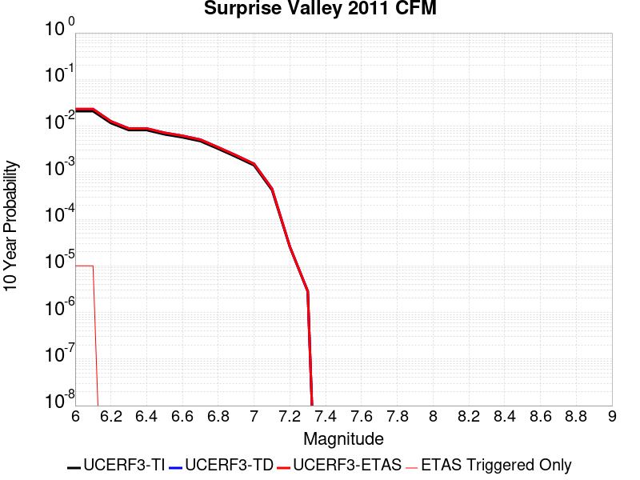 |

| Magnitude | 1 wk TI Prob | 1 wk TD Prob | 1 wk ETAS Prob | 1 wk ETAS/TD Gain | 1 wk ETAS Triggered Only | 1 mo TI Prob | 1 mo TD Prob | 1 mo ETAS Prob | 1 mo ETAS/TD Gain | 1 mo ETAS Triggered Only | 1 yr TI Prob | 1 yr TD Prob | 1 yr ETAS Prob | 1 yr ETAS/TD Gain | 1 yr ETAS Triggered Only | 10 yr TI Prob | 10 yr TD Prob | 10 yr ETAS Prob | 10 yr ETAS/TD Gain | 10 yr ETAS Triggered Only |
|-----|-----|-----|-----|-----|-----|-----|-----|-----|-----|-----|-----|-----|-----|-----|-----|-----|-----|-----|-----|-----|
| 6.0 | 4.0396248E-5 | 4.485131E-5 | 4.485131E-5 | 1.0 | 0.0 | 1.7311527E-4 | 1.9220692E-4 | 1.9220692E-4 | 1.0 | 0.0 | 0.002105641 | 0.0023378176 | 0.0023378176 | 1.0 | 0.0 | 0.020858008 | 0.023153966 | 0.023163734 | 1.0004219 | 1.0E-5 |
| 6.1 | 4.0396248E-5 | 4.485131E-5 | 4.485131E-5 | 1.0 | 0.0 | 1.7311527E-4 | 1.9220692E-4 | 1.9220692E-4 | 1.0 | 0.0 | 0.002105641 | 0.0023378176 | 0.0023378176 | 1.0 | 0.0 | 0.020858008 | 0.023153966 | 0.023163734 | 1.0004219 | 1.0E-5 |
| 6.2 | 2.2295266E-5 | 2.440125E-5 | 2.440125E-5 | 1.0 | 0.0 | 9.554764E-5 | 1.0457276E-4 | 1.0457276E-4 | 1.0 | 0.0 | 0.0011626717 | 0.0012724606 | 0.0012724606 | 1.0 | 0.0 | 0.011566074 | 0.012654981 | 0.012654981 | 1.0 | 0.0 |
| 6.3 | 1.572643E-5 | 1.7096807E-5 | 1.7096807E-5 | 1.0 | 0.0 | 6.7397246E-5 | 7.327003E-5 | 7.327003E-5 | 1.0 | 0.0 | 8.202525E-4 | 8.91708E-4 | 8.91708E-4 | 1.0 | 0.0 | 0.008172315 | 0.008882407 | 0.008882407 | 1.0 | 0.0 |
| 6.4 | 1.5714395E-5 | 1.7084629E-5 | 1.7084629E-5 | 1.0 | 0.0 | 6.734567E-5 | 7.3217845E-5 | 7.3217845E-5 | 1.0 | 0.0 | 8.1962504E-4 | 8.9107314E-4 | 8.9107314E-4 | 1.0 | 0.0 | 0.008166086 | 0.008876109 | 0.008876109 | 1.0 | 0.0 |
| 6.5 | 1.2733495E-5 | 1.38016E-5 | 1.38016E-5 | 1.0 | 0.0 | 5.457098E-5 | 5.9148413E-5 | 5.9148413E-5 | 1.0 | 0.0 | 6.641992E-4 | 7.1990065E-4 | 7.1990065E-4 | 1.0 | 0.0 | 0.0066221743 | 0.0071763797 | 0.0071763797 | 1.0 | 0.0 |
| 6.6 | 1.0983784E-5 | 1.1886554E-5 | 1.1886554E-5 | 1.0 | 0.0 | 4.7072506E-5 | 5.094141E-5 | 5.094141E-5 | 1.0 | 0.0 | 5.7295704E-4 | 6.200405E-4 | 6.200405E-4 | 1.0 | 0.0 | 0.0057148207 | 0.0061836545 | 0.0061836545 | 1.0 | 0.0 |
| 6.7 | 9.104806E-6 | 9.839491E-6 | 9.839491E-6 | 1.0 | 0.0 | 3.902001E-5 | 4.2168587E-5 | 4.2168587E-5 | 1.0 | 0.0 | 4.7496508E-4 | 5.132855E-4 | 5.132855E-4 | 1.0 | 0.0 | 0.004739512 | 0.005121397 | 0.005121397 | 1.0 | 0.0 |
| 6.8 | 6.2162403E-6 | 6.7041337E-6 | 6.7041337E-6 | 1.0 | 0.0 | 2.6640759E-5 | 2.8731698E-5 | 2.8731698E-5 | 1.0 | 0.0 | 3.2430296E-4 | 3.497545E-4 | 3.497545E-4 | 1.0 | 0.0 | 0.003238301 | 0.0034922638 | 0.0034922638 | 1.0 | 0.0 |
| 6.9 | 4.1792696E-6 | 4.50323E-6 | 4.50323E-6 | 1.0 | 0.0 | 1.7911032E-5 | 1.9299423E-5 | 1.9299423E-5 | 1.0 | 0.0 | 2.1804498E-4 | 2.3494668E-4 | 2.3494668E-4 | 1.0 | 0.0 | 0.0021783116 | 0.0023471361 | 0.0023471361 | 1.0 | 0.0 |
| 7.0 | 2.7478413E-6 | 2.9622424E-6 | 2.9622424E-6 | 1.0 | 0.0 | 1.177641E-5 | 1.269527E-5 | 1.269527E-5 | 1.0 | 0.0 | 1.4336836E-4 | 1.545552E-4 | 1.545552E-4 | 1.0 | 0.0 | 0.001432759 | 0.0015445995 | 0.0015445995 | 1.0 | 0.0 |
| 7.1 | 8.128648E-7 | 8.724922E-7 | 8.724922E-7 | 1.0 | 0.0 | 3.4837017E-6 | 3.7392501E-6 | 3.7392501E-6 | 1.0 | 0.0 | 4.2413245E-5 | 4.552502E-5 | 4.552502E-5 | 1.0 | 0.0 | 4.2405148E-4 | 4.5521575E-4 | 4.5521575E-4 | 1.0 | 0.0 |
| 7.2 | 4.8641045E-8 | 4.9402068E-8 | 4.9402068E-8 | 1.0 | 0.0 | 2.084616E-7 | 2.1172312E-7 | 2.1172312E-7 | 1.0 | 0.0 | 2.538017E-6 | 2.577726E-6 | 2.577726E-6 | 1.0 | 0.0 | 2.537988E-5 | 2.5776973E-5 | 2.5776973E-5 | 1.0 | 0.0 |
| 7.3 | 5.3911844E-9 | 5.4758145E-9 | 5.4758145E-9 | 1.0 | 0.0 | 2.3105075E-8 | 2.3467775E-8 | 2.3467775E-8 | 1.0 | 0.0 | 2.8130427E-7 | 2.8572015E-7 | 2.8572015E-7 | 1.0 | 0.0 | 2.8130391E-6 | 2.8571992E-6 | 2.8571992E-6 | 1.0 | 0.0 |

## Great Valley 08 (Quinto)
*[(top)](#table-of-contents)*

| 1 Week | 1 Month | 1 Year | 10 Year |
|-----|-----|-----|-----|
|  |  |  |  |

| Magnitude | 1 wk TI Prob | 1 wk TD Prob | 1 wk ETAS Prob | 1 wk ETAS/TD Gain | 1 wk ETAS Triggered Only | 1 mo TI Prob | 1 mo TD Prob | 1 mo ETAS Prob | 1 mo ETAS/TD Gain | 1 mo ETAS Triggered Only | 1 yr TI Prob | 1 yr TD Prob | 1 yr ETAS Prob | 1 yr ETAS/TD Gain | 1 yr ETAS Triggered Only | 10 yr TI Prob | 10 yr TD Prob | 10 yr ETAS Prob | 10 yr ETAS/TD Gain | 10 yr ETAS Triggered Only |
|-----|-----|-----|-----|-----|-----|-----|-----|-----|-----|-----|-----|-----|-----|-----|-----|-----|-----|-----|-----|-----|
| 6.0 | 7.737697E-6 | 8.253038E-6 | 1.8252955E-5 | 2.211665 | 1.0E-5 | 3.3161137E-5 | 3.536979E-5 | 4.5369437E-5 | 1.2827171 | 1.0E-5 | 4.0366207E-4 | 4.3056096E-4 | 4.4055664E-4 | 1.0232155 | 1.0E-5 | 0.004029296 | 0.0042991205 | 0.0043090777 | 1.002316 | 1.0E-5 |
| 6.1 | 7.737697E-6 | 8.253038E-6 | 1.8252955E-5 | 2.211665 | 1.0E-5 | 3.3161137E-5 | 3.536979E-5 | 4.5369437E-5 | 1.2827171 | 1.0E-5 | 4.0366207E-4 | 4.3056096E-4 | 4.4055664E-4 | 1.0232155 | 1.0E-5 | 0.004029296 | 0.0042991205 | 0.0043090777 | 1.002316 | 1.0E-5 |
| 6.2 | 7.737697E-6 | 8.253038E-6 | 1.8252955E-5 | 2.211665 | 1.0E-5 | 3.3161137E-5 | 3.536979E-5 | 4.5369437E-5 | 1.2827171 | 1.0E-5 | 4.0366207E-4 | 4.3056096E-4 | 4.4055664E-4 | 1.0232155 | 1.0E-5 | 0.004029296 | 0.0042991205 | 0.0043090777 | 1.002316 | 1.0E-5 |
| 6.3 | 5.374012E-6 | 5.7505736E-6 | 1.5750516E-5 | 2.738947 | 1.0E-5 | 2.3031276E-5 | 2.4645145E-5 | 3.4644898E-5 | 1.4057494 | 1.0E-5 | 2.803697E-4 | 3.0002446E-4 | 3.1002148E-4 | 1.0333207 | 1.0E-5 | 0.0028001624 | 0.0029972875 | 0.0030072576 | 1.0033263 | 1.0E-5 |
| 6.4 | 5.374012E-6 | 5.7505736E-6 | 1.5750516E-5 | 2.738947 | 1.0E-5 | 2.3031276E-5 | 2.4645145E-5 | 3.4644898E-5 | 1.4057494 | 1.0E-5 | 2.803697E-4 | 3.0002446E-4 | 3.1002148E-4 | 1.0333207 | 1.0E-5 | 0.0028001624 | 0.0029972875 | 0.0030072576 | 1.0033263 | 1.0E-5 |
| 6.5 | 3.65427E-6 | 3.941324E-6 | 1.3941284E-5 | 3.5372086 | 1.0E-5 | 1.5661062E-5 | 1.689132E-5 | 2.689115E-5 | 1.5920101 | 1.0E-5 | 1.9065675E-4 | 2.0563944E-4 | 2.156374E-4 | 1.0486188 | 1.0E-5 | 0.0019049325 | 0.0020551833 | 0.0020651626 | 1.0048558 | 1.0E-5 |
| 6.6 | 3.6143538E-6 | 3.8985104E-6 | 1.38984715E-5 | 3.5650723 | 1.0E-5 | 1.5489995E-5 | 1.6707834E-5 | 2.6707668E-5 | 1.5985116 | 1.0E-5 | 1.8857437E-4 | 2.0340596E-4 | 2.1340392E-4 | 1.0491527 | 1.0E-5 | 0.0018841444 | 0.0020328893 | 0.0020428689 | 1.0049092 | 1.0E-5 |
| 6.7 | 2.4821015E-6 | 2.6857067E-6 | 1.268568E-5 | 4.723405 | 1.0E-5 | 1.0637535E-5 | 1.1510153E-5 | 2.1510037E-5 | 1.8687881 | 1.0E-5 | 1.2950429E-4 | 1.4013276E-4 | 1.5013135E-4 | 1.0713509 | 1.0E-5 | 0.0012942884 | 0.0014009989 | 0.0014109849 | 1.0071278 | 1.0E-5 |
| 6.8 | 4.7110538E-7 | 5.193021E-7 | 5.193021E-7 | 1.0 | 0.0 | 2.0190216E-6 | 2.2255786E-6 | 2.2255786E-6 | 1.0 | 0.0 | 2.458131E-5 | 2.70961E-5 | 2.70961E-5 | 1.0 | 0.0 | 2.457859E-4 | 2.7092977E-4 | 2.7092977E-4 | 1.0 | 0.0 |
| 6.9 | 3.958685E-7 | 4.3703452E-7 | 4.3703452E-7 | 1.0 | 0.0 | 1.6965782E-6 | 1.8730038E-6 | 1.8730038E-6 | 1.0 | 0.0 | 2.0655643E-5 | 2.28036E-5 | 2.28036E-5 | 1.0 | 0.0 | 2.0653724E-4 | 2.2801422E-4 | 2.2801422E-4 | 1.0 | 0.0 |
| 7.0 | 2.70294E-7 | 2.9920008E-7 | 2.9920008E-7 | 1.0 | 0.0 | 1.1584025E-6 | 1.2822856E-6 | 1.2822856E-6 | 1.0 | 0.0 | 1.4103458E-5 | 1.5611728E-5 | 1.5611728E-5 | 1.0 | 0.0 | 1.4102564E-4 | 1.5610759E-4 | 1.5610759E-4 | 1.0 | 0.0 |
| 7.1 | 1.4828602E-7 | 1.6469107E-7 | 1.6469107E-7 | 1.0 | 0.0 | 6.3551136E-7 | 7.058187E-7 | 7.058187E-7 | 1.0 | 0.0 | 7.737323E-6 | 8.593317E-6 | 8.593317E-6 | 1.0 | 0.0 | 7.737054E-5 | 8.593065E-5 | 8.593065E-5 | 1.0 | 0.0 |

## Earthquake Valley
*[(top)](#table-of-contents)*

| 1 Week | 1 Month | 1 Year | 10 Year |
|-----|-----|-----|-----|
|  |  |  |  |

| Magnitude | 1 wk TI Prob | 1 wk TD Prob | 1 wk ETAS Prob | 1 wk ETAS/TD Gain | 1 wk ETAS Triggered Only | 1 mo TI Prob | 1 mo TD Prob | 1 mo ETAS Prob | 1 mo ETAS/TD Gain | 1 mo ETAS Triggered Only | 1 yr TI Prob | 1 yr TD Prob | 1 yr ETAS Prob | 1 yr ETAS/TD Gain | 1 yr ETAS Triggered Only | 10 yr TI Prob | 10 yr TD Prob | 10 yr ETAS Prob | 10 yr ETAS/TD Gain | 10 yr ETAS Triggered Only |
|-----|-----|-----|-----|-----|-----|-----|-----|-----|-----|-----|-----|-----|-----|-----|-----|-----|-----|-----|-----|-----|
| 6.0 | 1.9416384E-5 | 2.258408E-5 | 2.258408E-5 | 1.0 | 0.0 | 8.321042E-5 | 9.6785996E-5 | 9.6785996E-5 | 1.0 | 0.0 | 0.001012616 | 0.0011778527 | 0.0011778527 | 1.0 | 0.0 | 0.010080142 | 0.011727943 | 0.011737825 | 1.0008427 | 1.0E-5 |
| 6.1 | 1.9416384E-5 | 2.258408E-5 | 2.258408E-5 | 1.0 | 0.0 | 8.321042E-5 | 9.6785996E-5 | 9.6785996E-5 | 1.0 | 0.0 | 0.001012616 | 0.0011778527 | 0.0011778527 | 1.0 | 0.0 | 0.010080142 | 0.011727943 | 0.011737825 | 1.0008427 | 1.0E-5 |
| 6.2 | 1.9416384E-5 | 2.258408E-5 | 2.258408E-5 | 1.0 | 0.0 | 8.321042E-5 | 9.6785996E-5 | 9.6785996E-5 | 1.0 | 0.0 | 0.001012616 | 0.0011778527 | 0.0011778527 | 1.0 | 0.0 | 0.010080142 | 0.011727943 | 0.011737825 | 1.0008427 | 1.0E-5 |
| 6.3 | 1.9416384E-5 | 2.258408E-5 | 2.258408E-5 | 1.0 | 0.0 | 8.321042E-5 | 9.6785996E-5 | 9.6785996E-5 | 1.0 | 0.0 | 0.001012616 | 0.0011778527 | 0.0011778527 | 1.0 | 0.0 | 0.010080142 | 0.011727943 | 0.011737825 | 1.0008427 | 1.0E-5 |
| 6.4 | 1.9416384E-5 | 2.258408E-5 | 2.258408E-5 | 1.0 | 0.0 | 8.321042E-5 | 9.6785996E-5 | 9.6785996E-5 | 1.0 | 0.0 | 0.001012616 | 0.0011778527 | 0.0011778527 | 1.0 | 0.0 | 0.010080142 | 0.011727943 | 0.011737825 | 1.0008427 | 1.0E-5 |
| 6.5 | 1.9389157E-5 | 2.255267E-5 | 2.255267E-5 | 1.0 | 0.0 | 8.309374E-5 | 9.665139E-5 | 9.665139E-5 | 1.0 | 0.0 | 0.0010111968 | 0.0011762156 | 0.0011762156 | 1.0 | 0.0 | 0.010066078 | 0.011711745 | 0.011721628 | 1.0008439 | 1.0E-5 |
| 6.6 | 1.9389157E-5 | 2.255267E-5 | 2.255267E-5 | 1.0 | 0.0 | 8.309374E-5 | 9.665139E-5 | 9.665139E-5 | 1.0 | 0.0 | 0.0010111968 | 0.0011762156 | 0.0011762156 | 1.0 | 0.0 | 0.010066078 | 0.011711745 | 0.011721628 | 1.0008439 | 1.0E-5 |
| 6.7 | 1.4925434E-5 | 1.7208227E-5 | 1.7208227E-5 | 1.0 | 0.0 | 6.396457E-5 | 7.374794E-5 | 7.374794E-5 | 1.0 | 0.0 | 7.7849044E-4 | 8.9759636E-4 | 8.9759636E-4 | 1.0 | 0.0 | 0.007757689 | 0.008948085 | 0.008957995 | 1.0011076 | 1.0E-5 |
| 6.8 | 1.3570335E-5 | 1.5616843E-5 | 1.5616843E-5 | 1.0 | 0.0 | 5.8157282E-5 | 6.692807E-5 | 6.692807E-5 | 1.0 | 0.0 | 7.0783484E-4 | 8.1462675E-4 | 8.1462675E-4 | 1.0 | 0.0 | 0.0070558446 | 0.008124476 | 0.008134395 | 1.0012208 | 1.0E-5 |
| 6.9 | 1.3570335E-5 | 1.5616843E-5 | 1.5616843E-5 | 1.0 | 0.0 | 5.8157282E-5 | 6.692807E-5 | 6.692807E-5 | 1.0 | 0.0 | 7.0783484E-4 | 8.1462675E-4 | 8.1462675E-4 | 1.0 | 0.0 | 0.0070558446 | 0.008124476 | 0.008134395 | 1.0012208 | 1.0E-5 |
| 7.0 | 1.3433392E-5 | 1.5460388E-5 | 1.5460388E-5 | 1.0 | 0.0 | 5.757041E-5 | 6.6257584E-5 | 6.6257584E-5 | 1.0 | 0.0 | 7.0069433E-4 | 8.064695E-4 | 8.064695E-4 | 1.0 | 0.0 | 0.006984891 | 0.008043497 | 0.008053416 | 1.0012332 | 1.0E-5 |
| 7.1 | 8.181609E-6 | 9.416851E-6 | 9.416851E-6 | 1.0 | 0.0 | 3.5063567E-5 | 4.0357685E-5 | 4.0357685E-5 | 1.0 | 0.0 | 4.268153E-4 | 4.9131113E-4 | 4.9131113E-4 | 1.0 | 0.0 | 0.0042599645 | 0.0049088253 | 0.0049187765 | 1.0020272 | 1.0E-5 |
| 7.2 | 2.0663983E-7 | 1.726294E-7 | 1.726294E-7 | 1.0 | 0.0 | 8.855989E-7 | 7.398401E-7 | 7.398401E-7 | 1.0 | 0.0 | 1.0782113E-5 | 9.00752E-6 | 9.00752E-6 | 1.0 | 0.0 | 1.07815904E-4 | 9.00719E-5 | 9.00719E-5 | 1.0 | 0.0 |
| 7.3 | 2.0462376E-7 | 1.7078433E-7 | 1.7078433E-7 | 1.0 | 0.0 | 8.7695867E-7 | 7.319327E-7 | 7.319327E-7 | 1.0 | 0.0 | 1.0676919E-5 | 8.911247E-6 | 8.911247E-6 | 1.0 | 0.0 | 1.0676406E-4 | 8.910926E-5 | 8.910926E-5 | 1.0 | 0.0 |
| 7.4 | 2.0171088E-7 | 1.6860913E-7 | 1.6860913E-7 | 1.0 | 0.0 | 8.644749E-7 | 7.2261037E-7 | 7.2261037E-7 | 1.0 | 0.0 | 1.0524931E-5 | 8.79775E-6 | 8.79775E-6 | 1.0 | 0.0 | 1.05244326E-4 | 8.7974375E-5 | 8.7974375E-5 | 1.0 | 0.0 |
| 7.5 | 1.4847944E-7 | 1.2559275E-7 | 1.2559275E-7 | 1.0 | 0.0 | 6.363403E-7 | 5.3825454E-7 | 5.3825454E-7 | 1.0 | 0.0 | 7.747416E-6 | 6.5532317E-6 | 6.5532317E-6 | 1.0 | 0.0 | 7.747146E-5 | 6.55306E-5 | 6.55306E-5 | 1.0 | 0.0 |
| 7.6 | 1.3185847E-7 | 1.1123213E-7 | 1.1123213E-7 | 1.0 | 0.0 | 5.6510765E-7 | 4.7670906E-7 | 4.7670906E-7 | 1.0 | 0.0 | 6.8801637E-6 | 5.8039195E-6 | 5.8039195E-6 | 1.0 | 0.0 | 6.8799505E-5 | 5.803789E-5 | 5.803789E-5 | 1.0 | 0.0 |
| 7.7 | 2.8609954E-8 | 1.4170958E-8 | 1.4170958E-8 | 1.0 | 0.0 | 1.2261408E-7 | 6.0732674E-8 | 6.0732674E-8 | 1.0 | 0.0 | 1.4928254E-6 | 7.394201E-7 | 7.394201E-7 | 1.0 | 0.0 | 1.4928154E-5 | 7.394182E-6 | 7.394182E-6 | 1.0 | 0.0 |
| 7.8 | 6.527266E-9 | 2.923417E-9 | 2.923417E-9 | 1.0 | 0.0 | 2.7973995E-8 | 1.2528931E-8 | 1.2528931E-8 | 1.0 | 0.0 | 3.4058334E-7 | 1.5253973E-7 | 1.5253973E-7 | 1.0 | 0.0 | 3.4058282E-6 | 1.5253964E-6 | 1.5253964E-6 | 1.0 | 0.0 |
| 7.9 | 1.2898267E-9 | 7.127684E-10 | 7.127684E-10 | 1.0 | 0.0 | 5.527829E-9 | 3.0547218E-9 | 3.0547218E-9 | 1.0 | 0.0 | 6.7301315E-8 | 3.719124E-8 | 3.719124E-8 | 1.0 | 0.0 | 6.7301295E-7 | 3.719124E-7 | 3.719124E-7 | 1.0 | 0.0 |

## Likely 2011 CFM
*[(top)](#table-of-contents)*

| 1 Week | 1 Month | 1 Year | 10 Year |
|-----|-----|-----|-----|
|  |  | 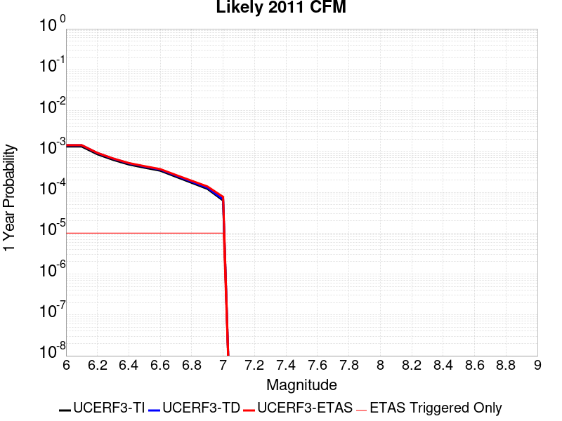 |  |

| Magnitude | 1 wk TI Prob | 1 wk TD Prob | 1 wk ETAS Prob | 1 wk ETAS/TD Gain | 1 wk ETAS Triggered Only | 1 mo TI Prob | 1 mo TD Prob | 1 mo ETAS Prob | 1 mo ETAS/TD Gain | 1 mo ETAS Triggered Only | 1 yr TI Prob | 1 yr TD Prob | 1 yr ETAS Prob | 1 yr ETAS/TD Gain | 1 yr ETAS Triggered Only | 10 yr TI Prob | 10 yr TD Prob | 10 yr ETAS Prob | 10 yr ETAS/TD Gain | 10 yr ETAS Triggered Only |
|-----|-----|-----|-----|-----|-----|-----|-----|-----|-----|-----|-----|-----|-----|-----|-----|-----|-----|-----|-----|-----|
| 6.0 | 2.5315949E-5 | 2.7104748E-5 | 3.7104477E-5 | 1.368929 | 1.0E-5 | 1.0849241E-4 | 1.16158284E-4 | 1.2615713E-4 | 1.0860795 | 1.0E-5 | 0.0013200947 | 0.0014133542 | 0.00142334 | 1.0070654 | 1.0E-5 | 0.013122803 | 0.01404831 | 0.01405817 | 1.0007018 | 1.0E-5 |
| 6.1 | 2.5315949E-5 | 2.7104748E-5 | 3.7104477E-5 | 1.368929 | 1.0E-5 | 1.0849241E-4 | 1.16158284E-4 | 1.2615713E-4 | 1.0860795 | 1.0E-5 | 0.0013200947 | 0.0014133542 | 0.00142334 | 1.0070654 | 1.0E-5 | 0.013122803 | 0.01404831 | 0.01405817 | 1.0007018 | 1.0E-5 |
| 6.2 | 1.6375941E-5 | 1.7465842E-5 | 2.7465667E-5 | 1.5725361 | 1.0E-5 | 7.0180715E-5 | 7.485153E-5 | 8.4850784E-5 | 1.1335878 | 1.0E-5 | 8.5411523E-4 | 9.109487E-4 | 9.2093955E-4 | 1.0109676 | 1.0E-5 | 0.008508399 | 0.009073433 | 0.009083342 | 1.0010921 | 1.0E-5 |
| 6.3 | 1.1945543E-5 | 1.2712587E-5 | 2.271246E-5 | 1.7866119 | 1.0E-5 | 5.119418E-5 | 5.4481407E-5 | 6.448086E-5 | 1.1835389 | 1.0E-5 | 6.2311086E-4 | 6.631146E-4 | 6.73108E-4 | 1.0150703 | 1.0E-5 | 0.0062136655 | 0.0066119144 | 0.0066218483 | 1.0015024 | 1.0E-5 |
| 6.4 | 9.192729E-6 | 9.768488E-6 | 1.976839E-5 | 2.02369 | 1.0E-5 | 3.939681E-5 | 4.1864292E-5 | 5.1863874E-5 | 1.238857 | 1.0E-5 | 4.7955062E-4 | 5.0958124E-4 | 5.195762E-4 | 1.019614 | 1.0E-5 | 0.004785171 | 0.0050844094 | 0.005094358 | 1.0019568 | 1.0E-5 |
| 6.5 | 7.67906E-6 | 8.152622E-6 | 1.8152541E-5 | 2.2265892 | 1.0E-5 | 3.2909844E-5 | 3.4939352E-5 | 4.4939003E-5 | 1.2862003 | 1.0E-5 | 4.006037E-4 | 4.2530545E-4 | 4.3530122E-4 | 1.0235025 | 1.0E-5 | 0.0039988225 | 0.004245108 | 0.0042550657 | 1.0023457 | 1.0E-5 |
| 6.6 | 6.4884057E-6 | 6.8847507E-6 | 1.6884682E-5 | 2.4524755 | 1.0E-5 | 2.7807157E-5 | 2.9505749E-5 | 3.9505452E-5 | 1.338907 | 1.0E-5 | 3.3849955E-4 | 3.591747E-4 | 3.6917112E-4 | 1.0278316 | 1.0E-5 | 0.003379844 | 0.0035860867 | 0.003596051 | 1.0027785 | 1.0E-5 |
| 6.7 | 4.6060636E-6 | 4.884041E-6 | 1.4883993E-5 | 3.0474749 | 1.0E-5 | 1.9740122E-5 | 2.0931442E-5 | 3.0931235E-5 | 1.4777402 | 1.0E-5 | 2.403095E-4 | 2.5481134E-4 | 2.648088E-4 | 1.0392348 | 1.0E-5 | 0.002400498 | 0.0025452746 | 0.0025552493 | 1.0039189 | 1.0E-5 |
| 6.8 | 3.2795615E-6 | 3.4773732E-6 | 1.3477338E-5 | 3.875724 | 1.0E-5 | 1.4055187E-5 | 1.4902946E-5 | 2.4902796E-5 | 1.6709983 | 1.0E-5 | 1.7110848E-4 | 1.8142881E-4 | 1.91427E-4 | 1.0551081 | 1.0E-5 | 0.0017097679 | 0.0018128622 | 0.001822844 | 1.0055062 | 1.0E-5 |
| 6.9 | 2.3289967E-6 | 2.4705569E-6 | 1.2470532E-5 | 5.0476604 | 1.0E-5 | 9.981376E-6 | 1.058806E-5 | 2.0587955E-5 | 1.94445 | 1.0E-5 | 1.2151648E-4 | 1.2890245E-4 | 1.3890116E-4 | 1.077568 | 1.0E-5 | 0.0012145005 | 0.0012883197 | 0.0012983069 | 1.0077521 | 1.0E-5 |
| 7.0 | 1.211292E-6 | 1.2863958E-6 | 1.1286383E-5 | 8.773647 | 1.0E-5 | 5.1912407E-6 | 5.5131145E-6 | 1.551306E-5 | 2.8138466 | 1.0E-5 | 6.320152E-5 | 6.712041E-5 | 7.711974E-5 | 1.148976 | 1.0E-5 | 6.3183554E-4 | 6.710312E-4 | 6.810245E-4 | 1.0148925 | 1.0E-5 |

## Butano 2011 CFM
*[(top)](#table-of-contents)*

| 1 Week | 1 Month | 1 Year | 10 Year |
|-----|-----|-----|-----|
|  |  |  |  |

| Magnitude | 1 wk TI Prob | 1 wk TD Prob | 1 wk ETAS Prob | 1 wk ETAS/TD Gain | 1 wk ETAS Triggered Only | 1 mo TI Prob | 1 mo TD Prob | 1 mo ETAS Prob | 1 mo ETAS/TD Gain | 1 mo ETAS Triggered Only | 1 yr TI Prob | 1 yr TD Prob | 1 yr ETAS Prob | 1 yr ETAS/TD Gain | 1 yr ETAS Triggered Only | 10 yr TI Prob | 10 yr TD Prob | 10 yr ETAS Prob | 10 yr ETAS/TD Gain | 10 yr ETAS Triggered Only |
|-----|-----|-----|-----|-----|-----|-----|-----|-----|-----|-----|-----|-----|-----|-----|-----|-----|-----|-----|-----|-----|
| 6.0 | 9.561135E-6 | 6.2256954E-6 | 1.6225633E-5 | 2.6062362 | 1.0E-5 | 4.097565E-5 | 2.6681291E-5 | 3.6681024E-5 | 1.3747845 | 1.0E-5 | 4.9876433E-4 | 3.247985E-4 | 3.3479524E-4 | 1.0307783 | 1.0E-5 | 0.004976464 | 0.003260905 | 0.0032708722 | 1.0030566 | 1.0E-5 |
| 6.1 | 9.561135E-6 | 6.2256954E-6 | 1.6225633E-5 | 2.6062362 | 1.0E-5 | 4.097565E-5 | 2.6681291E-5 | 3.6681024E-5 | 1.3747845 | 1.0E-5 | 4.9876433E-4 | 3.247985E-4 | 3.3479524E-4 | 1.0307783 | 1.0E-5 | 0.004976464 | 0.003260905 | 0.0032708722 | 1.0030566 | 1.0E-5 |
| 6.2 | 8.364741E-6 | 4.9787805E-6 | 1.4978731E-5 | 3.008514 | 1.0E-5 | 3.5848396E-5 | 2.1337464E-5 | 3.133725E-5 | 1.4686493 | 1.0E-5 | 4.3636683E-4 | 2.5975425E-4 | 2.6975165E-4 | 1.0384879 | 1.0E-5 | 0.0043551093 | 0.0026121214 | 0.0026220952 | 1.0038183 | 1.0E-5 |
| 6.3 | 8.364741E-6 | 4.9787805E-6 | 1.4978731E-5 | 3.008514 | 1.0E-5 | 3.5848396E-5 | 2.1337464E-5 | 3.133725E-5 | 1.4686493 | 1.0E-5 | 4.3636683E-4 | 2.5975425E-4 | 2.6975165E-4 | 1.0384879 | 1.0E-5 | 0.0043551093 | 0.0026121214 | 0.0026220952 | 1.0038183 | 1.0E-5 |
| 6.4 | 7.768282E-6 | 4.3567284E-6 | 1.4356685E-5 | 3.2952905 | 1.0E-5 | 3.329221E-5 | 1.8671566E-5 | 2.867138E-5 | 1.5355637 | 1.0E-5 | 4.0525728E-4 | 2.2730397E-4 | 2.3730169E-4 | 1.0439839 | 1.0E-5 | 0.0040451903 | 0.0022883145 | 0.0022982918 | 1.0043601 | 1.0E-5 |
| 6.5 | 7.673437E-6 | 4.2562915E-6 | 4.2562915E-6 | 1.0 | 0.0 | 3.2885746E-5 | 1.8241128E-5 | 1.8241128E-5 | 1.0 | 0.0 | 4.0031038E-4 | 2.2206445E-4 | 2.2206445E-4 | 1.0 | 0.0 | 0.0039959005 | 0.002236025 | 0.002236025 | 1.0 | 0.0 |
| 6.6 | 7.5244197E-6 | 4.101255E-6 | 4.101255E-6 | 1.0 | 0.0 | 3.2247113E-5 | 1.7576695E-5 | 1.7576695E-5 | 1.0 | 0.0 | 3.9253788E-4 | 2.1397659E-4 | 2.1397659E-4 | 1.0 | 0.0 | 0.003918452 | 0.0021553051 | 0.0021553051 | 1.0 | 0.0 |
| 6.7 | 6.4921405E-6 | 3.0413205E-6 | 3.0413205E-6 | 1.0 | 0.0 | 2.7823162E-5 | 1.3034165E-5 | 1.3034165E-5 | 1.0 | 0.0 | 3.3869434E-4 | 1.586795E-4 | 1.586795E-4 | 1.0 | 0.0 | 0.003381786 | 0.0016031476 | 0.0016031476 | 1.0 | 0.0 |
| 6.8 | 6.2890294E-6 | 2.8280872E-6 | 2.8280872E-6 | 1.0 | 0.0 | 2.6952705E-5 | 1.2120317E-5 | 1.2120317E-5 | 1.0 | 0.0 | 3.2809976E-4 | 1.4755495E-4 | 1.4755495E-4 | 1.0 | 0.0 | 0.0032761577 | 0.0014920565 | 0.0014920565 | 1.0 | 0.0 |
| 6.9 | 6.0965517E-6 | 2.6346027E-6 | 2.6346027E-6 | 1.0 | 0.0 | 2.6127816E-5 | 1.1291106E-5 | 1.1291106E-5 | 1.0 | 0.0 | 3.1805973E-4 | 1.374606E-4 | 1.374606E-4 | 1.0 | 0.0 | 0.0031760489 | 0.001391243 | 0.001391243 | 1.0 | 0.0 |
| 7.0 | 5.566252E-6 | 2.1520116E-6 | 2.1520116E-6 | 1.0 | 0.0 | 2.3855147E-5 | 9.222874E-6 | 9.222874E-6 | 1.0 | 0.0 | 2.9039773E-4 | 1.1228274E-4 | 1.1228274E-4 | 1.0 | 0.0 | 0.0029001853 | 0.0011397449 | 0.0011397449 | 1.0 | 0.0 |
| 7.1 | 3.878588E-6 | 1.6034423E-6 | 1.6034423E-6 | 1.0 | 0.0 | 1.6622414E-5 | 6.8718773E-6 | 6.8718773E-6 | 1.0 | 0.0 | 2.023591E-4 | 8.36619E-5 | 8.36619E-5 | 1.0 | 0.0 | 0.0020217493 | 8.533922E-4 | 8.533922E-4 | 1.0 | 0.0 |
| 7.2 | 3.7038085E-6 | 1.4845051E-6 | 1.4845051E-6 | 1.0 | 0.0 | 1.587337E-5 | 6.362149E-6 | 6.362149E-6 | 1.0 | 0.0 | 1.9324113E-4 | 7.745641E-5 | 7.745641E-5 | 1.0 | 0.0 | 0.0019307317 | 7.913504E-4 | 7.913504E-4 | 1.0 | 0.0 |
| 7.3 | 3.5277278E-6 | 1.3926247E-6 | 1.3926247E-6 | 1.0 | 0.0 | 1.5118746E-5 | 5.9683775E-6 | 5.9683775E-6 | 1.0 | 0.0 | 1.8405518E-4 | 7.266257E-5 | 7.266257E-5 | 1.0 | 0.0 | 0.0018390282 | 7.433578E-4 | 7.433578E-4 | 1.0 | 0.0 |
| 7.4 | 3.3711294E-6 | 1.3298818E-6 | 1.3298818E-6 | 1.0 | 0.0 | 1.4447617E-5 | 5.699481E-6 | 5.699481E-6 | 1.0 | 0.0 | 1.7588554E-4 | 6.9388974E-5 | 6.9388974E-5 | 1.0 | 0.0 | 0.0017574639 | 7.10591E-4 | 7.10591E-4 | 1.0 | 0.0 |
| 7.5 | 3.0496426E-6 | 1.2188874E-6 | 1.2188874E-6 | 1.0 | 0.0 | 1.3069831E-5 | 5.223793E-6 | 5.223793E-6 | 1.0 | 0.0 | 1.5911358E-4 | 6.359782E-5 | 6.359782E-5 | 1.0 | 0.0 | 0.001589997 | 6.526465E-4 | 6.526465E-4 | 1.0 | 0.0 |
| 7.6 | 2.2179781E-6 | 8.870908E-7 | 8.870908E-7 | 1.0 | 0.0 | 9.505586E-6 | 3.801812E-6 | 3.801812E-6 | 1.0 | 0.0 | 1.1572436E-4 | 4.6286077E-5 | 4.6286077E-5 | 1.0 | 0.0 | 0.0011566412 | 4.7951055E-4 | 4.7951055E-4 | 1.0 | 0.0 |
| 7.7 | 1.7519328E-6 | 6.9309675E-7 | 6.9309675E-7 | 1.0 | 0.0 | 7.508262E-6 | 2.9704113E-6 | 2.9704113E-6 | 1.0 | 0.0 | 9.140925E-5 | 3.6164158E-5 | 3.6164158E-5 | 1.0 | 0.0 | 9.137166E-4 | 3.7759746E-4 | 3.7759746E-4 | 1.0 | 0.0 |
| 7.8 | 1.1478974E-6 | 6.174061E-7 | 6.174061E-7 | 1.0 | 0.0 | 4.9195505E-6 | 2.6460236E-6 | 2.6460236E-6 | 1.0 | 0.0 | 5.9893882E-5 | 3.221486E-5 | 3.221486E-5 | 1.0 | 0.0 | 5.9877743E-4 | 3.377777E-4 | 3.377777E-4 | 1.0 | 0.0 |
| 7.9 | 6.1154634E-7 | 5.581767E-7 | 5.581767E-7 | 1.0 | 0.0 | 2.6209104E-6 | 2.3921834E-6 | 2.3921834E-6 | 1.0 | 0.0 | 3.1909116E-5 | 2.9124443E-5 | 2.9124443E-5 | 1.0 | 0.0 | 3.1904536E-4 | 3.0563958E-4 | 3.0563958E-4 | 1.0 | 0.0 |
| 8.0 | 4.6520046E-7 | 5.189283E-7 | 5.189283E-7 | 1.0 | 0.0 | 1.9937147E-6 | 2.2239765E-6 | 2.2239765E-6 | 1.0 | 0.0 | 2.4273206E-5 | 2.7076578E-5 | 2.7076578E-5 | 1.0 | 0.0 | 2.4270554E-4 | 2.8419052E-4 | 2.8419052E-4 | 1.0 | 0.0 |
| 8.1 | 2.8425194E-7 | 3.0570487E-7 | 3.0570487E-7 | 1.0 | 0.0 | 1.218222E-6 | 1.3101632E-6 | 1.3101632E-6 | 1.0 | 0.0 | 1.4831752E-5 | 1.5951118E-5 | 1.5951118E-5 | 1.0 | 0.0 | 1.4830762E-4 | 1.6740595E-4 | 1.6740595E-4 | 1.0 | 0.0 |
| 8.2 | 5.585778E-8 | 4.0522167E-8 | 4.0522167E-8 | 1.0 | 0.0 | 2.3939046E-7 | 1.7366644E-7 | 1.7366644E-7 | 1.0 | 0.0 | 2.914575E-6 | 2.1143867E-6 | 2.1143867E-6 | 1.0 | 0.0 | 2.9145367E-5 | 2.2976306E-5 | 2.2976306E-5 | 1.0 | 0.0 |
| 8.3 | 1.0371215E-10 | 5.356804E-11 | 5.356804E-11 | 1.0 | 0.0 | 4.4448079E-10 | 2.2957702E-10 | 2.2957702E-10 | 1.0 | 0.0 | 5.4115543E-9 | 2.795101E-9 | 2.795101E-9 | 1.0 | 0.0 | 5.4115542E-8 | 3.2150194E-8 | 3.2150194E-8 | 1.0 | 0.0 |

## Round Valley
*[(top)](#table-of-contents)*

| 1 Week | 1 Month | 1 Year | 10 Year |
|-----|-----|-----|-----|
| 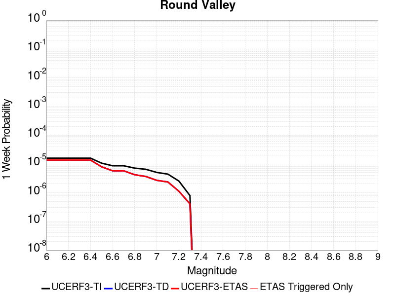 |  |  |  |

| Magnitude | 1 wk TI Prob | 1 wk TD Prob | 1 wk ETAS Prob | 1 wk ETAS/TD Gain | 1 wk ETAS Triggered Only | 1 mo TI Prob | 1 mo TD Prob | 1 mo ETAS Prob | 1 mo ETAS/TD Gain | 1 mo ETAS Triggered Only | 1 yr TI Prob | 1 yr TD Prob | 1 yr ETAS Prob | 1 yr ETAS/TD Gain | 1 yr ETAS Triggered Only | 10 yr TI Prob | 10 yr TD Prob | 10 yr ETAS Prob | 10 yr ETAS/TD Gain | 10 yr ETAS Triggered Only |
|-----|-----|-----|-----|-----|-----|-----|-----|-----|-----|-----|-----|-----|-----|-----|-----|-----|-----|-----|-----|-----|
| 6.0 | 1.588152E-5 | 1.3670716E-5 | 1.3670716E-5 | 1.0 | 0.0 | 6.806188E-5 | 5.8587688E-5 | 5.8587688E-5 | 1.0 | 0.0 | 8.283384E-4 | 7.13111E-4 | 7.231039E-4 | 1.014013 | 1.0E-5 | 0.008252576 | 0.0071121147 | 0.007122044 | 1.0013961 | 1.0E-5 |
| 6.1 | 1.588152E-5 | 1.3670716E-5 | 1.3670716E-5 | 1.0 | 0.0 | 6.806188E-5 | 5.8587688E-5 | 5.8587688E-5 | 1.0 | 0.0 | 8.283384E-4 | 7.13111E-4 | 7.231039E-4 | 1.014013 | 1.0E-5 | 0.008252576 | 0.0071121147 | 0.007122044 | 1.0013961 | 1.0E-5 |
| 6.2 | 1.588152E-5 | 1.3670716E-5 | 1.3670716E-5 | 1.0 | 0.0 | 6.806188E-5 | 5.8587688E-5 | 5.8587688E-5 | 1.0 | 0.0 | 8.283384E-4 | 7.13111E-4 | 7.231039E-4 | 1.014013 | 1.0E-5 | 0.008252576 | 0.0071121147 | 0.007122044 | 1.0013961 | 1.0E-5 |
| 6.3 | 1.588152E-5 | 1.3670716E-5 | 1.3670716E-5 | 1.0 | 0.0 | 6.806188E-5 | 5.8587688E-5 | 5.8587688E-5 | 1.0 | 0.0 | 8.283384E-4 | 7.13111E-4 | 7.231039E-4 | 1.014013 | 1.0E-5 | 0.008252576 | 0.0071121147 | 0.007122044 | 1.0013961 | 1.0E-5 |
| 6.4 | 1.588152E-5 | 1.3670716E-5 | 1.3670716E-5 | 1.0 | 0.0 | 6.806188E-5 | 5.8587688E-5 | 5.8587688E-5 | 1.0 | 0.0 | 8.283384E-4 | 7.13111E-4 | 7.231039E-4 | 1.014013 | 1.0E-5 | 0.008252576 | 0.0071121147 | 0.007122044 | 1.0013961 | 1.0E-5 |
| 6.5 | 1.0646776E-5 | 7.953037E-6 | 7.953037E-6 | 1.0 | 0.0 | 4.5628243E-5 | 3.408405E-5 | 3.408405E-5 | 1.0 | 0.0 | 5.553823E-4 | 4.1490266E-4 | 4.2489852E-4 | 1.0240921 | 1.0E-5 | 0.005539963 | 0.0041421093 | 0.004152068 | 1.0024042 | 1.0E-5 |
| 6.6 | 8.632956E-6 | 5.768742E-6 | 5.768742E-6 | 1.0 | 0.0 | 3.6997862E-5 | 2.4722967E-5 | 2.4722967E-5 | 1.0 | 0.0 | 4.5035584E-4 | 3.009644E-4 | 3.009644E-4 | 1.0 | 0.0 | 0.0044944426 | 0.003005946 | 0.003005946 | 1.0 | 0.0 |
| 6.7 | 8.632956E-6 | 5.768742E-6 | 5.768742E-6 | 1.0 | 0.0 | 3.6997862E-5 | 2.4722967E-5 | 2.4722967E-5 | 1.0 | 0.0 | 4.5035584E-4 | 3.009644E-4 | 3.009644E-4 | 1.0 | 0.0 | 0.0044944426 | 0.003005946 | 0.003005946 | 1.0 | 0.0 |
| 6.8 | 7.143895E-6 | 4.2018346E-6 | 4.2018346E-6 | 1.0 | 0.0 | 3.0616335E-5 | 1.8007748E-5 | 1.8007748E-5 | 1.0 | 0.0 | 3.726901E-4 | 2.1922393E-4 | 2.1922393E-4 | 1.0 | 0.0 | 0.0037206567 | 0.0021902416 | 0.0021902416 | 1.0 | 0.0 |
| 6.9 | 6.5120694E-6 | 3.6644687E-6 | 3.6644687E-6 | 1.0 | 0.0 | 2.790857E-5 | 1.570478E-5 | 1.570478E-5 | 1.0 | 0.0 | 3.3973387E-4 | 1.9119044E-4 | 1.9119044E-4 | 1.0 | 0.0 | 0.0033921495 | 0.0019104085 | 0.0019104085 | 1.0 | 0.0 |
| 7.0 | 5.0614435E-6 | 2.6836676E-6 | 2.6836676E-6 | 1.0 | 0.0 | 2.169172E-5 | 1.1501388E-5 | 1.1501388E-5 | 1.0 | 0.0 | 2.6406467E-4 | 1.4002144E-4 | 1.4002144E-4 | 1.0 | 0.0 | 0.0026375111 | 0.0013994334 | 0.0013994334 | 1.0 | 0.0 |
| 7.1 | 4.41728E-6 | 2.3575074E-6 | 2.3575074E-6 | 1.0 | 0.0 | 1.8931061E-5 | 1.0103569E-5 | 1.0103569E-5 | 1.0 | 0.0 | 2.304613E-4 | 1.23005E-4 | 1.23005E-4 | 1.0 | 0.0 | 0.0023022245 | 0.0012294657 | 0.0012294657 | 1.0 | 0.0 |
| 7.2 | 2.535495E-6 | 1.1208391E-6 | 1.1208391E-6 | 1.0 | 0.0 | 1.0866362E-5 | 4.8035904E-6 | 4.8035904E-6 | 1.0 | 0.0 | 1.3228992E-4 | 5.8482667E-5 | 5.8482667E-5 | 1.0 | 0.0 | 0.0013221119 | 5.84724E-4 | 5.84724E-4 | 1.0 | 0.0 |
| 7.3 | 7.900015E-7 | 4.0889498E-7 | 4.0889498E-7 | 1.0 | 0.0 | 3.3857161E-6 | 1.752407E-6 | 1.752407E-6 | 1.0 | 0.0 | 4.1220315E-5 | 2.1335554E-5 | 2.1335554E-5 | 1.0 | 0.0 | 4.121267E-4 | 2.1335555E-4 | 2.1335555E-4 | 1.0 | 0.0 |

## Earthquake Valley (No  Extension)
*[(top)](#table-of-contents)*

| 1 Week | 1 Month | 1 Year | 10 Year |
|-----|-----|-----|-----|
|  |  |  |  |

| Magnitude | 1 wk TI Prob | 1 wk TD Prob | 1 wk ETAS Prob | 1 wk ETAS/TD Gain | 1 wk ETAS Triggered Only | 1 mo TI Prob | 1 mo TD Prob | 1 mo ETAS Prob | 1 mo ETAS/TD Gain | 1 mo ETAS Triggered Only | 1 yr TI Prob | 1 yr TD Prob | 1 yr ETAS Prob | 1 yr ETAS/TD Gain | 1 yr ETAS Triggered Only | 10 yr TI Prob | 10 yr TD Prob | 10 yr ETAS Prob | 10 yr ETAS/TD Gain | 10 yr ETAS Triggered Only |
|-----|-----|-----|-----|-----|-----|-----|-----|-----|-----|-----|-----|-----|-----|-----|-----|-----|-----|-----|-----|-----|
| 6.0 | 2.1859703E-5 | 2.5198362E-5 | 2.5198362E-5 | 1.0 | 0.0 | 9.3681076E-5 | 1.07989326E-4 | 1.07989326E-4 | 1.0 | 0.0 | 0.0011399703 | 0.001314122 | 0.001314122 | 1.0 | 0.0 | 0.011341401 | 0.013077871 | 0.01308774 | 1.0007546 | 1.0E-5 |
| 6.1 | 2.1859703E-5 | 2.5198362E-5 | 2.5198362E-5 | 1.0 | 0.0 | 9.3681076E-5 | 1.07989326E-4 | 1.07989326E-4 | 1.0 | 0.0 | 0.0011399703 | 0.001314122 | 0.001314122 | 1.0 | 0.0 | 0.011341401 | 0.013077871 | 0.01308774 | 1.0007546 | 1.0E-5 |
| 6.2 | 2.1859703E-5 | 2.5198362E-5 | 2.5198362E-5 | 1.0 | 0.0 | 9.3681076E-5 | 1.07989326E-4 | 1.07989326E-4 | 1.0 | 0.0 | 0.0011399703 | 0.001314122 | 0.001314122 | 1.0 | 0.0 | 0.011341401 | 0.013077871 | 0.01308774 | 1.0007546 | 1.0E-5 |
| 6.3 | 2.1859703E-5 | 2.5198362E-5 | 2.5198362E-5 | 1.0 | 0.0 | 9.3681076E-5 | 1.07989326E-4 | 1.07989326E-4 | 1.0 | 0.0 | 0.0011399703 | 0.001314122 | 0.001314122 | 1.0 | 0.0 | 0.011341401 | 0.013077871 | 0.01308774 | 1.0007546 | 1.0E-5 |
| 6.4 | 2.1859703E-5 | 2.5198362E-5 | 2.5198362E-5 | 1.0 | 0.0 | 9.3681076E-5 | 1.07989326E-4 | 1.07989326E-4 | 1.0 | 0.0 | 0.0011399703 | 0.001314122 | 0.001314122 | 1.0 | 0.0 | 0.011341401 | 0.013077871 | 0.01308774 | 1.0007546 | 1.0E-5 |
| 6.5 | 2.1859703E-5 | 2.5198362E-5 | 2.5198362E-5 | 1.0 | 0.0 | 9.3681076E-5 | 1.07989326E-4 | 1.07989326E-4 | 1.0 | 0.0 | 0.0011399703 | 0.001314122 | 0.001314122 | 1.0 | 0.0 | 0.011341401 | 0.013077871 | 0.01308774 | 1.0007546 | 1.0E-5 |
| 6.6 | 1.597E-5 | 1.8356275E-5 | 1.8356275E-5 | 1.0 | 0.0 | 6.8441055E-5 | 7.866787E-5 | 7.866787E-5 | 1.0 | 0.0 | 8.329513E-4 | 9.574478E-4 | 9.574478E-4 | 1.0 | 0.0 | 0.008298361 | 0.009541836 | 0.00955174 | 1.0010381 | 1.0E-5 |
| 6.7 | 1.597E-5 | 1.8356275E-5 | 1.8356275E-5 | 1.0 | 0.0 | 6.8441055E-5 | 7.866787E-5 | 7.866787E-5 | 1.0 | 0.0 | 8.329513E-4 | 9.574478E-4 | 9.574478E-4 | 1.0 | 0.0 | 0.008298361 | 0.009541836 | 0.00955174 | 1.0010381 | 1.0E-5 |
| 6.8 | 1.5315149E-5 | 1.7602091E-5 | 1.7602091E-5 | 1.0 | 0.0 | 6.5634704E-5 | 7.543584E-5 | 7.543584E-5 | 1.0 | 0.0 | 7.988095E-4 | 9.181311E-4 | 9.181311E-4 | 1.0 | 0.0 | 0.007959441 | 0.009151919 | 0.009161827 | 1.0010827 | 1.0E-5 |
| 6.9 | 1.3634728E-5 | 1.5675821E-5 | 1.5675821E-5 | 1.0 | 0.0 | 5.8433237E-5 | 6.718082E-5 | 6.718082E-5 | 1.0 | 0.0 | 7.1119244E-4 | 8.177017E-4 | 8.177017E-4 | 1.0 | 0.0 | 0.007089207 | 0.008155 | 0.008164919 | 1.0012163 | 1.0E-5 |
| 7.0 | 1.3496271E-5 | 1.5517853E-5 | 1.5517853E-5 | 1.0 | 0.0 | 5.783988E-5 | 6.650385E-5 | 6.650385E-5 | 1.0 | 0.0 | 7.03973E-4 | 8.094657E-4 | 8.094657E-4 | 1.0 | 0.0 | 0.007017471 | 0.0080732405 | 0.00808316 | 1.0012287 | 1.0E-5 |
| 7.1 | 8.242798E-6 | 9.4726E-6 | 9.4726E-6 | 1.0 | 0.0 | 3.53258E-5 | 4.0596606E-5 | 4.0596606E-5 | 1.0 | 0.0 | 4.300067E-4 | 4.9421866E-4 | 4.9421866E-4 | 1.0 | 0.0 | 0.004291756 | 0.0049377717 | 0.0049477224 | 1.0020152 | 1.0E-5 |
| 7.2 | 2.6506527E-7 | 2.2560312E-7 | 2.2560312E-7 | 1.0 | 0.0 | 1.1359936E-6 | 9.668702E-7 | 9.668702E-7 | 1.0 | 0.0 | 1.3830633E-5 | 1.17715845E-5 | 1.17715845E-5 | 1.0 | 0.0 | 1.3829772E-4 | 1.1771003E-4 | 1.1771003E-4 | 1.0 | 0.0 |
| 7.3 | 2.5810488E-7 | 2.1955442E-7 | 2.1955442E-7 | 1.0 | 0.0 | 1.1061633E-6 | 9.409472E-7 | 9.409472E-7 | 1.0 | 0.0 | 1.3467455E-5 | 1.1455976E-5 | 1.1455976E-5 | 1.0 | 0.0 | 1.3466639E-4 | 1.1455427E-4 | 1.1455427E-4 | 1.0 | 0.0 |
| 7.4 | 2.2676066E-7 | 1.9110601E-7 | 1.9110601E-7 | 1.0 | 0.0 | 9.71831E-7 | 8.190255E-7 | 8.190255E-7 | 1.0 | 0.0 | 1.1831979E-5 | 9.9715935E-6 | 9.9715935E-6 | 1.0 | 0.0 | 1.1831349E-4 | 9.9711855E-5 | 9.9711855E-5 | 1.0 | 0.0 |
| 7.5 | 1.5553917E-7 | 1.3112096E-7 | 1.3112096E-7 | 1.0 | 0.0 | 6.6659624E-7 | 5.619469E-7 | 5.619469E-7 | 1.0 | 0.0 | 8.115779E-6 | 6.8416834E-6 | 6.8416834E-6 | 1.0 | 0.0 | 8.115482E-5 | 6.841495E-5 | 6.841495E-5 | 1.0 | 0.0 |
| 7.6 | 1.3448629E-7 | 1.1288419E-7 | 1.1288419E-7 | 1.0 | 0.0 | 5.7636964E-7 | 4.837893E-7 | 4.837893E-7 | 1.0 | 0.0 | 7.017278E-6 | 5.890121E-6 | 5.890121E-6 | 1.0 | 0.0 | 7.0170565E-5 | 5.889986E-5 | 5.889986E-5 | 1.0 | 0.0 |
| 7.7 | 2.9719402E-8 | 1.458206E-8 | 1.458206E-8 | 1.0 | 0.0 | 1.2736886E-7 | 6.249454E-8 | 6.249454E-8 | 1.0 | 0.0 | 1.5507147E-6 | 7.608708E-7 | 7.608708E-7 | 1.0 | 0.0 | 1.550704E-5 | 7.6086876E-6 | 7.6086876E-6 | 1.0 | 0.0 |
| 7.8 | 7.4390196E-9 | 3.2502152E-9 | 3.2502152E-9 | 1.0 | 0.0 | 3.1881513E-8 | 1.3929493E-8 | 1.3929493E-8 | 1.0 | 0.0 | 3.8815733E-7 | 1.6959156E-7 | 1.6959156E-7 | 1.0 | 0.0 | 3.8815665E-6 | 1.6959145E-6 | 1.6959145E-6 | 1.0 | 0.0 |
| 7.9 | 1.5373532E-9 | 8.440161E-10 | 8.440161E-10 | 1.0 | 0.0 | 6.5886567E-9 | 3.6172119E-9 | 3.6172119E-9 | 1.0 | 0.0 | 8.021689E-8 | 4.4039556E-8 | 4.4039556E-8 | 1.0 | 0.0 | 8.0216864E-7 | 4.4039552E-7 | 4.4039552E-7 | 1.0 | 0.0 |

## Emerson-Copper Mtn 2011
*[(top)](#table-of-contents)*

| 1 Week | 1 Month | 1 Year | 10 Year |
|-----|-----|-----|-----|
|  |  |  |  |

| Magnitude | 1 wk TI Prob | 1 wk TD Prob | 1 wk ETAS Prob | 1 wk ETAS/TD Gain | 1 wk ETAS Triggered Only | 1 mo TI Prob | 1 mo TD Prob | 1 mo ETAS Prob | 1 mo ETAS/TD Gain | 1 mo ETAS Triggered Only | 1 yr TI Prob | 1 yr TD Prob | 1 yr ETAS Prob | 1 yr ETAS/TD Gain | 1 yr ETAS Triggered Only | 10 yr TI Prob | 10 yr TD Prob | 10 yr ETAS Prob | 10 yr ETAS/TD Gain | 10 yr ETAS Triggered Only |
|-----|-----|-----|-----|-----|-----|-----|-----|-----|-----|-----|-----|-----|-----|-----|-----|-----|-----|-----|-----|-----|
| 6.0 | 2.1364202E-5 | 9.968114E-6 | 9.968114E-6 | 1.0 | 0.0 | 9.1557646E-5 | 4.2719836E-5 | 4.2719836E-5 | 1.0 | 0.0 | 0.0011141442 | 5.199986E-4 | 5.299934E-4 | 1.0192208 | 1.0E-5 | 0.011085749 | 0.005188688 | 0.005198636 | 1.0019172 | 1.0E-5 |
| 6.1 | 2.1364202E-5 | 9.968114E-6 | 9.968114E-6 | 1.0 | 0.0 | 9.1557646E-5 | 4.2719836E-5 | 4.2719836E-5 | 1.0 | 0.0 | 0.0011141442 | 5.199986E-4 | 5.299934E-4 | 1.0192208 | 1.0E-5 | 0.011085749 | 0.005188688 | 0.005198636 | 1.0019172 | 1.0E-5 |
| 6.2 | 2.1364202E-5 | 9.968114E-6 | 9.968114E-6 | 1.0 | 0.0 | 9.1557646E-5 | 4.2719836E-5 | 4.2719836E-5 | 1.0 | 0.0 | 0.0011141442 | 5.199986E-4 | 5.299934E-4 | 1.0192208 | 1.0E-5 | 0.011085749 | 0.005188688 | 0.005198636 | 1.0019172 | 1.0E-5 |
| 6.3 | 1.7751237E-5 | 8.089227E-6 | 8.089227E-6 | 1.0 | 0.0 | 7.607452E-5 | 3.466769E-5 | 3.466769E-5 | 1.0 | 0.0 | 9.258136E-4 | 4.2200365E-4 | 4.3199942E-4 | 1.0236865 | 1.0E-5 | 0.00921966 | 0.0042126453 | 0.004222603 | 1.0023638 | 1.0E-5 |
| 6.4 | 1.7751237E-5 | 8.089227E-6 | 8.089227E-6 | 1.0 | 0.0 | 7.607452E-5 | 3.466769E-5 | 3.466769E-5 | 1.0 | 0.0 | 9.258136E-4 | 4.2200365E-4 | 4.3199942E-4 | 1.0236865 | 1.0E-5 | 0.00921966 | 0.0042126453 | 0.004222603 | 1.0023638 | 1.0E-5 |
| 6.5 | 1.5886664E-5 | 6.603819E-6 | 6.603819E-6 | 1.0 | 0.0 | 6.808392E-5 | 2.8301802E-5 | 2.8301802E-5 | 1.0 | 0.0 | 8.286065E-4 | 3.4452465E-4 | 3.4452465E-4 | 1.0 | 0.0 | 0.008255237 | 0.0034403696 | 0.0034403696 | 1.0 | 0.0 |
| 6.6 | 1.5886664E-5 | 6.603819E-6 | 6.603819E-6 | 1.0 | 0.0 | 6.808392E-5 | 2.8301802E-5 | 2.8301802E-5 | 1.0 | 0.0 | 8.286065E-4 | 3.4452465E-4 | 3.4452465E-4 | 1.0 | 0.0 | 0.008255237 | 0.0034403696 | 0.0034403696 | 1.0 | 0.0 |
| 6.7 | 1.428471E-5 | 5.470403E-6 | 5.470403E-6 | 1.0 | 0.0 | 6.121875E-5 | 2.3444394E-5 | 2.3444394E-5 | 1.0 | 0.0 | 7.450834E-4 | 2.8540206E-4 | 2.8540206E-4 | 1.0 | 0.0 | 0.007425902 | 0.0028507432 | 0.0028507432 | 1.0 | 0.0 |
| 6.8 | 1.3490684E-5 | 5.073699E-6 | 5.073699E-6 | 1.0 | 0.0 | 5.7815934E-5 | 2.1744265E-5 | 2.1744265E-5 | 1.0 | 0.0 | 7.0368167E-4 | 2.6470813E-4 | 2.6470813E-4 | 1.0 | 0.0 | 0.007014576 | 0.002644309 | 0.002644309 | 1.0 | 0.0 |
| 6.9 | 1.2235421E-5 | 4.289677E-6 | 4.289677E-6 | 1.0 | 0.0 | 5.2436466E-5 | 1.838422E-5 | 1.838422E-5 | 1.0 | 0.0 | 6.38227E-4 | 2.238085E-4 | 2.238085E-4 | 1.0 | 0.0 | 0.0063639707 | 0.0022361854 | 0.0022361854 | 1.0 | 0.0 |
| 7.0 | 1.1009851E-5 | 3.7189886E-6 | 3.7189886E-6 | 1.0 | 0.0 | 4.7184225E-5 | 1.5938444E-5 | 1.5938444E-5 | 1.0 | 0.0 | 5.743165E-4 | 1.9403672E-4 | 1.9403672E-4 | 1.0 | 0.0 | 0.005728345 | 0.0019390108 | 0.0019390108 | 1.0 | 0.0 |
| 7.1 | 9.726373E-6 | 3.2117953E-6 | 3.2117953E-6 | 1.0 | 0.0 | 4.168379E-5 | 1.3764783E-5 | 1.3764783E-5 | 1.0 | 0.0 | 5.07382E-4 | 1.6757673E-4 | 1.6757673E-4 | 1.0 | 0.0 | 0.0050622504 | 0.0016748349 | 0.0016748349 | 1.0 | 0.0 |
| 7.2 | 3.9335127E-6 | 1.1524792E-6 | 1.1524792E-6 | 1.0 | 0.0 | 1.6857803E-5 | 4.9391874E-6 | 4.9391874E-6 | 1.0 | 0.0 | 2.0522442E-4 | 6.0133007E-5 | 6.0133007E-5 | 1.0 | 0.0 | 0.00205035 | 6.011733E-4 | 6.011733E-4 | 1.0 | 0.0 |
| 7.3 | 2.661632E-6 | 6.911505E-7 | 6.911505E-7 | 1.0 | 0.0 | 1.14069435E-5 | 2.9620703E-6 | 2.9620703E-6 | 1.0 | 0.0 | 1.3887069E-4 | 3.6062618E-5 | 3.6062618E-5 | 1.0 | 0.0 | 0.0013878393 | 3.605687E-4 | 3.605687E-4 | 1.0 | 0.0 |
| 7.4 | 2.0893426E-6 | 5.4618386E-7 | 5.4618386E-7 | 1.0 | 0.0 | 8.954295E-6 | 2.3407858E-6 | 2.3407858E-6 | 1.0 | 0.0 | 1.0901308E-4 | 2.84987E-5 | 2.84987E-5 | 1.0 | 0.0 | 0.0010895962 | 2.84951E-4 | 2.84951E-4 | 1.0 | 0.0 |
| 7.5 | 1.1681728E-6 | 3.6030585E-7 | 3.6030585E-7 | 1.0 | 0.0 | 5.0064455E-6 | 1.544167E-6 | 1.544167E-6 | 1.0 | 0.0 | 6.0951766E-5 | 1.8800076E-5 | 1.8800076E-5 | 1.0 | 0.0 | 6.093505E-4 | 1.8798532E-4 | 1.8798532E-4 | 1.0 | 0.0 |
| 7.6 | 1.3154387E-7 | 7.1197384E-8 | 7.1197384E-8 | 1.0 | 0.0 | 5.6375933E-7 | 3.051316E-7 | 3.051316E-7 | 1.0 | 0.0 | 6.863748E-6 | 3.7149728E-6 | 3.7149728E-6 | 1.0 | 0.0 | 6.863536E-5 | 3.7149264E-5 | 3.7149264E-5 | 1.0 | 0.0 |

## Pittville 2011 CFM
*[(top)](#table-of-contents)*

| 1 Week | 1 Month | 1 Year | 10 Year |
|-----|-----|-----|-----|
|  |  |  |  |

| Magnitude | 1 wk TI Prob | 1 wk TD Prob | 1 wk ETAS Prob | 1 wk ETAS/TD Gain | 1 wk ETAS Triggered Only | 1 mo TI Prob | 1 mo TD Prob | 1 mo ETAS Prob | 1 mo ETAS/TD Gain | 1 mo ETAS Triggered Only | 1 yr TI Prob | 1 yr TD Prob | 1 yr ETAS Prob | 1 yr ETAS/TD Gain | 1 yr ETAS Triggered Only | 10 yr TI Prob | 10 yr TD Prob | 10 yr ETAS Prob | 10 yr ETAS/TD Gain | 10 yr ETAS Triggered Only |
|-----|-----|-----|-----|-----|-----|-----|-----|-----|-----|-----|-----|-----|-----|-----|-----|-----|-----|-----|-----|-----|
| 6.0 | 2.5031832E-5 | 2.7056969E-5 | 2.7056969E-5 | 1.0 | 0.0 | 1.0727487E-4 | 1.1595384E-4 | 1.2595268E-4 | 1.0862312 | 1.0E-5 | 0.001305289 | 0.0014109211 | 0.001420907 | 1.0070776 | 1.0E-5 | 0.012976485 | 0.014029415 | 0.014039275 | 1.0007027 | 1.0E-5 |
| 6.1 | 1.2540113E-5 | 1.3513067E-5 | 1.3513067E-5 | 1.0 | 0.0 | 5.3742235E-5 | 5.7911984E-5 | 5.7911984E-5 | 1.0 | 0.0 | 6.541153E-4 | 7.048728E-4 | 7.048728E-4 | 1.0 | 0.0 | 0.0065219323 | 0.0070286044 | 0.0070286044 | 1.0 | 0.0 |
| 6.2 | 6.603218E-6 | 7.107189E-6 | 7.107189E-6 | 1.0 | 0.0 | 2.8299199E-5 | 3.0459063E-5 | 3.0459063E-5 | 1.0 | 0.0 | 3.4448825E-4 | 3.7078248E-4 | 3.7078248E-4 | 1.0 | 0.0 | 0.0034395473 | 0.0037022792 | 0.0037022792 | 1.0 | 0.0 |
| 6.3 | 6.603218E-6 | 7.107189E-6 | 7.107189E-6 | 1.0 | 0.0 | 2.8299199E-5 | 3.0459063E-5 | 3.0459063E-5 | 1.0 | 0.0 | 3.4448825E-4 | 3.7078248E-4 | 3.7078248E-4 | 1.0 | 0.0 | 0.0034395473 | 0.0037022792 | 0.0037022792 | 1.0 | 0.0 |
| 6.4 | 3.9389015E-6 | 4.239175E-6 | 4.239175E-6 | 1.0 | 0.0 | 1.6880897E-5 | 1.8167784E-5 | 1.8167784E-5 | 1.0 | 0.0 | 2.0550552E-4 | 2.2117342E-4 | 2.2117342E-4 | 1.0 | 0.0 | 0.0020531558 | 0.002209838 | 0.002209838 | 1.0 | 0.0 |
| 6.5 | 2.4533072E-6 | 2.6412686E-6 | 2.6412686E-6 | 1.0 | 0.0 | 1.0514132E-5 | 1.1319685E-5 | 1.1319685E-5 | 1.0 | 0.0 | 1.2800204E-4 | 1.3781038E-4 | 1.3781038E-4 | 1.0 | 0.0 | 0.0012792832 | 0.0013774394 | 0.0013774394 | 1.0 | 0.0 |
| 6.6 | 1.3482367E-6 | 1.452993E-6 | 1.452993E-6 | 1.0 | 0.0 | 5.778144E-6 | 6.2271047E-6 | 6.2271047E-6 | 1.0 | 0.0 | 7.0346636E-5 | 7.58135E-5 | 7.58135E-5 | 1.0 | 0.0 | 7.032437E-4 | 7.5798744E-4 | 7.5798744E-4 | 1.0 | 0.0 |

## Superstition Hills
*[(top)](#table-of-contents)*

| 1 Week | 1 Month | 1 Year | 10 Year |
|-----|-----|-----|-----|
|  |  |  |  |

| Magnitude | 1 wk TI Prob | 1 wk TD Prob | 1 wk ETAS Prob | 1 wk ETAS/TD Gain | 1 wk ETAS Triggered Only | 1 mo TI Prob | 1 mo TD Prob | 1 mo ETAS Prob | 1 mo ETAS/TD Gain | 1 mo ETAS Triggered Only | 1 yr TI Prob | 1 yr TD Prob | 1 yr ETAS Prob | 1 yr ETAS/TD Gain | 1 yr ETAS Triggered Only | 10 yr TI Prob | 10 yr TD Prob | 10 yr ETAS Prob | 10 yr ETAS/TD Gain | 10 yr ETAS Triggered Only |
|-----|-----|-----|-----|-----|-----|-----|-----|-----|-----|-----|-----|-----|-----|-----|-----|-----|-----|-----|-----|-----|
| 6.0 | 6.6865185E-5 | 1.41376995E-5 | 2.4137558E-5 | 1.7073187 | 1.0E-5 | 2.8653358E-4 | 6.0588824E-5 | 7.058822E-5 | 1.1650369 | 1.0E-5 | 0.0034829667 | 7.374355E-4 | 7.474281E-4 | 1.0135505 | 1.0E-5 | 0.03428881 | 0.0075204074 | 0.007530332 | 1.0013198 | 1.0E-5 |
| 6.1 | 6.544851E-5 | 1.41376995E-5 | 2.4137558E-5 | 1.7073187 | 1.0E-5 | 2.8046346E-4 | 6.0588824E-5 | 7.058822E-5 | 1.1650369 | 1.0E-5 | 0.0034092965 | 7.374355E-4 | 7.474281E-4 | 1.0135505 | 1.0E-5 | 0.033574644 | 0.007520407 | 0.0075303316 | 1.0013198 | 1.0E-5 |
| 6.2 | 6.544851E-5 | 1.41376995E-5 | 2.4137558E-5 | 1.7073187 | 1.0E-5 | 2.8046346E-4 | 6.0588824E-5 | 7.058822E-5 | 1.1650369 | 1.0E-5 | 0.0034092965 | 7.374355E-4 | 7.474281E-4 | 1.0135505 | 1.0E-5 | 0.033574644 | 0.007520407 | 0.0075303316 | 1.0013198 | 1.0E-5 |
| 6.3 | 5.2402065E-5 | 1.4137698E-5 | 2.4137556E-5 | 1.7073188 | 1.0E-5 | 2.2456095E-4 | 6.058882E-5 | 7.058821E-5 | 1.1650369 | 1.0E-5 | 0.0027306017 | 7.374354E-4 | 7.4742804E-4 | 1.0135505 | 1.0E-5 | 0.02697292 | 0.007520402 | 0.0075303265 | 1.0013198 | 1.0E-5 |
| 6.4 | 4.542238E-5 | 1.4137698E-5 | 2.4137556E-5 | 1.7073188 | 1.0E-5 | 1.9465282E-4 | 6.0588816E-5 | 7.058821E-5 | 1.1650369 | 1.0E-5 | 0.0023673223 | 7.3743536E-4 | 7.47428E-4 | 1.0135505 | 1.0E-5 | 0.023422617 | 0.0075203986 | 0.007530323 | 1.0013198 | 1.0E-5 |
| 6.5 | 2.9672969E-5 | 1.4137696E-5 | 2.4137555E-5 | 1.7073188 | 1.0E-5 | 1.2716366E-4 | 6.058881E-5 | 7.0588205E-5 | 1.1650369 | 1.0E-5 | 0.0015471181 | 7.374353E-4 | 7.474279E-4 | 1.0135505 | 1.0E-5 | 0.015363912 | 0.007520392 | 0.007530317 | 1.0013198 | 1.0E-5 |
| 6.6 | 2.6056105E-5 | 1.3803458E-5 | 2.380332E-5 | 1.7244462 | 1.0E-5 | 1.1166424E-4 | 5.9156428E-5 | 6.915584E-5 | 1.1690333 | 1.0E-5 | 0.0013586642 | 7.200076E-4 | 7.300004E-4 | 1.0138787 | 1.0E-5 | 0.013503874 | 0.0073448285 | 0.007354755 | 1.0013515 | 1.0E-5 |
| 6.7 | 1.4611248E-5 | 1.3383359E-5 | 2.3383225E-5 | 1.7471865 | 1.0E-5 | 6.261813E-5 | 5.7356083E-5 | 6.735551E-5 | 1.1743394 | 1.0E-5 | 7.6210906E-4 | 6.981025E-4 | 7.0809555E-4 | 1.0143145 | 1.0E-5 | 0.0075950073 | 0.00712602 | 0.0071359486 | 1.0013933 | 1.0E-5 |
| 6.8 | 1.30607E-5 | 1.09787925E-5 | 2.0978683E-5 | 1.9108369 | 1.0E-5 | 5.597323E-5 | 4.705117E-5 | 5.70507E-5 | 1.2125245 | 1.0E-5 | 6.8126095E-4 | 5.7270617E-4 | 5.827004E-4 | 1.0174509 | 1.0E-5 | 0.006791762 | 0.00587438 | 0.0058843214 | 1.0016923 | 1.0E-5 |
| 6.9 | 1.0443096E-5 | 8.195349E-6 | 1.8195267E-5 | 2.220194 | 1.0E-5 | 4.4755358E-5 | 3.5122466E-5 | 4.5122117E-5 | 1.284708 | 1.0E-5 | 5.447602E-4 | 4.2753448E-4 | 4.375302E-4 | 1.0233799 | 1.0E-5 | 0.005434267 | 0.0044094524 | 0.0044194083 | 1.0022578 | 1.0E-5 |
| 7.0 | 8.045912E-6 | 6.739692E-6 | 1.6739625E-5 | 2.4837375 | 1.0E-5 | 3.4482026E-5 | 2.888408E-5 | 3.888379E-5 | 1.3462014 | 1.0E-5 | 4.197378E-4 | 3.5160795E-4 | 3.6160444E-4 | 1.0284308 | 1.0E-5 | 0.0041894587 | 0.0036334093 | 0.003643373 | 1.0027423 | 1.0E-5 |
| 7.1 | 8.045912E-6 | 6.739692E-6 | 1.6739625E-5 | 2.4837375 | 1.0E-5 | 3.4482026E-5 | 2.888408E-5 | 3.888379E-5 | 1.3462014 | 1.0E-5 | 4.197378E-4 | 3.5160795E-4 | 3.6160444E-4 | 1.0284308 | 1.0E-5 | 0.0041894587 | 0.0036334093 | 0.003643373 | 1.0027423 | 1.0E-5 |
| 7.2 | 7.375506E-6 | 6.2466297E-6 | 1.6246568E-5 | 2.6008532 | 1.0E-5 | 3.1608928E-5 | 2.6771E-5 | 3.6770733E-5 | 1.3735285 | 1.0E-5 | 3.8477074E-4 | 3.2588904E-4 | 3.358858E-4 | 1.0306753 | 1.0E-5 | 0.003841052 | 0.003373887 | 0.0033838532 | 1.0029539 | 1.0E-5 |
| 7.3 | 6.6063913E-6 | 5.7990574E-6 | 1.5799E-5 | 2.7244081 | 1.0E-5 | 2.8312797E-5 | 2.485287E-5 | 3.4852623E-5 | 1.402358 | 1.0E-5 | 3.446538E-4 | 3.025424E-4 | 3.1253937E-4 | 1.0330433 | 1.0E-5 | 0.0034411973 | 0.003138153 | 0.0031481218 | 1.0031766 | 1.0E-5 |
| 7.4 | 6.4313126E-6 | 5.680481E-6 | 1.5680425E-5 | 2.760404 | 1.0E-5 | 2.7562477E-5 | 2.4344696E-5 | 3.434445E-5 | 1.4107571 | 1.0E-5 | 3.355215E-4 | 2.9635706E-4 | 3.063541E-4 | 1.0337331 | 1.0E-5 | 0.0033501536 | 0.0030759154 | 0.0030858845 | 1.0032411 | 1.0E-5 |
| 7.5 | 6.0742927E-6 | 5.4763104E-6 | 1.5476255E-5 | 2.826037 | 1.0E-5 | 2.6032423E-5 | 2.3469694E-5 | 3.346946E-5 | 1.4260714 | 1.0E-5 | 3.1689866E-4 | 2.8570674E-4 | 2.9570388E-4 | 1.0349909 | 1.0E-5 | 0.0031644711 | 0.002967756 | 0.0029777263 | 1.0033596 | 1.0E-5 |
| 7.6 | 5.6987187E-6 | 5.294521E-6 | 1.5294469E-5 | 2.888735 | 1.0E-5 | 2.4422852E-5 | 2.269061E-5 | 3.2690383E-5 | 1.4407009 | 1.0E-5 | 2.9730765E-4 | 2.7622381E-4 | 2.8622107E-4 | 1.0361925 | 1.0E-5 | 0.002969102 | 0.0028710118 | 0.002880983 | 1.003473 | 1.0E-5 |
| 7.7 | 5.1658035E-6 | 4.925535E-6 | 1.4925486E-5 | 3.0302262 | 1.0E-5 | 2.2138971E-5 | 2.1109268E-5 | 3.110906E-5 | 1.4737155 | 1.0E-5 | 2.6950863E-4 | 2.5697565E-4 | 2.6697307E-4 | 1.0389042 | 1.0E-5 | 0.00269182 | 0.0026760625 | 0.0026860356 | 1.0037268 | 1.0E-5 |
| 7.8 | 3.6864697E-6 | 4.1964995E-6 | 4.1964995E-6 | 1.0 | 0.0 | 1.579906E-5 | 1.7984876E-5 | 1.7984876E-5 | 1.0 | 0.0 | 1.9233658E-4 | 2.1894433E-4 | 2.1894433E-4 | 1.0 | 0.0 | 0.0019217018 | 0.0022892624 | 0.0022892624 | 1.0 | 0.0 |
| 7.9 | 3.0265903E-6 | 3.5637288E-6 | 3.5637288E-6 | 1.0 | 0.0 | 1.2971037E-5 | 1.5273037E-5 | 1.5273037E-5 | 1.0 | 0.0 | 1.5791094E-4 | 1.859338E-4 | 1.859338E-4 | 1.0 | 0.0 | 0.0015779877 | 0.0019534735 | 0.0019534735 | 1.0 | 0.0 |
| 8.0 | 2.5271493E-6 | 3.0867361E-6 | 3.0867361E-6 | 1.0 | 0.0 | 1.0830595E-5 | 1.3228804E-5 | 1.3228804E-5 | 1.0 | 0.0 | 1.3185451E-4 | 1.610492E-4 | 1.610492E-4 | 1.0 | 0.0 | 0.0013177631 | 0.0016973554 | 0.0016973554 | 1.0 | 0.0 |
| 8.1 | 2.3749135E-6 | 2.917377E-6 | 2.917377E-6 | 1.0 | 0.0 | 1.0178161E-5 | 1.25029865E-5 | 1.25029865E-5 | 1.0 | 0.0 | 1.2391206E-4 | 1.5221364E-4 | 1.5221364E-4 | 1.0 | 0.0 | 0.0012384299 | 0.001604949 | 0.001604949 | 1.0 | 0.0 |
| 8.2 | 1.7186406E-9 | 1.1440594E-9 | 1.1440594E-9 | 1.0 | 0.0 | 7.3656024E-9 | 4.9031117E-9 | 4.9031117E-9 | 1.0 | 0.0 | 8.9676206E-8 | 5.969538E-8 | 5.969538E-8 | 1.0 | 0.0 | 8.9676166E-7 | 6.389059E-7 | 6.389059E-7 | 1.0 | 0.0 |

## Hector Mine
*[(top)](#table-of-contents)*

| 1 Week | 1 Month | 1 Year | 10 Year |
|-----|-----|-----|-----|
|  |  |  |  |

| Magnitude | 1 wk TI Prob | 1 wk TD Prob | 1 wk ETAS Prob | 1 wk ETAS/TD Gain | 1 wk ETAS Triggered Only | 1 mo TI Prob | 1 mo TD Prob | 1 mo ETAS Prob | 1 mo ETAS/TD Gain | 1 mo ETAS Triggered Only | 1 yr TI Prob | 1 yr TD Prob | 1 yr ETAS Prob | 1 yr ETAS/TD Gain | 1 yr ETAS Triggered Only | 10 yr TI Prob | 10 yr TD Prob | 10 yr ETAS Prob | 10 yr ETAS/TD Gain | 10 yr ETAS Triggered Only |
|-----|-----|-----|-----|-----|-----|-----|-----|-----|-----|-----|-----|-----|-----|-----|-----|-----|-----|-----|-----|-----|
| 6.0 | 1.8760093E-5 | 2.7963818E-6 | 1.2796354E-5 | 4.57604 | 1.0E-5 | 8.039792E-5 | 1.1984461E-5 | 2.198434E-5 | 1.8344039 | 1.0E-5 | 9.78405E-4 | 1.4590504E-4 | 1.5590357E-4 | 1.0685277 | 1.0E-5 | 0.009741086 | 0.0014584847 | 0.0014684701 | 1.0068464 | 1.0E-5 |
| 6.1 | 1.8760093E-5 | 2.7963818E-6 | 1.2796354E-5 | 4.57604 | 1.0E-5 | 8.039792E-5 | 1.1984461E-5 | 2.198434E-5 | 1.8344039 | 1.0E-5 | 9.78405E-4 | 1.4590504E-4 | 1.5590357E-4 | 1.0685277 | 1.0E-5 | 0.009741086 | 0.0014584847 | 0.0014684701 | 1.0068464 | 1.0E-5 |
| 6.2 | 1.8760093E-5 | 2.7963818E-6 | 1.2796354E-5 | 4.57604 | 1.0E-5 | 8.039792E-5 | 1.1984461E-5 | 2.198434E-5 | 1.8344039 | 1.0E-5 | 9.78405E-4 | 1.4590504E-4 | 1.5590357E-4 | 1.0685277 | 1.0E-5 | 0.009741086 | 0.0014584847 | 0.0014684701 | 1.0068464 | 1.0E-5 |
| 6.3 | 1.8760093E-5 | 2.7963818E-6 | 1.2796354E-5 | 4.57604 | 1.0E-5 | 8.039792E-5 | 1.1984461E-5 | 2.198434E-5 | 1.8344039 | 1.0E-5 | 9.78405E-4 | 1.4590504E-4 | 1.5590357E-4 | 1.0685277 | 1.0E-5 | 0.009741086 | 0.0014584847 | 0.0014684701 | 1.0068464 | 1.0E-5 |
| 6.4 | 1.0888055E-5 | 2.7963818E-6 | 1.2796354E-5 | 4.57604 | 1.0E-5 | 4.666226E-5 | 1.1984461E-5 | 2.198434E-5 | 1.8344039 | 1.0E-5 | 5.679649E-4 | 1.4590504E-4 | 1.5590357E-4 | 1.0685277 | 1.0E-5 | 0.0056651547 | 0.0014584847 | 0.0014684701 | 1.0068464 | 1.0E-5 |
| 6.5 | 1.0888055E-5 | 2.7963818E-6 | 1.2796354E-5 | 4.57604 | 1.0E-5 | 4.666226E-5 | 1.1984461E-5 | 2.198434E-5 | 1.8344039 | 1.0E-5 | 5.679649E-4 | 1.4590504E-4 | 1.5590357E-4 | 1.0685277 | 1.0E-5 | 0.0056651547 | 0.0014584847 | 0.0014684701 | 1.0068464 | 1.0E-5 |
| 6.6 | 1.0730738E-5 | 2.7963818E-6 | 1.2796354E-5 | 4.57604 | 1.0E-5 | 4.5988065E-5 | 1.1984461E-5 | 2.198434E-5 | 1.8344039 | 1.0E-5 | 5.5976084E-4 | 1.4590504E-4 | 1.5590357E-4 | 1.0685277 | 1.0E-5 | 0.0055835294 | 0.0014584847 | 0.0014684701 | 1.0068464 | 1.0E-5 |
| 6.7 | 7.881326E-6 | 2.7710626E-6 | 1.2771035E-5 | 4.608714 | 1.0E-5 | 3.3776672E-5 | 1.1875951E-5 | 2.1875832E-5 | 1.8420279 | 1.0E-5 | 4.111534E-4 | 1.445841E-4 | 1.5458265E-4 | 1.0691539 | 1.0E-5 | 0.0041039353 | 0.0014452925 | 0.001455278 | 1.006909 | 1.0E-5 |
| 6.8 | 7.5683483E-6 | 2.7328138E-6 | 1.2732787E-5 | 4.659222 | 1.0E-5 | 3.2435375E-5 | 1.1712029E-5 | 2.1711912E-5 | 1.853813 | 1.0E-5 | 3.9482914E-4 | 1.4258861E-4 | 1.5258719E-4 | 1.0701219 | 1.0E-5 | 0.0039412836 | 0.0014253634 | 0.001435349 | 1.0070058 | 1.0E-5 |
| 6.9 | 6.473048E-6 | 2.5138945E-6 | 1.25138695E-5 | 4.9778814 | 1.0E-5 | 2.7741338E-5 | 1.07738115E-5 | 2.0773705E-5 | 1.9281666 | 1.0E-5 | 3.3769844E-4 | 1.3116724E-4 | 1.4116592E-4 | 1.0762285 | 1.0E-5 | 0.0033718573 | 0.0013112876 | 0.0013212746 | 1.007616 | 1.0E-5 |
| 7.0 | 4.9959954E-6 | 1.8565124E-6 | 1.1856494E-5 | 6.386434 | 1.0E-5 | 2.1411232E-5 | 7.956478E-6 | 1.7956398E-5 | 2.2568276 | 1.0E-5 | 2.6065056E-4 | 9.686937E-5 | 1.0686841E-4 | 1.1032218 | 1.0E-5 | 0.0026034506 | 9.6862105E-4 | 9.786114E-4 | 1.010314 | 1.0E-5 |
| 7.1 | 1.2997541E-6 | 1.5602147E-7 | 1.5602147E-7 | 1.0 | 0.0 | 5.5703626E-6 | 6.686633E-7 | 6.686633E-7 | 1.0 | 0.0 | 6.7817055E-5 | 8.140949E-6 | 8.140949E-6 | 1.0 | 0.0 | 6.779636E-4 | 8.1406906E-5 | 8.1406906E-5 | 1.0 | 0.0 |
| 7.2 | 8.392699E-7 | 9.727592E-8 | 9.727592E-8 | 1.0 | 0.0 | 3.596866E-6 | 4.1689677E-7 | 4.1689677E-7 | 1.0 | 0.0 | 4.3790962E-5 | 5.0757085E-6 | 5.0757085E-6 | 1.0 | 0.0 | 4.3782333E-4 | 5.0756116E-5 | 5.0756116E-5 | 1.0 | 0.0 |
| 7.3 | 3.13015E-7 | 4.829262E-8 | 4.829262E-8 | 1.0 | 0.0 | 1.3414921E-6 | 2.0696835E-7 | 2.0696835E-7 | 1.0 | 0.0 | 1.6332544E-5 | 2.5198376E-6 | 2.5198376E-6 | 1.0 | 0.0 | 1.6331344E-4 | 2.5198176E-5 | 2.5198176E-5 | 1.0 | 0.0 |

## Puente Hills
*[(top)](#table-of-contents)*

| 1 Week | 1 Month | 1 Year | 10 Year |
|-----|-----|-----|-----|
|  |  |  |  |

| Magnitude | 1 wk TI Prob | 1 wk TD Prob | 1 wk ETAS Prob | 1 wk ETAS/TD Gain | 1 wk ETAS Triggered Only | 1 mo TI Prob | 1 mo TD Prob | 1 mo ETAS Prob | 1 mo ETAS/TD Gain | 1 mo ETAS Triggered Only | 1 yr TI Prob | 1 yr TD Prob | 1 yr ETAS Prob | 1 yr ETAS/TD Gain | 1 yr ETAS Triggered Only | 10 yr TI Prob | 10 yr TD Prob | 10 yr ETAS Prob | 10 yr ETAS/TD Gain | 10 yr ETAS Triggered Only |
|-----|-----|-----|-----|-----|-----|-----|-----|-----|-----|-----|-----|-----|-----|-----|-----|-----|-----|-----|-----|-----|
| 6.0 | 1.2101656E-5 | 8.098625E-6 | 1.8098544E-5 | 2.2347674 | 1.0E-5 | 5.1863204E-5 | 3.4707962E-5 | 4.4707616E-5 | 1.2881083 | 1.0E-5 | 6.312516E-4 | 4.2249315E-4 | 4.3248892E-4 | 1.023659 | 1.0E-5 | 0.0062946146 | 0.0042174594 | 0.004227417 | 1.002361 | 1.0E-5 |
| 6.1 | 1.2101656E-5 | 8.098625E-6 | 1.8098544E-5 | 2.2347674 | 1.0E-5 | 5.1863204E-5 | 3.4707962E-5 | 4.4707616E-5 | 1.2881083 | 1.0E-5 | 6.312516E-4 | 4.2249315E-4 | 4.3248892E-4 | 1.023659 | 1.0E-5 | 0.0062946146 | 0.0042174594 | 0.004227417 | 1.002361 | 1.0E-5 |
| 6.2 | 1.2101656E-5 | 8.098625E-6 | 1.8098544E-5 | 2.2347674 | 1.0E-5 | 5.1863204E-5 | 3.4707962E-5 | 4.4707616E-5 | 1.2881083 | 1.0E-5 | 6.312516E-4 | 4.2249315E-4 | 4.3248892E-4 | 1.023659 | 1.0E-5 | 0.0062946146 | 0.0042174594 | 0.004227417 | 1.002361 | 1.0E-5 |
| 6.3 | 1.2101656E-5 | 8.098625E-6 | 1.8098544E-5 | 2.2347674 | 1.0E-5 | 5.1863204E-5 | 3.4707962E-5 | 4.4707616E-5 | 1.2881083 | 1.0E-5 | 6.312516E-4 | 4.2249315E-4 | 4.3248892E-4 | 1.023659 | 1.0E-5 | 0.0062946146 | 0.0042174594 | 0.004227417 | 1.002361 | 1.0E-5 |
| 6.4 | 1.2101656E-5 | 8.098625E-6 | 1.8098544E-5 | 2.2347674 | 1.0E-5 | 5.1863204E-5 | 3.4707962E-5 | 4.4707616E-5 | 1.2881083 | 1.0E-5 | 6.312516E-4 | 4.2249315E-4 | 4.3248892E-4 | 1.023659 | 1.0E-5 | 0.0062946146 | 0.0042174594 | 0.004227417 | 1.002361 | 1.0E-5 |
| 6.5 | 1.2101656E-5 | 8.098625E-6 | 1.8098544E-5 | 2.2347674 | 1.0E-5 | 5.1863204E-5 | 3.4707962E-5 | 4.4707616E-5 | 1.2881083 | 1.0E-5 | 6.312516E-4 | 4.2249315E-4 | 4.3248892E-4 | 1.023659 | 1.0E-5 | 0.0062946146 | 0.0042174594 | 0.004227417 | 1.002361 | 1.0E-5 |
| 6.6 | 1.0222488E-5 | 6.3991847E-6 | 1.639912E-5 | 2.562689 | 1.0E-5 | 4.3809923E-5 | 2.7424803E-5 | 3.742453E-5 | 1.3646234 | 1.0E-5 | 5.332553E-4 | 3.3384826E-4 | 3.4384493E-4 | 1.0299437 | 1.0E-5 | 0.0053197746 | 0.0033337125 | 0.0033436792 | 1.0029896 | 1.0E-5 |
| 6.7 | 1.0222488E-5 | 6.3991847E-6 | 1.639912E-5 | 2.562689 | 1.0E-5 | 4.3809923E-5 | 2.7424803E-5 | 3.742453E-5 | 1.3646234 | 1.0E-5 | 5.332553E-4 | 3.3384826E-4 | 3.4384493E-4 | 1.0299437 | 1.0E-5 | 0.0053197746 | 0.0033337125 | 0.0033436792 | 1.0029896 | 1.0E-5 |
| 6.8 | 8.6367845E-6 | 5.0282533E-6 | 1.5028203E-5 | 2.9887521 | 1.0E-5 | 3.7014266E-5 | 2.1549482E-5 | 3.1549265E-5 | 1.4640383 | 1.0E-5 | 4.505555E-4 | 2.623339E-4 | 2.723313E-4 | 1.0381093 | 1.0E-5 | 0.004496431 | 0.0026202986 | 0.0026302724 | 1.0038064 | 1.0E-5 |
| 6.9 | 8.066481E-6 | 4.836117E-6 | 1.4836069E-5 | 3.0677648 | 1.0E-5 | 3.4570177E-5 | 2.0726053E-5 | 3.0725845E-5 | 1.4824746 | 1.0E-5 | 4.2081063E-4 | 2.52311E-4 | 2.623085E-4 | 1.0396236 | 1.0E-5 | 0.0042001465 | 0.0025202993 | 0.002530274 | 1.0039577 | 1.0E-5 |
| 7.0 | 7.393828E-6 | 4.417296E-6 | 1.4417252E-5 | 3.2638183 | 1.0E-5 | 3.168745E-5 | 1.8931134E-5 | 2.8930945E-5 | 1.5282203 | 1.0E-5 | 3.857264E-4 | 2.3046264E-4 | 2.4046033E-4 | 1.043381 | 1.0E-5 | 0.0038505755 | 0.0023022818 | 0.0023122588 | 1.0043335 | 1.0E-5 |
| 7.1 | 6.4660953E-6 | 3.8044495E-6 | 1.38044115E-5 | 3.6284912 | 1.0E-5 | 2.7711543E-5 | 1.6304684E-5 | 2.630452E-5 | 1.6133107 | 1.0E-5 | 3.373358E-4 | 1.984918E-4 | 2.0848982E-4 | 1.0503699 | 1.0E-5 | 0.0033682417 | 0.001983181 | 0.0019931612 | 1.0050324 | 1.0E-5 |
| 7.2 | 5.143232E-6 | 2.7865456E-6 | 2.7865456E-6 | 1.0 | 0.0 | 2.2042237E-5 | 1.1942284E-5 | 1.1942284E-5 | 1.0 | 0.0 | 2.6833118E-4 | 1.453877E-4 | 1.453877E-4 | 1.0 | 0.0 | 0.002680074 | 0.0014529356 | 0.0014529356 | 1.0 | 0.0 |
| 7.3 | 3.928255E-6 | 2.0913774E-6 | 2.0913774E-6 | 1.0 | 0.0 | 1.683527E-5 | 8.963015E-6 | 8.963015E-6 | 1.0 | 0.0 | 2.0495013E-4 | 1.0911931E-4 | 1.0911931E-4 | 1.0 | 0.0 | 0.002047612 | 0.001090664 | 0.001090664 | 1.0 | 0.0 |
| 7.4 | 2.7894434E-6 | 1.3546753E-6 | 1.3546753E-6 | 1.0 | 0.0 | 1.1954703E-5 | 5.8057385E-6 | 5.8057385E-6 | 1.0 | 0.0 | 1.4553878E-4 | 7.068262E-5 | 7.068262E-5 | 1.0 | 0.0 | 0.001454435 | 7.066058E-4 | 7.066058E-4 | 1.0 | 0.0 |
| 7.5 | 2.041735E-6 | 8.787305E-7 | 8.787305E-7 | 1.0 | 0.0 | 8.750263E-6 | 3.7659825E-6 | 3.7659825E-6 | 1.0 | 0.0 | 1.06529245E-4 | 4.5849905E-5 | 4.5849905E-5 | 1.0 | 0.0 | 0.0010647819 | 4.5840783E-4 | 4.5840783E-4 | 1.0 | 0.0 |
| 7.6 | 1.6959062E-6 | 6.6986263E-7 | 6.6986263E-7 | 1.0 | 0.0 | 7.268149E-6 | 2.8708366E-6 | 2.8708366E-6 | 1.0 | 0.0 | 8.848612E-5 | 3.4951907E-5 | 3.4951907E-5 | 1.0 | 0.0 | 8.84509E-4 | 3.4946698E-4 | 3.4946698E-4 | 1.0 | 0.0 |
| 7.7 | 1.4767965E-6 | 5.407607E-7 | 5.407607E-7 | 1.0 | 0.0 | 6.3291122E-6 | 2.317544E-6 | 2.317544E-6 | 1.0 | 0.0 | 7.705422E-5 | 2.8215758E-5 | 2.8215758E-5 | 1.0 | 0.0 | 7.702751E-4 | 2.8212433E-4 | 2.8212433E-4 | 1.0 | 0.0 |
| 7.8 | 1.8432911E-7 | 7.28201E-8 | 7.28201E-8 | 1.0 | 0.0 | 7.8998164E-7 | 3.1208612E-7 | 3.1208612E-7 | 1.0 | 0.0 | 9.617985E-6 | 3.7996451E-6 | 3.7996451E-6 | 1.0 | 0.0 | 9.617568E-5 | 3.7996128E-5 | 3.7996128E-5 | 1.0 | 0.0 |

## North Tahoe 2011 CFM
*[(top)](#table-of-contents)*

| 1 Week | 1 Month | 1 Year | 10 Year |
|-----|-----|-----|-----|
|  |  |  |  |

| Magnitude | 1 wk TI Prob | 1 wk TD Prob | 1 wk ETAS Prob | 1 wk ETAS/TD Gain | 1 wk ETAS Triggered Only | 1 mo TI Prob | 1 mo TD Prob | 1 mo ETAS Prob | 1 mo ETAS/TD Gain | 1 mo ETAS Triggered Only | 1 yr TI Prob | 1 yr TD Prob | 1 yr ETAS Prob | 1 yr ETAS/TD Gain | 1 yr ETAS Triggered Only | 10 yr TI Prob | 10 yr TD Prob | 10 yr ETAS Prob | 10 yr ETAS/TD Gain | 10 yr ETAS Triggered Only |
|-----|-----|-----|-----|-----|-----|-----|-----|-----|-----|-----|-----|-----|-----|-----|-----|-----|-----|-----|-----|-----|
| 6.0 | 2.150391E-5 | 2.216523E-5 | 2.216523E-5 | 1.0 | 0.0 | 9.215636E-5 | 9.499148E-5 | 9.499148E-5 | 1.0 | 0.0 | 0.0011214261 | 0.0011561037 | 0.0011660921 | 1.0086397 | 1.0E-5 | 0.011157839 | 0.011520148 | 0.011530032 | 1.0008581 | 1.0E-5 |
| 6.1 | 2.150391E-5 | 2.216523E-5 | 2.216523E-5 | 1.0 | 0.0 | 9.215636E-5 | 9.499148E-5 | 9.499148E-5 | 1.0 | 0.0 | 0.0011214261 | 0.0011561037 | 0.0011660921 | 1.0086397 | 1.0E-5 | 0.011157839 | 0.011520148 | 0.011530032 | 1.0008581 | 1.0E-5 |
| 6.2 | 2.150391E-5 | 2.216523E-5 | 2.216523E-5 | 1.0 | 0.0 | 9.215636E-5 | 9.499148E-5 | 9.499148E-5 | 1.0 | 0.0 | 0.0011214261 | 0.0011561037 | 0.0011660921 | 1.0086397 | 1.0E-5 | 0.011157839 | 0.011520148 | 0.011530032 | 1.0008581 | 1.0E-5 |
| 6.3 | 2.150391E-5 | 2.216523E-5 | 2.216523E-5 | 1.0 | 0.0 | 9.215636E-5 | 9.499148E-5 | 9.499148E-5 | 1.0 | 0.0 | 0.0011214261 | 0.0011561037 | 0.0011660921 | 1.0086397 | 1.0E-5 | 0.011157839 | 0.011520148 | 0.011530032 | 1.0008581 | 1.0E-5 |
| 6.4 | 7.3563056E-6 | 6.445093E-6 | 6.445093E-6 | 1.0 | 0.0 | 3.1526644E-5 | 2.7621705E-5 | 2.7621705E-5 | 1.0 | 0.0 | 3.8376928E-4 | 3.3627293E-4 | 3.3627293E-4 | 1.0 | 0.0 | 0.003831072 | 0.0033606375 | 0.0033606375 | 1.0 | 0.0 |
| 6.5 | 7.3563056E-6 | 6.445093E-6 | 6.445093E-6 | 1.0 | 0.0 | 3.1526644E-5 | 2.7621705E-5 | 2.7621705E-5 | 1.0 | 0.0 | 3.8376928E-4 | 3.3627293E-4 | 3.3627293E-4 | 1.0 | 0.0 | 0.003831072 | 0.0033606375 | 0.0033606375 | 1.0 | 0.0 |
| 6.6 | 6.8508816E-6 | 5.8842634E-6 | 5.8842634E-6 | 1.0 | 0.0 | 2.936059E-5 | 2.52182E-5 | 2.52182E-5 | 1.0 | 0.0 | 3.5740656E-4 | 3.070187E-4 | 3.070187E-4 | 1.0 | 0.0 | 0.0035683226 | 0.0030689223 | 0.0030689223 | 1.0 | 0.0 |
| 6.7 | 1.8511148E-6 | 6.1015777E-7 | 6.1015777E-7 | 1.0 | 0.0 | 7.933325E-6 | 2.6149619E-6 | 2.6149619E-6 | 1.0 | 0.0 | 9.658395E-5 | 3.183716E-5 | 3.183716E-5 | 1.0 | 0.0 | 9.6541987E-4 | 3.183716E-4 | 3.183716E-4 | 1.0 | 0.0 |

## Great Valley 03a Dunnigan Hills
*[(top)](#table-of-contents)*

| 1 Week | 1 Month | 1 Year | 10 Year |
|-----|-----|-----|-----|
|  |  |  |  |

| Magnitude | 1 wk TI Prob | 1 wk TD Prob | 1 wk ETAS Prob | 1 wk ETAS/TD Gain | 1 wk ETAS Triggered Only | 1 mo TI Prob | 1 mo TD Prob | 1 mo ETAS Prob | 1 mo ETAS/TD Gain | 1 mo ETAS Triggered Only | 1 yr TI Prob | 1 yr TD Prob | 1 yr ETAS Prob | 1 yr ETAS/TD Gain | 1 yr ETAS Triggered Only | 10 yr TI Prob | 10 yr TD Prob | 10 yr ETAS Prob | 10 yr ETAS/TD Gain | 10 yr ETAS Triggered Only |
|-----|-----|-----|-----|-----|-----|-----|-----|-----|-----|-----|-----|-----|-----|-----|-----|-----|-----|-----|-----|-----|
| 6.0 | 1.6591328E-5 | 1.8107954E-5 | 2.8107774E-5 | 1.5522335 | 1.0E-5 | 7.110376E-5 | 7.7603596E-5 | 8.760282E-5 | 1.12885 | 1.0E-5 | 8.6534437E-4 | 9.444834E-4 | 9.54474E-4 | 1.0105778 | 1.0E-5 | 0.008619824 | 0.009411525 | 0.0094214305 | 1.0010525 | 1.0E-5 |
| 6.1 | 8.041125E-6 | 8.769726E-6 | 1.8769639E-5 | 2.1402764 | 1.0E-5 | 3.4461507E-5 | 3.7584115E-5 | 4.758374E-5 | 1.2660599 | 1.0E-5 | 4.194881E-4 | 4.5751085E-4 | 4.6750627E-4 | 1.0218474 | 1.0E-5 | 0.004186971 | 0.004567687 | 0.0045776414 | 1.0021793 | 1.0E-5 |
| 6.2 | 3.2807004E-6 | 3.5795688E-6 | 3.5795688E-6 | 1.0 | 0.0 | 1.4060069E-5 | 1.5340942E-5 | 1.5340942E-5 | 1.0 | 0.0 | 1.7116789E-4 | 1.8676413E-4 | 1.8676413E-4 | 1.0 | 0.0 | 0.0017103611 | 0.0018664796 | 0.0018664796 | 1.0 | 0.0 |
| 6.3 | 1.9339366E-6 | 2.1103806E-6 | 2.1103806E-6 | 1.0 | 0.0 | 8.288273E-6 | 9.044474E-6 | 9.044474E-6 | 1.0 | 0.0 | 1.00905054E-4 | 1.1011375E-4 | 1.1011375E-4 | 1.0 | 0.0 | 0.0010085925 | 0.0011008718 | 0.0011008718 | 1.0 | 0.0 |
| 6.4 | 1.3142635E-6 | 1.4339867E-6 | 1.4339867E-6 | 1.0 | 0.0 | 5.6325457E-6 | 6.145657E-6 | 6.145657E-6 | 1.0 | 0.0 | 6.857408E-5 | 7.482337E-5 | 7.482337E-5 | 1.0 | 0.0 | 6.8552926E-4 | 7.4823375E-4 | 7.4823375E-4 | 1.0 | 0.0 |

## Honey Lake 2011 CFM
*[(top)](#table-of-contents)*

| 1 Week | 1 Month | 1 Year | 10 Year |
|-----|-----|-----|-----|
|  |  |  |  |

| Magnitude | 1 wk TI Prob | 1 wk TD Prob | 1 wk ETAS Prob | 1 wk ETAS/TD Gain | 1 wk ETAS Triggered Only | 1 mo TI Prob | 1 mo TD Prob | 1 mo ETAS Prob | 1 mo ETAS/TD Gain | 1 mo ETAS Triggered Only | 1 yr TI Prob | 1 yr TD Prob | 1 yr ETAS Prob | 1 yr ETAS/TD Gain | 1 yr ETAS Triggered Only | 10 yr TI Prob | 10 yr TD Prob | 10 yr ETAS Prob | 10 yr ETAS/TD Gain | 10 yr ETAS Triggered Only |
|-----|-----|-----|-----|-----|-----|-----|-----|-----|-----|-----|-----|-----|-----|-----|-----|-----|-----|-----|-----|-----|
| 6.0 | 6.155506E-5 | 7.954667E-5 | 8.954587E-5 | 1.1257024 | 1.0E-5 | 2.6378073E-4 | 3.40873E-4 | 3.508696E-4 | 1.0293264 | 1.0E-5 | 0.0032068014 | 0.0041427943 | 0.004152753 | 1.0024039 | 1.0E-5 | 0.03160919 | 0.040702924 | 0.040712517 | 1.0002357 | 1.0E-5 |
| 6.1 | 6.155506E-5 | 7.954667E-5 | 8.954587E-5 | 1.1257024 | 1.0E-5 | 2.6378073E-4 | 3.40873E-4 | 3.508696E-4 | 1.0293264 | 1.0E-5 | 0.0032068014 | 0.0041427943 | 0.004152753 | 1.0024039 | 1.0E-5 | 0.03160919 | 0.040702924 | 0.040712517 | 1.0002357 | 1.0E-5 |
| 6.2 | 4.1335024E-5 | 5.257629E-5 | 6.257577E-5 | 1.1901898 | 1.0E-5 | 1.7713808E-4 | 2.253086E-4 | 2.3530635E-4 | 1.0443735 | 1.0E-5 | 0.0021545228 | 0.0027398595 | 0.002749832 | 1.0036398 | 1.0E-5 | 0.021337535 | 0.027076708 | 0.027086439 | 1.0003593 | 1.0E-5 |
| 6.3 | 4.1335024E-5 | 5.257629E-5 | 6.257577E-5 | 1.1901898 | 1.0E-5 | 1.7713808E-4 | 2.253086E-4 | 2.3530635E-4 | 1.0443735 | 1.0E-5 | 0.0021545228 | 0.0027398595 | 0.002749832 | 1.0036398 | 1.0E-5 | 0.021337535 | 0.027076708 | 0.027086439 | 1.0003593 | 1.0E-5 |
| 6.4 | 3.2393702E-5 | 4.0887444E-5 | 5.0887036E-5 | 1.2445638 | 1.0E-5 | 1.3882275E-4 | 1.7522085E-4 | 1.8521909E-4 | 1.0570608 | 1.0E-5 | 0.0016888566 | 0.002131335 | 0.0021413136 | 1.004682 | 1.0E-5 | 0.016760793 | 0.02111982 | 0.02112961 | 1.0004635 | 1.0E-5 |
| 6.5 | 2.7205504E-5 | 3.4211684E-5 | 4.421134E-5 | 1.2922878 | 1.0E-5 | 1.1658981E-4 | 1.4661385E-4 | 1.5661238E-4 | 1.0681964 | 1.0E-5 | 0.0014185566 | 0.0017836588 | 0.0017936409 | 1.0055964 | 1.0E-5 | 0.014095354 | 0.017702932 | 0.017712755 | 1.0005549 | 1.0E-5 |
| 6.6 | 2.069265E-5 | 2.5955307E-5 | 3.5955047E-5 | 1.3852676 | 1.0E-5 | 8.867977E-5 | 1.1123277E-4 | 1.21231664E-4 | 1.0898916 | 1.0E-5 | 0.0010791414 | 0.0013535038 | 0.0013634902 | 1.0073782 | 1.0E-5 | 0.010739161 | 0.013461002 | 0.013470868 | 1.0007329 | 1.0E-5 |
| 6.7 | 1.8060919E-5 | 2.2656828E-5 | 3.26566E-5 | 1.4413581 | 1.0E-5 | 7.7401644E-5 | 9.709754E-5 | 1.07096566E-4 | 1.1029792 | 1.0E-5 | 9.419576E-4 | 0.0011816026 | 0.0011915908 | 1.0084531 | 1.0E-5 | 0.009379748 | 0.011761238 | 0.01177112 | 1.0008403 | 1.0E-5 |
| 6.8 | 1.4474663E-5 | 1.818127E-5 | 2.818109E-5 | 1.5500065 | 1.0E-5 | 6.203279E-5 | 7.791784E-5 | 8.791706E-5 | 1.1283303 | 1.0E-5 | 7.5498753E-4 | 9.483136E-4 | 9.583041E-4 | 1.010535 | 1.0E-5 | 0.007524277 | 0.009450192 | 0.009460097 | 1.0010482 | 1.0E-5 |
| 6.9 | 8.564552E-6 | 1.0802308E-5 | 1.0802308E-5 | 1.0 | 0.0 | 3.6704707E-5 | 4.6295158E-5 | 4.6295158E-5 | 1.0 | 0.0 | 4.4678818E-4 | 5.635644E-4 | 5.635644E-4 | 1.0 | 0.0 | 0.0044589094 | 0.0056278477 | 0.0056278477 | 1.0 | 0.0 |

## North Frontal  (East)
*[(top)](#table-of-contents)*

| 1 Week | 1 Month | 1 Year | 10 Year |
|-----|-----|-----|-----|
|  |  |  |  |

| Magnitude | 1 wk TI Prob | 1 wk TD Prob | 1 wk ETAS Prob | 1 wk ETAS/TD Gain | 1 wk ETAS Triggered Only | 1 mo TI Prob | 1 mo TD Prob | 1 mo ETAS Prob | 1 mo ETAS/TD Gain | 1 mo ETAS Triggered Only | 1 yr TI Prob | 1 yr TD Prob | 1 yr ETAS Prob | 1 yr ETAS/TD Gain | 1 yr ETAS Triggered Only | 10 yr TI Prob | 10 yr TD Prob | 10 yr ETAS Prob | 10 yr ETAS/TD Gain | 10 yr ETAS Triggered Only |
|-----|-----|-----|-----|-----|-----|-----|-----|-----|-----|-----|-----|-----|-----|-----|-----|-----|-----|-----|-----|-----|
| 6.0 | 7.135738E-6 | 7.4771765E-6 | 7.4771765E-6 | 1.0 | 0.0 | 3.0581377E-5 | 3.204476E-5 | 3.204476E-5 | 1.0 | 0.0 | 3.7226462E-4 | 3.9009505E-4 | 3.9009505E-4 | 1.0 | 0.0 | 0.0037164164 | 0.0038960609 | 0.0039060218 | 1.0025567 | 1.0E-5 |
| 6.1 | 7.135738E-6 | 7.4771765E-6 | 7.4771765E-6 | 1.0 | 0.0 | 3.0581377E-5 | 3.204476E-5 | 3.204476E-5 | 1.0 | 0.0 | 3.7226462E-4 | 3.9009505E-4 | 3.9009505E-4 | 1.0 | 0.0 | 0.0037164164 | 0.0038960609 | 0.0039060218 | 1.0025567 | 1.0E-5 |
| 6.2 | 7.135738E-6 | 7.4771765E-6 | 7.4771765E-6 | 1.0 | 0.0 | 3.0581377E-5 | 3.204476E-5 | 3.204476E-5 | 1.0 | 0.0 | 3.7226462E-4 | 3.9009505E-4 | 3.9009505E-4 | 1.0 | 0.0 | 0.0037164164 | 0.0038960609 | 0.0039060218 | 1.0025567 | 1.0E-5 |
| 6.3 | 7.135738E-6 | 7.4771765E-6 | 7.4771765E-6 | 1.0 | 0.0 | 3.0581377E-5 | 3.204476E-5 | 3.204476E-5 | 1.0 | 0.0 | 3.7226462E-4 | 3.9009505E-4 | 3.9009505E-4 | 1.0 | 0.0 | 0.0037164164 | 0.0038960609 | 0.0039060218 | 1.0025567 | 1.0E-5 |
| 6.4 | 7.135738E-6 | 7.4771765E-6 | 7.4771765E-6 | 1.0 | 0.0 | 3.0581377E-5 | 3.204476E-5 | 3.204476E-5 | 1.0 | 0.0 | 3.7226462E-4 | 3.9009505E-4 | 3.9009505E-4 | 1.0 | 0.0 | 0.0037164164 | 0.0038960609 | 0.0039060218 | 1.0025567 | 1.0E-5 |
| 6.5 | 7.135738E-6 | 7.4771765E-6 | 7.4771765E-6 | 1.0 | 0.0 | 3.0581377E-5 | 3.204476E-5 | 3.204476E-5 | 1.0 | 0.0 | 3.7226462E-4 | 3.9009505E-4 | 3.9009505E-4 | 1.0 | 0.0 | 0.0037164164 | 0.0038960609 | 0.0039060218 | 1.0025567 | 1.0E-5 |
| 6.6 | 7.135738E-6 | 7.4771765E-6 | 7.4771765E-6 | 1.0 | 0.0 | 3.0581377E-5 | 3.204476E-5 | 3.204476E-5 | 1.0 | 0.0 | 3.7226462E-4 | 3.9009505E-4 | 3.9009505E-4 | 1.0 | 0.0 | 0.0037164164 | 0.0038960609 | 0.0039060218 | 1.0025567 | 1.0E-5 |
| 6.7 | 7.135738E-6 | 7.4771765E-6 | 7.4771765E-6 | 1.0 | 0.0 | 3.0581377E-5 | 3.204476E-5 | 3.204476E-5 | 1.0 | 0.0 | 3.7226462E-4 | 3.9009505E-4 | 3.9009505E-4 | 1.0 | 0.0 | 0.0037164164 | 0.0038960609 | 0.0039060218 | 1.0025567 | 1.0E-5 |
| 6.8 | 5.959142E-6 | 6.236683E-6 | 6.236683E-6 | 1.0 | 0.0 | 2.553893E-5 | 2.6728469E-5 | 2.6728469E-5 | 1.0 | 0.0 | 3.108921E-4 | 3.253886E-4 | 3.253886E-4 | 1.0 | 0.0 | 0.0031045752 | 0.0032508948 | 0.0032608623 | 1.0030661 | 1.0E-5 |
| 6.9 | 2.2946929E-6 | 2.3824605E-6 | 2.3824605E-6 | 1.0 | 0.0 | 9.834361E-6 | 1.0210508E-5 | 1.0210508E-5 | 1.0 | 0.0 | 1.1972676E-4 | 1.2430632E-4 | 1.2430632E-4 | 1.0 | 0.0 | 0.0011966228 | 0.0012424142 | 0.0012424142 | 1.0 | 0.0 |
| 7.0 | 2.2468673E-6 | 2.3321538E-6 | 2.3321538E-6 | 1.0 | 0.0 | 9.629396E-6 | 9.994909E-6 | 9.994909E-6 | 1.0 | 0.0 | 1.1723159E-4 | 1.21681696E-4 | 1.21681696E-4 | 1.0 | 0.0 | 0.0011716976 | 0.0012161969 | 0.0012161969 | 1.0 | 0.0 |
| 7.1 | 1.9921076E-6 | 2.0646032E-6 | 2.0646032E-6 | 1.0 | 0.0 | 8.537577E-6 | 8.848272E-6 | 8.848272E-6 | 1.0 | 0.0 | 1.0394004E-4 | 1.0772282E-4 | 1.0772282E-4 | 1.0 | 0.0 | 0.0010389143 | 0.0010767487 | 0.0010767487 | 1.0 | 0.0 |
| 7.2 | 1.4524545E-6 | 1.5045148E-6 | 1.5045148E-6 | 1.0 | 0.0 | 6.2247905E-6 | 6.447906E-6 | 6.447906E-6 | 1.0 | 0.0 | 7.5784184E-5 | 7.850068E-5 | 7.850068E-5 | 1.0 | 0.0 | 7.575835E-4 | 7.8475394E-4 | 7.8475394E-4 | 1.0 | 0.0 |
| 7.3 | 8.9802575E-7 | 9.3087283E-7 | 9.3087283E-7 | 1.0 | 0.0 | 3.848676E-6 | 3.9894494E-6 | 3.9894494E-6 | 1.0 | 0.0 | 4.685662E-5 | 4.857058E-5 | 4.857058E-5 | 1.0 | 0.0 | 4.6846745E-4 | 4.8561094E-4 | 4.8561094E-4 | 1.0 | 0.0 |
| 7.4 | 7.776139E-7 | 8.0604747E-7 | 8.0604747E-7 | 1.0 | 0.0 | 3.3326266E-6 | 3.4544853E-6 | 3.4544853E-6 | 1.0 | 0.0 | 4.0573974E-5 | 4.2057654E-5 | 4.2057654E-5 | 1.0 | 0.0 | 4.0566566E-4 | 4.205077E-4 | 4.205077E-4 | 1.0 | 0.0 |
| 7.5 | 5.244417E-7 | 5.441219E-7 | 5.441219E-7 | 1.0 | 0.0 | 2.2476054E-6 | 2.3319494E-6 | 2.3319494E-6 | 1.0 | 0.0 | 2.7364253E-5 | 2.839118E-5 | 2.839118E-5 | 1.0 | 0.0 | 2.7360884E-4 | 2.8388205E-4 | 2.8388205E-4 | 1.0 | 0.0 |
| 7.6 | 1.5489647E-7 | 1.6089504E-7 | 1.6089504E-7 | 1.0 | 0.0 | 6.6384183E-7 | 6.895501E-7 | 6.895501E-7 | 1.0 | 0.0 | 8.082245E-6 | 8.395261E-6 | 8.395261E-6 | 1.0 | 0.0 | 8.08195E-5 | 8.395143E-5 | 8.395143E-5 | 1.0 | 0.0 |

## Peralta Hills
*[(top)](#table-of-contents)*

| 1 Week | 1 Month | 1 Year | 10 Year |
|-----|-----|-----|-----|
|  |  |  |  |

| Magnitude | 1 wk TI Prob | 1 wk TD Prob | 1 wk ETAS Prob | 1 wk ETAS/TD Gain | 1 wk ETAS Triggered Only | 1 mo TI Prob | 1 mo TD Prob | 1 mo ETAS Prob | 1 mo ETAS/TD Gain | 1 mo ETAS Triggered Only | 1 yr TI Prob | 1 yr TD Prob | 1 yr ETAS Prob | 1 yr ETAS/TD Gain | 1 yr ETAS Triggered Only | 10 yr TI Prob | 10 yr TD Prob | 10 yr ETAS Prob | 10 yr ETAS/TD Gain | 10 yr ETAS Triggered Only |
|-----|-----|-----|-----|-----|-----|-----|-----|-----|-----|-----|-----|-----|-----|-----|-----|-----|-----|-----|-----|-----|
| 6.0 | 3.8850067E-6 | 3.839512E-6 | 1.38394735E-5 | 3.604488 | 1.0E-5 | 1.6649923E-5 | 1.645499E-5 | 2.6454823E-5 | 1.6077085 | 1.0E-5 | 2.0269395E-4 | 2.0032849E-4 | 2.1032649E-4 | 1.049908 | 1.0E-5 | 0.0020250916 | 0.0020022066 | 0.0020121867 | 1.0049845 | 1.0E-5 |
| 6.1 | 3.8850067E-6 | 3.839512E-6 | 1.38394735E-5 | 3.604488 | 1.0E-5 | 1.6649923E-5 | 1.645499E-5 | 2.6454823E-5 | 1.6077085 | 1.0E-5 | 2.0269395E-4 | 2.0032849E-4 | 2.1032649E-4 | 1.049908 | 1.0E-5 | 0.0020250916 | 0.0020022066 | 0.0020121867 | 1.0049845 | 1.0E-5 |
| 6.2 | 3.8850067E-6 | 3.839512E-6 | 1.38394735E-5 | 3.604488 | 1.0E-5 | 1.6649923E-5 | 1.645499E-5 | 2.6454823E-5 | 1.6077085 | 1.0E-5 | 2.0269395E-4 | 2.0032849E-4 | 2.1032649E-4 | 1.049908 | 1.0E-5 | 0.0020250916 | 0.0020022066 | 0.0020121867 | 1.0049845 | 1.0E-5 |
| 6.3 | 3.8850067E-6 | 3.839512E-6 | 1.38394735E-5 | 3.604488 | 1.0E-5 | 1.6649923E-5 | 1.645499E-5 | 2.6454823E-5 | 1.6077085 | 1.0E-5 | 2.0269395E-4 | 2.0032849E-4 | 2.1032649E-4 | 1.049908 | 1.0E-5 | 0.0020250916 | 0.0020022066 | 0.0020121867 | 1.0049845 | 1.0E-5 |
| 6.4 | 3.8850067E-6 | 3.839512E-6 | 1.38394735E-5 | 3.604488 | 1.0E-5 | 1.6649923E-5 | 1.645499E-5 | 2.6454823E-5 | 1.6077085 | 1.0E-5 | 2.0269395E-4 | 2.0032849E-4 | 2.1032649E-4 | 1.049908 | 1.0E-5 | 0.0020250916 | 0.0020022066 | 0.0020121867 | 1.0049845 | 1.0E-5 |
| 6.5 | 1.5587785E-6 | 1.4430796E-6 | 1.4430796E-6 | 1.0 | 0.0 | 6.6804623E-6 | 6.184613E-6 | 6.184613E-6 | 1.0 | 0.0 | 8.133159E-5 | 7.529531E-5 | 7.529531E-5 | 1.0 | 0.0 | 8.1301836E-4 | 7.52722E-4 | 7.52722E-4 | 1.0 | 0.0 |
| 6.6 | 1.5587785E-6 | 1.4430796E-6 | 1.4430796E-6 | 1.0 | 0.0 | 6.6804623E-6 | 6.184613E-6 | 6.184613E-6 | 1.0 | 0.0 | 8.133159E-5 | 7.529531E-5 | 7.529531E-5 | 1.0 | 0.0 | 8.1301836E-4 | 7.52722E-4 | 7.52722E-4 | 1.0 | 0.0 |
| 6.7 | 1.5018579E-6 | 1.3837022E-6 | 1.3837022E-6 | 1.0 | 0.0 | 6.436518E-6 | 5.93014E-6 | 5.93014E-6 | 1.0 | 0.0 | 7.836179E-5 | 7.21973E-5 | 7.21973E-5 | 1.0 | 0.0 | 7.833416E-4 | 7.21762E-4 | 7.21762E-4 | 1.0 | 0.0 |
| 6.8 | 1.4584314E-6 | 1.3381342E-6 | 1.3381342E-6 | 1.0 | 0.0 | 6.250405E-6 | 5.7348498E-6 | 5.7348498E-6 | 1.0 | 0.0 | 7.6096025E-5 | 6.98198E-5 | 6.98198E-5 | 1.0 | 0.0 | 7.6069974E-4 | 6.98002E-4 | 6.98002E-4 | 1.0 | 0.0 |
| 6.9 | 1.1382393E-6 | 9.862285E-7 | 9.862285E-7 | 1.0 | 0.0 | 4.8781594E-6 | 4.226687E-6 | 4.226687E-6 | 1.0 | 0.0 | 5.9389975E-5 | 5.1458785E-5 | 5.1458785E-5 | 1.0 | 0.0 | 5.93741E-4 | 5.144769E-4 | 5.144769E-4 | 1.0 | 0.0 |
| 7.0 | 9.970413E-7 | 8.309642E-7 | 8.309642E-7 | 1.0 | 0.0 | 4.273027E-6 | 3.561271E-6 | 3.561271E-6 | 1.0 | 0.0 | 5.2022864E-5 | 4.335768E-5 | 4.335768E-5 | 1.0 | 0.0 | 5.2010687E-4 | 4.33499E-4 | 4.33499E-4 | 1.0 | 0.0 |
| 7.1 | 9.684443E-7 | 7.99408E-7 | 7.99408E-7 | 1.0 | 0.0 | 4.150469E-6 | 3.4260302E-6 | 3.4260302E-6 | 1.0 | 0.0 | 5.053079E-5 | 4.1711188E-5 | 4.1711188E-5 | 1.0 | 0.0 | 5.05193E-4 | 4.170403E-4 | 4.170403E-4 | 1.0 | 0.0 |
| 7.2 | 9.240811E-7 | 7.5031426E-7 | 7.5031426E-7 | 1.0 | 0.0 | 3.960342E-6 | 3.215629E-6 | 3.215629E-6 | 1.0 | 0.0 | 4.8216094E-5 | 3.9149647E-5 | 3.9149647E-5 | 1.0 | 0.0 | 4.8205635E-4 | 3.9143403E-4 | 3.9143403E-4 | 1.0 | 0.0 |
| 7.3 | 8.158643E-7 | 6.350017E-7 | 6.350017E-7 | 1.0 | 0.0 | 3.4965567E-6 | 2.7214332E-6 | 2.7214332E-6 | 1.0 | 0.0 | 4.2569747E-5 | 3.313301E-5 | 3.313301E-5 | 1.0 | 0.0 | 4.2561593E-4 | 3.3128684E-4 | 3.3128684E-4 | 1.0 | 0.0 |
| 7.4 | 6.3822824E-7 | 4.7957286E-7 | 4.7957286E-7 | 1.0 | 0.0 | 2.7352612E-6 | 2.0553111E-6 | 2.0553111E-6 | 1.0 | 0.0 | 3.3301294E-5 | 2.5023177E-5 | 2.5023177E-5 | 1.0 | 0.0 | 3.3296304E-4 | 2.5020874E-4 | 2.5020874E-4 | 1.0 | 0.0 |
| 7.5 | 4.0292628E-7 | 2.7846056E-7 | 2.7846056E-7 | 1.0 | 0.0 | 1.7268258E-6 | 1.193402E-6 | 1.193402E-6 | 1.0 | 0.0 | 2.1023901E-5 | 1.4529601E-5 | 1.4529601E-5 | 1.0 | 0.0 | 2.1021912E-4 | 1.452893E-4 | 1.452893E-4 | 1.0 | 0.0 |
| 7.6 | 3.672993E-7 | 2.485495E-7 | 2.485495E-7 | 1.0 | 0.0 | 1.5741389E-6 | 1.0652118E-6 | 1.0652118E-6 | 1.0 | 0.0 | 1.9164972E-5 | 1.2968904E-5 | 1.2968904E-5 | 1.0 | 0.0 | 1.916332E-4 | 1.296842E-4 | 1.296842E-4 | 1.0 | 0.0 |
| 7.7 | 2.8466823E-7 | 1.7859877E-7 | 1.7859877E-7 | 1.0 | 0.0 | 1.2200061E-6 | 7.6542324E-7 | 7.6542324E-7 | 1.0 | 0.0 | 1.4853474E-5 | 9.319015E-6 | 9.319015E-6 | 1.0 | 0.0 | 1.485248E-4 | 9.3188835E-5 | 9.3188835E-5 | 1.0 | 0.0 |

## Owens Valley Keough Hot Springs
*[(top)](#table-of-contents)*

| 1 Week | 1 Month | 1 Year | 10 Year |
|-----|-----|-----|-----|
|  |  |  |  |

| Magnitude | 1 wk TI Prob | 1 wk TD Prob | 1 wk ETAS Prob | 1 wk ETAS/TD Gain | 1 wk ETAS Triggered Only | 1 mo TI Prob | 1 mo TD Prob | 1 mo ETAS Prob | 1 mo ETAS/TD Gain | 1 mo ETAS Triggered Only | 1 yr TI Prob | 1 yr TD Prob | 1 yr ETAS Prob | 1 yr ETAS/TD Gain | 1 yr ETAS Triggered Only | 10 yr TI Prob | 10 yr TD Prob | 10 yr ETAS Prob | 10 yr ETAS/TD Gain | 10 yr ETAS Triggered Only |
|-----|-----|-----|-----|-----|-----|-----|-----|-----|-----|-----|-----|-----|-----|-----|-----|-----|-----|-----|-----|-----|
| 6.0 | 1.5708529E-5 | 4.950656E-6 | 1.4950607E-5 | 3.0199244 | 1.0E-5 | 6.7320536E-5 | 2.1216953E-5 | 3.121674E-5 | 1.4713112 | 1.0E-5 | 8.193192E-4 | 2.582909E-4 | 2.6828834E-4 | 1.0387061 | 1.0E-5 | 0.008163051 | 0.0025805652 | 0.0025905394 | 1.0038651 | 1.0E-5 |
| 6.1 | 1.5708529E-5 | 4.950656E-6 | 1.4950607E-5 | 3.0199244 | 1.0E-5 | 6.7320536E-5 | 2.1216953E-5 | 3.121674E-5 | 1.4713112 | 1.0E-5 | 8.193192E-4 | 2.582909E-4 | 2.6828834E-4 | 1.0387061 | 1.0E-5 | 0.008163051 | 0.0025805652 | 0.0025905394 | 1.0038651 | 1.0E-5 |
| 6.2 | 1.5708529E-5 | 4.950656E-6 | 1.4950607E-5 | 3.0199244 | 1.0E-5 | 6.7320536E-5 | 2.1216953E-5 | 3.121674E-5 | 1.4713112 | 1.0E-5 | 8.193192E-4 | 2.582909E-4 | 2.6828834E-4 | 1.0387061 | 1.0E-5 | 0.008163051 | 0.0025805652 | 0.0025905394 | 1.0038651 | 1.0E-5 |
| 6.3 | 1.5708529E-5 | 4.950656E-6 | 1.4950607E-5 | 3.0199244 | 1.0E-5 | 6.7320536E-5 | 2.1216953E-5 | 3.121674E-5 | 1.4713112 | 1.0E-5 | 8.193192E-4 | 2.582909E-4 | 2.6828834E-4 | 1.0387061 | 1.0E-5 | 0.008163051 | 0.0025805652 | 0.0025905394 | 1.0038651 | 1.0E-5 |
| 6.4 | 1.4622509E-5 | 3.7265204E-6 | 1.3726483E-5 | 3.6834583 | 1.0E-5 | 6.266639E-5 | 1.5970723E-5 | 2.5970563E-5 | 1.6261357 | 1.0E-5 | 7.626962E-4 | 1.944295E-4 | 2.0442756E-4 | 1.0514225 | 1.0E-5 | 0.007600839 | 0.0019430731 | 0.0019530536 | 1.0051365 | 1.0E-5 |
| 6.5 | 1.3335527E-5 | 2.2777172E-6 | 1.2277695E-5 | 5.390351 | 1.0E-5 | 5.7151006E-5 | 9.761612E-6 | 1.9761514E-5 | 2.024411 | 1.0E-5 | 6.955913E-4 | 1.18841825E-4 | 1.2884063E-4 | 1.0841354 | 1.0E-5 | 0.0069341804 | 0.0011880046 | 0.0011979927 | 1.0084075 | 1.0E-5 |
| 6.6 | 1.3332855E-5 | 2.2748663E-6 | 1.2274843E-5 | 5.3958526 | 1.0E-5 | 5.7139558E-5 | 9.749395E-6 | 1.9749297E-5 | 2.0256948 | 1.0E-5 | 6.9545204E-4 | 1.186931E-4 | 1.2869191E-4 | 1.0842409 | 1.0E-5 | 0.0069327964 | 0.0011865189 | 0.001196507 | 1.008418 | 1.0E-5 |
| 6.7 | 1.3318214E-5 | 2.2640966E-6 | 1.2264074E-5 | 5.416763 | 1.0E-5 | 5.707681E-5 | 9.703239E-6 | 1.9703142E-5 | 2.0305736 | 1.0E-5 | 6.946886E-4 | 1.1813121E-4 | 1.2813004E-4 | 1.0846416 | 1.0E-5 | 0.0069252094 | 0.001180906 | 0.0011908942 | 1.008458 | 1.0E-5 |
| 6.8 | 1.2441338E-5 | 1.6777863E-6 | 1.1677769E-5 | 6.9602246 | 1.0E-5 | 5.331893E-5 | 7.1904947E-6 | 1.7190423E-5 | 2.390715 | 1.0E-5 | 6.489646E-4 | 8.7541055E-5 | 9.754018E-5 | 1.1142222 | 1.0E-5 | 0.0064707273 | 8.752499E-4 | 8.8524114E-4 | 1.0114154 | 1.0E-5 |
| 6.9 | 1.1130476E-5 | 1.0303868E-6 | 1.1030376E-5 | 10.705084 | 1.0E-5 | 4.7701167E-5 | 4.415936E-6 | 1.4415892E-5 | 3.2645156 | 1.0E-5 | 5.806069E-4 | 5.3762706E-5 | 6.376217E-5 | 1.1859926 | 1.0E-5 | 0.0057909233 | 5.37651E-4 | 5.476456E-4 | 1.0185894 | 1.0E-5 |
| 7.0 | 1.0986073E-5 | 9.579413E-7 | 1.0957931E-5 | 11.439043 | 1.0E-5 | 4.7082318E-5 | 4.1054564E-6 | 1.4105415E-5 | 3.435773 | 1.0E-5 | 5.730765E-4 | 4.99828E-5 | 5.9982296E-5 | 1.2000588 | 1.0E-5 | 0.0057160086 | 4.9986853E-4 | 5.0986354E-4 | 1.0199952 | 1.0E-5 |
| 7.1 | 1.0451338E-5 | 8.0002656E-7 | 8.0002656E-7 | 1.0 | 0.0 | 4.4790682E-5 | 3.4286807E-6 | 3.4286807E-6 | 1.0 | 0.0 | 5.451901E-4 | 4.1743395E-5 | 4.1743395E-5 | 1.0 | 0.0 | 0.005438545 | 4.1750458E-4 | 4.1750458E-4 | 1.0 | 0.0 |
| 7.2 | 9.989061E-6 | 6.544956E-7 | 6.544956E-7 | 1.0 | 0.0 | 4.280956E-5 | 2.804978E-6 | 2.804978E-6 | 1.0 | 0.0 | 5.2108173E-4 | 3.4150078E-5 | 3.4150078E-5 | 1.0 | 0.0 | 0.0051986156 | 3.415851E-4 | 3.415851E-4 | 1.0 | 0.0 |
| 7.3 | 9.465365E-6 | 5.4600474E-7 | 5.4600474E-7 | 1.0 | 0.0 | 4.056522E-5 | 2.3400182E-6 | 2.3400182E-6 | 1.0 | 0.0 | 4.937696E-4 | 2.8489352E-5 | 2.8489352E-5 | 1.0 | 0.0 | 0.0049267393 | 2.8498896E-4 | 2.8498896E-4 | 1.0 | 0.0 |
| 7.4 | 6.3824805E-6 | 4.016335E-7 | 4.016335E-7 | 1.0 | 0.0 | 2.73532E-5 | 1.7212853E-6 | 1.7212853E-6 | 1.0 | 0.0 | 3.3297433E-4 | 2.095645E-5 | 2.095645E-5 | 1.0 | 0.0 | 0.0033247585 | 2.0963654E-4 | 2.0963654E-4 | 1.0 | 0.0 |
| 7.5 | 1.6192645E-6 | 2.516124E-7 | 2.516124E-7 | 1.0 | 0.0 | 6.9396865E-6 | 1.0783383E-6 | 1.0783383E-6 | 1.0 | 0.0 | 8.448741E-5 | 1.31286915E-5 | 1.31286915E-5 | 1.0 | 0.0 | 8.4455294E-4 | 1.3127929E-4 | 1.3127929E-4 | 1.0 | 0.0 |
| 7.6 | 5.7062545E-7 | 1.07924045E-7 | 1.07924045E-7 | 1.0 | 0.0 | 2.4455355E-6 | 4.6253152E-7 | 4.6253152E-7 | 1.0 | 0.0 | 2.9773988E-5 | 5.6313074E-6 | 5.6313074E-6 | 1.0 | 0.0 | 2.977E-4 | 5.6311732E-5 | 5.6311732E-5 | 1.0 | 0.0 |
| 7.7 | 2.5988817E-7 | 4.5457977E-8 | 4.5457977E-8 | 1.0 | 0.0 | 1.113806E-6 | 1.9481989E-7 | 1.9481989E-7 | 1.0 | 0.0 | 1.3560503E-5 | 2.3719301E-6 | 2.3719301E-6 | 1.0 | 0.0 | 1.3559677E-4 | 2.371909E-5 | 2.371909E-5 | 1.0 | 0.0 |

## Point Reyes 2011 CFM
*[(top)](#table-of-contents)*

| 1 Week | 1 Month | 1 Year | 10 Year |
|-----|-----|-----|-----|
|  |  |  |  |

| Magnitude | 1 wk TI Prob | 1 wk TD Prob | 1 wk ETAS Prob | 1 wk ETAS/TD Gain | 1 wk ETAS Triggered Only | 1 mo TI Prob | 1 mo TD Prob | 1 mo ETAS Prob | 1 mo ETAS/TD Gain | 1 mo ETAS Triggered Only | 1 yr TI Prob | 1 yr TD Prob | 1 yr ETAS Prob | 1 yr ETAS/TD Gain | 1 yr ETAS Triggered Only | 10 yr TI Prob | 10 yr TD Prob | 10 yr ETAS Prob | 10 yr ETAS/TD Gain | 10 yr ETAS Triggered Only |
|-----|-----|-----|-----|-----|-----|-----|-----|-----|-----|-----|-----|-----|-----|-----|-----|-----|-----|-----|-----|-----|
| 6.0 | 8.8644965E-6 | 8.967163E-6 | 1.8967074E-5 | 2.1151698 | 1.0E-5 | 3.7990147E-5 | 3.843017E-5 | 4.8429785E-5 | 1.2602022 | 1.0E-5 | 4.624319E-4 | 4.6779314E-4 | 4.7778848E-4 | 1.021367 | 1.0E-5 | 0.0046147075 | 0.004668713 | 0.004678666 | 1.0021319 | 1.0E-5 |
| 6.1 | 4.526405E-6 | 4.5392185E-6 | 4.5392185E-6 | 1.0 | 0.0 | 1.9398734E-5 | 1.9453653E-5 | 1.9453653E-5 | 1.0 | 0.0 | 2.36154E-4 | 2.3682354E-4 | 2.3682354E-4 | 1.0 | 0.0 | 0.002359032 | 0.0023658178 | 0.0023658178 | 1.0 | 0.0 |
| 6.2 | 4.526405E-6 | 4.5392185E-6 | 4.5392185E-6 | 1.0 | 0.0 | 1.9398734E-5 | 1.9453653E-5 | 1.9453653E-5 | 1.0 | 0.0 | 2.36154E-4 | 2.3682354E-4 | 2.3682354E-4 | 1.0 | 0.0 | 0.002359032 | 0.0023658178 | 0.0023658178 | 1.0 | 0.0 |
| 6.3 | 2.6842322E-6 | 2.660676E-6 | 2.660676E-6 | 1.0 | 0.0 | 1.1503801E-5 | 1.1402849E-5 | 1.1402849E-5 | 1.0 | 0.0 | 1.4004979E-4 | 1.3882104E-4 | 1.3882104E-4 | 1.0 | 0.0 | 0.0013996155 | 0.0013873649 | 0.0013873649 | 1.0 | 0.0 |
| 6.4 | 2.6842322E-6 | 2.660676E-6 | 2.660676E-6 | 1.0 | 0.0 | 1.1503801E-5 | 1.1402849E-5 | 1.1402849E-5 | 1.0 | 0.0 | 1.4004979E-4 | 1.3882104E-4 | 1.3882104E-4 | 1.0 | 0.0 | 0.0013996155 | 0.0013873649 | 0.0013873649 | 1.0 | 0.0 |
| 6.5 | 1.9281833E-6 | 1.8906262E-6 | 1.8906262E-6 | 1.0 | 0.0 | 8.263617E-6 | 8.102659E-6 | 8.102659E-6 | 1.0 | 0.0 | 1.0060489E-4 | 9.86455E-5 | 9.86455E-5 | 1.0 | 0.0 | 0.0010055936 | 9.860279E-4 | 9.860279E-4 | 1.0 | 0.0 |
| 6.6 | 1.4726726E-6 | 1.4269577E-6 | 1.4269577E-6 | 1.0 | 0.0 | 6.3114385E-6 | 6.1155188E-6 | 6.1155188E-6 | 1.0 | 0.0 | 7.683905E-5 | 7.445395E-5 | 7.445395E-5 | 1.0 | 0.0 | 7.6812494E-4 | 7.4429717E-4 | 7.4429717E-4 | 1.0 | 0.0 |
| 6.7 | 8.572307E-7 | 8.007212E-7 | 8.007212E-7 | 1.0 | 0.0 | 3.6738406E-6 | 3.431658E-6 | 3.431658E-6 | 1.0 | 0.0 | 4.472809E-5 | 4.1779647E-5 | 4.1779647E-5 | 1.0 | 0.0 | 4.471909E-4 | 4.1772184E-4 | 4.1772184E-4 | 1.0 | 0.0 |
| 6.8 | 6.6745434E-7 | 6.0773E-7 | 6.0773E-7 | 1.0 | 0.0 | 2.8605155E-6 | 2.6045543E-6 | 2.6045543E-6 | 1.0 | 0.0 | 3.482622E-5 | 3.171E-5 | 3.171E-5 | 1.0 | 0.0 | 3.4820763E-4 | 3.1705803E-4 | 3.1705803E-4 | 1.0 | 0.0 |
| 6.9 | 4.291521E-7 | 3.6535937E-7 | 3.6535937E-7 | 1.0 | 0.0 | 1.839222E-6 | 1.565825E-6 | 1.565825E-6 | 1.0 | 0.0 | 2.2392298E-5 | 1.9063755E-5 | 1.9063755E-5 | 1.0 | 0.0 | 2.2390042E-4 | 1.9062385E-4 | 1.9062385E-4 | 1.0 | 0.0 |
| 7.0 | 2.6812808E-7 | 2.0187414E-7 | 2.0187414E-7 | 1.0 | 0.0 | 1.1491198E-6 | 8.651746E-7 | 8.651746E-7 | 1.0 | 0.0 | 1.3990444E-5 | 1.0533451E-5 | 1.0533451E-5 | 1.0 | 0.0 | 1.3989564E-4 | 1.0533186E-4 | 1.0533186E-4 | 1.0 | 0.0 |
| 7.1 | 1.9451231E-7 | 1.2725499E-7 | 1.2725499E-7 | 1.0 | 0.0 | 8.336239E-7 | 5.453784E-7 | 5.453784E-7 | 1.0 | 0.0 | 1.0149324E-5 | 6.6399616E-6 | 6.6399616E-6 | 1.0 | 0.0 | 1.014886E-4 | 6.639991E-5 | 6.639991E-5 | 1.0 | 0.0 |
| 7.2 | 1.6715143E-7 | 1.00428394E-7 | 1.00428394E-7 | 1.0 | 0.0 | 7.1636305E-7 | 4.3040734E-7 | 4.3040734E-7 | 1.0 | 0.0 | 8.721685E-6 | 5.2401965E-6 | 5.2401965E-6 | 1.0 | 0.0 | 8.721343E-5 | 5.2402997E-5 | 5.2402997E-5 | 1.0 | 0.0 |
| 7.3 | 1.5503173E-7 | 9.0131024E-8 | 9.0131024E-8 | 1.0 | 0.0 | 6.644215E-7 | 3.8627576E-7 | 3.8627576E-7 | 1.0 | 0.0 | 8.089301E-6 | 4.702897E-6 | 4.702897E-6 | 1.0 | 0.0 | 8.089007E-5 | 4.7030244E-5 | 4.7030244E-5 | 1.0 | 0.0 |
| 7.4 | 1.4251614E-7 | 8.097624E-8 | 8.097624E-8 | 1.0 | 0.0 | 6.1078333E-7 | 3.47041E-7 | 3.47041E-7 | 1.0 | 0.0 | 7.4362615E-6 | 4.225216E-6 | 4.225216E-6 | 1.0 | 0.0 | 7.436013E-5 | 4.2253625E-5 | 4.2253625E-5 | 1.0 | 0.0 |
| 7.5 | 1.2710186E-7 | 7.0296394E-8 | 7.0296394E-8 | 1.0 | 0.0 | 5.447221E-7 | 3.0127023E-7 | 3.0127023E-7 | 1.0 | 0.0 | 6.6319717E-6 | 3.667959E-6 | 3.667959E-6 | 1.0 | 0.0 | 6.6317734E-5 | 3.6681253E-5 | 3.6681253E-5 | 1.0 | 0.0 |
| 7.6 | 1.0144708E-7 | 5.4952274E-8 | 5.4952274E-8 | 1.0 | 0.0 | 4.347731E-7 | 2.3550973E-7 | 2.3550973E-7 | 1.0 | 0.0 | 5.2933497E-6 | 2.8673273E-6 | 2.8673273E-6 | 1.0 | 0.0 | 5.293224E-5 | 2.8675171E-5 | 2.8675171E-5 | 1.0 | 0.0 |
| 7.7 | 7.090527E-8 | 3.98231E-8 | 3.98231E-8 | 1.0 | 0.0 | 3.038797E-7 | 1.7067042E-7 | 1.7067042E-7 | 1.0 | 0.0 | 3.699729E-6 | 2.0779103E-6 | 2.0779103E-6 | 1.0 | 0.0 | 3.6996673E-5 | 2.0781177E-5 | 2.0781177E-5 | 1.0 | 0.0 |
| 7.8 | 3.8712045E-8 | 2.7440025E-8 | 2.7440025E-8 | 1.0 | 0.0 | 1.6590876E-7 | 1.176001E-7 | 1.176001E-7 | 1.0 | 0.0 | 2.0199373E-6 | 1.4317802E-6 | 1.4317802E-6 | 1.0 | 0.0 | 2.0199188E-5 | 1.4319979E-5 | 1.4319979E-5 | 1.0 | 0.0 |
| 7.9 | 1.7068782E-8 | 1.1833354E-8 | 1.1833354E-8 | 1.0 | 0.0 | 7.315192E-8 | 5.0714362E-8 | 5.0714362E-8 | 1.0 | 0.0 | 8.906242E-7 | 6.174472E-7 | 6.174472E-7 | 1.0 | 0.0 | 8.906207E-6 | 6.1767228E-6 | 6.1767228E-6 | 1.0 | 0.0 |
| 8.0 | 1.0172592E-8 | 7.0280843E-9 | 7.0280843E-9 | 1.0 | 0.0 | 4.359682E-8 | 3.0120354E-8 | 3.0120354E-8 | 1.0 | 0.0 | 5.3079117E-7 | 3.6671526E-7 | 3.6671526E-7 | 1.0 | 0.0 | 5.307899E-6 | 3.6694146E-6 | 3.6694146E-6 | 1.0 | 0.0 |
| 8.1 | 3.7861243E-9 | 3.5452439E-9 | 3.5452439E-9 | 1.0 | 0.0 | 1.6226247E-8 | 1.5193901E-8 | 1.5193901E-8 | 1.0 | 0.0 | 1.9755454E-7 | 1.8498575E-7 | 1.8498575E-7 | 1.0 | 0.0 | 1.9755437E-6 | 1.8518531E-6 | 1.8518531E-6 | 1.0 | 0.0 |

## Shoreline
*[(top)](#table-of-contents)*

| 1 Week | 1 Month | 1 Year | 10 Year |
|-----|-----|-----|-----|
|  |  |  |  |

| Magnitude | 1 wk TI Prob | 1 wk TD Prob | 1 wk ETAS Prob | 1 wk ETAS/TD Gain | 1 wk ETAS Triggered Only | 1 mo TI Prob | 1 mo TD Prob | 1 mo ETAS Prob | 1 mo ETAS/TD Gain | 1 mo ETAS Triggered Only | 1 yr TI Prob | 1 yr TD Prob | 1 yr ETAS Prob | 1 yr ETAS/TD Gain | 1 yr ETAS Triggered Only | 10 yr TI Prob | 10 yr TD Prob | 10 yr ETAS Prob | 10 yr ETAS/TD Gain | 10 yr ETAS Triggered Only |
|-----|-----|-----|-----|-----|-----|-----|-----|-----|-----|-----|-----|-----|-----|-----|-----|-----|-----|-----|-----|-----|
| 6.0 | 3.9888673E-6 | 4.047929E-6 | 1.4047889E-5 | 3.4703891 | 1.0E-5 | 1.7095033E-5 | 1.7348184E-5 | 2.734801E-5 | 1.5764192 | 1.0E-5 | 2.0811215E-4 | 2.1119925E-4 | 2.2119714E-4 | 1.0473386 | 1.0E-5 | 0.0020791737 | 0.002110534 | 0.002120513 | 1.0047281 | 1.0E-5 |
| 6.1 | 3.9888673E-6 | 4.047929E-6 | 1.4047889E-5 | 3.4703891 | 1.0E-5 | 1.7095033E-5 | 1.7348184E-5 | 2.734801E-5 | 1.5764192 | 1.0E-5 | 2.0811215E-4 | 2.1119925E-4 | 2.2119714E-4 | 1.0473386 | 1.0E-5 | 0.0020791737 | 0.002110534 | 0.002120513 | 1.0047281 | 1.0E-5 |
| 6.2 | 1.4039653E-6 | 1.4100891E-6 | 1.4100891E-6 | 1.0 | 0.0 | 6.0169805E-6 | 6.0432253E-6 | 6.0432253E-6 | 1.0 | 0.0 | 7.325427E-5 | 7.357384E-5 | 7.357384E-5 | 1.0 | 0.0 | 7.3230127E-4 | 7.355009E-4 | 7.355009E-4 | 1.0 | 0.0 |
| 6.3 | 1.4039653E-6 | 1.4100891E-6 | 1.4100891E-6 | 1.0 | 0.0 | 6.0169805E-6 | 6.0432253E-6 | 6.0432253E-6 | 1.0 | 0.0 | 7.325427E-5 | 7.357384E-5 | 7.357384E-5 | 1.0 | 0.0 | 7.3230127E-4 | 7.355009E-4 | 7.355009E-4 | 1.0 | 0.0 |
| 6.4 | 1.3314152E-6 | 1.3361605E-6 | 1.3361605E-6 | 1.0 | 0.0 | 5.7060524E-6 | 5.7263896E-6 | 5.7263896E-6 | 1.0 | 0.0 | 6.946897E-5 | 6.971662E-5 | 6.971662E-5 | 1.0 | 0.0 | 6.9447263E-4 | 6.9695286E-4 | 6.9695286E-4 | 1.0 | 0.0 |
| 6.5 | 1.1187026E-6 | 1.120364E-6 | 1.120364E-6 | 1.0 | 0.0 | 4.794431E-6 | 4.8015513E-6 | 4.8015513E-6 | 1.0 | 0.0 | 5.8370628E-5 | 5.8457343E-5 | 5.8457343E-5 | 1.0 | 0.0 | 5.83553E-4 | 5.844222E-4 | 5.844222E-4 | 1.0 | 0.0 |
| 6.6 | 9.793089E-7 | 9.784919E-7 | 9.784919E-7 | 1.0 | 0.0 | 4.1970316E-6 | 4.1935305E-6 | 4.1935305E-6 | 1.0 | 0.0 | 5.1097657E-5 | 5.105505E-5 | 5.105505E-5 | 1.0 | 0.0 | 5.108591E-4 | 5.1043445E-4 | 5.1043445E-4 | 1.0 | 0.0 |
| 6.7 | 8.995986E-7 | 8.9728E-7 | 8.9728E-7 | 1.0 | 0.0 | 3.8554167E-6 | 3.84548E-6 | 3.84548E-6 | 1.0 | 0.0 | 4.693869E-5 | 4.6817724E-5 | 4.6817724E-5 | 1.0 | 0.0 | 4.6928777E-4 | 4.6807955E-4 | 4.6807955E-4 | 1.0 | 0.0 |
| 6.8 | 7.931612E-7 | 7.8804027E-7 | 7.8804027E-7 | 1.0 | 0.0 | 3.3992578E-6 | 3.377311E-6 | 3.377311E-6 | 1.0 | 0.0 | 4.1385178E-5 | 4.1117994E-5 | 4.1117994E-5 | 1.0 | 0.0 | 4.1377472E-4 | 4.1110438E-4 | 4.1110438E-4 | 1.0 | 0.0 |
| 6.9 | 7.1465956E-7 | 7.078006E-7 | 7.078006E-7 | 1.0 | 0.0 | 3.062823E-6 | 3.0334277E-6 | 3.0334277E-6 | 1.0 | 0.0 | 3.7289232E-5 | 3.6931357E-5 | 3.6931357E-5 | 1.0 | 0.0 | 3.7282976E-4 | 3.6925258E-4 | 3.6925258E-4 | 1.0 | 0.0 |
| 7.0 | 6.389046E-7 | 6.299458E-7 | 6.299458E-7 | 1.0 | 0.0 | 2.7381598E-6 | 2.699765E-6 | 2.699765E-6 | 1.0 | 0.0 | 3.3336586E-5 | 3.2869146E-5 | 3.2869146E-5 | 1.0 | 0.0 | 3.3331584E-4 | 3.2864307E-4 | 3.2864307E-4 | 1.0 | 0.0 |
| 7.1 | 5.4300875E-7 | 5.3111313E-7 | 5.3111313E-7 | 1.0 | 0.0 | 2.3271782E-6 | 2.276197E-6 | 2.276197E-6 | 1.0 | 0.0 | 2.8333026E-5 | 2.7712347E-5 | 2.7712347E-5 | 1.0 | 0.0 | 2.8329415E-4 | 2.77089E-4 | 2.77089E-4 | 1.0 | 0.0 |
| 7.2 | 4.6768855E-7 | 4.5348952E-7 | 4.5348952E-7 | 1.0 | 0.0 | 2.0043778E-6 | 1.9435251E-6 | 1.9435251E-6 | 1.0 | 0.0 | 2.4403027E-5 | 2.3662162E-5 | 2.3662162E-5 | 1.0 | 0.0 | 2.4400349E-4 | 2.3659648E-4 | 2.3659648E-4 | 1.0 | 0.0 |
| 7.3 | 4.0966103E-7 | 3.9385662E-7 | 3.9385662E-7 | 1.0 | 0.0 | 1.7556889E-6 | 1.6879559E-6 | 1.6879559E-6 | 1.0 | 0.0 | 2.1375303E-5 | 2.055067E-5 | 2.055067E-5 | 1.0 | 0.0 | 2.1373246E-4 | 2.0548773E-4 | 2.0548773E-4 | 1.0 | 0.0 |
| 7.4 | 3.5105785E-7 | 3.3363975E-7 | 3.3363975E-7 | 1.0 | 0.0 | 1.5045327E-6 | 1.4298838E-6 | 1.4298838E-6 | 1.0 | 0.0 | 1.8317533E-5 | 1.7408696E-5 | 1.7408696E-5 | 1.0 | 0.0 | 1.8316023E-4 | 1.7407336E-4 | 1.7407336E-4 | 1.0 | 0.0 |
| 7.5 | 2.8737534E-7 | 2.6820038E-7 | 2.6820038E-7 | 1.0 | 0.0 | 1.2316079E-6 | 1.1494297E-6 | 1.1494297E-6 | 1.0 | 0.0 | 1.4994724E-5 | 1.3994217E-5 | 1.3994217E-5 | 1.0 | 0.0 | 1.4993713E-4 | 1.3993339E-4 | 1.3993339E-4 | 1.0 | 0.0 |
| 7.6 | 2.0924051E-7 | 1.8778988E-7 | 1.8778988E-7 | 1.0 | 0.0 | 8.967448E-7 | 8.048135E-7 | 8.048135E-7 | 1.0 | 0.0 | 1.0917813E-5 | 9.79856E-6 | 9.79856E-6 | 1.0 | 0.0 | 1.0917276E-4 | 9.798129E-5 | 9.798129E-5 | 1.0 | 0.0 |
| 7.7 | 1.392265E-7 | 1.15433906E-7 | 1.15433906E-7 | 1.0 | 0.0 | 5.9668486E-7 | 4.9471663E-7 | 4.9471663E-7 | 1.0 | 0.0 | 7.2646135E-6 | 6.023158E-6 | 6.023158E-6 | 1.0 | 0.0 | 7.2643765E-5 | 6.0229955E-5 | 6.0229955E-5 | 1.0 | 0.0 |
| 7.8 | 8.1080074E-8 | 5.586722E-8 | 5.586722E-8 | 1.0 | 0.0 | 3.4748598E-7 | 2.394309E-7 | 2.394309E-7 | 1.0 | 0.0 | 4.2306337E-6 | 2.9150672E-6 | 2.9150672E-6 | 1.0 | 0.0 | 4.230553E-5 | 2.9150291E-5 | 2.9150291E-5 | 1.0 | 0.0 |
| 7.9 | 5.0859036E-8 | 2.7244445E-8 | 2.7244445E-8 | 1.0 | 0.0 | 2.1796728E-7 | 1.16761896E-7 | 1.16761896E-7 | 1.0 | 0.0 | 2.6537484E-6 | 1.4215751E-6 | 1.4215751E-6 | 1.0 | 0.0 | 2.6537167E-5 | 1.4215661E-5 | 1.4215661E-5 | 1.0 | 0.0 |
| 8.0 | 3.1760536E-8 | 1.3577206E-8 | 1.3577206E-8 | 1.0 | 0.0 | 1.3611657E-7 | 5.8188025E-8 | 5.8188025E-8 | 1.0 | 0.0 | 1.6572179E-6 | 7.0843896E-7 | 7.0843896E-7 | 1.0 | 0.0 | 1.6572056E-5 | 7.084367E-6 | 7.084367E-6 | 1.0 | 0.0 |
| 8.1 | 1.2947896E-8 | 5.6628693E-9 | 5.6628693E-9 | 1.0 | 0.0 | 5.5490982E-8 | 2.426944E-8 | 2.426944E-8 | 1.0 | 0.0 | 6.756025E-7 | 2.954804E-7 | 2.954804E-7 | 1.0 | 0.0 | 6.7560045E-6 | 2.9548003E-6 | 2.9548003E-6 | 1.0 | 0.0 |

## Elysian Park (Lower CFM)
*[(top)](#table-of-contents)*

| 1 Week | 1 Month | 1 Year | 10 Year |
|-----|-----|-----|-----|
|  |  |  |  |

| Magnitude | 1 wk TI Prob | 1 wk TD Prob | 1 wk ETAS Prob | 1 wk ETAS/TD Gain | 1 wk ETAS Triggered Only | 1 mo TI Prob | 1 mo TD Prob | 1 mo ETAS Prob | 1 mo ETAS/TD Gain | 1 mo ETAS Triggered Only | 1 yr TI Prob | 1 yr TD Prob | 1 yr ETAS Prob | 1 yr ETAS/TD Gain | 1 yr ETAS Triggered Only | 10 yr TI Prob | 10 yr TD Prob | 10 yr ETAS Prob | 10 yr ETAS/TD Gain | 10 yr ETAS Triggered Only |
|-----|-----|-----|-----|-----|-----|-----|-----|-----|-----|-----|-----|-----|-----|-----|-----|-----|-----|-----|-----|-----|
| 6.0 | 2.1766498E-6 | 2.10379E-6 | 2.10379E-6 | 1.0 | 0.0 | 9.328466E-6 | 9.016219E-6 | 9.016219E-6 | 1.0 | 0.0 | 1.1356815E-4 | 1.09768385E-4 | 1.09768385E-4 | 1.0 | 0.0 | 0.0011351013 | 0.0010972836 | 0.0011072726 | 1.0091034 | 1.0E-5 |
| 6.1 | 2.1766498E-6 | 2.10379E-6 | 2.10379E-6 | 1.0 | 0.0 | 9.328466E-6 | 9.016219E-6 | 9.016219E-6 | 1.0 | 0.0 | 1.1356815E-4 | 1.09768385E-4 | 1.09768385E-4 | 1.0 | 0.0 | 0.0011351013 | 0.0010972836 | 0.0011072726 | 1.0091034 | 1.0E-5 |
| 6.2 | 1.0031182E-6 | 9.1862177E-7 | 9.1862177E-7 | 1.0 | 0.0 | 4.299071E-6 | 3.9369447E-6 | 3.9369447E-6 | 1.0 | 0.0 | 5.2339932E-5 | 4.793135E-5 | 4.793135E-5 | 1.0 | 0.0 | 5.2327604E-4 | 4.7921992E-4 | 4.8921513E-4 | 1.0208572 | 1.0E-5 |
| 6.3 | 1.0031182E-6 | 9.1862177E-7 | 9.1862177E-7 | 1.0 | 0.0 | 4.299071E-6 | 3.9369447E-6 | 3.9369447E-6 | 1.0 | 0.0 | 5.2339932E-5 | 4.793135E-5 | 4.793135E-5 | 1.0 | 0.0 | 5.2327604E-4 | 4.7921992E-4 | 4.8921513E-4 | 1.0208572 | 1.0E-5 |
| 6.4 | 6.9606244E-7 | 6.091946E-7 | 6.091946E-7 | 1.0 | 0.0 | 2.9831212E-6 | 2.6108314E-6 | 2.6108314E-6 | 1.0 | 0.0 | 3.6318896E-5 | 3.178641E-5 | 3.178641E-5 | 1.0 | 0.0 | 3.6312963E-4 | 3.178189E-4 | 3.178189E-4 | 1.0 | 0.0 |
| 6.5 | 6.901879E-7 | 6.03263E-7 | 6.03263E-7 | 1.0 | 0.0 | 2.9579448E-6 | 2.5854101E-6 | 2.5854101E-6 | 1.0 | 0.0 | 3.6012385E-5 | 3.1476917E-5 | 3.1476917E-5 | 1.0 | 0.0 | 3.600655E-4 | 3.147248E-4 | 3.147248E-4 | 1.0 | 0.0 |
| 6.6 | 6.4198554E-7 | 5.5466126E-7 | 5.5466126E-7 | 1.0 | 0.0 | 2.7513638E-6 | 2.3771174E-6 | 2.3771174E-6 | 1.0 | 0.0 | 3.3497337E-5 | 2.8941022E-5 | 2.8941022E-5 | 1.0 | 0.0 | 3.349229E-4 | 2.893727E-4 | 2.893727E-4 | 1.0 | 0.0 |
| 6.7 | 6.138733E-7 | 5.26342E-7 | 5.26342E-7 | 1.0 | 0.0 | 2.6308828E-6 | 2.2557495E-6 | 2.2557495E-6 | 1.0 | 0.0 | 3.203053E-5 | 2.7463404E-5 | 2.7463404E-5 | 1.0 | 0.0 | 3.2025913E-4 | 2.7460023E-4 | 2.7460023E-4 | 1.0 | 0.0 |
| 6.8 | 5.84778E-7 | 5.00294E-7 | 5.00294E-7 | 1.0 | 0.0 | 2.506189E-6 | 2.1441151E-6 | 2.1441151E-6 | 1.0 | 0.0 | 3.0512423E-5 | 2.6104291E-5 | 2.6104291E-5 | 1.0 | 0.0 | 3.0508233E-4 | 2.6101235E-4 | 2.6101235E-4 | 1.0 | 0.0 |
| 6.9 | 5.322785E-7 | 4.5800772E-7 | 4.5800772E-7 | 1.0 | 0.0 | 2.2811914E-6 | 1.9628887E-6 | 1.9628887E-6 | 1.0 | 0.0 | 2.7773152E-5 | 2.3897908E-5 | 2.3897908E-5 | 1.0 | 0.0 | 2.7769682E-4 | 2.389535E-4 | 2.389535E-4 | 1.0 | 0.0 |
| 7.0 | 4.8147206E-7 | 4.1124116E-7 | 4.1124116E-7 | 1.0 | 0.0 | 2.06345E-6 | 1.7624608E-6 | 1.7624608E-6 | 1.0 | 0.0 | 2.5122214E-5 | 2.145775E-5 | 2.145775E-5 | 1.0 | 0.0 | 2.5119373E-4 | 2.1455686E-4 | 2.1455686E-4 | 1.0 | 0.0 |
| 7.1 | 4.1932955E-7 | 3.5455713E-7 | 3.5455713E-7 | 1.0 | 0.0 | 1.7971255E-6 | 1.5195296E-6 | 1.5195296E-6 | 1.0 | 0.0 | 2.1879783E-5 | 1.8500115E-5 | 1.8500115E-5 | 1.0 | 0.0 | 2.1877629E-4 | 1.8498581E-4 | 1.8498581E-4 | 1.0 | 0.0 |
| 7.2 | 3.426051E-7 | 2.7810324E-7 | 2.7810324E-7 | 1.0 | 0.0 | 1.4683067E-6 | 1.1918704E-6 | 1.1918704E-6 | 1.0 | 0.0 | 1.7876488E-5 | 1.4510925E-5 | 1.4510925E-5 | 1.0 | 0.0 | 1.787505E-4 | 1.4509981E-4 | 1.4509981E-4 | 1.0 | 0.0 |
| 7.3 | 2.7771645E-7 | 2.209654E-7 | 2.209654E-7 | 1.0 | 0.0 | 1.1902127E-6 | 9.469942E-7 | 9.469942E-7 | 1.0 | 0.0 | 1.4490744E-5 | 1.1529593E-5 | 1.1529593E-5 | 1.0 | 0.0 | 1.4489799E-4 | 1.1528997E-4 | 1.1528997E-4 | 1.0 | 0.0 |
| 7.4 | 2.2756493E-7 | 1.7839815E-7 | 1.7839815E-7 | 1.0 | 0.0 | 9.752779E-7 | 7.6456325E-7 | 7.6456325E-7 | 1.0 | 0.0 | 1.1873944E-5 | 9.308518E-6 | 9.308518E-6 | 1.0 | 0.0 | 1.18733085E-4 | 9.30813E-5 | 9.30813E-5 | 1.0 | 0.0 |
| 7.5 | 1.7874558E-7 | 1.3542729E-7 | 1.3542729E-7 | 1.0 | 0.0 | 7.660522E-7 | 5.804025E-7 | 5.804025E-7 | 1.0 | 0.0 | 9.326646E-6 | 7.0663777E-6 | 7.0663777E-6 | 1.0 | 0.0 | 9.326255E-5 | 7.066155E-5 | 7.066155E-5 | 1.0 | 0.0 |
| 7.6 | 1.3124549E-7 | 9.250854E-8 | 9.250854E-8 | 1.0 | 0.0 | 5.624805E-7 | 3.964651E-7 | 3.964651E-7 | 1.0 | 0.0 | 6.8481786E-6 | 4.826952E-6 | 4.826952E-6 | 1.0 | 0.0 | 6.8479676E-5 | 4.8268485E-5 | 4.8268485E-5 | 1.0 | 0.0 |
| 7.7 | 8.439993E-8 | 5.090022E-8 | 5.090022E-8 | 1.0 | 0.0 | 3.6171392E-7 | 2.1814377E-7 | 2.1814377E-7 | 1.0 | 0.0 | 4.403858E-6 | 2.6558973E-6 | 2.6558973E-6 | 1.0 | 0.0 | 4.4037708E-5 | 2.655867E-5 | 2.655867E-5 | 1.0 | 0.0 |
| 7.8 | 1.2591407E-8 | 7.227629E-9 | 7.227629E-9 | 1.0 | 0.0 | 5.3963173E-8 | 3.0975556E-8 | 3.0975556E-8 | 1.0 | 0.0 | 6.570014E-7 | 3.7712732E-7 | 3.7712732E-7 | 1.0 | 0.0 | 6.5699946E-6 | 3.771267E-6 | 3.771267E-6 | 1.0 | 0.0 |
| 7.9 | 2.8324232E-11 | 2.1406099E-11 | 2.1406099E-11 | 1.0 | 0.0 | 1.2138957E-10 | 9.174017E-11 | 9.174017E-11 | 1.0 | 0.0 | 1.4779177E-9 | 1.1169362E-9 | 1.1169362E-9 | 1.0 | 0.0 | 1.4779177E-8 | 1.1169361E-8 | 1.1169361E-8 | 1.0 | 0.0 |

## Elsinore (Coyote Mountains)
*[(top)](#table-of-contents)*

| 1 Week | 1 Month | 1 Year | 10 Year |
|-----|-----|-----|-----|
|  |  |  |  |

| Magnitude | 1 wk TI Prob | 1 wk TD Prob | 1 wk ETAS Prob | 1 wk ETAS/TD Gain | 1 wk ETAS Triggered Only | 1 mo TI Prob | 1 mo TD Prob | 1 mo ETAS Prob | 1 mo ETAS/TD Gain | 1 mo ETAS Triggered Only | 1 yr TI Prob | 1 yr TD Prob | 1 yr ETAS Prob | 1 yr ETAS/TD Gain | 1 yr ETAS Triggered Only | 10 yr TI Prob | 10 yr TD Prob | 10 yr ETAS Prob | 10 yr ETAS/TD Gain | 10 yr ETAS Triggered Only |
|-----|-----|-----|-----|-----|-----|-----|-----|-----|-----|-----|-----|-----|-----|-----|-----|-----|-----|-----|-----|-----|
| 6.0 | 4.20513E-5 | 4.8631882E-5 | 4.8631882E-5 | 1.0 | 0.0 | 1.8020741E-4 | 2.0840895E-4 | 2.1840687E-4 | 1.0479726 | 1.0E-5 | 0.0021918174 | 0.002535 | 0.0025449747 | 1.0039347 | 1.0E-5 | 0.021703249 | 0.025111282 | 0.025121031 | 1.0003883 | 1.0E-5 |
| 6.1 | 4.20513E-5 | 4.8631882E-5 | 4.8631882E-5 | 1.0 | 0.0 | 1.8020741E-4 | 2.0840895E-4 | 2.1840687E-4 | 1.0479726 | 1.0E-5 | 0.0021918174 | 0.002535 | 0.0025449747 | 1.0039347 | 1.0E-5 | 0.021703249 | 0.025111282 | 0.025121031 | 1.0003883 | 1.0E-5 |
| 6.2 | 2.3413893E-5 | 2.469566E-5 | 2.469566E-5 | 1.0 | 0.0 | 1.0034139E-4 | 1.0583479E-4 | 1.0583479E-4 | 1.0 | 0.0 | 0.0012209718 | 0.0012878707 | 0.0012878707 | 1.0 | 0.0 | 0.012142851 | 0.01281264 | 0.01281264 | 1.0 | 0.0 |
| 6.3 | 2.3413893E-5 | 2.469566E-5 | 2.469566E-5 | 1.0 | 0.0 | 1.0034139E-4 | 1.0583479E-4 | 1.0583479E-4 | 1.0 | 0.0 | 0.0012209718 | 0.0012878707 | 0.0012878707 | 1.0 | 0.0 | 0.012142851 | 0.01281264 | 0.01281264 | 1.0 | 0.0 |
| 6.4 | 1.6894814E-5 | 1.6568361E-5 | 1.6568361E-5 | 1.0 | 0.0 | 7.240433E-5 | 7.1005554E-5 | 7.1005554E-5 | 1.0 | 0.0 | 8.811662E-4 | 8.6418656E-4 | 8.6418656E-4 | 1.0 | 0.0 | 0.0087768035 | 0.00861194 | 0.00861194 | 1.0 | 0.0 |
| 6.5 | 1.6894814E-5 | 1.6568361E-5 | 1.6568361E-5 | 1.0 | 0.0 | 7.240433E-5 | 7.1005554E-5 | 7.1005554E-5 | 1.0 | 0.0 | 8.811662E-4 | 8.6418656E-4 | 8.6418656E-4 | 1.0 | 0.0 | 0.0087768035 | 0.00861194 | 0.00861194 | 1.0 | 0.0 |
| 6.6 | 1.1910969E-5 | 1.0530774E-5 | 1.0530774E-5 | 1.0 | 0.0 | 5.1046012E-5 | 4.5131183E-5 | 4.5131183E-5 | 1.0 | 0.0 | 6.21308E-4 | 5.4934516E-4 | 5.4934516E-4 | 1.0 | 0.0 | 0.0061957375 | 0.005481174 | 0.005481174 | 1.0 | 0.0 |
| 6.7 | 9.1486E-6 | 7.2028593E-6 | 7.2028593E-6 | 1.0 | 0.0 | 3.9207694E-5 | 3.0869054E-5 | 3.0869054E-5 | 1.0 | 0.0 | 4.7724912E-4 | 3.757697E-4 | 3.757697E-4 | 1.0 | 0.0 | 0.0047622547 | 0.0037517229 | 0.0037517229 | 1.0 | 0.0 |
| 6.8 | 7.90441E-6 | 5.7290276E-6 | 5.7290276E-6 | 1.0 | 0.0 | 3.3875604E-5 | 2.4552752E-5 | 2.4552752E-5 | 1.0 | 0.0 | 4.1235742E-4 | 2.9889002E-4 | 2.9889002E-4 | 1.0 | 0.0 | 0.0041159308 | 0.002985009 | 0.002985009 | 1.0 | 0.0 |
| 6.9 | 7.77015E-6 | 5.582982E-6 | 5.582982E-6 | 1.0 | 0.0 | 3.3300217E-5 | 2.3926852E-5 | 2.3926852E-5 | 1.0 | 0.0 | 4.0535472E-4 | 2.9127175E-4 | 2.9127175E-4 | 1.0 | 0.0 | 0.004046161 | 0.002909027 | 0.002909027 | 1.0 | 0.0 |
| 7.0 | 7.675798E-6 | 5.47984E-6 | 5.47984E-6 | 1.0 | 0.0 | 3.289586E-5 | 2.3484827E-5 | 2.3484827E-5 | 1.0 | 0.0 | 4.004335E-4 | 2.858915E-4 | 2.858915E-4 | 1.0 | 0.0 | 0.003997127 | 0.0028553635 | 0.0028553635 | 1.0 | 0.0 |
| 7.1 | 7.447814E-6 | 5.238714E-6 | 5.238714E-6 | 1.0 | 0.0 | 3.191881E-5 | 2.2451446E-5 | 2.2451446E-5 | 1.0 | 0.0 | 3.8854225E-4 | 2.7331332E-4 | 2.7331332E-4 | 1.0 | 0.0 | 0.003878636 | 0.0027298962 | 0.0027298962 | 1.0 | 0.0 |
| 7.2 | 7.128185E-6 | 4.905372E-6 | 4.905372E-6 | 1.0 | 0.0 | 3.0549007E-5 | 2.102286E-5 | 2.102286E-5 | 1.0 | 0.0 | 3.7187067E-4 | 2.5592445E-4 | 2.5592445E-4 | 1.0 | 0.0 | 0.00371249 | 0.0025564157 | 0.0025564157 | 1.0 | 0.0 |
| 7.3 | 7.0913875E-6 | 4.874047E-6 | 4.874047E-6 | 1.0 | 0.0 | 3.0391306E-5 | 2.0888614E-5 | 2.0888614E-5 | 1.0 | 0.0 | 3.6995133E-4 | 2.5429038E-4 | 2.5429038E-4 | 1.0 | 0.0 | 0.0036933604 | 0.0025401122 | 0.0025401122 | 1.0 | 0.0 |
| 7.4 | 7.051521E-6 | 4.837899E-6 | 4.837899E-6 | 1.0 | 0.0 | 3.0220453E-5 | 2.0733693E-5 | 2.0733693E-5 | 1.0 | 0.0 | 3.6787192E-4 | 2.5240466E-4 | 2.5240466E-4 | 1.0 | 0.0 | 0.0036726352 | 0.0025212981 | 0.0025212981 | 1.0 | 0.0 |
| 7.5 | 6.910666E-6 | 4.733448E-6 | 4.733448E-6 | 1.0 | 0.0 | 2.9616802E-5 | 2.0286056E-5 | 2.0286056E-5 | 1.0 | 0.0 | 3.605249E-4 | 2.4695593E-4 | 2.4695593E-4 | 1.0 | 0.0 | 0.0035994058 | 0.0024669329 | 0.0024669329 | 1.0 | 0.0 |
| 7.6 | 6.341753E-6 | 4.3065565E-6 | 4.3065565E-6 | 1.0 | 0.0 | 2.7178658E-5 | 1.8456547E-5 | 1.8456547E-5 | 1.0 | 0.0 | 3.3084993E-4 | 2.2468645E-4 | 2.2468645E-4 | 1.0 | 0.0 | 0.0033035777 | 0.002244708 | 0.002244708 | 1.0 | 0.0 |
| 7.7 | 3.9205916E-6 | 2.2439415E-6 | 2.2439415E-6 | 1.0 | 0.0 | 1.6802427E-5 | 9.616861E-6 | 9.616861E-6 | 1.0 | 0.0 | 2.0455034E-4 | 1.1707973E-4 | 1.1707973E-4 | 1.0 | 0.0 | 0.0020436216 | 0.0011702535 | 0.0011702535 | 1.0 | 0.0 |
| 7.8 | 2.0846227E-7 | 8.486417E-8 | 8.486417E-8 | 1.0 | 0.0 | 8.9340944E-7 | 3.6370355E-7 | 3.6370355E-7 | 1.0 | 0.0 | 1.0877206E-5 | 4.428085E-6 | 4.428085E-6 | 1.0 | 0.0 | 1.0876673E-4 | 4.4280296E-5 | 4.4280296E-5 | 1.0 | 0.0 |
| 7.9 | 4.4969806E-9 | 2.2691855E-9 | 2.2691855E-9 | 1.0 | 0.0 | 1.9272775E-8 | 9.72508E-9 | 9.72508E-9 | 1.0 | 0.0 | 2.3464601E-7 | 1.18402845E-7 | 1.18402845E-7 | 1.0 | 0.0 | 2.3464577E-6 | 1.184028E-6 | 1.184028E-6 | 1.0 | 0.0 |

## Antelope Valley 2011
*[(top)](#table-of-contents)*

| 1 Week | 1 Month | 1 Year | 10 Year |
|-----|-----|-----|-----|
|  |  |  |  |

| Magnitude | 1 wk TI Prob | 1 wk TD Prob | 1 wk ETAS Prob | 1 wk ETAS/TD Gain | 1 wk ETAS Triggered Only | 1 mo TI Prob | 1 mo TD Prob | 1 mo ETAS Prob | 1 mo ETAS/TD Gain | 1 mo ETAS Triggered Only | 1 yr TI Prob | 1 yr TD Prob | 1 yr ETAS Prob | 1 yr ETAS/TD Gain | 1 yr ETAS Triggered Only | 10 yr TI Prob | 10 yr TD Prob | 10 yr ETAS Prob | 10 yr ETAS/TD Gain | 10 yr ETAS Triggered Only |
|-----|-----|-----|-----|-----|-----|-----|-----|-----|-----|-----|-----|-----|-----|-----|-----|-----|-----|-----|-----|-----|
| 6.0 | 3.1646934E-5 | 3.6904403E-5 | 4.690403E-5 | 1.2709603 | 1.0E-5 | 1.3562266E-4 | 1.5815363E-4 | 1.6815205E-4 | 1.0632197 | 1.0E-5 | 0.0016499552 | 0.0019240845 | 0.0019340653 | 1.0051873 | 1.0E-5 | 0.016377583 | 0.019100651 | 0.01911046 | 1.0005136 | 1.0E-5 |
| 6.1 | 3.1646934E-5 | 3.6904403E-5 | 4.690403E-5 | 1.2709603 | 1.0E-5 | 1.3562266E-4 | 1.5815363E-4 | 1.6815205E-4 | 1.0632197 | 1.0E-5 | 0.0016499552 | 0.0019240845 | 0.0019340653 | 1.0051873 | 1.0E-5 | 0.016377583 | 0.019100651 | 0.01911046 | 1.0005136 | 1.0E-5 |
| 6.2 | 3.1646934E-5 | 3.6904403E-5 | 4.690403E-5 | 1.2709603 | 1.0E-5 | 1.3562266E-4 | 1.5815363E-4 | 1.6815205E-4 | 1.0632197 | 1.0E-5 | 0.0016499552 | 0.0019240845 | 0.0019340653 | 1.0051873 | 1.0E-5 | 0.016377583 | 0.019100651 | 0.01911046 | 1.0005136 | 1.0E-5 |
| 6.3 | 3.1646934E-5 | 3.6904403E-5 | 4.690403E-5 | 1.2709603 | 1.0E-5 | 1.3562266E-4 | 1.5815363E-4 | 1.6815205E-4 | 1.0632197 | 1.0E-5 | 0.0016499552 | 0.0019240845 | 0.0019340653 | 1.0051873 | 1.0E-5 | 0.016377583 | 0.019100651 | 0.01911046 | 1.0005136 | 1.0E-5 |
| 6.4 | 3.1646934E-5 | 3.6904403E-5 | 4.690403E-5 | 1.2709603 | 1.0E-5 | 1.3562266E-4 | 1.5815363E-4 | 1.6815205E-4 | 1.0632197 | 1.0E-5 | 0.0016499552 | 0.0019240845 | 0.0019340653 | 1.0051873 | 1.0E-5 | 0.016377583 | 0.019100651 | 0.01911046 | 1.0005136 | 1.0E-5 |
| 6.5 | 1.8034107E-5 | 2.0940959E-5 | 2.0940959E-5 | 1.0 | 0.0 | 7.7286735E-5 | 8.974457E-5 | 8.974457E-5 | 1.0 | 0.0 | 9.405598E-4 | 0.0010922146 | 0.0010922146 | 1.0 | 0.0 | 0.009365888 | 0.010880542 | 0.010880542 | 1.0 | 0.0 |
| 6.6 | 1.8034107E-5 | 2.0940959E-5 | 2.0940959E-5 | 1.0 | 0.0 | 7.7286735E-5 | 8.974457E-5 | 8.974457E-5 | 1.0 | 0.0 | 9.405598E-4 | 0.0010922146 | 0.0010922146 | 1.0 | 0.0 | 0.009365888 | 0.010880542 | 0.010880542 | 1.0 | 0.0 |
| 6.7 | 1.3567667E-5 | 1.5749509E-5 | 1.5749509E-5 | 1.0 | 0.0 | 5.814585E-5 | 6.749675E-5 | 6.749675E-5 | 1.0 | 0.0 | 7.076958E-4 | 8.2156935E-4 | 8.2156935E-4 | 1.0 | 0.0 | 0.007054463 | 0.008195754 | 0.008195754 | 1.0 | 0.0 |
| 6.8 | 9.867387E-6 | 1.1467935E-5 | 1.1467935E-5 | 1.0 | 0.0 | 4.2288117E-5 | 4.91479E-5 | 4.91479E-5 | 1.0 | 0.0 | 5.1473617E-4 | 5.9830636E-4 | 5.9830636E-4 | 1.0 | 0.0 | 0.005135455 | 0.005976268 | 0.005976268 | 1.0 | 0.0 |
| 6.9 | 7.273233E-6 | 8.454864E-6 | 8.454864E-6 | 1.0 | 0.0 | 3.1170628E-5 | 3.623513E-5 | 3.623513E-5 | 1.0 | 0.0 | 3.794363E-4 | 4.411627E-4 | 4.411627E-4 | 1.0 | 0.0 | 0.0037878908 | 0.004411627 | 0.004411627 | 1.0 | 0.0 |

## Hosgri (Extension)
*[(top)](#table-of-contents)*

| 1 Week | 1 Month | 1 Year | 10 Year |
|-----|-----|-----|-----|
|  |  |  |  |

| Magnitude | 1 wk TI Prob | 1 wk TD Prob | 1 wk ETAS Prob | 1 wk ETAS/TD Gain | 1 wk ETAS Triggered Only | 1 mo TI Prob | 1 mo TD Prob | 1 mo ETAS Prob | 1 mo ETAS/TD Gain | 1 mo ETAS Triggered Only | 1 yr TI Prob | 1 yr TD Prob | 1 yr ETAS Prob | 1 yr ETAS/TD Gain | 1 yr ETAS Triggered Only | 10 yr TI Prob | 10 yr TD Prob | 10 yr ETAS Prob | 10 yr ETAS/TD Gain | 10 yr ETAS Triggered Only |
|-----|-----|-----|-----|-----|-----|-----|-----|-----|-----|-----|-----|-----|-----|-----|-----|-----|-----|-----|-----|-----|
| 6.0 | 1.1369135E-5 | 1.2083072E-5 | 2.2082952E-5 | 1.8275942 | 1.0E-5 | 4.8723956E-5 | 5.1783692E-5 | 6.1783176E-5 | 1.1931009 | 1.0E-5 | 5.9305265E-4 | 6.3030684E-4 | 6.403005E-4 | 1.0158553 | 1.0E-5 | 0.005914725 | 0.0062874397 | 0.006297377 | 1.0015805 | 1.0E-5 |
| 6.1 | 6.934979E-6 | 7.324555E-6 | 7.324555E-6 | 1.0 | 0.0 | 2.9721E-5 | 3.1390595E-5 | 3.1390595E-5 | 1.0 | 0.0 | 3.617931E-4 | 3.8211764E-4 | 3.8211764E-4 | 1.0 | 0.0 | 0.0036120464 | 0.0038150186 | 0.0038150186 | 1.0 | 0.0 |
| 6.2 | 6.934979E-6 | 7.324555E-6 | 7.324555E-6 | 1.0 | 0.0 | 2.9721E-5 | 3.1390595E-5 | 3.1390595E-5 | 1.0 | 0.0 | 3.617931E-4 | 3.8211764E-4 | 3.8211764E-4 | 1.0 | 0.0 | 0.0036120464 | 0.0038150186 | 0.0038150186 | 1.0 | 0.0 |
| 6.3 | 4.5484676E-6 | 4.76933E-6 | 4.76933E-6 | 1.0 | 0.0 | 1.9493287E-5 | 2.043983E-5 | 2.043983E-5 | 1.0 | 0.0 | 2.3730492E-4 | 2.4882692E-4 | 2.4882692E-4 | 1.0 | 0.0 | 0.0023705168 | 0.0024855258 | 0.0024855258 | 1.0 | 0.0 |
| 6.4 | 4.218095E-6 | 4.4168614E-6 | 4.4168614E-6 | 1.0 | 0.0 | 1.8077424E-5 | 1.8929271E-5 | 1.8929271E-5 | 1.0 | 0.0 | 2.2007042E-4 | 2.3043984E-4 | 2.3043984E-4 | 1.0 | 0.0 | 0.002198526 | 0.0023020422 | 0.0023020422 | 1.0 | 0.0 |
| 6.5 | 3.717374E-6 | 3.8838775E-6 | 3.8838775E-6 | 1.0 | 0.0 | 1.5931506E-5 | 1.6645085E-5 | 1.6645085E-5 | 1.0 | 0.0 | 1.9394881E-4 | 2.0263524E-4 | 2.0263524E-4 | 1.0 | 0.0 | 0.0019377962 | 0.0020245234 | 0.0020245234 | 1.0 | 0.0 |
| 6.6 | 3.4605036E-6 | 3.608306E-6 | 3.608306E-6 | 1.0 | 0.0 | 1.4830645E-5 | 1.5464078E-5 | 1.5464078E-5 | 1.0 | 0.0 | 1.8054814E-4 | 1.8825903E-4 | 1.8825903E-4 | 1.0 | 0.0 | 0.0018040152 | 0.0018810101 | 0.0018810101 | 1.0 | 0.0 |
| 6.7 | 3.123439E-6 | 3.2465687E-6 | 3.2465687E-6 | 1.0 | 0.0 | 1.33860985E-5 | 1.3913792E-5 | 1.3913792E-5 | 1.0 | 0.0 | 1.6296357E-4 | 1.6938736E-4 | 1.6938736E-4 | 1.0 | 0.0 | 0.001628441 | 0.0016925934 | 0.0016925934 | 1.0 | 0.0 |
| 6.8 | 2.8290783E-6 | 2.9305404E-6 | 2.9305404E-6 | 1.0 | 0.0 | 1.2124565E-5 | 1.2559399E-5 | 1.2559399E-5 | 1.0 | 0.0 | 1.4760658E-4 | 1.5290003E-4 | 1.5290003E-4 | 1.0 | 0.0 | 0.0014750857 | 0.001527957 | 0.001527957 | 1.0 | 0.0 |
| 6.9 | 2.454112E-6 | 2.5283196E-6 | 2.5283196E-6 | 1.0 | 0.0 | 1.0517581E-5 | 1.0835611E-5 | 1.0835611E-5 | 1.0 | 0.0 | 1.2804402E-4 | 1.3191563E-4 | 1.3191563E-4 | 1.0 | 0.0 | 0.0012797028 | 0.0013183793 | 0.0013183793 | 1.0 | 0.0 |
| 7.0 | 2.1008145E-6 | 2.1498704E-6 | 2.1498704E-6 | 1.0 | 0.0 | 9.003459E-6 | 9.213698E-6 | 9.213698E-6 | 1.0 | 0.0 | 1.096116E-4 | 1.1217103E-4 | 1.1217103E-4 | 1.0 | 0.0 | 0.0010955755 | 0.0011211479 | 0.0011211479 | 1.0 | 0.0 |
| 7.1 | 1.744384E-6 | 1.7686352E-6 | 1.7686352E-6 | 1.0 | 0.0 | 7.47591E-6 | 7.5798434E-6 | 7.5798434E-6 | 1.0 | 0.0 | 9.1015405E-5 | 9.22807E-5 | 9.22807E-5 | 1.0 | 0.0 | 9.097813E-4 | 9.2242553E-4 | 9.2242553E-4 | 1.0 | 0.0 |
| 7.2 | 1.5456587E-6 | 1.5562882E-6 | 1.5562882E-6 | 1.0 | 0.0 | 6.6242346E-6 | 6.66979E-6 | 6.66979E-6 | 1.0 | 0.0 | 8.064707E-5 | 8.120168E-5 | 8.120168E-5 | 1.0 | 0.0 | 8.0617814E-4 | 8.117213E-4 | 8.117213E-4 | 1.0 | 0.0 |
| 7.3 | 1.3775123E-6 | 1.3766082E-6 | 1.3766082E-6 | 1.0 | 0.0 | 5.9036106E-6 | 5.899736E-6 | 5.899736E-6 | 1.0 | 0.0 | 7.187409E-5 | 7.182693E-5 | 7.182693E-5 | 1.0 | 0.0 | 7.185085E-4 | 7.180382E-4 | 7.180382E-4 | 1.0 | 0.0 |
| 7.4 | 1.214491E-6 | 1.2023461E-6 | 1.2023461E-6 | 1.0 | 0.0 | 5.2049513E-6 | 5.1529014E-6 | 5.1529014E-6 | 1.0 | 0.0 | 6.336844E-5 | 6.2734776E-5 | 6.2734776E-5 | 1.0 | 0.0 | 6.335037E-4 | 6.271715E-4 | 6.271715E-4 | 1.0 | 0.0 |
| 7.5 | 1.0101123E-6 | 9.842246E-7 | 9.842246E-7 | 1.0 | 0.0 | 4.3290456E-6 | 4.2180986E-6 | 4.2180986E-6 | 1.0 | 0.0 | 5.2704854E-5 | 5.1354145E-5 | 5.1354145E-5 | 1.0 | 0.0 | 5.2692357E-4 | 5.1342335E-4 | 5.1342335E-4 | 1.0 | 0.0 |
| 7.6 | 8.1558215E-7 | 7.765966E-7 | 7.765966E-7 | 1.0 | 0.0 | 3.4953473E-6 | 3.328267E-6 | 3.328267E-6 | 1.0 | 0.0 | 4.255502E-5 | 4.0520903E-5 | 4.0520903E-5 | 1.0 | 0.0 | 4.2546875E-4 | 4.0513556E-4 | 4.0513556E-4 | 1.0 | 0.0 |
| 7.7 | 4.757816E-7 | 4.1308888E-7 | 4.1308888E-7 | 1.0 | 0.0 | 2.0390623E-6 | 1.7703798E-6 | 1.7703798E-6 | 1.0 | 0.0 | 2.4825302E-5 | 2.155416E-5 | 2.155416E-5 | 1.0 | 0.0 | 2.482253E-4 | 2.1552083E-4 | 2.1552083E-4 | 1.0 | 0.0 |
| 7.8 | 2.782787E-7 | 2.0047722E-7 | 2.0047722E-7 | 1.0 | 0.0 | 1.1926223E-6 | 8.5918776E-7 | 8.5918776E-7 | 1.0 | 0.0 | 1.452008E-5 | 1.04605615E-5 | 1.04605615E-5 | 1.0 | 0.0 | 1.4519131E-4 | 1.04600724E-4 | 1.04600724E-4 | 1.0 | 0.0 |
| 7.9 | 1.6948086E-7 | 9.244227E-8 | 9.244227E-8 | 1.0 | 0.0 | 7.2634634E-7 | 3.961811E-7 | 3.961811E-7 | 1.0 | 0.0 | 8.843231E-6 | 4.8234942E-6 | 4.8234942E-6 | 1.0 | 0.0 | 8.842879E-5 | 4.8233902E-5 | 4.8233902E-5 | 1.0 | 0.0 |
| 8.0 | 1.0225492E-7 | 4.4738776E-8 | 4.4738776E-8 | 1.0 | 0.0 | 4.382353E-7 | 1.917376E-7 | 1.917376E-7 | 1.0 | 0.0 | 5.335502E-6 | 2.3344028E-6 | 2.3344028E-6 | 1.0 | 0.0 | 5.335374E-5 | 2.3343786E-5 | 2.3343786E-5 | 1.0 | 0.0 |
| 8.1 | 1.43711345E-8 | 5.787707E-9 | 5.787707E-9 | 1.0 | 0.0 | 6.1590576E-8 | 2.480446E-8 | 2.480446E-8 | 1.0 | 0.0 | 7.4986497E-7 | 3.0199428E-7 | 3.0199428E-7 | 1.0 | 0.0 | 7.4986247E-6 | 3.0199392E-6 | 3.0199392E-6 | 1.0 | 0.0 |

## San Jose
*[(top)](#table-of-contents)*

| 1 Week | 1 Month | 1 Year | 10 Year |
|-----|-----|-----|-----|
|  |  |  |  |

| Magnitude | 1 wk TI Prob | 1 wk TD Prob | 1 wk ETAS Prob | 1 wk ETAS/TD Gain | 1 wk ETAS Triggered Only | 1 mo TI Prob | 1 mo TD Prob | 1 mo ETAS Prob | 1 mo ETAS/TD Gain | 1 mo ETAS Triggered Only | 1 yr TI Prob | 1 yr TD Prob | 1 yr ETAS Prob | 1 yr ETAS/TD Gain | 1 yr ETAS Triggered Only | 10 yr TI Prob | 10 yr TD Prob | 10 yr ETAS Prob | 10 yr ETAS/TD Gain | 10 yr ETAS Triggered Only |
|-----|-----|-----|-----|-----|-----|-----|-----|-----|-----|-----|-----|-----|-----|-----|-----|-----|-----|-----|-----|-----|
| 6.0 | 5.0851277E-6 | 4.1256726E-6 | 1.4125631E-5 | 3.4238372 | 1.0E-5 | 2.1793223E-5 | 1.768135E-5 | 2.7681173E-5 | 1.5655577 | 1.0E-5 | 2.653002E-4 | 2.152518E-4 | 2.2524965E-4 | 1.0464473 | 1.0E-5 | 0.0026498367 | 0.0021507242 | 0.0021607026 | 1.0046396 | 1.0E-5 |
| 6.1 | 5.0851277E-6 | 4.1256726E-6 | 1.4125631E-5 | 3.4238372 | 1.0E-5 | 2.1793223E-5 | 1.768135E-5 | 2.7681173E-5 | 1.5655577 | 1.0E-5 | 2.653002E-4 | 2.152518E-4 | 2.2524965E-4 | 1.0464473 | 1.0E-5 | 0.0026498367 | 0.0021507242 | 0.0021607026 | 1.0046396 | 1.0E-5 |
| 6.2 | 5.0851277E-6 | 4.1256726E-6 | 1.4125631E-5 | 3.4238372 | 1.0E-5 | 2.1793223E-5 | 1.768135E-5 | 2.7681173E-5 | 1.5655577 | 1.0E-5 | 2.653002E-4 | 2.152518E-4 | 2.2524965E-4 | 1.0464473 | 1.0E-5 | 0.0026498367 | 0.0021507242 | 0.0021607026 | 1.0046396 | 1.0E-5 |
| 6.3 | 5.0851277E-6 | 4.1256726E-6 | 1.4125631E-5 | 3.4238372 | 1.0E-5 | 2.1793223E-5 | 1.768135E-5 | 2.7681173E-5 | 1.5655577 | 1.0E-5 | 2.653002E-4 | 2.152518E-4 | 2.2524965E-4 | 1.0464473 | 1.0E-5 | 0.0026498367 | 0.0021507242 | 0.0021607026 | 1.0046396 | 1.0E-5 |
| 6.4 | 4.3115124E-6 | 3.3237832E-6 | 1.332375E-5 | 4.00861 | 1.0E-5 | 1.8477778E-5 | 1.424472E-5 | 2.4244577E-5 | 1.7020046 | 1.0E-5 | 2.2494372E-4 | 1.7341787E-4 | 1.8341614E-4 | 1.0576541 | 1.0E-5 | 0.0022471617 | 0.0017330751 | 0.0017430579 | 1.0057601 | 1.0E-5 |
| 6.5 | 4.3115124E-6 | 3.3237832E-6 | 1.332375E-5 | 4.00861 | 1.0E-5 | 1.8477778E-5 | 1.424472E-5 | 2.4244577E-5 | 1.7020046 | 1.0E-5 | 2.2494372E-4 | 1.7341787E-4 | 1.8341614E-4 | 1.0576541 | 1.0E-5 | 0.0022471617 | 0.0017330751 | 0.0017430579 | 1.0057601 | 1.0E-5 |
| 6.6 | 3.110396E-6 | 2.0799866E-6 | 1.2079966E-5 | 5.807713 | 1.0E-5 | 1.33302E-5 | 8.9141995E-6 | 1.891411E-5 | 2.1217957 | 1.0E-5 | 1.622831E-4 | 1.0852526E-4 | 1.1852417E-4 | 1.0921345 | 1.0E-5 | 0.0016216465 | 0.0010847825 | 0.0010947717 | 1.0092084 | 1.0E-5 |
| 6.7 | 3.110396E-6 | 2.0799866E-6 | 1.2079966E-5 | 5.807713 | 1.0E-5 | 1.33302E-5 | 8.9141995E-6 | 1.891411E-5 | 2.1217957 | 1.0E-5 | 1.622831E-4 | 1.0852526E-4 | 1.1852417E-4 | 1.0921345 | 1.0E-5 | 0.0016216465 | 0.0010847825 | 0.0010947717 | 1.0092084 | 1.0E-5 |
| 6.8 | 2.856651E-6 | 1.902435E-6 | 1.1902416E-5 | 6.256411 | 1.0E-5 | 1.2242733E-5 | 8.153269E-6 | 1.8153187E-5 | 2.226492 | 1.0E-5 | 1.4904508E-4 | 9.926178E-5 | 1.09260785E-4 | 1.1007338 | 1.0E-5 | 0.0014894515 | 9.922314E-4 | 0.0010022215 | 1.0100683 | 1.0E-5 |
| 6.9 | 2.1618725E-6 | 1.4186642E-6 | 1.141865E-5 | 8.048875 | 1.0E-5 | 9.265135E-6 | 6.0799757E-6 | 1.6079915E-5 | 2.6447334 | 1.0E-5 | 1.12797185E-4 | 7.402128E-5 | 8.402054E-5 | 1.1350863 | 1.0E-5 | 0.0011273995 | 7.4000744E-4 | 7.5E-4 | 1.0135034 | 1.0E-5 |
| 7.0 | 1.9684312E-6 | 1.3256331E-6 | 1.132562E-5 | 8.543555 | 1.0E-5 | 8.436106E-6 | 5.681273E-6 | 1.5681217E-5 | 2.760159 | 1.0E-5 | 1.02704755E-4 | 6.9167385E-5 | 7.916669E-5 | 1.1445668 | 1.0E-5 | 0.001026573 | 6.914992E-4 | 7.014923E-4 | 1.0144514 | 1.0E-5 |
| 7.1 | 1.6070337E-6 | 1.1155087E-6 | 1.1115498E-5 | 9.964511 | 1.0E-5 | 6.887269E-6 | 4.780743E-6 | 1.4780695E-5 | 3.091715 | 1.0E-5 | 8.384928E-5 | 5.8204052E-5 | 6.820347E-5 | 1.1717993 | 1.0E-5 | 8.3817646E-4 | 5.819267E-4 | 5.919209E-4 | 1.0171742 | 1.0E-5 |
| 7.2 | 1.0631658E-6 | 6.4037624E-7 | 6.4037624E-7 | 1.0 | 0.0 | 4.556417E-6 | 2.7444669E-6 | 2.7444669E-6 | 1.0 | 0.0 | 5.5472963E-5 | 3.3413387E-5 | 3.3413387E-5 | 1.0 | 0.0 | 5.545912E-4 | 3.3411747E-4 | 3.3411747E-4 | 1.0 | 0.0 |
| 7.3 | 7.060711E-7 | 4.5824706E-7 | 4.5824706E-7 | 1.0 | 0.0 | 3.0260155E-6 | 1.9639147E-6 | 1.9639147E-6 | 1.0 | 0.0 | 3.6841117E-5 | 2.3910407E-5 | 2.3910407E-5 | 1.0 | 0.0 | 3.6835007E-4 | 2.3911172E-4 | 2.3911172E-4 | 1.0 | 0.0 |
| 7.4 | 3.3677085E-7 | 2.3233133E-7 | 2.3233133E-7 | 1.0 | 0.0 | 1.4433028E-6 | 9.957054E-7 | 9.957054E-7 | 1.0 | 0.0 | 1.757207E-5 | 1.21226485E-5 | 1.21226485E-5 | 1.0 | 0.0 | 1.7570681E-4 | 1.2125263E-4 | 1.2125263E-4 | 1.0 | 0.0 |
| 7.5 | 3.129161E-7 | 1.9530925E-7 | 1.9530925E-7 | 1.0 | 0.0 | 1.3410682E-6 | 8.370394E-7 | 8.370394E-7 | 1.0 | 0.0 | 1.6327383E-5 | 1.0190909E-5 | 1.0190909E-5 | 1.0 | 0.0 | 1.6326184E-4 | 1.0193714E-4 | 1.0193714E-4 | 1.0 | 0.0 |
| 7.6 | 2.8008668E-7 | 1.4242323E-7 | 1.4242323E-7 | 1.0 | 0.0 | 1.2003709E-6 | 6.1038514E-7 | 6.1038514E-7 | 1.0 | 0.0 | 1.46144175E-5 | 7.4314153E-6 | 7.4314153E-6 | 1.0 | 0.0 | 1.4613457E-4 | 7.434427E-5 | 7.434427E-5 | 1.0 | 0.0 |
| 7.7 | 2.7852005E-7 | 1.4016913E-7 | 1.4016913E-7 | 1.0 | 0.0 | 1.1936568E-6 | 6.007248E-7 | 6.007248E-7 | 1.0 | 0.0 | 1.4532674E-5 | 7.3138012E-6 | 7.3138012E-6 | 1.0 | 0.0 | 1.4531724E-4 | 7.316821E-5 | 7.316821E-5 | 1.0 | 0.0 |
| 7.8 | 1.1810797E-7 | 7.5190094E-8 | 7.5190094E-8 | 1.0 | 0.0 | 5.0617695E-7 | 3.222432E-7 | 3.222432E-7 | 1.0 | 0.0 | 6.1626865E-6 | 3.9233046E-6 | 3.9233046E-6 | 1.0 | 0.0 | 6.162516E-5 | 3.9250725E-5 | 3.9250725E-5 | 1.0 | 0.0 |

## Hayward (So) 2011 CFM
*[(top)](#table-of-contents)*

| 1 Week | 1 Month | 1 Year | 10 Year |
|-----|-----|-----|-----|
|  |  |  |  |

| Magnitude | 1 wk TI Prob | 1 wk TD Prob | 1 wk ETAS Prob | 1 wk ETAS/TD Gain | 1 wk ETAS Triggered Only | 1 mo TI Prob | 1 mo TD Prob | 1 mo ETAS Prob | 1 mo ETAS/TD Gain | 1 mo ETAS Triggered Only | 1 yr TI Prob | 1 yr TD Prob | 1 yr ETAS Prob | 1 yr ETAS/TD Gain | 1 yr ETAS Triggered Only | 10 yr TI Prob | 10 yr TD Prob | 10 yr ETAS Prob | 10 yr ETAS/TD Gain | 10 yr ETAS Triggered Only |
|-----|-----|-----|-----|-----|-----|-----|-----|-----|-----|-----|-----|-----|-----|-----|-----|-----|-----|-----|-----|-----|
| 6.0 | 1.8091932E-4 | 3.570541E-4 | 3.6705052E-4 | 1.027997 | 1.0E-5 | 7.751381E-4 | 0.0015293444 | 0.0015393291 | 1.0065287 | 1.0E-5 | 0.00939654 | 0.018463207 | 0.018473024 | 1.0005317 | 1.0E-5 | 0.090090066 | 0.16673161 | 0.16673994 | 1.00005 | 1.0E-5 |
| 6.1 | 1.8091932E-4 | 3.570541E-4 | 3.6705052E-4 | 1.027997 | 1.0E-5 | 7.751381E-4 | 0.0015293444 | 0.0015393291 | 1.0065287 | 1.0E-5 | 0.00939654 | 0.018463207 | 0.018473024 | 1.0005317 | 1.0E-5 | 0.090090066 | 0.16673161 | 0.16673994 | 1.00005 | 1.0E-5 |
| 6.2 | 1.8091932E-4 | 3.570541E-4 | 3.6705052E-4 | 1.027997 | 1.0E-5 | 7.751381E-4 | 0.0015293444 | 0.0015393291 | 1.0065287 | 1.0E-5 | 0.00939654 | 0.018463207 | 0.018473024 | 1.0005317 | 1.0E-5 | 0.090090066 | 0.16673161 | 0.16673994 | 1.00005 | 1.0E-5 |
| 6.3 | 1.7322872E-4 | 3.426234E-4 | 3.5261997E-4 | 1.0291766 | 1.0E-5 | 7.4219756E-4 | 0.0014675693 | 0.0014775546 | 1.006804 | 1.0E-5 | 0.0089988755 | 0.017723544 | 0.017733367 | 1.0005542 | 1.0E-5 | 0.08643075 | 0.16066726 | 0.16067564 | 1.0000522 | 1.0E-5 |
| 6.4 | 1.6334097E-4 | 3.234411E-4 | 3.3343787E-4 | 1.0309075 | 1.0E-5 | 6.998449E-4 | 0.0013854484 | 0.0013954346 | 1.0072079 | 1.0E-5 | 0.008487372 | 0.016739385 | 0.016749218 | 1.0005873 | 1.0E-5 | 0.081704415 | 0.15255594 | 0.15256442 | 1.0000556 | 1.0E-5 |
| 6.5 | 1.5600289E-4 | 3.1018828E-4 | 3.2018515E-4 | 1.0322285 | 1.0E-5 | 6.684125E-4 | 0.0013287093 | 0.001338696 | 1.0075161 | 1.0E-5 | 0.008107598 | 0.016058935 | 0.016068773 | 1.0006127 | 1.0E-5 | 0.078181036 | 0.14683272 | 0.14684124 | 1.000058 | 1.0E-5 |
| 6.6 | 1.4046066E-4 | 2.8032906E-4 | 2.9032625E-4 | 1.0356624 | 1.0E-5 | 6.018354E-4 | 0.0012008639 | 0.0012108518 | 1.0083174 | 1.0E-5 | 0.0073027555 | 0.014524006 | 0.014533861 | 1.0006785 | 1.0E-5 | 0.07067384 | 0.13391982 | 0.1339285 | 1.0000647 | 1.0E-5 |
| 6.7 | 1.14696966E-4 | 2.3271477E-4 | 2.4271243E-4 | 1.042961 | 1.0E-5 | 4.914658E-4 | 9.969729E-4 | 0.0010069628 | 1.0100204 | 1.0E-5 | 0.0059671924 | 0.012071652 | 0.012081532 | 1.0008184 | 1.0E-5 | 0.058094822 | 0.11274672 | 0.1127556 | 1.0000787 | 1.0E-5 |
| 6.8 | 9.3874296E-5 | 1.8861453E-4 | 1.9861264E-4 | 1.0530082 | 1.0E-5 | 4.0225635E-4 | 8.0810126E-4 | 8.180932E-4 | 1.0123647 | 1.0E-5 | 0.0048864787 | 0.009794984 | 0.009804886 | 1.0010109 | 1.0E-5 | 0.047804173 | 0.09259856 | 0.09260763 | 1.000098 | 1.0E-5 |
| 6.9 | 5.551852E-5 | 1.072948E-4 | 1.072948E-4 | 1.0 | 0.0 | 2.3791482E-4 | 4.5975443E-4 | 4.5975443E-4 | 1.0 | 0.0 | 0.0028927654 | 0.0055832625 | 0.0055832625 | 1.0 | 0.0 | 0.028553981 | 0.054245494 | 0.054245494 | 1.0 | 0.0 |
| 7.0 | 4.2662363E-5 | 8.2464416E-5 | 8.2464416E-5 | 1.0 | 0.0 | 1.8282588E-4 | 3.5337146E-4 | 3.5337146E-4 | 1.0 | 0.0 | 0.0022236328 | 0.0042938837 | 0.0042938837 | 1.0 | 0.0 | 0.022015138 | 0.042064495 | 0.042064495 | 1.0 | 0.0 |
| 7.1 | 3.305886E-5 | 6.3019055E-5 | 6.3019055E-5 | 1.0 | 0.0 | 1.4167312E-4 | 2.700538E-4 | 2.700538E-4 | 1.0 | 0.0 | 0.0017235056 | 0.0032829668 | 0.0032829668 | 1.0 | 0.0 | 0.017101998 | 0.032452874 | 0.032452874 | 1.0 | 0.0 |
| 7.2 | 2.9856887E-5 | 5.7013647E-5 | 5.7013647E-5 | 1.0 | 0.0 | 1.2795182E-4 | 2.4432142E-4 | 2.4432142E-4 | 1.0 | 0.0 | 0.0015567001 | 0.0029705726 | 0.0029705726 | 1.0 | 0.0 | 0.015458403 | 0.029453589 | 0.029453589 | 1.0 | 0.0 |
| 7.3 | 2.4559737E-5 | 4.599088E-5 | 4.599088E-5 | 1.0 | 0.0 | 1.0525176E-4 | 1.9708896E-4 | 1.9708896E-4 | 1.0 | 0.0 | 0.0012806869 | 0.0023969305 | 0.0023969305 | 1.0 | 0.0 | 0.012733313 | 0.023857482 | 0.023857482 | 1.0 | 0.0 |
| 7.4 | 1.9002231E-5 | 3.5049303E-5 | 3.5049303E-5 | 1.0 | 0.0 | 8.143559E-5 | 1.502027E-4 | 1.502027E-4 | 1.0 | 0.0 | 9.910273E-4 | 0.0018271938 | 0.0018271938 | 1.0 | 0.0 | 0.009866194 | 0.018258283 | 0.018258283 | 1.0 | 0.0 |
| 7.5 | 1.2783333E-5 | 2.3330069E-5 | 2.3330069E-5 | 1.0 | 0.0 | 5.4784563E-5 | 9.998221E-5 | 9.998221E-5 | 1.0 | 0.0 | 6.667979E-4 | 0.0012166094 | 0.0012166094 | 1.0 | 0.0 | 0.006648007 | 0.012209582 | 0.012209582 | 1.0 | 0.0 |
| 7.6 | 4.8149627E-6 | 8.887544E-6 | 8.887544E-6 | 1.0 | 0.0 | 2.063539E-5 | 3.8088925E-5 | 3.8088925E-5 | 1.0 | 0.0 | 2.5120692E-4 | 4.636352E-4 | 4.636352E-4 | 1.0 | 0.0 | 0.0025092314 | 0.0046812436 | 0.0046812436 | 1.0 | 0.0 |
| 7.7 | 6.0838227E-7 | 1.2056693E-6 | 1.2056693E-6 | 1.0 | 0.0 | 2.6073499E-6 | 5.1671436E-6 | 5.1671436E-6 | 1.0 | 0.0 | 3.174402E-5 | 6.290816E-5 | 6.290816E-5 | 1.0 | 0.0 | 3.1739488E-4 | 6.5293367E-4 | 6.5293367E-4 | 1.0 | 0.0 |
| 7.8 | 4.5542808E-7 | 9.792182E-7 | 9.792182E-7 | 1.0 | 0.0 | 1.9518332E-6 | 4.1966427E-6 | 4.1966427E-6 | 1.0 | 0.0 | 2.376331E-5 | 5.1092928E-5 | 5.1092928E-5 | 1.0 | 0.0 | 2.3760769E-4 | 5.321372E-4 | 5.321372E-4 | 1.0 | 0.0 |
| 7.9 | 3.3016747E-7 | 7.386335E-7 | 7.386335E-7 | 1.0 | 0.0 | 1.4150027E-6 | 3.1655684E-6 | 3.1655684E-6 | 1.0 | 0.0 | 1.7227521E-5 | 3.8540114E-5 | 3.8540114E-5 | 1.0 | 0.0 | 1.7226185E-4 | 3.9930744E-4 | 3.9930744E-4 | 1.0 | 0.0 |
| 8.0 | 2.347038E-7 | 5.4714894E-7 | 5.4714894E-7 | 1.0 | 0.0 | 1.0058731E-6 | 2.344922E-6 | 2.344922E-6 | 1.0 | 0.0 | 1.2246436E-5 | 2.8549053E-5 | 2.8549053E-5 | 1.0 | 0.0 | 1.2245761E-4 | 2.9355253E-4 | 2.9355253E-4 | 1.0 | 0.0 |
| 8.1 | 1.18822804E-7 | 2.6058973E-7 | 2.6058973E-7 | 1.0 | 0.0 | 5.092405E-7 | 1.1168127E-6 | 1.1168127E-6 | 1.0 | 0.0 | 6.1999854E-6 | 1.359711E-5 | 1.359711E-5 | 1.0 | 0.0 | 6.199812E-5 | 1.3917852E-4 | 1.3917852E-4 | 1.0 | 0.0 |

## San Luis Range 2011 CFM
*[(top)](#table-of-contents)*

| 1 Week | 1 Month | 1 Year | 10 Year |
|-----|-----|-----|-----|
|  |  |  |  |

| Magnitude | 1 wk TI Prob | 1 wk TD Prob | 1 wk ETAS Prob | 1 wk ETAS/TD Gain | 1 wk ETAS Triggered Only | 1 mo TI Prob | 1 mo TD Prob | 1 mo ETAS Prob | 1 mo ETAS/TD Gain | 1 mo ETAS Triggered Only | 1 yr TI Prob | 1 yr TD Prob | 1 yr ETAS Prob | 1 yr ETAS/TD Gain | 1 yr ETAS Triggered Only | 10 yr TI Prob | 10 yr TD Prob | 10 yr ETAS Prob | 10 yr ETAS/TD Gain | 10 yr ETAS Triggered Only |
|-----|-----|-----|-----|-----|-----|-----|-----|-----|-----|-----|-----|-----|-----|-----|-----|-----|-----|-----|-----|-----|
| 6.0 | 8.8368415E-6 | 8.965454E-6 | 8.965454E-6 | 1.0 | 0.0 | 3.787163E-5 | 3.842285E-5 | 3.842285E-5 | 1.0 | 0.0 | 4.609895E-4 | 4.677057E-4 | 4.677057E-4 | 1.0 | 0.0 | 0.0046003438 | 0.0046679964 | 0.0046779495 | 1.0021323 | 1.0E-5 |
| 6.1 | 8.8368415E-6 | 8.965454E-6 | 8.965454E-6 | 1.0 | 0.0 | 3.787163E-5 | 3.842285E-5 | 3.842285E-5 | 1.0 | 0.0 | 4.609895E-4 | 4.677057E-4 | 4.677057E-4 | 1.0 | 0.0 | 0.0046003438 | 0.0046679964 | 0.0046779495 | 1.0021323 | 1.0E-5 |
| 6.2 | 8.8368415E-6 | 8.965454E-6 | 8.965454E-6 | 1.0 | 0.0 | 3.787163E-5 | 3.842285E-5 | 3.842285E-5 | 1.0 | 0.0 | 4.609895E-4 | 4.677057E-4 | 4.677057E-4 | 1.0 | 0.0 | 0.0046003438 | 0.0046679964 | 0.0046779495 | 1.0021323 | 1.0E-5 |
| 6.3 | 8.8368415E-6 | 8.965454E-6 | 8.965454E-6 | 1.0 | 0.0 | 3.787163E-5 | 3.842285E-5 | 3.842285E-5 | 1.0 | 0.0 | 4.609895E-4 | 4.677057E-4 | 4.677057E-4 | 1.0 | 0.0 | 0.0046003438 | 0.0046679964 | 0.0046779495 | 1.0021323 | 1.0E-5 |
| 6.4 | 3.9094193E-6 | 3.9412025E-6 | 3.9412025E-6 | 1.0 | 0.0 | 1.6754546E-5 | 1.689076E-5 | 1.689076E-5 | 1.0 | 0.0 | 2.039675E-4 | 2.056259E-4 | 2.056259E-4 | 1.0 | 0.0 | 0.0020378039 | 0.0020543851 | 0.0020543851 | 1.0 | 0.0 |
| 6.5 | 3.9094193E-6 | 3.9412025E-6 | 3.9412025E-6 | 1.0 | 0.0 | 1.6754546E-5 | 1.689076E-5 | 1.689076E-5 | 1.0 | 0.0 | 2.039675E-4 | 2.056259E-4 | 2.056259E-4 | 1.0 | 0.0 | 0.0020378039 | 0.0020543851 | 0.0020543851 | 1.0 | 0.0 |
| 6.6 | 3.0587726E-6 | 3.0753883E-6 | 3.0753883E-6 | 1.0 | 0.0 | 1.3108959E-5 | 1.318017E-5 | 1.318017E-5 | 1.0 | 0.0 | 1.595899E-4 | 1.6045687E-4 | 1.6045687E-4 | 1.0 | 0.0 | 0.0015947534 | 0.0016034221 | 0.0016034221 | 1.0 | 0.0 |
| 6.7 | 2.6160574E-6 | 2.6251273E-6 | 2.6251273E-6 | 1.0 | 0.0 | 1.1211626E-5 | 1.1250498E-5 | 1.1250498E-5 | 1.0 | 0.0 | 1.3649299E-4 | 1.3696625E-4 | 1.3696625E-4 | 1.0 | 0.0 | 0.0013640919 | 0.0013688246 | 0.0013688246 | 1.0 | 0.0 |
| 6.8 | 2.5110312E-6 | 2.51814E-6 | 2.51814E-6 | 1.0 | 0.0 | 1.0761518E-5 | 1.0791985E-5 | 1.0791985E-5 | 1.0 | 0.0 | 1.310136E-4 | 1.3138456E-4 | 1.3138456E-4 | 1.0 | 0.0 | 0.0013093639 | 0.0013130746 | 0.0013130746 | 1.0 | 0.0 |
| 6.9 | 1.8564405E-6 | 1.852487E-6 | 1.852487E-6 | 1.0 | 0.0 | 7.95615E-6 | 7.939206E-6 | 7.939206E-6 | 1.0 | 0.0 | 9.686181E-5 | 9.665557E-5 | 9.665557E-5 | 1.0 | 0.0 | 9.68196E-4 | 9.661373E-4 | 9.661373E-4 | 1.0 | 0.0 |
| 7.0 | 1.546127E-6 | 1.5369537E-6 | 1.5369537E-6 | 1.0 | 0.0 | 6.626242E-6 | 6.586928E-6 | 6.586928E-6 | 1.0 | 0.0 | 8.06715E-5 | 8.0192905E-5 | 8.0192905E-5 | 1.0 | 0.0 | 8.0642226E-4 | 8.016404E-4 | 8.016404E-4 | 1.0 | 0.0 |
| 7.1 | 1.3368208E-6 | 1.3235326E-6 | 1.3235326E-6 | 1.0 | 0.0 | 5.7292195E-6 | 5.67227E-6 | 5.67227E-6 | 1.0 | 0.0 | 6.975101E-5 | 6.905771E-5 | 6.905771E-5 | 1.0 | 0.0 | 6.972912E-4 | 6.9036294E-4 | 6.9036294E-4 | 1.0 | 0.0 |
| 7.2 | 1.0623363E-6 | 1.0454368E-6 | 1.0454368E-6 | 1.0 | 0.0 | 4.5528623E-6 | 4.4804356E-6 | 4.4804356E-6 | 1.0 | 0.0 | 5.5429686E-5 | 5.4547938E-5 | 5.4547938E-5 | 1.0 | 0.0 | 5.5415864E-4 | 5.4534577E-4 | 5.4534577E-4 | 1.0 | 0.0 |
| 7.3 | 7.831679E-7 | 7.7273904E-7 | 7.7273904E-7 | 1.0 | 0.0 | 3.3564295E-6 | 3.3117344E-6 | 3.3117344E-6 | 1.0 | 0.0 | 4.086376E-5 | 4.0319625E-5 | 4.0319625E-5 | 1.0 | 0.0 | 4.0856248E-4 | 4.031232E-4 | 4.031232E-4 | 1.0 | 0.0 |
| 7.4 | 5.9558846E-7 | 5.910636E-7 | 5.910636E-7 | 1.0 | 0.0 | 2.5525194E-6 | 2.5331274E-6 | 2.5331274E-6 | 1.0 | 0.0 | 3.107648E-5 | 3.084039E-5 | 3.084039E-5 | 1.0 | 0.0 | 3.1072134E-4 | 3.083612E-4 | 3.083612E-4 | 1.0 | 0.0 |
| 7.5 | 4.1616502E-7 | 4.119631E-7 | 4.119631E-7 | 1.0 | 0.0 | 1.7835631E-6 | 1.7655549E-6 | 1.7655549E-6 | 1.0 | 0.0 | 2.1714664E-5 | 2.149542E-5 | 2.149542E-5 | 1.0 | 0.0 | 2.1712543E-4 | 2.1493346E-4 | 2.1493346E-4 | 1.0 | 0.0 |
| 7.6 | 2.3816014E-7 | 2.3376548E-7 | 2.3376548E-7 | 1.0 | 0.0 | 1.0206859E-6 | 1.0018516E-6 | 1.0018516E-6 | 1.0 | 0.0 | 1.242678E-5 | 1.2197475E-5 | 1.2197475E-5 | 1.0 | 0.0 | 1.2426086E-4 | 1.2196808E-4 | 1.2196808E-4 | 1.0 | 0.0 |
| 7.7 | 9.918777E-8 | 9.3867584E-8 | 9.3867584E-8 | 1.0 | 0.0 | 4.2509038E-7 | 4.0228957E-7 | 4.0228957E-7 | 1.0 | 0.0 | 5.1754632E-6 | 4.8978645E-6 | 4.8978645E-6 | 1.0 | 0.0 | 5.1753424E-5 | 4.897757E-5 | 4.897757E-5 | 1.0 | 0.0 |
| 7.8 | 3.4982556E-8 | 2.968655E-8 | 2.968655E-8 | 1.0 | 0.0 | 1.4992524E-7 | 1.2722806E-7 | 1.2722806E-7 | 1.0 | 0.0 | 1.8253382E-6 | 1.5490006E-6 | 1.5490006E-6 | 1.0 | 0.0 | 1.8253233E-5 | 1.5489897E-5 | 1.5489897E-5 | 1.0 | 0.0 |
| 7.9 | 1.6624908E-8 | 1.1477036E-8 | 1.1477036E-8 | 1.0 | 0.0 | 7.12496E-8 | 4.91873E-8 | 4.91873E-8 | 1.0 | 0.0 | 8.6746354E-7 | 5.988552E-7 | 5.988552E-7 | 1.0 | 0.0 | 8.674601E-6 | 5.988536E-6 | 5.988536E-6 | 1.0 | 0.0 |
| 8.0 | 6.3352315E-9 | 3.0888412E-9 | 3.0888412E-9 | 1.0 | 0.0 | 2.715099E-8 | 1.3237893E-8 | 1.3237893E-8 | 1.0 | 0.0 | 3.3056327E-7 | 1.6117131E-7 | 1.6117131E-7 | 1.0 | 0.0 | 3.3056278E-6 | 1.611712E-6 | 1.611712E-6 | 1.0 | 0.0 |

## Anaheim
*[(top)](#table-of-contents)*

| 1 Week | 1 Month | 1 Year | 10 Year |
|-----|-----|-----|-----|
|  |  |  |  |

| Magnitude | 1 wk TI Prob | 1 wk TD Prob | 1 wk ETAS Prob | 1 wk ETAS/TD Gain | 1 wk ETAS Triggered Only | 1 mo TI Prob | 1 mo TD Prob | 1 mo ETAS Prob | 1 mo ETAS/TD Gain | 1 mo ETAS Triggered Only | 1 yr TI Prob | 1 yr TD Prob | 1 yr ETAS Prob | 1 yr ETAS/TD Gain | 1 yr ETAS Triggered Only | 10 yr TI Prob | 10 yr TD Prob | 10 yr ETAS Prob | 10 yr ETAS/TD Gain | 10 yr ETAS Triggered Only |
|-----|-----|-----|-----|-----|-----|-----|-----|-----|-----|-----|-----|-----|-----|-----|-----|-----|-----|-----|-----|-----|
| 6.0 | 2.9254998E-6 | 2.5122863E-6 | 2.5122863E-6 | 1.0 | 0.0 | 1.25377965E-5 | 1.0766909E-5 | 2.0766802E-5 | 1.9287616 | 1.0E-5 | 1.5263697E-4 | 1.3108159E-4 | 1.4108028E-4 | 1.0762783 | 1.0E-5 | 0.0015253217 | 0.0013102728 | 0.0013202598 | 1.007622 | 1.0E-5 |
| 6.1 | 1.6729715E-6 | 1.2337348E-6 | 1.2337348E-6 | 1.0 | 0.0 | 7.1698582E-6 | 5.287426E-6 | 5.287426E-6 | 1.0 | 0.0 | 8.7289525E-5 | 6.437293E-5 | 6.437293E-5 | 1.0 | 0.0 | 8.7255245E-4 | 6.435838E-4 | 6.435838E-4 | 1.0 | 0.0 |
| 6.2 | 1.6729715E-6 | 1.2337348E-6 | 1.2337348E-6 | 1.0 | 0.0 | 7.1698582E-6 | 5.287426E-6 | 5.287426E-6 | 1.0 | 0.0 | 8.7289525E-5 | 6.437293E-5 | 6.437293E-5 | 1.0 | 0.0 | 8.7255245E-4 | 6.435838E-4 | 6.435838E-4 | 1.0 | 0.0 |
| 6.3 | 1.1444064E-6 | 6.9596666E-7 | 6.9596666E-7 | 1.0 | 0.0 | 4.9045893E-6 | 2.9827113E-6 | 2.9827113E-6 | 1.0 | 0.0 | 5.971174E-5 | 3.631396E-5 | 3.631396E-5 | 1.0 | 0.0 | 5.96957E-4 | 3.6308577E-4 | 3.6308577E-4 | 1.0 | 0.0 |
| 6.4 | 1.1444064E-6 | 6.9596666E-7 | 6.9596666E-7 | 1.0 | 0.0 | 4.9045893E-6 | 2.9827113E-6 | 2.9827113E-6 | 1.0 | 0.0 | 5.971174E-5 | 3.631396E-5 | 3.631396E-5 | 1.0 | 0.0 | 5.96957E-4 | 3.6308577E-4 | 3.6308577E-4 | 1.0 | 0.0 |
| 6.5 | 1.1385318E-6 | 6.9003505E-7 | 6.9003505E-7 | 1.0 | 0.0 | 4.879413E-6 | 2.95729E-6 | 2.95729E-6 | 1.0 | 0.0 | 5.9405233E-5 | 3.6004465E-5 | 3.6004465E-5 | 1.0 | 0.0 | 5.938936E-4 | 3.5999183E-4 | 3.5999183E-4 | 1.0 | 0.0 |
| 6.6 | 1.1165511E-6 | 6.678222E-7 | 6.678222E-7 | 1.0 | 0.0 | 4.78521E-6 | 2.862092E-6 | 2.862092E-6 | 1.0 | 0.0 | 5.8258374E-5 | 3.484547E-5 | 3.484547E-5 | 1.0 | 0.0 | 5.8243104E-4 | 3.484055E-4 | 3.484055E-4 | 1.0 | 0.0 |
| 6.7 | 1.1098243E-6 | 6.610416E-7 | 6.610416E-7 | 1.0 | 0.0 | 4.7563813E-6 | 2.8330326E-6 | 2.8330326E-6 | 1.0 | 0.0 | 5.7907404E-5 | 3.449168E-5 | 3.449168E-5 | 1.0 | 0.0 | 5.7892315E-4 | 3.4486872E-4 | 3.4486872E-4 | 1.0 | 0.0 |
| 6.8 | 1.1077587E-6 | 6.589619E-7 | 6.589619E-7 | 1.0 | 0.0 | 4.7475287E-6 | 2.8241195E-6 | 2.8241195E-6 | 1.0 | 0.0 | 5.779963E-5 | 3.438317E-5 | 3.438317E-5 | 1.0 | 0.0 | 5.77846E-4 | 3.4378393E-4 | 3.4378393E-4 | 1.0 | 0.0 |
| 6.9 | 1.1024468E-6 | 6.5361957E-7 | 6.5361957E-7 | 1.0 | 0.0 | 4.7247636E-6 | 2.8012241E-6 | 2.8012241E-6 | 1.0 | 0.0 | 5.752248E-5 | 3.4104425E-5 | 3.4104425E-5 | 1.0 | 0.0 | 5.750759E-4 | 3.4099736E-4 | 3.4099736E-4 | 1.0 | 0.0 |
| 7.0 | 1.0993066E-6 | 6.510303E-7 | 6.510303E-7 | 1.0 | 0.0 | 4.7113053E-6 | 2.7901272E-6 | 2.7901272E-6 | 1.0 | 0.0 | 5.7358633E-5 | 3.3969325E-5 | 3.3969325E-5 | 1.0 | 0.0 | 5.734383E-4 | 3.3964674E-4 | 3.3964674E-4 | 1.0 | 0.0 |
| 7.1 | 8.334877E-7 | 4.4049145E-7 | 4.4049145E-7 | 1.0 | 0.0 | 3.5720855E-6 | 1.8878193E-6 | 1.8878193E-6 | 1.0 | 0.0 | 4.348927E-5 | 2.298398E-5 | 2.298398E-5 | 1.0 | 0.0 | 4.3480762E-4 | 2.2981827E-4 | 2.2981827E-4 | 1.0 | 0.0 |
| 7.2 | 7.794411E-7 | 3.997645E-7 | 3.997645E-7 | 1.0 | 0.0 | 3.3404576E-6 | 1.7132754E-6 | 1.7132754E-6 | 1.0 | 0.0 | 4.0669314E-5 | 2.0858948E-5 | 2.0858948E-5 | 1.0 | 0.0 | 4.066187E-4 | 2.0857195E-4 | 2.0857195E-4 | 1.0 | 0.0 |
| 7.3 | 5.01704E-7 | 2.5573388E-7 | 2.5573388E-7 | 1.0 | 0.0 | 2.150158E-6 | 1.0960019E-6 | 1.0960019E-6 | 1.0 | 0.0 | 2.617786E-5 | 1.3343754E-5 | 1.3343754E-5 | 1.0 | 0.0 | 2.6174777E-4 | 1.3343077E-4 | 1.3343077E-4 | 1.0 | 0.0 |
| 7.4 | 2.4008182E-7 | 1.2367859E-7 | 1.2367859E-7 | 1.0 | 0.0 | 1.0289217E-6 | 5.30051E-7 | 5.30051E-7 | 1.0 | 0.0 | 1.252705E-5 | 6.4533597E-6 | 6.4533597E-6 | 1.0 | 0.0 | 1.2526344E-4 | 6.453248E-5 | 6.453248E-5 | 1.0 | 0.0 |
| 7.5 | 2.0263876E-8 | 1.6120866E-8 | 1.6120866E-8 | 1.0 | 0.0 | 8.684518E-8 | 6.908943E-8 | 6.908943E-8 | 1.0 | 0.0 | 1.0573395E-6 | 8.4116357E-7 | 8.4116357E-7 | 1.0 | 0.0 | 1.0573345E-5 | 8.411613E-6 | 8.411613E-6 | 1.0 | 0.0 |
| 7.6 | 1.4871431E-9 | 1.508418E-9 | 1.508418E-9 | 1.0 | 0.0 | 6.37347E-9 | 6.4646484E-9 | 6.4646484E-9 | 1.0 | 0.0 | 7.7596994E-8 | 7.870709E-8 | 7.870709E-8 | 1.0 | 0.0 | 7.759697E-7 | 7.8707063E-7 | 7.8707063E-7 | 1.0 | 0.0 |
| 7.7 | 1.5093293E-10 | 1.5333512E-10 | 1.5333512E-10 | 1.0 | 0.0 | 6.4685546E-10 | 6.571509E-10 | 6.571509E-10 | 1.0 | 0.0 | 7.875465E-9 | 8.0008125E-9 | 8.0008125E-9 | 1.0 | 0.0 | 7.8754645E-8 | 8.000812E-8 | 8.000812E-8 | 1.0 | 0.0 |

## Sisar
*[(top)](#table-of-contents)*

| 1 Week | 1 Month | 1 Year | 10 Year |
|-----|-----|-----|-----|
|  |  |  |  |

| Magnitude | 1 wk TI Prob | 1 wk TD Prob | 1 wk ETAS Prob | 1 wk ETAS/TD Gain | 1 wk ETAS Triggered Only | 1 mo TI Prob | 1 mo TD Prob | 1 mo ETAS Prob | 1 mo ETAS/TD Gain | 1 mo ETAS Triggered Only | 1 yr TI Prob | 1 yr TD Prob | 1 yr ETAS Prob | 1 yr ETAS/TD Gain | 1 yr ETAS Triggered Only | 10 yr TI Prob | 10 yr TD Prob | 10 yr ETAS Prob | 10 yr ETAS/TD Gain | 10 yr ETAS Triggered Only |
|-----|-----|-----|-----|-----|-----|-----|-----|-----|-----|-----|-----|-----|-----|-----|-----|-----|-----|-----|-----|-----|
| 6.0 | 4.544193E-6 | 3.839576E-6 | 1.3839538E-5 | 3.604444 | 1.0E-5 | 1.9474966E-5 | 1.6455224E-5 | 2.645506E-5 | 1.6076998 | 1.0E-5 | 2.3708193E-4 | 2.0032428E-4 | 2.1032228E-4 | 1.0499091 | 1.0E-5 | 0.0023682916 | 0.002001471 | 0.0020114507 | 1.0049863 | 1.0E-5 |
| 6.1 | 4.544193E-6 | 3.839576E-6 | 1.3839538E-5 | 3.604444 | 1.0E-5 | 1.9474966E-5 | 1.6455224E-5 | 2.645506E-5 | 1.6076998 | 1.0E-5 | 2.3708193E-4 | 2.0032428E-4 | 2.1032228E-4 | 1.0499091 | 1.0E-5 | 0.0023682916 | 0.002001471 | 0.0020114507 | 1.0049863 | 1.0E-5 |
| 6.2 | 4.544193E-6 | 3.839576E-6 | 1.3839538E-5 | 3.604444 | 1.0E-5 | 1.9474966E-5 | 1.6455224E-5 | 2.645506E-5 | 1.6076998 | 1.0E-5 | 2.3708193E-4 | 2.0032428E-4 | 2.1032228E-4 | 1.0499091 | 1.0E-5 | 0.0023682916 | 0.002001471 | 0.0020114507 | 1.0049863 | 1.0E-5 |
| 6.3 | 4.544193E-6 | 3.839576E-6 | 1.3839538E-5 | 3.604444 | 1.0E-5 | 1.9474966E-5 | 1.6455224E-5 | 2.645506E-5 | 1.6076998 | 1.0E-5 | 2.3708193E-4 | 2.0032428E-4 | 2.1032228E-4 | 1.0499091 | 1.0E-5 | 0.0023682916 | 0.002001471 | 0.0020114507 | 1.0049863 | 1.0E-5 |
| 6.4 | 4.544193E-6 | 3.839576E-6 | 1.3839538E-5 | 3.604444 | 1.0E-5 | 1.9474966E-5 | 1.6455224E-5 | 2.645506E-5 | 1.6076998 | 1.0E-5 | 2.3708193E-4 | 2.0032428E-4 | 2.1032228E-4 | 1.0499091 | 1.0E-5 | 0.0023682916 | 0.002001471 | 0.0020114507 | 1.0049863 | 1.0E-5 |
| 6.5 | 4.544193E-6 | 3.839576E-6 | 1.3839538E-5 | 3.604444 | 1.0E-5 | 1.9474966E-5 | 1.6455224E-5 | 2.645506E-5 | 1.6076998 | 1.0E-5 | 2.3708193E-4 | 2.0032428E-4 | 2.1032228E-4 | 1.0499091 | 1.0E-5 | 0.0023682916 | 0.002001471 | 0.0020114507 | 1.0049863 | 1.0E-5 |
| 6.6 | 4.544193E-6 | 3.839576E-6 | 1.3839538E-5 | 3.604444 | 1.0E-5 | 1.9474966E-5 | 1.6455224E-5 | 2.645506E-5 | 1.6076998 | 1.0E-5 | 2.3708193E-4 | 2.0032428E-4 | 2.1032228E-4 | 1.0499091 | 1.0E-5 | 0.0023682916 | 0.002001471 | 0.0020114507 | 1.0049863 | 1.0E-5 |
| 6.7 | 4.544193E-6 | 3.839576E-6 | 1.3839538E-5 | 3.604444 | 1.0E-5 | 1.9474966E-5 | 1.6455224E-5 | 2.645506E-5 | 1.6076998 | 1.0E-5 | 2.3708193E-4 | 2.0032428E-4 | 2.1032228E-4 | 1.0499091 | 1.0E-5 | 0.0023682916 | 0.002001471 | 0.0020114507 | 1.0049863 | 1.0E-5 |
| 6.8 | 4.544193E-6 | 3.839576E-6 | 1.3839538E-5 | 3.604444 | 1.0E-5 | 1.9474966E-5 | 1.6455224E-5 | 2.645506E-5 | 1.6076998 | 1.0E-5 | 2.3708193E-4 | 2.0032428E-4 | 2.1032228E-4 | 1.0499091 | 1.0E-5 | 0.0023682916 | 0.002001471 | 0.0020114507 | 1.0049863 | 1.0E-5 |
| 6.9 | 4.542225E-6 | 3.8375383E-6 | 1.38375E-5 | 3.6058273 | 1.0E-5 | 1.9466532E-5 | 1.6446491E-5 | 2.6446325E-5 | 1.6080225 | 1.0E-5 | 2.3697925E-4 | 2.0021795E-4 | 2.1021595E-4 | 1.0499356 | 1.0E-5 | 0.002367267 | 0.0020004094 | 0.0020103895 | 1.004989 | 1.0E-5 |
| 7.0 | 4.5278484E-6 | 3.822602E-6 | 1.3822564E-5 | 3.616009 | 1.0E-5 | 1.940492E-5 | 1.638248E-5 | 2.6382317E-5 | 1.6103982 | 1.0E-5 | 2.3622929E-4 | 1.9943877E-4 | 2.0943678E-4 | 1.0501307 | 1.0E-5 | 0.0023597833 | 0.0019926317 | 0.0020026118 | 1.0050085 | 1.0E-5 |
| 7.1 | 4.5132488E-6 | 3.8073897E-6 | 1.3807352E-5 | 3.6264615 | 1.0E-5 | 1.9342351E-5 | 1.6317284E-5 | 2.631712E-5 | 1.6128371 | 1.0E-5 | 2.3546767E-4 | 1.9864515E-4 | 2.0864318E-4 | 1.050331 | 1.0E-5 | 0.0023521832 | 0.0019847096 | 0.00199469 | 1.0050285 | 1.0E-5 |
| 7.2 | 4.448859E-6 | 3.7398502E-6 | 1.3739813E-5 | 3.673894 | 1.0E-5 | 1.9066398E-5 | 1.6027832E-5 | 2.6027672E-5 | 1.6239047 | 1.0E-5 | 2.3210866E-4 | 1.9512173E-4 | 2.0511977E-4 | 1.0512401 | 1.0E-5 | 0.0023186638 | 0.0019495375 | 0.001959518 | 1.0051194 | 1.0E-5 |
| 7.3 | 4.3424366E-6 | 3.6336846E-6 | 1.3633648E-5 | 3.7520175 | 1.0E-5 | 1.861031E-5 | 1.5572843E-5 | 2.5572686E-5 | 1.6421335 | 1.0E-5 | 2.2655698E-4 | 1.895832E-4 | 1.995813E-4 | 1.0527372 | 1.0E-5 | 0.0022632615 | 0.0018942481 | 0.0019042292 | 1.0052692 | 1.0E-5 |
| 7.4 | 4.218641E-6 | 3.5330384E-6 | 1.3533003E-5 | 3.830415 | 1.0E-5 | 1.8079765E-5 | 1.5141507E-5 | 2.5141357E-5 | 1.6604263 | 1.0E-5 | 2.2009891E-4 | 1.8433259E-4 | 1.9433074E-4 | 1.0542397 | 1.0E-5 | 0.0021988105 | 0.0018418302 | 0.0018518118 | 1.0054194 | 1.0E-5 |
| 7.5 | 3.983779E-6 | 3.3478068E-6 | 1.3347773E-5 | 3.9870203 | 1.0E-5 | 1.7073227E-5 | 1.4347666E-5 | 2.4347522E-5 | 1.6969675 | 1.0E-5 | 2.0784672E-4 | 1.7466917E-4 | 1.8466743E-4 | 1.0572411 | 1.0E-5 | 0.0020765243 | 0.0017453518 | 0.0017553343 | 1.0057195 | 1.0E-5 |
| 7.6 | 2.777393E-6 | 2.35225E-6 | 1.2352227E-5 | 5.251239 | 1.0E-5 | 1.1903058E-5 | 1.0081033E-5 | 2.0080932E-5 | 1.9919518 | 1.0E-5 | 1.449101E-4 | 1.2272975E-4 | 1.3272851E-4 | 1.0814699 | 1.0E-5 | 0.0014481564 | 0.0012266274 | 0.0012366151 | 1.0081425 | 1.0E-5 |
| 7.7 | 1.9028433E-6 | 1.593867E-6 | 1.593867E-6 | 1.0 | 0.0 | 8.155017E-6 | 6.8308404E-6 | 6.8308404E-6 | 1.0 | 0.0 | 9.928281E-5 | 8.3162355E-5 | 8.3162355E-5 | 1.0 | 0.0 | 9.923846E-4 | 8.313171E-4 | 8.313171E-4 | 1.0 | 0.0 |
| 7.8 | 4.9095956E-7 | 4.3583708E-7 | 4.3583708E-7 | 1.0 | 0.0 | 2.1041105E-6 | 1.8678718E-6 | 1.8678718E-6 | 1.0 | 0.0 | 2.5617246E-5 | 2.2741104E-5 | 2.2741104E-5 | 1.0 | 0.0 | 2.5614293E-4 | 2.2738794E-4 | 2.2738794E-4 | 1.0 | 0.0 |
| 7.9 | 1.16657894E-7 | 1.0335569E-7 | 1.0335569E-7 | 1.0 | 0.0 | 4.999623E-7 | 4.4295288E-7 | 4.4295288E-7 | 1.0 | 0.0 | 6.087024E-6 | 5.3929384E-6 | 5.3929384E-6 | 1.0 | 0.0 | 6.0868573E-5 | 5.3928103E-5 | 5.3928103E-5 | 1.0 | 0.0 |
| 8.0 | 2.5100346E-9 | 1.7067566E-9 | 1.7067566E-9 | 1.0 | 0.0 | 1.0757291E-8 | 7.3146724E-9 | 7.3146724E-9 | 1.0 | 0.0 | 1.3097001E-7 | 8.905613E-8 | 8.905613E-8 | 1.0 | 0.0 | 1.3096993E-6 | 8.9056095E-7 | 8.9056095E-7 | 1.0 | 0.0 |

## Northridge
*[(top)](#table-of-contents)*

| 1 Week | 1 Month | 1 Year | 10 Year |
|-----|-----|-----|-----|
|  |  |  |  |

| Magnitude | 1 wk TI Prob | 1 wk TD Prob | 1 wk ETAS Prob | 1 wk ETAS/TD Gain | 1 wk ETAS Triggered Only | 1 mo TI Prob | 1 mo TD Prob | 1 mo ETAS Prob | 1 mo ETAS/TD Gain | 1 mo ETAS Triggered Only | 1 yr TI Prob | 1 yr TD Prob | 1 yr ETAS Prob | 1 yr ETAS/TD Gain | 1 yr ETAS Triggered Only | 10 yr TI Prob | 10 yr TD Prob | 10 yr ETAS Prob | 10 yr ETAS/TD Gain | 10 yr ETAS Triggered Only |
|-----|-----|-----|-----|-----|-----|-----|-----|-----|-----|-----|-----|-----|-----|-----|-----|-----|-----|-----|-----|-----|
| 6.0 | 1.8340852E-5 | 7.5880193E-6 | 1.7587943E-5 | 2.317857 | 1.0E-5 | 7.860128E-5 | 3.251969E-5 | 4.2519365E-5 | 1.307496 | 1.0E-5 | 9.565505E-4 | 3.958575E-4 | 4.0585353E-4 | 1.0252516 | 1.0E-5 | 0.009524435 | 0.003951746 | 0.0039617065 | 1.0025206 | 1.0E-5 |
| 6.1 | 1.8340852E-5 | 7.5880193E-6 | 1.7587943E-5 | 2.317857 | 1.0E-5 | 7.860128E-5 | 3.251969E-5 | 4.2519365E-5 | 1.307496 | 1.0E-5 | 9.565505E-4 | 3.958575E-4 | 4.0585353E-4 | 1.0252516 | 1.0E-5 | 0.009524435 | 0.003951746 | 0.0039617065 | 1.0025206 | 1.0E-5 |
| 6.2 | 1.8340852E-5 | 7.5880193E-6 | 1.7587943E-5 | 2.317857 | 1.0E-5 | 7.860128E-5 | 3.251969E-5 | 4.2519365E-5 | 1.307496 | 1.0E-5 | 9.565505E-4 | 3.958575E-4 | 4.0585353E-4 | 1.0252516 | 1.0E-5 | 0.009524435 | 0.003951746 | 0.0039617065 | 1.0025206 | 1.0E-5 |
| 6.3 | 1.8340852E-5 | 7.5880193E-6 | 1.7587943E-5 | 2.317857 | 1.0E-5 | 7.860128E-5 | 3.251969E-5 | 4.2519365E-5 | 1.307496 | 1.0E-5 | 9.565505E-4 | 3.958575E-4 | 4.0585353E-4 | 1.0252516 | 1.0E-5 | 0.009524435 | 0.003951746 | 0.0039617065 | 1.0025206 | 1.0E-5 |
| 6.4 | 1.7361892E-5 | 7.5880193E-6 | 1.7587943E-5 | 2.317857 | 1.0E-5 | 7.440598E-5 | 3.251969E-5 | 4.2519365E-5 | 1.307496 | 1.0E-5 | 9.055163E-4 | 3.958575E-4 | 4.0585353E-4 | 1.0252516 | 1.0E-5 | 0.009018354 | 0.003951746 | 0.0039617065 | 1.0025206 | 1.0E-5 |
| 6.5 | 1.7361892E-5 | 7.5880193E-6 | 1.7587943E-5 | 2.317857 | 1.0E-5 | 7.440598E-5 | 3.251969E-5 | 4.2519365E-5 | 1.307496 | 1.0E-5 | 9.055163E-4 | 3.958575E-4 | 4.0585353E-4 | 1.0252516 | 1.0E-5 | 0.009018354 | 0.003951746 | 0.0039617065 | 1.0025206 | 1.0E-5 |
| 6.6 | 1.5458201E-5 | 7.5880193E-6 | 1.7587943E-5 | 2.317857 | 1.0E-5 | 6.624775E-5 | 3.251969E-5 | 4.2519365E-5 | 1.307496 | 1.0E-5 | 8.0626784E-4 | 3.958575E-4 | 4.0585353E-4 | 1.0252516 | 1.0E-5 | 0.008033488 | 0.003951746 | 0.0039617065 | 1.0025206 | 1.0E-5 |
| 6.7 | 1.2538368E-5 | 6.381603E-6 | 1.6381538E-5 | 2.5669944 | 1.0E-5 | 5.3734755E-5 | 2.7349442E-5 | 3.7349168E-5 | 1.3656281 | 1.0E-5 | 6.5402425E-4 | 3.3292902E-4 | 3.429257E-4 | 1.0300264 | 1.0E-5 | 0.0065210275 | 0.0033243506 | 0.0033343174 | 1.0029981 | 1.0E-5 |
| 6.8 | 1.1438097E-5 | 6.3502566E-6 | 1.6350194E-5 | 2.5747294 | 1.0E-5 | 4.9019498E-5 | 2.7215105E-5 | 3.721483E-5 | 1.367433 | 1.0E-5 | 5.9664896E-4 | 3.3129397E-4 | 3.4129064E-4 | 1.0301747 | 1.0E-5 | 0.005950495 | 0.0033080487 | 0.0033180155 | 1.0030129 | 1.0E-5 |
| 6.9 | 1.1204891E-5 | 6.2867084E-6 | 1.6286645E-5 | 2.5906475 | 1.0E-5 | 4.8020076E-5 | 2.694276E-5 | 3.6942492E-5 | 1.3711472 | 1.0E-5 | 5.8448757E-4 | 3.2797916E-4 | 3.379759E-4 | 1.0304798 | 1.0E-5 | 0.0058295266 | 0.0032749989 | 0.003284966 | 1.0030434 | 1.0E-5 |
| 7.0 | 1.061046E-5 | 6.115359E-6 | 1.6115298E-5 | 2.635217 | 1.0E-5 | 4.5472607E-5 | 2.6208421E-5 | 3.620816E-5 | 1.3815467 | 1.0E-5 | 5.534883E-4 | 3.1904122E-4 | 3.2903804E-4 | 1.0313339 | 1.0E-5 | 0.0055211177 | 0.0031858785 | 0.0031958467 | 1.0031289 | 1.0E-5 |
| 7.1 | 1.0266979E-5 | 6.004274E-6 | 1.6004215E-5 | 2.6654704 | 1.0E-5 | 4.40006E-5 | 2.5732352E-5 | 3.5732093E-5 | 1.3886058 | 1.0E-5 | 5.355756E-4 | 3.1324677E-4 | 3.2324364E-4 | 1.0319138 | 1.0E-5 | 0.0053428668 | 0.003128098 | 0.003138067 | 1.0031868 | 1.0E-5 |
| 7.2 | 9.91273E-6 | 5.819984E-6 | 1.5819925E-5 | 2.7182078 | 1.0E-5 | 4.248244E-5 | 2.4942554E-5 | 3.4942303E-5 | 1.4009112 | 1.0E-5 | 5.171009E-4 | 3.036337E-4 | 3.1363065E-4 | 1.0329244 | 1.0E-5 | 0.0051589934 | 0.0030322333 | 0.0030422031 | 1.0032879 | 1.0E-5 |
| 7.3 | 8.4959265E-6 | 5.193062E-6 | 1.519301E-5 | 2.9256363 | 1.0E-5 | 3.6410605E-5 | 2.225579E-5 | 3.2255568E-5 | 1.4493113 | 1.0E-5 | 4.4320893E-4 | 2.709308E-4 | 2.809281E-4 | 1.0368998 | 1.0E-5 | 0.00442326 | 0.0027060313 | 0.0027160044 | 1.0036855 | 1.0E-5 |
| 7.4 | 8.0847185E-6 | 4.9819355E-6 | 1.4981886E-5 | 3.007242 | 1.0E-5 | 3.4648332E-5 | 2.135098E-5 | 3.1350766E-5 | 1.4683526 | 1.0E-5 | 4.2176177E-4 | 2.599174E-4 | 2.699148E-4 | 1.0384637 | 1.0E-5 | 0.0042096223 | 0.00259616 | 0.002606134 | 1.0038419 | 1.0E-5 |
| 7.5 | 6.8220684E-6 | 4.2533075E-6 | 1.4253265E-5 | 3.3511014 | 1.0E-5 | 2.9237108E-5 | 1.8228335E-5 | 2.8228153E-5 | 1.5485865 | 1.0E-5 | 3.5590364E-4 | 2.2190758E-4 | 2.3190536E-4 | 1.0450538 | 1.0E-5 | 0.0035533418 | 0.002216881 | 0.0022268586 | 1.0045009 | 1.0E-5 |
| 7.6 | 4.4224143E-6 | 2.8999582E-6 | 1.2899929E-5 | 4.4483156 | 1.0E-5 | 1.8953066E-5 | 1.2428334E-5 | 2.242821E-5 | 1.8046031 | 1.0E-5 | 2.3072914E-4 | 1.5130457E-4 | 1.6130306E-4 | 1.0660819 | 1.0E-5 | 0.0023048974 | 0.0015120271 | 0.001522012 | 1.0066036 | 1.0E-5 |
| 7.7 | 2.5297056E-6 | 1.6045905E-6 | 1.1604575E-5 | 7.2321095 | 1.0E-5 | 1.0841551E-5 | 6.8767986E-6 | 1.687673E-5 | 2.454155 | 1.0E-5 | 1.319879E-4 | 8.3721854E-5 | 9.372101E-5 | 1.1194332 | 1.0E-5 | 0.0013190953 | 8.369078E-4 | 8.4689946E-4 | 1.0119387 | 1.0E-5 |
| 7.8 | 1.2508156E-6 | 8.780076E-7 | 8.780076E-7 | 1.0 | 0.0 | 5.3606273E-6 | 3.7628845E-6 | 3.7628845E-6 | 1.0 | 0.0 | 6.526368E-5 | 4.581217E-5 | 4.581217E-5 | 1.0 | 0.0 | 6.524452E-4 | 4.5802852E-4 | 4.5802852E-4 | 1.0 | 0.0 |
| 7.9 | 2.262199E-7 | 1.4664671E-7 | 1.4664671E-7 | 1.0 | 0.0 | 9.695135E-7 | 6.284858E-7 | 6.284858E-7 | 1.0 | 0.0 | 1.1803763E-5 | 7.651788E-6 | 7.651788E-6 | 1.0 | 0.0 | 1.1803136E-4 | 7.651533E-5 | 7.651533E-5 | 1.0 | 0.0 |
| 8.0 | 2.865362E-9 | 1.2753101E-9 | 1.2753101E-9 | 1.0 | 0.0 | 1.2280123E-8 | 5.4656146E-9 | 5.4656146E-9 | 1.0 | 0.0 | 1.4951048E-7 | 6.654386E-8 | 6.654386E-8 | 1.0 | 0.0 | 1.4951038E-6 | 6.654386E-7 | 6.654386E-7 | 1.0 | 0.0 |

## Eaton Roughs 2011 CFM
*[(top)](#table-of-contents)*

| 1 Week | 1 Month | 1 Year | 10 Year |
|-----|-----|-----|-----|
|  |  |  |  |

| Magnitude | 1 wk TI Prob | 1 wk TD Prob | 1 wk ETAS Prob | 1 wk ETAS/TD Gain | 1 wk ETAS Triggered Only | 1 mo TI Prob | 1 mo TD Prob | 1 mo ETAS Prob | 1 mo ETAS/TD Gain | 1 mo ETAS Triggered Only | 1 yr TI Prob | 1 yr TD Prob | 1 yr ETAS Prob | 1 yr ETAS/TD Gain | 1 yr ETAS Triggered Only | 10 yr TI Prob | 10 yr TD Prob | 10 yr ETAS Prob | 10 yr ETAS/TD Gain | 10 yr ETAS Triggered Only |
|-----|-----|-----|-----|-----|-----|-----|-----|-----|-----|-----|-----|-----|-----|-----|-----|-----|-----|-----|-----|-----|
| 6.0 | 6.8044945E-5 | 8.843646E-5 | 9.843558E-5 | 1.1130655 | 1.0E-5 | 2.9158857E-4 | 3.7896493E-4 | 3.8896114E-4 | 1.0263777 | 1.0E-5 | 0.0035443127 | 0.0046050907 | 0.0046150447 | 1.0021615 | 1.0E-5 | 0.03488314 | 0.04516335 | 0.045172896 | 1.0002115 | 1.0E-5 |
| 6.1 | 6.8044945E-5 | 8.843646E-5 | 9.843558E-5 | 1.1130655 | 1.0E-5 | 2.9158857E-4 | 3.7896493E-4 | 3.8896114E-4 | 1.0263777 | 1.0E-5 | 0.0035443127 | 0.0046050907 | 0.0046150447 | 1.0021615 | 1.0E-5 | 0.03488314 | 0.04516335 | 0.045172896 | 1.0002115 | 1.0E-5 |
| 6.2 | 6.8044945E-5 | 8.843646E-5 | 9.843558E-5 | 1.1130655 | 1.0E-5 | 2.9158857E-4 | 3.7896493E-4 | 3.8896114E-4 | 1.0263777 | 1.0E-5 | 0.0035443127 | 0.0046050907 | 0.0046150447 | 1.0021615 | 1.0E-5 | 0.03488314 | 0.04516335 | 0.045172896 | 1.0002115 | 1.0E-5 |
| 6.3 | 6.8044945E-5 | 8.843646E-5 | 9.843558E-5 | 1.1130655 | 1.0E-5 | 2.9158857E-4 | 3.7896493E-4 | 3.8896114E-4 | 1.0263777 | 1.0E-5 | 0.0035443127 | 0.0046050907 | 0.0046150447 | 1.0021615 | 1.0E-5 | 0.03488314 | 0.04516335 | 0.045172896 | 1.0002115 | 1.0E-5 |
| 6.4 | 4.5830013E-5 | 5.715427E-5 | 6.71537E-5 | 1.174955 | 1.0E-5 | 1.9639956E-4 | 2.4492692E-4 | 2.5492447E-4 | 1.0408185 | 1.0E-5 | 0.0023885423 | 0.0029784471 | 0.0029884172 | 1.0033474 | 1.0E-5 | 0.023630321 | 0.029421588 | 0.029431295 | 1.0003299 | 1.0E-5 |
| 6.5 | 4.5830013E-5 | 5.715427E-5 | 6.71537E-5 | 1.174955 | 1.0E-5 | 1.9639956E-4 | 2.4492692E-4 | 2.5492447E-4 | 1.0408185 | 1.0E-5 | 0.0023885423 | 0.0029784471 | 0.0029884172 | 1.0033474 | 1.0E-5 | 0.023630321 | 0.029421588 | 0.029431295 | 1.0003299 | 1.0E-5 |
| 6.6 | 3.222194E-5 | 3.8261504E-5 | 4.826112E-5 | 1.2613493 | 1.0E-5 | 1.3808672E-4 | 1.639682E-4 | 1.7396656E-4 | 1.0609775 | 1.0E-5 | 0.0016799092 | 0.001994599 | 0.002004579 | 1.0050036 | 1.0E-5 | 0.016672665 | 0.019776601 | 0.019786404 | 1.0004957 | 1.0E-5 |
| 6.7 | 2.4155654E-5 | 2.7786238E-5 | 3.7785958E-5 | 1.3598804 | 1.0E-5 | 1.0352012E-4 | 1.1907848E-4 | 1.2907729E-4 | 1.0839683 | 1.0E-5 | 0.0012596287 | 0.0014488247 | 0.0014588102 | 1.0068922 | 1.0E-5 | 0.012525126 | 0.014394943 | 0.014404799 | 1.0006847 | 1.0E-5 |
| 6.8 | 2.1814667E-5 | 2.4940868E-5 | 2.4940868E-5 | 1.0 | 0.0 | 9.348808E-5 | 1.06885076E-4 | 1.06885076E-4 | 1.0 | 0.0 | 0.001137623 | 0.0013005526 | 0.0013005526 | 1.0 | 0.0 | 0.011318169 | 0.012930038 | 0.012930038 | 1.0 | 0.0 |
| 6.9 | 2.0700467E-5 | 2.3628932E-5 | 2.3628932E-5 | 1.0 | 0.0 | 8.871327E-5 | 1.01262944E-4 | 1.01262944E-4 | 1.0 | 0.0 | 0.0010795488 | 0.0012321823 | 0.0012321823 | 1.0 | 0.0 | 0.010743194 | 0.012254035 | 0.012254035 | 1.0 | 0.0 |
| 7.0 | 2.0104066E-5 | 2.29365E-5 | 2.29365E-5 | 1.0 | 0.0 | 8.615744E-5 | 9.82956E-5 | 9.82956E-5 | 1.0 | 0.0 | 0.0010484619 | 0.0011960949 | 0.0011960949 | 1.0 | 0.0 | 0.010435291 | 0.011897073 | 0.011897073 | 1.0 | 0.0 |
| 7.1 | 1.8225232E-5 | 2.0773046E-5 | 2.0773046E-5 | 1.0 | 0.0 | 7.81058E-5 | 8.902431E-5 | 8.902431E-5 | 1.0 | 0.0 | 9.5052324E-4 | 0.0010833336 | 0.0010833336 | 1.0 | 0.0 | 0.009464677 | 0.010780825 | 0.010780825 | 1.0 | 0.0 |
| 7.2 | 1.7526572E-5 | 1.9993488E-5 | 1.9993488E-5 | 1.0 | 0.0 | 7.511172E-5 | 8.5683576E-5 | 8.5683576E-5 | 1.0 | 0.0 | 9.141015E-4 | 0.0010426997 | 0.0010426997 | 1.0 | 0.0 | 0.009103506 | 0.010378351 | 0.010378351 | 1.0 | 0.0 |
| 7.3 | 1.5727232E-5 | 1.8021507E-5 | 1.8021507E-5 | 1.0 | 0.0 | 6.740067E-5 | 7.723275E-5 | 7.723275E-5 | 1.0 | 0.0 | 8.2029426E-4 | 9.399043E-4 | 9.399043E-4 | 1.0 | 0.0 | 0.008172729 | 0.009359511 | 0.009359511 | 1.0 | 0.0 |
| 7.4 | 1.4457361E-5 | 1.6598358E-5 | 1.6598358E-5 | 1.0 | 0.0 | 6.195865E-5 | 7.113389E-5 | 7.113389E-5 | 1.0 | 0.0 | 7.540854E-4 | 8.657119E-4 | 8.657119E-4 | 1.0 | 0.0 | 0.007515317 | 0.008623555 | 0.008623555 | 1.0 | 0.0 |
| 7.5 | 1.33280955E-5 | 1.5345435E-5 | 1.5345435E-5 | 1.0 | 0.0 | 5.711916E-5 | 6.57645E-5 | 6.57645E-5 | 1.0 | 0.0 | 6.9520384E-4 | 8.0038945E-4 | 8.0038945E-4 | 1.0 | 0.0 | 0.00693033 | 0.007975209 | 0.007975209 | 1.0 | 0.0 |
| 7.6 | 1.0699478E-5 | 1.2387815E-5 | 1.2387815E-5 | 1.0 | 0.0 | 4.5854096E-5 | 5.308956E-5 | 5.308956E-5 | 1.0 | 0.0 | 5.581306E-4 | 6.4617425E-4 | 6.4617425E-4 | 1.0 | 0.0 | 0.005567309 | 0.0064430353 | 0.0064430353 | 1.0 | 0.0 |
| 7.7 | 5.9390236E-6 | 6.852951E-6 | 6.852951E-6 | 1.0 | 0.0 | 2.545271E-5 | 2.9369461E-5 | 2.9369461E-5 | 1.0 | 0.0 | 3.0984267E-4 | 3.5751477E-4 | 3.5751477E-4 | 1.0 | 0.0 | 0.0030941102 | 0.0035694204 | 0.0035694204 | 1.0 | 0.0 |
| 7.8 | 2.1622036E-6 | 2.3296996E-6 | 2.3296996E-6 | 1.0 | 0.0 | 9.266554E-6 | 9.984388E-6 | 9.984388E-6 | 1.0 | 0.0 | 1.1281446E-4 | 1.21553225E-4 | 1.21553225E-4 | 1.0 | 0.0 | 0.001127572 | 0.001214873 | 0.001214873 | 1.0 | 0.0 |
| 7.9 | 4.9586197E-7 | 5.2189216E-7 | 5.2189216E-7 | 1.0 | 0.0 | 2.125121E-6 | 2.2366787E-6 | 2.2366787E-6 | 1.0 | 0.0 | 2.5873042E-5 | 2.7231245E-5 | 2.7231245E-5 | 1.0 | 0.0 | 2.5870028E-4 | 2.7228118E-4 | 2.7228118E-4 | 1.0 | 0.0 |

## Garberville - Briceland 2011 CFM
*[(top)](#table-of-contents)*

| 1 Week | 1 Month | 1 Year | 10 Year |
|-----|-----|-----|-----|
|  |  |  |  |

| Magnitude | 1 wk TI Prob | 1 wk TD Prob | 1 wk ETAS Prob | 1 wk ETAS/TD Gain | 1 wk ETAS Triggered Only | 1 mo TI Prob | 1 mo TD Prob | 1 mo ETAS Prob | 1 mo ETAS/TD Gain | 1 mo ETAS Triggered Only | 1 yr TI Prob | 1 yr TD Prob | 1 yr ETAS Prob | 1 yr ETAS/TD Gain | 1 yr ETAS Triggered Only | 10 yr TI Prob | 10 yr TD Prob | 10 yr ETAS Prob | 10 yr ETAS/TD Gain | 10 yr ETAS Triggered Only |
|-----|-----|-----|-----|-----|-----|-----|-----|-----|-----|-----|-----|-----|-----|-----|-----|-----|-----|-----|-----|-----|
| 6.0 | 4.8399295E-5 | 6.452381E-5 | 6.452381E-5 | 1.0 | 0.0 | 2.0740906E-4 | 2.7650563E-4 | 2.7650563E-4 | 1.0 | 0.0 | 0.002522281 | 0.003362017 | 0.003362017 | 1.0 | 0.0 | 0.024938442 | 0.03317861 | 0.03318828 | 1.0002913 | 1.0E-5 |
| 6.1 | 4.8399295E-5 | 6.452381E-5 | 6.452381E-5 | 1.0 | 0.0 | 2.0740906E-4 | 2.7650563E-4 | 2.7650563E-4 | 1.0 | 0.0 | 0.002522281 | 0.003362017 | 0.003362017 | 1.0 | 0.0 | 0.024938442 | 0.03317861 | 0.03318828 | 1.0002913 | 1.0E-5 |
| 6.2 | 4.8399295E-5 | 6.452381E-5 | 6.452381E-5 | 1.0 | 0.0 | 2.0740906E-4 | 2.7650563E-4 | 2.7650563E-4 | 1.0 | 0.0 | 0.002522281 | 0.003362017 | 0.003362017 | 1.0 | 0.0 | 0.024938442 | 0.03317861 | 0.03318828 | 1.0002913 | 1.0E-5 |
| 6.3 | 4.8399295E-5 | 6.452381E-5 | 6.452381E-5 | 1.0 | 0.0 | 2.0740906E-4 | 2.7650563E-4 | 2.7650563E-4 | 1.0 | 0.0 | 0.002522281 | 0.003362017 | 0.003362017 | 1.0 | 0.0 | 0.024938442 | 0.03317861 | 0.03318828 | 1.0002913 | 1.0E-5 |
| 6.4 | 4.8399295E-5 | 6.452381E-5 | 6.452381E-5 | 1.0 | 0.0 | 2.0740906E-4 | 2.7650563E-4 | 2.7650563E-4 | 1.0 | 0.0 | 0.002522281 | 0.003362017 | 0.003362017 | 1.0 | 0.0 | 0.024938442 | 0.03317861 | 0.03318828 | 1.0002913 | 1.0E-5 |
| 6.5 | 4.8399295E-5 | 6.452381E-5 | 6.452381E-5 | 1.0 | 0.0 | 2.0740906E-4 | 2.7650563E-4 | 2.7650563E-4 | 1.0 | 0.0 | 0.002522281 | 0.003362017 | 0.003362017 | 1.0 | 0.0 | 0.024938442 | 0.03317861 | 0.03318828 | 1.0002913 | 1.0E-5 |
| 6.6 | 4.8399295E-5 | 6.452381E-5 | 6.452381E-5 | 1.0 | 0.0 | 2.0740906E-4 | 2.7650563E-4 | 2.7650563E-4 | 1.0 | 0.0 | 0.002522281 | 0.003362017 | 0.003362017 | 1.0 | 0.0 | 0.024938442 | 0.03317861 | 0.03318828 | 1.0002913 | 1.0E-5 |
| 6.7 | 3.495179E-5 | 4.6308873E-5 | 4.6308873E-5 | 1.0 | 0.0 | 1.4978478E-4 | 1.9845461E-4 | 1.9845461E-4 | 1.0 | 0.0 | 0.0018221042 | 0.002414053 | 0.002414053 | 1.0 | 0.0 | 0.018072363 | 0.023930617 | 0.023940377 | 1.0004079 | 1.0E-5 |
| 6.8 | 2.7517597E-5 | 3.6241618E-5 | 3.6241618E-5 | 1.0 | 0.0 | 1.1792722E-4 | 1.5531474E-4 | 1.5531474E-4 | 1.0 | 0.0 | 0.0014348183 | 0.0018897996 | 0.0018897996 | 1.0 | 0.0 | 0.014255894 | 0.018783508 | 0.018783508 | 1.0 | 0.0 |
| 6.9 | 2.74461E-5 | 3.6159345E-5 | 3.6159345E-5 | 1.0 | 0.0 | 1.1762084E-4 | 1.5496218E-4 | 1.5496218E-4 | 1.0 | 0.0 | 0.001431093 | 0.0018855145 | 0.0018855145 | 1.0 | 0.0 | 0.014219119 | 0.018741382 | 0.018741382 | 1.0 | 0.0 |
| 7.0 | 1.9023773E-5 | 2.4707579E-5 | 2.4707579E-5 | 1.0 | 0.0 | 8.152791E-5 | 1.0588763E-4 | 1.0588763E-4 | 1.0 | 0.0 | 9.921503E-4 | 0.0012888284 | 0.0012888284 | 1.0 | 0.0 | 0.009877323 | 0.012852574 | 0.012852574 | 1.0 | 0.0 |
| 7.1 | 5.566844E-6 | 6.512147E-6 | 6.512147E-6 | 1.0 | 0.0 | 2.3857683E-5 | 2.7908927E-5 | 2.7908927E-5 | 1.0 | 0.0 | 2.9042858E-4 | 3.3974246E-4 | 3.3974246E-4 | 1.0 | 0.0 | 0.002900493 | 0.0033926512 | 0.0033926512 | 1.0 | 0.0 |
| 7.2 | 4.011353E-6 | 4.6746213E-6 | 4.6746213E-6 | 1.0 | 0.0 | 1.7191402E-5 | 2.0033956E-5 | 2.0033956E-5 | 1.0 | 0.0 | 2.0928521E-4 | 2.4388955E-4 | 2.4388955E-4 | 1.0 | 0.0 | 0.0020908823 | 0.0024365564 | 0.0024365564 | 1.0 | 0.0 |
| 7.3 | 2.0974871E-6 | 2.4395908E-6 | 2.4395908E-6 | 1.0 | 0.0 | 8.989199E-6 | 1.0455362E-5 | 1.0455362E-5 | 1.0 | 0.0 | 1.09438006E-4 | 1.272891E-4 | 1.272891E-4 | 1.0 | 0.0 | 0.0010938413 | 0.0012724071 | 0.0012724071 | 1.0 | 0.0 |

## Great Valley 06 (Midland) 2011 CFM alt1
*[(top)](#table-of-contents)*

| 1 Week | 1 Month | 1 Year | 10 Year |
|-----|-----|-----|-----|
|  |  |  |  |

| Magnitude | 1 wk TI Prob | 1 wk TD Prob | 1 wk ETAS Prob | 1 wk ETAS/TD Gain | 1 wk ETAS Triggered Only | 1 mo TI Prob | 1 mo TD Prob | 1 mo ETAS Prob | 1 mo ETAS/TD Gain | 1 mo ETAS Triggered Only | 1 yr TI Prob | 1 yr TD Prob | 1 yr ETAS Prob | 1 yr ETAS/TD Gain | 1 yr ETAS Triggered Only | 10 yr TI Prob | 10 yr TD Prob | 10 yr ETAS Prob | 10 yr ETAS/TD Gain | 10 yr ETAS Triggered Only |
|-----|-----|-----|-----|-----|-----|-----|-----|-----|-----|-----|-----|-----|-----|-----|-----|-----|-----|-----|-----|-----|
| 6.0 | 1.2712525E-5 | 1.3210576E-5 | 1.3210576E-5 | 1.0 | 0.0 | 5.4481112E-5 | 5.6615667E-5 | 6.66151E-5 | 1.1766195 | 1.0E-5 | 6.6310563E-4 | 6.8910315E-4 | 6.9909624E-4 | 1.0145016 | 1.0E-5 | 0.0066113044 | 0.006872179 | 0.00688211 | 1.0014452 | 1.0E-5 |
| 6.1 | 1.2712525E-5 | 1.3210576E-5 | 1.3210576E-5 | 1.0 | 0.0 | 5.4481112E-5 | 5.6615667E-5 | 6.66151E-5 | 1.1766195 | 1.0E-5 | 6.6310563E-4 | 6.8910315E-4 | 6.9909624E-4 | 1.0145016 | 1.0E-5 | 0.0066113044 | 0.006872179 | 0.00688211 | 1.0014452 | 1.0E-5 |
| 6.2 | 1.2712525E-5 | 1.3210576E-5 | 1.3210576E-5 | 1.0 | 0.0 | 5.4481112E-5 | 5.6615667E-5 | 6.66151E-5 | 1.1766195 | 1.0E-5 | 6.6310563E-4 | 6.8910315E-4 | 6.9909624E-4 | 1.0145016 | 1.0E-5 | 0.0066113044 | 0.006872179 | 0.00688211 | 1.0014452 | 1.0E-5 |
| 6.3 | 1.2712525E-5 | 1.3210576E-5 | 1.3210576E-5 | 1.0 | 0.0 | 5.4481112E-5 | 5.6615667E-5 | 6.66151E-5 | 1.1766195 | 1.0E-5 | 6.6310563E-4 | 6.8910315E-4 | 6.9909624E-4 | 1.0145016 | 1.0E-5 | 0.0066113044 | 0.006872179 | 0.00688211 | 1.0014452 | 1.0E-5 |
| 6.4 | 1.2712525E-5 | 1.3210576E-5 | 1.3210576E-5 | 1.0 | 0.0 | 5.4481112E-5 | 5.6615667E-5 | 6.66151E-5 | 1.1766195 | 1.0E-5 | 6.6310563E-4 | 6.8910315E-4 | 6.9909624E-4 | 1.0145016 | 1.0E-5 | 0.0066113044 | 0.006872179 | 0.00688211 | 1.0014452 | 1.0E-5 |
| 6.5 | 1.2712525E-5 | 1.3210576E-5 | 1.3210576E-5 | 1.0 | 0.0 | 5.4481112E-5 | 5.6615667E-5 | 6.66151E-5 | 1.1766195 | 1.0E-5 | 6.6310563E-4 | 6.8910315E-4 | 6.9909624E-4 | 1.0145016 | 1.0E-5 | 0.0066113044 | 0.006872179 | 0.00688211 | 1.0014452 | 1.0E-5 |
| 6.6 | 5.7574384E-6 | 5.9706463E-6 | 5.9706463E-6 | 1.0 | 0.0 | 2.4674504E-5 | 2.5588255E-5 | 3.5588E-5 | 1.3907943 | 1.0E-5 | 3.0037065E-4 | 3.1149638E-4 | 3.2149328E-4 | 1.032093 | 1.0E-5 | 0.0029996498 | 0.0031109843 | 0.0031209532 | 1.0032045 | 1.0E-5 |
| 6.7 | 5.7574384E-6 | 5.9706463E-6 | 5.9706463E-6 | 1.0 | 0.0 | 2.4674504E-5 | 2.5588255E-5 | 3.5588E-5 | 1.3907943 | 1.0E-5 | 3.0037065E-4 | 3.1149638E-4 | 3.2149328E-4 | 1.032093 | 1.0E-5 | 0.0029996498 | 0.0031109843 | 0.0031209532 | 1.0032045 | 1.0E-5 |
| 6.8 | 3.3474828E-6 | 3.4693849E-6 | 3.4693849E-6 | 1.0 | 0.0 | 1.4346277E-5 | 1.4868716E-5 | 2.4868566E-5 | 1.672543 | 1.0E-5 | 1.7465191E-4 | 1.8101306E-4 | 1.9101126E-4 | 1.0552347 | 1.0E-5 | 0.0017451472 | 0.0018088033 | 0.0018187852 | 1.0055186 | 1.0E-5 |
| 6.9 | 2.035106E-6 | 2.1090357E-6 | 2.1090357E-6 | 1.0 | 0.0 | 8.721853E-6 | 9.038697E-6 | 9.038697E-6 | 1.0 | 0.0 | 1.0618339E-4 | 1.10041314E-4 | 1.10041314E-4 | 1.0 | 0.0 | 0.0010613267 | 0.0010999405 | 0.0010999405 | 1.0 | 0.0 |
| 7.0 | 1.2424716E-6 | 1.2878762E-6 | 1.2878762E-6 | 1.0 | 0.0 | 5.3248673E-6 | 5.51946E-6 | 5.51946E-6 | 1.0 | 0.0 | 6.482833E-5 | 6.7197805E-5 | 6.7197805E-5 | 1.0 | 0.0 | 6.480942E-4 | 6.718192E-4 | 6.718192E-4 | 1.0 | 0.0 |
| 7.1 | 6.6904556E-7 | 6.939035E-7 | 6.939035E-7 | 1.0 | 0.0 | 2.867335E-6 | 2.97387E-6 | 2.97387E-6 | 1.0 | 0.0 | 3.4909244E-5 | 3.6206526E-5 | 3.6206526E-5 | 1.0 | 0.0 | 3.490376E-4 | 3.6203177E-4 | 3.6203177E-4 | 1.0 | 0.0 |
| 7.2 | 3.948168E-7 | 4.095705E-7 | 4.095705E-7 | 1.0 | 0.0 | 1.6920709E-6 | 1.7553022E-6 | 1.7553022E-6 | 1.0 | 0.0 | 2.0600768E-5 | 2.1370803E-5 | 2.1370803E-5 | 1.0 | 0.0 | 2.0598859E-4 | 2.1370803E-4 | 2.1370803E-4 | 1.0 | 0.0 |

## Pilarcitos 2011 CFM
*[(top)](#table-of-contents)*

| 1 Week | 1 Month | 1 Year | 10 Year |
|-----|-----|-----|-----|
|  |  |  |  |

| Magnitude | 1 wk TI Prob | 1 wk TD Prob | 1 wk ETAS Prob | 1 wk ETAS/TD Gain | 1 wk ETAS Triggered Only | 1 mo TI Prob | 1 mo TD Prob | 1 mo ETAS Prob | 1 mo ETAS/TD Gain | 1 mo ETAS Triggered Only | 1 yr TI Prob | 1 yr TD Prob | 1 yr ETAS Prob | 1 yr ETAS/TD Gain | 1 yr ETAS Triggered Only | 10 yr TI Prob | 10 yr TD Prob | 10 yr ETAS Prob | 10 yr ETAS/TD Gain | 10 yr ETAS Triggered Only |
|-----|-----|-----|-----|-----|-----|-----|-----|-----|-----|-----|-----|-----|-----|-----|-----|-----|-----|-----|-----|-----|
| 6.0 | 4.9150476E-6 | 3.2017424E-6 | 1.320171E-5 | 4.1232896 | 1.0E-5 | 2.1064321E-5 | 1.3721682E-5 | 2.3721544E-5 | 1.7287636 | 1.0E-5 | 2.564279E-4 | 1.6704899E-4 | 1.7704732E-4 | 1.0598527 | 1.0E-5 | 0.0025613222 | 0.0016816824 | 0.0016916656 | 1.0059364 | 1.0E-5 |
| 6.1 | 4.9150476E-6 | 3.2017424E-6 | 1.320171E-5 | 4.1232896 | 1.0E-5 | 2.1064321E-5 | 1.3721682E-5 | 2.3721544E-5 | 1.7287636 | 1.0E-5 | 2.564279E-4 | 1.6704899E-4 | 1.7704732E-4 | 1.0598527 | 1.0E-5 | 0.0025613222 | 0.0016816824 | 0.0016916656 | 1.0059364 | 1.0E-5 |
| 6.2 | 4.162343E-6 | 2.4301326E-6 | 1.2430109E-5 | 5.114992 | 1.0E-5 | 1.783849E-5 | 1.0414812E-5 | 2.0414707E-5 | 1.960161 | 1.0E-5 | 2.1716199E-4 | 1.2679303E-4 | 1.3679177E-4 | 1.0788587 | 1.0E-5 | 0.002169499 | 0.0012796372 | 0.0012896244 | 1.0078048 | 1.0E-5 |
| 6.3 | 4.162343E-6 | 2.4301326E-6 | 1.2430109E-5 | 5.114992 | 1.0E-5 | 1.783849E-5 | 1.0414812E-5 | 2.0414707E-5 | 1.960161 | 1.0E-5 | 2.1716199E-4 | 1.2679303E-4 | 1.3679177E-4 | 1.0788587 | 1.0E-5 | 0.002169499 | 0.0012796372 | 0.0012896244 | 1.0078048 | 1.0E-5 |
| 6.4 | 3.8768926E-6 | 2.137552E-6 | 1.2137531E-5 | 5.678239 | 1.0E-5 | 1.6615148E-5 | 9.1609045E-6 | 1.9160812E-5 | 2.0915852 | 1.0E-5 | 2.0227065E-4 | 1.1152835E-4 | 1.21527235E-4 | 1.0896533 | 1.0E-5 | 0.0020208664 | 0.0011271521 | 0.0011371409 | 1.0088619 | 1.0E-5 |
| 6.5 | 3.7137002E-6 | 1.9709112E-6 | 1.1970891E-5 | 6.0737853 | 1.0E-5 | 1.591576E-5 | 8.446735E-6 | 1.844665E-5 | 2.1838794 | 1.0E-5 | 1.9375715E-4 | 1.0283417E-4 | 1.1283314E-4 | 1.0972339 | 1.0E-5 | 0.001935883 | 0.0010402942 | 0.0010502838 | 1.0096027 | 1.0E-5 |
| 6.6 | 3.5048733E-6 | 1.7558658E-6 | 1.1755848E-5 | 6.695186 | 1.0E-5 | 1.5020799E-5 | 7.5251173E-6 | 1.7525042E-5 | 2.328873 | 1.0E-5 | 1.8286289E-4 | 9.161448E-5 | 1.0161356E-4 | 1.109143 | 1.0E-5 | 0.0018271249 | 9.2819595E-4 | 9.381867E-4 | 1.0107636 | 1.0E-5 |
| 6.7 | 3.3908584E-6 | 1.6395577E-6 | 1.1639541E-5 | 7.099196 | 1.0E-5 | 1.453217E-5 | 7.026657E-6 | 1.7026587E-5 | 2.423142 | 1.0E-5 | 1.7691481E-4 | 8.5546206E-5 | 9.554535E-5 | 1.1168859 | 1.0E-5 | 0.0017677402 | 8.675619E-4 | 8.7755325E-4 | 1.0115166 | 1.0E-5 |
| 6.8 | 3.2451449E-6 | 1.492779E-6 | 1.1492764E-5 | 7.6989055 | 1.0E-5 | 1.3907689E-5 | 6.3976086E-6 | 1.6397544E-5 | 2.563074 | 1.0E-5 | 1.6931296E-4 | 7.788811E-5 | 8.788733E-5 | 1.1283793 | 1.0E-5 | 0.0016918402 | 7.910375E-4 | 8.010296E-4 | 1.0126317 | 1.0E-5 |
| 6.9 | 3.1239128E-6 | 1.3693062E-6 | 1.1369292E-5 | 8.3029585 | 1.0E-5 | 1.3388129E-5 | 5.868442E-6 | 1.5868383E-5 | 2.7040198 | 1.0E-5 | 1.6298829E-4 | 7.1445946E-5 | 8.144523E-5 | 1.139956 | 1.0E-5 | 0.001628688 | 7.2665967E-4 | 7.366524E-4 | 1.0137516 | 1.0E-5 |
| 7.0 | 2.9940109E-6 | 1.2406205E-6 | 1.1240608E-5 | 9.060473 | 1.0E-5 | 1.2831412E-5 | 5.3169338E-6 | 1.531688E-5 | 2.8807733 | 1.0E-5 | 1.5621124E-4 | 6.473174E-5 | 7.47311E-5 | 1.1544737 | 1.0E-5 | 0.0015610148 | 6.5955904E-4 | 6.695525E-4 | 1.0151516 | 1.0E-5 |
| 7.1 | 2.7471217E-6 | 1.1523518E-6 | 1.115234E-5 | 9.677896 | 1.0E-5 | 1.1773326E-5 | 4.9386413E-6 | 1.4938591E-5 | 3.0248384 | 1.0E-5 | 1.4333082E-4 | 6.01263E-5 | 7.0125694E-5 | 1.1663066 | 1.0E-5 | 0.001432384 | 6.134784E-4 | 6.2347227E-4 | 1.0162905 | 1.0E-5 |
| 7.2 | 2.592675E-6 | 1.0184039E-6 | 1.1018394E-5 | 10.819277 | 1.0E-5 | 1.1111417E-5 | 4.3645805E-6 | 1.4364537E-5 | 3.2911608 | 1.0E-5 | 1.3527309E-4 | 5.3137475E-5 | 6.313694E-5 | 1.1881812 | 1.0E-5 | 0.0013519078 | 5.436265E-4 | 5.5362104E-4 | 1.0183849 | 1.0E-5 |
| 7.3 | 2.4518663E-6 | 9.093615E-7 | 1.0909353E-5 | 11.9967165 | 1.0E-5 | 1.0507956E-5 | 3.897258E-6 | 1.3897219E-5 | 3.5658967 | 1.0E-5 | 1.2792686E-4 | 4.744808E-5 | 5.7447607E-5 | 1.2107466 | 1.0E-5 | 0.0012785323 | 4.8675635E-4 | 4.967515E-4 | 1.0205342 | 1.0E-5 |
| 7.4 | 2.3349535E-6 | 8.7153666E-7 | 1.0871528E-5 | 12.473977 | 1.0E-5 | 1.0006905E-5 | 3.7351517E-6 | 1.3735114E-5 | 3.6772575 | 1.0E-5 | 1.2182725E-4 | 4.5474524E-5 | 5.547407E-5 | 1.2198933 | 1.0E-5 | 0.0012176048 | 4.6700423E-4 | 4.7699953E-4 | 1.0214031 | 1.0E-5 |
| 7.5 | 2.1358665E-6 | 8.235929E-7 | 1.08235845E-5 | 13.141911 | 1.0E-5 | 9.15368E-6 | 3.5296791E-6 | 1.3529644E-5 | 3.8331087 | 1.0E-5 | 1.11440364E-4 | 4.2972995E-5 | 5.2972566E-5 | 1.2326943 | 1.0E-5 | 0.0011138449 | 4.4190476E-4 | 4.5190033E-4 | 1.0226194 | 1.0E-5 |
| 7.6 | 1.6445446E-6 | 6.778194E-7 | 1.06778125E-5 | 15.753183 | 1.0E-5 | 7.048029E-6 | 2.9049368E-6 | 1.2904908E-5 | 4.4424057 | 1.0E-5 | 8.580638E-5 | 3.5367033E-5 | 4.536668E-5 | 1.2827392 | 1.0E-5 | 8.5773255E-4 | 3.6580398E-4 | 3.7580033E-4 | 1.0273271 | 1.0E-5 |
| 7.7 | 1.3650961E-6 | 5.771466E-7 | 1.05771405E-5 | 18.32661 | 1.0E-5 | 5.850399E-6 | 2.473483E-6 | 1.2473458E-5 | 5.042872 | 1.0E-5 | 7.122628E-5 | 3.011424E-5 | 4.011394E-5 | 1.3320588 | 1.0E-5 | 7.120345E-4 | 3.1317407E-4 | 3.2317094E-4 | 1.0319211 | 1.0E-5 |
| 7.8 | 1.0500993E-6 | 5.487217E-7 | 1.0548716E-5 | 19.224165 | 1.0E-5 | 4.5004176E-6 | 2.3516623E-6 | 1.2351638E-5 | 5.252301 | 1.0E-5 | 5.4791206E-5 | 2.8631113E-5 | 3.8630827E-5 | 1.3492603 | 1.0E-5 | 5.47777E-4 | 2.982153E-4 | 3.0821233E-4 | 1.0335228 | 1.0E-5 |
| 7.9 | 5.856431E-7 | 5.1290885E-7 | 1.0512904E-5 | 20.496632 | 1.0E-5 | 2.5098966E-6 | 2.198179E-6 | 1.2198157E-5 | 5.5492105 | 1.0E-5 | 3.0557563E-5 | 2.67625E-5 | 3.676223E-5 | 1.3736472 | 1.0E-5 | 3.055336E-4 | 2.7879118E-4 | 2.887884E-4 | 1.0358591 | 1.0E-5 |
| 8.0 | 4.4768265E-7 | 4.8356026E-7 | 1.0483555E-5 | 21.679935 | 1.0E-5 | 1.9186384E-6 | 2.0723996E-6 | 1.2072379E-5 | 5.8253145 | 1.0E-5 | 2.3359173E-5 | 2.5231173E-5 | 3.523092E-5 | 1.3963251 | 1.0E-5 | 2.3356717E-4 | 2.629472E-4 | 2.7294457E-4 | 1.0380205 | 1.0E-5 |
| 8.1 | 2.6692538E-7 | 3.3572923E-7 | 1.0335726E-5 | 30.7859 | 1.0E-5 | 1.1439654E-6 | 1.4388387E-6 | 1.1438824E-5 | 7.9500394 | 1.0E-5 | 1.392769E-5 | 1.7517721E-5 | 2.7517546E-5 | 1.5708405 | 1.0E-5 | 1.3926817E-4 | 1.8253834E-4 | 1.925365E-4 | 1.054773 | 1.0E-5 |
| 8.2 | 1.3198862E-8 | 1.0825354E-8 | 1.0825354E-8 | 1.0 | 0.0 | 5.656655E-8 | 4.6394376E-8 | 4.6394376E-8 | 1.0 | 0.0 | 6.886975E-7 | 5.648514E-7 | 5.648514E-7 | 1.0 | 0.0 | 6.8869535E-6 | 5.8803653E-6 | 5.8803653E-6 | 1.0 | 0.0 |

## Calaveras (No) 2011 CFM
*[(top)](#table-of-contents)*

| 1 Week | 1 Month | 1 Year | 10 Year |
|-----|-----|-----|-----|
|  |  |  |  |

| Magnitude | 1 wk TI Prob | 1 wk TD Prob | 1 wk ETAS Prob | 1 wk ETAS/TD Gain | 1 wk ETAS Triggered Only | 1 mo TI Prob | 1 mo TD Prob | 1 mo ETAS Prob | 1 mo ETAS/TD Gain | 1 mo ETAS Triggered Only | 1 yr TI Prob | 1 yr TD Prob | 1 yr ETAS Prob | 1 yr ETAS/TD Gain | 1 yr ETAS Triggered Only | 10 yr TI Prob | 10 yr TD Prob | 10 yr ETAS Prob | 10 yr ETAS/TD Gain | 10 yr ETAS Triggered Only |
|-----|-----|-----|-----|-----|-----|-----|-----|-----|-----|-----|-----|-----|-----|-----|-----|-----|-----|-----|-----|-----|
| 6.0 | 4.8694856E-5 | 6.747121E-5 | 7.7470526E-5 | 1.1482013 | 1.0E-5 | 2.0867554E-4 | 2.8913133E-4 | 2.9912844E-4 | 1.0345764 | 1.0E-5 | 0.0025376645 | 0.003514627 | 0.003524592 | 1.0028353 | 1.0E-5 | 0.02508881 | 0.034771245 | 0.034780897 | 1.0002776 | 1.0E-5 |
| 6.1 | 4.8694856E-5 | 6.747121E-5 | 7.7470526E-5 | 1.1482013 | 1.0E-5 | 2.0867554E-4 | 2.8913133E-4 | 2.9912844E-4 | 1.0345764 | 1.0E-5 | 0.0025376645 | 0.003514627 | 0.003524592 | 1.0028353 | 1.0E-5 | 0.02508881 | 0.034771245 | 0.034780897 | 1.0002776 | 1.0E-5 |
| 6.2 | 4.7541962E-5 | 6.580218E-5 | 7.580152E-5 | 1.1519606 | 1.0E-5 | 2.0373536E-4 | 2.8197994E-4 | 2.919771E-4 | 1.0354536 | 1.0E-5 | 0.0024776561 | 0.003427859 | 0.0034378245 | 1.0029073 | 1.0E-5 | 0.024502134 | 0.033932675 | 0.033942334 | 1.0002847 | 1.0E-5 |
| 6.3 | 4.6717287E-5 | 6.4635555E-5 | 7.463491E-5 | 1.1547036 | 1.0E-5 | 2.0020158E-4 | 2.7698115E-4 | 2.869784E-4 | 1.0360936 | 1.0E-5 | 0.0024347296 | 0.0033672103 | 0.0033771766 | 1.0029598 | 1.0E-5 | 0.024082264 | 0.033345193 | 0.03335486 | 1.0002899 | 1.0E-5 |
| 6.4 | 4.6276386E-5 | 6.399742E-5 | 7.399678E-5 | 1.1562463 | 1.0E-5 | 1.983123E-4 | 2.7424688E-4 | 2.8424413E-4 | 1.0364535 | 1.0E-5 | 0.0024117786 | 0.0033340224 | 0.0033439891 | 1.0029894 | 1.0E-5 | 0.02385771 | 0.033024073 | 0.03303374 | 1.0002928 | 1.0E-5 |
| 6.5 | 4.5720994E-5 | 6.319881E-5 | 7.319818E-5 | 1.1582208 | 1.0E-5 | 1.9593239E-4 | 2.70825E-4 | 2.8082228E-4 | 1.0369142 | 1.0E-5 | 0.002382867 | 0.0032924965 | 0.0033024636 | 1.0030272 | 1.0E-5 | 0.023574775 | 0.032622032 | 0.032631706 | 1.0002966 | 1.0E-5 |
| 6.6 | 4.549134E-5 | 6.28519E-5 | 7.285127E-5 | 1.1590942 | 1.0E-5 | 1.949483E-4 | 2.6933852E-4 | 2.7933583E-4 | 1.037118 | 1.0E-5 | 0.0023709119 | 0.0032744533 | 0.0032844206 | 1.0030439 | 1.0E-5 | 0.023457756 | 0.032447387 | 0.032457065 | 1.0002981 | 1.0E-5 |
| 6.7 | 3.701047E-5 | 5.0359427E-5 | 5.0359427E-5 | 1.0 | 0.0 | 1.5860666E-4 | 2.1580851E-4 | 2.1580851E-4 | 1.0 | 0.0 | 0.0019293258 | 0.002624346 | 0.002624346 | 1.0 | 0.0 | 0.019126613 | 0.026125323 | 0.026125323 | 1.0 | 0.0 |
| 6.8 | 3.5523568E-5 | 4.8341022E-5 | 4.8341022E-5 | 1.0 | 0.0 | 1.5223498E-4 | 2.071596E-4 | 2.071596E-4 | 1.0 | 0.0 | 0.0018518851 | 0.0025192937 | 0.0025192937 | 1.0 | 0.0 | 0.018365284 | 0.025097553 | 0.025097553 | 1.0 | 0.0 |
| 6.9 | 3.2946147E-5 | 4.466269E-5 | 4.466269E-5 | 1.0 | 0.0 | 1.4119013E-4 | 1.9139773E-4 | 1.9139773E-4 | 1.0 | 0.0 | 0.0017176344 | 0.0023278191 | 0.0023278191 | 1.0 | 0.0 | 0.017044188 | 0.023219598 | 0.023219598 | 1.0 | 0.0 |
| 7.0 | 2.7682381E-5 | 3.702223E-5 | 3.702223E-5 | 1.0 | 0.0 | 1.1863338E-4 | 1.5865723E-4 | 1.5865723E-4 | 1.0 | 0.0 | 0.0014434044 | 0.0019299705 | 0.0019299705 | 1.0 | 0.0 | 0.01434065 | 0.01931092 | 0.01931092 | 1.0 | 0.0 |
| 7.1 | 2.471967E-5 | 3.328669E-5 | 3.328669E-5 | 1.0 | 0.0 | 1.05937135E-4 | 1.4264962E-4 | 1.4264962E-4 | 1.0 | 0.0 | 0.0012890215 | 0.0017354045 | 0.0017354045 | 1.0 | 0.0 | 0.0128157 | 0.017385952 | 0.017385952 | 1.0 | 0.0 |
| 7.2 | 1.9748062E-5 | 2.6774684E-5 | 2.6774684E-5 | 1.0 | 0.0 | 8.463181E-5 | 1.1474373E-4 | 1.1474373E-4 | 1.0 | 0.0 | 0.0010299052 | 0.0013961331 | 0.0013961331 | 1.0 | 0.0 | 0.01025145 | 0.014030739 | 0.014030739 | 1.0 | 0.0 |
| 7.3 | 1.1603734E-5 | 1.5783844E-5 | 1.5783844E-5 | 1.0 | 0.0 | 4.9729337E-5 | 6.764337E-5 | 6.764337E-5 | 1.0 | 0.0 | 6.052865E-4 | 8.232611E-4 | 8.232611E-4 | 1.0 | 0.0 | 0.0060364045 | 0.008308666 | 0.008308666 | 1.0 | 0.0 |
| 7.4 | 4.885381E-6 | 6.0349853E-6 | 6.0349853E-6 | 1.0 | 0.0 | 2.0937177E-5 | 2.5863968E-5 | 2.5863968E-5 | 1.0 | 0.0 | 2.5488032E-4 | 3.148485E-4 | 3.148485E-4 | 1.0 | 0.0 | 0.0025458818 | 0.0032010598 | 0.0032010598 | 1.0 | 0.0 |
| 7.5 | 3.0571264E-6 | 4.155299E-6 | 4.155299E-6 | 1.0 | 0.0 | 1.3101904E-5 | 1.7808303E-5 | 1.7808303E-5 | 1.0 | 0.0 | 1.5950401E-4 | 2.1679462E-4 | 2.1679462E-4 | 1.0 | 0.0 | 0.0015938957 | 0.002221121 | 0.002221121 | 1.0 | 0.0 |
| 7.6 | 1.764948E-6 | 2.7955498E-6 | 2.7955498E-6 | 1.0 | 0.0 | 7.564041E-6 | 1.1980874E-5 | 1.1980874E-5 | 1.0 | 0.0 | 9.208831E-5 | 1.4585744E-4 | 1.4585744E-4 | 1.0 | 0.0 | 9.205016E-4 | 0.0015123509 | 0.0015123509 | 1.0 | 0.0 |
| 7.7 | 1.3173734E-6 | 2.058471E-6 | 2.058471E-6 | 1.0 | 0.0 | 5.645874E-6 | 8.8219895E-6 | 8.8219895E-6 | 1.0 | 0.0 | 6.873634E-5 | 1.0740245E-4 | 1.0740245E-4 | 1.0 | 0.0 | 6.8715087E-4 | 0.0011261401 | 0.0011261401 | 1.0 | 0.0 |
| 7.8 | 9.4429885E-7 | 1.5489635E-6 | 1.5489635E-6 | 1.0 | 0.0 | 4.0469886E-6 | 6.638398E-6 | 6.638398E-6 | 1.0 | 0.0 | 4.9270973E-5 | 8.081952E-5 | 8.081952E-5 | 1.0 | 0.0 | 4.926005E-4 | 8.5014524E-4 | 8.5014524E-4 | 1.0 | 0.0 |
| 7.9 | 6.388233E-7 | 1.1148749E-6 | 1.1148749E-6 | 1.0 | 0.0 | 2.7378112E-6 | 4.7780263E-6 | 4.7780263E-6 | 1.0 | 0.0 | 3.3332344E-5 | 5.817093E-5 | 5.817093E-5 | 1.0 | 0.0 | 3.3327343E-4 | 6.0963054E-4 | 6.0963054E-4 | 1.0 | 0.0 |
| 8.0 | 3.087986E-7 | 5.7543696E-7 | 5.7543696E-7 | 1.0 | 0.0 | 1.323422E-6 | 2.466156E-6 | 2.466156E-6 | 1.0 | 0.0 | 1.6112543E-5 | 3.002504E-5 | 3.002504E-5 | 1.0 | 0.0 | 1.6111376E-4 | 3.110302E-4 | 3.110302E-4 | 1.0 | 0.0 |
| 8.1 | 1.6725647E-7 | 2.7410047E-7 | 2.7410047E-7 | 1.0 | 0.0 | 7.168133E-7 | 1.1747159E-6 | 1.1747159E-6 | 1.0 | 0.0 | 8.7271665E-6 | 1.4302073E-5 | 1.4302073E-5 | 1.0 | 0.0 | 8.726824E-5 | 1.48486E-4 | 1.48486E-4 | 1.0 | 0.0 |

## San Luis Range - Oceano 2011 CFM
*[(top)](#table-of-contents)*

| 1 Week | 1 Month | 1 Year | 10 Year |
|-----|-----|-----|-----|
|  |  |  |  |

| Magnitude | 1 wk TI Prob | 1 wk TD Prob | 1 wk ETAS Prob | 1 wk ETAS/TD Gain | 1 wk ETAS Triggered Only | 1 mo TI Prob | 1 mo TD Prob | 1 mo ETAS Prob | 1 mo ETAS/TD Gain | 1 mo ETAS Triggered Only | 1 yr TI Prob | 1 yr TD Prob | 1 yr ETAS Prob | 1 yr ETAS/TD Gain | 1 yr ETAS Triggered Only | 10 yr TI Prob | 10 yr TD Prob | 10 yr ETAS Prob | 10 yr ETAS/TD Gain | 10 yr ETAS Triggered Only |
|-----|-----|-----|-----|-----|-----|-----|-----|-----|-----|-----|-----|-----|-----|-----|-----|-----|-----|-----|-----|-----|
| 6.0 | 1.6025788E-6 | 1.620119E-6 | 1.1620103E-5 | 7.172376 | 1.0E-5 | 6.8681766E-6 | 6.943351E-6 | 1.694328E-5 | 2.4402168 | 1.0E-5 | 8.361684E-5 | 8.453243E-5 | 9.4531584E-5 | 1.1182878 | 1.0E-5 | 8.3585386E-4 | 8.4504357E-4 | 8.5503515E-4 | 1.0118237 | 1.0E-5 |
| 6.1 | 1.6025788E-6 | 1.620119E-6 | 1.1620103E-5 | 7.172376 | 1.0E-5 | 6.8681766E-6 | 6.943351E-6 | 1.694328E-5 | 2.4402168 | 1.0E-5 | 8.361684E-5 | 8.453243E-5 | 9.4531584E-5 | 1.1182878 | 1.0E-5 | 8.3585386E-4 | 8.4504357E-4 | 8.5503515E-4 | 1.0118237 | 1.0E-5 |
| 6.2 | 1.6025788E-6 | 1.620119E-6 | 1.1620103E-5 | 7.172376 | 1.0E-5 | 6.8681766E-6 | 6.943351E-6 | 1.694328E-5 | 2.4402168 | 1.0E-5 | 8.361684E-5 | 8.453243E-5 | 9.4531584E-5 | 1.1182878 | 1.0E-5 | 8.3585386E-4 | 8.4504357E-4 | 8.5503515E-4 | 1.0118237 | 1.0E-5 |
| 6.3 | 1.6025788E-6 | 1.620119E-6 | 1.1620103E-5 | 7.172376 | 1.0E-5 | 6.8681766E-6 | 6.943351E-6 | 1.694328E-5 | 2.4402168 | 1.0E-5 | 8.361684E-5 | 8.453243E-5 | 9.4531584E-5 | 1.1182878 | 1.0E-5 | 8.3585386E-4 | 8.4504357E-4 | 8.5503515E-4 | 1.0118237 | 1.0E-5 |
| 6.4 | 1.1621186E-6 | 1.1749894E-6 | 1.1174978E-5 | 9.510705 | 1.0E-5 | 4.980499E-6 | 5.0356607E-6 | 1.503561E-5 | 2.9858267 | 1.0E-5 | 6.0635884E-5 | 6.130771E-5 | 7.1307106E-5 | 1.1631016 | 1.0E-5 | 6.0619344E-4 | 6.1293464E-4 | 6.229285E-4 | 1.016305 | 1.0E-5 |
| 6.5 | 1.1621186E-6 | 1.1749894E-6 | 1.1174978E-5 | 9.510705 | 1.0E-5 | 4.980499E-6 | 5.0356607E-6 | 1.503561E-5 | 2.9858267 | 1.0E-5 | 6.0635884E-5 | 6.130771E-5 | 7.1307106E-5 | 1.1631016 | 1.0E-5 | 6.0619344E-4 | 6.1293464E-4 | 6.229285E-4 | 1.016305 | 1.0E-5 |
| 6.6 | 7.164729E-7 | 7.2485784E-7 | 1.0724851E-5 | 14.795799 | 1.0E-5 | 3.0705946E-6 | 3.10653E-6 | 1.3106499E-5 | 4.2190156 | 1.0E-5 | 3.738385E-5 | 3.7821363E-5 | 4.7820984E-5 | 1.2643908 | 1.0E-5 | 3.737756E-4 | 3.7815105E-4 | 3.8814725E-4 | 1.0264344 | 1.0E-5 |
| 6.7 | 7.164729E-7 | 7.2485784E-7 | 1.0724851E-5 | 14.795799 | 1.0E-5 | 3.0705946E-6 | 3.10653E-6 | 1.3106499E-5 | 4.2190156 | 1.0E-5 | 3.738385E-5 | 3.7821363E-5 | 4.7820984E-5 | 1.2643908 | 1.0E-5 | 3.737756E-4 | 3.7815105E-4 | 3.8814725E-4 | 1.0264344 | 1.0E-5 |
| 6.8 | 6.700177E-7 | 6.7774397E-7 | 1.0677737E-5 | 15.754825 | 1.0E-5 | 2.8715012E-6 | 2.904614E-6 | 1.2904585E-5 | 4.4427886 | 1.0E-5 | 3.495997E-5 | 3.536312E-5 | 4.536276E-5 | 1.2827705 | 1.0E-5 | 3.495447E-4 | 3.5357653E-4 | 3.63573E-4 | 1.0282724 | 1.0E-5 |
| 6.9 | 5.657865E-7 | 5.7217864E-7 | 1.0572173E-5 | 18.477049 | 1.0E-5 | 2.424797E-6 | 2.452192E-6 | 1.24521675E-5 | 5.0779743 | 1.0E-5 | 2.9521503E-5 | 2.9855039E-5 | 3.9854738E-5 | 1.3349419 | 1.0E-5 | 2.9517582E-4 | 2.9851135E-4 | 3.0850834E-4 | 1.0334896 | 1.0E-5 |
| 7.0 | 4.608413E-7 | 4.660169E-7 | 1.0466012E-5 | 22.458439 | 1.0E-5 | 1.9750328E-6 | 1.9972138E-6 | 1.1997194E-5 | 6.006965 | 1.0E-5 | 2.4045758E-5 | 2.431581E-5 | 3.4315566E-5 | 1.4112451 | 1.0E-5 | 2.4043156E-4 | 2.4313178E-4 | 2.5312934E-4 | 1.0411199 | 1.0E-5 |
| 7.1 | 3.9177846E-7 | 3.9621602E-7 | 1.0396212E-5 | 26.238747 | 1.0E-5 | 1.6790494E-6 | 1.6980675E-6 | 1.1698051E-5 | 6.889037 | 1.0E-5 | 2.0442236E-5 | 2.0673779E-5 | 3.067357E-5 | 1.4836946 | 1.0E-5 | 2.0440355E-4 | 2.067187E-4 | 2.1671664E-4 | 1.0483649 | 1.0E-5 |
| 7.2 | 3.3974752E-7 | 3.436653E-7 | 1.0343661E-5 | 30.09807 | 1.0E-5 | 1.45606E-6 | 1.4728505E-6 | 1.14728355E-5 | 7.7895455 | 1.0E-5 | 1.7727387E-5 | 1.7931809E-5 | 2.7931628E-5 | 1.5576583 | 1.0E-5 | 1.7725973E-4 | 1.7930372E-4 | 1.8930192E-4 | 1.0557613 | 1.0E-5 |
| 7.3 | 2.8900928E-7 | 2.923402E-7 | 1.0292337E-5 | 35.206715 | 1.0E-5 | 1.2386106E-6 | 1.2528859E-6 | 1.1252873E-5 | 8.981563 | 1.0E-5 | 1.5079979E-5 | 1.525378E-5 | 2.5253627E-5 | 1.6555653 | 1.0E-5 | 1.5078956E-4 | 1.5252741E-4 | 1.6252589E-4 | 1.065552 | 1.0E-5 |
| 7.4 | 2.1881527E-7 | 2.2139594E-7 | 1.02213935E-5 | 46.16794 | 1.0E-5 | 9.3777936E-7 | 9.488394E-7 | 1.094883E-5 | 11.539182 | 1.0E-5 | 1.14174045E-5 | 1.1552059E-5 | 2.1551943E-5 | 1.8656366 | 1.0E-5 | 1.1416818E-4 | 1.1551464E-4 | 1.2551348E-4 | 1.086559 | 1.0E-5 |
| 7.5 | 1.356398E-7 | 1.3718639E-7 | 1.0137185E-5 | 73.89352 | 1.0E-5 | 5.813133E-7 | 5.8794154E-7 | 1.0587935E-5 | 18.008484 | 1.0E-5 | 7.0774663E-6 | 7.158165E-6 | 1.7158094E-5 | 2.396996 | 1.0E-5 | 7.077241E-5 | 7.157937E-5 | 8.157866E-5 | 1.139695 | 1.0E-5 |
| 7.6 | 5.9269272E-8 | 6.001364E-8 | 6.001364E-8 | 1.0 | 0.0 | 2.5401116E-7 | 2.572013E-7 | 2.572013E-7 | 1.0 | 0.0 | 3.0925814E-6 | 3.1314214E-6 | 3.1314214E-6 | 1.0 | 0.0 | 3.0925385E-5 | 3.1313786E-5 | 3.1313786E-5 | 1.0 | 0.0 |
| 7.7 | 5.946232E-9 | 6.036928E-9 | 6.036928E-9 | 1.0 | 0.0 | 2.5483851E-8 | 2.5872547E-8 | 2.5872547E-8 | 1.0 | 0.0 | 3.1026585E-7 | 3.1499823E-7 | 3.1499823E-7 | 1.0 | 0.0 | 3.102654E-6 | 3.1499787E-6 | 3.1499787E-6 | 1.0 | 0.0 |

## Davis Creek
*[(top)](#table-of-contents)*

| 1 Week | 1 Month | 1 Year | 10 Year |
|-----|-----|-----|-----|
|  |  |  |  |

| Magnitude | 1 wk TI Prob | 1 wk TD Prob | 1 wk ETAS Prob | 1 wk ETAS/TD Gain | 1 wk ETAS Triggered Only | 1 mo TI Prob | 1 mo TD Prob | 1 mo ETAS Prob | 1 mo ETAS/TD Gain | 1 mo ETAS Triggered Only | 1 yr TI Prob | 1 yr TD Prob | 1 yr ETAS Prob | 1 yr ETAS/TD Gain | 1 yr ETAS Triggered Only | 10 yr TI Prob | 10 yr TD Prob | 10 yr ETAS Prob | 10 yr ETAS/TD Gain | 10 yr ETAS Triggered Only |
|-----|-----|-----|-----|-----|-----|-----|-----|-----|-----|-----|-----|-----|-----|-----|-----|-----|-----|-----|-----|-----|
| 6.0 | 2.331472E-5 | 2.5417214E-5 | 2.5417214E-5 | 1.0 | 0.0 | 9.99164E-5 | 1.0892704E-4 | 1.1892595E-4 | 1.0917946 | 1.0E-5 | 0.0012158032 | 0.0013254983 | 0.0013354851 | 1.0075344 | 1.0E-5 | 0.01209173 | 0.013187704 | 0.013197572 | 1.0007483 | 1.0E-5 |
| 6.1 | 1.0407654E-5 | 1.1316986E-5 | 1.1316986E-5 | 1.0 | 0.0 | 4.4603472E-5 | 4.8500624E-5 | 5.8500136E-5 | 1.206173 | 1.0E-5 | 5.4291193E-4 | 5.9036224E-4 | 6.003563E-4 | 1.0169288 | 1.0E-5 | 0.0054158745 | 0.005890611 | 0.005900552 | 1.0016876 | 1.0E-5 |
| 6.2 | 1.0407654E-5 | 1.1316986E-5 | 1.1316986E-5 | 1.0 | 0.0 | 4.4603472E-5 | 4.8500624E-5 | 5.8500136E-5 | 1.206173 | 1.0E-5 | 5.4291193E-4 | 5.9036224E-4 | 6.003563E-4 | 1.0169288 | 1.0E-5 | 0.0054158745 | 0.005890611 | 0.005900552 | 1.0016876 | 1.0E-5 |
| 6.3 | 5.1323277E-6 | 5.568556E-6 | 5.568556E-6 | 1.0 | 0.0 | 2.1995505E-5 | 2.386507E-5 | 2.386507E-5 | 1.0 | 0.0 | 2.6776237E-4 | 2.905271E-4 | 2.905271E-4 | 1.0 | 0.0 | 0.0026743996 | 0.0029023192 | 0.0029023192 | 1.0 | 0.0 |
| 6.4 | 2.4985154E-6 | 2.704538E-6 | 2.704538E-6 | 1.0 | 0.0 | 1.07078795E-5 | 1.1590847E-5 | 1.1590847E-5 | 1.0 | 0.0 | 1.3036063E-4 | 1.4111304E-4 | 1.4111304E-4 | 1.0 | 0.0 | 0.0013028418 | 0.001410589 | 0.001410589 | 1.0 | 0.0 |
| 6.5 | 2.4846438E-6 | 2.6904722E-6 | 2.6904722E-6 | 1.0 | 0.0 | 1.064843E-5 | 1.1530565E-5 | 1.1530565E-5 | 1.0 | 0.0 | 1.2963692E-4 | 1.403792E-4 | 1.403792E-4 | 1.0 | 0.0 | 0.0012956132 | 0.0014032599 | 0.0014032599 | 1.0 | 0.0 |
| 6.6 | 2.072566E-7 | 2.1018087E-7 | 2.1018087E-7 | 1.0 | 0.0 | 8.882423E-7 | 9.0077486E-7 | 9.0077486E-7 | 1.0 | 0.0 | 1.0814296E-5 | 1.0966881E-5 | 1.0966881E-5 | 1.0 | 0.0 | 1.081377E-4 | 1.09663575E-4 | 1.09663575E-4 | 1.0 | 0.0 |
| 6.7 | 1.7544528E-7 | 1.7790826E-7 | 1.7790826E-7 | 1.0 | 0.0 | 7.5190815E-7 | 7.6246374E-7 | 7.6246374E-7 | 1.0 | 0.0 | 9.154443E-6 | 9.282958E-6 | 9.282958E-6 | 1.0 | 0.0 | 9.1540656E-5 | 9.282586E-5 | 9.282586E-5 | 1.0 | 0.0 |
| 6.8 | 1.2320395E-7 | 1.2481138E-7 | 1.2481138E-7 | 1.0 | 0.0 | 5.280168E-7 | 5.349058E-7 | 5.349058E-7 | 1.0 | 0.0 | 6.428586E-6 | 6.5124595E-6 | 6.5124595E-6 | 1.0 | 0.0 | 6.4284E-5 | 6.5122804E-5 | 6.5122804E-5 | 1.0 | 0.0 |
| 6.9 | 6.399997E-8 | 6.486058E-8 | 6.486058E-8 | 1.0 | 0.0 | 2.7428555E-7 | 2.7797387E-7 | 2.7797387E-7 | 1.0 | 0.0 | 3.3394215E-6 | 3.3843273E-6 | 3.3843273E-6 | 1.0 | 0.0 | 3.3393713E-5 | 3.384282E-5 | 3.384282E-5 | 1.0 | 0.0 |
| 7.0 | 6.4455685E-9 | 6.535264E-9 | 6.535264E-9 | 1.0 | 0.0 | 2.7623864E-8 | 2.8008275E-8 | 2.8008275E-8 | 1.0 | 0.0 | 3.3632048E-7 | 3.4100074E-7 | 3.4100074E-7 | 1.0 | 0.0 | 3.3631998E-6 | 3.4100074E-6 | 3.4100074E-6 | 1.0 | 0.0 |

## North Frontal  (West)
*[(top)](#table-of-contents)*

| 1 Week | 1 Month | 1 Year | 10 Year |
|-----|-----|-----|-----|
|  |  |  |  |

| Magnitude | 1 wk TI Prob | 1 wk TD Prob | 1 wk ETAS Prob | 1 wk ETAS/TD Gain | 1 wk ETAS Triggered Only | 1 mo TI Prob | 1 mo TD Prob | 1 mo ETAS Prob | 1 mo ETAS/TD Gain | 1 mo ETAS Triggered Only | 1 yr TI Prob | 1 yr TD Prob | 1 yr ETAS Prob | 1 yr ETAS/TD Gain | 1 yr ETAS Triggered Only | 10 yr TI Prob | 10 yr TD Prob | 10 yr ETAS Prob | 10 yr ETAS/TD Gain | 10 yr ETAS Triggered Only |
|-----|-----|-----|-----|-----|-----|-----|-----|-----|-----|-----|-----|-----|-----|-----|-----|-----|-----|-----|-----|-----|
| 6.0 | 4.7316266E-6 | 4.8526726E-6 | 4.8526726E-6 | 1.0 | 0.0 | 2.0278241E-5 | 2.0797012E-5 | 2.0797012E-5 | 1.0 | 0.0 | 2.4685962E-4 | 2.5317568E-4 | 2.6317313E-4 | 1.0394883 | 1.0E-5 | 0.0024658558 | 0.0025290183 | 0.002538993 | 1.0039442 | 1.0E-5 |
| 6.1 | 4.7316266E-6 | 4.8526726E-6 | 4.8526726E-6 | 1.0 | 0.0 | 2.0278241E-5 | 2.0797012E-5 | 2.0797012E-5 | 1.0 | 0.0 | 2.4685962E-4 | 2.5317568E-4 | 2.6317313E-4 | 1.0394883 | 1.0E-5 | 0.0024658558 | 0.0025290183 | 0.002538993 | 1.0039442 | 1.0E-5 |
| 6.2 | 4.7316266E-6 | 4.8526726E-6 | 4.8526726E-6 | 1.0 | 0.0 | 2.0278241E-5 | 2.0797012E-5 | 2.0797012E-5 | 1.0 | 0.0 | 2.4685962E-4 | 2.5317568E-4 | 2.6317313E-4 | 1.0394883 | 1.0E-5 | 0.0024658558 | 0.0025290183 | 0.002538993 | 1.0039442 | 1.0E-5 |
| 6.3 | 4.7316266E-6 | 4.8526726E-6 | 4.8526726E-6 | 1.0 | 0.0 | 2.0278241E-5 | 2.0797012E-5 | 2.0797012E-5 | 1.0 | 0.0 | 2.4685962E-4 | 2.5317568E-4 | 2.6317313E-4 | 1.0394883 | 1.0E-5 | 0.0024658558 | 0.0025290183 | 0.002538993 | 1.0039442 | 1.0E-5 |
| 6.4 | 4.7316266E-6 | 4.8526726E-6 | 4.8526726E-6 | 1.0 | 0.0 | 2.0278241E-5 | 2.0797012E-5 | 2.0797012E-5 | 1.0 | 0.0 | 2.4685962E-4 | 2.5317568E-4 | 2.6317313E-4 | 1.0394883 | 1.0E-5 | 0.0024658558 | 0.0025290183 | 0.002538993 | 1.0039442 | 1.0E-5 |
| 6.5 | 4.7316266E-6 | 4.8526726E-6 | 4.8526726E-6 | 1.0 | 0.0 | 2.0278241E-5 | 2.0797012E-5 | 2.0797012E-5 | 1.0 | 0.0 | 2.4685962E-4 | 2.5317568E-4 | 2.6317313E-4 | 1.0394883 | 1.0E-5 | 0.0024658558 | 0.0025290183 | 0.002538993 | 1.0039442 | 1.0E-5 |
| 6.6 | 4.7316266E-6 | 4.8526726E-6 | 4.8526726E-6 | 1.0 | 0.0 | 2.0278241E-5 | 2.0797012E-5 | 2.0797012E-5 | 1.0 | 0.0 | 2.4685962E-4 | 2.5317568E-4 | 2.6317313E-4 | 1.0394883 | 1.0E-5 | 0.0024658558 | 0.0025290183 | 0.002538993 | 1.0039442 | 1.0E-5 |
| 6.7 | 3.5382777E-6 | 3.6308859E-6 | 3.6308859E-6 | 1.0 | 0.0 | 1.516396E-5 | 1.5560852E-5 | 1.5560852E-5 | 1.0 | 0.0 | 1.8460557E-4 | 1.8943768E-4 | 1.8943768E-4 | 1.0 | 0.0 | 0.0018445229 | 0.0018928389 | 0.0018928389 | 1.0 | 0.0 |
| 6.8 | 3.5382777E-6 | 3.6308859E-6 | 3.6308859E-6 | 1.0 | 0.0 | 1.516396E-5 | 1.5560852E-5 | 1.5560852E-5 | 1.0 | 0.0 | 1.8460557E-4 | 1.8943768E-4 | 1.8943768E-4 | 1.0 | 0.0 | 0.0018445229 | 0.0018928389 | 0.0018928389 | 1.0 | 0.0 |
| 6.9 | 3.0428037E-6 | 3.1227605E-6 | 3.1227605E-6 | 1.0 | 0.0 | 1.30405215E-5 | 1.33831945E-5 | 1.33831945E-5 | 1.0 | 0.0 | 1.5875678E-4 | 1.6292889E-4 | 1.6292889E-4 | 1.0 | 0.0 | 0.0015864341 | 0.0016281615 | 0.0016281615 | 1.0 | 0.0 |
| 7.0 | 2.538778E-6 | 2.6060904E-6 | 2.6060904E-6 | 1.0 | 0.0 | 1.0880432E-5 | 1.1168913E-5 | 1.1168913E-5 | 1.0 | 0.0 | 1.324612E-4 | 1.3597352E-4 | 1.3597352E-4 | 1.0 | 0.0 | 0.0013238228 | 0.0013589499 | 0.0013589499 | 1.0 | 0.0 |
| 7.1 | 2.2418935E-6 | 2.3012074E-6 | 2.3012074E-6 | 1.0 | 0.0 | 9.60808E-6 | 9.862282E-6 | 9.862282E-6 | 1.0 | 0.0 | 1.1697209E-4 | 1.2006712E-4 | 1.2006712E-4 | 1.0 | 0.0 | 0.0011691054 | 0.0012000664 | 0.0012000664 | 1.0 | 0.0 |
| 7.2 | 1.6526745E-6 | 1.6924851E-6 | 1.6924851E-6 | 1.0 | 0.0 | 7.082872E-6 | 7.253489E-6 | 7.253489E-6 | 1.0 | 0.0 | 8.623055E-5 | 8.8307905E-5 | 8.8307905E-5 | 1.0 | 0.0 | 8.61971E-4 | 8.827532E-4 | 8.827532E-4 | 1.0 | 0.0 |
| 7.3 | 1.0246019E-6 | 1.0442261E-6 | 1.0442261E-6 | 1.0 | 0.0 | 4.391144E-6 | 4.4752474E-6 | 4.4752474E-6 | 1.0 | 0.0 | 5.3460866E-5 | 5.448489E-5 | 5.448489E-5 | 1.0 | 0.0 | 5.344801E-4 | 5.4472685E-4 | 5.4472685E-4 | 1.0 | 0.0 |
| 7.4 | 8.9045164E-7 | 9.0565584E-7 | 9.0565584E-7 | 1.0 | 0.0 | 3.8162157E-6 | 3.8813773E-6 | 3.8813773E-6 | 1.0 | 0.0 | 4.646144E-5 | 4.7254853E-5 | 4.7254853E-5 | 1.0 | 0.0 | 4.6451724E-4 | 4.7245892E-4 | 4.7245892E-4 | 1.0 | 0.0 |
| 7.5 | 6.3357E-7 | 6.4027006E-7 | 6.4027006E-7 | 1.0 | 0.0 | 2.7152971E-6 | 2.744012E-6 | 2.744012E-6 | 1.0 | 0.0 | 3.305824E-5 | 3.34079E-5 | 3.34079E-5 | 1.0 | 0.0 | 3.3053322E-4 | 3.3403534E-4 | 3.3403534E-4 | 1.0 | 0.0 |
| 7.6 | 2.5087024E-7 | 2.4361097E-7 | 2.4361097E-7 | 1.0 | 0.0 | 1.0751578E-6 | 1.0440467E-6 | 1.0440467E-6 | 1.0 | 0.0 | 1.3089967E-5 | 1.2711216E-5 | 1.2711216E-5 | 1.0 | 0.0 | 1.3089196E-4 | 1.2710695E-4 | 1.2710695E-4 | 1.0 | 0.0 |
| 7.7 | 3.282987E-8 | 2.2874195E-8 | 2.2874195E-8 | 1.0 | 0.0 | 1.4069944E-7 | 9.803227E-8 | 9.803227E-8 | 1.0 | 0.0 | 1.7130144E-6 | 1.1935423E-6 | 1.1935423E-6 | 1.0 | 0.0 | 1.7130013E-5 | 1.1935367E-5 | 1.1935367E-5 | 1.0 | 0.0 |
| 7.8 | 8.77499E-9 | 5.6815956E-9 | 5.6815956E-9 | 1.0 | 0.0 | 3.7607098E-8 | 2.4349696E-8 | 2.4349696E-8 | 1.0 | 0.0 | 4.578663E-7 | 2.9645753E-7 | 2.9645753E-7 | 1.0 | 0.0 | 4.5786537E-6 | 2.9645726E-6 | 2.9645726E-6 | 1.0 | 0.0 |

## South Cuyama
*[(top)](#table-of-contents)*

| 1 Week | 1 Month | 1 Year | 10 Year |
|-----|-----|-----|-----|
|  |  |  |  |

| Magnitude | 1 wk TI Prob | 1 wk TD Prob | 1 wk ETAS Prob | 1 wk ETAS/TD Gain | 1 wk ETAS Triggered Only | 1 mo TI Prob | 1 mo TD Prob | 1 mo ETAS Prob | 1 mo ETAS/TD Gain | 1 mo ETAS Triggered Only | 1 yr TI Prob | 1 yr TD Prob | 1 yr ETAS Prob | 1 yr ETAS/TD Gain | 1 yr ETAS Triggered Only | 10 yr TI Prob | 10 yr TD Prob | 10 yr ETAS Prob | 10 yr ETAS/TD Gain | 10 yr ETAS Triggered Only |
|-----|-----|-----|-----|-----|-----|-----|-----|-----|-----|-----|-----|-----|-----|-----|-----|-----|-----|-----|-----|-----|
| 6.0 | 1.2747308E-6 | 1.2818697E-6 | 1.1281857E-5 | 8.801095 | 1.0E-5 | 5.4631205E-6 | 5.4937163E-6 | 1.549366E-5 | 2.8202515 | 1.0E-5 | 6.6511464E-5 | 6.6884015E-5 | 7.688334E-5 | 1.1495025 | 1.0E-5 | 6.649156E-4 | 6.686458E-4 | 6.786391E-4 | 1.0149456 | 1.0E-5 |
| 6.1 | 1.2747308E-6 | 1.2818697E-6 | 1.1281857E-5 | 8.801095 | 1.0E-5 | 5.4631205E-6 | 5.4937163E-6 | 1.549366E-5 | 2.8202515 | 1.0E-5 | 6.6511464E-5 | 6.6884015E-5 | 7.688334E-5 | 1.1495025 | 1.0E-5 | 6.649156E-4 | 6.686458E-4 | 6.786391E-4 | 1.0149456 | 1.0E-5 |
| 6.2 | 1.2747308E-6 | 1.2818697E-6 | 1.1281857E-5 | 8.801095 | 1.0E-5 | 5.4631205E-6 | 5.4937163E-6 | 1.549366E-5 | 2.8202515 | 1.0E-5 | 6.6511464E-5 | 6.6884015E-5 | 7.688334E-5 | 1.1495025 | 1.0E-5 | 6.649156E-4 | 6.686458E-4 | 6.786391E-4 | 1.0149456 | 1.0E-5 |
| 6.3 | 1.2747308E-6 | 1.2818697E-6 | 1.1281857E-5 | 8.801095 | 1.0E-5 | 5.4631205E-6 | 5.4937163E-6 | 1.549366E-5 | 2.8202515 | 1.0E-5 | 6.6511464E-5 | 6.6884015E-5 | 7.688334E-5 | 1.1495025 | 1.0E-5 | 6.649156E-4 | 6.686458E-4 | 6.786391E-4 | 1.0149456 | 1.0E-5 |
| 6.4 | 1.2747308E-6 | 1.2818697E-6 | 1.1281857E-5 | 8.801095 | 1.0E-5 | 5.4631205E-6 | 5.4937163E-6 | 1.549366E-5 | 2.8202515 | 1.0E-5 | 6.6511464E-5 | 6.6884015E-5 | 7.688334E-5 | 1.1495025 | 1.0E-5 | 6.649156E-4 | 6.686458E-4 | 6.786391E-4 | 1.0149456 | 1.0E-5 |
| 6.5 | 1.2747308E-6 | 1.2818697E-6 | 1.1281857E-5 | 8.801095 | 1.0E-5 | 5.4631205E-6 | 5.4937163E-6 | 1.549366E-5 | 2.8202515 | 1.0E-5 | 6.6511464E-5 | 6.6884015E-5 | 7.688334E-5 | 1.1495025 | 1.0E-5 | 6.649156E-4 | 6.686458E-4 | 6.786391E-4 | 1.0149456 | 1.0E-5 |
| 6.6 | 1.2747308E-6 | 1.2818697E-6 | 1.1281857E-5 | 8.801095 | 1.0E-5 | 5.4631205E-6 | 5.4937163E-6 | 1.549366E-5 | 2.8202515 | 1.0E-5 | 6.6511464E-5 | 6.6884015E-5 | 7.688334E-5 | 1.1495025 | 1.0E-5 | 6.649156E-4 | 6.686458E-4 | 6.786391E-4 | 1.0149456 | 1.0E-5 |
| 6.7 | 1.2747308E-6 | 1.2818697E-6 | 1.1281857E-5 | 8.801095 | 1.0E-5 | 5.4631205E-6 | 5.4937163E-6 | 1.549366E-5 | 2.8202515 | 1.0E-5 | 6.6511464E-5 | 6.6884015E-5 | 7.688334E-5 | 1.1495025 | 1.0E-5 | 6.649156E-4 | 6.686458E-4 | 6.786391E-4 | 1.0149456 | 1.0E-5 |
| 6.8 | 1.2747308E-6 | 1.2818697E-6 | 1.1281857E-5 | 8.801095 | 1.0E-5 | 5.4631205E-6 | 5.4937163E-6 | 1.549366E-5 | 2.8202515 | 1.0E-5 | 6.6511464E-5 | 6.6884015E-5 | 7.688334E-5 | 1.1495025 | 1.0E-5 | 6.649156E-4 | 6.686458E-4 | 6.786391E-4 | 1.0149456 | 1.0E-5 |
| 6.9 | 8.4566324E-7 | 8.507883E-7 | 1.085078E-5 | 12.753796 | 1.0E-5 | 3.624266E-6 | 3.6462304E-6 | 1.3646194E-5 | 3.7425485 | 1.0E-5 | 4.4124543E-5 | 4.439196E-5 | 5.4391516E-5 | 1.225256 | 1.0E-5 | 4.4115784E-4 | 4.4383196E-4 | 4.5382752E-4 | 1.022521 | 1.0E-5 |
| 7.0 | 8.2277904E-7 | 8.27782E-7 | 1.0827774E-5 | 13.080465 | 1.0E-5 | 3.526191E-6 | 3.5476323E-6 | 1.3547597E-5 | 3.8187714 | 1.0E-5 | 4.293053E-5 | 4.3191576E-5 | 5.3191146E-5 | 1.2315166 | 1.0E-5 | 4.292224E-4 | 4.3183283E-4 | 4.418285E-4 | 1.0231471 | 1.0E-5 |
| 7.1 | 6.7661887E-7 | 6.80913E-7 | 1.0680907E-5 | 15.686153 | 1.0E-5 | 2.899792E-6 | 2.9181954E-6 | 1.2918166E-5 | 4.4267654 | 1.0E-5 | 3.5304394E-5 | 3.5528454E-5 | 4.5528097E-5 | 1.2814546 | 1.0E-5 | 3.5298787E-4 | 3.552281E-4 | 3.6522458E-4 | 1.0281409 | 1.0E-5 |
| 7.2 | 5.783336E-7 | 5.8211907E-7 | 1.0582114E-5 | 18.178606 | 1.0E-5 | 2.4785702E-6 | 2.4947938E-6 | 1.2494768E-5 | 5.0083375 | 1.0E-5 | 3.0176174E-5 | 3.0373692E-5 | 4.0373387E-5 | 1.3292223 | 1.0E-5 | 3.0172078E-4 | 3.0369565E-4 | 3.136926E-4 | 1.0329177 | 1.0E-5 |
| 7.3 | 5.136759E-7 | 5.170938E-7 | 1.0517088E-5 | 20.33884 | 1.0E-5 | 2.2014663E-6 | 2.2161144E-6 | 1.2216092E-5 | 5.5123925 | 1.0E-5 | 2.6802521E-5 | 2.698086E-5 | 3.698059E-5 | 1.3706231 | 1.0E-5 | 2.679929E-4 | 2.6977606E-4 | 2.7977335E-4 | 1.0370578 | 1.0E-5 |
| 7.4 | 4.3370295E-7 | 4.3665364E-7 | 1.0436649E-5 | 23.901438 | 1.0E-5 | 1.8587256E-6 | 1.8713713E-6 | 1.1871352E-5 | 6.3436646 | 1.0E-5 | 2.2629749E-5 | 2.278371E-5 | 3.2783482E-5 | 1.4389001 | 1.0E-5 | 2.2627445E-4 | 2.278139E-4 | 2.3781162E-4 | 1.0438855 | 1.0E-5 |
| 7.5 | 3.3242574E-7 | 3.3476465E-7 | 1.0334761E-5 | 30.871721 | 1.0E-5 | 1.4246809E-6 | 1.4347048E-6 | 1.143469E-5 | 7.9700646 | 1.0E-5 | 1.7345352E-5 | 1.7467393E-5 | 2.7467218E-5 | 1.5724853 | 1.0E-5 | 1.7343998E-4 | 1.7466032E-4 | 1.8465858E-4 | 1.057244 | 1.0E-5 |
| 7.6 | 2.0627535E-7 | 2.07789E-7 | 2.07789E-7 | 1.0 | 0.0 | 8.840369E-7 | 8.90524E-7 | 8.90524E-7 | 1.0 | 0.0 | 1.0763096E-5 | 1.0842076E-5 | 1.0842076E-5 | 1.0 | 0.0 | 1.0762575E-4 | 1.0841556E-4 | 1.0841556E-4 | 1.0 | 0.0 |
| 7.7 | 6.15236E-8 | 6.1983044E-8 | 6.1983044E-8 | 1.0 | 0.0 | 2.6367252E-7 | 2.656416E-7 | 2.656416E-7 | 1.0 | 0.0 | 3.2102084E-6 | 3.2341818E-6 | 3.2341818E-6 | 1.0 | 0.0 | 3.210162E-5 | 3.234136E-5 | 3.234136E-5 | 1.0 | 0.0 |
| 7.8 | 1.1765573E-8 | 1.1873414E-8 | 1.1873414E-8 | 1.0 | 0.0 | 5.0423886E-8 | 5.0886058E-8 | 5.0886058E-8 | 1.0 | 0.0 | 6.1391063E-7 | 6.195376E-7 | 6.195376E-7 | 1.0 | 0.0 | 6.1390897E-6 | 6.19536E-6 | 6.19536E-6 | 1.0 | 0.0 |
| 7.9 | 6.0381755E-10 | 6.10058E-10 | 6.10058E-10 | 1.0 | 0.0 | 2.5877895E-9 | 2.614534E-9 | 2.614534E-9 | 1.0 | 0.0 | 3.1506335E-8 | 3.1831952E-8 | 3.1831952E-8 | 1.0 | 0.0 | 3.1506332E-7 | 3.183195E-7 | 3.183195E-7 | 1.0 | 0.0 |

## Sargent 2011 CFM
*[(top)](#table-of-contents)*

| 1 Week | 1 Month | 1 Year | 10 Year |
|-----|-----|-----|-----|
|  |  |  |  |

| Magnitude | 1 wk TI Prob | 1 wk TD Prob | 1 wk ETAS Prob | 1 wk ETAS/TD Gain | 1 wk ETAS Triggered Only | 1 mo TI Prob | 1 mo TD Prob | 1 mo ETAS Prob | 1 mo ETAS/TD Gain | 1 mo ETAS Triggered Only | 1 yr TI Prob | 1 yr TD Prob | 1 yr ETAS Prob | 1 yr ETAS/TD Gain | 1 yr ETAS Triggered Only | 10 yr TI Prob | 10 yr TD Prob | 10 yr ETAS Prob | 10 yr ETAS/TD Gain | 10 yr ETAS Triggered Only |
|-----|-----|-----|-----|-----|-----|-----|-----|-----|-----|-----|-----|-----|-----|-----|-----|-----|-----|-----|-----|-----|
| 6.0 | 3.7327867E-5 | 3.664913E-5 | 4.6648765E-5 | 1.2728478 | 1.0E-5 | 1.5996677E-4 | 1.5706103E-4 | 1.6705946E-4 | 1.0636595 | 1.0E-5 | 0.0019458556 | 0.0019110236 | 0.0019210045 | 1.0052228 | 1.0E-5 | 0.01928905 | 0.019018095 | 0.019027904 | 1.0005158 | 1.0E-5 |
| 6.1 | 2.3771476E-5 | 1.8479273E-5 | 2.8479088E-5 | 1.5411369 | 1.0E-5 | 1.01873775E-4 | 7.919498E-5 | 8.919418E-5 | 1.1262606 | 1.0E-5 | 0.0012396075 | 9.638493E-4 | 9.7383966E-4 | 1.010365 | 1.0E-5 | 0.012327154 | 0.009636091 | 0.009645995 | 1.0010278 | 1.0E-5 |
| 6.2 | 2.3112721E-5 | 1.7710632E-5 | 2.7710455E-5 | 1.5646226 | 1.0E-5 | 9.9050754E-5 | 7.590099E-5 | 8.590023E-5 | 1.1317406 | 1.0E-5 | 0.0012052758 | 9.237792E-4 | 9.3377E-4 | 1.0108151 | 1.0E-5 | 0.011987597 | 0.009238743 | 0.009248652 | 1.0010724 | 1.0E-5 |
| 6.3 | 1.728509E-5 | 1.0458927E-5 | 2.0458821E-5 | 1.9561111 | 1.0E-5 | 7.407686E-5 | 4.482347E-5 | 5.4823024E-5 | 1.2230874 | 1.0E-5 | 9.015125E-4 | 5.456343E-4 | 5.5562885E-4 | 1.0183173 | 1.0E-5 | 0.008978641 | 0.0054791216 | 0.0054890667 | 1.0018151 | 1.0E-5 |
| 6.4 | 1.48395575E-5 | 7.4559816E-6 | 1.7455906E-5 | 2.341195 | 1.0E-5 | 6.3596555E-5 | 3.195403E-5 | 4.195371E-5 | 1.3129395 | 1.0E-5 | 7.7401294E-4 | 3.8900663E-4 | 3.9900275E-4 | 1.0256965 | 1.0E-5 | 0.0077132257 | 0.003918666 | 0.003928627 | 1.0025419 | 1.0E-5 |
| 6.5 | 1.4358964E-5 | 6.894759E-6 | 6.894759E-6 | 1.0 | 0.0 | 6.1536964E-5 | 2.9548846E-5 | 2.9548846E-5 | 1.0 | 0.0 | 7.48955E-4 | 3.5973339E-4 | 3.5973339E-4 | 1.0 | 0.0 | 0.0074643586 | 0.0036269152 | 0.0036269152 | 1.0 | 0.0 |
| 6.6 | 9.772591E-6 | 1.3736154E-6 | 1.3736154E-6 | 1.0 | 0.0 | 4.188186E-5 | 5.88691E-6 | 5.88691E-6 | 1.0 | 0.0 | 5.097923E-4 | 7.16708E-5 | 7.16708E-5 | 1.0 | 0.0 | 0.005086244 | 7.483097E-4 | 7.483097E-4 | 1.0 | 0.0 |
| 6.7 | 9.752745E-6 | 1.3523068E-6 | 1.3523068E-6 | 1.0 | 0.0 | 4.179681E-5 | 5.795587E-6 | 5.795587E-6 | 1.0 | 0.0 | 5.0875737E-4 | 7.055902E-5 | 7.055902E-5 | 1.0 | 0.0 | 0.005075942 | 7.371994E-4 | 7.371994E-4 | 1.0 | 0.0 |
| 6.8 | 9.608213E-6 | 1.2361709E-6 | 1.2361709E-6 | 1.0 | 0.0 | 4.1177405E-5 | 5.2978644E-6 | 5.2978644E-6 | 1.0 | 0.0 | 5.012196E-4 | 6.449961E-5 | 6.449961E-5 | 1.0 | 0.0 | 0.005000906 | 6.7634037E-4 | 6.7634037E-4 | 1.0 | 0.0 |
| 6.9 | 9.427164E-6 | 1.12094E-6 | 1.12094E-6 | 1.0 | 0.0 | 4.04015E-5 | 4.80402E-6 | 4.80402E-6 | 1.0 | 0.0 | 4.9177726E-4 | 5.8487396E-5 | 5.8487396E-5 | 1.0 | 0.0 | 0.004906904 | 6.1557174E-4 | 6.1557174E-4 | 1.0 | 0.0 |
| 7.0 | 9.247601E-6 | 9.873988E-7 | 9.873988E-7 | 1.0 | 0.0 | 3.9631974E-5 | 4.2317024E-6 | 4.2317024E-6 | 1.0 | 0.0 | 4.8241246E-4 | 5.1519775E-5 | 5.1519775E-5 | 1.0 | 0.0 | 0.0048136655 | 5.4542476E-4 | 5.4542476E-4 | 1.0 | 0.0 |
| 7.1 | 8.995454E-6 | 8.2711284E-7 | 8.2711284E-7 | 1.0 | 0.0 | 3.8551374E-5 | 3.5447645E-6 | 3.5447645E-6 | 1.0 | 0.0 | 4.6926187E-4 | 4.3156666E-5 | 4.3156666E-5 | 1.0 | 0.0 | 0.004682722 | 4.609069E-4 | 4.609069E-4 | 1.0 | 0.0 |
| 7.2 | 8.520861E-6 | 5.2766507E-7 | 5.2766507E-7 | 1.0 | 0.0 | 3.6517464E-5 | 2.2614197E-6 | 2.2614197E-6 | 1.0 | 0.0 | 4.445094E-4 | 2.7532446E-5 | 2.7532446E-5 | 1.0 | 0.0 | 0.004436213 | 3.0297207E-4 | 3.0297207E-4 | 1.0 | 0.0 |
| 7.3 | 8.043592E-6 | 3.456507E-7 | 3.456507E-7 | 1.0 | 0.0 | 3.4472083E-5 | 1.4813593E-6 | 1.4813593E-6 | 1.0 | 0.0 | 4.196168E-4 | 1.8035402E-5 | 1.8035402E-5 | 1.0 | 0.0 | 0.004188253 | 2.0669671E-4 | 2.0669671E-4 | 1.0 | 0.0 |
| 7.4 | 7.662316E-6 | 2.928958E-7 | 2.928958E-7 | 1.0 | 0.0 | 3.2838085E-5 | 1.2552671E-6 | 1.2552671E-6 | 1.0 | 0.0 | 3.9973034E-4 | 1.528277E-5 | 1.528277E-5 | 1.0 | 0.0 | 0.0039901207 | 1.7736501E-4 | 1.7736501E-4 | 1.0 | 0.0 |
| 7.5 | 6.961638E-6 | 2.3574503E-7 | 2.3574503E-7 | 1.0 | 0.0 | 2.9835252E-5 | 1.0103355E-6 | 1.0103355E-6 | 1.0 | 0.0 | 3.6318362E-4 | 1.2300766E-5 | 1.2300766E-5 | 1.0 | 0.0 | 0.0036259065 | 1.4409334E-4 | 1.4409334E-4 | 1.0 | 0.0 |
| 7.6 | 6.282332E-6 | 1.6892966E-7 | 1.6892966E-7 | 1.0 | 0.0 | 2.6924003E-5 | 7.2398404E-7 | 7.2398404E-7 | 1.0 | 0.0 | 3.2775043E-4 | 8.814471E-6 | 8.814471E-6 | 1.0 | 0.0 | 0.0032726745 | 1.05050465E-4 | 1.05050465E-4 | 1.0 | 0.0 |
| 7.7 | 4.934408E-6 | 5.001089E-8 | 5.001089E-8 | 1.0 | 0.0 | 2.114729E-5 | 2.1433237E-7 | 2.1433237E-7 | 1.0 | 0.0 | 2.5743784E-4 | 2.6094935E-6 | 2.6094935E-6 | 1.0 | 0.0 | 0.0025713982 | 3.2545366E-5 | 3.2545366E-5 | 1.0 | 0.0 |
| 7.8 | 2.373212E-6 | 3.5172643E-8 | 3.5172643E-8 | 1.0 | 0.0 | 1.0170869E-5 | 1.507399E-7 | 1.507399E-7 | 1.0 | 0.0 | 1.238233E-4 | 1.8352566E-6 | 1.8352566E-6 | 1.0 | 0.0 | 0.0012375432 | 2.4125171E-5 | 2.4125171E-5 | 1.0 | 0.0 |
| 7.9 | 1.8227792E-6 | 3.0619603E-8 | 3.0619603E-8 | 1.0 | 0.0 | 7.811887E-6 | 1.3122687E-7 | 1.3122687E-7 | 1.0 | 0.0 | 9.510558E-5 | 1.5976858E-6 | 1.5976858E-6 | 1.0 | 0.0 | 9.5064886E-4 | 2.1410624E-5 | 2.1410624E-5 | 1.0 | 0.0 |
| 8.0 | 1.9095137E-7 | 1.326461E-8 | 1.326461E-8 | 1.0 | 0.0 | 8.1836276E-7 | 5.684833E-8 | 5.684833E-8 | 1.0 | 0.0 | 9.963521E-6 | 6.921282E-7 | 6.921282E-7 | 1.0 | 0.0 | 9.963074E-5 | 8.463319E-6 | 8.463319E-6 | 1.0 | 0.0 |

## Los Alamos extension
*[(top)](#table-of-contents)*

| 1 Week | 1 Month | 1 Year | 10 Year |
|-----|-----|-----|-----|
|  |  |  |  |

| Magnitude | 1 wk TI Prob | 1 wk TD Prob | 1 wk ETAS Prob | 1 wk ETAS/TD Gain | 1 wk ETAS Triggered Only | 1 mo TI Prob | 1 mo TD Prob | 1 mo ETAS Prob | 1 mo ETAS/TD Gain | 1 mo ETAS Triggered Only | 1 yr TI Prob | 1 yr TD Prob | 1 yr ETAS Prob | 1 yr ETAS/TD Gain | 1 yr ETAS Triggered Only | 10 yr TI Prob | 10 yr TD Prob | 10 yr ETAS Prob | 10 yr ETAS/TD Gain | 10 yr ETAS Triggered Only |
|-----|-----|-----|-----|-----|-----|-----|-----|-----|-----|-----|-----|-----|-----|-----|-----|-----|-----|-----|-----|-----|
| 6.0 | 4.0146506E-6 | 4.0861596E-6 | 4.0861596E-6 | 1.0 | 0.0 | 1.7205533E-5 | 1.7512002E-5 | 1.7512002E-5 | 1.0 | 0.0 | 2.0945723E-4 | 2.1318886E-4 | 2.2318673E-4 | 1.0468968 | 1.0E-5 | 0.0020925992 | 0.0021299527 | 0.0021399313 | 1.0046849 | 1.0E-5 |
| 6.1 | 4.0146506E-6 | 4.0861596E-6 | 4.0861596E-6 | 1.0 | 0.0 | 1.7205533E-5 | 1.7512002E-5 | 1.7512002E-5 | 1.0 | 0.0 | 2.0945723E-4 | 2.1318886E-4 | 2.2318673E-4 | 1.0468968 | 1.0E-5 | 0.0020925992 | 0.0021299527 | 0.0021399313 | 1.0046849 | 1.0E-5 |
| 6.2 | 4.0146506E-6 | 4.0861596E-6 | 4.0861596E-6 | 1.0 | 0.0 | 1.7205533E-5 | 1.7512002E-5 | 1.7512002E-5 | 1.0 | 0.0 | 2.0945723E-4 | 2.1318886E-4 | 2.2318673E-4 | 1.0468968 | 1.0E-5 | 0.0020925992 | 0.0021299527 | 0.0021399313 | 1.0046849 | 1.0E-5 |
| 6.3 | 4.0146506E-6 | 4.0861596E-6 | 4.0861596E-6 | 1.0 | 0.0 | 1.7205533E-5 | 1.7512002E-5 | 1.7512002E-5 | 1.0 | 0.0 | 2.0945723E-4 | 2.1318886E-4 | 2.2318673E-4 | 1.0468968 | 1.0E-5 | 0.0020925992 | 0.0021299527 | 0.0021399313 | 1.0046849 | 1.0E-5 |
| 6.4 | 4.0146506E-6 | 4.0861596E-6 | 4.0861596E-6 | 1.0 | 0.0 | 1.7205533E-5 | 1.7512002E-5 | 1.7512002E-5 | 1.0 | 0.0 | 2.0945723E-4 | 2.1318886E-4 | 2.2318673E-4 | 1.0468968 | 1.0E-5 | 0.0020925992 | 0.0021299527 | 0.0021399313 | 1.0046849 | 1.0E-5 |
| 6.5 | 4.0146506E-6 | 4.0861596E-6 | 4.0861596E-6 | 1.0 | 0.0 | 1.7205533E-5 | 1.7512002E-5 | 1.7512002E-5 | 1.0 | 0.0 | 2.0945723E-4 | 2.1318886E-4 | 2.2318673E-4 | 1.0468968 | 1.0E-5 | 0.0020925992 | 0.0021299527 | 0.0021399313 | 1.0046849 | 1.0E-5 |
| 6.6 | 4.0146506E-6 | 4.0861596E-6 | 4.0861596E-6 | 1.0 | 0.0 | 1.7205533E-5 | 1.7512002E-5 | 1.7512002E-5 | 1.0 | 0.0 | 2.0945723E-4 | 2.1318886E-4 | 2.2318673E-4 | 1.0468968 | 1.0E-5 | 0.0020925992 | 0.0021299527 | 0.0021399313 | 1.0046849 | 1.0E-5 |
| 6.7 | 4.0146506E-6 | 4.0861596E-6 | 4.0861596E-6 | 1.0 | 0.0 | 1.7205533E-5 | 1.7512002E-5 | 1.7512002E-5 | 1.0 | 0.0 | 2.0945723E-4 | 2.1318886E-4 | 2.2318673E-4 | 1.0468968 | 1.0E-5 | 0.0020925992 | 0.0021299527 | 0.0021399313 | 1.0046849 | 1.0E-5 |
| 6.8 | 3.6584688E-6 | 3.7188588E-6 | 3.7188588E-6 | 1.0 | 0.0 | 1.5679057E-5 | 1.5937874E-5 | 1.5937874E-5 | 1.0 | 0.0 | 1.9087581E-4 | 1.9402728E-4 | 2.0402535E-4 | 1.0515292 | 1.0E-5 | 0.0019071194 | 0.0019386712 | 0.0019486519 | 1.0051482 | 1.0E-5 |
| 6.9 | 3.644631E-6 | 3.7045688E-6 | 3.7045688E-6 | 1.0 | 0.0 | 1.5619753E-5 | 1.5876632E-5 | 1.5876632E-5 | 1.0 | 0.0 | 1.901539E-4 | 1.9328178E-4 | 2.0327985E-4 | 1.0517279 | 1.0E-5 | 0.0018999127 | 0.0019312293 | 0.0019412099 | 1.0051681 | 1.0E-5 |
| 7.0 | 3.6318522E-6 | 3.6913295E-6 | 3.6913295E-6 | 1.0 | 0.0 | 1.5564989E-5 | 1.5819893E-5 | 1.5819893E-5 | 1.0 | 0.0 | 1.8948725E-4 | 1.925911E-4 | 2.0258917E-4 | 1.0519135 | 1.0E-5 | 0.0018932576 | 0.0019243343 | 0.0019343151 | 1.0051866 | 1.0E-5 |
| 7.1 | 3.5001724E-6 | 3.5554E-6 | 3.5554E-6 | 1.0 | 0.0 | 1.5000653E-5 | 1.5237345E-5 | 1.5237345E-5 | 1.0 | 0.0 | 1.8261763E-4 | 1.854998E-4 | 1.9549794E-4 | 1.0538985 | 1.0E-5 | 0.0018246764 | 0.0018535402 | 0.0018635218 | 1.005385 | 1.0E-5 |
| 7.2 | 2.5204702E-6 | 2.5436943E-6 | 2.5436943E-6 | 1.0 | 0.0 | 1.080197E-5 | 1.0901502E-5 | 1.0901502E-5 | 1.0 | 0.0 | 1.3150605E-4 | 1.3271775E-4 | 1.4271642E-4 | 1.0753379 | 1.0E-5 | 0.0013142825 | 0.0013263905 | 0.0013363772 | 1.0075293 | 1.0E-5 |
| 7.3 | 2.1399692E-6 | 2.1501316E-6 | 2.1501316E-6 | 1.0 | 0.0 | 9.1712645E-6 | 9.2148175E-6 | 9.2148175E-6 | 1.0 | 0.0 | 1.1165442E-4 | 1.1218466E-4 | 1.1218466E-4 | 1.0 | 0.0 | 0.0011159834 | 0.0011212835 | 0.0011212835 | 1.0 | 0.0 |
| 7.4 | 1.9660122E-6 | 1.9702363E-6 | 1.9702363E-6 | 1.0 | 0.0 | 8.42574E-6 | 8.4438425E-6 | 8.4438425E-6 | 1.0 | 0.0 | 1.0257855E-4 | 1.0279897E-4 | 1.0279897E-4 | 1.0 | 0.0 | 0.0010253121 | 0.0010275173 | 0.0010275173 | 1.0 | 0.0 |
| 7.5 | 1.7204633E-6 | 1.7150983E-6 | 1.7150983E-6 | 1.0 | 0.0 | 7.373393E-6 | 7.3504007E-6 | 7.3504007E-6 | 1.0 | 0.0 | 8.976737E-5 | 8.948748E-5 | 8.948748E-5 | 1.0 | 0.0 | 8.9731114E-4 | 8.9451746E-4 | 8.9451746E-4 | 1.0 | 0.0 |
| 7.6 | 1.3717638E-6 | 1.3535827E-6 | 1.3535827E-6 | 1.0 | 0.0 | 5.878974E-6 | 5.8010555E-6 | 5.8010555E-6 | 1.0 | 0.0 | 7.157416E-5 | 7.062559E-5 | 7.062559E-5 | 1.0 | 0.0 | 7.1551115E-4 | 7.060341E-4 | 7.060341E-4 | 1.0 | 0.0 |
| 7.7 | 8.272564E-7 | 7.957636E-7 | 7.957636E-7 | 1.0 | 0.0 | 3.5453797E-6 | 3.410411E-6 | 3.410411E-6 | 1.0 | 0.0 | 4.3164142E-5 | 4.1520965E-5 | 4.1520965E-5 | 1.0 | 0.0 | 4.315576E-4 | 4.1513226E-4 | 4.1513226E-4 | 1.0 | 0.0 |
| 7.8 | 3.9708277E-7 | 3.6719027E-7 | 3.6719027E-7 | 1.0 | 0.0 | 1.7017821E-6 | 1.5736716E-6 | 1.5736716E-6 | 1.0 | 0.0 | 2.0719E-5 | 1.9159284E-5 | 1.9159284E-5 | 1.0 | 0.0 | 2.071707E-4 | 1.9157639E-4 | 1.9157639E-4 | 1.0 | 0.0 |
| 7.9 | 9.292528E-8 | 7.889087E-8 | 7.889087E-8 | 1.0 | 0.0 | 3.9825116E-7 | 3.381037E-7 | 3.381037E-7 | 1.0 | 0.0 | 4.848697E-6 | 4.116405E-6 | 4.116405E-6 | 1.0 | 0.0 | 4.8485912E-5 | 4.1163294E-5 | 4.1163294E-5 | 1.0 | 0.0 |
| 8.0 | 7.880441E-11 | 8.2353124E-11 | 8.2353124E-11 | 1.0 | 0.0 | 3.3773329E-10 | 3.52942E-10 | 3.52942E-10 | 1.0 | 0.0 | 4.1119033E-9 | 4.2970694E-9 | 4.2970694E-9 | 1.0 | 0.0 | 4.1119034E-8 | 4.2970694E-8 | 4.2970694E-8 | 1.0 | 0.0 |

## Los Alamos 2011 CFM
*[(top)](#table-of-contents)*

| 1 Week | 1 Month | 1 Year | 10 Year |
|-----|-----|-----|-----|
|  |  |  |  |

| Magnitude | 1 wk TI Prob | 1 wk TD Prob | 1 wk ETAS Prob | 1 wk ETAS/TD Gain | 1 wk ETAS Triggered Only | 1 mo TI Prob | 1 mo TD Prob | 1 mo ETAS Prob | 1 mo ETAS/TD Gain | 1 mo ETAS Triggered Only | 1 yr TI Prob | 1 yr TD Prob | 1 yr ETAS Prob | 1 yr ETAS/TD Gain | 1 yr ETAS Triggered Only | 10 yr TI Prob | 10 yr TD Prob | 10 yr ETAS Prob | 10 yr ETAS/TD Gain | 10 yr ETAS Triggered Only |
|-----|-----|-----|-----|-----|-----|-----|-----|-----|-----|-----|-----|-----|-----|-----|-----|-----|-----|-----|-----|-----|
| 6.0 | 4.6284417E-6 | 4.751731E-6 | 4.751731E-6 | 1.0 | 0.0 | 1.9836029E-5 | 2.0364414E-5 | 2.0364414E-5 | 1.0 | 0.0 | 2.4147688E-4 | 2.4791027E-4 | 2.579078E-4 | 1.0403272 | 1.0E-5 | 0.0024121467 | 0.0024765113 | 0.0024864867 | 1.004028 | 1.0E-5 |
| 6.1 | 4.6284417E-6 | 4.751731E-6 | 4.751731E-6 | 1.0 | 0.0 | 1.9836029E-5 | 2.0364414E-5 | 2.0364414E-5 | 1.0 | 0.0 | 2.4147688E-4 | 2.4791027E-4 | 2.579078E-4 | 1.0403272 | 1.0E-5 | 0.0024121467 | 0.0024765113 | 0.0024864867 | 1.004028 | 1.0E-5 |
| 6.2 | 4.6284417E-6 | 4.751731E-6 | 4.751731E-6 | 1.0 | 0.0 | 1.9836029E-5 | 2.0364414E-5 | 2.0364414E-5 | 1.0 | 0.0 | 2.4147688E-4 | 2.4791027E-4 | 2.579078E-4 | 1.0403272 | 1.0E-5 | 0.0024121467 | 0.0024765113 | 0.0024864867 | 1.004028 | 1.0E-5 |
| 6.3 | 4.6284417E-6 | 4.751731E-6 | 4.751731E-6 | 1.0 | 0.0 | 1.9836029E-5 | 2.0364414E-5 | 2.0364414E-5 | 1.0 | 0.0 | 2.4147688E-4 | 2.4791027E-4 | 2.579078E-4 | 1.0403272 | 1.0E-5 | 0.0024121467 | 0.0024765113 | 0.0024864867 | 1.004028 | 1.0E-5 |
| 6.4 | 4.6284417E-6 | 4.751731E-6 | 4.751731E-6 | 1.0 | 0.0 | 1.9836029E-5 | 2.0364414E-5 | 2.0364414E-5 | 1.0 | 0.0 | 2.4147688E-4 | 2.4791027E-4 | 2.579078E-4 | 1.0403272 | 1.0E-5 | 0.0024121467 | 0.0024765113 | 0.0024864867 | 1.004028 | 1.0E-5 |
| 6.5 | 4.6284417E-6 | 4.751731E-6 | 4.751731E-6 | 1.0 | 0.0 | 1.9836029E-5 | 2.0364414E-5 | 2.0364414E-5 | 1.0 | 0.0 | 2.4147688E-4 | 2.4791027E-4 | 2.579078E-4 | 1.0403272 | 1.0E-5 | 0.0024121467 | 0.0024765113 | 0.0024864867 | 1.004028 | 1.0E-5 |
| 6.6 | 4.6284417E-6 | 4.751731E-6 | 4.751731E-6 | 1.0 | 0.0 | 1.9836029E-5 | 2.0364414E-5 | 2.0364414E-5 | 1.0 | 0.0 | 2.4147688E-4 | 2.4791027E-4 | 2.579078E-4 | 1.0403272 | 1.0E-5 | 0.0024121467 | 0.0024765113 | 0.0024864867 | 1.004028 | 1.0E-5 |
| 6.7 | 4.062321E-6 | 4.166349E-6 | 4.166349E-6 | 1.0 | 0.0 | 1.7409831E-5 | 1.7855667E-5 | 1.7855667E-5 | 1.0 | 0.0 | 2.1194408E-4 | 2.1737257E-4 | 2.273704E-4 | 1.0459939 | 1.0E-5 | 0.0021174205 | 0.0021717492 | 0.0021817274 | 1.0045946 | 1.0E-5 |
| 6.8 | 4.062321E-6 | 4.166349E-6 | 4.166349E-6 | 1.0 | 0.0 | 1.7409831E-5 | 1.7855667E-5 | 1.7855667E-5 | 1.0 | 0.0 | 2.1194408E-4 | 2.1737257E-4 | 2.273704E-4 | 1.0459939 | 1.0E-5 | 0.0021174205 | 0.0021717492 | 0.0021817274 | 1.0045946 | 1.0E-5 |
| 6.9 | 3.2936077E-6 | 3.372958E-6 | 3.372958E-6 | 1.0 | 0.0 | 1.4115385E-5 | 1.4455459E-5 | 1.4455459E-5 | 1.0 | 0.0 | 1.7184127E-4 | 1.7598194E-4 | 1.8598019E-4 | 1.056814 | 1.0E-5 | 0.0017170844 | 0.0017585184 | 0.0017685008 | 1.0056766 | 1.0E-5 |
| 7.0 | 3.1687898E-6 | 3.2448156E-6 | 3.2448156E-6 | 1.0 | 0.0 | 1.3580457E-5 | 1.3906283E-5 | 1.3906283E-5 | 1.0 | 0.0 | 1.6532952E-4 | 1.6929678E-4 | 1.7929508E-4 | 1.0590578 | 1.0E-5 | 0.0016520657 | 0.0016917696 | 0.0017017527 | 1.005901 | 1.0E-5 |
| 7.1 | 2.9379228E-6 | 3.0073259E-6 | 3.0073259E-6 | 1.0 | 0.0 | 1.25910365E-5 | 1.288848E-5 | 1.288848E-5 | 1.0 | 0.0 | 1.5328509E-4 | 1.5690686E-4 | 1.6690529E-4 | 1.0637221 | 1.0E-5 | 0.001531794 | 0.0015680499 | 0.0015780343 | 1.0063673 | 1.0E-5 |
| 7.2 | 2.0020686E-6 | 2.0416298E-6 | 2.0416298E-6 | 1.0 | 0.0 | 8.580266E-6 | 8.749813E-6 | 8.749813E-6 | 1.0 | 0.0 | 1.0445973E-4 | 1.0652381E-4 | 1.16522744E-4 | 1.0938658 | 1.0E-5 | 0.0010441064 | 0.001064732 | 0.0010747212 | 1.009382 | 1.0E-5 |
| 7.3 | 1.7364243E-6 | 1.7678802E-6 | 1.7678802E-6 | 1.0 | 0.0 | 7.441797E-6 | 7.576608E-6 | 7.576608E-6 | 1.0 | 0.0 | 9.0600115E-5 | 9.2241324E-5 | 9.2241324E-5 | 1.0 | 0.0 | 9.0563187E-4 | 9.2203356E-4 | 9.2203356E-4 | 1.0 | 0.0 |
| 7.4 | 1.5718434E-6 | 1.5983177E-6 | 1.5983177E-6 | 1.0 | 0.0 | 6.7364545E-6 | 6.849915E-6 | 6.849915E-6 | 1.0 | 0.0 | 8.201325E-5 | 8.339455E-5 | 8.339455E-5 | 1.0 | 0.0 | 8.198299E-4 | 8.3363557E-4 | 8.3363557E-4 | 1.0 | 0.0 |
| 7.5 | 1.3841119E-6 | 1.4042793E-6 | 1.4042793E-6 | 1.0 | 0.0 | 5.9318945E-6 | 6.0183256E-6 | 6.0183256E-6 | 1.0 | 0.0 | 7.221842E-5 | 7.327068E-5 | 7.327068E-5 | 1.0 | 0.0 | 7.2194956E-4 | 7.324681E-4 | 7.324681E-4 | 1.0 | 0.0 |
| 7.6 | 1.0843726E-6 | 1.093442E-6 | 1.093442E-6 | 1.0 | 0.0 | 4.647303E-6 | 4.6861724E-6 | 4.6861724E-6 | 1.0 | 0.0 | 5.6579443E-5 | 5.705268E-5 | 5.705268E-5 | 1.0 | 0.0 | 5.656504E-4 | 5.703829E-4 | 5.703829E-4 | 1.0 | 0.0 |
| 7.7 | 5.544814E-7 | 5.5018705E-7 | 5.5018705E-7 | 1.0 | 0.0 | 2.3763469E-6 | 2.3579425E-6 | 2.3579425E-6 | 1.0 | 0.0 | 2.8931638E-5 | 2.8707573E-5 | 2.8707573E-5 | 1.0 | 0.0 | 2.8927872E-4 | 2.870388E-4 | 2.870388E-4 | 1.0 | 0.0 |
| 7.8 | 2.0707465E-7 | 1.977846E-7 | 1.977846E-7 | 1.0 | 0.0 | 8.874625E-7 | 8.4764804E-7 | 8.4764804E-7 | 1.0 | 0.0 | 1.08048025E-5 | 1.0320066E-5 | 1.0320066E-5 | 1.0 | 0.0 | 1.0804277E-4 | 1.0319592E-4 | 1.0319592E-4 | 1.0 | 0.0 |
| 7.9 | 3.9821284E-8 | 3.433109E-8 | 3.433109E-8 | 1.0 | 0.0 | 1.7066264E-7 | 1.4713324E-7 | 1.4713324E-7 | 1.0 | 0.0 | 2.0778157E-6 | 1.7913457E-6 | 1.7913457E-6 | 1.0 | 0.0 | 2.0777963E-5 | 1.7913319E-5 | 1.7913319E-5 | 1.0 | 0.0 |
| 8.0 | 7.880441E-11 | 8.2353124E-11 | 8.2353124E-11 | 1.0 | 0.0 | 3.3773329E-10 | 3.52942E-10 | 3.52942E-10 | 1.0 | 0.0 | 4.1119033E-9 | 4.2970694E-9 | 4.2970694E-9 | 1.0 | 0.0 | 4.1119034E-8 | 4.2970694E-8 | 4.2970694E-8 | 1.0 | 0.0 |

## Silver Creek 2011 CFM
*[(top)](#table-of-contents)*

| 1 Week | 1 Month | 1 Year | 10 Year |
|-----|-----|-----|-----|
|  |  |  |  |

| Magnitude | 1 wk TI Prob | 1 wk TD Prob | 1 wk ETAS Prob | 1 wk ETAS/TD Gain | 1 wk ETAS Triggered Only | 1 mo TI Prob | 1 mo TD Prob | 1 mo ETAS Prob | 1 mo ETAS/TD Gain | 1 mo ETAS Triggered Only | 1 yr TI Prob | 1 yr TD Prob | 1 yr ETAS Prob | 1 yr ETAS/TD Gain | 1 yr ETAS Triggered Only | 10 yr TI Prob | 10 yr TD Prob | 10 yr ETAS Prob | 10 yr ETAS/TD Gain | 10 yr ETAS Triggered Only |
|-----|-----|-----|-----|-----|-----|-----|-----|-----|-----|-----|-----|-----|-----|-----|-----|-----|-----|-----|-----|-----|
| 6.0 | 3.5229125E-6 | 4.0080954E-6 | 4.0080954E-6 | 1.0 | 0.0 | 1.5098109E-5 | 1.717744E-5 | 1.717744E-5 | 1.0 | 0.0 | 1.8380396E-4 | 2.0911565E-4 | 2.0911565E-4 | 1.0 | 0.0 | 0.0018365202 | 0.0020895472 | 0.0020995263 | 1.0047758 | 1.0E-5 |
| 6.1 | 3.5229125E-6 | 4.0080954E-6 | 4.0080954E-6 | 1.0 | 0.0 | 1.5098109E-5 | 1.717744E-5 | 1.717744E-5 | 1.0 | 0.0 | 1.8380396E-4 | 2.0911565E-4 | 2.0911565E-4 | 1.0 | 0.0 | 0.0018365202 | 0.0020895472 | 0.0020995263 | 1.0047758 | 1.0E-5 |
| 6.2 | 2.6363234E-6 | 3.1104817E-6 | 3.1104817E-6 | 1.0 | 0.0 | 1.129848E-5 | 1.33305675E-5 | 1.33305675E-5 | 1.0 | 0.0 | 1.375503E-4 | 1.6228763E-4 | 1.6228763E-4 | 1.0 | 0.0 | 0.0013746519 | 0.0016220189 | 0.0016320026 | 1.0061551 | 1.0E-5 |
| 6.3 | 2.5275126E-6 | 3.0001204E-6 | 3.0001204E-6 | 1.0 | 0.0 | 1.0832152E-5 | 1.2857596E-5 | 1.2857596E-5 | 1.0 | 0.0 | 1.3187347E-4 | 1.5653005E-4 | 1.5653005E-4 | 1.0 | 0.0 | 0.0013179524 | 0.0015645246 | 0.001574509 | 1.0063818 | 1.0E-5 |
| 6.4 | 2.178732E-6 | 2.6706844E-6 | 2.6706844E-6 | 1.0 | 0.0 | 9.337389E-6 | 1.144574E-5 | 1.144574E-5 | 1.0 | 0.0 | 1.1367678E-4 | 1.39343E-4 | 1.39343E-4 | 1.0 | 0.0 | 0.0011361865 | 0.0013928807 | 0.0014028668 | 1.0071694 | 1.0E-5 |
| 6.5 | 2.0341574E-6 | 2.5297745E-6 | 2.5297745E-6 | 1.0 | 0.0 | 8.717788E-6 | 1.0841845E-5 | 1.0841845E-5 | 1.0 | 0.0 | 1.061339E-4 | 1.319915E-4 | 1.319915E-4 | 1.0 | 0.0 | 0.0010608323 | 0.0013194549 | 0.0013294417 | 1.0075688 | 1.0E-5 |
| 6.6 | 1.8856827E-6 | 2.361353E-6 | 2.361353E-6 | 1.0 | 0.0 | 8.0814725E-6 | 1.0120045E-5 | 1.0120045E-5 | 1.0 | 0.0 | 9.838748E-5 | 1.232046E-4 | 1.232046E-4 | 1.0 | 0.0 | 9.834393E-4 | 0.0012316864 | 0.0012416742 | 1.008109 | 1.0E-5 |
| 6.7 | 1.6844668E-6 | 2.1197452E-6 | 2.1197452E-6 | 1.0 | 0.0 | 7.2191233E-6 | 9.084591E-6 | 9.084591E-6 | 1.0 | 0.0 | 8.788928E-5 | 1.105993E-4 | 1.105993E-4 | 1.0 | 0.0 | 8.785453E-4 | 0.0011057653 | 0.0011157542 | 1.0090336 | 1.0E-5 |
| 6.8 | 1.5177161E-6 | 1.895357E-6 | 1.895357E-6 | 1.0 | 0.0 | 6.504481E-6 | 8.122933E-6 | 8.122933E-6 | 1.0 | 0.0 | 7.918918E-5 | 9.889223E-5 | 9.889223E-5 | 1.0 | 0.0 | 7.9160964E-4 | 9.888045E-4 | 9.987946E-4 | 1.0101032 | 1.0E-5 |
| 6.9 | 1.3437394E-6 | 1.6561321E-6 | 1.6561321E-6 | 1.0 | 0.0 | 5.7588704E-6 | 7.09769E-6 | 7.09769E-6 | 1.0 | 0.0 | 7.011199E-5 | 8.641095E-5 | 8.641095E-5 | 1.0 | 0.0 | 7.0089876E-4 | 8.640953E-4 | 8.640953E-4 | 1.0 | 0.0 |
| 7.0 | 1.1563575E-6 | 1.4313108E-6 | 1.4313108E-6 | 1.0 | 0.0 | 4.9558084E-6 | 6.134175E-6 | 6.134175E-6 | 1.0 | 0.0 | 6.03353E-5 | 7.468102E-5 | 7.468102E-5 | 1.0 | 0.0 | 6.0318917E-4 | 7.468809E-4 | 7.468809E-4 | 1.0 | 0.0 |
| 7.1 | 8.602183E-7 | 1.0891429E-6 | 1.0891429E-6 | 1.0 | 0.0 | 3.6866445E-6 | 4.667747E-6 | 4.667747E-6 | 1.0 | 0.0 | 4.4883975E-5 | 5.682834E-5 | 5.682834E-5 | 1.0 | 0.0 | 4.4874908E-4 | 5.684595E-4 | 5.684595E-4 | 1.0 | 0.0 |
| 7.2 | 6.788407E-7 | 8.6219876E-7 | 8.6219876E-7 | 1.0 | 0.0 | 2.9093142E-6 | 3.6951321E-6 | 3.6951321E-6 | 1.0 | 0.0 | 3.5420322E-5 | 4.4987308E-5 | 4.4987308E-5 | 1.0 | 0.0 | 3.541468E-4 | 4.5010343E-4 | 4.5010343E-4 | 1.0 | 0.0 |
| 7.3 | 5.1292045E-7 | 6.693821E-7 | 6.693821E-7 | 1.0 | 0.0 | 2.1982287E-6 | 2.868777E-6 | 2.868777E-6 | 1.0 | 0.0 | 2.6763106E-5 | 3.49268E-5 | 3.49268E-5 | 1.0 | 0.0 | 2.6759884E-4 | 3.4953456E-4 | 3.4953456E-4 | 1.0 | 0.0 |
| 7.4 | 3.820994E-7 | 5.06234E-7 | 5.06234E-7 | 1.0 | 0.0 | 1.6375678E-6 | 2.1695726E-6 | 2.1695726E-6 | 1.0 | 0.0 | 1.9937206E-5 | 2.6414225E-5 | 2.6414225E-5 | 1.0 | 0.0 | 1.9935417E-4 | 2.6443225E-4 | 2.6443225E-4 | 1.0 | 0.0 |
| 7.5 | 2.2292595E-7 | 3.0667135E-7 | 3.0667135E-7 | 1.0 | 0.0 | 9.553966E-7 | 1.3143051E-6 | 1.3143051E-6 | 1.0 | 0.0 | 1.16318915E-5 | 1.6001548E-5 | 1.6001548E-5 | 1.0 | 0.0 | 1.16312825E-4 | 1.6032535E-4 | 1.6032535E-4 | 1.0 | 0.0 |
| 7.6 | 1.420587E-7 | 2.0912965E-7 | 2.0912965E-7 | 1.0 | 0.0 | 6.088228E-7 | 8.9626957E-7 | 8.9626957E-7 | 1.0 | 0.0 | 7.4123927E-6 | 1.0912027E-5 | 1.0912027E-5 | 1.0 | 0.0 | 7.412145E-5 | 1.0943597E-4 | 1.0943597E-4 | 1.0 | 0.0 |
| 7.7 | 1.1250075E-7 | 1.6871495E-7 | 1.6871495E-7 | 1.0 | 0.0 | 4.82146E-7 | 7.2306386E-7 | 7.2306386E-7 | 1.0 | 0.0 | 5.8701116E-6 | 8.803267E-6 | 8.803267E-6 | 1.0 | 0.0 | 5.8699567E-5 | 8.834782E-5 | 8.834782E-5 | 1.0 | 0.0 |
| 7.8 | 8.592761E-8 | 1.3649814E-7 | 1.3649814E-7 | 1.0 | 0.0 | 3.682611E-7 | 5.849919E-7 | 5.849919E-7 | 1.0 | 0.0 | 4.48357E-6 | 7.122253E-6 | 7.122253E-6 | 1.0 | 0.0 | 4.4834796E-5 | 7.1527604E-5 | 7.1527604E-5 | 1.0 | 0.0 |
| 7.9 | 6.156529E-8 | 1.07426416E-7 | 1.07426416E-7 | 1.0 | 0.0 | 2.638512E-7 | 4.6039884E-7 | 4.6039884E-7 | 1.0 | 0.0 | 3.212384E-6 | 5.6053414E-6 | 5.6053414E-6 | 1.0 | 0.0 | 3.2123375E-5 | 5.631395E-5 | 5.631395E-5 | 1.0 | 0.0 |
| 8.0 | 2.9230547E-8 | 5.3890513E-8 | 5.3890513E-8 | 1.0 | 0.0 | 1.2527377E-7 | 2.3095933E-7 | 2.3095933E-7 | 1.0 | 0.0 | 1.525207E-6 | 2.8119262E-6 | 2.8119262E-6 | 1.0 | 0.0 | 1.5251966E-5 | 2.8256307E-5 | 2.8256307E-5 | 1.0 | 0.0 |
| 8.1 | 5.6062213E-9 | 7.903275E-9 | 7.903275E-9 | 1.0 | 0.0 | 2.4026663E-8 | 3.387118E-8 | 3.387118E-8 | 1.0 | 0.0 | 2.925246E-7 | 4.1238155E-7 | 4.1238155E-7 | 1.0 | 0.0 | 2.925242E-6 | 4.162718E-6 | 4.162718E-6 | 1.0 | 0.0 |

