# Parent Section Magnitude-Probability Distributions

Only fault sections with at least one triggered aftershock are plotted. Sections are sorted by total supraseismogenic trigger rate (decreasing)

## Table Of Contents

* [Garlock (Central)](#garlock-central)
* [Tank Canyon](#tank-canyon)
* [Little Lake](#little-lake)
* [Airport Lake](#airport-lake)
* [Owl Lake](#owl-lake)
* [Panamint Valley](#panamint-valley)
* [Garlock (East)](#garlock-east)
* [Hunter Mountain-Saline Valley](#hunter-mountain-saline-valley)
* [Garlock (West)](#garlock-west)
* [Blackwater](#blackwater)
* [Ash Hill](#ash-hill)
* [Gravel Hills-Harper Lk](#gravel-hills-harper-lk)
* [San Andreas (Mojave N)](#san-andreas-mojave-n)
* [San Andreas (Mojave S)](#san-andreas-mojave-s)
* [McLean Lake](#mclean-lake)
* [So Sierra Nevada](#so-sierra-nevada)
* [Goldstone Lake](#goldstone-lake)
* [Lenwood-Lockhart-Old Woman Springs](#lenwood-lockhart-old-woman-springs)
* [Death Valley (So)](#death-valley-so)
* [Coyote Canyon](#coyote-canyon)
* [Towne Pass](#towne-pass)
* [San Andreas (San Bernardino N)](#san-andreas-san-bernardino-n)
* [Nelson Lake](#nelson-lake)
* [Paradise](#paradise)
* [San Andreas (San Bernardino S)](#san-andreas-san-bernardino-s)
* [Bicycle Lake](#bicycle-lake)
* [Helendale-So Lockhart](#helendale-so-lockhart)
* [Garlic Springs](#garlic-springs)
* [Death Valley (Black Mtns Frontal)](#death-valley-black-mtns-frontal)
* [San Andreas (San Gorgonio Pass-Garnet HIll)](#san-andreas-san-gorgonio-pass-garnet-hill)
* [San Andreas (Parkfield)](#san-andreas-parkfield)
* [San Andreas (Big Bend)](#san-andreas-big-bend)
* [Coyote Lake](#coyote-lake)
* [San Andreas (Coachella) rev](#san-andreas-coachella-rev)
* [Death Valley (No)](#death-valley-no)
* [White Wolf (Extension)](#white-wolf-extension)
* [Scodie Lineament](#scodie-lineament)
* [San Andreas (Cholame) rev](#san-andreas-cholame-rev)
* [San Andreas (North Branch Mill Creek)](#san-andreas-north-branch-mill-creek)
* [San Andreas (Carrizo) rev](#san-andreas-carrizo-rev)
* [Sierra Nevada  (No Extension)](#sierra-nevada--no-extension)
* [Elsinore (Glen Ivy) rev](#elsinore-glen-ivy-rev)
* [Cady](#cady)
* [Ludlow](#ludlow)
* [San Jacinto (San Bernardino)](#san-jacinto-san-bernardino)
* [Red Pass](#red-pass)
* [San Andreas (Creeping Section) 2011 CFM](#san-andreas-creeping-section-2011-cfm)
* [Death Valley (Fish Lake Valley)](#death-valley-fish-lake-valley)
* [Manix-Afton Hills](#manix-afton-hills)
* [Lake Isabella (Seismicity)](#lake-isabella-seismicity)
* [San Jacinto (San Jacinto Valley) rev](#san-jacinto-san-jacinto-valley-rev)
* [San Jacinto (Stepovers Combined)](#san-jacinto-stepovers-combined)
* [Kern Canyon (North Kern) 2011](#kern-canyon-north-kern-2011)
* [Calico-Hidalgo](#calico-hidalgo)
* [Mission Creek](#mission-creek)
* [Baker](#baker)
* [Santa Ynez (West)](#santa-ynez-west)
* [Santa Ynez (East)](#santa-ynez-east)
* [Mission Ridge-Arroyo Parida-Santa Ana](#mission-ridge-arroyo-parida-santa-ana)
* [San Jacinto (Anza) rev](#san-jacinto-anza-rev)
* [Cleghorn Lake](#cleghorn-lake)
* [Independence rev 2011](#independence-rev-2011)
* [Santa Rosa Island](#santa-rosa-island)
* [White Mountains](#white-mountains)
* [Coronado Bank alt1](#coronado-bank-alt1)
* [San Jacinto (Lytle Creek connector)](#san-jacinto-lytle-creek-connector)
* [Rose Canyon](#rose-canyon)
* [Kern Canyon (South Kern) 2011](#kern-canyon-south-kern-2011)
* [Pinto Mtn](#pinto-mtn)
* [Brawley (Seismic Zone) alt 1](#brawley-seismic-zone-alt-1)
* [Tin Mountain](#tin-mountain)
* [Kern Canyon (Lake Isabella) 2011](#kern-canyon-lake-isabella-2011)
* [Red Mountain](#red-mountain)
* [Pleito](#pleito)
* [San Jacinto (Coyote Creek)](#san-jacinto-coyote-creek)
* [Pisgah-Bullion Mtn-Mesquite Lk](#pisgah-bullion-mtn-mesquite-lk)
* [San Cayetano](#san-cayetano)
* [Oceanic - West Huasna](#oceanic---west-huasna)
* [Great Valley 09 (Laguna Seca)](#great-valley-09-laguna-seca)
* [Santa Cruz Catalina Ridge alt1](#santa-cruz-catalina-ridge-alt1)
* [Chino alt 1](#chino-alt-1)
* [Oak Ridge (Onshore)](#oak-ridge-onshore)
* [Imperial](#imperial)
* [Camp Rock 2011](#camp-rock-2011)
* [White Wolf](#white-wolf)
* [Santa Cruz Island](#santa-cruz-island)
* [San Clemente](#san-clemente)
* [San Pedro Basin](#san-pedro-basin)
* [Ortigalita (North)](#ortigalita-north)
* [Ventura-Pitas Point](#ventura-pitas-point)
* [Palos Verdes](#palos-verdes)
* [Deep Springs](#deep-springs)
* [Blue Cut](#blue-cut)
* [Cleghorn Pass](#cleghorn-pass)
* [Owens Valley](#owens-valley)
* [Bullion Mountains](#bullion-mountains)
* [San Diego Trough south](#san-diego-trough-south)
* [Big Pine (Central)](#big-pine-central)
* [Lost Hills](#lost-hills)
* [Great Valley 07 (Orestimba)](#great-valley-07-orestimba)
* [Whittier alt 1](#whittier-alt-1)
* [San Diego Trough north alt1](#san-diego-trough-north-alt1)
* [Santa Ynez River](#santa-ynez-river)
* [Dry Mountain](#dry-mountain)
* [Robinson Creek](#robinson-creek)
* [Sheephole](#sheephole)
* [San Andreas (Santa Cruz Mts) 2011 CFM](#san-andreas-santa-cruz-mts-2011-cfm)
* [San Jacinto (Borrego)](#san-jacinto-borrego)
* [Channel Islands Thrust](#channel-islands-thrust)
* [Cleghorn](#cleghorn)
* [Pitas Point (Lower West)](#pitas-point-lower-west)
* [West Napa 2011 CFM](#west-napa-2011-cfm)
* [San Gabriel](#san-gabriel)
* [Big Pine (East)](#big-pine-east)
* [Malibu Coast alt 1](#malibu-coast-alt-1)
* [Ortigalita (South)](#ortigalita-south)
* [Fish Slough 2011 CFM](#fish-slough-2011-cfm)
* [Simi-Santa Rosa](#simi-santa-rosa)
* [Newport-Inglewood alt 1](#newport-inglewood-alt-1)
* [Santa Susana alt 1](#santa-susana-alt-1)
* [Calaveras (So) - Paicines extension 2011 CFM](#calaveras-so---paicines-extension-2011-cfm)
* [Cucamonga](#cucamonga)
* [Hartley Springs 2011 CFM](#hartley-springs-2011-cfm)
* [Elsinore (Stepovers Combined)](#elsinore-stepovers-combined)
* [Breckenridge 2011](#breckenridge-2011)
* [South Klamath Lake West](#south-klamath-lake-west)
* [Del Valle](#del-valle)
* [Los Osos 2011](#los-osos-2011)
* [Elsinore (Temecula) rev](#elsinore-temecula-rev)
* [San Gregorio (South) 2011 CFM](#san-gregorio-south-2011-cfm)
* [Johnson Valley (No) 2011 rev](#johnson-valley-no-2011-rev)
* [Reliz 2011 CFM](#reliz-2011-cfm)
* [San Andreas (North Coast) 2011 CFM](#san-andreas-north-coast-2011-cfm)
* [Santa Susana East (connector)](#santa-susana-east-connector)
* [Earthquake Valley (So Extension)](#earthquake-valley-so-extension)
* [San Andreas (Peninsula) 2011 CFM](#san-andreas-peninsula-2011-cfm)
* [Mendocino](#mendocino)
* [Greenville (No) 2011 CFM](#greenville-no-2011-cfm)
* [Oceanside alt1](#oceanside-alt1)
* [Calaveras (Central) 2011 CFM](#calaveras-central-2011-cfm)
* [Mono Lake 2011 CFM](#mono-lake-2011-cfm)
* [San Andreas (Offshore) 2011 CFM](#san-andreas-offshore-2011-cfm)
* [Great Valley 03 Mysterious Ridge](#great-valley-03-mysterious-ridge)
* [Newport-Inglewood (Offshore)](#newport-inglewood-offshore)
* [Almanor 2011 CFM](#almanor-2011-cfm)
* [Monterey Bay-Tularcitos](#monterey-bay-tularcitos)
* [Channel Islands Western Deep Ramp](#channel-islands-western-deep-ramp)
* [Elysian Park (Upper)](#elysian-park-upper)
* [La Panza 2011](#la-panza-2011)
* [San Jacinto (Clark) rev](#san-jacinto-clark-rev)
* [Jess Valley](#jess-valley)
* [Monte Vista - Shannon 2011 CFM](#monte-vista---shannon-2011-cfm)
* [San Jacinto (Superstition Mtn)](#san-jacinto-superstition-mtn)
* [San Juan](#san-juan)
* [Calaveras (So) 2011 CFM](#calaveras-so-2011-cfm)
* [South Klamath Lake East](#south-klamath-lake-east)
* [Hayward (So) extension 2011 CFM](#hayward-so-extension-2011-cfm)
* [Likely 2011 CFM](#likely-2011-cfm)
* [Great Valley 08 (Quinto)](#great-valley-08-quinto)
* [Hunting Creek - Berryessa 2011 CFM](#hunting-creek---berryessa-2011-cfm)
* [Point Reyes 2011 CFM](#point-reyes-2011-cfm)
* [Northridge](#northridge)
* [Eaton Roughs 2011 CFM](#eaton-roughs-2011-cfm)
* [Puente Hills](#puente-hills)
* [San Gorgonio Pass](#san-gorgonio-pass)
* [Great Valley 06 (Midland) 2011 CFM alt1](#great-valley-06-midland-2011-cfm-alt1)
* [Surprise Valley 2011 CFM](#surprise-valley-2011-cfm)
* [San Luis Range 2011 CFM](#san-luis-range-2011-cfm)
* [Peralta Hills](#peralta-hills)
* [San Jose](#san-jose)
* [Great Valley 11](#great-valley-11)
* [Pine Mtn](#pine-mtn)
* [Elysian Park (Lower CFM)](#elysian-park-lower-cfm)
* [Owens Valley Keough Hot Springs](#owens-valley-keough-hot-springs)
* [Hector Mine](#hector-mine)
* [Pitas Point (Lower)-Montalvo](#pitas-point-lower-montalvo)
* [Maacama 2011 CFM](#maacama-2011-cfm)
* [Los Alamos extension](#los-alamos-extension)
* [Raymond](#raymond)
* [North Tahoe 2011 CFM](#north-tahoe-2011-cfm)
* [Pittville 2011 CFM](#pittville-2011-cfm)
* [Anaheim](#anaheim)
* [Los Alamos 2011 CFM](#los-alamos-2011-cfm)
* [Silver Creek 2011 CFM](#silver-creek-2011-cfm)
* [North Frontal  (East)](#north-frontal--east)
* [Pilarcitos 2011 CFM](#pilarcitos-2011-cfm)
* [Great Valley 14 (Kettleman Hills)](#great-valley-14-kettleman-hills)
* [Superstition Hills](#superstition-hills)
* [Calaveras (No) 2011 CFM](#calaveras-no-2011-cfm)
* [Hayward (So) 2011 CFM](#hayward-so-2011-cfm)
* [Morales (West)](#morales-west)
* [San Luis Range - Oceano 2011 CFM](#san-luis-range---oceano-2011-cfm)
* [Earthquake Valley](#earthquake-valley)
* [Garberville - Briceland 2011 CFM](#garberville---briceland-2011-cfm)
* [King Range 2011 CFM](#king-range-2011-cfm)
* [Round Valley](#round-valley)
* [Earthquake Valley (No  Extension)](#earthquake-valley-no--extension)
* [Elsinore (Coyote Mountains)](#elsinore-coyote-mountains)
* [Bartlett Springs 2011 CFM](#bartlett-springs-2011-cfm)
* [Sisar](#sisar)
* [Great Valley 03a Dunnigan Hills](#great-valley-03a-dunnigan-hills)
* [Honey Lake 2011 CFM](#honey-lake-2011-cfm)
* [Hosgri (Extension)](#hosgri-extension)
* [Emerson-Copper Mtn 2011](#emerson-copper-mtn-2011)
* [Antelope Valley 2011](#antelope-valley-2011)
* [Butano 2011 CFM](#butano-2011-cfm)
* [Shoreline](#shoreline)
* [Davis Creek](#davis-creek)
* [Hosgri](#hosgri)
* [South Cuyama](#south-cuyama)
* [North Frontal  (West)](#north-frontal--west)
* [Sargent 2011 CFM](#sargent-2011-cfm)

## Garlock (Central)
*[(top)](#table-of-contents)*

| 1 Week | 1 Month | 1 Year | 10 Year |
|-----|-----|-----|-----|
|  |  |  |  |

| Magnitude | 1 wk TI Prob | 1 wk TD Prob | 1 wk ETAS Prob | 1 wk ETAS/TD Gain | 1 wk ETAS Triggered Only | 1 mo TI Prob | 1 mo TD Prob | 1 mo ETAS Prob | 1 mo ETAS/TD Gain | 1 mo ETAS Triggered Only | 1 yr TI Prob | 1 yr TD Prob | 1 yr ETAS Prob | 1 yr ETAS/TD Gain | 1 yr ETAS Triggered Only | 10 yr TI Prob | 10 yr TD Prob | 10 yr ETAS Prob | 10 yr ETAS/TD Gain | 10 yr ETAS Triggered Only |
|-----|-----|-----|-----|-----|-----|-----|-----|-----|-----|-----|-----|-----|-----|-----|-----|-----|-----|-----|-----|-----|
| 6.0 | 5.5131142E-5 | 7.02476E-5 | 0.111172445 | 1582.58 | 0.11111 | 2.3625491E-4 | 3.0102677E-4 | 0.1262231 | 419.3086 | 0.12596 | 0.0028726095 | 0.003658906 | 0.15252224 | 41.6852 | 0.14941 | 0.028357591 | 0.036136657 | 0.19797894 | 5.4786186 | 0.16791 |
| 6.1 | 5.5131142E-5 | 7.02476E-5 | 0.111172445 | 1582.58 | 0.11111 | 2.3625491E-4 | 3.0102677E-4 | 0.1262231 | 419.3086 | 0.12596 | 0.0028726095 | 0.003658906 | 0.15252224 | 41.6852 | 0.14941 | 0.028357591 | 0.036136657 | 0.19797894 | 5.4786186 | 0.16791 |
| 6.2 | 4.216245E-5 | 5.1661802E-5 | 0.06655823 | 1288.3451 | 0.06651 | 1.806837E-4 | 2.213891E-4 | 0.07588463 | 342.7659 | 0.07568 | 0.0021976046 | 0.002692112 | 0.09269915 | 34.433617 | 0.09025 | 0.021759989 | 0.026701318 | 0.1253646 | 4.6950717 | 0.10137 |
| 6.3 | 4.216245E-5 | 5.1661802E-5 | 0.06655823 | 1288.3451 | 0.06651 | 1.806837E-4 | 2.213891E-4 | 0.07588463 | 342.7659 | 0.07568 | 0.0021976046 | 0.002692112 | 0.09269915 | 34.433617 | 0.09025 | 0.021759989 | 0.026701318 | 0.1253646 | 4.6950717 | 0.10137 |
| 6.4 | 3.6858168E-5 | 4.411026E-5 | 0.050231896 | 1138.7803 | 0.05019 | 1.5795401E-4 | 1.8903041E-4 | 0.05752819 | 304.33298 | 0.05735 | 0.0019213937 | 0.0022990413 | 0.070881 | 30.830679 | 0.06874 | 0.019048655 | 0.022866098 | 0.09864283 | 4.3139334 | 0.07755 |
| 6.5 | 3.39199E-5 | 4.0018425E-5 | 0.045038216 | 1125.437 | 0.045 | 1.453629E-4 | 1.7149639E-4 | 0.05157268 | 300.72168 | 0.05141 | 0.0017683565 | 0.0020859907 | 0.06376705 | 30.569193 | 0.06181 | 0.017543508 | 0.020758783 | 0.08893356 | 4.284141 | 0.06962 |
| 6.6 | 3.3571985E-5 | 3.947258E-5 | 0.0449977 | 1139.9735 | 0.04496 | 1.4387199E-4 | 1.6915736E-4 | 0.05153047 | 304.63037 | 0.05137 | 0.0017502342 | 0.0020575672 | 0.06367053 | 30.94457 | 0.06174 | 0.017365133 | 0.020480042 | 0.08857627 | 4.3250046 | 0.06952 |
| 6.7 | 3.2580007E-5 | 3.808902E-5 | 0.043146446 | 1132.7792 | 0.04311 | 1.3962112E-4 | 1.6322857E-4 | 0.049475178 | 303.10367 | 0.04932 | 0.0016985617 | 0.0019855178 | 0.061267577 | 30.85723 | 0.0594 | 0.016856372 | 0.019770874 | 0.08525998 | 4.312403 | 0.06681 |
| 6.8 | 3.2185937E-5 | 3.7516216E-5 | 0.04231593 | 1127.9371 | 0.04228 | 1.3793244E-4 | 1.60774E-4 | 0.048463006 | 301.4356 | 0.04831 | 0.0016780337 | 0.0019556875 | 0.06011173 | 30.73688 | 0.05827 | 0.016654192 | 0.019477878 | 0.0837413 | 4.299303 | 0.06554 |
| 6.9 | 3.165394E-5 | 3.672075E-5 | 0.041315205 | 1125.1188 | 0.04128 | 1.3565269E-4 | 1.5736527E-4 | 0.04739993 | 301.2096 | 0.04725 | 0.0016503202 | 0.00191426 | 0.05884507 | 30.740376 | 0.05704 | 0.01638118 | 0.019071518 | 0.08198827 | 4.2989902 | 0.06414 |
| 7.0 | 3.0903822E-5 | 3.562591E-5 | 0.0400642 | 1124.5804 | 0.04003 | 1.3243823E-4 | 1.5267366E-4 | 0.04589569 | 300.613 | 0.04575 | 0.0016112428 | 0.0018572382 | 0.05690481 | 30.639479 | 0.05515 | 0.015996104 | 0.018513493 | 0.07944418 | 4.29115 | 0.06208 |
| 7.1 | 3.0069863E-5 | 3.4392175E-5 | 0.03847307 | 1118.6577 | 0.03844 | 1.2886449E-4 | 1.4738683E-4 | 0.044060912 | 298.94745 | 0.04392 | 0.0015677959 | 0.0017929787 | 0.05453824 | 30.417671 | 0.05284 | 0.01556781 | 0.01788099 | 0.076297425 | 4.2669578 | 0.05948 |
| 7.2 | 2.7957109E-5 | 3.128141E-5 | 0.03213028 | 1027.1364 | 0.0321 | 1.1981068E-4 | 1.3405642E-4 | 0.03694912 | 275.62366 | 0.03682 | 0.0014577188 | 0.0016309345 | 0.045718912 | 28.032341 | 0.04416 | 0.014481937 | 0.016284352 | 0.06514551 | 4.0004973 | 0.04967 |
| 7.3 | 2.4519275E-5 | 2.6714602E-5 | 0.022946103 | 858.9348 | 0.02292 | 1.0507837E-4 | 1.1448621E-4 | 0.02627149 | 229.47298 | 0.02616 | 0.0012785783 | 0.001392993 | 0.032769226 | 23.524328 | 0.03142 | 0.012712469 | 0.01392861 | 0.04890456 | 3.5110872 | 0.03547 |
| 7.4 | 2.3225532E-5 | 2.5199166E-5 | 0.020824675 | 826.4033 | 0.0208 | 9.95342E-5 | 1.0799204E-4 | 0.023795433 | 220.34433 | 0.02369 | 0.0012111551 | 0.0013140244 | 0.029806536 | 22.683393 | 0.02853 | 0.012045753 | 0.013146196 | 0.044883415 | 3.414175 | 0.03216 |
| 7.5 | 2.097765E-5 | 2.2483406E-5 | 0.01664211 | 740.1952 | 0.01662 | 8.9901114E-5 | 9.6353964E-5 | 0.018874545 | 195.88757 | 0.01878 | 0.0010939965 | 0.00117249 | 0.02375598 | 20.261137 | 0.02261 | 0.010886264 | 0.0117406575 | 0.037000567 | 3.1514902 | 0.02556 |
| 7.6 | 1.511254E-5 | 1.5990969E-5 | 0.00883585 | 552.5525 | 0.00882 | 6.476642E-5 | 6.8530964E-5 | 0.010067846 | 146.90944 | 0.01 | 7.882459E-4 | 8.34053E-4 | 0.012814052 | 15.363596 | 0.01199 | 0.007854558 | 0.008383867 | 0.02196901 | 2.6203907 | 0.0137 |
| 7.7 | 9.934069E-6 | 1.0678523E-5 | 0.00270065 | 252.9048 | 0.00269 | 4.2573887E-5 | 4.5764296E-5 | 0.0030956247 | 67.64279 | 0.00305 | 5.182138E-4 | 5.570383E-4 | 0.0042050052 | 7.548862 | 0.00365 | 0.00517007 | 0.005627419 | 0.009624797 | 1.7103394 | 0.00402 |
| 7.8 | 6.7562896E-6 | 8.42837E-6 | 0.0017284139 | 205.07095 | 0.00172 | 2.8955206E-5 | 3.6121084E-5 | 0.0019260528 | 53.322117 | 0.00189 | 3.5247262E-4 | 4.3968562E-4 | 0.0027286788 | 6.2059765 | 0.00229 | 0.0035191406 | 0.004446416 | 0.007004989 | 1.5754236 | 0.00257 |
| 7.9 | 3.975453E-6 | 5.3710532E-6 | 0.0010953652 | 203.93863 | 0.00109 | 1.7037546E-5 | 2.3018596E-5 | 0.0012029915 | 52.26172 | 0.00118 | 2.0741238E-4 | 2.8021546E-4 | 0.0016598288 | 5.923402 | 0.00138 | 0.002072189 | 0.0028335669 | 0.004369203 | 1.5419446 | 0.00154 |
| 8.0 | 1.6729537E-6 | 2.0775192E-6 | 3.2207684E-4 | 155.02954 | 3.2E-4 | 7.169782E-6 | 8.903624E-6 | 3.5890052E-4 | 40.309486 | 3.5E-4 | 8.7288594E-5 | 1.0839626E-4 | 5.183518E-4 | 4.782008 | 4.1E-4 | 8.7254314E-4 | 0.001096854 | 0.0015763275 | 1.4371352 | 4.8E-4 |
| 8.1 | 3.6733252E-7 | 3.1489736E-7 | 3.0314888E-5 | 96.269104 | 3.0E-5 | 1.5742813E-6 | 1.3495595E-6 | 3.134952E-5 | 23.229445 | 3.0E-5 | 1.9166706E-5 | 1.643078E-5 | 4.6430287E-5 | 2.8258114 | 3.0E-5 | 1.9165053E-4 | 1.662928E-4 | 1.962878E-4 | 1.1803747 | 3.0E-5 |

## Tank Canyon
*[(top)](#table-of-contents)*

| 1 Week | 1 Month | 1 Year | 10 Year |
|-----|-----|-----|-----|
|  |  |  | 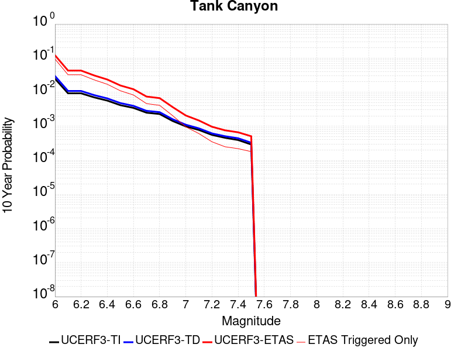 |

| Magnitude | 1 wk TI Prob | 1 wk TD Prob | 1 wk ETAS Prob | 1 wk ETAS/TD Gain | 1 wk ETAS Triggered Only | 1 mo TI Prob | 1 mo TD Prob | 1 mo ETAS Prob | 1 mo ETAS/TD Gain | 1 mo ETAS Triggered Only | 1 yr TI Prob | 1 yr TD Prob | 1 yr ETAS Prob | 1 yr ETAS/TD Gain | 1 yr ETAS Triggered Only | 10 yr TI Prob | 10 yr TD Prob | 10 yr ETAS Prob | 10 yr ETAS/TD Gain | 10 yr ETAS Triggered Only |
|-----|-----|-----|-----|-----|-----|-----|-----|-----|-----|-----|-----|-----|-----|-----|-----|-----|-----|-----|-----|-----|
| 6.0 | 4.8284557E-5 | 5.796445E-5 | 0.05313489 | 916.6806 | 0.05308 | 2.0691741E-4 | 2.4839927E-4 | 0.06313278 | 254.15846 | 0.0629 | 0.0025163088 | 0.0030207336 | 0.08238028 | 27.271614 | 0.0796 | 0.02488006 | 0.029863616 | 0.12115345 | 4.0568914 | 0.0941 |
| 6.1 | 1.7796336E-5 | 2.0873378E-5 | 0.017570507 | 841.76636 | 0.01755 | 7.626778E-5 | 8.945448E-5 | 0.020757606 | 232.04657 | 0.02067 | 9.281647E-4 | 0.0010886024 | 0.027919363 | 25.64698 | 0.02686 | 0.009242975 | 0.010836642 | 0.042964667 | 3.9647584 | 0.03248 |
| 6.2 | 1.7796336E-5 | 2.0873378E-5 | 0.017570507 | 841.76636 | 0.01755 | 7.626778E-5 | 8.945448E-5 | 0.020757606 | 232.04657 | 0.02067 | 9.281647E-4 | 0.0010886024 | 0.027919363 | 25.64698 | 0.02686 | 0.009242975 | 0.010836642 | 0.042964667 | 3.9647584 | 0.03248 |
| 6.3 | 1.3515912E-5 | 1.5759651E-5 | 0.012425564 | 788.4415 | 0.01241 | 5.792405E-5 | 6.7539746E-5 | 0.0145865595 | 215.97 | 0.01452 | 7.049971E-4 | 8.2200987E-4 | 0.019726457 | 23.997835 | 0.01892 | 0.007027647 | 0.008192157 | 0.030964065 | 3.7797205 | 0.02296 |
| 6.4 | 1.0870146E-5 | 1.2618114E-5 | 0.009242502 | 732.4788 | 0.00923 | 4.658551E-5 | 5.4076605E-5 | 0.010843493 | 200.52097 | 0.01079 | 5.67031E-4 | 6.582015E-4 | 0.01468896 | 22.316813 | 0.01404 | 0.005655863 | 0.006564382 | 0.023512393 | 3.5818138 | 0.01706 |
| 6.5 | 7.964826E-6 | 9.196184E-6 | 0.0059591415 | 648.0016 | 0.00595 | 3.4134522E-5 | 3.941168E-5 | 0.0069191405 | 175.56065 | 0.00688 | 4.1550855E-4 | 4.797421E-4 | 0.0095453905 | 19.896921 | 0.00907 | 0.0041473247 | 0.004788209 | 0.015725587 | 3.2842314 | 0.01099 |
| 6.6 | 6.6317E-6 | 7.612378E-6 | 0.0044175787 | 580.3152 | 0.00441 | 2.8421264E-5 | 3.262412E-5 | 0.0051624565 | 158.2405 | 0.00513 | 3.4597394E-4 | 3.9713533E-4 | 0.0071944348 | 18.115826 | 0.0068 | 0.0034543579 | 0.0039652516 | 0.012202458 | 3.077348 | 0.00827 |
| 6.7 | 4.793663E-6 | 5.4308593E-6 | 0.0024454177 | 450.28192 | 0.00244 | 2.0544108E-5 | 2.3274928E-5 | 0.0028632088 | 123.01688 | 0.00284 | 2.500958E-4 | 2.833398E-4 | 0.0040722657 | 14.372376 | 0.00379 | 0.0024981452 | 0.0028303189 | 0.007427271 | 2.6241817 | 0.00461 |
| 6.8 | 4.382823E-6 | 4.969325E-6 | 0.002124959 | 427.61517 | 0.00212 | 1.8783392E-5 | 2.1296957E-5 | 0.0025012442 | 117.44608 | 0.00248 | 2.286638E-4 | 2.5926388E-4 | 0.0036183929 | 13.956409 | 0.00336 | 0.0022842865 | 0.0025901233 | 0.006689478 | 2.582687 | 0.00411 |
| 6.9 | 2.729601E-6 | 3.0735862E-6 | 0.0010830703 | 352.38 | 0.00108 | 1.1698237E-5 | 1.3172453E-5 | 0.0012231565 | 92.857155 | 0.00121 | 1.4241673E-4 | 1.6036403E-4 | 0.0017901027 | 11.162744 | 0.00163 | 0.001423255 | 0.0016024808 | 0.0036392116 | 2.270986 | 0.00204 |
| 7.0 | 1.8987357E-6 | 2.126971E-6 | 5.721258E-4 | 268.98618 | 5.7E-4 | 8.137413E-6 | 9.115562E-6 | 6.091101E-4 | 66.82091 | 6.0E-4 | 9.90685E-5 | 1.1097702E-4 | 9.208871E-4 | 8.297998 | 8.1E-4 | 9.902435E-4 | 0.0011092846 | 0.0020682197 | 1.8644626 | 9.6E-4 |
| 7.1 | 1.4928986E-6 | 1.6641525E-6 | 3.6166355E-4 | 217.32597 | 3.6E-4 | 6.398121E-6 | 7.132066E-6 | 3.8712934E-4 | 54.280113 | 3.8E-4 | 7.789434E-5 | 8.6830034E-5 | 5.9678574E-4 | 6.8730335 | 5.1E-4 | 7.786704E-4 | 8.6801895E-4 | 0.0014774895 | 1.7021396 | 6.1E-4 |
| 7.2 | 1.069082E-6 | 1.1828765E-6 | 2.0118264E-4 | 170.07915 | 2.0E-4 | 4.581772E-6 | 5.0694644E-6 | 2.150684E-4 | 42.424286 | 2.1E-4 | 5.5781646E-5 | 6.171951E-5 | 3.517016E-4 | 5.698386 | 2.9E-4 | 5.576765E-4 | 6.1707594E-4 | 9.6686E-4 | 1.5668411 | 3.5E-4 |
| 7.3 | 8.776551E-7 | 9.770151E-7 | 1.6097687E-4 | 164.76393 | 1.6E-4 | 3.7613736E-6 | 4.187204E-6 | 1.741865E-4 | 41.599716 | 1.7E-4 | 4.579376E-5 | 5.0978535E-5 | 2.5096833E-4 | 4.92302 | 2.0E-4 | 4.5784327E-4 | 5.097194E-4 | 7.59592E-4 | 1.4902159 | 2.5E-4 |
| 7.4 | 7.55721E-7 | 8.5103835E-7 | 1.5085092E-4 | 177.25513 | 1.5E-4 | 3.2388E-6 | 3.6473052E-6 | 1.5364676E-4 | 42.126106 | 1.5E-4 | 3.9431678E-5 | 4.4405555E-5 | 2.2439756E-4 | 5.053367 | 1.8E-4 | 3.942468E-4 | 4.4401767E-4 | 6.6391996E-4 | 1.4952558 | 2.2E-4 |
| 7.5 | 5.587665E-7 | 6.305732E-7 | 1.3063049E-4 | 207.16151 | 1.3E-4 | 2.3947114E-6 | 2.7024564E-6 | 1.327021E-4 | 49.10425 | 1.3E-4 | 2.915522E-5 | 3.2902408E-5 | 1.8289748E-4 | 5.558787 | 1.5E-4 | 2.9151395E-4 | 3.2902407E-4 | 5.089649E-4 | 1.5468924 | 1.8E-4 |

## Little Lake
*[(top)](#table-of-contents)*

| 1 Week | 1 Month | 1 Year | 10 Year |
|-----|-----|-----|-----|
|  |  |  | 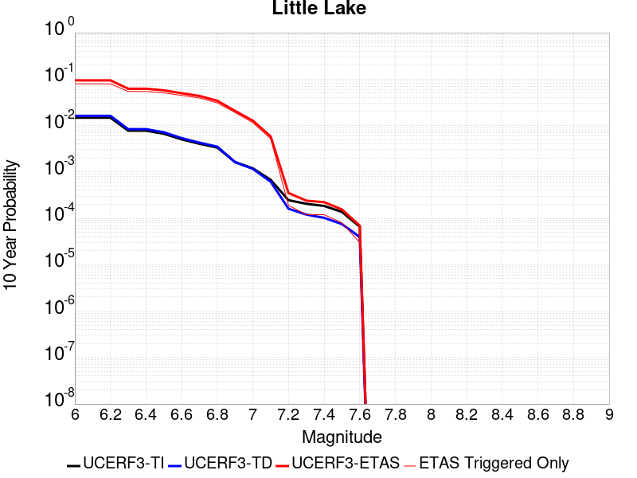 |

| Magnitude | 1 wk TI Prob | 1 wk TD Prob | 1 wk ETAS Prob | 1 wk ETAS/TD Gain | 1 wk ETAS Triggered Only | 1 mo TI Prob | 1 mo TD Prob | 1 mo ETAS Prob | 1 mo ETAS/TD Gain | 1 mo ETAS Triggered Only | 1 yr TI Prob | 1 yr TD Prob | 1 yr ETAS Prob | 1 yr ETAS/TD Gain | 1 yr ETAS Triggered Only | 10 yr TI Prob | 10 yr TD Prob | 10 yr ETAS Prob | 10 yr ETAS/TD Gain | 10 yr ETAS Triggered Only |
|-----|-----|-----|-----|-----|-----|-----|-----|-----|-----|-----|-----|-----|-----|-----|-----|-----|-----|-----|-----|-----|
| 6.0 | 2.8424427E-5 | 3.1205716E-5 | 0.051559597 | 1652.2485 | 0.05153 | 1.2181328E-4 | 1.3373268E-4 | 0.05854592 | 437.7832 | 0.05842 | 0.0014820677 | 0.0016271125 | 0.07095413 | 43.607388 | 0.06944 | 0.014722223 | 0.016165398 | 0.09413429 | 5.8231964 | 0.07925 |
| 6.1 | 2.8424427E-5 | 3.1205716E-5 | 0.051559597 | 1652.2485 | 0.05153 | 1.2181328E-4 | 1.3373268E-4 | 0.05854592 | 437.7832 | 0.05842 | 0.0014820677 | 0.0016271125 | 0.07095413 | 43.607388 | 0.06944 | 0.014722223 | 0.016165398 | 0.09413429 | 5.8231964 | 0.07925 |
| 6.2 | 2.8424427E-5 | 3.1205716E-5 | 0.051559597 | 1652.2485 | 0.05153 | 1.2181328E-4 | 1.3373268E-4 | 0.05854592 | 437.7832 | 0.05842 | 0.0014820677 | 0.0016271125 | 0.07095413 | 43.607388 | 0.06944 | 0.014722223 | 0.016165398 | 0.09413429 | 5.8231964 | 0.07925 |
| 6.3 | 1.48860645E-5 | 1.6081383E-5 | 0.035835505 | 2228.3843 | 0.03582 | 6.379586E-5 | 6.8918554E-5 | 0.040586125 | 588.89984 | 0.04052 | 7.7643775E-4 | 8.387886E-4 | 0.04845881 | 57.772377 | 0.04766 | 0.007737305 | 0.008359045 | 0.062105983 | 7.4297943 | 0.0542 |
| 6.4 | 1.48860645E-5 | 1.6081383E-5 | 0.035835505 | 2228.3843 | 0.03582 | 6.379586E-5 | 6.8918554E-5 | 0.040586125 | 588.89984 | 0.04052 | 7.7643775E-4 | 8.387886E-4 | 0.04845881 | 57.772377 | 0.04766 | 0.007737305 | 0.008359045 | 0.062105983 | 7.4297943 | 0.0542 |
| 6.5 | 1.2797581E-5 | 1.376556E-5 | 0.033433307 | 2428.7646 | 0.03342 | 5.4845623E-5 | 5.8994065E-5 | 0.037866764 | 641.8741 | 0.03781 | 6.675408E-4 | 7.1804173E-4 | 0.04514612 | 62.873943 | 0.04446 | 0.006655392 | 0.007159767 | 0.057407413 | 8.018056 | 0.05061 |
| 6.6 | 9.661896E-6 | 1.0289033E-5 | 0.029589985 | 2875.8765 | 0.02958 | 4.1407468E-5 | 4.40952E-5 | 0.033442624 | 758.4187 | 0.0334 | 5.040193E-4 | 5.36743E-4 | 0.03974569 | 74.04974 | 0.03923 | 0.005028777 | 0.0053560715 | 0.049647566 | 9.2694 | 0.04453 |
| 6.7 | 7.767871E-6 | 8.199681E-6 | 0.026097985 | 3182.805 | 0.02609 | 3.329045E-5 | 3.5141096E-5 | 0.029464107 | 838.4516 | 0.02943 | 4.0523586E-4 | 4.2777258E-4 | 0.03501297 | 81.8495 | 0.0346 | 0.004044977 | 0.004270843 | 0.043343257 | 10.148642 | 0.03924 |
| 6.8 | 6.4235196E-6 | 6.735739E-6 | 0.020446599 | 3035.5388 | 0.02044 | 2.752908E-5 | 2.8867207E-5 | 0.023038203 | 798.07526 | 0.02301 | 3.35115E-4 | 3.5141438E-4 | 0.02750187 | 78.26051 | 0.02716 | 0.003346101 | 0.0035098472 | 0.03423164 | 9.753028 | 0.03083 |
| 6.9 | 3.1283696E-6 | 3.1121751E-6 | 0.012873072 | 4136.3584 | 0.01287 | 1.3407229E-5 | 1.33378335E-5 | 0.014333147 | 1074.6233 | 0.01432 | 1.6322079E-4 | 1.6237753E-4 | 0.017179614 | 105.80044 | 0.01702 | 0.0016310095 | 0.0016227372 | 0.020641824 | 12.720374 | 0.01905 |
| 7.0 | 2.290603E-6 | 2.2286763E-6 | 0.0076722116 | 3442.4973 | 0.00767 | 9.816834E-6 | 9.551441E-6 | 0.00856947 | 897.19135 | 0.00856 | 1.19513395E-4 | 1.1628362E-4 | 0.010345094 | 88.964325 | 0.01023 | 0.0011944914 | 0.0011623299 | 0.012698905 | 10.925387 | 0.01155 |
| 7.1 | 1.293693E-6 | 1.1776774E-6 | 0.0034511737 | 2930.4915 | 0.00345 | 5.5443866E-6 | 5.047183E-6 | 0.0038750276 | 767.7605 | 0.00387 | 6.750081E-5 | 6.1448416E-5 | 0.0046811644 | 76.18039 | 0.00462 | 6.7480316E-4 | 6.1438273E-4 | 0.005811188 | 9.458579 | 0.0052 |
| 7.2 | 4.715842E-7 | 3.091732E-7 | 1.2030914E-4 | 389.13184 | 1.2E-4 | 2.0210737E-6 | 1.3250274E-6 | 1.4132484E-4 | 106.65806 | 1.4E-4 | 2.4606294E-5 | 1.6132095E-5 | 1.9612919E-4 | 12.1577015 | 1.8E-4 | 2.460357E-4 | 1.6130977E-4 | 3.5127913E-4 | 2.1776679 | 1.9E-4 |
| 7.3 | 3.9430947E-7 | 2.3096938E-7 | 9.023095E-5 | 390.66196 | 9.0E-5 | 1.6898966E-6 | 9.898685E-7 | 1.1098976E-4 | 112.12577 | 1.1E-4 | 2.0574296E-5 | 1.2051582E-5 | 1.3205013E-4 | 10.957079 | 1.2E-4 | 2.0572392E-4 | 1.2050936E-4 | 2.404949E-4 | 1.9956533 | 1.2E-4 |
| 7.4 | 3.547123E-7 | 1.9678579E-7 | 9.0196765E-5 | 458.35 | 9.0E-5 | 1.5201948E-6 | 8.433674E-7 | 1.1084328E-4 | 131.4294 | 1.1E-4 | 1.8508214E-5 | 1.02679505E-5 | 1.3026672E-4 | 12.68673 | 1.2E-4 | 1.8506673E-4 | 1.0267482E-4 | 2.2266251E-4 | 2.1686182 | 1.2E-4 |
| 7.5 | 2.6354266E-7 | 1.4422719E-7 | 6.014422E-5 | 417.01028 | 6.0E-5 | 1.129468E-6 | 6.1811636E-7 | 8.061807E-5 | 130.42538 | 8.0E-5 | 1.3751187E-5 | 7.525541E-6 | 8.752494E-5 | 11.630384 | 8.0E-5 | 1.3750336E-4 | 7.5252916E-5 | 1.552469E-4 | 2.0630016 | 8.0E-5 |
| 7.6 | 1.269913E-7 | 7.572344E-8 | 1.00757225E-5 | 133.0595 | 1.0E-5 | 5.4424834E-7 | 3.24529E-7 | 3.032452E-5 | 93.441635 | 3.0E-5 | 6.6262032E-6 | 3.9511337E-6 | 3.3951015E-5 | 8.592728 | 3.0E-5 | 6.626006E-5 | 3.9510673E-5 | 6.9509486E-5 | 1.7592585 | 3.0E-5 |

## Airport Lake
*[(top)](#table-of-contents)*

| 1 Week | 1 Month | 1 Year | 10 Year |
|-----|-----|-----|-----|
|  |  |  |  |

| Magnitude | 1 wk TI Prob | 1 wk TD Prob | 1 wk ETAS Prob | 1 wk ETAS/TD Gain | 1 wk ETAS Triggered Only | 1 mo TI Prob | 1 mo TD Prob | 1 mo ETAS Prob | 1 mo ETAS/TD Gain | 1 mo ETAS Triggered Only | 1 yr TI Prob | 1 yr TD Prob | 1 yr ETAS Prob | 1 yr ETAS/TD Gain | 1 yr ETAS Triggered Only | 10 yr TI Prob | 10 yr TD Prob | 10 yr ETAS Prob | 10 yr ETAS/TD Gain | 10 yr ETAS Triggered Only |
|-----|-----|-----|-----|-----|-----|-----|-----|-----|-----|-----|-----|-----|-----|-----|-----|-----|-----|-----|-----|-----|
| 6.0 | 1.2387061E-5 | 1.3103157E-5 | 0.04910246 | 3747.3765 | 0.04909 | 5.3086325E-5 | 5.615534E-5 | 0.05557304 | 989.63055 | 0.05552 | 6.461343E-4 | 6.8350515E-4 | 0.06619869 | 96.85178 | 0.06556 | 0.0064425888 | 0.0068168393 | 0.08042164 | 11.797498 | 0.07411 |
| 6.1 | 1.2387061E-5 | 1.3103157E-5 | 0.04910246 | 3747.3765 | 0.04909 | 5.3086325E-5 | 5.615534E-5 | 0.05557304 | 989.63055 | 0.05552 | 6.461343E-4 | 6.8350515E-4 | 0.06619869 | 96.85178 | 0.06556 | 0.0064425888 | 0.0068168393 | 0.08042164 | 11.797498 | 0.07411 |
| 6.2 | 1.2387061E-5 | 1.3103157E-5 | 0.04910246 | 3747.3765 | 0.04909 | 5.3086325E-5 | 5.615534E-5 | 0.05557304 | 989.63055 | 0.05552 | 6.461343E-4 | 6.8350515E-4 | 0.06619869 | 96.85178 | 0.06556 | 0.0064425888 | 0.0068168393 | 0.08042164 | 11.797498 | 0.07411 |
| 6.3 | 1.2387061E-5 | 1.3103157E-5 | 0.04910246 | 3747.3765 | 0.04909 | 5.3086325E-5 | 5.615534E-5 | 0.05557304 | 989.63055 | 0.05552 | 6.461343E-4 | 6.8350515E-4 | 0.06619869 | 96.85178 | 0.06556 | 0.0064425888 | 0.0068168393 | 0.08042164 | 11.797498 | 0.07411 |
| 6.4 | 1.2387061E-5 | 1.3103157E-5 | 0.04910246 | 3747.3765 | 0.04909 | 5.3086325E-5 | 5.615534E-5 | 0.05557304 | 989.63055 | 0.05552 | 6.461343E-4 | 6.8350515E-4 | 0.06619869 | 96.85178 | 0.06556 | 0.0064425888 | 0.0068168393 | 0.08042164 | 11.797498 | 0.07411 |
| 6.5 | 6.9922594E-6 | 7.384925E-6 | 0.03707711 | 5020.648 | 0.03707 | 2.996648E-5 | 3.1649324E-5 | 0.04209032 | 1329.8962 | 0.04206 | 3.6478083E-4 | 3.8526783E-4 | 0.049836207 | 129.3547 | 0.04947 | 0.003641826 | 0.0038465366 | 0.059202783 | 15.391192 | 0.05557 |
| 6.6 | 6.9922594E-6 | 7.384925E-6 | 0.03707711 | 5020.648 | 0.03707 | 2.996648E-5 | 3.1649324E-5 | 0.04209032 | 1329.8962 | 0.04206 | 3.6478083E-4 | 3.8526783E-4 | 0.049836207 | 129.3547 | 0.04947 | 0.003641826 | 0.0038465366 | 0.059202783 | 15.391192 | 0.05557 |
| 6.7 | 5.477277E-6 | 5.7860684E-6 | 0.0315456 | 5451.9927 | 0.03154 | 2.3473833E-5 | 2.4797222E-5 | 0.035663914 | 1438.222 | 0.03564 | 2.8575645E-4 | 3.0186825E-4 | 0.042269196 | 140.02531 | 0.04198 | 0.0028538927 | 0.003014966 | 0.05007266 | 16.608036 | 0.0472 |
| 6.8 | 3.9950432E-6 | 4.2190873E-6 | 0.023944119 | 5675.1895 | 0.02394 | 1.7121502E-5 | 1.8081691E-5 | 0.027037593 | 1495.3021 | 0.02702 | 2.0843433E-4 | 2.2012512E-4 | 0.032283064 | 146.6578 | 0.03207 | 0.0020823893 | 0.0021993418 | 0.03816008 | 17.350681 | 0.03604 |
| 6.9 | 2.95695E-6 | 3.1230243E-6 | 0.017273068 | 5530.879 | 0.01727 | 1.2672582E-5 | 1.3384334E-5 | 0.019403124 | 1449.6892 | 0.01939 | 1.5427776E-4 | 1.6294434E-4 | 0.023099206 | 141.76132 | 0.02294 | 0.001541707 | 0.0016284712 | 0.027306587 | 16.768234 | 0.02572 |
| 7.0 | 1.456072E-6 | 1.540812E-6 | 0.0073915296 | 4797.165 | 0.00739 | 6.2402937E-6 | 6.603469E-6 | 0.00821655 | 1244.2777 | 0.00821 | 7.597293E-5 | 8.039528E-5 | 0.009859609 | 122.63916 | 0.00978 | 7.594696E-4 | 8.0376083E-4 | 0.011864863 | 14.761684 | 0.01107 |
| 7.1 | 6.995192E-7 | 7.4089746E-7 | 0.0032807384 | 4428.06 | 0.00328 | 2.997936E-6 | 3.1752747E-6 | 0.0036631636 | 1153.6525 | 0.00366 | 3.649926E-5 | 3.865897E-5 | 0.0043884907 | 113.51805 | 0.00435 | 3.6493264E-4 | 3.865897E-4 | 0.0053046877 | 13.721751 | 0.00492 |

## Owl Lake
*[(top)](#table-of-contents)*

| 1 Week | 1 Month | 1 Year | 10 Year |
|-----|-----|-----|-----|
|  |  |  |  |

| Magnitude | 1 wk TI Prob | 1 wk TD Prob | 1 wk ETAS Prob | 1 wk ETAS/TD Gain | 1 wk ETAS Triggered Only | 1 mo TI Prob | 1 mo TD Prob | 1 mo ETAS Prob | 1 mo ETAS/TD Gain | 1 mo ETAS Triggered Only | 1 yr TI Prob | 1 yr TD Prob | 1 yr ETAS Prob | 1 yr ETAS/TD Gain | 1 yr ETAS Triggered Only | 10 yr TI Prob | 10 yr TD Prob | 10 yr ETAS Prob | 10 yr ETAS/TD Gain | 10 yr ETAS Triggered Only |
|-----|-----|-----|-----|-----|-----|-----|-----|-----|-----|-----|-----|-----|-----|-----|-----|-----|-----|-----|-----|-----|
| 6.0 | 5.0320643E-5 | 6.6358676E-5 | 0.02248487 | 338.83844 | 0.02242 | 2.1564208E-4 | 2.843643E-4 | 0.027066747 | 95.18334 | 0.02679 | 0.0026222812 | 0.003457547 | 0.037080888 | 10.724624 | 0.03374 | 0.02591553 | 0.034141295 | 0.072138175 | 2.1129303 | 0.03934 |
| 6.1 | 5.0320643E-5 | 6.6358676E-5 | 0.02248487 | 338.83844 | 0.02242 | 2.1564208E-4 | 2.843643E-4 | 0.027066747 | 95.18334 | 0.02679 | 0.0026222812 | 0.003457547 | 0.037080888 | 10.724624 | 0.03374 | 0.02591553 | 0.034141295 | 0.072138175 | 2.1129303 | 0.03934 |
| 6.2 | 2.4125871E-5 | 3.0980515E-5 | 0.018300414 | 590.7072 | 0.01827 | 1.0339249E-4 | 1.3276804E-4 | 0.02164991 | 163.06569 | 0.02152 | 0.0012580766 | 0.0016154252 | 0.02852189 | 17.655964 | 0.02695 | 0.012509781 | 0.016070755 | 0.046641435 | 2.9022555 | 0.03107 |
| 6.3 | 1.7433485E-5 | 2.2355545E-5 | 0.01682198 | 752.4746 | 0.0168 | 7.471279E-5 | 9.580685E-5 | 0.019813918 | 206.81108 | 0.01972 | 9.0924866E-4 | 0.001165962 | 0.025457606 | 21.833994 | 0.02432 | 0.009055373 | 0.0116291465 | 0.039263997 | 3.3763437 | 0.02796 |
| 6.4 | 1.7433485E-5 | 2.2355545E-5 | 0.01682198 | 752.4746 | 0.0168 | 7.471279E-5 | 9.580685E-5 | 0.019813918 | 206.81108 | 0.01972 | 9.0924866E-4 | 0.001165962 | 0.025457606 | 21.833994 | 0.02432 | 0.009055373 | 0.0116291465 | 0.039263997 | 3.3763437 | 0.02796 |
| 6.5 | 1.5182742E-5 | 1.9429277E-5 | 0.01641911 | 845.0706 | 0.0164 | 6.506727E-5 | 8.3266525E-5 | 0.01926167 | 231.32549 | 0.01918 | 7.919061E-4 | 0.0010134344 | 0.024539568 | 24.214266 | 0.02355 | 0.0078909 | 0.010118678 | 0.036904868 | 3.6472025 | 0.02706 |
| 6.6 | 6.7271576E-6 | 8.547518E-6 | 0.014288425 | 1671.6461 | 0.01428 | 2.8830356E-5 | 3.6631736E-5 | 0.016646024 | 454.41534 | 0.01661 | 3.5095305E-4 | 4.4590578E-4 | 0.02054694 | 46.0791 | 0.02011 | 0.0035039932 | 0.0044680187 | 0.02692722 | 6.0266576 | 0.02256 |
| 6.7 | 6.682835E-6 | 8.479961E-6 | 0.014278359 | 1683.7765 | 0.01427 | 2.8640408E-5 | 3.6342215E-5 | 0.016635738 | 457.75247 | 0.0166 | 3.4864116E-4 | 4.423823E-4 | 0.02053349 | 46.415714 | 0.0201 | 0.003480947 | 0.0044329325 | 0.02688297 | 6.0643764 | 0.02255 |
| 6.8 | 6.5774975E-6 | 8.326427E-6 | 0.014258208 | 1712.404 | 0.01425 | 2.8188972E-5 | 3.5684232E-5 | 0.016595094 | 465.05396 | 0.01656 | 3.4314668E-4 | 4.3437455E-4 | 0.02048566 | 47.16128 | 0.02006 | 0.0034261728 | 0.0043531056 | 0.026755162 | 6.1462235 | 0.0225 |
| 6.9 | 6.363419E-6 | 7.999591E-6 | 0.014207886 | 1776.0767 | 0.0142 | 2.727151E-5 | 3.428354E-5 | 0.016523719 | 481.97235 | 0.01649 | 3.3198006E-4 | 4.1732774E-4 | 0.020368997 | 48.808155 | 0.01996 | 0.0033148455 | 0.0041830647 | 0.026489364 | 6.3325253 | 0.0224 |
| 7.0 | 6.1342453E-6 | 7.631779E-6 | 0.014077525 | 1844.5927 | 0.01407 | 2.6289357E-5 | 3.2707245E-5 | 0.016352173 | 499.9557 | 0.01632 | 3.2002592E-4 | 3.9814346E-4 | 0.020130284 | 50.56038 | 0.01974 | 0.0031956544 | 0.003991739 | 0.026073242 | 6.5318003 | 0.02217 |
| 7.1 | 5.842926E-6 | 7.142312E-6 | 0.013487046 | 1888.3306 | 0.01348 | 2.504087E-5 | 3.060958E-5 | 0.015630132 | 510.62875 | 0.0156 | 3.0482994E-4 | 3.7261334E-4 | 0.019125624 | 51.32834 | 0.01876 | 0.0030441214 | 0.0037371595 | 0.024618829 | 6.587578 | 0.02096 |
| 7.2 | 4.77173E-6 | 5.358478E-6 | 0.008755311 | 1633.9175 | 0.00875 | 2.045011E-5 | 2.2964727E-5 | 0.010332728 | 449.93906 | 0.01031 | 2.4895166E-4 | 2.7956374E-4 | 0.012566128 | 44.949062 | 0.01229 | 0.0024867293 | 0.0028086212 | 0.016420284 | 5.846386 | 0.01365 |
| 7.3 | 3.0494948E-6 | 2.710356E-6 | 0.0025027036 | 923.3855 | 0.0025 | 1.3069198E-5 | 1.1615762E-5 | 0.0029815813 | 256.6841 | 0.00297 | 1.5910587E-4 | 1.4141288E-4 | 0.0036409178 | 25.746721 | 0.0035 | 0.0015899199 | 0.0014231089 | 0.0052776155 | 3.7085116 | 0.00386 |
| 7.4 | 2.7263884E-6 | 2.3055634E-6 | 0.0016323018 | 707.98395 | 0.00163 | 1.1684469E-5 | 9.880949E-6 | 0.0019498618 | 197.33548 | 0.00194 | 1.4224913E-4 | 1.2029401E-4 | 0.0024600124 | 20.449999 | 0.00234 | 0.0014215811 | 0.0012110578 | 0.0037979211 | 3.1360364 | 0.00259 |
| 7.5 | 2.6090431E-6 | 2.1655019E-6 | 0.0014721623 | 679.825 | 0.00147 | 1.1181565E-5 | 9.2806895E-6 | 0.0017392646 | 187.40683 | 0.00173 | 1.3612706E-4 | 1.1298663E-4 | 0.0022127493 | 19.58417 | 0.0021 | 0.001360437 | 0.0011378126 | 0.0034451843 | 3.0279012 | 0.00231 |
| 7.6 | 2.3008756E-6 | 1.8726826E-6 | 0.0010918706 | 583.05164 | 0.00109 | 9.860858E-6 | 8.025758E-6 | 0.0012680156 | 157.99326 | 0.00126 | 1.20049335E-4 | 9.770931E-5 | 0.0016175607 | 16.554829 | 0.00152 | 0.001199845 | 9.848307E-4 | 0.002663176 | 2.7041972 | 0.00168 |
| 7.7 | 1.7184348E-6 | 1.341808E-6 | 5.91341E-4 | 440.70465 | 5.9E-4 | 7.3646997E-6 | 5.750593E-6 | 7.057466E-4 | 122.72587 | 7.0E-4 | 8.966153E-5 | 7.0011265E-5 | 9.0995245E-4 | 12.99723 | 8.4E-4 | 8.962536E-4 | 7.0769014E-4 | 0.0015970604 | 2.2567225 | 8.9E-4 |
| 7.8 | 8.4612907E-7 | 8.4054994E-7 | 2.6084034E-4 | 310.32104 | 2.6E-4 | 3.6262625E-6 | 3.602352E-6 | 2.936013E-4 | 81.50267 | 2.9E-4 | 4.4148852E-5 | 4.3857777E-5 | 4.3384067E-4 | 9.89199 | 3.9E-4 | 4.414008E-4 | 4.4386165E-4 | 8.736708E-4 | 1.9683404 | 4.3E-4 |
| 7.9 | 2.716738E-7 | 3.7681625E-7 | 1.1037677E-4 | 292.91937 | 1.1E-4 | 1.1643157E-6 | 1.6149258E-6 | 1.3161471E-4 | 81.498924 | 1.3E-4 | 1.4175452E-5 | 1.9661555E-5 | 1.6965861E-4 | 8.628951 | 1.5E-4 | 1.4174548E-4 | 1.9829652E-4 | 3.5826478E-4 | 1.8067125 | 1.6E-4 |
| 8.0 | 2.1995428E-8 | 3.3853325E-8 | 3.3853325E-8 | 1.0 | 0.0 | 9.426611E-8 | 1.4508568E-7 | 1.4508568E-7 | 1.0 | 0.0 | 1.1476893E-6 | 1.7664173E-6 | 1.7664173E-6 | 1.0 | 0.0 | 1.14768345E-5 | 1.7869768E-5 | 1.7869768E-5 | 1.0 | 0.0 |

## Panamint Valley
*[(top)](#table-of-contents)*

| 1 Week | 1 Month | 1 Year | 10 Year |
|-----|-----|-----|-----|
|  |  |  |  |

| Magnitude | 1 wk TI Prob | 1 wk TD Prob | 1 wk ETAS Prob | 1 wk ETAS/TD Gain | 1 wk ETAS Triggered Only | 1 mo TI Prob | 1 mo TD Prob | 1 mo ETAS Prob | 1 mo ETAS/TD Gain | 1 mo ETAS Triggered Only | 1 yr TI Prob | 1 yr TD Prob | 1 yr ETAS Prob | 1 yr ETAS/TD Gain | 1 yr ETAS Triggered Only | 10 yr TI Prob | 10 yr TD Prob | 10 yr ETAS Prob | 10 yr ETAS/TD Gain | 10 yr ETAS Triggered Only |
|-----|-----|-----|-----|-----|-----|-----|-----|-----|-----|-----|-----|-----|-----|-----|-----|-----|-----|-----|-----|-----|
| 6.0 | 3.0211835E-5 | 3.3984263E-5 | 0.019593319 | 576.54095 | 0.01956 | 1.2947287E-4 | 1.4563887E-4 | 0.022752346 | 156.22441 | 0.02261 | 0.0015751923 | 0.0017717406 | 0.029991653 | 16.92779 | 0.02827 | 0.015640736 | 0.017583003 | 0.04982593 | 2.8337553 | 0.03282 |
| 6.1 | 3.0211835E-5 | 3.3984263E-5 | 0.019593319 | 576.54095 | 0.01956 | 1.2947287E-4 | 1.4563887E-4 | 0.022752346 | 156.22441 | 0.02261 | 0.0015751923 | 0.0017717406 | 0.029991653 | 16.92779 | 0.02827 | 0.015640736 | 0.017583003 | 0.04982593 | 2.8337553 | 0.03282 |
| 6.2 | 3.0211835E-5 | 3.3984263E-5 | 0.019593319 | 576.54095 | 0.01956 | 1.2947287E-4 | 1.4563887E-4 | 0.022752346 | 156.22441 | 0.02261 | 0.0015751923 | 0.0017717406 | 0.029991653 | 16.92779 | 0.02827 | 0.015640736 | 0.017583003 | 0.04982593 | 2.8337553 | 0.03282 |
| 6.3 | 2.8573924E-5 | 3.2102445E-5 | 0.01910149 | 595.0167 | 0.01907 | 1.2245393E-4 | 1.375748E-4 | 0.022084555 | 160.52762 | 0.02195 | 0.001489857 | 0.0016737141 | 0.028928021 | 17.28373 | 0.0273 | 0.01479908 | 0.016618038 | 0.047712576 | 2.8711317 | 0.03162 |
| 6.4 | 2.8573924E-5 | 3.2102445E-5 | 0.01910149 | 595.0167 | 0.01907 | 1.2245393E-4 | 1.375748E-4 | 0.022084555 | 160.52762 | 0.02195 | 0.001489857 | 0.0016737141 | 0.028928021 | 17.28373 | 0.0273 | 0.01479908 | 0.016618038 | 0.047712576 | 2.8711317 | 0.03162 |
| 6.5 | 2.7468774E-5 | 3.0828138E-5 | 0.018820249 | 610.48926 | 0.01879 | 1.1771801E-4 | 1.3211406E-4 | 0.021719262 | 164.39781 | 0.02159 | 0.0014322745 | 0.0016073292 | 0.028294366 | 17.60334 | 0.02673 | 0.014230782 | 0.015963882 | 0.0463706 | 2.9047194 | 0.0309 |
| 6.6 | 2.6135967E-5 | 2.9252153E-5 | 0.018498711 | 632.38806 | 0.01847 | 1.1200648E-4 | 1.2536049E-4 | 0.021302706 | 169.93158 | 0.02118 | 0.0013628257 | 0.0015252219 | 0.027645322 | 18.125443 | 0.02616 | 0.013544982 | 0.015154343 | 0.04485729 | 2.9600284 | 0.03016 |
| 6.7 | 2.4498746E-5 | 2.7341044E-5 | 0.017776856 | 650.18933 | 0.01775 | 1.04990395E-4 | 1.17170785E-4 | 0.020444788 | 174.48709 | 0.02033 | 0.0012775084 | 0.0014256459 | 0.026499847 | 18.58796 | 0.02511 | 0.012701893 | 0.014171593 | 0.042671893 | 3.0110865 | 0.02891 |
| 6.8 | 2.2244329E-5 | 2.4935374E-5 | 0.01706451 | 684.3495 | 0.01704 | 9.532935E-5 | 1.0686163E-4 | 0.019544784 | 182.89804 | 0.01944 | 0.0011600169 | 0.0013002857 | 0.025189184 | 19.372038 | 0.02392 | 0.011539802 | 0.012932955 | 0.040027946 | 3.0950346 | 0.02745 |
| 6.9 | 1.9902658E-5 | 2.2290182E-5 | 0.015891936 | 712.9568 | 0.01587 | 8.529431E-5 | 9.552596E-5 | 0.018133802 | 189.83115 | 0.01804 | 0.0010379635 | 0.0011624265 | 0.023146842 | 19.91252 | 0.02201 | 0.010331288 | 0.011569021 | 0.036388524 | 3.1453414 | 0.02511 |
| 7.0 | 1.8353881E-5 | 2.056605E-5 | 0.015130255 | 735.69086 | 0.01511 | 7.865712E-5 | 8.813734E-5 | 0.01718663 | 194.99828 | 0.0171 | 9.5722964E-4 | 0.0010725616 | 0.021860242 | 20.38134 | 0.02081 | 0.009531168 | 0.01067939 | 0.033987783 | 3.1825585 | 0.02356 |
| 7.1 | 1.7667631E-5 | 1.9772435E-5 | 0.014629483 | 739.8929 | 0.01461 | 7.571623E-5 | 8.4736355E-5 | 0.016653333 | 196.53114 | 0.01657 | 9.2145515E-4 | 0.0010311945 | 0.021160416 | 20.520298 | 0.02015 | 0.009176437 | 0.0102695925 | 0.032835446 | 3.1973464 | 0.0228 |
| 7.2 | 1.6381597E-5 | 1.8158042E-5 | 0.0129979225 | 715.8218 | 0.01298 | 7.020495E-5 | 7.781795E-5 | 0.014806672 | 190.27321 | 0.01473 | 8.544101E-4 | 9.470391E-4 | 0.018820096 | 19.872566 | 0.01789 | 0.008511325 | 0.009435269 | 0.029474394 | 3.123853 | 0.02023 |
| 7.3 | 1.4520491E-5 | 1.596657E-5 | 0.010695796 | 669.88684 | 0.01068 | 6.222919E-5 | 6.842646E-5 | 0.0121476 | 177.52782 | 0.01208 | 7.57377E-4 | 8.327899E-4 | 0.015510556 | 18.624813 | 0.01469 | 0.0075480095 | 0.008300399 | 0.024881618 | 2.9976408 | 0.01672 |
| 7.4 | 1.2852287E-5 | 1.41454875E-5 | 0.010383999 | 734.08563 | 0.01037 | 5.5080065E-5 | 6.06222E-5 | 0.011759913 | 193.98691 | 0.0117 | 6.7039346E-4 | 7.378411E-4 | 0.014917371 | 20.217592 | 0.01419 | 0.0066837464 | 0.007357429 | 0.023398533 | 3.1802595 | 0.01616 |
| 7.5 | 1.1637851E-5 | 1.2836868E-5 | 0.010302705 | 802.5871 | 0.01029 | 4.987555E-5 | 5.5014076E-5 | 0.011664376 | 212.02528 | 0.01161 | 6.070656E-4 | 6.696062E-4 | 0.014710198 | 21.968431 | 0.01405 | 0.006054099 | 0.0066793845 | 0.022572514 | 3.3794303 | 0.016 |
| 7.6 | 3.0068115E-6 | 3.3330623E-6 | 0.004213319 | 1264.0985 | 0.00421 | 1.2886271E-5 | 1.4284516E-5 | 0.0047942162 | 335.6233 | 0.00478 | 1.5687906E-4 | 1.7390738E-4 | 0.0059329057 | 34.11532 | 0.00576 | 0.0015676835 | 0.0017397973 | 0.008418158 | 4.8385854 | 0.00669 |

## Garlock (East)
*[(top)](#table-of-contents)*

| 1 Week | 1 Month | 1 Year | 10 Year |
|-----|-----|-----|-----|
|  |  |  |  |

| Magnitude | 1 wk TI Prob | 1 wk TD Prob | 1 wk ETAS Prob | 1 wk ETAS/TD Gain | 1 wk ETAS Triggered Only | 1 mo TI Prob | 1 mo TD Prob | 1 mo ETAS Prob | 1 mo ETAS/TD Gain | 1 mo ETAS Triggered Only | 1 yr TI Prob | 1 yr TD Prob | 1 yr ETAS Prob | 1 yr ETAS/TD Gain | 1 yr ETAS Triggered Only | 10 yr TI Prob | 10 yr TD Prob | 10 yr ETAS Prob | 10 yr ETAS/TD Gain | 10 yr ETAS Triggered Only |
|-----|-----|-----|-----|-----|-----|-----|-----|-----|-----|-----|-----|-----|-----|-----|-----|-----|-----|-----|-----|-----|
| 6.0 | 4.5092507E-5 | 6.2904815E-5 | 0.014052025 | 223.38551 | 0.01399 | 1.9323928E-4 | 2.6956675E-4 | 0.016885087 | 62.63787 | 0.01662 | 0.0023501497 | 0.003277482 | 0.024059147 | 7.340741 | 0.02085 | 0.023254504 | 0.03235377 | 0.056206252 | 1.7372396 | 0.02465 |
| 6.1 | 4.5092507E-5 | 6.2904815E-5 | 0.014052025 | 223.38551 | 0.01399 | 1.9323928E-4 | 2.6956675E-4 | 0.016885087 | 62.63787 | 0.01662 | 0.0023501497 | 0.003277482 | 0.024059147 | 7.340741 | 0.02085 | 0.023254504 | 0.03235377 | 0.056206252 | 1.7372396 | 0.02465 |
| 6.2 | 2.6674514E-5 | 3.4511588E-5 | 0.011724108 | 339.71512 | 0.01169 | 1.1431433E-4 | 1.4789861E-4 | 0.013855871 | 93.68494 | 0.01371 | 0.0013908884 | 0.0017992114 | 0.018568985 | 10.320624 | 0.0168 | 0.01382215 | 0.017872788 | 0.03688677 | 2.0638509 | 0.01936 |
| 6.3 | 2.6674514E-5 | 3.4511588E-5 | 0.011724108 | 339.71512 | 0.01169 | 1.1431433E-4 | 1.4789861E-4 | 0.013855871 | 93.68494 | 0.01371 | 0.0013908884 | 0.0017992114 | 0.018568985 | 10.320624 | 0.0168 | 0.01382215 | 0.017872788 | 0.03688677 | 2.0638509 | 0.01936 |
| 6.4 | 2.5312667E-5 | 3.2340467E-5 | 0.011571967 | 357.81693 | 0.01154 | 1.0847834E-4 | 1.3859481E-4 | 0.013646723 | 98.46489 | 0.01351 | 0.0013199237 | 0.0016861152 | 0.018188244 | 10.78707 | 0.01653 | 0.013121112 | 0.016772287 | 0.035473276 | 2.1149936 | 0.01902 |
| 6.5 | 2.5312667E-5 | 3.2340467E-5 | 0.011571967 | 357.81693 | 0.01154 | 1.0847834E-4 | 1.3859481E-4 | 0.013646723 | 98.46489 | 0.01351 | 0.0013199237 | 0.0016861152 | 0.018188244 | 10.78707 | 0.01653 | 0.013121112 | 0.016772287 | 0.035473276 | 2.1149936 | 0.01902 |
| 6.6 | 2.246556E-5 | 2.8134691E-5 | 0.011297817 | 401.5618 | 0.01127 | 9.627742E-5 | 1.2057181E-4 | 0.013298983 | 110.29927 | 0.01318 | 0.0011715472 | 0.0014669969 | 0.017493451 | 11.924669 | 0.01605 | 0.011653901 | 0.014613169 | 0.032724578 | 2.2393897 | 0.01838 |
| 6.7 | 2.2241198E-5 | 2.7804432E-5 | 0.011277491 | 405.60052 | 0.01125 | 9.531594E-5 | 1.1915654E-4 | 0.013257591 | 111.26197 | 0.01314 | 0.0011598538 | 0.0014497889 | 0.017426593 | 12.020089 | 0.016 | 0.011538187 | 0.014442829 | 0.032508094 | 2.2508118 | 0.01833 |
| 6.8 | 1.9528685E-5 | 2.3898969E-5 | 0.010953638 | 458.331 | 0.01093 | 8.369167E-5 | 1.0242024E-4 | 0.012841116 | 125.37674 | 0.01274 | 0.0010184698 | 0.0012462728 | 0.016726956 | 13.421585 | 0.0155 | 0.010138147 | 0.012436723 | 0.02987709 | 2.4023283 | 0.01766 |
| 6.9 | 1.3318621E-5 | 1.5198818E-5 | 0.010335042 | 679.9898 | 0.01032 | 5.7078556E-5 | 6.51362E-5 | 0.0119843595 | 183.98924 | 0.01192 | 6.9470983E-4 | 7.927504E-4 | 0.0151113905 | 19.061977 | 0.01433 | 0.0069254204 | 0.007940721 | 0.024061684 | 3.0301638 | 0.01625 |
| 7.0 | 1.1760853E-5 | 1.3107653E-5 | 0.010232974 | 780.68695 | 0.01022 | 5.0402683E-5 | 5.6174475E-5 | 0.011845512 | 210.87001 | 0.01179 | 6.134799E-4 | 6.8371464E-4 | 0.01482404 | 21.68162 | 0.01415 | 0.0061178906 | 0.006857401 | 0.022807272 | 3.3259351 | 0.01606 |
| 7.1 | 1.0064758E-5 | 1.0902761E-5 | 0.010050793 | 921.85767 | 0.01004 | 4.3133965E-5 | 4.67253E-5 | 0.0115861865 | 247.96387 | 0.01154 | 5.2502943E-4 | 5.6873553E-4 | 0.014380876 | 25.285698 | 0.01382 | 0.005237907 | 0.0057133473 | 0.021283876 | 3.72529 | 0.01566 |
| 7.2 | 9.768808E-6 | 1.0498628E-5 | 0.009880395 | 941.1129 | 0.00987 | 4.186565E-5 | 4.499337E-5 | 0.011384483 | 253.0258 | 0.01134 | 5.095951E-4 | 5.4766005E-4 | 0.014080245 | 25.709826 | 0.01354 | 0.0050842804 | 0.005503584 | 0.020749213 | 3.7701275 | 0.01533 |
| 7.3 | 9.344516E-6 | 9.9442705E-6 | 0.009109854 | 916.0907 | 0.0091 | 4.004731E-5 | 4.2617627E-5 | 0.010502172 | 246.4279 | 0.01046 | 4.8746695E-4 | 5.187495E-4 | 0.01300227 | 25.06464 | 0.01249 | 0.0048639905 | 0.005215269 | 0.01926163 | 3.6933146 | 0.01412 |
| 7.4 | 9.023491E-6 | 9.490441E-6 | 0.008159413 | 859.7507 | 0.00815 | 3.867153E-5 | 4.0672705E-5 | 0.0094202915 | 231.61212 | 0.00938 | 4.7072413E-4 | 4.95081E-4 | 0.011719521 | 23.671926 | 0.01123 | 0.004697283 | 0.0049787266 | 0.017535895 | 3.5221646 | 0.01262 |
| 7.5 | 7.081253E-6 | 7.0873994E-6 | 0.0042170575 | 595.00775 | 0.00421 | 3.0347876E-5 | 3.0374218E-5 | 0.0047902297 | 157.70709 | 0.00476 | 3.6942272E-4 | 3.697441E-4 | 0.006037648 | 16.32926 | 0.00567 | 0.003688092 | 0.0037244745 | 0.010120563 | 2.717313 | 0.00642 |
| 7.6 | 6.116396E-6 | 5.9589424E-6 | 0.0025959434 | 435.6383 | 0.00259 | 2.6212863E-5 | 2.5538076E-5 | 0.003005462 | 117.685524 | 0.00298 | 3.1909486E-4 | 3.1088197E-4 | 0.0038197907 | 12.286948 | 0.00351 | 0.0031863707 | 0.0031359126 | 0.0071034315 | 2.265188 | 0.00398 |
| 7.7 | 4.797145E-6 | 4.7571157E-6 | 0.0014047505 | 295.2946 | 0.0014 | 2.055903E-5 | 2.0387479E-5 | 0.0016403544 | 80.458916 | 0.00162 | 2.5027743E-4 | 2.481894E-4 | 0.0021577154 | 8.693825 | 0.00191 | 0.0024999576 | 0.0025094065 | 0.004614112 | 1.8387263 | 0.00211 |
| 7.8 | 3.4028885E-6 | 3.978375E-6 | 8.53975E-4 | 214.65424 | 8.5E-4 | 1.4583726E-5 | 1.7050066E-5 | 9.770337E-4 | 57.303806 | 9.6E-4 | 1.775424E-4 | 2.0756487E-4 | 0.0012973386 | 6.2502804 | 0.00109 | 0.0017740062 | 0.0021012141 | 0.0033086715 | 1.5746475 | 0.00121 |
| 7.9 | 2.5928412E-6 | 3.372436E-6 | 7.033701E-4 | 208.5644 | 7.0E-4 | 1.1112129E-5 | 1.4453217E-5 | 7.644424E-4 | 52.890812 | 7.5E-4 | 1.3528178E-4 | 1.7595377E-4 | 0.0010358024 | 5.8867874 | 8.6E-4 | 0.0013519945 | 0.0017812426 | 0.0027395326 | 1.5379896 | 9.6E-4 |
| 8.0 | 1.3743648E-6 | 1.6734741E-6 | 2.4167307E-4 | 144.41399 | 2.4E-4 | 5.8901214E-6 | 7.1720124E-6 | 2.6717014E-4 | 37.25177 | 2.6E-4 | 7.1709874E-5 | 8.731578E-5 | 3.7729045E-4 | 4.320988 | 2.9E-4 | 7.1686733E-4 | 8.837377E-4 | 0.0012334284 | 1.3956951 | 3.5E-4 |
| 8.1 | 3.6733252E-7 | 3.1489736E-7 | 3.0314888E-5 | 96.269104 | 3.0E-5 | 1.5742813E-6 | 1.3495595E-6 | 3.134952E-5 | 23.229445 | 3.0E-5 | 1.9166706E-5 | 1.643078E-5 | 4.6430287E-5 | 2.8258114 | 3.0E-5 | 1.9165053E-4 | 1.662928E-4 | 1.962878E-4 | 1.1803747 | 3.0E-5 |

## Hunter Mountain-Saline Valley
*[(top)](#table-of-contents)*

| 1 Week | 1 Month | 1 Year | 10 Year |
|-----|-----|-----|-----|
|  |  |  |  |

| Magnitude | 1 wk TI Prob | 1 wk TD Prob | 1 wk ETAS Prob | 1 wk ETAS/TD Gain | 1 wk ETAS Triggered Only | 1 mo TI Prob | 1 mo TD Prob | 1 mo ETAS Prob | 1 mo ETAS/TD Gain | 1 mo ETAS Triggered Only | 1 yr TI Prob | 1 yr TD Prob | 1 yr ETAS Prob | 1 yr ETAS/TD Gain | 1 yr ETAS Triggered Only | 10 yr TI Prob | 10 yr TD Prob | 10 yr ETAS Prob | 10 yr ETAS/TD Gain | 10 yr ETAS Triggered Only |
|-----|-----|-----|-----|-----|-----|-----|-----|-----|-----|-----|-----|-----|-----|-----|-----|-----|-----|-----|-----|-----|
| 6.0 | 4.5103672E-5 | 5.456906E-5 | 0.010643991 | 195.05542 | 0.01059 | 1.9328714E-4 | 2.3384714E-4 | 0.012261034 | 52.43183 | 0.01203 | 0.002350731 | 0.0028435462 | 0.017421974 | 6.1268477 | 0.01462 | 0.023260195 | 0.028092625 | 0.044333197 | 1.5781081 | 0.01671 |
| 6.1 | 4.5103672E-5 | 5.456906E-5 | 0.010643991 | 195.05542 | 0.01059 | 1.9328714E-4 | 2.3384714E-4 | 0.012261034 | 52.43183 | 0.01203 | 0.002350731 | 0.0028435462 | 0.017421974 | 6.1268477 | 0.01462 | 0.023260195 | 0.028092625 | 0.044333197 | 1.5781081 | 0.01671 |
| 6.2 | 3.9363465E-5 | 4.706271E-5 | 0.0106065655 | 225.37091 | 0.01056 | 1.6868966E-4 | 2.016826E-4 | 0.012179267 | 60.388283 | 0.01198 | 0.002051862 | 0.0024528534 | 0.016967164 | 6.9173174 | 0.01455 | 0.020330196 | 0.024274187 | 0.04049075 | 1.6680579 | 0.01662 |
| 6.3 | 3.9363465E-5 | 4.706271E-5 | 0.0106065655 | 225.37091 | 0.01056 | 1.6868966E-4 | 2.016826E-4 | 0.012179267 | 60.388283 | 0.01198 | 0.002051862 | 0.0024528534 | 0.016967164 | 6.9173174 | 0.01455 | 0.020330196 | 0.024274187 | 0.04049075 | 1.6680579 | 0.01662 |
| 6.4 | 3.2311684E-5 | 3.795112E-5 | 0.010577551 | 278.71515 | 0.01054 | 1.384713E-4 | 1.6263791E-4 | 0.012120693 | 74.52563 | 0.01196 | 0.0016845843 | 0.001978387 | 0.016469661 | 8.324792 | 0.01452 | 0.016718714 | 0.019617118 | 0.03585226 | 1.8276007 | 0.01656 |
| 6.5 | 3.2311684E-5 | 3.795112E-5 | 0.010577551 | 278.71515 | 0.01054 | 1.384713E-4 | 1.6263791E-4 | 0.012120693 | 74.52563 | 0.01196 | 0.0016845843 | 0.001978387 | 0.016469661 | 8.324792 | 0.01452 | 0.016718714 | 0.019617118 | 0.03585226 | 1.8276007 | 0.01656 |
| 6.6 | 2.9305844E-5 | 3.418196E-5 | 0.010553822 | 308.75415 | 0.01052 | 1.2559042E-4 | 1.4648624E-4 | 0.01206474 | 82.36091 | 0.01192 | 0.0015279909 | 0.0017820727 | 0.016236268 | 9.11089 | 0.01448 | 0.015175272 | 0.017686324 | 0.03390432 | 1.9169797 | 0.01651 |
| 6.7 | 2.7826512E-5 | 3.2344353E-5 | 0.010552004 | 326.23944 | 0.01052 | 1.19251024E-4 | 1.3861163E-4 | 0.01205696 | 86.98375 | 0.01192 | 0.0014509142 | 0.0016863506 | 0.016141932 | 9.572109 | 0.01448 | 0.014414776 | 0.016743818 | 0.032967545 | 1.9689384 | 0.0165 |
| 6.8 | 2.3389874E-5 | 2.6866792E-5 | 0.010516585 | 391.43436 | 0.01049 | 1.0023846E-4 | 1.1513857E-4 | 0.011983772 | 104.08129 | 0.01187 | 0.00121972 | 0.001400958 | 0.01579077 | 11.271408 | 0.01441 | 0.01213047 | 0.013928067 | 0.030109508 | 2.1617866 | 0.01641 |
| 6.9 | 2.069209E-5 | 2.357011E-5 | 0.010513322 | 446.0447 | 0.01049 | 8.867737E-5 | 1.0101105E-4 | 0.011969812 | 118.50003 | 0.01187 | 0.0010791123 | 0.0012291519 | 0.015601465 | 12.69287 | 0.01439 | 0.010738871 | 0.012229158 | 0.028418722 | 2.3238494 | 0.01639 |
| 7.0 | 1.7462342E-5 | 1.9633622E-5 | 0.010439429 | 531.7118 | 0.01042 | 7.483646E-5 | 8.414151E-5 | 0.011853151 | 140.87161 | 0.01177 | 9.1075303E-4 | 0.0010239641 | 0.015299331 | 14.9412775 | 0.01429 | 0.009070295 | 0.010196688 | 0.026310686 | 2.580317 | 0.01628 |
| 7.1 | 1.4807709E-5 | 1.6441827E-5 | 0.010416271 | 633.5227 | 0.0104 | 6.3460066E-5 | 7.046316E-5 | 0.0118196355 | 167.74205 | 0.01175 | 7.723524E-4 | 8.575678E-4 | 0.015085356 | 17.59086 | 0.01424 | 0.007696735 | 0.008546168 | 0.024617635 | 2.8805466 | 0.01621 |
| 7.2 | 1.4180048E-5 | 1.5698413E-5 | 0.010405535 | 662.83997 | 0.01039 | 6.077022E-5 | 6.727727E-5 | 0.011806487 | 175.48999 | 0.01174 | 7.396263E-4 | 8.1880915E-4 | 0.015027165 | 18.352465 | 0.01422 | 0.0073716943 | 0.008161469 | 0.024219336 | 2.9675214 | 0.01619 |
| 7.3 | 1.3730402E-5 | 1.5172151E-5 | 0.010395015 | 685.1379 | 0.01038 | 5.8843252E-5 | 6.502197E-5 | 0.01178426 | 181.23505 | 0.01172 | 7.161811E-4 | 7.9137104E-4 | 0.014980134 | 18.929342 | 0.0142 | 0.007138774 | 0.007889058 | 0.023931492 | 3.0335042 | 0.01617 |
| 7.4 | 1.2810095E-5 | 1.4109353E-5 | 0.010343963 | 733.1281 | 0.01033 | 5.489925E-5 | 6.0467344E-5 | 0.011719762 | 193.8197 | 0.01166 | 6.681934E-4 | 7.3595706E-4 | 0.01486555 | 20.198938 | 0.01414 | 0.006661878 | 0.0073386896 | 0.023330463 | 3.1791048 | 0.01611 |
| 7.5 | 1.1595659E-5 | 1.2800734E-5 | 0.010262669 | 801.7251 | 0.01025 | 4.9694736E-5 | 5.485922E-5 | 0.0116242245 | 211.89189 | 0.01157 | 6.0486543E-4 | 6.67722E-4 | 0.014658374 | 21.952808 | 0.014 | 0.006032217 | 0.006660632 | 0.022504395 | 3.3787177 | 0.01595 |
| 7.6 | 2.997694E-6 | 3.3251877E-6 | 0.0042133112 | 1267.0897 | 0.00421 | 1.28471975E-5 | 1.4250767E-5 | 0.0047941827 | 336.41577 | 0.00478 | 1.564034E-4 | 1.7349655E-4 | 0.005922499 | 34.13612 | 0.00575 | 0.0015629337 | 0.0017356955 | 0.008404101 | 4.8419213 | 0.00668 |

## Garlock (West)
*[(top)](#table-of-contents)*

| 1 Week | 1 Month | 1 Year | 10 Year |
|-----|-----|-----|-----|
|  |  |  |  |

| Magnitude | 1 wk TI Prob | 1 wk TD Prob | 1 wk ETAS Prob | 1 wk ETAS/TD Gain | 1 wk ETAS Triggered Only | 1 mo TI Prob | 1 mo TD Prob | 1 mo ETAS Prob | 1 mo ETAS/TD Gain | 1 mo ETAS Triggered Only | 1 yr TI Prob | 1 yr TD Prob | 1 yr ETAS Prob | 1 yr ETAS/TD Gain | 1 yr ETAS Triggered Only | 10 yr TI Prob | 10 yr TD Prob | 10 yr ETAS Prob | 10 yr ETAS/TD Gain | 10 yr ETAS Triggered Only |
|-----|-----|-----|-----|-----|-----|-----|-----|-----|-----|-----|-----|-----|-----|-----|-----|-----|-----|-----|-----|-----|
| 6.0 | 2.5181727E-5 | 2.5197181E-5 | 0.0074750097 | 296.66055 | 0.00745 | 1.0791722E-4 | 1.0798347E-4 | 0.008597067 | 79.614655 | 0.00849 | 0.0013131002 | 0.0013139093 | 0.011470547 | 8.73009 | 0.01017 | 0.013053683 | 0.013141794 | 0.024490664 | 1.8635707 | 0.0115 |
| 6.1 | 2.5077732E-5 | 2.5098223E-5 | 0.0074749114 | 297.8263 | 0.00745 | 1.0747157E-4 | 1.075594E-4 | 0.008596647 | 79.92464 | 0.00849 | 0.001307681 | 0.0013087525 | 0.011465442 | 8.760589 | 0.01017 | 0.013000126 | 0.013090835 | 0.02444029 | 1.8669772 | 0.0115 |
| 6.2 | 2.494612E-5 | 2.4979914E-5 | 0.0074747936 | 299.23215 | 0.00745 | 1.0690756E-4 | 1.070524E-4 | 0.008596144 | 80.29846 | 0.00849 | 0.0013008224 | 0.0013025872 | 0.011459339 | 8.797369 | 0.01017 | 0.012932341 | 0.013029906 | 0.024380062 | 1.871085 | 0.0115 |
| 6.3 | 2.4733758E-5 | 2.4799276E-5 | 0.0074746143 | 301.40454 | 0.00745 | 1.0599751E-4 | 1.06278305E-4 | 0.008595376 | 80.876114 | 0.00849 | 0.0012897556 | 0.0012931736 | 0.011450022 | 8.854203 | 0.01017 | 0.012822957 | 0.0129368715 | 0.024288097 | 1.8774321 | 0.0115 |
| 6.4 | 2.3237335E-5 | 2.3178607E-5 | 0.007453006 | 321.54675 | 0.00743 | 9.958477E-5 | 9.933313E-5 | 0.008568492 | 86.26016 | 0.00847 | 0.0012117702 | 0.0012087126 | 0.0113464445 | 9.387214 | 0.01015 | 0.012051838 | 0.012101731 | 0.023442803 | 1.9371446 | 0.01148 |
| 6.5 | 2.2732203E-5 | 2.2992977E-5 | 0.0074328226 | 323.26492 | 0.00741 | 9.742009E-5 | 9.8537625E-5 | 0.008547705 | 86.7456 | 0.00845 | 0.0011854442 | 0.0011990381 | 0.011316892 | 9.438309 | 0.01013 | 0.011791403 | 0.012006035 | 0.023328446 | 1.9430599 | 0.01146 |
| 6.6 | 2.1319436E-5 | 2.1773201E-5 | 0.007411612 | 340.40067 | 0.00739 | 9.136581E-5 | 9.3310395E-5 | 0.008522524 | 91.3352 | 0.00843 | 0.001111811 | 0.0011354643 | 0.0112339845 | 9.893736 | 0.01011 | 0.011062649 | 0.011376952 | 0.0226868 | 1.9941018 | 0.01144 |
| 6.7 | 1.970802E-5 | 2.0393094E-5 | 0.007410242 | 363.37018 | 0.00739 | 8.446021E-5 | 8.739606E-5 | 0.008516659 | 97.449005 | 0.00843 | 0.001027818 | 0.0010635294 | 0.011162777 | 10.495975 | 0.01011 | 0.010230771 | 0.0106646875 | 0.021982683 | 2.061259 | 0.01144 |
| 6.8 | 1.8744462E-5 | 1.9900775E-5 | 0.0074097537 | 372.33493 | 0.00739 | 8.033094E-5 | 8.528626E-5 | 0.008504569 | 99.71792 | 0.00842 | 9.775903E-4 | 0.0010378672 | 0.011127384 | 10.7213955 | 0.0101 | 0.009733009 | 0.010410495 | 0.021721503 | 2.0865004 | 0.01143 |
| 6.9 | 1.7559682E-5 | 1.8953151E-5 | 0.007408813 | 390.9014 | 0.00739 | 7.5253614E-5 | 8.122527E-5 | 0.008500542 | 104.6539 | 0.00842 | 9.158276E-4 | 9.884704E-4 | 0.011078487 | 11.207706 | 0.0101 | 0.0091206245 | 0.009921073 | 0.021237675 | 2.1406631 | 0.01143 |
| 7.0 | 1.6794445E-5 | 1.8215967E-5 | 0.0074080816 | 406.68063 | 0.00739 | 7.197421E-5 | 7.806611E-5 | 0.00848741 | 108.7208 | 0.00841 | 8.759337E-4 | 9.5004175E-4 | 0.011020466 | 11.599979 | 0.01008 | 0.008724891 | 0.009539958 | 0.020841107 | 2.184612 | 0.01141 |
| 7.1 | 1.6337795E-5 | 1.771677E-5 | 0.0074075856 | 418.11154 | 0.00739 | 7.0017246E-5 | 7.592681E-5 | 0.008485288 | 111.75616 | 0.00841 | 8.521265E-4 | 9.2401815E-4 | 0.010994704 | 11.898796 | 0.01008 | 0.008488664 | 0.009281721 | 0.020566002 | 2.215753 | 0.01139 |
| 7.2 | 1.5780008E-5 | 1.71654E-5 | 0.007397039 | 430.92728 | 0.00738 | 6.762685E-5 | 7.3563926E-5 | 0.008472946 | 115.178 | 0.0084 | 8.2304585E-4 | 8.952741E-4 | 0.0109562585 | 12.237882 | 0.01007 | 0.008200042 | 0.008996559 | 0.020274179 | 2.2535481 | 0.01138 |
| 7.3 | 1.5058865E-5 | 1.6618484E-5 | 0.007366496 | 443.2713 | 0.00735 | 6.45364E-5 | 7.122013E-5 | 0.008440624 | 118.51458 | 0.00837 | 7.854473E-4 | 8.667614E-4 | 0.010898059 | 12.57331 | 0.01004 | 0.00782677 | 0.008713263 | 0.019934628 | 2.287849 | 0.01132 |
| 7.4 | 1.4887923E-5 | 1.6454453E-5 | 0.007256335 | 440.99524 | 0.00724 | 6.380382E-5 | 7.0517184E-5 | 0.008309936 | 117.84271 | 0.00824 | 7.7653467E-4 | 8.5820974E-4 | 0.0107497135 | 12.525742 | 0.0099 | 0.0077382675 | 0.008628101 | 0.019681899 | 2.281139 | 0.01115 |
| 7.5 | 1.4509299E-5 | 1.6046468E-5 | 0.0068559367 | 427.2552 | 0.00684 | 6.218123E-5 | 6.876877E-5 | 0.007818236 | 113.68875 | 0.00775 | 7.567935E-4 | 8.369394E-4 | 0.010129156 | 12.102616 | 0.0093 | 0.0075422134 | 0.008416411 | 0.018778458 | 2.231172 | 0.01045 |
| 7.6 | 1.2756717E-5 | 1.4050529E-5 | 0.004623986 | 329.09692 | 0.00461 | 5.4670498E-5 | 6.0215163E-5 | 0.0052899 | 87.84997 | 0.00523 | 6.6541E-4 | 7.328737E-4 | 0.0069782934 | 9.521823 | 0.00625 | 0.006634211 | 0.007381374 | 0.0143694095 | 1.946712 | 0.00704 |
| 7.7 | 1.0328985E-5 | 1.146033E-5 | 0.0027014294 | 235.72005 | 0.00269 | 4.4266326E-5 | 4.9114777E-5 | 0.003098965 | 63.096386 | 0.00305 | 5.388092E-4 | 5.9780874E-4 | 0.0042456267 | 7.1019816 | 0.00365 | 0.0053750467 | 0.006038286 | 0.010034012 | 1.6617318 | 0.00402 |
| 7.8 | 7.0306583E-6 | 8.899537E-6 | 0.0017288842 | 194.26677 | 0.00172 | 3.0131043E-5 | 3.8140315E-5 | 0.0019280682 | 50.551975 | 0.00189 | 3.667837E-4 | 4.6425956E-4 | 0.0027531963 | 5.9302955 | 0.00229 | 0.003661789 | 0.0046950667 | 0.007253 | 1.544813 | 0.00257 |
| 7.9 | 4.060633E-6 | 5.465412E-6 | 0.0010954594 | 200.43492 | 0.00109 | 1.7402595E-5 | 2.3422985E-5 | 0.0012033953 | 51.376686 | 0.00118 | 2.11856E-4 | 2.8513762E-4 | 0.0016647441 | 5.838388 | 0.00138 | 0.0021165414 | 0.002884143 | 0.0044197016 | 1.5324141 | 0.00154 |
| 8.0 | 1.6729537E-6 | 2.0775192E-6 | 3.2207684E-4 | 155.02954 | 3.2E-4 | 7.169782E-6 | 8.903624E-6 | 3.5890052E-4 | 40.309486 | 3.5E-4 | 8.7288594E-5 | 1.0839626E-4 | 5.183518E-4 | 4.782008 | 4.1E-4 | 8.7254314E-4 | 0.001096854 | 0.0015763275 | 1.4371352 | 4.8E-4 |
| 8.1 | 3.6733252E-7 | 3.1489736E-7 | 3.0314888E-5 | 96.269104 | 3.0E-5 | 1.5742813E-6 | 1.3495595E-6 | 3.134952E-5 | 23.229445 | 3.0E-5 | 1.9166706E-5 | 1.643078E-5 | 4.6430287E-5 | 2.8258114 | 3.0E-5 | 1.9165053E-4 | 1.662928E-4 | 1.962878E-4 | 1.1803747 | 3.0E-5 |

## Blackwater
*[(top)](#table-of-contents)*

| 1 Week | 1 Month | 1 Year | 10 Year |
|-----|-----|-----|-----|
|  |  |  |  |

| Magnitude | 1 wk TI Prob | 1 wk TD Prob | 1 wk ETAS Prob | 1 wk ETAS/TD Gain | 1 wk ETAS Triggered Only | 1 mo TI Prob | 1 mo TD Prob | 1 mo ETAS Prob | 1 mo ETAS/TD Gain | 1 mo ETAS Triggered Only | 1 yr TI Prob | 1 yr TD Prob | 1 yr ETAS Prob | 1 yr ETAS/TD Gain | 1 yr ETAS Triggered Only | 10 yr TI Prob | 10 yr TD Prob | 10 yr ETAS Prob | 10 yr ETAS/TD Gain | 10 yr ETAS Triggered Only |
|-----|-----|-----|-----|-----|-----|-----|-----|-----|-----|-----|-----|-----|-----|-----|-----|-----|-----|-----|-----|-----|
| 6.0 | 3.0708583E-5 | 3.3095846E-5 | 0.0055729123 | 168.38705 | 0.00554 | 1.3160157E-4 | 1.4183241E-4 | 0.0066909036 | 47.174713 | 0.00655 | 0.0016010714 | 0.0017255784 | 0.010141032 | 5.8768883 | 0.00843 | 0.015895851 | 0.017135633 | 0.02708222 | 1.5804622 | 0.01012 |
| 6.1 | 3.0708583E-5 | 3.3095846E-5 | 0.0055729123 | 168.38705 | 0.00554 | 1.3160157E-4 | 1.4183241E-4 | 0.0066909036 | 47.174713 | 0.00655 | 0.0016010714 | 0.0017255784 | 0.010141032 | 5.8768883 | 0.00843 | 0.015895851 | 0.017135633 | 0.02708222 | 1.5804622 | 0.01012 |
| 6.2 | 1.1707779E-5 | 1.2545122E-5 | 0.0021325184 | 169.98787 | 0.00212 | 5.017523E-5 | 5.3763757E-5 | 0.0025936272 | 48.241184 | 0.00254 | 6.107122E-4 | 6.5438676E-4 | 0.003952227 | 6.0395894 | 0.0033 | 0.006090366 | 0.0065255696 | 0.010429924 | 1.5983163 | 0.00393 |
| 6.3 | 1.1707779E-5 | 1.2545122E-5 | 0.0021325184 | 169.98787 | 0.00212 | 5.017523E-5 | 5.3763757E-5 | 0.0025936272 | 48.241184 | 0.00254 | 6.107122E-4 | 6.5438676E-4 | 0.003952227 | 6.0395894 | 0.0033 | 0.006090366 | 0.0065255696 | 0.010429924 | 1.5983163 | 0.00393 |
| 6.4 | 7.929244E-6 | 8.480098E-6 | 0.001428468 | 168.44948 | 0.00142 | 3.3982033E-5 | 3.6342793E-5 | 0.001736281 | 47.775112 | 0.0017 | 4.136527E-4 | 4.423877E-4 | 0.0026314189 | 5.948219 | 0.00219 | 0.0041288356 | 0.0044154758 | 0.0070239073 | 1.5907475 | 0.00262 |
| 6.5 | 5.8832115E-6 | 6.285991E-6 | 0.0010662794 | 169.62788 | 0.00106 | 2.521352E-5 | 2.6939697E-5 | 0.0012969055 | 48.141056 | 0.00127 | 3.0693135E-4 | 3.27944E-4 | 0.0019973963 | 6.090663 | 0.00167 | 0.0030650778 | 0.0032748538 | 0.005238402 | 1.5995836 | 0.00197 |
| 6.6 | 5.8832115E-6 | 6.285991E-6 | 0.0010662794 | 169.62788 | 0.00106 | 2.521352E-5 | 2.6939697E-5 | 0.0012969055 | 48.141056 | 0.00127 | 3.0693135E-4 | 3.27944E-4 | 0.0019973963 | 6.090663 | 0.00167 | 0.0030650778 | 0.0032748538 | 0.005238402 | 1.5995836 | 0.00197 |
| 6.7 | 3.0715053E-6 | 3.2814662E-6 | 4.1328013E-4 | 125.94374 | 4.1E-4 | 1.3163528E-5 | 1.4063357E-5 | 5.240562E-4 | 37.263947 | 5.1E-4 | 1.6025416E-4 | 1.7120909E-4 | 8.4109436E-4 | 4.912674 | 6.7E-4 | 0.0016013865 | 0.0017108864 | 0.0025195007 | 1.4726288 | 8.1E-4 |
| 6.8 | 2.2722281E-6 | 2.4287538E-6 | 2.9242804E-4 | 120.40251 | 2.9E-4 | 9.738084E-6 | 1.0408908E-5 | 3.8040505E-4 | 36.54611 | 3.7E-4 | 1.1855473E-4 | 1.26722E-4 | 6.1665993E-4 | 4.866242 | 4.9E-4 | 0.001184915 | 0.0012665876 | 0.0018358657 | 1.4494581 | 5.7E-4 |
| 6.9 | 9.952399E-7 | 1.0653489E-6 | 1.2106522E-4 | 113.63904 | 1.2E-4 | 4.265307E-6 | 4.5657757E-6 | 1.4456514E-4 | 31.662777 | 1.4E-4 | 5.1928873E-5 | 5.5587418E-5 | 2.2557797E-4 | 4.058076 | 1.7E-4 | 5.191674E-4 | 5.557858E-4 | 7.356857E-4 | 1.3236858 | 1.8E-4 |
| 7.0 | 4.7385504E-7 | 5.0755597E-7 | 6.0507526E-5 | 119.21351 | 6.0E-5 | 2.0308057E-6 | 2.1752398E-6 | 7.2175084E-5 | 33.18029 | 7.0E-5 | 2.4724779E-5 | 2.6483543E-5 | 1.1648116E-4 | 4.398247 | 9.0E-5 | 2.4722028E-4 | 2.6483546E-4 | 3.548116E-4 | 1.3397436 | 9.0E-5 |

## Ash Hill
*[(top)](#table-of-contents)*

| 1 Week | 1 Month | 1 Year | 10 Year |
|-----|-----|-----|-----|
|  |  |  |  |

| Magnitude | 1 wk TI Prob | 1 wk TD Prob | 1 wk ETAS Prob | 1 wk ETAS/TD Gain | 1 wk ETAS Triggered Only | 1 mo TI Prob | 1 mo TD Prob | 1 mo ETAS Prob | 1 mo ETAS/TD Gain | 1 mo ETAS Triggered Only | 1 yr TI Prob | 1 yr TD Prob | 1 yr ETAS Prob | 1 yr ETAS/TD Gain | 1 yr ETAS Triggered Only | 10 yr TI Prob | 10 yr TD Prob | 10 yr ETAS Prob | 10 yr ETAS/TD Gain | 10 yr ETAS Triggered Only |
|-----|-----|-----|-----|-----|-----|-----|-----|-----|-----|-----|-----|-----|-----|-----|-----|-----|-----|-----|-----|-----|
| 6.0 | 2.1545662E-5 | 2.3194447E-5 | 0.004823083 | 207.94128 | 0.0048 | 9.2335285E-5 | 9.940143E-5 | 0.00584883 | 58.840496 | 0.00575 | 0.0011236023 | 0.0012096206 | 0.009110052 | 7.5313306 | 0.00791 | 0.011179381 | 0.012038348 | 0.02155242 | 1.7903136 | 0.00963 |
| 6.1 | 2.1545662E-5 | 2.3194447E-5 | 0.004823083 | 207.94128 | 0.0048 | 9.2335285E-5 | 9.940143E-5 | 0.00584883 | 58.840496 | 0.00575 | 0.0011236023 | 0.0012096206 | 0.009110052 | 7.5313306 | 0.00791 | 0.011179381 | 0.012038348 | 0.02155242 | 1.7903136 | 0.00963 |
| 6.2 | 2.1545662E-5 | 2.3194447E-5 | 0.004823083 | 207.94128 | 0.0048 | 9.2335285E-5 | 9.940143E-5 | 0.00584883 | 58.840496 | 0.00575 | 0.0011236023 | 0.0012096206 | 0.009110052 | 7.5313306 | 0.00791 | 0.011179381 | 0.012038348 | 0.02155242 | 1.7903136 | 0.00963 |
| 6.3 | 1.0025529E-5 | 1.0746934E-5 | 0.002060725 | 191.75003 | 0.00205 | 4.2965847E-5 | 4.605755E-5 | 0.0024859451 | 53.97476 | 0.00244 | 5.229836E-4 | 5.6061964E-4 | 0.0038587695 | 6.883044 | 0.0033 | 0.005217545 | 0.0055933665 | 0.009580937 | 1.7129107 | 0.00401 |
| 6.4 | 1.0025529E-5 | 1.0746934E-5 | 0.002060725 | 191.75003 | 0.00205 | 4.2965847E-5 | 4.605755E-5 | 0.0024859451 | 53.97476 | 0.00244 | 5.229836E-4 | 5.6061964E-4 | 0.0038587695 | 6.883044 | 0.0033 | 0.005217545 | 0.0055933665 | 0.009580937 | 1.7129107 | 0.00401 |
| 6.5 | 6.9617327E-6 | 7.456634E-6 | 0.0013774465 | 184.72765 | 0.00137 | 2.9835655E-5 | 3.195666E-5 | 0.0016219058 | 50.753296 | 0.00159 | 3.6318856E-4 | 3.8901155E-4 | 0.0025181829 | 6.4732857 | 0.00213 | 0.0036259557 | 0.0038841602 | 0.0063943723 | 1.6462688 | 0.00252 |
| 6.6 | 4.9919777E-6 | 5.3466883E-6 | 0.0010253412 | 191.77127 | 0.00102 | 2.1394015E-5 | 2.2914215E-5 | 0.0012228867 | 53.36804 | 0.0012 | 2.60441E-4 | 2.7895154E-4 | 0.001868508 | 6.6983247 | 0.00159 | 0.0026013597 | 0.0027866727 | 0.0046514617 | 1.6691812 | 0.00187 |
| 6.7 | 3.6630722E-6 | 3.924624E-6 | 7.539217E-4 | 192.10037 | 7.5E-4 | 1.5698786E-5 | 1.681974E-5 | 8.9680497E-4 | 53.3186 | 8.8E-4 | 1.9111596E-4 | 2.0476682E-4 | 0.001414519 | 6.9079504 | 0.00121 | 0.0019095168 | 0.0020463446 | 0.0034734183 | 1.6973771 | 0.00143 |
| 6.8 | 2.5599613E-6 | 2.744925E-6 | 5.827433E-4 | 212.29845 | 5.8E-4 | 1.0971216E-5 | 1.1763939E-5 | 6.8175606E-4 | 57.95304 | 6.7E-4 | 1.3356637E-4 | 1.4322149E-4 | 0.001033094 | 7.213261 | 8.9E-4 | 0.0013348613 | 0.0014317769 | 0.0024802736 | 1.7323045 | 0.00105 |
| 6.9 | 1.7684905E-6 | 1.8968707E-6 | 4.7189597E-4 | 248.77603 | 4.7E-4 | 7.579223E-6 | 8.129446E-6 | 5.4812507E-4 | 67.42465 | 5.4E-4 | 9.2273134E-5 | 9.8976E-5 | 7.989067E-4 | 8.071721 | 7.0E-4 | 9.223483E-4 | 9.8976E-4 | 0.0017589979 | 1.7771963 | 7.7E-4 |

## Gravel Hills-Harper Lk
*[(top)](#table-of-contents)*

| 1 Week | 1 Month | 1 Year | 10 Year |
|-----|-----|-----|-----|
|  |  |  |  |

| Magnitude | 1 wk TI Prob | 1 wk TD Prob | 1 wk ETAS Prob | 1 wk ETAS/TD Gain | 1 wk ETAS Triggered Only | 1 mo TI Prob | 1 mo TD Prob | 1 mo ETAS Prob | 1 mo ETAS/TD Gain | 1 mo ETAS Triggered Only | 1 yr TI Prob | 1 yr TD Prob | 1 yr ETAS Prob | 1 yr ETAS/TD Gain | 1 yr ETAS Triggered Only | 10 yr TI Prob | 10 yr TD Prob | 10 yr ETAS Prob | 10 yr ETAS/TD Gain | 10 yr ETAS Triggered Only |
|-----|-----|-----|-----|-----|-----|-----|-----|-----|-----|-----|-----|-----|-----|-----|-----|-----|-----|-----|-----|-----|
| 6.0 | 3.0679566E-5 | 3.1464628E-5 | 0.0027413794 | 87.125755 | 0.00271 | 1.3147724E-4 | 1.3484266E-4 | 0.0033344112 | 24.728163 | 0.0032 | 0.0015995599 | 0.00164069 | 0.0060234875 | 3.6713135 | 0.00439 | 0.015880952 | 0.016307337 | 0.021491399 | 1.3178974 | 0.00527 |
| 6.1 | 3.0679566E-5 | 3.1464628E-5 | 0.0027413794 | 87.125755 | 0.00271 | 1.3147724E-4 | 1.3484266E-4 | 0.0033344112 | 24.728163 | 0.0032 | 0.0015995599 | 0.00164069 | 0.0060234875 | 3.6713135 | 0.00439 | 0.015880952 | 0.016307337 | 0.021491399 | 1.3178974 | 0.00527 |
| 6.2 | 1.514536E-5 | 1.36352E-5 | 9.936219E-4 | 72.87182 | 9.8E-4 | 6.490707E-5 | 5.843533E-5 | 0.0011983687 | 20.507607 | 0.00114 | 7.8995706E-4 | 7.112298E-4 | 0.002300099 | 3.2339745 | 0.00159 | 0.007871548 | 0.007090737 | 0.008937548 | 1.260454 | 0.00186 |
| 6.3 | 1.514536E-5 | 1.36352E-5 | 9.936219E-4 | 72.87182 | 9.8E-4 | 6.490707E-5 | 5.843533E-5 | 0.0011983687 | 20.507607 | 0.00114 | 7.8995706E-4 | 7.112298E-4 | 0.002300099 | 3.2339745 | 0.00159 | 0.007871548 | 0.007090737 | 0.008937548 | 1.260454 | 0.00186 |
| 6.4 | 1.2532521E-5 | 1.0689684E-5 | 6.3068303E-4 | 58.999226 | 6.2E-4 | 5.37097E-5 | 4.581216E-5 | 8.057773E-4 | 17.588722 | 7.6E-4 | 6.537194E-4 | 5.5762613E-4 | 0.0015470741 | 2.774393 | 9.9E-4 | 0.0065179965 | 0.005562859 | 0.0067164064 | 1.2073659 | 0.00116 |
| 6.5 | 1.1094058E-5 | 9.083657E-6 | 4.4907967E-4 | 49.4382 | 4.4E-4 | 4.7545094E-5 | 3.89294E-5 | 5.7890837E-4 | 14.870725 | 5.4E-4 | 5.787078E-4 | 4.7386638E-4 | 0.0011435489 | 2.4132307 | 6.7E-4 | 0.0057720304 | 0.004728967 | 0.005515231 | 1.1662655 | 7.9E-4 |
| 6.6 | 9.688328E-6 | 7.531688E-6 | 2.3752995E-4 | 31.537413 | 2.3E-4 | 4.1520743E-5 | 3.227828E-5 | 3.5226796E-4 | 10.913467 | 3.2E-4 | 5.053978E-4 | 3.9291973E-4 | 8.127547E-4 | 2.0685005 | 4.2E-4 | 0.0050424994 | 0.0039225067 | 0.004420546 | 1.1269695 | 5.0E-4 |
| 6.7 | 8.974824E-6 | 6.749406E-6 | 1.3674852E-4 | 20.260824 | 1.3E-4 | 3.8462964E-5 | 2.8925719E-5 | 2.0892051E-4 | 7.2226562 | 1.8E-4 | 4.6818596E-4 | 3.5211592E-4 | 6.0202787E-4 | 1.7097435 | 2.5E-4 | 0.004672008 | 0.003515801 | 0.0038346758 | 1.0906976 | 3.2E-4 |
| 6.8 | 7.4780046E-6 | 5.1161865E-6 | 2.5116084E-5 | 4.9091415 | 2.0E-5 | 3.20482E-5 | 2.1926337E-5 | 7.192524E-5 | 3.2803128 | 5.0E-5 | 3.9011694E-4 | 2.6692182E-4 | 3.6689514E-4 | 1.3745415 | 1.0E-4 | 0.0038943281 | 0.0026661505 | 0.0027858305 | 1.0448887 | 1.2E-4 |
| 6.9 | 6.3409307E-6 | 3.907489E-6 | 1.390745E-5 | 3.5591784 | 1.0E-5 | 2.7175134E-5 | 1.674628E-5 | 4.6745776E-5 | 2.7914126 | 3.0E-5 | 3.3080703E-4 | 2.0386786E-4 | 2.6385565E-4 | 1.2942482 | 6.0E-5 | 0.0033031502 | 0.0020369065 | 0.0021167437 | 1.0391953 | 8.0E-5 |
| 7.0 | 5.1239335E-6 | 2.6058492E-6 | 2.6058492E-6 | 1.0 | 0.0 | 2.195953E-5 | 1.1167879E-5 | 2.1167767E-5 | 1.8954152 | 1.0E-5 | 2.6732447E-4 | 1.359607E-4 | 1.7595525E-4 | 1.2941626 | 4.0E-5 | 0.0026700313 | 0.0013588005 | 0.001418719 | 1.0440966 | 6.0E-5 |
| 7.1 | 4.438899E-6 | 2.0984692E-6 | 2.0984692E-6 | 1.0 | 0.0 | 1.9023713E-5 | 8.99341E-6 | 1.899332E-5 | 2.1119153 | 1.0E-5 | 2.315891E-4 | 1.0948948E-4 | 1.394862E-4 | 1.2739689 | 3.0E-5 | 0.002313479 | 0.0010943774 | 0.0011343335 | 1.0365105 | 4.0E-5 |
| 7.2 | 3.50367E-6 | 1.2615715E-6 | 1.2615715E-6 | 1.0 | 0.0 | 1.5015643E-5 | 5.406724E-6 | 1.540667E-5 | 2.8495388 | 1.0E-5 | 1.8280011E-4 | 6.5824956E-5 | 8.5823645E-5 | 1.3038161 | 2.0E-5 | 0.0018264982 | 6.580628E-4 | 6.780497E-4 | 1.0303723 | 2.0E-5 |
| 7.3 | 2.561638E-6 | 7.118686E-7 | 7.118686E-7 | 1.0 | 0.0 | 1.0978401E-5 | 3.050862E-6 | 1.30508315E-5 | 4.2777524 | 1.0E-5 | 1.3365384E-4 | 3.7143633E-5 | 4.714326E-5 | 1.2692151 | 1.0E-5 | 0.0013357349 | 3.7137623E-4 | 3.8137252E-4 | 1.0269169 | 1.0E-5 |
| 7.4 | 2.0368864E-6 | 5.304471E-7 | 5.304471E-7 | 1.0 | 0.0 | 8.729483E-6 | 2.2733427E-6 | 2.2733427E-6 | 1.0 | 0.0 | 1.06276275E-4 | 2.76776E-5 | 2.76776E-5 | 1.0 | 0.0 | 0.0010622547 | 2.767421E-4 | 2.767421E-4 | 1.0 | 0.0 |
| 7.5 | 1.1681728E-6 | 3.6028484E-7 | 3.6028484E-7 | 1.0 | 0.0 | 5.0064455E-6 | 1.544077E-6 | 1.544077E-6 | 1.0 | 0.0 | 6.0951766E-5 | 1.879898E-5 | 1.879898E-5 | 1.0 | 0.0 | 6.093505E-4 | 1.8797436E-4 | 1.8797436E-4 | 1.0 | 0.0 |
| 7.6 | 1.3154387E-7 | 7.1196716E-8 | 7.1196716E-8 | 1.0 | 0.0 | 5.6375933E-7 | 3.0512876E-7 | 3.0512876E-7 | 1.0 | 0.0 | 6.863748E-6 | 3.714938E-6 | 3.714938E-6 | 1.0 | 0.0 | 6.863536E-5 | 3.7148915E-5 | 3.7148915E-5 | 1.0 | 0.0 |

## San Andreas (Mojave N)
*[(top)](#table-of-contents)*

| 1 Week | 1 Month | 1 Year | 10 Year |
|-----|-----|-----|-----|
|  |  |  |  |

| Magnitude | 1 wk TI Prob | 1 wk TD Prob | 1 wk ETAS Prob | 1 wk ETAS/TD Gain | 1 wk ETAS Triggered Only | 1 mo TI Prob | 1 mo TD Prob | 1 mo ETAS Prob | 1 mo ETAS/TD Gain | 1 mo ETAS Triggered Only | 1 yr TI Prob | 1 yr TD Prob | 1 yr ETAS Prob | 1 yr ETAS/TD Gain | 1 yr ETAS Triggered Only | 10 yr TI Prob | 10 yr TD Prob | 10 yr ETAS Prob | 10 yr ETAS/TD Gain | 10 yr ETAS Triggered Only |
|-----|-----|-----|-----|-----|-----|-----|-----|-----|-----|-----|-----|-----|-----|-----|-----|-----|-----|-----|-----|-----|
| 6.0 | 9.877682E-5 | 1.9402112E-4 | 0.0034733848 | 17.902096 | 0.00328 | 4.2326056E-4 | 8.312543E-4 | 0.0045381705 | 5.459425 | 0.00371 | 0.0051410277 | 0.010073684 | 0.01442936 | 1.4323816 | 0.0044 | 0.05023708 | 0.09832245 | 0.10273166 | 1.0448443 | 0.00489 |
| 6.1 | 9.877682E-5 | 1.9402112E-4 | 0.0034733848 | 17.902096 | 0.00328 | 4.2326056E-4 | 8.312543E-4 | 0.0045381705 | 5.459425 | 0.00371 | 0.0051410277 | 0.010073684 | 0.01442936 | 1.4323816 | 0.0044 | 0.05023708 | 0.09832245 | 0.10273166 | 1.0448443 | 0.00489 |
| 6.2 | 9.877682E-5 | 1.9402112E-4 | 0.0034733848 | 17.902096 | 0.00328 | 4.2326056E-4 | 8.312543E-4 | 0.0045381705 | 5.459425 | 0.00371 | 0.0051410277 | 0.010073684 | 0.01442936 | 1.4323816 | 0.0044 | 0.05023708 | 0.09832245 | 0.10273166 | 1.0448443 | 0.00489 |
| 6.3 | 9.877682E-5 | 1.9402112E-4 | 0.0034733848 | 17.902096 | 0.00328 | 4.2326056E-4 | 8.312543E-4 | 0.0045381705 | 5.459425 | 0.00371 | 0.0051410277 | 0.010073684 | 0.01442936 | 1.4323816 | 0.0044 | 0.05023708 | 0.09832245 | 0.10273166 | 1.0448443 | 0.00489 |
| 6.4 | 9.877682E-5 | 1.9402112E-4 | 0.0034733848 | 17.902096 | 0.00328 | 4.2326056E-4 | 8.312543E-4 | 0.0045381705 | 5.459425 | 0.00371 | 0.0051410277 | 0.010073684 | 0.01442936 | 1.4323816 | 0.0044 | 0.05023708 | 0.09832245 | 0.10273166 | 1.0448443 | 0.00489 |
| 6.5 | 9.861474E-5 | 1.937588E-4 | 0.0034731233 | 17.924984 | 0.00328 | 4.2256617E-4 | 8.3013077E-4 | 0.004537051 | 5.465465 | 0.00371 | 0.0051326132 | 0.0100601325 | 0.014415868 | 1.43297 | 0.0044 | 0.050156746 | 0.09820035 | 0.10261015 | 1.0449061 | 0.00489 |
| 6.6 | 9.861474E-5 | 1.937588E-4 | 0.0034731233 | 17.924984 | 0.00328 | 4.2256617E-4 | 8.3013077E-4 | 0.004537051 | 5.465465 | 0.00371 | 0.0051326132 | 0.0100601325 | 0.014415868 | 1.43297 | 0.0044 | 0.050156746 | 0.09820035 | 0.10261015 | 1.0449061 | 0.00489 |
| 6.7 | 9.8552715E-5 | 1.9365833E-4 | 0.0034730232 | 17.933765 | 0.00328 | 4.223004E-4 | 8.2970044E-4 | 0.004536622 | 5.4677835 | 0.00371 | 0.0051293927 | 0.010054941 | 0.0144107 | 1.4331958 | 0.0044 | 0.050125998 | 0.09815356 | 0.10256359 | 1.0449299 | 0.00489 |
| 6.8 | 9.8464974E-5 | 1.9350994E-4 | 0.0034728753 | 17.946754 | 0.00328 | 4.219245E-4 | 8.290649E-4 | 0.004535989 | 5.471211 | 0.00371 | 0.0051248376 | 0.010047276 | 0.0144030675 | 1.4335297 | 0.0044 | 0.05008251 | 0.09808378 | 0.10249415 | 1.0449654 | 0.00489 |
| 6.9 | 9.825824E-5 | 1.9319002E-4 | 0.0034725564 | 17.974823 | 0.00328 | 4.2103877E-4 | 8.276947E-4 | 0.004534624 | 5.478619 | 0.00371 | 0.0051141046 | 0.010030746 | 0.014386611 | 1.4342513 | 0.0044 | 0.049980022 | 0.097932965 | 0.10234407 | 1.0450422 | 0.00489 |
| 7.0 | 9.781462E-5 | 1.9250368E-4 | 0.0034718723 | 18.035357 | 0.00328 | 4.1913814E-4 | 8.247551E-4 | 0.004531695 | 5.494595 | 0.00371 | 0.005091073 | 0.009995285 | 0.0143513065 | 1.4358076 | 0.0044 | 0.04976007 | 0.09760912 | 0.10202181 | 1.0452077 | 0.00489 |
| 7.1 | 9.7121134E-5 | 1.9152075E-4 | 0.0034708926 | 18.1228 | 0.00328 | 4.1616702E-4 | 8.205452E-4 | 0.004527501 | 5.517674 | 0.00371 | 0.005055068 | 0.0099444995 | 0.014300743 | 1.4380556 | 0.0044 | 0.04941613 | 0.09714571 | 0.10156067 | 1.0454468 | 0.00489 |
| 7.2 | 9.663819E-5 | 1.9082859E-4 | 0.0034702027 | 18.18492 | 0.00328 | 4.1409794E-4 | 8.175807E-4 | 0.0045245476 | 5.5340686 | 0.00371 | 0.0050299936 | 0.009908735 | 0.014265137 | 1.4396527 | 0.0044 | 0.049176537 | 0.09681883 | 0.10123538 | 1.0456167 | 0.00489 |
| 7.3 | 9.6277574E-5 | 1.9035369E-4 | 0.0034697293 | 18.227802 | 0.00328 | 4.125529E-4 | 8.1554666E-4 | 0.004522521 | 5.545386 | 0.00371 | 0.0050112694 | 0.009884195 | 0.014240705 | 1.4407551 | 0.0044 | 0.04899759 | 0.09659228 | 0.10100994 | 1.0457351 | 0.00489 |
| 7.4 | 9.593308E-5 | 1.8975153E-4 | 0.003469129 | 18.282482 | 0.00328 | 4.1107697E-4 | 8.129676E-4 | 0.0045199515 | 5.5598173 | 0.00371 | 0.0049933824 | 0.009853081 | 0.014209727 | 1.4421608 | 0.0044 | 0.04882661 | 0.09630986 | 0.10072891 | 1.0458837 | 0.00489 |
| 7.5 | 9.561707E-5 | 1.8921228E-4 | 0.0034685917 | 18.331747 | 0.00328 | 4.0972308E-4 | 8.106579E-4 | 0.00451765 | 5.5728197 | 0.00371 | 0.0049769743 | 0.009825215 | 0.014181984 | 1.4434273 | 0.0044 | 0.048669744 | 0.096056245 | 0.10047653 | 1.0460176 | 0.00489 |
| 7.6 | 9.418194E-5 | 1.8573487E-4 | 0.0034651256 | 18.6563 | 0.00328 | 4.0357444E-4 | 7.95764E-4 | 0.0045028115 | 5.6584764 | 0.00371 | 0.004902454 | 0.009645499 | 0.014003059 | 1.4517713 | 0.0044 | 0.047957025 | 0.094437465 | 0.098865665 | 1.0468903 | 0.00489 |
| 7.7 | 8.202141E-5 | 1.6022482E-4 | 0.0029397793 | 18.34784 | 0.00278 | 3.51473E-4 | 6.8649714E-4 | 0.0038543209 | 5.614475 | 0.00317 | 0.00427079 | 0.008326128 | 0.012084573 | 1.4514035 | 0.00379 | 0.04189639 | 0.082237914 | 0.08608334 | 1.0467597 | 0.00419 |
| 7.8 | 7.2859846E-5 | 1.4517571E-4 | 0.0019449143 | 13.396969 | 0.0018 | 3.1221908E-4 | 6.2203326E-4 | 0.0026407768 | 4.2453947 | 0.00202 | 0.003794643 | 0.0075469986 | 0.009968584 | 1.3208673 | 0.00244 | 0.037304975 | 0.07472766 | 0.07727216 | 1.0340503 | 0.00275 |
| 7.9 | 5.3874453E-5 | 1.00462625E-4 | 0.001260346 | 12.545423 | 0.00116 | 2.3087008E-4 | 4.3048308E-4 | 0.0017099321 | 3.9721236 | 0.00128 | 0.0028072202 | 0.0052285474 | 0.006710757 | 1.283484 | 0.00149 | 0.02772022 | 0.052425884 | 0.05401781 | 1.0303652 | 0.00168 |
| 8.0 | 3.468538E-5 | 5.4261534E-5 | 4.2424147E-4 | 7.8184566 | 3.7E-4 | 1.4864317E-4 | 2.3252872E-4 | 6.4243336E-4 | 2.762813 | 4.1E-4 | 0.0018082283 | 0.0028273636 | 0.0032960349 | 1.1657625 | 4.7E-4 | 0.017935853 | 0.028948462 | 0.02948254 | 1.0184493 | 5.5E-4 |
| 8.1 | 1.9152367E-5 | 1.9401303E-5 | 5.9400525E-5 | 3.0616772 | 4.0E-5 | 8.207899E-5 | 8.3145795E-5 | 1.3314163E-4 | 1.6013033 | 5.0E-5 | 9.988535E-4 | 0.0010118305 | 0.0010617799 | 1.0493654 | 5.0E-5 | 0.009943757 | 0.01085595 | 0.010905408 | 1.0045558 | 5.0E-5 |
| 8.2 | 8.643924E-6 | 5.473668E-6 | 5.473668E-6 | 1.0 | 0.0 | 3.704486E-5 | 2.3458366E-5 | 2.3458366E-5 | 1.0 | 0.0 | 4.5092785E-4 | 2.8556827E-4 | 2.8556827E-4 | 1.0 | 0.0 | 0.0045001395 | 0.0032481793 | 0.0032481793 | 1.0 | 0.0 |
| 8.3 | 1.983087E-6 | 7.6564595E-7 | 7.6564595E-7 | 1.0 | 0.0 | 8.498917E-6 | 3.281336E-6 | 3.281336E-6 | 1.0 | 0.0 | 1.034694E-4 | 3.9949547E-5 | 3.9949547E-5 | 1.0 | 0.0 | 0.0010342124 | 4.717979E-4 | 4.717979E-4 | 1.0 | 0.0 |

## San Andreas (Mojave S)
*[(top)](#table-of-contents)*

| 1 Week | 1 Month | 1 Year | 10 Year |
|-----|-----|-----|-----|
|  |  |  |  |

| Magnitude | 1 wk TI Prob | 1 wk TD Prob | 1 wk ETAS Prob | 1 wk ETAS/TD Gain | 1 wk ETAS Triggered Only | 1 mo TI Prob | 1 mo TD Prob | 1 mo ETAS Prob | 1 mo ETAS/TD Gain | 1 mo ETAS Triggered Only | 1 yr TI Prob | 1 yr TD Prob | 1 yr ETAS Prob | 1 yr ETAS/TD Gain | 1 yr ETAS Triggered Only | 10 yr TI Prob | 10 yr TD Prob | 10 yr ETAS Prob | 10 yr ETAS/TD Gain | 10 yr ETAS Triggered Only |
|-----|-----|-----|-----|-----|-----|-----|-----|-----|-----|-----|-----|-----|-----|-----|-----|-----|-----|-----|-----|-----|
| 6.0 | 3.1064058E-4 | 6.7462435E-4 | 0.0035626746 | 5.2809753 | 0.00289 | 0.0013306376 | 0.002888172 | 0.006198583 | 2.1461961 | 0.00332 | 0.016080605 | 0.034565594 | 0.038427334 | 1.111722 | 0.004 | 0.1496549 | 0.28654557 | 0.28982034 | 1.0114284 | 0.00459 |
| 6.1 | 3.1064058E-4 | 6.7462435E-4 | 0.0035626746 | 5.2809753 | 0.00289 | 0.0013306376 | 0.002888172 | 0.006198583 | 2.1461961 | 0.00332 | 0.016080605 | 0.034565594 | 0.038427334 | 1.111722 | 0.004 | 0.1496549 | 0.28654557 | 0.28982034 | 1.0114284 | 0.00459 |
| 6.2 | 3.1064058E-4 | 6.7462435E-4 | 0.0035626746 | 5.2809753 | 0.00289 | 0.0013306376 | 0.002888172 | 0.006198583 | 2.1461961 | 0.00332 | 0.016080605 | 0.034565594 | 0.038427334 | 1.111722 | 0.004 | 0.1496549 | 0.28654557 | 0.28982034 | 1.0114284 | 0.00459 |
| 6.3 | 3.1064058E-4 | 6.7462435E-4 | 0.0035626746 | 5.2809753 | 0.00289 | 0.0013306376 | 0.002888172 | 0.006198583 | 2.1461961 | 0.00332 | 0.016080605 | 0.034565594 | 0.038427334 | 1.111722 | 0.004 | 0.1496549 | 0.28654557 | 0.28982034 | 1.0114284 | 0.00459 |
| 6.4 | 1.9872203E-4 | 4.3181062E-4 | 0.002970714 | 6.879668 | 0.00254 | 8.5138786E-4 | 0.0018493326 | 0.0047439695 | 2.5652332 | 0.0029 | 0.010316478 | 0.02228931 | 0.025750406 | 1.1552805 | 0.00354 | 0.098504856 | 0.19686839 | 0.2001291 | 1.0165629 | 0.00406 |
| 6.5 | 1.291105E-4 | 2.8754136E-4 | 0.002666857 | 9.27469 | 0.00238 | 5.5321335E-4 | 0.0012317409 | 0.0039284155 | 3.1893194 | 0.0027 | 0.006714592 | 0.014894155 | 0.018095748 | 1.2149564 | 0.00325 | 0.065152965 | 0.13800792 | 0.14121453 | 1.023235 | 0.00372 |
| 6.6 | 1.291105E-4 | 2.8754136E-4 | 0.002666857 | 9.27469 | 0.00238 | 5.5321335E-4 | 0.0012317409 | 0.0039284155 | 3.1893194 | 0.0027 | 0.006714592 | 0.014894155 | 0.018095748 | 1.2149564 | 0.00325 | 0.065152965 | 0.13800792 | 0.14121453 | 1.023235 | 0.00372 |
| 6.7 | 1.08001186E-4 | 2.4335351E-4 | 0.0025427938 | 10.448971 | 0.0023 | 4.6278012E-4 | 0.0010425274 | 0.003659796 | 3.5105035 | 0.00262 | 0.0056198016 | 0.0126192 | 0.015709702 | 1.2449048 | 0.00313 | 0.054797906 | 0.11918431 | 0.1223024 | 1.0261619 | 0.00354 |
| 6.8 | 1.0624356E-4 | 2.3853009E-4 | 0.0025279839 | 10.598176 | 0.00229 | 4.5525006E-4 | 0.0010218718 | 0.0036292048 | 3.5515263 | 0.00261 | 0.0055285925 | 0.012370593 | 0.015451997 | 1.249091 | 0.00312 | 0.053930566 | 0.11713308 | 0.1202496 | 1.0266067 | 0.00353 |
| 6.9 | 1.0393785E-4 | 2.3223337E-4 | 0.0025217016 | 10.85848 | 0.00229 | 4.4537184E-4 | 9.949068E-4 | 0.00360231 | 3.6207516 | 0.00261 | 0.0054089287 | 0.012045963 | 0.0151185 | 1.2550678 | 0.00311 | 0.05279156 | 0.114433445 | 0.11755064 | 1.0272403 | 0.00352 |
| 7.0 | 1.0155622E-4 | 2.2592908E-4 | 0.0025154117 | 11.133635 | 0.00229 | 4.3516833E-4 | 9.6790853E-4 | 0.0035753823 | 3.6939259 | 0.00261 | 0.005285311 | 0.011720838 | 0.014794386 | 1.2622294 | 0.00311 | 0.05161361 | 0.11169745 | 0.11481539 | 1.0279142 | 0.00351 |
| 7.1 | 9.885595E-5 | 2.188132E-4 | 0.0024883165 | 11.371876 | 0.00227 | 4.2359953E-4 | 9.374342E-4 | 0.0035250064 | 3.7602706 | 0.00259 | 0.0051451353 | 0.011353733 | 0.014398764 | 1.2681965 | 0.00308 | 0.05027629 | 0.10857607 | 0.11166931 | 1.0284891 | 0.00347 |
| 7.2 | 9.6411415E-5 | 2.1244297E-4 | 0.0024819607 | 11.682951 | 0.00227 | 4.1312634E-4 | 9.101525E-4 | 0.0034977952 | 3.843087 | 0.00259 | 0.005018219 | 0.011024987 | 0.01407103 | 1.2762854 | 0.00308 | 0.049064007 | 0.1057697 | 0.10886374 | 1.0292525 | 0.00346 |
| 7.3 | 9.1180635E-5 | 1.9472656E-4 | 0.0024442885 | 12.552414 | 0.00225 | 3.907156E-4 | 8.342756E-4 | 0.00339214 | 4.0659704 | 0.00256 | 0.004746591 | 0.010110112 | 0.013119377 | 1.297649 | 0.00304 | 0.046464786 | 0.09796176 | 0.10104673 | 1.0314916 | 0.00342 |
| 7.4 | 8.887388E-5 | 1.872126E-4 | 0.0024367913 | 13.016171 | 0.00225 | 3.8083247E-4 | 8.020931E-4 | 0.0033600398 | 4.1890893 | 0.00256 | 0.0046267817 | 0.009721855 | 0.0127323 | 1.3096576 | 0.00304 | 0.045316286 | 0.094593845 | 0.097681284 | 1.0326389 | 0.00341 |
| 7.5 | 8.6750515E-5 | 1.80528E-4 | 0.0024201237 | 13.4058075 | 0.00224 | 3.7173493E-4 | 7.734621E-4 | 0.0033214898 | 4.294315 | 0.00255 | 0.004516484 | 0.009376327 | 0.012377916 | 1.3201243 | 0.00303 | 0.04425787 | 0.09155606 | 0.09464476 | 1.0337358 | 0.0034 |
| 7.6 | 8.453092E-5 | 1.7440386E-4 | 0.0024140133 | 13.841512 | 0.00224 | 3.6222505E-4 | 7.4723107E-4 | 0.0032953257 | 4.410049 | 0.00255 | 0.0044011753 | 0.009059664 | 0.012062213 | 1.3314195 | 0.00303 | 0.04315024 | 0.08871447 | 0.09181285 | 1.0349252 | 0.0034 |
| 7.7 | 8.259102E-5 | 1.6962511E-4 | 0.0024092451 | 14.203352 | 0.00224 | 3.539135E-4 | 7.267622E-4 | 0.003274909 | 4.5061626 | 0.00255 | 0.004300386 | 0.0088125 | 0.0118157985 | 1.3407998 | 0.00303 | 0.042181134 | 0.086465426 | 0.089571446 | 1.035922 | 0.0034 |
| 7.8 | 7.444844E-5 | 1.528469E-4 | 0.0019525718 | 12.77469 | 0.0018 | 3.1902574E-4 | 6.5489375E-4 | 0.0026735708 | 4.08245 | 0.00202 | 0.0038772223 | 0.007944231 | 0.010364847 | 1.3047011 | 0.00244 | 0.03810269 | 0.078293875 | 0.08082856 | 1.032374 | 0.00275 |
| 7.9 | 5.2586525E-5 | 1.0007023E-4 | 0.0012599542 | 12.590698 | 0.00116 | 2.2535135E-4 | 4.2880196E-4 | 0.001708253 | 3.983781 | 0.00128 | 0.0027402006 | 0.005208178 | 0.0066904174 | 1.2845986 | 0.00149 | 0.027066574 | 0.052201588 | 0.053793892 | 1.0305029 | 0.00168 |
| 8.0 | 3.379877E-5 | 5.4075565E-5 | 4.2405556E-4 | 7.8419075 | 3.7E-4 | 1.4484383E-4 | 2.3173184E-4 | 6.4163684E-4 | 2.7688766 | 4.1E-4 | 0.0017620471 | 0.0028176866 | 0.0032863624 | 1.1663336 | 4.7E-4 | 0.017481409 | 0.028835917 | 0.029370056 | 1.0185235 | 5.5E-4 |
| 8.1 | 1.8668277E-5 | 1.9308145E-5 | 5.930737E-5 | 3.0716248 | 4.0E-5 | 8.000444E-5 | 8.274657E-5 | 1.3274243E-4 | 1.6042047 | 5.0E-5 | 9.736188E-4 | 0.0010069745 | 0.0010569241 | 1.0496037 | 5.0E-5 | 0.009693642 | 0.010798624 | 0.0108480835 | 1.0045803 | 5.0E-5 |
| 8.2 | 8.541571E-6 | 5.4596358E-6 | 5.4596358E-6 | 1.0 | 0.0 | 3.660622E-5 | 2.339823E-5 | 2.339823E-5 | 1.0 | 0.0 | 4.455896E-4 | 2.848363E-4 | 2.848363E-4 | 1.0 | 0.0 | 0.0044469717 | 0.003240283 | 0.003240283 | 1.0 | 0.0 |
| 8.3 | 1.983087E-6 | 7.6564595E-7 | 7.6564595E-7 | 1.0 | 0.0 | 8.498917E-6 | 3.281336E-6 | 3.281336E-6 | 1.0 | 0.0 | 1.034694E-4 | 3.9949547E-5 | 3.9949547E-5 | 1.0 | 0.0 | 0.0010342124 | 4.717979E-4 | 4.717979E-4 | 1.0 | 0.0 |

## McLean Lake
*[(top)](#table-of-contents)*

| 1 Week | 1 Month | 1 Year | 10 Year |
|-----|-----|-----|-----|
|  |  |  |  |

| Magnitude | 1 wk TI Prob | 1 wk TD Prob | 1 wk ETAS Prob | 1 wk ETAS/TD Gain | 1 wk ETAS Triggered Only | 1 mo TI Prob | 1 mo TD Prob | 1 mo ETAS Prob | 1 mo ETAS/TD Gain | 1 mo ETAS Triggered Only | 1 yr TI Prob | 1 yr TD Prob | 1 yr ETAS Prob | 1 yr ETAS/TD Gain | 1 yr ETAS Triggered Only | 10 yr TI Prob | 10 yr TD Prob | 10 yr ETAS Prob | 10 yr ETAS/TD Gain | 10 yr ETAS Triggered Only |
|-----|-----|-----|-----|-----|-----|-----|-----|-----|-----|-----|-----|-----|-----|-----|-----|-----|-----|-----|-----|-----|
| 6.0 | 1.7360222E-5 | 1.8501627E-5 | 0.0018984668 | 102.6108 | 0.00188 | 7.439883E-5 | 7.9290556E-5 | 0.0025290963 | 31.896564 | 0.00245 | 9.0542925E-4 | 9.6498354E-4 | 0.004461606 | 4.6235046 | 0.0035 | 0.009017491 | 0.0096127745 | 0.014168556 | 1.4739299 | 0.0046 |
| 6.1 | 9.062689E-6 | 9.592193E-6 | 0.0010295825 | 107.33545 | 0.00102 | 3.8839516E-5 | 4.1108804E-5 | 0.0012910574 | 31.405863 | 0.00125 | 4.727685E-4 | 5.003936E-4 | 0.002209538 | 4.4156 | 0.00171 | 0.0047176396 | 0.004993552 | 0.0072621666 | 1.4543089 | 0.00228 |
| 6.2 | 9.062689E-6 | 9.592193E-6 | 0.0010295825 | 107.33545 | 0.00102 | 3.8839516E-5 | 4.1108804E-5 | 0.0012910574 | 31.405863 | 0.00125 | 4.727685E-4 | 5.003936E-4 | 0.002209538 | 4.4156 | 0.00171 | 0.0047176396 | 0.004993552 | 0.0072621666 | 1.4543089 | 0.00228 |
| 6.3 | 7.2575485E-6 | 7.66771E-6 | 6.876625E-4 | 89.682915 | 6.8E-4 | 3.110341E-5 | 3.2861237E-5 | 8.828333E-4 | 26.865492 | 8.5E-4 | 3.786182E-4 | 4.0001926E-4 | 0.0016495192 | 4.1235995 | 0.00125 | 0.0037797375 | 0.0039936965 | 0.0057167877 | 1.4314526 | 0.00173 |
| 6.4 | 7.2575485E-6 | 7.66771E-6 | 6.876625E-4 | 89.682915 | 6.8E-4 | 3.110341E-5 | 3.2861237E-5 | 8.828333E-4 | 26.865492 | 8.5E-4 | 3.786182E-4 | 4.0001926E-4 | 0.0016495192 | 4.1235995 | 0.00125 | 0.0037797375 | 0.0039936965 | 0.0057167877 | 1.4314526 | 0.00173 |
| 6.5 | 6.06582E-6 | 6.4038773E-6 | 6.164E-4 | 96.25419 | 6.1E-4 | 2.5996113E-5 | 2.7444936E-5 | 7.774244E-4 | 28.326696 | 7.5E-4 | 3.164567E-4 | 3.3409733E-4 | 0.0014237332 | 4.261432 | 0.00109 | 0.0031600643 | 0.0033365893 | 0.0048614843 | 1.4570221 | 0.00153 |
| 6.6 | 5.598744E-6 | 5.910262E-6 | 5.4590707E-4 | 92.36597 | 5.4E-4 | 2.3994397E-5 | 2.5329486E-5 | 6.853128E-4 | 27.05593 | 6.6E-4 | 2.9209262E-4 | 3.0834923E-4 | 0.0012480594 | 4.047551 | 9.4E-4 | 0.0029170897 | 0.003079843 | 0.004455593 | 1.4466947 | 0.00138 |
| 6.7 | 5.246996E-6 | 5.539162E-6 | 5.055364E-4 | 91.26586 | 5.0E-4 | 2.2486933E-5 | 2.3739085E-5 | 6.337246E-4 | 26.69541 | 6.1E-4 | 2.73744E-4 | 2.8899137E-4 | 0.0011587399 | 4.0096 | 8.7E-4 | 0.0027340704 | 0.0028867796 | 0.0041630846 | 1.4421207 | 0.00128 |
| 6.8 | 4.02324E-6 | 4.2469046E-6 | 3.842453E-4 | 90.476555 | 3.8E-4 | 1.7242342E-5 | 1.8200926E-5 | 4.981922E-4 | 27.371805 | 4.8E-4 | 2.099053E-4 | 2.2157968E-4 | 9.0142904E-4 | 4.0681934 | 6.8E-4 | 0.0020970714 | 0.002214172 | 0.0032518692 | 1.4686615 | 0.00104 |
| 6.9 | 6.835972E-7 | 7.1399285E-7 | 7.071394E-5 | 99.04013 | 7.0E-5 | 2.9296991E-6 | 3.0599674E-6 | 8.305972E-5 | 27.14399 | 8.0E-5 | 3.56685E-5 | 3.7254784E-5 | 1.6724995E-4 | 4.4893546 | 1.3E-4 | 3.5662777E-4 | 3.7251666E-4 | 5.624459E-4 | 1.5098543 | 1.9E-4 |

## So Sierra Nevada
*[(top)](#table-of-contents)*

| 1 Week | 1 Month | 1 Year | 10 Year |
|-----|-----|-----|-----|
|  |  |  |  |

| Magnitude | 1 wk TI Prob | 1 wk TD Prob | 1 wk ETAS Prob | 1 wk ETAS/TD Gain | 1 wk ETAS Triggered Only | 1 mo TI Prob | 1 mo TD Prob | 1 mo ETAS Prob | 1 mo ETAS/TD Gain | 1 mo ETAS Triggered Only | 1 yr TI Prob | 1 yr TD Prob | 1 yr ETAS Prob | 1 yr ETAS/TD Gain | 1 yr ETAS Triggered Only | 10 yr TI Prob | 10 yr TD Prob | 10 yr ETAS Prob | 10 yr ETAS/TD Gain | 10 yr ETAS Triggered Only |
|-----|-----|-----|-----|-----|-----|-----|-----|-----|-----|-----|-----|-----|-----|-----|-----|-----|-----|-----|-----|-----|
| 6.0 | 1.15488665E-5 | 1.1079612E-5 | 0.0020010576 | 180.6072 | 0.00199 | 4.9494203E-5 | 4.7483256E-5 | 0.0024473693 | 51.541733 | 0.0024 | 6.024253E-4 | 5.779681E-4 | 0.0037761186 | 6.533438 | 0.0032 | 0.006007948 | 0.005765918 | 0.009534066 | 1.6535208 | 0.00379 |
| 6.1 | 1.15488665E-5 | 1.1079612E-5 | 0.0020010576 | 180.6072 | 0.00199 | 4.9494203E-5 | 4.7483256E-5 | 0.0024473693 | 51.541733 | 0.0024 | 6.024253E-4 | 5.779681E-4 | 0.0037761186 | 6.533438 | 0.0032 | 0.006007948 | 0.005765918 | 0.009534066 | 1.6535208 | 0.00379 |
| 6.2 | 1.15488665E-5 | 1.1079612E-5 | 0.0020010576 | 180.6072 | 0.00199 | 4.9494203E-5 | 4.7483256E-5 | 0.0024473693 | 51.541733 | 0.0024 | 6.024253E-4 | 5.779681E-4 | 0.0037761186 | 6.533438 | 0.0032 | 0.006007948 | 0.005765918 | 0.009534066 | 1.6535208 | 0.00379 |
| 6.3 | 1.15488665E-5 | 1.1079612E-5 | 0.0020010576 | 180.6072 | 0.00199 | 4.9494203E-5 | 4.7483256E-5 | 0.0024473693 | 51.541733 | 0.0024 | 6.024253E-4 | 5.779681E-4 | 0.0037761186 | 6.533438 | 0.0032 | 0.006007948 | 0.005765918 | 0.009534066 | 1.6535208 | 0.00379 |
| 6.4 | 1.15488665E-5 | 1.1079612E-5 | 0.0020010576 | 180.6072 | 0.00199 | 4.9494203E-5 | 4.7483256E-5 | 0.0024473693 | 51.541733 | 0.0024 | 6.024253E-4 | 5.779681E-4 | 0.0037761186 | 6.533438 | 0.0032 | 0.006007948 | 0.005765918 | 0.009534066 | 1.6535208 | 0.00379 |
| 6.5 | 1.15488665E-5 | 1.1079612E-5 | 0.0020010576 | 180.6072 | 0.00199 | 4.9494203E-5 | 4.7483256E-5 | 0.0024473693 | 51.541733 | 0.0024 | 6.024253E-4 | 5.779681E-4 | 0.0037761186 | 6.533438 | 0.0032 | 0.006007948 | 0.005765918 | 0.009534066 | 1.6535208 | 0.00379 |
| 6.6 | 7.587044E-6 | 6.9356042E-6 | 0.0011769275 | 169.69357 | 0.00117 | 3.2515498E-5 | 2.9723697E-5 | 0.001399683 | 47.0898 | 0.00137 | 3.9580427E-4 | 3.6182883E-4 | 0.0021411849 | 5.917673 | 0.00178 | 0.003951 | 0.0036126887 | 0.0057051023 | 1.5791845 | 0.0021 |
| 6.7 | 7.587044E-6 | 6.9356042E-6 | 0.0011769275 | 169.69357 | 0.00117 | 3.2515498E-5 | 2.9723697E-5 | 0.001399683 | 47.0898 | 0.00137 | 3.9580427E-4 | 3.6182883E-4 | 0.0021411849 | 5.917673 | 0.00178 | 0.003951 | 0.0036126887 | 0.0057051023 | 1.5791845 | 0.0021 |
| 6.8 | 5.9026956E-6 | 5.179362E-6 | 8.45175E-4 | 163.1813 | 8.4E-4 | 2.5297022E-5 | 2.2197082E-5 | 0.0010221748 | 46.049965 | 0.001 | 3.0794772E-4 | 2.7021713E-4 | 0.0015798631 | 5.846643 | 0.00131 | 0.0030752132 | 0.002699002 | 0.0042049265 | 1.5579561 | 0.00151 |
| 6.9 | 5.0118915E-6 | 4.2523943E-6 | 6.542496E-4 | 153.8544 | 6.5E-4 | 2.1479358E-5 | 1.8224424E-5 | 7.982102E-4 | 43.798923 | 7.8E-4 | 2.614798E-4 | 2.2186051E-4 | 0.0012616297 | 5.68659 | 0.00104 | 0.0026117235 | 0.0022164627 | 0.0033938473 | 1.5311998 | 0.00118 |
| 7.0 | 4.4924795E-6 | 3.7138868E-6 | 5.5371184E-4 | 149.09229 | 5.5E-4 | 1.925334E-5 | 1.5916565E-5 | 6.759061E-4 | 42.465576 | 6.6E-4 | 2.3438422E-4 | 1.9376757E-4 | 0.0010536009 | 5.437447 | 8.6E-4 | 0.0023413717 | 0.0019360491 | 0.0029141519 | 1.5052055 | 9.8E-4 |
| 7.1 | 3.9118436E-6 | 3.1119469E-6 | 3.8311078E-4 | 123.10967 | 3.8E-4 | 1.6764936E-5 | 1.333685E-5 | 4.6333086E-4 | 34.74065 | 4.5E-4 | 2.0409399E-4 | 1.6236462E-4 | 7.622672E-4 | 4.694786 | 6.0E-4 | 0.0020390663 | 0.0016225161 | 0.0023113964 | 1.4245754 | 6.9E-4 |
| 7.2 | 3.4200818E-6 | 2.6054236E-6 | 2.9260467E-4 | 112.305984 | 2.9E-4 | 1.4657411E-5 | 1.11660565E-5 | 3.5116225E-4 | 31.449085 | 3.4E-4 | 1.7843937E-4 | 1.3593875E-4 | 5.658803E-4 | 4.1627593 | 4.3E-4 | 0.0017829615 | 0.0013586058 | 0.0018579265 | 1.3675244 | 5.0E-4 |
| 7.3 | 2.6593618E-6 | 1.8283897E-6 | 1.7182808E-4 | 93.97782 | 1.7E-4 | 1.13972155E-5 | 7.8359335E-6 | 2.1783428E-4 | 27.799404 | 2.1E-4 | 1.3875226E-4 | 9.539862E-5 | 3.553738E-4 | 3.7251465 | 2.6E-4 | 0.0013866565 | 9.536055E-4 | 0.001243329 | 1.303819 | 2.9E-4 |
| 7.4 | 2.2577992E-6 | 1.4364078E-6 | 1.3143622E-4 | 91.50342 | 1.3E-4 | 9.676246E-6 | 6.1560204E-6 | 1.6615503E-4 | 26.990658 | 1.6E-4 | 1.1780193E-4 | 7.4947224E-5 | 2.8493148E-4 | 3.8017616 | 2.1E-4 | 0.001177395 | 7.4924453E-4 | 9.690797E-4 | 1.2934091 | 2.2E-4 |
| 7.5 | 1.489319E-6 | 7.353661E-7 | 8.0735306E-5 | 109.789276 | 8.0E-5 | 6.3827797E-6 | 3.1515651E-6 | 1.0315125E-4 | 32.730167 | 1.0E-4 | 7.770758E-5 | 3.8369635E-5 | 1.4836542E-4 | 3.8667405 | 1.1E-4 | 7.7680405E-4 | 3.8363054E-4 | 5.035845E-4 | 1.312681 | 1.2E-4 |
| 7.6 | 1.0680322E-6 | 4.65941E-7 | 2.0465932E-5 | 43.92387 | 2.0E-5 | 4.577273E-6 | 1.9968884E-6 | 4.199681E-5 | 21.031124 | 4.0E-5 | 5.5726876E-5 | 2.4311848E-5 | 7.4310636E-5 | 3.0565603 | 5.0E-5 | 5.5712904E-4 | 2.4309216E-4 | 3.0307757E-4 | 1.24676 | 6.0E-5 |
| 7.7 | 5.509146E-7 | 1.5578539E-7 | 1.01557835E-5 | 65.190865 | 1.0E-5 | 2.3610605E-6 | 6.676515E-7 | 1.0667645E-5 | 15.977864 | 1.0E-5 | 2.8745531E-5 | 8.128628E-6 | 1.8128547E-5 | 2.2302098 | 1.0E-5 | 2.8741814E-4 | 8.128342E-5 | 9.128261E-5 | 1.1230164 | 1.0E-5 |

## Goldstone Lake
*[(top)](#table-of-contents)*

| 1 Week | 1 Month | 1 Year | 10 Year |
|-----|-----|-----|-----|
|  |  |  |  |

| Magnitude | 1 wk TI Prob | 1 wk TD Prob | 1 wk ETAS Prob | 1 wk ETAS/TD Gain | 1 wk ETAS Triggered Only | 1 mo TI Prob | 1 mo TD Prob | 1 mo ETAS Prob | 1 mo ETAS/TD Gain | 1 mo ETAS Triggered Only | 1 yr TI Prob | 1 yr TD Prob | 1 yr ETAS Prob | 1 yr ETAS/TD Gain | 1 yr ETAS Triggered Only | 10 yr TI Prob | 10 yr TD Prob | 10 yr ETAS Prob | 10 yr ETAS/TD Gain | 10 yr ETAS Triggered Only |
|-----|-----|-----|-----|-----|-----|-----|-----|-----|-----|-----|-----|-----|-----|-----|-----|-----|-----|-----|-----|-----|
| 6.0 | 2.671352E-5 | 3.0376103E-5 | 0.0016203278 | 53.342186 | 0.00159 | 1.1448149E-4 | 1.3017791E-4 | 0.0020899228 | 16.054358 | 0.00196 | 0.001392921 | 0.0015839601 | 0.004369541 | 2.7586179 | 0.00279 | 0.013842222 | 0.015746202 | 0.019250145 | 1.2225263 | 0.00356 |
| 6.1 | 2.671352E-5 | 3.0376103E-5 | 0.0016203278 | 53.342186 | 0.00159 | 1.1448149E-4 | 1.3017791E-4 | 0.0020899228 | 16.054358 | 0.00196 | 0.001392921 | 0.0015839601 | 0.004369541 | 2.7586179 | 0.00279 | 0.013842222 | 0.015746202 | 0.019250145 | 1.2225263 | 0.00356 |
| 6.2 | 1.4197047E-5 | 1.6096254E-5 | 8.360831E-4 | 51.942707 | 8.2E-4 | 6.0843064E-5 | 6.898268E-5 | 0.0011089109 | 16.075209 | 0.00104 | 7.4051257E-4 | 8.3963916E-4 | 0.0022384636 | 2.665983 | 0.0014 | 0.007380498 | 0.008374364 | 0.010189039 | 1.216694 | 0.00183 |
| 6.3 | 1.4197047E-5 | 1.6096254E-5 | 8.360831E-4 | 51.942707 | 8.2E-4 | 6.0843064E-5 | 6.898268E-5 | 0.0011089109 | 16.075209 | 0.00104 | 7.4051257E-4 | 8.3963916E-4 | 0.0022384636 | 2.665983 | 0.0014 | 0.007380498 | 0.008374364 | 0.010189039 | 1.216694 | 0.00183 |
| 6.4 | 1.3238931E-5 | 1.500847E-5 | 7.5499737E-4 | 50.304752 | 7.4E-4 | 5.6737044E-5 | 6.432098E-5 | 0.0010242593 | 15.924186 | 9.6E-4 | 6.9055456E-4 | 7.8292453E-4 | 0.0020319459 | 2.5953279 | 0.00125 | 0.006884126 | 0.007811289 | 0.009458322 | 1.210853 | 0.00166 |
| 6.5 | 1.3238931E-5 | 1.500847E-5 | 7.5499737E-4 | 50.304752 | 7.4E-4 | 5.6737044E-5 | 6.432098E-5 | 0.0010242593 | 15.924186 | 9.6E-4 | 6.9055456E-4 | 7.8292453E-4 | 0.0020319459 | 2.5953279 | 0.00125 | 0.006884126 | 0.007811289 | 0.009458322 | 1.210853 | 0.00166 |
| 6.6 | 1.1328278E-5 | 1.2855176E-5 | 6.928464E-4 | 53.896305 | 6.8E-4 | 4.8548856E-5 | 5.5092984E-5 | 9.450439E-4 | 17.153616 | 8.9E-4 | 5.90922E-4 | 6.706464E-4 | 0.0017799019 | 2.6540098 | 0.00111 | 0.0058935313 | 0.0066956137 | 0.008145838 | 1.2165931 | 0.00146 |
| 6.7 | 8.651175E-6 | 9.824575E-6 | 5.1981956E-4 | 52.910137 | 5.1E-4 | 3.707594E-5 | 4.2105148E-5 | 7.320761E-4 | 17.386854 | 6.9E-4 | 4.5130608E-4 | 5.126002E-4 | 0.001402144 | 2.735356 | 8.9E-4 | 0.0045039062 | 0.0051230565 | 0.00622737 | 1.2155576 | 0.00111 |
| 6.8 | 1.0215377E-6 | 1.1754802E-6 | 1.1175468E-5 | 9.507152 | 1.0E-5 | 4.378012E-6 | 5.037763E-6 | 2.5037662E-5 | 4.969996 | 2.0E-5 | 5.3300988E-5 | 6.133315E-5 | 8.133193E-5 | 1.3260679 | 2.0E-5 | 5.3288206E-4 | 6.131735E-4 | 6.331613E-4 | 1.0325972 | 2.0E-5 |
| 6.9 | 7.9360774E-7 | 9.283496E-7 | 9.283496E-7 | 1.0 | 0.0 | 3.4011714E-6 | 3.9786355E-6 | 3.9786355E-6 | 1.0 | 0.0 | 4.1408475E-5 | 4.843888E-5 | 4.843888E-5 | 1.0 | 0.0 | 4.140076E-4 | 4.842902E-4 | 4.842902E-4 | 1.0 | 0.0 |
| 7.0 | 7.4382757E-7 | 8.747428E-7 | 8.747428E-7 | 1.0 | 0.0 | 3.1878285E-6 | 3.7488926E-6 | 3.7488926E-6 | 1.0 | 0.0 | 3.8811122E-5 | 4.564188E-5 | 4.564188E-5 | 1.0 | 0.0 | 3.8804344E-4 | 4.563317E-4 | 4.563317E-4 | 1.0 | 0.0 |
| 7.1 | 6.4709513E-7 | 7.711399E-7 | 7.711399E-7 | 1.0 | 0.0 | 2.773262E-6 | 3.3048816E-6 | 3.3048816E-6 | 1.0 | 0.0 | 3.376394E-5 | 4.023625E-5 | 4.023625E-5 | 1.0 | 0.0 | 3.375881E-4 | 4.022956E-4 | 4.022956E-4 | 1.0 | 0.0 |
| 7.2 | 6.356704E-7 | 7.588459E-7 | 7.588459E-7 | 1.0 | 0.0 | 2.7242988E-6 | 3.252193E-6 | 3.252193E-6 | 1.0 | 0.0 | 3.3167835E-5 | 3.959479E-5 | 3.959479E-5 | 1.0 | 0.0 | 3.3162883E-4 | 3.9588328E-4 | 3.9588328E-4 | 1.0 | 0.0 |
| 7.3 | 5.7695723E-7 | 6.896648E-7 | 6.896648E-7 | 1.0 | 0.0 | 2.4726714E-6 | 2.9557032E-6 | 2.9557032E-6 | 1.0 | 0.0 | 3.0104358E-5 | 3.598515E-5 | 3.598515E-5 | 1.0 | 0.0 | 3.0100282E-4 | 3.5979896E-4 | 3.5979896E-4 | 1.0 | 0.0 |
| 7.4 | 5.209647E-7 | 6.193583E-7 | 6.193583E-7 | 1.0 | 0.0 | 2.232704E-6 | 2.6543903E-6 | 2.6543903E-6 | 1.0 | 0.0 | 2.718283E-5 | 3.2316777E-5 | 3.2316777E-5 | 1.0 | 0.0 | 2.7179506E-4 | 3.2312635E-4 | 3.2312635E-4 | 1.0 | 0.0 |
| 7.5 | 4.512955E-7 | 5.3489487E-7 | 5.3489487E-7 | 1.0 | 0.0 | 1.934122E-6 | 2.2924048E-6 | 2.2924048E-6 | 1.0 | 0.0 | 2.3547682E-5 | 2.7909726E-5 | 2.7909726E-5 | 1.0 | 0.0 | 2.3545188E-4 | 2.7906752E-4 | 2.7906752E-4 | 1.0 | 0.0 |
| 7.6 | 2.21172E-7 | 2.6040198E-7 | 2.6040198E-7 | 1.0 | 0.0 | 9.478797E-7 | 1.1160082E-6 | 1.1160082E-6 | 1.0 | 0.0 | 1.1540374E-5 | 1.3587343E-5 | 1.3587343E-5 | 1.0 | 0.0 | 1.1539775E-4 | 1.3586794E-4 | 1.3586794E-4 | 1.0 | 0.0 |

## Lenwood-Lockhart-Old Woman Springs
*[(top)](#table-of-contents)*

| 1 Week | 1 Month | 1 Year | 10 Year |
|-----|-----|-----|-----|
|  |  |  |  |

| Magnitude | 1 wk TI Prob | 1 wk TD Prob | 1 wk ETAS Prob | 1 wk ETAS/TD Gain | 1 wk ETAS Triggered Only | 1 mo TI Prob | 1 mo TD Prob | 1 mo ETAS Prob | 1 mo ETAS/TD Gain | 1 mo ETAS Triggered Only | 1 yr TI Prob | 1 yr TD Prob | 1 yr ETAS Prob | 1 yr ETAS/TD Gain | 1 yr ETAS Triggered Only | 10 yr TI Prob | 10 yr TD Prob | 10 yr ETAS Prob | 10 yr ETAS/TD Gain | 10 yr ETAS Triggered Only |
|-----|-----|-----|-----|-----|-----|-----|-----|-----|-----|-----|-----|-----|-----|-----|-----|-----|-----|-----|-----|-----|
| 6.0 | 3.744542E-5 | 4.396349E-5 | 0.0014239028 | 32.388306 | 0.00138 | 1.604705E-4 | 1.8840231E-4 | 0.0019180764 | 10.180747 | 0.00173 | 0.0019519776 | 0.0022915571 | 0.004526424 | 1.9752612 | 0.00224 | 0.019349206 | 0.022697281 | 0.025365317 | 1.1175487 | 0.00273 |
| 6.1 | 3.744542E-5 | 4.396349E-5 | 0.0014239028 | 32.388306 | 0.00138 | 1.604705E-4 | 1.8840231E-4 | 0.0019180764 | 10.180747 | 0.00173 | 0.0019519776 | 0.0022915571 | 0.004526424 | 1.9752612 | 0.00224 | 0.019349206 | 0.022697281 | 0.025365317 | 1.1175487 | 0.00273 |
| 6.2 | 3.744542E-5 | 4.396349E-5 | 0.0014239028 | 32.388306 | 0.00138 | 1.604705E-4 | 1.8840231E-4 | 0.0019180764 | 10.180747 | 0.00173 | 0.0019519776 | 0.0022915571 | 0.004526424 | 1.9752612 | 0.00224 | 0.019349206 | 0.022697281 | 0.025365317 | 1.1175487 | 0.00273 |
| 6.3 | 2.1079984E-5 | 2.5354384E-5 | 6.1533944E-4 | 24.269547 | 5.9E-4 | 9.0339665E-5 | 1.0865723E-4 | 8.385779E-4 | 7.7176447 | 7.3E-4 | 0.0010993304 | 0.0013221189 | 0.0022808497 | 1.7251471 | 9.6E-4 | 0.010939079 | 0.013144747 | 0.014319105 | 1.0893404 | 0.00119 |
| 6.4 | 2.1079984E-5 | 2.5354384E-5 | 6.1533944E-4 | 24.269547 | 5.9E-4 | 9.0339665E-5 | 1.0865723E-4 | 8.385779E-4 | 7.7176447 | 7.3E-4 | 0.0010993304 | 0.0013221189 | 0.0022808497 | 1.7251471 | 9.6E-4 | 0.010939079 | 0.013144747 | 0.014319105 | 1.0893404 | 0.00119 |
| 6.5 | 1.7397282E-5 | 2.0663285E-5 | 4.8065378E-4 | 23.261248 | 4.6E-4 | 7.455765E-5 | 8.8554E-5 | 6.285062E-4 | 7.0974345 | 5.4E-4 | 9.073613E-4 | 0.0010776235 | 0.0017968476 | 1.6674169 | 7.2E-4 | 0.009036654 | 0.010725273 | 0.011665084 | 1.0876259 | 9.5E-4 |
| 6.6 | 1.52050325E-5 | 1.7680086E-5 | 4.4767247E-4 | 25.32072 | 4.3E-4 | 6.51628E-5 | 7.576964E-5 | 5.557333E-4 | 7.3345113 | 4.8E-4 | 7.9306826E-4 | 9.221128E-4 | 0.0015215595 | 1.6500796 | 6.0E-4 | 0.007902439 | 0.009183729 | 0.009976381 | 1.0863106 | 8.0E-4 |
| 6.7 | 1.332523E-5 | 1.5264379E-5 | 3.552592E-4 | 23.273739 | 3.4E-4 | 5.7106878E-5 | 6.541716E-5 | 4.65391E-4 | 7.1142035 | 4.0E-4 | 6.950544E-4 | 7.9616875E-4 | 0.0012957706 | 1.6275076 | 5.0E-4 | 0.006928845 | 0.0079337945 | 0.008588558 | 1.0825285 | 6.6E-4 |
| 6.8 | 1.1525329E-5 | 1.3031365E-5 | 2.630281E-4 | 20.184233 | 2.5E-4 | 4.9393333E-5 | 5.5847537E-5 | 3.558308E-4 | 6.371468 | 3.0E-4 | 6.011979E-4 | 6.7973585E-4 | 0.0010594776 | 1.5586606 | 3.8E-4 | 0.00599574 | 0.0067770192 | 0.0072736307 | 1.0732788 | 5.0E-4 |
| 6.9 | 1.0253909E-5 | 1.1514835E-5 | 2.1151252E-4 | 18.3687 | 2.0E-4 | 4.3944583E-5 | 4.934838E-5 | 2.8933655E-4 | 5.8631415 | 2.4E-4 | 5.3489394E-4 | 6.006545E-4 | 9.104683E-4 | 1.5157937 | 3.1E-4 | 0.0053360825 | 0.0059906896 | 0.0064081736 | 1.0696888 | 4.2E-4 |
| 7.0 | 8.104563E-6 | 8.99143E-6 | 1.6899E-4 | 18.794561 | 1.6E-4 | 3.4733377E-5 | 3.853415E-5 | 2.1852722E-4 | 5.671002 | 1.8E-4 | 4.2279682E-4 | 4.6905465E-4 | 6.8895146E-4 | 1.4688085 | 2.2E-4 | 0.0042199334 | 0.0046808943 | 0.0049595837 | 1.0595376 | 2.8E-4 |
| 7.1 | 6.7986157E-6 | 7.5159796E-6 | 1.2751507E-4 | 16.965862 | 1.2E-4 | 2.91366E-5 | 3.2210955E-5 | 1.7220645E-4 | 5.346207 | 1.4E-4 | 3.5468035E-4 | 3.9209996E-4 | 5.4204115E-4 | 1.3824055 | 1.5E-4 | 0.003541148 | 0.003914298 | 0.004103554 | 1.04835 | 1.9E-4 |
| 7.2 | 5.6893327E-6 | 6.280132E-6 | 9.627957E-5 | 15.330819 | 9.0E-5 | 2.4382627E-5 | 2.6914584E-5 | 1.3691162E-4 | 5.0868936 | 1.1E-4 | 2.9681803E-4 | 3.276378E-4 | 4.4759846E-4 | 1.3661381 | 1.2E-4 | 0.002964219 | 0.003271746 | 0.0034112881 | 1.0426506 | 1.4E-4 |
| 7.3 | 4.253348E-6 | 4.707075E-6 | 9.470665E-5 | 20.120066 | 9.0E-5 | 1.8228506E-5 | 2.017303E-5 | 1.3017081E-4 | 6.4527144 | 1.1E-4 | 2.2190946E-4 | 2.455808E-4 | 3.6555133E-4 | 1.4885175 | 1.2E-4 | 0.00221688 | 0.0024532753 | 0.0025829563 | 1.0528604 | 1.3E-4 |
| 7.4 | 2.5448119E-6 | 2.8520594E-6 | 5.2851916E-5 | 18.531141 | 5.0E-5 | 1.0906291E-5 | 1.2223064E-5 | 8.222221E-5 | 6.726808 | 7.0E-5 | 1.3277601E-4 | 1.4880729E-4 | 2.2879538E-4 | 1.537528 | 8.0E-5 | 0.001326967 | 0.0014872387 | 0.0015771048 | 1.0604248 | 9.0E-5 |
| 7.5 | 4.3706837E-8 | 4.562909E-8 | 4.562909E-8 | 1.0 | 0.0 | 1.8731501E-7 | 1.9555324E-7 | 1.9555324E-7 | 1.0 | 0.0 | 2.2805577E-6 | 2.3808586E-6 | 2.3808586E-6 | 1.0 | 0.0 | 2.2805343E-5 | 2.3808387E-5 | 2.3808387E-5 | 1.0 | 0.0 |

## Death Valley (So)
*[(top)](#table-of-contents)*

| 1 Week | 1 Month | 1 Year | 10 Year |
|-----|-----|-----|-----|
|  |  |  |  |

| Magnitude | 1 wk TI Prob | 1 wk TD Prob | 1 wk ETAS Prob | 1 wk ETAS/TD Gain | 1 wk ETAS Triggered Only | 1 mo TI Prob | 1 mo TD Prob | 1 mo ETAS Prob | 1 mo ETAS/TD Gain | 1 mo ETAS Triggered Only | 1 yr TI Prob | 1 yr TD Prob | 1 yr ETAS Prob | 1 yr ETAS/TD Gain | 1 yr ETAS Triggered Only | 10 yr TI Prob | 10 yr TD Prob | 10 yr ETAS Prob | 10 yr ETAS/TD Gain | 10 yr ETAS Triggered Only |
|-----|-----|-----|-----|-----|-----|-----|-----|-----|-----|-----|-----|-----|-----|-----|-----|-----|-----|-----|-----|-----|
| 6.0 | 2.0684236E-5 | 2.5618314E-5 | 0.0010955909 | 42.765926 | 0.00107 | 8.864371E-5 | 1.0978825E-4 | 0.0015396313 | 14.0236435 | 0.00143 | 0.0010787029 | 0.0013358692 | 0.0033631574 | 2.5175798 | 0.00203 | 0.010734817 | 0.013279985 | 0.015717182 | 1.1835243 | 0.00247 |
| 6.1 | 2.0684236E-5 | 2.5618314E-5 | 0.0010955909 | 42.765926 | 0.00107 | 8.864371E-5 | 1.0978825E-4 | 0.0015396313 | 14.0236435 | 0.00143 | 0.0010787029 | 0.0013358692 | 0.0033631574 | 2.5175798 | 0.00203 | 0.010734817 | 0.013279985 | 0.015717182 | 1.1835243 | 0.00247 |
| 6.2 | 2.0684236E-5 | 2.5618314E-5 | 0.0010955909 | 42.765926 | 0.00107 | 8.864371E-5 | 1.0978825E-4 | 0.0015396313 | 14.0236435 | 0.00143 | 0.0010787029 | 0.0013358692 | 0.0033631574 | 2.5175798 | 0.00203 | 0.010734817 | 0.013279985 | 0.015717182 | 1.1835243 | 0.00247 |
| 6.3 | 2.0240292E-5 | 2.51184E-5 | 0.0010450928 | 41.606663 | 0.00102 | 8.6741224E-5 | 1.0764593E-4 | 0.0014774984 | 13.725539 | 0.00137 | 0.0010555626 | 0.001309818 | 0.0032472769 | 2.4791818 | 0.00194 | 0.010505628 | 0.013022543 | 0.0153518105 | 1.1788642 | 0.00236 |
| 6.4 | 2.0240292E-5 | 2.51184E-5 | 0.0010450928 | 41.606663 | 0.00102 | 8.6741224E-5 | 1.0764593E-4 | 0.0014774984 | 13.725539 | 0.00137 | 0.0010555626 | 0.001309818 | 0.0032472769 | 2.4791818 | 0.00194 | 0.010505628 | 0.013022543 | 0.0153518105 | 1.1788642 | 0.00236 |
| 6.5 | 1.9962767E-5 | 2.4807652E-5 | 9.747841E-4 | 39.293686 | 9.5E-4 | 8.55519E-5 | 1.0631427E-4 | 0.001406176 | 13.226598 | 0.0013 | 0.0010410968 | 0.0012936244 | 0.003121257 | 2.4128 | 0.00183 | 0.010362327 | 0.01286249 | 0.015053934 | 1.1703749 | 0.00222 |
| 6.6 | 1.8937297E-5 | 2.3311462E-5 | 8.832914E-4 | 37.89086 | 8.6E-4 | 8.115732E-5 | 9.990252E-5 | 0.0012697857 | 12.710246 | 0.00117 | 9.876423E-4 | 0.0012156491 | 0.0028636432 | 2.3556495 | 0.00165 | 0.009832645 | 0.0120915035 | 0.014057442 | 1.1625884 | 0.00199 |
| 6.7 | 1.8621096E-5 | 2.2912098E-5 | 8.428933E-4 | 36.788136 | 8.2E-4 | 7.980225E-5 | 9.8191085E-5 | 0.001198083 | 12.201546 | 0.0011 | 9.711593E-4 | 0.0011948354 | 0.0027629596 | 2.3124185 | 0.00157 | 0.009669261 | 0.011885625 | 0.013763042 | 1.157957 | 0.0019 |
| 6.8 | 1.7830353E-5 | 2.1806083E-5 | 7.7178975E-4 | 35.393322 | 7.5E-4 | 7.641356E-5 | 9.3451374E-5 | 0.0011133561 | 11.913747 | 0.00102 | 9.29938E-4 | 0.0011371907 | 0.0026155077 | 2.2999728 | 0.00148 | 0.009260561 | 0.01131609 | 0.013056173 | 1.1537708 | 0.00176 |
| 6.9 | 1.3135183E-5 | 1.5304031E-5 | 5.3529604E-4 | 34.97746 | 5.2E-4 | 5.6292425E-5 | 6.558709E-5 | 7.4554246E-4 | 11.367214 | 6.8E-4 | 6.8514474E-4 | 7.982367E-4 | 0.0017674625 | 2.2142084 | 9.7E-4 | 0.006830362 | 0.007955158 | 0.009115851 | 1.1459044 | 0.00117 |
| 7.0 | 1.1507512E-5 | 1.3154237E-5 | 4.2314886E-4 | 32.16825 | 4.1E-4 | 4.9316975E-5 | 5.637412E-5 | 5.9634366E-4 | 10.578323 | 5.4E-4 | 6.002687E-4 | 6.861445E-4 | 0.0014356299 | 2.0923142 | 7.5E-4 | 0.0059864987 | 0.0068414924 | 0.0077651297 | 1.1350052 | 9.3E-4 |
| 7.1 | 9.715903E-6 | 1.0865287E-5 | 2.4086279E-4 | 22.168102 | 2.3E-4 | 4.1638916E-5 | 4.6564706E-5 | 3.365512E-4 | 7.227603 | 2.9E-4 | 5.068359E-4 | 5.667821E-4 | 9.5656107E-4 | 1.6877052 | 3.9E-4 | 0.0050568148 | 0.005653834 | 0.00613112 | 1.0844182 | 4.8E-4 |
| 7.2 | 9.233269E-6 | 1.0286314E-5 | 1.8028457E-4 | 17.526644 | 1.7E-4 | 3.9570554E-5 | 4.408348E-5 | 2.5407423E-4 | 5.763479 | 2.1E-4 | 4.81665E-4 | 5.365884E-4 | 8.164382E-4 | 1.5215352 | 2.8E-4 | 0.0048062233 | 0.0053533595 | 0.0056716464 | 1.0594555 | 3.2E-4 |
| 7.3 | 8.8041315E-6 | 9.808164E-6 | 1.7980649E-4 | 18.33233 | 1.7E-4 | 3.7731446E-5 | 4.2034335E-5 | 2.3202634E-4 | 5.519924 | 1.9E-4 | 4.592835E-4 | 5.1165203E-4 | 7.415344E-4 | 1.4492942 | 2.3E-4 | 0.0045833546 | 0.005105167 | 0.0053638397 | 1.0506688 | 2.6E-4 |
| 7.4 | 8.708749E-6 | 9.707175E-6 | 1.7970553E-4 | 18.51265 | 1.7E-4 | 3.7322676E-5 | 4.160154E-5 | 2.3159363E-4 | 5.566949 | 1.9E-4 | 4.5430884E-4 | 5.0638523E-4 | 7.3626876E-4 | 1.4539697 | 2.3E-4 | 0.004533812 | 0.0050527398 | 0.005311426 | 1.0511973 | 2.6E-4 |
| 7.5 | 8.612678E-6 | 9.604817E-6 | 1.7960319E-4 | 18.699282 | 1.7E-4 | 3.6910955E-5 | 4.1162875E-5 | 2.2115547E-4 | 5.372692 | 1.8E-4 | 4.492982E-4 | 5.01047E-4 | 7.109418E-4 | 1.4189124 | 2.1E-4 | 0.004483909 | 0.0049995985 | 0.005238399 | 1.0477638 | 2.4E-4 |
| 7.6 | 8.319024E-6 | 9.283916E-6 | 1.5928253E-4 | 17.156824 | 1.5E-4 | 3.5652476E-5 | 3.978763E-5 | 1.8978165E-4 | 4.769866 | 1.5E-4 | 4.3398244E-4 | 4.8431093E-4 | 6.542286E-4 | 1.3508441 | 1.7E-4 | 0.0043313587 | 0.0048329784 | 0.00502206 | 1.0391232 | 1.9E-4 |
| 7.7 | 7.4718328E-6 | 8.34517E-6 | 1.1834425E-4 | 14.181168 | 1.1E-4 | 3.2021748E-5 | 3.5764548E-5 | 1.4576061E-4 | 4.0755615 | 1.1E-4 | 3.8979502E-4 | 4.353504E-4 | 5.652938E-4 | 1.29848 | 1.3E-4 | 0.00389112 | 0.0043453807 | 0.004484772 | 1.0320781 | 1.4E-4 |
| 7.8 | 3.4586725E-7 | 3.6482615E-7 | 3.6482615E-7 | 1.0 | 0.0 | 1.4822873E-6 | 1.5635396E-6 | 1.5635396E-6 | 1.0 | 0.0 | 1.80467E-5 | 1.9035933E-5 | 1.9035933E-5 | 1.0 | 0.0 | 1.8045233E-4 | 1.9034347E-4 | 1.9034347E-4 | 1.0 | 0.0 |
| 7.9 | 2.5591178E-9 | 2.6696718E-9 | 2.6696718E-9 | 1.0 | 0.0 | 1.0967647E-8 | 1.14414505E-8 | 1.14414505E-8 | 1.0 | 0.0 | 1.335311E-7 | 1.3929966E-7 | 1.3929966E-7 | 1.0 | 0.0 | 1.3353102E-6 | 1.3929966E-6 | 1.3929966E-6 | 1.0 | 0.0 |

## Coyote Canyon
*[(top)](#table-of-contents)*

| 1 Week | 1 Month | 1 Year | 10 Year |
|-----|-----|-----|-----|
|  |  |  |  |

| Magnitude | 1 wk TI Prob | 1 wk TD Prob | 1 wk ETAS Prob | 1 wk ETAS/TD Gain | 1 wk ETAS Triggered Only | 1 mo TI Prob | 1 mo TD Prob | 1 mo ETAS Prob | 1 mo ETAS/TD Gain | 1 mo ETAS Triggered Only | 1 yr TI Prob | 1 yr TD Prob | 1 yr ETAS Prob | 1 yr ETAS/TD Gain | 1 yr ETAS Triggered Only | 10 yr TI Prob | 10 yr TD Prob | 10 yr ETAS Prob | 10 yr ETAS/TD Gain | 10 yr ETAS Triggered Only |
|-----|-----|-----|-----|-----|-----|-----|-----|-----|-----|-----|-----|-----|-----|-----|-----|-----|-----|-----|-----|-----|
| 6.0 | 3.5090034E-5 | 4.0364317E-5 | 0.0011703187 | 28.993895 | 0.00113 | 1.503772E-4 | 1.7297991E-4 | 0.001542743 | 8.918625 | 0.00137 | 0.0018293047 | 0.0021042533 | 0.0040301923 | 1.91526 | 0.00193 | 0.018143194 | 0.020869205 | 0.023170162 | 1.1102561 | 0.00235 |
| 6.1 | 3.5090034E-5 | 4.0364317E-5 | 0.0011703187 | 28.993895 | 0.00113 | 1.503772E-4 | 1.7297991E-4 | 0.001542743 | 8.918625 | 0.00137 | 0.0018293047 | 0.0021042533 | 0.0040301923 | 1.91526 | 0.00193 | 0.018143194 | 0.020869205 | 0.023170162 | 1.1102561 | 0.00235 |
| 6.2 | 1.841879E-5 | 2.1059794E-5 | 6.110474E-4 | 29.01488 | 5.9E-4 | 7.8935285E-5 | 9.025371E-5 | 8.501851E-4 | 9.419947 | 7.6E-4 | 9.606133E-4 | 0.0010983871 | 0.0021572227 | 1.9639915 | 0.00106 | 0.0095647145 | 0.010939668 | 0.012175993 | 1.113013 | 0.00125 |
| 6.3 | 1.841879E-5 | 2.1059794E-5 | 6.110474E-4 | 29.01488 | 5.9E-4 | 7.8935285E-5 | 9.025371E-5 | 8.501851E-4 | 9.419947 | 7.6E-4 | 9.606133E-4 | 0.0010983871 | 0.0021572227 | 1.9639915 | 0.00106 | 0.0095647145 | 0.010939668 | 0.012175993 | 1.113013 | 0.00125 |
| 6.4 | 1.712201E-5 | 1.9565212E-5 | 5.5955467E-4 | 28.599468 | 5.4E-4 | 7.337798E-5 | 8.3848776E-5 | 7.7379093E-4 | 9.22841 | 6.9E-4 | 8.930107E-4 | 0.0010204813 | 0.0019994813 | 1.9593512 | 9.8E-4 | 0.008894307 | 0.010167871 | 0.011306178 | 1.1119514 | 0.00115 |
| 6.5 | 1.4744935E-5 | 1.6836972E-5 | 4.668294E-4 | 27.726446 | 4.5E-4 | 6.3191044E-5 | 7.215698E-5 | 6.621144E-4 | 9.176027 | 5.9E-4 | 7.6907943E-4 | 8.782507E-4 | 0.0016975305 | 1.9328542 | 8.2E-4 | 0.007664232 | 0.008756994 | 0.0097185 | 1.1097986 | 9.7E-4 |
| 6.6 | 1.2017839E-5 | 1.3724089E-5 | 3.9371886E-4 | 28.68816 | 3.8E-4 | 5.150401E-5 | 5.88167E-5 | 5.487879E-4 | 9.330478 | 4.9E-4 | 6.268809E-4 | 7.159466E-4 | 0.0013654813 | 1.907239 | 6.5E-4 | 0.0062511545 | 0.0071450938 | 0.007919521 | 1.1083858 | 7.8E-4 |
| 6.7 | 1.00956095E-5 | 1.1533517E-5 | 3.415297E-4 | 29.611933 | 3.3E-4 | 4.326618E-5 | 4.942891E-5 | 4.8940716E-4 | 9.901233 | 4.4E-4 | 5.266384E-4 | 6.017178E-4 | 0.0011713748 | 1.946718 | 5.7E-4 | 0.005253921 | 0.0060094125 | 0.006705206 | 1.1157839 | 7.0E-4 |

## Towne Pass
*[(top)](#table-of-contents)*

| 1 Week | 1 Month | 1 Year | 10 Year |
|-----|-----|-----|-----|
|  |  | 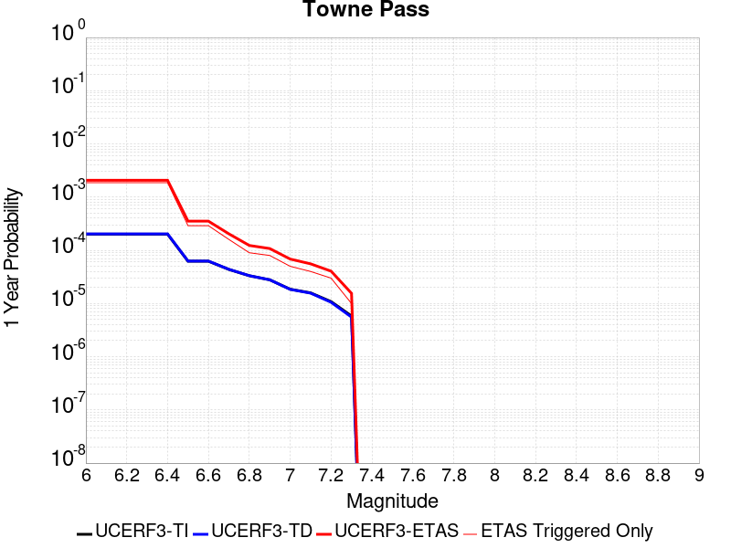 |  |

| Magnitude | 1 wk TI Prob | 1 wk TD Prob | 1 wk ETAS Prob | 1 wk ETAS/TD Gain | 1 wk ETAS Triggered Only | 1 mo TI Prob | 1 mo TD Prob | 1 mo ETAS Prob | 1 mo ETAS/TD Gain | 1 mo ETAS Triggered Only | 1 yr TI Prob | 1 yr TD Prob | 1 yr ETAS Prob | 1 yr ETAS/TD Gain | 1 yr ETAS Triggered Only | 10 yr TI Prob | 10 yr TD Prob | 10 yr ETAS Prob | 10 yr ETAS/TD Gain | 10 yr ETAS Triggered Only |
|-----|-----|-----|-----|-----|-----|-----|-----|-----|-----|-----|-----|-----|-----|-----|-----|-----|-----|-----|-----|-----|
| 6.0 | 3.849728E-6 | 3.894542E-6 | 0.0010938903 | 280.87778 | 0.00109 | 1.649873E-5 | 1.6690812E-5 | 0.0013666683 | 81.88148 | 0.00135 | 2.0085352E-4 | 2.0319606E-4 | 0.002072816 | 10.201064 | 0.00187 | 0.0020067208 | 0.0020305319 | 0.00437576 | 2.1549823 | 0.00235 |
| 6.1 | 3.849728E-6 | 3.894542E-6 | 0.0010938903 | 280.87778 | 0.00109 | 1.649873E-5 | 1.6690812E-5 | 0.0013666683 | 81.88148 | 0.00135 | 2.0085352E-4 | 2.0319606E-4 | 0.002072816 | 10.201064 | 0.00187 | 0.0020067208 | 0.0020305319 | 0.00437576 | 2.1549823 | 0.00235 |
| 6.2 | 3.849728E-6 | 3.894542E-6 | 0.0010938903 | 280.87778 | 0.00109 | 1.649873E-5 | 1.6690812E-5 | 0.0013666683 | 81.88148 | 0.00135 | 2.0085352E-4 | 2.0319606E-4 | 0.002072816 | 10.201064 | 0.00187 | 0.0020067208 | 0.0020305319 | 0.00437576 | 2.1549823 | 0.00235 |
| 6.3 | 3.849728E-6 | 3.894542E-6 | 0.0010938903 | 280.87778 | 0.00109 | 1.649873E-5 | 1.6690812E-5 | 0.0013666683 | 81.88148 | 0.00135 | 2.0085352E-4 | 2.0319606E-4 | 0.002072816 | 10.201064 | 0.00187 | 0.0020067208 | 0.0020305319 | 0.00437576 | 2.1549823 | 0.00235 |
| 6.4 | 3.849728E-6 | 3.894542E-6 | 0.0010938903 | 280.87778 | 0.00109 | 1.649873E-5 | 1.6690812E-5 | 0.0013666683 | 81.88148 | 0.00135 | 2.0085352E-4 | 2.0319606E-4 | 0.002072816 | 10.201064 | 0.00187 | 0.0020067208 | 0.0020305319 | 0.00437576 | 2.1549823 | 0.00235 |
| 6.5 | 1.1953545E-6 | 1.2030526E-6 | 2.2120279E-4 | 183.86792 | 2.2E-4 | 5.1229376E-6 | 5.15593E-6 | 2.5515465E-4 | 49.487606 | 2.5E-4 | 6.236998E-5 | 6.277176E-5 | 3.5275356E-4 | 5.6196218 | 2.9E-4 | 6.235248E-4 | 6.2755204E-4 | 0.0010173073 | 1.6210724 | 3.9E-4 |
| 6.6 | 1.1953545E-6 | 1.2030526E-6 | 2.2120279E-4 | 183.86792 | 2.2E-4 | 5.1229376E-6 | 5.15593E-6 | 2.5515465E-4 | 49.487606 | 2.5E-4 | 6.236998E-5 | 6.277176E-5 | 3.5275356E-4 | 5.6196218 | 2.9E-4 | 6.235248E-4 | 6.2755204E-4 | 0.0010173073 | 1.6210724 | 3.9E-4 |
| 6.7 | 8.375951E-7 | 8.410676E-7 | 1.1084098E-4 | 131.78604 | 1.1E-4 | 3.5896885E-6 | 3.6045708E-6 | 1.336041E-4 | 37.06519 | 1.3E-4 | 4.370358E-5 | 4.3884826E-5 | 2.038778E-4 | 4.645747 | 1.6E-4 | 4.3694986E-4 | 4.3876728E-4 | 6.78662E-4 | 1.546747 | 2.4E-4 |
| 6.8 | 6.38041E-7 | 6.3921624E-7 | 5.0639184E-5 | 79.22074 | 5.0E-5 | 2.7344586E-6 | 2.7394954E-6 | 7.2739305E-5 | 26.55208 | 7.0E-5 | 3.3291526E-5 | 3.3352884E-5 | 1.2334988E-4 | 3.6983273 | 9.0E-5 | 3.3286537E-4 | 3.334826E-4 | 4.6343924E-4 | 1.3896954 | 1.3E-4 |
| 6.9 | 5.3460053E-7 | 5.345339E-7 | 5.053451E-5 | 94.53939 | 5.0E-5 | 2.2911431E-6 | 2.2908578E-6 | 7.22907E-5 | 31.556171 | 7.0E-5 | 2.789431E-5 | 2.7890868E-5 | 1.07888634E-4 | 3.8682423 | 8.0E-5 | 2.789081E-4 | 2.78877E-4 | 3.8884633E-4 | 1.3943291 | 1.1E-4 |
| 7.0 | 3.557783E-7 | 3.5324283E-7 | 3.0353232E-5 | 85.92738 | 3.0E-5 | 1.5247632E-6 | 1.513897E-6 | 4.1513835E-5 | 27.421835 | 4.0E-5 | 1.8563835E-5 | 1.8431549E-5 | 6.843063E-5 | 3.7126899 | 5.0E-5 | 1.8562283E-4 | 1.8430105E-4 | 2.4429E-4 | 1.3254943 | 6.0E-5 |
| 7.1 | 3.037942E-7 | 3.0002275E-7 | 3.0300014E-5 | 100.992386 | 3.0E-5 | 1.3019744E-6 | 1.2858112E-6 | 4.128576E-5 | 32.108727 | 4.0E-5 | 1.5851423E-5 | 1.5654647E-5 | 5.565402E-5 | 3.555112 | 4.0E-5 | 1.5850292E-4 | 1.5653619E-4 | 2.0652836E-4 | 1.3193649 | 5.0E-5 |
| 7.2 | 2.0808248E-7 | 2.0217735E-7 | 3.020217E-5 | 149.38455 | 3.0E-5 | 8.917818E-7 | 8.6647407E-7 | 3.086645E-5 | 35.62305 | 3.0E-5 | 1.0857389E-5 | 1.0549275E-5 | 4.054896E-5 | 3.8437672 | 3.0E-5 | 1.0856859E-4 | 1.0548821E-4 | 1.45484E-4 | 1.3791493 | 4.0E-5 |
| 7.3 | 1.1162073E-7 | 1.0636902E-7 | 1.0106368E-5 | 95.01232 | 1.0E-5 | 4.7837443E-7 | 4.5586717E-7 | 1.0455863E-5 | 22.936205 | 1.0E-5 | 5.8241935E-6 | 5.5501705E-6 | 1.5550115E-5 | 2.8017364 | 1.0E-5 | 5.8240406E-5 | 5.550052E-5 | 7.549941E-5 | 1.360337 | 2.0E-5 |

## San Andreas (San Bernardino N)
*[(top)](#table-of-contents)*

| 1 Week | 1 Month | 1 Year | 10 Year |
|-----|-----|-----|-----|
|  |  |  |  |

| Magnitude | 1 wk TI Prob | 1 wk TD Prob | 1 wk ETAS Prob | 1 wk ETAS/TD Gain | 1 wk ETAS Triggered Only | 1 mo TI Prob | 1 mo TD Prob | 1 mo ETAS Prob | 1 mo ETAS/TD Gain | 1 mo ETAS Triggered Only | 1 yr TI Prob | 1 yr TD Prob | 1 yr ETAS Prob | 1 yr ETAS/TD Gain | 1 yr ETAS Triggered Only | 10 yr TI Prob | 10 yr TD Prob | 10 yr ETAS Prob | 10 yr ETAS/TD Gain | 10 yr ETAS Triggered Only |
|-----|-----|-----|-----|-----|-----|-----|-----|-----|-----|-----|-----|-----|-----|-----|-----|-----|-----|-----|-----|-----|
| 6.0 | 1.4273766E-4 | 3.160784E-4 | 0.0017856138 | 5.649275 | 0.00147 | 6.115894E-4 | 0.0013539245 | 0.002991704 | 2.2096536 | 0.00164 | 0.0074207084 | 0.016360939 | 0.018318381 | 1.1196412 | 0.00199 | 0.07177748 | 0.15021163 | 0.15212364 | 1.0127288 | 0.00225 |
| 6.1 | 1.4273766E-4 | 3.160784E-4 | 0.0017856138 | 5.649275 | 0.00147 | 6.115894E-4 | 0.0013539245 | 0.002991704 | 2.2096536 | 0.00164 | 0.0074207084 | 0.016360939 | 0.018318381 | 1.1196412 | 0.00199 | 0.07177748 | 0.15021163 | 0.15212364 | 1.0127288 | 0.00225 |
| 6.2 | 1.4273766E-4 | 3.160784E-4 | 0.0017856138 | 5.649275 | 0.00147 | 6.115894E-4 | 0.0013539245 | 0.002991704 | 2.2096536 | 0.00164 | 0.0074207084 | 0.016360939 | 0.018318381 | 1.1196412 | 0.00199 | 0.07177748 | 0.15021163 | 0.15212364 | 1.0127288 | 0.00225 |
| 6.3 | 1.3730655E-4 | 3.0512668E-4 | 0.0017746781 | 5.816201 | 0.00147 | 5.883239E-4 | 0.001307036 | 0.0029448925 | 2.2531073 | 0.00164 | 0.0071393442 | 0.015798455 | 0.017757017 | 1.1239717 | 0.00199 | 0.06914291 | 0.1455135 | 0.1474361 | 1.0132124 | 0.00225 |
| 6.4 | 1.3730655E-4 | 3.0512668E-4 | 0.0017746781 | 5.816201 | 0.00147 | 5.883239E-4 | 0.001307036 | 0.0029448925 | 2.2531073 | 0.00164 | 0.0071393442 | 0.015798455 | 0.017757017 | 1.1239717 | 0.00199 | 0.06914291 | 0.1455135 | 0.1474361 | 1.0132124 | 0.00225 |
| 6.5 | 1.2942807E-4 | 2.8927144E-4 | 0.001748849 | 6.0457025 | 0.00146 | 5.545738E-4 | 0.0012391509 | 0.0028571435 | 2.3057268 | 0.00162 | 0.0067310524 | 0.014983548 | 0.01692403 | 1.1295075 | 0.00197 | 0.06530788 | 0.13865088 | 0.14057168 | 1.0138535 | 0.00223 |
| 6.6 | 1.1125901E-4 | 2.5365927E-4 | 0.0017032914 | 6.71488 | 0.00145 | 4.767372E-4 | 0.0010866605 | 0.002694911 | 2.4799936 | 0.00161 | 0.005788839 | 0.0131504685 | 0.015074825 | 1.1463337 | 0.00195 | 0.056403454 | 0.12300496 | 0.124943115 | 1.0157567 | 0.00221 |
| 6.7 | 1.02209575E-4 | 2.3500937E-4 | 0.0016646733 | 7.0834336 | 0.00143 | 4.3796748E-4 | 0.0010067957 | 0.0025951948 | 2.5776777 | 0.00159 | 0.0053192247 | 0.012189267 | 0.014075985 | 1.1547853 | 0.00191 | 0.051936906 | 0.114792764 | 0.116713665 | 1.0167336 | 0.00217 |
| 6.8 | 9.610582E-5 | 2.2026796E-4 | 0.0016299573 | 7.399884 | 0.00141 | 4.1181705E-4 | 9.436647E-4 | 0.002512183 | 2.6621566 | 0.00157 | 0.0050023515 | 0.011428859 | 0.013297259 | 1.1634809 | 0.00189 | 0.048912346 | 0.10820469 | 0.11012205 | 1.0177197 | 0.00215 |
| 6.9 | 9.3877505E-5 | 2.1482339E-4 | 0.0016245205 | 7.562121 | 0.00141 | 4.0227012E-4 | 9.203475E-4 | 0.0024889025 | 2.7043073 | 0.00157 | 0.0048866454 | 0.011147907 | 0.013006949 | 1.1667615 | 0.00188 | 0.04780577 | 0.105798274 | 0.10771186 | 1.0180871 | 0.00214 |
| 7.0 | 9.1019785E-5 | 2.0809306E-4 | 0.0016177996 | 7.7744045 | 0.00141 | 3.900265E-4 | 8.915232E-4 | 0.0024601235 | 2.759461 | 0.00157 | 0.0047382377 | 0.0108004995 | 0.012660195 | 1.172186 | 0.00188 | 0.046384744 | 0.10276815 | 0.10467926 | 1.0185963 | 0.00213 |
| 7.1 | 8.771155E-5 | 1.9983841E-4 | 0.0015895606 | 7.95423 | 0.00139 | 3.758525E-4 | 8.5616973E-4 | 0.0024048428 | 2.8088386 | 0.00155 | 0.0045664064 | 0.010374243 | 0.01220505 | 1.1764762 | 0.00185 | 0.044737056 | 0.09907644 | 0.100968376 | 1.0190958 | 0.0021 |
| 7.2 | 8.0830236E-5 | 1.8389444E-4 | 0.0015736389 | 8.557294 | 0.00139 | 3.4636928E-4 | 7.8788114E-4 | 0.00233666 | 2.965752 | 0.00155 | 0.0042088944 | 0.009550368 | 0.0113827 | 1.1918598 | 0.00185 | 0.041300658 | 0.09180518 | 0.0937124 | 1.0207745 | 0.0021 |
| 7.3 | 7.7668235E-5 | 1.7333007E-4 | 0.0015630892 | 9.017991 | 0.00139 | 3.328214E-4 | 7.426318E-4 | 0.0022814882 | 3.072166 | 0.00154 | 0.0040445733 | 0.009004138 | 0.01082757 | 1.2025105 | 0.00184 | 0.03971748 | 0.08706761 | 0.088975646 | 1.0219144 | 0.00209 |
| 7.4 | 7.520177E-5 | 1.655312E-4 | 0.0015553011 | 9.395819 | 0.00139 | 3.2225347E-4 | 7.092266E-4 | 0.0022481345 | 3.1698394 | 0.00154 | 0.0039163795 | 0.008600714 | 0.010424888 | 1.2120957 | 0.00184 | 0.038480744 | 0.08352157 | 0.08542784 | 1.0228237 | 0.00208 |
| 7.5 | 7.274697E-5 | 1.584075E-4 | 0.0015381889 | 9.710328 | 0.00138 | 3.1173544E-4 | 6.7871273E-4 | 0.0022076743 | 3.2527375 | 0.00153 | 0.003788775 | 0.008232076 | 0.010047011 | 1.2204711 | 0.00183 | 0.03724827 | 0.08023654 | 0.082140446 | 1.0237287 | 0.00207 |
| 7.6 | 7.1185845E-5 | 1.5410586E-4 | 0.0015338932 | 9.953504 | 0.00138 | 3.0504653E-4 | 6.602866E-4 | 0.0021892763 | 3.3156457 | 0.00153 | 0.0037076178 | 0.0080094095 | 0.009824752 | 1.2266513 | 0.00183 | 0.036463667 | 0.07822661 | 0.08013468 | 1.0243915 | 0.00207 |
| 7.7 | 6.709961E-5 | 1.4319421E-4 | 0.0015229966 | 10.635881 | 0.00138 | 2.8753807E-4 | 6.135452E-4 | 0.0021426065 | 3.492174 | 0.00153 | 0.003495157 | 0.0074443663 | 0.009260743 | 1.2439935 | 0.00183 | 0.034406938 | 0.07305558 | 0.07497436 | 1.0262645 | 0.00207 |
| 7.8 | 6.300812E-5 | 1.320343E-4 | 0.0014818561 | 11.223266 | 0.00135 | 2.7000686E-4 | 5.657386E-4 | 0.00206489 | 3.6499012 | 0.0015 | 0.0032823787 | 0.006866143 | 0.008653784 | 1.260356 | 0.0018 | 0.032343175 | 0.06771385 | 0.06961571 | 1.0280868 | 0.00204 |
| 7.9 | 4.983037E-5 | 9.7241085E-5 | 0.0012571283 | 12.927955 | 0.00116 | 2.1354125E-4 | 4.1668097E-4 | 0.0016961476 | 4.070615 | 0.00128 | 0.0025967648 | 0.0050613005 | 0.006543759 | 1.2929008 | 0.00149 | 0.025666296 | 0.050650507 | 0.052245416 | 1.0314884 | 0.00168 |
| 8.0 | 3.2211527E-5 | 5.3306234E-5 | 4.2328652E-4 | 7.940657 | 3.7E-4 | 1.380421E-4 | 2.2843528E-4 | 6.3834165E-4 | 2.794409 | 4.1E-4 | 0.0016793669 | 0.0027776542 | 0.0032463488 | 1.1687375 | 4.7E-4 | 0.016667323 | 0.028362568 | 0.028896969 | 1.0188417 | 5.5E-4 |
| 8.1 | 1.743376E-5 | 1.8823403E-5 | 5.882265E-5 | 3.1249745 | 4.0E-5 | 7.471398E-5 | 8.066923E-5 | 1.306652E-4 | 1.619765 | 5.0E-5 | 9.0926304E-4 | 9.81706E-4 | 0.0010316569 | 1.0508817 | 5.0E-5 | 0.009055517 | 0.010483979 | 0.010533456 | 1.0047191 | 5.0E-5 |
| 8.2 | 7.831616E-6 | 5.1540533E-6 | 5.1540533E-6 | 1.0 | 0.0 | 3.3563636E-5 | 2.2088612E-5 | 2.2088612E-5 | 1.0 | 0.0 | 4.0856065E-4 | 2.6889573E-4 | 2.6889573E-4 | 1.0 | 0.0 | 0.004078103 | 0.0030413668 | 0.0030413668 | 1.0 | 0.0 |
| 8.3 | 1.983087E-6 | 7.6564595E-7 | 7.6564595E-7 | 1.0 | 0.0 | 8.498917E-6 | 3.281336E-6 | 3.281336E-6 | 1.0 | 0.0 | 1.034694E-4 | 3.9949547E-5 | 3.9949547E-5 | 1.0 | 0.0 | 0.0010342124 | 4.717979E-4 | 4.717979E-4 | 1.0 | 0.0 |

## Nelson Lake
*[(top)](#table-of-contents)*

| 1 Week | 1 Month | 1 Year | 10 Year |
|-----|-----|-----|-----|
|  |  |  |  |

| Magnitude | 1 wk TI Prob | 1 wk TD Prob | 1 wk ETAS Prob | 1 wk ETAS/TD Gain | 1 wk ETAS Triggered Only | 1 mo TI Prob | 1 mo TD Prob | 1 mo ETAS Prob | 1 mo ETAS/TD Gain | 1 mo ETAS Triggered Only | 1 yr TI Prob | 1 yr TD Prob | 1 yr ETAS Prob | 1 yr ETAS/TD Gain | 1 yr ETAS Triggered Only | 10 yr TI Prob | 10 yr TD Prob | 10 yr ETAS Prob | 10 yr ETAS/TD Gain | 10 yr ETAS Triggered Only |
|-----|-----|-----|-----|-----|-----|-----|-----|-----|-----|-----|-----|-----|-----|-----|-----|-----|-----|-----|-----|-----|
| 6.0 | 9.913453E-6 | 1.0192255E-5 | 5.8018643E-4 | 56.924244 | 5.7E-4 | 4.2485535E-5 | 4.3680422E-5 | 7.4364984E-4 | 17.024786 | 7.0E-4 | 5.1713863E-4 | 5.316897E-4 | 0.0016311049 | 3.067776 | 0.0011 | 0.0051593683 | 0.005305204 | 0.0068668746 | 1.2943659 | 0.00157 |
| 6.1 | 9.913453E-6 | 1.0192255E-5 | 5.8018643E-4 | 56.924244 | 5.7E-4 | 4.2485535E-5 | 4.3680422E-5 | 7.4364984E-4 | 17.024786 | 7.0E-4 | 5.1713863E-4 | 5.316897E-4 | 0.0016311049 | 3.067776 | 0.0011 | 0.0051593683 | 0.005305204 | 0.0068668746 | 1.2943659 | 0.00157 |
| 6.2 | 4.5596407E-6 | 4.696313E-6 | 2.7469505E-4 | 58.49164 | 2.7E-4 | 1.954117E-5 | 2.0126909E-5 | 3.1012108E-4 | 15.408282 | 2.9E-4 | 2.3788778E-4 | 2.4501883E-4 | 6.7491346E-4 | 2.7545373 | 4.3E-4 | 0.0023763329 | 0.0024476128 | 0.003135924 | 1.2812173 | 6.9E-4 |
| 6.3 | 4.5596407E-6 | 4.696313E-6 | 2.7469505E-4 | 58.49164 | 2.7E-4 | 1.954117E-5 | 2.0126909E-5 | 3.1012108E-4 | 15.408282 | 2.9E-4 | 2.3788778E-4 | 2.4501883E-4 | 6.7491346E-4 | 2.7545373 | 4.3E-4 | 0.0023763329 | 0.0024476128 | 0.003135924 | 1.2812173 | 6.9E-4 |
| 6.4 | 3.4025713E-6 | 3.5098972E-6 | 1.8350927E-4 | 52.28337 | 1.8E-4 | 1.4582367E-5 | 1.5042335E-5 | 2.1503933E-4 | 14.2956085 | 2.0E-4 | 1.7752586E-4 | 1.8312587E-4 | 5.1306543E-4 | 2.8017092 | 3.3E-4 | 0.001773841 | 0.0018298327 | 0.002358863 | 1.289114 | 5.3E-4 |
| 6.5 | 2.8352947E-6 | 2.927856E-6 | 1.7292736E-4 | 59.062794 | 1.7E-4 | 1.2151207E-5 | 1.2547898E-5 | 1.9254565E-4 | 15.3448515 | 1.8E-4 | 1.479309E-4 | 1.5276071E-4 | 4.3271793E-4 | 2.832652 | 2.8E-4 | 0.0014783246 | 0.0015266308 | 0.0020058982 | 1.3139379 | 4.8E-4 |
| 6.6 | 2.251518E-6 | 2.3290677E-6 | 1.3232876E-4 | 56.816196 | 1.3E-4 | 9.649328E-6 | 9.981683E-6 | 1.4998029E-4 | 15.02555 | 1.4E-4 | 1.1747423E-4 | 1.2152085E-4 | 3.514929E-4 | 2.8924494 | 2.3E-4 | 0.0011741214 | 0.0012146058 | 0.001604132 | 1.3207018 | 3.9E-4 |
| 6.7 | 1.8911853E-6 | 1.9591396E-6 | 1.219589E-4 | 62.251255 | 1.2E-4 | 8.105055E-6 | 8.39629E-6 | 1.383952E-4 | 16.4829 | 1.3E-4 | 9.867457E-5 | 1.0222061E-4 | 3.1219915E-4 | 3.0541701 | 2.1E-4 | 9.863076E-4 | 0.0010217935 | 0.0013814255 | 1.3519617 | 3.6E-4 |
| 6.8 | 1.4874814E-6 | 1.5438305E-6 | 1.1154366E-4 | 72.251236 | 1.1E-4 | 6.374905E-6 | 6.6164025E-6 | 1.266156E-4 | 19.136623 | 1.2E-4 | 7.76117E-5 | 8.055224E-5 | 2.6053775E-4 | 3.2343946 | 1.8E-4 | 7.75846E-4 | 8.0528157E-4 | 0.0011150319 | 1.3846486 | 3.1E-4 |
| 6.9 | 6.835972E-7 | 7.1399285E-7 | 7.071394E-5 | 99.04013 | 7.0E-5 | 2.9296991E-6 | 3.0599674E-6 | 8.305972E-5 | 27.14399 | 8.0E-5 | 3.56685E-5 | 3.7254784E-5 | 1.6724995E-4 | 4.4893546 | 1.3E-4 | 3.5662777E-4 | 3.7251666E-4 | 5.624459E-4 | 1.5098543 | 1.9E-4 |

## Paradise
*[(top)](#table-of-contents)*

| 1 Week | 1 Month | 1 Year | 10 Year |
|-----|-----|-----|-----|
|  |  |  |  |

| Magnitude | 1 wk TI Prob | 1 wk TD Prob | 1 wk ETAS Prob | 1 wk ETAS/TD Gain | 1 wk ETAS Triggered Only | 1 mo TI Prob | 1 mo TD Prob | 1 mo ETAS Prob | 1 mo ETAS/TD Gain | 1 mo ETAS Triggered Only | 1 yr TI Prob | 1 yr TD Prob | 1 yr ETAS Prob | 1 yr ETAS/TD Gain | 1 yr ETAS Triggered Only | 10 yr TI Prob | 10 yr TD Prob | 10 yr ETAS Prob | 10 yr ETAS/TD Gain | 10 yr ETAS Triggered Only |
|-----|-----|-----|-----|-----|-----|-----|-----|-----|-----|-----|-----|-----|-----|-----|-----|-----|-----|-----|-----|-----|
| 6.0 | 1.4851273E-5 | 1.6694768E-5 | 5.2668626E-4 | 31.547981 | 5.1E-4 | 6.364676E-5 | 7.154718E-5 | 7.015021E-4 | 9.804749 | 6.3E-4 | 7.7462377E-4 | 8.707624E-4 | 0.0017699787 | 2.032677 | 9.0E-4 | 0.0077192914 | 0.008675884 | 0.00982582 | 1.1325439 | 0.00116 |
| 6.1 | 1.4851273E-5 | 1.6694768E-5 | 5.2668626E-4 | 31.547981 | 5.1E-4 | 6.364676E-5 | 7.154718E-5 | 7.015021E-4 | 9.804749 | 6.3E-4 | 7.7462377E-4 | 8.707624E-4 | 0.0017699787 | 2.032677 | 9.0E-4 | 0.0077192914 | 0.008675884 | 0.00982582 | 1.1325439 | 0.00116 |
| 6.2 | 1.4851273E-5 | 1.6694768E-5 | 5.2668626E-4 | 31.547981 | 5.1E-4 | 6.364676E-5 | 7.154718E-5 | 7.015021E-4 | 9.804749 | 6.3E-4 | 7.7462377E-4 | 8.707624E-4 | 0.0017699787 | 2.032677 | 9.0E-4 | 0.0077192914 | 0.008675884 | 0.00982582 | 1.1325439 | 0.00116 |
| 6.3 | 1.0426831E-5 | 1.1888697E-5 | 2.3188608E-4 | 19.504751 | 2.2E-4 | 4.4685654E-5 | 5.09506E-5 | 3.2093684E-4 | 6.2989807 | 2.7E-4 | 5.43912E-4 | 6.201529E-4 | 0.0010099111 | 1.6284871 | 3.9E-4 | 0.0054258266 | 0.0061848317 | 0.0066916775 | 1.0819498 | 5.1E-4 |
| 6.4 | 1.0426831E-5 | 1.1888697E-5 | 2.3188608E-4 | 19.504751 | 2.2E-4 | 4.4685654E-5 | 5.09506E-5 | 3.2093684E-4 | 6.2989807 | 2.7E-4 | 5.43912E-4 | 6.201529E-4 | 0.0010099111 | 1.6284871 | 3.9E-4 | 0.0054258266 | 0.0061848317 | 0.0066916775 | 1.0819498 | 5.1E-4 |
| 6.5 | 9.25027E-6 | 1.0620037E-5 | 1.5061855E-4 | 14.182488 | 1.4E-4 | 3.964341E-5 | 4.551368E-5 | 2.3550504E-4 | 5.1743793 | 1.9E-4 | 4.8255164E-4 | 5.5399304E-4 | 8.3383796E-4 | 1.5051415 | 2.8E-4 | 0.0048150513 | 0.0055266195 | 0.005874685 | 1.0629798 | 3.5E-4 |
| 6.6 | 7.904275E-6 | 9.159602E-6 | 9.915878E-5 | 10.825664 | 9.0E-5 | 3.3875025E-5 | 3.925487E-5 | 1.5925016E-4 | 4.0568256 | 1.2E-4 | 4.1235037E-4 | 4.7782718E-4 | 6.277555E-4 | 1.313771 | 1.5E-4 | 0.0041158604 | 0.004768395 | 0.004967441 | 1.0417428 | 2.0E-4 |
| 6.7 | 7.2061953E-6 | 8.407326E-6 | 6.840682E-5 | 8.136573 | 6.0E-5 | 3.088333E-5 | 3.603092E-5 | 1.2602768E-4 | 3.4977646 | 9.0E-5 | 3.7593965E-4 | 4.3859181E-4 | 5.485436E-4 | 1.2506927 | 1.1E-4 | 0.003753043 | 0.004377631 | 0.0045269746 | 1.0341151 | 1.5E-4 |
| 6.8 | 6.6948724E-6 | 7.842242E-6 | 5.784185E-5 | 7.375678 | 5.0E-5 | 2.8691995E-5 | 3.3609194E-5 | 1.13606504E-4 | 3.380221 | 8.0E-5 | 3.4926904E-4 | 4.091187E-4 | 5.090778E-4 | 1.2443279 | 1.0E-4 | 0.003487206 | 0.0040840125 | 0.0042134817 | 1.0317014 | 1.3E-4 |
| 6.9 | 6.0421025E-6 | 7.1306963E-6 | 3.713048E-5 | 5.207133 | 3.0E-5 | 2.5894467E-5 | 3.0559786E-5 | 8.055826E-5 | 2.636087 | 5.0E-5 | 3.1521954E-4 | 3.7200528E-4 | 4.3198297E-4 | 1.1612281 | 6.0E-5 | 0.0031477278 | 0.0037141638 | 0.0038038297 | 1.0241416 | 9.0E-5 |
| 7.0 | 4.134091E-6 | 5.0803824E-6 | 1.5080332E-5 | 2.9683456 | 1.0E-5 | 1.7717413E-5 | 2.1772896E-5 | 3.1772677E-5 | 1.4592767 | 1.0E-5 | 2.1568815E-4 | 2.650543E-4 | 2.85049E-4 | 1.0754362 | 2.0E-5 | 0.0021547892 | 0.0026475347 | 0.0026674818 | 1.0075341 | 2.0E-5 |
| 7.1 | 3.7674888E-6 | 4.631936E-6 | 1.463189E-5 | 3.1589146 | 1.0E-5 | 1.6146281E-5 | 1.9851012E-5 | 2.9850813E-5 | 1.5037427 | 1.0E-5 | 1.9656324E-4 | 2.4166079E-4 | 2.6165595E-4 | 1.0827407 | 2.0E-5 | 0.0019638946 | 0.0024141306 | 0.0024340823 | 1.0082645 | 2.0E-5 |
| 7.2 | 3.4065345E-6 | 4.156782E-6 | 1.4156741E-5 | 3.405697 | 1.0E-5 | 1.4599351E-5 | 1.7814667E-5 | 2.7814489E-5 | 1.5613252 | 1.0E-5 | 1.777326E-4 | 2.168735E-4 | 2.3686915E-4 | 1.0921997 | 2.0E-5 | 0.0017759053 | 0.0021667667 | 0.0021867233 | 1.0092103 | 2.0E-5 |
| 7.3 | 2.9934936E-6 | 3.6293673E-6 | 1.3629331E-5 | 3.7552912 | 1.0E-5 | 1.2829195E-5 | 1.5554348E-5 | 2.555419E-5 | 1.6428971 | 1.0E-5 | 1.5618425E-4 | 1.8935918E-4 | 2.093554E-4 | 1.1055994 | 2.0E-5 | 0.0015607453 | 0.0018921237 | 0.0019120859 | 1.0105501 | 2.0E-5 |
| 7.4 | 2.4049796E-6 | 2.8890186E-6 | 1.288899E-5 | 4.4613733 | 1.0E-5 | 1.0307015E-5 | 1.2381457E-5 | 2.2381333E-5 | 1.8076494 | 1.0E-5 | 1.2548068E-4 | 1.5073526E-4 | 1.6073375E-4 | 1.0663315 | 1.0E-5 | 0.0012540985 | 0.0015064715 | 0.0015164565 | 1.006628 | 1.0E-5 |
| 7.5 | 1.2710091E-6 | 1.5134859E-6 | 1.5134859E-6 | 1.0 | 0.0 | 5.44717E-6 | 6.4863593E-6 | 6.4863593E-6 | 1.0 | 0.0 | 6.631728E-5 | 7.896981E-5 | 7.896981E-5 | 1.0 | 0.0 | 6.6297496E-4 | 7.895401E-4 | 7.895401E-4 | 1.0 | 0.0 |
| 7.6 | 2.21172E-7 | 2.6040198E-7 | 2.6040198E-7 | 1.0 | 0.0 | 9.478797E-7 | 1.1160082E-6 | 1.1160082E-6 | 1.0 | 0.0 | 1.1540374E-5 | 1.3587343E-5 | 1.3587343E-5 | 1.0 | 0.0 | 1.1539775E-4 | 1.3586794E-4 | 1.3586794E-4 | 1.0 | 0.0 |

## San Andreas (San Bernardino S)
*[(top)](#table-of-contents)*

| 1 Week | 1 Month | 1 Year | 10 Year |
|-----|-----|-----|-----|
|  |  |  |  |

| Magnitude | 1 wk TI Prob | 1 wk TD Prob | 1 wk ETAS Prob | 1 wk ETAS/TD Gain | 1 wk ETAS Triggered Only | 1 mo TI Prob | 1 mo TD Prob | 1 mo ETAS Prob | 1 mo ETAS/TD Gain | 1 mo ETAS Triggered Only | 1 yr TI Prob | 1 yr TD Prob | 1 yr ETAS Prob | 1 yr ETAS/TD Gain | 1 yr ETAS Triggered Only | 10 yr TI Prob | 10 yr TD Prob | 10 yr ETAS Prob | 10 yr ETAS/TD Gain | 10 yr ETAS Triggered Only |
|-----|-----|-----|-----|-----|-----|-----|-----|-----|-----|-----|-----|-----|-----|-----|-----|-----|-----|-----|-----|-----|
| 6.0 | 1.2336002E-4 | 3.0005194E-4 | 0.0010298329 | 3.4321823 | 7.3E-4 | 5.2857865E-4 | 0.0012853292 | 0.0021142624 | 1.6449189 | 8.3E-4 | 0.006416472 | 0.015541554 | 0.01649648 | 1.0614433 | 9.7E-4 | 0.06234337 | 0.14294699 | 0.14390689 | 1.006715 | 0.00112 |
| 6.1 | 1.2336002E-4 | 3.0005194E-4 | 0.0010298329 | 3.4321823 | 7.3E-4 | 5.2857865E-4 | 0.0012853292 | 0.0021142624 | 1.6449189 | 8.3E-4 | 0.006416472 | 0.015541554 | 0.01649648 | 1.0614433 | 9.7E-4 | 0.06234337 | 0.14294699 | 0.14390689 | 1.006715 | 0.00112 |
| 6.2 | 1.2336002E-4 | 3.0005194E-4 | 0.0010298329 | 3.4321823 | 7.3E-4 | 5.2857865E-4 | 0.0012853292 | 0.0021142624 | 1.6449189 | 8.3E-4 | 0.006416472 | 0.015541554 | 0.01649648 | 1.0614433 | 9.7E-4 | 0.06234337 | 0.14294699 | 0.14390689 | 1.006715 | 0.00112 |
| 6.3 | 1.1712257E-4 | 2.8793467E-4 | 0.0010177245 | 3.5345674 | 7.3E-4 | 5.018573E-4 | 0.0012334478 | 0.0020524363 | 1.6639832 | 8.2E-4 | 0.006093008 | 0.014918666 | 0.015864344 | 1.063389 | 9.6E-4 | 0.059286322 | 0.13765779 | 0.13861498 | 1.0069535 | 0.00111 |
| 6.4 | 1.1712257E-4 | 2.8793467E-4 | 0.0010177245 | 3.5345674 | 7.3E-4 | 5.018573E-4 | 0.0012334478 | 0.0020524363 | 1.6639832 | 8.2E-4 | 0.006093008 | 0.014918666 | 0.015864344 | 1.063389 | 9.6E-4 | 0.059286322 | 0.13765779 | 0.13861498 | 1.0069535 | 0.00111 |
| 6.5 | 1.0689076E-4 | 2.6806415E-4 | 9.878712E-4 | 3.6852043 | 7.2E-4 | 4.5802278E-4 | 0.0011483653 | 0.0019574352 | 1.7045405 | 8.1E-4 | 0.0055621783 | 0.013896335 | 0.014833134 | 1.0674133 | 9.5E-4 | 0.05425003 | 0.1288989 | 0.12985711 | 1.0074338 | 0.0011 |
| 6.6 | 9.7648895E-5 | 2.505129E-4 | 9.603351E-4 | 3.833475 | 7.1E-4 | 4.1842813E-4 | 0.0010732086 | 0.0018723501 | 1.7446282 | 8.0E-4 | 0.005082469 | 0.012992399 | 0.013920186 | 1.07141 | 9.4E-4 | 0.049677886 | 0.121077746 | 0.12202698 | 1.0078399 | 0.00108 |
| 6.7 | 8.757013E-5 | 2.3122175E-4 | 9.310599E-4 | 4.0266967 | 7.0E-4 | 3.7524657E-4 | 9.905964E-4 | 0.0017698237 | 1.7866244 | 7.8E-4 | 0.00455906 | 0.011997902 | 0.012906864 | 1.0757601 | 9.2E-4 | 0.04466656 | 0.112373024 | 0.113313906 | 1.0083729 | 0.00106 |
| 6.8 | 8.562978E-5 | 2.2682057E-4 | 9.2666177E-4 | 4.0854397 | 7.0E-4 | 3.6693315E-4 | 9.7174826E-4 | 0.0017509903 | 1.801897 | 7.8E-4 | 0.004458263 | 0.011770921 | 0.012680092 | 1.0772387 | 9.2E-4 | 0.043698758 | 0.11037863 | 0.11132163 | 1.0085433 | 0.00106 |
| 6.9 | 6.124075E-5 | 1.7066885E-4 | 8.405545E-4 | 4.925061 | 6.7E-4 | 2.6243398E-4 | 7.312337E-4 | 0.0014706926 | 2.0112484 | 7.4E-4 | 0.0031904527 | 0.008866636 | 0.009719011 | 1.0961328 | 8.6E-4 | 0.031450346 | 0.08420262 | 0.085109256 | 1.0107673 | 9.9E-4 |
| 7.0 | 5.8598747E-5 | 1.6495936E-4 | 8.3484885E-4 | 5.0609365 | 6.7E-4 | 2.5111332E-4 | 7.067779E-4 | 0.0014462549 | 2.046265 | 7.4E-4 | 0.0030530186 | 0.008571265 | 0.009423894 | 1.0994753 | 8.6E-4 | 0.03011414 | 0.08151562 | 0.08241573 | 1.0110422 | 9.8E-4 |
| 7.1 | 5.613814E-5 | 1.5914452E-4 | 8.190395E-4 | 5.146514 | 6.6E-4 | 2.4056983E-4 | 6.818704E-4 | 0.0014113727 | 2.0698547 | 7.3E-4 | 0.0029250039 | 0.008270353 | 0.009113323 | 1.1019268 | 8.5E-4 | 0.028868021 | 0.07881268 | 0.07970624 | 1.0113376 | 9.7E-4 |
| 7.2 | 4.991222E-5 | 1.4520933E-4 | 8.0511346E-4 | 5.5445027 | 6.6E-4 | 2.1389198E-4 | 6.221777E-4 | 0.0013517234 | 2.1725683 | 7.3E-4 | 0.002601025 | 0.0075488063 | 0.00839239 | 1.1117506 | 8.5E-4 | 0.025707912 | 0.07226191 | 0.07316181 | 1.0124534 | 9.7E-4 |
| 7.3 | 4.7410045E-5 | 1.371513E-4 | 7.970608E-4 | 5.8115435 | 6.6E-4 | 2.0317009E-4 | 5.8765925E-4 | 0.0013072361 | 2.22448 | 7.2E-4 | 0.0024707897 | 0.0071313656 | 0.007965375 | 1.1169496 | 8.4E-4 | 0.024434982 | 0.068541944 | 0.06943614 | 1.013046 | 9.6E-4 |
| 7.4 | 4.5556746E-5 | 1.3123035E-4 | 7.9114374E-4 | 6.0286646 | 6.6E-4 | 1.952286E-4 | 5.6229485E-4 | 0.00128189 | 2.279747 | 7.2E-4 | 0.002374317 | 0.0068245293 | 0.007648865 | 1.1207901 | 8.3E-4 | 0.023491086 | 0.06579143 | 0.06666958 | 1.0133476 | 9.4E-4 |
| 7.5 | 4.3084514E-5 | 1.2358342E-4 | 7.735031E-4 | 6.258955 | 6.5E-4 | 1.8463485E-4 | 5.2953605E-4 | 0.0012391601 | 2.3400865 | 7.1E-4 | 0.0022456115 | 0.0064281146 | 0.0072428435 | 1.1267446 | 8.2E-4 | 0.022230545 | 0.062190283 | 0.063062444 | 1.0140241 | 9.3E-4 |
| 7.6 | 3.408608E-5 | 9.836477E-5 | 7.3830184E-4 | 7.5057545 | 6.4E-4 | 1.4607502E-4 | 4.214953E-4 | 0.0011212003 | 2.660054 | 7.0E-4 | 0.0017770125 | 0.005119656 | 0.005925509 | 1.1574037 | 8.1E-4 | 0.017628696 | 0.05002244 | 0.050896417 | 1.0174718 | 9.2E-4 |
| 7.7 | 2.8315713E-5 | 8.2495724E-5 | 7.224429E-4 | 8.757338 | 6.4E-4 | 1.2134742E-4 | 3.5350522E-4 | 0.0010532577 | 2.9794688 | 7.0E-4 | 0.0014764034 | 0.004295442 | 0.0051019625 | 1.187762 | 8.1E-4 | 0.01466633 | 0.042272415 | 0.043153524 | 1.0208436 | 9.2E-4 |
| 7.8 | 2.6222975E-5 | 7.463898E-5 | 6.945927E-4 | 9.306032 | 6.2E-4 | 1.1237934E-4 | 3.1984213E-4 | 9.996246E-4 | 3.1253688 | 6.8E-4 | 0.0013673597 | 0.003887131 | 0.0046740603 | 1.2024447 | 7.9E-4 | 0.013589768 | 0.038437475 | 0.03930288 | 1.0225147 | 9.0E-4 |
| 7.9 | 2.1469694E-5 | 5.7884805E-5 | 6.478506E-4 | 11.192068 | 5.9E-4 | 9.200973E-5 | 2.4805416E-4 | 8.978929E-4 | 3.6197455 | 6.5E-4 | 0.0011196428 | 0.00301588 | 0.0037636182 | 1.2479336 | 7.5E-4 | 0.011140184 | 0.030153265 | 0.030987334 | 1.027661 | 8.6E-4 |
| 8.0 | 1.2420249E-5 | 3.1321662E-5 | 2.313154E-4 | 7.385157 | 2.0E-4 | 5.322855E-5 | 1.342288E-4 | 3.5419926E-4 | 2.6387725 | 2.2E-4 | 6.478649E-4 | 0.0016330116 | 0.0019025707 | 1.1650687 | 2.7E-4 | 0.0064597935 | 0.01652369 | 0.016828569 | 1.018451 | 3.1E-4 |
| 8.1 | 4.9197724E-6 | 7.822525E-6 | 1.7822445E-5 | 2.2783496 | 1.0E-5 | 2.1084568E-5 | 3.3524673E-5 | 4.352434E-5 | 1.2982777 | 1.0E-5 | 2.566744E-4 | 4.080866E-4 | 4.1808252E-4 | 1.0244946 | 1.0E-5 | 0.002563781 | 0.004384557 | 0.004394513 | 1.0022707 | 1.0E-5 |
| 8.2 | 2.5634774E-6 | 2.9065757E-6 | 2.9065757E-6 | 1.0 | 0.0 | 1.0986286E-5 | 1.2456694E-5 | 1.2456694E-5 | 1.0 | 0.0 | 1.3374983E-4 | 1.5164974E-4 | 1.5164974E-4 | 1.0 | 0.0 | 0.0013366934 | 0.001704941 | 0.001704941 | 1.0 | 0.0 |
| 8.3 | 5.2850464E-7 | 3.2080476E-7 | 3.2080476E-7 | 1.0 | 0.0 | 2.2650179E-6 | 1.3748769E-6 | 1.3748769E-6 | 1.0 | 0.0 | 2.7576245E-5 | 1.673901E-5 | 1.673901E-5 | 1.0 | 0.0 | 2.7572823E-4 | 1.986671E-4 | 1.986671E-4 | 1.0 | 0.0 |

## Bicycle Lake
*[(top)](#table-of-contents)*

| 1 Week | 1 Month | 1 Year | 10 Year |
|-----|-----|-----|-----|
|  |  |  |  |

| Magnitude | 1 wk TI Prob | 1 wk TD Prob | 1 wk ETAS Prob | 1 wk ETAS/TD Gain | 1 wk ETAS Triggered Only | 1 mo TI Prob | 1 mo TD Prob | 1 mo ETAS Prob | 1 mo ETAS/TD Gain | 1 mo ETAS Triggered Only | 1 yr TI Prob | 1 yr TD Prob | 1 yr ETAS Prob | 1 yr ETAS/TD Gain | 1 yr ETAS Triggered Only | 10 yr TI Prob | 10 yr TD Prob | 10 yr ETAS Prob | 10 yr ETAS/TD Gain | 10 yr ETAS Triggered Only |
|-----|-----|-----|-----|-----|-----|-----|-----|-----|-----|-----|-----|-----|-----|-----|-----|-----|-----|-----|-----|-----|
| 6.0 | 1.9621975E-5 | 2.2097078E-5 | 5.720849E-4 | 25.889618 | 5.5E-4 | 8.4091465E-5 | 9.4699084E-5 | 7.8463374E-4 | 8.285547 | 6.9E-4 | 0.0010233327 | 0.0011524865 | 0.0020814147 | 1.8060209 | 9.3E-4 | 0.01018633 | 0.011478408 | 0.012575667 | 1.0955933 | 0.00111 |
| 6.1 | 1.9621975E-5 | 2.2097078E-5 | 5.720849E-4 | 25.889618 | 5.5E-4 | 8.4091465E-5 | 9.4699084E-5 | 7.8463374E-4 | 8.285547 | 6.9E-4 | 0.0010233327 | 0.0011524865 | 0.0020814147 | 1.8060209 | 9.3E-4 | 0.01018633 | 0.011478408 | 0.012575667 | 1.0955933 | 0.00111 |
| 6.2 | 9.9971285E-6 | 1.125564E-5 | 3.4125193E-4 | 30.318306 | 3.3E-4 | 4.2844134E-5 | 4.8237856E-5 | 4.5821807E-4 | 9.499139 | 4.1E-4 | 5.2150246E-4 | 5.871897E-4 | 0.0011268726 | 1.9190947 | 5.4E-4 | 0.0052028033 | 0.005861487 | 0.0064778524 | 1.1051552 | 6.2E-4 |
| 6.3 | 9.589428E-6 | 1.0798346E-5 | 3.20795E-4 | 29.70779 | 3.1E-4 | 4.10969E-5 | 4.62781E-5 | 4.3626004E-4 | 9.426923 | 3.9E-4 | 5.002399E-4 | 5.6334207E-4 | 0.0010830491 | 1.9225427 | 5.2E-4 | 0.0049911533 | 0.0056242296 | 0.0062208553 | 1.1060812 | 6.0E-4 |
| 6.4 | 9.589428E-6 | 1.0798346E-5 | 3.20795E-4 | 29.70779 | 3.1E-4 | 4.10969E-5 | 4.62781E-5 | 4.3626004E-4 | 9.426923 | 3.9E-4 | 5.002399E-4 | 5.6334207E-4 | 0.0010830491 | 1.9225427 | 5.2E-4 | 0.0049911533 | 0.0056242296 | 0.0062208553 | 1.1060812 | 6.0E-4 |
| 6.5 | 5.557707E-6 | 6.2856016E-6 | 2.2628422E-4 | 36.00041 | 2.2E-4 | 2.3818526E-5 | 2.6938165E-5 | 2.969309E-4 | 11.022684 | 2.7E-4 | 2.8995197E-4 | 3.279497E-4 | 6.4784475E-4 | 1.9754394 | 3.2E-4 | 0.0028957394 | 0.0032772934 | 0.0036460808 | 1.1125281 | 3.7E-4 |
| 6.6 | 4.8742945E-6 | 5.5132896E-6 | 1.655124E-4 | 30.020626 | 1.6E-4 | 2.0889667E-5 | 2.3628318E-5 | 2.2362359E-4 | 9.464219 | 2.0E-4 | 2.54302E-4 | 2.87663E-4 | 5.2759395E-4 | 1.8340696 | 2.4E-4 | 0.002540112 | 0.0028754752 | 0.0031546701 | 1.0970953 | 2.8E-4 |
| 6.7 | 3.991108E-6 | 4.5159104E-6 | 1.3451533E-4 | 29.786978 | 1.3E-4 | 1.7104636E-5 | 1.9353902E-5 | 1.8935061E-4 | 9.783588 | 1.7E-4 | 2.0822904E-4 | 2.3563375E-4 | 4.4558427E-4 | 1.8910036 | 2.1E-4 | 0.0020803404 | 0.0023563374 | 0.0026057484 | 1.1058469 | 2.5E-4 |

## Helendale-So Lockhart
*[(top)](#table-of-contents)*

| 1 Week | 1 Month | 1 Year | 10 Year |
|-----|-----|-----|-----|
|  |  |  |  |

| Magnitude | 1 wk TI Prob | 1 wk TD Prob | 1 wk ETAS Prob | 1 wk ETAS/TD Gain | 1 wk ETAS Triggered Only | 1 mo TI Prob | 1 mo TD Prob | 1 mo ETAS Prob | 1 mo ETAS/TD Gain | 1 mo ETAS Triggered Only | 1 yr TI Prob | 1 yr TD Prob | 1 yr ETAS Prob | 1 yr ETAS/TD Gain | 1 yr ETAS Triggered Only | 10 yr TI Prob | 10 yr TD Prob | 10 yr ETAS Prob | 10 yr ETAS/TD Gain | 10 yr ETAS Triggered Only |
|-----|-----|-----|-----|-----|-----|-----|-----|-----|-----|-----|-----|-----|-----|-----|-----|-----|-----|-----|-----|-----|
| 6.0 | 1.7296055E-5 | 1.8103729E-5 | 3.5809758E-4 | 19.780321 | 3.4E-4 | 7.412385E-5 | 7.7585224E-5 | 4.8755342E-4 | 6.2841015 | 4.1E-4 | 9.0208417E-4 | 9.4421144E-4 | 0.0015836072 | 1.6771743 | 6.4E-4 | 0.008984311 | 0.009404116 | 0.010216405 | 1.0863758 | 8.2E-4 |
| 6.1 | 1.7296055E-5 | 1.8103729E-5 | 3.5809758E-4 | 19.780321 | 3.4E-4 | 7.412385E-5 | 7.7585224E-5 | 4.8755342E-4 | 6.2841015 | 4.1E-4 | 9.0208417E-4 | 9.4421144E-4 | 0.0015836072 | 1.6771743 | 6.4E-4 | 0.008984311 | 0.009404116 | 0.010216405 | 1.0863758 | 8.2E-4 |
| 6.2 | 1.7296055E-5 | 1.8103729E-5 | 3.5809758E-4 | 19.780321 | 3.4E-4 | 7.412385E-5 | 7.7585224E-5 | 4.8755342E-4 | 6.2841015 | 4.1E-4 | 9.0208417E-4 | 9.4421144E-4 | 0.0015836072 | 1.6771743 | 6.4E-4 | 0.008984311 | 0.009404116 | 0.010216405 | 1.0863758 | 8.2E-4 |
| 6.3 | 1.0669118E-5 | 1.1135425E-5 | 2.2113309E-4 | 19.858522 | 2.1E-4 | 4.5723988E-5 | 4.772239E-5 | 3.0770997E-4 | 6.4479165 | 2.6E-4 | 5.5654737E-4 | 5.80868E-4 | 0.001000624 | 1.7226359 | 4.2E-4 | 0.0055515557 | 0.0057937936 | 0.0063306647 | 1.0926632 | 5.4E-4 |
| 6.4 | 1.0669118E-5 | 1.1135425E-5 | 2.2113309E-4 | 19.858522 | 2.1E-4 | 4.5723988E-5 | 4.772239E-5 | 3.0770997E-4 | 6.4479165 | 2.6E-4 | 5.5654737E-4 | 5.80868E-4 | 0.001000624 | 1.7226359 | 4.2E-4 | 0.0055515557 | 0.0057937936 | 0.0063306647 | 1.0926632 | 5.4E-4 |
| 6.5 | 8.790038E-6 | 9.170197E-6 | 1.8916855E-4 | 20.628624 | 1.8E-4 | 3.767105E-5 | 3.930026E-5 | 2.49292E-4 | 6.343266 | 2.1E-4 | 4.585485E-4 | 4.7837716E-4 | 8.082193E-4 | 1.6895022 | 3.3E-4 | 0.0045760344 | 0.004773638 | 0.0051916335 | 1.0875632 | 4.2E-4 |
| 6.6 | 7.396949E-6 | 7.715537E-6 | 1.7771423E-4 | 23.033293 | 1.7E-4 | 3.1700827E-5 | 3.3066175E-5 | 2.2305989E-4 | 6.7458634 | 1.9E-4 | 3.858892E-4 | 4.025073E-4 | 6.7239866E-4 | 1.6705253 | 2.7E-4 | 0.003852198 | 0.00401789 | 0.0043664835 | 1.0867604 | 3.5E-4 |
| 6.7 | 6.4600285E-6 | 6.738031E-6 | 1.4673709E-4 | 21.777443 | 1.4E-4 | 2.7685543E-5 | 2.887696E-5 | 1.8887233E-4 | 6.5405893 | 1.6E-4 | 3.3701936E-4 | 3.5152107E-4 | 5.714437E-4 | 1.6256316 | 2.2E-4 | 0.0033650869 | 0.003509732 | 0.003808679 | 1.0851766 | 3.0E-4 |
| 6.8 | 5.600104E-6 | 5.836009E-6 | 1.05835425E-4 | 18.134897 | 1.0E-4 | 2.4000226E-5 | 2.5011232E-5 | 1.3500848E-4 | 5.397914 | 1.1E-4 | 2.9216358E-4 | 3.044698E-4 | 4.5442412E-4 | 1.4925097 | 1.5E-4 | 0.0029177975 | 0.003040588 | 0.0032300104 | 1.0622979 | 1.9E-4 |
| 6.9 | 4.839122E-6 | 5.0395092E-6 | 8.503911E-5 | 16.874481 | 8.0E-5 | 2.0738931E-5 | 2.159772E-5 | 1.1159578E-4 | 5.1670165 | 9.0E-5 | 2.5246723E-4 | 2.6292098E-4 | 3.7289207E-4 | 1.4182667 | 1.1E-4 | 0.002521806 | 0.002626147 | 0.002775753 | 1.0569679 | 1.5E-4 |
| 7.0 | 3.6937633E-6 | 3.845208E-6 | 7.384494E-5 | 19.204407 | 7.0E-5 | 1.5830317E-5 | 1.647936E-5 | 8.6478205E-5 | 5.247668 | 7.0E-5 | 1.9271708E-4 | 2.0061806E-4 | 2.80602E-4 | 1.3986877 | 8.0E-5 | 0.0019255003 | 0.002004401 | 0.0021141805 | 1.0547693 | 1.1E-4 |
| 7.1 | 2.7858857E-6 | 2.8978538E-6 | 6.289768E-5 | 21.704918 | 6.0E-5 | 1.1939455E-5 | 1.2419316E-5 | 7.2418574E-5 | 5.8311243 | 6.0E-5 | 1.4535317E-4 | 1.511949E-4 | 2.1118582E-4 | 1.3967788 | 6.0E-5 | 0.0014525814 | 0.0015109418 | 0.001580836 | 1.0462587 | 7.0E-5 |
| 7.2 | 2.1672065E-6 | 2.2540128E-6 | 5.22539E-5 | 23.18261 | 5.0E-5 | 9.2879945E-6 | 9.66002E-6 | 5.965954E-5 | 6.175923 | 5.0E-5 | 1.1307546E-4 | 1.1760458E-4 | 1.675987E-4 | 1.4251035 | 5.0E-5 | 0.0011301794 | 0.0011754417 | 0.0012353711 | 1.0509846 | 6.0E-5 |
| 7.3 | 1.4823496E-6 | 1.5422102E-6 | 5.1542134E-5 | 33.42095 | 5.0E-5 | 6.3529114E-6 | 6.6094562E-6 | 5.6609126E-5 | 8.564869 | 5.0E-5 | 7.734395E-5 | 8.046731E-5 | 1.3046329E-4 | 1.6213204 | 5.0E-5 | 7.731704E-4 | 8.0439687E-4 | 8.543567E-4 | 1.0621084 | 5.0E-5 |
| 7.4 | 4.2321457E-7 | 4.4108765E-7 | 4.4108765E-7 | 1.0 | 0.0 | 1.8137755E-6 | 1.8903745E-6 | 1.8903745E-6 | 1.0 | 0.0 | 2.2082493E-5 | 2.3015113E-5 | 2.3015113E-5 | 1.0 | 0.0 | 2.2080299E-4 | 2.3013182E-4 | 2.3013182E-4 | 1.0 | 0.0 |
| 7.5 | 5.6942316E-8 | 5.9415648E-8 | 5.9415648E-8 | 1.0 | 0.0 | 2.440385E-7 | 2.5463845E-7 | 2.5463845E-7 | 1.0 | 0.0 | 2.9711643E-6 | 3.1002196E-6 | 3.1002196E-6 | 1.0 | 0.0 | 2.9711247E-5 | 3.1001844E-5 | 3.1001844E-5 | 1.0 | 0.0 |

## Garlic Springs
*[(top)](#table-of-contents)*

| 1 Week | 1 Month | 1 Year | 10 Year |
|-----|-----|-----|-----|
|  |  |  |  |

| Magnitude | 1 wk TI Prob | 1 wk TD Prob | 1 wk ETAS Prob | 1 wk ETAS/TD Gain | 1 wk ETAS Triggered Only | 1 mo TI Prob | 1 mo TD Prob | 1 mo ETAS Prob | 1 mo ETAS/TD Gain | 1 mo ETAS Triggered Only | 1 yr TI Prob | 1 yr TD Prob | 1 yr ETAS Prob | 1 yr ETAS/TD Gain | 1 yr ETAS Triggered Only | 10 yr TI Prob | 10 yr TD Prob | 10 yr ETAS Prob | 10 yr ETAS/TD Gain | 10 yr ETAS Triggered Only |
|-----|-----|-----|-----|-----|-----|-----|-----|-----|-----|-----|-----|-----|-----|-----|-----|-----|-----|-----|-----|-----|
| 6.0 | 1.6760017E-5 | 1.8776833E-5 | 4.4876875E-4 | 23.900131 | 4.3E-4 | 7.182667E-5 | 8.0470316E-5 | 5.704309E-4 | 7.0887117 | 4.9E-4 | 8.7413884E-4 | 9.794032E-4 | 0.0015987959 | 1.6324186 | 6.2E-4 | 0.008707083 | 0.009762413 | 0.010534799 | 1.0791183 | 7.8E-4 |
| 6.1 | 9.852767E-6 | 1.0973587E-5 | 2.6097085E-4 | 23.781727 | 2.5E-4 | 4.222546E-5 | 4.702921E-5 | 3.170165E-4 | 6.740843 | 2.7E-4 | 5.139737E-4 | 5.7250116E-4 | 9.3229505E-4 | 1.6284597 | 3.6E-4 | 0.005127866 | 0.005717221 | 0.0061646486 | 1.0782596 | 4.5E-4 |
| 6.2 | 9.852767E-6 | 1.0973587E-5 | 2.6097085E-4 | 23.781727 | 2.5E-4 | 4.222546E-5 | 4.702921E-5 | 3.170165E-4 | 6.740843 | 2.7E-4 | 5.139737E-4 | 5.7250116E-4 | 9.3229505E-4 | 1.6284597 | 3.6E-4 | 0.005127866 | 0.005717221 | 0.0061646486 | 1.0782596 | 4.5E-4 |
| 6.3 | 4.3167724E-6 | 4.7780286E-6 | 1.0477755E-4 | 21.929033 | 1.0E-4 | 1.8500323E-5 | 2.0477235E-5 | 1.3047497E-4 | 6.3717093 | 1.1E-4 | 2.2521814E-4 | 2.4930484E-4 | 4.0926496E-4 | 1.6416246 | 1.6E-4 | 0.0022499003 | 0.00249251 | 0.0027319118 | 1.0960485 | 2.4E-4 |
| 6.4 | 4.3167724E-6 | 4.7780286E-6 | 1.0477755E-4 | 21.929033 | 1.0E-4 | 1.8500323E-5 | 2.0477235E-5 | 1.3047497E-4 | 6.3717093 | 1.1E-4 | 2.2521814E-4 | 2.4930484E-4 | 4.0926496E-4 | 1.6416246 | 1.6E-4 | 0.0022499003 | 0.00249251 | 0.0027319118 | 1.0960485 | 2.4E-4 |
| 6.5 | 4.3167724E-6 | 4.7780286E-6 | 1.0477755E-4 | 21.929033 | 1.0E-4 | 1.8500323E-5 | 2.0477235E-5 | 1.3047497E-4 | 6.3717093 | 1.1E-4 | 2.2521814E-4 | 2.4930484E-4 | 4.0926496E-4 | 1.6416246 | 1.6E-4 | 0.0022499003 | 0.00249251 | 0.0027319118 | 1.0960485 | 2.4E-4 |
| 6.6 | 4.301311E-6 | 4.760897E-6 | 1.04760424E-4 | 22.004345 | 1.0E-4 | 1.8434059E-5 | 2.0403815E-5 | 1.3040158E-4 | 6.391039 | 1.1E-4 | 2.2441156E-4 | 2.4841115E-4 | 4.0837142E-4 | 1.6439334 | 1.6E-4 | 0.0022418506 | 0.002483593 | 0.002722997 | 1.0963942 | 2.4E-4 |
| 6.7 | 3.8599724E-6 | 4.27106E-6 | 9.4270676E-5 | 22.071962 | 9.0E-5 | 1.6542634E-5 | 1.8304541E-5 | 1.083029E-4 | 5.9167223 | 9.0E-5 | 2.0138794E-4 | 2.228578E-4 | 3.628266E-4 | 1.6280633 | 1.4E-4 | 0.0020120554 | 0.002228578 | 0.0024480878 | 1.0984976 | 2.2E-4 |

## Death Valley (Black Mtns Frontal)
*[(top)](#table-of-contents)*

| 1 Week | 1 Month | 1 Year | 10 Year |
|-----|-----|-----|-----|
|  |  |  |  |

| Magnitude | 1 wk TI Prob | 1 wk TD Prob | 1 wk ETAS Prob | 1 wk ETAS/TD Gain | 1 wk ETAS Triggered Only | 1 mo TI Prob | 1 mo TD Prob | 1 mo ETAS Prob | 1 mo ETAS/TD Gain | 1 mo ETAS Triggered Only | 1 yr TI Prob | 1 yr TD Prob | 1 yr ETAS Prob | 1 yr ETAS/TD Gain | 1 yr ETAS Triggered Only | 10 yr TI Prob | 10 yr TD Prob | 10 yr ETAS Prob | 10 yr ETAS/TD Gain | 10 yr ETAS Triggered Only |
|-----|-----|-----|-----|-----|-----|-----|-----|-----|-----|-----|-----|-----|-----|-----|-----|-----|-----|-----|-----|-----|
| 6.0 | 1.6707214E-5 | 1.867027E-5 | 3.7866354E-4 | 20.281633 | 3.6E-4 | 7.160038E-5 | 8.001303E-5 | 5.099786E-4 | 6.373695 | 4.3E-4 | 8.71386E-4 | 9.737309E-4 | 0.001513205 | 1.554028 | 5.4E-4 | 0.00867977 | 0.009695496 | 0.010349098 | 1.0674129 | 6.6E-4 |
| 6.1 | 1.6707214E-5 | 1.867027E-5 | 3.7866354E-4 | 20.281633 | 3.6E-4 | 7.160038E-5 | 8.001303E-5 | 5.099786E-4 | 6.373695 | 4.3E-4 | 8.71386E-4 | 9.737309E-4 | 0.001513205 | 1.554028 | 5.4E-4 | 0.00867977 | 0.009695496 | 0.010349098 | 1.0674129 | 6.6E-4 |
| 6.2 | 1.6707214E-5 | 1.867027E-5 | 3.7866354E-4 | 20.281633 | 3.6E-4 | 7.160038E-5 | 8.001303E-5 | 5.099786E-4 | 6.373695 | 4.3E-4 | 8.71386E-4 | 9.737309E-4 | 0.001513205 | 1.554028 | 5.4E-4 | 0.00867977 | 0.009695496 | 0.010349098 | 1.0674129 | 6.6E-4 |
| 6.3 | 1.6707214E-5 | 1.867027E-5 | 3.7866354E-4 | 20.281633 | 3.6E-4 | 7.160038E-5 | 8.001303E-5 | 5.099786E-4 | 6.373695 | 4.3E-4 | 8.71386E-4 | 9.737309E-4 | 0.001513205 | 1.554028 | 5.4E-4 | 0.00867977 | 0.009695496 | 0.010349098 | 1.0674129 | 6.6E-4 |
| 6.4 | 1.5515609E-5 | 1.7338214E-5 | 3.3733266E-4 | 19.456022 | 3.2E-4 | 6.649377E-5 | 7.4304546E-5 | 4.542763E-4 | 6.113708 | 3.8E-4 | 8.0926094E-4 | 9.042885E-4 | 0.0013938454 | 1.5413724 | 4.9E-4 | 0.008063202 | 0.009006773 | 0.009601369 | 1.0660166 | 6.0E-4 |
| 6.5 | 1.5515609E-5 | 1.7338214E-5 | 3.3733266E-4 | 19.456022 | 3.2E-4 | 6.649377E-5 | 7.4304546E-5 | 4.542763E-4 | 6.113708 | 3.8E-4 | 8.0926094E-4 | 9.042885E-4 | 0.0013938454 | 1.5413724 | 4.9E-4 | 0.008063202 | 0.009006773 | 0.009601369 | 1.0660166 | 6.0E-4 |
| 6.6 | 1.5041828E-5 | 1.6809145E-5 | 3.0680426E-4 | 18.252224 | 2.9E-4 | 6.4463384E-5 | 7.203723E-5 | 4.2201203E-4 | 5.858248 | 3.5E-4 | 7.8455906E-4 | 8.767063E-4 | 0.0013363031 | 1.5242311 | 4.6E-4 | 0.00781795 | 0.008733132 | 0.009288242 | 1.0635636 | 5.6E-4 |
| 6.7 | 1.4634985E-5 | 1.6356016E-5 | 2.7635176E-4 | 16.89603 | 2.6E-4 | 6.271985E-5 | 7.009536E-5 | 3.8007364E-4 | 5.4222364 | 3.1E-4 | 7.6334673E-4 | 8.5308263E-4 | 0.0012627329 | 1.4801999 | 4.1E-4 | 0.007607299 | 0.008498715 | 0.0090043815 | 1.059499 | 5.1E-4 |
| 6.8 | 1.4209158E-5 | 1.5882048E-5 | 2.5587823E-4 | 16.111162 | 2.4E-4 | 6.089497E-5 | 6.8064175E-5 | 3.480451E-4 | 5.113485 | 2.8E-4 | 7.4114406E-4 | 8.2837185E-4 | 0.001208057 | 1.4583511 | 3.8E-4 | 0.007386771 | 0.008253456 | 0.00870966 | 1.0552742 | 4.6E-4 |
| 6.9 | 1.3780098E-5 | 1.5404594E-5 | 2.554009E-4 | 16.579529 | 2.4E-4 | 5.9056227E-5 | 6.6018045E-5 | 3.4599955E-4 | 5.240985 | 2.8E-4 | 7.1877235E-4 | 8.0347876E-4 | 0.0011731815 | 1.4601276 | 3.7E-4 | 0.0071645193 | 0.008006332 | 0.00845273 | 1.0557555 | 4.5E-4 |
| 7.0 | 1.3585064E-5 | 1.5188155E-5 | 2.551845E-4 | 16.801548 | 2.4E-4 | 5.8220405E-5 | 6.50905E-5 | 3.4507227E-4 | 5.301423 | 2.8E-4 | 7.086029E-4 | 7.9219416E-4 | 0.001161901 | 1.4666872 | 3.7E-4 | 0.007063476 | 0.007894293 | 0.00833082 | 1.0552964 | 4.4E-4 |
| 7.1 | 1.3398601E-5 | 1.49813395E-5 | 2.3497804E-4 | 15.684715 | 2.2E-4 | 5.742131E-5 | 6.420419E-5 | 3.241875E-4 | 5.0493197 | 2.6E-4 | 6.9888023E-4 | 7.8141113E-4 | 0.0011111533 | 1.4219829 | 3.3E-4 | 0.0069668638 | 0.007787224 | 0.0081741875 | 1.049692 | 3.9E-4 |
| 7.2 | 1.3126312E-5 | 1.4679561E-5 | 2.0467678E-4 | 13.942977 | 1.9E-4 | 5.6254412E-5 | 6.291092E-5 | 2.9289644E-4 | 4.655733 | 2.3E-4 | 6.846822E-4 | 7.6567667E-4 | 0.0010554546 | 1.3784599 | 2.9E-4 | 0.006825765 | 0.00763097 | 0.007968375 | 1.0442153 | 3.4E-4 |
| 7.3 | 1.2922429E-5 | 1.4453788E-5 | 1.9445119E-4 | 13.453302 | 1.8E-4 | 5.5380664E-5 | 6.194336E-5 | 2.7193036E-4 | 4.3899837 | 2.1E-4 | 6.74051E-4 | 7.53905E-4 | 0.0010137089 | 1.344611 | 2.6E-4 | 0.006720101 | 0.007514055 | 0.007821726 | 1.040946 | 3.1E-4 |
| 7.4 | 1.2768878E-5 | 1.4283772E-5 | 1.942812E-4 | 13.601534 | 1.8E-4 | 5.4722615E-5 | 6.1214756E-5 | 2.712019E-4 | 4.4303355 | 2.1E-4 | 6.660441E-4 | 7.4504025E-4 | 0.0010048465 | 1.3487145 | 2.6E-4 | 0.0066405144 | 0.0074260035 | 0.0077337013 | 1.0414352 | 3.1E-4 |
| 7.5 | 1.2521929E-5 | 1.40120155E-5 | 1.940095E-4 | 13.845938 | 1.8E-4 | 5.366431E-5 | 6.005014E-5 | 2.6003813E-4 | 4.33035 | 2.0E-4 | 6.531671E-4 | 7.3087064E-4 | 9.706952E-4 | 1.3281355 | 2.4E-4 | 0.006512506 | 0.0072852457 | 0.007573133 | 1.0395164 | 2.9E-4 |
| 7.6 | 1.1301089E-5 | 1.2648149E-5 | 1.6264625E-4 | 12.859293 | 1.5E-4 | 4.8432343E-5 | 5.4205255E-5 | 2.1419658E-4 | 3.9515834 | 1.6E-4 | 5.895042E-4 | 6.5975444E-4 | 8.496291E-4 | 1.2877959 | 1.9E-4 | 0.0058794282 | 0.00657851 | 0.006806997 | 1.0347323 | 2.3E-4 |
| 7.7 | 9.189108E-6 | 1.0283358E-5 | 1.20282224E-4 | 11.696785 | 1.1E-4 | 3.93813E-5 | 4.407082E-5 | 1.6406552E-4 | 3.7227702 | 1.2E-4 | 4.7936183E-4 | 5.3643517E-4 | 6.863547E-4 | 1.2794737 | 1.5E-4 | 0.004783291 | 0.005351914 | 0.005521004 | 1.0315944 | 1.7E-4 |
| 7.8 | 3.4586725E-7 | 3.6482615E-7 | 3.6482615E-7 | 1.0 | 0.0 | 1.4822873E-6 | 1.5635396E-6 | 1.5635396E-6 | 1.0 | 0.0 | 1.80467E-5 | 1.9035933E-5 | 1.9035933E-5 | 1.0 | 0.0 | 1.8045233E-4 | 1.9034347E-4 | 1.9034347E-4 | 1.0 | 0.0 |
| 7.9 | 2.5591178E-9 | 2.6696718E-9 | 2.6696718E-9 | 1.0 | 0.0 | 1.0967647E-8 | 1.14414505E-8 | 1.14414505E-8 | 1.0 | 0.0 | 1.335311E-7 | 1.3929966E-7 | 1.3929966E-7 | 1.0 | 0.0 | 1.3353102E-6 | 1.3929966E-6 | 1.3929966E-6 | 1.0 | 0.0 |

## San Andreas (San Gorgonio Pass-Garnet HIll)
*[(top)](#table-of-contents)*

| 1 Week | 1 Month | 1 Year | 10 Year |
|-----|-----|-----|-----|
|  |  |  |  |

| Magnitude | 1 wk TI Prob | 1 wk TD Prob | 1 wk ETAS Prob | 1 wk ETAS/TD Gain | 1 wk ETAS Triggered Only | 1 mo TI Prob | 1 mo TD Prob | 1 mo ETAS Prob | 1 mo ETAS/TD Gain | 1 mo ETAS Triggered Only | 1 yr TI Prob | 1 yr TD Prob | 1 yr ETAS Prob | 1 yr ETAS/TD Gain | 1 yr ETAS Triggered Only | 10 yr TI Prob | 10 yr TD Prob | 10 yr ETAS Prob | 10 yr ETAS/TD Gain | 10 yr ETAS Triggered Only |
|-----|-----|-----|-----|-----|-----|-----|-----|-----|-----|-----|-----|-----|-----|-----|-----|-----|-----|-----|-----|-----|
| 6.0 | 8.31567E-5 | 2.3384395E-4 | 5.437715E-4 | 2.3253603 | 3.1E-4 | 3.5633717E-4 | 0.0010018025 | 0.0013514519 | 1.3490202 | 3.5E-4 | 0.004329778 | 0.012128622 | 0.012573164 | 1.0366523 | 4.5E-4 | 0.042463828 | 0.11258187 | 0.11304333 | 1.0040989 | 5.2E-4 |
| 6.1 | 8.31567E-5 | 2.3384395E-4 | 5.437715E-4 | 2.3253603 | 3.1E-4 | 3.5633717E-4 | 0.0010018025 | 0.0013514519 | 1.3490202 | 3.5E-4 | 0.004329778 | 0.012128622 | 0.012573164 | 1.0366523 | 4.5E-4 | 0.042463828 | 0.11258187 | 0.11304333 | 1.0040989 | 5.2E-4 |
| 6.2 | 8.31567E-5 | 2.3384395E-4 | 5.437715E-4 | 2.3253603 | 3.1E-4 | 3.5633717E-4 | 0.0010018025 | 0.0013514519 | 1.3490202 | 3.5E-4 | 0.004329778 | 0.012128622 | 0.012573164 | 1.0366523 | 4.5E-4 | 0.042463828 | 0.11258187 | 0.11304333 | 1.0040989 | 5.2E-4 |
| 6.3 | 8.31567E-5 | 2.3384395E-4 | 5.437715E-4 | 2.3253603 | 3.1E-4 | 3.5633717E-4 | 0.0010018025 | 0.0013514519 | 1.3490202 | 3.5E-4 | 0.004329778 | 0.012128622 | 0.012573164 | 1.0366523 | 4.5E-4 | 0.042463828 | 0.11258187 | 0.11304333 | 1.0040989 | 5.2E-4 |
| 6.4 | 8.059055E-5 | 2.2941893E-4 | 5.293501E-4 | 2.3073516 | 3.0E-4 | 3.4534236E-4 | 9.828559E-4 | 0.0013225218 | 1.3455906 | 3.4E-4 | 0.0041964394 | 0.011900819 | 0.012335583 | 1.0365323 | 4.4E-4 | 0.041180745 | 0.110562965 | 0.11101658 | 1.0041027 | 5.1E-4 |
| 6.5 | 8.059055E-5 | 2.2941893E-4 | 5.293501E-4 | 2.3073516 | 3.0E-4 | 3.4534236E-4 | 9.828559E-4 | 0.0013225218 | 1.3455906 | 3.4E-4 | 0.0041964394 | 0.011900819 | 0.012335583 | 1.0365323 | 4.4E-4 | 0.041180745 | 0.110562965 | 0.11101658 | 1.0041027 | 5.1E-4 |
| 6.6 | 7.619237E-5 | 2.2186468E-4 | 5.1180035E-4 | 2.306813 | 2.9E-4 | 3.2649786E-4 | 9.5050444E-4 | 0.0012801908 | 1.3468541 | 3.3E-4 | 0.0039678677 | 0.0115115335 | 0.011926699 | 1.0360651 | 4.2E-4 | 0.03897764 | 0.10709954 | 0.10753706 | 1.0040852 | 4.9E-4 |
| 6.7 | 7.440636E-5 | 2.1862281E-4 | 5.085594E-4 | 2.3261955 | 2.9E-4 | 3.188454E-4 | 9.3662075E-4 | 0.0012663116 | 1.3520005 | 3.3E-4 | 0.0038750346 | 0.011344268 | 0.011759504 | 1.0366031 | 4.2E-4 | 0.038081564 | 0.1056081 | 0.106046356 | 1.0041498 | 4.9E-4 |
| 6.8 | 7.3735864E-5 | 2.1709445E-4 | 5.070315E-4 | 2.335534 | 2.9E-4 | 3.1597257E-4 | 9.300753E-4 | 0.0012597684 | 1.35448 | 3.3E-4 | 0.0038401815 | 0.011265406 | 0.011680675 | 1.0368623 | 4.2E-4 | 0.03774495 | 0.104909696 | 0.10534829 | 1.0041807 | 4.9E-4 |
| 6.9 | 7.27575E-5 | 2.1478413E-4 | 5.0472183E-4 | 2.3499029 | 2.9E-4 | 3.117806E-4 | 9.20181E-4 | 0.0012498773 | 1.3582951 | 3.3E-4 | 0.003789323 | 0.011146182 | 0.011561501 | 1.037261 | 4.2E-4 | 0.037253562 | 0.10385753 | 0.10428768 | 1.0041417 | 4.8E-4 |
| 7.0 | 7.102591E-5 | 2.1062451E-4 | 5.005634E-4 | 2.3765678 | 2.9E-4 | 3.0436125E-4 | 9.023664E-4 | 0.0012320686 | 1.365375 | 3.3E-4 | 0.003699303 | 0.010931484 | 0.011346893 | 1.0380012 | 4.2E-4 | 0.03638325 | 0.101959534 | 0.102390595 | 1.0042278 | 4.8E-4 |
| 7.1 | 7.028513E-5 | 2.0898094E-4 | 4.9892033E-4 | 2.3873963 | 2.9E-4 | 3.0118722E-4 | 8.953274E-4 | 0.0012250319 | 1.3682503 | 3.3E-4 | 0.0036607897 | 0.010846641 | 0.011262085 | 1.0383017 | 4.2E-4 | 0.036010686 | 0.10120243 | 0.101633854 | 1.0042629 | 4.8E-4 |
| 7.2 | 6.8498244E-5 | 2.050596E-4 | 4.9500016E-4 | 2.413933 | 2.9E-4 | 2.9353087E-4 | 8.7853306E-4 | 0.0012082432 | 1.3752961 | 3.3E-4 | 0.003567883 | 0.0106441835 | 0.011059713 | 1.0390382 | 4.2E-4 | 0.035111405 | 0.09939449 | 0.09982678 | 1.0043492 | 4.8E-4 |
| 7.3 | 6.622592E-5 | 1.9733235E-4 | 4.8727513E-4 | 2.469312 | 2.9E-4 | 2.8379448E-4 | 8.4543816E-4 | 0.0011751591 | 1.3900001 | 3.3E-4 | 0.0034497243 | 0.010245111 | 0.010660808 | 1.0405751 | 4.2E-4 | 0.033966612 | 0.095891245 | 0.09632522 | 1.0045257 | 4.8E-4 |
| 7.4 | 5.1050705E-5 | 1.4690042E-4 | 4.2685927E-4 | 2.9057732 | 2.8E-4 | 2.1877038E-4 | 6.294222E-4 | 9.492208E-4 | 1.5080827 | 3.2E-4 | 0.002660276 | 0.007636482 | 0.008043352 | 1.0532796 | 4.1E-4 | 0.02628654 | 0.07286554 | 0.07330129 | 1.0059803 | 4.7E-4 |
| 7.5 | 3.9302922E-5 | 1.11307076E-4 | 3.7127815E-4 | 3.3356204 | 2.6E-4 | 1.6843023E-4 | 4.7694342E-4 | 7.768003E-4 | 1.6287054 | 3.0E-4 | 0.0020487092 | 0.0057913954 | 0.0061791367 | 1.0669513 | 3.9E-4 | 0.020299247 | 0.05601151 | 0.056426864 | 1.0074155 | 4.4E-4 |
| 7.6 | 2.9851626E-5 | 8.4956984E-5 | 3.3493576E-4 | 3.9424155 | 2.5E-4 | 1.2792926E-4 | 3.6405068E-4 | 6.4394873E-4 | 1.7688437 | 2.8E-4 | 0.0015564259 | 0.0044233347 | 0.004791698 | 1.0832773 | 3.7E-4 | 0.0154556995 | 0.043196145 | 0.043598004 | 1.0093031 | 4.2E-4 |
| 7.7 | 2.1135214E-5 | 6.353527E-5 | 3.1351938E-4 | 4.934572 | 2.5E-4 | 9.0576345E-5 | 2.722656E-4 | 5.5218936E-4 | 2.0281274 | 2.8E-4 | 0.0011022091 | 0.0033098008 | 0.003678576 | 1.1114192 | 3.7E-4 | 0.010967582 | 0.03258456 | 0.032990877 | 1.0124695 | 4.2E-4 |
| 7.8 | 1.883379E-5 | 5.564576E-5 | 2.8563297E-4 | 5.133059 | 2.3E-4 | 8.0713755E-5 | 2.3846005E-4 | 4.9839803E-4 | 2.0900693 | 2.6E-4 | 9.822468E-4 | 0.002899389 | 0.0032483742 | 1.1203651 | 3.5E-4 | 0.0097791655 | 0.028696978 | 0.0290855 | 1.0135387 | 4.0E-4 |
| 7.9 | 1.5156185E-5 | 4.1662403E-5 | 2.6165324E-4 | 6.28032 | 2.2E-4 | 6.495346E-5 | 1.7854095E-4 | 4.284963E-4 | 2.399989 | 2.5E-4 | 7.9052144E-4 | 0.0021715704 | 0.002510832 | 1.1562288 | 3.4E-4 | 0.007877152 | 0.021760946 | 0.022142459 | 1.017532 | 3.9E-4 |
| 8.0 | 1.1405907E-5 | 2.9976925E-5 | 1.9997184E-4 | 6.6708584 | 1.7E-4 | 4.8881542E-5 | 1.2846621E-4 | 3.084431E-4 | 2.4009666 | 1.8E-4 | 5.9497025E-4 | 0.0015629551 | 0.0017925956 | 1.1469271 | 2.3E-4 | 0.005933798 | 0.015774013 | 0.016039753 | 1.0168468 | 2.7E-4 |
| 8.1 | 4.3511436E-6 | 7.369465E-6 | 1.7369392E-5 | 2.3569405 | 1.0E-5 | 1.8647626E-5 | 3.158304E-5 | 4.1582723E-5 | 1.3166156 | 1.0E-5 | 2.2701119E-4 | 3.844558E-4 | 3.9445196E-4 | 1.0260007 | 1.0E-5 | 0.0022677942 | 0.0041165445 | 0.004126503 | 1.0024192 | 1.0E-5 |
| 8.2 | 2.3042528E-6 | 2.7328301E-6 | 2.7328301E-6 | 1.0 | 0.0 | 9.875332E-6 | 1.1712076E-5 | 1.1712076E-5 | 1.0 | 0.0 | 1.2022553E-4 | 1.4258524E-4 | 1.4258524E-4 | 1.0 | 0.0 | 0.0012016051 | 0.0015979637 | 0.0015979637 | 1.0 | 0.0 |
| 8.3 | 5.202968E-7 | 3.1590292E-7 | 3.1590292E-7 | 1.0 | 0.0 | 2.2298414E-6 | 1.353869E-6 | 1.353869E-6 | 1.0 | 0.0 | 2.714798E-5 | 1.6483244E-5 | 1.6483244E-5 | 1.0 | 0.0 | 2.7144665E-4 | 1.955901E-4 | 1.955901E-4 | 1.0 | 0.0 |

## San Andreas (Parkfield)
*[(top)](#table-of-contents)*

| 1 Week | 1 Month | 1 Year | 10 Year |
|-----|-----|-----|-----|
|  |  |  |  |

| Magnitude | 1 wk TI Prob | 1 wk TD Prob | 1 wk ETAS Prob | 1 wk ETAS/TD Gain | 1 wk ETAS Triggered Only | 1 mo TI Prob | 1 mo TD Prob | 1 mo ETAS Prob | 1 mo ETAS/TD Gain | 1 mo ETAS Triggered Only | 1 yr TI Prob | 1 yr TD Prob | 1 yr ETAS Prob | 1 yr ETAS/TD Gain | 1 yr ETAS Triggered Only | 10 yr TI Prob | 10 yr TD Prob | 10 yr ETAS Prob | 10 yr ETAS/TD Gain | 10 yr ETAS Triggered Only |
|-----|-----|-----|-----|-----|-----|-----|-----|-----|-----|-----|-----|-----|-----|-----|-----|-----|-----|-----|-----|-----|
| 6.0 | 5.556969E-4 | 7.778562E-4 | 0.0010776229 | 1.3853754 | 3.0E-4 | 0.0023793848 | 0.0033299583 | 0.0036787926 | 1.1047565 | 3.5E-4 | 0.028586963 | 0.040235043 | 0.04060935 | 1.0093031 | 3.9E-4 | 0.25176284 | 0.3371973 | 0.3375287 | 1.0009828 | 5.0E-4 |
| 6.1 | 1.925858E-4 | 3.0278185E-4 | 4.5273642E-4 | 1.4952562 | 1.5E-4 | 8.2510663E-4 | 0.001297085 | 0.0014668644 | 1.1308931 | 1.7E-4 | 0.0099994885 | 0.01577393 | 0.01595109 | 1.0112312 | 1.8E-4 | 0.095613256 | 0.14975825 | 0.1499623 | 1.0013626 | 2.4E-4 |
| 6.2 | 9.4306815E-5 | 1.8243887E-4 | 3.2241334E-4 | 1.7672403 | 1.4E-4 | 4.0410945E-4 | 7.8164786E-4 | 9.4152277E-4 | 1.2045357 | 1.6E-4 | 0.0049089384 | 0.009475246 | 0.009643636 | 1.0177715 | 1.7E-4 | 0.048019063 | 0.0918565 | 0.09206538 | 1.0022739 | 2.3E-4 |
| 6.3 | 9.283051E-5 | 1.794041E-4 | 3.1937897E-4 | 1.7802212 | 1.4E-4 | 3.9778434E-4 | 7.686494E-4 | 9.285264E-4 | 1.2079973 | 1.6E-4 | 0.0048322747 | 0.009318355 | 0.00948677 | 1.0180736 | 1.7E-4 | 0.047285385 | 0.090509474 | 0.09071866 | 1.0023112 | 2.3E-4 |
| 6.4 | 9.138826E-5 | 1.7702584E-4 | 3.1700105E-4 | 1.7907051 | 1.4E-4 | 3.916052E-4 | 7.5846276E-4 | 9.183414E-4 | 1.210793 | 1.6E-4 | 0.0047573745 | 0.009195387 | 0.0093638245 | 1.0183176 | 1.7E-4 | 0.046568092 | 0.0894136 | 0.089623034 | 1.0023423 | 2.3E-4 |
| 6.5 | 9.000255E-5 | 1.746064E-4 | 3.1458194E-4 | 1.8016634 | 1.4E-4 | 3.8566816E-4 | 7.4809964E-4 | 9.0797996E-4 | 1.2137152 | 1.6E-4 | 0.0046854047 | 0.009070284 | 0.009238742 | 1.0185726 | 1.7E-4 | 0.045878403 | 0.08829608 | 0.08850577 | 1.0023749 | 2.3E-4 |
| 6.6 | 8.8109264E-5 | 1.7141816E-4 | 3.1139416E-4 | 1.8165762 | 1.4E-4 | 3.7755648E-4 | 7.3444354E-4 | 8.94326E-4 | 1.217692 | 1.6E-4 | 0.0045870654 | 0.008905404 | 0.009073891 | 1.0189196 | 1.7E-4 | 0.04493529 | 0.08682707 | 0.0870371 | 1.002419 | 2.3E-4 |
| 6.7 | 8.738073E-5 | 1.7008898E-4 | 3.1006517E-4 | 1.8229586 | 1.4E-4 | 3.7443507E-4 | 7.287503E-4 | 8.886337E-4 | 1.219394 | 1.6E-4 | 0.0045492216 | 0.008836695 | 0.009005193 | 1.019068 | 1.7E-4 | 0.04457213 | 0.0862268 | 0.086436965 | 1.0024374 | 2.3E-4 |
| 6.8 | 8.710195E-5 | 1.6954402E-4 | 3.0952028E-4 | 1.8256043 | 1.4E-4 | 3.7324068E-4 | 7.26416E-4 | 8.8629976E-4 | 1.2200994 | 1.6E-4 | 0.0045347405 | 0.008808513 | 0.0089770155 | 1.0191295 | 1.7E-4 | 0.04443313 | 0.08597436 | 0.08618458 | 1.0024452 | 2.3E-4 |
| 6.9 | 8.6801556E-5 | 1.6895356E-4 | 3.089299E-4 | 1.8284901 | 1.4E-4 | 3.7195362E-4 | 7.238869E-4 | 8.8377105E-4 | 1.2208691 | 1.6E-4 | 0.0045191357 | 0.0087779695 | 0.008946477 | 1.0191966 | 1.7E-4 | 0.044283327 | 0.08570042 | 0.08591071 | 1.0024538 | 2.3E-4 |
| 7.0 | 8.5571606E-5 | 1.664819E-4 | 3.064586E-4 | 1.8407923 | 1.4E-4 | 3.6668387E-4 | 7.132999E-4 | 8.7318575E-4 | 1.2241496 | 1.6E-4 | 0.004455241 | 0.008650103 | 0.008818632 | 1.019483 | 1.7E-4 | 0.043669727 | 0.08454836 | 0.084758915 | 1.0024903 | 2.3E-4 |
| 7.1 | 7.82589E-5 | 1.5128969E-4 | 2.6127303E-4 | 1.726972 | 1.1E-4 | 3.3535215E-4 | 6.4822397E-4 | 7.781397E-4 | 1.200418 | 1.3E-4 | 0.0040752706 | 0.007863738 | 0.008002637 | 1.0176632 | 1.4E-4 | 0.040013418 | 0.077460445 | 0.07763573 | 1.0022628 | 1.9E-4 |
| 7.2 | 7.690929E-5 | 1.4866212E-4 | 2.5864577E-4 | 1.739823 | 1.1E-4 | 3.2956956E-4 | 6.369685E-4 | 7.668857E-4 | 1.2039617 | 1.3E-4 | 0.004005129 | 0.0077276826 | 0.0078666005 | 1.0179766 | 1.4E-4 | 0.0393371 | 0.07623341 | 0.07640892 | 1.0023023 | 1.9E-4 |
| 7.3 | 7.5543794E-5 | 1.4562748E-4 | 2.5561146E-4 | 1.755242 | 1.1E-4 | 3.2371894E-4 | 6.239692E-4 | 7.538881E-4 | 1.2082136 | 1.3E-4 | 0.003934157 | 0.0075705256 | 0.007709466 | 1.0183527 | 1.4E-4 | 0.038652334 | 0.07479777 | 0.07497356 | 1.0023502 | 1.9E-4 |
| 7.4 | 7.4214564E-5 | 1.4263717E-4 | 2.5262148E-4 | 1.7710775 | 1.1E-4 | 3.1802364E-4 | 6.1115966E-4 | 7.410802E-4 | 1.2125803 | 1.3E-4 | 0.003865065 | 0.0074156416 | 0.0075546033 | 1.018739 | 1.4E-4 | 0.03798529 | 0.07337152 | 0.07354759 | 1.0023996 | 1.9E-4 |
| 7.5 | 6.149578E-5 | 1.1191443E-4 | 2.0190436E-4 | 1.8040959 | 9.0E-5 | 2.6352672E-4 | 4.795452E-4 | 5.8949244E-4 | 1.229274 | 1.1E-4 | 0.0032037178 | 0.005822865 | 0.0059421663 | 1.0204884 | 1.2E-4 | 0.03157923 | 0.058559462 | 0.058710095 | 1.0025723 | 1.6E-4 |
| 7.6 | 6.0643448E-5 | 1.102009E-4 | 2.0019097E-4 | 1.8166002 | 9.0E-5 | 2.598746E-4 | 4.7220418E-4 | 5.821522E-4 | 1.2328401 | 1.1E-4 | 0.0031593828 | 0.005733962 | 0.005853274 | 1.020808 | 1.2E-4 | 0.031148417 | 0.05772042 | 0.05787118 | 1.002612 | 1.6E-4 |
| 7.7 | 5.1652263E-5 | 9.175265E-5 | 1.5174714E-4 | 1.6538721 | 6.0E-5 | 2.2134806E-4 | 3.9316638E-4 | 4.7313495E-4 | 1.2033962 | 8.0E-5 | 0.002691582 | 0.0047763046 | 0.0048658745 | 1.018753 | 9.0E-5 | 0.026592141 | 0.04853641 | 0.048660096 | 1.0025485 | 1.3E-4 |
| 7.8 | 4.8090482E-5 | 8.560165E-5 | 1.4559651E-4 | 1.7008611 | 6.0E-5 | 2.060858E-4 | 3.6681266E-4 | 4.4678332E-4 | 1.218015 | 8.0E-5 | 0.0025062072 | 0.004456807 | 0.004546406 | 1.0201038 | 9.0E-5 | 0.024781305 | 0.045302264 | 0.045426376 | 1.0027397 | 1.3E-4 |
| 7.9 | 3.970278E-5 | 6.7507375E-5 | 1.2750333E-4 | 1.8887318 | 6.0E-5 | 1.7014367E-4 | 2.8928524E-4 | 3.692621E-4 | 1.2764636 | 8.0E-5 | 0.002069531 | 0.0035163634 | 0.003606047 | 1.0255046 | 9.0E-5 | 0.020503636 | 0.03588176 | 0.035997454 | 1.0032244 | 1.2E-4 |
| 8.0 | 2.8982335E-5 | 4.0698153E-5 | 8.0696525E-5 | 1.9828056 | 4.0E-5 | 1.2420409E-4 | 1.7440901E-4 | 2.2440028E-4 | 1.2866324 | 5.0E-5 | 0.0015111357 | 0.0021213628 | 0.0021712568 | 1.0235198 | 5.0E-5 | 0.015009012 | 0.02201118 | 0.02206986 | 1.0026659 | 6.0E-5 |
| 8.1 | 1.8836186E-5 | 1.867974E-5 | 2.8679553E-5 | 1.5353293 | 1.0E-5 | 8.0724014E-5 | 8.005358E-5 | 1.0005198E-4 | 1.2498127 | 2.0E-5 | 9.823717E-4 | 9.742171E-4 | 9.941976E-4 | 1.0205094 | 2.0E-5 | 0.009780403 | 0.010487711 | 0.010507501 | 1.001887 | 2.0E-5 |
| 8.2 | 8.643924E-6 | 5.473668E-6 | 5.473668E-6 | 1.0 | 0.0 | 3.704486E-5 | 2.3458366E-5 | 2.3458366E-5 | 1.0 | 0.0 | 4.5092785E-4 | 2.8556827E-4 | 2.8556827E-4 | 1.0 | 0.0 | 0.0045001395 | 0.0032481793 | 0.0032481793 | 1.0 | 0.0 |
| 8.3 | 1.983087E-6 | 7.6564595E-7 | 7.6564595E-7 | 1.0 | 0.0 | 8.498917E-6 | 3.281336E-6 | 3.281336E-6 | 1.0 | 0.0 | 1.034694E-4 | 3.9949547E-5 | 3.9949547E-5 | 1.0 | 0.0 | 0.0010342124 | 4.717979E-4 | 4.717979E-4 | 1.0 | 0.0 |

## San Andreas (Big Bend)
*[(top)](#table-of-contents)*

| 1 Week | 1 Month | 1 Year | 10 Year |
|-----|-----|-----|-----|
|  |  |  |  |

| Magnitude | 1 wk TI Prob | 1 wk TD Prob | 1 wk ETAS Prob | 1 wk ETAS/TD Gain | 1 wk ETAS Triggered Only | 1 mo TI Prob | 1 mo TD Prob | 1 mo ETAS Prob | 1 mo ETAS/TD Gain | 1 mo ETAS Triggered Only | 1 yr TI Prob | 1 yr TD Prob | 1 yr ETAS Prob | 1 yr ETAS/TD Gain | 1 yr ETAS Triggered Only | 10 yr TI Prob | 10 yr TD Prob | 10 yr ETAS Prob | 10 yr ETAS/TD Gain | 10 yr ETAS Triggered Only |
|-----|-----|-----|-----|-----|-----|-----|-----|-----|-----|-----|-----|-----|-----|-----|-----|-----|-----|-----|-----|-----|
| 6.0 | 1.0179969E-4 | 2.0073925E-4 | 4.5068905E-4 | 2.2451468 | 2.5E-4 | 4.362114E-4 | 8.6002843E-4 | 0.0011897447 | 1.3833783 | 3.3E-4 | 0.0052979486 | 0.010420859 | 0.010846378 | 1.0408334 | 4.3E-4 | 0.051734097 | 0.101455905 | 0.1018962 | 1.0043397 | 4.9E-4 |
| 6.1 | 1.0179969E-4 | 2.0073925E-4 | 4.5068905E-4 | 2.2451468 | 2.5E-4 | 4.362114E-4 | 8.6002843E-4 | 0.0011897447 | 1.3833783 | 3.3E-4 | 0.0052979486 | 0.010420859 | 0.010846378 | 1.0408334 | 4.3E-4 | 0.051734097 | 0.101455905 | 0.1018962 | 1.0043397 | 4.9E-4 |
| 6.2 | 1.0179969E-4 | 2.0073925E-4 | 4.5068905E-4 | 2.2451468 | 2.5E-4 | 4.362114E-4 | 8.6002843E-4 | 0.0011897447 | 1.3833783 | 3.3E-4 | 0.0052979486 | 0.010420859 | 0.010846378 | 1.0408334 | 4.3E-4 | 0.051734097 | 0.101455905 | 0.1018962 | 1.0043397 | 4.9E-4 |
| 6.3 | 1.0179969E-4 | 2.0073925E-4 | 4.5068905E-4 | 2.2451468 | 2.5E-4 | 4.362114E-4 | 8.6002843E-4 | 0.0011897447 | 1.3833783 | 3.3E-4 | 0.0052979486 | 0.010420859 | 0.010846378 | 1.0408334 | 4.3E-4 | 0.051734097 | 0.101455905 | 0.1018962 | 1.0043397 | 4.9E-4 |
| 6.4 | 9.1639464E-5 | 1.8430917E-4 | 3.442797E-4 | 1.8679465 | 1.6E-4 | 3.9268145E-4 | 7.896575E-4 | 9.994918E-4 | 1.2657281 | 2.1E-4 | 0.0047704205 | 0.009571818 | 0.009829329 | 1.026903 | 2.6E-4 | 0.046693064 | 0.09378695 | 0.09406787 | 1.0029954 | 3.1E-4 |
| 6.5 | 9.1639464E-5 | 1.8430917E-4 | 3.442797E-4 | 1.8679465 | 1.6E-4 | 3.9268145E-4 | 7.896575E-4 | 9.994918E-4 | 1.2657281 | 2.1E-4 | 0.0047704205 | 0.009571818 | 0.009829329 | 1.026903 | 2.6E-4 | 0.046693064 | 0.09378695 | 0.09406787 | 1.0029954 | 3.1E-4 |
| 6.6 | 9.042622E-5 | 1.8238011E-4 | 3.2235458E-4 | 1.7674875 | 1.4E-4 | 3.8748336E-4 | 7.813951E-4 | 9.712467E-4 | 1.2429649 | 1.9E-4 | 0.0047074095 | 0.0094721 | 0.009709827 | 1.0250976 | 2.4E-4 | 0.046089325 | 0.09287721 | 0.09313121 | 1.0027348 | 2.8E-4 |
| 6.7 | 8.9836685E-5 | 1.8152347E-4 | 3.2149805E-4 | 1.7711102 | 1.4E-4 | 3.8495753E-4 | 7.7772595E-4 | 9.675782E-4 | 1.244112 | 1.9E-4 | 0.00467679 | 0.009427815 | 0.009665552 | 1.0252166 | 2.4E-4 | 0.045795817 | 0.09247148 | 0.09272559 | 1.002748 | 2.8E-4 |
| 6.8 | 8.9471854E-5 | 1.8099119E-4 | 3.2096586E-4 | 1.7733783 | 1.4E-4 | 3.8339442E-4 | 7.754462E-4 | 9.6529885E-4 | 1.2448303 | 1.9E-4 | 0.004657841 | 0.009400298 | 0.009638041 | 1.0252911 | 2.4E-4 | 0.04561414 | 0.0922192 | 0.09247339 | 1.0027562 | 2.8E-4 |
| 6.9 | 8.858234E-5 | 1.7981093E-4 | 3.1978576E-4 | 1.7784556 | 1.4E-4 | 3.7958333E-4 | 7.7039085E-4 | 9.6024445E-4 | 1.246438 | 1.9E-4 | 0.004611638 | 0.009339278 | 0.009577037 | 1.0254579 | 2.4E-4 | 0.04517103 | 0.09165911 | 0.09191344 | 1.0027748 | 2.8E-4 |
| 7.0 | 8.7433385E-5 | 1.7819891E-4 | 3.1817396E-4 | 1.785499 | 1.4E-4 | 3.746607E-4 | 7.6348626E-4 | 9.4334886E-4 | 1.2355807 | 1.8E-4 | 0.004551957 | 0.009255932 | 0.009483803 | 1.024619 | 2.3E-4 | 0.044598386 | 0.09089323 | 0.09113868 | 1.0027006 | 2.7E-4 |
| 7.1 | 8.684964E-5 | 1.7731842E-4 | 3.172936E-4 | 1.7894001 | 1.4E-4 | 3.7215967E-4 | 7.597149E-4 | 9.3957817E-4 | 1.236751 | 1.8E-4 | 0.0045216335 | 0.009210405 | 0.009438287 | 1.0247418 | 2.3E-4 | 0.04430731 | 0.09047475 | 0.09072032 | 1.0027143 | 2.7E-4 |
| 7.2 | 8.606521E-5 | 1.7622454E-4 | 3.1619988E-4 | 1.794301 | 1.4E-4 | 3.6879873E-4 | 7.550296E-4 | 9.348937E-4 | 1.2382213 | 1.8E-4 | 0.0044808835 | 0.009153842 | 0.009381737 | 1.024896 | 2.3E-4 | 0.043916024 | 0.08995518 | 0.09020089 | 1.0027314 | 2.7E-4 |
| 7.3 | 8.568266E-5 | 1.7564454E-4 | 3.1561995E-4 | 1.7969244 | 1.4E-4 | 3.6715972E-4 | 7.5254537E-4 | 9.324099E-4 | 1.2390082 | 1.8E-4 | 0.0044610105 | 0.00912385 | 0.009351752 | 1.0249786 | 2.3E-4 | 0.043725148 | 0.08967623 | 0.08992202 | 1.0027409 | 2.7E-4 |
| 7.4 | 8.5432206E-5 | 1.752704E-4 | 3.1524585E-4 | 1.7986258 | 1.4E-4 | 3.6608664E-4 | 7.509428E-4 | 9.308076E-4 | 1.2395186 | 1.8E-4 | 0.004447999 | 0.009104501 | 0.009332408 | 1.0250323 | 2.3E-4 | 0.043600157 | 0.08949642 | 0.08974226 | 1.0027469 | 2.7E-4 |
| 7.5 | 8.4791965E-5 | 1.7396381E-4 | 3.1393947E-4 | 1.804625 | 1.4E-4 | 3.633435E-4 | 7.4534636E-4 | 9.2521217E-4 | 1.2413185 | 1.8E-4 | 0.0044147377 | 0.009036932 | 0.009264854 | 1.0252211 | 2.3E-4 | 0.043280575 | 0.08887209 | 0.08911809 | 1.002768 | 2.7E-4 |
| 7.6 | 8.241105E-5 | 1.6841735E-4 | 3.0839376E-4 | 1.8311284 | 1.4E-4 | 3.531424E-4 | 7.2158914E-4 | 9.0145925E-4 | 1.2492695 | 1.8E-4 | 0.0042910352 | 0.008750047 | 0.008978034 | 1.0260556 | 2.3E-4 | 0.042091176 | 0.08625032 | 0.08649703 | 1.0028604 | 2.7E-4 |
| 7.7 | 7.00432E-5 | 1.4205615E-4 | 2.3204336E-4 | 1.6334623 | 9.0E-5 | 3.001506E-4 | 6.0867006E-4 | 7.385909E-4 | 1.2134504 | 1.3E-4 | 0.0036482112 | 0.0073854174 | 0.0075343098 | 1.0201603 | 1.5E-4 | 0.035888977 | 0.07352299 | 0.07369902 | 1.0023942 | 1.9E-4 |
| 7.8 | 6.415362E-5 | 1.2969968E-4 | 2.096893E-4 | 1.6167295 | 8.0E-5 | 2.749151E-4 | 5.557374E-4 | 6.756707E-4 | 1.2158093 | 1.2E-4 | 0.0033419547 | 0.0067451415 | 0.0068841972 | 1.0206157 | 1.4E-4 | 0.03292141 | 0.06725514 | 0.06742303 | 1.0024964 | 1.8E-4 |
| 7.9 | 4.939911E-5 | 9.341721E-5 | 1.6341067E-4 | 1.7492565 | 7.0E-5 | 2.116933E-4 | 4.0029807E-4 | 5.0025806E-4 | 1.2497139 | 1.0E-4 | 0.0025743195 | 0.004862747 | 0.0049722125 | 1.022511 | 1.1E-4 | 0.025447013 | 0.048915803 | 0.049048953 | 1.002722 | 1.4E-4 |
| 8.0 | 3.344983E-5 | 5.2228E-5 | 1.02225385E-4 | 1.9572909 | 5.0E-5 | 1.4334853E-4 | 2.2381509E-4 | 2.8380167E-4 | 1.2680185 | 6.0E-5 | 0.0017438711 | 0.0027215453 | 0.002781382 | 1.0219862 | 6.0E-5 | 0.017302496 | 0.027923161 | 0.027991207 | 1.0024369 | 7.0E-5 |
| 8.1 | 1.9104898E-5 | 1.9171663E-5 | 2.917147E-5 | 1.5215932 | 1.0E-5 | 8.1875565E-5 | 8.2161685E-5 | 1.0216004E-4 | 1.2434025 | 2.0E-5 | 9.963791E-4 | 9.9986E-4 | 0.00101984 | 1.0199828 | 2.0E-5 | 0.009919235 | 0.010749552 | 0.010769337 | 1.0018406 | 2.0E-5 |
| 8.2 | 8.643924E-6 | 5.473668E-6 | 5.473668E-6 | 1.0 | 0.0 | 3.704486E-5 | 2.3458366E-5 | 2.3458366E-5 | 1.0 | 0.0 | 4.5092785E-4 | 2.8556827E-4 | 2.8556827E-4 | 1.0 | 0.0 | 0.0045001395 | 0.0032481793 | 0.0032481793 | 1.0 | 0.0 |
| 8.3 | 1.983087E-6 | 7.6564595E-7 | 7.6564595E-7 | 1.0 | 0.0 | 8.498917E-6 | 3.281336E-6 | 3.281336E-6 | 1.0 | 0.0 | 1.034694E-4 | 3.9949547E-5 | 3.9949547E-5 | 1.0 | 0.0 | 0.0010342124 | 4.717979E-4 | 4.717979E-4 | 1.0 | 0.0 |

## Coyote Lake
*[(top)](#table-of-contents)*

| 1 Week | 1 Month | 1 Year | 10 Year |
|-----|-----|-----|-----|
|  |  |  |  |

| Magnitude | 1 wk TI Prob | 1 wk TD Prob | 1 wk ETAS Prob | 1 wk ETAS/TD Gain | 1 wk ETAS Triggered Only | 1 mo TI Prob | 1 mo TD Prob | 1 mo ETAS Prob | 1 mo ETAS/TD Gain | 1 mo ETAS Triggered Only | 1 yr TI Prob | 1 yr TD Prob | 1 yr ETAS Prob | 1 yr ETAS/TD Gain | 1 yr ETAS Triggered Only | 10 yr TI Prob | 10 yr TD Prob | 10 yr ETAS Prob | 10 yr ETAS/TD Gain | 10 yr ETAS Triggered Only |
|-----|-----|-----|-----|-----|-----|-----|-----|-----|-----|-----|-----|-----|-----|-----|-----|-----|-----|-----|-----|-----|
| 6.0 | 1.980352E-5 | 2.1706745E-5 | 2.6170153E-4 | 12.0562315 | 2.4E-4 | 8.486947E-5 | 9.302599E-5 | 3.5300181E-4 | 3.7946577 | 2.6E-4 | 0.0010327959 | 0.0011320751 | 0.0015016561 | 1.3264635 | 3.7E-4 | 0.010280091 | 0.011270258 | 0.011744848 | 1.04211 | 4.8E-4 |
| 6.1 | 1.980352E-5 | 2.1706745E-5 | 2.6170153E-4 | 12.0562315 | 2.4E-4 | 8.486947E-5 | 9.302599E-5 | 3.5300181E-4 | 3.7946577 | 2.6E-4 | 0.0010327959 | 0.0011320751 | 0.0015016561 | 1.3264635 | 3.7E-4 | 0.010280091 | 0.011270258 | 0.011744848 | 1.04211 | 4.8E-4 |
| 6.2 | 1.980352E-5 | 2.1706745E-5 | 2.6170153E-4 | 12.0562315 | 2.4E-4 | 8.486947E-5 | 9.302599E-5 | 3.5300181E-4 | 3.7946577 | 2.6E-4 | 0.0010327959 | 0.0011320751 | 0.0015016561 | 1.3264635 | 3.7E-4 | 0.010280091 | 0.011270258 | 0.011744848 | 1.04211 | 4.8E-4 |
| 6.3 | 1.5344787E-5 | 1.682067E-5 | 1.6681815E-4 | 9.91745 | 1.5E-4 | 6.576172E-5 | 7.2086936E-5 | 2.320754E-4 | 3.2193823 | 1.6E-4 | 8.003548E-4 | 8.773662E-4 | 0.0011171557 | 1.273306 | 2.4E-4 | 0.007974784 | 0.00874507 | 0.009092009 | 1.0396725 | 3.5E-4 |
| 6.4 | 1.5344787E-5 | 1.682067E-5 | 1.6681815E-4 | 9.91745 | 1.5E-4 | 6.576172E-5 | 7.2086936E-5 | 2.320754E-4 | 3.2193823 | 1.6E-4 | 8.003548E-4 | 8.773662E-4 | 0.0011171557 | 1.273306 | 2.4E-4 | 0.007974784 | 0.00874507 | 0.009092009 | 1.0396725 | 3.5E-4 |
| 6.5 | 1.4189697E-5 | 1.5557987E-5 | 1.5555581E-4 | 9.998453 | 1.4E-4 | 6.081157E-5 | 6.6675726E-5 | 2.1666572E-4 | 3.2495444 | 1.5E-4 | 7.401293E-4 | 8.115349E-4 | 0.0010213645 | 1.2585589 | 2.1E-4 | 0.0073766913 | 0.008091656 | 0.008409067 | 1.0392269 | 3.2E-4 |
| 6.6 | 1.3469301E-5 | 1.4771577E-5 | 1.5476951E-4 | 10.477521 | 1.4E-4 | 5.7724297E-5 | 6.330556E-5 | 2.1329607E-4 | 3.3693101 | 1.5E-4 | 7.025667E-4 | 7.7053264E-4 | 9.803708E-4 | 1.2723287 | 2.1E-4 | 0.0070034964 | 0.0076845144 | 0.008002055 | 1.0413222 | 3.2E-4 |
| 6.7 | 1.3027966E-5 | 1.4281745E-5 | 1.4427988E-4 | 10.102399 | 1.3E-4 | 5.5832945E-5 | 6.120638E-5 | 1.9119843E-4 | 3.1238315 | 1.3E-4 | 6.7955407E-4 | 7.4499263E-4 | 9.3485106E-4 | 1.2548461 | 1.9E-4 | 0.006774798 | 0.0074308286 | 0.0077285995 | 1.0400723 | 3.0E-4 |
| 6.8 | 5.695434E-6 | 6.2244176E-6 | 4.622417E-5 | 7.426264 | 4.0E-5 | 2.4408775E-5 | 2.6675973E-5 | 6.6674904E-5 | 2.4994366 | 4.0E-5 | 2.971363E-4 | 3.2476155E-4 | 3.6474856E-4 | 1.1231273 | 4.0E-5 | 0.0029673933 | 0.0032458105 | 0.0033056156 | 1.0184253 | 6.0E-5 |
| 6.9 | 4.385688E-6 | 4.7930553E-6 | 2.479296E-5 | 5.1726837 | 2.0E-5 | 1.879567E-5 | 2.0541665E-5 | 4.0541254E-5 | 1.9736109 | 2.0E-5 | 2.2881327E-4 | 2.5009477E-4 | 2.7008977E-4 | 1.0799497 | 2.0E-5 | 0.002285778 | 0.0025009478 | 0.0025408478 | 1.0159539 | 4.0E-5 |

## San Andreas (Coachella) rev
*[(top)](#table-of-contents)*

| 1 Week | 1 Month | 1 Year | 10 Year |
|-----|-----|-----|-----|
|  |  |  |  |

| Magnitude | 1 wk TI Prob | 1 wk TD Prob | 1 wk ETAS Prob | 1 wk ETAS/TD Gain | 1 wk ETAS Triggered Only | 1 mo TI Prob | 1 mo TD Prob | 1 mo ETAS Prob | 1 mo ETAS/TD Gain | 1 mo ETAS Triggered Only | 1 yr TI Prob | 1 yr TD Prob | 1 yr ETAS Prob | 1 yr ETAS/TD Gain | 1 yr ETAS Triggered Only | 10 yr TI Prob | 10 yr TD Prob | 10 yr ETAS Prob | 10 yr ETAS/TD Gain | 10 yr ETAS Triggered Only |
|-----|-----|-----|-----|-----|-----|-----|-----|-----|-----|-----|-----|-----|-----|-----|-----|-----|-----|-----|-----|-----|
| 6.0 | 1.1925945E-4 | 3.273077E-4 | 5.8722263E-4 | 1.7940996 | 2.6E-4 | 5.110118E-4 | 0.001401998 | 0.0017015773 | 1.2136804 | 3.0E-4 | 0.0062038354 | 0.016937068 | 0.017300801 | 1.0214756 | 3.7E-4 | 0.060334753 | 0.15267672 | 0.15304106 | 1.0023865 | 4.3E-4 |
| 6.1 | 1.1925945E-4 | 3.273077E-4 | 5.8722263E-4 | 1.7940996 | 2.6E-4 | 5.110118E-4 | 0.001401998 | 0.0017015773 | 1.2136804 | 3.0E-4 | 0.0062038354 | 0.016937068 | 0.017300801 | 1.0214756 | 3.7E-4 | 0.060334753 | 0.15267672 | 0.15304106 | 1.0023865 | 4.3E-4 |
| 6.2 | 1.07432395E-4 | 3.0231563E-4 | 5.4224307E-4 | 1.7936323 | 2.4E-4 | 4.603433E-4 | 0.001294999 | 0.0015746364 | 1.2159364 | 2.8E-4 | 0.005590286 | 0.015653731 | 0.015998252 | 1.0220089 | 3.5E-4 | 0.05451731 | 0.14182784 | 0.14217968 | 1.0024809 | 4.1E-4 |
| 6.3 | 1.0718766E-4 | 3.0176868E-4 | 5.4169627E-4 | 1.7950711 | 2.4E-4 | 4.592948E-4 | 0.0012926573 | 0.0015722953 | 1.216328 | 2.8E-4 | 0.005577586 | 0.01562563 | 0.015970161 | 1.0220491 | 3.5E-4 | 0.054396555 | 0.14159605 | 0.141948 | 1.0024855 | 4.1E-4 |
| 6.4 | 1.0355944E-4 | 2.9384956E-4 | 5.3377904E-4 | 1.8165045 | 2.4E-4 | 4.4375064E-4 | 0.0012587514 | 0.0015383989 | 1.2221626 | 2.8E-4 | 0.0053892885 | 0.015218662 | 0.015563336 | 1.0226481 | 3.5E-4 | 0.052604496 | 0.13815795 | 0.1385113 | 1.0025576 | 4.1E-4 |
| 6.5 | 1.0227914E-4 | 2.9104383E-4 | 5.30974E-4 | 1.824378 | 2.4E-4 | 4.382655E-4 | 0.0012467385 | 0.0015263894 | 1.224306 | 2.8E-4 | 0.0053228354 | 0.015074439 | 0.015419163 | 1.0228682 | 3.5E-4 | 0.051971316 | 0.13694239 | 0.13729623 | 1.002584 | 4.1E-4 |
| 6.6 | 1.0116757E-4 | 2.8870135E-4 | 5.18635E-4 | 1.7964411 | 2.3E-4 | 4.3350324E-4 | 0.0012367087 | 0.0015063748 | 1.2180514 | 2.7E-4 | 0.0052651367 | 0.014954008 | 0.015288924 | 1.0223963 | 3.4E-4 | 0.051421247 | 0.13591973 | 0.13626537 | 1.002543 | 4.0E-4 |
| 6.7 | 1.0050676E-4 | 2.8728697E-4 | 5.172209E-4 | 1.8003632 | 2.3E-4 | 4.3067214E-4 | 0.0012306528 | 0.0015003206 | 1.2191257 | 2.7E-4 | 0.005230834 | 0.014881288 | 0.015216229 | 1.0225074 | 3.4E-4 | 0.051094085 | 0.13530464 | 0.13565053 | 1.0025563 | 4.0E-4 |
| 6.8 | 9.976819E-5 | 2.8532353E-4 | 5.152579E-4 | 1.8058724 | 2.3E-4 | 4.2750788E-4 | 0.001222246 | 0.001491916 | 1.2206348 | 2.7E-4 | 0.0051924936 | 0.014780328 | 0.015115303 | 1.0226636 | 3.4E-4 | 0.050728295 | 0.13445628 | 0.13480249 | 1.0025749 | 4.0E-4 |
| 6.9 | 9.77719E-5 | 2.802926E-4 | 5.102281E-4 | 1.8203411 | 2.3E-4 | 4.1895514E-4 | 0.0012007048 | 0.0014703806 | 1.2245979 | 2.7E-4 | 0.0050888555 | 0.0145215895 | 0.014856652 | 1.0230734 | 3.4E-4 | 0.049738888 | 0.13228476 | 0.13262317 | 1.0025582 | 3.9E-4 |
| 7.0 | 8.500761E-5 | 2.4763815E-4 | 4.775812E-4 | 1.9285445 | 2.3E-4 | 3.6426744E-4 | 0.0010608779 | 0.0013305915 | 1.2542362 | 2.7E-4 | 0.0044259406 | 0.01284047 | 0.013176105 | 1.0261388 | 3.4E-4 | 0.04338823 | 0.11813616 | 0.11848009 | 1.0029113 | 3.9E-4 |
| 7.1 | 8.319876E-5 | 2.4366553E-4 | 4.636119E-4 | 1.902657 | 2.2E-4 | 3.5651738E-4 | 0.0010438662 | 0.0013035947 | 1.2488141 | 2.6E-4 | 0.004331963 | 0.012635773 | 0.012961604 | 1.0257863 | 3.3E-4 | 0.042484846 | 0.11635632 | 0.1166921 | 1.0028858 | 3.8E-4 |
| 7.2 | 7.563917E-5 | 2.2414974E-4 | 4.4410044E-4 | 1.9812667 | 2.2E-4 | 3.2412758E-4 | 9.602912E-4 | 0.0012200415 | 1.2704912 | 2.6E-4 | 0.0039391145 | 0.011629559 | 0.011955721 | 1.028046 | 3.3E-4 | 0.03870018 | 0.10776202 | 0.10810106 | 1.0031463 | 3.8E-4 |
| 7.3 | 7.082985E-5 | 2.07311E-4 | 4.272654E-4 | 2.0609875 | 2.2E-4 | 3.0352117E-4 | 8.881761E-4 | 0.0011479452 | 1.2924747 | 2.6E-4 | 0.0036891096 | 0.010760553 | 0.011087002 | 1.0303376 | 3.3E-4 | 0.03628465 | 0.10028403 | 0.100625925 | 1.0034093 | 3.8E-4 |
| 7.4 | 5.146215E-5 | 1.4274761E-4 | 3.627162E-4 | 2.5409617 | 2.2E-4 | 2.2053342E-4 | 6.1163295E-4 | 8.714739E-4 | 1.4248316 | 2.6E-4 | 0.0026816884 | 0.0074213943 | 0.007748945 | 1.044136 | 3.3E-4 | 0.02649557 | 0.07085049 | 0.07120357 | 1.0049834 | 3.8E-4 |
| 7.5 | 4.0285166E-5 | 1.0942422E-4 | 3.0940233E-4 | 2.827549 | 2.0E-4 | 1.7263928E-4 | 4.6887697E-4 | 7.087644E-4 | 1.5116214 | 2.4E-4 | 0.002099857 | 0.0056937044 | 0.0060019395 | 1.0541362 | 3.1E-4 | 0.020801254 | 0.055013083 | 0.05534383 | 1.0060121 | 3.5E-4 |
| 7.6 | 3.1168736E-5 | 8.439599E-5 | 2.7437997E-4 | 3.2511017 | 1.9E-4 | 1.3357346E-4 | 3.616471E-4 | 5.815675E-4 | 1.6081078 | 2.2E-4 | 0.0016250437 | 0.004394191 | 0.0046829167 | 1.0657063 | 2.9E-4 | 0.016132116 | 0.042812478 | 0.04312835 | 1.007378 | 3.3E-4 |
| 7.7 | 2.2100989E-5 | 6.239345E-5 | 2.523816E-4 | 4.0450015 | 1.9E-4 | 9.4715084E-5 | 2.6737314E-4 | 4.873143E-4 | 1.8226001 | 2.2E-4 | 0.001152546 | 0.0032504152 | 0.0035394726 | 1.0889294 | 2.9E-4 | 0.011465867 | 0.031902168 | 0.03222164 | 1.0100142 | 3.3E-4 |
| 7.8 | 1.7484861E-5 | 5.180078E-5 | 2.3179146E-4 | 4.474671 | 1.8E-4 | 7.493296E-5 | 2.2198448E-4 | 4.3193786E-4 | 1.9458021 | 2.1E-4 | 9.1192697E-4 | 0.0026993142 | 0.0029785584 | 1.1034501 | 2.8E-4 | 0.009081938 | 0.026641788 | 0.026953261 | 1.0116912 | 3.2E-4 |
| 7.9 | 1.3967285E-5 | 3.8226146E-5 | 2.0821964E-4 | 5.4470477 | 1.7E-4 | 5.985842E-5 | 1.6381606E-4 | 3.5378494E-4 | 2.1596475 | 1.9E-4 | 7.2853256E-4 | 0.0019926373 | 0.002242139 | 1.1252118 | 2.5E-4 | 0.0072614877 | 0.019911002 | 0.020195229 | 1.0142748 | 2.9E-4 |
| 8.0 | 1.1887396E-5 | 3.106798E-5 | 2.0106269E-4 | 6.4717016 | 1.7E-4 | 5.094499E-5 | 1.331417E-4 | 3.231164E-4 | 2.426861 | 1.9E-4 | 6.200787E-4 | 0.0016197958 | 0.001869391 | 1.1540904 | 2.5E-4 | 0.006183513 | 0.016280567 | 0.016565844 | 1.0175227 | 2.9E-4 |
| 8.1 | 5.100864E-6 | 8.973766E-6 | 1.8973677E-5 | 2.1143494 | 1.0E-5 | 2.1860664E-5 | 3.845843E-5 | 5.845766E-5 | 1.520022 | 2.0E-5 | 2.6612106E-4 | 4.6813092E-4 | 4.8812156E-4 | 1.042703 | 2.0E-5 | 0.002658026 | 0.004918092 | 0.0049379934 | 1.0040466 | 2.0E-5 |
| 8.2 | 2.3004484E-6 | 2.7863473E-6 | 2.7863473E-6 | 1.0 | 0.0 | 9.859027E-6 | 1.19414335E-5 | 1.19414335E-5 | 1.0 | 0.0 | 1.2002704E-4 | 1.4537729E-4 | 1.4537729E-4 | 1.0 | 0.0 | 0.0011996223 | 0.0015973782 | 0.0015973782 | 1.0 | 0.0 |
| 8.3 | 1.0424446E-7 | 5.814421E-8 | 5.814421E-8 | 1.0 | 0.0 | 4.4676187E-7 | 2.4918944E-7 | 2.4918944E-7 | 1.0 | 0.0 | 5.439312E-6 | 3.0338776E-6 | 3.0338776E-6 | 1.0 | 0.0 | 5.4391792E-5 | 3.189592E-5 | 3.189592E-5 | 1.0 | 0.0 |

## Death Valley (No)
*[(top)](#table-of-contents)*

| 1 Week | 1 Month | 1 Year | 10 Year |
|-----|-----|-----|-----|
|  |  |  |  |

| Magnitude | 1 wk TI Prob | 1 wk TD Prob | 1 wk ETAS Prob | 1 wk ETAS/TD Gain | 1 wk ETAS Triggered Only | 1 mo TI Prob | 1 mo TD Prob | 1 mo ETAS Prob | 1 mo ETAS/TD Gain | 1 mo ETAS Triggered Only | 1 yr TI Prob | 1 yr TD Prob | 1 yr ETAS Prob | 1 yr ETAS/TD Gain | 1 yr ETAS Triggered Only | 10 yr TI Prob | 10 yr TD Prob | 10 yr ETAS Prob | 10 yr ETAS/TD Gain | 10 yr ETAS Triggered Only |
|-----|-----|-----|-----|-----|-----|-----|-----|-----|-----|-----|-----|-----|-----|-----|-----|-----|-----|-----|-----|-----|
| 6.0 | 2.0074807E-5 | 2.2500084E-5 | 2.7249445E-4 | 12.11082 | 2.5E-4 | 8.603206E-5 | 9.642541E-5 | 3.763984E-4 | 3.903519 | 2.8E-4 | 0.001046937 | 0.0011733545 | 0.0015229438 | 1.2979401 | 3.5E-4 | 0.010420183 | 0.011672506 | 0.012097487 | 1.0364087 | 4.3E-4 |
| 6.1 | 2.0074807E-5 | 2.2500084E-5 | 2.7249445E-4 | 12.11082 | 2.5E-4 | 8.603206E-5 | 9.642541E-5 | 3.763984E-4 | 3.903519 | 2.8E-4 | 0.001046937 | 0.0011733545 | 0.0015229438 | 1.2979401 | 3.5E-4 | 0.010420183 | 0.011672506 | 0.012097487 | 1.0364087 | 4.3E-4 |
| 6.2 | 2.0074807E-5 | 2.2500084E-5 | 2.7249445E-4 | 12.11082 | 2.5E-4 | 8.603206E-5 | 9.642541E-5 | 3.763984E-4 | 3.903519 | 2.8E-4 | 0.001046937 | 0.0011733545 | 0.0015229438 | 1.2979401 | 3.5E-4 | 0.010420183 | 0.011672506 | 0.012097487 | 1.0364087 | 4.3E-4 |
| 6.3 | 1.9050609E-5 | 2.1336948E-5 | 2.713316E-4 | 12.716516 | 2.5E-4 | 8.164292E-5 | 9.1440896E-5 | 3.7141528E-4 | 4.061807 | 2.8E-4 | 9.935491E-4 | 0.001112731 | 0.0014623416 | 1.3141915 | 3.5E-4 | 0.009891188 | 0.011072419 | 0.011497658 | 1.0384052 | 4.3E-4 |
| 6.4 | 1.9050609E-5 | 2.1336948E-5 | 2.713316E-4 | 12.716516 | 2.5E-4 | 8.164292E-5 | 9.1440896E-5 | 3.7141528E-4 | 4.061807 | 2.8E-4 | 9.935491E-4 | 0.001112731 | 0.0014623416 | 1.3141915 | 3.5E-4 | 0.009891188 | 0.011072419 | 0.011497658 | 1.0384052 | 4.3E-4 |
| 6.5 | 1.8367004E-5 | 2.0561009E-5 | 2.7055587E-4 | 13.158687 | 2.5E-4 | 7.8713354E-5 | 8.811567E-5 | 3.68091E-4 | 4.1773615 | 2.8E-4 | 9.5791375E-4 | 0.0010722869 | 0.0014219115 | 1.3260552 | 3.5E-4 | 0.009537951 | 0.0106719155 | 0.011097327 | 1.0398626 | 4.3E-4 |
| 6.6 | 1.779439E-5 | 1.9910927E-5 | 2.3990654E-4 | 12.048988 | 2.2E-4 | 7.625944E-5 | 8.53298E-5 | 3.3530846E-4 | 3.929559 | 2.5E-4 | 9.280632E-4 | 0.0010384015 | 0.0013480796 | 1.2982258 | 3.1E-4 | 0.009241969 | 0.010336253 | 0.010712325 | 1.0363837 | 3.8E-4 |
| 6.7 | 1.7025437E-5 | 1.9043426E-5 | 2.3903923E-4 | 12.552323 | 2.2E-4 | 7.296412E-5 | 8.161216E-5 | 3.3159176E-4 | 4.063019 | 2.5E-4 | 8.87976E-4 | 9.931813E-4 | 0.0012928833 | 1.3017596 | 3.0E-4 | 0.008844362 | 0.009888145 | 0.010254486 | 1.0370486 | 3.7E-4 |
| 6.8 | 1.6545107E-5 | 1.8512545E-5 | 2.3850847E-4 | 12.883613 | 2.2E-4 | 7.090568E-5 | 7.93371E-5 | 3.1931806E-4 | 4.0248265 | 2.4E-4 | 8.629347E-4 | 9.655073E-4 | 0.0012552273 | 1.3000703 | 2.9E-4 | 0.008595915 | 0.009613829 | 0.009970368 | 1.037086 | 3.6E-4 |
| 6.9 | 1.615478E-5 | 1.8087594E-5 | 2.3808361E-4 | 13.162813 | 2.2E-4 | 6.9232934E-5 | 7.751599E-5 | 3.1749738E-4 | 4.0958953 | 2.4E-4 | 8.4258494E-4 | 9.433546E-4 | 0.0012330811 | 1.3071235 | 2.9E-4 | 0.008393973 | 0.009394196 | 0.009731001 | 1.0358526 | 3.4E-4 |
| 7.0 | 1.5894311E-5 | 1.780555E-5 | 2.2780181E-4 | 12.793865 | 2.1E-4 | 6.81167E-5 | 7.6307304E-5 | 3.0628976E-4 | 4.0138984 | 2.3E-4 | 8.2900526E-4 | 9.286515E-4 | 0.0012083915 | 1.3012325 | 2.8E-4 | 0.008259195 | 0.009248397 | 0.009575346 | 1.0353519 | 3.3E-4 |
| 7.1 | 1.5602263E-5 | 1.7483504E-5 | 2.1748E-4 | 12.439155 | 2.0E-4 | 6.6865134E-5 | 7.492718E-5 | 2.949107E-4 | 3.935964 | 2.2E-4 | 8.137789E-4 | 9.118627E-4 | 0.0011816166 | 1.2958272 | 2.7E-4 | 0.008108052 | 0.009081894 | 0.0093989875 | 1.034915 | 3.2E-4 |
| 7.2 | 1.5323829E-5 | 1.717063E-5 | 2.171672E-4 | 12.647596 | 2.0E-4 | 6.56719E-5 | 7.358637E-5 | 2.935702E-4 | 3.989464 | 2.2E-4 | 7.99262E-4 | 8.9555193E-4 | 0.0011653102 | 1.30122 | 2.7E-4 | 0.007963934 | 0.008920107 | 0.009237252 | 1.035554 | 3.2E-4 |
| 7.3 | 1.4556212E-5 | 1.6302456E-5 | 1.9629952E-4 | 12.041101 | 1.8E-4 | 6.238227E-5 | 6.9865826E-5 | 2.6985185E-4 | 3.8624299 | 2.0E-4 | 7.592395E-4 | 8.5029035E-4 | 0.0011000778 | 1.2937672 | 2.5E-4 | 0.0075665074 | 0.008471014 | 0.008768473 | 1.0351149 | 3.0E-4 |
| 7.4 | 1.411725E-5 | 1.580796E-5 | 1.9580511E-4 | 12.386489 | 1.8E-4 | 6.0501097E-5 | 6.7746674E-5 | 2.6773312E-4 | 3.9519744 | 2.0E-4 | 7.363519E-4 | 8.245094E-4 | 0.0010743033 | 1.3029606 | 2.5E-4 | 0.0073391674 | 0.008215138 | 0.008512674 | 1.0362179 | 3.0E-4 |
| 7.5 | 1.3503312E-5 | 1.5126289E-5 | 1.9512356E-4 | 12.899632 | 1.8E-4 | 5.7870053E-5 | 6.482538E-5 | 2.648124E-4 | 4.0850115 | 2.0E-4 | 7.043401E-4 | 7.8896893E-4 | 0.0010287795 | 1.3039545 | 2.4E-4 | 0.007021119 | 0.007862304 | 0.008150024 | 1.0365949 | 2.9E-4 |
| 7.6 | 1.1279839E-5 | 1.2626327E-5 | 1.6262443E-4 | 12.879789 | 1.5E-4 | 4.834127E-5 | 5.4111737E-5 | 2.1410309E-4 | 3.9566846 | 1.6E-4 | 5.88396E-4 | 6.5861654E-4 | 8.4849144E-4 | 1.2882935 | 1.9E-4 | 0.005868405 | 0.006567199 | 0.006795688 | 1.0347925 | 2.3E-4 |
| 7.7 | 9.189108E-6 | 1.0283358E-5 | 1.20282224E-4 | 11.696785 | 1.1E-4 | 3.93813E-5 | 4.407082E-5 | 1.6406552E-4 | 3.7227702 | 1.2E-4 | 4.7936183E-4 | 5.3643517E-4 | 6.863547E-4 | 1.2794737 | 1.5E-4 | 0.004783291 | 0.005351914 | 0.005521004 | 1.0315944 | 1.7E-4 |
| 7.8 | 3.4586725E-7 | 3.6482615E-7 | 3.6482615E-7 | 1.0 | 0.0 | 1.4822873E-6 | 1.5635396E-6 | 1.5635396E-6 | 1.0 | 0.0 | 1.80467E-5 | 1.9035933E-5 | 1.9035933E-5 | 1.0 | 0.0 | 1.8045233E-4 | 1.9034347E-4 | 1.9034347E-4 | 1.0 | 0.0 |
| 7.9 | 2.5591178E-9 | 2.6696718E-9 | 2.6696718E-9 | 1.0 | 0.0 | 1.0967647E-8 | 1.14414505E-8 | 1.14414505E-8 | 1.0 | 0.0 | 1.335311E-7 | 1.3929966E-7 | 1.3929966E-7 | 1.0 | 0.0 | 1.3353102E-6 | 1.3929966E-6 | 1.3929966E-6 | 1.0 | 0.0 |

## White Wolf (Extension)
*[(top)](#table-of-contents)*

| 1 Week | 1 Month | 1 Year | 10 Year |
|-----|-----|-----|-----|
|  |  |  |  |

| Magnitude | 1 wk TI Prob | 1 wk TD Prob | 1 wk ETAS Prob | 1 wk ETAS/TD Gain | 1 wk ETAS Triggered Only | 1 mo TI Prob | 1 mo TD Prob | 1 mo ETAS Prob | 1 mo ETAS/TD Gain | 1 mo ETAS Triggered Only | 1 yr TI Prob | 1 yr TD Prob | 1 yr ETAS Prob | 1 yr ETAS/TD Gain | 1 yr ETAS Triggered Only | 10 yr TI Prob | 10 yr TD Prob | 10 yr ETAS Prob | 10 yr ETAS/TD Gain | 10 yr ETAS Triggered Only |
|-----|-----|-----|-----|-----|-----|-----|-----|-----|-----|-----|-----|-----|-----|-----|-----|-----|-----|-----|-----|-----|
| 6.0 | 8.222555E-6 | 6.066615E-6 | 2.1606534E-4 | 35.61547 | 2.1E-4 | 3.5239045E-5 | 2.5999556E-5 | 3.059923E-4 | 11.7691345 | 2.8E-4 | 4.289509E-4 | 3.1650523E-4 | 6.663945E-4 | 2.1054769 | 3.5E-4 | 0.0042812387 | 0.0031611966 | 0.003559932 | 1.1261344 | 4.0E-4 |
| 6.1 | 8.222555E-6 | 6.066615E-6 | 2.1606534E-4 | 35.61547 | 2.1E-4 | 3.5239045E-5 | 2.5999556E-5 | 3.059923E-4 | 11.7691345 | 2.8E-4 | 4.289509E-4 | 3.1650523E-4 | 6.663945E-4 | 2.1054769 | 3.5E-4 | 0.0042812387 | 0.0031611966 | 0.003559932 | 1.1261344 | 4.0E-4 |
| 6.2 | 8.222555E-6 | 6.066615E-6 | 2.1606534E-4 | 35.61547 | 2.1E-4 | 3.5239045E-5 | 2.5999556E-5 | 3.059923E-4 | 11.7691345 | 2.8E-4 | 4.289509E-4 | 3.1650523E-4 | 6.663945E-4 | 2.1054769 | 3.5E-4 | 0.0042812387 | 0.0031611966 | 0.003559932 | 1.1261344 | 4.0E-4 |
| 6.3 | 8.222555E-6 | 6.066615E-6 | 2.1606534E-4 | 35.61547 | 2.1E-4 | 3.5239045E-5 | 2.5999556E-5 | 3.059923E-4 | 11.7691345 | 2.8E-4 | 4.289509E-4 | 3.1650523E-4 | 6.663945E-4 | 2.1054769 | 3.5E-4 | 0.0042812387 | 0.0031611966 | 0.003559932 | 1.1261344 | 4.0E-4 |
| 6.4 | 5.821773E-6 | 3.5571256E-6 | 1.235567E-4 | 34.73498 | 1.2E-4 | 2.4950215E-5 | 1.5244741E-5 | 1.95242E-4 | 12.80717 | 1.8E-4 | 3.0372653E-4 | 1.8559002E-4 | 4.055492E-4 | 2.1851885 | 2.2E-4 | 0.0030331176 | 0.0018544586 | 0.002103995 | 1.1345602 | 2.5E-4 |
| 6.5 | 5.766023E-6 | 3.4990599E-6 | 1.2349864E-4 | 35.294807 | 1.2E-4 | 2.4711293E-5 | 1.49958905E-5 | 1.9499319E-4 | 13.003109 | 1.8E-4 | 3.0081844E-4 | 1.8256076E-4 | 4.025206E-4 | 2.2048583 | 2.2E-4 | 0.0030041158 | 0.0018242161 | 0.0020737601 | 1.1367952 | 2.5E-4 |
| 6.6 | 4.643576E-6 | 2.3325733E-6 | 6.233243E-5 | 26.722605 | 6.0E-5 | 1.9900888E-5 | 9.9967065E-6 | 9.999581E-5 | 10.002875 | 9.0E-5 | 2.4226638E-4 | 1.2170354E-4 | 2.2169137E-4 | 1.8215688 | 1.0E-4 | 0.0024200242 | 0.0012164112 | 0.0013262775 | 1.09032 | 1.1E-4 |
| 6.7 | 3.9529173E-6 | 1.6482975E-6 | 4.1648233E-5 | 25.267424 | 4.0E-5 | 1.6940963E-5 | 7.064114E-6 | 6.706369E-5 | 9.493574 | 6.0E-5 | 2.0623671E-4 | 8.600239E-5 | 1.5599636E-4 | 1.8138609 | 7.0E-5 | 0.002060454 | 8.597095E-4 | 9.3964074E-4 | 1.0929747 | 8.0E-5 |
| 6.8 | 3.4377522E-6 | 1.2244764E-6 | 4.1224426E-5 | 33.666985 | 4.0E-5 | 1.473314E-5 | 5.247746E-6 | 5.5247485E-5 | 10.527851 | 5.0E-5 | 1.7936122E-4 | 6.388952E-5 | 1.238857E-4 | 1.9390612 | 6.0E-5 | 0.0017921652 | 6.3872064E-4 | 7.0867594E-4 | 1.1095241 | 7.0E-5 |
| 6.9 | 3.1367306E-6 | 1.0033316E-6 | 2.1003312E-5 | 20.93357 | 2.0E-5 | 1.3443062E-5 | 4.299986E-6 | 3.4299857E-5 | 7.9767375 | 3.0E-5 | 1.63657E-4 | 5.2351144E-5 | 9.234905E-5 | 1.7640312 | 4.0E-5 | 0.0016353652 | 5.233958E-4 | 5.733696E-4 | 1.09548 | 5.0E-5 |
| 7.0 | 2.8298145E-6 | 7.4282326E-7 | 2.074281E-5 | 27.924284 | 2.0E-5 | 1.2127721E-5 | 3.1835248E-6 | 3.318343E-5 | 10.423488 | 3.0E-5 | 1.47645E-4 | 3.8758775E-5 | 7.875722E-5 | 2.0319843 | 4.0E-5 | 0.0014754693 | 3.8752513E-4 | 4.3750578E-4 | 1.1289738 | 5.0E-5 |
| 7.1 | 2.4091064E-6 | 5.4223835E-7 | 2.0542228E-5 | 37.88413 | 2.0E-5 | 1.03247E-5 | 2.3238767E-6 | 3.2323805E-5 | 13.909432 | 3.0E-5 | 1.2569598E-4 | 2.8292874E-5 | 6.8291745E-5 | 2.4137435 | 4.0E-5 | 0.001256249 | 2.8289677E-4 | 3.328826E-4 | 1.176693 | 5.0E-5 |
| 7.2 | 1.3875518E-6 | 1.0740268E-7 | 1.0740268E-7 | 1.0 | 0.0 | 5.9466374E-6 | 4.6029712E-7 | 1.0460292E-5 | 22.725088 | 1.0E-5 | 7.23979E-5 | 5.604104E-6 | 2.5603991E-5 | 4.5687933 | 2.0E-5 | 7.2374323E-4 | 5.6039742E-5 | 7.603862E-5 | 1.3568696 | 2.0E-5 |
| 7.3 | 7.056077E-7 | 5.0002956E-8 | 5.0002956E-8 | 1.0 | 0.0 | 3.0240296E-6 | 2.1429837E-7 | 1.0214296E-5 | 47.6639 | 1.0E-5 | 3.681694E-5 | 2.60908E-6 | 1.2609054E-5 | 4.8327584 | 1.0E-5 | 3.681084E-4 | 2.609054E-5 | 3.609028E-5 | 1.3832706 | 1.0E-5 |
| 7.4 | 5.9334678E-8 | 4.8638475E-9 | 4.8638475E-9 | 1.0 | 0.0 | 2.5429145E-7 | 2.084506E-8 | 2.084506E-8 | 1.0 | 0.0 | 3.095994E-6 | 2.5378858E-7 | 2.5378858E-7 | 1.0 | 0.0 | 3.095951E-5 | 2.5378843E-6 | 2.5378843E-6 | 1.0 | 0.0 |

## Scodie Lineament
*[(top)](#table-of-contents)*

| 1 Week | 1 Month | 1 Year | 10 Year |
|-----|-----|-----|-----|
|  |  |  |  |

| Magnitude | 1 wk TI Prob | 1 wk TD Prob | 1 wk ETAS Prob | 1 wk ETAS/TD Gain | 1 wk ETAS Triggered Only | 1 mo TI Prob | 1 mo TD Prob | 1 mo ETAS Prob | 1 mo ETAS/TD Gain | 1 mo ETAS Triggered Only | 1 yr TI Prob | 1 yr TD Prob | 1 yr ETAS Prob | 1 yr ETAS/TD Gain | 1 yr ETAS Triggered Only | 10 yr TI Prob | 10 yr TD Prob | 10 yr ETAS Prob | 10 yr ETAS/TD Gain | 10 yr ETAS Triggered Only |
|-----|-----|-----|-----|-----|-----|-----|-----|-----|-----|-----|-----|-----|-----|-----|-----|-----|-----|-----|-----|-----|
| 6.0 | 3.2919327E-6 | 3.0133303E-6 | 2.130127E-4 | 70.690125 | 2.1E-4 | 1.4108206E-5 | 1.2914227E-5 | 3.1291036E-4 | 24.229893 | 3.0E-4 | 1.7175387E-4 | 1.5722254E-4 | 4.8717068E-4 | 3.0986056 | 3.3E-4 | 0.0017162118 | 0.0015714248 | 0.0019707961 | 1.2541461 | 4.0E-4 |
| 6.1 | 1.8663811E-6 | 1.5490382E-6 | 8.154891E-5 | 52.64487 | 8.0E-5 | 7.998751E-6 | 6.6387206E-6 | 1.0663806E-4 | 16.063044 | 1.0E-4 | 9.738045E-5 | 8.082393E-5 | 2.0081423E-4 | 2.4845889 | 1.2E-4 | 9.7337784E-4 | 8.079941E-4 | 9.578729E-4 | 1.1854949 | 1.5E-4 |
| 6.2 | 1.8663811E-6 | 1.5490382E-6 | 8.154891E-5 | 52.64487 | 8.0E-5 | 7.998751E-6 | 6.6387206E-6 | 1.0663806E-4 | 16.063044 | 1.0E-4 | 9.738045E-5 | 8.082393E-5 | 2.0081423E-4 | 2.4845889 | 1.2E-4 | 9.7337784E-4 | 8.079941E-4 | 9.578729E-4 | 1.1854949 | 1.5E-4 |
| 6.3 | 1.8663811E-6 | 1.5490382E-6 | 8.154891E-5 | 52.64487 | 8.0E-5 | 7.998751E-6 | 6.6387206E-6 | 1.0663806E-4 | 16.063044 | 1.0E-4 | 9.738045E-5 | 8.082393E-5 | 2.0081423E-4 | 2.4845889 | 1.2E-4 | 9.7337784E-4 | 8.079941E-4 | 9.578729E-4 | 1.1854949 | 1.5E-4 |
| 6.4 | 1.8663811E-6 | 1.5490382E-6 | 8.154891E-5 | 52.64487 | 8.0E-5 | 7.998751E-6 | 6.6387206E-6 | 1.0663806E-4 | 16.063044 | 1.0E-4 | 9.738045E-5 | 8.082393E-5 | 2.0081423E-4 | 2.4845889 | 1.2E-4 | 9.7337784E-4 | 8.079941E-4 | 9.578729E-4 | 1.1854949 | 1.5E-4 |
| 6.5 | 1.8106311E-6 | 1.4909722E-6 | 8.1490856E-5 | 54.65619 | 8.0E-5 | 7.759824E-6 | 6.389868E-6 | 1.0638923E-4 | 16.649675 | 1.0E-4 | 9.447177E-5 | 7.779436E-5 | 1.9778502E-4 | 2.5424082 | 1.2E-4 | 9.4431615E-4 | 7.7771995E-4 | 9.276033E-4 | 1.1927215 | 1.5E-4 |
| 6.6 | 1.2414679E-6 | 8.9974395E-7 | 4.0899708E-5 | 45.45705 | 4.0E-5 | 5.320566E-6 | 3.85604E-6 | 5.385585E-5 | 13.9666195 | 5.0E-5 | 6.477596E-5 | 4.6946367E-5 | 9.694402E-5 | 2.064995 | 5.0E-5 | 6.475708E-4 | 4.6937316E-4 | 5.29345E-4 | 1.1277701 | 6.0E-5 |
| 6.7 | 1.1062215E-6 | 7.594193E-7 | 3.07594E-5 | 40.503838 | 3.0E-5 | 4.7409408E-6 | 3.2546504E-6 | 4.325452E-5 | 13.290066 | 4.0E-5 | 5.7719422E-5 | 3.962472E-5 | 7.962313E-5 | 2.009431 | 4.0E-5 | 5.770443E-4 | 3.9618355E-4 | 4.4616373E-4 | 1.1261542 | 5.0E-5 |
| 6.8 | 1.0006736E-6 | 6.5002786E-7 | 3.0650008E-5 | 47.151836 | 3.0E-5 | 4.288594E-6 | 2.7858312E-6 | 3.278575E-5 | 11.768749 | 3.0E-5 | 5.221238E-5 | 3.391703E-5 | 6.391601E-5 | 1.8844814 | 3.0E-5 | 5.220012E-4 | 3.3912458E-4 | 3.7911104E-4 | 1.1179107 | 4.0E-5 |
| 6.9 | 9.167364E-7 | 5.6315065E-7 | 1.0563145E-5 | 18.757227 | 1.0E-5 | 3.9288643E-6 | 2.413501E-6 | 1.2413477E-5 | 5.1433487 | 1.0E-5 | 4.7832873E-5 | 2.9384037E-5 | 3.9383744E-5 | 1.3403108 | 1.0E-5 | 4.782258E-4 | 2.9380718E-4 | 3.138013E-4 | 1.0680518 | 2.0E-5 |
| 7.0 | 7.6987664E-7 | 4.113265E-7 | 1.0411322E-5 | 25.311577 | 1.0E-5 | 3.2994672E-6 | 1.7628269E-6 | 1.176281E-5 | 6.6726966 | 1.0E-5 | 4.0170275E-5 | 2.1462245E-5 | 3.146203E-5 | 1.4659245 | 1.0E-5 | 4.0163012E-4 | 2.1460558E-4 | 2.3460129E-4 | 1.0931742 | 2.0E-5 |
| 7.1 | 7.1038727E-7 | 3.5210306E-7 | 1.03521E-5 | 29.400766 | 1.0E-5 | 3.0445133E-6 | 1.5090123E-6 | 1.1508997E-5 | 7.626841 | 1.0E-5 | 3.706632E-5 | 1.8372106E-5 | 2.8371922E-5 | 1.5442934 | 1.0E-5 | 3.7060137E-4 | 1.8370937E-4 | 2.037057E-4 | 1.1088476 | 2.0E-5 |
| 7.2 | 2.0799602E-7 | 3.1178534E-8 | 3.1178534E-8 | 1.0 | 0.0 | 8.914113E-7 | 1.3362228E-7 | 1.3362228E-7 | 1.0 | 0.0 | 1.0852878E-5 | 1.6268501E-6 | 1.6268501E-6 | 1.0 | 0.0 | 1.08523476E-4 | 1.626839E-5 | 1.626839E-5 | 1.0 | 0.0 |
| 7.3 | 1.5048182E-7 | 1.5939106E-8 | 1.5939106E-8 | 1.0 | 0.0 | 6.449219E-7 | 6.8310456E-8 | 6.8310456E-8 | 1.0 | 0.0 | 7.851896E-6 | 8.316795E-7 | 8.316795E-7 | 1.0 | 0.0 | 7.851618E-5 | 8.316767E-6 | 8.316767E-6 | 1.0 | 0.0 |
| 7.4 | 5.9334678E-8 | 4.8638475E-9 | 4.8638475E-9 | 1.0 | 0.0 | 2.5429145E-7 | 2.084506E-8 | 2.084506E-8 | 1.0 | 0.0 | 3.095994E-6 | 2.5378858E-7 | 2.5378858E-7 | 1.0 | 0.0 | 3.095951E-5 | 2.5378843E-6 | 2.5378843E-6 | 1.0 | 0.0 |

## San Andreas (Cholame) rev
*[(top)](#table-of-contents)*

| 1 Week | 1 Month | 1 Year | 10 Year |
|-----|-----|-----|-----|
|  |  | 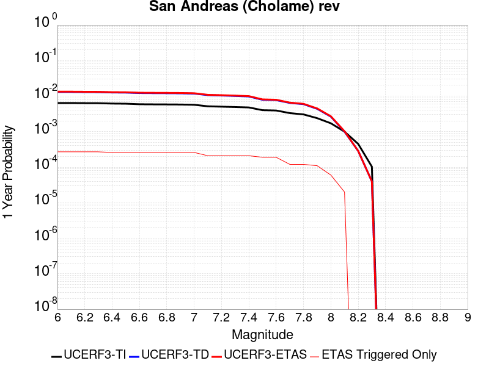 |  |

| Magnitude | 1 wk TI Prob | 1 wk TD Prob | 1 wk ETAS Prob | 1 wk ETAS/TD Gain | 1 wk ETAS Triggered Only | 1 mo TI Prob | 1 mo TD Prob | 1 mo ETAS Prob | 1 mo ETAS/TD Gain | 1 mo ETAS Triggered Only | 1 yr TI Prob | 1 yr TD Prob | 1 yr ETAS Prob | 1 yr ETAS/TD Gain | 1 yr ETAS Triggered Only | 10 yr TI Prob | 10 yr TD Prob | 10 yr ETAS Prob | 10 yr ETAS/TD Gain | 10 yr ETAS Triggered Only |
|-----|-----|-----|-----|-----|-----|-----|-----|-----|-----|-----|-----|-----|-----|-----|-----|-----|-----|-----|-----|-----|
| 6.0 | 1.2302514E-4 | 2.5205986E-4 | 4.4201198E-4 | 1.7535992 | 1.9E-4 | 5.27144E-4 | 0.0010798109 | 0.0013195518 | 1.2220211 | 2.4E-4 | 0.0063991086 | 0.013067958 | 0.01333443 | 1.0203912 | 2.7E-4 | 0.06217949 | 0.12438412 | 0.12468183 | 1.0023935 | 3.4E-4 |
| 6.1 | 1.2302514E-4 | 2.5205986E-4 | 4.4201198E-4 | 1.7535992 | 1.9E-4 | 5.27144E-4 | 0.0010798109 | 0.0013195518 | 1.2220211 | 2.4E-4 | 0.0063991086 | 0.013067958 | 0.01333443 | 1.0203912 | 2.7E-4 | 0.06217949 | 0.12438412 | 0.12468183 | 1.0023935 | 3.4E-4 |
| 6.2 | 1.2203569E-4 | 2.502277E-4 | 4.4018016E-4 | 1.7591184 | 1.9E-4 | 5.2290526E-4 | 0.0010719653 | 0.001311708 | 1.2236478 | 2.4E-4 | 0.006347804 | 0.012973578 | 0.013240076 | 1.0205415 | 2.7E-4 | 0.061695136 | 0.123571314 | 0.1238693 | 1.0024115 | 3.4E-4 |
| 6.3 | 1.2142645E-4 | 2.4908737E-4 | 4.3904004E-4 | 1.7625946 | 1.9E-4 | 5.202953E-4 | 0.0010670823 | 0.0013068261 | 1.2246723 | 2.4E-4 | 0.006316212 | 0.012914834 | 0.0131813465 | 1.0206362 | 2.7E-4 | 0.06139677 | 0.12306532 | 0.12336348 | 1.0024228 | 3.4E-4 |
| 6.4 | 1.1865206E-4 | 2.4414246E-4 | 4.3409606E-4 | 1.7780441 | 1.9E-4 | 5.0840975E-4 | 0.0010459068 | 0.0012756663 | 1.2196748 | 2.3E-4 | 0.006172335 | 0.012660044 | 0.012916752 | 1.020277 | 2.6E-4 | 0.060036868 | 0.12085904 | 0.12114037 | 1.0023277 | 3.2E-4 |
| 6.5 | 1.17443946E-4 | 2.4207575E-4 | 4.3202977E-4 | 1.7846882 | 1.9E-4 | 5.032341E-4 | 0.0010370566 | 0.001266818 | 1.2215515 | 2.3E-4 | 0.006109677 | 0.012553536 | 0.012810272 | 1.0204513 | 2.6E-4 | 0.059444077 | 0.11993008 | 0.120211706 | 1.0023482 | 3.2E-4 |
| 6.6 | 1.13579066E-4 | 2.3516564E-4 | 4.2512096E-4 | 1.8077512 | 1.9E-4 | 4.866766E-4 | 0.001007465 | 0.0012372333 | 1.2280657 | 2.3E-4 | 0.0059092017 | 0.012197345 | 0.0124541735 | 1.021056 | 2.6E-4 | 0.057545185 | 0.1168492 | 0.11713181 | 1.0024185 | 3.2E-4 |
| 6.7 | 1.1271412E-4 | 2.336088E-4 | 4.235644E-4 | 1.8131355 | 1.9E-4 | 4.829711E-4 | 0.001000798 | 0.0012305678 | 1.2295866 | 2.3E-4 | 0.005864331 | 0.012117079 | 0.012373929 | 1.0211973 | 2.6E-4 | 0.057119697 | 0.11615275 | 0.11643558 | 1.002435 | 3.2E-4 |
| 6.8 | 1.1217975E-4 | 2.3249313E-4 | 4.2244894E-4 | 1.8170384 | 1.9E-4 | 4.8068175E-4 | 9.960202E-4 | 0.001225791 | 1.230689 | 2.3E-4 | 0.005836608 | 0.012059555 | 0.01231642 | 1.0212997 | 2.6E-4 | 0.056856725 | 0.11565061 | 0.115933605 | 1.002447 | 3.2E-4 |
| 6.9 | 1.1146753E-4 | 2.3098059E-4 | 4.209367E-4 | 1.82239 | 1.9E-4 | 4.7763053E-4 | 9.895428E-4 | 0.0012193152 | 1.2322006 | 2.3E-4 | 0.0057996577 | 0.011981564 | 0.0122384485 | 1.02144 | 2.6E-4 | 0.056506127 | 0.11497027 | 0.11525348 | 1.0024633 | 3.2E-4 |
| 7.0 | 1.0965793E-4 | 2.2721413E-4 | 4.1717096E-4 | 1.8360256 | 1.9E-4 | 4.698779E-4 | 9.734129E-4 | 0.001203189 | 1.236052 | 2.3E-4 | 0.005705768 | 0.011787324 | 0.012044259 | 1.0217975 | 2.6E-4 | 0.055614736 | 0.11327011 | 0.11355387 | 1.0025051 | 3.2E-4 |
| 7.1 | 9.927982E-5 | 2.0540332E-4 | 3.4537457E-4 | 1.6814458 | 1.4E-4 | 4.2541555E-4 | 8.8000396E-4 | 0.0010598456 | 1.2043645 | 1.8E-4 | 0.0051671406 | 0.010661708 | 0.0108694695 | 1.0194867 | 2.1E-4 | 0.05048634 | 0.10336573 | 0.103598855 | 1.0022553 | 2.6E-4 |
| 7.2 | 9.696786E-5 | 2.0044584E-4 | 3.4041778E-4 | 1.698303 | 1.4E-4 | 4.1551032E-4 | 8.587718E-4 | 0.0010386172 | 1.2094216 | 1.8E-4 | 0.00504711 | 0.010405703 | 0.010613518 | 1.0199713 | 2.1E-4 | 0.04934009 | 0.10110233 | 0.10133605 | 1.0023117 | 2.6E-4 |
| 7.3 | 9.4727984E-5 | 1.9473763E-4 | 3.3471035E-4 | 1.718776 | 1.4E-4 | 4.0591392E-4 | 8.343239E-4 | 0.0010141737 | 1.2155635 | 1.8E-4 | 0.0049308087 | 0.010110851 | 0.010318728 | 1.0205598 | 2.1E-4 | 0.048228268 | 0.09847412 | 0.09870852 | 1.0023803 | 2.6E-4 |
| 7.4 | 9.220358E-5 | 1.8844259E-4 | 3.284162E-4 | 1.7427919 | 1.4E-4 | 3.9509835E-4 | 8.07362E-4 | 9.872167E-4 | 1.2227683 | 1.8E-4 | 0.004799717 | 0.009785578 | 0.009993522 | 1.0212501 | 2.1E-4 | 0.046973653 | 0.09555831 | 0.09579346 | 1.0024608 | 2.6E-4 |
| 7.5 | 7.71631E-5 | 1.5179155E-4 | 2.7177334E-4 | 1.7904378 | 1.2E-4 | 3.306571E-4 | 6.5037323E-4 | 8.1026915E-4 | 1.2458526 | 1.6E-4 | 0.0040183207 | 0.007889617 | 0.008078118 | 1.0238923 | 1.9E-4 | 0.03946433 | 0.078289196 | 0.078501195 | 1.0027078 | 2.3E-4 |
| 7.6 | 7.5634416E-5 | 1.4838556E-4 | 2.6836776E-4 | 1.808584 | 1.2E-4 | 3.241072E-4 | 6.357833E-4 | 7.9568155E-4 | 1.2514981 | 1.6E-4 | 0.0039388672 | 0.007713256 | 0.007901791 | 1.0244429 | 1.9E-4 | 0.038697794 | 0.076654874 | 0.076867245 | 1.0027704 | 2.3E-4 |
| 7.7 | 6.3783E-5 | 1.2359623E-4 | 1.9358758E-4 | 1.5662903 | 7.0E-5 | 2.7332708E-4 | 5.2959064E-4 | 6.395324E-4 | 1.2075976 | 1.1E-4 | 0.0033226798 | 0.0064287307 | 0.006547959 | 1.0185462 | 1.2E-4 | 0.032734364 | 0.06454488 | 0.06469455 | 1.0023189 | 1.6E-4 |
| 7.8 | 5.863422E-5 | 1.14169685E-4 | 1.8416169E-4 | 1.6130525 | 7.0E-5 | 2.512653E-4 | 4.892069E-4 | 5.991531E-4 | 1.2247437 | 1.1E-4 | 0.003054864 | 0.0059398497 | 0.0060591367 | 1.0200825 | 1.2E-4 | 0.030132094 | 0.05966162 | 0.059812073 | 1.0025218 | 1.6E-4 |
| 7.9 | 4.595283E-5 | 8.426815E-5 | 1.5426225E-4 | 1.8306116 | 7.0E-5 | 1.9692584E-4 | 3.6109926E-4 | 4.6106314E-4 | 1.2768322 | 1.0E-4 | 0.0023949358 | 0.0043875277 | 0.004497045 | 1.0249611 | 1.1E-4 | 0.023692891 | 0.044363137 | 0.044496927 | 1.0030158 | 1.4E-4 |
| 8.0 | 3.2950178E-5 | 5.077396E-5 | 1.0077142E-4 | 1.9847068 | 5.0E-5 | 1.412074E-4 | 2.1758456E-4 | 2.775715E-4 | 1.2756948 | 6.0E-5 | 0.0017178444 | 0.0026458753 | 0.0027057165 | 1.0226169 | 6.0E-5 | 0.017046256 | 0.027181072 | 0.02724917 | 1.0025053 | 7.0E-5 |
| 8.1 | 1.9177472E-5 | 1.9183733E-5 | 2.9183542E-5 | 1.5212649 | 1.0E-5 | 8.218658E-5 | 8.221342E-5 | 1.0221177E-4 | 1.2432493 | 2.0E-5 | 0.0010001622 | 0.0010004893 | 0.0010204694 | 1.0199702 | 2.0E-5 | 0.009956728 | 0.010757887 | 0.010777672 | 1.001839 | 2.0E-5 |
| 8.2 | 8.643924E-6 | 5.473668E-6 | 5.473668E-6 | 1.0 | 0.0 | 3.704486E-5 | 2.3458366E-5 | 2.3458366E-5 | 1.0 | 0.0 | 4.5092785E-4 | 2.8556827E-4 | 2.8556827E-4 | 1.0 | 0.0 | 0.0045001395 | 0.0032481793 | 0.0032481793 | 1.0 | 0.0 |
| 8.3 | 1.983087E-6 | 7.6564595E-7 | 7.6564595E-7 | 1.0 | 0.0 | 8.498917E-6 | 3.281336E-6 | 3.281336E-6 | 1.0 | 0.0 | 1.034694E-4 | 3.9949547E-5 | 3.9949547E-5 | 1.0 | 0.0 | 0.0010342124 | 4.717979E-4 | 4.717979E-4 | 1.0 | 0.0 |

## San Andreas (North Branch Mill Creek)
*[(top)](#table-of-contents)*

| 1 Week | 1 Month | 1 Year | 10 Year |
|-----|-----|-----|-----|
|  |  |  |  |

| Magnitude | 1 wk TI Prob | 1 wk TD Prob | 1 wk ETAS Prob | 1 wk ETAS/TD Gain | 1 wk ETAS Triggered Only | 1 mo TI Prob | 1 mo TD Prob | 1 mo ETAS Prob | 1 mo ETAS/TD Gain | 1 mo ETAS Triggered Only | 1 yr TI Prob | 1 yr TD Prob | 1 yr ETAS Prob | 1 yr ETAS/TD Gain | 1 yr ETAS Triggered Only | 10 yr TI Prob | 10 yr TD Prob | 10 yr ETAS Prob | 10 yr ETAS/TD Gain | 10 yr ETAS Triggered Only |
|-----|-----|-----|-----|-----|-----|-----|-----|-----|-----|-----|-----|-----|-----|-----|-----|-----|-----|-----|-----|-----|
| 6.0 | 1.3461156E-5 | 2.3500992E-5 | 2.0349676E-4 | 8.659071 | 1.8E-4 | 5.7689394E-5 | 1.00714664E-4 | 3.306915E-4 | 3.2834494 | 2.3E-4 | 7.02142E-4 | 0.0012255146 | 0.0015051715 | 1.2281954 | 2.8E-4 | 0.0069992766 | 0.012228744 | 0.012544831 | 1.0258479 | 3.2E-4 |
| 6.1 | 1.3461156E-5 | 2.3500992E-5 | 2.0349676E-4 | 8.659071 | 1.8E-4 | 5.7689394E-5 | 1.00714664E-4 | 3.306915E-4 | 3.2834494 | 2.3E-4 | 7.02142E-4 | 0.0012255146 | 0.0015051715 | 1.2281954 | 2.8E-4 | 0.0069992766 | 0.012228744 | 0.012544831 | 1.0258479 | 3.2E-4 |
| 6.2 | 1.3461156E-5 | 2.3500992E-5 | 2.0349676E-4 | 8.659071 | 1.8E-4 | 5.7689394E-5 | 1.00714664E-4 | 3.306915E-4 | 3.2834494 | 2.3E-4 | 7.02142E-4 | 0.0012255146 | 0.0015051715 | 1.2281954 | 2.8E-4 | 0.0069992766 | 0.012228744 | 0.012544831 | 1.0258479 | 3.2E-4 |
| 6.3 | 1.3461156E-5 | 2.3500992E-5 | 2.0349676E-4 | 8.659071 | 1.8E-4 | 5.7689394E-5 | 1.00714664E-4 | 3.306915E-4 | 3.2834494 | 2.3E-4 | 7.02142E-4 | 0.0012255146 | 0.0015051715 | 1.2281954 | 2.8E-4 | 0.0069992766 | 0.012228744 | 0.012544831 | 1.0258479 | 3.2E-4 |
| 6.4 | 1.3461156E-5 | 2.3500992E-5 | 2.0349676E-4 | 8.659071 | 1.8E-4 | 5.7689394E-5 | 1.00714664E-4 | 3.306915E-4 | 3.2834494 | 2.3E-4 | 7.02142E-4 | 0.0012255146 | 0.0015051715 | 1.2281954 | 2.8E-4 | 0.0069992766 | 0.012228744 | 0.012544831 | 1.0258479 | 3.2E-4 |
| 6.5 | 1.3450706E-5 | 2.348995E-5 | 2.0348572E-4 | 8.662671 | 1.8E-4 | 5.764461E-5 | 1.00667356E-4 | 3.306442E-4 | 3.2845225 | 2.3E-4 | 7.0159714E-4 | 0.0012249392 | 0.0015045963 | 1.2283027 | 2.8E-4 | 0.006993862 | 0.012223054 | 0.012539143 | 1.0258601 | 3.2E-4 |
| 6.6 | 1.3074523E-5 | 2.3104236E-5 | 2.0310008E-4 | 8.790599 | 1.8E-4 | 5.6032466E-5 | 9.901441E-5 | 3.2899165E-4 | 3.3226643 | 2.3E-4 | 6.8198174E-4 | 0.001204837 | 0.0014844997 | 1.2321166 | 2.8E-4 | 0.006798926 | 0.012024219 | 0.0123403715 | 1.0262929 | 3.2E-4 |
| 6.7 | 1.3050216E-5 | 2.3079532E-5 | 2.0307538E-4 | 8.798938 | 1.8E-4 | 5.59283E-5 | 9.890855E-5 | 3.288858E-4 | 3.3251503 | 2.3E-4 | 6.8071426E-4 | 0.0012035496 | 0.0014832126 | 1.2323651 | 2.8E-4 | 0.0067863287 | 0.012011484 | 0.01232764 | 1.0263212 | 3.2E-4 |
| 6.8 | 1.29049395E-5 | 2.2927941E-5 | 2.0292381E-4 | 8.850503 | 1.8E-4 | 5.530571E-5 | 9.825892E-5 | 3.2823632E-4 | 3.3405244 | 2.3E-4 | 6.73139E-4 | 0.001195649 | 0.0014753143 | 1.2339025 | 2.8E-4 | 0.0067110364 | 0.011933329 | 0.01224951 | 1.0264957 | 3.2E-4 |
| 6.9 | 1.2867369E-5 | 2.2887343E-5 | 2.0288322E-4 | 8.8644285 | 1.8E-4 | 5.51447E-5 | 9.808494E-5 | 3.280624E-4 | 3.3446763 | 2.3E-4 | 6.711799E-4 | 0.0011935332 | 0.001473199 | 1.2343175 | 2.8E-4 | 0.006691564 | 0.011912397 | 0.012228586 | 1.0265428 | 3.2E-4 |
| 7.0 | 1.2495996E-5 | 2.2287419E-5 | 2.0228341E-4 | 9.076125 | 1.8E-4 | 5.3553173E-5 | 9.551403E-5 | 3.2549206E-4 | 3.4077933 | 2.3E-4 | 6.518148E-4 | 0.0011622658 | 0.0014419403 | 1.2406287 | 2.8E-4 | 0.0064990623 | 0.011603 | 0.011919287 | 1.0272591 | 3.2E-4 |
| 7.1 | 1.2452067E-5 | 2.2232492E-5 | 2.0222849E-4 | 9.096079 | 1.8E-4 | 5.3364907E-5 | 9.527864E-5 | 3.2525673E-4 | 3.4137423 | 2.3E-4 | 6.4952404E-4 | 0.001159403 | 0.0014390784 | 1.2412236 | 2.8E-4 | 0.0064762887 | 0.011574671 | 0.011890967 | 1.0273266 | 3.2E-4 |
| 7.2 | 1.2002777E-5 | 2.1611015E-5 | 2.0160712E-4 | 9.328906 | 1.8E-4 | 5.143946E-5 | 9.261536E-5 | 3.2259405E-4 | 3.4831593 | 2.3E-4 | 6.2609545E-4 | 0.0011270114 | 0.0014066958 | 1.2481647 | 2.8E-4 | 0.006243344 | 0.011254058 | 0.011570456 | 1.0281142 | 3.2E-4 |
| 7.3 | 1.1923425E-5 | 2.1480853E-5 | 2.0147699E-4 | 9.379375 | 1.8E-4 | 5.109939E-5 | 9.205757E-5 | 3.220364E-4 | 3.4982066 | 2.3E-4 | 6.219575E-4 | 0.0011202273 | 0.0013999136 | 1.2496693 | 2.8E-4 | 0.0062021962 | 0.011186945 | 0.011503365 | 1.0282848 | 3.2E-4 |
| 7.4 | 1.16105175E-5 | 2.0854808E-5 | 2.0085105E-4 | 9.630923 | 1.8E-4 | 4.975841E-5 | 8.93747E-5 | 3.1935415E-4 | 3.5732052 | 2.3E-4 | 6.0564023E-4 | 0.0010875963 | 0.0013672918 | 1.2571684 | 2.8E-4 | 0.006039923 | 0.010864409 | 0.011180933 | 1.0291339 | 3.2E-4 |
| 7.5 | 1.1037265E-5 | 1.9554842E-5 | 1.8955152E-4 | 9.693329 | 1.7E-4 | 4.7301706E-5 | 8.380379E-5 | 3.0378535E-4 | 3.6249597 | 2.2E-4 | 5.757461E-4 | 0.0010198357 | 0.0012895603 | 1.2644786 | 2.7E-4 | 0.005742567 | 0.010195527 | 0.010502367 | 1.0300955 | 3.1E-4 |
| 7.6 | 1.0720915E-5 | 1.8996727E-5 | 1.889935E-4 | 9.94874 | 1.7E-4 | 4.5945973E-5 | 8.141202E-5 | 3.0139412E-4 | 3.7020838 | 2.2E-4 | 5.592486E-4 | 9.907428E-4 | 0.0012604753 | 1.2722528 | 2.7E-4 | 0.005578433 | 0.009907238 | 0.010214168 | 1.0309802 | 3.1E-4 |
| 7.7 | 9.276279E-6 | 1.6442464E-5 | 1.8643966E-4 | 11.338913 | 1.7E-4 | 3.9754876E-5 | 7.046581E-5 | 2.9045032E-4 | 4.1218615 | 2.2E-4 | 4.839081E-4 | 8.5758517E-4 | 0.0011273536 | 1.3145676 | 2.7E-4 | 0.0048285574 | 0.008586576 | 0.0088939145 | 1.0357928 | 3.1E-4 |
| 7.8 | 5.8346777E-6 | 1.11555855E-5 | 1.811537E-4 | 16.238832 | 1.7E-4 | 2.5005522E-5 | 4.7808775E-5 | 2.6779826E-4 | 5.6014457 | 2.2E-4 | 3.043997E-4 | 5.819165E-4 | 8.517594E-4 | 1.4637141 | 2.7E-4 | 0.0030398308 | 0.0058473335 | 0.0061555207 | 1.0527056 | 3.1E-4 |
| 7.9 | 4.690204E-6 | 8.509473E-6 | 1.7850802E-4 | 20.977564 | 1.7E-4 | 2.0100719E-5 | 3.6468664E-5 | 2.4646102E-4 | 6.758158 | 2.1E-4 | 2.4469878E-4 | 4.439156E-4 | 6.9380464E-4 | 1.5629201 | 2.5E-4 | 0.002444295 | 0.004471165 | 0.004759868 | 1.0645701 | 2.9E-4 |
| 8.0 | 2.9570454E-6 | 4.8470656E-6 | 4.484687E-5 | 9.252376 | 4.0E-5 | 1.267299E-5 | 2.0772974E-5 | 7.077194E-5 | 3.4069238 | 5.0E-5 | 1.5428272E-4 | 2.5288164E-4 | 3.1286647E-4 | 1.2372051 | 6.0E-5 | 0.0015417566 | 0.002549932 | 0.0026397028 | 1.035205 | 9.0E-5 |
| 8.1 | 1.6376824E-6 | 2.1968672E-6 | 2.1968672E-6 | 1.0 | 0.0 | 7.01862E-6 | 9.415111E-6 | 1.9415018E-5 | 2.0621123 | 1.0E-5 | 8.544835E-5 | 1.1462297E-4 | 1.2462182E-4 | 1.0872326 | 1.0E-5 | 8.54155E-4 | 0.0011607445 | 0.0011707328 | 1.0086051 | 1.0E-5 |
| 8.2 | 6.9631557E-7 | 4.535001E-7 | 4.535001E-7 | 1.0 | 0.0 | 2.984206E-6 | 1.9435704E-6 | 1.9435704E-6 | 1.0 | 0.0 | 3.63321E-5 | 2.3662713E-5 | 2.3662713E-5 | 1.0 | 0.0 | 3.6326164E-4 | 2.4510184E-4 | 2.4510184E-4 | 1.0 | 0.0 |
| 8.3 | 1.7876137E-7 | 8.357368E-8 | 8.357368E-8 | 1.0 | 0.0 | 7.661199E-7 | 3.5817288E-7 | 3.5817288E-7 | 1.0 | 0.0 | 9.32747E-6 | 4.3607465E-6 | 4.3607465E-6 | 1.0 | 0.0 | 9.3270784E-5 | 4.5800018E-5 | 4.5800018E-5 | 1.0 | 0.0 |

## San Andreas (Carrizo) rev
*[(top)](#table-of-contents)*

| 1 Week | 1 Month | 1 Year | 10 Year |
|-----|-----|-----|-----|
|  |  |  | 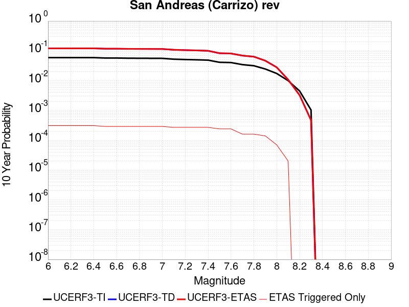 |

| Magnitude | 1 wk TI Prob | 1 wk TD Prob | 1 wk ETAS Prob | 1 wk ETAS/TD Gain | 1 wk ETAS Triggered Only | 1 mo TI Prob | 1 mo TD Prob | 1 mo ETAS Prob | 1 mo ETAS/TD Gain | 1 mo ETAS Triggered Only | 1 yr TI Prob | 1 yr TD Prob | 1 yr ETAS Prob | 1 yr ETAS/TD Gain | 1 yr ETAS Triggered Only | 10 yr TI Prob | 10 yr TD Prob | 10 yr ETAS Prob | 10 yr ETAS/TD Gain | 10 yr ETAS Triggered Only |
|-----|-----|-----|-----|-----|-----|-----|-----|-----|-----|-----|-----|-----|-----|-----|-----|-----|-----|-----|-----|-----|
| 6.0 | 1.1674632E-4 | 2.4324407E-4 | 4.132027E-4 | 1.6987165 | 1.7E-4 | 5.002454E-4 | 0.0010420597 | 0.0012518408 | 1.201314 | 2.1E-4 | 0.006073493 | 0.012613757 | 0.012860604 | 1.0195696 | 2.5E-4 | 0.0591016 | 0.120640226 | 0.12091283 | 1.0022596 | 3.1E-4 |
| 6.1 | 1.1674632E-4 | 2.4324407E-4 | 4.132027E-4 | 1.6987165 | 1.7E-4 | 5.002454E-4 | 0.0010420597 | 0.0012518408 | 1.201314 | 2.1E-4 | 0.006073493 | 0.012613757 | 0.012860604 | 1.0195696 | 2.5E-4 | 0.0591016 | 0.120640226 | 0.12091283 | 1.0022596 | 3.1E-4 |
| 6.2 | 1.1674632E-4 | 2.4324407E-4 | 4.132027E-4 | 1.6987165 | 1.7E-4 | 5.002454E-4 | 0.0010420597 | 0.0012518408 | 1.201314 | 2.1E-4 | 0.006073493 | 0.012613757 | 0.012860604 | 1.0195696 | 2.5E-4 | 0.0591016 | 0.120640226 | 0.12091283 | 1.0022596 | 3.1E-4 |
| 6.3 | 1.1674632E-4 | 2.4324407E-4 | 4.132027E-4 | 1.6987165 | 1.7E-4 | 5.002454E-4 | 0.0010420597 | 0.0012518408 | 1.201314 | 2.1E-4 | 0.006073493 | 0.012613757 | 0.012860604 | 1.0195696 | 2.5E-4 | 0.0591016 | 0.120640226 | 0.12091283 | 1.0022596 | 3.1E-4 |
| 6.4 | 1.1674632E-4 | 2.4324407E-4 | 4.132027E-4 | 1.6987165 | 1.7E-4 | 5.002454E-4 | 0.0010420597 | 0.0012518408 | 1.201314 | 2.1E-4 | 0.006073493 | 0.012613757 | 0.012860604 | 1.0195696 | 2.5E-4 | 0.0591016 | 0.120640226 | 0.12091283 | 1.0022596 | 3.1E-4 |
| 6.5 | 1.13136164E-4 | 2.3644442E-4 | 3.964066E-4 | 1.6765318 | 1.6E-4 | 4.847792E-4 | 0.0010129412 | 0.0012127387 | 1.1972449 | 2.0E-4 | 0.0058862255 | 0.012263271 | 0.012500328 | 1.0193306 | 2.4E-4 | 0.057327334 | 0.11761008 | 0.11786597 | 1.0021758 | 2.9E-4 |
| 6.6 | 1.13136164E-4 | 2.3644442E-4 | 3.964066E-4 | 1.6765318 | 1.6E-4 | 4.847792E-4 | 0.0010129412 | 0.0012127387 | 1.1972449 | 2.0E-4 | 0.0058862255 | 0.012263271 | 0.012500328 | 1.0193306 | 2.4E-4 | 0.057327334 | 0.11761008 | 0.11786597 | 1.0021758 | 2.9E-4 |
| 6.7 | 1.1149675E-4 | 2.3335687E-4 | 3.9331953E-4 | 1.6854851 | 1.6E-4 | 4.777557E-4 | 9.997191E-4 | 0.0011995191 | 1.1998562 | 2.0E-4 | 0.0058011734 | 0.012104088 | 0.012341184 | 1.019588 | 2.4E-4 | 0.05652051 | 0.1162291 | 0.116485395 | 1.002205 | 2.9E-4 |
| 6.8 | 1.1103589E-4 | 2.3237852E-4 | 3.9234132E-4 | 1.6883718 | 1.6E-4 | 4.7578133E-4 | 9.955293E-4 | 0.0011953302 | 1.2006981 | 2.0E-4 | 0.005777263 | 0.012053643 | 0.012290751 | 1.019671 | 2.4E-4 | 0.056293584 | 0.11578894 | 0.11604536 | 1.0022146 | 2.9E-4 |
| 6.9 | 1.1053259E-4 | 2.3130233E-4 | 3.9126532E-4 | 1.6915753 | 1.6E-4 | 4.7362508E-4 | 9.909206E-4 | 0.0011907225 | 1.2016325 | 2.0E-4 | 0.0057511497 | 0.011998152 | 0.012235273 | 1.0197631 | 2.4E-4 | 0.05604569 | 0.11530445 | 0.11556101 | 1.002225 | 2.9E-4 |
| 7.0 | 1.1005377E-4 | 2.3031076E-4 | 3.9027393E-4 | 1.6945535 | 1.6E-4 | 4.7157376E-4 | 9.866742E-4 | 0.0011864769 | 1.2025012 | 2.0E-4 | 0.0057263062 | 0.011947021 | 0.012184153 | 1.0198487 | 2.4E-4 | 0.055809796 | 0.11485658 | 0.11511327 | 1.0022349 | 2.9E-4 |
| 7.1 | 1.0308142E-4 | 2.1540876E-4 | 3.553786E-4 | 1.6497872 | 1.4E-4 | 4.417027E-4 | 9.228548E-4 | 0.0011026887 | 1.1948669 | 1.8E-4 | 0.0053644776 | 0.011178188 | 0.011395729 | 1.0194612 | 2.2E-4 | 0.052368138 | 0.10809042 | 0.10833124 | 1.0022279 | 2.7E-4 |
| 7.2 | 1.0027479E-4 | 2.094876E-4 | 3.4945828E-4 | 1.6681573 | 1.4E-4 | 4.296783E-4 | 8.9749607E-4 | 0.0010773345 | 1.200378 | 1.8E-4 | 0.0052187922 | 0.010872566 | 0.011090174 | 1.0200144 | 2.2E-4 | 0.050979212 | 0.10539086 | 0.1056324 | 1.0022919 | 2.7E-4 |
| 7.3 | 9.816942E-5 | 2.0423878E-4 | 3.442102E-4 | 1.6853322 | 1.4E-4 | 4.2065824E-4 | 8.7501644E-4 | 0.0010548589 | 1.2055304 | 1.8E-4 | 0.005109493 | 0.010601572 | 0.01081924 | 1.0205317 | 2.2E-4 | 0.049935985 | 0.10297546 | 0.103217654 | 1.002352 | 2.7E-4 |
| 7.4 | 9.5634205E-5 | 1.9793298E-4 | 3.3790528E-4 | 1.7071701 | 1.4E-4 | 4.0979648E-4 | 8.4800937E-4 | 0.0010278567 | 1.2120818 | 1.8E-4 | 0.0049778637 | 0.010275901 | 0.010493641 | 1.0211893 | 2.2E-4 | 0.048678253 | 0.100067884 | 0.10031086 | 1.0024282 | 2.7E-4 |
| 7.5 | 8.052417E-5 | 1.6113915E-4 | 2.811198E-4 | 1.744578 | 1.2E-4 | 3.4505792E-4 | 6.9041376E-4 | 8.5030333E-4 | 1.2315851 | 1.6E-4 | 0.0041929903 | 0.008373471 | 0.008571797 | 1.023685 | 2.0E-4 | 0.04114753 | 0.082815245 | 0.08303537 | 1.002658 | 2.4E-4 |
| 7.6 | 7.897024E-5 | 1.5767086E-4 | 2.7765194E-4 | 1.7609591 | 1.2E-4 | 3.384E-4 | 6.755574E-4 | 8.354493E-4 | 1.2366815 | 1.6E-4 | 0.0041122385 | 0.00819397 | 0.008392331 | 1.0242082 | 2.0E-4 | 0.040369697 | 0.08115866 | 0.08137918 | 1.0027171 | 2.4E-4 |
| 7.7 | 6.707427E-5 | 1.3277122E-4 | 2.0276193E-4 | 1.5271527 | 7.0E-5 | 2.8742946E-4 | 5.688955E-4 | 6.7883293E-4 | 1.1932471 | 1.1E-4 | 0.003493839 | 0.0069043385 | 0.00702351 | 1.0172604 | 1.2E-4 | 0.034394164 | 0.06905339 | 0.06920234 | 1.0021571 | 1.6E-4 |
| 7.8 | 6.147705E-5 | 1.2198445E-4 | 1.9197591E-4 | 1.5737736 | 7.0E-5 | 2.6344648E-4 | 5.226858E-4 | 6.326283E-4 | 1.2103415 | 1.1E-4 | 0.0032027436 | 0.006345156 | 0.0064643947 | 1.018792 | 1.2E-4 | 0.031569764 | 0.0635172 | 0.06366704 | 1.002359 | 1.6E-4 |
| 7.9 | 4.7636717E-5 | 8.8802946E-5 | 1.5879673E-4 | 1.7881922 | 7.0E-5 | 2.0414138E-4 | 3.8052857E-4 | 4.804905E-4 | 1.2626923 | 1.0E-4 | 0.0024825884 | 0.004623101 | 0.004732593 | 1.0236835 | 1.1E-4 | 0.024550365 | 0.046629366 | 0.046762835 | 1.0028625 | 1.4E-4 |
| 8.0 | 3.3554235E-5 | 5.2138024E-5 | 1.0213542E-4 | 1.958943 | 5.0E-5 | 1.4379594E-4 | 2.2342955E-4 | 2.8341616E-4 | 1.268481 | 6.0E-5 | 0.0017493097 | 0.002716863 | 0.0027767 | 1.0220243 | 6.0E-5 | 0.017356034 | 0.027881905 | 0.027949953 | 1.0024406 | 7.0E-5 |
| 8.1 | 1.9175432E-5 | 1.9183564E-5 | 2.9183373E-5 | 1.5212696 | 1.0E-5 | 8.217783E-5 | 8.221269E-5 | 1.02211045E-4 | 1.2432514 | 2.0E-5 | 0.0010000558 | 0.0010004805 | 0.0010204605 | 1.0199704 | 2.0E-5 | 0.009955673 | 0.010757771 | 0.010777556 | 1.0018392 | 2.0E-5 |
| 8.2 | 8.643924E-6 | 5.473668E-6 | 5.473668E-6 | 1.0 | 0.0 | 3.704486E-5 | 2.3458366E-5 | 2.3458366E-5 | 1.0 | 0.0 | 4.5092785E-4 | 2.8556827E-4 | 2.8556827E-4 | 1.0 | 0.0 | 0.0045001395 | 0.0032481793 | 0.0032481793 | 1.0 | 0.0 |
| 8.3 | 1.983087E-6 | 7.6564595E-7 | 7.6564595E-7 | 1.0 | 0.0 | 8.498917E-6 | 3.281336E-6 | 3.281336E-6 | 1.0 | 0.0 | 1.034694E-4 | 3.9949547E-5 | 3.9949547E-5 | 1.0 | 0.0 | 0.0010342124 | 4.717979E-4 | 4.717979E-4 | 1.0 | 0.0 |

## Sierra Nevada  (No Extension)
*[(top)](#table-of-contents)*

| 1 Week | 1 Month | 1 Year | 10 Year |
|-----|-----|-----|-----|
|  |  | 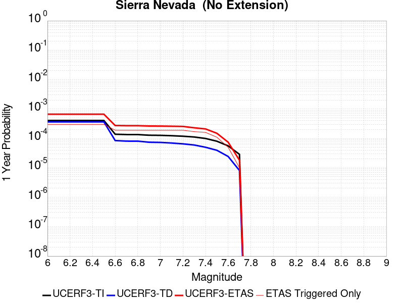 |  |

| Magnitude | 1 wk TI Prob | 1 wk TD Prob | 1 wk ETAS Prob | 1 wk ETAS/TD Gain | 1 wk ETAS Triggered Only | 1 mo TI Prob | 1 mo TD Prob | 1 mo ETAS Prob | 1 mo ETAS/TD Gain | 1 mo ETAS Triggered Only | 1 yr TI Prob | 1 yr TD Prob | 1 yr ETAS Prob | 1 yr ETAS/TD Gain | 1 yr ETAS Triggered Only | 10 yr TI Prob | 10 yr TD Prob | 10 yr ETAS Prob | 10 yr ETAS/TD Gain | 10 yr ETAS Triggered Only |
|-----|-----|-----|-----|-----|-----|-----|-----|-----|-----|-----|-----|-----|-----|-----|-----|-----|-----|-----|-----|-----|
| 6.0 | 7.7690465E-6 | 6.9762887E-6 | 2.1697482E-4 | 31.101755 | 2.1E-4 | 3.329549E-5 | 2.989824E-5 | 2.6989105E-4 | 9.026989 | 2.4E-4 | 4.0529718E-4 | 3.6398612E-4 | 6.6387694E-4 | 1.8239073 | 3.0E-4 | 0.004045588 | 0.0036374154 | 0.003946288 | 1.0849154 | 3.1E-4 |
| 6.1 | 7.7690465E-6 | 6.9762887E-6 | 2.1697482E-4 | 31.101755 | 2.1E-4 | 3.329549E-5 | 2.989824E-5 | 2.6989105E-4 | 9.026989 | 2.4E-4 | 4.0529718E-4 | 3.6398612E-4 | 6.6387694E-4 | 1.8239073 | 3.0E-4 | 0.004045588 | 0.0036374154 | 0.003946288 | 1.0849154 | 3.1E-4 |
| 6.2 | 7.7690465E-6 | 6.9762887E-6 | 2.1697482E-4 | 31.101755 | 2.1E-4 | 3.329549E-5 | 2.989824E-5 | 2.6989105E-4 | 9.026989 | 2.4E-4 | 4.0529718E-4 | 3.6398612E-4 | 6.6387694E-4 | 1.8239073 | 3.0E-4 | 0.004045588 | 0.0036374154 | 0.003946288 | 1.0849154 | 3.1E-4 |
| 6.3 | 7.7690465E-6 | 6.9762887E-6 | 2.1697482E-4 | 31.101755 | 2.1E-4 | 3.329549E-5 | 2.989824E-5 | 2.6989105E-4 | 9.026989 | 2.4E-4 | 4.0529718E-4 | 3.6398612E-4 | 6.6387694E-4 | 1.8239073 | 3.0E-4 | 0.004045588 | 0.0036374154 | 0.003946288 | 1.0849154 | 3.1E-4 |
| 6.4 | 7.7690465E-6 | 6.9762887E-6 | 2.1697482E-4 | 31.101755 | 2.1E-4 | 3.329549E-5 | 2.989824E-5 | 2.6989105E-4 | 9.026989 | 2.4E-4 | 4.0529718E-4 | 3.6398612E-4 | 6.6387694E-4 | 1.8239073 | 3.0E-4 | 0.004045588 | 0.0036374154 | 0.003946288 | 1.0849154 | 3.1E-4 |
| 6.5 | 7.7690465E-6 | 6.9762887E-6 | 2.1697482E-4 | 31.101755 | 2.1E-4 | 3.329549E-5 | 2.989824E-5 | 2.6989105E-4 | 9.026989 | 2.4E-4 | 4.0529718E-4 | 3.6398612E-4 | 6.6387694E-4 | 1.8239073 | 3.0E-4 | 0.004045588 | 0.0036374154 | 0.003946288 | 1.0849154 | 3.1E-4 |
| 6.6 | 2.653E-6 | 1.6148208E-6 | 1.3161461E-4 | 81.50416 | 1.3E-4 | 1.136995E-5 | 6.9206426E-6 | 1.569196E-4 | 22.674137 | 1.5E-4 | 1.3842035E-4 | 8.42556E-5 | 2.742396E-4 | 3.254853 | 1.9E-4 | 0.0013833415 | 8.4224E-4 | 0.0010420715 | 1.237262 | 2.0E-4 |
| 6.7 | 2.5902466E-6 | 1.5501544E-6 | 1.3154995E-4 | 84.86249 | 1.3E-4 | 1.11010095E-5 | 6.643502E-6 | 1.566425E-4 | 23.578302 | 1.5E-4 | 1.351464E-4 | 8.088166E-5 | 2.708663E-4 | 3.3489208 | 1.9E-4 | 0.0013506424 | 8.0852525E-4 | 0.0010083636 | 1.2471639 | 2.0E-4 |
| 6.8 | 2.5853892E-6 | 1.5469546E-6 | 1.3154675E-4 | 85.03595 | 1.3E-4 | 1.1080193E-5 | 6.629789E-6 | 1.566288E-4 | 23.625004 | 1.5E-4 | 1.34893E-4 | 8.071472E-5 | 2.7069938E-4 | 3.3537796 | 1.9E-4 | 0.0013481114 | 8.06857E-4 | 0.0010066957 | 1.2476754 | 2.0E-4 |
| 6.9 | 2.458257E-6 | 1.422029E-6 | 1.3142184E-4 | 92.41855 | 1.3E-4 | 1.0535345E-5 | 6.0943958E-6 | 1.5609348E-4 | 25.612627 | 1.5E-4 | 1.2826028E-4 | 7.419676E-5 | 2.6418266E-4 | 3.5605688 | 1.9E-4 | 0.0012818627 | 7.4172183E-4 | 9.4157347E-4 | 1.2694429 | 2.0E-4 |
| 7.0 | 2.4341468E-6 | 1.3989927E-6 | 1.3139882E-4 | 93.92387 | 1.3E-4 | 1.0432016E-5 | 5.9956697E-6 | 1.5599477E-4 | 26.017906 | 1.5E-4 | 1.270024E-4 | 7.299485E-5 | 2.62981E-4 | 3.6027334 | 1.9E-4 | 0.0012692984 | 7.297107E-4 | 9.295647E-4 | 1.2738812 | 2.0E-4 |
| 7.1 | 2.3652476E-6 | 1.3339427E-6 | 1.3133377E-4 | 98.45533 | 1.3E-4 | 1.0136736E-5 | 5.716885E-6 | 1.5571603E-4 | 27.237915 | 1.5E-4 | 1.2340778E-4 | 6.9600865E-5 | 2.5958763E-4 | 3.729661 | 1.9E-4 | 0.0012333926 | 6.957924E-4 | 8.956532E-4 | 1.287242 | 2.0E-4 |
| 7.2 | 2.272158E-6 | 1.2502497E-6 | 1.3125008E-4 | 104.9791 | 1.3E-4 | 9.737784E-6 | 5.358202E-6 | 1.553574E-4 | 28.994314 | 1.5E-4 | 1.1855107E-4 | 6.523417E-5 | 2.5522176E-4 | 3.9123938 | 1.9E-4 | 0.0011848784 | 6.5215176E-4 | 8.5202133E-4 | 1.3064771 | 2.0E-4 |
| 7.3 | 2.1382127E-6 | 1.1419382E-6 | 1.211418E-4 | 106.08437 | 1.2E-4 | 9.163737E-6 | 4.894012E-6 | 1.4489333E-4 | 29.606247 | 1.4E-4 | 1.1156279E-4 | 5.9582977E-5 | 2.2957285E-4 | 3.852994 | 1.7E-4 | 0.001115068 | 5.956712E-4 | 7.75564E-4 | 1.3020002 | 1.8E-4 |
| 7.4 | 1.9048055E-6 | 9.574928E-7 | 1.10957386E-4 | 115.883255 | 1.1E-4 | 8.163426E-6 | 4.103534E-6 | 1.34103E-4 | 32.67988 | 1.3E-4 | 9.9385186E-5 | 4.995939E-5 | 2.099514E-4 | 4.202441 | 1.6E-4 | 9.934074E-4 | 4.9948227E-4 | 6.6939736E-4 | 1.3401824 | 1.7E-4 |
| 7.5 | 1.5373403E-6 | 7.559763E-7 | 8.075592E-5 | 106.82334 | 8.0E-5 | 6.5885843E-6 | 3.2398946E-6 | 1.03239574E-4 | 31.865103 | 1.0E-4 | 8.021306E-5 | 3.9445007E-5 | 1.4944066E-4 | 3.7885826 | 1.1E-4 | 8.0184115E-4 | 3.9438053E-4 | 5.143332E-4 | 1.3041546 | 1.2E-4 |
| 7.6 | 1.0680322E-6 | 4.65941E-7 | 2.0465932E-5 | 43.92387 | 2.0E-5 | 4.577273E-6 | 1.9968884E-6 | 4.199681E-5 | 21.031124 | 4.0E-5 | 5.5726876E-5 | 2.4311848E-5 | 7.4310636E-5 | 3.0565603 | 5.0E-5 | 5.5712904E-4 | 2.4309216E-4 | 3.0307757E-4 | 1.24676 | 6.0E-5 |
| 7.7 | 5.509146E-7 | 1.5578539E-7 | 1.01557835E-5 | 65.190865 | 1.0E-5 | 2.3610605E-6 | 6.676515E-7 | 1.0667645E-5 | 15.977864 | 1.0E-5 | 2.8745531E-5 | 8.128628E-6 | 1.8128547E-5 | 2.2302098 | 1.0E-5 | 2.8741814E-4 | 8.128342E-5 | 9.128261E-5 | 1.1230164 | 1.0E-5 |

## Elsinore (Glen Ivy) rev
*[(top)](#table-of-contents)*

| 1 Week | 1 Month | 1 Year | 10 Year |
|-----|-----|-----|-----|
|  |  |  |  |

| Magnitude | 1 wk TI Prob | 1 wk TD Prob | 1 wk ETAS Prob | 1 wk ETAS/TD Gain | 1 wk ETAS Triggered Only | 1 mo TI Prob | 1 mo TD Prob | 1 mo ETAS Prob | 1 mo ETAS/TD Gain | 1 mo ETAS Triggered Only | 1 yr TI Prob | 1 yr TD Prob | 1 yr ETAS Prob | 1 yr ETAS/TD Gain | 1 yr ETAS Triggered Only | 10 yr TI Prob | 10 yr TD Prob | 10 yr ETAS Prob | 10 yr ETAS/TD Gain | 10 yr ETAS Triggered Only |
|-----|-----|-----|-----|-----|-----|-----|-----|-----|-----|-----|-----|-----|-----|-----|-----|-----|-----|-----|-----|-----|
| 6.0 | 1.6204086E-4 | 2.937271E-4 | 4.3368596E-4 | 1.4764929 | 1.4E-4 | 6.94276E-4 | 0.0012583778 | 0.0014181765 | 1.1269878 | 1.6E-4 | 0.008420097 | 0.0152346175 | 0.015461114 | 1.0148672 | 2.3E-4 | 0.081081145 | 0.13962454 | 0.13986544 | 1.0017254 | 2.8E-4 |
| 6.1 | 1.6204086E-4 | 2.937271E-4 | 4.3368596E-4 | 1.4764929 | 1.4E-4 | 6.94276E-4 | 0.0012583778 | 0.0014181765 | 1.1269878 | 1.6E-4 | 0.008420097 | 0.0152346175 | 0.015461114 | 1.0148672 | 2.3E-4 | 0.081081145 | 0.13962454 | 0.13986544 | 1.0017254 | 2.8E-4 |
| 6.2 | 1.6204086E-4 | 2.937271E-4 | 4.3368596E-4 | 1.4764929 | 1.4E-4 | 6.94276E-4 | 0.0012583778 | 0.0014181765 | 1.1269878 | 1.6E-4 | 0.008420097 | 0.0152346175 | 0.015461114 | 1.0148672 | 2.3E-4 | 0.081081145 | 0.13962454 | 0.13986544 | 1.0017254 | 2.8E-4 |
| 6.3 | 1.0111737E-4 | 1.7703463E-4 | 2.6701868E-4 | 1.5082852 | 9.0E-5 | 4.332882E-4 | 7.5861585E-4 | 8.685324E-4 | 1.1448909 | 1.1E-4 | 0.005262531 | 0.0092177205 | 0.009366338 | 1.016123 | 1.5E-4 | 0.0513964 | 0.08707393 | 0.08724739 | 1.0019921 | 1.9E-4 |
| 6.4 | 1.0111737E-4 | 1.7703463E-4 | 2.6701868E-4 | 1.5082852 | 9.0E-5 | 4.332882E-4 | 7.5861585E-4 | 8.685324E-4 | 1.1448909 | 1.1E-4 | 0.005262531 | 0.0092177205 | 0.009366338 | 1.016123 | 1.5E-4 | 0.0513964 | 0.08707393 | 0.08724739 | 1.0019921 | 1.9E-4 |
| 6.5 | 3.6624708E-5 | 4.6391986E-5 | 7.639059E-5 | 1.6466334 | 3.0E-5 | 1.569536E-4 | 1.9880968E-4 | 2.288037E-4 | 1.150868 | 3.0E-5 | 0.001909235 | 0.0024181814 | 0.0024481087 | 1.0123761 | 3.0E-5 | 0.01892915 | 0.023697061 | 0.023736114 | 1.001648 | 4.0E-5 |
| 6.6 | 2.5051324E-5 | 2.6147465E-5 | 4.6146943E-5 | 1.7648726 | 2.0E-5 | 1.073584E-4 | 1.12056E-4 | 1.3205376E-4 | 1.1784621 | 2.0E-5 | 0.0013063047 | 0.0013634725 | 0.0013834452 | 1.0146484 | 2.0E-5 | 0.012986525 | 0.013565759 | 0.013595353 | 1.0021814 | 3.0E-5 |
| 6.7 | 2.2189772E-5 | 2.2072489E-5 | 4.207205E-5 | 1.9060853 | 2.0E-5 | 9.509556E-5 | 9.459316E-5 | 1.1459127E-4 | 1.2114118 | 2.0E-5 | 0.0011571734 | 0.0011510996 | 0.0011710766 | 1.0173547 | 2.0E-5 | 0.011511663 | 0.0114663225 | 0.011495979 | 1.0025864 | 3.0E-5 |
| 6.8 | 1.6654378E-5 | 1.44376E-5 | 3.443731E-5 | 2.3852518 | 2.0E-5 | 7.137396E-5 | 6.187399E-5 | 8.187275E-5 | 1.3232176 | 2.0E-5 | 8.686314E-4 | 7.5306057E-4 | 7.730455E-4 | 1.0265383 | 2.0E-5 | 0.008652439 | 0.0075100763 | 0.007539851 | 1.0039647 | 3.0E-5 |
| 6.9 | 1.5042909E-5 | 1.2331886E-5 | 2.2331762E-5 | 1.810896 | 1.0E-5 | 6.446802E-5 | 5.2849886E-5 | 6.284936E-5 | 1.1892052 | 1.0E-5 | 7.8461546E-4 | 6.4326054E-4 | 6.532541E-4 | 1.0155358 | 1.0E-5 | 0.007818509 | 0.006417925 | 0.0064377966 | 1.0030962 | 2.0E-5 |
| 7.0 | 1.4361385E-5 | 1.1451172E-5 | 2.1451058E-5 | 1.8732631 | 1.0E-5 | 6.154734E-5 | 4.9075545E-5 | 5.9075053E-5 | 1.2037575 | 1.0E-5 | 7.490812E-4 | 5.973339E-4 | 6.073279E-4 | 1.016731 | 1.0E-5 | 0.007465612 | 0.005960982 | 0.005980863 | 1.0033351 | 2.0E-5 |
| 7.1 | 1.3265571E-5 | 1.0244736E-5 | 1.0244736E-5 | 1.0 | 0.0 | 5.6851208E-5 | 4.3905282E-5 | 4.3905282E-5 | 1.0 | 0.0 | 6.919436E-4 | 5.344183E-4 | 5.344183E-4 | 1.0 | 0.0 | 0.006897931 | 0.0053346003 | 0.0053346003 | 1.0 | 0.0 |
| 7.2 | 1.1596403E-5 | 8.504847E-6 | 8.504847E-6 | 1.0 | 0.0 | 4.9697923E-5 | 3.6448844E-5 | 3.6448844E-5 | 1.0 | 0.0 | 6.049042E-4 | 4.4367602E-4 | 4.4367602E-4 | 1.0 | 0.0 | 0.006032603 | 0.004429357 | 0.004429357 | 1.0 | 0.0 |
| 7.3 | 1.0150827E-5 | 7.238537E-6 | 7.238537E-6 | 1.0 | 0.0 | 4.3502816E-5 | 3.102194E-5 | 3.102194E-5 | 1.0 | 0.0 | 5.2951806E-4 | 3.776281E-4 | 3.776281E-4 | 1.0 | 0.0 | 0.005282581 | 0.003770271 | 0.003770271 | 1.0 | 0.0 |
| 7.4 | 9.080705E-6 | 6.352307E-6 | 6.352307E-6 | 1.0 | 0.0 | 3.8916725E-5 | 2.7223898E-5 | 2.7223898E-5 | 1.0 | 0.0 | 4.7370812E-4 | 3.314019E-4 | 3.314019E-4 | 1.0 | 0.0 | 0.004726996 | 0.0033092257 | 0.0033092257 | 1.0 | 0.0 |
| 7.5 | 7.671649E-6 | 5.225419E-6 | 5.225419E-6 | 1.0 | 0.0 | 3.287808E-5 | 2.2394468E-5 | 2.2394468E-5 | 1.0 | 0.0 | 4.0021708E-4 | 2.7261977E-4 | 2.7261977E-4 | 1.0 | 0.0 | 0.0039949706 | 0.0027229784 | 0.0027229784 | 1.0 | 0.0 |
| 7.6 | 6.990086E-6 | 4.687336E-6 | 4.687336E-6 | 1.0 | 0.0 | 2.9957167E-5 | 2.0088435E-5 | 2.0088435E-5 | 1.0 | 0.0 | 3.6466747E-4 | 2.445504E-4 | 2.445504E-4 | 1.0 | 0.0 | 0.0036406964 | 0.0024429292 | 0.0024429292 | 1.0 | 0.0 |
| 7.7 | 4.163505E-6 | 2.329331E-6 | 2.329331E-6 | 1.0 | 0.0 | 1.7843471E-5 | 9.982813E-6 | 9.982813E-6 | 1.0 | 0.0 | 2.172226E-4 | 1.2153471E-4 | 1.2153471E-4 | 1.0 | 0.0 | 0.0021701038 | 0.0012147555 | 0.0012147555 | 1.0 | 0.0 |
| 7.8 | 2.2692414E-7 | 9.384417E-8 | 9.384417E-8 | 1.0 | 0.0 | 9.725317E-7 | 4.0218927E-7 | 4.0218927E-7 | 1.0 | 0.0 | 1.1840509E-5 | 4.8966467E-6 | 4.8966467E-6 | 1.0 | 0.0 | 1.1839878E-4 | 4.8965718E-5 | 4.8965718E-5 | 1.0 | 0.0 |
| 7.9 | 6.676829E-9 | 3.4397174E-9 | 3.4397174E-9 | 1.0 | 0.0 | 2.861498E-8 | 1.4741646E-8 | 1.4741646E-8 | 1.0 | 0.0 | 3.4838732E-7 | 1.7947953E-7 | 1.7947953E-7 | 1.0 | 0.0 | 3.4838679E-6 | 1.794794E-6 | 1.794794E-6 | 1.0 | 0.0 |

## Cady
*[(top)](#table-of-contents)*

| 1 Week | 1 Month | 1 Year | 10 Year |
|-----|-----|-----|-----|
|  |  |  |  |

| Magnitude | 1 wk TI Prob | 1 wk TD Prob | 1 wk ETAS Prob | 1 wk ETAS/TD Gain | 1 wk ETAS Triggered Only | 1 mo TI Prob | 1 mo TD Prob | 1 mo ETAS Prob | 1 mo ETAS/TD Gain | 1 mo ETAS Triggered Only | 1 yr TI Prob | 1 yr TD Prob | 1 yr ETAS Prob | 1 yr ETAS/TD Gain | 1 yr ETAS Triggered Only | 10 yr TI Prob | 10 yr TD Prob | 10 yr ETAS Prob | 10 yr ETAS/TD Gain | 10 yr ETAS Triggered Only |
|-----|-----|-----|-----|-----|-----|-----|-----|-----|-----|-----|-----|-----|-----|-----|-----|-----|-----|-----|-----|-----|
| 6.0 | 1.9892565E-5 | 2.1858728E-5 | 1.6185567E-4 | 7.404624 | 1.4E-4 | 8.525106E-5 | 9.3677416E-5 | 2.4366337E-4 | 2.6010897 | 1.5E-4 | 0.0010374374 | 0.0011400167 | 0.0013098229 | 1.1489506 | 1.7E-4 | 0.010326075 | 0.011350701 | 0.011617635 | 1.0235171 | 2.7E-4 |
| 6.1 | 1.9892565E-5 | 2.1858728E-5 | 1.6185567E-4 | 7.404624 | 1.4E-4 | 8.525106E-5 | 9.3677416E-5 | 2.4366337E-4 | 2.6010897 | 1.5E-4 | 0.0010374374 | 0.0011400167 | 0.0013098229 | 1.1489506 | 1.7E-4 | 0.010326075 | 0.011350701 | 0.011617635 | 1.0235171 | 2.7E-4 |
| 6.2 | 1.9892565E-5 | 2.1858728E-5 | 1.6185567E-4 | 7.404624 | 1.4E-4 | 8.525106E-5 | 9.3677416E-5 | 2.4366337E-4 | 2.6010897 | 1.5E-4 | 0.0010374374 | 0.0011400167 | 0.0013098229 | 1.1489506 | 1.7E-4 | 0.010326075 | 0.011350701 | 0.011617635 | 1.0235171 | 2.7E-4 |
| 6.3 | 1.1117327E-5 | 1.2176583E-5 | 8.2175735E-5 | 6.748669 | 7.0E-5 | 4.764482E-5 | 5.2184492E-5 | 1.3218031E-4 | 2.5329425 | 8.0E-5 | 5.7992124E-4 | 6.351925E-4 | 7.35129E-4 | 1.1573325 | 1.0E-4 | 0.0057841022 | 0.0063368753 | 0.0064958613 | 1.025089 | 1.6E-4 |
| 6.4 | 1.1117327E-5 | 1.2176583E-5 | 8.2175735E-5 | 6.748669 | 7.0E-5 | 4.764482E-5 | 5.2184492E-5 | 1.3218031E-4 | 2.5329425 | 8.0E-5 | 5.7992124E-4 | 6.351925E-4 | 7.35129E-4 | 1.1573325 | 1.0E-4 | 0.0057841022 | 0.0063368753 | 0.0064958613 | 1.025089 | 1.6E-4 |
| 6.5 | 6.103093E-6 | 6.672021E-6 | 2.6671887E-5 | 3.9975727 | 2.0E-5 | 2.615585E-5 | 2.8594131E-5 | 5.8593272E-5 | 2.0491364 | 3.0E-5 | 3.1840094E-4 | 3.480905E-4 | 3.880766E-4 | 1.1148727 | 4.0E-5 | 0.0031794512 | 0.0034766865 | 0.0035265128 | 1.0143315 | 5.0E-5 |
| 6.6 | 5.817237E-6 | 6.3656585E-6 | 2.6365531E-5 | 4.1418386 | 2.0E-5 | 2.4930776E-5 | 2.728118E-5 | 5.7280362E-5 | 2.0996292 | 3.0E-5 | 3.034899E-4 | 3.3211018E-4 | 3.720969E-4 | 1.120402 | 4.0E-5 | 0.0030307577 | 0.0033173605 | 0.0033671947 | 1.0150223 | 5.0E-5 |
| 6.7 | 4.8846314E-6 | 5.3405684E-6 | 5.3405684E-6 | 1.0 | 0.0 | 2.0933967E-5 | 2.2888014E-5 | 3.2887787E-5 | 1.4368999 | 1.0E-5 | 2.5484123E-4 | 2.7863772E-4 | 2.9863216E-4 | 1.0717578 | 2.0E-5 | 0.0025454918 | 0.0027840391 | 0.0028139555 | 1.0107458 | 3.0E-5 |
| 6.8 | 1.7788773E-6 | 1.9399079E-6 | 1.9399079E-6 | 1.0 | 0.0 | 7.6237375E-6 | 8.313874E-6 | 8.313874E-6 | 1.0 | 0.0 | 9.281505E-5 | 1.01218284E-4 | 1.01218284E-4 | 1.0 | 0.0 | 9.2776294E-4 | 0.0010118765 | 0.0010118765 | 1.0 | 0.0 |
| 6.9 | 7.5455404E-7 | 8.297092E-7 | 8.297092E-7 | 1.0 | 0.0 | 3.233799E-6 | 3.5558937E-6 | 3.5558937E-6 | 1.0 | 0.0 | 3.937079E-5 | 4.3292483E-5 | 4.3292483E-5 | 1.0 | 0.0 | 3.9363815E-4 | 4.3287344E-4 | 4.3287344E-4 | 1.0 | 0.0 |
| 7.0 | 6.8578805E-7 | 7.541816E-7 | 7.541816E-7 | 1.0 | 0.0 | 2.9390883E-6 | 3.2322048E-6 | 3.2322048E-6 | 1.0 | 0.0 | 3.578281E-5 | 3.9351715E-5 | 3.9351715E-5 | 1.0 | 0.0 | 3.577705E-4 | 3.9347992E-4 | 3.9347992E-4 | 1.0 | 0.0 |

## Ludlow
*[(top)](#table-of-contents)*

| 1 Week | 1 Month | 1 Year | 10 Year |
|-----|-----|-----|-----|
|  |  |  |  |

| Magnitude | 1 wk TI Prob | 1 wk TD Prob | 1 wk ETAS Prob | 1 wk ETAS/TD Gain | 1 wk ETAS Triggered Only | 1 mo TI Prob | 1 mo TD Prob | 1 mo ETAS Prob | 1 mo ETAS/TD Gain | 1 mo ETAS Triggered Only | 1 yr TI Prob | 1 yr TD Prob | 1 yr ETAS Prob | 1 yr ETAS/TD Gain | 1 yr ETAS Triggered Only | 10 yr TI Prob | 10 yr TD Prob | 10 yr ETAS Prob | 10 yr ETAS/TD Gain | 10 yr ETAS Triggered Only |
|-----|-----|-----|-----|-----|-----|-----|-----|-----|-----|-----|-----|-----|-----|-----|-----|-----|-----|-----|-----|-----|
| 6.0 | 2.2407607E-5 | 2.3657254E-5 | 1.6365394E-4 | 6.9177065 | 1.4E-4 | 9.602906E-5 | 1.0138454E-4 | 2.7136732E-4 | 2.6766143 | 1.7E-4 | 0.0011685267 | 0.001233702 | 0.0014534305 | 1.1781051 | 2.2E-4 | 0.011624013 | 0.012273042 | 0.012539729 | 1.0217295 | 2.7E-4 |
| 6.1 | 2.2407607E-5 | 2.3657254E-5 | 1.6365394E-4 | 6.9177065 | 1.4E-4 | 9.602906E-5 | 1.0138454E-4 | 2.7136732E-4 | 2.6766143 | 1.7E-4 | 0.0011685267 | 0.001233702 | 0.0014534305 | 1.1781051 | 2.2E-4 | 0.011624013 | 0.012273042 | 0.012539729 | 1.0217295 | 2.7E-4 |
| 6.2 | 1.0781252E-5 | 1.1365663E-5 | 7.136498E-5 | 6.2789984 | 6.0E-5 | 4.620455E-5 | 4.8709102E-5 | 1.287052E-4 | 2.6423235 | 8.0E-5 | 5.623952E-4 | 5.9287593E-4 | 7.0281076E-4 | 1.1854262 | 1.1E-4 | 0.00560974 | 0.0059133614 | 0.0060425927 | 1.0218542 | 1.3E-4 |
| 6.3 | 1.0781252E-5 | 1.1365663E-5 | 7.136498E-5 | 6.2789984 | 6.0E-5 | 4.620455E-5 | 4.8709102E-5 | 1.287052E-4 | 2.6423235 | 8.0E-5 | 5.623952E-4 | 5.9287593E-4 | 7.0281076E-4 | 1.1854262 | 1.1E-4 | 0.00560974 | 0.0059133614 | 0.0060425927 | 1.0218542 | 1.3E-4 |
| 6.4 | 7.814439E-6 | 8.237729E-6 | 4.8237398E-5 | 5.855667 | 4.0E-5 | 3.3490025E-5 | 3.530408E-5 | 9.530196E-5 | 2.6994603 | 6.0E-5 | 4.0766477E-4 | 4.2974384E-4 | 5.0970947E-4 | 1.1860774 | 8.0E-5 | 0.0040691774 | 0.0042892746 | 0.0043888455 | 1.023214 | 1.0E-4 |
| 6.5 | 6.4986366E-6 | 6.85092E-6 | 3.6850714E-5 | 5.3789444 | 3.0E-5 | 2.7851002E-5 | 2.9360759E-5 | 6.935959E-5 | 2.3623226 | 4.0E-5 | 3.390332E-4 | 3.5740953E-4 | 4.1738807E-4 | 1.1678146 | 6.0E-5 | 0.003385164 | 0.0035684432 | 0.0036381935 | 1.0195464 | 7.0E-5 |
| 6.6 | 5.582177E-6 | 5.8860055E-6 | 3.588583E-5 | 6.096805 | 3.0E-5 | 2.3923398E-5 | 2.5225498E-5 | 6.522449E-5 | 2.5856571 | 4.0E-5 | 2.9122844E-4 | 3.0707786E-4 | 3.5706253E-4 | 1.1627752 | 5.0E-5 | 0.0029084706 | 0.003066609 | 0.003126425 | 1.0195056 | 6.0E-5 |
| 6.7 | 4.6858763E-6 | 4.940427E-6 | 3.494028E-5 | 7.0723195 | 3.0E-5 | 2.0082172E-5 | 2.1173091E-5 | 6.117224E-5 | 2.8891504 | 4.0E-5 | 2.4447302E-4 | 2.5775246E-4 | 3.0773957E-4 | 1.1939346 | 5.0E-5 | 0.0024420423 | 0.0025745912 | 0.0026344368 | 1.0232446 | 6.0E-5 |
| 6.8 | 3.5584908E-6 | 3.7520183E-6 | 2.3751943E-5 | 6.3304443 | 2.0E-5 | 1.5250586E-5 | 1.6079981E-5 | 4.6079498E-5 | 2.8656437 | 3.0E-5 | 1.8566006E-4 | 1.957566E-4 | 2.3574877E-4 | 1.2042954 | 4.0E-5 | 0.0018550502 | 0.0019558826 | 0.002005785 | 1.0255139 | 5.0E-5 |
| 6.9 | 2.532834E-6 | 2.6710034E-6 | 1.26709765E-5 | 4.7439013 | 1.0E-5 | 1.0854958E-5 | 1.1447109E-5 | 3.144688E-5 | 2.7471461 | 2.0E-5 | 1.3215111E-4 | 1.3935992E-4 | 1.6935574E-4 | 1.2152399 | 3.0E-5 | 0.0013207254 | 0.0013927529 | 0.0014326972 | 1.0286801 | 4.0E-5 |
| 7.0 | 1.7083285E-6 | 1.8019439E-6 | 1.8019439E-6 | 1.0 | 0.0 | 7.3213873E-6 | 7.722595E-6 | 7.722595E-6 | 1.0 | 0.0 | 8.913424E-5 | 9.40187E-5 | 9.40187E-5 | 1.0 | 0.0 | 8.9098496E-4 | 9.3980576E-4 | 9.4979635E-4 | 1.0106305 | 1.0E-5 |
| 7.1 | 1.0905424E-6 | 1.1497619E-6 | 1.1497619E-6 | 1.0 | 0.0 | 4.6737446E-6 | 4.9275427E-6 | 4.9275427E-6 | 1.0 | 0.0 | 5.6901354E-5 | 5.999128E-5 | 5.999128E-5 | 1.0 | 0.0 | 5.6886784E-4 | 5.997606E-4 | 6.0975464E-4 | 1.0166633 | 1.0E-5 |
| 7.2 | 6.06668E-7 | 6.387277E-7 | 6.387277E-7 | 1.0 | 0.0 | 2.600003E-6 | 2.7374022E-6 | 2.7374022E-6 | 1.0 | 0.0 | 3.1654577E-5 | 3.3327433E-5 | 3.3327433E-5 | 1.0 | 0.0 | 3.1650066E-4 | 3.3323118E-4 | 3.4322785E-4 | 1.0299993 | 1.0E-5 |

## San Jacinto (San Bernardino)
*[(top)](#table-of-contents)*

| 1 Week | 1 Month | 1 Year | 10 Year |
|-----|-----|-----|-----|
|  |  |  |  |

| Magnitude | 1 wk TI Prob | 1 wk TD Prob | 1 wk ETAS Prob | 1 wk ETAS/TD Gain | 1 wk ETAS Triggered Only | 1 mo TI Prob | 1 mo TD Prob | 1 mo ETAS Prob | 1 mo ETAS/TD Gain | 1 mo ETAS Triggered Only | 1 yr TI Prob | 1 yr TD Prob | 1 yr ETAS Prob | 1 yr ETAS/TD Gain | 1 yr ETAS Triggered Only | 10 yr TI Prob | 10 yr TD Prob | 10 yr ETAS Prob | 10 yr ETAS/TD Gain | 10 yr ETAS Triggered Only |
|-----|-----|-----|-----|-----|-----|-----|-----|-----|-----|-----|-----|-----|-----|-----|-----|-----|-----|-----|-----|-----|
| 6.0 | 3.409352E-5 | 3.598562E-5 | 2.6597735E-4 | 7.391212 | 2.3E-4 | 1.461069E-4 | 1.5421498E-4 | 4.0417642E-4 | 2.6208637 | 2.5E-4 | 0.0017774 | 0.0018759521 | 0.0021454457 | 1.143657 | 2.7E-4 | 0.01763251 | 0.019349992 | 0.019624574 | 1.0141903 | 2.8E-4 |
| 6.1 | 3.409352E-5 | 3.598562E-5 | 2.6597735E-4 | 7.391212 | 2.3E-4 | 1.461069E-4 | 1.5421498E-4 | 4.0417642E-4 | 2.6208637 | 2.5E-4 | 0.0017774 | 0.0018759521 | 0.0021454457 | 1.143657 | 2.7E-4 | 0.01763251 | 0.019349992 | 0.019624574 | 1.0141903 | 2.8E-4 |
| 6.2 | 3.409352E-5 | 3.598562E-5 | 2.6597735E-4 | 7.391212 | 2.3E-4 | 1.461069E-4 | 1.5421498E-4 | 4.0417642E-4 | 2.6208637 | 2.5E-4 | 0.0017774 | 0.0018759521 | 0.0021454457 | 1.143657 | 2.7E-4 | 0.01763251 | 0.019349992 | 0.019624574 | 1.0141903 | 2.8E-4 |
| 6.3 | 3.409352E-5 | 3.598562E-5 | 2.6597735E-4 | 7.391212 | 2.3E-4 | 1.461069E-4 | 1.5421498E-4 | 4.0417642E-4 | 2.6208637 | 2.5E-4 | 0.0017774 | 0.0018759521 | 0.0021454457 | 1.143657 | 2.7E-4 | 0.01763251 | 0.019349992 | 0.019624574 | 1.0141903 | 2.8E-4 |
| 6.4 | 3.400795E-5 | 3.5878285E-5 | 2.6587004E-4 | 7.410333 | 2.3E-4 | 1.4574021E-4 | 1.5375503E-4 | 4.0371658E-4 | 2.625713 | 2.5E-4 | 0.0017729428 | 0.0018703619 | 0.0021398568 | 1.1440871 | 2.7E-4 | 0.017588645 | 0.019295074 | 0.019569673 | 1.0142314 | 2.8E-4 |
| 6.5 | 3.341482E-5 | 3.5138914E-5 | 2.551312E-4 | 7.260645 | 2.2E-4 | 1.4319851E-4 | 1.5058667E-4 | 3.9055053E-4 | 2.5935266 | 2.4E-4 | 0.0017420477 | 0.0018318522 | 0.0020913759 | 1.1416728 | 2.6E-4 | 0.017284546 | 0.018916616 | 0.019181509 | 1.0140032 | 2.7E-4 |
| 6.6 | 3.3364955E-5 | 3.5076133E-5 | 2.5506841E-4 | 7.271851 | 2.2E-4 | 1.4298483E-4 | 1.5031763E-4 | 3.9028155E-4 | 2.596379 | 2.4E-4 | 0.0017394501 | 0.0018285823 | 0.002088107 | 1.1419266 | 2.6E-4 | 0.017258976 | 0.01888448 | 0.019149382 | 1.0140275 | 2.7E-4 |
| 6.7 | 3.335922E-5 | 3.5065907E-5 | 2.550582E-4 | 7.27368 | 2.2E-4 | 1.4296026E-4 | 1.5027382E-4 | 3.9023775E-4 | 2.5968447 | 2.4E-4 | 0.0017391514 | 0.0018280497 | 0.0020875745 | 1.1419681 | 2.6E-4 | 0.017256035 | 0.018879272 | 0.019144174 | 1.0140314 | 2.7E-4 |
| 6.8 | 3.327683E-5 | 3.4959972E-5 | 2.549523E-4 | 7.292691 | 2.2E-4 | 1.4260718E-4 | 1.4981985E-4 | 3.897839E-4 | 2.6016839 | 2.4E-4 | 0.0017348597 | 0.001822532 | 0.0020820582 | 1.1423987 | 2.6E-4 | 0.017213784 | 0.018825045 | 0.019089961 | 1.0140725 | 2.7E-4 |
| 6.9 | 3.3235785E-5 | 3.4900928E-5 | 2.5489324E-4 | 7.3033376 | 2.2E-4 | 1.4243131E-4 | 1.4956683E-4 | 3.8953093E-4 | 2.604394 | 2.4E-4 | 0.0017327217 | 0.0018194567 | 0.0020789837 | 1.1426398 | 2.6E-4 | 0.017192734 | 0.018794911 | 0.019059837 | 1.0140955 | 2.7E-4 |
| 7.0 | 3.3197095E-5 | 3.4840854E-5 | 2.548332E-4 | 7.3142056 | 2.2E-4 | 1.422655E-4 | 1.4930942E-4 | 3.8927357E-4 | 2.6071603 | 2.4E-4 | 0.0017307063 | 0.0018163278 | 0.0020758556 | 1.1428859 | 2.6E-4 | 0.017172894 | 0.01876429 | 0.019029222 | 1.014119 | 2.7E-4 |
| 7.1 | 3.3129716E-5 | 3.4721066E-5 | 2.5471344E-4 | 7.3359914 | 2.2E-4 | 1.4197677E-4 | 1.4879608E-4 | 3.8876038E-4 | 2.6127057 | 2.4E-4 | 0.0017271966 | 0.0018100884 | 0.0020696179 | 1.1433794 | 2.6E-4 | 0.017138338 | 0.018703366 | 0.018968316 | 1.0141659 | 2.7E-4 |
| 7.2 | 3.3034008E-5 | 3.4588513E-5 | 2.545809E-4 | 7.3602734 | 2.2E-4 | 1.4156665E-4 | 1.4822806E-4 | 3.8819248E-4 | 2.6188867 | 2.4E-4 | 0.0017222111 | 0.0018031843 | 0.0020627154 | 1.1439294 | 2.6E-4 | 0.017089253 | 0.01863575 | 0.018900719 | 1.0142183 | 2.7E-4 |
| 7.3 | 3.2956614E-5 | 3.4456265E-5 | 2.5444868E-4 | 7.3846855 | 2.2E-4 | 1.4123498E-4 | 1.4766137E-4 | 3.876259E-4 | 2.6251006 | 2.4E-4 | 0.0017181796 | 0.0017962961 | 0.0020558292 | 1.1444823 | 2.6E-4 | 0.017049557 | 0.018568495 | 0.018833483 | 1.0142708 | 2.7E-4 |
| 7.4 | 3.2915937E-5 | 3.4377957E-5 | 2.543704E-4 | 7.399229 | 2.2E-4 | 1.4106068E-4 | 1.473258E-4 | 3.8729043E-4 | 2.6288025 | 2.4E-4 | 0.0017160608 | 0.0017922173 | 0.0020517514 | 1.1448117 | 2.6E-4 | 0.017028693 | 0.018528769 | 0.018793765 | 1.0143019 | 2.7E-4 |
| 7.5 | 3.281791E-5 | 3.424287E-5 | 2.5423535E-4 | 7.424475 | 2.2E-4 | 1.406406E-4 | 1.4674691E-4 | 3.867117E-4 | 2.6352289 | 2.4E-4 | 0.0017109542 | 0.0017851809 | 0.0020447168 | 1.1453835 | 2.6E-4 | 0.016978411 | 0.018459652 | 0.018724669 | 1.0143565 | 2.7E-4 |
| 7.6 | 3.2521442E-5 | 3.396782E-5 | 2.5396034E-4 | 7.4764986 | 2.2E-4 | 1.3937015E-4 | 1.4556825E-4 | 3.8553332E-4 | 2.648471 | 2.4E-4 | 0.0016955109 | 0.0017708542 | 0.0020303938 | 1.1465617 | 2.6E-4 | 0.016826328 | 0.018317295 | 0.01858235 | 1.0144702 | 2.7E-4 |
| 7.7 | 3.0287873E-5 | 3.245191E-5 | 2.5244476E-4 | 7.779042 | 2.2E-4 | 1.297987E-4 | 1.3907222E-4 | 3.7903883E-4 | 2.7254822 | 2.4E-4 | 0.0015791537 | 0.0016918903 | 0.0019514504 | 1.1534142 | 2.6E-4 | 0.01567979 | 0.017528199 | 0.017793467 | 1.0151337 | 2.7E-4 |
| 7.8 | 2.6316151E-5 | 2.9662837E-5 | 2.3965661E-4 | 8.079356 | 2.1E-4 | 1.1277862E-4 | 1.2712025E-4 | 3.5709102E-4 | 2.8090804 | 2.3E-4 | 0.0013722149 | 0.0015465913 | 0.0017962046 | 1.1613958 | 2.5E-4 | 0.013637724 | 0.016069878 | 0.0163257 | 1.0159193 | 2.6E-4 |
| 7.9 | 2.0761147E-5 | 2.3417291E-5 | 2.1341284E-4 | 9.113473 | 1.9E-4 | 8.897331E-5 | 1.0035596E-4 | 3.003359E-4 | 2.992706 | 2.0E-4 | 0.0010827117 | 0.0012211498 | 0.0014408812 | 1.1799381 | 2.2E-4 | 0.010774517 | 0.012793272 | 0.013020329 | 1.0177482 | 2.3E-4 |
| 8.0 | 1.5738568E-5 | 1.6032505E-5 | 1.4603042E-4 | 9.108397 | 1.3E-4 | 6.744926E-5 | 6.8708934E-5 | 2.0869932E-4 | 3.0374408 | 1.4E-4 | 8.2088535E-4 | 8.3621085E-4 | 9.760938E-4 | 1.1672819 | 1.4E-4 | 0.008178596 | 0.008865741 | 0.009014411 | 1.016769 | 1.5E-4 |
| 8.1 | 1.0105832E-5 | 8.329479E-6 | 3.8329228E-5 | 4.601636 | 3.0E-5 | 4.3309992E-5 | 3.569728E-5 | 6.569621E-5 | 1.8403702 | 3.0E-5 | 5.2717153E-4 | 4.3452822E-4 | 4.6451518E-4 | 1.0690104 | 3.0E-5 | 0.005259227 | 0.0046768794 | 0.004706739 | 1.0063845 | 3.0E-5 |
| 8.2 | 4.189207E-6 | 1.577699E-6 | 1.577699E-6 | 1.0 | 0.0 | 1.7953622E-5 | 6.7615497E-6 | 6.7615497E-6 | 1.0 | 0.0 | 2.1856341E-4 | 8.231879E-5 | 8.231879E-5 | 1.0 | 0.0 | 0.0021834858 | 9.562628E-4 | 9.562628E-4 | 1.0 | 0.0 |
| 8.3 | 1.2758221E-6 | 3.612677E-7 | 3.612677E-7 | 1.0 | 0.0 | 5.4677976E-6 | 1.5482892E-6 | 1.5482892E-6 | 1.0 | 0.0 | 6.65684E-5 | 1.8850264E-5 | 1.8850264E-5 | 1.0 | 0.0 | 6.6548464E-4 | 2.2739546E-4 | 2.2739546E-4 | 1.0 | 0.0 |

## Red Pass
*[(top)](#table-of-contents)*

| 1 Week | 1 Month | 1 Year | 10 Year |
|-----|-----|-----|-----|
|  |  |  |  |

| Magnitude | 1 wk TI Prob | 1 wk TD Prob | 1 wk ETAS Prob | 1 wk ETAS/TD Gain | 1 wk ETAS Triggered Only | 1 mo TI Prob | 1 mo TD Prob | 1 mo ETAS Prob | 1 mo ETAS/TD Gain | 1 mo ETAS Triggered Only | 1 yr TI Prob | 1 yr TD Prob | 1 yr ETAS Prob | 1 yr ETAS/TD Gain | 1 yr ETAS Triggered Only | 10 yr TI Prob | 10 yr TD Prob | 10 yr ETAS Prob | 10 yr ETAS/TD Gain | 10 yr ETAS Triggered Only |
|-----|-----|-----|-----|-----|-----|-----|-----|-----|-----|-----|-----|-----|-----|-----|-----|-----|-----|-----|-----|-----|
| 6.0 | 8.258278E-6 | 8.551265E-6 | 1.3855015E-4 | 16.2023 | 1.3E-4 | 3.539214E-5 | 3.6647863E-5 | 2.1664127E-4 | 5.9114294 | 1.8E-4 | 4.308141E-4 | 4.4611428E-4 | 6.7601167E-4 | 1.5153329 | 2.3E-4 | 0.0042997985 | 0.004453945 | 0.004702831 | 1.0558801 | 2.5E-4 |
| 6.1 | 3.649988E-6 | 3.7753161E-6 | 6.377509E-5 | 16.892649 | 6.0E-5 | 1.5642712E-5 | 1.6179853E-5 | 8.617872E-5 | 5.326298 | 7.0E-5 | 1.9043336E-4 | 1.9697666E-4 | 2.8695894E-4 | 1.4568169 | 9.0E-5 | 0.0019027026 | 0.001968488 | 0.002058311 | 1.0456303 | 9.0E-5 |
| 6.2 | 3.649988E-6 | 3.7753161E-6 | 6.377509E-5 | 16.892649 | 6.0E-5 | 1.5642712E-5 | 1.6179853E-5 | 8.617872E-5 | 5.326298 | 7.0E-5 | 1.9043336E-4 | 1.9697666E-4 | 2.8695894E-4 | 1.4568169 | 9.0E-5 | 0.0019027026 | 0.001968488 | 0.002058311 | 1.0456303 | 9.0E-5 |
| 6.3 | 1.3924937E-6 | 1.4411166E-6 | 5.1441046E-5 | 35.695267 | 5.0E-5 | 5.9678164E-6 | 6.1762075E-6 | 5.6175897E-5 | 9.095533 | 5.0E-5 | 7.265574E-5 | 7.519415E-5 | 1.3518964E-4 | 1.7978745 | 6.0E-5 | 7.263199E-4 | 7.518258E-4 | 8.117807E-4 | 1.0797458 | 6.0E-5 |
| 6.4 | 1.3924937E-6 | 1.4411166E-6 | 5.1441046E-5 | 35.695267 | 5.0E-5 | 5.9678164E-6 | 6.1762075E-6 | 5.6175897E-5 | 9.095533 | 5.0E-5 | 7.265574E-5 | 7.519415E-5 | 1.3518964E-4 | 1.7978745 | 6.0E-5 | 7.263199E-4 | 7.518258E-4 | 8.117807E-4 | 1.0797458 | 6.0E-5 |
| 6.5 | 9.876812E-7 | 1.0221912E-6 | 4.102215E-5 | 40.13158 | 4.0E-5 | 4.2329125E-6 | 4.3808195E-6 | 4.4380646E-5 | 10.1306715 | 4.0E-5 | 5.153449E-5 | 5.3336476E-5 | 9.333435E-5 | 1.7499158 | 4.0E-5 | 5.1522546E-4 | 5.333648E-4 | 5.733434E-4 | 1.0749556 | 4.0E-5 |

## San Andreas (Creeping Section) 2011 CFM
*[(top)](#table-of-contents)*

| 1 Week | 1 Month | 1 Year | 10 Year |
|-----|-----|-----|-----|
|  |  |  | 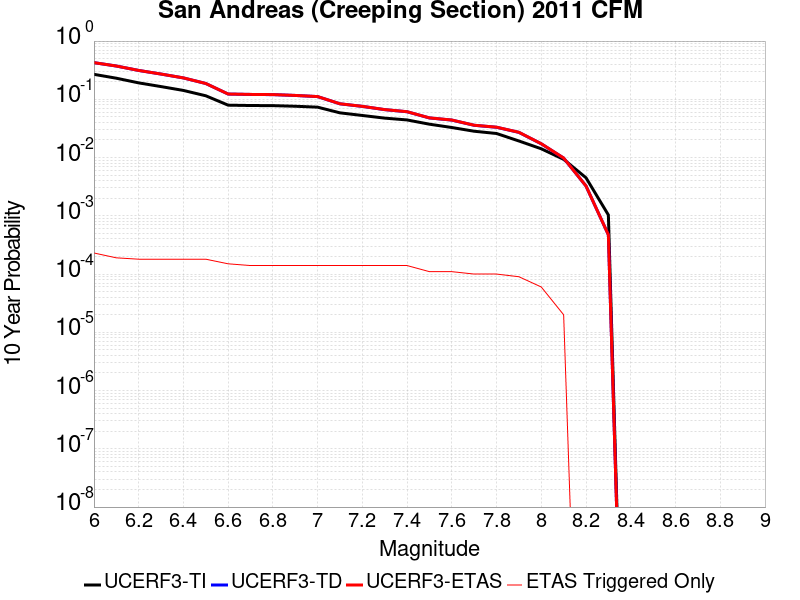 |

| Magnitude | 1 wk TI Prob | 1 wk TD Prob | 1 wk ETAS Prob | 1 wk ETAS/TD Gain | 1 wk ETAS Triggered Only | 1 mo TI Prob | 1 mo TD Prob | 1 mo ETAS Prob | 1 mo ETAS/TD Gain | 1 mo ETAS Triggered Only | 1 yr TI Prob | 1 yr TD Prob | 1 yr ETAS Prob | 1 yr ETAS/TD Gain | 1 yr ETAS Triggered Only | 10 yr TI Prob | 10 yr TD Prob | 10 yr ETAS Prob | 10 yr ETAS/TD Gain | 10 yr ETAS Triggered Only |
|-----|-----|-----|-----|-----|-----|-----|-----|-----|-----|-----|-----|-----|-----|-----|-----|-----|-----|-----|-----|-----|
| 6.0 | 5.986481E-4 | 0.0012275929 | 0.0013374579 | 1.0894963 | 1.1E-4 | 0.0025631124 | 0.005245547 | 0.0053748647 | 1.024653 | 1.3E-4 | 0.030762846 | 0.06120491 | 0.061373893 | 1.0027609 | 1.8E-4 | 0.26835477 | 0.42593494 | 0.42606696 | 1.00031 | 2.3E-4 |
| 6.1 | 5.015945E-4 | 0.0010217986 | 0.0011017168 | 1.0782133 | 8.0E-5 | 0.00214792 | 0.0043678596 | 0.0044674226 | 1.0227945 | 1.0E-4 | 0.025839351 | 0.05124837 | 0.05139068 | 1.002777 | 1.5E-4 | 0.23032776 | 0.37285668 | 0.37297583 | 1.0003196 | 1.9E-4 |
| 6.2 | 4.073338E-4 | 8.1073755E-4 | 8.906727E-4 | 1.0985956 | 8.0E-5 | 0.0017445484 | 0.0034671477 | 0.0035668008 | 1.0287422 | 1.0E-4 | 0.021034058 | 0.04093317 | 0.041067436 | 1.0032802 | 1.4E-4 | 0.19150782 | 0.31303346 | 0.3131571 | 1.000395 | 1.8E-4 |
| 6.3 | 3.464099E-4 | 6.7391695E-4 | 7.53863E-4 | 1.118629 | 8.0E-5 | 0.0014837692 | 0.0028829593 | 0.0029826711 | 1.0345865 | 1.0E-4 | 0.017915873 | 0.034189582 | 0.034324795 | 1.0039548 | 1.4E-4 | 0.16538359 | 0.2713166 | 0.27144775 | 1.0004834 | 1.8E-4 |
| 6.4 | 2.935057E-4 | 5.5442745E-4 | 6.3438306E-4 | 1.144213 | 8.0E-5 | 0.0012572751 | 0.0023725363 | 0.0024722992 | 1.0420489 | 1.0E-4 | 0.015200248 | 0.02826451 | 0.028400553 | 1.0048132 | 1.4E-4 | 0.14201577 | 0.23298529 | 0.23312335 | 1.0005926 | 1.8E-4 |
| 6.5 | 2.3409708E-4 | 4.2093755E-4 | 5.009039E-4 | 1.1899719 | 8.0E-5 | 0.0010028875 | 0.0018019684 | 0.0019017883 | 1.0553949 | 1.0E-4 | 0.012141965 | 0.021587461 | 0.02172444 | 1.0063453 | 1.4E-4 | 0.11499573 | 0.18682368 | 0.18697006 | 1.0007834 | 1.8E-4 |
| 6.6 | 1.5842178E-4 | 2.506933E-4 | 3.2067575E-4 | 1.2791556 | 7.0E-5 | 6.7877385E-4 | 0.0010739497 | 0.0011638531 | 1.0837128 | 9.0E-5 | 0.0082328 | 0.012995575 | 0.013104145 | 1.0083544 | 1.1E-4 | 0.07934396 | 0.12314638 | 0.12327791 | 1.0010681 | 1.5E-4 |
| 6.7 | 1.5616413E-4 | 2.4605883E-4 | 3.160416E-4 | 1.2844148 | 7.0E-5 | 6.691031E-4 | 0.0010541069 | 0.001144012 | 1.0852903 | 9.0E-5 | 0.0081159435 | 0.01275744 | 0.012856164 | 1.0077386 | 1.0E-4 | 0.0782586 | 0.12117351 | 0.12129655 | 1.0010154 | 1.4E-4 |
| 6.8 | 1.5538467E-4 | 2.4429744E-4 | 3.1428036E-4 | 1.286466 | 7.0E-5 | 6.6576427E-4 | 0.0010465645 | 0.0011364704 | 1.0859057 | 9.0E-5 | 0.008075596 | 0.012666838 | 0.012765572 | 1.0077946 | 1.0E-4 | 0.07788358 | 0.120404355 | 0.1205275 | 1.0010227 | 1.4E-4 |
| 6.9 | 1.5153569E-4 | 2.3539034E-4 | 3.0537386E-4 | 1.2973084 | 7.0E-5 | 6.49277E-4 | 0.0010084276 | 0.0010983369 | 1.0891578 | 9.0E-5 | 0.007876333 | 0.01220901 | 0.01230779 | 1.0080906 | 1.0E-4 | 0.07602952 | 0.11647445 | 0.116598144 | 1.001062 | 1.4E-4 |
| 7.0 | 1.4588932E-4 | 2.2396253E-4 | 2.9394685E-4 | 1.3124822 | 7.0E-5 | 6.250901E-4 | 9.5948833E-4 | 0.0010494019 | 1.09371 | 9.0E-5 | 0.0075839474 | 0.011619697 | 0.011718535 | 1.0085061 | 1.0E-4 | 0.073302895 | 0.11132046 | 0.11144487 | 1.0011176 | 1.4E-4 |
| 7.1 | 1.1565079E-4 | 1.6281738E-4 | 2.3280598E-4 | 1.4298595 | 7.0E-5 | 4.955521E-4 | 6.9760304E-4 | 7.875402E-4 | 1.1289232 | 9.0E-5 | 0.006016669 | 0.0084604435 | 0.008559597 | 1.0117197 | 1.0E-4 | 0.058563538 | 0.08367046 | 0.083798744 | 1.0015333 | 1.4E-4 |
| 7.2 | 1.0393792E-4 | 1.4615769E-4 | 2.1614745E-4 | 1.4788648 | 7.0E-5 | 4.4537216E-4 | 6.2624045E-4 | 7.161841E-4 | 1.1436248 | 9.0E-5 | 0.005408933 | 0.0075979927 | 0.007697233 | 1.0130614 | 1.0E-4 | 0.052791595 | 0.07561969 | 0.07574911 | 1.0017114 | 1.4E-4 |
| 7.3 | 9.332884E-5 | 1.2780898E-4 | 1.9780004E-4 | 1.5476223 | 7.0E-5 | 3.999194E-4 | 5.4763845E-4 | 6.3758914E-4 | 1.164252 | 9.0E-5 | 0.0048581534 | 0.006647249 | 0.006746584 | 1.0149438 | 1.0E-4 | 0.047533102 | 0.06648326 | 0.06661395 | 1.0019658 | 1.4E-4 |
| 7.4 | 8.670252E-5 | 1.17032345E-4 | 1.8702415E-4 | 1.5980552 | 7.0E-5 | 3.715293E-4 | 5.0147134E-4 | 5.914262E-4 | 1.1793818 | 9.0E-5 | 0.004513991 | 0.006088443 | 0.0061878343 | 1.0163245 | 1.0E-4 | 0.044233937 | 0.061151642 | 0.06128308 | 1.0021493 | 1.4E-4 |
| 7.5 | 7.3036405E-5 | 9.005856E-5 | 1.4005406E-4 | 1.5551443 | 5.0E-5 | 3.129756E-4 | 3.8590826E-4 | 4.5588124E-4 | 1.1813203 | 7.0E-5 | 0.0038038217 | 0.0046883323 | 0.004767957 | 1.0169836 | 8.0E-5 | 0.03739367 | 0.047877792 | 0.047982525 | 1.0021875 | 1.1E-4 |
| 7.6 | 6.3935775E-5 | 8.280385E-5 | 1.327997E-4 | 1.6037867 | 5.0E-5 | 2.7398168E-4 | 3.5482543E-4 | 4.248006E-4 | 1.1972101 | 7.0E-5 | 0.0033306254 | 0.004311461 | 0.004391116 | 1.0184752 | 8.0E-5 | 0.032811474 | 0.04399201 | 0.04409717 | 1.0023905 | 1.1E-4 |
| 7.7 | 5.5050095E-5 | 6.6618326E-5 | 1.0661566E-4 | 1.6003953 | 4.0E-5 | 2.3590765E-4 | 2.854759E-4 | 3.4545877E-4 | 1.2101153 | 6.0E-5 | 0.0028683927 | 0.003470134 | 0.003539891 | 1.0201021 | 7.0E-5 | 0.0283165 | 0.035796214 | 0.03589263 | 1.0026935 | 1.0E-4 |
| 7.8 | 5.027131E-5 | 6.162871E-5 | 1.0162624E-4 | 1.6490082 | 4.0E-5 | 2.1543067E-4 | 2.640963E-4 | 3.2408047E-4 | 1.2271298 | 6.0E-5 | 0.0026197135 | 0.003210635 | 0.0032804103 | 1.0217326 | 7.0E-5 | 0.025890453 | 0.03312666 | 0.033223346 | 1.0029187 | 1.0E-4 |
| 7.9 | 3.7271806E-5 | 5.022507E-5 | 9.022306E-5 | 1.796375 | 4.0E-5 | 1.5972654E-4 | 2.1523255E-4 | 2.7521962E-4 | 1.2787082 | 6.0E-5 | 0.0019429359 | 0.002617309 | 0.002687126 | 1.026675 | 7.0E-5 | 0.019260362 | 0.027067466 | 0.027155029 | 1.003235 | 9.0E-5 |
| 8.0 | 2.7310243E-5 | 3.1427757E-5 | 7.14265E-5 | 2.2727203 | 4.0E-5 | 1.17038646E-4 | 1.3468343E-4 | 1.8467671E-4 | 1.3711909 | 5.0E-5 | 0.0014240141 | 0.0016385383 | 0.0016884564 | 1.030465 | 5.0E-5 | 0.014149235 | 0.01721386 | 0.017272828 | 1.0034256 | 6.0E-5 |
| 8.1 | 1.7940547E-5 | 1.7399378E-5 | 2.7399203E-5 | 1.5747232 | 1.0E-5 | 7.688579E-5 | 7.456663E-5 | 9.456514E-5 | 1.2681965 | 2.0E-5 | 9.3568244E-4 | 9.074711E-4 | 9.27453E-4 | 1.0220193 | 2.0E-5 | 0.009317525 | 0.009798636 | 0.009818439 | 1.0020211 | 2.0E-5 |
| 8.2 | 8.643924E-6 | 5.473668E-6 | 5.473668E-6 | 1.0 | 0.0 | 3.704486E-5 | 2.3458366E-5 | 2.3458366E-5 | 1.0 | 0.0 | 4.5092785E-4 | 2.8556827E-4 | 2.8556827E-4 | 1.0 | 0.0 | 0.0045001395 | 0.0032481793 | 0.0032481793 | 1.0 | 0.0 |
| 8.3 | 1.983087E-6 | 7.6564595E-7 | 7.6564595E-7 | 1.0 | 0.0 | 8.498917E-6 | 3.281336E-6 | 3.281336E-6 | 1.0 | 0.0 | 1.034694E-4 | 3.9949547E-5 | 3.9949547E-5 | 1.0 | 0.0 | 0.0010342124 | 4.717979E-4 | 4.717979E-4 | 1.0 | 0.0 |

## Death Valley (Fish Lake Valley)
*[(top)](#table-of-contents)*

| 1 Week | 1 Month | 1 Year | 10 Year |
|-----|-----|-----|-----|
|  |  |  |  |

| Magnitude | 1 wk TI Prob | 1 wk TD Prob | 1 wk ETAS Prob | 1 wk ETAS/TD Gain | 1 wk ETAS Triggered Only | 1 mo TI Prob | 1 mo TD Prob | 1 mo ETAS Prob | 1 mo ETAS/TD Gain | 1 mo ETAS Triggered Only | 1 yr TI Prob | 1 yr TD Prob | 1 yr ETAS Prob | 1 yr ETAS/TD Gain | 1 yr ETAS Triggered Only | 10 yr TI Prob | 10 yr TD Prob | 10 yr ETAS Prob | 10 yr ETAS/TD Gain | 10 yr ETAS Triggered Only |
|-----|-----|-----|-----|-----|-----|-----|-----|-----|-----|-----|-----|-----|-----|-----|-----|-----|-----|-----|-----|-----|
| 6.0 | 3.872328E-5 | 4.7265705E-5 | 1.7725956E-4 | 3.7502787 | 1.3E-4 | 1.6594635E-4 | 2.0255324E-4 | 3.425249E-4 | 1.6910362 | 1.4E-4 | 0.0020185246 | 0.0024635606 | 0.0026431172 | 1.0728849 | 1.8E-4 | 0.02000288 | 0.024388338 | 0.024593215 | 1.0084007 | 2.1E-4 |
| 6.1 | 3.872328E-5 | 4.7265705E-5 | 1.7725956E-4 | 3.7502787 | 1.3E-4 | 1.6594635E-4 | 2.0255324E-4 | 3.425249E-4 | 1.6910362 | 1.4E-4 | 0.0020185246 | 0.0024635606 | 0.0026431172 | 1.0728849 | 1.8E-4 | 0.02000288 | 0.024388338 | 0.024593215 | 1.0084007 | 2.1E-4 |
| 6.2 | 3.872328E-5 | 4.7265705E-5 | 1.7725956E-4 | 3.7502787 | 1.3E-4 | 1.6594635E-4 | 2.0255324E-4 | 3.425249E-4 | 1.6910362 | 1.4E-4 | 0.0020185246 | 0.0024635606 | 0.0026431172 | 1.0728849 | 1.8E-4 | 0.02000288 | 0.024388338 | 0.024593215 | 1.0084007 | 2.1E-4 |
| 6.3 | 2.8356371E-5 | 3.360979E-5 | 1.6360542E-4 | 4.8677907 | 1.3E-4 | 1.2152165E-4 | 1.4403443E-4 | 2.8401427E-4 | 1.9718498 | 1.4E-4 | 0.0014785219 | 0.0017522788 | 0.0019319634 | 1.1025434 | 1.8E-4 | 0.014687235 | 0.017391816 | 0.017598163 | 1.0118647 | 2.1E-4 |
| 6.4 | 2.8356371E-5 | 3.360979E-5 | 1.6360542E-4 | 4.8677907 | 1.3E-4 | 1.2152165E-4 | 1.4403443E-4 | 2.8401427E-4 | 1.9718498 | 1.4E-4 | 0.0014785219 | 0.0017522788 | 0.0019319634 | 1.1025434 | 1.8E-4 | 0.014687235 | 0.017391816 | 0.017598163 | 1.0118647 | 2.1E-4 |
| 6.5 | 2.4448687E-5 | 2.8607585E-5 | 1.5860387E-4 | 5.5441194 | 1.3E-4 | 1.0477588E-4 | 1.2259845E-4 | 2.6258128E-4 | 2.1417994 | 1.4E-4 | 0.0012748998 | 0.0014916616 | 0.0016713932 | 1.1204908 | 1.8E-4 | 0.012676105 | 0.014821392 | 0.015028279 | 1.0139587 | 2.1E-4 |
| 6.6 | 2.1298161E-5 | 2.4660083E-5 | 1.5465688E-4 | 6.2715473 | 1.3E-4 | 9.127464E-5 | 1.0568197E-4 | 2.4566718E-4 | 2.3245893 | 1.4E-4 | 0.0011107022 | 0.0012859512 | 0.0014657198 | 1.1397942 | 1.8E-4 | 0.011051672 | 0.01278853 | 0.012995845 | 1.0162109 | 2.1E-4 |
| 6.7 | 1.8959729E-5 | 2.1781027E-5 | 1.517782E-4 | 6.9683676 | 1.3E-4 | 8.125345E-5 | 9.334406E-5 | 2.33331E-4 | 2.4996877 | 1.4E-4 | 9.888117E-4 | 0.001135897 | 0.0013156926 | 1.158285 | 1.8E-4 | 0.009844234 | 0.01130357 | 0.011511196 | 1.0183682 | 2.1E-4 |
| 6.8 | 1.6691629E-5 | 1.9018351E-5 | 1.4901588E-4 | 7.835373 | 1.3E-4 | 7.153359E-5 | 8.150477E-5 | 2.2149336E-4 | 2.7175508 | 1.4E-4 | 8.7057345E-4 | 9.918857E-4 | 0.0011617171 | 1.1712207 | 1.7E-4 | 0.008671708 | 0.009876343 | 0.010074369 | 1.0200504 | 2.0E-4 |
| 6.9 | 1.450505E-5 | 1.638954E-5 | 1.3638758E-4 | 8.321623 | 1.2E-4 | 6.216302E-5 | 7.0239046E-5 | 2.0022992E-4 | 2.8506925 | 1.3E-4 | 7.5657194E-4 | 8.5483363E-4 | 0.0010146969 | 1.1870109 | 1.6E-4 | 0.007540013 | 0.008516386 | 0.008704768 | 1.0221199 | 1.9E-4 |
| 7.0 | 1.2940855E-5 | 1.4537972E-5 | 1.3453623E-4 | 9.254127 | 1.2E-4 | 5.545963E-5 | 6.230414E-5 | 1.9229604E-4 | 3.0864089 | 1.3E-4 | 6.750118E-4 | 7.5829466E-4 | 9.1817335E-4 | 1.2108397 | 1.6E-4 | 0.006729651 | 0.0075576897 | 0.007746254 | 1.0249499 | 1.9E-4 |
| 7.1 | 1.2544658E-5 | 1.4078208E-5 | 1.3407652E-4 | 9.523692 | 1.2E-4 | 5.3761712E-5 | 6.0333812E-5 | 1.9032597E-4 | 3.1545491 | 1.3E-4 | 6.5435225E-4 | 7.343222E-4 | 8.942047E-4 | 1.217728 | 1.6E-4 | 0.006524288 | 0.007319551 | 0.00750816 | 1.0257679 | 1.9E-4 |
| 7.2 | 1.2489416E-5 | 1.4015674E-5 | 1.3401399E-4 | 9.561723 | 1.2E-4 | 5.3524967E-5 | 6.0065824E-5 | 1.9005801E-4 | 3.1641624 | 1.3E-4 | 6.514716E-4 | 7.310616E-4 | 8.909447E-4 | 1.2186998 | 1.6E-4 | 0.006495651 | 0.0072871596 | 0.007475775 | 1.0258833 | 1.9E-4 |
| 7.3 | 1.2368307E-5 | 1.3879812E-5 | 1.3387814E-4 | 9.64553 | 1.2E-4 | 5.3005948E-5 | 5.9483587E-5 | 1.8947585E-4 | 3.1853468 | 1.3E-4 | 6.451563E-4 | 7.2397763E-4 | 8.838618E-4 | 1.2208413 | 1.6E-4 | 0.0064328653 | 0.007216782 | 0.0074054105 | 1.0261375 | 1.9E-4 |
| 7.4 | 1.2161707E-5 | 1.36478675E-5 | 1.3364623E-4 | 9.792462 | 1.2E-4 | 5.212056E-5 | 5.8489582E-5 | 1.8848198E-4 | 3.222488 | 1.3E-4 | 6.3438306E-4 | 7.118836E-4 | 8.717697E-4 | 1.2245959 | 1.6E-4 | 0.006325751 | 0.0070966207 | 0.0072852722 | 1.0265833 | 1.9E-4 |
| 7.5 | 1.1707948E-5 | 1.3145515E-5 | 1.3314394E-4 | 10.1284685 | 1.2E-4 | 5.0175953E-5 | 5.6336736E-5 | 1.8632942E-4 | 3.3074229 | 1.3E-4 | 6.10721E-4 | 6.856895E-4 | 8.455798E-4 | 1.2331817 | 1.6E-4 | 0.0060904534 | 0.006836321 | 0.0070250225 | 1.0276027 | 1.9E-4 |
| 7.6 | 1.0319538E-5 | 1.1579622E-5 | 1.3157823E-4 | 11.362912 | 1.2E-4 | 4.4225842E-5 | 4.9626036E-5 | 1.7961959E-4 | 3.6194625 | 1.3E-4 | 5.383166E-4 | 6.040347E-4 | 7.6393806E-4 | 1.2647254 | 1.6E-4 | 0.0053701443 | 0.0060244603 | 0.0062133158 | 1.0313481 | 1.9E-4 |
| 7.7 | 8.937764E-6 | 1.0022779E-5 | 1.2002168E-4 | 11.97489 | 1.1E-4 | 3.830414E-5 | 4.295409E-5 | 1.6294894E-4 | 3.7935605 | 1.2E-4 | 4.6625308E-4 | 5.228456E-4 | 6.727672E-4 | 1.2867416 | 1.5E-4 | 0.0046527605 | 0.005216664 | 0.0053857774 | 1.0324179 | 1.7E-4 |
| 7.8 | 3.108007E-7 | 3.284654E-7 | 3.284654E-7 | 1.0 | 0.0 | 1.3320023E-6 | 1.407708E-6 | 1.407708E-6 | 1.0 | 0.0 | 1.6217007E-5 | 1.7138715E-5 | 1.7138715E-5 | 1.0 | 0.0 | 1.6215823E-4 | 1.7137431E-4 | 1.7137431E-4 | 1.0 | 0.0 |
| 7.9 | 2.5591178E-9 | 2.6696718E-9 | 2.6696718E-9 | 1.0 | 0.0 | 1.0967647E-8 | 1.14414505E-8 | 1.14414505E-8 | 1.0 | 0.0 | 1.335311E-7 | 1.3929966E-7 | 1.3929966E-7 | 1.0 | 0.0 | 1.3353102E-6 | 1.3929966E-6 | 1.3929966E-6 | 1.0 | 0.0 |

## Manix-Afton Hills
*[(top)](#table-of-contents)*

| 1 Week | 1 Month | 1 Year | 10 Year |
|-----|-----|-----|-----|
|  |  |  |  |

| Magnitude | 1 wk TI Prob | 1 wk TD Prob | 1 wk ETAS Prob | 1 wk ETAS/TD Gain | 1 wk ETAS Triggered Only | 1 mo TI Prob | 1 mo TD Prob | 1 mo ETAS Prob | 1 mo ETAS/TD Gain | 1 mo ETAS Triggered Only | 1 yr TI Prob | 1 yr TD Prob | 1 yr ETAS Prob | 1 yr ETAS/TD Gain | 1 yr ETAS Triggered Only | 10 yr TI Prob | 10 yr TD Prob | 10 yr ETAS Prob | 10 yr ETAS/TD Gain | 10 yr ETAS Triggered Only |
|-----|-----|-----|-----|-----|-----|-----|-----|-----|-----|-----|-----|-----|-----|-----|-----|-----|-----|-----|-----|-----|
| 6.0 | 1.3783202E-5 | 1.47110895E-5 | 1.2470948E-4 | 8.477242 | 1.1E-4 | 5.906953E-5 | 6.30461E-5 | 1.9303791E-4 | 3.0618532 | 1.3E-4 | 7.189342E-4 | 7.6733343E-4 | 9.37203E-4 | 1.2213764 | 1.7E-4 | 0.0071661277 | 0.007648596 | 0.007856989 | 1.027246 | 2.1E-4 |
| 6.1 | 1.3783202E-5 | 1.47110895E-5 | 1.2470948E-4 | 8.477242 | 1.1E-4 | 5.906953E-5 | 6.30461E-5 | 1.9303791E-4 | 3.0618532 | 1.3E-4 | 7.189342E-4 | 7.6733343E-4 | 9.37203E-4 | 1.2213764 | 1.7E-4 | 0.0071661277 | 0.007648596 | 0.007856989 | 1.027246 | 2.1E-4 |
| 6.2 | 1.3783202E-5 | 1.47110895E-5 | 1.2470948E-4 | 8.477242 | 1.1E-4 | 5.906953E-5 | 6.30461E-5 | 1.9303791E-4 | 3.0618532 | 1.3E-4 | 7.189342E-4 | 7.6733343E-4 | 9.37203E-4 | 1.2213764 | 1.7E-4 | 0.0071661277 | 0.007648596 | 0.007856989 | 1.027246 | 2.1E-4 |
| 6.3 | 1.10494875E-5 | 1.1793136E-5 | 1.0179207E-4 | 8.631468 | 9.0E-5 | 4.7354086E-5 | 5.054109E-5 | 1.5053604E-4 | 2.9784882 | 1.0E-4 | 5.763835E-4 | 6.151744E-4 | 7.550883E-4 | 1.2274377 | 1.4E-4 | 0.005748908 | 0.0061357557 | 0.0063047125 | 1.0275364 | 1.7E-4 |
| 6.4 | 1.10494875E-5 | 1.1793136E-5 | 1.0179207E-4 | 8.631468 | 9.0E-5 | 4.7354086E-5 | 5.054109E-5 | 1.5053604E-4 | 2.9784882 | 1.0E-4 | 5.763835E-4 | 6.151744E-4 | 7.550883E-4 | 1.2274377 | 1.4E-4 | 0.005748908 | 0.0061357557 | 0.0063047125 | 1.0275364 | 1.7E-4 |
| 6.5 | 9.788949E-6 | 1.045432E-5 | 8.045359E-5 | 7.695727 | 7.0E-5 | 4.1951964E-5 | 4.480351E-5 | 1.2479993E-4 | 2.7854943 | 8.0E-5 | 5.1064545E-4 | 5.453555E-4 | 6.6529005E-4 | 1.2199199 | 1.2E-4 | 0.0050947363 | 0.0054410985 | 0.005580337 | 1.0255901 | 1.4E-4 |
| 6.6 | 8.810006E-6 | 9.4136285E-6 | 6.9413065E-5 | 7.373678 | 6.0E-5 | 3.775662E-5 | 4.0343548E-5 | 1.1034072E-4 | 2.7350278 | 7.0E-5 | 4.5958988E-4 | 4.9108086E-4 | 5.9103174E-4 | 1.2035325 | 1.0E-4 | 0.0045864056 | 0.004900839 | 0.005020251 | 1.0243655 | 1.2E-4 |
| 6.7 | 8.80128E-6 | 9.404108E-6 | 6.940354E-5 | 7.3801303 | 6.0E-5 | 3.7719226E-5 | 4.0302748E-5 | 1.1029992E-4 | 2.7367842 | 7.0E-5 | 4.591348E-4 | 4.9058435E-4 | 5.905353E-4 | 1.2037386 | 1.0E-4 | 0.004581874 | 0.0048958957 | 0.0050153085 | 1.0243903 | 1.2E-4 |
| 6.8 | 6.8994877E-6 | 7.380076E-6 | 6.737963E-5 | 9.129937 | 6.0E-5 | 2.9568899E-5 | 3.162856E-5 | 9.1626665E-5 | 2.8969598 | 6.0E-5 | 3.5994186E-4 | 3.8501783E-4 | 4.749832E-4 | 1.2336653 | 9.0E-5 | 0.003593594 | 0.0038443129 | 0.00395389 | 1.0285037 | 1.1E-4 |
| 6.9 | 4.9328037E-6 | 5.2709615E-6 | 5.52707E-5 | 10.485886 | 5.0E-5 | 2.1140417E-5 | 2.2589675E-5 | 7.258855E-5 | 3.2133508 | 5.0E-5 | 2.5735417E-4 | 2.7500073E-4 | 3.4498147E-4 | 1.2544748 | 7.0E-5 | 0.0025705635 | 0.0027472095 | 0.0028269896 | 1.0290405 | 8.0E-5 |
| 7.0 | 3.347973E-6 | 3.59003E-6 | 2.3589959E-5 | 6.5709643 | 2.0E-5 | 1.4348378E-5 | 1.5385775E-5 | 3.5385467E-5 | 2.299882 | 2.0E-5 | 1.746775E-4 | 1.8730981E-4 | 2.2730233E-4 | 1.2135099 | 4.0E-5 | 0.0017454025 | 0.0018719219 | 0.001911847 | 1.0213284 | 4.0E-5 |
| 7.1 | 1.2073567E-6 | 1.293482E-6 | 1.12934695E-5 | 8.73106 | 1.0E-5 | 5.1743755E-6 | 5.543492E-6 | 1.5543437E-5 | 2.8039072 | 1.0E-5 | 6.29962E-5 | 6.749156E-5 | 7.7490884E-5 | 1.1481566 | 1.0E-5 | 6.297835E-4 | 6.7487074E-4 | 6.84864E-4 | 1.0148077 | 1.0E-5 |

## Lake Isabella (Seismicity)
*[(top)](#table-of-contents)*

| 1 Week | 1 Month | 1 Year | 10 Year |
|-----|-----|-----|-----|
|  |  |  |  |

| Magnitude | 1 wk TI Prob | 1 wk TD Prob | 1 wk ETAS Prob | 1 wk ETAS/TD Gain | 1 wk ETAS Triggered Only | 1 mo TI Prob | 1 mo TD Prob | 1 mo ETAS Prob | 1 mo ETAS/TD Gain | 1 mo ETAS Triggered Only | 1 yr TI Prob | 1 yr TD Prob | 1 yr ETAS Prob | 1 yr ETAS/TD Gain | 1 yr ETAS Triggered Only | 10 yr TI Prob | 10 yr TD Prob | 10 yr ETAS Prob | 10 yr ETAS/TD Gain | 10 yr ETAS Triggered Only |
|-----|-----|-----|-----|-----|-----|-----|-----|-----|-----|-----|-----|-----|-----|-----|-----|-----|-----|-----|-----|-----|
| 6.0 | 9.431637E-6 | 9.741651E-6 | 1.4974028E-4 | 15.37114 | 1.4E-4 | 4.0420677E-5 | 4.1749343E-5 | 1.817435E-4 | 4.353206 | 1.4E-4 | 4.920106E-4 | 5.0819275E-4 | 6.781064E-4 | 1.3343488 | 1.7E-4 | 0.004909227 | 0.005071599 | 0.0052705845 | 1.0392354 | 2.0E-4 |
| 6.1 | 9.431637E-6 | 9.741651E-6 | 1.4974028E-4 | 15.37114 | 1.4E-4 | 4.0420677E-5 | 4.1749343E-5 | 1.817435E-4 | 4.353206 | 1.4E-4 | 4.920106E-4 | 5.0819275E-4 | 6.781064E-4 | 1.3343488 | 1.7E-4 | 0.004909227 | 0.005071599 | 0.0052705845 | 1.0392354 | 2.0E-4 |
| 6.2 | 9.431637E-6 | 9.741651E-6 | 1.4974028E-4 | 15.37114 | 1.4E-4 | 4.0420677E-5 | 4.1749343E-5 | 1.817435E-4 | 4.353206 | 1.4E-4 | 4.920106E-4 | 5.0819275E-4 | 6.781064E-4 | 1.3343488 | 1.7E-4 | 0.004909227 | 0.005071599 | 0.0052705845 | 1.0392354 | 2.0E-4 |
| 6.3 | 9.431637E-6 | 9.741651E-6 | 1.4974028E-4 | 15.37114 | 1.4E-4 | 4.0420677E-5 | 4.1749343E-5 | 1.817435E-4 | 4.353206 | 1.4E-4 | 4.920106E-4 | 5.0819275E-4 | 6.781064E-4 | 1.3343488 | 1.7E-4 | 0.004909227 | 0.005071599 | 0.0052705845 | 1.0392354 | 2.0E-4 |
| 6.4 | 5.144063E-6 | 5.3000763E-6 | 9.52996E-5 | 17.980799 | 9.0E-5 | 2.2045799E-5 | 2.2714434E-5 | 1.1271239E-4 | 4.962148 | 9.0E-5 | 2.6837454E-4 | 2.765166E-4 | 3.964834E-4 | 1.4338503 | 1.2E-4 | 0.0026805066 | 0.0027620657 | 0.0028917065 | 1.0469363 | 1.3E-4 |
| 6.5 | 5.144063E-6 | 5.3000763E-6 | 9.52996E-5 | 17.980799 | 9.0E-5 | 2.2045799E-5 | 2.2714434E-5 | 1.1271239E-4 | 4.962148 | 9.0E-5 | 2.6837454E-4 | 2.765166E-4 | 3.964834E-4 | 1.4338503 | 1.2E-4 | 0.0026805066 | 0.0027620657 | 0.0028917065 | 1.0469363 | 1.3E-4 |
| 6.6 | 3.4009804E-6 | 3.498786E-6 | 6.349858E-5 | 18.148745 | 6.0E-5 | 1.4575549E-5 | 1.4994721E-5 | 7.499382E-5 | 5.0013485 | 6.0E-5 | 1.7744285E-4 | 1.8254704E-4 | 2.5253426E-4 | 1.3833928 | 7.0E-5 | 0.0017730123 | 0.0018241286 | 0.0018940009 | 1.0383044 | 7.0E-5 |
| 6.7 | 3.3880428E-6 | 3.4856528E-6 | 6.3485444E-5 | 18.213358 | 6.0E-5 | 1.4520103E-5 | 1.4938435E-5 | 7.493754E-5 | 5.0164247 | 6.0E-5 | 1.767679E-4 | 1.8186188E-4 | 2.5184915E-4 | 1.3848375 | 7.0E-5 | 0.0017662736 | 0.0018172882 | 0.001887161 | 1.0384489 | 7.0E-5 |
| 6.8 | 2.6582E-6 | 2.7337003E-6 | 4.273359E-5 | 15.632142 | 4.0E-5 | 1.1392236E-5 | 1.1715813E-5 | 5.1715346E-5 | 4.414149 | 4.0E-5 | 1.3869164E-4 | 1.4263204E-4 | 1.926249E-4 | 1.3505024 | 5.0E-5 | 0.0013860512 | 0.0014255369 | 0.0014754656 | 1.0350245 | 5.0E-5 |
| 6.9 | 2.406011E-6 | 2.4743288E-6 | 4.247423E-5 | 17.16596 | 4.0E-5 | 1.0311434E-5 | 1.0604231E-5 | 5.0603805E-5 | 4.7720394 | 4.0E-5 | 1.2553448E-4 | 1.2910018E-4 | 1.7909372E-4 | 1.3872461 | 5.0E-5 | 0.0012546359 | 0.0012903814 | 0.001340317 | 1.0386982 | 5.0E-5 |
| 7.0 | 1.6953097E-6 | 1.7429371E-6 | 2.1742902E-5 | 12.474863 | 2.0E-5 | 7.265593E-6 | 7.469715E-6 | 2.7469567E-5 | 3.6774583 | 2.0E-5 | 8.8455E-5 | 9.094104E-5 | 1.1093922E-4 | 1.2199028 | 2.0E-5 | 8.84198E-4 | 9.09141E-4 | 9.291228E-4 | 1.0219787 | 2.0E-5 |
| 7.1 | 3.5013824E-7 | 3.5714822E-7 | 1.0357145E-5 | 28.999569 | 1.0E-5 | 1.5005916E-6 | 1.5306344E-6 | 1.1530619E-5 | 7.533229 | 1.0E-5 | 1.826955E-5 | 1.8635317E-5 | 2.8635131E-5 | 1.5366055 | 1.0E-5 | 1.8268047E-4 | 1.863378E-4 | 1.9633592E-4 | 1.053656 | 1.0E-5 |
| 7.2 | 2.2321095E-7 | 2.2750574E-7 | 1.02275035E-5 | 44.954926 | 1.0E-5 | 9.56618E-7 | 9.750242E-7 | 1.0975014E-5 | 11.2561455 | 1.0E-5 | 1.1646762E-5 | 1.1870856E-5 | 2.1870737E-5 | 1.8423892 | 1.0E-5 | 1.1646151E-4 | 1.1870232E-4 | 1.2870114E-4 | 1.0842344 | 1.0E-5 |
| 7.3 | 1.5760406E-7 | 1.6060922E-7 | 1.6060922E-7 | 1.0 | 0.0 | 6.7544585E-7 | 6.8832503E-7 | 6.8832503E-7 | 1.0 | 0.0 | 8.223522E-6 | 8.380326E-6 | 8.380326E-6 | 1.0 | 0.0 | 8.2232174E-5 | 8.3800165E-5 | 8.3800165E-5 | 1.0 | 0.0 |
| 7.4 | 1.1216497E-7 | 1.1431706E-7 | 1.1431706E-7 | 1.0 | 0.0 | 4.8070694E-7 | 4.899302E-7 | 4.899302E-7 | 1.0 | 0.0 | 5.852591E-6 | 5.964884E-6 | 5.964884E-6 | 1.0 | 0.0 | 5.8524372E-5 | 5.9647282E-5 | 5.9647282E-5 | 1.0 | 0.0 |
| 7.5 | 4.885185E-8 | 4.9787737E-8 | 4.9787737E-8 | 1.0 | 0.0 | 2.0936506E-7 | 2.13376E-7 | 2.13376E-7 | 1.0 | 0.0 | 2.5490165E-6 | 2.59785E-6 | 2.59785E-6 | 1.0 | 0.0 | 2.5489873E-5 | 2.5978214E-5 | 2.5978214E-5 | 1.0 | 0.0 |
| 7.6 | 1.504641E-9 | 1.5317903E-9 | 1.5317903E-9 | 1.0 | 0.0 | 6.4484613E-9 | 6.5648154E-9 | 6.5648154E-9 | 1.0 | 0.0 | 7.851001E-8 | 7.992663E-8 | 7.992663E-8 | 1.0 | 0.0 | 7.8509987E-7 | 7.992663E-7 | 7.992663E-7 | 1.0 | 0.0 |

## San Jacinto (San Jacinto Valley) rev
*[(top)](#table-of-contents)*

| 1 Week | 1 Month | 1 Year | 10 Year |
|-----|-----|-----|-----|
|  |  |  |  |

| Magnitude | 1 wk TI Prob | 1 wk TD Prob | 1 wk ETAS Prob | 1 wk ETAS/TD Gain | 1 wk ETAS Triggered Only | 1 mo TI Prob | 1 mo TD Prob | 1 mo ETAS Prob | 1 mo ETAS/TD Gain | 1 mo ETAS Triggered Only | 1 yr TI Prob | 1 yr TD Prob | 1 yr ETAS Prob | 1 yr ETAS/TD Gain | 1 yr ETAS Triggered Only | 10 yr TI Prob | 10 yr TD Prob | 10 yr ETAS Prob | 10 yr ETAS/TD Gain | 10 yr ETAS Triggered Only |
|-----|-----|-----|-----|-----|-----|-----|-----|-----|-----|-----|-----|-----|-----|-----|-----|-----|-----|-----|-----|-----|
| 6.0 | 3.652694E-5 | 3.4401106E-5 | 2.0439526E-4 | 5.9415317 | 1.7E-4 | 1.5653463E-4 | 1.4742499E-4 | 3.2739845E-4 | 2.22078 | 1.8E-4 | 0.0019041431 | 0.0017934233 | 0.0019830826 | 1.1057526 | 1.9E-4 | 0.018879099 | 0.018526303 | 0.018722596 | 1.0105954 | 2.0E-4 |
| 6.1 | 3.652694E-5 | 3.4401106E-5 | 2.0439526E-4 | 5.9415317 | 1.7E-4 | 1.5653463E-4 | 1.4742499E-4 | 3.2739845E-4 | 2.22078 | 1.8E-4 | 0.0019041431 | 0.0017934233 | 0.0019830826 | 1.1057526 | 1.9E-4 | 0.018879099 | 0.018526303 | 0.018722596 | 1.0105954 | 2.0E-4 |
| 6.2 | 3.652694E-5 | 3.4401106E-5 | 2.0439526E-4 | 5.9415317 | 1.7E-4 | 1.5653463E-4 | 1.4742499E-4 | 3.2739845E-4 | 2.22078 | 1.8E-4 | 0.0019041431 | 0.0017934233 | 0.0019830826 | 1.1057526 | 1.9E-4 | 0.018879099 | 0.018526303 | 0.018722596 | 1.0105954 | 2.0E-4 |
| 6.3 | 3.652694E-5 | 3.4401106E-5 | 2.0439526E-4 | 5.9415317 | 1.7E-4 | 1.5653463E-4 | 1.4742499E-4 | 3.2739845E-4 | 2.22078 | 1.8E-4 | 0.0019041431 | 0.0017934233 | 0.0019830826 | 1.1057526 | 1.9E-4 | 0.018879099 | 0.018526303 | 0.018722596 | 1.0105954 | 2.0E-4 |
| 6.4 | 3.646941E-5 | 3.432268E-5 | 2.0431685E-4 | 5.952823 | 1.7E-4 | 1.5628811E-4 | 1.4708891E-4 | 3.2706244E-4 | 2.2235696 | 1.8E-4 | 0.0019011468 | 0.0017893389 | 0.0019789988 | 1.1059945 | 1.9E-4 | 0.018849645 | 0.018486181 | 0.018682485 | 1.0106189 | 2.0E-4 |
| 6.5 | 3.646941E-5 | 3.432268E-5 | 2.0431685E-4 | 5.952823 | 1.7E-4 | 1.5628811E-4 | 1.4708891E-4 | 3.2706244E-4 | 2.2235696 | 1.8E-4 | 0.0019011468 | 0.0017893389 | 0.0019789988 | 1.1059945 | 1.9E-4 | 0.018849645 | 0.018486181 | 0.018682485 | 1.0106189 | 2.0E-4 |
| 6.6 | 3.6442503E-5 | 3.4286066E-5 | 2.0428024E-4 | 5.9581122 | 1.7E-4 | 1.561728E-4 | 1.4693203E-4 | 3.2690557E-4 | 2.2248764 | 1.8E-4 | 0.0018997455 | 0.001787432 | 0.0019770924 | 1.1061077 | 1.9E-4 | 0.018835869 | 0.01846745 | 0.018663757 | 1.0106299 | 2.0E-4 |
| 6.7 | 3.6432113E-5 | 3.427164E-5 | 2.0426582E-4 | 5.9601994 | 1.7E-4 | 1.5612828E-4 | 1.4687021E-4 | 3.268438E-4 | 2.2253919 | 1.8E-4 | 0.0018992044 | 0.0017866807 | 0.0019763412 | 1.1061524 | 1.9E-4 | 0.018830549 | 0.018460074 | 0.018656382 | 1.0106342 | 2.0E-4 |
| 6.8 | 3.6409598E-5 | 3.4240697E-5 | 2.0423488E-4 | 5.964682 | 1.7E-4 | 1.560318E-4 | 1.4673761E-4 | 3.267112E-4 | 2.2264993 | 1.8E-4 | 0.0018980318 | 0.0017850689 | 0.0019747298 | 1.1062485 | 1.9E-4 | 0.018819023 | 0.018444229 | 0.01864054 | 1.0106435 | 2.0E-4 |
| 6.9 | 3.638078E-5 | 3.4201123E-5 | 2.0419531E-4 | 5.9704275 | 1.7E-4 | 1.5590832E-4 | 1.4656801E-4 | 3.2654163E-4 | 2.2279189 | 1.8E-4 | 0.0018965311 | 0.0017830075 | 0.0019726688 | 1.1063715 | 1.9E-4 | 0.018804269 | 0.018423963 | 0.018620279 | 1.0106554 | 2.0E-4 |
| 7.0 | 3.6294874E-5 | 3.408314E-5 | 2.0407734E-4 | 5.987633 | 1.7E-4 | 1.5554018E-4 | 1.4606243E-4 | 3.2603616E-4 | 2.2321696 | 1.8E-4 | 0.0018920569 | 0.0017768623 | 0.0019665246 | 1.1067401 | 1.9E-4 | 0.018760284 | 0.018363545 | 0.018559871 | 1.0106912 | 2.0E-4 |
| 7.1 | 3.6260717E-5 | 3.403942E-5 | 2.0403364E-4 | 5.9940395 | 1.7E-4 | 1.5539382E-4 | 1.4587509E-4 | 3.2584884E-4 | 2.2337523 | 1.8E-4 | 0.001890278 | 0.0017745851 | 0.001964248 | 1.1068773 | 1.9E-4 | 0.018742796 | 0.018341139 | 0.018537471 | 1.0107044 | 2.0E-4 |
| 7.2 | 3.6210204E-5 | 3.397364E-5 | 2.0396787E-4 | 6.0037093 | 1.7E-4 | 1.5517735E-4 | 1.455932E-4 | 3.25567E-4 | 2.2361414 | 1.8E-4 | 0.001887647 | 0.0017711588 | 0.0019608221 | 1.1070844 | 1.9E-4 | 0.01871693 | 0.018307408 | 0.018503746 | 1.0107245 | 2.0E-4 |
| 7.3 | 3.6119454E-5 | 3.386193E-5 | 2.0385617E-4 | 6.0202174 | 1.7E-4 | 1.5478847E-4 | 1.4511449E-4 | 3.2508836E-4 | 2.2402198 | 1.8E-4 | 0.0018829206 | 0.0017653398 | 0.0019550044 | 1.107438 | 1.9E-4 | 0.018670462 | 0.01824996 | 0.01844631 | 1.0107589 | 2.0E-4 |
| 7.4 | 3.607848E-5 | 3.380943E-5 | 2.0380368E-4 | 6.028013 | 1.7E-4 | 1.5461289E-4 | 1.4488952E-4 | 3.2486345E-4 | 2.242146 | 1.8E-4 | 0.0018807866 | 0.0017626052 | 0.0019522703 | 1.107605 | 1.9E-4 | 0.018649481 | 0.018222956 | 0.01841931 | 1.0107752 | 2.0E-4 |
| 7.5 | 3.5856774E-5 | 3.3619202E-5 | 2.0361348E-4 | 6.0564637 | 1.7E-4 | 1.5366284E-4 | 1.4407437E-4 | 3.2404842E-4 | 2.2491748 | 1.8E-4 | 0.0018692396 | 0.0017526967 | 0.0019423637 | 1.1082144 | 1.9E-4 | 0.018535944 | 0.018124057 | 0.018320432 | 1.010835 | 2.0E-4 |
| 7.6 | 3.286655E-5 | 3.2142278E-5 | 2.0213681E-4 | 6.2888145 | 1.7E-4 | 1.4084904E-4 | 1.3774536E-4 | 3.1772055E-4 | 2.306579 | 1.8E-4 | 0.001713488 | 0.0016757617 | 0.0018654433 | 1.1131912 | 1.9E-4 | 0.017003361 | 0.017343804 | 0.017540334 | 1.0113314 | 2.0E-4 |
| 7.7 | 2.8882527E-5 | 2.9235205E-5 | 1.9923023E-4 | 6.8147373 | 1.7E-4 | 1.237764E-4 | 1.2528773E-4 | 3.0526516E-4 | 2.436513 | 1.8E-4 | 0.0015059357 | 0.0015243118 | 0.0017140221 | 1.1244564 | 1.9E-4 | 0.014957713 | 0.015830338 | 0.016027171 | 1.012434 | 2.0E-4 |
| 7.8 | 2.4950225E-5 | 2.6526219E-5 | 1.8652198E-4 | 7.031608 | 1.6E-4 | 1.0692515E-4 | 1.1367885E-4 | 2.8365952E-4 | 2.495271 | 1.7E-4 | 0.0013010362 | 0.0013831621 | 0.0015629132 | 1.1299566 | 1.8E-4 | 0.012934455 | 0.01441176 | 0.0145990215 | 1.0129937 | 1.9E-4 |
| 7.9 | 1.9881603E-5 | 2.150649E-5 | 1.8150306E-4 | 8.439455 | 1.6E-4 | 8.520408E-5 | 9.216742E-5 | 2.6215176E-4 | 2.8442996 | 1.7E-4 | 0.001036866 | 0.0011215615 | 0.0013013596 | 1.1603105 | 1.8E-4 | 0.010320415 | 0.011776998 | 0.01196476 | 1.0159432 | 1.9E-4 |
| 8.0 | 1.563292E-5 | 1.5936288E-5 | 1.4593422E-4 | 9.157353 | 1.3E-4 | 6.6996516E-5 | 6.829659E-5 | 2.0828703E-4 | 3.0497427 | 1.4E-4 | 8.153773E-4 | 8.3119445E-4 | 9.710781E-4 | 1.1682923 | 1.4E-4 | 0.00812392 | 0.008810331 | 0.008959009 | 1.0168755 | 1.5E-4 |
| 8.1 | 1.0045313E-5 | 8.300794E-6 | 3.8300546E-5 | 4.614082 | 3.0E-5 | 4.305063E-5 | 3.557435E-5 | 6.557328E-5 | 1.8432742 | 3.0E-5 | 5.2401534E-4 | 4.3303217E-4 | 4.6301915E-4 | 1.0692489 | 3.0E-5 | 0.0052278144 | 0.0046587666 | 0.004688627 | 1.0064095 | 3.0E-5 |
| 8.2 | 4.1554413E-6 | 1.5648296E-6 | 1.5648296E-6 | 1.0 | 0.0 | 1.7808914E-5 | 6.7063957E-6 | 6.7063957E-6 | 1.0 | 0.0 | 2.1680194E-4 | 8.164734E-5 | 8.164734E-5 | 1.0 | 0.0 | 0.0021659054 | 9.479703E-4 | 9.479703E-4 | 1.0 | 0.0 |
| 8.3 | 1.2758221E-6 | 3.612677E-7 | 3.612677E-7 | 1.0 | 0.0 | 5.4677976E-6 | 1.5482892E-6 | 1.5482892E-6 | 1.0 | 0.0 | 6.65684E-5 | 1.8850264E-5 | 1.8850264E-5 | 1.0 | 0.0 | 6.6548464E-4 | 2.2739546E-4 | 2.2739546E-4 | 1.0 | 0.0 |

## San Jacinto (Stepovers Combined)
*[(top)](#table-of-contents)*

| 1 Week | 1 Month | 1 Year | 10 Year |
|-----|-----|-----|-----|
|  | 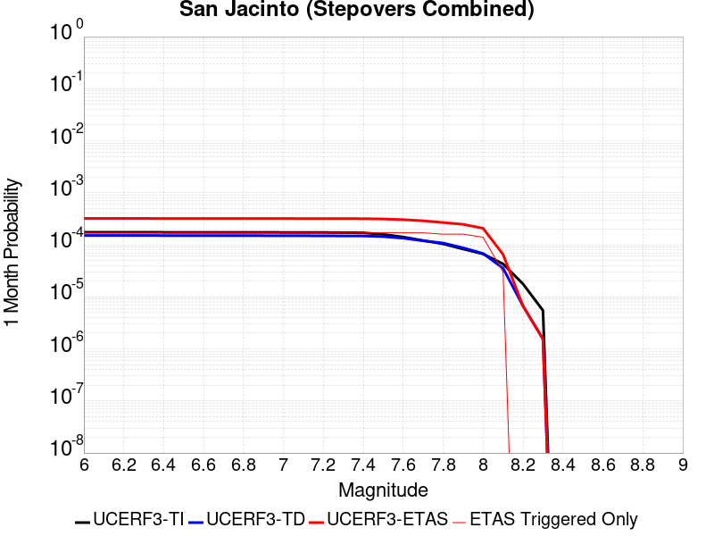 |  |  |

| Magnitude | 1 wk TI Prob | 1 wk TD Prob | 1 wk ETAS Prob | 1 wk ETAS/TD Gain | 1 wk ETAS Triggered Only | 1 mo TI Prob | 1 mo TD Prob | 1 mo ETAS Prob | 1 mo ETAS/TD Gain | 1 mo ETAS Triggered Only | 1 yr TI Prob | 1 yr TD Prob | 1 yr ETAS Prob | 1 yr ETAS/TD Gain | 1 yr ETAS Triggered Only | 10 yr TI Prob | 10 yr TD Prob | 10 yr ETAS Prob | 10 yr ETAS/TD Gain | 10 yr ETAS Triggered Only |
|-----|-----|-----|-----|-----|-----|-----|-----|-----|-----|-----|-----|-----|-----|-----|-----|-----|-----|-----|-----|-----|
| 6.0 | 4.0667746E-5 | 3.5271103E-5 | 1.9526546E-4 | 5.5361314 | 1.6E-4 | 1.742787E-4 | 1.5115313E-4 | 3.2112745E-4 | 2.1245172 | 1.7E-4 | 0.0021197782 | 0.0018387372 | 0.0020184063 | 1.0977132 | 1.8E-4 | 0.020996714 | 0.018986495 | 0.019172888 | 1.0098171 | 1.9E-4 |
| 6.1 | 4.0667746E-5 | 3.5271103E-5 | 1.9526546E-4 | 5.5361314 | 1.6E-4 | 1.742787E-4 | 1.5115313E-4 | 3.2112745E-4 | 2.1245172 | 1.7E-4 | 0.0021197782 | 0.0018387372 | 0.0020184063 | 1.0977132 | 1.8E-4 | 0.020996714 | 0.018986495 | 0.019172888 | 1.0098171 | 1.9E-4 |
| 6.2 | 4.0667746E-5 | 3.5271103E-5 | 1.9526546E-4 | 5.5361314 | 1.6E-4 | 1.742787E-4 | 1.5115313E-4 | 3.2112745E-4 | 2.1245172 | 1.7E-4 | 0.0021197782 | 0.0018387372 | 0.0020184063 | 1.0977132 | 1.8E-4 | 0.020996714 | 0.018986495 | 0.019172888 | 1.0098171 | 1.9E-4 |
| 6.3 | 4.0667746E-5 | 3.5271103E-5 | 1.9526546E-4 | 5.5361314 | 1.6E-4 | 1.742787E-4 | 1.5115313E-4 | 3.2112745E-4 | 2.1245172 | 1.7E-4 | 0.0021197782 | 0.0018387372 | 0.0020184063 | 1.0977132 | 1.8E-4 | 0.020996714 | 0.018986495 | 0.019172888 | 1.0098171 | 1.9E-4 |
| 6.4 | 4.0577226E-5 | 3.5143014E-5 | 1.9513739E-4 | 5.552665 | 1.6E-4 | 1.738908E-4 | 1.5060425E-4 | 3.2057863E-4 | 2.1286163 | 1.7E-4 | 0.0021150648 | 0.0018320669 | 0.002011737 | 1.0980697 | 1.8E-4 | 0.020950472 | 0.018921062 | 0.019107468 | 1.0098517 | 1.9E-4 |
| 6.5 | 4.0577226E-5 | 3.5143014E-5 | 1.9513739E-4 | 5.552665 | 1.6E-4 | 1.738908E-4 | 1.5060425E-4 | 3.2057863E-4 | 2.1286163 | 1.7E-4 | 0.0021150648 | 0.0018320669 | 0.002011737 | 1.0980697 | 1.8E-4 | 0.020950472 | 0.018921062 | 0.019107468 | 1.0098517 | 1.9E-4 |
| 6.6 | 4.053861E-5 | 3.5088357E-5 | 1.9508274E-4 | 5.559757 | 1.6E-4 | 1.7372532E-4 | 1.5037002E-4 | 3.2034446E-4 | 2.1303744 | 1.7E-4 | 0.0021130538 | 0.0018292206 | 0.0020088914 | 1.0982226 | 1.8E-4 | 0.020930743 | 0.01889314 | 0.019079551 | 1.0098666 | 1.9E-4 |
| 6.7 | 4.0516545E-5 | 3.505743E-5 | 1.9505182E-4 | 5.56378 | 1.6E-4 | 1.7363077E-4 | 1.502375E-4 | 3.2021196E-4 | 2.1313717 | 1.7E-4 | 0.002111905 | 0.0018276101 | 0.0020072812 | 1.0983093 | 1.8E-4 | 0.020919468 | 0.018877337 | 0.01906375 | 1.0098749 | 1.9E-4 |
| 6.8 | 4.049434E-5 | 3.5028992E-5 | 1.9502339E-4 | 5.567485 | 1.6E-4 | 1.7353562E-4 | 1.5011564E-4 | 3.2009013E-4 | 2.1322904 | 1.7E-4 | 0.0021107488 | 0.0018261289 | 0.0020058001 | 1.0983891 | 1.8E-4 | 0.020908125 | 0.018862749 | 0.019049164 | 1.0098828 | 1.9E-4 |
| 6.9 | 4.046386E-5 | 3.4991554E-5 | 1.9498596E-4 | 5.572372 | 1.6E-4 | 1.73405E-4 | 1.499552E-4 | 3.199297E-4 | 2.133502 | 1.7E-4 | 0.0021091616 | 0.0018241788 | 0.0020038504 | 1.0984945 | 1.8E-4 | 0.020892553 | 0.018843522 | 0.019029941 | 1.0098931 | 1.9E-4 |
| 7.0 | 4.036382E-5 | 3.4872126E-5 | 1.9486654E-4 | 5.588032 | 1.6E-4 | 1.7297632E-4 | 1.4944343E-4 | 3.19418E-4 | 2.1373842 | 1.7E-4 | 0.0021039525 | 0.0018179584 | 0.0019976313 | 1.0988321 | 1.8E-4 | 0.02084144 | 0.018782137 | 0.018968567 | 1.009926 | 1.9E-4 |
| 7.1 | 4.0343282E-5 | 3.485059E-5 | 1.9484501E-4 | 5.5908675 | 1.6E-4 | 1.7288832E-4 | 1.4935112E-4 | 3.1932574E-4 | 2.1380873 | 1.7E-4 | 0.002102883 | 0.0018168368 | 0.0019965097 | 1.0988933 | 1.8E-4 | 0.020830948 | 0.018771008 | 0.01895744 | 1.009932 | 1.9E-4 |
| 7.2 | 4.0257353E-5 | 3.475509E-5 | 1.9474953E-4 | 5.6034827 | 1.6E-4 | 1.725201E-4 | 1.489419E-4 | 3.1891657E-4 | 2.1412148 | 1.7E-4 | 0.0020984085 | 0.0018118626 | 0.0019915365 | 1.0991653 | 1.8E-4 | 0.020787042 | 0.018721746 | 0.01890819 | 1.0099586 | 1.9E-4 |
| 7.3 | 3.9940667E-5 | 3.458276E-5 | 1.9457722E-4 | 5.626423 | 1.6E-4 | 1.7116306E-4 | 1.4820343E-4 | 3.1817824E-4 | 2.146902 | 1.7E-4 | 0.0020819185 | 0.0018028866 | 0.0019825622 | 1.0996599 | 1.8E-4 | 0.020625217 | 0.018630387 | 0.018816847 | 1.0100083 | 1.9E-4 |
| 7.4 | 3.9721202E-5 | 3.4468165E-5 | 1.9446266E-4 | 5.641804 | 1.6E-4 | 1.7022261E-4 | 1.4771236E-4 | 3.1768726E-4 | 2.1507154 | 1.7E-4 | 0.0020704903 | 0.0017969179 | 0.0019765943 | 1.0999916 | 1.8E-4 | 0.020513052 | 0.018569522 | 0.018755993 | 1.0100418 | 1.9E-4 |
| 7.5 | 3.7036873E-5 | 3.3535776E-5 | 1.935304E-4 | 5.7708645 | 1.6E-4 | 1.5871979E-4 | 1.4371685E-4 | 3.136924E-4 | 2.1827116 | 1.7E-4 | 0.0019307006 | 0.0017483513 | 0.0019280366 | 1.1027741 | 1.8E-4 | 0.019140124 | 0.018071128 | 0.018257694 | 1.010324 | 1.9E-4 |
| 7.6 | 3.2940967E-5 | 3.13167E-5 | 1.9131169E-4 | 6.108935 | 1.6E-4 | 1.4116794E-4 | 1.3420754E-4 | 3.0418474E-4 | 2.2665248 | 1.7E-4 | 0.0017173645 | 0.0016327545 | 0.0018124606 | 1.1100632 | 1.8E-4 | 0.01704153 | 0.016904091 | 0.01709088 | 1.0110499 | 1.9E-4 |
| 7.7 | 2.8236149E-5 | 2.7882697E-5 | 1.8787824E-4 | 6.738166 | 1.6E-4 | 1.2100645E-4 | 1.1949181E-4 | 2.894715E-4 | 2.4225218 | 1.7E-4 | 0.0014722579 | 0.0014538429 | 0.0016335812 | 1.1236298 | 1.8E-4 | 0.014625421 | 0.015114912 | 0.01530204 | 1.0123804 | 1.9E-4 |
| 7.8 | 2.4329287E-5 | 2.5206451E-5 | 1.7520267E-4 | 6.9507074 | 1.5E-4 | 1.042642E-4 | 1.08023174E-4 | 2.6800588E-4 | 2.4810035 | 1.6E-4 | 0.0012686774 | 0.0013143895 | 0.0014841661 | 1.1291676 | 1.7E-4 | 0.012614589 | 0.013712341 | 0.0138898725 | 1.0129468 | 1.8E-4 |
| 7.9 | 1.9370926E-5 | 2.0420413E-5 | 1.7041735E-4 | 8.345441 | 1.5E-4 | 8.301561E-5 | 8.751312E-5 | 2.4749912E-4 | 2.8281372 | 1.6E-4 | 0.0010102465 | 0.0010649522 | 0.0012347712 | 1.1594616 | 1.7E-4 | 0.0100566605 | 0.011199402 | 0.011377386 | 1.0158923 | 1.8E-4 |
| 8.0 | 1.5583017E-5 | 1.5885415E-5 | 1.4588334E-4 | 9.183477 | 1.3E-4 | 6.6782646E-5 | 6.807858E-5 | 2.0806905E-4 | 3.056307 | 1.4E-4 | 8.127754E-4 | 8.2854216E-4 | 9.684262E-4 | 1.1688315 | 1.4E-4 | 0.008098091 | 0.008781636 | 0.008930319 | 1.016931 | 1.5E-4 |
| 8.1 | 1.0024873E-5 | 8.291399E-6 | 3.829115E-5 | 4.618177 | 3.0E-5 | 4.2963035E-5 | 3.553409E-5 | 6.553302E-5 | 1.8442297 | 3.0E-5 | 5.229494E-4 | 4.3254215E-4 | 4.6252916E-4 | 1.0693274 | 3.0E-5 | 0.0052172043 | 0.0046530655 | 0.004682926 | 1.0064174 | 3.0E-5 |
| 8.2 | 4.142796E-6 | 1.5602761E-6 | 1.5602761E-6 | 1.0 | 0.0 | 1.775472E-5 | 6.6868806E-6 | 6.6868806E-6 | 1.0 | 0.0 | 2.1614227E-4 | 8.140976E-5 | 8.140976E-5 | 1.0 | 0.0 | 0.0021593217 | 9.4514614E-4 | 9.4514614E-4 | 1.0 | 0.0 |
| 8.3 | 1.2750878E-6 | 3.609817E-7 | 3.609817E-7 | 1.0 | 0.0 | 5.4646503E-6 | 1.5470634E-6 | 1.5470634E-6 | 1.0 | 0.0 | 6.653009E-5 | 1.8835339E-5 | 1.8835339E-5 | 1.0 | 0.0 | 6.6510175E-4 | 2.272251E-4 | 2.272251E-4 | 1.0 | 0.0 |

## Kern Canyon (North Kern) 2011
*[(top)](#table-of-contents)*

| 1 Week | 1 Month | 1 Year | 10 Year |
|-----|-----|-----|-----|
|  |  |  |  |

| Magnitude | 1 wk TI Prob | 1 wk TD Prob | 1 wk ETAS Prob | 1 wk ETAS/TD Gain | 1 wk ETAS Triggered Only | 1 mo TI Prob | 1 mo TD Prob | 1 mo ETAS Prob | 1 mo ETAS/TD Gain | 1 mo ETAS Triggered Only | 1 yr TI Prob | 1 yr TD Prob | 1 yr ETAS Prob | 1 yr ETAS/TD Gain | 1 yr ETAS Triggered Only | 10 yr TI Prob | 10 yr TD Prob | 10 yr ETAS Prob | 10 yr ETAS/TD Gain | 10 yr ETAS Triggered Only |
|-----|-----|-----|-----|-----|-----|-----|-----|-----|-----|-----|-----|-----|-----|-----|-----|-----|-----|-----|-----|-----|
| 6.0 | 6.6264497E-6 | 6.75733E-6 | 1.16756586E-4 | 17.27851 | 1.1E-4 | 2.8398761E-5 | 2.895971E-5 | 1.5895594E-4 | 5.4888654 | 1.3E-4 | 3.4570007E-4 | 3.5253543E-4 | 5.1247905E-4 | 1.453695 | 1.6E-4 | 0.0034516277 | 0.0035205502 | 0.0037098813 | 1.0537789 | 1.9E-4 |
| 6.1 | 6.6264497E-6 | 6.75733E-6 | 1.16756586E-4 | 17.27851 | 1.1E-4 | 2.8398761E-5 | 2.895971E-5 | 1.5895594E-4 | 5.4888654 | 1.3E-4 | 3.4570007E-4 | 3.5253543E-4 | 5.1247905E-4 | 1.453695 | 1.6E-4 | 0.0034516277 | 0.0035205502 | 0.0037098813 | 1.0537789 | 1.9E-4 |
| 6.2 | 6.6264497E-6 | 6.75733E-6 | 1.16756586E-4 | 17.27851 | 1.1E-4 | 2.8398761E-5 | 2.895971E-5 | 1.5895594E-4 | 5.4888654 | 1.3E-4 | 3.4570007E-4 | 3.5253543E-4 | 5.1247905E-4 | 1.453695 | 1.6E-4 | 0.0034516277 | 0.0035205502 | 0.0037098813 | 1.0537789 | 1.9E-4 |
| 6.3 | 6.6264497E-6 | 6.75733E-6 | 1.16756586E-4 | 17.27851 | 1.1E-4 | 2.8398761E-5 | 2.895971E-5 | 1.5895594E-4 | 5.4888654 | 1.3E-4 | 3.4570007E-4 | 3.5253543E-4 | 5.1247905E-4 | 1.453695 | 1.6E-4 | 0.0034516277 | 0.0035205502 | 0.0037098813 | 1.0537789 | 1.9E-4 |
| 6.4 | 6.6264497E-6 | 6.75733E-6 | 1.16756586E-4 | 17.27851 | 1.1E-4 | 2.8398761E-5 | 2.895971E-5 | 1.5895594E-4 | 5.4888654 | 1.3E-4 | 3.4570007E-4 | 3.5253543E-4 | 5.1247905E-4 | 1.453695 | 1.6E-4 | 0.0034516277 | 0.0035205502 | 0.0037098813 | 1.0537789 | 1.9E-4 |
| 6.5 | 3.2162225E-6 | 3.2570915E-6 | 9.32568E-5 | 28.631924 | 9.0E-5 | 1.3783738E-5 | 1.3958894E-5 | 1.13957496E-4 | 8.163792 | 1.0E-4 | 1.6780409E-4 | 1.6993708E-4 | 2.799184E-4 | 1.6471884 | 1.1E-4 | 0.0016767744 | 0.001698151 | 0.0018179473 | 1.0705451 | 1.2E-4 |
| 6.6 | 3.2162225E-6 | 3.2570915E-6 | 9.32568E-5 | 28.631924 | 9.0E-5 | 1.3783738E-5 | 1.3958894E-5 | 1.13957496E-4 | 8.163792 | 1.0E-4 | 1.6780409E-4 | 1.6993708E-4 | 2.799184E-4 | 1.6471884 | 1.1E-4 | 0.0016767744 | 0.001698151 | 0.0018179473 | 1.0705451 | 1.2E-4 |
| 6.7 | 2.1908265E-6 | 2.2071222E-6 | 6.220699E-5 | 28.18466 | 6.0E-5 | 9.389223E-6 | 9.459062E-6 | 6.9458496E-5 | 7.3430634 | 6.0E-5 | 1.1430779E-4 | 1.1515819E-4 | 1.7515128E-4 | 1.5209625 | 6.0E-5 | 0.0011424901 | 0.0011510046 | 0.001220924 | 1.0607464 | 7.0E-5 |
| 6.8 | 1.7303895E-6 | 1.736553E-6 | 5.1736468E-5 | 29.792622 | 5.0E-5 | 7.415934E-6 | 7.442349E-6 | 5.7441976E-5 | 7.718259 | 5.0E-5 | 9.028525E-5 | 9.060693E-5 | 1.4060241E-4 | 1.5517842 | 5.0E-5 | 9.024858E-4 | 9.0570963E-4 | 9.656553E-4 | 1.0661864 | 6.0E-5 |
| 6.9 | 1.3700314E-6 | 1.3688623E-6 | 3.136882E-5 | 22.91598 | 3.0E-5 | 5.87155E-6 | 5.86654E-6 | 3.5866364E-5 | 6.113717 | 3.0E-5 | 7.148377E-5 | 7.142283E-5 | 1.0142069E-4 | 1.4200038 | 3.0E-5 | 7.146078E-4 | 7.140033E-4 | 7.539747E-4 | 1.0559821 | 4.0E-5 |
| 7.0 | 1.1467797E-6 | 1.1413805E-6 | 2.1141357E-5 | 18.52262 | 2.0E-5 | 4.9147607E-6 | 4.8916218E-6 | 2.4891524E-5 | 5.0886035 | 2.0E-5 | 5.983557E-5 | 5.95539E-5 | 7.955271E-5 | 1.3358102 | 2.0E-5 | 5.981946E-4 | 5.9538253E-4 | 6.253647E-4 | 1.0503578 | 3.0E-5 |
| 7.1 | 9.3952065E-7 | 9.3026915E-7 | 2.093025E-5 | 22.499134 | 2.0E-5 | 4.026511E-6 | 3.986862E-6 | 2.3986782E-5 | 6.016457 | 2.0E-5 | 4.9021666E-5 | 4.853898E-5 | 6.853801E-5 | 1.41202 | 2.0E-5 | 4.901085E-4 | 4.8528553E-4 | 5.15271E-4 | 1.0617893 | 3.0E-5 |
| 7.2 | 6.858055E-7 | 6.7193014E-7 | 1.06719235E-5 | 15.882489 | 1.0E-5 | 2.939163E-6 | 2.8796974E-6 | 1.2879668E-5 | 4.472577 | 1.0E-5 | 3.5783723E-5 | 3.5059762E-5 | 4.5059413E-5 | 1.2852173 | 1.0E-5 | 3.5777962E-4 | 3.5054318E-4 | 3.6053968E-4 | 1.0285171 | 1.0E-5 |
| 7.3 | 5.1101983E-7 | 4.939301E-7 | 1.0493925E-5 | 21.245771 | 1.0E-5 | 2.1900833E-6 | 2.1168414E-6 | 1.21168205E-5 | 5.7240095 | 1.0E-5 | 2.6663936E-5 | 2.5772246E-5 | 3.5771987E-5 | 1.3880043 | 1.0E-5 | 2.6660739E-4 | 2.5769303E-4 | 2.6769046E-4 | 1.0387958 | 1.0E-5 |
| 7.4 | 3.4999414E-7 | 3.2995916E-7 | 3.2995916E-7 | 1.0 | 0.0 | 1.499974E-6 | 1.4141099E-6 | 1.4141099E-6 | 1.0 | 0.0 | 1.8262032E-5 | 1.7216655E-5 | 1.7216655E-5 | 1.0 | 0.0 | 1.826053E-4 | 1.7215345E-4 | 1.7215345E-4 | 1.0 | 0.0 |
| 7.5 | 1.7021522E-7 | 1.4750053E-7 | 1.4750053E-7 | 1.0 | 0.0 | 7.2949354E-7 | 6.32145E-7 | 6.32145E-7 | 1.0 | 0.0 | 8.881548E-6 | 7.696339E-6 | 7.696339E-6 | 1.0 | 0.0 | 8.8811925E-5 | 7.696081E-5 | 7.696081E-5 | 1.0 | 0.0 |
| 7.6 | 2.572245E-8 | 1.735264E-8 | 1.735264E-8 | 1.0 | 0.0 | 1.10239064E-7 | 7.436845E-8 | 7.436845E-8 | 1.0 | 0.0 | 1.3421597E-6 | 9.0543557E-7 | 9.0543557E-7 | 1.0 | 0.0 | 1.3421517E-5 | 9.054324E-6 | 9.054324E-6 | 1.0 | 0.0 |

## Calico-Hidalgo
*[(top)](#table-of-contents)*

| 1 Week | 1 Month | 1 Year | 10 Year |
|-----|-----|-----|-----|
|  |  |  |  |

| Magnitude | 1 wk TI Prob | 1 wk TD Prob | 1 wk ETAS Prob | 1 wk ETAS/TD Gain | 1 wk ETAS Triggered Only | 1 mo TI Prob | 1 mo TD Prob | 1 mo ETAS Prob | 1 mo ETAS/TD Gain | 1 mo ETAS Triggered Only | 1 yr TI Prob | 1 yr TD Prob | 1 yr ETAS Prob | 1 yr ETAS/TD Gain | 1 yr ETAS Triggered Only | 10 yr TI Prob | 10 yr TD Prob | 10 yr ETAS Prob | 10 yr ETAS/TD Gain | 10 yr ETAS Triggered Only |
|-----|-----|-----|-----|-----|-----|-----|-----|-----|-----|-----|-----|-----|-----|-----|-----|-----|-----|-----|-----|-----|
| 6.0 | 4.0906612E-5 | 5.0704355E-5 | 1.307003E-4 | 2.5776937 | 8.0E-5 | 1.7530227E-4 | 2.1728857E-4 | 3.1726685E-4 | 1.4601175 | 1.0E-4 | 0.0021322158 | 0.002642678 | 0.0028022553 | 1.0603846 | 1.6E-4 | 0.02111873 | 0.026152814 | 0.026337845 | 1.007075 | 1.9E-4 |
| 6.1 | 4.0906612E-5 | 5.0704355E-5 | 1.307003E-4 | 2.5776937 | 8.0E-5 | 1.7530227E-4 | 2.1728857E-4 | 3.1726685E-4 | 1.4601175 | 1.0E-4 | 0.0021322158 | 0.002642678 | 0.0028022553 | 1.0603846 | 1.6E-4 | 0.02111873 | 0.026152814 | 0.026337845 | 1.007075 | 1.9E-4 |
| 6.2 | 4.0906612E-5 | 5.0704355E-5 | 1.307003E-4 | 2.5776937 | 8.0E-5 | 1.7530227E-4 | 2.1728857E-4 | 3.1726685E-4 | 1.4601175 | 1.0E-4 | 0.0021322158 | 0.002642678 | 0.0028022553 | 1.0603846 | 1.6E-4 | 0.02111873 | 0.026152814 | 0.026337845 | 1.007075 | 1.9E-4 |
| 6.3 | 2.4242801E-5 | 3.0090967E-5 | 7.0089765E-5 | 2.3292625 | 4.0E-5 | 1.0389358E-4 | 1.289551E-4 | 1.8894736E-4 | 1.4652182 | 6.0E-5 | 0.0012641704 | 0.0015689312 | 0.0016687743 | 1.0636376 | 1.0E-4 | 0.01257003 | 0.015582229 | 0.01568067 | 1.0063176 | 1.0E-4 |
| 6.4 | 2.4242801E-5 | 3.0090967E-5 | 7.0089765E-5 | 2.3292625 | 4.0E-5 | 1.0389358E-4 | 1.289551E-4 | 1.8894736E-4 | 1.4652182 | 6.0E-5 | 0.0012641704 | 0.0015689312 | 0.0016687743 | 1.0636376 | 1.0E-4 | 0.01257003 | 0.015582229 | 0.01568067 | 1.0063176 | 1.0E-4 |
| 6.5 | 2.0286952E-5 | 2.5316054E-5 | 6.531504E-5 | 2.579985 | 4.0E-5 | 8.694118E-5 | 1.0849296E-4 | 1.6848645E-4 | 1.5529712 | 6.0E-5 | 0.0010579949 | 0.0013201186 | 0.0014199865 | 1.0756508 | 1.0E-4 | 0.010529719 | 0.013124701 | 0.013223388 | 1.0075192 | 1.0E-4 |
| 6.6 | 2.0269223E-5 | 2.5297004E-5 | 6.529599E-5 | 2.5811749 | 4.0E-5 | 8.6865206E-5 | 1.08411325E-4 | 1.6840482E-4 | 1.5533878 | 6.0E-5 | 0.0010570707 | 0.0013191258 | 0.0014189938 | 1.0757078 | 1.0E-4 | 0.010520565 | 0.01311489 | 0.013213579 | 1.007525 | 1.0E-4 |
| 6.7 | 1.799852E-5 | 2.2540933E-5 | 6.2540035E-5 | 2.7745094 | 4.0E-5 | 7.713423E-5 | 9.660051E-5 | 1.4659567E-4 | 1.5175456 | 5.0E-5 | 9.3870464E-4 | 0.0011754911 | 0.0012553971 | 1.0679767 | 8.0E-5 | 0.009347493 | 0.011694346 | 0.01177341 | 1.006761 | 8.0E-5 |
| 6.8 | 1.7458793E-5 | 2.184258E-5 | 5.1841926E-5 | 2.373434 | 3.0E-5 | 7.4821255E-5 | 9.360778E-5 | 1.3360403E-4 | 1.427275 | 4.0E-5 | 9.10568E-4 | 0.0011390933 | 0.0012090136 | 1.0613824 | 7.0E-5 | 0.009068459 | 0.011334131 | 0.011403337 | 1.006106 | 7.0E-5 |
| 6.9 | 1.542884E-5 | 1.9026285E-5 | 4.9025715E-5 | 2.576736 | 3.0E-5 | 6.612192E-5 | 8.153875E-5 | 1.11536305E-4 | 1.3678932 | 3.0E-5 | 8.04737E-4 | 9.922953E-4 | 0.0010522357 | 1.0604059 | 6.0E-5 | 0.008018291 | 0.009880043 | 0.00993945 | 1.0060128 | 6.0E-5 |
| 7.0 | 1.468253E-5 | 1.803109E-5 | 3.8030732E-5 | 2.1091752 | 2.0E-5 | 6.292361E-5 | 7.727389E-5 | 9.727234E-5 | 1.2587997 | 2.0E-5 | 7.658257E-4 | 9.4041653E-4 | 9.80379E-4 | 1.0424943 | 4.0E-5 | 0.0076319184 | 0.009365736 | 0.0094053615 | 1.0042309 | 4.0E-5 |
| 7.1 | 1.3139281E-5 | 1.620139E-5 | 3.6201065E-5 | 2.234442 | 2.0E-5 | 5.6309986E-5 | 6.943275E-5 | 8.9431356E-5 | 1.2880285 | 2.0E-5 | 6.853584E-4 | 8.4502844E-4 | 8.8499463E-4 | 1.0472957 | 4.0E-5 | 0.0068324856 | 0.008419449 | 0.008459113 | 1.0047109 | 4.0E-5 |
| 7.2 | 1.1127404E-5 | 1.3867038E-5 | 2.38669E-5 | 1.7211245 | 1.0E-5 | 4.7688E-5 | 5.9428872E-5 | 6.942828E-5 | 1.1682584 | 1.0E-5 | 5.8044674E-4 | 7.233172E-4 | 7.5329555E-4 | 1.0414456 | 3.0E-5 | 0.0057893298 | 0.007210737 | 0.007240521 | 1.0041305 | 3.0E-5 |
| 7.3 | 9.808154E-6 | 1.2176586E-5 | 2.2176464E-5 | 1.8212383 | 1.0E-5 | 4.2034266E-5 | 5.2184383E-5 | 6.218386E-5 | 1.1916182 | 1.0E-5 | 5.11647E-4 | 6.351704E-4 | 6.6515134E-4 | 1.0472014 | 3.0E-5 | 0.0051047057 | 0.006334625 | 0.0063644354 | 1.0047059 | 3.0E-5 |
| 7.4 | 7.942452E-6 | 9.792348E-6 | 1.979225E-5 | 2.0211957 | 1.0E-5 | 3.4038632E-5 | 4.1966585E-5 | 5.1966163E-5 | 1.2382748 | 1.0E-5 | 4.1434157E-4 | 5.108328E-4 | 5.308226E-4 | 1.0391318 | 2.0E-5 | 0.0041356985 | 0.005097527 | 0.005117425 | 1.0039035 | 2.0E-5 |
| 7.5 | 4.7121216E-6 | 5.7729717E-6 | 5.7729717E-6 | 1.0 | 0.0 | 2.019465E-5 | 2.4741115E-5 | 2.4741115E-5 | 1.0 | 0.0 | 2.4584212E-4 | 3.011891E-4 | 3.111861E-4 | 1.0331917 | 1.0E-5 | 0.0024557032 | 0.0030085614 | 0.0030185315 | 1.0033139 | 1.0E-5 |
| 7.6 | 2.21172E-7 | 2.6040198E-7 | 2.6040198E-7 | 1.0 | 0.0 | 9.478797E-7 | 1.1160082E-6 | 1.1160082E-6 | 1.0 | 0.0 | 1.1540374E-5 | 1.3587343E-5 | 1.3587343E-5 | 1.0 | 0.0 | 1.1539775E-4 | 1.3586794E-4 | 1.3586794E-4 | 1.0 | 0.0 |

## Mission Creek
*[(top)](#table-of-contents)*

| 1 Week | 1 Month | 1 Year | 10 Year |
|-----|-----|-----|-----|
|  |  |  |  |

| Magnitude | 1 wk TI Prob | 1 wk TD Prob | 1 wk ETAS Prob | 1 wk ETAS/TD Gain | 1 wk ETAS Triggered Only | 1 mo TI Prob | 1 mo TD Prob | 1 mo ETAS Prob | 1 mo ETAS/TD Gain | 1 mo ETAS Triggered Only | 1 yr TI Prob | 1 yr TD Prob | 1 yr ETAS Prob | 1 yr ETAS/TD Gain | 1 yr ETAS Triggered Only | 10 yr TI Prob | 10 yr TD Prob | 10 yr ETAS Prob | 10 yr ETAS/TD Gain | 10 yr ETAS Triggered Only |
|-----|-----|-----|-----|-----|-----|-----|-----|-----|-----|-----|-----|-----|-----|-----|-----|-----|-----|-----|-----|-----|
| 6.0 | 1.1549387E-5 | 1.6322783E-5 | 1.1632115E-4 | 7.1263065 | 1.0E-4 | 4.9496433E-5 | 6.995299E-5 | 1.8994459E-4 | 2.7153177 | 1.2E-4 | 6.0245243E-4 | 8.5135986E-4 | 9.812493E-4 | 1.1525669 | 1.3E-4 | 0.006008218 | 0.008510157 | 0.008688625 | 1.0209712 | 1.8E-4 |
| 6.1 | 1.1549387E-5 | 1.6322783E-5 | 1.1632115E-4 | 7.1263065 | 1.0E-4 | 4.9496433E-5 | 6.995299E-5 | 1.8994459E-4 | 2.7153177 | 1.2E-4 | 6.0245243E-4 | 8.5135986E-4 | 9.812493E-4 | 1.1525669 | 1.3E-4 | 0.006008218 | 0.008510157 | 0.008688625 | 1.0209712 | 1.8E-4 |
| 6.2 | 1.1549387E-5 | 1.6322783E-5 | 1.1632115E-4 | 7.1263065 | 1.0E-4 | 4.9496433E-5 | 6.995299E-5 | 1.8994459E-4 | 2.7153177 | 1.2E-4 | 6.0245243E-4 | 8.5135986E-4 | 9.812493E-4 | 1.1525669 | 1.3E-4 | 0.006008218 | 0.008510157 | 0.008688625 | 1.0209712 | 1.8E-4 |
| 6.3 | 1.1549387E-5 | 1.6322783E-5 | 1.1632115E-4 | 7.1263065 | 1.0E-4 | 4.9496433E-5 | 6.995299E-5 | 1.8994459E-4 | 2.7153177 | 1.2E-4 | 6.0245243E-4 | 8.5135986E-4 | 9.812493E-4 | 1.1525669 | 1.3E-4 | 0.006008218 | 0.008510157 | 0.008688625 | 1.0209712 | 1.8E-4 |
| 6.4 | 1.1549387E-5 | 1.6322783E-5 | 1.1632115E-4 | 7.1263065 | 1.0E-4 | 4.9496433E-5 | 6.995299E-5 | 1.8994459E-4 | 2.7153177 | 1.2E-4 | 6.0245243E-4 | 8.5135986E-4 | 9.812493E-4 | 1.1525669 | 1.3E-4 | 0.006008218 | 0.008510157 | 0.008688625 | 1.0209712 | 1.8E-4 |
| 6.5 | 1.1549387E-5 | 1.6322783E-5 | 1.1632115E-4 | 7.1263065 | 1.0E-4 | 4.9496433E-5 | 6.995299E-5 | 1.8994459E-4 | 2.7153177 | 1.2E-4 | 6.0245243E-4 | 8.5135986E-4 | 9.812493E-4 | 1.1525669 | 1.3E-4 | 0.006008218 | 0.008510157 | 0.008688625 | 1.0209712 | 1.8E-4 |
| 6.6 | 9.202681E-6 | 1.3846059E-5 | 1.13844675E-4 | 8.222172 | 1.0E-4 | 3.9439463E-5 | 5.9338956E-5 | 1.7933184E-4 | 3.0221603 | 1.2E-4 | 4.800697E-4 | 7.2222133E-4 | 8.5212744E-4 | 1.1798702 | 1.3E-4 | 0.004790339 | 0.0072273402 | 0.007386184 | 1.0219781 | 1.6E-4 |
| 6.7 | 9.019164E-6 | 1.3651728E-5 | 1.1365036E-4 | 8.32498 | 1.0E-4 | 3.8652986E-5 | 5.8506146E-5 | 1.7849913E-4 | 3.0509465 | 1.2E-4 | 4.7049852E-4 | 7.1208854E-4 | 8.41996E-4 | 1.1824316 | 1.3E-4 | 0.004695036 | 0.0071266647 | 0.007285524 | 1.022291 | 1.6E-4 |
| 6.8 | 8.673558E-6 | 1.3273839E-5 | 1.1327251E-4 | 8.533516 | 1.0E-4 | 3.717186E-5 | 5.688669E-5 | 1.7687987E-4 | 3.1093366 | 1.2E-4 | 4.524734E-4 | 6.923842E-4 | 8.222942E-4 | 1.1876271 | 1.3E-4 | 0.0045155324 | 0.0069308523 | 0.0070897434 | 1.0229251 | 1.6E-4 |
| 6.9 | 7.002255E-6 | 1.1478069E-5 | 1.1147692E-4 | 9.712168 | 1.0E-4 | 3.000932E-5 | 4.9190832E-5 | 1.6918493E-4 | 3.439359 | 1.2E-4 | 3.653022E-4 | 5.9874065E-4 | 7.286628E-4 | 1.2169924 | 1.3E-4 | 0.0036470229 | 0.005999676 | 0.0061587156 | 1.0265081 | 1.6E-4 |
| 7.0 | 5.84644E-6 | 9.675359E-6 | 1.09674394E-4 | 11.335434 | 1.0E-4 | 2.5055931E-5 | 4.146519E-5 | 1.6146022E-4 | 3.8938737 | 1.2E-4 | 3.0501327E-4 | 5.047263E-4 | 6.346607E-4 | 1.2574353 | 1.3E-4 | 0.0030459496 | 0.005063994 | 0.0052132346 | 1.0294709 | 1.5E-4 |
| 7.1 | 5.54703E-6 | 9.329834E-6 | 1.093289E-4 | 11.7182045 | 1.0E-4 | 2.377277E-5 | 3.9984414E-5 | 1.5997962E-4 | 4.0010495 | 1.2E-4 | 2.8939504E-4 | 4.8670598E-4 | 6.166427E-4 | 1.2669717 | 1.3E-4 | 0.0028901845 | 0.0048845876 | 0.005033855 | 1.0305588 | 1.5E-4 |
| 7.2 | 4.384709E-6 | 7.681918E-6 | 1.0768115E-4 | 14.017483 | 1.0E-4 | 1.8791474E-5 | 3.292211E-5 | 1.5291816E-4 | 4.644847 | 1.2E-4 | 2.2876218E-4 | 4.0075663E-4 | 5.307045E-4 | 1.3242564 | 1.3E-4 | 0.0022852682 | 0.004028542 | 0.0041779377 | 1.0370843 | 1.5E-4 |
| 7.3 | 3.7888456E-6 | 6.915788E-6 | 1.069151E-4 | 15.459568 | 1.0E-4 | 1.623781E-5 | 2.9638775E-5 | 1.4963522E-4 | 5.04863 | 1.2E-4 | 1.9767738E-4 | 3.6079568E-4 | 4.907488E-4 | 1.3601848 | 1.3E-4 | 0.0019750162 | 0.00363027 | 0.0037797254 | 1.0411693 | 1.5E-4 |
| 7.4 | 2.1982462E-6 | 5.0241033E-6 | 1.050236E-4 | 20.90395 | 1.0E-4 | 9.421021E-6 | 2.1531694E-5 | 1.415291E-4 | 6.5730596 | 1.2E-4 | 1.1469489E-4 | 2.6211704E-4 | 3.8208556E-4 | 1.4576907 | 1.2E-4 | 0.0011463572 | 0.0026460327 | 0.0027856622 | 1.0527694 | 1.4E-4 |
| 7.5 | 2.051923E-6 | 4.6153277E-6 | 1.0461487E-4 | 22.666834 | 1.0E-4 | 8.793926E-6 | 1.9779825E-5 | 1.3977745E-4 | 7.0666676 | 1.2E-4 | 1.0706078E-4 | 2.4079291E-4 | 3.60764E-4 | 1.4982336 | 1.2E-4 | 0.0010700922 | 0.0024335932 | 0.0025732524 | 1.0573881 | 1.4E-4 |
| 7.6 | 1.8733427E-6 | 4.1236603E-6 | 1.04123246E-4 | 25.250198 | 1.0E-4 | 8.028587E-6 | 1.7672712E-5 | 1.3767059E-4 | 7.7900095 | 1.2E-4 | 9.774366E-5 | 2.151441E-4 | 3.351183E-4 | 1.5576457 | 1.2E-4 | 9.770069E-4 | 0.0021782513 | 0.0023179462 | 1.0641317 | 1.4E-4 |
| 7.7 | 1.8411953E-6 | 4.0433315E-6 | 1.0404293E-4 | 25.73198 | 1.0E-4 | 7.890813E-6 | 1.732845E-5 | 1.3732637E-4 | 7.924908 | 1.2E-4 | 9.606641E-5 | 2.1095353E-4 | 3.3092822E-4 | 1.5687257 | 1.2E-4 | 9.6024893E-4 | 0.0021365292 | 0.00227623 | 1.0653869 | 1.4E-4 |
| 7.8 | 1.7194251E-6 | 3.71068E-6 | 1.0371031E-4 | 27.949139 | 1.0E-4 | 7.368944E-6 | 1.5902819E-5 | 1.359009E-4 | 8.545712 | 1.2E-4 | 8.97132E-5 | 1.9359968E-4 | 3.1357646E-4 | 1.6197157 | 1.2E-4 | 8.967699E-4 | 0.0019624757 | 0.0021022009 | 1.0711985 | 1.4E-4 |
| 7.9 | 1.4035052E-6 | 2.9502596E-6 | 1.0294996E-4 | 34.89522 | 1.0E-4 | 6.0150082E-6 | 1.2643909E-5 | 1.326424E-4 | 10.490616 | 1.2E-4 | 7.3230265E-5 | 1.5392878E-4 | 2.7391032E-4 | 1.7794613 | 1.2E-4 | 7.3206134E-4 | 0.0015631174 | 0.0017028985 | 1.0894246 | 1.4E-4 |
| 8.0 | 3.9318823E-7 | 5.528477E-7 | 3.055283E-5 | 55.264458 | 3.0E-5 | 1.6850913E-6 | 2.3693453E-6 | 4.236925E-5 | 17.88226 | 4.0E-5 | 2.0515794E-5 | 2.8846403E-5 | 6.884525E-5 | 2.3866146 | 4.0E-5 | 2.0513899E-4 | 2.990952E-4 | 3.3908326E-4 | 1.1336967 | 4.0E-5 |
| 8.1 | 1.596793E-7 | 1.13775044E-7 | 1.13775044E-7 | 1.0 | 0.0 | 6.8433974E-7 | 4.876072E-7 | 4.876072E-7 | 1.0 | 0.0 | 8.331805E-6 | 5.936602E-6 | 5.936602E-6 | 1.0 | 0.0 | 8.331492E-5 | 6.5494125E-5 | 6.5494125E-5 | 1.0 | 0.0 |
| 8.2 | 4.9003038E-8 | 2.5435753E-8 | 2.5435753E-8 | 1.0 | 0.0 | 2.10013E-7 | 1.09010365E-7 | 1.09010365E-7 | 1.0 | 0.0 | 2.5569052E-6 | 1.3272004E-6 | 1.3272004E-6 | 1.0 | 0.0 | 2.556876E-5 | 1.4952613E-5 | 1.4952613E-5 | 1.0 | 0.0 |

## Baker
*[(top)](#table-of-contents)*

| 1 Week | 1 Month | 1 Year | 10 Year |
|-----|-----|-----|-----|
|  |  |  |  |

| Magnitude | 1 wk TI Prob | 1 wk TD Prob | 1 wk ETAS Prob | 1 wk ETAS/TD Gain | 1 wk ETAS Triggered Only | 1 mo TI Prob | 1 mo TD Prob | 1 mo ETAS Prob | 1 mo ETAS/TD Gain | 1 mo ETAS Triggered Only | 1 yr TI Prob | 1 yr TD Prob | 1 yr ETAS Prob | 1 yr ETAS/TD Gain | 1 yr ETAS Triggered Only | 10 yr TI Prob | 10 yr TD Prob | 10 yr ETAS Prob | 10 yr ETAS/TD Gain | 10 yr ETAS Triggered Only |
|-----|-----|-----|-----|-----|-----|-----|-----|-----|-----|-----|-----|-----|-----|-----|-----|-----|-----|-----|-----|-----|
| 6.0 | 5.695525E-6 | 5.8348373E-6 | 5.5834545E-5 | 9.569169 | 5.0E-5 | 2.4409164E-5 | 2.5006228E-5 | 9.500448E-5 | 3.7992327 | 7.0E-5 | 2.9714106E-4 | 3.044123E-4 | 3.943849E-4 | 1.2955617 | 9.0E-5 | 0.0029674405 | 0.0030403486 | 0.003209832 | 1.0557446 | 1.7E-4 |
| 6.1 | 5.695525E-6 | 5.8348373E-6 | 5.5834545E-5 | 9.569169 | 5.0E-5 | 2.4409164E-5 | 2.5006228E-5 | 9.500448E-5 | 3.7992327 | 7.0E-5 | 2.9714106E-4 | 3.044123E-4 | 3.943849E-4 | 1.2955617 | 9.0E-5 | 0.0029674405 | 0.0030403486 | 0.003209832 | 1.0557446 | 1.7E-4 |
| 6.2 | 5.695525E-6 | 5.8348373E-6 | 5.5834545E-5 | 9.569169 | 5.0E-5 | 2.4409164E-5 | 2.5006228E-5 | 9.500448E-5 | 3.7992327 | 7.0E-5 | 2.9714106E-4 | 3.044123E-4 | 3.943849E-4 | 1.2955617 | 9.0E-5 | 0.0029674405 | 0.0030403486 | 0.003209832 | 1.0557446 | 1.7E-4 |
| 6.3 | 3.2995713E-6 | 3.383667E-6 | 4.338353E-5 | 12.821454 | 4.0E-5 | 1.4140943E-5 | 1.4501353E-5 | 6.450063E-5 | 4.447904 | 5.0E-5 | 1.7215237E-4 | 1.7654014E-4 | 2.3652954E-4 | 1.3398061 | 6.0E-5 | 0.0017201907 | 0.001764046 | 0.0018638696 | 1.0565878 | 1.0E-4 |
| 6.4 | 3.2995713E-6 | 3.383667E-6 | 4.338353E-5 | 12.821454 | 4.0E-5 | 1.4140943E-5 | 1.4501353E-5 | 6.450063E-5 | 4.447904 | 5.0E-5 | 1.7215237E-4 | 1.7654014E-4 | 2.3652954E-4 | 1.3398061 | 6.0E-5 | 0.0017201907 | 0.001764046 | 0.0018638696 | 1.0565878 | 1.0E-4 |
| 6.5 | 2.782202E-6 | 2.8558404E-6 | 4.2855725E-5 | 15.006345 | 4.0E-5 | 1.1923668E-5 | 1.223926E-5 | 6.223865E-5 | 5.085164 | 5.0E-5 | 1.4516099E-4 | 1.4900314E-4 | 2.089942E-4 | 1.4026161 | 6.0E-5 | 0.001450662 | 0.0014890651 | 0.0015889162 | 1.0670562 | 1.0E-4 |
| 6.6 | 2.3163404E-6 | 2.38092E-6 | 3.238085E-5 | 13.600142 | 3.0E-5 | 9.927136E-6 | 1.0203904E-5 | 4.02036E-5 | 3.9400213 | 3.0E-5 | 1.20856166E-4 | 1.2422565E-4 | 1.6422068E-4 | 1.3219547 | 4.0E-5 | 0.0012079047 | 0.0012415823 | 0.0013214829 | 1.064354 | 8.0E-5 |
| 6.7 | 2.037056E-6 | 2.0965003E-6 | 3.209644E-5 | 15.30953 | 3.0E-5 | 8.7302105E-6 | 8.984972E-6 | 3.89847E-5 | 4.3388786 | 3.0E-5 | 1.0628513E-4 | 1.093867E-4 | 1.3938342E-4 | 1.2742263 | 3.0E-5 | 0.0010623431 | 0.0010933448 | 0.0011632682 | 1.0639538 | 7.0E-5 |
| 6.8 | 1.8356744E-6 | 1.8915287E-6 | 3.189147E-5 | 16.860157 | 3.0E-5 | 7.867153E-6 | 8.106527E-6 | 3.8106286E-5 | 4.7006917 | 3.0E-5 | 9.577837E-5 | 9.869264E-5 | 1.2868967E-4 | 1.303944 | 3.0E-5 | 9.57371E-4 | 9.86502E-4 | 0.001056433 | 1.0708878 | 7.0E-5 |
| 6.9 | 1.6310546E-6 | 1.6832072E-6 | 3.1683157E-5 | 18.823088 | 3.0E-5 | 6.9902153E-6 | 7.213726E-6 | 3.721351E-5 | 5.1587086 | 3.0E-5 | 8.510255E-5 | 8.782368E-5 | 1.1782105E-4 | 1.3415635 | 3.0E-5 | 8.5069967E-4 | 8.7790104E-4 | 9.278572E-4 | 1.0569041 | 5.0E-5 |
| 7.0 | 1.2058036E-6 | 1.2508665E-6 | 2.1250842E-5 | 16.988895 | 2.0E-5 | 5.1677193E-6 | 5.3608455E-6 | 2.5360738E-5 | 4.730735 | 2.0E-5 | 6.291517E-5 | 6.5266366E-5 | 8.526506E-5 | 1.3064165 | 2.0E-5 | 6.289736E-4 | 6.524743E-4 | 6.924482E-4 | 1.0612651 | 4.0E-5 |
| 7.1 | 1.052382E-6 | 1.0951609E-6 | 1.109515E-5 | 10.131069 | 1.0E-5 | 4.5102006E-6 | 4.693538E-6 | 1.4693491E-5 | 3.1305788 | 1.0E-5 | 5.491031E-5 | 5.7142337E-5 | 6.7141766E-5 | 1.1749916 | 1.0E-5 | 5.4896745E-4 | 5.7127734E-4 | 6.0126017E-4 | 1.0524839 | 3.0E-5 |
| 7.2 | 1.0067454E-6 | 1.0487711E-6 | 1.0487711E-6 | 1.0 | 0.0 | 4.3146156E-6 | 4.4947255E-6 | 4.4947255E-6 | 1.0 | 0.0 | 5.252918E-5 | 5.4721917E-5 | 5.4721917E-5 | 1.0 | 0.0 | 5.251676E-4 | 5.470853E-4 | 5.470853E-4 | 1.0 | 0.0 |
| 7.3 | 9.3596316E-7 | 9.767723E-7 | 9.767723E-7 | 1.0 | 0.0 | 4.0112645E-6 | 4.1861604E-6 | 4.1861604E-6 | 1.0 | 0.0 | 4.8836053E-5 | 5.096532E-5 | 5.096532E-5 | 1.0 | 0.0 | 4.8825322E-4 | 5.095371E-4 | 5.095371E-4 | 1.0 | 0.0 |
| 7.4 | 8.8117395E-7 | 9.2076635E-7 | 9.2076635E-7 | 1.0 | 0.0 | 3.7764542E-6 | 3.9461356E-6 | 3.9461356E-6 | 1.0 | 0.0 | 4.5977362E-5 | 4.8043148E-5 | 4.8043148E-5 | 1.0 | 0.0 | 4.596785E-4 | 4.8032837E-4 | 4.8032837E-4 | 1.0 | 0.0 |
| 7.5 | 8.292386E-7 | 8.6745956E-7 | 8.6745956E-7 | 1.0 | 0.0 | 3.5538749E-6 | 3.7176785E-6 | 3.7176785E-6 | 1.0 | 0.0 | 4.326757E-5 | 4.5261804E-5 | 4.5261804E-5 | 1.0 | 0.0 | 4.3259145E-4 | 4.5252658E-4 | 4.5252658E-4 | 1.0 | 0.0 |
| 7.6 | 7.553842E-7 | 7.9144706E-7 | 7.9144706E-7 | 1.0 | 0.0 | 3.2373566E-6 | 3.3919116E-6 | 3.3919116E-6 | 1.0 | 0.0 | 3.9414106E-5 | 4.129575E-5 | 4.129575E-5 | 1.0 | 0.0 | 3.9407116E-4 | 4.1288146E-4 | 4.1288146E-4 | 1.0 | 0.0 |
| 7.7 | 6.5285366E-7 | 6.852797E-7 | 6.852797E-7 | 1.0 | 0.0 | 2.797941E-6 | 2.9369096E-6 | 2.9369096E-6 | 1.0 | 0.0 | 3.40644E-5 | 3.5756293E-5 | 3.5756293E-5 | 1.0 | 0.0 | 3.405918E-4 | 3.5750607E-4 | 3.5750607E-4 | 1.0 | 0.0 |
| 7.8 | 3.4586725E-7 | 3.6482615E-7 | 3.6482615E-7 | 1.0 | 0.0 | 1.4822873E-6 | 1.5635396E-6 | 1.5635396E-6 | 1.0 | 0.0 | 1.80467E-5 | 1.9035933E-5 | 1.9035933E-5 | 1.0 | 0.0 | 1.8045233E-4 | 1.9034347E-4 | 1.9034347E-4 | 1.0 | 0.0 |
| 7.9 | 2.5591178E-9 | 2.6696718E-9 | 2.6696718E-9 | 1.0 | 0.0 | 1.0967647E-8 | 1.14414505E-8 | 1.14414505E-8 | 1.0 | 0.0 | 1.335311E-7 | 1.3929966E-7 | 1.3929966E-7 | 1.0 | 0.0 | 1.3353102E-6 | 1.3929966E-6 | 1.3929966E-6 | 1.0 | 0.0 |

## Santa Ynez (West)
*[(top)](#table-of-contents)*

| 1 Week | 1 Month | 1 Year | 10 Year |
|-----|-----|-----|-----|
|  |  |  |  |

| Magnitude | 1 wk TI Prob | 1 wk TD Prob | 1 wk ETAS Prob | 1 wk ETAS/TD Gain | 1 wk ETAS Triggered Only | 1 mo TI Prob | 1 mo TD Prob | 1 mo ETAS Prob | 1 mo ETAS/TD Gain | 1 mo ETAS Triggered Only | 1 yr TI Prob | 1 yr TD Prob | 1 yr ETAS Prob | 1 yr ETAS/TD Gain | 1 yr ETAS Triggered Only | 10 yr TI Prob | 10 yr TD Prob | 10 yr ETAS Prob | 10 yr ETAS/TD Gain | 10 yr ETAS Triggered Only |
|-----|-----|-----|-----|-----|-----|-----|-----|-----|-----|-----|-----|-----|-----|-----|-----|-----|-----|-----|-----|-----|
| 6.0 | 4.7352758E-5 | 5.497084E-5 | 1.14967545E-4 | 2.0914278 | 6.0E-5 | 2.0292461E-4 | 2.3556968E-4 | 3.055532E-4 | 1.297082 | 7.0E-5 | 0.0024678076 | 0.002864558 | 0.002974243 | 1.0382904 | 1.1E-4 | 0.024405818 | 0.028304456 | 0.028440492 | 1.0048062 | 1.4E-4 |
| 6.1 | 4.7352758E-5 | 5.497084E-5 | 9.4968644E-5 | 1.7276186 | 4.0E-5 | 2.0292461E-4 | 2.3556968E-4 | 2.7556025E-4 | 1.1697612 | 4.0E-5 | 0.0024678076 | 0.002864558 | 0.0029443288 | 1.0278475 | 8.0E-5 | 0.024405818 | 0.028304456 | 0.028411342 | 1.0037763 | 1.1E-4 |
| 6.2 | 3.0415853E-5 | 3.3925004E-5 | 6.392399E-5 | 1.8842735 | 3.0E-5 | 1.3034715E-4 | 1.4538495E-4 | 1.753806E-4 | 1.2063187 | 3.0E-5 | 0.0015858212 | 0.0017686592 | 0.001828553 | 1.033864 | 6.0E-5 | 0.015745522 | 0.01754978 | 0.017628375 | 1.0044785 | 8.0E-5 |
| 6.3 | 3.0415853E-5 | 3.3925004E-5 | 6.392399E-5 | 1.8842735 | 3.0E-5 | 1.3034715E-4 | 1.4538495E-4 | 1.753806E-4 | 1.2063187 | 3.0E-5 | 0.0015858212 | 0.0017686592 | 0.001828553 | 1.033864 | 6.0E-5 | 0.015745522 | 0.01754978 | 0.017628375 | 1.0044785 | 8.0E-5 |
| 6.4 | 2.5452082E-5 | 2.7912318E-5 | 4.791176E-5 | 1.7165095 | 2.0E-5 | 1.09075794E-4 | 1.1961885E-4 | 1.3961646E-4 | 1.1671777 | 2.0E-5 | 0.0013271887 | 0.0014554056 | 0.0015053328 | 1.0343047 | 5.0E-5 | 0.013192902 | 0.01446091 | 0.014529898 | 1.0047706 | 7.0E-5 |
| 6.5 | 2.3143784E-5 | 2.5128133E-5 | 4.512763E-5 | 1.7959007 | 2.0E-5 | 9.9183875E-5 | 1.07687636E-4 | 1.2768549E-4 | 1.1857023 | 2.0E-5 | 0.0012068948 | 0.001310323 | 0.0013602575 | 1.0381086 | 5.0E-5 | 0.012003611 | 0.013027638 | 0.0130967265 | 1.0053031 | 7.0E-5 |
| 6.6 | 1.9118515E-5 | 2.0354244E-5 | 4.0353836E-5 | 1.982576 | 2.0E-5 | 8.193392E-5 | 8.722961E-5 | 1.0722786E-4 | 1.22926 | 2.0E-5 | 9.97089E-4 | 0.001061511 | 0.0011114579 | 1.0470526 | 5.0E-5 | 0.00992627 | 0.010565317 | 0.0106246825 | 1.0056189 | 6.0E-5 |
| 6.7 | 1.722807E-5 | 1.8146253E-5 | 3.814589E-5 | 2.102136 | 2.0E-5 | 7.3832496E-5 | 7.776737E-5 | 9.776581E-5 | 1.2571573 | 2.0E-5 | 8.985399E-4 | 9.4641204E-4 | 9.963647E-4 | 1.0527811 | 5.0E-5 | 0.008949154 | 0.009424461 | 0.009483896 | 1.0063064 | 6.0E-5 |
| 6.8 | 1.5317364E-5 | 1.5926391E-5 | 3.5926074E-5 | 2.2557573 | 2.0E-5 | 6.56442E-5 | 6.82542E-5 | 8.825283E-5 | 1.2930022 | 2.0E-5 | 7.98925E-4 | 8.3068234E-4 | 8.806408E-4 | 1.0601414 | 5.0E-5 | 0.007960589 | 0.008276261 | 0.0083357645 | 1.0071896 | 6.0E-5 |
| 6.9 | 1.3071226E-5 | 1.332953E-5 | 2.3329396E-5 | 1.750204 | 1.0E-5 | 5.6018336E-5 | 5.712532E-5 | 6.712475E-5 | 1.1750437 | 1.0E-5 | 6.8180985E-4 | 6.952811E-4 | 7.3525327E-4 | 1.0574907 | 4.0E-5 | 0.0067972173 | 0.0069313184 | 0.006980972 | 1.0071636 | 5.0E-5 |
| 7.0 | 1.1836986E-5 | 1.1932688E-5 | 2.1932568E-5 | 1.8380241 | 1.0E-5 | 5.0728955E-5 | 5.1139097E-5 | 6.1138584E-5 | 1.1955351 | 1.0E-5 | 6.1745E-4 | 6.2244234E-4 | 6.6241744E-4 | 1.0642229 | 4.0E-5 | 0.006157372 | 0.0062071825 | 0.006256872 | 1.0080051 | 5.0E-5 |
| 7.1 | 1.0597169E-5 | 1.0542107E-5 | 2.0542002E-5 | 1.9485669 | 1.0E-5 | 4.541565E-5 | 4.5179684E-5 | 5.5179233E-5 | 1.2213284 | 1.0E-5 | 5.5279525E-4 | 5.4992497E-4 | 5.899029E-4 | 1.0726972 | 4.0E-5 | 0.0055142213 | 0.005485772 | 0.005535498 | 1.0090644 | 5.0E-5 |
| 7.2 | 9.59113E-6 | 9.45905E-6 | 1.9458956E-5 | 2.0571787 | 1.0E-5 | 4.11042E-5 | 4.053816E-5 | 5.0537757E-5 | 1.2466712 | 1.0E-5 | 5.0032866E-4 | 4.934414E-4 | 5.334217E-4 | 1.0810233 | 4.0E-5 | 0.004992037 | 0.0049235765 | 0.00497333 | 1.0101053 | 5.0E-5 |
| 7.3 | 8.586084E-6 | 8.379489E-6 | 1.8379405E-5 | 2.19338 | 1.0E-5 | 3.679698E-5 | 3.591161E-5 | 4.591125E-5 | 1.2784514 | 1.0E-5 | 4.4791115E-4 | 4.3713715E-4 | 4.6712405E-4 | 1.0685984 | 3.0E-5 | 0.004470094 | 0.004362884 | 0.0044027097 | 1.0091282 | 4.0E-5 |
| 7.4 | 7.2622997E-6 | 6.9514485E-6 | 1.6951379E-5 | 2.438539 | 1.0E-5 | 3.112377E-5 | 2.9791589E-5 | 3.9791288E-5 | 1.3356552 | 1.0E-5 | 3.78866E-4 | 3.6265317E-4 | 3.8264593E-4 | 1.055129 | 2.0E-5 | 0.0037822074 | 0.003620714 | 0.0036506054 | 1.0082556 | 3.0E-5 |
| 7.5 | 5.627296E-6 | 5.2514984E-6 | 1.5251446E-5 | 2.9042084 | 1.0E-5 | 2.411676E-5 | 2.2506232E-5 | 3.2506006E-5 | 1.4443114 | 1.0E-5 | 2.9358198E-4 | 2.7397962E-4 | 2.9397415E-4 | 1.0729781 | 2.0E-5 | 0.0029319443 | 0.0027364905 | 0.0027664085 | 1.0109329 | 3.0E-5 |
| 7.6 | 2.265244E-6 | 2.0608632E-6 | 1.2060843E-5 | 5.852326 | 1.0E-5 | 9.708152E-6 | 8.832241E-6 | 1.8832152E-5 | 2.1322055 | 1.0E-5 | 1.18190335E-4 | 1.0752732E-4 | 1.2752517E-4 | 1.1859792 | 2.0E-5 | 0.001181275 | 0.0010747615 | 0.00109474 | 1.0185888 | 2.0E-5 |
| 7.7 | 1.3099874E-6 | 1.1016228E-6 | 1.1016228E-6 | 1.0 | 0.0 | 5.61422E-6 | 4.7212325E-6 | 4.7212325E-6 | 1.0 | 0.0 | 6.8350986E-5 | 5.7479516E-5 | 5.7479516E-5 | 1.0 | 0.0 | 6.832996E-4 | 5.7464885E-4 | 5.7464885E-4 | 1.0 | 0.0 |
| 7.8 | 7.903951E-7 | 6.0710704E-7 | 6.0710704E-7 | 1.0 | 0.0 | 3.3874032E-6 | 2.601885E-6 | 2.601885E-6 | 1.0 | 0.0 | 4.1240855E-5 | 3.16775E-5 | 3.16775E-5 | 1.0 | 0.0 | 4.12332E-4 | 3.167312E-4 | 3.167312E-4 | 1.0 | 0.0 |
| 7.9 | 7.0753297E-9 | 5.090092E-9 | 5.090092E-9 | 1.0 | 0.0 | 3.032284E-8 | 2.181468E-8 | 2.181468E-8 | 1.0 | 0.0 | 3.6918053E-7 | 2.655937E-7 | 2.655937E-7 | 1.0 | 0.0 | 3.691799E-6 | 2.6559348E-6 | 2.6559348E-6 | 1.0 | 0.0 |

## Santa Ynez (East)
*[(top)](#table-of-contents)*

| 1 Week | 1 Month | 1 Year | 10 Year |
|-----|-----|-----|-----|
|  |  |  |  |

| Magnitude | 1 wk TI Prob | 1 wk TD Prob | 1 wk ETAS Prob | 1 wk ETAS/TD Gain | 1 wk ETAS Triggered Only | 1 mo TI Prob | 1 mo TD Prob | 1 mo ETAS Prob | 1 mo ETAS/TD Gain | 1 mo ETAS Triggered Only | 1 yr TI Prob | 1 yr TD Prob | 1 yr ETAS Prob | 1 yr ETAS/TD Gain | 1 yr ETAS Triggered Only | 10 yr TI Prob | 10 yr TD Prob | 10 yr ETAS Prob | 10 yr ETAS/TD Gain | 10 yr ETAS Triggered Only |
|-----|-----|-----|-----|-----|-----|-----|-----|-----|-----|-----|-----|-----|-----|-----|-----|-----|-----|-----|-----|-----|
| 6.0 | 3.2269712E-5 | 3.6750775E-5 | 1.2674747E-4 | 3.448838 | 9.0E-5 | 1.3829143E-4 | 1.5749714E-4 | 2.5748138E-4 | 1.6348321 | 1.0E-4 | 0.0016823979 | 0.0019164253 | 0.0020461762 | 1.0677047 | 1.3E-4 | 0.016697178 | 0.019056438 | 0.01919377 | 1.0072066 | 1.4E-4 |
| 6.1 | 3.2269712E-5 | 3.6750775E-5 | 1.2674747E-4 | 3.448838 | 9.0E-5 | 1.3829143E-4 | 1.5749714E-4 | 2.5748138E-4 | 1.6348321 | 1.0E-4 | 0.0016823979 | 0.0019164253 | 0.0020461762 | 1.0677047 | 1.3E-4 | 0.016697178 | 0.019056438 | 0.01919377 | 1.0072066 | 1.4E-4 |
| 6.2 | 3.2269712E-5 | 3.6750775E-5 | 1.2674747E-4 | 3.448838 | 9.0E-5 | 1.3829143E-4 | 1.5749714E-4 | 2.5748138E-4 | 1.6348321 | 1.0E-4 | 0.0016823979 | 0.0019164253 | 0.0020461762 | 1.0677047 | 1.3E-4 | 0.016697178 | 0.019056438 | 0.01919377 | 1.0072066 | 1.4E-4 |
| 6.3 | 3.2269712E-5 | 3.6750775E-5 | 1.2674747E-4 | 3.448838 | 9.0E-5 | 1.3829143E-4 | 1.5749714E-4 | 2.5748138E-4 | 1.6348321 | 1.0E-4 | 0.0016823979 | 0.0019164253 | 0.0020461762 | 1.0677047 | 1.3E-4 | 0.016697178 | 0.019056438 | 0.01919377 | 1.0072066 | 1.4E-4 |
| 6.4 | 1.4404779E-5 | 1.48492945E-5 | 3.4848996E-5 | 2.3468454 | 2.0E-5 | 6.1733306E-5 | 6.363831E-5 | 8.363704E-5 | 1.3142561 | 2.0E-5 | 7.513438E-4 | 7.7452604E-4 | 8.144951E-4 | 1.0516045 | 4.0E-5 | 0.0074880854 | 0.007718817 | 0.0077684307 | 1.0064276 | 5.0E-5 |
| 6.5 | 1.4404779E-5 | 1.48492945E-5 | 3.4848996E-5 | 2.3468454 | 2.0E-5 | 6.1733306E-5 | 6.363831E-5 | 8.363704E-5 | 1.3142561 | 2.0E-5 | 7.513438E-4 | 7.7452604E-4 | 8.144951E-4 | 1.0516045 | 4.0E-5 | 0.0074880854 | 0.007718817 | 0.0077684307 | 1.0064276 | 5.0E-5 |
| 6.6 | 1.280208E-5 | 1.301186E-5 | 3.3011598E-5 | 2.5370393 | 2.0E-5 | 5.4864904E-5 | 5.5763932E-5 | 7.5762815E-5 | 1.3586348 | 2.0E-5 | 6.6777546E-4 | 6.7871617E-4 | 7.18689E-4 | 1.0588948 | 4.0E-5 | 0.006657724 | 0.0067666434 | 0.0068163048 | 1.0073392 | 5.0E-5 |
| 6.7 | 1.2457027E-5 | 1.262838E-5 | 3.2628126E-5 | 2.5837145 | 2.0E-5 | 5.3386164E-5 | 5.4120515E-5 | 7.411943E-5 | 1.3695257 | 2.0E-5 | 6.497827E-4 | 6.5871974E-4 | 6.986934E-4 | 1.0606838 | 4.0E-5 | 0.00647886 | 0.00656787 | 0.0066175414 | 1.0075629 | 5.0E-5 |
| 6.8 | 1.2095134E-5 | 1.2230827E-5 | 3.2230582E-5 | 2.6351924 | 2.0E-5 | 5.1835254E-5 | 5.2416784E-5 | 7.2415736E-5 | 1.3815372 | 2.0E-5 | 6.309115E-4 | 6.3798914E-4 | 6.779636E-4 | 1.062657 | 4.0E-5 | 0.0062912325 | 0.006361764 | 0.006411446 | 1.0078094 | 5.0E-5 |
| 6.9 | 1.1104036E-5 | 1.115726E-5 | 3.1157037E-5 | 2.7925348 | 2.0E-5 | 4.758786E-5 | 4.781596E-5 | 6.7815E-5 | 1.4182504 | 2.0E-5 | 5.7922816E-4 | 5.82005E-4 | 6.2198174E-4 | 1.0686879 | 4.0E-5 | 0.005777207 | 0.0058049536 | 0.0058546634 | 1.0085633 | 5.0E-5 |
| 7.0 | 1.0577444E-5 | 1.05815925E-5 | 3.058138E-5 | 2.8900547 | 2.0E-5 | 4.5331115E-5 | 4.53489E-5 | 6.5347995E-5 | 1.441005 | 2.0E-5 | 5.5176654E-4 | 5.5198424E-4 | 5.9196213E-4 | 1.0724258 | 4.0E-5 | 0.0055039856 | 0.00550627 | 0.005555995 | 1.0090306 | 5.0E-5 |
| 7.1 | 1.0021775E-5 | 9.9809E-6 | 2.99807E-5 | 3.0038073 | 2.0E-5 | 4.294976E-5 | 4.277459E-5 | 6.277374E-5 | 1.4675473 | 2.0E-5 | 5.2278786E-4 | 5.206574E-4 | 5.606366E-4 | 1.0767859 | 4.0E-5 | 0.0052155964 | 0.005194508 | 0.0052442485 | 1.0095756 | 5.0E-5 |
| 7.2 | 8.874109E-6 | 8.748706E-6 | 2.874853E-5 | 3.2860322 | 2.0E-5 | 3.8031343E-5 | 3.7493923E-5 | 5.7493173E-5 | 1.5333998 | 2.0E-5 | 4.629332E-4 | 4.56394E-4 | 4.963757E-4 | 1.0876036 | 4.0E-5 | 0.0046197 | 0.0045546847 | 0.0046044574 | 1.0109277 | 5.0E-5 |
| 7.3 | 7.5504267E-6 | 7.5050243E-6 | 1.750495E-5 | 2.3324308 | 1.0E-5 | 3.235857E-5 | 3.2164E-5 | 4.2163676E-5 | 1.3108966 | 1.0E-5 | 3.9389438E-4 | 3.9152734E-4 | 4.2151558E-4 | 1.076593 | 3.0E-5 | 0.0039319694 | 0.0039084824 | 0.003948326 | 1.0101942 | 4.0E-5 |
| 7.4 | 6.309394E-6 | 6.183062E-6 | 1.6183E-5 | 2.6173117 | 1.0E-5 | 2.703998E-5 | 2.6498574E-5 | 3.649831E-5 | 1.3773688 | 1.0E-5 | 3.2916202E-4 | 3.2257332E-4 | 3.4256687E-4 | 1.0619814 | 2.0E-5 | 0.003286749 | 0.0032211484 | 0.0032510518 | 1.0092834 | 3.0E-5 |
| 7.5 | 4.6103073E-6 | 4.4408016E-6 | 4.4408016E-6 | 1.0 | 0.0 | 1.975831E-5 | 1.9031871E-5 | 1.9031871E-5 | 1.0 | 0.0 | 2.4053088E-4 | 2.316891E-4 | 2.4168678E-4 | 1.0431513 | 1.0E-5 | 0.002402707 | 0.002314545 | 0.0023344986 | 1.008621 | 2.0E-5 |
| 7.6 | 1.2858658E-6 | 1.3008196E-6 | 1.3008196E-6 | 1.0 | 0.0 | 5.5108417E-6 | 5.574929E-6 | 5.574929E-6 | 1.0 | 0.0 | 6.7092435E-5 | 6.787272E-5 | 6.787272E-5 | 1.0 | 0.0 | 6.707218E-4 | 6.7852676E-4 | 6.7852676E-4 | 1.0 | 0.0 |
| 7.7 | 5.3302307E-7 | 5.612138E-7 | 5.612138E-7 | 1.0 | 0.0 | 2.2843826E-6 | 2.4052001E-6 | 2.4052001E-6 | 1.0 | 0.0 | 2.7812002E-5 | 2.9282955E-5 | 2.9282955E-5 | 1.0 | 0.0 | 2.7808524E-4 | 2.9279455E-4 | 2.9279455E-4 | 1.0 | 0.0 |
| 7.8 | 4.613933E-8 | 4.80301E-8 | 4.80301E-8 | 1.0 | 0.0 | 1.9773998E-7 | 2.0584326E-7 | 2.0584326E-7 | 1.0 | 0.0 | 2.4074816E-6 | 2.5061388E-6 | 2.5061388E-6 | 1.0 | 0.0 | 2.4074554E-5 | 2.5061116E-5 | 2.5061116E-5 | 1.0 | 0.0 |

## Mission Ridge-Arroyo Parida-Santa Ana
*[(top)](#table-of-contents)*

| 1 Week | 1 Month | 1 Year | 10 Year |
|-----|-----|-----|-----|
|  |  |  |  |

| Magnitude | 1 wk TI Prob | 1 wk TD Prob | 1 wk ETAS Prob | 1 wk ETAS/TD Gain | 1 wk ETAS Triggered Only | 1 mo TI Prob | 1 mo TD Prob | 1 mo ETAS Prob | 1 mo ETAS/TD Gain | 1 mo ETAS Triggered Only | 1 yr TI Prob | 1 yr TD Prob | 1 yr ETAS Prob | 1 yr ETAS/TD Gain | 1 yr ETAS Triggered Only | 10 yr TI Prob | 10 yr TD Prob | 10 yr ETAS Prob | 10 yr ETAS/TD Gain | 10 yr ETAS Triggered Only |
|-----|-----|-----|-----|-----|-----|-----|-----|-----|-----|-----|-----|-----|-----|-----|-----|-----|-----|-----|-----|-----|
| 6.0 | 4.169034E-5 | 4.7137048E-5 | 1.1713375E-4 | 2.4849615 | 7.0E-5 | 1.7866064E-4 | 2.0200513E-4 | 2.8198896E-4 | 1.3959496 | 8.0E-5 | 0.0021730233 | 0.0024574657 | 0.00255722 | 1.0405923 | 1.0E-4 | 0.021518968 | 0.02438483 | 0.024521416 | 1.0056013 | 1.4E-4 |
| 6.1 | 1.73813E-5 | 1.6854203E-5 | 5.685353E-5 | 3.3732553 | 4.0E-5 | 7.4489166E-5 | 7.223036E-5 | 1.1222747E-4 | 1.5537437 | 4.0E-5 | 9.065282E-4 | 8.790605E-4 | 9.1902533E-4 | 1.0454631 | 4.0E-5 | 0.009028391 | 0.008757128 | 0.008806691 | 1.0056596 | 5.0E-5 |
| 6.2 | 1.4622182E-5 | 1.3673262E-5 | 5.3672717E-5 | 3.9253774 | 4.0E-5 | 6.2664985E-5 | 5.85984E-5 | 9.859606E-5 | 1.6825725 | 4.0E-5 | 7.6267915E-4 | 7.132059E-4 | 7.531774E-4 | 1.0560448 | 4.0E-5 | 0.007600669 | 0.007109767 | 0.0071494826 | 1.005586 | 4.0E-5 |
| 6.3 | 1.3552434E-5 | 1.2482174E-5 | 5.2481675E-5 | 4.2045302 | 4.0E-5 | 5.8080568E-5 | 5.349395E-5 | 9.349181E-5 | 1.7477081 | 4.0E-5 | 7.069015E-4 | 6.510974E-4 | 6.910713E-4 | 1.0613947 | 4.0E-5 | 0.00704657 | 0.006492415 | 0.006532155 | 1.006121 | 4.0E-5 |
| 6.4 | 1.30977305E-5 | 1.1979128E-5 | 5.1978648E-5 | 4.339101 | 4.0E-5 | 5.613192E-5 | 5.133813E-5 | 9.133608E-5 | 1.7791079 | 4.0E-5 | 6.831918E-4 | 6.2486547E-4 | 6.648405E-4 | 1.0639738 | 4.0E-5 | 0.006810953 | 0.006231584 | 0.006271335 | 1.0063789 | 4.0E-5 |
| 6.5 | 1.225205E-5 | 1.1048776E-5 | 4.1048443E-5 | 3.715203 | 3.0E-5 | 5.2507727E-5 | 4.735105E-5 | 7.734963E-5 | 1.6335356 | 3.0E-5 | 6.3909404E-4 | 5.7634927E-4 | 6.06332E-4 | 1.0520217 | 3.0E-5 | 0.006372592 | 0.005749009 | 0.0057788366 | 1.0051883 | 3.0E-5 |
| 6.6 | 1.1352241E-5 | 1.0063508E-5 | 4.0063205E-5 | 3.9810379 | 3.0E-5 | 4.8651553E-5 | 4.3128617E-5 | 7.3127325E-5 | 1.6955638 | 3.0E-5 | 5.921717E-4 | 5.249665E-4 | 5.549508E-4 | 1.0571165 | 3.0E-5 | 0.0059059616 | 0.0052376646 | 0.0052675074 | 1.0056977 | 3.0E-5 |
| 6.7 | 1.0864116E-5 | 9.517E-6 | 3.9516715E-5 | 4.1522236 | 3.0E-5 | 4.6559664E-5 | 4.0786515E-5 | 7.0785296E-5 | 1.7355071 | 3.0E-5 | 5.667165E-4 | 4.964647E-4 | 5.264498E-4 | 1.0603973 | 3.0E-5 | 0.005652734 | 0.0049539437 | 0.0049837953 | 1.0060258 | 3.0E-5 |
| 6.8 | 1.0666365E-5 | 9.299752E-6 | 3.9299473E-5 | 4.2258625 | 3.0E-5 | 4.571219E-5 | 3.985548E-5 | 6.9854286E-5 | 1.7526896 | 3.0E-5 | 5.564038E-4 | 4.8513446E-4 | 5.151199E-4 | 1.0618086 | 3.0E-5 | 0.005550127 | 0.00484114 | 0.004870995 | 1.0061669 | 3.0E-5 |
| 6.9 | 1.0038665E-5 | 8.592018E-6 | 3.859176E-5 | 4.4915824 | 3.0E-5 | 4.302214E-5 | 3.682243E-5 | 6.6821325E-5 | 1.8146908 | 3.0E-5 | 5.236687E-4 | 4.4822265E-4 | 4.782092E-4 | 1.066901 | 3.0E-5 | 0.005224364 | 0.0044735507 | 0.004503417 | 1.0066761 | 3.0E-5 |
| 7.0 | 9.5379955E-6 | 8.025047E-6 | 3.8024806E-5 | 4.738266 | 3.0E-5 | 4.0876483E-5 | 3.439261E-5 | 6.439158E-5 | 1.8722503 | 3.0E-5 | 4.975576E-4 | 4.1865133E-4 | 4.4863875E-4 | 1.0716287 | 3.0E-5 | 0.00496445 | 0.00417898 | 0.0042088544 | 1.0071487 | 3.0E-5 |
| 7.1 | 9.207389E-6 | 7.652347E-6 | 3.7652117E-5 | 4.9203353 | 3.0E-5 | 3.945964E-5 | 3.2795375E-5 | 6.279439E-5 | 1.9147332 | 3.0E-5 | 4.803152E-4 | 3.992122E-4 | 4.2920024E-4 | 1.075118 | 3.0E-5 | 0.004792784 | 0.003985301 | 0.0040151817 | 1.0074977 | 3.0E-5 |
| 7.2 | 7.638091E-6 | 5.9310923E-6 | 3.5930916E-5 | 6.05806 | 3.0E-5 | 3.2734264E-5 | 2.5418722E-5 | 5.541796E-5 | 2.1802025 | 3.0E-5 | 3.984668E-4 | 3.094293E-4 | 3.3942002E-4 | 1.0969226 | 3.0E-5 | 0.0039775306 | 0.0030901956 | 0.003120103 | 1.0096781 | 3.0E-5 |
| 7.3 | 7.2500147E-6 | 5.596131E-6 | 3.5595964E-5 | 6.360817 | 3.0E-5 | 3.1071122E-5 | 2.3983199E-5 | 5.398248E-5 | 2.2508457 | 3.0E-5 | 3.7822526E-4 | 2.9195662E-4 | 3.2194785E-4 | 1.102725 | 3.0E-5 | 0.0037758215 | 0.0029159402 | 0.0029458527 | 1.0102583 | 3.0E-5 |
| 7.4 | 6.3899715E-6 | 4.9184864E-6 | 3.491834E-5 | 7.099407 | 3.0E-5 | 2.7385306E-5 | 2.1079059E-5 | 5.1078427E-5 | 2.4231834 | 3.0E-5 | 3.3336508E-4 | 2.566075E-4 | 2.8659982E-4 | 1.11688 | 3.0E-5 | 0.0033286542 | 0.002563311 | 0.002593234 | 1.0116736 | 3.0E-5 |
| 7.5 | 5.379025E-6 | 4.0838477E-6 | 3.4083725E-5 | 8.3459835 | 3.0E-5 | 2.305276E-5 | 1.7502087E-5 | 4.7501562E-5 | 2.7140512 | 3.0E-5 | 2.806312E-4 | 2.1306718E-4 | 2.4306079E-4 | 1.1407707 | 3.0E-5 | 0.0028027708 | 0.0021286402 | 0.0021585764 | 1.0140635 | 3.0E-5 |
| 7.6 | 4.1270696E-6 | 3.0883373E-6 | 3.3088243E-5 | 10.713935 | 3.0E-5 | 1.768732E-5 | 1.32356645E-5 | 4.3235268E-5 | 3.2665732 | 3.0E-5 | 2.1532185E-4 | 1.6113237E-4 | 1.9112753E-4 | 1.1861523 | 3.0E-5 | 0.0021511333 | 0.0016101635 | 0.0016401152 | 1.0186017 | 3.0E-5 |
| 7.7 | 2.5406805E-6 | 1.8282044E-6 | 2.1828168E-5 | 11.939676 | 2.0E-5 | 1.0888585E-5 | 7.835139E-6 | 2.7834982E-5 | 3.5525832 | 2.0E-5 | 1.3256045E-4 | 9.53887E-5 | 1.15386785E-4 | 1.2096485 | 2.0E-5 | 0.0013248142 | 9.534837E-4 | 9.7346463E-4 | 1.0209557 | 2.0E-5 |
| 7.8 | 4.8608285E-7 | 3.509864E-7 | 3.509864E-7 | 1.0 | 0.0 | 2.0832106E-6 | 1.5042266E-6 | 1.5042266E-6 | 1.0 | 0.0 | 2.5362791E-5 | 1.8313805E-5 | 1.8313805E-5 | 1.0 | 0.0 | 2.5359896E-4 | 1.8312308E-4 | 1.8312308E-4 | 1.0 | 0.0 |
| 7.9 | 2.0472514E-8 | 1.2688718E-8 | 1.2688718E-8 | 1.0 | 0.0 | 8.7739345E-8 | 5.438022E-8 | 5.438022E-8 | 1.0 | 0.0 | 1.068226E-6 | 6.6207895E-7 | 6.6207895E-7 | 1.0 | 0.0 | 1.0682209E-5 | 6.620771E-6 | 6.620771E-6 | 1.0 | 0.0 |
| 8.0 | 4.443582E-9 | 2.032067E-9 | 2.032067E-9 | 1.0 | 0.0 | 1.9043922E-8 | 8.7088585E-9 | 8.7088585E-9 | 1.0 | 0.0 | 2.3185973E-7 | 1.0603035E-7 | 1.0603035E-7 | 1.0 | 0.0 | 2.3185949E-6 | 1.0603031E-6 | 1.0603031E-6 | 1.0 | 0.0 |

## San Jacinto (Anza) rev
*[(top)](#table-of-contents)*

| 1 Week | 1 Month | 1 Year | 10 Year |
|-----|-----|-----|-----|
|  |  |  |  |

| Magnitude | 1 wk TI Prob | 1 wk TD Prob | 1 wk ETAS Prob | 1 wk ETAS/TD Gain | 1 wk ETAS Triggered Only | 1 mo TI Prob | 1 mo TD Prob | 1 mo ETAS Prob | 1 mo ETAS/TD Gain | 1 mo ETAS Triggered Only | 1 yr TI Prob | 1 yr TD Prob | 1 yr ETAS Prob | 1 yr ETAS/TD Gain | 1 yr ETAS Triggered Only | 10 yr TI Prob | 10 yr TD Prob | 10 yr ETAS Prob | 10 yr ETAS/TD Gain | 10 yr ETAS Triggered Only |
|-----|-----|-----|-----|-----|-----|-----|-----|-----|-----|-----|-----|-----|-----|-----|-----|-----|-----|-----|-----|-----|
| 6.0 | 6.3015636E-5 | 4.3298347E-5 | 1.7329272E-4 | 4.002294 | 1.3E-4 | 2.7003905E-4 | 1.8555121E-4 | 3.2552524E-4 | 1.7543687 | 1.4E-4 | 0.0032827691 | 0.0022567573 | 0.0023964415 | 1.061896 | 1.4E-4 | 0.032346968 | 0.02329361 | 0.023440117 | 1.0062895 | 1.5E-4 |
| 6.1 | 6.3015636E-5 | 4.3298347E-5 | 1.7329272E-4 | 4.002294 | 1.3E-4 | 2.7003905E-4 | 1.8555121E-4 | 3.2552524E-4 | 1.7543687 | 1.4E-4 | 0.0032827691 | 0.0022567573 | 0.0023964415 | 1.061896 | 1.4E-4 | 0.032346968 | 0.02329361 | 0.023440117 | 1.0062895 | 1.5E-4 |
| 6.2 | 6.3015636E-5 | 4.3298347E-5 | 1.7329272E-4 | 4.002294 | 1.3E-4 | 2.7003905E-4 | 1.8555121E-4 | 3.2552524E-4 | 1.7543687 | 1.4E-4 | 0.0032827691 | 0.0022567573 | 0.0023964415 | 1.061896 | 1.4E-4 | 0.032346968 | 0.02329361 | 0.023440117 | 1.0062895 | 1.5E-4 |
| 6.3 | 6.3015636E-5 | 4.3298347E-5 | 1.7329272E-4 | 4.002294 | 1.3E-4 | 2.7003905E-4 | 1.8555121E-4 | 3.2552524E-4 | 1.7543687 | 1.4E-4 | 0.0032827691 | 0.0022567573 | 0.0023964415 | 1.061896 | 1.4E-4 | 0.032346968 | 0.02329361 | 0.023440117 | 1.0062895 | 1.5E-4 |
| 6.4 | 6.3015636E-5 | 4.3298347E-5 | 1.7329272E-4 | 4.002294 | 1.3E-4 | 2.7003905E-4 | 1.8555121E-4 | 3.2552524E-4 | 1.7543687 | 1.4E-4 | 0.0032827691 | 0.0022567573 | 0.0023964415 | 1.061896 | 1.4E-4 | 0.032346968 | 0.02329361 | 0.023440117 | 1.0062895 | 1.5E-4 |
| 6.5 | 5.811017E-5 | 4.0080286E-5 | 1.7007507E-4 | 4.24336 | 1.3E-4 | 2.4901982E-4 | 1.7176138E-4 | 3.1173733E-4 | 1.8149443 | 1.4E-4 | 0.0030276014 | 0.0020891947 | 0.0022289022 | 1.0668715 | 1.4E-4 | 0.02986684 | 0.021590833 | 0.021737594 | 1.0067974 | 1.5E-4 |
| 6.6 | 5.811017E-5 | 4.0080286E-5 | 1.7007507E-4 | 4.24336 | 1.3E-4 | 2.4901982E-4 | 1.7176138E-4 | 3.1173733E-4 | 1.8149443 | 1.4E-4 | 0.0030276014 | 0.0020891947 | 0.0022289022 | 1.0668715 | 1.4E-4 | 0.02986684 | 0.021590833 | 0.021737594 | 1.0067974 | 1.5E-4 |
| 6.7 | 5.712442E-5 | 3.950301E-5 | 1.6949787E-4 | 4.290758 | 1.3E-4 | 2.4479596E-4 | 1.6928767E-4 | 3.0926397E-4 | 1.8268547 | 1.4E-4 | 0.0029763177 | 0.0020591344 | 0.0021988463 | 1.0678498 | 1.4E-4 | 0.029367693 | 0.021282919 | 0.021429725 | 1.0068979 | 1.5E-4 |
| 6.8 | 5.6967532E-5 | 3.93593E-5 | 1.6935419E-4 | 4.3027744 | 1.3E-4 | 2.4412372E-4 | 1.6867183E-4 | 3.0864822E-4 | 1.829874 | 1.4E-4 | 0.0029681553 | 0.0020516508 | 0.0021913636 | 1.0680977 | 1.4E-4 | 0.029288229 | 0.02120852 | 0.021355338 | 1.0069226 | 1.5E-4 |
| 6.9 | 5.6211324E-5 | 3.9064216E-5 | 1.6905913E-4 | 4.327724 | 1.3E-4 | 2.4088343E-4 | 1.6740736E-4 | 3.0738392E-4 | 1.8361435 | 1.4E-4 | 0.0029288116 | 0.0020362847 | 0.0021759996 | 1.0686127 | 1.4E-4 | 0.028905109 | 0.021047527 | 0.02119437 | 1.0069767 | 1.5E-4 |
| 7.0 | 5.4383527E-5 | 3.7925012E-5 | 1.6792008E-4 | 4.427687 | 1.3E-4 | 2.3305144E-4 | 1.6252567E-4 | 3.0250291E-4 | 1.8612624 | 1.4E-4 | 0.0028337094 | 0.001976959 | 0.0021166822 | 1.0706758 | 1.4E-4 | 0.027978465 | 0.02044095 | 0.020587884 | 1.0071882 | 1.5E-4 |
| 7.1 | 5.1393665E-5 | 3.638787E-5 | 1.6638314E-4 | 4.5724893 | 1.3E-4 | 2.2023996E-4 | 1.5593872E-4 | 2.959169E-4 | 1.8976486 | 1.4E-4 | 0.0026781242 | 0.0018969048 | 0.0020366393 | 1.0736644 | 1.4E-4 | 0.026460782 | 0.019616077 | 0.019763134 | 1.0074968 | 1.5E-4 |
| 7.2 | 4.785222E-5 | 3.4738845E-5 | 1.6473433E-4 | 4.742079 | 1.3E-4 | 2.0506482E-4 | 1.4887229E-4 | 2.8885144E-4 | 1.9402634 | 1.4E-4 | 0.0024938055 | 0.0018110167 | 0.0019507632 | 1.0771646 | 1.4E-4 | 0.024660049 | 0.018728783 | 0.018875973 | 1.0078591 | 1.5E-4 |
| 7.3 | 4.2143256E-5 | 3.3834414E-5 | 1.6383002E-4 | 4.842112 | 1.3E-4 | 1.8060145E-4 | 1.449966E-4 | 2.849763E-4 | 1.9654 | 1.4E-4 | 0.002196605 | 0.0017639075 | 0.0019036605 | 1.0792292 | 1.4E-4 | 0.02175019 | 0.018236695 | 0.01838396 | 1.0080751 | 1.5E-4 |
| 7.4 | 4.0264713E-5 | 3.3472694E-5 | 1.6346834E-4 | 4.8836327 | 1.3E-4 | 1.7255165E-4 | 1.4344654E-4 | 2.8342646E-4 | 1.9758334 | 1.4E-4 | 0.002098792 | 0.0017450659 | 0.0018848216 | 1.0800862 | 1.4E-4 | 0.020790804 | 0.018041389 | 0.018188683 | 1.0081642 | 1.5E-4 |
| 7.5 | 3.694492E-5 | 3.2186905E-5 | 1.6218273E-4 | 5.0387797 | 1.3E-4 | 1.5832575E-4 | 1.379366E-4 | 2.7791728E-4 | 2.014819 | 1.4E-4 | 0.0019259118 | 0.0016780876 | 0.0018178527 | 1.0832883 | 1.4E-4 | 0.01909306 | 0.017357888 | 0.017505284 | 1.0084916 | 1.5E-4 |
| 7.6 | 3.200565E-5 | 2.9502702E-5 | 1.5949887E-4 | 5.406246 | 1.3E-4 | 1.3715986E-4 | 1.2643404E-4 | 2.6641635E-4 | 2.1071568 | 1.4E-4 | 0.001668642 | 0.0015382497 | 0.0016780343 | 1.0908725 | 1.4E-4 | 0.01656168 | 0.015946016 | 0.016093625 | 1.0092567 | 1.5E-4 |
| 7.7 | 2.731642E-5 | 2.6091477E-5 | 1.5608808E-4 | 5.9823403 | 1.3E-4 | 1.1706512E-4 | 1.11815825E-4 | 2.5180017E-4 | 2.251919 | 1.4E-4 | 0.001424336 | 0.0013605085 | 0.0015003181 | 1.1027627 | 1.4E-4 | 0.014152412 | 0.0141668 | 0.014314675 | 1.0104381 | 1.5E-4 |
| 7.8 | 2.3466424E-5 | 2.3503619E-5 | 1.435008E-4 | 6.105477 | 1.2E-4 | 1.0056651E-4 | 1.0072591E-4 | 2.3071282E-4 | 2.290501 | 1.3E-4 | 0.0012237094 | 0.0012256489 | 0.0013554896 | 1.1059363 | 1.3E-4 | 0.012169928 | 0.012808796 | 0.012947003 | 1.01079 | 1.4E-4 |
| 7.9 | 1.8611925E-5 | 1.890698E-5 | 1.3890471E-4 | 7.3467426 | 1.2E-4 | 7.9762955E-5 | 8.10274E-5 | 2.1101687E-4 | 2.6042655 | 1.3E-4 | 9.7068126E-4 | 9.860628E-4 | 0.0011159347 | 1.1317074 | 1.3E-4 | 0.0096645225 | 0.010393705 | 0.010532251 | 1.0133297 | 1.4E-4 |
| 8.0 | 1.5460775E-5 | 1.5739915E-5 | 1.3573802E-4 | 8.623809 | 1.2E-4 | 6.6258784E-5 | 6.745504E-5 | 1.9744626E-4 | 2.9270797 | 1.3E-4 | 8.0640207E-4 | 8.2095637E-4 | 9.508496E-4 | 1.158222 | 1.3E-4 | 0.008034821 | 0.008702706 | 0.008841488 | 1.015947 | 1.4E-4 |
| 8.1 | 9.983884E-6 | 8.268954E-6 | 3.8268707E-5 | 4.6279984 | 3.0E-5 | 4.2787375E-5 | 3.5437897E-5 | 6.5436834E-5 | 1.8465214 | 3.0E-5 | 5.2081177E-4 | 4.313715E-4 | 4.6135855E-4 | 1.0695156 | 3.0E-5 | 0.0051959283 | 0.00463968 | 0.004669541 | 1.006436 | 3.0E-5 |
| 8.2 | 4.1226E-6 | 1.5522551E-6 | 1.5522551E-6 | 1.0 | 0.0 | 1.7668166E-5 | 6.6525045E-6 | 6.6525045E-6 | 1.0 | 0.0 | 2.1508869E-4 | 8.099126E-5 | 8.099126E-5 | 1.0 | 0.0 | 0.0021488064 | 9.401847E-4 | 9.401847E-4 | 1.0 | 0.0 |
| 8.3 | 1.2750878E-6 | 3.609817E-7 | 3.609817E-7 | 1.0 | 0.0 | 5.4646503E-6 | 1.5470634E-6 | 1.5470634E-6 | 1.0 | 0.0 | 6.653009E-5 | 1.8835339E-5 | 1.8835339E-5 | 1.0 | 0.0 | 6.6510175E-4 | 2.272251E-4 | 2.272251E-4 | 1.0 | 0.0 |

## Cleghorn Lake
*[(top)](#table-of-contents)*

| 1 Week | 1 Month | 1 Year | 10 Year |
|-----|-----|-----|-----|
|  |  |  |  |

| Magnitude | 1 wk TI Prob | 1 wk TD Prob | 1 wk ETAS Prob | 1 wk ETAS/TD Gain | 1 wk ETAS Triggered Only | 1 mo TI Prob | 1 mo TD Prob | 1 mo ETAS Prob | 1 mo ETAS/TD Gain | 1 mo ETAS Triggered Only | 1 yr TI Prob | 1 yr TD Prob | 1 yr ETAS Prob | 1 yr ETAS/TD Gain | 1 yr ETAS Triggered Only | 10 yr TI Prob | 10 yr TD Prob | 10 yr ETAS Prob | 10 yr ETAS/TD Gain | 10 yr ETAS Triggered Only |
|-----|-----|-----|-----|-----|-----|-----|-----|-----|-----|-----|-----|-----|-----|-----|-----|-----|-----|-----|-----|-----|
| 6.0 | 1.5467183E-5 | 1.6794203E-5 | 8.679303E-5 | 5.1680346 | 7.0E-5 | 6.6286244E-5 | 7.197348E-5 | 1.8196556E-4 | 2.5282307 | 1.1E-4 | 8.067362E-4 | 8.759797E-4 | 0.0010058659 | 1.1482753 | 1.3E-4 | 0.008038137 | 0.008730696 | 0.008879386 | 1.0170307 | 1.5E-4 |
| 6.1 | 1.5467183E-5 | 1.6794203E-5 | 8.679303E-5 | 5.1680346 | 7.0E-5 | 6.6286244E-5 | 7.197348E-5 | 1.8196556E-4 | 2.5282307 | 1.1E-4 | 8.067362E-4 | 8.759797E-4 | 0.0010058659 | 1.1482753 | 1.3E-4 | 0.008038137 | 0.008730696 | 0.008879386 | 1.0170307 | 1.5E-4 |
| 6.2 | 1.2624631E-5 | 1.3681544E-5 | 7.368073E-5 | 5.38541 | 6.0E-5 | 5.410444E-5 | 5.863415E-5 | 1.4862887E-4 | 2.5348518 | 9.0E-5 | 6.585225E-4 | 7.1368564E-4 | 8.236071E-4 | 1.1540195 | 1.1E-4 | 0.0065657445 | 0.0071187317 | 0.0072478065 | 1.0181317 | 1.3E-4 |
| 6.3 | 1.2624631E-5 | 1.3681544E-5 | 7.368073E-5 | 5.38541 | 6.0E-5 | 5.410444E-5 | 5.863415E-5 | 1.4862887E-4 | 2.5348518 | 9.0E-5 | 6.585225E-4 | 7.1368564E-4 | 8.236071E-4 | 1.1540195 | 1.1E-4 | 0.0065657445 | 0.0071187317 | 0.0072478065 | 1.0181317 | 1.3E-4 |
| 6.4 | 9.417684E-6 | 1.0170118E-5 | 6.016961E-5 | 5.916314 | 5.0E-5 | 4.036088E-5 | 4.3585722E-5 | 1.2358224E-4 | 2.8353834 | 8.0E-5 | 4.912829E-4 | 5.3056807E-4 | 6.30515E-4 | 1.1883773 | 1.0E-4 | 0.004901982 | 0.005297049 | 0.0054064663 | 1.0206562 | 1.1E-4 |
| 6.5 | 9.368219E-6 | 1.0117545E-5 | 6.011704E-5 | 5.9418607 | 5.0E-5 | 4.014889E-5 | 4.3360415E-5 | 1.2335695E-4 | 2.8449209 | 8.0E-5 | 4.8870314E-4 | 5.2782625E-4 | 6.2777346E-4 | 1.1893563 | 1.0E-4 | 0.004876298 | 0.0052697617 | 0.005379182 | 1.0207638 | 1.1E-4 |
| 6.6 | 7.803798E-6 | 8.441831E-6 | 4.8441492E-5 | 5.7382684 | 4.0E-5 | 3.3444423E-5 | 3.6179E-5 | 8.617719E-5 | 2.3819673 | 5.0E-5 | 4.0710976E-4 | 4.4043022E-4 | 5.103994E-4 | 1.1588655 | 7.0E-5 | 0.0040636472 | 0.0043994905 | 0.0044791386 | 1.018104 | 8.0E-5 |
| 6.7 | 2.3108669E-6 | 2.4438336E-6 | 1.2443809E-5 | 5.0919213 | 1.0E-5 | 9.903678E-6 | 1.0473532E-5 | 3.0473322E-5 | 2.9095554 | 2.0E-5 | 1.205706E-4 | 1.2750797E-4 | 1.4750543E-4 | 1.1568329 | 2.0E-5 | 0.001205052 | 0.0012743667 | 0.0013043286 | 1.023511 | 3.0E-5 |
| 6.8 | 2.0882828E-6 | 2.2062823E-6 | 1.220626E-5 | 5.5325017 | 1.0E-5 | 8.949753E-6 | 9.455462E-6 | 2.9455272E-5 | 3.1151595 | 2.0E-5 | 1.08957785E-4 | 1.1511434E-4 | 1.3511203E-4 | 1.1737204 | 2.0E-5 | 0.0010890438 | 0.0011505639 | 0.0011805294 | 1.0260441 | 3.0E-5 |
| 6.9 | 1.876935E-6 | 1.981051E-6 | 1.981051E-6 | 1.0 | 0.0 | 8.043982E-6 | 8.490192E-6 | 1.8490107E-5 | 2.1778197 | 1.0E-5 | 9.7931086E-5 | 1.03363345E-4 | 1.1336231E-4 | 1.0967361 | 1.0E-5 | 9.788794E-4 | 0.0010331686 | 0.001053148 | 1.0193379 | 2.0E-5 |
| 7.0 | 1.5357559E-6 | 1.6202807E-6 | 1.6202807E-6 | 1.0 | 0.0 | 6.5817944E-6 | 6.9440425E-6 | 6.9440425E-6 | 1.0 | 0.0 | 8.01304E-5 | 8.454057E-5 | 8.454057E-5 | 1.0 | 0.0 | 8.010151E-4 | 8.450965E-4 | 8.55088E-4 | 1.0118229 | 1.0E-5 |
| 7.1 | 1.0905424E-6 | 1.1497619E-6 | 1.1497619E-6 | 1.0 | 0.0 | 4.6737446E-6 | 4.9275427E-6 | 4.9275427E-6 | 1.0 | 0.0 | 5.6901354E-5 | 5.999128E-5 | 5.999128E-5 | 1.0 | 0.0 | 5.6886784E-4 | 5.997606E-4 | 6.0975464E-4 | 1.0166633 | 1.0E-5 |
| 7.2 | 6.06668E-7 | 6.387277E-7 | 6.387277E-7 | 1.0 | 0.0 | 2.600003E-6 | 2.7374022E-6 | 2.7374022E-6 | 1.0 | 0.0 | 3.1654577E-5 | 3.3327433E-5 | 3.3327433E-5 | 1.0 | 0.0 | 3.1650066E-4 | 3.3323118E-4 | 3.4322785E-4 | 1.0299993 | 1.0E-5 |

## Independence rev 2011
*[(top)](#table-of-contents)*

| 1 Week | 1 Month | 1 Year | 10 Year |
|-----|-----|-----|-----|
|  |  |  |  |

| Magnitude | 1 wk TI Prob | 1 wk TD Prob | 1 wk ETAS Prob | 1 wk ETAS/TD Gain | 1 wk ETAS Triggered Only | 1 mo TI Prob | 1 mo TD Prob | 1 mo ETAS Prob | 1 mo ETAS/TD Gain | 1 mo ETAS Triggered Only | 1 yr TI Prob | 1 yr TD Prob | 1 yr ETAS Prob | 1 yr ETAS/TD Gain | 1 yr ETAS Triggered Only | 10 yr TI Prob | 10 yr TD Prob | 10 yr ETAS Prob | 10 yr ETAS/TD Gain | 10 yr ETAS Triggered Only |
|-----|-----|-----|-----|-----|-----|-----|-----|-----|-----|-----|-----|-----|-----|-----|-----|-----|-----|-----|-----|-----|
| 6.0 | 4.422171E-6 | 4.3262253E-6 | 1.1432575E-4 | 26.426212 | 1.1E-4 | 1.8952025E-5 | 1.8540852E-5 | 1.3853863E-4 | 7.472075 | 1.2E-4 | 2.3071647E-4 | 2.2571447E-4 | 3.6568285E-4 | 1.6201127 | 1.4E-4 | 0.0023047708 | 0.0022551457 | 0.0024048074 | 1.0663645 | 1.5E-4 |
| 6.1 | 4.422171E-6 | 4.3262253E-6 | 1.1432575E-4 | 26.426212 | 1.1E-4 | 1.8952025E-5 | 1.8540852E-5 | 1.3853863E-4 | 7.472075 | 1.2E-4 | 2.3071647E-4 | 2.2571447E-4 | 3.6568285E-4 | 1.6201127 | 1.4E-4 | 0.0023047708 | 0.0022551457 | 0.0024048074 | 1.0663645 | 1.5E-4 |
| 6.2 | 4.422171E-6 | 4.3262253E-6 | 1.1432575E-4 | 26.426212 | 1.1E-4 | 1.8952025E-5 | 1.8540852E-5 | 1.3853863E-4 | 7.472075 | 1.2E-4 | 2.3071647E-4 | 2.2571447E-4 | 3.6568285E-4 | 1.6201127 | 1.4E-4 | 0.0023047708 | 0.0022551457 | 0.0024048074 | 1.0663645 | 1.5E-4 |
| 6.3 | 4.422171E-6 | 4.3262253E-6 | 1.1432575E-4 | 26.426212 | 1.1E-4 | 1.8952025E-5 | 1.8540852E-5 | 1.3853863E-4 | 7.472075 | 1.2E-4 | 2.3071647E-4 | 2.2571447E-4 | 3.6568285E-4 | 1.6201127 | 1.4E-4 | 0.0023047708 | 0.0022551457 | 0.0024048074 | 1.0663645 | 1.5E-4 |
| 6.4 | 4.422171E-6 | 4.3262253E-6 | 1.1432575E-4 | 26.426212 | 1.1E-4 | 1.8952025E-5 | 1.8540852E-5 | 1.3853863E-4 | 7.472075 | 1.2E-4 | 2.3071647E-4 | 2.2571447E-4 | 3.6568285E-4 | 1.6201127 | 1.4E-4 | 0.0023047708 | 0.0022551457 | 0.0024048074 | 1.0663645 | 1.5E-4 |
| 6.5 | 4.422171E-6 | 4.3262253E-6 | 1.1432575E-4 | 26.426212 | 1.1E-4 | 1.8952025E-5 | 1.8540852E-5 | 1.3853863E-4 | 7.472075 | 1.2E-4 | 2.3071647E-4 | 2.2571447E-4 | 3.6568285E-4 | 1.6201127 | 1.4E-4 | 0.0023047708 | 0.0022551457 | 0.0024048074 | 1.0663645 | 1.5E-4 |
| 6.6 | 2.663744E-6 | 2.5319846E-6 | 1.0253173E-4 | 40.494614 | 1.0E-4 | 1.1415996E-5 | 1.08513195E-5 | 1.2085013E-4 | 11.136906 | 1.1E-4 | 1.3898089E-4 | 1.321073E-4 | 2.6209012E-4 | 1.9839185 | 1.3E-4 | 0.0013889399 | 0.0013203359 | 0.001460151 | 1.1058936 | 1.4E-4 |
| 6.7 | 2.663744E-6 | 2.5319846E-6 | 1.0253173E-4 | 40.494614 | 1.0E-4 | 1.1415996E-5 | 1.08513195E-5 | 1.2085013E-4 | 11.136906 | 1.1E-4 | 1.3898089E-4 | 1.321073E-4 | 2.6209012E-4 | 1.9839185 | 1.3E-4 | 0.0013889399 | 0.0013203359 | 0.001460151 | 1.1058936 | 1.4E-4 |
| 6.8 | 1.9716529E-6 | 1.8322567E-6 | 9.1832095E-5 | 50.119667 | 9.0E-5 | 8.449913E-6 | 7.852505E-6 | 1.0785172E-4 | 13.734689 | 1.0E-4 | 1.0287284E-4 | 9.560019E-5 | 2.1558872E-4 | 2.2551076 | 1.2E-4 | 0.0010282523 | 9.5560355E-4 | 0.0010854793 | 1.1359097 | 1.3E-4 |
| 6.9 | 1.8788617E-6 | 1.7429976E-6 | 9.174284E-5 | 52.635094 | 9.0E-5 | 8.0522395E-6 | 7.4699688E-6 | 1.0746922E-4 | 14.386837 | 1.0E-4 | 9.80316E-5 | 9.09432E-5 | 2.1093228E-4 | 2.319385 | 1.2E-4 | 9.798837E-4 | 9.090718E-4 | 0.0010389537 | 1.142873 | 1.3E-4 |
| 7.0 | 1.5045488E-6 | 1.3849498E-6 | 9.138483E-5 | 65.984215 | 9.0E-5 | 6.44805E-6 | 5.9354857E-6 | 1.05934894E-4 | 17.847721 | 1.0E-4 | 7.8502184E-5 | 7.226219E-5 | 1.9225352E-4 | 2.6604993 | 1.2E-4 | 7.8474457E-4 | 7.223921E-4 | 8.5229817E-4 | 1.1798277 | 1.3E-4 |
| 7.1 | 1.272341E-6 | 1.1625089E-6 | 8.116241E-5 | 69.8166 | 8.0E-5 | 5.4528787E-6 | 4.9821715E-6 | 9.4981726E-5 | 19.064322 | 9.0E-5 | 6.6386776E-5 | 6.0656283E-5 | 1.7064961E-4 | 2.8133872 | 1.1E-4 | 6.636695E-4 | 6.064005E-4 | 7.263277E-4 | 1.197769 | 1.2E-4 |
| 7.2 | 1.0416892E-6 | 9.409871E-7 | 8.094091E-5 | 86.01703 | 8.0E-5 | 4.464375E-6 | 4.032796E-6 | 9.403243E-5 | 23.316935 | 9.0E-5 | 5.4352407E-5 | 4.9098202E-5 | 1.590928E-4 | 3.240298 | 1.1E-4 | 5.4339116E-4 | 4.908754E-4 | 6.1081647E-4 | 1.2443413 | 1.2E-4 |
| 7.3 | 7.9450155E-7 | 7.2350036E-7 | 8.072344E-5 | 111.57346 | 8.0E-5 | 3.4050022E-6 | 3.1007123E-6 | 9.310043E-5 | 30.0255 | 9.0E-5 | 4.1455114E-5 | 3.7750528E-5 | 1.4774638E-4 | 3.9137566 | 1.1E-4 | 4.144738E-4 | 3.7744228E-4 | 4.97397E-4 | 1.3178095 | 1.2E-4 |
| 7.4 | 5.3893444E-7 | 5.0195166E-7 | 7.050192E-5 | 140.4556 | 7.0E-5 | 2.309717E-6 | 2.1512196E-6 | 8.215105E-5 | 38.188126 | 8.0E-5 | 2.8120441E-5 | 2.6190788E-5 | 1.2618817E-4 | 4.818036 | 1.0E-4 | 2.8116882E-4 | 2.6187746E-4 | 3.7184867E-4 | 1.4199338 | 1.1E-4 |
| 7.5 | 3.8852085E-7 | 3.6825622E-7 | 6.0368235E-5 | 163.92998 | 6.0E-5 | 1.6650882E-6 | 1.57824E-6 | 7.157813E-5 | 45.35313 | 7.0E-5 | 2.027226E-5 | 1.9214905E-5 | 9.9213365E-5 | 5.1633544 | 8.0E-5 | 2.0270412E-4 | 1.9213265E-4 | 2.8211536E-4 | 1.4683363 | 9.0E-5 |
| 7.6 | 2.414929E-7 | 2.3457605E-7 | 2.0234571E-5 | 86.26018 | 2.0E-5 | 1.0349692E-6 | 1.0053255E-6 | 3.1005296E-5 | 30.84105 | 3.0E-5 | 1.2600677E-5 | 1.2239771E-5 | 5.223928E-5 | 4.267995 | 4.0E-5 | 1.2599962E-4 | 1.223911E-4 | 1.7238497E-4 | 1.4084765 | 5.0E-5 |
| 7.7 | 6.8298014E-8 | 6.8589785E-8 | 1.0068589E-5 | 146.7943 | 1.0E-5 | 2.9270575E-7 | 2.939562E-7 | 1.0293953E-5 | 35.018665 | 1.0E-5 | 3.5636867E-6 | 3.5789112E-6 | 1.3578875E-5 | 3.7941358 | 1.0E-5 | 3.5636294E-5 | 3.5788584E-5 | 4.5788227E-5 | 1.2794087 | 1.0E-5 |

## Santa Rosa Island
*[(top)](#table-of-contents)*

| 1 Week | 1 Month | 1 Year | 10 Year |
|-----|-----|-----|-----|
|  |  |  |  |

| Magnitude | 1 wk TI Prob | 1 wk TD Prob | 1 wk ETAS Prob | 1 wk ETAS/TD Gain | 1 wk ETAS Triggered Only | 1 mo TI Prob | 1 mo TD Prob | 1 mo ETAS Prob | 1 mo ETAS/TD Gain | 1 mo ETAS Triggered Only | 1 yr TI Prob | 1 yr TD Prob | 1 yr ETAS Prob | 1 yr ETAS/TD Gain | 1 yr ETAS Triggered Only | 10 yr TI Prob | 10 yr TD Prob | 10 yr ETAS Prob | 10 yr ETAS/TD Gain | 10 yr ETAS Triggered Only |
|-----|-----|-----|-----|-----|-----|-----|-----|-----|-----|-----|-----|-----|-----|-----|-----|-----|-----|-----|-----|-----|
| 6.0 | 4.1143165E-5 | 4.709113E-5 | 1.1708783E-4 | 2.4864097 | 7.0E-5 | 1.7631594E-4 | 2.0180462E-4 | 3.0178443E-4 | 1.4954288 | 1.0E-4 | 0.002144533 | 0.0024543991 | 0.0025641292 | 1.0447075 | 1.1E-4 | 0.021239553 | 0.024293557 | 0.024420397 | 1.0052212 | 1.3E-4 |
| 6.1 | 2.1061249E-5 | 2.3864959E-5 | 4.3864482E-5 | 1.8380288 | 2.0E-5 | 9.0259375E-5 | 1.0227455E-4 | 1.5226944E-4 | 1.4888302 | 5.0E-5 | 0.0010983539 | 0.0012445103 | 0.0013044357 | 1.0481517 | 6.0E-5 | 0.01092941 | 0.01237845 | 0.0124475835 | 1.005585 | 7.0E-5 |
| 6.2 | 2.1061249E-5 | 2.3864959E-5 | 4.3864482E-5 | 1.8380288 | 2.0E-5 | 9.0259375E-5 | 1.0227455E-4 | 1.5226944E-4 | 1.4888302 | 5.0E-5 | 0.0010983539 | 0.0012445103 | 0.0013044357 | 1.0481517 | 6.0E-5 | 0.01092941 | 0.01237845 | 0.0124475835 | 1.005585 | 7.0E-5 |
| 6.3 | 1.5158236E-5 | 1.7074419E-5 | 3.7074078E-5 | 2.171323 | 2.0E-5 | 6.496225E-5 | 7.3174095E-5 | 1.2317044E-4 | 1.683252 | 5.0E-5 | 7.906284E-4 | 8.9054246E-4 | 9.50489E-4 | 1.0673146 | 6.0E-5 | 0.007878214 | 0.00887099 | 0.008940369 | 1.0078208 | 7.0E-5 |
| 6.4 | 1.2341918E-5 | 1.3852917E-5 | 3.385264E-5 | 2.4437194 | 2.0E-5 | 5.2892858E-5 | 5.9368336E-5 | 1.0936537E-4 | 1.8421497 | 5.0E-5 | 6.437803E-4 | 7.225779E-4 | 7.825346E-4 | 1.082976 | 6.0E-5 | 0.006419184 | 0.0072031217 | 0.0072726174 | 1.009648 | 7.0E-5 |
| 6.5 | 9.061158E-6 | 1.0117032E-5 | 3.011683E-5 | 2.9768445 | 2.0E-5 | 3.883296E-5 | 4.3358017E-5 | 9.335585E-5 | 2.1531394 | 5.0E-5 | 4.726887E-4 | 5.277613E-4 | 5.877296E-4 | 1.1136278 | 6.0E-5 | 0.004716845 | 0.0052656177 | 0.0053253016 | 1.0113347 | 6.0E-5 |
| 6.6 | 7.5461685E-6 | 8.400734E-6 | 8.400734E-6 | 1.0 | 0.0 | 3.2340322E-5 | 3.600267E-5 | 6.6001594E-5 | 1.8332415 | 3.0E-5 | 3.936723E-4 | 4.3824868E-4 | 4.6823552E-4 | 1.0684243 | 3.0E-5 | 0.003929756 | 0.0043742736 | 0.0044041425 | 1.0068283 | 3.0E-5 |
| 6.7 | 5.5023775E-6 | 6.087381E-6 | 6.087381E-6 | 1.0 | 0.0 | 2.3581404E-5 | 2.6088532E-5 | 4.608801E-5 | 1.7666004 | 2.0E-5 | 2.8706578E-4 | 3.1758484E-4 | 3.3757847E-4 | 1.0629553 | 2.0E-5 | 0.0028669522 | 0.0031716316 | 0.0031915682 | 1.0062859 | 2.0E-5 |
| 6.8 | 3.7351679E-6 | 4.0831405E-6 | 4.0831405E-6 | 1.0 | 0.0 | 1.6007763E-5 | 1.7499071E-5 | 1.7499071E-5 | 1.0 | 0.0 | 1.948771E-4 | 2.1303285E-4 | 2.1303285E-4 | 1.0 | 0.0 | 0.0019470629 | 0.0021285315 | 0.0021285315 | 1.0 | 0.0 |
| 6.9 | 2.456366E-6 | 2.6292707E-6 | 2.6292707E-6 | 1.0 | 0.0 | 1.0527241E-5 | 1.1268255E-5 | 1.1268255E-5 | 1.0 | 0.0 | 1.2816161E-4 | 1.3718239E-4 | 1.3718239E-4 | 1.0 | 0.0 | 0.0012808773 | 0.0013709799 | 0.0013709799 | 1.0 | 0.0 |
| 7.0 | 2.3245157E-6 | 2.4827784E-6 | 2.4827784E-6 | 1.0 | 0.0 | 9.962172E-6 | 1.0640436E-5 | 1.0640436E-5 | 1.0 | 0.0 | 1.2128269E-4 | 1.2953962E-4 | 1.2953962E-4 | 1.0 | 0.0 | 0.0012121652 | 0.0012946434 | 0.0012946434 | 1.0 | 0.0 |
| 7.1 | 2.2248344E-6 | 2.37325E-6 | 2.37325E-6 | 1.0 | 0.0 | 9.53497E-6 | 1.0171032E-5 | 1.0171032E-5 | 1.0 | 0.0 | 1.1608207E-4 | 1.238253E-4 | 1.238253E-4 | 1.0 | 0.0 | 0.0011602144 | 0.0012375651 | 0.0012375651 | 1.0 | 0.0 |
| 7.2 | 2.1350402E-6 | 2.2761542E-6 | 2.2761542E-6 | 1.0 | 0.0 | 9.150141E-6 | 9.75491E-6 | 9.75491E-6 | 1.0 | 0.0 | 1.1139726E-4 | 1.1875957E-4 | 1.1875957E-4 | 1.0 | 0.0 | 0.0011134144 | 0.0011869629 | 0.0011869629 | 1.0 | 0.0 |
| 7.3 | 1.9793572E-6 | 2.1087192E-6 | 2.1087192E-6 | 1.0 | 0.0 | 8.482932E-6 | 9.037337E-6 | 9.037337E-6 | 1.0 | 0.0 | 1.032748E-4 | 1.1002403E-4 | 1.1002403E-4 | 1.0 | 0.0 | 0.0010322682 | 0.0010996974 | 0.0010996974 | 1.0 | 0.0 |
| 7.4 | 1.6951194E-6 | 1.8045735E-6 | 1.8045735E-6 | 1.0 | 0.0 | 7.264777E-6 | 7.733864E-6 | 7.733864E-6 | 1.0 | 0.0 | 8.844508E-5 | 9.415574E-5 | 9.415574E-5 | 1.0 | 0.0 | 8.840988E-4 | 9.411601E-4 | 9.411601E-4 | 1.0 | 0.0 |
| 7.5 | 8.987207E-7 | 9.512216E-7 | 9.512216E-7 | 1.0 | 0.0 | 3.8516546E-6 | 4.0766577E-6 | 4.0766577E-6 | 1.0 | 0.0 | 4.6892885E-5 | 4.9632188E-5 | 4.9632188E-5 | 1.0 | 0.0 | 4.688299E-4 | 4.962122E-4 | 4.962122E-4 | 1.0 | 0.0 |
| 7.6 | 3.8783037E-7 | 4.0529335E-7 | 4.0529335E-7 | 1.0 | 0.0 | 1.6621291E-6 | 1.7369704E-6 | 1.7369704E-6 | 1.0 | 0.0 | 2.0236233E-5 | 2.1147416E-5 | 2.1147416E-5 | 1.0 | 0.0 | 2.023439E-4 | 2.114547E-4 | 2.114547E-4 | 1.0 | 0.0 |
| 7.7 | 6.181804E-8 | 6.339047E-8 | 6.339047E-8 | 1.0 | 0.0 | 2.6493444E-7 | 2.7167343E-7 | 2.7167343E-7 | 1.0 | 0.0 | 3.225572E-6 | 3.307619E-6 | 3.307619E-6 | 1.0 | 0.0 | 3.225525E-5 | 3.3075703E-5 | 3.3075703E-5 | 1.0 | 0.0 |
| 7.8 | 1.3704449E-9 | 1.3964153E-9 | 1.3964153E-9 | 1.0 | 0.0 | 5.873335E-9 | 5.984637E-9 | 5.984637E-9 | 1.0 | 0.0 | 7.1507856E-8 | 7.286295E-8 | 7.286295E-8 | 1.0 | 0.0 | 7.1507833E-7 | 7.286294E-7 | 7.286294E-7 | 1.0 | 0.0 |

## White Mountains
*[(top)](#table-of-contents)*

| 1 Week | 1 Month | 1 Year | 10 Year |
|-----|-----|-----|-----|
|  |  |  |  |

| Magnitude | 1 wk TI Prob | 1 wk TD Prob | 1 wk ETAS Prob | 1 wk ETAS/TD Gain | 1 wk ETAS Triggered Only | 1 mo TI Prob | 1 mo TD Prob | 1 mo ETAS Prob | 1 mo ETAS/TD Gain | 1 mo ETAS Triggered Only | 1 yr TI Prob | 1 yr TD Prob | 1 yr ETAS Prob | 1 yr ETAS/TD Gain | 1 yr ETAS Triggered Only | 10 yr TI Prob | 10 yr TD Prob | 10 yr ETAS Prob | 10 yr ETAS/TD Gain | 10 yr ETAS Triggered Only |
|-----|-----|-----|-----|-----|-----|-----|-----|-----|-----|-----|-----|-----|-----|-----|-----|-----|-----|-----|-----|-----|
| 6.0 | 3.503579E-5 | 3.3784127E-5 | 1.3378075E-4 | 3.95987 | 1.0E-4 | 1.5014476E-4 | 1.4478175E-4 | 2.5476582E-4 | 1.7596543 | 1.1E-4 | 0.0018264796 | 0.0017614134 | 0.0018712196 | 1.0623399 | 1.1E-4 | 0.018115403 | 0.017486857 | 0.017624408 | 1.007866 | 1.4E-4 |
| 6.1 | 3.503579E-5 | 3.3784127E-5 | 1.3378075E-4 | 3.95987 | 1.0E-4 | 1.5014476E-4 | 1.4478175E-4 | 2.5476582E-4 | 1.7596543 | 1.1E-4 | 0.0018264796 | 0.0017614134 | 0.0018712196 | 1.0623399 | 1.1E-4 | 0.018115403 | 0.017486857 | 0.017624408 | 1.007866 | 1.4E-4 |
| 6.2 | 3.503579E-5 | 3.3784127E-5 | 1.3378075E-4 | 3.95987 | 1.0E-4 | 1.5014476E-4 | 1.4478175E-4 | 2.5476582E-4 | 1.7596543 | 1.1E-4 | 0.0018264796 | 0.0017614134 | 0.0018712196 | 1.0623399 | 1.1E-4 | 0.018115403 | 0.017486857 | 0.017624408 | 1.007866 | 1.4E-4 |
| 6.3 | 1.7818425E-5 | 1.591616E-5 | 7.59152E-5 | 4.769694 | 6.0E-5 | 7.636245E-5 | 6.821041E-5 | 1.2820632E-4 | 1.8795712 | 6.0E-5 | 9.293162E-4 | 8.301596E-4 | 8.9010975E-4 | 1.0722153 | 6.0E-5 | 0.009254395 | 0.0082720425 | 0.008331547 | 1.0071933 | 6.0E-5 |
| 6.4 | 1.7818425E-5 | 1.591616E-5 | 7.59152E-5 | 4.769694 | 6.0E-5 | 7.636245E-5 | 6.821041E-5 | 1.2820632E-4 | 1.8795712 | 6.0E-5 | 9.293162E-4 | 8.301596E-4 | 8.9010975E-4 | 1.0722153 | 6.0E-5 | 0.009254395 | 0.0082720425 | 0.008331547 | 1.0071933 | 6.0E-5 |
| 6.5 | 1.3397557E-5 | 1.1336374E-5 | 6.1335806E-5 | 5.4105315 | 5.0E-5 | 5.741684E-5 | 4.8583595E-5 | 9.8581164E-5 | 2.029104 | 5.0E-5 | 6.988258E-4 | 5.913517E-4 | 6.413221E-4 | 1.0845021 | 5.0E-5 | 0.006966323 | 0.005898487 | 0.005948192 | 1.0084268 | 5.0E-5 |
| 6.6 | 1.0818695E-5 | 8.625434E-6 | 4.862509E-5 | 5.637408 | 4.0E-5 | 4.6365014E-5 | 3.6965648E-5 | 7.696417E-5 | 2.0820458 | 4.0E-5 | 5.6434784E-4 | 4.4996818E-4 | 4.899502E-4 | 1.0888551 | 4.0E-5 | 0.005629168 | 0.0044910074 | 0.004530828 | 1.0088667 | 4.0E-5 |
| 6.7 | 9.067908E-6 | 6.802476E-6 | 2.680234E-5 | 3.940086 | 2.0E-5 | 3.8861883E-5 | 2.915316E-5 | 4.915258E-5 | 1.686012 | 2.0E-5 | 4.7304068E-4 | 3.548851E-4 | 3.74878E-4 | 1.0563363 | 2.0E-5 | 0.00472035 | 0.003543501 | 0.0035634302 | 1.0056242 | 2.0E-5 |
| 6.8 | 7.295947E-6 | 4.9364285E-6 | 2.493633E-5 | 5.051492 | 2.0E-5 | 3.126797E-5 | 2.1155956E-5 | 4.1155534E-5 | 1.9453403 | 2.0E-5 | 3.8062103E-4 | 2.5754445E-4 | 2.775393E-4 | 1.0776365 | 2.0E-5 | 0.0037996976 | 0.0025725728 | 0.0025925213 | 1.0077543 | 2.0E-5 |
| 6.9 | 6.2243444E-6 | 3.8322546E-6 | 2.3832177E-5 | 6.21884 | 2.0E-5 | 2.6675489E-5 | 1.6423846E-5 | 3.642352E-5 | 2.2177215 | 2.0E-5 | 3.2472567E-4 | 1.9994251E-4 | 2.1993852E-4 | 1.1000087 | 2.0E-5 | 0.0032425157 | 0.001997679 | 0.002017639 | 1.0099916 | 2.0E-5 |
| 7.0 | 4.9878413E-6 | 2.679564E-6 | 2.2679511E-5 | 8.463881 | 2.0E-5 | 2.1376287E-5 | 1.1483797E-5 | 3.1483567E-5 | 2.7415643 | 2.0E-5 | 2.602252E-4 | 1.3980652E-4 | 1.5980372E-4 | 1.1430348 | 2.0E-5 | 0.002599207 | 0.0013972119 | 0.0014171839 | 1.0142943 | 2.0E-5 |
| 7.1 | 4.0252844E-6 | 1.885702E-6 | 1.885702E-6 | 1.0 | 0.0 | 1.7251105E-5 | 8.081555E-6 | 8.081555E-6 | 1.0 | 0.0 | 2.1001195E-4 | 9.838863E-5 | 9.838863E-5 | 1.0 | 0.0 | 0.0020981359 | 9.834635E-4 | 9.834635E-4 | 1.0 | 0.0 |
| 7.2 | 3.3284066E-6 | 1.2818929E-6 | 1.2818929E-6 | 1.0 | 0.0 | 1.4264522E-5 | 5.4938155E-6 | 5.4938155E-6 | 1.0 | 0.0 | 1.736567E-4 | 6.688525E-5 | 6.688525E-5 | 1.0 | 0.0 | 0.0017352107 | 6.6866126E-4 | 6.6866126E-4 | 1.0 | 0.0 |
| 7.3 | 2.458226E-6 | 6.056684E-7 | 6.056684E-7 | 1.0 | 0.0 | 1.0535211E-5 | 2.5957193E-6 | 2.5957193E-6 | 1.0 | 0.0 | 1.2825865E-4 | 3.160246E-5 | 3.160246E-5 | 1.0 | 0.0 | 0.0012818464 | 3.1598343E-4 | 3.1598343E-4 | 1.0 | 0.0 |
| 7.4 | 1.965953E-6 | 3.1084684E-7 | 3.1084684E-7 | 1.0 | 0.0 | 8.425486E-6 | 1.3322001E-6 | 1.3322001E-6 | 1.0 | 0.0 | 1.0257547E-4 | 1.6219417E-5 | 1.6219417E-5 | 1.0 | 0.0 | 0.0010252813 | 1.6218246E-4 | 1.6218246E-4 | 1.0 | 0.0 |
| 7.5 | 1.2014192E-6 | 1.8241002E-7 | 1.8241002E-7 | 1.0 | 0.0 | 5.148929E-6 | 7.8175697E-7 | 7.8175697E-7 | 1.0 | 0.0 | 6.2686406E-5 | 9.51785E-6 | 9.51785E-6 | 1.0 | 0.0 | 6.266873E-4 | 9.517451E-5 | 9.517451E-5 | 1.0 | 0.0 |
| 7.6 | 2.5612175E-7 | 4.893784E-8 | 4.893784E-8 | 1.0 | 0.0 | 1.0976642E-6 | 2.0973359E-7 | 2.0973359E-7 | 1.0 | 0.0 | 1.3363979E-5 | 2.5535037E-6 | 2.5535037E-6 | 1.0 | 0.0 | 1.3363175E-4 | 2.553478E-5 | 2.553478E-5 | 1.0 | 0.0 |

## Coronado Bank alt1
*[(top)](#table-of-contents)*

| 1 Week | 1 Month | 1 Year | 10 Year |
|-----|-----|-----|-----|
|  |  |  |  |

| Magnitude | 1 wk TI Prob | 1 wk TD Prob | 1 wk ETAS Prob | 1 wk ETAS/TD Gain | 1 wk ETAS Triggered Only | 1 mo TI Prob | 1 mo TD Prob | 1 mo ETAS Prob | 1 mo ETAS/TD Gain | 1 mo ETAS Triggered Only | 1 yr TI Prob | 1 yr TD Prob | 1 yr ETAS Prob | 1 yr ETAS/TD Gain | 1 yr ETAS Triggered Only | 10 yr TI Prob | 10 yr TD Prob | 10 yr ETAS Prob | 10 yr ETAS/TD Gain | 10 yr ETAS Triggered Only |
|-----|-----|-----|-----|-----|-----|-----|-----|-----|-----|-----|-----|-----|-----|-----|-----|-----|-----|-----|-----|-----|
| 6.0 | 7.533492E-5 | 9.3951705E-5 | 1.6394514E-4 | 1.7449936 | 7.0E-5 | 3.22824E-4 | 4.025903E-4 | 4.825581E-4 | 1.1986332 | 8.0E-5 | 0.0039233007 | 0.004891121 | 0.0049906317 | 1.0203452 | 1.0E-4 | 0.03854755 | 0.047904 | 0.04801825 | 1.002385 | 1.2E-4 |
| 6.1 | 4.1807285E-5 | 5.0493105E-5 | 6.04926E-5 | 1.1980368 | 1.0E-5 | 1.7916178E-4 | 2.1638138E-4 | 2.2637921E-4 | 1.0462047 | 1.0E-5 | 0.0021791123 | 0.0026313365 | 0.0026413102 | 1.0037904 | 1.0E-5 | 0.021578677 | 0.026011124 | 0.026030604 | 1.0007489 | 2.0E-5 |
| 6.2 | 4.1807285E-5 | 5.0493105E-5 | 6.04926E-5 | 1.1980368 | 1.0E-5 | 1.7916178E-4 | 2.1638138E-4 | 2.2637921E-4 | 1.0462047 | 1.0E-5 | 0.0021791123 | 0.0026313365 | 0.0026413102 | 1.0037904 | 1.0E-5 | 0.021578677 | 0.026011124 | 0.026030604 | 1.0007489 | 2.0E-5 |
| 6.3 | 3.1793104E-5 | 3.7711125E-5 | 4.771075E-5 | 1.2651638 | 1.0E-5 | 1.3624904E-4 | 1.6160926E-4 | 1.7160765E-4 | 1.0618676 | 1.0E-5 | 0.0016575698 | 0.001965849 | 0.0019758292 | 1.0050769 | 1.0E-5 | 0.016452603 | 0.019488495 | 0.019508105 | 1.0010062 | 2.0E-5 |
| 6.4 | 2.9878007E-5 | 3.5335797E-5 | 4.5335444E-5 | 1.2829891 | 1.0E-5 | 1.2804232E-4 | 1.5143053E-4 | 1.6142902E-4 | 1.0660269 | 1.0E-5 | 0.0015578003 | 0.0018421395 | 0.0018521211 | 1.0054184 | 1.0E-5 | 0.015469253 | 0.018272463 | 0.0182921 | 1.0010746 | 2.0E-5 |
| 6.5 | 2.4512565E-5 | 2.8764101E-5 | 2.8764101E-5 | 1.0 | 0.0 | 1.0504962E-4 | 1.2326906E-4 | 1.2326906E-4 | 1.0 | 0.0 | 0.0012782287 | 0.0014997943 | 0.0014997943 | 1.0 | 0.0 | 0.012709012 | 0.0148996925 | 0.014909544 | 1.0006611 | 1.0E-5 |
| 6.6 | 2.1317413E-5 | 2.490667E-5 | 2.490667E-5 | 1.0 | 0.0 | 9.135714E-5 | 1.0673863E-4 | 1.0673863E-4 | 1.0 | 0.0 | 0.0011117056 | 0.0012987903 | 0.0012987903 | 1.0 | 0.0 | 0.011061605 | 0.012914407 | 0.012924278 | 1.0007644 | 1.0E-5 |
| 6.7 | 1.8585655E-5 | 2.1634882E-5 | 2.1634882E-5 | 1.0 | 0.0 | 7.9650374E-5 | 9.271774E-5 | 9.271774E-5 | 1.0 | 0.0 | 9.6931186E-4 | 0.0011282744 | 0.0011282744 | 1.0 | 0.0 | 0.0096509475 | 0.011227623 | 0.011227623 | 1.0 | 0.0 |
| 6.8 | 1.5862879E-5 | 1.8419476E-5 | 1.8419476E-5 | 1.0 | 0.0 | 6.798199E-5 | 7.8938334E-5 | 7.8938334E-5 | 1.0 | 0.0 | 8.273665E-4 | 9.606697E-4 | 9.606697E-4 | 1.0 | 0.0 | 0.008242928 | 0.009567151 | 0.009567151 | 1.0 | 0.0 |
| 6.9 | 1.3021509E-5 | 1.5095266E-5 | 1.5095266E-5 | 1.0 | 0.0 | 5.5805274E-5 | 6.46925E-5 | 6.46925E-5 | 1.0 | 0.0 | 6.792174E-4 | 7.873646E-4 | 7.873646E-4 | 1.0 | 0.0 | 0.006771452 | 0.007847573 | 0.007847573 | 1.0 | 0.0 |
| 7.0 | 1.0974371E-5 | 1.2720105E-5 | 1.2720105E-5 | 1.0 | 0.0 | 4.7032172E-5 | 5.4513697E-5 | 5.4513697E-5 | 1.0 | 0.0 | 5.7246623E-4 | 6.635197E-4 | 6.635197E-4 | 1.0 | 0.0 | 0.0057099373 | 0.0066171354 | 0.0066171354 | 1.0 | 0.0 |
| 7.1 | 8.766221E-6 | 1.0163833E-5 | 1.0163833E-5 | 1.0 | 0.0 | 3.7568978E-5 | 4.3558655E-5 | 4.3558655E-5 | 1.0 | 0.0 | 4.573063E-4 | 5.302148E-4 | 5.302148E-4 | 1.0 | 0.0 | 0.0045636636 | 0.005291197 | 0.005291197 | 1.0 | 0.0 |
| 7.2 | 8.026024E-7 | 8.331776E-7 | 8.331776E-7 | 1.0 | 0.0 | 3.43972E-6 | 3.5707562E-6 | 3.5707562E-6 | 1.0 | 0.0 | 4.1877785E-5 | 4.34731E-5 | 4.34731E-5 | 1.0 | 0.0 | 4.1869894E-4 | 4.3464705E-4 | 4.3464705E-4 | 1.0 | 0.0 |
| 7.3 | 3.7293114E-7 | 3.700106E-7 | 3.700106E-7 | 1.0 | 0.0 | 1.5982754E-6 | 1.5857588E-6 | 1.5857588E-6 | 1.0 | 0.0 | 1.9458828E-5 | 1.9306442E-5 | 1.9306442E-5 | 1.0 | 0.0 | 1.9457124E-4 | 1.9304773E-4 | 1.9304773E-4 | 1.0 | 0.0 |
| 7.4 | 2.0557036E-7 | 1.9674441E-7 | 1.9674441E-7 | 1.0 | 0.0 | 8.810155E-7 | 8.4319004E-7 | 8.4319004E-7 | 1.0 | 0.0 | 1.0726311E-5 | 1.02657905E-5 | 1.02657905E-5 | 1.0 | 0.0 | 1.0725793E-4 | 1.026532E-4 | 1.026532E-4 | 1.0 | 0.0 |
| 7.5 | 6.845446E-8 | 6.2794086E-8 | 6.2794086E-8 | 1.0 | 0.0 | 2.9337625E-7 | 2.6911746E-7 | 2.6911746E-7 | 1.0 | 0.0 | 3.5718497E-6 | 3.2765004E-6 | 3.2765004E-6 | 1.0 | 0.0 | 3.5717923E-5 | 3.276453E-5 | 3.276453E-5 | 1.0 | 0.0 |
| 7.6 | 6.0975145E-9 | 5.531901E-9 | 5.531901E-9 | 1.0 | 0.0 | 2.6132206E-8 | 2.3708148E-8 | 2.3708148E-8 | 1.0 | 0.0 | 3.1815955E-7 | 2.8864667E-7 | 2.8864667E-7 | 1.0 | 0.0 | 3.181591E-6 | 2.886464E-6 | 2.886464E-6 | 1.0 | 0.0 |

## San Jacinto (Lytle Creek connector)
*[(top)](#table-of-contents)*

| 1 Week | 1 Month | 1 Year | 10 Year |
|-----|-----|-----|-----|
|  |  |  |  |

| Magnitude | 1 wk TI Prob | 1 wk TD Prob | 1 wk ETAS Prob | 1 wk ETAS/TD Gain | 1 wk ETAS Triggered Only | 1 mo TI Prob | 1 mo TD Prob | 1 mo ETAS Prob | 1 mo ETAS/TD Gain | 1 mo ETAS Triggered Only | 1 yr TI Prob | 1 yr TD Prob | 1 yr ETAS Prob | 1 yr ETAS/TD Gain | 1 yr ETAS Triggered Only | 10 yr TI Prob | 10 yr TD Prob | 10 yr ETAS Prob | 10 yr ETAS/TD Gain | 10 yr ETAS Triggered Only |
|-----|-----|-----|-----|-----|-----|-----|-----|-----|-----|-----|-----|-----|-----|-----|-----|-----|-----|-----|-----|-----|
| 6.0 | 6.693995E-6 | 6.660123E-6 | 1.16659394E-4 | 17.516102 | 1.1E-4 | 2.8688235E-5 | 2.8543072E-5 | 1.3853994E-4 | 4.853715 | 1.1E-4 | 3.492233E-4 | 3.4745657E-4 | 4.5741835E-4 | 1.3164763 | 1.1E-4 | 0.00348675 | 0.0035491167 | 0.0036686908 | 1.0336913 | 1.2E-4 |
| 6.1 | 6.693995E-6 | 6.660123E-6 | 1.16659394E-4 | 17.516102 | 1.1E-4 | 2.8688235E-5 | 2.8543072E-5 | 1.3853994E-4 | 4.853715 | 1.1E-4 | 3.492233E-4 | 3.4745657E-4 | 4.5741835E-4 | 1.3164763 | 1.1E-4 | 0.00348675 | 0.0035491167 | 0.0036686908 | 1.0336913 | 1.2E-4 |
| 6.2 | 6.693995E-6 | 6.660123E-6 | 1.16659394E-4 | 17.516102 | 1.1E-4 | 2.8688235E-5 | 2.8543072E-5 | 1.3853994E-4 | 4.853715 | 1.1E-4 | 3.492233E-4 | 3.4745657E-4 | 4.5741835E-4 | 1.3164763 | 1.1E-4 | 0.00348675 | 0.0035491167 | 0.0036686908 | 1.0336913 | 1.2E-4 |
| 6.3 | 6.693995E-6 | 6.660123E-6 | 1.16659394E-4 | 17.516102 | 1.1E-4 | 2.8688235E-5 | 2.8543072E-5 | 1.3853994E-4 | 4.853715 | 1.1E-4 | 3.492233E-4 | 3.4745657E-4 | 4.5741835E-4 | 1.3164763 | 1.1E-4 | 0.00348675 | 0.0035491167 | 0.0036686908 | 1.0336913 | 1.2E-4 |
| 6.4 | 6.693995E-6 | 6.660123E-6 | 1.16659394E-4 | 17.516102 | 1.1E-4 | 2.8688235E-5 | 2.8543072E-5 | 1.3853994E-4 | 4.853715 | 1.1E-4 | 3.492233E-4 | 3.4745657E-4 | 4.5741835E-4 | 1.3164763 | 1.1E-4 | 0.00348675 | 0.0035491167 | 0.0036686908 | 1.0336913 | 1.2E-4 |
| 6.5 | 6.6561875E-6 | 6.620341E-6 | 1.16619616E-4 | 17.615349 | 1.1E-4 | 2.8526205E-5 | 2.8372582E-5 | 1.3836946E-4 | 4.8768725 | 1.1E-4 | 3.472512E-4 | 3.453815E-4 | 4.553435E-4 | 1.3183783 | 1.1E-4 | 0.0034670907 | 0.0035284322 | 0.0036480087 | 1.0338894 | 1.2E-4 |
| 6.6 | 6.6561875E-6 | 6.620341E-6 | 1.16619616E-4 | 17.615349 | 1.1E-4 | 2.8526205E-5 | 2.8372582E-5 | 1.3836946E-4 | 4.8768725 | 1.1E-4 | 3.472512E-4 | 3.453815E-4 | 4.553435E-4 | 1.3183783 | 1.1E-4 | 0.0034670907 | 0.0035284322 | 0.0036480087 | 1.0338894 | 1.2E-4 |
| 6.7 | 6.5802237E-6 | 6.539518E-6 | 1.16538795E-4 | 17.820702 | 1.1E-4 | 2.8200653E-5 | 2.8026205E-5 | 1.3802313E-4 | 4.9247885 | 1.1E-4 | 3.4328885E-4 | 3.4116567E-4 | 4.5112814E-4 | 1.322314 | 1.1E-4 | 0.0034275902 | 0.0034864065 | 0.0036059883 | 1.0342994 | 1.2E-4 |
| 6.8 | 6.575632E-6 | 6.5340073E-6 | 1.1653329E-4 | 17.834888 | 1.1E-4 | 2.8180975E-5 | 2.8002589E-5 | 1.3799951E-4 | 4.928098 | 1.1E-4 | 3.4304935E-4 | 3.4087826E-4 | 4.5084074E-4 | 1.3225858 | 1.1E-4 | 0.0034252026 | 0.0034835413 | 0.0036031234 | 1.0343277 | 1.2E-4 |
| 6.9 | 6.570433E-6 | 6.525401E-6 | 1.1652469E-4 | 17.85709 | 1.1E-4 | 2.8158694E-5 | 2.7965707E-5 | 1.3796263E-4 | 4.933279 | 1.1E-4 | 3.4277816E-4 | 3.4042934E-4 | 4.503919E-4 | 1.3230114 | 1.1E-4 | 0.0034224992 | 0.0034790665 | 0.003598649 | 1.034372 | 1.2E-4 |
| 7.0 | 6.5643826E-6 | 6.5155223E-6 | 1.16514806E-4 | 17.88265 | 1.1E-4 | 2.8132765E-5 | 2.7923368E-5 | 1.379203E-4 | 4.939243 | 1.1E-4 | 3.424626E-4 | 3.3991406E-4 | 4.4987665E-4 | 1.3235012 | 1.1E-4 | 0.0034193532 | 0.0034739296 | 0.0035935128 | 1.034423 | 1.2E-4 |
| 7.1 | 6.557402E-6 | 6.504234E-6 | 1.1650352E-4 | 17.911951 | 1.1E-4 | 2.8102848E-5 | 2.7874992E-5 | 1.3787193E-4 | 4.9460797 | 1.1E-4 | 3.4209844E-4 | 3.3932526E-4 | 4.492879E-4 | 1.3240627 | 1.1E-4 | 0.0034157229 | 0.0034680606 | 0.0035876445 | 1.0344815 | 1.2E-4 |
| 7.2 | 6.546394E-6 | 6.4862006E-6 | 1.16485484E-4 | 17.958971 | 1.1E-4 | 2.8055672E-5 | 2.7797707E-5 | 1.3779465E-4 | 4.957051 | 1.1E-4 | 3.4152428E-4 | 3.383846E-4 | 4.4834736E-4 | 1.3249639 | 1.1E-4 | 0.0034099987 | 0.0034586883 | 0.003578273 | 1.0345752 | 1.2E-4 |
| 7.3 | 6.5364216E-6 | 6.4669857E-6 | 1.16466275E-4 | 18.00936 | 1.1E-4 | 2.8012933E-5 | 2.771536E-5 | 1.3771231E-4 | 4.9688087 | 1.1E-4 | 3.4100408E-4 | 3.373823E-4 | 4.473452E-4 | 1.3259296 | 1.1E-4 | 0.003404813 | 0.0034487103 | 0.0035682966 | 1.0346756 | 1.2E-4 |
| 7.4 | 6.5269523E-6 | 6.4480723E-6 | 1.16447365E-4 | 18.059252 | 1.1E-4 | 2.7972354E-5 | 2.7634303E-5 | 1.3763126E-4 | 4.98045 | 1.1E-4 | 3.4051016E-4 | 3.3639578E-4 | 4.4635875E-4 | 1.3268858 | 1.1E-4 | 0.0033998888 | 0.0034388923 | 0.0035584795 | 1.0347749 | 1.2E-4 |
| 7.5 | 6.5111835E-6 | 6.424346E-6 | 1.1642364E-4 | 18.122255 | 1.1E-4 | 2.7904773E-5 | 2.753262E-5 | 1.375296E-4 | 4.995151 | 1.1E-4 | 3.3968766E-4 | 3.3515817E-4 | 4.451213E-4 | 1.3280933 | 1.1E-4 | 0.0033916887 | 0.0034265644 | 0.0035461532 | 1.0349005 | 1.2E-4 |
| 7.6 | 6.4768806E-6 | 6.383454E-6 | 1.16382755E-4 | 18.23194 | 1.1E-4 | 2.7757764E-5 | 2.7357375E-5 | 1.3735436E-4 | 5.020744 | 1.1E-4 | 3.3789838E-4 | 3.330252E-4 | 4.4298856E-4 | 1.3301953 | 1.1E-4 | 0.0033738504 | 0.0034052972 | 0.0035248885 | 1.0351192 | 1.2E-4 |
| 7.7 | 6.1655364E-6 | 6.1759456E-6 | 1.16175266E-4 | 18.810928 | 1.1E-4 | 2.642346E-5 | 2.646807E-5 | 1.3646515E-4 | 5.155841 | 1.1E-4 | 3.2165812E-4 | 3.2220117E-4 | 4.3216572E-4 | 1.3412917 | 1.1E-4 | 0.0032119295 | 0.0032969362 | 0.0034165406 | 1.0362774 | 1.2E-4 |
| 7.8 | 5.5043524E-6 | 5.7370175E-6 | 1.1573639E-4 | 20.173615 | 1.1E-4 | 2.3589868E-5 | 2.4586987E-5 | 1.3458428E-4 | 5.473801 | 1.1E-4 | 2.871688E-4 | 2.993055E-4 | 4.092726E-4 | 1.3674074 | 1.1E-4 | 0.0028679797 | 0.0030670585 | 0.0031866906 | 1.0390054 | 1.2E-4 |
| 7.9 | 3.889249E-6 | 4.0766436E-6 | 9.407628E-5 | 23.076895 | 9.0E-5 | 1.6668104E-5 | 1.7471213E-5 | 1.0746964E-4 | 6.151241 | 9.0E-5 | 2.0291525E-4 | 2.126913E-4 | 3.0267215E-4 | 1.4230585 | 9.0E-5 | 0.0020273007 | 0.0021941073 | 0.0022839098 | 1.040929 | 9.0E-5 |
| 8.0 | 2.668535E-6 | 2.5313454E-6 | 4.2531243E-5 | 16.801834 | 4.0E-5 | 1.1436528E-5 | 1.0848577E-5 | 5.0848143E-5 | 4.6870794 | 4.0E-5 | 1.3923083E-4 | 1.3207346E-4 | 1.7206818E-4 | 1.3028218 | 4.0E-5 | 0.0013914363 | 0.0013755665 | 0.0014155115 | 1.0290389 | 4.0E-5 |
| 8.1 | 1.5911459E-6 | 1.2185134E-6 | 2.121849E-5 | 17.413424 | 2.0E-5 | 6.8191785E-6 | 5.2221894E-6 | 2.5222085E-5 | 4.829791 | 2.0E-5 | 8.3020335E-5 | 6.357832E-5 | 8.3577055E-5 | 1.3145527 | 2.0E-5 | 8.298933E-4 | 6.6911156E-4 | 6.8909815E-4 | 1.0298704 | 2.0E-5 |
| 8.2 | 6.1294963E-7 | 2.1802066E-7 | 2.1802066E-7 | 1.0 | 0.0 | 2.6269242E-6 | 9.3437393E-7 | 9.3437393E-7 | 1.0 | 0.0 | 3.1982334E-5 | 1.1375943E-5 | 1.1375943E-5 | 1.0 | 0.0 | 3.1977732E-4 | 1.2778955E-4 | 1.2778955E-4 | 1.0 | 0.0 |
| 8.3 | 1.762871E-7 | 4.7516316E-8 | 4.7516316E-8 | 1.0 | 0.0 | 7.5551594E-7 | 2.0364133E-7 | 2.0364133E-7 | 1.0 | 0.0 | 9.1983675E-6 | 2.4793305E-6 | 2.4793305E-6 | 1.0 | 0.0 | 9.197987E-5 | 2.8671833E-5 | 2.8671833E-5 | 1.0 | 0.0 |

## Rose Canyon
*[(top)](#table-of-contents)*

| 1 Week | 1 Month | 1 Year | 10 Year |
|-----|-----|-----|-----|
|  |  |  |  |

| Magnitude | 1 wk TI Prob | 1 wk TD Prob | 1 wk ETAS Prob | 1 wk ETAS/TD Gain | 1 wk ETAS Triggered Only | 1 mo TI Prob | 1 mo TD Prob | 1 mo ETAS Prob | 1 mo ETAS/TD Gain | 1 mo ETAS Triggered Only | 1 yr TI Prob | 1 yr TD Prob | 1 yr ETAS Prob | 1 yr ETAS/TD Gain | 1 yr ETAS Triggered Only | 10 yr TI Prob | 10 yr TD Prob | 10 yr ETAS Prob | 10 yr ETAS/TD Gain | 10 yr ETAS Triggered Only |
|-----|-----|-----|-----|-----|-----|-----|-----|-----|-----|-----|-----|-----|-----|-----|-----|-----|-----|-----|-----|-----|
| 6.0 | 4.5923203E-5 | 4.9714607E-5 | 8.9712616E-5 | 1.8045526 | 4.0E-5 | 1.9679888E-4 | 2.1304654E-4 | 2.5303802E-4 | 1.1877124 | 4.0E-5 | 0.0023933933 | 0.0025909478 | 0.0026607665 | 1.0269471 | 7.0E-5 | 0.023677798 | 0.025618518 | 0.025715956 | 1.0038034 | 1.0E-4 |
| 6.1 | 4.5923203E-5 | 4.9714607E-5 | 8.9712616E-5 | 1.8045526 | 4.0E-5 | 1.9679888E-4 | 2.1304654E-4 | 2.5303802E-4 | 1.1877124 | 4.0E-5 | 0.0023933933 | 0.0025909478 | 0.0026507925 | 1.0230975 | 6.0E-5 | 0.023677798 | 0.025618518 | 0.025686724 | 1.0026624 | 7.0E-5 |
| 6.2 | 2.8844734E-5 | 2.9669678E-5 | 3.9669383E-5 | 1.3370345 | 1.0E-5 | 1.2361443E-4 | 1.2714976E-4 | 1.371485E-4 | 1.0786374 | 1.0E-5 | 0.0015039665 | 0.001546976 | 0.0015669451 | 1.0129085 | 2.0E-5 | 0.0149382865 | 0.015364873 | 0.015394412 | 1.0019225 | 3.0E-5 |
| 6.3 | 2.3171577E-5 | 2.3162425E-5 | 3.3162192E-5 | 1.4317237 | 1.0E-5 | 9.9302975E-5 | 9.926383E-5 | 1.0926284E-4 | 1.1007316 | 1.0E-5 | 0.0012083431 | 0.0012078804 | 0.0012278563 | 1.0165379 | 2.0E-5 | 0.012017938 | 0.012012152 | 0.012041792 | 1.0024675 | 3.0E-5 |
| 6.4 | 2.0066604E-5 | 1.9668067E-5 | 2.966787E-5 | 1.5084283 | 1.0E-5 | 8.599689E-5 | 8.428905E-5 | 9.42882E-5 | 1.1186293 | 1.0E-5 | 0.0010465092 | 0.001025746 | 0.0010457255 | 1.019478 | 2.0E-5 | 0.010415946 | 0.010211479 | 0.010241172 | 1.0029079 | 3.0E-5 |
| 6.5 | 1.776989E-5 | 1.7115402E-5 | 2.7115231E-5 | 1.584259 | 1.0E-5 | 7.615444E-5 | 7.33497E-5 | 8.334896E-5 | 1.1363232 | 1.0E-5 | 9.267859E-4 | 8.926737E-4 | 9.126558E-4 | 1.0223846 | 2.0E-5 | 0.009229303 | 0.008874663 | 0.0089043975 | 1.0033504 | 3.0E-5 |
| 6.6 | 1.5227364E-5 | 1.4340872E-5 | 2.4340728E-5 | 1.6972976 | 1.0E-5 | 6.52585E-5 | 6.145947E-5 | 7.145885E-5 | 1.1626989 | 1.0E-5 | 7.942326E-4 | 7.480173E-4 | 7.6800236E-4 | 1.0267173 | 2.0E-5 | 0.007914 | 0.0074410336 | 0.0074708103 | 1.0040017 | 3.0E-5 |
| 6.7 | 1.2703898E-5 | 1.1674277E-5 | 1.1674277E-5 | 1.0 | 0.0 | 5.4444143E-5 | 5.0031682E-5 | 5.0031682E-5 | 1.0 | 0.0 | 6.626558E-4 | 6.089697E-4 | 6.089697E-4 | 1.0 | 0.0 | 0.006606833 | 0.0060623093 | 0.006072249 | 1.0016395 | 1.0E-5 |
| 6.8 | 1.1554917E-5 | 1.0610384E-5 | 1.0610384E-5 | 1.0 | 0.0 | 4.9520135E-5 | 4.547231E-5 | 4.547231E-5 | 1.0 | 0.0 | 6.0274085E-4 | 5.5348873E-4 | 5.5348873E-4 | 1.0 | 0.0 | 0.0060110865 | 0.005504414 | 0.005514359 | 1.0018067 | 1.0E-5 |
| 6.9 | 8.732078E-6 | 7.882285E-6 | 7.882285E-6 | 1.0 | 0.0 | 3.7422655E-5 | 3.37808E-5 | 3.37808E-5 | 1.0 | 0.0 | 4.5552556E-4 | 4.112066E-4 | 4.112066E-4 | 1.0 | 0.0 | 0.0045459294 | 0.004089515 | 0.004089515 | 1.0 | 0.0 |
| 7.0 | 5.9337494E-6 | 5.107436E-6 | 5.107436E-6 | 1.0 | 0.0 | 2.5430107E-5 | 2.1888829E-5 | 2.1888829E-5 | 1.0 | 0.0 | 3.0956755E-4 | 2.6646405E-4 | 2.6646405E-4 | 1.0 | 0.0 | 0.0030913667 | 0.002661461 | 0.002661461 | 1.0 | 0.0 |
| 7.1 | 5.013409E-6 | 4.17734E-6 | 4.17734E-6 | 1.0 | 0.0 | 2.1485863E-5 | 1.7902763E-5 | 1.7902763E-5 | 1.0 | 0.0 | 2.6155898E-4 | 2.1794444E-4 | 2.1794444E-4 | 1.0 | 0.0 | 0.0026125133 | 0.0021773188 | 0.0021773188 | 1.0 | 0.0 |
| 7.2 | 4.120763E-6 | 3.2820917E-6 | 3.2820917E-6 | 1.0 | 0.0 | 1.7660293E-5 | 1.4066032E-5 | 1.4066032E-5 | 1.0 | 0.0 | 2.1499286E-4 | 1.7124058E-4 | 1.7124058E-4 | 1.0 | 0.0 | 0.0021478499 | 0.0017110958 | 0.0017110958 | 1.0 | 0.0 |
| 7.3 | 3.2081239E-6 | 2.4404965E-6 | 2.4404965E-6 | 1.0 | 0.0 | 1.374903E-5 | 1.0459229E-5 | 1.0459229E-5 | 1.0 | 0.0 | 1.6738157E-4 | 1.2733374E-4 | 1.2733374E-4 | 1.0 | 0.0 | 0.0016725556 | 0.0012726148 | 0.0012726148 | 1.0 | 0.0 |
| 7.4 | 2.4194755E-6 | 1.7680321E-6 | 1.7680321E-6 | 1.0 | 0.0 | 1.0369139E-5 | 7.5772587E-6 | 7.5772587E-6 | 1.0 | 0.0 | 1.2623696E-4 | 9.224927E-5 | 9.224927E-5 | 1.0 | 0.0 | 0.0012616527 | 9.221151E-4 | 9.221151E-4 | 1.0 | 0.0 |
| 7.5 | 1.3842889E-6 | 9.3782967E-7 | 9.3782967E-7 | 1.0 | 0.0 | 5.9326535E-6 | 4.019264E-6 | 4.019264E-6 | 1.0 | 0.0 | 7.222766E-5 | 4.8933474E-5 | 4.8933474E-5 | 1.0 | 0.0 | 7.220419E-4 | 4.8923056E-4 | 4.8923056E-4 | 1.0 | 0.0 |
| 7.6 | 1.0021575E-6 | 6.4113493E-7 | 6.4113493E-7 | 1.0 | 0.0 | 4.2949537E-6 | 2.7477186E-6 | 2.7477186E-6 | 1.0 | 0.0 | 5.2289808E-5 | 3.345298E-5 | 3.345298E-5 | 1.0 | 0.0 | 5.2277505E-4 | 3.344816E-4 | 3.344816E-4 | 1.0 | 0.0 |
| 7.7 | 8.7620116E-8 | 6.449304E-8 | 6.449304E-8 | 1.0 | 0.0 | 3.7551473E-7 | 2.763987E-7 | 2.763987E-7 | 1.0 | 0.0 | 4.5718825E-6 | 3.3651493E-6 | 3.3651493E-6 | 1.0 | 0.0 | 4.5717883E-5 | 3.3651013E-5 | 3.3651013E-5 | 1.0 | 0.0 |

## Kern Canyon (South Kern) 2011
*[(top)](#table-of-contents)*

| 1 Week | 1 Month | 1 Year | 10 Year |
|-----|-----|-----|-----|
|  |  |  |  |

| Magnitude | 1 wk TI Prob | 1 wk TD Prob | 1 wk ETAS Prob | 1 wk ETAS/TD Gain | 1 wk ETAS Triggered Only | 1 mo TI Prob | 1 mo TD Prob | 1 mo ETAS Prob | 1 mo ETAS/TD Gain | 1 mo ETAS Triggered Only | 1 yr TI Prob | 1 yr TD Prob | 1 yr ETAS Prob | 1 yr ETAS/TD Gain | 1 yr ETAS Triggered Only | 10 yr TI Prob | 10 yr TD Prob | 10 yr ETAS Prob | 10 yr ETAS/TD Gain | 10 yr ETAS Triggered Only |
|-----|-----|-----|-----|-----|-----|-----|-----|-----|-----|-----|-----|-----|-----|-----|-----|-----|-----|-----|-----|-----|
| 6.0 | 4.105075E-6 | 4.113726E-6 | 6.4113476E-5 | 15.5852585 | 6.0E-5 | 1.7593058E-5 | 1.7630138E-5 | 1.0762855E-4 | 6.104805 | 9.0E-5 | 2.1417443E-4 | 2.1462643E-4 | 3.1460496E-4 | 1.4658258 | 1.0E-4 | 0.0021396813 | 0.0021442554 | 0.0022540195 | 1.0511899 | 1.1E-4 |
| 6.1 | 4.105075E-6 | 4.113726E-6 | 6.4113476E-5 | 15.5852585 | 6.0E-5 | 1.7593058E-5 | 1.7630138E-5 | 1.0762855E-4 | 6.104805 | 9.0E-5 | 2.1417443E-4 | 2.1462643E-4 | 3.1460496E-4 | 1.4658258 | 1.0E-4 | 0.0021396813 | 0.0021442554 | 0.0022540195 | 1.0511899 | 1.1E-4 |
| 6.2 | 4.105075E-6 | 4.113726E-6 | 6.4113476E-5 | 15.5852585 | 6.0E-5 | 1.7593058E-5 | 1.7630138E-5 | 1.0762855E-4 | 6.104805 | 9.0E-5 | 2.1417443E-4 | 2.1462643E-4 | 3.1460496E-4 | 1.4658258 | 1.0E-4 | 0.0021396813 | 0.0021442554 | 0.0022540195 | 1.0511899 | 1.1E-4 |
| 6.3 | 4.105075E-6 | 4.113726E-6 | 6.4113476E-5 | 15.5852585 | 6.0E-5 | 1.7593058E-5 | 1.7630138E-5 | 1.0762855E-4 | 6.104805 | 9.0E-5 | 2.1417443E-4 | 2.1462643E-4 | 3.1460496E-4 | 1.4658258 | 1.0E-4 | 0.0021396813 | 0.0021442554 | 0.0022540195 | 1.0511899 | 1.1E-4 |
| 6.4 | 4.105075E-6 | 4.113726E-6 | 6.4113476E-5 | 15.5852585 | 6.0E-5 | 1.7593058E-5 | 1.7630138E-5 | 1.0762855E-4 | 6.104805 | 9.0E-5 | 2.1417443E-4 | 2.1462643E-4 | 3.1460496E-4 | 1.4658258 | 1.0E-4 | 0.0021396813 | 0.0021442554 | 0.0022540195 | 1.0511899 | 1.1E-4 |
| 6.5 | 2.9849807E-6 | 2.973154E-6 | 6.297298E-5 | 21.180529 | 6.0E-5 | 1.2792712E-5 | 1.2742028E-5 | 9.274101E-5 | 7.2783556 | 8.0E-5 | 1.5574014E-4 | 1.551233E-4 | 2.4510935E-4 | 1.5800936 | 9.0E-5 | 0.0015563103 | 0.0015501654 | 0.0016500102 | 1.0644093 | 1.0E-4 |
| 6.6 | 2.9849807E-6 | 2.973154E-6 | 6.297298E-5 | 21.180529 | 6.0E-5 | 1.2792712E-5 | 1.2742028E-5 | 9.274101E-5 | 7.2783556 | 8.0E-5 | 1.5574014E-4 | 1.551233E-4 | 2.4510935E-4 | 1.5800936 | 9.0E-5 | 0.0015563103 | 0.0015501654 | 0.0016500102 | 1.0644093 | 1.0E-4 |
| 6.7 | 2.6756725E-6 | 2.6582202E-6 | 6.265806E-5 | 23.571434 | 6.0E-5 | 1.1467117E-5 | 1.1392323E-5 | 9.139141E-5 | 8.022193 | 8.0E-5 | 1.396032E-4 | 1.386928E-4 | 2.1868171E-4 | 1.5767343 | 8.0E-5 | 0.0013951553 | 0.0013860734 | 0.0014759487 | 1.0648416 | 9.0E-5 |
| 6.8 | 2.3283721E-6 | 2.3047783E-6 | 6.230464E-5 | 27.032814 | 6.0E-5 | 9.9787E-6 | 9.877584E-6 | 8.987679E-5 | 9.099067 | 8.0E-5 | 1.214839E-4 | 1.2025302E-4 | 2.002434E-4 | 1.6651839 | 8.0E-5 | 0.001214175 | 0.001201887 | 0.0012917788 | 1.0747923 | 9.0E-5 |
| 6.9 | 2.0972677E-6 | 2.0696405E-6 | 6.2069514E-5 | 29.990482 | 6.0E-5 | 8.988259E-6 | 8.869858E-6 | 7.8869234E-5 | 8.891827 | 7.0E-5 | 1.0942656E-4 | 1.0798523E-4 | 1.7797766E-4 | 1.6481668 | 7.0E-5 | 0.0010937268 | 0.0010793334 | 0.001159247 | 1.0740398 | 8.0E-5 |
| 7.0 | 1.7132242E-6 | 1.6787029E-6 | 2.167867E-5 | 12.91394 | 2.0E-5 | 7.3423685E-6 | 7.1944214E-6 | 3.7194204E-5 | 5.1698675 | 3.0E-5 | 8.938967E-5 | 8.75886E-5 | 1.1758597E-4 | 1.3424803 | 3.0E-5 | 8.935372E-4 | 8.755446E-4 | 9.155096E-4 | 1.0456458 | 4.0E-5 |
| 7.1 | 1.4215541E-6 | 1.3815746E-6 | 2.1381547E-5 | 15.476216 | 2.0E-5 | 6.0923603E-6 | 5.9210206E-6 | 3.5920842E-5 | 6.0666637 | 3.0E-5 | 7.417196E-5 | 7.208607E-5 | 1.02083904E-4 | 1.4161391 | 3.0E-5 | 7.414721E-4 | 7.206296E-4 | 7.606007E-4 | 1.055467 | 4.0E-5 |
| 7.2 | 9.097853E-7 | 8.60377E-7 | 1.0860368E-5 | 12.622803 | 1.0E-5 | 3.899074E-6 | 3.6873246E-6 | 2.3687251E-5 | 6.423967 | 2.0E-5 | 4.7470192E-5 | 4.4892266E-5 | 6.489136E-5 | 1.4454911 | 2.0E-5 | 4.7460053E-4 | 4.4883305E-4 | 4.6882406E-4 | 1.04454 | 2.0E-5 |
| 7.3 | 6.144169E-7 | 5.628199E-7 | 1.0562814E-5 | 18.767664 | 1.0E-5 | 2.6332125E-6 | 2.4120832E-6 | 2.2412034E-5 | 9.291569 | 2.0E-5 | 3.205889E-5 | 2.9366722E-5 | 4.9366132E-5 | 1.681023 | 2.0E-5 | 3.2054266E-4 | 2.9362892E-4 | 3.1362305E-4 | 1.0680932 | 2.0E-5 |
| 7.4 | 4.049844E-7 | 3.5728252E-7 | 3.5728252E-7 | 1.0 | 0.0 | 1.7356463E-6 | 1.5312098E-6 | 1.1531194E-5 | 7.5307736 | 1.0E-5 | 2.1131287E-5 | 1.8642324E-5 | 2.8642136E-5 | 1.5364038 | 1.0E-5 | 2.1129279E-4 | 1.8640784E-4 | 1.9640598E-4 | 1.0536358 | 1.0E-5 |
| 7.5 | 1.9871162E-7 | 1.5830383E-7 | 1.5830383E-7 | 1.0 | 0.0 | 8.5162094E-7 | 6.784448E-7 | 1.0678438E-5 | 15.739583 | 1.0E-5 | 1.0368436E-5 | 8.260035E-6 | 1.8259952E-5 | 2.2106385 | 1.0E-5 | 1.0367952E-4 | 8.259736E-5 | 9.2596536E-5 | 1.1210592 | 1.0E-5 |
| 7.6 | 2.572245E-8 | 1.735264E-8 | 1.735264E-8 | 1.0 | 0.0 | 1.10239064E-7 | 7.436845E-8 | 7.436845E-8 | 1.0 | 0.0 | 1.3421597E-6 | 9.0543557E-7 | 9.0543557E-7 | 1.0 | 0.0 | 1.3421517E-5 | 9.054324E-6 | 9.054324E-6 | 1.0 | 0.0 |

## Pinto Mtn
*[(top)](#table-of-contents)*

| 1 Week | 1 Month | 1 Year | 10 Year |
|-----|-----|-----|-----|
|  |  |  |  |

| Magnitude | 1 wk TI Prob | 1 wk TD Prob | 1 wk ETAS Prob | 1 wk ETAS/TD Gain | 1 wk ETAS Triggered Only | 1 mo TI Prob | 1 mo TD Prob | 1 mo ETAS Prob | 1 mo ETAS/TD Gain | 1 mo ETAS Triggered Only | 1 yr TI Prob | 1 yr TD Prob | 1 yr ETAS Prob | 1 yr ETAS/TD Gain | 1 yr ETAS Triggered Only | 10 yr TI Prob | 10 yr TD Prob | 10 yr ETAS Prob | 10 yr ETAS/TD Gain | 10 yr ETAS Triggered Only |
|-----|-----|-----|-----|-----|-----|-----|-----|-----|-----|-----|-----|-----|-----|-----|-----|-----|-----|-----|-----|-----|
| 6.0 | 4.4194956E-5 | 4.7853926E-5 | 1.07851054E-4 | 2.2537556 | 6.0E-5 | 1.893932E-4 | 2.0507304E-4 | 2.9505457E-4 | 1.438778 | 9.0E-5 | 0.0023034236 | 0.0024940688 | 0.0025938193 | 1.0399951 | 1.0E-4 | 0.022796938 | 0.024678305 | 0.024775837 | 1.0039521 | 1.0E-4 |
| 6.1 | 4.4194956E-5 | 4.7853926E-5 | 1.07851054E-4 | 2.2537556 | 6.0E-5 | 1.893932E-4 | 2.0507304E-4 | 2.9505457E-4 | 1.438778 | 9.0E-5 | 0.0023034236 | 0.0024940688 | 0.0025938193 | 1.0399951 | 1.0E-4 | 0.022796938 | 0.024678305 | 0.024775837 | 1.0039521 | 1.0E-4 |
| 6.2 | 4.4194956E-5 | 4.7853926E-5 | 1.07851054E-4 | 2.2537556 | 6.0E-5 | 1.893932E-4 | 2.0507304E-4 | 2.9505457E-4 | 1.438778 | 9.0E-5 | 0.0023034236 | 0.0024940688 | 0.0025938193 | 1.0399951 | 1.0E-4 | 0.022796938 | 0.024678305 | 0.024775837 | 1.0039521 | 1.0E-4 |
| 6.3 | 4.4194956E-5 | 4.7853926E-5 | 1.07851054E-4 | 2.2537556 | 6.0E-5 | 1.893932E-4 | 2.0507304E-4 | 2.9505457E-4 | 1.438778 | 9.0E-5 | 0.0023034236 | 0.0024940688 | 0.0025938193 | 1.0399951 | 1.0E-4 | 0.022796938 | 0.024678305 | 0.024775837 | 1.0039521 | 1.0E-4 |
| 6.4 | 3.729929E-5 | 3.960349E-5 | 8.960151E-5 | 2.262465 | 5.0E-5 | 1.5984432E-4 | 1.6971873E-4 | 2.3970685E-4 | 1.4123771 | 7.0E-5 | 0.0019443673 | 0.0020644604 | 0.0021442953 | 1.038671 | 8.0E-5 | 0.019274427 | 0.020462848 | 0.020541212 | 1.0038295 | 8.0E-5 |
| 6.5 | 3.729929E-5 | 3.960349E-5 | 8.960151E-5 | 2.262465 | 5.0E-5 | 1.5984432E-4 | 1.6971873E-4 | 2.3970685E-4 | 1.4123771 | 7.0E-5 | 0.0019443673 | 0.0020644604 | 0.0021442953 | 1.038671 | 8.0E-5 | 0.019274427 | 0.020462848 | 0.020541212 | 1.0038295 | 8.0E-5 |
| 6.6 | 3.0204548E-5 | 3.12056E-5 | 6.1204664E-5 | 1.9613359 | 3.0E-5 | 1.2944164E-4 | 1.3373162E-4 | 1.7372628E-4 | 1.2990665 | 4.0E-5 | 0.0015748127 | 0.0016270012 | 0.0016769199 | 1.0306814 | 5.0E-5 | 0.015636992 | 0.016154764 | 0.016203957 | 1.0030451 | 5.0E-5 |
| 6.7 | 2.9857754E-5 | 3.0814987E-5 | 6.081406E-5 | 1.9735223 | 3.0E-5 | 1.2795553E-4 | 1.3205773E-4 | 1.7205245E-4 | 1.3028579 | 4.0E-5 | 0.0015567453 | 0.0016066517 | 0.0016565714 | 1.0310706 | 5.0E-5 | 0.015458848 | 0.015954204 | 0.016003406 | 1.003084 | 5.0E-5 |
| 6.8 | 2.4819734E-5 | 2.5009665E-5 | 3.5009416E-5 | 1.3998355 | 1.0E-5 | 1.0636595E-4 | 1.0718E-4 | 1.2717786E-4 | 1.186582 | 2.0E-5 | 0.0012942362 | 0.001304157 | 0.0013341178 | 1.0229734 | 3.0E-5 | 0.012867244 | 0.012967403 | 0.012997014 | 1.0022835 | 3.0E-5 |
| 6.9 | 2.331124E-5 | 2.3337945E-5 | 3.333771E-5 | 1.4284767 | 1.0E-5 | 9.990149E-5 | 1.0001605E-4 | 1.2001405E-4 | 1.199948 | 2.0E-5 | 0.001215622 | 0.0012170355 | 0.001246999 | 1.02462 | 3.0E-5 | 0.012089936 | 0.012105897 | 0.012135534 | 1.0024481 | 3.0E-5 |
| 7.0 | 2.1818534E-5 | 2.1761074E-5 | 3.1760857E-5 | 1.4595262 | 1.0E-5 | 9.3504656E-5 | 9.3258524E-5 | 1.0325759E-4 | 1.1072189 | 1.0E-5 | 0.0011378246 | 0.0011348509 | 0.0011548282 | 1.0176035 | 2.0E-5 | 0.011320163 | 0.01129266 | 0.0113124335 | 1.0017511 | 2.0E-5 |
| 7.1 | 2.066081E-5 | 2.0540718E-5 | 3.0540512E-5 | 1.4868279 | 1.0E-5 | 8.854332E-5 | 8.8028784E-5 | 9.802791E-5 | 1.1135892 | 1.0E-5 | 0.0010774818 | 0.0010712431 | 0.0010912217 | 1.0186499 | 2.0E-5 | 0.010722724 | 0.0106628435 | 0.01068263 | 1.0018557 | 2.0E-5 |
| 7.2 | 1.8990233E-5 | 1.9054001E-5 | 2.9053812E-5 | 1.5248141 | 1.0E-5 | 8.138417E-5 | 8.165756E-5 | 9.1656744E-5 | 1.1224526 | 1.0E-5 | 9.904018E-4 | 9.937467E-4 | 0.0010137268 | 1.0201058 | 2.0E-5 | 0.009859995 | 0.009895029 | 0.009914831 | 1.0020012 | 2.0E-5 |
| 7.3 | 1.3335872E-5 | 1.4906713E-5 | 1.4906713E-5 | 1.0 | 0.0 | 5.7152483E-5 | 6.388442E-5 | 6.388442E-5 | 1.0 | 0.0 | 6.956093E-4 | 7.77528E-4 | 7.875202E-4 | 1.0128512 | 1.0E-5 | 0.006934359 | 0.007749376 | 0.007759298 | 1.0012804 | 1.0E-5 |
| 7.4 | 9.414066E-6 | 1.186096E-5 | 1.186096E-5 | 1.0 | 0.0 | 4.0345374E-5 | 5.083175E-5 | 5.083175E-5 | 1.0 | 0.0 | 4.910942E-4 | 6.1871024E-4 | 6.2870403E-4 | 1.0161526 | 1.0E-5 | 0.0049001034 | 0.0061708256 | 0.0061807637 | 1.0016105 | 1.0E-5 |
| 7.5 | 7.2101157E-6 | 9.158192E-6 | 9.158192E-6 | 1.0 | 0.0 | 3.090013E-5 | 3.9248847E-5 | 3.9248847E-5 | 1.0 | 0.0 | 3.7614413E-4 | 4.7775774E-4 | 4.87753E-4 | 1.0209211 | 1.0E-5 | 0.0037550807 | 0.004768082 | 0.0047780345 | 1.0020872 | 1.0E-5 |
| 7.6 | 3.296375E-6 | 4.5455017E-6 | 4.5455017E-6 | 1.0 | 0.0 | 1.4127245E-5 | 1.9480583E-5 | 1.9480583E-5 | 1.0 | 0.0 | 1.7198564E-4 | 2.3715167E-4 | 2.3715167E-4 | 1.0 | 0.0 | 0.0017185259 | 0.0023691233 | 0.0023691233 | 1.0 | 0.0 |
| 7.7 | 2.5741092E-6 | 3.5844084E-6 | 3.5844084E-6 | 1.0 | 0.0 | 1.103185E-5 | 1.5361667E-5 | 1.5361667E-5 | 1.0 | 0.0 | 1.3430449E-4 | 1.8701357E-4 | 1.8701357E-4 | 1.0 | 0.0 | 0.0013422335 | 0.0018686918 | 0.0018686918 | 1.0 | 0.0 |

## Brawley (Seismic Zone) alt 1
*[(top)](#table-of-contents)*

| 1 Week | 1 Month | 1 Year | 10 Year |
|-----|-----|-----|-----|
|  | 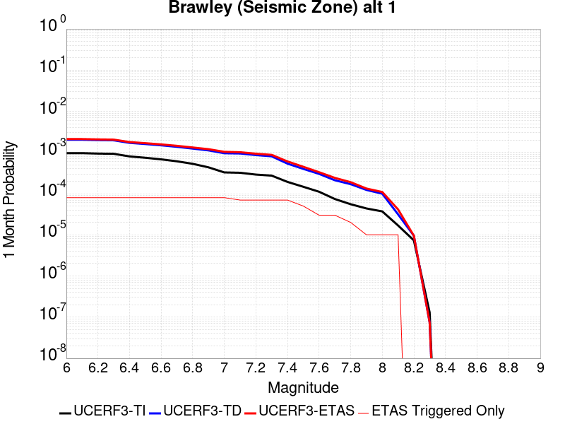 |  |  |

| Magnitude | 1 wk TI Prob | 1 wk TD Prob | 1 wk ETAS Prob | 1 wk ETAS/TD Gain | 1 wk ETAS Triggered Only | 1 mo TI Prob | 1 mo TD Prob | 1 mo ETAS Prob | 1 mo ETAS/TD Gain | 1 mo ETAS Triggered Only | 1 yr TI Prob | 1 yr TD Prob | 1 yr ETAS Prob | 1 yr ETAS/TD Gain | 1 yr ETAS Triggered Only | 10 yr TI Prob | 10 yr TD Prob | 10 yr ETAS Prob | 10 yr ETAS/TD Gain | 10 yr ETAS Triggered Only |
|-----|-----|-----|-----|-----|-----|-----|-----|-----|-----|-----|-----|-----|-----|-----|-----|-----|-----|-----|-----|-----|
| 6.0 | 2.2521618E-4 | 4.763429E-4 | 5.363143E-4 | 1.1258997 | 6.0E-5 | 9.6485513E-4 | 0.0020399094 | 0.0021197463 | 1.0391375 | 8.0E-5 | 0.011683988 | 0.024544531 | 0.024622569 | 1.0031794 | 8.0E-5 | 0.11088423 | 0.21349923 | 0.21357001 | 1.0003315 | 9.0E-5 |
| 6.1 | 2.2521618E-4 | 4.763429E-4 | 5.363143E-4 | 1.1258997 | 6.0E-5 | 9.6485513E-4 | 0.0020399094 | 0.0021197463 | 1.0391375 | 8.0E-5 | 0.011683988 | 0.024544531 | 0.024622569 | 1.0031794 | 8.0E-5 | 0.11088423 | 0.21349923 | 0.21357001 | 1.0003315 | 9.0E-5 |
| 6.2 | 2.198148E-4 | 4.6718874E-4 | 5.271607E-4 | 1.1283678 | 6.0E-5 | 9.417233E-4 | 0.0020007377 | 0.0020805777 | 1.0399053 | 8.0E-5 | 0.011405343 | 0.024078513 | 0.024156587 | 1.0032425 | 8.0E-5 | 0.10837428 | 0.20993572 | 0.21000683 | 1.0003387 | 9.0E-5 |
| 6.3 | 2.1704129E-4 | 4.615455E-4 | 5.215178E-4 | 1.129938 | 6.0E-5 | 9.298453E-4 | 0.0019765892 | 0.0020564313 | 1.0403937 | 8.0E-5 | 0.011262234 | 0.023792034 | 0.023870131 | 1.0032824 | 8.0E-5 | 0.107082725 | 0.20782684 | 0.20789813 | 1.0003431 | 9.0E-5 |
| 6.4 | 1.876142E-4 | 4.004663E-4 | 4.6044227E-4 | 1.1497654 | 6.0E-5 | 8.038131E-4 | 0.0017151695 | 0.0017950323 | 1.0465627 | 8.0E-5 | 0.00974259 | 0.020678662 | 0.020757006 | 1.0037887 | 8.0E-5 | 0.093263686 | 0.18457787 | 0.18465126 | 1.0003976 | 9.0E-5 |
| 6.5 | 1.7390939E-4 | 3.7478763E-4 | 4.3476516E-4 | 1.1600306 | 6.0E-5 | 7.45113E-4 | 0.0016052561 | 0.0016851277 | 1.0497563 | 8.0E-5 | 0.009034078 | 0.019367293 | 0.019445743 | 1.0040507 | 8.0E-5 | 0.086755216 | 0.17440015 | 0.17447445 | 1.000426 | 9.0E-5 |
| 6.6 | 1.591791E-4 | 3.4893592E-4 | 4.08915E-4 | 1.1718913 | 6.0E-5 | 6.8201777E-4 | 0.0014945926 | 0.0015744731 | 1.0534463 | 8.0E-5 | 0.008271996 | 0.018045008 | 0.018123565 | 1.0043534 | 8.0E-5 | 0.07970774 | 0.16380787 | 0.16388312 | 1.0004594 | 9.0E-5 |
| 6.7 | 1.4268003E-4 | 3.2059717E-4 | 3.8057796E-4 | 1.1870908 | 6.0E-5 | 6.1134255E-4 | 0.0013732726 | 0.0014531628 | 1.058175 | 8.0E-5 | 0.007417723 | 0.01659171 | 0.016670382 | 1.0047417 | 8.0E-5 | 0.07174956 | 0.15193594 | 0.15201226 | 1.0005023 | 9.0E-5 |
| 6.8 | 1.239713E-4 | 2.9055026E-4 | 3.5053285E-4 | 1.2064447 | 6.0E-5 | 5.3119735E-4 | 0.0012446274 | 0.0013245278 | 1.0641962 | 8.0E-5 | 0.0064481674 | 0.015049482 | 0.015128278 | 1.0052358 | 8.0E-5 | 0.06264243 | 0.13838051 | 0.13845806 | 1.0005604 | 9.0E-5 |
| 6.9 | 1.0180238E-4 | 2.6255674E-4 | 3.22541E-4 | 1.228462 | 6.0E-5 | 4.3622297E-4 | 0.0011247622 | 0.0012046723 | 1.0710461 | 8.0E-5 | 0.005298089 | 0.013608998 | 0.013687909 | 1.0057985 | 8.0E-5 | 0.05173543 | 0.12496473 | 0.12504348 | 1.0006303 | 9.0E-5 |
| 7.0 | 7.6619996E-5 | 2.2400476E-4 | 2.8399134E-4 | 1.2677914 | 6.0E-5 | 3.283301E-4 | 9.596704E-4 | 0.0010395936 | 1.083282 | 8.0E-5 | 0.0039900932 | 0.011622103 | 0.011701173 | 1.0068034 | 8.0E-5 | 0.039192066 | 0.10726982 | 0.10735017 | 1.000749 | 9.0E-5 |
| 7.1 | 7.5127435E-5 | 2.2083633E-4 | 2.708253E-4 | 1.226362 | 5.0E-5 | 3.2193496E-4 | 9.461013E-4 | 0.0010160351 | 1.0739179 | 7.0E-5 | 0.0039125155 | 0.011458648 | 0.011527846 | 1.0060389 | 7.0E-5 | 0.038443442 | 0.10583378 | 0.10590531 | 1.0006759 | 8.0E-5 |
| 7.2 | 6.788582E-5 | 2.0211334E-4 | 2.5210323E-4 | 1.2473359 | 5.0E-5 | 2.9090676E-4 | 8.6591556E-4 | 9.358549E-4 | 1.0807693 | 7.0E-5 | 0.0035360386 | 0.0104922 | 0.010561465 | 1.0066016 | 7.0E-5 | 0.034803 | 0.097503684 | 0.09757589 | 1.0007405 | 8.0E-5 |
| 7.3 | 6.399602E-5 | 1.8842232E-4 | 2.3841289E-4 | 1.2653114 | 5.0E-5 | 2.7423984E-4 | 8.0727716E-4 | 8.7722065E-4 | 1.0866412 | 7.0E-5 | 0.0033337586 | 0.009784897 | 0.0098542115 | 1.0070839 | 7.0E-5 | 0.03284188 | 0.091397986 | 0.09147067 | 1.0007952 | 8.0E-5 |
| 7.4 | 4.506759E-5 | 1.2530042E-4 | 1.7529415E-4 | 1.398991 | 5.0E-5 | 1.9313251E-4 | 5.3689216E-4 | 6.0685456E-4 | 1.13031 | 7.0E-5 | 0.0023488526 | 0.006517245 | 0.0065867887 | 1.0106708 | 7.0E-5 | 0.023241805 | 0.062364522 | 0.06243953 | 1.0012028 | 8.0E-5 |
| 7.5 | 3.43289E-5 | 9.336103E-5 | 1.2335823E-4 | 1.3213032 | 3.0E-5 | 1.4711556E-4 | 4.0005764E-4 | 4.5003765E-4 | 1.1249319 | 5.0E-5 | 0.0017896603 | 0.004859886 | 0.0049096434 | 1.0102383 | 5.0E-5 | 0.01775316 | 0.047057066 | 0.047104713 | 1.0010126 | 5.0E-5 |
| 7.6 | 2.5980507E-5 | 7.053672E-5 | 9.0535315E-5 | 1.2835202 | 2.0E-5 | 1.1134028E-4 | 3.0226534E-4 | 3.3225628E-4 | 1.0992205 | 3.0E-5 | 0.001354725 | 0.0036738948 | 0.0037037847 | 1.0081357 | 3.0E-5 | 0.013464959 | 0.03584298 | 0.035871904 | 1.0008069 | 3.0E-5 |
| 7.7 | 1.7292105E-5 | 4.9412036E-5 | 6.941105E-5 | 1.4047396 | 2.0E-5 | 7.4106916E-5 | 2.1174872E-4 | 2.4174237E-4 | 1.1416473 | 3.0E-5 | 9.018782E-4 | 0.0025749984 | 0.002604921 | 1.0116205 | 3.0E-5 | 0.008982267 | 0.025292097 | 0.025321338 | 1.0011561 | 3.0E-5 |
| 7.8 | 1.2927471E-5 | 3.9697254E-5 | 4.9696857E-5 | 1.2518966 | 1.0E-5 | 5.5402274E-5 | 1.7012001E-4 | 1.9011661E-4 | 1.117544 | 2.0E-5 | 6.743139E-4 | 0.0020692463 | 0.0020892047 | 1.0096453 | 2.0E-5 | 0.0067227143 | 0.020433145 | 0.020452736 | 1.0009588 | 2.0E-5 |
| 7.9 | 1.0200774E-5 | 2.8748475E-5 | 3.874819E-5 | 1.3478346 | 1.0E-5 | 4.371687E-5 | 1.2320194E-4 | 1.3320071E-4 | 1.0811576 | 1.0E-5 | 5.321229E-4 | 0.0014989526 | 0.0015089376 | 1.0066613 | 1.0E-5 | 0.005308505 | 0.014992895 | 0.015002744 | 1.000657 | 1.0E-5 |
| 8.0 | 8.650396E-6 | 2.3279512E-5 | 3.3279277E-5 | 1.4295523 | 1.0E-5 | 3.70726E-5 | 9.976552E-5 | 1.0976452E-4 | 1.100225 | 1.0E-5 | 4.5126543E-4 | 0.0012139693 | 0.0012239572 | 1.0082275 | 1.0E-5 | 0.0045035016 | 0.012212164 | 0.012222041 | 1.0008088 | 1.0E-5 |
| 8.1 | 3.9368224E-6 | 7.3283345E-6 | 1.732826E-5 | 2.3645566 | 1.0E-5 | 1.6871985E-5 | 3.1406773E-5 | 4.1406456E-5 | 1.3183926 | 1.0E-5 | 2.0539707E-4 | 3.8231048E-4 | 3.9230665E-4 | 1.0261468 | 1.0E-5 | 0.0020520731 | 0.0040015313 | 0.0040114913 | 1.0024891 | 1.0E-5 |
| 8.2 | 1.7101195E-6 | 2.2178374E-6 | 2.2178374E-6 | 1.0 | 0.0 | 7.329063E-6 | 9.504983E-6 | 9.504983E-6 | 1.0 | 0.0 | 8.922769E-5 | 1.15717055E-4 | 1.15717055E-4 | 1.0 | 0.0 | 8.9191867E-4 | 0.00126669 | 0.00126669 | 1.0 | 0.0 |
| 8.3 | 3.0346666E-8 | 1.721086E-8 | 1.721086E-8 | 1.0 | 0.0 | 1.3005713E-7 | 7.376083E-8 | 7.376083E-8 | 1.0 | 0.0 | 1.5834444E-6 | 8.98038E-7 | 8.98038E-7 | 1.0 | 0.0 | 1.5834332E-5 | 9.36379E-6 | 9.36379E-6 | 1.0 | 0.0 |

## Tin Mountain
*[(top)](#table-of-contents)*

| 1 Week | 1 Month | 1 Year | 10 Year |
|-----|-----|-----|-----|
|  |  |  |  |

| Magnitude | 1 wk TI Prob | 1 wk TD Prob | 1 wk ETAS Prob | 1 wk ETAS/TD Gain | 1 wk ETAS Triggered Only | 1 mo TI Prob | 1 mo TD Prob | 1 mo ETAS Prob | 1 mo ETAS/TD Gain | 1 mo ETAS Triggered Only | 1 yr TI Prob | 1 yr TD Prob | 1 yr ETAS Prob | 1 yr ETAS/TD Gain | 1 yr ETAS Triggered Only | 10 yr TI Prob | 10 yr TD Prob | 10 yr ETAS Prob | 10 yr ETAS/TD Gain | 10 yr ETAS Triggered Only |
|-----|-----|-----|-----|-----|-----|-----|-----|-----|-----|-----|-----|-----|-----|-----|-----|-----|-----|-----|-----|-----|
| 6.0 | 4.083776E-6 | 4.1815365E-6 | 4.4181368E-5 | 10.565822 | 4.0E-5 | 1.750178E-5 | 1.792077E-5 | 5.7920053E-5 | 3.232007 | 4.0E-5 | 2.1306332E-4 | 2.1816725E-4 | 2.6815635E-4 | 1.2291319 | 5.0E-5 | 0.0021285915 | 0.0021798965 | 0.0022796784 | 1.0457737 | 1.0E-4 |
| 6.1 | 4.083776E-6 | 4.1815365E-6 | 4.4181368E-5 | 10.565822 | 4.0E-5 | 1.750178E-5 | 1.792077E-5 | 5.7920053E-5 | 3.232007 | 4.0E-5 | 2.1306332E-4 | 2.1816725E-4 | 2.6815635E-4 | 1.2291319 | 5.0E-5 | 0.0021285915 | 0.0021798965 | 0.0022796784 | 1.0457737 | 1.0E-4 |
| 6.2 | 4.083776E-6 | 4.1815365E-6 | 4.4181368E-5 | 10.565822 | 4.0E-5 | 1.750178E-5 | 1.792077E-5 | 5.7920053E-5 | 3.232007 | 4.0E-5 | 2.1306332E-4 | 2.1816725E-4 | 2.6815635E-4 | 1.2291319 | 5.0E-5 | 0.0021285915 | 0.0021798965 | 0.0022796784 | 1.0457737 | 1.0E-4 |
| 6.3 | 4.083776E-6 | 4.1815365E-6 | 4.4181368E-5 | 10.565822 | 4.0E-5 | 1.750178E-5 | 1.792077E-5 | 5.7920053E-5 | 3.232007 | 4.0E-5 | 2.1306332E-4 | 2.1816725E-4 | 2.6815635E-4 | 1.2291319 | 5.0E-5 | 0.0021285915 | 0.0021798965 | 0.0022796784 | 1.0457737 | 1.0E-4 |
| 6.4 | 4.083776E-6 | 4.1815365E-6 | 4.4181368E-5 | 10.565822 | 4.0E-5 | 1.750178E-5 | 1.792077E-5 | 5.7920053E-5 | 3.232007 | 4.0E-5 | 2.1306332E-4 | 2.1816725E-4 | 2.6815635E-4 | 1.2291319 | 5.0E-5 | 0.0021285915 | 0.0021798965 | 0.0022796784 | 1.0457737 | 1.0E-4 |
| 6.5 | 2.3143427E-6 | 2.3731573E-6 | 2.237311E-5 | 9.427572 | 2.0E-5 | 9.9185745E-6 | 1.0170638E-5 | 3.0170435E-5 | 2.966425 | 2.0E-5 | 1.2075195E-4 | 1.2382126E-4 | 1.4381878E-4 | 1.1615032 | 2.0E-5 | 0.0012068636 | 0.0012375986 | 0.0012875367 | 1.0403508 | 5.0E-5 |
| 6.6 | 2.3143427E-6 | 2.3731573E-6 | 2.237311E-5 | 9.427572 | 2.0E-5 | 9.9185745E-6 | 1.0170638E-5 | 3.0170435E-5 | 2.966425 | 2.0E-5 | 1.2075195E-4 | 1.2382126E-4 | 1.4381878E-4 | 1.1615032 | 2.0E-5 | 0.0012068636 | 0.0012375986 | 0.0012875367 | 1.0403508 | 5.0E-5 |
| 6.7 | 1.7029532E-6 | 1.7497915E-6 | 2.1749756E-5 | 12.4299135 | 2.0E-5 | 7.2983503E-6 | 7.499088E-6 | 2.7498938E-5 | 3.666971 | 2.0E-5 | 8.885379E-5 | 9.1298105E-5 | 1.1129628E-4 | 1.2190425 | 2.0E-5 | 8.881827E-4 | 9.1265864E-4 | 9.62613E-4 | 1.054735 | 5.0E-5 |
| 6.8 | 1.2914646E-6 | 1.3299378E-6 | 1.1329925E-5 | 8.519138 | 1.0E-5 | 5.534837E-6 | 5.6997237E-6 | 1.5699667E-5 | 2.754461 | 1.0E-5 | 6.738455E-5 | 6.939237E-5 | 7.939168E-5 | 1.144098 | 1.0E-5 | 6.736412E-4 | 6.9375033E-4 | 7.337226E-4 | 1.0576177 | 4.0E-5 |
| 6.9 | 5.8708974E-7 | 6.1169936E-7 | 1.0611693E-5 | 17.347889 | 1.0E-5 | 2.5160964E-6 | 2.6215664E-6 | 1.262154E-5 | 4.8145037 | 1.0E-5 | 3.0633044E-5 | 3.1917145E-5 | 4.1916825E-5 | 1.3133012 | 1.0E-5 | 3.0628822E-4 | 3.191297E-4 | 3.2912652E-4 | 1.0313252 | 1.0E-5 |
| 7.0 | 4.6248786E-7 | 4.832015E-7 | 4.832015E-7 | 1.0 | 0.0 | 1.9820893E-6 | 2.0708624E-6 | 2.0708624E-6 | 1.0 | 0.0 | 2.413167E-5 | 2.5212494E-5 | 2.5212494E-5 | 1.0 | 0.0 | 2.412905E-4 | 2.5210003E-4 | 2.5210003E-4 | 1.0 | 0.0 |
| 7.1 | 3.804606E-7 | 3.987147E-7 | 3.987147E-7 | 1.0 | 0.0 | 1.6305444E-6 | 1.7087764E-6 | 1.7087764E-6 | 1.0 | 0.0 | 1.9851697E-5 | 2.0804187E-5 | 2.0804187E-5 | 1.0 | 0.0 | 1.9849923E-4 | 2.0802575E-4 | 2.0802575E-4 | 1.0 | 0.0 |
| 7.2 | 3.5864858E-7 | 3.7616863E-7 | 3.7616863E-7 | 1.0 | 0.0 | 1.5370645E-6 | 1.6121504E-6 | 1.6121504E-6 | 1.0 | 0.0 | 1.87136E-5 | 1.9627789E-5 | 1.9627789E-5 | 1.0 | 0.0 | 1.8712023E-4 | 1.9626386E-4 | 1.9626386E-4 | 1.0 | 0.0 |
| 7.3 | 3.342063E-7 | 3.506347E-7 | 3.506347E-7 | 1.0 | 0.0 | 1.4323119E-6 | 1.5027196E-6 | 1.5027196E-6 | 1.0 | 0.0 | 1.7438259E-5 | 1.829549E-5 | 1.829549E-5 | 1.0 | 0.0 | 1.743689E-4 | 1.8294314E-4 | 1.8294314E-4 | 1.0 | 0.0 |
| 7.4 | 2.971242E-7 | 3.1165817E-7 | 3.1165817E-7 | 1.0 | 0.0 | 1.2733886E-6 | 1.3356774E-6 | 1.3356774E-6 | 1.0 | 0.0 | 1.5503398E-5 | 1.6261785E-5 | 1.6261785E-5 | 1.0 | 0.0 | 1.5502315E-4 | 1.6260923E-4 | 1.6260923E-4 | 1.0 | 0.0 |
| 7.5 | 1.4326713E-7 | 1.5012525E-7 | 1.5012525E-7 | 1.0 | 0.0 | 6.140018E-7 | 6.433939E-7 | 6.433939E-7 | 1.0 | 0.0 | 7.4754466E-6 | 7.8333205E-6 | 7.8333205E-6 | 1.0 | 0.0 | 7.475195E-5 | 7.833321E-5 | 7.833321E-5 | 1.0 | 0.0 |

## Kern Canyon (Lake Isabella) 2011
*[(top)](#table-of-contents)*

| 1 Week | 1 Month | 1 Year | 10 Year |
|-----|-----|-----|-----|
|  |  |  |  |

| Magnitude | 1 wk TI Prob | 1 wk TD Prob | 1 wk ETAS Prob | 1 wk ETAS/TD Gain | 1 wk ETAS Triggered Only | 1 mo TI Prob | 1 mo TD Prob | 1 mo ETAS Prob | 1 mo ETAS/TD Gain | 1 mo ETAS Triggered Only | 1 yr TI Prob | 1 yr TD Prob | 1 yr ETAS Prob | 1 yr ETAS/TD Gain | 1 yr ETAS Triggered Only | 10 yr TI Prob | 10 yr TD Prob | 10 yr ETAS Prob | 10 yr ETAS/TD Gain | 10 yr ETAS Triggered Only |
|-----|-----|-----|-----|-----|-----|-----|-----|-----|-----|-----|-----|-----|-----|-----|-----|-----|-----|-----|-----|-----|
| 6.0 | 4.2387383E-6 | 4.0016344E-6 | 3.4001514E-5 | 8.496907 | 3.0E-5 | 1.8165894E-5 | 1.7149758E-5 | 7.714873E-5 | 4.4985313 | 6.0E-5 | 2.2114732E-4 | 2.0878017E-4 | 2.8876346E-4 | 1.3830981 | 8.0E-5 | 0.0022092736 | 0.002086024 | 0.0021758364 | 1.0430542 | 9.0E-5 |
| 6.1 | 4.2387383E-6 | 4.0016344E-6 | 3.4001514E-5 | 8.496907 | 3.0E-5 | 1.8165894E-5 | 1.7149758E-5 | 7.714873E-5 | 4.4985313 | 6.0E-5 | 2.2114732E-4 | 2.0878017E-4 | 2.8876346E-4 | 1.3830981 | 8.0E-5 | 0.0022092736 | 0.002086024 | 0.0021758364 | 1.0430542 | 9.0E-5 |
| 6.2 | 4.2387383E-6 | 4.0016344E-6 | 3.4001514E-5 | 8.496907 | 3.0E-5 | 1.8165894E-5 | 1.7149758E-5 | 7.714873E-5 | 4.4985313 | 6.0E-5 | 2.2114732E-4 | 2.0878017E-4 | 2.8876346E-4 | 1.3830981 | 8.0E-5 | 0.0022092736 | 0.002086024 | 0.0021758364 | 1.0430542 | 9.0E-5 |
| 6.3 | 4.2387383E-6 | 4.0016344E-6 | 3.4001514E-5 | 8.496907 | 3.0E-5 | 1.8165894E-5 | 1.7149758E-5 | 7.714873E-5 | 4.4985313 | 6.0E-5 | 2.2114732E-4 | 2.0878017E-4 | 2.8876346E-4 | 1.3830981 | 8.0E-5 | 0.0022092736 | 0.002086024 | 0.0021758364 | 1.0430542 | 9.0E-5 |
| 6.4 | 4.2387383E-6 | 4.0016344E-6 | 3.4001514E-5 | 8.496907 | 3.0E-5 | 1.8165894E-5 | 1.7149758E-5 | 7.714873E-5 | 4.4985313 | 6.0E-5 | 2.2114732E-4 | 2.0878017E-4 | 2.8876346E-4 | 1.3830981 | 8.0E-5 | 0.0022092736 | 0.002086024 | 0.0021758364 | 1.0430542 | 9.0E-5 |
| 6.5 | 2.7857532E-6 | 2.5178624E-6 | 2.2517812E-5 | 8.943226 | 2.0E-5 | 1.1938888E-5 | 1.0790796E-5 | 6.0790255E-5 | 5.6335287 | 5.0E-5 | 1.4534626E-4 | 1.3137035E-4 | 1.9136247E-4 | 1.4566641 | 6.0E-5 | 0.0014525123 | 0.0013129596 | 0.0013728809 | 1.0456383 | 6.0E-5 |
| 6.6 | 2.2233348E-6 | 1.944119E-6 | 2.194408E-5 | 11.2874155 | 2.0E-5 | 9.528543E-6 | 8.331913E-6 | 4.8331578E-5 | 5.8007784 | 4.0E-5 | 1.1600384E-4 | 1.014364E-4 | 1.5143133E-4 | 1.4928697 | 5.0E-5 | 0.001159433 | 0.0010139096 | 0.001063859 | 1.0492641 | 5.0E-5 |
| 6.7 | 2.1635126E-6 | 1.8834991E-6 | 2.1883461E-5 | 11.618515 | 2.0E-5 | 9.272164E-6 | 8.072114E-6 | 4.807179E-5 | 5.9552913 | 4.0E-5 | 1.1288274E-4 | 9.827364E-5 | 1.4826872E-4 | 1.5087334 | 5.0E-5 | 0.0011282542 | 9.8231E-4 | 0.0010322608 | 1.0508504 | 5.0E-5 |
| 6.8 | 1.8685711E-6 | 1.583138E-6 | 2.1583106E-5 | 13.633118 | 2.0E-5 | 8.008137E-6 | 6.7848596E-6 | 4.678459E-5 | 6.895439 | 4.0E-5 | 9.74947E-5 | 8.2602586E-5 | 1.3259845E-4 | 1.605258 | 5.0E-5 | 9.745194E-4 | 8.2572375E-4 | 8.7568245E-4 | 1.0605029 | 5.0E-5 |
| 6.9 | 1.5815071E-6 | 1.3064887E-6 | 2.1306463E-5 | 16.308187 | 2.0E-5 | 6.77787E-6 | 5.5992255E-6 | 3.5599056E-5 | 6.357854 | 3.0E-5 | 8.251744E-5 | 6.816846E-5 | 1.0816574E-4 | 1.5867416 | 4.0E-5 | 8.248681E-4 | 6.8147824E-4 | 7.2145095E-4 | 1.058656 | 4.0E-5 |
| 7.0 | 1.3772564E-6 | 1.1210681E-6 | 1.1121057E-5 | 9.920054 | 1.0E-5 | 5.9025137E-6 | 4.8045686E-6 | 2.4804473E-5 | 5.1626844 | 2.0E-5 | 7.186073E-5 | 5.8494075E-5 | 8.849232E-5 | 1.5128424 | 3.0E-5 | 7.18375E-4 | 5.8478885E-4 | 6.1477127E-4 | 1.0512706 | 3.0E-5 |
| 7.1 | 1.0916998E-6 | 8.7637505E-7 | 1.0876366E-5 | 12.41063 | 1.0E-5 | 4.678705E-6 | 3.7558877E-6 | 2.3755812E-5 | 6.3249526 | 2.0E-5 | 5.6961744E-5 | 4.5726985E-5 | 6.5726075E-5 | 1.4373585 | 2.0E-5 | 5.6947145E-4 | 4.571771E-4 | 4.7716798E-4 | 1.0437267 | 2.0E-5 |
| 7.2 | 7.6277024E-7 | 5.901439E-7 | 1.0590138E-5 | 17.945011 | 1.0E-5 | 3.2690114E-6 | 2.5291856E-6 | 2.2529135E-5 | 8.907663 | 2.0E-5 | 3.9799485E-5 | 3.0792406E-5 | 5.079179E-5 | 1.6494908 | 2.0E-5 | 3.9792358E-4 | 3.07882E-4 | 3.2787584E-4 | 1.06494 | 2.0E-5 |
| 7.3 | 5.3265916E-7 | 4.3824264E-7 | 4.3824264E-7 | 1.0 | 0.0 | 2.282823E-6 | 1.8781814E-6 | 1.1878163E-5 | 6.3242893 | 1.0E-5 | 2.7793016E-5 | 2.2866623E-5 | 3.2866392E-5 | 1.4373087 | 1.0E-5 | 2.778954E-4 | 2.2864307E-4 | 2.3864079E-4 | 1.0437263 | 1.0E-5 |
| 7.4 | 3.4946007E-7 | 3.0065647E-7 | 3.0065647E-7 | 1.0 | 0.0 | 1.497685E-6 | 1.2885271E-6 | 1.12885145E-5 | 8.760789 | 1.0E-5 | 1.8234163E-5 | 1.5687707E-5 | 2.568755E-5 | 1.6374319 | 1.0E-5 | 1.8232666E-4 | 1.5686621E-4 | 1.6686464E-4 | 1.0637386 | 1.0E-5 |
| 7.5 | 1.8317026E-7 | 1.4244755E-7 | 1.4244755E-7 | 1.0 | 0.0 | 7.850152E-7 | 6.1048934E-7 | 1.06104835E-5 | 17.380293 | 1.0E-5 | 9.557518E-6 | 7.432683E-6 | 1.7432609E-5 | 2.3453991 | 1.0E-5 | 9.5571064E-5 | 7.432442E-5 | 8.4323685E-5 | 1.1345353 | 1.0E-5 |
| 7.6 | 2.572245E-8 | 1.735264E-8 | 1.735264E-8 | 1.0 | 0.0 | 1.10239064E-7 | 7.436845E-8 | 7.436845E-8 | 1.0 | 0.0 | 1.3421597E-6 | 9.0543557E-7 | 9.0543557E-7 | 1.0 | 0.0 | 1.3421517E-5 | 9.054324E-6 | 9.054324E-6 | 1.0 | 0.0 |

## Red Mountain
*[(top)](#table-of-contents)*

| 1 Week | 1 Month | 1 Year | 10 Year |
|-----|-----|-----|-----|
|  |  |  |  |

| Magnitude | 1 wk TI Prob | 1 wk TD Prob | 1 wk ETAS Prob | 1 wk ETAS/TD Gain | 1 wk ETAS Triggered Only | 1 mo TI Prob | 1 mo TD Prob | 1 mo ETAS Prob | 1 mo ETAS/TD Gain | 1 mo ETAS Triggered Only | 1 yr TI Prob | 1 yr TD Prob | 1 yr ETAS Prob | 1 yr ETAS/TD Gain | 1 yr ETAS Triggered Only | 10 yr TI Prob | 10 yr TD Prob | 10 yr ETAS Prob | 10 yr ETAS/TD Gain | 10 yr ETAS Triggered Only |
|-----|-----|-----|-----|-----|-----|-----|-----|-----|-----|-----|-----|-----|-----|-----|-----|-----|-----|-----|-----|-----|
| 6.0 | 4.1810763E-5 | 4.7590016E-5 | 8.758811E-5 | 1.8404725 | 4.0E-5 | 1.7917668E-4 | 2.039422E-4 | 2.4393405E-4 | 1.196094 | 4.0E-5 | 0.0021792934 | 0.0024803334 | 0.0025302093 | 1.0201086 | 5.0E-5 | 0.021580452 | 0.02454411 | 0.0246319 | 1.0035769 | 9.0E-5 |
| 6.1 | 4.1810763E-5 | 4.7590016E-5 | 8.758811E-5 | 1.8404725 | 4.0E-5 | 1.7917668E-4 | 2.039422E-4 | 2.4393405E-4 | 1.196094 | 4.0E-5 | 0.0021792934 | 0.0024803334 | 0.0025302093 | 1.0201086 | 5.0E-5 | 0.021580452 | 0.02454411 | 0.0246319 | 1.0035769 | 9.0E-5 |
| 6.2 | 4.1810763E-5 | 4.7590016E-5 | 8.758811E-5 | 1.8404725 | 4.0E-5 | 1.7917668E-4 | 2.039422E-4 | 2.4393405E-4 | 1.196094 | 4.0E-5 | 0.0021792934 | 0.0024803334 | 0.0025302093 | 1.0201086 | 5.0E-5 | 0.021580452 | 0.02454411 | 0.0246319 | 1.0035769 | 9.0E-5 |
| 6.3 | 4.1810763E-5 | 4.7590016E-5 | 8.758811E-5 | 1.8404725 | 4.0E-5 | 1.7917668E-4 | 2.039422E-4 | 2.4393405E-4 | 1.196094 | 4.0E-5 | 0.0021792934 | 0.0024803334 | 0.0025302093 | 1.0201086 | 5.0E-5 | 0.021580452 | 0.02454411 | 0.0246319 | 1.0035769 | 9.0E-5 |
| 6.4 | 4.1810763E-5 | 4.7590016E-5 | 8.758811E-5 | 1.8404725 | 4.0E-5 | 1.7917668E-4 | 2.039422E-4 | 2.4393405E-4 | 1.196094 | 4.0E-5 | 0.0021792934 | 0.0024803334 | 0.0025302093 | 1.0201086 | 5.0E-5 | 0.021580452 | 0.02454411 | 0.0246319 | 1.0035769 | 9.0E-5 |
| 6.5 | 3.154503E-5 | 3.5359757E-5 | 7.5358344E-5 | 2.1311896 | 4.0E-5 | 1.3518598E-4 | 1.5153353E-4 | 1.9152748E-4 | 1.2639279 | 4.0E-5 | 0.0016446467 | 0.0018434518 | 0.0018933596 | 1.027073 | 5.0E-5 | 0.01632528 | 0.018291244 | 0.018359965 | 1.003757 | 7.0E-5 |
| 6.6 | 3.1535834E-5 | 3.5349138E-5 | 7.534772E-5 | 2.1315293 | 4.0E-5 | 1.3514658E-4 | 1.5148803E-4 | 1.9148197E-4 | 1.2640072 | 4.0E-5 | 0.0016441676 | 0.0018428987 | 0.0018928065 | 1.0270811 | 5.0E-5 | 0.01632056 | 0.018285805 | 0.018354526 | 1.0037581 | 7.0E-5 |
| 6.7 | 2.8267326E-5 | 3.1469353E-5 | 7.1468094E-5 | 2.2710378 | 4.0E-5 | 1.2114006E-4 | 1.3486217E-4 | 1.7485677E-4 | 1.2965591 | 4.0E-5 | 0.0014738824 | 0.0016407954 | 0.0016907133 | 1.030423 | 5.0E-5 | 0.014641452 | 0.01629557 | 0.016364431 | 1.0042256 | 7.0E-5 |
| 6.8 | 2.8212884E-5 | 3.1407242E-5 | 7.1405986E-5 | 2.2735517 | 4.0E-5 | 1.20906756E-4 | 1.3459599E-4 | 1.745906E-4 | 1.2971456 | 4.0E-5 | 0.0014710457 | 0.0016375595 | 0.0016874777 | 1.0304832 | 5.0E-5 | 0.014613459 | 0.016263688 | 0.01633255 | 1.0042341 | 7.0E-5 |
| 6.9 | 2.4227871E-5 | 2.6706994E-5 | 6.670593E-5 | 2.497695 | 4.0E-5 | 1.03829596E-4 | 1.1445395E-4 | 1.5444937E-4 | 1.3494456 | 4.0E-5 | 0.0012633923 | 0.0013926621 | 0.0014425924 | 1.0358524 | 5.0E-5 | 0.012562336 | 0.0138470335 | 0.013906203 | 1.004273 | 6.0E-5 |
| 7.0 | 2.348524E-5 | 2.5835778E-5 | 6.583474E-5 | 2.5482006 | 4.0E-5 | 1.0064714E-4 | 1.10720495E-4 | 1.5071606E-4 | 1.36123 | 4.0E-5 | 0.0012246901 | 0.001347264 | 0.0013971967 | 1.0370623 | 5.0E-5 | 0.012179627 | 0.013398598 | 0.013457794 | 1.0044181 | 6.0E-5 |
| 7.1 | 2.2311642E-5 | 2.4462845E-5 | 5.446211E-5 | 2.2263196 | 3.0E-5 | 9.561782E-5 | 1.04836974E-4 | 1.3483383E-4 | 1.2861286 | 3.0E-5 | 0.0011635252 | 0.0012757176 | 0.0013156666 | 1.0313148 | 4.0E-5 | 0.01157452 | 0.01269146 | 0.012740825 | 1.0038897 | 5.0E-5 |
| 7.2 | 1.6533986E-5 | 1.7670362E-5 | 4.7669833E-5 | 2.6977282 | 3.0E-5 | 7.085802E-5 | 7.572828E-5 | 1.0572601E-4 | 1.3961232 | 3.0E-5 | 8.623549E-4 | 9.2166534E-4 | 9.6162845E-4 | 1.0433598 | 4.0E-5 | 0.008590161 | 0.009184707 | 0.009224339 | 1.004315 | 4.0E-5 |
| 7.3 | 1.4703092E-5 | 1.5559537E-5 | 4.555907E-5 | 2.928048 | 3.0E-5 | 6.301173E-5 | 6.668237E-5 | 9.668037E-5 | 1.449864 | 3.0E-5 | 7.668978E-4 | 8.1161706E-4 | 8.515846E-4 | 1.0492443 | 4.0E-5 | 0.0076425658 | 0.008092604 | 0.00813228 | 1.0049028 | 4.0E-5 |
| 7.4 | 6.1331984E-6 | 5.5288874E-6 | 3.5528723E-5 | 6.426017 | 3.0E-5 | 2.6284872E-5 | 2.3695018E-5 | 5.3694308E-5 | 2.266059 | 3.0E-5 | 3.199713E-4 | 2.884492E-4 | 3.2843766E-4 | 1.1386327 | 4.0E-5 | 0.0031951098 | 0.0028808024 | 0.0029206872 | 1.013845 | 4.0E-5 |
| 7.5 | 5.954766E-6 | 5.338517E-6 | 3.533836E-5 | 6.6195083 | 3.0E-5 | 2.5520176E-5 | 2.2879161E-5 | 5.2878473E-5 | 2.3112068 | 3.0E-5 | 3.1066386E-4 | 2.785187E-4 | 3.1850755E-4 | 1.143577 | 4.0E-5 | 0.003102299 | 0.0027817504 | 0.002821639 | 1.0143394 | 4.0E-5 |
| 7.6 | 4.9726646E-6 | 4.315309E-6 | 3.431518E-5 | 7.9519634 | 3.0E-5 | 2.1311245E-5 | 1.8494053E-5 | 4.8493497E-5 | 2.6221132 | 3.0E-5 | 2.5943352E-4 | 2.2514217E-4 | 2.6513316E-4 | 1.1776255 | 4.0E-5 | 0.0025913084 | 0.0022491754 | 0.0022890854 | 1.0177443 | 4.0E-5 |
| 7.7 | 3.3613894E-6 | 2.8526886E-6 | 2.2852631E-5 | 8.01091 | 2.0E-5 | 1.4405875E-5 | 1.22257525E-5 | 3.2225507E-5 | 2.6358712 | 2.0E-5 | 1.7537741E-4 | 1.4883863E-4 | 1.6883566E-4 | 1.1343538 | 2.0E-5 | 0.0017523908 | 0.0014874157 | 0.0015073861 | 1.0134262 | 2.0E-5 |
| 7.8 | 1.1828961E-6 | 1.0122935E-6 | 1.0122935E-6 | 1.0 | 0.0 | 5.069545E-6 | 4.338394E-6 | 4.338394E-6 | 1.0 | 0.0 | 6.171996E-5 | 5.281869E-5 | 5.281869E-5 | 1.0 | 0.0 | 6.170282E-4 | 5.280643E-4 | 5.280643E-4 | 1.0 | 0.0 |
| 7.9 | 2.2967266E-7 | 1.861919E-7 | 1.861919E-7 | 1.0 | 0.0 | 9.843111E-7 | 7.97965E-7 | 7.97965E-7 | 1.0 | 0.0 | 1.19839215E-5 | 9.715184E-6 | 9.715184E-6 | 1.0 | 0.0 | 1.1983275E-4 | 9.714788E-5 | 9.714788E-5 | 1.0 | 0.0 |

## Pleito
*[(top)](#table-of-contents)*

| 1 Week | 1 Month | 1 Year | 10 Year |
|-----|-----|-----|-----|
|  |  |  |  |

| Magnitude | 1 wk TI Prob | 1 wk TD Prob | 1 wk ETAS Prob | 1 wk ETAS/TD Gain | 1 wk ETAS Triggered Only | 1 mo TI Prob | 1 mo TD Prob | 1 mo ETAS Prob | 1 mo ETAS/TD Gain | 1 mo ETAS Triggered Only | 1 yr TI Prob | 1 yr TD Prob | 1 yr ETAS Prob | 1 yr ETAS/TD Gain | 1 yr ETAS Triggered Only | 10 yr TI Prob | 10 yr TD Prob | 10 yr ETAS Prob | 10 yr ETAS/TD Gain | 10 yr ETAS Triggered Only |
|-----|-----|-----|-----|-----|-----|-----|-----|-----|-----|-----|-----|-----|-----|-----|-----|-----|-----|-----|-----|-----|
| 6.0 | 1.6763008E-5 | 2.4764735E-5 | 5.4763994E-5 | 2.21137 | 3.0E-5 | 7.183948E-5 | 1.0613067E-4 | 1.5612536E-4 | 1.4710673 | 5.0E-5 | 8.742947E-4 | 0.001291447 | 0.0013513695 | 1.0463995 | 6.0E-5 | 0.00870863 | 0.012954412 | 0.013033375 | 1.0060955 | 8.0E-5 |
| 6.1 | 1.6763008E-5 | 2.4764735E-5 | 5.4763994E-5 | 2.21137 | 3.0E-5 | 7.183948E-5 | 1.0613067E-4 | 1.5612536E-4 | 1.4710673 | 5.0E-5 | 8.742947E-4 | 0.001291447 | 0.0013513695 | 1.0463995 | 6.0E-5 | 0.00870863 | 0.012954412 | 0.013033375 | 1.0060955 | 8.0E-5 |
| 6.2 | 1.6763008E-5 | 2.4764735E-5 | 5.4763994E-5 | 2.21137 | 3.0E-5 | 7.183948E-5 | 1.0613067E-4 | 1.5612536E-4 | 1.4710673 | 5.0E-5 | 8.742947E-4 | 0.001291447 | 0.0013513695 | 1.0463995 | 6.0E-5 | 0.00870863 | 0.012954412 | 0.013033375 | 1.0060955 | 8.0E-5 |
| 6.3 | 1.6763008E-5 | 2.4764735E-5 | 5.4763994E-5 | 2.21137 | 3.0E-5 | 7.183948E-5 | 1.0613067E-4 | 1.5612536E-4 | 1.4710673 | 5.0E-5 | 8.742947E-4 | 0.001291447 | 0.0013513695 | 1.0463995 | 6.0E-5 | 0.00870863 | 0.012954412 | 0.013033375 | 1.0060955 | 8.0E-5 |
| 6.4 | 1.6763008E-5 | 2.4764735E-5 | 5.4763994E-5 | 2.21137 | 3.0E-5 | 7.183948E-5 | 1.0613067E-4 | 1.5612536E-4 | 1.4710673 | 5.0E-5 | 8.742947E-4 | 0.001291447 | 0.0013513695 | 1.0463995 | 6.0E-5 | 0.00870863 | 0.012954412 | 0.013033375 | 1.0060955 | 8.0E-5 |
| 6.5 | 1.6763008E-5 | 2.4764735E-5 | 5.4763994E-5 | 2.21137 | 3.0E-5 | 7.183948E-5 | 1.0613067E-4 | 1.5612536E-4 | 1.4710673 | 5.0E-5 | 8.742947E-4 | 0.001291447 | 0.0013513695 | 1.0463995 | 6.0E-5 | 0.00870863 | 0.012954412 | 0.013033375 | 1.0060955 | 8.0E-5 |
| 6.6 | 9.910213E-6 | 1.721552E-5 | 3.7215177E-5 | 2.1617224 | 2.0E-5 | 4.247165E-5 | 7.3778734E-5 | 1.13775786E-4 | 1.5421216 | 4.0E-5 | 5.169696E-4 | 8.9788967E-4 | 9.378537E-4 | 1.0445089 | 4.0E-5 | 0.0051576863 | 0.009051226 | 0.009100773 | 1.0054741 | 5.0E-5 |
| 6.7 | 9.910213E-6 | 1.721552E-5 | 3.7215177E-5 | 2.1617224 | 2.0E-5 | 4.247165E-5 | 7.3778734E-5 | 1.13775786E-4 | 1.5421216 | 4.0E-5 | 5.169696E-4 | 8.9788967E-4 | 9.378537E-4 | 1.0445089 | 4.0E-5 | 0.0051576863 | 0.009051226 | 0.009100773 | 1.0054741 | 5.0E-5 |
| 6.8 | 8.300162E-6 | 1.5475129E-5 | 2.5474974E-5 | 1.6461881 | 1.0E-5 | 3.557164E-5 | 6.63203E-5 | 8.631898E-5 | 1.3015468 | 2.0E-5 | 4.3299864E-4 | 8.07152E-4 | 8.2713587E-4 | 1.0247585 | 2.0E-5 | 0.004321559 | 0.008150663 | 0.008180419 | 1.0036507 | 3.0E-5 |
| 6.9 | 8.183114E-6 | 1.5346344E-5 | 2.5346191E-5 | 1.651611 | 1.0E-5 | 3.5070017E-5 | 6.57684E-5 | 8.576708E-5 | 1.3040774 | 2.0E-5 | 4.2689382E-4 | 8.0043747E-4 | 8.204215E-4 | 1.0249664 | 2.0E-5 | 0.0042607468 | 0.008084008 | 0.008113765 | 1.0036811 | 3.0E-5 |
| 7.0 | 7.1748823E-6 | 1.4133306E-5 | 2.4133164E-5 | 1.7075386 | 1.0E-5 | 3.0749135E-5 | 6.0569906E-5 | 7.05693E-5 | 1.1650885 | 1.0E-5 | 3.743064E-4 | 7.3718966E-4 | 7.471823E-4 | 1.013555 | 1.0E-5 | 0.0037367654 | 0.0074553755 | 0.0074752267 | 1.0026627 | 2.0E-5 |
| 7.1 | 7.1671807E-6 | 1.4123676E-5 | 2.4123534E-5 | 1.708021 | 1.0E-5 | 3.0716128E-5 | 6.0528637E-5 | 7.052803E-5 | 1.1652011 | 1.0E-5 | 3.7390468E-4 | 7.366875E-4 | 7.4668013E-4 | 1.0135642 | 1.0E-5 | 0.0037327618 | 0.0074503883 | 0.007470239 | 1.0026644 | 2.0E-5 |
| 7.2 | 7.0649667E-6 | 1.3970962E-5 | 2.3970822E-5 | 1.7157604 | 1.0E-5 | 3.0278077E-5 | 5.987418E-5 | 6.987358E-5 | 1.1670069 | 1.0E-5 | 3.6857324E-4 | 7.287248E-4 | 7.3871756E-4 | 1.0137126 | 1.0E-5 | 0.0036796255 | 0.0073711374 | 0.00739099 | 1.0026933 | 2.0E-5 |
| 7.3 | 7.02082E-6 | 1.3914415E-5 | 2.3914276E-5 | 1.7186692 | 1.0E-5 | 3.008888E-5 | 5.9631846E-5 | 6.963125E-5 | 1.1676856 | 1.0E-5 | 3.6627054E-4 | 7.257764E-4 | 7.3576916E-4 | 1.0137683 | 1.0E-5 | 0.0036566744 | 0.0073416373 | 0.0073614907 | 1.0027041 | 2.0E-5 |
| 7.4 | 6.987146E-6 | 1.3873975E-5 | 2.3873838E-5 | 1.7207639 | 1.0E-5 | 2.9944567E-5 | 5.9458544E-5 | 6.945795E-5 | 1.1681744 | 1.0E-5 | 3.6451413E-4 | 7.2366785E-4 | 7.336606E-4 | 1.0138085 | 1.0E-5 | 0.0036391679 | 0.007320571 | 0.007340425 | 1.002712 | 2.0E-5 |
| 7.5 | 6.9494554E-6 | 1.383088E-5 | 2.3830742E-5 | 1.7230098 | 1.0E-5 | 2.9783041E-5 | 5.9273858E-5 | 6.9273265E-5 | 1.1686984 | 1.0E-5 | 3.625482E-4 | 7.2142074E-4 | 7.3141354E-4 | 1.0138515 | 1.0E-5 | 0.0036195726 | 0.007298199 | 0.007318053 | 1.0027204 | 2.0E-5 |
| 7.6 | 6.92694E-6 | 1.3789992E-5 | 2.3789855E-5 | 1.7251536 | 1.0E-5 | 2.9686547E-5 | 5.909863E-5 | 6.909804E-5 | 1.1691986 | 1.0E-5 | 3.6137376E-4 | 7.192888E-4 | 7.292816E-4 | 1.0138927 | 1.0E-5 | 0.0036078666 | 0.007276951 | 0.0072968053 | 1.0027285 | 2.0E-5 |
| 7.7 | 6.395867E-6 | 1.26690065E-5 | 2.266888E-5 | 1.7893178 | 1.0E-5 | 2.741057E-5 | 5.4294615E-5 | 6.429407E-5 | 1.1841704 | 1.0E-5 | 3.336726E-4 | 6.6083675E-4 | 6.7083014E-4 | 1.0151223 | 1.0E-5 | 0.0033317201 | 0.0066955453 | 0.0067154113 | 1.0029671 | 2.0E-5 |
| 7.8 | 5.8664327E-6 | 1.1536581E-5 | 2.1536465E-5 | 1.8667979 | 1.0E-5 | 2.5141611E-5 | 4.9441554E-5 | 5.944106E-5 | 1.202249 | 1.0E-5 | 3.060561E-4 | 6.0178485E-4 | 6.117789E-4 | 1.0166073 | 1.0E-5 | 0.0030563495 | 0.0061010164 | 0.0061208946 | 1.0032581 | 2.0E-5 |
| 7.9 | 3.7167474E-6 | 7.1145205E-6 | 1.711445E-5 | 2.405566 | 1.0E-5 | 1.592882E-5 | 3.0490448E-5 | 4.0490144E-5 | 1.3279616 | 1.0E-5 | 1.9391612E-4 | 3.7115812E-4 | 3.8115442E-4 | 1.0269327 | 1.0E-5 | 0.0019374699 | 0.0037676243 | 0.003787549 | 1.0052884 | 2.0E-5 |
| 8.0 | 1.0903841E-6 | 1.2879104E-6 | 1.2879104E-6 | 1.0 | 0.0 | 4.6730665E-6 | 5.5196047E-6 | 5.5196047E-6 | 1.0 | 0.0 | 5.68931E-5 | 6.719913E-5 | 6.719913E-5 | 1.0 | 0.0 | 5.6878536E-4 | 6.942094E-4 | 6.942094E-4 | 1.0 | 0.0 |
| 8.1 | 2.6894583E-7 | 1.1056095E-7 | 1.1056095E-7 | 1.0 | 0.0 | 1.1526245E-6 | 4.7383253E-7 | 4.7383253E-7 | 1.0 | 0.0 | 1.4033113E-5 | 5.768896E-6 | 5.768896E-6 | 1.0 | 0.0 | 1.4032227E-4 | 6.454915E-5 | 6.454915E-5 | 1.0 | 0.0 |
| 8.2 | 5.2967013E-9 | 2.4567874E-9 | 2.4567874E-9 | 1.0 | 0.0 | 2.2700148E-8 | 1.0529089E-8 | 1.0529089E-8 | 1.0 | 0.0 | 2.7637427E-7 | 1.2819166E-7 | 1.2819166E-7 | 1.0 | 0.0 | 2.7637393E-6 | 1.4588004E-6 | 1.4588004E-6 | 1.0 | 0.0 |

## San Jacinto (Coyote Creek)
*[(top)](#table-of-contents)*

| 1 Week | 1 Month | 1 Year | 10 Year |
|-----|-----|-----|-----|
|  |  |  |  |

| Magnitude | 1 wk TI Prob | 1 wk TD Prob | 1 wk ETAS Prob | 1 wk ETAS/TD Gain | 1 wk ETAS Triggered Only | 1 mo TI Prob | 1 mo TD Prob | 1 mo ETAS Prob | 1 mo ETAS/TD Gain | 1 mo ETAS Triggered Only | 1 yr TI Prob | 1 yr TD Prob | 1 yr ETAS Prob | 1 yr ETAS/TD Gain | 1 yr ETAS Triggered Only | 10 yr TI Prob | 10 yr TD Prob | 10 yr ETAS Prob | 10 yr ETAS/TD Gain | 10 yr ETAS Triggered Only |
|-----|-----|-----|-----|-----|-----|-----|-----|-----|-----|-----|-----|-----|-----|-----|-----|-----|-----|-----|-----|-----|
| 6.0 | 2.7374346E-5 | 2.41444E-5 | 9.4142706E-5 | 3.8991532 | 7.0E-5 | 1.1731335E-4 | 1.034719E-4 | 1.8346362E-4 | 1.7730768 | 8.0E-5 | 0.0014273542 | 0.001259045 | 0.0013389443 | 1.0634602 | 8.0E-5 | 0.01418221 | 0.012928195 | 0.01300716 | 1.006108 | 8.0E-5 |
| 6.1 | 2.7374346E-5 | 2.41444E-5 | 9.4142706E-5 | 3.8991532 | 7.0E-5 | 1.1731335E-4 | 1.034719E-4 | 1.8346362E-4 | 1.7730768 | 8.0E-5 | 0.0014273542 | 0.001259045 | 0.0013389443 | 1.0634602 | 8.0E-5 | 0.01418221 | 0.012928195 | 0.01300716 | 1.006108 | 8.0E-5 |
| 6.2 | 2.7374346E-5 | 2.41444E-5 | 9.4142706E-5 | 3.8991532 | 7.0E-5 | 1.1731335E-4 | 1.034719E-4 | 1.8346362E-4 | 1.7730768 | 8.0E-5 | 0.0014273542 | 0.001259045 | 0.0013389443 | 1.0634602 | 8.0E-5 | 0.01418221 | 0.012928195 | 0.01300716 | 1.006108 | 8.0E-5 |
| 6.3 | 2.7374346E-5 | 2.41444E-5 | 9.4142706E-5 | 3.8991532 | 7.0E-5 | 1.1731335E-4 | 1.034719E-4 | 1.8346362E-4 | 1.7730768 | 8.0E-5 | 0.0014273542 | 0.001259045 | 0.0013389443 | 1.0634602 | 8.0E-5 | 0.01418221 | 0.012928195 | 0.01300716 | 1.006108 | 8.0E-5 |
| 6.4 | 2.7374346E-5 | 2.41444E-5 | 9.4142706E-5 | 3.8991532 | 7.0E-5 | 1.1731335E-4 | 1.034719E-4 | 1.8346362E-4 | 1.7730768 | 8.0E-5 | 0.0014273542 | 0.001259045 | 0.0013389443 | 1.0634602 | 8.0E-5 | 0.01418221 | 0.012928195 | 0.01300716 | 1.006108 | 8.0E-5 |
| 6.5 | 2.7282445E-5 | 2.4030476E-5 | 9.4028794E-5 | 3.9128976 | 7.0E-5 | 1.16919524E-4 | 1.0298371E-4 | 1.8297546E-4 | 1.7767419 | 8.0E-5 | 0.0014225657 | 0.001253108 | 0.0013330078 | 1.0637612 | 8.0E-5 | 0.014134934 | 0.012869522 | 0.012948493 | 1.0061362 | 8.0E-5 |
| 6.6 | 2.7282445E-5 | 2.4030476E-5 | 9.4028794E-5 | 3.9128976 | 7.0E-5 | 1.16919524E-4 | 1.0298371E-4 | 1.8297546E-4 | 1.7767419 | 8.0E-5 | 0.0014225657 | 0.001253108 | 0.0013330078 | 1.0637612 | 8.0E-5 | 0.014134934 | 0.012869522 | 0.012948493 | 1.0061362 | 8.0E-5 |
| 6.7 | 2.7216198E-5 | 2.3955597E-5 | 9.395392E-5 | 3.9220028 | 7.0E-5 | 1.1663563E-4 | 1.02662816E-4 | 1.826546E-4 | 1.77917 | 8.0E-5 | 0.0014191137 | 0.0012492058 | 0.0013291058 | 1.0639607 | 8.0E-5 | 0.014100855 | 0.012830934 | 0.012909908 | 1.0061549 | 8.0E-5 |
| 6.8 | 2.7078617E-5 | 2.3872815E-5 | 9.3871146E-5 | 3.9321353 | 7.0E-5 | 1.1604605E-4 | 1.0230807E-4 | 1.8229989E-4 | 1.781872 | 8.0E-5 | 0.001411945 | 0.0012448917 | 0.001324792 | 1.0641826 | 8.0E-5 | 0.014030075 | 0.0127880825 | 0.01286706 | 1.0061759 | 8.0E-5 |
| 6.9 | 2.6982952E-5 | 2.3792329E-5 | 9.3790666E-5 | 3.9420547 | 7.0E-5 | 1.15636096E-4 | 1.0196315E-4 | 1.81955E-4 | 1.7845172 | 8.0E-5 | 0.0014069602 | 0.0012406971 | 0.0013205978 | 1.0643998 | 8.0E-5 | 0.013980856 | 0.012746378 | 0.012825359 | 1.0061963 | 8.0E-5 |
| 7.0 | 2.6449972E-5 | 2.3369357E-5 | 9.336772E-5 | 3.9953055 | 7.0E-5 | 1.1335209E-4 | 1.0015055E-4 | 1.8014254E-4 | 1.7987174 | 8.0E-5 | 0.001379188 | 0.0012186535 | 0.0012985561 | 1.0655662 | 8.0E-5 | 0.0137065975 | 0.012527733 | 0.012606731 | 1.0063058 | 8.0E-5 |
| 7.1 | 2.6257849E-5 | 2.3195396E-5 | 9.3193776E-5 | 4.0177703 | 7.0E-5 | 1.1252879E-4 | 9.940507E-5 | 1.7939712E-4 | 1.8047079 | 8.0E-5 | 0.0013691769 | 0.0012095873 | 0.0012894906 | 1.0660583 | 8.0E-5 | 0.013607717 | 0.012437661 | 0.012516665 | 1.0063521 | 8.0E-5 |
| 7.2 | 2.5270041E-5 | 2.2390155E-5 | 9.238859E-5 | 4.126304 | 7.0E-5 | 1.0829568E-4 | 9.5954296E-5 | 1.7594661E-4 | 1.8336502 | 8.0E-5 | 0.0013177024 | 0.0011676198 | 0.0012475264 | 1.0684354 | 8.0E-5 | 0.013099162 | 0.0120187905 | 0.012097829 | 1.0065763 | 8.0E-5 |
| 7.3 | 2.339701E-5 | 2.1122027E-5 | 9.112055E-5 | 4.314006 | 7.0E-5 | 1.0026905E-4 | 9.051985E-5 | 1.705126E-4 | 1.8837041 | 8.0E-5 | 0.001220092 | 0.001101524 | 0.0011814359 | 1.0725466 | 8.0E-5 | 0.012134149 | 0.011357642 | 0.011436733 | 1.0069637 | 8.0E-5 |
| 7.4 | 2.296333E-5 | 2.0852396E-5 | 9.085094E-5 | 4.3568583 | 7.0E-5 | 9.841056E-5 | 8.936436E-5 | 1.6935721E-4 | 1.8951315 | 8.0E-5 | 0.0011974899 | 0.0010874701 | 0.001167383 | 1.0734853 | 8.0E-5 | 0.011910575 | 0.011216754 | 0.011295856 | 1.0070522 | 8.0E-5 |
| 7.5 | 2.2188895E-5 | 2.037534E-5 | 9.037391E-5 | 4.4354553 | 7.0E-5 | 9.50918E-5 | 8.731998E-5 | 1.6731299E-4 | 1.9160906 | 8.0E-5 | 0.0011571277 | 0.0010626042 | 0.0011425193 | 1.0752068 | 8.0E-5 | 0.011511209 | 0.010966369 | 0.011045492 | 1.007215 | 8.0E-5 |
| 7.6 | 2.0013189E-5 | 1.8961666E-5 | 8.896034E-5 | 4.691589 | 7.0E-5 | 8.5767984E-5 | 8.126176E-5 | 1.6125526E-4 | 1.9843929 | 8.0E-5 | 0.001043725 | 9.889146E-4 | 0.0010688355 | 1.0808167 | 8.0E-5 | 0.010388365 | 0.010224371 | 0.010303553 | 1.0077444 | 8.0E-5 |
| 7.7 | 1.7230794E-5 | 1.6743043E-5 | 8.674187E-5 | 5.180771 | 7.0E-5 | 7.384417E-5 | 7.175393E-5 | 1.5174819E-4 | 2.1148415 | 8.0E-5 | 8.986819E-4 | 8.732547E-4 | 9.531849E-4 | 1.0915313 | 8.0E-5 | 0.008950562 | 0.00906292 | 0.009142195 | 1.0087472 | 8.0E-5 |
| 7.8 | 1.4478809E-5 | 1.499039E-5 | 7.498949E-5 | 5.0025043 | 6.0E-5 | 6.205057E-5 | 6.424295E-5 | 1.3423845E-4 | 2.0895438 | 7.0E-5 | 7.552038E-4 | 7.8187784E-4 | 8.5182313E-4 | 1.0894581 | 7.0E-5 | 0.0075264242 | 0.008141388 | 0.008210818 | 1.008528 | 7.0E-5 |
| 7.9 | 1.1114467E-5 | 1.1644517E-5 | 7.1643815E-5 | 6.15258 | 6.0E-5 | 4.7632562E-5 | 4.990412E-5 | 1.1990063E-4 | 2.4026198 | 7.0E-5 | 5.797721E-4 | 6.074139E-4 | 6.7737134E-4 | 1.1151726 | 7.0E-5 | 0.0057826187 | 0.0063803545 | 0.006449908 | 1.0109012 | 7.0E-5 |
| 8.0 | 9.327402E-6 | 9.8986575E-6 | 6.9898066E-5 | 7.061368 | 6.0E-5 | 3.9973966E-5 | 4.2422133E-5 | 1.1241916E-4 | 2.650012 | 7.0E-5 | 4.8657437E-4 | 5.163676E-4 | 5.863315E-4 | 1.1354923 | 7.0E-5 | 0.0048551033 | 0.00544994 | 0.0055195587 | 1.0127742 | 7.0E-5 |
| 8.1 | 7.0235833E-6 | 6.826985E-6 | 3.682678E-5 | 5.394296 | 3.0E-5 | 3.0100724E-5 | 2.9258183E-5 | 5.9257305E-5 | 2.025324 | 3.0E-5 | 3.664147E-4 | 3.5616063E-4 | 3.8614997E-4 | 1.0842017 | 3.0E-5 | 0.003658111 | 0.0037874572 | 0.0038173436 | 1.0078909 | 3.0E-5 |
| 8.2 | 2.0358202E-6 | 8.9912584E-7 | 8.9912584E-7 | 1.0 | 0.0 | 8.724915E-6 | 3.853391E-6 | 3.853391E-6 | 1.0 | 0.0 | 1.06220665E-4 | 4.6914047E-5 | 4.6914047E-5 | 1.0 | 0.0 | 0.001061699 | 5.3239096E-4 | 5.3239096E-4 | 1.0 | 0.0 |
| 8.3 | 2.0051264E-7 | 6.61379E-8 | 6.61379E-8 | 1.0 | 0.0 | 8.5933965E-7 | 2.8344812E-7 | 2.8344812E-7 | 1.0 | 0.0 | 1.046241E-5 | 3.450976E-6 | 3.450976E-6 | 1.0 | 0.0 | 1.0461917E-4 | 4.0120205E-5 | 4.0120205E-5 | 1.0 | 0.0 |

## Pisgah-Bullion Mtn-Mesquite Lk
*[(top)](#table-of-contents)*

| 1 Week | 1 Month | 1 Year | 10 Year |
|-----|-----|-----|-----|
|  |  |  |  |

| Magnitude | 1 wk TI Prob | 1 wk TD Prob | 1 wk ETAS Prob | 1 wk ETAS/TD Gain | 1 wk ETAS Triggered Only | 1 mo TI Prob | 1 mo TD Prob | 1 mo ETAS Prob | 1 mo ETAS/TD Gain | 1 mo ETAS Triggered Only | 1 yr TI Prob | 1 yr TD Prob | 1 yr ETAS Prob | 1 yr ETAS/TD Gain | 1 yr ETAS Triggered Only | 10 yr TI Prob | 10 yr TD Prob | 10 yr ETAS Prob | 10 yr ETAS/TD Gain | 10 yr ETAS Triggered Only |
|-----|-----|-----|-----|-----|-----|-----|-----|-----|-----|-----|-----|-----|-----|-----|-----|-----|-----|-----|-----|-----|
| 6.0 | 3.0240792E-5 | 2.40909E-5 | 5.409018E-5 | 2.2452536 | 3.0E-5 | 1.2959696E-4 | 1.032432E-4 | 1.7323597E-4 | 1.6779407 | 7.0E-5 | 0.0015767008 | 0.0012563618 | 0.0013262739 | 1.0556464 | 7.0E-5 | 0.015655609 | 0.012502613 | 0.012581613 | 1.0063187 | 8.0E-5 |
| 6.1 | 3.0240792E-5 | 2.40909E-5 | 5.409018E-5 | 2.2452536 | 3.0E-5 | 1.2959696E-4 | 1.032432E-4 | 1.7323597E-4 | 1.6779407 | 7.0E-5 | 0.0015767008 | 0.0012563618 | 0.0013262739 | 1.0556464 | 7.0E-5 | 0.015655609 | 0.012502613 | 0.012581613 | 1.0063187 | 8.0E-5 |
| 6.2 | 3.0240792E-5 | 2.40909E-5 | 5.409018E-5 | 2.2452536 | 3.0E-5 | 1.2959696E-4 | 1.032432E-4 | 1.7323597E-4 | 1.6779407 | 7.0E-5 | 0.0015767008 | 0.0012563618 | 0.0013262739 | 1.0556464 | 7.0E-5 | 0.015655609 | 0.012502613 | 0.012581613 | 1.0063187 | 8.0E-5 |
| 6.3 | 2.0498217E-5 | 1.3638054E-5 | 3.363778E-5 | 2.4664648 | 2.0E-5 | 8.784654E-5 | 5.8447586E-5 | 9.844525E-5 | 1.6843339 | 4.0E-5 | 0.0010690069 | 7.1138324E-4 | 7.513548E-4 | 1.0561885 | 4.0E-5 | 0.01063879 | 0.0070926864 | 0.007132403 | 1.0055996 | 4.0E-5 |
| 6.4 | 2.0498217E-5 | 1.3638054E-5 | 3.363778E-5 | 2.4664648 | 2.0E-5 | 8.784654E-5 | 5.8447586E-5 | 9.844525E-5 | 1.6843339 | 4.0E-5 | 0.0010690069 | 7.1138324E-4 | 7.513548E-4 | 1.0561885 | 4.0E-5 | 0.01063879 | 0.0070926864 | 0.007132403 | 1.0055996 | 4.0E-5 |
| 6.5 | 1.7316182E-5 | 1.04769715E-5 | 3.0476762E-5 | 2.9089286 | 2.0E-5 | 7.42101E-5 | 4.490059E-5 | 8.489879E-5 | 1.8908169 | 4.0E-5 | 9.0313336E-4 | 5.465376E-4 | 5.865157E-4 | 1.073148 | 4.0E-5 | 0.008994718 | 0.00545293 | 0.005492712 | 1.0072955 | 4.0E-5 |
| 6.6 | 1.5251077E-5 | 8.414133E-6 | 1.8414048E-5 | 2.1884665 | 1.0E-5 | 6.536012E-5 | 3.606011E-5 | 6.605903E-5 | 1.8319142 | 3.0E-5 | 7.9546886E-4 | 4.3895066E-4 | 4.6893748E-4 | 1.0683148 | 3.0E-5 | 0.007926274 | 0.0043815537 | 0.004411422 | 1.0068169 | 3.0E-5 |
| 6.7 | 1.2997425E-5 | 6.4112146E-6 | 1.641115E-5 | 2.5597568 | 1.0E-5 | 5.570206E-5 | 2.7476372E-5 | 4.747582E-5 | 1.7278782 | 2.0E-5 | 6.7796157E-4 | 3.3447813E-4 | 3.5447144E-4 | 1.0597746 | 2.0E-5 | 0.0067589693 | 0.003340207 | 0.0033601404 | 1.0059676 | 2.0E-5 |
| 6.8 | 1.035386E-5 | 4.333145E-6 | 1.4333102E-5 | 3.3077824 | 1.0E-5 | 4.437293E-5 | 1.8570496E-5 | 3.8570124E-5 | 2.0769572 | 2.0E-5 | 5.401065E-4 | 2.260732E-4 | 2.4606867E-4 | 1.088447 | 2.0E-5 | 0.0053879567 | 0.002258519 | 0.0022784737 | 1.0088353 | 2.0E-5 |
| 6.9 | 8.816252E-6 | 3.5805879E-6 | 3.5805879E-6 | 1.0 | 0.0 | 3.778339E-5 | 1.534529E-5 | 2.5345136E-5 | 1.6516558 | 1.0E-5 | 4.5991567E-4 | 1.8681347E-4 | 1.9681161E-4 | 1.0535194 | 1.0E-5 | 0.00458965 | 0.0018666228 | 0.0018766042 | 1.0053473 | 1.0E-5 |
| 7.0 | 6.8232207E-6 | 2.5674399E-6 | 2.5674399E-6 | 1.0 | 0.0 | 2.9242048E-5 | 1.100327E-5 | 1.100327E-5 | 1.0 | 0.0 | 3.5596377E-4 | 1.3395688E-4 | 1.3395688E-4 | 1.0 | 0.0 | 0.0035539411 | 0.0013387925 | 0.0013387925 | 1.0 | 0.0 |
| 7.1 | 5.837013E-6 | 2.2273143E-6 | 2.2273143E-6 | 1.0 | 0.0 | 2.501553E-5 | 9.5456E-6 | 9.5456E-6 | 1.0 | 0.0 | 3.045215E-4 | 1.1621177E-4 | 1.1621177E-4 | 1.0 | 0.0 | 0.0030410455 | 0.001161539 | 0.001161539 | 1.0 | 0.0 |
| 7.2 | 4.278052E-6 | 1.6275065E-6 | 1.6275065E-6 | 1.0 | 0.0 | 1.833438E-5 | 6.975011E-6 | 6.975011E-6 | 1.0 | 0.0 | 2.231982E-4 | 8.491768E-5 | 8.491768E-5 | 1.0 | 0.0 | 0.0022297418 | 8.4887556E-4 | 8.4887556E-4 | 1.0 | 0.0 |
| 7.3 | 1.8803692E-6 | 8.344788E-7 | 8.344788E-7 | 1.0 | 0.0 | 8.0587E-6 | 3.5763337E-6 | 3.5763337E-6 | 1.0 | 0.0 | 9.811026E-5 | 4.354114E-5 | 4.354114E-5 | 1.0 | 0.0 | 9.806695E-4 | 4.3534054E-4 | 4.3534054E-4 | 1.0 | 0.0 |

## San Cayetano
*[(top)](#table-of-contents)*

| 1 Week | 1 Month | 1 Year | 10 Year |
|-----|-----|-----|-----|
|  |  |  |  |

| Magnitude | 1 wk TI Prob | 1 wk TD Prob | 1 wk ETAS Prob | 1 wk ETAS/TD Gain | 1 wk ETAS Triggered Only | 1 mo TI Prob | 1 mo TD Prob | 1 mo ETAS Prob | 1 mo ETAS/TD Gain | 1 mo ETAS Triggered Only | 1 yr TI Prob | 1 yr TD Prob | 1 yr ETAS Prob | 1 yr ETAS/TD Gain | 1 yr ETAS Triggered Only | 10 yr TI Prob | 10 yr TD Prob | 10 yr ETAS Prob | 10 yr ETAS/TD Gain | 10 yr ETAS Triggered Only |
|-----|-----|-----|-----|-----|-----|-----|-----|-----|-----|-----|-----|-----|-----|-----|-----|-----|-----|-----|-----|-----|
| 6.0 | 2.3476267E-5 | 1.8169216E-5 | 7.816812E-5 | 4.302229 | 6.0E-5 | 1.0060869E-4 | 7.786576E-5 | 1.3786109E-4 | 1.7704968 | 6.0E-5 | 0.0012242225 | 9.4760704E-4 | 0.0010175407 | 1.0738003 | 7.0E-5 | 0.012175002 | 0.00943675 | 0.009515995 | 1.0083975 | 8.0E-5 |
| 6.1 | 2.3476267E-5 | 1.8169216E-5 | 7.816812E-5 | 4.302229 | 6.0E-5 | 1.0060869E-4 | 7.786576E-5 | 1.3786109E-4 | 1.7704968 | 6.0E-5 | 0.0012242225 | 9.4760704E-4 | 0.0010175407 | 1.0738003 | 7.0E-5 | 0.012175002 | 0.00943675 | 0.009515995 | 1.0083975 | 8.0E-5 |
| 6.2 | 2.3476267E-5 | 1.8169216E-5 | 7.816812E-5 | 4.302229 | 6.0E-5 | 1.0060869E-4 | 7.786576E-5 | 1.3786109E-4 | 1.7704968 | 6.0E-5 | 0.0012242225 | 9.4760704E-4 | 0.0010175407 | 1.0738003 | 7.0E-5 | 0.012175002 | 0.00943675 | 0.009515995 | 1.0083975 | 8.0E-5 |
| 6.3 | 2.3476267E-5 | 1.8169216E-5 | 7.816812E-5 | 4.302229 | 6.0E-5 | 1.0060869E-4 | 7.786576E-5 | 1.3786109E-4 | 1.7704968 | 6.0E-5 | 0.0012242225 | 9.4760704E-4 | 0.0010175407 | 1.0738003 | 7.0E-5 | 0.012175002 | 0.00943675 | 0.009515995 | 1.0083975 | 8.0E-5 |
| 6.4 | 2.3476267E-5 | 1.8169216E-5 | 7.816812E-5 | 4.302229 | 6.0E-5 | 1.0060869E-4 | 7.786576E-5 | 1.3786109E-4 | 1.7704968 | 6.0E-5 | 0.0012242225 | 9.4760704E-4 | 0.0010175407 | 1.0738003 | 7.0E-5 | 0.012175002 | 0.00943675 | 0.009515995 | 1.0083975 | 8.0E-5 |
| 6.5 | 2.3476267E-5 | 1.8169216E-5 | 7.816812E-5 | 4.302229 | 6.0E-5 | 1.0060869E-4 | 7.786576E-5 | 1.3786109E-4 | 1.7704968 | 6.0E-5 | 0.0012242225 | 9.4760704E-4 | 0.0010175407 | 1.0738003 | 7.0E-5 | 0.012175002 | 0.00943675 | 0.009515995 | 1.0083975 | 8.0E-5 |
| 6.6 | 2.3476267E-5 | 1.8169216E-5 | 7.816812E-5 | 4.302229 | 6.0E-5 | 1.0060869E-4 | 7.786576E-5 | 1.3786109E-4 | 1.7704968 | 6.0E-5 | 0.0012242225 | 9.4760704E-4 | 0.0010175407 | 1.0738003 | 7.0E-5 | 0.012175002 | 0.00943675 | 0.009515995 | 1.0083975 | 8.0E-5 |
| 6.7 | 2.3476267E-5 | 1.8169216E-5 | 7.816812E-5 | 4.302229 | 6.0E-5 | 1.0060869E-4 | 7.786576E-5 | 1.3786109E-4 | 1.7704968 | 6.0E-5 | 0.0012242225 | 9.4760704E-4 | 0.0010175407 | 1.0738003 | 7.0E-5 | 0.012175002 | 0.00943675 | 0.009515995 | 1.0083975 | 8.0E-5 |
| 6.8 | 2.3241924E-5 | 1.7936945E-5 | 7.793587E-5 | 4.344991 | 6.0E-5 | 9.960445E-5 | 7.687038E-5 | 1.3686577E-4 | 1.7804747 | 6.0E-5 | 0.0012120095 | 9.354987E-4 | 0.0010054332 | 1.0747564 | 7.0E-5 | 0.012054204 | 0.0093166195 | 0.009395874 | 1.0085068 | 8.0E-5 |
| 6.9 | 2.2761007E-5 | 1.7432383E-5 | 7.743134E-5 | 4.44181 | 6.0E-5 | 9.7543525E-5 | 7.47081E-5 | 1.3470362E-4 | 1.8030658 | 6.0E-5 | 0.0011869454 | 9.09195E-4 | 9.791313E-4 | 1.0769212 | 7.0E-5 | 0.011806256 | 0.009055741 | 0.009135016 | 1.0087541 | 8.0E-5 |
| 7.0 | 2.240283E-5 | 1.7066137E-5 | 7.706512E-5 | 4.515674 | 6.0E-5 | 9.600859E-5 | 7.313856E-5 | 1.3313416E-4 | 1.8203007 | 6.0E-5 | 0.0011682777 | 8.9010154E-4 | 9.6003927E-4 | 1.0785728 | 7.0E-5 | 0.011621549 | 0.008866336 | 0.008945627 | 1.0089428 | 8.0E-5 |
| 7.1 | 2.1871154E-5 | 1.658602E-5 | 7.658503E-5 | 4.6174445 | 6.0E-5 | 9.373015E-5 | 7.108103E-5 | 1.3107675E-4 | 1.8440472 | 6.0E-5 | 0.0011405671 | 8.6507126E-4 | 9.3501067E-4 | 1.0808482 | 7.0E-5 | 0.011347309 | 0.008617996 | 0.008697307 | 1.009203 | 8.0E-5 |
| 7.2 | 2.0714133E-5 | 1.5564563E-5 | 7.556363E-5 | 4.854851 | 6.0E-5 | 8.8771834E-5 | 6.670358E-5 | 1.2669958E-4 | 1.899442 | 6.0E-5 | 0.0010802611 | 8.118168E-4 | 8.817599E-4 | 1.0861564 | 7.0E-5 | 0.010750249 | 0.008089443 | 0.008168796 | 1.0098094 | 8.0E-5 |
| 7.3 | 1.8408395E-5 | 1.3996829E-5 | 6.399613E-5 | 4.572188 | 5.0E-5 | 7.8890735E-5 | 5.9985046E-5 | 1.09982044E-4 | 1.8334911 | 5.0E-5 | 9.600714E-4 | 7.300762E-4 | 7.900324E-4 | 1.0821232 | 6.0E-5 | 0.009559342 | 0.0072776447 | 0.0073471353 | 1.0095485 | 7.0E-5 |
| 7.4 | 1.6856795E-5 | 1.285006E-5 | 6.2849416E-5 | 4.8909826 | 5.0E-5 | 7.2241404E-5 | 5.5070537E-5 | 1.0506778E-4 | 1.9078765 | 5.0E-5 | 8.7918417E-4 | 6.7028037E-4 | 7.3024014E-4 | 1.0894548 | 6.0E-5 | 0.00875714 | 0.0066834087 | 0.006752941 | 1.0104038 | 7.0E-5 |
| 7.5 | 1.2822778E-5 | 9.577415E-6 | 4.9577033E-5 | 5.1764526 | 4.0E-5 | 5.495361E-5 | 4.1045427E-5 | 8.1043785E-5 | 1.97449 | 4.0E-5 | 6.688548E-4 | 4.9961504E-4 | 5.495901E-4 | 1.1000271 | 5.0E-5 | 0.006668452 | 0.0049851923 | 0.005044893 | 1.0119756 | 6.0E-5 |
| 7.6 | 5.6272684E-6 | 3.854899E-6 | 2.3854822E-5 | 6.188183 | 2.0E-5 | 2.4116642E-5 | 1.6520893E-5 | 3.6520563E-5 | 2.2105682 | 2.0E-5 | 2.9358055E-4 | 2.0112342E-4 | 2.211194E-4 | 1.0994214 | 2.0E-5 | 0.0029319301 | 0.0020094248 | 0.0020293845 | 1.0099331 | 2.0E-5 |
| 7.7 | 3.5261346E-6 | 2.3407094E-6 | 2.2340662E-5 | 9.544397 | 2.0E-5 | 1.5111918E-5 | 1.0031574E-5 | 3.0031373E-5 | 2.993685 | 2.0E-5 | 1.8397206E-4 | 1.2212765E-4 | 1.421252E-4 | 1.1637431 | 2.0E-5 | 0.0018381984 | 0.0012206127 | 0.0012405883 | 1.0163652 | 2.0E-5 |
| 7.8 | 1.4826929E-6 | 1.0564395E-6 | 1.0564395E-6 | 1.0 | 0.0 | 6.354383E-6 | 4.52759E-6 | 4.52759E-6 | 1.0 | 0.0 | 7.736187E-5 | 5.5122033E-5 | 5.5122033E-5 | 1.0 | 0.0 | 7.733494E-4 | 5.510856E-4 | 5.510856E-4 | 1.0 | 0.0 |
| 7.9 | 2.7568166E-7 | 1.6977887E-7 | 1.6977887E-7 | 1.0 | 0.0 | 1.1814923E-6 | 7.276235E-7 | 7.276235E-7 | 1.0 | 0.0 | 1.4384574E-5 | 8.85878E-6 | 8.85878E-6 | 1.0 | 0.0 | 1.4383643E-4 | 8.858431E-5 | 8.858431E-5 | 1.0 | 0.0 |
| 8.0 | 5.407832E-8 | 2.688677E-8 | 2.688677E-8 | 1.0 | 0.0 | 2.3176422E-7 | 1.15229014E-7 | 1.15229014E-7 | 1.0 | 0.0 | 2.8217257E-6 | 1.4029123E-6 | 1.4029123E-6 | 1.0 | 0.0 | 2.8216898E-5 | 1.40290385E-5 | 1.40290385E-5 | 1.0 | 0.0 |

## Oceanic - West Huasna
*[(top)](#table-of-contents)*

| 1 Week | 1 Month | 1 Year | 10 Year |
|-----|-----|-----|-----|
|  |  |  |  |

| Magnitude | 1 wk TI Prob | 1 wk TD Prob | 1 wk ETAS Prob | 1 wk ETAS/TD Gain | 1 wk ETAS Triggered Only | 1 mo TI Prob | 1 mo TD Prob | 1 mo ETAS Prob | 1 mo ETAS/TD Gain | 1 mo ETAS Triggered Only | 1 yr TI Prob | 1 yr TD Prob | 1 yr ETAS Prob | 1 yr ETAS/TD Gain | 1 yr ETAS Triggered Only | 10 yr TI Prob | 10 yr TD Prob | 10 yr ETAS Prob | 10 yr ETAS/TD Gain | 10 yr ETAS Triggered Only |
|-----|-----|-----|-----|-----|-----|-----|-----|-----|-----|-----|-----|-----|-----|-----|-----|-----|-----|-----|-----|-----|
| 6.0 | 3.195567E-5 | 2.7926368E-5 | 6.792525E-5 | 2.4322982 | 4.0E-5 | 1.3694567E-4 | 1.19679185E-4 | 1.696732E-4 | 1.4177336 | 5.0E-5 | 0.0016660384 | 0.0014561634 | 0.0015160759 | 1.0411441 | 6.0E-5 | 0.016536033 | 0.01447077 | 0.014549613 | 1.0054483 | 8.0E-5 |
| 6.1 | 2.1156782E-5 | 1.7573117E-5 | 4.757259E-5 | 2.707123 | 3.0E-5 | 9.066878E-5 | 7.531123E-5 | 1.1530823E-4 | 1.5310892 | 4.0E-5 | 0.0011033333 | 9.1653795E-4 | 9.565013E-4 | 1.0436025 | 4.0E-5 | 0.010978713 | 0.009128587 | 0.009168222 | 1.0043418 | 4.0E-5 |
| 6.2 | 1.6195117E-5 | 1.3327227E-5 | 4.332683E-5 | 3.251001 | 3.0E-5 | 6.9405796E-5 | 5.7115452E-5 | 9.711317E-5 | 1.7002959 | 4.0E-5 | 8.44688E-4 | 6.9516135E-4 | 7.3513354E-4 | 1.0575006 | 4.0E-5 | 0.008414844 | 0.0069301617 | 0.0069698845 | 1.0057318 | 4.0E-5 |
| 6.3 | 1.3559345E-5 | 1.1179013E-5 | 4.117868E-5 | 3.68357 | 3.0E-5 | 5.811018E-5 | 4.7909183E-5 | 7.7907745E-5 | 1.6261548 | 3.0E-5 | 7.072618E-4 | 5.8313913E-4 | 6.1312167E-4 | 1.0514157 | 3.0E-5 | 0.0070501505 | 0.005816208 | 0.0058460333 | 1.005128 | 3.0E-5 |
| 6.4 | 1.2120619E-5 | 1.0000874E-5 | 4.0000574E-5 | 3.999708 | 3.0E-5 | 5.1944477E-5 | 4.2860185E-5 | 7.28589E-5 | 1.6999203 | 3.0E-5 | 6.322405E-4 | 5.216983E-4 | 5.5168266E-4 | 1.0574745 | 3.0E-5 | 0.006304447 | 0.005204804 | 0.0052346475 | 1.0057338 | 3.0E-5 |
| 6.5 | 1.13511915E-5 | 9.367378E-6 | 3.9367096E-5 | 4.202574 | 3.0E-5 | 4.8647056E-5 | 4.0145293E-5 | 7.014409E-5 | 1.7472557 | 3.0E-5 | 5.9211696E-4 | 4.886598E-4 | 5.186451E-4 | 1.0613624 | 3.0E-5 | 0.0059054173 | 0.0048759114 | 0.004905765 | 1.0061227 | 3.0E-5 |
| 6.6 | 9.850605E-6 | 8.1353155E-6 | 2.8135153E-5 | 3.4583972 | 2.0E-5 | 4.2216197E-5 | 3.4865174E-5 | 5.4864475E-5 | 1.5736183 | 2.0E-5 | 5.1386096E-4 | 4.2440102E-4 | 4.4439253E-4 | 1.0471052 | 2.0E-5 | 0.0051267436 | 0.0042359377 | 0.004255853 | 1.0047015 | 2.0E-5 |
| 6.7 | 8.8558645E-6 | 7.318341E-6 | 2.7318194E-5 | 3.7328398 | 2.0E-5 | 3.7953152E-5 | 3.1363943E-5 | 5.1363313E-5 | 1.6376549 | 2.0E-5 | 4.6198163E-4 | 3.8178926E-4 | 4.0178164E-4 | 1.052365 | 2.0E-5 | 0.004610224 | 0.0038113592 | 0.003831283 | 1.0052274 | 2.0E-5 |
| 6.8 | 7.67136E-6 | 6.39169E-6 | 2.6391563E-5 | 4.129043 | 2.0E-5 | 3.2876844E-5 | 2.739267E-5 | 4.739212E-5 | 1.7301023 | 2.0E-5 | 4.0020206E-4 | 3.3345487E-4 | 3.534482E-4 | 1.0599581 | 2.0E-5 | 0.003994821 | 0.0033295664 | 0.0033494998 | 1.0059868 | 2.0E-5 |
| 6.9 | 6.534529E-6 | 5.458261E-6 | 2.5458152E-5 | 4.6641507 | 2.0E-5 | 2.8004823E-5 | 2.3392338E-5 | 4.339187E-5 | 1.8549608 | 2.0E-5 | 3.4090536E-4 | 2.8476462E-4 | 3.0475893E-4 | 1.0702134 | 2.0E-5 | 0.0034038287 | 0.002844014 | 0.002863957 | 1.0070124 | 2.0E-5 |
| 7.0 | 5.460525E-6 | 4.5699203E-6 | 2.4569828E-5 | 5.3764243 | 2.0E-5 | 2.3402039E-5 | 1.9585226E-5 | 3.9584833E-5 | 2.021158 | 2.0E-5 | 2.8488258E-4 | 2.3842414E-4 | 2.5841937E-4 | 1.0838641 | 2.0E-5 | 0.0028451765 | 0.0023816973 | 0.0024016497 | 1.0083773 | 2.0E-5 |
| 7.1 | 4.4825083E-6 | 3.7524153E-6 | 1.37523775E-5 | 3.66494 | 1.0E-5 | 1.9210609E-5 | 1.6081682E-5 | 2.6081521E-5 | 1.6218156 | 1.0E-5 | 2.3386406E-4 | 1.9577699E-4 | 2.0577502E-4 | 1.0510685 | 1.0E-5 | 0.002336181 | 0.001956057 | 0.0019660376 | 1.0051023 | 1.0E-5 |
| 7.2 | 2.821708E-6 | 2.424941E-6 | 2.424941E-6 | 1.0 | 0.0 | 1.2092979E-5 | 1.0392562E-5 | 1.0392562E-5 | 1.0 | 0.0 | 1.4722206E-4 | 1.265221E-4 | 1.265221E-4 | 1.0 | 0.0 | 0.0014712457 | 0.0012645032 | 0.0012645032 | 1.0 | 0.0 |
| 7.3 | 2.0644757E-6 | 1.7687502E-6 | 1.7687502E-6 | 1.0 | 0.0 | 8.847723E-6 | 7.580336E-6 | 7.580336E-6 | 1.0 | 0.0 | 1.0771569E-4 | 9.228668E-5 | 9.228668E-5 | 1.0 | 0.0 | 0.001076635 | 9.224854E-4 | 9.224854E-4 | 1.0 | 0.0 |
| 7.4 | 1.6980367E-6 | 1.4379966E-6 | 1.4379966E-6 | 1.0 | 0.0 | 7.27728E-6 | 6.1628284E-6 | 6.1628284E-6 | 1.0 | 0.0 | 8.8597284E-5 | 7.502986E-5 | 7.502986E-5 | 1.0 | 0.0 | 8.8561967E-4 | 7.5004686E-4 | 7.5004686E-4 | 1.0 | 0.0 |
| 7.5 | 1.3637683E-6 | 1.1302697E-6 | 1.1302697E-6 | 1.0 | 0.0 | 5.844708E-6 | 4.844004E-6 | 4.844004E-6 | 1.0 | 0.0 | 7.1156996E-5 | 5.897415E-5 | 5.897415E-5 | 1.0 | 0.0 | 7.1134215E-4 | 5.8958656E-4 | 5.8958656E-4 | 1.0 | 0.0 |
| 7.6 | 9.802994E-7 | 7.6772847E-7 | 7.6772847E-7 | 1.0 | 0.0 | 4.2012766E-6 | 3.2902608E-6 | 3.2902608E-6 | 1.0 | 0.0 | 5.1149345E-5 | 4.005819E-5 | 4.005819E-5 | 1.0 | 0.0 | 5.113757E-4 | 4.0051117E-4 | 4.0051117E-4 | 1.0 | 0.0 |
| 7.7 | 5.986191E-7 | 4.0050708E-7 | 4.0050708E-7 | 1.0 | 0.0 | 2.5655079E-6 | 1.7164577E-6 | 1.7164577E-6 | 1.0 | 0.0 | 3.1234613E-5 | 2.0897673E-5 | 2.0897673E-5 | 1.0 | 0.0 | 3.123022E-4 | 2.0895849E-4 | 2.0895849E-4 | 1.0 | 0.0 |
| 7.8 | 2.9189815E-7 | 1.5285202E-7 | 1.5285202E-7 | 1.0 | 0.0 | 1.2509914E-6 | 6.5507993E-7 | 6.5507993E-7 | 1.0 | 0.0 | 1.5230714E-5 | 7.975569E-6 | 7.975569E-6 | 1.0 | 0.0 | 1.522967E-4 | 7.97542E-5 | 7.97542E-5 | 1.0 | 0.0 |
| 7.9 | 1.2057845E-7 | 4.6208047E-8 | 4.6208047E-8 | 1.0 | 0.0 | 5.1676466E-7 | 1.9803447E-7 | 1.9803447E-7 | 1.0 | 0.0 | 6.2915915E-6 | 2.411067E-6 | 2.411067E-6 | 1.0 | 0.0 | 6.2914136E-5 | 2.4111772E-5 | 2.4111772E-5 | 1.0 | 0.0 |
| 8.0 | 3.3806387E-9 | 9.0093144E-10 | 9.0093144E-10 | 1.0 | 0.0 | 1.4488451E-8 | 3.8611354E-9 | 3.8611354E-9 | 1.0 | 0.0 | 1.7639688E-7 | 4.7009323E-8 | 4.7009323E-8 | 1.0 | 0.0 | 1.7639674E-6 | 4.712806E-7 | 4.712806E-7 | 1.0 | 0.0 |

## Great Valley 09 (Laguna Seca)
*[(top)](#table-of-contents)*

| 1 Week | 1 Month | 1 Year | 10 Year |
|-----|-----|-----|-----|
|  |  |  |  |

| Magnitude | 1 wk TI Prob | 1 wk TD Prob | 1 wk ETAS Prob | 1 wk ETAS/TD Gain | 1 wk ETAS Triggered Only | 1 mo TI Prob | 1 mo TD Prob | 1 mo ETAS Prob | 1 mo ETAS/TD Gain | 1 mo ETAS Triggered Only | 1 yr TI Prob | 1 yr TD Prob | 1 yr ETAS Prob | 1 yr ETAS/TD Gain | 1 yr ETAS Triggered Only | 10 yr TI Prob | 10 yr TD Prob | 10 yr ETAS Prob | 10 yr ETAS/TD Gain | 10 yr ETAS Triggered Only |
|-----|-----|-----|-----|-----|-----|-----|-----|-----|-----|-----|-----|-----|-----|-----|-----|-----|-----|-----|-----|-----|
| 6.0 | 5.4353277E-5 | 7.050019E-5 | 1.2049666E-4 | 1.709168 | 5.0E-5 | 2.3292181E-4 | 3.0211007E-4 | 3.6209196E-4 | 1.1985431 | 6.0E-5 | 0.0028321352 | 0.0036720056 | 0.003751712 | 1.0217065 | 8.0E-5 | 0.02796312 | 0.036115844 | 0.036192954 | 1.002135 | 8.0E-5 |
| 6.1 | 4.5578287E-5 | 5.822054E-5 | 7.8219375E-5 | 1.3435013 | 2.0E-5 | 1.953209E-4 | 2.4949352E-4 | 2.7948603E-4 | 1.1202136 | 3.0E-5 | 0.0023754383 | 0.0030333549 | 0.0030832032 | 1.0164334 | 5.0E-5 | 0.023502063 | 0.029919893 | 0.029968396 | 1.0016211 | 5.0E-5 |
| 6.2 | 2.8536782E-5 | 3.4736422E-5 | 5.4735727E-5 | 1.5757445 | 2.0E-5 | 1.2229476E-4 | 1.4886161E-4 | 1.6885863E-4 | 1.134333 | 2.0E-5 | 0.0014879217 | 0.0018108576 | 0.0018408033 | 1.0165367 | 3.0E-5 | 0.014779986 | 0.017958276 | 0.017987737 | 1.0016406 | 3.0E-5 |
| 6.3 | 2.3698774E-5 | 2.8213344E-5 | 2.8213344E-5 | 1.0 | 0.0 | 1.01562226E-4 | 1.2090833E-4 | 1.2090833E-4 | 1.0 | 0.0 | 0.0012358186 | 0.001471051 | 0.0014810363 | 1.0067879 | 1.0E-5 | 0.012289686 | 0.014611455 | 0.014621308 | 1.0006744 | 1.0E-5 |
| 6.4 | 1.9191197E-5 | 2.212289E-5 | 2.212289E-5 | 1.0 | 0.0 | 8.2245395E-5 | 9.4808805E-5 | 9.4808805E-5 | 1.0 | 0.0 | 0.0010008777 | 0.0011536906 | 0.0011536906 | 1.0 | 0.0 | 0.009963818 | 0.011477022 | 0.011477022 | 1.0 | 0.0 |
| 6.5 | 1.5203241E-5 | 1.6801298E-5 | 1.6801298E-5 | 1.0 | 0.0 | 6.5155116E-5 | 7.200338E-5 | 7.200338E-5 | 1.0 | 0.0 | 7.9297484E-4 | 8.76301E-4 | 8.76301E-4 | 1.0 | 0.0 | 0.007901512 | 0.008729581 | 0.008729581 | 1.0 | 0.0 |
| 6.6 | 1.0984925E-5 | 1.12425605E-5 | 1.12425605E-5 | 1.0 | 0.0 | 4.70774E-5 | 4.8181533E-5 | 4.8181533E-5 | 1.0 | 0.0 | 5.730166E-4 | 5.8645604E-4 | 5.8645604E-4 | 1.0 | 0.0 | 0.005715413 | 0.0058494755 | 0.0058494755 | 1.0 | 0.0 |
| 6.7 | 9.134616E-6 | 9.019868E-6 | 9.019868E-6 | 1.0 | 0.0 | 3.9147766E-5 | 3.865602E-5 | 3.865602E-5 | 1.0 | 0.0 | 4.7651984E-4 | 4.7053778E-4 | 4.7053778E-4 | 1.0 | 0.0 | 0.004754993 | 0.00469566 | 0.00469566 | 1.0 | 0.0 |
| 6.8 | 7.785589E-6 | 7.4519185E-6 | 7.4519185E-6 | 1.0 | 0.0 | 3.3366385E-5 | 3.1936415E-5 | 3.1936415E-5 | 1.0 | 0.0 | 4.0616E-4 | 3.887585E-4 | 3.887585E-4 | 1.0 | 0.0 | 0.0040541845 | 0.003880988 | 0.003880988 | 1.0 | 0.0 |
| 6.9 | 5.579095E-6 | 4.8984666E-6 | 4.8984666E-6 | 1.0 | 0.0 | 2.3910188E-5 | 2.0993268E-5 | 2.0993268E-5 | 1.0 | 0.0 | 2.9106764E-4 | 2.5556443E-4 | 2.5556443E-4 | 1.0 | 0.0 | 0.002906867 | 0.0025528427 | 0.0025528427 | 1.0 | 0.0 |
| 7.0 | 2.6816688E-6 | 1.521587E-6 | 1.521587E-6 | 1.0 | 0.0 | 1.1492816E-5 | 6.521071E-6 | 6.521071E-6 | 1.0 | 0.0 | 1.3991605E-4 | 7.939124E-5 | 7.939124E-5 | 1.0 | 0.0 | 0.0013982799 | 7.936375E-4 | 7.936375E-4 | 1.0 | 0.0 |
| 7.1 | 1.9951021E-6 | 7.45357E-7 | 7.45357E-7 | 1.0 | 0.0 | 8.55041E-6 | 3.1943835E-6 | 3.1943835E-6 | 1.0 | 0.0 | 1.0409627E-4 | 3.889097E-5 | 3.889097E-5 | 1.0 | 0.0 | 0.0010404752 | 3.8884574E-4 | 3.8884574E-4 | 1.0 | 0.0 |
| 7.2 | 1.9951021E-6 | 7.45357E-7 | 7.45357E-7 | 1.0 | 0.0 | 8.55041E-6 | 3.1943835E-6 | 3.1943835E-6 | 1.0 | 0.0 | 1.0409627E-4 | 3.889097E-5 | 3.889097E-5 | 1.0 | 0.0 | 0.0010404752 | 3.8884574E-4 | 3.8884574E-4 | 1.0 | 0.0 |
| 7.3 | 1.7087556E-6 | 6.578663E-7 | 6.578663E-7 | 1.0 | 0.0 | 7.3232177E-6 | 2.819424E-6 | 2.819424E-6 | 1.0 | 0.0 | 8.915652E-5 | 3.432599E-5 | 3.432599E-5 | 1.0 | 0.0 | 8.9120766E-4 | 3.432109E-4 | 3.432109E-4 | 1.0 | 0.0 |
| 7.4 | 1.3804846E-6 | 6.0737113E-7 | 6.0737113E-7 | 1.0 | 0.0 | 5.916349E-6 | 2.6030168E-6 | 2.6030168E-6 | 1.0 | 0.0 | 7.2029165E-5 | 3.169131E-5 | 3.169131E-5 | 1.0 | 0.0 | 7.200583E-4 | 3.168719E-4 | 3.168719E-4 | 1.0 | 0.0 |
| 7.5 | 1.3804846E-6 | 6.0737113E-7 | 6.0737113E-7 | 1.0 | 0.0 | 5.916349E-6 | 2.6030168E-6 | 2.6030168E-6 | 1.0 | 0.0 | 7.2029165E-5 | 3.169131E-5 | 3.169131E-5 | 1.0 | 0.0 | 7.200583E-4 | 3.168719E-4 | 3.168719E-4 | 1.0 | 0.0 |

## Santa Cruz Catalina Ridge alt1
*[(top)](#table-of-contents)*

| 1 Week | 1 Month | 1 Year | 10 Year |
|-----|-----|-----|-----|
|  |  |  |  |

| Magnitude | 1 wk TI Prob | 1 wk TD Prob | 1 wk ETAS Prob | 1 wk ETAS/TD Gain | 1 wk ETAS Triggered Only | 1 mo TI Prob | 1 mo TD Prob | 1 mo ETAS Prob | 1 mo ETAS/TD Gain | 1 mo ETAS Triggered Only | 1 yr TI Prob | 1 yr TD Prob | 1 yr ETAS Prob | 1 yr ETAS/TD Gain | 1 yr ETAS Triggered Only | 10 yr TI Prob | 10 yr TD Prob | 10 yr ETAS Prob | 10 yr ETAS/TD Gain | 10 yr ETAS Triggered Only |
|-----|-----|-----|-----|-----|-----|-----|-----|-----|-----|-----|-----|-----|-----|-----|-----|-----|-----|-----|-----|-----|
| 6.0 | 3.2833184E-5 | 3.6558402E-5 | 7.6556935E-5 | 2.0940998 | 4.0E-5 | 1.4070606E-4 | 1.5667039E-4 | 2.1666099E-4 | 1.3829097 | 6.0E-5 | 0.00171175 | 0.0019059594 | 0.001975826 | 1.0366569 | 7.0E-5 | 0.016986247 | 0.018913032 | 0.01899152 | 1.0041499 | 8.0E-5 |
| 6.1 | 1.9835548E-5 | 2.1659505E-5 | 4.1659074E-5 | 1.9233621 | 2.0E-5 | 8.500672E-5 | 9.282326E-5 | 1.12821406E-4 | 1.2154433 | 2.0E-5 | 0.0010344655 | 0.0011295575 | 0.0011595236 | 1.0265291 | 3.0E-5 | 0.010296632 | 0.011240296 | 0.011279846 | 1.0035186 | 4.0E-5 |
| 6.2 | 1.9835548E-5 | 2.1659505E-5 | 4.1659074E-5 | 1.9233621 | 2.0E-5 | 8.500672E-5 | 9.282326E-5 | 1.12821406E-4 | 1.2154433 | 2.0E-5 | 0.0010344655 | 0.0011295575 | 0.0011595236 | 1.0265291 | 3.0E-5 | 0.010296632 | 0.011240296 | 0.011279846 | 1.0035186 | 4.0E-5 |
| 6.3 | 1.5728183E-5 | 1.703395E-5 | 3.703361E-5 | 2.174106 | 2.0E-5 | 6.7404755E-5 | 7.300063E-5 | 9.299917E-5 | 1.2739502 | 2.0E-5 | 8.2034385E-4 | 8.884264E-4 | 9.183997E-4 | 1.0337375 | 3.0E-5 | 0.008173222 | 0.008849427 | 0.008889073 | 1.0044801 | 4.0E-5 |
| 6.4 | 1.5728183E-5 | 1.703395E-5 | 3.703361E-5 | 2.174106 | 2.0E-5 | 6.7404755E-5 | 7.300063E-5 | 9.299917E-5 | 1.2739502 | 2.0E-5 | 8.2034385E-4 | 8.884264E-4 | 9.183997E-4 | 1.0337375 | 3.0E-5 | 0.008173222 | 0.008849427 | 0.008889073 | 1.0044801 | 4.0E-5 |
| 6.5 | 1.3707734E-5 | 1.4794522E-5 | 3.4794226E-5 | 2.3518317 | 2.0E-5 | 5.8746107E-5 | 6.3403575E-5 | 8.34023E-5 | 1.3154197 | 2.0E-5 | 7.1499916E-4 | 7.716686E-4 | 8.0164545E-4 | 1.0388469 | 3.0E-5 | 0.0071270303 | 0.0076902895 | 0.007729982 | 1.0051614 | 4.0E-5 |
| 6.6 | 1.2539813E-5 | 1.3510219E-5 | 3.350995E-5 | 2.480341 | 2.0E-5 | 5.3740947E-5 | 5.789967E-5 | 7.789851E-5 | 1.3454051 | 2.0E-5 | 6.540996E-4 | 7.0470315E-4 | 7.34682E-4 | 1.0425411 | 3.0E-5 | 0.0065217763 | 0.0070249885 | 0.0070647076 | 1.005654 | 4.0E-5 |
| 6.7 | 1.1504083E-5 | 1.2377375E-5 | 3.2377127E-5 | 2.6158316 | 2.0E-5 | 4.930228E-5 | 5.3044827E-5 | 7.304377E-5 | 1.3770196 | 2.0E-5 | 6.0008996E-4 | 6.456314E-4 | 6.6561846E-4 | 1.0309575 | 2.0E-5 | 0.005984721 | 0.006437786 | 0.006467593 | 1.00463 | 3.0E-5 |
| 6.8 | 1.012739E-5 | 1.0877071E-5 | 3.0876854E-5 | 2.8387103 | 2.0E-5 | 4.340238E-5 | 4.6615194E-5 | 6.6614266E-5 | 1.4290247 | 2.0E-5 | 5.282958E-4 | 5.673937E-4 | 5.8738235E-4 | 1.0352288 | 2.0E-5 | 0.0052704164 | 0.0056596193 | 0.0056894496 | 1.0052707 | 3.0E-5 |
| 6.9 | 8.9607865E-6 | 9.609117E-6 | 2.9608926E-5 | 3.0813367 | 2.0E-5 | 3.8402806E-5 | 4.1181287E-5 | 6.1180464E-5 | 1.4856374 | 2.0E-5 | 4.6745385E-4 | 5.012679E-4 | 5.2125787E-4 | 1.0398788 | 2.0E-5 | 0.0046647177 | 0.005001492 | 0.0050313417 | 1.0059682 | 3.0E-5 |
| 7.0 | 8.046829E-6 | 8.619746E-6 | 2.8619574E-5 | 3.320234 | 2.0E-5 | 3.4485955E-5 | 3.694125E-5 | 5.694051E-5 | 1.5413802 | 2.0E-5 | 4.1978562E-4 | 4.496677E-4 | 4.6965873E-4 | 1.0444573 | 2.0E-5 | 0.004189935 | 0.0044876686 | 0.0045175343 | 1.006655 | 3.0E-5 |
| 7.1 | 7.136131E-6 | 7.637656E-6 | 2.7637503E-5 | 3.6185844 | 2.0E-5 | 3.0583058E-5 | 3.2732405E-5 | 5.273175E-5 | 1.6109953 | 2.0E-5 | 3.7228514E-4 | 3.9844486E-4 | 4.184369E-4 | 1.0501752 | 2.0E-5 | 0.0037166206 | 0.003977381 | 0.0040072617 | 1.0075127 | 3.0E-5 |
| 7.2 | 6.362014E-6 | 6.8049585E-6 | 2.6804822E-5 | 3.9390132 | 2.0E-5 | 2.726549E-5 | 2.9163786E-5 | 4.91632E-5 | 1.685762 | 2.0E-5 | 3.3190678E-4 | 3.550119E-4 | 3.7500478E-4 | 1.0563161 | 2.0E-5 | 0.0033141149 | 0.003544516 | 0.0035744098 | 1.0084338 | 3.0E-5 |
| 7.3 | 5.004101E-6 | 5.351715E-6 | 2.5351608E-5 | 4.7370996 | 2.0E-5 | 2.1445969E-5 | 2.2935723E-5 | 4.2935266E-5 | 1.8719822 | 2.0E-5 | 2.6107338E-4 | 2.792072E-4 | 2.9920158E-4 | 1.0716114 | 2.0E-5 | 0.002607669 | 0.0027886187 | 0.0028185348 | 1.010728 | 3.0E-5 |
| 7.4 | 3.4901443E-6 | 3.7320526E-6 | 2.3731978E-5 | 6.3589616 | 2.0E-5 | 1.4957676E-5 | 1.5994416E-5 | 3.5994093E-5 | 2.2504165 | 2.0E-5 | 1.8209449E-4 | 1.9471499E-4 | 2.147111E-4 | 1.1026943 | 2.0E-5 | 0.0018194534 | 0.0019454823 | 0.0019754241 | 1.0153904 | 3.0E-5 |
| 7.5 | 1.1215045E-6 | 1.189387E-6 | 2.1189364E-5 | 17.815365 | 2.0E-5 | 4.806439E-6 | 5.097363E-6 | 2.509726E-5 | 4.9235773 | 2.0E-5 | 5.851682E-5 | 6.205866E-5 | 8.205742E-5 | 1.3222557 | 2.0E-5 | 5.850142E-4 | 6.2041637E-4 | 6.4040394E-4 | 1.0322164 | 2.0E-5 |
| 7.6 | 2.8599047E-7 | 2.9951994E-7 | 1.0299517E-5 | 34.38675 | 1.0E-5 | 1.2256729E-6 | 1.2836562E-6 | 1.1283643E-5 | 8.790237 | 1.0E-5 | 1.4922465E-5 | 1.5628404E-5 | 2.5628247E-5 | 1.6398506 | 1.0E-5 | 1.4921463E-4 | 1.5627318E-4 | 1.6627162E-4 | 1.0639805 | 1.0E-5 |
| 7.7 | 2.0781519E-7 | 2.1744323E-7 | 2.1744323E-7 | 1.0 | 0.0 | 8.906362E-7 | 9.3189925E-7 | 9.3189925E-7 | 1.0 | 0.0 | 1.08434415E-5 | 1.13458145E-5 | 1.13458145E-5 | 1.0 | 0.0 | 1.0842913E-4 | 1.1345245E-4 | 1.1345245E-4 | 1.0 | 0.0 |
| 7.8 | 3.614776E-8 | 3.764102E-8 | 3.764102E-8 | 1.0 | 0.0 | 1.5491896E-7 | 1.6131864E-7 | 1.6131864E-7 | 1.0 | 0.0 | 1.8861368E-6 | 1.9640527E-6 | 1.9640527E-6 | 1.0 | 0.0 | 1.8861208E-5 | 1.9640367E-5 | 1.9640367E-5 | 1.0 | 0.0 |

## Chino alt 1
*[(top)](#table-of-contents)*

| 1 Week | 1 Month | 1 Year | 10 Year |
|-----|-----|-----|-----|
|  |  |  |  |

| Magnitude | 1 wk TI Prob | 1 wk TD Prob | 1 wk ETAS Prob | 1 wk ETAS/TD Gain | 1 wk ETAS Triggered Only | 1 mo TI Prob | 1 mo TD Prob | 1 mo ETAS Prob | 1 mo ETAS/TD Gain | 1 mo ETAS Triggered Only | 1 yr TI Prob | 1 yr TD Prob | 1 yr ETAS Prob | 1 yr ETAS/TD Gain | 1 yr ETAS Triggered Only | 10 yr TI Prob | 10 yr TD Prob | 10 yr ETAS Prob | 10 yr ETAS/TD Gain | 10 yr ETAS Triggered Only |
|-----|-----|-----|-----|-----|-----|-----|-----|-----|-----|-----|-----|-----|-----|-----|-----|-----|-----|-----|-----|-----|
| 6.0 | 3.939946E-5 | 4.894798E-5 | 8.894602E-5 | 1.817154 | 4.0E-5 | 1.6884391E-4 | 2.0976314E-4 | 2.5975265E-4 | 1.2383142 | 5.0E-5 | 0.0020537362 | 0.002551385 | 0.0026012575 | 1.0195472 | 5.0E-5 | 0.020348595 | 0.025280168 | 0.025338652 | 1.0023134 | 6.0E-5 |
| 6.1 | 2.1505624E-5 | 2.6878823E-5 | 4.6878286E-5 | 1.7440602 | 2.0E-5 | 9.2163704E-5 | 1.15190494E-4 | 1.351882E-4 | 1.1736054 | 2.0E-5 | 0.0011215154 | 0.0014016517 | 0.0014216236 | 1.0142488 | 2.0E-5 | 0.011158722 | 0.013947425 | 0.013967146 | 1.001414 | 2.0E-5 |
| 6.2 | 2.1505624E-5 | 2.6878823E-5 | 4.6878286E-5 | 1.7440602 | 2.0E-5 | 9.2163704E-5 | 1.15190494E-4 | 1.351882E-4 | 1.1736054 | 2.0E-5 | 0.0011215154 | 0.0014016517 | 0.0014216236 | 1.0142488 | 2.0E-5 | 0.011158722 | 0.013947425 | 0.013967146 | 1.001414 | 2.0E-5 |
| 6.3 | 1.4290785E-5 | 1.8164832E-5 | 2.816465E-5 | 1.5505043 | 1.0E-5 | 6.1244784E-5 | 7.784722E-5 | 8.7846434E-5 | 1.1284467 | 1.0E-5 | 7.454001E-4 | 9.4742293E-4 | 9.5741346E-4 | 1.0105449 | 1.0E-5 | 0.007429048 | 0.00944674 | 0.009456646 | 1.0010486 | 1.0E-5 |
| 6.4 | 1.4290785E-5 | 1.8164832E-5 | 2.816465E-5 | 1.5505043 | 1.0E-5 | 6.1244784E-5 | 7.784722E-5 | 8.7846434E-5 | 1.1284467 | 1.0E-5 | 7.454001E-4 | 9.4742293E-4 | 9.5741346E-4 | 1.0105449 | 1.0E-5 | 0.007429048 | 0.00944674 | 0.009456646 | 1.0010486 | 1.0E-5 |
| 6.5 | 1.3017944E-5 | 1.6651793E-5 | 2.6651625E-5 | 1.600526 | 1.0E-5 | 5.5789995E-5 | 7.1363116E-5 | 8.136241E-5 | 1.1401184 | 1.0E-5 | 6.790315E-4 | 8.6854334E-4 | 8.785347E-4 | 1.0115036 | 1.0E-5 | 0.0067696036 | 0.008664233 | 0.008674146 | 1.0011442 | 1.0E-5 |
| 6.6 | 9.470016E-6 | 1.2039209E-5 | 2.2039088E-5 | 1.8306093 | 1.0E-5 | 4.058515E-5 | 5.159578E-5 | 6.159527E-5 | 1.1938043 | 1.0E-5 | 4.940122E-4 | 6.280315E-4 | 6.3802523E-4 | 1.0159128 | 1.0E-5 | 0.004929154 | 0.006273248 | 0.006283185 | 1.001584 | 1.0E-5 |
| 6.7 | 8.314155E-6 | 1.040749E-5 | 2.0407386E-5 | 1.9608364 | 1.0E-5 | 3.5631605E-5 | 4.4602948E-5 | 5.4602504E-5 | 1.2241905 | 1.0E-5 | 4.3372845E-4 | 5.4293784E-4 | 5.529324E-4 | 1.0184083 | 1.0E-5 | 0.004328829 | 0.0054270807 | 0.0054370263 | 1.0018326 | 1.0E-5 |
| 6.8 | 3.4856364E-6 | 3.8134033E-6 | 1.38133655E-5 | 3.6223195 | 1.0E-5 | 1.4938357E-5 | 1.6343065E-5 | 2.6342903E-5 | 1.6118703 | 1.0E-5 | 1.8185932E-4 | 1.9896074E-4 | 2.0895875E-4 | 1.0502511 | 1.0E-5 | 0.0018171056 | 0.0019894529 | 0.001999433 | 1.0050166 | 1.0E-5 |
| 6.9 | 2.2645952E-6 | 2.152909E-6 | 2.152909E-6 | 1.0 | 0.0 | 9.705372E-6 | 9.226722E-6 | 9.226722E-6 | 1.0 | 0.0 | 1.18156495E-4 | 1.12329755E-4 | 1.12329755E-4 | 1.0 | 0.0 | 0.0011809369 | 0.0011233138 | 0.0011233138 | 1.0 | 0.0 |
| 7.0 | 1.7864003E-6 | 1.5430741E-6 | 1.5430741E-6 | 1.0 | 0.0 | 7.655979E-6 | 6.613158E-6 | 6.613158E-6 | 1.0 | 0.0 | 9.3207556E-5 | 8.051228E-5 | 8.051228E-5 | 1.0 | 0.0 | 9.316847E-4 | 8.052856E-4 | 8.052856E-4 | 1.0 | 0.0 |
| 7.1 | 1.7315456E-6 | 1.4733466E-6 | 1.4733466E-6 | 1.0 | 0.0 | 7.420889E-6 | 6.314328E-6 | 6.314328E-6 | 1.0 | 0.0 | 9.034557E-5 | 7.687428E-5 | 7.687428E-5 | 1.0 | 0.0 | 9.0308854E-4 | 7.68921E-4 | 7.68921E-4 | 1.0 | 0.0 |
| 7.2 | 1.6008337E-6 | 1.3574178E-6 | 1.3574178E-6 | 1.0 | 0.0 | 6.860698E-6 | 5.817492E-6 | 5.817492E-6 | 1.0 | 0.0 | 8.352579E-5 | 7.082572E-5 | 7.082572E-5 | 1.0 | 0.0 | 8.34944E-4 | 7.0846075E-4 | 7.0846075E-4 | 1.0 | 0.0 |
| 7.3 | 1.3320939E-6 | 1.1217794E-6 | 1.1217794E-6 | 1.0 | 0.0 | 5.7089615E-6 | 4.8076176E-6 | 4.8076176E-6 | 1.0 | 0.0 | 6.9504385E-5 | 5.853122E-5 | 5.853122E-5 | 1.0 | 0.0 | 6.9482654E-4 | 5.8530655E-4 | 5.8530655E-4 | 1.0 | 0.0 |
| 7.4 | 1.114294E-6 | 9.237087E-7 | 9.237087E-7 | 1.0 | 0.0 | 4.775537E-6 | 3.9587458E-6 | 3.9587458E-6 | 1.0 | 0.0 | 5.8140613E-5 | 4.81967E-5 | 4.81967E-5 | 1.0 | 0.0 | 5.81254E-4 | 4.8187698E-4 | 4.8187698E-4 | 1.0 | 0.0 |
| 7.5 | 9.354081E-7 | 7.6233886E-7 | 7.6233886E-7 | 1.0 | 0.0 | 4.0088858E-6 | 3.2671626E-6 | 3.2671626E-6 | 1.0 | 0.0 | 4.8807087E-5 | 3.9777013E-5 | 3.9777013E-5 | 1.0 | 0.0 | 4.879637E-4 | 3.9770233E-4 | 3.9770233E-4 | 1.0 | 0.0 |
| 7.6 | 8.521771E-7 | 6.880688E-7 | 6.880688E-7 | 1.0 | 0.0 | 3.6521824E-6 | 2.948863E-6 | 2.948863E-6 | 1.0 | 0.0 | 4.4464414E-5 | 3.590185E-5 | 3.590185E-5 | 1.0 | 0.0 | 4.4455516E-4 | 3.5896365E-4 | 3.5896365E-4 | 1.0 | 0.0 |
| 7.7 | 2.1803626E-7 | 1.4186368E-7 | 1.4186368E-7 | 1.0 | 0.0 | 9.344408E-7 | 6.0798715E-7 | 6.0798715E-7 | 1.0 | 0.0 | 1.1376757E-5 | 7.4022278E-6 | 7.4022278E-6 | 1.0 | 0.0 | 1.13761744E-4 | 7.402077E-5 | 7.402077E-5 | 1.0 | 0.0 |

## Oak Ridge (Onshore)
*[(top)](#table-of-contents)*

| 1 Week | 1 Month | 1 Year | 10 Year |
|-----|-----|-----|-----|
|  |  |  |  |

| Magnitude | 1 wk TI Prob | 1 wk TD Prob | 1 wk ETAS Prob | 1 wk ETAS/TD Gain | 1 wk ETAS Triggered Only | 1 mo TI Prob | 1 mo TD Prob | 1 mo ETAS Prob | 1 mo ETAS/TD Gain | 1 mo ETAS Triggered Only | 1 yr TI Prob | 1 yr TD Prob | 1 yr ETAS Prob | 1 yr ETAS/TD Gain | 1 yr ETAS Triggered Only | 10 yr TI Prob | 10 yr TD Prob | 10 yr ETAS Prob | 10 yr ETAS/TD Gain | 10 yr ETAS Triggered Only |
|-----|-----|-----|-----|-----|-----|-----|-----|-----|-----|-----|-----|-----|-----|-----|-----|-----|-----|-----|-----|-----|
| 6.0 | 3.155064E-5 | 2.9526076E-5 | 9.952401E-5 | 3.3707156 | 7.0E-5 | 1.3521002E-4 | 1.265344E-4 | 1.9652555E-4 | 1.5531392 | 7.0E-5 | 0.001644939 | 0.0015395058 | 0.001609398 | 1.0453992 | 7.0E-5 | 0.01632816 | 0.015293054 | 0.015361984 | 1.0045072 | 7.0E-5 |
| 6.1 | 3.155064E-5 | 2.9526076E-5 | 9.952401E-5 | 3.3707156 | 7.0E-5 | 1.3521002E-4 | 1.265344E-4 | 1.9652555E-4 | 1.5531392 | 7.0E-5 | 0.001644939 | 0.0015395058 | 0.001609398 | 1.0453992 | 7.0E-5 | 0.01632816 | 0.015293054 | 0.015361984 | 1.0045072 | 7.0E-5 |
| 6.2 | 3.155064E-5 | 2.9526076E-5 | 9.952401E-5 | 3.3707156 | 7.0E-5 | 1.3521002E-4 | 1.265344E-4 | 1.9652555E-4 | 1.5531392 | 7.0E-5 | 0.001644939 | 0.0015395058 | 0.001609398 | 1.0453992 | 7.0E-5 | 0.01632816 | 0.015293054 | 0.015361984 | 1.0045072 | 7.0E-5 |
| 6.3 | 3.155064E-5 | 2.9526076E-5 | 9.952401E-5 | 3.3707156 | 7.0E-5 | 1.3521002E-4 | 1.265344E-4 | 1.9652555E-4 | 1.5531392 | 7.0E-5 | 0.001644939 | 0.0015395058 | 0.001609398 | 1.0453992 | 7.0E-5 | 0.01632816 | 0.015293054 | 0.015361984 | 1.0045072 | 7.0E-5 |
| 6.4 | 3.155064E-5 | 2.9526076E-5 | 9.952401E-5 | 3.3707156 | 7.0E-5 | 1.3521002E-4 | 1.265344E-4 | 1.9652555E-4 | 1.5531392 | 7.0E-5 | 0.001644939 | 0.0015395058 | 0.001609398 | 1.0453992 | 7.0E-5 | 0.01632816 | 0.015293054 | 0.015361984 | 1.0045072 | 7.0E-5 |
| 6.5 | 3.155064E-5 | 2.9526076E-5 | 9.952401E-5 | 3.3707156 | 7.0E-5 | 1.3521002E-4 | 1.265344E-4 | 1.9652555E-4 | 1.5531392 | 7.0E-5 | 0.001644939 | 0.0015395058 | 0.001609398 | 1.0453992 | 7.0E-5 | 0.01632816 | 0.015293054 | 0.015361984 | 1.0045072 | 7.0E-5 |
| 6.6 | 3.155064E-5 | 2.9526076E-5 | 9.952401E-5 | 3.3707156 | 7.0E-5 | 1.3521002E-4 | 1.265344E-4 | 1.9652555E-4 | 1.5531392 | 7.0E-5 | 0.001644939 | 0.0015395058 | 0.001609398 | 1.0453992 | 7.0E-5 | 0.01632816 | 0.015293054 | 0.015361984 | 1.0045072 | 7.0E-5 |
| 6.7 | 3.098897E-5 | 2.8864279E-5 | 9.8862256E-5 | 3.425073 | 7.0E-5 | 1.328031E-4 | 1.236984E-4 | 1.9368975E-4 | 1.5658225 | 7.0E-5 | 0.0016156785 | 0.0015050253 | 0.0015749199 | 1.0464408 | 7.0E-5 | 0.016039822 | 0.014952909 | 0.015021862 | 1.0046114 | 7.0E-5 |
| 6.8 | 3.0449872E-5 | 2.8239476E-5 | 8.823778E-5 | 3.1246252 | 6.0E-5 | 1.3049292E-4 | 1.2102092E-4 | 1.8101366E-4 | 1.495722 | 6.0E-5 | 0.0015875935 | 0.001472471 | 0.0015323827 | 1.0406878 | 6.0E-5 | 0.015762992 | 0.014631658 | 0.01469078 | 1.0040407 | 6.0E-5 |
| 6.9 | 2.697928E-5 | 2.4219877E-5 | 7.421867E-5 | 3.0643702 | 5.0E-5 | 1.15620365E-4 | 1.03795464E-4 | 1.5379027E-4 | 1.4816666 | 5.0E-5 | 0.0014067689 | 0.0012629988 | 0.0013129356 | 1.0395383 | 5.0E-5 | 0.0139789665 | 0.012561066 | 0.012610438 | 1.0039306 | 5.0E-5 |
| 7.0 | 2.4893961E-5 | 2.1862146E-5 | 7.186105E-5 | 3.287008 | 5.0E-5 | 1.0668404E-4 | 9.369165E-5 | 1.4368696E-4 | 1.5336155 | 5.0E-5 | 0.0012981043 | 0.0011401166 | 0.0011900596 | 1.0438051 | 5.0E-5 | 0.012905477 | 0.011345102 | 0.011394535 | 1.0043572 | 5.0E-5 |
| 7.1 | 2.0945363E-5 | 1.7354592E-5 | 6.735372E-5 | 3.8810318 | 5.0E-5 | 8.976275E-5 | 7.437473E-5 | 1.2437101E-4 | 1.6722213 | 5.0E-5 | 0.0010923136 | 9.0514094E-4 | 9.5509563E-4 | 1.05519 | 5.0E-5 | 0.0108696 | 0.009015621 | 0.00906517 | 1.0054959 | 5.0E-5 |
| 7.2 | 2.0439404E-5 | 1.680953E-5 | 6.680869E-5 | 3.9744532 | 5.0E-5 | 8.7594504E-5 | 7.203888E-5 | 1.2203528E-4 | 1.6940197 | 5.0E-5 | 0.0010659413 | 8.767251E-4 | 9.2668127E-4 | 1.0569804 | 5.0E-5 | 0.010608427 | 0.008733723 | 0.008783286 | 1.005675 | 5.0E-5 |
| 7.3 | 1.8463334E-5 | 1.5381947E-5 | 6.538118E-5 | 4.250514 | 5.0E-5 | 7.912617E-5 | 6.592098E-5 | 1.1591769E-4 | 1.7584338 | 5.0E-5 | 9.6293533E-4 | 8.0229685E-4 | 8.522567E-4 | 1.0622711 | 5.0E-5 | 0.009587734 | 0.0079950085 | 0.008044609 | 1.0062039 | 5.0E-5 |
| 7.4 | 1.763139E-5 | 1.4516977E-5 | 6.451625E-5 | 4.4441934 | 5.0E-5 | 7.556091E-5 | 6.221415E-5 | 1.1221104E-4 | 1.8036256 | 5.0E-5 | 9.1956573E-4 | 7.57198E-4 | 8.0716016E-4 | 1.0659829 | 5.0E-5 | 0.009157699 | 0.007547126 | 0.0075967484 | 1.006575 | 5.0E-5 |
| 7.5 | 1.3594944E-5 | 1.1163363E-5 | 6.1162806E-5 | 5.4788876 | 5.0E-5 | 5.8262744E-5 | 4.7842117E-5 | 9.783973E-5 | 2.0450542 | 5.0E-5 | 7.0911803E-4 | 5.8232463E-4 | 6.322955E-4 | 1.0858128 | 5.0E-5 | 0.007068595 | 0.005808362 | 0.005858071 | 1.0085583 | 5.0E-5 |
| 7.6 | 6.9889534E-6 | 5.6367194E-6 | 3.563655E-5 | 6.3222146 | 3.0E-5 | 2.9952313E-5 | 2.4157147E-5 | 5.4156422E-5 | 2.2418385 | 3.0E-5 | 3.646084E-4 | 2.94074E-4 | 3.240652E-4 | 1.1019851 | 3.0E-5 | 0.0036401073 | 0.0029368924 | 0.0029668044 | 1.0101849 | 3.0E-5 |
| 7.7 | 4.0824193E-6 | 3.2832731E-6 | 2.3283208E-5 | 7.091462 | 2.0E-5 | 1.7495966E-5 | 1.4071096E-5 | 3.4070814E-5 | 2.4213333 | 2.0E-5 | 2.1299256E-4 | 1.7130225E-4 | 1.9129882E-4 | 1.1167327 | 2.0E-5 | 0.0021278851 | 0.0017117155 | 0.0017316813 | 1.0116642 | 2.0E-5 |
| 7.8 | 1.7023609E-6 | 1.43706E-6 | 1.43706E-6 | 1.0 | 0.0 | 7.295812E-6 | 6.158814E-6 | 6.158814E-6 | 1.0 | 0.0 | 8.882289E-5 | 7.4981006E-5 | 7.4981006E-5 | 1.0 | 0.0 | 8.8787393E-4 | 7.4955984E-4 | 7.4955984E-4 | 1.0 | 0.0 |
| 7.9 | 2.721225E-7 | 2.261692E-7 | 2.261692E-7 | 1.0 | 0.0 | 1.1662388E-6 | 9.692963E-7 | 9.692963E-7 | 1.0 | 0.0 | 1.4198865E-5 | 1.1801121E-5 | 1.1801121E-5 | 1.0 | 0.0 | 1.4197957E-4 | 1.1800523E-4 | 1.1800523E-4 | 1.0 | 0.0 |
| 8.0 | 9.364255E-9 | 5.1204916E-9 | 5.1204916E-9 | 1.0 | 0.0 | 4.0132523E-8 | 2.1944963E-8 | 2.1944963E-8 | 1.0 | 0.0 | 4.8861335E-7 | 2.671799E-7 | 2.671799E-7 | 1.0 | 0.0 | 4.8861225E-6 | 2.6717962E-6 | 2.6717962E-6 | 1.0 | 0.0 |

## Imperial
*[(top)](#table-of-contents)*

| 1 Week | 1 Month | 1 Year | 10 Year |
|-----|-----|-----|-----|
|  |  |  | 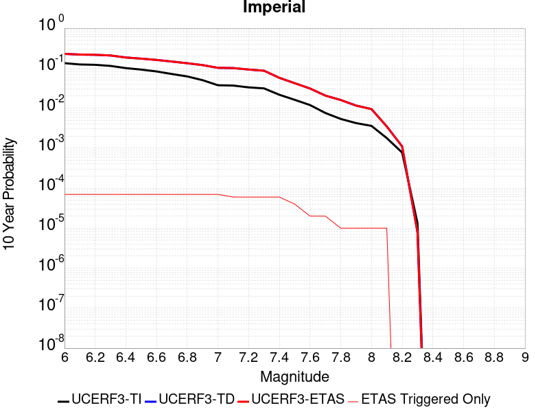 |

| Magnitude | 1 wk TI Prob | 1 wk TD Prob | 1 wk ETAS Prob | 1 wk ETAS/TD Gain | 1 wk ETAS Triggered Only | 1 mo TI Prob | 1 mo TD Prob | 1 mo ETAS Prob | 1 mo ETAS/TD Gain | 1 mo ETAS Triggered Only | 1 yr TI Prob | 1 yr TD Prob | 1 yr ETAS Prob | 1 yr ETAS/TD Gain | 1 yr ETAS Triggered Only | 10 yr TI Prob | 10 yr TD Prob | 10 yr ETAS Prob | 10 yr ETAS/TD Gain | 10 yr ETAS Triggered Only |
|-----|-----|-----|-----|-----|-----|-----|-----|-----|-----|-----|-----|-----|-----|-----|-----|-----|-----|-----|-----|-----|
| 6.0 | 2.7496446E-4 | 5.055345E-4 | 5.555093E-4 | 1.0988553 | 5.0E-5 | 0.0011778869 | 0.002164817 | 0.002224687 | 1.027656 | 6.0E-5 | 0.0142467655 | 0.026048409 | 0.026106847 | 1.0022434 | 6.0E-5 | 0.13367249 | 0.22807029 | 0.22812432 | 1.0002369 | 7.0E-5 |
| 6.1 | 2.5356023E-4 | 4.8657708E-4 | 5.3655275E-4 | 1.1027087 | 5.0E-5 | 0.001086234 | 0.002083702 | 0.002143577 | 1.0287349 | 6.0E-5 | 0.013144928 | 0.02507094 | 0.025129434 | 1.0023332 | 6.0E-5 | 0.123940155 | 0.21949561 | 0.21955025 | 1.0002489 | 7.0E-5 |
| 6.2 | 2.4820742E-4 | 4.775311E-4 | 5.275072E-4 | 1.1046553 | 5.0E-5 | 0.0010633124 | 0.0020449946 | 0.002104872 | 1.02928 | 6.0E-5 | 0.01286919 | 0.024610676 | 0.024669198 | 1.002378 | 6.0E-5 | 0.12148927 | 0.21600136 | 0.21605624 | 1.000254 | 7.0E-5 |
| 6.3 | 2.3205351E-4 | 4.5892023E-4 | 5.088973E-4 | 1.1089014 | 5.0E-5 | 9.94136E-4 | 0.0019653554 | 0.0020252375 | 1.0304688 | 6.0E-5 | 0.012036599 | 0.023661187 | 0.023719767 | 1.0024759 | 6.0E-5 | 0.11405133 | 0.20793827 | 0.20799372 | 1.0002667 | 7.0E-5 |
| 6.4 | 2.0304754E-4 | 3.9878016E-4 | 4.487602E-4 | 1.1253324 | 5.0E-5 | 8.6991355E-4 | 0.0017079529 | 0.0017678505 | 1.0350698 | 6.0E-5 | 0.010539869 | 0.020595418 | 0.020654183 | 1.0028533 | 6.0E-5 | 0.100537635 | 0.18507113 | 0.18512817 | 1.0003083 | 7.0E-5 |
| 6.5 | 1.854992E-4 | 3.6990462E-4 | 4.1988614E-4 | 1.13512 | 5.0E-5 | 7.9475436E-4 | 0.0015843548 | 0.0016442597 | 1.0378103 | 6.0E-5 | 0.009633281 | 0.01911443 | 0.019173281 | 1.0030789 | 6.0E-5 | 0.0922623 | 0.1733039 | 0.17336176 | 1.0003339 | 7.0E-5 |
| 6.6 | 1.6586106E-4 | 3.4036173E-4 | 3.9034474E-4 | 1.1468525 | 5.0E-5 | 7.106394E-4 | 0.0014578878 | 0.0015178004 | 1.0410954 | 6.0E-5 | 0.008617763 | 0.017607626 | 0.017666569 | 1.0033476 | 6.0E-5 | 0.08291132 | 0.16078055 | 0.16083929 | 1.0003654 | 7.0E-5 |
| 6.7 | 1.4224656E-4 | 3.076812E-4 | 3.5766582E-4 | 1.1624559 | 5.0E-5 | 6.094856E-4 | 0.0013179756 | 0.0013778964 | 1.0454644 | 6.0E-5 | 0.0073952693 | 0.015928522 | 0.015987566 | 1.0037068 | 6.0E-5 | 0.07153955 | 0.14648798 | 0.14654773 | 1.0004078 | 7.0E-5 |
| 6.8 | 1.2317259E-4 | 2.779231E-4 | 3.279092E-4 | 1.1798558 | 5.0E-5 | 5.2777573E-4 | 0.0011905615 | 0.00125049 | 1.0503364 | 6.0E-5 | 0.0064067547 | 0.014400131 | 0.014459267 | 1.0041066 | 6.0E-5 | 0.06225166 | 0.13294089 | 0.13300158 | 1.0004566 | 7.0E-5 |
| 6.9 | 9.859898E-5 | 2.5015484E-4 | 3.0014233E-4 | 1.1998262 | 5.0E-5 | 4.2249862E-4 | 0.0010716559 | 0.0011315916 | 1.0559281 | 6.0E-5 | 0.0051317946 | 0.012970319 | 0.01302954 | 1.004566 | 6.0E-5 | 0.05014893 | 0.119408876 | 0.119470514 | 1.0005162 | 7.0E-5 |
| 7.0 | 7.3191884E-5 | 2.1267848E-4 | 2.6266786E-4 | 1.2350466 | 5.0E-5 | 3.136418E-4 | 9.11164E-4 | 9.711093E-4 | 1.0657898 | 6.0E-5 | 0.003811904 | 0.011037681 | 0.011097019 | 1.005376 | 6.0E-5 | 0.037471764 | 0.10206756 | 0.10213042 | 1.0006158 | 7.0E-5 |
| 7.1 | 7.1760296E-5 | 2.0969207E-4 | 2.4968368E-4 | 1.1907159 | 4.0E-5 | 3.0750787E-4 | 8.9837395E-4 | 9.4832905E-4 | 1.0556061 | 5.0E-5 | 0.003737482 | 0.010883528 | 0.010932984 | 1.0045441 | 5.0E-5 | 0.03675245 | 0.10070406 | 0.100758016 | 1.0005358 | 6.0E-5 |
| 7.2 | 6.46614E-5 | 1.9137723E-4 | 2.3136957E-4 | 1.2089713 | 4.0E-5 | 2.7709085E-4 | 8.199333E-4 | 8.6989236E-4 | 1.0609306 | 5.0E-5 | 0.0033683628 | 0.009937617 | 0.0099871205 | 1.0049814 | 5.0E-5 | 0.033177625 | 0.092511006 | 0.092565455 | 1.0005885 | 6.0E-5 |
| 7.3 | 6.088115E-5 | 1.780939E-4 | 2.1808677E-4 | 1.2245606 | 4.0E-5 | 2.6089314E-4 | 7.6303916E-4 | 8.13001E-4 | 1.0654775 | 5.0E-5 | 0.0031717476 | 0.009251006 | 0.009300543 | 1.0053548 | 5.0E-5 | 0.031268585 | 0.08656135 | 0.08661616 | 1.0006331 | 6.0E-5 |
| 7.4 | 4.199346E-5 | 1.1511097E-4 | 1.5510636E-4 | 1.3474507 | 4.0E-5 | 1.7995955E-4 | 4.932403E-4 | 5.4321566E-4 | 1.1013205 | 5.0E-5 | 0.0021888057 | 0.005988835 | 0.006038536 | 1.0082989 | 5.0E-5 | 0.02167372 | 0.05744024 | 0.057496794 | 1.0009845 | 6.0E-5 |
| 7.5 | 3.130448E-5 | 8.333871E-5 | 1.1333621E-4 | 1.3599467 | 3.0E-5 | 1.3415517E-4 | 3.5711733E-4 | 3.9710305E-4 | 1.111968 | 4.0E-5 | 0.0016321153 | 0.0043392954 | 0.0043791216 | 1.009178 | 4.0E-5 | 0.016201803 | 0.042133506 | 0.04217182 | 1.0009093 | 4.0E-5 |
| 7.6 | 2.3074248E-5 | 6.0849357E-5 | 8.084814E-5 | 1.3286606 | 2.0E-5 | 9.888588E-5 | 2.6075702E-4 | 2.8075182E-4 | 1.0766797 | 2.0E-5 | 0.0012032706 | 0.0031701182 | 0.003190055 | 1.0062889 | 2.0E-5 | 0.011967761 | 0.03102816 | 0.03104754 | 1.0006245 | 2.0E-5 |
| 7.7 | 1.45864815E-5 | 4.0128452E-5 | 6.0127648E-5 | 1.4983795 | 2.0E-5 | 6.2511994E-5 | 1.7196777E-4 | 1.9196433E-4 | 1.1162809 | 2.0E-5 | 7.608177E-4 | 0.0020917025 | 0.0021116608 | 1.0095416 | 2.0E-5 | 0.007582182 | 0.02062909 | 0.020648677 | 1.0009495 | 2.0E-5 |
| 7.8 | 1.0352979E-5 | 3.096395E-5 | 4.096364E-5 | 1.3229462 | 1.0E-5 | 4.4369157E-5 | 1.326959E-4 | 1.4269458E-4 | 1.0753503 | 1.0E-5 | 5.400606E-4 | 0.0016143778 | 0.0016243616 | 1.0061843 | 1.0E-5 | 0.0053875 | 0.016017893 | 0.016027732 | 1.0006143 | 1.0E-5 |
| 7.9 | 8.137906E-6 | 2.2151205E-5 | 3.2150983E-5 | 1.4514327 | 1.0E-5 | 3.4876273E-5 | 9.493029E-5 | 1.0492934E-4 | 1.1053305 | 1.0E-5 | 4.2453592E-4 | 0.0011551644 | 0.0011651529 | 1.0086467 | 1.0E-5 | 0.004237258 | 0.011618842 | 0.0116287265 | 1.0008507 | 1.0E-5 |
| 8.0 | 6.93792E-6 | 1.8010365E-5 | 2.8010185E-5 | 1.5552258 | 1.0E-5 | 2.9733603E-5 | 7.7185E-5 | 8.718423E-5 | 1.1295488 | 1.0E-5 | 3.6194647E-4 | 9.3932304E-4 | 9.4931363E-4 | 1.010636 | 1.0E-5 | 0.0036135751 | 0.009502415 | 0.00951232 | 1.0010424 | 1.0E-5 |
| 8.1 | 3.4286315E-6 | 6.380179E-6 | 1.6380116E-5 | 2.5673442 | 1.0E-5 | 1.4694053E-5 | 2.734334E-5 | 3.7343067E-5 | 1.3657098 | 1.0E-5 | 1.7888541E-4 | 3.3285443E-4 | 3.428511E-4 | 1.0300331 | 1.0E-5 | 0.0017874148 | 0.0034863674 | 0.0034963326 | 1.0028583 | 1.0E-5 |
| 8.2 | 1.4906886E-6 | 1.936633E-6 | 1.936633E-6 | 1.0 | 0.0 | 6.3886496E-6 | 8.2998295E-6 | 8.2998295E-6 | 1.0 | 0.0 | 7.7779034E-5 | 1.0104576E-4 | 1.0104576E-4 | 1.0 | 0.0 | 7.775182E-4 | 0.0011075423 | 0.0011075423 | 1.0 | 0.0 |
| 8.3 | 2.5758007E-8 | 1.4495866E-8 | 1.4495866E-8 | 1.0 | 0.0 | 1.10391454E-7 | 6.212514E-8 | 6.212514E-8 | 1.0 | 0.0 | 1.3440151E-6 | 7.563736E-7 | 7.563736E-7 | 1.0 | 0.0 | 1.344007E-5 | 7.884359E-6 | 7.884359E-6 | 1.0 | 0.0 |

## Camp Rock 2011
*[(top)](#table-of-contents)*

| 1 Week | 1 Month | 1 Year | 10 Year |
|-----|-----|-----|-----|
|  |  |  |  |

| Magnitude | 1 wk TI Prob | 1 wk TD Prob | 1 wk ETAS Prob | 1 wk ETAS/TD Gain | 1 wk ETAS Triggered Only | 1 mo TI Prob | 1 mo TD Prob | 1 mo ETAS Prob | 1 mo ETAS/TD Gain | 1 mo ETAS Triggered Only | 1 yr TI Prob | 1 yr TD Prob | 1 yr ETAS Prob | 1 yr ETAS/TD Gain | 1 yr ETAS Triggered Only | 10 yr TI Prob | 10 yr TD Prob | 10 yr ETAS Prob | 10 yr ETAS/TD Gain | 10 yr ETAS Triggered Only |
|-----|-----|-----|-----|-----|-----|-----|-----|-----|-----|-----|-----|-----|-----|-----|-----|-----|-----|-----|-----|-----|
| 6.0 | 1.6710783E-5 | 4.249999E-6 | 1.4249957E-5 | 3.3529315 | 1.0E-5 | 7.161568E-5 | 1.8214158E-5 | 3.8213795E-5 | 2.098027 | 2.0E-5 | 8.7157206E-4 | 2.2173533E-4 | 2.7172425E-4 | 1.2254441 | 5.0E-5 | 0.008681616 | 0.0022151938 | 0.0022850388 | 1.0315299 | 7.0E-5 |
| 6.1 | 1.6710783E-5 | 4.249999E-6 | 1.4249957E-5 | 3.3529315 | 1.0E-5 | 7.161568E-5 | 1.8214158E-5 | 3.8213795E-5 | 2.098027 | 2.0E-5 | 8.7157206E-4 | 2.2173533E-4 | 2.7172425E-4 | 1.2254441 | 5.0E-5 | 0.008681616 | 0.0022151938 | 0.0022850388 | 1.0315299 | 7.0E-5 |
| 6.2 | 1.6710783E-5 | 4.249999E-6 | 1.4249957E-5 | 3.3529315 | 1.0E-5 | 7.161568E-5 | 1.8214158E-5 | 3.8213795E-5 | 2.098027 | 2.0E-5 | 8.7157206E-4 | 2.2173533E-4 | 2.7172425E-4 | 1.2254441 | 5.0E-5 | 0.008681616 | 0.0022151938 | 0.0022850388 | 1.0315299 | 7.0E-5 |
| 6.3 | 1.6710783E-5 | 4.249999E-6 | 1.4249957E-5 | 3.3529315 | 1.0E-5 | 7.161568E-5 | 1.8214158E-5 | 3.8213795E-5 | 2.098027 | 2.0E-5 | 8.7157206E-4 | 2.2173533E-4 | 2.7172425E-4 | 1.2254441 | 5.0E-5 | 0.008681616 | 0.0022151938 | 0.0022850388 | 1.0315299 | 7.0E-5 |
| 6.4 | 7.982846E-6 | 3.6820359E-6 | 3.6820359E-6 | 1.0 | 0.0 | 3.421175E-5 | 1.578006E-5 | 2.5779902E-5 | 1.6337011 | 1.0E-5 | 4.1644843E-4 | 1.9210564E-4 | 2.3209795E-4 | 1.2081788 | 4.0E-5 | 0.0041566887 | 0.0019194306 | 0.0019793154 | 1.0311992 | 6.0E-5 |
| 6.5 | 7.982846E-6 | 3.6820359E-6 | 3.6820359E-6 | 1.0 | 0.0 | 3.421175E-5 | 1.578006E-5 | 2.5779902E-5 | 1.6337011 | 1.0E-5 | 4.1644843E-4 | 1.9210564E-4 | 2.3209795E-4 | 1.2081788 | 4.0E-5 | 0.0041566887 | 0.0019194306 | 0.0019793154 | 1.0311992 | 6.0E-5 |
| 6.6 | 7.048869E-6 | 3.4242998E-6 | 3.4242998E-6 | 1.0 | 0.0 | 3.0209088E-5 | 1.467549E-5 | 2.4675343E-5 | 1.6813983 | 1.0E-5 | 3.677336E-4 | 1.7865976E-4 | 2.1865261E-4 | 1.2238493 | 4.0E-5 | 0.0036712566 | 0.0017851929 | 0.0018450858 | 1.0335498 | 6.0E-5 |
| 6.7 | 6.987307E-6 | 3.3622775E-6 | 3.3622775E-6 | 1.0 | 0.0 | 2.9945259E-5 | 1.4409683E-5 | 2.4409539E-5 | 1.6939678 | 1.0E-5 | 3.6452254E-4 | 1.7542407E-4 | 2.1541705E-4 | 1.2279788 | 4.0E-5 | 0.0036392517 | 0.0017528872 | 0.0018127819 | 1.0341692 | 6.0E-5 |
| 6.8 | 6.3737602E-6 | 3.1178672E-6 | 3.1178672E-6 | 1.0 | 0.0 | 2.731583E-5 | 1.3362222E-5 | 2.3362089E-5 | 1.7483685 | 1.0E-5 | 3.3251947E-4 | 1.6267318E-4 | 2.0266668E-4 | 1.2458518 | 4.0E-5 | 0.0033202237 | 0.0016255698 | 0.0016854722 | 1.0368501 | 6.0E-5 |
| 6.9 | 6.112211E-6 | 2.933078E-6 | 2.933078E-6 | 1.0 | 0.0 | 2.6194928E-5 | 1.2570275E-5 | 2.257015E-5 | 1.7955176 | 1.0E-5 | 3.1887658E-4 | 1.5303263E-4 | 1.9302651E-4 | 1.2613422 | 4.0E-5 | 0.003184194 | 0.0015293002 | 0.0015892085 | 1.0391736 | 6.0E-5 |
| 7.0 | 5.5140117E-6 | 2.64191E-6 | 2.64191E-6 | 1.0 | 0.0 | 2.3631264E-5 | 1.1322423E-5 | 2.132231E-5 | 1.8831931 | 1.0E-5 | 2.8767265E-4 | 1.3784204E-4 | 1.7783653E-4 | 1.2901472 | 4.0E-5 | 0.0028730053 | 0.0013775907 | 0.001437508 | 1.0434943 | 6.0E-5 |
| 7.1 | 4.8151105E-6 | 2.1342612E-6 | 2.1342612E-6 | 1.0 | 0.0 | 2.0636026E-5 | 9.146803E-6 | 1.9146712E-5 | 2.0932682 | 1.0E-5 | 2.5121463E-4 | 1.1135685E-4 | 1.413535E-4 | 1.2693741 | 3.0E-5 | 0.0025093083 | 0.0011130325 | 0.0011529879 | 1.0358979 | 4.0E-5 |
| 7.2 | 3.818335E-6 | 1.2937372E-6 | 1.2937372E-6 | 1.0 | 0.0 | 1.6364189E-5 | 5.5445767E-6 | 1.5544521E-5 | 2.803554 | 1.0E-5 | 1.9921579E-4 | 6.750321E-5 | 8.750187E-5 | 1.2962621 | 2.0E-5 | 0.0019903728 | 6.7483535E-4 | 6.948218E-4 | 1.0296168 | 2.0E-5 |
| 7.3 | 2.7166698E-6 | 7.383078E-7 | 7.383078E-7 | 1.0 | 0.0 | 1.1642818E-5 | 3.1641725E-6 | 1.3164141E-5 | 4.1603737 | 1.0E-5 | 1.4174209E-4 | 3.852314E-5 | 4.8522754E-5 | 1.2595743 | 1.0E-5 | 0.0014165172 | 3.8516664E-4 | 3.951628E-4 | 1.0259528 | 1.0E-5 |
| 7.4 | 2.0893426E-6 | 5.4614605E-7 | 5.4614605E-7 | 1.0 | 0.0 | 8.954295E-6 | 2.340624E-6 | 2.340624E-6 | 1.0 | 0.0 | 1.0901308E-4 | 2.8496728E-5 | 2.8496728E-5 | 1.0 | 0.0 | 0.0010895962 | 2.849313E-4 | 2.849313E-4 | 1.0 | 0.0 |
| 7.5 | 1.1681728E-6 | 3.6028484E-7 | 3.6028484E-7 | 1.0 | 0.0 | 5.0064455E-6 | 1.544077E-6 | 1.544077E-6 | 1.0 | 0.0 | 6.0951766E-5 | 1.879898E-5 | 1.879898E-5 | 1.0 | 0.0 | 6.093505E-4 | 1.8797436E-4 | 1.8797436E-4 | 1.0 | 0.0 |
| 7.6 | 1.3154387E-7 | 7.1196716E-8 | 7.1196716E-8 | 1.0 | 0.0 | 5.6375933E-7 | 3.0512876E-7 | 3.0512876E-7 | 1.0 | 0.0 | 6.863748E-6 | 3.714938E-6 | 3.714938E-6 | 1.0 | 0.0 | 6.863536E-5 | 3.7148915E-5 | 3.7148915E-5 | 1.0 | 0.0 |

## White Wolf
*[(top)](#table-of-contents)*

| 1 Week | 1 Month | 1 Year | 10 Year |
|-----|-----|-----|-----|
|  |  |  |  |

| Magnitude | 1 wk TI Prob | 1 wk TD Prob | 1 wk ETAS Prob | 1 wk ETAS/TD Gain | 1 wk ETAS Triggered Only | 1 mo TI Prob | 1 mo TD Prob | 1 mo ETAS Prob | 1 mo ETAS/TD Gain | 1 mo ETAS Triggered Only | 1 yr TI Prob | 1 yr TD Prob | 1 yr ETAS Prob | 1 yr ETAS/TD Gain | 1 yr ETAS Triggered Only | 10 yr TI Prob | 10 yr TD Prob | 10 yr ETAS Prob | 10 yr ETAS/TD Gain | 10 yr ETAS Triggered Only |
|-----|-----|-----|-----|-----|-----|-----|-----|-----|-----|-----|-----|-----|-----|-----|-----|-----|-----|-----|-----|-----|
| 6.0 | 2.0037822E-5 | 1.0468583E-6 | 2.1046837E-5 | 20.104763 | 2.0E-5 | 8.587355E-5 | 4.4865283E-6 | 4.4486347E-5 | 9.91554 | 4.0E-5 | 0.001045009 | 5.4622164E-5 | 1.1461889E-4 | 2.098395 | 6.0E-5 | 0.010401085 | 5.4609246E-4 | 6.160542E-4 | 1.1281134 | 7.0E-5 |
| 6.1 | 2.0037822E-5 | 1.0468583E-6 | 2.1046837E-5 | 20.104763 | 2.0E-5 | 8.587355E-5 | 4.4865283E-6 | 4.4486347E-5 | 9.91554 | 4.0E-5 | 0.001045009 | 5.4622164E-5 | 1.1461889E-4 | 2.098395 | 6.0E-5 | 0.010401085 | 5.4609246E-4 | 6.160542E-4 | 1.1281134 | 7.0E-5 |
| 6.2 | 2.0037822E-5 | 1.0468583E-6 | 2.1046837E-5 | 20.104763 | 2.0E-5 | 8.587355E-5 | 4.4865283E-6 | 4.4486347E-5 | 9.91554 | 4.0E-5 | 0.001045009 | 5.4622164E-5 | 1.1461889E-4 | 2.098395 | 6.0E-5 | 0.010401085 | 5.4609246E-4 | 6.160542E-4 | 1.1281134 | 7.0E-5 |
| 6.3 | 2.0037822E-5 | 1.0468583E-6 | 2.1046837E-5 | 20.104763 | 2.0E-5 | 8.587355E-5 | 4.4865283E-6 | 4.4486347E-5 | 9.91554 | 4.0E-5 | 0.001045009 | 5.4622164E-5 | 1.1461889E-4 | 2.098395 | 6.0E-5 | 0.010401085 | 5.4609246E-4 | 6.160542E-4 | 1.1281134 | 7.0E-5 |
| 6.4 | 1.132487E-5 | 1.0468583E-6 | 2.1046837E-5 | 20.104763 | 2.0E-5 | 4.8534253E-5 | 4.4865283E-6 | 4.4486347E-5 | 9.91554 | 4.0E-5 | 5.907443E-4 | 5.4622164E-5 | 1.1461889E-4 | 2.098395 | 6.0E-5 | 0.005891764 | 5.4609246E-4 | 6.160542E-4 | 1.1281134 | 7.0E-5 |
| 6.5 | 1.132487E-5 | 1.0468583E-6 | 2.1046837E-5 | 20.104763 | 2.0E-5 | 4.8534253E-5 | 4.4865283E-6 | 4.4486347E-5 | 9.91554 | 4.0E-5 | 5.907443E-4 | 5.4622164E-5 | 1.1461889E-4 | 2.098395 | 6.0E-5 | 0.005891764 | 5.4609246E-4 | 6.160542E-4 | 1.1281134 | 7.0E-5 |
| 6.6 | 9.347473E-6 | 1.0468583E-6 | 2.1046837E-5 | 20.104763 | 2.0E-5 | 4.0059982E-5 | 4.4865283E-6 | 4.4486347E-5 | 9.91554 | 4.0E-5 | 4.8762115E-4 | 5.4622164E-5 | 1.1461889E-4 | 2.098395 | 6.0E-5 | 0.0048655253 | 5.4609246E-4 | 6.160542E-4 | 1.1281134 | 7.0E-5 |
| 6.7 | 7.842647E-6 | 1.0047773E-6 | 2.1004756E-5 | 20.904888 | 2.0E-5 | 3.361091E-5 | 4.306182E-6 | 4.430601E-5 | 10.288932 | 4.0E-5 | 4.0913603E-4 | 5.2426552E-5 | 1.12423404E-4 | 2.1443982 | 6.0E-5 | 0.004083836 | 5.241468E-4 | 5.941101E-4 | 1.1334804 | 7.0E-5 |
| 6.8 | 6.26597E-6 | 9.734289E-7 | 2.097341E-5 | 21.54591 | 2.0E-5 | 2.685388E-5 | 4.1718313E-6 | 4.4171666E-5 | 10.588075 | 4.0E-5 | 3.2689696E-4 | 5.0790914E-5 | 1.1078786E-4 | 2.1812537 | 6.0E-5 | 0.003264165 | 5.07798E-4 | 5.7776243E-4 | 1.1377801 | 7.0E-5 |
| 6.9 | 5.258436E-6 | 9.1827343E-7 | 2.0918254E-5 | 22.779985 | 2.0E-5 | 2.2535958E-5 | 3.935452E-6 | 4.3935295E-5 | 11.163977 | 4.0E-5 | 2.7434074E-4 | 4.7913123E-5 | 1.07910244E-4 | 2.2522066 | 6.0E-5 | 0.0027400232 | 4.7903272E-4 | 5.489992E-4 | 1.1460578 | 7.0E-5 |
| 7.0 | 4.675028E-6 | 8.660704E-7 | 2.0866053E-5 | 24.09279 | 2.0E-5 | 2.003568E-5 | 3.7117254E-6 | 4.3711578E-5 | 11.77662 | 4.0E-5 | 2.4390711E-4 | 4.518937E-5 | 1.0518666E-4 | 2.327686 | 6.0E-5 | 0.0024363957 | 4.518065E-4 | 5.2177487E-4 | 1.1548636 | 7.0E-5 |
| 7.1 | 2.8270078E-6 | 6.8737717E-7 | 2.0687363E-5 | 30.096088 | 2.0E-5 | 1.2115692E-5 | 2.945899E-6 | 4.294578E-5 | 14.578158 | 4.0E-5 | 1.4749856E-4 | 3.586577E-5 | 8.5863976E-5 | 2.3940368 | 5.0E-5 | 0.001474007 | 3.5860392E-4 | 4.185824E-4 | 1.1672555 | 6.0E-5 |
| 7.2 | 1.6881406E-6 | 2.2703432E-7 | 2.2703432E-7 | 1.0 | 0.0 | 7.2348685E-6 | 9.730038E-7 | 2.0972984E-5 | 21.554882 | 2.0E-5 | 8.808096E-5 | 1.1846259E-5 | 4.1845902E-5 | 3.532415 | 3.0E-5 | 8.8046055E-4 | 1.1845643E-4 | 1.4845288E-4 | 1.2532277 | 3.0E-5 |
| 7.3 | 9.086107E-7 | 1.5264496E-7 | 1.5264496E-7 | 1.0 | 0.0 | 3.8940398E-6 | 6.5419255E-7 | 2.0654179E-5 | 31.57202 | 2.0E-5 | 4.7408903E-5 | 7.964766E-6 | 2.7964606E-5 | 3.5110395 | 2.0E-5 | 4.739879E-4 | 7.964489E-5 | 9.9643294E-5 | 1.2510947 | 2.0E-5 |
| 7.4 | 1.9717383E-7 | 9.003399E-8 | 9.003399E-8 | 1.0 | 0.0 | 8.450304E-7 | 3.8585992E-7 | 1.03858565E-5 | 26.91613 | 1.0E-5 | 1.0288197E-5 | 4.697835E-6 | 1.4697788E-5 | 3.1286302 | 1.0E-5 | 1.028772E-4 | 4.6977384E-5 | 5.6976914E-5 | 1.2128584 | 1.0E-5 |
| 7.5 | 1.086975E-7 | 6.659662E-8 | 6.659662E-8 | 1.0 | 0.0 | 4.6584634E-7 | 2.8541407E-7 | 1.0285411E-5 | 36.036804 | 1.0E-5 | 5.6716644E-6 | 3.474911E-6 | 1.3474876E-5 | 3.8777616 | 1.0E-5 | 5.6715195E-5 | 3.474859E-5 | 4.474824E-5 | 1.2877715 | 1.0E-5 |
| 7.6 | 2.4217808E-8 | 1.5820849E-8 | 1.5820849E-8 | 1.0 | 0.0 | 1.03790605E-7 | 6.780364E-8 | 6.780364E-8 | 1.0 | 0.0 | 1.2636499E-6 | 8.25509E-7 | 8.25509E-7 | 1.0 | 0.0 | 1.2636427E-5 | 8.255064E-6 | 8.255064E-6 | 1.0 | 0.0 |

## Santa Cruz Island
*[(top)](#table-of-contents)*

| 1 Week | 1 Month | 1 Year | 10 Year |
|-----|-----|-----|-----|
|  |  |  |  |

| Magnitude | 1 wk TI Prob | 1 wk TD Prob | 1 wk ETAS Prob | 1 wk ETAS/TD Gain | 1 wk ETAS Triggered Only | 1 mo TI Prob | 1 mo TD Prob | 1 mo ETAS Prob | 1 mo ETAS/TD Gain | 1 mo ETAS Triggered Only | 1 yr TI Prob | 1 yr TD Prob | 1 yr ETAS Prob | 1 yr ETAS/TD Gain | 1 yr ETAS Triggered Only | 10 yr TI Prob | 10 yr TD Prob | 10 yr ETAS Prob | 10 yr ETAS/TD Gain | 10 yr ETAS Triggered Only |
|-----|-----|-----|-----|-----|-----|-----|-----|-----|-----|-----|-----|-----|-----|-----|-----|-----|-----|-----|-----|-----|
| 6.0 | 2.9164563E-5 | 3.1599742E-5 | 8.159816E-5 | 2.5822413 | 5.0E-5 | 1.2498499E-4 | 1.3542121E-4 | 1.8541444E-4 | 1.3691684 | 5.0E-5 | 0.0015206301 | 0.0016476426 | 0.0016975602 | 1.0302964 | 5.0E-5 | 0.015102667 | 0.016368 | 0.016436854 | 1.0042067 | 7.0E-5 |
| 6.1 | 2.9164563E-5 | 3.1599742E-5 | 8.159816E-5 | 2.5822413 | 5.0E-5 | 1.2498499E-4 | 1.3542121E-4 | 1.8541444E-4 | 1.3691684 | 5.0E-5 | 0.0015206301 | 0.0016476426 | 0.0016975602 | 1.0302964 | 5.0E-5 | 0.015102667 | 0.016368 | 0.016436854 | 1.0042067 | 7.0E-5 |
| 6.2 | 2.9164563E-5 | 3.1599742E-5 | 8.159816E-5 | 2.5822413 | 5.0E-5 | 1.2498499E-4 | 1.3542121E-4 | 1.8541444E-4 | 1.3691684 | 5.0E-5 | 0.0015206301 | 0.0016476426 | 0.0016975602 | 1.0302964 | 5.0E-5 | 0.015102667 | 0.016368 | 0.016436854 | 1.0042067 | 7.0E-5 |
| 6.3 | 1.6635553E-5 | 1.780436E-5 | 2.780418E-5 | 1.5616502 | 1.0E-5 | 7.1293274E-5 | 7.630227E-5 | 8.63015E-5 | 1.1310477 | 1.0E-5 | 8.6765E-4 | 9.286024E-4 | 9.385931E-4 | 1.0107589 | 1.0E-5 | 0.008642701 | 0.009249094 | 0.009278816 | 1.0032135 | 3.0E-5 |
| 6.4 | 1.6635553E-5 | 1.780436E-5 | 2.780418E-5 | 1.5616502 | 1.0E-5 | 7.1293274E-5 | 7.630227E-5 | 8.63015E-5 | 1.1310477 | 1.0E-5 | 8.6765E-4 | 9.286024E-4 | 9.385931E-4 | 1.0107589 | 1.0E-5 | 0.008642701 | 0.009249094 | 0.009278816 | 1.0032135 | 3.0E-5 |
| 6.5 | 1.2238748E-5 | 1.3042996E-5 | 1.3042996E-5 | 1.0 | 0.0 | 5.2450723E-5 | 5.5897377E-5 | 5.5897377E-5 | 1.0 | 0.0 | 6.3840044E-4 | 6.8034173E-4 | 6.8034173E-4 | 1.0 | 0.0 | 0.0063656955 | 0.006782988 | 0.00679292 | 1.0014642 | 1.0E-5 |
| 6.6 | 1.0489767E-5 | 1.1156636E-5 | 1.1156636E-5 | 1.0 | 0.0 | 4.495537E-5 | 4.781329E-5 | 4.781329E-5 | 1.0 | 0.0 | 5.4719415E-4 | 5.819736E-4 | 5.819736E-4 | 1.0 | 0.0 | 0.005458487 | 0.005804736 | 0.005814678 | 1.0017127 | 1.0E-5 |
| 6.7 | 8.699222E-6 | 9.236783E-6 | 9.236783E-6 | 1.0 | 0.0 | 3.7281847E-5 | 3.958561E-5 | 3.958561E-5 | 1.0 | 0.0 | 4.5381195E-4 | 4.818488E-4 | 4.818488E-4 | 1.0 | 0.0 | 0.0045288634 | 0.004808108 | 0.00481806 | 1.0020698 | 1.0E-5 |
| 6.8 | 8.307732E-6 | 8.8169045E-6 | 8.8169045E-6 | 1.0 | 0.0 | 3.560408E-5 | 3.7786187E-5 | 3.7786187E-5 | 1.0 | 0.0 | 4.3339343E-4 | 4.5995016E-4 | 4.5995016E-4 | 1.0 | 0.0 | 0.004325492 | 0.0045900354 | 0.0045999894 | 1.0021687 | 1.0E-5 |
| 6.9 | 8.073121E-6 | 8.564939E-6 | 8.564939E-6 | 1.0 | 0.0 | 3.459863E-5 | 3.670637E-5 | 3.670637E-5 | 1.0 | 0.0 | 4.2115687E-4 | 4.4680882E-4 | 4.4680882E-4 | 1.0 | 0.0 | 0.004203596 | 0.004459156 | 0.0044691116 | 1.0022326 | 1.0E-5 |
| 7.0 | 7.617019E-6 | 8.074665E-6 | 8.074665E-6 | 1.0 | 0.0 | 3.264396E-5 | 3.4605247E-5 | 3.4605247E-5 | 1.0 | 0.0 | 3.9736772E-4 | 4.2123784E-4 | 4.2123784E-4 | 1.0 | 0.0 | 0.003966579 | 0.0042044413 | 0.0042143995 | 1.0023685 | 1.0E-5 |
| 7.1 | 7.1224836E-6 | 7.5457883E-6 | 7.5457883E-6 | 1.0 | 0.0 | 3.052457E-5 | 3.2338692E-5 | 3.2338692E-5 | 1.0 | 0.0 | 3.715733E-4 | 3.9365282E-4 | 3.9365282E-4 | 1.0 | 0.0 | 0.003709526 | 0.0039295983 | 0.0039395588 | 1.0025347 | 1.0E-5 |
| 7.2 | 6.441115E-6 | 6.8273835E-6 | 6.8273835E-6 | 1.0 | 0.0 | 2.7604487E-5 | 2.9259889E-5 | 2.9259889E-5 | 1.0 | 0.0 | 3.360328E-4 | 3.5618115E-4 | 3.5618115E-4 | 1.0 | 0.0 | 0.0033552512 | 0.0035561312 | 0.0035660956 | 1.002802 | 1.0E-5 |
| 7.3 | 5.494274E-6 | 5.8199944E-6 | 5.8199944E-6 | 1.0 | 0.0 | 2.3546674E-5 | 2.4942596E-5 | 2.4942596E-5 | 1.0 | 0.0 | 2.8664304E-4 | 3.03634E-4 | 3.03634E-4 | 1.0 | 0.0 | 0.002862736 | 0.0030322145 | 0.0030421843 | 1.0032879 | 1.0E-5 |
| 7.4 | 4.0802624E-6 | 4.3122564E-6 | 4.3122564E-6 | 1.0 | 0.0 | 1.7486722E-5 | 1.8480969E-5 | 1.8480969E-5 | 1.0 | 0.0 | 2.1288003E-4 | 2.2498264E-4 | 2.2498264E-4 | 1.0 | 0.0 | 0.0021267622 | 0.0022475577 | 0.0022575352 | 1.0044392 | 1.0E-5 |
| 7.5 | 2.3584746E-6 | 2.4753099E-6 | 2.4753099E-6 | 1.0 | 0.0 | 1.0107709E-5 | 1.0608428E-5 | 1.0608428E-5 | 1.0 | 0.0 | 1.2305441E-4 | 1.2915001E-4 | 1.2915001E-4 | 1.0 | 0.0 | 0.0012298629 | 0.0012907545 | 0.0012907545 | 1.0 | 0.0 |
| 7.6 | 9.4981914E-7 | 9.860934E-7 | 9.860934E-7 | 1.0 | 0.0 | 4.0706473E-6 | 4.2261076E-6 | 4.2261076E-6 | 1.0 | 0.0 | 4.9559E-5 | 5.1451658E-5 | 5.1451658E-5 | 1.0 | 0.0 | 4.954795E-4 | 5.1439874E-4 | 5.1439874E-4 | 1.0 | 0.0 |
| 7.7 | 2.6013532E-7 | 2.6416632E-7 | 2.6416632E-7 | 1.0 | 0.0 | 1.1148652E-6 | 1.1321408E-6 | 1.1321408E-6 | 1.0 | 0.0 | 1.3573399E-5 | 1.3783729E-5 | 1.3783729E-5 | 1.0 | 0.0 | 1.357257E-4 | 1.378288E-4 | 1.378288E-4 | 1.0 | 0.0 |
| 7.8 | 4.1522263E-8 | 3.965698E-8 | 3.965698E-8 | 1.0 | 0.0 | 1.7795254E-7 | 1.6995848E-7 | 1.6995848E-7 | 1.0 | 0.0 | 2.16657E-6 | 2.0692428E-6 | 2.0692428E-6 | 1.0 | 0.0 | 2.1665488E-5 | 2.0692256E-5 | 2.0692256E-5 | 1.0 | 0.0 |
| 7.9 | 7.7242046E-10 | 5.9475225E-10 | 5.9475225E-10 | 1.0 | 0.0 | 3.3103735E-9 | 2.5489382E-9 | 2.5489382E-9 | 1.0 | 0.0 | 4.0303796E-8 | 3.1033323E-8 | 3.1033323E-8 | 1.0 | 0.0 | 4.030379E-7 | 3.103332E-7 | 3.103332E-7 | 1.0 | 0.0 |

## San Clemente
*[(top)](#table-of-contents)*

| 1 Week | 1 Month | 1 Year | 10 Year |
|-----|-----|-----|-----|
|  |  |  | 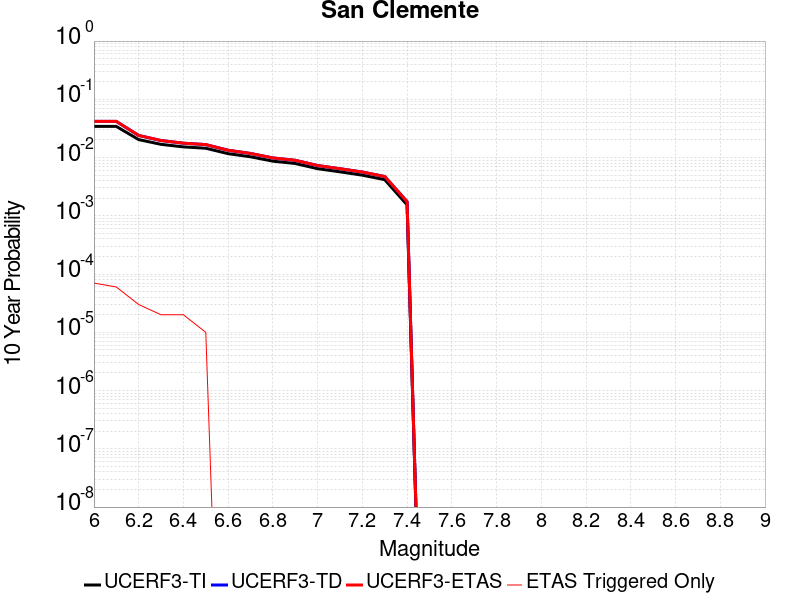 |

| Magnitude | 1 wk TI Prob | 1 wk TD Prob | 1 wk ETAS Prob | 1 wk ETAS/TD Gain | 1 wk ETAS Triggered Only | 1 mo TI Prob | 1 mo TD Prob | 1 mo ETAS Prob | 1 mo ETAS/TD Gain | 1 mo ETAS Triggered Only | 1 yr TI Prob | 1 yr TD Prob | 1 yr ETAS Prob | 1 yr ETAS/TD Gain | 1 yr ETAS Triggered Only | 10 yr TI Prob | 10 yr TD Prob | 10 yr ETAS Prob | 10 yr ETAS/TD Gain | 10 yr ETAS Triggered Only |
|-----|-----|-----|-----|-----|-----|-----|-----|-----|-----|-----|-----|-----|-----|-----|-----|-----|-----|-----|-----|-----|
| 6.0 | 6.681379E-5 | 8.163834E-5 | 1.3163425E-4 | 1.6124073 | 5.0E-5 | 2.8631336E-4 | 3.4983488E-4 | 3.998174E-4 | 1.1428746 | 5.0E-5 | 0.003480294 | 0.00425141 | 0.0043011974 | 1.0117108 | 5.0E-5 | 0.03426291 | 0.04175603 | 0.041823108 | 1.0016063 | 7.0E-5 |
| 6.1 | 6.681379E-5 | 8.163834E-5 | 1.2163507E-4 | 1.4899259 | 4.0E-5 | 2.8631336E-4 | 3.4983488E-4 | 3.898209E-4 | 1.1142997 | 4.0E-5 | 0.003480294 | 0.00425141 | 0.00429124 | 1.0093687 | 4.0E-5 | 0.03426291 | 0.04175603 | 0.041813523 | 1.0013769 | 6.0E-5 |
| 6.2 | 3.9400576E-5 | 4.6452373E-5 | 7.645098E-5 | 1.6457927 | 3.0E-5 | 1.6884868E-4 | 1.9906677E-4 | 2.290608E-4 | 1.1506732 | 3.0E-5 | 0.0020537945 | 0.0024209984 | 0.002450926 | 1.0123615 | 3.0E-5 | 0.020349167 | 0.023952903 | 0.023982184 | 1.0012225 | 3.0E-5 |
| 6.3 | 3.2590255E-5 | 3.792912E-5 | 5.792836E-5 | 1.5272794 | 2.0E-5 | 1.3966505E-4 | 1.6254342E-4 | 1.8254017E-4 | 1.1230241 | 2.0E-5 | 0.0016990956 | 0.0019772002 | 0.0019971605 | 1.0100954 | 2.0E-5 | 0.01686163 | 0.019599883 | 0.019619491 | 1.0010004 | 2.0E-5 |
| 6.4 | 2.9454652E-5 | 3.4097764E-5 | 5.409708E-5 | 1.5865288 | 2.0E-5 | 1.2622811E-4 | 1.4612524E-4 | 1.661223E-4 | 1.1368489 | 2.0E-5 | 0.0015357438 | 0.0017776493 | 0.0017976137 | 1.0112308 | 2.0E-5 | 0.015251739 | 0.01763747 | 0.017657118 | 1.0011139 | 2.0E-5 |
| 6.5 | 2.790836E-5 | 3.2247463E-5 | 4.224714E-5 | 1.310092 | 1.0E-5 | 1.1960178E-4 | 1.3819624E-4 | 1.4819486E-4 | 1.0723509 | 1.0E-5 | 0.001455179 | 0.0016812662 | 0.0016912494 | 1.0059379 | 1.0E-5 | 0.014456868 | 0.016688485 | 0.016698318 | 1.0005893 | 1.0E-5 |
| 6.6 | 2.2492153E-5 | 2.5762702E-5 | 2.5762702E-5 | 1.0 | 0.0 | 9.639138E-5 | 1.1040699E-4 | 1.1040699E-4 | 1.0 | 0.0 | 0.0011729331 | 0.0013433909 | 0.0013433909 | 1.0 | 0.0 | 0.011667615 | 0.013354417 | 0.013354417 | 1.0 | 0.0 |
| 6.7 | 1.9862755E-5 | 2.2666423E-5 | 2.2666423E-5 | 1.0 | 0.0 | 8.512331E-5 | 9.713826E-5 | 9.713826E-5 | 1.0 | 0.0 | 0.0010358836 | 0.0011820279 | 0.0011820279 | 1.0 | 0.0 | 0.010310682 | 0.011758701 | 0.011758701 | 1.0 | 0.0 |
| 6.8 | 1.6697575E-5 | 1.897771E-5 | 1.897771E-5 | 1.0 | 0.0 | 7.155907E-5 | 8.133056E-5 | 8.133056E-5 | 1.0 | 0.0 | 8.7088346E-4 | 9.897591E-4 | 9.897591E-4 | 1.0 | 0.0 | 0.008674784 | 0.0098545365 | 0.0098545365 | 1.0 | 0.0 |
| 6.9 | 1.5218415E-5 | 1.72694E-5 | 1.72694E-5 | 1.0 | 0.0 | 6.522015E-5 | 7.4009666E-5 | 7.4009666E-5 | 1.0 | 0.0 | 7.93766E-4 | 9.00704E-4 | 9.00704E-4 | 1.0 | 0.0 | 0.007909367 | 0.008971481 | 0.008971481 | 1.0 | 0.0 |
| 7.0 | 1.2392958E-5 | 1.4033016E-5 | 1.4033016E-5 | 1.0 | 0.0 | 5.3111595E-5 | 6.014015E-5 | 6.014015E-5 | 1.0 | 0.0 | 6.4644177E-4 | 7.319679E-4 | 7.319679E-4 | 1.0 | 0.0 | 0.0064456454 | 0.0072963564 | 0.0072963564 | 1.0 | 0.0 |
| 7.1 | 1.0934128E-5 | 1.2375138E-5 | 1.2375138E-5 | 1.0 | 0.0 | 4.6859706E-5 | 5.303527E-5 | 5.303527E-5 | 1.0 | 0.0 | 5.7036756E-4 | 6.455204E-4 | 6.455204E-4 | 1.0 | 0.0 | 0.0056890585 | 0.0064371997 | 0.0064371997 | 1.0 | 0.0 |
| 7.2 | 9.5798805E-6 | 1.0844935E-5 | 1.0844935E-5 | 1.0 | 0.0 | 4.1055984E-5 | 4.6477508E-5 | 4.6477508E-5 | 1.0 | 0.0 | 4.9974193E-4 | 5.657239E-4 | 5.657239E-4 | 1.0 | 0.0 | 0.0049861963 | 0.0056435615 | 0.0056435615 | 1.0 | 0.0 |
| 7.3 | 8.0167365E-6 | 9.083918E-6 | 9.083918E-6 | 1.0 | 0.0 | 3.4356988E-5 | 3.8930535E-5 | 3.8930535E-5 | 1.0 | 0.0 | 4.1821605E-4 | 4.7388324E-4 | 4.7388324E-4 | 1.0 | 0.0 | 0.0041742986 | 0.0047294297 | 0.0047294297 | 1.0 | 0.0 |
| 7.4 | 2.9581017E-6 | 3.3623792E-6 | 3.3623792E-6 | 1.0 | 0.0 | 1.2677518E-5 | 1.4410146E-5 | 1.4410146E-5 | 1.0 | 0.0 | 1.5433785E-4 | 1.7543444E-4 | 1.7543444E-4 | 1.0 | 0.0 | 0.001542307 | 0.0017534546 | 0.0017534546 | 1.0 | 0.0 |

## San Pedro Basin
*[(top)](#table-of-contents)*

| 1 Week | 1 Month | 1 Year | 10 Year |
|-----|-----|-----|-----|
|  |  |  |  |

| Magnitude | 1 wk TI Prob | 1 wk TD Prob | 1 wk ETAS Prob | 1 wk ETAS/TD Gain | 1 wk ETAS Triggered Only | 1 mo TI Prob | 1 mo TD Prob | 1 mo ETAS Prob | 1 mo ETAS/TD Gain | 1 mo ETAS Triggered Only | 1 yr TI Prob | 1 yr TD Prob | 1 yr ETAS Prob | 1 yr ETAS/TD Gain | 1 yr ETAS Triggered Only | 10 yr TI Prob | 10 yr TD Prob | 10 yr ETAS Prob | 10 yr ETAS/TD Gain | 10 yr ETAS Triggered Only |
|-----|-----|-----|-----|-----|-----|-----|-----|-----|-----|-----|-----|-----|-----|-----|-----|-----|-----|-----|-----|-----|
| 6.0 | 5.3449043E-5 | 6.337018E-5 | 1.03367645E-4 | 1.6311717 | 4.0E-5 | 2.2904722E-4 | 2.7156167E-4 | 3.215481E-4 | 1.1840702 | 5.0E-5 | 0.0027850836 | 0.0033018515 | 0.0033616533 | 1.0181116 | 6.0E-5 | 0.027504366 | 0.03258948 | 0.0326572 | 1.0020779 | 7.0E-5 |
| 6.1 | 5.3449043E-5 | 6.337018E-5 | 1.03367645E-4 | 1.6311717 | 4.0E-5 | 2.2904722E-4 | 2.7156167E-4 | 3.215481E-4 | 1.1840702 | 5.0E-5 | 0.0027850836 | 0.0033018515 | 0.0033616533 | 1.0181116 | 6.0E-5 | 0.027504366 | 0.03258948 | 0.0326572 | 1.0020779 | 7.0E-5 |
| 6.2 | 2.3189454E-5 | 2.6642829E-5 | 3.6642563E-5 | 1.3753256 | 1.0E-5 | 9.9379584E-5 | 1.1417881E-4 | 1.2417766E-4 | 1.087572 | 1.0E-5 | 0.0012092749 | 0.0013892875 | 0.0014092597 | 1.0143759 | 2.0E-5 | 0.012027155 | 0.01381089 | 0.013830613 | 1.0014281 | 2.0E-5 |
| 6.3 | 2.3189454E-5 | 2.6642829E-5 | 3.6642563E-5 | 1.3753256 | 1.0E-5 | 9.9379584E-5 | 1.1417881E-4 | 1.2417766E-4 | 1.087572 | 1.0E-5 | 0.0012092749 | 0.0013892875 | 0.0014092597 | 1.0143759 | 2.0E-5 | 0.012027155 | 0.01381089 | 0.013830613 | 1.0014281 | 2.0E-5 |
| 6.4 | 1.966056E-5 | 2.246342E-5 | 2.246342E-5 | 1.0 | 0.0 | 8.425682E-5 | 9.626848E-5 | 9.626848E-5 | 1.0 | 0.0 | 0.001025344 | 0.0011714787 | 0.001181467 | 1.0085262 | 1.0E-5 | 0.010206259 | 0.011657119 | 0.011667003 | 1.0008478 | 1.0E-5 |
| 6.5 | 1.7342953E-5 | 1.9745152E-5 | 1.9745152E-5 | 1.0 | 0.0 | 7.4324824E-5 | 8.461954E-5 | 8.461954E-5 | 1.0 | 0.0 | 9.04529E-4 | 0.0010297929 | 0.0010397827 | 1.0097007 | 1.0E-5 | 0.009008561 | 0.010253932 | 0.01026383 | 1.0009652 | 1.0E-5 |
| 6.6 | 1.439804E-5 | 1.6322716E-5 | 1.6322716E-5 | 1.0 | 0.0 | 6.170443E-5 | 6.99528E-5 | 6.99528E-5 | 1.0 | 0.0 | 7.509924E-4 | 8.513747E-4 | 8.613662E-4 | 1.0117357 | 1.0E-5 | 0.0074845953 | 0.008484333 | 0.008494249 | 1.0011686 | 1.0E-5 |
| 6.7 | 1.2634884E-5 | 1.4285298E-5 | 1.4285298E-5 | 1.0 | 0.0 | 5.414838E-5 | 6.122144E-5 | 6.122144E-5 | 1.0 | 0.0 | 6.590571E-4 | 7.451466E-4 | 7.5513916E-4 | 1.0134102 | 1.0E-5 | 0.006571059 | 0.007429502 | 0.0074394275 | 1.001336 | 1.0E-5 |
| 6.8 | 1.146091E-5 | 1.2933193E-5 | 1.2933193E-5 | 1.0 | 0.0 | 4.911726E-5 | 5.542696E-5 | 5.542696E-5 | 1.0 | 0.0 | 5.9783855E-4 | 6.74644E-4 | 6.846373E-4 | 1.0148126 | 1.0E-5 | 0.0059623276 | 0.0067288997 | 0.006738832 | 1.0014762 | 1.0E-5 |
| 6.9 | 9.109035E-6 | 1.0235013E-5 | 1.0235013E-5 | 1.0 | 0.0 | 3.9038136E-5 | 4.386376E-5 | 4.386376E-5 | 1.0 | 0.0 | 4.7518566E-4 | 5.339384E-4 | 5.4393307E-4 | 1.0187187 | 1.0E-5 | 0.0047417083 | 0.0053293095 | 0.005339256 | 1.0018665 | 1.0E-5 |
| 7.0 | 5.9351028E-6 | 6.583965E-6 | 6.583965E-6 | 1.0 | 0.0 | 2.5435906E-5 | 2.821682E-5 | 2.821682E-5 | 1.0 | 0.0 | 3.0963816E-4 | 3.4350925E-4 | 3.4350925E-4 | 1.0 | 0.0 | 0.0030920706 | 0.0034320997 | 0.0034320997 | 1.0 | 0.0 |
| 7.1 | 2.1557585E-6 | 2.2096492E-6 | 2.2096492E-6 | 1.0 | 0.0 | 9.238933E-6 | 9.469892E-6 | 9.469892E-6 | 1.0 | 0.0 | 1.1247819E-4 | 1.15289986E-4 | 1.15289986E-4 | 1.0 | 0.0 | 0.0011242128 | 0.0011523172 | 0.0011523172 | 1.0 | 0.0 |
| 7.2 | 2.1251979E-6 | 2.1779954E-6 | 2.1779954E-6 | 1.0 | 0.0 | 9.107958E-6 | 9.334234E-6 | 9.334234E-6 | 1.0 | 0.0 | 1.1088375E-4 | 1.13638525E-4 | 1.13638525E-4 | 1.0 | 0.0 | 0.0011082845 | 0.0011358195 | 0.0011358195 | 1.0 | 0.0 |
| 7.3 | 1.7145798E-6 | 1.7442885E-6 | 1.7442885E-6 | 1.0 | 0.0 | 7.3481783E-6 | 7.475501E-6 | 7.475501E-6 | 1.0 | 0.0 | 8.94604E-5 | 9.1010515E-5 | 9.1010515E-5 | 1.0 | 0.0 | 8.9424395E-4 | 9.0974156E-4 | 9.0974156E-4 | 1.0 | 0.0 |
| 7.4 | 1.4467993E-6 | 1.4641878E-6 | 1.4641878E-6 | 1.0 | 0.0 | 6.200554E-6 | 6.275076E-6 | 6.275076E-6 | 1.0 | 0.0 | 7.548913E-5 | 7.639644E-5 | 7.639644E-5 | 1.0 | 0.0 | 7.546349E-4 | 7.6370913E-4 | 7.6370913E-4 | 1.0 | 0.0 |
| 7.5 | 1.2803735E-6 | 1.2931506E-6 | 1.2931506E-6 | 1.0 | 0.0 | 5.487303E-6 | 5.5420624E-6 | 5.5420624E-6 | 1.0 | 0.0 | 6.680587E-5 | 6.747259E-5 | 6.747259E-5 | 1.0 | 0.0 | 6.678579E-4 | 6.745281E-4 | 6.745281E-4 | 1.0 | 0.0 |
| 7.6 | 6.755009E-7 | 6.76947E-7 | 6.76947E-7 | 1.0 | 0.0 | 2.8950008E-6 | 2.9011985E-6 | 2.9011985E-6 | 1.0 | 0.0 | 3.5246063E-5 | 3.532158E-5 | 3.532158E-5 | 1.0 | 0.0 | 3.5240475E-4 | 3.5316538E-4 | 3.5316538E-4 | 1.0 | 0.0 |
| 7.7 | 6.211885E-8 | 4.5699714E-8 | 4.5699714E-8 | 1.0 | 0.0 | 2.6622362E-7 | 1.9585592E-7 | 1.9585592E-7 | 1.0 | 0.0 | 3.2412677E-6 | 2.3845432E-6 | 2.3845432E-6 | 1.0 | 0.0 | 3.2412205E-5 | 2.3845198E-5 | 2.3845198E-5 | 1.0 | 0.0 |
| 7.8 | 2.6580573E-9 | 1.5138054E-9 | 1.5138054E-9 | 1.0 | 0.0 | 1.1391674E-8 | 6.4877375E-9 | 6.4877375E-9 | 1.0 | 0.0 | 1.3869362E-7 | 7.89882E-8 | 7.89882E-8 | 1.0 | 0.0 | 1.3869354E-6 | 7.89882E-7 | 7.89882E-7 | 1.0 | 0.0 |

## Ortigalita (North)
*[(top)](#table-of-contents)*

| 1 Week | 1 Month | 1 Year | 10 Year |
|-----|-----|-----|-----|
|  | 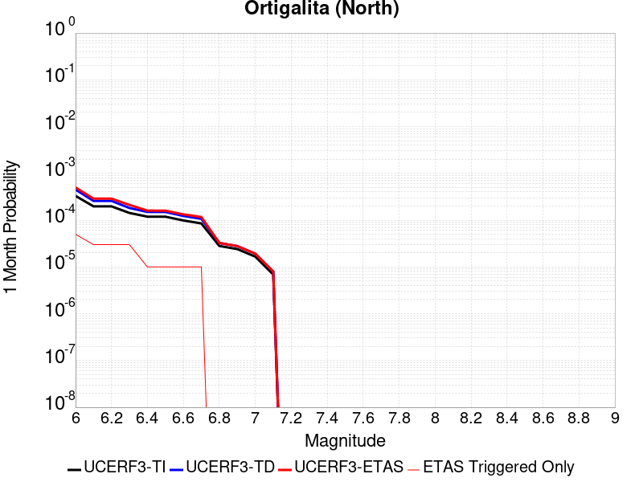 |  |  |

| Magnitude | 1 wk TI Prob | 1 wk TD Prob | 1 wk ETAS Prob | 1 wk ETAS/TD Gain | 1 wk ETAS Triggered Only | 1 mo TI Prob | 1 mo TD Prob | 1 mo ETAS Prob | 1 mo ETAS/TD Gain | 1 mo ETAS Triggered Only | 1 yr TI Prob | 1 yr TD Prob | 1 yr ETAS Prob | 1 yr ETAS/TD Gain | 1 yr ETAS Triggered Only | 10 yr TI Prob | 10 yr TD Prob | 10 yr ETAS Prob | 10 yr ETAS/TD Gain | 10 yr ETAS Triggered Only |
|-----|-----|-----|-----|-----|-----|-----|-----|-----|-----|-----|-----|-----|-----|-----|-----|-----|-----|-----|-----|-----|
| 6.0 | 7.711876E-5 | 1.0505308E-4 | 1.3504992E-4 | 1.28554 | 3.0E-5 | 3.3046713E-4 | 4.501601E-4 | 5.0013757E-4 | 1.1110216 | 5.0E-5 | 0.004016016 | 0.0054680547 | 0.005527727 | 1.0109128 | 6.0E-5 | 0.039442103 | 0.053455614 | 0.053512406 | 1.0010624 | 6.0E-5 |
| 6.1 | 4.607858E-5 | 6.0239887E-5 | 9.023808E-5 | 1.4979789 | 3.0E-5 | 1.9746469E-4 | 2.5814763E-4 | 2.8813988E-4 | 1.1161826 | 3.0E-5 | 0.0024014818 | 0.0031387366 | 0.0031686425 | 1.009528 | 3.0E-5 | 0.023756953 | 0.030975312 | 0.031004382 | 1.0009385 | 3.0E-5 |
| 6.2 | 4.607858E-5 | 6.0239887E-5 | 9.023808E-5 | 1.4979789 | 3.0E-5 | 1.9746469E-4 | 2.5814763E-4 | 2.8813988E-4 | 1.1161826 | 3.0E-5 | 0.0024014818 | 0.0031387366 | 0.0031686425 | 1.009528 | 3.0E-5 | 0.023756953 | 0.030975312 | 0.031004382 | 1.0009385 | 3.0E-5 |
| 6.3 | 3.327423E-5 | 4.2476124E-5 | 7.2474846E-5 | 1.7062491 | 3.0E-5 | 1.4259605E-4 | 1.8202956E-4 | 2.120241E-4 | 1.1647784 | 3.0E-5 | 0.0017347244 | 0.002214206 | 0.0022441396 | 1.0135189 | 3.0E-5 | 0.017212452 | 0.02194574 | 0.021975081 | 1.001337 | 3.0E-5 |
| 6.4 | 2.7732503E-5 | 3.4999008E-5 | 4.4998655E-5 | 1.2857124 | 1.0E-5 | 1.1884817E-4 | 1.499886E-4 | 1.599871E-4 | 1.0666617 | 1.0E-5 | 0.001446016 | 0.0018248158 | 0.0018347976 | 1.00547 | 1.0E-5 | 0.014366428 | 0.018121297 | 0.018131116 | 1.0005418 | 1.0E-5 |
| 6.5 | 2.7689714E-5 | 3.4948822E-5 | 4.4948472E-5 | 1.2861227 | 1.0E-5 | 1.186648E-4 | 1.4977354E-4 | 1.5977204E-4 | 1.0667574 | 1.0E-5 | 0.0014437864 | 0.0018222018 | 0.0018321836 | 1.0054779 | 1.0E-5 | 0.014344421 | 0.018095585 | 0.018105403 | 1.0005426 | 1.0E-5 |
| 6.6 | 2.2976905E-5 | 2.871829E-5 | 3.8718004E-5 | 1.3482001 | 1.0E-5 | 9.846873E-5 | 1.23074E-4 | 1.3307277E-4 | 1.081242 | 1.0E-5 | 0.0011981975 | 0.0014976348 | 0.0015076199 | 1.0066671 | 1.0E-5 | 0.011917574 | 0.014898733 | 0.014908585 | 1.0006613 | 1.0E-5 |
| 6.7 | 1.9871539E-5 | 2.4904637E-5 | 3.4904388E-5 | 1.4015217 | 1.0E-5 | 8.516096E-5 | 1.067312E-4 | 1.1673012E-4 | 1.0936834 | 1.0E-5 | 0.0010363415 | 0.0012989199 | 0.0013089069 | 1.0076888 | 1.0E-5 | 0.010315218 | 0.012936938 | 0.012946809 | 1.0007629 | 1.0E-5 |
| 6.8 | 6.5640475E-6 | 7.6054926E-6 | 7.6054926E-6 | 1.0 | 0.0 | 2.813133E-5 | 3.2594577E-5 | 3.2594577E-5 | 1.0 | 0.0 | 3.424451E-4 | 3.9676955E-4 | 3.9676955E-4 | 1.0 | 0.0 | 0.0034191788 | 0.003960899 | 0.003960899 | 1.0 | 0.0 |
| 6.9 | 5.6219683E-6 | 6.5018376E-6 | 6.5018376E-6 | 1.0 | 0.0 | 2.4093928E-5 | 2.7864735E-5 | 2.7864735E-5 | 1.0 | 0.0 | 2.933041E-4 | 3.3920293E-4 | 3.3920293E-4 | 1.0 | 0.0 | 0.0029291727 | 0.003387109 | 0.003387109 | 1.0 | 0.0 |
| 7.0 | 3.875591E-6 | 4.4847548E-6 | 4.4847548E-6 | 1.0 | 0.0 | 1.6609569E-5 | 1.9220248E-5 | 1.9220248E-5 | 1.0 | 0.0 | 2.0220275E-4 | 2.339835E-4 | 2.339835E-4 | 1.0 | 0.0 | 0.0020201886 | 0.0023375798 | 0.0023375798 | 1.0 | 0.0 |
| 7.1 | 1.6017933E-6 | 1.8570418E-6 | 1.8570418E-6 | 1.0 | 0.0 | 6.8648105E-6 | 7.958732E-6 | 7.958732E-6 | 1.0 | 0.0 | 8.357586E-5 | 9.689432E-5 | 9.689432E-5 | 1.0 | 0.0 | 8.3544437E-4 | 9.686254E-4 | 9.686254E-4 | 1.0 | 0.0 |

## Ventura-Pitas Point
*[(top)](#table-of-contents)*

| 1 Week | 1 Month | 1 Year | 10 Year |
|-----|-----|-----|-----|
|  |  |  |  |

| Magnitude | 1 wk TI Prob | 1 wk TD Prob | 1 wk ETAS Prob | 1 wk ETAS/TD Gain | 1 wk ETAS Triggered Only | 1 mo TI Prob | 1 mo TD Prob | 1 mo ETAS Prob | 1 mo ETAS/TD Gain | 1 mo ETAS Triggered Only | 1 yr TI Prob | 1 yr TD Prob | 1 yr ETAS Prob | 1 yr ETAS/TD Gain | 1 yr ETAS Triggered Only | 10 yr TI Prob | 10 yr TD Prob | 10 yr ETAS Prob | 10 yr ETAS/TD Gain | 10 yr ETAS Triggered Only |
|-----|-----|-----|-----|-----|-----|-----|-----|-----|-----|-----|-----|-----|-----|-----|-----|-----|-----|-----|-----|-----|
| 6.0 | 3.3179622E-5 | 3.373519E-5 | 9.3733164E-5 | 2.7784984 | 6.0E-5 | 1.4219063E-4 | 1.4457281E-4 | 2.0456414E-4 | 1.4149557 | 6.0E-5 | 0.0017297962 | 0.0017590097 | 0.0018288866 | 1.0397251 | 7.0E-5 | 0.017163932 | 0.017476497 | 0.017545274 | 1.0039353 | 7.0E-5 |
| 6.1 | 3.3179622E-5 | 3.373519E-5 | 9.3733164E-5 | 2.7784984 | 6.0E-5 | 1.4219063E-4 | 1.4457281E-4 | 2.0456414E-4 | 1.4149557 | 6.0E-5 | 0.0017297962 | 0.0017590097 | 0.0018288866 | 1.0397251 | 7.0E-5 | 0.017163932 | 0.017476497 | 0.017545274 | 1.0039353 | 7.0E-5 |
| 6.2 | 3.3179622E-5 | 3.373519E-5 | 9.3733164E-5 | 2.7784984 | 6.0E-5 | 1.4219063E-4 | 1.4457281E-4 | 2.0456414E-4 | 1.4149557 | 6.0E-5 | 0.0017297962 | 0.0017590097 | 0.0018288866 | 1.0397251 | 7.0E-5 | 0.017163932 | 0.017476497 | 0.017545274 | 1.0039353 | 7.0E-5 |
| 6.3 | 3.3179622E-5 | 3.373519E-5 | 9.3733164E-5 | 2.7784984 | 6.0E-5 | 1.4219063E-4 | 1.4457281E-4 | 2.0456414E-4 | 1.4149557 | 6.0E-5 | 0.0017297962 | 0.0017590097 | 0.0018288866 | 1.0397251 | 7.0E-5 | 0.017163932 | 0.017476497 | 0.017545274 | 1.0039353 | 7.0E-5 |
| 6.4 | 1.8754668E-5 | 1.7019594E-5 | 4.7019083E-5 | 2.7626443 | 3.0E-5 | 8.037467E-5 | 7.2939205E-5 | 1.0293702E-4 | 1.4112715 | 3.0E-5 | 9.781223E-4 | 8.8769617E-4 | 9.176695E-4 | 1.0337653 | 3.0E-5 | 0.009738282 | 0.008843943 | 0.008873677 | 1.0033622 | 3.0E-5 |
| 6.5 | 1.8754668E-5 | 1.7019594E-5 | 4.7019083E-5 | 2.7626443 | 3.0E-5 | 8.037467E-5 | 7.2939205E-5 | 1.0293702E-4 | 1.4112715 | 3.0E-5 | 9.781223E-4 | 8.8769617E-4 | 9.176695E-4 | 1.0337653 | 3.0E-5 | 0.009738282 | 0.008843943 | 0.008873677 | 1.0033622 | 3.0E-5 |
| 6.6 | 1.4361558E-5 | 1.2122258E-5 | 3.2122014E-5 | 2.6498377 | 2.0E-5 | 6.154808E-5 | 5.1951512E-5 | 7.1950475E-5 | 1.3849543 | 2.0E-5 | 7.490902E-4 | 6.323284E-4 | 6.5231574E-4 | 1.0316092 | 2.0E-5 | 0.0074657016 | 0.006305652 | 0.006325526 | 1.0031518 | 2.0E-5 |
| 6.7 | 1.4361558E-5 | 1.2122258E-5 | 3.2122014E-5 | 2.6498377 | 2.0E-5 | 6.154808E-5 | 5.1951512E-5 | 7.1950475E-5 | 1.3849543 | 2.0E-5 | 7.490902E-4 | 6.323284E-4 | 6.5231574E-4 | 1.0316092 | 2.0E-5 | 0.0074657016 | 0.006305652 | 0.006325526 | 1.0031518 | 2.0E-5 |
| 6.8 | 1.3663846E-5 | 1.1344401E-5 | 3.1344174E-5 | 2.7629642 | 2.0E-5 | 5.8558027E-5 | 4.8617967E-5 | 6.8616995E-5 | 1.4113506 | 2.0E-5 | 7.127108E-4 | 5.917649E-4 | 6.117531E-4 | 1.0337772 | 2.0E-5 | 0.007104293 | 0.0059022107 | 0.005922093 | 1.0033686 | 2.0E-5 |
| 6.9 | 1.3644157E-5 | 1.1322501E-5 | 3.1322274E-5 | 2.766374 | 2.0E-5 | 5.8473648E-5 | 4.8524114E-5 | 6.852314E-5 | 1.4121462 | 2.0E-5 | 7.116841E-4 | 5.906229E-4 | 6.106111E-4 | 1.0338426 | 2.0E-5 | 0.007094092 | 0.0058908514 | 0.0059107337 | 1.003375 | 2.0E-5 |
| 7.0 | 1.3568845E-5 | 1.12420685E-5 | 3.1241845E-5 | 2.779012 | 2.0E-5 | 5.8150898E-5 | 4.8179416E-5 | 6.817845E-5 | 1.4150951 | 2.0E-5 | 7.077572E-4 | 5.8642845E-4 | 6.064167E-4 | 1.0340848 | 2.0E-5 | 0.007055073 | 0.005849128 | 0.0058690114 | 1.0033994 | 2.0E-5 |
| 7.1 | 1.306572E-5 | 1.0720521E-5 | 3.0720308E-5 | 2.865561 | 2.0E-5 | 5.599474E-5 | 4.594429E-5 | 6.594337E-5 | 1.4352899 | 2.0E-5 | 6.815227E-4 | 5.5923004E-4 | 5.7921885E-4 | 1.0357435 | 2.0E-5 | 0.0067943637 | 0.005578536 | 0.0055984245 | 1.0035652 | 2.0E-5 |
| 7.2 | 1.232604E-5 | 9.995121E-6 | 2.999492E-5 | 3.0009563 | 2.0E-5 | 5.2824813E-5 | 4.283554E-5 | 6.283468E-5 | 1.466882 | 2.0E-5 | 6.429523E-4 | 5.2139966E-4 | 5.413893E-4 | 1.0383383 | 2.0E-5 | 0.0064109527 | 0.005202059 | 0.005221955 | 1.0038246 | 2.0E-5 |
| 7.3 | 1.0917261E-5 | 8.843812E-6 | 2.8843635E-5 | 3.2614484 | 2.0E-5 | 4.678742E-5 | 3.7901507E-5 | 5.790075E-5 | 1.5276635 | 2.0E-5 | 5.69488E-4 | 4.6135474E-4 | 4.813455E-4 | 1.0433306 | 2.0E-5 | 0.0056803077 | 0.004604239 | 0.004624147 | 1.0043238 | 2.0E-5 |
| 7.4 | 1.039959E-5 | 8.42354E-6 | 2.8423372E-5 | 3.3742785 | 2.0E-5 | 4.456891E-5 | 3.6100395E-5 | 5.6099674E-5 | 1.5539906 | 2.0E-5 | 5.424914E-4 | 4.394352E-4 | 4.5942643E-4 | 1.045493 | 2.0E-5 | 0.0054116896 | 0.0043859277 | 0.0044058403 | 1.0045401 | 2.0E-5 |
| 7.5 | 9.015877E-6 | 7.29752E-6 | 2.7297374E-5 | 3.740637 | 2.0E-5 | 3.86389E-5 | 3.1274718E-5 | 5.127409E-5 | 1.6394742 | 2.0E-5 | 4.7032707E-4 | 3.8070456E-4 | 4.0069697E-4 | 1.0525142 | 2.0E-5 | 0.004693329 | 0.003800772 | 0.003820696 | 1.0052421 | 2.0E-5 |
| 7.6 | 4.900162E-6 | 3.874119E-6 | 3.874119E-6 | 1.0 | 0.0 | 2.1000526E-5 | 1.6603262E-5 | 1.6603262E-5 | 1.0 | 0.0 | 2.556514E-4 | 2.0212609E-4 | 2.0212609E-4 | 1.0 | 0.0 | 0.0025535747 | 0.002019436 | 0.002019436 | 1.0 | 0.0 |
| 7.7 | 3.8850626E-6 | 3.12676E-6 | 3.12676E-6 | 1.0 | 0.0 | 1.6650163E-5 | 1.3400332E-5 | 1.3400332E-5 | 1.0 | 0.0 | 2.0269687E-4 | 1.6313691E-4 | 1.6313691E-4 | 1.0 | 0.0 | 0.002025121 | 0.0016301809 | 0.0016301809 | 1.0 | 0.0 |
| 7.8 | 2.4654719E-6 | 2.029902E-6 | 2.029902E-6 | 1.0 | 0.0 | 1.0566265E-5 | 8.699551E-6 | 8.699551E-6 | 1.0 | 0.0 | 1.2863669E-4 | 1.0591193E-4 | 1.0591193E-4 | 1.0 | 0.0 | 0.0012856225 | 0.0010586192 | 0.0010586192 | 1.0 | 0.0 |
| 7.9 | 4.095894E-7 | 3.2765078E-7 | 3.2765078E-7 | 1.0 | 0.0 | 1.7553821E-6 | 1.4042168E-6 | 1.4042168E-6 | 1.0 | 0.0 | 2.1371567E-5 | 1.709621E-5 | 1.709621E-5 | 1.0 | 0.0 | 2.1369511E-4 | 1.7094925E-4 | 1.7094925E-4 | 1.0 | 0.0 |
| 8.0 | 7.791402E-9 | 5.6836056E-9 | 5.6836056E-9 | 1.0 | 0.0 | 3.3391725E-8 | 2.4358311E-8 | 2.4358311E-8 | 1.0 | 0.0 | 4.0654416E-7 | 2.965624E-7 | 2.965624E-7 | 1.0 | 0.0 | 4.065434E-6 | 2.9656223E-6 | 2.9656223E-6 | 1.0 | 0.0 |

## Palos Verdes
*[(top)](#table-of-contents)*

| 1 Week | 1 Month | 1 Year | 10 Year |
|-----|-----|-----|-----|
|  |  |  |  |

| Magnitude | 1 wk TI Prob | 1 wk TD Prob | 1 wk ETAS Prob | 1 wk ETAS/TD Gain | 1 wk ETAS Triggered Only | 1 mo TI Prob | 1 mo TD Prob | 1 mo ETAS Prob | 1 mo ETAS/TD Gain | 1 mo ETAS Triggered Only | 1 yr TI Prob | 1 yr TD Prob | 1 yr ETAS Prob | 1 yr ETAS/TD Gain | 1 yr ETAS Triggered Only | 10 yr TI Prob | 10 yr TD Prob | 10 yr ETAS Prob | 10 yr ETAS/TD Gain | 10 yr ETAS Triggered Only |
|-----|-----|-----|-----|-----|-----|-----|-----|-----|-----|-----|-----|-----|-----|-----|-----|-----|-----|-----|-----|-----|
| 6.0 | 6.126063E-5 | 7.622572E-5 | 1.16222676E-4 | 1.5247172 | 4.0E-5 | 2.6251914E-4 | 3.266441E-4 | 3.7662778E-4 | 1.1530218 | 5.0E-5 | 0.0031914865 | 0.0039701737 | 0.0040299357 | 1.0150527 | 6.0E-5 | 0.031460393 | 0.03904909 | 0.039116353 | 1.0017226 | 7.0E-5 |
| 6.1 | 6.126063E-5 | 7.622572E-5 | 1.16222676E-4 | 1.5247172 | 4.0E-5 | 2.6251914E-4 | 3.266441E-4 | 3.7662778E-4 | 1.1530218 | 5.0E-5 | 0.0031914865 | 0.0039701737 | 0.0040299357 | 1.0150527 | 6.0E-5 | 0.031460393 | 0.03904909 | 0.039116353 | 1.0017226 | 7.0E-5 |
| 6.2 | 6.126063E-5 | 7.622572E-5 | 1.16222676E-4 | 1.5247172 | 4.0E-5 | 2.6251914E-4 | 3.266441E-4 | 3.7662778E-4 | 1.1530218 | 5.0E-5 | 0.0031914865 | 0.0039701737 | 0.0040299357 | 1.0150527 | 6.0E-5 | 0.031460393 | 0.03904909 | 0.039116353 | 1.0017226 | 7.0E-5 |
| 6.3 | 4.0838047E-5 | 4.9749007E-5 | 8.9747016E-5 | 1.8039962 | 4.0E-5 | 1.7500846E-4 | 2.1319388E-4 | 2.631832E-4 | 1.2344784 | 5.0E-5 | 0.0021286458 | 0.002592754 | 0.0026426245 | 1.0192345 | 5.0E-5 | 0.021083709 | 0.025646746 | 0.025695464 | 1.0018996 | 5.0E-5 |
| 6.4 | 4.0838047E-5 | 4.9749007E-5 | 8.9747016E-5 | 1.8039962 | 4.0E-5 | 1.7500846E-4 | 2.1319388E-4 | 2.631832E-4 | 1.2344784 | 5.0E-5 | 0.0021286458 | 0.002592754 | 0.0026426245 | 1.0192345 | 5.0E-5 | 0.021083709 | 0.025646746 | 0.025695464 | 1.0018996 | 5.0E-5 |
| 6.5 | 3.0512005E-5 | 3.6561592E-5 | 5.6560864E-5 | 1.5470021 | 2.0E-5 | 1.3075917E-4 | 1.566838E-4 | 1.8667911E-4 | 1.1914384 | 3.0E-5 | 0.0015908304 | 0.001906072 | 0.0019360149 | 1.0157092 | 3.0E-5 | 0.015794903 | 0.018909173 | 0.018938605 | 1.0015565 | 3.0E-5 |
| 6.6 | 2.9255087E-5 | 3.5154393E-5 | 5.5153687E-5 | 1.5688989 | 2.0E-5 | 1.2537291E-4 | 1.5065364E-4 | 1.8064912E-4 | 1.1991023 | 3.0E-5 | 0.0015253464 | 0.0018327782 | 0.0018627233 | 1.0163386 | 3.0E-5 | 0.015149189 | 0.018188244 | 0.018217698 | 1.0016195 | 3.0E-5 |
| 6.7 | 2.287198E-5 | 2.724828E-5 | 3.7248006E-5 | 1.3669857 | 1.0E-5 | 9.801909E-5 | 1.16773626E-4 | 1.367713E-4 | 1.1712515 | 2.0E-5 | 0.001192729 | 0.0014208833 | 0.001440855 | 1.0140557 | 2.0E-5 | 0.011863477 | 0.014127217 | 0.014146935 | 1.0013957 | 2.0E-5 |
| 6.8 | 2.1325764E-5 | 2.5431878E-5 | 3.5431625E-5 | 1.3931973 | 1.0E-5 | 9.139293E-5 | 1.0898972E-4 | 1.2898754E-4 | 1.1834836 | 2.0E-5 | 0.001112141 | 0.0013262323 | 0.0013462058 | 1.0150603 | 2.0E-5 | 0.011065915 | 0.013192211 | 0.013211948 | 1.0014961 | 2.0E-5 |
| 6.9 | 1.9009392E-5 | 2.2613547E-5 | 3.2613323E-5 | 1.4422028 | 1.0E-5 | 8.1466285E-5 | 9.6912096E-5 | 1.1691016E-4 | 1.2063526 | 2.0E-5 | 9.914007E-4 | 0.0011793535 | 0.0011993299 | 1.0169384 | 2.0E-5 | 0.009869894 | 0.011739633 | 0.011759398 | 1.0016836 | 2.0E-5 |
| 7.0 | 1.7098473E-5 | 2.0319356E-5 | 3.0319152E-5 | 1.4921316 | 1.0E-5 | 7.3277115E-5 | 8.708052E-5 | 1.07078784E-4 | 1.2296525 | 2.0E-5 | 8.917837E-4 | 0.001059775 | 0.0010797537 | 1.0188519 | 2.0E-5 | 0.008882134 | 0.010555646 | 0.010575435 | 1.0018747 | 2.0E-5 |
| 7.1 | 1.5982785E-5 | 1.899476E-5 | 2.8994571E-5 | 1.526451 | 1.0E-5 | 6.849585E-5 | 8.1404054E-5 | 1.01402424E-4 | 1.245668 | 2.0E-5 | 8.336179E-4 | 9.907284E-4 | 0.0010107086 | 1.0201671 | 2.0E-5 | 0.008304977 | 0.009871479 | 0.009891282 | 1.002006 | 2.0E-5 |
| 7.2 | 1.4468002E-5 | 1.7197237E-5 | 1.7197237E-5 | 1.0 | 0.0 | 6.200425E-5 | 7.370083E-5 | 8.370009E-5 | 1.1356736 | 1.0E-5 | 7.546402E-4 | 8.970222E-4 | 9.0701325E-4 | 1.011138 | 1.0E-5 | 0.007520827 | 0.008942284 | 0.008952194 | 1.0011083 | 1.0E-5 |
| 7.3 | 5.288233E-6 | 6.2036747E-6 | 6.2036747E-6 | 1.0 | 0.0 | 2.2663658E-5 | 2.6587102E-5 | 2.6587102E-5 | 1.0 | 0.0 | 2.7589512E-4 | 3.236848E-4 | 3.236848E-4 | 1.0 | 0.0 | 0.0027555283 | 0.0032355562 | 0.0032355562 | 1.0 | 0.0 |
| 7.4 | 8.279556E-7 | 8.408347E-7 | 8.408347E-7 | 1.0 | 0.0 | 3.5483763E-6 | 3.6035726E-6 | 3.6035726E-6 | 1.0 | 0.0 | 4.3200624E-5 | 4.3872686E-5 | 4.3872686E-5 | 1.0 | 0.0 | 4.3192226E-4 | 4.3864746E-4 | 4.3864746E-4 | 1.0 | 0.0 |
| 7.5 | 6.559831E-7 | 6.667229E-7 | 6.667229E-7 | 1.0 | 0.0 | 2.8113532E-6 | 2.857381E-6 | 2.857381E-6 | 1.0 | 0.0 | 3.4227687E-5 | 3.4788125E-5 | 3.4788125E-5 | 1.0 | 0.0 | 3.4222414E-4 | 3.4783344E-4 | 3.4783344E-4 | 1.0 | 0.0 |
| 7.6 | 3.5018968E-7 | 3.5620027E-7 | 3.5620027E-7 | 1.0 | 0.0 | 1.500812E-6 | 1.526572E-6 | 1.526572E-6 | 1.0 | 0.0 | 1.8272232E-5 | 1.8585903E-5 | 1.8585903E-5 | 1.0 | 0.0 | 1.8270731E-4 | 1.8584808E-4 | 1.8584808E-4 | 1.0 | 0.0 |
| 7.7 | 1.1986104E-7 | 1.2198376E-7 | 1.2198376E-7 | 1.0 | 0.0 | 5.1369005E-7 | 5.2278745E-7 | 5.2278745E-7 | 1.0 | 0.0 | 6.2541585E-6 | 6.364919E-6 | 6.364919E-6 | 1.0 | 0.0 | 6.2539824E-5 | 6.364741E-5 | 6.364741E-5 | 1.0 | 0.0 |
| 7.8 | 3.0445005E-8 | 3.1027582E-8 | 3.1027582E-8 | 1.0 | 0.0 | 1.3047858E-7 | 1.3297536E-7 | 1.3297536E-7 | 1.0 | 0.0 | 1.5885756E-6 | 1.6189739E-6 | 1.6189739E-6 | 1.0 | 0.0 | 1.5885644E-5 | 1.6189642E-5 | 1.6189642E-5 | 1.0 | 0.0 |

## Deep Springs
*[(top)](#table-of-contents)*

| 1 Week | 1 Month | 1 Year | 10 Year |
|-----|-----|-----|-----|
|  |  |  |  |

| Magnitude | 1 wk TI Prob | 1 wk TD Prob | 1 wk ETAS Prob | 1 wk ETAS/TD Gain | 1 wk ETAS Triggered Only | 1 mo TI Prob | 1 mo TD Prob | 1 mo ETAS Prob | 1 mo ETAS/TD Gain | 1 mo ETAS Triggered Only | 1 yr TI Prob | 1 yr TD Prob | 1 yr ETAS Prob | 1 yr ETAS/TD Gain | 1 yr ETAS Triggered Only | 10 yr TI Prob | 10 yr TD Prob | 10 yr ETAS Prob | 10 yr ETAS/TD Gain | 10 yr ETAS Triggered Only |
|-----|-----|-----|-----|-----|-----|-----|-----|-----|-----|-----|-----|-----|-----|-----|-----|-----|-----|-----|-----|-----|
| 6.0 | 1.9810619E-5 | 2.311252E-5 | 4.3112057E-5 | 1.8653119 | 2.0E-5 | 8.489989E-5 | 9.9052755E-5 | 1.3904879E-4 | 1.4037852 | 4.0E-5 | 0.001033166 | 0.0012058078 | 0.0012657355 | 1.0496992 | 6.0E-5 | 0.010283757 | 0.01204243 | 0.012111587 | 1.0057428 | 7.0E-5 |
| 6.1 | 1.9810619E-5 | 2.311252E-5 | 4.3112057E-5 | 1.8653119 | 2.0E-5 | 8.489989E-5 | 9.9052755E-5 | 1.3904879E-4 | 1.4037852 | 4.0E-5 | 0.001033166 | 0.0012058078 | 0.0012657355 | 1.0496992 | 6.0E-5 | 0.010283757 | 0.01204243 | 0.012111587 | 1.0057428 | 7.0E-5 |
| 6.2 | 1.9810619E-5 | 2.311252E-5 | 4.3112057E-5 | 1.8653119 | 2.0E-5 | 8.489989E-5 | 9.9052755E-5 | 1.3904879E-4 | 1.4037852 | 4.0E-5 | 0.001033166 | 0.0012058078 | 0.0012657355 | 1.0496992 | 6.0E-5 | 0.010283757 | 0.01204243 | 0.012111587 | 1.0057428 | 7.0E-5 |
| 6.3 | 1.9810619E-5 | 2.311252E-5 | 4.3112057E-5 | 1.8653119 | 2.0E-5 | 8.489989E-5 | 9.9052755E-5 | 1.3904879E-4 | 1.4037852 | 4.0E-5 | 0.001033166 | 0.0012058078 | 0.0012657355 | 1.0496992 | 6.0E-5 | 0.010283757 | 0.01204243 | 0.012111587 | 1.0057428 | 7.0E-5 |
| 6.4 | 1.9810619E-5 | 2.311252E-5 | 4.3112057E-5 | 1.8653119 | 2.0E-5 | 8.489989E-5 | 9.9052755E-5 | 1.3904879E-4 | 1.4037852 | 4.0E-5 | 0.001033166 | 0.0012058078 | 0.0012657355 | 1.0496992 | 6.0E-5 | 0.010283757 | 0.01204243 | 0.012111587 | 1.0057428 | 7.0E-5 |
| 6.5 | 1.7190405E-5 | 2.0050558E-5 | 3.0050356E-5 | 1.4987292 | 1.0E-5 | 7.367108E-5 | 8.593096E-5 | 1.0592924E-4 | 1.232725 | 2.0E-5 | 8.9657627E-4 | 0.0010462092 | 0.0010861674 | 1.0381932 | 4.0E-5 | 0.008929676 | 0.010462061 | 0.010511538 | 1.0047292 | 5.0E-5 |
| 6.6 | 1.7190405E-5 | 2.0050558E-5 | 3.0050356E-5 | 1.4987292 | 1.0E-5 | 7.367108E-5 | 8.593096E-5 | 1.0592924E-4 | 1.232725 | 2.0E-5 | 8.9657627E-4 | 0.0010462092 | 0.0010861674 | 1.0381932 | 4.0E-5 | 0.008929676 | 0.010462061 | 0.010511538 | 1.0047292 | 5.0E-5 |

## Blue Cut
*[(top)](#table-of-contents)*

| 1 Week | 1 Month | 1 Year | 10 Year |
|-----|-----|-----|-----|
|  |  |  |  |

| Magnitude | 1 wk TI Prob | 1 wk TD Prob | 1 wk ETAS Prob | 1 wk ETAS/TD Gain | 1 wk ETAS Triggered Only | 1 mo TI Prob | 1 mo TD Prob | 1 mo ETAS Prob | 1 mo ETAS/TD Gain | 1 mo ETAS Triggered Only | 1 yr TI Prob | 1 yr TD Prob | 1 yr ETAS Prob | 1 yr ETAS/TD Gain | 1 yr ETAS Triggered Only | 10 yr TI Prob | 10 yr TD Prob | 10 yr ETAS Prob | 10 yr ETAS/TD Gain | 10 yr ETAS Triggered Only |
|-----|-----|-----|-----|-----|-----|-----|-----|-----|-----|-----|-----|-----|-----|-----|-----|-----|-----|-----|-----|-----|
| 6.0 | 2.1227985E-5 | 2.2719574E-5 | 5.2718893E-5 | 2.3204172 | 3.0E-5 | 9.097391E-5 | 9.73663E-5 | 1.3736241E-4 | 1.4107797 | 4.0E-5 | 0.0011070445 | 0.0011848481 | 0.0012347889 | 1.0421495 | 5.0E-5 | 0.011015458 | 0.011791152 | 0.011860326 | 1.0058666 | 7.0E-5 |
| 6.1 | 2.1227985E-5 | 2.2719574E-5 | 5.2718893E-5 | 2.3204172 | 3.0E-5 | 9.097391E-5 | 9.73663E-5 | 1.3736241E-4 | 1.4107797 | 4.0E-5 | 0.0011070445 | 0.0011848481 | 0.0012347889 | 1.0421495 | 5.0E-5 | 0.011015458 | 0.011791152 | 0.011860326 | 1.0058666 | 7.0E-5 |
| 6.2 | 2.1227985E-5 | 2.2719574E-5 | 5.2718893E-5 | 2.3204172 | 3.0E-5 | 9.097391E-5 | 9.73663E-5 | 1.3736241E-4 | 1.4107797 | 4.0E-5 | 0.0011070445 | 0.0011848481 | 0.0012347889 | 1.0421495 | 5.0E-5 | 0.011015458 | 0.011791152 | 0.011860326 | 1.0058666 | 7.0E-5 |
| 6.3 | 1.1613981E-5 | 1.2353542E-5 | 3.2353295E-5 | 2.618949 | 2.0E-5 | 4.9773254E-5 | 5.2942745E-5 | 7.2941686E-5 | 1.3777466 | 2.0E-5 | 6.0582085E-4 | 6.443998E-4 | 6.643869E-4 | 1.0310166 | 2.0E-5 | 0.0060417196 | 0.0064265593 | 0.006466302 | 1.0061842 | 4.0E-5 |
| 6.4 | 1.1613981E-5 | 1.2353542E-5 | 3.2353295E-5 | 2.618949 | 2.0E-5 | 4.9773254E-5 | 5.2942745E-5 | 7.2941686E-5 | 1.3777466 | 2.0E-5 | 6.0582085E-4 | 6.443998E-4 | 6.643869E-4 | 1.0310166 | 2.0E-5 | 0.0060417196 | 0.0064265593 | 0.006466302 | 1.0061842 | 4.0E-5 |
| 6.5 | 8.931326E-6 | 9.4816E-6 | 1.9481506E-5 | 2.0546644 | 1.0E-5 | 3.8276554E-5 | 4.0634844E-5 | 5.063444E-5 | 1.2460842 | 1.0E-5 | 4.6591737E-4 | 4.946261E-4 | 5.0462113E-4 | 1.0202073 | 1.0E-5 | 0.0046494175 | 0.004936161 | 0.0049560624 | 1.0040318 | 2.0E-5 |
| 6.6 | 7.345353E-6 | 7.79028E-6 | 7.79028E-6 | 1.0 | 0.0 | 3.1479703E-5 | 3.338653E-5 | 3.338653E-5 | 1.0 | 0.0 | 3.83198E-4 | 4.064132E-4 | 4.064132E-4 | 1.0 | 0.0 | 0.0038253788 | 0.0040574907 | 0.0040674503 | 1.0024545 | 1.0E-5 |
| 6.7 | 6.2775666E-6 | 6.655149E-6 | 6.655149E-6 | 1.0 | 0.0 | 2.690358E-5 | 2.8521798E-5 | 2.8521798E-5 | 1.0 | 0.0 | 3.2750185E-4 | 3.472051E-4 | 3.472051E-4 | 1.0 | 0.0 | 0.0032701963 | 0.003467367 | 0.003467367 | 1.0 | 0.0 |
| 6.8 | 5.5234095E-6 | 5.8551113E-6 | 5.8551113E-6 | 1.0 | 0.0 | 2.367154E-5 | 2.5093133E-5 | 2.5093133E-5 | 1.0 | 0.0 | 2.8816288E-4 | 3.0547334E-4 | 3.0547334E-4 | 1.0 | 0.0 | 0.002877895 | 0.0030512505 | 0.0030512505 | 1.0 | 0.0 |
| 6.9 | 4.7780054E-6 | 5.0654203E-6 | 5.0654203E-6 | 1.0 | 0.0 | 2.0477004E-5 | 2.1708804E-5 | 2.1708804E-5 | 1.0 | 0.0 | 2.4927902E-4 | 2.642797E-4 | 2.642797E-4 | 1.0 | 0.0 | 0.0024899957 | 0.002640346 | 0.002640346 | 1.0 | 0.0 |
| 7.0 | 3.883171E-6 | 4.118487E-6 | 4.118487E-6 | 1.0 | 0.0 | 1.6642054E-5 | 1.7650578E-5 | 1.7650578E-5 | 1.0 | 0.0 | 2.0259817E-4 | 2.1488148E-4 | 2.1488148E-4 | 1.0 | 0.0 | 0.0020241356 | 0.0021474129 | 0.0021474129 | 1.0 | 0.0 |
| 7.1 | 2.8358215E-6 | 3.0097158E-6 | 3.0097158E-6 | 1.0 | 0.0 | 1.2153464E-5 | 1.2898756E-5 | 1.2898756E-5 | 1.0 | 0.0 | 1.4795837E-4 | 1.5703762E-4 | 1.5703762E-4 | 1.0 | 0.0 | 0.001478599 | 0.0015699116 | 0.0015699116 | 1.0 | 0.0 |

## Cleghorn Pass
*[(top)](#table-of-contents)*

| 1 Week | 1 Month | 1 Year | 10 Year |
|-----|-----|-----|-----|
|  |  |  |  |

| Magnitude | 1 wk TI Prob | 1 wk TD Prob | 1 wk ETAS Prob | 1 wk ETAS/TD Gain | 1 wk ETAS Triggered Only | 1 mo TI Prob | 1 mo TD Prob | 1 mo ETAS Prob | 1 mo ETAS/TD Gain | 1 mo ETAS Triggered Only | 1 yr TI Prob | 1 yr TD Prob | 1 yr ETAS Prob | 1 yr ETAS/TD Gain | 1 yr ETAS Triggered Only | 10 yr TI Prob | 10 yr TD Prob | 10 yr ETAS Prob | 10 yr ETAS/TD Gain | 10 yr ETAS Triggered Only |
|-----|-----|-----|-----|-----|-----|-----|-----|-----|-----|-----|-----|-----|-----|-----|-----|-----|-----|-----|-----|-----|
| 6.0 | 1.0522846E-5 | 1.1040642E-5 | 4.104031E-5 | 3.7172034 | 3.0E-5 | 4.509713E-5 | 4.7316473E-5 | 8.7314584E-5 | 1.8453315 | 4.0E-5 | 5.4891926E-4 | 5.759784E-4 | 6.2594964E-4 | 1.0867589 | 5.0E-5 | 0.0054756533 | 0.005750022 | 0.005809677 | 1.0103748 | 6.0E-5 |
| 6.1 | 1.0522846E-5 | 1.1040642E-5 | 4.104031E-5 | 3.7172034 | 3.0E-5 | 4.509713E-5 | 4.7316473E-5 | 8.7314584E-5 | 1.8453315 | 4.0E-5 | 5.4891926E-4 | 5.759784E-4 | 6.2594964E-4 | 1.0867589 | 5.0E-5 | 0.0054756533 | 0.005750022 | 0.005809677 | 1.0103748 | 6.0E-5 |
| 6.2 | 2.1045846E-6 | 2.2082024E-6 | 1.220818E-5 | 5.52856 | 1.0E-5 | 9.019617E-6 | 9.463714E-6 | 1.946362E-5 | 2.0566576 | 1.0E-5 | 1.098083E-4 | 1.1521882E-4 | 1.2521767E-4 | 1.0867814 | 1.0E-5 | 0.0010975406 | 0.0011520023 | 0.0011619907 | 1.0086706 | 1.0E-5 |
| 6.3 | 2.1045846E-6 | 2.2082024E-6 | 1.220818E-5 | 5.52856 | 1.0E-5 | 9.019617E-6 | 9.463714E-6 | 1.946362E-5 | 2.0566576 | 1.0E-5 | 1.098083E-4 | 1.1521882E-4 | 1.2521767E-4 | 1.0867814 | 1.0E-5 | 0.0010975406 | 0.0011520023 | 0.0011619907 | 1.0086706 | 1.0E-5 |
| 6.4 | 1.7259927E-6 | 1.810877E-6 | 1.1810859E-5 | 6.522176 | 1.0E-5 | 7.3970905E-6 | 7.760902E-6 | 1.7760824E-5 | 2.2885 | 1.0E-5 | 9.005586E-5 | 9.4488976E-5 | 1.04488034E-4 | 1.1058224 | 1.0E-5 | 9.001937E-4 | 9.448898E-4 | 9.548803E-4 | 1.0105733 | 1.0E-5 |

## Owens Valley
*[(top)](#table-of-contents)*

| 1 Week | 1 Month | 1 Year | 10 Year |
|-----|-----|-----|-----|
|  |  |  |  |

| Magnitude | 1 wk TI Prob | 1 wk TD Prob | 1 wk ETAS Prob | 1 wk ETAS/TD Gain | 1 wk ETAS Triggered Only | 1 mo TI Prob | 1 mo TD Prob | 1 mo ETAS Prob | 1 mo ETAS/TD Gain | 1 mo ETAS Triggered Only | 1 yr TI Prob | 1 yr TD Prob | 1 yr ETAS Prob | 1 yr ETAS/TD Gain | 1 yr ETAS Triggered Only | 10 yr TI Prob | 10 yr TD Prob | 10 yr ETAS Prob | 10 yr ETAS/TD Gain | 10 yr ETAS Triggered Only |
|-----|-----|-----|-----|-----|-----|-----|-----|-----|-----|-----|-----|-----|-----|-----|-----|-----|-----|-----|-----|-----|
| 6.0 | 4.83821E-5 | 3.6210524E-6 | 4.362091E-5 | 12.046473 | 4.0E-5 | 2.0733538E-4 | 1.551871E-5 | 6.551793E-5 | 4.2218676 | 5.0E-5 | 0.002521386 | 1.889249E-4 | 2.4891357E-4 | 1.3175266 | 6.0E-5 | 0.024929691 | 0.0019297141 | 0.0019895984 | 1.0310327 | 6.0E-5 |
| 6.1 | 4.83821E-5 | 3.6210524E-6 | 4.362091E-5 | 12.046473 | 4.0E-5 | 2.0733538E-4 | 1.551871E-5 | 6.551793E-5 | 4.2218676 | 5.0E-5 | 0.002521386 | 1.889249E-4 | 2.4891357E-4 | 1.3175266 | 6.0E-5 | 0.024929691 | 0.0019297141 | 0.0019895984 | 1.0310327 | 6.0E-5 |
| 6.2 | 4.83821E-5 | 3.6210524E-6 | 4.362091E-5 | 12.046473 | 4.0E-5 | 2.0733538E-4 | 1.551871E-5 | 6.551793E-5 | 4.2218676 | 5.0E-5 | 0.002521386 | 1.889249E-4 | 2.4891357E-4 | 1.3175266 | 6.0E-5 | 0.024929691 | 0.0019297141 | 0.0019895984 | 1.0310327 | 6.0E-5 |
| 6.3 | 3.953008E-5 | 3.1530958E-6 | 4.315297E-5 | 13.6859045 | 4.0E-5 | 1.6940363E-4 | 1.3513202E-5 | 6.3512525E-5 | 4.700035 | 5.0E-5 | 0.002060538 | 1.6451156E-4 | 2.2450168E-4 | 1.3646561 | 6.0E-5 | 0.020415364 | 0.0016621627 | 0.001722063 | 1.0360376 | 6.0E-5 |
| 6.4 | 3.953008E-5 | 3.1530958E-6 | 4.315297E-5 | 13.6859045 | 4.0E-5 | 1.6940363E-4 | 1.3513202E-5 | 6.3512525E-5 | 4.700035 | 5.0E-5 | 0.002060538 | 1.6451156E-4 | 2.2450168E-4 | 1.3646561 | 6.0E-5 | 0.020415364 | 0.0016621627 | 0.001722063 | 1.0360376 | 6.0E-5 |
| 6.5 | 3.457342E-5 | 2.9707387E-6 | 4.297062E-5 | 14.464624 | 4.0E-5 | 1.4816338E-4 | 1.273168E-5 | 6.2731044E-5 | 4.9271617 | 5.0E-5 | 0.0018023965 | 1.5499788E-4 | 2.1498857E-4 | 1.387042 | 6.0E-5 | 0.017878477 | 0.0015563119 | 0.0016162185 | 1.0384927 | 6.0E-5 |
| 6.6 | 3.1127765E-5 | 2.8737306E-6 | 4.2873617E-5 | 14.919149 | 4.0E-5 | 1.3339789E-4 | 1.2315934E-5 | 6.231532E-5 | 5.0597315 | 5.0E-5 | 0.0016229092 | 1.4993687E-4 | 2.0992788E-4 | 1.4001085 | 6.0E-5 | 0.016111081 | 0.0015013438 | 0.0015612537 | 1.0399042 | 6.0E-5 |
| 6.7 | 2.806885E-5 | 2.8101606E-6 | 4.2810047E-5 | 15.234022 | 4.0E-5 | 1.2028952E-4 | 1.2043493E-5 | 6.204289E-5 | 5.1515694 | 5.0E-5 | 0.001463541 | 1.4662035E-4 | 2.0661156E-4 | 1.4091601 | 6.0E-5 | 0.014539397 | 0.0014656087 | 0.0015255208 | 1.0408787 | 6.0E-5 |
| 6.8 | 2.524524E-5 | 2.2351392E-6 | 4.223505E-5 | 18.895937 | 4.0E-5 | 1.0818939E-4 | 9.579134E-6 | 5.9578655E-5 | 6.2196283 | 5.0E-5 | 0.0013164099 | 1.16620016E-4 | 1.7661302E-4 | 1.5144315 | 6.0E-5 | 0.01308639 | 0.001165827 | 0.0012257572 | 1.0514057 | 6.0E-5 |
| 6.9 | 2.2704568E-5 | 1.6079711E-6 | 4.1607906E-5 | 25.87603 | 4.0E-5 | 9.730166E-5 | 6.8912864E-6 | 5.689094E-5 | 8.255489 | 5.0E-5 | 0.0011840039 | 8.38982E-5 | 1.4389316E-4 | 1.7150924 | 6.0E-5 | 0.011777153 | 8.38853E-4 | 8.988027E-4 | 1.0714662 | 6.0E-5 |
| 7.0 | 2.0871712E-5 | 1.5393621E-6 | 4.15393E-5 | 26.984749 | 4.0E-5 | 8.944713E-5 | 6.5972495E-6 | 5.659692E-5 | 8.578866 | 5.0E-5 | 0.0010884746 | 8.031857E-5 | 1.4031376E-4 | 1.7469653 | 6.0E-5 | 0.010831586 | 8.030395E-4 | 8.629914E-4 | 1.0746561 | 6.0E-5 |
| 7.1 | 1.944928E-5 | 1.3862556E-6 | 4.13862E-5 | 29.85467 | 4.0E-5 | 8.335139E-5 | 5.941082E-6 | 5.5940785E-5 | 9.415926 | 5.0E-5 | 0.0010143308 | 7.233028E-5 | 1.3232593E-4 | 1.8294681 | 6.0E-5 | 0.010097133 | 7.2319806E-4 | 7.831547E-4 | 1.0829048 | 6.0E-5 |
| 7.2 | 1.7876306E-5 | 1.2487686E-6 | 4.1248717E-5 | 33.031517 | 4.0E-5 | 7.6610486E-5 | 5.3518543E-6 | 5.5351586E-5 | 10.342506 | 5.0E-5 | 9.3233347E-4 | 6.515689E-5 | 1.2515298E-4 | 1.9207942 | 6.0E-5 | 0.009284316 | 6.5148395E-4 | 7.114449E-4 | 1.0920374 | 6.0E-5 |
| 7.3 | 1.2618672E-5 | 1.1113839E-6 | 4.111134E-5 | 36.991123 | 4.0E-5 | 5.40789E-5 | 4.763065E-6 | 5.4762826E-5 | 11.497392 | 5.0E-5 | 6.582117E-4 | 5.7988782E-5 | 1.17985306E-4 | 2.034623 | 6.0E-5 | 0.0065626553 | 5.7983754E-4 | 6.398028E-4 | 1.1034173 | 6.0E-5 |
| 7.4 | 7.4874442E-6 | 8.547518E-7 | 4.0854717E-5 | 47.797173 | 4.0E-5 | 3.208865E-5 | 3.6632168E-6 | 5.3663032E-5 | 14.649156 | 5.0E-5 | 3.906093E-4 | 4.4598757E-5 | 1.0459608E-4 | 2.345269 | 6.0E-5 | 0.003899234 | 4.459579E-4 | 5.0593115E-4 | 1.1344818 | 6.0E-5 |
| 7.5 | 2.4734156E-6 | 6.0679935E-7 | 2.0606787E-5 | 33.959805 | 2.0E-5 | 1.060031E-5 | 2.6005662E-6 | 3.260049E-5 | 12.535919 | 3.0E-5 | 1.2905113E-4 | 3.1661435E-5 | 6.166049E-5 | 1.947495 | 3.0E-5 | 0.0012897621 | 3.1656958E-4 | 3.465601E-4 | 1.0947359 | 3.0E-5 |
| 7.6 | 1.1328841E-6 | 3.1961991E-7 | 3.1961991E-7 | 1.0 | 0.0 | 4.8552088E-6 | 1.369799E-6 | 1.1369785E-5 | 8.300331 | 1.0E-5 | 5.9110564E-5 | 1.6677177E-5 | 2.667701E-5 | 1.5996119 | 1.0E-5 | 5.9094845E-4 | 1.6675945E-4 | 1.7675778E-4 | 1.0599567 | 1.0E-5 |
| 7.7 | 4.8613185E-7 | 8.962742E-8 | 8.962742E-8 | 1.0 | 0.0 | 2.0834207E-6 | 3.8411747E-7 | 3.8411747E-7 | 1.0 | 0.0 | 2.536535E-5 | 4.676621E-6 | 4.676621E-6 | 1.0 | 0.0 | 2.5362454E-4 | 4.676529E-5 | 4.676529E-5 | 1.0 | 0.0 |

## Bullion Mountains
*[(top)](#table-of-contents)*

| 1 Week | 1 Month | 1 Year | 10 Year |
|-----|-----|-----|-----|
|  |  |  |  |

| Magnitude | 1 wk TI Prob | 1 wk TD Prob | 1 wk ETAS Prob | 1 wk ETAS/TD Gain | 1 wk ETAS Triggered Only | 1 mo TI Prob | 1 mo TD Prob | 1 mo ETAS Prob | 1 mo ETAS/TD Gain | 1 mo ETAS Triggered Only | 1 yr TI Prob | 1 yr TD Prob | 1 yr ETAS Prob | 1 yr ETAS/TD Gain | 1 yr ETAS Triggered Only | 10 yr TI Prob | 10 yr TD Prob | 10 yr ETAS Prob | 10 yr ETAS/TD Gain | 10 yr ETAS Triggered Only |
|-----|-----|-----|-----|-----|-----|-----|-----|-----|-----|-----|-----|-----|-----|-----|-----|-----|-----|-----|-----|-----|
| 6.0 | 1.6420427E-5 | 1.4692009E-5 | 4.469157E-5 | 3.0418963 | 3.0E-5 | 7.037136E-5 | 6.296445E-5 | 1.2296067E-4 | 1.9528587 | 6.0E-5 | 8.5643446E-4 | 7.6636096E-4 | 8.2631496E-4 | 1.078232 | 6.0E-5 | 0.008531413 | 0.0076409746 | 0.0077005164 | 1.0077924 | 6.0E-5 |
| 6.1 | 1.6420427E-5 | 1.4692009E-5 | 4.469157E-5 | 3.0418963 | 3.0E-5 | 7.037136E-5 | 6.296445E-5 | 1.2296067E-4 | 1.9528587 | 6.0E-5 | 8.5643446E-4 | 7.6636096E-4 | 8.2631496E-4 | 1.078232 | 6.0E-5 | 0.008531413 | 0.0076409746 | 0.0077005164 | 1.0077924 | 6.0E-5 |
| 6.2 | 1.6420427E-5 | 1.4692009E-5 | 4.469157E-5 | 3.0418963 | 3.0E-5 | 7.037136E-5 | 6.296445E-5 | 1.2296067E-4 | 1.9528587 | 6.0E-5 | 8.5643446E-4 | 7.6636096E-4 | 8.2631496E-4 | 1.078232 | 6.0E-5 | 0.008531413 | 0.0076409746 | 0.0077005164 | 1.0077924 | 6.0E-5 |
| 6.3 | 1.2046778E-5 | 9.862255E-6 | 1.9862156E-5 | 2.0139568 | 1.0E-5 | 5.1628023E-5 | 4.2266256E-5 | 8.226457E-5 | 1.9463415 | 4.0E-5 | 6.283899E-4 | 5.144933E-4 | 5.5447273E-4 | 1.0777063 | 4.0E-5 | 0.0062661595 | 0.0051353034 | 0.0051750983 | 1.0077492 | 4.0E-5 |
| 6.4 | 1.2046778E-5 | 9.862255E-6 | 1.9862156E-5 | 2.0139568 | 1.0E-5 | 5.1628023E-5 | 4.2266256E-5 | 8.226457E-5 | 1.9463415 | 4.0E-5 | 6.283899E-4 | 5.144933E-4 | 5.5447273E-4 | 1.0777063 | 4.0E-5 | 0.0062661595 | 0.0051353034 | 0.0051750983 | 1.0077492 | 4.0E-5 |
| 6.5 | 1.0244343E-5 | 7.879378E-6 | 1.78793E-5 | 2.2691257 | 1.0E-5 | 4.390359E-5 | 3.3768443E-5 | 7.376709E-5 | 2.1844978 | 4.0E-5 | 5.343951E-4 | 4.1107394E-4 | 4.5105748E-4 | 1.0972661 | 4.0E-5 | 0.005331118 | 0.0041051665 | 0.0041450025 | 1.0097039 | 4.0E-5 |
| 6.6 | 9.605408E-6 | 7.1774166E-6 | 1.7177344E-5 | 2.393249 | 1.0E-5 | 4.1165385E-5 | 3.0760108E-5 | 7.075888E-5 | 2.3003454 | 4.0E-5 | 5.010733E-4 | 3.7446033E-4 | 4.1444536E-4 | 1.1067804 | 4.0E-5 | 0.00499945 | 0.0037402906 | 0.003780141 | 1.0106543 | 4.0E-5 |
| 6.7 | 8.60418E-6 | 6.123926E-6 | 1.6123866E-5 | 2.6329293 | 1.0E-5 | 3.687454E-5 | 2.6245243E-5 | 6.6244196E-5 | 2.5240457 | 4.0E-5 | 4.48855E-4 | 3.195085E-4 | 3.594957E-4 | 1.1251523 | 4.0E-5 | 0.004479495 | 0.0031924031 | 0.0032322754 | 1.0124898 | 4.0E-5 |
| 6.8 | 5.187994E-6 | 2.563117E-6 | 1.2563091E-5 | 4.9014897 | 1.0E-5 | 2.223407E-5 | 1.0984763E-5 | 2.0984653E-5 | 1.9103419 | 1.0E-5 | 2.7066618E-4 | 1.3373529E-4 | 1.4373395E-4 | 1.0747646 | 1.0E-5 | 0.0027033675 | 0.0013369396 | 0.0013469262 | 1.0074698 | 1.0E-5 |
| 6.9 | 4.5302368E-6 | 2.3442778E-6 | 1.2344254E-5 | 5.265696 | 1.0E-5 | 1.9415156E-5 | 1.0046889E-5 | 2.004679E-5 | 1.995323 | 1.0E-5 | 2.3635388E-4 | 1.2231797E-4 | 1.3231675E-4 | 1.0817441 | 1.0E-5 | 0.0023610266 | 0.0012228956 | 0.0012328833 | 1.0081673 | 1.0E-5 |
| 7.0 | 3.431668E-6 | 1.6882177E-6 | 1.1688201E-5 | 6.9233966 | 1.0E-5 | 1.4707065E-5 | 7.2352186E-6 | 1.7235147E-5 | 2.3821182 | 1.0E-5 | 1.7904381E-4 | 8.808879E-5 | 9.8087905E-5 | 1.1135118 | 1.0E-5 | 0.0017889962 | 8.8088785E-4 | 8.908791E-4 | 1.0113422 | 1.0E-5 |

## San Diego Trough south
*[(top)](#table-of-contents)*

| 1 Week | 1 Month | 1 Year | 10 Year |
|-----|-----|-----|-----|
|  |  |  |  |

| Magnitude | 1 wk TI Prob | 1 wk TD Prob | 1 wk ETAS Prob | 1 wk ETAS/TD Gain | 1 wk ETAS Triggered Only | 1 mo TI Prob | 1 mo TD Prob | 1 mo ETAS Prob | 1 mo ETAS/TD Gain | 1 mo ETAS Triggered Only | 1 yr TI Prob | 1 yr TD Prob | 1 yr ETAS Prob | 1 yr ETAS/TD Gain | 1 yr ETAS Triggered Only | 10 yr TI Prob | 10 yr TD Prob | 10 yr ETAS Prob | 10 yr ETAS/TD Gain | 10 yr ETAS Triggered Only |
|-----|-----|-----|-----|-----|-----|-----|-----|-----|-----|-----|-----|-----|-----|-----|-----|-----|-----|-----|-----|-----|
| 6.0 | 8.279495E-5 | 1.0425541E-4 | 1.4425124E-4 | 1.3836331 | 4.0E-5 | 3.5478722E-4 | 4.4673498E-4 | 4.867171E-4 | 1.0894985 | 4.0E-5 | 0.004310982 | 0.0054259133 | 0.0054656966 | 1.0073321 | 4.0E-5 | 0.042283054 | 0.05299303 | 0.05304038 | 1.0008935 | 5.0E-5 |
| 6.1 | 4.6961468E-5 | 5.773024E-5 | 7.7729084E-5 | 1.3464189 | 2.0E-5 | 2.0124791E-4 | 2.473905E-4 | 2.6738556E-4 | 1.0808239 | 2.0E-5 | 0.00244744 | 0.003007886 | 0.0030278258 | 1.0066292 | 2.0E-5 | 0.024206603 | 0.029679636 | 0.029708745 | 1.0009807 | 3.0E-5 |
| 6.2 | 3.5079658E-5 | 4.214258E-5 | 6.2141735E-5 | 1.4745594 | 2.0E-5 | 1.5033272E-4 | 1.8059829E-4 | 2.0059469E-4 | 1.110723 | 2.0E-5 | 0.0018287642 | 0.002196587 | 0.002216543 | 1.009085 | 2.0E-5 | 0.018137876 | 0.021751188 | 0.021770753 | 1.0008994 | 2.0E-5 |
| 6.3 | 3.5079658E-5 | 4.214258E-5 | 6.2141735E-5 | 1.4745594 | 2.0E-5 | 1.5033272E-4 | 1.8059829E-4 | 2.0059469E-4 | 1.110723 | 2.0E-5 | 0.0018287642 | 0.002196587 | 0.002216543 | 1.009085 | 2.0E-5 | 0.018137876 | 0.021751188 | 0.021770753 | 1.0008994 | 2.0E-5 |
| 6.4 | 2.7196904E-5 | 3.208715E-5 | 4.208683E-5 | 1.3116412 | 1.0E-5 | 1.16552954E-4 | 1.3750911E-4 | 1.4750773E-4 | 1.0727124 | 1.0E-5 | 0.0014181085 | 0.0016728995 | 0.0016828828 | 1.0059676 | 1.0E-5 | 0.014090929 | 0.016604666 | 0.0166145 | 1.0005922 | 1.0E-5 |
| 6.5 | 2.5584688E-5 | 3.0101632E-5 | 4.010133E-5 | 1.3321979 | 1.0E-5 | 1.0964406E-4 | 1.2900059E-4 | 1.3899931E-4 | 1.077509 | 1.0E-5 | 0.0013340989 | 0.0015694627 | 0.001579447 | 1.0063616 | 1.0E-5 | 0.013261181 | 0.015585332 | 0.015595176 | 1.0006316 | 1.0E-5 |
| 6.6 | 2.2034688E-5 | 2.574271E-5 | 3.5742454E-5 | 1.3884495 | 1.0E-5 | 9.443096E-5 | 1.1032127E-4 | 1.2032017E-4 | 1.0906343 | 1.0E-5 | 0.0011490905 | 0.0013423412 | 0.0013523278 | 1.0074396 | 1.0E-5 | 0.011431668 | 0.013343325 | 0.013353191 | 1.0007395 | 1.0E-5 |
| 6.7 | 1.9394853E-5 | 2.254176E-5 | 3.2541535E-5 | 1.443611 | 1.0E-5 | 8.311815E-5 | 9.6604E-5 | 1.0660303E-4 | 1.1035054 | 1.0E-5 | 0.0010114936 | 0.0011755243 | 0.0011855126 | 1.0084969 | 1.0E-5 | 0.01006902 | 0.011693766 | 0.01170365 | 1.0008452 | 1.0E-5 |
| 6.8 | 1.7615313E-5 | 2.0403182E-5 | 3.0402978E-5 | 1.4901096 | 1.0E-5 | 7.549201E-5 | 8.743931E-5 | 9.743843E-5 | 1.1143551 | 1.0E-5 | 9.1872766E-4 | 0.0010640579 | 0.0010740473 | 1.009388 | 1.0E-5 | 0.009149387 | 0.010590198 | 0.010600092 | 1.0009342 | 1.0E-5 |
| 6.9 | 1.5621423E-5 | 1.8026114E-5 | 2.8025934E-5 | 1.5547407 | 1.0E-5 | 6.6947236E-5 | 7.725251E-5 | 8.7251734E-5 | 1.1294357 | 1.0E-5 | 8.147778E-4 | 9.40147E-4 | 9.501376E-4 | 1.0106267 | 1.0E-5 | 0.008117969 | 0.009362142 | 0.009372048 | 1.0010581 | 1.0E-5 |
| 7.0 | 1.3444376E-5 | 1.544809E-5 | 1.544809E-5 | 1.0 | 0.0 | 5.7617483E-5 | 6.620443E-5 | 6.620443E-5 | 1.0 | 0.0 | 7.0126704E-4 | 8.057436E-4 | 8.057436E-4 | 1.0 | 0.0 | 0.006990582 | 0.008028555 | 0.008028555 | 1.0 | 0.0 |
| 7.1 | 1.2268361E-5 | 1.407303E-5 | 1.407303E-5 | 1.0 | 0.0 | 5.2577634E-5 | 6.0311606E-5 | 6.0311606E-5 | 1.0 | 0.0 | 6.399447E-4 | 7.3404907E-4 | 7.3404907E-4 | 1.0 | 0.0 | 0.0063810493 | 0.0073165493 | 0.0073165493 | 1.0 | 0.0 |
| 7.2 | 1.0922655E-5 | 1.2513563E-5 | 1.2513563E-5 | 1.0 | 0.0 | 4.681054E-5 | 5.3628468E-5 | 5.3628468E-5 | 1.0 | 0.0 | 5.697693E-4 | 6.5273355E-4 | 6.5273355E-4 | 1.0 | 0.0 | 0.0056831064 | 0.0065084435 | 0.0065084435 | 1.0 | 0.0 |
| 7.3 | 6.1106753E-6 | 6.928925E-6 | 6.928925E-6 | 1.0 | 0.0 | 2.6188345E-5 | 2.9695057E-5 | 2.9695057E-5 | 1.0 | 0.0 | 3.1879646E-4 | 3.6147775E-4 | 3.6147775E-4 | 1.0 | 0.0 | 0.0031833951 | 0.003608943 | 0.003608943 | 1.0 | 0.0 |
| 7.4 | 4.933187E-6 | 5.5895525E-6 | 5.5895525E-6 | 1.0 | 0.0 | 2.114206E-5 | 2.3955008E-5 | 2.3955008E-5 | 1.0 | 0.0 | 2.5737417E-4 | 2.9161357E-4 | 2.9161357E-4 | 1.0 | 0.0 | 0.002570763 | 0.0029123505 | 0.0029123505 | 1.0 | 0.0 |
| 7.5 | 1.7489613E-6 | 1.969678E-6 | 1.969678E-6 | 1.0 | 0.0 | 7.495527E-6 | 8.4414505E-6 | 8.4414505E-6 | 1.0 | 0.0 | 9.125422E-5 | 1.02770035E-4 | 1.02770035E-4 | 1.0 | 0.0 | 9.1216754E-4 | 0.0010272472 | 0.0010272472 | 1.0 | 0.0 |
| 7.6 | 1.6988751E-7 | 1.7533823E-7 | 1.7533823E-7 | 1.0 | 0.0 | 7.2808916E-7 | 7.5144936E-7 | 7.5144936E-7 | 1.0 | 0.0 | 8.864449E-6 | 9.14886E-6 | 9.14886E-6 | 1.0 | 0.0 | 8.8640954E-5 | 9.1485024E-5 | 9.1485024E-5 | 1.0 | 0.0 |

## Big Pine (Central)
*[(top)](#table-of-contents)*

| 1 Week | 1 Month | 1 Year | 10 Year |
|-----|-----|-----|-----|
|  |  |  |  |

| Magnitude | 1 wk TI Prob | 1 wk TD Prob | 1 wk ETAS Prob | 1 wk ETAS/TD Gain | 1 wk ETAS Triggered Only | 1 mo TI Prob | 1 mo TD Prob | 1 mo ETAS Prob | 1 mo ETAS/TD Gain | 1 mo ETAS Triggered Only | 1 yr TI Prob | 1 yr TD Prob | 1 yr ETAS Prob | 1 yr ETAS/TD Gain | 1 yr ETAS Triggered Only | 10 yr TI Prob | 10 yr TD Prob | 10 yr ETAS Prob | 10 yr ETAS/TD Gain | 10 yr ETAS Triggered Only |
|-----|-----|-----|-----|-----|-----|-----|-----|-----|-----|-----|-----|-----|-----|-----|-----|-----|-----|-----|-----|-----|
| 6.0 | 1.2706755E-5 | 1.4250602E-5 | 5.425003E-5 | 3.806859 | 4.0E-5 | 5.4456385E-5 | 6.107279E-5 | 1.0107034E-4 | 1.6549162 | 4.0E-5 | 6.628048E-4 | 7.433441E-4 | 7.933069E-4 | 1.0672137 | 5.0E-5 | 0.006608314 | 0.007413639 | 0.0074731945 | 1.0080332 | 6.0E-5 |
| 6.1 | 8.342579E-6 | 9.510835E-6 | 2.9510646E-5 | 3.1028447 | 2.0E-5 | 3.5753423E-5 | 4.076021E-5 | 6.0759394E-5 | 1.4906546 | 2.0E-5 | 4.3521097E-4 | 4.9616426E-4 | 5.1615434E-4 | 1.0402893 | 2.0E-5 | 0.0043435963 | 0.004954155 | 0.0049840063 | 1.0060256 | 3.0E-5 |
| 6.2 | 6.923899E-6 | 7.967221E-6 | 1.7967142E-5 | 2.2551327 | 1.0E-5 | 2.9673516E-5 | 3.4144894E-5 | 4.4144555E-5 | 1.2928596 | 1.0E-5 | 3.6121515E-4 | 4.1565404E-4 | 4.256499E-4 | 1.0240484 | 1.0E-5 | 0.003606286 | 0.0041521094 | 0.004172026 | 1.0047969 | 2.0E-5 |
| 6.3 | 2.728396E-6 | 3.4243646E-6 | 3.4243646E-6 | 1.0 | 0.0 | 1.1693074E-5 | 1.4675771E-5 | 1.4675771E-5 | 1.0 | 0.0 | 1.4235388E-4 | 1.7866373E-4 | 1.7866373E-4 | 1.0 | 0.0 | 0.0014226272 | 0.0017867433 | 0.0017967254 | 1.0055867 | 1.0E-5 |
| 6.4 | 2.7136944E-6 | 3.4086581E-6 | 3.4086581E-6 | 1.0 | 0.0 | 1.1630066E-5 | 1.4608458E-5 | 1.4608458E-5 | 1.0 | 0.0 | 1.4158686E-4 | 1.7784433E-4 | 1.7784433E-4 | 1.0 | 0.0 | 0.0014149669 | 0.0017785623 | 0.0017885446 | 1.0056125 | 1.0E-5 |
| 6.5 | 2.6971882E-6 | 3.3910032E-6 | 3.3910032E-6 | 1.0 | 0.0 | 1.1559327E-5 | 1.4532795E-5 | 1.4532795E-5 | 1.0 | 0.0 | 1.4072572E-4 | 1.7692328E-4 | 1.7692328E-4 | 1.0 | 0.0 | 0.0014063664 | 0.0017693666 | 0.0017793488 | 1.0056417 | 1.0E-5 |
| 6.6 | 2.669092E-6 | 3.3610236E-6 | 3.3610236E-6 | 1.0 | 0.0 | 1.1438916E-5 | 1.4404312E-5 | 1.4404312E-5 | 1.0 | 0.0 | 1.3925991E-4 | 1.7535927E-4 | 1.7535927E-4 | 1.0 | 0.0 | 0.0013917267 | 0.0017537511 | 0.0017637336 | 1.005692 | 1.0E-5 |
| 6.7 | 2.6408059E-6 | 3.3310494E-6 | 3.3310494E-6 | 1.0 | 0.0 | 1.1317691E-5 | 1.4275853E-5 | 1.4275853E-5 | 1.0 | 0.0 | 1.3778417E-4 | 1.737955E-4 | 1.737955E-4 | 1.0 | 0.0 | 0.0013769877 | 0.0017381381 | 0.0017481208 | 1.0057433 | 1.0E-5 |
| 6.8 | 2.1786943E-6 | 2.8545066E-6 | 2.8545066E-6 | 1.0 | 0.0 | 9.337228E-6 | 1.2233547E-5 | 1.2233547E-5 | 1.0 | 0.0 | 1.1367482E-4 | 1.4893398E-4 | 1.4893398E-4 | 1.0 | 0.0 | 0.0011361669 | 0.0014898704 | 0.0014898704 | 1.0 | 0.0 |
| 6.9 | 1.4411696E-6 | 2.0685677E-6 | 2.0685677E-6 | 1.0 | 0.0 | 6.1764263E-6 | 8.865261E-6 | 8.865261E-6 | 1.0 | 0.0 | 7.51954E-5 | 1.0792949E-4 | 1.0792949E-4 | 1.0 | 0.0 | 7.5169955E-4 | 0.0010802548 | 0.0010802548 | 1.0 | 0.0 |
| 7.0 | 1.0073411E-6 | 1.5543274E-6 | 1.5543274E-6 | 1.0 | 0.0 | 4.317169E-6 | 6.661387E-6 | 6.661387E-6 | 1.0 | 0.0 | 5.2560266E-5 | 8.109952E-5 | 8.109952E-5 | 1.0 | 0.0 | 5.2547833E-4 | 8.1217213E-4 | 8.1217213E-4 | 1.0 | 0.0 |
| 7.1 | 8.947104E-7 | 1.430316E-6 | 1.430316E-6 | 1.0 | 0.0 | 3.834468E-6 | 6.1299124E-6 | 6.1299124E-6 | 1.0 | 0.0 | 4.6683643E-5 | 7.462928E-5 | 7.462928E-5 | 1.0 | 0.0 | 4.6673836E-4 | 7.4751483E-4 | 7.4751483E-4 | 1.0 | 0.0 |
| 7.2 | 5.215166E-7 | 1.0112277E-6 | 1.0112277E-6 | 1.0 | 0.0 | 2.2350691E-6 | 4.333826E-6 | 4.333826E-6 | 1.0 | 0.0 | 2.7211627E-5 | 5.27631E-5 | 5.27631E-5 | 1.0 | 0.0 | 2.7208295E-4 | 5.289683E-4 | 5.289683E-4 | 1.0 | 0.0 |
| 7.3 | 4.4024807E-7 | 9.220183E-7 | 9.220183E-7 | 1.0 | 0.0 | 1.8867761E-6 | 3.951501E-6 | 3.951501E-6 | 1.0 | 0.0 | 2.2971257E-5 | 4.8108504E-5 | 4.8108504E-5 | 1.0 | 0.0 | 2.2968883E-4 | 4.824433E-4 | 4.824433E-4 | 1.0 | 0.0 |
| 7.4 | 3.6130905E-7 | 8.359109E-7 | 8.359109E-7 | 1.0 | 0.0 | 1.5484665E-6 | 3.5824705E-6 | 3.5824705E-6 | 1.0 | 0.0 | 1.8852415E-5 | 4.3615746E-5 | 4.3615746E-5 | 1.0 | 0.0 | 1.8850817E-4 | 4.3752496E-4 | 4.3752496E-4 | 1.0 | 0.0 |
| 7.5 | 3.408184E-7 | 8.1087245E-7 | 8.1087245E-7 | 1.0 | 0.0 | 1.4606494E-6 | 3.475163E-6 | 3.475163E-6 | 1.0 | 0.0 | 1.7783263E-5 | 4.230933E-5 | 4.230933E-5 | 1.0 | 0.0 | 1.778184E-4 | 4.2444657E-4 | 4.2444657E-4 | 1.0 | 0.0 |
| 7.6 | 3.1428627E-7 | 7.732167E-7 | 7.732167E-7 | 1.0 | 0.0 | 1.3469405E-6 | 3.313782E-6 | 3.313782E-6 | 1.0 | 0.0 | 1.6398877E-5 | 4.0344585E-5 | 4.0344585E-5 | 1.0 | 0.0 | 1.6397667E-4 | 4.0477706E-4 | 4.0477706E-4 | 1.0 | 0.0 |
| 7.7 | 1.7972785E-7 | 5.0782415E-7 | 5.0782415E-7 | 1.0 | 0.0 | 7.70262E-7 | 2.1763874E-6 | 2.1763874E-6 | 1.0 | 0.0 | 9.377899E-6 | 2.6497206E-5 | 2.6497206E-5 | 1.0 | 0.0 | 9.377503E-5 | 2.6633305E-4 | 2.6633305E-4 | 1.0 | 0.0 |
| 7.8 | 4.9230927E-8 | 1.1981747E-7 | 1.1981747E-7 | 1.0 | 0.0 | 2.1098968E-7 | 5.135033E-7 | 5.135033E-7 | 1.0 | 0.0 | 2.5687964E-6 | 6.2518866E-6 | 6.2518866E-6 | 1.0 | 0.0 | 2.5687666E-5 | 6.2971965E-5 | 6.2971965E-5 | 1.0 | 0.0 |
| 7.9 | 3.6805972E-9 | 4.1051638E-9 | 4.1051638E-9 | 1.0 | 0.0 | 1.5773987E-8 | 1.7593557E-8 | 1.7593557E-8 | 1.0 | 0.0 | 1.9204828E-7 | 2.1420155E-7 | 2.1420155E-7 | 1.0 | 0.0 | 1.920481E-6 | 2.1898923E-6 | 2.1898923E-6 | 1.0 | 0.0 |

## Lost Hills
*[(top)](#table-of-contents)*

| 1 Week | 1 Month | 1 Year | 10 Year |
|-----|-----|-----|-----|
|  |  |  |  |

| Magnitude | 1 wk TI Prob | 1 wk TD Prob | 1 wk ETAS Prob | 1 wk ETAS/TD Gain | 1 wk ETAS Triggered Only | 1 mo TI Prob | 1 mo TD Prob | 1 mo ETAS Prob | 1 mo ETAS/TD Gain | 1 mo ETAS Triggered Only | 1 yr TI Prob | 1 yr TD Prob | 1 yr ETAS Prob | 1 yr ETAS/TD Gain | 1 yr ETAS Triggered Only | 10 yr TI Prob | 10 yr TD Prob | 10 yr ETAS Prob | 10 yr ETAS/TD Gain | 10 yr ETAS Triggered Only |
|-----|-----|-----|-----|-----|-----|-----|-----|-----|-----|-----|-----|-----|-----|-----|-----|-----|-----|-----|-----|-----|
| 6.0 | 2.233523E-5 | 2.5106583E-5 | 5.510583E-5 | 2.1948757 | 3.0E-5 | 9.571891E-5 | 1.0759615E-4 | 1.3759293E-4 | 1.2787904 | 3.0E-5 | 0.0011647546 | 0.001309364 | 0.0013692854 | 1.0457637 | 6.0E-5 | 0.011586686 | 0.013033091 | 0.013092309 | 1.0045437 | 6.0E-5 |
| 6.1 | 2.233523E-5 | 2.5106583E-5 | 5.510583E-5 | 2.1948757 | 3.0E-5 | 9.571891E-5 | 1.0759615E-4 | 1.3759293E-4 | 1.2787904 | 3.0E-5 | 0.0011647546 | 0.001309364 | 0.0013692854 | 1.0457637 | 6.0E-5 | 0.011586686 | 0.013033091 | 0.013092309 | 1.0045437 | 6.0E-5 |
| 6.2 | 2.233523E-5 | 2.5106583E-5 | 5.510583E-5 | 2.1948757 | 3.0E-5 | 9.571891E-5 | 1.0759615E-4 | 1.3759293E-4 | 1.2787904 | 3.0E-5 | 0.0011647546 | 0.001309364 | 0.0013692854 | 1.0457637 | 6.0E-5 | 0.011586686 | 0.013033091 | 0.013092309 | 1.0045437 | 6.0E-5 |
| 6.3 | 2.233523E-5 | 2.5106583E-5 | 5.510583E-5 | 2.1948757 | 3.0E-5 | 9.571891E-5 | 1.0759615E-4 | 1.3759293E-4 | 1.2787904 | 3.0E-5 | 0.0011647546 | 0.001309364 | 0.0013692854 | 1.0457637 | 6.0E-5 | 0.011586686 | 0.013033091 | 0.013092309 | 1.0045437 | 6.0E-5 |
| 6.4 | 1.2288092E-5 | 1.3781108E-5 | 3.378083E-5 | 2.4512422 | 2.0E-5 | 5.2662188E-5 | 5.906108E-5 | 7.90599E-5 | 1.3386124 | 2.0E-5 | 6.409735E-4 | 7.189252E-4 | 7.5889647E-4 | 1.0555986 | 4.0E-5 | 0.006391279 | 0.0071752006 | 0.0072149136 | 1.0055348 | 4.0E-5 |
| 6.5 | 1.2288092E-5 | 1.3781108E-5 | 3.378083E-5 | 2.4512422 | 2.0E-5 | 5.2662188E-5 | 5.906108E-5 | 7.90599E-5 | 1.3386124 | 2.0E-5 | 6.409735E-4 | 7.189252E-4 | 7.5889647E-4 | 1.0555986 | 4.0E-5 | 0.006391279 | 0.0071752006 | 0.0072149136 | 1.0055348 | 4.0E-5 |
| 6.6 | 8.58281E-6 | 9.63377E-6 | 2.9633577E-5 | 3.0760105 | 2.0E-5 | 3.6782953E-5 | 4.12874E-5 | 6.128658E-5 | 1.4843893 | 2.0E-5 | 4.4774043E-4 | 5.026414E-4 | 5.4262124E-4 | 1.0795397 | 4.0E-5 | 0.0044683935 | 0.005023205 | 0.0050630043 | 1.007923 | 4.0E-5 |
| 6.7 | 7.205685E-6 | 8.088302E-6 | 2.808814E-5 | 3.472687 | 2.0E-5 | 3.088114E-5 | 3.466415E-5 | 5.466346E-5 | 1.576945 | 2.0E-5 | 3.7591302E-4 | 4.2203604E-4 | 4.6201915E-4 | 1.0947386 | 4.0E-5 | 0.0037527776 | 0.0042203604 | 0.0042601917 | 1.0094379 | 4.0E-5 |

## Great Valley 07 (Orestimba)
*[(top)](#table-of-contents)*

| 1 Week | 1 Month | 1 Year | 10 Year |
|-----|-----|-----|-----|
|  |  |  |  |

| Magnitude | 1 wk TI Prob | 1 wk TD Prob | 1 wk ETAS Prob | 1 wk ETAS/TD Gain | 1 wk ETAS Triggered Only | 1 mo TI Prob | 1 mo TD Prob | 1 mo ETAS Prob | 1 mo ETAS/TD Gain | 1 mo ETAS Triggered Only | 1 yr TI Prob | 1 yr TD Prob | 1 yr ETAS Prob | 1 yr ETAS/TD Gain | 1 yr ETAS Triggered Only | 10 yr TI Prob | 10 yr TD Prob | 10 yr ETAS Prob | 10 yr ETAS/TD Gain | 10 yr ETAS Triggered Only |
|-----|-----|-----|-----|-----|-----|-----|-----|-----|-----|-----|-----|-----|-----|-----|-----|-----|-----|-----|-----|-----|
| 6.0 | 2.9687902E-5 | 3.27575E-5 | 7.2756186E-5 | 2.2210546 | 4.0E-5 | 1.2722766E-4 | 1.4038214E-4 | 1.8037652E-4 | 1.2848965 | 4.0E-5 | 0.0015478961 | 0.0017078844 | 0.0017577991 | 1.029226 | 5.0E-5 | 0.015371585 | 0.016955135 | 0.017004289 | 1.0028989 | 5.0E-5 |
| 6.1 | 2.9687902E-5 | 3.27575E-5 | 7.2756186E-5 | 2.2210546 | 4.0E-5 | 1.2722766E-4 | 1.4038214E-4 | 1.8037652E-4 | 1.2848965 | 4.0E-5 | 0.0015478961 | 0.0017078844 | 0.0017577991 | 1.029226 | 5.0E-5 | 0.015371585 | 0.016955135 | 0.017004289 | 1.0028989 | 5.0E-5 |
| 6.2 | 1.9231524E-5 | 2.1159167E-5 | 6.115832E-5 | 2.8903937 | 4.0E-5 | 8.2418206E-5 | 9.067912E-5 | 1.3067549E-4 | 1.4410759 | 4.0E-5 | 0.0010029797 | 0.0011034822 | 0.0011534271 | 1.0452611 | 5.0E-5 | 0.00998465 | 0.010982441 | 0.011031891 | 1.0045028 | 5.0E-5 |
| 6.3 | 1.324766E-5 | 1.4548534E-5 | 5.4547952E-5 | 3.749378 | 4.0E-5 | 5.6774446E-5 | 6.234942E-5 | 1.0234692E-4 | 1.6415057 | 4.0E-5 | 6.910097E-4 | 7.5884897E-4 | 8.08811E-4 | 1.0658393 | 5.0E-5 | 0.006888649 | 0.0075635235 | 0.0076131453 | 1.0065607 | 5.0E-5 |
| 6.4 | 7.818645E-6 | 8.57284E-6 | 2.857267E-5 | 3.3329291 | 2.0E-5 | 3.3508048E-5 | 3.6740246E-5 | 5.673951E-5 | 1.5443422 | 2.0E-5 | 4.078841E-4 | 4.4722404E-4 | 4.7721062E-4 | 1.0670505 | 3.0E-5 | 0.004071363 | 0.0044635804 | 0.0044934466 | 1.0066911 | 3.0E-5 |
| 6.5 | 5.3076565E-6 | 5.8178007E-6 | 1.5817743E-5 | 2.7188525 | 1.0E-5 | 2.27469E-5 | 2.4933206E-5 | 3.4932957E-5 | 1.4010615 | 1.0E-5 | 2.7690834E-4 | 3.035216E-4 | 3.1351857E-4 | 1.0329366 | 1.0E-5 | 0.0027656353 | 0.00303128 | 0.0030412497 | 1.003289 | 1.0E-5 |
| 6.6 | 3.6003578E-6 | 3.9484953E-6 | 3.9484953E-6 | 1.0 | 0.0 | 1.5430012E-5 | 1.6922022E-5 | 1.6922022E-5 | 1.0 | 0.0 | 1.8784421E-4 | 2.0600771E-4 | 2.0600771E-4 | 1.0 | 0.0 | 0.0018768552 | 0.0020583214 | 0.0020583214 | 1.0 | 0.0 |
| 6.7 | 2.5361826E-6 | 2.7834678E-6 | 2.7834678E-6 | 1.0 | 0.0 | 1.0869308E-5 | 1.1929101E-5 | 1.1929101E-5 | 1.0 | 0.0 | 1.3232579E-4 | 1.4522845E-4 | 1.4522845E-4 | 1.0 | 0.0 | 0.0013224703 | 0.0014514653 | 0.0014514653 | 1.0 | 0.0 |
| 6.8 | 1.2115831E-6 | 1.3313797E-6 | 1.3313797E-6 | 1.0 | 0.0 | 5.1924885E-6 | 5.7059065E-6 | 5.7059065E-6 | 1.0 | 0.0 | 6.3216714E-5 | 6.9468166E-5 | 6.9468166E-5 | 1.0 | 0.0 | 6.3198735E-4 | 6.945596E-4 | 6.945596E-4 | 1.0 | 0.0 |

## Whittier alt 1
*[(top)](#table-of-contents)*

| 1 Week | 1 Month | 1 Year | 10 Year |
|-----|-----|-----|-----|
|  |  |  |  |

| Magnitude | 1 wk TI Prob | 1 wk TD Prob | 1 wk ETAS Prob | 1 wk ETAS/TD Gain | 1 wk ETAS Triggered Only | 1 mo TI Prob | 1 mo TD Prob | 1 mo ETAS Prob | 1 mo ETAS/TD Gain | 1 mo ETAS Triggered Only | 1 yr TI Prob | 1 yr TD Prob | 1 yr ETAS Prob | 1 yr ETAS/TD Gain | 1 yr ETAS Triggered Only | 10 yr TI Prob | 10 yr TD Prob | 10 yr ETAS Prob | 10 yr ETAS/TD Gain | 10 yr ETAS Triggered Only |
|-----|-----|-----|-----|-----|-----|-----|-----|-----|-----|-----|-----|-----|-----|-----|-----|-----|-----|-----|-----|-----|
| 6.0 | 4.2554693E-5 | 4.7252182E-5 | 8.725029E-5 | 1.8464817 | 4.0E-5 | 1.8236451E-4 | 2.0249544E-4 | 2.4248734E-4 | 1.1974953 | 4.0E-5 | 0.002218027 | 0.0024629163 | 0.0025127933 | 1.0202512 | 5.0E-5 | 0.02196019 | 0.024390263 | 0.024439044 | 1.002 | 5.0E-5 |
| 6.1 | 4.2554693E-5 | 4.7252182E-5 | 8.725029E-5 | 1.8464817 | 4.0E-5 | 1.8236451E-4 | 2.0249544E-4 | 2.4248734E-4 | 1.1974953 | 4.0E-5 | 0.002218027 | 0.0024629163 | 0.0025127933 | 1.0202512 | 5.0E-5 | 0.02196019 | 0.024390263 | 0.024439044 | 1.002 | 5.0E-5 |
| 6.2 | 4.2554693E-5 | 4.7252182E-5 | 8.725029E-5 | 1.8464817 | 4.0E-5 | 1.8236451E-4 | 2.0249544E-4 | 2.4248734E-4 | 1.1974953 | 4.0E-5 | 0.002218027 | 0.0024629163 | 0.0025127933 | 1.0202512 | 5.0E-5 | 0.02196019 | 0.024390263 | 0.024439044 | 1.002 | 5.0E-5 |
| 6.3 | 1.9617712E-5 | 1.826841E-5 | 4.8267862E-5 | 2.642149 | 3.0E-5 | 8.40732E-5 | 7.829095E-5 | 1.08288594E-4 | 1.3831561 | 3.0E-5 | 0.0010231105 | 9.527944E-4 | 9.927563E-4 | 1.0419418 | 4.0E-5 | 0.01018413 | 0.0094904 | 0.00953002 | 1.0041748 | 4.0E-5 |
| 6.4 | 1.5611336E-5 | 1.3604089E-5 | 4.3603683E-5 | 3.2051892 | 3.0E-5 | 6.690401E-5 | 5.8301972E-5 | 8.830022E-5 | 1.5145323 | 3.0E-5 | 8.142519E-4 | 7.096013E-4 | 7.4957294E-4 | 1.0563297 | 4.0E-5 | 0.008112748 | 0.0070753377 | 0.0071150544 | 1.0056134 | 4.0E-5 |
| 6.5 | 1.5150166E-5 | 1.3100744E-5 | 4.310035E-5 | 3.2899163 | 3.0E-5 | 6.492767E-5 | 5.614487E-5 | 8.614318E-5 | 1.534302 | 3.0E-5 | 7.9020765E-4 | 6.8335526E-4 | 7.23328E-4 | 1.0584947 | 4.0E-5 | 0.007874036 | 0.006814508 | 0.006854235 | 1.0058298 | 4.0E-5 |
| 6.6 | 1.295588E-5 | 1.0380544E-5 | 3.0380337E-5 | 2.9266613 | 2.0E-5 | 5.552402E-5 | 4.44873E-5 | 6.448641E-5 | 1.4495465 | 2.0E-5 | 6.7579525E-4 | 5.415002E-4 | 5.614894E-4 | 1.0369145 | 2.0E-5 | 0.006737438 | 0.005403343 | 0.0054232352 | 1.0036814 | 2.0E-5 |
| 6.7 | 1.2542085E-5 | 9.899189E-6 | 2.989899E-5 | 3.0203476 | 2.0E-5 | 5.3750682E-5 | 4.2424414E-5 | 6.242357E-5 | 1.4714067 | 2.0E-5 | 6.542181E-4 | 5.163967E-4 | 5.363864E-4 | 1.0387099 | 2.0E-5 | 0.006522954 | 0.005153464 | 0.0051733614 | 1.0038608 | 2.0E-5 |
| 6.8 | 1.2195878E-5 | 9.49523E-6 | 2.949504E-5 | 3.1063006 | 2.0E-5 | 5.2267E-5 | 4.069322E-5 | 6.0692408E-5 | 1.4914623 | 2.0E-5 | 6.36165E-4 | 4.9532915E-4 | 5.153193E-4 | 1.0403572 | 2.0E-5 | 0.0063434686 | 0.0049436963 | 0.0049635977 | 1.0040256 | 2.0E-5 |
| 6.9 | 1.1580298E-5 | 8.772739E-6 | 1.8772653E-5 | 2.1398847 | 1.0E-5 | 4.9628903E-5 | 3.759692E-5 | 4.7596546E-5 | 1.2659692 | 1.0E-5 | 6.040644E-4 | 4.5764804E-4 | 4.6764346E-4 | 1.0218408 | 1.0E-5 | 0.00602425 | 0.0045684646 | 0.0045784186 | 1.0021789 | 1.0E-5 |
| 7.0 | 1.0964795E-5 | 8.083794E-6 | 1.8083712E-5 | 2.237033 | 1.0E-5 | 4.6991136E-5 | 3.4644378E-5 | 4.464403E-5 | 1.2886372 | 1.0E-5 | 5.7196687E-4 | 4.217152E-4 | 4.3171097E-4 | 1.0237027 | 1.0E-5 | 0.0057049696 | 0.004210459 | 0.004220417 | 1.002365 | 1.0E-5 |
| 7.1 | 1.0230601E-5 | 7.32646E-6 | 7.32646E-6 | 1.0 | 0.0 | 4.3844695E-5 | 3.1398744E-5 | 3.1398744E-5 | 1.0 | 0.0 | 5.336784E-4 | 3.8221394E-4 | 3.8221394E-4 | 1.0 | 0.0 | 0.005323986 | 0.0038167592 | 0.0038167592 | 1.0 | 0.0 |
| 7.2 | 9.40865E-6 | 6.5430822E-6 | 6.5430822E-6 | 1.0 | 0.0 | 4.032216E-5 | 2.8041486E-5 | 2.8041486E-5 | 1.0 | 0.0 | 4.908117E-4 | 3.4135283E-4 | 3.4135283E-4 | 1.0 | 0.0 | 0.0048972913 | 0.0034094024 | 0.0034094024 | 1.0 | 0.0 |
| 7.3 | 8.237384E-6 | 5.5975433E-6 | 5.5975433E-6 | 1.0 | 0.0 | 3.5302593E-5 | 2.3989258E-5 | 2.3989258E-5 | 1.0 | 0.0 | 4.2972428E-4 | 2.920311E-4 | 2.920311E-4 | 1.0 | 0.0 | 0.0042889426 | 0.0029167992 | 0.0029167992 | 1.0 | 0.0 |
| 7.4 | 7.5316966E-6 | 5.0276153E-6 | 5.0276153E-6 | 1.0 | 0.0 | 3.2278298E-5 | 2.154675E-5 | 2.154675E-5 | 1.0 | 0.0 | 3.9291743E-4 | 2.623011E-4 | 2.623011E-4 | 1.0 | 0.0 | 0.0039222343 | 0.0026200267 | 0.0026200267 | 1.0 | 0.0 |
| 7.5 | 6.149649E-6 | 3.9336355E-6 | 3.9336355E-6 | 1.0 | 0.0 | 2.6355372E-5 | 1.6858336E-5 | 1.6858336E-5 | 1.0 | 0.0 | 3.208294E-4 | 2.052318E-4 | 2.052318E-4 | 1.0 | 0.0 | 0.003203666 | 0.0020505118 | 0.0020505118 | 1.0 | 0.0 |
| 7.6 | 5.457711E-6 | 3.3951796E-6 | 3.3951796E-6 | 1.0 | 0.0 | 2.338998E-5 | 1.4550694E-5 | 1.4550694E-5 | 1.0 | 0.0 | 2.8473578E-4 | 1.771411E-4 | 1.771411E-4 | 1.0 | 0.0 | 0.0028437122 | 0.0017700798 | 0.0017700798 | 1.0 | 0.0 |
| 7.7 | 4.1676276E-6 | 2.3329922E-6 | 2.3329922E-6 | 1.0 | 0.0 | 1.7861139E-5 | 9.998504E-6 | 9.998504E-6 | 1.0 | 0.0 | 2.1743766E-4 | 1.2172572E-4 | 1.2172572E-4 | 1.0 | 0.0 | 0.0021722503 | 0.0012166635 | 0.0012166635 | 1.0 | 0.0 |
| 7.8 | 2.2692414E-7 | 9.384417E-8 | 9.384417E-8 | 1.0 | 0.0 | 9.725317E-7 | 4.0218927E-7 | 4.0218927E-7 | 1.0 | 0.0 | 1.1840509E-5 | 4.8966467E-6 | 4.8966467E-6 | 1.0 | 0.0 | 1.1839878E-4 | 4.8965718E-5 | 4.8965718E-5 | 1.0 | 0.0 |
| 7.9 | 6.676829E-9 | 3.4397174E-9 | 3.4397174E-9 | 1.0 | 0.0 | 2.861498E-8 | 1.4741646E-8 | 1.4741646E-8 | 1.0 | 0.0 | 3.4838732E-7 | 1.7947953E-7 | 1.7947953E-7 | 1.0 | 0.0 | 3.4838679E-6 | 1.794794E-6 | 1.794794E-6 | 1.0 | 0.0 |

## San Diego Trough north alt1
*[(top)](#table-of-contents)*

| 1 Week | 1 Month | 1 Year | 10 Year |
|-----|-----|-----|-----|
|  |  |  |  |

| Magnitude | 1 wk TI Prob | 1 wk TD Prob | 1 wk ETAS Prob | 1 wk ETAS/TD Gain | 1 wk ETAS Triggered Only | 1 mo TI Prob | 1 mo TD Prob | 1 mo ETAS Prob | 1 mo ETAS/TD Gain | 1 mo ETAS Triggered Only | 1 yr TI Prob | 1 yr TD Prob | 1 yr ETAS Prob | 1 yr ETAS/TD Gain | 1 yr ETAS Triggered Only | 10 yr TI Prob | 10 yr TD Prob | 10 yr ETAS Prob | 10 yr ETAS/TD Gain | 10 yr ETAS Triggered Only |
|-----|-----|-----|-----|-----|-----|-----|-----|-----|-----|-----|-----|-----|-----|-----|-----|-----|-----|-----|-----|-----|
| 6.0 | 7.329252E-5 | 8.821269E-5 | 1.2820917E-4 | 1.4534094 | 4.0E-5 | 3.14073E-4 | 3.7800326E-4 | 4.2798437E-4 | 1.132224 | 5.0E-5 | 0.0038171355 | 0.0045930487 | 0.004642819 | 1.010836 | 5.0E-5 | 0.03752231 | 0.045045137 | 0.045092884 | 1.00106 | 5.0E-5 |
| 6.1 | 3.7940346E-5 | 4.4884906E-5 | 5.488446E-5 | 1.222782 | 1.0E-5 | 1.6259136E-4 | 1.9235026E-4 | 2.0234832E-4 | 1.0519785 | 1.0E-5 | 0.0019777524 | 0.002339431 | 0.0023494076 | 1.0042646 | 1.0E-5 | 0.019602431 | 0.023156732 | 0.023166502 | 1.0004219 | 1.0E-5 |
| 6.2 | 2.8645263E-5 | 3.329672E-5 | 4.329639E-5 | 1.3003199 | 1.0E-5 | 1.2275964E-4 | 1.4269259E-4 | 1.5269115E-4 | 1.0700707 | 1.0E-5 | 0.0014935739 | 0.0017359206 | 0.0017459032 | 1.0057507 | 1.0E-5 | 0.0148357535 | 0.017226268 | 0.017236095 | 1.0005705 | 1.0E-5 |
| 6.3 | 2.8645263E-5 | 3.329672E-5 | 4.329639E-5 | 1.3003199 | 1.0E-5 | 1.2275964E-4 | 1.4269259E-4 | 1.5269115E-4 | 1.0700707 | 1.0E-5 | 0.0014935739 | 0.0017359206 | 0.0017459032 | 1.0057507 | 1.0E-5 | 0.0148357535 | 0.017226268 | 0.017236095 | 1.0005705 | 1.0E-5 |
| 6.4 | 2.2204576E-5 | 2.544832E-5 | 2.544832E-5 | 1.0 | 0.0 | 9.5159E-5 | 1.0905972E-4 | 1.0905972E-4 | 1.0 | 0.0 | 0.001157945 | 0.0013270028 | 0.0013270028 | 1.0 | 0.0 | 0.011519298 | 0.013191959 | 0.013191959 | 1.0 | 0.0 |
| 6.5 | 2.1004838E-5 | 2.4024695E-5 | 2.4024695E-5 | 1.0 | 0.0 | 9.0017624E-5 | 1.0295897E-4 | 1.0295897E-4 | 1.0 | 0.0 | 0.0010954136 | 0.0012528135 | 0.0012528135 | 1.0 | 0.0 | 0.010900296 | 0.012458592 | 0.012458592 | 1.0 | 0.0 |
| 6.6 | 1.820557E-5 | 2.070479E-5 | 2.070479E-5 | 1.0 | 0.0 | 7.802154E-5 | 8.8731824E-5 | 8.8731824E-5 | 1.0 | 0.0 | 9.4949827E-4 | 0.0010797799 | 0.0010797799 | 1.0 | 0.0 | 0.009454516 | 0.010746005 | 0.010746005 | 1.0 | 0.0 |
| 6.7 | 1.5884485E-5 | 1.7983646E-5 | 1.7983646E-5 | 1.0 | 0.0 | 6.807459E-5 | 7.707051E-5 | 7.707051E-5 | 1.0 | 0.0 | 8.284929E-4 | 9.3793223E-4 | 9.3793223E-4 | 1.0 | 0.0 | 0.008254109 | 0.009340104 | 0.009340104 | 1.0 | 0.0 |
| 6.8 | 1.4331171E-5 | 1.6201066E-5 | 1.6201066E-5 | 1.0 | 0.0 | 6.141786E-5 | 6.94313E-5 | 6.94313E-5 | 1.0 | 0.0 | 7.4750587E-4 | 8.450002E-4 | 8.450002E-4 | 1.0 | 0.0 | 0.0074499645 | 0.008418139 | 0.008418139 | 1.0 | 0.0 |
| 6.9 | 1.2574203E-5 | 1.4205835E-5 | 1.4205835E-5 | 1.0 | 0.0 | 5.3888325E-5 | 6.0880735E-5 | 6.0880735E-5 | 1.0 | 0.0 | 6.558929E-4 | 7.409723E-4 | 7.409723E-4 | 1.0 | 0.0 | 0.0065396037 | 0.007385203 | 0.007385203 | 1.0 | 0.0 |
| 7.0 | 1.0883844E-5 | 1.2289262E-5 | 1.2289262E-5 | 1.0 | 0.0 | 4.664421E-5 | 5.2667205E-5 | 5.2667205E-5 | 1.0 | 0.0 | 5.677453E-4 | 6.4103556E-4 | 6.4103556E-4 | 1.0 | 0.0 | 0.00566297 | 0.006391993 | 0.006391993 | 1.0 | 0.0 |
| 7.1 | 9.393088E-6 | 1.060702E-5 | 1.060702E-5 | 1.0 | 0.0 | 4.025547E-5 | 4.545787E-5 | 4.545787E-5 | 1.0 | 0.0 | 4.900001E-4 | 5.533098E-4 | 5.533098E-4 | 1.0 | 0.0 | 0.0048892107 | 0.005519418 | 0.005519418 | 1.0 | 0.0 |
| 7.2 | 8.190791E-6 | 9.258625E-6 | 9.258625E-6 | 1.0 | 0.0 | 3.510292E-5 | 3.9679224E-5 | 3.9679224E-5 | 1.0 | 0.0 | 4.2729423E-4 | 4.8298817E-4 | 4.8298817E-4 | 1.0 | 0.0 | 0.0042647356 | 0.004819465 | 0.004819465 | 1.0 | 0.0 |
| 7.3 | 6.268162E-6 | 7.089716E-6 | 7.089716E-6 | 1.0 | 0.0 | 2.6863276E-5 | 3.0384144E-5 | 3.0384144E-5 | 1.0 | 0.0 | 3.2701128E-4 | 3.6986457E-4 | 3.6986457E-4 | 1.0 | 0.0 | 0.003265305 | 0.003692536 | 0.003692536 | 1.0 | 0.0 |
| 7.4 | 4.985186E-6 | 5.6426816E-6 | 5.6426816E-6 | 1.0 | 0.0 | 2.1364907E-5 | 2.4182698E-5 | 2.4182698E-5 | 1.0 | 0.0 | 2.600867E-4 | 2.9438498E-4 | 2.9438498E-4 | 1.0 | 0.0 | 0.002597825 | 0.0029399914 | 0.0029399914 | 1.0 | 0.0 |
| 7.5 | 1.7489613E-6 | 1.969678E-6 | 1.969678E-6 | 1.0 | 0.0 | 7.495527E-6 | 8.4414505E-6 | 8.4414505E-6 | 1.0 | 0.0 | 9.125422E-5 | 1.02770035E-4 | 1.02770035E-4 | 1.0 | 0.0 | 9.1216754E-4 | 0.0010272472 | 0.0010272472 | 1.0 | 0.0 |
| 7.6 | 1.6988751E-7 | 1.7533823E-7 | 1.7533823E-7 | 1.0 | 0.0 | 7.2808916E-7 | 7.5144936E-7 | 7.5144936E-7 | 1.0 | 0.0 | 8.864449E-6 | 9.14886E-6 | 9.14886E-6 | 1.0 | 0.0 | 8.8640954E-5 | 9.1485024E-5 | 9.1485024E-5 | 1.0 | 0.0 |

## Santa Ynez River
*[(top)](#table-of-contents)*

| 1 Week | 1 Month | 1 Year | 10 Year |
|-----|-----|-----|-----|
|  |  |  |  |

| Magnitude | 1 wk TI Prob | 1 wk TD Prob | 1 wk ETAS Prob | 1 wk ETAS/TD Gain | 1 wk ETAS Triggered Only | 1 mo TI Prob | 1 mo TD Prob | 1 mo ETAS Prob | 1 mo ETAS/TD Gain | 1 mo ETAS Triggered Only | 1 yr TI Prob | 1 yr TD Prob | 1 yr ETAS Prob | 1 yr ETAS/TD Gain | 1 yr ETAS Triggered Only | 10 yr TI Prob | 10 yr TD Prob | 10 yr ETAS Prob | 10 yr ETAS/TD Gain | 10 yr ETAS Triggered Only |
|-----|-----|-----|-----|-----|-----|-----|-----|-----|-----|-----|-----|-----|-----|-----|-----|-----|-----|-----|-----|-----|
| 6.0 | 1.6396456E-5 | 1.7209444E-5 | 1.7209444E-5 | 1.0 | 0.0 | 7.026863E-5 | 7.3752875E-5 | 7.3752875E-5 | 1.0 | 0.0 | 8.551848E-4 | 8.976069E-4 | 9.0759795E-4 | 1.0111307 | 1.0E-5 | 0.0085190125 | 0.008943363 | 0.008992916 | 1.0055407 | 5.0E-5 |
| 6.1 | 1.6396456E-5 | 1.7209444E-5 | 1.7209444E-5 | 1.0 | 0.0 | 7.026863E-5 | 7.3752875E-5 | 7.3752875E-5 | 1.0 | 0.0 | 8.551848E-4 | 8.976069E-4 | 9.0759795E-4 | 1.0111307 | 1.0E-5 | 0.0085190125 | 0.008943363 | 0.008992916 | 1.0055407 | 5.0E-5 |
| 6.2 | 1.6396456E-5 | 1.7209444E-5 | 1.7209444E-5 | 1.0 | 0.0 | 7.026863E-5 | 7.3752875E-5 | 7.3752875E-5 | 1.0 | 0.0 | 8.551848E-4 | 8.976069E-4 | 9.0759795E-4 | 1.0111307 | 1.0E-5 | 0.0085190125 | 0.008943363 | 0.008992916 | 1.0055407 | 5.0E-5 |
| 6.3 | 9.736976E-6 | 1.01223395E-5 | 1.01223395E-5 | 1.0 | 0.0 | 4.172923E-5 | 4.338076E-5 | 4.338076E-5 | 1.0 | 0.0 | 5.0793495E-4 | 5.280378E-4 | 5.380325E-4 | 1.018928 | 1.0E-5 | 0.005067755 | 0.0052683367 | 0.005308126 | 1.0075525 | 4.0E-5 |
| 6.4 | 9.736976E-6 | 1.01223395E-5 | 1.01223395E-5 | 1.0 | 0.0 | 4.172923E-5 | 4.338076E-5 | 4.338076E-5 | 1.0 | 0.0 | 5.0793495E-4 | 5.280378E-4 | 5.380325E-4 | 1.018928 | 1.0E-5 | 0.005067755 | 0.0052683367 | 0.005308126 | 1.0075525 | 4.0E-5 |
| 6.5 | 7.081964E-6 | 7.329905E-6 | 7.329905E-6 | 1.0 | 0.0 | 3.035092E-5 | 3.141351E-5 | 3.141351E-5 | 1.0 | 0.0 | 3.694598E-4 | 3.8239395E-4 | 3.9239012E-4 | 1.026141 | 1.0E-5 | 0.0036884616 | 0.0038175215 | 0.0038573688 | 1.010438 | 4.0E-5 |
| 6.6 | 5.873247E-6 | 6.0597517E-6 | 6.0597517E-6 | 1.0 | 0.0 | 2.5170815E-5 | 2.5970112E-5 | 2.5970112E-5 | 1.0 | 0.0 | 3.064116E-4 | 3.161411E-4 | 3.2613793E-4 | 1.0316215 | 1.0E-5 | 0.0030598943 | 0.003157001 | 0.0031869062 | 1.0094727 | 3.0E-5 |
| 6.7 | 4.973277E-6 | 5.11591E-6 | 5.11591E-6 | 1.0 | 0.0 | 2.1313872E-5 | 2.1925147E-5 | 2.1925147E-5 | 1.0 | 0.0 | 2.5946548E-4 | 2.6690646E-4 | 2.6690646E-4 | 1.0 | 0.0 | 0.0025916274 | 0.0026659078 | 0.0026858544 | 1.0074822 | 2.0E-5 |
| 6.8 | 4.396492E-6 | 4.510987E-6 | 4.510987E-6 | 1.0 | 0.0 | 1.884197E-5 | 1.933266E-5 | 1.933266E-5 | 1.0 | 0.0 | 2.2937685E-4 | 2.3535005E-4 | 2.3535005E-4 | 1.0 | 0.0 | 0.0022914023 | 0.0023510433 | 0.0023709964 | 1.0084869 | 2.0E-5 |
| 6.9 | 3.5255632E-6 | 3.6013423E-6 | 3.6013423E-6 | 1.0 | 0.0 | 1.5109469E-5 | 1.5434234E-5 | 1.5434234E-5 | 1.0 | 0.0 | 1.8394225E-4 | 1.8789574E-4 | 1.8789574E-4 | 1.0 | 0.0 | 0.0018379007 | 0.001877385 | 0.0018973474 | 1.0106331 | 2.0E-5 |
| 7.0 | 3.211603E-6 | 3.273663E-6 | 3.273663E-6 | 1.0 | 0.0 | 1.376394E-5 | 1.402991E-5 | 1.402991E-5 | 1.0 | 0.0 | 1.6756308E-4 | 1.708009E-4 | 1.708009E-4 | 1.0 | 0.0 | 0.0016743679 | 0.0017067104 | 0.0017266762 | 1.0116985 | 2.0E-5 |
| 7.1 | 2.5094619E-6 | 2.5409295E-6 | 2.5409295E-6 | 1.0 | 0.0 | 1.0754793E-5 | 1.0889652E-5 | 1.0889652E-5 | 1.0 | 0.0 | 1.3093173E-4 | 1.325735E-4 | 1.325735E-4 | 1.0 | 0.0 | 0.0013085462 | 0.0013249503 | 0.0013349369 | 1.0075375 | 1.0E-5 |
| 7.2 | 2.0515774E-6 | 2.0619466E-6 | 2.0619466E-6 | 1.0 | 0.0 | 8.792445E-6 | 8.836884E-6 | 8.836884E-6 | 1.0 | 0.0 | 1.0704277E-4 | 1.0758379E-4 | 1.0758379E-4 | 1.0 | 0.0 | 0.0010699122 | 0.0010753215 | 0.0010853106 | 1.0092895 | 1.0E-5 |
| 7.3 | 1.6845745E-6 | 1.6773996E-6 | 1.6773996E-6 | 1.0 | 0.0 | 7.219585E-6 | 7.1888358E-6 | 7.1888358E-6 | 1.0 | 0.0 | 8.78949E-5 | 8.752059E-5 | 8.752059E-5 | 1.0 | 0.0 | 8.7860145E-4 | 8.7486405E-4 | 8.8485534E-4 | 1.0114204 | 1.0E-5 |
| 7.4 | 1.3600285E-6 | 1.3333447E-6 | 1.3333447E-6 | 1.0 | 0.0 | 5.82868E-6 | 5.714322E-6 | 5.714322E-6 | 1.0 | 0.0 | 7.096187E-5 | 6.956967E-5 | 6.956967E-5 | 1.0 | 0.0 | 7.0939213E-4 | 6.9548114E-4 | 7.054742E-4 | 1.0143685 | 1.0E-5 |
| 7.5 | 9.735342E-7 | 9.2901894E-7 | 9.2901894E-7 | 1.0 | 0.0 | 4.172283E-6 | 3.9815036E-6 | 3.9815036E-6 | 1.0 | 0.0 | 5.079636E-5 | 4.8473747E-5 | 4.8473747E-5 | 1.0 | 0.0 | 5.0784746E-4 | 4.8463346E-4 | 4.946286E-4 | 1.0206242 | 1.0E-5 |
| 7.6 | 5.067187E-7 | 4.778609E-7 | 4.778609E-7 | 1.0 | 0.0 | 2.1716498E-6 | 2.0479738E-6 | 2.0479738E-6 | 1.0 | 0.0 | 2.6439517E-5 | 2.4933803E-5 | 2.4933803E-5 | 1.0 | 0.0 | 2.643637E-4 | 2.493108E-4 | 2.493108E-4 | 1.0 | 0.0 |
| 7.7 | 2.769089E-7 | 2.5759346E-7 | 2.5759346E-7 | 1.0 | 0.0 | 1.1867519E-6 | 1.1039714E-6 | 1.1039714E-6 | 1.0 | 0.0 | 1.4448608E-5 | 1.344077E-5 | 1.344077E-5 | 1.0 | 0.0 | 1.444767E-4 | 1.343996E-4 | 1.343996E-4 | 1.0 | 0.0 |
| 7.8 | 1.7044663E-7 | 1.5449208E-7 | 1.5449208E-7 | 1.0 | 0.0 | 7.3048534E-7 | 6.6210873E-7 | 6.6210873E-7 | 1.0 | 0.0 | 8.893623E-6 | 8.061144E-6 | 8.061144E-6 | 1.0 | 0.0 | 8.893267E-5 | 8.060854E-5 | 8.060854E-5 | 1.0 | 0.0 |
| 7.9 | 4.8344287E-8 | 4.0911143E-8 | 4.0911143E-8 | 1.0 | 0.0 | 2.0718979E-7 | 1.7533345E-7 | 1.7533345E-7 | 1.0 | 0.0 | 2.5225327E-6 | 2.1346827E-6 | 2.1346827E-6 | 1.0 | 0.0 | 2.5225041E-5 | 2.1346626E-5 | 2.1346626E-5 | 1.0 | 0.0 |

## Dry Mountain
*[(top)](#table-of-contents)*

| 1 Week | 1 Month | 1 Year | 10 Year |
|-----|-----|-----|-----|
|  |  |  |  |

| Magnitude | 1 wk TI Prob | 1 wk TD Prob | 1 wk ETAS Prob | 1 wk ETAS/TD Gain | 1 wk ETAS Triggered Only | 1 mo TI Prob | 1 mo TD Prob | 1 mo ETAS Prob | 1 mo ETAS/TD Gain | 1 mo ETAS Triggered Only | 1 yr TI Prob | 1 yr TD Prob | 1 yr ETAS Prob | 1 yr ETAS/TD Gain | 1 yr ETAS Triggered Only | 10 yr TI Prob | 10 yr TD Prob | 10 yr ETAS Prob | 10 yr ETAS/TD Gain | 10 yr ETAS Triggered Only |
|-----|-----|-----|-----|-----|-----|-----|-----|-----|-----|-----|-----|-----|-----|-----|-----|-----|-----|-----|-----|-----|
| 6.0 | 6.222801E-6 | 6.439381E-6 | 1.6439317E-5 | 2.5529342 | 1.0E-5 | 2.6668875E-5 | 2.7597147E-5 | 3.759687E-5 | 1.3623463 | 1.0E-5 | 3.2464517E-4 | 3.3595937E-4 | 3.7594594E-4 | 1.119022 | 4.0E-5 | 0.0032417132 | 0.0033560768 | 0.003405909 | 1.0148484 | 5.0E-5 |
| 6.1 | 6.222801E-6 | 6.439381E-6 | 1.6439317E-5 | 2.5529342 | 1.0E-5 | 2.6668875E-5 | 2.7597147E-5 | 3.759687E-5 | 1.3623463 | 1.0E-5 | 3.2464517E-4 | 3.3595937E-4 | 3.7594594E-4 | 1.119022 | 4.0E-5 | 0.0032417132 | 0.0033560768 | 0.003405909 | 1.0148484 | 5.0E-5 |
| 6.2 | 6.222801E-6 | 6.439381E-6 | 1.6439317E-5 | 2.5529342 | 1.0E-5 | 2.6668875E-5 | 2.7597147E-5 | 3.759687E-5 | 1.3623463 | 1.0E-5 | 3.2464517E-4 | 3.3595937E-4 | 3.7594594E-4 | 1.119022 | 4.0E-5 | 0.0032417132 | 0.0033560768 | 0.003405909 | 1.0148484 | 5.0E-5 |
| 6.3 | 6.222801E-6 | 6.439381E-6 | 1.6439317E-5 | 2.5529342 | 1.0E-5 | 2.6668875E-5 | 2.7597147E-5 | 3.759687E-5 | 1.3623463 | 1.0E-5 | 3.2464517E-4 | 3.3595937E-4 | 3.7594594E-4 | 1.119022 | 4.0E-5 | 0.0032417132 | 0.0033560768 | 0.003405909 | 1.0148484 | 5.0E-5 |
| 6.4 | 6.222801E-6 | 6.439381E-6 | 1.6439317E-5 | 2.5529342 | 1.0E-5 | 2.6668875E-5 | 2.7597147E-5 | 3.759687E-5 | 1.3623463 | 1.0E-5 | 3.2464517E-4 | 3.3595937E-4 | 3.7594594E-4 | 1.119022 | 4.0E-5 | 0.0032417132 | 0.0033560768 | 0.003405909 | 1.0148484 | 5.0E-5 |
| 6.5 | 2.8528623E-6 | 2.9521684E-6 | 1.2952139E-5 | 4.3873305 | 1.0E-5 | 1.22264955E-5 | 1.2652138E-5 | 2.2652011E-5 | 1.7903702 | 1.0E-5 | 1.4884741E-4 | 1.540376E-4 | 1.6403606E-4 | 1.0649092 | 1.0E-5 | 0.0014874774 | 0.0015401616 | 0.0015501463 | 1.0064828 | 1.0E-5 |
| 6.6 | 2.8528623E-6 | 2.9521684E-6 | 1.2952139E-5 | 4.3873305 | 1.0E-5 | 1.22264955E-5 | 1.2652138E-5 | 2.2652011E-5 | 1.7903702 | 1.0E-5 | 1.4884741E-4 | 1.540376E-4 | 1.6403606E-4 | 1.0649092 | 1.0E-5 | 0.0014874774 | 0.0015401616 | 0.0015501463 | 1.0064828 | 1.0E-5 |
| 6.7 | 2.541E-6 | 2.6293578E-6 | 1.2629332E-5 | 4.8032 | 1.0E-5 | 1.0889954E-5 | 1.1268677E-5 | 2.1268565E-5 | 1.8874056 | 1.0E-5 | 1.3257713E-4 | 1.3719614E-4 | 1.4719476E-4 | 1.0728784 | 1.0E-5 | 0.0013249806 | 0.0013719613 | 0.0013819477 | 1.0072788 | 1.0E-5 |

## Robinson Creek
*[(top)](#table-of-contents)*

| 1 Week | 1 Month | 1 Year | 10 Year |
|-----|-----|-----|-----|
|  |  |  |  |

| Magnitude | 1 wk TI Prob | 1 wk TD Prob | 1 wk ETAS Prob | 1 wk ETAS/TD Gain | 1 wk ETAS Triggered Only | 1 mo TI Prob | 1 mo TD Prob | 1 mo ETAS Prob | 1 mo ETAS/TD Gain | 1 mo ETAS Triggered Only | 1 yr TI Prob | 1 yr TD Prob | 1 yr ETAS Prob | 1 yr ETAS/TD Gain | 1 yr ETAS Triggered Only | 10 yr TI Prob | 10 yr TD Prob | 10 yr ETAS Prob | 10 yr ETAS/TD Gain | 10 yr ETAS Triggered Only |
|-----|-----|-----|-----|-----|-----|-----|-----|-----|-----|-----|-----|-----|-----|-----|-----|-----|-----|-----|-----|-----|
| 6.0 | 1.3705327E-5 | 1.5285013E-5 | 4.5284556E-5 | 2.9626768 | 3.0E-5 | 5.8735794E-5 | 6.55072E-5 | 9.550524E-5 | 1.457935 | 3.0E-5 | 7.1487366E-4 | 7.9755014E-4 | 8.3751825E-4 | 1.0501136 | 4.0E-5 | 0.0071257832 | 0.007975501 | 0.008015183 | 1.0049753 | 4.0E-5 |
| 6.1 | 1.3705327E-5 | 1.5285013E-5 | 4.5284556E-5 | 2.9626768 | 3.0E-5 | 5.8735794E-5 | 6.55072E-5 | 9.550524E-5 | 1.457935 | 3.0E-5 | 7.1487366E-4 | 7.9755014E-4 | 8.3751825E-4 | 1.0501136 | 4.0E-5 | 0.0071257832 | 0.007975501 | 0.008015183 | 1.0049753 | 4.0E-5 |
| 6.2 | 1.3705327E-5 | 1.5285013E-5 | 4.5284556E-5 | 2.9626768 | 3.0E-5 | 5.8735794E-5 | 6.55072E-5 | 9.550524E-5 | 1.457935 | 3.0E-5 | 7.1487366E-4 | 7.9755014E-4 | 8.3751825E-4 | 1.0501136 | 4.0E-5 | 0.0071257832 | 0.007975501 | 0.008015183 | 1.0049753 | 4.0E-5 |
| 6.3 | 1.3705327E-5 | 1.5285013E-5 | 4.5284556E-5 | 2.9626768 | 3.0E-5 | 5.8735794E-5 | 6.55072E-5 | 9.550524E-5 | 1.457935 | 3.0E-5 | 7.1487366E-4 | 7.9755014E-4 | 8.3751825E-4 | 1.0501136 | 4.0E-5 | 0.0071257832 | 0.007975501 | 0.008015183 | 1.0049753 | 4.0E-5 |
| 6.4 | 1.3705327E-5 | 1.5285013E-5 | 4.5284556E-5 | 2.9626768 | 3.0E-5 | 5.8735794E-5 | 6.55072E-5 | 9.550524E-5 | 1.457935 | 3.0E-5 | 7.1487366E-4 | 7.9755014E-4 | 8.3751825E-4 | 1.0501136 | 4.0E-5 | 0.0071257832 | 0.007975501 | 0.008015183 | 1.0049753 | 4.0E-5 |

## Sheephole
*[(top)](#table-of-contents)*

| 1 Week | 1 Month | 1 Year | 10 Year |
|-----|-----|-----|-----|
|  |  |  |  |

| Magnitude | 1 wk TI Prob | 1 wk TD Prob | 1 wk ETAS Prob | 1 wk ETAS/TD Gain | 1 wk ETAS Triggered Only | 1 mo TI Prob | 1 mo TD Prob | 1 mo ETAS Prob | 1 mo ETAS/TD Gain | 1 mo ETAS Triggered Only | 1 yr TI Prob | 1 yr TD Prob | 1 yr ETAS Prob | 1 yr ETAS/TD Gain | 1 yr ETAS Triggered Only | 10 yr TI Prob | 10 yr TD Prob | 10 yr ETAS Prob | 10 yr ETAS/TD Gain | 10 yr ETAS Triggered Only |
|-----|-----|-----|-----|-----|-----|-----|-----|-----|-----|-----|-----|-----|-----|-----|-----|-----|-----|-----|-----|-----|
| 6.0 | 4.5579695E-6 | 4.7412627E-6 | 2.4741168E-5 | 5.2182655 | 2.0E-5 | 1.9534009E-5 | 2.031957E-5 | 5.031896E-5 | 2.4763792 | 3.0E-5 | 2.3780059E-4 | 2.473682E-4 | 2.7736078E-4 | 1.1212467 | 3.0E-5 | 0.0023754628 | 0.002471473 | 0.0025113742 | 1.0161446 | 4.0E-5 |
| 6.1 | 4.5579695E-6 | 4.7412627E-6 | 2.4741168E-5 | 5.2182655 | 2.0E-5 | 1.9534009E-5 | 2.031957E-5 | 5.031896E-5 | 2.4763792 | 3.0E-5 | 2.3780059E-4 | 2.473682E-4 | 2.7736078E-4 | 1.1212467 | 3.0E-5 | 0.0023754628 | 0.002471473 | 0.0025113742 | 1.0161446 | 4.0E-5 |
| 6.2 | 2.6677674E-6 | 2.7873941E-6 | 2.7873941E-6 | 1.0 | 0.0 | 1.1433239E-5 | 1.1945926E-5 | 2.1945807E-5 | 1.8370954 | 1.0E-5 | 1.3919079E-4 | 1.4543302E-4 | 1.5543157E-4 | 1.0687501 | 1.0E-5 | 0.0013910364 | 0.0014534844 | 0.0014734553 | 1.0137401 | 2.0E-5 |
| 6.3 | 2.6677674E-6 | 2.7873941E-6 | 2.7873941E-6 | 1.0 | 0.0 | 1.1433239E-5 | 1.1945926E-5 | 2.1945807E-5 | 1.8370954 | 1.0E-5 | 1.3919079E-4 | 1.4543302E-4 | 1.5543157E-4 | 1.0687501 | 1.0E-5 | 0.0013910364 | 0.0014534844 | 0.0014734553 | 1.0137401 | 2.0E-5 |
| 6.4 | 2.2159759E-6 | 2.3228788E-6 | 2.3228788E-6 | 1.0 | 0.0 | 9.497005E-6 | 9.955161E-6 | 1.9955061E-5 | 2.0044942 | 1.0E-5 | 1.156199E-4 | 1.2119815E-4 | 1.3119694E-4 | 1.0824995 | 1.0E-5 | 0.0011555976 | 0.0012113999 | 0.0012313756 | 1.0164899 | 2.0E-5 |
| 6.5 | 2.1986082E-6 | 2.304759E-6 | 2.304759E-6 | 1.0 | 0.0 | 9.4225725E-6 | 9.877506E-6 | 1.9877407E-5 | 2.0123913 | 1.0E-5 | 1.1471378E-4 | 1.2025281E-4 | 1.302516E-4 | 1.0831481 | 1.0E-5 | 0.0011465458 | 0.0012019566 | 0.0012219326 | 1.0166196 | 2.0E-5 |
| 6.6 | 1.5232331E-6 | 1.6018919E-6 | 1.6018919E-6 | 1.0 | 0.0 | 6.5281256E-6 | 6.865234E-6 | 1.6865166E-5 | 2.4566047 | 1.0E-5 | 7.947703E-5 | 8.35812E-5 | 9.358037E-5 | 1.1196342 | 1.0E-5 | 7.9448614E-4 | 8.3551643E-4 | 8.554997E-4 | 1.0239173 | 2.0E-5 |
| 6.7 | 1.3137362E-6 | 1.382819E-6 | 1.382819E-6 | 1.0 | 0.0 | 5.6302856E-6 | 5.926355E-6 | 1.5926295E-5 | 2.687368 | 1.0E-5 | 6.854657E-5 | 7.215112E-5 | 8.21504E-5 | 1.138588 | 1.0E-5 | 6.8525434E-4 | 7.212908E-4 | 7.412764E-4 | 1.027708 | 2.0E-5 |
| 6.8 | 1.2275751E-6 | 1.2922847E-6 | 1.2922847E-6 | 1.0 | 0.0 | 5.2610258E-6 | 5.5383516E-6 | 1.5538297E-5 | 2.8055813 | 1.0E-5 | 6.4051106E-5 | 6.7427485E-5 | 7.7426805E-5 | 1.1482974 | 1.0E-5 | 6.4032647E-4 | 6.740836E-4 | 6.940701E-4 | 1.0296499 | 2.0E-5 |
| 6.9 | 1.1837088E-6 | 1.246102E-6 | 1.246102E-6 | 1.0 | 0.0 | 5.0730278E-6 | 5.340427E-6 | 1.5340374E-5 | 2.8724995 | 1.0E-5 | 6.176237E-5 | 6.501789E-5 | 7.501724E-5 | 1.1537938 | 1.0E-5 | 6.17452E-4 | 6.5000186E-4 | 6.6998886E-4 | 1.0307492 | 2.0E-5 |
| 7.0 | 9.849371E-7 | 1.0366288E-6 | 1.0366288E-6 | 1.0 | 0.0 | 4.2211523E-6 | 4.442688E-6 | 4.442688E-6 | 1.0 | 0.0 | 5.1391315E-5 | 5.4088487E-5 | 5.4088487E-5 | 1.0 | 0.0 | 5.137943E-4 | 5.407633E-4 | 5.5075786E-4 | 1.0184823 | 1.0E-5 |
| 7.1 | 8.1643645E-7 | 8.591669E-7 | 8.591669E-7 | 1.0 | 0.0 | 3.4990085E-6 | 3.682139E-6 | 3.682139E-6 | 1.0 | 0.0 | 4.2599597E-5 | 4.482921E-5 | 4.482921E-5 | 1.0 | 0.0 | 4.259143E-4 | 4.4821028E-4 | 4.5820582E-4 | 1.022301 | 1.0E-5 |
| 7.2 | 5.7295756E-7 | 6.029502E-7 | 6.029502E-7 | 1.0 | 0.0 | 2.45553E-6 | 2.58407E-6 | 2.58407E-6 | 1.0 | 0.0 | 2.9895667E-5 | 3.1460666E-5 | 3.1460666E-5 | 1.0 | 0.0 | 2.9891645E-4 | 3.145688E-4 | 3.2456568E-4 | 1.0317795 | 1.0E-5 |

## San Andreas (Santa Cruz Mts) 2011 CFM
*[(top)](#table-of-contents)*

| 1 Week | 1 Month | 1 Year | 10 Year |
|-----|-----|-----|-----|
|  |  |  |  |

| Magnitude | 1 wk TI Prob | 1 wk TD Prob | 1 wk ETAS Prob | 1 wk ETAS/TD Gain | 1 wk ETAS Triggered Only | 1 mo TI Prob | 1 mo TD Prob | 1 mo ETAS Prob | 1 mo ETAS/TD Gain | 1 mo ETAS Triggered Only | 1 yr TI Prob | 1 yr TD Prob | 1 yr ETAS Prob | 1 yr ETAS/TD Gain | 1 yr ETAS Triggered Only | 10 yr TI Prob | 10 yr TD Prob | 10 yr ETAS Prob | 10 yr ETAS/TD Gain | 10 yr ETAS Triggered Only |
|-----|-----|-----|-----|-----|-----|-----|-----|-----|-----|-----|-----|-----|-----|-----|-----|-----|-----|-----|-----|-----|
| 6.0 | 1.7221631E-4 | 1.3792426E-4 | 1.4792288E-4 | 1.0724936 | 1.0E-5 | 7.378611E-4 | 5.9097214E-4 | 6.109603E-4 | 1.0338225 | 2.0E-5 | 0.008946515 | 0.0071717235 | 0.0072015086 | 1.0041531 | 3.0E-5 | 0.08594794 | 0.07054796 | 0.07058514 | 1.000527 | 4.0E-5 |
| 6.1 | 1.7221631E-4 | 1.3792426E-4 | 1.4792288E-4 | 1.0724936 | 1.0E-5 | 7.378611E-4 | 5.9097214E-4 | 6.109603E-4 | 1.0338225 | 2.0E-5 | 0.008946515 | 0.0071717235 | 0.0072015086 | 1.0041531 | 3.0E-5 | 0.08594794 | 0.07054796 | 0.07058514 | 1.000527 | 4.0E-5 |
| 6.2 | 1.7221631E-4 | 1.3792426E-4 | 1.4792288E-4 | 1.0724936 | 1.0E-5 | 7.378611E-4 | 5.9097214E-4 | 6.109603E-4 | 1.0338225 | 2.0E-5 | 0.008946515 | 0.0071717235 | 0.0072015086 | 1.0041531 | 3.0E-5 | 0.08594794 | 0.07054796 | 0.07058514 | 1.000527 | 4.0E-5 |
| 6.3 | 1.716926E-4 | 1.3711878E-4 | 1.4711742E-4 | 1.0729195 | 1.0E-5 | 7.3561794E-4 | 5.8752164E-4 | 6.075099E-4 | 1.0340213 | 2.0E-5 | 0.008919428 | 0.007129989 | 0.0071597756 | 1.0041776 | 3.0E-5 | 0.08569809 | 0.07015993 | 0.07019712 | 1.0005301 | 4.0E-5 |
| 6.4 | 1.6392978E-4 | 1.3587909E-4 | 1.4587774E-4 | 1.0735848 | 1.0E-5 | 7.02367E-4 | 5.82211E-4 | 6.021994E-4 | 1.0343318 | 2.0E-5 | 0.008517839 | 0.0070657525 | 0.0070955404 | 1.0042158 | 3.0E-5 | 0.08198654 | 0.069394976 | 0.0694322 | 1.0005364 | 4.0E-5 |
| 6.5 | 1.5742714E-4 | 1.2647794E-4 | 1.3647668E-4 | 1.0790552 | 1.0E-5 | 6.745133E-4 | 5.419374E-4 | 5.6192663E-4 | 1.0368847 | 2.0E-5 | 0.00818132 | 0.0065784375 | 0.0066082403 | 1.0045303 | 3.0E-5 | 0.078865945 | 0.06486093 | 0.064898334 | 1.0005767 | 4.0E-5 |
| 6.6 | 1.3038084E-4 | 1.1587992E-4 | 1.2587877E-4 | 1.0862862 | 1.0E-5 | 5.5865536E-4 | 4.96535E-4 | 5.1652506E-4 | 1.0402591 | 2.0E-5 | 0.006780438 | 0.006028784 | 0.0060586035 | 1.0049461 | 3.0E-5 | 0.0657725 | 0.059330538 | 0.059368163 | 1.0006342 | 4.0E-5 |
| 6.7 | 1.2867592E-4 | 1.1314491E-4 | 1.2314378E-4 | 1.0883722 | 1.0E-5 | 5.5135164E-4 | 4.8481792E-4 | 5.048082E-4 | 1.0412326 | 2.0E-5 | 0.0066920654 | 0.005886907 | 0.0059167305 | 1.005066 | 3.0E-5 | 0.06494093 | 0.058041416 | 0.058079094 | 1.0006492 | 4.0E-5 |
| 6.8 | 1.2801298E-4 | 1.12520516E-4 | 1.2251938E-4 | 1.0888627 | 1.0E-5 | 5.485117E-4 | 4.8214293E-4 | 5.021333E-4 | 1.0414615 | 2.0E-5 | 0.0066577005 | 0.0058545293 | 0.005884354 | 1.0050943 | 3.0E-5 | 0.06461738 | 0.05775524 | 0.05779293 | 1.0006526 | 4.0E-5 |
| 6.9 | 1.269149E-4 | 1.1094256E-4 | 1.2094145E-4 | 1.0901268 | 1.0E-5 | 5.4380763E-4 | 4.7538272E-4 | 4.953732E-4 | 1.0420513 | 2.0E-5 | 0.006600777 | 0.005772663 | 0.00580249 | 1.0051669 | 3.0E-5 | 0.06408122 | 0.057027116 | 0.057064835 | 1.0006614 | 4.0E-5 |
| 7.0 | 1.2030331E-4 | 1.0824356E-4 | 1.1824248E-4 | 1.0923742 | 1.0E-5 | 5.154837E-4 | 4.638198E-4 | 4.8381052E-4 | 1.0431002 | 2.0E-5 | 0.006257969 | 0.0056326203 | 0.005662451 | 1.0052961 | 3.0E-5 | 0.06084648 | 0.055699922 | 0.055737697 | 1.0006782 | 4.0E-5 |
| 7.1 | 8.049617E-5 | 5.392429E-5 | 6.392375E-5 | 1.1854352 | 1.0E-5 | 3.4493793E-4 | 2.3108382E-4 | 2.510792E-4 | 1.0865287 | 2.0E-5 | 0.0041915346 | 0.0028098505 | 0.0028397662 | 1.0106467 | 3.0E-5 | 0.041133516 | 0.029618833 | 0.029657647 | 1.0013105 | 4.0E-5 |
| 7.2 | 7.093979E-5 | 4.2935415E-5 | 5.2934985E-5 | 1.232898 | 1.0E-5 | 3.0399222E-4 | 1.8399608E-4 | 2.0399239E-4 | 1.108678 | 2.0E-5 | 0.0036948253 | 0.0022378736 | 0.0022678063 | 1.0133756 | 3.0E-5 | 0.03633994 | 0.023941126 | 0.023980169 | 1.0016308 | 4.0E-5 |
| 7.3 | 6.193693E-5 | 2.8891074E-5 | 3.8890787E-5 | 1.3461176 | 1.0E-5 | 2.6541698E-4 | 1.2381302E-4 | 1.4381054E-4 | 1.1615139 | 2.0E-5 | 0.0032266637 | 0.001506383 | 0.0015363378 | 1.0198853 | 3.0E-5 | 0.031802133 | 0.016497677 | 0.016537018 | 1.0023845 | 4.0E-5 |
| 7.4 | 5.906492E-5 | 2.7020369E-5 | 3.7020098E-5 | 1.3700812 | 1.0E-5 | 2.5311083E-4 | 1.1579645E-4 | 1.3579414E-4 | 1.1726968 | 2.0E-5 | 0.0030772698 | 0.0014089114 | 0.0014388692 | 1.021263 | 3.0E-5 | 0.030350044 | 0.0154695045 | 0.0155088855 | 1.0025457 | 4.0E-5 |
| 7.5 | 5.424296E-5 | 2.4675093E-5 | 3.4674846E-5 | 1.405257 | 1.0E-5 | 2.324491E-4 | 1.0574612E-4 | 1.25744E-4 | 1.1891122 | 2.0E-5 | 0.002826395 | 0.0012866998 | 0.0013166612 | 1.0232855 | 3.0E-5 | 0.027907165 | 0.014161854 | 0.014201287 | 1.0027845 | 4.0E-5 |
| 7.6 | 4.43084E-5 | 1.990151E-5 | 2.9901312E-5 | 1.5024644 | 1.0E-5 | 1.8987931E-4 | 8.528939E-5 | 1.0528769E-4 | 1.2344757 | 2.0E-5 | 0.0023093296 | 0.001037904 | 0.0010678729 | 1.0288744 | 3.0E-5 | 0.022854783 | 0.011411123 | 0.011450667 | 1.0034653 | 4.0E-5 |
| 7.7 | 4.118098E-5 | 1.8933848E-5 | 2.8933659E-5 | 1.5281447 | 1.0E-5 | 1.7647797E-4 | 8.1142534E-5 | 1.0114091E-4 | 1.2464598 | 2.0E-5 | 0.002146502 | 9.874629E-4 | 0.0010174332 | 1.0303509 | 3.0E-5 | 0.021258866 | 0.010868995 | 0.010908561 | 1.0036402 | 4.0E-5 |
| 7.8 | 3.5408906E-5 | 1.856201E-5 | 2.8561824E-5 | 1.5387248 | 1.0E-5 | 1.5174363E-4 | 7.954905E-5 | 9.9547455E-5 | 1.2513973 | 2.0E-5 | 0.0018459131 | 9.6807955E-4 | 9.980506E-4 | 1.0309591 | 3.0E-5 | 0.018306552 | 0.0106506655 | 0.010690239 | 1.0037156 | 4.0E-5 |
| 7.9 | 2.5860836E-5 | 1.7313954E-5 | 2.7313781E-5 | 1.5775588 | 1.0E-5 | 1.10827445E-4 | 7.420055E-5 | 9.4199066E-5 | 1.2695198 | 2.0E-5 | 0.001348489 | 9.030175E-4 | 9.3299046E-4 | 1.0331919 | 3.0E-5 | 0.013403354 | 0.009906601 | 0.009936304 | 1.0029982 | 3.0E-5 |
| 8.0 | 1.9777332E-5 | 1.4837888E-5 | 2.4837738E-5 | 1.6739404 | 1.0E-5 | 8.4757245E-5 | 6.3589396E-5 | 8.358812E-5 | 1.3144978 | 2.0E-5 | 0.0010314309 | 7.739261E-4 | 7.939106E-4 | 1.0258223 | 2.0E-5 | 0.010266567 | 0.008508087 | 0.008527917 | 1.0023307 | 2.0E-5 |
| 8.1 | 1.468494E-5 | 1.2105831E-5 | 2.210571E-5 | 1.8260382 | 1.0E-5 | 6.293394E-5 | 5.1881103E-5 | 7.1880066E-5 | 1.3854768 | 2.0E-5 | 7.6595135E-4 | 6.3146953E-4 | 6.5145694E-4 | 1.0316522 | 2.0E-5 | 0.0076331664 | 0.0069684954 | 0.0069883564 | 1.00285 | 2.0E-5 |
| 8.2 | 8.63836E-6 | 5.4678667E-6 | 5.4678667E-6 | 1.0 | 0.0 | 3.7021015E-5 | 2.3433504E-5 | 2.3433504E-5 | 1.0 | 0.0 | 4.5063766E-4 | 2.8526565E-4 | 2.8526565E-4 | 1.0 | 0.0 | 0.004497249 | 0.003245162 | 0.003245162 | 1.0 | 0.0 |
| 8.3 | 1.983087E-6 | 7.6564595E-7 | 7.6564595E-7 | 1.0 | 0.0 | 8.498917E-6 | 3.281336E-6 | 3.281336E-6 | 1.0 | 0.0 | 1.034694E-4 | 3.9949547E-5 | 3.9949547E-5 | 1.0 | 0.0 | 0.0010342124 | 4.717979E-4 | 4.717979E-4 | 1.0 | 0.0 |

## San Jacinto (Borrego)
*[(top)](#table-of-contents)*

| 1 Week | 1 Month | 1 Year | 10 Year |
|-----|-----|-----|-----|
|  |  |  |  |

| Magnitude | 1 wk TI Prob | 1 wk TD Prob | 1 wk ETAS Prob | 1 wk ETAS/TD Gain | 1 wk ETAS Triggered Only | 1 mo TI Prob | 1 mo TD Prob | 1 mo ETAS Prob | 1 mo ETAS/TD Gain | 1 mo ETAS Triggered Only | 1 yr TI Prob | 1 yr TD Prob | 1 yr ETAS Prob | 1 yr ETAS/TD Gain | 1 yr ETAS Triggered Only | 10 yr TI Prob | 10 yr TD Prob | 10 yr ETAS Prob | 10 yr ETAS/TD Gain | 10 yr ETAS Triggered Only |
|-----|-----|-----|-----|-----|-----|-----|-----|-----|-----|-----|-----|-----|-----|-----|-----|-----|-----|-----|-----|-----|
| 6.0 | 3.543992E-5 | 2.7925962E-5 | 6.792485E-5 | 2.432319 | 4.0E-5 | 1.5187653E-4 | 1.1967727E-4 | 1.5967249E-4 | 1.3341922 | 4.0E-5 | 0.0018475284 | 0.0014561092 | 0.001496051 | 1.0274304 | 4.0E-5 | 0.018322436 | 0.01486815 | 0.014907557 | 1.0026503 | 4.0E-5 |
| 6.1 | 3.542281E-5 | 2.7925962E-5 | 6.792485E-5 | 2.432319 | 4.0E-5 | 1.5180321E-4 | 1.1967727E-4 | 1.5967249E-4 | 1.3341922 | 4.0E-5 | 0.0018466372 | 0.0014561092 | 0.001496051 | 1.0274304 | 4.0E-5 | 0.018313672 | 0.01486815 | 0.014907557 | 1.0026503 | 4.0E-5 |
| 6.2 | 3.4688688E-5 | 2.7925962E-5 | 6.792485E-5 | 2.432319 | 4.0E-5 | 1.4865733E-4 | 1.1967727E-4 | 1.5967249E-4 | 1.3341923 | 4.0E-5 | 0.0018084005 | 0.0014561091 | 0.0014960509 | 1.0274304 | 4.0E-5 | 0.017937548 | 0.01486815 | 0.014907556 | 1.0026503 | 4.0E-5 |
| 6.3 | 3.2087122E-5 | 2.7771312E-5 | 6.77702E-5 | 2.4402952 | 4.0E-5 | 1.3750899E-4 | 1.1901455E-4 | 1.5900978E-4 | 1.3360534 | 4.0E-5 | 0.0016728862 | 0.0014480512 | 0.0014879933 | 1.0275834 | 4.0E-5 | 0.016603488 | 0.014789308 | 0.014828716 | 1.0026647 | 4.0E-5 |
| 6.4 | 3.1828724E-5 | 2.773829E-5 | 6.773718E-5 | 2.44201 | 4.0E-5 | 1.364017E-4 | 1.1887303E-4 | 1.5886828E-4 | 1.3364534 | 4.0E-5 | 0.0016594254 | 0.0014463306 | 0.0014862727 | 1.0276161 | 4.0E-5 | 0.016470885 | 0.014772502 | 0.014811911 | 1.0026678 | 4.0E-5 |
| 6.5 | 3.1563577E-5 | 2.7477974E-5 | 6.7476874E-5 | 2.4556713 | 4.0E-5 | 1.3526545E-4 | 1.17757496E-4 | 1.5775279E-4 | 1.3396411 | 4.0E-5 | 0.0016456128 | 0.0014327668 | 0.0014727095 | 1.027878 | 4.0E-5 | 0.0163348 | 0.01463991 | 0.014679325 | 1.0026922 | 4.0E-5 |
| 6.6 | 3.1467625E-5 | 2.7322194E-5 | 6.73211E-5 | 2.4639714 | 4.0E-5 | 1.3485427E-4 | 1.17089934E-4 | 1.5708525E-4 | 1.3415778 | 4.0E-5 | 0.0016406142 | 0.0014246498 | 0.0014645929 | 1.0280371 | 4.0E-5 | 0.016285548 | 0.014560228 | 0.0145996455 | 1.0027072 | 4.0E-5 |
| 6.7 | 3.1223695E-5 | 2.6940217E-5 | 6.693914E-5 | 2.484729 | 4.0E-5 | 1.3380898E-4 | 1.1545303E-4 | 1.5544842E-4 | 1.3464212 | 4.0E-5 | 0.0016279068 | 0.0014047464 | 0.0014446903 | 1.0284349 | 4.0E-5 | 0.01616033 | 0.01436451 | 0.014403935 | 1.0027447 | 4.0E-5 |
| 6.8 | 3.1015585E-5 | 2.6761221E-5 | 6.676015E-5 | 2.4946601 | 4.0E-5 | 1.3291716E-4 | 1.1468597E-4 | 1.5468139E-4 | 1.3487384 | 4.0E-5 | 0.001617065 | 0.0013954195 | 0.0014353637 | 1.0286252 | 4.0E-5 | 0.016053487 | 0.014271772 | 0.014311201 | 1.0027628 | 4.0E-5 |
| 6.9 | 2.6641965E-5 | 2.2183434E-5 | 6.2182546E-5 | 2.8031073 | 4.0E-5 | 1.1417485E-4 | 9.506842E-5 | 1.3506462E-4 | 1.4207096 | 4.0E-5 | 0.0013891924 | 0.0011568473 | 0.0011968011 | 1.0345367 | 4.0E-5 | 0.0138054015 | 0.011882191 | 0.011921715 | 1.0033264 | 4.0E-5 |
| 7.0 | 2.3854353E-5 | 2.047825E-5 | 6.0477432E-5 | 2.9532518 | 4.0E-5 | 1.02228936E-4 | 8.776099E-5 | 1.2775748E-4 | 1.4557433 | 4.0E-5 | 0.0012439266 | 0.0010679689 | 0.0011079261 | 1.0374143 | 4.0E-5 | 0.012369866 | 0.0109826205 | 0.011022181 | 1.0036021 | 4.0E-5 |
| 7.1 | 2.3672901E-5 | 2.0314741E-5 | 6.0313927E-5 | 2.9689736 | 4.0E-5 | 1.0145135E-4 | 8.706028E-5 | 1.270568E-4 | 1.4594117 | 4.0E-5 | 0.0012344702 | 0.0010594461 | 0.0010994037 | 1.0377156 | 4.0E-5 | 0.0122763505 | 0.010897858 | 0.0109374225 | 1.0036304 | 4.0E-5 |
| 7.2 | 2.2717244E-5 | 1.9542116E-5 | 5.9541333E-5 | 3.046821 | 4.0E-5 | 9.735599E-5 | 8.3749255E-5 | 1.2374591E-4 | 1.4775763 | 4.0E-5 | 0.0011846646 | 0.0010191725 | 0.0010591317 | 1.0392076 | 4.0E-5 | 0.01178369 | 0.010495322 | 0.010534902 | 1.0037712 | 4.0E-5 |
| 7.3 | 2.1016205E-5 | 1.8383771E-5 | 5.8383037E-5 | 3.1757922 | 4.0E-5 | 9.006634E-5 | 7.878522E-5 | 1.1878207E-4 | 1.5076694 | 4.0E-5 | 0.001096006 | 9.5879E-4 | 9.987517E-4 | 1.0416793 | 4.0E-5 | 0.010906163 | 0.009890901 | 0.009930505 | 1.0040041 | 4.0E-5 |
| 7.4 | 2.0683625E-5 | 1.8186302E-5 | 5.8185575E-5 | 3.1994176 | 4.0E-5 | 8.86411E-5 | 7.7938974E-5 | 1.1793586E-4 | 1.513182 | 4.0E-5 | 0.001078671 | 9.48496E-4 | 9.88458E-4 | 1.042132 | 4.0E-5 | 0.010734501 | 0.0097876275 | 0.009827237 | 1.0040468 | 4.0E-5 |
| 7.5 | 1.9993966E-5 | 1.7781347E-5 | 5.7780635E-5 | 3.2495084 | 4.0E-5 | 8.568561E-5 | 7.6203556E-5 | 1.16200514E-4 | 1.5248699 | 4.0E-5 | 0.001042723 | 9.2738547E-4 | 9.6734834E-4 | 1.043092 | 4.0E-5 | 0.010378438 | 0.009574548 | 0.009614166 | 1.0041378 | 4.0E-5 |
| 7.6 | 1.788966E-5 | 1.6434618E-5 | 5.643396E-5 | 3.4338467 | 4.0E-5 | 7.666772E-5 | 7.043219E-5 | 1.1042937E-4 | 1.5678822 | 4.0E-5 | 9.3302975E-4 | 8.5717626E-4 | 8.97142E-4 | 1.0466249 | 4.0E-5 | 0.00929122 | 0.008866415 | 0.008906061 | 1.0044714 | 4.0E-5 |
| 7.7 | 1.5125781E-5 | 1.4236738E-5 | 5.4236167E-5 | 3.8095925 | 4.0E-5 | 6.4823165E-5 | 6.101317E-5 | 1.0101073E-4 | 1.6555562 | 4.0E-5 | 7.889362E-4 | 7.4258295E-4 | 7.825533E-4 | 1.0538261 | 4.0E-5 | 0.007861412 | 0.007714161 | 0.0077538528 | 1.0051453 | 4.0E-5 |
| 7.8 | 1.250089E-5 | 1.262994E-5 | 4.2629563E-5 | 3.3752782 | 3.0E-5 | 5.3574146E-5 | 5.4127195E-5 | 8.4125575E-5 | 1.5542201 | 3.0E-5 | 6.5207E-4 | 6.588E-4 | 6.887802E-4 | 1.0455073 | 3.0E-5 | 0.006501599 | 0.006867759 | 0.006897553 | 1.0043383 | 3.0E-5 |
| 7.9 | 9.561E-6 | 9.754065E-6 | 3.9753773E-5 | 4.0756106 | 3.0E-5 | 4.0975072E-5 | 4.180247E-5 | 7.1801216E-5 | 1.717631 | 3.0E-5 | 4.987573E-4 | 5.0882675E-4 | 5.388115E-4 | 1.0589292 | 3.0E-5 | 0.0049763937 | 0.0053523607 | 0.0053822 | 1.0055751 | 3.0E-5 |
| 8.0 | 8.01699E-6 | 8.292994E-6 | 3.8292746E-5 | 4.6174817 | 3.0E-5 | 3.4358076E-5 | 3.554092E-5 | 6.5539854E-5 | 1.8440675 | 3.0E-5 | 4.1822926E-4 | 4.3262533E-4 | 4.6261234E-4 | 1.0693141 | 3.0E-5 | 0.0041744304 | 0.0045733186 | 0.0046031815 | 1.0065298 | 3.0E-5 |
| 8.1 | 6.541947E-6 | 6.461784E-6 | 3.646159E-5 | 5.6426506 | 3.0E-5 | 2.8036617E-5 | 2.7693068E-5 | 5.769224E-5 | 2.0832736 | 3.0E-5 | 3.4129233E-4 | 3.3711144E-4 | 3.6710134E-4 | 1.0889614 | 3.0E-5 | 0.0034076865 | 0.0035805756 | 0.003610468 | 1.0083486 | 3.0E-5 |
| 8.2 | 1.7968189E-6 | 7.9684827E-7 | 7.9684827E-7 | 1.0 | 0.0 | 7.70063E-6 | 3.4150596E-6 | 3.4150596E-6 | 1.0 | 0.0 | 9.3751136E-5 | 4.157758E-5 | 4.157758E-5 | 1.0 | 0.0 | 9.371159E-4 | 4.7107413E-4 | 4.7107413E-4 | 1.0 | 0.0 |
| 8.3 | 1.5167889E-7 | 4.8951257E-8 | 4.8951257E-8 | 1.0 | 0.0 | 6.500522E-7 | 2.0979108E-7 | 2.0979108E-7 | 1.0 | 0.0 | 7.9143565E-6 | 2.5542038E-6 | 2.5542038E-6 | 1.0 | 0.0 | 7.914075E-5 | 2.9679897E-5 | 2.9679897E-5 | 1.0 | 0.0 |

## Channel Islands Thrust
*[(top)](#table-of-contents)*

| 1 Week | 1 Month | 1 Year | 10 Year |
|-----|-----|-----|-----|
|  |  |  |  |

| Magnitude | 1 wk TI Prob | 1 wk TD Prob | 1 wk ETAS Prob | 1 wk ETAS/TD Gain | 1 wk ETAS Triggered Only | 1 mo TI Prob | 1 mo TD Prob | 1 mo ETAS Prob | 1 mo ETAS/TD Gain | 1 mo ETAS Triggered Only | 1 yr TI Prob | 1 yr TD Prob | 1 yr ETAS Prob | 1 yr ETAS/TD Gain | 1 yr ETAS Triggered Only | 10 yr TI Prob | 10 yr TD Prob | 10 yr ETAS Prob | 10 yr ETAS/TD Gain | 10 yr ETAS Triggered Only |
|-----|-----|-----|-----|-----|-----|-----|-----|-----|-----|-----|-----|-----|-----|-----|-----|-----|-----|-----|-----|-----|
| 6.0 | 2.2156251E-5 | 2.4092022E-5 | 2.4092022E-5 | 1.0 | 0.0 | 9.495191E-5 | 1.03248036E-4 | 1.2324598E-4 | 1.1936883 | 2.0E-5 | 0.0011554264 | 0.0012564266 | 0.0012863888 | 1.0238472 | 3.0E-5 | 0.011494373 | 0.0125038205 | 0.012543321 | 1.003159 | 4.0E-5 |
| 6.1 | 2.2156251E-5 | 2.4092022E-5 | 2.4092022E-5 | 1.0 | 0.0 | 9.495191E-5 | 1.03248036E-4 | 1.2324598E-4 | 1.1936883 | 2.0E-5 | 0.0011554264 | 0.0012564266 | 0.0012863888 | 1.0238472 | 3.0E-5 | 0.011494373 | 0.0125038205 | 0.012543321 | 1.003159 | 4.0E-5 |
| 6.2 | 2.2156251E-5 | 2.4092022E-5 | 2.4092022E-5 | 1.0 | 0.0 | 9.495191E-5 | 1.03248036E-4 | 1.2324598E-4 | 1.1936883 | 2.0E-5 | 0.0011554264 | 0.0012564266 | 0.0012863888 | 1.0238472 | 3.0E-5 | 0.011494373 | 0.0125038205 | 0.012543321 | 1.003159 | 4.0E-5 |
| 6.3 | 2.2156251E-5 | 2.4092022E-5 | 2.4092022E-5 | 1.0 | 0.0 | 9.495191E-5 | 1.03248036E-4 | 1.2324598E-4 | 1.1936883 | 2.0E-5 | 0.0011554264 | 0.0012564266 | 0.0012863888 | 1.0238472 | 3.0E-5 | 0.011494373 | 0.0125038205 | 0.012543321 | 1.003159 | 4.0E-5 |
| 6.4 | 2.2156251E-5 | 2.4092022E-5 | 2.4092022E-5 | 1.0 | 0.0 | 9.495191E-5 | 1.03248036E-4 | 1.2324598E-4 | 1.1936883 | 2.0E-5 | 0.0011554264 | 0.0012564266 | 0.0012863888 | 1.0238472 | 3.0E-5 | 0.011494373 | 0.0125038205 | 0.012543321 | 1.003159 | 4.0E-5 |
| 6.5 | 2.2156251E-5 | 2.4092022E-5 | 2.4092022E-5 | 1.0 | 0.0 | 9.495191E-5 | 1.03248036E-4 | 1.2324598E-4 | 1.1936883 | 2.0E-5 | 0.0011554264 | 0.0012564266 | 0.0012863888 | 1.0238472 | 3.0E-5 | 0.011494373 | 0.0125038205 | 0.012543321 | 1.003159 | 4.0E-5 |
| 6.6 | 2.2156251E-5 | 2.4092022E-5 | 2.4092022E-5 | 1.0 | 0.0 | 9.495191E-5 | 1.03248036E-4 | 1.2324598E-4 | 1.1936883 | 2.0E-5 | 0.0011554264 | 0.0012564266 | 0.0012863888 | 1.0238472 | 3.0E-5 | 0.011494373 | 0.0125038205 | 0.012543321 | 1.003159 | 4.0E-5 |
| 6.7 | 1.0601296E-5 | 1.1379544E-5 | 1.1379544E-5 | 1.0 | 0.0 | 4.5433335E-5 | 4.876859E-5 | 4.876859E-5 | 1.0 | 0.0 | 5.5301044E-4 | 5.936007E-4 | 5.936007E-4 | 1.0 | 0.0 | 0.005516363 | 0.005920653 | 0.005930594 | 1.001679 | 1.0E-5 |
| 6.8 | 1.0246747E-5 | 1.0996669E-5 | 1.0996669E-5 | 1.0 | 0.0 | 4.391389E-5 | 4.7127756E-5 | 4.7127756E-5 | 1.0 | 0.0 | 5.345204E-4 | 5.7363417E-4 | 5.7363417E-4 | 1.0 | 0.0 | 0.0053323656 | 0.005722025 | 0.0057319677 | 1.0017376 | 1.0E-5 |
| 6.9 | 9.049551E-6 | 9.699645E-6 | 9.699645E-6 | 1.0 | 0.0 | 3.878322E-5 | 4.1569267E-5 | 4.1569267E-5 | 1.0 | 0.0 | 4.7208337E-4 | 5.059924E-4 | 5.059924E-4 | 1.0 | 0.0 | 0.0047108172 | 0.0050488203 | 0.00505877 | 1.0019706 | 1.0E-5 |
| 7.0 | 8.6542195E-6 | 9.274603E-6 | 9.274603E-6 | 1.0 | 0.0 | 3.7088983E-5 | 3.9747716E-5 | 3.9747716E-5 | 1.0 | 0.0 | 4.5146482E-4 | 4.8382508E-4 | 4.8382508E-4 | 1.0 | 0.0 | 0.004505487 | 0.0048281294 | 0.004838081 | 1.0020612 | 1.0E-5 |
| 7.1 | 8.391028E-6 | 8.992925E-6 | 8.992925E-6 | 1.0 | 0.0 | 3.5961057E-5 | 3.8540562E-5 | 3.8540562E-5 | 1.0 | 0.0 | 4.3773788E-4 | 4.6913436E-4 | 4.6913436E-4 | 1.0 | 0.0 | 0.004368766 | 0.0046818503 | 0.0046918034 | 1.0021259 | 1.0E-5 |
| 7.2 | 5.965188E-6 | 6.3716957E-6 | 6.3716957E-6 | 1.0 | 0.0 | 2.556484E-5 | 2.7306984E-5 | 2.7306984E-5 | 1.0 | 0.0 | 3.1120746E-4 | 3.3241237E-4 | 3.3241237E-4 | 1.0 | 0.0 | 0.00310772 | 0.0033192094 | 0.0033291762 | 1.0030028 | 1.0E-5 |
| 7.3 | 4.877518E-6 | 5.206007E-6 | 5.206007E-6 | 1.0 | 0.0 | 2.0903482E-5 | 2.231127E-5 | 2.231127E-5 | 1.0 | 0.0 | 2.5447016E-4 | 2.716063E-4 | 2.716063E-4 | 1.0 | 0.0 | 0.0025417898 | 0.0027127897 | 0.0027227625 | 1.0036763 | 1.0E-5 |
| 7.4 | 3.8829853E-6 | 4.141863E-6 | 4.141863E-6 | 1.0 | 0.0 | 1.664126E-5 | 1.7750723E-5 | 1.7750723E-5 | 1.0 | 0.0 | 2.0258849E-4 | 2.1609403E-4 | 2.1609403E-4 | 1.0 | 0.0 | 0.002024039 | 0.002158881 | 0.0021688591 | 1.004622 | 1.0E-5 |
| 7.5 | 1.3489616E-6 | 1.4277905E-6 | 1.4277905E-6 | 1.0 | 0.0 | 5.7812517E-6 | 6.119088E-6 | 6.119088E-6 | 1.0 | 0.0 | 7.038446E-5 | 7.449739E-5 | 7.449739E-5 | 1.0 | 0.0 | 7.036218E-4 | 7.4472814E-4 | 7.4472814E-4 | 1.0 | 0.0 |
| 7.6 | 6.058192E-7 | 6.35378E-7 | 6.35378E-7 | 1.0 | 0.0 | 2.5963652E-6 | 2.7230458E-6 | 2.7230458E-6 | 1.0 | 0.0 | 3.161029E-5 | 3.3152595E-5 | 3.3152595E-5 | 1.0 | 0.0 | 3.1605794E-4 | 3.314781E-4 | 3.314781E-4 | 1.0 | 0.0 |
| 7.7 | 2.2170494E-7 | 2.2607924E-7 | 2.2607924E-7 | 1.0 | 0.0 | 9.5016367E-7 | 9.689107E-7 | 9.689107E-7 | 1.0 | 0.0 | 1.1568181E-5 | 1.17964355E-5 | 1.17964355E-5 | 1.0 | 0.0 | 1.1567579E-4 | 1.179592E-4 | 1.179592E-4 | 1.0 | 0.0 |
| 7.8 | 2.1613102E-8 | 1.5466837E-8 | 1.5466837E-8 | 1.0 | 0.0 | 9.262757E-8 | 6.628645E-8 | 6.628645E-8 | 1.0 | 0.0 | 1.1277401E-6 | 8.070372E-7 | 8.070372E-7 | 1.0 | 0.0 | 1.1277344E-5 | 8.07035E-6 | 8.07035E-6 | 1.0 | 0.0 |

## Cleghorn
*[(top)](#table-of-contents)*

| 1 Week | 1 Month | 1 Year | 10 Year |
|-----|-----|-----|-----|
|  |  |  | 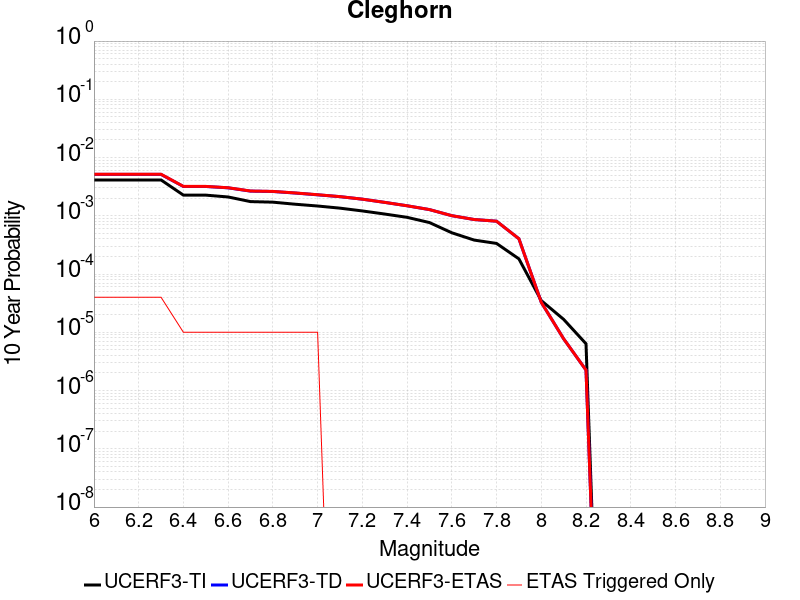 |

| Magnitude | 1 wk TI Prob | 1 wk TD Prob | 1 wk ETAS Prob | 1 wk ETAS/TD Gain | 1 wk ETAS Triggered Only | 1 mo TI Prob | 1 mo TD Prob | 1 mo ETAS Prob | 1 mo ETAS/TD Gain | 1 mo ETAS Triggered Only | 1 yr TI Prob | 1 yr TD Prob | 1 yr ETAS Prob | 1 yr ETAS/TD Gain | 1 yr ETAS Triggered Only | 10 yr TI Prob | 10 yr TD Prob | 10 yr ETAS Prob | 10 yr ETAS/TD Gain | 10 yr ETAS Triggered Only |
|-----|-----|-----|-----|-----|-----|-----|-----|-----|-----|-----|-----|-----|-----|-----|-----|-----|-----|-----|-----|-----|
| 6.0 | 7.9267165E-6 | 9.831764E-6 | 2.9831568E-5 | 3.0342028 | 2.0E-5 | 3.39712E-5 | 4.2135514E-5 | 6.213467E-5 | 1.4746389 | 2.0E-5 | 4.1352084E-4 | 5.1288976E-4 | 5.4287433E-4 | 1.0584621 | 3.0E-5 | 0.004127522 | 0.005132214 | 0.005172009 | 1.0077538 | 4.0E-5 |
| 6.1 | 7.9267165E-6 | 9.831764E-6 | 2.9831568E-5 | 3.0342028 | 2.0E-5 | 3.39712E-5 | 4.2135514E-5 | 6.213467E-5 | 1.4746389 | 2.0E-5 | 4.1352084E-4 | 5.1288976E-4 | 5.4287433E-4 | 1.0584621 | 3.0E-5 | 0.004127522 | 0.005132214 | 0.005172009 | 1.0077538 | 4.0E-5 |
| 6.2 | 7.9267165E-6 | 9.831764E-6 | 2.9831568E-5 | 3.0342028 | 2.0E-5 | 3.39712E-5 | 4.2135514E-5 | 6.213467E-5 | 1.4746389 | 2.0E-5 | 4.1352084E-4 | 5.1288976E-4 | 5.4287433E-4 | 1.0584621 | 3.0E-5 | 0.004127522 | 0.005132214 | 0.005172009 | 1.0077538 | 4.0E-5 |
| 6.3 | 7.9267165E-6 | 9.831764E-6 | 2.9831568E-5 | 3.0342028 | 2.0E-5 | 3.39712E-5 | 4.2135514E-5 | 6.213467E-5 | 1.4746389 | 2.0E-5 | 4.1352084E-4 | 5.1288976E-4 | 5.4287433E-4 | 1.0584621 | 3.0E-5 | 0.004127522 | 0.005132214 | 0.005172009 | 1.0077538 | 4.0E-5 |
| 6.4 | 4.3445207E-6 | 6.0916254E-6 | 6.0916254E-6 | 1.0 | 0.0 | 1.8619241E-5 | 2.6106709E-5 | 2.6106709E-5 | 1.0 | 0.0 | 2.2666567E-4 | 3.1780385E-4 | 3.2780066E-4 | 1.031456 | 1.0E-5 | 0.0022643462 | 0.0031877246 | 0.0031976928 | 1.003127 | 1.0E-5 |
| 6.5 | 4.3445207E-6 | 6.0916254E-6 | 6.0916254E-6 | 1.0 | 0.0 | 1.8619241E-5 | 2.6106709E-5 | 2.6106709E-5 | 1.0 | 0.0 | 2.2666567E-4 | 3.1780385E-4 | 3.2780066E-4 | 1.031456 | 1.0E-5 | 0.0022643462 | 0.0031877246 | 0.0031976928 | 1.003127 | 1.0E-5 |
| 6.6 | 4.040109E-6 | 5.774033E-6 | 5.774033E-6 | 1.0 | 0.0 | 1.7314638E-5 | 2.4745626E-5 | 2.4745626E-5 | 1.0 | 0.0 | 2.1078532E-4 | 3.0123728E-4 | 3.1123427E-4 | 1.0331864 | 1.0E-5 | 0.002105855 | 0.0030225143 | 0.003032484 | 1.0032985 | 1.0E-5 |
| 6.7 | 3.3632055E-6 | 5.06753E-6 | 5.06753E-6 | 1.0 | 0.0 | 1.4413658E-5 | 2.1717806E-5 | 2.1717806E-5 | 1.0 | 0.0 | 1.7547216E-4 | 2.643825E-4 | 2.7437988E-4 | 1.037814 | 1.0E-5 | 0.0017533366 | 0.0026548486 | 0.002664822 | 1.0037566 | 1.0E-5 |
| 6.8 | 3.2902772E-6 | 4.9894375E-6 | 4.9894375E-6 | 1.0 | 0.0 | 1.4101111E-5 | 2.138313E-5 | 2.138313E-5 | 1.0 | 0.0 | 1.716675E-4 | 2.6030882E-4 | 2.7030622E-4 | 1.0384059 | 1.0E-5 | 0.0017153495 | 0.0026142076 | 0.0026241813 | 1.0038153 | 1.0E-5 |
| 6.9 | 3.031547E-6 | 4.6911987E-6 | 4.6911987E-6 | 1.0 | 0.0 | 1.299228E-5 | 2.0104984E-5 | 2.0104984E-5 | 1.0 | 0.0 | 1.5816953E-4 | 2.4475096E-4 | 2.547485E-4 | 1.0408479 | 1.0E-5 | 0.00158057 | 0.0024589805 | 0.002468956 | 1.0040567 | 1.0E-5 |
| 7.0 | 2.8259715E-6 | 4.3707637E-6 | 4.3707637E-6 | 1.0 | 0.0 | 1.211125E-5 | 1.8731711E-5 | 1.8731711E-5 | 1.0 | 0.0 | 1.4744449E-4 | 2.2803496E-4 | 2.3803268E-4 | 1.0438429 | 1.0E-5 | 0.001473467 | 0.0022921748 | 0.0023021519 | 1.0043527 | 1.0E-5 |
| 7.1 | 2.5962665E-6 | 4.065983E-6 | 4.065983E-6 | 1.0 | 0.0 | 1.1126809E-5 | 1.7425526E-5 | 1.7425526E-5 | 1.0 | 0.0 | 1.3546048E-4 | 2.1213535E-4 | 2.1213535E-4 | 1.0 | 0.0 | 0.0013537793 | 0.0021334959 | 0.0021334959 | 1.0 | 0.0 |
| 7.2 | 2.3247253E-6 | 3.6765352E-6 | 3.6765352E-6 | 1.0 | 0.0 | 9.96307E-6 | 1.5756486E-5 | 1.5756486E-5 | 1.0 | 0.0 | 1.21293626E-4 | 1.9181852E-4 | 1.9181852E-4 | 1.0 | 0.0 | 0.0012122744 | 0.0019307166 | 0.0019307166 | 1.0 | 0.0 |
| 7.3 | 2.056928E-6 | 3.235253E-6 | 3.235253E-6 | 1.0 | 0.0 | 8.815376E-6 | 1.3865297E-5 | 1.3865297E-5 | 1.0 | 0.0 | 1.0732192E-4 | 1.6879707E-4 | 1.6879707E-4 | 1.0 | 0.0 | 0.001072701 | 0.0017009423 | 0.0017009423 | 1.0 | 0.0 |
| 7.4 | 1.8055999E-6 | 2.8256538E-6 | 2.8256538E-6 | 1.0 | 0.0 | 7.738263E-6 | 1.210989E-5 | 1.210989E-5 | 1.0 | 0.0 | 9.4209274E-5 | 1.4742807E-4 | 1.4742807E-4 | 1.0 | 0.0 | 9.4169343E-4 | 0.0014876705 | 0.0014876705 | 1.0 | 0.0 |
| 7.5 | 1.4683443E-6 | 2.4248943E-6 | 2.4248943E-6 | 1.0 | 0.0 | 6.292889E-6 | 1.0392363E-5 | 1.0392363E-5 | 1.0 | 0.0 | 7.661323E-5 | 1.2651978E-4 | 1.2651978E-4 | 1.0 | 0.0 | 7.658682E-4 | 0.0012788812 | 0.0012788812 | 1.0 | 0.0 |
| 7.6 | 9.804088E-7 | 1.9004091E-6 | 1.9004091E-6 | 1.0 | 0.0 | 4.201745E-6 | 8.144585E-6 | 8.144585E-6 | 1.0 | 0.0 | 5.1155046E-5 | 9.915586E-5 | 9.915586E-5 | 1.0 | 0.0 | 5.114327E-4 | 0.0010055583 | 0.0010055583 | 1.0 | 0.0 |
| 7.7 | 7.3434086E-7 | 1.6285549E-6 | 1.6285549E-6 | 1.0 | 0.0 | 3.1471714E-6 | 6.9795024E-6 | 6.9795024E-6 | 1.0 | 0.0 | 3.831614E-5 | 8.4972155E-5 | 8.4972155E-5 | 1.0 | 0.0 | 3.8309532E-4 | 8.6387293E-4 | 8.6387293E-4 | 1.0 | 0.0 |
| 7.8 | 6.434184E-7 | 1.5221389E-6 | 1.5221389E-6 | 1.0 | 0.0 | 2.7575045E-6 | 6.523436E-6 | 6.523436E-6 | 1.0 | 0.0 | 3.35721E-5 | 7.9419966E-5 | 7.9419966E-5 | 1.0 | 0.0 | 3.3567028E-4 | 8.080443E-4 | 8.080443E-4 | 1.0 | 0.0 |
| 7.9 | 3.4943926E-7 | 7.5750586E-7 | 7.5750586E-7 | 1.0 | 0.0 | 1.497596E-6 | 3.2464498E-6 | 3.2464498E-6 | 1.0 | 0.0 | 1.8233079E-5 | 3.9524817E-5 | 3.9524817E-5 | 1.0 | 0.0 | 1.8231584E-4 | 4.0401975E-4 | 4.0401975E-4 | 1.0 | 0.0 |
| 8.0 | 6.717524E-8 | 5.837515E-8 | 5.837515E-8 | 1.0 | 0.0 | 2.8789387E-7 | 2.501792E-7 | 2.501792E-7 | 1.0 | 0.0 | 3.505102E-6 | 3.0459275E-6 | 3.0459275E-6 | 1.0 | 0.0 | 3.5050467E-5 | 3.2751934E-5 | 3.2751934E-5 | 1.0 | 0.0 |
| 8.1 | 3.1984914E-8 | 1.2949885E-8 | 1.2949885E-8 | 1.0 | 0.0 | 1.370782E-7 | 5.549951E-8 | 5.549951E-8 | 1.0 | 0.0 | 1.6689258E-6 | 6.757063E-7 | 6.757063E-7 | 1.0 | 0.0 | 1.6689133E-5 | 7.741151E-6 | 7.741151E-6 | 1.0 | 0.0 |
| 8.2 | 1.21887656E-8 | 3.6471115E-9 | 3.6471115E-9 | 1.0 | 0.0 | 5.2237567E-8 | 1.563048E-8 | 1.563048E-8 | 1.0 | 0.0 | 6.359922E-7 | 1.9030107E-7 | 1.9030107E-7 | 1.0 | 0.0 | 6.3599036E-6 | 2.245849E-6 | 2.245849E-6 | 1.0 | 0.0 |

## Pitas Point (Lower West)
*[(top)](#table-of-contents)*

| 1 Week | 1 Month | 1 Year | 10 Year |
|-----|-----|-----|-----|
|  |  |  |  |

| Magnitude | 1 wk TI Prob | 1 wk TD Prob | 1 wk ETAS Prob | 1 wk ETAS/TD Gain | 1 wk ETAS Triggered Only | 1 mo TI Prob | 1 mo TD Prob | 1 mo ETAS Prob | 1 mo ETAS/TD Gain | 1 mo ETAS Triggered Only | 1 yr TI Prob | 1 yr TD Prob | 1 yr ETAS Prob | 1 yr ETAS/TD Gain | 1 yr ETAS Triggered Only | 10 yr TI Prob | 10 yr TD Prob | 10 yr ETAS Prob | 10 yr ETAS/TD Gain | 10 yr ETAS Triggered Only |
|-----|-----|-----|-----|-----|-----|-----|-----|-----|-----|-----|-----|-----|-----|-----|-----|-----|-----|-----|-----|-----|
| 6.0 | 8.151497E-6 | 7.855796E-6 | 3.785556E-5 | 4.818806 | 3.0E-5 | 3.493452E-5 | 3.3667267E-5 | 6.366626E-5 | 1.8910432 | 3.0E-5 | 4.252448E-4 | 4.0982262E-4 | 4.4980622E-4 | 1.0975631 | 4.0E-5 | 0.0042443196 | 0.004090749 | 0.0041305856 | 1.0097382 | 4.0E-5 |
| 6.1 | 8.151497E-6 | 7.855796E-6 | 3.785556E-5 | 4.818806 | 3.0E-5 | 3.493452E-5 | 3.3667267E-5 | 6.366626E-5 | 1.8910432 | 3.0E-5 | 4.252448E-4 | 4.0982262E-4 | 4.4980622E-4 | 1.0975631 | 4.0E-5 | 0.0042443196 | 0.004090749 | 0.0041305856 | 1.0097382 | 4.0E-5 |
| 6.2 | 8.151497E-6 | 7.855796E-6 | 3.785556E-5 | 4.818806 | 3.0E-5 | 3.493452E-5 | 3.3667267E-5 | 6.366626E-5 | 1.8910432 | 3.0E-5 | 4.252448E-4 | 4.0982262E-4 | 4.4980622E-4 | 1.0975631 | 4.0E-5 | 0.0042443196 | 0.004090749 | 0.0041305856 | 1.0097382 | 4.0E-5 |
| 6.3 | 8.151497E-6 | 7.855796E-6 | 3.785556E-5 | 4.818806 | 3.0E-5 | 3.493452E-5 | 3.3667267E-5 | 6.366626E-5 | 1.8910432 | 3.0E-5 | 4.252448E-4 | 4.0982262E-4 | 4.4980622E-4 | 1.0975631 | 4.0E-5 | 0.0042443196 | 0.004090749 | 0.0041305856 | 1.0097382 | 4.0E-5 |
| 6.4 | 8.151497E-6 | 7.855796E-6 | 3.785556E-5 | 4.818806 | 3.0E-5 | 3.493452E-5 | 3.3667267E-5 | 6.366626E-5 | 1.8910432 | 3.0E-5 | 4.252448E-4 | 4.0982262E-4 | 4.4980622E-4 | 1.0975631 | 4.0E-5 | 0.0042443196 | 0.004090749 | 0.0041305856 | 1.0097382 | 4.0E-5 |
| 6.5 | 8.151497E-6 | 7.855796E-6 | 3.785556E-5 | 4.818806 | 3.0E-5 | 3.493452E-5 | 3.3667267E-5 | 6.366626E-5 | 1.8910432 | 3.0E-5 | 4.252448E-4 | 4.0982262E-4 | 4.4980622E-4 | 1.0975631 | 4.0E-5 | 0.0042443196 | 0.004090749 | 0.0041305856 | 1.0097382 | 4.0E-5 |
| 6.6 | 8.151497E-6 | 7.855796E-6 | 3.785556E-5 | 4.818806 | 3.0E-5 | 3.493452E-5 | 3.3667267E-5 | 6.366626E-5 | 1.8910432 | 3.0E-5 | 4.252448E-4 | 4.0982262E-4 | 4.4980622E-4 | 1.0975631 | 4.0E-5 | 0.0042443196 | 0.004090749 | 0.0041305856 | 1.0097382 | 4.0E-5 |
| 6.7 | 8.151497E-6 | 7.855796E-6 | 3.785556E-5 | 4.818806 | 3.0E-5 | 3.493452E-5 | 3.3667267E-5 | 6.366626E-5 | 1.8910432 | 3.0E-5 | 4.252448E-4 | 4.0982262E-4 | 4.4980622E-4 | 1.0975631 | 4.0E-5 | 0.0042443196 | 0.004090749 | 0.0041305856 | 1.0097382 | 4.0E-5 |
| 6.8 | 8.151497E-6 | 7.855796E-6 | 3.785556E-5 | 4.818806 | 3.0E-5 | 3.493452E-5 | 3.3667267E-5 | 6.366626E-5 | 1.8910432 | 3.0E-5 | 4.252448E-4 | 4.0982262E-4 | 4.4980622E-4 | 1.0975631 | 4.0E-5 | 0.0042443196 | 0.004090749 | 0.0041305856 | 1.0097382 | 4.0E-5 |
| 6.9 | 8.151497E-6 | 7.855796E-6 | 3.785556E-5 | 4.818806 | 3.0E-5 | 3.493452E-5 | 3.3667267E-5 | 6.366626E-5 | 1.8910432 | 3.0E-5 | 4.252448E-4 | 4.0982262E-4 | 4.4980622E-4 | 1.0975631 | 4.0E-5 | 0.0042443196 | 0.004090749 | 0.0041305856 | 1.0097382 | 4.0E-5 |
| 7.0 | 8.103535E-6 | 7.805226E-6 | 3.780499E-5 | 4.843549 | 3.0E-5 | 3.4728975E-5 | 3.3450542E-5 | 6.344954E-5 | 1.8968164 | 3.0E-5 | 4.2274324E-4 | 4.07185E-4 | 4.471687E-4 | 1.0981954 | 4.0E-5 | 0.0042193993 | 0.0040644696 | 0.004104307 | 1.0098014 | 4.0E-5 |
| 7.1 | 7.853298E-6 | 7.540917E-6 | 2.7540766E-5 | 3.6521773 | 2.0E-5 | 3.3656554E-5 | 3.2317817E-5 | 5.2317173E-5 | 1.6188337 | 2.0E-5 | 4.096915E-4 | 3.9339912E-4 | 4.233873E-4 | 1.0762284 | 3.0E-5 | 0.00408937 | 0.0039271032 | 0.003956985 | 1.0076092 | 3.0E-5 |
| 7.2 | 7.771102E-6 | 7.453199E-6 | 2.745305E-5 | 3.6833916 | 2.0E-5 | 3.33043E-5 | 3.1941894E-5 | 5.1941253E-5 | 1.626117 | 2.0E-5 | 4.0540437E-4 | 3.8882386E-4 | 4.1881218E-4 | 1.0771258 | 3.0E-5 | 0.0040466557 | 0.003881511 | 0.0039113946 | 1.0076989 | 3.0E-5 |
| 7.3 | 7.3945344E-6 | 7.0493033E-6 | 2.7049162E-5 | 3.8371398 | 2.0E-5 | 3.1690477E-5 | 3.0210955E-5 | 5.021035E-5 | 1.6619915 | 2.0E-5 | 3.8576324E-4 | 3.677569E-4 | 3.9774587E-4 | 1.0815456 | 3.0E-5 | 0.0038509427 | 0.003671551 | 0.0037014408 | 1.0081409 | 3.0E-5 |
| 7.4 | 6.964645E-6 | 6.5901527E-6 | 2.659002E-5 | 4.034811 | 2.0E-5 | 2.9848137E-5 | 2.8243208E-5 | 4.8242644E-5 | 1.7081149 | 2.0E-5 | 3.6334046E-4 | 3.438073E-4 | 3.7379697E-4 | 1.0872282 | 3.0E-5 | 0.0036274698 | 0.0034328073 | 0.0034627041 | 1.0087092 | 3.0E-5 |
| 7.5 | 6.6525035E-6 | 6.259191E-6 | 2.6259066E-5 | 4.195281 | 2.0E-5 | 2.851042E-5 | 2.6824831E-5 | 4.6824294E-5 | 1.7455579 | 2.0E-5 | 3.4705905E-4 | 3.2654387E-4 | 3.5653406E-4 | 1.0918412 | 3.0E-5 | 0.0034651754 | 0.0032606919 | 0.003290594 | 1.0091705 | 3.0E-5 |
| 7.6 | 5.613338E-6 | 5.15142E-6 | 2.5151317E-5 | 4.882405 | 2.0E-5 | 2.405694E-5 | 2.2077327E-5 | 4.2076885E-5 | 1.9058868 | 2.0E-5 | 2.928539E-4 | 2.6875862E-4 | 2.9875056E-4 | 1.1115943 | 3.0E-5 | 0.0029246826 | 0.0026843674 | 0.002714287 | 1.0111458 | 3.0E-5 |
| 7.7 | 4.494704E-6 | 3.996945E-6 | 3.996945E-6 | 1.0 | 0.0 | 1.9262876E-5 | 1.7129652E-5 | 1.7129652E-5 | 1.0 | 0.0 | 2.3450027E-4 | 2.0853379E-4 | 2.0853379E-4 | 1.0 | 0.0 | 0.0023425296 | 0.0020834052 | 0.0020834052 | 1.0 | 0.0 |
| 7.8 | 2.6075882E-6 | 2.1836663E-6 | 2.1836663E-6 | 1.0 | 0.0 | 1.117533E-5 | 9.358537E-6 | 9.358537E-6 | 1.0 | 0.0 | 1.3605114E-4 | 1.1393427E-4 | 1.1393427E-4 | 1.0 | 0.0 | 0.0013596788 | 0.0011387634 | 0.0011387634 | 1.0 | 0.0 |
| 7.9 | 4.045984E-7 | 3.2424057E-7 | 3.2424057E-7 | 1.0 | 0.0 | 1.733992E-6 | 1.3896017E-6 | 1.3896017E-6 | 1.0 | 0.0 | 2.1111147E-5 | 1.6918271E-5 | 1.6918271E-5 | 1.0 | 0.0 | 2.1109142E-4 | 1.6917015E-4 | 1.6917015E-4 | 1.0 | 0.0 |
| 8.0 | 7.791402E-9 | 5.6836056E-9 | 5.6836056E-9 | 1.0 | 0.0 | 3.3391725E-8 | 2.4358311E-8 | 2.4358311E-8 | 1.0 | 0.0 | 4.0654416E-7 | 2.965624E-7 | 2.965624E-7 | 1.0 | 0.0 | 4.065434E-6 | 2.9656223E-6 | 2.9656223E-6 | 1.0 | 0.0 |

## West Napa 2011 CFM
*[(top)](#table-of-contents)*

| 1 Week | 1 Month | 1 Year | 10 Year |
|-----|-----|-----|-----|
|  |  |  |  |

| Magnitude | 1 wk TI Prob | 1 wk TD Prob | 1 wk ETAS Prob | 1 wk ETAS/TD Gain | 1 wk ETAS Triggered Only | 1 mo TI Prob | 1 mo TD Prob | 1 mo ETAS Prob | 1 mo ETAS/TD Gain | 1 mo ETAS Triggered Only | 1 yr TI Prob | 1 yr TD Prob | 1 yr ETAS Prob | 1 yr ETAS/TD Gain | 1 yr ETAS Triggered Only | 10 yr TI Prob | 10 yr TD Prob | 10 yr ETAS Prob | 10 yr ETAS/TD Gain | 10 yr ETAS Triggered Only |
|-----|-----|-----|-----|-----|-----|-----|-----|-----|-----|-----|-----|-----|-----|-----|-----|-----|-----|-----|-----|-----|
| 6.0 | 3.773104E-5 | 4.4528504E-5 | 7.452717E-5 | 1.6736958 | 3.0E-5 | 1.6169442E-4 | 1.9082428E-4 | 2.2081856E-4 | 1.1571827 | 3.0E-5 | 0.001966852 | 0.0023211278 | 0.0023510582 | 1.0128947 | 3.0E-5 | 0.019495348 | 0.023002012 | 0.023041092 | 1.001699 | 4.0E-5 |
| 6.1 | 3.773104E-5 | 4.4528504E-5 | 7.452717E-5 | 1.6736958 | 3.0E-5 | 1.6169442E-4 | 1.9082428E-4 | 2.2081856E-4 | 1.1571827 | 3.0E-5 | 0.001966852 | 0.0023211278 | 0.0023510582 | 1.0128947 | 3.0E-5 | 0.019495348 | 0.023002012 | 0.023041092 | 1.001699 | 4.0E-5 |
| 6.2 | 3.773104E-5 | 4.4528504E-5 | 7.452717E-5 | 1.6736958 | 3.0E-5 | 1.6169442E-4 | 1.9082428E-4 | 2.2081856E-4 | 1.1571827 | 3.0E-5 | 0.001966852 | 0.0023211278 | 0.0023510582 | 1.0128947 | 3.0E-5 | 0.019495348 | 0.023002012 | 0.023041092 | 1.001699 | 4.0E-5 |
| 6.3 | 2.147964E-5 | 2.4987066E-5 | 4.4986566E-5 | 1.800394 | 2.0E-5 | 9.2052345E-5 | 1.0708355E-4 | 1.2708141E-4 | 1.18675 | 2.0E-5 | 0.001120161 | 0.0013030542 | 0.0013230281 | 1.0153285 | 2.0E-5 | 0.011145315 | 0.012964482 | 0.012994094 | 1.002284 | 3.0E-5 |
| 6.4 | 2.147964E-5 | 2.4987066E-5 | 4.4986566E-5 | 1.800394 | 2.0E-5 | 9.2052345E-5 | 1.0708355E-4 | 1.2708141E-4 | 1.18675 | 2.0E-5 | 0.001120161 | 0.0013030542 | 0.0013230281 | 1.0153285 | 2.0E-5 | 0.011145315 | 0.012964482 | 0.012994094 | 1.002284 | 3.0E-5 |
| 6.5 | 1.688201E-5 | 1.9547371E-5 | 2.9547176E-5 | 1.5115677 | 1.0E-5 | 7.234947E-5 | 8.377217E-5 | 9.3771334E-5 | 1.1193614 | 1.0E-5 | 8.804988E-4 | 0.0010195216 | 0.0010295114 | 1.0097985 | 1.0E-5 | 0.008770182 | 0.01015684 | 0.010176637 | 1.0019491 | 2.0E-5 |
| 6.6 | 1.6846381E-5 | 1.9507064E-5 | 2.950687E-5 | 1.5126247 | 1.0E-5 | 7.219678E-5 | 8.3599436E-5 | 9.35986E-5 | 1.119608 | 1.0E-5 | 8.7864127E-4 | 0.0010174206 | 0.0010274104 | 1.0098188 | 1.0E-5 | 0.008751754 | 0.010136021 | 0.010155818 | 1.0019531 | 2.0E-5 |
| 6.7 | 1.3396501E-5 | 1.5467684E-5 | 2.5467529E-5 | 1.6464992 | 1.0E-5 | 5.7412315E-5 | 6.628875E-5 | 7.628809E-5 | 1.1508452 | 1.0E-5 | 6.9877075E-4 | 8.068302E-4 | 8.168221E-4 | 1.0123842 | 1.0E-5 | 0.0069657755 | 0.008046459 | 0.008066298 | 1.0024656 | 2.0E-5 |
| 6.8 | 1.0139058E-5 | 1.16721785E-5 | 2.1672062E-5 | 1.8567281 | 1.0E-5 | 4.3452383E-5 | 5.0022976E-5 | 6.0022478E-5 | 1.1998981 | 1.0E-5 | 5.289043E-4 | 6.0891506E-4 | 6.1890896E-4 | 1.0164126 | 1.0E-5 | 0.005276473 | 0.0060791126 | 0.0060989913 | 1.0032699 | 2.0E-5 |
| 6.9 | 7.761281E-6 | 8.890723E-6 | 1.8890634E-5 | 2.124758 | 1.0E-5 | 3.326221E-5 | 3.810283E-5 | 4.8102447E-5 | 1.2624377 | 1.0E-5 | 4.0489217E-4 | 4.6385458E-4 | 4.7384994E-4 | 1.0215485 | 1.0E-5 | 0.0040415525 | 0.0046351026 | 0.0046550096 | 1.0042949 | 2.0E-5 |
| 7.0 | 2.2109202E-6 | 2.3666319E-6 | 2.3666319E-6 | 1.0 | 0.0 | 9.475338E-6 | 1.01426685E-5 | 1.01426685E-5 | 1.0 | 0.0 | 1.1535613E-4 | 1.2348007E-4 | 1.2348007E-4 | 1.0 | 0.0 | 0.0011529627 | 0.0012353238 | 0.0012353238 | 1.0 | 0.0 |
| 7.1 | 1.9008926E-6 | 2.0133207E-6 | 2.0133207E-6 | 1.0 | 0.0 | 8.146657E-6 | 8.628488E-6 | 8.628488E-6 | 1.0 | 0.0 | 9.918104E-5 | 1.05046805E-4 | 1.05046805E-4 | 1.0 | 0.0 | 9.913679E-4 | 0.0010511756 | 0.0010511756 | 1.0 | 0.0 |
| 7.2 | 1.8495944E-6 | 1.9561273E-6 | 1.9561273E-6 | 1.0 | 0.0 | 7.926808E-6 | 8.383376E-6 | 8.383376E-6 | 1.0 | 0.0 | 9.650462E-5 | 1.0206285E-4 | 1.0206285E-4 | 1.0 | 0.0 | 9.6462725E-4 | 0.0010213639 | 0.0010213639 | 1.0 | 0.0 |
| 7.3 | 1.7883189E-6 | 1.8880897E-6 | 1.8880897E-6 | 1.0 | 0.0 | 7.664201E-6 | 8.091788E-6 | 8.091788E-6 | 1.0 | 0.0 | 9.330765E-5 | 9.85131E-5 | 9.85131E-5 | 1.0 | 0.0 | 9.3268487E-4 | 9.858976E-4 | 9.858976E-4 | 1.0 | 0.0 |
| 7.4 | 1.6520572E-6 | 1.7415113E-6 | 1.7415113E-6 | 1.0 | 0.0 | 7.0802257E-6 | 7.463598E-6 | 7.463598E-6 | 1.0 | 0.0 | 8.6198335E-5 | 9.086554E-5 | 9.086554E-5 | 1.0 | 0.0 | 8.616491E-4 | 9.0948684E-4 | 9.0948684E-4 | 1.0 | 0.0 |
| 7.5 | 1.4040345E-6 | 1.4800271E-6 | 1.4800271E-6 | 1.0 | 0.0 | 6.0172765E-6 | 6.342958E-6 | 6.342958E-6 | 1.0 | 0.0 | 7.325788E-5 | 7.72228E-5 | 7.72228E-5 | 1.0 | 0.0 | 7.3233736E-4 | 7.7311805E-4 | 7.7311805E-4 | 1.0 | 0.0 |
| 7.6 | 1.3013842E-7 | 1.4416163E-7 | 1.4416163E-7 | 1.0 | 0.0 | 5.57736E-7 | 6.178354E-7 | 6.178354E-7 | 1.0 | 0.0 | 6.790414E-6 | 7.52212E-6 | 7.52212E-6 | 1.0 | 0.0 | 6.790207E-5 | 7.61463E-5 | 7.61463E-5 | 1.0 | 0.0 |
| 7.7 | 8.541512E-8 | 9.716462E-8 | 9.716462E-8 | 1.0 | 0.0 | 3.6606474E-7 | 4.1641974E-7 | 4.1641974E-7 | 1.0 | 0.0 | 4.456829E-6 | 5.069898E-6 | 5.069898E-6 | 1.0 | 0.0 | 4.4567398E-5 | 5.160189E-5 | 5.160189E-5 | 1.0 | 0.0 |
| 7.8 | 5.6074793E-8 | 6.895456E-8 | 6.895456E-8 | 1.0 | 0.0 | 2.403205E-7 | 2.955195E-7 | 2.955195E-7 | 1.0 | 0.0 | 2.9258983E-6 | 3.597944E-6 | 3.597944E-6 | 1.0 | 0.0 | 2.9258597E-5 | 3.6812045E-5 | 3.6812045E-5 | 1.0 | 0.0 |
| 7.9 | 2.9475839E-8 | 3.8567407E-8 | 3.8567407E-8 | 1.0 | 0.0 | 1.2632502E-7 | 1.6528887E-7 | 1.6528887E-7 | 1.0 | 0.0 | 1.538006E-6 | 2.01239E-6 | 2.01239E-6 | 1.0 | 0.0 | 1.5379954E-5 | 2.0664074E-5 | 2.0664074E-5 | 1.0 | 0.0 |
| 8.0 | 1.3337122E-8 | 2.1632943E-8 | 2.1632943E-8 | 1.0 | 0.0 | 5.7159088E-8 | 9.2712604E-8 | 9.2712604E-8 | 1.0 | 0.0 | 6.959117E-7 | 1.1287754E-6 | 1.1287754E-6 | 1.0 | 0.0 | 6.959095E-6 | 1.1644432E-5 | 1.1644432E-5 | 1.0 | 0.0 |
| 8.1 | 2.6589986E-10 | 4.8617654E-10 | 4.8617654E-10 | 1.0 | 0.0 | 1.1395708E-9 | 2.0836133E-9 | 2.0836133E-9 | 1.0 | 0.0 | 1.3874274E-8 | 2.536799E-8 | 2.536799E-8 | 1.0 | 0.0 | 1.3874273E-7 | 2.6036727E-7 | 2.6036727E-7 | 1.0 | 0.0 |

## San Gabriel
*[(top)](#table-of-contents)*

| 1 Week | 1 Month | 1 Year | 10 Year |
|-----|-----|-----|-----|
|  |  |  |  |

| Magnitude | 1 wk TI Prob | 1 wk TD Prob | 1 wk ETAS Prob | 1 wk ETAS/TD Gain | 1 wk ETAS Triggered Only | 1 mo TI Prob | 1 mo TD Prob | 1 mo ETAS Prob | 1 mo ETAS/TD Gain | 1 mo ETAS Triggered Only | 1 yr TI Prob | 1 yr TD Prob | 1 yr ETAS Prob | 1 yr ETAS/TD Gain | 1 yr ETAS Triggered Only | 10 yr TI Prob | 10 yr TD Prob | 10 yr ETAS Prob | 10 yr ETAS/TD Gain | 10 yr ETAS Triggered Only |
|-----|-----|-----|-----|-----|-----|-----|-----|-----|-----|-----|-----|-----|-----|-----|-----|-----|-----|-----|-----|-----|
| 6.0 | 1.083775E-5 | 1.198525E-5 | 2.198513E-5 | 1.8343489 | 1.0E-5 | 4.6446676E-5 | 5.1364408E-5 | 6.13639E-5 | 1.1946774 | 1.0E-5 | 5.653415E-4 | 6.251936E-4 | 6.6516857E-4 | 1.0639402 | 4.0E-5 | 0.0056390543 | 0.0062463325 | 0.006286083 | 1.0063637 | 4.0E-5 |
| 6.1 | 1.083775E-5 | 1.198525E-5 | 2.198513E-5 | 1.8343489 | 1.0E-5 | 4.6446676E-5 | 5.1364408E-5 | 6.13639E-5 | 1.1946774 | 1.0E-5 | 5.653415E-4 | 6.251936E-4 | 6.6516857E-4 | 1.0639402 | 4.0E-5 | 0.0056390543 | 0.0062463325 | 0.006286083 | 1.0063637 | 4.0E-5 |
| 6.2 | 1.083775E-5 | 1.198525E-5 | 2.198513E-5 | 1.8343489 | 1.0E-5 | 4.6446676E-5 | 5.1364408E-5 | 6.13639E-5 | 1.1946774 | 1.0E-5 | 5.653415E-4 | 6.251936E-4 | 6.6516857E-4 | 1.0639402 | 4.0E-5 | 0.0056390543 | 0.0062463325 | 0.006286083 | 1.0063637 | 4.0E-5 |
| 6.3 | 1.083775E-5 | 1.198525E-5 | 2.198513E-5 | 1.8343489 | 1.0E-5 | 4.6446676E-5 | 5.1364408E-5 | 6.13639E-5 | 1.1946774 | 1.0E-5 | 5.653415E-4 | 6.251936E-4 | 6.6516857E-4 | 1.0639402 | 4.0E-5 | 0.0056390543 | 0.0062463325 | 0.006286083 | 1.0063637 | 4.0E-5 |
| 6.4 | 1.083775E-5 | 1.198525E-5 | 2.198513E-5 | 1.8343489 | 1.0E-5 | 4.6446676E-5 | 5.1364408E-5 | 6.13639E-5 | 1.1946774 | 1.0E-5 | 5.653415E-4 | 6.251936E-4 | 6.6516857E-4 | 1.0639402 | 4.0E-5 | 0.0056390543 | 0.0062463325 | 0.006286083 | 1.0063637 | 4.0E-5 |
| 6.5 | 6.7317824E-6 | 7.717007E-6 | 1.771693E-5 | 2.295829 | 1.0E-5 | 2.8850178E-5 | 3.3072472E-5 | 4.3072145E-5 | 1.3023562 | 1.0E-5 | 3.511943E-4 | 4.0258403E-4 | 4.4256792E-4 | 1.0993181 | 4.0E-5 | 0.003506398 | 0.004029533 | 0.0040693716 | 1.0098867 | 4.0E-5 |
| 6.6 | 6.7317824E-6 | 7.717007E-6 | 1.771693E-5 | 2.295829 | 1.0E-5 | 2.8850178E-5 | 3.3072472E-5 | 4.3072145E-5 | 1.3023562 | 1.0E-5 | 3.511943E-4 | 4.0258403E-4 | 4.4256792E-4 | 1.0993181 | 4.0E-5 | 0.003506398 | 0.004029533 | 0.0040693716 | 1.0098867 | 4.0E-5 |
| 6.7 | 6.274881E-6 | 7.2459275E-6 | 1.7245855E-5 | 2.3800757 | 1.0E-5 | 2.6892068E-5 | 3.105361E-5 | 4.10533E-5 | 1.3220137 | 1.0E-5 | 3.2736175E-4 | 3.7801306E-4 | 4.1799794E-4 | 1.1057764 | 4.0E-5 | 0.0032687993 | 0.0037846796 | 0.0038245283 | 1.0105289 | 4.0E-5 |
| 6.8 | 5.996209E-6 | 6.958647E-6 | 1.6958578E-5 | 2.4370508 | 1.0E-5 | 2.5697784E-5 | 2.9822439E-5 | 3.9822142E-5 | 1.335308 | 1.0E-5 | 3.128256E-4 | 3.6302864E-4 | 4.030141E-4 | 1.1101441 | 4.0E-5 | 0.003123856 | 0.0036353325 | 0.003675187 | 1.0109631 | 4.0E-5 |
| 6.9 | 5.686331E-6 | 6.6236917E-6 | 1.6623626E-5 | 2.509722 | 1.0E-5 | 2.4369761E-5 | 2.8386947E-5 | 3.8386665E-5 | 1.3522646 | 1.0E-5 | 2.9666146E-4 | 3.4555717E-4 | 3.8554336E-4 | 1.115715 | 4.0E-5 | 0.0029626573 | 0.0034611735 | 0.003501035 | 1.0115168 | 4.0E-5 |
| 7.0 | 5.2329838E-6 | 6.1475757E-6 | 1.6147515E-5 | 2.6266475 | 1.0E-5 | 2.242688E-5 | 2.6346492E-5 | 3.6346228E-5 | 1.3795471 | 1.0E-5 | 2.7301308E-4 | 3.207221E-4 | 3.6070927E-4 | 1.1246786 | 4.0E-5 | 0.002726779 | 0.0032135549 | 0.0032534264 | 1.0124073 | 4.0E-5 |
| 7.1 | 5.135671E-6 | 6.0377E-6 | 1.603764E-5 | 2.6562498 | 1.0E-5 | 2.2009834E-5 | 2.5875606E-5 | 3.5875346E-5 | 1.3864543 | 1.0E-5 | 2.6793676E-4 | 3.1499073E-4 | 3.549781E-4 | 1.1269479 | 4.0E-5 | 0.0026761394 | 0.0031564054 | 0.003196279 | 1.0126326 | 4.0E-5 |
| 7.2 | 4.989062E-6 | 5.8710784E-6 | 1.5871019E-5 | 2.7032545 | 1.0E-5 | 2.1381518E-5 | 2.5161527E-5 | 3.5161276E-5 | 1.3974222 | 1.0E-5 | 2.6028889E-4 | 3.0629928E-4 | 3.4628704E-4 | 1.1305512 | 4.0E-5 | 0.0025998424 | 0.003069734 | 0.003109611 | 1.0129905 | 4.0E-5 |
| 7.3 | 4.8219395E-6 | 5.7026323E-6 | 1.5702575E-5 | 2.7535663 | 1.0E-5 | 2.0665291E-5 | 2.4439627E-5 | 3.4439385E-5 | 1.4091616 | 1.0E-5 | 2.5157086E-4 | 2.975126E-4 | 3.3750068E-4 | 1.1344081 | 4.0E-5 | 0.0025128627 | 0.002982106 | 0.003021987 | 1.0133734 | 4.0E-5 |
| 7.4 | 4.7118383E-6 | 5.5911896E-6 | 1.5591133E-5 | 2.7885182 | 1.0E-5 | 2.0193436E-5 | 2.3962024E-5 | 3.3961784E-5 | 1.417317 | 1.0E-5 | 2.4582737E-4 | 2.9169934E-4 | 3.3168768E-4 | 1.1370875 | 4.0E-5 | 0.002455556 | 0.0029241266 | 0.0029640095 | 1.0136393 | 4.0E-5 |
| 7.5 | 4.5506545E-6 | 5.4365555E-6 | 1.54365E-5 | 2.83939 | 1.0E-5 | 1.9502659E-5 | 2.329932E-5 | 3.3299086E-5 | 1.429187 | 1.0E-5 | 2.37419E-4 | 2.8363304E-4 | 3.236217E-4 | 1.1409873 | 4.0E-5 | 0.002371655 | 0.0028436715 | 0.0028835577 | 1.0140263 | 4.0E-5 |
| 7.6 | 4.343636E-6 | 5.2294336E-6 | 1.52293815E-5 | 2.912243 | 1.0E-5 | 1.861545E-5 | 2.241167E-5 | 3.2411444E-5 | 1.4461861 | 1.0E-5 | 2.2661954E-4 | 2.7282868E-4 | 3.1281775E-4 | 1.1465721 | 4.0E-5 | 0.0022638857 | 0.0027358893 | 0.0027757797 | 1.0145805 | 4.0E-5 |
| 7.7 | 2.936235E-6 | 2.743946E-6 | 2.743946E-6 | 1.0 | 0.0 | 1.2583803E-5 | 1.1759716E-5 | 1.1759716E-5 | 1.0 | 0.0 | 1.5319703E-4 | 1.4316518E-4 | 1.4316518E-4 | 1.0 | 0.0 | 0.0015309147 | 0.0014379849 | 0.0014379849 | 1.0 | 0.0 |
| 7.8 | 1.4541639E-6 | 9.122518E-7 | 9.122518E-7 | 1.0 | 0.0 | 6.232116E-6 | 3.9096444E-6 | 3.9096444E-6 | 1.0 | 0.0 | 7.587337E-5 | 4.7598885E-5 | 4.7598885E-5 | 1.0 | 0.0 | 7.584747E-4 | 4.8078224E-4 | 4.8078224E-4 | 1.0 | 0.0 |
| 7.9 | 8.098958E-7 | 2.4165956E-7 | 2.4165956E-7 | 1.0 | 0.0 | 3.4709774E-6 | 1.0356835E-6 | 1.0356835E-6 | 1.0 | 0.0 | 4.225833E-5 | 1.2609373E-5 | 1.2609373E-5 | 1.0 | 0.0 | 4.2250296E-4 | 1.2917137E-4 | 1.2917137E-4 | 1.0 | 0.0 |
| 8.0 | 5.2473234E-7 | 7.672734E-8 | 7.672734E-8 | 1.0 | 0.0 | 2.248851E-6 | 3.2883142E-7 | 3.2883142E-7 | 1.0 | 0.0 | 2.7379416E-5 | 4.003515E-6 | 4.003515E-6 | 1.0 | 0.0 | 2.7376044E-4 | 4.215796E-5 | 4.215796E-5 | 1.0 | 0.0 |
| 8.1 | 3.3162388E-7 | 4.1457096E-8 | 4.1457096E-8 | 1.0 | 0.0 | 1.4212444E-6 | 1.7767324E-7 | 1.7767324E-7 | 1.0 | 0.0 | 1.7303513E-5 | 2.1631695E-6 | 2.1631695E-6 | 1.0 | 0.0 | 1.7302166E-4 | 2.294416E-5 | 2.294416E-5 | 1.0 | 0.0 |
| 8.2 | 1.0235345E-7 | 1.4032201E-8 | 1.4032201E-8 | 1.0 | 0.0 | 4.3865757E-7 | 6.013801E-8 | 6.013801E-8 | 1.0 | 0.0 | 5.340643E-6 | 7.3217996E-7 | 7.3217996E-7 | 1.0 | 0.0 | 5.3405143E-5 | 7.921925E-6 | 7.921925E-6 | 1.0 | 0.0 |

## Big Pine (East)
*[(top)](#table-of-contents)*

| 1 Week | 1 Month | 1 Year | 10 Year |
|-----|-----|-----|-----|
|  |  |  |  |

| Magnitude | 1 wk TI Prob | 1 wk TD Prob | 1 wk ETAS Prob | 1 wk ETAS/TD Gain | 1 wk ETAS Triggered Only | 1 mo TI Prob | 1 mo TD Prob | 1 mo ETAS Prob | 1 mo ETAS/TD Gain | 1 mo ETAS Triggered Only | 1 yr TI Prob | 1 yr TD Prob | 1 yr ETAS Prob | 1 yr ETAS/TD Gain | 1 yr ETAS Triggered Only | 10 yr TI Prob | 10 yr TD Prob | 10 yr ETAS Prob | 10 yr ETAS/TD Gain | 10 yr ETAS Triggered Only |
|-----|-----|-----|-----|-----|-----|-----|-----|-----|-----|-----|-----|-----|-----|-----|-----|-----|-----|-----|-----|-----|
| 6.0 | 9.916913E-6 | 1.28172705E-5 | 4.2816886E-5 | 3.3405619 | 3.0E-5 | 4.250036E-5 | 5.493013E-5 | 8.492848E-5 | 1.5461184 | 3.0E-5 | 5.173191E-4 | 6.685912E-4 | 7.085645E-4 | 1.0597873 | 4.0E-5 | 0.0051611643 | 0.006670449 | 0.006710182 | 1.0059566 | 4.0E-5 |
| 6.1 | 9.916913E-6 | 1.28172705E-5 | 4.2816886E-5 | 3.3405619 | 3.0E-5 | 4.250036E-5 | 5.493013E-5 | 8.492848E-5 | 1.5461184 | 3.0E-5 | 5.173191E-4 | 6.685912E-4 | 7.085645E-4 | 1.0597873 | 4.0E-5 | 0.0051611643 | 0.006670449 | 0.006710182 | 1.0059566 | 4.0E-5 |
| 6.2 | 9.916913E-6 | 1.28172705E-5 | 4.2816886E-5 | 3.3405619 | 3.0E-5 | 4.250036E-5 | 5.493013E-5 | 8.492848E-5 | 1.5461184 | 3.0E-5 | 5.173191E-4 | 6.685912E-4 | 7.085645E-4 | 1.0597873 | 4.0E-5 | 0.0051611643 | 0.006670449 | 0.006710182 | 1.0059566 | 4.0E-5 |
| 6.3 | 5.479711E-6 | 8.1132375E-6 | 1.8113156E-5 | 2.2325435 | 1.0E-5 | 2.3484265E-5 | 3.4770575E-5 | 4.4770226E-5 | 1.2875896 | 1.0E-5 | 2.858834E-4 | 4.232527E-4 | 4.3324847E-4 | 1.0236166 | 1.0E-5 | 0.0028551589 | 0.0042272513 | 0.004237209 | 1.0023556 | 1.0E-5 |
| 6.4 | 5.465009E-6 | 8.0975315E-6 | 1.8097451E-5 | 2.2349343 | 1.0E-5 | 2.3421257E-5 | 3.4703262E-5 | 4.4702916E-5 | 1.2881473 | 1.0E-5 | 2.851165E-4 | 4.2243348E-4 | 4.3242925E-4 | 1.0236623 | 1.0E-5 | 0.0028475097 | 0.00421909 | 0.0042290483 | 1.0023602 | 1.0E-5 |
| 6.5 | 4.826767E-6 | 7.4225877E-6 | 1.7422513E-5 | 2.347229 | 1.0E-5 | 2.068598E-5 | 3.1810716E-5 | 4.18104E-5 | 1.3143494 | 1.0E-5 | 2.518227E-4 | 3.8722943E-4 | 3.9722555E-4 | 1.0258145 | 1.0E-5 | 0.0025153751 | 0.0038682907 | 0.0038782519 | 1.0025752 | 1.0E-5 |
| 6.6 | 4.3146847E-6 | 6.8825234E-6 | 1.6882455E-5 | 2.4529455 | 1.0E-5 | 1.8491375E-5 | 2.949621E-5 | 3.9495913E-5 | 1.3390166 | 1.0E-5 | 2.2510924E-4 | 3.5905963E-4 | 3.6905604E-4 | 1.0278405 | 1.0E-5 | 0.0022488134 | 0.0035875062 | 0.0035974702 | 1.0027775 | 1.0E-5 |
| 6.7 | 3.6968106E-6 | 5.9957474E-6 | 1.5995687E-5 | 2.6678388 | 1.0E-5 | 1.5843378E-5 | 2.5695816E-5 | 3.569556E-5 | 1.3891584 | 1.0E-5 | 1.9287605E-4 | 3.128032E-4 | 3.2280007E-4 | 1.0319589 | 1.0E-5 | 0.0019270873 | 0.0031262499 | 0.0031362188 | 1.0031887 | 1.0E-5 |
| 6.8 | 3.4671132E-6 | 5.7024477E-6 | 1.5702391E-5 | 2.753623 | 1.0E-5 | 1.4858972E-5 | 2.4438841E-5 | 3.4438595E-5 | 1.4091747 | 1.0E-5 | 1.8089297E-4 | 2.9750372E-4 | 3.0750074E-4 | 1.0336031 | 1.0E-5 | 0.0018074579 | 0.0029736666 | 0.002983637 | 1.0033529 | 1.0E-5 |
| 6.9 | 2.7686972E-6 | 4.8254797E-6 | 1.4825431E-5 | 3.0723228 | 1.0E-5 | 1.1865792E-5 | 2.0680467E-5 | 3.068026E-5 | 1.483538 | 1.0E-5 | 1.4445644E-4 | 2.5175634E-4 | 2.6175383E-4 | 1.039711 | 1.0E-5 | 0.0014436257 | 0.002517256 | 0.0025272307 | 1.0039626 | 1.0E-5 |
| 7.0 | 2.1472624E-6 | 3.985277E-6 | 1.3985237E-5 | 3.5092258 | 1.0E-5 | 9.20252E-6 | 1.707965E-5 | 2.7079479E-5 | 1.5854821 | 1.0E-5 | 1.12034926E-4 | 2.0792543E-4 | 2.1792336E-4 | 1.0480841 | 1.0E-5 | 0.0011197845 | 0.0020798238 | 0.002089803 | 1.004798 | 1.0E-5 |
| 7.1 | 1.7018335E-6 | 3.3450835E-6 | 1.334505E-5 | 3.989452 | 1.0E-5 | 7.293552E-6 | 1.4335996E-5 | 2.4335852E-5 | 1.6975348 | 1.0E-5 | 8.879537E-5 | 1.7452713E-4 | 1.8452539E-4 | 1.0572877 | 1.0E-5 | 8.87599E-4 | 0.0017463792 | 0.0017563617 | 1.0057161 | 1.0E-5 |
| 7.2 | 1.25603E-6 | 2.794679E-6 | 1.2794651E-5 | 4.5782185 | 1.0E-5 | 5.3829745E-6 | 1.1977142E-5 | 2.1977023E-5 | 1.8349137 | 1.0E-5 | 6.553574E-5 | 1.4581217E-4 | 1.5581072E-4 | 1.0685713 | 1.0E-5 | 6.551642E-4 | 0.0014596173 | 0.0014696027 | 1.0068411 | 1.0E-5 |
| 7.3 | 1.112297E-6 | 2.610519E-6 | 1.2610492E-5 | 4.830646 | 1.0E-5 | 4.7669787E-6 | 1.1187892E-5 | 2.118778E-5 | 1.8938135 | 1.0E-5 | 5.803642E-5 | 1.3620428E-4 | 1.4620292E-4 | 1.0734091 | 1.0E-5 | 5.802127E-4 | 0.001363502 | 0.0013734883 | 1.0073241 | 1.0E-5 |
| 7.4 | 1.0137181E-6 | 2.4836752E-6 | 1.2483651E-5 | 5.0262814 | 1.0E-5 | 4.3444993E-6 | 1.064428E-5 | 2.0644173E-5 | 1.9394617 | 1.0E-5 | 5.2892992E-5 | 1.2958662E-4 | 1.3958532E-4 | 1.0771585 | 1.0E-5 | 5.288041E-4 | 0.0012971918 | 0.0013071789 | 1.007699 | 1.0E-5 |
| 7.5 | 9.598608E-7 | 2.407328E-6 | 1.2407304E-5 | 5.153973 | 1.0E-5 | 4.1136827E-6 | 1.03170805E-5 | 2.0316978E-5 | 1.9692564 | 1.0E-5 | 5.0082934E-5 | 1.2560343E-4 | 1.3560218E-4 | 1.0796057 | 1.0E-5 | 5.007165E-4 | 0.0012572132 | 0.0012672007 | 1.0079441 | 1.0E-5 |
| 7.6 | 7.929459E-7 | 2.0450152E-6 | 1.2044995E-5 | 5.8899293 | 1.0E-5 | 3.3983351E-6 | 8.764322E-6 | 1.8764234E-5 | 2.1409795 | 1.0E-5 | 4.1373947E-5 | 1.0670057E-4 | 1.16699506E-4 | 1.0937102 | 1.0E-5 | 4.1366243E-4 | 0.0010685825 | 0.0010785719 | 1.0093482 | 1.0E-5 |
| 7.7 | 4.155788E-7 | 1.1606729E-6 | 1.1160661E-5 | 9.615682 | 1.0E-5 | 1.7810507E-6 | 4.974303E-6 | 1.4974254E-5 | 3.0103219 | 1.0E-5 | 2.1684076E-5 | 6.05605E-5 | 7.0559894E-5 | 1.1651142 | 1.0E-5 | 2.1681961E-4 | 6.085995E-4 | 6.185935E-4 | 1.0164212 | 1.0E-5 |
| 7.8 | 1.14666925E-7 | 2.592197E-7 | 2.592197E-7 | 1.0 | 0.0 | 4.914296E-7 | 1.1109411E-6 | 1.1109411E-6 | 1.0 | 0.0 | 5.9831386E-6 | 1.3525627E-5 | 1.3525627E-5 | 1.0 | 0.0 | 5.9829777E-5 | 1.3636416E-4 | 1.3636416E-4 | 1.0 | 0.0 |
| 7.9 | 2.9231824E-8 | 4.1462318E-8 | 4.1462318E-8 | 1.0 | 0.0 | 1.2527924E-7 | 1.7769564E-7 | 1.7769564E-7 | 1.0 | 0.0 | 1.5252737E-6 | 2.1634426E-6 | 2.1634426E-6 | 1.0 | 0.0 | 1.5252632E-5 | 2.197062E-5 | 2.197062E-5 | 1.0 | 0.0 |

## Malibu Coast alt 1
*[(top)](#table-of-contents)*

| 1 Week | 1 Month | 1 Year | 10 Year |
|-----|-----|-----|-----|
|  |  |  |  |

| Magnitude | 1 wk TI Prob | 1 wk TD Prob | 1 wk ETAS Prob | 1 wk ETAS/TD Gain | 1 wk ETAS Triggered Only | 1 mo TI Prob | 1 mo TD Prob | 1 mo ETAS Prob | 1 mo ETAS/TD Gain | 1 mo ETAS Triggered Only | 1 yr TI Prob | 1 yr TD Prob | 1 yr ETAS Prob | 1 yr ETAS/TD Gain | 1 yr ETAS Triggered Only | 10 yr TI Prob | 10 yr TD Prob | 10 yr ETAS Prob | 10 yr ETAS/TD Gain | 10 yr ETAS Triggered Only |
|-----|-----|-----|-----|-----|-----|-----|-----|-----|-----|-----|-----|-----|-----|-----|-----|-----|-----|-----|-----|-----|
| 6.0 | 1.6572556E-5 | 1.759807E-5 | 4.7597543E-5 | 2.7047024 | 3.0E-5 | 7.102331E-5 | 7.5418226E-5 | 1.0541596E-4 | 1.3977518 | 3.0E-5 | 8.6436566E-4 | 9.1784896E-4 | 9.478214E-4 | 1.0326551 | 3.0E-5 | 0.0086101135 | 0.009142514 | 0.00917224 | 1.0032513 | 3.0E-5 |
| 6.1 | 1.6572556E-5 | 1.759807E-5 | 2.7597893E-5 | 1.5682342 | 1.0E-5 | 7.102331E-5 | 7.5418226E-5 | 8.5417465E-5 | 1.132584 | 1.0E-5 | 8.6436566E-4 | 9.1784896E-4 | 9.278398E-4 | 1.010885 | 1.0E-5 | 0.0086101135 | 0.009142514 | 0.009152423 | 1.0010837 | 1.0E-5 |
| 6.2 | 1.1085717E-5 | 1.155715E-5 | 1.155715E-5 | 1.0 | 0.0 | 4.750935E-5 | 4.9529724E-5 | 4.9529724E-5 | 1.0 | 0.0 | 5.782728E-4 | 6.0286105E-4 | 6.0286105E-4 | 1.0 | 0.0 | 0.0057677035 | 0.0060126274 | 0.0060126274 | 1.0 | 0.0 |
| 6.3 | 1.0208568E-5 | 1.0592241E-5 | 1.0592241E-5 | 1.0 | 0.0 | 4.375027E-5 | 4.5394543E-5 | 4.5394543E-5 | 1.0 | 0.0 | 5.325294E-4 | 5.5254134E-4 | 5.5254134E-4 | 1.0 | 0.0 | 0.0053125503 | 0.0055119833 | 0.0055119833 | 1.0 | 0.0 |
| 6.4 | 9.0682315E-6 | 9.342641E-6 | 9.342641E-6 | 1.0 | 0.0 | 3.8863272E-5 | 4.0039286E-5 | 4.0039286E-5 | 1.0 | 0.0 | 4.730576E-4 | 4.873713E-4 | 4.873713E-4 | 1.0 | 0.0 | 0.0047205184 | 0.004863238 | 0.004863238 | 1.0 | 0.0 |
| 6.5 | 7.605796E-6 | 7.74859E-6 | 7.74859E-6 | 1.0 | 0.0 | 3.259586E-5 | 3.320783E-5 | 3.320783E-5 | 1.0 | 0.0 | 3.9678233E-4 | 4.0423166E-4 | 4.0423166E-4 | 1.0 | 0.0 | 0.0039607463 | 0.0040351013 | 0.0040351013 | 1.0 | 0.0 |
| 6.6 | 5.889873E-6 | 5.8795417E-6 | 5.8795417E-6 | 1.0 | 0.0 | 2.5242069E-5 | 2.5197793E-5 | 2.5197793E-5 | 1.0 | 0.0 | 3.0727885E-4 | 3.0674002E-4 | 3.0674002E-4 | 1.0 | 0.0 | 0.003068543 | 0.0030631793 | 0.0030631793 | 1.0 | 0.0 |
| 6.7 | 5.66586E-6 | 5.6416443E-6 | 5.6416443E-6 | 1.0 | 0.0 | 2.428203E-5 | 2.4178253E-5 | 2.4178253E-5 | 1.0 | 0.0 | 2.955936E-4 | 2.9433056E-4 | 2.9433056E-4 | 1.0 | 0.0 | 0.0029520073 | 0.0029394194 | 0.0029394194 | 1.0 | 0.0 |
| 6.8 | 5.521556E-6 | 5.48943E-6 | 5.48943E-6 | 1.0 | 0.0 | 2.3663597E-5 | 2.3525918E-5 | 2.3525918E-5 | 1.0 | 0.0 | 2.880662E-4 | 2.8639048E-4 | 2.8639048E-4 | 1.0 | 0.0 | 0.0028769306 | 0.0028602257 | 0.0028602257 | 1.0 | 0.0 |
| 6.9 | 5.29752E-6 | 5.2499345E-6 | 5.2499345E-6 | 1.0 | 0.0 | 2.270346E-5 | 2.2499526E-5 | 2.2499526E-5 | 1.0 | 0.0 | 2.7637955E-4 | 2.7389737E-4 | 2.7389737E-4 | 1.0 | 0.0 | 0.0027603607 | 0.0027356083 | 0.0027356083 | 1.0 | 0.0 |
| 7.0 | 5.106743E-6 | 5.0476815E-6 | 5.0476815E-6 | 1.0 | 0.0 | 2.1885859E-5 | 2.1632743E-5 | 2.1632743E-5 | 1.0 | 0.0 | 2.6642776E-4 | 2.6334688E-4 | 2.6334688E-4 | 1.0 | 0.0 | 0.0026610855 | 0.0026303576 | 0.0026303576 | 1.0 | 0.0 |
| 7.1 | 4.8469647E-6 | 4.770376E-6 | 4.770376E-6 | 1.0 | 0.0 | 2.0772539E-5 | 2.044431E-5 | 2.044431E-5 | 1.0 | 0.0 | 2.528763E-4 | 2.488811E-4 | 2.488811E-4 | 1.0 | 0.0 | 0.0025258875 | 0.0024860317 | 0.0024860317 | 1.0 | 0.0 |
| 7.2 | 4.545514E-6 | 4.4481967E-6 | 4.4481967E-6 | 1.0 | 0.0 | 1.9480629E-5 | 1.906356E-5 | 1.906356E-5 | 1.0 | 0.0 | 2.3715083E-4 | 2.3207419E-4 | 2.3207419E-4 | 1.0 | 0.0 | 0.0023689792 | 0.002318326 | 0.002318326 | 1.0 | 0.0 |
| 7.3 | 3.794097E-6 | 3.6519373E-6 | 3.6519373E-6 | 1.0 | 0.0 | 1.6260314E-5 | 1.5651065E-5 | 1.5651065E-5 | 1.0 | 0.0 | 1.9795135E-4 | 1.9053511E-4 | 1.9053511E-4 | 1.0 | 0.0 | 0.001977751 | 0.0019037221 | 0.0019037221 | 1.0 | 0.0 |
| 7.4 | 2.808217E-6 | 2.7190777E-6 | 2.7190777E-6 | 1.0 | 0.0 | 1.203516E-5 | 1.1653137E-5 | 1.1653137E-5 | 1.0 | 0.0 | 1.4651821E-4 | 1.4186774E-4 | 1.4186774E-4 | 1.0 | 0.0 | 0.0014642165 | 0.0014177744 | 0.0014177744 | 1.0 | 0.0 |
| 7.5 | 1.83809E-6 | 1.8190703E-6 | 1.8190703E-6 | 1.0 | 0.0 | 7.877505E-6 | 7.795992E-6 | 7.795992E-6 | 1.0 | 0.0 | 9.59044E-5 | 9.4912095E-5 | 9.4912095E-5 | 1.0 | 0.0 | 9.5863023E-4 | 9.487176E-4 | 9.487176E-4 | 1.0 | 0.0 |
| 7.6 | 1.1292672E-6 | 1.1001456E-6 | 1.1001456E-6 | 1.0 | 0.0 | 4.839708E-6 | 4.7149015E-6 | 4.7149015E-6 | 1.0 | 0.0 | 5.8921847E-5 | 5.7402427E-5 | 5.7402427E-5 | 1.0 | 0.0 | 5.890623E-4 | 5.7387765E-4 | 5.7387765E-4 | 1.0 | 0.0 |
| 7.7 | 5.065272E-7 | 4.6091537E-7 | 4.6091537E-7 | 1.0 | 0.0 | 2.170829E-6 | 1.9753502E-6 | 1.9753502E-6 | 1.0 | 0.0 | 2.6429525E-5 | 2.4049634E-5 | 2.4049634E-5 | 1.0 | 0.0 | 2.642638E-4 | 2.4047145E-4 | 2.4047145E-4 | 1.0 | 0.0 |
| 7.8 | 8.952991E-8 | 6.707853E-8 | 6.707853E-8 | 1.0 | 0.0 | 3.8369956E-7 | 2.874794E-7 | 2.874794E-7 | 1.0 | 0.0 | 4.671532E-6 | 3.5000562E-6 | 3.5000562E-6 | 1.0 | 0.0 | 4.671434E-5 | 3.500003E-5 | 3.500003E-5 | 1.0 | 0.0 |
| 7.9 | 8.007447E-10 | 6.161581E-10 | 6.161581E-10 | 1.0 | 0.0 | 3.4317629E-9 | 2.640678E-9 | 2.640678E-9 | 1.0 | 0.0 | 4.1781714E-8 | 3.2150254E-8 | 3.2150254E-8 | 1.0 | 0.0 | 4.1781706E-7 | 3.2150248E-7 | 3.2150248E-7 | 1.0 | 0.0 |

## Ortigalita (South)
*[(top)](#table-of-contents)*

| 1 Week | 1 Month | 1 Year | 10 Year |
|-----|-----|-----|-----|
|  |  |  |  |

| Magnitude | 1 wk TI Prob | 1 wk TD Prob | 1 wk ETAS Prob | 1 wk ETAS/TD Gain | 1 wk ETAS Triggered Only | 1 mo TI Prob | 1 mo TD Prob | 1 mo ETAS Prob | 1 mo ETAS/TD Gain | 1 mo ETAS Triggered Only | 1 yr TI Prob | 1 yr TD Prob | 1 yr ETAS Prob | 1 yr ETAS/TD Gain | 1 yr ETAS Triggered Only | 10 yr TI Prob | 10 yr TD Prob | 10 yr ETAS Prob | 10 yr ETAS/TD Gain | 10 yr ETAS Triggered Only |
|-----|-----|-----|-----|-----|-----|-----|-----|-----|-----|-----|-----|-----|-----|-----|-----|-----|-----|-----|-----|-----|
| 6.0 | 3.72394E-5 | 4.32556E-5 | 5.3255168E-5 | 1.231174 | 1.0E-5 | 1.5958765E-4 | 1.8536886E-4 | 2.0536516E-4 | 1.107873 | 2.0E-5 | 0.0019412481 | 0.0022546863 | 0.0022746413 | 1.0088505 | 2.0E-5 | 0.019243775 | 0.022334501 | 0.022363832 | 1.0013132 | 3.0E-5 |
| 6.1 | 2.7299884E-5 | 3.1492036E-5 | 4.149172E-5 | 1.3175306 | 1.0E-5 | 1.16994255E-4 | 1.349592E-4 | 1.549565E-4 | 1.148173 | 2.0E-5 | 0.0014234743 | 0.0016419457 | 0.0016619129 | 1.0121607 | 2.0E-5 | 0.014143906 | 0.016304072 | 0.016323747 | 1.0012066 | 2.0E-5 |
| 6.2 | 2.7299884E-5 | 3.1492036E-5 | 4.149172E-5 | 1.3175306 | 1.0E-5 | 1.16994255E-4 | 1.349592E-4 | 1.549565E-4 | 1.148173 | 2.0E-5 | 0.0014234743 | 0.0016419457 | 0.0016619129 | 1.0121607 | 2.0E-5 | 0.014143906 | 0.016304072 | 0.016323747 | 1.0012066 | 2.0E-5 |
| 6.3 | 2.0546433E-5 | 2.3631454E-5 | 2.3631454E-5 | 1.0 | 0.0 | 8.805317E-5 | 1.0127383E-4 | 1.1127282E-4 | 1.0987322 | 1.0E-5 | 0.00107152 | 0.0012323305 | 0.0012423181 | 1.0081047 | 1.0E-5 | 0.010663681 | 0.012257031 | 0.012266909 | 1.0008059 | 1.0E-5 |
| 6.4 | 2.0546433E-5 | 2.3631454E-5 | 2.3631454E-5 | 1.0 | 0.0 | 8.805317E-5 | 1.0127383E-4 | 1.1127282E-4 | 1.0987322 | 1.0E-5 | 0.00107152 | 0.0012323305 | 0.0012423181 | 1.0081047 | 1.0E-5 | 0.010663681 | 0.012257031 | 0.012266909 | 1.0008059 | 1.0E-5 |
| 6.5 | 1.7779594E-5 | 2.0446974E-5 | 2.0446974E-5 | 1.0 | 0.0 | 7.619603E-5 | 8.762703E-5 | 9.762615E-5 | 1.11411 | 1.0E-5 | 9.272918E-4 | 0.0010663505 | 0.0010763399 | 1.0093678 | 1.0E-5 | 0.009234319 | 0.010613804 | 0.010623697 | 1.0009322 | 1.0E-5 |
| 6.6 | 1.6272212E-5 | 1.8714967E-5 | 1.8714967E-5 | 1.0 | 0.0 | 6.973618E-5 | 8.0204605E-5 | 9.020381E-5 | 1.1246711 | 1.0E-5 | 8.487073E-4 | 9.760659E-4 | 9.86056E-4 | 1.0102352 | 1.0E-5 | 0.008454733 | 0.009719091 | 0.009728993 | 1.0010189 | 1.0E-5 |
| 6.7 | 1.3051484E-5 | 1.5038758E-5 | 1.5038758E-5 | 1.0 | 0.0 | 5.593373E-5 | 6.445028E-5 | 7.4449636E-5 | 1.1551484 | 1.0E-5 | 6.807804E-4 | 7.844092E-4 | 7.9440133E-4 | 1.0127385 | 1.0E-5 | 0.006786986 | 0.007817388 | 0.00782731 | 1.0012692 | 1.0E-5 |
| 6.8 | 1.04277415E-5 | 1.1987235E-5 | 1.1987235E-5 | 1.0 | 0.0 | 4.4689557E-5 | 5.1372896E-5 | 5.1372896E-5 | 1.0 | 0.0 | 5.439595E-4 | 6.2529295E-4 | 6.2529295E-4 | 1.0 | 0.0 | 0.0054262993 | 0.00623609 | 0.00623609 | 1.0 | 0.0 |
| 6.9 | 7.639968E-6 | 8.791503E-6 | 8.791503E-6 | 1.0 | 0.0 | 3.274231E-5 | 3.767736E-5 | 3.767736E-5 | 1.0 | 0.0 | 3.9856473E-4 | 4.586312E-4 | 4.586312E-4 | 1.0 | 0.0 | 0.003978506 | 0.004577433 | 0.004577433 | 1.0 | 0.0 |
| 7.0 | 3.919831E-6 | 4.5334014E-6 | 4.5334014E-6 | 1.0 | 0.0 | 1.679917E-5 | 1.942873E-5 | 1.942873E-5 | 1.0 | 0.0 | 2.045107E-4 | 2.3652123E-4 | 2.3652123E-4 | 1.0 | 0.0 | 0.0020432258 | 0.0023629034 | 0.0023629034 | 1.0 | 0.0 |
| 7.1 | 1.6017933E-6 | 1.8570418E-6 | 1.8570418E-6 | 1.0 | 0.0 | 6.8648105E-6 | 7.958732E-6 | 7.958732E-6 | 1.0 | 0.0 | 8.357586E-5 | 9.689432E-5 | 9.689432E-5 | 1.0 | 0.0 | 8.3544437E-4 | 9.686254E-4 | 9.686254E-4 | 1.0 | 0.0 |

## Fish Slough 2011 CFM
*[(top)](#table-of-contents)*

| 1 Week | 1 Month | 1 Year | 10 Year |
|-----|-----|-----|-----|
|  |  |  |  |

| Magnitude | 1 wk TI Prob | 1 wk TD Prob | 1 wk ETAS Prob | 1 wk ETAS/TD Gain | 1 wk ETAS Triggered Only | 1 mo TI Prob | 1 mo TD Prob | 1 mo ETAS Prob | 1 mo ETAS/TD Gain | 1 mo ETAS Triggered Only | 1 yr TI Prob | 1 yr TD Prob | 1 yr ETAS Prob | 1 yr ETAS/TD Gain | 1 yr ETAS Triggered Only | 10 yr TI Prob | 10 yr TD Prob | 10 yr ETAS Prob | 10 yr ETAS/TD Gain | 10 yr ETAS Triggered Only |
|-----|-----|-----|-----|-----|-----|-----|-----|-----|-----|-----|-----|-----|-----|-----|-----|-----|-----|-----|-----|-----|
| 6.0 | 4.3629925E-6 | 3.6772458E-6 | 2.3677172E-5 | 6.438833 | 2.0E-5 | 1.8698405E-5 | 1.5759542E-5 | 3.5759225E-5 | 2.2690525 | 2.0E-5 | 2.276293E-4 | 1.9185765E-4 | 2.1185381E-4 | 1.104224 | 2.0E-5 | 0.0022739628 | 0.001917129 | 0.0019470715 | 1.0156184 | 3.0E-5 |
| 6.1 | 4.3629925E-6 | 3.6772458E-6 | 2.3677172E-5 | 6.438833 | 2.0E-5 | 1.8698405E-5 | 1.5759542E-5 | 3.5759225E-5 | 2.2690525 | 2.0E-5 | 2.276293E-4 | 1.9185765E-4 | 2.1185381E-4 | 1.104224 | 2.0E-5 | 0.0022739628 | 0.001917129 | 0.0019470715 | 1.0156184 | 3.0E-5 |
| 6.2 | 4.3629925E-6 | 3.6772458E-6 | 2.3677172E-5 | 6.438833 | 2.0E-5 | 1.8698405E-5 | 1.5759542E-5 | 3.5759225E-5 | 2.2690525 | 2.0E-5 | 2.276293E-4 | 1.9185765E-4 | 2.1185381E-4 | 1.104224 | 2.0E-5 | 0.0022739628 | 0.001917129 | 0.0019470715 | 1.0156184 | 3.0E-5 |
| 6.3 | 4.3629925E-6 | 3.6772458E-6 | 2.3677172E-5 | 6.438833 | 2.0E-5 | 1.8698405E-5 | 1.5759542E-5 | 3.5759225E-5 | 2.2690525 | 2.0E-5 | 2.276293E-4 | 1.9185765E-4 | 2.1185381E-4 | 1.104224 | 2.0E-5 | 0.0022739628 | 0.001917129 | 0.0019470715 | 1.0156184 | 3.0E-5 |
| 6.4 | 4.3629925E-6 | 3.6772458E-6 | 2.3677172E-5 | 6.438833 | 2.0E-5 | 1.8698405E-5 | 1.5759542E-5 | 3.5759225E-5 | 2.2690525 | 2.0E-5 | 2.276293E-4 | 1.9185765E-4 | 2.1185381E-4 | 1.104224 | 2.0E-5 | 0.0022739628 | 0.001917129 | 0.0019470715 | 1.0156184 | 3.0E-5 |
| 6.5 | 2.991715E-6 | 2.2703657E-6 | 2.227032E-5 | 9.809134 | 2.0E-5 | 1.2821573E-5 | 9.730108E-6 | 2.9729914E-5 | 3.0554557 | 2.0E-5 | 1.5609147E-4 | 1.1845854E-4 | 1.3845618E-4 | 1.1688155 | 2.0E-5 | 0.0015598187 | 0.0011840442 | 0.0012040205 | 1.0168712 | 2.0E-5 |
| 6.6 | 2.991715E-6 | 2.2703657E-6 | 2.227032E-5 | 9.809134 | 2.0E-5 | 1.2821573E-5 | 9.730108E-6 | 2.9729914E-5 | 3.0554557 | 2.0E-5 | 1.5609147E-4 | 1.1845854E-4 | 1.3845618E-4 | 1.1688155 | 2.0E-5 | 0.0015598187 | 0.0011840442 | 0.0012040205 | 1.0168712 | 2.0E-5 |
| 6.7 | 2.7890346E-6 | 2.0621612E-6 | 2.206212E-5 | 10.698543 | 2.0E-5 | 1.1952951E-5 | 8.837809E-6 | 2.8837632E-5 | 3.2629843 | 2.0E-5 | 1.4551746E-4 | 1.07595915E-4 | 1.2759377E-4 | 1.1858606 | 2.0E-5 | 0.0014542221 | 0.0010755265 | 0.001095505 | 1.0185755 | 2.0E-5 |
| 6.8 | 1.9416723E-6 | 1.192531E-6 | 2.1192507E-5 | 17.771032 | 2.0E-5 | 8.321425E-6 | 5.1108377E-6 | 2.5110736E-5 | 4.913233 | 2.0E-5 | 1.01308644E-4 | 6.2222716E-5 | 8.222147E-5 | 1.321406 | 2.0E-5 | 0.0010126247 | 6.22057E-4 | 6.420446E-4 | 1.0321314 | 2.0E-5 |
| 6.9 | 1.8567416E-6 | 1.1046726E-6 | 2.110465E-5 | 19.10489 | 2.0E-5 | 7.957439E-6 | 4.734303E-6 | 2.4734209E-5 | 5.224467 | 2.0E-5 | 9.687752E-5 | 5.7638652E-5 | 7.76375E-5 | 1.3469694 | 2.0E-5 | 9.6835295E-4 | 5.762409E-4 | 5.9622934E-4 | 1.0346878 | 2.0E-5 |
| 7.0 | 1.6634067E-6 | 9.0737336E-7 | 2.0907355E-5 | 23.041624 | 2.0E-5 | 7.1288664E-6 | 3.8887374E-6 | 2.3888659E-5 | 6.143038 | 2.0E-5 | 8.679049E-5 | 4.7344376E-5 | 6.734343E-5 | 1.4224167 | 2.0E-5 | 8.6756604E-4 | 4.733458E-4 | 4.9333635E-4 | 1.0422324 | 2.0E-5 |
| 7.1 | 1.4281054E-6 | 6.736389E-7 | 6.736389E-7 | 1.0 | 0.0 | 6.1204373E-6 | 2.8870209E-6 | 2.8870209E-6 | 1.0 | 0.0 | 7.451377E-5 | 3.514893E-5 | 3.514893E-5 | 1.0 | 0.0 | 7.44888E-4 | 3.5143548E-4 | 3.5143548E-4 | 1.0 | 0.0 |
| 7.2 | 1.1810387E-6 | 4.408126E-7 | 4.408126E-7 | 1.0 | 0.0 | 5.0615845E-6 | 1.8891956E-6 | 1.8891956E-6 | 1.0 | 0.0 | 6.1623046E-5 | 2.3000723E-5 | 2.3000723E-5 | 1.0 | 0.0 | 6.160596E-4 | 2.2998432E-4 | 2.2998432E-4 | 1.0 | 0.0 |
| 7.3 | 9.918052E-7 | 2.8731267E-7 | 2.8731267E-7 | 1.0 | 0.0 | 4.2505867E-6 | 1.2313394E-6 | 1.2313394E-6 | 1.0 | 0.0 | 5.1749663E-5 | 1.4991455E-5 | 1.4991455E-5 | 1.0 | 0.0 | 5.173762E-4 | 1.4990455E-4 | 1.4990455E-4 | 1.0 | 0.0 |
| 7.4 | 8.25252E-7 | 2.0692863E-7 | 2.0692863E-7 | 1.0 | 0.0 | 3.5367896E-6 | 8.868367E-7 | 8.868367E-7 | 1.0 | 0.0 | 4.3059565E-5 | 1.0797184E-5 | 1.0797184E-5 | 1.0 | 0.0 | 4.305122E-4 | 1.0796666E-4 | 1.0796666E-4 | 1.0 | 0.0 |
| 7.5 | 5.3248567E-7 | 1.2071294E-7 | 1.2071294E-7 | 1.0 | 0.0 | 2.2820795E-6 | 5.1734105E-7 | 5.1734105E-7 | 1.0 | 0.0 | 2.7783964E-5 | 6.2986096E-6 | 6.2986096E-6 | 1.0 | 0.0 | 2.778049E-4 | 6.298435E-5 | 6.298435E-5 | 1.0 | 0.0 |
| 7.6 | 2.037542E-7 | 4.7123013E-8 | 4.7123013E-8 | 1.0 | 0.0 | 8.73232E-7 | 2.0195576E-7 | 2.0195576E-7 | 1.0 | 0.0 | 1.0631547E-5 | 2.4588087E-6 | 2.4588087E-6 | 1.0 | 0.0 | 1.0631039E-4 | 2.4587836E-5 | 2.4587836E-5 | 1.0 | 0.0 |
| 7.7 | 2.2501226E-8 | 3.1506997E-9 | 3.1506997E-9 | 1.0 | 0.0 | 9.6433816E-8 | 1.3502998E-8 | 1.3502998E-8 | 1.0 | 0.0 | 1.1740811E-6 | 1.64399E-7 | 1.64399E-7 | 1.0 | 0.0 | 1.1740749E-5 | 1.6439889E-6 | 1.6439889E-6 | 1.0 | 0.0 |

## Simi-Santa Rosa
*[(top)](#table-of-contents)*

| 1 Week | 1 Month | 1 Year | 10 Year |
|-----|-----|-----|-----|
|  |  |  |  |

| Magnitude | 1 wk TI Prob | 1 wk TD Prob | 1 wk ETAS Prob | 1 wk ETAS/TD Gain | 1 wk ETAS Triggered Only | 1 mo TI Prob | 1 mo TD Prob | 1 mo ETAS Prob | 1 mo ETAS/TD Gain | 1 mo ETAS Triggered Only | 1 yr TI Prob | 1 yr TD Prob | 1 yr ETAS Prob | 1 yr ETAS/TD Gain | 1 yr ETAS Triggered Only | 10 yr TI Prob | 10 yr TD Prob | 10 yr ETAS Prob | 10 yr ETAS/TD Gain | 10 yr ETAS Triggered Only |
|-----|-----|-----|-----|-----|-----|-----|-----|-----|-----|-----|-----|-----|-----|-----|-----|-----|-----|-----|-----|-----|
| 6.0 | 2.198912E-5 | 2.2275388E-5 | 3.2275166E-5 | 1.448916 | 1.0E-5 | 9.4235686E-5 | 9.54627E-5 | 1.0546175E-4 | 1.104743 | 1.0E-5 | 0.0011467156 | 0.0011616825 | 0.0011816593 | 1.0171964 | 2.0E-5 | 0.011408163 | 0.011560547 | 0.011580316 | 1.00171 | 2.0E-5 |
| 6.1 | 2.198912E-5 | 2.2275388E-5 | 3.2275166E-5 | 1.448916 | 1.0E-5 | 9.4235686E-5 | 9.54627E-5 | 1.0546175E-4 | 1.104743 | 1.0E-5 | 0.0011467156 | 0.0011616825 | 0.0011816593 | 1.0171964 | 2.0E-5 | 0.011408163 | 0.011560547 | 0.011580316 | 1.00171 | 2.0E-5 |
| 6.2 | 1.69983E-5 | 1.6668506E-5 | 2.6668338E-5 | 1.5999238 | 1.0E-5 | 7.284782E-5 | 7.143466E-5 | 8.1433944E-5 | 1.139978 | 1.0E-5 | 8.865613E-4 | 8.6939917E-4 | 8.8938174E-4 | 1.0229844 | 2.0E-5 | 0.008830327 | 0.0086629 | 0.008682727 | 1.0022887 | 2.0E-5 |
| 6.3 | 1.69983E-5 | 1.6668506E-5 | 2.6668338E-5 | 1.5999238 | 1.0E-5 | 7.284782E-5 | 7.143466E-5 | 8.1433944E-5 | 1.139978 | 1.0E-5 | 8.865613E-4 | 8.6939917E-4 | 8.8938174E-4 | 1.0229844 | 2.0E-5 | 0.008830327 | 0.0086629 | 0.008682727 | 1.0022887 | 2.0E-5 |
| 6.4 | 1.4666188E-5 | 1.4052489E-5 | 2.4052348E-5 | 1.7116077 | 1.0E-5 | 6.285358E-5 | 6.0223705E-5 | 7.0223105E-5 | 1.1660376 | 1.0E-5 | 7.6497364E-4 | 7.330018E-4 | 7.5298717E-4 | 1.0272651 | 2.0E-5 | 0.0076234564 | 0.0073083164 | 0.00732817 | 1.0027167 | 2.0E-5 |
| 6.5 | 1.4666188E-5 | 1.4052489E-5 | 2.4052348E-5 | 1.7116077 | 1.0E-5 | 6.285358E-5 | 6.0223705E-5 | 7.0223105E-5 | 1.1660376 | 1.0E-5 | 7.6497364E-4 | 7.330018E-4 | 7.5298717E-4 | 1.0272651 | 2.0E-5 | 0.0076234564 | 0.0073083164 | 0.00732817 | 1.0027167 | 2.0E-5 |
| 6.6 | 1.4377586E-5 | 1.3729529E-5 | 2.3729392E-5 | 1.7283471 | 1.0E-5 | 6.1616774E-5 | 5.883965E-5 | 6.8839065E-5 | 1.1699435 | 1.0E-5 | 7.4992597E-4 | 7.1616215E-4 | 7.361478E-4 | 1.0279067 | 2.0E-5 | 0.007474003 | 0.0071410104 | 0.0071608676 | 1.0027807 | 2.0E-5 |
| 6.7 | 1.3881404E-5 | 1.3207497E-5 | 2.3207365E-5 | 1.7571357 | 1.0E-5 | 5.9490372E-5 | 5.6602472E-5 | 6.6601904E-5 | 1.1766608 | 1.0E-5 | 7.240546E-4 | 6.889419E-4 | 7.0892816E-4 | 1.02901 | 2.0E-5 | 0.007217 | 0.0068705105 | 0.0068903733 | 1.002891 | 2.0E-5 |
| 6.8 | 1.0176516E-5 | 9.1541E-6 | 9.1541E-6 | 1.0 | 0.0 | 4.3612912E-5 | 3.923136E-5 | 3.923136E-5 | 1.0 | 0.0 | 5.308578E-4 | 4.775537E-4 | 4.775537E-4 | 1.0 | 0.0 | 0.0052959146 | 0.004766908 | 0.004766908 | 1.0 | 0.0 |
| 6.9 | 9.699797E-6 | 8.774672E-6 | 8.774672E-6 | 1.0 | 0.0 | 4.15699E-5 | 3.760529E-5 | 3.760529E-5 | 1.0 | 0.0 | 5.05996E-4 | 4.5776463E-4 | 4.5776463E-4 | 1.0 | 0.0 | 0.005048454 | 0.0045698346 | 0.0045698346 | 1.0 | 0.0 |
| 7.0 | 7.4049476E-6 | 6.559291E-6 | 6.559291E-6 | 1.0 | 0.0 | 3.1735104E-5 | 2.8111013E-5 | 2.8111013E-5 | 1.0 | 0.0 | 3.8630638E-4 | 3.422105E-4 | 3.422105E-4 | 1.0 | 0.0 | 0.0038563553 | 0.0034180775 | 0.0034180775 | 1.0 | 0.0 |
| 7.1 | 3.873439E-6 | 2.759473E-6 | 2.759473E-6 | 1.0 | 0.0 | 1.6600346E-5 | 1.1826261E-5 | 1.1826261E-5 | 1.0 | 0.0 | 2.0209046E-4 | 1.4397544E-4 | 1.4397544E-4 | 1.0 | 0.0 | 0.0020190678 | 0.0014388453 | 0.0014388453 | 1.0 | 0.0 |
| 7.2 | 3.417706E-6 | 2.367616E-6 | 2.367616E-6 | 1.0 | 0.0 | 1.4647229E-5 | 1.0146887E-5 | 1.0146887E-5 | 1.0 | 0.0 | 1.7831543E-4 | 1.2353157E-4 | 1.2353157E-4 | 1.0 | 0.0 | 0.0017817242 | 0.0012346513 | 0.0012346513 | 1.0 | 0.0 |
| 7.3 | 1.90225E-6 | 1.4073756E-6 | 1.4073756E-6 | 1.0 | 0.0 | 8.152474E-6 | 6.031596E-6 | 6.031596E-6 | 1.0 | 0.0 | 9.9251854E-5 | 7.343223E-5 | 7.343223E-5 | 1.0 | 0.0 | 9.920754E-4 | 7.340819E-4 | 7.340819E-4 | 1.0 | 0.0 |
| 7.4 | 1.5170556E-6 | 1.1024792E-6 | 1.1024792E-6 | 1.0 | 0.0 | 6.5016507E-6 | 4.7249023E-6 | 4.7249023E-6 | 1.0 | 0.0 | 7.915472E-5 | 5.752418E-5 | 5.752418E-5 | 1.0 | 0.0 | 7.9126534E-4 | 5.75094E-4 | 5.75094E-4 | 1.0 | 0.0 |
| 7.5 | 1.178732E-6 | 8.5351127E-7 | 8.5351127E-7 | 1.0 | 0.0 | 5.0516987E-6 | 3.6579004E-6 | 3.6579004E-6 | 1.0 | 0.0 | 6.1502695E-5 | 4.4534037E-5 | 4.4534037E-5 | 1.0 | 0.0 | 6.148568E-4 | 4.4525208E-4 | 4.4525208E-4 | 1.0 | 0.0 |
| 7.6 | 6.8722386E-7 | 4.793211E-7 | 4.793211E-7 | 1.0 | 0.0 | 2.9452417E-6 | 2.0542318E-6 | 2.0542318E-6 | 1.0 | 0.0 | 3.5857727E-5 | 2.5009986E-5 | 2.5009986E-5 | 1.0 | 0.0 | 3.5851944E-4 | 2.5007184E-4 | 2.5007184E-4 | 1.0 | 0.0 |
| 7.7 | 5.5126515E-7 | 3.6731117E-7 | 3.6731117E-7 | 1.0 | 0.0 | 2.3625628E-6 | 1.5741898E-6 | 1.5741898E-6 | 1.0 | 0.0 | 2.8763823E-5 | 1.9165593E-5 | 1.9165593E-5 | 1.0 | 0.0 | 2.87601E-4 | 1.9163951E-4 | 1.9163951E-4 | 1.0 | 0.0 |
| 7.8 | 3.3860243E-7 | 2.0075514E-7 | 2.0075514E-7 | 1.0 | 0.0 | 1.4511525E-6 | 8.6037886E-7 | 8.6037886E-7 | 1.0 | 0.0 | 1.7667637E-5 | 1.0475063E-5 | 1.0475063E-5 | 1.0 | 0.0 | 1.7666233E-4 | 1.0474575E-4 | 1.0474575E-4 | 1.0 | 0.0 |
| 7.9 | 2.7955386E-7 | 1.4648724E-7 | 1.4648724E-7 | 1.0 | 0.0 | 1.1980875E-6 | 6.278023E-7 | 6.278023E-7 | 1.0 | 0.0 | 1.4586617E-5 | 7.643467E-6 | 7.643467E-6 | 1.0 | 0.0 | 1.458566E-4 | 7.643208E-5 | 7.643208E-5 | 1.0 | 0.0 |
| 8.0 | 5.6259015E-8 | 3.335318E-8 | 3.335318E-8 | 1.0 | 0.0 | 2.4111003E-7 | 1.429422E-7 | 1.429422E-7 | 1.0 | 0.0 | 2.9355108E-6 | 1.7403199E-6 | 1.7403199E-6 | 1.0 | 0.0 | 2.935472E-5 | 1.7403077E-5 | 1.7403077E-5 | 1.0 | 0.0 |

## Newport-Inglewood alt 1
*[(top)](#table-of-contents)*

| 1 Week | 1 Month | 1 Year | 10 Year |
|-----|-----|-----|-----|
|  |  |  |  |

| Magnitude | 1 wk TI Prob | 1 wk TD Prob | 1 wk ETAS Prob | 1 wk ETAS/TD Gain | 1 wk ETAS Triggered Only | 1 mo TI Prob | 1 mo TD Prob | 1 mo ETAS Prob | 1 mo ETAS/TD Gain | 1 mo ETAS Triggered Only | 1 yr TI Prob | 1 yr TD Prob | 1 yr ETAS Prob | 1 yr ETAS/TD Gain | 1 yr ETAS Triggered Only | 10 yr TI Prob | 10 yr TD Prob | 10 yr ETAS Prob | 10 yr ETAS/TD Gain | 10 yr ETAS Triggered Only |
|-----|-----|-----|-----|-----|-----|-----|-----|-----|-----|-----|-----|-----|-----|-----|-----|-----|-----|-----|-----|-----|
| 6.0 | 2.9668912E-5 | 3.0404828E-5 | 5.0404222E-5 | 1.6577703 | 2.0E-5 | 1.2714628E-4 | 1.3030265E-4 | 1.6029873E-4 | 1.2302033 | 3.0E-5 | 0.0015469068 | 0.0015857654 | 0.0016157179 | 1.0188884 | 3.0E-5 | 0.015361829 | 0.01579211 | 0.015821636 | 1.0018697 | 3.0E-5 |
| 6.1 | 2.9668912E-5 | 3.0404828E-5 | 5.0404222E-5 | 1.6577703 | 2.0E-5 | 1.2714628E-4 | 1.3030265E-4 | 1.6029873E-4 | 1.2302033 | 3.0E-5 | 0.0015469068 | 0.0015857654 | 0.0016157179 | 1.0188884 | 3.0E-5 | 0.015361829 | 0.01579211 | 0.015821636 | 1.0018697 | 3.0E-5 |
| 6.2 | 2.9668912E-5 | 3.0404828E-5 | 5.0404222E-5 | 1.6577703 | 2.0E-5 | 1.2714628E-4 | 1.3030265E-4 | 1.6029873E-4 | 1.2302033 | 3.0E-5 | 0.0015469068 | 0.0015857654 | 0.0016157179 | 1.0188884 | 3.0E-5 | 0.015361829 | 0.01579211 | 0.015821636 | 1.0018697 | 3.0E-5 |
| 6.3 | 2.9668912E-5 | 3.0404828E-5 | 5.0404222E-5 | 1.6577703 | 2.0E-5 | 1.2714628E-4 | 1.3030265E-4 | 1.6029873E-4 | 1.2302033 | 3.0E-5 | 0.0015469068 | 0.0015857654 | 0.0016157179 | 1.0188884 | 3.0E-5 | 0.015361829 | 0.01579211 | 0.015821636 | 1.0018697 | 3.0E-5 |
| 6.4 | 1.275942E-5 | 1.02725335E-5 | 1.02725335E-5 | 1.0 | 0.0 | 5.4682085E-5 | 4.4024422E-5 | 4.4024422E-5 | 1.0 | 0.0 | 6.65551E-4 | 5.358697E-4 | 5.358697E-4 | 1.0 | 0.0 | 0.0066356123 | 0.0053462 | 0.0053462 | 1.0 | 0.0 |
| 6.5 | 1.275942E-5 | 1.02725335E-5 | 1.02725335E-5 | 1.0 | 0.0 | 5.4682085E-5 | 4.4024422E-5 | 4.4024422E-5 | 1.0 | 0.0 | 6.65551E-4 | 5.358697E-4 | 5.358697E-4 | 1.0 | 0.0 | 0.0066356123 | 0.0053462 | 0.0053462 | 1.0 | 0.0 |
| 6.6 | 1.1255358E-5 | 8.661911E-6 | 8.661911E-6 | 1.0 | 0.0 | 4.8236358E-5 | 3.7121958E-5 | 3.7121958E-5 | 1.0 | 0.0 | 5.871194E-4 | 4.5186782E-4 | 4.5186782E-4 | 1.0 | 0.0 | 0.005855706 | 0.0045096674 | 0.0045096674 | 1.0 | 0.0 |
| 6.7 | 1.0504745E-5 | 7.8998455E-6 | 7.8998455E-6 | 1.0 | 0.0 | 4.5019555E-5 | 3.385605E-5 | 3.385605E-5 | 1.0 | 0.0 | 5.4797524E-4 | 4.121207E-4 | 4.121207E-4 | 1.0 | 0.0 | 0.0054662596 | 0.004113694 | 0.004113694 | 1.0 | 0.0 |
| 6.8 | 1.0476007E-5 | 7.881227E-6 | 7.881227E-6 | 1.0 | 0.0 | 4.4896402E-5 | 3.3776258E-5 | 3.3776258E-5 | 1.0 | 0.0 | 5.464766E-4 | 4.1114958E-4 | 4.1114958E-4 | 1.0 | 0.0 | 0.005451347 | 0.004104019 | 0.004104019 | 1.0 | 0.0 |
| 6.9 | 9.076797E-6 | 6.4896567E-6 | 6.4896567E-6 | 1.0 | 0.0 | 3.889998E-5 | 2.7812519E-5 | 2.7812519E-5 | 1.0 | 0.0 | 4.7350433E-4 | 3.3856515E-4 | 3.3856515E-4 | 1.0 | 0.0 | 0.004724967 | 0.003380531 | 0.003380531 | 1.0 | 0.0 |
| 7.0 | 8.73795E-6 | 6.2120503E-6 | 6.2120503E-6 | 1.0 | 0.0 | 3.7447822E-5 | 2.6622802E-5 | 2.6622802E-5 | 1.0 | 0.0 | 4.5583185E-4 | 3.2408469E-4 | 3.2408469E-4 | 1.0 | 0.0 | 0.0045489795 | 0.0032361522 | 0.0032361522 | 1.0 | 0.0 |
| 7.1 | 8.391299E-6 | 5.9557533E-6 | 5.9557533E-6 | 1.0 | 0.0 | 3.5962214E-5 | 2.5524409E-5 | 2.5524409E-5 | 1.0 | 0.0 | 4.37752E-4 | 3.1071564E-4 | 3.1071564E-4 | 1.0 | 0.0 | 0.004368907 | 0.0031028416 | 0.0031028416 | 1.0 | 0.0 |
| 7.2 | 7.796882E-6 | 5.4964826E-6 | 5.4964826E-6 | 1.0 | 0.0 | 3.341478E-5 | 2.3556144E-5 | 2.3556144E-5 | 1.0 | 0.0 | 4.06749E-4 | 2.867585E-4 | 2.867585E-4 | 1.0 | 0.0 | 0.0040600533 | 0.002863909 | 0.002863909 | 1.0 | 0.0 |
| 7.3 | 6.4738833E-6 | 4.6477753E-6 | 4.6477753E-6 | 1.0 | 0.0 | 2.774492E-5 | 1.9918885E-5 | 1.9918885E-5 | 1.0 | 0.0 | 3.3774204E-4 | 2.424856E-4 | 2.424856E-4 | 1.0 | 0.0 | 0.0033722918 | 0.0024222268 | 0.0024222268 | 1.0 | 0.0 |
| 7.4 | 5.382145E-6 | 3.8857215E-6 | 3.8857215E-6 | 1.0 | 0.0 | 2.3066134E-5 | 1.6652988E-5 | 1.6652988E-5 | 1.0 | 0.0 | 2.8079396E-4 | 2.0273139E-4 | 2.0273139E-4 | 1.0 | 0.0 | 0.0028043943 | 0.002025479 | 0.002025479 | 1.0 | 0.0 |
| 7.5 | 3.648244E-6 | 2.5737634E-6 | 2.5737634E-6 | 1.0 | 0.0 | 1.5635238E-5 | 1.1030369E-5 | 1.1030369E-5 | 1.0 | 0.0 | 1.9034238E-4 | 1.3428657E-4 | 1.3428657E-4 | 1.0 | 0.0 | 0.0019017943 | 0.0013420646 | 0.0013420646 | 1.0 | 0.0 |
| 7.6 | 2.2906888E-6 | 1.547986E-6 | 1.547986E-6 | 1.0 | 0.0 | 9.817201E-6 | 6.634209E-6 | 6.634209E-6 | 1.0 | 0.0 | 1.1951787E-4 | 8.076857E-5 | 8.076857E-5 | 1.0 | 0.0 | 0.0011945361 | 8.073989E-4 | 8.073989E-4 | 1.0 | 0.0 |
| 7.7 | 6.0479874E-7 | 3.397468E-7 | 3.397468E-7 | 1.0 | 0.0 | 2.5919921E-6 | 1.456057E-6 | 1.456057E-6 | 1.0 | 0.0 | 3.1557047E-5 | 1.7727363E-5 | 1.7727363E-5 | 1.0 | 0.0 | 3.1552566E-4 | 1.7726087E-4 | 1.7726087E-4 | 1.0 | 0.0 |
| 7.8 | 1.16056995E-8 | 9.782997E-9 | 9.782997E-9 | 1.0 | 0.0 | 4.9738713E-8 | 4.1927127E-8 | 4.1927127E-8 | 1.0 | 0.0 | 6.0556863E-7 | 5.1046277E-7 | 5.1046277E-7 | 1.0 | 0.0 | 6.05567E-6 | 5.1046277E-6 | 5.1046277E-6 | 1.0 | 0.0 |

## Santa Susana alt 1
*[(top)](#table-of-contents)*

| 1 Week | 1 Month | 1 Year | 10 Year |
|-----|-----|-----|-----|
|  |  |  |  |

| Magnitude | 1 wk TI Prob | 1 wk TD Prob | 1 wk ETAS Prob | 1 wk ETAS/TD Gain | 1 wk ETAS Triggered Only | 1 mo TI Prob | 1 mo TD Prob | 1 mo ETAS Prob | 1 mo ETAS/TD Gain | 1 mo ETAS Triggered Only | 1 yr TI Prob | 1 yr TD Prob | 1 yr ETAS Prob | 1 yr ETAS/TD Gain | 1 yr ETAS Triggered Only | 10 yr TI Prob | 10 yr TD Prob | 10 yr ETAS Prob | 10 yr ETAS/TD Gain | 10 yr ETAS Triggered Only |
|-----|-----|-----|-----|-----|-----|-----|-----|-----|-----|-----|-----|-----|-----|-----|-----|-----|-----|-----|-----|-----|
| 6.0 | 2.674877E-5 | 2.7198214E-5 | 5.7197398E-5 | 2.1029837 | 3.0E-5 | 1.1463255E-4 | 1.16559204E-4 | 1.4655571E-4 | 1.25735 | 3.0E-5 | 0.0013947578 | 0.0014182981 | 0.0014482556 | 1.0211221 | 3.0E-5 | 0.013860362 | 0.014104388 | 0.014133965 | 1.002097 | 3.0E-5 |
| 6.1 | 2.674877E-5 | 2.7198214E-5 | 5.7197398E-5 | 2.1029837 | 3.0E-5 | 1.1463255E-4 | 1.16559204E-4 | 1.4655571E-4 | 1.25735 | 3.0E-5 | 0.0013947578 | 0.0014182981 | 0.0014482556 | 1.0211221 | 3.0E-5 | 0.013860362 | 0.014104388 | 0.014133965 | 1.002097 | 3.0E-5 |
| 6.2 | 2.674877E-5 | 2.7198214E-5 | 5.7197398E-5 | 2.1029837 | 3.0E-5 | 1.1463255E-4 | 1.16559204E-4 | 1.4655571E-4 | 1.25735 | 3.0E-5 | 0.0013947578 | 0.0014182981 | 0.0014482556 | 1.0211221 | 3.0E-5 | 0.013860362 | 0.014104388 | 0.014133965 | 1.002097 | 3.0E-5 |
| 6.3 | 2.674877E-5 | 2.7198214E-5 | 5.7197398E-5 | 2.1029837 | 3.0E-5 | 1.1463255E-4 | 1.16559204E-4 | 1.4655571E-4 | 1.25735 | 3.0E-5 | 0.0013947578 | 0.0014182981 | 0.0014482556 | 1.0211221 | 3.0E-5 | 0.013860362 | 0.014104388 | 0.014133965 | 1.002097 | 3.0E-5 |
| 6.4 | 2.674877E-5 | 2.7198214E-5 | 5.7197398E-5 | 2.1029837 | 3.0E-5 | 1.1463255E-4 | 1.16559204E-4 | 1.4655571E-4 | 1.25735 | 3.0E-5 | 0.0013947578 | 0.0014182981 | 0.0014482556 | 1.0211221 | 3.0E-5 | 0.013860362 | 0.014104388 | 0.014133965 | 1.002097 | 3.0E-5 |
| 6.5 | 2.674877E-5 | 2.7198214E-5 | 5.7197398E-5 | 2.1029837 | 3.0E-5 | 1.1463255E-4 | 1.16559204E-4 | 1.4655571E-4 | 1.25735 | 3.0E-5 | 0.0013947578 | 0.0014182981 | 0.0014482556 | 1.0211221 | 3.0E-5 | 0.013860362 | 0.014104388 | 0.014133965 | 1.002097 | 3.0E-5 |
| 6.6 | 2.6647976E-5 | 2.7074553E-5 | 5.707374E-5 | 2.1080215 | 3.0E-5 | 1.14200615E-4 | 1.16029274E-4 | 1.4602579E-4 | 1.2585255 | 3.0E-5 | 0.0013895056 | 0.0014118546 | 0.0014418123 | 1.0212187 | 3.0E-5 | 0.013808494 | 0.014040773 | 0.014070352 | 1.0021067 | 3.0E-5 |
| 6.7 | 2.6647976E-5 | 2.7074553E-5 | 5.707374E-5 | 2.1080215 | 3.0E-5 | 1.14200615E-4 | 1.16029274E-4 | 1.4602579E-4 | 1.2585255 | 3.0E-5 | 0.0013895056 | 0.0014118546 | 0.0014418123 | 1.0212187 | 3.0E-5 | 0.013808494 | 0.014040773 | 0.014070352 | 1.0021067 | 3.0E-5 |
| 6.8 | 1.9073179E-5 | 1.7637467E-5 | 4.763694E-5 | 2.7008946 | 3.0E-5 | 8.1739636E-5 | 7.558706E-5 | 1.0558479E-4 | 1.3968633 | 3.0E-5 | 9.947256E-4 | 9.19902E-4 | 9.498744E-4 | 1.0325822 | 3.0E-5 | 0.009902848 | 0.009163361 | 0.009193086 | 1.0032439 | 3.0E-5 |
| 6.9 | 1.9041876E-5 | 1.7619597E-5 | 4.761907E-5 | 2.7026196 | 3.0E-5 | 8.160549E-5 | 7.551048E-5 | 1.0550822E-4 | 1.3972658 | 3.0E-5 | 9.930939E-4 | 9.189705E-4 | 9.489429E-4 | 1.0326152 | 3.0E-5 | 0.0098866755 | 0.009154123 | 0.009183848 | 1.0032473 | 3.0E-5 |
| 7.0 | 1.5917482E-5 | 1.3864049E-5 | 4.3863634E-5 | 3.16384 | 3.0E-5 | 6.8215995E-5 | 5.9416023E-5 | 8.941424E-5 | 1.5048842 | 3.0E-5 | 8.302132E-4 | 7.2315463E-4 | 7.53133E-4 | 1.0414549 | 3.0E-5 | 0.008271185 | 0.0072090672 | 0.007238851 | 1.0041314 | 3.0E-5 |
| 7.1 | 1.577788E-5 | 1.3744056E-5 | 4.3743643E-5 | 3.1827319 | 3.0E-5 | 6.761774E-5 | 5.890179E-5 | 8.890002E-5 | 1.5092924 | 3.0E-5 | 8.2293496E-4 | 7.16898E-4 | 7.468765E-4 | 1.041817 | 3.0E-5 | 0.008198941 | 0.0071469042 | 0.00717669 | 1.0041677 | 3.0E-5 |
| 7.2 | 1.5416446E-5 | 1.34701295E-5 | 4.3469725E-5 | 3.22712 | 3.0E-5 | 6.606882E-5 | 5.7727877E-5 | 8.772615E-5 | 1.5196496 | 3.0E-5 | 8.0409093E-4 | 7.026149E-4 | 7.325938E-4 | 1.0426676 | 3.0E-5 | 0.008011877 | 0.0070049763 | 0.0070347665 | 1.0042527 | 3.0E-5 |
| 7.3 | 1.4534083E-5 | 1.2718032E-5 | 4.271765E-5 | 3.3588257 | 3.0E-5 | 6.228744E-5 | 5.4504737E-5 | 8.45031E-5 | 1.550381 | 3.0E-5 | 7.580857E-4 | 6.633976E-4 | 6.933777E-4 | 1.0451918 | 3.0E-5 | 0.007555048 | 0.0066151717 | 0.006644973 | 1.004505 | 3.0E-5 |
| 7.4 | 1.2858995E-5 | 1.1229814E-5 | 4.1229476E-5 | 3.67143 | 3.0E-5 | 5.5108816E-5 | 4.812691E-5 | 7.8125464E-5 | 1.6233219 | 3.0E-5 | 6.7074323E-4 | 5.8579154E-4 | 6.1577396E-4 | 1.0511827 | 3.0E-5 | 0.0066872234 | 0.0058433902 | 0.005873215 | 1.0051041 | 3.0E-5 |
| 7.5 | 8.827668E-6 | 7.805494E-6 | 3.780526E-5 | 4.8434167 | 3.0E-5 | 3.7832317E-5 | 3.3451703E-5 | 6.34507E-5 | 1.8967854 | 3.0E-5 | 4.605111E-4 | 4.072008E-4 | 4.371886E-4 | 1.0736437 | 3.0E-5 | 0.0045955796 | 0.0040648985 | 0.0040947767 | 1.0073502 | 3.0E-5 |
| 7.6 | 3.2533426E-6 | 2.8720106E-6 | 1.2871982E-5 | 4.4818716 | 1.0E-5 | 1.3942822E-5 | 1.230856E-5 | 2.2308437E-5 | 1.8124328 | 1.0E-5 | 1.6974064E-4 | 1.4984679E-4 | 1.598453E-4 | 1.0667248 | 1.0E-5 | 0.0016961104 | 0.0014974943 | 0.0015074793 | 1.0066679 | 1.0E-5 |
| 7.7 | 1.2751709E-6 | 1.1491339E-6 | 1.1149123E-5 | 9.702196 | 1.0E-5 | 5.4650063E-6 | 4.9248506E-6 | 1.4924802E-5 | 3.0305083 | 1.0E-5 | 6.653442E-5 | 5.99585E-5 | 6.99579E-5 | 1.166772 | 1.0E-5 | 6.6514505E-4 | 5.9943215E-4 | 6.094261E-4 | 1.0166725 | 1.0E-5 |
| 7.8 | 3.067544E-7 | 3.240052E-7 | 3.240052E-7 | 1.0 | 0.0 | 1.3146611E-6 | 1.3885931E-6 | 1.3885931E-6 | 1.0 | 0.0 | 1.600588E-5 | 1.6906E-5 | 1.6906E-5 | 1.0 | 0.0 | 1.6004729E-4 | 1.6904817E-4 | 1.6904817E-4 | 1.0 | 0.0 |
| 7.9 | 7.622999E-8 | 8.0879715E-8 | 8.0879715E-8 | 1.0 | 0.0 | 3.2669993E-7 | 3.4662733E-7 | 3.4662733E-7 | 1.0 | 0.0 | 3.977564E-6 | 4.220182E-6 | 4.220182E-6 | 1.0 | 0.0 | 3.977493E-5 | 4.2201224E-5 | 4.2201224E-5 | 1.0 | 0.0 |

## Calaveras (So) - Paicines extension 2011 CFM
*[(top)](#table-of-contents)*

| 1 Week | 1 Month | 1 Year | 10 Year |
|-----|-----|-----|-----|
|  |  |  |  |

| Magnitude | 1 wk TI Prob | 1 wk TD Prob | 1 wk ETAS Prob | 1 wk ETAS/TD Gain | 1 wk ETAS Triggered Only | 1 mo TI Prob | 1 mo TD Prob | 1 mo ETAS Prob | 1 mo ETAS/TD Gain | 1 mo ETAS Triggered Only | 1 yr TI Prob | 1 yr TD Prob | 1 yr ETAS Prob | 1 yr ETAS/TD Gain | 1 yr ETAS Triggered Only | 10 yr TI Prob | 10 yr TD Prob | 10 yr ETAS Prob | 10 yr ETAS/TD Gain | 10 yr ETAS Triggered Only |
|-----|-----|-----|-----|-----|-----|-----|-----|-----|-----|-----|-----|-----|-----|-----|-----|-----|-----|-----|-----|-----|
| 6.0 | 1.5183659E-4 | 3.0520977E-4 | 3.0520977E-4 | 1.0 | 0.0 | 6.5056595E-4 | 0.0013068188 | 0.0013068188 | 1.0 | 0.0 | 0.007891912 | 0.015696203 | 0.015706047 | 1.000627 | 1.0E-5 | 0.076174594 | 0.13848905 | 0.13851489 | 1.0001867 | 3.0E-5 |
| 6.1 | 1.5024997E-4 | 3.021517E-4 | 3.021517E-4 | 1.0 | 0.0 | 6.437695E-4 | 0.0012937278 | 0.0012937278 | 1.0 | 0.0 | 0.0078097614 | 0.015539596 | 0.015549441 | 1.0006335 | 1.0E-5 | 0.075409345 | 0.13715863 | 0.13718452 | 1.0001887 | 3.0E-5 |
| 6.2 | 1.2743923E-4 | 2.5313982E-4 | 2.5313982E-4 | 1.0 | 0.0 | 5.460538E-4 | 0.0010839999 | 0.0010839999 | 1.0 | 0.0 | 0.0066279583 | 0.013046881 | 0.013046881 | 1.0 | 0.0 | 0.064337276 | 0.117256075 | 0.117273726 | 1.0001506 | 2.0E-5 |
| 6.3 | 1.1525114E-4 | 2.2599236E-4 | 2.2599236E-4 | 1.0 | 0.0 | 4.9383997E-4 | 9.678718E-4 | 9.678718E-4 | 1.0 | 0.0 | 0.0059959386 | 0.011668079 | 0.011668079 | 1.0 | 0.0 | 0.058367174 | 0.106372125 | 0.10639 | 1.000168 | 2.0E-5 |
| 6.4 | 1.07200925E-4 | 2.0840544E-4 | 2.0840544E-4 | 1.0 | 0.0 | 4.5935164E-4 | 8.926123E-4 | 8.926123E-4 | 1.0 | 0.0 | 0.0055782744 | 0.010772959 | 0.010772959 | 1.0 | 0.0 | 0.0544031 | 0.099194765 | 0.09921278 | 1.0001817 | 2.0E-5 |
| 6.5 | 9.69631E-5 | 1.8734725E-4 | 1.8734725E-4 | 1.0 | 0.0 | 4.1548995E-4 | 8.024631E-4 | 8.024631E-4 | 1.0 | 0.0 | 0.0050468626 | 0.009694842 | 0.009694842 | 1.0 | 0.0 | 0.04933773 | 0.090086564 | 0.090104766 | 1.0002021 | 2.0E-5 |
| 6.6 | 8.0552316E-5 | 1.507068E-4 | 1.507068E-4 | 1.0 | 0.0 | 3.4517853E-4 | 6.4569083E-4 | 6.4569083E-4 | 1.0 | 0.0 | 0.0041944524 | 0.007826508 | 0.007826508 | 1.0 | 0.0 | 0.04116161 | 0.0748563 | 0.0748748 | 1.0002471 | 2.0E-5 |
| 6.7 | 7.815757E-5 | 1.4611272E-4 | 1.4611272E-4 | 1.0 | 0.0 | 3.34918E-4 | 6.26014E-4 | 6.26014E-4 | 1.0 | 0.0 | 0.004070005 | 0.007589312 | 0.007589312 | 1.0 | 0.0 | 0.039962657 | 0.07270582 | 0.072724365 | 1.0002551 | 2.0E-5 |
| 6.8 | 6.965264E-5 | 1.2722758E-4 | 1.2722758E-4 | 1.0 | 0.0 | 2.9847719E-4 | 5.4513285E-4 | 5.4513285E-4 | 1.0 | 0.0 | 0.0036279052 | 0.0066135945 | 0.0066135945 | 1.0 | 0.0 | 0.03569247 | 0.063801065 | 0.06381979 | 1.0002935 | 2.0E-5 |
| 6.9 | 5.8000453E-5 | 1.01439E-4 | 1.01439E-4 | 1.0 | 0.0 | 2.4854968E-4 | 4.346666E-4 | 4.346666E-4 | 1.0 | 0.0 | 0.0030218933 | 0.005279322 | 0.005279322 | 1.0 | 0.0 | 0.029811295 | 0.051502965 | 0.05151245 | 1.0001842 | 1.0E-5 |
| 7.0 | 4.9865852E-5 | 8.568029E-5 | 8.568029E-5 | 1.0 | 0.0 | 2.1369329E-4 | 3.6715003E-4 | 3.6715003E-4 | 1.0 | 0.0 | 0.0025986114 | 0.004460979 | 0.004460979 | 1.0 | 0.0 | 0.025684336 | 0.043782018 | 0.043791577 | 1.0002184 | 1.0E-5 |
| 7.1 | 4.283875E-5 | 7.1124625E-5 | 7.1124625E-5 | 1.0 | 0.0 | 1.8358172E-4 | 3.0478454E-4 | 3.0478454E-4 | 1.0 | 0.0 | 0.0022328163 | 0.003704494 | 0.003704494 | 1.0 | 0.0 | 0.022105146 | 0.03673582 | 0.036745455 | 1.0002623 | 1.0E-5 |
| 7.2 | 3.450115E-5 | 5.5778568E-5 | 5.5778568E-5 | 1.0 | 0.0 | 1.478537E-4 | 2.3902925E-4 | 2.3902925E-4 | 1.0 | 0.0 | 0.0017986323 | 0.0029063264 | 0.0029063264 | 1.0 | 0.0 | 0.017841442 | 0.029079042 | 0.029079042 | 1.0 | 0.0 |
| 7.3 | 2.5709045E-5 | 4.059001E-5 | 4.059001E-5 | 1.0 | 0.0 | 1.1017697E-4 | 1.7394568E-4 | 1.7394568E-4 | 1.0 | 0.0 | 0.0013405791 | 0.0021157486 | 0.0021157486 | 1.0 | 0.0 | 0.013325208 | 0.02129686 | 0.02129686 | 1.0 | 0.0 |
| 7.4 | 1.8003093E-5 | 2.8511378E-5 | 2.8511378E-5 | 1.0 | 0.0 | 7.715383E-5 | 1.2218591E-4 | 1.2218591E-4 | 1.0 | 0.0 | 9.3894306E-4 | 0.0014866006 | 0.0014866006 | 1.0 | 0.0 | 0.009349857 | 0.015051589 | 0.015051589 | 1.0 | 0.0 |
| 7.5 | 1.5595824E-5 | 2.5823752E-5 | 2.5823752E-5 | 1.0 | 0.0 | 6.683753E-5 | 1.10668545E-4 | 1.10668545E-4 | 1.0 | 0.0 | 8.134431E-4 | 0.0013465589 | 0.0013465589 | 1.0 | 0.0 | 0.008104719 | 0.013651571 | 0.013651571 | 1.0 | 0.0 |
| 7.6 | 1.1110309E-5 | 1.9223195E-5 | 1.9223195E-5 | 1.0 | 0.0 | 4.761474E-5 | 8.2382525E-5 | 8.2382525E-5 | 1.0 | 0.0 | 5.795553E-4 | 0.0010025471 | 0.0010025471 | 1.0 | 0.0 | 0.0057804612 | 0.01020344 | 0.01020344 | 1.0 | 0.0 |
| 7.7 | 6.2140443E-6 | 1.04376995E-5 | 1.04376995E-5 | 1.0 | 0.0 | 2.6631347E-5 | 4.4732235E-5 | 4.4732235E-5 | 1.0 | 0.0 | 3.241884E-4 | 5.4447894E-4 | 5.4447894E-4 | 1.0 | 0.0 | 0.0032371588 | 0.005620102 | 0.005620102 | 1.0 | 0.0 |
| 7.8 | 5.305533E-6 | 9.433651E-6 | 9.433651E-6 | 1.0 | 0.0 | 2.27378E-5 | 4.0429306E-5 | 4.0429306E-5 | 1.0 | 0.0 | 2.7679754E-4 | 4.9211574E-4 | 4.9211574E-4 | 1.0 | 0.0 | 0.0027645302 | 0.005074622 | 0.005074622 | 1.0 | 0.0 |
| 7.9 | 3.363505E-6 | 7.3854467E-6 | 7.3854467E-6 | 1.0 | 0.0 | 1.4414942E-5 | 3.1651532E-5 | 3.1651532E-5 | 1.0 | 0.0 | 1.7548777E-4 | 3.8528934E-4 | 3.8528934E-4 | 1.0 | 0.0 | 0.0017534926 | 0.003948784 | 0.003948784 | 1.0 | 0.0 |
| 8.0 | 2.0271132E-6 | 4.4134235E-6 | 4.4134235E-6 | 1.0 | 0.0 | 8.687599E-6 | 1.8914534E-5 | 1.8914534E-5 | 1.0 | 0.0 | 1.05766376E-4 | 2.3026018E-4 | 2.3026018E-4 | 1.0 | 0.0 | 0.0010571606 | 0.002351194 | 0.002351194 | 1.0 | 0.0 |
| 8.1 | 1.2206116E-6 | 2.3752666E-6 | 2.3752666E-6 | 1.0 | 0.0 | 5.2311816E-6 | 1.0179674E-5 | 1.0179674E-5 | 1.0 | 0.0 | 6.3687774E-5 | 1.2393051E-4 | 1.2393051E-4 | 1.0 | 0.0 | 6.366953E-4 | 0.0012705618 | 0.0012705618 | 1.0 | 0.0 |

## Cucamonga
*[(top)](#table-of-contents)*

| 1 Week | 1 Month | 1 Year | 10 Year |
|-----|-----|-----|-----|
|  |  |  |  |

| Magnitude | 1 wk TI Prob | 1 wk TD Prob | 1 wk ETAS Prob | 1 wk ETAS/TD Gain | 1 wk ETAS Triggered Only | 1 mo TI Prob | 1 mo TD Prob | 1 mo ETAS Prob | 1 mo ETAS/TD Gain | 1 mo ETAS Triggered Only | 1 yr TI Prob | 1 yr TD Prob | 1 yr ETAS Prob | 1 yr ETAS/TD Gain | 1 yr ETAS Triggered Only | 10 yr TI Prob | 10 yr TD Prob | 10 yr ETAS Prob | 10 yr ETAS/TD Gain | 10 yr ETAS Triggered Only |
|-----|-----|-----|-----|-----|-----|-----|-----|-----|-----|-----|-----|-----|-----|-----|-----|-----|-----|-----|-----|-----|
| 6.0 | 1.1848348E-5 | 1.1737109E-5 | 3.1736876E-5 | 2.703977 | 2.0E-5 | 5.0777642E-5 | 5.0300943E-5 | 7.029994E-5 | 1.3975868 | 2.0E-5 | 6.180424E-4 | 6.122446E-4 | 6.4222625E-4 | 1.04897 | 3.0E-5 | 0.0061632637 | 0.006106745 | 0.0061365617 | 1.0048826 | 3.0E-5 |
| 6.1 | 1.1848348E-5 | 1.1737109E-5 | 3.1736876E-5 | 2.703977 | 2.0E-5 | 5.0777642E-5 | 5.0300943E-5 | 7.029994E-5 | 1.3975868 | 2.0E-5 | 6.180424E-4 | 6.122446E-4 | 6.4222625E-4 | 1.04897 | 3.0E-5 | 0.0061632637 | 0.006106745 | 0.0061365617 | 1.0048826 | 3.0E-5 |
| 6.2 | 1.1848348E-5 | 1.1737109E-5 | 3.1736876E-5 | 2.703977 | 2.0E-5 | 5.0777642E-5 | 5.0300943E-5 | 7.029994E-5 | 1.3975868 | 2.0E-5 | 6.180424E-4 | 6.122446E-4 | 6.4222625E-4 | 1.04897 | 3.0E-5 | 0.0061632637 | 0.006106745 | 0.0061365617 | 1.0048826 | 3.0E-5 |
| 6.3 | 1.1848348E-5 | 1.1737109E-5 | 3.1736876E-5 | 2.703977 | 2.0E-5 | 5.0777642E-5 | 5.0300943E-5 | 7.029994E-5 | 1.3975868 | 2.0E-5 | 6.180424E-4 | 6.122446E-4 | 6.4222625E-4 | 1.04897 | 3.0E-5 | 0.0061632637 | 0.006106745 | 0.0061365617 | 1.0048826 | 3.0E-5 |
| 6.4 | 1.1848348E-5 | 1.1737109E-5 | 3.1736876E-5 | 2.703977 | 2.0E-5 | 5.0777642E-5 | 5.0300943E-5 | 7.029994E-5 | 1.3975868 | 2.0E-5 | 6.180424E-4 | 6.122446E-4 | 6.4222625E-4 | 1.04897 | 3.0E-5 | 0.0061632637 | 0.006106745 | 0.0061365617 | 1.0048826 | 3.0E-5 |
| 6.5 | 1.16988695E-5 | 1.157614E-5 | 3.157591E-5 | 2.7276716 | 2.0E-5 | 5.013705E-5 | 4.9611102E-5 | 6.9610105E-5 | 1.4031156 | 2.0E-5 | 6.102476E-4 | 6.0385047E-4 | 6.338323E-4 | 1.0496511 | 3.0E-5 | 0.006085745 | 0.0060232594 | 0.0060530785 | 1.0049506 | 3.0E-5 |
| 6.6 | 1.16988695E-5 | 1.157614E-5 | 3.157591E-5 | 2.7276716 | 2.0E-5 | 5.013705E-5 | 4.9611102E-5 | 6.9610105E-5 | 1.4031156 | 2.0E-5 | 6.102476E-4 | 6.0385047E-4 | 6.338323E-4 | 1.0496511 | 3.0E-5 | 0.006085745 | 0.0060232594 | 0.0060530785 | 1.0049506 | 3.0E-5 |
| 6.7 | 1.1397107E-5 | 1.1115039E-5 | 3.1114818E-5 | 2.7993438 | 2.0E-5 | 4.884383E-5 | 4.7635025E-5 | 6.763407E-5 | 1.4198391 | 2.0E-5 | 5.9451134E-4 | 5.798046E-4 | 5.99793E-4 | 1.0344744 | 2.0E-5 | 0.005929234 | 0.005784061 | 0.005803945 | 1.0034378 | 2.0E-5 |
| 6.8 | 1.058387E-5 | 9.785037E-6 | 1.9784939E-5 | 2.0219586 | 1.0E-5 | 4.5358654E-5 | 4.1935207E-5 | 5.1934785E-5 | 1.2384531 | 1.0E-5 | 5.521017E-4 | 5.1044265E-4 | 5.2043755E-4 | 1.0195808 | 1.0E-5 | 0.00550732 | 0.005093702 | 0.005103651 | 1.0019532 | 1.0E-5 |
| 6.9 | 9.690046E-6 | 8.579504E-6 | 1.8579418E-5 | 2.1655586 | 1.0E-5 | 4.1528107E-5 | 3.6768783E-5 | 4.6768415E-5 | 1.2719598 | 1.0E-5 | 5.054874E-4 | 4.475684E-4 | 4.5756393E-4 | 1.0223329 | 1.0E-5 | 0.005043391 | 0.0044675954 | 0.0044775507 | 1.0022284 | 1.0E-5 |
| 7.0 | 9.381461E-6 | 8.18712E-6 | 1.8187038E-5 | 2.2214208 | 1.0E-5 | 4.020564E-5 | 3.508719E-5 | 4.5086836E-5 | 1.2849944 | 1.0E-5 | 4.893937E-4 | 4.2710314E-4 | 4.3709888E-4 | 1.0234035 | 1.0E-5 | 0.0048831734 | 0.004263747 | 0.0042737047 | 1.0023353 | 1.0E-5 |
| 7.1 | 8.946492E-6 | 7.781904E-6 | 1.7781826E-5 | 2.2850225 | 1.0E-5 | 3.8341543E-5 | 3.3350592E-5 | 4.335026E-5 | 1.2998347 | 1.0E-5 | 4.667083E-4 | 4.0596814E-4 | 4.1596408E-4 | 1.0246224 | 1.0E-5 | 0.0046572937 | 0.0040531927 | 0.0040631522 | 1.0024571 | 1.0E-5 |
| 7.2 | 8.251016E-6 | 6.9752878E-6 | 6.9752878E-6 | 1.0 | 0.0 | 3.5361016E-5 | 2.9893748E-5 | 2.9893748E-5 | 1.0 | 0.0 | 4.3043532E-4 | 3.6389584E-4 | 3.6389584E-4 | 1.0 | 0.0 | 0.0042960253 | 0.0036339252 | 0.0036339252 | 1.0 | 0.0 |
| 7.3 | 7.717881E-6 | 6.4863584E-6 | 6.4863584E-6 | 1.0 | 0.0 | 3.3076216E-5 | 2.7798384E-5 | 2.7798384E-5 | 1.0 | 0.0 | 4.026285E-4 | 3.38393E-4 | 3.38393E-4 | 1.0 | 0.0 | 0.004018998 | 0.0033797103 | 0.0033797103 | 1.0 | 0.0 |
| 7.4 | 7.275623E-6 | 6.032004E-6 | 6.032004E-6 | 1.0 | 0.0 | 3.118087E-5 | 2.5851192E-5 | 2.5851192E-5 | 1.0 | 0.0 | 3.7956095E-4 | 3.1469302E-4 | 3.1469302E-4 | 1.0 | 0.0 | 0.0037891332 | 0.0031434046 | 0.0031434046 | 1.0 | 0.0 |
| 7.5 | 6.5109502E-6 | 5.100593E-6 | 5.100593E-6 | 1.0 | 0.0 | 2.7903774E-5 | 2.1859503E-5 | 2.1859503E-5 | 1.0 | 0.0 | 3.3967546E-4 | 2.661071E-4 | 2.661071E-4 | 1.0 | 0.0 | 0.0033915674 | 0.0026588016 | 0.0026588016 | 1.0 | 0.0 |
| 7.6 | 5.4495326E-6 | 3.908547E-6 | 3.908547E-6 | 1.0 | 0.0 | 2.335493E-5 | 1.6750808E-5 | 1.6750808E-5 | 1.0 | 0.0 | 2.8430918E-4 | 2.0392207E-4 | 2.0392207E-4 | 1.0 | 0.0 | 0.0028394572 | 0.0020382616 | 0.0020382616 | 1.0 | 0.0 |
| 7.7 | 4.7997164E-6 | 3.2002263E-6 | 3.2002263E-6 | 1.0 | 0.0 | 2.057005E-5 | 1.3715184E-5 | 1.3715184E-5 | 1.0 | 0.0 | 2.504116E-4 | 1.6696959E-4 | 1.6696959E-4 | 1.0 | 0.0 | 0.002501296 | 0.0016693701 | 0.0016693701 | 1.0 | 0.0 |
| 7.8 | 3.3941733E-6 | 2.0641678E-6 | 2.0641678E-6 | 1.0 | 0.0 | 1.4546376E-5 | 8.846404E-6 | 8.846404E-6 | 1.0 | 0.0 | 1.7708774E-4 | 1.07699656E-4 | 1.07699656E-4 | 1.0 | 0.0 | 0.0017694668 | 0.0010766032 | 0.0010766032 | 1.0 | 0.0 |
| 7.9 | 9.750552E-7 | 5.155798E-7 | 5.155798E-7 | 1.0 | 0.0 | 4.178801E-6 | 2.2096258E-6 | 2.2096258E-6 | 1.0 | 0.0 | 5.0875715E-5 | 2.6901867E-5 | 2.6901867E-5 | 1.0 | 0.0 | 5.086407E-4 | 2.689865E-4 | 2.689865E-4 | 1.0 | 0.0 |
| 8.0 | 1.133857E-7 | 6.053372E-8 | 6.053372E-8 | 1.0 | 0.0 | 4.8593864E-7 | 2.594302E-7 | 2.594302E-7 | 1.0 | 0.0 | 5.9162867E-6 | 3.1585582E-6 | 3.1585582E-6 | 1.0 | 0.0 | 5.916129E-5 | 3.158515E-5 | 3.158515E-5 | 1.0 | 0.0 |

## Hartley Springs 2011 CFM
*[(top)](#table-of-contents)*

| 1 Week | 1 Month | 1 Year | 10 Year |
|-----|-----|-----|-----|
|  |  |  |  |

| Magnitude | 1 wk TI Prob | 1 wk TD Prob | 1 wk ETAS Prob | 1 wk ETAS/TD Gain | 1 wk ETAS Triggered Only | 1 mo TI Prob | 1 mo TD Prob | 1 mo ETAS Prob | 1 mo ETAS/TD Gain | 1 mo ETAS Triggered Only | 1 yr TI Prob | 1 yr TD Prob | 1 yr ETAS Prob | 1 yr ETAS/TD Gain | 1 yr ETAS Triggered Only | 10 yr TI Prob | 10 yr TD Prob | 10 yr ETAS Prob | 10 yr ETAS/TD Gain | 10 yr ETAS Triggered Only |
|-----|-----|-----|-----|-----|-----|-----|-----|-----|-----|-----|-----|-----|-----|-----|-----|-----|-----|-----|-----|-----|
| 6.0 | 1.4352418E-5 | 1.4434111E-5 | 3.4433822E-5 | 2.3855865 | 2.0E-5 | 6.1508916E-5 | 6.185994E-5 | 9.1858084E-5 | 1.4849366 | 3.0E-5 | 7.486137E-4 | 7.5304887E-4 | 7.830263E-4 | 1.039808 | 3.0E-5 | 0.007460968 | 0.007521092 | 0.0075508663 | 1.0039588 | 3.0E-5 |
| 6.1 | 1.4352418E-5 | 1.4434111E-5 | 3.4433822E-5 | 2.3855865 | 2.0E-5 | 6.1508916E-5 | 6.185994E-5 | 9.1858084E-5 | 1.4849366 | 3.0E-5 | 7.486137E-4 | 7.5304887E-4 | 7.830263E-4 | 1.039808 | 3.0E-5 | 0.007460968 | 0.007521092 | 0.0075508663 | 1.0039588 | 3.0E-5 |
| 6.2 | 1.4352418E-5 | 1.4434111E-5 | 3.4433822E-5 | 2.3855865 | 2.0E-5 | 6.1508916E-5 | 6.185994E-5 | 9.1858084E-5 | 1.4849366 | 3.0E-5 | 7.486137E-4 | 7.5304887E-4 | 7.830263E-4 | 1.039808 | 3.0E-5 | 0.007460968 | 0.007521092 | 0.0075508663 | 1.0039588 | 3.0E-5 |
| 6.3 | 1.4352418E-5 | 1.4434111E-5 | 3.4433822E-5 | 2.3855865 | 2.0E-5 | 6.1508916E-5 | 6.185994E-5 | 9.1858084E-5 | 1.4849366 | 3.0E-5 | 7.486137E-4 | 7.5304887E-4 | 7.830263E-4 | 1.039808 | 3.0E-5 | 0.007460968 | 0.007521092 | 0.0075508663 | 1.0039588 | 3.0E-5 |
| 6.4 | 1.4352418E-5 | 1.4434111E-5 | 3.4433822E-5 | 2.3855865 | 2.0E-5 | 6.1508916E-5 | 6.185994E-5 | 9.1858084E-5 | 1.4849366 | 3.0E-5 | 7.486137E-4 | 7.5304887E-4 | 7.830263E-4 | 1.039808 | 3.0E-5 | 0.007460968 | 0.007521092 | 0.0075508663 | 1.0039588 | 3.0E-5 |
| 6.5 | 1.2279858E-5 | 1.2133036E-5 | 2.2132914E-5 | 1.8241861 | 1.0E-5 | 5.26269E-5 | 5.199858E-5 | 7.199754E-5 | 1.3846059 | 2.0E-5 | 6.4054417E-4 | 6.33057E-4 | 6.530443E-4 | 1.0315727 | 2.0E-5 | 0.0063870098 | 0.006328048 | 0.0063479217 | 1.0031406 | 2.0E-5 |
| 6.6 | 1.2279858E-5 | 1.2133036E-5 | 2.2132914E-5 | 1.8241861 | 1.0E-5 | 5.26269E-5 | 5.199858E-5 | 7.199754E-5 | 1.3846059 | 2.0E-5 | 6.4054417E-4 | 6.33057E-4 | 6.530443E-4 | 1.0315727 | 2.0E-5 | 0.0063870098 | 0.006328048 | 0.0063479217 | 1.0031406 | 2.0E-5 |
| 6.7 | 2.1282601E-6 | 8.894127E-7 | 8.894127E-7 | 1.0 | 0.0 | 9.121083E-6 | 3.8117648E-6 | 3.8117648E-6 | 1.0 | 0.0 | 1.11043526E-4 | 4.6407506E-5 | 4.6407506E-5 | 1.0 | 0.0 | 0.0011098806 | 4.6400347E-4 | 4.6400347E-4 | 1.0 | 0.0 |
| 6.8 | 2.00516E-6 | 8.516916E-7 | 8.516916E-7 | 1.0 | 0.0 | 8.593515E-6 | 3.6501033E-6 | 3.6501033E-6 | 1.0 | 0.0 | 1.04621024E-4 | 4.443936E-5 | 4.443936E-5 | 1.0 | 0.0 | 0.0010457177 | 4.4432987E-4 | 4.4432987E-4 | 1.0 | 0.0 |
| 6.9 | 2.00516E-6 | 8.516916E-7 | 8.516916E-7 | 1.0 | 0.0 | 8.593515E-6 | 3.6501033E-6 | 3.6501033E-6 | 1.0 | 0.0 | 1.04621024E-4 | 4.443936E-5 | 4.443936E-5 | 1.0 | 0.0 | 0.0010457177 | 4.4432987E-4 | 4.4432987E-4 | 1.0 | 0.0 |
| 7.0 | 1.8366732E-6 | 8.2366813E-7 | 8.2366813E-7 | 1.0 | 0.0 | 7.871433E-6 | 3.5300031E-6 | 3.5300031E-6 | 1.0 | 0.0 | 9.583048E-5 | 4.2977194E-5 | 4.2977194E-5 | 1.0 | 0.0 | 9.5789164E-4 | 4.297139E-4 | 4.297139E-4 | 1.0 | 0.0 |
| 7.1 | 1.5097997E-6 | 7.1897E-7 | 7.1897E-7 | 1.0 | 0.0 | 6.470554E-6 | 3.0812978E-6 | 3.0812978E-6 | 1.0 | 0.0 | 7.877615E-5 | 3.7514397E-5 | 3.7514397E-5 | 1.0 | 0.0 | 7.874823E-4 | 3.7510434E-4 | 3.7510434E-4 | 1.0 | 0.0 |
| 7.2 | 1.3490993E-6 | 6.404769E-7 | 6.404769E-7 | 1.0 | 0.0 | 5.7818415E-6 | 2.7448996E-6 | 2.7448996E-6 | 1.0 | 0.0 | 7.0391645E-5 | 3.3418873E-5 | 3.3418873E-5 | 1.0 | 0.0 | 7.0369354E-4 | 3.3416142E-4 | 3.3416142E-4 | 1.0 | 0.0 |
| 7.3 | 7.900015E-7 | 4.0888176E-7 | 4.0888176E-7 | 1.0 | 0.0 | 3.3857161E-6 | 1.7523504E-6 | 1.7523504E-6 | 1.0 | 0.0 | 4.1220315E-5 | 2.1334865E-5 | 2.1334865E-5 | 1.0 | 0.0 | 4.121267E-4 | 2.1334866E-4 | 2.1334866E-4 | 1.0 | 0.0 |

## Elsinore (Stepovers Combined)
*[(top)](#table-of-contents)*

| 1 Week | 1 Month | 1 Year | 10 Year |
|-----|-----|-----|-----|
|  |  |  |  |

| Magnitude | 1 wk TI Prob | 1 wk TD Prob | 1 wk ETAS Prob | 1 wk ETAS/TD Gain | 1 wk ETAS Triggered Only | 1 mo TI Prob | 1 mo TD Prob | 1 mo ETAS Prob | 1 mo ETAS/TD Gain | 1 mo ETAS Triggered Only | 1 yr TI Prob | 1 yr TD Prob | 1 yr ETAS Prob | 1 yr ETAS/TD Gain | 1 yr ETAS Triggered Only | 10 yr TI Prob | 10 yr TD Prob | 10 yr ETAS Prob | 10 yr ETAS/TD Gain | 10 yr ETAS Triggered Only |
|-----|-----|-----|-----|-----|-----|-----|-----|-----|-----|-----|-----|-----|-----|-----|-----|-----|-----|-----|-----|-----|
| 6.0 | 2.144392E-5 | 1.976007E-5 | 2.9759873E-5 | 1.5060611 | 1.0E-5 | 9.189928E-5 | 8.468338E-5 | 9.468253E-5 | 1.1180769 | 1.0E-5 | 0.0011182994 | 0.0010305515 | 0.0010405412 | 1.0096935 | 1.0E-5 | 0.011126885 | 0.010264617 | 0.01029431 | 1.0028926 | 3.0E-5 |
| 6.1 | 2.144392E-5 | 1.976007E-5 | 2.9759873E-5 | 1.5060611 | 1.0E-5 | 9.189928E-5 | 8.468338E-5 | 9.468253E-5 | 1.1180769 | 1.0E-5 | 0.0011182994 | 0.0010305515 | 0.0010405412 | 1.0096935 | 1.0E-5 | 0.011126885 | 0.010264617 | 0.01029431 | 1.0028926 | 3.0E-5 |
| 6.2 | 2.144392E-5 | 1.976007E-5 | 2.9759873E-5 | 1.5060611 | 1.0E-5 | 9.189928E-5 | 8.468338E-5 | 9.468253E-5 | 1.1180769 | 1.0E-5 | 0.0011182994 | 0.0010305515 | 0.0010405412 | 1.0096935 | 1.0E-5 | 0.011126885 | 0.010264617 | 0.01029431 | 1.0028926 | 3.0E-5 |
| 6.3 | 1.9751555E-5 | 1.7741326E-5 | 1.7741326E-5 | 1.0 | 0.0 | 8.4646774E-5 | 7.603211E-5 | 7.603211E-5 | 1.0 | 0.0 | 0.0010300872 | 9.25312E-4 | 9.25312E-4 | 1.0 | 0.0 | 0.010253254 | 0.0092209745 | 0.009230883 | 1.0010744 | 1.0E-5 |
| 6.4 | 1.9751555E-5 | 1.7741326E-5 | 1.7741326E-5 | 1.0 | 0.0 | 8.4646774E-5 | 7.603211E-5 | 7.603211E-5 | 1.0 | 0.0 | 0.0010300872 | 9.25312E-4 | 9.25312E-4 | 1.0 | 0.0 | 0.010253254 | 0.0092209745 | 0.009230883 | 1.0010744 | 1.0E-5 |
| 6.5 | 1.9751555E-5 | 1.7741326E-5 | 1.7741326E-5 | 1.0 | 0.0 | 8.4646774E-5 | 7.603211E-5 | 7.603211E-5 | 1.0 | 0.0 | 0.0010300872 | 9.25312E-4 | 9.25312E-4 | 1.0 | 0.0 | 0.010253254 | 0.0092209745 | 0.009230883 | 1.0010744 | 1.0E-5 |
| 6.6 | 1.9188685E-5 | 1.7003247E-5 | 1.7003247E-5 | 1.0 | 0.0 | 8.2234634E-5 | 7.2869116E-5 | 7.2869116E-5 | 1.0 | 0.0 | 0.0010007467 | 8.8683655E-4 | 8.8683655E-4 | 1.0 | 0.0 | 0.00996252 | 0.008839546 | 0.008849458 | 1.0011213 | 1.0E-5 |
| 6.7 | 1.7608272E-5 | 1.4732402E-5 | 1.4732402E-5 | 1.0 | 0.0 | 7.546184E-5 | 6.313739E-5 | 6.313739E-5 | 1.0 | 0.0 | 9.183606E-4 | 7.684364E-4 | 7.684364E-4 | 1.0 | 0.0 | 0.009145746 | 0.007664441 | 0.0076743644 | 1.0012947 | 1.0E-5 |
| 6.8 | 1.697165E-5 | 1.3783126E-5 | 1.3783126E-5 | 1.0 | 0.0 | 7.273361E-5 | 5.906925E-5 | 5.906925E-5 | 1.0 | 0.0 | 8.8517193E-4 | 7.189395E-4 | 7.189395E-4 | 1.0 | 0.0 | 0.008816543 | 0.0071722106 | 0.007182139 | 1.0013843 | 1.0E-5 |
| 6.9 | 1.600365E-5 | 1.2846429E-5 | 1.2846429E-5 | 1.0 | 0.0 | 6.858527E-5 | 5.5055007E-5 | 5.5055007E-5 | 1.0 | 0.0 | 8.347058E-4 | 6.700963E-4 | 6.700963E-4 | 1.0 | 0.0 | 0.008315775 | 0.006686422 | 0.006696355 | 1.0014856 | 1.0E-5 |
| 7.0 | 1.3314581E-5 | 1.044738E-5 | 1.044738E-5 | 1.0 | 0.0 | 5.7061243E-5 | 4.4773733E-5 | 4.4773733E-5 | 1.0 | 0.0 | 6.944992E-4 | 5.449866E-4 | 5.449866E-4 | 1.0 | 0.0 | 0.006923327 | 0.005440055 | 0.005450001 | 1.0018282 | 1.0E-5 |
| 7.1 | 1.2865345E-5 | 9.937339E-6 | 9.937339E-6 | 1.0 | 0.0 | 5.5136024E-5 | 4.258792E-5 | 4.258792E-5 | 1.0 | 0.0 | 6.710743E-4 | 5.1838707E-4 | 5.1838707E-4 | 1.0 | 0.0 | 0.0066905143 | 0.005175021 | 0.005175021 | 1.0 | 0.0 |
| 7.2 | 1.1650051E-5 | 8.633585E-6 | 8.633585E-6 | 1.0 | 0.0 | 4.9927836E-5 | 3.7000562E-5 | 3.7000562E-5 | 1.0 | 0.0 | 6.0770183E-4 | 4.503905E-4 | 4.503905E-4 | 1.0 | 0.0 | 0.0060604266 | 0.00449624 | 0.00449624 | 1.0 | 0.0 |
| 7.3 | 1.0008533E-5 | 7.2008215E-6 | 7.2008215E-6 | 1.0 | 0.0 | 4.2893007E-5 | 3.0860305E-5 | 3.0860305E-5 | 1.0 | 0.0 | 5.220972E-4 | 3.756609E-4 | 3.756609E-4 | 1.0 | 0.0 | 0.005208723 | 0.0037506663 | 0.0037506663 | 1.0 | 0.0 |
| 7.4 | 9.116759E-6 | 6.409854E-6 | 6.409854E-6 | 1.0 | 0.0 | 3.907124E-5 | 2.7470522E-5 | 2.7470522E-5 | 1.0 | 0.0 | 4.7558855E-4 | 3.3440365E-4 | 3.3440365E-4 | 1.0 | 0.0 | 0.00474572 | 0.0033391542 | 0.0033391542 | 1.0 | 0.0 |
| 7.5 | 7.870524E-6 | 5.382316E-6 | 5.382316E-6 | 1.0 | 0.0 | 3.3730383E-5 | 2.306687E-5 | 2.306687E-5 | 1.0 | 0.0 | 4.1059E-4 | 2.8080423E-4 | 2.8080423E-4 | 1.0 | 0.0 | 0.0040983222 | 0.0028046207 | 0.0028046207 | 1.0 | 0.0 |
| 7.6 | 6.9774537E-6 | 4.677398E-6 | 4.677398E-6 | 1.0 | 0.0 | 2.990303E-5 | 2.0045845E-5 | 2.0045845E-5 | 1.0 | 0.0 | 3.640086E-4 | 2.44032E-4 | 2.44032E-4 | 1.0 | 0.0 | 0.003634129 | 0.0024377564 | 0.0024377564 | 1.0 | 0.0 |
| 7.7 | 4.1616954E-6 | 2.3281368E-6 | 2.3281368E-6 | 1.0 | 0.0 | 1.7835715E-5 | 9.977695E-6 | 9.977695E-6 | 1.0 | 0.0 | 2.171282E-4 | 1.2147242E-4 | 1.2147242E-4 | 1.0 | 0.0 | 0.0021691616 | 0.0012141332 | 0.0012141332 | 1.0 | 0.0 |
| 7.8 | 2.2692414E-7 | 9.384417E-8 | 9.384417E-8 | 1.0 | 0.0 | 9.725317E-7 | 4.0218927E-7 | 4.0218927E-7 | 1.0 | 0.0 | 1.1840509E-5 | 4.8966467E-6 | 4.8966467E-6 | 1.0 | 0.0 | 1.1839878E-4 | 4.8965718E-5 | 4.8965718E-5 | 1.0 | 0.0 |
| 7.9 | 6.676829E-9 | 3.4397174E-9 | 3.4397174E-9 | 1.0 | 0.0 | 2.861498E-8 | 1.4741646E-8 | 1.4741646E-8 | 1.0 | 0.0 | 3.4838732E-7 | 1.7947953E-7 | 1.7947953E-7 | 1.0 | 0.0 | 3.4838679E-6 | 1.794794E-6 | 1.794794E-6 | 1.0 | 0.0 |

## Breckenridge 2011
*[(top)](#table-of-contents)*

| 1 Week | 1 Month | 1 Year | 10 Year |
|-----|-----|-----|-----|
|  |  |  |  |

| Magnitude | 1 wk TI Prob | 1 wk TD Prob | 1 wk ETAS Prob | 1 wk ETAS/TD Gain | 1 wk ETAS Triggered Only | 1 mo TI Prob | 1 mo TD Prob | 1 mo ETAS Prob | 1 mo ETAS/TD Gain | 1 mo ETAS Triggered Only | 1 yr TI Prob | 1 yr TD Prob | 1 yr ETAS Prob | 1 yr ETAS/TD Gain | 1 yr ETAS Triggered Only | 10 yr TI Prob | 10 yr TD Prob | 10 yr ETAS Prob | 10 yr ETAS/TD Gain | 10 yr ETAS Triggered Only |
|-----|-----|-----|-----|-----|-----|-----|-----|-----|-----|-----|-----|-----|-----|-----|-----|-----|-----|-----|-----|-----|
| 6.0 | 1.1490393E-6 | 6.738007E-7 | 1.0673794E-5 | 15.841174 | 1.0E-5 | 4.924445E-6 | 2.8877141E-6 | 2.2887656E-5 | 7.9258733 | 2.0E-5 | 5.995347E-5 | 3.5157373E-5 | 6.515632E-5 | 1.853276 | 3.0E-5 | 5.9937296E-4 | 3.5152017E-4 | 3.8150963E-4 | 1.0853136 | 3.0E-5 |
| 6.1 | 1.1490393E-6 | 6.738007E-7 | 1.0673794E-5 | 15.841174 | 1.0E-5 | 4.924445E-6 | 2.8877141E-6 | 2.2887656E-5 | 7.9258733 | 2.0E-5 | 5.995347E-5 | 3.5157373E-5 | 6.515632E-5 | 1.853276 | 3.0E-5 | 5.9937296E-4 | 3.5152017E-4 | 3.8150963E-4 | 1.0853136 | 3.0E-5 |
| 6.2 | 1.1490393E-6 | 6.738007E-7 | 1.0673794E-5 | 15.841174 | 1.0E-5 | 4.924445E-6 | 2.8877141E-6 | 2.2887656E-5 | 7.9258733 | 2.0E-5 | 5.995347E-5 | 3.5157373E-5 | 6.515632E-5 | 1.853276 | 3.0E-5 | 5.9937296E-4 | 3.5152017E-4 | 3.8150963E-4 | 1.0853136 | 3.0E-5 |
| 6.3 | 1.064617E-6 | 5.886405E-7 | 1.0588635E-5 | 17.988289 | 1.0E-5 | 4.5626366E-6 | 2.5227425E-6 | 2.2522692E-5 | 8.92786 | 2.0E-5 | 5.5548684E-5 | 3.071397E-5 | 6.071305E-5 | 1.9767243 | 3.0E-5 | 5.55348E-4 | 3.070984E-4 | 3.370892E-4 | 1.0976585 | 3.0E-5 |
| 6.4 | 1.064617E-6 | 5.886405E-7 | 1.0588635E-5 | 17.988289 | 1.0E-5 | 4.5626366E-6 | 2.5227425E-6 | 2.2522692E-5 | 8.92786 | 2.0E-5 | 5.5548684E-5 | 3.071397E-5 | 6.071305E-5 | 1.9767243 | 3.0E-5 | 5.55348E-4 | 3.070984E-4 | 3.370892E-4 | 1.0976585 | 3.0E-5 |
| 6.5 | 1.064617E-6 | 5.886405E-7 | 1.0588635E-5 | 17.988289 | 1.0E-5 | 4.5626366E-6 | 2.5227425E-6 | 2.2522692E-5 | 8.92786 | 2.0E-5 | 5.5548684E-5 | 3.071397E-5 | 6.071305E-5 | 1.9767243 | 3.0E-5 | 5.55348E-4 | 3.070984E-4 | 3.370892E-4 | 1.0976585 | 3.0E-5 |
| 6.6 | 1.064617E-6 | 5.886405E-7 | 1.0588635E-5 | 17.988289 | 1.0E-5 | 4.5626366E-6 | 2.5227425E-6 | 2.2522692E-5 | 8.92786 | 2.0E-5 | 5.5548684E-5 | 3.071397E-5 | 6.071305E-5 | 1.9767243 | 3.0E-5 | 5.55348E-4 | 3.070984E-4 | 3.370892E-4 | 1.0976585 | 3.0E-5 |
| 6.7 | 9.4219524E-7 | 4.954012E-7 | 1.0495396E-5 | 21.18565 | 1.0E-5 | 4.037973E-6 | 2.1231463E-6 | 2.2123104E-5 | 10.419962 | 2.0E-5 | 4.916122E-5 | 2.5849005E-5 | 5.584823E-5 | 2.1605563 | 3.0E-5 | 4.9150345E-4 | 2.5846064E-4 | 2.884529E-4 | 1.1160418 | 3.0E-5 |
| 6.8 | 8.556422E-7 | 4.311915E-7 | 1.0431188E-5 | 24.191544 | 1.0E-5 | 3.667033E-6 | 1.8479623E-6 | 2.1847925E-5 | 11.822712 | 2.0E-5 | 4.464521E-5 | 2.2498712E-5 | 5.2498035E-5 | 2.3333797 | 3.0E-5 | 4.4636242E-4 | 2.2496474E-4 | 2.54958E-4 | 1.1333243 | 3.0E-5 |
| 6.9 | 7.7357794E-7 | 3.841983E-7 | 1.0384195E-5 | 27.028215 | 1.0E-5 | 3.3153299E-6 | 1.6465632E-6 | 2.164653E-5 | 13.146493 | 2.0E-5 | 4.0363393E-5 | 2.0046726E-5 | 5.0046125E-5 | 2.4964738 | 3.0E-5 | 4.035606E-4 | 2.0044947E-4 | 2.3044346E-4 | 1.1496336 | 3.0E-5 |
| 7.0 | 6.8172454E-7 | 3.3470985E-7 | 1.03347065E-5 | 30.876614 | 1.0E-5 | 2.9216735E-6 | 1.43447E-6 | 2.1434442E-5 | 14.942411 | 2.0E-5 | 3.5570793E-5 | 1.7464534E-5 | 4.746401E-5 | 2.717737 | 3.0E-5 | 3.55651E-4 | 1.7463184E-4 | 2.046266E-4 | 1.17176 | 3.0E-5 |
| 7.1 | 5.5936397E-7 | 2.8909366E-7 | 1.0289091E-5 | 35.590855 | 1.0E-5 | 2.397272E-6 | 1.2389722E-6 | 2.1238948E-5 | 17.142391 | 2.0E-5 | 2.9186394E-5 | 1.5084385E-5 | 3.5084082E-5 | 2.3258543 | 2.0E-5 | 2.9182562E-4 | 1.5083379E-4 | 1.7083077E-4 | 1.1325762 | 2.0E-5 |
| 7.2 | 3.8420822E-7 | 2.0468183E-7 | 1.020468E-5 | 49.856304 | 1.0E-5 | 1.6466057E-6 | 8.772076E-7 | 2.087719E-5 | 23.7996 | 2.0E-5 | 2.004724E-5 | 1.0679951E-5 | 3.0679737E-5 | 2.8726478 | 2.0E-5 | 2.004543E-4 | 1.06794454E-4 | 1.2679232E-4 | 1.1872556 | 2.0E-5 |
| 7.3 | 2.6405158E-7 | 1.6473078E-7 | 1.6473078E-7 | 1.0 | 0.0 | 1.1316491E-6 | 7.0598884E-7 | 1.0705981E-5 | 15.164519 | 1.0E-5 | 1.37777415E-5 | 8.595381E-6 | 1.8595296E-5 | 2.1634057 | 1.0E-5 | 1.3776887E-4 | 8.595055E-5 | 9.594969E-5 | 1.116336 | 1.0E-5 |
| 7.4 | 1.792114E-7 | 1.2725252E-7 | 1.2725252E-7 | 1.0 | 0.0 | 7.6804866E-7 | 5.453678E-7 | 1.0545363E-5 | 19.336239 | 1.0E-5 | 9.3509525E-6 | 6.639834E-6 | 1.6639768E-5 | 2.5060518 | 1.0E-5 | 9.350559E-5 | 6.63964E-5 | 7.6395736E-5 | 1.1506006 | 1.0E-5 |
| 7.5 | 1.3548703E-7 | 9.385346E-8 | 9.385346E-8 | 1.0 | 0.0 | 5.8065854E-7 | 4.0222903E-7 | 1.0402225E-5 | 25.861446 | 1.0E-5 | 7.0694946E-6 | 4.897128E-6 | 1.4897079E-5 | 3.0420032 | 1.0E-5 | 7.0692695E-5 | 4.8970236E-5 | 5.8969745E-5 | 1.2041956 | 1.0E-5 |
| 7.6 | 2.572245E-8 | 1.735264E-8 | 1.735264E-8 | 1.0 | 0.0 | 1.10239064E-7 | 7.436845E-8 | 7.436845E-8 | 1.0 | 0.0 | 1.3421597E-6 | 9.0543557E-7 | 9.0543557E-7 | 1.0 | 0.0 | 1.3421517E-5 | 9.054324E-6 | 9.054324E-6 | 1.0 | 0.0 |

## South Klamath Lake West
*[(top)](#table-of-contents)*

| 1 Week | 1 Month | 1 Year | 10 Year |
|-----|-----|-----|-----|
|  |  |  |  |

| Magnitude | 1 wk TI Prob | 1 wk TD Prob | 1 wk ETAS Prob | 1 wk ETAS/TD Gain | 1 wk ETAS Triggered Only | 1 mo TI Prob | 1 mo TD Prob | 1 mo ETAS Prob | 1 mo ETAS/TD Gain | 1 mo ETAS Triggered Only | 1 yr TI Prob | 1 yr TD Prob | 1 yr ETAS Prob | 1 yr ETAS/TD Gain | 1 yr ETAS Triggered Only | 10 yr TI Prob | 10 yr TD Prob | 10 yr ETAS Prob | 10 yr ETAS/TD Gain | 10 yr ETAS Triggered Only |
|-----|-----|-----|-----|-----|-----|-----|-----|-----|-----|-----|-----|-----|-----|-----|-----|-----|-----|-----|-----|-----|
| 6.0 | 2.174025E-5 | 2.3042025E-5 | 2.3042025E-5 | 1.0 | 0.0 | 9.3169176E-5 | 9.874817E-5 | 1.0874718E-4 | 1.1012577 | 1.0E-5 | 0.0011337444 | 0.0012016617 | 0.0012116497 | 1.0083119 | 1.0E-5 | 0.011279777 | 0.0119582405 | 0.011978001 | 1.0016525 | 2.0E-5 |
| 6.1 | 2.174025E-5 | 2.3042025E-5 | 2.3042025E-5 | 1.0 | 0.0 | 9.3169176E-5 | 9.874817E-5 | 1.0874718E-4 | 1.1012577 | 1.0E-5 | 0.0011337444 | 0.0012016617 | 0.0012116497 | 1.0083119 | 1.0E-5 | 0.011279777 | 0.0119582405 | 0.011978001 | 1.0016525 | 2.0E-5 |
| 6.2 | 9.834929E-6 | 1.0393841E-5 | 1.0393841E-5 | 1.0 | 0.0 | 4.2149015E-5 | 4.4544326E-5 | 4.4544326E-5 | 1.0 | 0.0 | 5.1304343E-4 | 5.422012E-4 | 5.422012E-4 | 1.0 | 0.0 | 0.0051186057 | 0.0054096854 | 0.0054196315 | 1.0018386 | 1.0E-5 |
| 6.3 | 9.834929E-6 | 1.0393841E-5 | 1.0393841E-5 | 1.0 | 0.0 | 4.2149015E-5 | 4.4544326E-5 | 4.4544326E-5 | 1.0 | 0.0 | 5.1304343E-4 | 5.422012E-4 | 5.422012E-4 | 1.0 | 0.0 | 0.0051186057 | 0.0054096854 | 0.0054196315 | 1.0018386 | 1.0E-5 |
| 6.4 | 6.066321E-6 | 6.40043E-6 | 6.40043E-6 | 1.0 | 0.0 | 2.5998259E-5 | 2.743014E-5 | 2.743014E-5 | 1.0 | 0.0 | 3.1648282E-4 | 3.3391351E-4 | 3.3391351E-4 | 1.0 | 0.0 | 0.0031603249 | 0.0033343881 | 0.0033443547 | 1.002989 | 1.0E-5 |
| 6.5 | 6.066321E-6 | 6.40043E-6 | 6.40043E-6 | 1.0 | 0.0 | 2.5998259E-5 | 2.743014E-5 | 2.743014E-5 | 1.0 | 0.0 | 3.1648282E-4 | 3.3391351E-4 | 3.3391351E-4 | 1.0 | 0.0 | 0.0031603249 | 0.0033343881 | 0.0033443547 | 1.002989 | 1.0E-5 |
| 6.6 | 4.2321803E-6 | 4.461291E-6 | 4.461291E-6 | 1.0 | 0.0 | 1.8137789E-5 | 1.9119685E-5 | 1.9119685E-5 | 1.0 | 0.0 | 2.208052E-4 | 2.3275832E-4 | 2.3275832E-4 | 1.0 | 0.0 | 0.0022058594 | 0.0023252473 | 0.002335224 | 1.0042906 | 1.0E-5 |
| 6.7 | 3.186646E-6 | 3.360305E-6 | 3.360305E-6 | 1.0 | 0.0 | 1.3656982E-5 | 1.4401232E-5 | 1.4401232E-5 | 1.0 | 0.0 | 1.6626107E-4 | 1.7532158E-4 | 1.7532158E-4 | 1.0 | 0.0 | 0.0016613674 | 0.0017518997 | 0.0017518997 | 1.0 | 0.0 |
| 6.8 | 2.380121E-6 | 2.510907E-6 | 2.510907E-6 | 1.0 | 0.0 | 1.0200479E-5 | 1.07609885E-5 | 1.07609885E-5 | 1.0 | 0.0 | 1.2418375E-4 | 1.3100762E-4 | 1.3100762E-4 | 1.0 | 0.0 | 0.0012411437 | 0.0013093497 | 0.0013093497 | 1.0 | 0.0 |
| 6.9 | 8.928287E-7 | 9.4302504E-7 | 9.4302504E-7 | 1.0 | 0.0 | 3.826403E-6 | 4.0415307E-6 | 4.0415307E-6 | 1.0 | 0.0 | 4.658546E-5 | 4.9204747E-5 | 4.9204747E-5 | 1.0 | 0.0 | 4.6575698E-4 | 4.9196015E-4 | 4.9196015E-4 | 1.0 | 0.0 |

## Del Valle
*[(top)](#table-of-contents)*

| 1 Week | 1 Month | 1 Year | 10 Year |
|-----|-----|-----|-----|
|  |  |  |  |

| Magnitude | 1 wk TI Prob | 1 wk TD Prob | 1 wk ETAS Prob | 1 wk ETAS/TD Gain | 1 wk ETAS Triggered Only | 1 mo TI Prob | 1 mo TD Prob | 1 mo ETAS Prob | 1 mo ETAS/TD Gain | 1 mo ETAS Triggered Only | 1 yr TI Prob | 1 yr TD Prob | 1 yr ETAS Prob | 1 yr ETAS/TD Gain | 1 yr ETAS Triggered Only | 10 yr TI Prob | 10 yr TD Prob | 10 yr ETAS Prob | 10 yr ETAS/TD Gain | 10 yr ETAS Triggered Only |
|-----|-----|-----|-----|-----|-----|-----|-----|-----|-----|-----|-----|-----|-----|-----|-----|-----|-----|-----|-----|-----|
| 6.0 | 1.0716125E-5 | 8.767882E-6 | 1.8767794E-5 | 2.1405163 | 1.0E-5 | 4.592544E-5 | 3.7576207E-5 | 4.7575828E-5 | 1.2661159 | 1.0E-5 | 5.589988E-4 | 4.5741402E-4 | 4.7740486E-4 | 1.043704 | 2.0E-5 | 0.0055759475 | 0.004566694 | 0.004586603 | 1.0043595 | 2.0E-5 |
| 6.1 | 1.0716125E-5 | 8.767882E-6 | 1.8767794E-5 | 2.1405163 | 1.0E-5 | 4.592544E-5 | 3.7576207E-5 | 4.7575828E-5 | 1.2661159 | 1.0E-5 | 5.589988E-4 | 4.5741402E-4 | 4.7740486E-4 | 1.043704 | 2.0E-5 | 0.0055759475 | 0.004566694 | 0.004586603 | 1.0043595 | 2.0E-5 |
| 6.2 | 1.0716125E-5 | 8.767882E-6 | 1.8767794E-5 | 2.1405163 | 1.0E-5 | 4.592544E-5 | 3.7576207E-5 | 4.7575828E-5 | 1.2661159 | 1.0E-5 | 5.589988E-4 | 4.5741402E-4 | 4.7740486E-4 | 1.043704 | 2.0E-5 | 0.0055759475 | 0.004566694 | 0.004586603 | 1.0043595 | 2.0E-5 |
| 6.3 | 7.1293784E-6 | 4.8658226E-6 | 1.4865774E-5 | 3.055141 | 1.0E-5 | 3.055412E-5 | 2.0853362E-5 | 3.0853153E-5 | 1.479529 | 1.0E-5 | 3.7193293E-4 | 2.5386084E-4 | 2.638583E-4 | 1.0393816 | 1.0E-5 | 0.0037131102 | 0.0025358086 | 0.0025457833 | 1.0039335 | 1.0E-5 |
| 6.4 | 7.1293784E-6 | 4.8658226E-6 | 1.4865774E-5 | 3.055141 | 1.0E-5 | 3.055412E-5 | 2.0853362E-5 | 3.0853153E-5 | 1.479529 | 1.0E-5 | 3.7193293E-4 | 2.5386084E-4 | 2.638583E-4 | 1.0393816 | 1.0E-5 | 0.0037131102 | 0.0025358086 | 0.0025457833 | 1.0039335 | 1.0E-5 |
| 6.5 | 7.1293784E-6 | 4.8658226E-6 | 1.4865774E-5 | 3.055141 | 1.0E-5 | 3.055412E-5 | 2.0853362E-5 | 3.0853153E-5 | 1.479529 | 1.0E-5 | 3.7193293E-4 | 2.5386084E-4 | 2.638583E-4 | 1.0393816 | 1.0E-5 | 0.0037131102 | 0.0025358086 | 0.0025457833 | 1.0039335 | 1.0E-5 |
| 6.6 | 7.1293784E-6 | 4.8658226E-6 | 1.4865774E-5 | 3.055141 | 1.0E-5 | 3.055412E-5 | 2.0853362E-5 | 3.0853153E-5 | 1.479529 | 1.0E-5 | 3.7193293E-4 | 2.5386084E-4 | 2.638583E-4 | 1.0393816 | 1.0E-5 | 0.0037131102 | 0.0025358086 | 0.0025457833 | 1.0039335 | 1.0E-5 |
| 6.7 | 7.12272E-6 | 4.8631982E-6 | 1.486315E-5 | 3.05625 | 1.0E-5 | 3.0525585E-5 | 2.0842115E-5 | 3.0841908E-5 | 1.4797877 | 1.0E-5 | 3.7158563E-4 | 2.5372393E-4 | 2.6372142E-4 | 1.039403 | 1.0E-5 | 0.003709649 | 0.0025344428 | 0.0025444175 | 1.0039357 | 1.0E-5 |
| 6.8 | 6.7558703E-6 | 4.559404E-6 | 1.45593585E-5 | 3.1932592 | 1.0E-5 | 2.895341E-5 | 1.954016E-5 | 2.9539964E-5 | 1.5117565 | 1.0E-5 | 3.5245073E-4 | 2.3787611E-4 | 2.4787372E-4 | 1.0420287 | 1.0E-5 | 0.0035189227 | 0.0023763045 | 0.0023862806 | 1.0041982 | 1.0E-5 |
| 6.9 | 6.6700386E-6 | 4.5025436E-6 | 1.4502499E-5 | 3.220957 | 1.0E-5 | 2.8585566E-5 | 1.9296476E-5 | 2.9296283E-5 | 1.5182194 | 1.0E-5 | 3.479737E-4 | 2.349099E-4 | 2.4490754E-4 | 1.0425595 | 1.0E-5 | 0.003474293 | 0.0023467052 | 0.0023566815 | 1.0042512 | 1.0E-5 |
| 7.0 | 6.3181424E-6 | 4.098708E-6 | 1.4098667E-5 | 3.4397833 | 1.0E-5 | 2.7077473E-5 | 1.7565775E-5 | 2.7565598E-5 | 1.5692788 | 1.0E-5 | 3.2961834E-4 | 2.1384275E-4 | 2.238406E-4 | 1.0467533 | 1.0E-5 | 0.0032912986 | 0.0021364389 | 0.0021464175 | 1.0046707 | 1.0E-5 |
| 7.1 | 6.248759E-6 | 4.033899E-6 | 1.4033859E-5 | 3.478981 | 1.0E-5 | 2.678012E-5 | 1.7288028E-5 | 2.7287855E-5 | 1.5784249 | 1.0E-5 | 3.2599916E-4 | 2.1046183E-4 | 2.2045973E-4 | 1.0475045 | 1.0E-5 | 0.0032552136 | 0.0021026938 | 0.002112673 | 1.0047458 | 1.0E-5 |
| 7.2 | 6.0411944E-6 | 3.869892E-6 | 1.3869853E-5 | 3.584041 | 1.0E-5 | 2.5890577E-5 | 1.658515E-5 | 2.6584985E-5 | 1.602939 | 1.0E-5 | 3.1517216E-4 | 2.019059E-4 | 2.1190388E-4 | 1.049518 | 1.0E-5 | 0.0031472554 | 0.0020172922 | 0.002027272 | 1.0049472 | 1.0E-5 |
| 7.3 | 4.7691183E-6 | 3.0780905E-6 | 1.307806E-5 | 4.2487574 | 1.0E-5 | 2.0438918E-5 | 1.3191751E-5 | 2.3191618E-5 | 1.7580395 | 1.0E-5 | 2.488154E-4 | 1.6059795E-4 | 1.7059634E-4 | 1.0622573 | 1.0E-5 | 0.00248537 | 0.0016048512 | 0.0016148352 | 1.006221 | 1.0E-5 |
| 7.4 | 3.5524722E-6 | 2.1893159E-6 | 1.2189294E-5 | 5.567627 | 1.0E-5 | 1.5224792E-5 | 9.382749E-6 | 1.9382655E-5 | 2.0657756 | 1.0E-5 | 1.8534607E-4 | 1.14229064E-4 | 1.2422792E-4 | 1.0875334 | 1.0E-5 | 0.0018519156 | 0.0011417117 | 0.0011517003 | 1.0087488 | 1.0E-5 |
| 7.5 | 2.7133442E-6 | 1.5915855E-6 | 1.5915855E-6 | 1.0 | 0.0 | 1.1628566E-5 | 6.821063E-6 | 6.821063E-6 | 1.0 | 0.0 | 1.415686E-4 | 8.30433E-5 | 8.30433E-5 | 1.0 | 0.0 | 0.0014147845 | 8.301246E-4 | 8.301246E-4 | 1.0 | 0.0 |
| 7.6 | 1.915338E-6 | 1.1738952E-6 | 1.1738952E-6 | 1.0 | 0.0 | 8.208566E-6 | 5.0309695E-6 | 5.0309695E-6 | 1.0 | 0.0 | 9.993471E-5 | 6.125034E-5 | 6.125034E-5 | 1.0 | 0.0 | 9.988978E-4 | 6.123355E-4 | 6.123355E-4 | 1.0 | 0.0 |
| 7.7 | 1.2120448E-6 | 7.1801645E-7 | 7.1801645E-7 | 1.0 | 0.0 | 5.194467E-6 | 3.0772098E-6 | 3.0772098E-6 | 1.0 | 0.0 | 6.3240805E-5 | 3.746439E-5 | 3.746439E-5 | 1.0 | 0.0 | 6.322281E-4 | 3.745811E-4 | 3.745811E-4 | 1.0 | 0.0 |
| 7.8 | 6.272381E-7 | 3.93245E-7 | 3.93245E-7 | 1.0 | 0.0 | 2.6881603E-6 | 1.6853346E-6 | 1.6853346E-6 | 1.0 | 0.0 | 3.272786E-5 | 2.0518757E-5 | 2.0518757E-5 | 1.0 | 0.0 | 3.272304E-4 | 2.0516879E-4 | 2.0516879E-4 | 1.0 | 0.0 |
| 7.9 | 2.0292627E-7 | 1.2004223E-7 | 1.2004223E-7 | 1.0 | 0.0 | 8.6968373E-7 | 5.144666E-7 | 5.144666E-7 | 1.0 | 0.0 | 1.0588348E-5 | 6.2636127E-6 | 6.2636127E-6 | 1.0 | 0.0 | 1.0587843E-4 | 6.263438E-5 | 6.263438E-5 | 1.0 | 0.0 |
| 8.0 | 4.374492E-8 | 2.1898856E-8 | 2.1898856E-8 | 1.0 | 0.0 | 1.8747821E-7 | 9.3852236E-8 | 9.3852236E-8 | 1.0 | 0.0 | 2.2825448E-6 | 1.1426505E-6 | 1.1426505E-6 | 1.0 | 0.0 | 2.2825214E-5 | 1.1426449E-5 | 1.1426449E-5 | 1.0 | 0.0 |

## Los Osos 2011
*[(top)](#table-of-contents)*

| 1 Week | 1 Month | 1 Year | 10 Year |
|-----|-----|-----|-----|
|  |  |  |  |

| Magnitude | 1 wk TI Prob | 1 wk TD Prob | 1 wk ETAS Prob | 1 wk ETAS/TD Gain | 1 wk ETAS Triggered Only | 1 mo TI Prob | 1 mo TD Prob | 1 mo ETAS Prob | 1 mo ETAS/TD Gain | 1 mo ETAS Triggered Only | 1 yr TI Prob | 1 yr TD Prob | 1 yr ETAS Prob | 1 yr ETAS/TD Gain | 1 yr ETAS Triggered Only | 10 yr TI Prob | 10 yr TD Prob | 10 yr ETAS Prob | 10 yr ETAS/TD Gain | 10 yr ETAS Triggered Only |
|-----|-----|-----|-----|-----|-----|-----|-----|-----|-----|-----|-----|-----|-----|-----|-----|-----|-----|-----|-----|-----|
| 6.0 | 4.8871775E-6 | 4.9814826E-6 | 1.4981433E-5 | 3.0074244 | 1.0E-5 | 2.0944879E-5 | 2.1349053E-5 | 3.1348838E-5 | 1.4683949 | 1.0E-5 | 2.5497406E-4 | 2.598965E-4 | 2.798913E-4 | 1.0769337 | 2.0E-5 | 0.002546817 | 0.0025962 | 0.002616148 | 1.0076835 | 2.0E-5 |
| 6.1 | 4.8871775E-6 | 4.9814826E-6 | 1.4981433E-5 | 3.0074244 | 1.0E-5 | 2.0944879E-5 | 2.1349053E-5 | 3.1348838E-5 | 1.4683949 | 1.0E-5 | 2.5497406E-4 | 2.598965E-4 | 2.798913E-4 | 1.0769337 | 2.0E-5 | 0.002546817 | 0.0025962 | 0.002616148 | 1.0076835 | 2.0E-5 |
| 6.2 | 4.8871775E-6 | 4.9814826E-6 | 1.4981433E-5 | 3.0074244 | 1.0E-5 | 2.0944879E-5 | 2.1349053E-5 | 3.1348838E-5 | 1.4683949 | 1.0E-5 | 2.5497406E-4 | 2.598965E-4 | 2.798913E-4 | 1.0769337 | 2.0E-5 | 0.002546817 | 0.0025962 | 0.002616148 | 1.0076835 | 2.0E-5 |
| 6.3 | 4.8871775E-6 | 4.9814826E-6 | 1.4981433E-5 | 3.0074244 | 1.0E-5 | 2.0944879E-5 | 2.1349053E-5 | 3.1348838E-5 | 1.4683949 | 1.0E-5 | 2.5497406E-4 | 2.598965E-4 | 2.798913E-4 | 1.0769337 | 2.0E-5 | 0.002546817 | 0.0025962 | 0.002616148 | 1.0076835 | 2.0E-5 |
| 6.4 | 4.8871775E-6 | 4.9814826E-6 | 1.4981433E-5 | 3.0074244 | 1.0E-5 | 2.0944879E-5 | 2.1349053E-5 | 3.1348838E-5 | 1.4683949 | 1.0E-5 | 2.5497406E-4 | 2.598965E-4 | 2.798913E-4 | 1.0769337 | 2.0E-5 | 0.002546817 | 0.0025962 | 0.002616148 | 1.0076835 | 2.0E-5 |
| 6.5 | 3.1724062E-6 | 3.2233943E-6 | 1.3223362E-5 | 4.1023097 | 1.0E-5 | 1.3595956E-5 | 1.3814474E-5 | 2.3814337E-5 | 1.7238684 | 1.0E-5 | 1.6551818E-4 | 1.6817838E-4 | 1.7817669E-4 | 1.0594506 | 1.0E-5 | 0.0016539496 | 0.0016805246 | 0.0016905078 | 1.0059406 | 1.0E-5 |
| 6.6 | 3.1022591E-6 | 3.1511038E-6 | 1.3151072E-5 | 4.173481 | 1.0E-5 | 1.3295328E-5 | 1.3504661E-5 | 2.3504526E-5 | 1.740475 | 1.0E-5 | 1.618586E-4 | 1.6440697E-4 | 1.7440533E-4 | 1.0608146 | 1.0E-5 | 0.0016174077 | 0.0016428662 | 0.0016528498 | 1.0060769 | 1.0E-5 |
| 6.7 | 2.611518E-6 | 2.6491825E-6 | 1.2649156E-5 | 4.7747393 | 1.0E-5 | 1.1192172E-5 | 1.1353591E-5 | 2.1353477E-5 | 1.8807687 | 1.0E-5 | 1.3625617E-4 | 1.3822124E-4 | 1.4821986E-4 | 1.0723377 | 1.0E-5 | 0.0013617266 | 0.0013813572 | 0.0013913434 | 1.0072292 | 1.0E-5 |
| 6.8 | 2.4780884E-6 | 2.5121587E-6 | 1.2512133E-5 | 4.9806304 | 1.0E-5 | 1.0620336E-5 | 1.076635E-5 | 2.0766242E-5 | 1.9288099 | 1.0E-5 | 1.2929492E-4 | 1.3107246E-4 | 1.4107116E-4 | 1.0762837 | 1.0E-5 | 0.0012921972 | 0.0013099556 | 0.0013199425 | 1.0076238 | 1.0E-5 |
| 6.9 | 2.1376322E-6 | 2.1635049E-6 | 1.2163483E-5 | 5.6221194 | 1.0E-5 | 9.161248E-6 | 9.272131E-6 | 1.9272038E-5 | 2.0784907 | 1.0E-5 | 1.1153249E-4 | 1.1288237E-4 | 1.2288123E-4 | 1.0885777 | 1.0E-5 | 0.0011147653 | 0.0011282521 | 0.0011382409 | 1.0088533 | 1.0E-5 |
| 7.0 | 1.9282882E-6 | 1.949458E-6 | 1.1949438E-5 | 6.129621 | 1.0E-5 | 8.264066E-6 | 8.354793E-6 | 1.8354709E-5 | 2.1969078 | 1.0E-5 | 1.0061036E-4 | 1.0171487E-4 | 1.1171385E-4 | 1.098304 | 1.0E-5 | 0.0010056482 | 0.0010166845 | 0.0010266743 | 1.009826 | 1.0E-5 |
| 7.1 | 1.6353226E-6 | 1.6501111E-6 | 1.1650095E-5 | 7.060188 | 1.0E-5 | 7.0085066E-6 | 7.0718856E-6 | 1.7071816E-5 | 2.41404 | 1.0E-5 | 8.532523E-5 | 8.6096814E-5 | 9.609595E-5 | 1.1161383 | 1.0E-5 | 8.529247E-4 | 8.6063537E-4 | 8.7062677E-4 | 1.0116093 | 1.0E-5 |
| 7.2 | 1.4446276E-6 | 1.4553335E-6 | 1.1455319E-5 | 7.8712673 | 1.0E-5 | 6.191247E-6 | 6.2371287E-6 | 1.6237067E-5 | 2.603292 | 1.0E-5 | 7.537582E-5 | 7.59344E-5 | 8.5933636E-5 | 1.1316826 | 1.0E-5 | 7.535026E-4 | 7.590851E-4 | 7.690775E-4 | 1.0131638 | 1.0E-5 |
| 7.3 | 1.2014582E-6 | 1.2069066E-6 | 1.1206895E-5 | 9.285635 | 1.0E-5 | 5.149096E-6 | 5.172447E-6 | 1.5172395E-5 | 2.933311 | 1.0E-5 | 6.268844E-5 | 6.297272E-5 | 7.297209E-5 | 1.1587889 | 1.0E-5 | 6.267076E-4 | 6.295492E-4 | 6.395429E-4 | 1.0158744 | 1.0E-5 |
| 7.4 | 9.707733E-7 | 9.709767E-7 | 1.0970967E-5 | 11.298899 | 1.0E-5 | 4.16045E-6 | 4.161322E-6 | 1.416128E-5 | 3.4030726 | 1.0E-5 | 5.0652303E-5 | 5.066292E-5 | 6.0662413E-5 | 1.197373 | 1.0E-5 | 5.064076E-4 | 5.065139E-4 | 5.165089E-4 | 1.0197328 | 1.0E-5 |
| 7.5 | 7.174908E-7 | 7.114907E-7 | 1.0711484E-5 | 15.054987 | 1.0E-5 | 3.074957E-6 | 3.0492424E-6 | 1.3049212E-5 | 4.2794933 | 1.0E-5 | 3.743696E-5 | 3.7123897E-5 | 4.7123525E-5 | 1.2693583 | 1.0E-5 | 3.7430652E-4 | 3.7117713E-4 | 3.811734E-4 | 1.0269313 | 1.0E-5 |
| 7.6 | 4.5535776E-7 | 4.4207857E-7 | 4.4207857E-7 | 1.0 | 0.0 | 1.9515319E-6 | 1.8946212E-6 | 1.8946212E-6 | 1.0 | 0.0 | 2.3759641E-5 | 2.3066768E-5 | 2.3066768E-5 | 1.0 | 0.0 | 2.37571E-4 | 2.3064384E-4 | 2.3064384E-4 | 1.0 | 0.0 |
| 7.7 | 2.1173553E-7 | 1.9060734E-7 | 1.9060734E-7 | 1.0 | 0.0 | 9.0743765E-7 | 8.1688836E-7 | 8.1688836E-7 | 1.0 | 0.0 | 1.1047998E-5 | 9.94557E-6 | 9.94557E-6 | 1.0 | 0.0 | 1.1047449E-4 | 9.945128E-5 | 9.945128E-5 | 1.0 | 0.0 |
| 7.8 | 9.873608E-8 | 7.367457E-8 | 7.367457E-8 | 1.0 | 0.0 | 4.2315455E-7 | 3.1574814E-7 | 3.1574814E-7 | 1.0 | 0.0 | 5.1518946E-6 | 3.8442267E-6 | 3.8442267E-6 | 1.0 | 0.0 | 5.1517753E-5 | 3.844161E-5 | 3.844161E-5 | 1.0 | 0.0 |
| 7.9 | 5.4399106E-8 | 3.187941E-8 | 3.187941E-8 | 1.0 | 0.0 | 2.33139E-7 | 1.3662603E-7 | 1.3662603E-7 | 1.0 | 0.0 | 2.8384638E-6 | 1.6634207E-6 | 1.6634207E-6 | 1.0 | 0.0 | 2.8384275E-5 | 1.6634083E-5 | 1.6634083E-5 | 1.0 | 0.0 |
| 8.0 | 1.817203E-8 | 8.420079E-9 | 8.420079E-9 | 1.0 | 0.0 | 7.7880124E-8 | 3.6086053E-8 | 3.6086053E-8 | 1.0 | 0.0 | 9.481901E-7 | 4.393476E-7 | 4.393476E-7 | 1.0 | 0.0 | 9.481861E-6 | 4.393468E-6 | 4.393468E-6 | 1.0 | 0.0 |

## Elsinore (Temecula) rev
*[(top)](#table-of-contents)*

| 1 Week | 1 Month | 1 Year | 10 Year |
|-----|-----|-----|-----|
|  |  |  |  |

| Magnitude | 1 wk TI Prob | 1 wk TD Prob | 1 wk ETAS Prob | 1 wk ETAS/TD Gain | 1 wk ETAS Triggered Only | 1 mo TI Prob | 1 mo TD Prob | 1 mo ETAS Prob | 1 mo ETAS/TD Gain | 1 mo ETAS Triggered Only | 1 yr TI Prob | 1 yr TD Prob | 1 yr ETAS Prob | 1 yr ETAS/TD Gain | 1 yr ETAS Triggered Only | 10 yr TI Prob | 10 yr TD Prob | 10 yr ETAS Prob | 10 yr ETAS/TD Gain | 10 yr ETAS Triggered Only |
|-----|-----|-----|-----|-----|-----|-----|-----|-----|-----|-----|-----|-----|-----|-----|-----|-----|-----|-----|-----|-----|
| 6.0 | 2.9514995E-5 | 2.251887E-5 | 3.2518645E-5 | 1.444062 | 1.0E-5 | 1.264867E-4 | 9.6505995E-5 | 1.0650503E-4 | 1.1036105 | 1.0E-5 | 0.0015388876 | 0.0011743492 | 0.0011843374 | 1.0085053 | 1.0E-5 | 0.015282745 | 0.011688135 | 0.011707901 | 1.0016911 | 2.0E-5 |
| 6.1 | 2.9514995E-5 | 2.251887E-5 | 3.2518645E-5 | 1.444062 | 1.0E-5 | 1.264867E-4 | 9.6505995E-5 | 1.0650503E-4 | 1.1036105 | 1.0E-5 | 0.0015388876 | 0.0011743492 | 0.0011843374 | 1.0085053 | 1.0E-5 | 0.015282745 | 0.011688135 | 0.011707901 | 1.0016911 | 2.0E-5 |
| 6.2 | 2.9514995E-5 | 2.251887E-5 | 3.2518645E-5 | 1.444062 | 1.0E-5 | 1.264867E-4 | 9.6505995E-5 | 1.0650503E-4 | 1.1036105 | 1.0E-5 | 0.0015388876 | 0.0011743492 | 0.0011843374 | 1.0085053 | 1.0E-5 | 0.015282745 | 0.011688135 | 0.011707901 | 1.0016911 | 2.0E-5 |
| 6.3 | 2.3223649E-5 | 1.840822E-5 | 2.8408034E-5 | 1.5432256 | 1.0E-5 | 9.952613E-5 | 7.889008E-5 | 8.888929E-5 | 1.1267487 | 1.0E-5 | 0.001211057 | 9.600807E-4 | 9.700711E-4 | 1.0104058 | 1.0E-5 | 0.012044783 | 0.009551284 | 0.009571092 | 1.002074 | 2.0E-5 |
| 6.4 | 2.3223649E-5 | 1.840822E-5 | 2.8408034E-5 | 1.5432256 | 1.0E-5 | 9.952613E-5 | 7.889008E-5 | 8.888929E-5 | 1.1267487 | 1.0E-5 | 0.001211057 | 9.600807E-4 | 9.700711E-4 | 1.0104058 | 1.0E-5 | 0.012044783 | 0.009551284 | 0.009571092 | 1.002074 | 2.0E-5 |
| 6.5 | 1.8338875E-5 | 1.4750074E-5 | 1.4750074E-5 | 1.0 | 0.0 | 7.8592806E-5 | 6.321312E-5 | 6.321312E-5 | 1.0 | 0.0 | 9.5644733E-4 | 7.6935673E-4 | 7.6935673E-4 | 1.0 | 0.0 | 0.009523412 | 0.0076699676 | 0.007679891 | 1.0012938 | 1.0E-5 |
| 6.6 | 1.8223333E-5 | 1.461263E-5 | 1.461263E-5 | 1.0 | 0.0 | 7.809766E-5 | 6.26241E-5 | 6.26241E-5 | 1.0 | 0.0 | 9.504242E-4 | 7.621905E-4 | 7.621905E-4 | 1.0 | 0.0 | 0.009463696 | 0.007598796 | 0.00760872 | 1.001306 | 1.0E-5 |
| 6.7 | 1.7512752E-5 | 1.4026963E-5 | 1.4026963E-5 | 1.0 | 0.0 | 7.505249E-5 | 6.0114216E-5 | 6.0114216E-5 | 1.0 | 0.0 | 9.13381E-4 | 7.316534E-4 | 7.316534E-4 | 1.0 | 0.0 | 0.00909636 | 0.0072983317 | 0.0073082587 | 1.0013602 | 1.0E-5 |
| 6.8 | 1.7417142E-5 | 1.395093E-5 | 1.395093E-5 | 1.0 | 0.0 | 7.4642754E-5 | 5.978838E-5 | 5.978838E-5 | 1.0 | 0.0 | 9.083966E-4 | 7.27689E-4 | 7.27689E-4 | 1.0 | 0.0 | 0.009046922 | 0.007259359 | 0.0072692866 | 1.0013676 | 1.0E-5 |
| 6.9 | 1.6402591E-5 | 1.29883665E-5 | 1.29883665E-5 | 1.0 | 0.0 | 7.0294926E-5 | 5.5663284E-5 | 5.5663284E-5 | 1.0 | 0.0 | 8.5550465E-4 | 6.774974E-4 | 6.774974E-4 | 1.0 | 0.0 | 0.008522186 | 0.0067598647 | 0.006769797 | 1.0014694 | 1.0E-5 |
| 7.0 | 1.3912486E-5 | 1.0878067E-5 | 1.0878067E-5 | 1.0 | 0.0 | 5.9623577E-5 | 4.661947E-5 | 4.661947E-5 | 1.0 | 0.0 | 7.2567526E-4 | 5.674469E-4 | 5.674469E-4 | 1.0 | 0.0 | 0.0072331014 | 0.0056635314 | 0.005673475 | 1.0017557 | 1.0E-5 |
| 7.1 | 1.3405147E-5 | 1.0327192E-5 | 1.0327192E-5 | 1.0 | 0.0 | 5.7449364E-5 | 4.4258657E-5 | 4.4258657E-5 | 1.0 | 0.0 | 6.9922156E-4 | 5.3871854E-4 | 5.3871854E-4 | 1.0 | 0.0 | 0.0069702556 | 0.005377366 | 0.005377366 | 1.0 | 0.0 |
| 7.2 | 1.21402E-5 | 8.996479E-6 | 8.996479E-6 | 1.0 | 0.0 | 5.202839E-5 | 3.8555776E-5 | 3.8555776E-5 | 1.0 | 0.0 | 6.332616E-4 | 4.6931725E-4 | 4.6931725E-4 | 1.0 | 0.0 | 0.0063146 | 0.0046847262 | 0.0046847262 | 1.0 | 0.0 |
| 7.3 | 1.05047775E-5 | 7.571515E-6 | 7.571515E-6 | 1.0 | 0.0 | 4.5019697E-5 | 3.2448956E-5 | 3.2448956E-5 | 1.0 | 0.0 | 5.4797693E-4 | 3.9499588E-4 | 3.9499588E-4 | 1.0 | 0.0 | 0.005466277 | 0.003943348 | 0.003943348 | 1.0 | 0.0 |
| 7.4 | 9.624483E-6 | 6.786621E-6 | 6.786621E-6 | 1.0 | 0.0 | 4.124713E-5 | 2.90852E-5 | 2.90852E-5 | 1.0 | 0.0 | 5.0206814E-4 | 3.5405616E-4 | 3.5405616E-4 | 1.0 | 0.0 | 0.005009353 | 0.0035350726 | 0.0035350726 | 1.0 | 0.0 |
| 7.5 | 8.215151E-6 | 5.6353133E-6 | 5.6353133E-6 | 1.0 | 0.0 | 3.5207315E-5 | 2.4151126E-5 | 2.4151126E-5 | 1.0 | 0.0 | 4.2856473E-4 | 2.9400157E-4 | 2.9400157E-4 | 1.0 | 0.0 | 0.004277392 | 0.002936254 | 0.002936254 | 1.0 | 0.0 |
| 7.6 | 6.975058E-6 | 4.675836E-6 | 4.675836E-6 | 1.0 | 0.0 | 2.9892764E-5 | 2.003915E-5 | 2.003915E-5 | 1.0 | 0.0 | 3.6388362E-4 | 2.439505E-4 | 2.439505E-4 | 1.0 | 0.0 | 0.0036328835 | 0.0024369434 | 0.0024369434 | 1.0 | 0.0 |
| 7.7 | 4.159604E-6 | 2.326789E-6 | 2.326789E-6 | 1.0 | 0.0 | 1.7826753E-5 | 9.971919E-6 | 9.971919E-6 | 1.0 | 0.0 | 2.1701909E-4 | 1.2140209E-4 | 1.2140209E-4 | 1.0 | 0.0 | 0.0021680726 | 0.0012134308 | 0.0012134308 | 1.0 | 0.0 |
| 7.8 | 2.2692414E-7 | 9.384417E-8 | 9.384417E-8 | 1.0 | 0.0 | 9.725317E-7 | 4.0218927E-7 | 4.0218927E-7 | 1.0 | 0.0 | 1.1840509E-5 | 4.8966467E-6 | 4.8966467E-6 | 1.0 | 0.0 | 1.1839878E-4 | 4.8965718E-5 | 4.8965718E-5 | 1.0 | 0.0 |
| 7.9 | 6.676829E-9 | 3.4397174E-9 | 3.4397174E-9 | 1.0 | 0.0 | 2.861498E-8 | 1.4741646E-8 | 1.4741646E-8 | 1.0 | 0.0 | 3.4838732E-7 | 1.7947953E-7 | 1.7947953E-7 | 1.0 | 0.0 | 3.4838679E-6 | 1.794794E-6 | 1.794794E-6 | 1.0 | 0.0 |

## San Gregorio (South) 2011 CFM
*[(top)](#table-of-contents)*

| 1 Week | 1 Month | 1 Year | 10 Year |
|-----|-----|-----|-----|
|  |  |  |  |

| Magnitude | 1 wk TI Prob | 1 wk TD Prob | 1 wk ETAS Prob | 1 wk ETAS/TD Gain | 1 wk ETAS Triggered Only | 1 mo TI Prob | 1 mo TD Prob | 1 mo ETAS Prob | 1 mo ETAS/TD Gain | 1 mo ETAS Triggered Only | 1 yr TI Prob | 1 yr TD Prob | 1 yr ETAS Prob | 1 yr ETAS/TD Gain | 1 yr ETAS Triggered Only | 10 yr TI Prob | 10 yr TD Prob | 10 yr ETAS Prob | 10 yr ETAS/TD Gain | 10 yr ETAS Triggered Only |
|-----|-----|-----|-----|-----|-----|-----|-----|-----|-----|-----|-----|-----|-----|-----|-----|-----|-----|-----|-----|-----|
| 6.0 | 1.8770423E-5 | 1.6279559E-5 | 3.6279234E-5 | 2.2285144 | 2.0E-5 | 8.044219E-5 | 6.9767695E-5 | 8.97663E-5 | 1.2866457 | 2.0E-5 | 9.789435E-4 | 8.490944E-4 | 8.6907746E-4 | 1.0235345 | 2.0E-5 | 0.009746423 | 0.008471475 | 0.008491306 | 1.0023409 | 2.0E-5 |
| 6.1 | 1.8770423E-5 | 1.6279559E-5 | 3.6279234E-5 | 2.2285144 | 2.0E-5 | 8.044219E-5 | 6.9767695E-5 | 8.97663E-5 | 1.2866457 | 2.0E-5 | 9.789435E-4 | 8.490944E-4 | 8.6907746E-4 | 1.0235345 | 2.0E-5 | 0.009746423 | 0.008471475 | 0.008491306 | 1.0023409 | 2.0E-5 |
| 6.2 | 1.7508692E-5 | 1.4899064E-5 | 2.4898914E-5 | 1.6711731 | 1.0E-5 | 7.5035096E-5 | 6.3851585E-5 | 7.385095E-5 | 1.1566032 | 1.0E-5 | 9.1316935E-4 | 7.7711884E-4 | 7.8711106E-4 | 1.012858 | 1.0E-5 | 0.00909426 | 0.007756904 | 0.007766826 | 1.0012791 | 1.0E-5 |
| 6.3 | 1.7508692E-5 | 1.4899064E-5 | 2.4898914E-5 | 1.6711731 | 1.0E-5 | 7.5035096E-5 | 6.3851585E-5 | 7.385095E-5 | 1.1566032 | 1.0E-5 | 9.1316935E-4 | 7.7711884E-4 | 7.8711106E-4 | 1.012858 | 1.0E-5 | 0.00909426 | 0.007756904 | 0.007766826 | 1.0012791 | 1.0E-5 |
| 6.4 | 1.6004591E-5 | 1.3248901E-5 | 1.3248901E-5 | 1.0 | 0.0 | 6.85893E-5 | 5.6779776E-5 | 5.6779776E-5 | 1.0 | 0.0 | 8.347548E-4 | 6.910755E-4 | 6.910755E-4 | 1.0 | 0.0 | 0.008316261 | 0.0069019548 | 0.0069019548 | 1.0 | 0.0 |
| 6.5 | 1.6004591E-5 | 1.3248901E-5 | 1.3248901E-5 | 1.0 | 0.0 | 6.85893E-5 | 5.6779776E-5 | 5.6779776E-5 | 1.0 | 0.0 | 8.347548E-4 | 6.910755E-4 | 6.910755E-4 | 1.0 | 0.0 | 0.008316261 | 0.0069019548 | 0.0069019548 | 1.0 | 0.0 |
| 6.6 | 1.5442201E-5 | 1.2633533E-5 | 1.2633533E-5 | 1.0 | 0.0 | 6.617918E-5 | 5.414259E-5 | 5.414259E-5 | 1.0 | 0.0 | 8.0543366E-4 | 6.5898756E-4 | 6.5898756E-4 | 1.0 | 0.0 | 0.008025207 | 0.0065830066 | 0.0065830066 | 1.0 | 0.0 |
| 6.7 | 1.489921E-5 | 1.2042042E-5 | 1.2042042E-5 | 1.0 | 0.0 | 6.3852196E-5 | 5.1607734E-5 | 5.1607734E-5 | 1.0 | 0.0 | 7.7712315E-4 | 6.281437E-4 | 6.281437E-4 | 1.0 | 0.0 | 0.0077441116 | 0.0062763398 | 0.0062763398 | 1.0 | 0.0 |
| 6.8 | 1.3876024E-5 | 1.0920992E-5 | 1.0920992E-5 | 1.0 | 0.0 | 5.9467322E-5 | 4.6803412E-5 | 4.6803412E-5 | 1.0 | 0.0 | 7.237741E-4 | 5.696829E-4 | 5.696829E-4 | 1.0 | 0.0 | 0.0072142133 | 0.005694849 | 0.005694849 | 1.0 | 0.0 |
| 6.9 | 1.33922495E-5 | 1.0392495E-5 | 1.0392495E-5 | 1.0 | 0.0 | 5.7394092E-5 | 4.4538505E-5 | 4.4538505E-5 | 1.0 | 0.0 | 6.9854903E-4 | 5.4212165E-4 | 5.4212165E-4 | 1.0 | 0.0 | 0.0069635725 | 0.0054206066 | 0.0054206066 | 1.0 | 0.0 |
| 7.0 | 1.2807324E-5 | 9.752456E-6 | 9.752456E-6 | 1.0 | 0.0 | 5.4887376E-5 | 4.179557E-5 | 4.179557E-5 | 1.0 | 0.0 | 6.680489E-4 | 5.0874247E-4 | 5.0874247E-4 | 1.0 | 0.0 | 0.006660442 | 0.0050883847 | 0.0050883847 | 1.0 | 0.0 |
| 7.1 | 1.2191438E-5 | 9.061344E-6 | 9.061344E-6 | 1.0 | 0.0 | 5.224797E-5 | 3.8833754E-5 | 3.8833754E-5 | 1.0 | 0.0 | 6.3593336E-4 | 4.7269845E-4 | 4.7269845E-4 | 1.0 | 0.0 | 0.0063411663 | 0.004729529 | 0.004729529 | 1.0 | 0.0 |
| 7.2 | 1.1769438E-5 | 8.581538E-6 | 8.581538E-6 | 1.0 | 0.0 | 5.0439474E-5 | 3.6777503E-5 | 3.6777503E-5 | 1.0 | 0.0 | 6.1392755E-4 | 4.476742E-4 | 4.476742E-4 | 1.0 | 0.0 | 0.0061223423 | 0.0044803214 | 0.0044803214 | 1.0 | 0.0 |
| 7.3 | 1.150374E-5 | 8.296966E-6 | 8.296966E-6 | 1.0 | 0.0 | 4.9300812E-5 | 3.5557943E-5 | 3.5557943E-5 | 1.0 | 0.0 | 6.0007203E-4 | 4.3283202E-4 | 4.3283202E-4 | 1.0 | 0.0 | 0.0059845424 | 0.004332466 | 0.004332466 | 1.0 | 0.0 |
| 7.4 | 1.12514E-5 | 8.042707E-6 | 8.042707E-6 | 1.0 | 0.0 | 4.8219394E-5 | 3.446829E-5 | 3.446829E-5 | 1.0 | 0.0 | 5.8691297E-4 | 4.1957066E-4 | 4.1957066E-4 | 1.0 | 0.0 | 0.005853653 | 0.0042003556 | 0.0042003556 | 1.0 | 0.0 |
| 7.5 | 1.059696E-5 | 7.39299E-6 | 7.39299E-6 | 1.0 | 0.0 | 4.5414752E-5 | 3.168386E-5 | 3.168386E-5 | 1.0 | 0.0 | 5.5278436E-4 | 3.8568274E-4 | 3.8568274E-4 | 1.0 | 0.0 | 0.0055141128 | 0.003862607 | 0.003862607 | 1.0 | 0.0 |
| 7.6 | 9.018592E-6 | 5.836751E-6 | 5.836751E-6 | 1.0 | 0.0 | 3.8650534E-5 | 2.5014408E-5 | 2.5014408E-5 | 1.0 | 0.0 | 4.7046866E-4 | 3.0450788E-4 | 3.0450788E-4 | 1.0 | 0.0 | 0.004694739 | 0.0030530049 | 0.0030530049 | 1.0 | 0.0 |
| 7.7 | 6.243489E-6 | 3.239351E-6 | 3.239351E-6 | 1.0 | 0.0 | 2.6757538E-5 | 1.3882858E-5 | 1.3882858E-5 | 1.0 | 0.0 | 3.257243E-4 | 1.690107E-4 | 1.690107E-4 | 1.0 | 0.0 | 0.003252473 | 0.0016990631 | 0.0016990631 | 1.0 | 0.0 |
| 7.8 | 3.1941963E-6 | 1.380876E-6 | 1.380876E-6 | 1.0 | 0.0 | 1.368934E-5 | 5.9180265E-6 | 5.9180265E-6 | 1.0 | 0.0 | 1.6665498E-4 | 7.2049595E-5 | 7.2049595E-5 | 1.0 | 0.0 | 0.0016653005 | 7.2625576E-4 | 7.2625576E-4 | 1.0 | 0.0 |
| 7.9 | 2.0098398E-6 | 6.915071E-7 | 6.915071E-7 | 1.0 | 0.0 | 8.6135715E-6 | 2.9635985E-6 | 2.9635985E-6 | 1.0 | 0.0 | 1.0486518E-4 | 3.6081216E-5 | 3.6081216E-5 | 1.0 | 0.0 | 0.0010481571 | 3.6566515E-4 | 3.6566515E-4 | 1.0 | 0.0 |
| 8.0 | 8.353119E-7 | 3.1619197E-7 | 3.1619197E-7 | 1.0 | 0.0 | 3.579903E-6 | 1.3551078E-6 | 1.3551078E-6 | 1.0 | 0.0 | 4.358445E-5 | 1.6498312E-5 | 1.6498312E-5 | 1.0 | 0.0 | 4.3575902E-4 | 1.6616881E-4 | 1.6616881E-4 | 1.0 | 0.0 |
| 8.1 | 1.5033264E-7 | 6.52693E-8 | 6.52693E-8 | 1.0 | 0.0 | 6.442826E-7 | 2.7972553E-7 | 2.7972553E-7 | 1.0 | 0.0 | 7.844113E-6 | 3.4056532E-6 | 3.4056532E-6 | 1.0 | 0.0 | 7.843835E-5 | 3.4072833E-5 | 3.4072833E-5 | 1.0 | 0.0 |

## Johnson Valley (No) 2011 rev
*[(top)](#table-of-contents)*

| 1 Week | 1 Month | 1 Year | 10 Year |
|-----|-----|-----|-----|
|  |  |  |  |

| Magnitude | 1 wk TI Prob | 1 wk TD Prob | 1 wk ETAS Prob | 1 wk ETAS/TD Gain | 1 wk ETAS Triggered Only | 1 mo TI Prob | 1 mo TD Prob | 1 mo ETAS Prob | 1 mo ETAS/TD Gain | 1 mo ETAS Triggered Only | 1 yr TI Prob | 1 yr TD Prob | 1 yr ETAS Prob | 1 yr ETAS/TD Gain | 1 yr ETAS Triggered Only | 10 yr TI Prob | 10 yr TD Prob | 10 yr ETAS Prob | 10 yr ETAS/TD Gain | 10 yr ETAS Triggered Only |
|-----|-----|-----|-----|-----|-----|-----|-----|-----|-----|-----|-----|-----|-----|-----|-----|-----|-----|-----|-----|-----|
| 6.0 | 2.577707E-5 | 1.2901208E-5 | 2.2901078E-5 | 1.7751112 | 1.0E-5 | 1.1046848E-4 | 5.528994E-5 | 6.528939E-5 | 1.1808547 | 1.0E-5 | 0.0013441239 | 6.729868E-4 | 6.929733E-4 | 1.0296983 | 2.0E-5 | 0.013360229 | 0.006713397 | 0.0067332624 | 1.0029591 | 2.0E-5 |
| 6.1 | 2.577707E-5 | 1.2901208E-5 | 2.2901078E-5 | 1.7751112 | 1.0E-5 | 1.1046848E-4 | 5.528994E-5 | 6.528939E-5 | 1.1808547 | 1.0E-5 | 0.0013441239 | 6.729868E-4 | 6.929733E-4 | 1.0296983 | 2.0E-5 | 0.013360229 | 0.006713397 | 0.0067332624 | 1.0029591 | 2.0E-5 |
| 6.2 | 2.577707E-5 | 1.2901208E-5 | 2.2901078E-5 | 1.7751112 | 1.0E-5 | 1.1046848E-4 | 5.528994E-5 | 6.528939E-5 | 1.1808547 | 1.0E-5 | 0.0013441239 | 6.729868E-4 | 6.929733E-4 | 1.0296983 | 2.0E-5 | 0.013360229 | 0.006713397 | 0.0067332624 | 1.0029591 | 2.0E-5 |
| 6.3 | 2.577707E-5 | 1.2901208E-5 | 2.2901078E-5 | 1.7751112 | 1.0E-5 | 1.1046848E-4 | 5.528994E-5 | 6.528939E-5 | 1.1808547 | 1.0E-5 | 0.0013441239 | 6.729868E-4 | 6.929733E-4 | 1.0296983 | 2.0E-5 | 0.013360229 | 0.006713397 | 0.0067332624 | 1.0029591 | 2.0E-5 |
| 6.4 | 1.5296591E-5 | 7.5369735E-6 | 1.7536899E-5 | 2.3267825 | 1.0E-5 | 6.555518E-5 | 3.230102E-5 | 4.2300697E-5 | 1.3095777 | 1.0E-5 | 7.97842E-4 | 3.9321271E-4 | 4.1320483E-4 | 1.050843 | 2.0E-5 | 0.007949836 | 0.003927011 | 0.0039469325 | 1.005073 | 2.0E-5 |
| 6.5 | 1.5296591E-5 | 7.5369735E-6 | 1.7536899E-5 | 2.3267825 | 1.0E-5 | 6.555518E-5 | 3.230102E-5 | 4.2300697E-5 | 1.3095777 | 1.0E-5 | 7.97842E-4 | 3.9321271E-4 | 4.1320483E-4 | 1.050843 | 2.0E-5 | 0.007949836 | 0.003927011 | 0.0039469325 | 1.005073 | 2.0E-5 |
| 6.6 | 1.3289383E-5 | 5.9919316E-6 | 1.599187E-5 | 2.668901 | 1.0E-5 | 5.6953253E-5 | 2.567955E-5 | 3.567929E-5 | 1.3894049 | 1.0E-5 | 6.9318525E-4 | 3.1262063E-4 | 3.3261438E-4 | 1.0639553 | 2.0E-5 | 0.0069102696 | 0.0031234731 | 0.0031434107 | 1.0063832 | 2.0E-5 |
| 6.7 | 1.3289383E-5 | 5.9919316E-6 | 1.599187E-5 | 2.668901 | 1.0E-5 | 5.6953253E-5 | 2.567955E-5 | 3.567929E-5 | 1.3894049 | 1.0E-5 | 6.9318525E-4 | 3.1262063E-4 | 3.3261438E-4 | 1.0639553 | 2.0E-5 | 0.0069102696 | 0.0031234731 | 0.0031434107 | 1.0063832 | 2.0E-5 |
| 6.8 | 8.330789E-6 | 2.9214577E-6 | 1.2921429E-5 | 4.422939 | 1.0E-5 | 3.570289E-5 | 1.2520505E-5 | 2.252038E-5 | 1.7986798 | 1.0E-5 | 4.34596E-4 | 1.524322E-4 | 1.7242915E-4 | 1.1311859 | 2.0E-5 | 0.0043374705 | 0.0015238364 | 0.0015438059 | 1.0131048 | 2.0E-5 |
| 6.9 | 7.2359003E-6 | 2.3014702E-6 | 1.2301447E-5 | 5.345039 | 1.0E-5 | 3.1010633E-5 | 9.863436E-6 | 1.9863337E-5 | 2.0138354 | 1.0E-5 | 3.7748902E-4 | 1.2008605E-4 | 1.4008365E-4 | 1.1665273 | 2.0E-5 | 0.0037684843 | 0.0012007345 | 0.0012207105 | 1.0166365 | 2.0E-5 |
| 7.0 | 6.5149957E-6 | 2.0886398E-6 | 1.2088619E-5 | 5.787795 | 1.0E-5 | 2.792111E-5 | 8.951313E-6 | 1.8951223E-5 | 2.1171446 | 1.0E-5 | 3.398865E-4 | 1.0898209E-4 | 1.2897991E-4 | 1.1834964 | 2.0E-5 | 0.003393671 | 0.0010898062 | 0.0011097845 | 1.0183319 | 2.0E-5 |
| 7.1 | 1.1662233E-6 | 2.8793124E-8 | 2.8793124E-8 | 1.0 | 0.0 | 4.9980904E-6 | 1.2339909E-7 | 1.2339909E-7 | 1.0 | 0.0 | 6.0850052E-5 | 1.5023832E-6 | 1.5023832E-6 | 1.0 | 0.0 | 6.083339E-4 | 1.5023746E-5 | 1.5023746E-5 | 1.0 | 0.0 |
| 7.2 | 5.413881E-7 | 2.8793124E-8 | 2.8793124E-8 | 1.0 | 0.0 | 2.3202326E-6 | 1.2339909E-7 | 1.2339909E-7 | 1.0 | 0.0 | 2.8248465E-5 | 1.5023832E-6 | 1.5023832E-6 | 1.0 | 0.0 | 2.8244875E-4 | 1.5023746E-5 | 1.5023746E-5 | 1.0 | 0.0 |
| 7.3 | 5.076821E-7 | 2.8793124E-8 | 2.8793124E-8 | 1.0 | 0.0 | 2.1757785E-6 | 1.2339909E-7 | 1.2339909E-7 | 1.0 | 0.0 | 2.648978E-5 | 1.5023832E-6 | 1.5023832E-6 | 1.0 | 0.0 | 2.6486625E-4 | 1.5023746E-5 | 1.5023746E-5 | 1.0 | 0.0 |
| 7.4 | 4.7568687E-7 | 2.8775073E-8 | 2.8775073E-8 | 1.0 | 0.0 | 2.0386565E-6 | 1.2332174E-7 | 1.2332174E-7 | 1.0 | 0.0 | 2.482036E-5 | 1.5014413E-6 | 1.5014413E-6 | 1.0 | 0.0 | 2.4817587E-4 | 1.5014328E-5 | 1.5014328E-5 | 1.0 | 0.0 |
| 7.5 | 3.435626E-7 | 2.5350424E-8 | 2.5350424E-8 | 1.0 | 0.0 | 1.4724103E-6 | 1.0864467E-7 | 1.0864467E-7 | 1.0 | 0.0 | 1.7926448E-5 | 1.3227482E-6 | 1.3227482E-6 | 1.0 | 0.0 | 1.7925001E-4 | 1.3227419E-5 | 1.3227419E-5 | 1.0 | 0.0 |

## Reliz 2011 CFM
*[(top)](#table-of-contents)*

| 1 Week | 1 Month | 1 Year | 10 Year |
|-----|-----|-----|-----|
|  |  |  |  |

| Magnitude | 1 wk TI Prob | 1 wk TD Prob | 1 wk ETAS Prob | 1 wk ETAS/TD Gain | 1 wk ETAS Triggered Only | 1 mo TI Prob | 1 mo TD Prob | 1 mo ETAS Prob | 1 mo ETAS/TD Gain | 1 mo ETAS Triggered Only | 1 yr TI Prob | 1 yr TD Prob | 1 yr ETAS Prob | 1 yr ETAS/TD Gain | 1 yr ETAS Triggered Only | 10 yr TI Prob | 10 yr TD Prob | 10 yr ETAS Prob | 10 yr ETAS/TD Gain | 10 yr ETAS Triggered Only |
|-----|-----|-----|-----|-----|-----|-----|-----|-----|-----|-----|-----|-----|-----|-----|-----|-----|-----|-----|-----|-----|
| 6.0 | 1.6002472E-5 | 1.6282795E-5 | 2.628263E-5 | 1.6141351 | 1.0E-5 | 6.8580215E-5 | 6.978165E-5 | 8.978025E-5 | 1.2865883 | 2.0E-5 | 8.3464425E-4 | 8.492802E-4 | 8.6926325E-4 | 1.0235294 | 2.0E-5 | 0.008315164 | 0.008462543 | 0.008482373 | 1.0023433 | 2.0E-5 |
| 6.1 | 1.6002472E-5 | 1.6282795E-5 | 2.628263E-5 | 1.6141351 | 1.0E-5 | 6.8580215E-5 | 6.978165E-5 | 8.978025E-5 | 1.2865883 | 2.0E-5 | 8.3464425E-4 | 8.492802E-4 | 8.6926325E-4 | 1.0235294 | 2.0E-5 | 0.008315164 | 0.008462543 | 0.008482373 | 1.0023433 | 2.0E-5 |
| 6.2 | 1.6002472E-5 | 1.6282795E-5 | 2.628263E-5 | 1.6141351 | 1.0E-5 | 6.8580215E-5 | 6.978165E-5 | 8.978025E-5 | 1.2865883 | 2.0E-5 | 8.3464425E-4 | 8.492802E-4 | 8.6926325E-4 | 1.0235294 | 2.0E-5 | 0.008315164 | 0.008462543 | 0.008482373 | 1.0023433 | 2.0E-5 |
| 6.3 | 7.792404E-6 | 7.803792E-6 | 7.803792E-6 | 1.0 | 0.0 | 3.339559E-5 | 3.3444398E-5 | 4.3444066E-5 | 1.2989937 | 1.0E-5 | 4.0651546E-4 | 4.0711026E-4 | 4.1710617E-4 | 1.0245534 | 1.0E-5 | 0.0040577264 | 0.0040639215 | 0.004073881 | 1.0024507 | 1.0E-5 |
| 6.4 | 7.792404E-6 | 7.803792E-6 | 7.803792E-6 | 1.0 | 0.0 | 3.339559E-5 | 3.3444398E-5 | 4.3444066E-5 | 1.2989937 | 1.0E-5 | 4.0651546E-4 | 4.0711026E-4 | 4.1710617E-4 | 1.0245534 | 1.0E-5 | 0.0040577264 | 0.0040639215 | 0.004073881 | 1.0024507 | 1.0E-5 |
| 6.5 | 5.9659374E-6 | 5.928728E-6 | 5.928728E-6 | 1.0 | 0.0 | 2.5568053E-5 | 2.5408588E-5 | 3.5408335E-5 | 1.3935577 | 1.0E-5 | 3.1124658E-4 | 3.0930588E-4 | 3.1930278E-4 | 1.0323205 | 1.0E-5 | 0.00310811 | 0.003088972 | 0.0030989412 | 1.0032274 | 1.0E-5 |
| 6.6 | 5.2350692E-6 | 5.178976E-6 | 5.178976E-6 | 1.0 | 0.0 | 2.2435817E-5 | 2.2195423E-5 | 3.21952E-5 | 1.4505334 | 1.0E-5 | 2.7312184E-4 | 2.7019592E-4 | 2.801932E-4 | 1.0370002 | 1.0E-5 | 0.002727864 | 0.0026988846 | 0.0027088576 | 1.0036952 | 1.0E-5 |
| 6.7 | 4.580206E-6 | 4.50611E-6 | 4.50611E-6 | 1.0 | 0.0 | 1.9629308E-5 | 1.931176E-5 | 2.9311566E-5 | 1.5178093 | 1.0E-5 | 2.389606E-4 | 2.3509537E-4 | 2.4509302E-4 | 1.0425259 | 1.0E-5 | 0.002387038 | 0.002348669 | 0.0023586457 | 1.0042478 | 1.0E-5 |
| 6.8 | 4.0765017E-6 | 3.988228E-6 | 3.988228E-6 | 1.0 | 0.0 | 1.7470604E-5 | 1.7092294E-5 | 1.7092294E-5 | 1.0 | 0.0 | 2.1268385E-4 | 2.0807884E-4 | 2.0807884E-4 | 1.0 | 0.0 | 0.002124804 | 0.0020790389 | 0.0020790389 | 1.0 | 0.0 |
| 6.9 | 3.5752896E-6 | 3.4725074E-6 | 3.4725074E-6 | 1.0 | 0.0 | 1.532258E-5 | 1.488209E-5 | 1.488209E-5 | 1.0 | 0.0 | 1.8653645E-4 | 1.811744E-4 | 1.811744E-4 | 1.0 | 0.0 | 0.0018637994 | 0.001810464 | 0.001810464 | 1.0 | 0.0 |
| 7.0 | 3.0259848E-6 | 2.9079317E-6 | 2.9079317E-6 | 1.0 | 0.0 | 1.2968442E-5 | 1.2462505E-5 | 1.2462505E-5 | 1.0 | 0.0 | 1.5787935E-4 | 1.5172044E-4 | 1.5172044E-4 | 1.0 | 0.0 | 0.0015776722 | 0.0015163644 | 0.0015163644 | 1.0 | 0.0 |
| 7.1 | 2.5861116E-6 | 2.455157E-6 | 2.455157E-6 | 1.0 | 0.0 | 1.1083288E-5 | 1.0522059E-5 | 1.0522059E-5 | 1.0 | 0.0 | 1.3493067E-4 | 1.2809855E-4 | 1.2809855E-4 | 1.0 | 0.0 | 0.0013484878 | 0.0012804423 | 0.0012804423 | 1.0 | 0.0 |
| 7.2 | 2.1482588E-6 | 2.0032267E-6 | 2.0032267E-6 | 1.0 | 0.0 | 9.20679E-6 | 8.585229E-6 | 8.585229E-6 | 1.0 | 0.0 | 1.12086906E-4 | 1.0452016E-4 | 1.0452016E-4 | 1.0 | 0.0 | 0.0011203039 | 0.0010449048 | 0.0010449048 | 1.0 | 0.0 |
| 7.3 | 1.7194744E-6 | 1.561114E-6 | 1.561114E-6 | 1.0 | 0.0 | 7.3691554E-6 | 6.6904713E-6 | 6.6904713E-6 | 1.0 | 0.0 | 8.971577E-5 | 8.145344E-5 | 8.145344E-5 | 1.0 | 0.0 | 8.967956E-4 | 8.144305E-4 | 8.144305E-4 | 1.0 | 0.0 |
| 7.4 | 1.2755178E-6 | 1.1056196E-6 | 1.1056196E-6 | 1.0 | 0.0 | 5.4664933E-6 | 4.738361E-6 | 4.738361E-6 | 1.0 | 0.0 | 6.655252E-5 | 5.768802E-5 | 5.768802E-5 | 1.0 | 0.0 | 6.6532596E-4 | 5.769249E-4 | 5.769249E-4 | 1.0 | 0.0 |
| 7.5 | 8.8463224E-7 | 7.0579193E-7 | 7.0579193E-7 | 1.0 | 0.0 | 3.7912755E-6 | 3.0248189E-6 | 3.0248189E-6 | 1.0 | 0.0 | 4.6157802E-5 | 3.682655E-5 | 3.682655E-5 | 1.0 | 0.0 | 4.6148215E-4 | 3.683988E-4 | 3.683988E-4 | 1.0 | 0.0 |
| 7.6 | 5.291355E-7 | 3.5006548E-7 | 3.5006548E-7 | 1.0 | 0.0 | 2.2677216E-6 | 1.5002796E-6 | 1.5002796E-6 | 1.0 | 0.0 | 2.760916E-5 | 1.8265751E-5 | 1.8265751E-5 | 1.0 | 0.0 | 2.760573E-4 | 1.8283579E-4 | 1.8283579E-4 | 1.0 | 0.0 |
| 7.7 | 2.9663357E-7 | 1.3509886E-7 | 1.3509886E-7 | 1.0 | 0.0 | 1.2712861E-6 | 5.7899496E-7 | 5.7899496E-7 | 1.0 | 0.0 | 1.5477797E-5 | 7.0492406E-6 | 7.0492406E-6 | 1.0 | 0.0 | 1.547672E-4 | 7.0675895E-5 | 7.0675895E-5 | 1.0 | 0.0 |
| 7.8 | 1.2509386E-7 | 2.7148959E-8 | 2.7148959E-8 | 1.0 | 0.0 | 5.3611643E-7 | 1.1635268E-7 | 1.1635268E-7 | 1.0 | 0.0 | 6.527198E-6 | 1.4165929E-6 | 1.4165929E-6 | 1.0 | 0.0 | 6.527006E-5 | 1.4322827E-5 | 1.4322827E-5 | 1.0 | 0.0 |
| 7.9 | 6.213493E-8 | 1.1477568E-8 | 1.1477568E-8 | 1.0 | 0.0 | 2.6629255E-7 | 4.9189577E-8 | 4.9189577E-8 | 1.0 | 0.0 | 3.242107E-6 | 5.9888293E-7 | 5.9888293E-7 | 1.0 | 0.0 | 3.2420594E-5 | 6.1203536E-6 | 6.1203536E-6 | 1.0 | 0.0 |
| 8.0 | 5.92383E-9 | 1.6775827E-9 | 1.6775827E-9 | 1.0 | 0.0 | 2.5387841E-8 | 7.18964E-9 | 7.18964E-9 | 1.0 | 0.0 | 3.0909692E-7 | 8.753386E-8 | 8.753386E-8 | 1.0 | 0.0 | 3.090965E-6 | 8.992677E-7 | 8.992677E-7 | 1.0 | 0.0 |

## San Andreas (North Coast) 2011 CFM
*[(top)](#table-of-contents)*

| 1 Week | 1 Month | 1 Year | 10 Year |
|-----|-----|-----|-----|
|  |  |  |  |

| Magnitude | 1 wk TI Prob | 1 wk TD Prob | 1 wk ETAS Prob | 1 wk ETAS/TD Gain | 1 wk ETAS Triggered Only | 1 mo TI Prob | 1 mo TD Prob | 1 mo ETAS Prob | 1 mo ETAS/TD Gain | 1 mo ETAS Triggered Only | 1 yr TI Prob | 1 yr TD Prob | 1 yr ETAS Prob | 1 yr ETAS/TD Gain | 1 yr ETAS Triggered Only | 10 yr TI Prob | 10 yr TD Prob | 10 yr ETAS Prob | 10 yr ETAS/TD Gain | 10 yr ETAS Triggered Only |
|-----|-----|-----|-----|-----|-----|-----|-----|-----|-----|-----|-----|-----|-----|-----|-----|-----|-----|-----|-----|-----|
| 6.0 | 1.5333705E-4 | 7.109695E-5 | 8.109623E-5 | 1.140643 | 1.0E-5 | 6.5699324E-4 | 3.046658E-4 | 3.1466273E-4 | 1.0328128 | 1.0E-5 | 0.007969595 | 0.0037030308 | 0.0037129938 | 1.0026904 | 1.0E-5 | 0.0768977 | 0.039364267 | 0.039383482 | 1.000488 | 2.0E-5 |
| 6.1 | 1.5333705E-4 | 7.109695E-5 | 8.109623E-5 | 1.140643 | 1.0E-5 | 6.5699324E-4 | 3.046658E-4 | 3.1466273E-4 | 1.0328128 | 1.0E-5 | 0.007969595 | 0.0037030308 | 0.0037129938 | 1.0026904 | 1.0E-5 | 0.0768977 | 0.039364267 | 0.039383482 | 1.000488 | 2.0E-5 |
| 6.2 | 1.3912938E-4 | 6.049243E-5 | 7.049183E-5 | 1.1652999 | 1.0E-5 | 5.961325E-4 | 2.5922767E-4 | 2.6922507E-4 | 1.0385661 | 1.0E-5 | 0.007233787 | 0.0031515562 | 0.0031615247 | 1.003163 | 1.0E-5 | 0.07002798 | 0.03369792 | 0.03371725 | 1.0005735 | 2.0E-5 |
| 6.3 | 1.3912938E-4 | 6.049243E-5 | 7.049183E-5 | 1.1652999 | 1.0E-5 | 5.961325E-4 | 2.5922767E-4 | 2.6922507E-4 | 1.0385661 | 1.0E-5 | 0.007233787 | 0.0031515562 | 0.0031615247 | 1.003163 | 1.0E-5 | 0.07002798 | 0.03369792 | 0.03371725 | 1.0005735 | 2.0E-5 |
| 6.4 | 1.2623647E-4 | 5.0433562E-5 | 6.043306E-5 | 1.1982707 | 1.0E-5 | 5.4090127E-4 | 2.1612605E-4 | 2.2612388E-4 | 1.0462593 | 1.0E-5 | 0.0065656058 | 0.0026281793 | 0.002638153 | 1.0037949 | 1.0E-5 | 0.06374981 | 0.02830552 | 0.028324952 | 1.0006865 | 2.0E-5 |
| 6.5 | 1.1736096E-4 | 4.3516375E-5 | 5.351594E-5 | 1.2297885 | 1.0E-5 | 5.028786E-4 | 1.8648551E-4 | 1.9648364E-4 | 1.0536134 | 1.0E-5 | 0.006105373 | 0.0022681132 | 0.0022780905 | 1.004399 | 1.0E-5 | 0.05940335 | 0.024576947 | 0.024596455 | 1.0007938 | 2.0E-5 |
| 6.6 | 1.1586959E-4 | 4.2416294E-5 | 5.2415868E-5 | 1.2357484 | 1.0E-5 | 4.964894E-4 | 1.8177154E-4 | 1.9176972E-4 | 1.0550041 | 1.0E-5 | 0.006028018 | 0.0022108385 | 0.0022208162 | 1.0045131 | 1.0E-5 | 0.058671024 | 0.023982164 | 0.024001684 | 1.000814 | 2.0E-5 |
| 6.7 | 1.13693764E-4 | 4.0728228E-5 | 5.072782E-5 | 1.24552 | 1.0E-5 | 4.87168E-4 | 1.7453796E-4 | 1.8453621E-4 | 1.0572841 | 1.0E-5 | 0.005915152 | 0.0021229447 | 0.0021329233 | 1.0047004 | 1.0E-5 | 0.057601593 | 0.023075242 | 0.02309478 | 1.0008467 | 2.0E-5 |
| 6.8 | 1.1204889E-4 | 3.9945848E-5 | 4.994545E-5 | 1.2503289 | 1.0E-5 | 4.8012115E-4 | 1.7118535E-4 | 1.8118364E-4 | 1.0584062 | 1.0E-5 | 0.005829819 | 0.0020822054 | 0.0020921845 | 1.0047926 | 1.0E-5 | 0.05679232 | 0.022635331 | 0.02265488 | 1.0008636 | 2.0E-5 |
| 6.9 | 1.1005794E-4 | 3.9001738E-5 | 4.9001348E-5 | 1.2563888 | 1.0E-5 | 4.7159163E-4 | 1.6713967E-4 | 1.77138E-4 | 1.0598202 | 1.0E-5 | 0.0057265228 | 0.0020330423 | 0.0020430218 | 1.0049087 | 1.0E-5 | 0.055811852 | 0.02210134 | 0.02211112 | 1.0004425 | 1.0E-5 |
| 7.0 | 1.0647948E-4 | 3.7159174E-5 | 4.7158803E-5 | 1.2691026 | 1.0E-5 | 4.562608E-4 | 1.5924397E-4 | 1.6924237E-4 | 1.0627867 | 1.0E-5 | 0.0055408357 | 0.0019370868 | 0.0019470674 | 1.0051523 | 1.0E-5 | 0.054047033 | 0.02105931 | 0.0210691 | 1.0004648 | 1.0E-5 |
| 7.1 | 1.04795035E-4 | 3.620866E-5 | 4.62083E-5 | 1.276167 | 1.0E-5 | 4.4904428E-4 | 1.5517084E-4 | 1.6516929E-4 | 1.0644351 | 1.0E-5 | 0.0054534175 | 0.0018875834 | 0.0018975645 | 1.0052878 | 1.0E-5 | 0.053215165 | 0.02052821 | 0.020538004 | 1.0004771 | 1.0E-5 |
| 7.2 | 1.02724036E-4 | 3.5117457E-5 | 4.5117107E-5 | 1.2847487 | 1.0E-5 | 4.401716E-4 | 1.5049479E-4 | 1.6049329E-4 | 1.0664375 | 1.0E-5 | 0.0053459285 | 0.0018307496 | 0.0018407312 | 1.0054523 | 1.0E-5 | 0.052191395 | 0.01991573 | 0.019925531 | 1.0004921 | 1.0E-5 |
| 7.3 | 1.00650694E-4 | 3.45853E-5 | 4.4584955E-5 | 1.2891302 | 1.0E-5 | 4.312888E-4 | 1.4821437E-4 | 1.5821289E-4 | 1.0674598 | 1.0E-5 | 0.005238306 | 0.0018030318 | 0.0018130138 | 1.0055362 | 1.0E-5 | 0.051165357 | 0.01959264 | 0.019602444 | 1.0005004 | 1.0E-5 |
| 7.4 | 9.672919E-5 | 3.3374814E-5 | 4.337448E-5 | 1.2996172 | 1.0E-5 | 4.144878E-4 | 1.4302715E-4 | 1.5302573E-4 | 1.0699068 | 1.0E-5 | 0.005034718 | 0.00173998 | 0.0017499626 | 1.0057372 | 1.0E-5 | 0.049221683 | 0.01886682 | 0.01887663 | 1.00052 | 1.0E-5 |
| 7.5 | 8.7600405E-5 | 2.2694192E-5 | 3.2693966E-5 | 1.4406314 | 1.0E-5 | 3.753763E-4 | 9.725721E-5 | 1.0725624E-4 | 1.1028101 | 1.0E-5 | 0.0045606326 | 0.0011834651 | 0.0011934533 | 1.0084398 | 1.0E-5 | 0.04468165 | 0.013127938 | 0.013137806 | 1.0007517 | 1.0E-5 |
| 7.6 | 7.9562284E-5 | 1.922004E-5 | 2.921985E-5 | 1.5202802 | 1.0E-5 | 3.4093665E-4 | 8.236901E-5 | 9.236819E-5 | 1.1213949 | 1.0E-5 | 0.0041430052 | 0.0010023828 | 0.0010123728 | 1.0099663 | 1.0E-5 | 0.040666126 | 0.0112194 | 0.011229288 | 1.0008813 | 1.0E-5 |
| 7.7 | 6.3866544E-5 | 1.1936281E-5 | 1.1936281E-5 | 1.0 | 0.0 | 2.7368503E-4 | 5.115449E-5 | 5.115449E-5 | 1.0 | 0.0 | 0.0033270244 | 6.226282E-4 | 6.226282E-4 | 1.0 | 0.0 | 0.032776527 | 0.0072073294 | 0.0072073294 | 1.0 | 0.0 |
| 7.8 | 4.2543215E-5 | 9.0726735E-6 | 9.0726735E-6 | 1.0 | 0.0 | 1.8231533E-4 | 3.888231E-5 | 3.888231E-5 | 1.0 | 0.0 | 0.0022174292 | 4.7328937E-4 | 4.7328937E-4 | 1.0 | 0.0 | 0.021954332 | 0.0054884683 | 0.0054884683 | 1.0 | 0.0 |
| 7.9 | 2.2636612E-5 | 7.811842E-6 | 7.811842E-6 | 1.0 | 0.0 | 9.7010445E-5 | 3.3478893E-5 | 3.3478893E-5 | 1.0 | 0.0 | 0.0011804621 | 4.0752938E-4 | 4.0752938E-4 | 1.0 | 0.0 | 0.011742111 | 0.0046821116 | 0.0046821116 | 1.0 | 0.0 |
| 8.0 | 1.5167874E-5 | 7.0475517E-6 | 7.0475517E-6 | 1.0 | 0.0 | 6.500356E-5 | 3.0203442E-5 | 3.0203442E-5 | 1.0 | 0.0 | 7.9113094E-4 | 3.6766496E-4 | 3.6766496E-4 | 1.0 | 0.0 | 0.007883203 | 0.004214701 | 0.004214701 | 1.0 | 0.0 |
| 8.1 | 1.0681047E-5 | 6.3854363E-6 | 6.3854363E-6 | 1.0 | 0.0 | 4.5775112E-5 | 2.7365868E-5 | 2.7365868E-5 | 1.0 | 0.0 | 5.5716943E-4 | 3.331286E-4 | 3.331286E-4 | 1.0 | 0.0 | 0.0055577457 | 0.003816698 | 0.003816698 | 1.0 | 0.0 |
| 8.2 | 8.226114E-6 | 5.1139064E-6 | 5.1139064E-6 | 1.0 | 0.0 | 3.52543E-5 | 2.1916558E-5 | 2.1916558E-5 | 1.0 | 0.0 | 4.2913653E-4 | 2.6680148E-4 | 2.6680148E-4 | 1.0 | 0.0 | 0.004283088 | 0.0030445685 | 0.0030445685 | 1.0 | 0.0 |
| 8.3 | 1.983087E-6 | 7.6564595E-7 | 7.6564595E-7 | 1.0 | 0.0 | 8.498917E-6 | 3.281336E-6 | 3.281336E-6 | 1.0 | 0.0 | 1.034694E-4 | 3.9949547E-5 | 3.9949547E-5 | 1.0 | 0.0 | 0.0010342124 | 4.717979E-4 | 4.717979E-4 | 1.0 | 0.0 |

## Santa Susana East (connector)
*[(top)](#table-of-contents)*

| 1 Week | 1 Month | 1 Year | 10 Year |
|-----|-----|-----|-----|
|  |  |  |  |

| Magnitude | 1 wk TI Prob | 1 wk TD Prob | 1 wk ETAS Prob | 1 wk ETAS/TD Gain | 1 wk ETAS Triggered Only | 1 mo TI Prob | 1 mo TD Prob | 1 mo ETAS Prob | 1 mo ETAS/TD Gain | 1 mo ETAS Triggered Only | 1 yr TI Prob | 1 yr TD Prob | 1 yr ETAS Prob | 1 yr ETAS/TD Gain | 1 yr ETAS Triggered Only | 10 yr TI Prob | 10 yr TD Prob | 10 yr ETAS Prob | 10 yr ETAS/TD Gain | 10 yr ETAS Triggered Only |
|-----|-----|-----|-----|-----|-----|-----|-----|-----|-----|-----|-----|-----|-----|-----|-----|-----|-----|-----|-----|-----|
| 6.0 | 2.858397E-5 | 3.2021693E-5 | 5.2021052E-5 | 1.6245567 | 2.0E-5 | 1.2249697E-4 | 1.3723019E-4 | 1.5722745E-4 | 1.1457205 | 2.0E-5 | 0.0014903803 | 0.00166977 | 0.0016897366 | 1.0119576 | 2.0E-5 | 0.014804244 | 0.016599316 | 0.016618984 | 1.0011848 | 2.0E-5 |
| 6.1 | 2.858397E-5 | 3.2021693E-5 | 5.2021052E-5 | 1.6245567 | 2.0E-5 | 1.2249697E-4 | 1.3723019E-4 | 1.5722745E-4 | 1.1457205 | 2.0E-5 | 0.0014903803 | 0.00166977 | 0.0016897366 | 1.0119576 | 2.0E-5 | 0.014804244 | 0.016599316 | 0.016618984 | 1.0011848 | 2.0E-5 |
| 6.2 | 2.858397E-5 | 3.2021693E-5 | 5.2021052E-5 | 1.6245567 | 2.0E-5 | 1.2249697E-4 | 1.3723019E-4 | 1.5722745E-4 | 1.1457205 | 2.0E-5 | 0.0014903803 | 0.00166977 | 0.0016897366 | 1.0119576 | 2.0E-5 | 0.014804244 | 0.016599316 | 0.016618984 | 1.0011848 | 2.0E-5 |
| 6.3 | 1.943582E-5 | 2.0367343E-5 | 3.0367139E-5 | 1.490972 | 1.0E-5 | 8.329371E-5 | 8.7286324E-5 | 9.7285454E-5 | 1.1145555 | 1.0E-5 | 0.001013629 | 0.001062305 | 0.0010722943 | 1.0094035 | 1.0E-5 | 0.010090181 | 0.010583852 | 0.010593747 | 1.0009348 | 1.0E-5 |
| 6.4 | 1.943582E-5 | 2.0367343E-5 | 3.0367139E-5 | 1.490972 | 1.0E-5 | 8.329371E-5 | 8.7286324E-5 | 9.7285454E-5 | 1.1145555 | 1.0E-5 | 0.001013629 | 0.001062305 | 0.0010722943 | 1.0094035 | 1.0E-5 | 0.010090181 | 0.010583852 | 0.010593747 | 1.0009348 | 1.0E-5 |
| 6.5 | 1.943582E-5 | 2.0367343E-5 | 3.0367139E-5 | 1.490972 | 1.0E-5 | 8.329371E-5 | 8.7286324E-5 | 9.7285454E-5 | 1.1145555 | 1.0E-5 | 0.001013629 | 0.001062305 | 0.0010722943 | 1.0094035 | 1.0E-5 | 0.010090181 | 0.010583852 | 0.010593747 | 1.0009348 | 1.0E-5 |
| 6.6 | 1.943582E-5 | 2.0367343E-5 | 3.0367139E-5 | 1.490972 | 1.0E-5 | 8.329371E-5 | 8.7286324E-5 | 9.7285454E-5 | 1.1145555 | 1.0E-5 | 0.001013629 | 0.001062305 | 0.0010722943 | 1.0094035 | 1.0E-5 | 0.010090181 | 0.010583852 | 0.010593747 | 1.0009348 | 1.0E-5 |
| 6.7 | 1.9404439E-5 | 2.0354766E-5 | 3.0354562E-5 | 1.4912754 | 1.0E-5 | 8.3159226E-5 | 8.723242E-5 | 9.7231554E-5 | 1.1146263 | 1.0E-5 | 0.0010119933 | 0.0010616493 | 0.0010716388 | 1.0094093 | 1.0E-5 | 0.010073971 | 0.010577358 | 0.010587253 | 1.0009354 | 1.0E-5 |
| 6.8 | 1.2217526E-5 | 1.1593157E-5 | 2.1593041E-5 | 1.8625678 | 1.0E-5 | 5.2359774E-5 | 4.9684106E-5 | 5.968361E-5 | 1.2012616 | 1.0E-5 | 6.372938E-4 | 6.047529E-4 | 6.147469E-4 | 1.0165256 | 1.0E-5 | 0.0063546924 | 0.006033274 | 0.006043214 | 1.0016475 | 1.0E-5 |
| 6.9 | 1.2217526E-5 | 1.1593157E-5 | 2.1593041E-5 | 1.8625678 | 1.0E-5 | 5.2359774E-5 | 4.9684106E-5 | 5.968361E-5 | 1.2012616 | 1.0E-5 | 6.372938E-4 | 6.047529E-4 | 6.147469E-4 | 1.0165256 | 1.0E-5 | 0.0063546924 | 0.006033274 | 0.006043214 | 1.0016475 | 1.0E-5 |
| 7.0 | 9.276017E-6 | 8.059273E-6 | 1.8059192E-5 | 2.2407968 | 1.0E-5 | 3.9753755E-5 | 3.4539302E-5 | 4.453896E-5 | 1.2895153 | 1.0E-5 | 4.8389446E-4 | 4.2043833E-4 | 4.3043413E-4 | 1.0237747 | 1.0E-5 | 0.0048284214 | 0.0041973097 | 0.004207268 | 1.0023725 | 1.0E-5 |
| 7.1 | 9.130355E-6 | 7.942446E-6 | 1.7942368E-5 | 2.259048 | 1.0E-5 | 3.9129503E-5 | 3.4038632E-5 | 4.403829E-5 | 1.2937739 | 1.0E-5 | 4.7629757E-4 | 4.1434498E-4 | 4.2434083E-4 | 1.0241245 | 1.0E-5 | 0.00475278 | 0.0041366047 | 0.0041465634 | 1.0024074 | 1.0E-5 |
| 7.2 | 8.851015E-6 | 7.741608E-6 | 1.7741531E-5 | 2.2917113 | 1.0E-5 | 3.7932372E-5 | 3.317792E-5 | 4.3177588E-5 | 1.3013953 | 1.0E-5 | 4.6172875E-4 | 4.038697E-4 | 4.1386567E-4 | 1.0247505 | 1.0E-5 | 0.0046077054 | 0.0040322347 | 0.004042194 | 1.00247 | 1.0E-5 |
| 7.3 | 8.573006E-6 | 7.5503312E-6 | 1.7550256E-5 | 2.3244352 | 1.0E-5 | 3.6740938E-5 | 3.235818E-5 | 4.2357857E-5 | 1.3090309 | 1.0E-5 | 4.472291E-4 | 3.9389305E-4 | 4.038891E-4 | 1.0253776 | 1.0E-5 | 0.004463301 | 0.003932817 | 0.0039427774 | 1.0025327 | 1.0E-5 |
| 7.4 | 7.852282E-6 | 6.8178556E-6 | 1.6817787E-5 | 2.4667268 | 1.0E-5 | 3.36522E-5 | 2.921907E-5 | 3.921878E-5 | 1.3422322 | 1.0E-5 | 4.096385E-4 | 3.5568717E-4 | 3.656836E-4 | 1.0281045 | 1.0E-5 | 0.0040888423 | 0.0035519868 | 0.0035619512 | 1.0028054 | 1.0E-5 |
| 7.5 | 4.8869324E-6 | 4.2790975E-6 | 1.4279055E-5 | 3.3369315 | 1.0E-5 | 2.0943828E-5 | 1.833887E-5 | 2.8338687E-5 | 1.5452799 | 1.0E-5 | 2.5496128E-4 | 2.2325452E-4 | 2.3325229E-4 | 1.0447819 | 1.0E-5 | 0.0025466895 | 0.00223057 | 0.0022405477 | 1.0044732 | 1.0E-5 |
| 7.6 | 1.3894544E-6 | 1.1568394E-6 | 1.1568394E-6 | 1.0 | 0.0 | 5.954791E-6 | 4.957875E-6 | 4.957875E-6 | 1.0 | 0.0 | 7.249717E-5 | 6.036068E-5 | 6.036068E-5 | 1.0 | 0.0 | 7.247352E-4 | 6.0346466E-4 | 6.0346466E-4 | 1.0 | 0.0 |
| 7.7 | 2.9924632E-7 | 2.3719332E-7 | 2.3719332E-7 | 1.0 | 0.0 | 1.2824837E-6 | 1.0165425E-6 | 1.0165425E-6 | 1.0 | 0.0 | 1.5614127E-5 | 1.2376341E-5 | 1.2376341E-5 | 1.0 | 0.0 | 1.5613029E-4 | 1.2375724E-4 | 1.2375724E-4 | 1.0 | 0.0 |
| 7.8 | 4.8188564E-8 | 2.6321862E-8 | 2.6321862E-8 | 1.0 | 0.0 | 2.065224E-7 | 1.12807975E-7 | 1.12807975E-7 | 1.0 | 0.0 | 2.5144072E-6 | 1.3734362E-6 | 1.3734362E-6 | 1.0 | 0.0 | 2.5143789E-5 | 1.3734286E-5 | 1.3734286E-5 | 1.0 | 0.0 |
| 7.9 | 2.6127251E-9 | 2.7681102E-9 | 2.7681102E-9 | 1.0 | 0.0 | 1.1197393E-8 | 1.186333E-8 | 1.186333E-8 | 1.0 | 0.0 | 1.3632825E-7 | 1.4443603E-7 | 1.4443603E-7 | 1.0 | 0.0 | 1.3632817E-6 | 1.4443604E-6 | 1.4443604E-6 | 1.0 | 0.0 |

## Earthquake Valley (So Extension)
*[(top)](#table-of-contents)*

| 1 Week | 1 Month | 1 Year | 10 Year |
|-----|-----|-----|-----|
|  |  |  |  |

| Magnitude | 1 wk TI Prob | 1 wk TD Prob | 1 wk ETAS Prob | 1 wk ETAS/TD Gain | 1 wk ETAS Triggered Only | 1 mo TI Prob | 1 mo TD Prob | 1 mo ETAS Prob | 1 mo ETAS/TD Gain | 1 mo ETAS Triggered Only | 1 yr TI Prob | 1 yr TD Prob | 1 yr ETAS Prob | 1 yr ETAS/TD Gain | 1 yr ETAS Triggered Only | 10 yr TI Prob | 10 yr TD Prob | 10 yr ETAS Prob | 10 yr ETAS/TD Gain | 10 yr ETAS Triggered Only |
|-----|-----|-----|-----|-----|-----|-----|-----|-----|-----|-----|-----|-----|-----|-----|-----|-----|-----|-----|-----|-----|
| 6.0 | 3.0194888E-5 | 3.707208E-5 | 4.707171E-5 | 1.2697347 | 1.0E-5 | 1.2940024E-4 | 1.5887374E-4 | 1.6887215E-4 | 1.0629331 | 1.0E-5 | 0.0015743093 | 0.0019330877 | 0.0019430685 | 1.0051631 | 1.0E-5 | 0.01563203 | 0.0192131 | 0.019232718 | 1.0010209 | 2.0E-5 |
| 6.1 | 3.0194888E-5 | 3.707208E-5 | 4.707171E-5 | 1.2697347 | 1.0E-5 | 1.2940024E-4 | 1.5887374E-4 | 1.6887215E-4 | 1.0629331 | 1.0E-5 | 0.0015743093 | 0.0019330877 | 0.0019430685 | 1.0051631 | 1.0E-5 | 0.01563203 | 0.0192131 | 0.019232718 | 1.0010209 | 2.0E-5 |
| 6.2 | 3.0194888E-5 | 3.707208E-5 | 4.707171E-5 | 1.2697347 | 1.0E-5 | 1.2940024E-4 | 1.5887374E-4 | 1.6887215E-4 | 1.0629331 | 1.0E-5 | 0.0015743093 | 0.0019330877 | 0.0019430685 | 1.0051631 | 1.0E-5 | 0.01563203 | 0.0192131 | 0.019232718 | 1.0010209 | 2.0E-5 |
| 6.3 | 1.5795305E-5 | 1.8446612E-5 | 1.8446612E-5 | 1.0 | 0.0 | 6.769241E-5 | 7.905514E-5 | 7.905514E-5 | 1.0 | 0.0 | 8.238434E-4 | 9.621823E-4 | 9.621823E-4 | 1.0 | 0.0 | 0.008207959 | 0.0095910635 | 0.009600967 | 1.0010326 | 1.0E-5 |
| 6.4 | 1.5795305E-5 | 1.8446612E-5 | 1.8446612E-5 | 1.0 | 0.0 | 6.769241E-5 | 7.905514E-5 | 7.905514E-5 | 1.0 | 0.0 | 8.238434E-4 | 9.621823E-4 | 9.621823E-4 | 1.0 | 0.0 | 0.008207959 | 0.0095910635 | 0.009600967 | 1.0010326 | 1.0E-5 |
| 6.5 | 1.5795305E-5 | 1.8446612E-5 | 1.8446612E-5 | 1.0 | 0.0 | 6.769241E-5 | 7.905514E-5 | 7.905514E-5 | 1.0 | 0.0 | 8.238434E-4 | 9.621823E-4 | 9.621823E-4 | 1.0 | 0.0 | 0.008207959 | 0.0095910635 | 0.009600967 | 1.0010326 | 1.0E-5 |
| 6.6 | 1.5795305E-5 | 1.8446612E-5 | 1.8446612E-5 | 1.0 | 0.0 | 6.769241E-5 | 7.905514E-5 | 7.905514E-5 | 1.0 | 0.0 | 8.238434E-4 | 9.621823E-4 | 9.621823E-4 | 1.0 | 0.0 | 0.008207959 | 0.0095910635 | 0.009600967 | 1.0010326 | 1.0E-5 |
| 6.7 | 1.1363076E-5 | 1.3138288E-5 | 1.3138288E-5 | 1.0 | 0.0 | 4.8697988E-5 | 5.6306162E-5 | 5.6306162E-5 | 1.0 | 0.0 | 5.927367E-4 | 6.8538805E-4 | 6.8538805E-4 | 1.0 | 0.0 | 0.0059115817 | 0.006840215 | 0.0068501467 | 1.001452 | 1.0E-5 |
| 6.8 | 1.0049611E-5 | 1.1594328E-5 | 1.1594328E-5 | 1.0 | 0.0 | 4.306905E-5 | 4.968944E-5 | 4.968944E-5 | 1.0 | 0.0 | 5.242395E-4 | 6.0487416E-4 | 6.0487416E-4 | 1.0 | 0.0 | 0.0052300454 | 0.0060394546 | 0.0060493946 | 1.0016458 | 1.0E-5 |
| 6.9 | 1.0049611E-5 | 1.1594328E-5 | 1.1594328E-5 | 1.0 | 0.0 | 4.306905E-5 | 4.968944E-5 | 4.968944E-5 | 1.0 | 0.0 | 5.242395E-4 | 6.0487416E-4 | 6.0487416E-4 | 1.0 | 0.0 | 0.0052300454 | 0.0060394546 | 0.0060493946 | 1.0016458 | 1.0E-5 |
| 7.0 | 1.0049611E-5 | 1.1594328E-5 | 1.1594328E-5 | 1.0 | 0.0 | 4.306905E-5 | 4.968944E-5 | 4.968944E-5 | 1.0 | 0.0 | 5.242395E-4 | 6.0487416E-4 | 6.0487416E-4 | 1.0 | 0.0 | 0.0052300454 | 0.0060394546 | 0.0060493946 | 1.0016458 | 1.0E-5 |
| 7.1 | 8.140254E-6 | 9.3834515E-6 | 9.3834515E-6 | 1.0 | 0.0 | 3.4886336E-5 | 4.021455E-5 | 4.021455E-5 | 1.0 | 0.0 | 4.2465836E-4 | 4.895692E-4 | 4.895692E-4 | 1.0 | 0.0 | 0.0042384774 | 0.004891483 | 0.0049014343 | 1.0020344 | 1.0E-5 |
| 7.2 | 1.673835E-7 | 1.4153493E-7 | 1.4153493E-7 | 1.0 | 0.0 | 7.173577E-7 | 6.065781E-7 | 6.065781E-7 | 1.0 | 0.0 | 8.733795E-6 | 7.3850674E-6 | 7.3850674E-6 | 1.0 | 0.0 | 8.733451E-5 | 7.3848576E-5 | 7.3848576E-5 | 1.0 | 0.0 |
| 7.3 | 1.6632116E-7 | 1.4051723E-7 | 1.4051723E-7 | 1.0 | 0.0 | 7.1280476E-7 | 6.022166E-7 | 6.022166E-7 | 1.0 | 0.0 | 8.678364E-6 | 7.331966E-6 | 7.331966E-6 | 1.0 | 0.0 | 8.6780245E-5 | 7.33176E-5 | 7.33176E-5 | 1.0 | 0.0 |
| 7.4 | 1.6569169E-7 | 1.3996352E-7 | 1.3996352E-7 | 1.0 | 0.0 | 7.1010703E-7 | 5.9984353E-7 | 5.9984353E-7 | 1.0 | 0.0 | 8.645519E-6 | 7.303074E-6 | 7.303074E-6 | 1.0 | 0.0 | 8.645182E-5 | 7.30287E-5 | 7.30287E-5 | 1.0 | 0.0 |
| 7.5 | 1.1764555E-7 | 1.0095245E-7 | 1.0095245E-7 | 1.0 | 0.0 | 5.041951E-7 | 4.3265328E-7 | 4.3265328E-7 | 1.0 | 0.0 | 6.138558E-6 | 5.267543E-6 | 5.267543E-6 | 1.0 | 0.0 | 6.1383886E-5 | 5.2674397E-5 | 5.2674397E-5 | 1.0 | 0.0 |
| 7.6 | 1.07927605E-7 | 9.2600665E-8 | 9.2600665E-8 | 1.0 | 0.0 | 4.6254678E-7 | 3.9685995E-7 | 3.9685995E-7 | 1.0 | 0.0 | 5.6314925E-6 | 4.8317615E-6 | 4.8317615E-6 | 1.0 | 0.0 | 5.63135E-5 | 4.831677E-5 | 4.831677E-5 | 1.0 | 0.0 |
| 7.7 | 2.1826905E-8 | 1.1179958E-8 | 1.1179958E-8 | 1.0 | 0.0 | 9.3543875E-8 | 4.791411E-8 | 4.791411E-8 | 1.0 | 0.0 | 1.1388961E-6 | 5.8335416E-7 | 5.8335416E-7 | 1.0 | 0.0 | 1.1388902E-5 | 5.8335318E-6 | 5.8335318E-6 | 1.0 | 0.0 |
| 7.8 | 2.6169649E-9 | 1.1968753E-9 | 1.1968753E-9 | 1.0 | 0.0 | 1.1215564E-8 | 5.1294657E-9 | 5.1294657E-9 | 1.0 | 0.0 | 1.3654947E-7 | 6.245124E-8 | 6.245124E-8 | 1.0 | 0.0 | 1.365494E-6 | 6.2451244E-7 | 6.2451244E-7 | 1.0 | 0.0 |

## San Andreas (Peninsula) 2011 CFM
*[(top)](#table-of-contents)*

| 1 Week | 1 Month | 1 Year | 10 Year |
|-----|-----|-----|-----|
|  |  |  |  |

| Magnitude | 1 wk TI Prob | 1 wk TD Prob | 1 wk ETAS Prob | 1 wk ETAS/TD Gain | 1 wk ETAS Triggered Only | 1 mo TI Prob | 1 mo TD Prob | 1 mo ETAS Prob | 1 mo ETAS/TD Gain | 1 mo ETAS Triggered Only | 1 yr TI Prob | 1 yr TD Prob | 1 yr ETAS Prob | 1 yr ETAS/TD Gain | 1 yr ETAS Triggered Only | 10 yr TI Prob | 10 yr TD Prob | 10 yr ETAS Prob | 10 yr ETAS/TD Gain | 10 yr ETAS Triggered Only |
|-----|-----|-----|-----|-----|-----|-----|-----|-----|-----|-----|-----|-----|-----|-----|-----|-----|-----|-----|-----|-----|
| 6.0 | 8.6200685E-5 | 2.5207937E-5 | 3.5207686E-5 | 1.3966905 | 1.0E-5 | 3.6937918E-4 | 1.0802955E-4 | 1.1802847E-4 | 1.0925573 | 1.0E-5 | 0.0044879215 | 0.0013144679 | 0.0013244547 | 1.0075977 | 1.0E-5 | 0.043983612 | 0.01477218 | 0.0147918835 | 1.001334 | 2.0E-5 |
| 6.1 | 8.6200685E-5 | 2.5207937E-5 | 3.5207686E-5 | 1.3966905 | 1.0E-5 | 3.6937918E-4 | 1.0802955E-4 | 1.1802847E-4 | 1.0925573 | 1.0E-5 | 0.0044879215 | 0.0013144679 | 0.0013244547 | 1.0075977 | 1.0E-5 | 0.043983612 | 0.01477218 | 0.0147918835 | 1.001334 | 2.0E-5 |
| 6.2 | 8.6200685E-5 | 2.5207937E-5 | 3.5207686E-5 | 1.3966905 | 1.0E-5 | 3.6937918E-4 | 1.0802955E-4 | 1.1802847E-4 | 1.0925573 | 1.0E-5 | 0.0044879215 | 0.0013144679 | 0.0013244547 | 1.0075977 | 1.0E-5 | 0.043983612 | 0.01477218 | 0.0147918835 | 1.001334 | 2.0E-5 |
| 6.3 | 8.551163E-5 | 2.4899866E-5 | 3.4899615E-5 | 1.4015986 | 1.0E-5 | 3.6642692E-4 | 1.06709354E-4 | 1.1670828E-4 | 1.0937026 | 1.0E-5 | 0.004452125 | 0.0012984137 | 0.0013084006 | 1.0076917 | 1.0E-5 | 0.043639794 | 0.01459892 | 0.014618629 | 1.0013499 | 2.0E-5 |
| 6.4 | 8.551163E-5 | 2.4899866E-5 | 3.4899615E-5 | 1.4015986 | 1.0E-5 | 3.6642692E-4 | 1.06709354E-4 | 1.1670828E-4 | 1.0937026 | 1.0E-5 | 0.004452125 | 0.0012984137 | 0.0013084006 | 1.0076917 | 1.0E-5 | 0.043639794 | 0.01459892 | 0.014618629 | 1.0013499 | 2.0E-5 |
| 6.5 | 8.511146E-5 | 2.4721267E-5 | 3.472102E-5 | 1.4045 | 1.0E-5 | 3.647124E-4 | 1.0594399E-4 | 1.1594293E-4 | 1.0943795 | 1.0E-5 | 0.004431336 | 0.0012891064 | 0.0012990936 | 1.0077473 | 1.0E-5 | 0.04344007 | 0.014498963 | 0.0145186735 | 1.0013595 | 2.0E-5 |
| 6.6 | 8.4985084E-5 | 2.4651948E-5 | 3.46517E-5 | 1.4056375 | 1.0E-5 | 3.6417096E-4 | 1.0564694E-4 | 1.1564588E-4 | 1.0946449 | 1.0E-5 | 0.0044247704 | 0.0012854942 | 0.0012954812 | 1.0077691 | 1.0E-5 | 0.043376986 | 0.0144609315 | 0.014480643 | 1.001363 | 2.0E-5 |
| 6.7 | 8.462618E-5 | 2.4480485E-5 | 3.448024E-5 | 1.4084786 | 1.0E-5 | 3.6263323E-4 | 1.0491216E-4 | 1.14911105E-4 | 1.0953078 | 1.0E-5 | 0.004406125 | 0.0012765586 | 0.0012865459 | 1.0078236 | 1.0E-5 | 0.043197807 | 0.014365727 | 0.014385439 | 1.0013722 | 2.0E-5 |
| 6.8 | 8.42337E-5 | 2.4376272E-5 | 3.437603E-5 | 1.410225 | 1.0E-5 | 3.6095164E-4 | 1.04465566E-4 | 1.14464514E-4 | 1.0957153 | 1.0E-5 | 0.004385734 | 0.0012711277 | 0.001281115 | 1.0078571 | 1.0E-5 | 0.043001823 | 0.014306363 | 0.014326077 | 1.0013779 | 2.0E-5 |
| 6.9 | 8.365989E-5 | 2.4180892E-5 | 3.418065E-5 | 1.4135396 | 1.0E-5 | 3.5849313E-4 | 1.0362829E-4 | 1.13627255E-4 | 1.0964887 | 1.0E-5 | 0.004355922 | 0.0012609458 | 0.0012709332 | 1.0079205 | 1.0E-5 | 0.04271523 | 0.014198911 | 0.014218627 | 1.0013885 | 2.0E-5 |
| 7.0 | 8.30936E-5 | 2.3942457E-5 | 3.394222E-5 | 1.4176581 | 1.0E-5 | 3.560668E-4 | 1.026065E-4 | 1.1260548E-4 | 1.0974497 | 1.0E-5 | 0.004326499 | 0.0012485199 | 0.0012585074 | 1.0079995 | 1.0E-5 | 0.042432297 | 0.014069902 | 0.014089621 | 1.0014014 | 2.0E-5 |
| 7.1 | 8.041264E-5 | 2.3628894E-5 | 3.3628658E-5 | 1.4232006 | 1.0E-5 | 3.4458007E-4 | 1.0126277E-4 | 1.1126176E-4 | 1.098743 | 1.0E-5 | 0.0041871946 | 0.0012321785 | 0.0012421663 | 1.0081058 | 1.0E-5 | 0.041091725 | 0.013892905 | 0.0139126275 | 1.0014195 | 2.0E-5 |
| 7.2 | 7.8427016E-5 | 2.3052688E-5 | 3.3052456E-5 | 1.4337789 | 1.0E-5 | 3.3607247E-4 | 9.87935E-5 | 1.08792505E-4 | 1.1012112 | 1.0E-5 | 0.004084008 | 0.0012021487 | 0.0012121367 | 1.0083084 | 1.0E-5 | 0.040097635 | 0.013576745 | 0.013596474 | 1.0014532 | 2.0E-5 |
| 7.3 | 7.721087E-5 | 2.2837554E-5 | 3.2837324E-5 | 1.4378653 | 1.0E-5 | 3.3086175E-4 | 9.787157E-5 | 1.0787059E-4 | 1.1021647 | 1.0E-5 | 0.004020803 | 0.0011909365 | 0.0012009246 | 1.0083867 | 1.0E-5 | 0.03948827 | 0.013460464 | 0.013480195 | 1.0014658 | 2.0E-5 |
| 7.4 | 7.3536525E-5 | 2.095521E-5 | 3.0955E-5 | 1.4771982 | 1.0E-5 | 3.1511846E-4 | 8.980496E-5 | 9.980406E-5 | 1.1113424 | 1.0E-5 | 0.0038298194 | 0.0010928282 | 0.0011028174 | 1.0091406 | 1.0E-5 | 0.037644852 | 0.0124172745 | 0.012437026 | 1.0015906 | 2.0E-5 |
| 7.5 | 6.806207E-5 | 1.876151E-5 | 2.8761322E-5 | 1.5329962 | 1.0E-5 | 2.9166197E-4 | 8.0404E-5 | 9.04032E-5 | 1.1243619 | 1.0E-5 | 0.0035452035 | 9.784801E-4 | 9.884704E-4 | 1.0102099 | 1.0E-5 | 0.034891766 | 0.011170478 | 0.011190254 | 1.0017704 | 2.0E-5 |
| 7.6 | 5.6731416E-5 | 1.4173155E-5 | 2.4173014E-5 | 1.7055492 | 1.0E-5 | 2.43112E-4 | 6.074068E-5 | 7.0740076E-5 | 1.1646243 | 1.0E-5 | 0.0029558712 | 7.3926704E-4 | 7.492596E-4 | 1.0135169 | 1.0E-5 | 0.02916862 | 0.00848332 | 0.008503149 | 1.0023376 | 2.0E-5 |
| 7.7 | 4.946994E-5 | 1.3242368E-5 | 2.3242235E-5 | 1.755142 | 1.0E-5 | 2.1199681E-4 | 5.675177E-5 | 6.675121E-5 | 1.176196 | 1.0E-5 | 0.002578006 | 6.907339E-4 | 7.00727E-4 | 1.0144674 | 1.0E-5 | 0.02548303 | 0.007905742 | 0.007925584 | 1.0025098 | 2.0E-5 |
| 7.8 | 3.9718198E-5 | 1.2979126E-5 | 2.2978997E-5 | 1.7704579 | 1.0E-5 | 1.7020974E-4 | 5.562364E-5 | 6.5623084E-5 | 1.1797696 | 1.0E-5 | 0.0020703338 | 6.7700754E-4 | 6.8700075E-4 | 1.0147609 | 1.0E-5 | 0.020511515 | 0.007716547 | 0.007736393 | 1.0025718 | 2.0E-5 |
| 7.9 | 2.4115114E-5 | 1.2183215E-5 | 2.2183094E-5 | 1.8207914 | 1.0E-5 | 1.0334639E-4 | 5.2212738E-5 | 6.221222E-5 | 1.1915141 | 1.0E-5 | 0.001257516 | 6.355048E-4 | 6.4549845E-4 | 1.0157255 | 1.0E-5 | 0.012504238 | 0.0071578487 | 0.007167777 | 1.0013871 | 1.0E-5 |
| 8.0 | 1.7756569E-5 | 1.1408184E-5 | 2.140807E-5 | 1.8765537 | 1.0E-5 | 7.6097356E-5 | 4.8891303E-5 | 5.8890815E-5 | 1.2045254 | 1.0E-5 | 9.260915E-4 | 5.9508916E-4 | 6.0508325E-4 | 1.0167942 | 1.0E-5 | 0.009222416 | 0.006658535 | 0.006668468 | 1.0014918 | 1.0E-5 |
| 8.1 | 1.3159258E-5 | 9.744603E-6 | 1.9744506E-5 | 2.026199 | 1.0E-5 | 5.6395602E-5 | 4.1761916E-5 | 5.1761497E-5 | 1.2394426 | 1.0E-5 | 6.864001E-4 | 5.083328E-4 | 5.1832775E-4 | 1.0196621 | 1.0E-5 | 0.0068428386 | 0.005688865 | 0.0056988085 | 1.0017478 | 1.0E-5 |
| 8.2 | 8.635426E-6 | 5.465718E-6 | 5.465718E-6 | 1.0 | 0.0 | 3.700844E-5 | 2.3424296E-5 | 2.3424296E-5 | 1.0 | 0.0 | 4.5048463E-4 | 2.8515357E-4 | 2.8515357E-4 | 1.0 | 0.0 | 0.004495725 | 0.0032439749 | 0.0032439749 | 1.0 | 0.0 |
| 8.3 | 1.983087E-6 | 7.6564595E-7 | 7.6564595E-7 | 1.0 | 0.0 | 8.498917E-6 | 3.281336E-6 | 3.281336E-6 | 1.0 | 0.0 | 1.034694E-4 | 3.9949547E-5 | 3.9949547E-5 | 1.0 | 0.0 | 0.0010342124 | 4.717979E-4 | 4.717979E-4 | 1.0 | 0.0 |

## Mendocino
*[(top)](#table-of-contents)*

| 1 Week | 1 Month | 1 Year | 10 Year |
|-----|-----|-----|-----|
|  |  |  |  |

| Magnitude | 1 wk TI Prob | 1 wk TD Prob | 1 wk ETAS Prob | 1 wk ETAS/TD Gain | 1 wk ETAS Triggered Only | 1 mo TI Prob | 1 mo TD Prob | 1 mo ETAS Prob | 1 mo ETAS/TD Gain | 1 mo ETAS Triggered Only | 1 yr TI Prob | 1 yr TD Prob | 1 yr ETAS Prob | 1 yr ETAS/TD Gain | 1 yr ETAS Triggered Only | 10 yr TI Prob | 10 yr TD Prob | 10 yr ETAS Prob | 10 yr ETAS/TD Gain | 10 yr ETAS Triggered Only |
|-----|-----|-----|-----|-----|-----|-----|-----|-----|-----|-----|-----|-----|-----|-----|-----|-----|-----|-----|-----|-----|
| 6.0 | 5.5409013E-4 | 0.0010840978 | 0.001104076 | 1.0184286 | 2.0E-5 | 0.0023725112 | 0.0046357135 | 0.004655621 | 1.0042943 | 2.0E-5 | 0.028505474 | 0.054677837 | 0.054696742 | 1.0003458 | 2.0E-5 | 0.25113493 | 0.41188422 | 0.411896 | 1.0000286 | 2.0E-5 |
| 6.1 | 4.2515888E-4 | 8.229105E-4 | 8.42894E-4 | 1.024284 | 2.0E-5 | 0.0018208373 | 0.003520157 | 0.0035400866 | 1.0056616 | 2.0E-5 | 0.021944538 | 0.041751582 | 0.041770745 | 1.0004591 | 2.0E-5 | 0.19899574 | 0.32995522 | 0.3299686 | 1.0000407 | 2.0E-5 |
| 6.2 | 4.2515888E-4 | 8.229105E-4 | 8.42894E-4 | 1.024284 | 2.0E-5 | 0.0018208373 | 0.003520157 | 0.0035400866 | 1.0056616 | 2.0E-5 | 0.021944538 | 0.041751582 | 0.041770745 | 1.0004591 | 2.0E-5 | 0.19899574 | 0.32995522 | 0.3299686 | 1.0000407 | 2.0E-5 |
| 6.3 | 3.2773745E-4 | 6.193633E-4 | 6.393509E-4 | 1.0322713 | 2.0E-5 | 0.0014038329 | 0.0026503794 | 0.0026703263 | 1.007526 | 2.0E-5 | 0.016958237 | 0.031593565 | 0.031612936 | 1.0006131 | 2.0E-5 | 0.1572094 | 0.26077798 | 0.26079276 | 1.0000567 | 2.0E-5 |
| 6.4 | 2.7417165E-4 | 5.04789E-4 | 5.247789E-4 | 1.0396005 | 2.0E-5 | 0.0011744922 | 0.002160561 | 0.002180518 | 1.0092368 | 2.0E-5 | 0.014205975 | 0.02583886 | 0.025858343 | 1.000754 | 2.0E-5 | 0.13331394 | 0.21948014 | 0.21949576 | 1.0000712 | 2.0E-5 |
| 6.5 | 2.3984899E-4 | 4.323638E-4 | 4.5235513E-4 | 1.0462373 | 2.0E-5 | 0.0010275192 | 0.0018508366 | 0.0018707996 | 1.0107859 | 2.0E-5 | 0.012438473 | 0.02218166 | 0.022201216 | 1.0008817 | 2.0E-5 | 0.11764851 | 0.19203737 | 0.19205353 | 1.0000842 | 2.0E-5 |
| 6.6 | 2.1023539E-4 | 3.6936256E-4 | 3.8935518E-4 | 1.0541273 | 2.0E-5 | 9.0069766E-4 | 0.0015813457 | 0.001601314 | 1.0126275 | 2.0E-5 | 0.010910975 | 0.018990727 | 0.019010346 | 1.0010332 | 2.0E-5 | 0.10390546 | 0.16749373 | 0.16751038 | 1.0000994 | 2.0E-5 |
| 6.7 | 1.2592976E-4 | 1.8425964E-4 | 1.942578E-4 | 1.0542612 | 1.0E-5 | 5.395873E-4 | 7.8937394E-4 | 7.9936604E-4 | 1.0126582 | 1.0E-5 | 0.006549705 | 0.009556835 | 0.009566738 | 1.0010364 | 1.0E-5 | 0.063599944 | 0.09096922 | 0.09097831 | 1.0000999 | 1.0E-5 |
| 6.8 | 1.13663555E-4 | 1.5401552E-4 | 1.6401397E-4 | 1.0649185 | 1.0E-5 | 4.8703855E-4 | 6.5987057E-4 | 6.6986395E-4 | 1.0151445 | 1.0E-5 | 0.0059135845 | 0.008000202 | 0.008010122 | 1.00124 | 1.0E-5 | 0.057586733 | 0.07739247 | 0.0774017 | 1.0001192 | 1.0E-5 |
| 6.9 | 9.926894E-5 | 1.2300287E-4 | 1.3300164E-4 | 1.0812889 | 1.0E-5 | 4.2536893E-4 | 5.2704377E-4 | 5.370385E-4 | 1.0189638 | 1.0E-5 | 0.0051665753 | 0.006396927 | 0.0064068628 | 1.0015533 | 1.0E-5 | 0.050480947 | 0.06285957 | 0.062868945 | 1.0001491 | 1.0E-5 |
| 7.0 | 9.168125E-5 | 1.0784103E-4 | 1.17839954E-4 | 1.0927191 | 1.0E-5 | 3.9286047E-4 | 4.6208999E-4 | 4.7208538E-4 | 1.0216308 | 1.0E-5 | 0.004772591 | 0.005611076 | 0.00562102 | 1.0017722 | 1.0E-5 | 0.04671385 | 0.0556208 | 0.055630244 | 1.0001698 | 1.0E-5 |
| 7.1 | 8.2854116E-5 | 9.1051006E-5 | 1.010501E-4 | 1.1098186 | 1.0E-5 | 3.5504074E-4 | 3.9016042E-4 | 4.0015654E-4 | 1.0256205 | 1.0E-5 | 0.004314056 | 0.0047399225 | 0.004749875 | 1.0020998 | 1.0E-5 | 0.042312626 | 0.047480468 | 0.047489993 | 1.0002006 | 1.0E-5 |
| 7.2 | 7.8255274E-5 | 8.300352E-5 | 9.3002694E-5 | 1.1204668 | 1.0E-5 | 3.3533663E-4 | 3.556817E-4 | 3.6567813E-4 | 1.028105 | 1.0E-5 | 0.0040750825 | 0.004321974 | 0.0043319305 | 1.0023037 | 1.0E-5 | 0.040011603 | 0.043524873 | 0.04353444 | 1.0002197 | 1.0E-5 |
| 7.3 | 6.887904E-5 | 6.258733E-5 | 7.25867E-5 | 1.1597668 | 1.0E-5 | 2.9516246E-4 | 2.6820437E-4 | 2.7820168E-4 | 1.037275 | 1.0E-5 | 0.0035876823 | 0.0032605957 | 0.0032705632 | 1.0030569 | 1.0E-5 | 0.035303112 | 0.03335046 | 0.033360127 | 1.0002898 | 1.0E-5 |
| 7.4 | 5.4898497E-5 | 3.7397505E-5 | 4.739713E-5 | 1.2673875 | 1.0E-5 | 2.3525805E-4 | 1.6026547E-4 | 1.7026387E-4 | 1.0623865 | 1.0E-5 | 0.0028605047 | 0.0019495422 | 0.0019595227 | 1.0051194 | 1.0E-5 | 0.02823963 | 0.020406872 | 0.020416668 | 1.00048 | 1.0E-5 |
| 7.5 | 3.9103943E-5 | 1.1304096E-5 | 2.1303982E-5 | 1.8846251 | 1.0E-5 | 1.6757756E-4 | 4.8445232E-5 | 5.8444748E-5 | 1.2064086 | 1.0E-5 | 0.0020383475 | 5.896627E-4 | 5.996568E-4 | 1.0169488 | 1.0E-5 | 0.020197518 | 0.0066229533 | 0.006632887 | 1.0014999 | 1.0E-5 |
| 7.6 | 3.641042E-5 | 8.981182E-6 | 1.8981093E-5 | 2.1134293 | 1.0E-5 | 1.5603533E-4 | 3.849022E-5 | 4.8489834E-5 | 1.2597963 | 1.0E-5 | 0.0018980748 | 4.6851902E-4 | 4.7851432E-4 | 1.0213338 | 1.0E-5 | 0.018819444 | 0.0053467555 | 0.005356702 | 1.0018603 | 1.0E-5 |
| 7.7 | 3.1318774E-5 | 4.452091E-6 | 4.452091E-6 | 1.0 | 0.0 | 1.342164E-4 | 1.9080253E-5 | 1.9080253E-5 | 1.0 | 0.0 | 0.0016328598 | 2.322775E-4 | 2.322775E-4 | 1.0 | 0.0 | 0.016209139 | 0.0028640495 | 0.0028640495 | 1.0 | 0.0 |
| 7.8 | 2.209241E-5 | 2.679371E-6 | 2.679371E-6 | 1.0 | 0.0 | 9.467832E-5 | 1.1482968E-5 | 1.1482968E-5 | 1.0 | 0.0 | 0.001152099 | 1.397962E-4 | 1.397962E-4 | 1.0 | 0.0 | 0.011461443 | 0.001736627 | 0.001736627 | 1.0 | 0.0 |
| 7.9 | 1.2640477E-5 | 2.041037E-6 | 2.041037E-6 | 1.0 | 0.0 | 5.4172346E-5 | 8.747273E-6 | 8.747273E-6 | 1.0 | 0.0 | 6.593487E-4 | 1.06492866E-4 | 1.06492866E-4 | 1.0 | 0.0 | 0.006573958 | 0.0012974226 | 0.0012974226 | 1.0 | 0.0 |
| 8.0 | 6.5548907E-6 | 1.6379622E-6 | 1.6379622E-6 | 1.0 | 0.0 | 2.8092087E-5 | 7.019819E-6 | 7.019819E-6 | 1.0 | 0.0 | 3.4196748E-4 | 8.546297E-5 | 8.546297E-5 | 1.0 | 0.0 | 0.0034144172 | 0.0010306032 | 0.0010306032 | 1.0 | 0.0 |
| 8.1 | 3.1916707E-6 | 1.357735E-6 | 1.357735E-6 | 1.0 | 0.0 | 1.3678517E-5 | 5.818851E-6 | 5.818851E-6 | 1.0 | 0.0 | 1.6652321E-4 | 7.084223E-5 | 7.084223E-5 | 1.0 | 0.0 | 0.0016639848 | 8.624329E-4 | 8.624329E-4 | 1.0 | 0.0 |
| 8.2 | 2.1193785E-6 | 1.0297509E-6 | 1.0297509E-6 | 1.0 | 0.0 | 9.083019E-6 | 4.413211E-6 | 4.413211E-6 | 1.0 | 0.0 | 1.1058014E-4 | 5.372954E-5 | 5.372954E-5 | 1.0 | 0.0 | 0.0011052513 | 6.500931E-4 | 6.500931E-4 | 1.0 | 0.0 |
| 8.3 | 7.536878E-7 | 3.9261332E-7 | 3.9261332E-7 | 1.0 | 0.0 | 3.2300866E-6 | 1.6826275E-6 | 1.6826275E-6 | 1.0 | 0.0 | 3.9325594E-5 | 2.048581E-5 | 2.048581E-5 | 1.0 | 0.0 | 3.9318635E-4 | 2.4124846E-4 | 2.4124846E-4 | 1.0 | 0.0 |

## Greenville (No) 2011 CFM
*[(top)](#table-of-contents)*

| 1 Week | 1 Month | 1 Year | 10 Year |
|-----|-----|-----|-----|
|  |  |  |  |

| Magnitude | 1 wk TI Prob | 1 wk TD Prob | 1 wk ETAS Prob | 1 wk ETAS/TD Gain | 1 wk ETAS Triggered Only | 1 mo TI Prob | 1 mo TD Prob | 1 mo ETAS Prob | 1 mo ETAS/TD Gain | 1 mo ETAS Triggered Only | 1 yr TI Prob | 1 yr TD Prob | 1 yr ETAS Prob | 1 yr ETAS/TD Gain | 1 yr ETAS Triggered Only | 10 yr TI Prob | 10 yr TD Prob | 10 yr ETAS Prob | 10 yr ETAS/TD Gain | 10 yr ETAS Triggered Only |
|-----|-----|-----|-----|-----|-----|-----|-----|-----|-----|-----|-----|-----|-----|-----|-----|-----|-----|-----|-----|-----|
| 6.0 | 3.286654E-5 | 4.036671E-5 | 5.0366307E-5 | 1.2477189 | 1.0E-5 | 1.4084899E-4 | 1.7298892E-4 | 1.8298719E-4 | 1.0577972 | 1.0E-5 | 0.0017134876 | 0.0021041434 | 0.0021241012 | 1.009485 | 2.0E-5 | 0.017003356 | 0.02084759 | 0.020867173 | 1.0009394 | 2.0E-5 |
| 6.1 | 3.286654E-5 | 4.036671E-5 | 4.036671E-5 | 1.0 | 0.0 | 1.4084899E-4 | 1.7298892E-4 | 1.7298892E-4 | 1.0 | 0.0 | 0.0017134876 | 0.0021041434 | 0.0021141223 | 1.0047425 | 1.0E-5 | 0.017003356 | 0.02084759 | 0.02085738 | 1.0004697 | 1.0E-5 |
| 6.2 | 3.1697953E-5 | 3.8929615E-5 | 3.8929615E-5 | 1.0 | 0.0 | 1.358413E-4 | 1.6683072E-4 | 1.6683072E-4 | 1.0 | 0.0 | 0.0016526132 | 0.0020293088 | 0.0020392886 | 1.0049177 | 1.0E-5 | 0.01640377 | 0.020112982 | 0.020122781 | 1.0004872 | 1.0E-5 |
| 6.3 | 3.1363317E-5 | 3.8518487E-5 | 3.8518487E-5 | 1.0 | 0.0 | 1.344073E-4 | 1.6506898E-4 | 1.6506898E-4 | 1.0 | 0.0 | 0.0016351803 | 0.0020078993 | 0.0020178794 | 1.0049703 | 1.0E-5 | 0.016232004 | 0.019902749 | 0.01991255 | 1.0004925 | 1.0E-5 |
| 6.4 | 3.0228604E-5 | 3.712561E-5 | 3.712561E-5 | 1.0 | 0.0 | 1.2954473E-4 | 1.5910025E-4 | 1.5910025E-4 | 1.0 | 0.0 | 0.0015760659 | 0.001935361 | 0.0019453416 | 1.005157 | 1.0E-5 | 0.015649348 | 0.01919009 | 0.019199898 | 1.000511 | 1.0E-5 |
| 6.5 | 2.9537814E-5 | 3.628106E-5 | 3.628106E-5 | 1.0 | 0.0 | 1.2658449E-4 | 1.5548118E-4 | 1.5548118E-4 | 1.0 | 0.0 | 0.0015400766 | 0.0018913761 | 0.0019013572 | 1.0052772 | 1.0E-5 | 0.01529447 | 0.018757751 | 0.018767564 | 1.0005231 | 1.0E-5 |
| 6.6 | 2.7345395E-5 | 3.359038E-5 | 3.359038E-5 | 1.0 | 0.0 | 1.1718928E-4 | 1.43951E-4 | 1.43951E-4 | 1.0 | 0.0 | 0.0014258457 | 0.0017512254 | 0.0017512254 | 1.0 | 0.0 | 0.014167317 | 0.017378574 | 0.017378574 | 1.0 | 0.0 |
| 6.7 | 2.5615784E-5 | 3.1567277E-5 | 3.1567277E-5 | 1.0 | 0.0 | 1.09777306E-4 | 1.352815E-4 | 1.352815E-4 | 1.0 | 0.0 | 0.0013357193 | 0.0016458385 | 0.0016458385 | 1.0 | 0.0 | 0.013277191 | 0.016340667 | 0.016340667 | 1.0 | 0.0 |
| 6.8 | 2.0059057E-5 | 2.4712264E-5 | 2.4712264E-5 | 1.0 | 0.0 | 8.596455E-5 | 1.059055E-4 | 1.059055E-4 | 1.0 | 0.0 | 0.0010461159 | 0.001288653 | 0.001288653 | 1.0 | 0.0 | 0.0104120495 | 0.012814328 | 0.012814328 | 1.0 | 0.0 |
| 6.9 | 1.6321746E-5 | 2.018486E-5 | 2.018486E-5 | 1.0 | 0.0 | 6.9948466E-5 | 8.6503744E-5 | 8.6503744E-5 | 1.0 | 0.0 | 8.5128983E-4 | 0.0010526866 | 0.0010526866 | 1.0 | 0.0 | 0.008480361 | 0.010479037 | 0.010479037 | 1.0 | 0.0 |
| 7.0 | 1.22527645E-5 | 1.5135808E-5 | 1.5135808E-5 | 1.0 | 0.0 | 5.2510793E-5 | 6.486616E-5 | 6.486616E-5 | 1.0 | 0.0 | 6.3913135E-4 | 7.894636E-4 | 7.894636E-4 | 1.0 | 0.0 | 0.0063729626 | 0.007867573 | 0.007867573 | 1.0 | 0.0 |
| 7.1 | 8.996482E-6 | 1.1165116E-5 | 1.1165116E-5 | 1.0 | 0.0 | 3.8555783E-5 | 4.784963E-5 | 4.784963E-5 | 1.0 | 0.0 | 4.6931554E-4 | 5.8241474E-4 | 5.8241474E-4 | 1.0 | 0.0 | 0.004683256 | 0.0058096354 | 0.0058096354 | 1.0 | 0.0 |
| 7.2 | 6.0273087E-6 | 7.569621E-6 | 7.569621E-6 | 1.0 | 0.0 | 2.5831067E-5 | 3.2440836E-5 | 3.2440836E-5 | 1.0 | 0.0 | 3.1444785E-4 | 3.9489628E-4 | 3.9489628E-4 | 1.0 | 0.0 | 0.0031400328 | 0.003942419 | 0.003942419 | 1.0 | 0.0 |
| 7.3 | 3.1209995E-6 | 3.9664565E-6 | 3.9664565E-6 | 1.0 | 0.0 | 1.3375643E-5 | 1.6998989E-5 | 1.6998989E-5 | 1.0 | 0.0 | 1.6283628E-4 | 2.069432E-4 | 2.069432E-4 | 1.0 | 0.0 | 0.0016271701 | 0.0020678395 | 0.0020678395 | 1.0 | 0.0 |
| 7.4 | 2.0254208E-6 | 2.6096657E-6 | 2.6096657E-6 | 1.0 | 0.0 | 8.680347E-6 | 1.1184234E-5 | 1.1184234E-5 | 1.0 | 0.0 | 1.0567809E-4 | 1.361596E-4 | 1.361596E-4 | 1.0 | 0.0 | 0.0010562785 | 0.0013611179 | 0.0013611179 | 1.0 | 0.0 |
| 7.5 | 1.6763418E-6 | 2.1734072E-6 | 2.1734072E-6 | 1.0 | 0.0 | 7.184302E-6 | 9.314569E-6 | 9.314569E-6 | 1.0 | 0.0 | 8.746537E-5 | 1.1339904E-4 | 1.1339904E-4 | 1.0 | 0.0 | 8.743095E-4 | 0.0011337536 | 0.0011337536 | 1.0 | 0.0 |
| 7.6 | 1.1935462E-6 | 1.5458915E-6 | 1.5458915E-6 | 1.0 | 0.0 | 5.115188E-6 | 6.625233E-6 | 6.625233E-6 | 1.0 | 0.0 | 6.2275634E-5 | 8.0659265E-5 | 8.0659265E-5 | 1.0 | 0.0 | 6.2258187E-4 | 8.0655375E-4 | 8.0655375E-4 | 1.0 | 0.0 |
| 7.7 | 3.0464201E-7 | 3.9848686E-7 | 3.9848686E-7 | 1.0 | 0.0 | 1.3056081E-6 | 1.7077997E-6 | 1.7077997E-6 | 1.0 | 0.0 | 1.589566E-5 | 2.0792268E-5 | 2.0792268E-5 | 1.0 | 0.0 | 1.5894524E-4 | 2.0793018E-4 | 2.0793018E-4 | 1.0 | 0.0 |

## Oceanside alt1
*[(top)](#table-of-contents)*

| 1 Week | 1 Month | 1 Year | 10 Year |
|-----|-----|-----|-----|
|  |  |  |  |

| Magnitude | 1 wk TI Prob | 1 wk TD Prob | 1 wk ETAS Prob | 1 wk ETAS/TD Gain | 1 wk ETAS Triggered Only | 1 mo TI Prob | 1 mo TD Prob | 1 mo ETAS Prob | 1 mo ETAS/TD Gain | 1 mo ETAS Triggered Only | 1 yr TI Prob | 1 yr TD Prob | 1 yr ETAS Prob | 1 yr ETAS/TD Gain | 1 yr ETAS Triggered Only | 10 yr TI Prob | 10 yr TD Prob | 10 yr ETAS Prob | 10 yr ETAS/TD Gain | 10 yr ETAS Triggered Only |
|-----|-----|-----|-----|-----|-----|-----|-----|-----|-----|-----|-----|-----|-----|-----|-----|-----|-----|-----|-----|-----|
| 6.0 | 1.1617542E-5 | 1.1423485E-5 | 2.1423371E-5 | 1.8753796 | 1.0E-5 | 4.9788516E-5 | 4.8956965E-5 | 6.895599E-5 | 1.4085021 | 2.0E-5 | 6.060066E-4 | 5.9590413E-4 | 6.1589223E-4 | 1.0335424 | 2.0E-5 | 0.0060435664 | 0.0059446604 | 0.005964542 | 1.0033444 | 2.0E-5 |
| 6.1 | 1.1617542E-5 | 1.1423485E-5 | 2.1423371E-5 | 1.8753796 | 1.0E-5 | 4.9788516E-5 | 4.8956965E-5 | 6.895599E-5 | 1.4085021 | 2.0E-5 | 6.060066E-4 | 5.9590413E-4 | 6.1589223E-4 | 1.0335424 | 2.0E-5 | 0.0060435664 | 0.0059446604 | 0.005964542 | 1.0033444 | 2.0E-5 |
| 6.2 | 1.1617542E-5 | 1.1423485E-5 | 2.1423371E-5 | 1.8753796 | 1.0E-5 | 4.9788516E-5 | 4.8956965E-5 | 6.895599E-5 | 1.4085021 | 2.0E-5 | 6.060066E-4 | 5.9590413E-4 | 6.1589223E-4 | 1.0335424 | 2.0E-5 | 0.0060435664 | 0.0059446604 | 0.005964542 | 1.0033444 | 2.0E-5 |
| 6.3 | 1.1617542E-5 | 1.1423485E-5 | 2.1423371E-5 | 1.8753796 | 1.0E-5 | 4.9788516E-5 | 4.8956965E-5 | 6.895599E-5 | 1.4085021 | 2.0E-5 | 6.060066E-4 | 5.9590413E-4 | 6.1589223E-4 | 1.0335424 | 2.0E-5 | 0.0060435664 | 0.0059446604 | 0.005964542 | 1.0033444 | 2.0E-5 |
| 6.4 | 1.1617542E-5 | 1.1423485E-5 | 2.1423371E-5 | 1.8753796 | 1.0E-5 | 4.9788516E-5 | 4.8956965E-5 | 6.895599E-5 | 1.4085021 | 2.0E-5 | 6.060066E-4 | 5.9590413E-4 | 6.1589223E-4 | 1.0335424 | 2.0E-5 | 0.0060435664 | 0.0059446604 | 0.005964542 | 1.0033444 | 2.0E-5 |
| 6.5 | 1.1617542E-5 | 1.1423485E-5 | 2.1423371E-5 | 1.8753796 | 1.0E-5 | 4.9788516E-5 | 4.8956965E-5 | 6.895599E-5 | 1.4085021 | 2.0E-5 | 6.060066E-4 | 5.9590413E-4 | 6.1589223E-4 | 1.0335424 | 2.0E-5 | 0.0060435664 | 0.0059446604 | 0.005964542 | 1.0033444 | 2.0E-5 |
| 6.6 | 7.561768E-6 | 7.1336085E-6 | 7.1336085E-6 | 1.0 | 0.0 | 3.2407173E-5 | 3.0572253E-5 | 3.0572253E-5 | 1.0 | 0.0 | 3.9448592E-4 | 3.721547E-4 | 3.721547E-4 | 1.0 | 0.0 | 0.0039378637 | 0.0037154262 | 0.0037154262 | 1.0 | 0.0 |
| 6.7 | 7.1042605E-6 | 6.6556786E-6 | 6.6556786E-6 | 1.0 | 0.0 | 3.0446476E-5 | 2.852403E-5 | 2.852403E-5 | 1.0 | 0.0 | 3.706228E-4 | 3.4722552E-4 | 3.4722552E-4 | 1.0 | 0.0 | 0.0037000529 | 0.0034669132 | 0.0034669132 | 1.0 | 0.0 |
| 6.8 | 6.285554E-6 | 5.7996986E-6 | 5.7996986E-6 | 1.0 | 0.0 | 2.693781E-5 | 2.4855617E-5 | 2.4855617E-5 | 1.0 | 0.0 | 3.2791847E-4 | 3.0257567E-4 | 3.0257567E-4 | 1.0 | 0.0 | 0.0032743502 | 0.0030216945 | 0.0030216945 | 1.0 | 0.0 |
| 6.9 | 6.148883E-6 | 5.6565373E-6 | 5.6565373E-6 | 1.0 | 0.0 | 2.635209E-5 | 2.4242081E-5 | 2.4242081E-5 | 1.0 | 0.0 | 3.2078946E-4 | 2.951079E-4 | 2.951079E-4 | 1.0 | 0.0 | 0.003203268 | 0.002947217 | 0.002947217 | 1.0 | 0.0 |
| 7.0 | 5.253857E-6 | 4.7223966E-6 | 4.7223966E-6 | 1.0 | 0.0 | 2.2516335E-5 | 2.0238687E-5 | 2.0238687E-5 | 1.0 | 0.0 | 2.7410188E-4 | 2.4637848E-4 | 2.4637848E-4 | 1.0 | 0.0 | 0.0027376404 | 0.0024610846 | 0.0024610846 | 1.0 | 0.0 |
| 7.1 | 4.730754E-6 | 4.1785024E-6 | 4.1785024E-6 | 1.0 | 0.0 | 2.0274503E-5 | 1.7907745E-5 | 1.7907745E-5 | 1.0 | 0.0 | 2.468141E-4 | 2.1800524E-4 | 2.1800524E-4 | 1.0 | 0.0 | 0.0024654015 | 0.0021779404 | 0.0021779404 | 1.0 | 0.0 |
| 7.2 | 3.7998386E-6 | 3.2140165E-6 | 3.2140165E-6 | 1.0 | 0.0 | 1.6284921E-5 | 1.37742845E-5 | 1.37742845E-5 | 1.0 | 0.0 | 1.9825088E-4 | 1.6768913E-4 | 1.6768913E-4 | 1.0 | 0.0 | 0.001980741 | 0.0016756381 | 0.0016756381 | 1.0 | 0.0 |
| 7.3 | 3.2656465E-6 | 2.6983669E-6 | 2.6983669E-6 | 1.0 | 0.0 | 1.3995553E-5 | 1.1564379E-5 | 1.1564379E-5 | 1.0 | 0.0 | 1.7038253E-4 | 1.4078732E-4 | 1.4078732E-4 | 1.0 | 0.0 | 0.0017025196 | 0.0014069924 | 0.0014069924 | 1.0 | 0.0 |
| 7.4 | 2.593703E-6 | 2.0680227E-6 | 2.0680227E-6 | 1.0 | 0.0 | 1.1115822E-5 | 8.862925E-6 | 8.862925E-6 | 1.0 | 0.0 | 1.3532673E-4 | 1.0790086E-4 | 1.0790086E-4 | 1.0 | 0.0 | 0.0013524436 | 0.0010784935 | 0.0010784935 | 1.0 | 0.0 |
| 7.5 | 1.8715585E-6 | 1.4137277E-6 | 1.4137277E-6 | 1.0 | 0.0 | 8.020941E-6 | 6.058819E-6 | 6.058819E-6 | 1.0 | 0.0 | 9.7650576E-5 | 7.376369E-5 | 7.376369E-5 | 1.0 | 0.0 | 9.7607676E-4 | 7.373981E-4 | 7.373981E-4 | 1.0 | 0.0 |
| 7.6 | 1.2246786E-6 | 8.526946E-7 | 8.526946E-7 | 1.0 | 0.0 | 5.248612E-6 | 3.6544006E-6 | 3.6544006E-6 | 1.0 | 0.0 | 6.389998E-5 | 4.4491466E-5 | 4.4491466E-5 | 1.0 | 0.0 | 6.3881604E-4 | 4.4483008E-4 | 4.4483008E-4 | 1.0 | 0.0 |
| 7.7 | 5.140719E-7 | 2.7346528E-7 | 2.7346528E-7 | 1.0 | 0.0 | 2.2031636E-6 | 1.1719936E-6 | 1.1719936E-6 | 1.0 | 0.0 | 2.6823185E-5 | 1.4268943E-5 | 1.4268943E-5 | 1.0 | 0.0 | 2.6819948E-4 | 1.4268162E-4 | 1.4268162E-4 | 1.0 | 0.0 |
| 7.8 | 1.16056995E-8 | 9.782997E-9 | 9.782997E-9 | 1.0 | 0.0 | 4.9738713E-8 | 4.1927127E-8 | 4.1927127E-8 | 1.0 | 0.0 | 6.0556863E-7 | 5.1046277E-7 | 5.1046277E-7 | 1.0 | 0.0 | 6.05567E-6 | 5.1046277E-6 | 5.1046277E-6 | 1.0 | 0.0 |

## Calaveras (Central) 2011 CFM
*[(top)](#table-of-contents)*

| 1 Week | 1 Month | 1 Year | 10 Year |
|-----|-----|-----|-----|
|  |  |  |  |

| Magnitude | 1 wk TI Prob | 1 wk TD Prob | 1 wk ETAS Prob | 1 wk ETAS/TD Gain | 1 wk ETAS Triggered Only | 1 mo TI Prob | 1 mo TD Prob | 1 mo ETAS Prob | 1 mo ETAS/TD Gain | 1 mo ETAS Triggered Only | 1 yr TI Prob | 1 yr TD Prob | 1 yr ETAS Prob | 1 yr ETAS/TD Gain | 1 yr ETAS Triggered Only | 10 yr TI Prob | 10 yr TD Prob | 10 yr ETAS Prob | 10 yr ETAS/TD Gain | 10 yr ETAS Triggered Only |
|-----|-----|-----|-----|-----|-----|-----|-----|-----|-----|-----|-----|-----|-----|-----|-----|-----|-----|-----|-----|-----|
| 6.0 | 1.5010907E-4 | 2.4804124E-4 | 2.4804124E-4 | 1.0 | 0.0 | 6.4316596E-4 | 0.001062498 | 0.001062498 | 1.0 | 0.0 | 0.0078024664 | 0.012850443 | 0.012850443 | 1.0 | 0.0 | 0.07534136 | 0.120411225 | 0.120428815 | 1.0001462 | 2.0E-5 |
| 6.1 | 1.4521465E-4 | 2.3965565E-4 | 2.3965565E-4 | 1.0 | 0.0 | 6.222001E-4 | 0.0010265942 | 0.0010265942 | 1.0 | 0.0 | 0.0075490056 | 0.012419763 | 0.012419763 | 1.0 | 0.0 | 0.07297657 | 0.11668273 | 0.116700396 | 1.0001514 | 2.0E-5 |
| 6.2 | 1.429998E-4 | 2.3896809E-4 | 2.3896809E-4 | 1.0 | 0.0 | 6.127123E-4 | 0.0010236499 | 0.0010236499 | 1.0 | 0.0 | 0.007434286 | 0.012384372 | 0.012384372 | 1.0 | 0.0 | 0.07190444 | 0.11633677 | 0.11635444 | 1.0001519 | 2.0E-5 |
| 6.3 | 1.3536277E-4 | 2.3227946E-4 | 2.3227946E-4 | 1.0 | 0.0 | 5.799972E-4 | 9.950127E-4 | 9.950127E-4 | 1.0 | 0.0 | 0.0070386264 | 0.012040534 | 0.012040534 | 1.0 | 0.0 | 0.0681982 | 0.113249525 | 0.11326726 | 1.0001566 | 2.0E-5 |
| 6.4 | 1.2993296E-4 | 2.2651516E-4 | 2.2651516E-4 | 1.0 | 0.0 | 5.5673666E-4 | 9.703276E-4 | 9.703276E-4 | 1.0 | 0.0 | 0.006757223 | 0.011743338 | 0.011743338 | 1.0 | 0.0 | 0.06555412 | 0.11052752 | 0.110545315 | 1.0001609 | 2.0E-5 |
| 6.5 | 1.0498927E-4 | 1.7981966E-4 | 1.7981966E-4 | 1.0 | 0.0 | 4.498764E-4 | 7.7042676E-4 | 7.7042676E-4 | 1.0 | 0.0 | 0.005463498 | 0.00933952 | 0.00933952 | 1.0 | 0.0 | 0.053311124 | 0.08920739 | 0.089225605 | 1.0002042 | 2.0E-5 |
| 6.6 | 1.0157505E-4 | 1.7469494E-4 | 1.7469494E-4 | 1.0 | 0.0 | 4.35249E-4 | 7.4847665E-4 | 7.4847665E-4 | 1.0 | 0.0 | 0.0052862884 | 0.009074567 | 0.009074567 | 1.0 | 0.0 | 0.05162293 | 0.08678487 | 0.08680314 | 1.0002104 | 2.0E-5 |
| 6.7 | 9.660386E-5 | 1.6728783E-4 | 1.6728783E-4 | 1.0 | 0.0 | 4.1395082E-4 | 7.167497E-4 | 7.167497E-4 | 1.0 | 0.0 | 0.0050282106 | 0.008691474 | 0.008691474 | 1.0 | 0.0 | 0.049159497 | 0.08327401 | 0.08329234 | 1.0002202 | 2.0E-5 |
| 6.8 | 9.089927E-5 | 1.5643238E-4 | 1.5643238E-4 | 1.0 | 0.0 | 3.8951015E-4 | 6.702511E-4 | 6.702511E-4 | 1.0 | 0.0 | 0.0047319788 | 0.008129742 | 0.008129742 | 1.0 | 0.0 | 0.046324775 | 0.078163 | 0.07818144 | 1.0002359 | 2.0E-5 |
| 6.9 | 7.353187E-5 | 1.2295779E-4 | 1.2295779E-4 | 1.0 | 0.0 | 3.150985E-4 | 5.2685605E-4 | 5.2685605E-4 | 1.0 | 0.0 | 0.0038295772 | 0.006395728 | 0.006395728 | 1.0 | 0.0 | 0.037642512 | 0.06218928 | 0.062198658 | 1.0001508 | 1.0E-5 |
| 7.0 | 5.746064E-5 | 9.3890936E-5 | 9.3890936E-5 | 1.0 | 0.0 | 2.4623662E-4 | 4.0232803E-4 | 4.0232803E-4 | 1.0 | 0.0 | 0.0029938098 | 0.0048874132 | 0.0048874132 | 1.0 | 0.0 | 0.02953797 | 0.04798713 | 0.047996648 | 1.0001984 | 1.0E-5 |
| 7.1 | 4.9557195E-5 | 8.052768E-5 | 8.052768E-5 | 1.0 | 0.0 | 2.123707E-4 | 3.4507332E-4 | 3.4507332E-4 | 1.0 | 0.0 | 0.0025825473 | 0.004193237 | 0.004193237 | 1.0 | 0.0 | 0.0255274 | 0.041373473 | 0.041383058 | 1.0002317 | 1.0E-5 |
| 7.2 | 3.687595E-5 | 5.952694E-5 | 5.952694E-5 | 1.0 | 0.0 | 1.5803022E-4 | 2.5509068E-4 | 2.5509068E-4 | 1.0 | 0.0 | 0.0019223199 | 0.003101335 | 0.003101335 | 1.0 | 0.0 | 0.01905776 | 0.030883823 | 0.030883823 | 1.0 | 0.0 |
| 7.3 | 2.5846984E-5 | 4.2473923E-5 | 4.2473923E-5 | 1.0 | 0.0 | 1.1076809E-4 | 1.820185E-4 | 1.820185E-4 | 1.0 | 0.0 | 0.0013477671 | 0.0022138404 | 0.0022138404 | 1.0 | 0.0 | 0.013396223 | 0.022175217 | 0.022175217 | 1.0 | 0.0 |
| 7.4 | 1.7747854E-5 | 2.993759E-5 | 2.993759E-5 | 1.0 | 0.0 | 7.6060016E-5 | 1.2829766E-4 | 1.2829766E-4 | 1.0 | 0.0 | 9.2563726E-4 | 0.0015609078 | 0.0015609078 | 1.0 | 0.0 | 0.009217911 | 0.015708687 | 0.015708687 | 1.0 | 0.0 |
| 7.5 | 1.4883479E-5 | 2.6244672E-5 | 2.6244672E-5 | 1.0 | 0.0 | 6.378478E-5 | 1.12472335E-4 | 1.12472335E-4 | 1.0 | 0.0 | 7.76303E-4 | 0.0013684932 | 0.0013684932 | 1.0 | 0.0 | 0.0077359667 | 0.013801667 | 0.013801667 | 1.0 | 0.0 |
| 7.6 | 8.166975E-6 | 1.4964299E-5 | 1.4964299E-5 | 1.0 | 0.0 | 3.5000852E-5 | 6.413114E-5 | 6.413114E-5 | 1.0 | 0.0 | 4.2605202E-4 | 7.805183E-4 | 7.805183E-4 | 1.0 | 0.0 | 0.004252361 | 0.007939203 | 0.007939203 | 1.0 | 0.0 |
| 7.7 | 3.3858064E-6 | 6.254251E-6 | 6.254251E-6 | 1.0 | 0.0 | 1.4510518E-5 | 2.6803657E-5 | 2.6803657E-5 | 1.0 | 0.0 | 1.7665124E-4 | 3.2628572E-4 | 3.2628572E-4 | 1.0 | 0.0 | 0.0017651088 | 0.003388363 | 0.003388363 | 1.0 | 0.0 |
| 7.8 | 2.7721615E-6 | 5.366695E-6 | 5.366695E-6 | 1.0 | 0.0 | 1.1880637E-5 | 2.2999919E-5 | 2.2999919E-5 | 1.0 | 0.0 | 1.4463716E-4 | 2.7998807E-4 | 2.7998807E-4 | 1.0 | 0.0 | 0.0014454306 | 0.002907615 | 0.002907615 | 1.0 | 0.0 |
| 7.9 | 1.9736292E-6 | 4.128705E-6 | 4.128705E-6 | 1.0 | 0.0 | 8.4583835E-6 | 1.769433E-5 | 1.769433E-5 | 1.0 | 0.0 | 1.0297595E-4 | 2.1540721E-4 | 2.1540721E-4 | 1.0 | 0.0 | 0.0010292825 | 0.0022237299 | 0.0022237299 | 1.0 | 0.0 |
| 8.0 | 1.1767289E-6 | 2.5546633E-6 | 2.5546633E-6 | 1.0 | 0.0 | 5.0431145E-6 | 1.0948511E-5 | 1.0948511E-5 | 1.0 | 0.0 | 6.139818E-5 | 1.3329E-4 | 1.3329E-4 | 1.0 | 0.0 | 6.1381224E-4 | 0.001366126 | 0.001366126 | 1.0 | 0.0 |
| 8.1 | 7.5112825E-7 | 1.541076E-6 | 1.541076E-6 | 1.0 | 0.0 | 3.2191172E-6 | 6.604595E-6 | 6.604595E-6 | 1.0 | 0.0 | 3.9192048E-5 | 8.0408E-5 | 8.0408E-5 | 1.0 | 0.0 | 3.9185135E-4 | 8.2356273E-4 | 8.2356273E-4 | 1.0 | 0.0 |

## Mono Lake 2011 CFM
*[(top)](#table-of-contents)*

| 1 Week | 1 Month | 1 Year | 10 Year |
|-----|-----|-----|-----|
|  |  |  |  |

| Magnitude | 1 wk TI Prob | 1 wk TD Prob | 1 wk ETAS Prob | 1 wk ETAS/TD Gain | 1 wk ETAS Triggered Only | 1 mo TI Prob | 1 mo TD Prob | 1 mo ETAS Prob | 1 mo ETAS/TD Gain | 1 mo ETAS Triggered Only | 1 yr TI Prob | 1 yr TD Prob | 1 yr ETAS Prob | 1 yr ETAS/TD Gain | 1 yr ETAS Triggered Only | 10 yr TI Prob | 10 yr TD Prob | 10 yr ETAS Prob | 10 yr ETAS/TD Gain | 10 yr ETAS Triggered Only |
|-----|-----|-----|-----|-----|-----|-----|-----|-----|-----|-----|-----|-----|-----|-----|-----|-----|-----|-----|-----|-----|
| 6.0 | 2.0341662E-5 | 2.3828192E-5 | 3.3827953E-5 | 1.4196609 | 1.0E-5 | 8.717564E-5 | 1.0211982E-4 | 1.12118796E-4 | 1.0979142 | 1.0E-5 | 0.0010608466 | 0.0012431308 | 0.0012631059 | 1.0160685 | 2.0E-5 | 0.010557966 | 0.012413842 | 0.012433593 | 1.0015911 | 2.0E-5 |
| 6.1 | 2.0341662E-5 | 2.3828192E-5 | 3.3827953E-5 | 1.4196609 | 1.0E-5 | 8.717564E-5 | 1.0211982E-4 | 1.12118796E-4 | 1.0979142 | 1.0E-5 | 0.0010608466 | 0.0012431308 | 0.0012631059 | 1.0160685 | 2.0E-5 | 0.010557966 | 0.012413842 | 0.012433593 | 1.0015911 | 2.0E-5 |
| 6.2 | 2.0341662E-5 | 2.3828192E-5 | 3.3827953E-5 | 1.4196609 | 1.0E-5 | 8.717564E-5 | 1.0211982E-4 | 1.12118796E-4 | 1.0979142 | 1.0E-5 | 0.0010608466 | 0.0012431308 | 0.0012631059 | 1.0160685 | 2.0E-5 | 0.010557966 | 0.012413842 | 0.012433593 | 1.0015911 | 2.0E-5 |
| 6.3 | 2.0341662E-5 | 2.3828192E-5 | 3.3827953E-5 | 1.4196609 | 1.0E-5 | 8.717564E-5 | 1.0211982E-4 | 1.12118796E-4 | 1.0979142 | 1.0E-5 | 0.0010608466 | 0.0012431308 | 0.0012631059 | 1.0160685 | 2.0E-5 | 0.010557966 | 0.012413842 | 0.012433593 | 1.0015911 | 2.0E-5 |
| 6.4 | 1.749821E-5 | 2.049101E-5 | 3.0490804E-5 | 1.4880089 | 1.0E-5 | 7.499018E-5 | 8.781861E-5 | 9.7817734E-5 | 1.1138611 | 1.0E-5 | 9.1262296E-4 | 0.0010691914 | 0.00108917 | 1.0186857 | 2.0E-5 | 0.009088841 | 0.01069187 | 0.010711657 | 1.0018506 | 2.0E-5 |
| 6.5 | 1.749821E-5 | 2.049101E-5 | 3.0490804E-5 | 1.4880089 | 1.0E-5 | 7.499018E-5 | 8.781861E-5 | 9.7817734E-5 | 1.1138611 | 1.0E-5 | 9.1262296E-4 | 0.0010691914 | 0.00108917 | 1.0186857 | 2.0E-5 | 0.009088841 | 0.01069187 | 0.010711657 | 1.0018506 | 2.0E-5 |

## San Andreas (Offshore) 2011 CFM
*[(top)](#table-of-contents)*

| 1 Week | 1 Month | 1 Year | 10 Year |
|-----|-----|-----|-----|
|  |  |  |  |

| Magnitude | 1 wk TI Prob | 1 wk TD Prob | 1 wk ETAS Prob | 1 wk ETAS/TD Gain | 1 wk ETAS Triggered Only | 1 mo TI Prob | 1 mo TD Prob | 1 mo ETAS Prob | 1 mo ETAS/TD Gain | 1 mo ETAS Triggered Only | 1 yr TI Prob | 1 yr TD Prob | 1 yr ETAS Prob | 1 yr ETAS/TD Gain | 1 yr ETAS Triggered Only | 10 yr TI Prob | 10 yr TD Prob | 10 yr ETAS Prob | 10 yr ETAS/TD Gain | 10 yr ETAS Triggered Only |
|-----|-----|-----|-----|-----|-----|-----|-----|-----|-----|-----|-----|-----|-----|-----|-----|-----|-----|-----|-----|-----|
| 6.0 | 1.7072787E-4 | 1.9226626E-4 | 2.0226435E-4 | 1.0520012 | 1.0E-5 | 7.3148566E-4 | 8.237405E-4 | 8.3373225E-4 | 1.0121298 | 1.0E-5 | 0.008869528 | 0.009983436 | 0.009993336 | 1.0009917 | 1.0E-5 | 0.085237645 | 0.09681613 | 0.0968342 | 1.0001866 | 2.0E-5 |
| 6.1 | 1.7072787E-4 | 1.9226626E-4 | 2.0226435E-4 | 1.0520012 | 1.0E-5 | 7.3148566E-4 | 8.237405E-4 | 8.3373225E-4 | 1.0121298 | 1.0E-5 | 0.008869528 | 0.009983436 | 0.009993336 | 1.0009917 | 1.0E-5 | 0.085237645 | 0.09681613 | 0.0968342 | 1.0001866 | 2.0E-5 |
| 6.2 | 1.6312556E-4 | 1.8408237E-4 | 1.9408052E-4 | 1.0543135 | 1.0E-5 | 6.989222E-4 | 7.8868825E-4 | 7.9868035E-4 | 1.0126693 | 1.0E-5 | 0.008476226 | 0.0095605 | 0.009570405 | 1.0010359 | 1.0E-5 | 0.08160117 | 0.092837214 | 0.09285536 | 1.0001954 | 2.0E-5 |
| 6.3 | 1.5103363E-4 | 1.6881147E-4 | 1.7880979E-4 | 1.0592277 | 1.0E-5 | 6.471264E-4 | 7.232793E-4 | 7.332721E-4 | 1.0138159 | 1.0E-5 | 0.007850339 | 0.008770814 | 0.008780727 | 1.0011301 | 1.0E-5 | 0.075787395 | 0.08546859 | 0.08548688 | 1.000214 | 2.0E-5 |
| 6.4 | 1.5047993E-4 | 1.6767075E-4 | 1.7766906E-4 | 1.0596308 | 1.0E-5 | 6.4475456E-4 | 7.183932E-4 | 7.28386E-4 | 1.0139099 | 1.0E-5 | 0.007821669 | 0.008711802 | 0.008721715 | 1.0011379 | 1.0E-5 | 0.0755203 | 0.08494888 | 0.08496718 | 1.0002154 | 2.0E-5 |
| 6.5 | 1.2760791E-4 | 1.3734949E-4 | 1.4734811E-4 | 1.072797 | 1.0E-5 | 5.467764E-4 | 5.8850925E-4 | 5.985034E-4 | 1.0169821 | 1.0E-5 | 0.0066367025 | 0.007141834 | 0.007151763 | 1.0013902 | 1.0E-5 | 0.064419635 | 0.07024954 | 0.07025884 | 1.0001323 | 1.0E-5 |
| 6.6 | 1.1063525E-4 | 1.15565475E-4 | 1.2556433E-4 | 1.086521 | 1.0E-5 | 4.740649E-4 | 4.9518765E-4 | 5.051827E-4 | 1.0201844 | 1.0E-5 | 0.0057564764 | 0.006012446 | 0.0060223853 | 1.0016532 | 1.0E-5 | 0.05609626 | 0.059496127 | 0.059505533 | 1.0001581 | 1.0E-5 |
| 6.7 | 1.0391049E-4 | 1.0645875E-4 | 1.1645768E-4 | 1.0939231 | 1.0E-5 | 4.4525467E-4 | 4.56173E-4 | 4.6616845E-4 | 1.0219115 | 1.0E-5 | 0.0054075094 | 0.0055399504 | 0.005549895 | 1.001795 | 1.0E-5 | 0.052778035 | 0.05498844 | 0.05499789 | 1.0001719 | 1.0E-5 |
| 6.8 | 1.0096706E-4 | 1.01582154E-4 | 1.1158114E-4 | 1.0984325 | 1.0E-5 | 4.3264418E-4 | 4.3528038E-4 | 4.4527603E-4 | 1.0229636 | 1.0E-5 | 0.0052547283 | 0.0052868384 | 0.0052967854 | 1.0018815 | 1.0E-5 | 0.051321987 | 0.052686825 | 0.0526963 | 1.0001798 | 1.0E-5 |
| 6.9 | 9.800265E-5 | 9.588697E-5 | 1.0588601E-4 | 1.1042794 | 1.0E-5 | 4.1994374E-4 | 4.1088034E-4 | 4.2087623E-4 | 1.024328 | 1.0E-5 | 0.0051008356 | 0.004991162 | 0.0050011124 | 1.0019935 | 1.0E-5 | 0.049853306 | 0.05001508 | 0.05002458 | 1.0001899 | 1.0E-5 |
| 7.0 | 9.4642375E-5 | 9.002096E-5 | 1.00020065E-4 | 1.1110753 | 1.0E-5 | 4.0554712E-4 | 3.8574796E-4 | 3.957441E-4 | 1.0259137 | 1.0E-5 | 0.004926363 | 0.00468653 | 0.0046964833 | 1.0021238 | 1.0E-5 | 0.048185747 | 0.047194667 | 0.047204193 | 1.000202 | 1.0E-5 |
| 7.1 | 9.0996844E-5 | 8.354119E-5 | 9.354036E-5 | 1.1196914 | 1.0E-5 | 3.8992817E-4 | 3.579854E-4 | 3.6798185E-4 | 1.0279241 | 1.0E-5 | 0.004737046 | 0.0043499186 | 0.004359875 | 1.0022889 | 1.0E-5 | 0.04637333 | 0.04404688 | 0.044056438 | 1.0002171 | 1.0E-5 |
| 7.2 | 8.848287E-5 | 7.981761E-5 | 8.9816815E-5 | 1.1252756 | 1.0E-5 | 3.791572E-4 | 3.420315E-4 | 3.520281E-4 | 1.029227 | 1.0E-5 | 0.004606472 | 0.0041564363 | 0.0041663945 | 1.0023959 | 1.0E-5 | 0.045121472 | 0.042189904 | 0.04219948 | 1.000227 | 1.0E-5 |
| 7.3 | 7.9280784E-5 | 6.1274885E-5 | 7.127427E-5 | 1.163189 | 1.0E-5 | 3.3973053E-4 | 2.6258078E-4 | 2.7257815E-4 | 1.0380735 | 1.0E-5 | 0.004128377 | 0.003192337 | 0.003202305 | 1.0031224 | 1.0E-5 | 0.040525194 | 0.03290183 | 0.0329115 | 1.000294 | 1.0E-5 |
| 7.4 | 6.468038E-5 | 3.7930724E-5 | 4.793034E-5 | 1.2636285 | 1.0E-5 | 2.771722E-4 | 1.6255044E-4 | 1.7254881E-4 | 1.0615094 | 1.0E-5 | 0.0033693502 | 0.0019773128 | 0.0019872931 | 1.0050473 | 1.0E-5 | 0.0331872 | 0.02081734 | 0.020827131 | 1.0004704 | 1.0E-5 |
| 7.5 | 4.930574E-5 | 1.2699263E-5 | 2.2699136E-5 | 1.7874373 | 1.0E-5 | 2.1129321E-4 | 5.4424287E-5 | 6.4423744E-5 | 1.1837316 | 1.0E-5 | 0.0025694598 | 6.6241587E-4 | 6.724092E-4 | 1.0150863 | 1.0E-5 | 0.02539953 | 0.0074798525 | 0.0074897776 | 1.0013269 | 1.0E-5 |
| 7.6 | 4.612566E-5 | 1.0332297E-5 | 2.0332194E-5 | 1.967829 | 1.0E-5 | 1.9766642E-4 | 4.428053E-5 | 5.4280084E-5 | 1.2258229 | 1.0E-5 | 0.0024039324 | 5.3898344E-4 | 5.4897805E-4 | 1.0185435 | 1.0E-5 | 0.023780935 | 0.006170428 | 0.006180366 | 1.0016106 | 1.0E-5 |
| 7.7 | 3.9435414E-5 | 5.5710498E-6 | 5.5710498E-6 | 1.0 | 0.0 | 1.6899795E-4 | 2.3875711E-5 | 2.3875711E-5 | 1.0 | 0.0 | 0.0020556084 | 2.906482E-4 | 2.906482E-4 | 1.0 | 0.0 | 0.020366974 | 0.0035397834 | 0.0035397834 | 1.0 | 0.0 |
| 7.8 | 2.7787428E-5 | 3.7526645E-6 | 3.7526645E-6 | 1.0 | 0.0 | 1.1908354E-4 | 1.6082748E-5 | 1.6082748E-5 | 1.0 | 0.0 | 0.0014488777 | 1.9578991E-4 | 1.9578991E-4 | 1.0 | 0.0 | 0.014394675 | 0.0023862 | 0.0023862 | 1.0 | 0.0 |
| 7.9 | 1.590671E-5 | 3.0391298E-6 | 3.0391298E-6 | 1.0 | 0.0 | 6.816983E-5 | 1.3024777E-5 | 1.3024777E-5 | 1.0 | 0.0 | 8.2965166E-4 | 1.5856515E-4 | 1.5856515E-4 | 1.0 | 0.0 | 0.008265611 | 0.0019033558 | 0.0019033558 | 1.0 | 0.0 |
| 8.0 | 9.193638E-6 | 2.5908973E-6 | 2.5908973E-6 | 1.0 | 0.0 | 3.940071E-5 | 1.1103798E-5 | 1.1103798E-5 | 1.0 | 0.0 | 4.7959806E-4 | 1.3518038E-4 | 1.3518038E-4 | 1.0 | 0.0 | 0.0047856434 | 0.0016108477 | 0.0016108477 | 1.0 | 0.0 |
| 8.1 | 5.601576E-6 | 2.2333788E-6 | 2.2333788E-6 | 1.0 | 0.0 | 2.4006533E-5 | 9.571589E-6 | 9.571589E-6 | 1.0 | 0.0 | 2.9224035E-4 | 1.1652788E-4 | 1.1652788E-4 | 1.0 | 0.0 | 0.0029185633 | 0.0014015464 | 0.0014015464 | 1.0 | 0.0 |
| 8.2 | 4.3508785E-6 | 1.8568232E-6 | 1.8568232E-6 | 1.0 | 0.0 | 1.864649E-5 | 7.957789E-6 | 7.957789E-6 | 1.0 | 0.0 | 2.2699735E-4 | 9.6881806E-5 | 9.6881806E-5 | 1.0 | 0.0 | 0.0022676561 | 0.0011590312 | 0.0011590312 | 1.0 | 0.0 |
| 8.3 | 1.9573292E-6 | 7.511501E-7 | 7.511501E-7 | 1.0 | 0.0 | 8.388526E-6 | 3.2192108E-6 | 3.2192108E-6 | 1.0 | 0.0 | 1.0212552E-4 | 3.9193204E-5 | 3.9193204E-5 | 1.0 | 0.0 | 0.001020786 | 4.6391718E-4 | 4.6391718E-4 | 1.0 | 0.0 |

## Great Valley 03 Mysterious Ridge
*[(top)](#table-of-contents)*

| 1 Week | 1 Month | 1 Year | 10 Year |
|-----|-----|-----|-----|
|  |  |  |  |

| Magnitude | 1 wk TI Prob | 1 wk TD Prob | 1 wk ETAS Prob | 1 wk ETAS/TD Gain | 1 wk ETAS Triggered Only | 1 mo TI Prob | 1 mo TD Prob | 1 mo ETAS Prob | 1 mo ETAS/TD Gain | 1 mo ETAS Triggered Only | 1 yr TI Prob | 1 yr TD Prob | 1 yr ETAS Prob | 1 yr ETAS/TD Gain | 1 yr ETAS Triggered Only | 10 yr TI Prob | 10 yr TD Prob | 10 yr ETAS Prob | 10 yr ETAS/TD Gain | 10 yr ETAS Triggered Only |
|-----|-----|-----|-----|-----|-----|-----|-----|-----|-----|-----|-----|-----|-----|-----|-----|-----|-----|-----|-----|-----|
| 6.0 | 3.1182444E-5 | 3.6034133E-5 | 4.6033772E-5 | 1.2775047 | 1.0E-5 | 1.336322E-4 | 1.5442389E-4 | 1.6442235E-4 | 1.0647469 | 1.0E-5 | 0.0016257578 | 0.0018786751 | 0.0018986375 | 1.0106258 | 2.0E-5 | 0.016139153 | 0.018646672 | 0.018666299 | 1.0010526 | 2.0E-5 |
| 6.1 | 3.1182444E-5 | 3.6034133E-5 | 4.6033772E-5 | 1.2775047 | 1.0E-5 | 1.336322E-4 | 1.5442389E-4 | 1.6442235E-4 | 1.0647469 | 1.0E-5 | 0.0016257578 | 0.0018786751 | 0.0018986375 | 1.0106258 | 2.0E-5 | 0.016139153 | 0.018646672 | 0.018666299 | 1.0010526 | 2.0E-5 |
| 6.2 | 3.1182444E-5 | 3.6034133E-5 | 4.6033772E-5 | 1.2775047 | 1.0E-5 | 1.336322E-4 | 1.5442389E-4 | 1.6442235E-4 | 1.0647469 | 1.0E-5 | 0.0016257578 | 0.0018786751 | 0.0018986375 | 1.0106258 | 2.0E-5 | 0.016139153 | 0.018646672 | 0.018666299 | 1.0010526 | 2.0E-5 |
| 6.3 | 2.106934E-5 | 2.3850303E-5 | 3.3850065E-5 | 1.4192718 | 1.0E-5 | 9.0294045E-5 | 1.0221176E-4 | 1.12210735E-4 | 1.0978261 | 1.0E-5 | 0.0010987755 | 0.0012437488 | 0.0012537364 | 1.0080302 | 1.0E-5 | 0.010933585 | 0.0123711275 | 0.012381004 | 1.0007983 | 1.0E-5 |
| 6.4 | 2.106934E-5 | 2.3850303E-5 | 3.3850065E-5 | 1.4192718 | 1.0E-5 | 9.0294045E-5 | 1.0221176E-4 | 1.12210735E-4 | 1.0978261 | 1.0E-5 | 0.0010987755 | 0.0012437488 | 0.0012537364 | 1.0080302 | 1.0E-5 | 0.010933585 | 0.0123711275 | 0.012381004 | 1.0007983 | 1.0E-5 |
| 6.5 | 1.9389783E-5 | 2.1884982E-5 | 3.1884763E-5 | 1.4569243 | 1.0E-5 | 8.309642E-5 | 9.378956E-5 | 1.03788625E-4 | 1.1066117 | 1.0E-5 | 0.0010112294 | 0.0011413175 | 0.0011513061 | 1.0087517 | 1.0E-5 | 0.010066401 | 0.011357434 | 0.011367321 | 1.0008705 | 1.0E-5 |
| 6.6 | 1.9370193E-5 | 2.1864902E-5 | 3.1864685E-5 | 1.4573439 | 1.0E-5 | 8.301247E-5 | 9.3703515E-5 | 1.0370258E-4 | 1.1067096 | 1.0E-5 | 0.0010102082 | 0.001140271 | 0.0011502596 | 1.0087599 | 1.0E-5 | 0.010056281 | 0.011347076 | 0.011356963 | 1.0008713 | 1.0E-5 |
| 6.7 | 1.6723505E-5 | 1.8799281E-5 | 1.8799281E-5 | 1.0 | 0.0 | 7.16702E-5 | 8.056597E-5 | 8.056597E-5 | 1.0 | 0.0 | 8.722353E-4 | 9.804688E-4 | 9.804688E-4 | 1.0 | 0.0 | 0.008688197 | 0.009763439 | 0.009763439 | 1.0 | 0.0 |
| 6.8 | 1.426937E-5 | 1.599721E-5 | 1.599721E-5 | 1.0 | 0.0 | 6.115301E-5 | 6.855775E-5 | 6.855775E-5 | 1.0 | 0.0 | 7.4428355E-4 | 8.343854E-4 | 8.343854E-4 | 1.0 | 0.0 | 0.007417957 | 0.008314005 | 0.008314005 | 1.0 | 0.0 |
| 6.9 | 1.2469891E-5 | 1.3956928E-5 | 1.3956928E-5 | 1.0 | 0.0 | 5.3441294E-5 | 5.9814105E-5 | 5.9814105E-5 | 1.0 | 0.0 | 6.504535E-4 | 7.280055E-4 | 7.280055E-4 | 1.0 | 0.0 | 0.006485529 | 0.00725743 | 0.00725743 | 1.0 | 0.0 |
| 7.0 | 8.7746275E-6 | 9.791734E-6 | 9.791734E-6 | 1.0 | 0.0 | 3.7605005E-5 | 4.196394E-5 | 4.196394E-5 | 1.0 | 0.0 | 4.5774475E-4 | 5.1079853E-4 | 5.1079853E-4 | 1.0 | 0.0 | 0.00456803 | 0.005096977 | 0.005096977 | 1.0 | 0.0 |
| 7.1 | 6.1067153E-6 | 6.813725E-6 | 6.813725E-6 | 1.0 | 0.0 | 2.6171374E-5 | 2.9201385E-5 | 2.9201385E-5 | 1.0 | 0.0 | 3.1858988E-4 | 3.5547445E-4 | 3.5547445E-4 | 1.0 | 0.0 | 0.0031813353 | 0.003549609 | 0.003549609 | 1.0 | 0.0 |
| 7.2 | 2.939283E-6 | 3.2741057E-6 | 3.2741057E-6 | 1.0 | 0.0 | 1.2596866E-5 | 1.4031816E-5 | 1.4031816E-5 | 1.0 | 0.0 | 1.5335606E-4 | 1.7082572E-4 | 1.7082572E-4 | 1.0 | 0.0 | 0.0015325027 | 0.001707116 | 0.001707116 | 1.0 | 0.0 |
| 7.3 | 7.2387763E-7 | 8.008505E-7 | 8.008505E-7 | 1.0 | 0.0 | 3.102329E-6 | 3.4322145E-6 | 3.4322145E-6 | 1.0 | 0.0 | 3.77702E-5 | 4.178687E-5 | 4.178687E-5 | 1.0 | 0.0 | 3.7763783E-4 | 4.1783508E-4 | 4.1783508E-4 | 1.0 | 0.0 |
| 7.4 | 3.112171E-8 | 3.2068368E-8 | 3.2068368E-8 | 1.0 | 0.0 | 1.3337875E-7 | 1.3743585E-7 | 1.3743585E-7 | 1.0 | 0.0 | 1.6238852E-6 | 1.6732803E-6 | 1.6732803E-6 | 1.0 | 0.0 | 1.6238733E-5 | 1.6732685E-5 | 1.6732685E-5 | 1.0 | 0.0 |

## Newport-Inglewood (Offshore)
*[(top)](#table-of-contents)*

| 1 Week | 1 Month | 1 Year | 10 Year |
|-----|-----|-----|-----|
|  |  |  |  |

| Magnitude | 1 wk TI Prob | 1 wk TD Prob | 1 wk ETAS Prob | 1 wk ETAS/TD Gain | 1 wk ETAS Triggered Only | 1 mo TI Prob | 1 mo TD Prob | 1 mo ETAS Prob | 1 mo ETAS/TD Gain | 1 mo ETAS Triggered Only | 1 yr TI Prob | 1 yr TD Prob | 1 yr ETAS Prob | 1 yr ETAS/TD Gain | 1 yr ETAS Triggered Only | 10 yr TI Prob | 10 yr TD Prob | 10 yr ETAS Prob | 10 yr ETAS/TD Gain | 10 yr ETAS Triggered Only |
|-----|-----|-----|-----|-----|-----|-----|-----|-----|-----|-----|-----|-----|-----|-----|-----|-----|-----|-----|-----|-----|
| 6.0 | 1.9626508E-5 | 1.8965342E-5 | 2.8965153E-5 | 1.5272676 | 1.0E-5 | 8.411089E-5 | 8.1277576E-5 | 9.1276765E-5 | 1.1230252 | 1.0E-5 | 0.001023569 | 9.891179E-4 | 9.99108E-4 | 1.0101 | 1.0E-5 | 0.010188672 | 0.009848497 | 0.0098683 | 1.0020108 | 2.0E-5 |
| 6.1 | 1.331886E-5 | 1.2218078E-5 | 2.2217957E-5 | 1.8184493 | 1.0E-5 | 5.707958E-5 | 5.2362153E-5 | 6.236163E-5 | 1.1909677 | 1.0E-5 | 6.947222E-4 | 6.3732424E-4 | 6.4731785E-4 | 1.0156806 | 1.0E-5 | 0.006925544 | 0.006355142 | 0.0063650785 | 1.0015635 | 1.0E-5 |
| 6.2 | 1.2250852E-5 | 1.1076016E-5 | 2.1075904E-5 | 1.9028417 | 1.0E-5 | 5.2502597E-5 | 4.746778E-5 | 5.7467307E-5 | 1.2106593 | 1.0E-5 | 6.3903164E-4 | 5.7776796E-4 | 5.877622E-4 | 1.017298 | 1.0E-5 | 0.006371971 | 0.0057627796 | 0.005772722 | 1.0017253 | 1.0E-5 |
| 6.3 | 1.2106258E-5 | 1.0918878E-5 | 2.091877E-5 | 1.915835 | 1.0E-5 | 5.1882926E-5 | 4.6794354E-5 | 5.6793888E-5 | 1.213691 | 1.0E-5 | 6.3149154E-4 | 5.695733E-4 | 5.795676E-4 | 1.017547 | 1.0E-5 | 0.0062970007 | 0.005681252 | 0.0056911954 | 1.0017502 | 1.0E-5 |
| 6.4 | 1.1348758E-5 | 1.0109348E-5 | 2.0109248E-5 | 1.9891734 | 1.0E-5 | 4.8636626E-5 | 4.3325064E-5 | 5.332463E-5 | 1.2308033 | 1.0E-5 | 5.919901E-4 | 5.2735576E-4 | 5.3735054E-4 | 1.0189525 | 1.0E-5 | 0.005904155 | 0.0052611395 | 0.005271087 | 1.0018908 | 1.0E-5 |
| 6.5 | 1.100837E-5 | 9.743376E-6 | 1.9743278E-5 | 2.0263283 | 1.0E-5 | 4.7177873E-5 | 4.175666E-5 | 5.1756244E-5 | 1.2394727 | 1.0E-5 | 5.7423924E-4 | 5.082695E-4 | 5.182644E-4 | 1.0196646 | 1.0E-5 | 0.005727576 | 0.005071162 | 0.005081111 | 1.001962 | 1.0E-5 |
| 6.6 | 1.0634696E-5 | 9.34553E-6 | 1.9345436E-5 | 2.0700202 | 1.0E-5 | 4.557647E-5 | 4.0051662E-5 | 5.005126E-5 | 1.2496675 | 1.0E-5 | 5.5475225E-4 | 4.875206E-4 | 4.975157E-4 | 1.020502 | 1.0E-5 | 0.0055336943 | 0.0048645977 | 0.004874549 | 1.0020456 | 1.0E-5 |
| 6.7 | 9.9780855E-6 | 8.667898E-6 | 1.8667812E-5 | 2.1536722 | 1.0E-5 | 4.276252E-5 | 3.7147613E-5 | 4.714724E-5 | 1.2691863 | 1.0E-5 | 5.205093E-4 | 4.5217903E-4 | 4.621745E-4 | 1.0221051 | 1.0E-5 | 0.0051929182 | 0.0045126686 | 0.0045226235 | 1.002206 | 1.0E-5 |
| 6.8 | 9.59546E-6 | 8.272933E-6 | 1.827285E-5 | 2.2087512 | 1.0E-5 | 4.1122752E-5 | 3.545495E-5 | 4.545459E-5 | 1.2820381 | 1.0E-5 | 5.0055445E-4 | 4.3157916E-4 | 4.4157484E-4 | 1.0231607 | 1.0E-5 | 0.004994285 | 0.004307486 | 0.004317443 | 1.0023116 | 1.0E-5 |
| 6.9 | 9.000614E-6 | 7.706823E-6 | 7.706823E-6 | 1.0 | 0.0 | 3.857349E-5 | 3.3028828E-5 | 3.3028828E-5 | 1.0 | 0.0 | 4.6953102E-4 | 4.0205245E-4 | 4.0205245E-4 | 1.0 | 0.0 | 0.004685402 | 0.0040133223 | 0.0040133223 | 1.0 | 0.0 |
| 7.0 | 7.4070194E-6 | 6.148865E-6 | 6.148865E-6 | 1.0 | 0.0 | 3.1743984E-5 | 2.6352012E-5 | 2.6352012E-5 | 1.0 | 0.0 | 3.8641447E-4 | 3.2078868E-4 | 3.2078868E-4 | 1.0 | 0.0 | 0.0038574322 | 0.0032032758 | 0.0032032758 | 1.0 | 0.0 |
| 7.1 | 6.299615E-6 | 5.0565613E-6 | 5.0565613E-6 | 1.0 | 0.0 | 2.699807E-5 | 2.1670798E-5 | 2.1670798E-5 | 1.0 | 0.0 | 3.2865192E-4 | 2.6381016E-4 | 2.6381016E-4 | 1.0 | 0.0 | 0.003281663 | 0.0026349847 | 0.0026349847 | 1.0 | 0.0 |
| 7.2 | 5.096653E-6 | 3.892733E-6 | 3.892733E-6 | 1.0 | 0.0 | 2.1842614E-5 | 1.6683034E-5 | 1.6683034E-5 | 1.0 | 0.0 | 2.6590136E-4 | 2.0309711E-4 | 2.0309711E-4 | 1.0 | 0.0 | 0.0026558342 | 0.0020291263 | 0.0020291263 | 1.0 | 0.0 |
| 7.3 | 3.9753018E-6 | 2.9098787E-6 | 2.9098787E-6 | 1.0 | 0.0 | 1.7036897E-5 | 1.24708495E-5 | 1.24708495E-5 | 1.0 | 0.0 | 2.0740448E-4 | 1.518221E-4 | 1.518221E-4 | 1.0 | 0.0 | 0.00207211 | 0.0015171919 | 0.0015171919 | 1.0 | 0.0 |
| 7.4 | 3.0568392E-6 | 2.1449732E-6 | 2.1449732E-6 | 1.0 | 0.0 | 1.3100675E-5 | 9.19271E-6 | 9.19271E-6 | 1.0 | 0.0 | 1.5948903E-4 | 1.11915564E-4 | 1.11915564E-4 | 1.0 | 0.0 | 0.0015937461 | 0.0011185983 | 0.0011185983 | 1.0 | 0.0 |
| 7.5 | 1.7279019E-6 | 1.1469651E-6 | 1.1469651E-6 | 1.0 | 0.0 | 7.405273E-6 | 4.9155556E-6 | 4.9155556E-6 | 1.0 | 0.0 | 9.015547E-5 | 5.9845286E-5 | 5.9845286E-5 | 1.0 | 0.0 | 9.01189E-4 | 5.982956E-4 | 5.982956E-4 | 1.0 | 0.0 |
| 7.6 | 1.1156416E-6 | 7.222962E-7 | 7.222962E-7 | 1.0 | 0.0 | 4.7813123E-6 | 3.0955514E-6 | 3.0955514E-6 | 1.0 | 0.0 | 5.821092E-5 | 3.768771E-5 | 3.768771E-5 | 1.0 | 0.0 | 5.8195676E-4 | 3.7681553E-4 | 3.7681553E-4 | 1.0 | 0.0 |
| 7.7 | 9.117973E-8 | 6.7342256E-8 | 6.7342256E-8 | 1.0 | 0.0 | 3.907702E-7 | 2.8860964E-7 | 2.8860964E-7 | 1.0 | 0.0 | 4.757617E-6 | 3.5138169E-6 | 3.5138169E-6 | 1.0 | 0.0 | 4.7575148E-5 | 3.5137644E-5 | 3.5137644E-5 | 1.0 | 0.0 |

## Almanor 2011 CFM
*[(top)](#table-of-contents)*

| 1 Week | 1 Month | 1 Year | 10 Year |
|-----|-----|-----|-----|
|  |  |  |  |

| Magnitude | 1 wk TI Prob | 1 wk TD Prob | 1 wk ETAS Prob | 1 wk ETAS/TD Gain | 1 wk ETAS Triggered Only | 1 mo TI Prob | 1 mo TD Prob | 1 mo ETAS Prob | 1 mo ETAS/TD Gain | 1 mo ETAS Triggered Only | 1 yr TI Prob | 1 yr TD Prob | 1 yr ETAS Prob | 1 yr ETAS/TD Gain | 1 yr ETAS Triggered Only | 10 yr TI Prob | 10 yr TD Prob | 10 yr ETAS Prob | 10 yr ETAS/TD Gain | 10 yr ETAS Triggered Only |
|-----|-----|-----|-----|-----|-----|-----|-----|-----|-----|-----|-----|-----|-----|-----|-----|-----|-----|-----|-----|-----|
| 6.0 | 6.1479834E-5 | 8.327245E-5 | 9.3271614E-5 | 1.1200777 | 1.0E-5 | 2.6345838E-4 | 3.5683523E-4 | 3.6683163E-4 | 1.0280142 | 1.0E-5 | 0.0032028882 | 0.004336495 | 0.004356408 | 1.0045921 | 2.0E-5 | 0.031571172 | 0.04258658 | 0.042605728 | 1.0004497 | 2.0E-5 |
| 6.1 | 4.4387216E-5 | 5.9767433E-5 | 6.976684E-5 | 1.1673052 | 1.0E-5 | 1.9021705E-4 | 2.561236E-4 | 2.6612106E-4 | 1.0390337 | 1.0E-5 | 0.0023134327 | 0.003114351 | 0.0031342886 | 1.0064019 | 2.0E-5 | 0.022894967 | 0.030755581 | 0.030774966 | 1.0006303 | 2.0E-5 |
| 6.2 | 4.4387216E-5 | 5.9767433E-5 | 6.976684E-5 | 1.1673052 | 1.0E-5 | 1.9021705E-4 | 2.561236E-4 | 2.6612106E-4 | 1.0390337 | 1.0E-5 | 0.0023134327 | 0.003114351 | 0.0031342886 | 1.0064019 | 2.0E-5 | 0.022894967 | 0.030755581 | 0.030774966 | 1.0006303 | 2.0E-5 |
| 6.3 | 2.9523822E-5 | 3.9546965E-5 | 3.9546965E-5 | 1.0 | 0.0 | 1.2652454E-4 | 1.6947731E-4 | 1.6947731E-4 | 1.0 | 0.0 | 0.0015393476 | 0.0020617929 | 0.0020717722 | 1.0048401 | 1.0E-5 | 0.015287281 | 0.020461112 | 0.020470908 | 1.0004787 | 1.0E-5 |
| 6.4 | 2.0512744E-5 | 2.7430639E-5 | 2.7430639E-5 | 1.0 | 0.0 | 8.79088E-5 | 1.17555675E-4 | 1.17555675E-4 | 1.0 | 0.0 | 0.001069764 | 0.0014306171 | 0.0014406027 | 1.00698 | 1.0E-5 | 0.010646289 | 0.01424458 | 0.014254437 | 1.000692 | 1.0E-5 |
| 6.5 | 1.6750226E-5 | 2.2390364E-5 | 2.2390364E-5 | 1.0 | 0.0 | 7.178471E-5 | 9.595619E-5 | 9.595619E-5 | 1.0 | 0.0 | 8.7362836E-4 | 0.0011679606 | 0.0011779489 | 1.008552 | 1.0E-5 | 0.008702018 | 0.011649196 | 0.011659079 | 1.0008484 | 1.0E-5 |
| 6.6 | 1.4745303E-5 | 1.970686E-5 | 1.970686E-5 | 1.0 | 0.0 | 6.319262E-5 | 8.445639E-5 | 8.445639E-5 | 1.0 | 0.0 | 7.690986E-4 | 0.0010280984 | 0.0010380881 | 1.0097167 | 1.0E-5 | 0.0076644225 | 0.01026513 | 0.010275028 | 1.0009642 | 1.0E-5 |
| 6.7 | 9.951145E-7 | 1.1616347E-6 | 1.1616347E-6 | 1.0 | 0.0 | 4.26477E-6 | 4.9784257E-6 | 4.9784257E-6 | 1.0 | 0.0 | 5.1922336E-5 | 6.0610826E-5 | 6.0610826E-5 | 1.0 | 0.0 | 5.1910203E-4 | 6.059602E-4 | 6.059602E-4 | 1.0 | 0.0 |
| 6.8 | 5.866312E-7 | 6.849384E-7 | 6.849384E-7 | 1.0 | 0.0 | 2.5141312E-6 | 2.9354478E-6 | 2.9354478E-6 | 1.0 | 0.0 | 3.0609117E-5 | 3.5738623E-5 | 3.5738623E-5 | 1.0 | 0.0 | 3.06049E-4 | 3.5734157E-4 | 3.5734157E-4 | 1.0 | 0.0 |

## Monterey Bay-Tularcitos
*[(top)](#table-of-contents)*

| 1 Week | 1 Month | 1 Year | 10 Year |
|-----|-----|-----|-----|
|  |  |  |  |

| Magnitude | 1 wk TI Prob | 1 wk TD Prob | 1 wk ETAS Prob | 1 wk ETAS/TD Gain | 1 wk ETAS Triggered Only | 1 mo TI Prob | 1 mo TD Prob | 1 mo ETAS Prob | 1 mo ETAS/TD Gain | 1 mo ETAS Triggered Only | 1 yr TI Prob | 1 yr TD Prob | 1 yr ETAS Prob | 1 yr ETAS/TD Gain | 1 yr ETAS Triggered Only | 10 yr TI Prob | 10 yr TD Prob | 10 yr ETAS Prob | 10 yr ETAS/TD Gain | 10 yr ETAS Triggered Only |
|-----|-----|-----|-----|-----|-----|-----|-----|-----|-----|-----|-----|-----|-----|-----|-----|-----|-----|-----|-----|-----|
| 6.0 | 3.0131365E-5 | 3.279877E-5 | 3.279877E-5 | 1.0 | 0.0 | 1.2912804E-4 | 1.4055918E-4 | 1.5055778E-4 | 1.0711344 | 1.0E-5 | 0.001571 | 0.0017100703 | 0.0017200531 | 1.0058377 | 1.0E-5 | 0.015599402 | 0.016979916 | 0.016999578 | 1.0011579 | 2.0E-5 |
| 6.1 | 3.0131365E-5 | 3.279877E-5 | 3.279877E-5 | 1.0 | 0.0 | 1.2912804E-4 | 1.4055918E-4 | 1.5055778E-4 | 1.0711344 | 1.0E-5 | 0.001571 | 0.0017100703 | 0.0017200531 | 1.0058377 | 1.0E-5 | 0.015599402 | 0.016979916 | 0.016999578 | 1.0011579 | 2.0E-5 |
| 6.2 | 3.0131365E-5 | 3.279877E-5 | 3.279877E-5 | 1.0 | 0.0 | 1.2912804E-4 | 1.4055918E-4 | 1.5055778E-4 | 1.0711344 | 1.0E-5 | 0.001571 | 0.0017100703 | 0.0017200531 | 1.0058377 | 1.0E-5 | 0.015599402 | 0.016979916 | 0.016999578 | 1.0011579 | 2.0E-5 |
| 6.3 | 1.6998249E-5 | 1.8330798E-5 | 1.8330798E-5 | 1.0 | 0.0 | 7.28476E-5 | 7.85583E-5 | 7.85583E-5 | 1.0 | 0.0 | 8.865586E-4 | 9.5604634E-4 | 9.5604634E-4 | 1.0 | 0.0 | 0.0088303005 | 0.009521258 | 0.009531163 | 1.0010403 | 1.0E-5 |
| 6.4 | 1.6998249E-5 | 1.8330798E-5 | 1.8330798E-5 | 1.0 | 0.0 | 7.28476E-5 | 7.85583E-5 | 7.85583E-5 | 1.0 | 0.0 | 8.865586E-4 | 9.5604634E-4 | 9.5604634E-4 | 1.0 | 0.0 | 0.0088303005 | 0.009521258 | 0.009531163 | 1.0010403 | 1.0E-5 |
| 6.5 | 1.27470785E-5 | 1.3693312E-5 | 1.3693312E-5 | 1.0 | 0.0 | 5.4629192E-5 | 5.8684363E-5 | 5.8684363E-5 | 1.0 | 0.0 | 6.649074E-4 | 7.1425823E-4 | 7.1425823E-4 | 1.0 | 0.0 | 0.0066292146 | 0.007120678 | 0.007130607 | 1.0013944 | 1.0E-5 |
| 6.6 | 1.2739422E-5 | 1.36854E-5 | 1.36854E-5 | 1.0 | 0.0 | 5.4596385E-5 | 5.8650454E-5 | 5.8650454E-5 | 1.0 | 0.0 | 6.645082E-4 | 7.1384566E-4 | 7.1384566E-4 | 1.0 | 0.0 | 0.0066252467 | 0.007116579 | 0.007126508 | 1.0013952 | 1.0E-5 |
| 6.7 | 1.0160109E-5 | 1.0885755E-5 | 1.0885755E-5 | 1.0 | 0.0 | 4.35426E-5 | 4.665244E-5 | 4.665244E-5 | 1.0 | 0.0 | 5.300022E-4 | 5.6785246E-4 | 5.6785246E-4 | 1.0 | 0.0 | 0.005287399 | 0.0056647263 | 0.0056647263 | 1.0 | 0.0 |
| 6.8 | 8.349859E-6 | 8.932587E-6 | 8.932587E-6 | 1.0 | 0.0 | 3.578462E-5 | 3.8281985E-5 | 3.8281985E-5 | 1.0 | 0.0 | 4.3559066E-4 | 4.6598914E-4 | 4.6598914E-4 | 1.0 | 0.0 | 0.004347378 | 0.004650685 | 0.004650685 | 1.0 | 0.0 |
| 6.9 | 5.193639E-6 | 5.53643E-6 | 5.53643E-6 | 1.0 | 0.0 | 2.2258262E-5 | 2.372736E-5 | 2.372736E-5 | 1.0 | 0.0 | 2.7096065E-4 | 2.8884556E-4 | 2.8884556E-4 | 1.0 | 0.0 | 0.0027063051 | 0.0028850224 | 0.0028850224 | 1.0 | 0.0 |
| 7.0 | 4.359381E-6 | 4.643366E-6 | 4.643366E-6 | 1.0 | 0.0 | 1.8682927E-5 | 1.9900004E-5 | 1.9900004E-5 | 1.0 | 0.0 | 2.274409E-4 | 2.422586E-4 | 2.422586E-4 | 1.0 | 0.0 | 0.0022720827 | 0.002420238 | 0.002420238 | 1.0 | 0.0 |
| 7.1 | 3.0398533E-6 | 3.2310427E-6 | 3.2310427E-6 | 1.0 | 0.0 | 1.3027877E-5 | 1.3847267E-5 | 1.3847267E-5 | 1.0 | 0.0 | 1.5860285E-4 | 1.6858005E-4 | 1.6858005E-4 | 1.0 | 0.0 | 0.001584897 | 0.0016847793 | 0.0016847793 | 1.0 | 0.0 |
| 7.2 | 1.642335E-6 | 1.7333153E-6 | 1.7333153E-6 | 1.0 | 0.0 | 7.0385595E-6 | 7.428485E-6 | 7.428485E-6 | 1.0 | 0.0 | 8.569109E-5 | 9.044012E-5 | 9.044012E-5 | 1.0 | 0.0 | 8.5658056E-4 | 9.042358E-4 | 9.042358E-4 | 1.0 | 0.0 |
| 7.3 | 3.356842E-7 | 3.2952389E-7 | 3.2952389E-7 | 1.0 | 0.0 | 1.4386458E-6 | 1.4122445E-6 | 1.4122445E-6 | 1.0 | 0.0 | 1.7515373E-5 | 1.7193941E-5 | 1.7193941E-5 | 1.0 | 0.0 | 1.7513991E-4 | 1.719262E-4 | 1.719262E-4 | 1.0 | 0.0 |
| 7.4 | 2.1973483E-7 | 2.1006414E-7 | 2.1006414E-7 | 1.0 | 0.0 | 9.417204E-7 | 9.002746E-7 | 9.002746E-7 | 1.0 | 0.0 | 1.1465385E-5 | 1.0960788E-5 | 1.0960788E-5 | 1.0 | 0.0 | 1.1464794E-4 | 1.0960251E-4 | 1.0960251E-4 | 1.0 | 0.0 |
| 7.5 | 1.1944135E-7 | 1.0696035E-7 | 1.0696035E-7 | 1.0 | 0.0 | 5.118914E-7 | 4.5840142E-7 | 4.5840142E-7 | 1.0 | 0.0 | 6.23226E-6 | 5.581023E-6 | 5.581023E-6 | 1.0 | 0.0 | 6.2320854E-5 | 5.5808843E-5 | 5.5808843E-5 | 1.0 | 0.0 |
| 7.6 | 4.636058E-8 | 3.3364433E-8 | 3.3364433E-8 | 1.0 | 0.0 | 1.9868818E-7 | 1.4299042E-7 | 1.4299042E-7 | 1.0 | 0.0 | 2.419026E-6 | 1.740907E-6 | 1.740907E-6 | 1.0 | 0.0 | 2.4189996E-5 | 1.7408936E-5 | 1.7408936E-5 | 1.0 | 0.0 |
| 7.7 | 1.8588572E-8 | 8.003168E-9 | 8.003168E-9 | 1.0 | 0.0 | 7.9665305E-8 | 3.429929E-8 | 3.429929E-8 | 1.0 | 0.0 | 9.699246E-7 | 4.1759378E-7 | 4.1759378E-7 | 1.0 | 0.0 | 9.699204E-6 | 4.1759304E-6 | 4.1759304E-6 | 1.0 | 0.0 |
| 7.8 | 2.7960154E-9 | 7.608624E-10 | 7.608624E-10 | 1.0 | 0.0 | 1.1982923E-8 | 3.2608392E-9 | 3.2608392E-9 | 1.0 | 0.0 | 1.4589209E-7 | 3.9700716E-8 | 3.9700716E-8 | 1.0 | 0.0 | 1.4589199E-6 | 3.970071E-7 | 3.970071E-7 | 1.0 | 0.0 |

## Channel Islands Western Deep Ramp
*[(top)](#table-of-contents)*

| 1 Week | 1 Month | 1 Year | 10 Year |
|-----|-----|-----|-----|
|  |  |  |  |

| Magnitude | 1 wk TI Prob | 1 wk TD Prob | 1 wk ETAS Prob | 1 wk ETAS/TD Gain | 1 wk ETAS Triggered Only | 1 mo TI Prob | 1 mo TD Prob | 1 mo ETAS Prob | 1 mo ETAS/TD Gain | 1 mo ETAS Triggered Only | 1 yr TI Prob | 1 yr TD Prob | 1 yr ETAS Prob | 1 yr ETAS/TD Gain | 1 yr ETAS Triggered Only | 10 yr TI Prob | 10 yr TD Prob | 10 yr ETAS Prob | 10 yr ETAS/TD Gain | 10 yr ETAS Triggered Only |
|-----|-----|-----|-----|-----|-----|-----|-----|-----|-----|-----|-----|-----|-----|-----|-----|-----|-----|-----|-----|-----|
| 6.0 | 6.0213506E-6 | 6.2548684E-6 | 2.6254744E-5 | 4.1974893 | 2.0E-5 | 2.5805533E-5 | 2.6806329E-5 | 4.680579E-5 | 1.7460725 | 2.0E-5 | 3.1413708E-4 | 3.2632265E-4 | 3.463161E-4 | 1.061269 | 2.0E-5 | 0.0031369338 | 0.0032588763 | 0.003278811 | 1.0061171 | 2.0E-5 |
| 6.1 | 6.0213506E-6 | 6.2548684E-6 | 2.6254744E-5 | 4.1974893 | 2.0E-5 | 2.5805533E-5 | 2.6806329E-5 | 4.680579E-5 | 1.7460725 | 2.0E-5 | 3.1413708E-4 | 3.2632265E-4 | 3.463161E-4 | 1.061269 | 2.0E-5 | 0.0031369338 | 0.0032588763 | 0.003278811 | 1.0061171 | 2.0E-5 |
| 6.2 | 6.0213506E-6 | 6.2548684E-6 | 2.6254744E-5 | 4.1974893 | 2.0E-5 | 2.5805533E-5 | 2.6806329E-5 | 4.680579E-5 | 1.7460725 | 2.0E-5 | 3.1413708E-4 | 3.2632265E-4 | 3.463161E-4 | 1.061269 | 2.0E-5 | 0.0031369338 | 0.0032588763 | 0.003278811 | 1.0061171 | 2.0E-5 |
| 6.3 | 6.0213506E-6 | 6.2548684E-6 | 2.6254744E-5 | 4.1974893 | 2.0E-5 | 2.5805533E-5 | 2.6806329E-5 | 4.680579E-5 | 1.7460725 | 2.0E-5 | 3.1413708E-4 | 3.2632265E-4 | 3.463161E-4 | 1.061269 | 2.0E-5 | 0.0031369338 | 0.0032588763 | 0.003278811 | 1.0061171 | 2.0E-5 |
| 6.4 | 6.0213506E-6 | 6.2548684E-6 | 2.6254744E-5 | 4.1974893 | 2.0E-5 | 2.5805533E-5 | 2.6806329E-5 | 4.680579E-5 | 1.7460725 | 2.0E-5 | 3.1413708E-4 | 3.2632265E-4 | 3.463161E-4 | 1.061269 | 2.0E-5 | 0.0031369338 | 0.0032588763 | 0.003278811 | 1.0061171 | 2.0E-5 |
| 6.5 | 6.0213506E-6 | 6.2548684E-6 | 2.6254744E-5 | 4.1974893 | 2.0E-5 | 2.5805533E-5 | 2.6806329E-5 | 4.680579E-5 | 1.7460725 | 2.0E-5 | 3.1413708E-4 | 3.2632265E-4 | 3.463161E-4 | 1.061269 | 2.0E-5 | 0.0031369338 | 0.0032588763 | 0.003278811 | 1.0061171 | 2.0E-5 |
| 6.6 | 6.0213506E-6 | 6.2548684E-6 | 2.6254744E-5 | 4.1974893 | 2.0E-5 | 2.5805533E-5 | 2.6806329E-5 | 4.680579E-5 | 1.7460725 | 2.0E-5 | 3.1413708E-4 | 3.2632265E-4 | 3.463161E-4 | 1.061269 | 2.0E-5 | 0.0031369338 | 0.0032588763 | 0.003278811 | 1.0061171 | 2.0E-5 |
| 6.7 | 5.313309E-6 | 5.5252403E-6 | 2.552513E-5 | 4.619732 | 2.0E-5 | 2.2771126E-5 | 2.367941E-5 | 4.3678938E-5 | 1.8445957 | 2.0E-5 | 2.772032E-4 | 2.8826276E-4 | 3.08257E-4 | 1.0693611 | 2.0E-5 | 0.0027685766 | 0.0028792918 | 0.0028992342 | 1.0069262 | 2.0E-5 |
| 6.8 | 5.313309E-6 | 5.5252403E-6 | 2.552513E-5 | 4.619732 | 2.0E-5 | 2.2771126E-5 | 2.367941E-5 | 4.3678938E-5 | 1.8445957 | 2.0E-5 | 2.772032E-4 | 2.8826276E-4 | 3.08257E-4 | 1.0693611 | 2.0E-5 | 0.0027685766 | 0.0028792918 | 0.0028992342 | 1.0069262 | 2.0E-5 |
| 6.9 | 4.744377E-6 | 4.9394303E-6 | 2.4939332E-5 | 5.04903 | 2.0E-5 | 2.0332885E-5 | 2.1168837E-5 | 4.1168412E-5 | 1.944765 | 2.0E-5 | 2.4752476E-4 | 2.5770385E-4 | 2.7769868E-4 | 1.0775884 | 2.0E-5 | 0.0024724922 | 0.0025744175 | 0.002594366 | 1.0077487 | 2.0E-5 |
| 7.0 | 4.722209E-6 | 4.9164732E-6 | 2.4916375E-5 | 5.067937 | 2.0E-5 | 2.0237881E-5 | 2.107045E-5 | 4.1070027E-5 | 1.9491767 | 2.0E-5 | 2.4636835E-4 | 2.5650626E-4 | 2.7650114E-4 | 1.0779508 | 2.0E-5 | 0.002460954 | 0.0025624693 | 0.002582418 | 1.007785 | 2.0E-5 |
| 7.1 | 4.611174E-6 | 4.801409E-6 | 2.4801313E-5 | 5.165424 | 2.0E-5 | 1.9762025E-5 | 2.0577325E-5 | 4.0576913E-5 | 1.9719236 | 2.0E-5 | 2.4057609E-4 | 2.5050386E-4 | 2.7049886E-4 | 1.0798191 | 2.0E-5 | 0.002403158 | 0.002502582 | 0.002522532 | 1.0079718 | 2.0E-5 |
| 7.2 | 4.043994E-6 | 4.2120264E-6 | 2.4211942E-5 | 5.748288 | 2.0E-5 | 1.7331287E-5 | 1.8051438E-5 | 3.8051076E-5 | 2.107925 | 2.0E-5 | 2.10988E-4 | 2.1975765E-4 | 2.3975327E-4 | 1.0909894 | 2.0E-5 | 0.002107878 | 0.0021957543 | 0.0022157102 | 1.0090885 | 2.0E-5 |
| 7.3 | 2.1233036E-6 | 2.2297875E-6 | 2.2229742E-5 | 9.969445 | 2.0E-5 | 9.099841E-6 | 9.556197E-6 | 2.9556006E-5 | 3.0928626 | 2.0E-5 | 1.1078493E-4 | 1.1634055E-4 | 1.3633822E-4 | 1.1718891 | 2.0E-5 | 0.0011072971 | 0.001162802 | 0.0011827787 | 1.0171798 | 2.0E-5 |
| 7.4 | 1.9051884E-6 | 2.0014973E-6 | 2.2001457E-5 | 10.992499 | 2.0E-5 | 8.165067E-6 | 8.577817E-6 | 2.8577646E-5 | 3.3315754 | 2.0E-5 | 9.940516E-5 | 1.0442998E-4 | 1.2442788E-4 | 1.1914959 | 2.0E-5 | 9.93607E-4 | 0.0010438144 | 0.0010637934 | 1.0191405 | 2.0E-5 |
| 7.5 | 1.2408497E-6 | 1.3038839E-6 | 2.1303858E-5 | 16.338768 | 2.0E-5 | 5.317916E-6 | 5.588062E-6 | 2.558795E-5 | 4.579038 | 2.0E-5 | 6.4743705E-5 | 6.8032554E-5 | 8.803119E-5 | 1.2939569 | 2.0E-5 | 6.4724847E-4 | 6.8011944E-4 | 7.0010585E-4 | 1.0293866 | 2.0E-5 |
| 7.6 | 6.5440025E-7 | 6.886718E-7 | 1.0688665E-5 | 15.520695 | 1.0E-5 | 2.8045695E-6 | 2.9514472E-6 | 1.2951417E-5 | 4.3881583 | 1.0E-5 | 3.4145098E-5 | 3.593329E-5 | 4.5932935E-5 | 1.2782835 | 1.0E-5 | 3.4139853E-4 | 3.5927625E-4 | 3.6927266E-4 | 1.0278237 | 1.0E-5 |
| 7.7 | 3.985963E-7 | 4.1930787E-7 | 4.1930787E-7 | 1.0 | 0.0 | 1.7082689E-6 | 1.7970326E-6 | 1.7970326E-6 | 1.0 | 0.0 | 2.0797976E-5 | 2.1878664E-5 | 2.1878664E-5 | 1.0 | 0.0 | 2.0796029E-4 | 2.1876628E-4 | 2.1876628E-4 | 1.0 | 0.0 |
| 7.8 | 3.706329E-8 | 3.8591796E-8 | 3.8591796E-8 | 1.0 | 0.0 | 1.5884267E-7 | 1.653934E-7 | 1.653934E-7 | 1.0 | 0.0 | 1.9339077E-6 | 2.0136629E-6 | 2.0136629E-6 | 1.0 | 0.0 | 1.933891E-5 | 2.0136458E-5 | 2.0136458E-5 | 1.0 | 0.0 |

## Elysian Park (Upper)
*[(top)](#table-of-contents)*

| 1 Week | 1 Month | 1 Year | 10 Year |
|-----|-----|-----|-----|
|  |  |  |  |

| Magnitude | 1 wk TI Prob | 1 wk TD Prob | 1 wk ETAS Prob | 1 wk ETAS/TD Gain | 1 wk ETAS Triggered Only | 1 mo TI Prob | 1 mo TD Prob | 1 mo ETAS Prob | 1 mo ETAS/TD Gain | 1 mo ETAS Triggered Only | 1 yr TI Prob | 1 yr TD Prob | 1 yr ETAS Prob | 1 yr ETAS/TD Gain | 1 yr ETAS Triggered Only | 10 yr TI Prob | 10 yr TD Prob | 10 yr ETAS Prob | 10 yr ETAS/TD Gain | 10 yr ETAS Triggered Only |
|-----|-----|-----|-----|-----|-----|-----|-----|-----|-----|-----|-----|-----|-----|-----|-----|-----|-----|-----|-----|-----|
| 6.0 | 3.1876025E-5 | 3.7035275E-5 | 3.7035275E-5 | 1.0 | 0.0 | 1.3660437E-4 | 1.5871569E-4 | 1.687141E-4 | 1.0629958 | 1.0E-5 | 0.0016618895 | 0.001931122 | 0.0019411027 | 1.0051683 | 1.0E-5 | 0.016495159 | 0.019189863 | 0.019209478 | 1.0010222 | 2.0E-5 |
| 6.1 | 3.1876025E-5 | 3.7035275E-5 | 3.7035275E-5 | 1.0 | 0.0 | 1.3660437E-4 | 1.5871569E-4 | 1.687141E-4 | 1.0629958 | 1.0E-5 | 0.0016618895 | 0.001931122 | 0.0019411027 | 1.0051683 | 1.0E-5 | 0.016495159 | 0.019189863 | 0.019209478 | 1.0010222 | 2.0E-5 |
| 6.2 | 3.1876025E-5 | 3.7035275E-5 | 3.7035275E-5 | 1.0 | 0.0 | 1.3660437E-4 | 1.5871569E-4 | 1.687141E-4 | 1.0629958 | 1.0E-5 | 0.0016618895 | 0.001931122 | 0.0019411027 | 1.0051683 | 1.0E-5 | 0.016495159 | 0.019189863 | 0.019209478 | 1.0010222 | 2.0E-5 |
| 6.3 | 3.1876025E-5 | 3.7035275E-5 | 3.7035275E-5 | 1.0 | 0.0 | 1.3660437E-4 | 1.5871569E-4 | 1.687141E-4 | 1.0629958 | 1.0E-5 | 0.0016618895 | 0.001931122 | 0.0019411027 | 1.0051683 | 1.0E-5 | 0.016495159 | 0.019189863 | 0.019209478 | 1.0010222 | 2.0E-5 |
| 6.4 | 1.9273462E-5 | 2.120244E-5 | 2.120244E-5 | 1.0 | 0.0 | 8.259794E-5 | 9.086542E-5 | 1.0086451E-4 | 1.1100428 | 1.0E-5 | 0.001005166 | 0.0011058967 | 0.0011158857 | 1.0090325 | 1.0E-5 | 0.010006315 | 0.011020744 | 0.011040524 | 1.0017948 | 2.0E-5 |
| 6.5 | 1.9273462E-5 | 2.120244E-5 | 2.120244E-5 | 1.0 | 0.0 | 8.259794E-5 | 9.086542E-5 | 1.0086451E-4 | 1.1100428 | 1.0E-5 | 0.001005166 | 0.0011058967 | 0.0011158857 | 1.0090325 | 1.0E-5 | 0.010006315 | 0.011020744 | 0.011040524 | 1.0017948 | 2.0E-5 |
| 6.6 | 9.813258E-6 | 9.665589E-6 | 9.665589E-6 | 1.0 | 0.0 | 4.205614E-5 | 4.1423333E-5 | 4.1423333E-5 | 1.0 | 0.0 | 5.119132E-4 | 5.042196E-4 | 5.042196E-4 | 1.0 | 0.0 | 0.005107356 | 0.0050314795 | 0.0050314795 | 1.0 | 0.0 |
| 6.7 | 9.801478E-6 | 9.653158E-6 | 9.653158E-6 | 1.0 | 0.0 | 4.2005657E-5 | 4.137006E-5 | 4.137006E-5 | 1.0 | 0.0 | 5.112989E-4 | 5.0357135E-4 | 5.0357135E-4 | 1.0 | 0.0 | 0.0051012407 | 0.005025026 | 0.005025026 | 1.0 | 0.0 |
| 6.8 | 8.102489E-6 | 7.772994E-6 | 7.772994E-6 | 1.0 | 0.0 | 3.4724493E-5 | 3.3312434E-5 | 3.3312434E-5 | 1.0 | 0.0 | 4.2268867E-4 | 4.0550836E-4 | 4.0550836E-4 | 1.0 | 0.0 | 0.004218856 | 0.0040481784 | 0.0040481784 | 1.0 | 0.0 |
| 6.9 | 6.08275E-6 | 5.481441E-6 | 5.481441E-6 | 1.0 | 0.0 | 2.6068668E-5 | 2.3491682E-5 | 2.3491682E-5 | 1.0 | 0.0 | 3.173398E-4 | 2.8597447E-4 | 2.8597447E-4 | 1.0 | 0.0 | 0.0031688702 | 0.0028561424 | 0.0028561424 | 1.0 | 0.0 |
| 7.0 | 5.5995934E-6 | 4.9827686E-6 | 4.9827686E-6 | 1.0 | 0.0 | 2.3998036E-5 | 2.1354552E-5 | 2.1354552E-5 | 1.0 | 0.0 | 2.9213692E-4 | 2.5996132E-4 | 2.5996132E-4 | 1.0 | 0.0 | 0.0029175316 | 0.0025966396 | 0.0025966396 | 1.0 | 0.0 |
| 7.1 | 4.709881E-6 | 4.0873906E-6 | 4.0873906E-6 | 1.0 | 0.0 | 2.0185047E-5 | 1.7517272E-5 | 1.7517272E-5 | 1.0 | 0.0 | 2.4572524E-4 | 2.1325232E-4 | 2.1325232E-4 | 1.0 | 0.0 | 0.002454537 | 0.0021305184 | 0.0021305184 | 1.0 | 0.0 |
| 7.2 | 3.6063436E-6 | 2.9779412E-6 | 2.9779412E-6 | 1.0 | 0.0 | 1.5455667E-5 | 1.27625435E-5 | 1.27625435E-5 | 1.0 | 0.0 | 1.881565E-4 | 1.55373E-4 | 1.55373E-4 | 1.0 | 0.0 | 0.0018799726 | 0.0015526549 | 0.0015526549 | 1.0 | 0.0 |
| 7.3 | 2.471135E-6 | 2.0954562E-6 | 2.0954562E-6 | 1.0 | 0.0 | 1.0590536E-5 | 8.980496E-6 | 8.980496E-6 | 1.0 | 0.0 | 1.2893214E-4 | 1.0933213E-4 | 1.0933213E-4 | 1.0 | 0.0 | 0.0012885736 | 0.0010927906 | 0.0010927906 | 1.0 | 0.0 |
| 7.4 | 1.163943E-6 | 1.0275061E-6 | 1.0275061E-6 | 1.0 | 0.0 | 4.988318E-6 | 4.40359E-6 | 4.40359E-6 | 1.0 | 0.0 | 6.0731076E-5 | 5.361242E-5 | 5.361242E-5 | 1.0 | 0.0 | 6.071448E-4 | 5.3599785E-4 | 5.3599785E-4 | 1.0 | 0.0 |
| 7.5 | 4.99459E-7 | 4.917601E-7 | 4.917601E-7 | 1.0 | 0.0 | 2.140537E-6 | 2.1075416E-6 | 2.1075416E-6 | 1.0 | 0.0 | 2.6060725E-5 | 2.5659032E-5 | 2.5659032E-5 | 1.0 | 0.0 | 2.605767E-4 | 2.5656226E-4 | 2.5656226E-4 | 1.0 | 0.0 |
| 7.6 | 2.4667852E-7 | 2.4778313E-7 | 2.4778313E-7 | 1.0 | 0.0 | 1.0571932E-6 | 1.0619274E-6 | 1.0619274E-6 | 1.0 | 0.0 | 1.2871251E-5 | 1.2928893E-5 | 1.2928893E-5 | 1.0 | 0.0 | 1.2870505E-4 | 1.2928178E-4 | 1.2928178E-4 | 1.0 | 0.0 |
| 7.7 | 8.2312795E-8 | 7.3864214E-8 | 7.3864214E-8 | 1.0 | 0.0 | 3.527691E-7 | 3.165609E-7 | 3.165609E-7 | 1.0 | 0.0 | 4.294955E-6 | 3.854123E-6 | 3.854123E-6 | 1.0 | 0.0 | 4.2948723E-5 | 3.854068E-5 | 3.854068E-5 | 1.0 | 0.0 |
| 7.8 | 2.7819295E-8 | 1.7565618E-8 | 1.7565618E-8 | 1.0 | 0.0 | 1.1922555E-7 | 7.528122E-8 | 7.528122E-8 | 1.0 | 0.0 | 1.45157E-6 | 9.1654863E-7 | 9.1654863E-7 | 1.0 | 0.0 | 1.45156055E-5 | 9.165463E-6 | 9.165463E-6 | 1.0 | 0.0 |

## La Panza 2011
*[(top)](#table-of-contents)*

| 1 Week | 1 Month | 1 Year | 10 Year |
|-----|-----|-----|-----|
|  |  |  |  |

| Magnitude | 1 wk TI Prob | 1 wk TD Prob | 1 wk ETAS Prob | 1 wk ETAS/TD Gain | 1 wk ETAS Triggered Only | 1 mo TI Prob | 1 mo TD Prob | 1 mo ETAS Prob | 1 mo ETAS/TD Gain | 1 mo ETAS Triggered Only | 1 yr TI Prob | 1 yr TD Prob | 1 yr ETAS Prob | 1 yr ETAS/TD Gain | 1 yr ETAS Triggered Only | 10 yr TI Prob | 10 yr TD Prob | 10 yr ETAS Prob | 10 yr ETAS/TD Gain | 10 yr ETAS Triggered Only |
|-----|-----|-----|-----|-----|-----|-----|-----|-----|-----|-----|-----|-----|-----|-----|-----|-----|-----|-----|-----|-----|
| 6.0 | 4.6754544E-6 | 4.7175886E-6 | 2.4717494E-5 | 5.239434 | 2.0E-5 | 2.0037509E-5 | 2.021809E-5 | 4.021769E-5 | 1.9891931 | 2.0E-5 | 2.4392935E-4 | 2.4612944E-4 | 2.661245E-4 | 1.081238 | 2.0E-5 | 0.0024366176 | 0.0024587628 | 0.0024787136 | 1.0081142 | 2.0E-5 |
| 6.1 | 4.6754544E-6 | 4.7175886E-6 | 2.4717494E-5 | 5.239434 | 2.0E-5 | 2.0037509E-5 | 2.021809E-5 | 4.021769E-5 | 1.9891931 | 2.0E-5 | 2.4392935E-4 | 2.4612944E-4 | 2.661245E-4 | 1.081238 | 2.0E-5 | 0.0024366176 | 0.0024587628 | 0.0024787136 | 1.0081142 | 2.0E-5 |
| 6.2 | 4.6754544E-6 | 4.7175886E-6 | 2.4717494E-5 | 5.239434 | 2.0E-5 | 2.0037509E-5 | 2.021809E-5 | 4.021769E-5 | 1.9891931 | 2.0E-5 | 2.4392935E-4 | 2.4612944E-4 | 2.661245E-4 | 1.081238 | 2.0E-5 | 0.0024366176 | 0.0024587628 | 0.0024787136 | 1.0081142 | 2.0E-5 |
| 6.3 | 4.6754544E-6 | 4.7175886E-6 | 2.4717494E-5 | 5.239434 | 2.0E-5 | 2.0037509E-5 | 2.021809E-5 | 4.021769E-5 | 1.9891931 | 2.0E-5 | 2.4392935E-4 | 2.4612944E-4 | 2.661245E-4 | 1.081238 | 2.0E-5 | 0.0024366176 | 0.0024587628 | 0.0024787136 | 1.0081142 | 2.0E-5 |
| 6.4 | 4.6754544E-6 | 4.7175886E-6 | 2.4717494E-5 | 5.239434 | 2.0E-5 | 2.0037509E-5 | 2.021809E-5 | 4.021769E-5 | 1.9891931 | 2.0E-5 | 2.4392935E-4 | 2.4612944E-4 | 2.661245E-4 | 1.081238 | 2.0E-5 | 0.0024366176 | 0.0024587628 | 0.0024787136 | 1.0081142 | 2.0E-5 |
| 6.5 | 2.485343E-6 | 2.5006007E-6 | 2.250055E-5 | 8.998058 | 2.0E-5 | 1.0651426E-5 | 1.0716818E-5 | 3.0716605E-5 | 2.8662057 | 2.0E-5 | 1.296734E-4 | 1.3046984E-4 | 1.5046723E-4 | 1.1532722 | 2.0E-5 | 0.0012959775 | 0.0013039707 | 0.0013239447 | 1.0153178 | 2.0E-5 |
| 6.6 | 2.485343E-6 | 2.5006007E-6 | 2.250055E-5 | 8.998058 | 2.0E-5 | 1.0651426E-5 | 1.0716818E-5 | 3.0716605E-5 | 2.8662057 | 2.0E-5 | 1.296734E-4 | 1.3046984E-4 | 1.5046723E-4 | 1.1532722 | 2.0E-5 | 0.0012959775 | 0.0013039707 | 0.0013239447 | 1.0153178 | 2.0E-5 |
| 6.7 | 1.5108508E-6 | 1.514639E-6 | 2.1514608E-5 | 14.204446 | 2.0E-5 | 6.4750584E-6 | 6.4912947E-6 | 2.6491165E-5 | 4.0810294 | 2.0E-5 | 7.8830984E-5 | 7.902876E-5 | 9.902718E-5 | 1.2530525 | 2.0E-5 | 7.880303E-4 | 7.9001737E-4 | 8.1000157E-4 | 1.0252959 | 2.0E-5 |
| 6.8 | 1.3865837E-6 | 1.3885118E-6 | 2.1388483E-5 | 15.403891 | 2.0E-5 | 5.942488E-6 | 5.950752E-6 | 2.5950632E-5 | 4.3609 | 2.0E-5 | 7.234739E-5 | 7.244809E-5 | 9.2446644E-5 | 1.2760397 | 2.0E-5 | 7.232384E-4 | 7.242546E-4 | 7.442401E-4 | 1.0275946 | 2.0E-5 |
| 6.9 | 9.826583E-7 | 9.796303E-7 | 2.097961E-5 | 21.415846 | 2.0E-5 | 4.2113857E-6 | 4.198409E-6 | 2.4198325E-5 | 5.763689 | 2.0E-5 | 5.1272415E-5 | 5.1114486E-5 | 7.111346E-5 | 1.3912585 | 2.0E-5 | 5.126059E-4 | 5.1103265E-4 | 5.3102244E-4 | 1.0391165 | 2.0E-5 |
| 7.0 | 6.7797646E-7 | 6.710231E-7 | 1.0671017E-5 | 15.902606 | 1.0E-5 | 2.9056102E-6 | 2.8758104E-6 | 1.2875782E-5 | 4.4772706 | 1.0E-5 | 3.537523E-5 | 3.501246E-5 | 4.501211E-5 | 1.2856026 | 1.0E-5 | 3.5369597E-4 | 3.5007254E-4 | 3.6006904E-4 | 1.0285555 | 1.0E-5 |
| 7.1 | 3.4979826E-7 | 3.3874045E-7 | 3.3874045E-7 | 1.0 | 0.0 | 1.4991346E-6 | 1.4517441E-6 | 1.4517441E-6 | 1.0 | 0.0 | 1.825181E-5 | 1.7674853E-5 | 1.7674853E-5 | 1.0 | 0.0 | 1.825031E-4 | 1.7673563E-4 | 1.7673563E-4 | 1.0 | 0.0 |
| 7.2 | 2.5088332E-7 | 2.3832064E-7 | 2.3832064E-7 | 1.0 | 0.0 | 1.0752137E-6 | 1.0213738E-6 | 1.0213738E-6 | 1.0 | 0.0 | 1.3090649E-5 | 1.2435164E-5 | 1.2435164E-5 | 1.0 | 0.0 | 1.3089878E-4 | 1.2434553E-4 | 1.2434553E-4 | 1.0 | 0.0 |
| 7.3 | 1.0159086E-7 | 8.644785E-8 | 8.644785E-8 | 1.0 | 0.0 | 4.3538932E-7 | 3.704907E-7 | 3.704907E-7 | 1.0 | 0.0 | 5.300852E-6 | 4.510716E-6 | 4.510716E-6 | 1.0 | 0.0 | 5.3007258E-5 | 4.510628E-5 | 4.510628E-5 | 1.0 | 0.0 |
| 7.4 | 3.5006252E-8 | 1.9403883E-8 | 1.9403883E-8 | 1.0 | 0.0 | 1.5002678E-7 | 8.315949E-8 | 8.315949E-8 | 1.0 | 0.0 | 1.8265745E-6 | 1.0124663E-6 | 1.0124663E-6 | 1.0 | 0.0 | 1.8265595E-5 | 1.012462E-5 | 1.012462E-5 | 1.0 | 0.0 |
| 7.5 | 2.592274E-8 | 1.0238468E-8 | 1.0238468E-8 | 1.0 | 0.0 | 1.1109746E-7 | 4.3879147E-8 | 4.3879147E-8 | 1.0 | 0.0 | 1.3526106E-6 | 5.342285E-7 | 5.342285E-7 | 1.0 | 0.0 | 1.3526024E-5 | 5.342273E-6 | 5.342273E-6 | 1.0 | 0.0 |
| 7.6 | 1.9016717E-8 | 5.2442264E-9 | 5.2442264E-9 | 1.0 | 0.0 | 8.150022E-8 | 2.2475257E-8 | 2.2475257E-8 | 1.0 | 0.0 | 9.922647E-7 | 2.736362E-7 | 2.736362E-7 | 1.0 | 0.0 | 9.922603E-6 | 2.736359E-6 | 2.736359E-6 | 1.0 | 0.0 |
| 7.7 | 1.17738495E-8 | 1.2393437E-9 | 1.2393437E-9 | 1.0 | 0.0 | 5.0459356E-8 | 5.3114735E-9 | 5.3114735E-9 | 1.0 | 0.0 | 6.1434247E-7 | 6.466719E-8 | 6.466719E-8 | 1.0 | 0.0 | 6.143408E-6 | 6.466717E-7 | 6.466717E-7 | 1.0 | 0.0 |
| 7.8 | 5.489079E-9 | 2.009185E-10 | 2.009185E-10 | 1.0 | 0.0 | 2.3524624E-8 | 8.61079E-10 | 8.61079E-10 | 1.0 | 0.0 | 2.8641225E-7 | 1.0483639E-8 | 1.0483639E-8 | 1.0 | 0.0 | 2.8641189E-6 | 1.0483638E-7 | 1.0483638E-7 | 1.0 | 0.0 |
| 7.9 | 2.5081048E-9 | 6.675449E-11 | 6.675449E-11 | 1.0 | 0.0 | 1.0749021E-8 | 2.8609015E-10 | 2.8609015E-10 | 1.0 | 0.0 | 1.3086932E-7 | 3.483148E-9 | 3.483148E-9 | 1.0 | 0.0 | 1.3086925E-6 | 3.483148E-8 | 3.483148E-8 | 1.0 | 0.0 |

## San Jacinto (Clark) rev
*[(top)](#table-of-contents)*

| 1 Week | 1 Month | 1 Year | 10 Year |
|-----|-----|-----|-----|
|  |  | 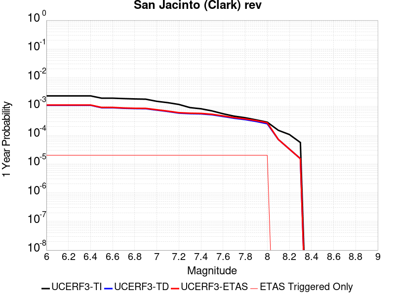 |  |

| Magnitude | 1 wk TI Prob | 1 wk TD Prob | 1 wk ETAS Prob | 1 wk ETAS/TD Gain | 1 wk ETAS Triggered Only | 1 mo TI Prob | 1 mo TD Prob | 1 mo ETAS Prob | 1 mo ETAS/TD Gain | 1 mo ETAS Triggered Only | 1 yr TI Prob | 1 yr TD Prob | 1 yr ETAS Prob | 1 yr ETAS/TD Gain | 1 yr ETAS Triggered Only | 10 yr TI Prob | 10 yr TD Prob | 10 yr ETAS Prob | 10 yr ETAS/TD Gain | 10 yr ETAS Triggered Only |
|-----|-----|-----|-----|-----|-----|-----|-----|-----|-----|-----|-----|-----|-----|-----|-----|-----|-----|-----|-----|-----|
| 6.0 | 4.482615E-5 | 2.1153059E-5 | 4.1152634E-5 | 1.9454697 | 2.0E-5 | 1.9209793E-4 | 9.065287E-5 | 1.1065105E-4 | 1.2206018 | 2.0E-5 | 0.0023362834 | 0.0011031491 | 0.0011231271 | 1.0181099 | 2.0E-5 | 0.02311874 | 0.011485709 | 0.011505479 | 1.0017213 | 2.0E-5 |
| 6.1 | 4.482615E-5 | 2.1153059E-5 | 4.1152634E-5 | 1.9454697 | 2.0E-5 | 1.9209793E-4 | 9.065287E-5 | 1.1065105E-4 | 1.2206018 | 2.0E-5 | 0.0023362834 | 0.0011031491 | 0.0011231271 | 1.0181099 | 2.0E-5 | 0.02311874 | 0.011485709 | 0.011505479 | 1.0017213 | 2.0E-5 |
| 6.2 | 4.482615E-5 | 2.1153059E-5 | 4.1152634E-5 | 1.9454697 | 2.0E-5 | 1.9209793E-4 | 9.065287E-5 | 1.1065105E-4 | 1.2206018 | 2.0E-5 | 0.0023362834 | 0.0011031491 | 0.0011231271 | 1.0181099 | 2.0E-5 | 0.02311874 | 0.011485709 | 0.011505479 | 1.0017213 | 2.0E-5 |
| 6.3 | 4.482615E-5 | 2.1153059E-5 | 4.1152634E-5 | 1.9454697 | 2.0E-5 | 1.9209793E-4 | 9.065287E-5 | 1.1065105E-4 | 1.2206018 | 2.0E-5 | 0.0023362834 | 0.0011031491 | 0.0011231271 | 1.0181099 | 2.0E-5 | 0.02311874 | 0.011485709 | 0.011505479 | 1.0017213 | 2.0E-5 |
| 6.4 | 4.482615E-5 | 2.1153059E-5 | 4.1152634E-5 | 1.9454697 | 2.0E-5 | 1.9209793E-4 | 9.065287E-5 | 1.1065105E-4 | 1.2206018 | 2.0E-5 | 0.0023362834 | 0.0011031491 | 0.0011231271 | 1.0181099 | 2.0E-5 | 0.02311874 | 0.011485709 | 0.011505479 | 1.0017213 | 2.0E-5 |
| 6.5 | 3.7294863E-5 | 1.7354667E-5 | 3.735432E-5 | 2.152408 | 2.0E-5 | 1.5982533E-4 | 7.437504E-5 | 9.437356E-5 | 1.2688874 | 2.0E-5 | 0.0019441366 | 9.051445E-4 | 9.2512637E-4 | 1.0220759 | 2.0E-5 | 0.01927216 | 0.009485902 | 0.009505713 | 1.0020884 | 2.0E-5 |
| 6.6 | 3.7294863E-5 | 1.7354667E-5 | 3.735432E-5 | 2.152408 | 2.0E-5 | 1.5982533E-4 | 7.437504E-5 | 9.437356E-5 | 1.2688874 | 2.0E-5 | 0.0019441366 | 9.051445E-4 | 9.2512637E-4 | 1.0220759 | 2.0E-5 | 0.01927216 | 0.009485902 | 0.009505713 | 1.0020884 | 2.0E-5 |
| 6.7 | 3.6039248E-5 | 1.6602684E-5 | 3.6602352E-5 | 2.2046046 | 2.0E-5 | 1.5444479E-4 | 7.115244E-5 | 9.1151014E-5 | 1.2810667 | 2.0E-5 | 0.0018787434 | 8.659408E-4 | 8.859235E-4 | 1.0230763 | 2.0E-5 | 0.01862939 | 0.009088189 | 0.009108008 | 1.0021807 | 2.0E-5 |
| 6.8 | 3.5031844E-5 | 1.6231123E-5 | 3.62308E-5 | 2.2321806 | 2.0E-5 | 1.5012783E-4 | 6.956012E-5 | 8.955873E-5 | 1.2875011 | 2.0E-5 | 0.0018262739 | 8.4656954E-4 | 8.665526E-4 | 1.0236048 | 2.0E-5 | 0.01811338 | 0.008888788 | 0.00890861 | 1.00223 | 2.0E-5 |
| 6.9 | 3.435112E-5 | 1.6061658E-5 | 3.6061338E-5 | 2.2451813 | 2.0E-5 | 1.4721078E-4 | 6.8833884E-5 | 8.883251E-5 | 1.2905346 | 2.0E-5 | 0.0017908178 | 8.377344E-4 | 8.5771765E-4 | 1.0238539 | 2.0E-5 | 0.017764548 | 0.008796512 | 0.008816336 | 1.0022537 | 2.0E-5 |
| 7.0 | 2.8959772E-5 | 1.43355255E-5 | 3.4335237E-5 | 2.3951156 | 2.0E-5 | 1.241074E-4 | 6.1436534E-5 | 8.1435304E-5 | 1.3255192 | 2.0E-5 | 0.0015099603 | 7.477359E-4 | 7.677209E-4 | 1.0267274 | 2.0E-5 | 0.014997416 | 0.007868331 | 0.007888174 | 1.0025219 | 2.0E-5 |
| 7.1 | 2.6002877E-5 | 1.2827699E-5 | 3.2827444E-5 | 2.559106 | 2.0E-5 | 1.11436144E-4 | 5.4974706E-5 | 7.497361E-5 | 1.3637837 | 2.0E-5 | 0.0013558907 | 6.6911365E-4 | 6.8910024E-4 | 1.0298703 | 2.0E-5 | 0.013476475 | 0.0070483433 | 0.0070682024 | 1.0028175 | 2.0E-5 |
| 7.2 | 2.2544838E-5 | 1.1260331E-5 | 3.1260108E-5 | 2.7761266 | 2.0E-5 | 9.661716E-5 | 4.825768E-5 | 6.825671E-5 | 1.4144218 | 2.0E-5 | 0.001175679 | 5.873803E-4 | 6.0736854E-4 | 1.0340295 | 2.0E-5 | 0.011694785 | 0.00619256 | 0.006212436 | 1.0032097 | 2.0E-5 |
| 7.3 | 1.75334E-5 | 1.0810585E-5 | 3.081037E-5 | 2.8500187 | 2.0E-5 | 7.514098E-5 | 4.6330264E-5 | 6.632934E-5 | 1.4316633 | 2.0E-5 | 9.144575E-4 | 5.6392635E-4 | 5.839151E-4 | 1.0354456 | 2.0E-5 | 0.009107036 | 0.0059332196 | 0.0059531005 | 1.0033509 | 2.0E-5 |
| 7.4 | 1.5924552E-5 | 1.0610475E-5 | 3.0610263E-5 | 2.8849096 | 2.0E-5 | 6.82463E-5 | 4.547268E-5 | 6.547177E-5 | 1.4398046 | 2.0E-5 | 8.305819E-4 | 5.534906E-4 | 5.7347957E-4 | 1.0361143 | 2.0E-5 | 0.008274844 | 0.0058205863 | 0.0058404696 | 1.0034161 | 2.0E-5 |
| 7.5 | 1.3428931E-5 | 9.851045E-6 | 2.9850848E-5 | 3.0302215 | 2.0E-5 | 5.7551293E-5 | 4.221809E-5 | 6.2217245E-5 | 1.4737105 | 2.0E-5 | 7.004617E-4 | 5.1388505E-4 | 5.338748E-4 | 1.0388992 | 2.0E-5 | 0.006982579 | 0.005406209 | 0.0054261005 | 1.0036794 | 2.0E-5 |
| 7.6 | 1.0688787E-5 | 8.614091E-6 | 2.8613918E-5 | 3.3217573 | 2.0E-5 | 4.5808283E-5 | 3.6917012E-5 | 5.6916273E-5 | 1.5417356 | 2.0E-5 | 5.5757316E-4 | 4.4937237E-4 | 4.6936338E-4 | 1.0444865 | 2.0E-5 | 0.005561762 | 0.0047413614 | 0.0047612665 | 1.0041982 | 2.0E-5 |
| 7.7 | 8.81236E-6 | 7.4673385E-6 | 2.746719E-5 | 3.6783104 | 2.0E-5 | 3.776671E-5 | 3.200249E-5 | 5.2001848E-5 | 1.6249315 | 2.0E-5 | 4.597127E-4 | 3.8956082E-4 | 4.0955303E-4 | 1.0513198 | 2.0E-5 | 0.0045876284 | 0.0041344194 | 0.0041543366 | 1.0048175 | 2.0E-5 |
| 7.8 | 7.780431E-6 | 6.695928E-6 | 2.6695794E-5 | 3.98687 | 2.0E-5 | 3.3344273E-5 | 2.8696519E-5 | 4.8695943E-5 | 1.6969286 | 2.0E-5 | 4.0589093E-4 | 3.4932428E-4 | 3.693173E-4 | 1.0572333 | 2.0E-5 | 0.0040515037 | 0.0037226272 | 0.0037425528 | 1.0053525 | 2.0E-5 |
| 7.9 | 6.5437994E-6 | 5.7797783E-6 | 2.5779662E-5 | 4.4603205 | 2.0E-5 | 2.8044553E-5 | 2.4770245E-5 | 4.476975E-5 | 1.8074003 | 2.0E-5 | 3.4138895E-4 | 3.0153614E-4 | 3.2153013E-4 | 1.0663071 | 2.0E-5 | 0.0034086495 | 0.0032343294 | 0.0032542646 | 1.0061637 | 2.0E-5 |
| 8.0 | 5.4488164E-6 | 4.812793E-6 | 2.4812696E-5 | 5.155571 | 2.0E-5 | 2.3351862E-5 | 2.0626094E-5 | 4.062568E-5 | 1.9696256 | 2.0E-5 | 2.8427184E-4 | 2.510939E-4 | 2.7108888E-4 | 1.0796314 | 2.0E-5 | 0.0028390845 | 0.0027107038 | 0.0027306494 | 1.0073582 | 2.0E-5 |
| 8.1 | 2.8397242E-6 | 1.3665673E-6 | 1.3665673E-6 | 1.0 | 0.0 | 1.217019E-5 | 5.856704E-6 | 5.856704E-6 | 1.0 | 0.0 | 1.4816198E-4 | 7.1303046E-5 | 7.1303046E-5 | 1.0 | 0.0 | 0.0014806325 | 8.113543E-4 | 8.113543E-4 | 1.0 | 0.0 |
| 8.2 | 2.030244E-6 | 6.3151083E-7 | 6.3151083E-7 | 1.0 | 0.0 | 8.701017E-6 | 2.7064723E-6 | 2.7064723E-6 | 1.0 | 0.0 | 1.05929736E-4 | 3.2950808E-5 | 3.2950808E-5 | 1.0 | 0.0 | 0.0010587925 | 3.9470522E-4 | 3.9470522E-4 | 1.0 | 0.0 |
| 8.3 | 1.0659804E-6 | 2.9230563E-7 | 2.9230563E-7 | 1.0 | 0.0 | 4.568479E-6 | 1.2527379E-6 | 1.2527379E-6 | 1.0 | 0.0 | 5.5619817E-5 | 1.5251981E-5 | 1.5251981E-5 | 1.0 | 0.0 | 5.5605895E-4 | 1.8556409E-4 | 1.8556409E-4 | 1.0 | 0.0 |

## Jess Valley
*[(top)](#table-of-contents)*

| 1 Week | 1 Month | 1 Year | 10 Year |
|-----|-----|-----|-----|
|  |  |  |  |

| Magnitude | 1 wk TI Prob | 1 wk TD Prob | 1 wk ETAS Prob | 1 wk ETAS/TD Gain | 1 wk ETAS Triggered Only | 1 mo TI Prob | 1 mo TD Prob | 1 mo ETAS Prob | 1 mo ETAS/TD Gain | 1 mo ETAS Triggered Only | 1 yr TI Prob | 1 yr TD Prob | 1 yr ETAS Prob | 1 yr ETAS/TD Gain | 1 yr ETAS Triggered Only | 10 yr TI Prob | 10 yr TD Prob | 10 yr ETAS Prob | 10 yr ETAS/TD Gain | 10 yr ETAS Triggered Only |
|-----|-----|-----|-----|-----|-----|-----|-----|-----|-----|-----|-----|-----|-----|-----|-----|-----|-----|-----|-----|-----|
| 6.0 | 3.3861274E-6 | 3.4340592E-6 | 2.3433991E-5 | 6.8239913 | 2.0E-5 | 1.4511894E-5 | 1.471733E-5 | 3.4717035E-5 | 2.3589222 | 2.0E-5 | 1.7666799E-4 | 1.7917156E-4 | 1.9916799E-4 | 1.1116048 | 2.0E-5 | 0.001765276 | 0.0017905476 | 0.0018105118 | 1.0111498 | 2.0E-5 |
| 6.1 | 3.3861274E-6 | 3.4340592E-6 | 2.3433991E-5 | 6.8239913 | 2.0E-5 | 1.4511894E-5 | 1.471733E-5 | 3.4717035E-5 | 2.3589222 | 2.0E-5 | 1.7666799E-4 | 1.7917156E-4 | 1.9916799E-4 | 1.1116048 | 2.0E-5 | 0.001765276 | 0.0017905476 | 0.0018105118 | 1.0111498 | 2.0E-5 |
| 6.2 | 3.3861274E-6 | 3.4340592E-6 | 2.3433991E-5 | 6.8239913 | 2.0E-5 | 1.4511894E-5 | 1.471733E-5 | 3.4717035E-5 | 2.3589222 | 2.0E-5 | 1.7666799E-4 | 1.7917156E-4 | 1.9916799E-4 | 1.1116048 | 2.0E-5 | 0.001765276 | 0.0017905476 | 0.0018105118 | 1.0111498 | 2.0E-5 |
| 6.3 | 3.3861274E-6 | 3.4340592E-6 | 2.3433991E-5 | 6.8239913 | 2.0E-5 | 1.4511894E-5 | 1.471733E-5 | 3.4717035E-5 | 2.3589222 | 2.0E-5 | 1.7666799E-4 | 1.7917156E-4 | 1.9916799E-4 | 1.1116048 | 2.0E-5 | 0.001765276 | 0.0017905476 | 0.0018105118 | 1.0111498 | 2.0E-5 |
| 6.4 | 1.5291708E-6 | 1.5502784E-6 | 2.1550248E-5 | 13.900888 | 2.0E-5 | 6.553573E-6 | 6.644038E-6 | 2.6643906E-5 | 4.0101976 | 2.0E-5 | 7.978683E-5 | 8.088895E-5 | 1.0088734E-4 | 1.2472326 | 2.0E-5 | 7.975819E-4 | 8.086733E-4 | 8.286572E-4 | 1.0247118 | 2.0E-5 |
| 6.5 | 1.5291708E-6 | 1.5502784E-6 | 2.1550248E-5 | 13.900888 | 2.0E-5 | 6.553573E-6 | 6.644038E-6 | 2.6643906E-5 | 4.0101976 | 2.0E-5 | 7.978683E-5 | 8.088895E-5 | 1.0088734E-4 | 1.2472326 | 2.0E-5 | 7.975819E-4 | 8.086733E-4 | 8.286572E-4 | 1.0247118 | 2.0E-5 |
| 6.6 | 5.396423E-7 | 5.4719953E-7 | 1.05471945E-5 | 19.274858 | 1.0E-5 | 2.312751E-6 | 2.3451398E-6 | 1.2345116E-5 | 5.264128 | 1.0E-5 | 2.8157378E-5 | 2.855189E-5 | 3.8551607E-5 | 1.3502295 | 1.0E-5 | 2.8153812E-4 | 2.8550063E-4 | 2.954978E-4 | 1.0350162 | 1.0E-5 |
| 6.7 | 5.396423E-7 | 5.4719953E-7 | 1.05471945E-5 | 19.274858 | 1.0E-5 | 2.312751E-6 | 2.3451398E-6 | 1.2345116E-5 | 5.264128 | 1.0E-5 | 2.8157378E-5 | 2.855189E-5 | 3.8551607E-5 | 1.3502295 | 1.0E-5 | 2.8153812E-4 | 2.8550063E-4 | 2.954978E-4 | 1.0350162 | 1.0E-5 |
| 6.8 | 3.6058395E-7 | 3.6563068E-7 | 1.0365627E-5 | 28.349993 | 1.0E-5 | 1.5453588E-6 | 1.5669885E-6 | 1.1566973E-5 | 7.3816576 | 1.0E-5 | 1.8814582E-5 | 1.9078087E-5 | 2.9077895E-5 | 1.5241516 | 1.0E-5 | 1.8812988E-4 | 1.9078086E-4 | 2.0077896E-4 | 1.0524062 | 1.0E-5 |

## Monte Vista - Shannon 2011 CFM
*[(top)](#table-of-contents)*

| 1 Week | 1 Month | 1 Year | 10 Year |
|-----|-----|-----|-----|
|  |  |  |  |

| Magnitude | 1 wk TI Prob | 1 wk TD Prob | 1 wk ETAS Prob | 1 wk ETAS/TD Gain | 1 wk ETAS Triggered Only | 1 mo TI Prob | 1 mo TD Prob | 1 mo ETAS Prob | 1 mo ETAS/TD Gain | 1 mo ETAS Triggered Only | 1 yr TI Prob | 1 yr TD Prob | 1 yr ETAS Prob | 1 yr ETAS/TD Gain | 1 yr ETAS Triggered Only | 10 yr TI Prob | 10 yr TD Prob | 10 yr ETAS Prob | 10 yr ETAS/TD Gain | 10 yr ETAS Triggered Only |
|-----|-----|-----|-----|-----|-----|-----|-----|-----|-----|-----|-----|-----|-----|-----|-----|-----|-----|-----|-----|-----|
| 6.0 | 2.7907707E-5 | 2.7584067E-5 | 3.758379E-5 | 1.3625181 | 1.0E-5 | 1.19598975E-4 | 1.1821277E-4 | 1.2821158E-4 | 1.0845833 | 1.0E-5 | 0.0014551448 | 0.001438414 | 0.0014483996 | 1.0069422 | 1.0E-5 | 0.014456532 | 0.014320111 | 0.014329968 | 1.0006883 | 1.0E-5 |
| 6.1 | 2.7907707E-5 | 2.7584067E-5 | 3.758379E-5 | 1.3625181 | 1.0E-5 | 1.19598975E-4 | 1.1821277E-4 | 1.2821158E-4 | 1.0845833 | 1.0E-5 | 0.0014551448 | 0.001438414 | 0.0014483996 | 1.0069422 | 1.0E-5 | 0.014456532 | 0.014320111 | 0.014329968 | 1.0006883 | 1.0E-5 |
| 6.2 | 2.7907707E-5 | 2.7584067E-5 | 3.758379E-5 | 1.3625181 | 1.0E-5 | 1.19598975E-4 | 1.1821277E-4 | 1.2821158E-4 | 1.0845833 | 1.0E-5 | 0.0014551448 | 0.001438414 | 0.0014483996 | 1.0069422 | 1.0E-5 | 0.014456532 | 0.014320111 | 0.014329968 | 1.0006883 | 1.0E-5 |
| 6.3 | 2.7907707E-5 | 2.7584067E-5 | 3.758379E-5 | 1.3625181 | 1.0E-5 | 1.19598975E-4 | 1.1821277E-4 | 1.2821158E-4 | 1.0845833 | 1.0E-5 | 0.0014551448 | 0.001438414 | 0.0014483996 | 1.0069422 | 1.0E-5 | 0.014456532 | 0.014320111 | 0.014329968 | 1.0006883 | 1.0E-5 |
| 6.4 | 2.7907707E-5 | 2.7584067E-5 | 3.758379E-5 | 1.3625181 | 1.0E-5 | 1.19598975E-4 | 1.1821277E-4 | 1.2821158E-4 | 1.0845833 | 1.0E-5 | 0.0014551448 | 0.001438414 | 0.0014483996 | 1.0069422 | 1.0E-5 | 0.014456532 | 0.014320111 | 0.014329968 | 1.0006883 | 1.0E-5 |
| 6.5 | 1.7990213E-5 | 1.6639742E-5 | 2.6639576E-5 | 1.6009609 | 1.0E-5 | 7.709863E-5 | 7.13116E-5 | 8.131089E-5 | 1.1402197 | 1.0E-5 | 9.382716E-4 | 8.679393E-4 | 8.779306E-4 | 1.0115116 | 1.0E-5 | 0.0093431985 | 0.008668857 | 0.008678771 | 1.0011436 | 1.0E-5 |
| 6.6 | 9.650407E-6 | 7.457001E-6 | 1.7456927E-5 | 2.3410115 | 1.0E-5 | 4.135823E-5 | 3.195823E-5 | 4.195791E-5 | 1.3128984 | 1.0E-5 | 5.0342013E-4 | 3.890298E-4 | 3.990259E-4 | 1.025695 | 1.0E-5 | 0.005022812 | 0.0039011573 | 0.003911118 | 1.0025533 | 1.0E-5 |
| 6.7 | 9.62828E-6 | 7.434916E-6 | 1.743484E-5 | 2.3449953 | 1.0E-5 | 4.1263404E-5 | 3.186358E-5 | 4.1863263E-5 | 1.313828 | 1.0E-5 | 5.022661E-4 | 3.8787787E-4 | 3.9787398E-4 | 1.0257713 | 1.0E-5 | 0.0050113243 | 0.003889678 | 0.0038996392 | 1.0025609 | 1.0E-5 |
| 6.8 | 6.887523E-6 | 4.461425E-6 | 1.44613805E-5 | 3.2414262 | 1.0E-5 | 2.9517621E-5 | 1.9120265E-5 | 2.9120074E-5 | 1.5229954 | 1.0E-5 | 3.5931775E-4 | 2.3276659E-4 | 2.4276426E-4 | 1.0429515 | 1.0E-5 | 0.0035873733 | 0.0023423703 | 0.002352347 | 1.0042592 | 1.0E-5 |
| 6.9 | 6.2722347E-6 | 3.8032956E-6 | 1.3803257E-5 | 3.6292887 | 1.0E-5 | 2.6880729E-5 | 1.6299748E-5 | 2.6299584E-5 | 1.6134964 | 1.0E-5 | 3.2722374E-4 | 1.9843338E-4 | 2.084314E-4 | 1.0503848 | 1.0E-5 | 0.003267423 | 0.0019996904 | 0.0020096705 | 1.0049908 | 1.0E-5 |
| 7.0 | 5.5320347E-6 | 3.0304461E-6 | 1.3030416E-5 | 4.2998343 | 1.0E-5 | 2.3708504E-5 | 1.2987572E-5 | 2.2987442E-5 | 1.7699568 | 1.0E-5 | 2.8861282E-4 | 1.5811404E-4 | 1.6811247E-4 | 1.0632355 | 1.0E-5 | 0.0028823826 | 0.0015971304 | 0.0016071146 | 1.0062512 | 1.0E-5 |
| 7.1 | 3.8794055E-6 | 1.283645E-6 | 1.1283632E-5 | 8.790305 | 1.0E-5 | 1.6625918E-5 | 5.5013243E-6 | 1.550127E-5 | 2.8177342 | 1.0E-5 | 2.0240174E-4 | 6.697658E-5 | 7.697591E-5 | 1.1492959 | 1.0E-5 | 0.002022175 | 6.86504E-4 | 6.9649715E-4 | 1.0145565 | 1.0E-5 |
| 7.2 | 3.4813652E-6 | 9.669686E-7 | 1.0966959E-5 | 11.341587 | 1.0E-5 | 1.49200505E-5 | 4.144145E-6 | 1.4144103E-5 | 3.4130332 | 1.0E-5 | 1.8163648E-4 | 5.0453804E-5 | 6.0453298E-5 | 1.1981912 | 1.0E-5 | 0.0018148809 | 5.213506E-4 | 5.313454E-4 | 1.019171 | 1.0E-5 |
| 7.3 | 3.1682148E-6 | 7.7177793E-7 | 1.0771771E-5 | 13.957086 | 1.0E-5 | 1.3577992E-5 | 3.3076153E-6 | 1.3307583E-5 | 4.023316 | 1.0E-5 | 1.6529951E-4 | 4.0269475E-5 | 5.0269075E-5 | 1.248317 | 1.0E-5 | 0.0016517661 | 4.195245E-4 | 4.295203E-4 | 1.0238265 | 1.0E-5 |
| 7.4 | 2.9707667E-6 | 7.344474E-7 | 1.073444E-5 | 14.615669 | 1.0E-5 | 1.2731795E-5 | 3.147628E-6 | 1.3147596E-5 | 4.1769857 | 1.0E-5 | 1.5499859E-4 | 3.8321698E-5 | 4.8321315E-5 | 1.2609388 | 1.0E-5 | 0.0015489052 | 3.998471E-4 | 4.098431E-4 | 1.0249995 | 1.0E-5 |
| 7.5 | 2.3462758E-6 | 6.0069135E-7 | 1.06006855E-5 | 17.647474 | 1.0E-5 | 1.0055429E-5 | 2.5743889E-6 | 1.2574364E-5 | 4.884407 | 1.0E-5 | 1.2241797E-4 | 3.1342737E-5 | 4.1342424E-5 | 1.3190432 | 1.0E-5 | 0.0012235056 | 3.2833643E-4 | 3.3833314E-4 | 1.0304465 | 1.0E-5 |
| 7.6 | 2.112783E-6 | 5.250731E-7 | 1.0525067E-5 | 20.044956 | 1.0E-5 | 9.054753E-6 | 2.2503114E-6 | 1.2250289E-5 | 5.4438195 | 1.0E-5 | 1.1023604E-4 | 2.7397198E-5 | 3.7396923E-5 | 1.3649908 | 1.0E-5 | 0.0011018137 | 2.8845918E-4 | 2.984563E-4 | 1.034657 | 1.0E-5 |
| 7.7 | 1.7022471E-6 | 4.23102E-7 | 1.0423098E-5 | 24.634954 | 1.0E-5 | 7.2953244E-6 | 1.8132929E-6 | 1.1813275E-5 | 6.5148187 | 1.0E-5 | 8.881695E-5 | 2.207662E-5 | 3.2076397E-5 | 1.4529579 | 1.0E-5 | 8.878146E-4 | 2.3394964E-4 | 2.439473E-4 | 1.0427343 | 1.0E-5 |
| 7.8 | 7.230914E-7 | 3.728293E-7 | 1.0372825E-5 | 27.821915 | 1.0E-5 | 3.0989595E-6 | 1.597839E-6 | 1.1597823E-5 | 7.2584434 | 1.0E-5 | 3.772918E-5 | 1.9453517E-5 | 2.9453322E-5 | 1.5140359 | 1.0E-5 | 3.7722773E-4 | 2.072548E-4 | 2.1725272E-4 | 1.0482398 | 1.0E-5 |
| 7.9 | 4.3588446E-7 | 3.4304335E-7 | 1.034304E-5 | 30.150826 | 1.0E-5 | 1.868075E-6 | 1.4701849E-6 | 1.1470171E-5 | 7.8018556 | 1.0E-5 | 2.2743576E-5 | 1.7899356E-5 | 2.7899177E-5 | 1.5586693 | 1.0E-5 | 2.2741247E-4 | 1.899464E-4 | 1.999445E-4 | 1.0526364 | 1.0E-5 |
| 8.0 | 2.3317523E-7 | 3.1513432E-7 | 1.03151315E-5 | 32.73249 | 1.0E-5 | 9.99322E-7 | 1.350575E-6 | 1.1350561E-5 | 8.404244 | 1.0E-5 | 1.2166677E-5 | 1.6443128E-5 | 2.6442962E-5 | 1.6081468 | 1.0E-5 | 1.21660116E-4 | 1.7399403E-4 | 1.8399229E-4 | 1.0574633 | 1.0E-5 |
| 8.1 | 1.4662456E-7 | 2.03077E-7 | 1.0203075E-5 | 50.242397 | 1.0E-5 | 6.283908E-7 | 8.703297E-7 | 1.0870321E-5 | 12.489889 | 1.0E-5 | 7.650631E-6 | 1.05962135E-5 | 2.0596108E-5 | 1.9437233 | 1.0E-5 | 7.650368E-5 | 1.1132272E-4 | 1.2132161E-4 | 1.089819 | 1.0E-5 |
| 8.2 | 5.4931775E-9 | 5.0752176E-9 | 5.0752176E-9 | 1.0 | 0.0 | 2.3542189E-8 | 2.1750932E-8 | 2.1750932E-8 | 1.0 | 0.0 | 2.8662612E-7 | 2.6481757E-7 | 2.6481757E-7 | 1.0 | 0.0 | 2.8662573E-6 | 2.754138E-6 | 2.754138E-6 | 1.0 | 0.0 |

## San Jacinto (Superstition Mtn)
*[(top)](#table-of-contents)*

| 1 Week | 1 Month | 1 Year | 10 Year |
|-----|-----|-----|-----|
|  |  |  |  |

| Magnitude | 1 wk TI Prob | 1 wk TD Prob | 1 wk ETAS Prob | 1 wk ETAS/TD Gain | 1 wk ETAS Triggered Only | 1 mo TI Prob | 1 mo TD Prob | 1 mo ETAS Prob | 1 mo ETAS/TD Gain | 1 mo ETAS Triggered Only | 1 yr TI Prob | 1 yr TD Prob | 1 yr ETAS Prob | 1 yr ETAS/TD Gain | 1 yr ETAS Triggered Only | 10 yr TI Prob | 10 yr TD Prob | 10 yr ETAS Prob | 10 yr ETAS/TD Gain | 10 yr ETAS Triggered Only |
|-----|-----|-----|-----|-----|-----|-----|-----|-----|-----|-----|-----|-----|-----|-----|-----|-----|-----|-----|-----|-----|
| 6.0 | 6.4193904E-5 | 9.599558E-5 | 1.15993666E-4 | 1.2083229 | 2.0E-5 | 2.7508775E-4 | 4.1135435E-4 | 4.3134612E-4 | 1.0485998 | 2.0E-5 | 0.0033440501 | 0.0049981694 | 0.0050180694 | 1.0039815 | 2.0E-5 | 0.03294174 | 0.048820045 | 0.04883907 | 1.0003897 | 2.0E-5 |
| 6.1 | 6.4193904E-5 | 9.599558E-5 | 1.15993666E-4 | 1.2083229 | 2.0E-5 | 2.7508775E-4 | 4.1135435E-4 | 4.3134612E-4 | 1.0485998 | 2.0E-5 | 0.0033440501 | 0.0049981694 | 0.0050180694 | 1.0039815 | 2.0E-5 | 0.03294174 | 0.048820045 | 0.04883907 | 1.0003897 | 2.0E-5 |
| 6.2 | 5.7023593E-5 | 8.3144616E-5 | 1.0314296E-4 | 1.2405248 | 2.0E-5 | 2.4436394E-4 | 3.5629462E-4 | 3.762875E-4 | 1.0561134 | 2.0E-5 | 0.002971072 | 0.0043309047 | 0.004350818 | 1.004598 | 2.0E-5 | 0.029316625 | 0.042502448 | 0.0425216 | 1.0004506 | 2.0E-5 |
| 6.3 | 5.6940098E-5 | 8.298998E-5 | 1.0298831E-4 | 1.240973 | 2.0E-5 | 2.4400617E-4 | 3.5563204E-4 | 3.7562495E-4 | 1.0562179 | 2.0E-5 | 0.002966728 | 0.00432287 | 0.0043427837 | 1.0046066 | 2.0E-5 | 0.029274331 | 0.04242582 | 0.04244497 | 1.0004514 | 2.0E-5 |
| 6.4 | 5.4171585E-5 | 7.748391E-5 | 8.748314E-5 | 1.1290491 | 1.0E-5 | 2.3214328E-4 | 3.3204095E-4 | 3.4203762E-4 | 1.0301068 | 1.0E-5 | 0.0028226813 | 0.0040367534 | 0.004046713 | 1.0024673 | 1.0E-5 | 0.02787096 | 0.039715026 | 0.03972463 | 1.0002418 | 1.0E-5 |
| 6.5 | 4.375144E-5 | 5.6421442E-5 | 6.642088E-5 | 1.1772276 | 1.0E-5 | 1.874927E-4 | 2.417904E-4 | 2.5178798E-4 | 1.0413481 | 1.0E-5 | 0.0022803338 | 0.002941 | 0.0029509705 | 1.0033902 | 1.0E-5 | 0.022570757 | 0.029235592 | 0.0292453 | 1.000332 | 1.0E-5 |
| 6.6 | 2.772192E-5 | 2.5488029E-5 | 3.5487774E-5 | 1.392331 | 1.0E-5 | 1.1880282E-4 | 1.0922994E-4 | 1.1922885E-4 | 1.09154 | 1.0E-5 | 0.0014454646 | 0.0013290826 | 0.0013390693 | 1.007514 | 1.0E-5 | 0.014360986 | 0.013540891 | 0.013550756 | 1.0007285 | 1.0E-5 |
| 6.7 | 2.7124124E-5 | 2.4699055E-5 | 3.469881E-5 | 1.4048638 | 1.0E-5 | 1.1624106E-4 | 1.0584891E-4 | 1.1584785E-4 | 1.0944643 | 1.0E-5 | 0.0014143161 | 0.0012879678 | 0.0012979549 | 1.0077542 | 1.0E-5 | 0.014053487 | 0.013134248 | 0.013144117 | 1.0007514 | 1.0E-5 |
| 6.8 | 2.5475807E-5 | 2.2164071E-5 | 3.2163847E-5 | 1.4511707 | 1.0E-5 | 1.0917746E-4 | 9.498548E-5 | 1.0498453E-4 | 1.1052692 | 1.0E-5 | 0.001328425 | 0.0011558468 | 0.0011658352 | 1.0086417 | 1.0E-5 | 0.0132051185 | 0.011821818 | 0.0118317 | 1.0008359 | 1.0E-5 |
| 6.9 | 2.1162023E-5 | 1.762564E-5 | 2.7625465E-5 | 1.5673453 | 1.0E-5 | 9.069123E-5 | 7.553629E-5 | 8.553554E-5 | 1.1323767 | 1.0E-5 | 0.0011036064 | 9.1927015E-4 | 9.29261E-4 | 1.0108682 | 1.0E-5 | 0.010981417 | 0.009446762 | 0.009456667 | 1.0010486 | 1.0E-5 |
| 7.0 | 1.8754288E-5 | 1.616099E-5 | 2.6160827E-5 | 1.6187639 | 1.0E-5 | 8.037304E-5 | 6.9259564E-5 | 7.925887E-5 | 1.1443744 | 1.0E-5 | 9.781026E-4 | 8.429114E-4 | 8.5290294E-4 | 1.0118537 | 1.0E-5 | 0.009738087 | 0.008669995 | 0.008679908 | 1.0011435 | 1.0E-5 |
| 7.1 | 1.8678527E-5 | 1.6086136E-5 | 2.6085974E-5 | 1.6216433 | 1.0E-5 | 8.0048376E-5 | 6.8938774E-5 | 7.893809E-5 | 1.1450462 | 1.0E-5 | 9.7415317E-4 | 8.3900883E-4 | 8.490004E-4 | 1.0119088 | 1.0E-5 | 0.009698939 | 0.008631011 | 0.0086409245 | 1.0011486 | 1.0E-5 |
| 7.2 | 1.7804578E-5 | 1.5380709E-5 | 2.5380556E-5 | 1.6501551 | 1.0E-5 | 7.6303106E-5 | 6.591567E-5 | 7.591501E-5 | 1.151699 | 1.0E-5 | 9.285943E-4 | 8.022301E-4 | 8.122221E-4 | 1.0124552 | 1.0E-5 | 0.009247236 | 0.008262424 | 0.0082723405 | 1.0012003 | 1.0E-5 |
| 7.3 | 1.6583685E-5 | 1.4529837E-5 | 2.4529692E-5 | 1.688229 | 1.0E-5 | 7.1070994E-5 | 6.226926E-5 | 7.226864E-5 | 1.1605829 | 1.0E-5 | 8.649459E-4 | 7.5786654E-4 | 7.6785893E-4 | 1.0131849 | 1.0E-5 | 0.00861587 | 0.007817646 | 0.007827568 | 1.0012691 | 1.0E-5 |
| 7.4 | 1.6387552E-5 | 1.4394727E-5 | 2.4394583E-5 | 1.6946888 | 1.0E-5 | 7.023047E-5 | 6.169024E-5 | 7.1689625E-5 | 1.1620902 | 1.0E-5 | 8.5472054E-4 | 7.508219E-4 | 7.6081435E-4 | 1.0133088 | 1.0E-5 | 0.008514405 | 0.0077470187 | 0.007756941 | 1.0012808 | 1.0E-5 |
| 7.5 | 1.5790754E-5 | 1.40354305E-5 | 2.4035291E-5 | 1.7124726 | 1.0E-5 | 6.767291E-5 | 6.015047E-5 | 7.0149865E-5 | 1.1662397 | 1.0E-5 | 8.236062E-4 | 7.320879E-4 | 7.4208056E-4 | 1.0136496 | 1.0E-5 | 0.008205604 | 0.007557581 | 0.007567506 | 1.0013132 | 1.0E-5 |
| 7.6 | 1.4248672E-5 | 1.3054444E-5 | 2.3054314E-5 | 1.7660127 | 1.0E-5 | 6.106431E-5 | 5.5946428E-5 | 6.594587E-5 | 1.1787324 | 1.0E-5 | 7.432043E-4 | 6.809366E-4 | 6.909298E-4 | 1.0146756 | 1.0E-5 | 0.007407237 | 0.007040175 | 0.007050105 | 1.0014104 | 1.0E-5 |
| 7.7 | 1.15449975E-5 | 1.0903222E-5 | 2.0903113E-5 | 1.9171501 | 1.0E-5 | 4.947762E-5 | 4.672726E-5 | 5.6726793E-5 | 1.2139978 | 1.0E-5 | 6.022235E-4 | 5.6875666E-4 | 5.78751E-4 | 1.0175722 | 1.0E-5 | 0.006005941 | 0.0059102564 | 0.0059201973 | 1.0016819 | 1.0E-5 |
| 7.8 | 9.1391985E-6 | 9.5139185E-6 | 9.5139185E-6 | 1.0 | 0.0 | 3.9167408E-5 | 4.0773306E-5 | 4.0773306E-5 | 1.0 | 0.0 | 4.767588E-4 | 4.963025E-4 | 4.963025E-4 | 1.0 | 0.0 | 0.0047573727 | 0.005176809 | 0.005176809 | 1.0 | 0.0 |
| 7.9 | 6.973017E-6 | 7.3817937E-6 | 7.3817937E-6 | 1.0 | 0.0 | 2.9884017E-5 | 3.163588E-5 | 3.163588E-5 | 1.0 | 0.0 | 3.6377716E-4 | 3.8509927E-4 | 3.8509927E-4 | 1.0 | 0.0 | 0.0036318225 | 0.004051976 | 0.004051976 | 1.0 | 0.0 |
| 8.0 | 5.7638235E-6 | 6.259641E-6 | 6.259641E-6 | 1.0 | 0.0 | 2.4701867E-5 | 2.682676E-5 | 2.682676E-5 | 1.0 | 0.0 | 3.0070372E-4 | 3.2656736E-4 | 3.2656736E-4 | 1.0 | 0.0 | 0.0030029714 | 0.0034535413 | 0.0034535413 | 1.0 | 0.0 |
| 8.1 | 5.1124434E-6 | 5.4953657E-6 | 5.4953657E-6 | 1.0 | 0.0 | 2.1910288E-5 | 2.3551356E-5 | 2.3551356E-5 | 1.0 | 0.0 | 2.6672508E-4 | 2.8670052E-4 | 2.8670052E-4 | 1.0 | 0.0 | 0.0026640517 | 0.0030403896 | 0.0030403896 | 1.0 | 0.0 |
| 8.2 | 1.1075938E-6 | 5.3348367E-7 | 5.3348367E-7 | 1.0 | 0.0 | 4.7468216E-6 | 2.2863567E-6 | 2.2863567E-6 | 1.0 | 0.0 | 5.779102E-5 | 2.7836059E-5 | 2.7836059E-5 | 1.0 | 0.0 | 5.777599E-4 | 3.133962E-4 | 3.133962E-4 | 1.0 | 0.0 |
| 8.3 | 1.3584393E-8 | 4.4718784E-9 | 4.4718784E-9 | 1.0 | 0.0 | 5.8218827E-8 | 1.9165192E-8 | 1.9165192E-8 | 1.0 | 0.0 | 7.0881396E-7 | 2.3333622E-7 | 2.3333622E-7 | 1.0 | 0.0 | 7.0881174E-6 | 2.6140672E-6 | 2.6140672E-6 | 1.0 | 0.0 |

## San Juan
*[(top)](#table-of-contents)*

| 1 Week | 1 Month | 1 Year | 10 Year |
|-----|-----|-----|-----|
|  |  |  |  |

| Magnitude | 1 wk TI Prob | 1 wk TD Prob | 1 wk ETAS Prob | 1 wk ETAS/TD Gain | 1 wk ETAS Triggered Only | 1 mo TI Prob | 1 mo TD Prob | 1 mo ETAS Prob | 1 mo ETAS/TD Gain | 1 mo ETAS Triggered Only | 1 yr TI Prob | 1 yr TD Prob | 1 yr ETAS Prob | 1 yr ETAS/TD Gain | 1 yr ETAS Triggered Only | 10 yr TI Prob | 10 yr TD Prob | 10 yr ETAS Prob | 10 yr ETAS/TD Gain | 10 yr ETAS Triggered Only |
|-----|-----|-----|-----|-----|-----|-----|-----|-----|-----|-----|-----|-----|-----|-----|-----|-----|-----|-----|-----|-----|
| 6.0 | 8.682808E-6 | 8.74917E-6 | 2.8748995E-5 | 3.2859113 | 2.0E-5 | 3.72115E-5 | 3.749593E-5 | 5.749518E-5 | 1.5333712 | 2.0E-5 | 4.5295584E-4 | 4.5642213E-4 | 4.76413E-4 | 1.043799 | 2.0E-5 | 0.004520337 | 0.004555389 | 0.0045752977 | 1.0043705 | 2.0E-5 |
| 6.1 | 8.682808E-6 | 8.74917E-6 | 2.8748995E-5 | 3.2859113 | 2.0E-5 | 3.72115E-5 | 3.749593E-5 | 5.749518E-5 | 1.5333712 | 2.0E-5 | 4.5295584E-4 | 4.5642213E-4 | 4.76413E-4 | 1.043799 | 2.0E-5 | 0.004520337 | 0.004555389 | 0.0045752977 | 1.0043705 | 2.0E-5 |
| 6.2 | 8.682808E-6 | 8.74917E-6 | 2.8748995E-5 | 3.2859113 | 2.0E-5 | 3.72115E-5 | 3.749593E-5 | 5.749518E-5 | 1.5333712 | 2.0E-5 | 4.5295584E-4 | 4.5642213E-4 | 4.76413E-4 | 1.043799 | 2.0E-5 | 0.004520337 | 0.004555389 | 0.0045752977 | 1.0043705 | 2.0E-5 |
| 6.3 | 6.3054235E-6 | 6.282591E-6 | 1.6282529E-5 | 2.59169 | 1.0E-5 | 2.7022963E-5 | 2.692512E-5 | 3.6924852E-5 | 1.3713903 | 1.0E-5 | 3.2895492E-4 | 3.2776545E-4 | 3.3776215E-4 | 1.0304996 | 1.0E-5 | 0.003284684 | 0.0032730205 | 0.0032829877 | 1.0030453 | 1.0E-5 |
| 6.4 | 6.1490473E-6 | 6.1144706E-6 | 1.6114409E-5 | 2.6354547 | 1.0E-5 | 2.6352795E-5 | 2.6204618E-5 | 3.6204357E-5 | 1.3816022 | 1.0E-5 | 3.2079802E-4 | 3.189959E-4 | 3.289927E-4 | 1.0313383 | 1.0E-5 | 0.0032033534 | 0.0031855768 | 0.003195545 | 1.0031291 | 1.0E-5 |
| 6.5 | 5.204848E-6 | 5.137238E-6 | 5.137238E-6 | 1.0 | 0.0 | 2.23063E-5 | 2.2016555E-5 | 2.2016555E-5 | 1.0 | 0.0 | 2.7154534E-4 | 2.6801953E-4 | 2.6801953E-4 | 1.0 | 0.0 | 0.0027121378 | 0.0026771172 | 0.0026771172 | 1.0 | 0.0 |
| 6.6 | 4.5179986E-6 | 4.415036E-6 | 4.415036E-6 | 1.0 | 0.0 | 1.9362706E-5 | 1.892145E-5 | 1.892145E-5 | 1.0 | 0.0 | 2.3571544E-4 | 2.303451E-4 | 2.303451E-4 | 1.0 | 0.0 | 0.0023546559 | 0.0023012008 | 0.0023012008 | 1.0 | 0.0 |
| 6.7 | 3.9442616E-6 | 3.8198336E-6 | 3.8198336E-6 | 1.0 | 0.0 | 1.6903869E-5 | 1.6370615E-5 | 1.6370615E-5 | 1.0 | 0.0 | 2.0578515E-4 | 1.9929469E-4 | 1.9929469E-4 | 1.0 | 0.0 | 0.002055947 | 0.001991285 | 0.001991285 | 1.0 | 0.0 |
| 6.8 | 3.4536245E-6 | 3.3163408E-6 | 3.3163408E-6 | 1.0 | 0.0 | 1.4801163E-5 | 1.4212815E-5 | 1.4212815E-5 | 1.0 | 0.0 | 1.8018926E-4 | 1.7302789E-4 | 1.7302789E-4 | 1.0 | 0.0 | 0.0018004322 | 0.001729051 | 0.001729051 | 1.0 | 0.0 |
| 6.9 | 3.059865E-6 | 2.9120363E-6 | 2.9120363E-6 | 1.0 | 0.0 | 1.3113641E-5 | 1.2480099E-5 | 1.2480099E-5 | 1.0 | 0.0 | 1.596469E-4 | 1.5193518E-4 | 1.5193518E-4 | 1.0 | 0.0 | 0.0015953224 | 0.0015184281 | 0.0015184281 | 1.0 | 0.0 |
| 7.0 | 2.6504351E-6 | 2.492005E-6 | 2.492005E-6 | 1.0 | 0.0 | 1.1358958E-5 | 1.0679981E-5 | 1.0679981E-5 | 1.0 | 0.0 | 1.3828653E-4 | 1.3002155E-4 | 1.3002155E-4 | 1.0 | 0.0 | 0.0013820052 | 0.001299567 | 0.001299567 | 1.0 | 0.0 |
| 7.1 | 2.2039317E-6 | 2.0338366E-6 | 2.0338366E-6 | 1.0 | 0.0 | 9.445387E-6 | 8.716416E-6 | 8.716416E-6 | 1.0 | 0.0 | 1.1499152E-4 | 1.0611773E-4 | 1.0611773E-4 | 1.0 | 0.0 | 0.0011493203 | 0.0010607811 | 0.0010607811 | 1.0 | 0.0 |
| 7.2 | 1.0786707E-6 | 8.770239E-7 | 8.770239E-7 | 1.0 | 0.0 | 4.622866E-6 | 3.7586685E-6 | 3.7586685E-6 | 1.0 | 0.0 | 5.628194E-5 | 4.576084E-5 | 4.576084E-5 | 1.0 | 0.0 | 5.6267687E-4 | 4.5757365E-4 | 4.5757365E-4 | 1.0 | 0.0 |
| 7.3 | 6.846433E-7 | 4.868812E-7 | 4.868812E-7 | 1.0 | 0.0 | 2.9341822E-6 | 2.086632E-6 | 2.086632E-6 | 1.0 | 0.0 | 3.5723086E-5 | 2.5404452E-5 | 2.5404452E-5 | 1.0 | 0.0 | 3.571734E-4 | 2.5405022E-4 | 2.5405022E-4 | 1.0 | 0.0 |
| 7.4 | 5.23043E-7 | 3.2627884E-7 | 3.2627884E-7 | 1.0 | 0.0 | 2.2416111E-6 | 1.3983371E-6 | 1.3983371E-6 | 1.0 | 0.0 | 2.7291273E-5 | 1.7024622E-5 | 1.7024622E-5 | 1.0 | 0.0 | 2.7287923E-4 | 1.7026608E-4 | 1.7026608E-4 | 1.0 | 0.0 |
| 7.5 | 4.648444E-7 | 2.723464E-7 | 2.723464E-7 | 1.0 | 0.0 | 1.9921886E-6 | 1.1671983E-6 | 1.1671983E-6 | 1.0 | 0.0 | 2.4254627E-5 | 1.4210547E-5 | 1.4210547E-5 | 1.0 | 0.0 | 2.425198E-4 | 1.4212691E-4 | 1.4212691E-4 | 1.0 | 0.0 |
| 7.6 | 3.9906567E-7 | 2.2083036E-7 | 2.2083036E-7 | 1.0 | 0.0 | 1.7102802E-6 | 9.4641547E-7 | 9.4641547E-7 | 1.0 | 0.0 | 2.0822463E-5 | 1.1522548E-5 | 1.1522548E-5 | 1.0 | 0.0 | 2.0820512E-4 | 1.15244526E-4 | 1.15244526E-4 | 1.0 | 0.0 |
| 7.7 | 1.8784601E-7 | 5.366277E-8 | 5.366277E-8 | 1.0 | 0.0 | 8.0505407E-7 | 2.2998329E-7 | 2.2998329E-7 | 1.0 | 0.0 | 9.80149E-6 | 2.800043E-6 | 2.800043E-6 | 1.0 | 0.0 | 9.801057E-5 | 2.8008939E-5 | 2.8008939E-5 | 1.0 | 0.0 |
| 7.8 | 1.00154914E-7 | 1.2412917E-8 | 1.2412917E-8 | 1.0 | 0.0 | 4.2923529E-7 | 5.3198217E-8 | 5.3198217E-8 | 1.0 | 0.0 | 5.225927E-6 | 6.476881E-7 | 6.476881E-7 | 1.0 | 0.0 | 5.225804E-5 | 6.4827886E-6 | 6.4827886E-6 | 1.0 | 0.0 |
| 7.9 | 6.171429E-8 | 4.2946513E-9 | 4.2946513E-9 | 1.0 | 0.0 | 2.6448978E-7 | 1.8405647E-8 | 1.8405647E-8 | 1.0 | 0.0 | 3.2201583E-6 | 2.2408874E-7 | 2.2408874E-7 | 1.0 | 0.0 | 3.2201115E-5 | 2.2462114E-6 | 2.2462114E-6 | 1.0 | 0.0 |
| 8.0 | 1.3974572E-8 | 3.3737857E-10 | 3.3737857E-10 | 1.0 | 0.0 | 5.989102E-8 | 1.4459075E-9 | 1.4459075E-9 | 1.0 | 0.0 | 7.2917294E-7 | 1.760392E-8 | 1.760392E-8 | 1.0 | 0.0 | 7.2917055E-6 | 1.8038004E-7 | 1.8038004E-7 | 1.0 | 0.0 |
| 8.1 | 1.8403477E-9 | 1.1291601E-10 | 1.1291601E-10 | 1.0 | 0.0 | 7.887204E-9 | 4.839261E-10 | 4.839261E-10 | 1.0 | 0.0 | 9.602671E-8 | 5.8917977E-9 | 5.8917977E-9 | 1.0 | 0.0 | 9.602667E-7 | 6.0206084E-8 | 6.0206084E-8 | 1.0 | 0.0 |

## Calaveras (So) 2011 CFM
*[(top)](#table-of-contents)*

| 1 Week | 1 Month | 1 Year | 10 Year |
|-----|-----|-----|-----|
|  |  |  |  |

| Magnitude | 1 wk TI Prob | 1 wk TD Prob | 1 wk ETAS Prob | 1 wk ETAS/TD Gain | 1 wk ETAS Triggered Only | 1 mo TI Prob | 1 mo TD Prob | 1 mo ETAS Prob | 1 mo ETAS/TD Gain | 1 mo ETAS Triggered Only | 1 yr TI Prob | 1 yr TD Prob | 1 yr ETAS Prob | 1 yr ETAS/TD Gain | 1 yr ETAS Triggered Only | 10 yr TI Prob | 10 yr TD Prob | 10 yr ETAS Prob | 10 yr ETAS/TD Gain | 10 yr ETAS Triggered Only |
|-----|-----|-----|-----|-----|-----|-----|-----|-----|-----|-----|-----|-----|-----|-----|-----|-----|-----|-----|-----|-----|
| 6.0 | 1.5950744E-4 | 3.0713255E-4 | 3.0713255E-4 | 1.0 | 0.0 | 6.834242E-4 | 0.001315409 | 0.001315409 | 1.0 | 0.0 | 0.00828899 | 0.015858326 | 0.015858326 | 1.0 | 0.0 | 0.079865426 | 0.14440185 | 0.14441895 | 1.0001185 | 2.0E-5 |
| 6.1 | 1.3584697E-4 | 2.603514E-4 | 2.603514E-4 | 1.0 | 0.0 | 5.8207137E-4 | 0.0011151754 | 0.0011151754 | 1.0 | 0.0 | 0.007063716 | 0.013461385 | 0.013461385 | 1.0 | 0.0 | 0.06843361 | 0.124029994 | 0.12404752 | 1.0001413 | 2.0E-5 |
| 6.2 | 1.14676266E-4 | 2.1714384E-4 | 2.1714384E-4 | 1.0 | 0.0 | 4.9137714E-4 | 9.30223E-4 | 9.30223E-4 | 1.0 | 0.0 | 0.0059661185 | 0.011245058 | 0.011245058 | 1.0 | 0.0 | 0.058084648 | 0.10502057 | 0.105038464 | 1.0001705 | 2.0E-5 |
| 6.3 | 8.691518E-5 | 1.5987935E-4 | 1.5987935E-4 | 1.0 | 0.0 | 3.7244044E-4 | 6.849807E-4 | 6.849807E-4 | 1.0 | 0.0 | 0.004525038 | 0.008301122 | 0.008301122 | 1.0 | 0.0 | 0.044339992 | 0.0793365 | 0.07935491 | 1.0002321 | 2.0E-5 |
| 6.4 | 8.50982E-5 | 1.5694331E-4 | 1.5694331E-4 | 1.0 | 0.0 | 3.646556E-4 | 6.724042E-4 | 6.724042E-4 | 1.0 | 0.0 | 0.0044306475 | 0.008149155 | 0.008149155 | 1.0 | 0.0 | 0.04343345 | 0.07794268 | 0.07796112 | 1.0002366 | 2.0E-5 |
| 6.5 | 8.4062965E-5 | 1.5518743E-4 | 1.5518743E-4 | 1.0 | 0.0 | 3.602201E-4 | 6.6488347E-4 | 6.6488347E-4 | 1.0 | 0.0 | 0.004376863 | 0.008058365 | 0.008058365 | 1.0 | 0.0 | 0.042916555 | 0.07711388 | 0.077132344 | 1.0002394 | 2.0E-5 |
| 6.6 | 8.194716E-5 | 1.5154552E-4 | 1.5154552E-4 | 1.0 | 0.0 | 3.5115483E-4 | 6.492843E-4 | 6.492843E-4 | 1.0 | 0.0 | 0.0042669317 | 0.007870209 | 0.007870209 | 1.0 | 0.0 | 0.04185927 | 0.07539919 | 0.07541768 | 1.0002452 | 2.0E-5 |
| 6.7 | 8.012326E-5 | 1.4822475E-4 | 1.4822475E-4 | 1.0 | 0.0 | 3.433402E-4 | 6.350612E-4 | 6.350612E-4 | 1.0 | 0.0 | 0.004172157 | 0.007698701 | 0.007698701 | 1.0 | 0.0 | 0.040946912 | 0.07384132 | 0.07385984 | 1.0002508 | 2.0E-5 |
| 6.8 | 7.119773E-5 | 1.2881879E-4 | 1.2881879E-4 | 1.0 | 0.0 | 3.0509746E-4 | 5.519494E-4 | 5.519494E-4 | 1.0 | 0.0 | 0.0037082357 | 0.006696066 | 0.006696066 | 1.0 | 0.0 | 0.036469642 | 0.06468575 | 0.064704455 | 1.0002892 | 2.0E-5 |
| 6.9 | 5.7343088E-5 | 9.919277E-5 | 9.919277E-5 | 1.0 | 0.0 | 2.4573295E-4 | 4.25043E-4 | 4.25043E-4 | 1.0 | 0.0 | 0.0029876942 | 0.005162694 | 0.005162694 | 1.0 | 0.0 | 0.02947844 | 0.05051036 | 0.050519858 | 1.000188 | 1.0E-5 |
| 7.0 | 4.8746577E-5 | 8.2850725E-5 | 8.2850725E-5 | 1.0 | 0.0 | 2.0889717E-4 | 3.5502657E-4 | 3.5502657E-4 | 1.0 | 0.0 | 0.0025403565 | 0.004313948 | 0.004313948 | 1.0 | 0.0 | 0.025115121 | 0.042485245 | 0.04249482 | 1.0002254 | 1.0E-5 |
| 7.1 | 4.2998014E-5 | 7.265203E-5 | 7.265203E-5 | 1.0 | 0.0 | 1.8426418E-4 | 3.1132903E-4 | 3.1132903E-4 | 1.0 | 0.0 | 0.002241108 | 0.003783903 | 0.003783903 | 1.0 | 0.0 | 0.022186412 | 0.037423562 | 0.03743319 | 1.0002573 | 1.0E-5 |
| 7.2 | 3.221292E-5 | 5.390791E-5 | 5.390791E-5 | 1.0 | 0.0 | 1.3804805E-4 | 2.3101359E-4 | 2.3101359E-4 | 1.0 | 0.0 | 0.0016794393 | 0.0028089907 | 0.0028089907 | 1.0 | 0.0 | 0.016668037 | 0.02803602 | 0.02803602 | 1.0 | 0.0 |
| 7.3 | 2.3756531E-5 | 3.9473416E-5 | 3.9473416E-5 | 1.0 | 0.0 | 1.0180973E-4 | 1.6916092E-4 | 1.6916092E-4 | 1.0 | 0.0 | 0.0012388286 | 0.0020576057 | 0.0020576057 | 1.0 | 0.0 | 0.012319452 | 0.020643145 | 0.020643145 | 1.0 | 0.0 |
| 7.4 | 1.5997684E-5 | 2.7342163E-5 | 2.7342163E-5 | 1.0 | 0.0 | 6.8559704E-5 | 1.1717545E-4 | 1.1717545E-4 | 1.0 | 0.0 | 8.343947E-4 | 0.00142568 | 0.00142568 | 1.0 | 0.0 | 0.008312687 | 0.014376011 | 0.014376011 | 1.0 | 0.0 |
| 7.5 | 1.3814293E-5 | 2.4783874E-5 | 2.4783874E-5 | 1.0 | 0.0 | 5.9202768E-5 | 1.062123E-4 | 1.062123E-4 | 1.0 | 0.0 | 7.205553E-4 | 0.00129237 | 0.00129237 | 1.0 | 0.0 | 0.007182234 | 0.013055085 | 0.013055085 | 1.0 | 0.0 |
| 7.6 | 8.817309E-6 | 1.6430757E-5 | 1.6430757E-5 | 1.0 | 0.0 | 3.7787922E-5 | 7.0415634E-5 | 7.0415634E-5 | 1.0 | 0.0 | 4.5997082E-4 | 8.569745E-4 | 8.569745E-4 | 1.0 | 0.0 | 0.004590199 | 0.008719284 | 0.008719284 | 1.0 | 0.0 |
| 7.7 | 4.0352206E-6 | 7.707318E-6 | 7.707318E-6 | 1.0 | 0.0 | 1.7293689E-5 | 3.3030945E-5 | 3.3030945E-5 | 1.0 | 0.0 | 2.1053031E-4 | 4.0207763E-4 | 4.0207763E-4 | 1.0 | 0.0 | 0.0021033096 | 0.004165172 | 0.004165172 | 1.0 | 0.0 |
| 7.8 | 3.413169E-6 | 6.787282E-6 | 6.787282E-6 | 1.0 | 0.0 | 1.4627784E-5 | 2.9088029E-5 | 2.9088029E-5 | 1.0 | 0.0 | 1.7807873E-4 | 3.5408925E-4 | 3.5408925E-4 | 1.0 | 0.0 | 0.0017793609 | 0.0036665166 | 0.0036665166 | 1.0 | 0.0 |
| 7.9 | 2.4740732E-6 | 5.2791843E-6 | 5.2791843E-6 | 1.0 | 0.0 | 1.06031275E-5 | 2.262488E-5 | 2.262488E-5 | 1.0 | 0.0 | 1.2908543E-4 | 2.7542314E-4 | 2.7542314E-4 | 1.0 | 0.0 | 0.0012901047 | 0.0028347955 | 0.0028347955 | 1.0 | 0.0 |
| 8.0 | 1.5231818E-6 | 3.2889548E-6 | 3.2889548E-6 | 1.0 | 0.0 | 6.527906E-6 | 1.40954435E-5 | 1.40954435E-5 | 1.0 | 0.0 | 7.9474354E-5 | 1.7159856E-4 | 1.7159856E-4 | 1.0 | 0.0 | 7.944594E-4 | 0.0017564303 | 0.0017564303 | 1.0 | 0.0 |
| 8.1 | 1.0104524E-6 | 2.045782E-6 | 2.045782E-6 | 1.0 | 0.0 | 4.330503E-6 | 8.767608E-6 | 8.767608E-6 | 1.0 | 0.0 | 5.2722597E-5 | 1.0674043E-4 | 1.0674043E-4 | 1.0 | 0.0 | 5.271009E-4 | 0.001092934 | 0.001092934 | 1.0 | 0.0 |

## South Klamath Lake East
*[(top)](#table-of-contents)*

| 1 Week | 1 Month | 1 Year | 10 Year |
|-----|-----|-----|-----|
|  |  |  |  |

| Magnitude | 1 wk TI Prob | 1 wk TD Prob | 1 wk ETAS Prob | 1 wk ETAS/TD Gain | 1 wk ETAS Triggered Only | 1 mo TI Prob | 1 mo TD Prob | 1 mo ETAS Prob | 1 mo ETAS/TD Gain | 1 mo ETAS Triggered Only | 1 yr TI Prob | 1 yr TD Prob | 1 yr ETAS Prob | 1 yr ETAS/TD Gain | 1 yr ETAS Triggered Only | 10 yr TI Prob | 10 yr TD Prob | 10 yr ETAS Prob | 10 yr ETAS/TD Gain | 10 yr ETAS Triggered Only |
|-----|-----|-----|-----|-----|-----|-----|-----|-----|-----|-----|-----|-----|-----|-----|-----|-----|-----|-----|-----|-----|
| 6.0 | 2.3539369E-5 | 2.5047308E-5 | 3.504706E-5 | 1.3992345 | 1.0E-5 | 1.0087911E-4 | 1.0734166E-4 | 1.273395E-4 | 1.186301 | 2.0E-5 | 0.0012275111 | 0.0013061843 | 0.0013261583 | 1.0152918 | 2.0E-5 | 0.012207527 | 0.012993417 | 0.013013157 | 1.0015192 | 2.0E-5 |
| 6.1 | 2.3539369E-5 | 2.5047308E-5 | 3.504706E-5 | 1.3992345 | 1.0E-5 | 1.0087911E-4 | 1.0734166E-4 | 1.273395E-4 | 1.186301 | 2.0E-5 | 0.0012275111 | 0.0013061843 | 0.0013261583 | 1.0152918 | 2.0E-5 | 0.012207527 | 0.012993417 | 0.013013157 | 1.0015192 | 2.0E-5 |
| 6.2 | 2.3539369E-5 | 2.5047308E-5 | 3.504706E-5 | 1.3992345 | 1.0E-5 | 1.0087911E-4 | 1.0734166E-4 | 1.273395E-4 | 1.186301 | 2.0E-5 | 0.0012275111 | 0.0013061843 | 0.0013261583 | 1.0152918 | 2.0E-5 | 0.012207527 | 0.012993417 | 0.013013157 | 1.0015192 | 2.0E-5 |
| 6.3 | 9.807823E-6 | 1.0396044E-5 | 1.0396044E-5 | 1.0 | 0.0 | 4.2032847E-5 | 4.455376E-5 | 4.455376E-5 | 1.0 | 0.0 | 5.1162974E-4 | 5.4231536E-4 | 5.4231536E-4 | 1.0 | 0.0 | 0.005104534 | 0.005410756 | 0.005410756 | 1.0 | 0.0 |
| 6.4 | 9.807823E-6 | 1.0396044E-5 | 1.0396044E-5 | 1.0 | 0.0 | 4.2032847E-5 | 4.455376E-5 | 4.455376E-5 | 1.0 | 0.0 | 5.1162974E-4 | 5.4231536E-4 | 5.4231536E-4 | 1.0 | 0.0 | 0.005104534 | 0.005410756 | 0.005410756 | 1.0 | 0.0 |
| 6.5 | 6.191981E-6 | 6.5508398E-6 | 6.5508398E-6 | 1.0 | 0.0 | 2.653679E-5 | 2.8074743E-5 | 2.8074743E-5 | 1.0 | 0.0 | 3.2303753E-4 | 3.4175918E-4 | 3.4175918E-4 | 1.0 | 0.0 | 0.0032256835 | 0.003412614 | 0.003412614 | 1.0 | 0.0 |
| 6.6 | 4.3693776E-6 | 4.6165574E-6 | 4.6165574E-6 | 1.0 | 0.0 | 1.8725768E-5 | 1.9785102E-5 | 1.9785102E-5 | 1.0 | 0.0 | 2.2796239E-4 | 2.4085813E-4 | 2.4085813E-4 | 1.0 | 0.0 | 0.0022772867 | 0.0024060833 | 0.0024060833 | 1.0 | 0.0 |
| 6.7 | 3.360834E-6 | 3.5512403E-6 | 3.5512403E-6 | 1.0 | 0.0 | 1.4403494E-5 | 1.5219517E-5 | 1.5219517E-5 | 1.0 | 0.0 | 1.7534842E-4 | 1.8528267E-4 | 1.8528267E-4 | 1.0 | 0.0 | 0.0017521014 | 0.0018513618 | 0.0018513618 | 1.0 | 0.0 |
| 6.8 | 2.57873E-6 | 2.7251708E-6 | 2.7251708E-6 | 1.0 | 0.0 | 1.1051653E-5 | 1.1679254E-5 | 1.1679254E-5 | 1.0 | 0.0 | 1.3454557E-4 | 1.4218627E-4 | 1.4218627E-4 | 1.0 | 0.0 | 0.0013446413 | 0.0014210136 | 0.0014210136 | 1.0 | 0.0 |
| 6.9 | 9.987825E-7 | 1.0566213E-6 | 1.0566213E-6 | 1.0 | 0.0 | 4.2804895E-6 | 4.528371E-6 | 4.528371E-6 | 1.0 | 0.0 | 5.211371E-5 | 5.5131848E-5 | 5.5131848E-5 | 1.0 | 0.0 | 5.210149E-4 | 5.5121386E-4 | 5.5121386E-4 | 1.0 | 0.0 |

## Hayward (So) extension 2011 CFM
*[(top)](#table-of-contents)*

| 1 Week | 1 Month | 1 Year | 10 Year |
|-----|-----|-----|-----|
|  |  |  |  |

| Magnitude | 1 wk TI Prob | 1 wk TD Prob | 1 wk ETAS Prob | 1 wk ETAS/TD Gain | 1 wk ETAS Triggered Only | 1 mo TI Prob | 1 mo TD Prob | 1 mo ETAS Prob | 1 mo ETAS/TD Gain | 1 mo ETAS Triggered Only | 1 yr TI Prob | 1 yr TD Prob | 1 yr ETAS Prob | 1 yr ETAS/TD Gain | 1 yr ETAS Triggered Only | 10 yr TI Prob | 10 yr TD Prob | 10 yr ETAS Prob | 10 yr ETAS/TD Gain | 10 yr ETAS Triggered Only |
|-----|-----|-----|-----|-----|-----|-----|-----|-----|-----|-----|-----|-----|-----|-----|-----|-----|-----|-----|-----|-----|
| 6.0 | 1.1721256E-4 | 2.3671088E-4 | 2.467085E-4 | 1.0422356 | 1.0E-5 | 5.022428E-4 | 0.0010138806 | 0.0010338603 | 1.0197062 | 2.0E-5 | 0.0060976758 | 0.012250609 | 0.012270364 | 1.0016125 | 2.0E-5 | 0.0593305 | 0.11284437 | 0.11286212 | 1.0001572 | 2.0E-5 |
| 6.1 | 6.99169E-5 | 1.3808164E-4 | 1.4808026E-4 | 1.072411 | 1.0E-5 | 2.9960944E-4 | 5.9155683E-4 | 6.015509E-4 | 1.0168946 | 1.0E-5 | 0.0036416445 | 0.0071723475 | 0.007182276 | 1.0013843 | 1.0E-5 | 0.035825435 | 0.067804344 | 0.067813665 | 1.0001374 | 1.0E-5 |
| 6.2 | 6.99169E-5 | 1.3808164E-4 | 1.4808026E-4 | 1.072411 | 1.0E-5 | 2.9960944E-4 | 5.9155683E-4 | 6.015509E-4 | 1.0168946 | 1.0E-5 | 0.0036416445 | 0.0071723475 | 0.007182276 | 1.0013843 | 1.0E-5 | 0.035825435 | 0.067804344 | 0.067813665 | 1.0001374 | 1.0E-5 |
| 6.3 | 6.970908E-5 | 1.3776305E-4 | 1.4776168E-4 | 1.0725784 | 1.0E-5 | 2.9871898E-4 | 5.9019245E-4 | 6.001865E-4 | 1.0169337 | 1.0E-5 | 0.0036308395 | 0.007155884 | 0.007165813 | 1.0013875 | 1.0E-5 | 0.035720866 | 0.0676533 | 0.06766263 | 1.0001378 | 1.0E-5 |
| 6.4 | 6.9517155E-5 | 1.3743227E-4 | 1.4743091E-4 | 1.0727531 | 1.0E-5 | 2.9789665E-4 | 5.8877567E-4 | 5.987698E-4 | 1.0169744 | 1.0E-5 | 0.0036208609 | 0.0071387975 | 0.0071487264 | 1.0013908 | 1.0E-5 | 0.03562429 | 0.06749734 | 0.06750666 | 1.0001382 | 1.0E-5 |
| 6.5 | 4.786248E-5 | 9.415232E-5 | 1.04151375E-4 | 1.1062009 | 1.0E-5 | 2.0510878E-4 | 4.0344993E-4 | 4.1344587E-4 | 1.0247762 | 1.0E-5 | 0.0024943394 | 0.0049013784 | 0.0049113296 | 1.0020303 | 1.0E-5 | 0.02466527 | 0.046900697 | 0.046910226 | 1.0002033 | 1.0E-5 |
| 6.6 | 4.4662214E-5 | 8.8819244E-5 | 9.881836E-5 | 1.1125782 | 1.0E-5 | 1.9139545E-4 | 3.80601E-4 | 3.9059718E-4 | 1.0262642 | 1.0E-5 | 0.0023277493 | 0.0046244357 | 0.004634389 | 1.0021524 | 1.0E-5 | 0.02303517 | 0.04429206 | 0.044301614 | 1.0002158 | 1.0E-5 |
| 6.7 | 3.884542E-5 | 7.8650686E-5 | 8.86499E-5 | 1.1271344 | 1.0E-5 | 1.6646975E-4 | 3.3703333E-4 | 3.4702994E-4 | 1.0296607 | 1.0E-5 | 0.002024885 | 0.0040961048 | 0.004106064 | 1.0024314 | 1.0E-5 | 0.020065336 | 0.039332055 | 0.03934166 | 1.0002443 | 1.0E-5 |
| 6.8 | 3.4221863E-5 | 6.855886E-5 | 7.855818E-5 | 1.1458501 | 1.0E-5 | 1.4665688E-4 | 2.9379298E-4 | 3.0379003E-4 | 1.0340276 | 1.0E-5 | 0.0017840851 | 0.0035714838 | 0.003581448 | 1.00279 | 1.0E-5 | 0.017698295 | 0.034419462 | 0.034429118 | 1.0002805 | 1.0E-5 |
| 6.9 | 1.6927712E-5 | 3.006262E-5 | 3.006262E-5 | 1.0 | 0.0 | 7.2545314E-5 | 1.2883375E-4 | 1.2883375E-4 | 1.0 | 0.0 | 8.828813E-4 | 0.0015674793 | 0.0015674793 | 1.0 | 0.0 | 0.008793819 | 0.015463544 | 0.015463544 | 1.0 | 0.0 |
| 7.0 | 1.2509653E-5 | 2.246337E-5 | 2.246337E-5 | 1.0 | 0.0 | 5.3611697E-5 | 9.626828E-5 | 9.626828E-5 | 1.0 | 0.0 | 6.525269E-4 | 0.0011714802 | 0.0011714802 | 1.0 | 0.0 | 0.0065061417 | 0.011583166 | 0.011583166 | 1.0 | 0.0 |
| 7.1 | 8.751583E-6 | 1.4926157E-5 | 1.4926157E-5 | 1.0 | 0.0 | 3.750624E-5 | 6.396771E-5 | 6.396771E-5 | 1.0 | 0.0 | 4.5654282E-4 | 7.785344E-4 | 7.785344E-4 | 1.0 | 0.0 | 0.0045560603 | 0.007764457 | 0.007764457 | 1.0 | 0.0 |
| 7.2 | 6.354379E-6 | 1.1499087E-5 | 1.1499087E-5 | 1.0 | 0.0 | 2.7232769E-5 | 4.9280898E-5 | 4.9280898E-5 | 1.0 | 0.0 | 3.3150852E-4 | 5.9983454E-4 | 5.9983454E-4 | 1.0 | 0.0 | 0.0033101442 | 0.006001243 | 0.006001243 | 1.0 | 0.0 |
| 7.3 | 4.645554E-6 | 8.818441E-6 | 8.818441E-6 | 1.0 | 0.0 | 1.9909365E-5 | 3.7792794E-5 | 3.7792794E-5 | 1.0 | 0.0 | 2.4236954E-4 | 4.6003403E-4 | 4.6003403E-4 | 1.0 | 0.0 | 0.0024210536 | 0.004611421 | 0.004611421 | 1.0 | 0.0 |
| 7.4 | 4.23437E-6 | 7.992759E-6 | 7.992759E-6 | 1.0 | 0.0 | 1.8147173E-5 | 3.425425E-5 | 3.425425E-5 | 1.0 | 0.0 | 2.2091944E-4 | 4.1696956E-4 | 4.1696956E-4 | 1.0 | 0.0 | 0.0022069993 | 0.0041826614 | 0.0041826614 | 1.0 | 0.0 |
| 7.5 | 2.2187417E-6 | 3.952336E-6 | 3.952336E-6 | 1.0 | 0.0 | 9.508858E-6 | 1.6938488E-5 | 1.6938488E-5 | 1.0 | 0.0 | 1.157642E-4 | 2.0620918E-4 | 2.0620918E-4 | 1.0 | 0.0 | 0.0011570391 | 0.0020739497 | 0.0020739497 | 1.0 | 0.0 |
| 7.6 | 2.7952495E-8 | 3.8785874E-8 | 3.8785874E-8 | 1.0 | 0.0 | 1.1979641E-7 | 1.6622516E-7 | 1.6622516E-7 | 1.0 | 0.0 | 1.4585203E-6 | 2.0237894E-6 | 2.0237894E-6 | 1.0 | 0.0 | 1.4585107E-5 | 2.0317146E-5 | 2.0317146E-5 | 1.0 | 0.0 |
| 7.7 | 1.7192724E-8 | 2.3436652E-8 | 2.3436652E-8 | 1.0 | 0.0 | 7.36831E-8 | 1.0044278E-7 | 1.0044278E-7 | 1.0 | 0.0 | 8.9709135E-7 | 1.2228902E-6 | 1.2228902E-6 | 1.0 | 0.0 | 8.970877E-6 | 1.2285953E-5 | 1.2285953E-5 | 1.0 | 0.0 |

## Likely 2011 CFM
*[(top)](#table-of-contents)*

| 1 Week | 1 Month | 1 Year | 10 Year |
|-----|-----|-----|-----|
|  |  |  |  |

| Magnitude | 1 wk TI Prob | 1 wk TD Prob | 1 wk ETAS Prob | 1 wk ETAS/TD Gain | 1 wk ETAS Triggered Only | 1 mo TI Prob | 1 mo TD Prob | 1 mo ETAS Prob | 1 mo ETAS/TD Gain | 1 mo ETAS Triggered Only | 1 yr TI Prob | 1 yr TD Prob | 1 yr ETAS Prob | 1 yr ETAS/TD Gain | 1 yr ETAS Triggered Only | 10 yr TI Prob | 10 yr TD Prob | 10 yr ETAS Prob | 10 yr ETAS/TD Gain | 10 yr ETAS Triggered Only |
|-----|-----|-----|-----|-----|-----|-----|-----|-----|-----|-----|-----|-----|-----|-----|-----|-----|-----|-----|-----|-----|
| 6.0 | 2.5315949E-5 | 2.7104748E-5 | 3.7104477E-5 | 1.368929 | 1.0E-5 | 1.0849241E-4 | 1.16158284E-4 | 1.2615713E-4 | 1.0860795 | 1.0E-5 | 0.0013200947 | 0.0014133542 | 0.00142334 | 1.0070654 | 1.0E-5 | 0.013122803 | 0.01404831 | 0.01405817 | 1.0007018 | 1.0E-5 |
| 6.1 | 2.5315949E-5 | 2.7104748E-5 | 3.7104477E-5 | 1.368929 | 1.0E-5 | 1.0849241E-4 | 1.16158284E-4 | 1.2615713E-4 | 1.0860795 | 1.0E-5 | 0.0013200947 | 0.0014133542 | 0.00142334 | 1.0070654 | 1.0E-5 | 0.013122803 | 0.01404831 | 0.01405817 | 1.0007018 | 1.0E-5 |
| 6.2 | 1.6375941E-5 | 1.7465842E-5 | 2.7465667E-5 | 1.5725361 | 1.0E-5 | 7.0180715E-5 | 7.485153E-5 | 8.4850784E-5 | 1.1335878 | 1.0E-5 | 8.5411523E-4 | 9.109487E-4 | 9.2093955E-4 | 1.0109676 | 1.0E-5 | 0.008508399 | 0.009073433 | 0.009083342 | 1.0010921 | 1.0E-5 |
| 6.3 | 1.1945543E-5 | 1.2712587E-5 | 2.271246E-5 | 1.7866119 | 1.0E-5 | 5.119418E-5 | 5.4481407E-5 | 6.448086E-5 | 1.1835389 | 1.0E-5 | 6.2311086E-4 | 6.631146E-4 | 6.73108E-4 | 1.0150703 | 1.0E-5 | 0.0062136655 | 0.0066119144 | 0.0066218483 | 1.0015024 | 1.0E-5 |
| 6.4 | 9.192729E-6 | 9.768488E-6 | 1.976839E-5 | 2.02369 | 1.0E-5 | 3.939681E-5 | 4.1864292E-5 | 5.1863874E-5 | 1.238857 | 1.0E-5 | 4.7955062E-4 | 5.0958124E-4 | 5.195762E-4 | 1.019614 | 1.0E-5 | 0.004785171 | 0.0050844094 | 0.005094358 | 1.0019568 | 1.0E-5 |
| 6.5 | 7.67906E-6 | 8.152622E-6 | 1.8152541E-5 | 2.2265892 | 1.0E-5 | 3.2909844E-5 | 3.4939352E-5 | 4.4939003E-5 | 1.2862003 | 1.0E-5 | 4.006037E-4 | 4.2530545E-4 | 4.3530122E-4 | 1.0235025 | 1.0E-5 | 0.0039988225 | 0.004245108 | 0.0042550657 | 1.0023457 | 1.0E-5 |
| 6.6 | 6.4884057E-6 | 6.8847507E-6 | 1.6884682E-5 | 2.4524755 | 1.0E-5 | 2.7807157E-5 | 2.9505749E-5 | 3.9505452E-5 | 1.338907 | 1.0E-5 | 3.3849955E-4 | 3.591747E-4 | 3.6917112E-4 | 1.0278316 | 1.0E-5 | 0.003379844 | 0.0035860867 | 0.003596051 | 1.0027785 | 1.0E-5 |
| 6.7 | 4.6060636E-6 | 4.884041E-6 | 1.4883993E-5 | 3.0474749 | 1.0E-5 | 1.9740122E-5 | 2.0931442E-5 | 3.0931235E-5 | 1.4777402 | 1.0E-5 | 2.403095E-4 | 2.5481134E-4 | 2.648088E-4 | 1.0392348 | 1.0E-5 | 0.002400498 | 0.0025452746 | 0.0025552493 | 1.0039189 | 1.0E-5 |
| 6.8 | 3.2795615E-6 | 3.4773732E-6 | 1.3477338E-5 | 3.875724 | 1.0E-5 | 1.4055187E-5 | 1.4902946E-5 | 2.4902796E-5 | 1.6709983 | 1.0E-5 | 1.7110848E-4 | 1.8142881E-4 | 1.91427E-4 | 1.0551081 | 1.0E-5 | 0.0017097679 | 0.0018128622 | 0.001822844 | 1.0055062 | 1.0E-5 |
| 6.9 | 2.3289967E-6 | 2.4705569E-6 | 1.2470532E-5 | 5.0476604 | 1.0E-5 | 9.981376E-6 | 1.058806E-5 | 2.0587955E-5 | 1.94445 | 1.0E-5 | 1.2151648E-4 | 1.2890245E-4 | 1.3890116E-4 | 1.077568 | 1.0E-5 | 0.0012145005 | 0.0012883197 | 0.0012983069 | 1.0077521 | 1.0E-5 |
| 7.0 | 1.211292E-6 | 1.2863958E-6 | 1.1286383E-5 | 8.773647 | 1.0E-5 | 5.1912407E-6 | 5.5131145E-6 | 1.551306E-5 | 2.8138466 | 1.0E-5 | 6.320152E-5 | 6.712041E-5 | 7.711974E-5 | 1.148976 | 1.0E-5 | 6.3183554E-4 | 6.710312E-4 | 6.810245E-4 | 1.0148925 | 1.0E-5 |

## Great Valley 08 (Quinto)
*[(top)](#table-of-contents)*

| 1 Week | 1 Month | 1 Year | 10 Year |
|-----|-----|-----|-----|
|  |  |  |  |

| Magnitude | 1 wk TI Prob | 1 wk TD Prob | 1 wk ETAS Prob | 1 wk ETAS/TD Gain | 1 wk ETAS Triggered Only | 1 mo TI Prob | 1 mo TD Prob | 1 mo ETAS Prob | 1 mo ETAS/TD Gain | 1 mo ETAS Triggered Only | 1 yr TI Prob | 1 yr TD Prob | 1 yr ETAS Prob | 1 yr ETAS/TD Gain | 1 yr ETAS Triggered Only | 10 yr TI Prob | 10 yr TD Prob | 10 yr ETAS Prob | 10 yr ETAS/TD Gain | 10 yr ETAS Triggered Only |
|-----|-----|-----|-----|-----|-----|-----|-----|-----|-----|-----|-----|-----|-----|-----|-----|-----|-----|-----|-----|-----|
| 6.0 | 7.737697E-6 | 8.253038E-6 | 1.8252955E-5 | 2.211665 | 1.0E-5 | 3.3161137E-5 | 3.536979E-5 | 4.5369437E-5 | 1.2827171 | 1.0E-5 | 4.0366207E-4 | 4.3056096E-4 | 4.4055664E-4 | 1.0232155 | 1.0E-5 | 0.004029296 | 0.0042991205 | 0.0043090777 | 1.002316 | 1.0E-5 |
| 6.1 | 7.737697E-6 | 8.253038E-6 | 1.8252955E-5 | 2.211665 | 1.0E-5 | 3.3161137E-5 | 3.536979E-5 | 4.5369437E-5 | 1.2827171 | 1.0E-5 | 4.0366207E-4 | 4.3056096E-4 | 4.4055664E-4 | 1.0232155 | 1.0E-5 | 0.004029296 | 0.0042991205 | 0.0043090777 | 1.002316 | 1.0E-5 |
| 6.2 | 7.737697E-6 | 8.253038E-6 | 1.8252955E-5 | 2.211665 | 1.0E-5 | 3.3161137E-5 | 3.536979E-5 | 4.5369437E-5 | 1.2827171 | 1.0E-5 | 4.0366207E-4 | 4.3056096E-4 | 4.4055664E-4 | 1.0232155 | 1.0E-5 | 0.004029296 | 0.0042991205 | 0.0043090777 | 1.002316 | 1.0E-5 |
| 6.3 | 5.374012E-6 | 5.7505736E-6 | 1.5750516E-5 | 2.738947 | 1.0E-5 | 2.3031276E-5 | 2.4645145E-5 | 3.4644898E-5 | 1.4057494 | 1.0E-5 | 2.803697E-4 | 3.0002446E-4 | 3.1002148E-4 | 1.0333207 | 1.0E-5 | 0.0028001624 | 0.0029972875 | 0.0030072576 | 1.0033263 | 1.0E-5 |
| 6.4 | 5.374012E-6 | 5.7505736E-6 | 1.5750516E-5 | 2.738947 | 1.0E-5 | 2.3031276E-5 | 2.4645145E-5 | 3.4644898E-5 | 1.4057494 | 1.0E-5 | 2.803697E-4 | 3.0002446E-4 | 3.1002148E-4 | 1.0333207 | 1.0E-5 | 0.0028001624 | 0.0029972875 | 0.0030072576 | 1.0033263 | 1.0E-5 |
| 6.5 | 3.65427E-6 | 3.941324E-6 | 1.3941284E-5 | 3.5372086 | 1.0E-5 | 1.5661062E-5 | 1.689132E-5 | 2.689115E-5 | 1.5920101 | 1.0E-5 | 1.9065675E-4 | 2.0563944E-4 | 2.156374E-4 | 1.0486188 | 1.0E-5 | 0.0019049325 | 0.0020551833 | 0.0020651626 | 1.0048558 | 1.0E-5 |
| 6.6 | 3.6143538E-6 | 3.8985104E-6 | 1.38984715E-5 | 3.5650723 | 1.0E-5 | 1.5489995E-5 | 1.6707834E-5 | 2.6707668E-5 | 1.5985116 | 1.0E-5 | 1.8857437E-4 | 2.0340596E-4 | 2.1340392E-4 | 1.0491527 | 1.0E-5 | 0.0018841444 | 0.0020328893 | 0.0020428689 | 1.0049092 | 1.0E-5 |
| 6.7 | 2.4821015E-6 | 2.6857067E-6 | 1.268568E-5 | 4.723405 | 1.0E-5 | 1.0637535E-5 | 1.1510153E-5 | 2.1510037E-5 | 1.8687881 | 1.0E-5 | 1.2950429E-4 | 1.4013276E-4 | 1.5013135E-4 | 1.0713509 | 1.0E-5 | 0.0012942884 | 0.0014009989 | 0.0014109849 | 1.0071278 | 1.0E-5 |
| 6.8 | 4.7110538E-7 | 5.193021E-7 | 5.193021E-7 | 1.0 | 0.0 | 2.0190216E-6 | 2.2255786E-6 | 2.2255786E-6 | 1.0 | 0.0 | 2.458131E-5 | 2.70961E-5 | 2.70961E-5 | 1.0 | 0.0 | 2.457859E-4 | 2.7092977E-4 | 2.7092977E-4 | 1.0 | 0.0 |
| 6.9 | 3.958685E-7 | 4.3703452E-7 | 4.3703452E-7 | 1.0 | 0.0 | 1.6965782E-6 | 1.8730038E-6 | 1.8730038E-6 | 1.0 | 0.0 | 2.0655643E-5 | 2.28036E-5 | 2.28036E-5 | 1.0 | 0.0 | 2.0653724E-4 | 2.2801422E-4 | 2.2801422E-4 | 1.0 | 0.0 |
| 7.0 | 2.70294E-7 | 2.9920008E-7 | 2.9920008E-7 | 1.0 | 0.0 | 1.1584025E-6 | 1.2822856E-6 | 1.2822856E-6 | 1.0 | 0.0 | 1.4103458E-5 | 1.5611728E-5 | 1.5611728E-5 | 1.0 | 0.0 | 1.4102564E-4 | 1.5610759E-4 | 1.5610759E-4 | 1.0 | 0.0 |
| 7.1 | 1.4828602E-7 | 1.6469107E-7 | 1.6469107E-7 | 1.0 | 0.0 | 6.3551136E-7 | 7.058187E-7 | 7.058187E-7 | 1.0 | 0.0 | 7.737323E-6 | 8.593317E-6 | 8.593317E-6 | 1.0 | 0.0 | 7.737054E-5 | 8.593065E-5 | 8.593065E-5 | 1.0 | 0.0 |

## Hunting Creek - Berryessa 2011 CFM
*[(top)](#table-of-contents)*

| 1 Week | 1 Month | 1 Year | 10 Year |
|-----|-----|-----|-----|
|  |  |  |  |

| Magnitude | 1 wk TI Prob | 1 wk TD Prob | 1 wk ETAS Prob | 1 wk ETAS/TD Gain | 1 wk ETAS Triggered Only | 1 mo TI Prob | 1 mo TD Prob | 1 mo ETAS Prob | 1 mo ETAS/TD Gain | 1 mo ETAS Triggered Only | 1 yr TI Prob | 1 yr TD Prob | 1 yr ETAS Prob | 1 yr ETAS/TD Gain | 1 yr ETAS Triggered Only | 10 yr TI Prob | 10 yr TD Prob | 10 yr ETAS Prob | 10 yr ETAS/TD Gain | 10 yr ETAS Triggered Only |
|-----|-----|-----|-----|-----|-----|-----|-----|-----|-----|-----|-----|-----|-----|-----|-----|-----|-----|-----|-----|-----|
| 6.0 | 1.1270982E-4 | 2.0028367E-4 | 2.1028167E-4 | 1.0499191 | 1.0E-5 | 4.8295266E-4 | 8.579912E-4 | 8.679827E-4 | 1.0116451 | 1.0E-5 | 0.0058641075 | 0.010386173 | 0.010396069 | 1.0009528 | 1.0E-5 | 0.057117578 | 0.09804048 | 0.0980495 | 1.000092 | 1.0E-5 |
| 6.1 | 1.1239393E-4 | 1.9976508E-4 | 1.9976508E-4 | 1.0 | 0.0 | 4.8159933E-4 | 8.557703E-4 | 8.557703E-4 | 1.0 | 0.0 | 0.0058477195 | 0.010359417 | 0.010359417 | 1.0 | 0.0 | 0.056962132 | 0.09779895 | 0.09779895 | 1.0 | 0.0 |
| 6.2 | 7.596265E-5 | 1.2933646E-4 | 1.2933646E-4 | 1.0 | 0.0 | 3.2551357E-4 | 5.5415573E-4 | 5.5415573E-4 | 1.0 | 0.0 | 0.0039559277 | 0.0067213587 | 0.0067213587 | 1.0 | 0.0 | 0.038862433 | 0.06459229 | 0.06459229 | 1.0 | 0.0 |
| 6.3 | 6.78794E-5 | 1.1448377E-4 | 1.1448377E-4 | 1.0 | 0.0 | 2.9087928E-4 | 4.9052597E-4 | 4.9052597E-4 | 1.0 | 0.0 | 0.003535705 | 0.005952661 | 0.005952661 | 1.0 | 0.0 | 0.034799766 | 0.057466213 | 0.057466213 | 1.0 | 0.0 |
| 6.4 | 6.2165134E-5 | 1.0434825E-4 | 1.0434825E-4 | 1.0 | 0.0 | 2.6639478E-4 | 4.4711027E-4 | 4.4711027E-4 | 1.0 | 0.0 | 0.0032385332 | 0.0054274183 | 0.0054274183 | 1.0 | 0.0 | 0.03191742 | 0.05255138 | 0.05255138 | 1.0 | 0.0 |
| 6.5 | 5.4368087E-5 | 9.070258E-5 | 9.070258E-5 | 1.0 | 0.0 | 2.3298527E-4 | 3.886537E-4 | 3.886537E-4 | 1.0 | 0.0 | 0.0028329059 | 0.0047197016 | 0.0047197016 | 1.0 | 0.0 | 0.027970633 | 0.045881182 | 0.045881182 | 1.0 | 0.0 |
| 6.6 | 4.729947E-5 | 7.847101E-5 | 7.847101E-5 | 1.0 | 0.0 | 2.0269625E-4 | 3.3624718E-4 | 3.3624718E-4 | 1.0 | 0.0 | 0.002465034 | 0.004084746 | 0.004084746 | 1.0 | 0.0 | 0.02437869 | 0.03985269 | 0.03985269 | 1.0 | 0.0 |
| 6.7 | 3.6875328E-5 | 6.0443555E-5 | 6.0443555E-5 | 1.0 | 0.0 | 1.5802756E-4 | 2.5900968E-4 | 2.5900968E-4 | 1.0 | 0.0 | 0.0019222875 | 0.0031482724 | 0.0031482724 | 1.0 | 0.0 | 0.019057442 | 0.03089371 | 0.03089371 | 1.0 | 0.0 |
| 6.8 | 2.0292036E-5 | 2.8976721E-5 | 2.8976721E-5 | 1.0 | 0.0 | 8.6962966E-5 | 1.2417998E-4 | 1.2417998E-4 | 1.0 | 0.0 | 0.0010582599 | 0.0015108302 | 0.0015108302 | 1.0 | 0.0 | 0.010532344 | 0.0149790775 | 0.0149790775 | 1.0 | 0.0 |
| 6.9 | 1.7871042E-5 | 2.4472653E-5 | 2.4472653E-5 | 1.0 | 0.0 | 7.658793E-5 | 1.04878585E-4 | 1.04878585E-4 | 1.0 | 0.0 | 9.320591E-4 | 0.0012761486 | 0.0012761486 | 1.0 | 0.0 | 0.009281595 | 0.012680395 | 0.012680395 | 1.0 | 0.0 |
| 7.0 | 1.6415532E-5 | 2.1906566E-5 | 2.1906566E-5 | 1.0 | 0.0 | 7.035038E-5 | 9.388191E-5 | 9.388191E-5 | 1.0 | 0.0 | 8.561793E-4 | 0.0011424144 | 0.0011424144 | 1.0 | 0.0 | 0.008528882 | 0.011365017 | 0.011365017 | 1.0 | 0.0 |
| 7.1 | 1.5409885E-5 | 2.0346588E-5 | 2.0346588E-5 | 1.0 | 0.0 | 6.6040695E-5 | 8.719676E-5 | 8.719676E-5 | 1.0 | 0.0 | 8.0374884E-4 | 0.0010611062 | 0.0010611062 | 1.0 | 0.0 | 0.00800848 | 0.010560924 | 0.010560924 | 1.0 | 0.0 |
| 7.2 | 1.4497423E-5 | 1.905519E-5 | 1.905519E-5 | 1.0 | 0.0 | 6.213033E-5 | 8.166256E-5 | 8.166256E-5 | 1.0 | 0.0 | 7.5617427E-4 | 9.937913E-4 | 9.937913E-4 | 1.0 | 0.0 | 0.0075360634 | 0.00989425 | 0.00989425 | 1.0 | 0.0 |
| 7.3 | 1.3615175E-5 | 1.7826347E-5 | 1.7826347E-5 | 1.0 | 0.0 | 5.8349444E-5 | 7.6396405E-5 | 7.6396405E-5 | 1.0 | 0.0 | 7.101729E-4 | 9.297323E-4 | 9.297323E-4 | 1.0 | 0.0 | 0.0070790765 | 0.009259124 | 0.009259124 | 1.0 | 0.0 |
| 7.4 | 1.2252825E-5 | 1.6026455E-5 | 1.6026455E-5 | 1.0 | 0.0 | 5.251105E-5 | 6.868302E-5 | 6.868302E-5 | 1.0 | 0.0 | 6.391345E-4 | 8.3589775E-4 | 8.3589775E-4 | 1.0 | 0.0 | 0.0063729943 | 0.008328172 | 0.008328172 | 1.0 | 0.0 |
| 7.5 | 1.0913301E-5 | 1.4241286E-5 | 1.4241286E-5 | 1.0 | 0.0 | 4.6770452E-5 | 6.103267E-5 | 6.103267E-5 | 1.0 | 0.0 | 5.6928146E-4 | 7.428222E-4 | 7.428222E-4 | 1.0 | 0.0 | 0.0056782532 | 0.0074039865 | 0.0074039865 | 1.0 | 0.0 |
| 7.6 | 8.623192E-6 | 1.12347825E-5 | 1.12347825E-5 | 1.0 | 0.0 | 3.6956015E-5 | 4.8148195E-5 | 4.8148195E-5 | 1.0 | 0.0 | 4.4984656E-4 | 5.8604917E-4 | 5.8604917E-4 | 1.0 | 0.0 | 0.00448937 | 0.005845504 | 0.005845504 | 1.0 | 0.0 |
| 7.7 | 2.0993634E-6 | 2.66264E-6 | 2.66264E-6 | 1.0 | 0.0 | 8.997241E-6 | 1.1411265E-5 | 1.1411265E-5 | 1.0 | 0.0 | 1.09535904E-4 | 1.3892337E-4 | 1.3892337E-4 | 1.0 | 0.0 | 0.0010948193 | 0.0013883994 | 0.0013883994 | 1.0 | 0.0 |
| 7.8 | 1.8428308E-7 | 2.1674624E-7 | 2.1674624E-7 | 1.0 | 0.0 | 7.897844E-7 | 9.289122E-7 | 9.289122E-7 | 1.0 | 0.0 | 9.615583E-6 | 1.130945E-5 | 1.130945E-5 | 1.0 | 0.0 | 9.615166E-5 | 1.1308173E-4 | 1.1308173E-4 | 1.0 | 0.0 |

## Point Reyes 2011 CFM
*[(top)](#table-of-contents)*

| 1 Week | 1 Month | 1 Year | 10 Year |
|-----|-----|-----|-----|
|  |  |  |  |

| Magnitude | 1 wk TI Prob | 1 wk TD Prob | 1 wk ETAS Prob | 1 wk ETAS/TD Gain | 1 wk ETAS Triggered Only | 1 mo TI Prob | 1 mo TD Prob | 1 mo ETAS Prob | 1 mo ETAS/TD Gain | 1 mo ETAS Triggered Only | 1 yr TI Prob | 1 yr TD Prob | 1 yr ETAS Prob | 1 yr ETAS/TD Gain | 1 yr ETAS Triggered Only | 10 yr TI Prob | 10 yr TD Prob | 10 yr ETAS Prob | 10 yr ETAS/TD Gain | 10 yr ETAS Triggered Only |
|-----|-----|-----|-----|-----|-----|-----|-----|-----|-----|-----|-----|-----|-----|-----|-----|-----|-----|-----|-----|-----|
| 6.0 | 8.8644965E-6 | 8.96716E-6 | 1.896707E-5 | 2.1151702 | 1.0E-5 | 3.7990147E-5 | 3.8430157E-5 | 4.842977E-5 | 1.2602023 | 1.0E-5 | 4.624319E-4 | 4.67793E-4 | 4.777883E-4 | 1.021367 | 1.0E-5 | 0.0046147075 | 0.004668711 | 0.0046786647 | 1.0021319 | 1.0E-5 |
| 6.1 | 4.526405E-6 | 4.5392153E-6 | 4.5392153E-6 | 1.0 | 0.0 | 1.9398734E-5 | 1.945364E-5 | 1.945364E-5 | 1.0 | 0.0 | 2.36154E-4 | 2.3682338E-4 | 2.3682338E-4 | 1.0 | 0.0 | 0.002359032 | 0.0023658164 | 0.0023658164 | 1.0 | 0.0 |
| 6.2 | 4.526405E-6 | 4.5392153E-6 | 4.5392153E-6 | 1.0 | 0.0 | 1.9398734E-5 | 1.945364E-5 | 1.945364E-5 | 1.0 | 0.0 | 2.36154E-4 | 2.3682338E-4 | 2.3682338E-4 | 1.0 | 0.0 | 0.002359032 | 0.0023658164 | 0.0023658164 | 1.0 | 0.0 |
| 6.3 | 2.6842322E-6 | 2.660673E-6 | 2.660673E-6 | 1.0 | 0.0 | 1.1503801E-5 | 1.1402836E-5 | 1.1402836E-5 | 1.0 | 0.0 | 1.4004979E-4 | 1.3882088E-4 | 1.3882088E-4 | 1.0 | 0.0 | 0.0013996155 | 0.0013873635 | 0.0013873635 | 1.0 | 0.0 |
| 6.4 | 2.6842322E-6 | 2.660673E-6 | 2.660673E-6 | 1.0 | 0.0 | 1.1503801E-5 | 1.1402836E-5 | 1.1402836E-5 | 1.0 | 0.0 | 1.4004979E-4 | 1.3882088E-4 | 1.3882088E-4 | 1.0 | 0.0 | 0.0013996155 | 0.0013873635 | 0.0013873635 | 1.0 | 0.0 |
| 6.5 | 1.9281833E-6 | 1.8906233E-6 | 1.8906233E-6 | 1.0 | 0.0 | 8.263617E-6 | 8.1026465E-6 | 8.1026465E-6 | 1.0 | 0.0 | 1.0060489E-4 | 9.864534E-5 | 9.864534E-5 | 1.0 | 0.0 | 0.0010055936 | 9.860265E-4 | 9.860265E-4 | 1.0 | 0.0 |
| 6.6 | 1.4726726E-6 | 1.4269547E-6 | 1.4269547E-6 | 1.0 | 0.0 | 6.3114385E-6 | 6.115506E-6 | 6.115506E-6 | 1.0 | 0.0 | 7.683905E-5 | 7.445379E-5 | 7.445379E-5 | 1.0 | 0.0 | 7.6812494E-4 | 7.442957E-4 | 7.442957E-4 | 1.0 | 0.0 |
| 6.7 | 8.572307E-7 | 8.007182E-7 | 8.007182E-7 | 1.0 | 0.0 | 3.6738406E-6 | 3.431645E-6 | 3.431645E-6 | 1.0 | 0.0 | 4.472809E-5 | 4.1779494E-5 | 4.1779494E-5 | 1.0 | 0.0 | 4.471909E-4 | 4.177204E-4 | 4.177204E-4 | 1.0 | 0.0 |
| 6.8 | 6.6745434E-7 | 6.07727E-7 | 6.07727E-7 | 1.0 | 0.0 | 2.8605155E-6 | 2.6045416E-6 | 2.6045416E-6 | 1.0 | 0.0 | 3.482622E-5 | 3.1709842E-5 | 3.1709842E-5 | 1.0 | 0.0 | 3.4820763E-4 | 3.170566E-4 | 3.170566E-4 | 1.0 | 0.0 |
| 6.9 | 4.291521E-7 | 3.6535639E-7 | 3.6535639E-7 | 1.0 | 0.0 | 1.839222E-6 | 1.5658121E-6 | 1.5658121E-6 | 1.0 | 0.0 | 2.2392298E-5 | 1.90636E-5 | 1.90636E-5 | 1.0 | 0.0 | 2.2390042E-4 | 1.906224E-4 | 1.906224E-4 | 1.0 | 0.0 |
| 7.0 | 2.6812808E-7 | 2.0187117E-7 | 2.0187117E-7 | 1.0 | 0.0 | 1.1491198E-6 | 8.6516184E-7 | 8.6516184E-7 | 1.0 | 0.0 | 1.3990444E-5 | 1.0533295E-5 | 1.0533295E-5 | 1.0 | 0.0 | 1.3989564E-4 | 1.05330415E-4 | 1.05330415E-4 | 1.0 | 0.0 |
| 7.1 | 1.9451231E-7 | 1.2725201E-7 | 1.2725201E-7 | 1.0 | 0.0 | 8.336239E-7 | 5.4536565E-7 | 5.4536565E-7 | 1.0 | 0.0 | 1.0149324E-5 | 6.639806E-6 | 6.639806E-6 | 1.0 | 0.0 | 1.014886E-4 | 6.639846E-5 | 6.639846E-5 | 1.0 | 0.0 |
| 7.2 | 1.6715143E-7 | 1.0042555E-7 | 1.0042555E-7 | 1.0 | 0.0 | 7.1636305E-7 | 4.3039515E-7 | 4.3039515E-7 | 1.0 | 0.0 | 8.721685E-6 | 5.2400483E-6 | 5.2400483E-6 | 1.0 | 0.0 | 8.721343E-5 | 5.240162E-5 | 5.240162E-5 | 1.0 | 0.0 |
| 7.3 | 1.5503173E-7 | 9.012816E-8 | 9.012816E-8 | 1.0 | 0.0 | 6.644215E-7 | 3.8626348E-7 | 3.8626348E-7 | 1.0 | 0.0 | 8.089301E-6 | 4.7027474E-6 | 4.7027474E-6 | 1.0 | 0.0 | 8.089007E-5 | 4.7028854E-5 | 4.7028854E-5 | 1.0 | 0.0 |
| 7.4 | 1.4251614E-7 | 8.097342E-8 | 8.097342E-8 | 1.0 | 0.0 | 6.1078333E-7 | 3.4702887E-7 | 3.4702887E-7 | 1.0 | 0.0 | 7.4362615E-6 | 4.225068E-6 | 4.225068E-6 | 1.0 | 0.0 | 7.436013E-5 | 4.2252257E-5 | 4.2252257E-5 | 1.0 | 0.0 |
| 7.5 | 1.2710186E-7 | 7.029377E-8 | 7.029377E-8 | 1.0 | 0.0 | 5.447221E-7 | 3.0125898E-7 | 3.0125898E-7 | 1.0 | 0.0 | 6.6319717E-6 | 3.6678218E-6 | 3.6678218E-6 | 1.0 | 0.0 | 6.6317734E-5 | 3.667999E-5 | 3.667999E-5 | 1.0 | 0.0 |
| 7.6 | 1.0144708E-7 | 5.494996E-8 | 5.494996E-8 | 1.0 | 0.0 | 4.347731E-7 | 2.354998E-7 | 2.354998E-7 | 1.0 | 0.0 | 5.2933497E-6 | 2.8672061E-6 | 2.8672061E-6 | 1.0 | 0.0 | 5.293224E-5 | 2.8674069E-5 | 2.8674069E-5 | 1.0 | 0.0 |
| 7.7 | 7.090527E-8 | 3.9821334E-8 | 3.9821334E-8 | 1.0 | 0.0 | 3.038797E-7 | 1.7066284E-7 | 1.7066284E-7 | 1.0 | 0.0 | 3.699729E-6 | 2.0778182E-6 | 2.0778182E-6 | 1.0 | 0.0 | 3.6996673E-5 | 2.0780362E-5 | 2.0780362E-5 | 1.0 | 0.0 |
| 7.8 | 3.8712045E-8 | 2.7438638E-8 | 2.7438638E-8 | 1.0 | 0.0 | 1.6590876E-7 | 1.1759416E-7 | 1.1759416E-7 | 1.0 | 0.0 | 2.0199373E-6 | 1.4317079E-6 | 1.4317079E-6 | 1.0 | 0.0 | 2.0199188E-5 | 1.4319363E-5 | 1.4319363E-5 | 1.0 | 0.0 |
| 7.9 | 1.7068782E-8 | 1.183186E-8 | 1.183186E-8 | 1.0 | 0.0 | 7.315192E-8 | 5.0707975E-8 | 5.0707975E-8 | 1.0 | 0.0 | 8.906242E-7 | 6.173694E-7 | 6.173694E-7 | 1.0 | 0.0 | 8.906207E-6 | 6.1760525E-6 | 6.1760525E-6 | 1.0 | 0.0 |
| 8.0 | 1.0172592E-8 | 7.0268076E-9 | 7.0268076E-9 | 1.0 | 0.0 | 4.359682E-8 | 3.011489E-8 | 3.011489E-8 | 1.0 | 0.0 | 5.3079117E-7 | 3.6664872E-7 | 3.6664872E-7 | 1.0 | 0.0 | 5.307899E-6 | 3.6688568E-6 | 3.6688568E-6 | 1.0 | 0.0 |
| 8.1 | 3.7861243E-9 | 3.5448604E-9 | 3.5448604E-9 | 1.0 | 0.0 | 1.6226247E-8 | 1.5192258E-8 | 1.5192258E-8 | 1.0 | 0.0 | 1.9755454E-7 | 1.8496571E-7 | 1.8496571E-7 | 1.0 | 0.0 | 1.9755437E-6 | 1.8514592E-6 | 1.8514592E-6 | 1.0 | 0.0 |

## Northridge
*[(top)](#table-of-contents)*

| 1 Week | 1 Month | 1 Year | 10 Year |
|-----|-----|-----|-----|
|  |  |  |  |

| Magnitude | 1 wk TI Prob | 1 wk TD Prob | 1 wk ETAS Prob | 1 wk ETAS/TD Gain | 1 wk ETAS Triggered Only | 1 mo TI Prob | 1 mo TD Prob | 1 mo ETAS Prob | 1 mo ETAS/TD Gain | 1 mo ETAS Triggered Only | 1 yr TI Prob | 1 yr TD Prob | 1 yr ETAS Prob | 1 yr ETAS/TD Gain | 1 yr ETAS Triggered Only | 10 yr TI Prob | 10 yr TD Prob | 10 yr ETAS Prob | 10 yr ETAS/TD Gain | 10 yr ETAS Triggered Only |
|-----|-----|-----|-----|-----|-----|-----|-----|-----|-----|-----|-----|-----|-----|-----|-----|-----|-----|-----|-----|-----|
| 6.0 | 1.8340852E-5 | 7.5878907E-6 | 1.7587814E-5 | 2.3178792 | 1.0E-5 | 7.860128E-5 | 3.251914E-5 | 4.2518812E-5 | 1.3075012 | 1.0E-5 | 9.565505E-4 | 3.9585077E-4 | 4.0584683E-4 | 1.0252521 | 1.0E-5 | 0.009524435 | 0.0039516874 | 0.003961648 | 1.0025206 | 1.0E-5 |
| 6.1 | 1.8340852E-5 | 7.5878907E-6 | 1.7587814E-5 | 2.3178792 | 1.0E-5 | 7.860128E-5 | 3.251914E-5 | 4.2518812E-5 | 1.3075012 | 1.0E-5 | 9.565505E-4 | 3.9585077E-4 | 4.0584683E-4 | 1.0252521 | 1.0E-5 | 0.009524435 | 0.0039516874 | 0.003961648 | 1.0025206 | 1.0E-5 |
| 6.2 | 1.8340852E-5 | 7.5878907E-6 | 1.7587814E-5 | 2.3178792 | 1.0E-5 | 7.860128E-5 | 3.251914E-5 | 4.2518812E-5 | 1.3075012 | 1.0E-5 | 9.565505E-4 | 3.9585077E-4 | 4.0584683E-4 | 1.0252521 | 1.0E-5 | 0.009524435 | 0.0039516874 | 0.003961648 | 1.0025206 | 1.0E-5 |
| 6.3 | 1.8340852E-5 | 7.5878907E-6 | 1.7587814E-5 | 2.3178792 | 1.0E-5 | 7.860128E-5 | 3.251914E-5 | 4.2518812E-5 | 1.3075012 | 1.0E-5 | 9.565505E-4 | 3.9585077E-4 | 4.0584683E-4 | 1.0252521 | 1.0E-5 | 0.009524435 | 0.0039516874 | 0.003961648 | 1.0025206 | 1.0E-5 |
| 6.4 | 1.7361892E-5 | 7.5878907E-6 | 1.7587814E-5 | 2.3178792 | 1.0E-5 | 7.440598E-5 | 3.251914E-5 | 4.2518812E-5 | 1.3075012 | 1.0E-5 | 9.055163E-4 | 3.9585077E-4 | 4.0584683E-4 | 1.0252521 | 1.0E-5 | 0.009018354 | 0.0039516874 | 0.003961648 | 1.0025206 | 1.0E-5 |
| 6.5 | 1.7361892E-5 | 7.5878907E-6 | 1.7587814E-5 | 2.3178792 | 1.0E-5 | 7.440598E-5 | 3.251914E-5 | 4.2518812E-5 | 1.3075012 | 1.0E-5 | 9.055163E-4 | 3.9585077E-4 | 4.0584683E-4 | 1.0252521 | 1.0E-5 | 0.009018354 | 0.0039516874 | 0.003961648 | 1.0025206 | 1.0E-5 |
| 6.6 | 1.5458201E-5 | 7.5878907E-6 | 1.7587814E-5 | 2.3178792 | 1.0E-5 | 6.624775E-5 | 3.251914E-5 | 4.2518812E-5 | 1.3075012 | 1.0E-5 | 8.0626784E-4 | 3.9585077E-4 | 4.0584683E-4 | 1.0252521 | 1.0E-5 | 0.008033488 | 0.0039516874 | 0.003961648 | 1.0025206 | 1.0E-5 |
| 6.7 | 1.2538368E-5 | 6.381497E-6 | 1.6381433E-5 | 2.5670204 | 1.0E-5 | 5.3734755E-5 | 2.7348988E-5 | 3.7348713E-5 | 1.3656342 | 1.0E-5 | 6.5402425E-4 | 3.329235E-4 | 3.4292016E-4 | 1.0300269 | 1.0E-5 | 0.0065210275 | 0.0033243035 | 0.0033342703 | 1.0029981 | 1.0E-5 |
| 6.8 | 1.1438097E-5 | 6.350156E-6 | 1.6350094E-5 | 2.5747545 | 1.0E-5 | 4.9019498E-5 | 2.7214674E-5 | 3.7214402E-5 | 1.3674388 | 1.0E-5 | 5.9664896E-4 | 3.3128873E-4 | 3.412854E-4 | 1.0301752 | 1.0E-5 | 0.005950495 | 0.0033080047 | 0.0033179715 | 1.003013 | 1.0E-5 |
| 6.9 | 1.1204891E-5 | 6.2866116E-6 | 1.6286549E-5 | 2.590672 | 1.0E-5 | 4.8020076E-5 | 2.6942345E-5 | 3.6942074E-5 | 1.371153 | 1.0E-5 | 5.8448757E-4 | 3.2797412E-4 | 3.3797082E-4 | 1.0304803 | 1.0E-5 | 0.0058295266 | 0.0032749567 | 0.003284924 | 1.0030435 | 1.0E-5 |
| 7.0 | 1.061046E-5 | 6.1152687E-6 | 1.6115207E-5 | 2.635241 | 1.0E-5 | 4.5472607E-5 | 2.6208034E-5 | 3.620777E-5 | 1.3815523 | 1.0E-5 | 5.534883E-4 | 3.190365E-4 | 3.2903333E-4 | 1.0313344 | 1.0E-5 | 0.0055211177 | 0.0031858315 | 0.0031957994 | 1.0031289 | 1.0E-5 |
| 7.1 | 1.0266979E-5 | 6.0041907E-6 | 1.600413E-5 | 2.6654935 | 1.0E-5 | 4.40006E-5 | 2.5731995E-5 | 3.5731737E-5 | 1.3886112 | 1.0E-5 | 5.355756E-4 | 3.1324243E-4 | 3.2323928E-4 | 1.0319141 | 1.0E-5 | 0.0053428668 | 0.0031280548 | 0.0031380234 | 1.0031868 | 1.0E-5 |
| 7.2 | 9.91273E-6 | 5.819906E-6 | 1.5819847E-5 | 2.7182307 | 1.0E-5 | 4.248244E-5 | 2.4942217E-5 | 3.4941968E-5 | 1.4009167 | 1.0E-5 | 5.171009E-4 | 3.036296E-4 | 3.1362657E-4 | 1.0329249 | 1.0E-5 | 0.0051589934 | 0.0030321924 | 0.0030421622 | 1.0032879 | 1.0E-5 |
| 7.3 | 8.4959265E-6 | 5.1930183E-6 | 1.5192966E-5 | 2.9256525 | 1.0E-5 | 3.6410605E-5 | 2.2255605E-5 | 3.2255382E-5 | 1.4493151 | 1.0E-5 | 4.4320893E-4 | 2.7092852E-4 | 2.8092583E-4 | 1.0369002 | 1.0E-5 | 0.00442326 | 0.0027060085 | 0.0027159813 | 1.0036855 | 1.0E-5 |
| 7.4 | 8.0847185E-6 | 4.9818977E-6 | 1.4981848E-5 | 3.0072572 | 1.0E-5 | 3.4648332E-5 | 2.1350817E-5 | 3.1350603E-5 | 1.4683561 | 1.0E-5 | 4.2176177E-4 | 2.5991542E-4 | 2.6991282E-4 | 1.0384641 | 1.0E-5 | 0.0042096223 | 0.0025961401 | 0.0026061141 | 1.0038419 | 1.0E-5 |
| 7.5 | 6.8220684E-6 | 4.2532647E-6 | 1.4253223E-5 | 3.351125 | 1.0E-5 | 2.9237108E-5 | 1.8228153E-5 | 2.8227969E-5 | 1.548592 | 1.0E-5 | 3.5590364E-4 | 2.2190536E-4 | 2.3190313E-4 | 1.0450543 | 1.0E-5 | 0.0035533418 | 0.0022168586 | 0.0022268365 | 1.0045009 | 1.0E-5 |
| 7.6 | 4.4224143E-6 | 2.8999295E-6 | 1.2899901E-5 | 4.4483495 | 1.0E-5 | 1.8953066E-5 | 1.24282105E-5 | 2.2428087E-5 | 1.8046111 | 1.0E-5 | 2.3072914E-4 | 1.5130307E-4 | 1.6130156E-4 | 1.0660825 | 1.0E-5 | 0.0023048974 | 0.0015120122 | 0.001521997 | 1.0066037 | 1.0E-5 |
| 7.7 | 2.5297056E-6 | 1.6045943E-6 | 1.16045785E-5 | 7.232095 | 1.0E-5 | 1.0841551E-5 | 6.876815E-6 | 1.6876746E-5 | 2.4541516 | 1.0E-5 | 1.319879E-4 | 8.372205E-5 | 9.372121E-5 | 1.1194328 | 1.0E-5 | 0.0013190953 | 8.369098E-4 | 8.4690144E-4 | 1.0119387 | 1.0E-5 |
| 7.8 | 1.2508156E-6 | 8.780148E-7 | 8.780148E-7 | 1.0 | 0.0 | 5.3606273E-6 | 3.7629154E-6 | 3.7629154E-6 | 1.0 | 0.0 | 6.526368E-5 | 4.5812543E-5 | 4.5812543E-5 | 1.0 | 0.0 | 6.524452E-4 | 4.580323E-4 | 4.580323E-4 | 1.0 | 0.0 |
| 7.9 | 2.262199E-7 | 1.466491E-7 | 1.466491E-7 | 1.0 | 0.0 | 9.695135E-7 | 6.2849597E-7 | 6.2849597E-7 | 1.0 | 0.0 | 1.1803763E-5 | 7.651913E-6 | 7.651913E-6 | 1.0 | 0.0 | 1.1803136E-4 | 7.651657E-5 | 7.651657E-5 | 1.0 | 0.0 |
| 8.0 | 2.865362E-9 | 1.27525E-9 | 1.27525E-9 | 1.0 | 0.0 | 1.2280123E-8 | 5.465357E-9 | 5.465357E-9 | 1.0 | 0.0 | 1.4951048E-7 | 6.654073E-8 | 6.654073E-8 | 1.0 | 0.0 | 1.4951038E-6 | 6.6540724E-7 | 6.6540724E-7 | 1.0 | 0.0 |

## Eaton Roughs 2011 CFM
*[(top)](#table-of-contents)*

| 1 Week | 1 Month | 1 Year | 10 Year |
|-----|-----|-----|-----|
|  |  |  |  |

| Magnitude | 1 wk TI Prob | 1 wk TD Prob | 1 wk ETAS Prob | 1 wk ETAS/TD Gain | 1 wk ETAS Triggered Only | 1 mo TI Prob | 1 mo TD Prob | 1 mo ETAS Prob | 1 mo ETAS/TD Gain | 1 mo ETAS Triggered Only | 1 yr TI Prob | 1 yr TD Prob | 1 yr ETAS Prob | 1 yr ETAS/TD Gain | 1 yr ETAS Triggered Only | 10 yr TI Prob | 10 yr TD Prob | 10 yr ETAS Prob | 10 yr ETAS/TD Gain | 10 yr ETAS Triggered Only |
|-----|-----|-----|-----|-----|-----|-----|-----|-----|-----|-----|-----|-----|-----|-----|-----|-----|-----|-----|-----|-----|
| 6.0 | 6.8044945E-5 | 8.8434645E-5 | 9.843376E-5 | 1.1130679 | 1.0E-5 | 2.9158857E-4 | 3.7895713E-4 | 3.8895337E-4 | 1.0263782 | 1.0E-5 | 0.0035443127 | 0.0046046837 | 0.0046146377 | 1.0021617 | 1.0E-5 | 0.03488314 | 0.04516368 | 0.045173228 | 1.0002114 | 1.0E-5 |
| 6.1 | 6.8044945E-5 | 8.8434645E-5 | 9.843376E-5 | 1.1130679 | 1.0E-5 | 2.9158857E-4 | 3.7895713E-4 | 3.8895337E-4 | 1.0263782 | 1.0E-5 | 0.0035443127 | 0.0046046837 | 0.0046146377 | 1.0021617 | 1.0E-5 | 0.03488314 | 0.04516368 | 0.045173228 | 1.0002114 | 1.0E-5 |
| 6.2 | 6.8044945E-5 | 8.8434645E-5 | 9.843376E-5 | 1.1130679 | 1.0E-5 | 2.9158857E-4 | 3.7895713E-4 | 3.8895337E-4 | 1.0263782 | 1.0E-5 | 0.0035443127 | 0.0046046837 | 0.0046146377 | 1.0021617 | 1.0E-5 | 0.03488314 | 0.04516368 | 0.045173228 | 1.0002114 | 1.0E-5 |
| 6.3 | 6.8044945E-5 | 8.8434645E-5 | 9.843376E-5 | 1.1130679 | 1.0E-5 | 2.9158857E-4 | 3.7895713E-4 | 3.8895337E-4 | 1.0263782 | 1.0E-5 | 0.0035443127 | 0.0046046837 | 0.0046146377 | 1.0021617 | 1.0E-5 | 0.03488314 | 0.04516368 | 0.045173228 | 1.0002114 | 1.0E-5 |
| 6.4 | 4.5830013E-5 | 5.71553E-5 | 6.715473E-5 | 1.1749519 | 1.0E-5 | 1.9639956E-4 | 2.4493135E-4 | 2.549289E-4 | 1.0408177 | 1.0E-5 | 0.0023885423 | 0.002978342 | 0.0029883122 | 1.0033475 | 1.0E-5 | 0.023630321 | 0.029421948 | 0.029431652 | 1.0003299 | 1.0E-5 |
| 6.5 | 4.5830013E-5 | 5.71553E-5 | 6.715473E-5 | 1.1749519 | 1.0E-5 | 1.9639956E-4 | 2.4493135E-4 | 2.549289E-4 | 1.0408177 | 1.0E-5 | 0.0023885423 | 0.002978342 | 0.0029883122 | 1.0033475 | 1.0E-5 | 0.023630321 | 0.029421948 | 0.029431652 | 1.0003299 | 1.0E-5 |
| 6.6 | 3.222194E-5 | 3.8262962E-5 | 4.826258E-5 | 1.2613393 | 1.0E-5 | 1.3808672E-4 | 1.6397446E-4 | 1.7397282E-4 | 1.0609751 | 1.0E-5 | 0.0016799092 | 0.0019946485 | 0.0020046285 | 1.0050035 | 1.0E-5 | 0.016672665 | 0.019776754 | 0.019786557 | 1.0004957 | 1.0E-5 |
| 6.7 | 2.4155654E-5 | 2.7786275E-5 | 3.7785994E-5 | 1.35988 | 1.0E-5 | 1.0352012E-4 | 1.1907864E-4 | 1.2907745E-4 | 1.0839682 | 1.0E-5 | 0.0012596287 | 0.0014488265 | 0.001458812 | 1.0068921 | 1.0E-5 | 0.012525126 | 0.01439499 | 0.014404845 | 1.0006847 | 1.0E-5 |
| 6.8 | 2.1814667E-5 | 2.4940904E-5 | 2.4940904E-5 | 1.0 | 0.0 | 9.348808E-5 | 1.0688523E-4 | 1.0688523E-4 | 1.0 | 0.0 | 0.001137623 | 0.0013005546 | 0.0013005546 | 1.0 | 0.0 | 0.011318169 | 0.012930086 | 0.012930086 | 1.0 | 0.0 |
| 6.9 | 2.0700467E-5 | 2.362897E-5 | 2.362897E-5 | 1.0 | 0.0 | 8.871327E-5 | 1.01263104E-4 | 1.01263104E-4 | 1.0 | 0.0 | 0.0010795488 | 0.0012321841 | 0.0012321841 | 1.0 | 0.0 | 0.010743194 | 0.012254083 | 0.012254083 | 1.0 | 0.0 |
| 7.0 | 2.0104066E-5 | 2.2936536E-5 | 2.2936536E-5 | 1.0 | 0.0 | 8.615744E-5 | 9.829576E-5 | 9.829576E-5 | 1.0 | 0.0 | 0.0010484619 | 0.0011960969 | 0.0011960969 | 1.0 | 0.0 | 0.010435291 | 0.01189712 | 0.01189712 | 1.0 | 0.0 |
| 7.1 | 1.8225232E-5 | 2.0773083E-5 | 2.0773083E-5 | 1.0 | 0.0 | 7.81058E-5 | 8.902447E-5 | 8.902447E-5 | 1.0 | 0.0 | 9.5052324E-4 | 0.0010833355 | 0.0010833355 | 1.0 | 0.0 | 0.009464677 | 0.010780873 | 0.010780873 | 1.0 | 0.0 |
| 7.2 | 1.7526572E-5 | 1.9993524E-5 | 1.9993524E-5 | 1.0 | 0.0 | 7.511172E-5 | 8.568373E-5 | 8.568373E-5 | 1.0 | 0.0 | 9.141015E-4 | 0.0010427017 | 0.0010427017 | 1.0 | 0.0 | 0.009103506 | 0.010378398 | 0.010378398 | 1.0 | 0.0 |
| 7.3 | 1.5727232E-5 | 1.8021543E-5 | 1.8021543E-5 | 1.0 | 0.0 | 6.740067E-5 | 7.72329E-5 | 7.72329E-5 | 1.0 | 0.0 | 8.2029426E-4 | 9.399062E-4 | 9.399062E-4 | 1.0 | 0.0 | 0.008172729 | 0.009359558 | 0.009359558 | 1.0 | 0.0 |
| 7.4 | 1.4457361E-5 | 1.6598395E-5 | 1.6598395E-5 | 1.0 | 0.0 | 6.195865E-5 | 7.113405E-5 | 7.113405E-5 | 1.0 | 0.0 | 7.540854E-4 | 8.657138E-4 | 8.657138E-4 | 1.0 | 0.0 | 0.007515317 | 0.008623603 | 0.008623603 | 1.0 | 0.0 |
| 7.5 | 1.33280955E-5 | 1.5345471E-5 | 1.5345471E-5 | 1.0 | 0.0 | 5.711916E-5 | 6.576465E-5 | 6.576465E-5 | 1.0 | 0.0 | 6.9520384E-4 | 8.0039137E-4 | 8.0039137E-4 | 1.0 | 0.0 | 0.00693033 | 0.007975256 | 0.007975256 | 1.0 | 0.0 |
| 7.6 | 1.0699478E-5 | 1.2387852E-5 | 1.2387852E-5 | 1.0 | 0.0 | 4.5854096E-5 | 5.3089716E-5 | 5.3089716E-5 | 1.0 | 0.0 | 5.581306E-4 | 6.461761E-4 | 6.461761E-4 | 1.0 | 0.0 | 0.005567309 | 0.0064430824 | 0.0064430824 | 1.0 | 0.0 |
| 7.7 | 5.9390236E-6 | 6.8529853E-6 | 6.8529853E-6 | 1.0 | 0.0 | 2.545271E-5 | 2.9369607E-5 | 2.9369607E-5 | 1.0 | 0.0 | 3.0984267E-4 | 3.5751655E-4 | 3.5751655E-4 | 1.0 | 0.0 | 0.0030941102 | 0.0035694393 | 0.0035694393 | 1.0 | 0.0 |
| 7.8 | 2.1622036E-6 | 2.329702E-6 | 2.329702E-6 | 1.0 | 0.0 | 9.266554E-6 | 9.984399E-6 | 9.984399E-6 | 1.0 | 0.0 | 1.1281446E-4 | 1.21553356E-4 | 1.21553356E-4 | 1.0 | 0.0 | 0.001127572 | 0.0012148687 | 0.0012148687 | 1.0 | 0.0 |
| 7.9 | 4.9586197E-7 | 5.2189216E-7 | 5.2189216E-7 | 1.0 | 0.0 | 2.125121E-6 | 2.2366787E-6 | 2.2366787E-6 | 1.0 | 0.0 | 2.5873042E-5 | 2.7231245E-5 | 2.7231245E-5 | 1.0 | 0.0 | 2.5870028E-4 | 2.7228118E-4 | 2.7228118E-4 | 1.0 | 0.0 |

## Puente Hills
*[(top)](#table-of-contents)*

| 1 Week | 1 Month | 1 Year | 10 Year |
|-----|-----|-----|-----|
|  |  |  |  |

| Magnitude | 1 wk TI Prob | 1 wk TD Prob | 1 wk ETAS Prob | 1 wk ETAS/TD Gain | 1 wk ETAS Triggered Only | 1 mo TI Prob | 1 mo TD Prob | 1 mo ETAS Prob | 1 mo ETAS/TD Gain | 1 mo ETAS Triggered Only | 1 yr TI Prob | 1 yr TD Prob | 1 yr ETAS Prob | 1 yr ETAS/TD Gain | 1 yr ETAS Triggered Only | 10 yr TI Prob | 10 yr TD Prob | 10 yr ETAS Prob | 10 yr ETAS/TD Gain | 10 yr ETAS Triggered Only |
|-----|-----|-----|-----|-----|-----|-----|-----|-----|-----|-----|-----|-----|-----|-----|-----|-----|-----|-----|-----|-----|
| 6.0 | 1.2101656E-5 | 8.098448E-6 | 1.8098368E-5 | 2.2347944 | 1.0E-5 | 5.1863204E-5 | 3.4707205E-5 | 4.4706856E-5 | 1.2881147 | 1.0E-5 | 6.312516E-4 | 4.2248392E-4 | 4.324797E-4 | 1.0236596 | 1.0E-5 | 0.0062946146 | 0.0042173676 | 0.0042273253 | 1.0023612 | 1.0E-5 |
| 6.1 | 1.2101656E-5 | 8.098448E-6 | 1.8098368E-5 | 2.2347944 | 1.0E-5 | 5.1863204E-5 | 3.4707205E-5 | 4.4706856E-5 | 1.2881147 | 1.0E-5 | 6.312516E-4 | 4.2248392E-4 | 4.324797E-4 | 1.0236596 | 1.0E-5 | 0.0062946146 | 0.0042173676 | 0.0042273253 | 1.0023612 | 1.0E-5 |
| 6.2 | 1.2101656E-5 | 8.098448E-6 | 1.8098368E-5 | 2.2347944 | 1.0E-5 | 5.1863204E-5 | 3.4707205E-5 | 4.4706856E-5 | 1.2881147 | 1.0E-5 | 6.312516E-4 | 4.2248392E-4 | 4.324797E-4 | 1.0236596 | 1.0E-5 | 0.0062946146 | 0.0042173676 | 0.0042273253 | 1.0023612 | 1.0E-5 |
| 6.3 | 1.2101656E-5 | 8.098448E-6 | 1.8098368E-5 | 2.2347944 | 1.0E-5 | 5.1863204E-5 | 3.4707205E-5 | 4.4706856E-5 | 1.2881147 | 1.0E-5 | 6.312516E-4 | 4.2248392E-4 | 4.324797E-4 | 1.0236596 | 1.0E-5 | 0.0062946146 | 0.0042173676 | 0.0042273253 | 1.0023612 | 1.0E-5 |
| 6.4 | 1.2101656E-5 | 8.098448E-6 | 1.8098368E-5 | 2.2347944 | 1.0E-5 | 5.1863204E-5 | 3.4707205E-5 | 4.4706856E-5 | 1.2881147 | 1.0E-5 | 6.312516E-4 | 4.2248392E-4 | 4.324797E-4 | 1.0236596 | 1.0E-5 | 0.0062946146 | 0.0042173676 | 0.0042273253 | 1.0023612 | 1.0E-5 |
| 6.5 | 1.2101656E-5 | 8.098448E-6 | 1.8098368E-5 | 2.2347944 | 1.0E-5 | 5.1863204E-5 | 3.4707205E-5 | 4.4706856E-5 | 1.2881147 | 1.0E-5 | 6.312516E-4 | 4.2248392E-4 | 4.324797E-4 | 1.0236596 | 1.0E-5 | 0.0062946146 | 0.0042173676 | 0.0042273253 | 1.0023612 | 1.0E-5 |
| 6.6 | 1.0222488E-5 | 6.399079E-6 | 1.6399015E-5 | 2.5627148 | 1.0E-5 | 4.3809923E-5 | 2.742435E-5 | 3.7424077E-5 | 1.3646294 | 1.0E-5 | 5.332553E-4 | 3.3384276E-4 | 3.4383943E-4 | 1.0299442 | 1.0E-5 | 0.0053197746 | 0.0033336577 | 0.0033436243 | 1.0029896 | 1.0E-5 |
| 6.7 | 1.0222488E-5 | 6.399079E-6 | 1.6399015E-5 | 2.5627148 | 1.0E-5 | 4.3809923E-5 | 2.742435E-5 | 3.7424077E-5 | 1.3646294 | 1.0E-5 | 5.332553E-4 | 3.3384276E-4 | 3.4383943E-4 | 1.0299442 | 1.0E-5 | 0.0053197746 | 0.0033336577 | 0.0033436243 | 1.0029896 | 1.0E-5 |
| 6.8 | 8.6367845E-6 | 5.028129E-6 | 1.5028078E-5 | 2.9888012 | 1.0E-5 | 3.7014266E-5 | 2.1548949E-5 | 3.1548734E-5 | 1.4640497 | 1.0E-5 | 4.505555E-4 | 2.6232743E-4 | 2.723248E-4 | 1.0381103 | 1.0E-5 | 0.004496431 | 0.002620234 | 0.0026302077 | 1.0038065 | 1.0E-5 |
| 6.9 | 8.066481E-6 | 4.8360116E-6 | 1.4835963E-5 | 3.0678098 | 1.0E-5 | 3.4570177E-5 | 2.0725602E-5 | 3.0725394E-5 | 1.482485 | 1.0E-5 | 4.2081063E-4 | 2.523055E-4 | 2.62303E-4 | 1.0396245 | 1.0E-5 | 0.0042001465 | 0.0025202443 | 0.0025302193 | 1.0039579 | 1.0E-5 |
| 7.0 | 7.393828E-6 | 4.4172275E-6 | 1.4417184E-5 | 3.2638533 | 1.0E-5 | 3.168745E-5 | 1.8930841E-5 | 2.8930652E-5 | 1.5282285 | 1.0E-5 | 3.857264E-4 | 2.3045906E-4 | 2.4045675E-4 | 1.0433817 | 1.0E-5 | 0.0038505755 | 0.0023022462 | 0.0023122232 | 1.0043336 | 1.0E-5 |
| 7.1 | 6.4660953E-6 | 3.8043859E-6 | 1.3804348E-5 | 3.6285353 | 1.0E-5 | 2.7711543E-5 | 1.630441E-5 | 2.6304248E-5 | 1.613321 | 1.0E-5 | 3.373358E-4 | 1.9848847E-4 | 2.0848648E-4 | 1.0503708 | 1.0E-5 | 0.0033682417 | 0.0019831478 | 0.0019931279 | 1.0050325 | 1.0E-5 |
| 7.2 | 5.143232E-6 | 2.7864896E-6 | 2.7864896E-6 | 1.0 | 0.0 | 2.2042237E-5 | 1.1942045E-5 | 1.1942045E-5 | 1.0 | 0.0 | 2.6833118E-4 | 1.453848E-4 | 1.453848E-4 | 1.0 | 0.0 | 0.002680074 | 0.0014529065 | 0.0014529065 | 1.0 | 0.0 |
| 7.3 | 3.928255E-6 | 2.091338E-6 | 2.091338E-6 | 1.0 | 0.0 | 1.683527E-5 | 8.962847E-6 | 8.962847E-6 | 1.0 | 0.0 | 2.0495013E-4 | 1.0911726E-4 | 1.0911726E-4 | 1.0 | 0.0 | 0.002047612 | 0.0010906435 | 0.0010906435 | 1.0 | 0.0 |
| 7.4 | 2.7894434E-6 | 1.3546429E-6 | 1.3546429E-6 | 1.0 | 0.0 | 1.1954703E-5 | 5.8056E-6 | 5.8056E-6 | 1.0 | 0.0 | 1.4553878E-4 | 7.068093E-5 | 7.068093E-5 | 1.0 | 0.0 | 0.001454435 | 7.0658885E-4 | 7.0658885E-4 | 1.0 | 0.0 |
| 7.5 | 2.041735E-6 | 8.786996E-7 | 8.786996E-7 | 1.0 | 0.0 | 8.750263E-6 | 3.7658504E-6 | 3.7658504E-6 | 1.0 | 0.0 | 1.06529245E-4 | 4.5848297E-5 | 4.5848297E-5 | 1.0 | 0.0 | 0.0010647819 | 4.5839173E-4 | 4.5839173E-4 | 1.0 | 0.0 |
| 7.6 | 1.6959062E-6 | 6.698339E-7 | 6.698339E-7 | 1.0 | 0.0 | 7.268149E-6 | 2.8707138E-6 | 2.8707138E-6 | 1.0 | 0.0 | 8.848612E-5 | 3.4950408E-5 | 3.4950408E-5 | 1.0 | 0.0 | 8.84509E-4 | 3.4945202E-4 | 3.4945202E-4 | 1.0 | 0.0 |
| 7.7 | 1.4767965E-6 | 5.407146E-7 | 5.407146E-7 | 1.0 | 0.0 | 6.3291122E-6 | 2.3173466E-6 | 2.3173466E-6 | 1.0 | 0.0 | 7.705422E-5 | 2.8213353E-5 | 2.8213353E-5 | 1.0 | 0.0 | 7.702751E-4 | 2.8210029E-4 | 2.8210029E-4 | 1.0 | 0.0 |
| 7.8 | 1.8432911E-7 | 7.2811105E-8 | 7.2811105E-8 | 1.0 | 0.0 | 7.8998164E-7 | 3.1204758E-7 | 3.1204758E-7 | 1.0 | 0.0 | 9.617985E-6 | 3.799176E-6 | 3.799176E-6 | 1.0 | 0.0 | 9.617568E-5 | 3.7991435E-5 | 3.7991435E-5 | 1.0 | 0.0 |

## San Gorgonio Pass
*[(top)](#table-of-contents)*

| 1 Week | 1 Month | 1 Year | 10 Year |
|-----|-----|-----|-----|
|  | 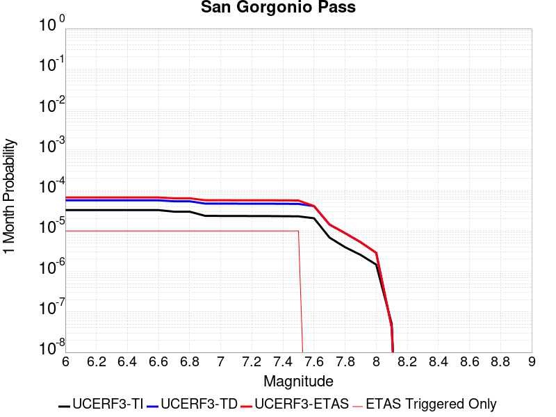 |  |  |

| Magnitude | 1 wk TI Prob | 1 wk TD Prob | 1 wk ETAS Prob | 1 wk ETAS/TD Gain | 1 wk ETAS Triggered Only | 1 mo TI Prob | 1 mo TD Prob | 1 mo ETAS Prob | 1 mo ETAS/TD Gain | 1 mo ETAS Triggered Only | 1 yr TI Prob | 1 yr TD Prob | 1 yr ETAS Prob | 1 yr ETAS/TD Gain | 1 yr ETAS Triggered Only | 10 yr TI Prob | 10 yr TD Prob | 10 yr ETAS Prob | 10 yr ETAS/TD Gain | 10 yr ETAS Triggered Only |
|-----|-----|-----|-----|-----|-----|-----|-----|-----|-----|-----|-----|-----|-----|-----|-----|-----|-----|-----|-----|-----|
| 6.0 | 7.644328E-6 | 1.331474E-5 | 1.331474E-5 | 1.0 | 0.0 | 3.2760996E-5 | 5.706197E-5 | 6.7061395E-5 | 1.175238 | 1.0E-5 | 3.987921E-4 | 6.945166E-4 | 7.045097E-4 | 1.0143886 | 1.0E-5 | 0.003980772 | 0.006930024 | 0.0069399546 | 1.001433 | 1.0E-5 |
| 6.1 | 7.644328E-6 | 1.331474E-5 | 1.331474E-5 | 1.0 | 0.0 | 3.2760996E-5 | 5.706197E-5 | 6.7061395E-5 | 1.175238 | 1.0E-5 | 3.987921E-4 | 6.945166E-4 | 7.045097E-4 | 1.0143886 | 1.0E-5 | 0.003980772 | 0.006930024 | 0.0069399546 | 1.001433 | 1.0E-5 |
| 6.2 | 7.644328E-6 | 1.331474E-5 | 1.331474E-5 | 1.0 | 0.0 | 3.2760996E-5 | 5.706197E-5 | 6.7061395E-5 | 1.175238 | 1.0E-5 | 3.987921E-4 | 6.945166E-4 | 7.045097E-4 | 1.0143886 | 1.0E-5 | 0.003980772 | 0.006930024 | 0.0069399546 | 1.001433 | 1.0E-5 |
| 6.3 | 7.644328E-6 | 1.331474E-5 | 1.331474E-5 | 1.0 | 0.0 | 3.2760996E-5 | 5.706197E-5 | 6.7061395E-5 | 1.175238 | 1.0E-5 | 3.987921E-4 | 6.945166E-4 | 7.045097E-4 | 1.0143886 | 1.0E-5 | 0.003980772 | 0.006930024 | 0.0069399546 | 1.001433 | 1.0E-5 |
| 6.4 | 7.644328E-6 | 1.331474E-5 | 1.331474E-5 | 1.0 | 0.0 | 3.2760996E-5 | 5.706197E-5 | 6.7061395E-5 | 1.175238 | 1.0E-5 | 3.987921E-4 | 6.945166E-4 | 7.045097E-4 | 1.0143886 | 1.0E-5 | 0.003980772 | 0.006930024 | 0.0069399546 | 1.001433 | 1.0E-5 |
| 6.5 | 7.644328E-6 | 1.331474E-5 | 1.331474E-5 | 1.0 | 0.0 | 3.2760996E-5 | 5.706197E-5 | 6.7061395E-5 | 1.175238 | 1.0E-5 | 3.987921E-4 | 6.945166E-4 | 7.045097E-4 | 1.0143886 | 1.0E-5 | 0.003980772 | 0.006930024 | 0.0069399546 | 1.001433 | 1.0E-5 |
| 6.6 | 7.644328E-6 | 1.331474E-5 | 1.331474E-5 | 1.0 | 0.0 | 3.2760996E-5 | 5.706197E-5 | 6.7061395E-5 | 1.175238 | 1.0E-5 | 3.987921E-4 | 6.945166E-4 | 7.045097E-4 | 1.0143886 | 1.0E-5 | 0.003980772 | 0.006930024 | 0.0069399546 | 1.001433 | 1.0E-5 |
| 6.7 | 6.987586E-6 | 1.2619013E-5 | 1.2619013E-5 | 1.0 | 0.0 | 2.9946454E-5 | 5.408041E-5 | 6.407987E-5 | 1.1848998 | 1.0E-5 | 3.645371E-4 | 6.582382E-4 | 6.6823163E-4 | 1.015182 | 1.0E-5 | 0.0036393967 | 0.0065694 | 0.0065793344 | 1.0015122 | 1.0E-5 |
| 6.8 | 6.987586E-6 | 1.2619013E-5 | 1.2619013E-5 | 1.0 | 0.0 | 2.9946454E-5 | 5.408041E-5 | 6.407987E-5 | 1.1848998 | 1.0E-5 | 3.645371E-4 | 6.582382E-4 | 6.6823163E-4 | 1.015182 | 1.0E-5 | 0.0036393967 | 0.0065694 | 0.0065793344 | 1.0015122 | 1.0E-5 |
| 6.9 | 5.504702E-6 | 1.1049877E-5 | 1.1049877E-5 | 1.0 | 0.0 | 2.3591367E-5 | 4.7355785E-5 | 5.735531E-5 | 1.2111574 | 1.0E-5 | 2.8718702E-4 | 5.764092E-4 | 5.864034E-4 | 1.0173388 | 1.0E-5 | 0.0028681618 | 0.0057553523 | 0.0057652947 | 1.0017275 | 1.0E-5 |
| 7.0 | 5.4825764E-6 | 1.1026218E-5 | 1.1026218E-5 | 1.0 | 0.0 | 2.3496545E-5 | 4.725439E-5 | 5.7253917E-5 | 1.2116106 | 1.0E-5 | 2.8603288E-4 | 5.751754E-4 | 5.8516965E-4 | 1.017376 | 1.0E-5 | 0.00285665 | 0.0057430784 | 0.0057530208 | 1.0017313 | 1.0E-5 |
| 7.1 | 5.4692787E-6 | 1.1011928E-5 | 1.1011928E-5 | 1.0 | 0.0 | 2.3439556E-5 | 4.719315E-5 | 5.719268E-5 | 1.2118852 | 1.0E-5 | 2.8533922E-4 | 5.744302E-4 | 5.844245E-4 | 1.0173986 | 1.0E-5 | 0.0028497311 | 0.0057356646 | 0.0057456074 | 1.0017334 | 1.0E-5 |
| 7.2 | 5.453661E-6 | 1.0994954E-5 | 1.0994954E-5 | 1.0 | 0.0 | 2.3372622E-5 | 4.712041E-5 | 5.7119938E-5 | 1.2122122 | 1.0E-5 | 2.8452452E-4 | 5.7354505E-4 | 5.835393E-4 | 1.0174254 | 1.0E-5 | 0.002841605 | 0.005726859 | 0.0057368013 | 1.0017362 | 1.0E-5 |
| 7.3 | 5.4422303E-6 | 1.09818775E-5 | 1.09818775E-5 | 1.0 | 0.0 | 2.3323635E-5 | 4.7064368E-5 | 5.70639E-5 | 1.2124649 | 1.0E-5 | 2.8392827E-4 | 5.728631E-4 | 5.8285735E-4 | 1.0174462 | 1.0E-5 | 0.0028356577 | 0.0057200743 | 0.005730017 | 1.0017382 | 1.0E-5 |
| 7.4 | 5.398595E-6 | 1.0929241E-5 | 1.0929241E-5 | 1.0 | 0.0 | 2.313663E-5 | 4.6838795E-5 | 5.6838326E-5 | 1.2134882 | 1.0E-5 | 2.8165206E-4 | 5.701182E-4 | 5.8011245E-4 | 1.0175302 | 1.0E-5 | 0.0028129534 | 0.0056927665 | 0.0057027093 | 1.0017467 | 1.0E-5 |
| 7.5 | 5.3578788E-6 | 1.0855785E-5 | 1.0855785E-5 | 1.0 | 0.0 | 2.2962136E-5 | 4.6523994E-5 | 5.6523528E-5 | 1.2149328 | 1.0E-5 | 2.7952815E-4 | 5.662875E-4 | 5.762818E-4 | 1.0176489 | 1.0E-5 | 0.002791768 | 0.0056546913 | 0.005664635 | 1.0017585 | 1.0E-5 |
| 7.6 | 4.8091474E-6 | 9.604131E-6 | 9.604131E-6 | 1.0 | 0.0 | 2.0610469E-5 | 4.1159943E-5 | 4.1159943E-5 | 1.0 | 0.0 | 2.5090357E-4 | 5.010119E-4 | 5.010119E-4 | 1.0 | 0.0 | 0.0025062046 | 0.0050054584 | 0.0050054584 | 1.0 | 0.0 |
| 7.7 | 1.5991155E-6 | 3.353035E-6 | 3.353035E-6 | 1.0 | 0.0 | 6.853334E-6 | 1.4370073E-5 | 1.4370073E-5 | 1.0 | 0.0 | 8.343615E-5 | 1.7494184E-4 | 1.7494184E-4 | 1.0 | 0.0 | 8.340483E-4 | 0.0017535852 | 0.0017535852 | 1.0 | 0.0 |
| 7.8 | 9.258398E-7 | 2.0581049E-6 | 2.0581049E-6 | 1.0 | 0.0 | 3.967879E-6 | 8.82042E-6 | 8.82042E-6 | 1.0 | 0.0 | 4.8307855E-5 | 1.0738334E-4 | 1.0738334E-4 | 1.0 | 0.0 | 4.8297356E-4 | 0.0010788103 | 0.0010788103 | 1.0 | 0.0 |
| 7.9 | 5.975575E-7 | 1.2292295E-6 | 1.2292295E-6 | 1.0 | 0.0 | 2.5609581E-6 | 5.2681157E-6 | 5.2681157E-6 | 1.0 | 0.0 | 3.117922E-5 | 6.413743E-5 | 6.413743E-5 | 1.0 | 0.0 | 3.1174847E-4 | 6.464778E-4 | 6.464778E-4 | 1.0 | 0.0 |
| 8.0 | 3.4413725E-7 | 6.714992E-7 | 6.714992E-7 | 1.0 | 0.0 | 1.4748731E-6 | 2.8778506E-6 | 2.8778506E-6 | 1.0 | 0.0 | 1.7956432E-5 | 3.5037272E-5 | 3.5037272E-5 | 1.0 | 0.0 | 1.7954981E-4 | 3.5392298E-4 | 3.5392298E-4 | 1.0 | 0.0 |
| 8.1 | 1.1787731E-8 | 9.6332045E-9 | 9.6332045E-9 | 1.0 | 0.0 | 5.0518846E-8 | 4.1285162E-8 | 4.1285162E-8 | 1.0 | 0.0 | 6.1506677E-7 | 5.0264674E-7 | 5.0264674E-7 | 1.0 | 0.0 | 6.1506507E-6 | 5.2417968E-6 | 5.2417968E-6 | 1.0 | 0.0 |

## Great Valley 06 (Midland) 2011 CFM alt1
*[(top)](#table-of-contents)*

| 1 Week | 1 Month | 1 Year | 10 Year |
|-----|-----|-----|-----|
|  |  |  |  |

| Magnitude | 1 wk TI Prob | 1 wk TD Prob | 1 wk ETAS Prob | 1 wk ETAS/TD Gain | 1 wk ETAS Triggered Only | 1 mo TI Prob | 1 mo TD Prob | 1 mo ETAS Prob | 1 mo ETAS/TD Gain | 1 mo ETAS Triggered Only | 1 yr TI Prob | 1 yr TD Prob | 1 yr ETAS Prob | 1 yr ETAS/TD Gain | 1 yr ETAS Triggered Only | 10 yr TI Prob | 10 yr TD Prob | 10 yr ETAS Prob | 10 yr ETAS/TD Gain | 10 yr ETAS Triggered Only |
|-----|-----|-----|-----|-----|-----|-----|-----|-----|-----|-----|-----|-----|-----|-----|-----|-----|-----|-----|-----|-----|
| 6.0 | 1.2712525E-5 | 1.3210576E-5 | 1.3210576E-5 | 1.0 | 0.0 | 5.4481112E-5 | 5.6615667E-5 | 6.66151E-5 | 1.1766195 | 1.0E-5 | 6.6310563E-4 | 6.8910315E-4 | 6.9909624E-4 | 1.0145016 | 1.0E-5 | 0.0066113044 | 0.006872179 | 0.00688211 | 1.0014452 | 1.0E-5 |
| 6.1 | 1.2712525E-5 | 1.3210576E-5 | 1.3210576E-5 | 1.0 | 0.0 | 5.4481112E-5 | 5.6615667E-5 | 6.66151E-5 | 1.1766195 | 1.0E-5 | 6.6310563E-4 | 6.8910315E-4 | 6.9909624E-4 | 1.0145016 | 1.0E-5 | 0.0066113044 | 0.006872179 | 0.00688211 | 1.0014452 | 1.0E-5 |
| 6.2 | 1.2712525E-5 | 1.3210576E-5 | 1.3210576E-5 | 1.0 | 0.0 | 5.4481112E-5 | 5.6615667E-5 | 6.66151E-5 | 1.1766195 | 1.0E-5 | 6.6310563E-4 | 6.8910315E-4 | 6.9909624E-4 | 1.0145016 | 1.0E-5 | 0.0066113044 | 0.006872179 | 0.00688211 | 1.0014452 | 1.0E-5 |
| 6.3 | 1.2712525E-5 | 1.3210576E-5 | 1.3210576E-5 | 1.0 | 0.0 | 5.4481112E-5 | 5.6615667E-5 | 6.66151E-5 | 1.1766195 | 1.0E-5 | 6.6310563E-4 | 6.8910315E-4 | 6.9909624E-4 | 1.0145016 | 1.0E-5 | 0.0066113044 | 0.006872179 | 0.00688211 | 1.0014452 | 1.0E-5 |
| 6.4 | 1.2712525E-5 | 1.3210576E-5 | 1.3210576E-5 | 1.0 | 0.0 | 5.4481112E-5 | 5.6615667E-5 | 6.66151E-5 | 1.1766195 | 1.0E-5 | 6.6310563E-4 | 6.8910315E-4 | 6.9909624E-4 | 1.0145016 | 1.0E-5 | 0.0066113044 | 0.006872179 | 0.00688211 | 1.0014452 | 1.0E-5 |
| 6.5 | 1.2712525E-5 | 1.3210576E-5 | 1.3210576E-5 | 1.0 | 0.0 | 5.4481112E-5 | 5.6615667E-5 | 6.66151E-5 | 1.1766195 | 1.0E-5 | 6.6310563E-4 | 6.8910315E-4 | 6.9909624E-4 | 1.0145016 | 1.0E-5 | 0.0066113044 | 0.006872179 | 0.00688211 | 1.0014452 | 1.0E-5 |
| 6.6 | 5.7574384E-6 | 5.9706463E-6 | 5.9706463E-6 | 1.0 | 0.0 | 2.4674504E-5 | 2.5588255E-5 | 3.5588E-5 | 1.3907943 | 1.0E-5 | 3.0037065E-4 | 3.1149638E-4 | 3.2149328E-4 | 1.032093 | 1.0E-5 | 0.0029996498 | 0.0031109843 | 0.0031209532 | 1.0032045 | 1.0E-5 |
| 6.7 | 5.7574384E-6 | 5.9706463E-6 | 5.9706463E-6 | 1.0 | 0.0 | 2.4674504E-5 | 2.5588255E-5 | 3.5588E-5 | 1.3907943 | 1.0E-5 | 3.0037065E-4 | 3.1149638E-4 | 3.2149328E-4 | 1.032093 | 1.0E-5 | 0.0029996498 | 0.0031109843 | 0.0031209532 | 1.0032045 | 1.0E-5 |
| 6.8 | 3.3474828E-6 | 3.4693849E-6 | 3.4693849E-6 | 1.0 | 0.0 | 1.4346277E-5 | 1.4868716E-5 | 2.4868566E-5 | 1.672543 | 1.0E-5 | 1.7465191E-4 | 1.8101306E-4 | 1.9101126E-4 | 1.0552347 | 1.0E-5 | 0.0017451472 | 0.0018088033 | 0.0018187852 | 1.0055186 | 1.0E-5 |
| 6.9 | 2.035106E-6 | 2.1090357E-6 | 2.1090357E-6 | 1.0 | 0.0 | 8.721853E-6 | 9.038697E-6 | 9.038697E-6 | 1.0 | 0.0 | 1.0618339E-4 | 1.10041314E-4 | 1.10041314E-4 | 1.0 | 0.0 | 0.0010613267 | 0.0010999405 | 0.0010999405 | 1.0 | 0.0 |
| 7.0 | 1.2424716E-6 | 1.2878762E-6 | 1.2878762E-6 | 1.0 | 0.0 | 5.3248673E-6 | 5.51946E-6 | 5.51946E-6 | 1.0 | 0.0 | 6.482833E-5 | 6.7197805E-5 | 6.7197805E-5 | 1.0 | 0.0 | 6.480942E-4 | 6.718192E-4 | 6.718192E-4 | 1.0 | 0.0 |
| 7.1 | 6.6904556E-7 | 6.939035E-7 | 6.939035E-7 | 1.0 | 0.0 | 2.867335E-6 | 2.97387E-6 | 2.97387E-6 | 1.0 | 0.0 | 3.4909244E-5 | 3.6206526E-5 | 3.6206526E-5 | 1.0 | 0.0 | 3.490376E-4 | 3.6203177E-4 | 3.6203177E-4 | 1.0 | 0.0 |
| 7.2 | 3.948168E-7 | 4.095705E-7 | 4.095705E-7 | 1.0 | 0.0 | 1.6920709E-6 | 1.7553022E-6 | 1.7553022E-6 | 1.0 | 0.0 | 2.0600768E-5 | 2.1370803E-5 | 2.1370803E-5 | 1.0 | 0.0 | 2.0598859E-4 | 2.1370803E-4 | 2.1370803E-4 | 1.0 | 0.0 |

## Surprise Valley 2011 CFM
*[(top)](#table-of-contents)*

| 1 Week | 1 Month | 1 Year | 10 Year |
|-----|-----|-----|-----|
|  |  | 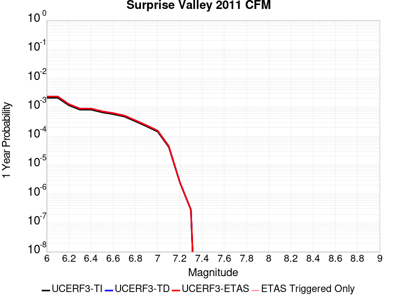 |  |

| Magnitude | 1 wk TI Prob | 1 wk TD Prob | 1 wk ETAS Prob | 1 wk ETAS/TD Gain | 1 wk ETAS Triggered Only | 1 mo TI Prob | 1 mo TD Prob | 1 mo ETAS Prob | 1 mo ETAS/TD Gain | 1 mo ETAS Triggered Only | 1 yr TI Prob | 1 yr TD Prob | 1 yr ETAS Prob | 1 yr ETAS/TD Gain | 1 yr ETAS Triggered Only | 10 yr TI Prob | 10 yr TD Prob | 10 yr ETAS Prob | 10 yr ETAS/TD Gain | 10 yr ETAS Triggered Only |
|-----|-----|-----|-----|-----|-----|-----|-----|-----|-----|-----|-----|-----|-----|-----|-----|-----|-----|-----|-----|-----|
| 6.0 | 4.0396248E-5 | 4.485131E-5 | 4.485131E-5 | 1.0 | 0.0 | 1.7311527E-4 | 1.9220692E-4 | 1.9220692E-4 | 1.0 | 0.0 | 0.002105641 | 0.0023378176 | 0.0023378176 | 1.0 | 0.0 | 0.020858008 | 0.023153966 | 0.023163736 | 1.0004219 | 1.0E-5 |
| 6.1 | 4.0396248E-5 | 4.485131E-5 | 4.485131E-5 | 1.0 | 0.0 | 1.7311527E-4 | 1.9220692E-4 | 1.9220692E-4 | 1.0 | 0.0 | 0.002105641 | 0.0023378176 | 0.0023378176 | 1.0 | 0.0 | 0.020858008 | 0.023153966 | 0.023163736 | 1.0004219 | 1.0E-5 |
| 6.2 | 2.2295266E-5 | 2.440125E-5 | 2.440125E-5 | 1.0 | 0.0 | 9.554764E-5 | 1.0457276E-4 | 1.0457276E-4 | 1.0 | 0.0 | 0.0011626717 | 0.0012724606 | 0.0012724606 | 1.0 | 0.0 | 0.011566074 | 0.012654981 | 0.012654981 | 1.0 | 0.0 |
| 6.3 | 1.572643E-5 | 1.7096807E-5 | 1.7096807E-5 | 1.0 | 0.0 | 6.7397246E-5 | 7.327003E-5 | 7.327003E-5 | 1.0 | 0.0 | 8.202525E-4 | 8.91708E-4 | 8.91708E-4 | 1.0 | 0.0 | 0.008172315 | 0.008882407 | 0.008882407 | 1.0 | 0.0 |
| 6.4 | 1.5714395E-5 | 1.7084629E-5 | 1.7084629E-5 | 1.0 | 0.0 | 6.734567E-5 | 7.3217845E-5 | 7.3217845E-5 | 1.0 | 0.0 | 8.1962504E-4 | 8.9107314E-4 | 8.9107314E-4 | 1.0 | 0.0 | 0.008166086 | 0.008876109 | 0.008876109 | 1.0 | 0.0 |
| 6.5 | 1.2733495E-5 | 1.38016E-5 | 1.38016E-5 | 1.0 | 0.0 | 5.457098E-5 | 5.9148413E-5 | 5.9148413E-5 | 1.0 | 0.0 | 6.641992E-4 | 7.1990065E-4 | 7.1990065E-4 | 1.0 | 0.0 | 0.0066221743 | 0.0071763797 | 0.0071763797 | 1.0 | 0.0 |
| 6.6 | 1.0983784E-5 | 1.1886554E-5 | 1.1886554E-5 | 1.0 | 0.0 | 4.7072506E-5 | 5.094141E-5 | 5.094141E-5 | 1.0 | 0.0 | 5.7295704E-4 | 6.200405E-4 | 6.200405E-4 | 1.0 | 0.0 | 0.0057148207 | 0.0061836545 | 0.0061836545 | 1.0 | 0.0 |
| 6.7 | 9.104806E-6 | 9.839491E-6 | 9.839491E-6 | 1.0 | 0.0 | 3.902001E-5 | 4.2168587E-5 | 4.2168587E-5 | 1.0 | 0.0 | 4.7496508E-4 | 5.132855E-4 | 5.132855E-4 | 1.0 | 0.0 | 0.004739512 | 0.005121397 | 0.005121397 | 1.0 | 0.0 |
| 6.8 | 6.2162403E-6 | 6.7041337E-6 | 6.7041337E-6 | 1.0 | 0.0 | 2.6640759E-5 | 2.8731698E-5 | 2.8731698E-5 | 1.0 | 0.0 | 3.2430296E-4 | 3.497545E-4 | 3.497545E-4 | 1.0 | 0.0 | 0.003238301 | 0.0034922638 | 0.0034922638 | 1.0 | 0.0 |
| 6.9 | 4.1792696E-6 | 4.50323E-6 | 4.50323E-6 | 1.0 | 0.0 | 1.7911032E-5 | 1.9299423E-5 | 1.9299423E-5 | 1.0 | 0.0 | 2.1804498E-4 | 2.3494668E-4 | 2.3494668E-4 | 1.0 | 0.0 | 0.0021783116 | 0.0023471361 | 0.0023471361 | 1.0 | 0.0 |
| 7.0 | 2.7478413E-6 | 2.9622424E-6 | 2.9622424E-6 | 1.0 | 0.0 | 1.177641E-5 | 1.269527E-5 | 1.269527E-5 | 1.0 | 0.0 | 1.4336836E-4 | 1.545552E-4 | 1.545552E-4 | 1.0 | 0.0 | 0.001432759 | 0.0015445995 | 0.0015445995 | 1.0 | 0.0 |
| 7.1 | 8.128648E-7 | 8.724922E-7 | 8.724922E-7 | 1.0 | 0.0 | 3.4837017E-6 | 3.7392501E-6 | 3.7392501E-6 | 1.0 | 0.0 | 4.2413245E-5 | 4.552502E-5 | 4.552502E-5 | 1.0 | 0.0 | 4.2405148E-4 | 4.5521575E-4 | 4.5521575E-4 | 1.0 | 0.0 |
| 7.2 | 4.8641045E-8 | 4.9402068E-8 | 4.9402068E-8 | 1.0 | 0.0 | 2.084616E-7 | 2.1172312E-7 | 2.1172312E-7 | 1.0 | 0.0 | 2.538017E-6 | 2.577726E-6 | 2.577726E-6 | 1.0 | 0.0 | 2.537988E-5 | 2.5776973E-5 | 2.5776973E-5 | 1.0 | 0.0 |
| 7.3 | 5.3911844E-9 | 5.4758145E-9 | 5.4758145E-9 | 1.0 | 0.0 | 2.3105075E-8 | 2.3467775E-8 | 2.3467775E-8 | 1.0 | 0.0 | 2.8130427E-7 | 2.8572015E-7 | 2.8572015E-7 | 1.0 | 0.0 | 2.8130391E-6 | 2.8571992E-6 | 2.8571992E-6 | 1.0 | 0.0 |

## San Luis Range 2011 CFM
*[(top)](#table-of-contents)*

| 1 Week | 1 Month | 1 Year | 10 Year |
|-----|-----|-----|-----|
|  |  |  |  |

| Magnitude | 1 wk TI Prob | 1 wk TD Prob | 1 wk ETAS Prob | 1 wk ETAS/TD Gain | 1 wk ETAS Triggered Only | 1 mo TI Prob | 1 mo TD Prob | 1 mo ETAS Prob | 1 mo ETAS/TD Gain | 1 mo ETAS Triggered Only | 1 yr TI Prob | 1 yr TD Prob | 1 yr ETAS Prob | 1 yr ETAS/TD Gain | 1 yr ETAS Triggered Only | 10 yr TI Prob | 10 yr TD Prob | 10 yr ETAS Prob | 10 yr ETAS/TD Gain | 10 yr ETAS Triggered Only |
|-----|-----|-----|-----|-----|-----|-----|-----|-----|-----|-----|-----|-----|-----|-----|-----|-----|-----|-----|-----|-----|
| 6.0 | 8.8368415E-6 | 8.965455E-6 | 8.965455E-6 | 1.0 | 0.0 | 3.787163E-5 | 3.8422855E-5 | 3.8422855E-5 | 1.0 | 0.0 | 4.609895E-4 | 4.6770574E-4 | 4.6770574E-4 | 1.0 | 0.0 | 0.0046003438 | 0.004667997 | 0.00467795 | 1.0021323 | 1.0E-5 |
| 6.1 | 8.8368415E-6 | 8.965455E-6 | 8.965455E-6 | 1.0 | 0.0 | 3.787163E-5 | 3.8422855E-5 | 3.8422855E-5 | 1.0 | 0.0 | 4.609895E-4 | 4.6770574E-4 | 4.6770574E-4 | 1.0 | 0.0 | 0.0046003438 | 0.004667997 | 0.00467795 | 1.0021323 | 1.0E-5 |
| 6.2 | 8.8368415E-6 | 8.965455E-6 | 8.965455E-6 | 1.0 | 0.0 | 3.787163E-5 | 3.8422855E-5 | 3.8422855E-5 | 1.0 | 0.0 | 4.609895E-4 | 4.6770574E-4 | 4.6770574E-4 | 1.0 | 0.0 | 0.0046003438 | 0.004667997 | 0.00467795 | 1.0021323 | 1.0E-5 |
| 6.3 | 8.8368415E-6 | 8.965455E-6 | 8.965455E-6 | 1.0 | 0.0 | 3.787163E-5 | 3.8422855E-5 | 3.8422855E-5 | 1.0 | 0.0 | 4.609895E-4 | 4.6770574E-4 | 4.6770574E-4 | 1.0 | 0.0 | 0.0046003438 | 0.004667997 | 0.00467795 | 1.0021323 | 1.0E-5 |
| 6.4 | 3.9094193E-6 | 3.941204E-6 | 3.941204E-6 | 1.0 | 0.0 | 1.6754546E-5 | 1.6890766E-5 | 1.6890766E-5 | 1.0 | 0.0 | 2.039675E-4 | 2.0562594E-4 | 2.0562594E-4 | 1.0 | 0.0 | 0.0020378039 | 0.0020543856 | 0.0020543856 | 1.0 | 0.0 |
| 6.5 | 3.9094193E-6 | 3.941204E-6 | 3.941204E-6 | 1.0 | 0.0 | 1.6754546E-5 | 1.6890766E-5 | 1.6890766E-5 | 1.0 | 0.0 | 2.039675E-4 | 2.0562594E-4 | 2.0562594E-4 | 1.0 | 0.0 | 0.0020378039 | 0.0020543856 | 0.0020543856 | 1.0 | 0.0 |
| 6.6 | 3.0587726E-6 | 3.0753893E-6 | 3.0753893E-6 | 1.0 | 0.0 | 1.3108959E-5 | 1.3180174E-5 | 1.3180174E-5 | 1.0 | 0.0 | 1.595899E-4 | 1.6045693E-4 | 1.6045693E-4 | 1.0 | 0.0 | 0.0015947534 | 0.0016034227 | 0.0016034227 | 1.0 | 0.0 |
| 6.7 | 2.6160574E-6 | 2.6251284E-6 | 2.6251284E-6 | 1.0 | 0.0 | 1.1211626E-5 | 1.1250502E-5 | 1.1250502E-5 | 1.0 | 0.0 | 1.3649299E-4 | 1.3696631E-4 | 1.3696631E-4 | 1.0 | 0.0 | 0.0013640919 | 0.0013688251 | 0.0013688251 | 1.0 | 0.0 |
| 6.8 | 2.5110312E-6 | 2.5181412E-6 | 2.5181412E-6 | 1.0 | 0.0 | 1.0761518E-5 | 1.079199E-5 | 1.079199E-5 | 1.0 | 0.0 | 1.310136E-4 | 1.313846E-4 | 1.313846E-4 | 1.0 | 0.0 | 0.0013093639 | 0.0013130752 | 0.0013130752 | 1.0 | 0.0 |
| 6.9 | 1.8564405E-6 | 1.852488E-6 | 1.852488E-6 | 1.0 | 0.0 | 7.95615E-6 | 7.93921E-6 | 7.93921E-6 | 1.0 | 0.0 | 9.686181E-5 | 9.665562E-5 | 9.665562E-5 | 1.0 | 0.0 | 9.68196E-4 | 9.6613786E-4 | 9.6613786E-4 | 1.0 | 0.0 |
| 7.0 | 1.546127E-6 | 1.5369549E-6 | 1.5369549E-6 | 1.0 | 0.0 | 6.626242E-6 | 6.5869326E-6 | 6.5869326E-6 | 1.0 | 0.0 | 8.06715E-5 | 8.019296E-5 | 8.019296E-5 | 1.0 | 0.0 | 8.0642226E-4 | 8.016409E-4 | 8.016409E-4 | 1.0 | 0.0 |
| 7.1 | 1.3368208E-6 | 1.3235336E-6 | 1.3235336E-6 | 1.0 | 0.0 | 5.7292195E-6 | 5.6722747E-6 | 5.6722747E-6 | 1.0 | 0.0 | 6.975101E-5 | 6.905776E-5 | 6.905776E-5 | 1.0 | 0.0 | 6.972912E-4 | 6.903635E-4 | 6.903635E-4 | 1.0 | 0.0 |
| 7.2 | 1.0623363E-6 | 1.0454378E-6 | 1.0454378E-6 | 1.0 | 0.0 | 4.5528623E-6 | 4.4804397E-6 | 4.4804397E-6 | 1.0 | 0.0 | 5.5429686E-5 | 5.4547992E-5 | 5.4547992E-5 | 1.0 | 0.0 | 5.5415864E-4 | 5.453463E-4 | 5.453463E-4 | 1.0 | 0.0 |
| 7.3 | 7.831679E-7 | 7.727399E-7 | 7.727399E-7 | 1.0 | 0.0 | 3.3564295E-6 | 3.3117383E-6 | 3.3117383E-6 | 1.0 | 0.0 | 4.086376E-5 | 4.031967E-5 | 4.031967E-5 | 1.0 | 0.0 | 4.0856248E-4 | 4.0312367E-4 | 4.0312367E-4 | 1.0 | 0.0 |
| 7.4 | 5.9558846E-7 | 5.910646E-7 | 5.910646E-7 | 1.0 | 0.0 | 2.5525194E-6 | 2.5331315E-6 | 2.5331315E-6 | 1.0 | 0.0 | 3.107648E-5 | 3.084044E-5 | 3.084044E-5 | 1.0 | 0.0 | 3.1072134E-4 | 3.083617E-4 | 3.083617E-4 | 1.0 | 0.0 |
| 7.5 | 4.1616502E-7 | 4.1196404E-7 | 4.1196404E-7 | 1.0 | 0.0 | 1.7835631E-6 | 1.765559E-6 | 1.765559E-6 | 1.0 | 0.0 | 2.1714664E-5 | 2.1495469E-5 | 2.1495469E-5 | 1.0 | 0.0 | 2.1712543E-4 | 2.1493394E-4 | 2.1493394E-4 | 1.0 | 0.0 |
| 7.6 | 2.3816014E-7 | 2.3376614E-7 | 2.3376614E-7 | 1.0 | 0.0 | 1.0206859E-6 | 1.0018545E-6 | 1.0018545E-6 | 1.0 | 0.0 | 1.242678E-5 | 1.219751E-5 | 1.219751E-5 | 1.0 | 0.0 | 1.2426086E-4 | 1.2196843E-4 | 1.2196843E-4 | 1.0 | 0.0 |
| 7.7 | 9.918777E-8 | 9.3868096E-8 | 9.3868096E-8 | 1.0 | 0.0 | 4.2509038E-7 | 4.022918E-7 | 4.022918E-7 | 1.0 | 0.0 | 5.1754632E-6 | 4.8978914E-6 | 4.8978914E-6 | 1.0 | 0.0 | 5.1753424E-5 | 4.897784E-5 | 4.897784E-5 | 1.0 | 0.0 |
| 7.8 | 3.4982556E-8 | 2.968672E-8 | 2.968672E-8 | 1.0 | 0.0 | 1.4992524E-7 | 1.272288E-7 | 1.272288E-7 | 1.0 | 0.0 | 1.8253382E-6 | 1.5490094E-6 | 1.5490094E-6 | 1.0 | 0.0 | 1.8253233E-5 | 1.5489988E-5 | 1.5489988E-5 | 1.0 | 0.0 |
| 7.9 | 1.6624908E-8 | 1.1476994E-8 | 1.1476994E-8 | 1.0 | 0.0 | 7.12496E-8 | 4.9187115E-8 | 4.9187115E-8 | 1.0 | 0.0 | 8.6746354E-7 | 5.988529E-7 | 5.988529E-7 | 1.0 | 0.0 | 8.674601E-6 | 5.9885133E-6 | 5.9885133E-6 | 1.0 | 0.0 |
| 8.0 | 6.3352315E-9 | 3.0886564E-9 | 3.0886564E-9 | 1.0 | 0.0 | 2.715099E-8 | 1.32370985E-8 | 1.32370985E-8 | 1.0 | 0.0 | 3.3056327E-7 | 1.6116167E-7 | 1.6116167E-7 | 1.0 | 0.0 | 3.3056278E-6 | 1.6116155E-6 | 1.6116155E-6 | 1.0 | 0.0 |

## Peralta Hills
*[(top)](#table-of-contents)*

| 1 Week | 1 Month | 1 Year | 10 Year |
|-----|-----|-----|-----|
|  |  |  |  |

| Magnitude | 1 wk TI Prob | 1 wk TD Prob | 1 wk ETAS Prob | 1 wk ETAS/TD Gain | 1 wk ETAS Triggered Only | 1 mo TI Prob | 1 mo TD Prob | 1 mo ETAS Prob | 1 mo ETAS/TD Gain | 1 mo ETAS Triggered Only | 1 yr TI Prob | 1 yr TD Prob | 1 yr ETAS Prob | 1 yr ETAS/TD Gain | 1 yr ETAS Triggered Only | 10 yr TI Prob | 10 yr TD Prob | 10 yr ETAS Prob | 10 yr ETAS/TD Gain | 10 yr ETAS Triggered Only |
|-----|-----|-----|-----|-----|-----|-----|-----|-----|-----|-----|-----|-----|-----|-----|-----|-----|-----|-----|-----|-----|
| 6.0 | 3.8850067E-6 | 3.8395046E-6 | 1.3839466E-5 | 3.6044927 | 1.0E-5 | 1.6649923E-5 | 1.6454958E-5 | 2.6454794E-5 | 1.6077095 | 1.0E-5 | 2.0269395E-4 | 2.0032811E-4 | 2.1032612E-4 | 1.0499082 | 1.0E-5 | 0.0020250916 | 0.002002203 | 0.002012183 | 1.0049845 | 1.0E-5 |
| 6.1 | 3.8850067E-6 | 3.8395046E-6 | 1.3839466E-5 | 3.6044927 | 1.0E-5 | 1.6649923E-5 | 1.6454958E-5 | 2.6454794E-5 | 1.6077095 | 1.0E-5 | 2.0269395E-4 | 2.0032811E-4 | 2.1032612E-4 | 1.0499082 | 1.0E-5 | 0.0020250916 | 0.002002203 | 0.002012183 | 1.0049845 | 1.0E-5 |
| 6.2 | 3.8850067E-6 | 3.8395046E-6 | 1.3839466E-5 | 3.6044927 | 1.0E-5 | 1.6649923E-5 | 1.6454958E-5 | 2.6454794E-5 | 1.6077095 | 1.0E-5 | 2.0269395E-4 | 2.0032811E-4 | 2.1032612E-4 | 1.0499082 | 1.0E-5 | 0.0020250916 | 0.002002203 | 0.002012183 | 1.0049845 | 1.0E-5 |
| 6.3 | 3.8850067E-6 | 3.8395046E-6 | 1.3839466E-5 | 3.6044927 | 1.0E-5 | 1.6649923E-5 | 1.6454958E-5 | 2.6454794E-5 | 1.6077095 | 1.0E-5 | 2.0269395E-4 | 2.0032811E-4 | 2.1032612E-4 | 1.0499082 | 1.0E-5 | 0.0020250916 | 0.002002203 | 0.002012183 | 1.0049845 | 1.0E-5 |
| 6.4 | 3.8850067E-6 | 3.8395046E-6 | 1.3839466E-5 | 3.6044927 | 1.0E-5 | 1.6649923E-5 | 1.6454958E-5 | 2.6454794E-5 | 1.6077095 | 1.0E-5 | 2.0269395E-4 | 2.0032811E-4 | 2.1032612E-4 | 1.0499082 | 1.0E-5 | 0.0020250916 | 0.002002203 | 0.002012183 | 1.0049845 | 1.0E-5 |
| 6.5 | 1.5587785E-6 | 1.4430725E-6 | 1.4430725E-6 | 1.0 | 0.0 | 6.6804623E-6 | 6.184583E-6 | 6.184583E-6 | 1.0 | 0.0 | 8.133159E-5 | 7.529494E-5 | 7.529494E-5 | 1.0 | 0.0 | 8.1301836E-4 | 7.527183E-4 | 7.527183E-4 | 1.0 | 0.0 |
| 6.6 | 1.5587785E-6 | 1.4430725E-6 | 1.4430725E-6 | 1.0 | 0.0 | 6.6804623E-6 | 6.184583E-6 | 6.184583E-6 | 1.0 | 0.0 | 8.133159E-5 | 7.529494E-5 | 7.529494E-5 | 1.0 | 0.0 | 8.1301836E-4 | 7.527183E-4 | 7.527183E-4 | 1.0 | 0.0 |
| 6.7 | 1.5018579E-6 | 1.3836951E-6 | 1.3836951E-6 | 1.0 | 0.0 | 6.436518E-6 | 5.9301096E-6 | 5.9301096E-6 | 1.0 | 0.0 | 7.836179E-5 | 7.219693E-5 | 7.219693E-5 | 1.0 | 0.0 | 7.833416E-4 | 7.2175835E-4 | 7.2175835E-4 | 1.0 | 0.0 |
| 6.8 | 1.4584314E-6 | 1.3381272E-6 | 1.3381272E-6 | 1.0 | 0.0 | 6.250405E-6 | 5.7348193E-6 | 5.7348193E-6 | 1.0 | 0.0 | 7.6096025E-5 | 6.981943E-5 | 6.981943E-5 | 1.0 | 0.0 | 7.6069974E-4 | 6.9799833E-4 | 6.9799833E-4 | 1.0 | 0.0 |
| 6.9 | 1.1382393E-6 | 9.862176E-7 | 9.862176E-7 | 1.0 | 0.0 | 4.8781594E-6 | 4.2266406E-6 | 4.2266406E-6 | 1.0 | 0.0 | 5.9389975E-5 | 5.145822E-5 | 5.145822E-5 | 1.0 | 0.0 | 5.93741E-4 | 5.1447126E-4 | 5.1447126E-4 | 1.0 | 0.0 |
| 7.0 | 9.970413E-7 | 8.3095136E-7 | 8.3095136E-7 | 1.0 | 0.0 | 4.273027E-6 | 3.5612156E-6 | 3.5612156E-6 | 1.0 | 0.0 | 5.2022864E-5 | 4.3357006E-5 | 4.3357006E-5 | 1.0 | 0.0 | 5.2010687E-4 | 4.3349227E-4 | 4.3349227E-4 | 1.0 | 0.0 |
| 7.1 | 9.684443E-7 | 7.993957E-7 | 7.993957E-7 | 1.0 | 0.0 | 4.150469E-6 | 3.4259774E-6 | 3.4259774E-6 | 1.0 | 0.0 | 5.053079E-5 | 4.1710548E-5 | 4.1710548E-5 | 1.0 | 0.0 | 5.05193E-4 | 4.170339E-4 | 4.170339E-4 | 1.0 | 0.0 |
| 7.2 | 9.240811E-7 | 7.503015E-7 | 7.503015E-7 | 1.0 | 0.0 | 3.960342E-6 | 3.2155742E-6 | 3.2155742E-6 | 1.0 | 0.0 | 4.8216094E-5 | 3.914898E-5 | 3.914898E-5 | 1.0 | 0.0 | 4.8205635E-4 | 3.9142737E-4 | 3.9142737E-4 | 1.0 | 0.0 |
| 7.3 | 8.158643E-7 | 6.34986E-7 | 6.34986E-7 | 1.0 | 0.0 | 3.4965567E-6 | 2.7213662E-6 | 2.7213662E-6 | 1.0 | 0.0 | 4.2569747E-5 | 3.3132193E-5 | 3.3132193E-5 | 1.0 | 0.0 | 4.2561593E-4 | 3.3127866E-4 | 3.3127866E-4 | 1.0 | 0.0 |
| 7.4 | 6.3822824E-7 | 4.79557E-7 | 4.79557E-7 | 1.0 | 0.0 | 2.7352612E-6 | 2.0552432E-6 | 2.0552432E-6 | 1.0 | 0.0 | 3.3301294E-5 | 2.502235E-5 | 2.502235E-5 | 1.0 | 0.0 | 3.3296304E-4 | 2.5020045E-4 | 2.5020045E-4 | 1.0 | 0.0 |
| 7.5 | 4.0292628E-7 | 2.7844956E-7 | 2.7844956E-7 | 1.0 | 0.0 | 1.7268258E-6 | 1.1933548E-6 | 1.1933548E-6 | 1.0 | 0.0 | 2.1023901E-5 | 1.4529027E-5 | 1.4529027E-5 | 1.0 | 0.0 | 2.1021912E-4 | 1.4528356E-4 | 1.4528356E-4 | 1.0 | 0.0 |
| 7.6 | 3.672993E-7 | 2.4854202E-7 | 2.4854202E-7 | 1.0 | 0.0 | 1.5741389E-6 | 1.0651798E-6 | 1.0651798E-6 | 1.0 | 0.0 | 1.9164972E-5 | 1.2968516E-5 | 1.2968516E-5 | 1.0 | 0.0 | 1.916332E-4 | 1.2968031E-4 | 1.2968031E-4 | 1.0 | 0.0 |
| 7.7 | 2.8466823E-7 | 1.7858805E-7 | 1.7858805E-7 | 1.0 | 0.0 | 1.2200061E-6 | 7.653773E-7 | 7.653773E-7 | 1.0 | 0.0 | 1.4853474E-5 | 9.318455E-6 | 9.318455E-6 | 1.0 | 0.0 | 1.485248E-4 | 9.318324E-5 | 9.318324E-5 | 1.0 | 0.0 |

## San Jose
*[(top)](#table-of-contents)*

| 1 Week | 1 Month | 1 Year | 10 Year |
|-----|-----|-----|-----|
|  |  |  |  |

| Magnitude | 1 wk TI Prob | 1 wk TD Prob | 1 wk ETAS Prob | 1 wk ETAS/TD Gain | 1 wk ETAS Triggered Only | 1 mo TI Prob | 1 mo TD Prob | 1 mo ETAS Prob | 1 mo ETAS/TD Gain | 1 mo ETAS Triggered Only | 1 yr TI Prob | 1 yr TD Prob | 1 yr ETAS Prob | 1 yr ETAS/TD Gain | 1 yr ETAS Triggered Only | 10 yr TI Prob | 10 yr TD Prob | 10 yr ETAS Prob | 10 yr ETAS/TD Gain | 10 yr ETAS Triggered Only |
|-----|-----|-----|-----|-----|-----|-----|-----|-----|-----|-----|-----|-----|-----|-----|-----|-----|-----|-----|-----|-----|
| 6.0 | 5.0851277E-6 | 4.125642E-6 | 1.41256005E-5 | 3.423855 | 1.0E-5 | 2.1793223E-5 | 1.768122E-5 | 2.7681042E-5 | 1.5655619 | 1.0E-5 | 2.653002E-4 | 2.152502E-4 | 2.2524805E-4 | 1.0464475 | 1.0E-5 | 0.0026498367 | 0.0021507454 | 0.002160724 | 1.0046395 | 1.0E-5 |
| 6.1 | 5.0851277E-6 | 4.125642E-6 | 1.41256005E-5 | 3.423855 | 1.0E-5 | 2.1793223E-5 | 1.768122E-5 | 2.7681042E-5 | 1.5655619 | 1.0E-5 | 2.653002E-4 | 2.152502E-4 | 2.2524805E-4 | 1.0464475 | 1.0E-5 | 0.0026498367 | 0.0021507454 | 0.002160724 | 1.0046395 | 1.0E-5 |
| 6.2 | 5.0851277E-6 | 4.125642E-6 | 1.41256005E-5 | 3.423855 | 1.0E-5 | 2.1793223E-5 | 1.768122E-5 | 2.7681042E-5 | 1.5655619 | 1.0E-5 | 2.653002E-4 | 2.152502E-4 | 2.2524805E-4 | 1.0464475 | 1.0E-5 | 0.0026498367 | 0.0021507454 | 0.002160724 | 1.0046395 | 1.0E-5 |
| 6.3 | 5.0851277E-6 | 4.125642E-6 | 1.41256005E-5 | 3.423855 | 1.0E-5 | 2.1793223E-5 | 1.768122E-5 | 2.7681042E-5 | 1.5655619 | 1.0E-5 | 2.653002E-4 | 2.152502E-4 | 2.2524805E-4 | 1.0464475 | 1.0E-5 | 0.0026498367 | 0.0021507454 | 0.002160724 | 1.0046395 | 1.0E-5 |
| 6.4 | 4.3115124E-6 | 3.3237525E-6 | 1.3323719E-5 | 4.0086374 | 1.0E-5 | 1.8477778E-5 | 1.4244589E-5 | 2.4244446E-5 | 1.702011 | 1.0E-5 | 2.2494372E-4 | 1.7341628E-4 | 1.8341454E-4 | 1.0576547 | 1.0E-5 | 0.0022471617 | 0.0017330965 | 0.0017430792 | 1.0057601 | 1.0E-5 |
| 6.5 | 4.3115124E-6 | 3.3237525E-6 | 1.3323719E-5 | 4.0086374 | 1.0E-5 | 1.8477778E-5 | 1.4244589E-5 | 2.4244446E-5 | 1.702011 | 1.0E-5 | 2.2494372E-4 | 1.7341628E-4 | 1.8341454E-4 | 1.0576547 | 1.0E-5 | 0.0022471617 | 0.0017330965 | 0.0017430792 | 1.0057601 | 1.0E-5 |
| 6.6 | 3.110396E-6 | 2.0799562E-6 | 1.2079935E-5 | 5.807784 | 1.0E-5 | 1.33302E-5 | 8.9140685E-6 | 1.891398E-5 | 2.121812 | 1.0E-5 | 1.622831E-4 | 1.0852366E-4 | 1.1852258E-4 | 1.0921358 | 1.0E-5 | 0.0016216465 | 0.001084804 | 0.0010947931 | 1.0092082 | 1.0E-5 |
| 6.7 | 3.110396E-6 | 2.0799562E-6 | 1.2079935E-5 | 5.807784 | 1.0E-5 | 1.33302E-5 | 8.9140685E-6 | 1.891398E-5 | 2.121812 | 1.0E-5 | 1.622831E-4 | 1.0852366E-4 | 1.1852258E-4 | 1.0921358 | 1.0E-5 | 0.0016216465 | 0.001084804 | 0.0010947931 | 1.0092082 | 1.0E-5 |
| 6.8 | 2.856651E-6 | 1.9024077E-6 | 1.1902389E-5 | 6.256487 | 1.0E-5 | 1.2242733E-5 | 8.153152E-6 | 1.815307E-5 | 2.2265096 | 1.0E-5 | 1.4904508E-4 | 9.926035E-5 | 1.0925936E-4 | 1.1007352 | 1.0E-5 | 0.0014894515 | 9.922545E-4 | 0.0010022445 | 1.010068 | 1.0E-5 |
| 6.9 | 2.1618725E-6 | 1.4186406E-6 | 1.1418627E-5 | 8.048992 | 1.0E-5 | 9.265135E-6 | 6.0798748E-6 | 1.6079814E-5 | 2.6447608 | 1.0E-5 | 1.12797185E-4 | 7.402005E-5 | 8.401931E-5 | 1.1350886 | 1.0E-5 | 0.0011273995 | 7.4003247E-4 | 7.5002504E-4 | 1.013503 | 1.0E-5 |
| 7.0 | 1.9684312E-6 | 1.3256082E-6 | 1.1325595E-5 | 8.543697 | 1.0E-5 | 8.436106E-6 | 5.681166E-6 | 1.568111E-5 | 2.7601922 | 1.0E-5 | 1.02704755E-4 | 6.916608E-5 | 7.9165395E-5 | 1.1445695 | 1.0E-5 | 0.001026573 | 6.9152354E-4 | 7.0151663E-4 | 1.0144508 | 1.0E-5 |
| 7.1 | 1.6070337E-6 | 1.1154867E-6 | 1.1115476E-5 | 9.964686 | 1.0E-5 | 6.887269E-6 | 4.7806493E-6 | 1.4780601E-5 | 3.091756 | 1.0E-5 | 8.384928E-5 | 5.8202913E-5 | 6.820233E-5 | 1.1718028 | 1.0E-5 | 8.3817646E-4 | 5.819527E-4 | 5.919469E-4 | 1.0171735 | 1.0E-5 |
| 7.2 | 1.0631658E-6 | 6.403567E-7 | 6.403567E-7 | 1.0 | 0.0 | 4.556417E-6 | 2.744383E-6 | 2.744383E-6 | 1.0 | 0.0 | 5.5472963E-5 | 3.3412365E-5 | 3.3412365E-5 | 1.0 | 0.0 | 5.545912E-4 | 3.3414463E-4 | 3.3414463E-4 | 1.0 | 0.0 |
| 7.3 | 7.060711E-7 | 4.5823228E-7 | 4.5823228E-7 | 1.0 | 0.0 | 3.0260155E-6 | 1.9638512E-6 | 1.9638512E-6 | 1.0 | 0.0 | 3.6841117E-5 | 2.3909635E-5 | 2.3909635E-5 | 1.0 | 0.0 | 3.6835007E-4 | 2.3914136E-4 | 2.3914136E-4 | 1.0 | 0.0 |
| 7.4 | 3.3677085E-7 | 2.3231999E-7 | 2.3231999E-7 | 1.0 | 0.0 | 1.4433028E-6 | 9.956567E-7 | 9.956567E-7 | 1.0 | 0.0 | 1.757207E-5 | 1.2122056E-5 | 1.2122056E-5 | 1.0 | 0.0 | 1.7570681E-4 | 1.2128407E-4 | 1.2128407E-4 | 1.0 | 0.0 |
| 7.5 | 3.129161E-7 | 1.9529637E-7 | 1.9529637E-7 | 1.0 | 0.0 | 1.3410682E-6 | 8.3698416E-7 | 8.3698416E-7 | 1.0 | 0.0 | 1.6327383E-5 | 1.0190237E-5 | 1.0190237E-5 | 1.0 | 0.0 | 1.6326184E-4 | 1.0196777E-4 | 1.0196777E-4 | 1.0 | 0.0 |
| 7.6 | 2.8008668E-7 | 1.4240818E-7 | 1.4240818E-7 | 1.0 | 0.0 | 1.2003709E-6 | 6.103206E-7 | 6.103206E-7 | 1.0 | 0.0 | 1.46144175E-5 | 7.43063E-6 | 7.43063E-6 | 1.0 | 0.0 | 1.4613457E-4 | 7.43735E-5 | 7.43735E-5 | 1.0 | 0.0 |
| 7.7 | 2.7852005E-7 | 1.4015403E-7 | 1.4015403E-7 | 1.0 | 0.0 | 1.1936568E-6 | 6.0066003E-7 | 6.0066003E-7 | 1.0 | 0.0 | 1.4532674E-5 | 7.3130127E-6 | 7.3130127E-6 | 1.0 | 0.0 | 1.4531724E-4 | 7.31974E-5 | 7.31974E-5 | 1.0 | 0.0 |
| 7.8 | 1.1810797E-7 | 7.5187074E-8 | 7.5187074E-8 | 1.0 | 0.0 | 5.0617695E-7 | 3.2223028E-7 | 3.2223028E-7 | 1.0 | 0.0 | 6.1626865E-6 | 3.9231472E-6 | 3.9231472E-6 | 1.0 | 0.0 | 6.162516E-5 | 3.9271265E-5 | 3.9271265E-5 | 1.0 | 0.0 |

## Great Valley 11
*[(top)](#table-of-contents)*

| 1 Week | 1 Month | 1 Year | 10 Year |
|-----|-----|-----|-----|
|  |  |  |  |

| Magnitude | 1 wk TI Prob | 1 wk TD Prob | 1 wk ETAS Prob | 1 wk ETAS/TD Gain | 1 wk ETAS Triggered Only | 1 mo TI Prob | 1 mo TD Prob | 1 mo ETAS Prob | 1 mo ETAS/TD Gain | 1 mo ETAS Triggered Only | 1 yr TI Prob | 1 yr TD Prob | 1 yr ETAS Prob | 1 yr ETAS/TD Gain | 1 yr ETAS Triggered Only | 10 yr TI Prob | 10 yr TD Prob | 10 yr ETAS Prob | 10 yr ETAS/TD Gain | 10 yr ETAS Triggered Only |
|-----|-----|-----|-----|-----|-----|-----|-----|-----|-----|-----|-----|-----|-----|-----|-----|-----|-----|-----|-----|-----|
| 6.0 | 2.8099583E-5 | 2.983214E-5 | 3.983184E-5 | 1.335199 | 1.0E-5 | 1.20421224E-4 | 1.2784619E-4 | 1.378449E-4 | 1.078209 | 1.0E-5 | 0.0014651422 | 0.0015554894 | 0.0015654739 | 1.0064188 | 1.0E-5 | 0.0145552 | 0.015453546 | 0.015463391 | 1.000637 | 1.0E-5 |
| 6.1 | 2.483194E-5 | 2.5907144E-5 | 2.5907144E-5 | 1.0 | 0.0 | 1.0641825E-4 | 1.11026246E-4 | 1.11026246E-4 | 1.0 | 0.0 | 0.0012948721 | 0.0013509697 | 0.0013509697 | 1.0 | 0.0 | 0.012873529 | 0.013433979 | 0.013433979 | 1.0 | 0.0 |
| 6.2 | 2.483194E-5 | 2.5907144E-5 | 2.5907144E-5 | 1.0 | 0.0 | 1.0641825E-4 | 1.11026246E-4 | 1.11026246E-4 | 1.0 | 0.0 | 0.0012948721 | 0.0013509697 | 0.0013509697 | 1.0 | 0.0 | 0.012873529 | 0.013433979 | 0.013433979 | 1.0 | 0.0 |
| 6.3 | 2.0257901E-5 | 2.0398915E-5 | 2.0398915E-5 | 1.0 | 0.0 | 8.681669E-5 | 8.742122E-5 | 8.742122E-5 | 1.0 | 0.0 | 0.0010564806 | 0.0010638753 | 0.0010638753 | 1.0 | 0.0 | 0.01051472 | 0.010591993 | 0.010591993 | 1.0 | 0.0 |
| 6.4 | 1.8054898E-5 | 1.7780852E-5 | 1.7780852E-5 | 1.0 | 0.0 | 7.737584E-5 | 7.6201635E-5 | 7.6201635E-5 | 1.0 | 0.0 | 9.416436E-4 | 9.2739763E-4 | 9.2739763E-4 | 1.0 | 0.0 | 0.009376635 | 0.009239015 | 0.009239015 | 1.0 | 0.0 |
| 6.5 | 1.34804895E-5 | 1.2321004E-5 | 1.2321004E-5 | 1.0 | 0.0 | 5.777225E-5 | 5.2803258E-5 | 5.2803258E-5 | 1.0 | 0.0 | 7.031501E-4 | 6.426942E-4 | 6.426942E-4 | 1.0 | 0.0 | 0.007009294 | 0.006408792 | 0.006408792 | 1.0 | 0.0 |
| 6.6 | 1.294883E-5 | 1.1732261E-5 | 1.1732261E-5 | 1.0 | 0.0 | 5.5493805E-5 | 5.028017E-5 | 5.028017E-5 | 1.0 | 0.0 | 6.754276E-4 | 6.1199325E-4 | 6.1199325E-4 | 1.0 | 0.0 | 0.006733784 | 0.0061035044 | 0.0061035044 | 1.0 | 0.0 |
| 6.7 | 1.1272237E-5 | 9.811834E-6 | 9.811834E-6 | 1.0 | 0.0 | 4.8308695E-5 | 4.205006E-5 | 4.205006E-5 | 1.0 | 0.0 | 5.879996E-4 | 5.1184196E-4 | 5.1184196E-4 | 1.0 | 0.0 | 0.005864462 | 0.005106915 | 0.005106915 | 1.0 | 0.0 |
| 6.8 | 9.8337505E-6 | 8.193719E-6 | 8.193719E-6 | 1.0 | 0.0 | 4.2143965E-5 | 3.5115478E-5 | 3.5115478E-5 | 1.0 | 0.0 | 5.1298196E-4 | 4.2744912E-4 | 4.2744912E-4 | 1.0 | 0.0 | 0.005117994 | 0.0042664795 | 0.0042664795 | 1.0 | 0.0 |
| 6.9 | 7.4224813E-6 | 5.4130837E-6 | 5.4130837E-6 | 1.0 | 0.0 | 3.1810247E-5 | 2.3198732E-5 | 2.3198732E-5 | 1.0 | 0.0 | 3.872209E-4 | 2.8240937E-4 | 2.8240937E-4 | 1.0 | 0.0 | 0.0038654688 | 0.0028206457 | 0.0028206457 | 1.0 | 0.0 |
| 7.0 | 4.4628923E-6 | 2.0110294E-6 | 2.0110294E-6 | 1.0 | 0.0 | 1.912654E-5 | 8.61867E-6 | 8.61867E-6 | 1.0 | 0.0 | 2.3284076E-4 | 1.0492737E-4 | 1.0492737E-4 | 1.0 | 0.0 | 0.0023259693 | 0.0010487898 | 0.0010487898 | 1.0 | 0.0 |
| 7.1 | 3.5546527E-6 | 1.1855383E-6 | 1.1855383E-6 | 1.0 | 0.0 | 1.5234136E-5 | 5.080869E-6 | 5.080869E-6 | 1.0 | 0.0 | 1.8545982E-4 | 6.185789E-5 | 6.185789E-5 | 1.0 | 0.0 | 0.0018530512 | 6.1841356E-4 | 6.1841356E-4 | 1.0 | 0.0 |
| 7.2 | 3.2039936E-6 | 1.1253728E-6 | 1.1253728E-6 | 1.0 | 0.0 | 1.3731329E-5 | 4.8230177E-6 | 4.8230177E-6 | 1.0 | 0.0 | 1.671661E-4 | 5.8718724E-5 | 5.8718724E-5 | 1.0 | 0.0 | 0.0016704041 | 5.870388E-4 | 5.870388E-4 | 1.0 | 0.0 |
| 7.3 | 2.8120473E-6 | 1.0305271E-6 | 1.0305271E-6 | 1.0 | 0.0 | 1.2051575E-5 | 4.4165376E-6 | 4.4165376E-6 | 1.0 | 0.0 | 1.4671806E-4 | 5.3770087E-5 | 5.3770087E-5 | 1.0 | 0.0 | 0.0014662122 | 5.375774E-4 | 5.375774E-4 | 1.0 | 0.0 |
| 7.4 | 2.4837766E-6 | 9.80032E-7 | 9.80032E-7 | 1.0 | 0.0 | 1.0644713E-5 | 4.2001307E-6 | 4.2001307E-6 | 1.0 | 0.0 | 1.2959167E-4 | 5.113546E-5 | 5.113546E-5 | 1.0 | 0.0 | 0.0012951613 | 5.1124353E-4 | 5.1124353E-4 | 1.0 | 0.0 |
| 7.5 | 1.5002679E-6 | 6.545985E-7 | 6.545985E-7 | 1.0 | 0.0 | 6.4297037E-6 | 2.8054194E-6 | 2.8054194E-6 | 1.0 | 0.0 | 7.827883E-5 | 3.4155488E-5 | 3.4155488E-5 | 1.0 | 0.0 | 7.825126E-4 | 3.4150656E-4 | 3.4150656E-4 | 1.0 | 0.0 |

## Pine Mtn
*[(top)](#table-of-contents)*

| 1 Week | 1 Month | 1 Year | 10 Year |
|-----|-----|-----|-----|
|  |  |  |  |

| Magnitude | 1 wk TI Prob | 1 wk TD Prob | 1 wk ETAS Prob | 1 wk ETAS/TD Gain | 1 wk ETAS Triggered Only | 1 mo TI Prob | 1 mo TD Prob | 1 mo ETAS Prob | 1 mo ETAS/TD Gain | 1 mo ETAS Triggered Only | 1 yr TI Prob | 1 yr TD Prob | 1 yr ETAS Prob | 1 yr ETAS/TD Gain | 1 yr ETAS Triggered Only | 10 yr TI Prob | 10 yr TD Prob | 10 yr ETAS Prob | 10 yr ETAS/TD Gain | 10 yr ETAS Triggered Only |
|-----|-----|-----|-----|-----|-----|-----|-----|-----|-----|-----|-----|-----|-----|-----|-----|-----|-----|-----|-----|-----|
| 6.0 | 6.894797E-6 | 7.2254716E-6 | 7.2254716E-6 | 1.0 | 0.0 | 2.9548795E-5 | 3.0965955E-5 | 3.0965955E-5 | 1.0 | 0.0 | 3.596972E-4 | 3.7694827E-4 | 3.7694827E-4 | 1.0 | 0.0 | 0.0035911554 | 0.0037633865 | 0.0037733489 | 1.0026472 | 1.0E-5 |
| 6.1 | 6.894797E-6 | 7.2254716E-6 | 7.2254716E-6 | 1.0 | 0.0 | 2.9548795E-5 | 3.0965955E-5 | 3.0965955E-5 | 1.0 | 0.0 | 3.596972E-4 | 3.7694827E-4 | 3.7694827E-4 | 1.0 | 0.0 | 0.0035911554 | 0.0037633865 | 0.0037733489 | 1.0026472 | 1.0E-5 |
| 6.2 | 6.894797E-6 | 7.2254716E-6 | 7.2254716E-6 | 1.0 | 0.0 | 2.9548795E-5 | 3.0965955E-5 | 3.0965955E-5 | 1.0 | 0.0 | 3.596972E-4 | 3.7694827E-4 | 3.7694827E-4 | 1.0 | 0.0 | 0.0035911554 | 0.0037633865 | 0.0037733489 | 1.0026472 | 1.0E-5 |
| 6.3 | 6.894797E-6 | 7.2254716E-6 | 7.2254716E-6 | 1.0 | 0.0 | 2.9548795E-5 | 3.0965955E-5 | 3.0965955E-5 | 1.0 | 0.0 | 3.596972E-4 | 3.7694827E-4 | 3.7694827E-4 | 1.0 | 0.0 | 0.0035911554 | 0.0037633865 | 0.0037733489 | 1.0026472 | 1.0E-5 |
| 6.4 | 6.894797E-6 | 7.2254716E-6 | 7.2254716E-6 | 1.0 | 0.0 | 2.9548795E-5 | 3.0965955E-5 | 3.0965955E-5 | 1.0 | 0.0 | 3.596972E-4 | 3.7694827E-4 | 3.7694827E-4 | 1.0 | 0.0 | 0.0035911554 | 0.0037633865 | 0.0037733489 | 1.0026472 | 1.0E-5 |
| 6.5 | 6.894797E-6 | 7.2254716E-6 | 7.2254716E-6 | 1.0 | 0.0 | 2.9548795E-5 | 3.0965955E-5 | 3.0965955E-5 | 1.0 | 0.0 | 3.596972E-4 | 3.7694827E-4 | 3.7694827E-4 | 1.0 | 0.0 | 0.0035911554 | 0.0037633865 | 0.0037733489 | 1.0026472 | 1.0E-5 |
| 6.6 | 6.894797E-6 | 7.2254716E-6 | 7.2254716E-6 | 1.0 | 0.0 | 2.9548795E-5 | 3.0965955E-5 | 3.0965955E-5 | 1.0 | 0.0 | 3.596972E-4 | 3.7694827E-4 | 3.7694827E-4 | 1.0 | 0.0 | 0.0035911554 | 0.0037633865 | 0.0037733489 | 1.0026472 | 1.0E-5 |
| 6.7 | 6.0867933E-6 | 6.397124E-6 | 6.397124E-6 | 1.0 | 0.0 | 2.6085996E-5 | 2.7415968E-5 | 2.7415968E-5 | 1.0 | 0.0 | 3.1755073E-4 | 3.337405E-4 | 3.337405E-4 | 1.0 | 0.0 | 0.0031709734 | 0.0033326119 | 0.0033425784 | 1.0029906 | 1.0E-5 |
| 6.8 | 5.6530425E-6 | 5.950606E-6 | 5.950606E-6 | 1.0 | 0.0 | 2.42271E-5 | 2.5502359E-5 | 2.5502359E-5 | 1.0 | 0.0 | 2.94925E-4 | 3.1044905E-4 | 3.1044905E-4 | 1.0 | 0.0 | 0.002945339 | 0.0031003582 | 0.0031003582 | 1.0 | 0.0 |
| 6.9 | 4.6015225E-6 | 4.8638444E-6 | 4.8638444E-6 | 1.0 | 0.0 | 1.9720663E-5 | 2.084489E-5 | 2.084489E-5 | 1.0 | 0.0 | 2.4007261E-4 | 2.5375842E-4 | 2.5375842E-4 | 1.0 | 0.0 | 0.0023981342 | 0.002534831 | 0.002534831 | 1.0 | 0.0 |
| 7.0 | 4.4875965E-6 | 4.7474837E-6 | 4.7474837E-6 | 1.0 | 0.0 | 1.9232413E-5 | 2.0346208E-5 | 2.0346208E-5 | 1.0 | 0.0 | 2.3412947E-4 | 2.4768838E-4 | 2.4768838E-4 | 1.0 | 0.0 | 0.0023388295 | 0.0024742668 | 0.0024742668 | 1.0 | 0.0 |
| 7.1 | 3.203907E-6 | 3.42942E-6 | 3.42942E-6 | 1.0 | 0.0 | 1.3730958E-5 | 1.4697435E-5 | 1.4697435E-5 | 1.0 | 0.0 | 1.6716159E-4 | 1.7892725E-4 | 1.7892725E-4 | 1.0 | 0.0 | 0.0016703589 | 0.001787898 | 0.001787898 | 1.0 | 0.0 |
| 7.2 | 2.2060601E-6 | 2.3784874E-6 | 2.3784874E-6 | 1.0 | 0.0 | 9.4545085E-6 | 1.019348E-5 | 1.019348E-5 | 1.0 | 0.0 | 1.15102564E-4 | 1.2409901E-4 | 1.2409901E-4 | 1.0 | 0.0 | 0.0011504296 | 0.0012403419 | 0.0012403419 | 1.0 | 0.0 |
| 7.3 | 1.3765207E-6 | 1.5216535E-6 | 1.5216535E-6 | 1.0 | 0.0 | 5.899361E-6 | 6.5213567E-6 | 6.5213567E-6 | 1.0 | 0.0 | 7.182235E-5 | 7.939472E-5 | 7.939472E-5 | 1.0 | 0.0 | 7.1799144E-4 | 7.9367263E-4 | 7.9367263E-4 | 1.0 | 0.0 |
| 7.4 | 1.1245983E-6 | 1.2587126E-6 | 1.2587126E-6 | 1.0 | 0.0 | 4.819698E-6 | 5.394472E-6 | 5.394472E-6 | 1.0 | 0.0 | 5.8678244E-5 | 6.56758E-5 | 6.56758E-5 | 1.0 | 0.0 | 5.866275E-4 | 6.565722E-4 | 6.565722E-4 | 1.0 | 0.0 |
| 7.5 | 8.031682E-7 | 9.276999E-7 | 9.276999E-7 | 1.0 | 0.0 | 3.4421448E-6 | 3.975851E-6 | 3.975851E-6 | 1.0 | 0.0 | 4.1907308E-5 | 4.840498E-5 | 4.840498E-5 | 1.0 | 0.0 | 4.1899405E-4 | 4.8395112E-4 | 4.8395112E-4 | 1.0 | 0.0 |
| 7.6 | 4.8953444E-7 | 6.0030544E-7 | 6.0030544E-7 | 1.0 | 0.0 | 2.098003E-6 | 2.5727354E-6 | 2.5727354E-6 | 1.0 | 0.0 | 2.5542888E-5 | 3.1322652E-5 | 3.1322652E-5 | 1.0 | 0.0 | 2.5539953E-4 | 3.1318725E-4 | 3.1318725E-4 | 1.0 | 0.0 |
| 7.7 | 6.634529E-8 | 6.788826E-8 | 6.788826E-8 | 1.0 | 0.0 | 2.843369E-7 | 2.9094966E-7 | 2.9094966E-7 | 1.0 | 0.0 | 3.4617963E-6 | 3.5423066E-6 | 3.5423066E-6 | 1.0 | 0.0 | 3.4617424E-5 | 3.542255E-5 | 3.542255E-5 | 1.0 | 0.0 |
| 7.8 | 9.235578E-9 | 9.488566E-9 | 9.488566E-9 | 1.0 | 0.0 | 3.9581046E-8 | 4.0665284E-8 | 4.0665284E-8 | 1.0 | 0.0 | 4.818991E-7 | 4.950997E-7 | 4.950997E-7 | 1.0 | 0.0 | 4.8189804E-6 | 4.950988E-6 | 4.950988E-6 | 1.0 | 0.0 |

## Elysian Park (Lower CFM)
*[(top)](#table-of-contents)*

| 1 Week | 1 Month | 1 Year | 10 Year |
|-----|-----|-----|-----|
|  |  |  |  |

| Magnitude | 1 wk TI Prob | 1 wk TD Prob | 1 wk ETAS Prob | 1 wk ETAS/TD Gain | 1 wk ETAS Triggered Only | 1 mo TI Prob | 1 mo TD Prob | 1 mo ETAS Prob | 1 mo ETAS/TD Gain | 1 mo ETAS Triggered Only | 1 yr TI Prob | 1 yr TD Prob | 1 yr ETAS Prob | 1 yr ETAS/TD Gain | 1 yr ETAS Triggered Only | 10 yr TI Prob | 10 yr TD Prob | 10 yr ETAS Prob | 10 yr ETAS/TD Gain | 10 yr ETAS Triggered Only |
|-----|-----|-----|-----|-----|-----|-----|-----|-----|-----|-----|-----|-----|-----|-----|-----|-----|-----|-----|-----|-----|
| 6.0 | 2.1766498E-6 | 2.1037895E-6 | 2.1037895E-6 | 1.0 | 0.0 | 9.328466E-6 | 9.0162175E-6 | 9.0162175E-6 | 1.0 | 0.0 | 1.1356815E-4 | 1.0976836E-4 | 1.0976836E-4 | 1.0 | 0.0 | 0.0011351013 | 0.0010972833 | 0.0011072723 | 1.0091034 | 1.0E-5 |
| 6.1 | 2.1766498E-6 | 2.1037895E-6 | 2.1037895E-6 | 1.0 | 0.0 | 9.328466E-6 | 9.0162175E-6 | 9.0162175E-6 | 1.0 | 0.0 | 1.1356815E-4 | 1.0976836E-4 | 1.0976836E-4 | 1.0 | 0.0 | 0.0011351013 | 0.0010972833 | 0.0011072723 | 1.0091034 | 1.0E-5 |
| 6.2 | 1.0031182E-6 | 9.186213E-7 | 9.186213E-7 | 1.0 | 0.0 | 4.299071E-6 | 3.936943E-6 | 3.936943E-6 | 1.0 | 0.0 | 5.2339932E-5 | 4.7931328E-5 | 4.7931328E-5 | 1.0 | 0.0 | 5.2327604E-4 | 4.7921969E-4 | 4.892149E-4 | 1.0208572 | 1.0E-5 |
| 6.3 | 1.0031182E-6 | 9.186213E-7 | 9.186213E-7 | 1.0 | 0.0 | 4.299071E-6 | 3.936943E-6 | 3.936943E-6 | 1.0 | 0.0 | 5.2339932E-5 | 4.7931328E-5 | 4.7931328E-5 | 1.0 | 0.0 | 5.2327604E-4 | 4.7921969E-4 | 4.892149E-4 | 1.0208572 | 1.0E-5 |
| 6.4 | 6.9606244E-7 | 6.091942E-7 | 6.091942E-7 | 1.0 | 0.0 | 2.9831212E-6 | 2.6108296E-6 | 2.6108296E-6 | 1.0 | 0.0 | 3.6318896E-5 | 3.178639E-5 | 3.178639E-5 | 1.0 | 0.0 | 3.6312963E-4 | 3.1781866E-4 | 3.1781866E-4 | 1.0 | 0.0 |
| 6.5 | 6.901879E-7 | 6.0326255E-7 | 6.0326255E-7 | 1.0 | 0.0 | 2.9579448E-6 | 2.5854083E-6 | 2.5854083E-6 | 1.0 | 0.0 | 3.6012385E-5 | 3.1476895E-5 | 3.1476895E-5 | 1.0 | 0.0 | 3.600655E-4 | 3.147246E-4 | 3.147246E-4 | 1.0 | 0.0 |
| 6.6 | 6.4198554E-7 | 5.5466086E-7 | 5.5466086E-7 | 1.0 | 0.0 | 2.7513638E-6 | 2.3771156E-6 | 2.3771156E-6 | 1.0 | 0.0 | 3.3497337E-5 | 2.8941E-5 | 2.8941E-5 | 1.0 | 0.0 | 3.349229E-4 | 2.8937246E-4 | 2.8937246E-4 | 1.0 | 0.0 |
| 6.7 | 6.138733E-7 | 5.263416E-7 | 5.263416E-7 | 1.0 | 0.0 | 2.6308828E-6 | 2.2557474E-6 | 2.2557474E-6 | 1.0 | 0.0 | 3.203053E-5 | 2.746338E-5 | 2.746338E-5 | 1.0 | 0.0 | 3.2025913E-4 | 2.746E-4 | 2.746E-4 | 1.0 | 0.0 |
| 6.8 | 5.84778E-7 | 5.0029365E-7 | 5.0029365E-7 | 1.0 | 0.0 | 2.506189E-6 | 2.1441138E-6 | 2.1441138E-6 | 1.0 | 0.0 | 3.0512423E-5 | 2.6104273E-5 | 2.6104273E-5 | 1.0 | 0.0 | 3.0508233E-4 | 2.6101217E-4 | 2.6101217E-4 | 1.0 | 0.0 |
| 6.9 | 5.322785E-7 | 4.5800792E-7 | 4.5800792E-7 | 1.0 | 0.0 | 2.2811914E-6 | 1.9628894E-6 | 1.9628894E-6 | 1.0 | 0.0 | 2.7773152E-5 | 2.389792E-5 | 2.389792E-5 | 1.0 | 0.0 | 2.7769682E-4 | 2.3895358E-4 | 2.3895358E-4 | 1.0 | 0.0 |
| 7.0 | 4.8147206E-7 | 4.1124093E-7 | 4.1124093E-7 | 1.0 | 0.0 | 2.06345E-6 | 1.7624599E-6 | 1.7624599E-6 | 1.0 | 0.0 | 2.5122214E-5 | 2.1457738E-5 | 2.1457738E-5 | 1.0 | 0.0 | 2.5119373E-4 | 2.1455674E-4 | 2.1455674E-4 | 1.0 | 0.0 |
| 7.1 | 4.1932955E-7 | 3.5455687E-7 | 3.5455687E-7 | 1.0 | 0.0 | 1.7971255E-6 | 1.5195285E-6 | 1.5195285E-6 | 1.0 | 0.0 | 2.1879783E-5 | 1.8500103E-5 | 1.8500103E-5 | 1.0 | 0.0 | 2.1877629E-4 | 1.8498568E-4 | 1.8498568E-4 | 1.0 | 0.0 |
| 7.2 | 3.426051E-7 | 2.7810242E-7 | 2.7810242E-7 | 1.0 | 0.0 | 1.4683067E-6 | 1.1918669E-6 | 1.1918669E-6 | 1.0 | 0.0 | 1.7876488E-5 | 1.45108825E-5 | 1.45108825E-5 | 1.0 | 0.0 | 1.787505E-4 | 1.4509937E-4 | 1.4509937E-4 | 1.0 | 0.0 |
| 7.3 | 2.7771645E-7 | 2.2096455E-7 | 2.2096455E-7 | 1.0 | 0.0 | 1.1902127E-6 | 9.4699055E-7 | 9.4699055E-7 | 1.0 | 0.0 | 1.4490744E-5 | 1.1529549E-5 | 1.1529549E-5 | 1.0 | 0.0 | 1.4489799E-4 | 1.1528953E-4 | 1.1528953E-4 | 1.0 | 0.0 |
| 7.4 | 2.2756493E-7 | 1.7839739E-7 | 1.7839739E-7 | 1.0 | 0.0 | 9.752779E-7 | 7.6455996E-7 | 7.6455996E-7 | 1.0 | 0.0 | 1.1873944E-5 | 9.308478E-6 | 9.308478E-6 | 1.0 | 0.0 | 1.18733085E-4 | 9.30809E-5 | 9.30809E-5 | 1.0 | 0.0 |
| 7.5 | 1.7874558E-7 | 1.354262E-7 | 1.354262E-7 | 1.0 | 0.0 | 7.660522E-7 | 5.803979E-7 | 5.803979E-7 | 1.0 | 0.0 | 9.326646E-6 | 7.0663214E-6 | 7.0663214E-6 | 1.0 | 0.0 | 9.326255E-5 | 7.0660986E-5 | 7.0660986E-5 | 1.0 | 0.0 |
| 7.6 | 1.3124549E-7 | 9.250717E-8 | 9.250717E-8 | 1.0 | 0.0 | 5.624805E-7 | 3.9645926E-7 | 3.9645926E-7 | 1.0 | 0.0 | 6.8481786E-6 | 4.8268807E-6 | 4.8268807E-6 | 1.0 | 0.0 | 6.8479676E-5 | 4.8267775E-5 | 4.8267775E-5 | 1.0 | 0.0 |
| 7.7 | 8.439993E-8 | 5.0898713E-8 | 5.0898713E-8 | 1.0 | 0.0 | 3.6171392E-7 | 2.1813733E-7 | 2.1813733E-7 | 1.0 | 0.0 | 4.403858E-6 | 2.655819E-6 | 2.655819E-6 | 1.0 | 0.0 | 4.4037708E-5 | 2.6557884E-5 | 2.6557884E-5 | 1.0 | 0.0 |
| 7.8 | 1.2591407E-8 | 7.2273507E-9 | 7.2273507E-9 | 1.0 | 0.0 | 5.3963173E-8 | 3.0974363E-8 | 3.0974363E-8 | 1.0 | 0.0 | 6.570014E-7 | 3.7711277E-7 | 3.7711277E-7 | 1.0 | 0.0 | 6.5699946E-6 | 3.7711216E-6 | 3.7711216E-6 | 1.0 | 0.0 |
| 7.9 | 2.8324232E-11 | 2.1405877E-11 | 2.1405877E-11 | 1.0 | 0.0 | 1.2138957E-10 | 9.1739616E-11 | 9.1739616E-11 | 1.0 | 0.0 | 1.4779177E-9 | 1.1169302E-9 | 1.1169302E-9 | 1.0 | 0.0 | 1.4779177E-8 | 1.1169303E-8 | 1.1169303E-8 | 1.0 | 0.0 |

## Owens Valley Keough Hot Springs
*[(top)](#table-of-contents)*

| 1 Week | 1 Month | 1 Year | 10 Year |
|-----|-----|-----|-----|
|  |  |  |  |

| Magnitude | 1 wk TI Prob | 1 wk TD Prob | 1 wk ETAS Prob | 1 wk ETAS/TD Gain | 1 wk ETAS Triggered Only | 1 mo TI Prob | 1 mo TD Prob | 1 mo ETAS Prob | 1 mo ETAS/TD Gain | 1 mo ETAS Triggered Only | 1 yr TI Prob | 1 yr TD Prob | 1 yr ETAS Prob | 1 yr ETAS/TD Gain | 1 yr ETAS Triggered Only | 10 yr TI Prob | 10 yr TD Prob | 10 yr ETAS Prob | 10 yr ETAS/TD Gain | 10 yr ETAS Triggered Only |
|-----|-----|-----|-----|-----|-----|-----|-----|-----|-----|-----|-----|-----|-----|-----|-----|-----|-----|-----|-----|-----|
| 6.0 | 1.5708529E-5 | 4.950463E-6 | 1.4950414E-5 | 3.020003 | 1.0E-5 | 6.7320536E-5 | 2.1216127E-5 | 3.1215914E-5 | 1.4713296 | 1.0E-5 | 8.193192E-4 | 2.5828084E-4 | 2.6827827E-4 | 1.0387075 | 1.0E-5 | 0.008163051 | 0.0025804387 | 0.002590413 | 1.0038654 | 1.0E-5 |
| 6.1 | 1.5708529E-5 | 4.950463E-6 | 1.4950414E-5 | 3.020003 | 1.0E-5 | 6.7320536E-5 | 2.1216127E-5 | 3.1215914E-5 | 1.4713296 | 1.0E-5 | 8.193192E-4 | 2.5828084E-4 | 2.6827827E-4 | 1.0387075 | 1.0E-5 | 0.008163051 | 0.0025804387 | 0.002590413 | 1.0038654 | 1.0E-5 |
| 6.2 | 1.5708529E-5 | 4.950463E-6 | 1.4950414E-5 | 3.020003 | 1.0E-5 | 6.7320536E-5 | 2.1216127E-5 | 3.1215914E-5 | 1.4713296 | 1.0E-5 | 8.193192E-4 | 2.5828084E-4 | 2.6827827E-4 | 1.0387075 | 1.0E-5 | 0.008163051 | 0.0025804387 | 0.002590413 | 1.0038654 | 1.0E-5 |
| 6.3 | 1.5708529E-5 | 4.950463E-6 | 1.4950414E-5 | 3.020003 | 1.0E-5 | 6.7320536E-5 | 2.1216127E-5 | 3.1215914E-5 | 1.4713296 | 1.0E-5 | 8.193192E-4 | 2.5828084E-4 | 2.6827827E-4 | 1.0387075 | 1.0E-5 | 0.008163051 | 0.0025804387 | 0.002590413 | 1.0038654 | 1.0E-5 |
| 6.4 | 1.4622509E-5 | 3.7263276E-6 | 1.37262905E-5 | 3.6835973 | 1.0E-5 | 6.266639E-5 | 1.5969896E-5 | 2.5969737E-5 | 1.6261681 | 1.0E-5 | 7.626962E-4 | 1.9441944E-4 | 2.044175E-4 | 1.0514252 | 1.0E-5 | 0.007600839 | 0.0019429466 | 0.0019529272 | 1.0051368 | 1.0E-5 |
| 6.5 | 1.3335527E-5 | 2.2775241E-6 | 1.2277502E-5 | 5.3907228 | 1.0E-5 | 5.7151006E-5 | 9.760785E-6 | 1.9760688E-5 | 2.0244977 | 1.0E-5 | 6.955913E-4 | 1.1883176E-4 | 1.2883058E-4 | 1.0841426 | 1.0E-5 | 0.0069341804 | 0.001187878 | 0.0011978662 | 1.0084084 | 1.0E-5 |
| 6.6 | 1.3332855E-5 | 2.2746733E-6 | 1.22746505E-5 | 5.3962255 | 1.0E-5 | 5.7139558E-5 | 9.748568E-6 | 1.974847E-5 | 2.0257816 | 1.0E-5 | 6.9545204E-4 | 1.1868303E-4 | 1.2868184E-4 | 1.0842481 | 1.0E-5 | 0.0069327964 | 0.0011863923 | 0.0011963804 | 1.0084189 | 1.0E-5 |
| 6.7 | 1.3318214E-5 | 2.2639038E-6 | 1.2263881E-5 | 5.4171386 | 1.0E-5 | 5.707681E-5 | 9.702413E-6 | 1.9702316E-5 | 2.0306613 | 1.0E-5 | 6.946886E-4 | 1.18121156E-4 | 1.2811998E-4 | 1.0846488 | 1.0E-5 | 0.0069252094 | 0.0011807795 | 0.0011907677 | 1.008459 | 1.0E-5 |
| 6.8 | 1.2441338E-5 | 1.677594E-6 | 1.1677577E-5 | 6.960908 | 1.0E-5 | 5.331893E-5 | 7.1896707E-6 | 1.7189599E-5 | 2.3908744 | 1.0E-5 | 6.489646E-4 | 8.753102E-5 | 9.7530145E-5 | 1.1142352 | 1.0E-5 | 0.0064707273 | 8.751236E-4 | 8.8511483E-4 | 1.0114169 | 1.0E-5 |
| 6.9 | 1.1130476E-5 | 1.0302234E-6 | 1.10302135E-5 | 10.706622 | 1.0E-5 | 4.7701167E-5 | 4.4152357E-6 | 1.4415192E-5 | 3.2648747 | 1.0E-5 | 5.806069E-4 | 5.3754186E-5 | 6.375365E-5 | 1.186022 | 1.0E-5 | 0.0057909233 | 5.375404E-4 | 5.47535E-4 | 1.0185933 | 1.0E-5 |
| 7.0 | 1.0986073E-5 | 9.577824E-7 | 1.0957773E-5 | 11.440775 | 1.0E-5 | 4.7082318E-5 | 4.1047756E-6 | 1.4104734E-5 | 3.4361768 | 1.0E-5 | 5.730765E-4 | 4.9974507E-5 | 5.997401E-5 | 1.2000921 | 1.0E-5 | 0.0057160086 | 4.997603E-4 | 5.0975534E-4 | 1.0199996 | 1.0E-5 |
| 7.1 | 1.0451338E-5 | 7.9988575E-7 | 7.9988575E-7 | 1.0 | 0.0 | 4.4790682E-5 | 3.4280772E-6 | 3.4280772E-6 | 1.0 | 0.0 | 5.451901E-4 | 4.1736046E-5 | 4.1736046E-5 | 1.0 | 0.0 | 0.005438545 | 4.1740583E-4 | 4.1740583E-4 | 1.0 | 0.0 |
| 7.2 | 9.989061E-6 | 6.543693E-7 | 6.543693E-7 | 1.0 | 0.0 | 4.280956E-5 | 2.8044367E-6 | 2.8044367E-6 | 1.0 | 0.0 | 5.2108173E-4 | 3.4143486E-5 | 3.4143486E-5 | 1.0 | 0.0 | 0.0051986156 | 3.41488E-4 | 3.41488E-4 | 1.0 | 0.0 |
| 7.3 | 9.465365E-6 | 5.458855E-7 | 5.458855E-7 | 1.0 | 0.0 | 4.056522E-5 | 2.3395073E-6 | 2.3395073E-6 | 1.0 | 0.0 | 4.937696E-4 | 2.8483131E-5 | 2.8483131E-5 | 1.0 | 0.0 | 0.0049267393 | 2.8489542E-4 | 2.8489542E-4 | 1.0 | 0.0 |
| 7.4 | 6.3824805E-6 | 4.0153776E-7 | 4.0153776E-7 | 1.0 | 0.0 | 2.73532E-5 | 1.7208749E-6 | 1.7208749E-6 | 1.0 | 0.0 | 3.3297433E-4 | 2.0951453E-5 | 2.0951453E-5 | 1.0 | 0.0 | 0.0033247585 | 2.0955436E-4 | 2.0955436E-4 | 1.0 | 0.0 |
| 7.5 | 1.6192645E-6 | 2.5156373E-7 | 2.5156373E-7 | 1.0 | 0.0 | 6.9396865E-6 | 1.0781299E-6 | 1.0781299E-6 | 1.0 | 0.0 | 8.448741E-5 | 1.3126153E-5 | 1.3126153E-5 | 1.0 | 0.0 | 8.4455294E-4 | 1.3125391E-4 | 1.3125391E-4 | 1.0 | 0.0 |
| 7.6 | 5.7062545E-7 | 1.0790214E-7 | 1.0790214E-7 | 1.0 | 0.0 | 2.4455355E-6 | 4.6243767E-7 | 4.6243767E-7 | 1.0 | 0.0 | 2.9773988E-5 | 5.630165E-6 | 5.630165E-6 | 1.0 | 0.0 | 2.977E-4 | 5.6300305E-5 | 5.6300305E-5 | 1.0 | 0.0 |
| 7.7 | 2.5988817E-7 | 4.5445965E-8 | 4.5445965E-8 | 1.0 | 0.0 | 1.113806E-6 | 1.9476842E-7 | 1.9476842E-7 | 1.0 | 0.0 | 1.3560503E-5 | 2.3713033E-6 | 2.3713033E-6 | 1.0 | 0.0 | 1.3559677E-4 | 2.3712824E-5 | 2.3712824E-5 | 1.0 | 0.0 |

## Hector Mine
*[(top)](#table-of-contents)*

| 1 Week | 1 Month | 1 Year | 10 Year |
|-----|-----|-----|-----|
|  |  |  |  |

| Magnitude | 1 wk TI Prob | 1 wk TD Prob | 1 wk ETAS Prob | 1 wk ETAS/TD Gain | 1 wk ETAS Triggered Only | 1 mo TI Prob | 1 mo TD Prob | 1 mo ETAS Prob | 1 mo ETAS/TD Gain | 1 mo ETAS Triggered Only | 1 yr TI Prob | 1 yr TD Prob | 1 yr ETAS Prob | 1 yr ETAS/TD Gain | 1 yr ETAS Triggered Only | 10 yr TI Prob | 10 yr TD Prob | 10 yr ETAS Prob | 10 yr ETAS/TD Gain | 10 yr ETAS Triggered Only |
|-----|-----|-----|-----|-----|-----|-----|-----|-----|-----|-----|-----|-----|-----|-----|-----|-----|-----|-----|-----|-----|
| 6.0 | 1.8760093E-5 | 2.7962699E-6 | 1.2796242E-5 | 4.576183 | 1.0E-5 | 8.039792E-5 | 1.19839815E-5 | 2.1983862E-5 | 1.8344373 | 1.0E-5 | 9.78405E-4 | 1.458992E-4 | 1.5589774E-4 | 1.0685304 | 1.0E-5 | 0.009741086 | 0.0014584264 | 0.0014684118 | 1.0068467 | 1.0E-5 |
| 6.1 | 1.8760093E-5 | 2.7962699E-6 | 1.2796242E-5 | 4.576183 | 1.0E-5 | 8.039792E-5 | 1.19839815E-5 | 2.1983862E-5 | 1.8344373 | 1.0E-5 | 9.78405E-4 | 1.458992E-4 | 1.5589774E-4 | 1.0685304 | 1.0E-5 | 0.009741086 | 0.0014584264 | 0.0014684118 | 1.0068467 | 1.0E-5 |
| 6.2 | 1.8760093E-5 | 2.7962699E-6 | 1.2796242E-5 | 4.576183 | 1.0E-5 | 8.039792E-5 | 1.19839815E-5 | 2.1983862E-5 | 1.8344373 | 1.0E-5 | 9.78405E-4 | 1.458992E-4 | 1.5589774E-4 | 1.0685304 | 1.0E-5 | 0.009741086 | 0.0014584264 | 0.0014684118 | 1.0068467 | 1.0E-5 |
| 6.3 | 1.8760093E-5 | 2.7962699E-6 | 1.2796242E-5 | 4.576183 | 1.0E-5 | 8.039792E-5 | 1.19839815E-5 | 2.1983862E-5 | 1.8344373 | 1.0E-5 | 9.78405E-4 | 1.458992E-4 | 1.5589774E-4 | 1.0685304 | 1.0E-5 | 0.009741086 | 0.0014584264 | 0.0014684118 | 1.0068467 | 1.0E-5 |
| 6.4 | 1.0888055E-5 | 2.7962699E-6 | 1.2796242E-5 | 4.576183 | 1.0E-5 | 4.666226E-5 | 1.19839815E-5 | 2.1983862E-5 | 1.8344373 | 1.0E-5 | 5.679649E-4 | 1.458992E-4 | 1.5589774E-4 | 1.0685304 | 1.0E-5 | 0.0056651547 | 0.0014584264 | 0.0014684118 | 1.0068467 | 1.0E-5 |
| 6.5 | 1.0888055E-5 | 2.7962699E-6 | 1.2796242E-5 | 4.576183 | 1.0E-5 | 4.666226E-5 | 1.19839815E-5 | 2.1983862E-5 | 1.8344373 | 1.0E-5 | 5.679649E-4 | 1.458992E-4 | 1.5589774E-4 | 1.0685304 | 1.0E-5 | 0.0056651547 | 0.0014584264 | 0.0014684118 | 1.0068467 | 1.0E-5 |
| 6.6 | 1.0730738E-5 | 2.7962699E-6 | 1.2796242E-5 | 4.576183 | 1.0E-5 | 4.5988065E-5 | 1.19839815E-5 | 2.1983862E-5 | 1.8344373 | 1.0E-5 | 5.5976084E-4 | 1.458992E-4 | 1.5589774E-4 | 1.0685304 | 1.0E-5 | 0.0055835294 | 0.0014584264 | 0.0014684118 | 1.0068467 | 1.0E-5 |
| 6.7 | 7.881326E-6 | 2.770952E-6 | 1.27709245E-5 | 4.6088576 | 1.0E-5 | 3.3776672E-5 | 1.1875478E-5 | 2.187536E-5 | 1.8420614 | 1.0E-5 | 4.111534E-4 | 1.4457834E-4 | 1.545769E-4 | 1.0691566 | 1.0E-5 | 0.0041039353 | 0.001445235 | 0.0014552205 | 1.0069093 | 1.0E-5 |
| 6.8 | 7.5683483E-6 | 2.7327321E-6 | 1.2732705E-5 | 4.6593313 | 1.0E-5 | 3.2435375E-5 | 1.1711679E-5 | 2.1711561E-5 | 1.8538386 | 1.0E-5 | 3.9482914E-4 | 1.4258435E-4 | 1.5258293E-4 | 1.0701239 | 1.0E-5 | 0.0039412836 | 0.0014253207 | 0.0014353065 | 1.0070059 | 1.0E-5 |
| 6.9 | 6.473048E-6 | 2.513824E-6 | 1.25137985E-5 | 4.977993 | 1.0E-5 | 2.7741338E-5 | 1.07735095E-5 | 2.0773401E-5 | 1.9281926 | 1.0E-5 | 3.3769844E-4 | 1.3116356E-4 | 1.4116225E-4 | 1.0762306 | 1.0E-5 | 0.0033718573 | 0.001311251 | 0.0013212378 | 1.0076163 | 1.0E-5 |
| 7.0 | 4.9959954E-6 | 1.8564588E-6 | 1.185644E-5 | 6.3865895 | 1.0E-5 | 2.1411232E-5 | 7.956248E-6 | 1.7956168E-5 | 2.2568638 | 1.0E-5 | 2.6065056E-4 | 9.686658E-5 | 1.06865606E-4 | 1.1032248 | 1.0E-5 | 0.0026034506 | 9.685931E-4 | 9.785835E-4 | 1.0103142 | 1.0E-5 |
| 7.1 | 1.2997541E-6 | 1.5599346E-7 | 1.5599346E-7 | 1.0 | 0.0 | 5.5703626E-6 | 6.685433E-7 | 6.685433E-7 | 1.0 | 0.0 | 6.7817055E-5 | 8.139488E-6 | 8.139488E-6 | 1.0 | 0.0 | 6.779636E-4 | 8.1392296E-5 | 8.1392296E-5 | 1.0 | 0.0 |
| 7.2 | 8.392699E-7 | 9.725453E-8 | 9.725453E-8 | 1.0 | 0.0 | 3.596866E-6 | 4.1680505E-7 | 4.1680505E-7 | 1.0 | 0.0 | 4.3790962E-5 | 5.0745916E-6 | 5.0745916E-6 | 1.0 | 0.0 | 4.3782333E-4 | 5.074495E-5 | 5.074495E-5 | 1.0 | 0.0 |
| 7.3 | 3.13015E-7 | 4.8283802E-8 | 4.8283802E-8 | 1.0 | 0.0 | 1.3414921E-6 | 2.0693057E-7 | 2.0693057E-7 | 1.0 | 0.0 | 1.6332544E-5 | 2.5193776E-6 | 2.5193776E-6 | 1.0 | 0.0 | 1.6331344E-4 | 2.5193574E-5 | 2.5193574E-5 | 1.0 | 0.0 |

## Pitas Point (Lower)-Montalvo
*[(top)](#table-of-contents)*

| 1 Week | 1 Month | 1 Year | 10 Year |
|-----|-----|-----|-----|
|  |  |  |  |

| Magnitude | 1 wk TI Prob | 1 wk TD Prob | 1 wk ETAS Prob | 1 wk ETAS/TD Gain | 1 wk ETAS Triggered Only | 1 mo TI Prob | 1 mo TD Prob | 1 mo ETAS Prob | 1 mo ETAS/TD Gain | 1 mo ETAS Triggered Only | 1 yr TI Prob | 1 yr TD Prob | 1 yr ETAS Prob | 1 yr ETAS/TD Gain | 1 yr ETAS Triggered Only | 10 yr TI Prob | 10 yr TD Prob | 10 yr ETAS Prob | 10 yr ETAS/TD Gain | 10 yr ETAS Triggered Only |
|-----|-----|-----|-----|-----|-----|-----|-----|-----|-----|-----|-----|-----|-----|-----|-----|-----|-----|-----|-----|-----|
| 6.0 | 5.2543637E-6 | 4.8379025E-6 | 4.8379025E-6 | 1.0 | 0.0 | 2.2518509E-5 | 2.0733705E-5 | 2.0733705E-5 | 1.0 | 0.0 | 2.7412834E-4 | 2.5240393E-4 | 2.6240142E-4 | 1.0396091 | 1.0E-5 | 0.0027379042 | 0.0025212052 | 0.00253118 | 1.0039563 | 1.0E-5 |
| 6.1 | 5.2543637E-6 | 4.8379025E-6 | 4.8379025E-6 | 1.0 | 0.0 | 2.2518509E-5 | 2.0733705E-5 | 2.0733705E-5 | 1.0 | 0.0 | 2.7412834E-4 | 2.5240393E-4 | 2.6240142E-4 | 1.0396091 | 1.0E-5 | 0.0027379042 | 0.0025212052 | 0.00253118 | 1.0039563 | 1.0E-5 |
| 6.2 | 5.2543637E-6 | 4.8379025E-6 | 4.8379025E-6 | 1.0 | 0.0 | 2.2518509E-5 | 2.0733705E-5 | 2.0733705E-5 | 1.0 | 0.0 | 2.7412834E-4 | 2.5240393E-4 | 2.6240142E-4 | 1.0396091 | 1.0E-5 | 0.0027379042 | 0.0025212052 | 0.00253118 | 1.0039563 | 1.0E-5 |
| 6.3 | 5.2543637E-6 | 4.8379025E-6 | 4.8379025E-6 | 1.0 | 0.0 | 2.2518509E-5 | 2.0733705E-5 | 2.0733705E-5 | 1.0 | 0.0 | 2.7412834E-4 | 2.5240393E-4 | 2.6240142E-4 | 1.0396091 | 1.0E-5 | 0.0027379042 | 0.0025212052 | 0.00253118 | 1.0039563 | 1.0E-5 |
| 6.4 | 5.2543637E-6 | 4.8379025E-6 | 4.8379025E-6 | 1.0 | 0.0 | 2.2518509E-5 | 2.0733705E-5 | 2.0733705E-5 | 1.0 | 0.0 | 2.7412834E-4 | 2.5240393E-4 | 2.6240142E-4 | 1.0396091 | 1.0E-5 | 0.0027379042 | 0.0025212052 | 0.00253118 | 1.0039563 | 1.0E-5 |
| 6.5 | 5.2543637E-6 | 4.8379025E-6 | 4.8379025E-6 | 1.0 | 0.0 | 2.2518509E-5 | 2.0733705E-5 | 2.0733705E-5 | 1.0 | 0.0 | 2.7412834E-4 | 2.5240393E-4 | 2.6240142E-4 | 1.0396091 | 1.0E-5 | 0.0027379042 | 0.0025212052 | 0.00253118 | 1.0039563 | 1.0E-5 |
| 6.6 | 5.2543637E-6 | 4.8379025E-6 | 4.8379025E-6 | 1.0 | 0.0 | 2.2518509E-5 | 2.0733705E-5 | 2.0733705E-5 | 1.0 | 0.0 | 2.7412834E-4 | 2.5240393E-4 | 2.6240142E-4 | 1.0396091 | 1.0E-5 | 0.0027379042 | 0.0025212052 | 0.00253118 | 1.0039563 | 1.0E-5 |
| 6.7 | 5.2543637E-6 | 4.8379025E-6 | 4.8379025E-6 | 1.0 | 0.0 | 2.2518509E-5 | 2.0733705E-5 | 2.0733705E-5 | 1.0 | 0.0 | 2.7412834E-4 | 2.5240393E-4 | 2.6240142E-4 | 1.0396091 | 1.0E-5 | 0.0027379042 | 0.0025212052 | 0.00253118 | 1.0039563 | 1.0E-5 |
| 6.8 | 5.2543637E-6 | 4.8379025E-6 | 4.8379025E-6 | 1.0 | 0.0 | 2.2518509E-5 | 2.0733705E-5 | 2.0733705E-5 | 1.0 | 0.0 | 2.7412834E-4 | 2.5240393E-4 | 2.6240142E-4 | 1.0396091 | 1.0E-5 | 0.0027379042 | 0.0025212052 | 0.00253118 | 1.0039563 | 1.0E-5 |
| 6.9 | 5.2543637E-6 | 4.8379025E-6 | 4.8379025E-6 | 1.0 | 0.0 | 2.2518509E-5 | 2.0733705E-5 | 2.0733705E-5 | 1.0 | 0.0 | 2.7412834E-4 | 2.5240393E-4 | 2.6240142E-4 | 1.0396091 | 1.0E-5 | 0.0027379042 | 0.0025212052 | 0.00253118 | 1.0039563 | 1.0E-5 |
| 7.0 | 5.2543637E-6 | 4.8379025E-6 | 4.8379025E-6 | 1.0 | 0.0 | 2.2518509E-5 | 2.0733705E-5 | 2.0733705E-5 | 1.0 | 0.0 | 2.7412834E-4 | 2.5240393E-4 | 2.6240142E-4 | 1.0396091 | 1.0E-5 | 0.0027379042 | 0.0025212052 | 0.00253118 | 1.0039563 | 1.0E-5 |
| 7.1 | 5.2543637E-6 | 4.8379025E-6 | 4.8379025E-6 | 1.0 | 0.0 | 2.2518509E-5 | 2.0733705E-5 | 2.0733705E-5 | 1.0 | 0.0 | 2.7412834E-4 | 2.5240393E-4 | 2.6240142E-4 | 1.0396091 | 1.0E-5 | 0.0027379042 | 0.0025212052 | 0.00253118 | 1.0039563 | 1.0E-5 |
| 7.2 | 5.2458695E-6 | 4.8290563E-6 | 4.8290563E-6 | 1.0 | 0.0 | 2.2482105E-5 | 2.0695794E-5 | 2.0695794E-5 | 1.0 | 0.0 | 2.7368523E-4 | 2.5194246E-4 | 2.6193995E-4 | 1.0396816 | 1.0E-5 | 0.0027334841 | 0.002516601 | 0.0025265757 | 1.0039636 | 1.0E-5 |
| 7.3 | 5.22665E-6 | 4.8089737E-6 | 4.8089737E-6 | 1.0 | 0.0 | 2.2399736E-5 | 2.0609727E-5 | 2.0609727E-5 | 1.0 | 0.0 | 2.7268266E-4 | 2.5089484E-4 | 2.6089232E-4 | 1.0398474 | 1.0E-5 | 0.002723483 | 0.0025061483 | 0.0025161232 | 1.0039802 | 1.0E-5 |
| 7.4 | 5.210642E-6 | 4.7921862E-6 | 4.7921862E-6 | 1.0 | 0.0 | 2.233113E-5 | 2.053778E-5 | 2.053778E-5 | 1.0 | 0.0 | 2.718476E-4 | 2.500191E-4 | 2.600166E-4 | 1.039987 | 1.0E-5 | 0.002715153 | 0.0024974106 | 0.0025073856 | 1.0039941 | 1.0E-5 |
| 7.5 | 5.1226016E-6 | 4.7000726E-6 | 4.7000726E-6 | 1.0 | 0.0 | 2.1953823E-5 | 2.0143016E-5 | 2.0143016E-5 | 1.0 | 0.0 | 2.67255E-4 | 2.4521392E-4 | 2.5521146E-4 | 1.0407708 | 1.0E-5 | 0.0026693381 | 0.002449465 | 0.0024594406 | 1.0040725 | 1.0E-5 |
| 7.6 | 4.8796987E-6 | 4.4449725E-6 | 4.4449725E-6 | 1.0 | 0.0 | 2.0912828E-5 | 1.9049745E-5 | 1.9049745E-5 | 1.0 | 0.0 | 2.5458392E-4 | 2.3190626E-4 | 2.4190394E-4 | 1.0431108 | 1.0E-5 | 0.0025429246 | 0.0023166733 | 0.00232665 | 1.0043066 | 1.0E-5 |
| 7.7 | 4.0834398E-6 | 3.6091444E-6 | 3.6091444E-6 | 1.0 | 0.0 | 1.7500339E-5 | 1.546767E-5 | 1.546767E-5 | 1.0 | 0.0 | 2.1304579E-4 | 1.8830286E-4 | 1.8830286E-4 | 1.0 | 0.0 | 0.0021284167 | 0.0018814567 | 0.0018814567 | 1.0 | 0.0 |
| 7.8 | 2.5445438E-6 | 2.1212566E-6 | 2.1212566E-6 | 1.0 | 0.0 | 1.0905142E-5 | 9.091068E-6 | 9.091068E-6 | 1.0 | 0.0 | 1.3276201E-4 | 1.1067818E-4 | 1.1067818E-4 | 1.0 | 0.0 | 0.0013268272 | 0.0011062352 | 0.0011062352 | 1.0 | 0.0 |
| 7.9 | 4.1677114E-7 | 3.3294015E-7 | 3.3294015E-7 | 1.0 | 0.0 | 1.7861609E-6 | 1.4268857E-6 | 1.4268857E-6 | 1.0 | 0.0 | 2.1746291E-5 | 1.7372196E-5 | 1.7372196E-5 | 1.0 | 0.0 | 2.1744163E-4 | 1.737087E-4 | 1.737087E-4 | 1.0 | 0.0 |
| 8.0 | 7.791402E-9 | 5.6836056E-9 | 5.6836056E-9 | 1.0 | 0.0 | 3.3391725E-8 | 2.4358311E-8 | 2.4358311E-8 | 1.0 | 0.0 | 4.0654416E-7 | 2.965624E-7 | 2.965624E-7 | 1.0 | 0.0 | 4.065434E-6 | 2.9656223E-6 | 2.9656223E-6 | 1.0 | 0.0 |

## Maacama 2011 CFM
*[(top)](#table-of-contents)*

| 1 Week | 1 Month | 1 Year | 10 Year |
|-----|-----|-----|-----|
|  |  |  |  |

| Magnitude | 1 wk TI Prob | 1 wk TD Prob | 1 wk ETAS Prob | 1 wk ETAS/TD Gain | 1 wk ETAS Triggered Only | 1 mo TI Prob | 1 mo TD Prob | 1 mo ETAS Prob | 1 mo ETAS/TD Gain | 1 mo ETAS Triggered Only | 1 yr TI Prob | 1 yr TD Prob | 1 yr ETAS Prob | 1 yr ETAS/TD Gain | 1 yr ETAS Triggered Only | 10 yr TI Prob | 10 yr TD Prob | 10 yr ETAS Prob | 10 yr ETAS/TD Gain | 10 yr ETAS Triggered Only |
|-----|-----|-----|-----|-----|-----|-----|-----|-----|-----|-----|-----|-----|-----|-----|-----|-----|-----|-----|-----|-----|
| 6.0 | 1.368203E-4 | 2.579087E-4 | 2.679061E-4 | 1.0387634 | 1.0E-5 | 5.862409E-4 | 0.0011047592 | 0.0011147481 | 1.0090418 | 1.0E-5 | 0.0071141496 | 0.013350345 | 0.013360212 | 1.0007391 | 1.0E-5 | 0.06890667 | 0.1241916 | 0.12420036 | 1.0000706 | 1.0E-5 |
| 6.1 | 1.368203E-4 | 2.579087E-4 | 2.679061E-4 | 1.0387634 | 1.0E-5 | 5.862409E-4 | 0.0011047592 | 0.0011147481 | 1.0090418 | 1.0E-5 | 0.0071141496 | 0.013350345 | 0.013360212 | 1.0007391 | 1.0E-5 | 0.06890667 | 0.1241916 | 0.12420036 | 1.0000706 | 1.0E-5 |
| 6.2 | 1.360743E-4 | 2.566557E-4 | 2.6665317E-4 | 1.0389527 | 1.0E-5 | 5.8304524E-4 | 0.001099394 | 0.0011093831 | 1.0090859 | 1.0E-5 | 0.007075496 | 0.013285898 | 0.013295765 | 1.0007427 | 1.0E-5 | 0.06854413 | 0.123625994 | 0.123634756 | 1.0000709 | 1.0E-5 |
| 6.3 | 1.1917239E-4 | 2.236021E-4 | 2.3359986E-4 | 1.0447123 | 1.0E-5 | 5.1063887E-4 | 9.578717E-4 | 9.6786214E-4 | 1.0104299 | 1.0E-5 | 0.0061993203 | 0.0115873255 | 0.01159721 | 1.0008531 | 1.0E-5 | 0.060292065 | 0.108845875 | 0.108854786 | 1.0000819 | 1.0E-5 |
| 6.4 | 1.1859289E-4 | 2.2263796E-4 | 2.3263574E-4 | 1.044906 | 1.0E-5 | 5.0815626E-4 | 9.537432E-4 | 9.6373365E-4 | 1.010475 | 1.0E-5 | 0.006169266 | 0.011537647 | 0.011547532 | 1.0008568 | 1.0E-5 | 0.06000784 | 0.10840272 | 0.10841164 | 1.0000823 | 1.0E-5 |
| 6.5 | 1.09512424E-4 | 2.0517908E-4 | 2.0517908E-4 | 1.0 | 0.0 | 4.6925453E-4 | 8.7897904E-4 | 8.7897904E-4 | 1.0 | 0.0 | 0.005698218 | 0.010639169 | 0.010639169 | 1.0 | 0.0 | 0.055543028 | 0.1004949 | 0.1004949 | 1.0 | 0.0 |
| 6.6 | 1.0502928E-4 | 1.9675294E-4 | 1.9675294E-4 | 1.0 | 0.0 | 4.500478E-4 | 8.429031E-4 | 8.429031E-4 | 1.0 | 0.0 | 0.0054655746 | 0.010205293 | 0.010205293 | 1.0 | 0.0 | 0.053330887 | 0.0966474 | 0.0966474 | 1.0 | 0.0 |
| 6.7 | 9.739358E-5 | 1.8259176E-4 | 1.8259176E-4 | 1.0 | 0.0 | 4.173343E-4 | 7.822563E-4 | 7.822563E-4 | 1.0 | 0.0 | 0.0050692135 | 0.009475343 | 0.009475343 | 1.0 | 0.0 | 0.049551267 | 0.09012011 | 0.09012011 | 1.0 | 0.0 |
| 6.8 | 8.969524E-5 | 1.6658378E-4 | 1.6658378E-4 | 1.0 | 0.0 | 3.8435153E-4 | 7.1369443E-4 | 7.1369443E-4 | 1.0 | 0.0 | 0.0046694432 | 0.00864909 | 0.00864909 | 1.0 | 0.0 | 0.045725387 | 0.08265246 | 0.08265246 | 1.0 | 0.0 |
| 6.9 | 7.838291E-5 | 1.4418772E-4 | 1.4418772E-4 | 1.0 | 0.0 | 3.358835E-4 | 6.1778206E-4 | 6.1778206E-4 | 1.0 | 0.0 | 0.0040817154 | 0.007491724 | 0.007491724 | 1.0 | 0.0 | 0.04007554 | 0.07205298 | 0.07205298 | 1.0 | 0.0 |
| 7.0 | 6.961957E-5 | 1.2708071E-4 | 1.2708071E-4 | 1.0 | 0.0 | 2.9833548E-4 | 5.445059E-4 | 5.445059E-4 | 1.0 | 0.0 | 0.0036261857 | 0.006606692 | 0.006606692 | 1.0 | 0.0 | 0.035675827 | 0.063871816 | 0.063871816 | 1.0 | 0.0 |
| 7.1 | 5.999398E-5 | 1.09053384E-4 | 1.09053384E-4 | 1.0 | 0.0 | 2.570917E-4 | 4.6728246E-4 | 4.6728246E-4 | 1.0 | 0.0 | 0.0031255994 | 0.00567284 | 0.00567284 | 1.0 | 0.0 | 0.030820016 | 0.055139277 | 0.055139277 | 1.0 | 0.0 |
| 7.2 | 5.116532E-5 | 9.305489E-5 | 9.305489E-5 | 1.0 | 0.0 | 2.1926152E-4 | 3.9874107E-4 | 3.9874107E-4 | 1.0 | 0.0 | 0.002666241 | 0.00484315 | 0.00484315 | 1.0 | 0.0 | 0.026344774 | 0.047303654 | 0.047303654 | 1.0 | 0.0 |
| 7.3 | 4.2087835E-5 | 7.617064E-5 | 7.617064E-5 | 1.0 | 0.0 | 1.8036396E-4 | 3.264016E-4 | 3.264016E-4 | 1.0 | 0.0 | 0.0021937196 | 0.0039662397 | 0.0039662397 | 1.0 | 0.0 | 0.0217219 | 0.038905017 | 0.038905017 | 1.0 | 0.0 |
| 7.4 | 2.8991652E-5 | 5.1163643E-5 | 5.1163643E-5 | 1.0 | 0.0 | 1.2424402E-4 | 2.1925455E-4 | 2.1925455E-4 | 1.0 | 0.0 | 0.0015116213 | 0.0026661097 | 0.0026661097 | 1.0 | 0.0 | 0.015013801 | 0.026332043 | 0.026332043 | 1.0 | 0.0 |
| 7.5 | 1.1292299E-6 | 1.4950216E-6 | 1.4950216E-6 | 1.0 | 0.0 | 4.8395473E-6 | 6.407227E-6 | 6.407227E-6 | 1.0 | 0.0 | 5.8919897E-5 | 7.8006444E-5 | 7.8006444E-5 | 1.0 | 0.0 | 5.890428E-4 | 7.805042E-4 | 7.805042E-4 | 1.0 | 0.0 |
| 7.6 | 2.6535366E-7 | 3.4720998E-7 | 3.4720998E-7 | 1.0 | 0.0 | 1.1372296E-6 | 1.4880419E-6 | 1.4880419E-6 | 1.0 | 0.0 | 1.3845682E-5 | 1.811676E-5 | 1.811676E-5 | 1.0 | 0.0 | 1.3844819E-4 | 1.8170691E-4 | 1.8170691E-4 | 1.0 | 0.0 |
| 7.7 | 9.727789E-8 | 1.2302418E-7 | 1.2302418E-7 | 1.0 | 0.0 | 4.1690518E-7 | 5.2724636E-7 | 5.2724636E-7 | 1.0 | 0.0 | 5.0758085E-6 | 6.419206E-6 | 6.419206E-6 | 1.0 | 0.0 | 5.0756928E-5 | 6.456404E-5 | 6.456404E-5 | 1.0 | 0.0 |
| 7.8 | 6.1939325E-9 | 7.711711E-9 | 7.711711E-9 | 1.0 | 0.0 | 2.6545425E-8 | 3.305019E-8 | 3.305019E-8 | 1.0 | 0.0 | 3.231905E-7 | 4.0238598E-7 | 4.0238598E-7 | 1.0 | 0.0 | 3.2319003E-6 | 4.0597915E-6 | 4.0597915E-6 | 1.0 | 0.0 |

## Los Alamos extension
*[(top)](#table-of-contents)*

| 1 Week | 1 Month | 1 Year | 10 Year |
|-----|-----|-----|-----|
|  |  |  |  |

| Magnitude | 1 wk TI Prob | 1 wk TD Prob | 1 wk ETAS Prob | 1 wk ETAS/TD Gain | 1 wk ETAS Triggered Only | 1 mo TI Prob | 1 mo TD Prob | 1 mo ETAS Prob | 1 mo ETAS/TD Gain | 1 mo ETAS Triggered Only | 1 yr TI Prob | 1 yr TD Prob | 1 yr ETAS Prob | 1 yr ETAS/TD Gain | 1 yr ETAS Triggered Only | 10 yr TI Prob | 10 yr TD Prob | 10 yr ETAS Prob | 10 yr ETAS/TD Gain | 10 yr ETAS Triggered Only |
|-----|-----|-----|-----|-----|-----|-----|-----|-----|-----|-----|-----|-----|-----|-----|-----|-----|-----|-----|-----|-----|
| 6.0 | 4.0146506E-6 | 4.086164E-6 | 4.086164E-6 | 1.0 | 0.0 | 1.7205533E-5 | 1.7512022E-5 | 1.7512022E-5 | 1.0 | 0.0 | 2.0945723E-4 | 2.1318911E-4 | 2.2318697E-4 | 1.0468967 | 1.0E-5 | 0.0020925992 | 0.002129955 | 0.0021399339 | 1.0046849 | 1.0E-5 |
| 6.1 | 4.0146506E-6 | 4.086164E-6 | 4.086164E-6 | 1.0 | 0.0 | 1.7205533E-5 | 1.7512022E-5 | 1.7512022E-5 | 1.0 | 0.0 | 2.0945723E-4 | 2.1318911E-4 | 2.2318697E-4 | 1.0468967 | 1.0E-5 | 0.0020925992 | 0.002129955 | 0.0021399339 | 1.0046849 | 1.0E-5 |
| 6.2 | 4.0146506E-6 | 4.086164E-6 | 4.086164E-6 | 1.0 | 0.0 | 1.7205533E-5 | 1.7512022E-5 | 1.7512022E-5 | 1.0 | 0.0 | 2.0945723E-4 | 2.1318911E-4 | 2.2318697E-4 | 1.0468967 | 1.0E-5 | 0.0020925992 | 0.002129955 | 0.0021399339 | 1.0046849 | 1.0E-5 |
| 6.3 | 4.0146506E-6 | 4.086164E-6 | 4.086164E-6 | 1.0 | 0.0 | 1.7205533E-5 | 1.7512022E-5 | 1.7512022E-5 | 1.0 | 0.0 | 2.0945723E-4 | 2.1318911E-4 | 2.2318697E-4 | 1.0468967 | 1.0E-5 | 0.0020925992 | 0.002129955 | 0.0021399339 | 1.0046849 | 1.0E-5 |
| 6.4 | 4.0146506E-6 | 4.086164E-6 | 4.086164E-6 | 1.0 | 0.0 | 1.7205533E-5 | 1.7512022E-5 | 1.7512022E-5 | 1.0 | 0.0 | 2.0945723E-4 | 2.1318911E-4 | 2.2318697E-4 | 1.0468967 | 1.0E-5 | 0.0020925992 | 0.002129955 | 0.0021399339 | 1.0046849 | 1.0E-5 |
| 6.5 | 4.0146506E-6 | 4.086164E-6 | 4.086164E-6 | 1.0 | 0.0 | 1.7205533E-5 | 1.7512022E-5 | 1.7512022E-5 | 1.0 | 0.0 | 2.0945723E-4 | 2.1318911E-4 | 2.2318697E-4 | 1.0468967 | 1.0E-5 | 0.0020925992 | 0.002129955 | 0.0021399339 | 1.0046849 | 1.0E-5 |
| 6.6 | 4.0146506E-6 | 4.086164E-6 | 4.086164E-6 | 1.0 | 0.0 | 1.7205533E-5 | 1.7512022E-5 | 1.7512022E-5 | 1.0 | 0.0 | 2.0945723E-4 | 2.1318911E-4 | 2.2318697E-4 | 1.0468967 | 1.0E-5 | 0.0020925992 | 0.002129955 | 0.0021399339 | 1.0046849 | 1.0E-5 |
| 6.7 | 4.0146506E-6 | 4.086164E-6 | 4.086164E-6 | 1.0 | 0.0 | 1.7205533E-5 | 1.7512022E-5 | 1.7512022E-5 | 1.0 | 0.0 | 2.0945723E-4 | 2.1318911E-4 | 2.2318697E-4 | 1.0468967 | 1.0E-5 | 0.0020925992 | 0.002129955 | 0.0021399339 | 1.0046849 | 1.0E-5 |
| 6.8 | 3.6584688E-6 | 3.7188636E-6 | 3.7188636E-6 | 1.0 | 0.0 | 1.5679057E-5 | 1.5937894E-5 | 1.5937894E-5 | 1.0 | 0.0 | 1.9087581E-4 | 1.9402753E-4 | 2.0402558E-4 | 1.051529 | 1.0E-5 | 0.0019071194 | 0.0019386737 | 0.0019486542 | 1.0051482 | 1.0E-5 |
| 6.9 | 3.644631E-6 | 3.7045736E-6 | 3.7045736E-6 | 1.0 | 0.0 | 1.5619753E-5 | 1.5876652E-5 | 1.5876652E-5 | 1.0 | 0.0 | 1.901539E-4 | 1.9328203E-4 | 2.032801E-4 | 1.0517279 | 1.0E-5 | 0.0018999127 | 0.0019312317 | 0.0019412123 | 1.0051681 | 1.0E-5 |
| 7.0 | 3.6318522E-6 | 3.691334E-6 | 3.691334E-6 | 1.0 | 0.0 | 1.5564989E-5 | 1.5819913E-5 | 1.5819913E-5 | 1.0 | 0.0 | 1.8948725E-4 | 1.9259135E-4 | 2.0258942E-4 | 1.0519134 | 1.0E-5 | 0.0018932576 | 0.0019243368 | 0.0019343175 | 1.0051866 | 1.0E-5 |
| 7.1 | 3.5001724E-6 | 3.5554046E-6 | 3.5554046E-6 | 1.0 | 0.0 | 1.5000653E-5 | 1.5237365E-5 | 1.5237365E-5 | 1.0 | 0.0 | 1.8261763E-4 | 1.8550004E-4 | 1.9549819E-4 | 1.0538983 | 1.0E-5 | 0.0018246764 | 0.0018535426 | 0.0018635241 | 1.005385 | 1.0E-5 |
| 7.2 | 2.5204702E-6 | 2.5436989E-6 | 2.5436989E-6 | 1.0 | 0.0 | 1.080197E-5 | 1.0901522E-5 | 1.0901522E-5 | 1.0 | 0.0 | 1.3150605E-4 | 1.3271799E-4 | 1.4271667E-4 | 1.0753378 | 1.0E-5 | 0.0013142825 | 0.001326393 | 0.0013363797 | 1.0075293 | 1.0E-5 |
| 7.3 | 2.1399692E-6 | 2.1501362E-6 | 2.1501362E-6 | 1.0 | 0.0 | 9.1712645E-6 | 9.2148375E-6 | 9.2148375E-6 | 1.0 | 0.0 | 1.1165442E-4 | 1.121849E-4 | 1.121849E-4 | 1.0 | 0.0 | 0.0011159834 | 0.001121286 | 0.001121286 | 1.0 | 0.0 |
| 7.4 | 1.9660122E-6 | 1.970241E-6 | 1.970241E-6 | 1.0 | 0.0 | 8.42574E-6 | 8.4438625E-6 | 8.4438625E-6 | 1.0 | 0.0 | 1.0257855E-4 | 1.0279921E-4 | 1.0279921E-4 | 1.0 | 0.0 | 0.0010253121 | 0.0010275197 | 0.0010275197 | 1.0 | 0.0 |
| 7.5 | 1.7204633E-6 | 1.7151029E-6 | 1.7151029E-6 | 1.0 | 0.0 | 7.373393E-6 | 7.3504207E-6 | 7.3504207E-6 | 1.0 | 0.0 | 8.976737E-5 | 8.948772E-5 | 8.948772E-5 | 1.0 | 0.0 | 8.9731114E-4 | 8.945199E-4 | 8.945199E-4 | 1.0 | 0.0 |
| 7.6 | 1.3717638E-6 | 1.3535872E-6 | 1.3535872E-6 | 1.0 | 0.0 | 5.878974E-6 | 5.801075E-6 | 5.801075E-6 | 1.0 | 0.0 | 7.157416E-5 | 7.062583E-5 | 7.062583E-5 | 1.0 | 0.0 | 7.1551115E-4 | 7.0603646E-4 | 7.0603646E-4 | 1.0 | 0.0 |
| 7.7 | 8.272564E-7 | 7.9576733E-7 | 7.9576733E-7 | 1.0 | 0.0 | 3.5453797E-6 | 3.4104269E-6 | 3.4104269E-6 | 1.0 | 0.0 | 4.3164142E-5 | 4.1521158E-5 | 4.1521158E-5 | 1.0 | 0.0 | 4.315576E-4 | 4.151342E-4 | 4.151342E-4 | 1.0 | 0.0 |
| 7.8 | 3.9708277E-7 | 3.671937E-7 | 3.671937E-7 | 1.0 | 0.0 | 1.7017821E-6 | 1.5736864E-6 | 1.5736864E-6 | 1.0 | 0.0 | 2.0719E-5 | 1.9159465E-5 | 1.9159465E-5 | 1.0 | 0.0 | 2.071707E-4 | 1.9157819E-4 | 1.9157819E-4 | 1.0 | 0.0 |
| 7.9 | 9.292528E-8 | 7.889168E-8 | 7.889168E-8 | 1.0 | 0.0 | 3.9825116E-7 | 3.3810713E-7 | 3.3810713E-7 | 1.0 | 0.0 | 4.848697E-6 | 4.1164467E-6 | 4.1164467E-6 | 1.0 | 0.0 | 4.8485912E-5 | 4.1163716E-5 | 4.1163716E-5 | 1.0 | 0.0 |
| 8.0 | 7.880441E-11 | 8.2353124E-11 | 8.2353124E-11 | 1.0 | 0.0 | 3.3773329E-10 | 3.52942E-10 | 3.52942E-10 | 1.0 | 0.0 | 4.1119033E-9 | 4.2970694E-9 | 4.2970694E-9 | 1.0 | 0.0 | 4.1119034E-8 | 4.2970694E-8 | 4.2970694E-8 | 1.0 | 0.0 |

## Raymond
*[(top)](#table-of-contents)*

| 1 Week | 1 Month | 1 Year | 10 Year |
|-----|-----|-----|-----|
|  |  |  |  |

| Magnitude | 1 wk TI Prob | 1 wk TD Prob | 1 wk ETAS Prob | 1 wk ETAS/TD Gain | 1 wk ETAS Triggered Only | 1 mo TI Prob | 1 mo TD Prob | 1 mo ETAS Prob | 1 mo ETAS/TD Gain | 1 mo ETAS Triggered Only | 1 yr TI Prob | 1 yr TD Prob | 1 yr ETAS Prob | 1 yr ETAS/TD Gain | 1 yr ETAS Triggered Only | 10 yr TI Prob | 10 yr TD Prob | 10 yr ETAS Prob | 10 yr ETAS/TD Gain | 10 yr ETAS Triggered Only |
|-----|-----|-----|-----|-----|-----|-----|-----|-----|-----|-----|-----|-----|-----|-----|-----|-----|-----|-----|-----|-----|
| 6.0 | 1.5157413E-5 | 1.5810125E-5 | 1.5810125E-5 | 1.0 | 0.0 | 6.4958724E-5 | 6.775606E-5 | 6.775606E-5 | 1.0 | 0.0 | 7.905855E-4 | 8.246429E-4 | 8.3463464E-4 | 1.0121164 | 1.0E-5 | 0.007877788 | 0.008218355 | 0.008228272 | 1.0012068 | 1.0E-5 |
| 6.1 | 1.5157413E-5 | 1.5810125E-5 | 1.5810125E-5 | 1.0 | 0.0 | 6.4958724E-5 | 6.775606E-5 | 6.775606E-5 | 1.0 | 0.0 | 7.905855E-4 | 8.246429E-4 | 8.3463464E-4 | 1.0121164 | 1.0E-5 | 0.007877788 | 0.008218355 | 0.008228272 | 1.0012068 | 1.0E-5 |
| 6.2 | 1.5157413E-5 | 1.5810125E-5 | 1.5810125E-5 | 1.0 | 0.0 | 6.4958724E-5 | 6.775606E-5 | 6.775606E-5 | 1.0 | 0.0 | 7.905855E-4 | 8.246429E-4 | 8.3463464E-4 | 1.0121164 | 1.0E-5 | 0.007877788 | 0.008218355 | 0.008228272 | 1.0012068 | 1.0E-5 |
| 6.3 | 1.5157413E-5 | 1.5810125E-5 | 1.5810125E-5 | 1.0 | 0.0 | 6.4958724E-5 | 6.775606E-5 | 6.775606E-5 | 1.0 | 0.0 | 7.905855E-4 | 8.246429E-4 | 8.3463464E-4 | 1.0121164 | 1.0E-5 | 0.007877788 | 0.008218355 | 0.008228272 | 1.0012068 | 1.0E-5 |
| 6.4 | 1.3941944E-5 | 1.4454688E-5 | 1.4454688E-5 | 1.0 | 0.0 | 5.9749822E-5 | 6.194732E-5 | 6.194732E-5 | 1.0 | 0.0 | 7.2721124E-4 | 7.53971E-4 | 7.53971E-4 | 1.0 | 0.0 | 0.007248361 | 0.007516471 | 0.007516471 | 1.0 | 0.0 |
| 6.5 | 1.3941944E-5 | 1.4454688E-5 | 1.4454688E-5 | 1.0 | 0.0 | 5.9749822E-5 | 6.194732E-5 | 6.194732E-5 | 1.0 | 0.0 | 7.2721124E-4 | 7.53971E-4 | 7.53971E-4 | 1.0 | 0.0 | 0.007248361 | 0.007516471 | 0.007516471 | 1.0 | 0.0 |
| 6.6 | 1.0542609E-5 | 1.067111E-5 | 1.067111E-5 | 1.0 | 0.0 | 4.5181827E-5 | 4.573256E-5 | 4.573256E-5 | 1.0 | 0.0 | 5.499499E-4 | 5.566571E-4 | 5.566571E-4 | 1.0 | 0.0 | 0.005485909 | 0.0055531966 | 0.0055531966 | 1.0 | 0.0 |
| 6.7 | 1.0542609E-5 | 1.067111E-5 | 1.067111E-5 | 1.0 | 0.0 | 4.5181827E-5 | 4.573256E-5 | 4.573256E-5 | 1.0 | 0.0 | 5.499499E-4 | 5.566571E-4 | 5.566571E-4 | 1.0 | 0.0 | 0.005485909 | 0.0055531966 | 0.0055531966 | 1.0 | 0.0 |
| 6.8 | 1.0079132E-5 | 1.0176644E-5 | 1.0176644E-5 | 1.0 | 0.0 | 4.3195567E-5 | 4.3613487E-5 | 4.3613487E-5 | 1.0 | 0.0 | 5.257791E-4 | 5.308702E-4 | 5.308702E-4 | 1.0 | 0.0 | 0.0052453685 | 0.0052965777 | 0.0052965777 | 1.0 | 0.0 |
| 6.9 | 7.721598E-6 | 7.548902E-6 | 7.548902E-6 | 1.0 | 0.0 | 3.3092143E-5 | 3.2352043E-5 | 3.2352043E-5 | 1.0 | 0.0 | 4.0282236E-4 | 3.9381615E-4 | 3.9381615E-4 | 1.0 | 0.0 | 0.0040209293 | 0.003931324 | 0.003931324 | 1.0 | 0.0 |
| 7.0 | 7.137566E-6 | 6.911303E-6 | 6.911303E-6 | 1.0 | 0.0 | 3.058921E-5 | 2.961954E-5 | 2.961954E-5 | 1.0 | 0.0 | 3.7236E-4 | 3.605593E-4 | 3.605593E-4 | 1.0 | 0.0 | 0.0037173668 | 0.003599869 | 0.003599869 | 1.0 | 0.0 |
| 7.1 | 5.654976E-6 | 5.299538E-6 | 5.299538E-6 | 1.0 | 0.0 | 2.4235387E-5 | 2.2712107E-5 | 2.2712107E-5 | 1.0 | 0.0 | 2.9502588E-4 | 2.7648505E-4 | 2.7648505E-4 | 1.0 | 0.0 | 0.0029463451 | 0.0027614492 | 0.0027614492 | 1.0 | 0.0 |
| 7.2 | 4.9358455E-6 | 4.526655E-6 | 4.526655E-6 | 1.0 | 0.0 | 2.1153453E-5 | 1.9399806E-5 | 1.9399806E-5 | 1.0 | 0.0 | 2.5751285E-4 | 2.3616718E-4 | 2.3616718E-4 | 1.0 | 0.0 | 0.0025721465 | 0.002359192 | 0.002359192 | 1.0 | 0.0 |
| 7.3 | 4.2368597E-6 | 3.8056128E-6 | 3.8056128E-6 | 1.0 | 0.0 | 1.8157843E-5 | 1.6309668E-5 | 1.6309668E-5 | 1.0 | 0.0 | 2.2104931E-4 | 1.9855222E-4 | 1.9855222E-4 | 1.0 | 0.0 | 0.0022082955 | 0.0019837746 | 0.0019837746 | 1.0 | 0.0 |
| 7.4 | 3.4999923E-6 | 3.0437407E-6 | 3.0437407E-6 | 1.0 | 0.0 | 1.49998805E-5 | 1.3044538E-5 | 1.3044538E-5 | 1.0 | 0.0 | 1.8260824E-4 | 1.5880575E-4 | 1.5880575E-4 | 1.0 | 0.0 | 0.0018245826 | 0.0015869461 | 0.0015869461 | 1.0 | 0.0 |
| 7.5 | 2.738017E-6 | 2.3020405E-6 | 2.3020405E-6 | 1.0 | 0.0 | 1.1734306E-5 | 9.865851E-6 | 9.865851E-6 | 1.0 | 0.0 | 1.428558E-4 | 1.20110184E-4 | 1.20110184E-4 | 1.0 | 0.0 | 0.0014276401 | 0.0012004747 | 0.0012004747 | 1.0 | 0.0 |
| 7.6 | 1.8186392E-6 | 1.442302E-6 | 1.442302E-6 | 1.0 | 0.0 | 7.794145E-6 | 6.1812802E-6 | 6.1812802E-6 | 1.0 | 0.0 | 9.488958E-5 | 7.5254524E-5 | 7.5254524E-5 | 1.0 | 0.0 | 9.4849075E-4 | 7.5230957E-4 | 7.5230957E-4 | 1.0 | 0.0 |
| 7.7 | 1.0660348E-6 | 7.6437E-7 | 7.6437E-7 | 1.0 | 0.0 | 4.5687125E-6 | 3.2758674E-6 | 3.2758674E-6 | 1.0 | 0.0 | 5.5622655E-5 | 3.988297E-5 | 3.988297E-5 | 1.0 | 0.0 | 5.5608735E-4 | 3.9877492E-4 | 3.9877492E-4 | 1.0 | 0.0 |
| 7.8 | 6.913602E-7 | 4.3202903E-7 | 4.3202903E-7 | 1.0 | 0.0 | 2.962969E-6 | 1.8515517E-6 | 1.8515517E-6 | 1.0 | 0.0 | 3.607355E-5 | 2.2542416E-5 | 2.2542416E-5 | 1.0 | 0.0 | 3.6067693E-4 | 2.2541684E-4 | 2.2541684E-4 | 1.0 | 0.0 |
| 7.9 | 7.425201E-8 | 5.322267E-8 | 5.322267E-8 | 1.0 | 0.0 | 3.1822285E-7 | 2.2809714E-7 | 2.2809714E-7 | 1.0 | 0.0 | 3.874356E-6 | 2.7770805E-6 | 2.7770805E-6 | 1.0 | 0.0 | 3.8742884E-5 | 2.7770588E-5 | 2.7770588E-5 | 1.0 | 0.0 |

## North Tahoe 2011 CFM
*[(top)](#table-of-contents)*

| 1 Week | 1 Month | 1 Year | 10 Year |
|-----|-----|-----|-----|
|  |  |  |  |

| Magnitude | 1 wk TI Prob | 1 wk TD Prob | 1 wk ETAS Prob | 1 wk ETAS/TD Gain | 1 wk ETAS Triggered Only | 1 mo TI Prob | 1 mo TD Prob | 1 mo ETAS Prob | 1 mo ETAS/TD Gain | 1 mo ETAS Triggered Only | 1 yr TI Prob | 1 yr TD Prob | 1 yr ETAS Prob | 1 yr ETAS/TD Gain | 1 yr ETAS Triggered Only | 10 yr TI Prob | 10 yr TD Prob | 10 yr ETAS Prob | 10 yr ETAS/TD Gain | 10 yr ETAS Triggered Only |
|-----|-----|-----|-----|-----|-----|-----|-----|-----|-----|-----|-----|-----|-----|-----|-----|-----|-----|-----|-----|-----|
| 6.0 | 2.150391E-5 | 2.2165179E-5 | 2.2165179E-5 | 1.0 | 0.0 | 9.215636E-5 | 9.499127E-5 | 9.499127E-5 | 1.0 | 0.0 | 0.0011214261 | 0.001156101 | 0.0011660894 | 1.0086398 | 1.0E-5 | 0.011157839 | 0.011520122 | 0.011530007 | 1.0008581 | 1.0E-5 |
| 6.1 | 2.150391E-5 | 2.2165179E-5 | 2.2165179E-5 | 1.0 | 0.0 | 9.215636E-5 | 9.499127E-5 | 9.499127E-5 | 1.0 | 0.0 | 0.0011214261 | 0.001156101 | 0.0011660894 | 1.0086398 | 1.0E-5 | 0.011157839 | 0.011520122 | 0.011530007 | 1.0008581 | 1.0E-5 |
| 6.2 | 2.150391E-5 | 2.2165179E-5 | 2.2165179E-5 | 1.0 | 0.0 | 9.215636E-5 | 9.499127E-5 | 9.499127E-5 | 1.0 | 0.0 | 0.0011214261 | 0.001156101 | 0.0011660894 | 1.0086398 | 1.0E-5 | 0.011157839 | 0.011520122 | 0.011530007 | 1.0008581 | 1.0E-5 |
| 6.3 | 2.150391E-5 | 2.2165179E-5 | 2.2165179E-5 | 1.0 | 0.0 | 9.215636E-5 | 9.499127E-5 | 9.499127E-5 | 1.0 | 0.0 | 0.0011214261 | 0.001156101 | 0.0011660894 | 1.0086398 | 1.0E-5 | 0.011157839 | 0.011520122 | 0.011530007 | 1.0008581 | 1.0E-5 |
| 6.4 | 7.3563056E-6 | 6.4450423E-6 | 6.4450423E-6 | 1.0 | 0.0 | 3.1526644E-5 | 2.762149E-5 | 2.762149E-5 | 1.0 | 0.0 | 3.8376928E-4 | 3.362703E-4 | 3.362703E-4 | 1.0 | 0.0 | 0.003831072 | 0.0033606114 | 0.0033606114 | 1.0 | 0.0 |
| 6.5 | 7.3563056E-6 | 6.4450423E-6 | 6.4450423E-6 | 1.0 | 0.0 | 3.1526644E-5 | 2.762149E-5 | 2.762149E-5 | 1.0 | 0.0 | 3.8376928E-4 | 3.362703E-4 | 3.362703E-4 | 1.0 | 0.0 | 0.003831072 | 0.0033606114 | 0.0033606114 | 1.0 | 0.0 |
| 6.6 | 6.8508816E-6 | 5.8842134E-6 | 5.8842134E-6 | 1.0 | 0.0 | 2.936059E-5 | 2.5217983E-5 | 2.5217983E-5 | 1.0 | 0.0 | 3.5740656E-4 | 3.0701605E-4 | 3.0701605E-4 | 1.0 | 0.0 | 0.0035683226 | 0.0030688962 | 0.0030688962 | 1.0 | 0.0 |
| 6.7 | 1.8511148E-6 | 6.101134E-7 | 6.101134E-7 | 1.0 | 0.0 | 7.933325E-6 | 2.6147716E-6 | 2.6147716E-6 | 1.0 | 0.0 | 9.658395E-5 | 3.1834847E-5 | 3.1834847E-5 | 1.0 | 0.0 | 9.6541987E-4 | 3.1834844E-4 | 3.1834844E-4 | 1.0 | 0.0 |

## Pittville 2011 CFM
*[(top)](#table-of-contents)*

| 1 Week | 1 Month | 1 Year | 10 Year |
|-----|-----|-----|-----|
|  |  |  |  |

| Magnitude | 1 wk TI Prob | 1 wk TD Prob | 1 wk ETAS Prob | 1 wk ETAS/TD Gain | 1 wk ETAS Triggered Only | 1 mo TI Prob | 1 mo TD Prob | 1 mo ETAS Prob | 1 mo ETAS/TD Gain | 1 mo ETAS Triggered Only | 1 yr TI Prob | 1 yr TD Prob | 1 yr ETAS Prob | 1 yr ETAS/TD Gain | 1 yr ETAS Triggered Only | 10 yr TI Prob | 10 yr TD Prob | 10 yr ETAS Prob | 10 yr ETAS/TD Gain | 10 yr ETAS Triggered Only |
|-----|-----|-----|-----|-----|-----|-----|-----|-----|-----|-----|-----|-----|-----|-----|-----|-----|-----|-----|-----|-----|
| 6.0 | 2.5031832E-5 | 2.7056969E-5 | 2.7056969E-5 | 1.0 | 0.0 | 1.0727487E-4 | 1.1595384E-4 | 1.2595268E-4 | 1.0862312 | 1.0E-5 | 0.001305289 | 0.0014109211 | 0.001420907 | 1.0070776 | 1.0E-5 | 0.012976485 | 0.014029415 | 0.014039275 | 1.0007027 | 1.0E-5 |
| 6.1 | 1.2540113E-5 | 1.3513067E-5 | 1.3513067E-5 | 1.0 | 0.0 | 5.3742235E-5 | 5.7911984E-5 | 5.7911984E-5 | 1.0 | 0.0 | 6.541153E-4 | 7.048728E-4 | 7.048728E-4 | 1.0 | 0.0 | 0.0065219323 | 0.0070286044 | 0.0070286044 | 1.0 | 0.0 |
| 6.2 | 6.603218E-6 | 7.107189E-6 | 7.107189E-6 | 1.0 | 0.0 | 2.8299199E-5 | 3.0459063E-5 | 3.0459063E-5 | 1.0 | 0.0 | 3.4448825E-4 | 3.7078248E-4 | 3.7078248E-4 | 1.0 | 0.0 | 0.0034395473 | 0.0037022792 | 0.0037022792 | 1.0 | 0.0 |
| 6.3 | 6.603218E-6 | 7.107189E-6 | 7.107189E-6 | 1.0 | 0.0 | 2.8299199E-5 | 3.0459063E-5 | 3.0459063E-5 | 1.0 | 0.0 | 3.4448825E-4 | 3.7078248E-4 | 3.7078248E-4 | 1.0 | 0.0 | 0.0034395473 | 0.0037022792 | 0.0037022792 | 1.0 | 0.0 |
| 6.4 | 3.9389015E-6 | 4.239175E-6 | 4.239175E-6 | 1.0 | 0.0 | 1.6880897E-5 | 1.8167784E-5 | 1.8167784E-5 | 1.0 | 0.0 | 2.0550552E-4 | 2.2117342E-4 | 2.2117342E-4 | 1.0 | 0.0 | 0.0020531558 | 0.002209838 | 0.002209838 | 1.0 | 0.0 |
| 6.5 | 2.4533072E-6 | 2.6412686E-6 | 2.6412686E-6 | 1.0 | 0.0 | 1.0514132E-5 | 1.1319685E-5 | 1.1319685E-5 | 1.0 | 0.0 | 1.2800204E-4 | 1.3781038E-4 | 1.3781038E-4 | 1.0 | 0.0 | 0.0012792832 | 0.0013774394 | 0.0013774394 | 1.0 | 0.0 |
| 6.6 | 1.3482367E-6 | 1.452993E-6 | 1.452993E-6 | 1.0 | 0.0 | 5.778144E-6 | 6.2271047E-6 | 6.2271047E-6 | 1.0 | 0.0 | 7.0346636E-5 | 7.58135E-5 | 7.58135E-5 | 1.0 | 0.0 | 7.032437E-4 | 7.5798744E-4 | 7.5798744E-4 | 1.0 | 0.0 |

## Anaheim
*[(top)](#table-of-contents)*

| 1 Week | 1 Month | 1 Year | 10 Year |
|-----|-----|-----|-----|
|  |  |  |  |

| Magnitude | 1 wk TI Prob | 1 wk TD Prob | 1 wk ETAS Prob | 1 wk ETAS/TD Gain | 1 wk ETAS Triggered Only | 1 mo TI Prob | 1 mo TD Prob | 1 mo ETAS Prob | 1 mo ETAS/TD Gain | 1 mo ETAS Triggered Only | 1 yr TI Prob | 1 yr TD Prob | 1 yr ETAS Prob | 1 yr ETAS/TD Gain | 1 yr ETAS Triggered Only | 10 yr TI Prob | 10 yr TD Prob | 10 yr ETAS Prob | 10 yr ETAS/TD Gain | 10 yr ETAS Triggered Only |
|-----|-----|-----|-----|-----|-----|-----|-----|-----|-----|-----|-----|-----|-----|-----|-----|-----|-----|-----|-----|-----|
| 6.0 | 2.9254998E-6 | 2.5122672E-6 | 2.5122672E-6 | 1.0 | 0.0 | 1.25377965E-5 | 1.0766828E-5 | 2.076672E-5 | 1.9287686 | 1.0E-5 | 1.5263697E-4 | 1.310806E-4 | 1.4107929E-4 | 1.0762789 | 1.0E-5 | 0.0015253217 | 0.001310263 | 0.0013202499 | 1.007622 | 1.0E-5 |
| 6.1 | 1.6729715E-6 | 1.2337158E-6 | 1.2337158E-6 | 1.0 | 0.0 | 7.1698582E-6 | 5.287345E-6 | 5.287345E-6 | 1.0 | 0.0 | 8.7289525E-5 | 6.437194E-5 | 6.437194E-5 | 1.0 | 0.0 | 8.7255245E-4 | 6.435739E-4 | 6.435739E-4 | 1.0 | 0.0 |
| 6.2 | 1.6729715E-6 | 1.2337158E-6 | 1.2337158E-6 | 1.0 | 0.0 | 7.1698582E-6 | 5.287345E-6 | 5.287345E-6 | 1.0 | 0.0 | 8.7289525E-5 | 6.437194E-5 | 6.437194E-5 | 1.0 | 0.0 | 8.7255245E-4 | 6.435739E-4 | 6.435739E-4 | 1.0 | 0.0 |
| 6.3 | 1.1444064E-6 | 6.9594773E-7 | 6.9594773E-7 | 1.0 | 0.0 | 4.9045893E-6 | 2.9826301E-6 | 2.9826301E-6 | 1.0 | 0.0 | 5.971174E-5 | 3.6312973E-5 | 3.6312973E-5 | 1.0 | 0.0 | 5.96957E-4 | 3.6307587E-4 | 3.6307587E-4 | 1.0 | 0.0 |
| 6.4 | 1.1444064E-6 | 6.9594773E-7 | 6.9594773E-7 | 1.0 | 0.0 | 4.9045893E-6 | 2.9826301E-6 | 2.9826301E-6 | 1.0 | 0.0 | 5.971174E-5 | 3.6312973E-5 | 3.6312973E-5 | 1.0 | 0.0 | 5.96957E-4 | 3.6307587E-4 | 3.6307587E-4 | 1.0 | 0.0 |
| 6.5 | 1.1385318E-6 | 6.9001607E-7 | 6.9001607E-7 | 1.0 | 0.0 | 4.879413E-6 | 2.9572088E-6 | 2.9572088E-6 | 1.0 | 0.0 | 5.9405233E-5 | 3.600348E-5 | 3.600348E-5 | 1.0 | 0.0 | 5.938936E-4 | 3.5998193E-4 | 3.5998193E-4 | 1.0 | 0.0 |
| 6.6 | 1.1165511E-6 | 6.678032E-7 | 6.678032E-7 | 1.0 | 0.0 | 4.78521E-6 | 2.862011E-6 | 2.862011E-6 | 1.0 | 0.0 | 5.8258374E-5 | 3.484448E-5 | 3.484448E-5 | 1.0 | 0.0 | 5.8243104E-4 | 3.483956E-4 | 3.483956E-4 | 1.0 | 0.0 |
| 6.7 | 1.1098243E-6 | 6.610226E-7 | 6.610226E-7 | 1.0 | 0.0 | 4.7563813E-6 | 2.8329514E-6 | 2.8329514E-6 | 1.0 | 0.0 | 5.7907404E-5 | 3.449069E-5 | 3.449069E-5 | 1.0 | 0.0 | 5.7892315E-4 | 3.4485882E-4 | 3.4485882E-4 | 1.0 | 0.0 |
| 6.8 | 1.1077587E-6 | 6.5894295E-7 | 6.5894295E-7 | 1.0 | 0.0 | 4.7475287E-6 | 2.8240383E-6 | 2.8240383E-6 | 1.0 | 0.0 | 5.779963E-5 | 3.438218E-5 | 3.438218E-5 | 1.0 | 0.0 | 5.77846E-4 | 3.4377404E-4 | 3.4377404E-4 | 1.0 | 0.0 |
| 6.9 | 1.1024468E-6 | 6.5360064E-7 | 6.5360064E-7 | 1.0 | 0.0 | 4.7247636E-6 | 2.801143E-6 | 2.801143E-6 | 1.0 | 0.0 | 5.752248E-5 | 3.4103436E-5 | 3.4103436E-5 | 1.0 | 0.0 | 5.750759E-4 | 3.4098746E-4 | 3.4098746E-4 | 1.0 | 0.0 |
| 7.0 | 1.0993066E-6 | 6.5101136E-7 | 6.5101136E-7 | 1.0 | 0.0 | 4.7113053E-6 | 2.790046E-6 | 2.790046E-6 | 1.0 | 0.0 | 5.7358633E-5 | 3.3968336E-5 | 3.3968336E-5 | 1.0 | 0.0 | 5.734383E-4 | 3.3963687E-4 | 3.3963687E-4 | 1.0 | 0.0 |
| 7.1 | 8.334877E-7 | 4.4046894E-7 | 4.4046894E-7 | 1.0 | 0.0 | 3.5720855E-6 | 1.8877229E-6 | 1.8877229E-6 | 1.0 | 0.0 | 4.348927E-5 | 2.2982806E-5 | 2.2982806E-5 | 1.0 | 0.0 | 4.3480762E-4 | 2.2980652E-4 | 2.2980652E-4 | 1.0 | 0.0 |
| 7.2 | 7.794411E-7 | 3.997425E-7 | 3.997425E-7 | 1.0 | 0.0 | 3.3404576E-6 | 1.7131812E-6 | 1.7131812E-6 | 1.0 | 0.0 | 4.0669314E-5 | 2.0857802E-5 | 2.0857802E-5 | 1.0 | 0.0 | 4.066187E-4 | 2.085605E-4 | 2.085605E-4 | 1.0 | 0.0 |
| 7.3 | 5.01704E-7 | 2.5571964E-7 | 2.5571964E-7 | 1.0 | 0.0 | 2.150158E-6 | 1.095941E-6 | 1.095941E-6 | 1.0 | 0.0 | 2.617786E-5 | 1.3343012E-5 | 1.3343012E-5 | 1.0 | 0.0 | 2.6174777E-4 | 1.3342335E-4 | 1.3342335E-4 | 1.0 | 0.0 |
| 7.4 | 2.4008182E-7 | 1.2367195E-7 | 1.2367195E-7 | 1.0 | 0.0 | 1.0289217E-6 | 5.300226E-7 | 5.300226E-7 | 1.0 | 0.0 | 1.252705E-5 | 6.4530136E-6 | 6.4530136E-6 | 1.0 | 0.0 | 1.2526344E-4 | 6.452902E-5 | 6.452902E-5 | 1.0 | 0.0 |
| 7.5 | 2.0263876E-8 | 1.6121012E-8 | 1.6121012E-8 | 1.0 | 0.0 | 8.684518E-8 | 6.909005E-8 | 6.909005E-8 | 1.0 | 0.0 | 1.0573395E-6 | 8.4117113E-7 | 8.4117113E-7 | 1.0 | 0.0 | 1.0573345E-5 | 8.411688E-6 | 8.411688E-6 | 1.0 | 0.0 |
| 7.6 | 1.4871431E-9 | 1.508418E-9 | 1.508418E-9 | 1.0 | 0.0 | 6.37347E-9 | 6.4646484E-9 | 6.4646484E-9 | 1.0 | 0.0 | 7.7596994E-8 | 7.870709E-8 | 7.870709E-8 | 1.0 | 0.0 | 7.759697E-7 | 7.8707063E-7 | 7.8707063E-7 | 1.0 | 0.0 |
| 7.7 | 1.5093293E-10 | 1.5333512E-10 | 1.5333512E-10 | 1.0 | 0.0 | 6.4685546E-10 | 6.571509E-10 | 6.571509E-10 | 1.0 | 0.0 | 7.875465E-9 | 8.0008125E-9 | 8.0008125E-9 | 1.0 | 0.0 | 7.8754645E-8 | 8.000812E-8 | 8.000812E-8 | 1.0 | 0.0 |

## Los Alamos 2011 CFM
*[(top)](#table-of-contents)*

| 1 Week | 1 Month | 1 Year | 10 Year |
|-----|-----|-----|-----|
|  |  |  |  |

| Magnitude | 1 wk TI Prob | 1 wk TD Prob | 1 wk ETAS Prob | 1 wk ETAS/TD Gain | 1 wk ETAS Triggered Only | 1 mo TI Prob | 1 mo TD Prob | 1 mo ETAS Prob | 1 mo ETAS/TD Gain | 1 mo ETAS Triggered Only | 1 yr TI Prob | 1 yr TD Prob | 1 yr ETAS Prob | 1 yr ETAS/TD Gain | 1 yr ETAS Triggered Only | 10 yr TI Prob | 10 yr TD Prob | 10 yr ETAS Prob | 10 yr ETAS/TD Gain | 10 yr ETAS Triggered Only |
|-----|-----|-----|-----|-----|-----|-----|-----|-----|-----|-----|-----|-----|-----|-----|-----|-----|-----|-----|-----|-----|
| 6.0 | 4.6284417E-6 | 4.7517333E-6 | 4.7517333E-6 | 1.0 | 0.0 | 1.9836029E-5 | 2.0364423E-5 | 2.0364423E-5 | 1.0 | 0.0 | 2.4147688E-4 | 2.479104E-4 | 2.5790793E-4 | 1.0403272 | 1.0E-5 | 0.0024121467 | 0.0024765125 | 0.0024864879 | 1.004028 | 1.0E-5 |
| 6.1 | 4.6284417E-6 | 4.7517333E-6 | 4.7517333E-6 | 1.0 | 0.0 | 1.9836029E-5 | 2.0364423E-5 | 2.0364423E-5 | 1.0 | 0.0 | 2.4147688E-4 | 2.479104E-4 | 2.5790793E-4 | 1.0403272 | 1.0E-5 | 0.0024121467 | 0.0024765125 | 0.0024864879 | 1.004028 | 1.0E-5 |
| 6.2 | 4.6284417E-6 | 4.7517333E-6 | 4.7517333E-6 | 1.0 | 0.0 | 1.9836029E-5 | 2.0364423E-5 | 2.0364423E-5 | 1.0 | 0.0 | 2.4147688E-4 | 2.479104E-4 | 2.5790793E-4 | 1.0403272 | 1.0E-5 | 0.0024121467 | 0.0024765125 | 0.0024864879 | 1.004028 | 1.0E-5 |
| 6.3 | 4.6284417E-6 | 4.7517333E-6 | 4.7517333E-6 | 1.0 | 0.0 | 1.9836029E-5 | 2.0364423E-5 | 2.0364423E-5 | 1.0 | 0.0 | 2.4147688E-4 | 2.479104E-4 | 2.5790793E-4 | 1.0403272 | 1.0E-5 | 0.0024121467 | 0.0024765125 | 0.0024864879 | 1.004028 | 1.0E-5 |
| 6.4 | 4.6284417E-6 | 4.7517333E-6 | 4.7517333E-6 | 1.0 | 0.0 | 1.9836029E-5 | 2.0364423E-5 | 2.0364423E-5 | 1.0 | 0.0 | 2.4147688E-4 | 2.479104E-4 | 2.5790793E-4 | 1.0403272 | 1.0E-5 | 0.0024121467 | 0.0024765125 | 0.0024864879 | 1.004028 | 1.0E-5 |
| 6.5 | 4.6284417E-6 | 4.7517333E-6 | 4.7517333E-6 | 1.0 | 0.0 | 1.9836029E-5 | 2.0364423E-5 | 2.0364423E-5 | 1.0 | 0.0 | 2.4147688E-4 | 2.479104E-4 | 2.5790793E-4 | 1.0403272 | 1.0E-5 | 0.0024121467 | 0.0024765125 | 0.0024864879 | 1.004028 | 1.0E-5 |
| 6.6 | 4.6284417E-6 | 4.7517333E-6 | 4.7517333E-6 | 1.0 | 0.0 | 1.9836029E-5 | 2.0364423E-5 | 2.0364423E-5 | 1.0 | 0.0 | 2.4147688E-4 | 2.479104E-4 | 2.5790793E-4 | 1.0403272 | 1.0E-5 | 0.0024121467 | 0.0024765125 | 0.0024864879 | 1.004028 | 1.0E-5 |
| 6.7 | 4.062321E-6 | 4.166351E-6 | 4.166351E-6 | 1.0 | 0.0 | 1.7409831E-5 | 1.7855677E-5 | 1.7855677E-5 | 1.0 | 0.0 | 2.1194408E-4 | 2.1737268E-4 | 2.2737052E-4 | 1.0459939 | 1.0E-5 | 0.0021174205 | 0.0021717504 | 0.0021817286 | 1.0045946 | 1.0E-5 |
| 6.8 | 4.062321E-6 | 4.166351E-6 | 4.166351E-6 | 1.0 | 0.0 | 1.7409831E-5 | 1.7855677E-5 | 1.7855677E-5 | 1.0 | 0.0 | 2.1194408E-4 | 2.1737268E-4 | 2.2737052E-4 | 1.0459939 | 1.0E-5 | 0.0021174205 | 0.0021717504 | 0.0021817286 | 1.0045946 | 1.0E-5 |
| 6.9 | 3.2936077E-6 | 3.37296E-6 | 3.37296E-6 | 1.0 | 0.0 | 1.4115385E-5 | 1.4455468E-5 | 1.4455468E-5 | 1.0 | 0.0 | 1.7184127E-4 | 1.7598206E-4 | 1.8598029E-4 | 1.056814 | 1.0E-5 | 0.0017170844 | 0.0017585196 | 0.0017685019 | 1.0056766 | 1.0E-5 |
| 7.0 | 3.1687898E-6 | 3.2448177E-6 | 3.2448177E-6 | 1.0 | 0.0 | 1.3580457E-5 | 1.3906293E-5 | 1.3906293E-5 | 1.0 | 0.0 | 1.6532952E-4 | 1.692969E-4 | 1.792952E-4 | 1.0590578 | 1.0E-5 | 0.0016520657 | 0.0016917707 | 0.0017017538 | 1.005901 | 1.0E-5 |
| 7.1 | 2.9379228E-6 | 3.007328E-6 | 3.007328E-6 | 1.0 | 0.0 | 1.25910365E-5 | 1.288849E-5 | 1.288849E-5 | 1.0 | 0.0 | 1.5328509E-4 | 1.5690697E-4 | 1.669054E-4 | 1.063722 | 1.0E-5 | 0.001531794 | 0.001568051 | 0.0015780353 | 1.0063673 | 1.0E-5 |
| 7.2 | 2.0020686E-6 | 2.041632E-6 | 2.041632E-6 | 1.0 | 0.0 | 8.580266E-6 | 8.749822E-6 | 8.749822E-6 | 1.0 | 0.0 | 1.0445973E-4 | 1.0652392E-4 | 1.1652285E-4 | 1.0938656 | 1.0E-5 | 0.0010441064 | 0.001064733 | 0.0010747224 | 1.009382 | 1.0E-5 |
| 7.3 | 1.7364243E-6 | 1.7678824E-6 | 1.7678824E-6 | 1.0 | 0.0 | 7.441797E-6 | 7.576617E-6 | 7.576617E-6 | 1.0 | 0.0 | 9.0600115E-5 | 9.224144E-5 | 9.224144E-5 | 1.0 | 0.0 | 9.0563187E-4 | 9.2203467E-4 | 9.2203467E-4 | 1.0 | 0.0 |
| 7.4 | 1.5718434E-6 | 1.5983198E-6 | 1.5983198E-6 | 1.0 | 0.0 | 6.7364545E-6 | 6.8499244E-6 | 6.8499244E-6 | 1.0 | 0.0 | 8.201325E-5 | 8.339467E-5 | 8.339467E-5 | 1.0 | 0.0 | 8.198299E-4 | 8.3363673E-4 | 8.3363673E-4 | 1.0 | 0.0 |
| 7.5 | 1.3841119E-6 | 1.4042814E-6 | 1.4042814E-6 | 1.0 | 0.0 | 5.9318945E-6 | 6.018335E-6 | 6.018335E-6 | 1.0 | 0.0 | 7.221842E-5 | 7.327079E-5 | 7.327079E-5 | 1.0 | 0.0 | 7.2194956E-4 | 7.3246926E-4 | 7.3246926E-4 | 1.0 | 0.0 |
| 7.6 | 1.0843726E-6 | 1.0934443E-6 | 1.0934443E-6 | 1.0 | 0.0 | 4.647303E-6 | 4.6861815E-6 | 4.6861815E-6 | 1.0 | 0.0 | 5.6579443E-5 | 5.705279E-5 | 5.705279E-5 | 1.0 | 0.0 | 5.656504E-4 | 5.70384E-4 | 5.70384E-4 | 1.0 | 0.0 |
| 7.7 | 5.544814E-7 | 5.501884E-7 | 5.501884E-7 | 1.0 | 0.0 | 2.3763469E-6 | 2.3579482E-6 | 2.3579482E-6 | 1.0 | 0.0 | 2.8931638E-5 | 2.8707644E-5 | 2.8707644E-5 | 1.0 | 0.0 | 2.8927872E-4 | 2.870395E-4 | 2.870395E-4 | 1.0 | 0.0 |
| 7.8 | 2.0707465E-7 | 1.9778598E-7 | 1.9778598E-7 | 1.0 | 0.0 | 8.874625E-7 | 8.476539E-7 | 8.476539E-7 | 1.0 | 0.0 | 1.08048025E-5 | 1.0320137E-5 | 1.0320137E-5 | 1.0 | 0.0 | 1.0804277E-4 | 1.0319663E-4 | 1.0319663E-4 | 1.0 | 0.0 |
| 7.9 | 3.9821284E-8 | 3.4331528E-8 | 3.4331528E-8 | 1.0 | 0.0 | 1.7066264E-7 | 1.4713511E-7 | 1.4713511E-7 | 1.0 | 0.0 | 2.0778157E-6 | 1.7913685E-6 | 1.7913685E-6 | 1.0 | 0.0 | 2.0777963E-5 | 1.7913546E-5 | 1.7913546E-5 | 1.0 | 0.0 |
| 8.0 | 7.880441E-11 | 8.2353124E-11 | 8.2353124E-11 | 1.0 | 0.0 | 3.3773329E-10 | 3.52942E-10 | 3.52942E-10 | 1.0 | 0.0 | 4.1119033E-9 | 4.2970694E-9 | 4.2970694E-9 | 1.0 | 0.0 | 4.1119034E-8 | 4.2970694E-8 | 4.2970694E-8 | 1.0 | 0.0 |

## Silver Creek 2011 CFM
*[(top)](#table-of-contents)*

| 1 Week | 1 Month | 1 Year | 10 Year |
|-----|-----|-----|-----|
|  |  |  |  |

| Magnitude | 1 wk TI Prob | 1 wk TD Prob | 1 wk ETAS Prob | 1 wk ETAS/TD Gain | 1 wk ETAS Triggered Only | 1 mo TI Prob | 1 mo TD Prob | 1 mo ETAS Prob | 1 mo ETAS/TD Gain | 1 mo ETAS Triggered Only | 1 yr TI Prob | 1 yr TD Prob | 1 yr ETAS Prob | 1 yr ETAS/TD Gain | 1 yr ETAS Triggered Only | 10 yr TI Prob | 10 yr TD Prob | 10 yr ETAS Prob | 10 yr ETAS/TD Gain | 10 yr ETAS Triggered Only |
|-----|-----|-----|-----|-----|-----|-----|-----|-----|-----|-----|-----|-----|-----|-----|-----|-----|-----|-----|-----|-----|
| 6.0 | 3.5229125E-6 | 4.008142E-6 | 4.008142E-6 | 1.0 | 0.0 | 1.5098109E-5 | 1.717764E-5 | 1.717764E-5 | 1.0 | 0.0 | 1.8380396E-4 | 2.0911806E-4 | 2.0911806E-4 | 1.0 | 0.0 | 0.0018365202 | 0.0020895726 | 0.0020995517 | 1.0047756 | 1.0E-5 |
| 6.1 | 3.5229125E-6 | 4.008142E-6 | 4.008142E-6 | 1.0 | 0.0 | 1.5098109E-5 | 1.717764E-5 | 1.717764E-5 | 1.0 | 0.0 | 1.8380396E-4 | 2.0911806E-4 | 2.0911806E-4 | 1.0 | 0.0 | 0.0018365202 | 0.0020895726 | 0.0020995517 | 1.0047756 | 1.0E-5 |
| 6.2 | 2.6363234E-6 | 3.1105278E-6 | 3.1105278E-6 | 1.0 | 0.0 | 1.129848E-5 | 1.3330766E-5 | 1.3330766E-5 | 1.0 | 0.0 | 1.375503E-4 | 1.6229005E-4 | 1.6229005E-4 | 1.0 | 0.0 | 0.0013746519 | 0.0016220442 | 0.001632028 | 1.006155 | 1.0E-5 |
| 6.3 | 2.5275126E-6 | 3.0001668E-6 | 3.0001668E-6 | 1.0 | 0.0 | 1.0832152E-5 | 1.2857795E-5 | 1.2857795E-5 | 1.0 | 0.0 | 1.3187347E-4 | 1.5653246E-4 | 1.5653246E-4 | 1.0 | 0.0 | 0.0013179524 | 0.00156455 | 0.0015745343 | 1.0063816 | 1.0E-5 |
| 6.4 | 2.178732E-6 | 2.6707307E-6 | 2.6707307E-6 | 1.0 | 0.0 | 9.337389E-6 | 1.1445939E-5 | 1.1445939E-5 | 1.0 | 0.0 | 1.1367678E-4 | 1.3934543E-4 | 1.3934543E-4 | 1.0 | 0.0 | 0.0011361865 | 0.0013929061 | 0.0014028922 | 1.0071692 | 1.0E-5 |
| 6.5 | 2.0341574E-6 | 2.5298211E-6 | 2.5298211E-6 | 1.0 | 0.0 | 8.717788E-6 | 1.0842045E-5 | 1.0842045E-5 | 1.0 | 0.0 | 1.061339E-4 | 1.3199393E-4 | 1.3199393E-4 | 1.0 | 0.0 | 0.0010608323 | 0.0013194805 | 0.0013294673 | 1.0075687 | 1.0E-5 |
| 6.6 | 1.8856827E-6 | 2.3613982E-6 | 2.3613982E-6 | 1.0 | 0.0 | 8.0814725E-6 | 1.0120239E-5 | 1.0120239E-5 | 1.0 | 0.0 | 9.838748E-5 | 1.2320696E-4 | 1.2320696E-4 | 1.0 | 0.0 | 9.834393E-4 | 0.0012317112 | 0.0012416989 | 1.0081087 | 1.0E-5 |
| 6.7 | 1.6844668E-6 | 2.1197875E-6 | 2.1197875E-6 | 1.0 | 0.0 | 7.2191233E-6 | 9.0847725E-6 | 9.0847725E-6 | 1.0 | 0.0 | 8.788928E-5 | 1.10601504E-4 | 1.10601504E-4 | 1.0 | 0.0 | 8.785453E-4 | 0.0011057886 | 0.0011157775 | 1.0090333 | 1.0E-5 |
| 6.8 | 1.5177161E-6 | 1.8953942E-6 | 1.8953942E-6 | 1.0 | 0.0 | 6.504481E-6 | 8.123093E-6 | 8.123093E-6 | 1.0 | 0.0 | 7.918918E-5 | 9.8894176E-5 | 9.8894176E-5 | 1.0 | 0.0 | 7.9160964E-4 | 9.888251E-4 | 9.988153E-4 | 1.010103 | 1.0E-5 |
| 6.9 | 1.3437394E-6 | 1.6561632E-6 | 1.6561632E-6 | 1.0 | 0.0 | 5.7588704E-6 | 7.097823E-6 | 7.097823E-6 | 1.0 | 0.0 | 7.011199E-5 | 8.6412576E-5 | 8.6412576E-5 | 1.0 | 0.0 | 7.0089876E-4 | 8.6411275E-4 | 8.6411275E-4 | 1.0 | 0.0 |
| 7.0 | 1.1563575E-6 | 1.4313372E-6 | 1.4313372E-6 | 1.0 | 0.0 | 4.9558084E-6 | 6.1342876E-6 | 6.1342876E-6 | 1.0 | 0.0 | 6.03353E-5 | 7.46824E-5 | 7.46824E-5 | 1.0 | 0.0 | 6.0318917E-4 | 7.4689585E-4 | 7.4689585E-4 | 1.0 | 0.0 |
| 7.1 | 8.602183E-7 | 1.0891652E-6 | 1.0891652E-6 | 1.0 | 0.0 | 3.6866445E-6 | 4.6678424E-6 | 4.6678424E-6 | 1.0 | 0.0 | 4.4883975E-5 | 5.68295E-5 | 5.68295E-5 | 1.0 | 0.0 | 4.4874908E-4 | 5.684724E-4 | 5.684724E-4 | 1.0 | 0.0 |
| 7.2 | 6.788407E-7 | 8.6221576E-7 | 8.6221576E-7 | 1.0 | 0.0 | 2.9093142E-6 | 3.695205E-6 | 3.695205E-6 | 1.0 | 0.0 | 3.5420322E-5 | 4.498819E-5 | 4.498819E-5 | 1.0 | 0.0 | 3.541468E-4 | 4.5011353E-4 | 4.5011353E-4 | 1.0 | 0.0 |
| 7.3 | 5.1292045E-7 | 6.693958E-7 | 6.693958E-7 | 1.0 | 0.0 | 2.1982287E-6 | 2.8688357E-6 | 2.8688357E-6 | 1.0 | 0.0 | 2.6763106E-5 | 3.4927514E-5 | 3.4927514E-5 | 1.0 | 0.0 | 2.6759884E-4 | 3.495429E-4 | 3.495429E-4 | 1.0 | 0.0 |
| 7.4 | 3.820994E-7 | 5.0624527E-7 | 5.0624527E-7 | 1.0 | 0.0 | 1.6375678E-6 | 2.1696205E-6 | 2.1696205E-6 | 1.0 | 0.0 | 1.9937206E-5 | 2.6414811E-5 | 2.6414811E-5 | 1.0 | 0.0 | 1.9935417E-4 | 2.6443938E-4 | 2.6443938E-4 | 1.0 | 0.0 |
| 7.5 | 2.2292595E-7 | 3.066783E-7 | 3.066783E-7 | 1.0 | 0.0 | 9.553966E-7 | 1.3143348E-6 | 1.3143348E-6 | 1.0 | 0.0 | 1.16318915E-5 | 1.600191E-5 | 1.600191E-5 | 1.0 | 0.0 | 1.16312825E-4 | 1.6033021E-4 | 1.6033021E-4 | 1.0 | 0.0 |
| 7.6 | 1.420587E-7 | 2.0913494E-7 | 2.0913494E-7 | 1.0 | 0.0 | 6.088228E-7 | 8.9629225E-7 | 8.9629225E-7 | 1.0 | 0.0 | 7.4123927E-6 | 1.0912303E-5 | 1.0912303E-5 | 1.0 | 0.0 | 7.412145E-5 | 1.0944006E-4 | 1.0944006E-4 | 1.0 | 0.0 |
| 7.7 | 1.1250075E-7 | 1.6871893E-7 | 1.6871893E-7 | 1.0 | 0.0 | 4.82146E-7 | 7.230809E-7 | 7.230809E-7 | 1.0 | 0.0 | 5.8701116E-6 | 8.803475E-6 | 8.803475E-6 | 1.0 | 0.0 | 5.8699567E-5 | 8.834876E-5 | 8.834876E-5 | 1.0 | 0.0 |
| 7.8 | 8.592761E-8 | 1.3650167E-7 | 1.3650167E-7 | 1.0 | 0.0 | 3.682611E-7 | 5.8500706E-7 | 5.8500706E-7 | 1.0 | 0.0 | 4.48357E-6 | 7.122437E-6 | 7.122437E-6 | 1.0 | 0.0 | 4.4834796E-5 | 7.152824E-5 | 7.152824E-5 | 1.0 | 0.0 |
| 7.9 | 6.156529E-8 | 1.0743081E-7 | 1.0743081E-7 | 1.0 | 0.0 | 2.638512E-7 | 4.6041765E-7 | 4.6041765E-7 | 1.0 | 0.0 | 3.212384E-6 | 5.6055705E-6 | 5.6055705E-6 | 1.0 | 0.0 | 3.2123375E-5 | 5.6315246E-5 | 5.6315246E-5 | 1.0 | 0.0 |
| 8.0 | 2.9230547E-8 | 5.3892336E-8 | 5.3892336E-8 | 1.0 | 0.0 | 1.2527377E-7 | 2.3096713E-7 | 2.3096713E-7 | 1.0 | 0.0 | 1.525207E-6 | 2.8120212E-6 | 2.8120212E-6 | 1.0 | 0.0 | 1.5251966E-5 | 2.8256853E-5 | 2.8256853E-5 | 1.0 | 0.0 |
| 8.1 | 5.6062213E-9 | 7.9031315E-9 | 7.9031315E-9 | 1.0 | 0.0 | 2.4026663E-8 | 3.387056E-8 | 3.387056E-8 | 1.0 | 0.0 | 2.925246E-7 | 4.1237402E-7 | 4.1237402E-7 | 1.0 | 0.0 | 2.925242E-6 | 4.1619833E-6 | 4.1619833E-6 | 1.0 | 0.0 |

## North Frontal  (East)
*[(top)](#table-of-contents)*

| 1 Week | 1 Month | 1 Year | 10 Year |
|-----|-----|-----|-----|
|  |  |  |  |

| Magnitude | 1 wk TI Prob | 1 wk TD Prob | 1 wk ETAS Prob | 1 wk ETAS/TD Gain | 1 wk ETAS Triggered Only | 1 mo TI Prob | 1 mo TD Prob | 1 mo ETAS Prob | 1 mo ETAS/TD Gain | 1 mo ETAS Triggered Only | 1 yr TI Prob | 1 yr TD Prob | 1 yr ETAS Prob | 1 yr ETAS/TD Gain | 1 yr ETAS Triggered Only | 10 yr TI Prob | 10 yr TD Prob | 10 yr ETAS Prob | 10 yr ETAS/TD Gain | 10 yr ETAS Triggered Only |
|-----|-----|-----|-----|-----|-----|-----|-----|-----|-----|-----|-----|-----|-----|-----|-----|-----|-----|-----|-----|-----|
| 6.0 | 7.135738E-6 | 7.4771765E-6 | 7.4771765E-6 | 1.0 | 0.0 | 3.0581377E-5 | 3.204476E-5 | 3.204476E-5 | 1.0 | 0.0 | 3.7226462E-4 | 3.9009505E-4 | 3.9009505E-4 | 1.0 | 0.0 | 0.0037164164 | 0.0038960609 | 0.0039060218 | 1.0025567 | 1.0E-5 |
| 6.1 | 7.135738E-6 | 7.4771765E-6 | 7.4771765E-6 | 1.0 | 0.0 | 3.0581377E-5 | 3.204476E-5 | 3.204476E-5 | 1.0 | 0.0 | 3.7226462E-4 | 3.9009505E-4 | 3.9009505E-4 | 1.0 | 0.0 | 0.0037164164 | 0.0038960609 | 0.0039060218 | 1.0025567 | 1.0E-5 |
| 6.2 | 7.135738E-6 | 7.4771765E-6 | 7.4771765E-6 | 1.0 | 0.0 | 3.0581377E-5 | 3.204476E-5 | 3.204476E-5 | 1.0 | 0.0 | 3.7226462E-4 | 3.9009505E-4 | 3.9009505E-4 | 1.0 | 0.0 | 0.0037164164 | 0.0038960609 | 0.0039060218 | 1.0025567 | 1.0E-5 |
| 6.3 | 7.135738E-6 | 7.4771765E-6 | 7.4771765E-6 | 1.0 | 0.0 | 3.0581377E-5 | 3.204476E-5 | 3.204476E-5 | 1.0 | 0.0 | 3.7226462E-4 | 3.9009505E-4 | 3.9009505E-4 | 1.0 | 0.0 | 0.0037164164 | 0.0038960609 | 0.0039060218 | 1.0025567 | 1.0E-5 |
| 6.4 | 7.135738E-6 | 7.4771765E-6 | 7.4771765E-6 | 1.0 | 0.0 | 3.0581377E-5 | 3.204476E-5 | 3.204476E-5 | 1.0 | 0.0 | 3.7226462E-4 | 3.9009505E-4 | 3.9009505E-4 | 1.0 | 0.0 | 0.0037164164 | 0.0038960609 | 0.0039060218 | 1.0025567 | 1.0E-5 |
| 6.5 | 7.135738E-6 | 7.4771765E-6 | 7.4771765E-6 | 1.0 | 0.0 | 3.0581377E-5 | 3.204476E-5 | 3.204476E-5 | 1.0 | 0.0 | 3.7226462E-4 | 3.9009505E-4 | 3.9009505E-4 | 1.0 | 0.0 | 0.0037164164 | 0.0038960609 | 0.0039060218 | 1.0025567 | 1.0E-5 |
| 6.6 | 7.135738E-6 | 7.4771765E-6 | 7.4771765E-6 | 1.0 | 0.0 | 3.0581377E-5 | 3.204476E-5 | 3.204476E-5 | 1.0 | 0.0 | 3.7226462E-4 | 3.9009505E-4 | 3.9009505E-4 | 1.0 | 0.0 | 0.0037164164 | 0.0038960609 | 0.0039060218 | 1.0025567 | 1.0E-5 |
| 6.7 | 7.135738E-6 | 7.4771765E-6 | 7.4771765E-6 | 1.0 | 0.0 | 3.0581377E-5 | 3.204476E-5 | 3.204476E-5 | 1.0 | 0.0 | 3.7226462E-4 | 3.9009505E-4 | 3.9009505E-4 | 1.0 | 0.0 | 0.0037164164 | 0.0038960609 | 0.0039060218 | 1.0025567 | 1.0E-5 |
| 6.8 | 5.959142E-6 | 6.236683E-6 | 6.236683E-6 | 1.0 | 0.0 | 2.553893E-5 | 2.6728469E-5 | 2.6728469E-5 | 1.0 | 0.0 | 3.108921E-4 | 3.253886E-4 | 3.253886E-4 | 1.0 | 0.0 | 0.0031045752 | 0.0032508948 | 0.0032608623 | 1.0030661 | 1.0E-5 |
| 6.9 | 2.2946929E-6 | 2.3824605E-6 | 2.3824605E-6 | 1.0 | 0.0 | 9.834361E-6 | 1.0210508E-5 | 1.0210508E-5 | 1.0 | 0.0 | 1.1972676E-4 | 1.2430632E-4 | 1.2430632E-4 | 1.0 | 0.0 | 0.0011966228 | 0.0012424142 | 0.0012424142 | 1.0 | 0.0 |
| 7.0 | 2.2468673E-6 | 2.3321538E-6 | 2.3321538E-6 | 1.0 | 0.0 | 9.629396E-6 | 9.994909E-6 | 9.994909E-6 | 1.0 | 0.0 | 1.1723159E-4 | 1.21681696E-4 | 1.21681696E-4 | 1.0 | 0.0 | 0.0011716976 | 0.0012161969 | 0.0012161969 | 1.0 | 0.0 |
| 7.1 | 1.9921076E-6 | 2.0646032E-6 | 2.0646032E-6 | 1.0 | 0.0 | 8.537577E-6 | 8.848272E-6 | 8.848272E-6 | 1.0 | 0.0 | 1.0394004E-4 | 1.0772282E-4 | 1.0772282E-4 | 1.0 | 0.0 | 0.0010389143 | 0.0010767487 | 0.0010767487 | 1.0 | 0.0 |
| 7.2 | 1.4524545E-6 | 1.5045148E-6 | 1.5045148E-6 | 1.0 | 0.0 | 6.2247905E-6 | 6.447906E-6 | 6.447906E-6 | 1.0 | 0.0 | 7.5784184E-5 | 7.850068E-5 | 7.850068E-5 | 1.0 | 0.0 | 7.575835E-4 | 7.8475394E-4 | 7.8475394E-4 | 1.0 | 0.0 |
| 7.3 | 8.9802575E-7 | 9.3087283E-7 | 9.3087283E-7 | 1.0 | 0.0 | 3.848676E-6 | 3.9894494E-6 | 3.9894494E-6 | 1.0 | 0.0 | 4.685662E-5 | 4.857058E-5 | 4.857058E-5 | 1.0 | 0.0 | 4.6846745E-4 | 4.8561094E-4 | 4.8561094E-4 | 1.0 | 0.0 |
| 7.4 | 7.776139E-7 | 8.0604747E-7 | 8.0604747E-7 | 1.0 | 0.0 | 3.3326266E-6 | 3.4544853E-6 | 3.4544853E-6 | 1.0 | 0.0 | 4.0573974E-5 | 4.2057654E-5 | 4.2057654E-5 | 1.0 | 0.0 | 4.0566566E-4 | 4.205077E-4 | 4.205077E-4 | 1.0 | 0.0 |
| 7.5 | 5.244417E-7 | 5.441219E-7 | 5.441219E-7 | 1.0 | 0.0 | 2.2476054E-6 | 2.3319494E-6 | 2.3319494E-6 | 1.0 | 0.0 | 2.7364253E-5 | 2.839118E-5 | 2.839118E-5 | 1.0 | 0.0 | 2.7360884E-4 | 2.8388205E-4 | 2.8388205E-4 | 1.0 | 0.0 |
| 7.6 | 1.5489647E-7 | 1.6089504E-7 | 1.6089504E-7 | 1.0 | 0.0 | 6.6384183E-7 | 6.895501E-7 | 6.895501E-7 | 1.0 | 0.0 | 8.082245E-6 | 8.395261E-6 | 8.395261E-6 | 1.0 | 0.0 | 8.08195E-5 | 8.395143E-5 | 8.395143E-5 | 1.0 | 0.0 |

## Pilarcitos 2011 CFM
*[(top)](#table-of-contents)*

| 1 Week | 1 Month | 1 Year | 10 Year |
|-----|-----|-----|-----|
|  |  |  |  |

| Magnitude | 1 wk TI Prob | 1 wk TD Prob | 1 wk ETAS Prob | 1 wk ETAS/TD Gain | 1 wk ETAS Triggered Only | 1 mo TI Prob | 1 mo TD Prob | 1 mo ETAS Prob | 1 mo ETAS/TD Gain | 1 mo ETAS Triggered Only | 1 yr TI Prob | 1 yr TD Prob | 1 yr ETAS Prob | 1 yr ETAS/TD Gain | 1 yr ETAS Triggered Only | 10 yr TI Prob | 10 yr TD Prob | 10 yr ETAS Prob | 10 yr ETAS/TD Gain | 10 yr ETAS Triggered Only |
|-----|-----|-----|-----|-----|-----|-----|-----|-----|-----|-----|-----|-----|-----|-----|-----|-----|-----|-----|-----|-----|
| 6.0 | 4.9150476E-6 | 3.2016114E-6 | 1.3201579E-5 | 4.1234174 | 1.0E-5 | 2.1064321E-5 | 1.3721121E-5 | 2.3720984E-5 | 1.7287934 | 1.0E-5 | 2.564279E-4 | 1.6704215E-4 | 1.7704048E-4 | 1.0598551 | 1.0E-5 | 0.0025613222 | 0.0016816513 | 0.0016916345 | 1.0059365 | 1.0E-5 |
| 6.1 | 4.9150476E-6 | 3.2016114E-6 | 1.3201579E-5 | 4.1234174 | 1.0E-5 | 2.1064321E-5 | 1.3721121E-5 | 2.3720984E-5 | 1.7287934 | 1.0E-5 | 2.564279E-4 | 1.6704215E-4 | 1.7704048E-4 | 1.0598551 | 1.0E-5 | 0.0025613222 | 0.0016816513 | 0.0016916345 | 1.0059365 | 1.0E-5 |
| 6.2 | 4.162343E-6 | 2.4300016E-6 | 1.2429977E-5 | 5.115214 | 1.0E-5 | 1.783849E-5 | 1.0414251E-5 | 2.0414147E-5 | 1.9602127 | 1.0E-5 | 2.1716199E-4 | 1.2678621E-4 | 1.3678493E-4 | 1.0788629 | 1.0E-5 | 0.002169499 | 0.001279606 | 0.0012895933 | 1.0078049 | 1.0E-5 |
| 6.3 | 4.162343E-6 | 2.4300016E-6 | 1.2429977E-5 | 5.115214 | 1.0E-5 | 1.783849E-5 | 1.0414251E-5 | 2.0414147E-5 | 1.9602127 | 1.0E-5 | 2.1716199E-4 | 1.2678621E-4 | 1.3678493E-4 | 1.0788629 | 1.0E-5 | 0.002169499 | 0.001279606 | 0.0012895933 | 1.0078049 | 1.0E-5 |
| 6.4 | 3.8768926E-6 | 2.137421E-6 | 1.21374E-5 | 5.6785254 | 1.0E-5 | 1.6615148E-5 | 9.160343E-6 | 1.9160252E-5 | 2.0916522 | 1.0E-5 | 2.0227065E-4 | 1.1152151E-4 | 1.21520396E-4 | 1.0896589 | 1.0E-5 | 0.0020208664 | 0.001127121 | 0.0011371098 | 1.0088621 | 1.0E-5 |
| 6.5 | 3.7137002E-6 | 1.9707802E-6 | 1.197076E-5 | 6.074123 | 1.0E-5 | 1.591576E-5 | 8.4461735E-6 | 1.8446088E-5 | 2.183958 | 1.0E-5 | 1.9375715E-4 | 1.0282734E-4 | 1.1282631E-4 | 1.0972404 | 1.0E-5 | 0.001935883 | 0.0010402631 | 0.0010502527 | 1.0096029 | 1.0E-5 |
| 6.6 | 3.5048733E-6 | 1.7557347E-6 | 1.1755717E-5 | 6.695611 | 1.0E-5 | 1.5020799E-5 | 7.5245557E-6 | 1.752448E-5 | 2.328972 | 1.0E-5 | 1.8286289E-4 | 9.160764E-5 | 1.01606725E-4 | 1.1091512 | 1.0E-5 | 0.0018271249 | 9.2816487E-4 | 9.381556E-4 | 1.010764 | 1.0E-5 |
| 6.7 | 3.3908584E-6 | 1.6394266E-6 | 1.163941E-5 | 7.0996833 | 1.0E-5 | 1.453217E-5 | 7.0260953E-6 | 1.7026025E-5 | 2.4232557 | 1.0E-5 | 1.7691481E-4 | 8.553937E-5 | 9.553851E-5 | 1.1168952 | 1.0E-5 | 0.0017677402 | 8.675308E-4 | 8.775221E-4 | 1.0115169 | 1.0E-5 |
| 6.8 | 3.2451449E-6 | 1.492648E-6 | 1.1492633E-5 | 7.699493 | 1.0E-5 | 1.3907689E-5 | 6.3970474E-6 | 1.6396983E-5 | 2.5632112 | 1.0E-5 | 1.6931296E-4 | 7.7881276E-5 | 8.78805E-5 | 1.1283906 | 1.0E-5 | 0.0016918402 | 7.9100643E-4 | 8.0099853E-4 | 1.0126321 | 1.0E-5 |
| 6.9 | 3.1239128E-6 | 1.3691754E-6 | 1.1369161E-5 | 8.303657 | 1.0E-5 | 1.3388129E-5 | 5.867881E-6 | 1.5867823E-5 | 2.7041826 | 1.0E-5 | 1.6298829E-4 | 7.143912E-5 | 8.1438404E-5 | 1.1399693 | 1.0E-5 | 0.001628688 | 7.2662864E-4 | 7.366214E-4 | 1.0137522 | 1.0E-5 |
| 7.0 | 2.9940109E-6 | 1.2404895E-6 | 1.1240477E-5 | 9.061324 | 1.0E-5 | 1.2831412E-5 | 5.3163726E-6 | 1.531632E-5 | 2.880972 | 1.0E-5 | 1.5621124E-4 | 6.472491E-5 | 7.472427E-5 | 1.15449 | 1.0E-5 | 0.0015610148 | 6.5952796E-4 | 6.695214E-4 | 1.0151523 | 1.0E-5 |
| 7.1 | 2.7471217E-6 | 1.1522303E-6 | 1.1152219E-5 | 9.67881 | 1.0E-5 | 1.1773326E-5 | 4.9381206E-6 | 1.4938071E-5 | 3.0250518 | 1.0E-5 | 1.4333082E-4 | 6.011996E-5 | 7.0119364E-5 | 1.1663241 | 1.0E-5 | 0.001432384 | 6.134525E-4 | 6.2344637E-4 | 1.0162911 | 1.0E-5 |
| 7.2 | 2.592675E-6 | 1.0182824E-6 | 1.1018272E-5 | 10.820449 | 1.0E-5 | 1.1111417E-5 | 4.36406E-6 | 1.4364016E-5 | 3.2914343 | 1.0E-5 | 1.3527309E-4 | 5.3131134E-5 | 6.31306E-5 | 1.1882036 | 1.0E-5 | 0.0013519078 | 5.436006E-4 | 5.5359513E-4 | 1.0183859 | 1.0E-5 |
| 7.3 | 2.4518663E-6 | 9.0924055E-7 | 1.0909232E-5 | 11.998179 | 1.0E-5 | 1.0507956E-5 | 3.8967396E-6 | 1.3896701E-5 | 3.5662382 | 1.0E-5 | 1.2792686E-4 | 4.744177E-5 | 5.7441295E-5 | 1.2107747 | 1.0E-5 | 0.0012785323 | 4.8673138E-4 | 4.967265E-4 | 1.0205352 | 1.0E-5 |
| 7.4 | 2.3349535E-6 | 8.714187E-7 | 1.087141E-5 | 12.47553 | 1.0E-5 | 1.0006905E-5 | 3.7346463E-6 | 1.3734609E-5 | 3.6776197 | 1.0E-5 | 1.2182725E-4 | 4.546837E-5 | 5.5467914E-5 | 1.2199231 | 1.0E-5 | 0.0012176048 | 4.6698053E-4 | 4.7697587E-4 | 1.0214041 | 1.0E-5 |
| 7.5 | 2.1358665E-6 | 8.234828E-7 | 1.0823474E-5 | 13.143535 | 1.0E-5 | 9.15368E-6 | 3.529207E-6 | 1.3529172E-5 | 3.8334875 | 1.0E-5 | 1.11440364E-4 | 4.296725E-5 | 5.296682E-5 | 1.2327254 | 1.0E-5 | 0.0011138449 | 4.4188576E-4 | 4.5188132E-4 | 1.0226203 | 1.0E-5 |
| 7.6 | 1.6445446E-6 | 6.777282E-7 | 1.0677722E-5 | 15.755168 | 1.0E-5 | 7.048029E-6 | 2.9045461E-6 | 1.29045175E-5 | 4.4428687 | 1.0E-5 | 8.580638E-5 | 3.5362275E-5 | 4.536192E-5 | 1.2827772 | 1.0E-5 | 8.5773255E-4 | 3.657945E-4 | 3.7579084E-4 | 1.0273278 | 1.0E-5 |
| 7.7 | 1.3650961E-6 | 5.7706814E-7 | 1.0577062E-5 | 18.328966 | 1.0E-5 | 5.850399E-6 | 2.4731469E-6 | 1.2473122E-5 | 5.0434217 | 1.0E-5 | 7.122628E-5 | 3.0110148E-5 | 4.0109848E-5 | 1.332104 | 1.0E-5 | 7.120345E-4 | 3.1317066E-4 | 3.2316754E-4 | 1.0319215 | 1.0E-5 |
| 7.8 | 1.0500993E-6 | 5.4866143E-7 | 1.0548656E-5 | 19.226168 | 1.0E-5 | 4.5004176E-6 | 2.351404E-6 | 1.235138E-5 | 5.2527685 | 1.0E-5 | 5.4791206E-5 | 2.8627966E-5 | 3.862768E-5 | 1.3492987 | 1.0E-5 | 5.47777E-4 | 2.9822122E-4 | 3.0821824E-4 | 1.0335221 | 1.0E-5 |
| 7.9 | 5.856431E-7 | 5.128745E-7 | 1.0512869E-5 | 20.497936 | 1.0E-5 | 2.5098966E-6 | 2.1980318E-6 | 1.219801E-5 | 5.549515 | 1.0E-5 | 3.0557563E-5 | 2.676071E-5 | 3.676044E-5 | 1.3736721 | 1.0E-5 | 3.055336E-4 | 2.7880984E-4 | 2.8880706E-4 | 1.0358567 | 1.0E-5 |
| 8.0 | 4.4768265E-7 | 4.835379E-7 | 1.04835335E-5 | 21.680891 | 1.0E-5 | 1.9186384E-6 | 2.0723037E-6 | 1.2072283E-5 | 5.8255377 | 1.0E-5 | 2.3359173E-5 | 2.5230007E-5 | 3.5229754E-5 | 1.3963435 | 1.0E-5 | 2.3356717E-4 | 2.629721E-4 | 2.7296948E-4 | 1.0380168 | 1.0E-5 |
| 8.1 | 2.6692538E-7 | 3.3572303E-7 | 1.033572E-5 | 30.786448 | 1.0E-5 | 1.1439654E-6 | 1.4388122E-6 | 1.1438798E-5 | 7.950167 | 1.0E-5 | 1.392769E-5 | 1.75174E-5 | 2.7517224E-5 | 1.570851 | 1.0E-5 | 1.3926817E-4 | 1.8253841E-4 | 1.925366E-4 | 1.054773 | 1.0E-5 |
| 8.2 | 1.3198862E-8 | 1.0823697E-8 | 1.0823697E-8 | 1.0 | 0.0 | 5.656655E-8 | 4.6387267E-8 | 4.6387267E-8 | 1.0 | 0.0 | 6.886975E-7 | 5.647649E-7 | 5.647649E-7 | 1.0 | 0.0 | 6.8869535E-6 | 5.880692E-6 | 5.880692E-6 | 1.0 | 0.0 |

## Great Valley 14 (Kettleman Hills)
*[(top)](#table-of-contents)*

| 1 Week | 1 Month | 1 Year | 10 Year |
|-----|-----|-----|-----|
|  |  |  |  |

| Magnitude | 1 wk TI Prob | 1 wk TD Prob | 1 wk ETAS Prob | 1 wk ETAS/TD Gain | 1 wk ETAS Triggered Only | 1 mo TI Prob | 1 mo TD Prob | 1 mo ETAS Prob | 1 mo ETAS/TD Gain | 1 mo ETAS Triggered Only | 1 yr TI Prob | 1 yr TD Prob | 1 yr ETAS Prob | 1 yr ETAS/TD Gain | 1 yr ETAS Triggered Only | 10 yr TI Prob | 10 yr TD Prob | 10 yr ETAS Prob | 10 yr ETAS/TD Gain | 10 yr ETAS Triggered Only |
|-----|-----|-----|-----|-----|-----|-----|-----|-----|-----|-----|-----|-----|-----|-----|-----|-----|-----|-----|-----|-----|
| 6.0 | 6.2057843E-6 | 2.8768522E-6 | 1.2876823E-5 | 4.4760113 | 1.0E-5 | 2.6595946E-5 | 1.2329322E-5 | 2.2329199E-5 | 1.8110646 | 1.0E-5 | 3.2375753E-4 | 1.501015E-4 | 1.6010001E-4 | 1.0666115 | 1.0E-5 | 0.0032328626 | 0.0015002326 | 0.0015102176 | 1.0066556 | 1.0E-5 |
| 6.1 | 6.2057843E-6 | 2.8768522E-6 | 1.2876823E-5 | 4.4760113 | 1.0E-5 | 2.6595946E-5 | 1.2329322E-5 | 2.2329199E-5 | 1.8110646 | 1.0E-5 | 3.2375753E-4 | 1.501015E-4 | 1.6010001E-4 | 1.0666115 | 1.0E-5 | 0.0032328626 | 0.0015002326 | 0.0015102176 | 1.0066556 | 1.0E-5 |
| 6.2 | 6.2057843E-6 | 2.8768522E-6 | 1.2876823E-5 | 4.4760113 | 1.0E-5 | 2.6595946E-5 | 1.2329322E-5 | 2.2329199E-5 | 1.8110646 | 1.0E-5 | 3.2375753E-4 | 1.501015E-4 | 1.6010001E-4 | 1.0666115 | 1.0E-5 | 0.0032328626 | 0.0015002326 | 0.0015102176 | 1.0066556 | 1.0E-5 |
| 6.3 | 6.2057843E-6 | 2.8768522E-6 | 1.2876823E-5 | 4.4760113 | 1.0E-5 | 2.6595946E-5 | 1.2329322E-5 | 2.2329199E-5 | 1.8110646 | 1.0E-5 | 3.2375753E-4 | 1.501015E-4 | 1.6010001E-4 | 1.0666115 | 1.0E-5 | 0.0032328626 | 0.0015002326 | 0.0015102176 | 1.0066556 | 1.0E-5 |
| 6.4 | 6.2057843E-6 | 2.8768522E-6 | 1.2876823E-5 | 4.4760113 | 1.0E-5 | 2.6595946E-5 | 1.2329322E-5 | 2.2329199E-5 | 1.8110646 | 1.0E-5 | 3.2375753E-4 | 1.501015E-4 | 1.6010001E-4 | 1.0666115 | 1.0E-5 | 0.0032328626 | 0.0015002326 | 0.0015102176 | 1.0066556 | 1.0E-5 |
| 6.5 | 6.2057843E-6 | 2.8768522E-6 | 1.2876823E-5 | 4.4760113 | 1.0E-5 | 2.6595946E-5 | 1.2329322E-5 | 2.2329199E-5 | 1.8110646 | 1.0E-5 | 3.2375753E-4 | 1.501015E-4 | 1.6010001E-4 | 1.0666115 | 1.0E-5 | 0.0032328626 | 0.0015002326 | 0.0015102176 | 1.0066556 | 1.0E-5 |
| 6.6 | 6.2057843E-6 | 2.8768522E-6 | 1.2876823E-5 | 4.4760113 | 1.0E-5 | 2.6595946E-5 | 1.2329322E-5 | 2.2329199E-5 | 1.8110646 | 1.0E-5 | 3.2375753E-4 | 1.501015E-4 | 1.6010001E-4 | 1.0666115 | 1.0E-5 | 0.0032328626 | 0.0015002326 | 0.0015102176 | 1.0066556 | 1.0E-5 |
| 6.7 | 6.2057843E-6 | 2.8768522E-6 | 1.2876823E-5 | 4.4760113 | 1.0E-5 | 2.6595946E-5 | 1.2329322E-5 | 2.2329199E-5 | 1.8110646 | 1.0E-5 | 3.2375753E-4 | 1.501015E-4 | 1.6010001E-4 | 1.0666115 | 1.0E-5 | 0.0032328626 | 0.0015002326 | 0.0015102176 | 1.0066556 | 1.0E-5 |
| 6.8 | 6.2057843E-6 | 2.8768522E-6 | 1.2876823E-5 | 4.4760113 | 1.0E-5 | 2.6595946E-5 | 1.2329322E-5 | 2.2329199E-5 | 1.8110646 | 1.0E-5 | 3.2375753E-4 | 1.501015E-4 | 1.6010001E-4 | 1.0666115 | 1.0E-5 | 0.0032328626 | 0.0015002326 | 0.0015102176 | 1.0066556 | 1.0E-5 |
| 6.9 | 6.2057843E-6 | 2.8768522E-6 | 1.2876823E-5 | 4.4760113 | 1.0E-5 | 2.6595946E-5 | 1.2329322E-5 | 2.2329199E-5 | 1.8110646 | 1.0E-5 | 3.2375753E-4 | 1.501015E-4 | 1.6010001E-4 | 1.0666115 | 1.0E-5 | 0.0032328626 | 0.0015002326 | 0.0015102176 | 1.0066556 | 1.0E-5 |
| 7.0 | 6.2057843E-6 | 2.8768522E-6 | 1.2876823E-5 | 4.4760113 | 1.0E-5 | 2.6595946E-5 | 1.2329322E-5 | 2.2329199E-5 | 1.8110646 | 1.0E-5 | 3.2375753E-4 | 1.501015E-4 | 1.6010001E-4 | 1.0666115 | 1.0E-5 | 0.0032328626 | 0.0015002326 | 0.0015102176 | 1.0066556 | 1.0E-5 |
| 7.1 | 4.95113E-6 | 1.560601E-6 | 1.560601E-6 | 1.0 | 0.0 | 2.1218955E-5 | 6.6882744E-6 | 6.6882744E-6 | 1.0 | 0.0 | 2.5831014E-4 | 8.1426886E-5 | 8.1426886E-5 | 1.0 | 0.0 | 0.0025801011 | 8.139895E-4 | 8.139895E-4 | 1.0 | 0.0 |
| 7.2 | 4.95113E-6 | 1.560601E-6 | 1.560601E-6 | 1.0 | 0.0 | 2.1218955E-5 | 6.6882744E-6 | 6.6882744E-6 | 1.0 | 0.0 | 2.5831014E-4 | 8.1426886E-5 | 8.1426886E-5 | 1.0 | 0.0 | 0.0025801011 | 8.139895E-4 | 8.139895E-4 | 1.0 | 0.0 |
| 7.3 | 4.5549086E-6 | 1.4225644E-6 | 1.4225644E-6 | 1.0 | 0.0 | 1.9520892E-5 | 6.0966913E-6 | 6.0966913E-6 | 1.0 | 0.0 | 2.3764092E-4 | 7.422486E-5 | 7.422486E-5 | 1.0 | 0.0 | 0.0023738695 | 7.420173E-4 | 7.420173E-4 | 1.0 | 0.0 |
| 7.4 | 2.4837766E-6 | 9.80032E-7 | 9.80032E-7 | 1.0 | 0.0 | 1.0644713E-5 | 4.2001307E-6 | 4.2001307E-6 | 1.0 | 0.0 | 1.2959167E-4 | 5.113546E-5 | 5.113546E-5 | 1.0 | 0.0 | 0.0012951613 | 5.1124353E-4 | 5.1124353E-4 | 1.0 | 0.0 |
| 7.5 | 1.5002679E-6 | 6.545985E-7 | 6.545985E-7 | 1.0 | 0.0 | 6.4297037E-6 | 2.8054194E-6 | 2.8054194E-6 | 1.0 | 0.0 | 7.827883E-5 | 3.4155488E-5 | 3.4155488E-5 | 1.0 | 0.0 | 7.825126E-4 | 3.4150656E-4 | 3.4150656E-4 | 1.0 | 0.0 |

## Superstition Hills
*[(top)](#table-of-contents)*

| 1 Week | 1 Month | 1 Year | 10 Year |
|-----|-----|-----|-----|
|  |  |  |  |

| Magnitude | 1 wk TI Prob | 1 wk TD Prob | 1 wk ETAS Prob | 1 wk ETAS/TD Gain | 1 wk ETAS Triggered Only | 1 mo TI Prob | 1 mo TD Prob | 1 mo ETAS Prob | 1 mo ETAS/TD Gain | 1 mo ETAS Triggered Only | 1 yr TI Prob | 1 yr TD Prob | 1 yr ETAS Prob | 1 yr ETAS/TD Gain | 1 yr ETAS Triggered Only | 10 yr TI Prob | 10 yr TD Prob | 10 yr ETAS Prob | 10 yr ETAS/TD Gain | 10 yr ETAS Triggered Only |
|-----|-----|-----|-----|-----|-----|-----|-----|-----|-----|-----|-----|-----|-----|-----|-----|-----|-----|-----|-----|-----|
| 6.0 | 6.6865185E-5 | 1.4137668E-5 | 2.4137526E-5 | 1.7073202 | 1.0E-5 | 2.8653358E-4 | 6.058869E-5 | 7.058808E-5 | 1.1650373 | 1.0E-5 | 0.0034829667 | 7.374338E-4 | 7.474264E-4 | 1.0135505 | 1.0E-5 | 0.03428881 | 0.007520696 | 0.007530621 | 1.0013196 | 1.0E-5 |
| 6.1 | 6.544851E-5 | 1.4137668E-5 | 2.4137526E-5 | 1.7073202 | 1.0E-5 | 2.8046346E-4 | 6.058869E-5 | 7.058808E-5 | 1.1650373 | 1.0E-5 | 0.0034092965 | 7.374338E-4 | 7.474264E-4 | 1.0135505 | 1.0E-5 | 0.033574644 | 0.0075206957 | 0.0075306203 | 1.0013196 | 1.0E-5 |
| 6.2 | 6.544851E-5 | 1.4137668E-5 | 2.4137526E-5 | 1.7073202 | 1.0E-5 | 2.8046346E-4 | 6.058869E-5 | 7.058808E-5 | 1.1650373 | 1.0E-5 | 0.0034092965 | 7.374338E-4 | 7.474264E-4 | 1.0135505 | 1.0E-5 | 0.033574644 | 0.0075206957 | 0.0075306203 | 1.0013196 | 1.0E-5 |
| 6.3 | 5.2402065E-5 | 1.4137667E-5 | 2.4137526E-5 | 1.7073203 | 1.0E-5 | 2.2456095E-4 | 6.0588685E-5 | 7.058808E-5 | 1.1650373 | 1.0E-5 | 0.0027306017 | 7.374338E-4 | 7.474264E-4 | 1.0135505 | 1.0E-5 | 0.02697292 | 0.0075206906 | 0.007530615 | 1.0013196 | 1.0E-5 |
| 6.4 | 4.542238E-5 | 1.4137666E-5 | 2.4137526E-5 | 1.7073203 | 1.0E-5 | 1.9465282E-4 | 6.058868E-5 | 7.0588074E-5 | 1.1650373 | 1.0E-5 | 0.0023673223 | 7.3743373E-4 | 7.4742635E-4 | 1.0135505 | 1.0E-5 | 0.023422617 | 0.007520688 | 0.007530613 | 1.0013196 | 1.0E-5 |
| 6.5 | 2.9672969E-5 | 1.4137665E-5 | 2.4137524E-5 | 1.7073203 | 1.0E-5 | 1.2716366E-4 | 6.0588678E-5 | 7.0588074E-5 | 1.1650374 | 1.0E-5 | 0.0015471181 | 7.374337E-4 | 7.474263E-4 | 1.0135505 | 1.0E-5 | 0.015363912 | 0.0075206826 | 0.0075306077 | 1.0013196 | 1.0E-5 |
| 6.6 | 2.6056105E-5 | 1.3803436E-5 | 2.3803297E-5 | 1.7244474 | 1.0E-5 | 1.1166424E-4 | 5.915633E-5 | 6.9155736E-5 | 1.1690336 | 1.0E-5 | 0.0013586642 | 7.200064E-4 | 7.299992E-4 | 1.0138788 | 1.0E-5 | 0.013503874 | 0.0073450673 | 0.007354994 | 1.0013515 | 1.0E-5 |
| 6.7 | 1.4611248E-5 | 1.338333E-5 | 2.3383196E-5 | 1.7471882 | 1.0E-5 | 6.261813E-5 | 5.7355956E-5 | 6.735538E-5 | 1.1743398 | 1.0E-5 | 7.6210906E-4 | 6.9810095E-4 | 7.08094E-4 | 1.0143145 | 1.0E-5 | 0.0075950073 | 0.0071262526 | 0.0071361815 | 1.0013933 | 1.0E-5 |
| 6.8 | 1.30607E-5 | 1.09787115E-5 | 2.0978601E-5 | 1.9108437 | 1.0E-5 | 5.597323E-5 | 4.705082E-5 | 5.705035E-5 | 1.2125262 | 1.0E-5 | 6.8126095E-4 | 5.727019E-4 | 5.826962E-4 | 1.017451 | 1.0E-5 | 0.006791762 | 0.005873964 | 0.0058839056 | 1.0016924 | 1.0E-5 |
| 6.9 | 1.0443096E-5 | 8.19507E-6 | 1.8194989E-5 | 2.2202358 | 1.0E-5 | 4.4755358E-5 | 3.512127E-5 | 4.512092E-5 | 1.2847178 | 1.0E-5 | 5.447602E-4 | 4.2751993E-4 | 4.3751564E-4 | 1.0233808 | 1.0E-5 | 0.005434267 | 0.004409497 | 0.004419453 | 1.0022578 | 1.0E-5 |
| 7.0 | 8.045912E-6 | 6.739447E-6 | 1.673938E-5 | 2.4837914 | 1.0E-5 | 3.4482026E-5 | 2.888303E-5 | 3.8882743E-5 | 1.346214 | 1.0E-5 | 4.197378E-4 | 3.5159517E-4 | 3.6159166E-4 | 1.0284318 | 1.0E-5 | 0.0041894587 | 0.0036335257 | 0.0036434894 | 1.0027422 | 1.0E-5 |
| 7.1 | 8.045912E-6 | 6.739447E-6 | 1.673938E-5 | 2.4837914 | 1.0E-5 | 3.4482026E-5 | 2.888303E-5 | 3.8882743E-5 | 1.346214 | 1.0E-5 | 4.197378E-4 | 3.5159517E-4 | 3.6159166E-4 | 1.0284318 | 1.0E-5 | 0.0041894587 | 0.0036335257 | 0.0036434894 | 1.0027422 | 1.0E-5 |
| 7.2 | 7.375506E-6 | 6.2463805E-6 | 1.6246318E-5 | 2.600917 | 1.0E-5 | 3.1608928E-5 | 2.6769932E-5 | 3.6769663E-5 | 1.3735434 | 1.0E-5 | 3.8477074E-4 | 3.2587603E-4 | 3.3587278E-4 | 1.0306765 | 1.0E-5 | 0.003841052 | 0.0033741172 | 0.0033840835 | 1.0029538 | 1.0E-5 |
| 7.3 | 6.6063913E-6 | 5.798824E-6 | 1.5798767E-5 | 2.7244775 | 1.0E-5 | 2.8312797E-5 | 2.4851872E-5 | 3.4851622E-5 | 1.4023741 | 1.0E-5 | 3.446538E-4 | 3.0253024E-4 | 3.125272E-4 | 1.0330446 | 1.0E-5 | 0.0034411973 | 0.0031383524 | 0.003148321 | 1.0031763 | 1.0E-5 |
| 7.4 | 6.4313126E-6 | 5.6802523E-6 | 1.5680196E-5 | 2.7604752 | 1.0E-5 | 2.7562477E-5 | 2.4343715E-5 | 3.434347E-5 | 1.4107736 | 1.0E-5 | 3.355215E-4 | 2.963451E-4 | 3.0634215E-4 | 1.0337344 | 1.0E-5 | 0.0033501536 | 0.003076105 | 0.003086074 | 1.0032408 | 1.0E-5 |
| 7.5 | 6.0742927E-6 | 5.476088E-6 | 1.5476033E-5 | 2.826111 | 1.0E-5 | 2.6032423E-5 | 2.3468741E-5 | 3.3468506E-5 | 1.4260887 | 1.0E-5 | 3.1689866E-4 | 2.8569513E-4 | 2.956923E-4 | 1.0349923 | 1.0E-5 | 0.0031644711 | 0.0029679502 | 0.0029779205 | 1.0033593 | 1.0E-5 |
| 7.6 | 5.6987187E-6 | 5.2943155E-6 | 1.5294263E-5 | 2.8888083 | 1.0E-5 | 2.4422852E-5 | 2.268973E-5 | 3.2689502E-5 | 1.440718 | 1.0E-5 | 2.9730765E-4 | 2.762131E-4 | 2.8621033E-4 | 1.036194 | 1.0E-5 | 0.002969102 | 0.0028712032 | 0.0028811747 | 1.0034728 | 1.0E-5 |
| 7.7 | 5.1658035E-6 | 4.925336E-6 | 1.4925286E-5 | 3.0303085 | 1.0E-5 | 2.2138971E-5 | 2.1108413E-5 | 3.1108204E-5 | 1.4737347 | 1.0E-5 | 2.6950863E-4 | 2.5696523E-4 | 2.6696266E-4 | 1.0389057 | 1.0E-5 | 0.00269182 | 0.0026763005 | 0.0026862738 | 1.0037265 | 1.0E-5 |
| 7.8 | 3.6864697E-6 | 4.1963563E-6 | 4.1963563E-6 | 1.0 | 0.0 | 1.579906E-5 | 1.7984263E-5 | 1.7984263E-5 | 1.0 | 0.0 | 1.9233658E-4 | 2.1893687E-4 | 2.1893687E-4 | 1.0 | 0.0 | 0.0019217018 | 0.0022895595 | 0.0022895595 | 1.0 | 0.0 |
| 7.9 | 3.0265903E-6 | 3.5636078E-6 | 3.5636078E-6 | 1.0 | 0.0 | 1.2971037E-5 | 1.5272519E-5 | 1.5272519E-5 | 1.0 | 0.0 | 1.5791094E-4 | 1.8592748E-4 | 1.8592748E-4 | 1.0 | 0.0 | 0.0015779877 | 0.0019537222 | 0.0019537222 | 1.0 | 0.0 |
| 8.0 | 2.5271493E-6 | 3.0866524E-6 | 3.0866524E-6 | 1.0 | 0.0 | 1.0830595E-5 | 1.3228446E-5 | 1.3228446E-5 | 1.0 | 0.0 | 1.3185451E-4 | 1.6104484E-4 | 1.6104484E-4 | 1.0 | 0.0 | 0.0013177631 | 0.0016975543 | 0.0016975543 | 1.0 | 0.0 |
| 8.1 | 2.3749135E-6 | 2.9172957E-6 | 2.9172957E-6 | 1.0 | 0.0 | 1.0178161E-5 | 1.2502638E-5 | 1.2502638E-5 | 1.0 | 0.0 | 1.2391206E-4 | 1.522094E-4 | 1.522094E-4 | 1.0 | 0.0 | 0.0012384299 | 0.0016051348 | 0.0016051348 | 1.0 | 0.0 |
| 8.2 | 1.7186406E-9 | 1.1438838E-9 | 1.1438838E-9 | 1.0 | 0.0 | 7.3656024E-9 | 4.902359E-9 | 4.902359E-9 | 1.0 | 0.0 | 8.9676206E-8 | 5.968622E-8 | 5.968622E-8 | 1.0 | 0.0 | 8.9676166E-7 | 6.386644E-7 | 6.386644E-7 | 1.0 | 0.0 |

## Calaveras (No) 2011 CFM
*[(top)](#table-of-contents)*

| 1 Week | 1 Month | 1 Year | 10 Year |
|-----|-----|-----|-----|
|  |  |  |  |

| Magnitude | 1 wk TI Prob | 1 wk TD Prob | 1 wk ETAS Prob | 1 wk ETAS/TD Gain | 1 wk ETAS Triggered Only | 1 mo TI Prob | 1 mo TD Prob | 1 mo ETAS Prob | 1 mo ETAS/TD Gain | 1 mo ETAS Triggered Only | 1 yr TI Prob | 1 yr TD Prob | 1 yr ETAS Prob | 1 yr ETAS/TD Gain | 1 yr ETAS Triggered Only | 10 yr TI Prob | 10 yr TD Prob | 10 yr ETAS Prob | 10 yr ETAS/TD Gain | 10 yr ETAS Triggered Only |
|-----|-----|-----|-----|-----|-----|-----|-----|-----|-----|-----|-----|-----|-----|-----|-----|-----|-----|-----|-----|-----|
| 6.0 | 4.8694856E-5 | 6.747457E-5 | 7.7473895E-5 | 1.148194 | 1.0E-5 | 2.0867554E-4 | 2.891453E-4 | 2.991424E-4 | 1.0345746 | 1.0E-5 | 0.0025376645 | 0.0035146773 | 0.0035246422 | 1.0028352 | 1.0E-5 | 0.02508881 | 0.034771074 | 0.034780726 | 1.0002776 | 1.0E-5 |
| 6.1 | 4.8694856E-5 | 6.747457E-5 | 7.7473895E-5 | 1.148194 | 1.0E-5 | 2.0867554E-4 | 2.891453E-4 | 2.991424E-4 | 1.0345746 | 1.0E-5 | 0.0025376645 | 0.0035146773 | 0.0035246422 | 1.0028352 | 1.0E-5 | 0.02508881 | 0.034771074 | 0.034780726 | 1.0002776 | 1.0E-5 |
| 6.2 | 4.7541962E-5 | 6.5805805E-5 | 7.580515E-5 | 1.1519523 | 1.0E-5 | 2.0373536E-4 | 2.8199502E-4 | 2.9199218E-4 | 1.0354517 | 1.0E-5 | 0.0024776561 | 0.003427919 | 0.0034378846 | 1.0029073 | 1.0E-5 | 0.024502134 | 0.0339325 | 0.03394216 | 1.0002847 | 1.0E-5 |
| 6.3 | 4.6717287E-5 | 6.463939E-5 | 7.4638745E-5 | 1.1546944 | 1.0E-5 | 2.0020158E-4 | 2.7699716E-4 | 2.869944E-4 | 1.0360914 | 1.0E-5 | 0.0024347296 | 0.0033672696 | 0.003377236 | 1.0029597 | 1.0E-5 | 0.024082264 | 0.033345006 | 0.033354674 | 1.0002899 | 1.0E-5 |
| 6.4 | 4.6276386E-5 | 6.400103E-5 | 7.4000396E-5 | 1.1562375 | 1.0E-5 | 1.983123E-4 | 2.7426204E-4 | 2.842593E-4 | 1.0364515 | 1.0E-5 | 0.0024117786 | 0.00333408 | 0.0033440467 | 1.0029893 | 1.0E-5 | 0.02385771 | 0.03302388 | 0.03303355 | 1.0002928 | 1.0E-5 |
| 6.5 | 4.5720994E-5 | 6.32025E-5 | 7.320187E-5 | 1.1582116 | 1.0E-5 | 1.9593239E-4 | 2.7084045E-4 | 2.8083773E-4 | 1.0369121 | 1.0E-5 | 0.002382867 | 0.0032925585 | 0.0033025257 | 1.0030272 | 1.0E-5 | 0.023574775 | 0.032621842 | 0.032631516 | 1.0002966 | 1.0E-5 |
| 6.6 | 4.549134E-5 | 6.285557E-5 | 7.285494E-5 | 1.1590849 | 1.0E-5 | 1.949483E-4 | 2.693539E-4 | 2.7935122E-4 | 1.0371159 | 1.0E-5 | 0.0023709119 | 0.0032745146 | 0.0032844818 | 1.0030439 | 1.0E-5 | 0.023457756 | 0.03244731 | 0.032456987 | 1.0002981 | 1.0E-5 |
| 6.7 | 3.701047E-5 | 5.03607E-5 | 5.03607E-5 | 1.0 | 0.0 | 1.5860666E-4 | 2.1581395E-4 | 2.1581395E-4 | 1.0 | 0.0 | 0.0019293258 | 0.002624412 | 0.002624412 | 1.0 | 0.0 | 0.019126613 | 0.026125198 | 0.026125198 | 1.0 | 0.0 |
| 6.8 | 3.5523568E-5 | 4.834225E-5 | 4.834225E-5 | 1.0 | 0.0 | 1.5223498E-4 | 2.0716486E-4 | 2.0716486E-4 | 1.0 | 0.0 | 0.0018518851 | 0.0025193577 | 0.0025193577 | 1.0 | 0.0 | 0.018365284 | 0.025097623 | 0.025097623 | 1.0 | 0.0 |
| 6.9 | 3.2946147E-5 | 4.4663826E-5 | 4.4663826E-5 | 1.0 | 0.0 | 1.4119013E-4 | 1.9140259E-4 | 1.9140259E-4 | 1.0 | 0.0 | 0.0017176344 | 0.0023278783 | 0.0023278783 | 1.0 | 0.0 | 0.017044188 | 0.023219762 | 0.023219762 | 1.0 | 0.0 |
| 7.0 | 2.7682381E-5 | 3.7023216E-5 | 3.7023216E-5 | 1.0 | 0.0 | 1.1863338E-4 | 1.5866144E-4 | 1.5866144E-4 | 1.0 | 0.0 | 0.0014434044 | 0.0019300217 | 0.0019300217 | 1.0 | 0.0 | 0.01434065 | 0.019311164 | 0.019311164 | 1.0 | 0.0 |
| 7.1 | 2.471967E-5 | 3.328756E-5 | 3.328756E-5 | 1.0 | 0.0 | 1.05937135E-4 | 1.4265333E-4 | 1.4265333E-4 | 1.0 | 0.0 | 0.0012890215 | 0.0017354497 | 0.0017354497 | 1.0 | 0.0 | 0.0128157 | 0.017386293 | 0.017386293 | 1.0 | 0.0 |
| 7.2 | 1.9748062E-5 | 2.6775411E-5 | 2.6775411E-5 | 1.0 | 0.0 | 8.463181E-5 | 1.1474685E-4 | 1.1474685E-4 | 1.0 | 0.0 | 0.0010299052 | 0.001396171 | 0.001396171 | 1.0 | 0.0 | 0.01025145 | 0.014031046 | 0.014031046 | 1.0 | 0.0 |
| 7.3 | 1.1603734E-5 | 1.5784257E-5 | 1.5784257E-5 | 1.0 | 0.0 | 4.9729337E-5 | 6.7645145E-5 | 6.7645145E-5 | 1.0 | 0.0 | 6.052865E-4 | 8.232826E-4 | 8.232826E-4 | 1.0 | 0.0 | 0.0060364045 | 0.008308739 | 0.008308739 | 1.0 | 0.0 |
| 7.4 | 4.885381E-6 | 6.035117E-6 | 6.035117E-6 | 1.0 | 0.0 | 2.0937177E-5 | 2.5864532E-5 | 2.5864532E-5 | 1.0 | 0.0 | 2.5488032E-4 | 3.1485534E-4 | 3.1485534E-4 | 1.0 | 0.0 | 0.0025458818 | 0.0032009764 | 0.0032009764 | 1.0 | 0.0 |
| 7.5 | 3.0571264E-6 | 4.1554085E-6 | 4.1554085E-6 | 1.0 | 0.0 | 1.3101904E-5 | 1.7808772E-5 | 1.7808772E-5 | 1.0 | 0.0 | 1.5950401E-4 | 2.1680034E-4 | 2.1680034E-4 | 1.0 | 0.0 | 0.0015938957 | 0.0022209007 | 0.0022209007 | 1.0 | 0.0 |
| 7.6 | 1.764948E-6 | 2.795641E-6 | 2.795641E-6 | 1.0 | 0.0 | 7.564041E-6 | 1.1981264E-5 | 1.1981264E-5 | 1.0 | 0.0 | 9.208831E-5 | 1.458622E-4 | 1.458622E-4 | 1.0 | 0.0 | 9.205016E-4 | 0.0015124046 | 0.0015124046 | 1.0 | 0.0 |
| 7.7 | 1.3173734E-6 | 2.0585271E-6 | 2.0585271E-6 | 1.0 | 0.0 | 5.645874E-6 | 8.82223E-6 | 8.82223E-6 | 1.0 | 0.0 | 6.873634E-5 | 1.0740537E-4 | 1.0740537E-4 | 1.0 | 0.0 | 6.8715087E-4 | 0.0011261607 | 0.0011261607 | 1.0 | 0.0 |
| 7.8 | 9.4429885E-7 | 1.5490102E-6 | 1.5490102E-6 | 1.0 | 0.0 | 4.0469886E-6 | 6.6385983E-6 | 6.6385983E-6 | 1.0 | 0.0 | 4.9270973E-5 | 8.082195E-5 | 8.082195E-5 | 1.0 | 0.0 | 4.926005E-4 | 8.501931E-4 | 8.501931E-4 | 1.0 | 0.0 |
| 7.9 | 6.388233E-7 | 1.11492E-6 | 1.11492E-6 | 1.0 | 0.0 | 2.7378112E-6 | 4.7782196E-6 | 4.7782196E-6 | 1.0 | 0.0 | 3.3332344E-5 | 5.8173282E-5 | 5.8173282E-5 | 1.0 | 0.0 | 3.3327343E-4 | 6.096674E-4 | 6.096674E-4 | 1.0 | 0.0 |
| 8.0 | 3.087986E-7 | 5.754721E-7 | 5.754721E-7 | 1.0 | 0.0 | 1.323422E-6 | 2.4663066E-6 | 2.4663066E-6 | 1.0 | 0.0 | 1.6112543E-5 | 3.0026871E-5 | 3.0026871E-5 | 1.0 | 0.0 | 1.6111376E-4 | 3.110238E-4 | 3.110238E-4 | 1.0 | 0.0 |
| 8.1 | 1.6725647E-7 | 2.7410795E-7 | 2.7410795E-7 | 1.0 | 0.0 | 7.168133E-7 | 1.1747478E-6 | 1.1747478E-6 | 1.0 | 0.0 | 8.7271665E-6 | 1.4302462E-5 | 1.4302462E-5 | 1.0 | 0.0 | 8.726824E-5 | 1.4847395E-4 | 1.4847395E-4 | 1.0 | 0.0 |

## Hayward (So) 2011 CFM
*[(top)](#table-of-contents)*

| 1 Week | 1 Month | 1 Year | 10 Year |
|-----|-----|-----|-----|
|  |  |  |  |

| Magnitude | 1 wk TI Prob | 1 wk TD Prob | 1 wk ETAS Prob | 1 wk ETAS/TD Gain | 1 wk ETAS Triggered Only | 1 mo TI Prob | 1 mo TD Prob | 1 mo ETAS Prob | 1 mo ETAS/TD Gain | 1 mo ETAS Triggered Only | 1 yr TI Prob | 1 yr TD Prob | 1 yr ETAS Prob | 1 yr ETAS/TD Gain | 1 yr ETAS Triggered Only | 10 yr TI Prob | 10 yr TD Prob | 10 yr ETAS Prob | 10 yr ETAS/TD Gain | 10 yr ETAS Triggered Only |
|-----|-----|-----|-----|-----|-----|-----|-----|-----|-----|-----|-----|-----|-----|-----|-----|-----|-----|-----|-----|-----|
| 6.0 | 1.8091932E-4 | 3.570673E-4 | 3.670637E-4 | 1.027996 | 1.0E-5 | 7.751381E-4 | 0.0015294008 | 0.0015393855 | 1.0065285 | 1.0E-5 | 0.00939654 | 0.018463885 | 0.0184737 | 1.0005316 | 1.0E-5 | 0.090090066 | 0.1667085 | 0.16671683 | 1.00005 | 1.0E-5 |
| 6.1 | 1.8091932E-4 | 3.570673E-4 | 3.670637E-4 | 1.027996 | 1.0E-5 | 7.751381E-4 | 0.0015294008 | 0.0015393855 | 1.0065285 | 1.0E-5 | 0.00939654 | 0.018463885 | 0.0184737 | 1.0005316 | 1.0E-5 | 0.090090066 | 0.1667085 | 0.16671683 | 1.00005 | 1.0E-5 |
| 6.2 | 1.8091932E-4 | 3.570673E-4 | 3.670637E-4 | 1.027996 | 1.0E-5 | 7.751381E-4 | 0.0015294008 | 0.0015393855 | 1.0065285 | 1.0E-5 | 0.00939654 | 0.018463885 | 0.0184737 | 1.0005316 | 1.0E-5 | 0.090090066 | 0.1667085 | 0.16671683 | 1.00005 | 1.0E-5 |
| 6.3 | 1.7322872E-4 | 3.4263515E-4 | 3.5263173E-4 | 1.0291755 | 1.0E-5 | 7.4219756E-4 | 0.0014676197 | 0.001477605 | 1.0068038 | 1.0E-5 | 0.0089988755 | 0.017724147 | 0.01773397 | 1.0005542 | 1.0E-5 | 0.08643075 | 0.16065954 | 0.16066793 | 1.0000522 | 1.0E-5 |
| 6.4 | 1.6334097E-4 | 3.2345165E-4 | 3.334484E-4 | 1.0309066 | 1.0E-5 | 6.998449E-4 | 0.0013854936 | 0.0013954798 | 1.0072076 | 1.0E-5 | 0.008487372 | 0.016739927 | 0.01674976 | 1.0005873 | 1.0E-5 | 0.081704415 | 0.15256606 | 0.15257452 | 1.0000556 | 1.0E-5 |
| 6.5 | 1.5600289E-4 | 3.101982E-4 | 3.2019507E-4 | 1.0322274 | 1.0E-5 | 6.684125E-4 | 0.0013287518 | 0.0013387385 | 1.0075159 | 1.0E-5 | 0.008107598 | 0.016059443 | 0.016069284 | 1.0006127 | 1.0E-5 | 0.078181036 | 0.14684291 | 0.14685144 | 1.000058 | 1.0E-5 |
| 6.6 | 1.4046066E-4 | 2.8034003E-4 | 2.9033722E-4 | 1.035661 | 1.0E-5 | 6.018354E-4 | 0.0012009109 | 0.0012108989 | 1.008317 | 1.0E-5 | 0.0073027555 | 0.014524571 | 0.014534425 | 1.0006785 | 1.0E-5 | 0.07067384 | 0.13393044 | 0.13393912 | 1.0000646 | 1.0E-5 |
| 6.7 | 1.14696966E-4 | 2.3272466E-4 | 2.4272234E-4 | 1.0429592 | 1.0E-5 | 4.914658E-4 | 9.970153E-4 | 0.0010070052 | 1.0100199 | 1.0E-5 | 0.0059671924 | 0.012072163 | 0.012082042 | 1.0008184 | 1.0E-5 | 0.058094822 | 0.11274141 | 0.112750284 | 1.0000787 | 1.0E-5 |
| 6.8 | 9.3874296E-5 | 1.8862431E-4 | 1.9862242E-4 | 1.0530055 | 1.0E-5 | 4.0225635E-4 | 8.081431E-4 | 8.1813504E-4 | 1.012364 | 1.0E-5 | 0.0048864787 | 0.009795489 | 0.009805392 | 1.0010109 | 1.0E-5 | 0.047804173 | 0.092592984 | 0.09260206 | 1.000098 | 1.0E-5 |
| 6.9 | 5.551852E-5 | 1.0729875E-4 | 1.0729875E-4 | 1.0 | 0.0 | 2.3791482E-4 | 4.5977137E-4 | 4.5977137E-4 | 1.0 | 0.0 | 0.0028927654 | 0.005583468 | 0.005583468 | 1.0 | 0.0 | 0.028553981 | 0.054246075 | 0.054246075 | 1.0 | 0.0 |
| 7.0 | 4.2662363E-5 | 8.246792E-5 | 8.246792E-5 | 1.0 | 0.0 | 1.8282588E-4 | 3.5338648E-4 | 3.5338648E-4 | 1.0 | 0.0 | 0.0022236328 | 0.0042940658 | 0.0042940658 | 1.0 | 0.0 | 0.022015138 | 0.04206509 | 0.04206509 | 1.0 | 0.0 |
| 7.1 | 3.305886E-5 | 6.302183E-5 | 6.302183E-5 | 1.0 | 0.0 | 1.4167312E-4 | 2.7006568E-4 | 2.7006568E-4 | 1.0 | 0.0 | 0.0017235056 | 0.003283111 | 0.003283111 | 1.0 | 0.0 | 0.017101998 | 0.032453902 | 0.032453902 | 1.0 | 0.0 |
| 7.2 | 2.9856887E-5 | 5.701622E-5 | 5.701622E-5 | 1.0 | 0.0 | 1.2795182E-4 | 2.4433242E-4 | 2.4433242E-4 | 1.0 | 0.0 | 0.0015567001 | 0.0029707062 | 0.0029707062 | 1.0 | 0.0 | 0.015458403 | 0.029454801 | 0.029454801 | 1.0 | 0.0 |
| 7.3 | 2.4559737E-5 | 4.599286E-5 | 4.599286E-5 | 1.0 | 0.0 | 1.0525176E-4 | 1.9709744E-4 | 1.9709744E-4 | 1.0 | 0.0 | 0.0012806869 | 0.0023970334 | 0.0023970334 | 1.0 | 0.0 | 0.012733313 | 0.023858516 | 0.023858516 | 1.0 | 0.0 |
| 7.4 | 1.9002231E-5 | 3.505084E-5 | 3.505084E-5 | 1.0 | 0.0 | 8.143559E-5 | 1.502093E-4 | 1.502093E-4 | 1.0 | 0.0 | 9.910273E-4 | 0.001827274 | 0.001827274 | 1.0 | 0.0 | 0.009866194 | 0.018258808 | 0.018258808 | 1.0 | 0.0 |
| 7.5 | 1.2783333E-5 | 2.3331182E-5 | 2.3331182E-5 | 1.0 | 0.0 | 5.4784563E-5 | 9.998698E-5 | 9.998698E-5 | 1.0 | 0.0 | 6.667979E-4 | 0.0012166675 | 0.0012166675 | 1.0 | 0.0 | 0.006648007 | 0.012209443 | 0.012209443 | 1.0 | 0.0 |
| 7.6 | 4.8149627E-6 | 8.888056E-6 | 8.888056E-6 | 1.0 | 0.0 | 2.063539E-5 | 3.8091122E-5 | 3.8091122E-5 | 1.0 | 0.0 | 2.5120692E-4 | 4.6366194E-4 | 4.6366194E-4 | 1.0 | 0.0 | 0.0025092314 | 0.0046805087 | 0.0046805087 | 1.0 | 0.0 |
| 7.7 | 6.0838227E-7 | 1.205754E-6 | 1.205754E-6 | 1.0 | 0.0 | 2.6073499E-6 | 5.1675065E-6 | 5.1675065E-6 | 1.0 | 0.0 | 3.174402E-5 | 6.291258E-5 | 6.291258E-5 | 1.0 | 0.0 | 3.1739488E-4 | 6.5296254E-4 | 6.5296254E-4 | 1.0 | 0.0 |
| 7.8 | 4.5542808E-7 | 9.792941E-7 | 9.792941E-7 | 1.0 | 0.0 | 1.9518332E-6 | 4.196968E-6 | 4.196968E-6 | 1.0 | 0.0 | 2.376331E-5 | 5.109689E-5 | 5.109689E-5 | 1.0 | 0.0 | 2.3760769E-4 | 5.321693E-4 | 5.321693E-4 | 1.0 | 0.0 |
| 7.9 | 3.3016747E-7 | 7.3869535E-7 | 7.3869535E-7 | 1.0 | 0.0 | 1.4150027E-6 | 3.1658333E-6 | 3.1658333E-6 | 1.0 | 0.0 | 1.7227521E-5 | 3.854334E-5 | 3.854334E-5 | 1.0 | 0.0 | 1.7226185E-4 | 3.9932923E-4 | 3.9932923E-4 | 1.0 | 0.0 |
| 8.0 | 2.347038E-7 | 5.471963E-7 | 5.471963E-7 | 1.0 | 0.0 | 1.0058731E-6 | 2.3451248E-6 | 2.3451248E-6 | 1.0 | 0.0 | 1.2246436E-5 | 2.8551523E-5 | 2.8551523E-5 | 1.0 | 0.0 | 1.2245761E-4 | 2.9357258E-4 | 2.9357258E-4 | 1.0 | 0.0 |
| 8.1 | 1.18822804E-7 | 2.6060948E-7 | 2.6060948E-7 | 1.0 | 0.0 | 5.092405E-7 | 1.1168972E-6 | 1.1168972E-6 | 1.0 | 0.0 | 6.1999854E-6 | 1.359814E-5 | 1.359814E-5 | 1.0 | 0.0 | 6.199812E-5 | 1.3918082E-4 | 1.3918082E-4 | 1.0 | 0.0 |

## Morales (West)
*[(top)](#table-of-contents)*

| 1 Week | 1 Month | 1 Year | 10 Year |
|-----|-----|-----|-----|
|  |  |  |  |

| Magnitude | 1 wk TI Prob | 1 wk TD Prob | 1 wk ETAS Prob | 1 wk ETAS/TD Gain | 1 wk ETAS Triggered Only | 1 mo TI Prob | 1 mo TD Prob | 1 mo ETAS Prob | 1 mo ETAS/TD Gain | 1 mo ETAS Triggered Only | 1 yr TI Prob | 1 yr TD Prob | 1 yr ETAS Prob | 1 yr ETAS/TD Gain | 1 yr ETAS Triggered Only | 10 yr TI Prob | 10 yr TD Prob | 10 yr ETAS Prob | 10 yr ETAS/TD Gain | 10 yr ETAS Triggered Only |
|-----|-----|-----|-----|-----|-----|-----|-----|-----|-----|-----|-----|-----|-----|-----|-----|-----|-----|-----|-----|-----|
| 6.0 | 1.4027072E-6 | 1.4791653E-6 | 1.4791653E-6 | 1.0 | 0.0 | 6.0115885E-6 | 6.3392686E-6 | 1.6339205E-5 | 2.577459 | 1.0E-5 | 7.318863E-5 | 7.7178556E-5 | 8.717779E-5 | 1.1295596 | 1.0E-5 | 7.316453E-4 | 7.715861E-4 | 7.8157836E-4 | 1.0129503 | 1.0E-5 |
| 6.1 | 1.4027072E-6 | 1.4791653E-6 | 1.4791653E-6 | 1.0 | 0.0 | 6.0115885E-6 | 6.3392686E-6 | 1.6339205E-5 | 2.577459 | 1.0E-5 | 7.318863E-5 | 7.7178556E-5 | 8.717779E-5 | 1.1295596 | 1.0E-5 | 7.316453E-4 | 7.715861E-4 | 7.8157836E-4 | 1.0129503 | 1.0E-5 |
| 6.2 | 1.4027072E-6 | 1.4791653E-6 | 1.4791653E-6 | 1.0 | 0.0 | 6.0115885E-6 | 6.3392686E-6 | 1.6339205E-5 | 2.577459 | 1.0E-5 | 7.318863E-5 | 7.7178556E-5 | 8.717779E-5 | 1.1295596 | 1.0E-5 | 7.316453E-4 | 7.715861E-4 | 7.8157836E-4 | 1.0129503 | 1.0E-5 |
| 6.3 | 1.4027072E-6 | 1.4791653E-6 | 1.4791653E-6 | 1.0 | 0.0 | 6.0115885E-6 | 6.3392686E-6 | 1.6339205E-5 | 2.577459 | 1.0E-5 | 7.318863E-5 | 7.7178556E-5 | 8.717779E-5 | 1.1295596 | 1.0E-5 | 7.316453E-4 | 7.715861E-4 | 7.8157836E-4 | 1.0129503 | 1.0E-5 |
| 6.4 | 6.504502E-7 | 7.2039586E-7 | 7.2039586E-7 | 1.0 | 0.0 | 2.7876408E-6 | 3.0874073E-6 | 3.0874073E-6 | 1.0 | 0.0 | 3.3939E-5 | 3.7588547E-5 | 3.7588547E-5 | 1.0 | 0.0 | 3.3933815E-4 | 3.758231E-4 | 3.758231E-4 | 1.0 | 0.0 |
| 6.5 | 6.504502E-7 | 7.2039586E-7 | 7.2039586E-7 | 1.0 | 0.0 | 2.7876408E-6 | 3.0874073E-6 | 3.0874073E-6 | 1.0 | 0.0 | 3.3939E-5 | 3.7588547E-5 | 3.7588547E-5 | 1.0 | 0.0 | 3.3933815E-4 | 3.758231E-4 | 3.758231E-4 | 1.0 | 0.0 |
| 6.6 | 5.8056526E-7 | 6.500219E-7 | 6.500219E-7 | 1.0 | 0.0 | 2.4881344E-6 | 2.7858052E-6 | 2.7858052E-6 | 1.0 | 0.0 | 3.0292615E-5 | 3.3916655E-5 | 3.3916655E-5 | 1.0 | 0.0 | 3.0288487E-4 | 3.3911542E-4 | 3.3911542E-4 | 1.0 | 0.0 |
| 6.7 | 5.741448E-7 | 6.43553E-7 | 6.43553E-7 | 1.0 | 0.0 | 2.4606184E-6 | 2.7580813E-6 | 2.7580813E-6 | 1.0 | 0.0 | 2.9957617E-5 | 3.357913E-5 | 3.357913E-5 | 1.0 | 0.0 | 2.9953578E-4 | 3.3574118E-4 | 3.3574118E-4 | 1.0 | 0.0 |
| 6.8 | 5.299428E-7 | 5.890972E-7 | 5.890972E-7 | 1.0 | 0.0 | 2.2711813E-6 | 2.5246998E-6 | 2.5246998E-6 | 1.0 | 0.0 | 2.7651282E-5 | 3.0737792E-5 | 3.0737792E-5 | 1.0 | 0.0 | 2.7647841E-4 | 3.073359E-4 | 3.073359E-4 | 1.0 | 0.0 |
| 6.9 | 4.82394E-7 | 5.341744E-7 | 5.341744E-7 | 1.0 | 0.0 | 2.0674013E-6 | 2.2893166E-6 | 2.2893166E-6 | 1.0 | 0.0 | 2.517032E-5 | 2.7872078E-5 | 2.7872078E-5 | 1.0 | 0.0 | 2.516747E-4 | 2.7868623E-4 | 2.7868623E-4 | 1.0 | 0.0 |
| 7.0 | 4.3264512E-7 | 4.759919E-7 | 4.759919E-7 | 1.0 | 0.0 | 1.8541921E-6 | 2.0399636E-6 | 2.0399636E-6 | 1.0 | 0.0 | 2.2574555E-5 | 2.4836278E-5 | 2.4836278E-5 | 1.0 | 0.0 | 2.2572262E-4 | 2.4833536E-4 | 2.4833536E-4 | 1.0 | 0.0 |
| 7.1 | 3.7388565E-7 | 4.0004235E-7 | 4.0004235E-7 | 1.0 | 0.0 | 1.6023661E-6 | 1.7144661E-6 | 1.7144661E-6 | 1.0 | 0.0 | 1.9508632E-5 | 2.0873427E-5 | 2.0873427E-5 | 1.0 | 0.0 | 1.950692E-4 | 2.087149E-4 | 2.087149E-4 | 1.0 | 0.0 |
| 7.2 | 3.1592543E-7 | 3.3199368E-7 | 3.3199368E-7 | 1.0 | 0.0 | 1.3539654E-6 | 1.4228293E-6 | 1.4228293E-6 | 1.0 | 0.0 | 1.6484404E-5 | 1.732281E-5 | 1.732281E-5 | 1.0 | 0.0 | 1.6483181E-4 | 1.7321478E-4 | 1.7321478E-4 | 1.0 | 0.0 |
| 7.3 | 2.2677783E-7 | 2.1794003E-7 | 2.1794003E-7 | 1.0 | 0.0 | 9.719047E-7 | 9.340283E-7 | 9.340283E-7 | 1.0 | 0.0 | 1.1832874E-5 | 1.1371736E-5 | 1.1371736E-5 | 1.0 | 0.0 | 1.18322445E-4 | 1.1371159E-4 | 1.1371159E-4 | 1.0 | 0.0 |
| 7.4 | 1.2295531E-7 | 8.350615E-8 | 8.350615E-8 | 1.0 | 0.0 | 5.269512E-7 | 3.5788344E-7 | 3.5788344E-7 | 1.0 | 0.0 | 6.4156125E-6 | 4.357222E-6 | 4.357222E-6 | 1.0 | 0.0 | 6.415427E-5 | 4.3571377E-5 | 4.3571377E-5 | 1.0 | 0.0 |
| 7.5 | 9.9632544E-8 | 5.4428718E-8 | 5.4428718E-8 | 1.0 | 0.0 | 4.2699656E-7 | 2.3326591E-7 | 2.3326591E-7 | 1.0 | 0.0 | 5.198671E-6 | 2.8400086E-6 | 2.8400086E-6 | 1.0 | 0.0 | 5.198549E-5 | 2.839973E-5 | 2.839973E-5 | 1.0 | 0.0 |
| 7.6 | 8.125894E-8 | 3.594723E-8 | 3.594723E-8 | 1.0 | 0.0 | 3.4825257E-7 | 1.5405955E-7 | 1.5405955E-7 | 1.0 | 0.0 | 4.2399665E-6 | 1.8756734E-6 | 1.8756734E-6 | 1.0 | 0.0 | 4.2398857E-5 | 1.8756582E-5 | 1.8756582E-5 | 1.0 | 0.0 |
| 7.7 | 5.1810765E-8 | 1.164019E-8 | 1.164019E-8 | 1.0 | 0.0 | 2.2204613E-7 | 4.9886527E-8 | 4.9886527E-8 | 1.0 | 0.0 | 2.7034082E-6 | 6.073683E-7 | 6.073683E-7 | 1.0 | 0.0 | 2.7033753E-5 | 6.0736706E-6 | 6.0736706E-6 | 1.0 | 0.0 |
| 7.8 | 2.6315043E-8 | 2.3369484E-9 | 2.3369484E-9 | 1.0 | 0.0 | 1.1277875E-7 | 1.0015491E-8 | 1.0015491E-8 | 1.0 | 0.0 | 1.3730804E-6 | 1.2193858E-7 | 1.2193858E-7 | 1.0 | 0.0 | 1.3730719E-5 | 1.2193896E-6 | 1.2193896E-6 | 1.0 | 0.0 |
| 7.9 | 1.24281545E-8 | 4.201718E-10 | 4.201718E-10 | 1.0 | 0.0 | 5.3263516E-8 | 1.8007349E-9 | 1.8007349E-9 | 1.0 | 0.0 | 6.4848314E-7 | 2.1923938E-8 | 2.1923938E-8 | 1.0 | 0.0 | 6.4848123E-6 | 2.1924373E-7 | 2.1924373E-7 | 1.0 | 0.0 |
| 8.0 | 5.954214E-9 | 1.8482171E-10 | 1.8482171E-10 | 1.0 | 0.0 | 2.551806E-8 | 7.9209383E-10 | 7.9209383E-10 | 1.0 | 0.0 | 3.1068234E-7 | 9.643733E-9 | 9.643733E-9 | 1.0 | 0.0 | 3.1068191E-6 | 9.644168E-8 | 9.644168E-8 | 1.0 | 0.0 |
| 8.1 | 1.2586262E-9 | 8.337564E-11 | 8.337564E-11 | 1.0 | 0.0 | 5.3941123E-9 | 3.5732306E-10 | 3.5732306E-10 | 1.0 | 0.0 | 6.567332E-8 | 4.350408E-9 | 4.350408E-9 | 1.0 | 0.0 | 6.56733E-7 | 4.3508436E-8 | 4.3508436E-8 | 1.0 | 0.0 |

## San Luis Range - Oceano 2011 CFM
*[(top)](#table-of-contents)*

| 1 Week | 1 Month | 1 Year | 10 Year |
|-----|-----|-----|-----|
|  |  |  |  |

| Magnitude | 1 wk TI Prob | 1 wk TD Prob | 1 wk ETAS Prob | 1 wk ETAS/TD Gain | 1 wk ETAS Triggered Only | 1 mo TI Prob | 1 mo TD Prob | 1 mo ETAS Prob | 1 mo ETAS/TD Gain | 1 mo ETAS Triggered Only | 1 yr TI Prob | 1 yr TD Prob | 1 yr ETAS Prob | 1 yr ETAS/TD Gain | 1 yr ETAS Triggered Only | 10 yr TI Prob | 10 yr TD Prob | 10 yr ETAS Prob | 10 yr ETAS/TD Gain | 10 yr ETAS Triggered Only |
|-----|-----|-----|-----|-----|-----|-----|-----|-----|-----|-----|-----|-----|-----|-----|-----|-----|-----|-----|-----|-----|
| 6.0 | 1.6025788E-6 | 1.620119E-6 | 1.1620103E-5 | 7.172376 | 1.0E-5 | 6.8681766E-6 | 6.943351E-6 | 1.694328E-5 | 2.4402168 | 1.0E-5 | 8.361684E-5 | 8.453243E-5 | 9.4531584E-5 | 1.1182878 | 1.0E-5 | 8.3585386E-4 | 8.4504357E-4 | 8.5503515E-4 | 1.0118237 | 1.0E-5 |
| 6.1 | 1.6025788E-6 | 1.620119E-6 | 1.1620103E-5 | 7.172376 | 1.0E-5 | 6.8681766E-6 | 6.943351E-6 | 1.694328E-5 | 2.4402168 | 1.0E-5 | 8.361684E-5 | 8.453243E-5 | 9.4531584E-5 | 1.1182878 | 1.0E-5 | 8.3585386E-4 | 8.4504357E-4 | 8.5503515E-4 | 1.0118237 | 1.0E-5 |
| 6.2 | 1.6025788E-6 | 1.620119E-6 | 1.1620103E-5 | 7.172376 | 1.0E-5 | 6.8681766E-6 | 6.943351E-6 | 1.694328E-5 | 2.4402168 | 1.0E-5 | 8.361684E-5 | 8.453243E-5 | 9.4531584E-5 | 1.1182878 | 1.0E-5 | 8.3585386E-4 | 8.4504357E-4 | 8.5503515E-4 | 1.0118237 | 1.0E-5 |
| 6.3 | 1.6025788E-6 | 1.620119E-6 | 1.1620103E-5 | 7.172376 | 1.0E-5 | 6.8681766E-6 | 6.943351E-6 | 1.694328E-5 | 2.4402168 | 1.0E-5 | 8.361684E-5 | 8.453243E-5 | 9.4531584E-5 | 1.1182878 | 1.0E-5 | 8.3585386E-4 | 8.4504357E-4 | 8.5503515E-4 | 1.0118237 | 1.0E-5 |
| 6.4 | 1.1621186E-6 | 1.1749894E-6 | 1.1174978E-5 | 9.510705 | 1.0E-5 | 4.980499E-6 | 5.0356607E-6 | 1.503561E-5 | 2.9858267 | 1.0E-5 | 6.0635884E-5 | 6.130771E-5 | 7.1307106E-5 | 1.1631016 | 1.0E-5 | 6.0619344E-4 | 6.1293464E-4 | 6.229285E-4 | 1.016305 | 1.0E-5 |
| 6.5 | 1.1621186E-6 | 1.1749894E-6 | 1.1174978E-5 | 9.510705 | 1.0E-5 | 4.980499E-6 | 5.0356607E-6 | 1.503561E-5 | 2.9858267 | 1.0E-5 | 6.0635884E-5 | 6.130771E-5 | 7.1307106E-5 | 1.1631016 | 1.0E-5 | 6.0619344E-4 | 6.1293464E-4 | 6.229285E-4 | 1.016305 | 1.0E-5 |
| 6.6 | 7.164729E-7 | 7.2485784E-7 | 1.0724851E-5 | 14.795799 | 1.0E-5 | 3.0705946E-6 | 3.10653E-6 | 1.3106499E-5 | 4.2190156 | 1.0E-5 | 3.738385E-5 | 3.7821363E-5 | 4.7820984E-5 | 1.2643908 | 1.0E-5 | 3.737756E-4 | 3.7815105E-4 | 3.8814725E-4 | 1.0264344 | 1.0E-5 |
| 6.7 | 7.164729E-7 | 7.2485784E-7 | 1.0724851E-5 | 14.795799 | 1.0E-5 | 3.0705946E-6 | 3.10653E-6 | 1.3106499E-5 | 4.2190156 | 1.0E-5 | 3.738385E-5 | 3.7821363E-5 | 4.7820984E-5 | 1.2643908 | 1.0E-5 | 3.737756E-4 | 3.7815105E-4 | 3.8814725E-4 | 1.0264344 | 1.0E-5 |
| 6.8 | 6.700177E-7 | 6.7774397E-7 | 1.0677737E-5 | 15.754825 | 1.0E-5 | 2.8715012E-6 | 2.904614E-6 | 1.2904585E-5 | 4.4427886 | 1.0E-5 | 3.495997E-5 | 3.536312E-5 | 4.536276E-5 | 1.2827705 | 1.0E-5 | 3.495447E-4 | 3.5357653E-4 | 3.63573E-4 | 1.0282724 | 1.0E-5 |
| 6.9 | 5.657865E-7 | 5.7217864E-7 | 1.0572173E-5 | 18.477049 | 1.0E-5 | 2.424797E-6 | 2.452192E-6 | 1.24521675E-5 | 5.0779743 | 1.0E-5 | 2.9521503E-5 | 2.9855039E-5 | 3.9854738E-5 | 1.3349419 | 1.0E-5 | 2.9517582E-4 | 2.9851135E-4 | 3.0850834E-4 | 1.0334896 | 1.0E-5 |
| 7.0 | 4.608413E-7 | 4.660169E-7 | 1.0466012E-5 | 22.458439 | 1.0E-5 | 1.9750328E-6 | 1.9972138E-6 | 1.1997194E-5 | 6.006965 | 1.0E-5 | 2.4045758E-5 | 2.431581E-5 | 3.4315566E-5 | 1.4112451 | 1.0E-5 | 2.4043156E-4 | 2.4313178E-4 | 2.5312934E-4 | 1.0411199 | 1.0E-5 |
| 7.1 | 3.9177846E-7 | 3.9621602E-7 | 1.0396212E-5 | 26.238747 | 1.0E-5 | 1.6790494E-6 | 1.6980675E-6 | 1.1698051E-5 | 6.889037 | 1.0E-5 | 2.0442236E-5 | 2.0673779E-5 | 3.067357E-5 | 1.4836946 | 1.0E-5 | 2.0440355E-4 | 2.067187E-4 | 2.1671664E-4 | 1.0483649 | 1.0E-5 |
| 7.2 | 3.3974752E-7 | 3.436653E-7 | 1.0343661E-5 | 30.09807 | 1.0E-5 | 1.45606E-6 | 1.4728505E-6 | 1.14728355E-5 | 7.7895455 | 1.0E-5 | 1.7727387E-5 | 1.7931809E-5 | 2.7931628E-5 | 1.5576583 | 1.0E-5 | 1.7725973E-4 | 1.7930372E-4 | 1.8930192E-4 | 1.0557613 | 1.0E-5 |
| 7.3 | 2.8900928E-7 | 2.923402E-7 | 1.0292337E-5 | 35.206715 | 1.0E-5 | 1.2386106E-6 | 1.2528859E-6 | 1.1252873E-5 | 8.981563 | 1.0E-5 | 1.5079979E-5 | 1.525378E-5 | 2.5253627E-5 | 1.6555653 | 1.0E-5 | 1.5078956E-4 | 1.5252741E-4 | 1.6252589E-4 | 1.065552 | 1.0E-5 |
| 7.4 | 2.1881527E-7 | 2.2139594E-7 | 1.02213935E-5 | 46.16794 | 1.0E-5 | 9.3777936E-7 | 9.488394E-7 | 1.094883E-5 | 11.539182 | 1.0E-5 | 1.14174045E-5 | 1.1552059E-5 | 2.1551943E-5 | 1.8656366 | 1.0E-5 | 1.1416818E-4 | 1.1551464E-4 | 1.2551348E-4 | 1.086559 | 1.0E-5 |
| 7.5 | 1.356398E-7 | 1.3718639E-7 | 1.0137185E-5 | 73.89352 | 1.0E-5 | 5.813133E-7 | 5.8794154E-7 | 1.0587935E-5 | 18.008484 | 1.0E-5 | 7.0774663E-6 | 7.158165E-6 | 1.7158094E-5 | 2.396996 | 1.0E-5 | 7.077241E-5 | 7.157937E-5 | 8.157866E-5 | 1.139695 | 1.0E-5 |
| 7.6 | 5.9269272E-8 | 6.001364E-8 | 6.001364E-8 | 1.0 | 0.0 | 2.5401116E-7 | 2.572013E-7 | 2.572013E-7 | 1.0 | 0.0 | 3.0925814E-6 | 3.1314214E-6 | 3.1314214E-6 | 1.0 | 0.0 | 3.0925385E-5 | 3.1313786E-5 | 3.1313786E-5 | 1.0 | 0.0 |
| 7.7 | 5.946232E-9 | 6.036928E-9 | 6.036928E-9 | 1.0 | 0.0 | 2.5483851E-8 | 2.5872547E-8 | 2.5872547E-8 | 1.0 | 0.0 | 3.1026585E-7 | 3.1499823E-7 | 3.1499823E-7 | 1.0 | 0.0 | 3.102654E-6 | 3.1499787E-6 | 3.1499787E-6 | 1.0 | 0.0 |

## Earthquake Valley
*[(top)](#table-of-contents)*

| 1 Week | 1 Month | 1 Year | 10 Year |
|-----|-----|-----|-----|
|  |  |  |  |

| Magnitude | 1 wk TI Prob | 1 wk TD Prob | 1 wk ETAS Prob | 1 wk ETAS/TD Gain | 1 wk ETAS Triggered Only | 1 mo TI Prob | 1 mo TD Prob | 1 mo ETAS Prob | 1 mo ETAS/TD Gain | 1 mo ETAS Triggered Only | 1 yr TI Prob | 1 yr TD Prob | 1 yr ETAS Prob | 1 yr ETAS/TD Gain | 1 yr ETAS Triggered Only | 10 yr TI Prob | 10 yr TD Prob | 10 yr ETAS Prob | 10 yr ETAS/TD Gain | 10 yr ETAS Triggered Only |
|-----|-----|-----|-----|-----|-----|-----|-----|-----|-----|-----|-----|-----|-----|-----|-----|-----|-----|-----|-----|-----|
| 6.0 | 1.9416384E-5 | 2.258411E-5 | 2.258411E-5 | 1.0 | 0.0 | 8.321042E-5 | 9.6786134E-5 | 9.6786134E-5 | 1.0 | 0.0 | 0.001012616 | 0.001177854 | 0.001177854 | 1.0 | 0.0 | 0.010080142 | 0.011727945 | 0.011737828 | 1.0008427 | 1.0E-5 |
| 6.1 | 1.9416384E-5 | 2.258411E-5 | 2.258411E-5 | 1.0 | 0.0 | 8.321042E-5 | 9.6786134E-5 | 9.6786134E-5 | 1.0 | 0.0 | 0.001012616 | 0.001177854 | 0.001177854 | 1.0 | 0.0 | 0.010080142 | 0.011727945 | 0.011737828 | 1.0008427 | 1.0E-5 |
| 6.2 | 1.9416384E-5 | 2.258411E-5 | 2.258411E-5 | 1.0 | 0.0 | 8.321042E-5 | 9.6786134E-5 | 9.6786134E-5 | 1.0 | 0.0 | 0.001012616 | 0.001177854 | 0.001177854 | 1.0 | 0.0 | 0.010080142 | 0.011727945 | 0.011737828 | 1.0008427 | 1.0E-5 |
| 6.3 | 1.9416384E-5 | 2.258411E-5 | 2.258411E-5 | 1.0 | 0.0 | 8.321042E-5 | 9.6786134E-5 | 9.6786134E-5 | 1.0 | 0.0 | 0.001012616 | 0.001177854 | 0.001177854 | 1.0 | 0.0 | 0.010080142 | 0.011727945 | 0.011737828 | 1.0008427 | 1.0E-5 |
| 6.4 | 1.9416384E-5 | 2.258411E-5 | 2.258411E-5 | 1.0 | 0.0 | 8.321042E-5 | 9.6786134E-5 | 9.6786134E-5 | 1.0 | 0.0 | 0.001012616 | 0.001177854 | 0.001177854 | 1.0 | 0.0 | 0.010080142 | 0.011727945 | 0.011737828 | 1.0008427 | 1.0E-5 |
| 6.5 | 1.9389157E-5 | 2.25527E-5 | 2.25527E-5 | 1.0 | 0.0 | 8.309374E-5 | 9.665152E-5 | 9.665152E-5 | 1.0 | 0.0 | 0.0010111968 | 0.001176217 | 0.001176217 | 1.0 | 0.0 | 0.010066078 | 0.011711747 | 0.01172163 | 1.0008439 | 1.0E-5 |
| 6.6 | 1.9389157E-5 | 2.25527E-5 | 2.25527E-5 | 1.0 | 0.0 | 8.309374E-5 | 9.665152E-5 | 9.665152E-5 | 1.0 | 0.0 | 0.0010111968 | 0.001176217 | 0.001176217 | 1.0 | 0.0 | 0.010066078 | 0.011711747 | 0.01172163 | 1.0008439 | 1.0E-5 |
| 6.7 | 1.4925434E-5 | 1.720822E-5 | 1.720822E-5 | 1.0 | 0.0 | 6.396457E-5 | 7.374791E-5 | 7.374791E-5 | 1.0 | 0.0 | 7.7849044E-4 | 8.97596E-4 | 8.97596E-4 | 1.0 | 0.0 | 0.007757689 | 0.008948081 | 0.008957992 | 1.0011076 | 1.0E-5 |
| 6.8 | 1.3570335E-5 | 1.5616837E-5 | 1.5616837E-5 | 1.0 | 0.0 | 5.8157282E-5 | 6.692804E-5 | 6.692804E-5 | 1.0 | 0.0 | 7.0783484E-4 | 8.146264E-4 | 8.146264E-4 | 1.0 | 0.0 | 0.0070558446 | 0.008124473 | 0.008134392 | 1.0012208 | 1.0E-5 |
| 6.9 | 1.3570335E-5 | 1.5616837E-5 | 1.5616837E-5 | 1.0 | 0.0 | 5.8157282E-5 | 6.692804E-5 | 6.692804E-5 | 1.0 | 0.0 | 7.0783484E-4 | 8.146264E-4 | 8.146264E-4 | 1.0 | 0.0 | 0.0070558446 | 0.008124473 | 0.008134392 | 1.0012208 | 1.0E-5 |
| 7.0 | 1.3433392E-5 | 1.546038E-5 | 1.546038E-5 | 1.0 | 0.0 | 5.757041E-5 | 6.6257555E-5 | 6.6257555E-5 | 1.0 | 0.0 | 7.0069433E-4 | 8.064692E-4 | 8.064692E-4 | 1.0 | 0.0 | 0.006984891 | 0.008043493 | 0.008053413 | 1.0012332 | 1.0E-5 |
| 7.1 | 8.181609E-6 | 9.4168445E-6 | 9.4168445E-6 | 1.0 | 0.0 | 3.5063567E-5 | 4.0357656E-5 | 4.0357656E-5 | 1.0 | 0.0 | 4.268153E-4 | 4.913108E-4 | 4.913108E-4 | 1.0 | 0.0 | 0.0042599645 | 0.004908822 | 0.0049187727 | 1.0020272 | 1.0E-5 |
| 7.2 | 2.0663983E-7 | 1.7262263E-7 | 1.7262263E-7 | 1.0 | 0.0 | 8.855989E-7 | 7.398111E-7 | 7.398111E-7 | 1.0 | 0.0 | 1.0782113E-5 | 9.007167E-6 | 9.007167E-6 | 1.0 | 0.0 | 1.07815904E-4 | 9.006837E-5 | 9.006837E-5 | 1.0 | 0.0 |
| 7.3 | 2.0462376E-7 | 1.7077758E-7 | 1.7077758E-7 | 1.0 | 0.0 | 8.7695867E-7 | 7.319037E-7 | 7.319037E-7 | 1.0 | 0.0 | 1.0676919E-5 | 8.910895E-6 | 8.910895E-6 | 1.0 | 0.0 | 1.0676406E-4 | 8.9105735E-5 | 8.9105735E-5 | 1.0 | 0.0 |
| 7.4 | 2.0171088E-7 | 1.6860244E-7 | 1.6860244E-7 | 1.0 | 0.0 | 8.644749E-7 | 7.2258166E-7 | 7.2258166E-7 | 1.0 | 0.0 | 1.0524931E-5 | 8.7974E-6 | 8.7974E-6 | 1.0 | 0.0 | 1.05244326E-4 | 8.7970875E-5 | 8.7970875E-5 | 1.0 | 0.0 |
| 7.5 | 1.4847944E-7 | 1.2558573E-7 | 1.2558573E-7 | 1.0 | 0.0 | 6.363403E-7 | 5.382244E-7 | 5.382244E-7 | 1.0 | 0.0 | 7.747416E-6 | 6.5528648E-6 | 6.5528648E-6 | 1.0 | 0.0 | 7.747146E-5 | 6.552693E-5 | 6.552693E-5 | 1.0 | 0.0 |
| 7.6 | 1.3185847E-7 | 1.1122516E-7 | 1.1122516E-7 | 1.0 | 0.0 | 5.6510765E-7 | 4.766792E-7 | 4.766792E-7 | 1.0 | 0.0 | 6.8801637E-6 | 5.803556E-6 | 5.803556E-6 | 1.0 | 0.0 | 6.8799505E-5 | 5.8034257E-5 | 5.8034257E-5 | 1.0 | 0.0 |
| 7.7 | 2.8609954E-8 | 1.4170218E-8 | 1.4170218E-8 | 1.0 | 0.0 | 1.2261408E-7 | 6.0729505E-8 | 6.0729505E-8 | 1.0 | 0.0 | 1.4928254E-6 | 7.393815E-7 | 7.393815E-7 | 1.0 | 0.0 | 1.4928154E-5 | 7.393796E-6 | 7.393796E-6 | 1.0 | 0.0 |
| 7.8 | 6.527266E-9 | 2.9232412E-9 | 2.9232412E-9 | 1.0 | 0.0 | 2.7973995E-8 | 1.2528178E-8 | 1.2528178E-8 | 1.0 | 0.0 | 3.4058334E-7 | 1.5253055E-7 | 1.5253055E-7 | 1.0 | 0.0 | 3.4058282E-6 | 1.5253047E-6 | 1.5253047E-6 | 1.0 | 0.0 |
| 7.9 | 1.2898267E-9 | 7.127704E-10 | 7.127704E-10 | 1.0 | 0.0 | 5.527829E-9 | 3.0547302E-9 | 3.0547302E-9 | 1.0 | 0.0 | 6.7301315E-8 | 3.719134E-8 | 3.719134E-8 | 1.0 | 0.0 | 6.7301295E-7 | 3.7191342E-7 | 3.7191342E-7 | 1.0 | 0.0 |

## Garberville - Briceland 2011 CFM
*[(top)](#table-of-contents)*

| 1 Week | 1 Month | 1 Year | 10 Year |
|-----|-----|-----|-----|
|  |  |  |  |

| Magnitude | 1 wk TI Prob | 1 wk TD Prob | 1 wk ETAS Prob | 1 wk ETAS/TD Gain | 1 wk ETAS Triggered Only | 1 mo TI Prob | 1 mo TD Prob | 1 mo ETAS Prob | 1 mo ETAS/TD Gain | 1 mo ETAS Triggered Only | 1 yr TI Prob | 1 yr TD Prob | 1 yr ETAS Prob | 1 yr ETAS/TD Gain | 1 yr ETAS Triggered Only | 10 yr TI Prob | 10 yr TD Prob | 10 yr ETAS Prob | 10 yr ETAS/TD Gain | 10 yr ETAS Triggered Only |
|-----|-----|-----|-----|-----|-----|-----|-----|-----|-----|-----|-----|-----|-----|-----|-----|-----|-----|-----|-----|-----|
| 6.0 | 4.8399295E-5 | 6.4527754E-5 | 6.4527754E-5 | 1.0 | 0.0 | 2.0740906E-4 | 2.765224E-4 | 2.765224E-4 | 1.0 | 0.0 | 0.002522281 | 0.0033621131 | 0.0033621131 | 1.0 | 0.0 | 0.024938442 | 0.03317879 | 0.03318846 | 1.0002913 | 1.0E-5 |
| 6.1 | 4.8399295E-5 | 6.4527754E-5 | 6.4527754E-5 | 1.0 | 0.0 | 2.0740906E-4 | 2.765224E-4 | 2.765224E-4 | 1.0 | 0.0 | 0.002522281 | 0.0033621131 | 0.0033621131 | 1.0 | 0.0 | 0.024938442 | 0.03317879 | 0.03318846 | 1.0002913 | 1.0E-5 |
| 6.2 | 4.8399295E-5 | 6.4527754E-5 | 6.4527754E-5 | 1.0 | 0.0 | 2.0740906E-4 | 2.765224E-4 | 2.765224E-4 | 1.0 | 0.0 | 0.002522281 | 0.0033621131 | 0.0033621131 | 1.0 | 0.0 | 0.024938442 | 0.03317879 | 0.03318846 | 1.0002913 | 1.0E-5 |
| 6.3 | 4.8399295E-5 | 6.4527754E-5 | 6.4527754E-5 | 1.0 | 0.0 | 2.0740906E-4 | 2.765224E-4 | 2.765224E-4 | 1.0 | 0.0 | 0.002522281 | 0.0033621131 | 0.0033621131 | 1.0 | 0.0 | 0.024938442 | 0.03317879 | 0.03318846 | 1.0002913 | 1.0E-5 |
| 6.4 | 4.8399295E-5 | 6.4527754E-5 | 6.4527754E-5 | 1.0 | 0.0 | 2.0740906E-4 | 2.765224E-4 | 2.765224E-4 | 1.0 | 0.0 | 0.002522281 | 0.0033621131 | 0.0033621131 | 1.0 | 0.0 | 0.024938442 | 0.03317879 | 0.03318846 | 1.0002913 | 1.0E-5 |
| 6.5 | 4.8399295E-5 | 6.4527754E-5 | 6.4527754E-5 | 1.0 | 0.0 | 2.0740906E-4 | 2.765224E-4 | 2.765224E-4 | 1.0 | 0.0 | 0.002522281 | 0.0033621131 | 0.0033621131 | 1.0 | 0.0 | 0.024938442 | 0.03317879 | 0.03318846 | 1.0002913 | 1.0E-5 |
| 6.6 | 4.8399295E-5 | 6.4527754E-5 | 6.4527754E-5 | 1.0 | 0.0 | 2.0740906E-4 | 2.765224E-4 | 2.765224E-4 | 1.0 | 0.0 | 0.002522281 | 0.0033621131 | 0.0033621131 | 1.0 | 0.0 | 0.024938442 | 0.03317879 | 0.03318846 | 1.0002913 | 1.0E-5 |
| 6.7 | 3.495179E-5 | 4.630908E-5 | 4.630908E-5 | 1.0 | 0.0 | 1.4978478E-4 | 1.9845538E-4 | 1.9845538E-4 | 1.0 | 0.0 | 0.0018221042 | 0.0024140473 | 0.0024140473 | 1.0 | 0.0 | 0.018072363 | 0.023930654 | 0.023940416 | 1.0004078 | 1.0E-5 |
| 6.8 | 2.7517597E-5 | 3.62417E-5 | 3.62417E-5 | 1.0 | 0.0 | 1.1792722E-4 | 1.5531495E-4 | 1.5531495E-4 | 1.0 | 0.0 | 0.0014348183 | 0.0018897917 | 0.0018897917 | 1.0 | 0.0 | 0.014255894 | 0.01878354 | 0.01878354 | 1.0 | 0.0 |
| 6.9 | 2.74461E-5 | 3.6159425E-5 | 3.6159425E-5 | 1.0 | 0.0 | 1.1762084E-4 | 1.5496238E-4 | 1.5496238E-4 | 1.0 | 0.0 | 0.001431093 | 0.0018855067 | 0.0018855067 | 1.0 | 0.0 | 0.014219119 | 0.018741412 | 0.018741412 | 1.0 | 0.0 |
| 7.0 | 1.9023773E-5 | 2.4707771E-5 | 2.4707771E-5 | 1.0 | 0.0 | 8.152791E-5 | 1.0588833E-4 | 1.0588833E-4 | 1.0 | 0.0 | 9.921503E-4 | 0.0012888273 | 0.0012888273 | 1.0 | 0.0 | 0.009877323 | 0.012852578 | 0.012852578 | 1.0 | 0.0 |
| 7.1 | 5.566844E-6 | 6.512147E-6 | 6.512147E-6 | 1.0 | 0.0 | 2.3857683E-5 | 2.7908927E-5 | 2.7908927E-5 | 1.0 | 0.0 | 2.9042858E-4 | 3.3974246E-4 | 3.3974246E-4 | 1.0 | 0.0 | 0.002900493 | 0.0033926512 | 0.0033926512 | 1.0 | 0.0 |
| 7.2 | 4.011353E-6 | 4.6746213E-6 | 4.6746213E-6 | 1.0 | 0.0 | 1.7191402E-5 | 2.0033956E-5 | 2.0033956E-5 | 1.0 | 0.0 | 2.0928521E-4 | 2.4388955E-4 | 2.4388955E-4 | 1.0 | 0.0 | 0.0020908823 | 0.0024365564 | 0.0024365564 | 1.0 | 0.0 |
| 7.3 | 2.0974871E-6 | 2.4395908E-6 | 2.4395908E-6 | 1.0 | 0.0 | 8.989199E-6 | 1.0455362E-5 | 1.0455362E-5 | 1.0 | 0.0 | 1.09438006E-4 | 1.272891E-4 | 1.272891E-4 | 1.0 | 0.0 | 0.0010938413 | 0.0012724071 | 0.0012724071 | 1.0 | 0.0 |

## King Range 2011 CFM
*[(top)](#table-of-contents)*

| 1 Week | 1 Month | 1 Year | 10 Year |
|-----|-----|-----|-----|
|  | 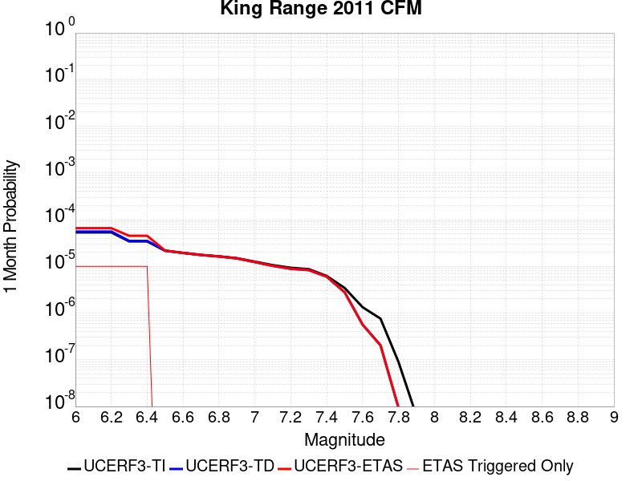 |  |  |

| Magnitude | 1 wk TI Prob | 1 wk TD Prob | 1 wk ETAS Prob | 1 wk ETAS/TD Gain | 1 wk ETAS Triggered Only | 1 mo TI Prob | 1 mo TD Prob | 1 mo ETAS Prob | 1 mo ETAS/TD Gain | 1 mo ETAS Triggered Only | 1 yr TI Prob | 1 yr TD Prob | 1 yr ETAS Prob | 1 yr ETAS/TD Gain | 1 yr ETAS Triggered Only | 10 yr TI Prob | 10 yr TD Prob | 10 yr ETAS Prob | 10 yr ETAS/TD Gain | 10 yr ETAS Triggered Only |
|-----|-----|-----|-----|-----|-----|-----|-----|-----|-----|-----|-----|-----|-----|-----|-----|-----|-----|-----|-----|-----|
| 6.0 | 1.2462566E-5 | 1.3021528E-5 | 2.3021397E-5 | 1.767949 | 1.0E-5 | 5.34099E-5 | 5.580555E-5 | 6.580499E-5 | 1.1791836 | 1.0E-5 | 6.5007154E-4 | 6.792557E-4 | 6.892489E-4 | 1.014712 | 1.0E-5 | 0.0064817313 | 0.0067761913 | 0.0067861234 | 1.0014658 | 1.0E-5 |
| 6.1 | 1.2462566E-5 | 1.3021528E-5 | 2.3021397E-5 | 1.767949 | 1.0E-5 | 5.34099E-5 | 5.580555E-5 | 6.580499E-5 | 1.1791836 | 1.0E-5 | 6.5007154E-4 | 6.792557E-4 | 6.892489E-4 | 1.014712 | 1.0E-5 | 0.0064817313 | 0.0067761913 | 0.0067861234 | 1.0014658 | 1.0E-5 |
| 6.2 | 1.2462566E-5 | 1.3021528E-5 | 2.3021397E-5 | 1.767949 | 1.0E-5 | 5.34099E-5 | 5.580555E-5 | 6.580499E-5 | 1.1791836 | 1.0E-5 | 6.5007154E-4 | 6.792557E-4 | 6.892489E-4 | 1.014712 | 1.0E-5 | 0.0064817313 | 0.0067761913 | 0.0067861234 | 1.0014658 | 1.0E-5 |
| 6.3 | 7.988484E-6 | 8.212644E-6 | 1.8212562E-5 | 2.2176247 | 1.0E-5 | 3.423591E-5 | 3.5196645E-5 | 4.519629E-5 | 1.284108 | 1.0E-5 | 4.1674246E-4 | 4.2844782E-4 | 4.3844353E-4 | 1.0233301 | 1.0E-5 | 0.004159618 | 0.0042784447 | 0.004288402 | 1.0023273 | 1.0E-5 |
| 6.4 | 7.988484E-6 | 8.212644E-6 | 1.8212562E-5 | 2.2176247 | 1.0E-5 | 3.423591E-5 | 3.5196645E-5 | 4.519629E-5 | 1.284108 | 1.0E-5 | 4.1674246E-4 | 4.2844782E-4 | 4.3844353E-4 | 1.0233301 | 1.0E-5 | 0.004159618 | 0.0042784447 | 0.004288402 | 1.0023273 | 1.0E-5 |
| 6.5 | 5.0522513E-6 | 5.0811104E-6 | 5.0811104E-6 | 1.0 | 0.0 | 2.1652326E-5 | 2.1776012E-5 | 2.1776012E-5 | 1.0 | 0.0 | 2.6358519E-4 | 2.6509163E-4 | 2.6509163E-4 | 1.0 | 0.0 | 0.0026327274 | 0.0026488027 | 0.0026488027 | 1.0 | 0.0 |
| 6.6 | 4.53682E-6 | 4.537814E-6 | 4.537814E-6 | 1.0 | 0.0 | 1.944337E-5 | 1.9447634E-5 | 1.9447634E-5 | 1.0 | 0.0 | 2.3669732E-4 | 2.3674982E-4 | 2.3674982E-4 | 1.0 | 0.0 | 0.0023644536 | 0.0023659924 | 0.0023659924 | 1.0 | 0.0 |
| 6.7 | 4.1144335E-6 | 4.095847E-6 | 4.095847E-6 | 1.0 | 0.0 | 1.7633167E-5 | 1.7553515E-5 | 1.7553515E-5 | 1.0 | 0.0 | 2.1466266E-4 | 2.1369348E-4 | 2.1369348E-4 | 1.0 | 0.0 | 0.0021445542 | 0.0021358754 | 0.0021358754 | 1.0 | 0.0 |
| 6.8 | 3.8321214E-6 | 3.806312E-6 | 3.806312E-6 | 1.0 | 0.0 | 1.6423275E-5 | 1.6312666E-5 | 1.6312666E-5 | 1.0 | 0.0 | 1.9993502E-4 | 1.9858892E-4 | 1.9858892E-4 | 1.0 | 0.0 | 0.0019975523 | 0.0019851038 | 0.0019851038 | 1.0 | 0.0 |
| 6.9 | 3.4999944E-6 | 3.4627603E-6 | 3.4627603E-6 | 1.0 | 0.0 | 1.499989E-5 | 1.4840319E-5 | 1.4840319E-5 | 1.0 | 0.0 | 1.8260835E-4 | 1.8066615E-4 | 1.8066615E-4 | 1.0 | 0.0 | 0.0018245836 | 0.0018061742 | 0.0018061742 | 1.0 | 0.0 |
| 7.0 | 2.9470837E-6 | 2.8858794E-6 | 2.8858794E-6 | 1.0 | 0.0 | 1.26302975E-5 | 1.2367997E-5 | 1.2367997E-5 | 1.0 | 0.0 | 1.5376302E-4 | 1.5057014E-4 | 1.5057014E-4 | 1.0 | 0.0 | 0.0015365666 | 0.0015056526 | 0.0015056526 | 1.0 | 0.0 |
| 7.1 | 2.4850247E-6 | 2.3971704E-6 | 2.3971704E-6 | 1.0 | 0.0 | 1.0650062E-5 | 1.0273548E-5 | 1.0273548E-5 | 1.0 | 0.0 | 1.296568E-4 | 1.250734E-4 | 1.250734E-4 | 1.0 | 0.0 | 0.0012958117 | 0.001250998 | 0.001250998 | 1.0 | 0.0 |
| 7.2 | 2.1800304E-6 | 2.0754885E-6 | 2.0754885E-6 | 1.0 | 0.0 | 9.342954E-6 | 8.894921E-6 | 8.894921E-6 | 1.0 | 0.0 | 1.1374453E-4 | 1.0829037E-4 | 1.0829037E-4 | 1.0 | 0.0 | 0.0011368633 | 0.001083327 | 0.001083327 | 1.0 | 0.0 |
| 7.3 | 2.0378504E-6 | 1.9491245E-6 | 1.9491245E-6 | 1.0 | 0.0 | 8.733615E-6 | 8.353364E-6 | 8.353364E-6 | 1.0 | 0.0 | 1.0632657E-4 | 1.0169755E-4 | 1.0169755E-4 | 1.0 | 0.0 | 0.0010627571 | 0.0010174458 | 0.0010174458 | 1.0 | 0.0 |
| 7.4 | 1.4577047E-6 | 1.4092694E-6 | 1.4092694E-6 | 1.0 | 0.0 | 6.247291E-6 | 6.039713E-6 | 6.039713E-6 | 1.0 | 0.0 | 7.605811E-5 | 7.35311E-5 | 7.35311E-5 | 1.0 | 0.0 | 7.603208E-4 | 7.3593494E-4 | 7.3593494E-4 | 1.0 | 0.0 |
| 7.5 | 8.0685743E-7 | 6.5343784E-7 | 6.5343784E-7 | 1.0 | 0.0 | 3.457956E-6 | 2.8004451E-6 | 2.8004451E-6 | 1.0 | 0.0 | 4.20998E-5 | 3.4094934E-5 | 3.4094934E-5 | 1.0 | 0.0 | 4.2091825E-4 | 3.415985E-4 | 3.415985E-4 | 1.0 | 0.0 |
| 7.6 | 3.1239435E-7 | 1.3264773E-7 | 1.3264773E-7 | 1.0 | 0.0 | 1.3388321E-6 | 5.684902E-7 | 5.684902E-7 | 1.0 | 0.0 | 1.630016E-5 | 6.9213465E-6 | 6.9213465E-6 | 1.0 | 0.0 | 1.6298964E-4 | 6.985275E-5 | 6.985275E-5 | 1.0 | 0.0 |
| 7.7 | 1.7747207E-7 | 4.7722644E-8 | 4.7722644E-8 | 1.0 | 0.0 | 7.605944E-7 | 2.045256E-7 | 2.045256E-7 | 1.0 | 0.0 | 9.260198E-6 | 2.4900964E-6 | 2.4900964E-6 | 1.0 | 0.0 | 9.2598115E-5 | 2.5308284E-5 | 2.5308284E-5 | 1.0 | 0.0 |
| 7.8 | 2.1035538E-8 | 2.198462E-9 | 2.198462E-9 | 1.0 | 0.0 | 9.0152305E-8 | 9.421983E-9 | 9.421983E-9 | 1.0 | 0.0 | 1.0976038E-6 | 1.14712634E-7 | 1.14712634E-7 | 1.0 | 0.0 | 1.0975983E-5 | 1.1835716E-6 | 1.1835716E-6 | 1.0 | 0.0 |
| 7.9 | 1.4782963E-9 | 8.670842E-13 | 8.670842E-13 | 1.0 | 0.0 | 6.335555E-9 | 3.7163606E-12 | 3.7163606E-12 | 1.0 | 0.0 | 7.713538E-8 | 4.5246695E-11 | 4.5246695E-11 | 1.0 | 0.0 | 7.7135354E-7 | 6.5413386E-10 | 6.5413386E-10 | 1.0 | 0.0 |

## Round Valley
*[(top)](#table-of-contents)*

| 1 Week | 1 Month | 1 Year | 10 Year |
|-----|-----|-----|-----|
|  |  |  |  |

| Magnitude | 1 wk TI Prob | 1 wk TD Prob | 1 wk ETAS Prob | 1 wk ETAS/TD Gain | 1 wk ETAS Triggered Only | 1 mo TI Prob | 1 mo TD Prob | 1 mo ETAS Prob | 1 mo ETAS/TD Gain | 1 mo ETAS Triggered Only | 1 yr TI Prob | 1 yr TD Prob | 1 yr ETAS Prob | 1 yr ETAS/TD Gain | 1 yr ETAS Triggered Only | 10 yr TI Prob | 10 yr TD Prob | 10 yr ETAS Prob | 10 yr ETAS/TD Gain | 10 yr ETAS Triggered Only |
|-----|-----|-----|-----|-----|-----|-----|-----|-----|-----|-----|-----|-----|-----|-----|-----|-----|-----|-----|-----|-----|
| 6.0 | 1.588152E-5 | 1.3670525E-5 | 1.3670525E-5 | 1.0 | 0.0 | 6.806188E-5 | 5.8586873E-5 | 5.8586873E-5 | 1.0 | 0.0 | 8.283384E-4 | 7.131011E-4 | 7.23094E-4 | 1.0140133 | 1.0E-5 | 0.008252576 | 0.0071120164 | 0.0071219453 | 1.0013961 | 1.0E-5 |
| 6.1 | 1.588152E-5 | 1.3670525E-5 | 1.3670525E-5 | 1.0 | 0.0 | 6.806188E-5 | 5.8586873E-5 | 5.8586873E-5 | 1.0 | 0.0 | 8.283384E-4 | 7.131011E-4 | 7.23094E-4 | 1.0140133 | 1.0E-5 | 0.008252576 | 0.0071120164 | 0.0071219453 | 1.0013961 | 1.0E-5 |
| 6.2 | 1.588152E-5 | 1.3670525E-5 | 1.3670525E-5 | 1.0 | 0.0 | 6.806188E-5 | 5.8586873E-5 | 5.8586873E-5 | 1.0 | 0.0 | 8.283384E-4 | 7.131011E-4 | 7.23094E-4 | 1.0140133 | 1.0E-5 | 0.008252576 | 0.0071120164 | 0.0071219453 | 1.0013961 | 1.0E-5 |
| 6.3 | 1.588152E-5 | 1.3670525E-5 | 1.3670525E-5 | 1.0 | 0.0 | 6.806188E-5 | 5.8586873E-5 | 5.8586873E-5 | 1.0 | 0.0 | 8.283384E-4 | 7.131011E-4 | 7.23094E-4 | 1.0140133 | 1.0E-5 | 0.008252576 | 0.0071120164 | 0.0071219453 | 1.0013961 | 1.0E-5 |
| 6.4 | 1.588152E-5 | 1.3670525E-5 | 1.3670525E-5 | 1.0 | 0.0 | 6.806188E-5 | 5.8586873E-5 | 5.8586873E-5 | 1.0 | 0.0 | 8.283384E-4 | 7.131011E-4 | 7.23094E-4 | 1.0140133 | 1.0E-5 | 0.008252576 | 0.0071120164 | 0.0071219453 | 1.0013961 | 1.0E-5 |
| 6.5 | 1.0646776E-5 | 7.952847E-6 | 7.952847E-6 | 1.0 | 0.0 | 4.5628243E-5 | 3.4083234E-5 | 3.4083234E-5 | 1.0 | 0.0 | 5.553823E-4 | 4.1489274E-4 | 4.248886E-4 | 1.0240927 | 1.0E-5 | 0.005539963 | 0.00414201 | 0.0041519688 | 1.0024043 | 1.0E-5 |
| 6.6 | 8.632956E-6 | 5.768552E-6 | 5.768552E-6 | 1.0 | 0.0 | 3.6997862E-5 | 2.4722152E-5 | 2.4722152E-5 | 1.0 | 0.0 | 4.5035584E-4 | 3.0095447E-4 | 3.0095447E-4 | 1.0 | 0.0 | 0.0044944426 | 0.0030058469 | 0.0030058469 | 1.0 | 0.0 |
| 6.7 | 8.632956E-6 | 5.768552E-6 | 5.768552E-6 | 1.0 | 0.0 | 3.6997862E-5 | 2.4722152E-5 | 2.4722152E-5 | 1.0 | 0.0 | 4.5035584E-4 | 3.0095447E-4 | 3.0095447E-4 | 1.0 | 0.0 | 0.0044944426 | 0.0030058469 | 0.0030058469 | 1.0 | 0.0 |
| 6.8 | 7.143895E-6 | 4.201644E-6 | 4.201644E-6 | 1.0 | 0.0 | 3.0616335E-5 | 1.8006931E-5 | 1.8006931E-5 | 1.0 | 0.0 | 3.726901E-4 | 2.19214E-4 | 2.19214E-4 | 1.0 | 0.0 | 0.0037206567 | 0.0021901424 | 0.0021901424 | 1.0 | 0.0 |
| 6.9 | 6.5120694E-6 | 3.6642807E-6 | 3.6642807E-6 | 1.0 | 0.0 | 2.790857E-5 | 1.5703974E-5 | 1.5703974E-5 | 1.0 | 0.0 | 3.3973387E-4 | 1.9118062E-4 | 1.9118062E-4 | 1.0 | 0.0 | 0.0033921495 | 0.0019103106 | 0.0019103106 | 1.0 | 0.0 |
| 7.0 | 5.0614435E-6 | 2.6834869E-6 | 2.6834869E-6 | 1.0 | 0.0 | 2.169172E-5 | 1.1500612E-5 | 1.1500612E-5 | 1.0 | 0.0 | 2.6406467E-4 | 1.40012E-4 | 1.40012E-4 | 1.0 | 0.0 | 0.0026375111 | 0.0013993392 | 0.0013993392 | 1.0 | 0.0 |
| 7.1 | 4.41728E-6 | 2.3573243E-6 | 2.3573243E-6 | 1.0 | 0.0 | 1.8931061E-5 | 1.01027845E-5 | 1.01027845E-5 | 1.0 | 0.0 | 2.304613E-4 | 1.2299545E-4 | 1.2299545E-4 | 1.0 | 0.0 | 0.0023022245 | 0.0012293702 | 0.0012293702 | 1.0 | 0.0 |
| 7.2 | 2.535495E-6 | 1.120784E-6 | 1.120784E-6 | 1.0 | 0.0 | 1.0866362E-5 | 4.803354E-6 | 4.803354E-6 | 1.0 | 0.0 | 1.3228992E-4 | 5.8479785E-5 | 5.8479785E-5 | 1.0 | 0.0 | 0.0013221119 | 5.846952E-4 | 5.846952E-4 | 1.0 | 0.0 |
| 7.3 | 7.900015E-7 | 4.0888176E-7 | 4.0888176E-7 | 1.0 | 0.0 | 3.3857161E-6 | 1.7523504E-6 | 1.7523504E-6 | 1.0 | 0.0 | 4.1220315E-5 | 2.1334865E-5 | 2.1334865E-5 | 1.0 | 0.0 | 4.121267E-4 | 2.1334866E-4 | 2.1334866E-4 | 1.0 | 0.0 |

## Earthquake Valley (No  Extension)
*[(top)](#table-of-contents)*

| 1 Week | 1 Month | 1 Year | 10 Year |
|-----|-----|-----|-----|
|  |  |  |  |

| Magnitude | 1 wk TI Prob | 1 wk TD Prob | 1 wk ETAS Prob | 1 wk ETAS/TD Gain | 1 wk ETAS Triggered Only | 1 mo TI Prob | 1 mo TD Prob | 1 mo ETAS Prob | 1 mo ETAS/TD Gain | 1 mo ETAS Triggered Only | 1 yr TI Prob | 1 yr TD Prob | 1 yr ETAS Prob | 1 yr ETAS/TD Gain | 1 yr ETAS Triggered Only | 10 yr TI Prob | 10 yr TD Prob | 10 yr ETAS Prob | 10 yr ETAS/TD Gain | 10 yr ETAS Triggered Only |
|-----|-----|-----|-----|-----|-----|-----|-----|-----|-----|-----|-----|-----|-----|-----|-----|-----|-----|-----|-----|-----|
| 6.0 | 2.1859703E-5 | 2.5198351E-5 | 2.5198351E-5 | 1.0 | 0.0 | 9.3681076E-5 | 1.0798928E-4 | 1.0798928E-4 | 1.0 | 0.0 | 0.0011399703 | 0.0013141216 | 0.0013141216 | 1.0 | 0.0 | 0.011341401 | 0.013077869 | 0.013087738 | 1.0007546 | 1.0E-5 |
| 6.1 | 2.1859703E-5 | 2.5198351E-5 | 2.5198351E-5 | 1.0 | 0.0 | 9.3681076E-5 | 1.0798928E-4 | 1.0798928E-4 | 1.0 | 0.0 | 0.0011399703 | 0.0013141216 | 0.0013141216 | 1.0 | 0.0 | 0.011341401 | 0.013077869 | 0.013087738 | 1.0007546 | 1.0E-5 |
| 6.2 | 2.1859703E-5 | 2.5198351E-5 | 2.5198351E-5 | 1.0 | 0.0 | 9.3681076E-5 | 1.0798928E-4 | 1.0798928E-4 | 1.0 | 0.0 | 0.0011399703 | 0.0013141216 | 0.0013141216 | 1.0 | 0.0 | 0.011341401 | 0.013077869 | 0.013087738 | 1.0007546 | 1.0E-5 |
| 6.3 | 2.1859703E-5 | 2.5198351E-5 | 2.5198351E-5 | 1.0 | 0.0 | 9.3681076E-5 | 1.0798928E-4 | 1.0798928E-4 | 1.0 | 0.0 | 0.0011399703 | 0.0013141216 | 0.0013141216 | 1.0 | 0.0 | 0.011341401 | 0.013077869 | 0.013087738 | 1.0007546 | 1.0E-5 |
| 6.4 | 2.1859703E-5 | 2.5198351E-5 | 2.5198351E-5 | 1.0 | 0.0 | 9.3681076E-5 | 1.0798928E-4 | 1.0798928E-4 | 1.0 | 0.0 | 0.0011399703 | 0.0013141216 | 0.0013141216 | 1.0 | 0.0 | 0.011341401 | 0.013077869 | 0.013087738 | 1.0007546 | 1.0E-5 |
| 6.5 | 2.1859703E-5 | 2.5198351E-5 | 2.5198351E-5 | 1.0 | 0.0 | 9.3681076E-5 | 1.0798928E-4 | 1.0798928E-4 | 1.0 | 0.0 | 0.0011399703 | 0.0013141216 | 0.0013141216 | 1.0 | 0.0 | 0.011341401 | 0.013077869 | 0.013087738 | 1.0007546 | 1.0E-5 |
| 6.6 | 1.597E-5 | 1.835627E-5 | 1.835627E-5 | 1.0 | 0.0 | 6.8441055E-5 | 7.866784E-5 | 7.866784E-5 | 1.0 | 0.0 | 8.329513E-4 | 9.5744745E-4 | 9.5744745E-4 | 1.0 | 0.0 | 0.008298361 | 0.009541833 | 0.009551737 | 1.0010381 | 1.0E-5 |
| 6.7 | 1.597E-5 | 1.835627E-5 | 1.835627E-5 | 1.0 | 0.0 | 6.8441055E-5 | 7.866784E-5 | 7.866784E-5 | 1.0 | 0.0 | 8.329513E-4 | 9.5744745E-4 | 9.5744745E-4 | 1.0 | 0.0 | 0.008298361 | 0.009541833 | 0.009551737 | 1.0010381 | 1.0E-5 |
| 6.8 | 1.5315149E-5 | 1.7602086E-5 | 1.7602086E-5 | 1.0 | 0.0 | 6.5634704E-5 | 7.543582E-5 | 7.543582E-5 | 1.0 | 0.0 | 7.988095E-4 | 9.1813074E-4 | 9.1813074E-4 | 1.0 | 0.0 | 0.007959441 | 0.009151915 | 0.009161824 | 1.0010827 | 1.0E-5 |
| 6.9 | 1.3634728E-5 | 1.5675814E-5 | 1.5675814E-5 | 1.0 | 0.0 | 5.8433237E-5 | 6.7180794E-5 | 6.7180794E-5 | 1.0 | 0.0 | 7.1119244E-4 | 8.1770134E-4 | 8.1770134E-4 | 1.0 | 0.0 | 0.007089207 | 0.008154998 | 0.008164915 | 1.0012163 | 1.0E-5 |
| 7.0 | 1.3496271E-5 | 1.5517848E-5 | 1.5517848E-5 | 1.0 | 0.0 | 5.783988E-5 | 6.6503824E-5 | 6.6503824E-5 | 1.0 | 0.0 | 7.03973E-4 | 8.0946536E-4 | 8.0946536E-4 | 1.0 | 0.0 | 0.007017471 | 0.008073238 | 0.008083156 | 1.0012287 | 1.0E-5 |
| 7.1 | 8.242798E-6 | 9.472594E-6 | 9.472594E-6 | 1.0 | 0.0 | 3.53258E-5 | 4.0596577E-5 | 4.0596577E-5 | 1.0 | 0.0 | 4.300067E-4 | 4.9421826E-4 | 4.9421826E-4 | 1.0 | 0.0 | 0.004291756 | 0.0049377684 | 0.004947719 | 1.0020152 | 1.0E-5 |
| 7.2 | 2.6506527E-7 | 2.2559628E-7 | 2.2559628E-7 | 1.0 | 0.0 | 1.1359936E-6 | 9.668408E-7 | 9.668408E-7 | 1.0 | 0.0 | 1.3830633E-5 | 1.1771229E-5 | 1.1771229E-5 | 1.0 | 0.0 | 1.3829772E-4 | 1.1770646E-4 | 1.1770646E-4 | 1.0 | 0.0 |
| 7.3 | 2.5810488E-7 | 2.1954757E-7 | 2.1954757E-7 | 1.0 | 0.0 | 1.1061633E-6 | 9.4091786E-7 | 9.4091786E-7 | 1.0 | 0.0 | 1.3467455E-5 | 1.1455619E-5 | 1.1455619E-5 | 1.0 | 0.0 | 1.3466639E-4 | 1.145507E-4 | 1.145507E-4 | 1.0 | 0.0 |
| 7.4 | 2.2676066E-7 | 1.9109943E-7 | 1.9109943E-7 | 1.0 | 0.0 | 9.71831E-7 | 8.189973E-7 | 8.189973E-7 | 1.0 | 0.0 | 1.1831979E-5 | 9.971251E-6 | 9.971251E-6 | 1.0 | 0.0 | 1.1831349E-4 | 9.970842E-5 | 9.970842E-5 | 1.0 | 0.0 |
| 7.5 | 1.5553917E-7 | 1.311138E-7 | 1.311138E-7 | 1.0 | 0.0 | 6.6659624E-7 | 5.619162E-7 | 5.619162E-7 | 1.0 | 0.0 | 8.115779E-6 | 6.84131E-6 | 6.84131E-6 | 1.0 | 0.0 | 8.115482E-5 | 6.841121E-5 | 6.841121E-5 | 1.0 | 0.0 |
| 7.6 | 1.3448629E-7 | 1.1287708E-7 | 1.1287708E-7 | 1.0 | 0.0 | 5.7636964E-7 | 4.8375887E-7 | 4.8375887E-7 | 1.0 | 0.0 | 7.017278E-6 | 5.8897504E-6 | 5.8897504E-6 | 1.0 | 0.0 | 7.0170565E-5 | 5.8896156E-5 | 5.8896156E-5 | 1.0 | 0.0 |
| 7.7 | 2.9719402E-8 | 1.4581234E-8 | 1.4581234E-8 | 1.0 | 0.0 | 1.2736886E-7 | 6.2491004E-8 | 6.2491004E-8 | 1.0 | 0.0 | 1.5507147E-6 | 7.6082773E-7 | 7.6082773E-7 | 1.0 | 0.0 | 1.550704E-5 | 7.608257E-6 | 7.608257E-6 | 1.0 | 0.0 |
| 7.8 | 7.4390196E-9 | 3.249962E-9 | 3.249962E-9 | 1.0 | 0.0 | 3.1881513E-8 | 1.39284095E-8 | 1.39284095E-8 | 1.0 | 0.0 | 3.8815733E-7 | 1.6957837E-7 | 1.6957837E-7 | 1.0 | 0.0 | 3.8815665E-6 | 1.6957828E-6 | 1.6957828E-6 | 1.0 | 0.0 |
| 7.9 | 1.5373532E-9 | 8.4400953E-10 | 8.4400953E-10 | 1.0 | 0.0 | 6.5886567E-9 | 3.6171839E-9 | 3.6171839E-9 | 1.0 | 0.0 | 8.021689E-8 | 4.403921E-8 | 4.403921E-8 | 1.0 | 0.0 | 8.0216864E-7 | 4.403921E-7 | 4.403921E-7 | 1.0 | 0.0 |

## Elsinore (Coyote Mountains)
*[(top)](#table-of-contents)*

| 1 Week | 1 Month | 1 Year | 10 Year |
|-----|-----|-----|-----|
|  |  |  |  |

| Magnitude | 1 wk TI Prob | 1 wk TD Prob | 1 wk ETAS Prob | 1 wk ETAS/TD Gain | 1 wk ETAS Triggered Only | 1 mo TI Prob | 1 mo TD Prob | 1 mo ETAS Prob | 1 mo ETAS/TD Gain | 1 mo ETAS Triggered Only | 1 yr TI Prob | 1 yr TD Prob | 1 yr ETAS Prob | 1 yr ETAS/TD Gain | 1 yr ETAS Triggered Only | 10 yr TI Prob | 10 yr TD Prob | 10 yr ETAS Prob | 10 yr ETAS/TD Gain | 10 yr ETAS Triggered Only |
|-----|-----|-----|-----|-----|-----|-----|-----|-----|-----|-----|-----|-----|-----|-----|-----|-----|-----|-----|-----|-----|
| 6.0 | 4.20513E-5 | 4.8630944E-5 | 4.8630944E-5 | 1.0 | 0.0 | 1.8020741E-4 | 2.0840492E-4 | 2.1840284E-4 | 1.0479735 | 1.0E-5 | 0.0021918174 | 0.0025349057 | 0.0025448804 | 1.0039349 | 1.0E-5 | 0.021703249 | 0.025111204 | 0.025120951 | 1.0003883 | 1.0E-5 |
| 6.1 | 4.20513E-5 | 4.8630944E-5 | 4.8630944E-5 | 1.0 | 0.0 | 1.8020741E-4 | 2.0840492E-4 | 2.1840284E-4 | 1.0479735 | 1.0E-5 | 0.0021918174 | 0.0025349057 | 0.0025448804 | 1.0039349 | 1.0E-5 | 0.021703249 | 0.025111204 | 0.025120951 | 1.0003883 | 1.0E-5 |
| 6.2 | 2.3413893E-5 | 2.4695422E-5 | 2.4695422E-5 | 1.0 | 0.0 | 1.0034139E-4 | 1.0583377E-4 | 1.0583377E-4 | 1.0 | 0.0 | 0.0012209718 | 0.0012878523 | 0.0012878523 | 1.0 | 0.0 | 0.012142851 | 0.012812569 | 0.012812569 | 1.0 | 0.0 |
| 6.3 | 2.3413893E-5 | 2.4695422E-5 | 2.4695422E-5 | 1.0 | 0.0 | 1.0034139E-4 | 1.0583377E-4 | 1.0583377E-4 | 1.0 | 0.0 | 0.0012209718 | 0.0012878523 | 0.0012878523 | 1.0 | 0.0 | 0.012142851 | 0.012812569 | 0.012812569 | 1.0 | 0.0 |
| 6.4 | 1.6894814E-5 | 1.6568214E-5 | 1.6568214E-5 | 1.0 | 0.0 | 7.240433E-5 | 7.100491E-5 | 7.100491E-5 | 1.0 | 0.0 | 8.811662E-4 | 8.641788E-4 | 8.641788E-4 | 1.0 | 0.0 | 0.0087768035 | 0.008611842 | 0.008611842 | 1.0 | 0.0 |
| 6.5 | 1.6894814E-5 | 1.6568214E-5 | 1.6568214E-5 | 1.0 | 0.0 | 7.240433E-5 | 7.100491E-5 | 7.100491E-5 | 1.0 | 0.0 | 8.811662E-4 | 8.641788E-4 | 8.641788E-4 | 1.0 | 0.0 | 0.0087768035 | 0.008611842 | 0.008611842 | 1.0 | 0.0 |
| 6.6 | 1.1910969E-5 | 1.0530538E-5 | 1.0530538E-5 | 1.0 | 0.0 | 5.1046012E-5 | 4.513017E-5 | 4.513017E-5 | 1.0 | 0.0 | 6.21308E-4 | 5.493346E-4 | 5.493346E-4 | 1.0 | 0.0 | 0.0061957375 | 0.0054810685 | 0.0054810685 | 1.0 | 0.0 |
| 6.7 | 9.1486E-6 | 7.2026473E-6 | 7.2026473E-6 | 1.0 | 0.0 | 3.9207694E-5 | 3.0868145E-5 | 3.0868145E-5 | 1.0 | 0.0 | 4.7724912E-4 | 3.7575865E-4 | 3.7575865E-4 | 1.0 | 0.0 | 0.0047622547 | 0.0037516125 | 0.0037516125 | 1.0 | 0.0 |
| 6.8 | 7.90441E-6 | 5.7288153E-6 | 5.7288153E-6 | 1.0 | 0.0 | 3.3875604E-5 | 2.4551842E-5 | 2.4551842E-5 | 1.0 | 0.0 | 4.1235742E-4 | 2.9887896E-4 | 2.9887896E-4 | 1.0 | 0.0 | 0.0041159308 | 0.0029848986 | 0.0029848986 | 1.0 | 0.0 |
| 6.9 | 7.77015E-6 | 5.5827695E-6 | 5.5827695E-6 | 1.0 | 0.0 | 3.3300217E-5 | 2.3925944E-5 | 2.3925944E-5 | 1.0 | 0.0 | 4.0535472E-4 | 2.912607E-4 | 2.912607E-4 | 1.0 | 0.0 | 0.004046161 | 0.0029089167 | 0.0029089167 | 1.0 | 0.0 |
| 7.0 | 7.675798E-6 | 5.4796283E-6 | 5.4796283E-6 | 1.0 | 0.0 | 3.289586E-5 | 2.3483917E-5 | 2.3483917E-5 | 1.0 | 0.0 | 4.004335E-4 | 2.8588044E-4 | 2.8588044E-4 | 1.0 | 0.0 | 0.003997127 | 0.0028552532 | 0.0028552532 | 1.0 | 0.0 |
| 7.1 | 7.447814E-6 | 5.2385003E-6 | 5.2385003E-6 | 1.0 | 0.0 | 3.191881E-5 | 2.245053E-5 | 2.245053E-5 | 1.0 | 0.0 | 3.8854225E-4 | 2.7330214E-4 | 2.7330214E-4 | 1.0 | 0.0 | 0.003878636 | 0.0027297847 | 0.0027297847 | 1.0 | 0.0 |
| 7.2 | 7.128185E-6 | 4.905146E-6 | 4.905146E-6 | 1.0 | 0.0 | 3.0549007E-5 | 2.1021891E-5 | 2.1021891E-5 | 1.0 | 0.0 | 3.7187067E-4 | 2.5591266E-4 | 2.5591266E-4 | 1.0 | 0.0 | 0.00371249 | 0.002556298 | 0.002556298 | 1.0 | 0.0 |
| 7.3 | 7.0913875E-6 | 4.873821E-6 | 4.873821E-6 | 1.0 | 0.0 | 3.0391306E-5 | 2.0887644E-5 | 2.0887644E-5 | 1.0 | 0.0 | 3.6995133E-4 | 2.542786E-4 | 2.542786E-4 | 1.0 | 0.0 | 0.0036933604 | 0.0025399947 | 0.0025399947 | 1.0 | 0.0 |
| 7.4 | 7.051521E-6 | 4.837673E-6 | 4.837673E-6 | 1.0 | 0.0 | 3.0220453E-5 | 2.0732725E-5 | 2.0732725E-5 | 1.0 | 0.0 | 3.6787192E-4 | 2.5239287E-4 | 2.5239287E-4 | 1.0 | 0.0 | 0.0036726352 | 0.0025211805 | 0.0025211805 | 1.0 | 0.0 |
| 7.5 | 6.910666E-6 | 4.7332255E-6 | 4.7332255E-6 | 1.0 | 0.0 | 2.9616802E-5 | 2.02851E-5 | 2.02851E-5 | 1.0 | 0.0 | 3.605249E-4 | 2.4694428E-4 | 2.4694428E-4 | 1.0 | 0.0 | 0.0035994058 | 0.002466817 | 0.002466817 | 1.0 | 0.0 |
| 7.6 | 6.341753E-6 | 4.306345E-6 | 4.306345E-6 | 1.0 | 0.0 | 2.7178658E-5 | 1.8455641E-5 | 1.8455641E-5 | 1.0 | 0.0 | 3.3084993E-4 | 2.2467543E-4 | 2.2467543E-4 | 1.0 | 0.0 | 0.0033035777 | 0.002244598 | 0.002244598 | 1.0 | 0.0 |
| 7.7 | 3.9205916E-6 | 2.2437468E-6 | 2.2437468E-6 | 1.0 | 0.0 | 1.6802427E-5 | 9.616027E-6 | 9.616027E-6 | 1.0 | 0.0 | 2.0455034E-4 | 1.17069576E-4 | 1.17069576E-4 | 1.0 | 0.0 | 0.0020436216 | 0.001170152 | 0.001170152 | 1.0 | 0.0 |
| 7.8 | 2.0846227E-7 | 8.4853966E-8 | 8.4853966E-8 | 1.0 | 0.0 | 8.9340944E-7 | 3.6365984E-7 | 3.6365984E-7 | 1.0 | 0.0 | 1.0877206E-5 | 4.427553E-6 | 4.427553E-6 | 1.0 | 0.0 | 1.0876673E-4 | 4.4274973E-5 | 4.4274973E-5 | 1.0 | 0.0 |
| 7.9 | 4.4969806E-9 | 2.269088E-9 | 2.269088E-9 | 1.0 | 0.0 | 1.9272775E-8 | 9.724664E-9 | 9.724664E-9 | 1.0 | 0.0 | 2.3464601E-7 | 1.1839777E-7 | 1.1839777E-7 | 1.0 | 0.0 | 2.3464577E-6 | 1.1839772E-6 | 1.1839772E-6 | 1.0 | 0.0 |

## Bartlett Springs 2011 CFM
*[(top)](#table-of-contents)*

| 1 Week | 1 Month | 1 Year | 10 Year |
|-----|-----|-----|-----|
|  |  |  |  |

| Magnitude | 1 wk TI Prob | 1 wk TD Prob | 1 wk ETAS Prob | 1 wk ETAS/TD Gain | 1 wk ETAS Triggered Only | 1 mo TI Prob | 1 mo TD Prob | 1 mo ETAS Prob | 1 mo ETAS/TD Gain | 1 mo ETAS Triggered Only | 1 yr TI Prob | 1 yr TD Prob | 1 yr ETAS Prob | 1 yr ETAS/TD Gain | 1 yr ETAS Triggered Only | 10 yr TI Prob | 10 yr TD Prob | 10 yr ETAS Prob | 10 yr ETAS/TD Gain | 10 yr ETAS Triggered Only |
|-----|-----|-----|-----|-----|-----|-----|-----|-----|-----|-----|-----|-----|-----|-----|-----|-----|-----|-----|-----|-----|
| 6.0 | 6.2326144E-5 | 8.060668E-5 | 9.060588E-5 | 1.1240492 | 1.0E-5 | 2.6708472E-4 | 3.4541206E-4 | 3.554086E-4 | 1.0289409 | 1.0E-5 | 0.003246908 | 0.0041973754 | 0.0042073335 | 1.0023724 | 1.0E-5 | 0.031998757 | 0.041198105 | 0.041207694 | 1.0002327 | 1.0E-5 |
| 6.1 | 6.227657E-5 | 8.054418E-5 | 9.054338E-5 | 1.1241455 | 1.0E-5 | 2.668723E-4 | 3.4514428E-4 | 3.5514083E-4 | 1.0289634 | 1.0E-5 | 0.0032443295 | 0.004194128 | 0.004204086 | 1.0023743 | 1.0E-5 | 0.031973712 | 0.041166842 | 0.04117643 | 1.0002329 | 1.0E-5 |
| 6.2 | 6.22452E-5 | 8.050479E-5 | 9.0503985E-5 | 1.1242062 | 1.0E-5 | 2.6673786E-4 | 3.449755E-4 | 3.5497203E-4 | 1.0289775 | 1.0E-5 | 0.0032426978 | 0.004192081 | 0.004202039 | 1.0023755 | 1.0E-5 | 0.03195787 | 0.04114713 | 0.04115672 | 1.000233 | 1.0E-5 |
| 6.3 | 6.219006E-5 | 8.043463E-5 | 9.043382E-5 | 1.1243145 | 1.0E-5 | 2.6650162E-4 | 3.4467486E-4 | 3.546714E-4 | 1.0290029 | 1.0E-5 | 0.00323983 | 0.0041884347 | 0.004198393 | 1.0023775 | 1.0E-5 | 0.031930014 | 0.04111203 | 0.04112162 | 1.0002333 | 1.0E-5 |
| 6.4 | 5.2175856E-5 | 6.7254E-5 | 6.7254E-5 | 1.0 | 0.0 | 2.2359163E-4 | 2.8819984E-4 | 2.8819984E-4 | 1.0 | 0.0 | 0.0027188298 | 0.0035032362 | 0.0035032362 | 1.0 | 0.0 | 0.026858058 | 0.03448956 | 0.03448956 | 1.0 | 0.0 |
| 6.5 | 5.205166E-5 | 6.709666E-5 | 6.709666E-5 | 1.0 | 0.0 | 2.2305945E-4 | 2.875257E-4 | 2.875257E-4 | 1.0 | 0.0 | 0.0027123666 | 0.0034950553 | 0.0034950553 | 1.0 | 0.0 | 0.026794989 | 0.034410305 | 0.034410305 | 1.0 | 0.0 |
| 6.6 | 5.0085426E-5 | 6.449303E-5 | 6.449303E-5 | 1.0 | 0.0 | 2.1463417E-4 | 2.7636968E-4 | 2.7636968E-4 | 1.0 | 0.0 | 0.0026100394 | 0.0033596596 | 0.0033596596 | 1.0 | 0.0 | 0.025795965 | 0.03309789 | 0.03309789 | 1.0 | 0.0 |
| 6.7 | 4.8930866E-5 | 6.30177E-5 | 6.30177E-5 | 1.0 | 0.0 | 2.0968684E-4 | 2.700482E-4 | 2.700482E-4 | 1.0 | 0.0 | 0.0025499484 | 0.0032829295 | 0.0032829295 | 1.0 | 0.0 | 0.025208864 | 0.032353252 | 0.032353252 | 1.0 | 0.0 |
| 6.8 | 4.5679535E-5 | 5.874213E-5 | 5.874213E-5 | 1.0 | 0.0 | 1.9575475E-4 | 2.517279E-4 | 2.517279E-4 | 1.0 | 0.0 | 0.002380709 | 0.0030605178 | 0.0030605178 | 1.0 | 0.0 | 0.023553653 | 0.030190729 | 0.030190729 | 1.0 | 0.0 |
| 6.9 | 4.1439176E-5 | 5.3220345E-5 | 5.3220345E-5 | 1.0 | 0.0 | 1.7758438E-4 | 2.2806737E-4 | 2.2806737E-4 | 1.0 | 0.0 | 0.002159946 | 0.00277321 | 0.00277321 | 1.0 | 0.0 | 0.021390721 | 0.02739108 | 0.02739108 | 1.0 | 0.0 |
| 7.0 | 3.5920104E-5 | 4.6008958E-5 | 4.6008958E-5 | 1.0 | 0.0 | 1.5393422E-4 | 1.9716643E-4 | 1.9716643E-4 | 1.0 | 0.0 | 0.001872538 | 0.0023978746 | 0.0023978746 | 1.0 | 0.0 | 0.018568378 | 0.023723308 | 0.023723308 | 1.0 | 0.0 |
| 7.1 | 3.338812E-5 | 4.2689815E-5 | 4.2689815E-5 | 1.0 | 0.0 | 1.430841E-4 | 1.829436E-4 | 1.829436E-4 | 1.0 | 0.0 | 0.0017406568 | 0.0022250775 | 0.0022250775 | 1.0 | 0.0 | 0.017270854 | 0.02203084 | 0.02203084 | 1.0 | 0.0 |
| 7.2 | 2.8619615E-5 | 3.640186E-5 | 3.640186E-5 | 1.0 | 0.0 | 1.2264973E-4 | 1.559987E-4 | 1.559987E-4 | 1.0 | 0.0 | 0.0014922376 | 0.0018976394 | 0.0018976394 | 1.0 | 0.0 | 0.014822568 | 0.018816413 | 0.018816413 | 1.0 | 0.0 |
| 7.3 | 2.6376783E-5 | 3.3422963E-5 | 3.3422963E-5 | 1.0 | 0.0 | 1.13038455E-4 | 1.4323345E-4 | 1.4323345E-4 | 1.0 | 0.0 | 0.0013753743 | 0.0017424817 | 0.0017424817 | 1.0 | 0.0 | 0.01366893 | 0.017289983 | 0.017289983 | 1.0 | 0.0 |
| 7.4 | 2.3738676E-5 | 2.9979174E-5 | 2.9979174E-5 | 1.0 | 0.0 | 1.0173322E-4 | 1.2847589E-4 | 1.2847589E-4 | 1.0 | 0.0 | 0.0012378981 | 0.0015630797 | 0.0015630797 | 1.0 | 0.0 | 0.012310251 | 0.01552236 | 0.01552236 | 1.0 | 0.0 |
| 7.5 | 2.1789481E-5 | 2.7439555E-5 | 2.7439555E-5 | 1.0 | 0.0 | 9.338015E-5 | 1.1759284E-4 | 1.1759284E-4 | 1.0 | 0.0 | 0.0011363103 | 0.0014307604 | 0.0014307604 | 1.0 | 0.0 | 0.011305175 | 0.014216874 | 0.014216874 | 1.0 | 0.0 |
| 7.6 | 1.3895281E-5 | 1.7368566E-5 | 1.7368566E-5 | 1.0 | 0.0 | 5.9549846E-5 | 7.44346E-5 | 7.44346E-5 | 1.0 | 0.0 | 7.2477816E-4 | 9.058674E-4 | 9.058674E-4 | 1.0 | 0.0 | 0.0072241887 | 0.009022309 | 0.009022309 | 1.0 | 0.0 |
| 7.7 | 4.245981E-6 | 5.1625234E-6 | 5.1625234E-6 | 1.0 | 0.0 | 1.8196934E-5 | 2.2124914E-5 | 2.2124914E-5 | 1.0 | 0.0 | 2.2152514E-4 | 2.693377E-4 | 2.693377E-4 | 1.0 | 0.0 | 0.0022130446 | 0.00269016 | 0.00269016 | 1.0 | 0.0 |
| 7.8 | 6.145192E-7 | 7.0470315E-7 | 7.0470315E-7 | 1.0 | 0.0 | 2.633651E-6 | 3.020153E-6 | 3.020153E-6 | 1.0 | 0.0 | 3.206423E-5 | 3.6769754E-5 | 3.6769754E-5 | 1.0 | 0.0 | 3.2059604E-4 | 3.6763048E-4 | 3.6763048E-4 | 1.0 | 0.0 |

## Sisar
*[(top)](#table-of-contents)*

| 1 Week | 1 Month | 1 Year | 10 Year |
|-----|-----|-----|-----|
|  |  | 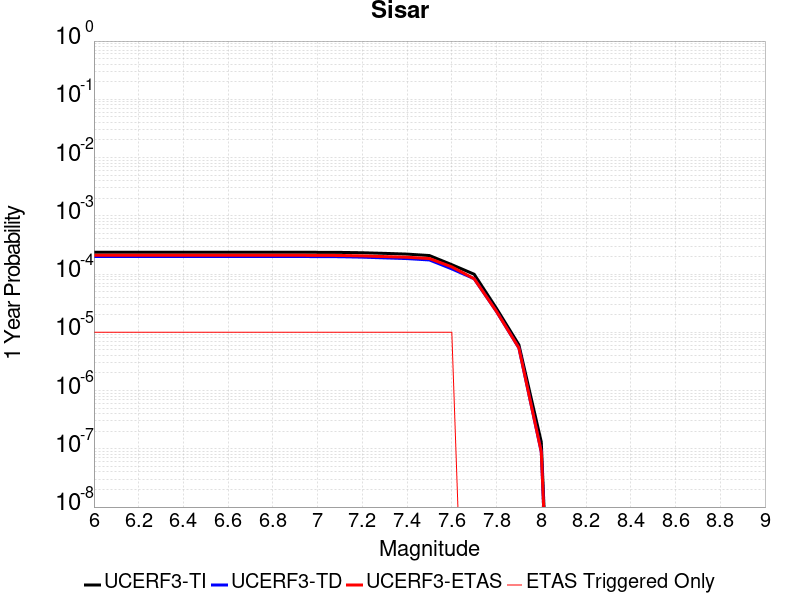 |  |

| Magnitude | 1 wk TI Prob | 1 wk TD Prob | 1 wk ETAS Prob | 1 wk ETAS/TD Gain | 1 wk ETAS Triggered Only | 1 mo TI Prob | 1 mo TD Prob | 1 mo ETAS Prob | 1 mo ETAS/TD Gain | 1 mo ETAS Triggered Only | 1 yr TI Prob | 1 yr TD Prob | 1 yr ETAS Prob | 1 yr ETAS/TD Gain | 1 yr ETAS Triggered Only | 10 yr TI Prob | 10 yr TD Prob | 10 yr ETAS Prob | 10 yr ETAS/TD Gain | 10 yr ETAS Triggered Only |
|-----|-----|-----|-----|-----|-----|-----|-----|-----|-----|-----|-----|-----|-----|-----|-----|-----|-----|-----|-----|-----|
| 6.0 | 4.544193E-6 | 3.8396115E-6 | 1.38395735E-5 | 3.6044202 | 1.0E-5 | 1.9474966E-5 | 1.6455377E-5 | 2.645521E-5 | 1.6076941 | 1.0E-5 | 2.3708193E-4 | 2.0032612E-4 | 2.1032411E-4 | 1.0499086 | 1.0E-5 | 0.0023682916 | 0.002001489 | 0.002011469 | 1.0049863 | 1.0E-5 |
| 6.1 | 4.544193E-6 | 3.8396115E-6 | 1.38395735E-5 | 3.6044202 | 1.0E-5 | 1.9474966E-5 | 1.6455377E-5 | 2.645521E-5 | 1.6076941 | 1.0E-5 | 2.3708193E-4 | 2.0032612E-4 | 2.1032411E-4 | 1.0499086 | 1.0E-5 | 0.0023682916 | 0.002001489 | 0.002011469 | 1.0049863 | 1.0E-5 |
| 6.2 | 4.544193E-6 | 3.8396115E-6 | 1.38395735E-5 | 3.6044202 | 1.0E-5 | 1.9474966E-5 | 1.6455377E-5 | 2.645521E-5 | 1.6076941 | 1.0E-5 | 2.3708193E-4 | 2.0032612E-4 | 2.1032411E-4 | 1.0499086 | 1.0E-5 | 0.0023682916 | 0.002001489 | 0.002011469 | 1.0049863 | 1.0E-5 |
| 6.3 | 4.544193E-6 | 3.8396115E-6 | 1.38395735E-5 | 3.6044202 | 1.0E-5 | 1.9474966E-5 | 1.6455377E-5 | 2.645521E-5 | 1.6076941 | 1.0E-5 | 2.3708193E-4 | 2.0032612E-4 | 2.1032411E-4 | 1.0499086 | 1.0E-5 | 0.0023682916 | 0.002001489 | 0.002011469 | 1.0049863 | 1.0E-5 |
| 6.4 | 4.544193E-6 | 3.8396115E-6 | 1.38395735E-5 | 3.6044202 | 1.0E-5 | 1.9474966E-5 | 1.6455377E-5 | 2.645521E-5 | 1.6076941 | 1.0E-5 | 2.3708193E-4 | 2.0032612E-4 | 2.1032411E-4 | 1.0499086 | 1.0E-5 | 0.0023682916 | 0.002001489 | 0.002011469 | 1.0049863 | 1.0E-5 |
| 6.5 | 4.544193E-6 | 3.8396115E-6 | 1.38395735E-5 | 3.6044202 | 1.0E-5 | 1.9474966E-5 | 1.6455377E-5 | 2.645521E-5 | 1.6076941 | 1.0E-5 | 2.3708193E-4 | 2.0032612E-4 | 2.1032411E-4 | 1.0499086 | 1.0E-5 | 0.0023682916 | 0.002001489 | 0.002011469 | 1.0049863 | 1.0E-5 |
| 6.6 | 4.544193E-6 | 3.8396115E-6 | 1.38395735E-5 | 3.6044202 | 1.0E-5 | 1.9474966E-5 | 1.6455377E-5 | 2.645521E-5 | 1.6076941 | 1.0E-5 | 2.3708193E-4 | 2.0032612E-4 | 2.1032411E-4 | 1.0499086 | 1.0E-5 | 0.0023682916 | 0.002001489 | 0.002011469 | 1.0049863 | 1.0E-5 |
| 6.7 | 4.544193E-6 | 3.8396115E-6 | 1.38395735E-5 | 3.6044202 | 1.0E-5 | 1.9474966E-5 | 1.6455377E-5 | 2.645521E-5 | 1.6076941 | 1.0E-5 | 2.3708193E-4 | 2.0032612E-4 | 2.1032411E-4 | 1.0499086 | 1.0E-5 | 0.0023682916 | 0.002001489 | 0.002011469 | 1.0049863 | 1.0E-5 |
| 6.8 | 4.544193E-6 | 3.8396115E-6 | 1.38395735E-5 | 3.6044202 | 1.0E-5 | 1.9474966E-5 | 1.6455377E-5 | 2.645521E-5 | 1.6076941 | 1.0E-5 | 2.3708193E-4 | 2.0032612E-4 | 2.1032411E-4 | 1.0499086 | 1.0E-5 | 0.0023682916 | 0.002001489 | 0.002011469 | 1.0049863 | 1.0E-5 |
| 6.9 | 4.542225E-6 | 3.8375733E-6 | 1.3837535E-5 | 3.6058033 | 1.0E-5 | 1.9466532E-5 | 1.6446642E-5 | 2.6446476E-5 | 1.6080168 | 1.0E-5 | 2.3697925E-4 | 2.0021979E-4 | 2.102178E-4 | 1.0499351 | 1.0E-5 | 0.002367267 | 0.0020004278 | 0.0020104079 | 1.0049889 | 1.0E-5 |
| 7.0 | 4.5278484E-6 | 3.8226376E-6 | 1.38226E-5 | 3.615985 | 1.0E-5 | 1.940492E-5 | 1.6382632E-5 | 2.6382468E-5 | 1.6103926 | 1.0E-5 | 2.3622929E-4 | 1.9944062E-4 | 2.0943861E-4 | 1.0501302 | 1.0E-5 | 0.0023597833 | 0.00199265 | 0.0020026301 | 1.0050085 | 1.0E-5 |
| 7.1 | 4.5132488E-6 | 3.807425E-6 | 1.38073865E-5 | 3.6264372 | 1.0E-5 | 1.9342351E-5 | 1.6317435E-5 | 2.6317271E-5 | 1.6128314 | 1.0E-5 | 2.3546767E-4 | 1.98647E-4 | 2.0864501E-4 | 1.0503305 | 1.0E-5 | 0.0023521832 | 0.001984728 | 0.001994708 | 1.0050285 | 1.0E-5 |
| 7.2 | 4.448859E-6 | 3.7398854E-6 | 1.3739848E-5 | 3.6738687 | 1.0E-5 | 1.9066398E-5 | 1.6027983E-5 | 2.6027823E-5 | 1.6238987 | 1.0E-5 | 2.3210866E-4 | 1.9512356E-4 | 2.0512161E-4 | 1.0512396 | 1.0E-5 | 0.0023186638 | 0.0019495559 | 0.0019595365 | 1.0051193 | 1.0E-5 |
| 7.3 | 4.3424366E-6 | 3.6337199E-6 | 1.3633684E-5 | 3.7519908 | 1.0E-5 | 1.861031E-5 | 1.5572994E-5 | 2.5572837E-5 | 1.6421273 | 1.0E-5 | 2.2655698E-4 | 1.8958503E-4 | 1.9958314E-4 | 1.0527368 | 1.0E-5 | 0.0022632615 | 0.0018942665 | 0.0019042476 | 1.005269 | 1.0E-5 |
| 7.4 | 4.218641E-6 | 3.533073E-6 | 1.3533037E-5 | 3.8303874 | 1.0E-5 | 1.8079765E-5 | 1.5141655E-5 | 2.5141504E-5 | 1.6604198 | 1.0E-5 | 2.2009891E-4 | 1.8433439E-4 | 1.9433255E-4 | 1.0542393 | 1.0E-5 | 0.0021988105 | 0.0018418481 | 0.0018518298 | 1.0054194 | 1.0E-5 |
| 7.5 | 3.983779E-6 | 3.3478434E-6 | 1.334781E-5 | 3.9869874 | 1.0E-5 | 1.7073227E-5 | 1.4347824E-5 | 2.434768E-5 | 1.6969599 | 1.0E-5 | 2.0784672E-4 | 1.7467108E-4 | 1.8466933E-4 | 1.0572405 | 1.0E-5 | 0.0020765243 | 0.0017453709 | 0.0017553534 | 1.0057194 | 1.0E-5 |
| 7.6 | 2.777393E-6 | 2.352273E-6 | 1.23522495E-5 | 5.2511973 | 1.0E-5 | 1.1903058E-5 | 1.0081131E-5 | 2.008103E-5 | 1.9919422 | 1.0E-5 | 1.449101E-4 | 1.2273094E-4 | 1.327297E-4 | 1.081469 | 1.0E-5 | 0.0014481564 | 0.0012266394 | 0.0012366271 | 1.0081424 | 1.0E-5 |
| 7.7 | 1.9028433E-6 | 1.5938805E-6 | 1.5938805E-6 | 1.0 | 0.0 | 8.155017E-6 | 6.8308987E-6 | 6.8308987E-6 | 1.0 | 0.0 | 9.928281E-5 | 8.316306E-5 | 8.316306E-5 | 1.0 | 0.0 | 9.923846E-4 | 8.3132414E-4 | 8.3132414E-4 | 1.0 | 0.0 |
| 7.8 | 4.9095956E-7 | 4.3584043E-7 | 4.3584043E-7 | 1.0 | 0.0 | 2.1041105E-6 | 1.8678862E-6 | 1.8678862E-6 | 1.0 | 0.0 | 2.5617246E-5 | 2.2741278E-5 | 2.2741278E-5 | 1.0 | 0.0 | 2.5614293E-4 | 2.273897E-4 | 2.273897E-4 | 1.0 | 0.0 |
| 7.9 | 1.16657894E-7 | 1.03356285E-7 | 1.03356285E-7 | 1.0 | 0.0 | 4.999623E-7 | 4.4295544E-7 | 4.4295544E-7 | 1.0 | 0.0 | 6.087024E-6 | 5.3929693E-6 | 5.3929693E-6 | 1.0 | 0.0 | 6.0868573E-5 | 5.3928416E-5 | 5.3928416E-5 | 1.0 | 0.0 |
| 8.0 | 2.5100346E-9 | 1.7067109E-9 | 1.7067109E-9 | 1.0 | 0.0 | 1.0757291E-8 | 7.3144757E-9 | 7.3144757E-9 | 1.0 | 0.0 | 1.3097001E-7 | 8.905374E-8 | 8.905374E-8 | 1.0 | 0.0 | 1.3096993E-6 | 8.9053714E-7 | 8.9053714E-7 | 1.0 | 0.0 |

## Great Valley 03a Dunnigan Hills
*[(top)](#table-of-contents)*

| 1 Week | 1 Month | 1 Year | 10 Year |
|-----|-----|-----|-----|
|  |  |  |  |

| Magnitude | 1 wk TI Prob | 1 wk TD Prob | 1 wk ETAS Prob | 1 wk ETAS/TD Gain | 1 wk ETAS Triggered Only | 1 mo TI Prob | 1 mo TD Prob | 1 mo ETAS Prob | 1 mo ETAS/TD Gain | 1 mo ETAS Triggered Only | 1 yr TI Prob | 1 yr TD Prob | 1 yr ETAS Prob | 1 yr ETAS/TD Gain | 1 yr ETAS Triggered Only | 10 yr TI Prob | 10 yr TD Prob | 10 yr ETAS Prob | 10 yr ETAS/TD Gain | 10 yr ETAS Triggered Only |
|-----|-----|-----|-----|-----|-----|-----|-----|-----|-----|-----|-----|-----|-----|-----|-----|-----|-----|-----|-----|-----|
| 6.0 | 1.6591328E-5 | 1.8107954E-5 | 2.8107774E-5 | 1.5522335 | 1.0E-5 | 7.110376E-5 | 7.7603596E-5 | 8.760282E-5 | 1.12885 | 1.0E-5 | 8.6534437E-4 | 9.444834E-4 | 9.54474E-4 | 1.0105778 | 1.0E-5 | 0.008619824 | 0.009411525 | 0.0094214305 | 1.0010525 | 1.0E-5 |
| 6.1 | 8.041125E-6 | 8.769726E-6 | 1.8769639E-5 | 2.1402764 | 1.0E-5 | 3.4461507E-5 | 3.7584115E-5 | 4.758374E-5 | 1.2660599 | 1.0E-5 | 4.194881E-4 | 4.5751085E-4 | 4.6750627E-4 | 1.0218474 | 1.0E-5 | 0.004186971 | 0.004567687 | 0.0045776414 | 1.0021793 | 1.0E-5 |
| 6.2 | 3.2807004E-6 | 3.5795688E-6 | 3.5795688E-6 | 1.0 | 0.0 | 1.4060069E-5 | 1.5340942E-5 | 1.5340942E-5 | 1.0 | 0.0 | 1.7116789E-4 | 1.8676413E-4 | 1.8676413E-4 | 1.0 | 0.0 | 0.0017103611 | 0.0018664796 | 0.0018664796 | 1.0 | 0.0 |
| 6.3 | 1.9339366E-6 | 2.1103806E-6 | 2.1103806E-6 | 1.0 | 0.0 | 8.288273E-6 | 9.044474E-6 | 9.044474E-6 | 1.0 | 0.0 | 1.00905054E-4 | 1.1011375E-4 | 1.1011375E-4 | 1.0 | 0.0 | 0.0010085925 | 0.0011008718 | 0.0011008718 | 1.0 | 0.0 |
| 6.4 | 1.3142635E-6 | 1.4339867E-6 | 1.4339867E-6 | 1.0 | 0.0 | 5.6325457E-6 | 6.145657E-6 | 6.145657E-6 | 1.0 | 0.0 | 6.857408E-5 | 7.482337E-5 | 7.482337E-5 | 1.0 | 0.0 | 6.8552926E-4 | 7.4823375E-4 | 7.4823375E-4 | 1.0 | 0.0 |

## Honey Lake 2011 CFM
*[(top)](#table-of-contents)*

| 1 Week | 1 Month | 1 Year | 10 Year |
|-----|-----|-----|-----|
|  |  |  |  |

| Magnitude | 1 wk TI Prob | 1 wk TD Prob | 1 wk ETAS Prob | 1 wk ETAS/TD Gain | 1 wk ETAS Triggered Only | 1 mo TI Prob | 1 mo TD Prob | 1 mo ETAS Prob | 1 mo ETAS/TD Gain | 1 mo ETAS Triggered Only | 1 yr TI Prob | 1 yr TD Prob | 1 yr ETAS Prob | 1 yr ETAS/TD Gain | 1 yr ETAS Triggered Only | 10 yr TI Prob | 10 yr TD Prob | 10 yr ETAS Prob | 10 yr ETAS/TD Gain | 10 yr ETAS Triggered Only |
|-----|-----|-----|-----|-----|-----|-----|-----|-----|-----|-----|-----|-----|-----|-----|-----|-----|-----|-----|-----|-----|
| 6.0 | 6.155506E-5 | 7.954708E-5 | 8.954628E-5 | 1.1257017 | 1.0E-5 | 2.6378073E-4 | 3.4087323E-4 | 3.508698E-4 | 1.0293264 | 1.0E-5 | 0.0032068014 | 0.0041426765 | 0.004152635 | 1.0024039 | 1.0E-5 | 0.03160919 | 0.040703055 | 0.040712647 | 1.0002357 | 1.0E-5 |
| 6.1 | 6.155506E-5 | 7.954708E-5 | 8.954628E-5 | 1.1257017 | 1.0E-5 | 2.6378073E-4 | 3.4087323E-4 | 3.508698E-4 | 1.0293264 | 1.0E-5 | 0.0032068014 | 0.0041426765 | 0.004152635 | 1.0024039 | 1.0E-5 | 0.03160919 | 0.040703055 | 0.040712647 | 1.0002357 | 1.0E-5 |
| 6.2 | 4.1335024E-5 | 5.257652E-5 | 6.257599E-5 | 1.190189 | 1.0E-5 | 1.7713808E-4 | 2.2530954E-4 | 2.3530729E-4 | 1.0443734 | 1.0E-5 | 0.0021545228 | 0.0027398444 | 0.002749817 | 1.0036398 | 1.0E-5 | 0.021337535 | 0.027076809 | 0.027086537 | 1.0003593 | 1.0E-5 |
| 6.3 | 4.1335024E-5 | 5.257652E-5 | 6.257599E-5 | 1.190189 | 1.0E-5 | 1.7713808E-4 | 2.2530954E-4 | 2.3530729E-4 | 1.0443734 | 1.0E-5 | 0.0021545228 | 0.0027398444 | 0.002749817 | 1.0036398 | 1.0E-5 | 0.021337535 | 0.027076809 | 0.027086537 | 1.0003593 | 1.0E-5 |
| 6.4 | 3.2393702E-5 | 4.0887273E-5 | 5.0886865E-5 | 1.2445649 | 1.0E-5 | 1.3882275E-4 | 1.7522006E-4 | 1.852183E-4 | 1.0570611 | 1.0E-5 | 0.0016888566 | 0.0021313233 | 0.002141302 | 1.004682 | 1.0E-5 | 0.016760793 | 0.021119867 | 0.021129655 | 1.0004635 | 1.0E-5 |
| 6.5 | 2.7205504E-5 | 3.4211767E-5 | 4.4211425E-5 | 1.2922871 | 1.0E-5 | 1.1658981E-4 | 1.4661417E-4 | 1.566127E-4 | 1.0681962 | 1.0E-5 | 0.0014185566 | 0.0017836596 | 0.0017936417 | 1.0055964 | 1.0E-5 | 0.014095354 | 0.017702963 | 0.017712785 | 1.0005549 | 1.0E-5 |
| 6.6 | 2.069265E-5 | 2.5955416E-5 | 3.5955156E-5 | 1.3852661 | 1.0E-5 | 8.867977E-5 | 1.1123324E-4 | 1.2123213E-4 | 1.0898912 | 1.0E-5 | 0.0010791414 | 0.0013535074 | 0.0013634939 | 1.0073782 | 1.0E-5 | 0.010739161 | 0.0134610105 | 0.013470876 | 1.0007329 | 1.0E-5 |
| 6.7 | 1.8060919E-5 | 2.265683E-5 | 3.2656604E-5 | 1.441358 | 1.0E-5 | 7.7401644E-5 | 9.7097545E-5 | 1.0709657E-4 | 1.1029792 | 1.0E-5 | 9.419576E-4 | 0.0011816025 | 0.0011915907 | 1.0084531 | 1.0E-5 | 0.009379748 | 0.0117612425 | 0.011771125 | 1.0008403 | 1.0E-5 |
| 6.8 | 1.4474663E-5 | 1.8181274E-5 | 2.8181092E-5 | 1.5500065 | 1.0E-5 | 6.203279E-5 | 7.791785E-5 | 8.791708E-5 | 1.1283303 | 1.0E-5 | 7.5498753E-4 | 9.4831345E-4 | 9.583039E-4 | 1.010535 | 1.0E-5 | 0.007524277 | 0.009450195 | 0.009460101 | 1.0010482 | 1.0E-5 |
| 6.9 | 8.564552E-6 | 1.0802311E-5 | 1.0802311E-5 | 1.0 | 0.0 | 3.6704707E-5 | 4.6295176E-5 | 4.6295176E-5 | 1.0 | 0.0 | 4.4678818E-4 | 5.635644E-4 | 5.635644E-4 | 1.0 | 0.0 | 0.0044589094 | 0.0056278505 | 0.0056278505 | 1.0 | 0.0 |

## Hosgri (Extension)
*[(top)](#table-of-contents)*

| 1 Week | 1 Month | 1 Year | 10 Year |
|-----|-----|-----|-----|
|  |  |  |  |

| Magnitude | 1 wk TI Prob | 1 wk TD Prob | 1 wk ETAS Prob | 1 wk ETAS/TD Gain | 1 wk ETAS Triggered Only | 1 mo TI Prob | 1 mo TD Prob | 1 mo ETAS Prob | 1 mo ETAS/TD Gain | 1 mo ETAS Triggered Only | 1 yr TI Prob | 1 yr TD Prob | 1 yr ETAS Prob | 1 yr ETAS/TD Gain | 1 yr ETAS Triggered Only | 10 yr TI Prob | 10 yr TD Prob | 10 yr ETAS Prob | 10 yr ETAS/TD Gain | 10 yr ETAS Triggered Only |
|-----|-----|-----|-----|-----|-----|-----|-----|-----|-----|-----|-----|-----|-----|-----|-----|-----|-----|-----|-----|-----|
| 6.0 | 1.1369135E-5 | 1.2083073E-5 | 2.2082952E-5 | 1.827594 | 1.0E-5 | 4.8723956E-5 | 5.17837E-5 | 6.178318E-5 | 1.1931009 | 1.0E-5 | 5.9305265E-4 | 6.303069E-4 | 6.4030057E-4 | 1.0158553 | 1.0E-5 | 0.005914725 | 0.00628744 | 0.0062973774 | 1.0015805 | 1.0E-5 |
| 6.1 | 6.934979E-6 | 7.324556E-6 | 7.324556E-6 | 1.0 | 0.0 | 2.9721E-5 | 3.13906E-5 | 3.13906E-5 | 1.0 | 0.0 | 3.617931E-4 | 3.821177E-4 | 3.821177E-4 | 1.0 | 0.0 | 0.0036120464 | 0.003815019 | 0.003815019 | 1.0 | 0.0 |
| 6.2 | 6.934979E-6 | 7.324556E-6 | 7.324556E-6 | 1.0 | 0.0 | 2.9721E-5 | 3.13906E-5 | 3.13906E-5 | 1.0 | 0.0 | 3.617931E-4 | 3.821177E-4 | 3.821177E-4 | 1.0 | 0.0 | 0.0036120464 | 0.003815019 | 0.003815019 | 1.0 | 0.0 |
| 6.3 | 4.5484676E-6 | 4.769331E-6 | 4.769331E-6 | 1.0 | 0.0 | 1.9493287E-5 | 2.0439833E-5 | 2.0439833E-5 | 1.0 | 0.0 | 2.3730492E-4 | 2.4882698E-4 | 2.4882698E-4 | 1.0 | 0.0 | 0.0023705168 | 0.0024855263 | 0.0024855263 | 1.0 | 0.0 |
| 6.4 | 4.218095E-6 | 4.416863E-6 | 4.416863E-6 | 1.0 | 0.0 | 1.8077424E-5 | 1.8929275E-5 | 1.8929275E-5 | 1.0 | 0.0 | 2.2007042E-4 | 2.3043988E-4 | 2.3043988E-4 | 1.0 | 0.0 | 0.002198526 | 0.002302043 | 0.002302043 | 1.0 | 0.0 |
| 6.5 | 3.717374E-6 | 3.883879E-6 | 3.883879E-6 | 1.0 | 0.0 | 1.5931506E-5 | 1.664509E-5 | 1.664509E-5 | 1.0 | 0.0 | 1.9394881E-4 | 2.026353E-4 | 2.026353E-4 | 1.0 | 0.0 | 0.0019377962 | 0.0020245241 | 0.0020245241 | 1.0 | 0.0 |
| 6.6 | 3.4605036E-6 | 3.6083072E-6 | 3.6083072E-6 | 1.0 | 0.0 | 1.4830645E-5 | 1.5464082E-5 | 1.5464082E-5 | 1.0 | 0.0 | 1.8054814E-4 | 1.8825909E-4 | 1.8825909E-4 | 1.0 | 0.0 | 0.0018040152 | 0.0018810107 | 0.0018810107 | 1.0 | 0.0 |
| 6.7 | 3.123439E-6 | 3.2465698E-6 | 3.2465698E-6 | 1.0 | 0.0 | 1.33860985E-5 | 1.39137965E-5 | 1.39137965E-5 | 1.0 | 0.0 | 1.6296357E-4 | 1.6938741E-4 | 1.6938741E-4 | 1.0 | 0.0 | 0.001628441 | 0.001692594 | 0.001692594 | 1.0 | 0.0 |
| 6.8 | 2.8290783E-6 | 2.9305413E-6 | 2.9305413E-6 | 1.0 | 0.0 | 1.2124565E-5 | 1.2559403E-5 | 1.2559403E-5 | 1.0 | 0.0 | 1.4760658E-4 | 1.5290009E-4 | 1.5290009E-4 | 1.0 | 0.0 | 0.0014750857 | 0.0015279576 | 0.0015279576 | 1.0 | 0.0 |
| 6.9 | 2.454112E-6 | 2.5283207E-6 | 2.5283207E-6 | 1.0 | 0.0 | 1.0517581E-5 | 1.0835615E-5 | 1.0835615E-5 | 1.0 | 0.0 | 1.2804402E-4 | 1.3191569E-4 | 1.3191569E-4 | 1.0 | 0.0 | 0.0012797028 | 0.0013183799 | 0.0013183799 | 1.0 | 0.0 |
| 7.0 | 2.1008145E-6 | 2.1498715E-6 | 2.1498715E-6 | 1.0 | 0.0 | 9.003459E-6 | 9.2137025E-6 | 9.2137025E-6 | 1.0 | 0.0 | 1.096116E-4 | 1.1217109E-4 | 1.1217109E-4 | 1.0 | 0.0 | 0.0010955755 | 0.0011211485 | 0.0011211485 | 1.0 | 0.0 |
| 7.1 | 1.744384E-6 | 1.7686364E-6 | 1.7686364E-6 | 1.0 | 0.0 | 7.47591E-6 | 7.579848E-6 | 7.579848E-6 | 1.0 | 0.0 | 9.1015405E-5 | 9.228076E-5 | 9.228076E-5 | 1.0 | 0.0 | 9.097813E-4 | 9.224261E-4 | 9.224261E-4 | 1.0 | 0.0 |
| 7.2 | 1.5456587E-6 | 1.5562894E-6 | 1.5562894E-6 | 1.0 | 0.0 | 6.6242346E-6 | 6.6697944E-6 | 6.6697944E-6 | 1.0 | 0.0 | 8.064707E-5 | 8.120173E-5 | 8.120173E-5 | 1.0 | 0.0 | 8.0617814E-4 | 8.117219E-4 | 8.117219E-4 | 1.0 | 0.0 |
| 7.3 | 1.3775123E-6 | 1.3766092E-6 | 1.3766092E-6 | 1.0 | 0.0 | 5.9036106E-6 | 5.8997407E-6 | 5.8997407E-6 | 1.0 | 0.0 | 7.187409E-5 | 7.182699E-5 | 7.182699E-5 | 1.0 | 0.0 | 7.185085E-4 | 7.180387E-4 | 7.180387E-4 | 1.0 | 0.0 |
| 7.4 | 1.214491E-6 | 1.2023471E-6 | 1.2023471E-6 | 1.0 | 0.0 | 5.2049513E-6 | 5.152906E-6 | 5.152906E-6 | 1.0 | 0.0 | 6.336844E-5 | 6.2734835E-5 | 6.2734835E-5 | 1.0 | 0.0 | 6.335037E-4 | 6.2717206E-4 | 6.2717206E-4 | 1.0 | 0.0 |
| 7.5 | 1.0101123E-6 | 9.842256E-7 | 9.842256E-7 | 1.0 | 0.0 | 4.3290456E-6 | 4.218103E-6 | 4.218103E-6 | 1.0 | 0.0 | 5.2704854E-5 | 5.13542E-5 | 5.13542E-5 | 1.0 | 0.0 | 5.2692357E-4 | 5.1342393E-4 | 5.1342393E-4 | 1.0 | 0.0 |
| 7.6 | 8.1558215E-7 | 7.765977E-7 | 7.765977E-7 | 1.0 | 0.0 | 3.4953473E-6 | 3.3282718E-6 | 3.3282718E-6 | 1.0 | 0.0 | 4.255502E-5 | 4.0520958E-5 | 4.0520958E-5 | 1.0 | 0.0 | 4.2546875E-4 | 4.0513615E-4 | 4.0513615E-4 | 1.0 | 0.0 |
| 7.7 | 4.757816E-7 | 4.1308996E-7 | 4.1308996E-7 | 1.0 | 0.0 | 2.0390623E-6 | 1.7703843E-6 | 1.7703843E-6 | 1.0 | 0.0 | 2.4825302E-5 | 2.1554217E-5 | 2.1554217E-5 | 1.0 | 0.0 | 2.482253E-4 | 2.1552139E-4 | 2.1552139E-4 | 1.0 | 0.0 |
| 7.8 | 2.782787E-7 | 2.004783E-7 | 2.004783E-7 | 1.0 | 0.0 | 1.1926223E-6 | 8.591924E-7 | 8.591924E-7 | 1.0 | 0.0 | 1.452008E-5 | 1.0460618E-5 | 1.0460618E-5 | 1.0 | 0.0 | 1.4519131E-4 | 1.04601284E-4 | 1.04601284E-4 | 1.0 | 0.0 |
| 7.9 | 1.6948086E-7 | 9.243938E-8 | 9.243938E-8 | 1.0 | 0.0 | 7.2634634E-7 | 3.961687E-7 | 3.961687E-7 | 1.0 | 0.0 | 8.843231E-6 | 4.8233433E-6 | 4.8233433E-6 | 1.0 | 0.0 | 8.842879E-5 | 4.8232392E-5 | 4.8232392E-5 | 1.0 | 0.0 |
| 8.0 | 1.0225492E-7 | 4.473497E-8 | 4.473497E-8 | 1.0 | 0.0 | 4.382353E-7 | 1.917213E-7 | 1.917213E-7 | 1.0 | 0.0 | 5.335502E-6 | 2.3342043E-6 | 2.3342043E-6 | 1.0 | 0.0 | 5.335374E-5 | 2.33418E-5 | 2.33418E-5 | 1.0 | 0.0 |
| 8.1 | 1.43711345E-8 | 5.78716E-9 | 5.78716E-9 | 1.0 | 0.0 | 6.1590576E-8 | 2.4802116E-8 | 2.4802116E-8 | 1.0 | 0.0 | 7.4986497E-7 | 3.019657E-7 | 3.019657E-7 | 1.0 | 0.0 | 7.4986247E-6 | 3.0196536E-6 | 3.0196536E-6 | 1.0 | 0.0 |

## Emerson-Copper Mtn 2011
*[(top)](#table-of-contents)*

| 1 Week | 1 Month | 1 Year | 10 Year |
|-----|-----|-----|-----|
|  |  |  |  |

| Magnitude | 1 wk TI Prob | 1 wk TD Prob | 1 wk ETAS Prob | 1 wk ETAS/TD Gain | 1 wk ETAS Triggered Only | 1 mo TI Prob | 1 mo TD Prob | 1 mo ETAS Prob | 1 mo ETAS/TD Gain | 1 mo ETAS Triggered Only | 1 yr TI Prob | 1 yr TD Prob | 1 yr ETAS Prob | 1 yr ETAS/TD Gain | 1 yr ETAS Triggered Only | 10 yr TI Prob | 10 yr TD Prob | 10 yr ETAS Prob | 10 yr ETAS/TD Gain | 10 yr ETAS Triggered Only |
|-----|-----|-----|-----|-----|-----|-----|-----|-----|-----|-----|-----|-----|-----|-----|-----|-----|-----|-----|-----|-----|
| 6.0 | 2.1364202E-5 | 9.967999E-6 | 9.967999E-6 | 1.0 | 0.0 | 9.1557646E-5 | 4.2719344E-5 | 4.2719344E-5 | 1.0 | 0.0 | 0.0011141442 | 5.1999267E-4 | 5.2998745E-4 | 1.0192211 | 1.0E-5 | 0.011085749 | 0.0051886286 | 0.005198577 | 1.0019172 | 1.0E-5 |
| 6.1 | 2.1364202E-5 | 9.967999E-6 | 9.967999E-6 | 1.0 | 0.0 | 9.1557646E-5 | 4.2719344E-5 | 4.2719344E-5 | 1.0 | 0.0 | 0.0011141442 | 5.1999267E-4 | 5.2998745E-4 | 1.0192211 | 1.0E-5 | 0.011085749 | 0.0051886286 | 0.005198577 | 1.0019172 | 1.0E-5 |
| 6.2 | 2.1364202E-5 | 9.967999E-6 | 9.967999E-6 | 1.0 | 0.0 | 9.1557646E-5 | 4.2719344E-5 | 4.2719344E-5 | 1.0 | 0.0 | 0.0011141442 | 5.1999267E-4 | 5.2998745E-4 | 1.0192211 | 1.0E-5 | 0.011085749 | 0.0051886286 | 0.005198577 | 1.0019172 | 1.0E-5 |
| 6.3 | 1.7751237E-5 | 8.089109E-6 | 8.089109E-6 | 1.0 | 0.0 | 7.607452E-5 | 3.4667184E-5 | 3.4667184E-5 | 1.0 | 0.0 | 9.258136E-4 | 4.2199748E-4 | 4.3199325E-4 | 1.0236868 | 1.0E-5 | 0.00921966 | 0.004212584 | 0.0042225416 | 1.0023638 | 1.0E-5 |
| 6.4 | 1.7751237E-5 | 8.089109E-6 | 8.089109E-6 | 1.0 | 0.0 | 7.607452E-5 | 3.4667184E-5 | 3.4667184E-5 | 1.0 | 0.0 | 9.258136E-4 | 4.2199748E-4 | 4.3199325E-4 | 1.0236868 | 1.0E-5 | 0.00921966 | 0.004212584 | 0.0042225416 | 1.0023638 | 1.0E-5 |
| 6.5 | 1.5886664E-5 | 6.6037437E-6 | 6.6037437E-6 | 1.0 | 0.0 | 6.808392E-5 | 2.830148E-5 | 2.830148E-5 | 1.0 | 0.0 | 8.286065E-4 | 3.4452073E-4 | 3.4452073E-4 | 1.0 | 0.0 | 0.008255237 | 0.0034403303 | 0.0034403303 | 1.0 | 0.0 |
| 6.6 | 1.5886664E-5 | 6.6037437E-6 | 6.6037437E-6 | 1.0 | 0.0 | 6.808392E-5 | 2.830148E-5 | 2.830148E-5 | 1.0 | 0.0 | 8.286065E-4 | 3.4452073E-4 | 3.4452073E-4 | 1.0 | 0.0 | 0.008255237 | 0.0034403303 | 0.0034403303 | 1.0 | 0.0 |
| 6.7 | 1.428471E-5 | 5.4703055E-6 | 5.4703055E-6 | 1.0 | 0.0 | 6.121875E-5 | 2.3443978E-5 | 2.3443978E-5 | 1.0 | 0.0 | 7.450834E-4 | 2.8539696E-4 | 2.8539696E-4 | 1.0 | 0.0 | 0.007425902 | 0.0028506925 | 0.0028506925 | 1.0 | 0.0 |
| 6.8 | 1.3490684E-5 | 5.0735894E-6 | 5.0735894E-6 | 1.0 | 0.0 | 5.7815934E-5 | 2.1743796E-5 | 2.1743796E-5 | 1.0 | 0.0 | 7.0368167E-4 | 2.6470242E-4 | 2.6470242E-4 | 1.0 | 0.0 | 0.007014576 | 0.002644252 | 0.002644252 | 1.0 | 0.0 |
| 6.9 | 1.2235421E-5 | 4.289545E-6 | 4.289545E-6 | 1.0 | 0.0 | 5.2436466E-5 | 1.8383655E-5 | 1.8383655E-5 | 1.0 | 0.0 | 6.38227E-4 | 2.238016E-4 | 2.238016E-4 | 1.0 | 0.0 | 0.0063639707 | 0.0022361164 | 0.0022361164 | 1.0 | 0.0 |
| 7.0 | 1.1009851E-5 | 3.7188345E-6 | 3.7188345E-6 | 1.0 | 0.0 | 4.7184225E-5 | 1.5937783E-5 | 1.5937783E-5 | 1.0 | 0.0 | 5.743165E-4 | 1.9402867E-4 | 1.9402867E-4 | 1.0 | 0.0 | 0.005728345 | 0.0019389305 | 0.0019389305 | 1.0 | 0.0 |
| 7.1 | 9.726373E-6 | 3.2115693E-6 | 3.2115693E-6 | 1.0 | 0.0 | 4.168379E-5 | 1.3763814E-5 | 1.3763814E-5 | 1.0 | 0.0 | 5.07382E-4 | 1.6756494E-4 | 1.6756494E-4 | 1.0 | 0.0 | 0.0050622504 | 0.0016747171 | 0.0016747171 | 1.0 | 0.0 |
| 7.2 | 3.9335127E-6 | 1.1524114E-6 | 1.1524114E-6 | 1.0 | 0.0 | 1.6857803E-5 | 4.9388973E-6 | 4.9388973E-6 | 1.0 | 0.0 | 2.0522442E-4 | 6.0129474E-5 | 6.0129474E-5 | 1.0 | 0.0 | 0.00205035 | 6.01138E-4 | 6.01138E-4 | 1.0 | 0.0 |
| 7.3 | 2.661632E-6 | 6.91098E-7 | 6.91098E-7 | 1.0 | 0.0 | 1.14069435E-5 | 2.9618452E-6 | 2.9618452E-6 | 1.0 | 0.0 | 1.3887069E-4 | 3.605988E-5 | 3.605988E-5 | 1.0 | 0.0 | 0.0013878393 | 3.6054134E-4 | 3.6054134E-4 | 1.0 | 0.0 |
| 7.4 | 2.0893426E-6 | 5.4614605E-7 | 5.4614605E-7 | 1.0 | 0.0 | 8.954295E-6 | 2.340624E-6 | 2.340624E-6 | 1.0 | 0.0 | 1.0901308E-4 | 2.8496728E-5 | 2.8496728E-5 | 1.0 | 0.0 | 0.0010895962 | 2.849313E-4 | 2.849313E-4 | 1.0 | 0.0 |
| 7.5 | 1.1681728E-6 | 3.6028484E-7 | 3.6028484E-7 | 1.0 | 0.0 | 5.0064455E-6 | 1.544077E-6 | 1.544077E-6 | 1.0 | 0.0 | 6.0951766E-5 | 1.879898E-5 | 1.879898E-5 | 1.0 | 0.0 | 6.093505E-4 | 1.8797436E-4 | 1.8797436E-4 | 1.0 | 0.0 |
| 7.6 | 1.3154387E-7 | 7.1196716E-8 | 7.1196716E-8 | 1.0 | 0.0 | 5.6375933E-7 | 3.0512876E-7 | 3.0512876E-7 | 1.0 | 0.0 | 6.863748E-6 | 3.714938E-6 | 3.714938E-6 | 1.0 | 0.0 | 6.863536E-5 | 3.7148915E-5 | 3.7148915E-5 | 1.0 | 0.0 |

## Antelope Valley 2011
*[(top)](#table-of-contents)*

| 1 Week | 1 Month | 1 Year | 10 Year |
|-----|-----|-----|-----|
|  |  |  |  |

| Magnitude | 1 wk TI Prob | 1 wk TD Prob | 1 wk ETAS Prob | 1 wk ETAS/TD Gain | 1 wk ETAS Triggered Only | 1 mo TI Prob | 1 mo TD Prob | 1 mo ETAS Prob | 1 mo ETAS/TD Gain | 1 mo ETAS Triggered Only | 1 yr TI Prob | 1 yr TD Prob | 1 yr ETAS Prob | 1 yr ETAS/TD Gain | 1 yr ETAS Triggered Only | 10 yr TI Prob | 10 yr TD Prob | 10 yr ETAS Prob | 10 yr ETAS/TD Gain | 10 yr ETAS Triggered Only |
|-----|-----|-----|-----|-----|-----|-----|-----|-----|-----|-----|-----|-----|-----|-----|-----|-----|-----|-----|-----|-----|
| 6.0 | 3.1646934E-5 | 3.6904392E-5 | 4.6904024E-5 | 1.2709605 | 1.0E-5 | 1.3562266E-4 | 1.5815359E-4 | 1.6815201E-4 | 1.0632197 | 1.0E-5 | 0.0016499552 | 0.0019240839 | 0.0019340647 | 1.0051873 | 1.0E-5 | 0.016377583 | 0.019100657 | 0.019110465 | 1.0005136 | 1.0E-5 |
| 6.1 | 3.1646934E-5 | 3.6904392E-5 | 4.6904024E-5 | 1.2709605 | 1.0E-5 | 1.3562266E-4 | 1.5815359E-4 | 1.6815201E-4 | 1.0632197 | 1.0E-5 | 0.0016499552 | 0.0019240839 | 0.0019340647 | 1.0051873 | 1.0E-5 | 0.016377583 | 0.019100657 | 0.019110465 | 1.0005136 | 1.0E-5 |
| 6.2 | 3.1646934E-5 | 3.6904392E-5 | 4.6904024E-5 | 1.2709605 | 1.0E-5 | 1.3562266E-4 | 1.5815359E-4 | 1.6815201E-4 | 1.0632197 | 1.0E-5 | 0.0016499552 | 0.0019240839 | 0.0019340647 | 1.0051873 | 1.0E-5 | 0.016377583 | 0.019100657 | 0.019110465 | 1.0005136 | 1.0E-5 |
| 6.3 | 3.1646934E-5 | 3.6904392E-5 | 4.6904024E-5 | 1.2709605 | 1.0E-5 | 1.3562266E-4 | 1.5815359E-4 | 1.6815201E-4 | 1.0632197 | 1.0E-5 | 0.0016499552 | 0.0019240839 | 0.0019340647 | 1.0051873 | 1.0E-5 | 0.016377583 | 0.019100657 | 0.019110465 | 1.0005136 | 1.0E-5 |
| 6.4 | 3.1646934E-5 | 3.6904392E-5 | 4.6904024E-5 | 1.2709605 | 1.0E-5 | 1.3562266E-4 | 1.5815359E-4 | 1.6815201E-4 | 1.0632197 | 1.0E-5 | 0.0016499552 | 0.0019240839 | 0.0019340647 | 1.0051873 | 1.0E-5 | 0.016377583 | 0.019100657 | 0.019110465 | 1.0005136 | 1.0E-5 |
| 6.5 | 1.8034107E-5 | 2.0940955E-5 | 2.0940955E-5 | 1.0 | 0.0 | 7.7286735E-5 | 8.974456E-5 | 8.974456E-5 | 1.0 | 0.0 | 9.405598E-4 | 0.0010922147 | 0.0010922147 | 1.0 | 0.0 | 0.009365888 | 0.010880543 | 0.010880543 | 1.0 | 0.0 |
| 6.6 | 1.8034107E-5 | 2.0940955E-5 | 2.0940955E-5 | 1.0 | 0.0 | 7.7286735E-5 | 8.974456E-5 | 8.974456E-5 | 1.0 | 0.0 | 9.405598E-4 | 0.0010922147 | 0.0010922147 | 1.0 | 0.0 | 0.009365888 | 0.010880543 | 0.010880543 | 1.0 | 0.0 |
| 6.7 | 1.3567667E-5 | 1.5749509E-5 | 1.5749509E-5 | 1.0 | 0.0 | 5.814585E-5 | 6.749675E-5 | 6.749675E-5 | 1.0 | 0.0 | 7.076958E-4 | 8.2156935E-4 | 8.2156935E-4 | 1.0 | 0.0 | 0.007054463 | 0.008195754 | 0.008195754 | 1.0 | 0.0 |
| 6.8 | 9.867387E-6 | 1.1467935E-5 | 1.1467935E-5 | 1.0 | 0.0 | 4.2288117E-5 | 4.91479E-5 | 4.91479E-5 | 1.0 | 0.0 | 5.1473617E-4 | 5.9830636E-4 | 5.9830636E-4 | 1.0 | 0.0 | 0.005135455 | 0.005976268 | 0.005976268 | 1.0 | 0.0 |
| 6.9 | 7.273233E-6 | 8.454864E-6 | 8.454864E-6 | 1.0 | 0.0 | 3.1170628E-5 | 3.623513E-5 | 3.623513E-5 | 1.0 | 0.0 | 3.794363E-4 | 4.411627E-4 | 4.411627E-4 | 1.0 | 0.0 | 0.0037878908 | 0.004411627 | 0.004411627 | 1.0 | 0.0 |

## Butano 2011 CFM
*[(top)](#table-of-contents)*

| 1 Week | 1 Month | 1 Year | 10 Year |
|-----|-----|-----|-----|
|  |  |  |  |

| Magnitude | 1 wk TI Prob | 1 wk TD Prob | 1 wk ETAS Prob | 1 wk ETAS/TD Gain | 1 wk ETAS Triggered Only | 1 mo TI Prob | 1 mo TD Prob | 1 mo ETAS Prob | 1 mo ETAS/TD Gain | 1 mo ETAS Triggered Only | 1 yr TI Prob | 1 yr TD Prob | 1 yr ETAS Prob | 1 yr ETAS/TD Gain | 1 yr ETAS Triggered Only | 10 yr TI Prob | 10 yr TD Prob | 10 yr ETAS Prob | 10 yr ETAS/TD Gain | 10 yr ETAS Triggered Only |
|-----|-----|-----|-----|-----|-----|-----|-----|-----|-----|-----|-----|-----|-----|-----|-----|-----|-----|-----|-----|-----|
| 6.0 | 9.561135E-6 | 6.2254967E-6 | 1.6225435E-5 | 2.6062875 | 1.0E-5 | 4.097565E-5 | 2.6680438E-5 | 3.6680172E-5 | 1.3747964 | 1.0E-5 | 4.9876433E-4 | 3.2478812E-4 | 3.3478488E-4 | 1.0307794 | 1.0E-5 | 0.004976464 | 0.0032607901 | 0.0032707574 | 1.0030568 | 1.0E-5 |
| 6.1 | 9.561135E-6 | 6.2254967E-6 | 1.6225435E-5 | 2.6062875 | 1.0E-5 | 4.097565E-5 | 2.6680438E-5 | 3.6680172E-5 | 1.3747964 | 1.0E-5 | 4.9876433E-4 | 3.2478812E-4 | 3.3478488E-4 | 1.0307794 | 1.0E-5 | 0.004976464 | 0.0032607901 | 0.0032707574 | 1.0030568 | 1.0E-5 |
| 6.2 | 8.364741E-6 | 4.9785817E-6 | 1.4978532E-5 | 3.008594 | 1.0E-5 | 3.5848396E-5 | 2.1336613E-5 | 3.13364E-5 | 1.468668 | 1.0E-5 | 4.3636683E-4 | 2.5974386E-4 | 2.697413E-4 | 1.0384895 | 1.0E-5 | 0.0043551093 | 0.0026120064 | 0.0026219804 | 1.0038185 | 1.0E-5 |
| 6.3 | 8.364741E-6 | 4.9785817E-6 | 1.4978532E-5 | 3.008594 | 1.0E-5 | 3.5848396E-5 | 2.1336613E-5 | 3.13364E-5 | 1.468668 | 1.0E-5 | 4.3636683E-4 | 2.5974386E-4 | 2.697413E-4 | 1.0384895 | 1.0E-5 | 0.0043551093 | 0.0026120064 | 0.0026219804 | 1.0038185 | 1.0E-5 |
| 6.4 | 7.768282E-6 | 4.3565296E-6 | 1.4356486E-5 | 3.2953951 | 1.0E-5 | 3.329221E-5 | 1.8670715E-5 | 2.8670527E-5 | 1.5355881 | 1.0E-5 | 4.0525728E-4 | 2.272936E-4 | 2.3729133E-4 | 1.043986 | 1.0E-5 | 0.0040451903 | 0.0022881997 | 0.0022981768 | 1.0043602 | 1.0E-5 |
| 6.5 | 7.673437E-6 | 4.256093E-6 | 4.256093E-6 | 1.0 | 0.0 | 3.2885746E-5 | 1.8240276E-5 | 1.8240276E-5 | 1.0 | 0.0 | 4.0031038E-4 | 2.2205409E-4 | 2.2205409E-4 | 1.0 | 0.0 | 0.0039959005 | 0.0022359102 | 0.0022359102 | 1.0 | 0.0 |
| 6.6 | 7.5244197E-6 | 4.101056E-6 | 4.101056E-6 | 1.0 | 0.0 | 3.2247113E-5 | 1.7575843E-5 | 1.7575843E-5 | 1.0 | 0.0 | 3.9253788E-4 | 2.1396621E-4 | 2.1396621E-4 | 1.0 | 0.0 | 0.003918452 | 0.00215519 | 0.00215519 | 1.0 | 0.0 |
| 6.7 | 6.4921405E-6 | 3.0411225E-6 | 3.0411225E-6 | 1.0 | 0.0 | 2.7823162E-5 | 1.30333165E-5 | 1.30333165E-5 | 1.0 | 0.0 | 3.3869434E-4 | 1.5866917E-4 | 1.5866917E-4 | 1.0 | 0.0 | 0.003381786 | 0.0016030329 | 0.0016030329 | 1.0 | 0.0 |
| 6.8 | 6.2890294E-6 | 2.8278887E-6 | 2.8278887E-6 | 1.0 | 0.0 | 2.6952705E-5 | 1.2119467E-5 | 1.2119467E-5 | 1.0 | 0.0 | 3.2809976E-4 | 1.475446E-4 | 1.475446E-4 | 1.0 | 0.0 | 0.0032761577 | 0.0014919417 | 0.0014919417 | 1.0 | 0.0 |
| 6.9 | 6.0965517E-6 | 2.6344032E-6 | 2.6344032E-6 | 1.0 | 0.0 | 2.6127816E-5 | 1.129025E-5 | 1.129025E-5 | 1.0 | 0.0 | 3.1805973E-4 | 1.3745019E-4 | 1.3745019E-4 | 1.0 | 0.0 | 0.0031760489 | 0.0013911276 | 0.0013911276 | 1.0 | 0.0 |
| 7.0 | 5.566252E-6 | 2.1518151E-6 | 2.1518151E-6 | 1.0 | 0.0 | 2.3855147E-5 | 9.2220325E-6 | 9.2220325E-6 | 1.0 | 0.0 | 2.9039773E-4 | 1.122725E-4 | 1.122725E-4 | 1.0 | 0.0 | 0.0029001853 | 0.0011396318 | 0.0011396318 | 1.0 | 0.0 |
| 7.1 | 3.878588E-6 | 1.6032967E-6 | 1.6032967E-6 | 1.0 | 0.0 | 1.6622414E-5 | 6.871253E-6 | 6.871253E-6 | 1.0 | 0.0 | 2.023591E-4 | 8.36543E-5 | 8.36543E-5 | 1.0 | 0.0 | 0.0020217493 | 8.53303E-4 | 8.53303E-4 | 1.0 | 0.0 |
| 7.2 | 3.7038085E-6 | 1.4843619E-6 | 1.4843619E-6 | 1.0 | 0.0 | 1.587337E-5 | 6.361535E-6 | 6.361535E-6 | 1.0 | 0.0 | 1.9324113E-4 | 7.744894E-5 | 7.744894E-5 | 1.0 | 0.0 | 0.0019307317 | 7.912618E-4 | 7.912618E-4 | 1.0 | 0.0 |
| 7.3 | 3.5277278E-6 | 1.3924841E-6 | 1.3924841E-6 | 1.0 | 0.0 | 1.5118746E-5 | 5.9677755E-6 | 5.9677755E-6 | 1.0 | 0.0 | 1.8405518E-4 | 7.2655246E-5 | 7.2655246E-5 | 1.0 | 0.0 | 0.0018390282 | 7.432707E-4 | 7.432707E-4 | 1.0 | 0.0 |
| 7.4 | 3.3711294E-6 | 1.3297448E-6 | 1.3297448E-6 | 1.0 | 0.0 | 1.4447617E-5 | 5.6988933E-6 | 5.6988933E-6 | 1.0 | 0.0 | 1.7588554E-4 | 6.938182E-5 | 6.938182E-5 | 1.0 | 0.0 | 0.0017574639 | 7.1050716E-4 | 7.1050716E-4 | 1.0 | 0.0 |
| 7.5 | 3.0496426E-6 | 1.218759E-6 | 1.218759E-6 | 1.0 | 0.0 | 1.3069831E-5 | 5.2232426E-6 | 5.2232426E-6 | 1.0 | 0.0 | 1.5911358E-4 | 6.359112E-5 | 6.359112E-5 | 1.0 | 0.0 | 0.001589997 | 6.525681E-4 | 6.525681E-4 | 1.0 | 0.0 |
| 7.6 | 2.2179781E-6 | 8.869861E-7 | 8.869861E-7 | 1.0 | 0.0 | 9.505586E-6 | 3.8013632E-6 | 3.8013632E-6 | 1.0 | 0.0 | 1.1572436E-4 | 4.6280613E-5 | 4.6280613E-5 | 1.0 | 0.0 | 0.0011566412 | 4.794437E-4 | 4.794437E-4 | 1.0 | 0.0 |
| 7.7 | 1.7519328E-6 | 6.930116E-7 | 6.930116E-7 | 1.0 | 0.0 | 7.508262E-6 | 2.9700464E-6 | 2.9700464E-6 | 1.0 | 0.0 | 9.140925E-5 | 3.6159712E-5 | 3.6159712E-5 | 1.0 | 0.0 | 9.137166E-4 | 3.7754176E-4 | 3.7754176E-4 | 1.0 | 0.0 |
| 7.8 | 1.1478974E-6 | 6.1734966E-7 | 6.1734966E-7 | 1.0 | 0.0 | 4.9195505E-6 | 2.6457815E-6 | 2.6457815E-6 | 1.0 | 0.0 | 5.9893882E-5 | 3.2211912E-5 | 3.2211912E-5 | 1.0 | 0.0 | 5.9877743E-4 | 3.377461E-4 | 3.377461E-4 | 1.0 | 0.0 |
| 7.9 | 6.1154634E-7 | 5.5814814E-7 | 5.5814814E-7 | 1.0 | 0.0 | 2.6209104E-6 | 2.392061E-6 | 2.392061E-6 | 1.0 | 0.0 | 3.1909116E-5 | 2.9122955E-5 | 2.9122955E-5 | 1.0 | 0.0 | 3.1904536E-4 | 3.0562587E-4 | 3.0562587E-4 | 1.0 | 0.0 |
| 8.0 | 4.6520046E-7 | 5.189108E-7 | 5.189108E-7 | 1.0 | 0.0 | 1.9937147E-6 | 2.2239014E-6 | 2.2239014E-6 | 1.0 | 0.0 | 2.4273206E-5 | 2.7075665E-5 | 2.7075665E-5 | 1.0 | 0.0 | 2.4270554E-4 | 2.841832E-4 | 2.841832E-4 | 1.0 | 0.0 |
| 8.1 | 2.8425194E-7 | 3.0568935E-7 | 3.0568935E-7 | 1.0 | 0.0 | 1.218222E-6 | 1.3100965E-6 | 1.3100965E-6 | 1.0 | 0.0 | 1.4831752E-5 | 1.5950309E-5 | 1.5950309E-5 | 1.0 | 0.0 | 1.4830762E-4 | 1.673984E-4 | 1.673984E-4 | 1.0 | 0.0 |
| 8.2 | 5.585778E-8 | 4.051519E-8 | 4.051519E-8 | 1.0 | 0.0 | 2.3939046E-7 | 1.7363652E-7 | 1.7363652E-7 | 1.0 | 0.0 | 2.914575E-6 | 2.1140224E-6 | 2.1140224E-6 | 1.0 | 0.0 | 2.9145367E-5 | 2.2970038E-5 | 2.2970038E-5 | 1.0 | 0.0 |
| 8.3 | 1.0371215E-10 | 5.3552607E-11 | 5.3552607E-11 | 1.0 | 0.0 | 4.4448079E-10 | 2.2951097E-10 | 2.2951097E-10 | 1.0 | 0.0 | 5.4115543E-9 | 2.7942968E-9 | 2.7942968E-9 | 1.0 | 0.0 | 5.4115542E-8 | 3.213309E-8 | 3.213309E-8 | 1.0 | 0.0 |

## Shoreline
*[(top)](#table-of-contents)*

| 1 Week | 1 Month | 1 Year | 10 Year |
|-----|-----|-----|-----|
|  |  |  |  |

| Magnitude | 1 wk TI Prob | 1 wk TD Prob | 1 wk ETAS Prob | 1 wk ETAS/TD Gain | 1 wk ETAS Triggered Only | 1 mo TI Prob | 1 mo TD Prob | 1 mo ETAS Prob | 1 mo ETAS/TD Gain | 1 mo ETAS Triggered Only | 1 yr TI Prob | 1 yr TD Prob | 1 yr ETAS Prob | 1 yr ETAS/TD Gain | 1 yr ETAS Triggered Only | 10 yr TI Prob | 10 yr TD Prob | 10 yr ETAS Prob | 10 yr ETAS/TD Gain | 10 yr ETAS Triggered Only |
|-----|-----|-----|-----|-----|-----|-----|-----|-----|-----|-----|-----|-----|-----|-----|-----|-----|-----|-----|-----|-----|
| 6.0 | 3.9888673E-6 | 4.0479285E-6 | 1.4047888E-5 | 3.4703894 | 1.0E-5 | 1.7095033E-5 | 1.7348182E-5 | 2.7348007E-5 | 1.5764194 | 1.0E-5 | 2.0811215E-4 | 2.1119922E-4 | 2.2119712E-4 | 1.0473386 | 1.0E-5 | 0.0020791737 | 0.0021105339 | 0.0021205128 | 1.0047281 | 1.0E-5 |
| 6.1 | 3.9888673E-6 | 4.0479285E-6 | 1.4047888E-5 | 3.4703894 | 1.0E-5 | 1.7095033E-5 | 1.7348182E-5 | 2.7348007E-5 | 1.5764194 | 1.0E-5 | 2.0811215E-4 | 2.1119922E-4 | 2.2119712E-4 | 1.0473386 | 1.0E-5 | 0.0020791737 | 0.0021105339 | 0.0021205128 | 1.0047281 | 1.0E-5 |
| 6.2 | 1.4039653E-6 | 1.4100885E-6 | 1.4100885E-6 | 1.0 | 0.0 | 6.0169805E-6 | 6.043223E-6 | 6.043223E-6 | 1.0 | 0.0 | 7.325427E-5 | 7.357382E-5 | 7.357382E-5 | 1.0 | 0.0 | 7.3230127E-4 | 7.355006E-4 | 7.355006E-4 | 1.0 | 0.0 |
| 6.3 | 1.4039653E-6 | 1.4100885E-6 | 1.4100885E-6 | 1.0 | 0.0 | 6.0169805E-6 | 6.043223E-6 | 6.043223E-6 | 1.0 | 0.0 | 7.325427E-5 | 7.357382E-5 | 7.357382E-5 | 1.0 | 0.0 | 7.3230127E-4 | 7.355006E-4 | 7.355006E-4 | 1.0 | 0.0 |
| 6.4 | 1.3314152E-6 | 1.33616E-6 | 1.33616E-6 | 1.0 | 0.0 | 5.7060524E-6 | 5.726388E-6 | 5.726388E-6 | 1.0 | 0.0 | 6.946897E-5 | 6.9716596E-5 | 6.9716596E-5 | 1.0 | 0.0 | 6.9447263E-4 | 6.9695263E-4 | 6.9695263E-4 | 1.0 | 0.0 |
| 6.5 | 1.1187026E-6 | 1.1203634E-6 | 1.1203634E-6 | 1.0 | 0.0 | 4.794431E-6 | 4.801549E-6 | 4.801549E-6 | 1.0 | 0.0 | 5.8370628E-5 | 5.8457317E-5 | 5.8457317E-5 | 1.0 | 0.0 | 5.83553E-4 | 5.844219E-4 | 5.844219E-4 | 1.0 | 0.0 |
| 6.6 | 9.793089E-7 | 9.784915E-7 | 9.784915E-7 | 1.0 | 0.0 | 4.1970316E-6 | 4.193528E-6 | 4.193528E-6 | 1.0 | 0.0 | 5.1097657E-5 | 5.1055024E-5 | 5.1055024E-5 | 1.0 | 0.0 | 5.108591E-4 | 5.104342E-4 | 5.104342E-4 | 1.0 | 0.0 |
| 6.7 | 8.995986E-7 | 8.972795E-7 | 8.972795E-7 | 1.0 | 0.0 | 3.8554167E-6 | 3.8454777E-6 | 3.8454777E-6 | 1.0 | 0.0 | 4.693869E-5 | 4.68177E-5 | 4.68177E-5 | 1.0 | 0.0 | 4.6928777E-4 | 4.680793E-4 | 4.680793E-4 | 1.0 | 0.0 |
| 6.8 | 7.931612E-7 | 7.8803976E-7 | 7.8803976E-7 | 1.0 | 0.0 | 3.3992578E-6 | 3.377309E-6 | 3.377309E-6 | 1.0 | 0.0 | 4.1385178E-5 | 4.1117964E-5 | 4.1117964E-5 | 1.0 | 0.0 | 4.1377472E-4 | 4.1110412E-4 | 4.1110412E-4 | 1.0 | 0.0 |
| 6.9 | 7.1465956E-7 | 7.078001E-7 | 7.078001E-7 | 1.0 | 0.0 | 3.062823E-6 | 3.0334254E-6 | 3.0334254E-6 | 1.0 | 0.0 | 3.7289232E-5 | 3.693133E-5 | 3.693133E-5 | 1.0 | 0.0 | 3.7282976E-4 | 3.6925232E-4 | 3.6925232E-4 | 1.0 | 0.0 |
| 7.0 | 6.389046E-7 | 6.299453E-7 | 6.299453E-7 | 1.0 | 0.0 | 2.7381598E-6 | 2.699763E-6 | 2.699763E-6 | 1.0 | 0.0 | 3.3336586E-5 | 3.286912E-5 | 3.286912E-5 | 1.0 | 0.0 | 3.3331584E-4 | 3.286428E-4 | 3.286428E-4 | 1.0 | 0.0 |
| 7.1 | 5.4300875E-7 | 5.311126E-7 | 5.311126E-7 | 1.0 | 0.0 | 2.3271782E-6 | 2.276195E-6 | 2.276195E-6 | 1.0 | 0.0 | 2.8333026E-5 | 2.7712322E-5 | 2.7712322E-5 | 1.0 | 0.0 | 2.8329415E-4 | 2.7708875E-4 | 2.7708875E-4 | 1.0 | 0.0 |
| 7.2 | 4.6768855E-7 | 4.5348904E-7 | 4.5348904E-7 | 1.0 | 0.0 | 2.0043778E-6 | 1.9435229E-6 | 1.9435229E-6 | 1.0 | 0.0 | 2.4403027E-5 | 2.3662134E-5 | 2.3662134E-5 | 1.0 | 0.0 | 2.4400349E-4 | 2.3659621E-4 | 2.3659621E-4 | 1.0 | 0.0 |
| 7.3 | 4.0966103E-7 | 3.9385614E-7 | 3.9385614E-7 | 1.0 | 0.0 | 1.7556889E-6 | 1.6879537E-6 | 1.6879537E-6 | 1.0 | 0.0 | 2.1375303E-5 | 2.0550642E-5 | 2.0550642E-5 | 1.0 | 0.0 | 2.1373246E-4 | 2.0548746E-4 | 2.0548746E-4 | 1.0 | 0.0 |
| 7.4 | 3.5105785E-7 | 3.3363924E-7 | 3.3363924E-7 | 1.0 | 0.0 | 1.5045327E-6 | 1.4298816E-6 | 1.4298816E-6 | 1.0 | 0.0 | 1.8317533E-5 | 1.7408669E-5 | 1.7408669E-5 | 1.0 | 0.0 | 1.8316023E-4 | 1.740731E-4 | 1.740731E-4 | 1.0 | 0.0 |
| 7.5 | 2.8737534E-7 | 2.681999E-7 | 2.681999E-7 | 1.0 | 0.0 | 1.2316079E-6 | 1.1494276E-6 | 1.1494276E-6 | 1.0 | 0.0 | 1.4994724E-5 | 1.399419E-5 | 1.399419E-5 | 1.0 | 0.0 | 1.4993713E-4 | 1.3993312E-4 | 1.3993312E-4 | 1.0 | 0.0 |
| 7.6 | 2.0924051E-7 | 1.8778938E-7 | 1.8778938E-7 | 1.0 | 0.0 | 8.967448E-7 | 8.0481135E-7 | 8.0481135E-7 | 1.0 | 0.0 | 1.0917813E-5 | 9.798534E-6 | 9.798534E-6 | 1.0 | 0.0 | 1.0917276E-4 | 9.798103E-5 | 9.798103E-5 | 1.0 | 0.0 |
| 7.7 | 1.392265E-7 | 1.1543341E-7 | 1.1543341E-7 | 1.0 | 0.0 | 5.9668486E-7 | 4.9471447E-7 | 4.9471447E-7 | 1.0 | 0.0 | 7.2646135E-6 | 6.0231323E-6 | 6.0231323E-6 | 1.0 | 0.0 | 7.2643765E-5 | 6.0229693E-5 | 6.0229693E-5 | 1.0 | 0.0 |
| 7.8 | 8.1080074E-8 | 5.5866355E-8 | 5.5866355E-8 | 1.0 | 0.0 | 3.4748598E-7 | 2.394272E-7 | 2.394272E-7 | 1.0 | 0.0 | 4.2306337E-6 | 2.9150222E-6 | 2.9150222E-6 | 1.0 | 0.0 | 4.230553E-5 | 2.9149842E-5 | 2.9149842E-5 | 1.0 | 0.0 |
| 7.9 | 5.0859036E-8 | 2.7243395E-8 | 2.7243395E-8 | 1.0 | 0.0 | 2.1796728E-7 | 1.16757406E-7 | 1.16757406E-7 | 1.0 | 0.0 | 2.6537484E-6 | 1.4215204E-6 | 1.4215204E-6 | 1.0 | 0.0 | 2.6537167E-5 | 1.4215115E-5 | 1.4215115E-5 | 1.0 | 0.0 |
| 8.0 | 3.1760536E-8 | 1.3575991E-8 | 1.3575991E-8 | 1.0 | 0.0 | 1.3611657E-7 | 5.8182817E-8 | 5.8182817E-8 | 1.0 | 0.0 | 1.6572179E-6 | 7.083755E-7 | 7.083755E-7 | 1.0 | 0.0 | 1.6572056E-5 | 7.083733E-6 | 7.083733E-6 | 1.0 | 0.0 |
| 8.1 | 1.2947896E-8 | 5.6625185E-9 | 5.6625185E-9 | 1.0 | 0.0 | 5.5490982E-8 | 2.4267937E-8 | 2.4267937E-8 | 1.0 | 0.0 | 6.756025E-7 | 2.954621E-7 | 2.954621E-7 | 1.0 | 0.0 | 6.7560045E-6 | 2.9546172E-6 | 2.9546172E-6 | 1.0 | 0.0 |

## Davis Creek
*[(top)](#table-of-contents)*

| 1 Week | 1 Month | 1 Year | 10 Year |
|-----|-----|-----|-----|
|  |  | 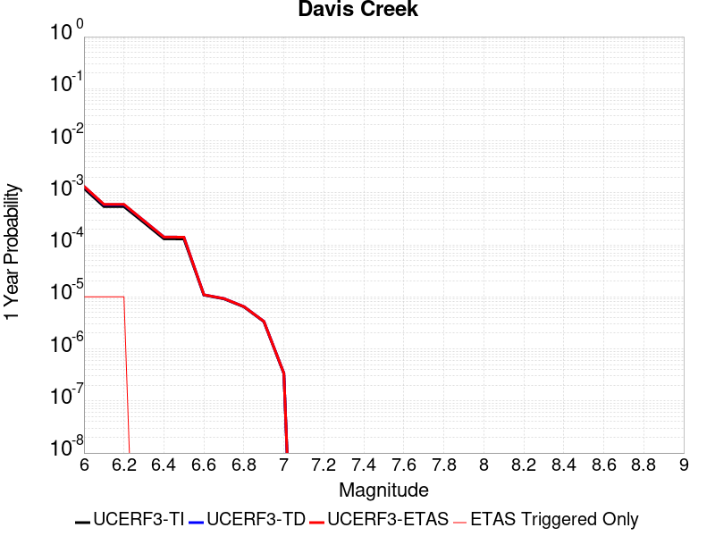 |  |

| Magnitude | 1 wk TI Prob | 1 wk TD Prob | 1 wk ETAS Prob | 1 wk ETAS/TD Gain | 1 wk ETAS Triggered Only | 1 mo TI Prob | 1 mo TD Prob | 1 mo ETAS Prob | 1 mo ETAS/TD Gain | 1 mo ETAS Triggered Only | 1 yr TI Prob | 1 yr TD Prob | 1 yr ETAS Prob | 1 yr ETAS/TD Gain | 1 yr ETAS Triggered Only | 10 yr TI Prob | 10 yr TD Prob | 10 yr ETAS Prob | 10 yr ETAS/TD Gain | 10 yr ETAS Triggered Only |
|-----|-----|-----|-----|-----|-----|-----|-----|-----|-----|-----|-----|-----|-----|-----|-----|-----|-----|-----|-----|-----|
| 6.0 | 2.331472E-5 | 2.5417214E-5 | 2.5417214E-5 | 1.0 | 0.0 | 9.99164E-5 | 1.0892704E-4 | 1.1892595E-4 | 1.0917946 | 1.0E-5 | 0.0012158032 | 0.0013254983 | 0.0013354851 | 1.0075344 | 1.0E-5 | 0.01209173 | 0.013187704 | 0.013197572 | 1.0007483 | 1.0E-5 |
| 6.1 | 1.0407654E-5 | 1.1316986E-5 | 1.1316986E-5 | 1.0 | 0.0 | 4.4603472E-5 | 4.8500624E-5 | 5.8500136E-5 | 1.206173 | 1.0E-5 | 5.4291193E-4 | 5.9036224E-4 | 6.003563E-4 | 1.0169288 | 1.0E-5 | 0.0054158745 | 0.005890611 | 0.005900552 | 1.0016876 | 1.0E-5 |
| 6.2 | 1.0407654E-5 | 1.1316986E-5 | 1.1316986E-5 | 1.0 | 0.0 | 4.4603472E-5 | 4.8500624E-5 | 5.8500136E-5 | 1.206173 | 1.0E-5 | 5.4291193E-4 | 5.9036224E-4 | 6.003563E-4 | 1.0169288 | 1.0E-5 | 0.0054158745 | 0.005890611 | 0.005900552 | 1.0016876 | 1.0E-5 |
| 6.3 | 5.1323277E-6 | 5.568556E-6 | 5.568556E-6 | 1.0 | 0.0 | 2.1995505E-5 | 2.386507E-5 | 2.386507E-5 | 1.0 | 0.0 | 2.6776237E-4 | 2.905271E-4 | 2.905271E-4 | 1.0 | 0.0 | 0.0026743996 | 0.0029023192 | 0.0029023192 | 1.0 | 0.0 |
| 6.4 | 2.4985154E-6 | 2.704538E-6 | 2.704538E-6 | 1.0 | 0.0 | 1.07078795E-5 | 1.1590847E-5 | 1.1590847E-5 | 1.0 | 0.0 | 1.3036063E-4 | 1.4111304E-4 | 1.4111304E-4 | 1.0 | 0.0 | 0.0013028418 | 0.001410589 | 0.001410589 | 1.0 | 0.0 |
| 6.5 | 2.4846438E-6 | 2.6904722E-6 | 2.6904722E-6 | 1.0 | 0.0 | 1.064843E-5 | 1.1530565E-5 | 1.1530565E-5 | 1.0 | 0.0 | 1.2963692E-4 | 1.403792E-4 | 1.403792E-4 | 1.0 | 0.0 | 0.0012956132 | 0.0014032599 | 0.0014032599 | 1.0 | 0.0 |
| 6.6 | 2.072566E-7 | 2.1018087E-7 | 2.1018087E-7 | 1.0 | 0.0 | 8.882423E-7 | 9.0077486E-7 | 9.0077486E-7 | 1.0 | 0.0 | 1.0814296E-5 | 1.0966881E-5 | 1.0966881E-5 | 1.0 | 0.0 | 1.081377E-4 | 1.09663575E-4 | 1.09663575E-4 | 1.0 | 0.0 |
| 6.7 | 1.7544528E-7 | 1.7790826E-7 | 1.7790826E-7 | 1.0 | 0.0 | 7.5190815E-7 | 7.6246374E-7 | 7.6246374E-7 | 1.0 | 0.0 | 9.154443E-6 | 9.282958E-6 | 9.282958E-6 | 1.0 | 0.0 | 9.1540656E-5 | 9.282586E-5 | 9.282586E-5 | 1.0 | 0.0 |
| 6.8 | 1.2320395E-7 | 1.2481138E-7 | 1.2481138E-7 | 1.0 | 0.0 | 5.280168E-7 | 5.349058E-7 | 5.349058E-7 | 1.0 | 0.0 | 6.428586E-6 | 6.5124595E-6 | 6.5124595E-6 | 1.0 | 0.0 | 6.4284E-5 | 6.5122804E-5 | 6.5122804E-5 | 1.0 | 0.0 |
| 6.9 | 6.399997E-8 | 6.486058E-8 | 6.486058E-8 | 1.0 | 0.0 | 2.7428555E-7 | 2.7797387E-7 | 2.7797387E-7 | 1.0 | 0.0 | 3.3394215E-6 | 3.3843273E-6 | 3.3843273E-6 | 1.0 | 0.0 | 3.3393713E-5 | 3.384282E-5 | 3.384282E-5 | 1.0 | 0.0 |
| 7.0 | 6.4455685E-9 | 6.535264E-9 | 6.535264E-9 | 1.0 | 0.0 | 2.7623864E-8 | 2.8008275E-8 | 2.8008275E-8 | 1.0 | 0.0 | 3.3632048E-7 | 3.4100074E-7 | 3.4100074E-7 | 1.0 | 0.0 | 3.3631998E-6 | 3.4100074E-6 | 3.4100074E-6 | 1.0 | 0.0 |

## Hosgri
*[(top)](#table-of-contents)*

| 1 Week | 1 Month | 1 Year | 10 Year |
|-----|-----|-----|-----|
|  |  |  |  |

| Magnitude | 1 wk TI Prob | 1 wk TD Prob | 1 wk ETAS Prob | 1 wk ETAS/TD Gain | 1 wk ETAS Triggered Only | 1 mo TI Prob | 1 mo TD Prob | 1 mo ETAS Prob | 1 mo ETAS/TD Gain | 1 mo ETAS Triggered Only | 1 yr TI Prob | 1 yr TD Prob | 1 yr ETAS Prob | 1 yr ETAS/TD Gain | 1 yr ETAS Triggered Only | 10 yr TI Prob | 10 yr TD Prob | 10 yr ETAS Prob | 10 yr ETAS/TD Gain | 10 yr ETAS Triggered Only |
|-----|-----|-----|-----|-----|-----|-----|-----|-----|-----|-----|-----|-----|-----|-----|-----|-----|-----|-----|-----|-----|
| 6.0 | 2.883978E-5 | 2.9128403E-5 | 2.9128403E-5 | 1.0 | 0.0 | 1.235932E-4 | 1.248302E-4 | 1.248302E-4 | 1.0 | 0.0 | 0.0015037085 | 0.0015187752 | 0.0015287601 | 1.0065743 | 1.0E-5 | 0.01493574 | 0.01508773 | 0.015097579 | 1.0006528 | 1.0E-5 |
| 6.1 | 2.883978E-5 | 2.9128403E-5 | 2.9128403E-5 | 1.0 | 0.0 | 1.235932E-4 | 1.248302E-4 | 1.248302E-4 | 1.0 | 0.0 | 0.0015037085 | 0.0015187752 | 0.0015287601 | 1.0065743 | 1.0E-5 | 0.01493574 | 0.01508773 | 0.015097579 | 1.0006528 | 1.0E-5 |
| 6.2 | 2.883978E-5 | 2.9128403E-5 | 2.9128403E-5 | 1.0 | 0.0 | 1.235932E-4 | 1.248302E-4 | 1.248302E-4 | 1.0 | 0.0 | 0.0015037085 | 0.0015187752 | 0.0015287601 | 1.0065743 | 1.0E-5 | 0.01493574 | 0.01508773 | 0.015097579 | 1.0006528 | 1.0E-5 |
| 6.3 | 2.2914428E-5 | 2.2641956E-5 | 2.2641956E-5 | 1.0 | 0.0 | 9.8200995E-5 | 9.703337E-5 | 9.703337E-5 | 1.0 | 0.0 | 0.0011949413 | 0.001180746 | 0.0011907342 | 1.0084592 | 1.0E-5 | 0.011885363 | 0.011746123 | 0.011756006 | 1.0008414 | 1.0E-5 |
| 6.4 | 2.0195741E-5 | 1.9696547E-5 | 1.9696547E-5 | 1.0 | 0.0 | 8.65503E-5 | 8.4411055E-5 | 8.4411055E-5 | 1.0 | 0.0 | 0.0010532405 | 0.001027222 | 0.0010372117 | 1.009725 | 1.0E-5 | 0.010482626 | 0.010225783 | 0.01023568 | 1.000968 | 1.0E-5 |
| 6.5 | 1.9924333E-5 | 1.9408968E-5 | 1.9408968E-5 | 1.0 | 0.0 | 8.53872E-5 | 8.317865E-5 | 8.317865E-5 | 1.0 | 0.0 | 0.0010390934 | 0.0010122315 | 0.0010222214 | 1.0098692 | 1.0E-5 | 0.010342481 | 0.010077244 | 0.010087143 | 1.0009823 | 1.0E-5 |
| 6.6 | 1.809694E-5 | 1.7458287E-5 | 1.7458287E-5 | 1.0 | 0.0 | 7.7556004E-5 | 7.4819094E-5 | 7.4819094E-5 | 1.0 | 0.0 | 9.438353E-4 | 9.105431E-4 | 9.105431E-4 | 1.0 | 0.0 | 0.009398366 | 0.009069063 | 0.009069063 | 1.0 | 0.0 |
| 6.7 | 1.675989E-5 | 1.6042752E-5 | 1.6042752E-5 | 1.0 | 0.0 | 7.182612E-5 | 6.8752845E-5 | 6.8752845E-5 | 1.0 | 0.0 | 8.7413215E-4 | 8.3674554E-4 | 8.3674554E-4 | 1.0 | 0.0 | 0.008707017 | 0.008336853 | 0.008336853 | 1.0 | 0.0 |
| 6.8 | 1.5401129E-5 | 1.4614069E-5 | 1.4614069E-5 | 1.0 | 0.0 | 6.6003166E-5 | 6.263023E-5 | 6.263023E-5 | 1.0 | 0.0 | 8.032922E-4 | 7.6225714E-4 | 7.6225714E-4 | 1.0 | 0.0 | 0.008003947 | 0.0075972863 | 0.0075972863 | 1.0 | 0.0 |
| 6.9 | 1.356559E-5 | 1.2689955E-5 | 1.2689955E-5 | 1.0 | 0.0 | 5.8136946E-5 | 5.438439E-5 | 5.438439E-5 | 1.0 | 0.0 | 7.0758746E-4 | 6.6192925E-4 | 6.6192925E-4 | 1.0 | 0.0 | 0.007053386 | 0.006600378 | 0.006600378 | 1.0 | 0.0 |
| 7.0 | 1.2030819E-5 | 1.1095949E-5 | 1.1095949E-5 | 1.0 | 0.0 | 5.155963E-5 | 4.75532E-5 | 4.75532E-5 | 1.0 | 0.0 | 6.275577E-4 | 5.788065E-4 | 5.788065E-4 | 1.0 | 0.0 | 0.006257884 | 0.0057737473 | 0.0057737473 | 1.0 | 0.0 |
| 7.1 | 1.0972698E-5 | 1.0022167E-5 | 1.0022167E-5 | 1.0 | 0.0 | 4.7025E-5 | 4.2951437E-5 | 4.2951437E-5 | 1.0 | 0.0 | 5.72379E-4 | 5.2280835E-4 | 5.2280835E-4 | 1.0 | 0.0 | 0.0057090693 | 0.005216533 | 0.005216533 | 1.0 | 0.0 |
| 7.2 | 9.961926E-6 | 9.034732E-6 | 9.034732E-6 | 1.0 | 0.0 | 4.2693267E-5 | 3.8719707E-5 | 3.8719707E-5 | 1.0 | 0.0 | 5.1966653E-4 | 4.7131052E-4 | 4.7131052E-4 | 1.0 | 0.0 | 0.00518453 | 0.0047038523 | 0.0047038523 | 1.0 | 0.0 |
| 7.3 | 8.700929E-6 | 7.828089E-6 | 7.828089E-6 | 1.0 | 0.0 | 3.7289166E-5 | 3.354852E-5 | 3.354852E-5 | 1.0 | 0.0 | 4.53901E-4 | 4.083767E-4 | 4.083767E-4 | 1.0 | 0.0 | 0.00452975 | 0.004076999 | 0.004076999 | 1.0 | 0.0 |
| 7.4 | 7.866285E-6 | 6.9987263E-6 | 6.9987263E-6 | 1.0 | 0.0 | 3.3712215E-5 | 2.9994197E-5 | 2.9994197E-5 | 1.0 | 0.0 | 4.103689E-4 | 3.6511818E-4 | 3.6511818E-4 | 1.0 | 0.0 | 0.004096119 | 0.0036459167 | 0.0036459167 | 1.0 | 0.0 |
| 7.5 | 6.8381305E-6 | 5.9596814E-6 | 5.9596814E-6 | 1.0 | 0.0 | 2.9305946E-5 | 2.5541241E-5 | 2.5541241E-5 | 1.0 | 0.0 | 3.5674145E-4 | 3.1092027E-4 | 3.1092027E-4 | 1.0 | 0.0 | 0.0035616932 | 0.003105584 | 0.003105584 | 1.0 | 0.0 |
| 7.6 | 5.503376E-6 | 4.595227E-6 | 4.595227E-6 | 1.0 | 0.0 | 2.3585684E-5 | 1.9693682E-5 | 1.9693682E-5 | 1.0 | 0.0 | 2.8711787E-4 | 2.397442E-4 | 2.397442E-4 | 1.0 | 0.0 | 0.002867472 | 0.0023955852 | 0.0023955852 | 1.0 | 0.0 |
| 7.7 | 3.6144982E-6 | 2.6521896E-6 | 2.6521896E-6 | 1.0 | 0.0 | 1.5490614E-5 | 1.1366477E-5 | 1.1366477E-5 | 1.0 | 0.0 | 1.8858191E-4 | 1.3837808E-4 | 1.3837808E-4 | 1.0 | 0.0 | 0.0018842196 | 0.001383647 | 0.001383647 | 1.0 | 0.0 |
| 7.8 | 1.9853494E-6 | 1.1360784E-6 | 1.1360784E-6 | 1.0 | 0.0 | 8.508612E-6 | 4.8688985E-6 | 4.8688985E-6 | 1.0 | 0.0 | 1.0358743E-4 | 5.9277223E-5 | 5.9277223E-5 | 1.0 | 0.0 | 0.0010353916 | 5.933389E-4 | 5.933389E-4 | 1.0 | 0.0 |
| 7.9 | 1.1818757E-6 | 5.29477E-7 | 5.29477E-7 | 1.0 | 0.0 | 5.0651715E-6 | 2.269185E-6 | 2.269185E-6 | 1.0 | 0.0 | 6.1666724E-5 | 2.7626977E-5 | 2.7626977E-5 | 1.0 | 0.0 | 6.1649614E-4 | 2.7691363E-4 | 2.7691363E-4 | 1.0 | 0.0 |
| 8.0 | 6.962958E-7 | 2.71365E-7 | 2.71365E-7 | 1.0 | 0.0 | 2.9841215E-6 | 1.1629924E-6 | 1.1629924E-6 | 1.0 | 0.0 | 3.6331072E-5 | 1.415934E-5 | 1.415934E-5 | 1.0 | 0.0 | 3.6325134E-4 | 1.4215276E-4 | 1.4215276E-4 | 1.0 | 0.0 |
| 8.1 | 1.5033264E-7 | 6.52693E-8 | 6.52693E-8 | 1.0 | 0.0 | 6.442826E-7 | 2.7972553E-7 | 2.7972553E-7 | 1.0 | 0.0 | 7.844113E-6 | 3.4056532E-6 | 3.4056532E-6 | 1.0 | 0.0 | 7.843835E-5 | 3.4072833E-5 | 3.4072833E-5 | 1.0 | 0.0 |

## South Cuyama
*[(top)](#table-of-contents)*

| 1 Week | 1 Month | 1 Year | 10 Year |
|-----|-----|-----|-----|
|  |  |  | 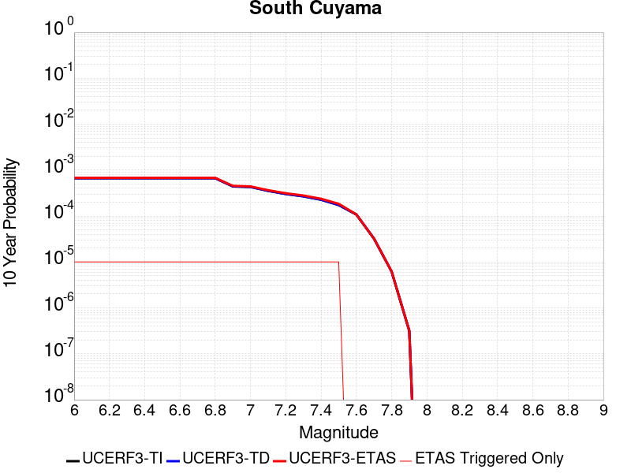 |

| Magnitude | 1 wk TI Prob | 1 wk TD Prob | 1 wk ETAS Prob | 1 wk ETAS/TD Gain | 1 wk ETAS Triggered Only | 1 mo TI Prob | 1 mo TD Prob | 1 mo ETAS Prob | 1 mo ETAS/TD Gain | 1 mo ETAS Triggered Only | 1 yr TI Prob | 1 yr TD Prob | 1 yr ETAS Prob | 1 yr ETAS/TD Gain | 1 yr ETAS Triggered Only | 10 yr TI Prob | 10 yr TD Prob | 10 yr ETAS Prob | 10 yr ETAS/TD Gain | 10 yr ETAS Triggered Only |
|-----|-----|-----|-----|-----|-----|-----|-----|-----|-----|-----|-----|-----|-----|-----|-----|-----|-----|-----|-----|-----|
| 6.0 | 1.2747308E-6 | 1.2818697E-6 | 1.1281857E-5 | 8.801095 | 1.0E-5 | 5.4631205E-6 | 5.4937163E-6 | 1.549366E-5 | 2.8202515 | 1.0E-5 | 6.6511464E-5 | 6.6884015E-5 | 7.688334E-5 | 1.1495025 | 1.0E-5 | 6.649156E-4 | 6.686458E-4 | 6.786391E-4 | 1.0149456 | 1.0E-5 |
| 6.1 | 1.2747308E-6 | 1.2818697E-6 | 1.1281857E-5 | 8.801095 | 1.0E-5 | 5.4631205E-6 | 5.4937163E-6 | 1.549366E-5 | 2.8202515 | 1.0E-5 | 6.6511464E-5 | 6.6884015E-5 | 7.688334E-5 | 1.1495025 | 1.0E-5 | 6.649156E-4 | 6.686458E-4 | 6.786391E-4 | 1.0149456 | 1.0E-5 |
| 6.2 | 1.2747308E-6 | 1.2818697E-6 | 1.1281857E-5 | 8.801095 | 1.0E-5 | 5.4631205E-6 | 5.4937163E-6 | 1.549366E-5 | 2.8202515 | 1.0E-5 | 6.6511464E-5 | 6.6884015E-5 | 7.688334E-5 | 1.1495025 | 1.0E-5 | 6.649156E-4 | 6.686458E-4 | 6.786391E-4 | 1.0149456 | 1.0E-5 |
| 6.3 | 1.2747308E-6 | 1.2818697E-6 | 1.1281857E-5 | 8.801095 | 1.0E-5 | 5.4631205E-6 | 5.4937163E-6 | 1.549366E-5 | 2.8202515 | 1.0E-5 | 6.6511464E-5 | 6.6884015E-5 | 7.688334E-5 | 1.1495025 | 1.0E-5 | 6.649156E-4 | 6.686458E-4 | 6.786391E-4 | 1.0149456 | 1.0E-5 |
| 6.4 | 1.2747308E-6 | 1.2818697E-6 | 1.1281857E-5 | 8.801095 | 1.0E-5 | 5.4631205E-6 | 5.4937163E-6 | 1.549366E-5 | 2.8202515 | 1.0E-5 | 6.6511464E-5 | 6.6884015E-5 | 7.688334E-5 | 1.1495025 | 1.0E-5 | 6.649156E-4 | 6.686458E-4 | 6.786391E-4 | 1.0149456 | 1.0E-5 |
| 6.5 | 1.2747308E-6 | 1.2818697E-6 | 1.1281857E-5 | 8.801095 | 1.0E-5 | 5.4631205E-6 | 5.4937163E-6 | 1.549366E-5 | 2.8202515 | 1.0E-5 | 6.6511464E-5 | 6.6884015E-5 | 7.688334E-5 | 1.1495025 | 1.0E-5 | 6.649156E-4 | 6.686458E-4 | 6.786391E-4 | 1.0149456 | 1.0E-5 |
| 6.6 | 1.2747308E-6 | 1.2818697E-6 | 1.1281857E-5 | 8.801095 | 1.0E-5 | 5.4631205E-6 | 5.4937163E-6 | 1.549366E-5 | 2.8202515 | 1.0E-5 | 6.6511464E-5 | 6.6884015E-5 | 7.688334E-5 | 1.1495025 | 1.0E-5 | 6.649156E-4 | 6.686458E-4 | 6.786391E-4 | 1.0149456 | 1.0E-5 |
| 6.7 | 1.2747308E-6 | 1.2818697E-6 | 1.1281857E-5 | 8.801095 | 1.0E-5 | 5.4631205E-6 | 5.4937163E-6 | 1.549366E-5 | 2.8202515 | 1.0E-5 | 6.6511464E-5 | 6.6884015E-5 | 7.688334E-5 | 1.1495025 | 1.0E-5 | 6.649156E-4 | 6.686458E-4 | 6.786391E-4 | 1.0149456 | 1.0E-5 |
| 6.8 | 1.2747308E-6 | 1.2818697E-6 | 1.1281857E-5 | 8.801095 | 1.0E-5 | 5.4631205E-6 | 5.4937163E-6 | 1.549366E-5 | 2.8202515 | 1.0E-5 | 6.6511464E-5 | 6.6884015E-5 | 7.688334E-5 | 1.1495025 | 1.0E-5 | 6.649156E-4 | 6.686458E-4 | 6.786391E-4 | 1.0149456 | 1.0E-5 |
| 6.9 | 8.4566324E-7 | 8.507883E-7 | 1.085078E-5 | 12.753796 | 1.0E-5 | 3.624266E-6 | 3.6462304E-6 | 1.3646194E-5 | 3.7425485 | 1.0E-5 | 4.4124543E-5 | 4.439196E-5 | 5.4391516E-5 | 1.225256 | 1.0E-5 | 4.4115784E-4 | 4.4383196E-4 | 4.5382752E-4 | 1.022521 | 1.0E-5 |
| 7.0 | 8.2277904E-7 | 8.27782E-7 | 1.0827774E-5 | 13.080465 | 1.0E-5 | 3.526191E-6 | 3.5476323E-6 | 1.3547597E-5 | 3.8187714 | 1.0E-5 | 4.293053E-5 | 4.3191576E-5 | 5.3191146E-5 | 1.2315166 | 1.0E-5 | 4.292224E-4 | 4.3183283E-4 | 4.418285E-4 | 1.0231471 | 1.0E-5 |
| 7.1 | 6.7661887E-7 | 6.80913E-7 | 1.0680907E-5 | 15.686153 | 1.0E-5 | 2.899792E-6 | 2.9181954E-6 | 1.2918166E-5 | 4.4267654 | 1.0E-5 | 3.5304394E-5 | 3.5528454E-5 | 4.5528097E-5 | 1.2814546 | 1.0E-5 | 3.5298787E-4 | 3.552281E-4 | 3.6522458E-4 | 1.0281409 | 1.0E-5 |
| 7.2 | 5.783336E-7 | 5.8211907E-7 | 1.0582114E-5 | 18.178606 | 1.0E-5 | 2.4785702E-6 | 2.4947938E-6 | 1.2494768E-5 | 5.0083375 | 1.0E-5 | 3.0176174E-5 | 3.0373692E-5 | 4.0373387E-5 | 1.3292223 | 1.0E-5 | 3.0172078E-4 | 3.0369565E-4 | 3.136926E-4 | 1.0329177 | 1.0E-5 |
| 7.3 | 5.136759E-7 | 5.170938E-7 | 1.0517088E-5 | 20.33884 | 1.0E-5 | 2.2014663E-6 | 2.2161144E-6 | 1.2216092E-5 | 5.5123925 | 1.0E-5 | 2.6802521E-5 | 2.698086E-5 | 3.698059E-5 | 1.3706231 | 1.0E-5 | 2.679929E-4 | 2.6977606E-4 | 2.7977335E-4 | 1.0370578 | 1.0E-5 |
| 7.4 | 4.3370295E-7 | 4.3665364E-7 | 1.0436649E-5 | 23.901438 | 1.0E-5 | 1.8587256E-6 | 1.8713713E-6 | 1.1871352E-5 | 6.3436646 | 1.0E-5 | 2.2629749E-5 | 2.278371E-5 | 3.2783482E-5 | 1.4389001 | 1.0E-5 | 2.2627445E-4 | 2.278139E-4 | 2.3781162E-4 | 1.0438855 | 1.0E-5 |
| 7.5 | 3.3242574E-7 | 3.3476465E-7 | 1.0334761E-5 | 30.871721 | 1.0E-5 | 1.4246809E-6 | 1.4347048E-6 | 1.143469E-5 | 7.9700646 | 1.0E-5 | 1.7345352E-5 | 1.7467393E-5 | 2.7467218E-5 | 1.5724853 | 1.0E-5 | 1.7343998E-4 | 1.7466032E-4 | 1.8465858E-4 | 1.057244 | 1.0E-5 |
| 7.6 | 2.0627535E-7 | 2.07789E-7 | 2.07789E-7 | 1.0 | 0.0 | 8.840369E-7 | 8.90524E-7 | 8.90524E-7 | 1.0 | 0.0 | 1.0763096E-5 | 1.0842076E-5 | 1.0842076E-5 | 1.0 | 0.0 | 1.0762575E-4 | 1.0841556E-4 | 1.0841556E-4 | 1.0 | 0.0 |
| 7.7 | 6.15236E-8 | 6.1983044E-8 | 6.1983044E-8 | 1.0 | 0.0 | 2.6367252E-7 | 2.656416E-7 | 2.656416E-7 | 1.0 | 0.0 | 3.2102084E-6 | 3.2341818E-6 | 3.2341818E-6 | 1.0 | 0.0 | 3.210162E-5 | 3.234136E-5 | 3.234136E-5 | 1.0 | 0.0 |
| 7.8 | 1.1765573E-8 | 1.1873414E-8 | 1.1873414E-8 | 1.0 | 0.0 | 5.0423886E-8 | 5.0886058E-8 | 5.0886058E-8 | 1.0 | 0.0 | 6.1391063E-7 | 6.195376E-7 | 6.195376E-7 | 1.0 | 0.0 | 6.1390897E-6 | 6.19536E-6 | 6.19536E-6 | 1.0 | 0.0 |
| 7.9 | 6.0381755E-10 | 6.10058E-10 | 6.10058E-10 | 1.0 | 0.0 | 2.5877895E-9 | 2.614534E-9 | 2.614534E-9 | 1.0 | 0.0 | 3.1506335E-8 | 3.1831952E-8 | 3.1831952E-8 | 1.0 | 0.0 | 3.1506332E-7 | 3.183195E-7 | 3.183195E-7 | 1.0 | 0.0 |

## North Frontal  (West)
*[(top)](#table-of-contents)*

| 1 Week | 1 Month | 1 Year | 10 Year |
|-----|-----|-----|-----|
|  |  |  |  |

| Magnitude | 1 wk TI Prob | 1 wk TD Prob | 1 wk ETAS Prob | 1 wk ETAS/TD Gain | 1 wk ETAS Triggered Only | 1 mo TI Prob | 1 mo TD Prob | 1 mo ETAS Prob | 1 mo ETAS/TD Gain | 1 mo ETAS Triggered Only | 1 yr TI Prob | 1 yr TD Prob | 1 yr ETAS Prob | 1 yr ETAS/TD Gain | 1 yr ETAS Triggered Only | 10 yr TI Prob | 10 yr TD Prob | 10 yr ETAS Prob | 10 yr ETAS/TD Gain | 10 yr ETAS Triggered Only |
|-----|-----|-----|-----|-----|-----|-----|-----|-----|-----|-----|-----|-----|-----|-----|-----|-----|-----|-----|-----|-----|
| 6.0 | 4.7316266E-6 | 4.852674E-6 | 4.852674E-6 | 1.0 | 0.0 | 2.0278241E-5 | 2.0797017E-5 | 2.0797017E-5 | 1.0 | 0.0 | 2.4685962E-4 | 2.5317573E-4 | 2.631732E-4 | 1.0394883 | 1.0E-5 | 0.0024658558 | 0.002529019 | 0.0025389937 | 1.0039442 | 1.0E-5 |
| 6.1 | 4.7316266E-6 | 4.852674E-6 | 4.852674E-6 | 1.0 | 0.0 | 2.0278241E-5 | 2.0797017E-5 | 2.0797017E-5 | 1.0 | 0.0 | 2.4685962E-4 | 2.5317573E-4 | 2.631732E-4 | 1.0394883 | 1.0E-5 | 0.0024658558 | 0.002529019 | 0.0025389937 | 1.0039442 | 1.0E-5 |
| 6.2 | 4.7316266E-6 | 4.852674E-6 | 4.852674E-6 | 1.0 | 0.0 | 2.0278241E-5 | 2.0797017E-5 | 2.0797017E-5 | 1.0 | 0.0 | 2.4685962E-4 | 2.5317573E-4 | 2.631732E-4 | 1.0394883 | 1.0E-5 | 0.0024658558 | 0.002529019 | 0.0025389937 | 1.0039442 | 1.0E-5 |
| 6.3 | 4.7316266E-6 | 4.852674E-6 | 4.852674E-6 | 1.0 | 0.0 | 2.0278241E-5 | 2.0797017E-5 | 2.0797017E-5 | 1.0 | 0.0 | 2.4685962E-4 | 2.5317573E-4 | 2.631732E-4 | 1.0394883 | 1.0E-5 | 0.0024658558 | 0.002529019 | 0.0025389937 | 1.0039442 | 1.0E-5 |
| 6.4 | 4.7316266E-6 | 4.852674E-6 | 4.852674E-6 | 1.0 | 0.0 | 2.0278241E-5 | 2.0797017E-5 | 2.0797017E-5 | 1.0 | 0.0 | 2.4685962E-4 | 2.5317573E-4 | 2.631732E-4 | 1.0394883 | 1.0E-5 | 0.0024658558 | 0.002529019 | 0.0025389937 | 1.0039442 | 1.0E-5 |
| 6.5 | 4.7316266E-6 | 4.852674E-6 | 4.852674E-6 | 1.0 | 0.0 | 2.0278241E-5 | 2.0797017E-5 | 2.0797017E-5 | 1.0 | 0.0 | 2.4685962E-4 | 2.5317573E-4 | 2.631732E-4 | 1.0394883 | 1.0E-5 | 0.0024658558 | 0.002529019 | 0.0025389937 | 1.0039442 | 1.0E-5 |
| 6.6 | 4.7316266E-6 | 4.852674E-6 | 4.852674E-6 | 1.0 | 0.0 | 2.0278241E-5 | 2.0797017E-5 | 2.0797017E-5 | 1.0 | 0.0 | 2.4685962E-4 | 2.5317573E-4 | 2.631732E-4 | 1.0394883 | 1.0E-5 | 0.0024658558 | 0.002529019 | 0.0025389937 | 1.0039442 | 1.0E-5 |
| 6.7 | 3.5382777E-6 | 3.6308872E-6 | 3.6308872E-6 | 1.0 | 0.0 | 1.516396E-5 | 1.5560858E-5 | 1.5560858E-5 | 1.0 | 0.0 | 1.8460557E-4 | 1.8943775E-4 | 1.8943775E-4 | 1.0 | 0.0 | 0.0018445229 | 0.0018928396 | 0.0018928396 | 1.0 | 0.0 |
| 6.8 | 3.5382777E-6 | 3.6308872E-6 | 3.6308872E-6 | 1.0 | 0.0 | 1.516396E-5 | 1.5560858E-5 | 1.5560858E-5 | 1.0 | 0.0 | 1.8460557E-4 | 1.8943775E-4 | 1.8943775E-4 | 1.0 | 0.0 | 0.0018445229 | 0.0018928396 | 0.0018928396 | 1.0 | 0.0 |
| 6.9 | 3.0428037E-6 | 3.1227619E-6 | 3.1227619E-6 | 1.0 | 0.0 | 1.30405215E-5 | 1.3383201E-5 | 1.3383201E-5 | 1.0 | 0.0 | 1.5875678E-4 | 1.6292896E-4 | 1.6292896E-4 | 1.0 | 0.0 | 0.0015864341 | 0.0016281622 | 0.0016281622 | 1.0 | 0.0 |
| 7.0 | 2.538778E-6 | 2.6060916E-6 | 2.6060916E-6 | 1.0 | 0.0 | 1.0880432E-5 | 1.116892E-5 | 1.116892E-5 | 1.0 | 0.0 | 1.324612E-4 | 1.3597358E-4 | 1.3597358E-4 | 1.0 | 0.0 | 0.0013238228 | 0.0013589506 | 0.0013589506 | 1.0 | 0.0 |
| 7.1 | 2.2418935E-6 | 2.3012087E-6 | 2.3012087E-6 | 1.0 | 0.0 | 9.60808E-6 | 9.862288E-6 | 9.862288E-6 | 1.0 | 0.0 | 1.1697209E-4 | 1.2006718E-4 | 1.2006718E-4 | 1.0 | 0.0 | 0.0011691054 | 0.0012000671 | 0.0012000671 | 1.0 | 0.0 |
| 7.2 | 1.6526745E-6 | 1.6924864E-6 | 1.6924864E-6 | 1.0 | 0.0 | 7.082872E-6 | 7.2534945E-6 | 7.2534945E-6 | 1.0 | 0.0 | 8.623055E-5 | 8.830797E-5 | 8.830797E-5 | 1.0 | 0.0 | 8.61971E-4 | 8.8275387E-4 | 8.8275387E-4 | 1.0 | 0.0 |
| 7.3 | 1.0246019E-6 | 1.0442274E-6 | 1.0442274E-6 | 1.0 | 0.0 | 4.391144E-6 | 4.4752533E-6 | 4.4752533E-6 | 1.0 | 0.0 | 5.3460866E-5 | 5.4484964E-5 | 5.4484964E-5 | 1.0 | 0.0 | 5.344801E-4 | 5.4472755E-4 | 5.4472755E-4 | 1.0 | 0.0 |
| 7.4 | 8.9045164E-7 | 9.056572E-7 | 9.056572E-7 | 1.0 | 0.0 | 3.8162157E-6 | 3.881383E-6 | 3.881383E-6 | 1.0 | 0.0 | 4.646144E-5 | 4.725492E-5 | 4.725492E-5 | 1.0 | 0.0 | 4.6451724E-4 | 4.7245962E-4 | 4.7245962E-4 | 1.0 | 0.0 |
| 7.5 | 6.3357E-7 | 6.4027137E-7 | 6.4027137E-7 | 1.0 | 0.0 | 2.7152971E-6 | 2.7440176E-6 | 2.7440176E-6 | 1.0 | 0.0 | 3.305824E-5 | 3.340797E-5 | 3.340797E-5 | 1.0 | 0.0 | 3.3053322E-4 | 3.3403604E-4 | 3.3403604E-4 | 1.0 | 0.0 |
| 7.6 | 2.5087024E-7 | 2.436123E-7 | 2.436123E-7 | 1.0 | 0.0 | 1.0751578E-6 | 1.0440525E-6 | 1.0440525E-6 | 1.0 | 0.0 | 1.3089967E-5 | 1.2711286E-5 | 1.2711286E-5 | 1.0 | 0.0 | 1.3089196E-4 | 1.2710765E-4 | 1.2710765E-4 | 1.0 | 0.0 |
| 7.7 | 3.282987E-8 | 2.2875435E-8 | 2.2875435E-8 | 1.0 | 0.0 | 1.4069944E-7 | 9.8037575E-8 | 9.8037575E-8 | 1.0 | 0.0 | 1.7130144E-6 | 1.193607E-6 | 1.193607E-6 | 1.0 | 0.0 | 1.7130013E-5 | 1.1936014E-5 | 1.1936014E-5 | 1.0 | 0.0 |
| 7.8 | 8.77499E-9 | 5.6817466E-9 | 5.6817466E-9 | 1.0 | 0.0 | 3.7607098E-8 | 2.4350342E-8 | 2.4350342E-8 | 1.0 | 0.0 | 4.578663E-7 | 2.964654E-7 | 2.964654E-7 | 1.0 | 0.0 | 4.5786537E-6 | 2.9646512E-6 | 2.9646512E-6 | 1.0 | 0.0 |

## Sargent 2011 CFM
*[(top)](#table-of-contents)*

| 1 Week | 1 Month | 1 Year | 10 Year |
|-----|-----|-----|-----|
|  |  |  |  |

| Magnitude | 1 wk TI Prob | 1 wk TD Prob | 1 wk ETAS Prob | 1 wk ETAS/TD Gain | 1 wk ETAS Triggered Only | 1 mo TI Prob | 1 mo TD Prob | 1 mo ETAS Prob | 1 mo ETAS/TD Gain | 1 mo ETAS Triggered Only | 1 yr TI Prob | 1 yr TD Prob | 1 yr ETAS Prob | 1 yr ETAS/TD Gain | 1 yr ETAS Triggered Only | 10 yr TI Prob | 10 yr TD Prob | 10 yr ETAS Prob | 10 yr ETAS/TD Gain | 10 yr ETAS Triggered Only |
|-----|-----|-----|-----|-----|-----|-----|-----|-----|-----|-----|-----|-----|-----|-----|-----|-----|-----|-----|-----|-----|
| 6.0 | 3.7327867E-5 | 3.665065E-5 | 4.6650282E-5 | 1.2728364 | 1.0E-5 | 1.5996677E-4 | 1.5706717E-4 | 1.6706559E-4 | 1.063657 | 1.0E-5 | 0.0019458556 | 0.0019110267 | 0.0019210076 | 1.0052228 | 1.0E-5 | 0.01928905 | 0.019017996 | 0.019027807 | 1.0005158 | 1.0E-5 |
| 6.1 | 2.3771476E-5 | 1.8478724E-5 | 2.8478538E-5 | 1.541153 | 1.0E-5 | 1.01873775E-4 | 7.919262E-5 | 8.919183E-5 | 1.1262643 | 1.0E-5 | 0.0012396075 | 9.638239E-4 | 9.738143E-4 | 1.0103654 | 1.0E-5 | 0.012327154 | 0.009635902 | 0.009645806 | 1.0010278 | 1.0E-5 |
| 6.2 | 2.3112721E-5 | 1.7710081E-5 | 2.7709904E-5 | 1.5646402 | 1.0E-5 | 9.9050754E-5 | 7.5898635E-5 | 8.5897875E-5 | 1.1317446 | 1.0E-5 | 0.0012052758 | 9.2375383E-4 | 9.337446E-4 | 1.0108154 | 1.0E-5 | 0.011987597 | 0.009238554 | 0.009248462 | 1.0010724 | 1.0E-5 |
| 6.3 | 1.728509E-5 | 1.0458513E-5 | 2.0458408E-5 | 1.9561489 | 1.0E-5 | 7.407686E-5 | 4.4821696E-5 | 5.482125E-5 | 1.2230963 | 1.0E-5 | 9.015125E-4 | 5.456136E-4 | 5.5560813E-4 | 1.0183179 | 1.0E-5 | 0.008978641 | 0.0054789106 | 0.0054888558 | 1.0018152 | 1.0E-5 |
| 6.4 | 1.48395575E-5 | 7.4555796E-6 | 1.7455504E-5 | 2.3412673 | 1.0E-5 | 6.3596555E-5 | 3.195231E-5 | 4.195199E-5 | 1.3129565 | 1.0E-5 | 7.7401294E-4 | 3.889874E-4 | 3.989835E-4 | 1.0256978 | 1.0E-5 | 0.0077132257 | 0.00391845 | 0.003928411 | 1.002542 | 1.0E-5 |
| 6.5 | 1.4358964E-5 | 6.894356E-6 | 6.894356E-6 | 1.0 | 0.0 | 6.1536964E-5 | 2.9547118E-5 | 2.9547118E-5 | 1.0 | 0.0 | 7.48955E-4 | 3.5971415E-4 | 3.5971415E-4 | 1.0 | 0.0 | 0.0074643586 | 0.0036266989 | 0.0036266989 | 1.0 | 0.0 |
| 6.6 | 9.772591E-6 | 1.3732375E-6 | 1.3732375E-6 | 1.0 | 0.0 | 4.188186E-5 | 5.8852906E-6 | 5.8852906E-6 | 1.0 | 0.0 | 5.097923E-4 | 7.165109E-5 | 7.165109E-5 | 1.0 | 0.0 | 0.005086244 | 7.480871E-4 | 7.480871E-4 | 1.0 | 0.0 |
| 6.7 | 9.752745E-6 | 1.3519289E-6 | 1.3519289E-6 | 1.0 | 0.0 | 4.179681E-5 | 5.7939683E-6 | 5.7939683E-6 | 1.0 | 0.0 | 5.0875737E-4 | 7.053931E-5 | 7.053931E-5 | 1.0 | 0.0 | 0.005075942 | 7.369768E-4 | 7.369768E-4 | 1.0 | 0.0 |
| 6.8 | 9.608213E-6 | 1.235796E-6 | 1.235796E-6 | 1.0 | 0.0 | 4.1177405E-5 | 5.296258E-6 | 5.296258E-6 | 1.0 | 0.0 | 5.012196E-4 | 6.448006E-5 | 6.448006E-5 | 1.0 | 0.0 | 0.005000906 | 6.7611714E-4 | 6.7611714E-4 | 1.0 | 0.0 |
| 6.9 | 9.427164E-6 | 1.1205796E-6 | 1.1205796E-6 | 1.0 | 0.0 | 4.04015E-5 | 4.8024754E-6 | 4.8024754E-6 | 1.0 | 0.0 | 4.9177726E-4 | 5.8468588E-5 | 5.8468588E-5 | 1.0 | 0.0 | 0.004906904 | 6.1537215E-4 | 6.1537215E-4 | 1.0 | 0.0 |
| 7.0 | 9.247601E-6 | 9.87042E-7 | 9.87042E-7 | 1.0 | 0.0 | 3.9631974E-5 | 4.2301726E-6 | 4.2301726E-6 | 1.0 | 0.0 | 4.8241246E-4 | 5.1501152E-5 | 5.1501152E-5 | 1.0 | 0.0 | 0.0048136655 | 5.452185E-4 | 5.452185E-4 | 1.0 | 0.0 |
| 7.1 | 8.995454E-6 | 8.267614E-7 | 8.267614E-7 | 1.0 | 0.0 | 3.8551374E-5 | 3.5432583E-6 | 3.5432583E-6 | 1.0 | 0.0 | 4.6926187E-4 | 4.313833E-5 | 4.313833E-5 | 1.0 | 0.0 | 0.004682722 | 4.6070307E-4 | 4.6070307E-4 | 1.0 | 0.0 |
| 7.2 | 8.520861E-6 | 5.27322E-7 | 5.27322E-7 | 1.0 | 0.0 | 3.6517464E-5 | 2.2599497E-6 | 2.2599497E-6 | 1.0 | 0.0 | 4.445094E-4 | 2.7514547E-5 | 2.7514547E-5 | 1.0 | 0.0 | 0.004436213 | 3.0276953E-4 | 3.0276953E-4 | 1.0 | 0.0 |
| 7.3 | 8.043592E-6 | 3.453237E-7 | 3.453237E-7 | 1.0 | 0.0 | 3.4472083E-5 | 1.4799579E-6 | 1.4799579E-6 | 1.0 | 0.0 | 4.196168E-4 | 1.801834E-5 | 1.801834E-5 | 1.0 | 0.0 | 0.004188253 | 2.0650218E-4 | 2.0650218E-4 | 1.0 | 0.0 |
| 7.4 | 7.662316E-6 | 2.9259107E-7 | 2.9259107E-7 | 1.0 | 0.0 | 3.2838085E-5 | 1.2539612E-6 | 1.2539612E-6 | 1.0 | 0.0 | 3.9973034E-4 | 1.526687E-5 | 1.526687E-5 | 1.0 | 0.0 | 0.0039901207 | 1.7718194E-4 | 1.7718194E-4 | 1.0 | 0.0 |
| 7.5 | 6.961638E-6 | 2.3549052E-7 | 2.3549052E-7 | 1.0 | 0.0 | 2.9835252E-5 | 1.0092447E-6 | 1.0092447E-6 | 1.0 | 0.0 | 3.6318362E-4 | 1.2287485E-5 | 1.2287485E-5 | 1.0 | 0.0 | 0.0036259065 | 1.4393168E-4 | 1.4393168E-4 | 1.0 | 0.0 |
| 7.6 | 6.282332E-6 | 1.6871925E-7 | 1.6871925E-7 | 1.0 | 0.0 | 2.6924003E-5 | 7.230823E-7 | 7.230823E-7 | 1.0 | 0.0 | 3.2775043E-4 | 8.803492E-6 | 8.803492E-6 | 1.0 | 0.0 | 0.0032726745 | 1.0492336E-4 | 1.0492336E-4 | 1.0 | 0.0 |
| 7.7 | 4.934408E-6 | 4.9918345E-8 | 4.9918345E-8 | 1.0 | 0.0 | 2.114729E-5 | 2.1393575E-7 | 2.1393575E-7 | 1.0 | 0.0 | 2.5743784E-4 | 2.6046646E-6 | 2.6046646E-6 | 1.0 | 0.0 | 0.0025713982 | 3.2479504E-5 | 3.2479504E-5 | 1.0 | 0.0 |
| 7.8 | 2.373212E-6 | 3.5100808E-8 | 3.5100808E-8 | 1.0 | 0.0 | 1.0170869E-5 | 1.5043203E-7 | 1.5043203E-7 | 1.0 | 0.0 | 1.238233E-4 | 1.8315084E-6 | 1.8315084E-6 | 1.0 | 0.0 | 0.0012375432 | 2.4073881E-5 | 2.4073881E-5 | 1.0 | 0.0 |
| 7.9 | 1.8227792E-6 | 3.055616E-8 | 3.055616E-8 | 1.0 | 0.0 | 7.811887E-6 | 1.3095496E-7 | 1.3095496E-7 | 1.0 | 0.0 | 9.510558E-5 | 1.5943755E-6 | 1.5943755E-6 | 1.0 | 0.0 | 9.5064886E-4 | 2.1365537E-5 | 2.1365537E-5 | 1.0 | 0.0 |
| 8.0 | 1.9095137E-7 | 1.3250629E-8 | 1.3250629E-8 | 1.0 | 0.0 | 8.1836276E-7 | 5.678841E-8 | 5.678841E-8 | 1.0 | 0.0 | 9.963521E-6 | 6.9139867E-7 | 6.9139867E-7 | 1.0 | 0.0 | 9.963074E-5 | 8.455456E-6 | 8.455456E-6 | 1.0 | 0.0 |

