# ComCat M7.1 (ci38457511), Mainshock Log10(k)=-2.3, ShakeMap Surfaces, Log10(k)=-3.03, p=1.15, c=4.6773514E-4 Results

|   | ComCat M7.1 (ci38457511), Mainshock Log10(k)=-2.3, ShakeMap Surfaces, Log10(k)=-3.03, p=1.15, c=4.6773514E-4 |
|-----|-----|
| Num Simulations | 57327 (incomplete) |
| Start Time | 2019/07/06 03:19:54 UTC |
| Start Time Epoch Milliseconds | 1562383194040 |
| Duration | 10 Years |
| Includes Spontaneous? | false |
| Trigger Ruptures | 268 Trigger Ruptures |
|   | First: M3.98 at 2019/07/04 17:02:55 UTC |
|   | Last: M7.1 at 2019/07/06 03:19:53 UTC |
|   | Largest: M7.1 at 2019/07/06 03:19:53 UTC |
| Historical Ruptures | *(none)* |
| Config Generated With | u3etas_comcat_event_config_builder.sh --event-id ci38457511 --num-simulations 100000 --days-before 7 --etas-k -3.03 --etas-p 1.15 --etas-c 4.6773514E-4 --mainshock-etas-k -2.3 --finite-surf-shakemap --finite-surf-shakemap-min-mag 5 --hpc-site USC_HPC --nodes 36 --hours 24 --queue scec |

## Table Of Contents

* [Probabilities Summary Table](#probabilities-summary-table)
* [Magnitude Number Distribution](#magnitude-number-distribution)
  * [10 Year Magnitude Number Distribution](#10-year-magnitude-number-distribution)
  * [1 Year Magnitude Number Distribution](#1-year-magnitude-number-distribution)
  * [1 Month Magnitude Number Distribution](#1-month-magnitude-number-distribution)
  * [1 Week Magnitude Number Distribution](#1-week-magnitude-number-distribution)
  * [1 Day Magnitude Number Distribution](#1-day-magnitude-number-distribution)
  * [1 Hour Magnitude Number Distribution](#1-hour-magnitude-number-distribution)
* [Hazard Change Over Time](#hazard-change-over-time)
  * [M&ge;5.0 Hazard Change Over Time](#m50-hazard-change-over-time)
  * [M&ge;6.0 Hazard Change Over Time](#m60-hazard-change-over-time)
  * [M&ge;7.0 Hazard Change Over Time](#m70-hazard-change-over-time)
  * [M&ge;8.0 Hazard Change Over Time](#m80-hazard-change-over-time)
* [Trigger Rupture Fault Map](#trigger-rupture-fault-map)
* [Trigger Rupture Depth Map](#trigger-rupture-depth-map)
* [Fault Distances To Triggers](#fault-distances-to-triggers)
* [Individual Simulated Catalog Maps](#individual-simulated-catalog-maps)
* [ComCat Data Comparisons](#comcat-data-comparisons)
  * [ComCat Magnitude-Number Distributions](#comcat-magnitude-number-distributions)
  * [ComCat Cumulative Number Vs Time](#comcat-cumulative-number-vs-time)
  * [ComCat Cumulative Number Simulation Percentiles](#comcat-cumulative-number-simulation-percentiles)
  * [ComCat Mean Spatial Distribution](#comcat-mean-spatial-distribution)
  * [ComCat Depth Distribution](#comcat-depth-distribution)
* [Section Participation](#section-participation)
  * [Section Participation Plots](#section-participation-plots)
  * [Supra-Seismogenic Parent Sections Table](#supra-seismogenic-parent-sections-table)
  * [M≥6.5 Parent Sections Table](#m65-parent-sections-table)
  * [M≥7 Parent Sections Table](#m7-parent-sections-table)
  * [M≥7.5 Parent Sections Table](#m75-parent-sections-table)
  * [M≥8 Parent Sections Table](#m8-parent-sections-table)
  * [Fault Magnitude-Probability Distributions](#fault-magnitude-probability-distributions)
* [Gridded Nucleation](#gridded-nucleation)
* [JSON Input File](#json-input-file)

## Probabilities Summary Table
*[(top)](#table-of-contents)*

| Magnitude | 1 Hour Prob | 1 Day Prob | 1 Week Prob | 1 Month Prob | 1 Year Prob | 10 Year Prob |
|-----|-----|-----|-----|-----|-----|-----|
| **M&ge;4** | 1.000 (100.00%) | 1.000 (100.00%) | 1.000 (100.00%) | 1.000 (100.00%) | 1.000 (100.00%) | 1.000 (100.00%) |
| **M&ge;4.5** | 1.000 (100.00%) | 1.000 (100.00%) | 1.000 (100.00%) | 1.000 (100.00%) | 1.000 (100.00%) | 1.000 (100.00%) |
| **M&ge;5** | 0.999 (99.87%) | 1.000 (99.99%) | 1.000 (100.00%) | 1.000 (100.00%) | 1.000 (100.00%) | 1.000 (100.00%) |
| **M&ge;5.5** | 0.864 (86.37%) | 0.945 (94.53%) | 0.963 (96.29%) | 0.971 (97.07%) | 0.979 (97.89%) | 0.983 (98.28%) |
| **M&ge;6** | 0.407 (40.75%) | 0.533 (53.29%) | 0.579 (57.89%) | 0.605 (60.54%) | 0.636 (63.63%) | 0.656 (65.61%) |
| **M&ge;6.5** | 0.103 (10.30%) | 0.147 (14.73%) | 0.167 (16.67%) | 0.178 (17.79%) | 0.192 (19.21%) | 0.201 (20.08%) |
| **M&ge;7** | 0.040 (3.98%) | 0.057 (5.67%) | 0.064 (6.40%) | 0.068 (6.85%) | 0.074 (7.41%) | 0.078 (7.76%) |
| **M&ge;7.1** | 0.033 (3.30%) | 0.047 (4.72%) | 0.053 (5.33%) | 0.057 (5.71%) | 0.062 (6.17%) | 0.065 (6.46%) |
| **M&ge;7.5** | 0.012 (1.17%) | 0.017 (1.66%) | 0.019 (1.88%) | 0.020 (1.99%) | 0.022 (2.15%) | 0.023 (2.27%) |
| **M&ge;8** | 1.92E-4 (0.02%) | 2.79E-4 (0.03%) | 2.79E-4 (0.03%) | 2.97E-4 (0.03%) | 3.31E-4 (0.03%) | 3.49E-4 (0.03%) |

## Magnitude Number Distribution
*[(top)](#table-of-contents)*

### 10 Year Magnitude Number Distribution
*[(top)](#table-of-contents)*

**Legend**
* **Mean** (thick black line): mean expected number across all 57327 catalogs
* **2.5%,97.5%** (thin black lines): expected number percentiles across all 57327 catalogs
* **Median** (thin blue line): median expected number across all 57327 catalogs
* **Mode** (thin cyan line): modal expected number across all 57327 catalogs
* **10 yr Probability** (thin red line): 10 year probability calculated as the fraction of catalogs with at least 1 occurrence
* **10 yr Supraseismogenic Probability** (thin dashed red line): same as above, but only for supraseismogenic ruptures on explicitly modeled UCERF3 faults
* **95% Conf** (light red shaded region): binomial 95% confidence bounds on probability
* **Primary** (thin green line): mean expected number from primary triggered aftershocks only (no secondary, tertiary, etc...) across all 57327 catalogs


| Mag | Mean | 2.5 %ile | 97.5 %ile | Median | Mode | 10 yr Probability | 10 yr Supra-Seis Prob | Primary Aftershocks Mean |
|-----|-----|-----|-----|-----|-----|-----|-----|-----|
| **M&ge;2.5** | 4759.928 | 4322.000 | 6669.000 | 4604.000 | 4557.000 | 1.000 (100.00%) | 0.310 (31.05%) | 3840.273 |
| **M&ge;2.6** | 3780.876 | 3423.000 | 5291.000 | 3658.000 | 3613.000 | 1.000 (100.00%) | 0.310 (31.05%) | 3050.334 |
| **M&ge;2.7** | 3003.062 | 2710.000 | 4205.000 | 2907.000 | 2844.000 | 1.000 (100.00%) | 0.310 (31.05%) | 2422.792 |
| **M&ge;2.8** | 2385.281 | 2145.000 | 3333.000 | 2310.000 | 2252.000 | 1.000 (100.00%) | 0.310 (31.05%) | 1924.424 |
| **M&ge;2.9** | 1894.684 | 1696.000 | 2656.000 | 1836.000 | 1809.000 | 1.000 (100.00%) | 0.310 (31.05%) | 1528.605 |
| **M&ge;3** | 1505.025 | 1341.000 | 2112.000 | 1460.000 | 1433.000 | 1.000 (100.00%) | 0.310 (31.05%) | 1214.214 |
| **M&ge;3.1** | 1195.474 | 1059.000 | 1678.000 | 1160.000 | 1143.000 | 1.000 (100.00%) | 0.310 (31.05%) | 964.476 |
| **M&ge;3.2** | 949.571 | 836.000 | 1333.000 | 922.000 | 915.000 | 1.000 (100.00%) | 0.310 (31.05%) | 766.140 |
| **M&ge;3.3** | 754.277 | 659.000 | 1059.000 | 733.000 | 716.000 | 1.000 (100.00%) | 0.310 (31.05%) | 608.556 |
| **M&ge;3.4** | 599.057 | 519.000 | 841.000 | 583.000 | 570.000 | 1.000 (100.00%) | 0.310 (31.05%) | 483.294 |
| **M&ge;3.5** | 475.784 | 407.000 | 667.000 | 463.000 | 458.000 | 1.000 (100.00%) | 0.310 (31.05%) | 383.832 |
| **M&ge;3.6** | 377.854 | 320.000 | 530.000 | 368.000 | 365.000 | 1.000 (100.00%) | 0.310 (31.05%) | 304.825 |
| **M&ge;3.7** | 300.044 | 250.000 | 422.000 | 292.000 | 290.000 | 1.000 (100.00%) | 0.310 (31.05%) | 242.045 |
| **M&ge;3.8** | 238.235 | 196.000 | 335.000 | 233.000 | 234.000 | 1.000 (100.00%) | 0.310 (31.05%) | 192.173 |
| **M&ge;3.9** | 189.101 | 153.000 | 266.000 | 185.000 | 182.000 | 1.000 (100.00%) | 0.310 (31.05%) | 152.542 |
| **M&ge;4** | 150.130 | 119.000 | 212.000 | 147.000 | 145.000 | 1.000 (100.00%) | 0.310 (31.05%) | 121.110 |
| **M&ge;4.1** | 119.150 | 92.000 | 168.000 | 117.000 | 114.000 | 1.000 (100.00%) | 0.310 (31.05%) | 96.115 |
| **M&ge;4.2** | 94.531 | 71.000 | 134.000 | 93.000 | 91.000 | 1.000 (100.00%) | 0.310 (31.05%) | 76.254 |
| **M&ge;4.3** | 74.991 | 55.000 | 107.000 | 73.000 | 72.000 | 1.000 (100.00%) | 0.310 (31.05%) | 60.500 |
| **M&ge;4.4** | 59.466 | 42.000 | 86.000 | 58.000 | 57.000 | 1.000 (100.00%) | 0.310 (31.05%) | 47.972 |
| **M&ge;4.5** | 47.152 | 32.000 | 69.000 | 46.000 | 44.000 | 1.000 (100.00%) | 0.310 (31.05%) | 38.039 |
| **M&ge;4.6** | 37.364 | 24.000 | 56.000 | 37.000 | 37.000 | 1.000 (100.00%) | 0.310 (31.05%) | 30.140 |
| **M&ge;4.7** | 29.573 | 18.000 | 45.000 | 29.000 | 27.000 | 1.000 (100.00%) | 0.310 (31.05%) | 23.865 |
| **M&ge;4.8** | 23.402 | 13.000 | 37.000 | 23.000 | 23.000 | 1.000 (100.00%) | 0.310 (31.05%) | 18.887 |
| **M&ge;4.9** | 18.506 | 10.000 | 30.000 | 18.000 | 17.000 | 1.000 (100.00%) | 0.310 (31.05%) | 14.929 |
| **M&ge;5** | 14.617 | 7.000 | 25.000 | 14.000 | 14.000 | 1.000 (100.00%) | 0.310 (31.05%) | 11.793 |
| **M&ge;5.1** | 11.527 | 5.000 | 20.000 | 11.000 | 11.000 | 1.000 (100.00%) | 0.310 (31.05%) | 9.304 |
| **M&ge;5.2** | 9.075 | 3.000 | 17.000 | 9.000 | 8.000 | 1.000 (99.98%) | 0.310 (31.05%) | 7.323 |
| **M&ge;5.3** | 7.118 | 2.000 | 14.000 | 7.000 | 6.000 | 0.998 (99.83%) | 0.310 (31.05%) | 5.742 |
| **M&ge;5.4** | 5.573 | 1.000 | 11.000 | 5.000 | 5.000 | 0.994 (99.42%) | 0.310 (31.05%) | 4.494 |
| **M&ge;5.5** | 4.335 | 1.000 | 9.000 | 4.000 | 4.000 | 0.983 (98.28%) | 0.310 (31.05%) | 3.493 |
| **M&ge;5.6** | 3.346 | 0.000 | 8.000 | 3.000 | 3.000 | 0.957 (95.72%) | 0.310 (31.05%) | 2.697 |
| **M&ge;5.7** | 2.567 | 0.000 | 7.000 | 2.000 | 2.000 | 0.912 (91.19%) | 0.310 (31.05%) | 2.069 |
| **M&ge;5.8** | 1.956 | 0.000 | 5.000 | 2.000 | 1.000 | 0.843 (84.26%) | 0.310 (31.05%) | 1.576 |
| **M&ge;5.9** | 1.471 | 0.000 | 4.000 | 1.000 | 1.000 | 0.752 (75.21%) | 0.310 (31.04%) | 1.186 |
| **M&ge;6** | 1.117 | 0.000 | 4.000 | 1.000 | 1.000 | 0.656 (65.61%) | 0.310 (31.03%) | 0.898 |
| **M&ge;6.1** | 0.813 | 0.000 | 3.000 | 1.000 | 0.000 | 0.544 (54.36%) | 0.276 (27.57%) | 0.657 |
| **M&ge;6.2** | 0.524 | 0.000 | 2.000 | 0.000 | 0.000 | 0.399 (39.90%) | 0.215 (21.46%) | 0.422 |
| **M&ge;6.3** | 0.394 | 0.000 | 2.000 | 0.000 | 0.000 | 0.320 (32.00%) | 0.186 (18.61%) | 0.320 |
| **M&ge;6.4** | 0.297 | 0.000 | 2.000 | 0.000 | 0.000 | 0.252 (25.19%) | 0.162 (16.18%) | 0.240 |
| **M&ge;6.5** | 0.229 | 0.000 | 2.000 | 0.000 | 0.000 | 0.201 (20.08%) | 0.144 (14.37%) | 0.185 |
| **M&ge;6.6** | 0.194 | 0.000 | 1.000 | 0.000 | 0.000 | 0.176 (17.56%) | 0.134 (13.42%) | 0.159 |
| **M&ge;6.7** | 0.160 | 0.000 | 1.000 | 0.000 | 0.000 | 0.147 (14.67%) | 0.118 (11.76%) | 0.132 |
| **M&ge;6.8** | 0.131 | 0.000 | 1.000 | 0.000 | 0.000 | 0.122 (12.23%) | 0.103 (10.28%) | 0.109 |
| **M&ge;6.9** | 0.103 | 0.000 | 1.000 | 0.000 | 0.000 | 0.098 (9.80%) | 0.085 (8.53%) | 0.086 |
| **M&ge;7** | 0.080 | 0.000 | 1.000 | 0.000 | 0.000 | 0.078 (7.76%) | 0.069 (6.94%) | 0.067 |
| **M&ge;7.1** | 0.066 | 0.000 | 1.000 | 0.000 | 0.000 | 0.065 (6.46%) | 0.060 (5.97%) | 0.056 |
| **M&ge;7.2** | 0.048 | 0.000 | 1.000 | 0.000 | 0.000 | 0.048 (4.76%) | 0.045 (4.52%) | 0.040 |
| **M&ge;7.3** | 0.033 | 0.000 | 1.000 | 0.000 | 0.000 | 0.033 (3.31%) | 0.032 (3.18%) | 0.028 |
| **M&ge;7.4** | 0.029 | 0.000 | 1.000 | 0.000 | 0.000 | 0.029 (2.90%) | 0.029 (2.85%) | 0.025 |
| **M&ge;7.5** | 0.023 | 0.000 | 0.000 | 0.000 | 0.000 | 0.023 (2.27%) | 0.022 (2.25%) | 0.019 |
| **M&ge;7.6** | 0.012 | 0.000 | 0.000 | 0.000 | 0.000 | 0.012 (1.25%) | 0.012 (1.24%) | 0.011 |
| **M&ge;7.7** | 4.50E-3 | 0.000 | 0.000 | 0.000 | 0.000 | 4.48E-3 (0.45%) | 4.47E-3 (0.45%) | 3.79E-3 |
| **M&ge;7.8** | 2.44E-3 | 0.000 | 0.000 | 0.000 | 0.000 | 2.42E-3 (0.24%) | 2.42E-3 (0.24%) | 2.09E-3 |
| **M&ge;7.9** | 1.26E-3 | 0.000 | 0.000 | 0.000 | 0.000 | 1.26E-3 (0.13%) | 1.26E-3 (0.13%) | 1.06E-3 |
| **M&ge;8** | 3.49E-4 | 0.000 | 0.000 | 0.000 | 0.000 | 3.49E-4 (0.03%) | 3.49E-4 (0.03%) | 2.79E-4 |
| **M&ge;8.1** | 5.23E-5 | 0.000 | 0.000 | 0.000 | 0.000 | 5.23E-5 (0.01%) | 5.23E-5 (0.01%) | 3.49E-5 |
| **M&ge;8.2** | 1.74E-5 | 0.000 | 0.000 | 0.000 | 0.000 | 1.74E-5 (0.00%) | 1.74E-5 (0.00%) | 0.000 |
| **M&ge;8.3** | 0.000 | 0.000 | 0.000 | 0.000 | 0.000 | 0.000 (0.00%) | 0.000 (0.00%) | 0.000 |
| **M&ge;8.4** | 0.000 | 0.000 | 0.000 | 0.000 | 0.000 | 0.000 (0.00%) | 0.000 (0.00%) | 0.000 |
| **M&ge;8.5** | 0.000 | 0.000 | 0.000 | 0.000 | 0.000 | 0.000 (0.00%) | 0.000 (0.00%) | 0.000 |
| **M&ge;8.6** | 0.000 | 0.000 | 0.000 | 0.000 | 0.000 | 0.000 (0.00%) | 0.000 (0.00%) | 0.000 |
| **M&ge;8.7** | 0.000 | 0.000 | 0.000 | 0.000 | 0.000 | 0.000 (0.00%) | 0.000 (0.00%) | 0.000 |
| **M&ge;8.8** | 0.000 | 0.000 | 0.000 | 0.000 | 0.000 | 0.000 (0.00%) | 0.000 (0.00%) | 0.000 |
| **M&ge;8.9** | 0.000 | 0.000 | 0.000 | 0.000 | 0.000 | 0.000 (0.00%) | 0.000 (0.00%) | 0.000 |
| **M&ge;9** | 0.000 | 0.000 | 0.000 | 0.000 | 0.000 | 0.000 (0.00%) | 0.000 (0.00%) | 0.000 |

### 1 Year Magnitude Number Distribution
*[(top)](#table-of-contents)*

**Legend**
* **Mean** (thick black line): mean expected number across all 57327 catalogs
* **2.5%,97.5%** (thin black lines): expected number percentiles across all 57327 catalogs
* **Median** (thin blue line): median expected number across all 57327 catalogs
* **Mode** (thin cyan line): modal expected number across all 57327 catalogs
* **1 yr Probability** (thin red line): 1 year probability calculated as the fraction of catalogs with at least 1 occurrence
* **1 yr Supraseismogenic Probability** (thin dashed red line): same as above, but only for supraseismogenic ruptures on explicitly modeled UCERF3 faults
* **95% Conf** (light red shaded region): binomial 95% confidence bounds on probability
* **Primary** (thin green line): mean expected number from primary triggered aftershocks only (no secondary, tertiary, etc...) across all 57327 catalogs


| Mag | Mean | 2.5 %ile | 97.5 %ile | Median | Mode | 1 yr Probability | 1 yr Supra-Seis Prob | Primary Aftershocks Mean |
|-----|-----|-----|-----|-----|-----|-----|-----|-----|
| **M&ge;2.5** | 4505.746 | 4100.000 | 6243.000 | 4364.000 | 4323.000 | 1.000 (100.00%) | 0.297 (29.73%) | 3671.742 |
| **M&ge;2.6** | 3578.984 | 3248.000 | 4961.000 | 3468.000 | 3402.000 | 1.000 (100.00%) | 0.297 (29.73%) | 2916.466 |
| **M&ge;2.7** | 2842.721 | 2572.000 | 3940.000 | 2755.000 | 2720.000 | 1.000 (100.00%) | 0.297 (29.73%) | 2316.484 |
| **M&ge;2.8** | 2257.921 | 2034.000 | 3129.000 | 2190.000 | 2166.000 | 1.000 (100.00%) | 0.297 (29.73%) | 1839.984 |
| **M&ge;2.9** | 1793.541 | 1609.000 | 2488.000 | 1741.000 | 1723.000 | 1.000 (100.00%) | 0.297 (29.73%) | 1461.556 |
| **M&ge;3** | 1424.668 | 1271.000 | 1979.000 | 1383.000 | 1359.000 | 1.000 (100.00%) | 0.297 (29.73%) | 1160.931 |
| **M&ge;3.1** | 1131.677 | 1004.000 | 1572.000 | 1099.000 | 1075.000 | 1.000 (100.00%) | 0.297 (29.73%) | 922.183 |
| **M&ge;3.2** | 898.892 | 792.000 | 1250.000 | 874.000 | 861.000 | 1.000 (100.00%) | 0.297 (29.73%) | 732.546 |
| **M&ge;3.3** | 714.032 | 625.000 | 992.000 | 695.000 | 690.000 | 1.000 (100.00%) | 0.297 (29.73%) | 581.882 |
| **M&ge;3.4** | 567.092 | 491.000 | 790.000 | 552.000 | 540.000 | 1.000 (100.00%) | 0.297 (29.73%) | 462.108 |
| **M&ge;3.5** | 450.393 | 386.000 | 627.000 | 439.000 | 426.000 | 1.000 (100.00%) | 0.297 (29.73%) | 367.004 |
| **M&ge;3.6** | 357.694 | 303.000 | 497.000 | 349.000 | 348.000 | 1.000 (100.00%) | 0.297 (29.73%) | 291.468 |
| **M&ge;3.7** | 284.042 | 237.000 | 395.000 | 277.000 | 272.000 | 1.000 (100.00%) | 0.297 (29.73%) | 231.445 |
| **M&ge;3.8** | 225.521 | 185.000 | 314.000 | 220.000 | 219.000 | 1.000 (100.00%) | 0.297 (29.73%) | 183.753 |
| **M&ge;3.9** | 179.021 | 144.000 | 250.000 | 175.000 | 174.000 | 1.000 (100.00%) | 0.297 (29.73%) | 145.867 |
| **M&ge;4** | 142.129 | 112.000 | 199.000 | 139.000 | 138.000 | 1.000 (100.00%) | 0.297 (29.73%) | 115.811 |
| **M&ge;4.1** | 112.805 | 87.000 | 158.000 | 110.000 | 111.000 | 1.000 (100.00%) | 0.297 (29.73%) | 91.913 |
| **M&ge;4.2** | 89.493 | 67.000 | 126.000 | 88.000 | 86.000 | 1.000 (100.00%) | 0.297 (29.73%) | 72.918 |
| **M&ge;4.3** | 70.992 | 51.000 | 101.000 | 70.000 | 68.000 | 1.000 (100.00%) | 0.297 (29.73%) | 57.848 |
| **M&ge;4.4** | 56.294 | 39.000 | 81.000 | 55.000 | 53.000 | 1.000 (100.00%) | 0.297 (29.73%) | 45.871 |
| **M&ge;4.5** | 44.640 | 30.000 | 66.000 | 44.000 | 42.000 | 1.000 (100.00%) | 0.297 (29.73%) | 36.377 |
| **M&ge;4.6** | 35.372 | 23.000 | 53.000 | 35.000 | 34.000 | 1.000 (100.00%) | 0.297 (29.73%) | 28.822 |
| **M&ge;4.7** | 27.996 | 17.000 | 43.000 | 27.000 | 26.000 | 1.000 (100.00%) | 0.297 (29.73%) | 22.821 |
| **M&ge;4.8** | 22.156 | 12.000 | 35.000 | 22.000 | 21.000 | 1.000 (100.00%) | 0.297 (29.73%) | 18.061 |
| **M&ge;4.9** | 17.522 | 9.000 | 29.000 | 17.000 | 16.000 | 1.000 (100.00%) | 0.297 (29.73%) | 14.279 |
| **M&ge;5** | 13.839 | 6.000 | 24.000 | 13.000 | 12.000 | 1.000 (100.00%) | 0.297 (29.73%) | 11.280 |
| **M&ge;5.1** | 10.912 | 4.000 | 19.000 | 11.000 | 10.000 | 1.000 (99.99%) | 0.297 (29.73%) | 8.899 |
| **M&ge;5.2** | 8.589 | 3.000 | 16.000 | 8.000 | 8.000 | 1.000 (99.96%) | 0.297 (29.73%) | 7.004 |
| **M&ge;5.3** | 6.737 | 2.000 | 13.000 | 6.000 | 6.000 | 0.998 (99.78%) | 0.297 (29.73%) | 5.492 |
| **M&ge;5.4** | 5.273 | 1.000 | 11.000 | 5.000 | 4.000 | 0.992 (99.24%) | 0.297 (29.73%) | 4.297 |
| **M&ge;5.5** | 4.103 | 1.000 | 9.000 | 4.000 | 3.000 | 0.979 (97.89%) | 0.297 (29.73%) | 3.341 |
| **M&ge;5.6** | 3.166 | 0.000 | 8.000 | 3.000 | 2.000 | 0.949 (94.91%) | 0.297 (29.73%) | 2.579 |
| **M&ge;5.7** | 2.430 | 0.000 | 6.000 | 2.000 | 2.000 | 0.899 (89.93%) | 0.297 (29.73%) | 1.979 |
| **M&ge;5.8** | 1.852 | 0.000 | 5.000 | 2.000 | 1.000 | 0.826 (82.65%) | 0.297 (29.73%) | 1.508 |
| **M&ge;5.9** | 1.394 | 0.000 | 4.000 | 1.000 | 1.000 | 0.734 (73.42%) | 0.297 (29.73%) | 1.136 |
| **M&ge;6** | 1.058 | 0.000 | 4.000 | 1.000 | 0.000 | 0.636 (63.63%) | 0.297 (29.72%) | 0.859 |
| **M&ge;6.1** | 0.769 | 0.000 | 3.000 | 1.000 | 0.000 | 0.524 (52.38%) | 0.263 (26.35%) | 0.628 |
| **M&ge;6.2** | 0.496 | 0.000 | 2.000 | 0.000 | 0.000 | 0.382 (38.25%) | 0.205 (20.51%) | 0.404 |
| **M&ge;6.3** | 0.374 | 0.000 | 2.000 | 0.000 | 0.000 | 0.306 (30.60%) | 0.178 (17.79%) | 0.306 |
| **M&ge;6.4** | 0.281 | 0.000 | 2.000 | 0.000 | 0.000 | 0.240 (24.02%) | 0.154 (15.45%) | 0.229 |
| **M&ge;6.5** | 0.218 | 0.000 | 1.000 | 0.000 | 0.000 | 0.192 (19.21%) | 0.137 (13.74%) | 0.178 |
| **M&ge;6.6** | 0.185 | 0.000 | 1.000 | 0.000 | 0.000 | 0.168 (16.77%) | 0.128 (12.83%) | 0.153 |
| **M&ge;6.7** | 0.152 | 0.000 | 1.000 | 0.000 | 0.000 | 0.140 (14.02%) | 0.112 (11.25%) | 0.127 |
| **M&ge;6.8** | 0.125 | 0.000 | 1.000 | 0.000 | 0.000 | 0.117 (11.68%) | 0.098 (9.82%) | 0.104 |
| **M&ge;6.9** | 0.098 | 0.000 | 1.000 | 0.000 | 0.000 | 0.094 (9.36%) | 0.081 (8.15%) | 0.083 |
| **M&ge;7** | 0.076 | 0.000 | 1.000 | 0.000 | 0.000 | 0.074 (7.41%) | 0.066 (6.63%) | 0.065 |
| **M&ge;7.1** | 0.063 | 0.000 | 1.000 | 0.000 | 0.000 | 0.062 (6.17%) | 0.057 (5.72%) | 0.054 |
| **M&ge;7.2** | 0.046 | 0.000 | 1.000 | 0.000 | 0.000 | 0.045 (4.54%) | 0.043 (4.31%) | 0.039 |
| **M&ge;7.3** | 0.032 | 0.000 | 1.000 | 0.000 | 0.000 | 0.032 (3.15%) | 0.030 (3.03%) | 0.027 |
| **M&ge;7.4** | 0.028 | 0.000 | 1.000 | 0.000 | 0.000 | 0.028 (2.77%) | 0.027 (2.72%) | 0.024 |
| **M&ge;7.5** | 0.022 | 0.000 | 0.000 | 0.000 | 0.000 | 0.022 (2.15%) | 0.021 (2.13%) | 0.018 |
| **M&ge;7.6** | 0.012 | 0.000 | 0.000 | 0.000 | 0.000 | 0.012 (1.18%) | 0.012 (1.17%) | 0.010 |
| **M&ge;7.7** | 4.20E-3 | 0.000 | 0.000 | 0.000 | 0.000 | 4.19E-3 (0.42%) | 4.17E-3 (0.42%) | 3.63E-3 |
| **M&ge;7.8** | 2.34E-3 | 0.000 | 0.000 | 0.000 | 0.000 | 2.32E-3 (0.23%) | 2.32E-3 (0.23%) | 2.04E-3 |
| **M&ge;7.9** | 1.17E-3 | 0.000 | 0.000 | 0.000 | 0.000 | 1.17E-3 (0.12%) | 1.17E-3 (0.12%) | 1.03E-3 |
| **M&ge;8** | 3.31E-4 | 0.000 | 0.000 | 0.000 | 0.000 | 3.31E-4 (0.03%) | 3.31E-4 (0.03%) | 2.62E-4 |
| **M&ge;8.1** | 5.23E-5 | 0.000 | 0.000 | 0.000 | 0.000 | 5.23E-5 (0.01%) | 5.23E-5 (0.01%) | 3.49E-5 |
| **M&ge;8.2** | 1.74E-5 | 0.000 | 0.000 | 0.000 | 0.000 | 1.74E-5 (0.00%) | 1.74E-5 (0.00%) | 0.000 |
| **M&ge;8.3** | 0.000 | 0.000 | 0.000 | 0.000 | 0.000 | 0.000 (0.00%) | 0.000 (0.00%) | 0.000 |
| **M&ge;8.4** | 0.000 | 0.000 | 0.000 | 0.000 | 0.000 | 0.000 (0.00%) | 0.000 (0.00%) | 0.000 |
| **M&ge;8.5** | 0.000 | 0.000 | 0.000 | 0.000 | 0.000 | 0.000 (0.00%) | 0.000 (0.00%) | 0.000 |
| **M&ge;8.6** | 0.000 | 0.000 | 0.000 | 0.000 | 0.000 | 0.000 (0.00%) | 0.000 (0.00%) | 0.000 |
| **M&ge;8.7** | 0.000 | 0.000 | 0.000 | 0.000 | 0.000 | 0.000 (0.00%) | 0.000 (0.00%) | 0.000 |
| **M&ge;8.8** | 0.000 | 0.000 | 0.000 | 0.000 | 0.000 | 0.000 (0.00%) | 0.000 (0.00%) | 0.000 |
| **M&ge;8.9** | 0.000 | 0.000 | 0.000 | 0.000 | 0.000 | 0.000 (0.00%) | 0.000 (0.00%) | 0.000 |
| **M&ge;9** | 0.000 | 0.000 | 0.000 | 0.000 | 0.000 | 0.000 (0.00%) | 0.000 (0.00%) | 0.000 |

### 1 Month Magnitude Number Distribution
*[(top)](#table-of-contents)*

**Legend**
* **Mean** (thick black line): mean expected number across all 57327 catalogs
* **2.5%,97.5%** (thin black lines): expected number percentiles across all 57327 catalogs
* **Median** (thin blue line): median expected number across all 57327 catalogs
* **Mode** (thin cyan line): modal expected number across all 57327 catalogs
* **1 mo Probability** (thin red line): 1 month probability calculated as the fraction of catalogs with at least 1 occurrence
* **1 mo Supraseismogenic Probability** (thin dashed red line): same as above, but only for supraseismogenic ruptures on explicitly modeled UCERF3 faults
* **95% Conf** (light red shaded region): binomial 95% confidence bounds on probability
* **Primary** (thin green line): mean expected number from primary triggered aftershocks only (no secondary, tertiary, etc...) across all 57327 catalogs


| Mag | Mean | 2.5 %ile | 97.5 %ile | Median | Mode | 1 mo Probability | 1 mo Supra-Seis Prob | Primary Aftershocks Mean |
|-----|-----|-----|-----|-----|-----|-----|-----|-----|
| **M&ge;2.5** | 4119.673 | 3763.000 | 5604.000 | 3998.000 | 3963.000 | 1.000 (100.00%) | 0.277 (27.68%) | 3409.561 |
| **M&ge;2.6** | 3272.342 | 2980.000 | 4456.000 | 3177.000 | 3160.000 | 1.000 (100.00%) | 0.277 (27.68%) | 2708.207 |
| **M&ge;2.7** | 2599.171 | 2359.000 | 3537.000 | 2525.000 | 2490.000 | 1.000 (100.00%) | 0.277 (27.68%) | 2151.050 |
| **M&ge;2.8** | 2064.474 | 1865.000 | 2812.000 | 2006.000 | 1970.000 | 1.000 (100.00%) | 0.277 (27.68%) | 1708.572 |
| **M&ge;2.9** | 1639.854 | 1475.000 | 2234.000 | 1594.000 | 1561.000 | 1.000 (100.00%) | 0.277 (27.68%) | 1357.138 |
| **M&ge;3** | 1302.612 | 1165.000 | 1775.000 | 1267.000 | 1250.000 | 1.000 (100.00%) | 0.277 (27.68%) | 1077.985 |
| **M&ge;3.1** | 1034.748 | 920.000 | 1409.000 | 1007.000 | 994.000 | 1.000 (100.00%) | 0.277 (27.68%) | 856.316 |
| **M&ge;3.2** | 821.915 | 725.000 | 1122.000 | 801.000 | 786.000 | 1.000 (100.00%) | 0.277 (27.68%) | 680.229 |
| **M&ge;3.3** | 652.863 | 571.000 | 891.000 | 636.000 | 626.000 | 1.000 (100.00%) | 0.277 (27.68%) | 540.303 |
| **M&ge;3.4** | 518.525 | 449.000 | 711.000 | 506.000 | 503.000 | 1.000 (100.00%) | 0.277 (27.68%) | 429.099 |
| **M&ge;3.5** | 411.811 | 353.000 | 562.000 | 402.000 | 400.000 | 1.000 (100.00%) | 0.277 (27.68%) | 340.778 |
| **M&ge;3.6** | 327.050 | 277.000 | 447.000 | 320.000 | 317.000 | 1.000 (100.00%) | 0.277 (27.68%) | 270.635 |
| **M&ge;3.7** | 259.706 | 216.000 | 355.000 | 254.000 | 247.000 | 1.000 (100.00%) | 0.277 (27.68%) | 214.911 |
| **M&ge;3.8** | 206.197 | 169.000 | 283.000 | 202.000 | 195.000 | 1.000 (100.00%) | 0.277 (27.68%) | 170.618 |
| **M&ge;3.9** | 163.695 | 131.000 | 225.000 | 160.000 | 158.000 | 1.000 (100.00%) | 0.277 (27.68%) | 135.452 |
| **M&ge;4** | 129.955 | 102.000 | 179.000 | 127.000 | 125.000 | 1.000 (100.00%) | 0.277 (27.68%) | 107.542 |
| **M&ge;4.1** | 103.149 | 79.000 | 144.000 | 101.000 | 99.000 | 1.000 (100.00%) | 0.277 (27.68%) | 85.357 |
| **M&ge;4.2** | 81.840 | 61.000 | 114.000 | 80.000 | 78.000 | 1.000 (100.00%) | 0.277 (27.68%) | 67.724 |
| **M&ge;4.3** | 64.924 | 47.000 | 92.000 | 64.000 | 63.000 | 1.000 (100.00%) | 0.277 (27.68%) | 53.729 |
| **M&ge;4.4** | 51.485 | 36.000 | 74.000 | 50.000 | 50.000 | 1.000 (100.00%) | 0.277 (27.68%) | 42.607 |
| **M&ge;4.5** | 40.828 | 27.000 | 60.000 | 40.000 | 38.000 | 1.000 (100.00%) | 0.277 (27.68%) | 33.788 |
| **M&ge;4.6** | 32.352 | 20.000 | 49.000 | 32.000 | 30.000 | 1.000 (100.00%) | 0.277 (27.68%) | 26.774 |
| **M&ge;4.7** | 25.607 | 15.000 | 40.000 | 25.000 | 25.000 | 1.000 (100.00%) | 0.277 (27.68%) | 21.200 |
| **M&ge;4.8** | 20.266 | 11.000 | 32.000 | 20.000 | 19.000 | 1.000 (100.00%) | 0.277 (27.68%) | 16.779 |
| **M&ge;4.9** | 16.027 | 8.000 | 26.000 | 16.000 | 15.000 | 1.000 (100.00%) | 0.277 (27.68%) | 13.264 |
| **M&ge;5** | 12.659 | 6.000 | 22.000 | 12.000 | 12.000 | 1.000 (100.00%) | 0.277 (27.68%) | 10.478 |
| **M&ge;5.1** | 9.979 | 4.000 | 18.000 | 10.000 | 9.000 | 1.000 (99.98%) | 0.277 (27.68%) | 8.263 |
| **M&ge;5.2** | 7.857 | 3.000 | 15.000 | 8.000 | 7.000 | 0.999 (99.93%) | 0.277 (27.68%) | 6.505 |
| **M&ge;5.3** | 6.163 | 2.000 | 12.000 | 6.000 | 5.000 | 0.996 (99.65%) | 0.277 (27.68%) | 5.101 |
| **M&ge;5.4** | 4.826 | 1.000 | 10.000 | 5.000 | 4.000 | 0.989 (98.87%) | 0.277 (27.68%) | 3.992 |
| **M&ge;5.5** | 3.754 | 0.000 | 8.000 | 4.000 | 3.000 | 0.971 (97.07%) | 0.277 (27.68%) | 3.104 |
| **M&ge;5.6** | 2.895 | 0.000 | 7.000 | 3.000 | 2.000 | 0.935 (93.51%) | 0.277 (27.68%) | 2.395 |
| **M&ge;5.7** | 2.222 | 0.000 | 6.000 | 2.000 | 2.000 | 0.879 (87.89%) | 0.277 (27.68%) | 1.838 |
| **M&ge;5.8** | 1.694 | 0.000 | 5.000 | 1.000 | 1.000 | 0.800 (80.01%) | 0.277 (27.68%) | 1.401 |
| **M&ge;5.9** | 1.276 | 0.000 | 4.000 | 1.000 | 1.000 | 0.705 (70.50%) | 0.277 (27.68%) | 1.055 |
| **M&ge;6** | 0.969 | 0.000 | 3.000 | 1.000 | 0.000 | 0.605 (60.54%) | 0.277 (27.67%) | 0.799 |
| **M&ge;6.1** | 0.704 | 0.000 | 3.000 | 0.000 | 0.000 | 0.494 (49.44%) | 0.245 (24.52%) | 0.583 |
| **M&ge;6.2** | 0.453 | 0.000 | 2.000 | 0.000 | 0.000 | 0.357 (35.70%) | 0.190 (19.04%) | 0.375 |
| **M&ge;6.3** | 0.342 | 0.000 | 2.000 | 0.000 | 0.000 | 0.284 (28.41%) | 0.165 (16.53%) | 0.284 |
| **M&ge;6.4** | 0.258 | 0.000 | 2.000 | 0.000 | 0.000 | 0.223 (22.29%) | 0.143 (14.34%) | 0.213 |
| **M&ge;6.5** | 0.200 | 0.000 | 1.000 | 0.000 | 0.000 | 0.178 (17.79%) | 0.128 (12.76%) | 0.165 |
| **M&ge;6.6** | 0.169 | 0.000 | 1.000 | 0.000 | 0.000 | 0.155 (15.52%) | 0.119 (11.91%) | 0.142 |
| **M&ge;6.7** | 0.140 | 0.000 | 1.000 | 0.000 | 0.000 | 0.130 (12.98%) | 0.104 (10.44%) | 0.118 |
| **M&ge;6.8** | 0.115 | 0.000 | 1.000 | 0.000 | 0.000 | 0.108 (10.83%) | 0.091 (9.14%) | 0.098 |
| **M&ge;6.9** | 0.091 | 0.000 | 1.000 | 0.000 | 0.000 | 0.087 (8.65%) | 0.076 (7.56%) | 0.078 |
| **M&ge;7** | 0.070 | 0.000 | 1.000 | 0.000 | 0.000 | 0.068 (6.85%) | 0.061 (6.14%) | 0.060 |
| **M&ge;7.1** | 0.058 | 0.000 | 1.000 | 0.000 | 0.000 | 0.057 (5.71%) | 0.053 (5.28%) | 0.050 |
| **M&ge;7.2** | 0.042 | 0.000 | 1.000 | 0.000 | 0.000 | 0.042 (4.21%) | 0.040 (4.00%) | 0.037 |
| **M&ge;7.3** | 0.029 | 0.000 | 1.000 | 0.000 | 0.000 | 0.029 (2.92%) | 0.028 (2.80%) | 0.025 |
| **M&ge;7.4** | 0.026 | 0.000 | 1.000 | 0.000 | 0.000 | 0.026 (2.55%) | 0.025 (2.50%) | 0.022 |
| **M&ge;7.5** | 0.020 | 0.000 | 0.000 | 0.000 | 0.000 | 0.020 (1.99%) | 0.020 (1.97%) | 0.017 |
| **M&ge;7.6** | 0.011 | 0.000 | 0.000 | 0.000 | 0.000 | 0.011 (1.10%) | 0.011 (1.09%) | 9.59E-3 |
| **M&ge;7.7** | 3.87E-3 | 0.000 | 0.000 | 0.000 | 0.000 | 3.86E-3 (0.39%) | 3.84E-3 (0.38%) | 3.40E-3 |
| **M&ge;7.8** | 2.16E-3 | 0.000 | 0.000 | 0.000 | 0.000 | 2.15E-3 (0.21%) | 2.15E-3 (0.21%) | 1.92E-3 |
| **M&ge;7.9** | 1.12E-3 | 0.000 | 0.000 | 0.000 | 0.000 | 1.12E-3 (0.11%) | 1.12E-3 (0.11%) | 1.01E-3 |
| **M&ge;8** | 2.97E-4 | 0.000 | 0.000 | 0.000 | 0.000 | 2.97E-4 (0.03%) | 2.97E-4 (0.03%) | 2.44E-4 |
| **M&ge;8.1** | 5.23E-5 | 0.000 | 0.000 | 0.000 | 0.000 | 5.23E-5 (0.01%) | 5.23E-5 (0.01%) | 3.49E-5 |
| **M&ge;8.2** | 1.74E-5 | 0.000 | 0.000 | 0.000 | 0.000 | 1.74E-5 (0.00%) | 1.74E-5 (0.00%) | 0.000 |
| **M&ge;8.3** | 0.000 | 0.000 | 0.000 | 0.000 | 0.000 | 0.000 (0.00%) | 0.000 (0.00%) | 0.000 |
| **M&ge;8.4** | 0.000 | 0.000 | 0.000 | 0.000 | 0.000 | 0.000 (0.00%) | 0.000 (0.00%) | 0.000 |
| **M&ge;8.5** | 0.000 | 0.000 | 0.000 | 0.000 | 0.000 | 0.000 (0.00%) | 0.000 (0.00%) | 0.000 |
| **M&ge;8.6** | 0.000 | 0.000 | 0.000 | 0.000 | 0.000 | 0.000 (0.00%) | 0.000 (0.00%) | 0.000 |
| **M&ge;8.7** | 0.000 | 0.000 | 0.000 | 0.000 | 0.000 | 0.000 (0.00%) | 0.000 (0.00%) | 0.000 |
| **M&ge;8.8** | 0.000 | 0.000 | 0.000 | 0.000 | 0.000 | 0.000 (0.00%) | 0.000 (0.00%) | 0.000 |
| **M&ge;8.9** | 0.000 | 0.000 | 0.000 | 0.000 | 0.000 | 0.000 (0.00%) | 0.000 (0.00%) | 0.000 |
| **M&ge;9** | 0.000 | 0.000 | 0.000 | 0.000 | 0.000 | 0.000 (0.00%) | 0.000 (0.00%) | 0.000 |

### 1 Week Magnitude Number Distribution
*[(top)](#table-of-contents)*

**Legend**
* **Mean** (thick black line): mean expected number across all 57327 catalogs
* **2.5%,97.5%** (thin black lines): expected number percentiles across all 57327 catalogs
* **Median** (thin blue line): median expected number across all 57327 catalogs
* **Mode** (thin cyan line): modal expected number across all 57327 catalogs
* **1 wk Probability** (thin red line): 1 week probability calculated as the fraction of catalogs with at least 1 occurrence
* **1 wk Supraseismogenic Probability** (thin dashed red line): same as above, but only for supraseismogenic ruptures on explicitly modeled UCERF3 faults
* **95% Conf** (light red shaded region): binomial 95% confidence bounds on probability
* **Primary** (thin green line): mean expected number from primary triggered aftershocks only (no secondary, tertiary, etc...) across all 57327 catalogs


| Mag | Mean | 2.5 %ile | 97.5 %ile | Median | Mode | 1 wk Probability | 1 wk Supra-Seis Prob | Primary Aftershocks Mean |
|-----|-----|-----|-----|-----|-----|-----|-----|-----|
| **M&ge;2.5** | 3826.987 | 3505.000 | 5114.000 | 3721.000 | 3710.000 | 1.000 (100.00%) | 0.260 (26.04%) | 3205.920 |
| **M&ge;2.6** | 3039.844 | 2776.000 | 4072.000 | 2957.000 | 2916.000 | 1.000 (100.00%) | 0.260 (26.04%) | 2546.442 |
| **M&ge;2.7** | 2414.523 | 2196.000 | 3230.000 | 2349.000 | 2332.000 | 1.000 (100.00%) | 0.260 (26.04%) | 2022.585 |
| **M&ge;2.8** | 1917.802 | 1736.000 | 2564.000 | 1867.000 | 1846.000 | 1.000 (100.00%) | 0.260 (26.04%) | 1606.539 |
| **M&ge;2.9** | 1523.342 | 1372.000 | 2033.000 | 1484.000 | 1469.000 | 1.000 (100.00%) | 0.260 (26.04%) | 1276.077 |
| **M&ge;3** | 1210.050 | 1084.000 | 1617.000 | 1179.000 | 1170.000 | 1.000 (100.00%) | 0.260 (26.04%) | 1013.598 |
| **M&ge;3.1** | 961.208 | 855.000 | 1286.000 | 937.000 | 923.000 | 1.000 (100.00%) | 0.260 (26.04%) | 805.156 |
| **M&ge;3.2** | 763.523 | 674.000 | 1023.000 | 745.000 | 739.000 | 1.000 (100.00%) | 0.260 (26.04%) | 639.600 |
| **M&ge;3.3** | 606.496 | 531.000 | 813.000 | 592.000 | 584.000 | 1.000 (100.00%) | 0.260 (26.04%) | 508.045 |
| **M&ge;3.4** | 481.706 | 418.000 | 647.000 | 471.000 | 472.000 | 1.000 (100.00%) | 0.260 (26.04%) | 403.485 |
| **M&ge;3.5** | 382.570 | 328.000 | 514.000 | 374.000 | 368.000 | 1.000 (100.00%) | 0.260 (26.04%) | 320.438 |
| **M&ge;3.6** | 303.826 | 257.000 | 409.000 | 297.000 | 291.000 | 1.000 (100.00%) | 0.260 (26.04%) | 254.481 |
| **M&ge;3.7** | 241.275 | 201.000 | 326.000 | 236.000 | 230.000 | 1.000 (100.00%) | 0.260 (26.04%) | 202.093 |
| **M&ge;3.8** | 191.559 | 157.000 | 260.000 | 188.000 | 187.000 | 1.000 (100.00%) | 0.260 (26.04%) | 160.440 |
| **M&ge;3.9** | 152.079 | 122.000 | 207.000 | 149.000 | 147.000 | 1.000 (100.00%) | 0.260 (26.04%) | 127.373 |
| **M&ge;4** | 120.734 | 94.000 | 165.000 | 118.000 | 116.000 | 1.000 (100.00%) | 0.260 (26.04%) | 101.126 |
| **M&ge;4.1** | 95.824 | 73.000 | 132.000 | 94.000 | 94.000 | 1.000 (100.00%) | 0.260 (26.04%) | 80.259 |
| **M&ge;4.2** | 76.020 | 56.000 | 106.000 | 75.000 | 73.000 | 1.000 (100.00%) | 0.260 (26.04%) | 63.673 |
| **M&ge;4.3** | 60.303 | 43.000 | 85.000 | 59.000 | 58.000 | 1.000 (100.00%) | 0.260 (26.04%) | 50.511 |
| **M&ge;4.4** | 47.826 | 33.000 | 69.000 | 47.000 | 46.000 | 1.000 (100.00%) | 0.260 (26.04%) | 40.059 |
| **M&ge;4.5** | 37.931 | 25.000 | 56.000 | 37.000 | 37.000 | 1.000 (100.00%) | 0.260 (26.04%) | 31.771 |
| **M&ge;4.6** | 30.053 | 19.000 | 45.000 | 29.000 | 29.000 | 1.000 (100.00%) | 0.260 (26.04%) | 25.175 |
| **M&ge;4.7** | 23.787 | 14.000 | 37.000 | 23.000 | 23.000 | 1.000 (100.00%) | 0.260 (26.04%) | 19.932 |
| **M&ge;4.8** | 18.824 | 10.000 | 30.000 | 18.000 | 18.000 | 1.000 (100.00%) | 0.260 (26.04%) | 15.776 |
| **M&ge;4.9** | 14.883 | 7.000 | 25.000 | 14.000 | 14.000 | 1.000 (100.00%) | 0.260 (26.04%) | 12.470 |
| **M&ge;5** | 11.754 | 5.000 | 20.000 | 11.000 | 11.000 | 1.000 (100.00%) | 0.260 (26.04%) | 9.851 |
| **M&ge;5.1** | 9.266 | 4.000 | 17.000 | 9.000 | 9.000 | 1.000 (99.98%) | 0.260 (26.04%) | 7.768 |
| **M&ge;5.2** | 7.295 | 2.000 | 14.000 | 7.000 | 6.000 | 0.999 (99.89%) | 0.260 (26.04%) | 6.115 |
| **M&ge;5.3** | 5.723 | 1.000 | 12.000 | 5.000 | 5.000 | 0.995 (99.51%) | 0.260 (26.04%) | 4.794 |
| **M&ge;5.4** | 4.480 | 1.000 | 10.000 | 4.000 | 4.000 | 0.985 (98.52%) | 0.260 (26.04%) | 3.751 |
| **M&ge;5.5** | 3.486 | 0.000 | 8.000 | 3.000 | 3.000 | 0.963 (96.29%) | 0.260 (26.04%) | 2.918 |
| **M&ge;5.6** | 2.689 | 0.000 | 7.000 | 2.000 | 2.000 | 0.922 (92.19%) | 0.260 (26.04%) | 2.251 |
| **M&ge;5.7** | 2.064 | 0.000 | 6.000 | 2.000 | 1.000 | 0.860 (86.02%) | 0.260 (26.04%) | 1.728 |
| **M&ge;5.8** | 1.574 | 0.000 | 5.000 | 1.000 | 1.000 | 0.777 (77.69%) | 0.260 (26.04%) | 1.317 |
| **M&ge;5.9** | 1.186 | 0.000 | 4.000 | 1.000 | 1.000 | 0.679 (67.89%) | 0.260 (26.04%) | 0.993 |
| **M&ge;6** | 0.900 | 0.000 | 3.000 | 1.000 | 0.000 | 0.579 (57.89%) | 0.260 (26.03%) | 0.751 |
| **M&ge;6.1** | 0.654 | 0.000 | 3.000 | 0.000 | 0.000 | 0.470 (47.02%) | 0.231 (23.06%) | 0.549 |
| **M&ge;6.2** | 0.420 | 0.000 | 2.000 | 0.000 | 0.000 | 0.337 (33.69%) | 0.179 (17.87%) | 0.352 |
| **M&ge;6.3** | 0.317 | 0.000 | 2.000 | 0.000 | 0.000 | 0.267 (26.70%) | 0.155 (15.48%) | 0.267 |
| **M&ge;6.4** | 0.239 | 0.000 | 2.000 | 0.000 | 0.000 | 0.209 (20.92%) | 0.134 (13.43%) | 0.200 |
| **M&ge;6.5** | 0.186 | 0.000 | 1.000 | 0.000 | 0.000 | 0.167 (16.67%) | 0.119 (11.95%) | 0.156 |
| **M&ge;6.6** | 0.158 | 0.000 | 1.000 | 0.000 | 0.000 | 0.145 (14.54%) | 0.112 (11.16%) | 0.134 |
| **M&ge;6.7** | 0.130 | 0.000 | 1.000 | 0.000 | 0.000 | 0.122 (12.17%) | 0.098 (9.80%) | 0.111 |
| **M&ge;6.8** | 0.107 | 0.000 | 1.000 | 0.000 | 0.000 | 0.101 (10.15%) | 0.086 (8.56%) | 0.092 |
| **M&ge;6.9** | 0.084 | 0.000 | 1.000 | 0.000 | 0.000 | 0.081 (8.09%) | 0.071 (7.08%) | 0.073 |
| **M&ge;7** | 0.066 | 0.000 | 1.000 | 0.000 | 0.000 | 0.064 (6.40%) | 0.057 (5.75%) | 0.057 |
| **M&ge;7.1** | 0.054 | 0.000 | 1.000 | 0.000 | 0.000 | 0.053 (5.33%) | 0.050 (4.95%) | 0.047 |
| **M&ge;7.2** | 0.040 | 0.000 | 1.000 | 0.000 | 0.000 | 0.039 (3.95%) | 0.038 (3.76%) | 0.035 |
| **M&ge;7.3** | 0.028 | 0.000 | 1.000 | 0.000 | 0.000 | 0.027 (2.73%) | 0.026 (2.63%) | 0.024 |
| **M&ge;7.4** | 0.024 | 0.000 | 0.000 | 0.000 | 0.000 | 0.024 (2.41%) | 0.024 (2.36%) | 0.021 |
| **M&ge;7.5** | 0.019 | 0.000 | 0.000 | 0.000 | 0.000 | 0.019 (1.88%) | 0.019 (1.86%) | 0.016 |
| **M&ge;7.6** | 0.010 | 0.000 | 0.000 | 0.000 | 0.000 | 0.010 (1.04%) | 0.010 (1.03%) | 9.09E-3 |
| **M&ge;7.7** | 3.68E-3 | 0.000 | 0.000 | 0.000 | 0.000 | 3.66E-3 (0.37%) | 3.65E-3 (0.36%) | 3.24E-3 |
| **M&ge;7.8** | 2.06E-3 | 0.000 | 0.000 | 0.000 | 0.000 | 2.04E-3 (0.20%) | 2.04E-3 (0.20%) | 1.81E-3 |
| **M&ge;7.9** | 1.08E-3 | 0.000 | 0.000 | 0.000 | 0.000 | 1.08E-3 (0.11%) | 1.08E-3 (0.11%) | 9.77E-4 |
| **M&ge;8** | 2.79E-4 | 0.000 | 0.000 | 0.000 | 0.000 | 2.79E-4 (0.03%) | 2.79E-4 (0.03%) | 2.27E-4 |
| **M&ge;8.1** | 5.23E-5 | 0.000 | 0.000 | 0.000 | 0.000 | 5.23E-5 (0.01%) | 5.23E-5 (0.01%) | 3.49E-5 |
| **M&ge;8.2** | 1.74E-5 | 0.000 | 0.000 | 0.000 | 0.000 | 1.74E-5 (0.00%) | 1.74E-5 (0.00%) | 0.000 |
| **M&ge;8.3** | 0.000 | 0.000 | 0.000 | 0.000 | 0.000 | 0.000 (0.00%) | 0.000 (0.00%) | 0.000 |
| **M&ge;8.4** | 0.000 | 0.000 | 0.000 | 0.000 | 0.000 | 0.000 (0.00%) | 0.000 (0.00%) | 0.000 |
| **M&ge;8.5** | 0.000 | 0.000 | 0.000 | 0.000 | 0.000 | 0.000 (0.00%) | 0.000 (0.00%) | 0.000 |
| **M&ge;8.6** | 0.000 | 0.000 | 0.000 | 0.000 | 0.000 | 0.000 (0.00%) | 0.000 (0.00%) | 0.000 |
| **M&ge;8.7** | 0.000 | 0.000 | 0.000 | 0.000 | 0.000 | 0.000 (0.00%) | 0.000 (0.00%) | 0.000 |
| **M&ge;8.8** | 0.000 | 0.000 | 0.000 | 0.000 | 0.000 | 0.000 (0.00%) | 0.000 (0.00%) | 0.000 |
| **M&ge;8.9** | 0.000 | 0.000 | 0.000 | 0.000 | 0.000 | 0.000 (0.00%) | 0.000 (0.00%) | 0.000 |
| **M&ge;9** | 0.000 | 0.000 | 0.000 | 0.000 | 0.000 | 0.000 (0.00%) | 0.000 (0.00%) | 0.000 |

### 1 Day Magnitude Number Distribution
*[(top)](#table-of-contents)*

**Legend**
* **Mean** (thick black line): mean expected number across all 57327 catalogs
* **2.5%,97.5%** (thin black lines): expected number percentiles across all 57327 catalogs
* **Median** (thin blue line): median expected number across all 57327 catalogs
* **Mode** (thin cyan line): modal expected number across all 57327 catalogs
* **1 d Probability** (thin red line): 1 day probability calculated as the fraction of catalogs with at least 1 occurrence
* **1 d Supraseismogenic Probability** (thin dashed red line): same as above, but only for supraseismogenic ruptures on explicitly modeled UCERF3 faults
* **95% Conf** (light red shaded region): binomial 95% confidence bounds on probability
* **Primary** (thin green line): mean expected number from primary triggered aftershocks only (no secondary, tertiary, etc...) across all 57327 catalogs

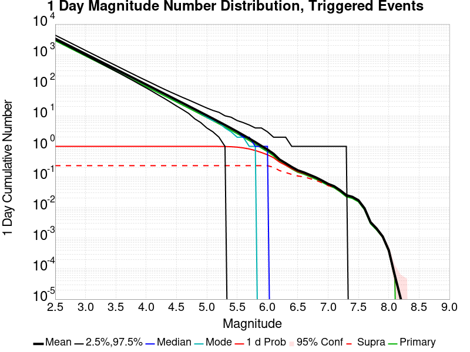

| Mag | Mean | 2.5 %ile | 97.5 %ile | Median | Mode | 1 d Probability | 1 d Supra-Seis Prob | Primary Aftershocks Mean |
|-----|-----|-----|-----|-----|-----|-----|-----|-----|
| **M&ge;2.5** | 3342.173 | 3075.000 | 4293.000 | 3259.000 | 3238.000 | 1.000 (100.00%) | 0.232 (23.24%) | 2858.855 |
| **M&ge;2.6** | 2654.768 | 2433.000 | 3415.000 | 2590.000 | 2566.000 | 1.000 (100.00%) | 0.232 (23.24%) | 2270.804 |
| **M&ge;2.7** | 2108.621 | 1925.000 | 2722.000 | 2058.000 | 2060.000 | 1.000 (100.00%) | 0.232 (23.24%) | 1803.642 |
| **M&ge;2.8** | 1674.854 | 1522.000 | 2160.000 | 1635.000 | 1624.000 | 1.000 (100.00%) | 0.232 (23.24%) | 1432.639 |
| **M&ge;2.9** | 1330.358 | 1202.000 | 1721.000 | 1300.000 | 1281.000 | 1.000 (100.00%) | 0.232 (23.24%) | 1137.964 |
| **M&ge;3** | 1056.774 | 949.000 | 1365.000 | 1033.000 | 1012.000 | 1.000 (100.00%) | 0.232 (23.24%) | 903.908 |
| **M&ge;3.1** | 839.444 | 748.000 | 1086.000 | 821.000 | 809.000 | 1.000 (100.00%) | 0.232 (23.24%) | 718.027 |
| **M&ge;3.2** | 666.824 | 589.000 | 863.000 | 653.000 | 651.000 | 1.000 (100.00%) | 0.232 (23.24%) | 570.397 |
| **M&ge;3.3** | 529.662 | 463.000 | 687.000 | 519.000 | 518.000 | 1.000 (100.00%) | 0.232 (23.24%) | 453.041 |
| **M&ge;3.4** | 420.683 | 364.000 | 547.000 | 412.000 | 409.000 | 1.000 (100.00%) | 0.232 (23.24%) | 359.809 |
| **M&ge;3.5** | 334.116 | 285.000 | 437.000 | 328.000 | 324.000 | 1.000 (100.00%) | 0.232 (23.24%) | 285.757 |
| **M&ge;3.6** | 265.360 | 223.000 | 347.000 | 260.000 | 257.000 | 1.000 (100.00%) | 0.232 (23.24%) | 226.948 |
| **M&ge;3.7** | 210.733 | 175.000 | 277.000 | 207.000 | 206.000 | 1.000 (100.00%) | 0.232 (23.24%) | 180.233 |
| **M&ge;3.8** | 167.295 | 136.000 | 222.000 | 164.000 | 159.000 | 1.000 (100.00%) | 0.232 (23.24%) | 143.069 |
| **M&ge;3.9** | 132.810 | 106.000 | 177.000 | 130.000 | 129.000 | 1.000 (100.00%) | 0.232 (23.24%) | 113.583 |
| **M&ge;4** | 105.438 | 82.000 | 142.000 | 104.000 | 101.000 | 1.000 (100.00%) | 0.232 (23.24%) | 90.177 |
| **M&ge;4.1** | 83.697 | 63.000 | 114.000 | 82.000 | 82.000 | 1.000 (100.00%) | 0.232 (23.24%) | 71.582 |
| **M&ge;4.2** | 66.397 | 48.000 | 92.000 | 65.000 | 64.000 | 1.000 (100.00%) | 0.232 (23.24%) | 56.784 |
| **M&ge;4.3** | 52.665 | 37.000 | 74.000 | 52.000 | 52.000 | 1.000 (100.00%) | 0.232 (23.24%) | 45.045 |
| **M&ge;4.4** | 41.776 | 28.000 | 60.000 | 41.000 | 41.000 | 1.000 (100.00%) | 0.232 (23.24%) | 35.727 |
| **M&ge;4.5** | 33.135 | 21.000 | 49.000 | 33.000 | 31.000 | 1.000 (100.00%) | 0.232 (23.24%) | 28.336 |
| **M&ge;4.6** | 26.257 | 16.000 | 40.000 | 26.000 | 26.000 | 1.000 (100.00%) | 0.232 (23.24%) | 22.457 |
| **M&ge;4.7** | 20.782 | 12.000 | 32.000 | 20.000 | 20.000 | 1.000 (100.00%) | 0.232 (23.24%) | 17.779 |
| **M&ge;4.8** | 16.448 | 9.000 | 27.000 | 16.000 | 15.000 | 1.000 (100.00%) | 0.232 (23.24%) | 14.074 |
| **M&ge;4.9** | 13.005 | 6.000 | 22.000 | 13.000 | 12.000 | 1.000 (100.00%) | 0.232 (23.24%) | 11.125 |
| **M&ge;5** | 10.273 | 4.000 | 18.000 | 10.000 | 9.000 | 1.000 (99.99%) | 0.232 (23.24%) | 8.789 |
| **M&ge;5.1** | 8.093 | 3.000 | 15.000 | 8.000 | 7.000 | 0.999 (99.95%) | 0.232 (23.24%) | 6.926 |
| **M&ge;5.2** | 6.373 | 2.000 | 12.000 | 6.000 | 6.000 | 0.997 (99.73%) | 0.232 (23.24%) | 5.454 |
| **M&ge;5.3** | 5.004 | 1.000 | 10.000 | 5.000 | 4.000 | 0.991 (99.11%) | 0.232 (23.24%) | 4.280 |
| **M&ge;5.4** | 3.919 | 1.000 | 9.000 | 4.000 | 3.000 | 0.976 (97.58%) | 0.232 (23.24%) | 3.351 |
| **M&ge;5.5** | 3.049 | 0.000 | 7.000 | 3.000 | 2.000 | 0.945 (94.53%) | 0.232 (23.24%) | 2.607 |
| **M&ge;5.6** | 2.352 | 0.000 | 6.000 | 2.000 | 2.000 | 0.894 (89.39%) | 0.232 (23.24%) | 2.011 |
| **M&ge;5.7** | 1.808 | 0.000 | 5.000 | 2.000 | 1.000 | 0.824 (82.37%) | 0.232 (23.24%) | 1.545 |
| **M&ge;5.8** | 1.378 | 0.000 | 4.000 | 1.000 | 1.000 | 0.734 (73.39%) | 0.232 (23.24%) | 1.177 |
| **M&ge;5.9** | 1.038 | 0.000 | 4.000 | 1.000 | 0.000 | 0.632 (63.24%) | 0.232 (23.24%) | 0.887 |
| **M&ge;6** | 0.788 | 0.000 | 3.000 | 1.000 | 0.000 | 0.533 (53.29%) | 0.232 (23.23%) | 0.672 |
| **M&ge;6.1** | 0.573 | 0.000 | 2.000 | 0.000 | 0.000 | 0.428 (42.80%) | 0.205 (20.55%) | 0.490 |
| **M&ge;6.2** | 0.367 | 0.000 | 2.000 | 0.000 | 0.000 | 0.302 (30.23%) | 0.158 (15.84%) | 0.314 |
| **M&ge;6.3** | 0.277 | 0.000 | 2.000 | 0.000 | 0.000 | 0.238 (23.83%) | 0.137 (13.71%) | 0.238 |
| **M&ge;6.4** | 0.208 | 0.000 | 1.000 | 0.000 | 0.000 | 0.185 (18.54%) | 0.119 (11.86%) | 0.179 |
| **M&ge;6.5** | 0.162 | 0.000 | 1.000 | 0.000 | 0.000 | 0.147 (14.73%) | 0.105 (10.53%) | 0.139 |
| **M&ge;6.6** | 0.138 | 0.000 | 1.000 | 0.000 | 0.000 | 0.128 (12.85%) | 0.098 (9.84%) | 0.120 |
| **M&ge;6.7** | 0.114 | 0.000 | 1.000 | 0.000 | 0.000 | 0.108 (10.76%) | 0.086 (8.65%) | 0.099 |
| **M&ge;6.8** | 0.094 | 0.000 | 1.000 | 0.000 | 0.000 | 0.090 (8.95%) | 0.075 (7.54%) | 0.082 |
| **M&ge;6.9** | 0.074 | 0.000 | 1.000 | 0.000 | 0.000 | 0.072 (7.15%) | 0.062 (6.24%) | 0.065 |
| **M&ge;7** | 0.058 | 0.000 | 1.000 | 0.000 | 0.000 | 0.057 (5.67%) | 0.051 (5.09%) | 0.051 |
| **M&ge;7.1** | 0.048 | 0.000 | 1.000 | 0.000 | 0.000 | 0.047 (4.72%) | 0.044 (4.39%) | 0.042 |
| **M&ge;7.2** | 0.035 | 0.000 | 1.000 | 0.000 | 0.000 | 0.035 (3.48%) | 0.033 (3.32%) | 0.031 |
| **M&ge;7.3** | 0.024 | 0.000 | 0.000 | 0.000 | 0.000 | 0.024 (2.41%) | 0.023 (2.32%) | 0.021 |
| **M&ge;7.4** | 0.021 | 0.000 | 0.000 | 0.000 | 0.000 | 0.021 (2.12%) | 0.021 (2.09%) | 0.019 |
| **M&ge;7.5** | 0.017 | 0.000 | 0.000 | 0.000 | 0.000 | 0.017 (1.66%) | 0.016 (1.64%) | 0.015 |
| **M&ge;7.6** | 9.14E-3 | 0.000 | 0.000 | 0.000 | 0.000 | 9.12E-3 (0.91%) | 9.09E-3 (0.91%) | 8.09E-3 |
| **M&ge;7.7** | 3.24E-3 | 0.000 | 0.000 | 0.000 | 0.000 | 3.23E-3 (0.32%) | 3.21E-3 (0.32%) | 2.86E-3 |
| **M&ge;7.8** | 1.85E-3 | 0.000 | 0.000 | 0.000 | 0.000 | 1.83E-3 (0.18%) | 1.83E-3 (0.18%) | 1.62E-3 |
| **M&ge;7.9** | 9.94E-4 | 0.000 | 0.000 | 0.000 | 0.000 | 9.94E-4 (0.10%) | 9.94E-4 (0.10%) | 9.07E-4 |
| **M&ge;8** | 2.79E-4 | 0.000 | 0.000 | 0.000 | 0.000 | 2.79E-4 (0.03%) | 2.79E-4 (0.03%) | 2.27E-4 |
| **M&ge;8.1** | 5.23E-5 | 0.000 | 0.000 | 0.000 | 0.000 | 5.23E-5 (0.01%) | 5.23E-5 (0.01%) | 3.49E-5 |
| **M&ge;8.2** | 1.74E-5 | 0.000 | 0.000 | 0.000 | 0.000 | 1.74E-5 (0.00%) | 1.74E-5 (0.00%) | 0.000 |
| **M&ge;8.3** | 0.000 | 0.000 | 0.000 | 0.000 | 0.000 | 0.000 (0.00%) | 0.000 (0.00%) | 0.000 |
| **M&ge;8.4** | 0.000 | 0.000 | 0.000 | 0.000 | 0.000 | 0.000 (0.00%) | 0.000 (0.00%) | 0.000 |
| **M&ge;8.5** | 0.000 | 0.000 | 0.000 | 0.000 | 0.000 | 0.000 (0.00%) | 0.000 (0.00%) | 0.000 |
| **M&ge;8.6** | 0.000 | 0.000 | 0.000 | 0.000 | 0.000 | 0.000 (0.00%) | 0.000 (0.00%) | 0.000 |
| **M&ge;8.7** | 0.000 | 0.000 | 0.000 | 0.000 | 0.000 | 0.000 (0.00%) | 0.000 (0.00%) | 0.000 |
| **M&ge;8.8** | 0.000 | 0.000 | 0.000 | 0.000 | 0.000 | 0.000 (0.00%) | 0.000 (0.00%) | 0.000 |
| **M&ge;8.9** | 0.000 | 0.000 | 0.000 | 0.000 | 0.000 | 0.000 (0.00%) | 0.000 (0.00%) | 0.000 |
| **M&ge;9** | 0.000 | 0.000 | 0.000 | 0.000 | 0.000 | 0.000 (0.00%) | 0.000 (0.00%) | 0.000 |

### 1 Hour Magnitude Number Distribution
*[(top)](#table-of-contents)*

**Legend**
* **Mean** (thick black line): mean expected number across all 57327 catalogs
* **2.5%,97.5%** (thin black lines): expected number percentiles across all 57327 catalogs
* **Median** (thin blue line): median expected number across all 57327 catalogs
* **Mode** (thin cyan line): modal expected number across all 57327 catalogs
* **1 hr Probability** (thin red line): 1 hour probability calculated as the fraction of catalogs with at least 1 occurrence
* **1 hr Supraseismogenic Probability** (thin dashed red line): same as above, but only for supraseismogenic ruptures on explicitly modeled UCERF3 faults
* **95% Conf** (light red shaded region): binomial 95% confidence bounds on probability
* **Primary** (thin green line): mean expected number from primary triggered aftershocks only (no secondary, tertiary, etc...) across all 57327 catalogs


| Mag | Mean | 2.5 %ile | 97.5 %ile | Median | Mode | 1 hr Probability | 1 hr Supra-Seis Prob | Primary Aftershocks Mean |
|-----|-----|-----|-----|-----|-----|-----|-----|-----|
| **M&ge;2.5** | 2272.868 | 2110.000 | 2738.000 | 2234.000 | 2230.000 | 1.000 (100.00%) | 0.165 (16.53%) | 2045.031 |
| **M&ge;2.6** | 1805.408 | 1668.000 | 2176.000 | 1775.000 | 1752.000 | 1.000 (100.00%) | 0.165 (16.53%) | 1624.404 |
| **M&ge;2.7** | 1433.994 | 1318.000 | 1729.000 | 1411.000 | 1395.000 | 1.000 (100.00%) | 0.165 (16.53%) | 1290.221 |
| **M&ge;2.8** | 1139.025 | 1040.000 | 1376.000 | 1121.000 | 1108.000 | 1.000 (100.00%) | 0.165 (16.53%) | 1024.838 |
| **M&ge;2.9** | 904.774 | 821.000 | 1094.000 | 890.000 | 886.000 | 1.000 (100.00%) | 0.165 (16.53%) | 814.058 |
| **M&ge;3** | 718.694 | 647.000 | 871.000 | 708.000 | 702.000 | 1.000 (100.00%) | 0.165 (16.53%) | 646.629 |
| **M&ge;3.1** | 570.917 | 509.000 | 693.000 | 562.000 | 563.000 | 1.000 (100.00%) | 0.165 (16.53%) | 513.690 |
| **M&ge;3.2** | 453.487 | 400.000 | 553.000 | 447.000 | 447.000 | 1.000 (100.00%) | 0.165 (16.53%) | 408.027 |
| **M&ge;3.3** | 360.178 | 314.000 | 441.000 | 355.000 | 362.000 | 1.000 (100.00%) | 0.165 (16.53%) | 324.058 |
| **M&ge;3.4** | 286.054 | 246.000 | 352.000 | 282.000 | 276.000 | 1.000 (100.00%) | 0.165 (16.53%) | 257.360 |
| **M&ge;3.5** | 227.216 | 192.000 | 282.000 | 224.000 | 224.000 | 1.000 (100.00%) | 0.165 (16.53%) | 204.410 |
| **M&ge;3.6** | 180.447 | 150.000 | 225.000 | 178.000 | 178.000 | 1.000 (100.00%) | 0.165 (16.53%) | 162.342 |
| **M&ge;3.7** | 143.288 | 116.000 | 181.000 | 141.000 | 140.000 | 1.000 (100.00%) | 0.165 (16.53%) | 128.914 |
| **M&ge;3.8** | 113.760 | 90.000 | 145.000 | 112.000 | 113.000 | 1.000 (100.00%) | 0.165 (16.53%) | 102.343 |
| **M&ge;3.9** | 90.301 | 70.000 | 117.000 | 89.000 | 87.000 | 1.000 (100.00%) | 0.165 (16.53%) | 81.239 |
| **M&ge;4** | 71.682 | 54.000 | 95.000 | 71.000 | 69.000 | 1.000 (100.00%) | 0.165 (16.53%) | 64.489 |
| **M&ge;4.1** | 56.896 | 41.000 | 77.000 | 56.000 | 55.000 | 1.000 (100.00%) | 0.165 (16.53%) | 51.184 |
| **M&ge;4.2** | 45.129 | 31.000 | 62.000 | 45.000 | 44.000 | 1.000 (100.00%) | 0.165 (16.53%) | 40.597 |
| **M&ge;4.3** | 35.788 | 24.000 | 51.000 | 35.000 | 35.000 | 1.000 (100.00%) | 0.165 (16.53%) | 32.197 |
| **M&ge;4.4** | 28.387 | 18.000 | 41.000 | 28.000 | 28.000 | 1.000 (100.00%) | 0.165 (16.53%) | 25.538 |
| **M&ge;4.5** | 22.515 | 13.000 | 34.000 | 22.000 | 23.000 | 1.000 (100.00%) | 0.165 (16.53%) | 20.255 |
| **M&ge;4.6** | 17.844 | 10.000 | 28.000 | 18.000 | 17.000 | 1.000 (100.00%) | 0.165 (16.53%) | 16.054 |
| **M&ge;4.7** | 14.120 | 7.000 | 23.000 | 14.000 | 13.000 | 1.000 (100.00%) | 0.165 (16.53%) | 12.706 |
| **M&ge;4.8** | 11.180 | 5.000 | 19.000 | 11.000 | 10.000 | 1.000 (100.00%) | 0.165 (16.53%) | 10.061 |
| **M&ge;4.9** | 8.836 | 3.000 | 16.000 | 9.000 | 8.000 | 1.000 (99.98%) | 0.165 (16.53%) | 7.952 |
| **M&ge;5** | 6.975 | 2.000 | 13.000 | 7.000 | 6.000 | 0.999 (99.87%) | 0.165 (16.53%) | 6.279 |
| **M&ge;5.1** | 5.496 | 1.000 | 11.000 | 5.000 | 5.000 | 0.995 (99.49%) | 0.165 (16.53%) | 4.949 |
| **M&ge;5.2** | 4.332 | 1.000 | 9.000 | 4.000 | 4.000 | 0.985 (98.46%) | 0.165 (16.53%) | 3.901 |
| **M&ge;5.3** | 3.403 | 0.000 | 8.000 | 3.000 | 3.000 | 0.961 (96.08%) | 0.165 (16.53%) | 3.063 |
| **M&ge;5.4** | 2.663 | 0.000 | 7.000 | 2.000 | 2.000 | 0.923 (92.26%) | 0.165 (16.53%) | 2.398 |
| **M&ge;5.5** | 2.071 | 0.000 | 5.000 | 2.000 | 2.000 | 0.864 (86.37%) | 0.165 (16.53%) | 1.864 |
| **M&ge;5.6** | 1.597 | 0.000 | 5.000 | 1.000 | 1.000 | 0.787 (78.69%) | 0.165 (16.53%) | 1.437 |
| **M&ge;5.7** | 1.227 | 0.000 | 4.000 | 1.000 | 1.000 | 0.698 (69.75%) | 0.165 (16.53%) | 1.104 |
| **M&ge;5.8** | 0.934 | 0.000 | 3.000 | 1.000 | 0.000 | 0.599 (59.86%) | 0.165 (16.53%) | 0.841 |
| **M&ge;5.9** | 0.705 | 0.000 | 3.000 | 0.000 | 0.000 | 0.499 (49.86%) | 0.165 (16.53%) | 0.635 |
| **M&ge;6** | 0.535 | 0.000 | 2.000 | 0.000 | 0.000 | 0.407 (40.75%) | 0.165 (16.52%) | 0.481 |
| **M&ge;6.1** | 0.390 | 0.000 | 2.000 | 0.000 | 0.000 | 0.320 (31.96%) | 0.146 (14.64%) | 0.352 |
| **M&ge;6.2** | 0.250 | 0.000 | 2.000 | 0.000 | 0.000 | 0.219 (21.90%) | 0.112 (11.19%) | 0.225 |
| **M&ge;6.3** | 0.189 | 0.000 | 1.000 | 0.000 | 0.000 | 0.170 (17.03%) | 0.096 (9.63%) | 0.170 |
| **M&ge;6.4** | 0.141 | 0.000 | 1.000 | 0.000 | 0.000 | 0.131 (13.08%) | 0.083 (8.28%) | 0.127 |
| **M&ge;6.5** | 0.110 | 0.000 | 1.000 | 0.000 | 0.000 | 0.103 (10.30%) | 0.073 (7.33%) | 0.099 |
| **M&ge;6.6** | 0.094 | 0.000 | 1.000 | 0.000 | 0.000 | 0.090 (8.97%) | 0.069 (6.85%) | 0.085 |
| **M&ge;6.7** | 0.078 | 0.000 | 1.000 | 0.000 | 0.000 | 0.075 (7.50%) | 0.060 (6.03%) | 0.071 |
| **M&ge;6.8** | 0.064 | 0.000 | 1.000 | 0.000 | 0.000 | 0.062 (6.24%) | 0.053 (5.25%) | 0.059 |
| **M&ge;6.9** | 0.051 | 0.000 | 1.000 | 0.000 | 0.000 | 0.050 (5.01%) | 0.044 (4.37%) | 0.047 |
| **M&ge;7** | 0.040 | 0.000 | 1.000 | 0.000 | 0.000 | 0.040 (3.98%) | 0.036 (3.57%) | 0.037 |
| **M&ge;7.1** | 0.033 | 0.000 | 1.000 | 0.000 | 0.000 | 0.033 (3.30%) | 0.031 (3.08%) | 0.031 |
| **M&ge;7.2** | 0.025 | 0.000 | 0.000 | 0.000 | 0.000 | 0.024 (2.44%) | 0.023 (2.33%) | 0.022 |
| **M&ge;7.3** | 0.017 | 0.000 | 0.000 | 0.000 | 0.000 | 0.017 (1.72%) | 0.017 (1.67%) | 0.016 |
| **M&ge;7.4** | 0.015 | 0.000 | 0.000 | 0.000 | 0.000 | 0.015 (1.51%) | 0.015 (1.49%) | 0.014 |
| **M&ge;7.5** | 0.012 | 0.000 | 0.000 | 0.000 | 0.000 | 0.012 (1.17%) | 0.012 (1.17%) | 0.011 |
| **M&ge;7.6** | 6.63E-3 | 0.000 | 0.000 | 0.000 | 0.000 | 6.61E-3 (0.66%) | 6.61E-3 (0.66%) | 6.14E-3 |
| **M&ge;7.7** | 2.48E-3 | 0.000 | 0.000 | 0.000 | 0.000 | 2.46E-3 (0.25%) | 2.46E-3 (0.25%) | 2.30E-3 |
| **M&ge;7.8** | 1.41E-3 | 0.000 | 0.000 | 0.000 | 0.000 | 1.40E-3 (0.14%) | 1.40E-3 (0.14%) | 1.33E-3 |
| **M&ge;7.9** | 7.33E-4 | 0.000 | 0.000 | 0.000 | 0.000 | 7.33E-4 (0.07%) | 7.33E-4 (0.07%) | 7.15E-4 |
| **M&ge;8** | 1.92E-4 | 0.000 | 0.000 | 0.000 | 0.000 | 1.92E-4 (0.02%) | 1.92E-4 (0.02%) | 1.74E-4 |
| **M&ge;8.1** | 5.23E-5 | 0.000 | 0.000 | 0.000 | 0.000 | 5.23E-5 (0.01%) | 5.23E-5 (0.01%) | 3.49E-5 |
| **M&ge;8.2** | 1.74E-5 | 0.000 | 0.000 | 0.000 | 0.000 | 1.74E-5 (0.00%) | 1.74E-5 (0.00%) | 0.000 |
| **M&ge;8.3** | 0.000 | 0.000 | 0.000 | 0.000 | 0.000 | 0.000 (0.00%) | 0.000 (0.00%) | 0.000 |
| **M&ge;8.4** | 0.000 | 0.000 | 0.000 | 0.000 | 0.000 | 0.000 (0.00%) | 0.000 (0.00%) | 0.000 |
| **M&ge;8.5** | 0.000 | 0.000 | 0.000 | 0.000 | 0.000 | 0.000 (0.00%) | 0.000 (0.00%) | 0.000 |
| **M&ge;8.6** | 0.000 | 0.000 | 0.000 | 0.000 | 0.000 | 0.000 (0.00%) | 0.000 (0.00%) | 0.000 |
| **M&ge;8.7** | 0.000 | 0.000 | 0.000 | 0.000 | 0.000 | 0.000 (0.00%) | 0.000 (0.00%) | 0.000 |
| **M&ge;8.8** | 0.000 | 0.000 | 0.000 | 0.000 | 0.000 | 0.000 (0.00%) | 0.000 (0.00%) | 0.000 |
| **M&ge;8.9** | 0.000 | 0.000 | 0.000 | 0.000 | 0.000 | 0.000 (0.00%) | 0.000 (0.00%) | 0.000 |
| **M&ge;9** | 0.000 | 0.000 | 0.000 | 0.000 | 0.000 | 0.000 (0.00%) | 0.000 (0.00%) | 0.000 |


## Hazard Change Over Time
*[(top)](#table-of-contents)*

These plots show how the probability of ruptures of various magnitudes within 100km of any scenario rupture changes over time

### M&ge;5.0 Hazard Change Over Time
*[(top)](#table-of-contents)*


| Forecast Duration | UCERF3-ETAS [95% Conf] | UCERF3-ETAS Triggered Only | UCERF3-TD | UCERF3-ETAS/TD Gain | UCERF3-TI |
|-----|-----|-----|-----|-----|-----|
| 1 Hour | 0.999 [0.998 - 0.999] | 0.999 | 7.14E-5 | 13990.3 | 7.09E-5 |
| 1 Day | 1.000 [1.000 - 1.000] | 1.000 | 1.71E-3 | 584.15 | 1.70E-3 |
| 1 Week | 1.000 [1.000 - 1.000] | 1.000 | 0.012 | 83.89 | 0.012 |
| 1 Month | 1.000 [1.000 - 1.000] | 1.000 | 0.050 | 19.96 | 0.050 |
| 1 Year | 1.000 [1.000 - 1.000] | 1.000 | 0.465 | 2.15 | 0.463 |
| 10 Years | 1.000 [1.000 - 1.000] | 1.000 | 0.998 | 1 | 0.998 |
| 30 Years | 1.000 [1.000 - 1.000] \* | \* | 1.000 | 1 \* | 1.000 |
| 100 Years | 1.000 [1.000 - 1.000] \* | \* | 1.000 | 1 \* | 1.000 |

\* *forecast duration is longer than simulation length, only ETAS ruptures from the first 10 years are included*
### M&ge;6.0 Hazard Change Over Time
*[(top)](#table-of-contents)*


| Forecast Duration | UCERF3-ETAS [95% Conf] | UCERF3-ETAS Triggered Only | UCERF3-TD | UCERF3-ETAS/TD Gain | UCERF3-TI |
|-----|-----|-----|-----|-----|-----|
| 1 Hour | 0.405 [0.401 - 0.409] | 0.405 | 7.85E-6 | 51554.79 | 7.36E-6 |
| 1 Day | 0.530 [0.526 - 0.534] | 0.530 | 1.88E-4 | 2812.19 | 1.77E-4 |
| 1 Week | 0.576 [0.572 - 0.580] | 0.576 | 1.32E-3 | 436.94 | 1.23E-3 |
| 1 Month | 0.604 [0.600 - 0.608] | 0.602 | 5.64E-3 | 107.15 | 5.28E-3 |
| 1 Year | 0.657 [0.654 - 0.661] | 0.633 | 0.067 | 9.88 | 0.062 |
| 10 Years | 0.826 [0.824 - 0.828] | 0.653 | 0.498 | 1.66 | 0.475 |
| 30 Years | 0.956 [0.956 - 0.957] \* | \* | 0.874 | 1.09 \* | 0.855 |
| 100 Years | 1.000 [1.000 - 1.000] \* | \* | 0.999 | 1 \* | 0.998 |

\* *forecast duration is longer than simulation length, only ETAS ruptures from the first 10 years are included*
### M&ge;7.0 Hazard Change Over Time
*[(top)](#table-of-contents)*


| Forecast Duration | UCERF3-ETAS [95% Conf] | UCERF3-ETAS Triggered Only | UCERF3-TD | UCERF3-ETAS/TD Gain | UCERF3-TI |
|-----|-----|-----|-----|-----|-----|
| 1 Hour | 0.039 [0.038 - 0.041] | 0.039 | 7.16E-7 | 55095.59 | 6.48E-7 |
| 1 Day | 0.056 [0.054 - 0.058] | 0.056 | 1.72E-5 | 3274.32 | 1.55E-5 |
| 1 Week | 0.064 [0.062 - 0.066] | 0.063 | 1.20E-4 | 528.93 | 1.09E-4 |
| 1 Month | 0.068 [0.066 - 0.071] | 0.068 | 5.15E-4 | 132.75 | 4.66E-4 |
| 1 Year | 0.079 [0.077 - 0.081] | 0.074 | 6.26E-3 | 12.68 | 5.66E-3 |
| 10 Years | 0.133 [0.131 - 0.135] | 0.077 | 0.061 | 2.19 | 0.055 |
| 30 Years | 0.238 [0.236 - 0.239] \* | \* | 0.174 | 1.37 \* | 0.157 |
| 100 Years | 0.524 [0.523 - 0.525] \* | \* | 0.485 | 1.08 \* | 0.433 |

\* *forecast duration is longer than simulation length, only ETAS ruptures from the first 10 years are included*
### M&ge;8.0 Hazard Change Over Time
*[(top)](#table-of-contents)*


| Forecast Duration | UCERF3-ETAS [95% Conf] | UCERF3-ETAS Triggered Only | UCERF3-TD | UCERF3-ETAS/TD Gain | UCERF3-TI |
|-----|-----|-----|-----|-----|-----|
| 1 Hour | 1.40E-4 [6.49E-5 - 2.87E-4] | 1.40E-4 | 1.24E-8 | 11285.84 | 1.06E-8 |
| 1 Day | 2.10E-4 [1.14E-4 - 3.77E-4] | 2.09E-4 | 2.97E-7 | 706.3 | 2.54E-7 |
| 1 Week | 2.11E-4 [1.16E-4 - 3.79E-4] | 2.09E-4 | 2.08E-6 | 101.76 | 1.78E-6 |
| 1 Month | 2.36E-4 [1.35E-4 - 4.08E-4] | 2.27E-4 | 8.90E-6 | 26.47 | 7.63E-6 |
| 1 Year | 3.70E-4 [2.60E-4 - 5.51E-4] | 2.62E-4 | 1.08E-4 | 3.41 | 9.29E-5 |
| 10 Years | 1.38E-3 [1.26E-3 - 1.56E-3] | 2.79E-4 | 1.10E-3 | 1.25 | 9.29E-4 |
| 30 Years | 3.78E-3 [3.67E-3 - 3.97E-3] \* | \* | 3.50E-3 | 1.08 \* | 2.78E-3 |
| 100 Years | 0.014 [0.014 - 0.014] \* | \* | 0.014 | 1.02 \* | 9.25E-3 |

\* *forecast duration is longer than simulation length, only ETAS ruptures from the first 10 years are included*

## Trigger Rupture Fault Map
*[(top)](#table-of-contents)*


## Trigger Rupture Depth Map
*[(top)](#table-of-contents)*


## Fault Distances To Triggers
*[(top)](#table-of-contents)*

| Section Name | Strike, Dip, Rake | # Hypos In Poly | Max Mag w/ Hypo In Poly | # Surfs In Poly | Max Mag w/ Surf In Poly | Min Dist To Any (km) | Min Poly Dist To Any (km) | Min Dist To Largest (km) | Min Poly Dist To Largest (km) | Min Hypo Dist To Largest (km) | Min Hypo Poly Dist To Largest (km) |
|-----|-----|-----|-----|-----|-----|-----|-----|-----|-----|-----|-----|
| Airport Lake | 359, 50, -90 | 90 | 7.1 | 90 | 7.1 | 0.036 | 0.000 | 0.036 | 0.000 | 5.612 | 0.000 |
| Little Lake | 327, 90, 180 | 16 | 3.75 | 17 | 7.1 | 2.268 | 0.000 | 11.284 | 0.000 | 13.471 | 1.469 |
| Garlock (Central) | 71, 90, 0 | 2 | 3.21 | 3 | 7.1 | 5.600 | 0.000 | 5.600 | 0.000 | 22.766 | 10.797 |
| So Sierra Nevada | 2, 50, -90 | 1 | 2.75 | 1 | 2.75 | 1.410 | 0.000 | 4.248 | 4.233 | 16.191 | 15.188 |
| Tank Canyon | 189, 50, -90 | 0 |  | 0 |  | 9.015 | 9.011 | 9.015 | 9.011 | 17.039 | 16.895 |
| Blackwater | 323, 90, 180 | 0 |  | 0 |  | 14.394 | 8.726 | 14.394 | 8.726 | 29.622 | 27.613 |
| Scodie Lineament | 221, 68, 0 | 0 |  | 0 |  | 16.722 | 15.781 | 28.750 | 27.702 | 36.559 | 32.668 |

## Individual Simulated Catalog Maps
*[(top)](#table-of-contents)*

These are map plots of individual catalogs from the simulations, selected as the closest catalog to each of the given percentiles in terms of total number of events.

| Duration | p0.0 %-ile | p25.0 %-ile | p50.0 %-ile | p75.0 %-ile | p90.0 %-ile | p95.0 %-ile | p97.5 %-ile | p98.0 %-ile | p99.0 %-ile | p99.5 %-ile | p99.9 %-ile | p100.0 %-ile |
|-----|-----|-----|-----|-----|-----|-----|-----|-----|-----|-----|-----|-----|
| **1 Week** |  |  |  |  |  |  |  |  |  |  |  |  |
| **1 Month** |  |  |  |  |  |  |  |  |  | 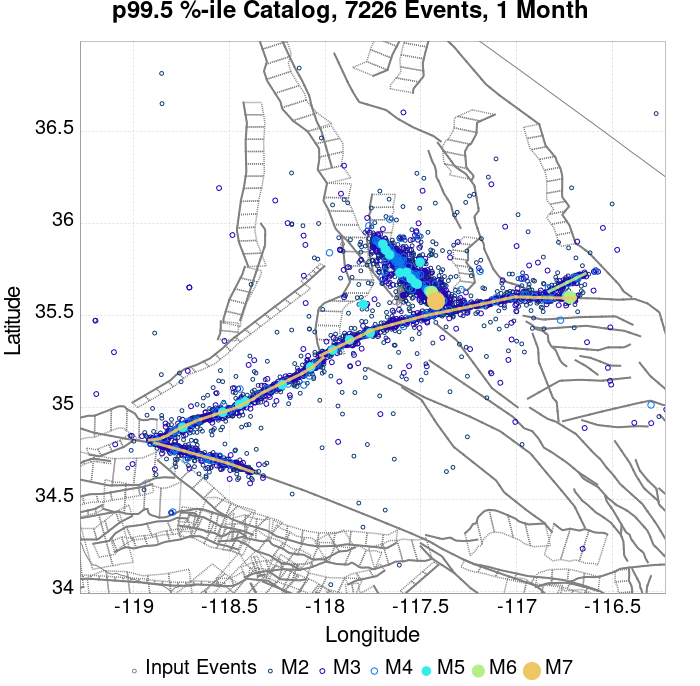 |  |  |
| **1 Year** |  |  |  |  | 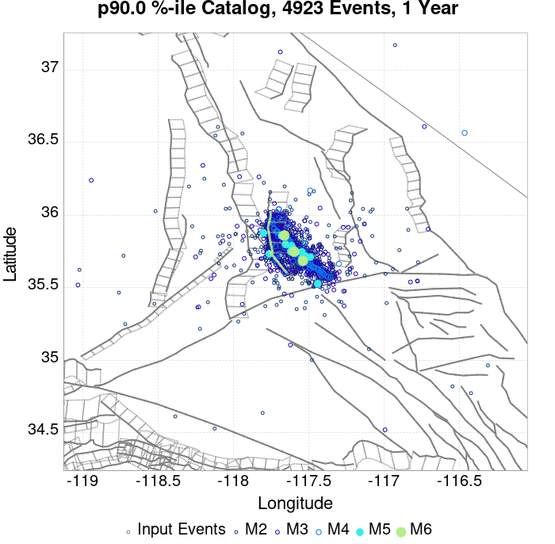 |  |  |  |  |  |  |  |
| **10 Year** |  |  |  | 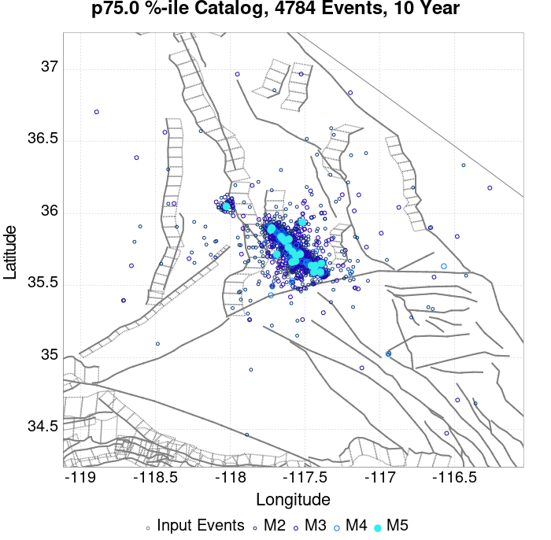 |  |  |  |  |  |  |  |  |

## ComCat Data Comparisons
*[(top)](#table-of-contents)*

These plots compare simulated sequences with data from ComCat. All plots only consider events with hypocenters inside the ComCat region defined in the JSON input file, and consider ruptures above Mc=3.5

Last updated at 2019/08/30 03:35:34 UTC, 55 d after the simulation start time

### ComCat Magnitude-Number Distributions
*[(top)](#table-of-contents)*

| Incremental MND | Cumulative MND |
|-----|-----|
| 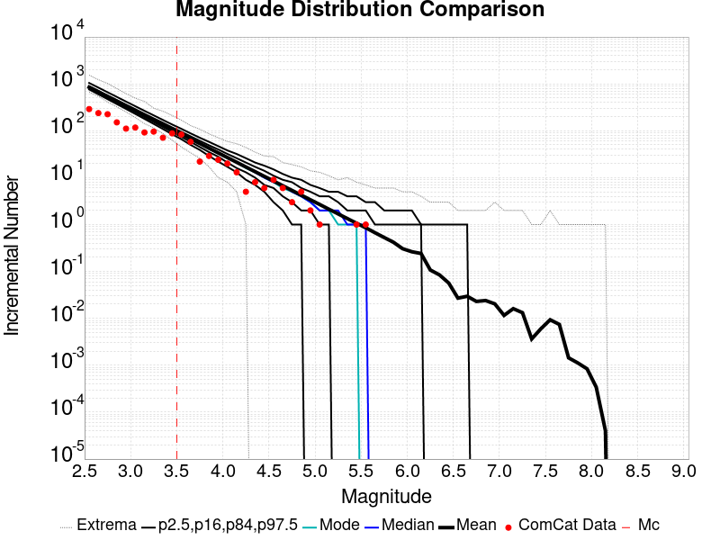 |  |

### ComCat Cumulative Number Vs Time
*[(top)](#table-of-contents)*

| M&ge;3.5 | M&ge;4 | M&ge;5 | M&ge;6 | M&ge;7 |
|-----|-----|-----|-----|-----|
|  |  |  |  |  |

### ComCat Cumulative Number Simulation Percentiles
*[(top)](#table-of-contents)*


### ComCat Mean Spatial Distribution
*[(top)](#table-of-contents)*

|  | 1 Day | 1 Week | 1 Month | 55 Day |
|-----|-----|-----|-----|-----|
| **M≥3.5** |  |  |  |  |
| **M≥4** |  |  |  |  |
| **M≥5** |  |  |  |  |
| **M≥6** |  |  |  | 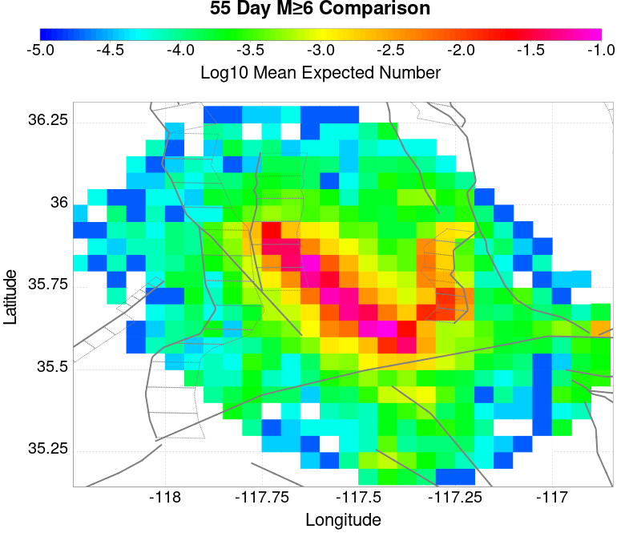 |
| **M≥7** |  | 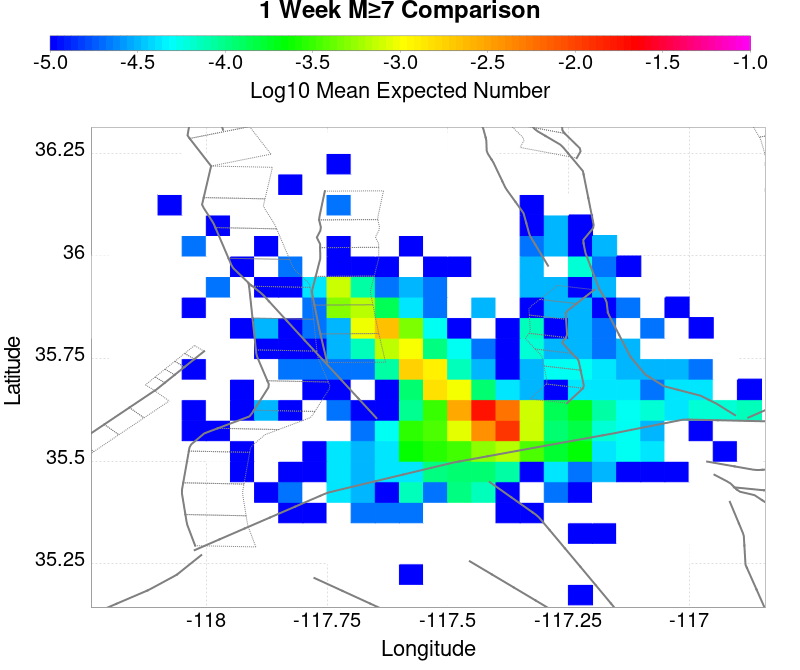 |  |  |
| **M≥8** |  |  |  |  |

### ComCat Depth Distribution
*[(top)](#table-of-contents)*

| M&ge;3.5 | M&ge;4 | M&ge;5 | M&ge;6 | M&ge;7 | M&ge;8 |
|-----|-----|-----|-----|-----|-----|
|  |  |  |  |  |  |

## Section Participation
*[(top)](#table-of-contents)*

### Section Participation Plots
*[(top)](#table-of-contents)*

| Min Mag | 1 yr Triggered Ruptures (no spontaneous) | 10 yr Triggered Ruptures (no spontaneous) | 10 yr Triggered Ruptures (primary aftershocks only) |
|-----|-----|-----|-----|
| **All Supra. Seis.** |  |  |  |
| **M&ge;6.5** |  |  |  |
| **M&ge;7** |  | 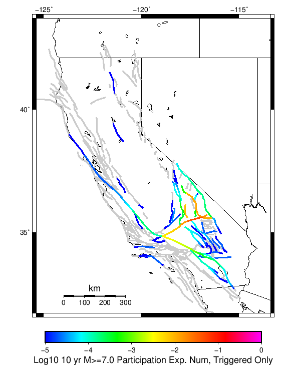 |  |
| **M&ge;7.5** | 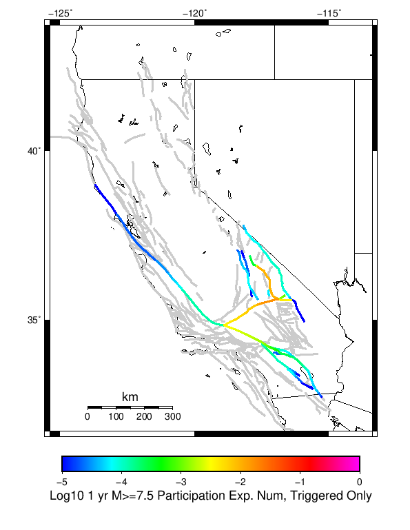 |  |  |
| **M&ge;8** |  |  |  |

### Supra-Seismogenic Parent Sections Table
*[(top)](#table-of-contents)*

*First 10 of 147 with matching ruptures shown*

| Parent Name | Triggered 10 Year Mean Count | Triggered 1 Day Prob | Triggered 1 Week Prob | Triggered 1 Month Prob | Triggered 1 Year Prob | Triggered 10 Year Prob | Triggered 10 Year Primary Mean Count |
|-----|-----|-----|-----|-----|-----|-----|-----|
| Garlock (Central) | 0.1541333 | 0.1110646 | 0.124984734 | 0.13330543 | 0.14398102 | 0.15092365 | 0.13236345 |
| Tank Canyon | 0.075252496 | 0.04936592 | 0.057006296 | 0.061820783 | 0.06790867 | 0.07190329 | 0.05227903 |
| Little Lake | 0.07451986 | 0.05337799 | 0.060215954 | 0.06412336 | 0.06914717 | 0.07268826 | 0.06328606 |
| Airport Lake | 0.06954838 | 0.05070909 | 0.057459835 | 0.06138469 | 0.06623406 | 0.06944372 | 0.06129747 |
| Owl Lake | 0.030927835 | 0.0209151 | 0.023793327 | 0.025973799 | 0.02846826 | 0.030247528 | 0.020060355 |
| Panamint Valley | 0.024996947 | 0.017792663 | 0.020112688 | 0.02159541 | 0.023566557 | 0.024770178 | 0.019397492 |
| Garlock (East) | 0.019746367 | 0.013396828 | 0.015559859 | 0.016658816 | 0.01833342 | 0.019414935 | 0.013431717 |
| Hunter Mountain-Saline Valley | 0.013466604 | 0.009908071 | 0.01114658 | 0.011844331 | 0.0128735155 | 0.01344916 | 0.011233799 |
| Garlock (West) | 0.010396497 | 0.007465941 | 0.008547456 | 0.009053325 | 0.009785965 | 0.010396497 | 0.008896331 |
| Blackwater | 0.0071693966 | 0.0047272663 | 0.005669231 | 0.0060006627 | 0.006663527 | 0.007064734 | 0.0045702723 |

### M≥6.5 Parent Sections Table
*[(top)](#table-of-contents)*

*First 10 of 115 with matching ruptures shown*

| Parent Name | Triggered 10 Year Mean Count | Triggered 1 Day Prob | Triggered 1 Week Prob | Triggered 1 Month Prob | Triggered 1 Year Prob | Triggered 10 Year Prob | Triggered 10 Year Primary Mean Count |
|-----|-----|-----|-----|-----|-----|-----|-----|
| Garlock (Central) | 0.062623195 | 0.04537129 | 0.05144173 | 0.054965373 | 0.059622865 | 0.06232665 | 0.053325657 |
| Airport Lake | 0.052767456 | 0.03841122 | 0.043696687 | 0.046644688 | 0.05030788 | 0.052767456 | 0.04638303 |
| Little Lake | 0.04807508 | 0.035376 | 0.039789278 | 0.04245818 | 0.045632947 | 0.04767387 | 0.041394107 |
| Panamint Valley | 0.024159646 | 0.017286792 | 0.019519597 | 0.020967433 | 0.022851361 | 0.023967763 | 0.019031173 |
| Owl Lake | 0.023357231 | 0.016658816 | 0.018874178 | 0.02044412 | 0.022205941 | 0.023339787 | 0.018211314 |
| Garlock (East) | 0.016449492 | 0.011495456 | 0.013257278 | 0.014129468 | 0.015367976 | 0.01620528 | 0.01266419 |
| Hunter Mountain-Saline Valley | 0.01330961 | 0.009803409 | 0.011024473 | 0.011722225 | 0.012751409 | 0.013292166 | 0.011129136 |
| Garlock (West) | 0.010344166 | 0.007448497 | 0.008512569 | 0.009018438 | 0.009733633 | 0.010344166 | 0.008861444 |
| Tank Canyon | 0.007971811 | 0.005006367 | 0.0060355505 | 0.006698414 | 0.0073612784 | 0.007971811 | 0.0054599056 |
| San Andreas (Mojave N) | 0.004500497 | 0.003279432 | 0.0036457516 | 0.0038725208 | 0.0042213965 | 0.0044830535 | 0.0038027456 |

### M≥7 Parent Sections Table
*[(top)](#table-of-contents)*

*First 10 of 77 with matching ruptures shown*

| Parent Name | Triggered 10 Year Mean Count | Triggered 1 Day Prob | Triggered 1 Week Prob | Triggered 1 Month Prob | Triggered 1 Year Prob | Triggered 10 Year Prob | Triggered 10 Year Primary Mean Count |
|-----|-----|-----|-----|-----|-----|-----|-----|
| Garlock (Central) | 0.055610795 | 0.04057425 | 0.045789942 | 0.048894934 | 0.05301167 | 0.055436358 | 0.047464546 |
| Owl Lake | 0.020670889 | 0.015036545 | 0.016920473 | 0.018176427 | 0.01971148 | 0.020670889 | 0.017478675 |
| Panamint Valley | 0.019048616 | 0.01409458 | 0.015821515 | 0.016885586 | 0.018315976 | 0.019013729 | 0.015961066 |
| Garlock (East) | 0.0144609 | 0.010466272 | 0.01201877 | 0.012786296 | 0.013780592 | 0.014443456 | 0.012193208 |
| Hunter Mountain-Saline Valley | 0.013100284 | 0.009681302 | 0.010832592 | 0.011530343 | 0.012542083 | 0.0130828405 | 0.010937255 |
| Little Lake | 0.011704781 | 0.008582343 | 0.0097161895 | 0.010326722 | 0.01114658 | 0.011704781 | 0.010326722 |
| Airport Lake | 0.011181468 | 0.008163692 | 0.009297539 | 0.009838296 | 0.010640711 | 0.011181468 | 0.009925515 |
| Garlock (West) | 0.010239503 | 0.0073438343 | 0.008407906 | 0.008913775 | 0.009628971 | 0.010239503 | 0.008756781 |
| San Andreas (Mojave N) | 0.004500497 | 0.003279432 | 0.0036457516 | 0.0038725208 | 0.0042213965 | 0.0044830535 | 0.0038027456 |
| San Andreas (Mojave S) | 0.0032271007 | 0.0023549113 | 0.002634012 | 0.002791006 | 0.003035219 | 0.0031922131 | 0.002703787 |

### M≥7.5 Parent Sections Table
*[(top)](#table-of-contents)*

*First 10 of 42 with matching ruptures shown*

| Parent Name | Triggered 10 Year Mean Count | Triggered 1 Day Prob | Triggered 1 Week Prob | Triggered 1 Month Prob | Triggered 1 Year Prob | Triggered 10 Year Prob | Triggered 10 Year Primary Mean Count |
|-----|-----|-----|-----|-----|-----|-----|-----|
| Garlock (Central) | 0.02142097 | 0.015769184 | 0.017810106 | 0.018874178 | 0.020339455 | 0.021386083 | 0.018350864 |
| Panamint Valley | 0.012890959 | 0.009541752 | 0.010675598 | 0.011373349 | 0.012367645 | 0.012890959 | 0.010850036 |
| Hunter Mountain-Saline Valley | 0.01280374 | 0.009471976 | 0.010588379 | 0.01128613 | 0.012280426 | 0.01280374 | 0.010762817 |
| Garlock (West) | 0.009227764 | 0.006646083 | 0.007640379 | 0.0080590295 | 0.008634674 | 0.009227764 | 0.007867148 |
| Garlock (East) | 0.0057041184 | 0.004186509 | 0.0047970414 | 0.0050586984 | 0.005337799 | 0.0057041184 | 0.0048842602 |
| San Andreas (Mojave N) | 0.004500497 | 0.003279432 | 0.0036457516 | 0.0038725208 | 0.0042213965 | 0.0044830535 | 0.0038027456 |
| San Andreas (Mojave S) | 0.0032096568 | 0.0023549113 | 0.002634012 | 0.002791006 | 0.003035219 | 0.0031922131 | 0.002703787 |
| Owl Lake | 0.0018664852 | 0.0012908402 | 0.0014652781 | 0.0015350532 | 0.0017094911 | 0.0018664852 | 0.0015350532 |
| San Andreas (San Bernardino N) | 0.0017094911 | 0.0013431716 | 0.0014652781 | 0.0015350532 | 0.0016222722 | 0.0017094911 | 0.0014827219 |
| San Andreas (San Bernardino S) | 8.373018E-4 | 6.454201E-4 | 7.1519526E-4 | 7.5008284E-4 | 7.849704E-4 | 8.373018E-4 | 7.1519526E-4 |

### M≥8 Parent Sections Table
*[(top)](#table-of-contents)*

*First 10 of 28 with matching ruptures shown*

| Parent Name | Triggered 10 Year Mean Count | Triggered 1 Day Prob | Triggered 1 Week Prob | Triggered 1 Month Prob | Triggered 1 Year Prob | Triggered 10 Year Prob | Triggered 10 Year Primary Mean Count |
|-----|-----|-----|-----|-----|-----|-----|-----|
| San Andreas (Mojave N) | 3.4887574E-4 | 2.791006E-4 | 2.791006E-4 | 2.965444E-4 | 3.3143195E-4 | 3.4887574E-4 | 2.791006E-4 |
| San Andreas (Mojave S) | 3.4887574E-4 | 2.791006E-4 | 2.791006E-4 | 2.965444E-4 | 3.3143195E-4 | 3.4887574E-4 | 2.791006E-4 |
| San Andreas (San Bernardino N) | 3.4887574E-4 | 2.791006E-4 | 2.791006E-4 | 2.965444E-4 | 3.3143195E-4 | 3.4887574E-4 | 2.791006E-4 |
| Garlock (Central) | 2.791006E-4 | 2.0932544E-4 | 2.0932544E-4 | 2.2676923E-4 | 2.6165682E-4 | 2.791006E-4 | 2.2676923E-4 |
| Garlock (West) | 2.791006E-4 | 2.0932544E-4 | 2.0932544E-4 | 2.2676923E-4 | 2.6165682E-4 | 2.791006E-4 | 2.2676923E-4 |
| Garlock (East) | 2.6165682E-4 | 1.9188166E-4 | 1.9188166E-4 | 2.0932544E-4 | 2.4421304E-4 | 2.6165682E-4 | 2.0932544E-4 |
| San Andreas (San Bernardino S) | 2.2676923E-4 | 1.5699408E-4 | 1.5699408E-4 | 1.7443787E-4 | 2.0932544E-4 | 2.2676923E-4 | 1.9188166E-4 |
| San Andreas (San Gorgonio Pass-Garnet HIll) | 2.0932544E-4 | 1.395503E-4 | 1.395503E-4 | 1.5699408E-4 | 1.9188166E-4 | 2.0932544E-4 | 1.7443787E-4 |
| San Andreas (Coachella) rev | 1.7443787E-4 | 1.2210652E-4 | 1.2210652E-4 | 1.395503E-4 | 1.7443787E-4 | 1.7443787E-4 | 1.2210652E-4 |
| San Andreas (Big Bend) | 6.977515E-5 | 6.977515E-5 | 6.977515E-5 | 6.977515E-5 | 6.977515E-5 | 6.977515E-5 | 5.233136E-5 |

### Fault Magnitude-Probability Distributions
*[(top)](#table-of-contents)*

The first 5 sections (sorted by trigger rate) are plotted below. All fault MPDs are available [here](plots/parent_sect_mpds/README.md)

| 1 Week | 1 Month | 1 Year | 10 Year |
|-----|-----|-----|-----|
|  |  |  |  |
|  |  |  |  |
|  |  |  |  |
| 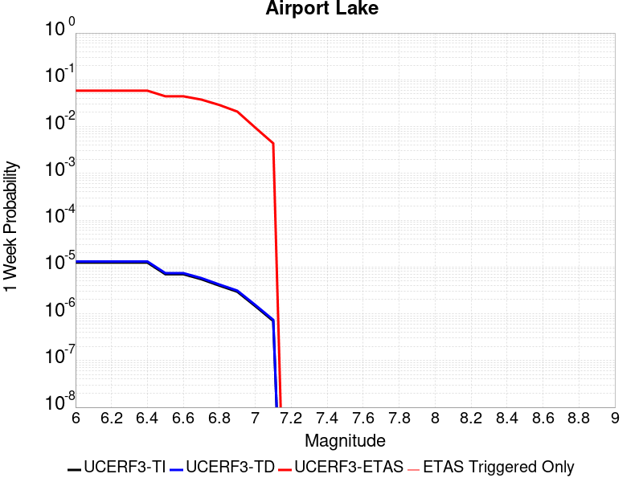 |  |  |  |
|  |  |  |  |

## Gridded Nucleation
*[(top)](#table-of-contents)*

| Min Mag | Triggered Ruptures (no spontaneous) | Triggered Ruptures (primary aftershocks only) |
|-----|-----|-----|
| **M&ge;2.5** |  | 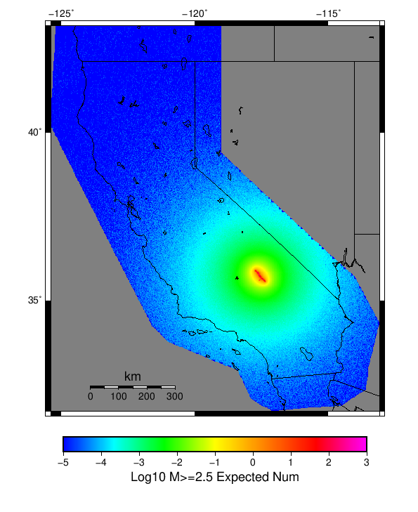 |
| **M&ge;5** | 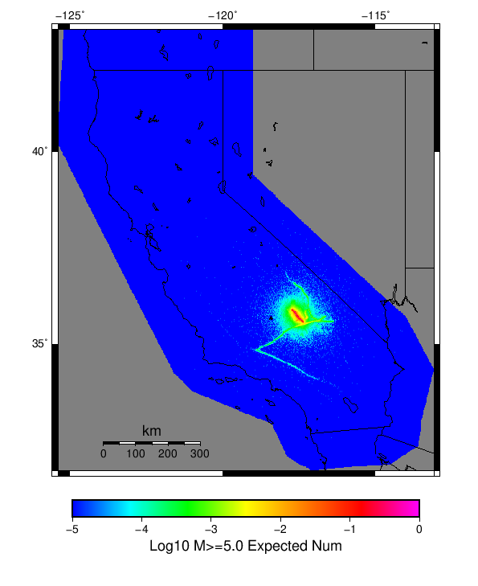 |  |
| **M&ge;6** |  |  |
| **M&ge;7** |  |  |


## JSON Input File
*[(top)](#table-of-contents)*

```
{
  "numSimulations": 100000,
  "duration": 10.0,
  "startTimeMillis": 1562383194040,
  "includeSpontaneous": false,
  "randomSeed": 1567035173906,
  "binaryOutput": true,
  "binaryOutputFilters": [
    {
      "prefix": "results_complete",
      "descendantsOnly": false
    },
    {
      "prefix": "results_m5_preserve_chain",
      "minMag": 5.0,
      "preserveChainBelowMag": true,
      "descendantsOnly": false
    }
  ],
  "forceRecalc": false,
  "simulationName": "ComCat M7.1 (ci38457511), Mainshock Log10(k)\u003d-2.3, ShakeMap Surfaces, Log10(k)\u003d-3.03, p\u003d1.15, c\u003d4.6773514E-4",
  "numRetries": 3,
  "outputDir": "${ETAS_SIM_DIR}/2019_08_28-ComCatM7p1_ci38457511_MainshockLog10_k_2p3_ShakeMapSurfaces_Log10_k_3p03_p1p15_c4p6773514E4-noSpont-full_td-scale1.14-modParams",
  "triggerRuptures": [
    {
      "occurrenceTimeMillis": 1562259775340,
      "comcatEventID": "ci38443095",
      "mag": 3.98,
      "latitude": 35.708,
      "longitude": -117.5036667,
      "depth": 10.58
    },
    {
      "occurrenceTimeMillis": 1562261629000,
      "comcatEventID": "ci38443183",
      "mag": 6.4,
      "latitude": 35.7053333,
      "longitude": -117.5038333,
      "depth": 10.5,
      "ruptureSurfaces": [
        {
          "outline": [
            {
              "latitude": 35.6051534466,
              "longitude": -117.5905380735,
              "depth": 0.0
            },
            {
              "latitude": 35.6173144101,
              "longitude": -117.57249634649999,
              "depth": 0.0
            },
            {
              "latitude": 35.6173135736,
              "longitude": -117.5726723708,
              "depth": 0.0
            },
            {
              "latitude": 35.61731357360001,
              "longitude": -117.5726723708,
              "depth": 15.0
            },
            {
              "latitude": 35.6173144101,
              "longitude": -117.57249634649999,
              "depth": 15.0
            },
            {
              "latitude": 35.6051534466,
              "longitude": -117.5905380735,
              "depth": 15.0
            },
            {
              "latitude": 35.6051534466,
              "longitude": -117.5905380735,
              "depth": 0.0
            }
          ]
        },
        {
          "outline": [
            {
              "latitude": 35.6338128629,
              "longitude": -117.54831678310002,
              "depth": 0.0
            },
            {
              "latitude": 35.6413274733,
              "longitude": -117.5393878708,
              "depth": 0.0
            },
            {
              "latitude": 35.664283512,
              "longitude": -117.51611643970001,
              "depth": 0.0
            },
            {
              "latitude": 35.664283512000004,
              "longitude": -117.51611643970001,
              "depth": 15.0
            },
            {
              "latitude": 35.641327473299995,
              "longitude": -117.5393878708,
              "depth": 15.0
            },
            {
              "latitude": 35.63381286290001,
              "longitude": -117.54831678310002,
              "depth": 15.0
            },
            {
              "latitude": 35.6338128629,
              "longitude": -117.54831678310002,
              "depth": 0.0
            }
          ]
        },
        {
          "outline": [
            {
              "latitude": 35.6322100797,
              "longitude": -117.55305954249998,
              "depth": 0.0
            },
            {
              "latitude": 35.6196274701,
              "longitude": -117.56969626549999,
              "depth": 0.0
            },
            {
              "latitude": 35.6196274701,
              "longitude": -117.56969626549999,
              "depth": 15.0
            },
            {
              "latitude": 35.6322100797,
              "longitude": -117.55305954249998,
              "depth": 15.0
            },
            {
              "latitude": 35.6322100797,
              "longitude": -117.55305954249998,
              "depth": 0.0
            }
          ]
        }
      ]
    },
    {
      "occurrenceTimeMillis": 1562261701660,
      "comcatEventID": "ci38443191",
      "mag": 4.49,
      "latitude": 35.644,
      "longitude": -117.56716670000002,
      "depth": 4.64
    },
    {
      "occurrenceTimeMillis": 1562261746340,
      "comcatEventID": "ci37222356",
      "mag": 3.63,
      "latitude": 35.6936667,
      "longitude": -117.437,
      "depth": 7.65
    },
    {
      "occurrenceTimeMillis": 1562261752170,
      "comcatEventID": "ci37218988",
      "mag": 4.28,
      "latitude": 35.687,
      "longitude": -117.50616670000001,
      "depth": 1.6
    },
    {
      "occurrenceTimeMillis": 1562261818950,
      "comcatEventID": "ci37222380",
      "mag": 3.41,
      "latitude": 35.7258333,
      "longitude": -117.55933330000002,
      "depth": 5.3
    },
    {
      "occurrenceTimeMillis": 1562261821140,
      "comcatEventID": "ci37222372",
      "mag": 3.66,
      "latitude": 35.7105,
      "longitude": -117.4773333,
      "depth": 1.57
    },
    {
      "occurrenceTimeMillis": 1562261834850,
      "comcatEventID": "ci37222364",
      "mag": 3.97,
      "latitude": 35.6655,
      "longitude": -117.516,
      "depth": 1.64
    },
    {
      "occurrenceTimeMillis": 1562261845640,
      "comcatEventID": "ci37218996",
      "mag": 4.01,
      "latitude": 35.6758333,
      "longitude": -117.45750000000001,
      "depth": 15.82
    },
    {
      "occurrenceTimeMillis": 1562261875500,
      "comcatEventID": "ci38443199",
      "mag": 3.86,
      "latitude": 35.7456667,
      "longitude": -117.5516667,
      "depth": 8.29
    },
    {
      "occurrenceTimeMillis": 1562261901450,
      "comcatEventID": "ci37421941",
      "mag": 3.73,
      "latitude": 35.714,
      "longitude": -117.476,
      "depth": 1.74
    },
    {
      "occurrenceTimeMillis": 1562261927500,
      "comcatEventID": "us70004a0n",
      "mag": 3.5,
      "latitude": 35.6215,
      "longitude": -117.5782,
      "depth": 9.7
    },
    {
      "occurrenceTimeMillis": 1562261927760,
      "comcatEventID": "ci37222396",
      "mag": 3.5,
      "latitude": 35.6235,
      "longitude": -117.596,
      "depth": 8.55
    },
    {
      "occurrenceTimeMillis": 1562261973310,
      "comcatEventID": "ci37222404",
      "mag": 3.11,
      "latitude": 35.5743333,
      "longitude": -117.63666670000002,
      "depth": 6.85
    },
    {
      "occurrenceTimeMillis": 1562261975360,
      "comcatEventID": "ci38443215",
      "mag": 3.69,
      "latitude": 35.6873333,
      "longitude": -117.4935,
      "depth": 10.86
    },
    {
      "occurrenceTimeMillis": 1562262002250,
      "comcatEventID": "ci38443223",
      "mag": 3.8,
      "latitude": 35.7253333,
      "longitude": -117.57083329999999,
      "depth": 6.63
    },
    {
      "occurrenceTimeMillis": 1562262018520,
      "comcatEventID": "ci38443231",
      "mag": 4.13,
      "latitude": 35.707,
      "longitude": -117.5101667,
      "depth": 8.66
    },
    {
      "occurrenceTimeMillis": 1562262034900,
      "comcatEventID": "ci37222508",
      "mag": 3.54,
      "latitude": 35.6948333,
      "longitude": -117.50183330000002,
      "depth": 2.04
    },
    {
      "occurrenceTimeMillis": 1562262046140,
      "comcatEventID": "ci37222516",
      "mag": 3.42,
      "latitude": 35.7298333,
      "longitude": -117.55483330000001,
      "depth": 7.72
    },
    {
      "occurrenceTimeMillis": 1562262080850,
      "comcatEventID": "ci37421957",
      "mag": 3.3,
      "latitude": 35.7266667,
      "longitude": -117.5288333,
      "depth": 1.97
    },
    {
      "occurrenceTimeMillis": 1562262174130,
      "comcatEventID": "ci38443239",
      "mag": 3.22,
      "latitude": 35.7301667,
      "longitude": -117.55866669999999,
      "depth": 7.84
    },
    {
      "occurrenceTimeMillis": 1562262209200,
      "comcatEventID": "us70004a0z",
      "mag": 3.6,
      "latitude": 35.6783,
      "longitude": -117.5488,
      "depth": 5.15
    },
    {
      "occurrenceTimeMillis": 1562262264020,
      "comcatEventID": "ci37421981",
      "mag": 2.77,
      "latitude": 35.7478333,
      "longitude": -117.54000000000002,
      "depth": 9.4
    },
    {
      "occurrenceTimeMillis": 1562262272820,
      "comcatEventID": "ci38443255",
      "mag": 3.86,
      "latitude": 35.6875,
      "longitude": -117.5071667,
      "depth": 1.54
    },
    {
      "occurrenceTimeMillis": 1562262305780,
      "comcatEventID": "ci37421997",
      "mag": 3.03,
      "latitude": 35.6976667,
      "longitude": -117.48649999999999,
      "depth": 2.24
    },
    {
      "occurrenceTimeMillis": 1562262323950,
      "comcatEventID": "ci37421989",
      "mag": 3.03,
      "latitude": 35.7151667,
      "longitude": -117.5473333,
      "depth": 7.21
    },
    {
      "occurrenceTimeMillis": 1562262328630,
      "comcatEventID": "ci37222524",
      "mag": 3.21,
      "latitude": 35.7348333,
      "longitude": -117.53683330000001,
      "depth": 10.34
    },
    {
      "occurrenceTimeMillis": 1562262363710,
      "comcatEventID": "ci38443263",
      "mag": 2.96,
      "latitude": 35.6431667,
      "longitude": -117.6101667,
      "depth": 10.14
    },
    {
      "occurrenceTimeMillis": 1562262380320,
      "comcatEventID": "ci37222532",
      "mag": 2.56,
      "latitude": 35.6563333,
      "longitude": -117.5325,
      "depth": 1.52
    },
    {
      "occurrenceTimeMillis": 1562262409960,
      "comcatEventID": "ci38443271",
      "mag": 3.07,
      "latitude": 35.6385,
      "longitude": -117.6108333,
      "depth": 10.97
    },
    {
      "occurrenceTimeMillis": 1562262437810,
      "comcatEventID": "ci38443279",
      "mag": 3.5,
      "latitude": 35.7455,
      "longitude": -117.5465,
      "depth": 7.11
    },
    {
      "occurrenceTimeMillis": 1562262460970,
      "comcatEventID": "ci37222548",
      "mag": 3.11,
      "latitude": 35.726,
      "longitude": -117.55849999999998,
      "depth": 3.58
    },
    {
      "occurrenceTimeMillis": 1562262474970,
      "comcatEventID": "ci37222556",
      "mag": 3.4,
      "latitude": 35.7286667,
      "longitude": -117.56066670000001,
      "depth": 5.25
    },
    {
      "occurrenceTimeMillis": 1562262483160,
      "comcatEventID": "ci37222564",
      "mag": 3.27,
      "latitude": 35.6365,
      "longitude": -117.55183330000001,
      "depth": 6.62
    },
    {
      "occurrenceTimeMillis": 1562262495680,
      "comcatEventID": "ci37222572",
      "mag": 3.11,
      "latitude": 35.7053333,
      "longitude": -117.5245,
      "depth": 5.52
    },
    {
      "occurrenceTimeMillis": 1562262504150,
      "comcatEventID": "ci37222580",
      "mag": 2.96,
      "latitude": 35.6593333,
      "longitude": -117.52633330000002,
      "depth": 2.68
    },
    {
      "occurrenceTimeMillis": 1562262575190,
      "comcatEventID": "ci37222596",
      "mag": 2.52,
      "latitude": 35.7335,
      "longitude": -117.50683330000001,
      "depth": 3.91
    },
    {
      "occurrenceTimeMillis": 1562262578950,
      "comcatEventID": "ci37222668",
      "mag": 2.57,
      "latitude": 35.687,
      "longitude": -117.49066670000002,
      "depth": 10.66
    },
    {
      "occurrenceTimeMillis": 1562262648290,
      "comcatEventID": "ci37222692",
      "mag": 2.73,
      "latitude": 35.738,
      "longitude": -117.52933329999999,
      "depth": 7.72
    },
    {
      "occurrenceTimeMillis": 1562262648960,
      "comcatEventID": "ci38443303",
      "mag": 2.79,
      "latitude": 35.678,
      "longitude": -117.49916670000002,
      "depth": 1.14
    },
    {
      "occurrenceTimeMillis": 1562262706650,
      "comcatEventID": "ci38443287",
      "mag": 3.46,
      "latitude": 35.674,
      "longitude": -117.52349999999998,
      "depth": 5.3
    },
    {
      "occurrenceTimeMillis": 1562262761700,
      "comcatEventID": "ci38443295",
      "mag": 2.92,
      "latitude": 35.7218333,
      "longitude": -117.5251667,
      "depth": 7.04
    },
    {
      "occurrenceTimeMillis": 1562262899560,
      "comcatEventID": "ci38443327",
      "mag": 2.53,
      "latitude": 35.6391667,
      "longitude": -117.5628333,
      "depth": 10.48
    },
    {
      "occurrenceTimeMillis": 1562262930800,
      "comcatEventID": "ci37222876",
      "mag": 2.57,
      "latitude": 35.6705,
      "longitude": -117.5221667,
      "depth": 3.91
    },
    {
      "occurrenceTimeMillis": 1562263051460,
      "comcatEventID": "ci38443311",
      "mag": 2.95,
      "latitude": 35.6595,
      "longitude": -117.5223333,
      "depth": 2.3
    },
    {
      "occurrenceTimeMillis": 1562263063060,
      "comcatEventID": "ci37222932",
      "mag": 2.78,
      "latitude": 35.6725,
      "longitude": -117.4743333,
      "depth": 8.76
    },
    {
      "occurrenceTimeMillis": 1562263082640,
      "comcatEventID": "ci38443319",
      "mag": 3.33,
      "latitude": 35.702,
      "longitude": -117.50833330000002,
      "depth": 4.77
    },
    {
      "occurrenceTimeMillis": 1562263240190,
      "comcatEventID": "ci38443335",
      "mag": 2.67,
      "latitude": 35.6303333,
      "longitude": -117.569,
      "depth": 1.64
    },
    {
      "occurrenceTimeMillis": 1562263261190,
      "comcatEventID": "ci37223148",
      "mag": 2.59,
      "latitude": 35.6733333,
      "longitude": -117.5118333,
      "depth": 1.49
    },
    {
      "occurrenceTimeMillis": 1562263283180,
      "comcatEventID": "ci37422005",
      "mag": 3.53,
      "latitude": 35.6876667,
      "longitude": -117.50849999999998,
      "depth": 1.26
    },
    {
      "occurrenceTimeMillis": 1562263291230,
      "comcatEventID": "ci37223156",
      "mag": 3.42,
      "latitude": 35.5978333,
      "longitude": -117.5905,
      "depth": 6.79
    },
    {
      "occurrenceTimeMillis": 1562263374110,
      "comcatEventID": "ci38443351",
      "mag": 2.53,
      "latitude": 35.6066667,
      "longitude": -117.58216670000002,
      "depth": 5.8
    },
    {
      "occurrenceTimeMillis": 1562263398590,
      "comcatEventID": "ci38443359",
      "mag": 2.85,
      "latitude": 35.7478333,
      "longitude": -117.5425,
      "depth": 6.85
    },
    {
      "occurrenceTimeMillis": 1562263541830,
      "comcatEventID": "ci38443375",
      "mag": 2.76,
      "latitude": 35.7153333,
      "longitude": -117.5295,
      "depth": 4.54
    },
    {
      "occurrenceTimeMillis": 1562263555910,
      "comcatEventID": "ci37223228",
      "mag": 2.61,
      "latitude": 35.7266667,
      "longitude": -117.5165,
      "depth": 8.96
    },
    {
      "occurrenceTimeMillis": 1562263576110,
      "comcatEventID": "ci38443383",
      "mag": 3.79,
      "latitude": 35.6606667,
      "longitude": -117.523,
      "depth": 2.14
    },
    {
      "occurrenceTimeMillis": 1562263611050,
      "comcatEventID": "ci37223236",
      "mag": 2.6,
      "latitude": 35.6931667,
      "longitude": -117.46200000000002,
      "depth": 11.56
    },
    {
      "occurrenceTimeMillis": 1562263629270,
      "comcatEventID": "ci38443391",
      "mag": 3.51,
      "latitude": 35.5991667,
      "longitude": -117.6101667,
      "depth": 2.12
    },
    {
      "occurrenceTimeMillis": 1562263630910,
      "comcatEventID": "ci37223244",
      "mag": 3.49,
      "latitude": 35.6508333,
      "longitude": -117.54200000000002,
      "depth": 2.77
    },
    {
      "occurrenceTimeMillis": 1562263670810,
      "comcatEventID": "ci37223252",
      "mag": 2.55,
      "latitude": 35.72950000000001,
      "longitude": -117.533,
      "depth": 7.25
    },
    {
      "occurrenceTimeMillis": 1562263713160,
      "comcatEventID": "ci38443407",
      "mag": 3.38,
      "latitude": 35.6678333,
      "longitude": -117.50616670000001,
      "depth": 2.27
    },
    {
      "occurrenceTimeMillis": 1562263725070,
      "comcatEventID": "ci37223308",
      "mag": 3.55,
      "latitude": 35.7108333,
      "longitude": -117.47683329999998,
      "depth": 1.17
    },
    {
      "occurrenceTimeMillis": 1562263832710,
      "comcatEventID": "ci38443415",
      "mag": 3.46,
      "latitude": 35.6598333,
      "longitude": -117.53483330000002,
      "depth": 10.25
    },
    {
      "occurrenceTimeMillis": 1562263882870,
      "comcatEventID": "ci38443423",
      "mag": 2.69,
      "latitude": 35.6003333,
      "longitude": -117.5951667,
      "depth": 7.33
    },
    {
      "occurrenceTimeMillis": 1562263972070,
      "comcatEventID": "ci38443431",
      "mag": 3.44,
      "latitude": 35.6703333,
      "longitude": -117.5605,
      "depth": 6.91
    },
    {
      "occurrenceTimeMillis": 1562264025530,
      "comcatEventID": "ci37223380",
      "mag": 2.89,
      "latitude": 35.7003333,
      "longitude": -117.4873333,
      "depth": 10.98
    },
    {
      "occurrenceTimeMillis": 1562264031400,
      "comcatEventID": "ci38443439",
      "mag": 3.5,
      "latitude": 35.7081667,
      "longitude": -117.485,
      "depth": 6.44
    },
    {
      "occurrenceTimeMillis": 1562264104970,
      "comcatEventID": "ci38443447",
      "mag": 2.75,
      "latitude": 35.6103333,
      "longitude": -117.59500000000001,
      "depth": 4.94
    },
    {
      "occurrenceTimeMillis": 1562264112820,
      "comcatEventID": "ci37420701",
      "mag": 3.23,
      "latitude": 35.6691667,
      "longitude": -117.5203333,
      "depth": 1.84
    },
    {
      "occurrenceTimeMillis": 1562264193730,
      "comcatEventID": "ci38443463",
      "mag": 2.94,
      "latitude": 35.7251667,
      "longitude": -117.53350000000002,
      "depth": 6.74
    },
    {
      "occurrenceTimeMillis": 1562264235320,
      "comcatEventID": "ci38443471",
      "mag": 2.87,
      "latitude": 35.7185,
      "longitude": -117.5336667,
      "depth": 4.94
    },
    {
      "occurrenceTimeMillis": 1562264325720,
      "comcatEventID": "ci38443487",
      "mag": 3.38,
      "latitude": 35.638,
      "longitude": -117.611,
      "depth": 9.43
    },
    {
      "occurrenceTimeMillis": 1562264332070,
      "comcatEventID": "ci37223676",
      "mag": 2.98,
      "latitude": 35.6123333,
      "longitude": -117.624,
      "depth": 0.0
    },
    {
      "occurrenceTimeMillis": 1562264348090,
      "comcatEventID": "ci37223684",
      "mag": 2.6,
      "latitude": 35.7236667,
      "longitude": -117.50849999999998,
      "depth": 11.57
    },
    {
      "occurrenceTimeMillis": 1562264485340,
      "comcatEventID": "ci38443495",
      "mag": 2.61,
      "latitude": 35.67883330000001,
      "longitude": -117.51533330000001,
      "depth": 2.91
    },
    {
      "occurrenceTimeMillis": 1562264763750,
      "comcatEventID": "ci38443519",
      "mag": 3.13,
      "latitude": 35.6638333,
      "longitude": -117.5245,
      "depth": 2.53
    },
    {
      "occurrenceTimeMillis": 1562264846770,
      "comcatEventID": "ci38443527",
      "mag": 3.29,
      "latitude": 35.6748333,
      "longitude": -117.51433329999999,
      "depth": 2.68
    },
    {
      "occurrenceTimeMillis": 1562264879440,
      "comcatEventID": "ci38443535",
      "mag": 4.23,
      "latitude": 35.745,
      "longitude": -117.55216669999999,
      "depth": 6.64
    },
    {
      "occurrenceTimeMillis": 1562264923640,
      "comcatEventID": "ci38443543",
      "mag": 3.75,
      "latitude": 35.6661667,
      "longitude": -117.5656667,
      "depth": 7.14
    },
    {
      "occurrenceTimeMillis": 1562265289010,
      "comcatEventID": "ci37224604",
      "mag": 2.59,
      "latitude": 35.6895,
      "longitude": -117.4883333,
      "depth": 0.63
    },
    {
      "occurrenceTimeMillis": 1562265344040,
      "comcatEventID": "ci38443575",
      "mag": 2.5,
      "latitude": 35.7215,
      "longitude": -117.56550000000001,
      "depth": 0.16
    },
    {
      "occurrenceTimeMillis": 1562265451500,
      "comcatEventID": "ci38443591",
      "mag": 2.64,
      "latitude": 35.72,
      "longitude": -117.5723333,
      "depth": 1.34
    },
    {
      "occurrenceTimeMillis": 1562265525650,
      "comcatEventID": "ci38443599",
      "mag": 2.69,
      "latitude": 35.7046661,
      "longitude": -117.49666600000002,
      "depth": 3.96
    },
    {
      "occurrenceTimeMillis": 1562265584440,
      "comcatEventID": "ci38443607",
      "mag": 4.59,
      "latitude": 35.6013333,
      "longitude": -117.59700000000001,
      "depth": 2.81
    },
    {
      "occurrenceTimeMillis": 1562265656740,
      "comcatEventID": "ci37224612",
      "mag": 3.05,
      "latitude": 35.652,
      "longitude": -117.53683330000001,
      "depth": 2.03
    },
    {
      "occurrenceTimeMillis": 1562265674270,
      "comcatEventID": "ci38443615",
      "mag": 3.07,
      "latitude": 35.6763333,
      "longitude": -117.5115,
      "depth": 2.13
    },
    {
      "occurrenceTimeMillis": 1562265865000,
      "comcatEventID": "ci38443631",
      "mag": 3.09,
      "latitude": 35.719,
      "longitude": -117.55866669999999,
      "depth": 2.06
    },
    {
      "occurrenceTimeMillis": 1562266026590,
      "comcatEventID": "ci38443647",
      "mag": 4.34,
      "latitude": 35.6758333,
      "longitude": -117.48533330000001,
      "depth": 8.53
    },
    {
      "occurrenceTimeMillis": 1562266042600,
      "comcatEventID": "ci37421213",
      "mag": 4.02,
      "latitude": 35.6755,
      "longitude": -117.472,
      "depth": 10.27
    },
    {
      "occurrenceTimeMillis": 1562266207160,
      "comcatEventID": "ci38443663",
      "mag": 2.73,
      "latitude": 35.641,
      "longitude": -117.56266670000001,
      "depth": 8.95
    },
    {
      "occurrenceTimeMillis": 1562266215910,
      "comcatEventID": "ci38443671",
      "mag": 3.7,
      "latitude": 35.682,
      "longitude": -117.4961667,
      "depth": 1.26
    },
    {
      "occurrenceTimeMillis": 1562266333530,
      "comcatEventID": "ci38443679",
      "mag": 2.78,
      "latitude": 35.6543333,
      "longitude": -117.53983330000001,
      "depth": 0.88
    },
    {
      "occurrenceTimeMillis": 1562266376130,
      "comcatEventID": "ci38443687",
      "mag": 2.93,
      "latitude": 35.741,
      "longitude": -117.561,
      "depth": 0.23
    },
    {
      "occurrenceTimeMillis": 1562266407670,
      "comcatEventID": "ci38443695",
      "mag": 3.36,
      "latitude": 35.7285,
      "longitude": -117.5605,
      "depth": 7.87
    },
    {
      "occurrenceTimeMillis": 1562266453990,
      "comcatEventID": "ci38443703",
      "mag": 4.07,
      "latitude": 35.5975,
      "longitude": -117.5996667,
      "depth": 5.33
    },
    {
      "occurrenceTimeMillis": 1562266527680,
      "comcatEventID": "ci38443711",
      "mag": 3.03,
      "latitude": 35.6753333,
      "longitude": -117.4795,
      "depth": 10.71
    },
    {
      "occurrenceTimeMillis": 1562266566420,
      "comcatEventID": "ci38443719",
      "mag": 4.58,
      "latitude": 35.716,
      "longitude": -117.56000000000002,
      "depth": 1.92
    },
    {
      "occurrenceTimeMillis": 1562266582030,
      "comcatEventID": "ci37420717",
      "mag": 4.21,
      "latitude": 35.7086667,
      "longitude": -117.55416669999998,
      "depth": 1.16
    },
    {
      "occurrenceTimeMillis": 1562266687790,
      "comcatEventID": "ci38443727",
      "mag": 2.85,
      "latitude": 35.7266667,
      "longitude": -117.56516670000002,
      "depth": 0.09
    },
    {
      "occurrenceTimeMillis": 1562266809510,
      "comcatEventID": "ci38443751",
      "mag": 3.21,
      "latitude": 35.7099991,
      "longitude": -117.55616759999998,
      "depth": 0.1
    },
    {
      "occurrenceTimeMillis": 1562266869997,
      "comcatEventID": "us70004a4p",
      "mag": 3.0,
      "latitude": 35.7867,
      "longitude": -117.5478,
      "depth": 5.0
    },
    {
      "occurrenceTimeMillis": 1562266944640,
      "comcatEventID": "ci38443775",
      "mag": 2.56,
      "latitude": 35.645,
      "longitude": -117.5373333,
      "depth": 0.01
    },
    {
      "occurrenceTimeMillis": 1562267419790,
      "comcatEventID": "ci38443823",
      "mag": 3.26,
      "latitude": 35.6938324,
      "longitude": -117.49449920000002,
      "depth": 0.97
    },
    {
      "occurrenceTimeMillis": 1562267699490,
      "comcatEventID": "ci38443831",
      "mag": 3.0,
      "latitude": 35.652668,
      "longitude": -117.5393295,
      "depth": 1.65
    },
    {
      "occurrenceTimeMillis": 1562267766200,
      "comcatEventID": "ci38443839",
      "mag": 2.5,
      "latitude": 35.721,
      "longitude": -117.56650000000002,
      "depth": 0.12
    },
    {
      "occurrenceTimeMillis": 1562267871400,
      "comcatEventID": "ci38443855",
      "mag": 3.23,
      "latitude": 35.6911659,
      "longitude": -117.51216889999999,
      "depth": 1.03
    },
    {
      "occurrenceTimeMillis": 1562268051750,
      "comcatEventID": "ci38443863",
      "mag": 2.8,
      "latitude": 35.6389999,
      "longitude": -117.5526657,
      "depth": 1.11
    },
    {
      "occurrenceTimeMillis": 1562268092090,
      "comcatEventID": "ci38443871",
      "mag": 4.5,
      "latitude": 35.6715,
      "longitude": -117.4788333,
      "depth": 5.16
    },
    {
      "occurrenceTimeMillis": 1562268380340,
      "comcatEventID": "ci38443879",
      "mag": 2.69,
      "latitude": 35.7086667,
      "longitude": -117.48333330000001,
      "depth": 1.39
    },
    {
      "occurrenceTimeMillis": 1562268438340,
      "comcatEventID": "ci38443895",
      "mag": 2.81,
      "latitude": 35.6696667,
      "longitude": -117.47999999999999,
      "depth": 6.24
    },
    {
      "occurrenceTimeMillis": 1562269189760,
      "comcatEventID": "ci38443983",
      "mag": 2.63,
      "latitude": 35.683,
      "longitude": -117.5195,
      "depth": 5.84
    },
    {
      "occurrenceTimeMillis": 1562269229180,
      "comcatEventID": "ci38443991",
      "mag": 2.65,
      "latitude": 35.6556667,
      "longitude": -117.5158333,
      "depth": 1.76
    },
    {
      "occurrenceTimeMillis": 1562269744960,
      "comcatEventID": "ci38444047",
      "mag": 3.18,
      "latitude": 35.6828346,
      "longitude": -117.49183650000002,
      "depth": 0.0
    },
    {
      "occurrenceTimeMillis": 1562269876850,
      "comcatEventID": "ci38444063",
      "mag": 3.34,
      "latitude": 35.7094994,
      "longitude": -117.55666349999998,
      "depth": 0.34
    },
    {
      "occurrenceTimeMillis": 1562269933070,
      "comcatEventID": "ci38444071",
      "mag": 3.02,
      "latitude": 35.6086655,
      "longitude": -117.590332,
      "depth": 4.83
    },
    {
      "occurrenceTimeMillis": 1562270160500,
      "comcatEventID": "ci38444103",
      "mag": 4.16,
      "latitude": 35.6623333,
      "longitude": -117.524,
      "depth": 1.49
    },
    {
      "occurrenceTimeMillis": 1562270280220,
      "comcatEventID": "ci38444119",
      "mag": 2.65,
      "latitude": 35.7131667,
      "longitude": -117.5561667,
      "depth": 0.16
    },
    {
      "occurrenceTimeMillis": 1562270492930,
      "comcatEventID": "ci38444135",
      "mag": 2.5,
      "latitude": 35.678,
      "longitude": -117.589,
      "depth": 7.89
    },
    {
      "occurrenceTimeMillis": 1562270655500,
      "comcatEventID": "ci38444143",
      "mag": 2.56,
      "latitude": 35.7048333,
      "longitude": -117.48683330000001,
      "depth": 1.23
    },
    {
      "occurrenceTimeMillis": 1562270768270,
      "comcatEventID": "ci38444159",
      "mag": 3.38,
      "latitude": 35.6980019,
      "longitude": -117.4881668,
      "depth": 8.77
    },
    {
      "occurrenceTimeMillis": 1562271091460,
      "comcatEventID": "ci38444191",
      "mag": 2.61,
      "latitude": 35.683,
      "longitude": -117.50483330000002,
      "depth": 1.69
    },
    {
      "occurrenceTimeMillis": 1562271290340,
      "comcatEventID": "ci38444215",
      "mag": 3.99,
      "latitude": 35.6991667,
      "longitude": -117.5125,
      "depth": 5.75
    },
    {
      "occurrenceTimeMillis": 1562271456830,
      "comcatEventID": "ci38444231",
      "mag": 3.06,
      "latitude": 35.699501,
      "longitude": -117.4838333,
      "depth": 1.03
    },
    {
      "occurrenceTimeMillis": 1562271789990,
      "comcatEventID": "ci38444263",
      "mag": 3.4,
      "latitude": 35.6403351,
      "longitude": -117.5996704,
      "depth": 9.92
    },
    {
      "occurrenceTimeMillis": 1562271838650,
      "comcatEventID": "ci38444271",
      "mag": 2.53,
      "latitude": 35.6583333,
      "longitude": -117.56233329999999,
      "depth": 4.39
    },
    {
      "occurrenceTimeMillis": 1562272472100,
      "comcatEventID": "ci38444311",
      "mag": 2.61,
      "latitude": 35.640667,
      "longitude": -117.5833359,
      "depth": 8.68
    },
    {
      "occurrenceTimeMillis": 1562273126620,
      "comcatEventID": "ci38444407",
      "mag": 3.09,
      "latitude": 35.7008324,
      "longitude": -117.47766879999999,
      "depth": 0.04
    },
    {
      "occurrenceTimeMillis": 1562273724820,
      "comcatEventID": "ci38444487",
      "mag": 3.37,
      "latitude": 35.7088318,
      "longitude": -117.4771652,
      "depth": 0.2
    },
    {
      "occurrenceTimeMillis": 1562273832360,
      "comcatEventID": "ci38444503",
      "mag": 2.54,
      "latitude": 35.6585,
      "longitude": -117.53199999999998,
      "depth": 8.73
    },
    {
      "occurrenceTimeMillis": 1562274175860,
      "comcatEventID": "ci38444543",
      "mag": 3.56,
      "latitude": 35.689666700000004,
      "longitude": -117.4853363,
      "depth": 7.08
    },
    {
      "occurrenceTimeMillis": 1562274428600,
      "comcatEventID": "ci38444559",
      "mag": 2.52,
      "latitude": 35.5995,
      "longitude": -117.59783330000002,
      "depth": 4.74
    },
    {
      "occurrenceTimeMillis": 1562275395050,
      "comcatEventID": "ci38444687",
      "mag": 2.8,
      "latitude": 35.6951667,
      "longitude": -117.4893333,
      "depth": 1.65
    },
    {
      "occurrenceTimeMillis": 1562275595090,
      "comcatEventID": "ci38444719",
      "mag": 3.0,
      "latitude": 35.67666630000001,
      "longitude": -117.52749630000001,
      "depth": 7.39
    },
    {
      "occurrenceTimeMillis": 1562275966060,
      "comcatEventID": "ci38444783",
      "mag": 2.62,
      "latitude": 35.725,
      "longitude": -117.56916670000001,
      "depth": 2.03
    },
    {
      "occurrenceTimeMillis": 1562276014350,
      "comcatEventID": "ci38444791",
      "mag": 3.08,
      "latitude": 35.6155014,
      "longitude": -117.5893326,
      "depth": 5.43
    },
    {
      "occurrenceTimeMillis": 1562276433450,
      "comcatEventID": "ci38444823",
      "mag": 3.42,
      "latitude": 35.6691666,
      "longitude": -117.518837,
      "depth": 2.04
    },
    {
      "occurrenceTimeMillis": 1562276519830,
      "comcatEventID": "ci38444847",
      "mag": 2.74,
      "latitude": 35.7193333,
      "longitude": -117.53216670000002,
      "depth": 2.19
    },
    {
      "occurrenceTimeMillis": 1562276794030,
      "comcatEventID": "ci38444895",
      "mag": 2.5,
      "latitude": 35.7011667,
      "longitude": -117.47866669999999,
      "depth": 0.93
    },
    {
      "occurrenceTimeMillis": 1562276824410,
      "comcatEventID": "ci38444903",
      "mag": 3.25,
      "latitude": 35.6321678,
      "longitude": -117.60717010000002,
      "depth": 9.0
    },
    {
      "occurrenceTimeMillis": 1562277755090,
      "comcatEventID": "ci38445015",
      "mag": 3.35,
      "latitude": 35.6775017,
      "longitude": -117.5148315,
      "depth": 2.85
    },
    {
      "occurrenceTimeMillis": 1562277922533,
      "comcatEventID": "us70004ach",
      "mag": 3.3,
      "latitude": 35.7232,
      "longitude": -117.4508,
      "depth": 9.45
    },
    {
      "occurrenceTimeMillis": 1562278328280,
      "comcatEventID": "ci38445087",
      "mag": 4.47,
      "latitude": 35.7443333,
      "longitude": -117.56633329999998,
      "depth": 1.97
    },
    {
      "occurrenceTimeMillis": 1562279346560,
      "comcatEventID": "ci38445183",
      "mag": 2.51,
      "latitude": 35.7038333,
      "longitude": -117.49499999999999,
      "depth": 9.8
    },
    {
      "occurrenceTimeMillis": 1562279407880,
      "comcatEventID": "ci38445199",
      "mag": 2.62,
      "latitude": 35.7008333,
      "longitude": -117.4893333,
      "depth": 1.85
    },
    {
      "occurrenceTimeMillis": 1562280141650,
      "comcatEventID": "ci38445295",
      "mag": 3.2,
      "latitude": 35.7211685,
      "longitude": -117.52400210000002,
      "depth": 2.21
    },
    {
      "occurrenceTimeMillis": 1562281630780,
      "comcatEventID": "ci38445463",
      "mag": 2.59,
      "latitude": 35.7041667,
      "longitude": -117.4886667,
      "depth": 1.92
    },
    {
      "occurrenceTimeMillis": 1562281960410,
      "comcatEventID": "ci38445495",
      "mag": 3.49,
      "latitude": 35.6711655,
      "longitude": -117.47166440000001,
      "depth": 7.11
    },
    {
      "occurrenceTimeMillis": 1562281984910,
      "comcatEventID": "ci38445503",
      "mag": 3.06,
      "latitude": 35.7470016,
      "longitude": -117.5784988,
      "depth": 2.13
    },
    {
      "occurrenceTimeMillis": 1562283240630,
      "comcatEventID": "ci37420973",
      "mag": 3.82,
      "latitude": 35.6623333,
      "longitude": -117.5245,
      "depth": 2.61
    },
    {
      "occurrenceTimeMillis": 1562283242380,
      "comcatEventID": "ci38445703",
      "mag": 4.04,
      "latitude": 35.6011667,
      "longitude": -117.61066670000001,
      "depth": 4.75
    },
    {
      "occurrenceTimeMillis": 1562283753710,
      "comcatEventID": "ci38445751",
      "mag": 3.72,
      "latitude": 35.7470016,
      "longitude": -117.5681686,
      "depth": 2.42
    },
    {
      "occurrenceTimeMillis": 1562284476440,
      "comcatEventID": "ci38445839",
      "mag": 3.33,
      "latitude": 35.6571655,
      "longitude": -117.52183530000002,
      "depth": 1.67
    },
    {
      "occurrenceTimeMillis": 1562285645640,
      "comcatEventID": "ci38445935",
      "mag": 2.76,
      "latitude": 35.6458333,
      "longitude": -117.54716670000002,
      "depth": 0.29
    },
    {
      "occurrenceTimeMillis": 1562285881410,
      "comcatEventID": "ci38445975",
      "mag": 4.04,
      "latitude": 35.7718333,
      "longitude": -117.61783330000002,
      "depth": 2.59
    },
    {
      "occurrenceTimeMillis": 1562286529030,
      "comcatEventID": "ci38446031",
      "mag": 2.8,
      "latitude": 35.7215,
      "longitude": -117.5465,
      "depth": 7.03
    },
    {
      "occurrenceTimeMillis": 1562286726670,
      "comcatEventID": "ci38446071",
      "mag": 4.02,
      "latitude": 35.7033333,
      "longitude": -117.4828333,
      "depth": 1.0
    },
    {
      "occurrenceTimeMillis": 1562286799610,
      "comcatEventID": "ci38446079",
      "mag": 2.66,
      "latitude": 35.7436676,
      "longitude": -117.55566409999999,
      "depth": 5.42
    },
    {
      "occurrenceTimeMillis": 1562287539420,
      "comcatEventID": "ci38446159",
      "mag": 3.95,
      "latitude": 35.6910019,
      "longitude": -117.50966640000001,
      "depth": 3.68
    },
    {
      "occurrenceTimeMillis": 1562287780920,
      "comcatEventID": "ci38446175",
      "mag": 2.52,
      "latitude": 35.7096667,
      "longitude": -117.47866669999999,
      "depth": 1.91
    },
    {
      "occurrenceTimeMillis": 1562288933460,
      "comcatEventID": "ci38446343",
      "mag": 2.99,
      "latitude": 35.7254982,
      "longitude": -117.55117030000001,
      "depth": 1.29
    },
    {
      "occurrenceTimeMillis": 1562289493410,
      "comcatEventID": "ci38446391",
      "mag": 3.12,
      "latitude": 35.6580009,
      "longitude": -117.52216339999998,
      "depth": 1.38
    },
    {
      "occurrenceTimeMillis": 1562291154030,
      "comcatEventID": "ci38446527",
      "mag": 2.55,
      "latitude": 35.5946655,
      "longitude": -117.5978317,
      "depth": 4.1
    },
    {
      "occurrenceTimeMillis": 1562291887280,
      "comcatEventID": "ci38446615",
      "mag": 2.68,
      "latitude": 35.7118333,
      "longitude": -117.46816670000001,
      "depth": 0.68
    },
    {
      "occurrenceTimeMillis": 1562292100910,
      "comcatEventID": "ci38446639",
      "mag": 3.21,
      "latitude": 35.7734985,
      "longitude": -117.6149979,
      "depth": 0.22
    },
    {
      "occurrenceTimeMillis": 1562292119010,
      "comcatEventID": "ci38446647",
      "mag": 3.98,
      "latitude": 35.6401667,
      "longitude": -117.5461667,
      "depth": 11.3
    },
    {
      "occurrenceTimeMillis": 1562292319160,
      "comcatEventID": "ci38446671",
      "mag": 3.34,
      "latitude": 35.6558342,
      "longitude": -117.5234985,
      "depth": 1.57
    },
    {
      "occurrenceTimeMillis": 1562292831940,
      "comcatEventID": "ci38446767",
      "mag": 2.65,
      "latitude": 35.6405,
      "longitude": -117.55783329999998,
      "depth": 10.3
    },
    {
      "occurrenceTimeMillis": 1562293181860,
      "comcatEventID": "ci38446807",
      "mag": 3.25,
      "latitude": 35.7746658,
      "longitude": -117.6169968,
      "depth": 2.35
    },
    {
      "occurrenceTimeMillis": 1562293435650,
      "comcatEventID": "ci38446831",
      "mag": 2.8,
      "latitude": 35.7128333,
      "longitude": -117.4743333,
      "depth": 0.81
    },
    {
      "occurrenceTimeMillis": 1562295589610,
      "comcatEventID": "ci38447047",
      "mag": 2.81,
      "latitude": 35.661,
      "longitude": -117.519,
      "depth": 0.21
    },
    {
      "occurrenceTimeMillis": 1562295673270,
      "comcatEventID": "ci38447055",
      "mag": 2.72,
      "latitude": 35.744,
      "longitude": -117.5648333,
      "depth": 5.49
    },
    {
      "occurrenceTimeMillis": 1562296518720,
      "comcatEventID": "ci38447143",
      "mag": 3.27,
      "latitude": 35.6286659,
      "longitude": -117.5633316,
      "depth": 3.95
    },
    {
      "occurrenceTimeMillis": 1562296793710,
      "comcatEventID": "ci38447191",
      "mag": 3.32,
      "latitude": 35.6426659,
      "longitude": -117.529335,
      "depth": 0.61
    },
    {
      "occurrenceTimeMillis": 1562296893030,
      "comcatEventID": "ci38447207",
      "mag": 2.53,
      "latitude": 35.7783333,
      "longitude": -117.6173333,
      "depth": 1.76
    },
    {
      "occurrenceTimeMillis": 1562297120610,
      "comcatEventID": "ci38447231",
      "mag": 2.54,
      "latitude": 35.6911667,
      "longitude": -117.5123333,
      "depth": 4.17
    },
    {
      "occurrenceTimeMillis": 1562298372730,
      "comcatEventID": "ci38447383",
      "mag": 2.56,
      "latitude": 35.698,
      "longitude": -117.48033330000001,
      "depth": 1.34
    },
    {
      "occurrenceTimeMillis": 1562298414390,
      "comcatEventID": "ci38447391",
      "mag": 3.07,
      "latitude": 35.6823349,
      "longitude": -117.5,
      "depth": 0.59
    },
    {
      "occurrenceTimeMillis": 1562298613940,
      "comcatEventID": "ci38447407",
      "mag": 2.52,
      "latitude": 35.7093333,
      "longitude": -117.4758333,
      "depth": 0.41
    },
    {
      "occurrenceTimeMillis": 1562299898470,
      "comcatEventID": "ci38447591",
      "mag": 3.53,
      "latitude": 35.7226677,
      "longitude": -117.55300139999999,
      "depth": 1.02
    },
    {
      "occurrenceTimeMillis": 1562299981170,
      "comcatEventID": "ci38447599",
      "mag": 2.62,
      "latitude": 35.6773333,
      "longitude": -117.551,
      "depth": 7.07
    },
    {
      "occurrenceTimeMillis": 1562300085340,
      "comcatEventID": "ci38447623",
      "mag": 3.48,
      "latitude": 35.6983337,
      "longitude": -117.481163,
      "depth": 1.26
    },
    {
      "occurrenceTimeMillis": 1562301184910,
      "comcatEventID": "ci38447727",
      "mag": 2.54,
      "latitude": 35.6588333,
      "longitude": -117.51783330000002,
      "depth": 2.08
    },
    {
      "occurrenceTimeMillis": 1562302565260,
      "comcatEventID": "ci38447911",
      "mag": 2.52,
      "latitude": 35.6596667,
      "longitude": -117.54183330000001,
      "depth": 7.89
    },
    {
      "occurrenceTimeMillis": 1562302899770,
      "comcatEventID": "ci38447927",
      "mag": 2.61,
      "latitude": 35.5718333,
      "longitude": -117.6181667,
      "depth": 4.86
    },
    {
      "occurrenceTimeMillis": 1562303437620,
      "comcatEventID": "ci38447999",
      "mag": 3.19,
      "latitude": 35.7073326,
      "longitude": -117.47533420000002,
      "depth": 6.11
    },
    {
      "occurrenceTimeMillis": 1562303905370,
      "comcatEventID": "ci38448031",
      "mag": 3.45,
      "latitude": 35.7700005,
      "longitude": -117.61250310000001,
      "depth": 2.34
    },
    {
      "occurrenceTimeMillis": 1562304556070,
      "comcatEventID": "ci38448071",
      "mag": 2.64,
      "latitude": 35.636,
      "longitude": -117.58783330000001,
      "depth": 6.71
    },
    {
      "occurrenceTimeMillis": 1562305212140,
      "comcatEventID": "ci38448143",
      "mag": 2.82,
      "latitude": 35.6776667,
      "longitude": -117.51066670000002,
      "depth": 2.02
    },
    {
      "occurrenceTimeMillis": 1562305958100,
      "comcatEventID": "ci38448183",
      "mag": 2.5,
      "latitude": 35.70283330000001,
      "longitude": -117.4845,
      "depth": 0.25
    },
    {
      "occurrenceTimeMillis": 1562306963130,
      "comcatEventID": "ci38448295",
      "mag": 3.65,
      "latitude": 35.6223335,
      "longitude": -117.57333369999999,
      "depth": 6.19
    },
    {
      "occurrenceTimeMillis": 1562308842510,
      "comcatEventID": "ci38448487",
      "mag": 3.2,
      "latitude": 35.7036667,
      "longitude": -117.50849909999998,
      "depth": 2.33
    },
    {
      "occurrenceTimeMillis": 1562309940440,
      "comcatEventID": "ci38448591",
      "mag": 2.64,
      "latitude": 35.7166667,
      "longitude": -117.54133330000002,
      "depth": 0.35
    },
    {
      "occurrenceTimeMillis": 1562309973610,
      "comcatEventID": "ci38448599",
      "mag": 2.58,
      "latitude": 35.6706667,
      "longitude": -117.4831667,
      "depth": 6.7
    },
    {
      "occurrenceTimeMillis": 1562310142290,
      "comcatEventID": "ci38448631",
      "mag": 3.17,
      "latitude": 35.7268333,
      "longitude": -117.56416320000001,
      "depth": 1.54
    },
    {
      "occurrenceTimeMillis": 1562311657020,
      "comcatEventID": "ci38448791",
      "mag": 3.72,
      "latitude": 35.75,
      "longitude": -117.56416320000001,
      "depth": 3.38
    },
    {
      "occurrenceTimeMillis": 1562312353540,
      "comcatEventID": "ci38448863",
      "mag": 3.46,
      "latitude": 35.68600080000001,
      "longitude": -117.4801636,
      "depth": 9.49
    },
    {
      "occurrenceTimeMillis": 1562313643330,
      "comcatEventID": "ci38449015",
      "mag": 2.9,
      "latitude": 35.7501667,
      "longitude": -117.56216670000002,
      "depth": 7.07
    },
    {
      "occurrenceTimeMillis": 1562314864840,
      "comcatEventID": "ci38449191",
      "mag": 3.46,
      "latitude": 35.6011658,
      "longitude": -117.6039963,
      "depth": 4.2
    },
    {
      "occurrenceTimeMillis": 1562316409740,
      "comcatEventID": "ci38449335",
      "mag": 3.09,
      "latitude": 35.6926651,
      "longitude": -117.49099730000002,
      "depth": 7.04
    },
    {
      "occurrenceTimeMillis": 1562316842500,
      "comcatEventID": "ci38449351",
      "mag": 3.55,
      "latitude": 35.7039986,
      "longitude": -117.50250240000001,
      "depth": 7.27
    },
    {
      "occurrenceTimeMillis": 1562317880610,
      "comcatEventID": "ci38449503",
      "mag": 2.9,
      "latitude": 35.6663333,
      "longitude": -117.52766670000001,
      "depth": 6.61
    },
    {
      "occurrenceTimeMillis": 1562319989260,
      "comcatEventID": "ci38449719",
      "mag": 3.51,
      "latitude": 35.6479988,
      "longitude": -117.54533390000002,
      "depth": 3.76
    },
    {
      "occurrenceTimeMillis": 1562321794490,
      "comcatEventID": "ci38449919",
      "mag": 3.1,
      "latitude": 35.663166,
      "longitude": -117.50299840000001,
      "depth": 6.09
    },
    {
      "occurrenceTimeMillis": 1562322437720,
      "comcatEventID": "ci38449999",
      "mag": 2.53,
      "latitude": 35.7246667,
      "longitude": -117.5358333,
      "depth": 6.6
    },
    {
      "occurrenceTimeMillis": 1562322796080,
      "comcatEventID": "ci38450047",
      "mag": 2.75,
      "latitude": 35.68050000000001,
      "longitude": -117.4775,
      "depth": 0.83
    },
    {
      "occurrenceTimeMillis": 1562324246570,
      "comcatEventID": "ci38450215",
      "mag": 2.89,
      "latitude": 35.7433333,
      "longitude": -117.54933329999999,
      "depth": 10.81
    },
    {
      "occurrenceTimeMillis": 1562324378860,
      "comcatEventID": "ci38450223",
      "mag": 3.54,
      "latitude": 35.6041679,
      "longitude": -117.5926666,
      "depth": 1.97
    },
    {
      "occurrenceTimeMillis": 1562324873040,
      "comcatEventID": "ci38450263",
      "mag": 5.36,
      "latitude": 35.7603333,
      "longitude": -117.57500000000002,
      "depth": 6.95
    },
    {
      "occurrenceTimeMillis": 1562325009580,
      "comcatEventID": "ci38450271",
      "mag": 3.44,
      "latitude": 35.746666,
      "longitude": -117.59333039999999,
      "depth": 6.49
    },
    {
      "occurrenceTimeMillis": 1562325091820,
      "comcatEventID": "ci38450279",
      "mag": 2.96,
      "latitude": 35.7498333,
      "longitude": -117.56949999999999,
      "depth": 4.28
    },
    {
      "occurrenceTimeMillis": 1562325139080,
      "comcatEventID": "ci38450287",
      "mag": 2.93,
      "latitude": 35.7505,
      "longitude": -117.5688333,
      "depth": 3.62
    },
    {
      "occurrenceTimeMillis": 1562325439580,
      "comcatEventID": "ci38450295",
      "mag": 2.55,
      "latitude": 35.777,
      "longitude": -117.56699999999998,
      "depth": 4.93
    },
    {
      "occurrenceTimeMillis": 1562325624920,
      "comcatEventID": "ci38450319",
      "mag": 2.56,
      "latitude": 35.7588333,
      "longitude": -117.57466670000001,
      "depth": 7.08
    },
    {
      "occurrenceTimeMillis": 1562325908730,
      "comcatEventID": "ci38450367",
      "mag": 2.6,
      "latitude": 35.6436667,
      "longitude": -117.5891667,
      "depth": 8.26
    },
    {
      "occurrenceTimeMillis": 1562326154790,
      "comcatEventID": "ci38450415",
      "mag": 3.05,
      "latitude": 35.7718315,
      "longitude": -117.5686646,
      "depth": 3.75
    },
    {
      "occurrenceTimeMillis": 1562326291390,
      "comcatEventID": "ci38450447",
      "mag": 2.52,
      "latitude": 35.758,
      "longitude": -117.58216670000002,
      "depth": 7.12
    },
    {
      "occurrenceTimeMillis": 1562326563920,
      "comcatEventID": "ci38450511",
      "mag": 3.19,
      "latitude": 35.7631667,
      "longitude": -117.5838333,
      "depth": 7.91
    },
    {
      "occurrenceTimeMillis": 1562327510810,
      "comcatEventID": "ci38450631",
      "mag": 2.72,
      "latitude": 35.6008333,
      "longitude": -117.60383329999999,
      "depth": 4.64
    },
    {
      "occurrenceTimeMillis": 1562327929210,
      "comcatEventID": "ci38450663",
      "mag": 2.88,
      "latitude": 35.648,
      "longitude": -117.585,
      "depth": 6.77
    },
    {
      "occurrenceTimeMillis": 1562329437990,
      "comcatEventID": "ci38450935",
      "mag": 3.26,
      "latitude": 35.7228317,
      "longitude": -117.52850340000002,
      "depth": 3.14
    },
    {
      "occurrenceTimeMillis": 1562330310020,
      "comcatEventID": "ci38451079",
      "mag": 4.09,
      "latitude": 35.7716667,
      "longitude": -117.57066670000002,
      "depth": 6.82
    },
    {
      "occurrenceTimeMillis": 1562331000450,
      "comcatEventID": "ci38451175",
      "mag": 2.65,
      "latitude": 35.758,
      "longitude": -117.57366670000002,
      "depth": 6.92
    },
    {
      "occurrenceTimeMillis": 1562331304830,
      "comcatEventID": "ci38451239",
      "mag": 3.65,
      "latitude": 35.7508316,
      "longitude": -117.5633316,
      "depth": 6.9
    },
    {
      "occurrenceTimeMillis": 1562332343380,
      "comcatEventID": "ci38451383",
      "mag": 2.75,
      "latitude": 35.7586667,
      "longitude": -117.5676667,
      "depth": 5.07
    },
    {
      "occurrenceTimeMillis": 1562334063040,
      "comcatEventID": "ci38451623",
      "mag": 2.75,
      "latitude": 35.7051667,
      "longitude": -117.5111667,
      "depth": 6.82
    },
    {
      "occurrenceTimeMillis": 1562334453490,
      "comcatEventID": "ci38451671",
      "mag": 2.61,
      "latitude": 35.7465,
      "longitude": -117.5656667,
      "depth": 3.19
    },
    {
      "occurrenceTimeMillis": 1562334941070,
      "comcatEventID": "ci38451727",
      "mag": 2.63,
      "latitude": 35.7153333,
      "longitude": -117.5081667,
      "depth": 9.68
    },
    {
      "occurrenceTimeMillis": 1562335307420,
      "comcatEventID": "ci38451775",
      "mag": 2.53,
      "latitude": 35.7918333,
      "longitude": -117.61550000000001,
      "depth": 1.03
    },
    {
      "occurrenceTimeMillis": 1562337573410,
      "comcatEventID": "ci38452095",
      "mag": 3.94,
      "latitude": 35.7428322,
      "longitude": -117.56749730000001,
      "depth": 2.33
    },
    {
      "occurrenceTimeMillis": 1562337629890,
      "comcatEventID": "ci38452103",
      "mag": 3.21,
      "latitude": 35.5613327,
      "longitude": -117.6133347,
      "depth": 3.28
    },
    {
      "occurrenceTimeMillis": 1562338809210,
      "comcatEventID": "ci38452247",
      "mag": 2.78,
      "latitude": 35.6818333,
      "longitude": -117.59733329999999,
      "depth": 0.27
    },
    {
      "occurrenceTimeMillis": 1562339017620,
      "comcatEventID": "ci38452271",
      "mag": 2.76,
      "latitude": 35.663000000000004,
      "longitude": -117.5275,
      "depth": 2.81
    },
    {
      "occurrenceTimeMillis": 1562339537840,
      "comcatEventID": "ci38452367",
      "mag": 2.57,
      "latitude": 35.7438316,
      "longitude": -117.5596695,
      "depth": 1.17
    },
    {
      "occurrenceTimeMillis": 1562339943630,
      "comcatEventID": "ci38452431",
      "mag": 2.55,
      "latitude": 35.7223333,
      "longitude": -117.551,
      "depth": 0.33
    },
    {
      "occurrenceTimeMillis": 1562341563870,
      "comcatEventID": "ci38452607",
      "mag": 2.98,
      "latitude": 35.6993332,
      "longitude": -117.48300170000002,
      "depth": 1.21
    },
    {
      "occurrenceTimeMillis": 1562346156530,
      "comcatEventID": "ci38453279",
      "mag": 3.84,
      "latitude": 35.6175003,
      "longitude": -117.5821686,
      "depth": 9.91
    },
    {
      "occurrenceTimeMillis": 1562349432530,
      "comcatEventID": "ci38453711",
      "mag": 2.51,
      "latitude": 35.7163333,
      "longitude": -117.47483329999999,
      "depth": 1.51
    },
    {
      "occurrenceTimeMillis": 1562349596220,
      "comcatEventID": "ci38453719",
      "mag": 3.42,
      "latitude": 35.7924995,
      "longitude": -117.6153336,
      "depth": 3.33
    },
    {
      "occurrenceTimeMillis": 1562350192590,
      "comcatEventID": "ci38453815",
      "mag": 2.71,
      "latitude": 35.6693333,
      "longitude": -117.5243333,
      "depth": 2.25
    },
    {
      "occurrenceTimeMillis": 1562352030950,
      "comcatEventID": "ci38454007",
      "mag": 2.6,
      "latitude": 35.7251667,
      "longitude": -117.56066670000001,
      "depth": 2.79
    },
    {
      "occurrenceTimeMillis": 1562356776960,
      "comcatEventID": "ci38454567",
      "mag": 2.74,
      "latitude": 35.7391667,
      "longitude": -117.5648333,
      "depth": 2.68
    },
    {
      "occurrenceTimeMillis": 1562359878730,
      "comcatEventID": "ci38454919",
      "mag": 2.74,
      "latitude": 35.6678333,
      "longitude": -117.51833329999998,
      "depth": 4.44
    },
    {
      "occurrenceTimeMillis": 1562359898360,
      "comcatEventID": "ci38454927",
      "mag": 2.64,
      "latitude": 35.6696667,
      "longitude": -117.51499999999999,
      "depth": 2.7
    },
    {
      "occurrenceTimeMillis": 1562361217630,
      "comcatEventID": "ci38455103",
      "mag": 2.82,
      "latitude": 35.7436667,
      "longitude": -117.551,
      "depth": 6.78
    },
    {
      "occurrenceTimeMillis": 1562361451180,
      "comcatEventID": "ci38455135",
      "mag": 2.83,
      "latitude": 35.717,
      "longitude": -117.52466670000001,
      "depth": 4.96
    },
    {
      "occurrenceTimeMillis": 1562362226100,
      "comcatEventID": "ci38455199",
      "mag": 2.77,
      "latitude": 35.6113333,
      "longitude": -117.59233330000002,
      "depth": 7.55
    },
    {
      "occurrenceTimeMillis": 1562364310410,
      "comcatEventID": "ci38455447",
      "mag": 2.83,
      "latitude": 35.6968333,
      "longitude": -117.51066670000002,
      "depth": 2.59
    },
    {
      "occurrenceTimeMillis": 1562364448340,
      "comcatEventID": "ci38455463",
      "mag": 2.8,
      "latitude": 35.6841667,
      "longitude": -117.49983330000002,
      "depth": 6.8
    },
    {
      "occurrenceTimeMillis": 1562364622690,
      "comcatEventID": "ci38455487",
      "mag": 2.57,
      "latitude": 35.7351667,
      "longitude": -117.5451667,
      "depth": 4.51
    },
    {
      "occurrenceTimeMillis": 1562366303380,
      "comcatEventID": "ci38455679",
      "mag": 3.03,
      "latitude": 35.7750015,
      "longitude": -117.6006699,
      "depth": 2.38
    },
    {
      "occurrenceTimeMillis": 1562367667890,
      "comcatEventID": "ci38455855",
      "mag": 2.51,
      "latitude": 35.683,
      "longitude": -117.50616670000001,
      "depth": 0.73
    },
    {
      "occurrenceTimeMillis": 1562368051440,
      "comcatEventID": "ci38455903",
      "mag": 2.63,
      "latitude": 35.7975,
      "longitude": -117.611,
      "depth": 4.21
    },
    {
      "occurrenceTimeMillis": 1562371859260,
      "comcatEventID": "ci38456327",
      "mag": 2.58,
      "latitude": 35.7625,
      "longitude": -117.5686667,
      "depth": 4.19
    },
    {
      "occurrenceTimeMillis": 1562371982560,
      "comcatEventID": "ci38456351",
      "mag": 3.46,
      "latitude": 35.7248344,
      "longitude": -117.55516819999998,
      "depth": 2.11
    },
    {
      "occurrenceTimeMillis": 1562372032500,
      "comcatEventID": "ci38456359",
      "mag": 2.78,
      "latitude": 35.7443333,
      "longitude": -117.5468333,
      "depth": 10.57
    },
    {
      "occurrenceTimeMillis": 1562372081700,
      "comcatEventID": "ci38456367",
      "mag": 2.8,
      "latitude": 35.771,
      "longitude": -117.60016669999999,
      "depth": 2.52
    },
    {
      "occurrenceTimeMillis": 1562372139190,
      "comcatEventID": "ci38456375",
      "mag": 2.97,
      "latitude": 35.7733345,
      "longitude": -117.60250090000001,
      "depth": 2.91
    },
    {
      "occurrenceTimeMillis": 1562372337740,
      "comcatEventID": "ci38456391",
      "mag": 2.68,
      "latitude": 35.7708333,
      "longitude": -117.6183333,
      "depth": 2.46
    },
    {
      "occurrenceTimeMillis": 1562372410300,
      "comcatEventID": "ci38456407",
      "mag": 2.75,
      "latitude": 35.88850000000001,
      "longitude": -117.9086667,
      "depth": 1.93
    },
    {
      "occurrenceTimeMillis": 1562374285720,
      "comcatEventID": "ci38456615",
      "mag": 3.63,
      "latitude": 35.7471657,
      "longitude": -117.58049770000001,
      "depth": 4.9
    },
    {
      "occurrenceTimeMillis": 1562374285720,
      "comcatEventID": "us70004bkq",
      "mag": 3.8,
      "latitude": 35.7472,
      "longitude": -117.5805,
      "depth": 4.9
    },
    {
      "occurrenceTimeMillis": 1562374313780,
      "comcatEventID": "ci38456623",
      "mag": 3.01,
      "latitude": 35.68650050000001,
      "longitude": -117.4781647,
      "depth": 6.98
    },
    {
      "occurrenceTimeMillis": 1562378010760,
      "comcatEventID": "ci38457015",
      "mag": 2.8,
      "latitude": 35.716,
      "longitude": -117.53350000000002,
      "depth": 4.66
    },
    {
      "occurrenceTimeMillis": 1562379072280,
      "comcatEventID": "ci38457103",
      "mag": 2.53,
      "latitude": 35.6246667,
      "longitude": -117.59700000000001,
      "depth": 7.04
    },
    {
      "occurrenceTimeMillis": 1562380934090,
      "comcatEventID": "ci38457263",
      "mag": 2.63,
      "latitude": 35.5985,
      "longitude": -117.5873333,
      "depth": 4.32
    },
    {
      "occurrenceTimeMillis": 1562381713060,
      "comcatEventID": "ci38457343",
      "mag": 2.81,
      "latitude": 35.7715,
      "longitude": -117.6006667,
      "depth": 2.2
    },
    {
      "occurrenceTimeMillis": 1562382992480,
      "comcatEventID": "ci38457487",
      "mag": 4.97,
      "latitude": 35.7253333,
      "longitude": -117.55350000000001,
      "depth": 0.88
    },
    {
      "occurrenceTimeMillis": 1562383193040,
      "comcatEventID": "ci38457511",
      "etas_log10_k": -2.3,
      "mag": 7.1,
      "latitude": 35.7695,
      "longitude": -117.59933329999998,
      "depth": 8.0,
      "ruptureSurfaces": [
        {
          "outline": [
            {
              "latitude": 35.5741994328,
              "longitude": -117.3707820945,
              "depth": 0.0
            },
            {
              "latitude": 35.5927834531,
              "longitude": -117.3980967662,
              "depth": 0.0
            },
            {
              "latitude": 35.6086552686,
              "longitude": -117.4139780258,
              "depth": 0.0
            },
            {
              "latitude": 35.6267094027,
              "longitude": -117.43324028070002,
              "depth": 0.0
            },
            {
              "latitude": 35.6351681094,
              "longitude": -117.4477484172,
              "depth": 0.0
            },
            {
              "latitude": 35.635168109400006,
              "longitude": -117.4477484172,
              "depth": 15.0
            },
            {
              "latitude": 35.626709402699994,
              "longitude": -117.43324028070002,
              "depth": 15.0
            },
            {
              "latitude": 35.6086552686,
              "longitude": -117.4139780258,
              "depth": 15.0
            },
            {
              "latitude": 35.5927834531,
              "longitude": -117.3980967662,
              "depth": 15.0
            },
            {
              "latitude": 35.5741994328,
              "longitude": -117.3707820945,
              "depth": 15.0
            },
            {
              "latitude": 35.5741994328,
              "longitude": -117.3707820945,
              "depth": 0.0
            }
          ]
        },
        {
          "outline": [
            {
              "latitude": 35.647137561,
              "longitude": -117.4768565955,
              "depth": 0.0
            },
            {
              "latitude": 35.673709514,
              "longitude": -117.5140293653,
              "depth": 0.0
            },
            {
              "latitude": 35.6880708728,
              "longitude": -117.5367830318,
              "depth": 0.0
            },
            {
              "latitude": 35.6993482891,
              "longitude": -117.5525668245,
              "depth": 0.0
            },
            {
              "latitude": 35.704447509,
              "longitude": -117.55821244250001,
              "depth": 0.0
            },
            {
              "latitude": 35.7161200315,
              "longitude": -117.5672718341,
              "depth": 0.0
            },
            {
              "latitude": 35.7330783349,
              "longitude": -117.58086191600002,
              "depth": 0.0
            },
            {
              "latitude": 35.7354491409,
              "longitude": -117.58267516459999,
              "depth": 0.0
            },
            {
              "latitude": 35.7354491409,
              "longitude": -117.58267516459999,
              "depth": 15.0
            },
            {
              "latitude": 35.7330783349,
              "longitude": -117.58086191600002,
              "depth": 15.0
            },
            {
              "latitude": 35.71612003150001,
              "longitude": -117.5672718341,
              "depth": 15.0
            },
            {
              "latitude": 35.704447509,
              "longitude": -117.55821244250001,
              "depth": 15.0
            },
            {
              "latitude": 35.6993482891,
              "longitude": -117.5525668245,
              "depth": 15.0
            },
            {
              "latitude": 35.688070872800004,
              "longitude": -117.5367830318,
              "depth": 15.0
            },
            {
              "latitude": 35.67370951400001,
              "longitude": -117.5140293653,
              "depth": 15.0
            },
            {
              "latitude": 35.647137561,
              "longitude": -117.4768565955,
              "depth": 15.0
            },
            {
              "latitude": 35.647137561,
              "longitude": -117.4768565955,
              "depth": 0.0
            }
          ]
        },
        {
          "outline": [
            {
              "latitude": 35.7418554538,
              "longitude": -117.5827218422,
              "depth": 0.0
            },
            {
              "latitude": 35.7509546198,
              "longitude": -117.5935664401,
              "depth": 0.0
            },
            {
              "latitude": 35.7646489192,
              "longitude": -117.60040573370001,
              "depth": 0.0
            },
            {
              "latitude": 35.7697604433,
              "longitude": -117.6031393515,
              "depth": 0.0
            },
            {
              "latitude": 35.7752470078,
              "longitude": -117.60407924519998,
              "depth": 0.0
            },
            {
              "latitude": 35.7834586784,
              "longitude": -117.60908341670002,
              "depth": 0.0
            },
            {
              "latitude": 35.7933139887,
              "longitude": -117.6147752736,
              "depth": 0.0
            },
            {
              "latitude": 35.8055577086,
              "longitude": -117.6186895241,
              "depth": 0.0
            },
            {
              "latitude": 35.8154125005,
              "longitude": -117.6243841784,
              "depth": 0.0
            },
            {
              "latitude": 35.8216122107,
              "longitude": -117.6289276417,
              "depth": 0.0
            },
            {
              "latitude": 35.8321616032,
              "longitude": -117.641598301,
              "depth": 0.0
            },
            {
              "latitude": 35.83216160320001,
              "longitude": -117.641598301,
              "depth": 15.0
            },
            {
              "latitude": 35.8216122107,
              "longitude": -117.6289276417,
              "depth": 15.0
            },
            {
              "latitude": 35.8154125005,
              "longitude": -117.6243841784,
              "depth": 15.0
            },
            {
              "latitude": 35.805557708600006,
              "longitude": -117.6186895241,
              "depth": 15.0
            },
            {
              "latitude": 35.79331398870001,
              "longitude": -117.6147752736,
              "depth": 15.0
            },
            {
              "latitude": 35.7834586784,
              "longitude": -117.60908341670002,
              "depth": 15.0
            },
            {
              "latitude": 35.775247007800004,
              "longitude": -117.60407924519998,
              "depth": 15.0
            },
            {
              "latitude": 35.7697604433,
              "longitude": -117.6031393515,
              "depth": 15.0
            },
            {
              "latitude": 35.7646489192,
              "longitude": -117.60040573370001,
              "depth": 15.0
            },
            {
              "latitude": 35.7509546198,
              "longitude": -117.5935664401,
              "depth": 15.0
            },
            {
              "latitude": 35.7418554538,
              "longitude": -117.5827218422,
              "depth": 15.0
            },
            {
              "latitude": 35.7418554538,
              "longitude": -117.5827218422,
              "depth": 0.0
            }
          ]
        },
        {
          "outline": [
            {
              "latitude": 35.7384369101,
              "longitude": -117.57034875190001,
              "depth": 0.0
            },
            {
              "latitude": 35.7177223566,
              "longitude": -117.53720628230002,
              "depth": 0.0
            },
            {
              "latitude": 35.71772235660001,
              "longitude": -117.53720628230002,
              "depth": 15.0
            },
            {
              "latitude": 35.738436910100006,
              "longitude": -117.57034875190001,
              "depth": 15.0
            },
            {
              "latitude": 35.7384369101,
              "longitude": -117.57034875190001,
              "depth": 0.0
            }
          ]
        },
        {
          "outline": [
            {
              "latitude": 35.7177223566,
              "longitude": -117.53720628230002,
              "depth": 0.0
            },
            {
              "latitude": 35.713000104,
              "longitude": -117.5288702531,
              "depth": 0.0
            },
            {
              "latitude": 35.71300010400001,
              "longitude": -117.5288702531,
              "depth": 15.0
            },
            {
              "latitude": 35.71772235660001,
              "longitude": -117.53720628230002,
              "depth": 15.0
            },
            {
              "latitude": 35.7177223566,
              "longitude": -117.53720628230002,
              "depth": 0.0
            }
          ]
        },
        {
          "outline": [
            {
              "latitude": 35.8359812017,
              "longitude": -117.64612477370001,
              "depth": 0.0
            },
            {
              "latitude": 35.8556005117,
              "longitude": -117.67326487160001,
              "depth": 0.0
            },
            {
              "latitude": 35.866886145,
              "longitude": -117.6843790855,
              "depth": 0.0
            },
            {
              "latitude": 35.877966777,
              "longitude": -117.6990931394,
              "depth": 0.0
            },
            {
              "latitude": 35.8848651931,
              "longitude": -117.70882546279998,
              "depth": 0.0
            },
            {
              "latitude": 35.884865193100005,
              "longitude": -117.70882546279998,
              "depth": 15.0
            },
            {
              "latitude": 35.877966777,
              "longitude": -117.6990931394,
              "depth": 15.0
            },
            {
              "latitude": 35.86688614500001,
              "longitude": -117.6843790855,
              "depth": 15.0
            },
            {
              "latitude": 35.8556005117,
              "longitude": -117.67326487160001,
              "depth": 15.0
            },
            {
              "latitude": 35.8359812017,
              "longitude": -117.64612477370001,
              "depth": 15.0
            },
            {
              "latitude": 35.8359812017,
              "longitude": -117.64612477370001,
              "depth": 0.0
            }
          ]
        },
        {
          "outline": [
            {
              "latitude": 35.6351681094,
              "longitude": -117.4477484172,
              "depth": 0.0
            },
            {
              "latitude": 35.6389256615,
              "longitude": -117.4569297655,
              "depth": 0.0
            },
            {
              "latitude": 35.638925661500004,
              "longitude": -117.4569297655,
              "depth": 15.0
            },
            {
              "latitude": 35.635168109400006,
              "longitude": -117.4477484172,
              "depth": 15.0
            },
            {
              "latitude": 35.6351681094,
              "longitude": -117.4477484172,
              "depth": 0.0
            }
          ]
        },
        {
          "outline": [
            {
              "latitude": 35.647137561,
              "longitude": -117.4768565955,
              "depth": 0.0
            },
            {
              "latitude": 35.6380730813,
              "longitude": -117.4587892553,
              "depth": 0.0
            },
            {
              "latitude": 35.63807308130001,
              "longitude": -117.4587892553,
              "depth": 15.0
            },
            {
              "latitude": 35.647137561,
              "longitude": -117.4768565955,
              "depth": 15.0
            },
            {
              "latitude": 35.647137561,
              "longitude": -117.4768565955,
              "depth": 0.0
            }
          ]
        },
        {
          "outline": [
            {
              "latitude": 35.8848651931,
              "longitude": -117.70882546279998,
              "depth": 0.0
            },
            {
              "latitude": 35.8987339619,
              "longitude": -117.7196478662,
              "depth": 0.0
            },
            {
              "latitude": 35.9077349249,
              "longitude": -117.7360785775,
              "depth": 0.0
            },
            {
              "latitude": 35.9077349249,
              "longitude": -117.7360785775,
              "depth": 15.0
            },
            {
              "latitude": 35.898733961900014,
              "longitude": -117.7196478662,
              "depth": 15.0
            },
            {
              "latitude": 35.884865193100005,
              "longitude": -117.70882546279998,
              "depth": 15.0
            },
            {
              "latitude": 35.8848651931,
              "longitude": -117.70882546279998,
              "depth": 0.0
            }
          ]
        },
        {
          "outline": [
            {
              "latitude": 35.8546704445,
              "longitude": -117.67197777680002,
              "depth": 0.0
            },
            {
              "latitude": 35.8319985864,
              "longitude": -117.6536593135,
              "depth": 0.0
            },
            {
              "latitude": 35.8109309566,
              "longitude": -117.6423698921,
              "depth": 0.0
            },
            {
              "latitude": 35.8109309566,
              "longitude": -117.6423698921,
              "depth": 15.0
            },
            {
              "latitude": 35.8319985864,
              "longitude": -117.6536593135,
              "depth": 15.0
            },
            {
              "latitude": 35.8546704445,
              "longitude": -117.67197777680002,
              "depth": 15.0
            },
            {
              "latitude": 35.8546704445,
              "longitude": -117.67197777680002,
              "depth": 0.0
            }
          ]
        },
        {
          "outline": [
            {
              "latitude": 35.808357073,
              "longitude": -117.6398788604,
              "depth": 0.0
            },
            {
              "latitude": 35.7969461225,
              "longitude": -117.62320338910001,
              "depth": 0.0
            },
            {
              "latitude": 35.79694612250001,
              "longitude": -117.62320338910001,
              "depth": 15.0
            },
            {
              "latitude": 35.808357073,
              "longitude": -117.6398788604,
              "depth": 15.0
            },
            {
              "latitude": 35.808357073,
              "longitude": -117.6398788604,
              "depth": 0.0
            }
          ]
        }
      ]
    }
  ],
  "cacheDir": "${ETAS_LAUNCHER}/inputs/cache_fm3p1_ba",
  "fssFile": "${ETAS_LAUNCHER}/inputs/2013_05_10-ucerf3p3-production-10runs_COMPOUND_SOL_FM3_1_SpatSeisU3_MEAN_BRANCH_AVG_SOL.zip",
  "probModel": "FULL_TD",
  "applySubSeisForSupraNucl": true,
  "totRateScaleFactor": 1.14,
  "gridSeisCorr": true,
  "timeIndependentERF": false,
  "griddedOnly": false,
  "imposeGR": false,
  "includeIndirectTriggering": true,
  "gridSeisDiscr": 0.1,
  "catalogCompletenessModel": "RELAXED",
  "etas_p": 1.15,
  "etas_c": 4.6773514E-4,
  "etas_log10_k": -3.03,
  "configCommand": "u3etas_comcat_event_config_builder.sh --event-id ci38457511 --num-simulations 100000 --days-before 7 --etas-k -3.03 --etas-p 1.15 --etas-c 4.6773514E-4 --mainshock-etas-k -2.3 --finite-surf-shakemap --finite-surf-shakemap-min-mag 5 --hpc-site USC_HPC --nodes 36 --hours 24 --queue scec",
  "configTime": 1567035173906,
  "comcatMetadata": {
    "region": {
      "border": [
        {
          "latitude": 35.15123745324938,
          "longitude": -117.46198765392752
        },
        {
          "latitude": 35.170513097218205,
          "longitude": -117.55046477274733
        },
        {
          "latitude": 35.201997575622634,
          "longitude": -117.63356287896195
        },
        {
          "latitude": 35.24474776584818,
          "longitude": -117.70878534540662
        },
        {
          "latitude": 35.29030244291857,
          "longitude": -117.7650027179687
        },
        {
          "latitude": 35.28979894832488,
          "longitude": -117.7657059692625
        },
        {
          "latitude": 35.599352334844,
          "longitude": -118.10406638799292
        },
        {
          "latitude": 35.59991798729306,
          "longitude": -118.1032787187642
        },
        {
          "latitude": 35.59991798729306,
          "longitude": -118.10327871876426
        },
        {
          "latitude": 35.6081394160588,
          "longitude": -118.11346457171017
        },
        {
          "latitude": 35.66926981044508,
          "longitude": -118.1666275188854
        },
        {
          "latitude": 35.73695892585081,
          "longitude": -118.20599267135113
        },
        {
          "latitude": 35.80916411728616,
          "longitude": -118.23033589945786
        },
        {
          "latitude": 35.8837008101987,
          "longitude": -118.23887921717626
        },
        {
          "latitude": 35.95830771861983,
          "longitude": -118.2313189434723
        },
        {
          "latitude": 36.030715089420035,
          "longitude": -118.20784020820832
        },
        {
          "latitude": 36.09871396695588,
          "longitude": -118.16911673663371
        },
        {
          "latitude": 36.16022434972565,
          "longitude": -118.11629525880562
        },
        {
          "latitude": 36.21336005220017,
          "longitude": -118.05096440373305
        },
        {
          "latitude": 36.25648810437343,
          "longitude": -117.97510853634732
        },
        {
          "latitude": 36.28828062939993,
          "longitude": -117.8910476483114
        },
        {
          "latitude": 36.307757341513756,
          "longitude": -117.8013650783672
        },
        {
          "latitude": 36.31431710102649,
          "longitude": -117.70882546279998
        },
        {
          "latitude": 36.307757341513756,
          "longitude": -117.61628584723277
        },
        {
          "latitude": 36.28828062939993,
          "longitude": -117.52660327728856
        },
        {
          "latitude": 36.25648810437343,
          "longitude": -117.44254238925264
        },
        {
          "latitude": 36.21336005220017,
          "longitude": -117.36668652186691
        },
        {
          "latitude": 36.16849978031224,
          "longitude": -117.31153038795429
        },
        {
          "latitude": 36.1690738860583,
          "longitude": -117.3107309475365
        },
        {
          "latitude": 35.857302712860964,
          "longitude": -116.9730504737608
        },
        {
          "latitude": 35.85679179423907,
          "longitude": -116.9737640944955
        },
        {
          "latitude": 35.849566414597014,
          "longitude": -116.96491461360324
        },
        {
          "latitude": 35.78805819220281,
          "longitude": -116.9122967694479
        },
        {
          "latitude": 35.72006106557635,
          "longitude": -116.87372034968973
        },
        {
          "latitude": 35.64765482528862,
          "longitude": -116.85032807444419
        },
        {
          "latitude": 35.57304829206068,
          "longitude": -116.8427916482061
        },
        {
          "latitude": 35.49851117585832,
          "longitude": -116.8512961557198
        },
        {
          "latitude": 35.42630481575459,
          "longitude": -116.87553976530553
        },
        {
          "latitude": 35.35861392859174,
          "longitude": -116.91474809853695
        },
        {
          "latitude": 35.29748137319737,
          "longitude": -116.96770221389164
        },
        {
          "latitude": 35.24474776584818,
          "longitude": -117.03277884359336
        },
        {
          "latitude": 35.201997575622634,
          "longitude": -117.10800131003803
        },
        {
          "latitude": 35.170513097218205,
          "longitude": -117.19109941625265
        },
        {
          "latitude": 35.15123745324938,
          "longitude": -117.27957653507247
        },
        {
          "latitude": 35.14474752487352,
          "longitude": -117.3707820945
        }
      ]
    },
    "eventID": "ci38457511",
    "minDepth": -10.0,
    "maxDepth": 24.0,
    "minMag": 2.5,
    "startTime": 1561778393040,
    "endTime": 1562383193041,
    "magComplete": 3.5
  }
}
```

