# ComCat M7.1 (ci38457511), Mainshock Log10(k)=-2.3, ShakeMap Surfaces, Log10(k)=-3.03, p=1.15, c=4.6773514E-4 Results

|   | ComCat M7.1 (ci38457511), Mainshock Log10(k)=-2.3, ShakeMap Surfaces, Log10(k)=-3.03, p=1.15, c=4.6773514E-4 |
|-----|-----|
| Num Simulations | 1177 (incomplete) |
| Start Time | 2019/07/06 03:19:54 UTC |
| Start Time Epoch Milliseconds | 1562383194040 |
| Duration | 10 Years |
| Includes Spontaneous? | false |
| Trigger Ruptures | 268 Trigger Ruptures |
|   | First: M3.98 at 2019/07/04 17:02:55 UTC |
|   | Last: M7.1 at 2019/07/06 03:19:53 UTC |
|   | Largest: M7.1 at 2019/07/06 03:19:53 UTC |
| Historical Ruptures | *(none)* |
| Config Generated With | u3etas_comcat_event_config_builder.sh --event-id ci38457511 --num-simulations 100000 --days-before 7 --etas-k -3.03 --etas-p 1.15 --etas-c 4.6773514E-4 --mainshock-etas-k -2.3 --finite-surf-shakemap --finite-surf-shakemap-min-mag 5 --hpc-site USC_HPC --nodes 36 --hours 24 --queue scec |

## Table Of Contents

* [Probabilities Summary Table](#probabilities-summary-table)
* [Magnitude Number Distribution](#magnitude-number-distribution)
  * [10 Year Magnitude Number Distribution](#10-year-magnitude-number-distribution)
  * [1 Year Magnitude Number Distribution](#1-year-magnitude-number-distribution)
  * [1 Month Magnitude Number Distribution](#1-month-magnitude-number-distribution)
  * [1 Week Magnitude Number Distribution](#1-week-magnitude-number-distribution)
  * [1 Day Magnitude Number Distribution](#1-day-magnitude-number-distribution)
  * [1 Hour Magnitude Number Distribution](#1-hour-magnitude-number-distribution)
* [Hazard Change Over Time](#hazard-change-over-time)
  * [M&ge;5.0 Hazard Change Over Time](#m50-hazard-change-over-time)
  * [M&ge;6.0 Hazard Change Over Time](#m60-hazard-change-over-time)
  * [M&ge;7.0 Hazard Change Over Time](#m70-hazard-change-over-time)
  * [M&ge;8.0 Hazard Change Over Time](#m80-hazard-change-over-time)
* [Trigger Rupture Fault Map](#trigger-rupture-fault-map)
* [Trigger Rupture Depth Map](#trigger-rupture-depth-map)
* [Fault Distances To Triggers](#fault-distances-to-triggers)
* [Individual Simulated Catalog Maps](#individual-simulated-catalog-maps)
* [ComCat Data Comparisons](#comcat-data-comparisons)
  * [ComCat Magnitude-Number Distributions](#comcat-magnitude-number-distributions)
  * [ComCat Cumulative Number Vs Time](#comcat-cumulative-number-vs-time)
  * [ComCat Cumulative Number Simulation Percentiles](#comcat-cumulative-number-simulation-percentiles)
  * [ComCat Mean Spatial Distribution](#comcat-mean-spatial-distribution)
  * [ComCat Depth Distribution](#comcat-depth-distribution)
* [Section Participation](#section-participation)
  * [Section Participation Plots](#section-participation-plots)
  * [Supra-Seismogenic Parent Sections Table](#supra-seismogenic-parent-sections-table)
  * [M≥6.5 Parent Sections Table](#m65-parent-sections-table)
  * [M≥7 Parent Sections Table](#m7-parent-sections-table)
  * [M≥7.5 Parent Sections Table](#m75-parent-sections-table)
  * [M≥8 Parent Sections Table](#m8-parent-sections-table)
  * [Fault Magnitude-Probability Distributions](#fault-magnitude-probability-distributions)
* [Gridded Nucleation](#gridded-nucleation)
* [JSON Input File](#json-input-file)

## Probabilities Summary Table
*[(top)](#table-of-contents)*

| Magnitude | 1 Hour Prob | 1 Day Prob | 1 Week Prob | 1 Month Prob | 1 Year Prob | 10 Year Prob |
|-----|-----|-----|-----|-----|-----|-----|
| **M&ge;4** | 1.000 (100.00%) | 1.000 (100.00%) | 1.000 (100.00%) | 1.000 (100.00%) | 1.000 (100.00%) | 1.000 (100.00%) |
| **M&ge;4.5** | 1.000 (100.00%) | 1.000 (100.00%) | 1.000 (100.00%) | 1.000 (100.00%) | 1.000 (100.00%) | 1.000 (100.00%) |
| **M&ge;5** | 0.998 (99.83%) | 1.000 (100.00%) | 1.000 (100.00%) | 1.000 (100.00%) | 1.000 (100.00%) | 1.000 (100.00%) |
| **M&ge;5.5** | 0.856 (85.64%) | 0.951 (95.07%) | 0.963 (96.35%) | 0.978 (97.79%) | 0.986 (98.56%) | 0.987 (98.73%) |
| **M&ge;6** | 0.393 (39.25%) | 0.511 (51.06%) | 0.545 (54.46%) | 0.570 (57.01%) | 0.603 (60.32%) | 0.626 (62.62%) |
| **M&ge;6.5** | 0.094 (9.43%) | 0.135 (13.51%) | 0.149 (14.87%) | 0.161 (16.14%) | 0.170 (16.99%) | 0.178 (17.84%) |
| **M&ge;7** | 0.031 (3.14%) | 0.044 (4.42%) | 0.049 (4.93%) | 0.057 (5.69%) | 0.063 (6.29%) | 0.065 (6.54%) |
| **M&ge;7.1** | 0.026 (2.63%) | 0.038 (3.82%) | 0.042 (4.25%) | 0.049 (4.93%) | 0.054 (5.35%) | 0.056 (5.61%) |
| **M&ge;7.5** | 0.012 (1.19%) | 0.016 (1.61%) | 0.019 (1.87%) | 0.021 (2.12%) | 0.022 (2.21%) | 0.023 (2.29%) |
| **M&ge;8** | 0.000 (0.00%) | 0.000 (0.00%) | 0.000 (0.00%) | 8.50E-4 (0.08%) | 8.50E-4 (0.08%) | 8.50E-4 (0.08%) |

## Magnitude Number Distribution
*[(top)](#table-of-contents)*

### 10 Year Magnitude Number Distribution
*[(top)](#table-of-contents)*

**Legend**
* **Mean** (thick black line): mean expected number across all 1177 catalogs
* **2.5%,97.5%** (thin black lines): expected number percentiles across all 1177 catalogs
* **Median** (thin blue line): median expected number across all 1177 catalogs
* **Mode** (thin cyan line): modal expected number across all 1177 catalogs
* **10 yr Probability** (thin red line): 10 year probability calculated as the fraction of catalogs with at least 1 occurrence
* **10 yr Supraseismogenic Probability** (thin dashed red line): same as above, but only for supraseismogenic ruptures on explicitly modeled UCERF3 faults
* **95% Conf** (light red shaded region): binomial 95% confidence bounds on probability
* **Primary** (thin green line): mean expected number from primary triggered aftershocks only (no secondary, tertiary, etc...) across all 1177 catalogs


| Mag | Mean | 2.5 %ile | 97.5 %ile | Median | Mode | 10 yr Probability | 10 yr Supra-Seis Prob | Primary Aftershocks Mean |
|-----|-----|-----|-----|-----|-----|-----|-----|-----|
| **M&ge;2.5** | 4735.573 | 4314.000 | 6602.000 | 4598.000 | 4592.000 | 1.000 (100.00%) | 0.274 (27.44%) | 3840.076 |
| **M&ge;2.6** | 3762.399 | 3421.000 | 5203.000 | 3654.000 | 3587.000 | 1.000 (100.00%) | 0.274 (27.44%) | 3050.699 |
| **M&ge;2.7** | 2989.060 | 2703.000 | 4152.000 | 2902.000 | 2888.000 | 1.000 (100.00%) | 0.274 (27.44%) | 2423.635 |
| **M&ge;2.8** | 2373.743 | 2139.000 | 3322.000 | 2306.000 | 2297.000 | 1.000 (100.00%) | 0.274 (27.44%) | 1924.568 |
| **M&ge;2.9** | 1884.986 | 1693.000 | 2615.000 | 1832.000 | 1813.000 | 1.000 (100.00%) | 0.274 (27.44%) | 1528.306 |
| **M&ge;3** | 1496.940 | 1340.000 | 2063.000 | 1457.000 | 1463.000 | 1.000 (100.00%) | 0.274 (27.44%) | 1213.559 |
| **M&ge;3.1** | 1188.754 | 1055.000 | 1627.000 | 1156.000 | 1172.000 | 1.000 (100.00%) | 0.274 (27.44%) | 963.699 |
| **M&ge;3.2** | 944.331 | 834.000 | 1291.000 | 919.000 | 906.000 | 1.000 (100.00%) | 0.274 (27.44%) | 765.422 |
| **M&ge;3.3** | 749.878 | 656.000 | 1031.000 | 730.000 | 729.000 | 1.000 (100.00%) | 0.274 (27.44%) | 607.738 |
| **M&ge;3.4** | 595.946 | 516.000 | 819.000 | 581.000 | 581.000 | 1.000 (100.00%) | 0.274 (27.44%) | 483.076 |
| **M&ge;3.5** | 473.415 | 404.000 | 644.000 | 461.000 | 462.000 | 1.000 (100.00%) | 0.274 (27.44%) | 383.851 |
| **M&ge;3.6** | 376.255 | 318.000 | 520.000 | 367.000 | 362.000 | 1.000 (100.00%) | 0.274 (27.44%) | 305.064 |
| **M&ge;3.7** | 298.752 | 250.000 | 409.000 | 291.000 | 291.000 | 1.000 (100.00%) | 0.274 (27.44%) | 242.282 |
| **M&ge;3.8** | 237.048 | 193.000 | 326.000 | 232.000 | 226.000 | 1.000 (100.00%) | 0.274 (27.44%) | 192.285 |
| **M&ge;3.9** | 188.095 | 152.000 | 262.000 | 184.000 | 178.000 | 1.000 (100.00%) | 0.274 (27.44%) | 152.614 |
| **M&ge;4** | 149.327 | 118.000 | 206.000 | 146.000 | 142.000 | 1.000 (100.00%) | 0.274 (27.44%) | 121.205 |
| **M&ge;4.1** | 118.150 | 91.000 | 166.000 | 116.000 | 119.000 | 1.000 (100.00%) | 0.274 (27.44%) | 95.968 |
| **M&ge;4.2** | 93.713 | 70.000 | 129.000 | 92.000 | 91.000 | 1.000 (100.00%) | 0.274 (27.44%) | 76.073 |
| **M&ge;4.3** | 74.413 | 54.000 | 104.000 | 73.000 | 72.000 | 1.000 (100.00%) | 0.274 (27.44%) | 60.428 |
| **M&ge;4.4** | 58.883 | 40.000 | 86.000 | 58.000 | 58.000 | 1.000 (100.00%) | 0.274 (27.44%) | 47.805 |
| **M&ge;4.5** | 46.611 | 31.000 | 69.000 | 46.000 | 46.000 | 1.000 (100.00%) | 0.274 (27.44%) | 37.808 |
| **M&ge;4.6** | 37.074 | 24.000 | 57.000 | 36.000 | 37.000 | 1.000 (100.00%) | 0.274 (27.44%) | 30.003 |
| **M&ge;4.7** | 29.319 | 18.000 | 45.000 | 29.000 | 28.000 | 1.000 (100.00%) | 0.274 (27.44%) | 23.733 |
| **M&ge;4.8** | 23.284 | 13.000 | 37.000 | 23.000 | 23.000 | 1.000 (100.00%) | 0.274 (27.44%) | 18.875 |
| **M&ge;4.9** | 18.514 | 10.000 | 31.000 | 18.000 | 20.000 | 1.000 (100.00%) | 0.274 (27.44%) | 14.994 |
| **M&ge;5** | 14.545 | 7.000 | 25.000 | 14.000 | 15.000 | 1.000 (100.00%) | 0.274 (27.44%) | 11.766 |
| **M&ge;5.1** | 11.393 | 5.000 | 20.000 | 11.000 | 11.000 | 0.999 (99.92%) | 0.274 (27.44%) | 9.225 |
| **M&ge;5.2** | 8.952 | 3.000 | 16.000 | 9.000 | 10.000 | 0.998 (99.83%) | 0.274 (27.44%) | 7.225 |
| **M&ge;5.3** | 7.013 | 2.000 | 14.000 | 7.000 | 6.000 | 0.998 (99.83%) | 0.274 (27.44%) | 5.663 |
| **M&ge;5.4** | 5.459 | 1.000 | 11.000 | 5.000 | 5.000 | 0.995 (99.49%) | 0.274 (27.44%) | 4.412 |
| **M&ge;5.5** | 4.253 | 1.000 | 10.000 | 4.000 | 4.000 | 0.987 (98.73%) | 0.274 (27.44%) | 3.427 |
| **M&ge;5.6** | 3.238 | 0.000 | 8.000 | 3.000 | 2.000 | 0.963 (96.26%) | 0.274 (27.44%) | 2.602 |
| **M&ge;5.7** | 2.491 | 0.000 | 6.000 | 2.000 | 2.000 | 0.909 (90.91%) | 0.274 (27.44%) | 1.998 |
| **M&ge;5.8** | 1.888 | 0.000 | 5.000 | 2.000 | 1.000 | 0.838 (83.77%) | 0.274 (27.44%) | 1.505 |
| **M&ge;5.9** | 1.405 | 0.000 | 4.000 | 1.000 | 1.000 | 0.743 (74.26%) | 0.274 (27.44%) | 1.131 |
| **M&ge;6** | 1.047 | 0.000 | 4.000 | 1.000 | 0.000 | 0.626 (62.62%) | 0.274 (27.44%) | 0.842 |
| **M&ge;6.1** | 0.730 | 0.000 | 3.000 | 1.000 | 0.000 | 0.506 (50.64%) | 0.236 (23.62%) | 0.596 |
| **M&ge;6.2** | 0.480 | 0.000 | 2.000 | 0.000 | 0.000 | 0.376 (37.55%) | 0.184 (18.44%) | 0.396 |
| **M&ge;6.3** | 0.371 | 0.000 | 2.000 | 0.000 | 0.000 | 0.304 (30.42%) | 0.161 (16.06%) | 0.308 |
| **M&ge;6.4** | 0.273 | 0.000 | 2.000 | 0.000 | 0.000 | 0.240 (24.04%) | 0.137 (13.68%) | 0.228 |
| **M&ge;6.5** | 0.196 | 0.000 | 1.000 | 0.000 | 0.000 | 0.178 (17.84%) | 0.118 (11.81%) | 0.165 |
| **M&ge;6.6** | 0.164 | 0.000 | 1.000 | 0.000 | 0.000 | 0.155 (15.46%) | 0.110 (10.96%) | 0.136 |
| **M&ge;6.7** | 0.138 | 0.000 | 1.000 | 0.000 | 0.000 | 0.130 (13.00%) | 0.095 (9.52%) | 0.118 |
| **M&ge;6.8** | 0.110 | 0.000 | 1.000 | 0.000 | 0.000 | 0.105 (10.45%) | 0.082 (8.16%) | 0.092 |
| **M&ge;6.9** | 0.087 | 0.000 | 1.000 | 0.000 | 0.000 | 0.083 (8.33%) | 0.069 (6.88%) | 0.072 |
| **M&ge;7** | 0.068 | 0.000 | 1.000 | 0.000 | 0.000 | 0.065 (6.54%) | 0.057 (5.69%) | 0.056 |
| **M&ge;7.1** | 0.058 | 0.000 | 1.000 | 0.000 | 0.000 | 0.056 (5.61%) | 0.051 (5.10%) | 0.051 |
| **M&ge;7.2** | 0.040 | 0.000 | 1.000 | 0.000 | 0.000 | 0.039 (3.91%) | 0.037 (3.65%) | 0.035 |
| **M&ge;7.3** | 0.027 | 0.000 | 1.000 | 0.000 | 0.000 | 0.026 (2.63%) | 0.026 (2.63%) | 0.023 |
| **M&ge;7.4** | 0.027 | 0.000 | 1.000 | 0.000 | 0.000 | 0.026 (2.63%) | 0.026 (2.63%) | 0.023 |
| **M&ge;7.5** | 0.023 | 0.000 | 0.000 | 0.000 | 0.000 | 0.023 (2.29%) | 0.023 (2.29%) | 0.020 |
| **M&ge;7.6** | 9.35E-3 | 0.000 | 0.000 | 0.000 | 0.000 | 9.35E-3 (0.93%) | 9.35E-3 (0.93%) | 8.50E-3 |
| **M&ge;7.7** | 4.25E-3 | 0.000 | 0.000 | 0.000 | 0.000 | 4.25E-3 (0.42%) | 4.25E-3 (0.42%) | 4.25E-3 |
| **M&ge;7.8** | 3.40E-3 | 0.000 | 0.000 | 0.000 | 0.000 | 3.40E-3 (0.34%) | 3.40E-3 (0.34%) | 3.40E-3 |
| **M&ge;7.9** | 2.55E-3 | 0.000 | 0.000 | 0.000 | 0.000 | 2.55E-3 (0.25%) | 2.55E-3 (0.25%) | 2.55E-3 |
| **M&ge;8** | 8.50E-4 | 0.000 | 0.000 | 0.000 | 0.000 | 8.50E-4 (0.08%) | 8.50E-4 (0.08%) | 8.50E-4 |
| **M&ge;8.1** | 0.000 | 0.000 | 0.000 | 0.000 | 0.000 | 0.000 (0.00%) | 0.000 (0.00%) | 0.000 |
| **M&ge;8.2** | 0.000 | 0.000 | 0.000 | 0.000 | 0.000 | 0.000 (0.00%) | 0.000 (0.00%) | 0.000 |
| **M&ge;8.3** | 0.000 | 0.000 | 0.000 | 0.000 | 0.000 | 0.000 (0.00%) | 0.000 (0.00%) | 0.000 |
| **M&ge;8.4** | 0.000 | 0.000 | 0.000 | 0.000 | 0.000 | 0.000 (0.00%) | 0.000 (0.00%) | 0.000 |
| **M&ge;8.5** | 0.000 | 0.000 | 0.000 | 0.000 | 0.000 | 0.000 (0.00%) | 0.000 (0.00%) | 0.000 |
| **M&ge;8.6** | 0.000 | 0.000 | 0.000 | 0.000 | 0.000 | 0.000 (0.00%) | 0.000 (0.00%) | 0.000 |
| **M&ge;8.7** | 0.000 | 0.000 | 0.000 | 0.000 | 0.000 | 0.000 (0.00%) | 0.000 (0.00%) | 0.000 |
| **M&ge;8.8** | 0.000 | 0.000 | 0.000 | 0.000 | 0.000 | 0.000 (0.00%) | 0.000 (0.00%) | 0.000 |
| **M&ge;8.9** | 0.000 | 0.000 | 0.000 | 0.000 | 0.000 | 0.000 (0.00%) | 0.000 (0.00%) | 0.000 |
| **M&ge;9** | 0.000 | 0.000 | 0.000 | 0.000 | 0.000 | 0.000 (0.00%) | 0.000 (0.00%) | 0.000 |

### 1 Year Magnitude Number Distribution
*[(top)](#table-of-contents)*

**Legend**
* **Mean** (thick black line): mean expected number across all 1177 catalogs
* **2.5%,97.5%** (thin black lines): expected number percentiles across all 1177 catalogs
* **Median** (thin blue line): median expected number across all 1177 catalogs
* **Mode** (thin cyan line): modal expected number across all 1177 catalogs
* **1 yr Probability** (thin red line): 1 year probability calculated as the fraction of catalogs with at least 1 occurrence
* **1 yr Supraseismogenic Probability** (thin dashed red line): same as above, but only for supraseismogenic ruptures on explicitly modeled UCERF3 faults
* **95% Conf** (light red shaded region): binomial 95% confidence bounds on probability
* **Primary** (thin green line): mean expected number from primary triggered aftershocks only (no secondary, tertiary, etc...) across all 1177 catalogs


| Mag | Mean | 2.5 %ile | 97.5 %ile | Median | Mode | 1 yr Probability | 1 yr Supra-Seis Prob | Primary Aftershocks Mean |
|-----|-----|-----|-----|-----|-----|-----|-----|-----|
| **M&ge;2.5** | 4484.523 | 4094.000 | 6167.000 | 4359.000 | 4366.000 | 1.000 (100.00%) | 0.259 (25.91%) | 3671.212 |
| **M&ge;2.6** | 3563.015 | 3248.000 | 4898.000 | 3465.000 | 3473.000 | 1.000 (100.00%) | 0.259 (25.91%) | 2916.638 |
| **M&ge;2.7** | 2830.927 | 2569.000 | 3903.000 | 2751.000 | 2722.000 | 1.000 (100.00%) | 0.259 (25.91%) | 2317.202 |
| **M&ge;2.8** | 2248.025 | 2031.000 | 3110.000 | 2187.000 | 2160.000 | 1.000 (100.00%) | 0.259 (25.91%) | 1839.851 |
| **M&ge;2.9** | 1785.302 | 1606.000 | 2461.000 | 1736.000 | 1716.000 | 1.000 (100.00%) | 0.259 (25.91%) | 1461.155 |
| **M&ge;3** | 1417.753 | 1266.000 | 1936.000 | 1380.000 | 1391.000 | 1.000 (100.00%) | 0.259 (25.91%) | 1160.248 |
| **M&ge;3.1** | 1125.966 | 999.000 | 1536.000 | 1096.000 | 1089.000 | 1.000 (100.00%) | 0.259 (25.91%) | 921.448 |
| **M&ge;3.2** | 894.528 | 791.000 | 1216.000 | 872.000 | 867.000 | 1.000 (100.00%) | 0.259 (25.91%) | 731.908 |
| **M&ge;3.3** | 710.306 | 623.000 | 973.000 | 694.000 | 662.000 | 1.000 (100.00%) | 0.259 (25.91%) | 581.095 |
| **M&ge;3.4** | 564.619 | 488.000 | 769.000 | 552.000 | 557.000 | 1.000 (100.00%) | 0.259 (25.91%) | 462.024 |
| **M&ge;3.5** | 448.429 | 383.000 | 608.000 | 438.000 | 438.000 | 1.000 (100.00%) | 0.259 (25.91%) | 367.013 |
| **M&ge;3.6** | 356.444 | 302.000 | 484.000 | 348.000 | 343.000 | 1.000 (100.00%) | 0.259 (25.91%) | 291.720 |
| **M&ge;3.7** | 283.080 | 235.000 | 386.000 | 277.000 | 277.000 | 1.000 (100.00%) | 0.259 (25.91%) | 231.716 |
| **M&ge;3.8** | 224.558 | 185.000 | 309.000 | 220.000 | 216.000 | 1.000 (100.00%) | 0.259 (25.91%) | 183.868 |
| **M&ge;3.9** | 178.220 | 144.000 | 248.000 | 175.000 | 170.000 | 1.000 (100.00%) | 0.259 (25.91%) | 145.979 |
| **M&ge;4** | 141.503 | 112.000 | 196.000 | 138.000 | 138.000 | 1.000 (100.00%) | 0.259 (25.91%) | 115.941 |
| **M&ge;4.1** | 111.949 | 86.000 | 157.000 | 110.000 | 110.000 | 1.000 (100.00%) | 0.259 (25.91%) | 91.813 |
| **M&ge;4.2** | 88.750 | 67.000 | 123.000 | 87.000 | 85.000 | 1.000 (100.00%) | 0.259 (25.91%) | 72.749 |
| **M&ge;4.3** | 70.445 | 51.000 | 96.000 | 69.000 | 72.000 | 1.000 (100.00%) | 0.259 (25.91%) | 57.779 |
| **M&ge;4.4** | 55.735 | 38.000 | 79.000 | 55.000 | 56.000 | 1.000 (100.00%) | 0.259 (25.91%) | 45.701 |
| **M&ge;4.5** | 44.135 | 30.000 | 66.000 | 43.000 | 40.000 | 1.000 (100.00%) | 0.259 (25.91%) | 36.154 |
| **M&ge;4.6** | 35.088 | 22.000 | 53.000 | 34.000 | 33.000 | 1.000 (100.00%) | 0.259 (25.91%) | 28.688 |
| **M&ge;4.7** | 27.754 | 17.000 | 42.000 | 27.000 | 27.000 | 1.000 (100.00%) | 0.259 (25.91%) | 22.691 |
| **M&ge;4.8** | 22.043 | 12.000 | 36.000 | 22.000 | 22.000 | 1.000 (100.00%) | 0.259 (25.91%) | 18.046 |
| **M&ge;4.9** | 17.516 | 9.000 | 29.000 | 17.000 | 17.000 | 1.000 (100.00%) | 0.259 (25.91%) | 14.321 |
| **M&ge;5** | 13.760 | 6.000 | 24.000 | 14.000 | 14.000 | 1.000 (100.00%) | 0.259 (25.91%) | 11.239 |
| **M&ge;5.1** | 10.788 | 4.000 | 19.000 | 11.000 | 11.000 | 0.999 (99.92%) | 0.259 (25.91%) | 8.812 |
| **M&ge;5.2** | 8.477 | 3.000 | 16.000 | 8.000 | 9.000 | 0.998 (99.83%) | 0.259 (25.91%) | 6.901 |
| **M&ge;5.3** | 6.636 | 2.000 | 13.000 | 6.000 | 6.000 | 0.998 (99.83%) | 0.259 (25.91%) | 5.405 |
| **M&ge;5.4** | 5.169 | 1.000 | 11.000 | 5.000 | 5.000 | 0.994 (99.41%) | 0.259 (25.91%) | 4.218 |
| **M&ge;5.5** | 4.030 | 1.000 | 9.000 | 4.000 | 4.000 | 0.986 (98.56%) | 0.259 (25.91%) | 3.279 |
| **M&ge;5.6** | 3.071 | 0.000 | 8.000 | 3.000 | 2.000 | 0.954 (95.41%) | 0.259 (25.91%) | 2.489 |
| **M&ge;5.7** | 2.355 | 0.000 | 6.000 | 2.000 | 2.000 | 0.893 (89.29%) | 0.259 (25.91%) | 1.906 |
| **M&ge;5.8** | 1.781 | 0.000 | 5.000 | 2.000 | 1.000 | 0.820 (81.99%) | 0.259 (25.91%) | 1.432 |
| **M&ge;5.9** | 1.323 | 0.000 | 4.000 | 1.000 | 1.000 | 0.721 (72.13%) | 0.259 (25.91%) | 1.072 |
| **M&ge;6** | 0.987 | 0.000 | 4.000 | 1.000 | 0.000 | 0.603 (60.32%) | 0.259 (25.91%) | 0.798 |
| **M&ge;6.1** | 0.687 | 0.000 | 3.000 | 0.000 | 0.000 | 0.480 (48.00%) | 0.221 (22.09%) | 0.562 |
| **M&ge;6.2** | 0.453 | 0.000 | 2.000 | 0.000 | 0.000 | 0.354 (35.43%) | 0.172 (17.16%) | 0.375 |
| **M&ge;6.3** | 0.351 | 0.000 | 2.000 | 0.000 | 0.000 | 0.289 (28.89%) | 0.150 (15.04%) | 0.293 |
| **M&ge;6.4** | 0.257 | 0.000 | 2.000 | 0.000 | 0.000 | 0.229 (22.85%) | 0.128 (12.83%) | 0.216 |
| **M&ge;6.5** | 0.185 | 0.000 | 1.000 | 0.000 | 0.000 | 0.170 (16.99%) | 0.112 (11.21%) | 0.155 |
| **M&ge;6.6** | 0.155 | 0.000 | 1.000 | 0.000 | 0.000 | 0.148 (14.78%) | 0.105 (10.45%) | 0.128 |
| **M&ge;6.7** | 0.133 | 0.000 | 1.000 | 0.000 | 0.000 | 0.125 (12.49%) | 0.092 (9.18%) | 0.112 |
| **M&ge;6.8** | 0.105 | 0.000 | 1.000 | 0.000 | 0.000 | 0.100 (10.03%) | 0.079 (7.90%) | 0.087 |
| **M&ge;6.9** | 0.084 | 0.000 | 1.000 | 0.000 | 0.000 | 0.081 (8.07%) | 0.066 (6.63%) | 0.070 |
| **M&ge;7** | 0.065 | 0.000 | 1.000 | 0.000 | 0.000 | 0.063 (6.29%) | 0.054 (5.44%) | 0.054 |
| **M&ge;7.1** | 0.055 | 0.000 | 1.000 | 0.000 | 0.000 | 0.054 (5.35%) | 0.048 (4.84%) | 0.048 |
| **M&ge;7.2** | 0.037 | 0.000 | 1.000 | 0.000 | 0.000 | 0.037 (3.65%) | 0.034 (3.40%) | 0.032 |
| **M&ge;7.3** | 0.026 | 0.000 | 1.000 | 0.000 | 0.000 | 0.025 (2.55%) | 0.025 (2.55%) | 0.022 |
| **M&ge;7.4** | 0.026 | 0.000 | 1.000 | 0.000 | 0.000 | 0.025 (2.55%) | 0.025 (2.55%) | 0.022 |
| **M&ge;7.5** | 0.022 | 0.000 | 0.000 | 0.000 | 0.000 | 0.022 (2.21%) | 0.022 (2.21%) | 0.020 |
| **M&ge;7.6** | 9.35E-3 | 0.000 | 0.000 | 0.000 | 0.000 | 9.35E-3 (0.93%) | 9.35E-3 (0.93%) | 8.50E-3 |
| **M&ge;7.7** | 4.25E-3 | 0.000 | 0.000 | 0.000 | 0.000 | 4.25E-3 (0.42%) | 4.25E-3 (0.42%) | 4.25E-3 |
| **M&ge;7.8** | 3.40E-3 | 0.000 | 0.000 | 0.000 | 0.000 | 3.40E-3 (0.34%) | 3.40E-3 (0.34%) | 3.40E-3 |
| **M&ge;7.9** | 2.55E-3 | 0.000 | 0.000 | 0.000 | 0.000 | 2.55E-3 (0.25%) | 2.55E-3 (0.25%) | 2.55E-3 |
| **M&ge;8** | 8.50E-4 | 0.000 | 0.000 | 0.000 | 0.000 | 8.50E-4 (0.08%) | 8.50E-4 (0.08%) | 8.50E-4 |
| **M&ge;8.1** | 0.000 | 0.000 | 0.000 | 0.000 | 0.000 | 0.000 (0.00%) | 0.000 (0.00%) | 0.000 |
| **M&ge;8.2** | 0.000 | 0.000 | 0.000 | 0.000 | 0.000 | 0.000 (0.00%) | 0.000 (0.00%) | 0.000 |
| **M&ge;8.3** | 0.000 | 0.000 | 0.000 | 0.000 | 0.000 | 0.000 (0.00%) | 0.000 (0.00%) | 0.000 |
| **M&ge;8.4** | 0.000 | 0.000 | 0.000 | 0.000 | 0.000 | 0.000 (0.00%) | 0.000 (0.00%) | 0.000 |
| **M&ge;8.5** | 0.000 | 0.000 | 0.000 | 0.000 | 0.000 | 0.000 (0.00%) | 0.000 (0.00%) | 0.000 |
| **M&ge;8.6** | 0.000 | 0.000 | 0.000 | 0.000 | 0.000 | 0.000 (0.00%) | 0.000 (0.00%) | 0.000 |
| **M&ge;8.7** | 0.000 | 0.000 | 0.000 | 0.000 | 0.000 | 0.000 (0.00%) | 0.000 (0.00%) | 0.000 |
| **M&ge;8.8** | 0.000 | 0.000 | 0.000 | 0.000 | 0.000 | 0.000 (0.00%) | 0.000 (0.00%) | 0.000 |
| **M&ge;8.9** | 0.000 | 0.000 | 0.000 | 0.000 | 0.000 | 0.000 (0.00%) | 0.000 (0.00%) | 0.000 |
| **M&ge;9** | 0.000 | 0.000 | 0.000 | 0.000 | 0.000 | 0.000 (0.00%) | 0.000 (0.00%) | 0.000 |

### 1 Month Magnitude Number Distribution
*[(top)](#table-of-contents)*

**Legend**
* **Mean** (thick black line): mean expected number across all 1177 catalogs
* **2.5%,97.5%** (thin black lines): expected number percentiles across all 1177 catalogs
* **Median** (thin blue line): median expected number across all 1177 catalogs
* **Mode** (thin cyan line): modal expected number across all 1177 catalogs
* **1 mo Probability** (thin red line): 1 month probability calculated as the fraction of catalogs with at least 1 occurrence
* **1 mo Supraseismogenic Probability** (thin dashed red line): same as above, but only for supraseismogenic ruptures on explicitly modeled UCERF3 faults
* **95% Conf** (light red shaded region): binomial 95% confidence bounds on probability
* **Primary** (thin green line): mean expected number from primary triggered aftershocks only (no secondary, tertiary, etc...) across all 1177 catalogs


| Mag | Mean | 2.5 %ile | 97.5 %ile | Median | Mode | 1 mo Probability | 1 mo Supra-Seis Prob | Primary Aftershocks Mean |
|-----|-----|-----|-----|-----|-----|-----|-----|-----|
| **M&ge;2.5** | 4105.305 | 3752.000 | 5593.000 | 3995.000 | 3914.000 | 1.000 (100.00%) | 0.237 (23.70%) | 3409.268 |
| **M&ge;2.6** | 3261.699 | 2982.000 | 4452.000 | 3175.000 | 3144.000 | 1.000 (100.00%) | 0.237 (23.70%) | 2708.539 |
| **M&ge;2.7** | 2591.691 | 2359.000 | 3514.000 | 2521.000 | 2504.000 | 1.000 (100.00%) | 0.237 (23.70%) | 2152.034 |
| **M&ge;2.8** | 2058.219 | 1866.000 | 2783.000 | 2004.000 | 1982.000 | 1.000 (100.00%) | 0.237 (23.70%) | 1708.895 |
| **M&ge;2.9** | 1634.476 | 1472.000 | 2216.000 | 1592.000 | 1535.000 | 1.000 (100.00%) | 0.237 (23.70%) | 1357.158 |
| **M&ge;3** | 1297.865 | 1159.000 | 1746.000 | 1265.000 | 1302.000 | 1.000 (100.00%) | 0.237 (23.70%) | 1077.606 |
| **M&ge;3.1** | 1030.983 | 917.000 | 1385.000 | 1005.000 | 981.000 | 1.000 (100.00%) | 0.237 (23.70%) | 856.031 |
| **M&ge;3.2** | 819.037 | 725.000 | 1095.000 | 800.000 | 776.000 | 1.000 (100.00%) | 0.237 (23.70%) | 680.031 |
| **M&ge;3.3** | 650.308 | 572.000 | 853.000 | 636.000 | 605.000 | 1.000 (100.00%) | 0.237 (23.70%) | 539.798 |
| **M&ge;3.4** | 516.811 | 447.000 | 697.000 | 506.000 | 484.000 | 1.000 (100.00%) | 0.237 (23.70%) | 429.067 |
| **M&ge;3.5** | 410.496 | 351.000 | 556.000 | 401.000 | 385.000 | 1.000 (100.00%) | 0.237 (23.70%) | 340.814 |
| **M&ge;3.6** | 326.395 | 276.000 | 442.000 | 319.000 | 317.000 | 1.000 (100.00%) | 0.237 (23.70%) | 270.953 |
| **M&ge;3.7** | 259.207 | 217.000 | 354.000 | 254.000 | 247.000 | 1.000 (100.00%) | 0.237 (23.70%) | 215.240 |
| **M&ge;3.8** | 205.641 | 167.000 | 284.000 | 202.000 | 208.000 | 1.000 (100.00%) | 0.237 (23.70%) | 170.770 |
| **M&ge;3.9** | 163.252 | 131.000 | 222.000 | 160.000 | 157.000 | 1.000 (100.00%) | 0.237 (23.70%) | 135.595 |
| **M&ge;4** | 129.597 | 102.000 | 178.000 | 127.000 | 125.000 | 1.000 (100.00%) | 0.237 (23.70%) | 107.694 |
| **M&ge;4.1** | 102.568 | 78.000 | 144.000 | 100.000 | 98.000 | 1.000 (100.00%) | 0.237 (23.70%) | 85.331 |
| **M&ge;4.2** | 81.342 | 61.000 | 113.000 | 80.000 | 80.000 | 1.000 (100.00%) | 0.237 (23.70%) | 67.650 |
| **M&ge;4.3** | 64.570 | 47.000 | 88.000 | 64.000 | 63.000 | 1.000 (100.00%) | 0.237 (23.70%) | 53.731 |
| **M&ge;4.4** | 51.106 | 34.000 | 72.000 | 50.000 | 51.000 | 1.000 (100.00%) | 0.237 (23.70%) | 42.505 |
| **M&ge;4.5** | 40.469 | 26.000 | 60.000 | 40.000 | 37.000 | 1.000 (100.00%) | 0.237 (23.70%) | 33.648 |
| **M&ge;4.6** | 32.195 | 20.000 | 49.000 | 31.000 | 31.000 | 1.000 (100.00%) | 0.237 (23.70%) | 26.737 |
| **M&ge;4.7** | 25.494 | 15.000 | 39.000 | 25.000 | 25.000 | 1.000 (100.00%) | 0.237 (23.70%) | 21.164 |
| **M&ge;4.8** | 20.252 | 11.000 | 33.000 | 20.000 | 18.000 | 1.000 (100.00%) | 0.237 (23.70%) | 16.827 |
| **M&ge;4.9** | 16.069 | 8.000 | 26.000 | 16.000 | 14.000 | 1.000 (100.00%) | 0.237 (23.70%) | 13.346 |
| **M&ge;5** | 12.647 | 6.000 | 22.000 | 12.000 | 14.000 | 1.000 (100.00%) | 0.237 (23.70%) | 10.493 |
| **M&ge;5.1** | 9.924 | 4.000 | 18.000 | 10.000 | 11.000 | 0.999 (99.92%) | 0.237 (23.70%) | 8.239 |
| **M&ge;5.2** | 7.806 | 3.000 | 14.000 | 8.000 | 8.000 | 0.998 (99.83%) | 0.237 (23.70%) | 6.460 |
| **M&ge;5.3** | 6.119 | 2.000 | 13.000 | 6.000 | 6.000 | 0.998 (99.83%) | 0.237 (23.70%) | 5.062 |
| **M&ge;5.4** | 4.766 | 1.000 | 11.000 | 5.000 | 5.000 | 0.993 (99.32%) | 0.237 (23.70%) | 3.953 |
| **M&ge;5.5** | 3.717 | 1.000 | 9.000 | 3.000 | 3.000 | 0.978 (97.79%) | 0.237 (23.70%) | 3.076 |
| **M&ge;5.6** | 2.821 | 0.000 | 7.000 | 3.000 | 2.000 | 0.938 (93.80%) | 0.237 (23.70%) | 2.327 |
| **M&ge;5.7** | 2.158 | 0.000 | 6.000 | 2.000 | 2.000 | 0.874 (87.43%) | 0.237 (23.70%) | 1.777 |
| **M&ge;5.8** | 1.635 | 0.000 | 5.000 | 1.000 | 1.000 | 0.797 (79.69%) | 0.237 (23.70%) | 1.338 |
| **M&ge;5.9** | 1.218 | 0.000 | 4.000 | 1.000 | 1.000 | 0.692 (69.24%) | 0.237 (23.70%) | 1.007 |
| **M&ge;6** | 0.906 | 0.000 | 3.000 | 1.000 | 0.000 | 0.570 (57.01%) | 0.237 (23.70%) | 0.749 |
| **M&ge;6.1** | 0.633 | 0.000 | 3.000 | 0.000 | 0.000 | 0.455 (45.54%) | 0.203 (20.31%) | 0.529 |
| **M&ge;6.2** | 0.420 | 0.000 | 2.000 | 0.000 | 0.000 | 0.336 (33.56%) | 0.156 (15.63%) | 0.353 |
| **M&ge;6.3** | 0.321 | 0.000 | 2.000 | 0.000 | 0.000 | 0.271 (27.10%) | 0.136 (13.59%) | 0.274 |
| **M&ge;6.4** | 0.236 | 0.000 | 1.000 | 0.000 | 0.000 | 0.212 (21.24%) | 0.116 (11.55%) | 0.200 |
| **M&ge;6.5** | 0.175 | 0.000 | 1.000 | 0.000 | 0.000 | 0.161 (16.14%) | 0.103 (10.28%) | 0.148 |
| **M&ge;6.6** | 0.146 | 0.000 | 1.000 | 0.000 | 0.000 | 0.138 (13.85%) | 0.095 (9.52%) | 0.121 |
| **M&ge;6.7** | 0.124 | 0.000 | 1.000 | 0.000 | 0.000 | 0.116 (11.64%) | 0.083 (8.33%) | 0.105 |
| **M&ge;6.8** | 0.098 | 0.000 | 1.000 | 0.000 | 0.000 | 0.093 (9.26%) | 0.071 (7.14%) | 0.081 |
| **M&ge;6.9** | 0.077 | 0.000 | 1.000 | 0.000 | 0.000 | 0.074 (7.39%) | 0.059 (5.95%) | 0.065 |
| **M&ge;7** | 0.059 | 0.000 | 1.000 | 0.000 | 0.000 | 0.057 (5.69%) | 0.048 (4.84%) | 0.048 |
| **M&ge;7.1** | 0.051 | 0.000 | 1.000 | 0.000 | 0.000 | 0.049 (4.93%) | 0.044 (4.42%) | 0.044 |
| **M&ge;7.2** | 0.037 | 0.000 | 1.000 | 0.000 | 0.000 | 0.036 (3.57%) | 0.033 (3.31%) | 0.031 |
| **M&ge;7.3** | 0.025 | 0.000 | 0.000 | 0.000 | 0.000 | 0.025 (2.46%) | 0.025 (2.46%) | 0.021 |
| **M&ge;7.4** | 0.025 | 0.000 | 0.000 | 0.000 | 0.000 | 0.025 (2.46%) | 0.025 (2.46%) | 0.021 |
| **M&ge;7.5** | 0.021 | 0.000 | 0.000 | 0.000 | 0.000 | 0.021 (2.12%) | 0.021 (2.12%) | 0.019 |
| **M&ge;7.6** | 8.50E-3 | 0.000 | 0.000 | 0.000 | 0.000 | 8.50E-3 (0.85%) | 8.50E-3 (0.85%) | 7.65E-3 |
| **M&ge;7.7** | 4.25E-3 | 0.000 | 0.000 | 0.000 | 0.000 | 4.25E-3 (0.42%) | 4.25E-3 (0.42%) | 4.25E-3 |
| **M&ge;7.8** | 3.40E-3 | 0.000 | 0.000 | 0.000 | 0.000 | 3.40E-3 (0.34%) | 3.40E-3 (0.34%) | 3.40E-3 |
| **M&ge;7.9** | 2.55E-3 | 0.000 | 0.000 | 0.000 | 0.000 | 2.55E-3 (0.25%) | 2.55E-3 (0.25%) | 2.55E-3 |
| **M&ge;8** | 8.50E-4 | 0.000 | 0.000 | 0.000 | 0.000 | 8.50E-4 (0.08%) | 8.50E-4 (0.08%) | 8.50E-4 |
| **M&ge;8.1** | 0.000 | 0.000 | 0.000 | 0.000 | 0.000 | 0.000 (0.00%) | 0.000 (0.00%) | 0.000 |
| **M&ge;8.2** | 0.000 | 0.000 | 0.000 | 0.000 | 0.000 | 0.000 (0.00%) | 0.000 (0.00%) | 0.000 |
| **M&ge;8.3** | 0.000 | 0.000 | 0.000 | 0.000 | 0.000 | 0.000 (0.00%) | 0.000 (0.00%) | 0.000 |
| **M&ge;8.4** | 0.000 | 0.000 | 0.000 | 0.000 | 0.000 | 0.000 (0.00%) | 0.000 (0.00%) | 0.000 |
| **M&ge;8.5** | 0.000 | 0.000 | 0.000 | 0.000 | 0.000 | 0.000 (0.00%) | 0.000 (0.00%) | 0.000 |
| **M&ge;8.6** | 0.000 | 0.000 | 0.000 | 0.000 | 0.000 | 0.000 (0.00%) | 0.000 (0.00%) | 0.000 |
| **M&ge;8.7** | 0.000 | 0.000 | 0.000 | 0.000 | 0.000 | 0.000 (0.00%) | 0.000 (0.00%) | 0.000 |
| **M&ge;8.8** | 0.000 | 0.000 | 0.000 | 0.000 | 0.000 | 0.000 (0.00%) | 0.000 (0.00%) | 0.000 |
| **M&ge;8.9** | 0.000 | 0.000 | 0.000 | 0.000 | 0.000 | 0.000 (0.00%) | 0.000 (0.00%) | 0.000 |
| **M&ge;9** | 0.000 | 0.000 | 0.000 | 0.000 | 0.000 | 0.000 (0.00%) | 0.000 (0.00%) | 0.000 |

### 1 Week Magnitude Number Distribution
*[(top)](#table-of-contents)*

**Legend**
* **Mean** (thick black line): mean expected number across all 1177 catalogs
* **2.5%,97.5%** (thin black lines): expected number percentiles across all 1177 catalogs
* **Median** (thin blue line): median expected number across all 1177 catalogs
* **Mode** (thin cyan line): modal expected number across all 1177 catalogs
* **1 wk Probability** (thin red line): 1 week probability calculated as the fraction of catalogs with at least 1 occurrence
* **1 wk Supraseismogenic Probability** (thin dashed red line): same as above, but only for supraseismogenic ruptures on explicitly modeled UCERF3 faults
* **95% Conf** (light red shaded region): binomial 95% confidence bounds on probability
* **Primary** (thin green line): mean expected number from primary triggered aftershocks only (no secondary, tertiary, etc...) across all 1177 catalogs


| Mag | Mean | 2.5 %ile | 97.5 %ile | Median | Mode | 1 wk Probability | 1 wk Supra-Seis Prob | Primary Aftershocks Mean |
|-----|-----|-----|-----|-----|-----|-----|-----|-----|
| **M&ge;2.5** | 3809.396 | 3497.000 | 4719.000 | 3719.000 | 3660.000 | 1.000 (100.00%) | 0.227 (22.68%) | 3205.569 |
| **M&ge;2.6** | 3026.472 | 2778.000 | 3730.000 | 2955.000 | 2916.000 | 1.000 (100.00%) | 0.227 (22.68%) | 2546.603 |
| **M&ge;2.7** | 2404.520 | 2193.000 | 2979.000 | 2347.000 | 2318.000 | 1.000 (100.00%) | 0.227 (22.68%) | 2023.143 |
| **M&ge;2.8** | 1909.444 | 1735.000 | 2370.000 | 1866.000 | 1841.000 | 1.000 (100.00%) | 0.227 (22.68%) | 1606.537 |
| **M&ge;2.9** | 1516.278 | 1367.000 | 1893.000 | 1481.000 | 1457.000 | 1.000 (100.00%) | 0.227 (22.68%) | 1275.950 |
| **M&ge;3** | 1204.167 | 1082.000 | 1536.000 | 1176.000 | 1175.000 | 1.000 (100.00%) | 0.227 (22.68%) | 1013.286 |
| **M&ge;3.1** | 956.546 | 856.000 | 1225.000 | 936.000 | 924.000 | 1.000 (100.00%) | 0.227 (22.68%) | 804.917 |
| **M&ge;3.2** | 759.852 | 673.000 | 972.000 | 743.000 | 735.000 | 1.000 (100.00%) | 0.227 (22.68%) | 639.427 |
| **M&ge;3.3** | 603.336 | 530.000 | 789.000 | 590.000 | 588.000 | 1.000 (100.00%) | 0.227 (22.68%) | 507.624 |
| **M&ge;3.4** | 479.615 | 415.000 | 628.000 | 470.000 | 480.000 | 1.000 (100.00%) | 0.227 (22.68%) | 403.511 |
| **M&ge;3.5** | 381.110 | 325.000 | 506.000 | 374.000 | 377.000 | 1.000 (100.00%) | 0.227 (22.68%) | 320.608 |
| **M&ge;3.6** | 303.004 | 255.000 | 399.000 | 297.000 | 290.000 | 1.000 (100.00%) | 0.227 (22.68%) | 254.897 |
| **M&ge;3.7** | 240.780 | 199.000 | 317.000 | 236.000 | 233.000 | 1.000 (100.00%) | 0.227 (22.68%) | 202.579 |
| **M&ge;3.8** | 191.095 | 155.000 | 249.000 | 188.000 | 187.000 | 1.000 (100.00%) | 0.227 (22.68%) | 160.800 |
| **M&ge;3.9** | 151.649 | 122.000 | 200.000 | 149.000 | 148.000 | 1.000 (100.00%) | 0.227 (22.68%) | 127.606 |
| **M&ge;4** | 120.359 | 95.000 | 163.000 | 118.000 | 111.000 | 1.000 (100.00%) | 0.227 (22.68%) | 101.321 |
| **M&ge;4.1** | 95.253 | 72.000 | 129.000 | 94.000 | 89.000 | 1.000 (100.00%) | 0.227 (22.68%) | 80.285 |
| **M&ge;4.2** | 75.517 | 56.000 | 103.000 | 74.000 | 73.000 | 1.000 (100.00%) | 0.227 (22.68%) | 63.633 |
| **M&ge;4.3** | 59.937 | 44.000 | 82.000 | 59.000 | 62.000 | 1.000 (100.00%) | 0.227 (22.68%) | 50.517 |
| **M&ge;4.4** | 47.438 | 32.000 | 66.000 | 47.000 | 44.000 | 1.000 (100.00%) | 0.227 (22.68%) | 39.973 |
| **M&ge;4.5** | 37.539 | 25.000 | 55.000 | 37.000 | 34.000 | 1.000 (100.00%) | 0.227 (22.68%) | 31.632 |
| **M&ge;4.6** | 29.886 | 18.000 | 45.000 | 29.000 | 30.000 | 1.000 (100.00%) | 0.227 (22.68%) | 25.154 |
| **M&ge;4.7** | 23.658 | 14.000 | 36.000 | 23.000 | 22.000 | 1.000 (100.00%) | 0.227 (22.68%) | 19.904 |
| **M&ge;4.8** | 18.796 | 10.000 | 30.000 | 18.000 | 19.000 | 1.000 (100.00%) | 0.227 (22.68%) | 15.827 |
| **M&ge;4.9** | 14.911 | 7.000 | 24.000 | 15.000 | 16.000 | 1.000 (100.00%) | 0.227 (22.68%) | 12.562 |
| **M&ge;5** | 11.744 | 5.000 | 20.000 | 12.000 | 12.000 | 1.000 (100.00%) | 0.227 (22.68%) | 9.884 |
| **M&ge;5.1** | 9.229 | 3.000 | 16.000 | 9.000 | 9.000 | 0.999 (99.92%) | 0.227 (22.68%) | 7.770 |
| **M&ge;5.2** | 7.264 | 2.000 | 14.000 | 7.000 | 8.000 | 0.998 (99.83%) | 0.227 (22.68%) | 6.097 |
| **M&ge;5.3** | 5.692 | 2.000 | 11.000 | 5.000 | 4.000 | 0.997 (99.75%) | 0.227 (22.68%) | 4.777 |
| **M&ge;5.4** | 4.432 | 1.000 | 10.000 | 4.000 | 4.000 | 0.989 (98.90%) | 0.227 (22.68%) | 3.732 |
| **M&ge;5.5** | 3.451 | 0.000 | 8.000 | 3.000 | 2.000 | 0.963 (96.35%) | 0.227 (22.68%) | 2.893 |
| **M&ge;5.6** | 2.620 | 0.000 | 7.000 | 2.000 | 2.000 | 0.921 (92.10%) | 0.227 (22.68%) | 2.192 |
| **M&ge;5.7** | 2.003 | 0.000 | 5.000 | 2.000 | 1.000 | 0.851 (85.13%) | 0.227 (22.68%) | 1.672 |
| **M&ge;5.8** | 1.520 | 0.000 | 4.000 | 1.000 | 1.000 | 0.771 (77.06%) | 0.227 (22.68%) | 1.260 |
| **M&ge;5.9** | 1.137 | 0.000 | 4.000 | 1.000 | 1.000 | 0.664 (66.44%) | 0.227 (22.68%) | 0.951 |
| **M&ge;6** | 0.846 | 0.000 | 3.000 | 1.000 | 0.000 | 0.545 (54.46%) | 0.227 (22.68%) | 0.706 |
| **M&ge;6.1** | 0.593 | 0.000 | 3.000 | 0.000 | 0.000 | 0.433 (43.33%) | 0.195 (19.54%) | 0.502 |
| **M&ge;6.2** | 0.393 | 0.000 | 2.000 | 0.000 | 0.000 | 0.318 (31.78%) | 0.149 (14.87%) | 0.334 |
| **M&ge;6.3** | 0.301 | 0.000 | 2.000 | 0.000 | 0.000 | 0.255 (25.49%) | 0.128 (12.83%) | 0.259 |
| **M&ge;6.4** | 0.220 | 0.000 | 1.000 | 0.000 | 0.000 | 0.198 (19.80%) | 0.108 (10.79%) | 0.189 |
| **M&ge;6.5** | 0.162 | 0.000 | 1.000 | 0.000 | 0.000 | 0.149 (14.87%) | 0.094 (9.43%) | 0.139 |
| **M&ge;6.6** | 0.134 | 0.000 | 1.000 | 0.000 | 0.000 | 0.127 (12.66%) | 0.087 (8.67%) | 0.114 |
| **M&ge;6.7** | 0.114 | 0.000 | 1.000 | 0.000 | 0.000 | 0.106 (10.62%) | 0.076 (7.56%) | 0.099 |
| **M&ge;6.8** | 0.089 | 0.000 | 1.000 | 0.000 | 0.000 | 0.084 (8.41%) | 0.065 (6.46%) | 0.076 |
| **M&ge;6.9** | 0.070 | 0.000 | 1.000 | 0.000 | 0.000 | 0.066 (6.63%) | 0.054 (5.35%) | 0.060 |
| **M&ge;7** | 0.052 | 0.000 | 1.000 | 0.000 | 0.000 | 0.049 (4.93%) | 0.042 (4.25%) | 0.044 |
| **M&ge;7.1** | 0.044 | 0.000 | 1.000 | 0.000 | 0.000 | 0.042 (4.25%) | 0.038 (3.82%) | 0.040 |
| **M&ge;7.2** | 0.031 | 0.000 | 1.000 | 0.000 | 0.000 | 0.031 (3.06%) | 0.029 (2.89%) | 0.029 |
| **M&ge;7.3** | 0.022 | 0.000 | 0.000 | 0.000 | 0.000 | 0.021 (2.12%) | 0.021 (2.12%) | 0.020 |
| **M&ge;7.4** | 0.022 | 0.000 | 0.000 | 0.000 | 0.000 | 0.021 (2.12%) | 0.021 (2.12%) | 0.020 |
| **M&ge;7.5** | 0.019 | 0.000 | 0.000 | 0.000 | 0.000 | 0.019 (1.87%) | 0.019 (1.87%) | 0.017 |
| **M&ge;7.6** | 6.80E-3 | 0.000 | 0.000 | 0.000 | 0.000 | 6.80E-3 (0.68%) | 6.80E-3 (0.68%) | 6.80E-3 |
| **M&ge;7.7** | 3.40E-3 | 0.000 | 0.000 | 0.000 | 0.000 | 3.40E-3 (0.34%) | 3.40E-3 (0.34%) | 3.40E-3 |
| **M&ge;7.8** | 2.55E-3 | 0.000 | 0.000 | 0.000 | 0.000 | 2.55E-3 (0.25%) | 2.55E-3 (0.25%) | 2.55E-3 |
| **M&ge;7.9** | 1.70E-3 | 0.000 | 0.000 | 0.000 | 0.000 | 1.70E-3 (0.17%) | 1.70E-3 (0.17%) | 1.70E-3 |
| **M&ge;8** | 0.000 | 0.000 | 0.000 | 0.000 | 0.000 | 0.000 (0.00%) | 0.000 (0.00%) | 0.000 |
| **M&ge;8.1** | 0.000 | 0.000 | 0.000 | 0.000 | 0.000 | 0.000 (0.00%) | 0.000 (0.00%) | 0.000 |
| **M&ge;8.2** | 0.000 | 0.000 | 0.000 | 0.000 | 0.000 | 0.000 (0.00%) | 0.000 (0.00%) | 0.000 |
| **M&ge;8.3** | 0.000 | 0.000 | 0.000 | 0.000 | 0.000 | 0.000 (0.00%) | 0.000 (0.00%) | 0.000 |
| **M&ge;8.4** | 0.000 | 0.000 | 0.000 | 0.000 | 0.000 | 0.000 (0.00%) | 0.000 (0.00%) | 0.000 |
| **M&ge;8.5** | 0.000 | 0.000 | 0.000 | 0.000 | 0.000 | 0.000 (0.00%) | 0.000 (0.00%) | 0.000 |
| **M&ge;8.6** | 0.000 | 0.000 | 0.000 | 0.000 | 0.000 | 0.000 (0.00%) | 0.000 (0.00%) | 0.000 |
| **M&ge;8.7** | 0.000 | 0.000 | 0.000 | 0.000 | 0.000 | 0.000 (0.00%) | 0.000 (0.00%) | 0.000 |
| **M&ge;8.8** | 0.000 | 0.000 | 0.000 | 0.000 | 0.000 | 0.000 (0.00%) | 0.000 (0.00%) | 0.000 |
| **M&ge;8.9** | 0.000 | 0.000 | 0.000 | 0.000 | 0.000 | 0.000 (0.00%) | 0.000 (0.00%) | 0.000 |
| **M&ge;9** | 0.000 | 0.000 | 0.000 | 0.000 | 0.000 | 0.000 (0.00%) | 0.000 (0.00%) | 0.000 |

### 1 Day Magnitude Number Distribution
*[(top)](#table-of-contents)*

**Legend**
* **Mean** (thick black line): mean expected number across all 1177 catalogs
* **2.5%,97.5%** (thin black lines): expected number percentiles across all 1177 catalogs
* **Median** (thin blue line): median expected number across all 1177 catalogs
* **Mode** (thin cyan line): modal expected number across all 1177 catalogs
* **1 d Probability** (thin red line): 1 day probability calculated as the fraction of catalogs with at least 1 occurrence
* **1 d Supraseismogenic Probability** (thin dashed red line): same as above, but only for supraseismogenic ruptures on explicitly modeled UCERF3 faults
* **95% Conf** (light red shaded region): binomial 95% confidence bounds on probability
* **Primary** (thin green line): mean expected number from primary triggered aftershocks only (no secondary, tertiary, etc...) across all 1177 catalogs


| Mag | Mean | 2.5 %ile | 97.5 %ile | Median | Mode | 1 d Probability | 1 d Supra-Seis Prob | Primary Aftershocks Mean |
|-----|-----|-----|-----|-----|-----|-----|-----|-----|
| **M&ge;2.5** | 3328.585 | 3076.000 | 4049.000 | 3254.000 | 3261.000 | 1.000 (100.00%) | 0.208 (20.82%) | 2857.743 |
| **M&ge;2.6** | 2644.089 | 2437.000 | 3204.000 | 2587.000 | 2503.000 | 1.000 (100.00%) | 0.208 (20.82%) | 2269.942 |
| **M&ge;2.7** | 2100.690 | 1926.000 | 2561.000 | 2057.000 | 2034.000 | 1.000 (100.00%) | 0.208 (20.82%) | 1803.334 |
| **M&ge;2.8** | 1668.093 | 1519.000 | 2044.000 | 1635.000 | 1614.000 | 1.000 (100.00%) | 0.208 (20.82%) | 1431.939 |
| **M&ge;2.9** | 1324.619 | 1198.000 | 1624.000 | 1299.000 | 1289.000 | 1.000 (100.00%) | 0.208 (20.82%) | 1137.219 |
| **M&ge;3** | 1051.758 | 950.000 | 1296.000 | 1031.000 | 1030.000 | 1.000 (100.00%) | 0.208 (20.82%) | 903.045 |
| **M&ge;3.1** | 835.500 | 747.000 | 1034.000 | 819.000 | 810.000 | 1.000 (100.00%) | 0.208 (20.82%) | 717.353 |
| **M&ge;3.2** | 663.737 | 588.000 | 836.000 | 651.000 | 651.000 | 1.000 (100.00%) | 0.208 (20.82%) | 569.888 |
| **M&ge;3.3** | 527.122 | 461.000 | 662.000 | 519.000 | 523.000 | 1.000 (100.00%) | 0.208 (20.82%) | 452.523 |
| **M&ge;3.4** | 419.195 | 360.000 | 530.000 | 413.000 | 421.000 | 1.000 (100.00%) | 0.208 (20.82%) | 359.811 |
| **M&ge;3.5** | 333.292 | 283.000 | 424.000 | 328.000 | 326.000 | 1.000 (100.00%) | 0.208 (20.82%) | 285.983 |
| **M&ge;3.6** | 265.017 | 222.000 | 341.000 | 261.000 | 262.000 | 1.000 (100.00%) | 0.208 (20.82%) | 227.377 |
| **M&ge;3.7** | 210.651 | 173.000 | 269.000 | 208.000 | 209.000 | 1.000 (100.00%) | 0.208 (20.82%) | 180.794 |
| **M&ge;3.8** | 167.248 | 136.000 | 215.000 | 165.000 | 169.000 | 1.000 (100.00%) | 0.208 (20.82%) | 143.545 |
| **M&ge;3.9** | 132.698 | 107.000 | 172.000 | 131.000 | 130.000 | 1.000 (100.00%) | 0.208 (20.82%) | 113.900 |
| **M&ge;4** | 105.274 | 82.000 | 136.000 | 103.000 | 100.000 | 1.000 (100.00%) | 0.208 (20.82%) | 90.396 |
| **M&ge;4.1** | 83.353 | 63.000 | 109.000 | 82.000 | 78.000 | 1.000 (100.00%) | 0.208 (20.82%) | 71.619 |
| **M&ge;4.2** | 66.001 | 49.000 | 89.000 | 65.000 | 66.000 | 1.000 (100.00%) | 0.208 (20.82%) | 56.683 |
| **M&ge;4.3** | 52.369 | 37.000 | 71.000 | 51.000 | 51.000 | 1.000 (100.00%) | 0.208 (20.82%) | 44.971 |
| **M&ge;4.4** | 41.449 | 28.000 | 58.000 | 41.000 | 38.000 | 1.000 (100.00%) | 0.208 (20.82%) | 35.587 |
| **M&ge;4.5** | 32.793 | 21.000 | 48.000 | 32.000 | 31.000 | 1.000 (100.00%) | 0.208 (20.82%) | 28.148 |
| **M&ge;4.6** | 26.128 | 16.000 | 39.000 | 25.000 | 24.000 | 1.000 (100.00%) | 0.208 (20.82%) | 22.393 |
| **M&ge;4.7** | 20.701 | 12.000 | 32.000 | 20.000 | 18.000 | 1.000 (100.00%) | 0.208 (20.82%) | 17.730 |
| **M&ge;4.8** | 16.438 | 8.000 | 26.000 | 16.000 | 15.000 | 1.000 (100.00%) | 0.208 (20.82%) | 14.082 |
| **M&ge;4.9** | 13.052 | 6.000 | 22.000 | 13.000 | 12.000 | 1.000 (100.00%) | 0.208 (20.82%) | 11.186 |
| **M&ge;5** | 10.285 | 4.000 | 18.000 | 10.000 | 10.000 | 1.000 (100.00%) | 0.208 (20.82%) | 8.796 |
| **M&ge;5.1** | 8.076 | 3.000 | 15.000 | 8.000 | 8.000 | 0.999 (99.92%) | 0.208 (20.82%) | 6.907 |
| **M&ge;5.2** | 6.380 | 2.000 | 12.000 | 6.000 | 5.000 | 0.997 (99.75%) | 0.208 (20.82%) | 5.430 |
| **M&ge;5.3** | 5.005 | 1.000 | 10.000 | 5.000 | 4.000 | 0.994 (99.41%) | 0.208 (20.82%) | 4.266 |
| **M&ge;5.4** | 3.909 | 1.000 | 9.000 | 4.000 | 3.000 | 0.981 (98.13%) | 0.208 (20.82%) | 3.344 |
| **M&ge;5.5** | 3.048 | 0.000 | 7.000 | 3.000 | 2.000 | 0.951 (95.07%) | 0.208 (20.82%) | 2.602 |
| **M&ge;5.6** | 2.325 | 0.000 | 6.000 | 2.000 | 2.000 | 0.895 (89.55%) | 0.208 (20.82%) | 1.976 |
| **M&ge;5.7** | 1.788 | 0.000 | 5.000 | 2.000 | 1.000 | 0.827 (82.67%) | 0.208 (20.82%) | 1.516 |
| **M&ge;5.8** | 1.348 | 0.000 | 4.000 | 1.000 | 1.000 | 0.738 (73.83%) | 0.208 (20.82%) | 1.135 |
| **M&ge;5.9** | 1.008 | 0.000 | 3.000 | 1.000 | 0.000 | 0.628 (62.79%) | 0.208 (20.82%) | 0.860 |
| **M&ge;6** | 0.748 | 0.000 | 3.000 | 1.000 | 0.000 | 0.511 (51.06%) | 0.208 (20.82%) | 0.637 |
| **M&ge;6.1** | 0.529 | 0.000 | 2.000 | 0.000 | 0.000 | 0.406 (40.61%) | 0.182 (18.18%) | 0.457 |
| **M&ge;6.2** | 0.342 | 0.000 | 2.000 | 0.000 | 0.000 | 0.291 (29.14%) | 0.136 (13.59%) | 0.297 |
| **M&ge;6.3** | 0.264 | 0.000 | 2.000 | 0.000 | 0.000 | 0.234 (23.45%) | 0.116 (11.55%) | 0.233 |
| **M&ge;6.4** | 0.192 | 0.000 | 1.000 | 0.000 | 0.000 | 0.178 (17.84%) | 0.098 (9.77%) | 0.169 |
| **M&ge;6.5** | 0.141 | 0.000 | 1.000 | 0.000 | 0.000 | 0.135 (13.51%) | 0.084 (8.41%) | 0.124 |
| **M&ge;6.6** | 0.117 | 0.000 | 1.000 | 0.000 | 0.000 | 0.114 (11.38%) | 0.076 (7.65%) | 0.102 |
| **M&ge;6.7** | 0.099 | 0.000 | 1.000 | 0.000 | 0.000 | 0.095 (9.52%) | 0.065 (6.54%) | 0.088 |
| **M&ge;6.8** | 0.076 | 0.000 | 1.000 | 0.000 | 0.000 | 0.074 (7.39%) | 0.056 (5.61%) | 0.066 |
| **M&ge;6.9** | 0.058 | 0.000 | 1.000 | 0.000 | 0.000 | 0.056 (5.61%) | 0.045 (4.50%) | 0.052 |
| **M&ge;7** | 0.045 | 0.000 | 1.000 | 0.000 | 0.000 | 0.044 (4.42%) | 0.038 (3.82%) | 0.039 |
| **M&ge;7.1** | 0.038 | 0.000 | 1.000 | 0.000 | 0.000 | 0.038 (3.82%) | 0.035 (3.48%) | 0.036 |
| **M&ge;7.2** | 0.026 | 0.000 | 1.000 | 0.000 | 0.000 | 0.026 (2.63%) | 0.025 (2.46%) | 0.025 |
| **M&ge;7.3** | 0.019 | 0.000 | 0.000 | 0.000 | 0.000 | 0.019 (1.87%) | 0.019 (1.87%) | 0.017 |
| **M&ge;7.4** | 0.019 | 0.000 | 0.000 | 0.000 | 0.000 | 0.019 (1.87%) | 0.019 (1.87%) | 0.017 |
| **M&ge;7.5** | 0.016 | 0.000 | 0.000 | 0.000 | 0.000 | 0.016 (1.61%) | 0.016 (1.61%) | 0.015 |
| **M&ge;7.6** | 5.95E-3 | 0.000 | 0.000 | 0.000 | 0.000 | 5.95E-3 (0.59%) | 5.95E-3 (0.59%) | 5.95E-3 |
| **M&ge;7.7** | 3.40E-3 | 0.000 | 0.000 | 0.000 | 0.000 | 3.40E-3 (0.34%) | 3.40E-3 (0.34%) | 3.40E-3 |
| **M&ge;7.8** | 2.55E-3 | 0.000 | 0.000 | 0.000 | 0.000 | 2.55E-3 (0.25%) | 2.55E-3 (0.25%) | 2.55E-3 |
| **M&ge;7.9** | 1.70E-3 | 0.000 | 0.000 | 0.000 | 0.000 | 1.70E-3 (0.17%) | 1.70E-3 (0.17%) | 1.70E-3 |
| **M&ge;8** | 0.000 | 0.000 | 0.000 | 0.000 | 0.000 | 0.000 (0.00%) | 0.000 (0.00%) | 0.000 |
| **M&ge;8.1** | 0.000 | 0.000 | 0.000 | 0.000 | 0.000 | 0.000 (0.00%) | 0.000 (0.00%) | 0.000 |
| **M&ge;8.2** | 0.000 | 0.000 | 0.000 | 0.000 | 0.000 | 0.000 (0.00%) | 0.000 (0.00%) | 0.000 |
| **M&ge;8.3** | 0.000 | 0.000 | 0.000 | 0.000 | 0.000 | 0.000 (0.00%) | 0.000 (0.00%) | 0.000 |
| **M&ge;8.4** | 0.000 | 0.000 | 0.000 | 0.000 | 0.000 | 0.000 (0.00%) | 0.000 (0.00%) | 0.000 |
| **M&ge;8.5** | 0.000 | 0.000 | 0.000 | 0.000 | 0.000 | 0.000 (0.00%) | 0.000 (0.00%) | 0.000 |
| **M&ge;8.6** | 0.000 | 0.000 | 0.000 | 0.000 | 0.000 | 0.000 (0.00%) | 0.000 (0.00%) | 0.000 |
| **M&ge;8.7** | 0.000 | 0.000 | 0.000 | 0.000 | 0.000 | 0.000 (0.00%) | 0.000 (0.00%) | 0.000 |
| **M&ge;8.8** | 0.000 | 0.000 | 0.000 | 0.000 | 0.000 | 0.000 (0.00%) | 0.000 (0.00%) | 0.000 |
| **M&ge;8.9** | 0.000 | 0.000 | 0.000 | 0.000 | 0.000 | 0.000 (0.00%) | 0.000 (0.00%) | 0.000 |
| **M&ge;9** | 0.000 | 0.000 | 0.000 | 0.000 | 0.000 | 0.000 (0.00%) | 0.000 (0.00%) | 0.000 |

### 1 Hour Magnitude Number Distribution
*[(top)](#table-of-contents)*

**Legend**
* **Mean** (thick black line): mean expected number across all 1177 catalogs
* **2.5%,97.5%** (thin black lines): expected number percentiles across all 1177 catalogs
* **Median** (thin blue line): median expected number across all 1177 catalogs
* **Mode** (thin cyan line): modal expected number across all 1177 catalogs
* **1 hr Probability** (thin red line): 1 hour probability calculated as the fraction of catalogs with at least 1 occurrence
* **1 hr Supraseismogenic Probability** (thin dashed red line): same as above, but only for supraseismogenic ruptures on explicitly modeled UCERF3 faults
* **95% Conf** (light red shaded region): binomial 95% confidence bounds on probability
* **Primary** (thin green line): mean expected number from primary triggered aftershocks only (no secondary, tertiary, etc...) across all 1177 catalogs

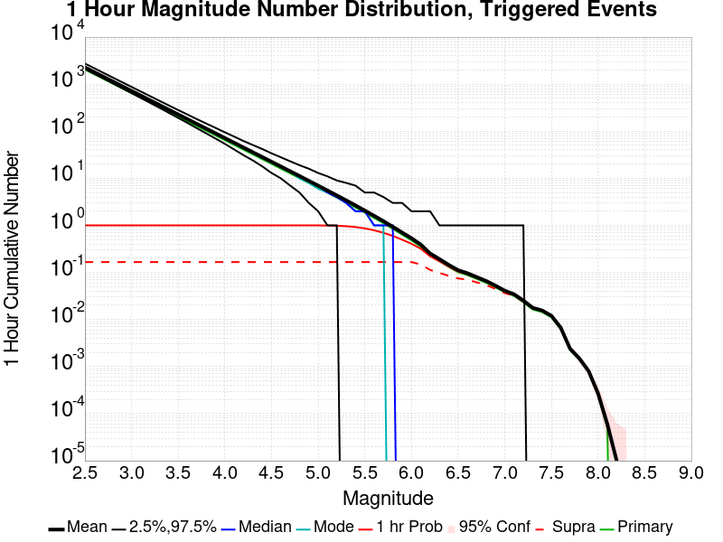

| Mag | Mean | 2.5 %ile | 97.5 %ile | Median | Mode | 1 hr Probability | 1 hr Supra-Seis Prob | Primary Aftershocks Mean |
|-----|-----|-----|-----|-----|-----|-----|-----|-----|
| **M&ge;2.5** | 2266.414 | 2116.000 | 2634.000 | 2231.000 | 2231.000 | 1.000 (100.00%) | 0.147 (14.70%) | 2044.322 |
| **M&ge;2.6** | 1800.341 | 1675.000 | 2089.000 | 1773.000 | 1737.000 | 1.000 (100.00%) | 0.147 (14.70%) | 1623.918 |
| **M&ge;2.7** | 1430.507 | 1316.000 | 1669.000 | 1409.000 | 1402.000 | 1.000 (100.00%) | 0.147 (14.70%) | 1290.221 |
| **M&ge;2.8** | 1135.644 | 1039.000 | 1323.000 | 1117.000 | 1113.000 | 1.000 (100.00%) | 0.147 (14.70%) | 1024.241 |
| **M&ge;2.9** | 901.890 | 819.000 | 1058.000 | 887.000 | 880.000 | 1.000 (100.00%) | 0.147 (14.70%) | 813.624 |
| **M&ge;3** | 716.549 | 646.000 | 841.000 | 706.000 | 705.000 | 1.000 (100.00%) | 0.147 (14.70%) | 646.491 |
| **M&ge;3.1** | 569.018 | 508.000 | 669.000 | 562.000 | 557.000 | 1.000 (100.00%) | 0.147 (14.70%) | 513.463 |
| **M&ge;3.2** | 451.874 | 398.000 | 529.000 | 446.000 | 464.000 | 1.000 (100.00%) | 0.147 (14.70%) | 407.720 |
| **M&ge;3.3** | 358.948 | 312.000 | 427.000 | 355.000 | 362.000 | 1.000 (100.00%) | 0.147 (14.70%) | 323.849 |
| **M&ge;3.4** | 285.334 | 241.000 | 339.000 | 282.000 | 287.000 | 1.000 (100.00%) | 0.147 (14.70%) | 257.468 |
| **M&ge;3.5** | 226.925 | 190.000 | 273.000 | 224.000 | 219.000 | 1.000 (100.00%) | 0.147 (14.70%) | 204.587 |
| **M&ge;3.6** | 180.517 | 148.000 | 218.000 | 178.000 | 172.000 | 1.000 (100.00%) | 0.147 (14.70%) | 162.743 |
| **M&ge;3.7** | 143.597 | 117.000 | 177.000 | 142.000 | 140.000 | 1.000 (100.00%) | 0.147 (14.70%) | 129.446 |
| **M&ge;3.8** | 114.039 | 91.000 | 142.000 | 113.000 | 114.000 | 1.000 (100.00%) | 0.147 (14.70%) | 102.780 |
| **M&ge;3.9** | 90.506 | 71.000 | 115.000 | 90.000 | 93.000 | 1.000 (100.00%) | 0.147 (14.70%) | 81.545 |
| **M&ge;4** | 71.799 | 54.000 | 93.000 | 71.000 | 69.000 | 1.000 (100.00%) | 0.147 (14.70%) | 64.724 |
| **M&ge;4.1** | 56.794 | 41.000 | 76.000 | 56.000 | 53.000 | 1.000 (100.00%) | 0.147 (14.70%) | 51.191 |
| **M&ge;4.2** | 44.856 | 31.000 | 62.000 | 44.000 | 42.000 | 1.000 (100.00%) | 0.147 (14.70%) | 40.416 |
| **M&ge;4.3** | 35.552 | 23.000 | 50.000 | 35.000 | 34.000 | 1.000 (100.00%) | 0.147 (14.70%) | 32.027 |
| **M&ge;4.4** | 28.161 | 17.000 | 41.000 | 28.000 | 27.000 | 1.000 (100.00%) | 0.147 (14.70%) | 25.364 |
| **M&ge;4.5** | 22.268 | 13.000 | 33.000 | 22.000 | 21.000 | 1.000 (100.00%) | 0.147 (14.70%) | 20.058 |
| **M&ge;4.6** | 17.771 | 10.000 | 27.000 | 17.000 | 16.000 | 1.000 (100.00%) | 0.147 (14.70%) | 16.003 |
| **M&ge;4.7** | 14.110 | 7.000 | 23.000 | 14.000 | 13.000 | 1.000 (100.00%) | 0.147 (14.70%) | 12.691 |
| **M&ge;4.8** | 11.230 | 5.000 | 19.000 | 11.000 | 11.000 | 1.000 (100.00%) | 0.147 (14.70%) | 10.109 |
| **M&ge;4.9** | 8.932 | 3.000 | 16.000 | 9.000 | 8.000 | 0.999 (99.92%) | 0.147 (14.70%) | 8.037 |
| **M&ge;5** | 6.997 | 2.000 | 13.000 | 7.000 | 6.000 | 0.998 (99.83%) | 0.147 (14.70%) | 6.289 |
| **M&ge;5.1** | 5.466 | 1.000 | 11.000 | 5.000 | 6.000 | 0.995 (99.49%) | 0.147 (14.70%) | 4.918 |
| **M&ge;5.2** | 4.311 | 1.000 | 9.000 | 4.000 | 3.000 | 0.980 (98.05%) | 0.147 (14.70%) | 3.865 |
| **M&ge;5.3** | 3.392 | 0.000 | 8.000 | 3.000 | 3.000 | 0.960 (96.01%) | 0.147 (14.70%) | 3.045 |
| **M&ge;5.4** | 2.655 | 0.000 | 7.000 | 2.000 | 2.000 | 0.917 (91.67%) | 0.147 (14.70%) | 2.388 |
| **M&ge;5.5** | 2.071 | 0.000 | 6.000 | 2.000 | 1.000 | 0.856 (85.64%) | 0.147 (14.70%) | 1.863 |
| **M&ge;5.6** | 1.573 | 0.000 | 5.000 | 1.000 | 1.000 | 0.771 (77.06%) | 0.147 (14.70%) | 1.410 |
| **M&ge;5.7** | 1.207 | 0.000 | 4.000 | 1.000 | 1.000 | 0.681 (68.14%) | 0.147 (14.70%) | 1.080 |
| **M&ge;5.8** | 0.912 | 0.000 | 3.000 | 1.000 | 0.000 | 0.573 (57.35%) | 0.147 (14.70%) | 0.809 |
| **M&ge;5.9** | 0.688 | 0.000 | 3.000 | 0.000 | 0.000 | 0.483 (48.26%) | 0.147 (14.70%) | 0.619 |
| **M&ge;6** | 0.520 | 0.000 | 2.000 | 0.000 | 0.000 | 0.393 (39.25%) | 0.147 (14.70%) | 0.472 |
| **M&ge;6.1** | 0.372 | 0.000 | 2.000 | 0.000 | 0.000 | 0.307 (30.67%) | 0.127 (12.74%) | 0.340 |
| **M&ge;6.2** | 0.234 | 0.000 | 1.000 | 0.000 | 0.000 | 0.209 (20.90%) | 0.089 (8.92%) | 0.210 |
| **M&ge;6.3** | 0.182 | 0.000 | 1.000 | 0.000 | 0.000 | 0.167 (16.74%) | 0.075 (7.48%) | 0.166 |
| **M&ge;6.4** | 0.131 | 0.000 | 1.000 | 0.000 | 0.000 | 0.124 (12.40%) | 0.063 (6.29%) | 0.119 |
| **M&ge;6.5** | 0.096 | 0.000 | 1.000 | 0.000 | 0.000 | 0.094 (9.43%) | 0.058 (5.78%) | 0.088 |
| **M&ge;6.6** | 0.084 | 0.000 | 1.000 | 0.000 | 0.000 | 0.083 (8.33%) | 0.054 (5.35%) | 0.077 |
| **M&ge;6.7** | 0.071 | 0.000 | 1.000 | 0.000 | 0.000 | 0.070 (6.97%) | 0.047 (4.67%) | 0.066 |
| **M&ge;6.8** | 0.054 | 0.000 | 1.000 | 0.000 | 0.000 | 0.054 (5.44%) | 0.041 (4.08%) | 0.050 |
| **M&ge;6.9** | 0.042 | 0.000 | 1.000 | 0.000 | 0.000 | 0.042 (4.16%) | 0.033 (3.31%) | 0.039 |
| **M&ge;7** | 0.031 | 0.000 | 1.000 | 0.000 | 0.000 | 0.031 (3.14%) | 0.026 (2.63%) | 0.029 |
| **M&ge;7.1** | 0.026 | 0.000 | 1.000 | 0.000 | 0.000 | 0.026 (2.63%) | 0.024 (2.38%) | 0.025 |
| **M&ge;7.2** | 0.017 | 0.000 | 0.000 | 0.000 | 0.000 | 0.017 (1.70%) | 0.015 (1.53%) | 0.017 |
| **M&ge;7.3** | 0.012 | 0.000 | 0.000 | 0.000 | 0.000 | 0.012 (1.19%) | 0.012 (1.19%) | 0.012 |
| **M&ge;7.4** | 0.012 | 0.000 | 0.000 | 0.000 | 0.000 | 0.012 (1.19%) | 0.012 (1.19%) | 0.012 |
| **M&ge;7.5** | 0.012 | 0.000 | 0.000 | 0.000 | 0.000 | 0.012 (1.19%) | 0.012 (1.19%) | 0.012 |
| **M&ge;7.6** | 5.10E-3 | 0.000 | 0.000 | 0.000 | 0.000 | 5.10E-3 (0.51%) | 5.10E-3 (0.51%) | 5.10E-3 |
| **M&ge;7.7** | 3.40E-3 | 0.000 | 0.000 | 0.000 | 0.000 | 3.40E-3 (0.34%) | 3.40E-3 (0.34%) | 3.40E-3 |
| **M&ge;7.8** | 2.55E-3 | 0.000 | 0.000 | 0.000 | 0.000 | 2.55E-3 (0.25%) | 2.55E-3 (0.25%) | 2.55E-3 |
| **M&ge;7.9** | 1.70E-3 | 0.000 | 0.000 | 0.000 | 0.000 | 1.70E-3 (0.17%) | 1.70E-3 (0.17%) | 1.70E-3 |
| **M&ge;8** | 0.000 | 0.000 | 0.000 | 0.000 | 0.000 | 0.000 (0.00%) | 0.000 (0.00%) | 0.000 |
| **M&ge;8.1** | 0.000 | 0.000 | 0.000 | 0.000 | 0.000 | 0.000 (0.00%) | 0.000 (0.00%) | 0.000 |
| **M&ge;8.2** | 0.000 | 0.000 | 0.000 | 0.000 | 0.000 | 0.000 (0.00%) | 0.000 (0.00%) | 0.000 |
| **M&ge;8.3** | 0.000 | 0.000 | 0.000 | 0.000 | 0.000 | 0.000 (0.00%) | 0.000 (0.00%) | 0.000 |
| **M&ge;8.4** | 0.000 | 0.000 | 0.000 | 0.000 | 0.000 | 0.000 (0.00%) | 0.000 (0.00%) | 0.000 |
| **M&ge;8.5** | 0.000 | 0.000 | 0.000 | 0.000 | 0.000 | 0.000 (0.00%) | 0.000 (0.00%) | 0.000 |
| **M&ge;8.6** | 0.000 | 0.000 | 0.000 | 0.000 | 0.000 | 0.000 (0.00%) | 0.000 (0.00%) | 0.000 |
| **M&ge;8.7** | 0.000 | 0.000 | 0.000 | 0.000 | 0.000 | 0.000 (0.00%) | 0.000 (0.00%) | 0.000 |
| **M&ge;8.8** | 0.000 | 0.000 | 0.000 | 0.000 | 0.000 | 0.000 (0.00%) | 0.000 (0.00%) | 0.000 |
| **M&ge;8.9** | 0.000 | 0.000 | 0.000 | 0.000 | 0.000 | 0.000 (0.00%) | 0.000 (0.00%) | 0.000 |
| **M&ge;9** | 0.000 | 0.000 | 0.000 | 0.000 | 0.000 | 0.000 (0.00%) | 0.000 (0.00%) | 0.000 |


## Hazard Change Over Time
*[(top)](#table-of-contents)*

These plots show how the probability of ruptures of various magnitudes within 100km of any scenario rupture changes over time

### M&ge;5.0 Hazard Change Over Time
*[(top)](#table-of-contents)*


| Forecast Duration | UCERF3-ETAS [95% Conf] | UCERF3-ETAS Triggered Only | UCERF3-TD | UCERF3-ETAS/TD Gain | UCERF3-TI |
|-----|-----|-----|-----|-----|-----|
| 1 Hour | 0.998 [0.993 - 1.000] | 0.998 | 7.14E-5 | 13986.05 | 7.09E-5 |
| 1 Day | 1.000 [0.996 - 1.000] | 1.000 | 1.71E-3 | 584.22 | 1.70E-3 |
| 1 Week | 1.000 [0.996 - 1.000] | 1.000 | 0.012 | 83.89 | 0.012 |
| 1 Month | 1.000 [0.996 - 1.000] | 1.000 | 0.050 | 19.96 | 0.050 |
| 1 Year | 1.000 [0.998 - 1.000] | 1.000 | 0.465 | 2.15 | 0.463 |
| 10 Years | 1.000 [1.000 - 1.000] | 1.000 | 0.998 | 1 | 0.998 |
| 30 Years | 1.000 [1.000 - 1.000] \* | \* | 1.000 | 1 \* | 1.000 |
| 100 Years | 1.000 [1.000 - 1.000] \* | \* | 1.000 | 1 \* | 1.000 |

\* *forecast duration is longer than simulation length, only ETAS ruptures from the first 10 years are included*
### M&ge;6.0 Hazard Change Over Time
*[(top)](#table-of-contents)*


| Forecast Duration | UCERF3-ETAS [95% Conf] | UCERF3-ETAS Triggered Only | UCERF3-TD | UCERF3-ETAS/TD Gain | UCERF3-TI |
|-----|-----|-----|-----|-----|-----|
| 1 Hour | 0.391 [0.363 - 0.419] | 0.391 | 7.85E-6 | 49757.66 | 7.36E-6 |
| 1 Day | 0.508 [0.479 - 0.537] | 0.508 | 1.88E-4 | 2695.91 | 1.77E-4 |
| 1 Week | 0.544 [0.515 - 0.572] | 0.543 | 1.32E-3 | 412.15 | 1.23E-3 |
| 1 Month | 0.571 [0.542 - 0.599] | 0.568 | 5.64E-3 | 101.22 | 5.28E-3 |
| 1 Year | 0.626 [0.600 - 0.653] | 0.600 | 0.067 | 9.41 | 0.062 |
| 10 Years | 0.811 [0.796 - 0.825] | 0.623 | 0.498 | 1.63 | 0.475 |
| 30 Years | 0.953 [0.949 - 0.956] \* | \* | 0.874 | 1.09 \* | 0.855 |
| 100 Years | 1.000 [1.000 - 1.000] \* | \* | 0.999 | 1 \* | 0.998 |

\* *forecast duration is longer than simulation length, only ETAS ruptures from the first 10 years are included*
### M&ge;7.0 Hazard Change Over Time
*[(top)](#table-of-contents)*

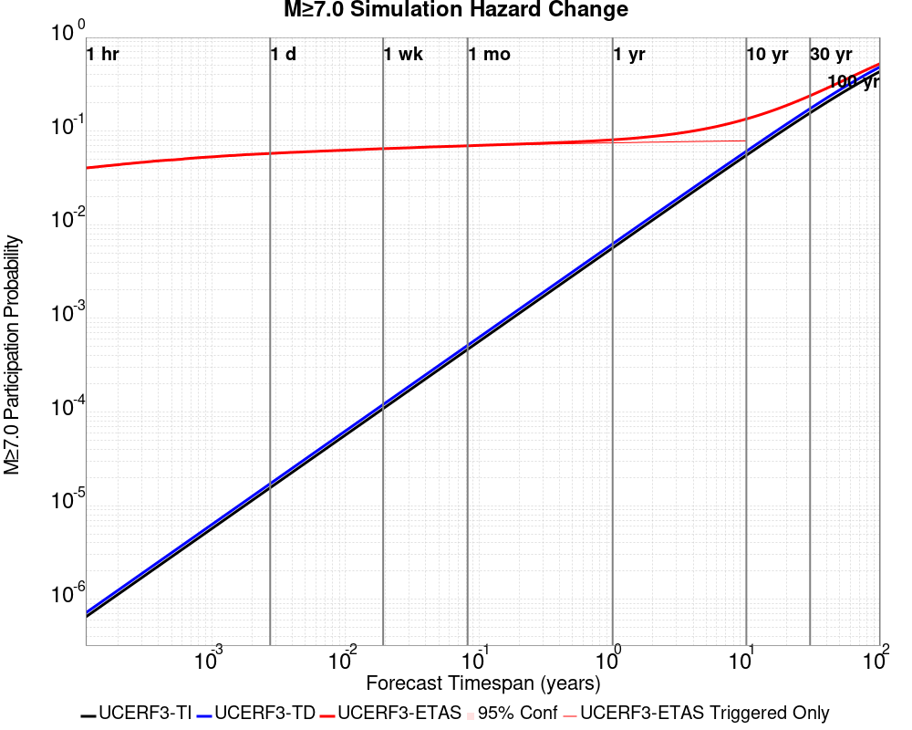

| Forecast Duration | UCERF3-ETAS [95% Conf] | UCERF3-ETAS Triggered Only | UCERF3-TD | UCERF3-ETAS/TD Gain | UCERF3-TI |
|-----|-----|-----|-----|-----|-----|
| 1 Hour | 0.031 [0.023 - 0.044] | 0.031 | 7.16E-7 | 43913.98 | 6.48E-7 |
| 1 Day | 0.044 [0.033 - 0.058] | 0.044 | 1.72E-5 | 2572.46 | 1.55E-5 |
| 1 Week | 0.049 [0.038 - 0.064] | 0.049 | 1.20E-4 | 410.72 | 1.09E-4 |
| 1 Month | 0.057 [0.045 - 0.073] | 0.057 | 5.15E-4 | 111.41 | 4.66E-4 |
| 1 Year | 0.069 [0.056 - 0.084] | 0.063 | 6.26E-3 | 10.99 | 5.66E-3 |
| 10 Years | 0.122 [0.110 - 0.137] | 0.065 | 0.061 | 2.01 | 0.055 |
| 30 Years | 0.228 [0.217 - 0.241] \* | \* | 0.174 | 1.31 \* | 0.157 |
| 100 Years | 0.518 [0.512 - 0.527] \* | \* | 0.485 | 1.07 \* | 0.433 |

\* *forecast duration is longer than simulation length, only ETAS ruptures from the first 10 years are included*
### M&ge;8.0 Hazard Change Over Time
*[(top)](#table-of-contents)*


| Forecast Duration | UCERF3-ETAS [95% Conf] | UCERF3-ETAS Triggered Only | UCERF3-TD | UCERF3-ETAS/TD Gain | UCERF3-TI |
|-----|-----|-----|-----|-----|-----|
| 1 Hour | 1.24E-8 [1.24E-8 - 4.06E-3] | 0.000 | 1.24E-8 | 1 | 1.06E-8 |
| 1 Day | 2.97E-7 [2.97E-7 - 4.06E-3] | 0.000 | 2.97E-7 | 1 | 2.54E-7 |
| 1 Week | 2.08E-6 [2.08E-6 - 4.06E-3] | 0.000 | 2.08E-6 | 1 | 1.78E-6 |
| 1 Month | 8.59E-4 [5.33E-5 - 5.51E-3] | 8.50E-4 | 8.90E-6 | 96.42 | 7.63E-6 |
| 1 Year | 9.58E-4 [1.53E-4 - 5.61E-3] | 8.50E-4 | 1.08E-4 | 8.84 | 9.29E-5 |
| 10 Years | 1.95E-3 [1.14E-3 - 6.59E-3] | 8.50E-4 | 1.10E-3 | 1.77 | 9.29E-4 |
| 30 Years | 4.35E-3 [3.55E-3 - 8.98E-3] \* | \* | 3.50E-3 | 1.24 \* | 2.78E-3 |
| 100 Years | 0.015 [0.014 - 0.019] \* | \* | 0.014 | 1.06 \* | 9.25E-3 |

\* *forecast duration is longer than simulation length, only ETAS ruptures from the first 10 years are included*

## Trigger Rupture Fault Map
*[(top)](#table-of-contents)*


## Trigger Rupture Depth Map
*[(top)](#table-of-contents)*


## Fault Distances To Triggers
*[(top)](#table-of-contents)*

| Section Name | Strike, Dip, Rake | # Hypos In Poly | Max Mag w/ Hypo In Poly | # Surfs In Poly | Max Mag w/ Surf In Poly | Min Dist To Any (km) | Min Poly Dist To Any (km) | Min Dist To Largest (km) | Min Poly Dist To Largest (km) | Min Hypo Dist To Largest (km) | Min Hypo Poly Dist To Largest (km) |
|-----|-----|-----|-----|-----|-----|-----|-----|-----|-----|-----|-----|
| Airport Lake | 359, 50, -90 | 90 | 7.1 | 90 | 7.1 | 0.036 | 0.000 | 0.036 | 0.000 | 5.612 | 0.000 |
| Little Lake | 327, 90, 180 | 16 | 3.75 | 17 | 7.1 | 2.268 | 0.000 | 11.284 | 0.000 | 13.471 | 1.469 |
| Garlock (Central) | 71, 90, 0 | 2 | 3.21 | 3 | 7.1 | 5.600 | 0.000 | 5.600 | 0.000 | 22.766 | 10.797 |
| So Sierra Nevada | 2, 50, -90 | 1 | 2.75 | 1 | 2.75 | 1.410 | 0.000 | 4.248 | 4.233 | 16.191 | 15.188 |
| Tank Canyon | 189, 50, -90 | 0 |  | 0 |  | 9.015 | 9.011 | 9.015 | 9.011 | 17.039 | 16.895 |
| Blackwater | 323, 90, 180 | 0 |  | 0 |  | 14.394 | 8.726 | 14.394 | 8.726 | 29.622 | 27.613 |
| Scodie Lineament | 221, 68, 0 | 0 |  | 0 |  | 16.722 | 15.781 | 28.750 | 27.702 | 36.559 | 32.668 |

## Individual Simulated Catalog Maps
*[(top)](#table-of-contents)*

These are map plots of individual catalogs from the simulations, selected as the closest catalog to each of the given percentiles in terms of total number of events.

| Duration | p0.0 %-ile | p25.0 %-ile | p50.0 %-ile | p75.0 %-ile | p90.0 %-ile | p95.0 %-ile | p97.5 %-ile | p98.0 %-ile | p99.0 %-ile | p99.5 %-ile | p99.9 %-ile | p100.0 %-ile |
|-----|-----|-----|-----|-----|-----|-----|-----|-----|-----|-----|-----|-----|
| **1 Week** |  |  |  |  |  |  |  |  |  |  |  |  |
| **1 Month** |  |  |  |  |  |  | 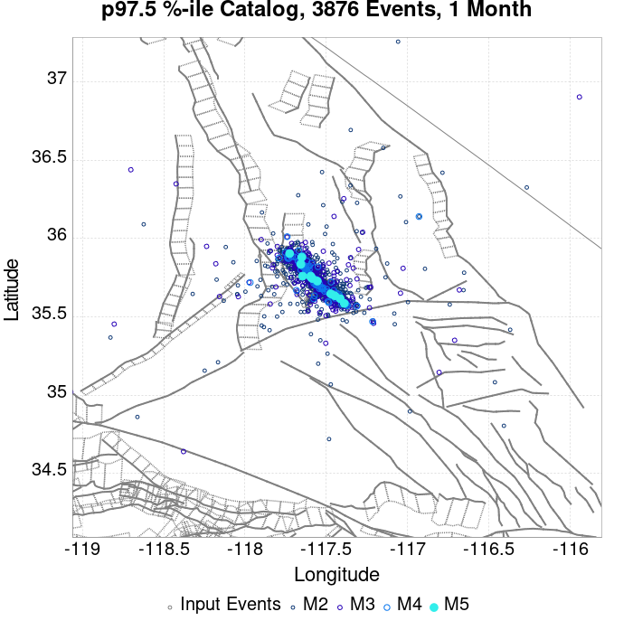 |  |  |  | 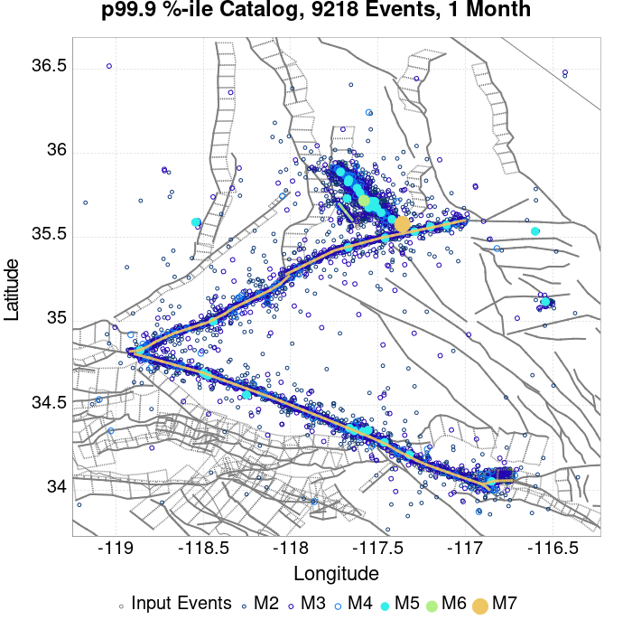 |  |
| **1 Year** |  |  |  |  |  |  |  |  |  |  |  |  |
| **10 Year** |  |  |  |  |  |  |  |  |  |  |  |  |

## ComCat Data Comparisons
*[(top)](#table-of-contents)*

These plots compare simulated sequences with data from ComCat. All plots only consider events with hypocenters inside the ComCat region defined in the JSON input file, and consider ruptures above Mc=3.0

Last updated at 2019/08/29 15:35:47 UTC, 54.5 d after the simulation start time

### ComCat Magnitude-Number Distributions
*[(top)](#table-of-contents)*

| Incremental MND | Cumulative MND |
|-----|-----|
|  |  |

### ComCat Cumulative Number Vs Time
*[(top)](#table-of-contents)*

| M&ge;3 | M&ge;4 | M&ge;5 | M&ge;6 | M&ge;7 |
|-----|-----|-----|-----|-----|
|  | 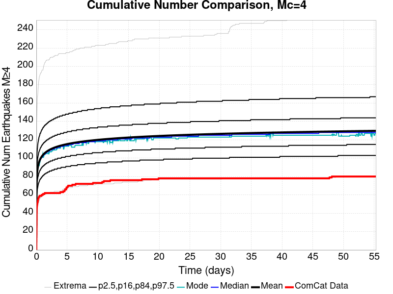 | 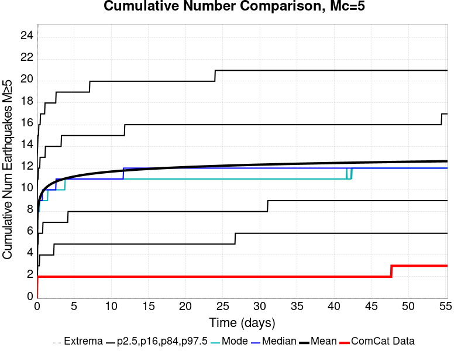 |  |  |

### ComCat Cumulative Number Simulation Percentiles
*[(top)](#table-of-contents)*


### ComCat Mean Spatial Distribution
*[(top)](#table-of-contents)*

|  | 1 Day | 1 Week | 1 Month | 54.5 Day |
|-----|-----|-----|-----|-----|
| **M≥3** |  |  |  |  |
| **M≥4** |  |  |  |  |
| **M≥5** | 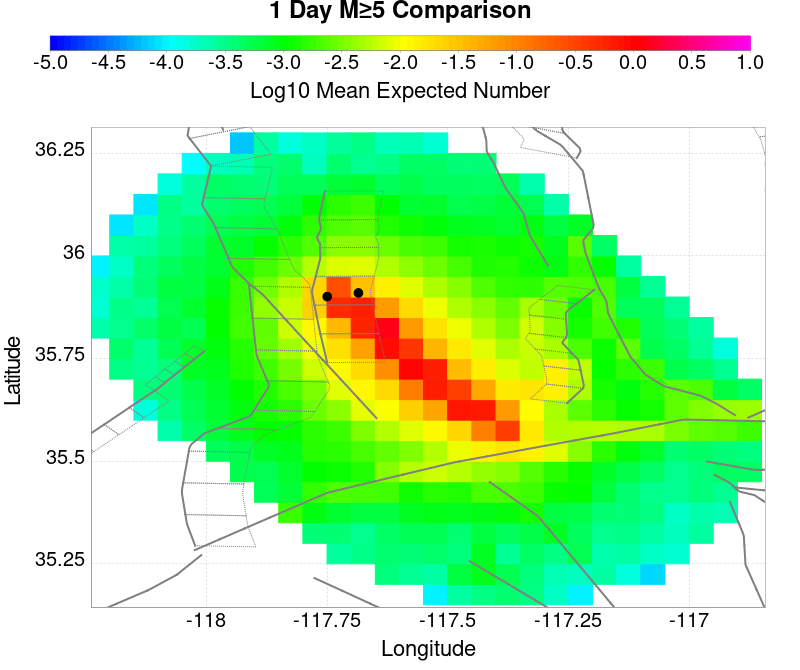 |  |  |  |
| **M≥6** | 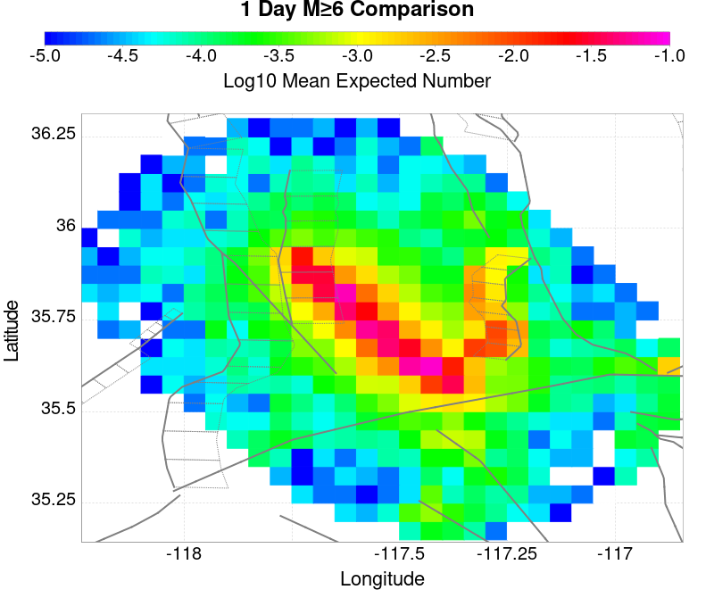 |  | 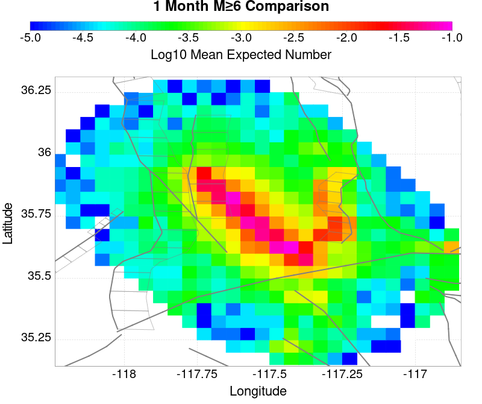 | 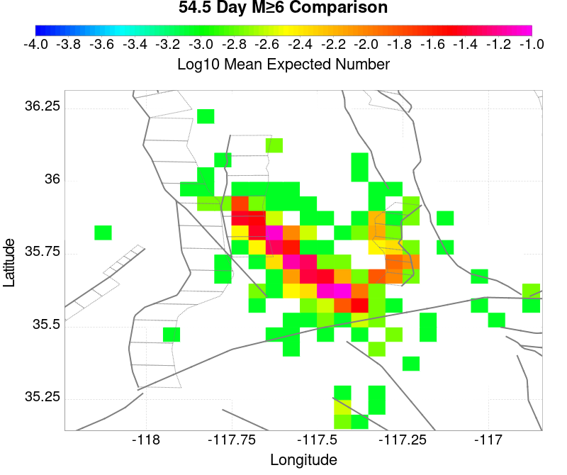 |
| **M≥7** | 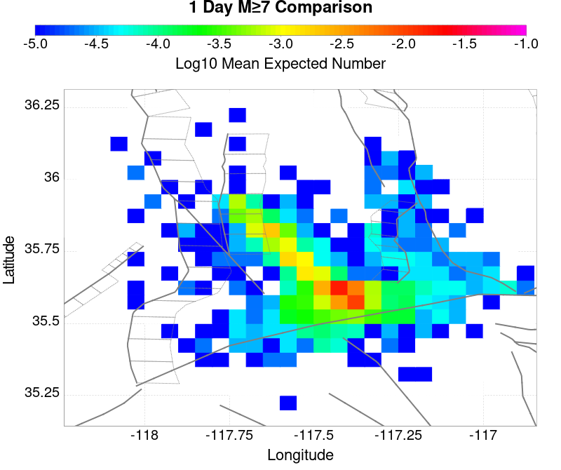 |  |  |  |
| **M≥8** |  |  |  |  |

### ComCat Depth Distribution
*[(top)](#table-of-contents)*

| M&ge;3 | M&ge;4 | M&ge;5 | M&ge;6 | M&ge;7 | M&ge;8 |
|-----|-----|-----|-----|-----|-----|
|  |  |  | 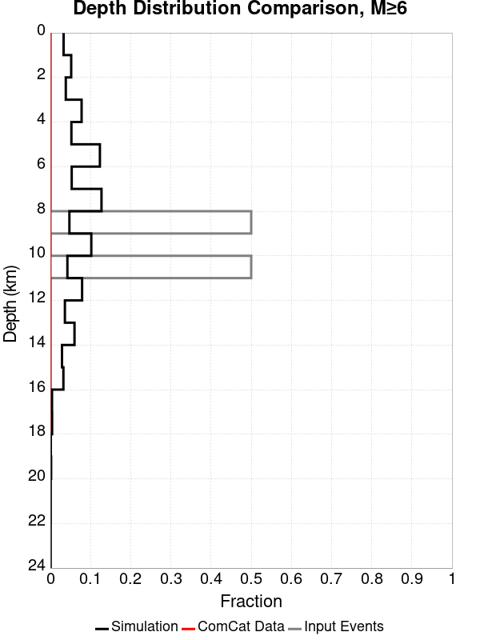 |  | 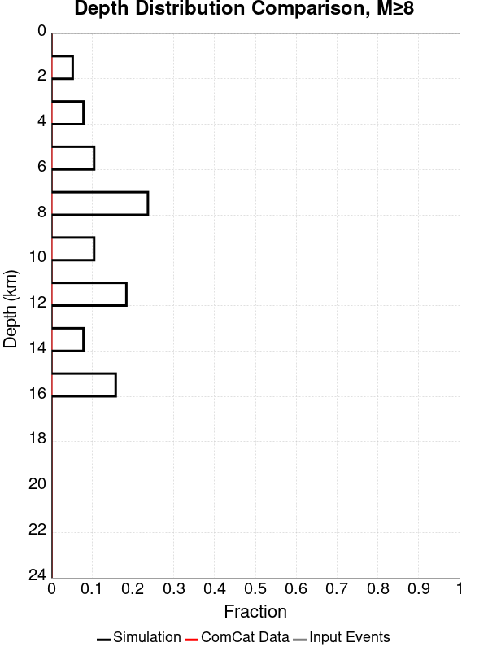 |

## Section Participation
*[(top)](#table-of-contents)*

### Section Participation Plots
*[(top)](#table-of-contents)*

| Min Mag | 1 yr Triggered Ruptures (no spontaneous) | 10 yr Triggered Ruptures (no spontaneous) | 10 yr Triggered Ruptures (primary aftershocks only) |
|-----|-----|-----|-----|
| **All Supra. Seis.** |  |  |  |
| **M&ge;6.5** |  |  |  |
| **M&ge;7** |  |  | 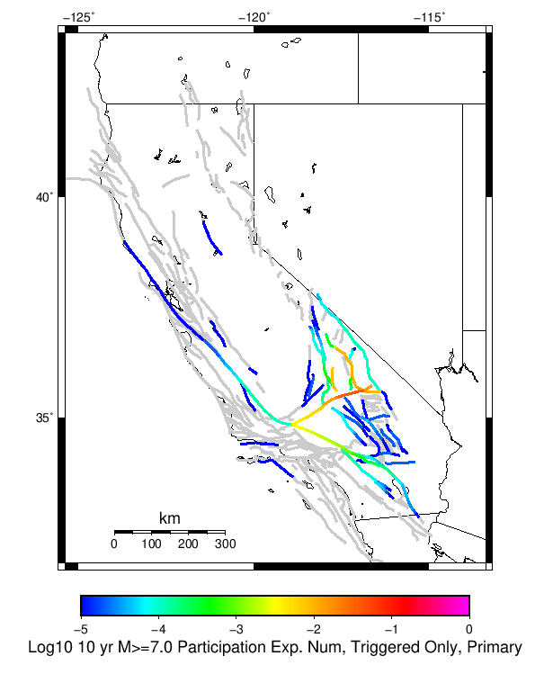 |
| **M&ge;7.5** |  |  | 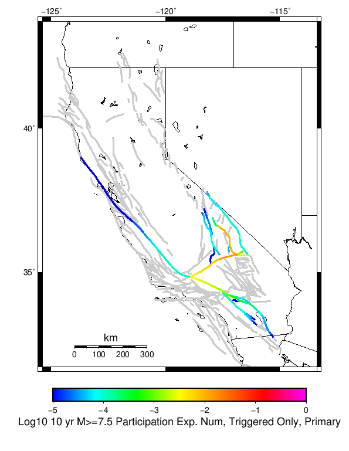 |
| **M&ge;8** |  |  |  |

### Supra-Seismogenic Parent Sections Table
*[(top)](#table-of-contents)*

*First 10 of 30 with matching ruptures shown*

| Parent Name | Triggered 10 Year Mean Count | Triggered 1 Day Prob | Triggered 1 Week Prob | Triggered 1 Month Prob | Triggered 1 Year Prob | Triggered 10 Year Prob | Triggered 10 Year Primary Mean Count |
|-----|-----|-----|-----|-----|-----|-----|-----|
| Garlock (Central) | 0.1299915 | 0.094307564 | 0.10365336 | 0.10705183 | 0.11809686 | 0.12659304 | 0.10790145 |
| Tank Canyon | 0.08071368 | 0.052676294 | 0.06287171 | 0.06881903 | 0.07391674 | 0.07646559 | 0.053525914 |
| Airport Lake | 0.06372133 | 0.0433305 | 0.05097706 | 0.056074765 | 0.061172474 | 0.06372133 | 0.061172474 |
| Little Lake | 0.05947324 | 0.045879353 | 0.052676294 | 0.05522515 | 0.056924384 | 0.057774 | 0.05437553 |
| Owl Lake | 0.031435855 | 0.018691588 | 0.019541206 | 0.021240441 | 0.02548853 | 0.028887 | 0.021240441 |
| Garlock (East) | 0.016142735 | 0.009345794 | 0.010195412 | 0.012744265 | 0.0144435 | 0.016142735 | 0.011894647 |
| Panamint Valley | 0.015293119 | 0.008496176 | 0.011894647 | 0.013593882 | 0.015293119 | 0.015293119 | 0.011894647 |
| Garlock (West) | 0.013593882 | 0.011045029 | 0.011045029 | 0.012744265 | 0.012744265 | 0.013593882 | 0.012744265 |
| Hunter Mountain-Saline Valley | 0.009345794 | 0.005097706 | 0.0076465593 | 0.008496176 | 0.009345794 | 0.009345794 | 0.0076465593 |
| Gravel Hills-Harper Lk | 0.0076465593 | 0.0059473235 | 0.006796941 | 0.006796941 | 0.0076465593 | 0.0076465593 | 0.004248088 |

### M≥6.5 Parent Sections Table
*[(top)](#table-of-contents)*

*First 10 of 22 with matching ruptures shown*

| Parent Name | Triggered 10 Year Mean Count | Triggered 1 Day Prob | Triggered 1 Week Prob | Triggered 1 Month Prob | Triggered 1 Year Prob | Triggered 10 Year Prob | Triggered 10 Year Primary Mean Count |
|-----|-----|-----|-----|-----|-----|-----|-----|
| Garlock (Central) | 0.056074765 | 0.03568394 | 0.040781647 | 0.045029737 | 0.05182668 | 0.05522515 | 0.045029737 |
| Airport Lake | 0.038232796 | 0.028037382 | 0.033984706 | 0.03653356 | 0.037383176 | 0.038232796 | 0.03653356 |
| Little Lake | 0.037383176 | 0.028037382 | 0.033984706 | 0.03653356 | 0.037383176 | 0.037383176 | 0.034834325 |
| Owl Lake | 0.024638912 | 0.015293119 | 0.016142735 | 0.016992353 | 0.021240441 | 0.024638912 | 0.019541206 |
| Garlock (East) | 0.0144435 | 0.008496176 | 0.009345794 | 0.011894647 | 0.012744265 | 0.0144435 | 0.011045029 |
| Panamint Valley | 0.0144435 | 0.0076465593 | 0.011045029 | 0.012744265 | 0.0144435 | 0.0144435 | 0.011894647 |
| Garlock (West) | 0.013593882 | 0.011045029 | 0.011045029 | 0.012744265 | 0.012744265 | 0.013593882 | 0.012744265 |
| Hunter Mountain-Saline Valley | 0.009345794 | 0.005097706 | 0.0076465593 | 0.008496176 | 0.009345794 | 0.009345794 | 0.0076465593 |
| Tank Canyon | 0.0059473235 | 0.0016992353 | 0.002548853 | 0.004248088 | 0.005097706 | 0.0059473235 | 0.002548853 |
| San Andreas (Mojave N) | 0.004248088 | 0.0033984706 | 0.0033984706 | 0.004248088 | 0.004248088 | 0.004248088 | 0.004248088 |

### M≥7 Parent Sections Table
*[(top)](#table-of-contents)*

*First 10 of 18 with matching ruptures shown*

| Parent Name | Triggered 10 Year Mean Count | Triggered 1 Day Prob | Triggered 1 Week Prob | Triggered 1 Month Prob | Triggered 1 Year Prob | Triggered 10 Year Prob | Triggered 10 Year Primary Mean Count |
|-----|-----|-----|-----|-----|-----|-----|-----|
| Garlock (Central) | 0.049277823 | 0.031435855 | 0.03568394 | 0.03993203 | 0.045879353 | 0.048428208 | 0.042480882 |
| Owl Lake | 0.020390823 | 0.012744265 | 0.013593882 | 0.0144435 | 0.018691588 | 0.020390823 | 0.01784197 |
| Garlock (East) | 0.013593882 | 0.008496176 | 0.009345794 | 0.011894647 | 0.012744265 | 0.013593882 | 0.010195412 |
| Garlock (West) | 0.013593882 | 0.011045029 | 0.011045029 | 0.012744265 | 0.012744265 | 0.013593882 | 0.012744265 |
| Panamint Valley | 0.011894647 | 0.006796941 | 0.010195412 | 0.011045029 | 0.011894647 | 0.011894647 | 0.010195412 |
| Hunter Mountain-Saline Valley | 0.009345794 | 0.005097706 | 0.0076465593 | 0.008496176 | 0.009345794 | 0.009345794 | 0.0076465593 |
| Airport Lake | 0.008496176 | 0.0059473235 | 0.006796941 | 0.008496176 | 0.008496176 | 0.008496176 | 0.006796941 |
| Little Lake | 0.008496176 | 0.0059473235 | 0.006796941 | 0.008496176 | 0.008496176 | 0.008496176 | 0.006796941 |
| San Andreas (Mojave N) | 0.004248088 | 0.0033984706 | 0.0033984706 | 0.004248088 | 0.004248088 | 0.004248088 | 0.004248088 |
| San Andreas (Mojave S) | 0.0033984706 | 0.002548853 | 0.002548853 | 0.0033984706 | 0.0033984706 | 0.0033984706 | 0.0033984706 |

### M≥7.5 Parent Sections Table
*[(top)](#table-of-contents)*

*First 10 of 15 with matching ruptures shown*

| Parent Name | Triggered 10 Year Mean Count | Triggered 1 Day Prob | Triggered 1 Week Prob | Triggered 1 Month Prob | Triggered 1 Year Prob | Triggered 10 Year Prob | Triggered 10 Year Primary Mean Count |
|-----|-----|-----|-----|-----|-----|-----|-----|
| Garlock (Central) | 0.022090059 | 0.015293119 | 0.01784197 | 0.020390823 | 0.021240441 | 0.022090059 | 0.019541206 |
| Garlock (West) | 0.012744265 | 0.010195412 | 0.010195412 | 0.011894647 | 0.011894647 | 0.012744265 | 0.011894647 |
| Panamint Valley | 0.010195412 | 0.0059473235 | 0.008496176 | 0.009345794 | 0.010195412 | 0.010195412 | 0.008496176 |
| Hunter Mountain-Saline Valley | 0.009345794 | 0.005097706 | 0.0076465593 | 0.008496176 | 0.009345794 | 0.009345794 | 0.0076465593 |
| Garlock (East) | 0.0076465593 | 0.005097706 | 0.005097706 | 0.006796941 | 0.006796941 | 0.0076465593 | 0.006796941 |
| San Andreas (Mojave N) | 0.004248088 | 0.0033984706 | 0.0033984706 | 0.004248088 | 0.004248088 | 0.004248088 | 0.004248088 |
| San Andreas (Mojave S) | 0.0033984706 | 0.002548853 | 0.002548853 | 0.0033984706 | 0.0033984706 | 0.0033984706 | 0.0033984706 |
| San Andreas (San Bernardino N) | 0.0033984706 | 0.002548853 | 0.002548853 | 0.0033984706 | 0.0033984706 | 0.0033984706 | 0.0033984706 |
| Owl Lake | 0.0016992353 | 0.0016992353 | 0.0016992353 | 0.0016992353 | 0.0016992353 | 0.0016992353 | 0.0016992353 |
| Death Valley (Black Mtns Frontal) | 8.4961765E-4 | 8.4961765E-4 | 8.4961765E-4 | 8.4961765E-4 | 8.4961765E-4 | 8.4961765E-4 | 8.4961765E-4 |

### M≥8 Parent Sections Table
*[(top)](#table-of-contents)*

| Parent Name | Triggered 10 Year Mean Count | Triggered 1 Day Prob | Triggered 1 Week Prob | Triggered 1 Month Prob | Triggered 1 Year Prob | Triggered 10 Year Prob | Triggered 10 Year Primary Mean Count |
|-----|-----|-----|-----|-----|-----|-----|-----|
| Garlock (Central) | 8.4961765E-4 | 0.0 | 0.0 | 8.4961765E-4 | 8.4961765E-4 | 8.4961765E-4 | 8.4961765E-4 |
| Garlock (East) | 8.4961765E-4 | 0.0 | 0.0 | 8.4961765E-4 | 8.4961765E-4 | 8.4961765E-4 | 8.4961765E-4 |
| Garlock (West) | 8.4961765E-4 | 0.0 | 0.0 | 8.4961765E-4 | 8.4961765E-4 | 8.4961765E-4 | 8.4961765E-4 |
| San Andreas (Coachella) rev | 8.4961765E-4 | 0.0 | 0.0 | 8.4961765E-4 | 8.4961765E-4 | 8.4961765E-4 | 8.4961765E-4 |
| San Andreas (Mojave N) | 8.4961765E-4 | 0.0 | 0.0 | 8.4961765E-4 | 8.4961765E-4 | 8.4961765E-4 | 8.4961765E-4 |
| San Andreas (Mojave S) | 8.4961765E-4 | 0.0 | 0.0 | 8.4961765E-4 | 8.4961765E-4 | 8.4961765E-4 | 8.4961765E-4 |
| San Andreas (San Bernardino N) | 8.4961765E-4 | 0.0 | 0.0 | 8.4961765E-4 | 8.4961765E-4 | 8.4961765E-4 | 8.4961765E-4 |
| San Andreas (San Bernardino S) | 8.4961765E-4 | 0.0 | 0.0 | 8.4961765E-4 | 8.4961765E-4 | 8.4961765E-4 | 8.4961765E-4 |
| San Andreas (San Gorgonio Pass-Garnet HIll) | 8.4961765E-4 | 0.0 | 0.0 | 8.4961765E-4 | 8.4961765E-4 | 8.4961765E-4 | 8.4961765E-4 |

### Fault Magnitude-Probability Distributions
*[(top)](#table-of-contents)*

The first 5 sections (sorted by trigger rate) are plotted below. All fault MPDs are available [here](plots/parent_sect_mpds/README.md)

| 1 Week | 1 Month | 1 Year | 10 Year |
|-----|-----|-----|-----|
|  |  |  |  |
|  |  |  |  |
|  |  |  | 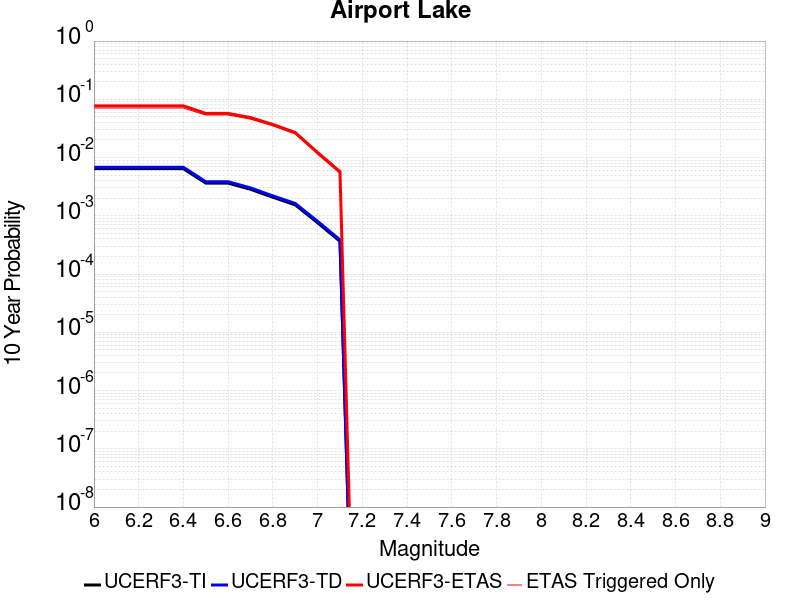 |
|  |  |  |  |
|  |  | 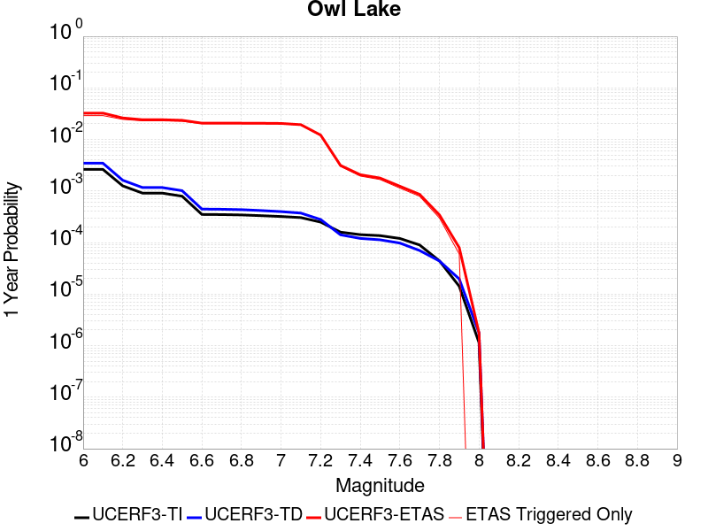 | 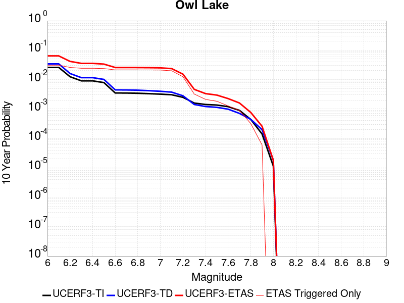 |

## Gridded Nucleation
*[(top)](#table-of-contents)*

| Min Mag | Triggered Ruptures (no spontaneous) | Triggered Ruptures (primary aftershocks only) |
|-----|-----|-----|
| **M&ge;2.5** |  |  |
| **M&ge;5** |  | 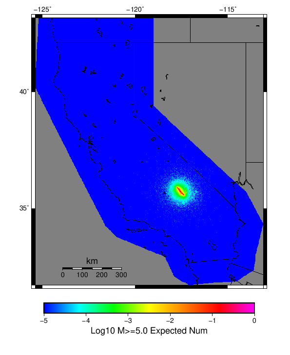 |
| **M&ge;6** |  |  |
| **M&ge;7** |  |  |


## JSON Input File
*[(top)](#table-of-contents)*

```
{
  "numSimulations": 100000,
  "duration": 10.0,
  "startTimeMillis": 1562383194040,
  "includeSpontaneous": false,
  "randomSeed": 1567035173906,
  "binaryOutput": true,
  "binaryOutputFilters": [
    {
      "prefix": "results_complete",
      "descendantsOnly": false
    },
    {
      "prefix": "results_m5_preserve_chain",
      "minMag": 5.0,
      "preserveChainBelowMag": true,
      "descendantsOnly": false
    }
  ],
  "forceRecalc": false,
  "simulationName": "ComCat M7.1 (ci38457511), Mainshock Log10(k)\u003d-2.3, ShakeMap Surfaces, Log10(k)\u003d-3.03, p\u003d1.15, c\u003d4.6773514E-4",
  "numRetries": 3,
  "outputDir": "${ETAS_SIM_DIR}/2019_08_28-ComCatM7p1_ci38457511_MainshockLog10_k_2p3_ShakeMapSurfaces_Log10_k_3p03_p1p15_c4p6773514E4-noSpont-full_td-scale1.14-modParams",
  "triggerRuptures": [
    {
      "occurrenceTimeMillis": 1562259775340,
      "comcatEventID": "ci38443095",
      "mag": 3.98,
      "latitude": 35.708,
      "longitude": -117.5036667,
      "depth": 10.58
    },
    {
      "occurrenceTimeMillis": 1562261629000,
      "comcatEventID": "ci38443183",
      "mag": 6.4,
      "latitude": 35.7053333,
      "longitude": -117.5038333,
      "depth": 10.5,
      "ruptureSurfaces": [
        {
          "outline": [
            {
              "latitude": 35.6051534466,
              "longitude": -117.5905380735,
              "depth": 0.0
            },
            {
              "latitude": 35.6173144101,
              "longitude": -117.57249634649999,
              "depth": 0.0
            },
            {
              "latitude": 35.6173135736,
              "longitude": -117.5726723708,
              "depth": 0.0
            },
            {
              "latitude": 35.61731357360001,
              "longitude": -117.5726723708,
              "depth": 15.0
            },
            {
              "latitude": 35.6173144101,
              "longitude": -117.57249634649999,
              "depth": 15.0
            },
            {
              "latitude": 35.6051534466,
              "longitude": -117.5905380735,
              "depth": 15.0
            },
            {
              "latitude": 35.6051534466,
              "longitude": -117.5905380735,
              "depth": 0.0
            }
          ]
        },
        {
          "outline": [
            {
              "latitude": 35.6338128629,
              "longitude": -117.54831678310002,
              "depth": 0.0
            },
            {
              "latitude": 35.6413274733,
              "longitude": -117.5393878708,
              "depth": 0.0
            },
            {
              "latitude": 35.664283512,
              "longitude": -117.51611643970001,
              "depth": 0.0
            },
            {
              "latitude": 35.664283512000004,
              "longitude": -117.51611643970001,
              "depth": 15.0
            },
            {
              "latitude": 35.641327473299995,
              "longitude": -117.5393878708,
              "depth": 15.0
            },
            {
              "latitude": 35.63381286290001,
              "longitude": -117.54831678310002,
              "depth": 15.0
            },
            {
              "latitude": 35.6338128629,
              "longitude": -117.54831678310002,
              "depth": 0.0
            }
          ]
        },
        {
          "outline": [
            {
              "latitude": 35.6322100797,
              "longitude": -117.55305954249998,
              "depth": 0.0
            },
            {
              "latitude": 35.6196274701,
              "longitude": -117.56969626549999,
              "depth": 0.0
            },
            {
              "latitude": 35.6196274701,
              "longitude": -117.56969626549999,
              "depth": 15.0
            },
            {
              "latitude": 35.6322100797,
              "longitude": -117.55305954249998,
              "depth": 15.0
            },
            {
              "latitude": 35.6322100797,
              "longitude": -117.55305954249998,
              "depth": 0.0
            }
          ]
        }
      ]
    },
    {
      "occurrenceTimeMillis": 1562261701660,
      "comcatEventID": "ci38443191",
      "mag": 4.49,
      "latitude": 35.644,
      "longitude": -117.56716670000002,
      "depth": 4.64
    },
    {
      "occurrenceTimeMillis": 1562261746340,
      "comcatEventID": "ci37222356",
      "mag": 3.63,
      "latitude": 35.6936667,
      "longitude": -117.437,
      "depth": 7.65
    },
    {
      "occurrenceTimeMillis": 1562261752170,
      "comcatEventID": "ci37218988",
      "mag": 4.28,
      "latitude": 35.687,
      "longitude": -117.50616670000001,
      "depth": 1.6
    },
    {
      "occurrenceTimeMillis": 1562261818950,
      "comcatEventID": "ci37222380",
      "mag": 3.41,
      "latitude": 35.7258333,
      "longitude": -117.55933330000002,
      "depth": 5.3
    },
    {
      "occurrenceTimeMillis": 1562261821140,
      "comcatEventID": "ci37222372",
      "mag": 3.66,
      "latitude": 35.7105,
      "longitude": -117.4773333,
      "depth": 1.57
    },
    {
      "occurrenceTimeMillis": 1562261834850,
      "comcatEventID": "ci37222364",
      "mag": 3.97,
      "latitude": 35.6655,
      "longitude": -117.516,
      "depth": 1.64
    },
    {
      "occurrenceTimeMillis": 1562261845640,
      "comcatEventID": "ci37218996",
      "mag": 4.01,
      "latitude": 35.6758333,
      "longitude": -117.45750000000001,
      "depth": 15.82
    },
    {
      "occurrenceTimeMillis": 1562261875500,
      "comcatEventID": "ci38443199",
      "mag": 3.86,
      "latitude": 35.7456667,
      "longitude": -117.5516667,
      "depth": 8.29
    },
    {
      "occurrenceTimeMillis": 1562261901450,
      "comcatEventID": "ci37421941",
      "mag": 3.73,
      "latitude": 35.714,
      "longitude": -117.476,
      "depth": 1.74
    },
    {
      "occurrenceTimeMillis": 1562261927500,
      "comcatEventID": "us70004a0n",
      "mag": 3.5,
      "latitude": 35.6215,
      "longitude": -117.5782,
      "depth": 9.7
    },
    {
      "occurrenceTimeMillis": 1562261927760,
      "comcatEventID": "ci37222396",
      "mag": 3.5,
      "latitude": 35.6235,
      "longitude": -117.596,
      "depth": 8.55
    },
    {
      "occurrenceTimeMillis": 1562261973310,
      "comcatEventID": "ci37222404",
      "mag": 3.11,
      "latitude": 35.5743333,
      "longitude": -117.63666670000002,
      "depth": 6.85
    },
    {
      "occurrenceTimeMillis": 1562261975360,
      "comcatEventID": "ci38443215",
      "mag": 3.69,
      "latitude": 35.6873333,
      "longitude": -117.4935,
      "depth": 10.86
    },
    {
      "occurrenceTimeMillis": 1562262002250,
      "comcatEventID": "ci38443223",
      "mag": 3.8,
      "latitude": 35.7253333,
      "longitude": -117.57083329999999,
      "depth": 6.63
    },
    {
      "occurrenceTimeMillis": 1562262018520,
      "comcatEventID": "ci38443231",
      "mag": 4.13,
      "latitude": 35.707,
      "longitude": -117.5101667,
      "depth": 8.66
    },
    {
      "occurrenceTimeMillis": 1562262034900,
      "comcatEventID": "ci37222508",
      "mag": 3.54,
      "latitude": 35.6948333,
      "longitude": -117.50183330000002,
      "depth": 2.04
    },
    {
      "occurrenceTimeMillis": 1562262046140,
      "comcatEventID": "ci37222516",
      "mag": 3.42,
      "latitude": 35.7298333,
      "longitude": -117.55483330000001,
      "depth": 7.72
    },
    {
      "occurrenceTimeMillis": 1562262080850,
      "comcatEventID": "ci37421957",
      "mag": 3.3,
      "latitude": 35.7266667,
      "longitude": -117.5288333,
      "depth": 1.97
    },
    {
      "occurrenceTimeMillis": 1562262174130,
      "comcatEventID": "ci38443239",
      "mag": 3.22,
      "latitude": 35.7301667,
      "longitude": -117.55866669999999,
      "depth": 7.84
    },
    {
      "occurrenceTimeMillis": 1562262209200,
      "comcatEventID": "us70004a0z",
      "mag": 3.6,
      "latitude": 35.6783,
      "longitude": -117.5488,
      "depth": 5.15
    },
    {
      "occurrenceTimeMillis": 1562262264020,
      "comcatEventID": "ci37421981",
      "mag": 2.77,
      "latitude": 35.7478333,
      "longitude": -117.54000000000002,
      "depth": 9.4
    },
    {
      "occurrenceTimeMillis": 1562262272820,
      "comcatEventID": "ci38443255",
      "mag": 3.86,
      "latitude": 35.6875,
      "longitude": -117.5071667,
      "depth": 1.54
    },
    {
      "occurrenceTimeMillis": 1562262305780,
      "comcatEventID": "ci37421997",
      "mag": 3.03,
      "latitude": 35.6976667,
      "longitude": -117.48649999999999,
      "depth": 2.24
    },
    {
      "occurrenceTimeMillis": 1562262323950,
      "comcatEventID": "ci37421989",
      "mag": 3.03,
      "latitude": 35.7151667,
      "longitude": -117.5473333,
      "depth": 7.21
    },
    {
      "occurrenceTimeMillis": 1562262328630,
      "comcatEventID": "ci37222524",
      "mag": 3.21,
      "latitude": 35.7348333,
      "longitude": -117.53683330000001,
      "depth": 10.34
    },
    {
      "occurrenceTimeMillis": 1562262363710,
      "comcatEventID": "ci38443263",
      "mag": 2.96,
      "latitude": 35.6431667,
      "longitude": -117.6101667,
      "depth": 10.14
    },
    {
      "occurrenceTimeMillis": 1562262380320,
      "comcatEventID": "ci37222532",
      "mag": 2.56,
      "latitude": 35.6563333,
      "longitude": -117.5325,
      "depth": 1.52
    },
    {
      "occurrenceTimeMillis": 1562262409960,
      "comcatEventID": "ci38443271",
      "mag": 3.07,
      "latitude": 35.6385,
      "longitude": -117.6108333,
      "depth": 10.97
    },
    {
      "occurrenceTimeMillis": 1562262437810,
      "comcatEventID": "ci38443279",
      "mag": 3.5,
      "latitude": 35.7455,
      "longitude": -117.5465,
      "depth": 7.11
    },
    {
      "occurrenceTimeMillis": 1562262460970,
      "comcatEventID": "ci37222548",
      "mag": 3.11,
      "latitude": 35.726,
      "longitude": -117.55849999999998,
      "depth": 3.58
    },
    {
      "occurrenceTimeMillis": 1562262474970,
      "comcatEventID": "ci37222556",
      "mag": 3.4,
      "latitude": 35.7286667,
      "longitude": -117.56066670000001,
      "depth": 5.25
    },
    {
      "occurrenceTimeMillis": 1562262483160,
      "comcatEventID": "ci37222564",
      "mag": 3.27,
      "latitude": 35.6365,
      "longitude": -117.55183330000001,
      "depth": 6.62
    },
    {
      "occurrenceTimeMillis": 1562262495680,
      "comcatEventID": "ci37222572",
      "mag": 3.11,
      "latitude": 35.7053333,
      "longitude": -117.5245,
      "depth": 5.52
    },
    {
      "occurrenceTimeMillis": 1562262504150,
      "comcatEventID": "ci37222580",
      "mag": 2.96,
      "latitude": 35.6593333,
      "longitude": -117.52633330000002,
      "depth": 2.68
    },
    {
      "occurrenceTimeMillis": 1562262575190,
      "comcatEventID": "ci37222596",
      "mag": 2.52,
      "latitude": 35.7335,
      "longitude": -117.50683330000001,
      "depth": 3.91
    },
    {
      "occurrenceTimeMillis": 1562262578950,
      "comcatEventID": "ci37222668",
      "mag": 2.57,
      "latitude": 35.687,
      "longitude": -117.49066670000002,
      "depth": 10.66
    },
    {
      "occurrenceTimeMillis": 1562262648290,
      "comcatEventID": "ci37222692",
      "mag": 2.73,
      "latitude": 35.738,
      "longitude": -117.52933329999999,
      "depth": 7.72
    },
    {
      "occurrenceTimeMillis": 1562262648960,
      "comcatEventID": "ci38443303",
      "mag": 2.79,
      "latitude": 35.678,
      "longitude": -117.49916670000002,
      "depth": 1.14
    },
    {
      "occurrenceTimeMillis": 1562262706650,
      "comcatEventID": "ci38443287",
      "mag": 3.46,
      "latitude": 35.674,
      "longitude": -117.52349999999998,
      "depth": 5.3
    },
    {
      "occurrenceTimeMillis": 1562262761700,
      "comcatEventID": "ci38443295",
      "mag": 2.92,
      "latitude": 35.7218333,
      "longitude": -117.5251667,
      "depth": 7.04
    },
    {
      "occurrenceTimeMillis": 1562262899560,
      "comcatEventID": "ci38443327",
      "mag": 2.53,
      "latitude": 35.6391667,
      "longitude": -117.5628333,
      "depth": 10.48
    },
    {
      "occurrenceTimeMillis": 1562262930800,
      "comcatEventID": "ci37222876",
      "mag": 2.57,
      "latitude": 35.6705,
      "longitude": -117.5221667,
      "depth": 3.91
    },
    {
      "occurrenceTimeMillis": 1562263051460,
      "comcatEventID": "ci38443311",
      "mag": 2.95,
      "latitude": 35.6595,
      "longitude": -117.5223333,
      "depth": 2.3
    },
    {
      "occurrenceTimeMillis": 1562263063060,
      "comcatEventID": "ci37222932",
      "mag": 2.78,
      "latitude": 35.6725,
      "longitude": -117.4743333,
      "depth": 8.76
    },
    {
      "occurrenceTimeMillis": 1562263082640,
      "comcatEventID": "ci38443319",
      "mag": 3.33,
      "latitude": 35.702,
      "longitude": -117.50833330000002,
      "depth": 4.77
    },
    {
      "occurrenceTimeMillis": 1562263240190,
      "comcatEventID": "ci38443335",
      "mag": 2.67,
      "latitude": 35.6303333,
      "longitude": -117.569,
      "depth": 1.64
    },
    {
      "occurrenceTimeMillis": 1562263261190,
      "comcatEventID": "ci37223148",
      "mag": 2.59,
      "latitude": 35.6733333,
      "longitude": -117.5118333,
      "depth": 1.49
    },
    {
      "occurrenceTimeMillis": 1562263283180,
      "comcatEventID": "ci37422005",
      "mag": 3.53,
      "latitude": 35.6876667,
      "longitude": -117.50849999999998,
      "depth": 1.26
    },
    {
      "occurrenceTimeMillis": 1562263291230,
      "comcatEventID": "ci37223156",
      "mag": 3.42,
      "latitude": 35.5978333,
      "longitude": -117.5905,
      "depth": 6.79
    },
    {
      "occurrenceTimeMillis": 1562263374110,
      "comcatEventID": "ci38443351",
      "mag": 2.53,
      "latitude": 35.6066667,
      "longitude": -117.58216670000002,
      "depth": 5.8
    },
    {
      "occurrenceTimeMillis": 1562263398590,
      "comcatEventID": "ci38443359",
      "mag": 2.85,
      "latitude": 35.7478333,
      "longitude": -117.5425,
      "depth": 6.85
    },
    {
      "occurrenceTimeMillis": 1562263541830,
      "comcatEventID": "ci38443375",
      "mag": 2.76,
      "latitude": 35.7153333,
      "longitude": -117.5295,
      "depth": 4.54
    },
    {
      "occurrenceTimeMillis": 1562263555910,
      "comcatEventID": "ci37223228",
      "mag": 2.61,
      "latitude": 35.7266667,
      "longitude": -117.5165,
      "depth": 8.96
    },
    {
      "occurrenceTimeMillis": 1562263576110,
      "comcatEventID": "ci38443383",
      "mag": 3.79,
      "latitude": 35.6606667,
      "longitude": -117.523,
      "depth": 2.14
    },
    {
      "occurrenceTimeMillis": 1562263611050,
      "comcatEventID": "ci37223236",
      "mag": 2.6,
      "latitude": 35.6931667,
      "longitude": -117.46200000000002,
      "depth": 11.56
    },
    {
      "occurrenceTimeMillis": 1562263629270,
      "comcatEventID": "ci38443391",
      "mag": 3.51,
      "latitude": 35.5991667,
      "longitude": -117.6101667,
      "depth": 2.12
    },
    {
      "occurrenceTimeMillis": 1562263630910,
      "comcatEventID": "ci37223244",
      "mag": 3.49,
      "latitude": 35.6508333,
      "longitude": -117.54200000000002,
      "depth": 2.77
    },
    {
      "occurrenceTimeMillis": 1562263670810,
      "comcatEventID": "ci37223252",
      "mag": 2.55,
      "latitude": 35.72950000000001,
      "longitude": -117.533,
      "depth": 7.25
    },
    {
      "occurrenceTimeMillis": 1562263713160,
      "comcatEventID": "ci38443407",
      "mag": 3.38,
      "latitude": 35.6678333,
      "longitude": -117.50616670000001,
      "depth": 2.27
    },
    {
      "occurrenceTimeMillis": 1562263725070,
      "comcatEventID": "ci37223308",
      "mag": 3.55,
      "latitude": 35.7108333,
      "longitude": -117.47683329999998,
      "depth": 1.17
    },
    {
      "occurrenceTimeMillis": 1562263832710,
      "comcatEventID": "ci38443415",
      "mag": 3.46,
      "latitude": 35.6598333,
      "longitude": -117.53483330000002,
      "depth": 10.25
    },
    {
      "occurrenceTimeMillis": 1562263882870,
      "comcatEventID": "ci38443423",
      "mag": 2.69,
      "latitude": 35.6003333,
      "longitude": -117.5951667,
      "depth": 7.33
    },
    {
      "occurrenceTimeMillis": 1562263972070,
      "comcatEventID": "ci38443431",
      "mag": 3.44,
      "latitude": 35.6703333,
      "longitude": -117.5605,
      "depth": 6.91
    },
    {
      "occurrenceTimeMillis": 1562264025530,
      "comcatEventID": "ci37223380",
      "mag": 2.89,
      "latitude": 35.7003333,
      "longitude": -117.4873333,
      "depth": 10.98
    },
    {
      "occurrenceTimeMillis": 1562264031400,
      "comcatEventID": "ci38443439",
      "mag": 3.5,
      "latitude": 35.7081667,
      "longitude": -117.485,
      "depth": 6.44
    },
    {
      "occurrenceTimeMillis": 1562264104970,
      "comcatEventID": "ci38443447",
      "mag": 2.75,
      "latitude": 35.6103333,
      "longitude": -117.59500000000001,
      "depth": 4.94
    },
    {
      "occurrenceTimeMillis": 1562264112820,
      "comcatEventID": "ci37420701",
      "mag": 3.23,
      "latitude": 35.6691667,
      "longitude": -117.5203333,
      "depth": 1.84
    },
    {
      "occurrenceTimeMillis": 1562264193730,
      "comcatEventID": "ci38443463",
      "mag": 2.94,
      "latitude": 35.7251667,
      "longitude": -117.53350000000002,
      "depth": 6.74
    },
    {
      "occurrenceTimeMillis": 1562264235320,
      "comcatEventID": "ci38443471",
      "mag": 2.87,
      "latitude": 35.7185,
      "longitude": -117.5336667,
      "depth": 4.94
    },
    {
      "occurrenceTimeMillis": 1562264325720,
      "comcatEventID": "ci38443487",
      "mag": 3.38,
      "latitude": 35.638,
      "longitude": -117.611,
      "depth": 9.43
    },
    {
      "occurrenceTimeMillis": 1562264332070,
      "comcatEventID": "ci37223676",
      "mag": 2.98,
      "latitude": 35.6123333,
      "longitude": -117.624,
      "depth": 0.0
    },
    {
      "occurrenceTimeMillis": 1562264348090,
      "comcatEventID": "ci37223684",
      "mag": 2.6,
      "latitude": 35.7236667,
      "longitude": -117.50849999999998,
      "depth": 11.57
    },
    {
      "occurrenceTimeMillis": 1562264485340,
      "comcatEventID": "ci38443495",
      "mag": 2.61,
      "latitude": 35.67883330000001,
      "longitude": -117.51533330000001,
      "depth": 2.91
    },
    {
      "occurrenceTimeMillis": 1562264763750,
      "comcatEventID": "ci38443519",
      "mag": 3.13,
      "latitude": 35.6638333,
      "longitude": -117.5245,
      "depth": 2.53
    },
    {
      "occurrenceTimeMillis": 1562264846770,
      "comcatEventID": "ci38443527",
      "mag": 3.29,
      "latitude": 35.6748333,
      "longitude": -117.51433329999999,
      "depth": 2.68
    },
    {
      "occurrenceTimeMillis": 1562264879440,
      "comcatEventID": "ci38443535",
      "mag": 4.23,
      "latitude": 35.745,
      "longitude": -117.55216669999999,
      "depth": 6.64
    },
    {
      "occurrenceTimeMillis": 1562264923640,
      "comcatEventID": "ci38443543",
      "mag": 3.75,
      "latitude": 35.6661667,
      "longitude": -117.5656667,
      "depth": 7.14
    },
    {
      "occurrenceTimeMillis": 1562265289010,
      "comcatEventID": "ci37224604",
      "mag": 2.59,
      "latitude": 35.6895,
      "longitude": -117.4883333,
      "depth": 0.63
    },
    {
      "occurrenceTimeMillis": 1562265344040,
      "comcatEventID": "ci38443575",
      "mag": 2.5,
      "latitude": 35.7215,
      "longitude": -117.56550000000001,
      "depth": 0.16
    },
    {
      "occurrenceTimeMillis": 1562265451500,
      "comcatEventID": "ci38443591",
      "mag": 2.64,
      "latitude": 35.72,
      "longitude": -117.5723333,
      "depth": 1.34
    },
    {
      "occurrenceTimeMillis": 1562265525650,
      "comcatEventID": "ci38443599",
      "mag": 2.69,
      "latitude": 35.7046661,
      "longitude": -117.49666600000002,
      "depth": 3.96
    },
    {
      "occurrenceTimeMillis": 1562265584440,
      "comcatEventID": "ci38443607",
      "mag": 4.59,
      "latitude": 35.6013333,
      "longitude": -117.59700000000001,
      "depth": 2.81
    },
    {
      "occurrenceTimeMillis": 1562265656740,
      "comcatEventID": "ci37224612",
      "mag": 3.05,
      "latitude": 35.652,
      "longitude": -117.53683330000001,
      "depth": 2.03
    },
    {
      "occurrenceTimeMillis": 1562265674270,
      "comcatEventID": "ci38443615",
      "mag": 3.07,
      "latitude": 35.6763333,
      "longitude": -117.5115,
      "depth": 2.13
    },
    {
      "occurrenceTimeMillis": 1562265865000,
      "comcatEventID": "ci38443631",
      "mag": 3.09,
      "latitude": 35.719,
      "longitude": -117.55866669999999,
      "depth": 2.06
    },
    {
      "occurrenceTimeMillis": 1562266026590,
      "comcatEventID": "ci38443647",
      "mag": 4.34,
      "latitude": 35.6758333,
      "longitude": -117.48533330000001,
      "depth": 8.53
    },
    {
      "occurrenceTimeMillis": 1562266042600,
      "comcatEventID": "ci37421213",
      "mag": 4.02,
      "latitude": 35.6755,
      "longitude": -117.472,
      "depth": 10.27
    },
    {
      "occurrenceTimeMillis": 1562266207160,
      "comcatEventID": "ci38443663",
      "mag": 2.73,
      "latitude": 35.641,
      "longitude": -117.56266670000001,
      "depth": 8.95
    },
    {
      "occurrenceTimeMillis": 1562266215910,
      "comcatEventID": "ci38443671",
      "mag": 3.7,
      "latitude": 35.682,
      "longitude": -117.4961667,
      "depth": 1.26
    },
    {
      "occurrenceTimeMillis": 1562266333530,
      "comcatEventID": "ci38443679",
      "mag": 2.78,
      "latitude": 35.6543333,
      "longitude": -117.53983330000001,
      "depth": 0.88
    },
    {
      "occurrenceTimeMillis": 1562266376130,
      "comcatEventID": "ci38443687",
      "mag": 2.93,
      "latitude": 35.741,
      "longitude": -117.561,
      "depth": 0.23
    },
    {
      "occurrenceTimeMillis": 1562266407670,
      "comcatEventID": "ci38443695",
      "mag": 3.36,
      "latitude": 35.7285,
      "longitude": -117.5605,
      "depth": 7.87
    },
    {
      "occurrenceTimeMillis": 1562266453990,
      "comcatEventID": "ci38443703",
      "mag": 4.07,
      "latitude": 35.5975,
      "longitude": -117.5996667,
      "depth": 5.33
    },
    {
      "occurrenceTimeMillis": 1562266527680,
      "comcatEventID": "ci38443711",
      "mag": 3.03,
      "latitude": 35.6753333,
      "longitude": -117.4795,
      "depth": 10.71
    },
    {
      "occurrenceTimeMillis": 1562266566420,
      "comcatEventID": "ci38443719",
      "mag": 4.58,
      "latitude": 35.716,
      "longitude": -117.56000000000002,
      "depth": 1.92
    },
    {
      "occurrenceTimeMillis": 1562266582030,
      "comcatEventID": "ci37420717",
      "mag": 4.21,
      "latitude": 35.7086667,
      "longitude": -117.55416669999998,
      "depth": 1.16
    },
    {
      "occurrenceTimeMillis": 1562266687790,
      "comcatEventID": "ci38443727",
      "mag": 2.85,
      "latitude": 35.7266667,
      "longitude": -117.56516670000002,
      "depth": 0.09
    },
    {
      "occurrenceTimeMillis": 1562266809510,
      "comcatEventID": "ci38443751",
      "mag": 3.21,
      "latitude": 35.7099991,
      "longitude": -117.55616759999998,
      "depth": 0.1
    },
    {
      "occurrenceTimeMillis": 1562266869997,
      "comcatEventID": "us70004a4p",
      "mag": 3.0,
      "latitude": 35.7867,
      "longitude": -117.5478,
      "depth": 5.0
    },
    {
      "occurrenceTimeMillis": 1562266944640,
      "comcatEventID": "ci38443775",
      "mag": 2.56,
      "latitude": 35.645,
      "longitude": -117.5373333,
      "depth": 0.01
    },
    {
      "occurrenceTimeMillis": 1562267419790,
      "comcatEventID": "ci38443823",
      "mag": 3.26,
      "latitude": 35.6938324,
      "longitude": -117.49449920000002,
      "depth": 0.97
    },
    {
      "occurrenceTimeMillis": 1562267699490,
      "comcatEventID": "ci38443831",
      "mag": 3.0,
      "latitude": 35.652668,
      "longitude": -117.5393295,
      "depth": 1.65
    },
    {
      "occurrenceTimeMillis": 1562267766200,
      "comcatEventID": "ci38443839",
      "mag": 2.5,
      "latitude": 35.721,
      "longitude": -117.56650000000002,
      "depth": 0.12
    },
    {
      "occurrenceTimeMillis": 1562267871400,
      "comcatEventID": "ci38443855",
      "mag": 3.23,
      "latitude": 35.6911659,
      "longitude": -117.51216889999999,
      "depth": 1.03
    },
    {
      "occurrenceTimeMillis": 1562268051750,
      "comcatEventID": "ci38443863",
      "mag": 2.8,
      "latitude": 35.6389999,
      "longitude": -117.5526657,
      "depth": 1.11
    },
    {
      "occurrenceTimeMillis": 1562268092090,
      "comcatEventID": "ci38443871",
      "mag": 4.5,
      "latitude": 35.6715,
      "longitude": -117.4788333,
      "depth": 5.16
    },
    {
      "occurrenceTimeMillis": 1562268380340,
      "comcatEventID": "ci38443879",
      "mag": 2.69,
      "latitude": 35.7086667,
      "longitude": -117.48333330000001,
      "depth": 1.39
    },
    {
      "occurrenceTimeMillis": 1562268438340,
      "comcatEventID": "ci38443895",
      "mag": 2.81,
      "latitude": 35.6696667,
      "longitude": -117.47999999999999,
      "depth": 6.24
    },
    {
      "occurrenceTimeMillis": 1562269189760,
      "comcatEventID": "ci38443983",
      "mag": 2.63,
      "latitude": 35.683,
      "longitude": -117.5195,
      "depth": 5.84
    },
    {
      "occurrenceTimeMillis": 1562269229180,
      "comcatEventID": "ci38443991",
      "mag": 2.65,
      "latitude": 35.6556667,
      "longitude": -117.5158333,
      "depth": 1.76
    },
    {
      "occurrenceTimeMillis": 1562269744960,
      "comcatEventID": "ci38444047",
      "mag": 3.18,
      "latitude": 35.6828346,
      "longitude": -117.49183650000002,
      "depth": 0.0
    },
    {
      "occurrenceTimeMillis": 1562269876850,
      "comcatEventID": "ci38444063",
      "mag": 3.34,
      "latitude": 35.7094994,
      "longitude": -117.55666349999998,
      "depth": 0.34
    },
    {
      "occurrenceTimeMillis": 1562269933070,
      "comcatEventID": "ci38444071",
      "mag": 3.02,
      "latitude": 35.6086655,
      "longitude": -117.590332,
      "depth": 4.83
    },
    {
      "occurrenceTimeMillis": 1562270160500,
      "comcatEventID": "ci38444103",
      "mag": 4.16,
      "latitude": 35.6623333,
      "longitude": -117.524,
      "depth": 1.49
    },
    {
      "occurrenceTimeMillis": 1562270280220,
      "comcatEventID": "ci38444119",
      "mag": 2.65,
      "latitude": 35.7131667,
      "longitude": -117.5561667,
      "depth": 0.16
    },
    {
      "occurrenceTimeMillis": 1562270492930,
      "comcatEventID": "ci38444135",
      "mag": 2.5,
      "latitude": 35.678,
      "longitude": -117.589,
      "depth": 7.89
    },
    {
      "occurrenceTimeMillis": 1562270655500,
      "comcatEventID": "ci38444143",
      "mag": 2.56,
      "latitude": 35.7048333,
      "longitude": -117.48683330000001,
      "depth": 1.23
    },
    {
      "occurrenceTimeMillis": 1562270768270,
      "comcatEventID": "ci38444159",
      "mag": 3.38,
      "latitude": 35.6980019,
      "longitude": -117.4881668,
      "depth": 8.77
    },
    {
      "occurrenceTimeMillis": 1562271091460,
      "comcatEventID": "ci38444191",
      "mag": 2.61,
      "latitude": 35.683,
      "longitude": -117.50483330000002,
      "depth": 1.69
    },
    {
      "occurrenceTimeMillis": 1562271290340,
      "comcatEventID": "ci38444215",
      "mag": 3.99,
      "latitude": 35.6991667,
      "longitude": -117.5125,
      "depth": 5.75
    },
    {
      "occurrenceTimeMillis": 1562271456830,
      "comcatEventID": "ci38444231",
      "mag": 3.06,
      "latitude": 35.699501,
      "longitude": -117.4838333,
      "depth": 1.03
    },
    {
      "occurrenceTimeMillis": 1562271789990,
      "comcatEventID": "ci38444263",
      "mag": 3.4,
      "latitude": 35.6403351,
      "longitude": -117.5996704,
      "depth": 9.92
    },
    {
      "occurrenceTimeMillis": 1562271838650,
      "comcatEventID": "ci38444271",
      "mag": 2.53,
      "latitude": 35.6583333,
      "longitude": -117.56233329999999,
      "depth": 4.39
    },
    {
      "occurrenceTimeMillis": 1562272472100,
      "comcatEventID": "ci38444311",
      "mag": 2.61,
      "latitude": 35.640667,
      "longitude": -117.5833359,
      "depth": 8.68
    },
    {
      "occurrenceTimeMillis": 1562273126620,
      "comcatEventID": "ci38444407",
      "mag": 3.09,
      "latitude": 35.7008324,
      "longitude": -117.47766879999999,
      "depth": 0.04
    },
    {
      "occurrenceTimeMillis": 1562273724820,
      "comcatEventID": "ci38444487",
      "mag": 3.37,
      "latitude": 35.7088318,
      "longitude": -117.4771652,
      "depth": 0.2
    },
    {
      "occurrenceTimeMillis": 1562273832360,
      "comcatEventID": "ci38444503",
      "mag": 2.54,
      "latitude": 35.6585,
      "longitude": -117.53199999999998,
      "depth": 8.73
    },
    {
      "occurrenceTimeMillis": 1562274175860,
      "comcatEventID": "ci38444543",
      "mag": 3.56,
      "latitude": 35.689666700000004,
      "longitude": -117.4853363,
      "depth": 7.08
    },
    {
      "occurrenceTimeMillis": 1562274428600,
      "comcatEventID": "ci38444559",
      "mag": 2.52,
      "latitude": 35.5995,
      "longitude": -117.59783330000002,
      "depth": 4.74
    },
    {
      "occurrenceTimeMillis": 1562275395050,
      "comcatEventID": "ci38444687",
      "mag": 2.8,
      "latitude": 35.6951667,
      "longitude": -117.4893333,
      "depth": 1.65
    },
    {
      "occurrenceTimeMillis": 1562275595090,
      "comcatEventID": "ci38444719",
      "mag": 3.0,
      "latitude": 35.67666630000001,
      "longitude": -117.52749630000001,
      "depth": 7.39
    },
    {
      "occurrenceTimeMillis": 1562275966060,
      "comcatEventID": "ci38444783",
      "mag": 2.62,
      "latitude": 35.725,
      "longitude": -117.56916670000001,
      "depth": 2.03
    },
    {
      "occurrenceTimeMillis": 1562276014350,
      "comcatEventID": "ci38444791",
      "mag": 3.08,
      "latitude": 35.6155014,
      "longitude": -117.5893326,
      "depth": 5.43
    },
    {
      "occurrenceTimeMillis": 1562276433450,
      "comcatEventID": "ci38444823",
      "mag": 3.42,
      "latitude": 35.6691666,
      "longitude": -117.518837,
      "depth": 2.04
    },
    {
      "occurrenceTimeMillis": 1562276519830,
      "comcatEventID": "ci38444847",
      "mag": 2.74,
      "latitude": 35.7193333,
      "longitude": -117.53216670000002,
      "depth": 2.19
    },
    {
      "occurrenceTimeMillis": 1562276794030,
      "comcatEventID": "ci38444895",
      "mag": 2.5,
      "latitude": 35.7011667,
      "longitude": -117.47866669999999,
      "depth": 0.93
    },
    {
      "occurrenceTimeMillis": 1562276824410,
      "comcatEventID": "ci38444903",
      "mag": 3.25,
      "latitude": 35.6321678,
      "longitude": -117.60717010000002,
      "depth": 9.0
    },
    {
      "occurrenceTimeMillis": 1562277755090,
      "comcatEventID": "ci38445015",
      "mag": 3.35,
      "latitude": 35.6775017,
      "longitude": -117.5148315,
      "depth": 2.85
    },
    {
      "occurrenceTimeMillis": 1562277922533,
      "comcatEventID": "us70004ach",
      "mag": 3.3,
      "latitude": 35.7232,
      "longitude": -117.4508,
      "depth": 9.45
    },
    {
      "occurrenceTimeMillis": 1562278328280,
      "comcatEventID": "ci38445087",
      "mag": 4.47,
      "latitude": 35.7443333,
      "longitude": -117.56633329999998,
      "depth": 1.97
    },
    {
      "occurrenceTimeMillis": 1562279346560,
      "comcatEventID": "ci38445183",
      "mag": 2.51,
      "latitude": 35.7038333,
      "longitude": -117.49499999999999,
      "depth": 9.8
    },
    {
      "occurrenceTimeMillis": 1562279407880,
      "comcatEventID": "ci38445199",
      "mag": 2.62,
      "latitude": 35.7008333,
      "longitude": -117.4893333,
      "depth": 1.85
    },
    {
      "occurrenceTimeMillis": 1562280141650,
      "comcatEventID": "ci38445295",
      "mag": 3.2,
      "latitude": 35.7211685,
      "longitude": -117.52400210000002,
      "depth": 2.21
    },
    {
      "occurrenceTimeMillis": 1562281630780,
      "comcatEventID": "ci38445463",
      "mag": 2.59,
      "latitude": 35.7041667,
      "longitude": -117.4886667,
      "depth": 1.92
    },
    {
      "occurrenceTimeMillis": 1562281960410,
      "comcatEventID": "ci38445495",
      "mag": 3.49,
      "latitude": 35.6711655,
      "longitude": -117.47166440000001,
      "depth": 7.11
    },
    {
      "occurrenceTimeMillis": 1562281984910,
      "comcatEventID": "ci38445503",
      "mag": 3.06,
      "latitude": 35.7470016,
      "longitude": -117.5784988,
      "depth": 2.13
    },
    {
      "occurrenceTimeMillis": 1562283240630,
      "comcatEventID": "ci37420973",
      "mag": 3.82,
      "latitude": 35.6623333,
      "longitude": -117.5245,
      "depth": 2.61
    },
    {
      "occurrenceTimeMillis": 1562283242380,
      "comcatEventID": "ci38445703",
      "mag": 4.04,
      "latitude": 35.6011667,
      "longitude": -117.61066670000001,
      "depth": 4.75
    },
    {
      "occurrenceTimeMillis": 1562283753710,
      "comcatEventID": "ci38445751",
      "mag": 3.72,
      "latitude": 35.7470016,
      "longitude": -117.5681686,
      "depth": 2.42
    },
    {
      "occurrenceTimeMillis": 1562284476440,
      "comcatEventID": "ci38445839",
      "mag": 3.33,
      "latitude": 35.6571655,
      "longitude": -117.52183530000002,
      "depth": 1.67
    },
    {
      "occurrenceTimeMillis": 1562285645640,
      "comcatEventID": "ci38445935",
      "mag": 2.76,
      "latitude": 35.6458333,
      "longitude": -117.54716670000002,
      "depth": 0.29
    },
    {
      "occurrenceTimeMillis": 1562285881410,
      "comcatEventID": "ci38445975",
      "mag": 4.04,
      "latitude": 35.7718333,
      "longitude": -117.61783330000002,
      "depth": 2.59
    },
    {
      "occurrenceTimeMillis": 1562286529030,
      "comcatEventID": "ci38446031",
      "mag": 2.8,
      "latitude": 35.7215,
      "longitude": -117.5465,
      "depth": 7.03
    },
    {
      "occurrenceTimeMillis": 1562286726670,
      "comcatEventID": "ci38446071",
      "mag": 4.02,
      "latitude": 35.7033333,
      "longitude": -117.4828333,
      "depth": 1.0
    },
    {
      "occurrenceTimeMillis": 1562286799610,
      "comcatEventID": "ci38446079",
      "mag": 2.66,
      "latitude": 35.7436676,
      "longitude": -117.55566409999999,
      "depth": 5.42
    },
    {
      "occurrenceTimeMillis": 1562287539420,
      "comcatEventID": "ci38446159",
      "mag": 3.95,
      "latitude": 35.6910019,
      "longitude": -117.50966640000001,
      "depth": 3.68
    },
    {
      "occurrenceTimeMillis": 1562287780920,
      "comcatEventID": "ci38446175",
      "mag": 2.52,
      "latitude": 35.7096667,
      "longitude": -117.47866669999999,
      "depth": 1.91
    },
    {
      "occurrenceTimeMillis": 1562288933460,
      "comcatEventID": "ci38446343",
      "mag": 2.99,
      "latitude": 35.7254982,
      "longitude": -117.55117030000001,
      "depth": 1.29
    },
    {
      "occurrenceTimeMillis": 1562289493410,
      "comcatEventID": "ci38446391",
      "mag": 3.12,
      "latitude": 35.6580009,
      "longitude": -117.52216339999998,
      "depth": 1.38
    },
    {
      "occurrenceTimeMillis": 1562291154030,
      "comcatEventID": "ci38446527",
      "mag": 2.55,
      "latitude": 35.5946655,
      "longitude": -117.5978317,
      "depth": 4.1
    },
    {
      "occurrenceTimeMillis": 1562291887280,
      "comcatEventID": "ci38446615",
      "mag": 2.68,
      "latitude": 35.7118333,
      "longitude": -117.46816670000001,
      "depth": 0.68
    },
    {
      "occurrenceTimeMillis": 1562292100910,
      "comcatEventID": "ci38446639",
      "mag": 3.21,
      "latitude": 35.7734985,
      "longitude": -117.6149979,
      "depth": 0.22
    },
    {
      "occurrenceTimeMillis": 1562292119010,
      "comcatEventID": "ci38446647",
      "mag": 3.98,
      "latitude": 35.6401667,
      "longitude": -117.5461667,
      "depth": 11.3
    },
    {
      "occurrenceTimeMillis": 1562292319160,
      "comcatEventID": "ci38446671",
      "mag": 3.34,
      "latitude": 35.6558342,
      "longitude": -117.5234985,
      "depth": 1.57
    },
    {
      "occurrenceTimeMillis": 1562292831940,
      "comcatEventID": "ci38446767",
      "mag": 2.65,
      "latitude": 35.6405,
      "longitude": -117.55783329999998,
      "depth": 10.3
    },
    {
      "occurrenceTimeMillis": 1562293181860,
      "comcatEventID": "ci38446807",
      "mag": 3.25,
      "latitude": 35.7746658,
      "longitude": -117.6169968,
      "depth": 2.35
    },
    {
      "occurrenceTimeMillis": 1562293435650,
      "comcatEventID": "ci38446831",
      "mag": 2.8,
      "latitude": 35.7128333,
      "longitude": -117.4743333,
      "depth": 0.81
    },
    {
      "occurrenceTimeMillis": 1562295589610,
      "comcatEventID": "ci38447047",
      "mag": 2.81,
      "latitude": 35.661,
      "longitude": -117.519,
      "depth": 0.21
    },
    {
      "occurrenceTimeMillis": 1562295673270,
      "comcatEventID": "ci38447055",
      "mag": 2.72,
      "latitude": 35.744,
      "longitude": -117.5648333,
      "depth": 5.49
    },
    {
      "occurrenceTimeMillis": 1562296518720,
      "comcatEventID": "ci38447143",
      "mag": 3.27,
      "latitude": 35.6286659,
      "longitude": -117.5633316,
      "depth": 3.95
    },
    {
      "occurrenceTimeMillis": 1562296793710,
      "comcatEventID": "ci38447191",
      "mag": 3.32,
      "latitude": 35.6426659,
      "longitude": -117.529335,
      "depth": 0.61
    },
    {
      "occurrenceTimeMillis": 1562296893030,
      "comcatEventID": "ci38447207",
      "mag": 2.53,
      "latitude": 35.7783333,
      "longitude": -117.6173333,
      "depth": 1.76
    },
    {
      "occurrenceTimeMillis": 1562297120610,
      "comcatEventID": "ci38447231",
      "mag": 2.54,
      "latitude": 35.6911667,
      "longitude": -117.5123333,
      "depth": 4.17
    },
    {
      "occurrenceTimeMillis": 1562298372730,
      "comcatEventID": "ci38447383",
      "mag": 2.56,
      "latitude": 35.698,
      "longitude": -117.48033330000001,
      "depth": 1.34
    },
    {
      "occurrenceTimeMillis": 1562298414390,
      "comcatEventID": "ci38447391",
      "mag": 3.07,
      "latitude": 35.6823349,
      "longitude": -117.5,
      "depth": 0.59
    },
    {
      "occurrenceTimeMillis": 1562298613940,
      "comcatEventID": "ci38447407",
      "mag": 2.52,
      "latitude": 35.7093333,
      "longitude": -117.4758333,
      "depth": 0.41
    },
    {
      "occurrenceTimeMillis": 1562299898470,
      "comcatEventID": "ci38447591",
      "mag": 3.53,
      "latitude": 35.7226677,
      "longitude": -117.55300139999999,
      "depth": 1.02
    },
    {
      "occurrenceTimeMillis": 1562299981170,
      "comcatEventID": "ci38447599",
      "mag": 2.62,
      "latitude": 35.6773333,
      "longitude": -117.551,
      "depth": 7.07
    },
    {
      "occurrenceTimeMillis": 1562300085340,
      "comcatEventID": "ci38447623",
      "mag": 3.48,
      "latitude": 35.6983337,
      "longitude": -117.481163,
      "depth": 1.26
    },
    {
      "occurrenceTimeMillis": 1562301184910,
      "comcatEventID": "ci38447727",
      "mag": 2.54,
      "latitude": 35.6588333,
      "longitude": -117.51783330000002,
      "depth": 2.08
    },
    {
      "occurrenceTimeMillis": 1562302565260,
      "comcatEventID": "ci38447911",
      "mag": 2.52,
      "latitude": 35.6596667,
      "longitude": -117.54183330000001,
      "depth": 7.89
    },
    {
      "occurrenceTimeMillis": 1562302899770,
      "comcatEventID": "ci38447927",
      "mag": 2.61,
      "latitude": 35.5718333,
      "longitude": -117.6181667,
      "depth": 4.86
    },
    {
      "occurrenceTimeMillis": 1562303437620,
      "comcatEventID": "ci38447999",
      "mag": 3.19,
      "latitude": 35.7073326,
      "longitude": -117.47533420000002,
      "depth": 6.11
    },
    {
      "occurrenceTimeMillis": 1562303905370,
      "comcatEventID": "ci38448031",
      "mag": 3.45,
      "latitude": 35.7700005,
      "longitude": -117.61250310000001,
      "depth": 2.34
    },
    {
      "occurrenceTimeMillis": 1562304556070,
      "comcatEventID": "ci38448071",
      "mag": 2.64,
      "latitude": 35.636,
      "longitude": -117.58783330000001,
      "depth": 6.71
    },
    {
      "occurrenceTimeMillis": 1562305212140,
      "comcatEventID": "ci38448143",
      "mag": 2.82,
      "latitude": 35.6776667,
      "longitude": -117.51066670000002,
      "depth": 2.02
    },
    {
      "occurrenceTimeMillis": 1562305958100,
      "comcatEventID": "ci38448183",
      "mag": 2.5,
      "latitude": 35.70283330000001,
      "longitude": -117.4845,
      "depth": 0.25
    },
    {
      "occurrenceTimeMillis": 1562306963130,
      "comcatEventID": "ci38448295",
      "mag": 3.65,
      "latitude": 35.6223335,
      "longitude": -117.57333369999999,
      "depth": 6.19
    },
    {
      "occurrenceTimeMillis": 1562308842510,
      "comcatEventID": "ci38448487",
      "mag": 3.2,
      "latitude": 35.7036667,
      "longitude": -117.50849909999998,
      "depth": 2.33
    },
    {
      "occurrenceTimeMillis": 1562309940440,
      "comcatEventID": "ci38448591",
      "mag": 2.64,
      "latitude": 35.7166667,
      "longitude": -117.54133330000002,
      "depth": 0.35
    },
    {
      "occurrenceTimeMillis": 1562309973610,
      "comcatEventID": "ci38448599",
      "mag": 2.58,
      "latitude": 35.6706667,
      "longitude": -117.4831667,
      "depth": 6.7
    },
    {
      "occurrenceTimeMillis": 1562310142290,
      "comcatEventID": "ci38448631",
      "mag": 3.17,
      "latitude": 35.7268333,
      "longitude": -117.56416320000001,
      "depth": 1.54
    },
    {
      "occurrenceTimeMillis": 1562311657020,
      "comcatEventID": "ci38448791",
      "mag": 3.72,
      "latitude": 35.75,
      "longitude": -117.56416320000001,
      "depth": 3.38
    },
    {
      "occurrenceTimeMillis": 1562312353540,
      "comcatEventID": "ci38448863",
      "mag": 3.46,
      "latitude": 35.68600080000001,
      "longitude": -117.4801636,
      "depth": 9.49
    },
    {
      "occurrenceTimeMillis": 1562313643330,
      "comcatEventID": "ci38449015",
      "mag": 2.9,
      "latitude": 35.7501667,
      "longitude": -117.56216670000002,
      "depth": 7.07
    },
    {
      "occurrenceTimeMillis": 1562314864840,
      "comcatEventID": "ci38449191",
      "mag": 3.46,
      "latitude": 35.6011658,
      "longitude": -117.6039963,
      "depth": 4.2
    },
    {
      "occurrenceTimeMillis": 1562316409740,
      "comcatEventID": "ci38449335",
      "mag": 3.09,
      "latitude": 35.6926651,
      "longitude": -117.49099730000002,
      "depth": 7.04
    },
    {
      "occurrenceTimeMillis": 1562316842500,
      "comcatEventID": "ci38449351",
      "mag": 3.55,
      "latitude": 35.7039986,
      "longitude": -117.50250240000001,
      "depth": 7.27
    },
    {
      "occurrenceTimeMillis": 1562317880610,
      "comcatEventID": "ci38449503",
      "mag": 2.9,
      "latitude": 35.6663333,
      "longitude": -117.52766670000001,
      "depth": 6.61
    },
    {
      "occurrenceTimeMillis": 1562319989260,
      "comcatEventID": "ci38449719",
      "mag": 3.51,
      "latitude": 35.6479988,
      "longitude": -117.54533390000002,
      "depth": 3.76
    },
    {
      "occurrenceTimeMillis": 1562321794490,
      "comcatEventID": "ci38449919",
      "mag": 3.1,
      "latitude": 35.663166,
      "longitude": -117.50299840000001,
      "depth": 6.09
    },
    {
      "occurrenceTimeMillis": 1562322437720,
      "comcatEventID": "ci38449999",
      "mag": 2.53,
      "latitude": 35.7246667,
      "longitude": -117.5358333,
      "depth": 6.6
    },
    {
      "occurrenceTimeMillis": 1562322796080,
      "comcatEventID": "ci38450047",
      "mag": 2.75,
      "latitude": 35.68050000000001,
      "longitude": -117.4775,
      "depth": 0.83
    },
    {
      "occurrenceTimeMillis": 1562324246570,
      "comcatEventID": "ci38450215",
      "mag": 2.89,
      "latitude": 35.7433333,
      "longitude": -117.54933329999999,
      "depth": 10.81
    },
    {
      "occurrenceTimeMillis": 1562324378860,
      "comcatEventID": "ci38450223",
      "mag": 3.54,
      "latitude": 35.6041679,
      "longitude": -117.5926666,
      "depth": 1.97
    },
    {
      "occurrenceTimeMillis": 1562324873040,
      "comcatEventID": "ci38450263",
      "mag": 5.36,
      "latitude": 35.7603333,
      "longitude": -117.57500000000002,
      "depth": 6.95
    },
    {
      "occurrenceTimeMillis": 1562325009580,
      "comcatEventID": "ci38450271",
      "mag": 3.44,
      "latitude": 35.746666,
      "longitude": -117.59333039999999,
      "depth": 6.49
    },
    {
      "occurrenceTimeMillis": 1562325091820,
      "comcatEventID": "ci38450279",
      "mag": 2.96,
      "latitude": 35.7498333,
      "longitude": -117.56949999999999,
      "depth": 4.28
    },
    {
      "occurrenceTimeMillis": 1562325139080,
      "comcatEventID": "ci38450287",
      "mag": 2.93,
      "latitude": 35.7505,
      "longitude": -117.5688333,
      "depth": 3.62
    },
    {
      "occurrenceTimeMillis": 1562325439580,
      "comcatEventID": "ci38450295",
      "mag": 2.55,
      "latitude": 35.777,
      "longitude": -117.56699999999998,
      "depth": 4.93
    },
    {
      "occurrenceTimeMillis": 1562325624920,
      "comcatEventID": "ci38450319",
      "mag": 2.56,
      "latitude": 35.7588333,
      "longitude": -117.57466670000001,
      "depth": 7.08
    },
    {
      "occurrenceTimeMillis": 1562325908730,
      "comcatEventID": "ci38450367",
      "mag": 2.6,
      "latitude": 35.6436667,
      "longitude": -117.5891667,
      "depth": 8.26
    },
    {
      "occurrenceTimeMillis": 1562326154790,
      "comcatEventID": "ci38450415",
      "mag": 3.05,
      "latitude": 35.7718315,
      "longitude": -117.5686646,
      "depth": 3.75
    },
    {
      "occurrenceTimeMillis": 1562326291390,
      "comcatEventID": "ci38450447",
      "mag": 2.52,
      "latitude": 35.758,
      "longitude": -117.58216670000002,
      "depth": 7.12
    },
    {
      "occurrenceTimeMillis": 1562326563920,
      "comcatEventID": "ci38450511",
      "mag": 3.19,
      "latitude": 35.7631667,
      "longitude": -117.5838333,
      "depth": 7.91
    },
    {
      "occurrenceTimeMillis": 1562327510810,
      "comcatEventID": "ci38450631",
      "mag": 2.72,
      "latitude": 35.6008333,
      "longitude": -117.60383329999999,
      "depth": 4.64
    },
    {
      "occurrenceTimeMillis": 1562327929210,
      "comcatEventID": "ci38450663",
      "mag": 2.88,
      "latitude": 35.648,
      "longitude": -117.585,
      "depth": 6.77
    },
    {
      "occurrenceTimeMillis": 1562329437990,
      "comcatEventID": "ci38450935",
      "mag": 3.26,
      "latitude": 35.7228317,
      "longitude": -117.52850340000002,
      "depth": 3.14
    },
    {
      "occurrenceTimeMillis": 1562330310020,
      "comcatEventID": "ci38451079",
      "mag": 4.09,
      "latitude": 35.7716667,
      "longitude": -117.57066670000002,
      "depth": 6.82
    },
    {
      "occurrenceTimeMillis": 1562331000450,
      "comcatEventID": "ci38451175",
      "mag": 2.65,
      "latitude": 35.758,
      "longitude": -117.57366670000002,
      "depth": 6.92
    },
    {
      "occurrenceTimeMillis": 1562331304830,
      "comcatEventID": "ci38451239",
      "mag": 3.65,
      "latitude": 35.7508316,
      "longitude": -117.5633316,
      "depth": 6.9
    },
    {
      "occurrenceTimeMillis": 1562332343380,
      "comcatEventID": "ci38451383",
      "mag": 2.75,
      "latitude": 35.7586667,
      "longitude": -117.5676667,
      "depth": 5.07
    },
    {
      "occurrenceTimeMillis": 1562334063040,
      "comcatEventID": "ci38451623",
      "mag": 2.75,
      "latitude": 35.7051667,
      "longitude": -117.5111667,
      "depth": 6.82
    },
    {
      "occurrenceTimeMillis": 1562334453490,
      "comcatEventID": "ci38451671",
      "mag": 2.61,
      "latitude": 35.7465,
      "longitude": -117.5656667,
      "depth": 3.19
    },
    {
      "occurrenceTimeMillis": 1562334941070,
      "comcatEventID": "ci38451727",
      "mag": 2.63,
      "latitude": 35.7153333,
      "longitude": -117.5081667,
      "depth": 9.68
    },
    {
      "occurrenceTimeMillis": 1562335307420,
      "comcatEventID": "ci38451775",
      "mag": 2.53,
      "latitude": 35.7918333,
      "longitude": -117.61550000000001,
      "depth": 1.03
    },
    {
      "occurrenceTimeMillis": 1562337573410,
      "comcatEventID": "ci38452095",
      "mag": 3.94,
      "latitude": 35.7428322,
      "longitude": -117.56749730000001,
      "depth": 2.33
    },
    {
      "occurrenceTimeMillis": 1562337629890,
      "comcatEventID": "ci38452103",
      "mag": 3.21,
      "latitude": 35.5613327,
      "longitude": -117.6133347,
      "depth": 3.28
    },
    {
      "occurrenceTimeMillis": 1562338809210,
      "comcatEventID": "ci38452247",
      "mag": 2.78,
      "latitude": 35.6818333,
      "longitude": -117.59733329999999,
      "depth": 0.27
    },
    {
      "occurrenceTimeMillis": 1562339017620,
      "comcatEventID": "ci38452271",
      "mag": 2.76,
      "latitude": 35.663000000000004,
      "longitude": -117.5275,
      "depth": 2.81
    },
    {
      "occurrenceTimeMillis": 1562339537840,
      "comcatEventID": "ci38452367",
      "mag": 2.57,
      "latitude": 35.7438316,
      "longitude": -117.5596695,
      "depth": 1.17
    },
    {
      "occurrenceTimeMillis": 1562339943630,
      "comcatEventID": "ci38452431",
      "mag": 2.55,
      "latitude": 35.7223333,
      "longitude": -117.551,
      "depth": 0.33
    },
    {
      "occurrenceTimeMillis": 1562341563870,
      "comcatEventID": "ci38452607",
      "mag": 2.98,
      "latitude": 35.6993332,
      "longitude": -117.48300170000002,
      "depth": 1.21
    },
    {
      "occurrenceTimeMillis": 1562346156530,
      "comcatEventID": "ci38453279",
      "mag": 3.84,
      "latitude": 35.6175003,
      "longitude": -117.5821686,
      "depth": 9.91
    },
    {
      "occurrenceTimeMillis": 1562349432530,
      "comcatEventID": "ci38453711",
      "mag": 2.51,
      "latitude": 35.7163333,
      "longitude": -117.47483329999999,
      "depth": 1.51
    },
    {
      "occurrenceTimeMillis": 1562349596220,
      "comcatEventID": "ci38453719",
      "mag": 3.42,
      "latitude": 35.7924995,
      "longitude": -117.6153336,
      "depth": 3.33
    },
    {
      "occurrenceTimeMillis": 1562350192590,
      "comcatEventID": "ci38453815",
      "mag": 2.71,
      "latitude": 35.6693333,
      "longitude": -117.5243333,
      "depth": 2.25
    },
    {
      "occurrenceTimeMillis": 1562352030950,
      "comcatEventID": "ci38454007",
      "mag": 2.6,
      "latitude": 35.7251667,
      "longitude": -117.56066670000001,
      "depth": 2.79
    },
    {
      "occurrenceTimeMillis": 1562356776960,
      "comcatEventID": "ci38454567",
      "mag": 2.74,
      "latitude": 35.7391667,
      "longitude": -117.5648333,
      "depth": 2.68
    },
    {
      "occurrenceTimeMillis": 1562359878730,
      "comcatEventID": "ci38454919",
      "mag": 2.74,
      "latitude": 35.6678333,
      "longitude": -117.51833329999998,
      "depth": 4.44
    },
    {
      "occurrenceTimeMillis": 1562359898360,
      "comcatEventID": "ci38454927",
      "mag": 2.64,
      "latitude": 35.6696667,
      "longitude": -117.51499999999999,
      "depth": 2.7
    },
    {
      "occurrenceTimeMillis": 1562361217630,
      "comcatEventID": "ci38455103",
      "mag": 2.82,
      "latitude": 35.7436667,
      "longitude": -117.551,
      "depth": 6.78
    },
    {
      "occurrenceTimeMillis": 1562361451180,
      "comcatEventID": "ci38455135",
      "mag": 2.83,
      "latitude": 35.717,
      "longitude": -117.52466670000001,
      "depth": 4.96
    },
    {
      "occurrenceTimeMillis": 1562362226100,
      "comcatEventID": "ci38455199",
      "mag": 2.77,
      "latitude": 35.6113333,
      "longitude": -117.59233330000002,
      "depth": 7.55
    },
    {
      "occurrenceTimeMillis": 1562364310410,
      "comcatEventID": "ci38455447",
      "mag": 2.83,
      "latitude": 35.6968333,
      "longitude": -117.51066670000002,
      "depth": 2.59
    },
    {
      "occurrenceTimeMillis": 1562364448340,
      "comcatEventID": "ci38455463",
      "mag": 2.8,
      "latitude": 35.6841667,
      "longitude": -117.49983330000002,
      "depth": 6.8
    },
    {
      "occurrenceTimeMillis": 1562364622690,
      "comcatEventID": "ci38455487",
      "mag": 2.57,
      "latitude": 35.7351667,
      "longitude": -117.5451667,
      "depth": 4.51
    },
    {
      "occurrenceTimeMillis": 1562366303380,
      "comcatEventID": "ci38455679",
      "mag": 3.03,
      "latitude": 35.7750015,
      "longitude": -117.6006699,
      "depth": 2.38
    },
    {
      "occurrenceTimeMillis": 1562367667890,
      "comcatEventID": "ci38455855",
      "mag": 2.51,
      "latitude": 35.683,
      "longitude": -117.50616670000001,
      "depth": 0.73
    },
    {
      "occurrenceTimeMillis": 1562368051440,
      "comcatEventID": "ci38455903",
      "mag": 2.63,
      "latitude": 35.7975,
      "longitude": -117.611,
      "depth": 4.21
    },
    {
      "occurrenceTimeMillis": 1562371859260,
      "comcatEventID": "ci38456327",
      "mag": 2.58,
      "latitude": 35.7625,
      "longitude": -117.5686667,
      "depth": 4.19
    },
    {
      "occurrenceTimeMillis": 1562371982560,
      "comcatEventID": "ci38456351",
      "mag": 3.46,
      "latitude": 35.7248344,
      "longitude": -117.55516819999998,
      "depth": 2.11
    },
    {
      "occurrenceTimeMillis": 1562372032500,
      "comcatEventID": "ci38456359",
      "mag": 2.78,
      "latitude": 35.7443333,
      "longitude": -117.5468333,
      "depth": 10.57
    },
    {
      "occurrenceTimeMillis": 1562372081700,
      "comcatEventID": "ci38456367",
      "mag": 2.8,
      "latitude": 35.771,
      "longitude": -117.60016669999999,
      "depth": 2.52
    },
    {
      "occurrenceTimeMillis": 1562372139190,
      "comcatEventID": "ci38456375",
      "mag": 2.97,
      "latitude": 35.7733345,
      "longitude": -117.60250090000001,
      "depth": 2.91
    },
    {
      "occurrenceTimeMillis": 1562372337740,
      "comcatEventID": "ci38456391",
      "mag": 2.68,
      "latitude": 35.7708333,
      "longitude": -117.6183333,
      "depth": 2.46
    },
    {
      "occurrenceTimeMillis": 1562372410300,
      "comcatEventID": "ci38456407",
      "mag": 2.75,
      "latitude": 35.88850000000001,
      "longitude": -117.9086667,
      "depth": 1.93
    },
    {
      "occurrenceTimeMillis": 1562374285720,
      "comcatEventID": "ci38456615",
      "mag": 3.63,
      "latitude": 35.7471657,
      "longitude": -117.58049770000001,
      "depth": 4.9
    },
    {
      "occurrenceTimeMillis": 1562374285720,
      "comcatEventID": "us70004bkq",
      "mag": 3.8,
      "latitude": 35.7472,
      "longitude": -117.5805,
      "depth": 4.9
    },
    {
      "occurrenceTimeMillis": 1562374313780,
      "comcatEventID": "ci38456623",
      "mag": 3.01,
      "latitude": 35.68650050000001,
      "longitude": -117.4781647,
      "depth": 6.98
    },
    {
      "occurrenceTimeMillis": 1562378010760,
      "comcatEventID": "ci38457015",
      "mag": 2.8,
      "latitude": 35.716,
      "longitude": -117.53350000000002,
      "depth": 4.66
    },
    {
      "occurrenceTimeMillis": 1562379072280,
      "comcatEventID": "ci38457103",
      "mag": 2.53,
      "latitude": 35.6246667,
      "longitude": -117.59700000000001,
      "depth": 7.04
    },
    {
      "occurrenceTimeMillis": 1562380934090,
      "comcatEventID": "ci38457263",
      "mag": 2.63,
      "latitude": 35.5985,
      "longitude": -117.5873333,
      "depth": 4.32
    },
    {
      "occurrenceTimeMillis": 1562381713060,
      "comcatEventID": "ci38457343",
      "mag": 2.81,
      "latitude": 35.7715,
      "longitude": -117.6006667,
      "depth": 2.2
    },
    {
      "occurrenceTimeMillis": 1562382992480,
      "comcatEventID": "ci38457487",
      "mag": 4.97,
      "latitude": 35.7253333,
      "longitude": -117.55350000000001,
      "depth": 0.88
    },
    {
      "occurrenceTimeMillis": 1562383193040,
      "comcatEventID": "ci38457511",
      "etas_log10_k": -2.3,
      "mag": 7.1,
      "latitude": 35.7695,
      "longitude": -117.59933329999998,
      "depth": 8.0,
      "ruptureSurfaces": [
        {
          "outline": [
            {
              "latitude": 35.5741994328,
              "longitude": -117.3707820945,
              "depth": 0.0
            },
            {
              "latitude": 35.5927834531,
              "longitude": -117.3980967662,
              "depth": 0.0
            },
            {
              "latitude": 35.6086552686,
              "longitude": -117.4139780258,
              "depth": 0.0
            },
            {
              "latitude": 35.6267094027,
              "longitude": -117.43324028070002,
              "depth": 0.0
            },
            {
              "latitude": 35.6351681094,
              "longitude": -117.4477484172,
              "depth": 0.0
            },
            {
              "latitude": 35.635168109400006,
              "longitude": -117.4477484172,
              "depth": 15.0
            },
            {
              "latitude": 35.626709402699994,
              "longitude": -117.43324028070002,
              "depth": 15.0
            },
            {
              "latitude": 35.6086552686,
              "longitude": -117.4139780258,
              "depth": 15.0
            },
            {
              "latitude": 35.5927834531,
              "longitude": -117.3980967662,
              "depth": 15.0
            },
            {
              "latitude": 35.5741994328,
              "longitude": -117.3707820945,
              "depth": 15.0
            },
            {
              "latitude": 35.5741994328,
              "longitude": -117.3707820945,
              "depth": 0.0
            }
          ]
        },
        {
          "outline": [
            {
              "latitude": 35.647137561,
              "longitude": -117.4768565955,
              "depth": 0.0
            },
            {
              "latitude": 35.673709514,
              "longitude": -117.5140293653,
              "depth": 0.0
            },
            {
              "latitude": 35.6880708728,
              "longitude": -117.5367830318,
              "depth": 0.0
            },
            {
              "latitude": 35.6993482891,
              "longitude": -117.5525668245,
              "depth": 0.0
            },
            {
              "latitude": 35.704447509,
              "longitude": -117.55821244250001,
              "depth": 0.0
            },
            {
              "latitude": 35.7161200315,
              "longitude": -117.5672718341,
              "depth": 0.0
            },
            {
              "latitude": 35.7330783349,
              "longitude": -117.58086191600002,
              "depth": 0.0
            },
            {
              "latitude": 35.7354491409,
              "longitude": -117.58267516459999,
              "depth": 0.0
            },
            {
              "latitude": 35.7354491409,
              "longitude": -117.58267516459999,
              "depth": 15.0
            },
            {
              "latitude": 35.7330783349,
              "longitude": -117.58086191600002,
              "depth": 15.0
            },
            {
              "latitude": 35.71612003150001,
              "longitude": -117.5672718341,
              "depth": 15.0
            },
            {
              "latitude": 35.704447509,
              "longitude": -117.55821244250001,
              "depth": 15.0
            },
            {
              "latitude": 35.6993482891,
              "longitude": -117.5525668245,
              "depth": 15.0
            },
            {
              "latitude": 35.688070872800004,
              "longitude": -117.5367830318,
              "depth": 15.0
            },
            {
              "latitude": 35.67370951400001,
              "longitude": -117.5140293653,
              "depth": 15.0
            },
            {
              "latitude": 35.647137561,
              "longitude": -117.4768565955,
              "depth": 15.0
            },
            {
              "latitude": 35.647137561,
              "longitude": -117.4768565955,
              "depth": 0.0
            }
          ]
        },
        {
          "outline": [
            {
              "latitude": 35.7418554538,
              "longitude": -117.5827218422,
              "depth": 0.0
            },
            {
              "latitude": 35.7509546198,
              "longitude": -117.5935664401,
              "depth": 0.0
            },
            {
              "latitude": 35.7646489192,
              "longitude": -117.60040573370001,
              "depth": 0.0
            },
            {
              "latitude": 35.7697604433,
              "longitude": -117.6031393515,
              "depth": 0.0
            },
            {
              "latitude": 35.7752470078,
              "longitude": -117.60407924519998,
              "depth": 0.0
            },
            {
              "latitude": 35.7834586784,
              "longitude": -117.60908341670002,
              "depth": 0.0
            },
            {
              "latitude": 35.7933139887,
              "longitude": -117.6147752736,
              "depth": 0.0
            },
            {
              "latitude": 35.8055577086,
              "longitude": -117.6186895241,
              "depth": 0.0
            },
            {
              "latitude": 35.8154125005,
              "longitude": -117.6243841784,
              "depth": 0.0
            },
            {
              "latitude": 35.8216122107,
              "longitude": -117.6289276417,
              "depth": 0.0
            },
            {
              "latitude": 35.8321616032,
              "longitude": -117.641598301,
              "depth": 0.0
            },
            {
              "latitude": 35.83216160320001,
              "longitude": -117.641598301,
              "depth": 15.0
            },
            {
              "latitude": 35.8216122107,
              "longitude": -117.6289276417,
              "depth": 15.0
            },
            {
              "latitude": 35.8154125005,
              "longitude": -117.6243841784,
              "depth": 15.0
            },
            {
              "latitude": 35.805557708600006,
              "longitude": -117.6186895241,
              "depth": 15.0
            },
            {
              "latitude": 35.79331398870001,
              "longitude": -117.6147752736,
              "depth": 15.0
            },
            {
              "latitude": 35.7834586784,
              "longitude": -117.60908341670002,
              "depth": 15.0
            },
            {
              "latitude": 35.775247007800004,
              "longitude": -117.60407924519998,
              "depth": 15.0
            },
            {
              "latitude": 35.7697604433,
              "longitude": -117.6031393515,
              "depth": 15.0
            },
            {
              "latitude": 35.7646489192,
              "longitude": -117.60040573370001,
              "depth": 15.0
            },
            {
              "latitude": 35.7509546198,
              "longitude": -117.5935664401,
              "depth": 15.0
            },
            {
              "latitude": 35.7418554538,
              "longitude": -117.5827218422,
              "depth": 15.0
            },
            {
              "latitude": 35.7418554538,
              "longitude": -117.5827218422,
              "depth": 0.0
            }
          ]
        },
        {
          "outline": [
            {
              "latitude": 35.7384369101,
              "longitude": -117.57034875190001,
              "depth": 0.0
            },
            {
              "latitude": 35.7177223566,
              "longitude": -117.53720628230002,
              "depth": 0.0
            },
            {
              "latitude": 35.71772235660001,
              "longitude": -117.53720628230002,
              "depth": 15.0
            },
            {
              "latitude": 35.738436910100006,
              "longitude": -117.57034875190001,
              "depth": 15.0
            },
            {
              "latitude": 35.7384369101,
              "longitude": -117.57034875190001,
              "depth": 0.0
            }
          ]
        },
        {
          "outline": [
            {
              "latitude": 35.7177223566,
              "longitude": -117.53720628230002,
              "depth": 0.0
            },
            {
              "latitude": 35.713000104,
              "longitude": -117.5288702531,
              "depth": 0.0
            },
            {
              "latitude": 35.71300010400001,
              "longitude": -117.5288702531,
              "depth": 15.0
            },
            {
              "latitude": 35.71772235660001,
              "longitude": -117.53720628230002,
              "depth": 15.0
            },
            {
              "latitude": 35.7177223566,
              "longitude": -117.53720628230002,
              "depth": 0.0
            }
          ]
        },
        {
          "outline": [
            {
              "latitude": 35.8359812017,
              "longitude": -117.64612477370001,
              "depth": 0.0
            },
            {
              "latitude": 35.8556005117,
              "longitude": -117.67326487160001,
              "depth": 0.0
            },
            {
              "latitude": 35.866886145,
              "longitude": -117.6843790855,
              "depth": 0.0
            },
            {
              "latitude": 35.877966777,
              "longitude": -117.6990931394,
              "depth": 0.0
            },
            {
              "latitude": 35.8848651931,
              "longitude": -117.70882546279998,
              "depth": 0.0
            },
            {
              "latitude": 35.884865193100005,
              "longitude": -117.70882546279998,
              "depth": 15.0
            },
            {
              "latitude": 35.877966777,
              "longitude": -117.6990931394,
              "depth": 15.0
            },
            {
              "latitude": 35.86688614500001,
              "longitude": -117.6843790855,
              "depth": 15.0
            },
            {
              "latitude": 35.8556005117,
              "longitude": -117.67326487160001,
              "depth": 15.0
            },
            {
              "latitude": 35.8359812017,
              "longitude": -117.64612477370001,
              "depth": 15.0
            },
            {
              "latitude": 35.8359812017,
              "longitude": -117.64612477370001,
              "depth": 0.0
            }
          ]
        },
        {
          "outline": [
            {
              "latitude": 35.6351681094,
              "longitude": -117.4477484172,
              "depth": 0.0
            },
            {
              "latitude": 35.6389256615,
              "longitude": -117.4569297655,
              "depth": 0.0
            },
            {
              "latitude": 35.638925661500004,
              "longitude": -117.4569297655,
              "depth": 15.0
            },
            {
              "latitude": 35.635168109400006,
              "longitude": -117.4477484172,
              "depth": 15.0
            },
            {
              "latitude": 35.6351681094,
              "longitude": -117.4477484172,
              "depth": 0.0
            }
          ]
        },
        {
          "outline": [
            {
              "latitude": 35.647137561,
              "longitude": -117.4768565955,
              "depth": 0.0
            },
            {
              "latitude": 35.6380730813,
              "longitude": -117.4587892553,
              "depth": 0.0
            },
            {
              "latitude": 35.63807308130001,
              "longitude": -117.4587892553,
              "depth": 15.0
            },
            {
              "latitude": 35.647137561,
              "longitude": -117.4768565955,
              "depth": 15.0
            },
            {
              "latitude": 35.647137561,
              "longitude": -117.4768565955,
              "depth": 0.0
            }
          ]
        },
        {
          "outline": [
            {
              "latitude": 35.8848651931,
              "longitude": -117.70882546279998,
              "depth": 0.0
            },
            {
              "latitude": 35.8987339619,
              "longitude": -117.7196478662,
              "depth": 0.0
            },
            {
              "latitude": 35.9077349249,
              "longitude": -117.7360785775,
              "depth": 0.0
            },
            {
              "latitude": 35.9077349249,
              "longitude": -117.7360785775,
              "depth": 15.0
            },
            {
              "latitude": 35.898733961900014,
              "longitude": -117.7196478662,
              "depth": 15.0
            },
            {
              "latitude": 35.884865193100005,
              "longitude": -117.70882546279998,
              "depth": 15.0
            },
            {
              "latitude": 35.8848651931,
              "longitude": -117.70882546279998,
              "depth": 0.0
            }
          ]
        },
        {
          "outline": [
            {
              "latitude": 35.8546704445,
              "longitude": -117.67197777680002,
              "depth": 0.0
            },
            {
              "latitude": 35.8319985864,
              "longitude": -117.6536593135,
              "depth": 0.0
            },
            {
              "latitude": 35.8109309566,
              "longitude": -117.6423698921,
              "depth": 0.0
            },
            {
              "latitude": 35.8109309566,
              "longitude": -117.6423698921,
              "depth": 15.0
            },
            {
              "latitude": 35.8319985864,
              "longitude": -117.6536593135,
              "depth": 15.0
            },
            {
              "latitude": 35.8546704445,
              "longitude": -117.67197777680002,
              "depth": 15.0
            },
            {
              "latitude": 35.8546704445,
              "longitude": -117.67197777680002,
              "depth": 0.0
            }
          ]
        },
        {
          "outline": [
            {
              "latitude": 35.808357073,
              "longitude": -117.6398788604,
              "depth": 0.0
            },
            {
              "latitude": 35.7969461225,
              "longitude": -117.62320338910001,
              "depth": 0.0
            },
            {
              "latitude": 35.79694612250001,
              "longitude": -117.62320338910001,
              "depth": 15.0
            },
            {
              "latitude": 35.808357073,
              "longitude": -117.6398788604,
              "depth": 15.0
            },
            {
              "latitude": 35.808357073,
              "longitude": -117.6398788604,
              "depth": 0.0
            }
          ]
        }
      ]
    }
  ],
  "cacheDir": "${ETAS_LAUNCHER}/inputs/cache_fm3p1_ba",
  "fssFile": "${ETAS_LAUNCHER}/inputs/2013_05_10-ucerf3p3-production-10runs_COMPOUND_SOL_FM3_1_SpatSeisU3_MEAN_BRANCH_AVG_SOL.zip",
  "probModel": "FULL_TD",
  "applySubSeisForSupraNucl": true,
  "totRateScaleFactor": 1.14,
  "gridSeisCorr": true,
  "timeIndependentERF": false,
  "griddedOnly": false,
  "imposeGR": false,
  "includeIndirectTriggering": true,
  "gridSeisDiscr": 0.1,
  "catalogCompletenessModel": "RELAXED",
  "etas_p": 1.15,
  "etas_c": 4.6773514E-4,
  "etas_log10_k": -3.03,
  "configCommand": "u3etas_comcat_event_config_builder.sh --event-id ci38457511 --num-simulations 100000 --days-before 7 --etas-k -3.03 --etas-p 1.15 --etas-c 4.6773514E-4 --mainshock-etas-k -2.3 --finite-surf-shakemap --finite-surf-shakemap-min-mag 5 --hpc-site USC_HPC --nodes 36 --hours 24 --queue scec",
  "configTime": 1567035173906,
  "comcatMetadata": {
    "region": {
      "border": [
        {
          "latitude": 35.15123745324938,
          "longitude": -117.46198765392752
        },
        {
          "latitude": 35.170513097218205,
          "longitude": -117.55046477274733
        },
        {
          "latitude": 35.201997575622634,
          "longitude": -117.63356287896195
        },
        {
          "latitude": 35.24474776584818,
          "longitude": -117.70878534540662
        },
        {
          "latitude": 35.29030244291857,
          "longitude": -117.7650027179687
        },
        {
          "latitude": 35.28979894832488,
          "longitude": -117.7657059692625
        },
        {
          "latitude": 35.599352334844,
          "longitude": -118.10406638799292
        },
        {
          "latitude": 35.59991798729306,
          "longitude": -118.1032787187642
        },
        {
          "latitude": 35.59991798729306,
          "longitude": -118.10327871876426
        },
        {
          "latitude": 35.6081394160588,
          "longitude": -118.11346457171017
        },
        {
          "latitude": 35.66926981044508,
          "longitude": -118.1666275188854
        },
        {
          "latitude": 35.73695892585081,
          "longitude": -118.20599267135113
        },
        {
          "latitude": 35.80916411728616,
          "longitude": -118.23033589945786
        },
        {
          "latitude": 35.8837008101987,
          "longitude": -118.23887921717626
        },
        {
          "latitude": 35.95830771861983,
          "longitude": -118.2313189434723
        },
        {
          "latitude": 36.030715089420035,
          "longitude": -118.20784020820832
        },
        {
          "latitude": 36.09871396695588,
          "longitude": -118.16911673663371
        },
        {
          "latitude": 36.16022434972565,
          "longitude": -118.11629525880562
        },
        {
          "latitude": 36.21336005220017,
          "longitude": -118.05096440373305
        },
        {
          "latitude": 36.25648810437343,
          "longitude": -117.97510853634732
        },
        {
          "latitude": 36.28828062939993,
          "longitude": -117.8910476483114
        },
        {
          "latitude": 36.307757341513756,
          "longitude": -117.8013650783672
        },
        {
          "latitude": 36.31431710102649,
          "longitude": -117.70882546279998
        },
        {
          "latitude": 36.307757341513756,
          "longitude": -117.61628584723277
        },
        {
          "latitude": 36.28828062939993,
          "longitude": -117.52660327728856
        },
        {
          "latitude": 36.25648810437343,
          "longitude": -117.44254238925264
        },
        {
          "latitude": 36.21336005220017,
          "longitude": -117.36668652186691
        },
        {
          "latitude": 36.16849978031224,
          "longitude": -117.31153038795429
        },
        {
          "latitude": 36.1690738860583,
          "longitude": -117.3107309475365
        },
        {
          "latitude": 35.857302712860964,
          "longitude": -116.9730504737608
        },
        {
          "latitude": 35.85679179423907,
          "longitude": -116.9737640944955
        },
        {
          "latitude": 35.849566414597014,
          "longitude": -116.96491461360324
        },
        {
          "latitude": 35.78805819220281,
          "longitude": -116.9122967694479
        },
        {
          "latitude": 35.72006106557635,
          "longitude": -116.87372034968973
        },
        {
          "latitude": 35.64765482528862,
          "longitude": -116.85032807444419
        },
        {
          "latitude": 35.57304829206068,
          "longitude": -116.8427916482061
        },
        {
          "latitude": 35.49851117585832,
          "longitude": -116.8512961557198
        },
        {
          "latitude": 35.42630481575459,
          "longitude": -116.87553976530553
        },
        {
          "latitude": 35.35861392859174,
          "longitude": -116.91474809853695
        },
        {
          "latitude": 35.29748137319737,
          "longitude": -116.96770221389164
        },
        {
          "latitude": 35.24474776584818,
          "longitude": -117.03277884359336
        },
        {
          "latitude": 35.201997575622634,
          "longitude": -117.10800131003803
        },
        {
          "latitude": 35.170513097218205,
          "longitude": -117.19109941625265
        },
        {
          "latitude": 35.15123745324938,
          "longitude": -117.27957653507247
        },
        {
          "latitude": 35.14474752487352,
          "longitude": -117.3707820945
        }
      ]
    },
    "eventID": "ci38457511",
    "minDepth": -10.0,
    "maxDepth": 24.0,
    "minMag": 2.5,
    "startTime": 1561778393040,
    "endTime": 1562383193041
  }
}
```

