# ComCat M7.1 (ci38457511), Mainshock Log10(k)=-2.3, ShakeMap Surfaces, Log10(k)=-3.03, p=1.15, c=4.6773514E-4 Results

|   | ComCat M7.1 (ci38457511), Mainshock Log10(k)=-2.3, ShakeMap Surfaces, Log10(k)=-3.03, p=1.15, c=4.6773514E-4 |
|-----|-----|
| Num Simulations | 5589 (incomplete) |
| Start Time | 2019/07/06 03:19:54 UTC |
| Start Time Epoch Milliseconds | 1562383194040 |
| Duration | 10 Years |
| Includes Spontaneous? | false |
| Trigger Ruptures | 268 Trigger Ruptures |
|   | First: M3.98 at 2019/07/04 17:02:55 UTC |
|   | Last: M7.1 at 2019/07/06 03:19:53 UTC |
|   | Largest: M7.1 at 2019/07/06 03:19:53 UTC |
| Historical Ruptures | *(none)* |
| Config Generated With | u3etas_comcat_event_config_builder.sh --event-id ci38457511 --num-simulations 100000 --days-before 7 --etas-k -3.03 --etas-p 1.15 --etas-c 4.6773514E-4 --mainshock-etas-k -2.3 --finite-surf-shakemap --finite-surf-shakemap-min-mag 5 --hpc-site USC_HPC --nodes 36 --hours 24 --queue scec |

## Table Of Contents

* [Probabilities Summary Table](#probabilities-summary-table)
* [Magnitude Number Distribution](#magnitude-number-distribution)
  * [10 Year Magnitude Number Distribution](#10-year-magnitude-number-distribution)
  * [1 Year Magnitude Number Distribution](#1-year-magnitude-number-distribution)
  * [1 Month Magnitude Number Distribution](#1-month-magnitude-number-distribution)
  * [1 Week Magnitude Number Distribution](#1-week-magnitude-number-distribution)
  * [1 Day Magnitude Number Distribution](#1-day-magnitude-number-distribution)
  * [1 Hour Magnitude Number Distribution](#1-hour-magnitude-number-distribution)
* [Hazard Change Over Time](#hazard-change-over-time)
  * [M&ge;5.0 Hazard Change Over Time](#m50-hazard-change-over-time)
  * [M&ge;6.0 Hazard Change Over Time](#m60-hazard-change-over-time)
  * [M&ge;7.0 Hazard Change Over Time](#m70-hazard-change-over-time)
  * [M&ge;8.0 Hazard Change Over Time](#m80-hazard-change-over-time)
* [Trigger Rupture Fault Map](#trigger-rupture-fault-map)
* [Trigger Rupture Depth Map](#trigger-rupture-depth-map)
* [Fault Distances To Triggers](#fault-distances-to-triggers)
* [Individual Simulated Catalog Maps](#individual-simulated-catalog-maps)
* [ComCat Data Comparisons](#comcat-data-comparisons)
  * [ComCat Magnitude-Number Distributions](#comcat-magnitude-number-distributions)
  * [ComCat Cumulative Number Vs Time](#comcat-cumulative-number-vs-time)
  * [ComCat Cumulative Number Simulation Percentiles](#comcat-cumulative-number-simulation-percentiles)
  * [ComCat Mean Spatial Distribution](#comcat-mean-spatial-distribution)
  * [ComCat Depth Distribution](#comcat-depth-distribution)
* [Section Participation](#section-participation)
  * [Section Participation Plots](#section-participation-plots)
  * [Supra-Seismogenic Parent Sections Table](#supra-seismogenic-parent-sections-table)
  * [M≥6.5 Parent Sections Table](#m65-parent-sections-table)
  * [M≥7 Parent Sections Table](#m7-parent-sections-table)
  * [M≥7.5 Parent Sections Table](#m75-parent-sections-table)
  * [M≥8 Parent Sections Table](#m8-parent-sections-table)
  * [Fault Magnitude-Probability Distributions](#fault-magnitude-probability-distributions)
* [Gridded Nucleation](#gridded-nucleation)
* [JSON Input File](#json-input-file)

## Probabilities Summary Table
*[(top)](#table-of-contents)*

| Magnitude | 1 Hour Prob | 1 Day Prob | 1 Week Prob | 1 Month Prob | 1 Year Prob | 10 Year Prob |
|-----|-----|-----|-----|-----|-----|-----|
| **M&ge;4** | 1.000 (100.00%) | 1.000 (100.00%) | 1.000 (100.00%) | 1.000 (100.00%) | 1.000 (100.00%) | 1.000 (100.00%) |
| **M&ge;4.5** | 1.000 (100.00%) | 1.000 (100.00%) | 1.000 (100.00%) | 1.000 (100.00%) | 1.000 (100.00%) | 1.000 (100.00%) |
| **M&ge;5** | 0.999 (99.91%) | 1.000 (100.00%) | 1.000 (100.00%) | 1.000 (100.00%) | 1.000 (100.00%) | 1.000 (100.00%) |
| **M&ge;5.5** | 0.865 (86.49%) | 0.946 (94.60%) | 0.963 (96.30%) | 0.973 (97.30%) | 0.980 (98.01%) | 0.983 (98.34%) |
| **M&ge;6** | 0.411 (41.13%) | 0.535 (53.53%) | 0.577 (57.67%) | 0.604 (60.42%) | 0.634 (63.45%) | 0.655 (65.54%) |
| **M&ge;6.5** | 0.103 (10.31%) | 0.149 (14.90%) | 0.167 (16.71%) | 0.179 (17.91%) | 0.192 (19.18%) | 0.199 (19.90%) |
| **M&ge;7** | 0.038 (3.79%) | 0.053 (5.26%) | 0.060 (6.01%) | 0.065 (6.49%) | 0.071 (7.14%) | 0.074 (7.43%) |
| **M&ge;7.1** | 0.031 (3.10%) | 0.043 (4.35%) | 0.049 (4.92%) | 0.053 (5.35%) | 0.058 (5.83%) | 0.061 (6.08%) |
| **M&ge;7.5** | 9.66E-3 (0.97%) | 0.014 (1.38%) | 0.015 (1.52%) | 0.017 (1.68%) | 0.019 (1.88%) | 0.020 (1.95%) |
| **M&ge;8** | 0.000 (0.00%) | 0.000 (0.00%) | 0.000 (0.00%) | 1.79E-4 (0.02%) | 1.79E-4 (0.02%) | 1.79E-4 (0.02%) |

## Magnitude Number Distribution
*[(top)](#table-of-contents)*

### 10 Year Magnitude Number Distribution
*[(top)](#table-of-contents)*

**Legend**
* **Mean** (thick black line): mean expected number across all 5589 catalogs
* **2.5%,97.5%** (thin black lines): expected number percentiles across all 5589 catalogs
* **Median** (thin blue line): median expected number across all 5589 catalogs
* **Mode** (thin cyan line): modal expected number across all 5589 catalogs
* **10 yr Probability** (thin red line): 10 year probability calculated as the fraction of catalogs with at least 1 occurrence
* **10 yr Supraseismogenic Probability** (thin dashed red line): same as above, but only for supraseismogenic ruptures on explicitly modeled UCERF3 faults
* **95% Conf** (light red shaded region): binomial 95% confidence bounds on probability
* **Primary** (thin green line): mean expected number from primary triggered aftershocks only (no secondary, tertiary, etc...) across all 5589 catalogs


| Mag | Mean | 2.5 %ile | 97.5 %ile | Median | Mode | 10 yr Probability | 10 yr Supra-Seis Prob | Primary Aftershocks Mean |
|-----|-----|-----|-----|-----|-----|-----|-----|-----|
| **M&ge;2.5** | 4748.007 | 4323.000 | 6409.000 | 4609.000 | 4526.000 | 1.000 (100.00%) | 0.304 (30.38%) | 3841.321 |
| **M&ge;2.6** | 3771.413 | 3425.000 | 5068.000 | 3660.000 | 3587.000 | 1.000 (100.00%) | 0.304 (30.38%) | 3051.077 |
| **M&ge;2.7** | 2995.462 | 2708.000 | 4004.000 | 2909.000 | 2833.000 | 1.000 (100.00%) | 0.304 (30.38%) | 2423.300 |
| **M&ge;2.8** | 2379.033 | 2142.000 | 3181.000 | 2312.000 | 2252.000 | 1.000 (100.00%) | 0.304 (30.38%) | 1924.656 |
| **M&ge;2.9** | 1889.742 | 1697.000 | 2535.000 | 1837.000 | 1806.000 | 1.000 (100.00%) | 0.304 (30.38%) | 1528.736 |
| **M&ge;3** | 1501.125 | 1341.000 | 2027.000 | 1460.000 | 1445.000 | 1.000 (100.00%) | 0.304 (30.38%) | 1214.219 |
| **M&ge;3.1** | 1192.066 | 1059.000 | 1605.000 | 1160.000 | 1154.000 | 1.000 (100.00%) | 0.304 (30.38%) | 964.144 |
| **M&ge;3.2** | 946.704 | 836.000 | 1273.000 | 922.000 | 906.000 | 1.000 (100.00%) | 0.304 (30.38%) | 765.658 |
| **M&ge;3.3** | 751.976 | 659.000 | 1011.000 | 733.000 | 725.000 | 1.000 (100.00%) | 0.304 (30.38%) | 608.071 |
| **M&ge;3.4** | 597.301 | 518.000 | 804.000 | 582.000 | 565.000 | 1.000 (100.00%) | 0.304 (30.38%) | 482.991 |
| **M&ge;3.5** | 474.216 | 406.000 | 639.000 | 462.000 | 452.000 | 1.000 (100.00%) | 0.304 (30.38%) | 383.483 |
| **M&ge;3.6** | 376.810 | 319.000 | 508.000 | 368.000 | 356.000 | 1.000 (100.00%) | 0.304 (30.38%) | 304.758 |
| **M&ge;3.7** | 299.244 | 250.000 | 405.000 | 292.000 | 290.000 | 1.000 (100.00%) | 0.304 (30.38%) | 242.057 |
| **M&ge;3.8** | 237.608 | 195.000 | 323.000 | 233.000 | 226.000 | 1.000 (100.00%) | 0.304 (30.38%) | 192.220 |
| **M&ge;3.9** | 188.490 | 152.000 | 258.000 | 184.000 | 185.000 | 1.000 (100.00%) | 0.304 (30.38%) | 152.459 |
| **M&ge;4** | 149.638 | 118.000 | 205.000 | 147.000 | 146.000 | 1.000 (100.00%) | 0.304 (30.38%) | 121.075 |
| **M&ge;4.1** | 118.623 | 92.000 | 163.000 | 116.000 | 114.000 | 1.000 (100.00%) | 0.304 (30.38%) | 95.973 |
| **M&ge;4.2** | 94.161 | 71.000 | 130.000 | 92.000 | 91.000 | 1.000 (100.00%) | 0.304 (30.38%) | 76.171 |
| **M&ge;4.3** | 74.758 | 54.000 | 105.000 | 73.000 | 72.000 | 1.000 (100.00%) | 0.304 (30.38%) | 60.474 |
| **M&ge;4.4** | 59.245 | 41.000 | 84.000 | 58.000 | 59.000 | 1.000 (100.00%) | 0.304 (30.38%) | 47.943 |
| **M&ge;4.5** | 46.934 | 32.000 | 68.000 | 46.000 | 46.000 | 1.000 (100.00%) | 0.304 (30.38%) | 37.990 |
| **M&ge;4.6** | 37.240 | 24.000 | 55.000 | 37.000 | 37.000 | 1.000 (100.00%) | 0.304 (30.38%) | 30.126 |
| **M&ge;4.7** | 29.475 | 18.000 | 44.000 | 29.000 | 27.000 | 1.000 (100.00%) | 0.304 (30.38%) | 23.851 |
| **M&ge;4.8** | 23.355 | 13.000 | 37.000 | 23.000 | 23.000 | 1.000 (100.00%) | 0.304 (30.38%) | 18.909 |
| **M&ge;4.9** | 18.496 | 10.000 | 30.000 | 18.000 | 18.000 | 1.000 (100.00%) | 0.304 (30.38%) | 14.954 |
| **M&ge;5** | 14.591 | 7.000 | 25.000 | 14.000 | 14.000 | 1.000 (100.00%) | 0.304 (30.38%) | 11.799 |
| **M&ge;5.1** | 11.503 | 5.000 | 20.000 | 11.000 | 11.000 | 1.000 (99.98%) | 0.304 (30.38%) | 9.308 |
| **M&ge;5.2** | 9.091 | 3.000 | 17.000 | 9.000 | 8.000 | 1.000 (99.96%) | 0.304 (30.38%) | 7.357 |
| **M&ge;5.3** | 7.110 | 2.000 | 14.000 | 7.000 | 6.000 | 0.999 (99.86%) | 0.304 (30.38%) | 5.748 |
| **M&ge;5.4** | 5.559 | 1.000 | 11.000 | 5.000 | 5.000 | 0.994 (99.37%) | 0.304 (30.38%) | 4.487 |
| **M&ge;5.5** | 4.309 | 1.000 | 9.000 | 4.000 | 3.000 | 0.983 (98.34%) | 0.304 (30.38%) | 3.469 |
| **M&ge;5.6** | 3.333 | 0.000 | 8.000 | 3.000 | 3.000 | 0.959 (95.94%) | 0.304 (30.38%) | 2.686 |
| **M&ge;5.7** | 2.547 | 0.000 | 6.000 | 2.000 | 2.000 | 0.910 (91.02%) | 0.304 (30.38%) | 2.054 |
| **M&ge;5.8** | 1.940 | 0.000 | 5.000 | 2.000 | 1.000 | 0.843 (84.29%) | 0.304 (30.38%) | 1.559 |
| **M&ge;5.9** | 1.457 | 0.000 | 4.000 | 1.000 | 1.000 | 0.753 (75.25%) | 0.304 (30.36%) | 1.170 |
| **M&ge;6** | 1.106 | 0.000 | 4.000 | 1.000 | 1.000 | 0.655 (65.54%) | 0.304 (30.36%) | 0.887 |
| **M&ge;6.1** | 0.801 | 0.000 | 3.000 | 1.000 | 0.000 | 0.545 (54.52%) | 0.271 (27.11%) | 0.646 |
| **M&ge;6.2** | 0.518 | 0.000 | 2.000 | 0.000 | 0.000 | 0.398 (39.85%) | 0.209 (20.93%) | 0.419 |
| **M&ge;6.3** | 0.391 | 0.000 | 2.000 | 0.000 | 0.000 | 0.319 (31.92%) | 0.182 (18.21%) | 0.319 |
| **M&ge;6.4** | 0.294 | 0.000 | 2.000 | 0.000 | 0.000 | 0.254 (25.35%) | 0.159 (15.91%) | 0.240 |
| **M&ge;6.5** | 0.221 | 0.000 | 1.000 | 0.000 | 0.000 | 0.199 (19.90%) | 0.141 (14.08%) | 0.182 |
| **M&ge;6.6** | 0.189 | 0.000 | 1.000 | 0.000 | 0.000 | 0.176 (17.55%) | 0.133 (13.31%) | 0.156 |
| **M&ge;6.7** | 0.156 | 0.000 | 1.000 | 0.000 | 0.000 | 0.145 (14.55%) | 0.115 (11.50%) | 0.129 |
| **M&ge;6.8** | 0.127 | 0.000 | 1.000 | 0.000 | 0.000 | 0.120 (11.99%) | 0.098 (9.82%) | 0.105 |
| **M&ge;6.9** | 0.097 | 0.000 | 1.000 | 0.000 | 0.000 | 0.093 (9.34%) | 0.081 (8.07%) | 0.081 |
| **M&ge;7** | 0.075 | 0.000 | 1.000 | 0.000 | 0.000 | 0.074 (7.43%) | 0.066 (6.60%) | 0.064 |
| **M&ge;7.1** | 0.061 | 0.000 | 1.000 | 0.000 | 0.000 | 0.061 (6.08%) | 0.057 (5.67%) | 0.053 |
| **M&ge;7.2** | 0.043 | 0.000 | 1.000 | 0.000 | 0.000 | 0.042 (4.22%) | 0.040 (4.03%) | 0.036 |
| **M&ge;7.3** | 0.029 | 0.000 | 1.000 | 0.000 | 0.000 | 0.028 (2.83%) | 0.028 (2.76%) | 0.024 |
| **M&ge;7.4** | 0.024 | 0.000 | 0.000 | 0.000 | 0.000 | 0.024 (2.38%) | 0.024 (2.38%) | 0.020 |
| **M&ge;7.5** | 0.020 | 0.000 | 0.000 | 0.000 | 0.000 | 0.020 (1.95%) | 0.020 (1.95%) | 0.016 |
| **M&ge;7.6** | 0.011 | 0.000 | 0.000 | 0.000 | 0.000 | 0.011 (1.11%) | 0.011 (1.11%) | 9.66E-3 |
| **M&ge;7.7** | 3.94E-3 | 0.000 | 0.000 | 0.000 | 0.000 | 3.94E-3 (0.39%) | 3.94E-3 (0.39%) | 3.22E-3 |
| **M&ge;7.8** | 1.97E-3 | 0.000 | 0.000 | 0.000 | 0.000 | 1.97E-3 (0.20%) | 1.97E-3 (0.20%) | 1.43E-3 |
| **M&ge;7.9** | 1.07E-3 | 0.000 | 0.000 | 0.000 | 0.000 | 1.07E-3 (0.11%) | 1.07E-3 (0.11%) | 7.16E-4 |
| **M&ge;8** | 1.79E-4 | 0.000 | 0.000 | 0.000 | 0.000 | 1.79E-4 (0.02%) | 1.79E-4 (0.02%) | 1.79E-4 |
| **M&ge;8.1** | 0.000 | 0.000 | 0.000 | 0.000 | 0.000 | 0.000 (0.00%) | 0.000 (0.00%) | 0.000 |
| **M&ge;8.2** | 0.000 | 0.000 | 0.000 | 0.000 | 0.000 | 0.000 (0.00%) | 0.000 (0.00%) | 0.000 |
| **M&ge;8.3** | 0.000 | 0.000 | 0.000 | 0.000 | 0.000 | 0.000 (0.00%) | 0.000 (0.00%) | 0.000 |
| **M&ge;8.4** | 0.000 | 0.000 | 0.000 | 0.000 | 0.000 | 0.000 (0.00%) | 0.000 (0.00%) | 0.000 |
| **M&ge;8.5** | 0.000 | 0.000 | 0.000 | 0.000 | 0.000 | 0.000 (0.00%) | 0.000 (0.00%) | 0.000 |
| **M&ge;8.6** | 0.000 | 0.000 | 0.000 | 0.000 | 0.000 | 0.000 (0.00%) | 0.000 (0.00%) | 0.000 |
| **M&ge;8.7** | 0.000 | 0.000 | 0.000 | 0.000 | 0.000 | 0.000 (0.00%) | 0.000 (0.00%) | 0.000 |
| **M&ge;8.8** | 0.000 | 0.000 | 0.000 | 0.000 | 0.000 | 0.000 (0.00%) | 0.000 (0.00%) | 0.000 |
| **M&ge;8.9** | 0.000 | 0.000 | 0.000 | 0.000 | 0.000 | 0.000 (0.00%) | 0.000 (0.00%) | 0.000 |
| **M&ge;9** | 0.000 | 0.000 | 0.000 | 0.000 | 0.000 | 0.000 (0.00%) | 0.000 (0.00%) | 0.000 |

### 1 Year Magnitude Number Distribution
*[(top)](#table-of-contents)*

**Legend**
* **Mean** (thick black line): mean expected number across all 5589 catalogs
* **2.5%,97.5%** (thin black lines): expected number percentiles across all 5589 catalogs
* **Median** (thin blue line): median expected number across all 5589 catalogs
* **Mode** (thin cyan line): modal expected number across all 5589 catalogs
* **1 yr Probability** (thin red line): 1 year probability calculated as the fraction of catalogs with at least 1 occurrence
* **1 yr Supraseismogenic Probability** (thin dashed red line): same as above, but only for supraseismogenic ruptures on explicitly modeled UCERF3 faults
* **95% Conf** (light red shaded region): binomial 95% confidence bounds on probability
* **Primary** (thin green line): mean expected number from primary triggered aftershocks only (no secondary, tertiary, etc...) across all 5589 catalogs


| Mag | Mean | 2.5 %ile | 97.5 %ile | Median | Mode | 1 yr Probability | 1 yr Supra-Seis Prob | Primary Aftershocks Mean |
|-----|-----|-----|-----|-----|-----|-----|-----|-----|
| **M&ge;2.5** | 4495.571 | 4100.000 | 5977.000 | 4367.000 | 4346.000 | 1.000 (100.00%) | 0.289 (28.88%) | 3672.845 |
| **M&ge;2.6** | 3570.919 | 3247.000 | 4768.000 | 3472.000 | 3471.000 | 1.000 (100.00%) | 0.289 (28.88%) | 2917.306 |
| **M&ge;2.7** | 2836.274 | 2572.000 | 3771.000 | 2758.000 | 2705.000 | 1.000 (100.00%) | 0.289 (28.88%) | 2317.093 |
| **M&ge;2.8** | 2252.572 | 2033.000 | 2992.000 | 2191.000 | 2166.000 | 1.000 (100.00%) | 0.289 (28.88%) | 1840.262 |
| **M&ge;2.9** | 1789.390 | 1609.000 | 2381.000 | 1741.000 | 1725.000 | 1.000 (100.00%) | 0.289 (28.88%) | 1461.743 |
| **M&ge;3** | 1421.343 | 1271.000 | 1901.000 | 1384.000 | 1369.000 | 1.000 (100.00%) | 0.289 (28.88%) | 1160.958 |
| **M&ge;3.1** | 1128.757 | 1004.000 | 1501.000 | 1099.000 | 1072.000 | 1.000 (100.00%) | 0.289 (28.88%) | 921.924 |
| **M&ge;3.2** | 896.439 | 791.000 | 1193.000 | 873.000 | 851.000 | 1.000 (100.00%) | 0.289 (28.88%) | 732.173 |
| **M&ge;3.3** | 712.119 | 625.000 | 951.000 | 695.000 | 695.000 | 1.000 (100.00%) | 0.289 (28.88%) | 581.538 |
| **M&ge;3.4** | 565.664 | 491.000 | 753.000 | 552.000 | 538.000 | 1.000 (100.00%) | 0.289 (28.88%) | 461.939 |
| **M&ge;3.5** | 449.032 | 385.000 | 599.000 | 438.000 | 424.000 | 1.000 (100.00%) | 0.289 (28.88%) | 366.712 |
| **M&ge;3.6** | 356.846 | 302.000 | 478.000 | 348.000 | 343.000 | 1.000 (100.00%) | 0.289 (28.88%) | 291.463 |
| **M&ge;3.7** | 283.390 | 236.000 | 382.000 | 277.000 | 272.000 | 1.000 (100.00%) | 0.289 (28.88%) | 231.500 |
| **M&ge;3.8** | 224.990 | 185.000 | 303.000 | 221.000 | 223.000 | 1.000 (100.00%) | 0.289 (28.88%) | 183.829 |
| **M&ge;3.9** | 178.483 | 144.000 | 242.000 | 175.000 | 170.000 | 1.000 (100.00%) | 0.289 (28.88%) | 145.810 |
| **M&ge;4** | 141.688 | 111.000 | 193.000 | 139.000 | 138.000 | 1.000 (100.00%) | 0.289 (28.88%) | 115.794 |
| **M&ge;4.1** | 112.323 | 87.000 | 155.000 | 110.000 | 110.000 | 1.000 (100.00%) | 0.289 (28.88%) | 91.782 |
| **M&ge;4.2** | 89.137 | 67.000 | 124.000 | 88.000 | 91.000 | 1.000 (100.00%) | 0.289 (28.88%) | 72.821 |
| **M&ge;4.3** | 70.753 | 51.000 | 100.000 | 70.000 | 70.000 | 1.000 (100.00%) | 0.289 (28.88%) | 57.812 |
| **M&ge;4.4** | 56.074 | 39.000 | 79.000 | 55.000 | 56.000 | 1.000 (100.00%) | 0.289 (28.88%) | 45.847 |
| **M&ge;4.5** | 44.406 | 29.000 | 64.000 | 44.000 | 44.000 | 1.000 (100.00%) | 0.289 (28.88%) | 36.315 |
| **M&ge;4.6** | 35.220 | 23.000 | 52.000 | 35.000 | 33.000 | 1.000 (100.00%) | 0.289 (28.88%) | 28.790 |
| **M&ge;4.7** | 27.886 | 17.000 | 42.000 | 27.000 | 26.000 | 1.000 (100.00%) | 0.289 (28.88%) | 22.800 |
| **M&ge;4.8** | 22.109 | 12.000 | 35.000 | 22.000 | 21.000 | 1.000 (100.00%) | 0.289 (28.88%) | 18.080 |
| **M&ge;4.9** | 17.505 | 9.000 | 29.000 | 17.000 | 17.000 | 1.000 (100.00%) | 0.289 (28.88%) | 14.295 |
| **M&ge;5** | 13.816 | 6.000 | 23.000 | 14.000 | 14.000 | 1.000 (100.00%) | 0.289 (28.88%) | 11.281 |
| **M&ge;5.1** | 10.893 | 4.000 | 19.000 | 11.000 | 10.000 | 1.000 (99.98%) | 0.289 (28.88%) | 8.903 |
| **M&ge;5.2** | 8.607 | 3.000 | 16.000 | 8.000 | 8.000 | 1.000 (99.96%) | 0.289 (28.88%) | 7.035 |
| **M&ge;5.3** | 6.730 | 2.000 | 13.000 | 6.000 | 6.000 | 0.998 (99.80%) | 0.289 (28.88%) | 5.497 |
| **M&ge;5.4** | 5.267 | 1.000 | 11.000 | 5.000 | 5.000 | 0.992 (99.25%) | 0.289 (28.88%) | 4.293 |
| **M&ge;5.5** | 4.086 | 1.000 | 9.000 | 4.000 | 3.000 | 0.980 (98.01%) | 0.289 (28.88%) | 3.324 |
| **M&ge;5.6** | 3.157 | 0.000 | 7.000 | 3.000 | 3.000 | 0.951 (95.13%) | 0.289 (28.88%) | 2.571 |
| **M&ge;5.7** | 2.411 | 0.000 | 6.000 | 2.000 | 2.000 | 0.895 (89.53%) | 0.289 (28.88%) | 1.965 |
| **M&ge;5.8** | 1.839 | 0.000 | 5.000 | 2.000 | 1.000 | 0.825 (82.48%) | 0.289 (28.88%) | 1.493 |
| **M&ge;5.9** | 1.377 | 0.000 | 4.000 | 1.000 | 1.000 | 0.733 (73.25%) | 0.289 (28.86%) | 1.117 |
| **M&ge;6** | 1.045 | 0.000 | 4.000 | 1.000 | 0.000 | 0.634 (63.45%) | 0.289 (28.86%) | 0.846 |
| **M&ge;6.1** | 0.756 | 0.000 | 3.000 | 1.000 | 0.000 | 0.522 (52.23%) | 0.257 (25.68%) | 0.615 |
| **M&ge;6.2** | 0.490 | 0.000 | 2.000 | 0.000 | 0.000 | 0.380 (38.04%) | 0.198 (19.82%) | 0.401 |
| **M&ge;6.3** | 0.371 | 0.000 | 2.000 | 0.000 | 0.000 | 0.305 (30.51%) | 0.174 (17.36%) | 0.306 |
| **M&ge;6.4** | 0.279 | 0.000 | 2.000 | 0.000 | 0.000 | 0.243 (24.30%) | 0.152 (15.19%) | 0.230 |
| **M&ge;6.5** | 0.211 | 0.000 | 1.000 | 0.000 | 0.000 | 0.192 (19.18%) | 0.135 (13.47%) | 0.175 |
| **M&ge;6.6** | 0.180 | 0.000 | 1.000 | 0.000 | 0.000 | 0.169 (16.87%) | 0.127 (12.74%) | 0.150 |
| **M&ge;6.7** | 0.149 | 0.000 | 1.000 | 0.000 | 0.000 | 0.140 (14.03%) | 0.110 (11.04%) | 0.124 |
| **M&ge;6.8** | 0.121 | 0.000 | 1.000 | 0.000 | 0.000 | 0.115 (11.54%) | 0.094 (9.41%) | 0.101 |
| **M&ge;6.9** | 0.093 | 0.000 | 1.000 | 0.000 | 0.000 | 0.090 (8.98%) | 0.077 (7.75%) | 0.078 |
| **M&ge;7** | 0.072 | 0.000 | 1.000 | 0.000 | 0.000 | 0.071 (7.14%) | 0.064 (6.35%) | 0.061 |
| **M&ge;7.1** | 0.059 | 0.000 | 1.000 | 0.000 | 0.000 | 0.058 (5.83%) | 0.055 (5.46%) | 0.051 |
| **M&ge;7.2** | 0.041 | 0.000 | 1.000 | 0.000 | 0.000 | 0.040 (4.04%) | 0.039 (3.86%) | 0.034 |
| **M&ge;7.3** | 0.028 | 0.000 | 1.000 | 0.000 | 0.000 | 0.027 (2.72%) | 0.027 (2.67%) | 0.023 |
| **M&ge;7.4** | 0.023 | 0.000 | 0.000 | 0.000 | 0.000 | 0.023 (2.31%) | 0.023 (2.31%) | 0.020 |
| **M&ge;7.5** | 0.019 | 0.000 | 0.000 | 0.000 | 0.000 | 0.019 (1.88%) | 0.019 (1.88%) | 0.016 |
| **M&ge;7.6** | 0.011 | 0.000 | 0.000 | 0.000 | 0.000 | 0.011 (1.07%) | 0.011 (1.07%) | 9.48E-3 |
| **M&ge;7.7** | 3.58E-3 | 0.000 | 0.000 | 0.000 | 0.000 | 3.58E-3 (0.36%) | 3.58E-3 (0.36%) | 3.04E-3 |
| **M&ge;7.8** | 1.79E-3 | 0.000 | 0.000 | 0.000 | 0.000 | 1.79E-3 (0.18%) | 1.79E-3 (0.18%) | 1.43E-3 |
| **M&ge;7.9** | 8.95E-4 | 0.000 | 0.000 | 0.000 | 0.000 | 8.95E-4 (0.09%) | 8.95E-4 (0.09%) | 7.16E-4 |
| **M&ge;8** | 1.79E-4 | 0.000 | 0.000 | 0.000 | 0.000 | 1.79E-4 (0.02%) | 1.79E-4 (0.02%) | 1.79E-4 |
| **M&ge;8.1** | 0.000 | 0.000 | 0.000 | 0.000 | 0.000 | 0.000 (0.00%) | 0.000 (0.00%) | 0.000 |
| **M&ge;8.2** | 0.000 | 0.000 | 0.000 | 0.000 | 0.000 | 0.000 (0.00%) | 0.000 (0.00%) | 0.000 |
| **M&ge;8.3** | 0.000 | 0.000 | 0.000 | 0.000 | 0.000 | 0.000 (0.00%) | 0.000 (0.00%) | 0.000 |
| **M&ge;8.4** | 0.000 | 0.000 | 0.000 | 0.000 | 0.000 | 0.000 (0.00%) | 0.000 (0.00%) | 0.000 |
| **M&ge;8.5** | 0.000 | 0.000 | 0.000 | 0.000 | 0.000 | 0.000 (0.00%) | 0.000 (0.00%) | 0.000 |
| **M&ge;8.6** | 0.000 | 0.000 | 0.000 | 0.000 | 0.000 | 0.000 (0.00%) | 0.000 (0.00%) | 0.000 |
| **M&ge;8.7** | 0.000 | 0.000 | 0.000 | 0.000 | 0.000 | 0.000 (0.00%) | 0.000 (0.00%) | 0.000 |
| **M&ge;8.8** | 0.000 | 0.000 | 0.000 | 0.000 | 0.000 | 0.000 (0.00%) | 0.000 (0.00%) | 0.000 |
| **M&ge;8.9** | 0.000 | 0.000 | 0.000 | 0.000 | 0.000 | 0.000 (0.00%) | 0.000 (0.00%) | 0.000 |
| **M&ge;9** | 0.000 | 0.000 | 0.000 | 0.000 | 0.000 | 0.000 (0.00%) | 0.000 (0.00%) | 0.000 |

### 1 Month Magnitude Number Distribution
*[(top)](#table-of-contents)*

**Legend**
* **Mean** (thick black line): mean expected number across all 5589 catalogs
* **2.5%,97.5%** (thin black lines): expected number percentiles across all 5589 catalogs
* **Median** (thin blue line): median expected number across all 5589 catalogs
* **Mode** (thin cyan line): modal expected number across all 5589 catalogs
* **1 mo Probability** (thin red line): 1 month probability calculated as the fraction of catalogs with at least 1 occurrence
* **1 mo Supraseismogenic Probability** (thin dashed red line): same as above, but only for supraseismogenic ruptures on explicitly modeled UCERF3 faults
* **95% Conf** (light red shaded region): binomial 95% confidence bounds on probability
* **Primary** (thin green line): mean expected number from primary triggered aftershocks only (no secondary, tertiary, etc...) across all 5589 catalogs


| Mag | Mean | 2.5 %ile | 97.5 %ile | Median | Mode | 1 mo Probability | 1 mo Supra-Seis Prob | Primary Aftershocks Mean |
|-----|-----|-----|-----|-----|-----|-----|-----|-----|
| **M&ge;2.5** | 4111.104 | 3761.000 | 5299.000 | 4005.000 | 3928.000 | 1.000 (100.00%) | 0.269 (26.87%) | 3410.792 |
| **M&ge;2.6** | 3265.593 | 2978.000 | 4208.000 | 3182.000 | 3174.000 | 1.000 (100.00%) | 0.269 (26.87%) | 2709.138 |
| **M&ge;2.7** | 2593.878 | 2357.000 | 3352.000 | 2527.000 | 2488.000 | 1.000 (100.00%) | 0.269 (26.87%) | 2151.858 |
| **M&ge;2.8** | 2060.004 | 1865.000 | 2656.000 | 2008.000 | 1989.000 | 1.000 (100.00%) | 0.269 (26.87%) | 1708.994 |
| **M&ge;2.9** | 1636.270 | 1474.000 | 2094.000 | 1596.000 | 1573.000 | 1.000 (100.00%) | 0.269 (26.87%) | 1357.335 |
| **M&ge;3** | 1299.682 | 1164.000 | 1670.000 | 1268.000 | 1238.000 | 1.000 (100.00%) | 0.269 (26.87%) | 1077.981 |
| **M&ge;3.1** | 1032.188 | 918.000 | 1331.000 | 1008.000 | 982.000 | 1.000 (100.00%) | 0.269 (26.87%) | 856.101 |
| **M&ge;3.2** | 819.783 | 725.000 | 1062.000 | 801.000 | 776.000 | 1.000 (100.00%) | 0.269 (26.87%) | 679.957 |
| **M&ge;3.3** | 651.182 | 571.000 | 846.000 | 637.000 | 615.000 | 1.000 (100.00%) | 0.269 (26.87%) | 540.018 |
| **M&ge;3.4** | 517.237 | 448.000 | 675.000 | 506.000 | 503.000 | 1.000 (100.00%) | 0.269 (26.87%) | 428.932 |
| **M&ge;3.5** | 410.597 | 352.000 | 537.000 | 402.000 | 400.000 | 1.000 (100.00%) | 0.269 (26.87%) | 340.503 |
| **M&ge;3.6** | 326.317 | 275.000 | 429.000 | 320.000 | 316.000 | 1.000 (100.00%) | 0.269 (26.87%) | 270.640 |
| **M&ge;3.7** | 259.172 | 216.000 | 340.000 | 254.000 | 252.000 | 1.000 (100.00%) | 0.269 (26.87%) | 214.986 |
| **M&ge;3.8** | 205.772 | 168.000 | 272.000 | 202.000 | 198.000 | 1.000 (100.00%) | 0.269 (26.87%) | 170.707 |
| **M&ge;3.9** | 163.241 | 131.000 | 217.000 | 160.000 | 159.000 | 1.000 (100.00%) | 0.269 (26.87%) | 135.402 |
| **M&ge;4** | 129.615 | 101.000 | 175.000 | 128.000 | 127.000 | 1.000 (100.00%) | 0.269 (26.87%) | 107.552 |
| **M&ge;4.1** | 102.755 | 78.000 | 141.000 | 101.000 | 98.000 | 1.000 (100.00%) | 0.269 (26.87%) | 85.256 |
| **M&ge;4.2** | 81.556 | 60.000 | 112.000 | 80.000 | 80.000 | 1.000 (100.00%) | 0.269 (26.87%) | 67.651 |
| **M&ge;4.3** | 64.746 | 46.000 | 90.000 | 64.000 | 63.000 | 1.000 (100.00%) | 0.269 (26.87%) | 53.720 |
| **M&ge;4.4** | 51.333 | 35.000 | 72.000 | 51.000 | 49.000 | 1.000 (100.00%) | 0.269 (26.87%) | 42.617 |
| **M&ge;4.5** | 40.640 | 27.000 | 59.000 | 40.000 | 37.000 | 1.000 (100.00%) | 0.269 (26.87%) | 33.753 |
| **M&ge;4.6** | 32.242 | 20.000 | 48.000 | 32.000 | 30.000 | 1.000 (100.00%) | 0.269 (26.87%) | 26.769 |
| **M&ge;4.7** | 25.541 | 15.000 | 39.000 | 25.000 | 25.000 | 1.000 (100.00%) | 0.269 (26.87%) | 21.207 |
| **M&ge;4.8** | 20.249 | 11.000 | 32.000 | 20.000 | 19.000 | 1.000 (100.00%) | 0.269 (26.87%) | 16.811 |
| **M&ge;4.9** | 16.031 | 8.000 | 26.000 | 16.000 | 14.000 | 1.000 (100.00%) | 0.269 (26.87%) | 13.296 |
| **M&ge;5** | 12.662 | 6.000 | 22.000 | 12.000 | 13.000 | 1.000 (100.00%) | 0.269 (26.87%) | 10.502 |
| **M&ge;5.1** | 9.982 | 4.000 | 18.000 | 10.000 | 10.000 | 1.000 (99.98%) | 0.269 (26.87%) | 8.289 |
| **M&ge;5.2** | 7.889 | 3.000 | 15.000 | 8.000 | 8.000 | 1.000 (99.96%) | 0.269 (26.87%) | 6.554 |
| **M&ge;5.3** | 6.173 | 2.000 | 12.000 | 6.000 | 6.000 | 0.997 (99.70%) | 0.269 (26.87%) | 5.122 |
| **M&ge;5.4** | 4.838 | 1.000 | 10.000 | 5.000 | 4.000 | 0.990 (98.96%) | 0.269 (26.87%) | 4.009 |
| **M&ge;5.5** | 3.756 | 0.000 | 8.000 | 4.000 | 3.000 | 0.973 (97.30%) | 0.269 (26.87%) | 3.108 |
| **M&ge;5.6** | 2.901 | 0.000 | 7.000 | 3.000 | 2.000 | 0.940 (94.02%) | 0.269 (26.87%) | 2.405 |
| **M&ge;5.7** | 2.215 | 0.000 | 6.000 | 2.000 | 2.000 | 0.879 (87.90%) | 0.269 (26.87%) | 1.839 |
| **M&ge;5.8** | 1.691 | 0.000 | 5.000 | 1.000 | 1.000 | 0.802 (80.25%) | 0.269 (26.87%) | 1.397 |
| **M&ge;5.9** | 1.268 | 0.000 | 4.000 | 1.000 | 1.000 | 0.706 (70.60%) | 0.269 (26.87%) | 1.047 |
| **M&ge;6** | 0.963 | 0.000 | 3.000 | 1.000 | 0.000 | 0.604 (60.42%) | 0.269 (26.87%) | 0.795 |
| **M&ge;6.1** | 0.697 | 0.000 | 3.000 | 0.000 | 0.000 | 0.496 (49.63%) | 0.239 (23.92%) | 0.578 |
| **M&ge;6.2** | 0.453 | 0.000 | 2.000 | 0.000 | 0.000 | 0.359 (35.93%) | 0.183 (18.34%) | 0.378 |
| **M&ge;6.3** | 0.343 | 0.000 | 2.000 | 0.000 | 0.000 | 0.287 (28.72%) | 0.161 (16.10%) | 0.288 |
| **M&ge;6.4** | 0.257 | 0.000 | 2.000 | 0.000 | 0.000 | 0.228 (22.76%) | 0.140 (14.05%) | 0.215 |
| **M&ge;6.5** | 0.194 | 0.000 | 1.000 | 0.000 | 0.000 | 0.179 (17.91%) | 0.125 (12.45%) | 0.164 |
| **M&ge;6.6** | 0.166 | 0.000 | 1.000 | 0.000 | 0.000 | 0.157 (15.69%) | 0.118 (11.77%) | 0.140 |
| **M&ge;6.7** | 0.137 | 0.000 | 1.000 | 0.000 | 0.000 | 0.131 (13.10%) | 0.102 (10.22%) | 0.116 |
| **M&ge;6.8** | 0.112 | 0.000 | 1.000 | 0.000 | 0.000 | 0.107 (10.72%) | 0.087 (8.71%) | 0.094 |
| **M&ge;6.9** | 0.085 | 0.000 | 1.000 | 0.000 | 0.000 | 0.083 (8.27%) | 0.071 (7.12%) | 0.073 |
| **M&ge;7** | 0.066 | 0.000 | 1.000 | 0.000 | 0.000 | 0.065 (6.49%) | 0.058 (5.76%) | 0.057 |
| **M&ge;7.1** | 0.054 | 0.000 | 1.000 | 0.000 | 0.000 | 0.053 (5.35%) | 0.050 (4.97%) | 0.047 |
| **M&ge;7.2** | 0.038 | 0.000 | 1.000 | 0.000 | 0.000 | 0.037 (3.74%) | 0.036 (3.56%) | 0.033 |
| **M&ge;7.3** | 0.025 | 0.000 | 0.000 | 0.000 | 0.000 | 0.025 (2.45%) | 0.024 (2.40%) | 0.021 |
| **M&ge;7.4** | 0.021 | 0.000 | 0.000 | 0.000 | 0.000 | 0.021 (2.06%) | 0.021 (2.06%) | 0.018 |
| **M&ge;7.5** | 0.017 | 0.000 | 0.000 | 0.000 | 0.000 | 0.017 (1.68%) | 0.017 (1.68%) | 0.015 |
| **M&ge;7.6** | 9.84E-3 | 0.000 | 0.000 | 0.000 | 0.000 | 9.84E-3 (0.98%) | 9.84E-3 (0.98%) | 8.95E-3 |
| **M&ge;7.7** | 3.22E-3 | 0.000 | 0.000 | 0.000 | 0.000 | 3.22E-3 (0.32%) | 3.22E-3 (0.32%) | 2.86E-3 |
| **M&ge;7.8** | 1.61E-3 | 0.000 | 0.000 | 0.000 | 0.000 | 1.61E-3 (0.16%) | 1.61E-3 (0.16%) | 1.43E-3 |
| **M&ge;7.9** | 7.16E-4 | 0.000 | 0.000 | 0.000 | 0.000 | 7.16E-4 (0.07%) | 7.16E-4 (0.07%) | 7.16E-4 |
| **M&ge;8** | 1.79E-4 | 0.000 | 0.000 | 0.000 | 0.000 | 1.79E-4 (0.02%) | 1.79E-4 (0.02%) | 1.79E-4 |
| **M&ge;8.1** | 0.000 | 0.000 | 0.000 | 0.000 | 0.000 | 0.000 (0.00%) | 0.000 (0.00%) | 0.000 |
| **M&ge;8.2** | 0.000 | 0.000 | 0.000 | 0.000 | 0.000 | 0.000 (0.00%) | 0.000 (0.00%) | 0.000 |
| **M&ge;8.3** | 0.000 | 0.000 | 0.000 | 0.000 | 0.000 | 0.000 (0.00%) | 0.000 (0.00%) | 0.000 |
| **M&ge;8.4** | 0.000 | 0.000 | 0.000 | 0.000 | 0.000 | 0.000 (0.00%) | 0.000 (0.00%) | 0.000 |
| **M&ge;8.5** | 0.000 | 0.000 | 0.000 | 0.000 | 0.000 | 0.000 (0.00%) | 0.000 (0.00%) | 0.000 |
| **M&ge;8.6** | 0.000 | 0.000 | 0.000 | 0.000 | 0.000 | 0.000 (0.00%) | 0.000 (0.00%) | 0.000 |
| **M&ge;8.7** | 0.000 | 0.000 | 0.000 | 0.000 | 0.000 | 0.000 (0.00%) | 0.000 (0.00%) | 0.000 |
| **M&ge;8.8** | 0.000 | 0.000 | 0.000 | 0.000 | 0.000 | 0.000 (0.00%) | 0.000 (0.00%) | 0.000 |
| **M&ge;8.9** | 0.000 | 0.000 | 0.000 | 0.000 | 0.000 | 0.000 (0.00%) | 0.000 (0.00%) | 0.000 |
| **M&ge;9** | 0.000 | 0.000 | 0.000 | 0.000 | 0.000 | 0.000 (0.00%) | 0.000 (0.00%) | 0.000 |

### 1 Week Magnitude Number Distribution
*[(top)](#table-of-contents)*

**Legend**
* **Mean** (thick black line): mean expected number across all 5589 catalogs
* **2.5%,97.5%** (thin black lines): expected number percentiles across all 5589 catalogs
* **Median** (thin blue line): median expected number across all 5589 catalogs
* **Mode** (thin cyan line): modal expected number across all 5589 catalogs
* **1 wk Probability** (thin red line): 1 week probability calculated as the fraction of catalogs with at least 1 occurrence
* **1 wk Supraseismogenic Probability** (thin dashed red line): same as above, but only for supraseismogenic ruptures on explicitly modeled UCERF3 faults
* **95% Conf** (light red shaded region): binomial 95% confidence bounds on probability
* **Primary** (thin green line): mean expected number from primary triggered aftershocks only (no secondary, tertiary, etc...) across all 5589 catalogs


| Mag | Mean | 2.5 %ile | 97.5 %ile | Median | Mode | 1 wk Probability | 1 wk Supra-Seis Prob | Primary Aftershocks Mean |
|-----|-----|-----|-----|-----|-----|-----|-----|-----|
| **M&ge;2.5** | 3818.008 | 3501.000 | 4768.000 | 3726.000 | 3658.000 | 1.000 (100.00%) | 0.254 (25.41%) | 3207.105 |
| **M&ge;2.6** | 3032.718 | 2774.000 | 3791.000 | 2962.000 | 2975.000 | 1.000 (100.00%) | 0.254 (25.41%) | 2547.334 |
| **M&ge;2.7** | 2408.869 | 2194.000 | 3020.000 | 2352.000 | 2333.000 | 1.000 (100.00%) | 0.254 (25.41%) | 2023.293 |
| **M&ge;2.8** | 1913.013 | 1735.000 | 2398.000 | 1869.000 | 1869.000 | 1.000 (100.00%) | 0.254 (25.41%) | 1606.868 |
| **M&ge;2.9** | 1519.506 | 1371.000 | 1919.000 | 1485.000 | 1481.000 | 1.000 (100.00%) | 0.254 (25.41%) | 1276.242 |
| **M&ge;3** | 1206.999 | 1084.000 | 1524.000 | 1180.000 | 1175.000 | 1.000 (100.00%) | 0.254 (25.41%) | 1013.637 |
| **M&ge;3.1** | 958.504 | 854.000 | 1212.000 | 937.000 | 918.000 | 1.000 (100.00%) | 0.254 (25.41%) | 804.958 |
| **M&ge;3.2** | 761.244 | 674.000 | 967.000 | 745.000 | 735.000 | 1.000 (100.00%) | 0.254 (25.41%) | 639.302 |
| **M&ge;3.3** | 604.727 | 530.000 | 767.000 | 592.000 | 584.000 | 1.000 (100.00%) | 0.254 (25.41%) | 507.752 |
| **M&ge;3.4** | 480.384 | 415.000 | 612.000 | 471.000 | 466.000 | 1.000 (100.00%) | 0.254 (25.41%) | 403.305 |
| **M&ge;3.5** | 381.398 | 326.000 | 491.000 | 374.000 | 371.000 | 1.000 (100.00%) | 0.254 (25.41%) | 320.198 |
| **M&ge;3.6** | 303.127 | 256.000 | 390.000 | 298.000 | 300.000 | 1.000 (100.00%) | 0.254 (25.41%) | 254.502 |
| **M&ge;3.7** | 240.793 | 200.000 | 312.000 | 237.000 | 231.000 | 1.000 (100.00%) | 0.254 (25.41%) | 202.190 |
| **M&ge;3.8** | 191.204 | 156.000 | 249.000 | 188.000 | 187.000 | 1.000 (100.00%) | 0.254 (25.41%) | 160.562 |
| **M&ge;3.9** | 151.674 | 121.000 | 200.000 | 149.000 | 148.000 | 1.000 (100.00%) | 0.254 (25.41%) | 127.345 |
| **M&ge;4** | 120.441 | 94.000 | 161.000 | 119.000 | 121.000 | 1.000 (100.00%) | 0.254 (25.41%) | 101.147 |
| **M&ge;4.1** | 95.488 | 73.000 | 129.000 | 94.000 | 89.000 | 1.000 (100.00%) | 0.254 (25.41%) | 80.194 |
| **M&ge;4.2** | 75.770 | 56.000 | 104.000 | 75.000 | 73.000 | 1.000 (100.00%) | 0.254 (25.41%) | 63.618 |
| **M&ge;4.3** | 60.135 | 43.000 | 83.000 | 59.000 | 60.000 | 1.000 (100.00%) | 0.254 (25.41%) | 50.497 |
| **M&ge;4.4** | 47.673 | 32.000 | 67.000 | 47.000 | 47.000 | 1.000 (100.00%) | 0.254 (25.41%) | 40.048 |
| **M&ge;4.5** | 37.729 | 25.000 | 54.000 | 37.000 | 36.000 | 1.000 (100.00%) | 0.254 (25.41%) | 31.705 |
| **M&ge;4.6** | 29.938 | 18.000 | 44.000 | 30.000 | 30.000 | 1.000 (100.00%) | 0.254 (25.41%) | 25.153 |
| **M&ge;4.7** | 23.721 | 14.000 | 36.000 | 23.000 | 22.000 | 1.000 (100.00%) | 0.254 (25.41%) | 19.924 |
| **M&ge;4.8** | 18.813 | 10.000 | 30.000 | 18.000 | 19.000 | 1.000 (100.00%) | 0.254 (25.41%) | 15.801 |
| **M&ge;4.9** | 14.897 | 7.000 | 24.000 | 15.000 | 14.000 | 1.000 (100.00%) | 0.254 (25.41%) | 12.503 |
| **M&ge;5** | 11.768 | 5.000 | 20.000 | 12.000 | 11.000 | 1.000 (100.00%) | 0.254 (25.41%) | 9.879 |
| **M&ge;5.1** | 9.274 | 3.000 | 16.000 | 9.000 | 9.000 | 1.000 (99.98%) | 0.254 (25.41%) | 7.794 |
| **M&ge;5.2** | 7.336 | 2.000 | 14.000 | 7.000 | 6.000 | 1.000 (99.96%) | 0.254 (25.41%) | 6.166 |
| **M&ge;5.3** | 5.740 | 1.000 | 11.000 | 6.000 | 5.000 | 0.996 (99.55%) | 0.254 (25.41%) | 4.819 |
| **M&ge;5.4** | 4.492 | 1.000 | 10.000 | 4.000 | 4.000 | 0.986 (98.55%) | 0.254 (25.41%) | 3.767 |
| **M&ge;5.5** | 3.488 | 0.000 | 8.000 | 3.000 | 3.000 | 0.963 (96.30%) | 0.254 (25.41%) | 2.921 |
| **M&ge;5.6** | 2.695 | 0.000 | 7.000 | 2.000 | 2.000 | 0.925 (92.47%) | 0.254 (25.41%) | 2.260 |
| **M&ge;5.7** | 2.060 | 0.000 | 5.000 | 2.000 | 2.000 | 0.859 (85.92%) | 0.254 (25.41%) | 1.731 |
| **M&ge;5.8** | 1.572 | 0.000 | 5.000 | 1.000 | 1.000 | 0.778 (77.83%) | 0.254 (25.41%) | 1.314 |
| **M&ge;5.9** | 1.177 | 0.000 | 4.000 | 1.000 | 1.000 | 0.678 (67.85%) | 0.254 (25.41%) | 0.984 |
| **M&ge;6** | 0.894 | 0.000 | 3.000 | 1.000 | 0.000 | 0.577 (57.67%) | 0.254 (25.41%) | 0.747 |
| **M&ge;6.1** | 0.646 | 0.000 | 3.000 | 0.000 | 0.000 | 0.470 (47.02%) | 0.226 (22.58%) | 0.543 |
| **M&ge;6.2** | 0.422 | 0.000 | 2.000 | 0.000 | 0.000 | 0.339 (33.87%) | 0.174 (17.43%) | 0.356 |
| **M&ge;6.3** | 0.319 | 0.000 | 2.000 | 0.000 | 0.000 | 0.270 (26.98%) | 0.152 (15.21%) | 0.271 |
| **M&ge;6.4** | 0.239 | 0.000 | 1.000 | 0.000 | 0.000 | 0.213 (21.35%) | 0.132 (13.22%) | 0.202 |
| **M&ge;6.5** | 0.181 | 0.000 | 1.000 | 0.000 | 0.000 | 0.167 (16.71%) | 0.116 (11.65%) | 0.154 |
| **M&ge;6.6** | 0.153 | 0.000 | 1.000 | 0.000 | 0.000 | 0.145 (14.55%) | 0.110 (10.99%) | 0.130 |
| **M&ge;6.7** | 0.128 | 0.000 | 1.000 | 0.000 | 0.000 | 0.122 (12.18%) | 0.095 (9.52%) | 0.109 |
| **M&ge;6.8** | 0.104 | 0.000 | 1.000 | 0.000 | 0.000 | 0.100 (9.97%) | 0.081 (8.12%) | 0.088 |
| **M&ge;6.9** | 0.079 | 0.000 | 1.000 | 0.000 | 0.000 | 0.077 (7.68%) | 0.066 (6.60%) | 0.068 |
| **M&ge;7** | 0.061 | 0.000 | 1.000 | 0.000 | 0.000 | 0.060 (6.01%) | 0.053 (5.33%) | 0.053 |
| **M&ge;7.1** | 0.050 | 0.000 | 1.000 | 0.000 | 0.000 | 0.049 (4.92%) | 0.046 (4.58%) | 0.044 |
| **M&ge;7.2** | 0.034 | 0.000 | 1.000 | 0.000 | 0.000 | 0.034 (3.42%) | 0.033 (3.27%) | 0.030 |
| **M&ge;7.3** | 0.022 | 0.000 | 0.000 | 0.000 | 0.000 | 0.022 (2.22%) | 0.022 (2.18%) | 0.020 |
| **M&ge;7.4** | 0.019 | 0.000 | 0.000 | 0.000 | 0.000 | 0.019 (1.86%) | 0.019 (1.86%) | 0.017 |
| **M&ge;7.5** | 0.015 | 0.000 | 0.000 | 0.000 | 0.000 | 0.015 (1.52%) | 0.015 (1.52%) | 0.013 |
| **M&ge;7.6** | 8.77E-3 | 0.000 | 0.000 | 0.000 | 0.000 | 8.77E-3 (0.88%) | 8.77E-3 (0.88%) | 8.05E-3 |
| **M&ge;7.7** | 2.86E-3 | 0.000 | 0.000 | 0.000 | 0.000 | 2.86E-3 (0.29%) | 2.86E-3 (0.29%) | 2.50E-3 |
| **M&ge;7.8** | 1.25E-3 | 0.000 | 0.000 | 0.000 | 0.000 | 1.25E-3 (0.13%) | 1.25E-3 (0.13%) | 1.07E-3 |
| **M&ge;7.9** | 5.37E-4 | 0.000 | 0.000 | 0.000 | 0.000 | 5.37E-4 (0.05%) | 5.37E-4 (0.05%) | 5.37E-4 |
| **M&ge;8** | 0.000 | 0.000 | 0.000 | 0.000 | 0.000 | 0.000 (0.00%) | 0.000 (0.00%) | 0.000 |
| **M&ge;8.1** | 0.000 | 0.000 | 0.000 | 0.000 | 0.000 | 0.000 (0.00%) | 0.000 (0.00%) | 0.000 |
| **M&ge;8.2** | 0.000 | 0.000 | 0.000 | 0.000 | 0.000 | 0.000 (0.00%) | 0.000 (0.00%) | 0.000 |
| **M&ge;8.3** | 0.000 | 0.000 | 0.000 | 0.000 | 0.000 | 0.000 (0.00%) | 0.000 (0.00%) | 0.000 |
| **M&ge;8.4** | 0.000 | 0.000 | 0.000 | 0.000 | 0.000 | 0.000 (0.00%) | 0.000 (0.00%) | 0.000 |
| **M&ge;8.5** | 0.000 | 0.000 | 0.000 | 0.000 | 0.000 | 0.000 (0.00%) | 0.000 (0.00%) | 0.000 |
| **M&ge;8.6** | 0.000 | 0.000 | 0.000 | 0.000 | 0.000 | 0.000 (0.00%) | 0.000 (0.00%) | 0.000 |
| **M&ge;8.7** | 0.000 | 0.000 | 0.000 | 0.000 | 0.000 | 0.000 (0.00%) | 0.000 (0.00%) | 0.000 |
| **M&ge;8.8** | 0.000 | 0.000 | 0.000 | 0.000 | 0.000 | 0.000 (0.00%) | 0.000 (0.00%) | 0.000 |
| **M&ge;8.9** | 0.000 | 0.000 | 0.000 | 0.000 | 0.000 | 0.000 (0.00%) | 0.000 (0.00%) | 0.000 |
| **M&ge;9** | 0.000 | 0.000 | 0.000 | 0.000 | 0.000 | 0.000 (0.00%) | 0.000 (0.00%) | 0.000 |

### 1 Day Magnitude Number Distribution
*[(top)](#table-of-contents)*

**Legend**
* **Mean** (thick black line): mean expected number across all 5589 catalogs
* **2.5%,97.5%** (thin black lines): expected number percentiles across all 5589 catalogs
* **Median** (thin blue line): median expected number across all 5589 catalogs
* **Mode** (thin cyan line): modal expected number across all 5589 catalogs
* **1 d Probability** (thin red line): 1 day probability calculated as the fraction of catalogs with at least 1 occurrence
* **1 d Supraseismogenic Probability** (thin dashed red line): same as above, but only for supraseismogenic ruptures on explicitly modeled UCERF3 faults
* **95% Conf** (light red shaded region): binomial 95% confidence bounds on probability
* **Primary** (thin green line): mean expected number from primary triggered aftershocks only (no secondary, tertiary, etc...) across all 5589 catalogs


| Mag | Mean | 2.5 %ile | 97.5 %ile | Median | Mode | 1 d Probability | 1 d Supra-Seis Prob | Primary Aftershocks Mean |
|-----|-----|-----|-----|-----|-----|-----|-----|-----|
| **M&ge;2.5** | 3335.535 | 3076.000 | 4071.000 | 3262.000 | 3212.000 | 1.000 (100.00%) | 0.229 (22.87%) | 2859.714 |
| **M&ge;2.6** | 2649.546 | 2437.000 | 3238.000 | 2593.000 | 2585.000 | 1.000 (100.00%) | 0.229 (22.87%) | 2271.488 |
| **M&ge;2.7** | 2104.442 | 1925.000 | 2573.000 | 2060.000 | 2034.000 | 1.000 (100.00%) | 0.229 (22.87%) | 1804.128 |
| **M&ge;2.8** | 1671.235 | 1520.000 | 2052.000 | 1637.000 | 1624.000 | 1.000 (100.00%) | 0.229 (22.87%) | 1432.771 |
| **M&ge;2.9** | 1327.280 | 1200.000 | 1629.000 | 1300.000 | 1296.000 | 1.000 (100.00%) | 0.229 (22.87%) | 1137.830 |
| **M&ge;3** | 1054.336 | 949.000 | 1299.000 | 1033.000 | 1025.000 | 1.000 (100.00%) | 0.229 (22.87%) | 903.710 |
| **M&ge;3.1** | 837.229 | 747.000 | 1034.000 | 820.000 | 801.000 | 1.000 (100.00%) | 0.229 (22.87%) | 717.649 |
| **M&ge;3.2** | 664.914 | 588.000 | 827.000 | 652.000 | 651.000 | 1.000 (100.00%) | 0.229 (22.87%) | 569.958 |
| **M&ge;3.3** | 528.191 | 463.000 | 662.000 | 518.000 | 510.000 | 1.000 (100.00%) | 0.229 (22.87%) | 452.669 |
| **M&ge;3.4** | 419.622 | 363.000 | 528.000 | 412.000 | 409.000 | 1.000 (100.00%) | 0.229 (22.87%) | 359.608 |
| **M&ge;3.5** | 333.196 | 284.000 | 422.000 | 328.000 | 316.000 | 1.000 (100.00%) | 0.229 (22.87%) | 285.502 |
| **M&ge;3.6** | 264.850 | 223.000 | 336.000 | 260.000 | 257.000 | 1.000 (100.00%) | 0.229 (22.87%) | 226.955 |
| **M&ge;3.7** | 210.367 | 174.000 | 267.000 | 207.000 | 206.000 | 1.000 (100.00%) | 0.229 (22.87%) | 180.315 |
| **M&ge;3.8** | 167.047 | 136.000 | 212.000 | 164.000 | 157.000 | 1.000 (100.00%) | 0.229 (22.87%) | 143.210 |
| **M&ge;3.9** | 132.514 | 106.000 | 171.000 | 131.000 | 131.000 | 1.000 (100.00%) | 0.229 (22.87%) | 113.576 |
| **M&ge;4** | 105.229 | 81.000 | 138.000 | 104.000 | 102.000 | 1.000 (100.00%) | 0.229 (22.87%) | 90.205 |
| **M&ge;4.1** | 83.437 | 63.000 | 111.000 | 82.000 | 83.000 | 1.000 (100.00%) | 0.229 (22.87%) | 71.510 |
| **M&ge;4.2** | 66.194 | 48.000 | 90.000 | 65.000 | 66.000 | 1.000 (100.00%) | 0.229 (22.87%) | 56.712 |
| **M&ge;4.3** | 52.548 | 37.000 | 73.000 | 52.000 | 49.000 | 1.000 (100.00%) | 0.229 (22.87%) | 45.026 |
| **M&ge;4.4** | 41.682 | 28.000 | 59.000 | 41.000 | 43.000 | 1.000 (100.00%) | 0.229 (22.87%) | 35.726 |
| **M&ge;4.5** | 32.984 | 21.000 | 48.000 | 32.000 | 31.000 | 1.000 (100.00%) | 0.229 (22.87%) | 28.278 |
| **M&ge;4.6** | 26.177 | 16.000 | 39.000 | 26.000 | 25.000 | 1.000 (100.00%) | 0.229 (22.87%) | 22.436 |
| **M&ge;4.7** | 20.748 | 12.000 | 32.000 | 20.000 | 19.000 | 1.000 (100.00%) | 0.229 (22.87%) | 17.778 |
| **M&ge;4.8** | 16.454 | 9.000 | 26.000 | 16.000 | 15.000 | 1.000 (100.00%) | 0.229 (22.87%) | 14.100 |
| **M&ge;4.9** | 13.026 | 6.000 | 22.000 | 13.000 | 13.000 | 1.000 (100.00%) | 0.229 (22.87%) | 11.153 |
| **M&ge;5** | 10.281 | 4.000 | 18.000 | 10.000 | 9.000 | 1.000 (100.00%) | 0.229 (22.87%) | 8.803 |
| **M&ge;5.1** | 8.096 | 3.000 | 15.000 | 8.000 | 8.000 | 0.999 (99.95%) | 0.229 (22.87%) | 6.940 |
| **M&ge;5.2** | 6.412 | 2.000 | 12.000 | 6.000 | 6.000 | 0.998 (99.77%) | 0.229 (22.87%) | 5.496 |
| **M&ge;5.3** | 5.023 | 1.000 | 10.000 | 5.000 | 4.000 | 0.991 (99.11%) | 0.229 (22.87%) | 4.301 |
| **M&ge;5.4** | 3.938 | 1.000 | 9.000 | 4.000 | 4.000 | 0.977 (97.71%) | 0.229 (22.87%) | 3.369 |
| **M&ge;5.5** | 3.055 | 0.000 | 7.000 | 3.000 | 2.000 | 0.946 (94.60%) | 0.229 (22.87%) | 2.609 |
| **M&ge;5.6** | 2.362 | 0.000 | 6.000 | 2.000 | 2.000 | 0.897 (89.73%) | 0.229 (22.87%) | 2.018 |
| **M&ge;5.7** | 1.813 | 0.000 | 5.000 | 2.000 | 1.000 | 0.825 (82.48%) | 0.229 (22.87%) | 1.549 |
| **M&ge;5.8** | 1.381 | 0.000 | 4.000 | 1.000 | 1.000 | 0.739 (73.95%) | 0.229 (22.87%) | 1.176 |
| **M&ge;5.9** | 1.032 | 0.000 | 3.000 | 1.000 | 0.000 | 0.636 (63.59%) | 0.229 (22.87%) | 0.879 |
| **M&ge;6** | 0.785 | 0.000 | 3.000 | 1.000 | 0.000 | 0.535 (53.53%) | 0.229 (22.87%) | 0.669 |
| **M&ge;6.1** | 0.566 | 0.000 | 2.000 | 0.000 | 0.000 | 0.431 (43.07%) | 0.203 (20.31%) | 0.484 |
| **M&ge;6.2** | 0.367 | 0.000 | 2.000 | 0.000 | 0.000 | 0.305 (30.51%) | 0.155 (15.51%) | 0.315 |
| **M&ge;6.3** | 0.279 | 0.000 | 2.000 | 0.000 | 0.000 | 0.242 (24.24%) | 0.135 (13.49%) | 0.240 |
| **M&ge;6.4** | 0.208 | 0.000 | 1.000 | 0.000 | 0.000 | 0.188 (18.84%) | 0.117 (11.67%) | 0.178 |
| **M&ge;6.5** | 0.159 | 0.000 | 1.000 | 0.000 | 0.000 | 0.149 (14.90%) | 0.103 (10.29%) | 0.137 |
| **M&ge;6.6** | 0.134 | 0.000 | 1.000 | 0.000 | 0.000 | 0.129 (12.90%) | 0.097 (9.66%) | 0.115 |
| **M&ge;6.7** | 0.112 | 0.000 | 1.000 | 0.000 | 0.000 | 0.108 (10.77%) | 0.083 (8.34%) | 0.096 |
| **M&ge;6.8** | 0.090 | 0.000 | 1.000 | 0.000 | 0.000 | 0.087 (8.75%) | 0.071 (7.12%) | 0.077 |
| **M&ge;6.9** | 0.069 | 0.000 | 1.000 | 0.000 | 0.000 | 0.067 (6.73%) | 0.058 (5.76%) | 0.060 |
| **M&ge;7** | 0.053 | 0.000 | 1.000 | 0.000 | 0.000 | 0.053 (5.26%) | 0.047 (4.65%) | 0.046 |
| **M&ge;7.1** | 0.043 | 0.000 | 1.000 | 0.000 | 0.000 | 0.043 (4.35%) | 0.040 (4.04%) | 0.038 |
| **M&ge;7.2** | 0.030 | 0.000 | 1.000 | 0.000 | 0.000 | 0.030 (3.01%) | 0.029 (2.88%) | 0.026 |
| **M&ge;7.3** | 0.020 | 0.000 | 0.000 | 0.000 | 0.000 | 0.020 (1.95%) | 0.019 (1.91%) | 0.017 |
| **M&ge;7.4** | 0.016 | 0.000 | 0.000 | 0.000 | 0.000 | 0.016 (1.65%) | 0.016 (1.65%) | 0.015 |
| **M&ge;7.5** | 0.014 | 0.000 | 0.000 | 0.000 | 0.000 | 0.014 (1.38%) | 0.014 (1.38%) | 0.013 |
| **M&ge;7.6** | 7.87E-3 | 0.000 | 0.000 | 0.000 | 0.000 | 7.87E-3 (0.79%) | 7.87E-3 (0.79%) | 7.34E-3 |
| **M&ge;7.7** | 2.86E-3 | 0.000 | 0.000 | 0.000 | 0.000 | 2.86E-3 (0.29%) | 2.86E-3 (0.29%) | 2.50E-3 |
| **M&ge;7.8** | 1.25E-3 | 0.000 | 0.000 | 0.000 | 0.000 | 1.25E-3 (0.13%) | 1.25E-3 (0.13%) | 1.07E-3 |
| **M&ge;7.9** | 5.37E-4 | 0.000 | 0.000 | 0.000 | 0.000 | 5.37E-4 (0.05%) | 5.37E-4 (0.05%) | 5.37E-4 |
| **M&ge;8** | 0.000 | 0.000 | 0.000 | 0.000 | 0.000 | 0.000 (0.00%) | 0.000 (0.00%) | 0.000 |
| **M&ge;8.1** | 0.000 | 0.000 | 0.000 | 0.000 | 0.000 | 0.000 (0.00%) | 0.000 (0.00%) | 0.000 |
| **M&ge;8.2** | 0.000 | 0.000 | 0.000 | 0.000 | 0.000 | 0.000 (0.00%) | 0.000 (0.00%) | 0.000 |
| **M&ge;8.3** | 0.000 | 0.000 | 0.000 | 0.000 | 0.000 | 0.000 (0.00%) | 0.000 (0.00%) | 0.000 |
| **M&ge;8.4** | 0.000 | 0.000 | 0.000 | 0.000 | 0.000 | 0.000 (0.00%) | 0.000 (0.00%) | 0.000 |
| **M&ge;8.5** | 0.000 | 0.000 | 0.000 | 0.000 | 0.000 | 0.000 (0.00%) | 0.000 (0.00%) | 0.000 |
| **M&ge;8.6** | 0.000 | 0.000 | 0.000 | 0.000 | 0.000 | 0.000 (0.00%) | 0.000 (0.00%) | 0.000 |
| **M&ge;8.7** | 0.000 | 0.000 | 0.000 | 0.000 | 0.000 | 0.000 (0.00%) | 0.000 (0.00%) | 0.000 |
| **M&ge;8.8** | 0.000 | 0.000 | 0.000 | 0.000 | 0.000 | 0.000 (0.00%) | 0.000 (0.00%) | 0.000 |
| **M&ge;8.9** | 0.000 | 0.000 | 0.000 | 0.000 | 0.000 | 0.000 (0.00%) | 0.000 (0.00%) | 0.000 |
| **M&ge;9** | 0.000 | 0.000 | 0.000 | 0.000 | 0.000 | 0.000 (0.00%) | 0.000 (0.00%) | 0.000 |

### 1 Hour Magnitude Number Distribution
*[(top)](#table-of-contents)*

**Legend**
* **Mean** (thick black line): mean expected number across all 5589 catalogs
* **2.5%,97.5%** (thin black lines): expected number percentiles across all 5589 catalogs
* **Median** (thin blue line): median expected number across all 5589 catalogs
* **Mode** (thin cyan line): modal expected number across all 5589 catalogs
* **1 hr Probability** (thin red line): 1 hour probability calculated as the fraction of catalogs with at least 1 occurrence
* **1 hr Supraseismogenic Probability** (thin dashed red line): same as above, but only for supraseismogenic ruptures on explicitly modeled UCERF3 faults
* **95% Conf** (light red shaded region): binomial 95% confidence bounds on probability
* **Primary** (thin green line): mean expected number from primary triggered aftershocks only (no secondary, tertiary, etc...) across all 5589 catalogs


| Mag | Mean | 2.5 %ile | 97.5 %ile | Median | Mode | 1 hr Probability | 1 hr Supra-Seis Prob | Primary Aftershocks Mean |
|-----|-----|-----|-----|-----|-----|-----|-----|-----|
| **M&ge;2.5** | 2270.724 | 2112.000 | 2683.000 | 2235.000 | 2191.000 | 1.000 (100.00%) | 0.162 (16.23%) | 2045.832 |
| **M&ge;2.6** | 1803.771 | 1669.000 | 2124.000 | 1776.000 | 1744.000 | 1.000 (100.00%) | 0.162 (16.23%) | 1625.050 |
| **M&ge;2.7** | 1432.648 | 1316.000 | 1695.000 | 1412.000 | 1382.000 | 1.000 (100.00%) | 0.162 (16.23%) | 1290.638 |
| **M&ge;2.8** | 1137.701 | 1040.000 | 1342.000 | 1122.000 | 1108.000 | 1.000 (100.00%) | 0.162 (16.23%) | 1024.947 |
| **M&ge;2.9** | 903.410 | 820.000 | 1069.000 | 890.000 | 887.000 | 1.000 (100.00%) | 0.162 (16.23%) | 813.901 |
| **M&ge;3** | 717.738 | 646.000 | 853.000 | 708.000 | 705.000 | 1.000 (100.00%) | 0.162 (16.23%) | 646.554 |
| **M&ge;3.1** | 569.931 | 508.000 | 681.000 | 563.000 | 557.000 | 1.000 (100.00%) | 0.162 (16.23%) | 513.456 |
| **M&ge;3.2** | 452.571 | 399.000 | 540.000 | 447.000 | 451.000 | 1.000 (100.00%) | 0.162 (16.23%) | 407.713 |
| **M&ge;3.3** | 359.607 | 314.000 | 431.000 | 355.000 | 348.000 | 1.000 (100.00%) | 0.162 (16.23%) | 323.912 |
| **M&ge;3.4** | 285.687 | 245.000 | 347.000 | 282.000 | 280.000 | 1.000 (100.00%) | 0.162 (16.23%) | 257.331 |
| **M&ge;3.5** | 226.985 | 191.000 | 276.000 | 224.000 | 224.000 | 1.000 (100.00%) | 0.162 (16.23%) | 204.402 |
| **M&ge;3.6** | 180.451 | 149.000 | 222.000 | 178.000 | 177.000 | 1.000 (100.00%) | 0.162 (16.23%) | 162.499 |
| **M&ge;3.7** | 143.376 | 116.000 | 178.000 | 142.000 | 140.000 | 1.000 (100.00%) | 0.162 (16.23%) | 129.139 |
| **M&ge;3.8** | 113.847 | 90.000 | 143.000 | 113.000 | 109.000 | 1.000 (100.00%) | 0.162 (16.23%) | 102.570 |
| **M&ge;3.9** | 90.301 | 70.000 | 115.000 | 89.000 | 88.000 | 1.000 (100.00%) | 0.162 (16.23%) | 81.351 |
| **M&ge;4** | 71.742 | 54.000 | 94.000 | 71.000 | 68.000 | 1.000 (100.00%) | 0.162 (16.23%) | 64.631 |
| **M&ge;4.1** | 56.864 | 41.000 | 76.000 | 56.000 | 55.000 | 1.000 (100.00%) | 0.162 (16.23%) | 51.221 |
| **M&ge;4.2** | 45.086 | 31.000 | 62.000 | 45.000 | 44.000 | 1.000 (100.00%) | 0.162 (16.23%) | 40.605 |
| **M&ge;4.3** | 35.764 | 24.000 | 50.000 | 35.000 | 34.000 | 1.000 (100.00%) | 0.162 (16.23%) | 32.210 |
| **M&ge;4.4** | 28.388 | 18.000 | 41.000 | 28.000 | 29.000 | 1.000 (100.00%) | 0.162 (16.23%) | 25.572 |
| **M&ge;4.5** | 22.459 | 13.000 | 33.000 | 22.000 | 21.000 | 1.000 (100.00%) | 0.162 (16.23%) | 20.227 |
| **M&ge;4.6** | 17.850 | 10.000 | 27.000 | 18.000 | 17.000 | 1.000 (100.00%) | 0.162 (16.23%) | 16.076 |
| **M&ge;4.7** | 14.166 | 7.000 | 23.000 | 14.000 | 13.000 | 1.000 (100.00%) | 0.162 (16.23%) | 12.752 |
| **M&ge;4.8** | 11.253 | 5.000 | 19.000 | 11.000 | 10.000 | 1.000 (100.00%) | 0.162 (16.23%) | 10.133 |
| **M&ge;4.9** | 8.912 | 3.000 | 16.000 | 9.000 | 9.000 | 1.000 (99.96%) | 0.162 (16.23%) | 8.020 |
| **M&ge;5** | 7.010 | 2.000 | 13.000 | 7.000 | 6.000 | 0.999 (99.91%) | 0.162 (16.23%) | 6.312 |
| **M&ge;5.1** | 5.515 | 1.000 | 11.000 | 5.000 | 4.000 | 0.996 (99.59%) | 0.162 (16.23%) | 4.972 |
| **M&ge;5.2** | 4.365 | 1.000 | 9.000 | 4.000 | 4.000 | 0.986 (98.62%) | 0.162 (16.23%) | 3.935 |
| **M&ge;5.3** | 3.422 | 0.000 | 8.000 | 3.000 | 3.000 | 0.965 (96.46%) | 0.162 (16.23%) | 3.081 |
| **M&ge;5.4** | 2.684 | 0.000 | 6.000 | 2.000 | 2.000 | 0.926 (92.65%) | 0.162 (16.23%) | 2.416 |
| **M&ge;5.5** | 2.085 | 0.000 | 5.000 | 2.000 | 1.000 | 0.865 (86.49%) | 0.162 (16.23%) | 1.875 |
| **M&ge;5.6** | 1.614 | 0.000 | 5.000 | 1.000 | 1.000 | 0.790 (79.03%) | 0.162 (16.23%) | 1.451 |
| **M&ge;5.7** | 1.240 | 0.000 | 4.000 | 1.000 | 1.000 | 0.700 (69.99%) | 0.162 (16.23%) | 1.116 |
| **M&ge;5.8** | 0.950 | 0.000 | 3.000 | 1.000 | 0.000 | 0.601 (60.08%) | 0.162 (16.23%) | 0.852 |
| **M&ge;5.9** | 0.711 | 0.000 | 3.000 | 1.000 | 0.000 | 0.501 (50.10%) | 0.162 (16.23%) | 0.638 |
| **M&ge;6** | 0.542 | 0.000 | 2.000 | 0.000 | 0.000 | 0.411 (41.13%) | 0.162 (16.23%) | 0.489 |
| **M&ge;6.1** | 0.390 | 0.000 | 2.000 | 0.000 | 0.000 | 0.323 (32.31%) | 0.143 (14.31%) | 0.353 |
| **M&ge;6.2** | 0.250 | 0.000 | 2.000 | 0.000 | 0.000 | 0.220 (21.97%) | 0.107 (10.66%) | 0.227 |
| **M&ge;6.3** | 0.188 | 0.000 | 1.000 | 0.000 | 0.000 | 0.169 (16.94%) | 0.091 (9.11%) | 0.171 |
| **M&ge;6.4** | 0.140 | 0.000 | 1.000 | 0.000 | 0.000 | 0.130 (13.04%) | 0.079 (7.91%) | 0.127 |
| **M&ge;6.5** | 0.108 | 0.000 | 1.000 | 0.000 | 0.000 | 0.103 (10.31%) | 0.071 (7.10%) | 0.097 |
| **M&ge;6.6** | 0.094 | 0.000 | 1.000 | 0.000 | 0.000 | 0.091 (9.09%) | 0.067 (6.71%) | 0.084 |
| **M&ge;6.7** | 0.079 | 0.000 | 1.000 | 0.000 | 0.000 | 0.077 (7.71%) | 0.060 (5.98%) | 0.071 |
| **M&ge;6.8** | 0.064 | 0.000 | 1.000 | 0.000 | 0.000 | 0.063 (6.28%) | 0.051 (5.12%) | 0.058 |
| **M&ge;6.9** | 0.050 | 0.000 | 1.000 | 0.000 | 0.000 | 0.049 (4.92%) | 0.042 (4.17%) | 0.045 |
| **M&ge;7** | 0.038 | 0.000 | 1.000 | 0.000 | 0.000 | 0.038 (3.79%) | 0.033 (3.29%) | 0.034 |
| **M&ge;7.1** | 0.031 | 0.000 | 1.000 | 0.000 | 0.000 | 0.031 (3.10%) | 0.029 (2.88%) | 0.028 |
| **M&ge;7.2** | 0.021 | 0.000 | 0.000 | 0.000 | 0.000 | 0.021 (2.11%) | 0.020 (2.02%) | 0.019 |
| **M&ge;7.3** | 0.014 | 0.000 | 0.000 | 0.000 | 0.000 | 0.014 (1.36%) | 0.013 (1.34%) | 0.012 |
| **M&ge;7.4** | 0.011 | 0.000 | 0.000 | 0.000 | 0.000 | 0.011 (1.11%) | 0.011 (1.11%) | 0.010 |
| **M&ge;7.5** | 9.66E-3 | 0.000 | 0.000 | 0.000 | 0.000 | 9.66E-3 (0.97%) | 9.66E-3 (0.97%) | 8.59E-3 |
| **M&ge;7.6** | 5.37E-3 | 0.000 | 0.000 | 0.000 | 0.000 | 5.37E-3 (0.54%) | 5.37E-3 (0.54%) | 4.83E-3 |
| **M&ge;7.7** | 2.50E-3 | 0.000 | 0.000 | 0.000 | 0.000 | 2.50E-3 (0.25%) | 2.50E-3 (0.25%) | 2.15E-3 |
| **M&ge;7.8** | 1.07E-3 | 0.000 | 0.000 | 0.000 | 0.000 | 1.07E-3 (0.11%) | 1.07E-3 (0.11%) | 8.95E-4 |
| **M&ge;7.9** | 5.37E-4 | 0.000 | 0.000 | 0.000 | 0.000 | 5.37E-4 (0.05%) | 5.37E-4 (0.05%) | 5.37E-4 |
| **M&ge;8** | 0.000 | 0.000 | 0.000 | 0.000 | 0.000 | 0.000 (0.00%) | 0.000 (0.00%) | 0.000 |
| **M&ge;8.1** | 0.000 | 0.000 | 0.000 | 0.000 | 0.000 | 0.000 (0.00%) | 0.000 (0.00%) | 0.000 |
| **M&ge;8.2** | 0.000 | 0.000 | 0.000 | 0.000 | 0.000 | 0.000 (0.00%) | 0.000 (0.00%) | 0.000 |
| **M&ge;8.3** | 0.000 | 0.000 | 0.000 | 0.000 | 0.000 | 0.000 (0.00%) | 0.000 (0.00%) | 0.000 |
| **M&ge;8.4** | 0.000 | 0.000 | 0.000 | 0.000 | 0.000 | 0.000 (0.00%) | 0.000 (0.00%) | 0.000 |
| **M&ge;8.5** | 0.000 | 0.000 | 0.000 | 0.000 | 0.000 | 0.000 (0.00%) | 0.000 (0.00%) | 0.000 |
| **M&ge;8.6** | 0.000 | 0.000 | 0.000 | 0.000 | 0.000 | 0.000 (0.00%) | 0.000 (0.00%) | 0.000 |
| **M&ge;8.7** | 0.000 | 0.000 | 0.000 | 0.000 | 0.000 | 0.000 (0.00%) | 0.000 (0.00%) | 0.000 |
| **M&ge;8.8** | 0.000 | 0.000 | 0.000 | 0.000 | 0.000 | 0.000 (0.00%) | 0.000 (0.00%) | 0.000 |
| **M&ge;8.9** | 0.000 | 0.000 | 0.000 | 0.000 | 0.000 | 0.000 (0.00%) | 0.000 (0.00%) | 0.000 |
| **M&ge;9** | 0.000 | 0.000 | 0.000 | 0.000 | 0.000 | 0.000 (0.00%) | 0.000 (0.00%) | 0.000 |


## Hazard Change Over Time
*[(top)](#table-of-contents)*

These plots show how the probability of ruptures of various magnitudes within 100km of any scenario rupture changes over time

### M&ge;5.0 Hazard Change Over Time
*[(top)](#table-of-contents)*


| Forecast Duration | UCERF3-ETAS [95% Conf] | UCERF3-ETAS Triggered Only | UCERF3-TD | UCERF3-ETAS/TD Gain | UCERF3-TI |
|-----|-----|-----|-----|-----|-----|
| 1 Hour | 0.999 [0.998 - 1.000] | 0.999 | 7.14E-5 | 13994.81 | 7.09E-5 |
| 1 Day | 1.000 [0.999 - 1.000] | 1.000 | 1.71E-3 | 584.22 | 1.70E-3 |
| 1 Week | 1.000 [0.999 - 1.000] | 1.000 | 0.012 | 83.89 | 0.012 |
| 1 Month | 1.000 [0.999 - 1.000] | 1.000 | 0.050 | 19.96 | 0.050 |
| 1 Year | 1.000 [1.000 - 1.000] | 1.000 | 0.465 | 2.15 | 0.463 |
| 10 Years | 1.000 [1.000 - 1.000] | 1.000 | 0.998 | 1 | 0.998 |
| 30 Years | 1.000 [1.000 - 1.000] \* | \* | 1.000 | 1 \* | 1.000 |
| 100 Years | 1.000 [1.000 - 1.000] \* | \* | 1.000 | 1 \* | 1.000 |

\* *forecast duration is longer than simulation length, only ETAS ruptures from the first 10 years are included*
### M&ge;6.0 Hazard Change Over Time
*[(top)](#table-of-contents)*


| Forecast Duration | UCERF3-ETAS [95% Conf] | UCERF3-ETAS Triggered Only | UCERF3-TD | UCERF3-ETAS/TD Gain | UCERF3-TI |
|-----|-----|-----|-----|-----|-----|
| 1 Hour | 0.410 [0.397 - 0.423] | 0.410 | 7.85E-6 | 52187.82 | 7.36E-6 |
| 1 Day | 0.534 [0.521 - 0.547] | 0.534 | 1.88E-4 | 2833.89 | 1.77E-4 |
| 1 Week | 0.576 [0.563 - 0.589] | 0.576 | 1.32E-3 | 436.91 | 1.23E-3 |
| 1 Month | 0.605 [0.592 - 0.618] | 0.603 | 5.64E-3 | 107.32 | 5.28E-3 |
| 1 Year | 0.657 [0.645 - 0.669] | 0.633 | 0.067 | 9.88 | 0.062 |
| 10 Years | 0.826 [0.820 - 0.832] | 0.654 | 0.498 | 1.66 | 0.475 |
| 30 Years | 0.956 [0.955 - 0.958] \* | \* | 0.874 | 1.09 \* | 0.855 |
| 100 Years | 1.000 [1.000 - 1.000] \* | \* | 0.999 | 1 \* | 0.998 |

\* *forecast duration is longer than simulation length, only ETAS ruptures from the first 10 years are included*
### M&ge;7.0 Hazard Change Over Time
*[(top)](#table-of-contents)*


| Forecast Duration | UCERF3-ETAS [95% Conf] | UCERF3-ETAS Triggered Only | UCERF3-TD | UCERF3-ETAS/TD Gain | UCERF3-TI |
|-----|-----|-----|-----|-----|-----|
| 1 Hour | 0.038 [0.033 - 0.043] | 0.038 | 7.16E-7 | 52988.01 | 6.48E-7 |
| 1 Day | 0.053 [0.047 - 0.059] | 0.053 | 1.72E-5 | 3062.72 | 1.55E-5 |
| 1 Week | 0.060 [0.054 - 0.067] | 0.060 | 1.20E-4 | 500.85 | 1.09E-4 |
| 1 Month | 0.065 [0.059 - 0.072] | 0.065 | 5.15E-4 | 126.98 | 4.66E-4 |
| 1 Year | 0.077 [0.071 - 0.084] | 0.071 | 6.26E-3 | 12.34 | 5.66E-3 |
| 10 Years | 0.131 [0.124 - 0.137] | 0.074 | 0.061 | 2.14 | 0.055 |
| 30 Years | 0.235 [0.230 - 0.241] \* | \* | 0.174 | 1.35 \* | 0.157 |
| 100 Years | 0.523 [0.520 - 0.527] \* | \* | 0.485 | 1.08 \* | 0.433 |

\* *forecast duration is longer than simulation length, only ETAS ruptures from the first 10 years are included*
### M&ge;8.0 Hazard Change Over Time
*[(top)](#table-of-contents)*


| Forecast Duration | UCERF3-ETAS [95% Conf] | UCERF3-ETAS Triggered Only | UCERF3-TD | UCERF3-ETAS/TD Gain | UCERF3-TI |
|-----|-----|-----|-----|-----|-----|
| 1 Hour | 1.24E-8 [1.24E-8 - 8.56E-4] | 0.000 | 1.24E-8 | 1 | 1.06E-8 |
| 1 Day | 2.97E-7 [2.97E-7 - 8.57E-4] | 0.000 | 2.97E-7 | 1 | 2.54E-7 |
| 1 Week | 2.08E-6 [2.08E-6 - 8.58E-4] | 0.000 | 2.08E-6 | 1 | 1.78E-6 |
| 1 Month | 1.88E-4 [1.82E-5 - 1.17E-3] | 1.79E-4 | 8.90E-6 | 21.1 | 7.63E-6 |
| 1 Year | 2.87E-4 [1.18E-4 - 1.27E-3] | 1.79E-4 | 1.08E-4 | 2.65 | 9.29E-5 |
| 10 Years | 1.28E-3 [1.11E-3 - 2.26E-3] | 1.79E-4 | 1.10E-3 | 1.16 | 9.29E-4 |
| 30 Years | 3.68E-3 [3.51E-3 - 4.66E-3] \* | \* | 3.50E-3 | 1.05 \* | 2.78E-3 |
| 100 Years | 0.014 [0.014 - 0.015] \* | \* | 0.014 | 1.01 \* | 9.25E-3 |

\* *forecast duration is longer than simulation length, only ETAS ruptures from the first 10 years are included*

## Trigger Rupture Fault Map
*[(top)](#table-of-contents)*

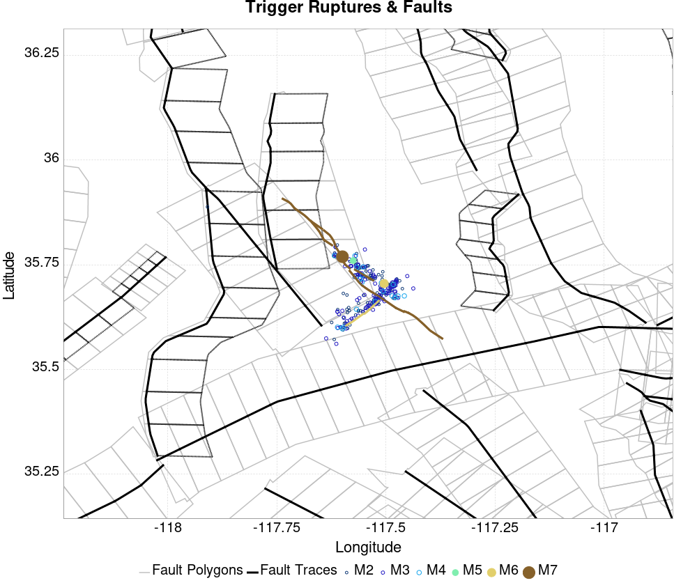
## Trigger Rupture Depth Map
*[(top)](#table-of-contents)*


## Fault Distances To Triggers
*[(top)](#table-of-contents)*

| Section Name | Strike, Dip, Rake | # Hypos In Poly | Max Mag w/ Hypo In Poly | # Surfs In Poly | Max Mag w/ Surf In Poly | Min Dist To Any (km) | Min Poly Dist To Any (km) | Min Dist To Largest (km) | Min Poly Dist To Largest (km) | Min Hypo Dist To Largest (km) | Min Hypo Poly Dist To Largest (km) |
|-----|-----|-----|-----|-----|-----|-----|-----|-----|-----|-----|-----|
| Airport Lake | 359, 50, -90 | 90 | 7.1 | 90 | 7.1 | 0.036 | 0.000 | 0.036 | 0.000 | 5.612 | 0.000 |
| Little Lake | 327, 90, 180 | 16 | 3.75 | 17 | 7.1 | 2.268 | 0.000 | 11.284 | 0.000 | 13.471 | 1.469 |
| Garlock (Central) | 71, 90, 0 | 2 | 3.21 | 3 | 7.1 | 5.600 | 0.000 | 5.600 | 0.000 | 22.766 | 10.797 |
| So Sierra Nevada | 2, 50, -90 | 1 | 2.75 | 1 | 2.75 | 1.410 | 0.000 | 4.248 | 4.233 | 16.191 | 15.188 |
| Tank Canyon | 189, 50, -90 | 0 |  | 0 |  | 9.015 | 9.011 | 9.015 | 9.011 | 17.039 | 16.895 |
| Blackwater | 323, 90, 180 | 0 |  | 0 |  | 14.394 | 8.726 | 14.394 | 8.726 | 29.622 | 27.613 |
| Scodie Lineament | 221, 68, 0 | 0 |  | 0 |  | 16.722 | 15.781 | 28.750 | 27.702 | 36.559 | 32.668 |

## Individual Simulated Catalog Maps
*[(top)](#table-of-contents)*

These are map plots of individual catalogs from the simulations, selected as the closest catalog to each of the given percentiles in terms of total number of events.

| Duration | p0.0 %-ile | p25.0 %-ile | p50.0 %-ile | p75.0 %-ile | p90.0 %-ile | p95.0 %-ile | p97.5 %-ile | p98.0 %-ile | p99.0 %-ile | p99.5 %-ile | p99.9 %-ile | p100.0 %-ile |
|-----|-----|-----|-----|-----|-----|-----|-----|-----|-----|-----|-----|-----|
| **1 Week** |  |  |  |  |  |  |  |  |  |  |  |  |
| **1 Month** |  | 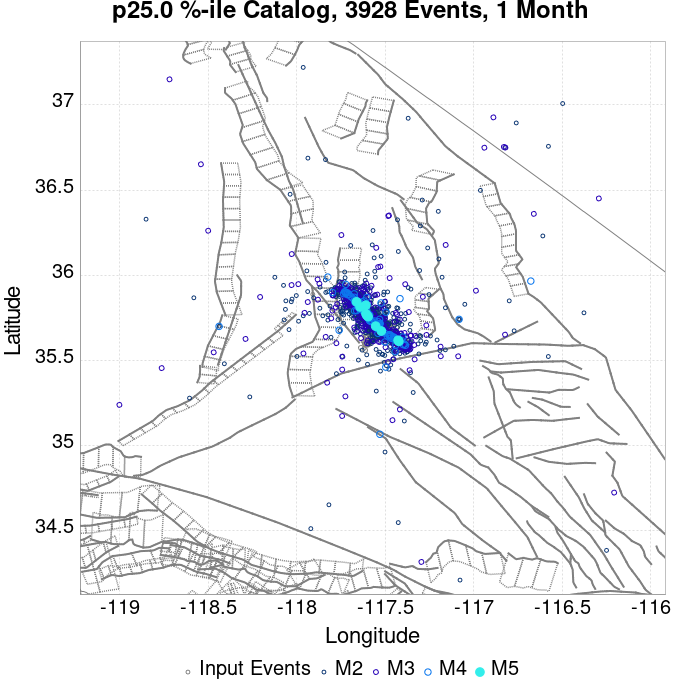 |  |  |  |  |  | 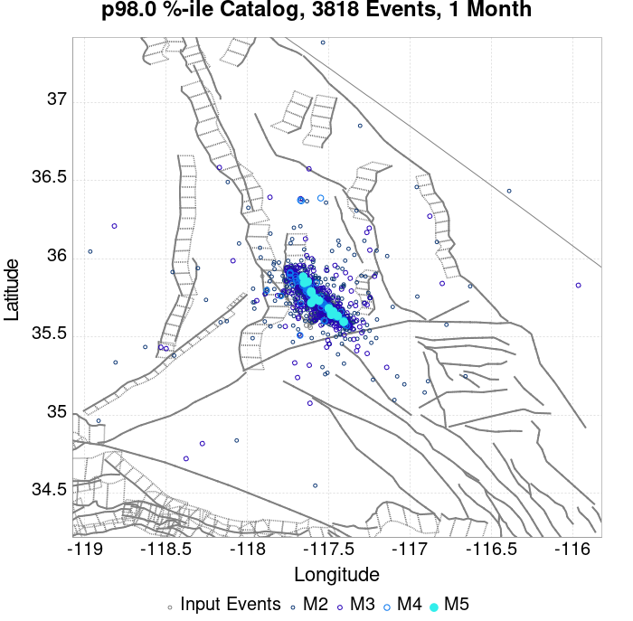 | 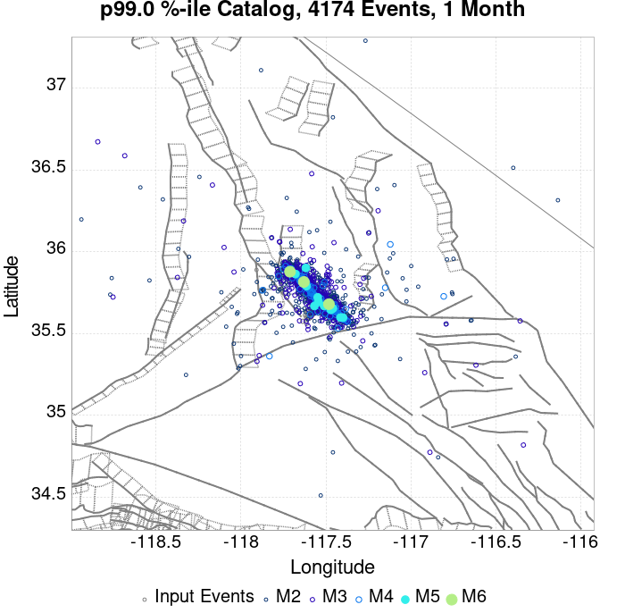 |  |  |  |
| **1 Year** |  |  |  |  |  |  |  |  |  |  |  |  |
| **10 Year** |  |  |  |  |  |  |  |  |  |  |  |  |

## ComCat Data Comparisons
*[(top)](#table-of-contents)*

These plots compare simulated sequences with data from ComCat. All plots only consider events with hypocenters inside the ComCat region defined in the JSON input file, and consider ruptures above Mc=3.5

Last updated at 2019/08/29 18:21:08 UTC, 54.6 d after the simulation start time

### ComCat Magnitude-Number Distributions
*[(top)](#table-of-contents)*

| Incremental MND | Cumulative MND |
|-----|-----|
|  | 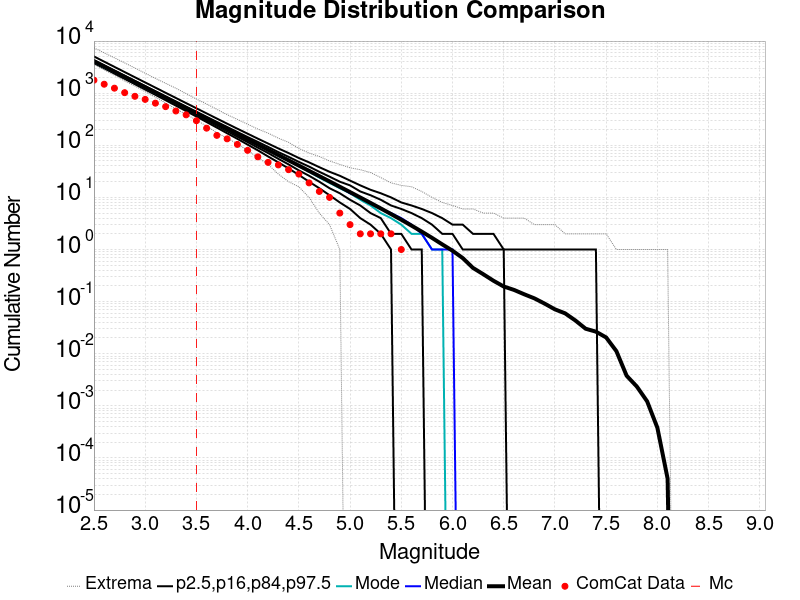 |

### ComCat Cumulative Number Vs Time
*[(top)](#table-of-contents)*

| M&ge;3.5 | M&ge;4 | M&ge;5 | M&ge;6 | M&ge;7 |
|-----|-----|-----|-----|-----|
|  |  |  | 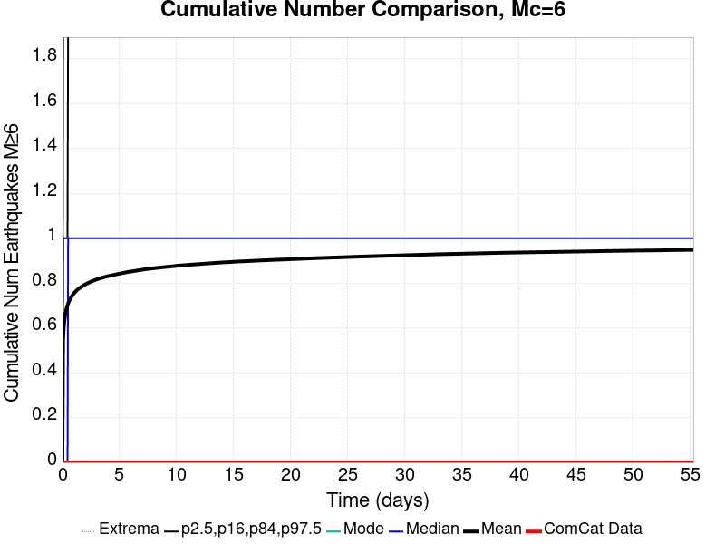 | 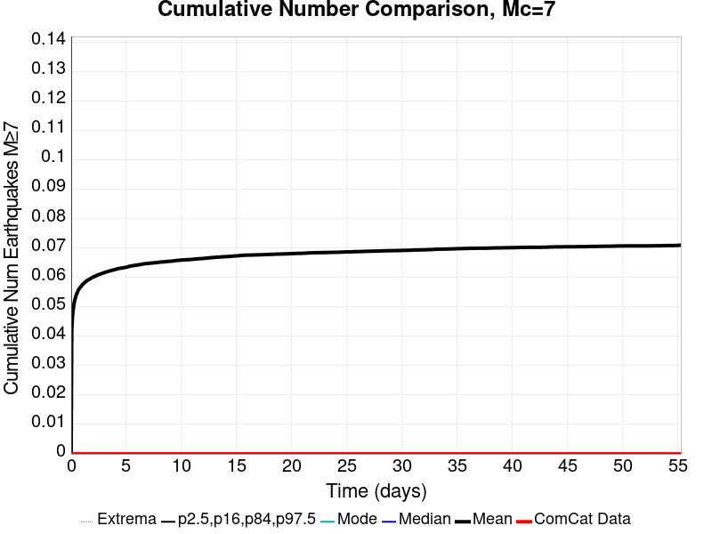 |

### ComCat Cumulative Number Simulation Percentiles
*[(top)](#table-of-contents)*


### ComCat Mean Spatial Distribution
*[(top)](#table-of-contents)*

|  | 1 Day | 1 Week | 1 Month | 54.6 Day |
|-----|-----|-----|-----|-----|
| **M≥3.5** |  |  |  |  |
| **M≥4** |  |  |  |  |
| **M≥5** |  |  |  |  |
| **M≥6** |  |  |  |  |
| **M≥7** |  |  |  |  |
| **M≥8** |  |  |  |  |

### ComCat Depth Distribution
*[(top)](#table-of-contents)*

| M&ge;3.5 | M&ge;4 | M&ge;5 | M&ge;6 | M&ge;7 | M&ge;8 |
|-----|-----|-----|-----|-----|-----|
|  |  |  |  |  |  |

## Section Participation
*[(top)](#table-of-contents)*

### Section Participation Plots
*[(top)](#table-of-contents)*

| Min Mag | 1 yr Triggered Ruptures (no spontaneous) | 10 yr Triggered Ruptures (no spontaneous) | 10 yr Triggered Ruptures (primary aftershocks only) |
|-----|-----|-----|-----|
| **All Supra. Seis.** | 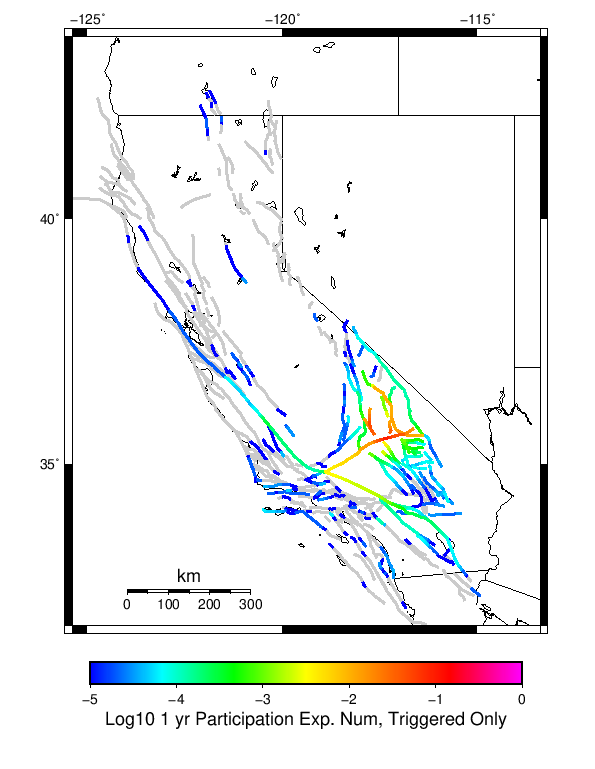 |  |  |
| **M&ge;6.5** |  |  |  |
| **M&ge;7** |  |  |  |
| **M&ge;7.5** |  | 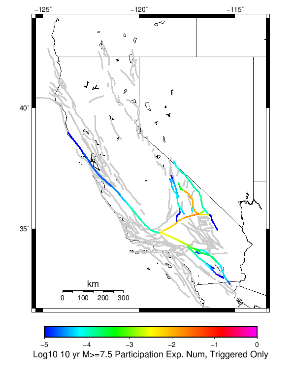 |  |
| **M&ge;8** |  |  |  |

### Supra-Seismogenic Parent Sections Table
*[(top)](#table-of-contents)*

*First 10 of 53 with matching ruptures shown*

| Parent Name | Triggered 10 Year Mean Count | Triggered 1 Day Prob | Triggered 1 Week Prob | Triggered 1 Month Prob | Triggered 1 Year Prob | Triggered 10 Year Prob | Triggered 10 Year Primary Mean Count |
|-----|-----|-----|-----|-----|-----|-----|-----|
| Garlock (Central) | 0.15208445 | 0.10967973 | 0.12220433 | 0.12989801 | 0.14045447 | 0.14886384 | 0.12918232 |
| Tank Canyon | 0.0758633 | 0.05331902 | 0.059760243 | 0.06387547 | 0.068706386 | 0.07317946 | 0.05331902 |
| Little Lake | 0.07264269 | 0.05027733 | 0.05904455 | 0.06262301 | 0.068169616 | 0.07103238 | 0.061370548 |
| Airport Lake | 0.07228485 | 0.050456252 | 0.05886563 | 0.06387547 | 0.06888531 | 0.07228485 | 0.06477009 |
| Owl Lake | 0.032742888 | 0.022365361 | 0.026301663 | 0.02791197 | 0.030059045 | 0.031669352 | 0.02164967 |
| Panamint Valley | 0.0211129 | 0.014671677 | 0.016639829 | 0.018429058 | 0.020397209 | 0.0211129 | 0.016460905 |
| Garlock (East) | 0.019681517 | 0.011987833 | 0.014492754 | 0.015745213 | 0.017534442 | 0.01914475 | 0.012882448 |
| Hunter Mountain-Saline Valley | 0.01055645 | 0.0071569155 | 0.0080515295 | 0.008946144 | 0.01055645 | 0.01055645 | 0.008767221 |
| Garlock (West) | 0.009482913 | 0.0069779926 | 0.007693684 | 0.008409375 | 0.008767221 | 0.009482913 | 0.008230452 |
| Blackwater | 0.007693684 | 0.0050098407 | 0.005904455 | 0.006620147 | 0.0073358384 | 0.0073358384 | 0.004830918 |

### M≥6.5 Parent Sections Table
*[(top)](#table-of-contents)*

*First 10 of 35 with matching ruptures shown*

| Parent Name | Triggered 10 Year Mean Count | Triggered 1 Day Prob | Triggered 1 Week Prob | Triggered 1 Month Prob | Triggered 1 Year Prob | Triggered 10 Year Prob | Triggered 10 Year Primary Mean Count |
|-----|-----|-----|-----|-----|-----|-----|-----|
| Garlock (Central) | 0.062265165 | 0.044193953 | 0.04974056 | 0.053140096 | 0.05886563 | 0.061907317 | 0.052424405 |
| Airport Lake | 0.053497944 | 0.03721596 | 0.04329934 | 0.04705672 | 0.0508141 | 0.053497944 | 0.047593486 |
| Little Lake | 0.046877794 | 0.03399535 | 0.039363034 | 0.04204688 | 0.04580426 | 0.046877794 | 0.04151011 |
| Owl Lake | 0.025049204 | 0.01914475 | 0.021291824 | 0.022007516 | 0.023796743 | 0.025049204 | 0.019681517 |
| Panamint Valley | 0.020576132 | 0.014134908 | 0.016103059 | 0.017892288 | 0.01986044 | 0.020576132 | 0.016103059 |
| Garlock (East) | 0.016103059 | 0.0098407585 | 0.01180891 | 0.012882448 | 0.014134908 | 0.015566291 | 0.012524602 |
| Hunter Mountain-Saline Valley | 0.01055645 | 0.0071569155 | 0.0080515295 | 0.008946144 | 0.01055645 | 0.01055645 | 0.008767221 |
| Garlock (West) | 0.009482913 | 0.0069779926 | 0.007693684 | 0.008409375 | 0.008767221 | 0.009482913 | 0.008230452 |
| Tank Canyon | 0.007693684 | 0.0050098407 | 0.006083378 | 0.006620147 | 0.0069779926 | 0.007693684 | 0.0055466094 |
| San Andreas (Mojave N) | 0.004115226 | 0.0028627662 | 0.0028627662 | 0.0033995348 | 0.0037573806 | 0.004115226 | 0.0033995348 |

### M≥7 Parent Sections Table
*[(top)](#table-of-contents)*

*First 10 of 21 with matching ruptures shown*

| Parent Name | Triggered 10 Year Mean Count | Triggered 1 Day Prob | Triggered 1 Week Prob | Triggered 1 Month Prob | Triggered 1 Year Prob | Triggered 10 Year Prob | Triggered 10 Year Primary Mean Count |
|-----|-----|-----|-----|-----|-----|-----|-----|
| Garlock (Central) | 0.052961174 | 0.03739488 | 0.042583648 | 0.045625336 | 0.05027733 | 0.052603327 | 0.04544641 |
| Owl Lake | 0.021828592 | 0.016639829 | 0.01860798 | 0.01914475 | 0.020933978 | 0.021828592 | 0.01860798 |
| Panamint Valley | 0.0152084455 | 0.010377527 | 0.01180891 | 0.0134192165 | 0.015029523 | 0.0152084455 | 0.012882448 |
| Garlock (East) | 0.014492754 | 0.00930399 | 0.011093219 | 0.012166756 | 0.0134192165 | 0.014492754 | 0.012166756 |
| Little Lake | 0.012166756 | 0.008230452 | 0.010019681 | 0.010735373 | 0.011987833 | 0.012166756 | 0.01055645 |
| Airport Lake | 0.011987833 | 0.0080515295 | 0.0098407585 | 0.01055645 | 0.01180891 | 0.011987833 | 0.01055645 |
| Hunter Mountain-Saline Valley | 0.01055645 | 0.0071569155 | 0.0080515295 | 0.008946144 | 0.01055645 | 0.01055645 | 0.008767221 |
| Garlock (West) | 0.009482913 | 0.0069779926 | 0.007693684 | 0.008409375 | 0.008767221 | 0.009482913 | 0.008230452 |
| San Andreas (Mojave N) | 0.004115226 | 0.0028627662 | 0.0028627662 | 0.0033995348 | 0.0037573806 | 0.004115226 | 0.0033995348 |
| San Andreas (Mojave S) | 0.0026838433 | 0.0019681517 | 0.0019681517 | 0.0023259975 | 0.0025049204 | 0.0026838433 | 0.0019681517 |

### M≥7.5 Parent Sections Table
*[(top)](#table-of-contents)*

*First 10 of 15 with matching ruptures shown*

| Parent Name | Triggered 10 Year Mean Count | Triggered 1 Day Prob | Triggered 1 Week Prob | Triggered 1 Month Prob | Triggered 1 Year Prob | Triggered 10 Year Prob | Triggered 10 Year Primary Mean Count |
|-----|-----|-----|-----|-----|-----|-----|-----|
| Garlock (Central) | 0.018965825 | 0.013240294 | 0.014671677 | 0.016281983 | 0.018250134 | 0.018965825 | 0.016103059 |
| Panamint Valley | 0.010735373 | 0.0073358384 | 0.008230452 | 0.009125067 | 0.010735373 | 0.010735373 | 0.008946144 |
| Hunter Mountain-Saline Valley | 0.01055645 | 0.0071569155 | 0.0080515295 | 0.008946144 | 0.01055645 | 0.01055645 | 0.008767221 |
| Garlock (West) | 0.008767221 | 0.006441224 | 0.0069779926 | 0.007693684 | 0.0080515295 | 0.008767221 | 0.0075147613 |
| Garlock (East) | 0.0050098407 | 0.0035784577 | 0.0039363033 | 0.004473072 | 0.004651995 | 0.0050098407 | 0.004473072 |
| San Andreas (Mojave N) | 0.004115226 | 0.0028627662 | 0.0028627662 | 0.0033995348 | 0.0037573806 | 0.004115226 | 0.0033995348 |
| San Andreas (Mojave S) | 0.0026838433 | 0.0019681517 | 0.0019681517 | 0.0023259975 | 0.0025049204 | 0.0026838433 | 0.0019681517 |
| Owl Lake | 0.0021470746 | 0.001610306 | 0.0017892289 | 0.0017892289 | 0.0019681517 | 0.0021470746 | 0.001610306 |
| San Andreas (San Bernardino N) | 0.0014313831 | 8.9461444E-4 | 8.9461444E-4 | 0.0010735373 | 0.0012524602 | 0.0014313831 | 0.0010735373 |
| San Andreas (North Branch Mill Creek) | 3.5784577E-4 | 3.5784577E-4 | 3.5784577E-4 | 3.5784577E-4 | 3.5784577E-4 | 3.5784577E-4 | 3.5784577E-4 |

### M≥8 Parent Sections Table
*[(top)](#table-of-contents)*

| Parent Name | Triggered 10 Year Mean Count | Triggered 1 Day Prob | Triggered 1 Week Prob | Triggered 1 Month Prob | Triggered 1 Year Prob | Triggered 10 Year Prob | Triggered 10 Year Primary Mean Count |
|-----|-----|-----|-----|-----|-----|-----|-----|
| Garlock (Central) | 1.7892288E-4 | 0.0 | 0.0 | 1.7892288E-4 | 1.7892288E-4 | 1.7892288E-4 | 1.7892288E-4 |
| Garlock (East) | 1.7892288E-4 | 0.0 | 0.0 | 1.7892288E-4 | 1.7892288E-4 | 1.7892288E-4 | 1.7892288E-4 |
| Garlock (West) | 1.7892288E-4 | 0.0 | 0.0 | 1.7892288E-4 | 1.7892288E-4 | 1.7892288E-4 | 1.7892288E-4 |
| San Andreas (Coachella) rev | 1.7892288E-4 | 0.0 | 0.0 | 1.7892288E-4 | 1.7892288E-4 | 1.7892288E-4 | 1.7892288E-4 |
| San Andreas (Mojave N) | 1.7892288E-4 | 0.0 | 0.0 | 1.7892288E-4 | 1.7892288E-4 | 1.7892288E-4 | 1.7892288E-4 |
| San Andreas (Mojave S) | 1.7892288E-4 | 0.0 | 0.0 | 1.7892288E-4 | 1.7892288E-4 | 1.7892288E-4 | 1.7892288E-4 |
| San Andreas (San Bernardino N) | 1.7892288E-4 | 0.0 | 0.0 | 1.7892288E-4 | 1.7892288E-4 | 1.7892288E-4 | 1.7892288E-4 |
| San Andreas (San Bernardino S) | 1.7892288E-4 | 0.0 | 0.0 | 1.7892288E-4 | 1.7892288E-4 | 1.7892288E-4 | 1.7892288E-4 |
| San Andreas (San Gorgonio Pass-Garnet HIll) | 1.7892288E-4 | 0.0 | 0.0 | 1.7892288E-4 | 1.7892288E-4 | 1.7892288E-4 | 1.7892288E-4 |

### Fault Magnitude-Probability Distributions
*[(top)](#table-of-contents)*

The first 5 sections (sorted by trigger rate) are plotted below. All fault MPDs are available [here](plots/parent_sect_mpds/README.md)

| 1 Week | 1 Month | 1 Year | 10 Year |
|-----|-----|-----|-----|
|  |  |  | 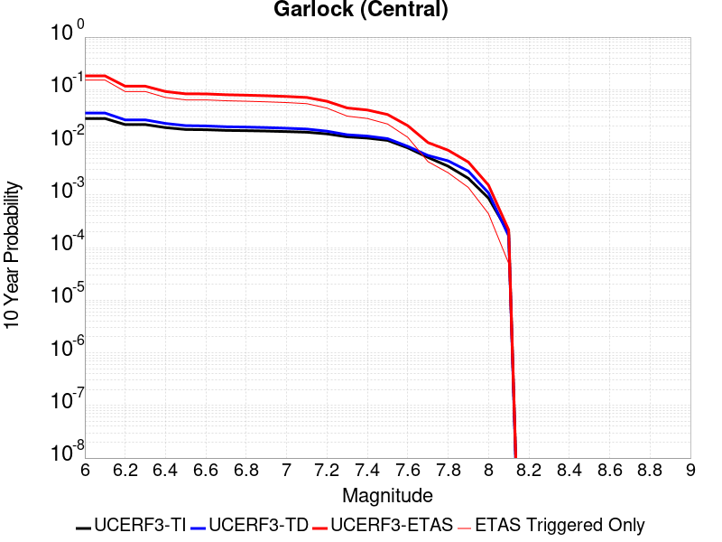 |
|  |  |  | 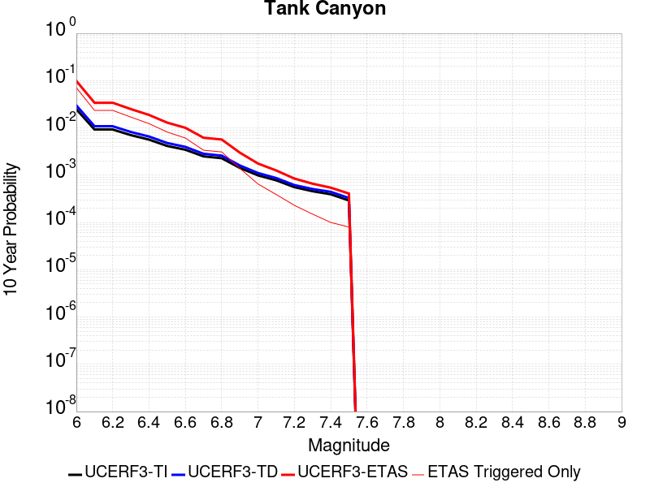 |
| 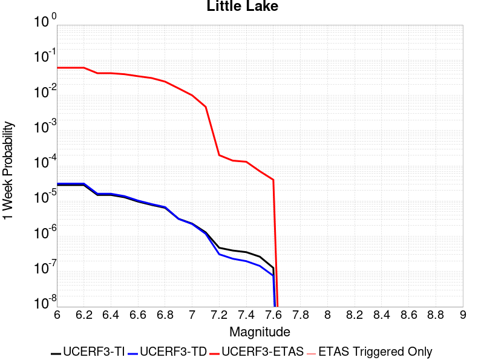 |  |  |  |
|  |  |  |  |
|  | 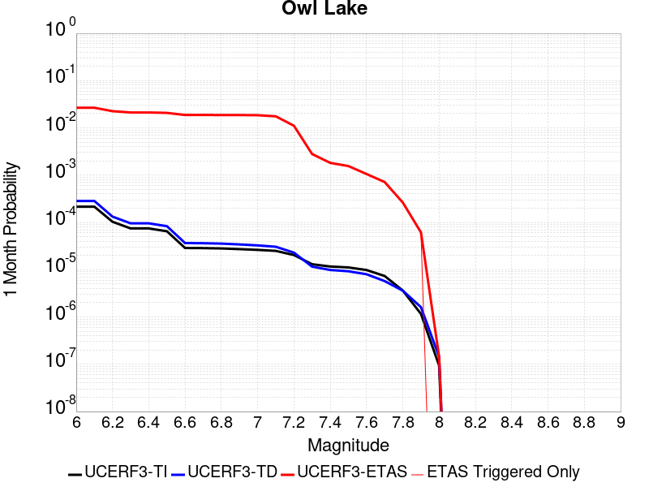 |  |  |

## Gridded Nucleation
*[(top)](#table-of-contents)*

| Min Mag | Triggered Ruptures (no spontaneous) | Triggered Ruptures (primary aftershocks only) |
|-----|-----|-----|
| **M&ge;2.5** |  |  |
| **M&ge;5** |  |  |
| **M&ge;6** |  |  |
| **M&ge;7** |  |  |


## JSON Input File
*[(top)](#table-of-contents)*

```
{
  "numSimulations": 100000,
  "duration": 10.0,
  "startTimeMillis": 1562383194040,
  "includeSpontaneous": false,
  "randomSeed": 1567035173906,
  "binaryOutput": true,
  "binaryOutputFilters": [
    {
      "prefix": "results_complete",
      "descendantsOnly": false
    },
    {
      "prefix": "results_m5_preserve_chain",
      "minMag": 5.0,
      "preserveChainBelowMag": true,
      "descendantsOnly": false
    }
  ],
  "forceRecalc": false,
  "simulationName": "ComCat M7.1 (ci38457511), Mainshock Log10(k)\u003d-2.3, ShakeMap Surfaces, Log10(k)\u003d-3.03, p\u003d1.15, c\u003d4.6773514E-4",
  "numRetries": 3,
  "outputDir": "${ETAS_SIM_DIR}/2019_08_28-ComCatM7p1_ci38457511_MainshockLog10_k_2p3_ShakeMapSurfaces_Log10_k_3p03_p1p15_c4p6773514E4-noSpont-full_td-scale1.14-modParams",
  "triggerRuptures": [
    {
      "occurrenceTimeMillis": 1562259775340,
      "comcatEventID": "ci38443095",
      "mag": 3.98,
      "latitude": 35.708,
      "longitude": -117.5036667,
      "depth": 10.58
    },
    {
      "occurrenceTimeMillis": 1562261629000,
      "comcatEventID": "ci38443183",
      "mag": 6.4,
      "latitude": 35.7053333,
      "longitude": -117.5038333,
      "depth": 10.5,
      "ruptureSurfaces": [
        {
          "outline": [
            {
              "latitude": 35.6051534466,
              "longitude": -117.5905380735,
              "depth": 0.0
            },
            {
              "latitude": 35.6173144101,
              "longitude": -117.57249634649999,
              "depth": 0.0
            },
            {
              "latitude": 35.6173135736,
              "longitude": -117.5726723708,
              "depth": 0.0
            },
            {
              "latitude": 35.61731357360001,
              "longitude": -117.5726723708,
              "depth": 15.0
            },
            {
              "latitude": 35.6173144101,
              "longitude": -117.57249634649999,
              "depth": 15.0
            },
            {
              "latitude": 35.6051534466,
              "longitude": -117.5905380735,
              "depth": 15.0
            },
            {
              "latitude": 35.6051534466,
              "longitude": -117.5905380735,
              "depth": 0.0
            }
          ]
        },
        {
          "outline": [
            {
              "latitude": 35.6338128629,
              "longitude": -117.54831678310002,
              "depth": 0.0
            },
            {
              "latitude": 35.6413274733,
              "longitude": -117.5393878708,
              "depth": 0.0
            },
            {
              "latitude": 35.664283512,
              "longitude": -117.51611643970001,
              "depth": 0.0
            },
            {
              "latitude": 35.664283512000004,
              "longitude": -117.51611643970001,
              "depth": 15.0
            },
            {
              "latitude": 35.641327473299995,
              "longitude": -117.5393878708,
              "depth": 15.0
            },
            {
              "latitude": 35.63381286290001,
              "longitude": -117.54831678310002,
              "depth": 15.0
            },
            {
              "latitude": 35.6338128629,
              "longitude": -117.54831678310002,
              "depth": 0.0
            }
          ]
        },
        {
          "outline": [
            {
              "latitude": 35.6322100797,
              "longitude": -117.55305954249998,
              "depth": 0.0
            },
            {
              "latitude": 35.6196274701,
              "longitude": -117.56969626549999,
              "depth": 0.0
            },
            {
              "latitude": 35.6196274701,
              "longitude": -117.56969626549999,
              "depth": 15.0
            },
            {
              "latitude": 35.6322100797,
              "longitude": -117.55305954249998,
              "depth": 15.0
            },
            {
              "latitude": 35.6322100797,
              "longitude": -117.55305954249998,
              "depth": 0.0
            }
          ]
        }
      ]
    },
    {
      "occurrenceTimeMillis": 1562261701660,
      "comcatEventID": "ci38443191",
      "mag": 4.49,
      "latitude": 35.644,
      "longitude": -117.56716670000002,
      "depth": 4.64
    },
    {
      "occurrenceTimeMillis": 1562261746340,
      "comcatEventID": "ci37222356",
      "mag": 3.63,
      "latitude": 35.6936667,
      "longitude": -117.437,
      "depth": 7.65
    },
    {
      "occurrenceTimeMillis": 1562261752170,
      "comcatEventID": "ci37218988",
      "mag": 4.28,
      "latitude": 35.687,
      "longitude": -117.50616670000001,
      "depth": 1.6
    },
    {
      "occurrenceTimeMillis": 1562261818950,
      "comcatEventID": "ci37222380",
      "mag": 3.41,
      "latitude": 35.7258333,
      "longitude": -117.55933330000002,
      "depth": 5.3
    },
    {
      "occurrenceTimeMillis": 1562261821140,
      "comcatEventID": "ci37222372",
      "mag": 3.66,
      "latitude": 35.7105,
      "longitude": -117.4773333,
      "depth": 1.57
    },
    {
      "occurrenceTimeMillis": 1562261834850,
      "comcatEventID": "ci37222364",
      "mag": 3.97,
      "latitude": 35.6655,
      "longitude": -117.516,
      "depth": 1.64
    },
    {
      "occurrenceTimeMillis": 1562261845640,
      "comcatEventID": "ci37218996",
      "mag": 4.01,
      "latitude": 35.6758333,
      "longitude": -117.45750000000001,
      "depth": 15.82
    },
    {
      "occurrenceTimeMillis": 1562261875500,
      "comcatEventID": "ci38443199",
      "mag": 3.86,
      "latitude": 35.7456667,
      "longitude": -117.5516667,
      "depth": 8.29
    },
    {
      "occurrenceTimeMillis": 1562261901450,
      "comcatEventID": "ci37421941",
      "mag": 3.73,
      "latitude": 35.714,
      "longitude": -117.476,
      "depth": 1.74
    },
    {
      "occurrenceTimeMillis": 1562261927500,
      "comcatEventID": "us70004a0n",
      "mag": 3.5,
      "latitude": 35.6215,
      "longitude": -117.5782,
      "depth": 9.7
    },
    {
      "occurrenceTimeMillis": 1562261927760,
      "comcatEventID": "ci37222396",
      "mag": 3.5,
      "latitude": 35.6235,
      "longitude": -117.596,
      "depth": 8.55
    },
    {
      "occurrenceTimeMillis": 1562261973310,
      "comcatEventID": "ci37222404",
      "mag": 3.11,
      "latitude": 35.5743333,
      "longitude": -117.63666670000002,
      "depth": 6.85
    },
    {
      "occurrenceTimeMillis": 1562261975360,
      "comcatEventID": "ci38443215",
      "mag": 3.69,
      "latitude": 35.6873333,
      "longitude": -117.4935,
      "depth": 10.86
    },
    {
      "occurrenceTimeMillis": 1562262002250,
      "comcatEventID": "ci38443223",
      "mag": 3.8,
      "latitude": 35.7253333,
      "longitude": -117.57083329999999,
      "depth": 6.63
    },
    {
      "occurrenceTimeMillis": 1562262018520,
      "comcatEventID": "ci38443231",
      "mag": 4.13,
      "latitude": 35.707,
      "longitude": -117.5101667,
      "depth": 8.66
    },
    {
      "occurrenceTimeMillis": 1562262034900,
      "comcatEventID": "ci37222508",
      "mag": 3.54,
      "latitude": 35.6948333,
      "longitude": -117.50183330000002,
      "depth": 2.04
    },
    {
      "occurrenceTimeMillis": 1562262046140,
      "comcatEventID": "ci37222516",
      "mag": 3.42,
      "latitude": 35.7298333,
      "longitude": -117.55483330000001,
      "depth": 7.72
    },
    {
      "occurrenceTimeMillis": 1562262080850,
      "comcatEventID": "ci37421957",
      "mag": 3.3,
      "latitude": 35.7266667,
      "longitude": -117.5288333,
      "depth": 1.97
    },
    {
      "occurrenceTimeMillis": 1562262174130,
      "comcatEventID": "ci38443239",
      "mag": 3.22,
      "latitude": 35.7301667,
      "longitude": -117.55866669999999,
      "depth": 7.84
    },
    {
      "occurrenceTimeMillis": 1562262209200,
      "comcatEventID": "us70004a0z",
      "mag": 3.6,
      "latitude": 35.6783,
      "longitude": -117.5488,
      "depth": 5.15
    },
    {
      "occurrenceTimeMillis": 1562262264020,
      "comcatEventID": "ci37421981",
      "mag": 2.77,
      "latitude": 35.7478333,
      "longitude": -117.54000000000002,
      "depth": 9.4
    },
    {
      "occurrenceTimeMillis": 1562262272820,
      "comcatEventID": "ci38443255",
      "mag": 3.86,
      "latitude": 35.6875,
      "longitude": -117.5071667,
      "depth": 1.54
    },
    {
      "occurrenceTimeMillis": 1562262305780,
      "comcatEventID": "ci37421997",
      "mag": 3.03,
      "latitude": 35.6976667,
      "longitude": -117.48649999999999,
      "depth": 2.24
    },
    {
      "occurrenceTimeMillis": 1562262323950,
      "comcatEventID": "ci37421989",
      "mag": 3.03,
      "latitude": 35.7151667,
      "longitude": -117.5473333,
      "depth": 7.21
    },
    {
      "occurrenceTimeMillis": 1562262328630,
      "comcatEventID": "ci37222524",
      "mag": 3.21,
      "latitude": 35.7348333,
      "longitude": -117.53683330000001,
      "depth": 10.34
    },
    {
      "occurrenceTimeMillis": 1562262363710,
      "comcatEventID": "ci38443263",
      "mag": 2.96,
      "latitude": 35.6431667,
      "longitude": -117.6101667,
      "depth": 10.14
    },
    {
      "occurrenceTimeMillis": 1562262380320,
      "comcatEventID": "ci37222532",
      "mag": 2.56,
      "latitude": 35.6563333,
      "longitude": -117.5325,
      "depth": 1.52
    },
    {
      "occurrenceTimeMillis": 1562262409960,
      "comcatEventID": "ci38443271",
      "mag": 3.07,
      "latitude": 35.6385,
      "longitude": -117.6108333,
      "depth": 10.97
    },
    {
      "occurrenceTimeMillis": 1562262437810,
      "comcatEventID": "ci38443279",
      "mag": 3.5,
      "latitude": 35.7455,
      "longitude": -117.5465,
      "depth": 7.11
    },
    {
      "occurrenceTimeMillis": 1562262460970,
      "comcatEventID": "ci37222548",
      "mag": 3.11,
      "latitude": 35.726,
      "longitude": -117.55849999999998,
      "depth": 3.58
    },
    {
      "occurrenceTimeMillis": 1562262474970,
      "comcatEventID": "ci37222556",
      "mag": 3.4,
      "latitude": 35.7286667,
      "longitude": -117.56066670000001,
      "depth": 5.25
    },
    {
      "occurrenceTimeMillis": 1562262483160,
      "comcatEventID": "ci37222564",
      "mag": 3.27,
      "latitude": 35.6365,
      "longitude": -117.55183330000001,
      "depth": 6.62
    },
    {
      "occurrenceTimeMillis": 1562262495680,
      "comcatEventID": "ci37222572",
      "mag": 3.11,
      "latitude": 35.7053333,
      "longitude": -117.5245,
      "depth": 5.52
    },
    {
      "occurrenceTimeMillis": 1562262504150,
      "comcatEventID": "ci37222580",
      "mag": 2.96,
      "latitude": 35.6593333,
      "longitude": -117.52633330000002,
      "depth": 2.68
    },
    {
      "occurrenceTimeMillis": 1562262575190,
      "comcatEventID": "ci37222596",
      "mag": 2.52,
      "latitude": 35.7335,
      "longitude": -117.50683330000001,
      "depth": 3.91
    },
    {
      "occurrenceTimeMillis": 1562262578950,
      "comcatEventID": "ci37222668",
      "mag": 2.57,
      "latitude": 35.687,
      "longitude": -117.49066670000002,
      "depth": 10.66
    },
    {
      "occurrenceTimeMillis": 1562262648290,
      "comcatEventID": "ci37222692",
      "mag": 2.73,
      "latitude": 35.738,
      "longitude": -117.52933329999999,
      "depth": 7.72
    },
    {
      "occurrenceTimeMillis": 1562262648960,
      "comcatEventID": "ci38443303",
      "mag": 2.79,
      "latitude": 35.678,
      "longitude": -117.49916670000002,
      "depth": 1.14
    },
    {
      "occurrenceTimeMillis": 1562262706650,
      "comcatEventID": "ci38443287",
      "mag": 3.46,
      "latitude": 35.674,
      "longitude": -117.52349999999998,
      "depth": 5.3
    },
    {
      "occurrenceTimeMillis": 1562262761700,
      "comcatEventID": "ci38443295",
      "mag": 2.92,
      "latitude": 35.7218333,
      "longitude": -117.5251667,
      "depth": 7.04
    },
    {
      "occurrenceTimeMillis": 1562262899560,
      "comcatEventID": "ci38443327",
      "mag": 2.53,
      "latitude": 35.6391667,
      "longitude": -117.5628333,
      "depth": 10.48
    },
    {
      "occurrenceTimeMillis": 1562262930800,
      "comcatEventID": "ci37222876",
      "mag": 2.57,
      "latitude": 35.6705,
      "longitude": -117.5221667,
      "depth": 3.91
    },
    {
      "occurrenceTimeMillis": 1562263051460,
      "comcatEventID": "ci38443311",
      "mag": 2.95,
      "latitude": 35.6595,
      "longitude": -117.5223333,
      "depth": 2.3
    },
    {
      "occurrenceTimeMillis": 1562263063060,
      "comcatEventID": "ci37222932",
      "mag": 2.78,
      "latitude": 35.6725,
      "longitude": -117.4743333,
      "depth": 8.76
    },
    {
      "occurrenceTimeMillis": 1562263082640,
      "comcatEventID": "ci38443319",
      "mag": 3.33,
      "latitude": 35.702,
      "longitude": -117.50833330000002,
      "depth": 4.77
    },
    {
      "occurrenceTimeMillis": 1562263240190,
      "comcatEventID": "ci38443335",
      "mag": 2.67,
      "latitude": 35.6303333,
      "longitude": -117.569,
      "depth": 1.64
    },
    {
      "occurrenceTimeMillis": 1562263261190,
      "comcatEventID": "ci37223148",
      "mag": 2.59,
      "latitude": 35.6733333,
      "longitude": -117.5118333,
      "depth": 1.49
    },
    {
      "occurrenceTimeMillis": 1562263283180,
      "comcatEventID": "ci37422005",
      "mag": 3.53,
      "latitude": 35.6876667,
      "longitude": -117.50849999999998,
      "depth": 1.26
    },
    {
      "occurrenceTimeMillis": 1562263291230,
      "comcatEventID": "ci37223156",
      "mag": 3.42,
      "latitude": 35.5978333,
      "longitude": -117.5905,
      "depth": 6.79
    },
    {
      "occurrenceTimeMillis": 1562263374110,
      "comcatEventID": "ci38443351",
      "mag": 2.53,
      "latitude": 35.6066667,
      "longitude": -117.58216670000002,
      "depth": 5.8
    },
    {
      "occurrenceTimeMillis": 1562263398590,
      "comcatEventID": "ci38443359",
      "mag": 2.85,
      "latitude": 35.7478333,
      "longitude": -117.5425,
      "depth": 6.85
    },
    {
      "occurrenceTimeMillis": 1562263541830,
      "comcatEventID": "ci38443375",
      "mag": 2.76,
      "latitude": 35.7153333,
      "longitude": -117.5295,
      "depth": 4.54
    },
    {
      "occurrenceTimeMillis": 1562263555910,
      "comcatEventID": "ci37223228",
      "mag": 2.61,
      "latitude": 35.7266667,
      "longitude": -117.5165,
      "depth": 8.96
    },
    {
      "occurrenceTimeMillis": 1562263576110,
      "comcatEventID": "ci38443383",
      "mag": 3.79,
      "latitude": 35.6606667,
      "longitude": -117.523,
      "depth": 2.14
    },
    {
      "occurrenceTimeMillis": 1562263611050,
      "comcatEventID": "ci37223236",
      "mag": 2.6,
      "latitude": 35.6931667,
      "longitude": -117.46200000000002,
      "depth": 11.56
    },
    {
      "occurrenceTimeMillis": 1562263629270,
      "comcatEventID": "ci38443391",
      "mag": 3.51,
      "latitude": 35.5991667,
      "longitude": -117.6101667,
      "depth": 2.12
    },
    {
      "occurrenceTimeMillis": 1562263630910,
      "comcatEventID": "ci37223244",
      "mag": 3.49,
      "latitude": 35.6508333,
      "longitude": -117.54200000000002,
      "depth": 2.77
    },
    {
      "occurrenceTimeMillis": 1562263670810,
      "comcatEventID": "ci37223252",
      "mag": 2.55,
      "latitude": 35.72950000000001,
      "longitude": -117.533,
      "depth": 7.25
    },
    {
      "occurrenceTimeMillis": 1562263713160,
      "comcatEventID": "ci38443407",
      "mag": 3.38,
      "latitude": 35.6678333,
      "longitude": -117.50616670000001,
      "depth": 2.27
    },
    {
      "occurrenceTimeMillis": 1562263725070,
      "comcatEventID": "ci37223308",
      "mag": 3.55,
      "latitude": 35.7108333,
      "longitude": -117.47683329999998,
      "depth": 1.17
    },
    {
      "occurrenceTimeMillis": 1562263832710,
      "comcatEventID": "ci38443415",
      "mag": 3.46,
      "latitude": 35.6598333,
      "longitude": -117.53483330000002,
      "depth": 10.25
    },
    {
      "occurrenceTimeMillis": 1562263882870,
      "comcatEventID": "ci38443423",
      "mag": 2.69,
      "latitude": 35.6003333,
      "longitude": -117.5951667,
      "depth": 7.33
    },
    {
      "occurrenceTimeMillis": 1562263972070,
      "comcatEventID": "ci38443431",
      "mag": 3.44,
      "latitude": 35.6703333,
      "longitude": -117.5605,
      "depth": 6.91
    },
    {
      "occurrenceTimeMillis": 1562264025530,
      "comcatEventID": "ci37223380",
      "mag": 2.89,
      "latitude": 35.7003333,
      "longitude": -117.4873333,
      "depth": 10.98
    },
    {
      "occurrenceTimeMillis": 1562264031400,
      "comcatEventID": "ci38443439",
      "mag": 3.5,
      "latitude": 35.7081667,
      "longitude": -117.485,
      "depth": 6.44
    },
    {
      "occurrenceTimeMillis": 1562264104970,
      "comcatEventID": "ci38443447",
      "mag": 2.75,
      "latitude": 35.6103333,
      "longitude": -117.59500000000001,
      "depth": 4.94
    },
    {
      "occurrenceTimeMillis": 1562264112820,
      "comcatEventID": "ci37420701",
      "mag": 3.23,
      "latitude": 35.6691667,
      "longitude": -117.5203333,
      "depth": 1.84
    },
    {
      "occurrenceTimeMillis": 1562264193730,
      "comcatEventID": "ci38443463",
      "mag": 2.94,
      "latitude": 35.7251667,
      "longitude": -117.53350000000002,
      "depth": 6.74
    },
    {
      "occurrenceTimeMillis": 1562264235320,
      "comcatEventID": "ci38443471",
      "mag": 2.87,
      "latitude": 35.7185,
      "longitude": -117.5336667,
      "depth": 4.94
    },
    {
      "occurrenceTimeMillis": 1562264325720,
      "comcatEventID": "ci38443487",
      "mag": 3.38,
      "latitude": 35.638,
      "longitude": -117.611,
      "depth": 9.43
    },
    {
      "occurrenceTimeMillis": 1562264332070,
      "comcatEventID": "ci37223676",
      "mag": 2.98,
      "latitude": 35.6123333,
      "longitude": -117.624,
      "depth": 0.0
    },
    {
      "occurrenceTimeMillis": 1562264348090,
      "comcatEventID": "ci37223684",
      "mag": 2.6,
      "latitude": 35.7236667,
      "longitude": -117.50849999999998,
      "depth": 11.57
    },
    {
      "occurrenceTimeMillis": 1562264485340,
      "comcatEventID": "ci38443495",
      "mag": 2.61,
      "latitude": 35.67883330000001,
      "longitude": -117.51533330000001,
      "depth": 2.91
    },
    {
      "occurrenceTimeMillis": 1562264763750,
      "comcatEventID": "ci38443519",
      "mag": 3.13,
      "latitude": 35.6638333,
      "longitude": -117.5245,
      "depth": 2.53
    },
    {
      "occurrenceTimeMillis": 1562264846770,
      "comcatEventID": "ci38443527",
      "mag": 3.29,
      "latitude": 35.6748333,
      "longitude": -117.51433329999999,
      "depth": 2.68
    },
    {
      "occurrenceTimeMillis": 1562264879440,
      "comcatEventID": "ci38443535",
      "mag": 4.23,
      "latitude": 35.745,
      "longitude": -117.55216669999999,
      "depth": 6.64
    },
    {
      "occurrenceTimeMillis": 1562264923640,
      "comcatEventID": "ci38443543",
      "mag": 3.75,
      "latitude": 35.6661667,
      "longitude": -117.5656667,
      "depth": 7.14
    },
    {
      "occurrenceTimeMillis": 1562265289010,
      "comcatEventID": "ci37224604",
      "mag": 2.59,
      "latitude": 35.6895,
      "longitude": -117.4883333,
      "depth": 0.63
    },
    {
      "occurrenceTimeMillis": 1562265344040,
      "comcatEventID": "ci38443575",
      "mag": 2.5,
      "latitude": 35.7215,
      "longitude": -117.56550000000001,
      "depth": 0.16
    },
    {
      "occurrenceTimeMillis": 1562265451500,
      "comcatEventID": "ci38443591",
      "mag": 2.64,
      "latitude": 35.72,
      "longitude": -117.5723333,
      "depth": 1.34
    },
    {
      "occurrenceTimeMillis": 1562265525650,
      "comcatEventID": "ci38443599",
      "mag": 2.69,
      "latitude": 35.7046661,
      "longitude": -117.49666600000002,
      "depth": 3.96
    },
    {
      "occurrenceTimeMillis": 1562265584440,
      "comcatEventID": "ci38443607",
      "mag": 4.59,
      "latitude": 35.6013333,
      "longitude": -117.59700000000001,
      "depth": 2.81
    },
    {
      "occurrenceTimeMillis": 1562265656740,
      "comcatEventID": "ci37224612",
      "mag": 3.05,
      "latitude": 35.652,
      "longitude": -117.53683330000001,
      "depth": 2.03
    },
    {
      "occurrenceTimeMillis": 1562265674270,
      "comcatEventID": "ci38443615",
      "mag": 3.07,
      "latitude": 35.6763333,
      "longitude": -117.5115,
      "depth": 2.13
    },
    {
      "occurrenceTimeMillis": 1562265865000,
      "comcatEventID": "ci38443631",
      "mag": 3.09,
      "latitude": 35.719,
      "longitude": -117.55866669999999,
      "depth": 2.06
    },
    {
      "occurrenceTimeMillis": 1562266026590,
      "comcatEventID": "ci38443647",
      "mag": 4.34,
      "latitude": 35.6758333,
      "longitude": -117.48533330000001,
      "depth": 8.53
    },
    {
      "occurrenceTimeMillis": 1562266042600,
      "comcatEventID": "ci37421213",
      "mag": 4.02,
      "latitude": 35.6755,
      "longitude": -117.472,
      "depth": 10.27
    },
    {
      "occurrenceTimeMillis": 1562266207160,
      "comcatEventID": "ci38443663",
      "mag": 2.73,
      "latitude": 35.641,
      "longitude": -117.56266670000001,
      "depth": 8.95
    },
    {
      "occurrenceTimeMillis": 1562266215910,
      "comcatEventID": "ci38443671",
      "mag": 3.7,
      "latitude": 35.682,
      "longitude": -117.4961667,
      "depth": 1.26
    },
    {
      "occurrenceTimeMillis": 1562266333530,
      "comcatEventID": "ci38443679",
      "mag": 2.78,
      "latitude": 35.6543333,
      "longitude": -117.53983330000001,
      "depth": 0.88
    },
    {
      "occurrenceTimeMillis": 1562266376130,
      "comcatEventID": "ci38443687",
      "mag": 2.93,
      "latitude": 35.741,
      "longitude": -117.561,
      "depth": 0.23
    },
    {
      "occurrenceTimeMillis": 1562266407670,
      "comcatEventID": "ci38443695",
      "mag": 3.36,
      "latitude": 35.7285,
      "longitude": -117.5605,
      "depth": 7.87
    },
    {
      "occurrenceTimeMillis": 1562266453990,
      "comcatEventID": "ci38443703",
      "mag": 4.07,
      "latitude": 35.5975,
      "longitude": -117.5996667,
      "depth": 5.33
    },
    {
      "occurrenceTimeMillis": 1562266527680,
      "comcatEventID": "ci38443711",
      "mag": 3.03,
      "latitude": 35.6753333,
      "longitude": -117.4795,
      "depth": 10.71
    },
    {
      "occurrenceTimeMillis": 1562266566420,
      "comcatEventID": "ci38443719",
      "mag": 4.58,
      "latitude": 35.716,
      "longitude": -117.56000000000002,
      "depth": 1.92
    },
    {
      "occurrenceTimeMillis": 1562266582030,
      "comcatEventID": "ci37420717",
      "mag": 4.21,
      "latitude": 35.7086667,
      "longitude": -117.55416669999998,
      "depth": 1.16
    },
    {
      "occurrenceTimeMillis": 1562266687790,
      "comcatEventID": "ci38443727",
      "mag": 2.85,
      "latitude": 35.7266667,
      "longitude": -117.56516670000002,
      "depth": 0.09
    },
    {
      "occurrenceTimeMillis": 1562266809510,
      "comcatEventID": "ci38443751",
      "mag": 3.21,
      "latitude": 35.7099991,
      "longitude": -117.55616759999998,
      "depth": 0.1
    },
    {
      "occurrenceTimeMillis": 1562266869997,
      "comcatEventID": "us70004a4p",
      "mag": 3.0,
      "latitude": 35.7867,
      "longitude": -117.5478,
      "depth": 5.0
    },
    {
      "occurrenceTimeMillis": 1562266944640,
      "comcatEventID": "ci38443775",
      "mag": 2.56,
      "latitude": 35.645,
      "longitude": -117.5373333,
      "depth": 0.01
    },
    {
      "occurrenceTimeMillis": 1562267419790,
      "comcatEventID": "ci38443823",
      "mag": 3.26,
      "latitude": 35.6938324,
      "longitude": -117.49449920000002,
      "depth": 0.97
    },
    {
      "occurrenceTimeMillis": 1562267699490,
      "comcatEventID": "ci38443831",
      "mag": 3.0,
      "latitude": 35.652668,
      "longitude": -117.5393295,
      "depth": 1.65
    },
    {
      "occurrenceTimeMillis": 1562267766200,
      "comcatEventID": "ci38443839",
      "mag": 2.5,
      "latitude": 35.721,
      "longitude": -117.56650000000002,
      "depth": 0.12
    },
    {
      "occurrenceTimeMillis": 1562267871400,
      "comcatEventID": "ci38443855",
      "mag": 3.23,
      "latitude": 35.6911659,
      "longitude": -117.51216889999999,
      "depth": 1.03
    },
    {
      "occurrenceTimeMillis": 1562268051750,
      "comcatEventID": "ci38443863",
      "mag": 2.8,
      "latitude": 35.6389999,
      "longitude": -117.5526657,
      "depth": 1.11
    },
    {
      "occurrenceTimeMillis": 1562268092090,
      "comcatEventID": "ci38443871",
      "mag": 4.5,
      "latitude": 35.6715,
      "longitude": -117.4788333,
      "depth": 5.16
    },
    {
      "occurrenceTimeMillis": 1562268380340,
      "comcatEventID": "ci38443879",
      "mag": 2.69,
      "latitude": 35.7086667,
      "longitude": -117.48333330000001,
      "depth": 1.39
    },
    {
      "occurrenceTimeMillis": 1562268438340,
      "comcatEventID": "ci38443895",
      "mag": 2.81,
      "latitude": 35.6696667,
      "longitude": -117.47999999999999,
      "depth": 6.24
    },
    {
      "occurrenceTimeMillis": 1562269189760,
      "comcatEventID": "ci38443983",
      "mag": 2.63,
      "latitude": 35.683,
      "longitude": -117.5195,
      "depth": 5.84
    },
    {
      "occurrenceTimeMillis": 1562269229180,
      "comcatEventID": "ci38443991",
      "mag": 2.65,
      "latitude": 35.6556667,
      "longitude": -117.5158333,
      "depth": 1.76
    },
    {
      "occurrenceTimeMillis": 1562269744960,
      "comcatEventID": "ci38444047",
      "mag": 3.18,
      "latitude": 35.6828346,
      "longitude": -117.49183650000002,
      "depth": 0.0
    },
    {
      "occurrenceTimeMillis": 1562269876850,
      "comcatEventID": "ci38444063",
      "mag": 3.34,
      "latitude": 35.7094994,
      "longitude": -117.55666349999998,
      "depth": 0.34
    },
    {
      "occurrenceTimeMillis": 1562269933070,
      "comcatEventID": "ci38444071",
      "mag": 3.02,
      "latitude": 35.6086655,
      "longitude": -117.590332,
      "depth": 4.83
    },
    {
      "occurrenceTimeMillis": 1562270160500,
      "comcatEventID": "ci38444103",
      "mag": 4.16,
      "latitude": 35.6623333,
      "longitude": -117.524,
      "depth": 1.49
    },
    {
      "occurrenceTimeMillis": 1562270280220,
      "comcatEventID": "ci38444119",
      "mag": 2.65,
      "latitude": 35.7131667,
      "longitude": -117.5561667,
      "depth": 0.16
    },
    {
      "occurrenceTimeMillis": 1562270492930,
      "comcatEventID": "ci38444135",
      "mag": 2.5,
      "latitude": 35.678,
      "longitude": -117.589,
      "depth": 7.89
    },
    {
      "occurrenceTimeMillis": 1562270655500,
      "comcatEventID": "ci38444143",
      "mag": 2.56,
      "latitude": 35.7048333,
      "longitude": -117.48683330000001,
      "depth": 1.23
    },
    {
      "occurrenceTimeMillis": 1562270768270,
      "comcatEventID": "ci38444159",
      "mag": 3.38,
      "latitude": 35.6980019,
      "longitude": -117.4881668,
      "depth": 8.77
    },
    {
      "occurrenceTimeMillis": 1562271091460,
      "comcatEventID": "ci38444191",
      "mag": 2.61,
      "latitude": 35.683,
      "longitude": -117.50483330000002,
      "depth": 1.69
    },
    {
      "occurrenceTimeMillis": 1562271290340,
      "comcatEventID": "ci38444215",
      "mag": 3.99,
      "latitude": 35.6991667,
      "longitude": -117.5125,
      "depth": 5.75
    },
    {
      "occurrenceTimeMillis": 1562271456830,
      "comcatEventID": "ci38444231",
      "mag": 3.06,
      "latitude": 35.699501,
      "longitude": -117.4838333,
      "depth": 1.03
    },
    {
      "occurrenceTimeMillis": 1562271789990,
      "comcatEventID": "ci38444263",
      "mag": 3.4,
      "latitude": 35.6403351,
      "longitude": -117.5996704,
      "depth": 9.92
    },
    {
      "occurrenceTimeMillis": 1562271838650,
      "comcatEventID": "ci38444271",
      "mag": 2.53,
      "latitude": 35.6583333,
      "longitude": -117.56233329999999,
      "depth": 4.39
    },
    {
      "occurrenceTimeMillis": 1562272472100,
      "comcatEventID": "ci38444311",
      "mag": 2.61,
      "latitude": 35.640667,
      "longitude": -117.5833359,
      "depth": 8.68
    },
    {
      "occurrenceTimeMillis": 1562273126620,
      "comcatEventID": "ci38444407",
      "mag": 3.09,
      "latitude": 35.7008324,
      "longitude": -117.47766879999999,
      "depth": 0.04
    },
    {
      "occurrenceTimeMillis": 1562273724820,
      "comcatEventID": "ci38444487",
      "mag": 3.37,
      "latitude": 35.7088318,
      "longitude": -117.4771652,
      "depth": 0.2
    },
    {
      "occurrenceTimeMillis": 1562273832360,
      "comcatEventID": "ci38444503",
      "mag": 2.54,
      "latitude": 35.6585,
      "longitude": -117.53199999999998,
      "depth": 8.73
    },
    {
      "occurrenceTimeMillis": 1562274175860,
      "comcatEventID": "ci38444543",
      "mag": 3.56,
      "latitude": 35.689666700000004,
      "longitude": -117.4853363,
      "depth": 7.08
    },
    {
      "occurrenceTimeMillis": 1562274428600,
      "comcatEventID": "ci38444559",
      "mag": 2.52,
      "latitude": 35.5995,
      "longitude": -117.59783330000002,
      "depth": 4.74
    },
    {
      "occurrenceTimeMillis": 1562275395050,
      "comcatEventID": "ci38444687",
      "mag": 2.8,
      "latitude": 35.6951667,
      "longitude": -117.4893333,
      "depth": 1.65
    },
    {
      "occurrenceTimeMillis": 1562275595090,
      "comcatEventID": "ci38444719",
      "mag": 3.0,
      "latitude": 35.67666630000001,
      "longitude": -117.52749630000001,
      "depth": 7.39
    },
    {
      "occurrenceTimeMillis": 1562275966060,
      "comcatEventID": "ci38444783",
      "mag": 2.62,
      "latitude": 35.725,
      "longitude": -117.56916670000001,
      "depth": 2.03
    },
    {
      "occurrenceTimeMillis": 1562276014350,
      "comcatEventID": "ci38444791",
      "mag": 3.08,
      "latitude": 35.6155014,
      "longitude": -117.5893326,
      "depth": 5.43
    },
    {
      "occurrenceTimeMillis": 1562276433450,
      "comcatEventID": "ci38444823",
      "mag": 3.42,
      "latitude": 35.6691666,
      "longitude": -117.518837,
      "depth": 2.04
    },
    {
      "occurrenceTimeMillis": 1562276519830,
      "comcatEventID": "ci38444847",
      "mag": 2.74,
      "latitude": 35.7193333,
      "longitude": -117.53216670000002,
      "depth": 2.19
    },
    {
      "occurrenceTimeMillis": 1562276794030,
      "comcatEventID": "ci38444895",
      "mag": 2.5,
      "latitude": 35.7011667,
      "longitude": -117.47866669999999,
      "depth": 0.93
    },
    {
      "occurrenceTimeMillis": 1562276824410,
      "comcatEventID": "ci38444903",
      "mag": 3.25,
      "latitude": 35.6321678,
      "longitude": -117.60717010000002,
      "depth": 9.0
    },
    {
      "occurrenceTimeMillis": 1562277755090,
      "comcatEventID": "ci38445015",
      "mag": 3.35,
      "latitude": 35.6775017,
      "longitude": -117.5148315,
      "depth": 2.85
    },
    {
      "occurrenceTimeMillis": 1562277922533,
      "comcatEventID": "us70004ach",
      "mag": 3.3,
      "latitude": 35.7232,
      "longitude": -117.4508,
      "depth": 9.45
    },
    {
      "occurrenceTimeMillis": 1562278328280,
      "comcatEventID": "ci38445087",
      "mag": 4.47,
      "latitude": 35.7443333,
      "longitude": -117.56633329999998,
      "depth": 1.97
    },
    {
      "occurrenceTimeMillis": 1562279346560,
      "comcatEventID": "ci38445183",
      "mag": 2.51,
      "latitude": 35.7038333,
      "longitude": -117.49499999999999,
      "depth": 9.8
    },
    {
      "occurrenceTimeMillis": 1562279407880,
      "comcatEventID": "ci38445199",
      "mag": 2.62,
      "latitude": 35.7008333,
      "longitude": -117.4893333,
      "depth": 1.85
    },
    {
      "occurrenceTimeMillis": 1562280141650,
      "comcatEventID": "ci38445295",
      "mag": 3.2,
      "latitude": 35.7211685,
      "longitude": -117.52400210000002,
      "depth": 2.21
    },
    {
      "occurrenceTimeMillis": 1562281630780,
      "comcatEventID": "ci38445463",
      "mag": 2.59,
      "latitude": 35.7041667,
      "longitude": -117.4886667,
      "depth": 1.92
    },
    {
      "occurrenceTimeMillis": 1562281960410,
      "comcatEventID": "ci38445495",
      "mag": 3.49,
      "latitude": 35.6711655,
      "longitude": -117.47166440000001,
      "depth": 7.11
    },
    {
      "occurrenceTimeMillis": 1562281984910,
      "comcatEventID": "ci38445503",
      "mag": 3.06,
      "latitude": 35.7470016,
      "longitude": -117.5784988,
      "depth": 2.13
    },
    {
      "occurrenceTimeMillis": 1562283240630,
      "comcatEventID": "ci37420973",
      "mag": 3.82,
      "latitude": 35.6623333,
      "longitude": -117.5245,
      "depth": 2.61
    },
    {
      "occurrenceTimeMillis": 1562283242380,
      "comcatEventID": "ci38445703",
      "mag": 4.04,
      "latitude": 35.6011667,
      "longitude": -117.61066670000001,
      "depth": 4.75
    },
    {
      "occurrenceTimeMillis": 1562283753710,
      "comcatEventID": "ci38445751",
      "mag": 3.72,
      "latitude": 35.7470016,
      "longitude": -117.5681686,
      "depth": 2.42
    },
    {
      "occurrenceTimeMillis": 1562284476440,
      "comcatEventID": "ci38445839",
      "mag": 3.33,
      "latitude": 35.6571655,
      "longitude": -117.52183530000002,
      "depth": 1.67
    },
    {
      "occurrenceTimeMillis": 1562285645640,
      "comcatEventID": "ci38445935",
      "mag": 2.76,
      "latitude": 35.6458333,
      "longitude": -117.54716670000002,
      "depth": 0.29
    },
    {
      "occurrenceTimeMillis": 1562285881410,
      "comcatEventID": "ci38445975",
      "mag": 4.04,
      "latitude": 35.7718333,
      "longitude": -117.61783330000002,
      "depth": 2.59
    },
    {
      "occurrenceTimeMillis": 1562286529030,
      "comcatEventID": "ci38446031",
      "mag": 2.8,
      "latitude": 35.7215,
      "longitude": -117.5465,
      "depth": 7.03
    },
    {
      "occurrenceTimeMillis": 1562286726670,
      "comcatEventID": "ci38446071",
      "mag": 4.02,
      "latitude": 35.7033333,
      "longitude": -117.4828333,
      "depth": 1.0
    },
    {
      "occurrenceTimeMillis": 1562286799610,
      "comcatEventID": "ci38446079",
      "mag": 2.66,
      "latitude": 35.7436676,
      "longitude": -117.55566409999999,
      "depth": 5.42
    },
    {
      "occurrenceTimeMillis": 1562287539420,
      "comcatEventID": "ci38446159",
      "mag": 3.95,
      "latitude": 35.6910019,
      "longitude": -117.50966640000001,
      "depth": 3.68
    },
    {
      "occurrenceTimeMillis": 1562287780920,
      "comcatEventID": "ci38446175",
      "mag": 2.52,
      "latitude": 35.7096667,
      "longitude": -117.47866669999999,
      "depth": 1.91
    },
    {
      "occurrenceTimeMillis": 1562288933460,
      "comcatEventID": "ci38446343",
      "mag": 2.99,
      "latitude": 35.7254982,
      "longitude": -117.55117030000001,
      "depth": 1.29
    },
    {
      "occurrenceTimeMillis": 1562289493410,
      "comcatEventID": "ci38446391",
      "mag": 3.12,
      "latitude": 35.6580009,
      "longitude": -117.52216339999998,
      "depth": 1.38
    },
    {
      "occurrenceTimeMillis": 1562291154030,
      "comcatEventID": "ci38446527",
      "mag": 2.55,
      "latitude": 35.5946655,
      "longitude": -117.5978317,
      "depth": 4.1
    },
    {
      "occurrenceTimeMillis": 1562291887280,
      "comcatEventID": "ci38446615",
      "mag": 2.68,
      "latitude": 35.7118333,
      "longitude": -117.46816670000001,
      "depth": 0.68
    },
    {
      "occurrenceTimeMillis": 1562292100910,
      "comcatEventID": "ci38446639",
      "mag": 3.21,
      "latitude": 35.7734985,
      "longitude": -117.6149979,
      "depth": 0.22
    },
    {
      "occurrenceTimeMillis": 1562292119010,
      "comcatEventID": "ci38446647",
      "mag": 3.98,
      "latitude": 35.6401667,
      "longitude": -117.5461667,
      "depth": 11.3
    },
    {
      "occurrenceTimeMillis": 1562292319160,
      "comcatEventID": "ci38446671",
      "mag": 3.34,
      "latitude": 35.6558342,
      "longitude": -117.5234985,
      "depth": 1.57
    },
    {
      "occurrenceTimeMillis": 1562292831940,
      "comcatEventID": "ci38446767",
      "mag": 2.65,
      "latitude": 35.6405,
      "longitude": -117.55783329999998,
      "depth": 10.3
    },
    {
      "occurrenceTimeMillis": 1562293181860,
      "comcatEventID": "ci38446807",
      "mag": 3.25,
      "latitude": 35.7746658,
      "longitude": -117.6169968,
      "depth": 2.35
    },
    {
      "occurrenceTimeMillis": 1562293435650,
      "comcatEventID": "ci38446831",
      "mag": 2.8,
      "latitude": 35.7128333,
      "longitude": -117.4743333,
      "depth": 0.81
    },
    {
      "occurrenceTimeMillis": 1562295589610,
      "comcatEventID": "ci38447047",
      "mag": 2.81,
      "latitude": 35.661,
      "longitude": -117.519,
      "depth": 0.21
    },
    {
      "occurrenceTimeMillis": 1562295673270,
      "comcatEventID": "ci38447055",
      "mag": 2.72,
      "latitude": 35.744,
      "longitude": -117.5648333,
      "depth": 5.49
    },
    {
      "occurrenceTimeMillis": 1562296518720,
      "comcatEventID": "ci38447143",
      "mag": 3.27,
      "latitude": 35.6286659,
      "longitude": -117.5633316,
      "depth": 3.95
    },
    {
      "occurrenceTimeMillis": 1562296793710,
      "comcatEventID": "ci38447191",
      "mag": 3.32,
      "latitude": 35.6426659,
      "longitude": -117.529335,
      "depth": 0.61
    },
    {
      "occurrenceTimeMillis": 1562296893030,
      "comcatEventID": "ci38447207",
      "mag": 2.53,
      "latitude": 35.7783333,
      "longitude": -117.6173333,
      "depth": 1.76
    },
    {
      "occurrenceTimeMillis": 1562297120610,
      "comcatEventID": "ci38447231",
      "mag": 2.54,
      "latitude": 35.6911667,
      "longitude": -117.5123333,
      "depth": 4.17
    },
    {
      "occurrenceTimeMillis": 1562298372730,
      "comcatEventID": "ci38447383",
      "mag": 2.56,
      "latitude": 35.698,
      "longitude": -117.48033330000001,
      "depth": 1.34
    },
    {
      "occurrenceTimeMillis": 1562298414390,
      "comcatEventID": "ci38447391",
      "mag": 3.07,
      "latitude": 35.6823349,
      "longitude": -117.5,
      "depth": 0.59
    },
    {
      "occurrenceTimeMillis": 1562298613940,
      "comcatEventID": "ci38447407",
      "mag": 2.52,
      "latitude": 35.7093333,
      "longitude": -117.4758333,
      "depth": 0.41
    },
    {
      "occurrenceTimeMillis": 1562299898470,
      "comcatEventID": "ci38447591",
      "mag": 3.53,
      "latitude": 35.7226677,
      "longitude": -117.55300139999999,
      "depth": 1.02
    },
    {
      "occurrenceTimeMillis": 1562299981170,
      "comcatEventID": "ci38447599",
      "mag": 2.62,
      "latitude": 35.6773333,
      "longitude": -117.551,
      "depth": 7.07
    },
    {
      "occurrenceTimeMillis": 1562300085340,
      "comcatEventID": "ci38447623",
      "mag": 3.48,
      "latitude": 35.6983337,
      "longitude": -117.481163,
      "depth": 1.26
    },
    {
      "occurrenceTimeMillis": 1562301184910,
      "comcatEventID": "ci38447727",
      "mag": 2.54,
      "latitude": 35.6588333,
      "longitude": -117.51783330000002,
      "depth": 2.08
    },
    {
      "occurrenceTimeMillis": 1562302565260,
      "comcatEventID": "ci38447911",
      "mag": 2.52,
      "latitude": 35.6596667,
      "longitude": -117.54183330000001,
      "depth": 7.89
    },
    {
      "occurrenceTimeMillis": 1562302899770,
      "comcatEventID": "ci38447927",
      "mag": 2.61,
      "latitude": 35.5718333,
      "longitude": -117.6181667,
      "depth": 4.86
    },
    {
      "occurrenceTimeMillis": 1562303437620,
      "comcatEventID": "ci38447999",
      "mag": 3.19,
      "latitude": 35.7073326,
      "longitude": -117.47533420000002,
      "depth": 6.11
    },
    {
      "occurrenceTimeMillis": 1562303905370,
      "comcatEventID": "ci38448031",
      "mag": 3.45,
      "latitude": 35.7700005,
      "longitude": -117.61250310000001,
      "depth": 2.34
    },
    {
      "occurrenceTimeMillis": 1562304556070,
      "comcatEventID": "ci38448071",
      "mag": 2.64,
      "latitude": 35.636,
      "longitude": -117.58783330000001,
      "depth": 6.71
    },
    {
      "occurrenceTimeMillis": 1562305212140,
      "comcatEventID": "ci38448143",
      "mag": 2.82,
      "latitude": 35.6776667,
      "longitude": -117.51066670000002,
      "depth": 2.02
    },
    {
      "occurrenceTimeMillis": 1562305958100,
      "comcatEventID": "ci38448183",
      "mag": 2.5,
      "latitude": 35.70283330000001,
      "longitude": -117.4845,
      "depth": 0.25
    },
    {
      "occurrenceTimeMillis": 1562306963130,
      "comcatEventID": "ci38448295",
      "mag": 3.65,
      "latitude": 35.6223335,
      "longitude": -117.57333369999999,
      "depth": 6.19
    },
    {
      "occurrenceTimeMillis": 1562308842510,
      "comcatEventID": "ci38448487",
      "mag": 3.2,
      "latitude": 35.7036667,
      "longitude": -117.50849909999998,
      "depth": 2.33
    },
    {
      "occurrenceTimeMillis": 1562309940440,
      "comcatEventID": "ci38448591",
      "mag": 2.64,
      "latitude": 35.7166667,
      "longitude": -117.54133330000002,
      "depth": 0.35
    },
    {
      "occurrenceTimeMillis": 1562309973610,
      "comcatEventID": "ci38448599",
      "mag": 2.58,
      "latitude": 35.6706667,
      "longitude": -117.4831667,
      "depth": 6.7
    },
    {
      "occurrenceTimeMillis": 1562310142290,
      "comcatEventID": "ci38448631",
      "mag": 3.17,
      "latitude": 35.7268333,
      "longitude": -117.56416320000001,
      "depth": 1.54
    },
    {
      "occurrenceTimeMillis": 1562311657020,
      "comcatEventID": "ci38448791",
      "mag": 3.72,
      "latitude": 35.75,
      "longitude": -117.56416320000001,
      "depth": 3.38
    },
    {
      "occurrenceTimeMillis": 1562312353540,
      "comcatEventID": "ci38448863",
      "mag": 3.46,
      "latitude": 35.68600080000001,
      "longitude": -117.4801636,
      "depth": 9.49
    },
    {
      "occurrenceTimeMillis": 1562313643330,
      "comcatEventID": "ci38449015",
      "mag": 2.9,
      "latitude": 35.7501667,
      "longitude": -117.56216670000002,
      "depth": 7.07
    },
    {
      "occurrenceTimeMillis": 1562314864840,
      "comcatEventID": "ci38449191",
      "mag": 3.46,
      "latitude": 35.6011658,
      "longitude": -117.6039963,
      "depth": 4.2
    },
    {
      "occurrenceTimeMillis": 1562316409740,
      "comcatEventID": "ci38449335",
      "mag": 3.09,
      "latitude": 35.6926651,
      "longitude": -117.49099730000002,
      "depth": 7.04
    },
    {
      "occurrenceTimeMillis": 1562316842500,
      "comcatEventID": "ci38449351",
      "mag": 3.55,
      "latitude": 35.7039986,
      "longitude": -117.50250240000001,
      "depth": 7.27
    },
    {
      "occurrenceTimeMillis": 1562317880610,
      "comcatEventID": "ci38449503",
      "mag": 2.9,
      "latitude": 35.6663333,
      "longitude": -117.52766670000001,
      "depth": 6.61
    },
    {
      "occurrenceTimeMillis": 1562319989260,
      "comcatEventID": "ci38449719",
      "mag": 3.51,
      "latitude": 35.6479988,
      "longitude": -117.54533390000002,
      "depth": 3.76
    },
    {
      "occurrenceTimeMillis": 1562321794490,
      "comcatEventID": "ci38449919",
      "mag": 3.1,
      "latitude": 35.663166,
      "longitude": -117.50299840000001,
      "depth": 6.09
    },
    {
      "occurrenceTimeMillis": 1562322437720,
      "comcatEventID": "ci38449999",
      "mag": 2.53,
      "latitude": 35.7246667,
      "longitude": -117.5358333,
      "depth": 6.6
    },
    {
      "occurrenceTimeMillis": 1562322796080,
      "comcatEventID": "ci38450047",
      "mag": 2.75,
      "latitude": 35.68050000000001,
      "longitude": -117.4775,
      "depth": 0.83
    },
    {
      "occurrenceTimeMillis": 1562324246570,
      "comcatEventID": "ci38450215",
      "mag": 2.89,
      "latitude": 35.7433333,
      "longitude": -117.54933329999999,
      "depth": 10.81
    },
    {
      "occurrenceTimeMillis": 1562324378860,
      "comcatEventID": "ci38450223",
      "mag": 3.54,
      "latitude": 35.6041679,
      "longitude": -117.5926666,
      "depth": 1.97
    },
    {
      "occurrenceTimeMillis": 1562324873040,
      "comcatEventID": "ci38450263",
      "mag": 5.36,
      "latitude": 35.7603333,
      "longitude": -117.57500000000002,
      "depth": 6.95
    },
    {
      "occurrenceTimeMillis": 1562325009580,
      "comcatEventID": "ci38450271",
      "mag": 3.44,
      "latitude": 35.746666,
      "longitude": -117.59333039999999,
      "depth": 6.49
    },
    {
      "occurrenceTimeMillis": 1562325091820,
      "comcatEventID": "ci38450279",
      "mag": 2.96,
      "latitude": 35.7498333,
      "longitude": -117.56949999999999,
      "depth": 4.28
    },
    {
      "occurrenceTimeMillis": 1562325139080,
      "comcatEventID": "ci38450287",
      "mag": 2.93,
      "latitude": 35.7505,
      "longitude": -117.5688333,
      "depth": 3.62
    },
    {
      "occurrenceTimeMillis": 1562325439580,
      "comcatEventID": "ci38450295",
      "mag": 2.55,
      "latitude": 35.777,
      "longitude": -117.56699999999998,
      "depth": 4.93
    },
    {
      "occurrenceTimeMillis": 1562325624920,
      "comcatEventID": "ci38450319",
      "mag": 2.56,
      "latitude": 35.7588333,
      "longitude": -117.57466670000001,
      "depth": 7.08
    },
    {
      "occurrenceTimeMillis": 1562325908730,
      "comcatEventID": "ci38450367",
      "mag": 2.6,
      "latitude": 35.6436667,
      "longitude": -117.5891667,
      "depth": 8.26
    },
    {
      "occurrenceTimeMillis": 1562326154790,
      "comcatEventID": "ci38450415",
      "mag": 3.05,
      "latitude": 35.7718315,
      "longitude": -117.5686646,
      "depth": 3.75
    },
    {
      "occurrenceTimeMillis": 1562326291390,
      "comcatEventID": "ci38450447",
      "mag": 2.52,
      "latitude": 35.758,
      "longitude": -117.58216670000002,
      "depth": 7.12
    },
    {
      "occurrenceTimeMillis": 1562326563920,
      "comcatEventID": "ci38450511",
      "mag": 3.19,
      "latitude": 35.7631667,
      "longitude": -117.5838333,
      "depth": 7.91
    },
    {
      "occurrenceTimeMillis": 1562327510810,
      "comcatEventID": "ci38450631",
      "mag": 2.72,
      "latitude": 35.6008333,
      "longitude": -117.60383329999999,
      "depth": 4.64
    },
    {
      "occurrenceTimeMillis": 1562327929210,
      "comcatEventID": "ci38450663",
      "mag": 2.88,
      "latitude": 35.648,
      "longitude": -117.585,
      "depth": 6.77
    },
    {
      "occurrenceTimeMillis": 1562329437990,
      "comcatEventID": "ci38450935",
      "mag": 3.26,
      "latitude": 35.7228317,
      "longitude": -117.52850340000002,
      "depth": 3.14
    },
    {
      "occurrenceTimeMillis": 1562330310020,
      "comcatEventID": "ci38451079",
      "mag": 4.09,
      "latitude": 35.7716667,
      "longitude": -117.57066670000002,
      "depth": 6.82
    },
    {
      "occurrenceTimeMillis": 1562331000450,
      "comcatEventID": "ci38451175",
      "mag": 2.65,
      "latitude": 35.758,
      "longitude": -117.57366670000002,
      "depth": 6.92
    },
    {
      "occurrenceTimeMillis": 1562331304830,
      "comcatEventID": "ci38451239",
      "mag": 3.65,
      "latitude": 35.7508316,
      "longitude": -117.5633316,
      "depth": 6.9
    },
    {
      "occurrenceTimeMillis": 1562332343380,
      "comcatEventID": "ci38451383",
      "mag": 2.75,
      "latitude": 35.7586667,
      "longitude": -117.5676667,
      "depth": 5.07
    },
    {
      "occurrenceTimeMillis": 1562334063040,
      "comcatEventID": "ci38451623",
      "mag": 2.75,
      "latitude": 35.7051667,
      "longitude": -117.5111667,
      "depth": 6.82
    },
    {
      "occurrenceTimeMillis": 1562334453490,
      "comcatEventID": "ci38451671",
      "mag": 2.61,
      "latitude": 35.7465,
      "longitude": -117.5656667,
      "depth": 3.19
    },
    {
      "occurrenceTimeMillis": 1562334941070,
      "comcatEventID": "ci38451727",
      "mag": 2.63,
      "latitude": 35.7153333,
      "longitude": -117.5081667,
      "depth": 9.68
    },
    {
      "occurrenceTimeMillis": 1562335307420,
      "comcatEventID": "ci38451775",
      "mag": 2.53,
      "latitude": 35.7918333,
      "longitude": -117.61550000000001,
      "depth": 1.03
    },
    {
      "occurrenceTimeMillis": 1562337573410,
      "comcatEventID": "ci38452095",
      "mag": 3.94,
      "latitude": 35.7428322,
      "longitude": -117.56749730000001,
      "depth": 2.33
    },
    {
      "occurrenceTimeMillis": 1562337629890,
      "comcatEventID": "ci38452103",
      "mag": 3.21,
      "latitude": 35.5613327,
      "longitude": -117.6133347,
      "depth": 3.28
    },
    {
      "occurrenceTimeMillis": 1562338809210,
      "comcatEventID": "ci38452247",
      "mag": 2.78,
      "latitude": 35.6818333,
      "longitude": -117.59733329999999,
      "depth": 0.27
    },
    {
      "occurrenceTimeMillis": 1562339017620,
      "comcatEventID": "ci38452271",
      "mag": 2.76,
      "latitude": 35.663000000000004,
      "longitude": -117.5275,
      "depth": 2.81
    },
    {
      "occurrenceTimeMillis": 1562339537840,
      "comcatEventID": "ci38452367",
      "mag": 2.57,
      "latitude": 35.7438316,
      "longitude": -117.5596695,
      "depth": 1.17
    },
    {
      "occurrenceTimeMillis": 1562339943630,
      "comcatEventID": "ci38452431",
      "mag": 2.55,
      "latitude": 35.7223333,
      "longitude": -117.551,
      "depth": 0.33
    },
    {
      "occurrenceTimeMillis": 1562341563870,
      "comcatEventID": "ci38452607",
      "mag": 2.98,
      "latitude": 35.6993332,
      "longitude": -117.48300170000002,
      "depth": 1.21
    },
    {
      "occurrenceTimeMillis": 1562346156530,
      "comcatEventID": "ci38453279",
      "mag": 3.84,
      "latitude": 35.6175003,
      "longitude": -117.5821686,
      "depth": 9.91
    },
    {
      "occurrenceTimeMillis": 1562349432530,
      "comcatEventID": "ci38453711",
      "mag": 2.51,
      "latitude": 35.7163333,
      "longitude": -117.47483329999999,
      "depth": 1.51
    },
    {
      "occurrenceTimeMillis": 1562349596220,
      "comcatEventID": "ci38453719",
      "mag": 3.42,
      "latitude": 35.7924995,
      "longitude": -117.6153336,
      "depth": 3.33
    },
    {
      "occurrenceTimeMillis": 1562350192590,
      "comcatEventID": "ci38453815",
      "mag": 2.71,
      "latitude": 35.6693333,
      "longitude": -117.5243333,
      "depth": 2.25
    },
    {
      "occurrenceTimeMillis": 1562352030950,
      "comcatEventID": "ci38454007",
      "mag": 2.6,
      "latitude": 35.7251667,
      "longitude": -117.56066670000001,
      "depth": 2.79
    },
    {
      "occurrenceTimeMillis": 1562356776960,
      "comcatEventID": "ci38454567",
      "mag": 2.74,
      "latitude": 35.7391667,
      "longitude": -117.5648333,
      "depth": 2.68
    },
    {
      "occurrenceTimeMillis": 1562359878730,
      "comcatEventID": "ci38454919",
      "mag": 2.74,
      "latitude": 35.6678333,
      "longitude": -117.51833329999998,
      "depth": 4.44
    },
    {
      "occurrenceTimeMillis": 1562359898360,
      "comcatEventID": "ci38454927",
      "mag": 2.64,
      "latitude": 35.6696667,
      "longitude": -117.51499999999999,
      "depth": 2.7
    },
    {
      "occurrenceTimeMillis": 1562361217630,
      "comcatEventID": "ci38455103",
      "mag": 2.82,
      "latitude": 35.7436667,
      "longitude": -117.551,
      "depth": 6.78
    },
    {
      "occurrenceTimeMillis": 1562361451180,
      "comcatEventID": "ci38455135",
      "mag": 2.83,
      "latitude": 35.717,
      "longitude": -117.52466670000001,
      "depth": 4.96
    },
    {
      "occurrenceTimeMillis": 1562362226100,
      "comcatEventID": "ci38455199",
      "mag": 2.77,
      "latitude": 35.6113333,
      "longitude": -117.59233330000002,
      "depth": 7.55
    },
    {
      "occurrenceTimeMillis": 1562364310410,
      "comcatEventID": "ci38455447",
      "mag": 2.83,
      "latitude": 35.6968333,
      "longitude": -117.51066670000002,
      "depth": 2.59
    },
    {
      "occurrenceTimeMillis": 1562364448340,
      "comcatEventID": "ci38455463",
      "mag": 2.8,
      "latitude": 35.6841667,
      "longitude": -117.49983330000002,
      "depth": 6.8
    },
    {
      "occurrenceTimeMillis": 1562364622690,
      "comcatEventID": "ci38455487",
      "mag": 2.57,
      "latitude": 35.7351667,
      "longitude": -117.5451667,
      "depth": 4.51
    },
    {
      "occurrenceTimeMillis": 1562366303380,
      "comcatEventID": "ci38455679",
      "mag": 3.03,
      "latitude": 35.7750015,
      "longitude": -117.6006699,
      "depth": 2.38
    },
    {
      "occurrenceTimeMillis": 1562367667890,
      "comcatEventID": "ci38455855",
      "mag": 2.51,
      "latitude": 35.683,
      "longitude": -117.50616670000001,
      "depth": 0.73
    },
    {
      "occurrenceTimeMillis": 1562368051440,
      "comcatEventID": "ci38455903",
      "mag": 2.63,
      "latitude": 35.7975,
      "longitude": -117.611,
      "depth": 4.21
    },
    {
      "occurrenceTimeMillis": 1562371859260,
      "comcatEventID": "ci38456327",
      "mag": 2.58,
      "latitude": 35.7625,
      "longitude": -117.5686667,
      "depth": 4.19
    },
    {
      "occurrenceTimeMillis": 1562371982560,
      "comcatEventID": "ci38456351",
      "mag": 3.46,
      "latitude": 35.7248344,
      "longitude": -117.55516819999998,
      "depth": 2.11
    },
    {
      "occurrenceTimeMillis": 1562372032500,
      "comcatEventID": "ci38456359",
      "mag": 2.78,
      "latitude": 35.7443333,
      "longitude": -117.5468333,
      "depth": 10.57
    },
    {
      "occurrenceTimeMillis": 1562372081700,
      "comcatEventID": "ci38456367",
      "mag": 2.8,
      "latitude": 35.771,
      "longitude": -117.60016669999999,
      "depth": 2.52
    },
    {
      "occurrenceTimeMillis": 1562372139190,
      "comcatEventID": "ci38456375",
      "mag": 2.97,
      "latitude": 35.7733345,
      "longitude": -117.60250090000001,
      "depth": 2.91
    },
    {
      "occurrenceTimeMillis": 1562372337740,
      "comcatEventID": "ci38456391",
      "mag": 2.68,
      "latitude": 35.7708333,
      "longitude": -117.6183333,
      "depth": 2.46
    },
    {
      "occurrenceTimeMillis": 1562372410300,
      "comcatEventID": "ci38456407",
      "mag": 2.75,
      "latitude": 35.88850000000001,
      "longitude": -117.9086667,
      "depth": 1.93
    },
    {
      "occurrenceTimeMillis": 1562374285720,
      "comcatEventID": "ci38456615",
      "mag": 3.63,
      "latitude": 35.7471657,
      "longitude": -117.58049770000001,
      "depth": 4.9
    },
    {
      "occurrenceTimeMillis": 1562374285720,
      "comcatEventID": "us70004bkq",
      "mag": 3.8,
      "latitude": 35.7472,
      "longitude": -117.5805,
      "depth": 4.9
    },
    {
      "occurrenceTimeMillis": 1562374313780,
      "comcatEventID": "ci38456623",
      "mag": 3.01,
      "latitude": 35.68650050000001,
      "longitude": -117.4781647,
      "depth": 6.98
    },
    {
      "occurrenceTimeMillis": 1562378010760,
      "comcatEventID": "ci38457015",
      "mag": 2.8,
      "latitude": 35.716,
      "longitude": -117.53350000000002,
      "depth": 4.66
    },
    {
      "occurrenceTimeMillis": 1562379072280,
      "comcatEventID": "ci38457103",
      "mag": 2.53,
      "latitude": 35.6246667,
      "longitude": -117.59700000000001,
      "depth": 7.04
    },
    {
      "occurrenceTimeMillis": 1562380934090,
      "comcatEventID": "ci38457263",
      "mag": 2.63,
      "latitude": 35.5985,
      "longitude": -117.5873333,
      "depth": 4.32
    },
    {
      "occurrenceTimeMillis": 1562381713060,
      "comcatEventID": "ci38457343",
      "mag": 2.81,
      "latitude": 35.7715,
      "longitude": -117.6006667,
      "depth": 2.2
    },
    {
      "occurrenceTimeMillis": 1562382992480,
      "comcatEventID": "ci38457487",
      "mag": 4.97,
      "latitude": 35.7253333,
      "longitude": -117.55350000000001,
      "depth": 0.88
    },
    {
      "occurrenceTimeMillis": 1562383193040,
      "comcatEventID": "ci38457511",
      "etas_log10_k": -2.3,
      "mag": 7.1,
      "latitude": 35.7695,
      "longitude": -117.59933329999998,
      "depth": 8.0,
      "ruptureSurfaces": [
        {
          "outline": [
            {
              "latitude": 35.5741994328,
              "longitude": -117.3707820945,
              "depth": 0.0
            },
            {
              "latitude": 35.5927834531,
              "longitude": -117.3980967662,
              "depth": 0.0
            },
            {
              "latitude": 35.6086552686,
              "longitude": -117.4139780258,
              "depth": 0.0
            },
            {
              "latitude": 35.6267094027,
              "longitude": -117.43324028070002,
              "depth": 0.0
            },
            {
              "latitude": 35.6351681094,
              "longitude": -117.4477484172,
              "depth": 0.0
            },
            {
              "latitude": 35.635168109400006,
              "longitude": -117.4477484172,
              "depth": 15.0
            },
            {
              "latitude": 35.626709402699994,
              "longitude": -117.43324028070002,
              "depth": 15.0
            },
            {
              "latitude": 35.6086552686,
              "longitude": -117.4139780258,
              "depth": 15.0
            },
            {
              "latitude": 35.5927834531,
              "longitude": -117.3980967662,
              "depth": 15.0
            },
            {
              "latitude": 35.5741994328,
              "longitude": -117.3707820945,
              "depth": 15.0
            },
            {
              "latitude": 35.5741994328,
              "longitude": -117.3707820945,
              "depth": 0.0
            }
          ]
        },
        {
          "outline": [
            {
              "latitude": 35.647137561,
              "longitude": -117.4768565955,
              "depth": 0.0
            },
            {
              "latitude": 35.673709514,
              "longitude": -117.5140293653,
              "depth": 0.0
            },
            {
              "latitude": 35.6880708728,
              "longitude": -117.5367830318,
              "depth": 0.0
            },
            {
              "latitude": 35.6993482891,
              "longitude": -117.5525668245,
              "depth": 0.0
            },
            {
              "latitude": 35.704447509,
              "longitude": -117.55821244250001,
              "depth": 0.0
            },
            {
              "latitude": 35.7161200315,
              "longitude": -117.5672718341,
              "depth": 0.0
            },
            {
              "latitude": 35.7330783349,
              "longitude": -117.58086191600002,
              "depth": 0.0
            },
            {
              "latitude": 35.7354491409,
              "longitude": -117.58267516459999,
              "depth": 0.0
            },
            {
              "latitude": 35.7354491409,
              "longitude": -117.58267516459999,
              "depth": 15.0
            },
            {
              "latitude": 35.7330783349,
              "longitude": -117.58086191600002,
              "depth": 15.0
            },
            {
              "latitude": 35.71612003150001,
              "longitude": -117.5672718341,
              "depth": 15.0
            },
            {
              "latitude": 35.704447509,
              "longitude": -117.55821244250001,
              "depth": 15.0
            },
            {
              "latitude": 35.6993482891,
              "longitude": -117.5525668245,
              "depth": 15.0
            },
            {
              "latitude": 35.688070872800004,
              "longitude": -117.5367830318,
              "depth": 15.0
            },
            {
              "latitude": 35.67370951400001,
              "longitude": -117.5140293653,
              "depth": 15.0
            },
            {
              "latitude": 35.647137561,
              "longitude": -117.4768565955,
              "depth": 15.0
            },
            {
              "latitude": 35.647137561,
              "longitude": -117.4768565955,
              "depth": 0.0
            }
          ]
        },
        {
          "outline": [
            {
              "latitude": 35.7418554538,
              "longitude": -117.5827218422,
              "depth": 0.0
            },
            {
              "latitude": 35.7509546198,
              "longitude": -117.5935664401,
              "depth": 0.0
            },
            {
              "latitude": 35.7646489192,
              "longitude": -117.60040573370001,
              "depth": 0.0
            },
            {
              "latitude": 35.7697604433,
              "longitude": -117.6031393515,
              "depth": 0.0
            },
            {
              "latitude": 35.7752470078,
              "longitude": -117.60407924519998,
              "depth": 0.0
            },
            {
              "latitude": 35.7834586784,
              "longitude": -117.60908341670002,
              "depth": 0.0
            },
            {
              "latitude": 35.7933139887,
              "longitude": -117.6147752736,
              "depth": 0.0
            },
            {
              "latitude": 35.8055577086,
              "longitude": -117.6186895241,
              "depth": 0.0
            },
            {
              "latitude": 35.8154125005,
              "longitude": -117.6243841784,
              "depth": 0.0
            },
            {
              "latitude": 35.8216122107,
              "longitude": -117.6289276417,
              "depth": 0.0
            },
            {
              "latitude": 35.8321616032,
              "longitude": -117.641598301,
              "depth": 0.0
            },
            {
              "latitude": 35.83216160320001,
              "longitude": -117.641598301,
              "depth": 15.0
            },
            {
              "latitude": 35.8216122107,
              "longitude": -117.6289276417,
              "depth": 15.0
            },
            {
              "latitude": 35.8154125005,
              "longitude": -117.6243841784,
              "depth": 15.0
            },
            {
              "latitude": 35.805557708600006,
              "longitude": -117.6186895241,
              "depth": 15.0
            },
            {
              "latitude": 35.79331398870001,
              "longitude": -117.6147752736,
              "depth": 15.0
            },
            {
              "latitude": 35.7834586784,
              "longitude": -117.60908341670002,
              "depth": 15.0
            },
            {
              "latitude": 35.775247007800004,
              "longitude": -117.60407924519998,
              "depth": 15.0
            },
            {
              "latitude": 35.7697604433,
              "longitude": -117.6031393515,
              "depth": 15.0
            },
            {
              "latitude": 35.7646489192,
              "longitude": -117.60040573370001,
              "depth": 15.0
            },
            {
              "latitude": 35.7509546198,
              "longitude": -117.5935664401,
              "depth": 15.0
            },
            {
              "latitude": 35.7418554538,
              "longitude": -117.5827218422,
              "depth": 15.0
            },
            {
              "latitude": 35.7418554538,
              "longitude": -117.5827218422,
              "depth": 0.0
            }
          ]
        },
        {
          "outline": [
            {
              "latitude": 35.7384369101,
              "longitude": -117.57034875190001,
              "depth": 0.0
            },
            {
              "latitude": 35.7177223566,
              "longitude": -117.53720628230002,
              "depth": 0.0
            },
            {
              "latitude": 35.71772235660001,
              "longitude": -117.53720628230002,
              "depth": 15.0
            },
            {
              "latitude": 35.738436910100006,
              "longitude": -117.57034875190001,
              "depth": 15.0
            },
            {
              "latitude": 35.7384369101,
              "longitude": -117.57034875190001,
              "depth": 0.0
            }
          ]
        },
        {
          "outline": [
            {
              "latitude": 35.7177223566,
              "longitude": -117.53720628230002,
              "depth": 0.0
            },
            {
              "latitude": 35.713000104,
              "longitude": -117.5288702531,
              "depth": 0.0
            },
            {
              "latitude": 35.71300010400001,
              "longitude": -117.5288702531,
              "depth": 15.0
            },
            {
              "latitude": 35.71772235660001,
              "longitude": -117.53720628230002,
              "depth": 15.0
            },
            {
              "latitude": 35.7177223566,
              "longitude": -117.53720628230002,
              "depth": 0.0
            }
          ]
        },
        {
          "outline": [
            {
              "latitude": 35.8359812017,
              "longitude": -117.64612477370001,
              "depth": 0.0
            },
            {
              "latitude": 35.8556005117,
              "longitude": -117.67326487160001,
              "depth": 0.0
            },
            {
              "latitude": 35.866886145,
              "longitude": -117.6843790855,
              "depth": 0.0
            },
            {
              "latitude": 35.877966777,
              "longitude": -117.6990931394,
              "depth": 0.0
            },
            {
              "latitude": 35.8848651931,
              "longitude": -117.70882546279998,
              "depth": 0.0
            },
            {
              "latitude": 35.884865193100005,
              "longitude": -117.70882546279998,
              "depth": 15.0
            },
            {
              "latitude": 35.877966777,
              "longitude": -117.6990931394,
              "depth": 15.0
            },
            {
              "latitude": 35.86688614500001,
              "longitude": -117.6843790855,
              "depth": 15.0
            },
            {
              "latitude": 35.8556005117,
              "longitude": -117.67326487160001,
              "depth": 15.0
            },
            {
              "latitude": 35.8359812017,
              "longitude": -117.64612477370001,
              "depth": 15.0
            },
            {
              "latitude": 35.8359812017,
              "longitude": -117.64612477370001,
              "depth": 0.0
            }
          ]
        },
        {
          "outline": [
            {
              "latitude": 35.6351681094,
              "longitude": -117.4477484172,
              "depth": 0.0
            },
            {
              "latitude": 35.6389256615,
              "longitude": -117.4569297655,
              "depth": 0.0
            },
            {
              "latitude": 35.638925661500004,
              "longitude": -117.4569297655,
              "depth": 15.0
            },
            {
              "latitude": 35.635168109400006,
              "longitude": -117.4477484172,
              "depth": 15.0
            },
            {
              "latitude": 35.6351681094,
              "longitude": -117.4477484172,
              "depth": 0.0
            }
          ]
        },
        {
          "outline": [
            {
              "latitude": 35.647137561,
              "longitude": -117.4768565955,
              "depth": 0.0
            },
            {
              "latitude": 35.6380730813,
              "longitude": -117.4587892553,
              "depth": 0.0
            },
            {
              "latitude": 35.63807308130001,
              "longitude": -117.4587892553,
              "depth": 15.0
            },
            {
              "latitude": 35.647137561,
              "longitude": -117.4768565955,
              "depth": 15.0
            },
            {
              "latitude": 35.647137561,
              "longitude": -117.4768565955,
              "depth": 0.0
            }
          ]
        },
        {
          "outline": [
            {
              "latitude": 35.8848651931,
              "longitude": -117.70882546279998,
              "depth": 0.0
            },
            {
              "latitude": 35.8987339619,
              "longitude": -117.7196478662,
              "depth": 0.0
            },
            {
              "latitude": 35.9077349249,
              "longitude": -117.7360785775,
              "depth": 0.0
            },
            {
              "latitude": 35.9077349249,
              "longitude": -117.7360785775,
              "depth": 15.0
            },
            {
              "latitude": 35.898733961900014,
              "longitude": -117.7196478662,
              "depth": 15.0
            },
            {
              "latitude": 35.884865193100005,
              "longitude": -117.70882546279998,
              "depth": 15.0
            },
            {
              "latitude": 35.8848651931,
              "longitude": -117.70882546279998,
              "depth": 0.0
            }
          ]
        },
        {
          "outline": [
            {
              "latitude": 35.8546704445,
              "longitude": -117.67197777680002,
              "depth": 0.0
            },
            {
              "latitude": 35.8319985864,
              "longitude": -117.6536593135,
              "depth": 0.0
            },
            {
              "latitude": 35.8109309566,
              "longitude": -117.6423698921,
              "depth": 0.0
            },
            {
              "latitude": 35.8109309566,
              "longitude": -117.6423698921,
              "depth": 15.0
            },
            {
              "latitude": 35.8319985864,
              "longitude": -117.6536593135,
              "depth": 15.0
            },
            {
              "latitude": 35.8546704445,
              "longitude": -117.67197777680002,
              "depth": 15.0
            },
            {
              "latitude": 35.8546704445,
              "longitude": -117.67197777680002,
              "depth": 0.0
            }
          ]
        },
        {
          "outline": [
            {
              "latitude": 35.808357073,
              "longitude": -117.6398788604,
              "depth": 0.0
            },
            {
              "latitude": 35.7969461225,
              "longitude": -117.62320338910001,
              "depth": 0.0
            },
            {
              "latitude": 35.79694612250001,
              "longitude": -117.62320338910001,
              "depth": 15.0
            },
            {
              "latitude": 35.808357073,
              "longitude": -117.6398788604,
              "depth": 15.0
            },
            {
              "latitude": 35.808357073,
              "longitude": -117.6398788604,
              "depth": 0.0
            }
          ]
        }
      ]
    }
  ],
  "cacheDir": "${ETAS_LAUNCHER}/inputs/cache_fm3p1_ba",
  "fssFile": "${ETAS_LAUNCHER}/inputs/2013_05_10-ucerf3p3-production-10runs_COMPOUND_SOL_FM3_1_SpatSeisU3_MEAN_BRANCH_AVG_SOL.zip",
  "probModel": "FULL_TD",
  "applySubSeisForSupraNucl": true,
  "totRateScaleFactor": 1.14,
  "gridSeisCorr": true,
  "timeIndependentERF": false,
  "griddedOnly": false,
  "imposeGR": false,
  "includeIndirectTriggering": true,
  "gridSeisDiscr": 0.1,
  "catalogCompletenessModel": "RELAXED",
  "etas_p": 1.15,
  "etas_c": 4.6773514E-4,
  "etas_log10_k": -3.03,
  "configCommand": "u3etas_comcat_event_config_builder.sh --event-id ci38457511 --num-simulations 100000 --days-before 7 --etas-k -3.03 --etas-p 1.15 --etas-c 4.6773514E-4 --mainshock-etas-k -2.3 --finite-surf-shakemap --finite-surf-shakemap-min-mag 5 --hpc-site USC_HPC --nodes 36 --hours 24 --queue scec",
  "configTime": 1567035173906,
  "comcatMetadata": {
    "region": {
      "border": [
        {
          "latitude": 35.15123745324938,
          "longitude": -117.46198765392752
        },
        {
          "latitude": 35.170513097218205,
          "longitude": -117.55046477274733
        },
        {
          "latitude": 35.201997575622634,
          "longitude": -117.63356287896195
        },
        {
          "latitude": 35.24474776584818,
          "longitude": -117.70878534540662
        },
        {
          "latitude": 35.29030244291857,
          "longitude": -117.7650027179687
        },
        {
          "latitude": 35.28979894832488,
          "longitude": -117.7657059692625
        },
        {
          "latitude": 35.599352334844,
          "longitude": -118.10406638799292
        },
        {
          "latitude": 35.59991798729306,
          "longitude": -118.1032787187642
        },
        {
          "latitude": 35.59991798729306,
          "longitude": -118.10327871876426
        },
        {
          "latitude": 35.6081394160588,
          "longitude": -118.11346457171017
        },
        {
          "latitude": 35.66926981044508,
          "longitude": -118.1666275188854
        },
        {
          "latitude": 35.73695892585081,
          "longitude": -118.20599267135113
        },
        {
          "latitude": 35.80916411728616,
          "longitude": -118.23033589945786
        },
        {
          "latitude": 35.8837008101987,
          "longitude": -118.23887921717626
        },
        {
          "latitude": 35.95830771861983,
          "longitude": -118.2313189434723
        },
        {
          "latitude": 36.030715089420035,
          "longitude": -118.20784020820832
        },
        {
          "latitude": 36.09871396695588,
          "longitude": -118.16911673663371
        },
        {
          "latitude": 36.16022434972565,
          "longitude": -118.11629525880562
        },
        {
          "latitude": 36.21336005220017,
          "longitude": -118.05096440373305
        },
        {
          "latitude": 36.25648810437343,
          "longitude": -117.97510853634732
        },
        {
          "latitude": 36.28828062939993,
          "longitude": -117.8910476483114
        },
        {
          "latitude": 36.307757341513756,
          "longitude": -117.8013650783672
        },
        {
          "latitude": 36.31431710102649,
          "longitude": -117.70882546279998
        },
        {
          "latitude": 36.307757341513756,
          "longitude": -117.61628584723277
        },
        {
          "latitude": 36.28828062939993,
          "longitude": -117.52660327728856
        },
        {
          "latitude": 36.25648810437343,
          "longitude": -117.44254238925264
        },
        {
          "latitude": 36.21336005220017,
          "longitude": -117.36668652186691
        },
        {
          "latitude": 36.16849978031224,
          "longitude": -117.31153038795429
        },
        {
          "latitude": 36.1690738860583,
          "longitude": -117.3107309475365
        },
        {
          "latitude": 35.857302712860964,
          "longitude": -116.9730504737608
        },
        {
          "latitude": 35.85679179423907,
          "longitude": -116.9737640944955
        },
        {
          "latitude": 35.849566414597014,
          "longitude": -116.96491461360324
        },
        {
          "latitude": 35.78805819220281,
          "longitude": -116.9122967694479
        },
        {
          "latitude": 35.72006106557635,
          "longitude": -116.87372034968973
        },
        {
          "latitude": 35.64765482528862,
          "longitude": -116.85032807444419
        },
        {
          "latitude": 35.57304829206068,
          "longitude": -116.8427916482061
        },
        {
          "latitude": 35.49851117585832,
          "longitude": -116.8512961557198
        },
        {
          "latitude": 35.42630481575459,
          "longitude": -116.87553976530553
        },
        {
          "latitude": 35.35861392859174,
          "longitude": -116.91474809853695
        },
        {
          "latitude": 35.29748137319737,
          "longitude": -116.96770221389164
        },
        {
          "latitude": 35.24474776584818,
          "longitude": -117.03277884359336
        },
        {
          "latitude": 35.201997575622634,
          "longitude": -117.10800131003803
        },
        {
          "latitude": 35.170513097218205,
          "longitude": -117.19109941625265
        },
        {
          "latitude": 35.15123745324938,
          "longitude": -117.27957653507247
        },
        {
          "latitude": 35.14474752487352,
          "longitude": -117.3707820945
        }
      ]
    },
    "eventID": "ci38457511",
    "minDepth": -10.0,
    "maxDepth": 24.0,
    "minMag": 2.5,
    "startTime": 1561778393040,
    "endTime": 1562383193041,
    "magComplete": 3.5
  }
}
```

