# Parent Section Magnitude-Probability Distributions

Only fault sections with at least one triggered aftershock are plotted. Sections are sorted by total supraseismogenic trigger rate (decreasing)

## Table Of Contents

* [Garlock (Central)](#garlock-central)
* [Tank Canyon](#tank-canyon)
* [Little Lake](#little-lake)
* [Airport Lake](#airport-lake)
* [Owl Lake](#owl-lake)
* [Panamint Valley](#panamint-valley)
* [Garlock (East)](#garlock-east)
* [Hunter Mountain-Saline Valley](#hunter-mountain-saline-valley)
* [Garlock (West)](#garlock-west)
* [Blackwater](#blackwater)
* [Ash Hill](#ash-hill)
* [Gravel Hills-Harper Lk](#gravel-hills-harper-lk)
* [San Andreas (Mojave N)](#san-andreas-mojave-n)
* [San Andreas (Mojave S)](#san-andreas-mojave-s)
* [McLean Lake](#mclean-lake)
* [So Sierra Nevada](#so-sierra-nevada)
* [Death Valley (So)](#death-valley-so)
* [San Andreas (San Bernardino N)](#san-andreas-san-bernardino-n)
* [Goldstone Lake](#goldstone-lake)
* [Coyote Canyon](#coyote-canyon)
* [Lenwood-Lockhart-Old Woman Springs](#lenwood-lockhart-old-woman-springs)
* [Towne Pass](#towne-pass)
* [Paradise](#paradise)
* [San Andreas (San Bernardino S)](#san-andreas-san-bernardino-s)
* [Nelson Lake](#nelson-lake)
* [Bicycle Lake](#bicycle-lake)
* [San Andreas (San Gorgonio Pass-Garnet HIll)](#san-andreas-san-gorgonio-pass-garnet-hill)
* [Death Valley (Black Mtns Frontal)](#death-valley-black-mtns-frontal)
* [San Andreas (Coachella) rev](#san-andreas-coachella-rev)
* [San Andreas (Parkfield)](#san-andreas-parkfield)
* [Garlic Springs](#garlic-springs)
* [San Andreas (North Branch Mill Creek)](#san-andreas-north-branch-mill-creek)
* [Elsinore (Glen Ivy) rev](#elsinore-glen-ivy-rev)
* [Ludlow](#ludlow)
* [Helendale-So Lockhart](#helendale-so-lockhart)
* [Sierra Nevada  (No Extension)](#sierra-nevada--no-extension)
* [Death Valley (No)](#death-valley-no)
* [White Wolf (Extension)](#white-wolf-extension)
* [Coyote Lake](#coyote-lake)
* [Scodie Lineament](#scodie-lineament)
* [Ventura-Pitas Point](#ventura-pitas-point)
* [Baker](#baker)
* [Cleghorn Lake](#cleghorn-lake)
* [Red Pass](#red-pass)
* [Independence rev 2011](#independence-rev-2011)
* [Shoreline](#shoreline)
* [Kern Canyon (Lake Isabella) 2011](#kern-canyon-lake-isabella-2011)
* [White Mountains](#white-mountains)
* [Big Pine (Central)](#big-pine-central)
* [Manix-Afton Hills](#manix-afton-hills)
* [Gillem - Big Crack 2011 CFM](#gillem---big-crack-2011-cfm)
* [Rinconada 2011 CFM](#rinconada-2011-cfm)
* [Death Valley (Fish Lake Valley)](#death-valley-fish-lake-valley)
* [San Diego Trough north alt1](#san-diego-trough-north-alt1)
* [San Juan](#san-juan)
* [San Andreas (Carrizo) rev](#san-andreas-carrizo-rev)
* [Bartlett Springs 2011 CFM](#bartlett-springs-2011-cfm)
* [Santa Ynez (West)](#santa-ynez-west)
* [San Andreas (Big Bend)](#san-andreas-big-bend)
* [Owens Valley](#owens-valley)
* [Brawley (Seismic Zone) alt 1](#brawley-seismic-zone-alt-1)
* [Clamshell-Sawpit](#clamshell-sawpit)
* [Pisgah-Bullion Mtn-Mesquite Lk](#pisgah-bullion-mtn-mesquite-lk)
* [Imperial](#imperial)
* [Santa Ynez (East)](#santa-ynez-east)
* [Johnson Valley (No) 2011 rev](#johnson-valley-no-2011-rev)
* [San Andreas (Cholame) rev](#san-andreas-cholame-rev)
* [Carlsbad](#carlsbad)
* [Cleghorn Pass](#cleghorn-pass)
* [San Pedro Basin](#san-pedro-basin)
* [Calico-Hidalgo](#calico-hidalgo)
* [Elysian Park (Upper)](#elysian-park-upper)
* [San Clemente](#san-clemente)
* [Ortigalita (North)](#ortigalita-north)
* [Whittier alt 1](#whittier-alt-1)
* [San Jacinto (San Bernardino)](#san-jacinto-san-bernardino)

## Garlock (Central)
*[(top)](#table-of-contents)*

| 1 Week | 1 Month | 1 Year | 10 Year |
|-----|-----|-----|-----|
| 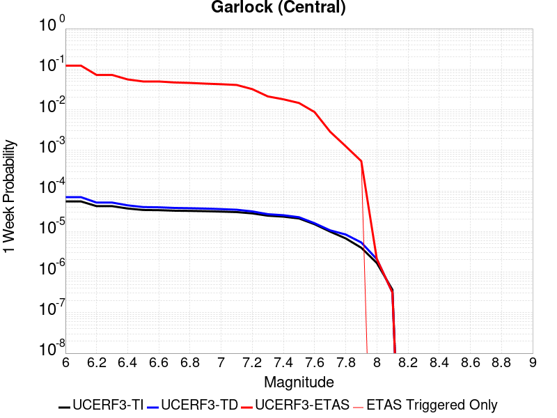 | 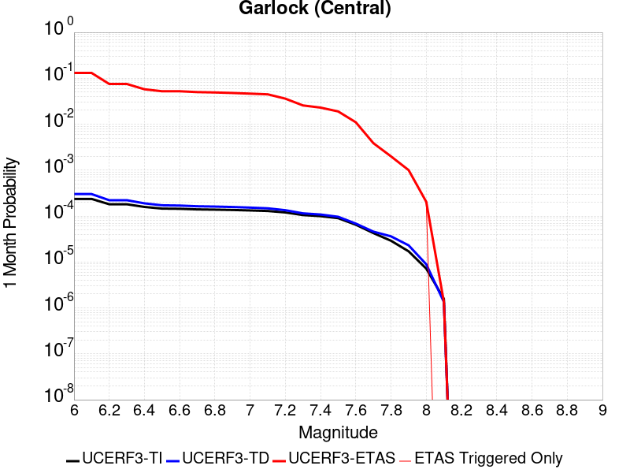 | 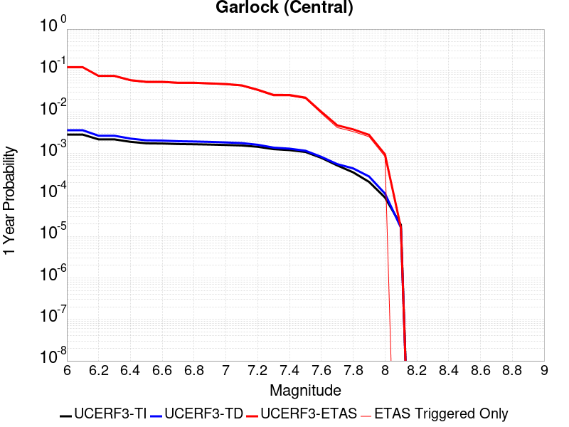 | 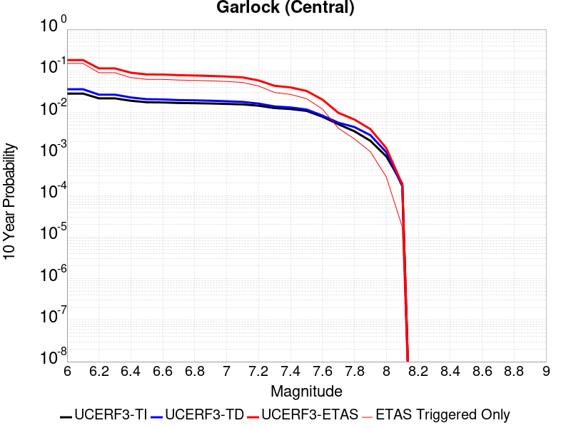 |

| Magnitude | 1 wk TI Prob | 1 wk TD Prob | 1 wk ETAS Prob | 1 wk ETAS/TD Gain | 1 wk ETAS Triggered Only | 1 mo TI Prob | 1 mo TD Prob | 1 mo ETAS Prob | 1 mo ETAS/TD Gain | 1 mo ETAS Triggered Only | 1 yr TI Prob | 1 yr TD Prob | 1 yr ETAS Prob | 1 yr ETAS/TD Gain | 1 yr ETAS Triggered Only | 10 yr TI Prob | 10 yr TD Prob | 10 yr ETAS Prob | 10 yr ETAS/TD Gain | 10 yr ETAS Triggered Only |
|-----|-----|-----|-----|-----|-----|-----|-----|-----|-----|-----|-----|-----|-----|-----|-----|-----|-----|-----|-----|-----|
| 6.0 | 5.5131142E-5 | 7.024681E-5 | 0.1221274 | 1738.5472 | 0.12206573 | 2.3625491E-4 | 3.010234E-4 | 0.13083683 | 434.6401 | 0.13057512 | 0.0028726095 | 0.0036588663 | 0.14447586 | 39.48651 | 0.14133412 | 0.028357591 | 0.036079824 | 0.17938565 | 4.97191 | 0.1486698 |
| 6.1 | 5.5131142E-5 | 7.024681E-5 | 0.1221274 | 1738.5472 | 0.12206573 | 2.3625491E-4 | 3.010234E-4 | 0.13083683 | 434.6401 | 0.13057512 | 0.0028726095 | 0.0036588663 | 0.14447586 | 39.48651 | 0.14133412 | 0.028357591 | 0.036079824 | 0.17938565 | 4.97191 | 0.1486698 |
| 6.2 | 4.216245E-5 | 5.1661493E-5 | 0.07007934 | 1356.5103 | 0.0700313 | 1.806837E-4 | 2.2138779E-4 | 0.07522434 | 339.7854 | 0.07501956 | 0.0021976046 | 0.0026920962 | 0.08443545 | 31.3642 | 0.08196401 | 0.021759989 | 0.026689773 | 0.11084531 | 4.1531005 | 0.08646322 |
| 6.3 | 4.216245E-5 | 5.1661493E-5 | 0.07007934 | 1356.5103 | 0.0700313 | 1.806837E-4 | 2.2138779E-4 | 0.07522434 | 339.7854 | 0.07501956 | 0.0021976046 | 0.0026920962 | 0.08443545 | 31.3642 | 0.08196401 | 0.021759989 | 0.026689773 | 0.11084531 | 4.1531005 | 0.08646322 |
| 6.4 | 3.6858168E-5 | 4.411054E-5 | 0.053543314 | 1213.844 | 0.053501565 | 1.5795401E-4 | 1.8903162E-4 | 0.057689898 | 305.1865 | 0.057511736 | 0.0019213937 | 0.002299056 | 0.06524087 | 28.377243 | 0.06308685 | 0.019048655 | 0.02284894 | 0.08717041 | 3.8150744 | 0.06582551 |
| 6.5 | 3.39199E-5 | 4.0018083E-5 | 0.04835577 | 1208.3479 | 0.048317686 | 1.453629E-4 | 1.7149492E-4 | 0.052197002 | 304.36472 | 0.05203443 | 0.0017683565 | 0.002085973 | 0.05908732 | 28.326025 | 0.057120502 | 0.017543508 | 0.020759864 | 0.07918479 | 3.8143215 | 0.059663538 |
| 6.6 | 3.3571985E-5 | 3.9472274E-5 | 0.048355248 | 1225.0435 | 0.048317686 | 1.4387199E-4 | 1.6915603E-4 | 0.05219478 | 308.55997 | 0.05203443 | 0.0017502342 | 0.0020575512 | 0.059060525 | 28.70428 | 0.057120502 | 0.017365133 | 0.020481179 | 0.07892273 | 3.8534274 | 0.059663538 |
| 6.7 | 3.2580007E-5 | 3.8088703E-5 | 0.04630002 | 1215.5841 | 0.046263695 | 1.3962112E-4 | 1.632272E-4 | 0.050037716 | 306.55255 | 0.049882628 | 0.0016985617 | 0.0019855013 | 0.056552216 | 28.48259 | 0.054675274 | 0.016856372 | 0.019773813 | 0.07576483 | 3.8315737 | 0.057120502 |
| 6.8 | 3.2185937E-5 | 3.7515918E-5 | 0.04551703 | 1213.2725 | 0.04548122 | 1.3793244E-4 | 1.6077272E-4 | 0.049155243 | 305.74365 | 0.049002346 | 0.0016780337 | 0.001955672 | 0.05554784 | 28.403454 | 0.053697184 | 0.016654192 | 0.019480614 | 0.07443343 | 3.8208976 | 0.0560446 |
| 6.9 | 3.165394E-5 | 3.6720503E-5 | 0.044342604 | 1207.5707 | 0.04430751 | 1.3565269E-4 | 1.5736422E-4 | 0.047880683 | 304.26663 | 0.04773083 | 0.0016503202 | 0.001914247 | 0.054239556 | 28.33467 | 0.052425664 | 0.01638118 | 0.019073246 | 0.072609745 | 3.8068895 | 0.054577466 |
| 7.0 | 3.0903822E-5 | 3.5625766E-5 | 0.043070085 | 1208.9589 | 0.043035995 | 1.3243823E-4 | 1.5267303E-4 | 0.04631151 | 303.33783 | 0.046165884 | 0.0016112428 | 0.0018572307 | 0.052428234 | 28.229254 | 0.050665103 | 0.015996104 | 0.018512413 | 0.07025555 | 3.7950509 | 0.052719094 |
| 7.1 | 3.0069863E-5 | 3.4392073E-5 | 0.041504014 | 1206.7902 | 0.04147105 | 1.2886449E-4 | 1.4738638E-4 | 0.044741753 | 303.56775 | 0.044600938 | 0.0015677959 | 0.0017929734 | 0.050219294 | 28.008945 | 0.0485133 | 0.01556781 | 0.017880075 | 0.06725504 | 3.7614517 | 0.050273865 |
| 7.2 | 2.7957109E-5 | 3.128145E-5 | 0.033383135 | 1067.1862 | 0.033352897 | 1.1981068E-4 | 1.340566E-4 | 0.036025174 | 268.7311 | 0.035895932 | 0.0014577188 | 0.0016309366 | 0.04049546 | 24.829573 | 0.038928013 | 0.014481937 | 0.016283695 | 0.05602106 | 3.4403164 | 0.040395148 |
| 7.3 | 2.4519275E-5 | 2.6714795E-5 | 0.02340246 | 876.0112 | 0.02337637 | 1.0507837E-4 | 1.1448703E-4 | 0.025639733 | 223.95316 | 0.025528168 | 0.0012785783 | 0.001393003 | 0.029132087 | 20.913153 | 0.027777778 | 0.012712469 | 0.013928054 | 0.042090517 | 3.0219955 | 0.028560251 |
| 7.4 | 2.3225532E-5 | 2.51994E-5 | 0.021053622 | 835.481 | 0.02102895 | 9.95342E-5 | 1.0799304E-4 | 0.022992846 | 212.91043 | 0.022887323 | 0.0012111551 | 0.0013140367 | 0.026417939 | 20.104416 | 0.025136933 | 0.012045753 | 0.013145725 | 0.038627878 | 2.9384365 | 0.025821596 |
| 7.5 | 2.097765E-5 | 2.2483688E-5 | 0.017236494 | 766.6222 | 0.017214397 | 8.9901114E-5 | 9.635517E-5 | 0.018971687 | 196.89331 | 0.018877152 | 0.0010939965 | 0.0011725046 | 0.021590633 | 18.414112 | 0.020442097 | 0.010886264 | 0.011740365 | 0.03242577 | 2.7619045 | 0.020931143 |
| 7.6 | 1.511254E-5 | 1.5991332E-5 | 0.010090165 | 630.9771 | 0.010074335 | 6.476642E-5 | 6.853253E-5 | 0.011022398 | 160.83455 | 0.010954617 | 7.882459E-4 | 8.3407195E-4 | 0.012659099 | 15.177466 | 0.011834898 | 0.007854558 | 0.008383559 | 0.020313216 | 2.4229825 | 0.012030517 |
| 7.7 | 9.934069E-6 | 1.0678794E-5 | 0.003531768 | 330.72723 | 0.0035211267 | 4.2573887E-5 | 4.5765457E-5 | 0.0038601449 | 84.34625 | 0.003814554 | 5.182138E-4 | 5.570524E-4 | 0.0045649908 | 8.194904 | 0.004010172 | 0.00517007 | 0.005627684 | 0.009809805 | 1.7431337 | 0.0042057903 |
| 7.8 | 6.7562896E-6 | 8.428449E-6 | 0.001768977 | 209.88167 | 0.0017605633 | 2.8955206E-5 | 3.6121426E-5 | 0.0019922324 | 55.153755 | 0.0019561816 | 3.5247262E-4 | 4.3968976E-4 | 0.0024927773 | 5.6694 | 0.0020539905 | 0.0035191406 | 0.004446654 | 0.0065888856 | 1.4817625 | 0.0021517996 |
| 7.9 | 3.975453E-6 | 5.37103E-6 | 8.85648E-4 | 164.89351 | 8.802817E-4 | 1.7037546E-5 | 2.3018498E-5 | 0.0010010868 | 43.490532 | 9.780908E-4 | 2.0741238E-4 | 2.8021427E-4 | 0.0013558127 | 4.8384852 | 0.0010758998 | 0.002072189 | 0.0028336283 | 0.0040040114 | 1.4130334 | 0.0011737089 |
| 8.0 | 1.6729537E-6 | 2.0775144E-6 | 9.988639E-5 | 48.079758 | 9.7809076E-5 | 7.169782E-6 | 8.903603E-6 | 2.0452001E-4 | 22.970478 | 1.9561815E-4 | 8.7288594E-5 | 1.0839601E-4 | 3.0399294E-4 | 2.8044665 | 1.9561815E-4 | 8.7254314E-4 | 0.0010969337 | 0.0012923373 | 1.1781361 | 1.9561815E-4 |
| 8.1 | 3.6733252E-7 | 3.1489964E-7 | 3.1489964E-7 | 1.0 | 0.0 | 1.5742813E-6 | 1.3495693E-6 | 1.3495693E-6 | 1.0 | 0.0 | 1.9166706E-5 | 1.6430899E-5 | 1.6430899E-5 | 1.0 | 0.0 | 1.9165053E-4 | 1.6638759E-4 | 1.6638759E-4 | 1.0 | 0.0 |

## Tank Canyon
*[(top)](#table-of-contents)*

| 1 Week | 1 Month | 1 Year | 10 Year |
|-----|-----|-----|-----|
| 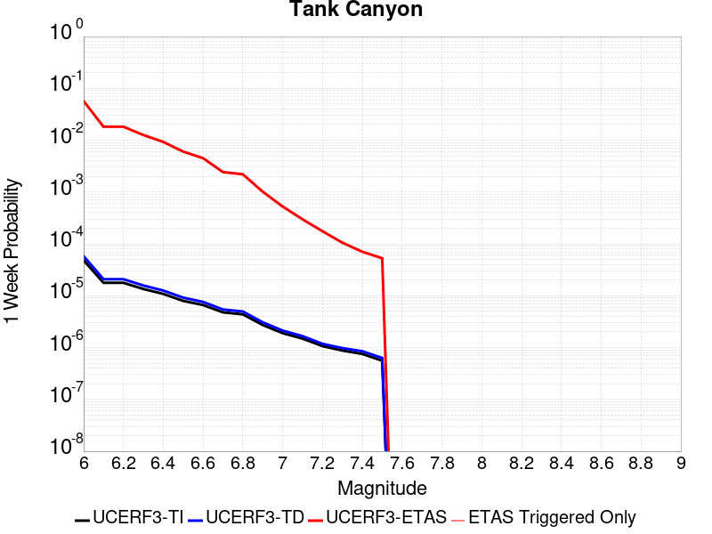 | 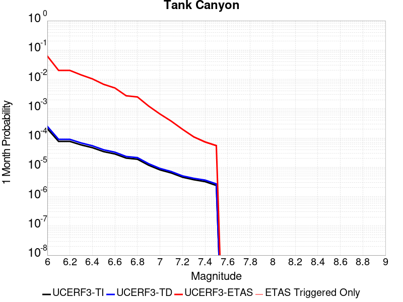 | 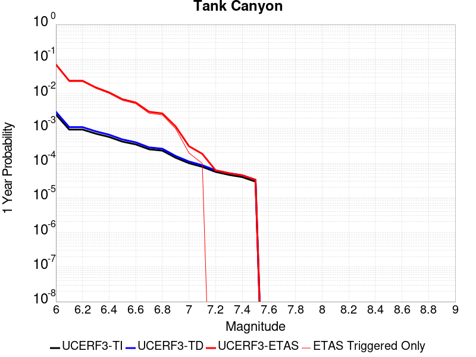 | 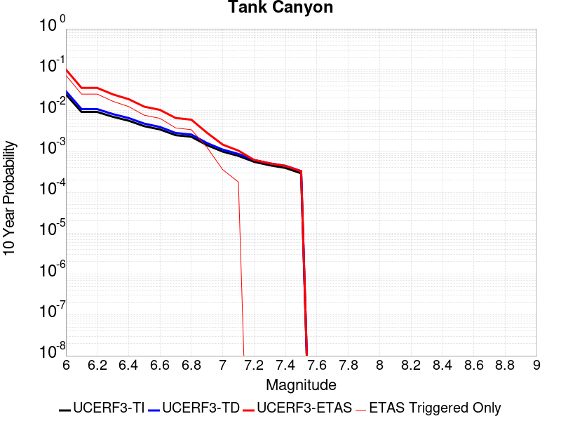 |

| Magnitude | 1 wk TI Prob | 1 wk TD Prob | 1 wk ETAS Prob | 1 wk ETAS/TD Gain | 1 wk ETAS Triggered Only | 1 mo TI Prob | 1 mo TD Prob | 1 mo ETAS Prob | 1 mo ETAS/TD Gain | 1 mo ETAS Triggered Only | 1 yr TI Prob | 1 yr TD Prob | 1 yr ETAS Prob | 1 yr ETAS/TD Gain | 1 yr ETAS Triggered Only | 10 yr TI Prob | 10 yr TD Prob | 10 yr ETAS Prob | 10 yr ETAS/TD Gain | 10 yr ETAS Triggered Only |
|-----|-----|-----|-----|-----|-----|-----|-----|-----|-----|-----|-----|-----|-----|-----|-----|-----|-----|-----|-----|-----|
| 6.0 | 4.8284557E-5 | 5.7964822E-5 | 0.057761975 | 996.5005 | 0.057707354 | 2.0691741E-4 | 2.4840087E-4 | 0.061755028 | 248.61037 | 0.06152191 | 0.0025163088 | 0.0030207601 | 0.070012614 | 23.17715 | 0.067194834 | 0.02488006 | 0.029863637 | 0.098752424 | 3.3067784 | 0.07100939 |
| 6.1 | 1.7796336E-5 | 2.0873314E-5 | 0.019386666 | 928.7775 | 0.019366197 | 7.626778E-5 | 8.945422E-5 | 0.020627523 | 230.59308 | 0.020539906 | 9.281647E-4 | 0.0010885983 | 0.0236579 | 21.732443 | 0.022593897 | 0.009242975 | 0.010836744 | 0.034927282 | 3.223042 | 0.02435446 |
| 6.2 | 1.7796336E-5 | 2.0873314E-5 | 0.019386666 | 928.7775 | 0.019366197 | 7.626778E-5 | 8.945422E-5 | 0.020627523 | 230.59308 | 0.020539906 | 9.281647E-4 | 0.0010885983 | 0.0236579 | 21.732443 | 0.022593897 | 0.009242975 | 0.010836744 | 0.034927282 | 3.223042 | 0.02435446 |
| 6.3 | 1.3515912E-5 | 1.5759564E-5 | 0.012437317 | 789.19165 | 0.012421752 | 5.792405E-5 | 6.753938E-5 | 0.0133686755 | 197.93898 | 0.013302035 | 7.049971E-4 | 8.2200574E-4 | 0.015188121 | 18.476904 | 0.014377934 | 0.007027647 | 0.0081922645 | 0.023713512 | 2.8946223 | 0.015649453 |
| 6.4 | 1.0870146E-5 | 1.2618021E-5 | 0.008717516 | 690.87823 | 0.008705008 | 4.658551E-5 | 5.4076212E-5 | 0.00944324 | 174.62836 | 0.0093896715 | 5.67031E-4 | 6.581969E-4 | 0.010921391 | 16.592892 | 0.010269953 | 0.005655863 | 0.0065644905 | 0.017738696 | 2.7022197 | 0.011248044 |
| 6.5 | 7.964826E-6 | 9.196094E-6 | 0.005486454 | 596.607 | 0.0054773083 | 3.4134522E-5 | 3.9411298E-5 | 0.00600553 | 152.38092 | 0.0059663537 | 4.1550855E-4 | 4.7973756E-4 | 0.0069320397 | 14.44965 | 0.006455399 | 0.0041473247 | 0.004788321 | 0.011894194 | 2.4840012 | 0.0071400627 |
| 6.6 | 6.6317E-6 | 7.6122988E-6 | 0.0042133704 | 553.4952 | 0.0042057903 | 2.8421264E-5 | 3.2623782E-5 | 0.0047273063 | 144.90369 | 0.0046948357 | 3.4597394E-4 | 3.9713128E-4 | 0.005578954 | 14.048135 | 0.005183881 | 0.0034543579 | 0.003965368 | 0.00971322 | 2.449513 | 0.0057707354 |
| 6.7 | 4.793663E-6 | 5.4307857E-6 | 0.0021572188 | 397.2204 | 0.0021517996 | 2.0544108E-5 | 2.3274613E-5 | 0.0024684446 | 106.05739 | 0.002445227 | 2.500958E-4 | 2.8333595E-4 | 0.0030212142 | 10.663011 | 0.0027386541 | 0.0024981452 | 0.0028304397 | 0.005853939 | 2.0682082 | 0.0030320813 |
| 6.8 | 4.382823E-6 | 4.9692567E-6 | 0.0019611411 | 394.6548 | 0.0019561816 | 1.8783392E-5 | 2.1296666E-5 | 0.0022708576 | 106.62972 | 0.0022496087 | 2.286638E-4 | 2.5926033E-4 | 0.0027038532 | 10.429106 | 0.002445227 | 0.0022842865 | 0.002590253 | 0.0053218133 | 2.0545535 | 0.0027386541 |
| 6.9 | 2.729601E-6 | 3.0735416E-6 | 6.87735E-4 | 223.75977 | 6.8466354E-4 | 1.1698237E-5 | 1.3172262E-5 | 8.9344237E-4 | 67.82756 | 8.802817E-4 | 1.4241673E-4 | 1.6036171E-4 | 0.0011382956 | 7.0983005 | 9.780908E-4 | 0.001423255 | 0.0016026258 | 0.002579149 | 1.6093271 | 9.780908E-4 |
| 7.0 | 1.8987357E-6 | 2.126939E-6 | 9.993581E-5 | 46.98574 | 9.7809076E-5 | 8.137413E-6 | 9.115425E-6 | 2.047318E-4 | 22.459929 | 1.9561815E-4 | 9.90685E-5 | 1.1097535E-4 | 3.065718E-4 | 2.7625215 | 1.9561815E-4 | 9.902435E-4 | 0.0011092679 | 0.0013046691 | 1.1761533 | 1.9561815E-4 |
| 7.1 | 1.4928986E-6 | 1.6641272E-6 | 1.6641272E-6 | 1.0 | 0.0 | 6.398121E-6 | 7.1319573E-6 | 1.04940336E-4 | 14.7141 | 9.7809076E-5 | 7.789434E-5 | 8.682871E-5 | 1.846293E-4 | 2.1263623 | 9.7809076E-5 | 7.786704E-4 | 8.6800574E-4 | 9.6572994E-4 | 1.1125847 | 9.7809076E-5 |
| 7.2 | 1.069082E-6 | 1.1828573E-6 | 1.1828573E-6 | 1.0 | 0.0 | 4.581772E-6 | 5.0693816E-6 | 5.0693816E-6 | 1.0 | 0.0 | 5.5781646E-5 | 6.171851E-5 | 6.171851E-5 | 1.0 | 0.0 | 5.576765E-4 | 6.170659E-4 | 6.170659E-4 | 1.0 | 0.0 |
| 7.3 | 8.776551E-7 | 9.770005E-7 | 9.770005E-7 | 1.0 | 0.0 | 3.7613736E-6 | 4.1871413E-6 | 4.1871413E-6 | 1.0 | 0.0 | 4.579376E-5 | 5.097777E-5 | 5.097777E-5 | 1.0 | 0.0 | 4.5784327E-4 | 5.097118E-4 | 5.097118E-4 | 1.0 | 0.0 |
| 7.4 | 7.55721E-7 | 8.510244E-7 | 8.510244E-7 | 1.0 | 0.0 | 3.2388E-6 | 3.6472454E-6 | 3.6472454E-6 | 1.0 | 0.0 | 3.9431678E-5 | 4.4404827E-5 | 4.4404827E-5 | 1.0 | 0.0 | 3.942468E-4 | 4.440104E-4 | 4.440104E-4 | 1.0 | 0.0 |
| 7.5 | 5.587665E-7 | 6.305619E-7 | 6.305619E-7 | 1.0 | 0.0 | 2.3947114E-6 | 2.702408E-6 | 2.702408E-6 | 1.0 | 0.0 | 2.915522E-5 | 3.290182E-5 | 3.290182E-5 | 1.0 | 0.0 | 2.9151395E-4 | 3.290182E-4 | 3.290182E-4 | 1.0 | 0.0 |

## Little Lake
*[(top)](#table-of-contents)*

| 1 Week | 1 Month | 1 Year | 10 Year |
|-----|-----|-----|-----|
| 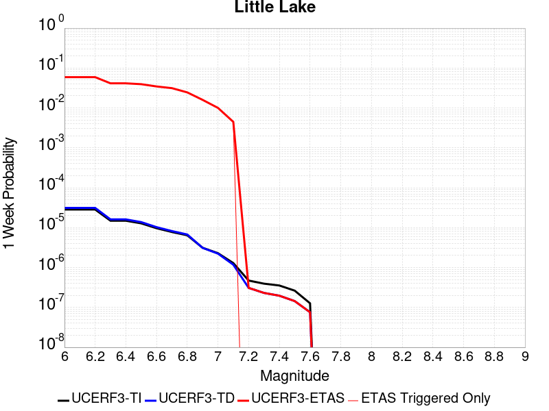 | 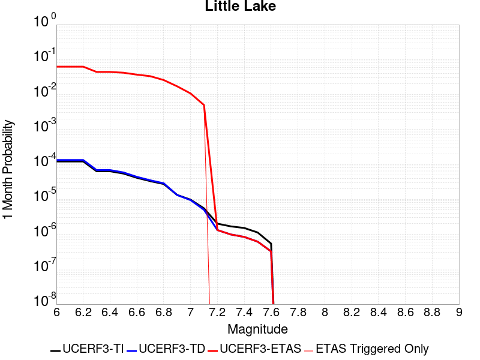 | 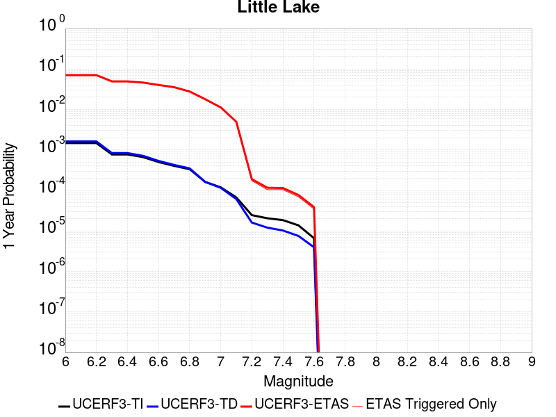 | 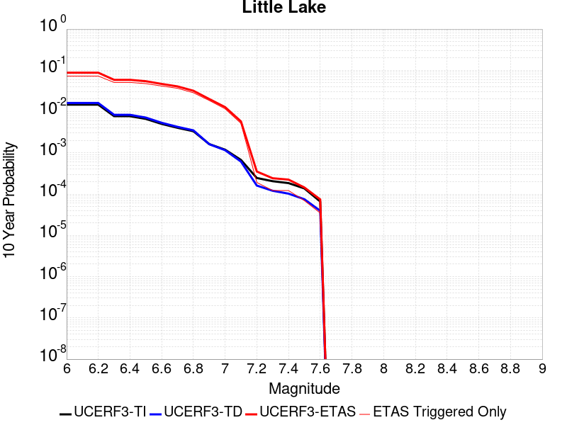 |

| Magnitude | 1 wk TI Prob | 1 wk TD Prob | 1 wk ETAS Prob | 1 wk ETAS/TD Gain | 1 wk ETAS Triggered Only | 1 mo TI Prob | 1 mo TD Prob | 1 mo ETAS Prob | 1 mo ETAS/TD Gain | 1 mo ETAS Triggered Only | 1 yr TI Prob | 1 yr TD Prob | 1 yr ETAS Prob | 1 yr ETAS/TD Gain | 1 yr ETAS Triggered Only | 10 yr TI Prob | 10 yr TD Prob | 10 yr ETAS Prob | 10 yr ETAS/TD Gain | 10 yr ETAS Triggered Only |
|-----|-----|-----|-----|-----|-----|-----|-----|-----|-----|-----|-----|-----|-----|-----|-----|-----|-----|-----|-----|-----|
| 6.0 | 2.8424427E-5 | 3.120572E-5 | 0.057345536 | 1837.661 | 0.05731612 | 1.2181328E-4 | 1.337327E-4 | 0.06057166 | 452.9308 | 0.06044601 | 0.0014820677 | 0.0016271127 | 0.06715021 | 41.269554 | 0.06562989 | 0.014722223 | 0.016165402 | 0.08400611 | 5.196661 | 0.0689554 |
| 6.1 | 2.8424427E-5 | 3.120572E-5 | 0.057345536 | 1837.661 | 0.05731612 | 1.2181328E-4 | 1.337327E-4 | 0.06057166 | 452.9308 | 0.06044601 | 0.0014820677 | 0.0016271127 | 0.06715021 | 41.269554 | 0.06562989 | 0.014722223 | 0.016165402 | 0.08400611 | 5.196661 | 0.0689554 |
| 6.2 | 2.8424427E-5 | 3.120572E-5 | 0.057345536 | 1837.661 | 0.05731612 | 1.2181328E-4 | 1.337327E-4 | 0.06057166 | 452.9308 | 0.06044601 | 0.0014820677 | 0.0016271127 | 0.06715021 | 41.269554 | 0.06562989 | 0.014722223 | 0.016165402 | 0.08400611 | 5.196661 | 0.0689554 |
| 6.3 | 1.48860645E-5 | 1.6081389E-5 | 0.040214967 | 2500.7146 | 0.04019953 | 6.379586E-5 | 6.8918576E-5 | 0.04280854 | 621.1466 | 0.042742565 | 7.7643775E-4 | 8.3878887E-4 | 0.04735686 | 56.458614 | 0.04655712 | 0.007737305 | 0.008359048 | 0.05617585 | 6.7203646 | 0.048219875 |
| 6.4 | 1.48860645E-5 | 1.6081389E-5 | 0.040214967 | 2500.7146 | 0.04019953 | 6.379586E-5 | 6.8918576E-5 | 0.04280854 | 621.1466 | 0.042742565 | 7.7643775E-4 | 8.3878887E-4 | 0.04735686 | 56.458614 | 0.04655712 | 0.007737305 | 0.008359048 | 0.05617585 | 6.7203646 | 0.048219875 |
| 6.5 | 1.2797581E-5 | 1.3765565E-5 | 0.038060974 | 2764.941 | 0.03804773 | 5.4845623E-5 | 5.899409E-5 | 0.04054956 | 687.3496 | 0.04049296 | 6.675408E-4 | 7.18042E-4 | 0.044700522 | 62.25335 | 0.044014085 | 0.006655392 | 0.00715977 | 0.052218247 | 7.2932854 | 0.045383412 |
| 6.6 | 9.661896E-6 | 1.0289038E-5 | 0.033558458 | 3261.574 | 0.03354851 | 4.1407468E-5 | 4.409522E-5 | 0.035840638 | 812.80096 | 0.03579812 | 5.040193E-4 | 5.367433E-4 | 0.03944386 | 73.48738 | 0.038928013 | 0.005028777 | 0.0053560743 | 0.045437578 | 8.483374 | 0.04029734 |
| 6.7 | 7.767871E-6 | 8.199687E-6 | 0.03003534 | 3662.9863 | 0.030027386 | 3.329045E-5 | 3.5141118E-5 | 0.032115392 | 913.8978 | 0.032081377 | 4.0523586E-4 | 4.2777284E-4 | 0.035330676 | 82.59214 | 0.03491784 | 0.004044977 | 0.004270846 | 0.040208254 | 9.414588 | 0.036091547 |
| 6.8 | 6.4235196E-6 | 6.7357446E-6 | 0.024263224 | 3602.1592 | 0.02425665 | 2.752908E-5 | 2.8867229E-5 | 0.025654105 | 888.69305 | 0.025625978 | 3.35115E-4 | 3.5141467E-4 | 0.027826106 | 79.18311 | 0.02748435 | 0.003346101 | 0.00350985 | 0.031579994 | 8.997534 | 0.028169014 |
| 6.9 | 3.1283696E-6 | 3.1121804E-6 | 0.015554707 | 4998.0093 | 0.015551643 | 1.3407229E-5 | 1.3337856E-5 | 0.016738467 | 1254.9592 | 0.016725352 | 1.6322079E-4 | 1.6237781E-4 | 0.018254118 | 112.41757 | 0.01809468 | 0.0016310095 | 0.00162274 | 0.02027396 | 12.493658 | 0.018681534 |
| 7.0 | 2.290603E-6 | 2.2286815E-6 | 0.009880924 | 4433.529 | 0.009878716 | 9.816834E-6 | 9.551463E-6 | 0.010475023 | 1096.693 | 0.010465572 | 1.19513395E-4 | 1.162839E-4 | 0.011558616 | 99.39996 | 0.0114436615 | 0.0011944914 | 0.0011623327 | 0.013081171 | 11.254239 | 0.011932707 |
| 7.1 | 1.293693E-6 | 1.1776827E-6 | 0.00450039 | 3821.394 | 0.0044992175 | 5.5443866E-6 | 5.0472063E-6 | 0.004895476 | 969.93787 | 0.004890454 | 6.750081E-5 | 6.14487E-5 | 0.0054406174 | 88.53918 | 0.0053794994 | 6.7480316E-4 | 6.143856E-4 | 0.0062838267 | 10.227823 | 0.0056729265 |
| 7.2 | 4.715842E-7 | 3.0917857E-7 | 9.8118224E-5 | 317.35132 | 9.7809076E-5 | 2.0210737E-6 | 1.3250503E-6 | 9.9134E-5 | 74.81527 | 9.7809076E-5 | 2.4606294E-5 | 1.6132375E-5 | 1.13939874E-4 | 7.0628085 | 9.7809076E-5 | 2.460357E-4 | 1.6131258E-4 | 2.5910587E-4 | 1.6062348 | 9.7809076E-5 |
| 7.3 | 3.9430947E-7 | 2.3097488E-7 | 9.804003E-5 | 424.46188 | 9.7809076E-5 | 1.6898966E-6 | 9.89892E-7 | 9.8798875E-5 | 99.80773 | 9.7809076E-5 | 2.0574296E-5 | 1.2051869E-5 | 1.09859764E-4 | 9.11558 | 9.7809076E-5 | 2.0572392E-4 | 1.20512224E-4 | 2.183095E-4 | 1.8115134 | 9.7809076E-5 |
| 7.4 | 3.547123E-7 | 1.9679135E-7 | 9.800585E-5 | 498.01907 | 9.7809076E-5 | 1.5201948E-6 | 8.4339126E-7 | 9.865239E-5 | 116.97108 | 9.7809076E-5 | 1.8508214E-5 | 1.0268241E-5 | 1.0807631E-4 | 10.5253 | 9.7809076E-5 | 1.8506673E-4 | 1.02677724E-4 | 2.0047676E-4 | 1.9524853 | 9.7809076E-5 |
| 7.5 | 2.6354266E-7 | 1.4423138E-7 | 9.795329E-5 | 679.13995 | 9.7809076E-5 | 1.129468E-6 | 6.181344E-7 | 9.8427154E-5 | 159.23262 | 9.7809076E-5 | 1.3751187E-5 | 7.5257603E-6 | 1.05334104E-4 | 13.996473 | 9.7809076E-5 | 1.3750336E-4 | 7.5255106E-5 | 1.7305682E-4 | 2.2996023 | 9.7809076E-5 |
| 7.6 | 1.269913E-7 | 7.572556E-8 | 7.572556E-8 | 1.0 | 0.0 | 5.4424834E-7 | 3.245381E-7 | 3.245381E-7 | 1.0 | 0.0 | 6.6262032E-6 | 3.9512443E-6 | 3.9512443E-6 | 1.0 | 0.0 | 6.626006E-5 | 3.9511775E-5 | 3.9511775E-5 | 1.0 | 0.0 |

## Airport Lake
*[(top)](#table-of-contents)*

| 1 Week | 1 Month | 1 Year | 10 Year |
|-----|-----|-----|-----|
| 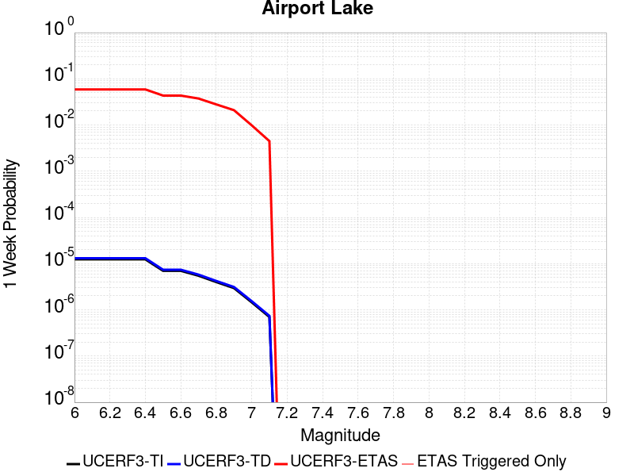 | 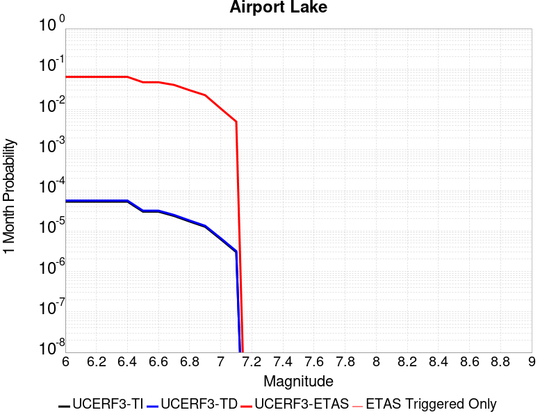 | 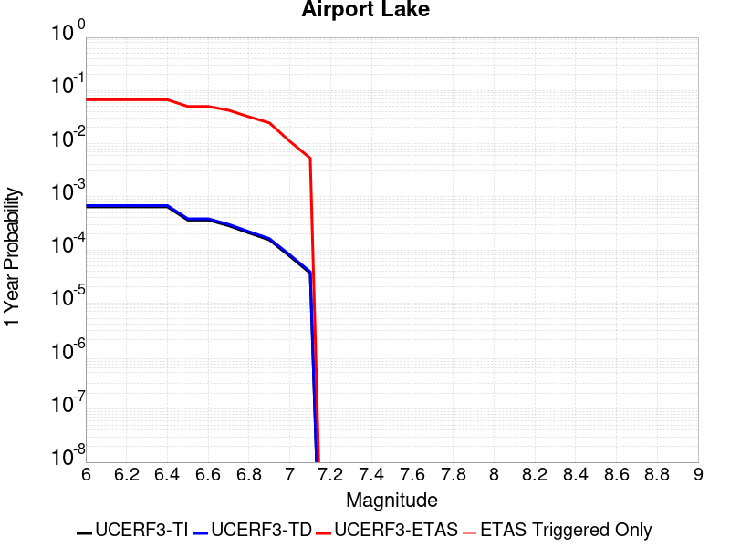 | 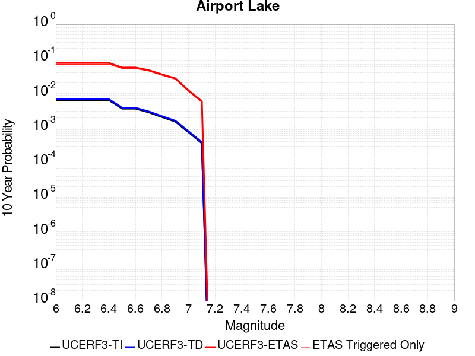 |

| Magnitude | 1 wk TI Prob | 1 wk TD Prob | 1 wk ETAS Prob | 1 wk ETAS/TD Gain | 1 wk ETAS Triggered Only | 1 mo TI Prob | 1 mo TD Prob | 1 mo ETAS Prob | 1 mo ETAS/TD Gain | 1 mo ETAS Triggered Only | 1 yr TI Prob | 1 yr TD Prob | 1 yr ETAS Prob | 1 yr ETAS/TD Gain | 1 yr ETAS Triggered Only | 10 yr TI Prob | 10 yr TD Prob | 10 yr ETAS Prob | 10 yr ETAS/TD Gain | 10 yr ETAS Triggered Only |
|-----|-----|-----|-----|-----|-----|-----|-----|-----|-----|-----|-----|-----|-----|-----|-----|-----|-----|-----|-----|-----|
| 6.0 | 1.2387061E-5 | 1.3103157E-5 | 0.05781751 | 4412.4873 | 0.057805166 | 5.3086325E-5 | 5.615534E-5 | 0.061770216 | 1099.9884 | 0.06171753 | 6.461343E-4 | 6.8350515E-4 | 0.06724596 | 98.38398 | 0.06660798 | 0.0064425888 | 0.0068168393 | 0.076273605 | 11.188998 | 0.06993349 |
| 6.1 | 1.2387061E-5 | 1.3103157E-5 | 0.05781751 | 4412.4873 | 0.057805166 | 5.3086325E-5 | 5.615534E-5 | 0.061770216 | 1099.9884 | 0.06171753 | 6.461343E-4 | 6.8350515E-4 | 0.06724596 | 98.38398 | 0.06660798 | 0.0064425888 | 0.0068168393 | 0.076273605 | 11.188998 | 0.06993349 |
| 6.2 | 1.2387061E-5 | 1.3103157E-5 | 0.05781751 | 4412.4873 | 0.057805166 | 5.3086325E-5 | 5.615534E-5 | 0.061770216 | 1099.9884 | 0.06171753 | 6.461343E-4 | 6.8350515E-4 | 0.06724596 | 98.38398 | 0.06660798 | 0.0064425888 | 0.0068168393 | 0.076273605 | 11.188998 | 0.06993349 |
| 6.3 | 1.2387061E-5 | 1.3103157E-5 | 0.05781751 | 4412.4873 | 0.057805166 | 5.3086325E-5 | 5.615534E-5 | 0.061770216 | 1099.9884 | 0.06171753 | 6.461343E-4 | 6.8350515E-4 | 0.06724596 | 98.38398 | 0.06660798 | 0.0064425888 | 0.0068168393 | 0.076273605 | 11.188998 | 0.06993349 |
| 6.4 | 1.2387061E-5 | 1.3103157E-5 | 0.05781751 | 4412.4873 | 0.057805166 | 5.3086325E-5 | 5.615534E-5 | 0.061770216 | 1099.9884 | 0.06171753 | 6.461343E-4 | 6.8350515E-4 | 0.06724596 | 98.38398 | 0.06660798 | 0.0064425888 | 0.0068168393 | 0.076273605 | 11.188998 | 0.06993349 |
| 6.5 | 6.9922594E-6 | 7.384925E-6 | 0.043532103 | 5894.725 | 0.04352504 | 2.996648E-5 | 3.1649324E-5 | 0.046293877 | 1462.7129 | 0.046263695 | 3.6478083E-4 | 3.8526783E-4 | 0.05015091 | 130.17154 | 0.04978482 | 0.003641826 | 0.0038465366 | 0.05616798 | 14.602221 | 0.052523475 |
| 6.6 | 6.9922594E-6 | 7.384925E-6 | 0.043532103 | 5894.725 | 0.04352504 | 2.996648E-5 | 3.1649324E-5 | 0.046293877 | 1462.7129 | 0.046263695 | 3.6478083E-4 | 3.8526783E-4 | 0.05015091 | 130.17154 | 0.04978482 | 0.003641826 | 0.0038465366 | 0.05616798 | 14.602221 | 0.052523475 |
| 6.7 | 5.477277E-6 | 5.7860684E-6 | 0.03707521 | 6407.669 | 0.03706964 | 2.3473833E-5 | 2.4797222E-5 | 0.03934307 | 1586.5918 | 0.039319247 | 2.8575645E-4 | 3.0186825E-4 | 0.042542633 | 140.93114 | 0.04225352 | 0.0028538927 | 0.003014966 | 0.047286406 | 15.683894 | 0.044405323 |
| 6.8 | 3.9950432E-6 | 4.2190873E-6 | 0.028173115 | 6677.538 | 0.028169014 | 1.7121502E-5 | 1.8081691E-5 | 0.029751504 | 1645.3938 | 0.02973396 | 2.0843433E-4 | 2.2012512E-4 | 0.032001078 | 145.37677 | 0.03178795 | 0.0020823893 | 0.0021993418 | 0.035576478 | 16.175966 | 0.033450704 |
| 6.9 | 2.95695E-6 | 3.1230243E-6 | 0.021521052 | 6891.0938 | 0.021517998 | 1.2672582E-5 | 1.3384334E-5 | 0.022802595 | 1703.6779 | 0.022789516 | 1.5427776E-4 | 1.6294434E-4 | 0.02461123 | 151.04071 | 0.02445227 | 0.001541707 | 0.0016284712 | 0.027408017 | 16.83052 | 0.025821596 |
| 7.0 | 1.456072E-6 | 1.540812E-6 | 0.009391198 | 6094.967 | 0.0093896715 | 6.2402937E-6 | 6.603469E-6 | 0.009983064 | 1511.7908 | 0.009976526 | 7.597293E-5 | 8.039528E-5 | 0.011034131 | 137.2485 | 0.010954617 | 7.594696E-4 | 8.0376083E-4 | 0.012238225 | 15.226202 | 0.0114436615 |
| 7.1 | 6.995192E-7 | 7.4089746E-7 | 0.004402146 | 5941.64 | 0.0044014086 | 2.997936E-6 | 3.1752747E-6 | 0.0047958046 | 1510.359 | 0.0047926446 | 3.649926E-5 | 3.865897E-5 | 0.005320145 | 137.61736 | 0.00528169 | 3.6493264E-4 | 3.865897E-4 | 0.005959552 | 15.415703 | 0.005575117 |

## Owl Lake
*[(top)](#table-of-contents)*

| 1 Week | 1 Month | 1 Year | 10 Year |
|-----|-----|-----|-----|
| 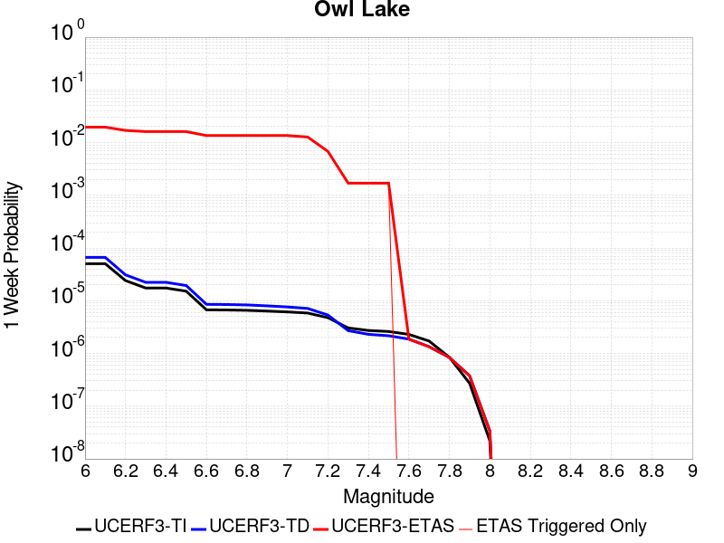 | 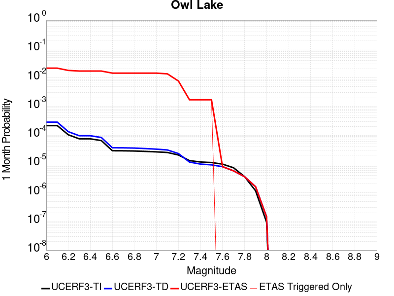 | 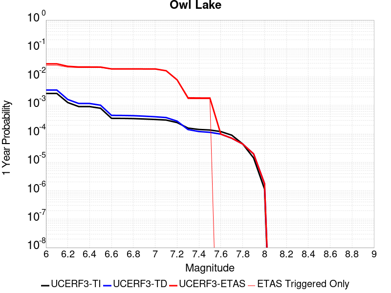 | 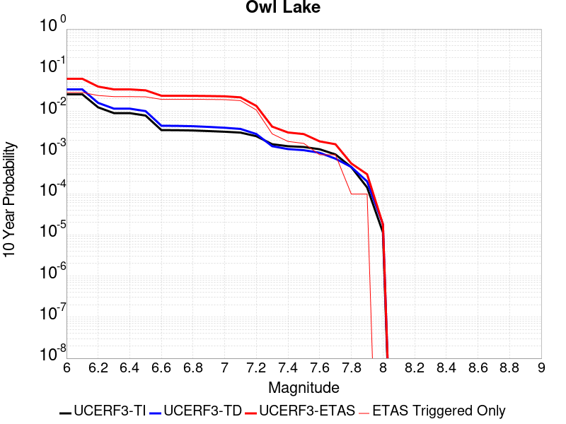 |

| Magnitude | 1 wk TI Prob | 1 wk TD Prob | 1 wk ETAS Prob | 1 wk ETAS/TD Gain | 1 wk ETAS Triggered Only | 1 mo TI Prob | 1 mo TD Prob | 1 mo ETAS Prob | 1 mo ETAS/TD Gain | 1 mo ETAS Triggered Only | 1 yr TI Prob | 1 yr TD Prob | 1 yr ETAS Prob | 1 yr ETAS/TD Gain | 1 yr ETAS Triggered Only | 10 yr TI Prob | 10 yr TD Prob | 10 yr ETAS Prob | 10 yr ETAS/TD Gain | 10 yr ETAS Triggered Only |
|-----|-----|-----|-----|-----|-----|-----|-----|-----|-----|-----|-----|-----|-----|-----|-----|-----|-----|-----|-----|-----|
| 6.0 | 5.0320643E-5 | 6.635816E-5 | 0.02314777 | 348.8308 | 0.023082942 | 2.1564208E-4 | 2.843674E-4 | 0.02521859 | 88.68313 | 0.024941314 | 0.0026222812 | 0.0034577388 | 0.0303597 | 8.780218 | 0.026995305 | 0.02591553 | 0.034140717 | 0.06191484 | 1.813519 | 0.028755868 |
| 6.1 | 5.0320643E-5 | 6.635816E-5 | 0.02314777 | 348.8308 | 0.023082942 | 2.1564208E-4 | 2.843674E-4 | 0.02521859 | 88.68313 | 0.024941314 | 0.0026222812 | 0.0034577388 | 0.0303597 | 8.780218 | 0.026995305 | 0.02591553 | 0.034140717 | 0.06191484 | 1.813519 | 0.028755868 |
| 6.2 | 2.4125871E-5 | 3.0981035E-5 | 0.019787803 | 638.7069 | 0.019757433 | 1.0339249E-4 | 1.3277028E-4 | 0.021256726 | 160.10153 | 0.02112676 | 0.0012580766 | 0.001615439 | 0.024661092 | 15.265877 | 0.023082942 | 0.012509781 | 0.016070465 | 0.0399373 | 2.4851367 | 0.02425665 |
| 6.3 | 1.7433485E-5 | 2.2355514E-5 | 0.018703472 | 836.63794 | 0.018681534 | 7.471279E-5 | 9.580672E-5 | 0.019949147 | 208.22284 | 0.019855242 | 9.0924866E-4 | 0.0011659743 | 0.022854272 | 19.601007 | 0.021713614 | 0.009055373 | 0.011628896 | 0.034153394 | 2.936942 | 0.022789516 |
| 6.4 | 1.7433485E-5 | 2.2355514E-5 | 0.018703472 | 836.63794 | 0.018681534 | 7.471279E-5 | 9.580672E-5 | 0.019949147 | 208.22284 | 0.019855242 | 9.0924866E-4 | 0.0011659743 | 0.022854272 | 19.601007 | 0.021713614 | 0.009055373 | 0.011628896 | 0.034153394 | 2.936942 | 0.022789516 |
| 6.5 | 1.5182742E-5 | 1.9429144E-5 | 0.018504985 | 952.4344 | 0.018485915 | 6.506727E-5 | 8.326596E-5 | 0.019741254 | 237.08673 | 0.019659624 | 7.919061E-4 | 0.0010134429 | 0.022509633 | 22.211052 | 0.021517998 | 0.0078909 | 0.010118429 | 0.03238689 | 3.2007828 | 0.022496087 |
| 6.6 | 6.7271576E-6 | 8.547361E-6 | 0.016049098 | 1877.6671 | 0.016040688 | 2.8830356E-5 | 3.6631063E-5 | 0.017054787 | 465.5826 | 0.01701878 | 3.5095305E-4 | 4.458976E-4 | 0.019216867 | 43.09704 | 0.018779343 | 0.0035039932 | 0.004467813 | 0.02394223 | 5.3588257 | 0.019561816 |
| 6.7 | 6.682835E-6 | 8.479807E-6 | 0.016049033 | 1892.6177 | 0.016040688 | 2.8640408E-5 | 3.6341557E-5 | 0.017054502 | 469.28378 | 0.01701878 | 3.4864116E-4 | 4.4237426E-4 | 0.01921341 | 43.432476 | 0.018779343 | 0.003480947 | 0.0044327388 | 0.023907842 | 5.3934693 | 0.019561816 |
| 6.8 | 6.5774975E-6 | 8.32628E-6 | 0.016048882 | 1927.4971 | 0.016040688 | 2.8188972E-5 | 3.5683603E-5 | 0.017053856 | 477.91855 | 0.01701878 | 3.4314668E-4 | 4.343669E-4 | 0.019205552 | 44.215046 | 0.018779343 | 0.0034261728 | 0.004352885 | 0.02382955 | 5.4744267 | 0.019561816 |
| 6.9 | 6.363419E-6 | 7.999454E-6 | 0.01595075 | 1993.9799 | 0.015942879 | 2.727151E-5 | 3.428296E-5 | 0.016954673 | 494.55106 | 0.01692097 | 3.3198006E-4 | 4.1732067E-4 | 0.019091059 | 45.746735 | 0.018681534 | 0.0033148455 | 0.0041828766 | 0.023565467 | 5.6337943 | 0.019464007 |
| 7.0 | 6.1342453E-6 | 7.6316555E-6 | 0.015852582 | 2077.2139 | 0.01584507 | 2.6289357E-5 | 3.2706717E-5 | 0.016757512 | 512.3569 | 0.016725352 | 3.2002592E-4 | 3.9813702E-4 | 0.018876692 | 47.41255 | 0.018485915 | 0.0031956544 | 0.003991571 | 0.023183048 | 5.8080015 | 0.019268388 |
| 7.1 | 5.842926E-6 | 7.142211E-6 | 0.015069633 | 2109.9395 | 0.015062598 | 2.504087E-5 | 3.0609146E-5 | 0.015973 | 521.83746 | 0.015942879 | 3.0482994E-4 | 3.7260808E-4 | 0.01787391 | 47.969734 | 0.017507825 | 0.0030441214 | 0.0037370329 | 0.021861535 | 5.8499713 | 0.018192489 |
| 7.2 | 4.77173E-6 | 5.358483E-6 | 0.009003745 | 1680.2787 | 0.008998435 | 2.045011E-5 | 2.2964748E-5 | 0.0095102275 | 414.12286 | 0.009487481 | 2.4895166E-4 | 2.79564E-4 | 0.010546646 | 37.725338 | 0.010269953 | 0.0024867293 | 0.002808645 | 0.013537426 | 4.8199134 | 0.010758999 |
| 7.3 | 3.0494948E-6 | 2.710463E-6 | 0.002350122 | 867.05554 | 0.0023474179 | 1.3069198E-5 | 1.1616219E-5 | 0.0025546227 | 219.91861 | 0.002543036 | 1.5910587E-4 | 1.4141845E-4 | 0.0028796853 | 20.36287 | 0.0027386541 | 0.0015899199 | 0.0014232415 | 0.004255668 | 2.9901235 | 0.0028364633 |
| 7.4 | 2.7263884E-6 | 2.3056762E-6 | 0.0014694384 | 637.3134 | 0.0014671362 | 1.1684469E-5 | 9.881433E-6 | 0.0015748112 | 159.37073 | 0.0015649452 | 1.4224913E-4 | 1.20299905E-4 | 0.0018806515 | 15.633025 | 0.0017605633 | 0.0014215811 | 0.0012112238 | 0.0030673454 | 2.532435 | 0.0018583725 |
| 7.5 | 2.6090431E-6 | 2.1656133E-6 | 0.0012736808 | 588.1387 | 0.001271518 | 1.1181565E-5 | 9.281167E-6 | 0.0013785955 | 148.53687 | 0.0013693271 | 1.3612706E-4 | 1.1299244E-4 | 0.0016777609 | 14.8484335 | 0.0015649452 | 0.001360437 | 0.0011379806 | 0.0027988427 | 2.459482 | 0.0016627543 |
| 7.6 | 2.3008756E-6 | 1.8727933E-6 | 6.8653503E-4 | 366.58347 | 6.8466354E-4 | 9.860858E-6 | 8.0262325E-6 | 7.904926E-4 | 98.48862 | 7.824726E-4 | 1.20049335E-4 | 9.7715085E-5 | 9.779107E-4 | 10.007776 | 8.802817E-4 | 0.001199845 | 9.849932E-4 | 0.0018644078 | 1.892813 | 8.802817E-4 |
| 7.7 | 1.7184348E-6 | 1.3419171E-6 | 6.860045E-4 | 511.2123 | 6.8466354E-4 | 7.3646997E-6 | 5.7510606E-6 | 7.8821916E-4 | 137.0563 | 7.824726E-4 | 8.966153E-5 | 7.0016955E-5 | 9.5023704E-4 | 13.571527 | 8.802817E-4 | 8.962536E-4 | 7.078345E-4 | 0.0015874931 | 2.242746 | 8.802817E-4 |
| 7.8 | 8.4612907E-7 | 8.4058576E-7 | 9.864958E-5 | 117.35814 | 9.7809076E-5 | 3.6262625E-6 | 3.6025056E-6 | 1.0141123E-4 | 28.150194 | 9.7809076E-5 | 4.4148852E-5 | 4.3859643E-5 | 1.4166444E-4 | 3.2299495 | 9.7809076E-5 | 4.414008E-4 | 4.4398365E-4 | 5.417493E-4 | 1.220201 | 9.7809076E-5 |
| 7.9 | 2.716738E-7 | 3.768106E-7 | 9.8185854E-5 | 260.57083 | 9.7809076E-5 | 1.1643157E-6 | 1.6149015E-6 | 9.942382E-5 | 61.56649 | 9.7809076E-5 | 1.4175452E-5 | 1.966126E-5 | 1.17468415E-4 | 5.9746127 | 9.7809076E-5 | 1.4174548E-4 | 1.9836679E-4 | 2.9615648E-4 | 1.492974 | 9.7809076E-5 |
| 8.0 | 2.1995428E-8 | 3.384878E-8 | 3.384878E-8 | 1.0 | 0.0 | 9.426611E-8 | 1.4506621E-7 | 1.4506621E-7 | 1.0 | 0.0 | 1.1476893E-6 | 1.7661803E-6 | 1.7661803E-6 | 1.0 | 0.0 | 1.14768345E-5 | 1.7963059E-5 | 1.7963059E-5 | 1.0 | 0.0 |

## Panamint Valley
*[(top)](#table-of-contents)*

| 1 Week | 1 Month | 1 Year | 10 Year |
|-----|-----|-----|-----|
| 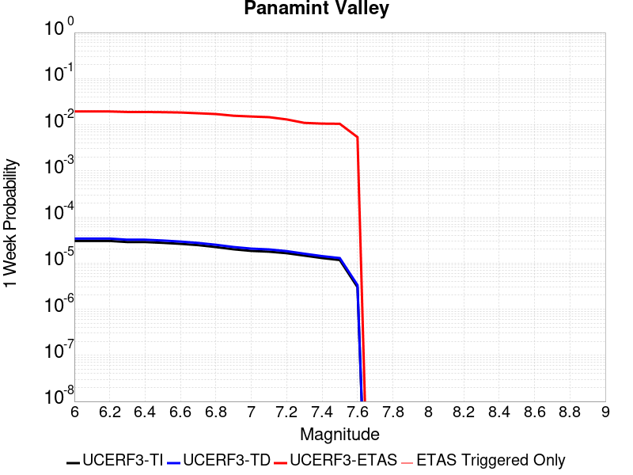 | 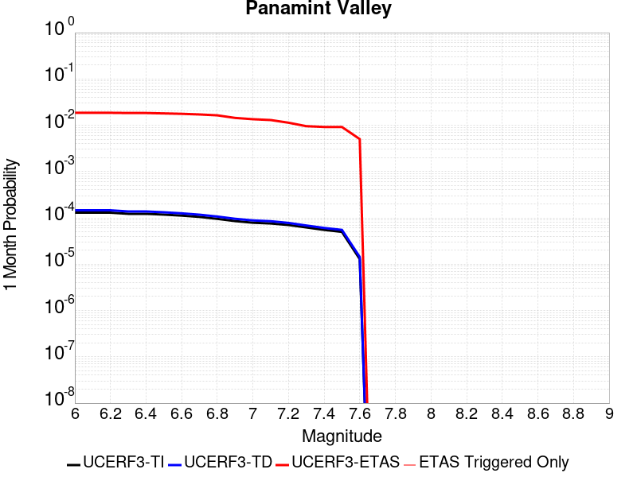 | 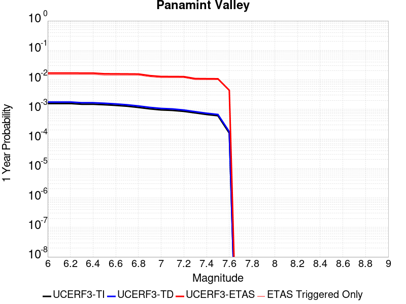 | 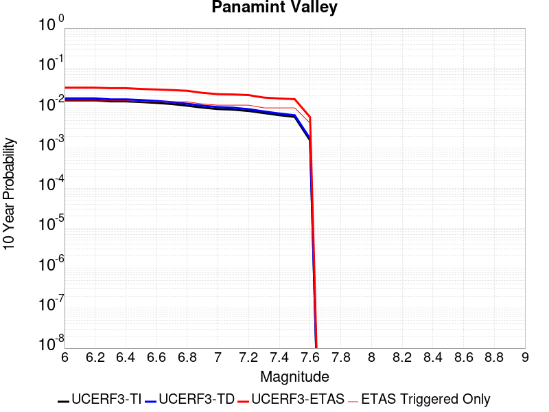 |

| Magnitude | 1 wk TI Prob | 1 wk TD Prob | 1 wk ETAS Prob | 1 wk ETAS/TD Gain | 1 wk ETAS Triggered Only | 1 mo TI Prob | 1 mo TD Prob | 1 mo ETAS Prob | 1 mo ETAS/TD Gain | 1 mo ETAS Triggered Only | 1 yr TI Prob | 1 yr TD Prob | 1 yr ETAS Prob | 1 yr ETAS/TD Gain | 1 yr ETAS Triggered Only | 10 yr TI Prob | 10 yr TD Prob | 10 yr ETAS Prob | 10 yr ETAS/TD Gain | 10 yr ETAS Triggered Only |
|-----|-----|-----|-----|-----|-----|-----|-----|-----|-----|-----|-----|-----|-----|-----|-----|-----|-----|-----|-----|-----|
| 6.0 | 3.0211835E-5 | 3.3984514E-5 | 0.019399524 | 570.8342 | 0.019366197 | 1.2947287E-4 | 1.4563995E-4 | 0.021171529 | 145.36897 | 0.02102895 | 0.0015751923 | 0.0017717537 | 0.024716163 | 13.950112 | 0.022985132 | 0.015640736 | 0.017583137 | 0.040836744 | 2.3224947 | 0.023669796 |
| 6.1 | 3.0211835E-5 | 3.3984514E-5 | 0.019399524 | 570.8342 | 0.019366197 | 1.2947287E-4 | 1.4563995E-4 | 0.021171529 | 145.36897 | 0.02102895 | 0.0015751923 | 0.0017717537 | 0.024716163 | 13.950112 | 0.022985132 | 0.015640736 | 0.017583137 | 0.040836744 | 2.3224947 | 0.023669796 |
| 6.2 | 3.0211835E-5 | 3.3984514E-5 | 0.019399524 | 570.8342 | 0.019366197 | 1.2947287E-4 | 1.4563995E-4 | 0.021171529 | 145.36897 | 0.02102895 | 0.0015751923 | 0.0017717537 | 0.024716163 | 13.950112 | 0.022985132 | 0.015640736 | 0.017583137 | 0.040836744 | 2.3224947 | 0.023669796 |
| 6.3 | 2.8573924E-5 | 3.210268E-5 | 0.018908648 | 589.0053 | 0.018877152 | 1.2245393E-4 | 1.3757581E-4 | 0.020674655 | 150.27827 | 0.020539906 | 0.001489857 | 0.0016737265 | 0.024132162 | 14.418223 | 0.022496087 | 0.01479908 | 0.016617801 | 0.03941334 | 2.3717542 | 0.023180751 |
| 6.4 | 2.8573924E-5 | 3.210268E-5 | 0.018908648 | 589.0053 | 0.018877152 | 1.2245393E-4 | 1.3757581E-4 | 0.020674655 | 150.27827 | 0.020539906 | 0.001489857 | 0.0016737265 | 0.024132162 | 14.418223 | 0.022496087 | 0.01479908 | 0.016617801 | 0.03941334 | 2.3717542 | 0.023180751 |
| 6.5 | 2.7468774E-5 | 3.0828433E-5 | 0.018711787 | 606.9652 | 0.018681534 | 1.1771801E-4 | 1.3211532E-4 | 0.020473715 | 154.96852 | 0.020344287 | 0.0014322745 | 0.0016073446 | 0.02387197 | 14.851806 | 0.022300469 | 0.014230782 | 0.015963677 | 0.03858188 | 2.4168544 | 0.022985132 |
| 6.6 | 2.6135967E-5 | 2.925248E-5 | 0.01841682 | 629.58154 | 0.018388106 | 1.1200648E-4 | 1.253619E-4 | 0.02017371 | 160.92377 | 0.020050861 | 0.0013628257 | 0.0015252391 | 0.023498716 | 15.406579 | 0.022007043 | 0.013544982 | 0.015154043 | 0.03750188 | 2.474711 | 0.022691706 |
| 6.7 | 2.4498746E-5 | 2.7341335E-5 | 0.0177303 | 648.4797 | 0.017703444 | 1.04990395E-4 | 1.1717203E-4 | 0.0194811 | 166.26067 | 0.019366197 | 0.0012775084 | 0.0014256609 | 0.022717642 | 15.9348135 | 0.021322379 | 0.012701893 | 0.014171274 | 0.035770025 | 2.524122 | 0.021909233 |
| 6.8 | 2.2244329E-5 | 2.4935423E-5 | 0.01704329 | 683.49713 | 0.01701878 | 9.532935E-5 | 1.0686185E-4 | 0.018786399 | 175.80081 | 0.018681534 | 0.0011600169 | 0.0013002884 | 0.021715805 | 16.700762 | 0.020442097 | 0.011539802 | 0.0129325185 | 0.033689514 | 2.6050234 | 0.02102895 |
| 6.9 | 1.9902658E-5 | 2.2290267E-5 | 0.015671393 | 703.05994 | 0.015649453 | 8.529431E-5 | 9.552632E-5 | 0.01730828 | 181.1886 | 0.017214397 | 0.0010379635 | 0.0011624309 | 0.020017639 | 17.220499 | 0.018877152 | 0.010331288 | 0.011568608 | 0.03051741 | 2.6379502 | 0.019170579 |
| 7.0 | 1.8353881E-5 | 2.0566185E-5 | 0.015082854 | 733.38116 | 0.015062598 | 7.865712E-5 | 8.813792E-5 | 0.016616415 | 188.52742 | 0.016529733 | 9.5722964E-4 | 0.0010725686 | 0.01914784 | 17.852322 | 0.01809468 | 0.009531168 | 0.010678849 | 0.028773827 | 2.694469 | 0.018290298 |
| 7.1 | 1.7667631E-5 | 1.9772613E-5 | 0.014593037 | 738.04297 | 0.014573553 | 7.571623E-5 | 8.473711E-5 | 0.016221868 | 191.43758 | 0.016138498 | 9.2145515E-4 | 0.0010312037 | 0.018618682 | 18.055292 | 0.017605634 | 0.009176437 | 0.010269073 | 0.027887521 | 2.7156806 | 0.017801251 |
| 7.2 | 1.6381597E-5 | 1.8158249E-5 | 0.013026529 | 717.38904 | 0.013008608 | 7.020495E-5 | 7.781885E-5 | 0.014454634 | 185.74722 | 0.014377934 | 8.544101E-4 | 9.4704994E-4 | 0.016777115 | 17.715132 | 0.01584507 | 0.008511325 | 0.009434792 | 0.02532414 | 2.6841228 | 0.016040688 |
| 7.3 | 1.4520491E-5 | 1.5966476E-5 | 0.010970408 | 687.09015 | 0.010954617 | 6.222919E-5 | 6.842605E-5 | 0.012293724 | 179.66438 | 0.012226135 | 7.57377E-4 | 8.327849E-4 | 0.014319197 | 17.194351 | 0.0134976525 | 0.0075480095 | 0.00829975 | 0.021782374 | 2.6244612 | 0.013595462 |
| 7.4 | 1.2852287E-5 | 1.4145411E-5 | 0.010577376 | 747.76025 | 0.01056338 | 5.5080065E-5 | 6.062187E-5 | 0.011797 | 194.59973 | 0.01173709 | 6.7039346E-4 | 7.378371E-4 | 0.013736846 | 18.617722 | 0.013008608 | 0.0066837464 | 0.0073567946 | 0.02036679 | 2.7684326 | 0.013106416 |
| 7.5 | 1.1637851E-5 | 1.2836797E-5 | 0.010478274 | 816.2685 | 0.010465572 | 4.987555E-5 | 5.5013777E-5 | 0.011693654 | 212.55864 | 0.01163928 | 6.070656E-4 | 6.6960254E-4 | 0.013571756 | 20.268375 | 0.012910798 | 0.006054099 | 0.0066787465 | 0.019600471 | 2.9347532 | 0.013008608 |
| 7.6 | 3.0068115E-6 | 3.3330316E-6 | 0.0053828144 | 1614.9905 | 0.0053794994 | 1.2886271E-5 | 1.4284384E-5 | 0.005882745 | 411.8305 | 0.005868545 | 1.5687906E-4 | 1.7390578E-4 | 0.0067259744 | 38.67597 | 0.006553208 | 0.0015676835 | 0.0017391363 | 0.008280948 | 4.761529 | 0.006553208 |

## Garlock (East)
*[(top)](#table-of-contents)*

| 1 Week | 1 Month | 1 Year | 10 Year |
|-----|-----|-----|-----|
|  | 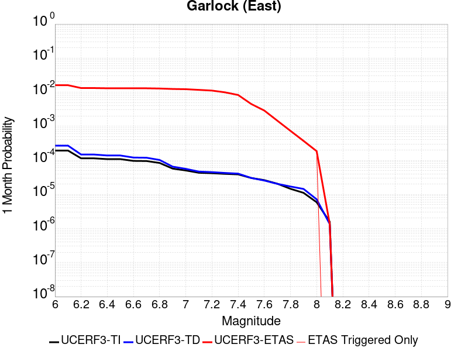 | 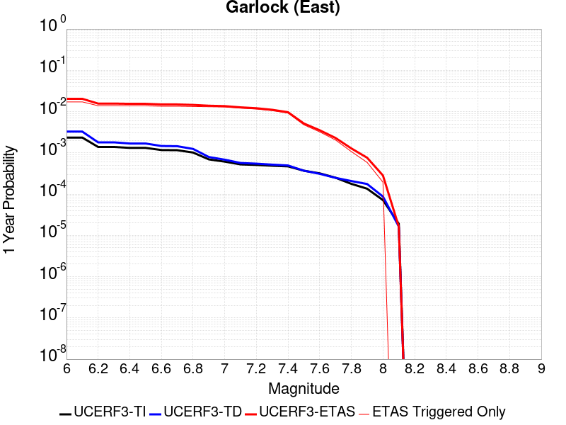 | 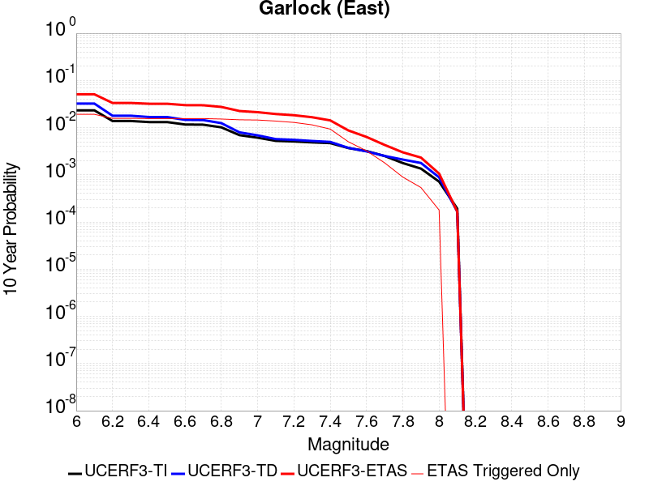 |

| Magnitude | 1 wk TI Prob | 1 wk TD Prob | 1 wk ETAS Prob | 1 wk ETAS/TD Gain | 1 wk ETAS Triggered Only | 1 mo TI Prob | 1 mo TD Prob | 1 mo ETAS Prob | 1 mo ETAS/TD Gain | 1 mo ETAS Triggered Only | 1 yr TI Prob | 1 yr TD Prob | 1 yr ETAS Prob | 1 yr ETAS/TD Gain | 1 yr ETAS Triggered Only | 10 yr TI Prob | 10 yr TD Prob | 10 yr ETAS Prob | 10 yr ETAS/TD Gain | 10 yr ETAS Triggered Only |
|-----|-----|-----|-----|-----|-----|-----|-----|-----|-----|-----|-----|-----|-----|-----|-----|-----|-----|-----|-----|-----|
| 6.0 | 4.5092507E-5 | 6.290325E-5 | 0.014244327 | 226.4482 | 0.014182316 | 1.9323928E-4 | 2.6956003E-4 | 0.01581701 | 58.67714 | 0.015551643 | 0.0023501497 | 0.0032774 | 0.02043538 | 6.235241 | 0.017214397 | 0.023254504 | 0.032351844 | 0.050145064 | 1.5499908 | 0.018388106 |
| 6.1 | 4.5092507E-5 | 6.290325E-5 | 0.014244327 | 226.4482 | 0.014182316 | 1.9323928E-4 | 2.6956003E-4 | 0.01581701 | 58.67714 | 0.015551643 | 0.0023501497 | 0.0032774 | 0.02043538 | 6.235241 | 0.017214397 | 0.023254504 | 0.032351844 | 0.050145064 | 1.5499908 | 0.018388106 |
| 6.2 | 2.6674514E-5 | 3.4509674E-5 | 0.011575582 | 335.43005 | 0.011541471 | 1.1431433E-4 | 1.4789042E-4 | 0.01286119 | 86.964325 | 0.01271518 | 0.0013908884 | 0.0017991117 | 0.015663013 | 8.70597 | 0.013888889 | 0.01382215 | 0.017890299 | 0.032491304 | 1.8161409 | 0.01486698 |
| 6.3 | 2.6674514E-5 | 3.4509674E-5 | 0.011575582 | 335.43005 | 0.011541471 | 1.1431433E-4 | 1.4789042E-4 | 0.01286119 | 86.964325 | 0.01271518 | 0.0013908884 | 0.0017991117 | 0.015663013 | 8.70597 | 0.013888889 | 0.01382215 | 0.017890299 | 0.032491304 | 1.8161409 | 0.01486698 |
| 6.4 | 2.5312667E-5 | 3.233893E-5 | 0.011475631 | 354.85498 | 0.0114436615 | 1.0847834E-4 | 1.3858822E-4 | 0.01275421 | 92.02954 | 0.012617371 | 0.0013199237 | 0.0016860351 | 0.015453863 | 9.165801 | 0.01379108 | 0.013121112 | 0.016778335 | 0.031299703 | 1.8654833 | 0.01476917 |
| 6.5 | 2.5312667E-5 | 3.233893E-5 | 0.011475631 | 354.85498 | 0.0114436615 | 1.0847834E-4 | 1.3858822E-4 | 0.01275421 | 92.02954 | 0.012617371 | 0.0013199237 | 0.0016860351 | 0.015453863 | 9.165801 | 0.01379108 | 0.013121112 | 0.016778335 | 0.031299703 | 1.8654833 | 0.01476917 |
| 6.6 | 2.246556E-5 | 2.8133776E-5 | 0.011373667 | 404.2709 | 0.011345853 | 9.627742E-5 | 1.20567885E-4 | 0.012540823 | 104.01462 | 0.012421752 | 0.0011715472 | 0.0014669491 | 0.014944801 | 10.187675 | 0.0134976525 | 0.011653901 | 0.01461866 | 0.028882788 | 1.975748 | 0.014475743 |
| 6.7 | 2.2241198E-5 | 2.7803519E-5 | 0.011373341 | 409.06122 | 0.011345853 | 9.531594E-5 | 1.1915263E-4 | 0.012539425 | 105.23834 | 0.012421752 | 0.0011598538 | 0.0014497414 | 0.014927826 | 10.296888 | 0.0134976525 | 0.011538187 | 0.014448853 | 0.02871544 | 1.9873853 | 0.014475743 |
| 6.8 | 1.9528685E-5 | 2.389819E-5 | 0.011173867 | 467.5612 | 0.011150234 | 8.369167E-5 | 1.0241691E-4 | 0.012327299 | 120.36391 | 0.012226135 | 0.0010184698 | 0.0012462323 | 0.01453169 | 11.660499 | 0.013302035 | 0.010138147 | 0.012436427 | 0.026442366 | 2.1262028 | 0.014182316 |
| 6.9 | 1.3318621E-5 | 1.5198884E-5 | 0.010969649 | 721.7404 | 0.010954617 | 5.7078556E-5 | 6.513648E-5 | 0.012094869 | 185.68503 | 0.012030517 | 6.9470983E-4 | 7.927538E-4 | 0.01388878 | 17.519663 | 0.013106416 | 0.0069254204 | 0.007939888 | 0.0217185 | 2.735366 | 0.013888889 |
| 7.0 | 1.1760853E-5 | 1.31077895E-5 | 0.010869773 | 829.26056 | 0.010856807 | 5.0402683E-5 | 5.6175057E-5 | 0.011988212 | 213.4081 | 0.011932707 | 6.134799E-4 | 6.8372174E-4 | 0.013585692 | 19.870207 | 0.012910798 | 0.0061178906 | 0.00685652 | 0.020455902 | 2.9834235 | 0.01369327 |
| 7.1 | 1.0064758E-5 | 1.0902931E-5 | 0.010378552 | 951.90485 | 0.010367762 | 4.3133965E-5 | 4.672603E-5 | 0.01119644 | 239.61891 | 0.011150234 | 5.2502943E-4 | 5.687444E-4 | 0.012690172 | 22.31261 | 0.012128325 | 0.005237907 | 0.0057129986 | 0.018452788 | 3.2299652 | 0.012812989 |
| 7.2 | 9.768808E-6 | 1.0498807E-5 | 0.00998692 | 951.24335 | 0.009976526 | 4.186565E-5 | 4.499413E-5 | 0.010705704 | 237.93556 | 0.010661189 | 5.095951E-4 | 5.4766936E-4 | 0.01208282 | 22.062252 | 0.011541471 | 0.0050842804 | 0.0055032647 | 0.017564844 | 3.1917136 | 0.012128325 |
| 7.3 | 9.344516E-6 | 9.944468E-6 | 0.00900829 | 905.8595 | 0.008998435 | 4.004731E-5 | 4.261847E-5 | 0.009725304 | 228.1946 | 0.009683099 | 4.8746695E-4 | 5.1875977E-4 | 0.01107666 | 21.352196 | 0.01056338 | 0.0048639905 | 0.0052149445 | 0.016209733 | 3.108323 | 0.011052426 |
| 7.4 | 9.023491E-6 | 9.490661E-6 | 0.0079319505 | 835.7638 | 0.007922535 | 3.867153E-5 | 4.0673647E-5 | 0.008549717 | 210.20287 | 0.00850939 | 4.7072413E-4 | 4.950925E-4 | 0.009684593 | 19.561182 | 0.009194053 | 0.004697283 | 0.0049783974 | 0.014515967 | 2.9157913 | 0.009585289 |
| 7.5 | 7.081253E-6 | 7.087672E-6 | 0.0043106563 | 608.19073 | 0.0043035992 | 3.0347876E-5 | 3.0375388E-5 | 0.0047250683 | 155.55582 | 0.0046948357 | 3.6942272E-4 | 3.6975832E-4 | 0.005160631 | 13.956767 | 0.0047926446 | 0.003688092 | 0.0037243143 | 0.008694 | 2.3343892 | 0.004988263 |
| 7.6 | 6.116396E-6 | 5.959245E-6 | 0.002940214 | 493.38702 | 0.0029342724 | 2.6212863E-5 | 2.5539372E-5 | 0.00315535 | 123.548454 | 0.0031298904 | 3.1909486E-4 | 3.1089774E-4 | 0.0035375939 | 11.378641 | 0.0032276995 | 0.0031863707 | 0.0031357552 | 0.0064508356 | 2.0571873 | 0.0033255087 |
| 7.7 | 4.797145E-6 | 4.757281E-6 | 0.0017653123 | 371.0759 | 0.0017605633 | 2.055903E-5 | 2.0388188E-5 | 0.0019765298 | 96.94485 | 0.0019561816 | 2.5027743E-4 | 2.4819805E-4 | 0.0023016788 | 9.273558 | 0.0020539905 | 0.0024999576 | 0.0025093474 | 0.004655747 | 1.8553619 | 0.0021517996 |
| 7.8 | 3.4028885E-6 | 3.978462E-6 | 7.8644796E-4 | 197.67639 | 7.824726E-4 | 1.4583726E-5 | 1.7050439E-5 | 9.951246E-4 | 58.36357 | 9.780908E-4 | 1.775424E-4 | 2.0756939E-4 | 0.0012832459 | 6.18225 | 0.0010758998 | 0.0017740062 | 0.0021012232 | 0.0031748624 | 1.5109591 | 0.0010758998 |
| 7.9 | 2.5928412E-6 | 3.3724489E-6 | 3.9460743E-4 | 117.00917 | 3.912363E-4 | 1.1112129E-5 | 1.4453272E-5 | 5.034916E-4 | 34.83582 | 4.890454E-4 | 1.3528178E-4 | 1.7595445E-4 | 7.6270563E-4 | 4.3346767 | 5.8685447E-4 | 0.0013519945 | 0.0017812408 | 0.00236705 | 1.328877 | 5.8685447E-4 |
| 8.0 | 1.3743648E-6 | 1.6734747E-6 | 9.9482386E-5 | 59.446606 | 9.7809076E-5 | 5.8901214E-6 | 7.1720146E-6 | 2.0278877E-4 | 28.275007 | 1.9561815E-4 | 7.1709874E-5 | 8.731581E-5 | 2.8291688E-4 | 3.2401564 | 1.9561815E-4 | 7.1686733E-4 | 8.837234E-4 | 0.0010791686 | 1.2211611 | 1.9561815E-4 |
| 8.1 | 3.6733252E-7 | 3.1489964E-7 | 3.1489964E-7 | 1.0 | 0.0 | 1.5742813E-6 | 1.3495693E-6 | 1.3495693E-6 | 1.0 | 0.0 | 1.9166706E-5 | 1.6430899E-5 | 1.6430899E-5 | 1.0 | 0.0 | 1.9165053E-4 | 1.6638759E-4 | 1.6638759E-4 | 1.0 | 0.0 |

## Hunter Mountain-Saline Valley
*[(top)](#table-of-contents)*

| 1 Week | 1 Month | 1 Year | 10 Year |
|-----|-----|-----|-----|
| 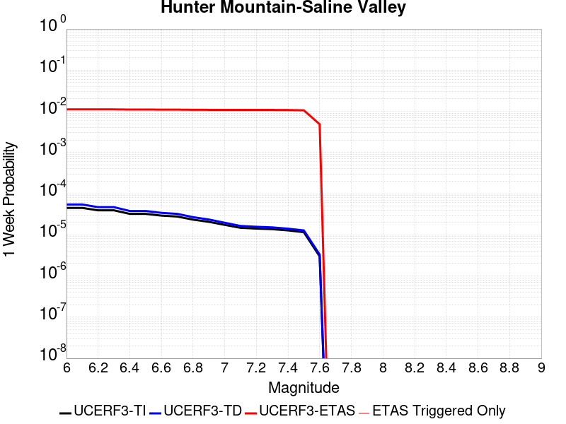 | 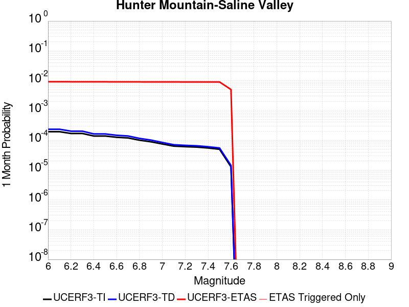 | 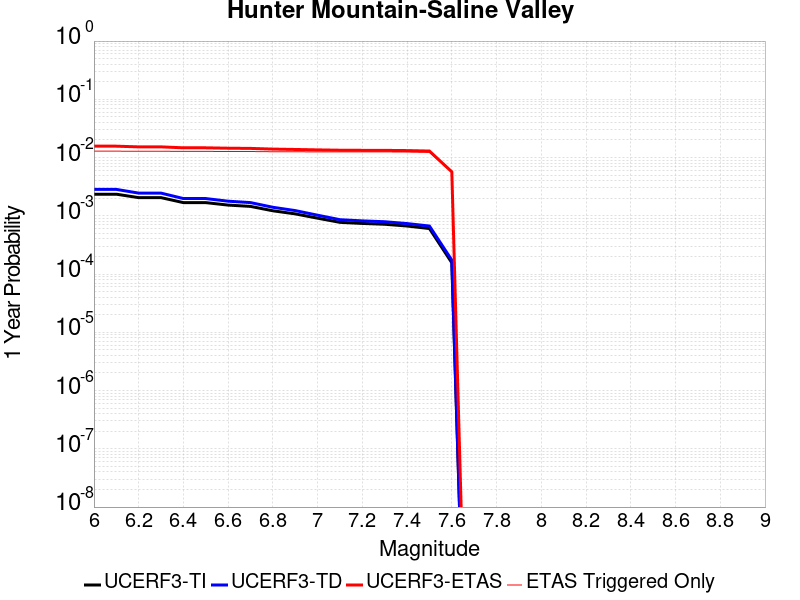 | 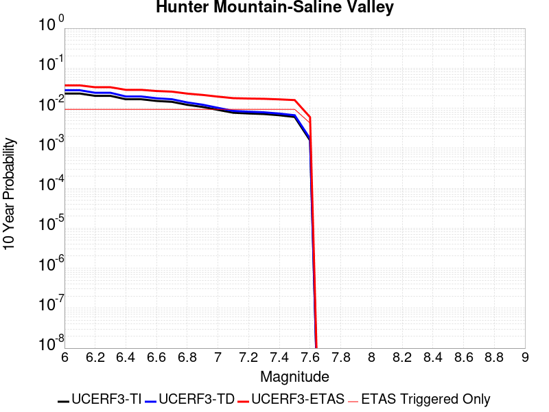 |

| Magnitude | 1 wk TI Prob | 1 wk TD Prob | 1 wk ETAS Prob | 1 wk ETAS/TD Gain | 1 wk ETAS Triggered Only | 1 mo TI Prob | 1 mo TD Prob | 1 mo ETAS Prob | 1 mo ETAS/TD Gain | 1 mo ETAS Triggered Only | 1 yr TI Prob | 1 yr TD Prob | 1 yr ETAS Prob | 1 yr ETAS/TD Gain | 1 yr ETAS Triggered Only | 10 yr TI Prob | 10 yr TD Prob | 10 yr ETAS Prob | 10 yr ETAS/TD Gain | 10 yr ETAS Triggered Only |
|-----|-----|-----|-----|-----|-----|-----|-----|-----|-----|-----|-----|-----|-----|-----|-----|-----|-----|-----|-----|-----|
| 6.0 | 4.5103672E-5 | 5.4570177E-5 | 0.010519571 | 192.77142 | 0.010465572 | 1.9328714E-4 | 2.3385242E-4 | 0.01187041 | 50.76026 | 0.01163928 | 0.002350731 | 0.0028435152 | 0.015717601 | 5.527525 | 0.012910798 | 0.023260195 | 0.028091887 | 0.04073506 | 1.4500649 | 0.013008608 |
| 6.1 | 4.5103672E-5 | 5.4570177E-5 | 0.010519571 | 192.77142 | 0.010465572 | 1.9328714E-4 | 2.3385242E-4 | 0.01187041 | 50.76026 | 0.01163928 | 0.002350731 | 0.0028435152 | 0.015717601 | 5.527525 | 0.012910798 | 0.023260195 | 0.028091887 | 0.04073506 | 1.4500649 | 0.013008608 |
| 6.2 | 3.9363465E-5 | 4.706337E-5 | 0.010512142 | 223.36143 | 0.010465572 | 1.6868966E-4 | 2.0168544E-4 | 0.011838618 | 58.698425 | 0.01163928 | 0.002051862 | 0.0024528175 | 0.015331948 | 6.2507496 | 0.012910798 | 0.020330196 | 0.024273481 | 0.036966324 | 1.5229099 | 0.013008608 |
| 6.3 | 3.9363465E-5 | 4.706337E-5 | 0.010512142 | 223.36143 | 0.010465572 | 1.6868966E-4 | 2.0168544E-4 | 0.011838618 | 58.698425 | 0.01163928 | 0.002051862 | 0.0024528175 | 0.015331948 | 6.2507496 | 0.012910798 | 0.020330196 | 0.024273481 | 0.036966324 | 1.5229099 | 0.013008608 |
| 6.4 | 3.2311684E-5 | 3.795099E-5 | 0.01040532 | 274.17783 | 0.010367762 | 1.384713E-4 | 1.6263737E-4 | 0.011702231 | 71.9529 | 0.011541471 | 0.0016845843 | 0.0019783843 | 0.014766024 | 7.4636784 | 0.012812989 | 0.016718714 | 0.019616475 | 0.032274008 | 1.6452502 | 0.012910798 |
| 6.5 | 3.2311684E-5 | 3.795099E-5 | 0.01040532 | 274.17783 | 0.010367762 | 1.384713E-4 | 1.6263737E-4 | 0.011702231 | 71.9529 | 0.011541471 | 0.0016845843 | 0.0019783843 | 0.014766024 | 7.4636784 | 0.012812989 | 0.016718714 | 0.019616475 | 0.032274008 | 1.6452502 | 0.012910798 |
| 6.6 | 2.9305844E-5 | 3.418183E-5 | 0.01040159 | 304.3017 | 0.010367762 | 1.2559042E-4 | 1.4648569E-4 | 0.011686266 | 79.77753 | 0.011541471 | 0.0015279909 | 0.001782067 | 0.014572223 | 8.177146 | 0.012812989 | 0.015175272 | 0.01768569 | 0.030368153 | 1.717103 | 0.012910798 |
| 6.7 | 2.7826512E-5 | 3.2344276E-5 | 0.010399771 | 321.5336 | 0.010367762 | 1.19251024E-4 | 1.386113E-4 | 0.011678482 | 84.25347 | 0.011541471 | 0.0014509142 | 0.0016863465 | 0.014477728 | 8.585263 | 0.012812989 | 0.014414776 | 0.016743187 | 0.029437816 | 1.7581968 | 0.012910798 |
| 6.8 | 2.3389874E-5 | 2.6866714E-5 | 0.010394351 | 386.8858 | 0.010367762 | 1.0023846E-4 | 1.15138246E-4 | 0.01165528 | 101.22858 | 0.011541471 | 0.00121972 | 0.001400954 | 0.014195993 | 10.13309 | 0.012812989 | 0.01213047 | 0.013927434 | 0.026658418 | 1.914094 | 0.012910798 |
| 6.9 | 2.069209E-5 | 2.3570032E-5 | 0.010391088 | 440.86017 | 0.010367762 | 8.867737E-5 | 1.01010715E-4 | 0.011641316 | 115.24833 | 0.011541471 | 0.0010791123 | 0.0012291478 | 0.014026388 | 11.411474 | 0.012812989 | 0.010738871 | 0.012228523 | 0.024981441 | 2.042883 | 0.012910798 |
| 7.0 | 1.7462342E-5 | 1.9633546E-5 | 0.0103871925 | 529.0533 | 0.010367762 | 7.483646E-5 | 8.414118E-5 | 0.011624641 | 138.15639 | 0.011541471 | 9.1075303E-4 | 0.0010239601 | 0.01382383 | 13.50036 | 0.012812989 | 0.009070295 | 0.0101960525 | 0.022975212 | 2.2533438 | 0.012910798 |
| 7.1 | 1.4807709E-5 | 1.6441749E-5 | 0.010384033 | 631.565 | 0.010367762 | 6.3460066E-5 | 7.046283E-5 | 0.011611121 | 164.78363 | 0.011541471 | 7.723524E-4 | 8.575638E-4 | 0.013659565 | 15.928337 | 0.012812989 | 0.007696735 | 0.008545532 | 0.021346001 | 2.4979136 | 0.012910798 |
| 7.2 | 1.4180048E-5 | 1.5698337E-5 | 0.010383298 | 661.42664 | 0.010367762 | 6.077022E-5 | 6.727694E-5 | 0.011607972 | 172.54012 | 0.011541471 | 7.396263E-4 | 8.188051E-4 | 0.013621303 | 16.635586 | 0.012812989 | 0.0073716943 | 0.008160833 | 0.02096627 | 2.5691333 | 0.012910798 |
| 7.3 | 1.3730402E-5 | 1.5172075E-5 | 0.010382777 | 684.33466 | 0.010367762 | 5.8843252E-5 | 6.502165E-5 | 0.011605742 | 178.49043 | 0.011541471 | 7.161811E-4 | 7.9136714E-4 | 0.013594217 | 17.17814 | 0.012812989 | 0.007138774 | 0.007888422 | 0.020697376 | 2.623766 | 0.012910798 |
| 7.4 | 1.2810095E-5 | 1.4109277E-5 | 0.010381725 | 735.8084 | 0.010367762 | 5.489925E-5 | 6.0467017E-5 | 0.01160124 | 191.86063 | 0.011541471 | 6.681934E-4 | 7.359531E-4 | 0.013539513 | 18.39725 | 0.012812989 | 0.006661878 | 0.007338053 | 0.020154111 | 2.7465203 | 0.012910798 |
| 7.5 | 1.1595659E-5 | 1.2800664E-5 | 0.010282623 | 803.2882 | 0.010269953 | 4.9694736E-5 | 5.4858923E-5 | 0.011497893 | 209.59021 | 0.0114436615 | 6.0486543E-4 | 6.6771836E-4 | 0.013374408 | 20.030014 | 0.01271518 | 0.006032217 | 0.0066599925 | 0.019387648 | 2.9110615 | 0.012812989 |
| 7.6 | 2.997694E-6 | 3.3251579E-6 | 0.0053828065 | 1618.8123 | 0.0053794994 | 1.28471975E-5 | 1.425064E-5 | 0.0058827116 | 412.8033 | 0.005868545 | 1.564034E-4 | 1.73495E-4 | 0.006725566 | 38.765186 | 0.006553208 | 0.0015629337 | 0.001735031 | 0.00827687 | 4.7704444 | 0.006553208 |

## Garlock (West)
*[(top)](#table-of-contents)*

| 1 Week | 1 Month | 1 Year | 10 Year |
|-----|-----|-----|-----|
| 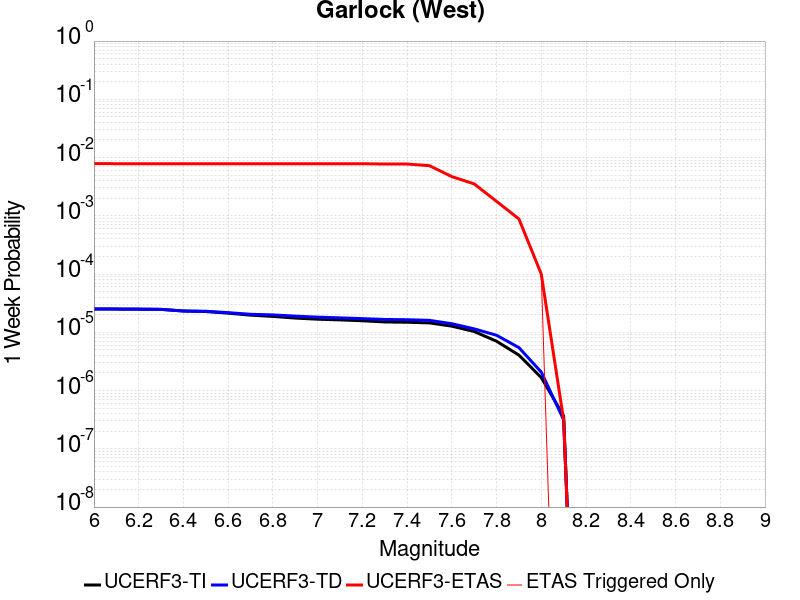 |  | 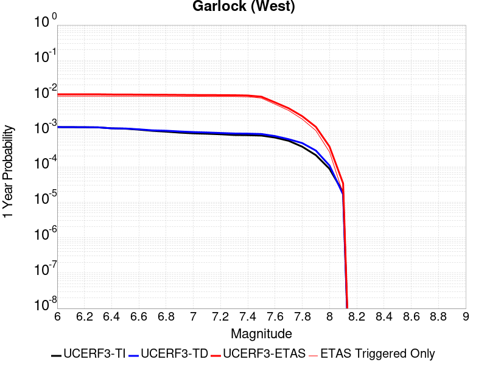 | 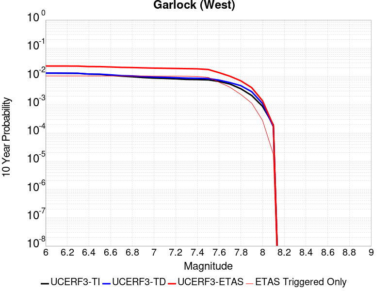 |

| Magnitude | 1 wk TI Prob | 1 wk TD Prob | 1 wk ETAS Prob | 1 wk ETAS/TD Gain | 1 wk ETAS Triggered Only | 1 mo TI Prob | 1 mo TD Prob | 1 mo ETAS Prob | 1 mo ETAS/TD Gain | 1 mo ETAS Triggered Only | 1 yr TI Prob | 1 yr TD Prob | 1 yr ETAS Prob | 1 yr ETAS/TD Gain | 1 yr ETAS Triggered Only | 10 yr TI Prob | 10 yr TD Prob | 10 yr ETAS Prob | 10 yr ETAS/TD Gain | 10 yr ETAS Triggered Only |
|-----|-----|-----|-----|-----|-----|-----|-----|-----|-----|-----|-----|-----|-----|-----|-----|-----|-----|-----|-----|-----|
| 6.0 | 2.5181727E-5 | 2.51973E-5 | 0.007849726 | 311.53046 | 0.007824726 | 1.0791722E-4 | 1.0798398E-4 | 0.008518657 | 78.88815 | 0.008411581 | 0.0013131002 | 0.0013139155 | 0.0102028465 | 7.765223 | 0.008900626 | 0.013053683 | 0.013141977 | 0.022311725 | 1.6977451 | 0.009291862 |
| 6.1 | 2.5077732E-5 | 2.5098372E-5 | 0.007849628 | 312.7545 | 0.007824726 | 1.0747157E-4 | 1.0756004E-4 | 0.008518236 | 79.195175 | 0.008411581 | 0.001307681 | 0.0013087603 | 0.010197737 | 7.791907 | 0.008900626 | 0.013000126 | 0.013091032 | 0.022261254 | 1.7004964 | 0.009291862 |
| 6.2 | 2.494612E-5 | 2.498005E-5 | 0.007849511 | 314.23117 | 0.007824726 | 1.0690756E-4 | 1.0705298E-4 | 0.008517733 | 79.56558 | 0.008411581 | 0.0013008224 | 0.0013025942 | 0.010191626 | 7.824099 | 0.008900626 | 0.012932341 | 0.013030097 | 0.022200884 | 1.7038158 | 0.009291862 |
| 6.3 | 2.4733758E-5 | 2.479942E-5 | 0.007849332 | 316.51273 | 0.007824726 | 1.0599751E-4 | 1.06278916E-4 | 0.008516965 | 80.13787 | 0.008411581 | 0.0012897556 | 0.0012931811 | 0.010182297 | 7.8738365 | 0.008900626 | 0.012822957 | 0.012937066 | 0.022108719 | 1.7089438 | 0.009291862 |
| 6.4 | 2.3237335E-5 | 2.317873E-5 | 0.007847724 | 338.57434 | 0.007824726 | 9.958477E-5 | 9.933365E-5 | 0.008510078 | 85.67166 | 0.008411581 | 0.0012117702 | 0.001208719 | 0.010098587 | 8.354784 | 0.008900626 | 0.012051838 | 0.012101916 | 0.021281328 | 1.758509 | 0.009291862 |
| 6.5 | 2.2732203E-5 | 2.2993298E-5 | 0.007847539 | 341.2968 | 0.007824726 | 9.742009E-5 | 9.8539E-5 | 0.00850929 | 86.354546 | 0.008411581 | 0.0011854442 | 0.0011990548 | 0.010089008 | 8.414134 | 0.008900626 | 0.011791403 | 0.012006322 | 0.021186624 | 1.7646222 | 0.009291862 |
| 6.6 | 2.1319436E-5 | 2.17735E-5 | 0.007846329 | 360.36142 | 0.007824726 | 9.136581E-5 | 9.331167E-5 | 0.008504108 | 91.13659 | 0.008411581 | 0.001111811 | 0.0011354799 | 0.0100259995 | 8.829746 | 0.008900626 | 0.011062649 | 0.011377227 | 0.020563373 | 1.8074154 | 0.009291862 |
| 6.7 | 1.970802E-5 | 2.0393396E-5 | 0.00784496 | 384.6814 | 0.007824726 | 8.446021E-5 | 8.739735E-5 | 0.008498243 | 97.23685 | 0.008411581 | 0.001027818 | 0.001063545 | 0.009954705 | 9.359928 | 0.008900626 | 0.010230771 | 0.010664964 | 0.019857729 | 1.8619592 | 0.009291862 |
| 6.8 | 1.8744462E-5 | 1.9901045E-5 | 0.007844471 | 394.17386 | 0.007824726 | 8.033094E-5 | 8.5287415E-5 | 0.00849615 | 99.617874 | 0.008411581 | 9.775903E-4 | 0.0010378812 | 0.00992927 | 9.566864 | 0.008900626 | 0.009733009 | 0.01041075 | 0.019605877 | 1.8832338 | 0.009291862 |
| 6.9 | 1.7559682E-5 | 1.8953415E-5 | 0.007843532 | 413.8321 | 0.007824726 | 7.5253614E-5 | 8.12264E-5 | 0.008492123 | 104.54881 | 0.008411581 | 9.158276E-4 | 9.884841E-4 | 0.009880312 | 9.995418 | 0.008900626 | 0.0091206245 | 0.009921231 | 0.019120907 | 1.9272716 | 0.009291862 |
| 7.0 | 1.6794445E-5 | 1.8216237E-5 | 0.0078428 | 430.53897 | 0.007824726 | 7.197421E-5 | 7.8067256E-5 | 0.008488991 | 108.739456 | 0.008411581 | 8.759337E-4 | 9.5005584E-4 | 0.009842225 | 10.359629 | 0.008900626 | 0.008724891 | 0.009540141 | 0.018743357 | 1.9646835 | 0.009291862 |
| 7.1 | 1.6337795E-5 | 1.7717046E-5 | 0.007842304 | 442.64178 | 0.007824726 | 7.0017246E-5 | 7.5927994E-5 | 0.00848687 | 111.775246 | 0.008411581 | 8.521265E-4 | 9.240326E-4 | 0.009816434 | 10.623472 | 0.008900626 | 0.008488664 | 0.009281996 | 0.018487612 | 1.9917711 | 0.009291862 |
| 7.2 | 1.5780008E-5 | 1.7165687E-5 | 0.0078417575 | 456.82748 | 0.007824726 | 6.762685E-5 | 7.356516E-5 | 0.008484527 | 115.333496 | 0.008411581 | 8.2304585E-4 | 8.9528906E-4 | 0.009787946 | 10.932722 | 0.008900626 | 0.008200042 | 0.008996838 | 0.018205103 | 2.0235002 | 0.009291862 |
| 7.3 | 1.5058865E-5 | 1.6618762E-5 | 0.0077434075 | 465.9437 | 0.007726917 | 6.45364E-5 | 7.122133E-5 | 0.008384401 | 117.723175 | 0.008313771 | 7.854473E-4 | 8.667759E-4 | 0.009661962 | 11.147014 | 0.008802817 | 0.00782677 | 0.008713539 | 0.01782748 | 2.0459518 | 0.009194053 |
| 7.4 | 1.4887923E-5 | 1.6454731E-5 | 0.0077432445 | 470.5786 | 0.007726917 | 6.380382E-5 | 7.051838E-5 | 0.008383703 | 118.88679 | 0.008313771 | 7.7653467E-4 | 8.582243E-4 | 0.009653486 | 11.248209 | 0.008802817 | 0.0077382675 | 0.008628399 | 0.017743122 | 2.056363 | 0.009194053 |
| 7.5 | 1.4509299E-5 | 1.6046748E-5 | 0.0072538024 | 452.04187 | 0.0072378716 | 6.218123E-5 | 6.876997E-5 | 0.007892958 | 114.77332 | 0.007824726 | 7.567935E-4 | 8.36954E-4 | 0.008948313 | 10.691524 | 0.008118154 | 0.0075422134 | 0.008416704 | 0.016854472 | 2.0025027 | 0.00850939 |
| 7.6 | 1.2756717E-5 | 1.4050848E-5 | 0.0047088205 | 335.12714 | 0.0046948357 | 5.4670498E-5 | 6.0216535E-5 | 0.0051459824 | 85.45796 | 0.005086072 | 6.6541E-4 | 7.328904E-4 | 0.00601071 | 8.201376 | 0.00528169 | 0.006634211 | 0.0073816874 | 0.012818564 | 1.7365357 | 0.0054773083 |
| 7.7 | 1.0328985E-5 | 1.1460557E-5 | 0.003532547 | 308.2352 | 0.0035211267 | 4.4266326E-5 | 4.911575E-5 | 0.0038634823 | 78.66076 | 0.003814554 | 5.388092E-4 | 5.978206E-4 | 0.0046055955 | 7.7039757 | 0.004010172 | 0.0053750467 | 0.006038511 | 0.010218905 | 1.6922888 | 0.0042057903 |
| 7.8 | 7.0306583E-6 | 8.899601E-6 | 0.0017694473 | 198.82321 | 0.0017605633 | 3.0131043E-5 | 3.814059E-5 | 0.0019942475 | 52.28675 | 0.0019561816 | 3.667837E-4 | 4.642629E-4 | 0.0025173 | 5.422143 | 0.0020539905 | 0.003661789 | 0.0046952725 | 0.006836969 | 1.4561388 | 0.0021517996 |
| 7.9 | 4.060633E-6 | 5.4653938E-6 | 8.8574225E-4 | 162.06375 | 8.802817E-4 | 1.7402595E-5 | 2.3422906E-5 | 0.0010014907 | 42.756893 | 9.780908E-4 | 2.11856E-4 | 2.851367E-4 | 0.0013607297 | 4.7722015 | 0.0010758998 | 0.0021165414 | 0.002884201 | 0.004054525 | 1.4057705 | 0.0011737089 |
| 8.0 | 1.6729537E-6 | 2.0775144E-6 | 9.988639E-5 | 48.079758 | 9.7809076E-5 | 7.169782E-6 | 8.903603E-6 | 2.0452001E-4 | 22.970478 | 1.9561815E-4 | 8.7288594E-5 | 1.0839601E-4 | 3.0399294E-4 | 2.8044665 | 1.9561815E-4 | 8.7254314E-4 | 0.0010969337 | 0.0012923373 | 1.1781361 | 1.9561815E-4 |
| 8.1 | 3.6733252E-7 | 3.1489964E-7 | 3.1489964E-7 | 1.0 | 0.0 | 1.5742813E-6 | 1.3495693E-6 | 1.3495693E-6 | 1.0 | 0.0 | 1.9166706E-5 | 1.6430899E-5 | 1.6430899E-5 | 1.0 | 0.0 | 1.9165053E-4 | 1.6638759E-4 | 1.6638759E-4 | 1.0 | 0.0 |

## Blackwater
*[(top)](#table-of-contents)*

| 1 Week | 1 Month | 1 Year | 10 Year |
|-----|-----|-----|-----|
| 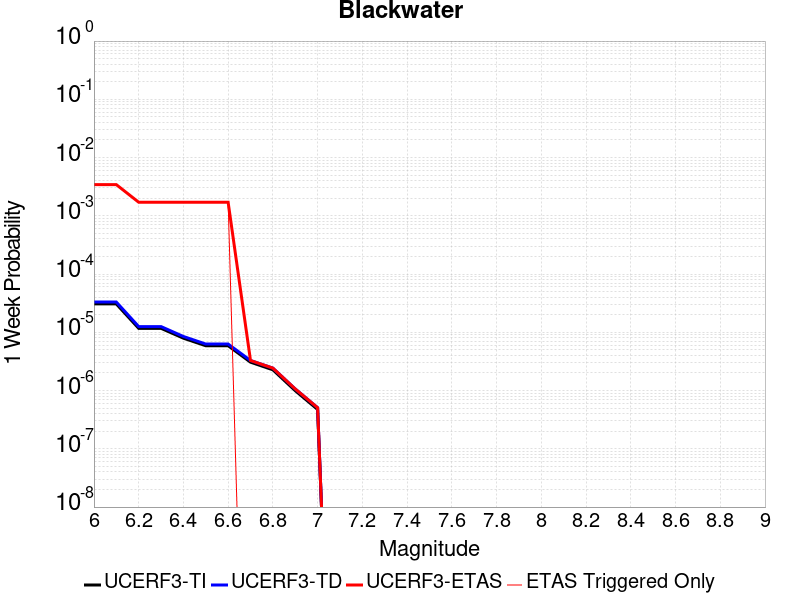 | 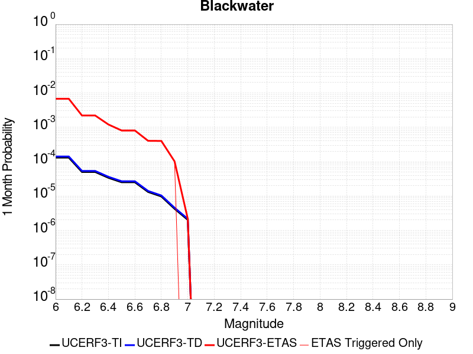 | 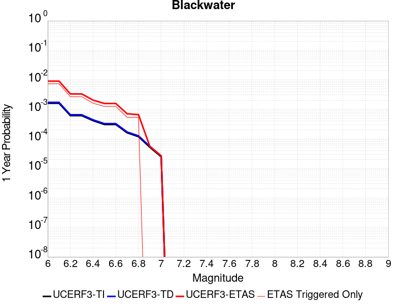 | 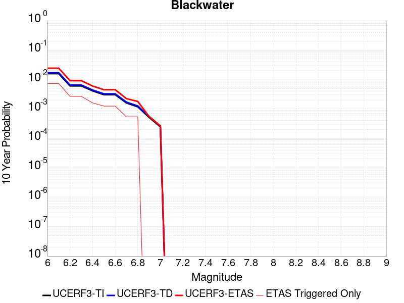 |

| Magnitude | 1 wk TI Prob | 1 wk TD Prob | 1 wk ETAS Prob | 1 wk ETAS/TD Gain | 1 wk ETAS Triggered Only | 1 mo TI Prob | 1 mo TD Prob | 1 mo ETAS Prob | 1 mo ETAS/TD Gain | 1 mo ETAS Triggered Only | 1 yr TI Prob | 1 yr TD Prob | 1 yr ETAS Prob | 1 yr ETAS/TD Gain | 1 yr ETAS Triggered Only | 10 yr TI Prob | 10 yr TD Prob | 10 yr ETAS Prob | 10 yr ETAS/TD Gain | 10 yr ETAS Triggered Only |
|-----|-----|-----|-----|-----|-----|-----|-----|-----|-----|-----|-----|-----|-----|-----|-----|-----|-----|-----|-----|-----|
| 6.0 | 3.0708583E-5 | 3.3095846E-5 | 0.006097058 | 184.22426 | 0.0060641626 | 1.3160157E-4 | 1.4183241E-4 | 0.0067919064 | 47.886845 | 0.0066510173 | 0.0016010714 | 0.0017255784 | 0.008950961 | 5.187223 | 0.0072378716 | 0.015895851 | 0.017135633 | 0.024537878 | 1.4319797 | 0.007531299 |
| 6.1 | 3.0708583E-5 | 3.3095846E-5 | 0.006097058 | 184.22426 | 0.0060641626 | 1.3160157E-4 | 1.4183241E-4 | 0.0067919064 | 47.886845 | 0.0066510173 | 0.0016010714 | 0.0017255784 | 0.008950961 | 5.187223 | 0.0072378716 | 0.015895851 | 0.017135633 | 0.024537878 | 1.4319797 | 0.007531299 |
| 6.2 | 1.1707779E-5 | 1.2545122E-5 | 0.0018708942 | 149.13321 | 0.0018583725 | 5.017523E-5 | 5.3763757E-5 | 0.0022054478 | 41.021088 | 0.0021517996 | 6.107122E-4 | 6.5438676E-4 | 0.0030002685 | 4.584855 | 0.0023474179 | 0.006090366 | 0.0065255696 | 0.008857669 | 1.3573787 | 0.0023474179 |
| 6.3 | 1.1707779E-5 | 1.2545122E-5 | 0.0018708942 | 149.13321 | 0.0018583725 | 5.017523E-5 | 5.3763757E-5 | 0.0022054478 | 41.021088 | 0.0021517996 | 6.107122E-4 | 6.5438676E-4 | 0.0030002685 | 4.584855 | 0.0023474179 | 0.006090366 | 0.0065255696 | 0.008857669 | 1.3573787 | 0.0023474179 |
| 6.4 | 7.929244E-6 | 8.480098E-6 | 0.0010843708 | 127.87244 | 0.0010758998 | 3.3982033E-5 | 3.6342793E-5 | 0.0012100091 | 33.29433 | 0.0011737089 | 4.136527E-4 | 4.423877E-4 | 0.0016155774 | 3.651949 | 0.0011737089 | 0.0041288356 | 0.0044154758 | 0.0055840025 | 1.2646433 | 0.0011737089 |
| 6.5 | 5.8832115E-6 | 6.285991E-6 | 7.887537E-4 | 125.47802 | 7.824726E-4 | 2.521352E-5 | 2.6939697E-5 | 8.093912E-4 | 30.044556 | 7.824726E-4 | 3.0693135E-4 | 3.27944E-4 | 0.00111016 | 3.3852122 | 7.824726E-4 | 0.0030650778 | 0.0032748538 | 0.004054764 | 1.2381511 | 7.824726E-4 |
| 6.6 | 5.8832115E-6 | 6.285991E-6 | 7.887537E-4 | 125.47802 | 7.824726E-4 | 2.521352E-5 | 2.6939697E-5 | 8.093912E-4 | 30.044556 | 7.824726E-4 | 3.0693135E-4 | 3.27944E-4 | 0.00111016 | 3.3852122 | 7.824726E-4 | 0.0030650778 | 0.0032748538 | 0.004054764 | 1.2381511 | 7.824726E-4 |
| 6.7 | 3.0715053E-6 | 3.2814662E-6 | 3.9451648E-4 | 120.22568 | 3.912363E-4 | 1.3163528E-5 | 1.4063357E-5 | 4.0529415E-4 | 28.819162 | 3.912363E-4 | 1.6025416E-4 | 1.7120909E-4 | 5.623784E-4 | 3.2847464 | 3.912363E-4 | 0.0016013865 | 0.0017108864 | 0.0021014533 | 1.2282834 | 3.912363E-4 |
| 6.8 | 2.2722281E-6 | 2.4287538E-6 | 3.9366412E-4 | 162.08482 | 3.912363E-4 | 9.738084E-6 | 1.0408908E-5 | 4.0164115E-4 | 38.58629 | 3.912363E-4 | 1.1855473E-4 | 1.26722E-4 | 5.179087E-4 | 4.086968 | 3.912363E-4 | 0.001184915 | 0.0012665876 | 0.0016573283 | 1.3084989 | 3.912363E-4 |
| 6.9 | 9.952399E-7 | 1.0653489E-6 | 9.887432E-5 | 92.80933 | 9.7809076E-5 | 4.265307E-6 | 4.5657757E-6 | 1.02374404E-4 | 22.422127 | 9.7809076E-5 | 5.1928873E-5 | 5.5587418E-5 | 1.5339105E-4 | 2.7594564 | 9.7809076E-5 | 5.191674E-4 | 5.557858E-4 | 6.535405E-4 | 1.1758856 | 9.7809076E-5 |
| 7.0 | 4.7385504E-7 | 5.0755597E-7 | 5.0755597E-7 | 1.0 | 0.0 | 2.0308057E-6 | 2.1752398E-6 | 2.1752398E-6 | 1.0 | 0.0 | 2.4724779E-5 | 2.6483543E-5 | 2.6483543E-5 | 1.0 | 0.0 | 2.4722028E-4 | 2.6483546E-4 | 2.6483546E-4 | 1.0 | 0.0 |

## Ash Hill
*[(top)](#table-of-contents)*

| 1 Week | 1 Month | 1 Year | 10 Year |
|-----|-----|-----|-----|
| 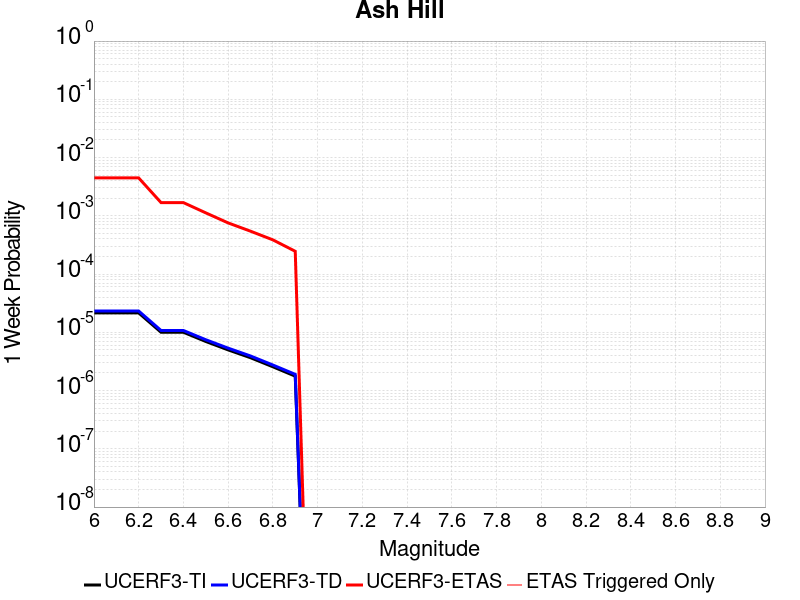 | 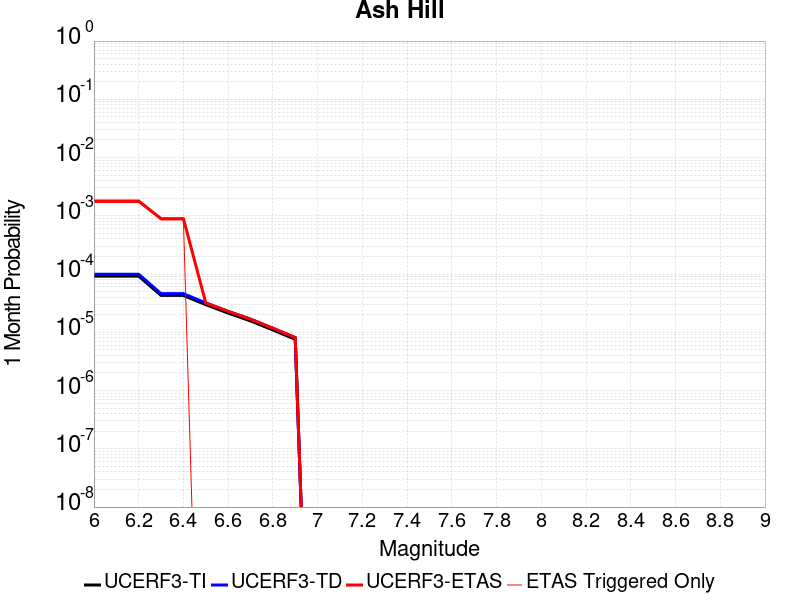 | 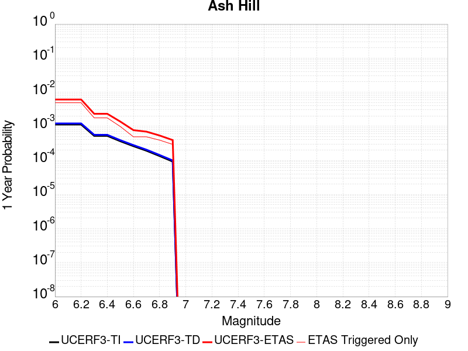 | 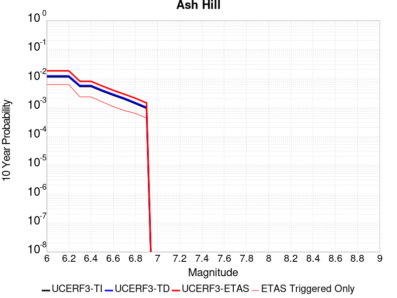 |

| Magnitude | 1 wk TI Prob | 1 wk TD Prob | 1 wk ETAS Prob | 1 wk ETAS/TD Gain | 1 wk ETAS Triggered Only | 1 mo TI Prob | 1 mo TD Prob | 1 mo ETAS Prob | 1 mo ETAS/TD Gain | 1 mo ETAS Triggered Only | 1 yr TI Prob | 1 yr TD Prob | 1 yr ETAS Prob | 1 yr ETAS/TD Gain | 1 yr ETAS Triggered Only | 10 yr TI Prob | 10 yr TD Prob | 10 yr ETAS Prob | 10 yr ETAS/TD Gain | 10 yr ETAS Triggered Only |
|-----|-----|-----|-----|-----|-----|-----|-----|-----|-----|-----|-----|-----|-----|-----|-----|-----|-----|-----|-----|-----|
| 6.0 | 2.1545662E-5 | 2.3194447E-5 | 0.0037398532 | 161.23917 | 0.003716745 | 9.2335285E-5 | 9.940143E-5 | 0.0043047736 | 43.306957 | 0.0042057903 | 0.0011236023 | 0.0012096206 | 0.0060941586 | 5.0380745 | 0.004890454 | 0.011179381 | 0.012038348 | 0.017353088 | 1.4414841 | 0.0053794994 |
| 6.1 | 2.1545662E-5 | 2.3194447E-5 | 0.0037398532 | 161.23917 | 0.003716745 | 9.2335285E-5 | 9.940143E-5 | 0.0043047736 | 43.306957 | 0.0042057903 | 0.0011236023 | 0.0012096206 | 0.0060941586 | 5.0380745 | 0.004890454 | 0.011179381 | 0.012038348 | 0.017353088 | 1.4414841 | 0.0053794994 |
| 6.2 | 2.1545662E-5 | 2.3194447E-5 | 0.0037398532 | 161.23917 | 0.003716745 | 9.2335285E-5 | 9.940143E-5 | 0.0043047736 | 43.306957 | 0.0042057903 | 0.0011236023 | 0.0012096206 | 0.0060941586 | 5.0380745 | 0.004890454 | 0.011179381 | 0.012038348 | 0.017353088 | 1.4414841 | 0.0053794994 |
| 6.3 | 1.0025529E-5 | 1.0746934E-5 | 0.0013800593 | 128.41423 | 0.0013693271 | 4.2965847E-5 | 4.605755E-5 | 0.0015131261 | 32.852943 | 0.0014671362 | 5.229836E-4 | 5.6061964E-4 | 0.002320196 | 4.138628 | 0.0017605633 | 0.005217545 | 0.0055933665 | 0.007441344 | 1.3303875 | 0.0018583725 |
| 6.4 | 1.0025529E-5 | 1.0746934E-5 | 0.0013800593 | 128.41423 | 0.0013693271 | 4.2965847E-5 | 4.605755E-5 | 0.0015131261 | 32.852943 | 0.0014671362 | 5.229836E-4 | 5.6061964E-4 | 0.002320196 | 4.138628 | 0.0017605633 | 0.005217545 | 0.0055933665 | 0.007441344 | 1.3303875 | 0.0018583725 |
| 6.5 | 6.9617327E-6 | 7.456634E-6 | 8.877318E-4 | 119.05261 | 8.802817E-4 | 2.9835655E-5 | 3.195666E-5 | 9.122102E-4 | 28.545229 | 8.802817E-4 | 3.6318856E-4 | 3.8901155E-4 | 0.0013667218 | 3.5133195 | 9.780908E-4 | 0.0036259557 | 0.0038841602 | 0.0049558813 | 1.2759209 | 0.0010758998 |
| 6.6 | 4.9919777E-6 | 5.3466883E-6 | 3.965809E-4 | 74.17319 | 3.912363E-4 | 2.1394015E-5 | 2.2914215E-5 | 4.1414157E-4 | 18.073565 | 3.912363E-4 | 2.60441E-4 | 2.7895154E-4 | 7.678605E-4 | 2.7526662 | 4.890454E-4 | 0.0026013597 | 0.0027866727 | 0.0033718918 | 1.2100064 | 5.8685447E-4 |
| 6.7 | 3.6630722E-6 | 3.924624E-6 | 3.9515938E-4 | 100.68721 | 3.912363E-4 | 1.5698786E-5 | 1.681974E-5 | 4.0804947E-4 | 24.260153 | 3.912363E-4 | 1.9111596E-4 | 2.0476682E-4 | 6.937121E-4 | 3.3878148 | 4.890454E-4 | 0.0019095168 | 0.0020463446 | 0.0026319982 | 1.286195 | 5.8685447E-4 |
| 6.8 | 2.5599613E-6 | 2.744925E-6 | 2.9617135E-4 | 107.89779 | 2.9342723E-4 | 1.0971216E-5 | 1.1763939E-5 | 3.051877E-4 | 25.942646 | 2.9342723E-4 | 1.3356637E-4 | 1.4322149E-4 | 5.3440174E-4 | 3.7312958 | 3.912363E-4 | 0.0013348613 | 0.0014317769 | 0.0019201221 | 1.3410763 | 4.890454E-4 |
| 6.9 | 1.7684905E-6 | 1.8968707E-6 | 1.9751466E-4 | 104.12658 | 1.9561815E-4 | 7.579223E-6 | 8.129446E-6 | 2.03746E-4 | 25.062717 | 1.9561815E-4 | 9.2273134E-5 | 9.8976E-5 | 3.923742E-4 | 3.9643366 | 2.9342723E-4 | 9.223483E-4 | 9.8976E-4 | 0.0013806091 | 1.3948928 | 3.912363E-4 |

## Gravel Hills-Harper Lk
*[(top)](#table-of-contents)*

| 1 Week | 1 Month | 1 Year | 10 Year |
|-----|-----|-----|-----|
|  | 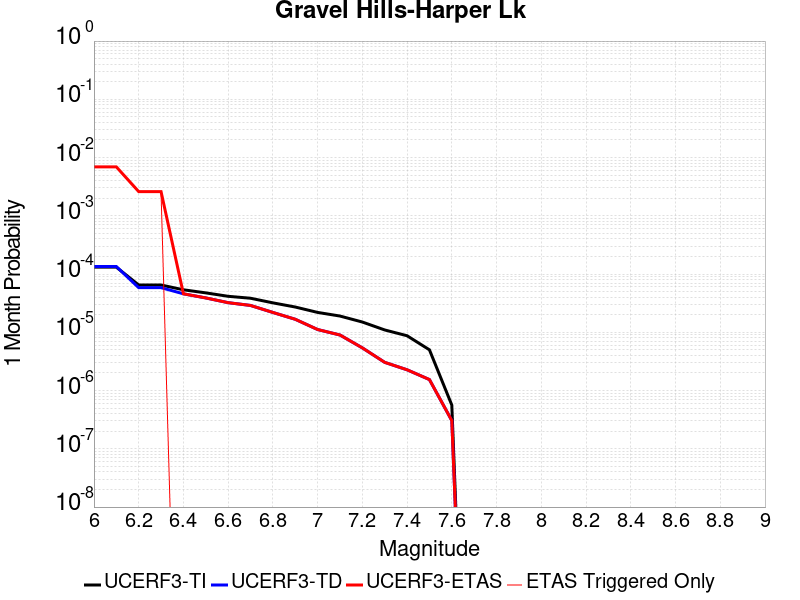 | 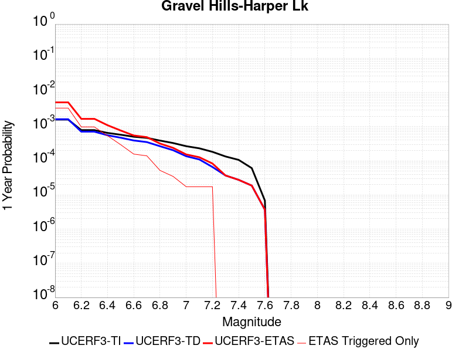 | 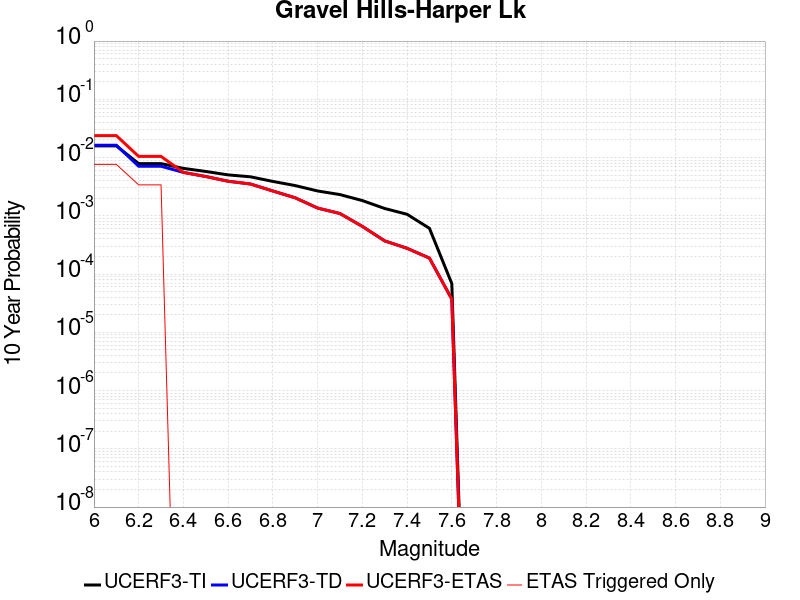 |

| Magnitude | 1 wk TI Prob | 1 wk TD Prob | 1 wk ETAS Prob | 1 wk ETAS/TD Gain | 1 wk ETAS Triggered Only | 1 mo TI Prob | 1 mo TD Prob | 1 mo ETAS Prob | 1 mo ETAS/TD Gain | 1 mo ETAS Triggered Only | 1 yr TI Prob | 1 yr TD Prob | 1 yr ETAS Prob | 1 yr ETAS/TD Gain | 1 yr ETAS Triggered Only | 10 yr TI Prob | 10 yr TD Prob | 10 yr ETAS Prob | 10 yr ETAS/TD Gain | 10 yr ETAS Triggered Only |
|-----|-----|-----|-----|-----|-----|-----|-----|-----|-----|-----|-----|-----|-----|-----|-----|-----|-----|-----|-----|-----|
| 6.0 | 3.0679566E-5 | 3.1464646E-5 | 0.0037480926 | 119.120766 | 0.003716745 | 1.3147724E-4 | 1.3484273E-4 | 0.004144474 | 30.735613 | 0.004010172 | 0.0015995599 | 0.0016406906 | 0.0061325263 | 3.7377713 | 0.0044992175 | 0.015880952 | 0.01630734 | 0.021118041 | 1.2950023 | 0.004890454 |
| 6.1 | 3.0679566E-5 | 3.1464646E-5 | 0.0037480926 | 119.120766 | 0.003716745 | 1.3147724E-4 | 1.3484273E-4 | 0.004144474 | 30.735613 | 0.004010172 | 0.0015995599 | 0.0016406906 | 0.0061325263 | 3.7377713 | 0.0044992175 | 0.015880952 | 0.01630734 | 0.021118041 | 1.2950023 | 0.004890454 |
| 6.2 | 1.514536E-5 | 1.3635206E-5 | 7.9609716E-4 | 58.38541 | 7.824726E-4 | 6.490707E-5 | 5.843536E-5 | 8.408622E-4 | 14.389614 | 7.824726E-4 | 7.8995706E-4 | 7.1123015E-4 | 0.0016886253 | 2.3742318 | 9.780908E-4 | 0.007871548 | 0.0070907404 | 0.008159012 | 1.1506572 | 0.0010758998 |
| 6.3 | 1.514536E-5 | 1.3635206E-5 | 7.9609716E-4 | 58.38541 | 7.824726E-4 | 6.490707E-5 | 5.843536E-5 | 8.408622E-4 | 14.389614 | 7.824726E-4 | 7.8995706E-4 | 7.1123015E-4 | 0.0016886253 | 2.3742318 | 9.780908E-4 | 0.007871548 | 0.0070907404 | 0.008159012 | 1.1506572 | 0.0010758998 |
| 6.4 | 1.2532521E-5 | 1.06896905E-5 | 1.0849772E-4 | 10.149754 | 9.7809076E-5 | 5.37097E-5 | 4.581219E-5 | 1.4361678E-4 | 3.1349034 | 9.7809076E-5 | 6.537194E-4 | 5.576265E-4 | 7.5313554E-4 | 1.3506094 | 1.9561815E-4 | 0.0065179965 | 0.005562863 | 0.005854658 | 1.0524541 | 2.9342723E-4 |
| 6.5 | 1.1094058E-5 | 9.083664E-6 | 1.0689185E-4 | 11.767483 | 9.7809076E-5 | 4.7545094E-5 | 3.892943E-5 | 1.367347E-4 | 3.5123737 | 9.7809076E-5 | 5.787078E-4 | 4.7386673E-4 | 5.716295E-4 | 1.2063085 | 9.7809076E-5 | 0.0057720304 | 0.0047289706 | 0.0049236636 | 1.0411702 | 1.9561815E-4 |
| 6.6 | 9.688328E-6 | 7.5316952E-6 | 1.05340034E-4 | 13.986232 | 9.7809076E-5 | 4.1520743E-5 | 3.227831E-5 | 1.3008423E-4 | 4.0300817 | 9.7809076E-5 | 5.053978E-4 | 3.9292008E-4 | 4.9069076E-4 | 1.2488309 | 9.7809076E-5 | 0.0050424994 | 0.0039225104 | 0.004019936 | 1.0248375 | 9.7809076E-5 |
| 6.7 | 8.974824E-6 | 6.749413E-6 | 1.0455783E-4 | 15.491396 | 9.7809076E-5 | 3.8462964E-5 | 2.8925748E-5 | 1.2673199E-4 | 4.3812866 | 9.7809076E-5 | 4.6818596E-4 | 3.5211627E-4 | 4.498909E-4 | 1.2776772 | 9.7809076E-5 | 0.004672008 | 0.0035158044 | 0.0036132697 | 1.027722 | 9.7809076E-5 |
| 6.8 | 7.4780046E-6 | 5.1161933E-6 | 5.1161933E-6 | 1.0 | 0.0 | 3.20482E-5 | 2.1926366E-5 | 2.1926366E-5 | 1.0 | 0.0 | 3.9011694E-4 | 2.669222E-4 | 2.669222E-4 | 1.0 | 0.0 | 0.0038943281 | 0.0026661542 | 0.0026661542 | 1.0 | 0.0 |
| 6.9 | 6.3409307E-6 | 3.9074966E-6 | 3.9074966E-6 | 1.0 | 0.0 | 2.7175134E-5 | 1.6746313E-5 | 1.6746313E-5 | 1.0 | 0.0 | 3.3080703E-4 | 2.0386827E-4 | 2.0386827E-4 | 1.0 | 0.0 | 0.0033031502 | 0.0020369107 | 0.0020369107 | 1.0 | 0.0 |
| 7.0 | 5.1239335E-6 | 2.6058565E-6 | 2.6058565E-6 | 1.0 | 0.0 | 2.195953E-5 | 1.116791E-5 | 1.116791E-5 | 1.0 | 0.0 | 2.6732447E-4 | 1.3596108E-4 | 1.3596108E-4 | 1.0 | 0.0 | 0.0026700313 | 0.0013588042 | 0.0013588042 | 1.0 | 0.0 |
| 7.1 | 4.438899E-6 | 2.0984728E-6 | 2.0984728E-6 | 1.0 | 0.0 | 1.9023713E-5 | 8.993425E-6 | 8.993425E-6 | 1.0 | 0.0 | 2.315891E-4 | 1.0948967E-4 | 1.0948967E-4 | 1.0 | 0.0 | 0.002313479 | 0.0010943791 | 0.0010943791 | 1.0 | 0.0 |
| 7.2 | 3.50367E-6 | 1.2615716E-6 | 1.2615716E-6 | 1.0 | 0.0 | 1.5015643E-5 | 5.4067245E-6 | 5.4067245E-6 | 1.0 | 0.0 | 1.8280011E-4 | 6.582497E-5 | 6.582497E-5 | 1.0 | 0.0 | 0.0018264982 | 6.580629E-4 | 6.580629E-4 | 1.0 | 0.0 |
| 7.3 | 2.561638E-6 | 7.1191585E-7 | 7.1191585E-7 | 1.0 | 0.0 | 1.0978401E-5 | 3.0510646E-6 | 3.0510646E-6 | 1.0 | 0.0 | 1.3365384E-4 | 3.71461E-5 | 3.71461E-5 | 1.0 | 0.0 | 0.0013357349 | 3.7140088E-4 | 3.7140088E-4 | 1.0 | 0.0 |
| 7.4 | 2.0368864E-6 | 5.304837E-7 | 5.304837E-7 | 1.0 | 0.0 | 8.729483E-6 | 2.2734996E-6 | 2.2734996E-6 | 1.0 | 0.0 | 1.06276275E-4 | 2.7679513E-5 | 2.7679513E-5 | 1.0 | 0.0 | 0.0010622547 | 2.767612E-4 | 2.767612E-4 | 1.0 | 0.0 |
| 7.5 | 1.1681728E-6 | 3.6030585E-7 | 3.6030585E-7 | 1.0 | 0.0 | 5.0064455E-6 | 1.544167E-6 | 1.544167E-6 | 1.0 | 0.0 | 6.0951766E-5 | 1.8800076E-5 | 1.8800076E-5 | 1.0 | 0.0 | 6.093505E-4 | 1.8798532E-4 | 1.8798532E-4 | 1.0 | 0.0 |
| 7.6 | 1.3154387E-7 | 7.1197384E-8 | 7.1197384E-8 | 1.0 | 0.0 | 5.6375933E-7 | 3.051316E-7 | 3.051316E-7 | 1.0 | 0.0 | 6.863748E-6 | 3.7149728E-6 | 3.7149728E-6 | 1.0 | 0.0 | 6.863536E-5 | 3.7149264E-5 | 3.7149264E-5 | 1.0 | 0.0 |

## San Andreas (Mojave N)
*[(top)](#table-of-contents)*

| 1 Week | 1 Month | 1 Year | 10 Year |
|-----|-----|-----|-----|
| 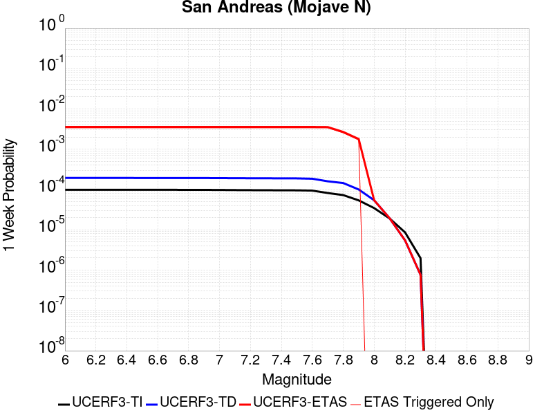 | 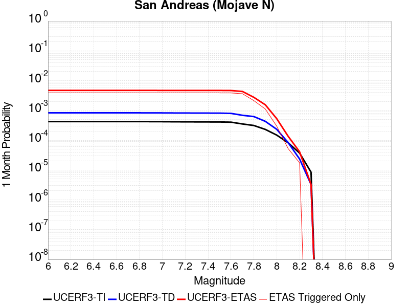 | 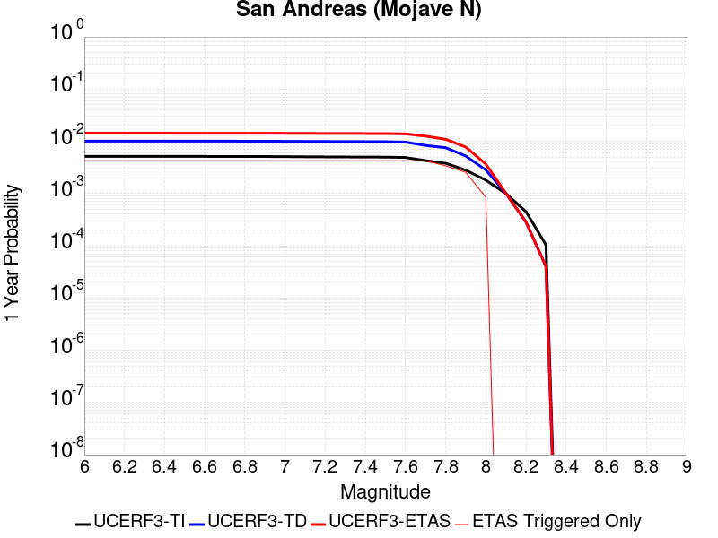 | 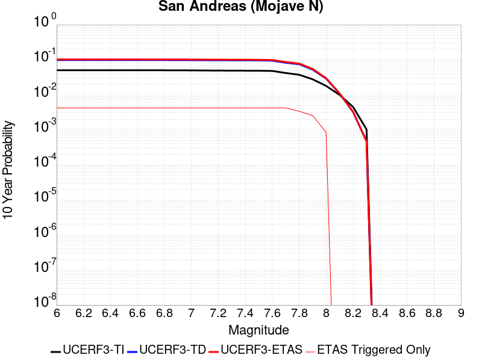 |

| Magnitude | 1 wk TI Prob | 1 wk TD Prob | 1 wk ETAS Prob | 1 wk ETAS/TD Gain | 1 wk ETAS Triggered Only | 1 mo TI Prob | 1 mo TD Prob | 1 mo ETAS Prob | 1 mo ETAS/TD Gain | 1 mo ETAS Triggered Only | 1 yr TI Prob | 1 yr TD Prob | 1 yr ETAS Prob | 1 yr ETAS/TD Gain | 1 yr ETAS Triggered Only | 10 yr TI Prob | 10 yr TD Prob | 10 yr ETAS Prob | 10 yr ETAS/TD Gain | 10 yr ETAS Triggered Only |
|-----|-----|-----|-----|-----|-----|-----|-----|-----|-----|-----|-----|-----|-----|-----|-----|-----|-----|-----|-----|-----|
| 6.0 | 9.877682E-5 | 1.9400702E-4 | 0.0038122407 | 19.650015 | 0.0036189358 | 4.2326056E-4 | 8.311939E-4 | 0.0048380326 | 5.820583 | 0.004010172 | 0.0051410277 | 0.010072956 | 0.014236381 | 1.4133271 | 0.0042057903 | 0.05023708 | 0.09831428 | 0.10228296 | 1.0403674 | 0.0044014086 |
| 6.1 | 9.877682E-5 | 1.9400702E-4 | 0.0038122407 | 19.650015 | 0.0036189358 | 4.2326056E-4 | 8.311939E-4 | 0.0048380326 | 5.820583 | 0.004010172 | 0.0051410277 | 0.010072956 | 0.014236381 | 1.4133271 | 0.0042057903 | 0.05023708 | 0.09831428 | 0.10228296 | 1.0403674 | 0.0044014086 |
| 6.2 | 9.877682E-5 | 1.9400702E-4 | 0.0038122407 | 19.650015 | 0.0036189358 | 4.2326056E-4 | 8.311939E-4 | 0.0048380326 | 5.820583 | 0.004010172 | 0.0051410277 | 0.010072956 | 0.014236381 | 1.4133271 | 0.0042057903 | 0.05023708 | 0.09831428 | 0.10228296 | 1.0403674 | 0.0044014086 |
| 6.3 | 9.877682E-5 | 1.9400702E-4 | 0.0038122407 | 19.650015 | 0.0036189358 | 4.2326056E-4 | 8.311939E-4 | 0.0048380326 | 5.820583 | 0.004010172 | 0.0051410277 | 0.010072956 | 0.014236381 | 1.4133271 | 0.0042057903 | 0.05023708 | 0.09831428 | 0.10228296 | 1.0403674 | 0.0044014086 |
| 6.4 | 9.877682E-5 | 1.9400702E-4 | 0.0038122407 | 19.650015 | 0.0036189358 | 4.2326056E-4 | 8.311939E-4 | 0.0048380326 | 5.820583 | 0.004010172 | 0.0051410277 | 0.010072956 | 0.014236381 | 1.4133271 | 0.0042057903 | 0.05023708 | 0.09831428 | 0.10228296 | 1.0403674 | 0.0044014086 |
| 6.5 | 9.861474E-5 | 1.9374468E-4 | 0.0038119794 | 19.675272 | 0.0036189358 | 4.2256617E-4 | 8.300703E-4 | 0.0048369137 | 5.827113 | 0.004010172 | 0.0051326132 | 0.010059402 | 0.0142228855 | 1.4138896 | 0.0042057903 | 0.050156746 | 0.098192066 | 0.102161296 | 1.040423 | 0.0044014086 |
| 6.6 | 9.861474E-5 | 1.9374468E-4 | 0.0038119794 | 19.675272 | 0.0036189358 | 4.2256617E-4 | 8.300703E-4 | 0.0048369137 | 5.827113 | 0.004010172 | 0.0051326132 | 0.010059402 | 0.0142228855 | 1.4138896 | 0.0042057903 | 0.050156746 | 0.098192066 | 0.102161296 | 1.040423 | 0.0044014086 |
| 6.7 | 9.8552715E-5 | 1.9364421E-4 | 0.0038118793 | 19.684963 | 0.0036189358 | 4.223004E-4 | 8.2964E-4 | 0.0048364853 | 5.829619 | 0.004010172 | 0.0051293927 | 0.010054212 | 0.014217717 | 1.4141055 | 0.0042057903 | 0.050125998 | 0.098145254 | 0.102114685 | 1.0404445 | 0.0044014086 |
| 6.8 | 9.8464974E-5 | 1.9349584E-4 | 0.0038117315 | 19.699293 | 0.0036189358 | 4.219245E-4 | 8.290045E-4 | 0.0048358524 | 5.8333244 | 0.004010172 | 0.0051248376 | 0.010046546 | 0.0142100835 | 1.4144247 | 0.0042057903 | 0.05008251 | 0.09807528 | 0.10204502 | 1.0404764 | 0.0044014086 |
| 6.9 | 9.825824E-5 | 1.9317595E-4 | 0.0038114127 | 19.730267 | 0.0036189358 | 4.2103877E-4 | 8.276344E-4 | 0.0048344876 | 5.8413324 | 0.004010172 | 0.0051141046 | 0.010030019 | 0.014193625 | 1.4151145 | 0.0042057903 | 0.049980022 | 0.09792438 | 0.10189478 | 1.0405456 | 0.0044014086 |
| 7.0 | 9.781462E-5 | 1.924896E-4 | 0.003810729 | 19.797064 | 0.0036189358 | 4.1913814E-4 | 8.246948E-4 | 0.00483156 | 5.8586035 | 0.004010172 | 0.005091073 | 0.009994558 | 0.014158314 | 1.4166023 | 0.0042057903 | 0.04976007 | 0.09760077 | 0.1015726 | 1.0406946 | 0.0044014086 |
| 7.1 | 9.7121134E-5 | 1.9150671E-4 | 0.0038097496 | 19.893555 | 0.0036189358 | 4.1616702E-4 | 8.204851E-4 | 0.004827367 | 5.883552 | 0.004010172 | 0.005055068 | 0.009943774 | 0.014107743 | 1.4187514 | 0.0042057903 | 0.04941613 | 0.09713728 | 0.10111115 | 1.0409098 | 0.0044014086 |
| 7.2 | 9.663819E-5 | 1.9081456E-4 | 0.00380906 | 19.962101 | 0.0036189358 | 4.1409794E-4 | 8.175206E-4 | 0.0048244144 | 5.9012756 | 0.004010172 | 0.0050299936 | 0.00990801 | 0.0140721295 | 1.4202781 | 0.0042057903 | 0.049176537 | 0.09681055 | 0.10078585 | 1.0410627 | 0.0044014086 |
| 7.3 | 9.6277574E-5 | 1.9033969E-4 | 0.0038085866 | 20.009418 | 0.0036189358 | 4.125529E-4 | 8.154867E-4 | 0.0048223888 | 5.91351 | 0.004010172 | 0.0050112694 | 0.009883473 | 0.014047695 | 1.4213319 | 0.0042057903 | 0.04899759 | 0.09658401 | 0.10056031 | 1.0411694 | 0.0044014086 |
| 7.4 | 9.593308E-5 | 1.897375E-4 | 0.0038079866 | 20.069763 | 0.0036189358 | 4.1107697E-4 | 8.129075E-4 | 0.0048198197 | 5.929112 | 0.004010172 | 0.0049933824 | 0.009852355 | 0.014016708 | 1.422676 | 0.0042057903 | 0.04882661 | 0.09630218 | 0.100279726 | 1.0413027 | 0.0044014086 |
| 7.5 | 9.561707E-5 | 1.8919831E-4 | 0.0038074495 | 20.124119 | 0.0036189358 | 4.0972308E-4 | 8.1059814E-4 | 0.00481752 | 5.9431663 | 0.004010172 | 0.0049769743 | 0.009824493 | 0.013988963 | 1.4238865 | 0.0042057903 | 0.048669744 | 0.09604836 | 0.100027025 | 1.0414236 | 0.0044014086 |
| 7.6 | 9.418194E-5 | 1.8572104E-4 | 0.0038039847 | 20.48225 | 0.0036189358 | 4.0357444E-4 | 7.957047E-4 | 0.004802686 | 6.035764 | 0.004010172 | 0.004902454 | 0.009644784 | 0.013810011 | 1.4318631 | 0.0042057903 | 0.047957025 | 0.094430685 | 0.09841646 | 1.0422086 | 0.0044014086 |
| 7.7 | 8.202141E-5 | 1.6021315E-4 | 0.0037785692 | 23.584639 | 0.0036189358 | 3.51473E-4 | 6.8644714E-4 | 0.0045961244 | 6.6955256 | 0.003912363 | 0.00427079 | 0.008325525 | 0.012399305 | 1.4893122 | 0.004107981 | 0.04189639 | 0.08223219 | 0.0861819 | 1.0480311 | 0.0043035992 |
| 7.8 | 7.2859846E-5 | 1.4516473E-4 | 0.0020032674 | 13.799961 | 0.0018583725 | 3.1221908E-4 | 6.219862E-4 | 0.0026746993 | 4.300255 | 0.0020539905 | 0.003794643 | 0.0075464295 | 0.009681991 | 1.2829896 | 0.0021517996 | 0.037304975 | 0.07472468 | 0.07680619 | 1.0278556 | 0.0022496087 |
| 7.9 | 5.3874453E-5 | 1.0045676E-4 | 0.0010784493 | 10.735457 | 9.780908E-4 | 2.3087008E-4 | 4.3045796E-4 | 0.0015058947 | 3.498355 | 0.0010758998 | 0.0028072202 | 0.0052282433 | 0.0063958154 | 1.2233202 | 0.0011737089 | 0.02772022 | 0.05242443 | 0.05362929 | 1.0229828 | 0.001271518 |
| 8.0 | 3.468538E-5 | 5.4260272E-5 | 2.4986782E-4 | 4.604986 | 1.9561815E-4 | 1.4864317E-4 | 2.325233E-4 | 5.258823E-4 | 2.2616327 | 2.9342723E-4 | 0.0018082283 | 0.002827298 | 0.0031198955 | 1.1034902 | 2.9342723E-4 | 0.017935853 | 0.028947512 | 0.029232444 | 1.0098431 | 2.9342723E-4 |
| 8.1 | 1.9152367E-5 | 1.940263E-5 | 1.940263E-5 | 1.0 | 0.0 | 8.207899E-5 | 8.3151484E-5 | 8.3151484E-5 | 1.0 | 0.0 | 9.988535E-4 | 0.0010118998 | 0.0010118998 | 1.0 | 0.0 | 0.009943757 | 0.01085625 | 0.01085625 | 1.0 | 0.0 |
| 8.2 | 8.643924E-6 | 5.4748625E-6 | 5.4748625E-6 | 1.0 | 0.0 | 3.704486E-5 | 2.3463486E-5 | 2.3463486E-5 | 1.0 | 0.0 | 4.5092785E-4 | 2.8563058E-4 | 2.8563058E-4 | 1.0 | 0.0 | 0.0045001395 | 0.0032487072 | 0.0032487072 | 1.0 | 0.0 |
| 8.3 | 1.983087E-6 | 7.6599065E-7 | 7.6599065E-7 | 1.0 | 0.0 | 8.498917E-6 | 3.282813E-6 | 3.282813E-6 | 1.0 | 0.0 | 1.034694E-4 | 3.9967534E-5 | 3.9967534E-5 | 1.0 | 0.0 | 0.0010342124 | 4.719687E-4 | 4.719687E-4 | 1.0 | 0.0 |

## San Andreas (Mojave S)
*[(top)](#table-of-contents)*

| 1 Week | 1 Month | 1 Year | 10 Year |
|-----|-----|-----|-----|
|  | 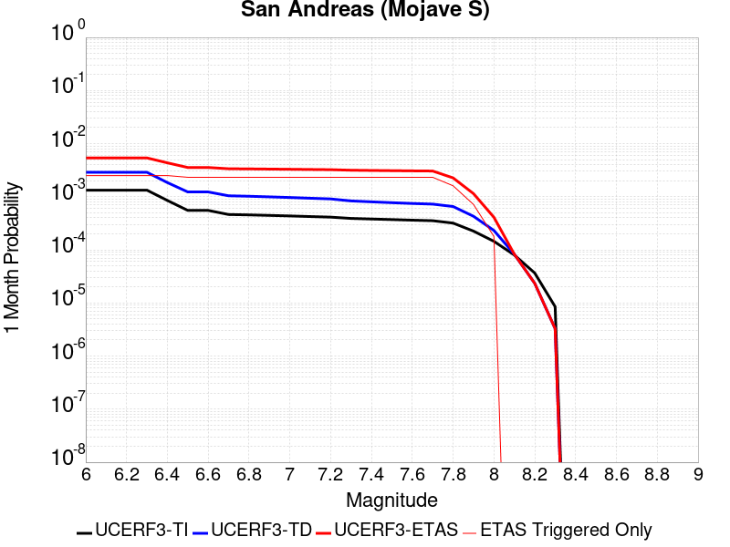 | 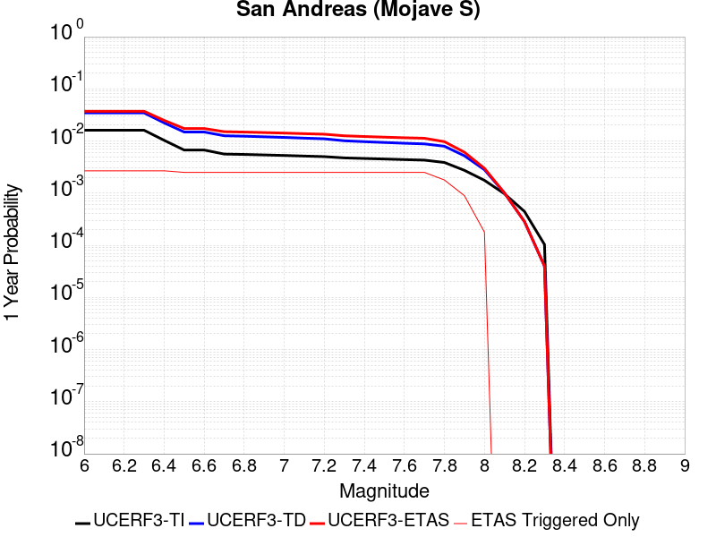 | 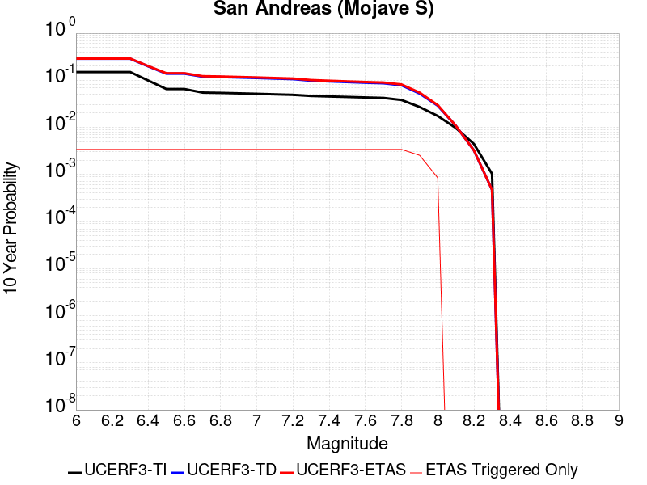 |

| Magnitude | 1 wk TI Prob | 1 wk TD Prob | 1 wk ETAS Prob | 1 wk ETAS/TD Gain | 1 wk ETAS Triggered Only | 1 mo TI Prob | 1 mo TD Prob | 1 mo ETAS Prob | 1 mo ETAS/TD Gain | 1 mo ETAS Triggered Only | 1 yr TI Prob | 1 yr TD Prob | 1 yr ETAS Prob | 1 yr ETAS/TD Gain | 1 yr ETAS Triggered Only | 10 yr TI Prob | 10 yr TD Prob | 10 yr ETAS Prob | 10 yr ETAS/TD Gain | 10 yr ETAS Triggered Only |
|-----|-----|-----|-----|-----|-----|-----|-----|-----|-----|-----|-----|-----|-----|-----|-----|-----|-----|-----|-----|-----|
| 6.0 | 3.1064058E-4 | 6.7460834E-4 | 0.0033136718 | 4.911994 | 0.002640845 | 0.0013306376 | 0.0028881032 | 0.0057163746 | 1.9792832 | 0.0028364633 | 0.016080605 | 0.03462235 | 0.03754945 | 1.0845437 | 0.0030320813 | 0.1496549 | 0.28660452 | 0.28883737 | 1.0077907 | 0.0031298904 |
| 6.1 | 3.1064058E-4 | 6.7460834E-4 | 0.0033136718 | 4.911994 | 0.002640845 | 0.0013306376 | 0.0028881032 | 0.0057163746 | 1.9792832 | 0.0028364633 | 0.016080605 | 0.03462235 | 0.03754945 | 1.0845437 | 0.0030320813 | 0.1496549 | 0.28660452 | 0.28883737 | 1.0077907 | 0.0031298904 |
| 6.2 | 3.1064058E-4 | 6.7460834E-4 | 0.0033136718 | 4.911994 | 0.002640845 | 0.0013306376 | 0.0028881032 | 0.0057163746 | 1.9792832 | 0.0028364633 | 0.016080605 | 0.03462235 | 0.03754945 | 1.0845437 | 0.0030320813 | 0.1496549 | 0.28660452 | 0.28883737 | 1.0077907 | 0.0031298904 |
| 6.3 | 3.1064058E-4 | 6.7460834E-4 | 0.0033136718 | 4.911994 | 0.002640845 | 0.0013306376 | 0.0028881032 | 0.0057163746 | 1.9792832 | 0.0028364633 | 0.016080605 | 0.03462235 | 0.03754945 | 1.0845437 | 0.0030320813 | 0.1496549 | 0.28660452 | 0.28883737 | 1.0077907 | 0.0031298904 |
| 6.4 | 1.9872203E-4 | 4.3179357E-4 | 0.0029737314 | 6.886929 | 0.002543036 | 8.5138786E-4 | 0.0018492596 | 0.0045828493 | 2.4782076 | 0.0027386541 | 0.010316478 | 0.02228844 | 0.025061682 | 1.1244252 | 0.0028364633 | 0.098504856 | 0.19699748 | 0.19935371 | 1.0119607 | 0.0029342724 |
| 6.5 | 1.291105E-4 | 2.875267E-4 | 0.0026342697 | 9.161826 | 0.0023474179 | 5.5321335E-4 | 0.0012316781 | 0.003771582 | 3.062149 | 0.002543036 | 0.006714592 | 0.0148934 | 0.017494913 | 1.1746756 | 0.002640845 | 0.065152965 | 0.13803436 | 0.14039499 | 1.0171018 | 0.0027386541 |
| 6.6 | 1.291105E-4 | 2.875267E-4 | 0.0026342697 | 9.161826 | 0.0023474179 | 5.5321335E-4 | 0.0012316781 | 0.003771582 | 3.062149 | 0.002543036 | 0.006714592 | 0.0148934 | 0.017494913 | 1.1746756 | 0.002640845 | 0.065152965 | 0.13803436 | 0.14039499 | 1.0171018 | 0.0027386541 |
| 6.7 | 1.08001186E-4 | 2.4333889E-4 | 0.0025901855 | 10.644355 | 0.0023474179 | 4.6278012E-4 | 0.0010424647 | 0.0035828496 | 3.4369025 | 0.002543036 | 0.0056198016 | 0.012618446 | 0.015225967 | 1.2066437 | 0.002640845 | 0.054797906 | 0.119176775 | 0.12158904 | 1.0202411 | 0.0027386541 |
| 6.8 | 1.0624356E-4 | 2.3851555E-4 | 0.0025853736 | 10.839434 | 0.0023474179 | 4.5525006E-4 | 0.0010218095 | 0.0035622471 | 3.4862142 | 0.002543036 | 0.0055285925 | 0.012369843 | 0.014978021 | 1.2108498 | 0.002640845 | 0.053930566 | 0.11712591 | 0.1195438 | 1.0206435 | 0.0027386541 |
| 6.9 | 1.0393785E-4 | 2.3221898E-4 | 0.0025790918 | 11.106291 | 0.0023474179 | 4.4537184E-4 | 9.948451E-4 | 0.0035353513 | 3.55367 | 0.002543036 | 0.0054089287 | 0.012045221 | 0.014654256 | 1.2166034 | 0.002640845 | 0.05279156 | 0.11442335 | 0.11684864 | 1.0211958 | 0.0027386541 |
| 7.0 | 1.0155622E-4 | 2.2591476E-4 | 0.0025728024 | 11.388376 | 0.0023474179 | 4.3516833E-4 | 9.6784724E-4 | 0.003508422 | 3.624975 | 0.002543036 | 0.005285311 | 0.0117200995 | 0.014329994 | 1.2226853 | 0.002640845 | 0.05161361 | 0.111683756 | 0.11411654 | 1.0217829 | 0.0027386541 |
| 7.1 | 9.885595E-5 | 2.1879886E-4 | 0.0025657031 | 11.72631 | 0.0023474179 | 4.2359953E-4 | 9.3737274E-4 | 0.0034780249 | 3.710397 | 0.002543036 | 0.0051451353 | 0.011352993 | 0.013963857 | 1.2299714 | 0.002640845 | 0.05027629 | 0.1085682 | 0.11100952 | 1.0224866 | 0.0027386541 |
| 7.2 | 9.6411415E-5 | 2.124288E-4 | 0.002559348 | 12.048027 | 0.0023474179 | 4.1312634E-4 | 9.1009185E-4 | 0.0034508135 | 3.7917202 | 0.002543036 | 0.005018219 | 0.011024255 | 0.013635987 | 1.2369077 | 0.002640845 | 0.049064007 | 0.105758004 | 0.108207025 | 1.0231569 | 0.0027386541 |
| 7.3 | 9.1180635E-5 | 1.9471257E-4 | 0.0025416734 | 13.053463 | 0.0023474179 | 3.907156E-4 | 8.342157E-4 | 0.0033751302 | 4.045872 | 0.002543036 | 0.004746591 | 0.01010939 | 0.012723537 | 1.258586 | 0.002640845 | 0.046464786 | 0.09795115 | 0.100421555 | 1.0252208 | 0.0027386541 |
| 7.4 | 8.887388E-5 | 1.8719878E-4 | 0.0025341772 | 13.537359 | 0.0023474179 | 3.8083247E-4 | 8.020339E-4 | 0.0033430303 | 4.168191 | 0.002543036 | 0.0046267817 | 0.00972114 | 0.012336313 | 1.2690191 | 0.002640845 | 0.045316286 | 0.09458615 | 0.09706576 | 1.0262154 | 0.0027386541 |
| 7.5 | 8.6750515E-5 | 1.8051457E-4 | 0.0025275087 | 14.001688 | 0.0023474179 | 3.7173493E-4 | 7.7340455E-4 | 0.0033144737 | 4.2855625 | 0.002543036 | 0.004516484 | 0.009375632 | 0.011991718 | 1.2790303 | 0.002640845 | 0.04425787 | 0.091549896 | 0.09403782 | 1.0271757 | 0.0027386541 |
| 7.6 | 8.453092E-5 | 1.7439072E-4 | 0.0025213992 | 14.458333 | 0.0023474179 | 3.6222505E-4 | 7.471748E-4 | 0.0032883107 | 4.4009924 | 0.002543036 | 0.0044011753 | 0.009058985 | 0.011675906 | 1.2888758 | 0.002640845 | 0.04315024 | 0.08870898 | 0.091204695 | 1.0281336 | 0.0027386541 |
| 7.7 | 8.259102E-5 | 1.6961215E-4 | 0.0025166317 | 14.837568 | 0.0023474179 | 3.539135E-4 | 7.2670676E-4 | 0.0032678947 | 4.496855 | 0.002543036 | 0.004300386 | 0.008811831 | 0.011429405 | 1.2970523 | 0.002640845 | 0.042181134 | 0.08645982 | 0.0889617 | 1.0289367 | 0.0027386541 |
| 7.8 | 7.444844E-5 | 1.5283503E-4 | 0.0020109233 | 13.157477 | 0.0018583725 | 3.1902574E-4 | 6.548429E-4 | 0.0027074884 | 4.134562 | 0.0020539905 | 0.0038772223 | 0.007943616 | 0.010078323 | 1.2687323 | 0.0021517996 | 0.03810269 | 0.078290746 | 0.080364235 | 1.0264844 | 0.0022496087 |
| 7.9 | 5.2586525E-5 | 1.00064186E-4 | 0.0010780571 | 10.773656 | 9.780908E-4 | 2.2535135E-4 | 4.2877605E-4 | 0.0015042146 | 3.5081592 | 0.0010758998 | 0.0027402006 | 0.005207864 | 0.0063754604 | 1.2241987 | 0.0011737089 | 0.027066574 | 0.052200034 | 0.05340518 | 1.023087 | 0.001271518 |
| 8.0 | 3.379877E-5 | 5.4074168E-5 | 2.4968173E-4 | 4.617394 | 1.9561815E-4 | 1.4484383E-4 | 2.3172585E-4 | 5.250851E-4 | 2.2659755 | 2.9342723E-4 | 0.0017620471 | 0.002817614 | 0.0031102146 | 1.1038469 | 2.9342723E-4 | 0.017481409 | 0.028834904 | 0.02911987 | 1.0098827 | 2.9342723E-4 |
| 8.1 | 1.8668277E-5 | 1.9309397E-5 | 1.9309397E-5 | 1.0 | 0.0 | 8.000444E-5 | 8.275194E-5 | 8.275194E-5 | 1.0 | 0.0 | 9.736188E-4 | 0.0010070398 | 0.0010070398 | 1.0 | 0.0 | 0.009693642 | 0.010798888 | 0.010798888 | 1.0 | 0.0 |
| 8.2 | 8.541571E-6 | 5.460819E-6 | 5.460819E-6 | 1.0 | 0.0 | 3.660622E-5 | 2.3403301E-5 | 2.3403301E-5 | 1.0 | 0.0 | 4.455896E-4 | 2.84898E-4 | 2.84898E-4 | 1.0 | 0.0 | 0.0044469717 | 0.0032408056 | 0.0032408056 | 1.0 | 0.0 |
| 8.3 | 1.983087E-6 | 7.6599065E-7 | 7.6599065E-7 | 1.0 | 0.0 | 8.498917E-6 | 3.282813E-6 | 3.282813E-6 | 1.0 | 0.0 | 1.034694E-4 | 3.9967534E-5 | 3.9967534E-5 | 1.0 | 0.0 | 0.0010342124 | 4.719687E-4 | 4.719687E-4 | 1.0 | 0.0 |

## McLean Lake
*[(top)](#table-of-contents)*

| 1 Week | 1 Month | 1 Year | 10 Year |
|-----|-----|-----|-----|
| 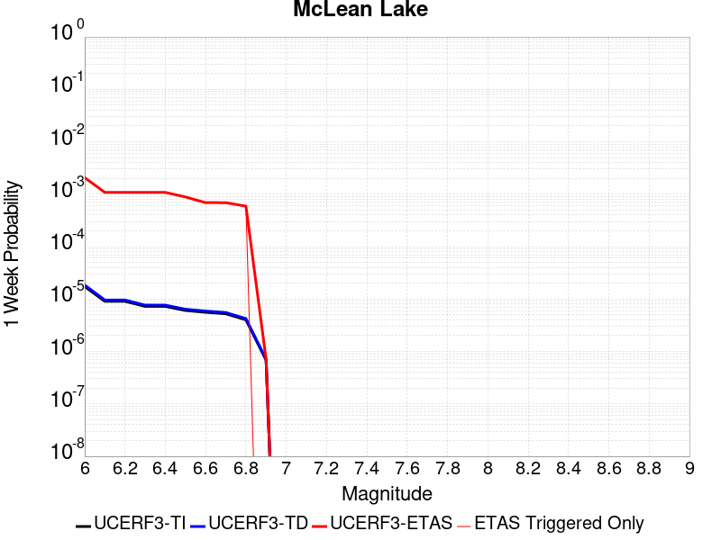 | 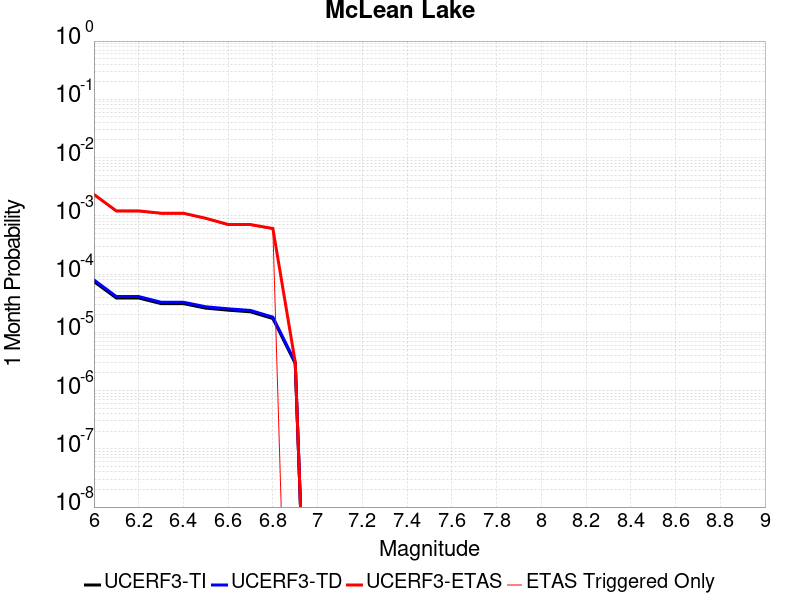 | 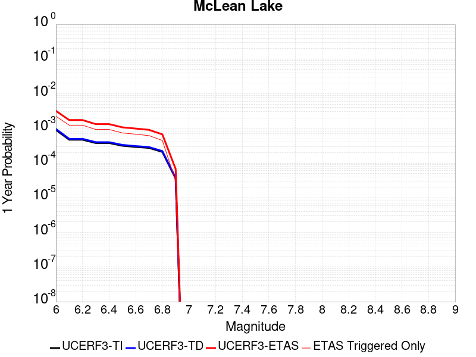 | 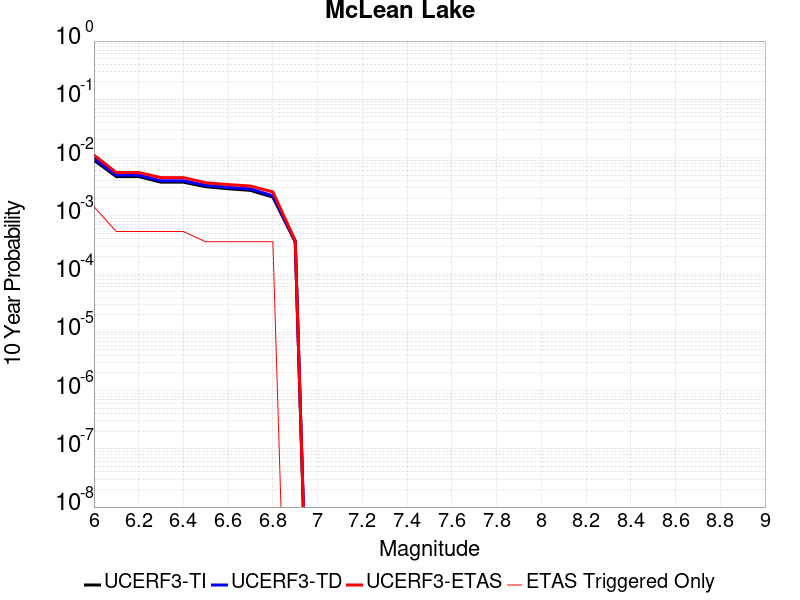 |

| Magnitude | 1 wk TI Prob | 1 wk TD Prob | 1 wk ETAS Prob | 1 wk ETAS/TD Gain | 1 wk ETAS Triggered Only | 1 mo TI Prob | 1 mo TD Prob | 1 mo ETAS Prob | 1 mo ETAS/TD Gain | 1 mo ETAS Triggered Only | 1 yr TI Prob | 1 yr TD Prob | 1 yr ETAS Prob | 1 yr ETAS/TD Gain | 1 yr ETAS Triggered Only | 10 yr TI Prob | 10 yr TD Prob | 10 yr ETAS Prob | 10 yr ETAS/TD Gain | 10 yr ETAS Triggered Only |
|-----|-----|-----|-----|-----|-----|-----|-----|-----|-----|-----|-----|-----|-----|-----|-----|-----|-----|-----|-----|-----|
| 6.0 | 1.7360222E-5 | 1.8501627E-5 | 0.0020724542 | 112.0147 | 0.0020539905 | 7.439883E-5 | 7.9290556E-5 | 0.0023287209 | 29.369463 | 0.0022496087 | 9.0542925E-4 | 9.6498354E-4 | 0.0035055655 | 3.6327722 | 0.002543036 | 0.009017491 | 0.0096127745 | 0.012131365 | 1.2620045 | 0.002543036 |
| 6.1 | 9.062689E-6 | 9.592193E-6 | 0.0010854817 | 113.16303 | 0.0010758998 | 3.8839516E-5 | 4.1108804E-5 | 0.0012147694 | 29.550106 | 0.0011737089 | 4.727685E-4 | 5.003936E-4 | 0.0018690355 | 3.7351305 | 0.0013693271 | 0.0047176396 | 0.004993552 | 0.006356041 | 1.2728498 | 0.0013693271 |
| 6.2 | 9.062689E-6 | 9.592193E-6 | 0.0010854817 | 113.16303 | 0.0010758998 | 3.8839516E-5 | 4.1108804E-5 | 0.0012147694 | 29.550106 | 0.0011737089 | 4.727685E-4 | 5.003936E-4 | 0.0018690355 | 3.7351305 | 0.0013693271 | 0.0047176396 | 0.004993552 | 0.006356041 | 1.2728498 | 0.0013693271 |
| 6.3 | 7.2575485E-6 | 7.66771E-6 | 0.0010835594 | 141.3146 | 0.0010758998 | 3.110341E-5 | 3.2861237E-5 | 0.0011087257 | 33.73962 | 0.0010758998 | 3.786182E-4 | 4.0001926E-4 | 0.0015732587 | 3.9329574 | 0.0011737089 | 0.0037797375 | 0.0039936965 | 0.0051627182 | 1.2927166 | 0.0011737089 |
| 6.4 | 7.2575485E-6 | 7.66771E-6 | 0.0010835594 | 141.3146 | 0.0010758998 | 3.110341E-5 | 3.2861237E-5 | 0.0011087257 | 33.73962 | 0.0010758998 | 3.786182E-4 | 4.0001926E-4 | 0.0015732587 | 3.9329574 | 0.0011737089 | 0.0037797375 | 0.0039936965 | 0.0051627182 | 1.2927166 | 0.0011737089 |
| 6.5 | 6.06582E-6 | 6.4038773E-6 | 8.866799E-4 | 138.45985 | 8.802817E-4 | 2.5996113E-5 | 2.7444936E-5 | 9.077025E-4 | 33.073586 | 8.802817E-4 | 3.164567E-4 | 3.3409733E-4 | 0.0012140849 | 3.6339257 | 8.802817E-4 | 0.0031600643 | 0.0033365893 | 0.004213934 | 1.2629465 | 8.802817E-4 |
| 6.6 | 5.598744E-6 | 5.910262E-6 | 6.9056975E-4 | 116.84249 | 6.8466354E-4 | 2.3994397E-5 | 2.5329486E-5 | 7.0997566E-4 | 28.029613 | 6.8466354E-4 | 2.9209262E-4 | 3.0834923E-4 | 9.928016E-4 | 3.219731 | 6.8466354E-4 | 0.0029170897 | 0.003079843 | 0.003762398 | 1.22162 | 6.8466354E-4 |
| 6.7 | 5.246996E-6 | 5.539162E-6 | 6.901989E-4 | 124.603485 | 6.8466354E-4 | 2.2486933E-5 | 2.3739085E-5 | 7.0838636E-4 | 29.840508 | 6.8466354E-4 | 2.73744E-4 | 2.8899137E-4 | 9.7345706E-4 | 3.368464 | 6.8466354E-4 | 0.0027340704 | 0.0028867796 | 0.0035694668 | 1.2364874 | 6.8466354E-4 |
| 6.8 | 4.02324E-6 | 4.2469046E-6 | 5.9109885E-4 | 139.18347 | 5.8685447E-4 | 1.7242342E-5 | 1.8200926E-5 | 6.050447E-4 | 33.242523 | 5.8685447E-4 | 2.099053E-4 | 2.2157968E-4 | 8.083041E-4 | 3.647916 | 5.8685447E-4 | 0.0020970714 | 0.002214172 | 0.002799727 | 1.2644578 | 5.8685447E-4 |
| 6.9 | 6.835972E-7 | 7.1399285E-7 | 7.1399285E-7 | 1.0 | 0.0 | 2.9296991E-6 | 3.0599674E-6 | 3.0599674E-6 | 1.0 | 0.0 | 3.56685E-5 | 3.7254784E-5 | 3.7254784E-5 | 1.0 | 0.0 | 3.5662777E-4 | 3.7251666E-4 | 3.7251666E-4 | 1.0 | 0.0 |

## So Sierra Nevada
*[(top)](#table-of-contents)*

| 1 Week | 1 Month | 1 Year | 10 Year |
|-----|-----|-----|-----|
| 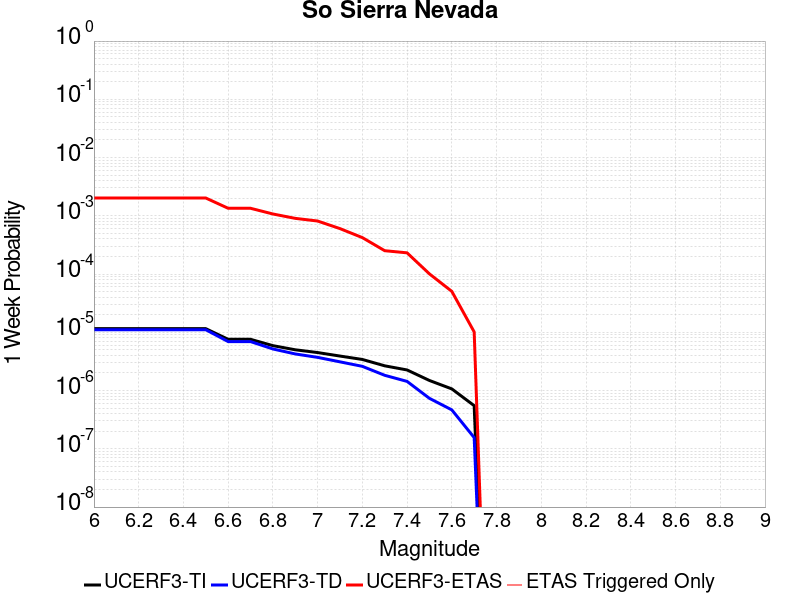 | 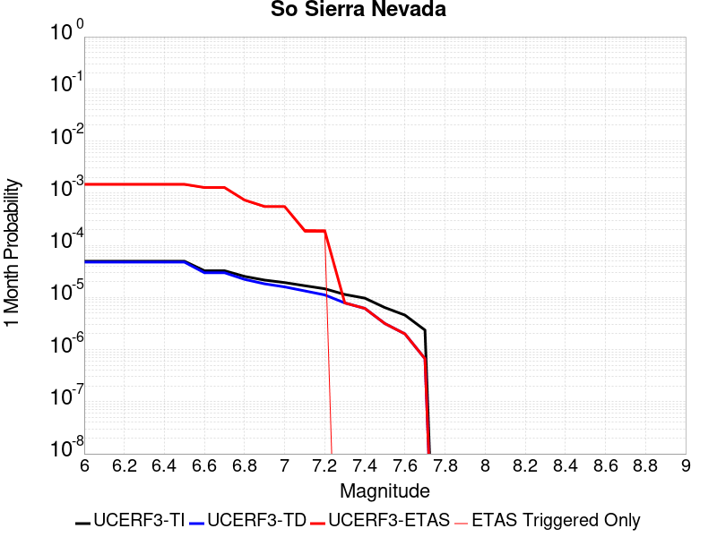 | 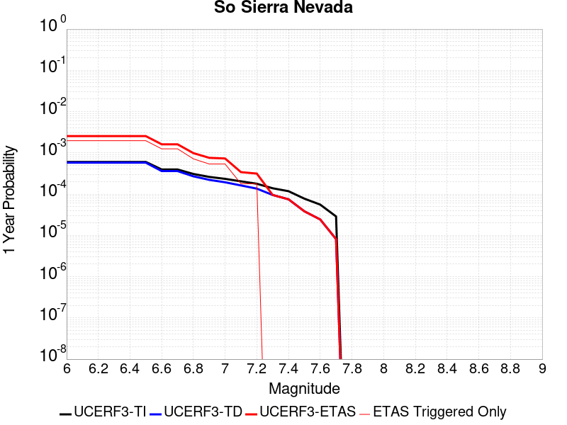 | 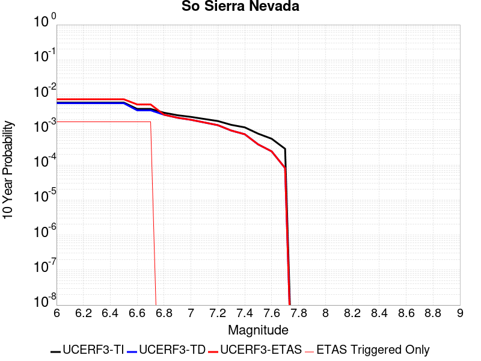 |

| Magnitude | 1 wk TI Prob | 1 wk TD Prob | 1 wk ETAS Prob | 1 wk ETAS/TD Gain | 1 wk ETAS Triggered Only | 1 mo TI Prob | 1 mo TD Prob | 1 mo ETAS Prob | 1 mo ETAS/TD Gain | 1 mo ETAS Triggered Only | 1 yr TI Prob | 1 yr TD Prob | 1 yr ETAS Prob | 1 yr ETAS/TD Gain | 1 yr ETAS Triggered Only | 10 yr TI Prob | 10 yr TD Prob | 10 yr ETAS Prob | 10 yr ETAS/TD Gain | 10 yr ETAS Triggered Only |
|-----|-----|-----|-----|-----|-----|-----|-----|-----|-----|-----|-----|-----|-----|-----|-----|-----|-----|-----|-----|-----|
| 6.0 | 1.15488665E-5 | 1.1079643E-5 | 0.0015760076 | 142.24355 | 0.0015649452 | 4.9494203E-5 | 4.748339E-5 | 0.0019057676 | 40.13546 | 0.0018583725 | 6.024253E-4 | 5.7796965E-4 | 0.0029240309 | 5.059142 | 0.0023474179 | 0.006007948 | 0.005765934 | 0.008197062 | 1.4216365 | 0.002445227 |
| 6.1 | 1.15488665E-5 | 1.1079643E-5 | 0.0015760076 | 142.24355 | 0.0015649452 | 4.9494203E-5 | 4.748339E-5 | 0.0019057676 | 40.13546 | 0.0018583725 | 6.024253E-4 | 5.7796965E-4 | 0.0029240309 | 5.059142 | 0.0023474179 | 0.006007948 | 0.005765934 | 0.008197062 | 1.4216365 | 0.002445227 |
| 6.2 | 1.15488665E-5 | 1.1079643E-5 | 0.0015760076 | 142.24355 | 0.0015649452 | 4.9494203E-5 | 4.748339E-5 | 0.0019057676 | 40.13546 | 0.0018583725 | 6.024253E-4 | 5.7796965E-4 | 0.0029240309 | 5.059142 | 0.0023474179 | 0.006007948 | 0.005765934 | 0.008197062 | 1.4216365 | 0.002445227 |
| 6.3 | 1.15488665E-5 | 1.1079643E-5 | 0.0015760076 | 142.24355 | 0.0015649452 | 4.9494203E-5 | 4.748339E-5 | 0.0019057676 | 40.13546 | 0.0018583725 | 6.024253E-4 | 5.7796965E-4 | 0.0029240309 | 5.059142 | 0.0023474179 | 0.006007948 | 0.005765934 | 0.008197062 | 1.4216365 | 0.002445227 |
| 6.4 | 1.15488665E-5 | 1.1079643E-5 | 0.0015760076 | 142.24355 | 0.0015649452 | 4.9494203E-5 | 4.748339E-5 | 0.0019057676 | 40.13546 | 0.0018583725 | 6.024253E-4 | 5.7796965E-4 | 0.0029240309 | 5.059142 | 0.0023474179 | 0.006007948 | 0.005765934 | 0.008197062 | 1.4216365 | 0.002445227 |
| 6.5 | 1.15488665E-5 | 1.1079643E-5 | 0.0015760076 | 142.24355 | 0.0015649452 | 4.9494203E-5 | 4.748339E-5 | 0.0019057676 | 40.13546 | 0.0018583725 | 6.024253E-4 | 5.7796965E-4 | 0.0029240309 | 5.059142 | 0.0023474179 | 0.006007948 | 0.005765934 | 0.008197062 | 1.4216365 | 0.002445227 |
| 6.6 | 7.587044E-6 | 6.935635E-6 | 0.0011806365 | 170.22758 | 0.0011737089 | 3.2515498E-5 | 2.9723828E-5 | 0.0013990102 | 47.06696 | 0.0013693271 | 3.9580427E-4 | 3.6183043E-4 | 0.0018284357 | 5.053294 | 0.0014671362 | 0.003951 | 0.0036127048 | 0.0051719965 | 1.4316133 | 0.0015649452 |
| 6.7 | 7.587044E-6 | 6.935635E-6 | 0.0011806365 | 170.22758 | 0.0011737089 | 3.2515498E-5 | 2.9723828E-5 | 0.0013990102 | 47.06696 | 0.0013693271 | 3.9580427E-4 | 3.6183043E-4 | 0.0018284357 | 5.053294 | 0.0014671362 | 0.003951 | 0.0036127048 | 0.0051719965 | 1.4316133 | 0.0015649452 |
| 6.8 | 5.9026956E-6 | 5.1793927E-6 | 8.854565E-4 | 170.9576 | 8.802817E-4 | 2.5297022E-5 | 2.2197215E-5 | 0.0010980732 | 49.46896 | 0.0010758998 | 3.0794772E-4 | 2.7021873E-4 | 0.0014436105 | 5.342377 | 0.0011737089 | 0.0030752132 | 0.002699018 | 0.003869559 | 1.4336915 | 0.0011737089 |
| 6.9 | 5.0118915E-6 | 4.2524252E-6 | 6.8891305E-4 | 162.00473 | 6.8466354E-4 | 2.1479358E-5 | 1.8224557E-5 | 8.984902E-4 | 49.30107 | 8.802817E-4 | 2.614798E-4 | 2.2186211E-4 | 0.0011997359 | 5.407574 | 9.780908E-4 | 0.0026117235 | 0.0022164788 | 0.0031924017 | 1.4403033 | 9.780908E-4 |
| 7.0 | 4.4924795E-6 | 3.7139177E-6 | 6.883749E-4 | 185.35007 | 6.8466354E-4 | 1.925334E-5 | 1.5916696E-5 | 7.9837686E-4 | 50.15971 | 7.824726E-4 | 2.3438422E-4 | 1.9376918E-4 | 0.0010738804 | 5.5420594 | 8.802817E-4 | 0.0023413717 | 0.0019360651 | 0.0028146426 | 1.4537953 | 8.802817E-4 |
| 7.1 | 3.9118436E-6 | 3.1119775E-6 | 1.9872953E-4 | 63.859562 | 1.9561815E-4 | 1.6764936E-5 | 1.3336982E-5 | 3.067603E-4 | 23.000729 | 2.9342723E-4 | 2.0409399E-4 | 1.6236622E-4 | 5.53539E-4 | 3.4092004 | 3.912363E-4 | 0.0020390663 | 0.001622532 | 0.0020131336 | 1.2407358 | 3.912363E-4 |
| 7.2 | 3.4200818E-6 | 2.6054543E-6 | 1.982231E-4 | 76.080055 | 1.9561815E-4 | 1.4657411E-5 | 1.11661875E-5 | 3.0459015E-4 | 27.277899 | 2.9342723E-4 | 1.7843937E-4 | 1.3594035E-4 | 4.293277E-4 | 3.1582062 | 2.9342723E-4 | 0.0017829615 | 0.0013586218 | 0.0016516503 | 1.2156807 | 2.9342723E-4 |
| 7.3 | 2.6593618E-6 | 1.8284203E-6 | 9.963732E-5 | 54.493664 | 9.7809076E-5 | 1.13972155E-5 | 7.836065E-6 | 1.0564437E-4 | 13.481814 | 9.7809076E-5 | 1.3875226E-4 | 9.540021E-5 | 1.9319996E-4 | 2.0251524 | 9.7809076E-5 | 0.0013866565 | 9.5362146E-4 | 0.0010513372 | 1.1024681 | 9.7809076E-5 |
| 7.4 | 2.2577992E-6 | 1.436438E-6 | 9.924537E-5 | 69.0913 | 9.7809076E-5 | 9.676246E-6 | 6.15615E-6 | 1.0396462E-4 | 16.88793 | 9.7809076E-5 | 1.1780193E-4 | 7.49488E-5 | 1.7275054E-4 | 2.304914 | 9.7809076E-5 | 0.001177395 | 7.492603E-4 | 8.469961E-4 | 1.1304431 | 9.7809076E-5 |
| 7.5 | 1.489319E-6 | 7.353936E-7 | 9.85444E-5 | 134.00224 | 9.7809076E-5 | 6.3827797E-6 | 3.1516831E-6 | 1.0096045E-4 | 32.03382 | 9.7809076E-5 | 7.770758E-5 | 3.8371072E-5 | 1.361764E-4 | 3.548934 | 9.7809076E-5 | 7.7680405E-4 | 3.836449E-4 | 4.8141644E-4 | 1.2548491 | 9.7809076E-5 |
| 7.6 | 1.0680322E-6 | 4.6596554E-7 | 4.6596554E-7 | 1.0 | 0.0 | 4.577273E-6 | 1.9969937E-6 | 1.9969937E-6 | 1.0 | 0.0 | 5.5726876E-5 | 2.4313129E-5 | 2.4313129E-5 | 1.0 | 0.0 | 5.5712904E-4 | 2.4310495E-4 | 2.4310495E-4 | 1.0 | 0.0 |
| 7.7 | 5.509146E-7 | 1.5580486E-7 | 1.5580486E-7 | 1.0 | 0.0 | 2.3610605E-6 | 6.677349E-7 | 6.677349E-7 | 1.0 | 0.0 | 2.8745531E-5 | 8.129644E-6 | 8.129644E-6 | 1.0 | 0.0 | 2.8741814E-4 | 8.1293576E-5 | 8.1293576E-5 | 1.0 | 0.0 |

## Death Valley (So)
*[(top)](#table-of-contents)*

| 1 Week | 1 Month | 1 Year | 10 Year |
|-----|-----|-----|-----|
| 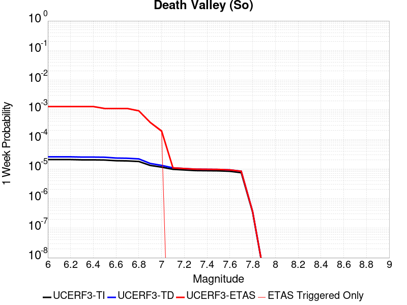 | 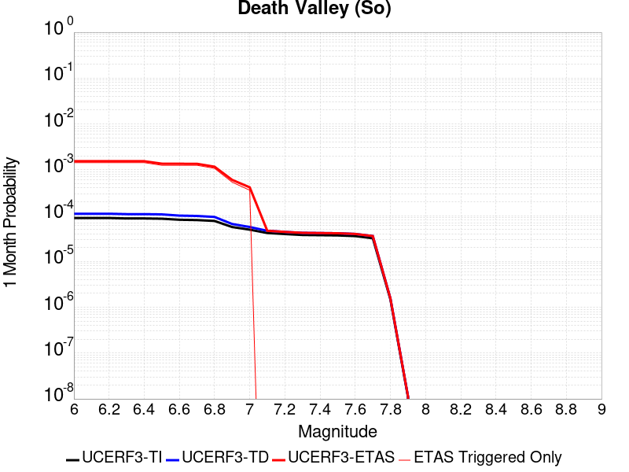 | 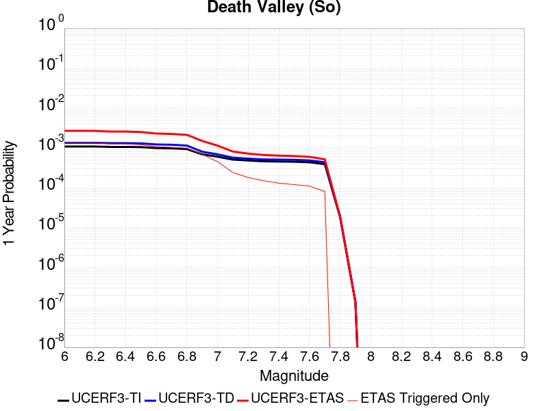 | 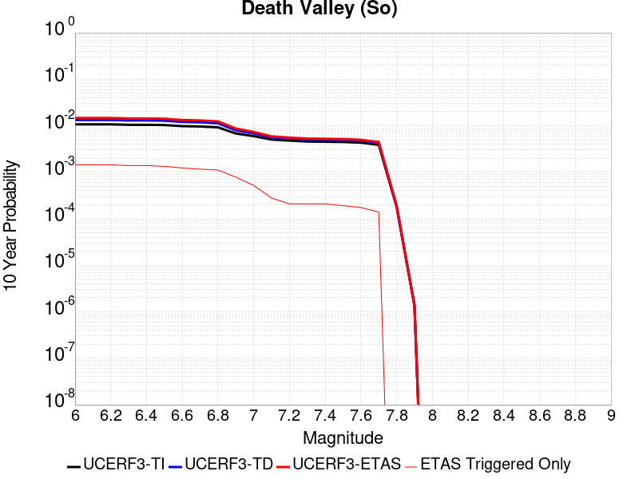 |

| Magnitude | 1 wk TI Prob | 1 wk TD Prob | 1 wk ETAS Prob | 1 wk ETAS/TD Gain | 1 wk ETAS Triggered Only | 1 mo TI Prob | 1 mo TD Prob | 1 mo ETAS Prob | 1 mo ETAS/TD Gain | 1 mo ETAS Triggered Only | 1 yr TI Prob | 1 yr TD Prob | 1 yr ETAS Prob | 1 yr ETAS/TD Gain | 1 yr ETAS Triggered Only | 10 yr TI Prob | 10 yr TD Prob | 10 yr ETAS Prob | 10 yr ETAS/TD Gain | 10 yr ETAS Triggered Only |
|-----|-----|-----|-----|-----|-----|-----|-----|-----|-----|-----|-----|-----|-----|-----|-----|-----|-----|-----|-----|-----|
| 6.0 | 2.0684236E-5 | 2.5617775E-5 | 0.0011014901 | 42.9971 | 0.0010758998 | 8.864371E-5 | 1.0978594E-4 | 0.0016745593 | 15.252949 | 0.0015649452 | 0.0010787029 | 0.0013358411 | 0.0031917312 | 2.3893044 | 0.0018583725 | 0.010734817 | 0.013281397 | 0.015211597 | 1.1453311 | 0.0019561816 |
| 6.1 | 2.0684236E-5 | 2.5617775E-5 | 0.0011014901 | 42.9971 | 0.0010758998 | 8.864371E-5 | 1.0978594E-4 | 0.0016745593 | 15.252949 | 0.0015649452 | 0.0010787029 | 0.0013358411 | 0.0031917312 | 2.3893044 | 0.0018583725 | 0.010734817 | 0.013281397 | 0.015211597 | 1.1453311 | 0.0019561816 |
| 6.2 | 2.0684236E-5 | 2.5617775E-5 | 0.0011014901 | 42.9971 | 0.0010758998 | 8.864371E-5 | 1.0978594E-4 | 0.0016745593 | 15.252949 | 0.0015649452 | 0.0010787029 | 0.0013358411 | 0.0031917312 | 2.3893044 | 0.0018583725 | 0.010734817 | 0.013281397 | 0.015211597 | 1.1453311 | 0.0019561816 |
| 6.3 | 2.0240292E-5 | 2.511786E-5 | 0.0011009907 | 43.83298 | 0.0010758998 | 8.6741224E-5 | 1.07643624E-4 | 0.0016724204 | 15.536641 | 0.0015649452 | 0.0010555626 | 0.00130979 | 0.0031657284 | 2.416974 | 0.0018583725 | 0.010505628 | 0.013023956 | 0.01495466 | 1.1482426 | 0.0019561816 |
| 6.4 | 2.0240292E-5 | 2.511786E-5 | 0.0011009907 | 43.83298 | 0.0010758998 | 8.6741224E-5 | 1.07643624E-4 | 0.0016724204 | 15.536641 | 0.0015649452 | 0.0010555626 | 0.00130979 | 0.0031657284 | 2.416974 | 0.0018583725 | 0.010505628 | 0.013023956 | 0.01495466 | 1.1482426 | 0.0019561816 |
| 6.5 | 1.9962767E-5 | 2.4807114E-5 | 0.0010028736 | 40.426857 | 9.780908E-4 | 8.55519E-5 | 1.0631196E-4 | 0.0014754934 | 13.878903 | 0.0013693271 | 0.0010410968 | 0.0012935963 | 0.0029541997 | 2.2837107 | 0.0016627543 | 0.010362327 | 0.012863902 | 0.014601818 | 1.1351002 | 0.0017605633 |
| 6.6 | 1.8937297E-5 | 2.3310964E-5 | 0.001001379 | 42.95742 | 9.780908E-4 | 8.115732E-5 | 9.990039E-5 | 0.0014690907 | 14.705555 | 0.0013693271 | 9.876423E-4 | 0.0012156231 | 0.0028763562 | 2.3661578 | 0.0016627543 | 0.009832645 | 0.012092789 | 0.013832062 | 1.1438273 | 0.0017605633 |
| 6.7 | 1.8621096E-5 | 2.2911607E-5 | 0.0010009799 | 43.688774 | 9.780908E-4 | 7.980225E-5 | 9.818898E-5 | 0.0013695821 | 13.948429 | 0.001271518 | 9.711593E-4 | 0.0011948098 | 0.002660193 | 2.2264574 | 0.0014671362 | 0.009669261 | 0.011886904 | 0.013433247 | 1.130088 | 0.0015649452 |
| 6.8 | 1.7830353E-5 | 2.1805688E-5 | 9.0206816E-4 | 41.36848 | 8.802817E-4 | 7.641356E-5 | 9.344968E-5 | 0.0012670489 | 13.558622 | 0.0011737089 | 9.29938E-4 | 0.00113717 | 0.00250494 | 2.202784 | 0.0013693271 | 0.009260561 | 0.011316354 | 0.012766888 | 1.1281803 | 0.0014671362 |
| 6.9 | 1.3135183E-5 | 1.5303925E-5 | 5.0434185E-4 | 32.955063 | 4.890454E-4 | 5.6292425E-5 | 6.558664E-5 | 8.480079E-4 | 12.929584 | 7.824726E-4 | 6.8514474E-4 | 7.982312E-4 | 0.0016778102 | 2.10191 | 8.802817E-4 | 0.006830362 | 0.007954649 | 0.0088279275 | 1.1097822 | 8.802817E-4 |
| 7.0 | 1.1507512E-5 | 1.3154199E-5 | 4.0438536E-4 | 30.74192 | 3.912363E-4 | 4.9316975E-5 | 5.6373956E-5 | 7.409989E-4 | 13.144348 | 6.8466354E-4 | 6.002687E-4 | 6.8614254E-4 | 0.0013703363 | 1.9971598 | 6.8466354E-4 | 0.0059864987 | 0.0068409415 | 0.0075209215 | 1.0993986 | 6.8466354E-4 |
| 7.1 | 9.715903E-6 | 1.0865278E-5 | 1.08673295E-4 | 10.001887 | 9.7809076E-5 | 4.1638916E-5 | 4.656467E-5 | 1.4436919E-4 | 3.1004019 | 9.7809076E-5 | 5.068359E-4 | 5.667817E-4 | 6.6453527E-4 | 1.1724714 | 9.7809076E-5 | 0.0050568148 | 0.0056538144 | 0.0057510706 | 1.0172019 | 9.7809076E-5 |
| 7.2 | 9.233269E-6 | 1.02863105E-5 | 1.08094384E-4 | 10.508567 | 9.7809076E-5 | 3.9570554E-5 | 4.4083466E-5 | 1.4188823E-4 | 3.218627 | 9.7809076E-5 | 4.81665E-4 | 5.3658825E-4 | 6.343448E-4 | 1.1821817 | 9.7809076E-5 | 0.0048062233 | 0.0053533576 | 0.005450643 | 1.0181727 | 9.7809076E-5 |
| 7.3 | 8.8041315E-6 | 9.808164E-6 | 1.0761628E-4 | 10.972113 | 9.7809076E-5 | 3.7731446E-5 | 4.2034335E-5 | 1.398393E-4 | 3.3267875 | 9.7809076E-5 | 4.592835E-4 | 5.1165203E-4 | 6.094111E-4 | 1.1910654 | 9.7809076E-5 | 0.0045833546 | 0.005105167 | 0.005202477 | 1.0190611 | 9.7809076E-5 |
| 7.4 | 8.708749E-6 | 9.707175E-6 | 1.07515305E-4 | 11.075859 | 9.7809076E-5 | 3.7322676E-5 | 4.160154E-5 | 1.3940655E-4 | 3.350995 | 9.7809076E-5 | 4.5430884E-4 | 5.0638523E-4 | 6.0414476E-4 | 1.1930537 | 9.7809076E-5 | 0.004533812 | 0.0050527398 | 0.0051500546 | 1.0192598 | 9.7809076E-5 |
| 7.5 | 8.612678E-6 | 9.604817E-6 | 1.07412954E-4 | 11.183238 | 9.7809076E-5 | 3.6910955E-5 | 4.1162875E-5 | 1.3896792E-4 | 3.37605 | 9.7809076E-5 | 4.492982E-4 | 5.01047E-4 | 5.9880706E-4 | 1.1951116 | 9.7809076E-5 | 0.004483909 | 0.0049995985 | 0.005096919 | 1.0194656 | 9.7809076E-5 |
| 7.6 | 8.319024E-6 | 9.283916E-6 | 1.07092084E-4 | 11.535227 | 9.7809076E-5 | 3.5652476E-5 | 3.978763E-5 | 1.3759281E-4 | 3.4581807 | 9.7809076E-5 | 4.3398244E-4 | 4.8431093E-4 | 5.8207265E-4 | 1.2018573 | 9.7809076E-5 | 0.0043313587 | 0.0048329784 | 0.0049303146 | 1.02014 | 9.7809076E-5 |
| 7.7 | 7.4718328E-6 | 8.34517E-6 | 8.34517E-6 | 1.0 | 0.0 | 3.2021748E-5 | 3.5764548E-5 | 3.5764548E-5 | 1.0 | 0.0 | 3.8979502E-4 | 4.353504E-4 | 4.353504E-4 | 1.0 | 0.0 | 0.00389112 | 0.0043453807 | 0.0043453807 | 1.0 | 0.0 |
| 7.8 | 3.4586725E-7 | 3.6482615E-7 | 3.6482615E-7 | 1.0 | 0.0 | 1.4822873E-6 | 1.5635396E-6 | 1.5635396E-6 | 1.0 | 0.0 | 1.80467E-5 | 1.9035933E-5 | 1.9035933E-5 | 1.0 | 0.0 | 1.8045233E-4 | 1.9034347E-4 | 1.9034347E-4 | 1.0 | 0.0 |
| 7.9 | 2.5591178E-9 | 2.6696718E-9 | 2.6696718E-9 | 1.0 | 0.0 | 1.0967647E-8 | 1.14414505E-8 | 1.14414505E-8 | 1.0 | 0.0 | 1.335311E-7 | 1.3929966E-7 | 1.3929966E-7 | 1.0 | 0.0 | 1.3353102E-6 | 1.3929966E-6 | 1.3929966E-6 | 1.0 | 0.0 |

## San Andreas (San Bernardino N)
*[(top)](#table-of-contents)*

| 1 Week | 1 Month | 1 Year | 10 Year |
|-----|-----|-----|-----|
| 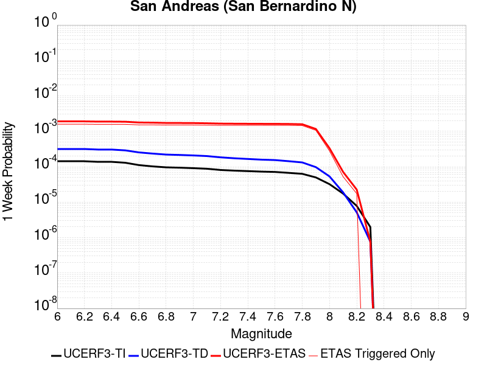 | 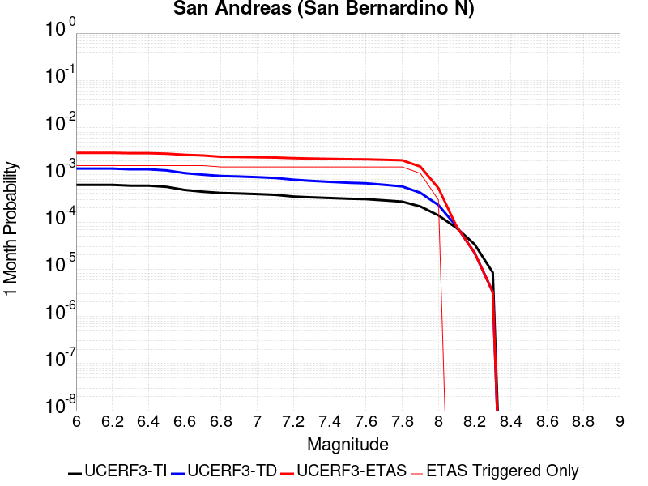 | 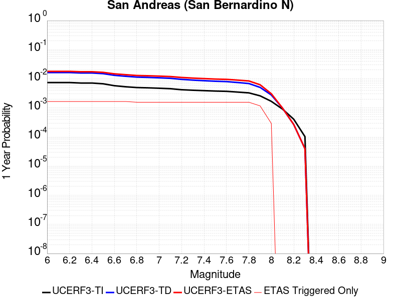 | 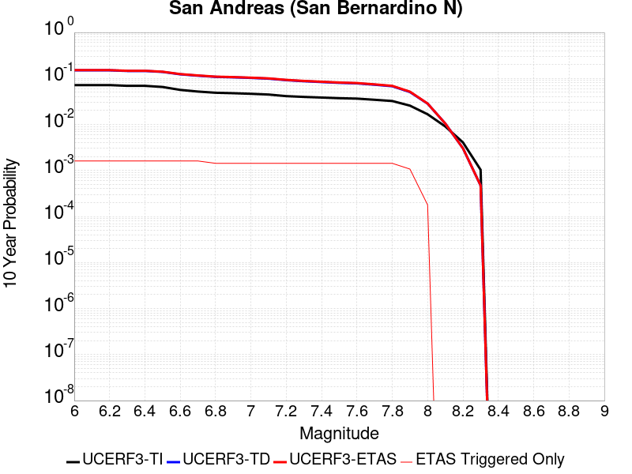 |

| Magnitude | 1 wk TI Prob | 1 wk TD Prob | 1 wk ETAS Prob | 1 wk ETAS/TD Gain | 1 wk ETAS Triggered Only | 1 mo TI Prob | 1 mo TD Prob | 1 mo ETAS Prob | 1 mo ETAS/TD Gain | 1 mo ETAS Triggered Only | 1 yr TI Prob | 1 yr TD Prob | 1 yr ETAS Prob | 1 yr ETAS/TD Gain | 1 yr ETAS Triggered Only | 10 yr TI Prob | 10 yr TD Prob | 10 yr ETAS Prob | 10 yr ETAS/TD Gain | 10 yr ETAS Triggered Only |
|-----|-----|-----|-----|-----|-----|-----|-----|-----|-----|-----|-----|-----|-----|-----|-----|-----|-----|-----|-----|-----|
| 6.0 | 1.4273766E-4 | 3.1606483E-4 | 0.0017827373 | 5.640416 | 0.0014671362 | 6.115894E-4 | 0.0013538664 | 0.002916693 | 2.1543431 | 0.0015649452 | 0.0074207084 | 0.016360244 | 0.017995793 | 1.099971 | 0.0016627543 | 0.07177748 | 0.15026689 | 0.15176289 | 1.0099556 | 0.0017605633 |
| 6.1 | 1.4273766E-4 | 3.1606483E-4 | 0.0017827373 | 5.640416 | 0.0014671362 | 6.115894E-4 | 0.0013538664 | 0.002916693 | 2.1543431 | 0.0015649452 | 0.0074207084 | 0.016360244 | 0.017995793 | 1.099971 | 0.0016627543 | 0.07177748 | 0.15026689 | 0.15176289 | 1.0099556 | 0.0017605633 |
| 6.2 | 1.4273766E-4 | 3.1606483E-4 | 0.0017827373 | 5.640416 | 0.0014671362 | 6.115894E-4 | 0.0013538664 | 0.002916693 | 2.1543431 | 0.0015649452 | 0.0074207084 | 0.016360244 | 0.017995793 | 1.099971 | 0.0016627543 | 0.07177748 | 0.15026689 | 0.15176289 | 1.0099556 | 0.0017605633 |
| 6.3 | 1.3730655E-4 | 3.0511338E-4 | 0.0017718018 | 5.807028 | 0.0014671362 | 5.883239E-4 | 0.0013069791 | 0.0028698791 | 2.1958108 | 0.0015649452 | 0.0071393442 | 0.015797773 | 0.017434258 | 1.1035897 | 0.0016627543 | 0.06914291 | 0.14556676 | 0.14707105 | 1.010334 | 0.0017605633 |
| 6.4 | 1.3730655E-4 | 3.0511338E-4 | 0.0017718018 | 5.807028 | 0.0014671362 | 5.883239E-4 | 0.0013069791 | 0.0028698791 | 2.1958108 | 0.0015649452 | 0.0071393442 | 0.015797773 | 0.017434258 | 1.1035897 | 0.0016627543 | 0.06914291 | 0.14556676 | 0.14707105 | 1.010334 | 0.0017605633 |
| 6.5 | 1.2942807E-4 | 2.8925808E-4 | 0.0017559698 | 6.070599 | 0.0014671362 | 5.545738E-4 | 0.0012390936 | 0.0028020998 | 2.2614107 | 0.0015649452 | 0.0067310524 | 0.01498286 | 0.016620701 | 1.1093143 | 0.0016627543 | 0.06530788 | 0.13870941 | 0.14022577 | 1.0109318 | 0.0017605633 |
| 6.6 | 1.1125901E-4 | 2.536472E-4 | 0.0017204112 | 6.7826934 | 0.0014671362 | 4.767372E-4 | 0.0010866089 | 0.0026498537 | 2.4386454 | 0.0015649452 | 0.005788839 | 0.013149847 | 0.014790736 | 1.1247839 | 0.0016627543 | 0.056403454 | 0.122999296 | 0.12454331 | 1.0125531 | 0.0017605633 |
| 6.7 | 1.02209575E-4 | 2.3499702E-4 | 0.0017017884 | 7.241745 | 0.0014671362 | 4.3796748E-4 | 0.0010067427 | 0.0025701125 | 2.552899 | 0.0015649452 | 0.0053192247 | 0.012188629 | 0.013831117 | 1.1347557 | 0.0016627543 | 0.051936906 | 0.114790924 | 0.11634939 | 1.0135766 | 0.0017605633 |
| 6.8 | 9.610582E-5 | 2.2025521E-4 | 0.0015892807 | 7.215633 | 0.0013693271 | 4.1181705E-4 | 9.436101E-4 | 0.0024093618 | 2.5533447 | 0.0014671362 | 0.0050023515 | 0.011428202 | 0.0129752625 | 1.1353722 | 0.0015649452 | 0.048912346 | 0.1081929 | 0.10967576 | 1.0137056 | 0.0016627543 |
| 6.9 | 9.3877505E-5 | 2.1481077E-4 | 0.0015838437 | 7.373204 | 0.0013693271 | 4.0227012E-4 | 9.2029345E-4 | 0.0023860794 | 2.5927377 | 0.0014671362 | 0.0048866454 | 0.011147255 | 0.012694756 | 1.1388234 | 0.0015649452 | 0.04780577 | 0.10578323 | 0.10727009 | 1.0140557 | 0.0016627543 |
| 7.0 | 9.1019785E-5 | 2.0808022E-4 | 0.0015771224 | 7.579396 | 0.0013693271 | 3.900265E-4 | 8.914682E-4 | 0.0023572964 | 2.6442854 | 0.0014671362 | 0.0047382377 | 0.010799837 | 0.012347881 | 1.1433396 | 0.0015649452 | 0.046384744 | 0.102753714 | 0.10424562 | 1.0145192 | 0.0016627543 |
| 7.1 | 8.771155E-5 | 1.9982594E-4 | 0.0015688794 | 7.8512297 | 0.0013693271 | 3.758525E-4 | 8.5611636E-4 | 0.0023219965 | 2.712244 | 0.0014671362 | 0.0045664064 | 0.0103736 | 0.01192231 | 1.1492935 | 0.0015649452 | 0.044737056 | 0.09906527 | 0.100563295 | 1.0151217 | 0.0016627543 |
| 7.2 | 8.0830236E-5 | 1.8388197E-4 | 0.0015529572 | 8.445402 | 0.0013693271 | 3.4636928E-4 | 7.8782777E-4 | 0.002253808 | 2.8607879 | 0.0014671362 | 0.0042088944 | 0.009549725 | 0.011099725 | 1.1623083 | 0.0015649452 | 0.041300658 | 0.09179615 | 0.09330627 | 1.0164508 | 0.0016627543 |
| 7.3 | 7.7668235E-5 | 1.7331762E-4 | 0.0015424073 | 8.899311 | 0.0013693271 | 3.328214E-4 | 7.425784E-4 | 0.0022086252 | 2.974265 | 0.0014671362 | 0.0040445733 | 0.009003494 | 0.010554349 | 1.1722504 | 0.0015649452 | 0.03971748 | 0.08706327 | 0.08858126 | 1.0174354 | 0.0016627543 |
| 7.4 | 7.520177E-5 | 1.6551897E-4 | 0.0015346194 | 9.271562 | 0.0013693271 | 3.2225347E-4 | 7.0917426E-4 | 0.0021752699 | 3.0673277 | 0.0014671362 | 0.0039163795 | 0.008600081 | 0.010151568 | 1.1804037 | 0.0015649452 | 0.038480744 | 0.08351955 | 0.08504343 | 1.0182458 | 0.0016627543 |
| 7.5 | 7.274697E-5 | 1.5839566E-4 | 0.0015275058 | 9.643609 | 0.0013693271 | 3.1173544E-4 | 6.78662E-4 | 0.0021448024 | 3.1603398 | 0.0014671362 | 0.003788775 | 0.008231463 | 0.009783526 | 1.1885526 | 0.0015649452 | 0.03724827 | 0.08023631 | 0.08176565 | 1.0190605 | 0.0016627543 |
| 7.6 | 7.1185845E-5 | 1.540943E-4 | 0.0015232103 | 9.884923 | 0.0013693271 | 3.0504653E-4 | 6.6023704E-4 | 0.0021264045 | 3.2206683 | 0.0014671362 | 0.0037076178 | 0.008008812 | 0.009561223 | 1.193838 | 0.0015649452 | 0.036463667 | 0.07822598 | 0.07975866 | 1.019593 | 0.0016627543 |
| 7.7 | 6.709961E-5 | 1.4318313E-4 | 0.0015123142 | 10.562097 | 0.0013693271 | 2.8753807E-4 | 6.1349774E-4 | 0.0020797339 | 3.3899617 | 0.0014671362 | 0.003495157 | 0.0074437927 | 0.008997088 | 1.20867 | 0.0015649452 | 0.034406938 | 0.07305469 | 0.07459598 | 1.0210977 | 0.0016627543 |
| 7.8 | 6.300812E-5 | 1.3202413E-4 | 0.0015011705 | 11.370425 | 0.0013693271 | 2.7000686E-4 | 5.65695E-4 | 0.0020320013 | 3.5920436 | 0.0014671362 | 0.0032823787 | 0.006865616 | 0.008419816 | 1.2263746 | 0.0015649452 | 0.032343175 | 0.06771354 | 0.069263704 | 1.022893 | 0.0016627543 |
| 7.9 | 4.983037E-5 | 9.723488E-5 | 0.0010752305 | 11.058075 | 9.780908E-4 | 2.1354125E-4 | 4.1665437E-4 | 0.0014921059 | 3.5811598 | 0.0010758998 | 0.0025967648 | 0.0050609782 | 0.006228747 | 1.2307397 | 0.0011737089 | 0.025666296 | 0.05064886 | 0.051855978 | 1.023833 | 0.001271518 |
| 8.0 | 3.2211527E-5 | 5.3304586E-5 | 2.489123E-4 | 4.669623 | 1.9561815E-4 | 1.380421E-4 | 2.2842824E-4 | 5.2178843E-4 | 2.2842555 | 2.9342723E-4 | 0.0016793669 | 0.0027775685 | 0.0030701808 | 1.1053483 | 2.9342723E-4 | 0.016667323 | 0.028361378 | 0.028646484 | 1.0100526 | 2.9342723E-4 |
| 8.1 | 1.743376E-5 | 1.8824427E-5 | 1.8824427E-5 | 1.0 | 0.0 | 7.471398E-5 | 8.067362E-5 | 8.067362E-5 | 1.0 | 0.0 | 9.0926304E-4 | 9.817594E-4 | 9.817594E-4 | 1.0 | 0.0 | 0.009055517 | 0.010484105 | 0.010484105 | 1.0 | 0.0 |
| 8.2 | 7.831616E-6 | 5.1551065E-6 | 5.1551065E-6 | 1.0 | 0.0 | 3.3563636E-5 | 2.2093127E-5 | 2.2093127E-5 | 1.0 | 0.0 | 4.0856065E-4 | 2.6895068E-4 | 2.6895068E-4 | 1.0 | 0.0 | 0.004078103 | 0.0030418145 | 0.0030418145 | 1.0 | 0.0 |
| 8.3 | 1.983087E-6 | 7.6599065E-7 | 7.6599065E-7 | 1.0 | 0.0 | 8.498917E-6 | 3.282813E-6 | 3.282813E-6 | 1.0 | 0.0 | 1.034694E-4 | 3.9967534E-5 | 3.9967534E-5 | 1.0 | 0.0 | 0.0010342124 | 4.719687E-4 | 4.719687E-4 | 1.0 | 0.0 |

## Goldstone Lake
*[(top)](#table-of-contents)*

| 1 Week | 1 Month | 1 Year | 10 Year |
|-----|-----|-----|-----|
| 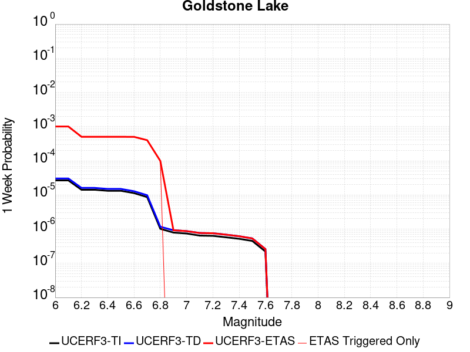 | 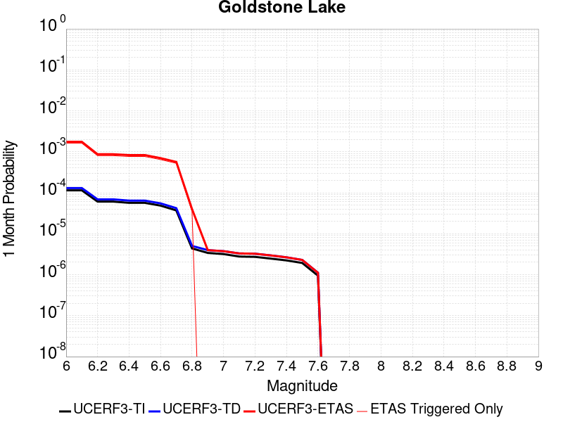 | 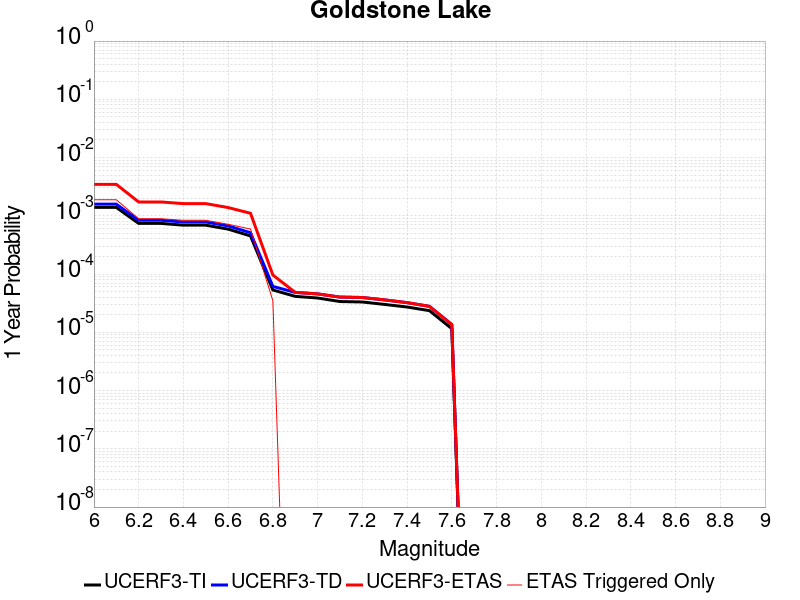 |  |

| Magnitude | 1 wk TI Prob | 1 wk TD Prob | 1 wk ETAS Prob | 1 wk ETAS/TD Gain | 1 wk ETAS Triggered Only | 1 mo TI Prob | 1 mo TD Prob | 1 mo ETAS Prob | 1 mo ETAS/TD Gain | 1 mo ETAS Triggered Only | 1 yr TI Prob | 1 yr TD Prob | 1 yr ETAS Prob | 1 yr ETAS/TD Gain | 1 yr ETAS Triggered Only | 10 yr TI Prob | 10 yr TD Prob | 10 yr ETAS Prob | 10 yr ETAS/TD Gain | 10 yr ETAS Triggered Only |
|-----|-----|-----|-----|-----|-----|-----|-----|-----|-----|-----|-----|-----|-----|-----|-----|-----|-----|-----|-----|-----|
| 6.0 | 2.671352E-5 | 3.037609E-5 | 0.0010084371 | 33.198387 | 9.780908E-4 | 1.1448149E-4 | 1.3017785E-4 | 0.001303734 | 10.015021 | 0.0011737089 | 0.001392921 | 0.0015839594 | 0.0030487718 | 1.9247789 | 0.0014671362 | 0.013842222 | 0.015746197 | 0.0172865 | 1.0978206 | 0.0015649452 |
| 6.1 | 2.671352E-5 | 3.037609E-5 | 0.0010084371 | 33.198387 | 9.780908E-4 | 1.1448149E-4 | 1.3017785E-4 | 0.001303734 | 10.015021 | 0.0011737089 | 0.001392921 | 0.0015839594 | 0.0030487718 | 1.9247789 | 0.0014671362 | 0.013842222 | 0.015746197 | 0.0172865 | 1.0978206 | 0.0015649452 |
| 6.2 | 1.4197047E-5 | 1.6096245E-5 | 5.0513376E-4 | 31.382088 | 4.890454E-4 | 6.0843064E-5 | 6.8982634E-5 | 6.557966E-4 | 9.506691 | 5.8685447E-4 | 7.4051257E-4 | 8.3963864E-4 | 0.0015237273 | 1.8147417 | 6.8466354E-4 | 0.007380498 | 0.0083743585 | 0.009150279 | 1.0926542 | 7.824726E-4 |
| 6.3 | 1.4197047E-5 | 1.6096245E-5 | 5.0513376E-4 | 31.382088 | 4.890454E-4 | 6.0843064E-5 | 6.8982634E-5 | 6.557966E-4 | 9.506691 | 5.8685447E-4 | 7.4051257E-4 | 8.3963864E-4 | 0.0015237273 | 1.8147417 | 6.8466354E-4 | 0.007380498 | 0.0083743585 | 0.009150279 | 1.0926542 | 7.824726E-4 |
| 6.4 | 1.3238931E-5 | 1.500846E-5 | 5.040465E-4 | 33.58416 | 4.890454E-4 | 5.6737044E-5 | 6.4320935E-5 | 6.5113767E-4 | 10.123261 | 5.8685447E-4 | 6.9055456E-4 | 7.82924E-4 | 0.0014670516 | 1.8738109 | 6.8466354E-4 | 0.006884126 | 0.0078112837 | 0.008587644 | 1.0993897 | 7.824726E-4 |
| 6.5 | 1.3238931E-5 | 1.500846E-5 | 5.040465E-4 | 33.58416 | 4.890454E-4 | 5.6737044E-5 | 6.4320935E-5 | 6.5113767E-4 | 10.123261 | 5.8685447E-4 | 6.9055456E-4 | 7.82924E-4 | 0.0014670516 | 1.8738109 | 6.8466354E-4 | 0.006884126 | 0.0078112837 | 0.008587644 | 1.0993897 | 7.824726E-4 |
| 6.6 | 1.1328278E-5 | 1.2855166E-5 | 5.018943E-4 | 39.042225 | 4.890454E-4 | 4.8548856E-5 | 5.5092944E-5 | 6.419151E-4 | 11.651494 | 5.8685447E-4 | 5.90922E-4 | 6.7064585E-4 | 0.0013548502 | 2.0202172 | 6.8466354E-4 | 0.0058935313 | 0.0066956086 | 0.007472842 | 1.1160811 | 7.824726E-4 |
| 6.7 | 8.651175E-6 | 9.824565E-6 | 4.0105704E-4 | 40.821865 | 3.912363E-4 | 3.707594E-5 | 4.2105108E-5 | 4.3332495E-4 | 10.291506 | 3.912363E-4 | 4.5130608E-4 | 5.1259965E-4 | 0.0010013944 | 1.9535604 | 4.890454E-4 | 0.0045039062 | 0.005123051 | 0.005706899 | 1.1139649 | 5.8685447E-4 |
| 6.8 | 1.0215377E-6 | 1.1754702E-6 | 9.8984434E-5 | 84.208374 | 9.7809076E-5 | 4.378012E-6 | 5.0377203E-6 | 1.028463E-4 | 20.415247 | 9.7809076E-5 | 5.3300988E-5 | 6.1332634E-5 | 1.5913571E-4 | 2.5946336 | 9.7809076E-5 | 5.3288206E-4 | 6.1316835E-4 | 7.1091746E-4 | 1.1594164 | 9.7809076E-5 |
| 6.9 | 7.9360774E-7 | 9.2833966E-7 | 9.2833966E-7 | 1.0 | 0.0 | 3.4011714E-6 | 3.9785928E-6 | 3.9785928E-6 | 1.0 | 0.0 | 4.1408475E-5 | 4.843836E-5 | 4.843836E-5 | 1.0 | 0.0 | 4.140076E-4 | 4.8428503E-4 | 4.8428503E-4 | 1.0 | 0.0 |
| 7.0 | 7.4382757E-7 | 8.7473285E-7 | 8.7473285E-7 | 1.0 | 0.0 | 3.1878285E-6 | 3.74885E-6 | 3.74885E-6 | 1.0 | 0.0 | 3.8811122E-5 | 4.564136E-5 | 4.564136E-5 | 1.0 | 0.0 | 3.8804344E-4 | 4.5632652E-4 | 4.5632652E-4 | 1.0 | 0.0 |
| 7.1 | 6.4709513E-7 | 7.7113E-7 | 7.7113E-7 | 1.0 | 0.0 | 2.773262E-6 | 3.3048389E-6 | 3.3048389E-6 | 1.0 | 0.0 | 3.376394E-5 | 4.0235733E-5 | 4.0235733E-5 | 1.0 | 0.0 | 3.375881E-4 | 4.0229043E-4 | 4.0229043E-4 | 1.0 | 0.0 |
| 7.2 | 6.356704E-7 | 7.5883594E-7 | 7.5883594E-7 | 1.0 | 0.0 | 2.7242988E-6 | 3.2521505E-6 | 3.2521505E-6 | 1.0 | 0.0 | 3.3167835E-5 | 3.959427E-5 | 3.959427E-5 | 1.0 | 0.0 | 3.3162883E-4 | 3.958781E-4 | 3.958781E-4 | 1.0 | 0.0 |
| 7.3 | 5.7695723E-7 | 6.8965653E-7 | 6.8965653E-7 | 1.0 | 0.0 | 2.4726714E-6 | 2.9556677E-6 | 2.9556677E-6 | 1.0 | 0.0 | 3.0104358E-5 | 3.5984718E-5 | 3.5984718E-5 | 1.0 | 0.0 | 3.0100282E-4 | 3.5979465E-4 | 3.5979465E-4 | 1.0 | 0.0 |
| 7.4 | 5.209647E-7 | 6.193514E-7 | 6.193514E-7 | 1.0 | 0.0 | 2.232704E-6 | 2.6543607E-6 | 2.6543607E-6 | 1.0 | 0.0 | 2.718283E-5 | 3.2316417E-5 | 3.2316417E-5 | 1.0 | 0.0 | 2.7179506E-4 | 3.2312275E-4 | 3.2312275E-4 | 1.0 | 0.0 |
| 7.5 | 4.512955E-7 | 5.348885E-7 | 5.348885E-7 | 1.0 | 0.0 | 1.934122E-6 | 2.2923775E-6 | 2.2923775E-6 | 1.0 | 0.0 | 2.3547682E-5 | 2.7909393E-5 | 2.7909393E-5 | 1.0 | 0.0 | 2.3545188E-4 | 2.7906417E-4 | 2.7906417E-4 | 1.0 | 0.0 |
| 7.6 | 2.21172E-7 | 2.603961E-7 | 2.603961E-7 | 1.0 | 0.0 | 9.478797E-7 | 1.1159829E-6 | 1.1159829E-6 | 1.0 | 0.0 | 1.1540374E-5 | 1.3587036E-5 | 1.3587036E-5 | 1.0 | 0.0 | 1.1539775E-4 | 1.3586486E-4 | 1.3586486E-4 | 1.0 | 0.0 |

## Coyote Canyon
*[(top)](#table-of-contents)*

| 1 Week | 1 Month | 1 Year | 10 Year |
|-----|-----|-----|-----|
| 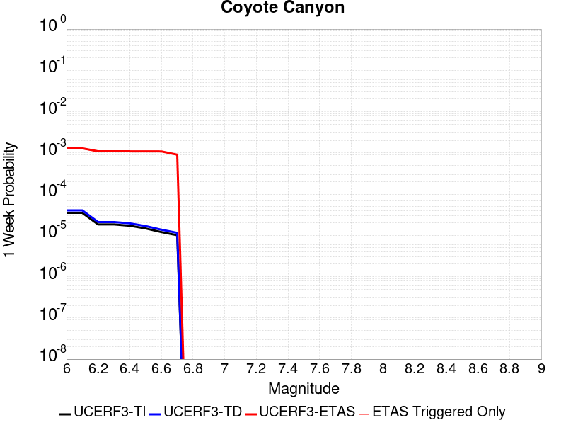 | 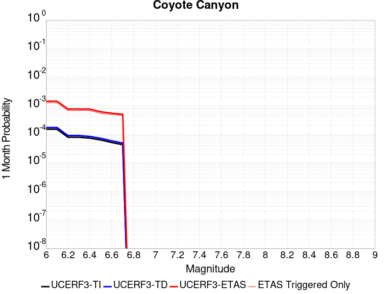 | 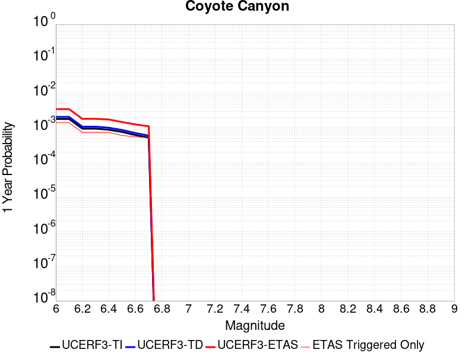 | 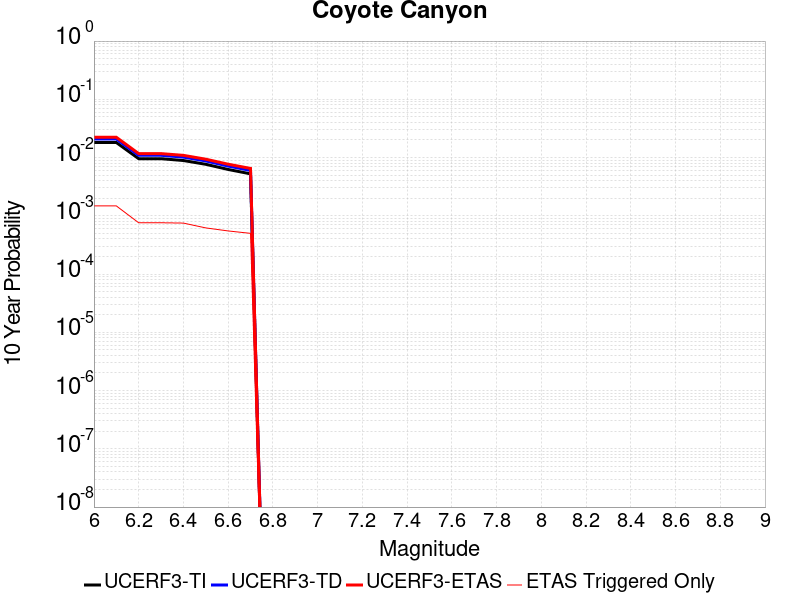 |

| Magnitude | 1 wk TI Prob | 1 wk TD Prob | 1 wk ETAS Prob | 1 wk ETAS/TD Gain | 1 wk ETAS Triggered Only | 1 mo TI Prob | 1 mo TD Prob | 1 mo ETAS Prob | 1 mo ETAS/TD Gain | 1 mo ETAS Triggered Only | 1 yr TI Prob | 1 yr TD Prob | 1 yr ETAS Prob | 1 yr ETAS/TD Gain | 1 yr ETAS Triggered Only | 10 yr TI Prob | 10 yr TD Prob | 10 yr ETAS Prob | 10 yr ETAS/TD Gain | 10 yr ETAS Triggered Only |
|-----|-----|-----|-----|-----|-----|-----|-----|-----|-----|-----|-----|-----|-----|-----|-----|-----|-----|-----|-----|-----|
| 6.0 | 3.5090034E-5 | 4.0364324E-5 | 0.0012140259 | 30.076706 | 0.0011737089 | 1.503772E-4 | 1.7297994E-4 | 0.0014442779 | 8.349396 | 0.001271518 | 0.0018293047 | 0.0021042528 | 0.003373095 | 1.6029896 | 0.001271518 | 0.018143194 | 0.020869201 | 0.022209952 | 1.0642455 | 0.0013693271 |
| 6.1 | 3.5090034E-5 | 4.0364324E-5 | 0.0012140259 | 30.076706 | 0.0011737089 | 1.503772E-4 | 1.7297994E-4 | 0.0014442779 | 8.349396 | 0.001271518 | 0.0018293047 | 0.0021042528 | 0.003373095 | 1.6029896 | 0.001271518 | 0.018143194 | 0.020869201 | 0.022209952 | 1.0642455 | 0.0013693271 |
| 6.2 | 1.841879E-5 | 2.1059794E-5 | 9.9913E-4 | 47.442535 | 9.780908E-4 | 7.8935285E-5 | 9.0253714E-5 | 0.0010682562 | 11.836147 | 9.780908E-4 | 9.606133E-4 | 0.001098387 | 0.0020754035 | 1.8895011 | 9.780908E-4 | 0.0095647145 | 0.010939667 | 0.011907058 | 1.0884297 | 9.780908E-4 |
| 6.3 | 1.841879E-5 | 2.1059794E-5 | 9.9913E-4 | 47.442535 | 9.780908E-4 | 7.8935285E-5 | 9.0253714E-5 | 0.0010682562 | 11.836147 | 9.780908E-4 | 9.606133E-4 | 0.001098387 | 0.0020754035 | 1.8895011 | 9.780908E-4 | 0.0095647145 | 0.010939667 | 0.011907058 | 1.0884297 | 9.780908E-4 |
| 6.4 | 1.712201E-5 | 1.9565212E-5 | 9.976368E-4 | 50.99034 | 9.780908E-4 | 7.337798E-5 | 8.3848776E-5 | 0.0010618576 | 12.6639595 | 9.780908E-4 | 8.930107E-4 | 0.0010204813 | 0.001997574 | 1.9574821 | 9.780908E-4 | 0.008894307 | 0.010167871 | 0.011136016 | 1.0952162 | 9.780908E-4 |
| 6.5 | 1.4744935E-5 | 1.6836972E-5 | 8.9710386E-4 | 53.28178 | 8.802817E-4 | 6.3191044E-5 | 7.215698E-5 | 9.523752E-4 | 13.198656 | 8.802817E-4 | 7.6907943E-4 | 8.7825063E-4 | 0.0017577593 | 2.0014324 | 8.802817E-4 | 0.007664232 | 0.008756994 | 0.009629567 | 1.099643 | 8.802817E-4 |
| 6.6 | 1.2017839E-5 | 1.37240895E-5 | 8.939937E-4 | 65.14047 | 8.802817E-4 | 5.150401E-5 | 5.88167E-5 | 9.390466E-4 | 15.965647 | 8.802817E-4 | 6.268809E-4 | 7.159466E-4 | 0.0015955981 | 2.228655 | 8.802817E-4 | 0.0062511545 | 0.0071450938 | 0.008019086 | 1.1223205 | 8.802817E-4 |
| 6.7 | 1.00956095E-5 | 1.1533517E-5 | 7.939971E-4 | 68.84258 | 7.824726E-4 | 4.326618E-5 | 4.942891E-5 | 8.3186285E-4 | 16.82948 | 7.824726E-4 | 5.266384E-4 | 6.017178E-4 | 0.0013837196 | 2.2996156 | 7.824726E-4 | 0.005253921 | 0.0060094125 | 0.0067871828 | 1.1294254 | 7.824726E-4 |

## Lenwood-Lockhart-Old Woman Springs
*[(top)](#table-of-contents)*

| 1 Week | 1 Month | 1 Year | 10 Year |
|-----|-----|-----|-----|
| 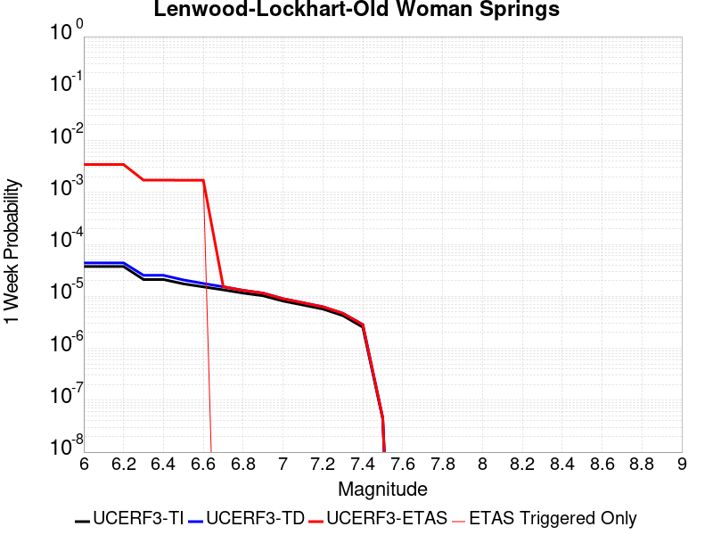 | 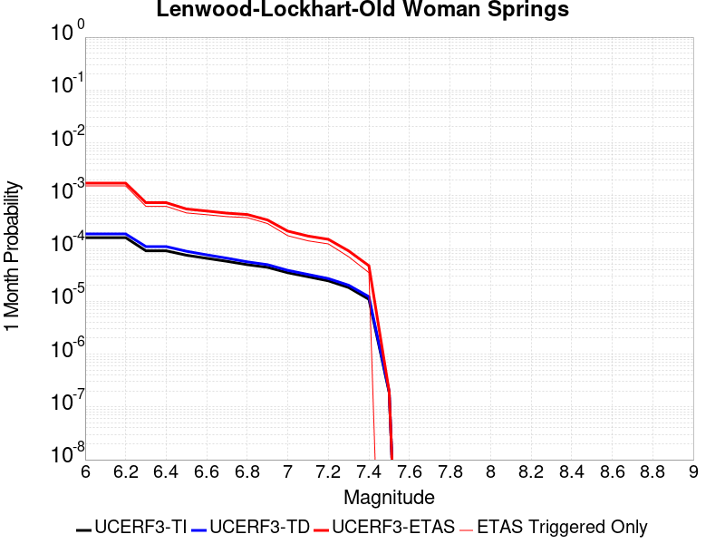 | 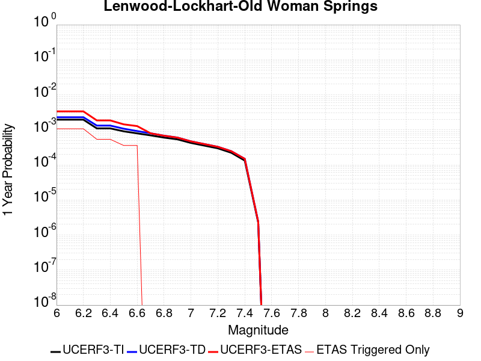 | 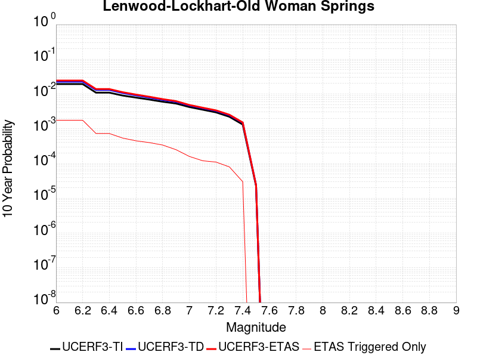 |

| Magnitude | 1 wk TI Prob | 1 wk TD Prob | 1 wk ETAS Prob | 1 wk ETAS/TD Gain | 1 wk ETAS Triggered Only | 1 mo TI Prob | 1 mo TD Prob | 1 mo ETAS Prob | 1 mo ETAS/TD Gain | 1 mo ETAS Triggered Only | 1 yr TI Prob | 1 yr TD Prob | 1 yr ETAS Prob | 1 yr ETAS/TD Gain | 1 yr ETAS Triggered Only | 10 yr TI Prob | 10 yr TD Prob | 10 yr ETAS Prob | 10 yr ETAS/TD Gain | 10 yr ETAS Triggered Only |
|-----|-----|-----|-----|-----|-----|-----|-----|-----|-----|-----|-----|-----|-----|-----|-----|-----|-----|-----|-----|-----|
| 6.0 | 3.744542E-5 | 4.396252E-5 | 0.0012176199 | 27.696772 | 0.0011737089 | 1.604705E-4 | 1.8839816E-4 | 0.0014596767 | 7.747828 | 0.001271518 | 0.0019519776 | 0.0022915069 | 0.0035601112 | 1.5536114 | 0.001271518 | 0.019349206 | 0.022696787 | 0.024035035 | 1.058962 | 0.0013693271 |
| 6.1 | 3.744542E-5 | 4.396252E-5 | 0.0012176199 | 27.696772 | 0.0011737089 | 1.604705E-4 | 1.8839816E-4 | 0.0014596767 | 7.747828 | 0.001271518 | 0.0019519776 | 0.0022915069 | 0.0035601112 | 1.5536114 | 0.001271518 | 0.019349206 | 0.022696787 | 0.024035035 | 1.058962 | 0.0013693271 |
| 6.2 | 3.744542E-5 | 4.396252E-5 | 0.0012176199 | 27.696772 | 0.0011737089 | 1.604705E-4 | 1.8839816E-4 | 0.0014596767 | 7.747828 | 0.001271518 | 0.0019519776 | 0.0022915069 | 0.0035601112 | 1.5536114 | 0.001271518 | 0.019349206 | 0.022696787 | 0.024035035 | 1.058962 | 0.0013693271 |
| 6.3 | 2.1079984E-5 | 2.5353434E-5 | 4.1657983E-4 | 16.430902 | 3.912363E-4 | 9.0339665E-5 | 1.0865316E-4 | 5.976454E-4 | 5.500488 | 4.890454E-4 | 0.0010993304 | 0.0013220694 | 0.0018104683 | 1.3694199 | 4.890454E-4 | 0.010939079 | 0.0131442575 | 0.013626874 | 1.0367169 | 4.890454E-4 |
| 6.4 | 2.1079984E-5 | 2.5353434E-5 | 4.1657983E-4 | 16.430902 | 3.912363E-4 | 9.0339665E-5 | 1.0865316E-4 | 5.976454E-4 | 5.500488 | 4.890454E-4 | 0.0010993304 | 0.0013220694 | 0.0018104683 | 1.3694199 | 4.890454E-4 | 0.010939079 | 0.0131442575 | 0.013626874 | 1.0367169 | 4.890454E-4 |
| 6.5 | 1.7397282E-5 | 2.066241E-5 | 3.140836E-4 | 15.200724 | 2.9342723E-4 | 7.455765E-5 | 8.8550245E-5 | 4.797519E-4 | 5.4178495 | 3.912363E-4 | 9.073613E-4 | 0.0010775778 | 0.0014683926 | 1.3626789 | 3.912363E-4 | 0.009036654 | 0.010724821 | 0.011111861 | 1.0360882 | 3.912363E-4 |
| 6.6 | 1.52050325E-5 | 1.7679693E-5 | 3.1110173E-4 | 17.596558 | 2.9342723E-4 | 6.51628E-5 | 7.576796E-5 | 4.6697463E-4 | 6.1632204 | 3.912363E-4 | 7.9306826E-4 | 9.220924E-4 | 0.001312968 | 1.4239006 | 3.912363E-4 | 0.007902439 | 0.009183526 | 0.0095711695 | 1.0422107 | 3.912363E-4 |
| 6.7 | 1.332523E-5 | 1.5264002E-5 | 1.1307158E-4 | 7.4077287 | 9.7809076E-5 | 5.7106878E-5 | 6.5415545E-5 | 2.610209E-4 | 3.9901967 | 1.9561815E-4 | 6.950544E-4 | 7.961491E-4 | 9.916115E-4 | 1.2455099 | 1.9561815E-4 | 0.006928845 | 0.007933599 | 0.008127665 | 1.0244613 | 1.9561815E-4 |
| 6.8 | 1.1525329E-5 | 1.3030979E-5 | 1.1083878E-4 | 8.505791 | 9.7809076E-5 | 4.9393333E-5 | 5.584588E-5 | 2.514531E-4 | 4.502626 | 1.9561815E-4 | 6.011979E-4 | 6.797157E-4 | 8.752009E-4 | 1.2875985 | 1.9561815E-4 | 0.00599574 | 0.006776819 | 0.0069711115 | 1.0286702 | 1.9561815E-4 |
| 6.9 | 1.0253909E-5 | 1.15144385E-5 | 1.0932239E-4 | 9.494374 | 9.7809076E-5 | 4.3944583E-5 | 4.9346683E-5 | 2.4495518E-4 | 4.9639645 | 1.9561815E-4 | 5.3489394E-4 | 6.0063385E-4 | 7.961345E-4 | 1.3254906 | 1.9561815E-4 | 0.0053360825 | 0.0059904843 | 0.0061849304 | 1.0324591 | 1.9561815E-4 |
| 7.0 | 8.104563E-6 | 8.991279E-6 | 1.06799474E-4 | 11.8781185 | 9.7809076E-5 | 3.4733377E-5 | 3.8533497E-5 | 2.3414411E-4 | 6.0763783 | 1.9561815E-4 | 4.2279682E-4 | 4.6904673E-4 | 6.6457316E-4 | 1.416859 | 1.9561815E-4 | 0.0042199334 | 0.0046808156 | 0.004875518 | 1.0415958 | 1.9561815E-4 |
| 7.1 | 6.7986157E-6 | 7.515816E-6 | 7.515816E-6 | 1.0 | 0.0 | 2.91366E-5 | 3.2210253E-5 | 1.3001618E-4 | 4.0364842 | 9.7809076E-5 | 3.5468035E-4 | 3.920914E-4 | 4.898621E-4 | 1.249357 | 9.7809076E-5 | 0.003541148 | 0.003914213 | 0.004011639 | 1.0248904 | 9.7809076E-5 |
| 7.2 | 5.6893327E-6 | 6.2800136E-6 | 6.2800136E-6 | 1.0 | 0.0 | 2.4382627E-5 | 2.6914078E-5 | 1.2472052E-4 | 4.6340256 | 9.7809076E-5 | 2.9681803E-4 | 3.2763163E-4 | 4.2540865E-4 | 1.2984359 | 9.7809076E-5 | 0.002964219 | 0.0032716845 | 0.0033691737 | 1.0297978 | 9.7809076E-5 |
| 7.3 | 4.253348E-6 | 4.7069107E-6 | 4.7069107E-6 | 1.0 | 0.0 | 1.8228506E-5 | 2.0172329E-5 | 2.0172329E-5 | 1.0 | 0.0 | 2.2190946E-4 | 2.4557224E-4 | 2.4557224E-4 | 1.0 | 0.0 | 0.00221688 | 0.0024531898 | 0.0024531898 | 1.0 | 0.0 |
| 7.4 | 2.5448119E-6 | 2.852045E-6 | 2.852045E-6 | 1.0 | 0.0 | 1.0906291E-5 | 1.2223002E-5 | 1.2223002E-5 | 1.0 | 0.0 | 1.3277601E-4 | 1.4880655E-4 | 1.4880655E-4 | 1.0 | 0.0 | 0.001326967 | 0.0014872311 | 0.0014872311 | 1.0 | 0.0 |
| 7.5 | 4.3706837E-8 | 4.562909E-8 | 4.562909E-8 | 1.0 | 0.0 | 1.8731501E-7 | 1.9555324E-7 | 1.9555324E-7 | 1.0 | 0.0 | 2.2805577E-6 | 2.3808586E-6 | 2.3808586E-6 | 1.0 | 0.0 | 2.2805343E-5 | 2.3808387E-5 | 2.3808387E-5 | 1.0 | 0.0 |

## Towne Pass
*[(top)](#table-of-contents)*

| 1 Week | 1 Month | 1 Year | 10 Year |
|-----|-----|-----|-----|
| 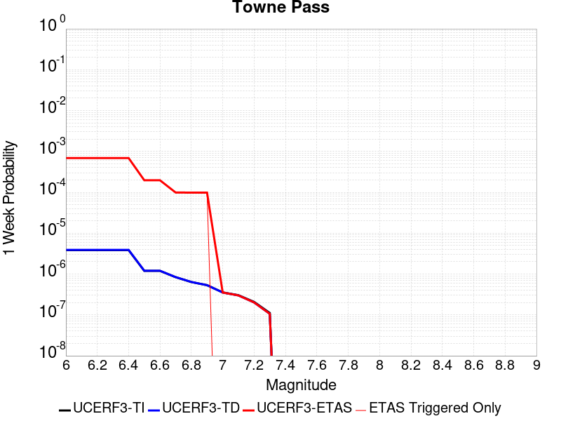 | 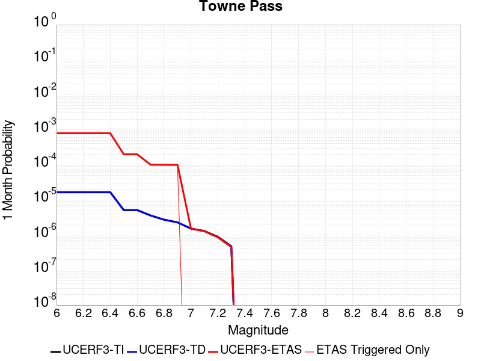 | 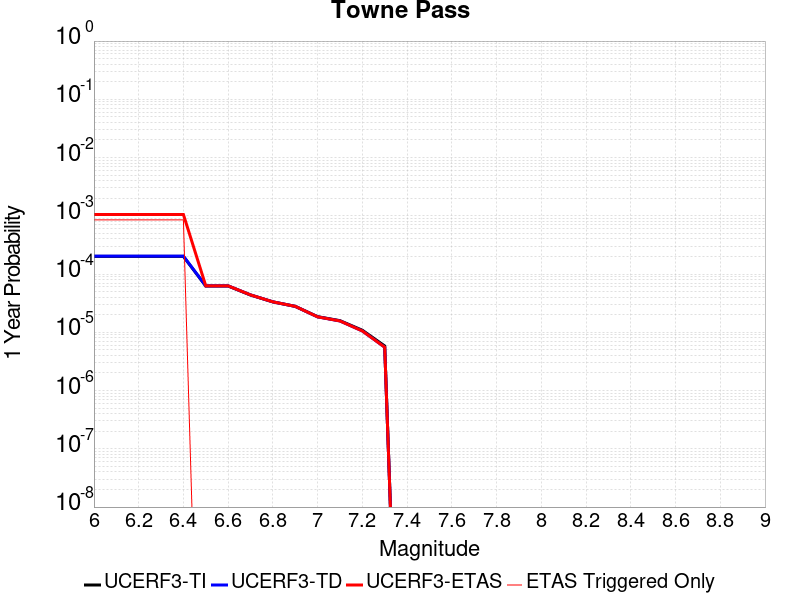 | 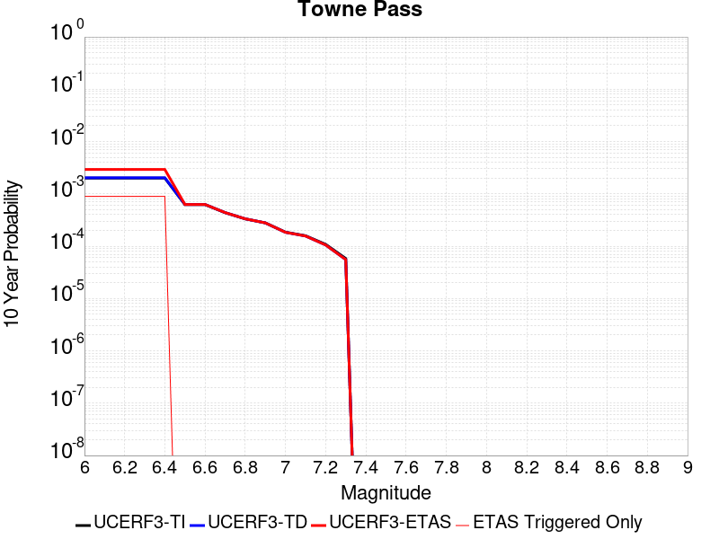 |

| Magnitude | 1 wk TI Prob | 1 wk TD Prob | 1 wk ETAS Prob | 1 wk ETAS/TD Gain | 1 wk ETAS Triggered Only | 1 mo TI Prob | 1 mo TD Prob | 1 mo ETAS Prob | 1 mo ETAS/TD Gain | 1 mo ETAS Triggered Only | 1 yr TI Prob | 1 yr TD Prob | 1 yr ETAS Prob | 1 yr ETAS/TD Gain | 1 yr ETAS Triggered Only | 10 yr TI Prob | 10 yr TD Prob | 10 yr ETAS Prob | 10 yr ETAS/TD Gain | 10 yr ETAS Triggered Only |
|-----|-----|-----|-----|-----|-----|-----|-----|-----|-----|-----|-----|-----|-----|-----|-----|-----|-----|-----|-----|-----|
| 6.0 | 3.849728E-6 | 3.8945414E-6 | 6.885554E-4 | 176.80013 | 6.8466354E-4 | 1.649873E-5 | 1.669081E-5 | 7.991504E-4 | 47.879665 | 7.824726E-4 | 2.0085352E-4 | 2.0319603E-4 | 0.0013766665 | 6.775066 | 0.0011737089 | 0.0020067208 | 0.0020305314 | 0.0032018572 | 1.5768567 | 0.0011737089 |
| 6.1 | 3.849728E-6 | 3.8945414E-6 | 6.885554E-4 | 176.80013 | 6.8466354E-4 | 1.649873E-5 | 1.669081E-5 | 7.991504E-4 | 47.879665 | 7.824726E-4 | 2.0085352E-4 | 2.0319603E-4 | 0.0013766665 | 6.775066 | 0.0011737089 | 0.0020067208 | 0.0020305314 | 0.0032018572 | 1.5768567 | 0.0011737089 |
| 6.2 | 3.849728E-6 | 3.8945414E-6 | 6.885554E-4 | 176.80013 | 6.8466354E-4 | 1.649873E-5 | 1.669081E-5 | 7.991504E-4 | 47.879665 | 7.824726E-4 | 2.0085352E-4 | 2.0319603E-4 | 0.0013766665 | 6.775066 | 0.0011737089 | 0.0020067208 | 0.0020305314 | 0.0032018572 | 1.5768567 | 0.0011737089 |
| 6.3 | 3.849728E-6 | 3.8945414E-6 | 6.885554E-4 | 176.80013 | 6.8466354E-4 | 1.649873E-5 | 1.669081E-5 | 7.991504E-4 | 47.879665 | 7.824726E-4 | 2.0085352E-4 | 2.0319603E-4 | 0.0013766665 | 6.775066 | 0.0011737089 | 0.0020067208 | 0.0020305314 | 0.0032018572 | 1.5768567 | 0.0011737089 |
| 6.4 | 3.849728E-6 | 3.8945414E-6 | 6.885554E-4 | 176.80013 | 6.8466354E-4 | 1.649873E-5 | 1.669081E-5 | 7.991504E-4 | 47.879665 | 7.824726E-4 | 2.0085352E-4 | 2.0319603E-4 | 0.0013766665 | 6.775066 | 0.0011737089 | 0.0020067208 | 0.0020305314 | 0.0032018572 | 1.5768567 | 0.0011737089 |
| 6.5 | 1.1953545E-6 | 1.203052E-6 | 1.9682097E-4 | 163.60138 | 1.9561815E-4 | 5.1229376E-6 | 5.1559277E-6 | 2.0077307E-4 | 38.940243 | 1.9561815E-4 | 6.236998E-5 | 6.277173E-5 | 2.583776E-4 | 4.116146 | 1.9561815E-4 | 6.235248E-4 | 6.275517E-4 | 8.230471E-4 | 1.3115208 | 1.9561815E-4 |
| 6.6 | 1.1953545E-6 | 1.203052E-6 | 1.9682097E-4 | 163.60138 | 1.9561815E-4 | 5.1229376E-6 | 5.1559277E-6 | 2.0077307E-4 | 38.940243 | 1.9561815E-4 | 6.236998E-5 | 6.277173E-5 | 2.583776E-4 | 4.116146 | 1.9561815E-4 | 6.235248E-4 | 6.275517E-4 | 8.230471E-4 | 1.3115208 | 1.9561815E-4 |
| 6.7 | 8.375951E-7 | 8.4106705E-7 | 9.865006E-5 | 117.29156 | 9.7809076E-5 | 3.5896885E-6 | 3.6045683E-6 | 1.01413294E-4 | 28.134657 | 9.7809076E-5 | 4.370358E-5 | 4.3884793E-5 | 1.4168958E-4 | 3.2286713 | 9.7809076E-5 | 4.3694986E-4 | 4.38767E-4 | 5.3653313E-4 | 1.2228203 | 9.7809076E-5 |
| 6.8 | 6.38041E-7 | 6.392156E-7 | 9.844823E-5 | 154.01411 | 9.7809076E-5 | 2.7344586E-6 | 2.7394929E-6 | 1.005483E-4 | 36.70325 | 9.7809076E-5 | 3.3291526E-5 | 3.3352855E-5 | 1.3115867E-4 | 3.932457 | 9.7809076E-5 | 3.3286537E-4 | 3.334823E-4 | 4.3125876E-4 | 1.2931983 | 9.7809076E-5 |
| 6.9 | 5.3460053E-7 | 5.345333E-7 | 9.834356E-5 | 183.98022 | 9.7809076E-5 | 2.2911431E-6 | 2.2908553E-6 | 1.0009971E-4 | 43.695343 | 9.7809076E-5 | 2.789431E-5 | 2.789084E-5 | 1.2569719E-4 | 4.5067554 | 9.7809076E-5 | 2.789081E-4 | 2.7887672E-4 | 3.766585E-4 | 1.3506273 | 9.7809076E-5 |
| 7.0 | 3.557783E-7 | 3.5324226E-7 | 3.5324226E-7 | 1.0 | 0.0 | 1.5247632E-6 | 1.5138945E-6 | 1.5138945E-6 | 1.0 | 0.0 | 1.8563835E-5 | 1.843152E-5 | 1.843152E-5 | 1.0 | 0.0 | 1.8562283E-4 | 1.8430075E-4 | 1.8430075E-4 | 1.0 | 0.0 |
| 7.1 | 3.037942E-7 | 3.0002218E-7 | 3.0002218E-7 | 1.0 | 0.0 | 1.3019744E-6 | 1.2858087E-6 | 1.2858087E-6 | 1.0 | 0.0 | 1.5851423E-5 | 1.5654618E-5 | 1.5654618E-5 | 1.0 | 0.0 | 1.5850292E-4 | 1.5653588E-4 | 1.5653588E-4 | 1.0 | 0.0 |
| 7.2 | 2.0808248E-7 | 2.0217689E-7 | 2.0217689E-7 | 1.0 | 0.0 | 8.917818E-7 | 8.6647213E-7 | 8.6647213E-7 | 1.0 | 0.0 | 1.0857389E-5 | 1.0549252E-5 | 1.0549252E-5 | 1.0 | 0.0 | 1.0856859E-4 | 1.0548797E-4 | 1.0548797E-4 | 1.0 | 0.0 |
| 7.3 | 1.1162073E-7 | 1.0636894E-7 | 1.0636894E-7 | 1.0 | 0.0 | 4.7837443E-7 | 4.558668E-7 | 4.558668E-7 | 1.0 | 0.0 | 5.8241935E-6 | 5.550166E-6 | 5.550166E-6 | 1.0 | 0.0 | 5.8240406E-5 | 5.5500474E-5 | 5.5500474E-5 | 1.0 | 0.0 |

## Paradise
*[(top)](#table-of-contents)*

| 1 Week | 1 Month | 1 Year | 10 Year |
|-----|-----|-----|-----|
| 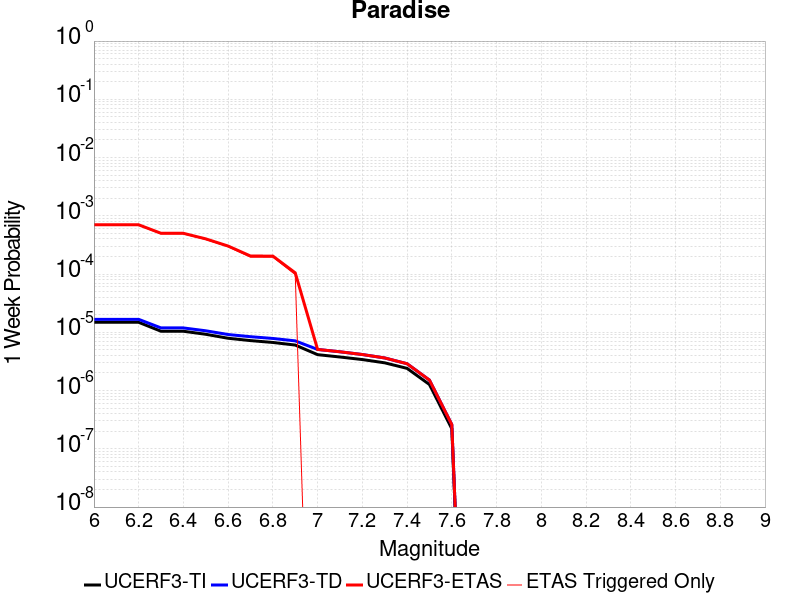 | 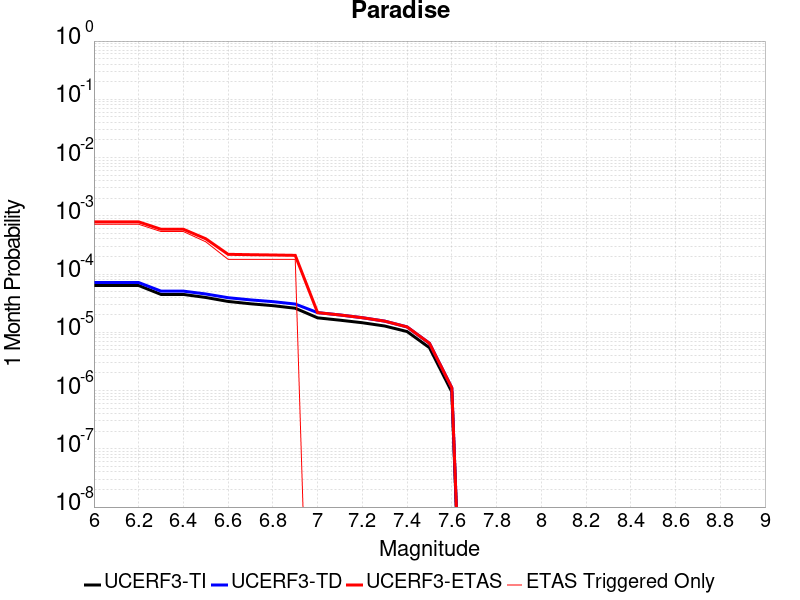 | 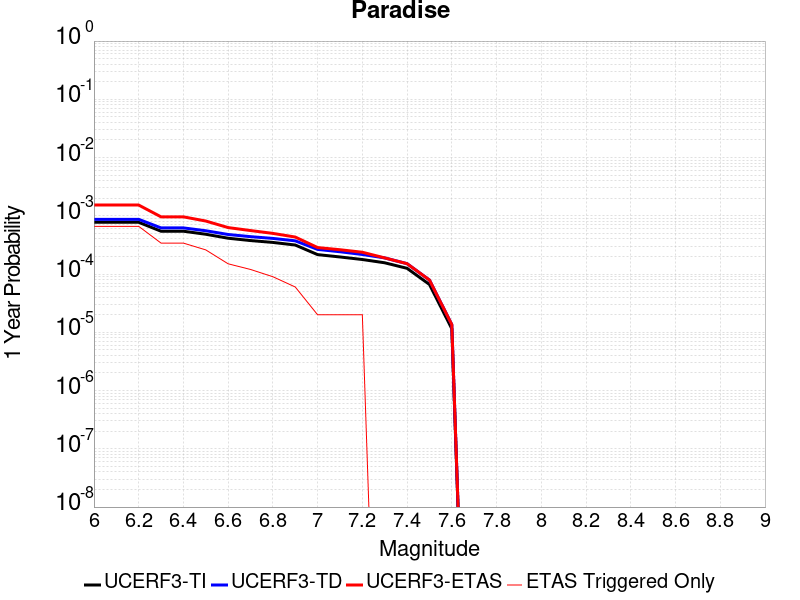 | 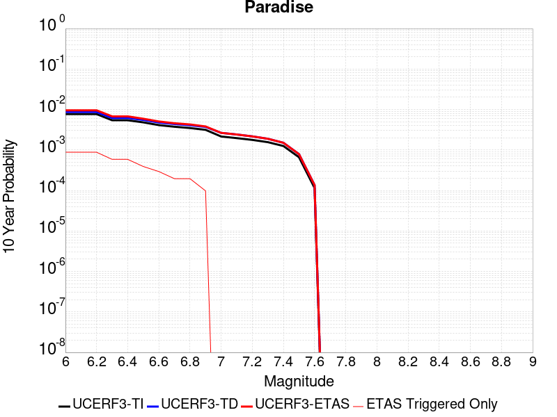 |

| Magnitude | 1 wk TI Prob | 1 wk TD Prob | 1 wk ETAS Prob | 1 wk ETAS/TD Gain | 1 wk ETAS Triggered Only | 1 mo TI Prob | 1 mo TD Prob | 1 mo ETAS Prob | 1 mo ETAS/TD Gain | 1 mo ETAS Triggered Only | 1 yr TI Prob | 1 yr TD Prob | 1 yr ETAS Prob | 1 yr ETAS/TD Gain | 1 yr ETAS Triggered Only | 10 yr TI Prob | 10 yr TD Prob | 10 yr ETAS Prob | 10 yr ETAS/TD Gain | 10 yr ETAS Triggered Only |
|-----|-----|-----|-----|-----|-----|-----|-----|-----|-----|-----|-----|-----|-----|-----|-----|-----|-----|-----|-----|-----|
| 6.0 | 1.4851273E-5 | 1.6694692E-5 | 7.013468E-4 | 42.01017 | 6.8466354E-4 | 6.364676E-5 | 7.154685E-5 | 7.561614E-4 | 10.568759 | 6.8466354E-4 | 7.7462377E-4 | 8.707584E-4 | 0.0016525496 | 1.897828 | 7.824726E-4 | 0.0077192914 | 0.008675844 | 0.009548489 | 1.1005832 | 8.802817E-4 |
| 6.1 | 1.4851273E-5 | 1.6694692E-5 | 7.013468E-4 | 42.01017 | 6.8466354E-4 | 6.364676E-5 | 7.154685E-5 | 7.561614E-4 | 10.568759 | 6.8466354E-4 | 7.7462377E-4 | 8.707584E-4 | 0.0016525496 | 1.897828 | 7.824726E-4 | 0.0077192914 | 0.008675844 | 0.009548489 | 1.1005832 | 8.802817E-4 |
| 6.2 | 1.4851273E-5 | 1.6694692E-5 | 7.013468E-4 | 42.01017 | 6.8466354E-4 | 6.364676E-5 | 7.154685E-5 | 7.561614E-4 | 10.568759 | 6.8466354E-4 | 7.7462377E-4 | 8.707584E-4 | 0.0016525496 | 1.897828 | 7.824726E-4 | 0.0077192914 | 0.008675844 | 0.009548489 | 1.1005832 | 8.802817E-4 |
| 6.3 | 1.0426831E-5 | 1.188862E-5 | 5.009282E-4 | 42.135098 | 4.890454E-4 | 4.4685654E-5 | 5.0950268E-5 | 5.3997076E-4 | 10.597996 | 4.890454E-4 | 5.43912E-4 | 6.201489E-4 | 0.0012066395 | 1.9457253 | 5.8685447E-4 | 0.0054258266 | 0.0061847917 | 0.0067680166 | 1.0942998 | 5.8685447E-4 |
| 6.4 | 1.0426831E-5 | 1.188862E-5 | 5.009282E-4 | 42.135098 | 4.890454E-4 | 4.4685654E-5 | 5.0950268E-5 | 5.3997076E-4 | 10.597996 | 4.890454E-4 | 5.43912E-4 | 6.201489E-4 | 0.0012066395 | 1.9457253 | 5.8685447E-4 | 0.0054258266 | 0.0061847917 | 0.0067680166 | 1.0942998 | 5.8685447E-4 |
| 6.5 | 9.25027E-6 | 1.06199595E-5 | 4.018521E-4 | 37.839325 | 3.912363E-4 | 3.964341E-5 | 4.551335E-5 | 4.3673185E-4 | 9.595687 | 3.912363E-4 | 4.8255164E-4 | 5.53989E-4 | 9.450086E-4 | 1.7058254 | 3.912363E-4 | 0.0048150513 | 0.0055265795 | 0.0059156534 | 1.0704005 | 3.912363E-4 |
| 6.6 | 7.904275E-6 | 9.159525E-6 | 3.0258406E-4 | 33.03491 | 2.9342723E-4 | 3.3875025E-5 | 3.9254537E-5 | 3.3267026E-4 | 8.474695 | 2.9342723E-4 | 4.1235037E-4 | 4.7782314E-4 | 7.711102E-4 | 1.6137983 | 2.9342723E-4 | 0.0041158604 | 0.0047683544 | 0.0050603827 | 1.0612429 | 2.9342723E-4 |
| 6.7 | 7.2061953E-6 | 8.407248E-6 | 2.0402376E-4 | 24.267601 | 1.9561815E-4 | 3.088333E-5 | 3.6030586E-5 | 2.316417E-4 | 6.429029 | 1.9561815E-4 | 3.7593965E-4 | 4.3858777E-4 | 6.3412014E-4 | 1.4458226 | 1.9561815E-4 | 0.003753043 | 0.004377591 | 0.004572353 | 1.0444907 | 1.9561815E-4 |
| 6.8 | 6.6948724E-6 | 7.842166E-6 | 2.0345878E-4 | 25.944208 | 1.9561815E-4 | 2.8691995E-5 | 3.360887E-5 | 2.2922044E-4 | 6.8202367 | 1.9561815E-4 | 3.4926904E-4 | 4.0911473E-4 | 6.0465286E-4 | 1.4779543 | 1.9561815E-4 | 0.003487206 | 0.0040839734 | 0.0042787925 | 1.0477034 | 1.9561815E-4 |
| 6.9 | 6.0421025E-6 | 7.130621E-6 | 1.04939E-4 | 14.716671 | 9.7809076E-5 | 2.5894467E-5 | 3.0559466E-5 | 1.2836556E-4 | 4.200517 | 9.7809076E-5 | 3.1521954E-4 | 3.7200135E-4 | 4.6977407E-4 | 1.2628288 | 9.7809076E-5 | 0.0031477278 | 0.0037141247 | 0.0038115706 | 1.0262365 | 9.7809076E-5 |
| 7.0 | 4.134091E-6 | 5.0803087E-6 | 5.0803087E-6 | 1.0 | 0.0 | 1.7717413E-5 | 2.177258E-5 | 2.177258E-5 | 1.0 | 0.0 | 2.1568815E-4 | 2.6505045E-4 | 2.6505045E-4 | 1.0 | 0.0 | 0.0021547892 | 0.0026474963 | 0.0026474963 | 1.0 | 0.0 |
| 7.1 | 3.7674888E-6 | 4.6318696E-6 | 4.6318696E-6 | 1.0 | 0.0 | 1.6146281E-5 | 1.9850726E-5 | 1.9850726E-5 | 1.0 | 0.0 | 1.9656324E-4 | 2.4165731E-4 | 2.4165731E-4 | 1.0 | 0.0 | 0.0019638946 | 0.002414096 | 0.002414096 | 1.0 | 0.0 |
| 7.2 | 3.4065345E-6 | 4.156723E-6 | 4.156723E-6 | 1.0 | 0.0 | 1.4599351E-5 | 1.7814415E-5 | 1.7814415E-5 | 1.0 | 0.0 | 1.777326E-4 | 2.1687041E-4 | 2.1687041E-4 | 1.0 | 0.0 | 0.0017759053 | 0.002166736 | 0.002166736 | 1.0 | 0.0 |
| 7.3 | 2.9934936E-6 | 3.6293168E-6 | 3.6293168E-6 | 1.0 | 0.0 | 1.2829195E-5 | 1.555413E-5 | 1.555413E-5 | 1.0 | 0.0 | 1.5618425E-4 | 1.8935655E-4 | 1.8935655E-4 | 1.0 | 0.0 | 0.0015607453 | 0.0018920974 | 0.0018920974 | 1.0 | 0.0 |
| 7.4 | 2.4049796E-6 | 2.8889842E-6 | 2.8889842E-6 | 1.0 | 0.0 | 1.0307015E-5 | 1.238131E-5 | 1.238131E-5 | 1.0 | 0.0 | 1.2548068E-4 | 1.5073347E-4 | 1.5073347E-4 | 1.0 | 0.0 | 0.0012540985 | 0.0015064536 | 0.0015064536 | 1.0 | 0.0 |
| 7.5 | 1.2710091E-6 | 1.5134682E-6 | 1.5134682E-6 | 1.0 | 0.0 | 5.44717E-6 | 6.4862834E-6 | 6.4862834E-6 | 1.0 | 0.0 | 6.631728E-5 | 7.8968886E-5 | 7.8968886E-5 | 1.0 | 0.0 | 6.6297496E-4 | 7.8953087E-4 | 7.8953087E-4 | 1.0 | 0.0 |
| 7.6 | 2.21172E-7 | 2.603961E-7 | 2.603961E-7 | 1.0 | 0.0 | 9.478797E-7 | 1.1159829E-6 | 1.1159829E-6 | 1.0 | 0.0 | 1.1540374E-5 | 1.3587036E-5 | 1.3587036E-5 | 1.0 | 0.0 | 1.1539775E-4 | 1.3586486E-4 | 1.3586486E-4 | 1.0 | 0.0 |

## San Andreas (San Bernardino S)
*[(top)](#table-of-contents)*

| 1 Week | 1 Month | 1 Year | 10 Year |
|-----|-----|-----|-----|
| 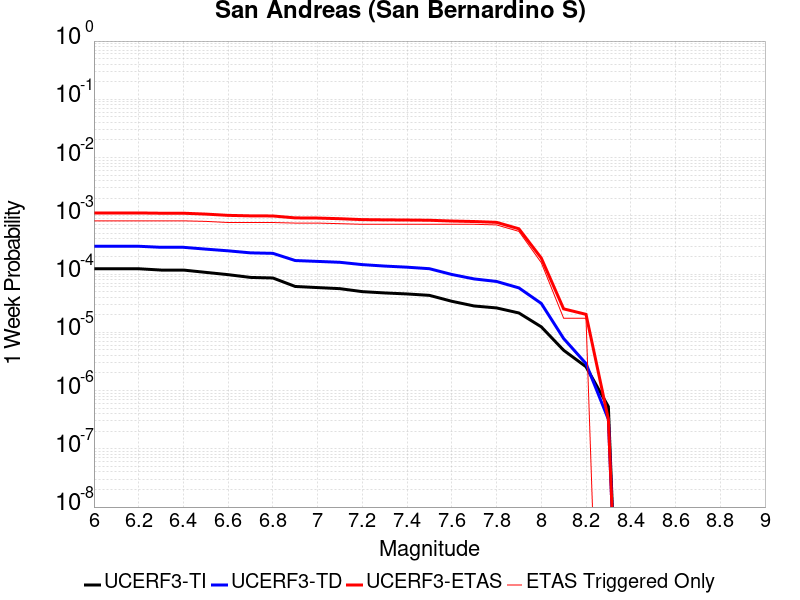 | 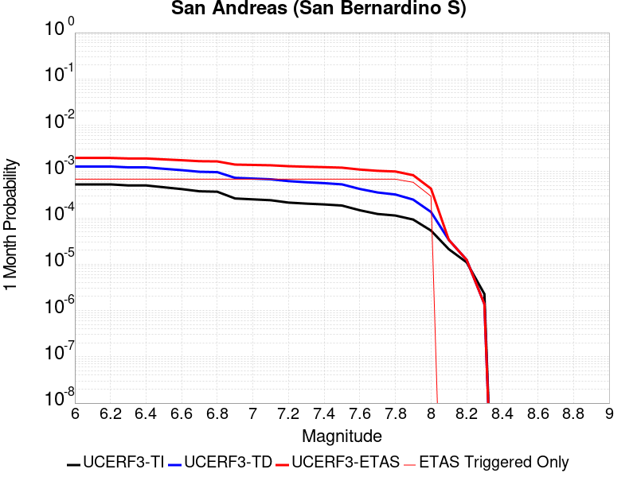 | 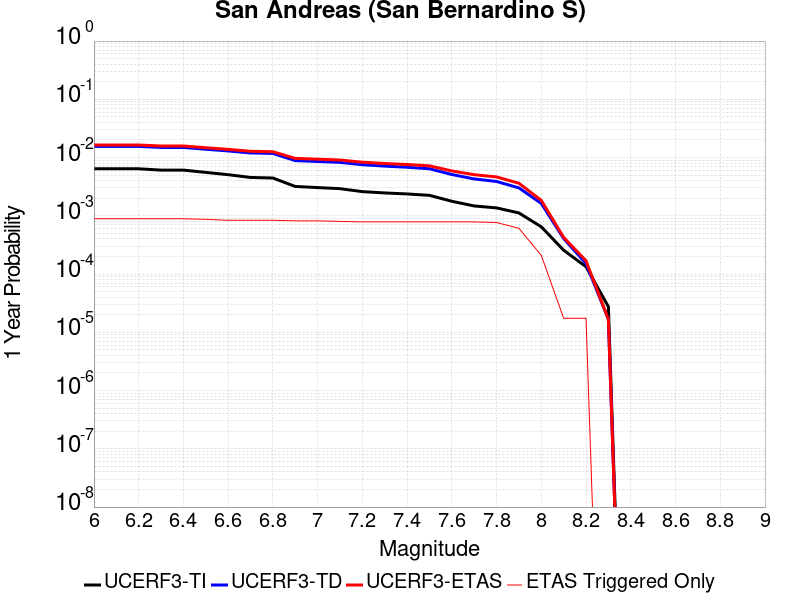 | 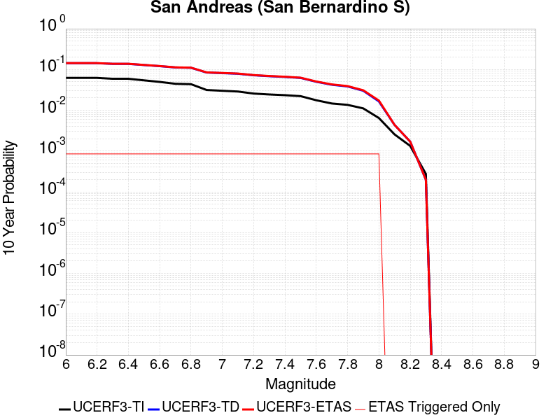 |

| Magnitude | 1 wk TI Prob | 1 wk TD Prob | 1 wk ETAS Prob | 1 wk ETAS/TD Gain | 1 wk ETAS Triggered Only | 1 mo TI Prob | 1 mo TD Prob | 1 mo ETAS Prob | 1 mo ETAS/TD Gain | 1 mo ETAS Triggered Only | 1 yr TI Prob | 1 yr TD Prob | 1 yr ETAS Prob | 1 yr ETAS/TD Gain | 1 yr ETAS Triggered Only | 10 yr TI Prob | 10 yr TD Prob | 10 yr ETAS Prob | 10 yr ETAS/TD Gain | 10 yr ETAS Triggered Only |
|-----|-----|-----|-----|-----|-----|-----|-----|-----|-----|-----|-----|-----|-----|-----|-----|-----|-----|-----|-----|-----|
| 6.0 | 1.2336002E-4 | 3.0004102E-4 | 8.867194E-4 | 2.9553273 | 5.8685447E-4 | 5.2857865E-4 | 0.0012852824 | 0.001969066 | 1.5320103 | 6.8466354E-4 | 0.006416472 | 0.015540994 | 0.016215017 | 1.0433706 | 6.8466354E-4 | 0.06234337 | 0.14283717 | 0.14350788 | 1.0046957 | 7.824726E-4 |
| 6.1 | 1.2336002E-4 | 3.0004102E-4 | 8.867194E-4 | 2.9553273 | 5.8685447E-4 | 5.2857865E-4 | 0.0012852824 | 0.001969066 | 1.5320103 | 6.8466354E-4 | 0.006416472 | 0.015540994 | 0.016215017 | 1.0433706 | 6.8466354E-4 | 0.06234337 | 0.14283717 | 0.14350788 | 1.0046957 | 7.824726E-4 |
| 6.2 | 1.2336002E-4 | 3.0004102E-4 | 8.867194E-4 | 2.9553273 | 5.8685447E-4 | 5.2857865E-4 | 0.0012852824 | 0.001969066 | 1.5320103 | 6.8466354E-4 | 0.006416472 | 0.015540994 | 0.016215017 | 1.0433706 | 6.8466354E-4 | 0.06234337 | 0.14283717 | 0.14350788 | 1.0046957 | 7.824726E-4 |
| 6.3 | 1.1712257E-4 | 2.8792414E-4 | 8.746096E-4 | 3.0376391 | 5.8685447E-4 | 5.018573E-4 | 0.0012334028 | 0.0019172218 | 1.5544167 | 6.8466354E-4 | 0.006093008 | 0.014918125 | 0.015592575 | 1.0452101 | 6.8466354E-4 | 0.059286322 | 0.13754563 | 0.13822047 | 1.0049063 | 7.824726E-4 |
| 6.4 | 1.1712257E-4 | 2.8792414E-4 | 8.746096E-4 | 3.0376391 | 5.8685447E-4 | 5.018573E-4 | 0.0012334028 | 0.0019172218 | 1.5544167 | 6.8466354E-4 | 0.006093008 | 0.014918125 | 0.015592575 | 1.0452101 | 6.8466354E-4 | 0.059286322 | 0.13754563 | 0.13822047 | 1.0049063 | 7.824726E-4 |
| 6.5 | 1.0689076E-4 | 2.680528E-4 | 8.5474993E-4 | 3.1887374 | 5.8685447E-4 | 4.5802278E-4 | 0.0011483167 | 0.001832194 | 1.5955477 | 6.8466354E-4 | 0.0055621783 | 0.01389575 | 0.0145709 | 1.0485867 | 6.8466354E-4 | 0.05425003 | 0.12879294 | 0.12947464 | 1.005293 | 7.824726E-4 |
| 6.6 | 9.7648895E-5 | 2.50501E-4 | 8.3720847E-4 | 3.3421361 | 5.8685447E-4 | 4.1842813E-4 | 0.0010731576 | 0.0017570865 | 1.637305 | 6.8466354E-4 | 0.005082469 | 0.012991785 | 0.013667554 | 1.0520151 | 6.8466354E-4 | 0.049677886 | 0.12095292 | 0.12164075 | 1.0056868 | 7.824726E-4 |
| 6.7 | 8.757013E-5 | 2.3120902E-4 | 8.179278E-4 | 3.537612 | 5.8685447E-4 | 3.7524657E-4 | 9.905418E-4 | 0.0016745272 | 1.6905164 | 6.8466354E-4 | 0.00455906 | 0.011997245 | 0.012673695 | 1.0563837 | 6.8466354E-4 | 0.04466656 | 0.11226123 | 0.11295586 | 1.0061877 | 7.824726E-4 |
| 6.8 | 8.562978E-5 | 2.2680782E-4 | 8.135292E-4 | 3.5868657 | 5.8685447E-4 | 3.6693315E-4 | 9.7169366E-4 | 0.0016556919 | 1.7039238 | 6.8466354E-4 | 0.004458263 | 0.011770263 | 0.012446868 | 1.0574843 | 6.8466354E-4 | 0.043698758 | 0.11027153 | 0.11096772 | 1.0063134 | 7.824726E-4 |
| 6.9 | 6.124075E-5 | 1.7065753E-4 | 7.574118E-4 | 4.4381976 | 5.8685447E-4 | 2.6243398E-4 | 7.311852E-4 | 0.0014153481 | 1.9356903 | 6.8466354E-4 | 0.0031904527 | 0.008866051 | 0.009544644 | 1.0765384 | 6.8466354E-4 | 0.031450346 | 0.08418263 | 0.08489923 | 1.0085125 | 7.824726E-4 |
| 7.0 | 5.8598747E-5 | 1.649477E-4 | 7.517054E-4 | 4.5572343 | 5.8685447E-4 | 2.5111332E-4 | 7.06728E-4 | 0.0013909077 | 1.9680947 | 6.8466354E-4 | 0.0030530186 | 0.008570663 | 0.009249458 | 1.0791999 | 6.8466354E-4 | 0.03011414 | 0.081500374 | 0.08221907 | 1.0088184 | 7.824726E-4 |
| 7.1 | 5.613814E-5 | 1.5913323E-4 | 7.4589433E-4 | 4.6872315 | 5.8685447E-4 | 2.4056983E-4 | 6.818221E-4 | 0.0013660188 | 2.0034828 | 6.8466354E-4 | 0.0029250039 | 0.008269769 | 0.00894877 | 1.0821065 | 6.8466354E-4 | 0.028868021 | 0.07879931 | 0.07952012 | 1.0091475 | 7.824726E-4 |
| 7.2 | 4.991222E-5 | 1.4519796E-4 | 7.319672E-4 | 5.0411673 | 5.8685447E-4 | 2.1389198E-4 | 6.2212895E-4 | 0.0013063665 | 2.0998325 | 6.8466354E-4 | 0.002601025 | 0.007548217 | 0.0082277125 | 1.0900207 | 6.8466354E-4 | 0.025707912 | 0.07225321 | 0.072979145 | 1.0100471 | 7.824726E-4 |
| 7.3 | 4.7410045E-5 | 1.3714004E-4 | 7.23914E-4 | 5.2786484 | 5.8685447E-4 | 2.0317009E-4 | 5.8761094E-4 | 0.0012718722 | 2.16448 | 6.8466354E-4 | 0.0024707897 | 0.0071307817 | 0.007810563 | 1.0953306 | 6.8466354E-4 | 0.024434982 | 0.06853558 | 0.06926443 | 1.0106345 | 7.824726E-4 |
| 7.4 | 4.5556746E-5 | 1.3121912E-4 | 7.1799656E-4 | 5.4717374 | 5.8685447E-4 | 1.952286E-4 | 5.622468E-4 | 0.0012465253 | 2.2170432 | 6.8466354E-4 | 0.002374317 | 0.0068239477 | 0.007503939 | 1.0996478 | 6.8466354E-4 | 0.023491086 | 0.065788016 | 0.06651901 | 1.0111114 | 7.824726E-4 |
| 7.5 | 4.3084514E-5 | 1.2357246E-4 | 7.103544E-4 | 5.7484846 | 5.8685447E-4 | 1.8463485E-4 | 5.2948913E-4 | 0.0012137902 | 2.2923799 | 6.8466354E-4 | 0.0022456115 | 0.0064275465 | 0.0071078097 | 1.1058356 | 6.8466354E-4 | 0.022230545 | 0.062188786 | 0.0629226 | 1.0117997 | 7.824726E-4 |
| 7.6 | 3.408608E-5 | 9.83552E-5 | 6.8515196E-4 | 6.966098 | 5.8685447E-4 | 1.4607502E-4 | 4.214543E-4 | 0.0011058293 | 2.6238415 | 6.8466354E-4 | 0.0017770125 | 0.0051191594 | 0.005800318 | 1.1330607 | 6.8466354E-4 | 0.017628696 | 0.050020292 | 0.050763626 | 1.0148606 | 7.824726E-4 |
| 7.7 | 2.8315713E-5 | 8.248679E-5 | 6.692929E-4 | 8.113939 | 5.8685447E-4 | 1.2134742E-4 | 3.5346695E-4 | 0.0010378885 | 2.9363098 | 6.8466354E-4 | 0.0014764034 | 0.0042949775 | 0.0049767005 | 1.1587256 | 6.8466354E-4 | 0.01466633 | 0.0422714 | 0.0430208 | 1.0177282 | 7.824726E-4 |
| 7.8 | 2.6222975E-5 | 7.463088E-5 | 6.6144153E-4 | 8.86284 | 5.8685447E-4 | 1.1237934E-4 | 3.1980744E-4 | 0.001004252 | 3.1401772 | 6.8466354E-4 | 0.0013673597 | 0.0038867102 | 0.004568713 | 1.1754704 | 6.8466354E-4 | 0.013589768 | 0.03843674 | 0.039189138 | 1.0195749 | 7.824726E-4 |
| 7.9 | 2.1469694E-5 | 5.787864E-5 | 5.468957E-4 | 9.449008 | 4.890454E-4 | 9.200973E-5 | 2.4802773E-4 | 8.347366E-4 | 3.365497 | 5.8685447E-4 | 0.0011196428 | 0.0030155594 | 0.0036006442 | 1.1940219 | 5.8685447E-4 | 0.011140184 | 0.030152109 | 0.030816128 | 1.0220224 | 6.8466354E-4 |
| 8.0 | 1.2420249E-5 | 3.131896E-5 | 2.2693099E-4 | 7.2458024 | 1.9561815E-4 | 5.322855E-5 | 1.342172E-4 | 4.2760506E-4 | 3.1859183 | 2.9342723E-4 | 6.478649E-4 | 0.0016328706 | 0.0019258187 | 1.1794068 | 2.9342723E-4 | 0.0064597935 | 0.016522504 | 0.016811082 | 1.0174658 | 2.9342723E-4 |
| 8.1 | 4.9197724E-6 | 7.822348E-6 | 7.822348E-6 | 1.0 | 0.0 | 2.1084568E-5 | 3.352392E-5 | 3.352392E-5 | 1.0 | 0.0 | 2.566744E-4 | 4.0807744E-4 | 4.0807744E-4 | 1.0 | 0.0 | 0.002563781 | 0.0043843705 | 0.0043843705 | 1.0 | 0.0 |
| 8.2 | 2.5634774E-6 | 2.9067196E-6 | 2.9067196E-6 | 1.0 | 0.0 | 1.0986286E-5 | 1.2457311E-5 | 1.2457311E-5 | 1.0 | 0.0 | 1.3374983E-4 | 1.5165724E-4 | 1.5165724E-4 | 1.0 | 0.0 | 0.0013366934 | 0.0017049741 | 0.0017049741 | 1.0 | 0.0 |
| 8.3 | 5.2850464E-7 | 3.2088764E-7 | 3.2088764E-7 | 1.0 | 0.0 | 2.2650179E-6 | 1.375232E-6 | 1.375232E-6 | 1.0 | 0.0 | 2.7576245E-5 | 1.6743334E-5 | 1.6743334E-5 | 1.0 | 0.0 | 2.7572823E-4 | 1.9870348E-4 | 1.9870348E-4 | 1.0 | 0.0 |

## Nelson Lake
*[(top)](#table-of-contents)*

| 1 Week | 1 Month | 1 Year | 10 Year |
|-----|-----|-----|-----|
| 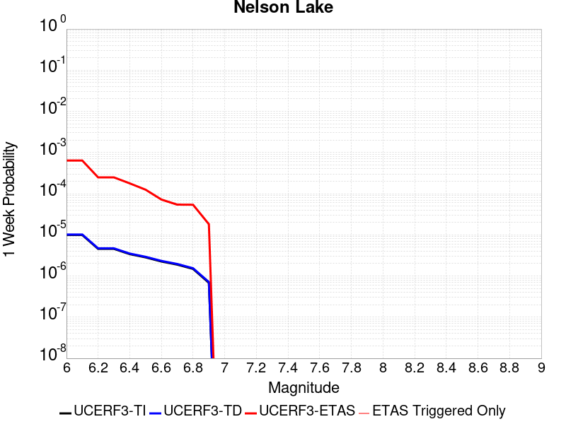 | 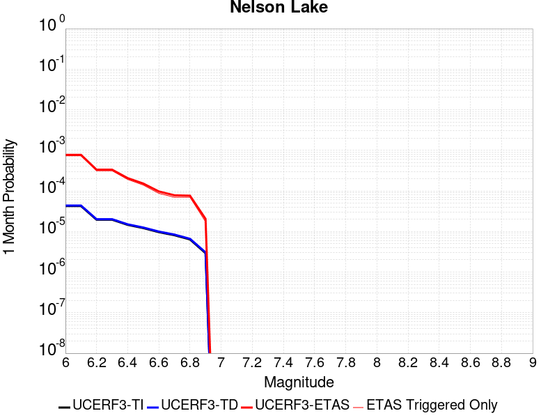 | 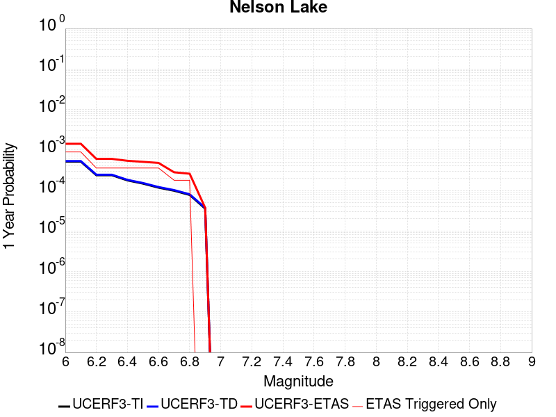 | 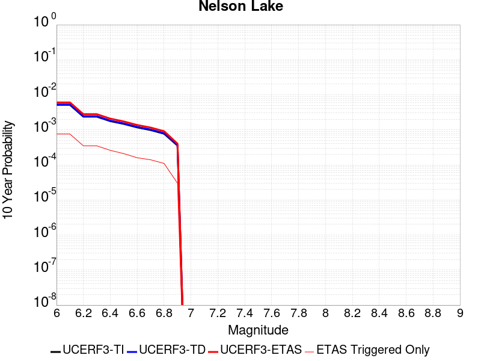 |

| Magnitude | 1 wk TI Prob | 1 wk TD Prob | 1 wk ETAS Prob | 1 wk ETAS/TD Gain | 1 wk ETAS Triggered Only | 1 mo TI Prob | 1 mo TD Prob | 1 mo ETAS Prob | 1 mo ETAS/TD Gain | 1 mo ETAS Triggered Only | 1 yr TI Prob | 1 yr TD Prob | 1 yr ETAS Prob | 1 yr ETAS/TD Gain | 1 yr ETAS Triggered Only | 10 yr TI Prob | 10 yr TD Prob | 10 yr ETAS Prob | 10 yr ETAS/TD Gain | 10 yr ETAS Triggered Only |
|-----|-----|-----|-----|-----|-----|-----|-----|-----|-----|-----|-----|-----|-----|-----|-----|-----|-----|-----|-----|-----|
| 6.0 | 9.913453E-6 | 1.0192255E-5 | 5.9704075E-4 | 58.57788 | 5.8685447E-4 | 4.2485535E-5 | 4.3680422E-5 | 6.305092E-4 | 14.434596 | 5.8685447E-4 | 5.1713863E-4 | 5.316897E-4 | 0.0011182321 | 2.1031668 | 5.8685447E-4 | 0.0051593683 | 0.005305204 | 0.005888945 | 1.1100318 | 5.8685447E-4 |
| 6.1 | 9.913453E-6 | 1.0192255E-5 | 5.9704075E-4 | 58.57788 | 5.8685447E-4 | 4.2485535E-5 | 4.3680422E-5 | 6.305092E-4 | 14.434596 | 5.8685447E-4 | 5.1713863E-4 | 5.316897E-4 | 0.0011182321 | 2.1031668 | 5.8685447E-4 | 0.0051593683 | 0.005305204 | 0.005888945 | 1.1100318 | 5.8685447E-4 |
| 6.2 | 4.5596407E-6 | 4.696313E-6 | 2.0031355E-4 | 42.653362 | 1.9561815E-4 | 1.954117E-5 | 2.0126909E-5 | 2.1574112E-4 | 10.71904 | 1.9561815E-4 | 2.3788778E-4 | 2.4501883E-4 | 4.4058904E-4 | 1.7981845 | 1.9561815E-4 | 0.0023763329 | 0.0024476128 | 0.0026427521 | 1.0797265 | 1.9561815E-4 |
| 6.3 | 4.5596407E-6 | 4.696313E-6 | 2.0031355E-4 | 42.653362 | 1.9561815E-4 | 1.954117E-5 | 2.0126909E-5 | 2.1574112E-4 | 10.71904 | 1.9561815E-4 | 2.3788778E-4 | 2.4501883E-4 | 4.4058904E-4 | 1.7981845 | 1.9561815E-4 | 0.0023763329 | 0.0024476128 | 0.0026427521 | 1.0797265 | 1.9561815E-4 |
| 6.4 | 3.4025713E-6 | 3.5098972E-6 | 1.9912736E-4 | 56.733105 | 1.9561815E-4 | 1.4582367E-5 | 1.5042335E-5 | 2.1065754E-4 | 14.004312 | 1.9561815E-4 | 1.7752586E-4 | 1.8312587E-4 | 3.787082E-4 | 2.0680213 | 1.9561815E-4 | 0.001773841 | 0.0018298327 | 0.002025093 | 1.1067094 | 1.9561815E-4 |
| 6.5 | 2.8352947E-6 | 2.927856E-6 | 1.9854544E-4 | 67.81257 | 1.9561815E-4 | 1.2151207E-5 | 1.2547898E-5 | 2.0816359E-4 | 16.58952 | 1.9561815E-4 | 1.479309E-4 | 1.5276071E-4 | 3.4834899E-4 | 2.2803571 | 1.9561815E-4 | 0.0014783246 | 0.0015266308 | 0.0017219504 | 1.1279416 | 1.9561815E-4 |
| 6.6 | 2.251518E-6 | 2.3290677E-6 | 1.9794676E-4 | 84.98971 | 1.9561815E-4 | 9.649328E-6 | 9.981683E-6 | 2.0559788E-4 | 20.597515 | 1.9561815E-4 | 1.1747423E-4 | 1.2152085E-4 | 3.1711522E-4 | 2.609554 | 1.9561815E-4 | 0.0011741214 | 0.0012146058 | 0.0014099863 | 1.1608592 | 1.9561815E-4 |
| 6.7 | 1.8911853E-6 | 1.9591396E-6 | 9.9768025E-5 | 50.924408 | 9.7809076E-5 | 8.105055E-6 | 8.39629E-6 | 1.0620454E-4 | 12.648986 | 9.7809076E-5 | 9.867457E-5 | 1.0222061E-4 | 2.0001968E-4 | 1.9567451 | 9.7809076E-5 | 9.863076E-4 | 0.0010217935 | 0.0011195026 | 1.0956252 | 9.7809076E-5 |
| 6.8 | 1.4874814E-6 | 1.5438305E-6 | 9.935276E-5 | 64.354706 | 9.7809076E-5 | 6.374905E-6 | 6.6164025E-6 | 1.04424835E-4 | 15.782721 | 9.7809076E-5 | 7.76117E-5 | 8.055224E-5 | 1.7835344E-4 | 2.2141337 | 9.7809076E-5 | 7.75846E-4 | 8.0528157E-4 | 9.030119E-4 | 1.1213616 | 9.7809076E-5 |
| 6.9 | 6.835972E-7 | 7.1399285E-7 | 7.1399285E-7 | 1.0 | 0.0 | 2.9296991E-6 | 3.0599674E-6 | 3.0599674E-6 | 1.0 | 0.0 | 3.56685E-5 | 3.7254784E-5 | 3.7254784E-5 | 1.0 | 0.0 | 3.5662777E-4 | 3.7251666E-4 | 3.7251666E-4 | 1.0 | 0.0 |

## Bicycle Lake
*[(top)](#table-of-contents)*

| 1 Week | 1 Month | 1 Year | 10 Year |
|-----|-----|-----|-----|
| 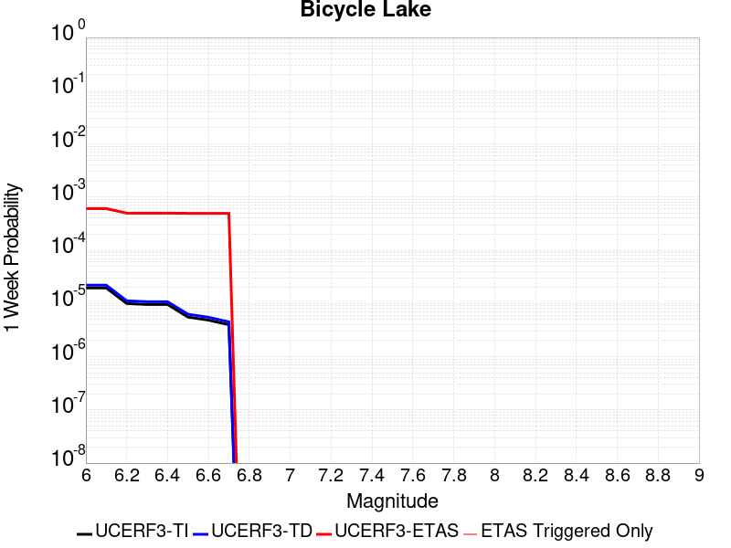 | 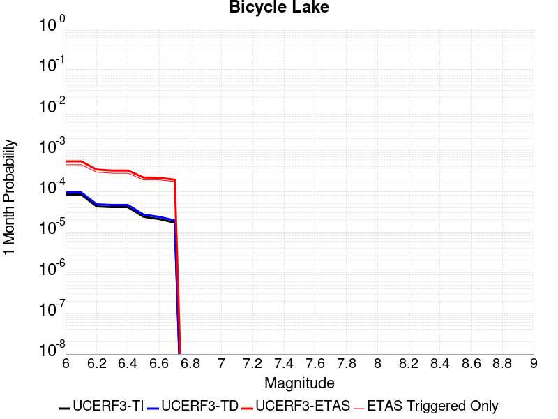 | 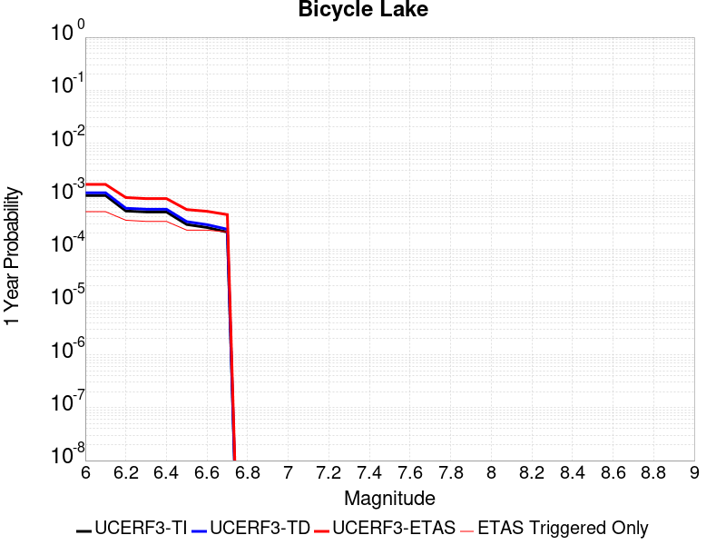 | 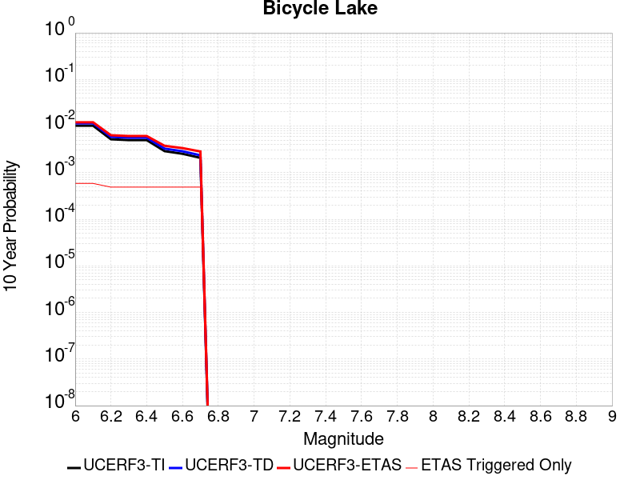 |

| Magnitude | 1 wk TI Prob | 1 wk TD Prob | 1 wk ETAS Prob | 1 wk ETAS/TD Gain | 1 wk ETAS Triggered Only | 1 mo TI Prob | 1 mo TD Prob | 1 mo ETAS Prob | 1 mo ETAS/TD Gain | 1 mo ETAS Triggered Only | 1 yr TI Prob | 1 yr TD Prob | 1 yr ETAS Prob | 1 yr ETAS/TD Gain | 1 yr ETAS Triggered Only | 10 yr TI Prob | 10 yr TD Prob | 10 yr ETAS Prob | 10 yr ETAS/TD Gain | 10 yr ETAS Triggered Only |
|-----|-----|-----|-----|-----|-----|-----|-----|-----|-----|-----|-----|-----|-----|-----|-----|-----|-----|-----|-----|-----|
| 6.0 | 1.9621975E-5 | 2.2097078E-5 | 6.089386E-4 | 27.557425 | 5.8685447E-4 | 8.4091465E-5 | 9.4699084E-5 | 6.81498E-4 | 7.196458 | 5.8685447E-4 | 0.0010233327 | 0.0011524865 | 0.0017386647 | 1.5086204 | 5.8685447E-4 | 0.01018633 | 0.011478408 | 0.012058526 | 1.05054 | 5.8685447E-4 |
| 6.1 | 1.9621975E-5 | 2.2097078E-5 | 6.089386E-4 | 27.557425 | 5.8685447E-4 | 8.4091465E-5 | 9.4699084E-5 | 6.81498E-4 | 7.196458 | 5.8685447E-4 | 0.0010233327 | 0.0011524865 | 0.0017386647 | 1.5086204 | 5.8685447E-4 | 0.01018633 | 0.011478408 | 0.012058526 | 1.05054 | 5.8685447E-4 |
| 6.2 | 9.9971285E-6 | 1.1255639E-5 | 5.0029554E-4 | 44.448433 | 4.890454E-4 | 4.2844134E-5 | 4.8237856E-5 | 5.372596E-4 | 11.137718 | 4.890454E-4 | 5.2150246E-4 | 5.871896E-4 | 0.0010759479 | 1.8323686 | 4.890454E-4 | 0.0052028033 | 0.005861487 | 0.0063476656 | 1.0829446 | 4.890454E-4 |
| 6.3 | 9.589428E-6 | 1.0798346E-5 | 4.9983844E-4 | 46.288425 | 4.890454E-4 | 4.10969E-5 | 4.62781E-5 | 5.353009E-4 | 11.567045 | 4.890454E-4 | 5.002399E-4 | 5.6334207E-4 | 0.001052112 | 1.8676255 | 4.890454E-4 | 0.0049911533 | 0.0056242296 | 0.0061105243 | 1.0864643 | 4.890454E-4 |
| 6.4 | 9.589428E-6 | 1.0798346E-5 | 4.9983844E-4 | 46.288425 | 4.890454E-4 | 4.10969E-5 | 4.62781E-5 | 5.353009E-4 | 11.567045 | 4.890454E-4 | 5.002399E-4 | 5.6334207E-4 | 0.001052112 | 1.8676255 | 4.890454E-4 | 0.0049911533 | 0.0056242296 | 0.0061105243 | 1.0864643 | 4.890454E-4 |
| 6.5 | 5.557707E-6 | 6.2856016E-6 | 4.953279E-4 | 78.80358 | 4.890454E-4 | 2.3818526E-5 | 2.6938165E-5 | 5.159704E-4 | 19.15388 | 4.890454E-4 | 2.8995197E-4 | 3.2794967E-4 | 8.168347E-4 | 2.4907317 | 4.890454E-4 | 0.0028957394 | 0.0032772934 | 0.003764736 | 1.1487333 | 4.890454E-4 |
| 6.6 | 4.8742945E-6 | 5.5132896E-6 | 4.94556E-4 | 89.70252 | 4.890454E-4 | 2.0889667E-5 | 2.3628318E-5 | 5.1266217E-4 | 21.696938 | 4.890454E-4 | 2.54302E-4 | 2.87663E-4 | 7.7656773E-4 | 2.6995745 | 4.890454E-4 | 0.002540112 | 0.0028754752 | 0.0033631143 | 1.1695856 | 4.890454E-4 |
| 6.7 | 3.991108E-6 | 4.5159104E-6 | 4.935591E-4 | 109.29337 | 4.890454E-4 | 1.7104636E-5 | 1.9353902E-5 | 5.0838984E-4 | 26.26808 | 4.890454E-4 | 2.0822904E-4 | 2.3563375E-4 | 7.245639E-4 | 3.074958 | 4.890454E-4 | 0.0020803404 | 0.0023563374 | 0.0028442305 | 1.2070557 | 4.890454E-4 |

## San Andreas (San Gorgonio Pass-Garnet HIll)
*[(top)](#table-of-contents)*

| 1 Week | 1 Month | 1 Year | 10 Year |
|-----|-----|-----|-----|
| 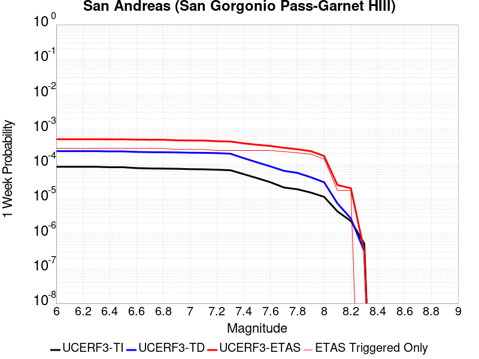 | 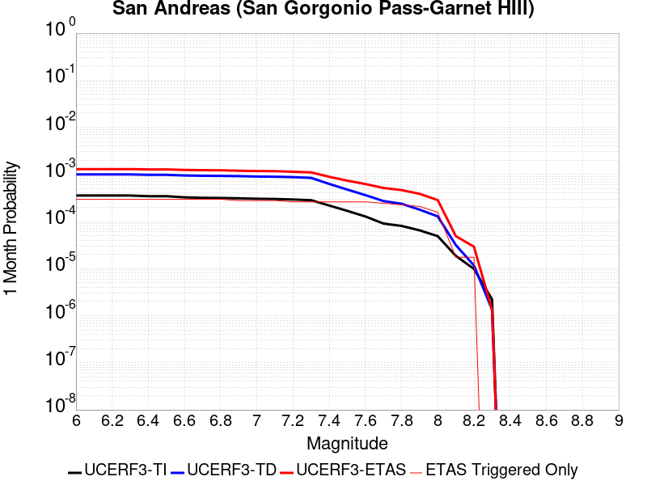 |  | 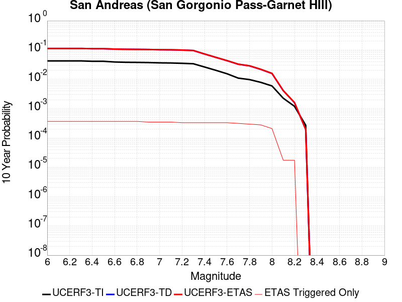 |

| Magnitude | 1 wk TI Prob | 1 wk TD Prob | 1 wk ETAS Prob | 1 wk ETAS/TD Gain | 1 wk ETAS Triggered Only | 1 mo TI Prob | 1 mo TD Prob | 1 mo ETAS Prob | 1 mo ETAS/TD Gain | 1 mo ETAS Triggered Only | 1 yr TI Prob | 1 yr TD Prob | 1 yr ETAS Prob | 1 yr ETAS/TD Gain | 1 yr ETAS Triggered Only | 10 yr TI Prob | 10 yr TD Prob | 10 yr ETAS Prob | 10 yr ETAS/TD Gain | 10 yr ETAS Triggered Only |
|-----|-----|-----|-----|-----|-----|-----|-----|-----|-----|-----|-----|-----|-----|-----|-----|-----|-----|-----|-----|-----|
| 6.0 | 8.31567E-5 | 2.3382473E-4 | 6.2496954E-4 | 2.672812 | 3.912363E-4 | 3.5633717E-4 | 0.0010017233 | 0.0014902789 | 1.487715 | 4.890454E-4 | 0.004329778 | 0.012127888 | 0.012611003 | 1.039835 | 4.890454E-4 | 0.042463828 | 0.11257892 | 0.11301291 | 1.003855 | 4.890454E-4 |
| 6.1 | 8.31567E-5 | 2.3382473E-4 | 6.2496954E-4 | 2.672812 | 3.912363E-4 | 3.5633717E-4 | 0.0010017233 | 0.0014902789 | 1.487715 | 4.890454E-4 | 0.004329778 | 0.012127888 | 0.012611003 | 1.039835 | 4.890454E-4 | 0.042463828 | 0.11257892 | 0.11301291 | 1.003855 | 4.890454E-4 |
| 6.2 | 8.31567E-5 | 2.3382473E-4 | 6.2496954E-4 | 2.672812 | 3.912363E-4 | 3.5633717E-4 | 0.0010017233 | 0.0014902789 | 1.487715 | 4.890454E-4 | 0.004329778 | 0.012127888 | 0.012611003 | 1.039835 | 4.890454E-4 | 0.042463828 | 0.11257892 | 0.11301291 | 1.003855 | 4.890454E-4 |
| 6.3 | 8.31567E-5 | 2.3382473E-4 | 6.2496954E-4 | 2.672812 | 3.912363E-4 | 3.5633717E-4 | 0.0010017233 | 0.0014902789 | 1.487715 | 4.890454E-4 | 0.004329778 | 0.012127888 | 0.012611003 | 1.039835 | 4.890454E-4 | 0.042463828 | 0.11257892 | 0.11301291 | 1.003855 | 4.890454E-4 |
| 6.4 | 8.059055E-5 | 2.2940808E-4 | 6.205546E-4 | 2.7050252 | 3.912363E-4 | 3.4534236E-4 | 9.828096E-4 | 0.0014713743 | 1.4971102 | 4.890454E-4 | 0.0041964394 | 0.011900152 | 0.012383377 | 1.0406067 | 4.890454E-4 | 0.041180745 | 0.11056015 | 0.11099512 | 1.0039343 | 4.890454E-4 |
| 6.5 | 8.059055E-5 | 2.2940808E-4 | 6.205546E-4 | 2.7050252 | 3.912363E-4 | 3.4534236E-4 | 9.828096E-4 | 0.0014713743 | 1.4971102 | 4.890454E-4 | 0.0041964394 | 0.011900152 | 0.012383377 | 1.0406067 | 4.890454E-4 | 0.041180745 | 0.11056015 | 0.11099512 | 1.0039343 | 4.890454E-4 |
| 6.6 | 7.619237E-5 | 2.218517E-4 | 6.1300123E-4 | 2.7631125 | 3.912363E-4 | 3.2649786E-4 | 9.5044886E-4 | 0.0014390295 | 1.5140524 | 4.890454E-4 | 0.0039678677 | 0.01151087 | 0.011994286 | 1.0419965 | 4.890454E-4 | 0.03897764 | 0.10709683 | 0.1075335 | 1.0040773 | 4.890454E-4 |
| 6.7 | 7.440636E-5 | 2.1860997E-4 | 6.0976075E-4 | 2.7892632 | 3.912363E-4 | 3.188454E-4 | 9.3656575E-4 | 0.0014251531 | 1.5216798 | 4.890454E-4 | 0.0038750346 | 0.011343609 | 0.011827106 | 1.0426229 | 4.890454E-4 | 0.038081564 | 0.105605274 | 0.106042676 | 1.0041418 | 4.890454E-4 |
| 6.8 | 7.3735864E-5 | 2.1708169E-4 | 6.0823304E-4 | 2.8018627 | 3.912363E-4 | 3.1597257E-4 | 9.3002064E-4 | 0.0014186112 | 1.5253545 | 4.890454E-4 | 0.0038401815 | 0.011264749 | 0.011748285 | 1.0429248 | 4.890454E-4 | 0.03774495 | 0.10490683 | 0.10534457 | 1.0041727 | 4.890454E-4 |
| 6.9 | 7.27575E-5 | 2.1477141E-4 | 5.0813565E-4 | 2.365937 | 2.9342723E-4 | 3.117806E-4 | 9.201265E-4 | 0.0013110028 | 1.4248072 | 3.912363E-4 | 0.003789323 | 0.011145527 | 0.011532402 | 1.0347114 | 3.912363E-4 | 0.037253562 | 0.103854746 | 0.10420535 | 1.0033759 | 3.912363E-4 |
| 7.0 | 7.102591E-5 | 2.1061185E-4 | 5.039773E-4 | 2.3929198 | 2.9342723E-4 | 3.0436125E-4 | 9.023122E-4 | 0.0012931955 | 1.4332018 | 3.912363E-4 | 0.003699303 | 0.010930831 | 0.0113177905 | 1.0354007 | 3.912363E-4 | 0.03638325 | 0.10195695 | 0.102308296 | 1.003446 | 3.912363E-4 |
| 7.1 | 7.028513E-5 | 2.0896831E-4 | 5.023342E-4 | 2.4038775 | 2.9342723E-4 | 3.0118722E-4 | 8.9527335E-4 | 0.0012861594 | 1.4366108 | 3.912363E-4 | 0.0036607897 | 0.010845989 | 0.011232982 | 1.0356808 | 3.912363E-4 | 0.036010686 | 0.101199985 | 0.10155163 | 1.0034747 | 3.912363E-4 |
| 7.2 | 6.8498244E-5 | 2.0504706E-4 | 4.9841416E-4 | 2.4307303 | 2.9342723E-4 | 2.9353087E-4 | 8.784794E-4 | 0.001269372 | 1.444965 | 3.912363E-4 | 0.003567883 | 0.010643536 | 0.011030608 | 1.0363668 | 3.912363E-4 | 0.035111405 | 0.09939202 | 0.09974437 | 1.003545 | 3.912363E-4 |
| 7.3 | 6.622592E-5 | 1.9732013E-4 | 4.906895E-4 | 2.4867685 | 2.9342723E-4 | 2.8379448E-4 | 8.453858E-4 | 0.0012362914 | 1.462399 | 3.912363E-4 | 0.0034497243 | 0.0102444785 | 0.0106317075 | 1.0377988 | 3.912363E-4 | 0.033966612 | 0.095888525 | 0.09624225 | 1.0036889 | 3.912363E-4 |
| 7.4 | 5.1050705E-5 | 1.4689034E-4 | 4.4027445E-4 | 2.9973004 | 2.9342723E-4 | 2.1877038E-4 | 6.29379E-4 | 0.0010203691 | 1.6212316 | 3.912363E-4 | 0.002660276 | 0.0076359594 | 0.008024208 | 1.0508448 | 3.912363E-4 | 0.02628654 | 0.07286301 | 0.073225744 | 1.0049783 | 3.912363E-4 |
| 7.5 | 3.9302922E-5 | 1.1129847E-4 | 4.0469304E-4 | 3.636106 | 2.9342723E-4 | 1.6843023E-4 | 4.7690657E-4 | 8.6795626E-4 | 1.8199713 | 3.912363E-4 | 0.0020487092 | 0.005790949 | 0.0061799195 | 1.0671687 | 3.912363E-4 | 0.020299247 | 0.05600951 | 0.056378834 | 1.006594 | 3.912363E-4 |
| 7.6 | 2.9851626E-5 | 8.4949745E-5 | 3.7835204E-4 | 4.453834 | 2.9342723E-4 | 1.2792926E-4 | 3.6401965E-4 | 7.5511355E-4 | 2.0743759 | 3.912363E-4 | 0.0015564259 | 0.0044229585 | 0.004812464 | 1.0880646 | 3.912363E-4 | 0.0154556995 | 0.04319374 | 0.043568075 | 1.0086665 | 3.912363E-4 |
| 7.7 | 2.1135214E-5 | 6.3529005E-5 | 3.5693758E-4 | 5.6184983 | 2.9342723E-4 | 9.0576345E-5 | 2.7223877E-4 | 6.6336856E-4 | 2.436716 | 3.912363E-4 | 0.0011022091 | 0.0033094748 | 0.0036994163 | 1.1178257 | 3.912363E-4 | 0.010967582 | 0.032582592 | 0.03296108 | 1.0116162 | 3.912363E-4 |
| 7.8 | 1.883379E-5 | 5.564028E-5 | 3.4905117E-4 | 6.273354 | 2.9342723E-4 | 8.0713755E-5 | 2.3843657E-4 | 6.295796E-4 | 2.640449 | 3.912363E-4 | 9.822468E-4 | 0.0028991038 | 0.003289206 | 1.1345595 | 3.912363E-4 | 0.0097791655 | 0.028695205 | 0.029075217 | 1.013243 | 3.912363E-4 |
| 7.9 | 1.5156185E-5 | 4.1658426E-5 | 3.3507342E-4 | 8.043353 | 2.9342723E-4 | 6.495346E-5 | 1.785239E-4 | 5.6969037E-4 | 3.1911154 | 3.912363E-4 | 7.9052144E-4 | 0.0021713632 | 0.00256175 | 1.1797888 | 3.912363E-4 | 0.007877152 | 0.021759422 | 0.022142146 | 1.0175889 | 3.912363E-4 |
| 8.0 | 1.1405907E-5 | 2.9974231E-5 | 2.2558653E-4 | 7.5260153 | 1.9561815E-4 | 4.8881542E-5 | 1.2845467E-4 | 4.2184422E-4 | 3.2839928 | 2.9342723E-4 | 5.9497025E-4 | 0.0015628147 | 0.0018557833 | 1.1874622 | 2.9342723E-4 | 0.005933798 | 0.015772851 | 0.016061649 | 1.0183098 | 2.9342723E-4 |
| 8.1 | 4.3511436E-6 | 7.369219E-6 | 7.369219E-6 | 1.0 | 0.0 | 1.8647626E-5 | 3.1581985E-5 | 3.1581985E-5 | 1.0 | 0.0 | 2.2701119E-4 | 3.8444297E-4 | 3.8444297E-4 | 1.0 | 0.0 | 0.0022677942 | 0.0041163345 | 0.0041163345 | 1.0 | 0.0 |
| 8.2 | 2.3042528E-6 | 2.7329415E-6 | 2.7329415E-6 | 1.0 | 0.0 | 9.875332E-6 | 1.1712554E-5 | 1.1712554E-5 | 1.0 | 0.0 | 1.2022553E-4 | 1.4259106E-4 | 1.4259106E-4 | 1.0 | 0.0 | 0.0012016051 | 0.0015979785 | 0.0015979785 | 1.0 | 0.0 |
| 8.3 | 5.202968E-7 | 3.1598344E-7 | 3.1598344E-7 | 1.0 | 0.0 | 2.2298414E-6 | 1.3542141E-6 | 1.3542141E-6 | 1.0 | 0.0 | 2.714798E-5 | 1.6487444E-5 | 1.6487444E-5 | 1.0 | 0.0 | 2.7144665E-4 | 1.9563142E-4 | 1.9563142E-4 | 1.0 | 0.0 |

## Death Valley (Black Mtns Frontal)
*[(top)](#table-of-contents)*

| 1 Week | 1 Month | 1 Year | 10 Year |
|-----|-----|-----|-----|
| 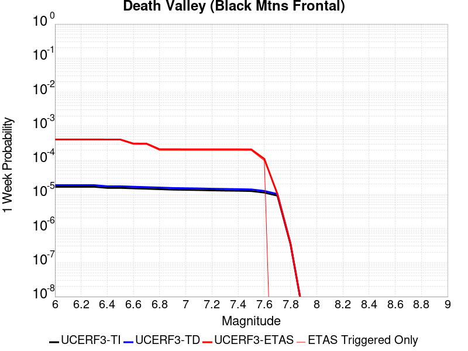 | 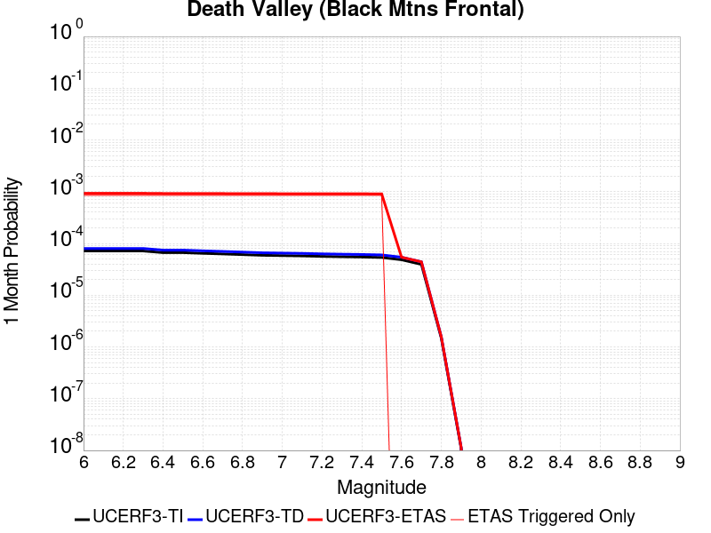 | 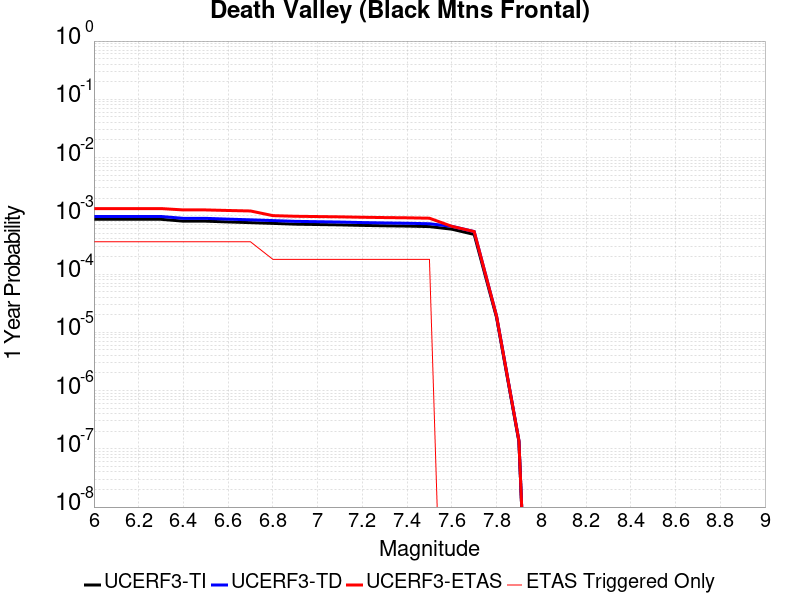 | 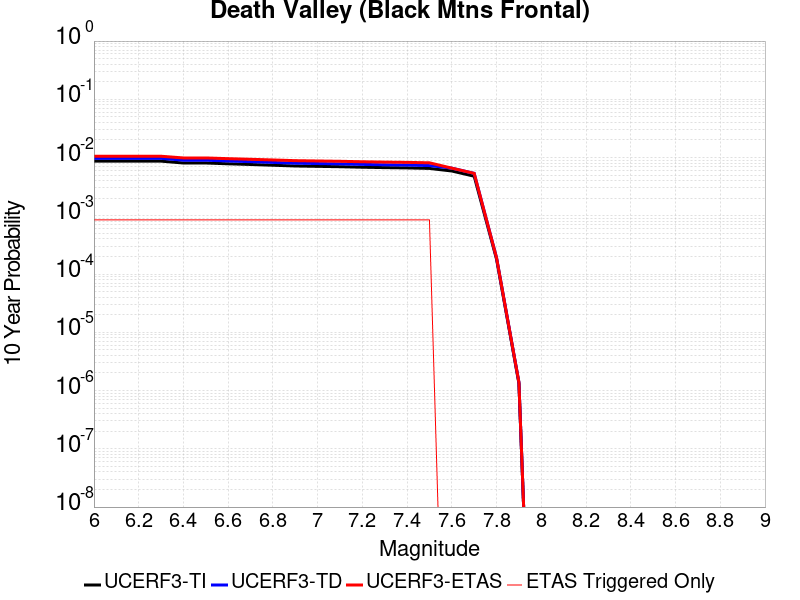 |

| Magnitude | 1 wk TI Prob | 1 wk TD Prob | 1 wk ETAS Prob | 1 wk ETAS/TD Gain | 1 wk ETAS Triggered Only | 1 mo TI Prob | 1 mo TD Prob | 1 mo ETAS Prob | 1 mo ETAS/TD Gain | 1 mo ETAS Triggered Only | 1 yr TI Prob | 1 yr TD Prob | 1 yr ETAS Prob | 1 yr ETAS/TD Gain | 1 yr ETAS Triggered Only | 10 yr TI Prob | 10 yr TD Prob | 10 yr ETAS Prob | 10 yr ETAS/TD Gain | 10 yr ETAS Triggered Only |
|-----|-----|-----|-----|-----|-----|-----|-----|-----|-----|-----|-----|-----|-----|-----|-----|-----|-----|-----|-----|-----|
| 6.0 | 1.6707214E-5 | 1.867027E-5 | 4.0989928E-4 | 21.954653 | 3.912363E-4 | 7.160038E-5 | 8.001302E-5 | 4.7121802E-4 | 5.8892665 | 3.912363E-4 | 8.71386E-4 | 9.737309E-4 | 0.0013645862 | 1.4013997 | 3.912363E-4 | 0.00867977 | 0.009695496 | 0.01008294 | 1.0399611 | 3.912363E-4 |
| 6.1 | 1.6707214E-5 | 1.867027E-5 | 4.0989928E-4 | 21.954653 | 3.912363E-4 | 7.160038E-5 | 8.001302E-5 | 4.7121802E-4 | 5.8892665 | 3.912363E-4 | 8.71386E-4 | 9.737309E-4 | 0.0013645862 | 1.4013997 | 3.912363E-4 | 0.00867977 | 0.009695496 | 0.01008294 | 1.0399611 | 3.912363E-4 |
| 6.2 | 1.6707214E-5 | 1.867027E-5 | 4.0989928E-4 | 21.954653 | 3.912363E-4 | 7.160038E-5 | 8.001302E-5 | 4.7121802E-4 | 5.8892665 | 3.912363E-4 | 8.71386E-4 | 9.737309E-4 | 0.0013645862 | 1.4013997 | 3.912363E-4 | 0.00867977 | 0.009695496 | 0.01008294 | 1.0399611 | 3.912363E-4 |
| 6.3 | 1.6707214E-5 | 1.867027E-5 | 4.0989928E-4 | 21.954653 | 3.912363E-4 | 7.160038E-5 | 8.001302E-5 | 4.7121802E-4 | 5.8892665 | 3.912363E-4 | 8.71386E-4 | 9.737309E-4 | 0.0013645862 | 1.4013997 | 3.912363E-4 | 0.00867977 | 0.009695496 | 0.01008294 | 1.0399611 | 3.912363E-4 |
| 6.4 | 1.5515609E-5 | 1.7338214E-5 | 4.0856775E-4 | 23.56458 | 3.912363E-4 | 6.649377E-5 | 7.4304546E-5 | 4.6551178E-4 | 6.2649164 | 3.912363E-4 | 8.0926094E-4 | 9.042885E-4 | 0.001295171 | 1.4322542 | 3.912363E-4 | 0.008063202 | 0.009006773 | 0.0093944855 | 1.0430468 | 3.912363E-4 |
| 6.5 | 1.5515609E-5 | 1.7338214E-5 | 4.0856775E-4 | 23.56458 | 3.912363E-4 | 6.649377E-5 | 7.4304546E-5 | 4.6551178E-4 | 6.2649164 | 3.912363E-4 | 8.0926094E-4 | 9.042885E-4 | 0.001295171 | 1.4322542 | 3.912363E-4 | 0.008063202 | 0.009006773 | 0.0093944855 | 1.0430468 | 3.912363E-4 |
| 6.6 | 1.5041828E-5 | 1.6809145E-5 | 3.1023144E-4 | 18.456112 | 2.9342723E-4 | 6.4463384E-5 | 7.203723E-5 | 3.6544332E-4 | 5.072978 | 2.9342723E-4 | 7.8455906E-4 | 8.767063E-4 | 0.0011698763 | 1.3343993 | 2.9342723E-4 | 0.00781795 | 0.008733132 | 0.009023997 | 1.0333059 | 2.9342723E-4 |
| 6.7 | 1.4634985E-5 | 1.6356016E-5 | 3.0977844E-4 | 18.939724 | 2.9342723E-4 | 6.271985E-5 | 7.009536E-5 | 3.63502E-4 | 5.1858215 | 2.9342723E-4 | 7.6334673E-4 | 8.5308263E-4 | 0.0011462596 | 1.3436676 | 2.9342723E-4 | 0.007607299 | 0.008498715 | 0.008789649 | 1.0342326 | 2.9342723E-4 |
| 6.8 | 1.4209158E-5 | 1.5882048E-5 | 2.114971E-4 | 13.31674 | 1.9561815E-4 | 6.089497E-5 | 6.8064175E-5 | 2.63669E-4 | 3.8738296 | 1.9561815E-4 | 7.4114406E-4 | 8.2837185E-4 | 0.0010238279 | 1.2359521 | 1.9561815E-4 | 0.007386771 | 0.008253456 | 0.00844746 | 1.0235057 | 1.9561815E-4 |
| 6.9 | 1.3780098E-5 | 1.5404594E-5 | 2.1101974E-4 | 13.698495 | 1.9561815E-4 | 5.9056227E-5 | 6.6018045E-5 | 2.616233E-4 | 3.9629056 | 1.9561815E-4 | 7.1877235E-4 | 8.0347876E-4 | 9.989397E-4 | 1.2432684 | 1.9561815E-4 | 0.0071645193 | 0.008006332 | 0.008200385 | 1.0242373 | 1.9561815E-4 |
| 7.0 | 1.3585064E-5 | 1.5188155E-5 | 2.1080334E-4 | 13.8794565 | 1.9561815E-4 | 5.8220405E-5 | 6.50905E-5 | 2.6069593E-4 | 4.00513 | 1.9561815E-4 | 7.086029E-4 | 7.9219416E-4 | 9.876573E-4 | 1.2467364 | 1.9561815E-4 | 0.007063476 | 0.007894293 | 0.008088368 | 1.024584 | 1.9561815E-4 |
| 7.1 | 1.3398601E-5 | 1.49813395E-5 | 2.1059657E-4 | 14.057259 | 1.9561815E-4 | 5.742131E-5 | 6.420419E-5 | 2.5980978E-4 | 4.046617 | 1.9561815E-4 | 6.9888023E-4 | 7.8141113E-4 | 9.768765E-4 | 1.250144 | 1.9561815E-4 | 0.0069668638 | 0.007787224 | 0.007981319 | 1.0249248 | 1.9561815E-4 |
| 7.2 | 1.3126312E-5 | 1.4679561E-5 | 2.1029485E-4 | 14.32569 | 1.9561815E-4 | 5.6254412E-5 | 6.291092E-5 | 2.5851675E-4 | 4.1092515 | 1.9561815E-4 | 6.846822E-4 | 7.6567667E-4 | 9.6114504E-4 | 1.2552884 | 1.9561815E-4 | 0.006825765 | 0.00763097 | 0.007825095 | 1.0254391 | 1.9561815E-4 |
| 7.3 | 1.2922429E-5 | 1.4453788E-5 | 2.1006912E-4 | 14.533845 | 1.9561815E-4 | 5.5380664E-5 | 6.194336E-5 | 2.575494E-4 | 4.1578207 | 1.9561815E-4 | 6.74051E-4 | 7.53905E-4 | 9.493756E-4 | 1.2592776 | 1.9561815E-4 | 0.006720101 | 0.007514055 | 0.007708203 | 1.025838 | 1.9561815E-4 |
| 7.4 | 1.2768878E-5 | 1.4283772E-5 | 2.0989912E-4 | 14.694938 | 1.9561815E-4 | 5.4722615E-5 | 6.1214756E-5 | 2.5682093E-4 | 4.195409 | 1.9561815E-4 | 6.660441E-4 | 7.4504025E-4 | 9.4051263E-4 | 1.2623649 | 1.9561815E-4 | 0.0066405144 | 0.0074260035 | 0.007620169 | 1.0261467 | 1.9561815E-4 |
| 7.5 | 1.2521929E-5 | 1.40120155E-5 | 2.0962743E-4 | 14.960548 | 1.9561815E-4 | 5.366431E-5 | 6.005014E-5 | 2.5565655E-4 | 4.257385 | 1.9561815E-4 | 6.531671E-4 | 7.3087064E-4 | 9.263458E-4 | 1.2674552 | 1.9561815E-4 | 0.006512506 | 0.0072852457 | 0.0074794386 | 1.0266557 | 1.9561815E-4 |
| 7.6 | 1.1301089E-5 | 1.2648149E-5 | 1.10455985E-4 | 8.732977 | 9.7809076E-5 | 4.8432343E-5 | 5.4205255E-5 | 1.5200903E-4 | 2.8043227 | 9.7809076E-5 | 5.895042E-4 | 6.5975444E-4 | 7.57499E-4 | 1.148153 | 9.7809076E-5 | 0.0058794282 | 0.00657851 | 0.006675676 | 1.0147702 | 9.7809076E-5 |
| 7.7 | 9.189108E-6 | 1.0283358E-5 | 1.0283358E-5 | 1.0 | 0.0 | 3.93813E-5 | 4.407082E-5 | 4.407082E-5 | 1.0 | 0.0 | 4.7936183E-4 | 5.3643517E-4 | 5.3643517E-4 | 1.0 | 0.0 | 0.004783291 | 0.005351914 | 0.005351914 | 1.0 | 0.0 |
| 7.8 | 3.4586725E-7 | 3.6482615E-7 | 3.6482615E-7 | 1.0 | 0.0 | 1.4822873E-6 | 1.5635396E-6 | 1.5635396E-6 | 1.0 | 0.0 | 1.80467E-5 | 1.9035933E-5 | 1.9035933E-5 | 1.0 | 0.0 | 1.8045233E-4 | 1.9034347E-4 | 1.9034347E-4 | 1.0 | 0.0 |
| 7.9 | 2.5591178E-9 | 2.6696718E-9 | 2.6696718E-9 | 1.0 | 0.0 | 1.0967647E-8 | 1.14414505E-8 | 1.14414505E-8 | 1.0 | 0.0 | 1.335311E-7 | 1.3929966E-7 | 1.3929966E-7 | 1.0 | 0.0 | 1.3353102E-6 | 1.3929966E-6 | 1.3929966E-6 | 1.0 | 0.0 |

## San Andreas (Coachella) rev
*[(top)](#table-of-contents)*

| 1 Week | 1 Month | 1 Year | 10 Year |
|-----|-----|-----|-----|
| 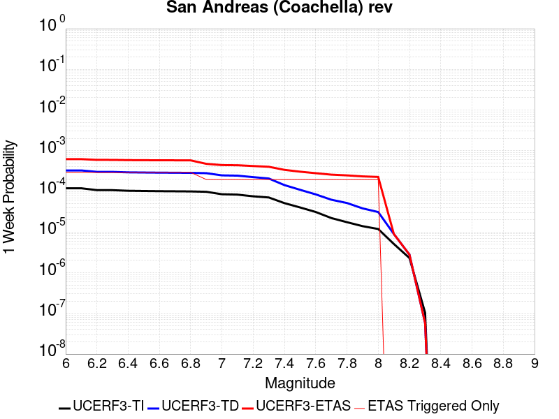 | 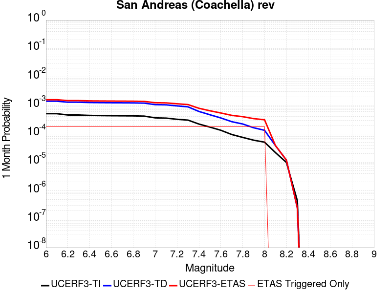 | 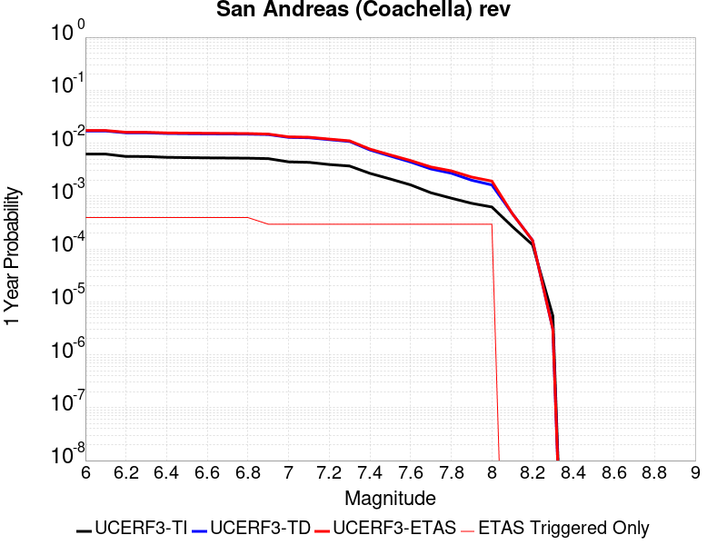 | 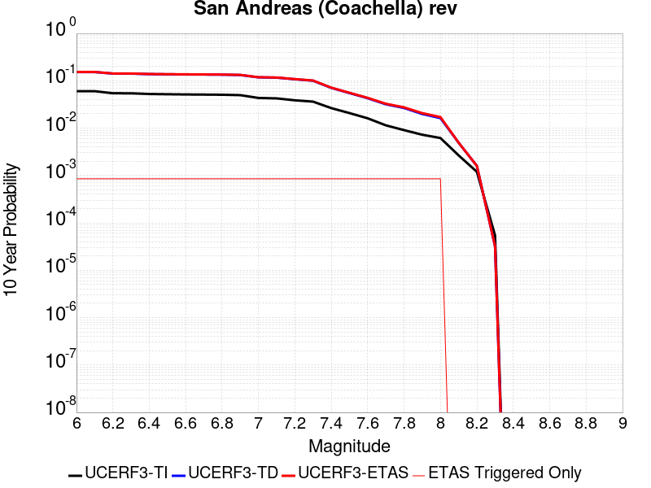 |

| Magnitude | 1 wk TI Prob | 1 wk TD Prob | 1 wk ETAS Prob | 1 wk ETAS/TD Gain | 1 wk ETAS Triggered Only | 1 mo TI Prob | 1 mo TD Prob | 1 mo ETAS Prob | 1 mo ETAS/TD Gain | 1 mo ETAS Triggered Only | 1 yr TI Prob | 1 yr TD Prob | 1 yr ETAS Prob | 1 yr ETAS/TD Gain | 1 yr ETAS Triggered Only | 10 yr TI Prob | 10 yr TD Prob | 10 yr ETAS Prob | 10 yr ETAS/TD Gain | 10 yr ETAS Triggered Only |
|-----|-----|-----|-----|-----|-----|-----|-----|-----|-----|-----|-----|-----|-----|-----|-----|-----|-----|-----|-----|-----|
| 6.0 | 1.1925945E-4 | 3.2729402E-4 | 6.206252E-4 | 1.8962315 | 2.9342723E-4 | 5.110118E-4 | 0.0014019393 | 0.0017926272 | 1.2786767 | 3.912363E-4 | 0.0062038354 | 0.016936364 | 0.017320974 | 1.0227091 | 3.912363E-4 | 0.060334753 | 0.15265316 | 0.15298466 | 1.0021716 | 3.912363E-4 |
| 6.1 | 1.1925945E-4 | 3.2729402E-4 | 6.206252E-4 | 1.8962315 | 2.9342723E-4 | 5.110118E-4 | 0.0014019393 | 0.0017926272 | 1.2786767 | 3.912363E-4 | 0.0062038354 | 0.016936364 | 0.017320974 | 1.0227091 | 3.912363E-4 | 0.060334753 | 0.15265316 | 0.15298466 | 1.0021716 | 3.912363E-4 |
| 6.2 | 1.07432395E-4 | 3.0230157E-4 | 5.956401E-4 | 1.9703507 | 2.9342723E-4 | 4.603433E-4 | 0.0012949388 | 0.0016856685 | 1.301736 | 3.912363E-4 | 0.005590286 | 0.015653009 | 0.01603812 | 1.0246031 | 3.912363E-4 | 0.05451731 | 0.14182423 | 0.14215998 | 1.0023674 | 3.912363E-4 |
| 6.3 | 1.0718766E-4 | 3.0175463E-4 | 5.950933E-4 | 1.97211 | 2.9342723E-4 | 4.592948E-4 | 0.0012925972 | 0.0016833277 | 1.3022834 | 3.912363E-4 | 0.005577586 | 0.015624908 | 0.016010031 | 1.0246481 | 3.912363E-4 | 0.054396555 | 0.14159249 | 0.14192833 | 1.0023719 | 3.912363E-4 |
| 6.4 | 1.0355944E-4 | 2.9383553E-4 | 5.8717653E-4 | 1.998317 | 2.9342723E-4 | 4.4375064E-4 | 0.0012586913 | 0.0016494351 | 1.3104366 | 3.912363E-4 | 0.0053892885 | 0.015217941 | 0.015603224 | 1.0253177 | 3.912363E-4 | 0.052604496 | 0.13815255 | 0.13848974 | 1.0024407 | 3.912363E-4 |
| 6.5 | 1.0227914E-4 | 2.9102986E-4 | 5.843717E-4 | 2.007944 | 2.9342723E-4 | 4.382655E-4 | 0.0012466786 | 0.0016374271 | 1.3134316 | 3.912363E-4 | 0.0053228354 | 0.01507372 | 0.015459059 | 1.0255636 | 3.912363E-4 | 0.051971316 | 0.13693172 | 0.1372694 | 1.002466 | 3.912363E-4 |
| 6.6 | 1.0116757E-4 | 2.8868738E-4 | 5.820299E-4 | 2.0161252 | 2.9342723E-4 | 4.3350324E-4 | 0.0012366489 | 0.0016274014 | 1.3159769 | 3.912363E-4 | 0.0052651367 | 0.01495329 | 0.015338676 | 1.0257727 | 3.912363E-4 | 0.051421247 | 0.1359099 | 0.13624796 | 1.0024874 | 3.912363E-4 |
| 6.7 | 1.0050676E-4 | 2.8727303E-4 | 5.8061595E-4 | 2.0211294 | 2.9342723E-4 | 4.3067214E-4 | 0.0012305931 | 0.001621348 | 1.3175337 | 3.912363E-4 | 0.005230834 | 0.014880571 | 0.015265984 | 1.0259005 | 3.912363E-4 | 0.051094085 | 0.13529462 | 0.13563292 | 1.0025005 | 3.912363E-4 |
| 6.8 | 9.976819E-5 | 2.853096E-4 | 5.786531E-4 | 2.0281587 | 2.9342723E-4 | 4.2750788E-4 | 0.0012221863 | 0.0016129444 | 1.3197206 | 3.912363E-4 | 0.0051924936 | 0.0147796115 | 0.015165065 | 1.0260801 | 3.912363E-4 | 0.050728295 | 0.13444631 | 0.13478495 | 1.0025188 | 3.912363E-4 |
| 6.9 | 9.77719E-5 | 2.8027873E-4 | 4.7584207E-4 | 1.6977458 | 1.9561815E-4 | 4.1895514E-4 | 0.0012006456 | 0.0014937205 | 1.2440978 | 2.9342723E-4 | 0.0050888555 | 0.014520878 | 0.014810044 | 1.0199138 | 2.9342723E-4 | 0.049738888 | 0.1322748 | 0.13252942 | 1.0019249 | 2.9342723E-4 |
| 7.0 | 8.500761E-5 | 2.4762485E-4 | 4.4319456E-4 | 1.7897823 | 1.9561815E-4 | 3.6426744E-4 | 0.001060821 | 0.001353937 | 1.2763104 | 2.9342723E-4 | 0.0044259406 | 0.012839786 | 0.013129446 | 1.0225595 | 2.9342723E-4 | 0.04338823 | 0.11813272 | 0.118391484 | 1.0021905 | 2.9342723E-4 |
| 7.1 | 8.319876E-5 | 2.4365232E-4 | 4.3922281E-4 | 1.8026621 | 1.9561815E-4 | 3.5651738E-4 | 0.0010438096 | 0.0013369306 | 1.2808185 | 2.9342723E-4 | 0.004331963 | 0.012635092 | 0.012924813 | 1.0229298 | 2.9342723E-4 | 0.042484846 | 0.116353 | 0.116612285 | 1.0022285 | 2.9342723E-4 |
| 7.2 | 7.563917E-5 | 2.2413683E-4 | 4.1971114E-4 | 1.8725666 | 1.9561815E-4 | 3.2412758E-4 | 9.602359E-4 | 0.0012533814 | 1.3052849 | 2.9342723E-4 | 0.0039391145 | 0.011628893 | 0.011918909 | 1.0249392 | 2.9342723E-4 | 0.03870018 | 0.10775925 | 0.10802106 | 1.0024296 | 2.9342723E-4 |
| 7.3 | 7.082985E-5 | 2.0729867E-4 | 4.0287626E-4 | 1.9434581 | 1.9561815E-4 | 3.0352117E-4 | 8.881233E-4 | 0.0011812899 | 1.3300967 | 2.9342723E-4 | 0.0036891096 | 0.010759917 | 0.011050187 | 1.026977 | 2.9342723E-4 | 0.03628465 | 0.100282 | 0.100546 | 1.0026326 | 2.9342723E-4 |
| 7.4 | 5.146215E-5 | 1.4273795E-4 | 3.3832816E-4 | 2.370275 | 1.9561815E-4 | 2.2053342E-4 | 6.115915E-4 | 9.0483925E-4 | 1.4794831 | 2.9342723E-4 | 0.0026816884 | 0.0074208933 | 0.007712143 | 1.0392473 | 2.9342723E-4 | 0.02649557 | 0.070849575 | 0.071122214 | 1.0038481 | 2.9342723E-4 |
| 7.5 | 4.0285166E-5 | 1.09416E-4 | 3.0501274E-4 | 2.787643 | 1.9561815E-4 | 1.7263928E-4 | 4.6884175E-4 | 7.621314E-4 | 1.6255622 | 2.9342723E-4 | 0.002099857 | 0.0056932783 | 0.0059850346 | 1.0512458 | 2.9342723E-4 | 0.020801254 | 0.055011146 | 0.055288434 | 1.0050405 | 2.9342723E-4 |
| 7.6 | 3.1168736E-5 | 8.4389096E-5 | 2.7999075E-4 | 3.3178544 | 1.9561815E-4 | 1.3357346E-4 | 3.6161754E-4 | 6.549387E-4 | 1.8111362 | 2.9342723E-4 | 0.0016250437 | 0.0043938323 | 0.0046859705 | 1.0664881 | 2.9342723E-4 | 0.016132116 | 0.04281005 | 0.043090913 | 1.0065607 | 2.9342723E-4 |
| 7.7 | 2.2100989E-5 | 6.238755E-5 | 2.579935E-4 | 4.1353364 | 1.9561815E-4 | 9.4715084E-5 | 2.6734784E-4 | 5.6069664E-4 | 2.097255 | 2.9342723E-4 | 0.001152546 | 0.0032501083 | 0.0035425818 | 1.0899888 | 2.9342723E-4 | 0.011465867 | 0.0319002 | 0.032184266 | 1.0089048 | 2.9342723E-4 |
| 7.8 | 1.7484861E-5 | 5.179572E-5 | 2.4740375E-4 | 4.776529 | 1.9561815E-4 | 7.493296E-5 | 2.2196278E-4 | 5.153249E-4 | 2.3216724 | 2.9342723E-4 | 9.1192697E-4 | 0.0026990508 | 0.002991686 | 1.1084216 | 2.9342723E-4 | 0.009081938 | 0.026640115 | 0.026925726 | 1.0107211 | 2.9342723E-4 |
| 7.9 | 1.3967285E-5 | 3.822255E-5 | 2.3383323E-4 | 6.117677 | 1.9561815E-4 | 5.985842E-5 | 1.6380067E-4 | 4.5717982E-4 | 2.7910745 | 2.9342723E-4 | 7.2853256E-4 | 0.00199245 | 0.0022852928 | 1.1469761 | 2.9342723E-4 | 0.0072614877 | 0.019909438 | 0.020197023 | 1.0144447 | 2.9342723E-4 |
| 8.0 | 1.1887396E-5 | 3.106521E-5 | 2.266773E-4 | 7.296821 | 1.9561815E-4 | 5.094499E-5 | 1.3312983E-4 | 4.26518E-4 | 3.203775 | 2.9342723E-4 | 6.200787E-4 | 0.0016196516 | 0.0019126035 | 1.1808735 | 2.9342723E-4 | 0.006183513 | 0.016279267 | 0.016567918 | 1.0177312 | 2.9342723E-4 |
| 8.1 | 5.100864E-6 | 8.973418E-6 | 8.973418E-6 | 1.0 | 0.0 | 2.1860664E-5 | 3.8456936E-5 | 3.8456936E-5 | 1.0 | 0.0 | 2.6612106E-4 | 4.6811273E-4 | 4.6811273E-4 | 1.0 | 0.0 | 0.002658026 | 0.004917731 | 0.004917731 | 1.0 | 0.0 |
| 8.2 | 2.3004484E-6 | 2.7864487E-6 | 2.7864487E-6 | 1.0 | 0.0 | 9.859027E-6 | 1.1941868E-5 | 1.1941868E-5 | 1.0 | 0.0 | 1.2002704E-4 | 1.4538258E-4 | 1.4538258E-4 | 1.0 | 0.0 | 0.0011996223 | 0.0015973912 | 0.0015973912 | 1.0 | 0.0 |
| 8.3 | 1.0424446E-7 | 5.8161504E-8 | 5.8161504E-8 | 1.0 | 0.0 | 4.4676187E-7 | 2.4926356E-7 | 2.4926356E-7 | 1.0 | 0.0 | 5.439312E-6 | 3.03478E-6 | 3.03478E-6 | 1.0 | 0.0 | 5.4391792E-5 | 3.190716E-5 | 3.190716E-5 | 1.0 | 0.0 |

## San Andreas (Parkfield)
*[(top)](#table-of-contents)*

| 1 Week | 1 Month | 1 Year | 10 Year |
|-----|-----|-----|-----|
| 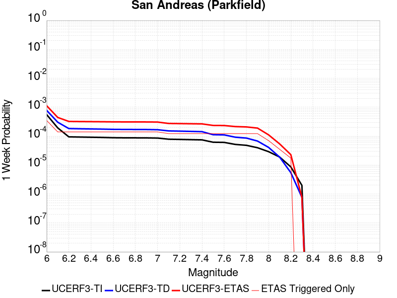 | 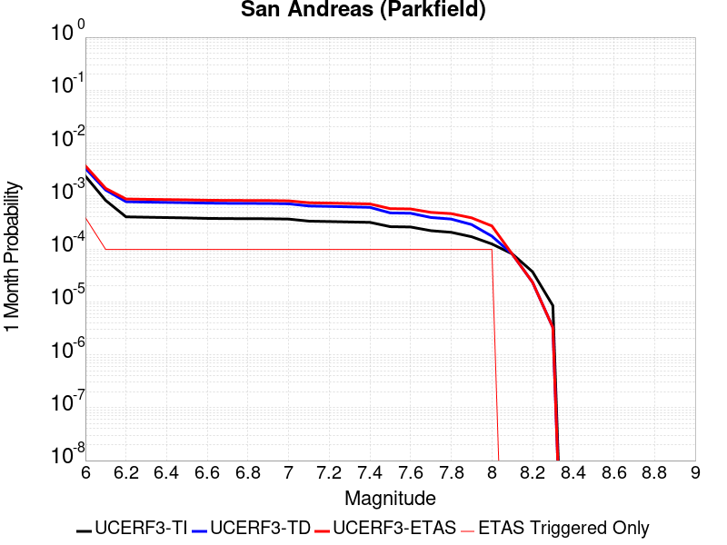 | 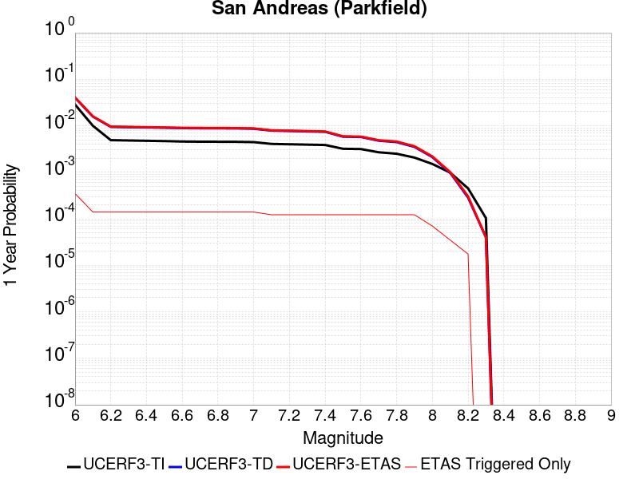 | 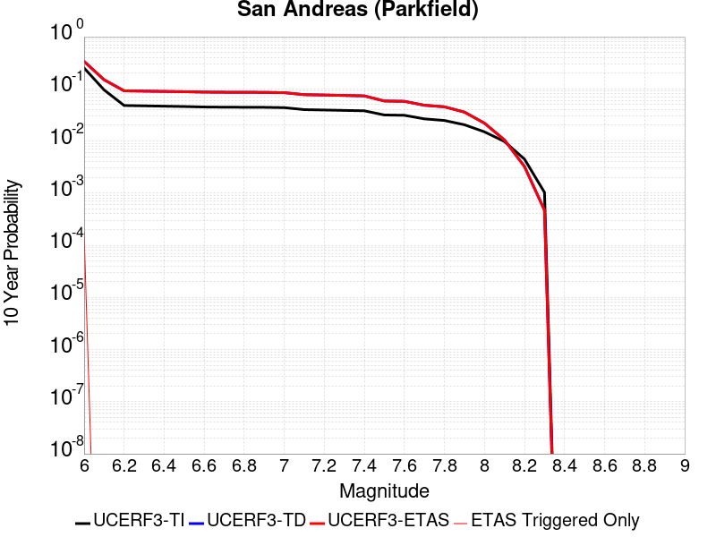 |

| Magnitude | 1 wk TI Prob | 1 wk TD Prob | 1 wk ETAS Prob | 1 wk ETAS/TD Gain | 1 wk ETAS Triggered Only | 1 mo TI Prob | 1 mo TD Prob | 1 mo ETAS Prob | 1 mo ETAS/TD Gain | 1 mo ETAS Triggered Only | 1 yr TI Prob | 1 yr TD Prob | 1 yr ETAS Prob | 1 yr ETAS/TD Gain | 1 yr ETAS Triggered Only | 10 yr TI Prob | 10 yr TD Prob | 10 yr ETAS Prob | 10 yr ETAS/TD Gain | 10 yr ETAS Triggered Only |
|-----|-----|-----|-----|-----|-----|-----|-----|-----|-----|-----|-----|-----|-----|-----|-----|-----|-----|-----|-----|-----|
| 6.0 | 5.556969E-4 | 7.7782426E-4 | 0.0011687563 | 1.5025969 | 3.912363E-4 | 0.0023793848 | 0.0033298214 | 0.003719755 | 1.1171035 | 3.912363E-4 | 0.028586963 | 0.040191233 | 0.040566746 | 1.0093431 | 3.912363E-4 | 0.25176284 | 0.33716413 | 0.33742347 | 1.0007691 | 3.912363E-4 |
| 6.1 | 1.925858E-4 | 3.0276453E-4 | 4.00544E-4 | 1.3229555 | 9.7809076E-5 | 8.2510663E-4 | 0.0012970108 | 0.001394693 | 1.0753133 | 9.7809076E-5 | 0.0099994885 | 0.015778083 | 0.015874349 | 1.0061013 | 9.7809076E-5 | 0.095613256 | 0.1497237 | 0.14980686 | 1.0005554 | 9.7809076E-5 |
| 6.2 | 9.4306815E-5 | 1.8242796E-4 | 2.802192E-4 | 1.536054 | 9.7809076E-5 | 4.0410945E-4 | 7.816011E-4 | 8.793337E-4 | 1.1250416 | 9.7809076E-5 | 0.0049089384 | 0.009474681 | 0.0095715625 | 1.0102254 | 9.7809076E-5 | 0.048019063 | 0.09185409 | 0.091942914 | 1.000967 | 9.7809076E-5 |
| 6.3 | 9.283051E-5 | 1.7939322E-4 | 2.7718474E-4 | 1.5451239 | 9.7809076E-5 | 3.9778434E-4 | 7.686027E-4 | 8.6633663E-4 | 1.1271579 | 9.7809076E-5 | 0.0048322747 | 0.009317789 | 0.009414687 | 1.0103992 | 9.7809076E-5 | 0.047285385 | 0.09050704 | 0.09059599 | 1.0009829 | 9.7809076E-5 |
| 6.4 | 9.138826E-5 | 1.770153E-4 | 2.7480707E-4 | 1.552448 | 9.7809076E-5 | 3.916052E-4 | 7.5841765E-4 | 8.5615256E-4 | 1.1288669 | 9.7809076E-5 | 0.0047573745 | 0.00919484 | 0.009291749 | 1.0105395 | 9.7809076E-5 | 0.046568092 | 0.08940927 | 0.08949833 | 1.0009961 | 9.7809076E-5 |
| 6.5 | 9.000255E-5 | 1.7459576E-4 | 2.7238776E-4 | 1.5601052 | 9.7809076E-5 | 3.8566816E-4 | 7.480541E-4 | 8.4579E-4 | 1.1306535 | 9.7809076E-5 | 0.0046854047 | 0.009069731 | 0.009166654 | 1.0106863 | 9.7809076E-5 | 0.045878403 | 0.088295065 | 0.08838424 | 1.00101 | 9.7809076E-5 |
| 6.6 | 8.8109264E-5 | 1.7140752E-4 | 2.6919984E-4 | 1.5705252 | 9.7809076E-5 | 3.7755648E-4 | 7.3439797E-4 | 8.3213527E-4 | 1.1330849 | 9.7809076E-5 | 0.0045870654 | 0.008904854 | 0.0090017915 | 1.010886 | 9.7809076E-5 | 0.04493529 | 0.0868267 | 0.08691601 | 1.0010287 | 9.7809076E-5 |
| 6.7 | 8.738073E-5 | 1.7007832E-4 | 2.6787075E-4 | 1.5749848 | 9.7809076E-5 | 3.7443507E-4 | 7.287046E-4 | 8.2644244E-4 | 1.1341254 | 9.7809076E-5 | 0.0045492216 | 0.008836143 | 0.008933088 | 1.0109714 | 9.7809076E-5 | 0.04457213 | 0.08622707 | 0.086316444 | 1.0010365 | 9.7809076E-5 |
| 6.8 | 8.710195E-5 | 1.6953335E-4 | 2.6732584E-4 | 1.5768334 | 9.7809076E-5 | 3.7324068E-4 | 7.263703E-4 | 8.241083E-4 | 1.1345568 | 9.7809076E-5 | 0.0045347405 | 0.008807961 | 0.008904909 | 1.0110068 | 9.7809076E-5 | 0.04443313 | 0.08597467 | 0.08606407 | 1.0010399 | 9.7809076E-5 |
| 6.9 | 8.6801556E-5 | 1.689429E-4 | 2.6673544E-4 | 1.5788498 | 9.7809076E-5 | 3.7195362E-4 | 7.2384125E-4 | 8.2157954E-4 | 1.1350273 | 9.7809076E-5 | 0.0045191357 | 0.008777418 | 0.008874369 | 1.0110455 | 9.7809076E-5 | 0.044283327 | 0.085700735 | 0.08579016 | 1.0010434 | 9.7809076E-5 |
| 7.0 | 8.5571606E-5 | 1.6647128E-4 | 2.6426406E-4 | 1.5874455 | 9.7809076E-5 | 3.6668387E-4 | 7.132544E-4 | 8.109937E-4 | 1.1370329 | 9.7809076E-5 | 0.004455241 | 0.008649553 | 0.008746517 | 1.0112102 | 9.7809076E-5 | 0.043669727 | 0.08454914 | 0.08463868 | 1.001059 | 9.7809076E-5 |
| 7.1 | 7.82589E-5 | 1.5128135E-4 | 2.4907565E-4 | 1.6464398 | 9.7809076E-5 | 3.3535215E-4 | 6.481883E-4 | 7.4593397E-4 | 1.1507983 | 9.7809076E-5 | 0.0040752706 | 0.007863307 | 0.0079603465 | 1.0123409 | 9.7809076E-5 | 0.040013418 | 0.07746111 | 0.07755134 | 1.0011649 | 9.7809076E-5 |
| 7.2 | 7.690929E-5 | 1.4865391E-4 | 2.4644844E-4 | 1.6578672 | 9.7809076E-5 | 3.2956956E-4 | 6.369334E-4 | 7.3468016E-4 | 1.1534647 | 9.7809076E-5 | 0.004005129 | 0.007727258 | 0.007824311 | 1.0125599 | 9.7809076E-5 | 0.0393371 | 0.07623427 | 0.07632463 | 1.0011852 | 9.7809076E-5 |
| 7.3 | 7.5543794E-5 | 1.4561978E-4 | 2.4341462E-4 | 1.6715766 | 9.7809076E-5 | 3.2371894E-4 | 6.2393624E-4 | 7.2168425E-4 | 1.1566635 | 9.7809076E-5 | 0.003934157 | 0.007570127 | 0.007667196 | 1.0128226 | 9.7809076E-5 | 0.038652334 | 0.074797355 | 0.07488784 | 1.0012099 | 9.7809076E-5 |
| 7.4 | 7.4214564E-5 | 1.4262961E-4 | 2.4042474E-4 | 1.685658 | 9.7809076E-5 | 3.1802364E-4 | 6.111273E-4 | 7.088766E-4 | 1.1599492 | 9.7809076E-5 | 0.003865065 | 0.00741525 | 0.007512334 | 1.0130924 | 9.7809076E-5 | 0.03798529 | 0.07337123 | 0.07346187 | 1.0012352 | 9.7809076E-5 |
| 7.5 | 6.149578E-5 | 1.11907226E-4 | 2.0970537E-4 | 1.8739215 | 9.7809076E-5 | 2.6352672E-4 | 4.7951436E-4 | 5.772765E-4 | 1.2038774 | 9.7809076E-5 | 0.0032037178 | 0.0058224914 | 0.0059197308 | 1.0167006 | 9.7809076E-5 | 0.03157923 | 0.058557566 | 0.058649648 | 1.0015725 | 9.7809076E-5 |
| 7.6 | 6.0643448E-5 | 1.10193796E-4 | 2.079921E-4 | 1.8875118 | 9.7809076E-5 | 2.598746E-4 | 4.7217376E-4 | 5.6993664E-4 | 1.2070485 | 9.7809076E-5 | 0.0031593828 | 0.0057335934 | 0.005830842 | 1.0169611 | 9.7809076E-5 | 0.031148417 | 0.057718582 | 0.057810746 | 1.0015968 | 9.7809076E-5 |
| 7.7 | 5.1652263E-5 | 9.174698E-5 | 1.8954708E-4 | 2.0659761 | 9.7809076E-5 | 2.2134806E-4 | 3.931421E-4 | 4.9091276E-4 | 1.2486902 | 9.7809076E-5 | 0.002691582 | 0.0047760103 | 0.004873352 | 1.0203815 | 9.7809076E-5 | 0.026592141 | 0.04853623 | 0.04862929 | 1.0019174 | 9.7809076E-5 |
| 7.8 | 4.8090482E-5 | 8.559635E-5 | 1.8339706E-4 | 2.1425803 | 9.7809076E-5 | 2.060858E-4 | 3.6678996E-4 | 4.6456317E-4 | 1.2665646 | 9.7809076E-5 | 0.0025062072 | 0.0044565317 | 0.004553905 | 1.0218495 | 9.7809076E-5 | 0.024781305 | 0.04530245 | 0.04539583 | 1.0020612 | 9.7809076E-5 |
| 7.9 | 3.970278E-5 | 6.750426E-5 | 1.6530673E-4 | 2.4488342 | 9.7809076E-5 | 1.7014367E-4 | 2.892719E-4 | 3.8705269E-4 | 1.3380238 | 9.7809076E-5 | 0.002069531 | 0.0035162016 | 0.0036136666 | 1.0277189 | 9.7809076E-5 | 0.020503636 | 0.035881363 | 0.03597566 | 1.0026281 | 9.7809076E-5 |
| 8.0 | 2.8982335E-5 | 4.069796E-5 | 1.3850305E-4 | 3.4031942 | 9.7809076E-5 | 1.2420409E-4 | 1.7440817E-4 | 2.7220018E-4 | 1.5607078 | 9.7809076E-5 | 0.0015111357 | 0.0021213528 | 0.0022189543 | 1.0460092 | 9.7809076E-5 | 0.015009012 | 0.022010697 | 0.022106353 | 1.0043459 | 9.7809076E-5 |
| 8.1 | 1.8836186E-5 | 1.8681134E-5 | 1.8681134E-5 | 1.0 | 0.0 | 8.0724014E-5 | 8.005955E-5 | 8.005955E-5 | 1.0 | 0.0 | 9.823717E-4 | 9.742898E-4 | 9.742898E-4 | 1.0 | 0.0 | 0.009780403 | 0.010488115 | 0.010488115 | 1.0 | 0.0 |
| 8.2 | 8.643924E-6 | 5.4748625E-6 | 5.4748625E-6 | 1.0 | 0.0 | 3.704486E-5 | 2.3463486E-5 | 2.3463486E-5 | 1.0 | 0.0 | 4.5092785E-4 | 2.8563058E-4 | 2.8563058E-4 | 1.0 | 0.0 | 0.0045001395 | 0.0032487072 | 0.0032487072 | 1.0 | 0.0 |
| 8.3 | 1.983087E-6 | 7.6599065E-7 | 7.6599065E-7 | 1.0 | 0.0 | 8.498917E-6 | 3.282813E-6 | 3.282813E-6 | 1.0 | 0.0 | 1.034694E-4 | 3.9967534E-5 | 3.9967534E-5 | 1.0 | 0.0 | 0.0010342124 | 4.719687E-4 | 4.719687E-4 | 1.0 | 0.0 |

## Garlic Springs
*[(top)](#table-of-contents)*

| 1 Week | 1 Month | 1 Year | 10 Year |
|-----|-----|-----|-----|
| 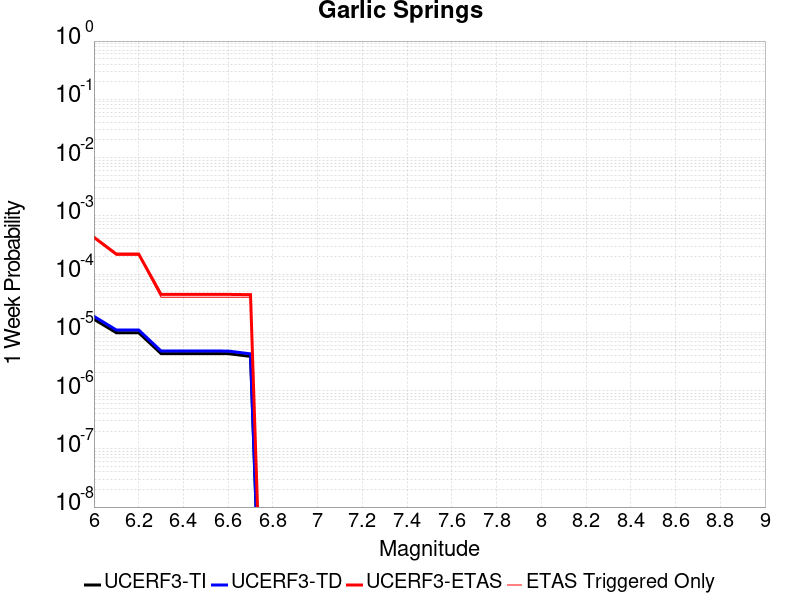 | 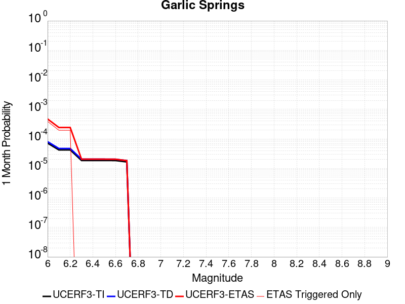 | 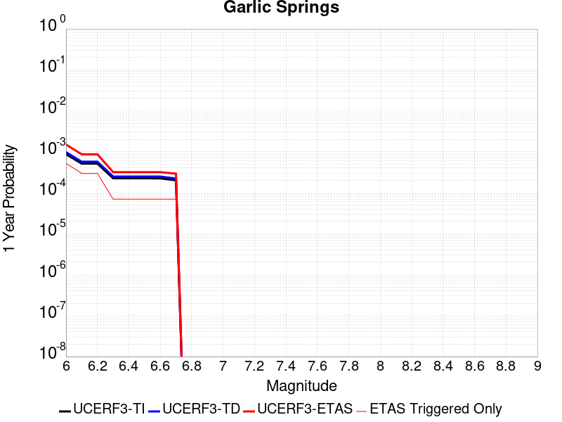 | 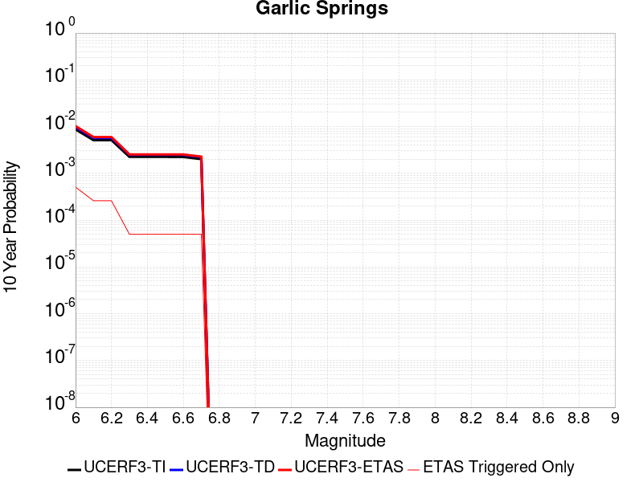 |

| Magnitude | 1 wk TI Prob | 1 wk TD Prob | 1 wk ETAS Prob | 1 wk ETAS/TD Gain | 1 wk ETAS Triggered Only | 1 mo TI Prob | 1 mo TD Prob | 1 mo ETAS Prob | 1 mo ETAS/TD Gain | 1 mo ETAS Triggered Only | 1 yr TI Prob | 1 yr TD Prob | 1 yr ETAS Prob | 1 yr ETAS/TD Gain | 1 yr ETAS Triggered Only | 10 yr TI Prob | 10 yr TD Prob | 10 yr ETAS Prob | 10 yr ETAS/TD Gain | 10 yr ETAS Triggered Only |
|-----|-----|-----|-----|-----|-----|-----|-----|-----|-----|-----|-----|-----|-----|-----|-----|-----|-----|-----|-----|-----|
| 6.0 | 1.6760017E-5 | 1.8776833E-5 | 3.1219856E-4 | 16.626795 | 2.9342723E-4 | 7.182667E-5 | 8.0470316E-5 | 4.7167513E-4 | 5.8614798 | 3.912363E-4 | 8.7413884E-4 | 9.794032E-4 | 0.0013702563 | 1.3990728 | 3.912363E-4 | 0.008707083 | 0.009762413 | 0.01014983 | 1.0396845 | 3.912363E-4 |
| 6.1 | 9.852767E-6 | 1.09735865E-5 | 2.065896E-4 | 18.826077 | 1.9561815E-4 | 4.222546E-5 | 4.702921E-5 | 2.4263817E-4 | 5.1593075 | 1.9561815E-4 | 5.139737E-4 | 5.7250116E-4 | 7.680073E-4 | 1.3414948 | 1.9561815E-4 | 0.005127866 | 0.005717221 | 0.005911721 | 1.03402 | 1.9561815E-4 |
| 6.2 | 9.852767E-6 | 1.09735865E-5 | 2.065896E-4 | 18.826077 | 1.9561815E-4 | 4.222546E-5 | 4.702921E-5 | 2.4263817E-4 | 5.1593075 | 1.9561815E-4 | 5.139737E-4 | 5.7250116E-4 | 7.680073E-4 | 1.3414948 | 1.9561815E-4 | 0.005127866 | 0.005717221 | 0.005911721 | 1.03402 | 1.9561815E-4 |
| 6.3 | 4.3167724E-6 | 4.7780286E-6 | 4.7780286E-6 | 1.0 | 0.0 | 1.8500323E-5 | 2.0477235E-5 | 2.0477235E-5 | 1.0 | 0.0 | 2.2521814E-4 | 2.4930484E-4 | 2.4930484E-4 | 1.0 | 0.0 | 0.0022499003 | 0.00249251 | 0.00249251 | 1.0 | 0.0 |
| 6.4 | 4.3167724E-6 | 4.7780286E-6 | 4.7780286E-6 | 1.0 | 0.0 | 1.8500323E-5 | 2.0477235E-5 | 2.0477235E-5 | 1.0 | 0.0 | 2.2521814E-4 | 2.4930484E-4 | 2.4930484E-4 | 1.0 | 0.0 | 0.0022499003 | 0.00249251 | 0.00249251 | 1.0 | 0.0 |
| 6.5 | 4.3167724E-6 | 4.7780286E-6 | 4.7780286E-6 | 1.0 | 0.0 | 1.8500323E-5 | 2.0477235E-5 | 2.0477235E-5 | 1.0 | 0.0 | 2.2521814E-4 | 2.4930484E-4 | 2.4930484E-4 | 1.0 | 0.0 | 0.0022499003 | 0.00249251 | 0.00249251 | 1.0 | 0.0 |
| 6.6 | 4.301311E-6 | 4.760897E-6 | 4.760897E-6 | 1.0 | 0.0 | 1.8434059E-5 | 2.0403815E-5 | 2.0403815E-5 | 1.0 | 0.0 | 2.2441156E-4 | 2.4841115E-4 | 2.4841115E-4 | 1.0 | 0.0 | 0.0022418506 | 0.002483593 | 0.002483593 | 1.0 | 0.0 |
| 6.7 | 3.8599724E-6 | 4.27106E-6 | 4.27106E-6 | 1.0 | 0.0 | 1.6542634E-5 | 1.8304541E-5 | 1.8304541E-5 | 1.0 | 0.0 | 2.0138794E-4 | 2.228578E-4 | 2.228578E-4 | 1.0 | 0.0 | 0.0020120554 | 0.002228578 | 0.002228578 | 1.0 | 0.0 |

## San Andreas (North Branch Mill Creek)
*[(top)](#table-of-contents)*

| 1 Week | 1 Month | 1 Year | 10 Year |
|-----|-----|-----|-----|
| 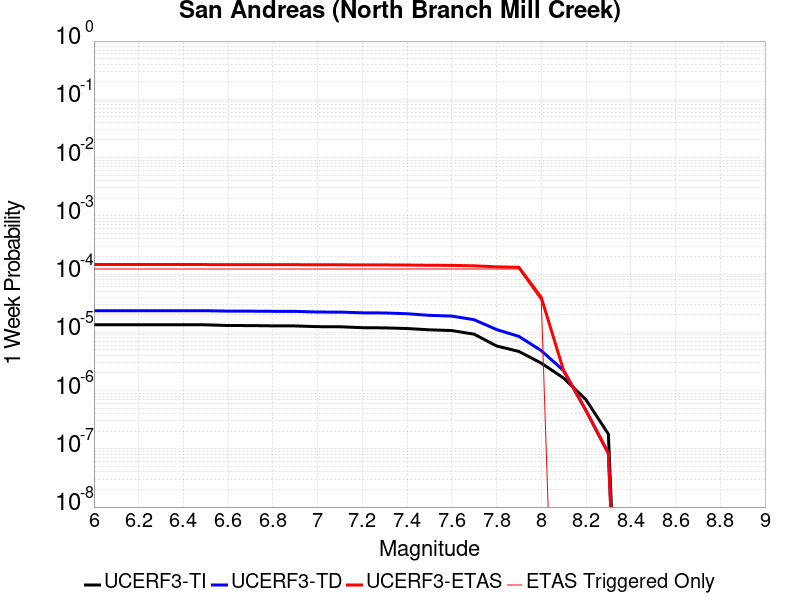 | 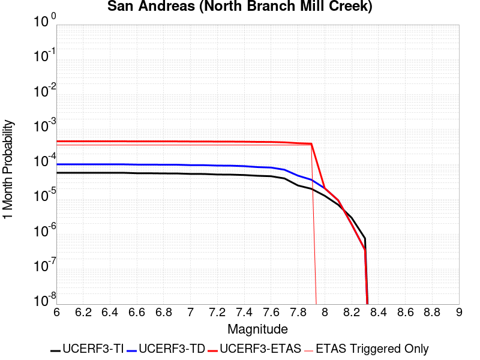 | 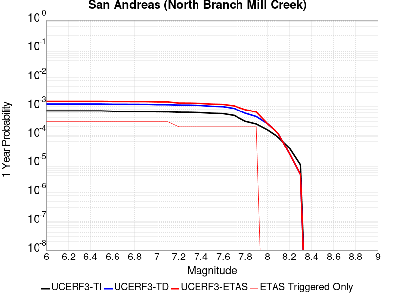 | 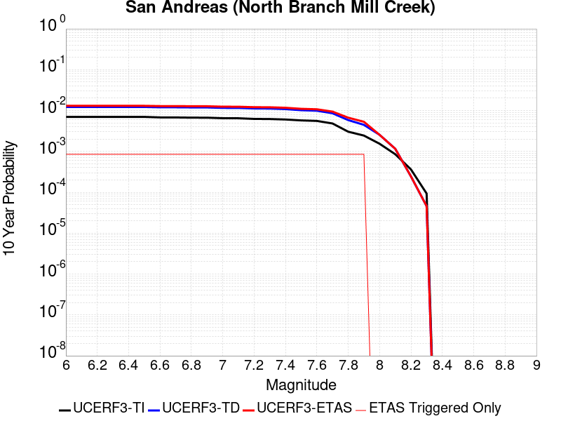 |

| Magnitude | 1 wk TI Prob | 1 wk TD Prob | 1 wk ETAS Prob | 1 wk ETAS/TD Gain | 1 wk ETAS Triggered Only | 1 mo TI Prob | 1 mo TD Prob | 1 mo ETAS Prob | 1 mo ETAS/TD Gain | 1 mo ETAS Triggered Only | 1 yr TI Prob | 1 yr TD Prob | 1 yr ETAS Prob | 1 yr ETAS/TD Gain | 1 yr ETAS Triggered Only | 10 yr TI Prob | 10 yr TD Prob | 10 yr ETAS Prob | 10 yr ETAS/TD Gain | 10 yr ETAS Triggered Only |
|-----|-----|-----|-----|-----|-----|-----|-----|-----|-----|-----|-----|-----|-----|-----|-----|-----|-----|-----|-----|-----|
| 6.0 | 1.3461156E-5 | 2.3499893E-5 | 2.1911346E-4 | 9.324019 | 1.9561815E-4 | 5.7689394E-5 | 1.00709956E-4 | 2.963084E-4 | 2.9421957 | 1.9561815E-4 | 7.02142E-4 | 0.0012254574 | 0.0015185251 | 1.2391496 | 2.9342723E-4 | 0.0069992766 | 0.01222957 | 0.012519409 | 1.0236999 | 2.9342723E-4 |
| 6.1 | 1.3461156E-5 | 2.3499893E-5 | 2.1911346E-4 | 9.324019 | 1.9561815E-4 | 5.7689394E-5 | 1.00709956E-4 | 2.963084E-4 | 2.9421957 | 1.9561815E-4 | 7.02142E-4 | 0.0012254574 | 0.0015185251 | 1.2391496 | 2.9342723E-4 | 0.0069992766 | 0.01222957 | 0.012519409 | 1.0236999 | 2.9342723E-4 |
| 6.2 | 1.3461156E-5 | 2.3499893E-5 | 2.1911346E-4 | 9.324019 | 1.9561815E-4 | 5.7689394E-5 | 1.00709956E-4 | 2.963084E-4 | 2.9421957 | 1.9561815E-4 | 7.02142E-4 | 0.0012254574 | 0.0015185251 | 1.2391496 | 2.9342723E-4 | 0.0069992766 | 0.01222957 | 0.012519409 | 1.0236999 | 2.9342723E-4 |
| 6.3 | 1.3461156E-5 | 2.3499893E-5 | 2.1911346E-4 | 9.324019 | 1.9561815E-4 | 5.7689394E-5 | 1.00709956E-4 | 2.963084E-4 | 2.9421957 | 1.9561815E-4 | 7.02142E-4 | 0.0012254574 | 0.0015185251 | 1.2391496 | 2.9342723E-4 | 0.0069992766 | 0.01222957 | 0.012519409 | 1.0236999 | 2.9342723E-4 |
| 6.4 | 1.3461156E-5 | 2.3499893E-5 | 2.1911346E-4 | 9.324019 | 1.9561815E-4 | 5.7689394E-5 | 1.00709956E-4 | 2.963084E-4 | 2.9421957 | 1.9561815E-4 | 7.02142E-4 | 0.0012254574 | 0.0015185251 | 1.2391496 | 2.9342723E-4 | 0.0069992766 | 0.01222957 | 0.012519409 | 1.0236999 | 2.9342723E-4 |
| 6.5 | 1.3450706E-5 | 2.3488852E-5 | 2.1910241E-4 | 9.327931 | 1.9561815E-4 | 5.764461E-5 | 1.0066265E-4 | 2.962611E-4 | 2.9431088 | 1.9561815E-4 | 7.0159714E-4 | 0.001224882 | 0.0015179499 | 1.2392621 | 2.9342723E-4 | 0.006993862 | 0.01222388 | 0.0125137195 | 1.023711 | 2.9342723E-4 |
| 6.6 | 1.3074523E-5 | 2.3103135E-5 | 2.1871677E-4 | 9.466973 | 1.9561815E-4 | 5.6032466E-5 | 9.9009696E-5 | 2.9460847E-4 | 2.9755518 | 1.9561815E-4 | 6.8198174E-4 | 0.0012047797 | 0.0014978534 | 1.2432592 | 2.9342723E-4 | 0.006798926 | 0.012025044 | 0.012314944 | 1.0241079 | 2.9342723E-4 |
| 6.7 | 1.3050216E-5 | 2.3078432E-5 | 2.1869208E-4 | 9.476037 | 1.9561815E-4 | 5.59283E-5 | 9.890384E-5 | 2.9450265E-4 | 2.9776666 | 1.9561815E-4 | 6.8071426E-4 | 0.0012034923 | 0.0014965663 | 1.2435197 | 2.9342723E-4 | 0.0067863287 | 0.012012309 | 0.0123022115 | 1.0241338 | 2.9342723E-4 |
| 6.8 | 1.29049395E-5 | 2.292684E-5 | 2.185405E-4 | 9.532081 | 1.9561815E-4 | 5.530571E-5 | 9.825421E-5 | 2.9385314E-4 | 2.9907436 | 1.9561815E-4 | 6.73139E-4 | 0.0011955918 | 0.0014886681 | 1.2451309 | 2.9342723E-4 | 0.0067110364 | 0.011934154 | 0.01222408 | 1.0242938 | 2.9342723E-4 |
| 6.9 | 1.2867369E-5 | 2.2886245E-5 | 2.1849992E-4 | 9.547216 | 1.9561815E-4 | 5.51447E-5 | 9.8080236E-5 | 2.9367922E-4 | 2.994275 | 1.9561815E-4 | 6.711799E-4 | 0.0011934759 | 0.001486553 | 1.2455659 | 2.9342723E-4 | 0.006691564 | 0.011913223 | 0.012203155 | 1.0243369 | 2.9342723E-4 |
| 7.0 | 1.2495996E-5 | 2.2286325E-5 | 2.1790012E-4 | 9.777302 | 1.9561815E-4 | 5.3553173E-5 | 9.550934E-5 | 2.9110882E-4 | 3.0479617 | 1.9561815E-4 | 6.518148E-4 | 0.0011622087 | 0.001455295 | 1.2521803 | 2.9342723E-4 | 0.0064990623 | 0.0116038285 | 0.011893851 | 1.0249937 | 2.9342723E-4 |
| 7.1 | 1.2452067E-5 | 2.2231397E-5 | 2.178452E-4 | 9.798988 | 1.9561815E-4 | 5.3364907E-5 | 9.527396E-5 | 2.9087346E-4 | 3.053022 | 1.9561815E-4 | 6.4952404E-4 | 0.0011593461 | 0.0014524331 | 1.2528038 | 2.9342723E-4 | 0.0064762887 | 0.0115755 | 0.01186553 | 1.0250555 | 2.9342723E-4 |
| 7.2 | 1.2002777E-5 | 2.1609963E-5 | 2.1722389E-4 | 10.052025 | 1.9561815E-4 | 5.143946E-5 | 9.2610855E-5 | 2.882109E-4 | 3.112064 | 1.9561815E-4 | 6.2609545E-4 | 0.0011269567 | 0.0013223543 | 1.1733853 | 1.9561815E-4 | 0.006243344 | 0.011254923 | 0.01144834 | 1.0171851 | 1.9561815E-4 |
| 7.3 | 1.1923425E-5 | 2.1479793E-5 | 2.1709375E-4 | 10.106882 | 1.9561815E-4 | 5.109939E-5 | 9.205302E-5 | 2.8765318E-4 | 3.1248639 | 1.9561815E-4 | 6.219575E-4 | 0.001120172 | 0.001315571 | 1.1744367 | 1.9561815E-4 | 0.0062021962 | 0.011187789 | 0.011381218 | 1.0172894 | 1.9561815E-4 |
| 7.4 | 1.16105175E-5 | 2.0853771E-5 | 2.1646784E-4 | 10.380273 | 1.9561815E-4 | 4.975841E-5 | 8.937026E-5 | 2.8497094E-4 | 3.188655 | 1.9561815E-4 | 6.0564023E-4 | 0.0010875424 | 0.0012829478 | 1.1796762 | 1.9561815E-4 | 0.006039923 | 0.010865397 | 0.011058889 | 1.0178082 | 1.9561815E-4 |
| 7.5 | 1.1037265E-5 | 1.9553907E-5 | 2.1516824E-4 | 11.003849 | 1.9561815E-4 | 4.7301706E-5 | 8.379978E-5 | 2.7940155E-4 | 3.334156 | 1.9561815E-4 | 5.757461E-4 | 0.0010197869 | 0.0012152056 | 1.1916269 | 1.9561815E-4 | 0.005742567 | 0.010194898 | 0.0103885215 | 1.0189922 | 1.9561815E-4 |
| 7.6 | 1.0720915E-5 | 1.899582E-5 | 2.1461026E-4 | 11.297763 | 1.9561815E-4 | 4.5945973E-5 | 8.140812E-5 | 2.7701035E-4 | 3.402736 | 1.9561815E-4 | 5.592486E-4 | 9.906954E-4 | 0.0011861197 | 1.1972598 | 1.9561815E-4 | 0.005578433 | 0.009906623 | 0.010100302 | 1.0195506 | 1.9561815E-4 |
| 7.7 | 9.276279E-6 | 1.6441649E-5 | 2.1205659E-4 | 12.897526 | 1.9561815E-4 | 3.9754876E-5 | 7.0462316E-5 | 2.660667E-4 | 3.7760139 | 1.9561815E-4 | 4.839081E-4 | 8.575427E-4 | 0.0010529931 | 1.2279191 | 1.9561815E-4 | 0.0048285574 | 0.008586041 | 0.008779979 | 1.0225877 | 1.9561815E-4 |
| 7.8 | 5.8346777E-6 | 1.1155013E-5 | 2.0677099E-4 | 18.536148 | 1.9561815E-4 | 2.5005522E-5 | 4.7806327E-5 | 2.4341512E-4 | 5.091693 | 1.9561815E-4 | 3.043997E-4 | 5.818867E-4 | 7.77391E-4 | 1.3359835 | 1.9561815E-4 | 0.0030398308 | 0.0058469265 | 0.006041401 | 1.033261 | 1.9561815E-4 |
| 7.9 | 4.690204E-6 | 8.509093E-6 | 2.0412558E-4 | 23.98911 | 1.9561815E-4 | 2.0100719E-5 | 3.6467034E-5 | 2.3207805E-4 | 6.364051 | 1.9561815E-4 | 2.4469878E-4 | 4.4389578E-4 | 6.394271E-4 | 1.4404893 | 1.9561815E-4 | 0.002444295 | 0.0044707474 | 0.0046654907 | 1.0435596 | 1.9561815E-4 |
| 8.0 | 2.9570454E-6 | 4.846947E-6 | 4.846947E-6 | 1.0 | 0.0 | 1.267299E-5 | 2.0772464E-5 | 2.0772464E-5 | 1.0 | 0.0 | 1.5428272E-4 | 2.5287544E-4 | 2.5287544E-4 | 1.0 | 0.0 | 0.0015417566 | 0.002549644 | 0.002549644 | 1.0 | 0.0 |
| 8.1 | 1.6376824E-6 | 2.1968929E-6 | 2.1968929E-6 | 1.0 | 0.0 | 7.01862E-6 | 9.41522E-6 | 9.41522E-6 | 1.0 | 0.0 | 8.544835E-5 | 1.14624294E-4 | 1.14624294E-4 | 1.0 | 0.0 | 8.54155E-4 | 0.0011606582 | 0.0011606582 | 1.0 | 0.0 |
| 8.2 | 6.9631557E-7 | 4.5360213E-7 | 4.5360213E-7 | 1.0 | 0.0 | 2.984206E-6 | 1.9440076E-6 | 1.9440076E-6 | 1.0 | 0.0 | 3.63321E-5 | 2.3668037E-5 | 2.3668037E-5 | 1.0 | 0.0 | 3.6326164E-4 | 2.451564E-4 | 2.451564E-4 | 1.0 | 0.0 |
| 8.3 | 1.7876137E-7 | 8.360375E-8 | 8.360375E-8 | 1.0 | 0.0 | 7.661199E-7 | 3.5830175E-7 | 3.5830175E-7 | 1.0 | 0.0 | 9.32747E-6 | 4.3623154E-6 | 4.3623154E-6 | 1.0 | 0.0 | 9.3270784E-5 | 4.5817014E-5 | 4.5817014E-5 | 1.0 | 0.0 |

## Elsinore (Glen Ivy) rev
*[(top)](#table-of-contents)*

| 1 Week | 1 Month | 1 Year | 10 Year |
|-----|-----|-----|-----|
| 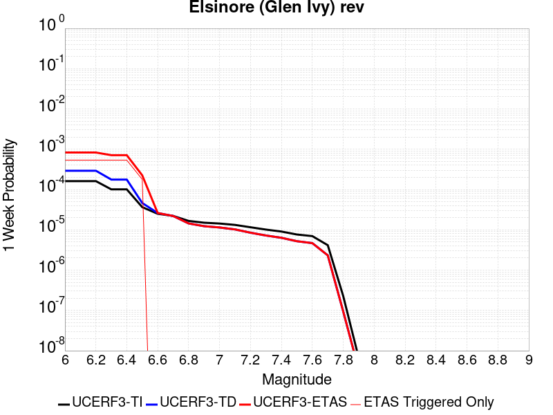 | 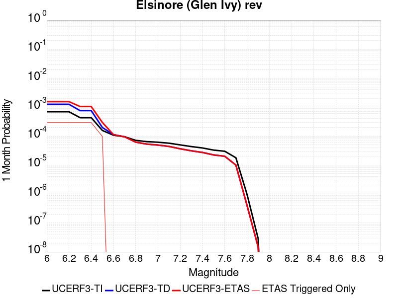 | 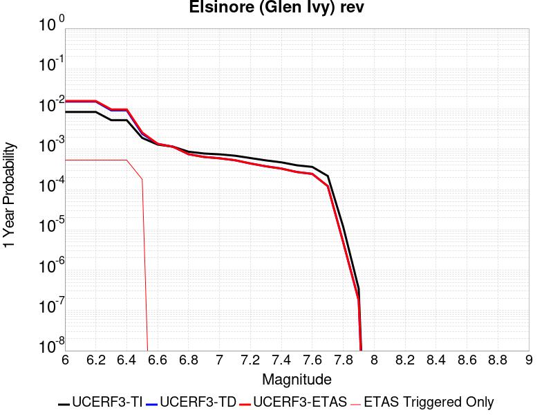 | 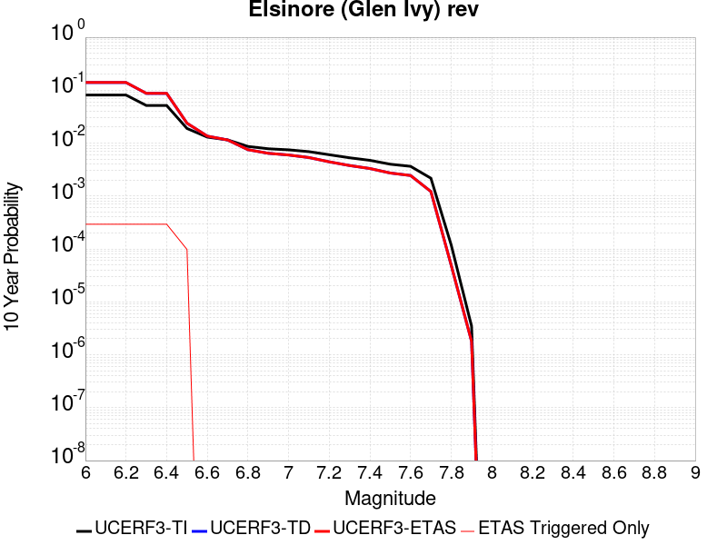 |

| Magnitude | 1 wk TI Prob | 1 wk TD Prob | 1 wk ETAS Prob | 1 wk ETAS/TD Gain | 1 wk ETAS Triggered Only | 1 mo TI Prob | 1 mo TD Prob | 1 mo ETAS Prob | 1 mo ETAS/TD Gain | 1 mo ETAS Triggered Only | 1 yr TI Prob | 1 yr TD Prob | 1 yr ETAS Prob | 1 yr ETAS/TD Gain | 1 yr ETAS Triggered Only | 10 yr TI Prob | 10 yr TD Prob | 10 yr ETAS Prob | 10 yr ETAS/TD Gain | 10 yr ETAS Triggered Only |
|-----|-----|-----|-----|-----|-----|-----|-----|-----|-----|-----|-----|-----|-----|-----|-----|-----|-----|-----|-----|-----|
| 6.0 | 1.6204086E-4 | 2.9360707E-4 | 5.869481E-4 | 1.9990941 | 2.9342723E-4 | 6.94276E-4 | 0.0012578638 | 0.001550922 | 1.2329808 | 2.9342723E-4 | 0.008420097 | 0.015234485 | 0.015523442 | 1.0189673 | 2.9342723E-4 | 0.081081145 | 0.13969168 | 0.1399441 | 1.0018071 | 2.9342723E-4 |
| 6.1 | 1.6204086E-4 | 2.9360707E-4 | 5.869481E-4 | 1.9990941 | 2.9342723E-4 | 6.94276E-4 | 0.0012578638 | 0.001550922 | 1.2329808 | 2.9342723E-4 | 0.008420097 | 0.015234485 | 0.015523442 | 1.0189673 | 2.9342723E-4 | 0.081081145 | 0.13969168 | 0.1399441 | 1.0018071 | 2.9342723E-4 |
| 6.2 | 1.6204086E-4 | 2.9360707E-4 | 5.869481E-4 | 1.9990941 | 2.9342723E-4 | 6.94276E-4 | 0.0012578638 | 0.001550922 | 1.2329808 | 2.9342723E-4 | 0.008420097 | 0.015234485 | 0.015523442 | 1.0189673 | 2.9342723E-4 | 0.081081145 | 0.13969168 | 0.1399441 | 1.0018071 | 2.9342723E-4 |
| 6.3 | 1.0111737E-4 | 1.7703383E-4 | 4.704091E-4 | 2.6571708 | 2.9342723E-4 | 4.332882E-4 | 7.5861247E-4 | 0.0010518171 | 1.3865012 | 2.9342723E-4 | 0.005262531 | 0.009217682 | 0.009508405 | 1.0315397 | 2.9342723E-4 | 0.0513964 | 0.0870191 | 0.087286994 | 1.0030786 | 2.9342723E-4 |
| 6.4 | 1.0111737E-4 | 1.7703383E-4 | 4.704091E-4 | 2.6571708 | 2.9342723E-4 | 4.332882E-4 | 7.5861247E-4 | 0.0010518171 | 1.3865012 | 2.9342723E-4 | 0.005262531 | 0.009217682 | 0.009508405 | 1.0315397 | 2.9342723E-4 | 0.0513964 | 0.0870191 | 0.087286994 | 1.0030786 | 2.9342723E-4 |
| 6.5 | 3.6624708E-5 | 4.6391084E-5 | 1.4419563E-4 | 3.1082616 | 9.7809076E-5 | 1.569536E-4 | 1.9880582E-4 | 2.9659545E-4 | 1.4918852 | 9.7809076E-5 | 0.001909235 | 0.0024181372 | 0.0025157097 | 1.0403503 | 9.7809076E-5 | 0.01892915 | 0.023739954 | 0.023835441 | 1.0040222 | 9.7809076E-5 |
| 6.6 | 2.5051324E-5 | 2.614772E-5 | 2.614772E-5 | 1.0 | 0.0 | 1.073584E-4 | 1.12057096E-4 | 1.12057096E-4 | 1.0 | 0.0 | 0.0013063047 | 0.0013634858 | 0.0013634858 | 1.0 | 0.0 | 0.012986525 | 0.013564618 | 0.013564618 | 1.0 | 0.0 |
| 6.7 | 2.2189772E-5 | 2.2072849E-5 | 2.2072849E-5 | 1.0 | 0.0 | 9.509556E-5 | 9.4594696E-5 | 9.4594696E-5 | 1.0 | 0.0 | 0.0011571734 | 0.0011511183 | 0.0011511183 | 1.0 | 0.0 | 0.011511663 | 0.011465415 | 0.011465415 | 1.0 | 0.0 |
| 6.8 | 1.6654378E-5 | 1.4437705E-5 | 1.4437705E-5 | 1.0 | 0.0 | 7.137396E-5 | 6.187444E-5 | 6.187444E-5 | 1.0 | 0.0 | 8.686314E-4 | 7.530661E-4 | 7.530661E-4 | 1.0 | 0.0 | 0.008652439 | 0.00751048 | 0.00751048 | 1.0 | 0.0 |
| 6.9 | 1.5042909E-5 | 1.2332022E-5 | 1.2332022E-5 | 1.0 | 0.0 | 6.446802E-5 | 5.285047E-5 | 5.285047E-5 | 1.0 | 0.0 | 7.8461546E-4 | 6.4326765E-4 | 6.4326765E-4 | 1.0 | 0.0 | 0.007818509 | 0.00641828 | 0.00641828 | 1.0 | 0.0 |
| 7.0 | 1.4361385E-5 | 1.1451324E-5 | 1.1451324E-5 | 1.0 | 0.0 | 6.154734E-5 | 4.9076196E-5 | 4.9076196E-5 | 1.0 | 0.0 | 7.490812E-4 | 5.973418E-4 | 5.973418E-4 | 1.0 | 0.0 | 0.007465612 | 0.0059613534 | 0.0059613534 | 1.0 | 0.0 |
| 7.1 | 1.3265571E-5 | 1.0244926E-5 | 1.0244926E-5 | 1.0 | 0.0 | 5.6851208E-5 | 4.39061E-5 | 4.39061E-5 | 1.0 | 0.0 | 6.919436E-4 | 5.344282E-4 | 5.344282E-4 | 1.0 | 0.0 | 0.006897931 | 0.0053347866 | 0.0053347866 | 1.0 | 0.0 |
| 7.2 | 1.1596403E-5 | 8.505067E-6 | 8.505067E-6 | 1.0 | 0.0 | 4.9697923E-5 | 3.6449786E-5 | 3.6449786E-5 | 1.0 | 0.0 | 6.049042E-4 | 4.436875E-4 | 4.436875E-4 | 1.0 | 0.0 | 0.006032603 | 0.0044294316 | 0.0044294316 | 1.0 | 0.0 |
| 7.3 | 1.0150827E-5 | 7.2387597E-6 | 7.2387597E-6 | 1.0 | 0.0 | 4.3502816E-5 | 3.1022897E-5 | 3.1022897E-5 | 1.0 | 0.0 | 5.2951806E-4 | 3.7763975E-4 | 3.7763975E-4 | 1.0 | 0.0 | 0.005282581 | 0.0037703665 | 0.0037703665 | 1.0 | 0.0 |
| 7.4 | 9.080705E-6 | 6.352519E-6 | 6.352519E-6 | 1.0 | 0.0 | 3.8916725E-5 | 2.7224805E-5 | 2.7224805E-5 | 1.0 | 0.0 | 4.7370812E-4 | 3.3141294E-4 | 3.3141294E-4 | 1.0 | 0.0 | 0.004726996 | 0.0033093381 | 0.0033093381 | 1.0 | 0.0 |
| 7.5 | 7.671649E-6 | 5.2256332E-6 | 5.2256332E-6 | 1.0 | 0.0 | 3.287808E-5 | 2.2395385E-5 | 2.2395385E-5 | 1.0 | 0.0 | 4.0021708E-4 | 2.7263095E-4 | 2.7263095E-4 | 1.0 | 0.0 | 0.0039949706 | 0.00272309 | 0.00272309 | 1.0 | 0.0 |
| 7.6 | 6.990086E-6 | 4.687545E-6 | 4.687545E-6 | 1.0 | 0.0 | 2.9957167E-5 | 2.008933E-5 | 2.008933E-5 | 1.0 | 0.0 | 3.6466747E-4 | 2.445613E-4 | 2.445613E-4 | 1.0 | 0.0 | 0.0036406964 | 0.002443038 | 0.002443038 | 1.0 | 0.0 |
| 7.7 | 4.163505E-6 | 2.3295343E-6 | 2.3295343E-6 | 1.0 | 0.0 | 1.7843471E-5 | 9.983683E-6 | 9.983683E-6 | 1.0 | 0.0 | 2.172226E-4 | 1.21545316E-4 | 1.21545316E-4 | 1.0 | 0.0 | 0.0021701038 | 0.0012148614 | 0.0012148614 | 1.0 | 0.0 |
| 7.8 | 2.2692414E-7 | 9.3854695E-8 | 9.3854695E-8 | 1.0 | 0.0 | 9.725317E-7 | 4.0223435E-7 | 4.0223435E-7 | 1.0 | 0.0 | 1.1840509E-5 | 4.8971956E-6 | 4.8971956E-6 | 1.0 | 0.0 | 1.1839878E-4 | 4.8971204E-5 | 4.8971204E-5 | 1.0 | 0.0 |
| 7.9 | 6.676829E-9 | 3.439853E-9 | 3.439853E-9 | 1.0 | 0.0 | 2.861498E-8 | 1.4742227E-8 | 1.4742227E-8 | 1.0 | 0.0 | 3.4838732E-7 | 1.7948659E-7 | 1.7948659E-7 | 1.0 | 0.0 | 3.4838679E-6 | 1.7948646E-6 | 1.7948646E-6 | 1.0 | 0.0 |

## Ludlow
*[(top)](#table-of-contents)*

| 1 Week | 1 Month | 1 Year | 10 Year |
|-----|-----|-----|-----|
| 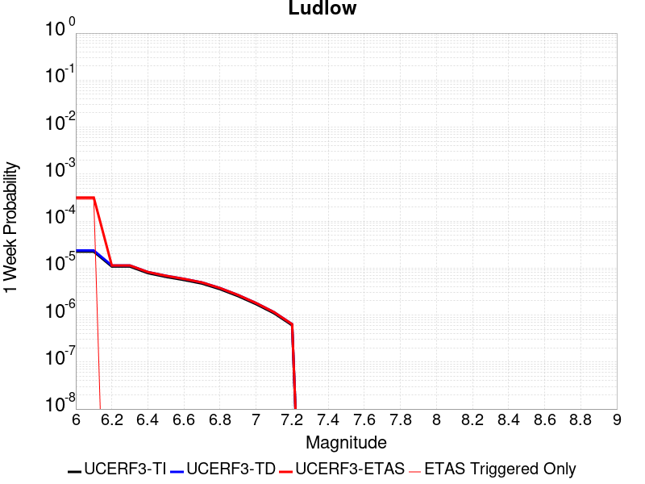 | 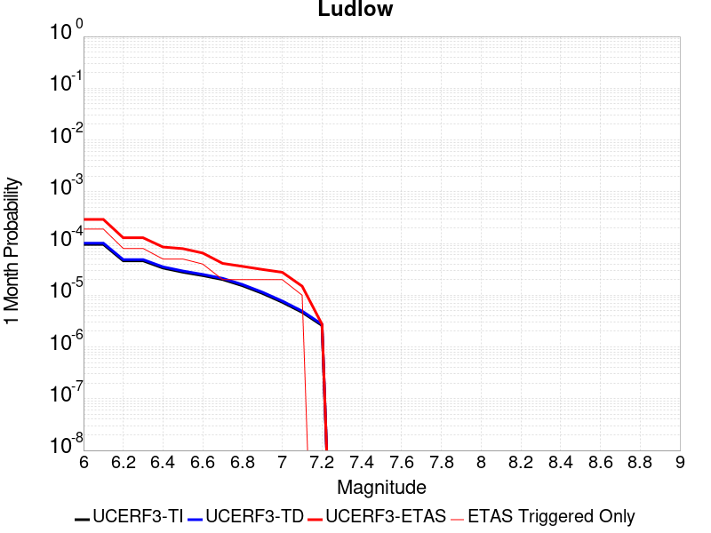 | 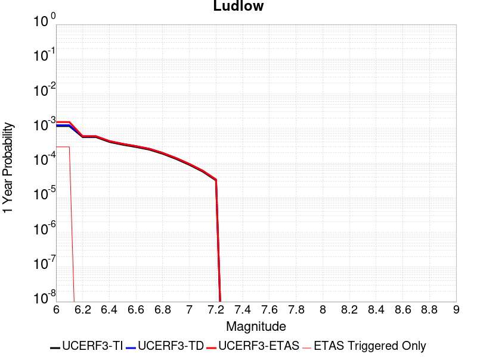 | 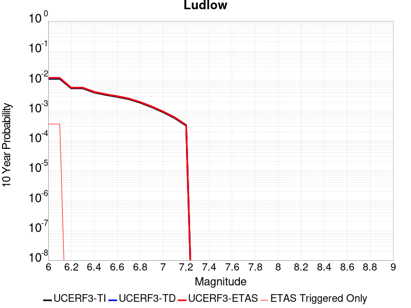 |

| Magnitude | 1 wk TI Prob | 1 wk TD Prob | 1 wk ETAS Prob | 1 wk ETAS/TD Gain | 1 wk ETAS Triggered Only | 1 mo TI Prob | 1 mo TD Prob | 1 mo ETAS Prob | 1 mo ETAS/TD Gain | 1 mo ETAS Triggered Only | 1 yr TI Prob | 1 yr TD Prob | 1 yr ETAS Prob | 1 yr ETAS/TD Gain | 1 yr ETAS Triggered Only | 10 yr TI Prob | 10 yr TD Prob | 10 yr ETAS Prob | 10 yr ETAS/TD Gain | 10 yr ETAS Triggered Only |
|-----|-----|-----|-----|-----|-----|-----|-----|-----|-----|-----|-----|-----|-----|-----|-----|-----|-----|-----|-----|-----|
| 6.0 | 2.2407607E-5 | 2.3657254E-5 | 3.1707753E-4 | 13.402973 | 2.9342723E-4 | 9.602906E-5 | 1.0138454E-4 | 3.9478202E-4 | 3.8939075 | 2.9342723E-4 | 0.0011685267 | 0.001233702 | 0.0015267672 | 1.2375494 | 2.9342723E-4 | 0.011624013 | 0.012273042 | 0.012562868 | 1.0236149 | 2.9342723E-4 |
| 6.1 | 2.2407607E-5 | 2.3657254E-5 | 3.1707753E-4 | 13.402973 | 2.9342723E-4 | 9.602906E-5 | 1.0138454E-4 | 3.9478202E-4 | 3.8939075 | 2.9342723E-4 | 0.0011685267 | 0.001233702 | 0.0015267672 | 1.2375494 | 2.9342723E-4 | 0.011624013 | 0.012273042 | 0.012562868 | 1.0236149 | 2.9342723E-4 |
| 6.2 | 1.0781252E-5 | 1.1365663E-5 | 1.1365663E-5 | 1.0 | 0.0 | 4.620455E-5 | 4.8709102E-5 | 4.8709102E-5 | 1.0 | 0.0 | 5.623952E-4 | 5.9287593E-4 | 5.9287593E-4 | 1.0 | 0.0 | 0.00560974 | 0.0059133614 | 0.0059133614 | 1.0 | 0.0 |
| 6.3 | 1.0781252E-5 | 1.1365663E-5 | 1.1365663E-5 | 1.0 | 0.0 | 4.620455E-5 | 4.8709102E-5 | 4.8709102E-5 | 1.0 | 0.0 | 5.623952E-4 | 5.9287593E-4 | 5.9287593E-4 | 1.0 | 0.0 | 0.00560974 | 0.0059133614 | 0.0059133614 | 1.0 | 0.0 |
| 6.4 | 7.814439E-6 | 8.237729E-6 | 8.237729E-6 | 1.0 | 0.0 | 3.3490025E-5 | 3.530408E-5 | 3.530408E-5 | 1.0 | 0.0 | 4.0766477E-4 | 4.2974384E-4 | 4.2974384E-4 | 1.0 | 0.0 | 0.0040691774 | 0.0042892746 | 0.0042892746 | 1.0 | 0.0 |
| 6.5 | 6.4986366E-6 | 6.85092E-6 | 6.85092E-6 | 1.0 | 0.0 | 2.7851002E-5 | 2.9360759E-5 | 2.9360759E-5 | 1.0 | 0.0 | 3.390332E-4 | 3.5740953E-4 | 3.5740953E-4 | 1.0 | 0.0 | 0.003385164 | 0.0035684432 | 0.0035684432 | 1.0 | 0.0 |
| 6.6 | 5.582177E-6 | 5.8860055E-6 | 5.8860055E-6 | 1.0 | 0.0 | 2.3923398E-5 | 2.5225498E-5 | 2.5225498E-5 | 1.0 | 0.0 | 2.9122844E-4 | 3.0707786E-4 | 3.0707786E-4 | 1.0 | 0.0 | 0.0029084706 | 0.003066609 | 0.003066609 | 1.0 | 0.0 |
| 6.7 | 4.6858763E-6 | 4.940427E-6 | 4.940427E-6 | 1.0 | 0.0 | 2.0082172E-5 | 2.1173091E-5 | 2.1173091E-5 | 1.0 | 0.0 | 2.4447302E-4 | 2.5775246E-4 | 2.5775246E-4 | 1.0 | 0.0 | 0.0024420423 | 0.0025745912 | 0.0025745912 | 1.0 | 0.0 |
| 6.8 | 3.5584908E-6 | 3.7520183E-6 | 3.7520183E-6 | 1.0 | 0.0 | 1.5250586E-5 | 1.6079981E-5 | 1.6079981E-5 | 1.0 | 0.0 | 1.8566006E-4 | 1.957566E-4 | 1.957566E-4 | 1.0 | 0.0 | 0.0018550502 | 0.0019558826 | 0.0019558826 | 1.0 | 0.0 |
| 6.9 | 2.532834E-6 | 2.6710034E-6 | 2.6710034E-6 | 1.0 | 0.0 | 1.0854958E-5 | 1.1447109E-5 | 1.1447109E-5 | 1.0 | 0.0 | 1.3215111E-4 | 1.3935992E-4 | 1.3935992E-4 | 1.0 | 0.0 | 0.0013207254 | 0.0013927529 | 0.0013927529 | 1.0 | 0.0 |
| 7.0 | 1.7083285E-6 | 1.8019439E-6 | 1.8019439E-6 | 1.0 | 0.0 | 7.3213873E-6 | 7.722595E-6 | 7.722595E-6 | 1.0 | 0.0 | 8.913424E-5 | 9.40187E-5 | 9.40187E-5 | 1.0 | 0.0 | 8.9098496E-4 | 9.3980576E-4 | 9.3980576E-4 | 1.0 | 0.0 |
| 7.1 | 1.0905424E-6 | 1.1497619E-6 | 1.1497619E-6 | 1.0 | 0.0 | 4.6737446E-6 | 4.9275427E-6 | 4.9275427E-6 | 1.0 | 0.0 | 5.6901354E-5 | 5.999128E-5 | 5.999128E-5 | 1.0 | 0.0 | 5.6886784E-4 | 5.997606E-4 | 5.997606E-4 | 1.0 | 0.0 |
| 7.2 | 6.06668E-7 | 6.387277E-7 | 6.387277E-7 | 1.0 | 0.0 | 2.600003E-6 | 2.7374022E-6 | 2.7374022E-6 | 1.0 | 0.0 | 3.1654577E-5 | 3.3327433E-5 | 3.3327433E-5 | 1.0 | 0.0 | 3.1650066E-4 | 3.3323118E-4 | 3.3323118E-4 | 1.0 | 0.0 |

## Helendale-So Lockhart
*[(top)](#table-of-contents)*

| 1 Week | 1 Month | 1 Year | 10 Year |
|-----|-----|-----|-----|
|  | 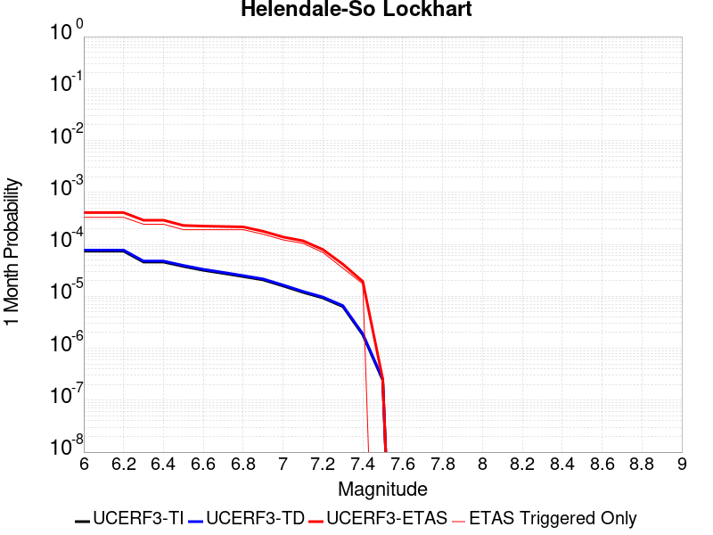 | 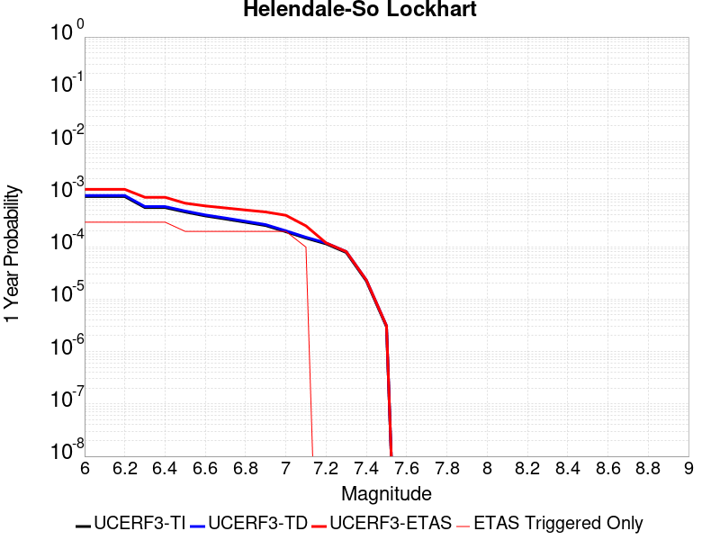 | 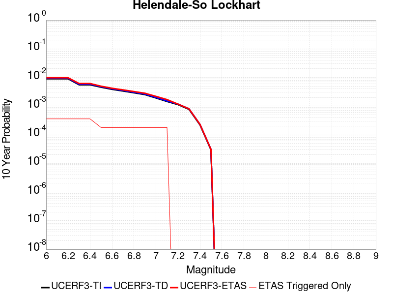 |

| Magnitude | 1 wk TI Prob | 1 wk TD Prob | 1 wk ETAS Prob | 1 wk ETAS/TD Gain | 1 wk ETAS Triggered Only | 1 mo TI Prob | 1 mo TD Prob | 1 mo ETAS Prob | 1 mo ETAS/TD Gain | 1 mo ETAS Triggered Only | 1 yr TI Prob | 1 yr TD Prob | 1 yr ETAS Prob | 1 yr ETAS/TD Gain | 1 yr ETAS Triggered Only | 10 yr TI Prob | 10 yr TD Prob | 10 yr ETAS Prob | 10 yr ETAS/TD Gain | 10 yr ETAS Triggered Only |
|-----|-----|-----|-----|-----|-----|-----|-----|-----|-----|-----|-----|-----|-----|-----|-----|-----|-----|-----|-----|-----|
| 6.0 | 1.7296055E-5 | 1.8103729E-5 | 3.1152565E-4 | 17.207817 | 2.9342723E-4 | 7.412385E-5 | 7.7585224E-5 | 3.709897E-4 | 4.7817054 | 2.9342723E-4 | 9.0208417E-4 | 9.4421144E-4 | 0.0012373616 | 1.3104709 | 2.9342723E-4 | 0.008984311 | 0.009404116 | 0.009694784 | 1.0309086 | 2.9342723E-4 |
| 6.1 | 1.7296055E-5 | 1.8103729E-5 | 3.1152565E-4 | 17.207817 | 2.9342723E-4 | 7.412385E-5 | 7.7585224E-5 | 3.709897E-4 | 4.7817054 | 2.9342723E-4 | 9.0208417E-4 | 9.4421144E-4 | 0.0012373616 | 1.3104709 | 2.9342723E-4 | 0.008984311 | 0.009404116 | 0.009694784 | 1.0309086 | 2.9342723E-4 |
| 6.2 | 1.7296055E-5 | 1.8103729E-5 | 3.1152565E-4 | 17.207817 | 2.9342723E-4 | 7.412385E-5 | 7.7585224E-5 | 3.709897E-4 | 4.7817054 | 2.9342723E-4 | 9.0208417E-4 | 9.4421144E-4 | 0.0012373616 | 1.3104709 | 2.9342723E-4 | 0.008984311 | 0.009404116 | 0.009694784 | 1.0309086 | 2.9342723E-4 |
| 6.3 | 1.0669118E-5 | 1.1135425E-5 | 3.045594E-4 | 27.350496 | 2.9342723E-4 | 4.5723988E-5 | 4.772239E-5 | 3.4113563E-4 | 7.1483345 | 2.9342723E-4 | 5.5654737E-4 | 5.80868E-4 | 8.741248E-4 | 1.5048596 | 2.9342723E-4 | 0.0055515557 | 0.0057937936 | 0.0060855206 | 1.0503516 | 2.9342723E-4 |
| 6.4 | 1.0669118E-5 | 1.1135425E-5 | 3.045594E-4 | 27.350496 | 2.9342723E-4 | 4.5723988E-5 | 4.772239E-5 | 3.4113563E-4 | 7.1483345 | 2.9342723E-4 | 5.5654737E-4 | 5.80868E-4 | 8.741248E-4 | 1.5048596 | 2.9342723E-4 | 0.0055515557 | 0.0057937936 | 0.0060855206 | 1.0503516 | 2.9342723E-4 |
| 6.5 | 8.790038E-6 | 9.170197E-6 | 2.0478656E-4 | 22.33175 | 1.9561815E-4 | 3.767105E-5 | 3.930026E-5 | 2.3491072E-4 | 5.9773326 | 1.9561815E-4 | 4.585485E-4 | 4.7837716E-4 | 6.7390176E-4 | 1.4087247 | 1.9561815E-4 | 0.0045760344 | 0.004773638 | 0.004968323 | 1.0407832 | 1.9561815E-4 |
| 6.6 | 7.396949E-6 | 7.715537E-6 | 2.0333218E-4 | 26.353601 | 1.9561815E-4 | 3.1700827E-5 | 3.3066175E-5 | 2.2867786E-4 | 6.9157643 | 1.9561815E-4 | 3.858892E-4 | 4.025073E-4 | 5.980467E-4 | 1.4858034 | 1.9561815E-4 | 0.003852198 | 0.00401789 | 0.004212722 | 1.0484911 | 1.9561815E-4 |
| 6.7 | 6.4600285E-6 | 6.738031E-6 | 2.0235487E-4 | 30.03175 | 1.9561815E-4 | 2.7685543E-5 | 2.887696E-5 | 2.2448947E-4 | 7.773999 | 1.9561815E-4 | 3.3701936E-4 | 3.5152107E-4 | 5.4707046E-4 | 1.5562949 | 1.9561815E-4 | 0.0033650869 | 0.003509732 | 0.0037046636 | 1.0555403 | 1.9561815E-4 |
| 6.8 | 5.600104E-6 | 5.836009E-6 | 2.0145302E-4 | 34.518967 | 1.9561815E-4 | 2.4000226E-5 | 2.5011232E-5 | 2.206245E-4 | 8.821016 | 1.9561815E-4 | 2.9216358E-4 | 3.044698E-4 | 5.0002837E-4 | 1.6422923 | 1.9561815E-4 | 0.0029177975 | 0.003040588 | 0.0032356114 | 1.06414 | 1.9561815E-4 |
| 6.9 | 4.839122E-6 | 5.0395092E-6 | 2.0065668E-4 | 39.81671 | 1.9561815E-4 | 2.0738931E-5 | 2.159772E-5 | 2.1721165E-4 | 10.057157 | 1.9561815E-4 | 2.5246723E-4 | 2.6292098E-4 | 4.5848772E-4 | 1.7438232 | 1.9561815E-4 | 0.002521806 | 0.002626147 | 0.0028212513 | 1.074293 | 1.9561815E-4 |
| 7.0 | 3.6937633E-6 | 3.845208E-6 | 1.994626E-4 | 51.873035 | 1.9561815E-4 | 1.5830317E-5 | 1.647936E-5 | 2.120943E-4 | 12.870298 | 1.9561815E-4 | 1.9271708E-4 | 2.0061806E-4 | 3.9619696E-4 | 1.9748819 | 1.9561815E-4 | 0.0019255003 | 0.002004401 | 0.002199627 | 1.0973988 | 1.9561815E-4 |
| 7.1 | 2.7858857E-6 | 2.8978538E-6 | 1.00706646E-4 | 34.752148 | 9.7809076E-5 | 1.1939455E-5 | 1.2419316E-5 | 1.1022718E-4 | 8.8754635 | 9.7809076E-5 | 1.4535317E-4 | 1.511949E-4 | 2.4898918E-4 | 1.6468095 | 9.7809076E-5 | 0.0014525814 | 0.0015109418 | 0.001608603 | 1.064636 | 9.7809076E-5 |
| 7.2 | 2.1672065E-6 | 2.2540128E-6 | 2.2540128E-6 | 1.0 | 0.0 | 9.2879945E-6 | 9.66002E-6 | 9.66002E-6 | 1.0 | 0.0 | 1.1307546E-4 | 1.1760458E-4 | 1.1760458E-4 | 1.0 | 0.0 | 0.0011301794 | 0.0011754417 | 0.0011754417 | 1.0 | 0.0 |
| 7.3 | 1.4823496E-6 | 1.5422102E-6 | 1.5422102E-6 | 1.0 | 0.0 | 6.3529114E-6 | 6.6094562E-6 | 6.6094562E-6 | 1.0 | 0.0 | 7.734395E-5 | 8.046731E-5 | 8.046731E-5 | 1.0 | 0.0 | 7.731704E-4 | 8.0439687E-4 | 8.0439687E-4 | 1.0 | 0.0 |
| 7.4 | 4.2321457E-7 | 4.4108765E-7 | 4.4108765E-7 | 1.0 | 0.0 | 1.8137755E-6 | 1.8903745E-6 | 1.8903745E-6 | 1.0 | 0.0 | 2.2082493E-5 | 2.3015113E-5 | 2.3015113E-5 | 1.0 | 0.0 | 2.2080299E-4 | 2.3013182E-4 | 2.3013182E-4 | 1.0 | 0.0 |
| 7.5 | 5.6942316E-8 | 5.9415648E-8 | 5.9415648E-8 | 1.0 | 0.0 | 2.440385E-7 | 2.5463845E-7 | 2.5463845E-7 | 1.0 | 0.0 | 2.9711643E-6 | 3.1002196E-6 | 3.1002196E-6 | 1.0 | 0.0 | 2.9711247E-5 | 3.1001844E-5 | 3.1001844E-5 | 1.0 | 0.0 |

## Sierra Nevada  (No Extension)
*[(top)](#table-of-contents)*

| 1 Week | 1 Month | 1 Year | 10 Year |
|-----|-----|-----|-----|
| 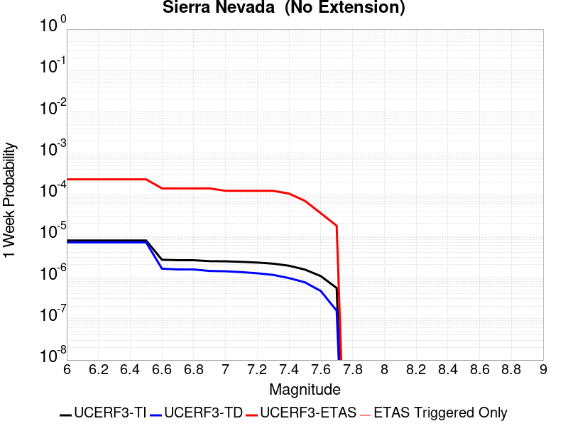 | 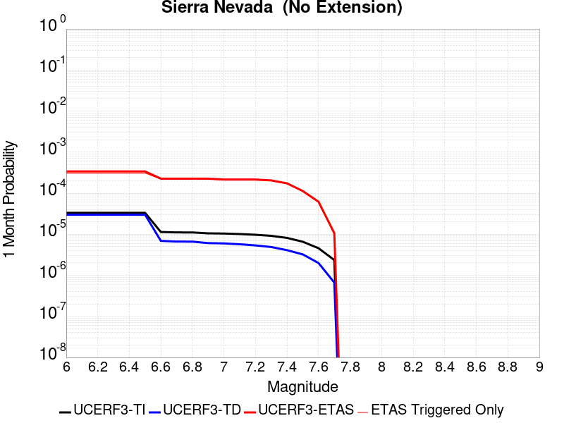 | 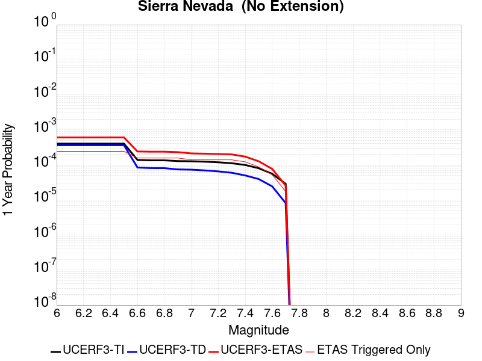 | 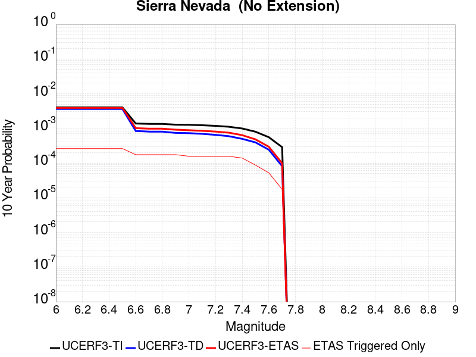 |

| Magnitude | 1 wk TI Prob | 1 wk TD Prob | 1 wk ETAS Prob | 1 wk ETAS/TD Gain | 1 wk ETAS Triggered Only | 1 mo TI Prob | 1 mo TD Prob | 1 mo ETAS Prob | 1 mo ETAS/TD Gain | 1 mo ETAS Triggered Only | 1 yr TI Prob | 1 yr TD Prob | 1 yr ETAS Prob | 1 yr ETAS/TD Gain | 1 yr ETAS Triggered Only | 10 yr TI Prob | 10 yr TD Prob | 10 yr ETAS Prob | 10 yr ETAS/TD Gain | 10 yr ETAS Triggered Only |
|-----|-----|-----|-----|-----|-----|-----|-----|-----|-----|-----|-----|-----|-----|-----|-----|-----|-----|-----|-----|-----|
| 6.0 | 7.7690465E-6 | 6.976322E-6 | 3.004015E-4 | 43.060158 | 2.9342723E-4 | 3.329549E-5 | 2.9898381E-5 | 3.2331684E-4 | 10.813858 | 2.9342723E-4 | 4.0529718E-4 | 3.6398784E-4 | 6.5730826E-4 | 1.8058523 | 2.9342723E-4 | 0.004045588 | 0.0036374326 | 0.0039297924 | 1.0803753 | 2.9342723E-4 |
| 6.1 | 7.7690465E-6 | 6.976322E-6 | 3.004015E-4 | 43.060158 | 2.9342723E-4 | 3.329549E-5 | 2.9898381E-5 | 3.2331684E-4 | 10.813858 | 2.9342723E-4 | 4.0529718E-4 | 3.6398784E-4 | 6.5730826E-4 | 1.8058523 | 2.9342723E-4 | 0.004045588 | 0.0036374326 | 0.0039297924 | 1.0803753 | 2.9342723E-4 |
| 6.2 | 7.7690465E-6 | 6.976322E-6 | 3.004015E-4 | 43.060158 | 2.9342723E-4 | 3.329549E-5 | 2.9898381E-5 | 3.2331684E-4 | 10.813858 | 2.9342723E-4 | 4.0529718E-4 | 3.6398784E-4 | 6.5730826E-4 | 1.8058523 | 2.9342723E-4 | 0.004045588 | 0.0036374326 | 0.0039297924 | 1.0803753 | 2.9342723E-4 |
| 6.3 | 7.7690465E-6 | 6.976322E-6 | 3.004015E-4 | 43.060158 | 2.9342723E-4 | 3.329549E-5 | 2.9898381E-5 | 3.2331684E-4 | 10.813858 | 2.9342723E-4 | 4.0529718E-4 | 3.6398784E-4 | 6.5730826E-4 | 1.8058523 | 2.9342723E-4 | 0.004045588 | 0.0036374326 | 0.0039297924 | 1.0803753 | 2.9342723E-4 |
| 6.4 | 7.7690465E-6 | 6.976322E-6 | 3.004015E-4 | 43.060158 | 2.9342723E-4 | 3.329549E-5 | 2.9898381E-5 | 3.2331684E-4 | 10.813858 | 2.9342723E-4 | 4.0529718E-4 | 3.6398784E-4 | 6.5730826E-4 | 1.8058523 | 2.9342723E-4 | 0.004045588 | 0.0036374326 | 0.0039297924 | 1.0803753 | 2.9342723E-4 |
| 6.5 | 7.7690465E-6 | 6.976322E-6 | 3.004015E-4 | 43.060158 | 2.9342723E-4 | 3.329549E-5 | 2.9898381E-5 | 3.2331684E-4 | 10.813858 | 2.9342723E-4 | 4.0529718E-4 | 3.6398784E-4 | 6.5730826E-4 | 1.8058523 | 2.9342723E-4 | 0.004045588 | 0.0036374326 | 0.0039297924 | 1.0803753 | 2.9342723E-4 |
| 6.6 | 2.653E-6 | 1.614854E-6 | 1.9723269E-4 | 122.13655 | 1.9561815E-4 | 1.136995E-5 | 6.9207845E-6 | 2.0253759E-4 | 29.26512 | 1.9561815E-4 | 1.3842035E-4 | 8.425733E-5 | 2.79859E-4 | 3.3214796 | 1.9561815E-4 | 0.0013833415 | 8.422573E-4 | 0.0010377107 | 1.232059 | 1.9561815E-4 |
| 6.7 | 2.5902466E-6 | 1.5501876E-6 | 1.9716803E-4 | 127.1898 | 1.9561815E-4 | 1.11010095E-5 | 6.643644E-6 | 2.022605E-4 | 30.44421 | 1.9561815E-4 | 1.351464E-4 | 8.0883394E-5 | 2.7648572E-4 | 3.418325 | 1.9561815E-4 | 0.0013506424 | 8.0854254E-4 | 0.0010040025 | 1.2417436 | 1.9561815E-4 |
| 6.8 | 2.5853892E-6 | 1.5469877E-6 | 1.9716485E-4 | 127.450806 | 1.9561815E-4 | 1.1080193E-5 | 6.629931E-6 | 2.0224678E-4 | 30.505112 | 1.9561815E-4 | 1.34893E-4 | 8.071645E-5 | 2.763188E-4 | 3.4233272 | 1.9561815E-4 | 0.0013481114 | 8.068743E-4 | 0.0010023346 | 1.2422438 | 1.9561815E-4 |
| 6.9 | 2.458257E-6 | 1.4220619E-6 | 1.9703993E-4 | 138.55931 | 1.9561815E-4 | 1.0535345E-5 | 6.094537E-6 | 2.017115E-4 | 33.0971 | 1.9561815E-4 | 1.2826028E-4 | 7.4198484E-5 | 2.698021E-4 | 3.6362216 | 1.9561815E-4 | 0.0012818627 | 7.4173906E-4 | 9.3721214E-4 | 1.2635335 | 1.9561815E-4 |
| 7.0 | 2.4341468E-6 | 1.3990258E-6 | 1.9701691E-4 | 140.82436 | 1.9561815E-4 | 1.0432016E-5 | 5.9958115E-6 | 2.016128E-4 | 33.625607 | 1.9561815E-4 | 1.270024E-4 | 7.2996576E-5 | 2.6860044E-4 | 3.6796308 | 1.9561815E-4 | 0.0012692984 | 7.297279E-4 | 9.252033E-4 | 1.2678744 | 1.9561815E-4 |
| 7.1 | 2.3652476E-6 | 1.3339754E-6 | 1.9695186E-4 | 147.6428 | 1.9561815E-4 | 1.0136736E-5 | 5.717025E-6 | 2.0133406E-4 | 35.21658 | 1.9561815E-4 | 1.2340778E-4 | 6.9602575E-5 | 2.652071E-4 | 3.810306 | 1.9561815E-4 | 0.0012333926 | 6.9580943E-4 | 8.912915E-4 | 1.280942 | 1.9561815E-4 |
| 7.2 | 2.272158E-6 | 1.2502821E-6 | 1.9686819E-4 | 157.45901 | 1.9561815E-4 | 9.737784E-6 | 5.3583412E-6 | 2.0097545E-4 | 37.507027 | 1.9561815E-4 | 1.1855107E-4 | 6.5235865E-5 | 2.6084125E-4 | 3.9984334 | 1.9561815E-4 | 0.0011848784 | 6.5216864E-4 | 8.4765925E-4 | 1.2997546 | 1.9561815E-4 |
| 7.3 | 2.1382127E-6 | 1.1419703E-6 | 1.967599E-4 | 172.29861 | 1.9561815E-4 | 9.163737E-6 | 4.8941492E-6 | 2.0051135E-4 | 40.9696 | 1.9561815E-4 | 1.1156279E-4 | 5.958465E-5 | 2.5519115E-4 | 4.2828336 | 1.9561815E-4 | 0.001115068 | 5.956879E-4 | 7.9118955E-4 | 1.3281947 | 1.9561815E-4 |
| 7.4 | 1.9048055E-6 | 9.575242E-7 | 9.8766504E-5 | 103.14779 | 9.7809076E-5 | 8.163426E-6 | 4.1036687E-6 | 1.01912345E-4 | 24.834446 | 9.7809076E-5 | 9.9385186E-5 | 4.996103E-5 | 1.4776523E-4 | 2.9576097 | 9.7809076E-5 | 9.934074E-4 | 4.994987E-4 | 5.972589E-4 | 1.1957166 | 9.7809076E-5 |
| 7.5 | 1.5373403E-6 | 7.560042E-7 | 9.8565004E-5 | 130.37627 | 9.7809076E-5 | 6.5885843E-6 | 3.2400142E-6 | 1.01048776E-4 | 31.187757 | 9.7809076E-5 | 8.021306E-5 | 3.9446462E-5 | 1.3725169E-4 | 3.4794421 | 9.7809076E-5 | 8.0184115E-4 | 3.943951E-4 | 4.9216556E-4 | 1.2478999 | 9.7809076E-5 |
| 7.6 | 1.0680322E-6 | 4.6596554E-7 | 4.6596554E-7 | 1.0 | 0.0 | 4.577273E-6 | 1.9969937E-6 | 1.9969937E-6 | 1.0 | 0.0 | 5.5726876E-5 | 2.4313129E-5 | 2.4313129E-5 | 1.0 | 0.0 | 5.5712904E-4 | 2.4310495E-4 | 2.4310495E-4 | 1.0 | 0.0 |
| 7.7 | 5.509146E-7 | 1.5580486E-7 | 1.5580486E-7 | 1.0 | 0.0 | 2.3610605E-6 | 6.677349E-7 | 6.677349E-7 | 1.0 | 0.0 | 2.8745531E-5 | 8.129644E-6 | 8.129644E-6 | 1.0 | 0.0 | 2.8741814E-4 | 8.1293576E-5 | 8.1293576E-5 | 1.0 | 0.0 |

## Death Valley (No)
*[(top)](#table-of-contents)*

| 1 Week | 1 Month | 1 Year | 10 Year |
|-----|-----|-----|-----|
| 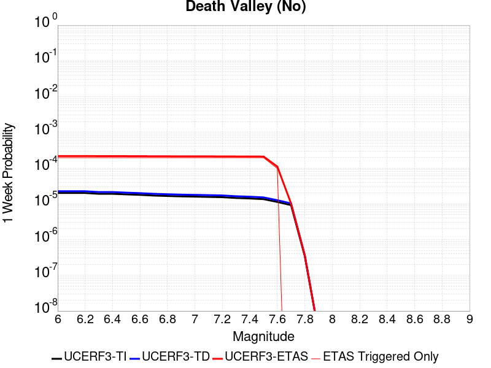 | 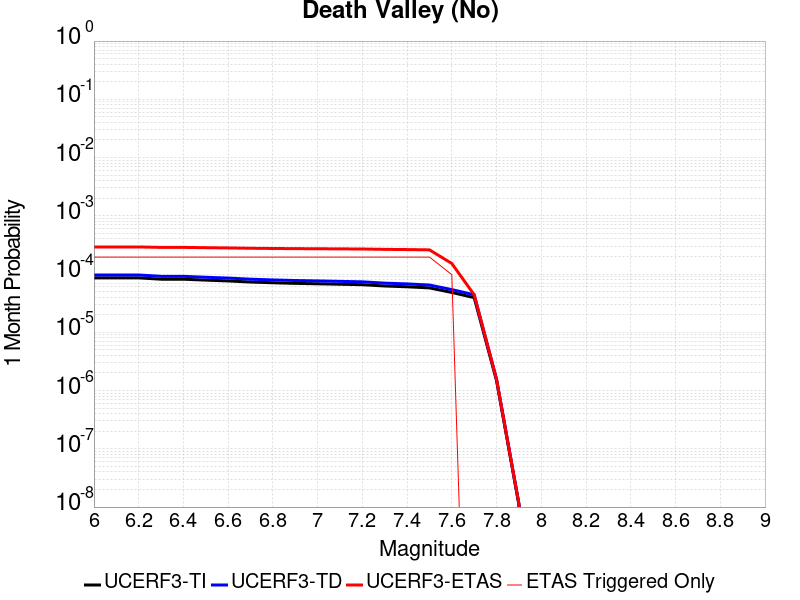 | 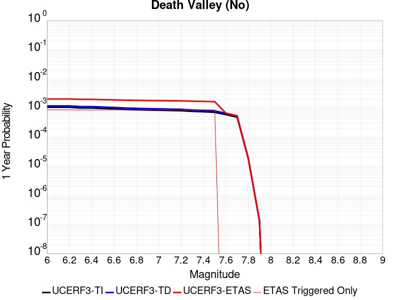 | 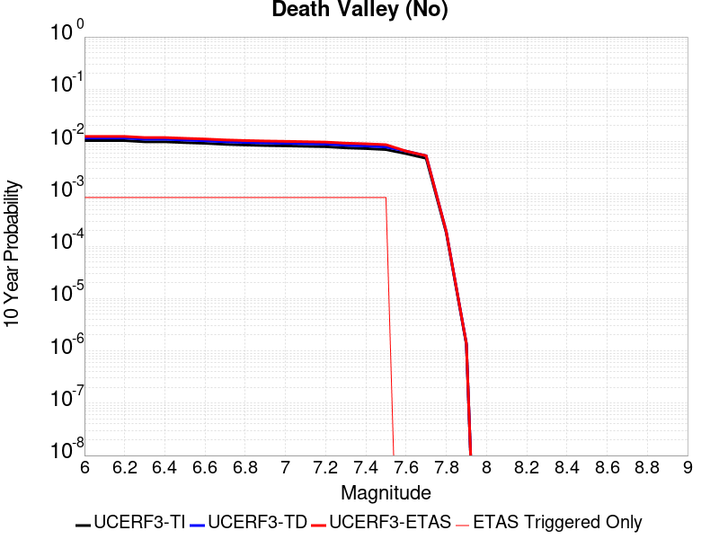 |

| Magnitude | 1 wk TI Prob | 1 wk TD Prob | 1 wk ETAS Prob | 1 wk ETAS/TD Gain | 1 wk ETAS Triggered Only | 1 mo TI Prob | 1 mo TD Prob | 1 mo ETAS Prob | 1 mo ETAS/TD Gain | 1 mo ETAS Triggered Only | 1 yr TI Prob | 1 yr TD Prob | 1 yr ETAS Prob | 1 yr ETAS/TD Gain | 1 yr ETAS Triggered Only | 10 yr TI Prob | 10 yr TD Prob | 10 yr ETAS Prob | 10 yr ETAS/TD Gain | 10 yr ETAS Triggered Only |
|-----|-----|-----|-----|-----|-----|-----|-----|-----|-----|-----|-----|-----|-----|-----|-----|-----|-----|-----|-----|-----|
| 6.0 | 2.0074807E-5 | 2.2500084E-5 | 2.1811384E-4 | 9.6939125 | 1.9561815E-4 | 8.603206E-5 | 9.642541E-5 | 2.920247E-4 | 3.0285037 | 1.9561815E-4 | 0.001046937 | 0.0011733545 | 0.0013687431 | 1.1665214 | 1.9561815E-4 | 0.010420183 | 0.011672506 | 0.011962509 | 1.0248449 | 2.9342723E-4 |
| 6.1 | 2.0074807E-5 | 2.2500084E-5 | 2.1811384E-4 | 9.6939125 | 1.9561815E-4 | 8.603206E-5 | 9.642541E-5 | 2.920247E-4 | 3.0285037 | 1.9561815E-4 | 0.001046937 | 0.0011733545 | 0.0013687431 | 1.1665214 | 1.9561815E-4 | 0.010420183 | 0.011672506 | 0.011962509 | 1.0248449 | 2.9342723E-4 |
| 6.2 | 2.0074807E-5 | 2.2500084E-5 | 2.1811384E-4 | 9.6939125 | 1.9561815E-4 | 8.603206E-5 | 9.642541E-5 | 2.920247E-4 | 3.0285037 | 1.9561815E-4 | 0.001046937 | 0.0011733545 | 0.0013687431 | 1.1665214 | 1.9561815E-4 | 0.010420183 | 0.011672506 | 0.011962509 | 1.0248449 | 2.9342723E-4 |
| 6.3 | 1.9050609E-5 | 2.1336948E-5 | 2.1695092E-4 | 10.167852 | 1.9561815E-4 | 8.164292E-5 | 9.1440896E-5 | 2.8704116E-4 | 3.1390896 | 1.9561815E-4 | 9.935491E-4 | 0.001112731 | 0.0013081315 | 1.1756045 | 1.9561815E-4 | 0.009891188 | 0.011072419 | 0.011362597 | 1.0262073 | 2.9342723E-4 |
| 6.4 | 1.9050609E-5 | 2.1336948E-5 | 2.1695092E-4 | 10.167852 | 1.9561815E-4 | 8.164292E-5 | 9.1440896E-5 | 2.8704116E-4 | 3.1390896 | 1.9561815E-4 | 9.935491E-4 | 0.001112731 | 0.0013081315 | 1.1756045 | 1.9561815E-4 | 0.009891188 | 0.011072419 | 0.011362597 | 1.0262073 | 2.9342723E-4 |
| 6.5 | 1.8367004E-5 | 2.0561009E-5 | 2.1617513E-4 | 10.51384 | 1.9561815E-4 | 7.8713354E-5 | 8.811567E-5 | 2.837166E-4 | 3.21982 | 1.9561815E-4 | 9.5791375E-4 | 0.0010722869 | 0.0012676952 | 1.1822352 | 1.9561815E-4 | 0.009537951 | 0.0106719155 | 0.0109622115 | 1.0272019 | 2.9342723E-4 |
| 6.6 | 1.779439E-5 | 1.9910927E-5 | 2.1552519E-4 | 10.824468 | 1.9561815E-4 | 7.625944E-5 | 8.53298E-5 | 2.8093124E-4 | 3.2922997 | 1.9561815E-4 | 9.280632E-4 | 0.0010384015 | 0.0012338165 | 1.1881883 | 1.9561815E-4 | 0.009241969 | 0.010336253 | 0.010626647 | 1.0280948 | 2.9342723E-4 |
| 6.7 | 1.7025437E-5 | 1.9043426E-5 | 2.1465785E-4 | 11.272019 | 1.9561815E-4 | 7.296412E-5 | 8.161216E-5 | 2.7721436E-4 | 3.3967285 | 1.9561815E-4 | 8.87976E-4 | 9.931813E-4 | 0.0011886052 | 1.1967655 | 1.9561815E-4 | 0.008844362 | 0.009888145 | 0.0100818295 | 1.0195875 | 1.9561815E-4 |
| 6.8 | 1.6545107E-5 | 1.8512545E-5 | 2.1412708E-4 | 11.566593 | 1.9561815E-4 | 7.090568E-5 | 7.93371E-5 | 2.7493972E-4 | 3.4654622 | 1.9561815E-4 | 8.629347E-4 | 9.655073E-4 | 0.0011609365 | 1.2024109 | 1.9561815E-4 | 0.008595915 | 0.009613829 | 0.009807566 | 1.020152 | 1.9561815E-4 |
| 6.9 | 1.615478E-5 | 1.8087594E-5 | 2.1370221E-4 | 11.81485 | 1.9561815E-4 | 6.9232934E-5 | 7.751599E-5 | 2.73119E-4 | 3.5233889 | 1.9561815E-4 | 8.4258494E-4 | 9.433546E-4 | 0.0011387883 | 1.2071688 | 1.9561815E-4 | 0.008393973 | 0.009394196 | 0.009587976 | 1.0206277 | 1.9561815E-4 |
| 7.0 | 1.5894311E-5 | 1.780555E-5 | 2.1342022E-4 | 11.986163 | 1.9561815E-4 | 6.81167E-5 | 7.6307304E-5 | 2.7191054E-4 | 3.563362 | 1.9561815E-4 | 8.2900526E-4 | 9.286515E-4 | 0.001124088 | 1.210452 | 1.9561815E-4 | 0.008259195 | 0.009248397 | 0.0094422065 | 1.0209559 | 1.9561815E-4 |
| 7.1 | 1.5602263E-5 | 1.7483504E-5 | 2.1309823E-4 | 12.188532 | 1.9561815E-4 | 6.6865134E-5 | 7.492718E-5 | 2.7053067E-4 | 3.6105812 | 1.9561815E-4 | 8.137789E-4 | 9.118627E-4 | 0.0011073025 | 1.2143303 | 1.9561815E-4 | 0.008108052 | 0.009081894 | 0.009275735 | 1.0213437 | 1.9561815E-4 |
| 7.2 | 1.5323829E-5 | 1.717063E-5 | 2.1278542E-4 | 12.392406 | 1.9561815E-4 | 6.56719E-5 | 7.358637E-5 | 2.6919015E-4 | 3.6581519 | 1.9561815E-4 | 7.99262E-4 | 8.9555193E-4 | 0.0010909949 | 1.2182374 | 1.9561815E-4 | 0.007963934 | 0.008920107 | 0.0091139795 | 1.0217344 | 1.9561815E-4 |
| 7.3 | 1.4556212E-5 | 1.6302456E-5 | 2.1191742E-4 | 12.99911 | 1.9561815E-4 | 6.238227E-5 | 6.9865826E-5 | 2.6547033E-4 | 3.7997162 | 1.9561815E-4 | 7.592395E-4 | 8.5029035E-4 | 0.0010457422 | 1.2298648 | 1.9561815E-4 | 0.0075665074 | 0.008471014 | 0.008664976 | 1.022897 | 1.9561815E-4 |
| 7.4 | 1.411725E-5 | 1.580796E-5 | 2.1142302E-4 | 13.374466 | 1.9561815E-4 | 6.0501097E-5 | 6.7746674E-5 | 2.6335157E-4 | 3.887299 | 1.9561815E-4 | 7.363519E-4 | 8.245094E-4 | 0.0010199663 | 1.2370584 | 1.9561815E-4 | 0.0073391674 | 0.008215138 | 0.008409149 | 1.0236163 | 1.9561815E-4 |
| 7.5 | 1.3503312E-5 | 1.5126289E-5 | 2.1074148E-4 | 13.932134 | 1.9561815E-4 | 5.7870053E-5 | 6.482538E-5 | 2.6043085E-4 | 4.0174212 | 1.9561815E-4 | 7.043401E-4 | 7.8896893E-4 | 9.844328E-4 | 1.2477459 | 1.9561815E-4 | 0.007021119 | 0.007862304 | 0.0080563845 | 1.0246849 | 1.9561815E-4 |
| 7.6 | 1.1279839E-5 | 1.2626327E-5 | 1.1043417E-4 | 8.746342 | 9.7809076E-5 | 4.834127E-5 | 5.4111737E-5 | 1.5191552E-4 | 2.8074412 | 9.7809076E-5 | 5.88396E-4 | 6.5861654E-4 | 7.5636123E-4 | 1.148409 | 9.7809076E-5 | 0.005868405 | 0.006567199 | 0.0066643655 | 1.0147958 | 9.7809076E-5 |
| 7.7 | 9.189108E-6 | 1.0283358E-5 | 1.0283358E-5 | 1.0 | 0.0 | 3.93813E-5 | 4.407082E-5 | 4.407082E-5 | 1.0 | 0.0 | 4.7936183E-4 | 5.3643517E-4 | 5.3643517E-4 | 1.0 | 0.0 | 0.004783291 | 0.005351914 | 0.005351914 | 1.0 | 0.0 |
| 7.8 | 3.4586725E-7 | 3.6482615E-7 | 3.6482615E-7 | 1.0 | 0.0 | 1.4822873E-6 | 1.5635396E-6 | 1.5635396E-6 | 1.0 | 0.0 | 1.80467E-5 | 1.9035933E-5 | 1.9035933E-5 | 1.0 | 0.0 | 1.8045233E-4 | 1.9034347E-4 | 1.9034347E-4 | 1.0 | 0.0 |
| 7.9 | 2.5591178E-9 | 2.6696718E-9 | 2.6696718E-9 | 1.0 | 0.0 | 1.0967647E-8 | 1.14414505E-8 | 1.14414505E-8 | 1.0 | 0.0 | 1.335311E-7 | 1.3929966E-7 | 1.3929966E-7 | 1.0 | 0.0 | 1.3353102E-6 | 1.3929966E-6 | 1.3929966E-6 | 1.0 | 0.0 |

## White Wolf (Extension)
*[(top)](#table-of-contents)*

| 1 Week | 1 Month | 1 Year | 10 Year |
|-----|-----|-----|-----|
| 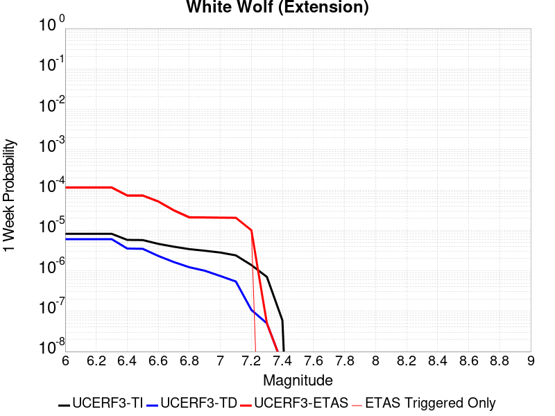 | 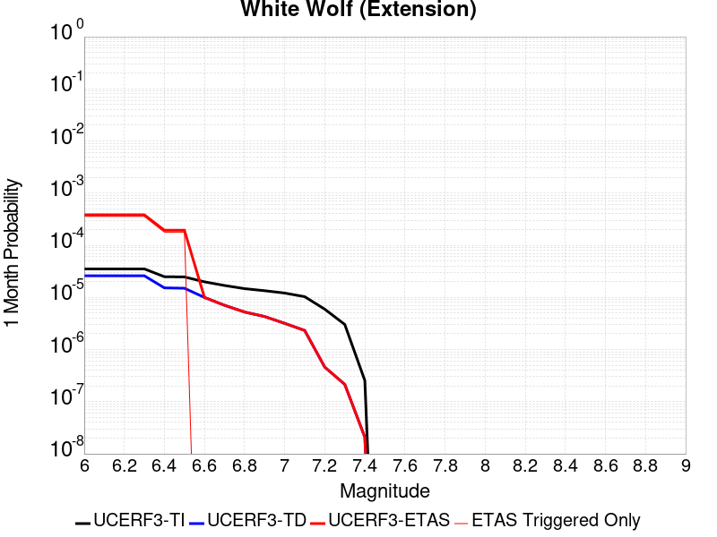 | 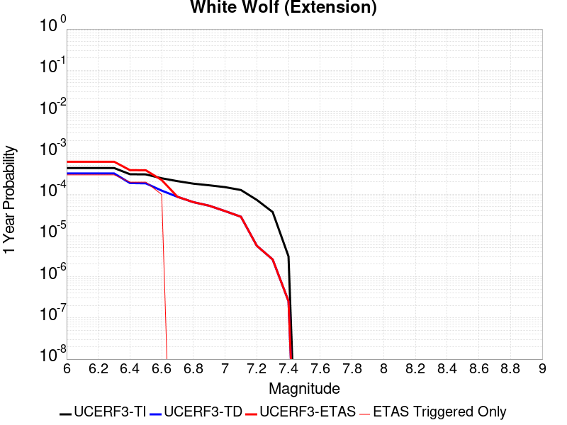 | 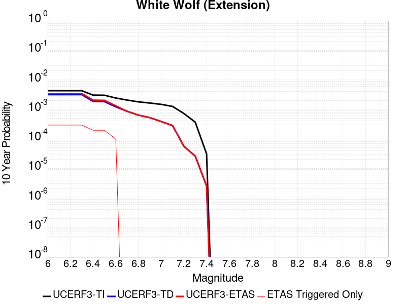 |

| Magnitude | 1 wk TI Prob | 1 wk TD Prob | 1 wk ETAS Prob | 1 wk ETAS/TD Gain | 1 wk ETAS Triggered Only | 1 mo TI Prob | 1 mo TD Prob | 1 mo ETAS Prob | 1 mo ETAS/TD Gain | 1 mo ETAS Triggered Only | 1 yr TI Prob | 1 yr TD Prob | 1 yr ETAS Prob | 1 yr ETAS/TD Gain | 1 yr ETAS Triggered Only | 10 yr TI Prob | 10 yr TD Prob | 10 yr ETAS Prob | 10 yr ETAS/TD Gain | 10 yr ETAS Triggered Only |
|-----|-----|-----|-----|-----|-----|-----|-----|-----|-----|-----|-----|-----|-----|-----|-----|-----|-----|-----|-----|-----|
| 6.0 | 8.222555E-6 | 6.0666657E-6 | 2.0168364E-4 | 33.24456 | 1.9561815E-4 | 3.5239045E-5 | 2.5999774E-5 | 3.1941937E-4 | 12.285467 | 2.9342723E-4 | 4.289509E-4 | 3.1650788E-4 | 6.0984225E-4 | 1.9267837 | 2.9342723E-4 | 0.0042812387 | 0.003161223 | 0.0034537227 | 1.0925274 | 2.9342723E-4 |
| 6.1 | 8.222555E-6 | 6.0666657E-6 | 2.0168364E-4 | 33.24456 | 1.9561815E-4 | 3.5239045E-5 | 2.5999774E-5 | 3.1941937E-4 | 12.285467 | 2.9342723E-4 | 4.289509E-4 | 3.1650788E-4 | 6.0984225E-4 | 1.9267837 | 2.9342723E-4 | 0.0042812387 | 0.003161223 | 0.0034537227 | 1.0925274 | 2.9342723E-4 |
| 6.2 | 8.222555E-6 | 6.0666657E-6 | 2.0168364E-4 | 33.24456 | 1.9561815E-4 | 3.5239045E-5 | 2.5999774E-5 | 3.1941937E-4 | 12.285467 | 2.9342723E-4 | 4.289509E-4 | 3.1650788E-4 | 6.0984225E-4 | 1.9267837 | 2.9342723E-4 | 0.0042812387 | 0.003161223 | 0.0034537227 | 1.0925274 | 2.9342723E-4 |
| 6.3 | 8.222555E-6 | 6.0666657E-6 | 2.0168364E-4 | 33.24456 | 1.9561815E-4 | 3.5239045E-5 | 2.5999774E-5 | 3.1941937E-4 | 12.285467 | 2.9342723E-4 | 4.289509E-4 | 3.1650788E-4 | 6.0984225E-4 | 1.9267837 | 2.9342723E-4 | 0.0042812387 | 0.003161223 | 0.0034537227 | 1.0925274 | 2.9342723E-4 |
| 6.4 | 5.821773E-6 | 3.5571766E-6 | 1.9917464E-4 | 55.99234 | 1.9561815E-4 | 2.4950215E-5 | 1.5244959E-5 | 2.1086013E-4 | 13.831466 | 1.9561815E-4 | 3.0372653E-4 | 1.8559267E-4 | 3.8117453E-4 | 2.0538232 | 1.9561815E-4 | 0.0030331176 | 0.001854485 | 0.0020497404 | 1.1052881 | 1.9561815E-4 |
| 6.5 | 5.766023E-6 | 3.4991106E-6 | 1.9911658E-4 | 56.90491 | 1.9561815E-4 | 2.4711293E-5 | 1.4996108E-5 | 2.1061132E-4 | 14.044399 | 1.9561815E-4 | 3.0081844E-4 | 1.8256342E-4 | 3.7814587E-4 | 2.0713124 | 1.9561815E-4 | 0.0030041158 | 0.0018242426 | 0.0020195039 | 1.107037 | 1.9561815E-4 |
| 6.6 | 4.643576E-6 | 2.332624E-6 | 1.0014147E-4 | 42.930824 | 9.7809076E-5 | 1.9900888E-5 | 9.996925E-6 | 1.07805026E-4 | 10.783819 | 9.7809076E-5 | 2.4226638E-4 | 1.2170619E-4 | 2.1950336E-4 | 1.8035513 | 9.7809076E-5 | 0.0024200242 | 0.0012164378 | 0.0013141278 | 1.0803083 | 9.7809076E-5 |
| 6.7 | 3.9529173E-6 | 1.6483477E-6 | 1.6483477E-6 | 1.0 | 0.0 | 1.6940963E-5 | 7.0643296E-6 | 7.0643296E-6 | 1.0 | 0.0 | 2.0623671E-4 | 8.6005006E-5 | 8.6005006E-5 | 1.0 | 0.0 | 0.002060454 | 8.597357E-4 | 8.597357E-4 | 1.0 | 0.0 |
| 6.8 | 3.4377522E-6 | 1.2245237E-6 | 1.2245237E-6 | 1.0 | 0.0 | 1.473314E-5 | 5.2479486E-6 | 5.2479486E-6 | 1.0 | 0.0 | 1.7936122E-4 | 6.3891996E-5 | 6.3891996E-5 | 1.0 | 0.0 | 0.0017921652 | 6.387454E-4 | 6.387454E-4 | 1.0 | 0.0 |
| 6.9 | 3.1367306E-6 | 1.0033783E-6 | 1.0033783E-6 | 1.0 | 0.0 | 1.3443062E-5 | 4.3001864E-6 | 4.3001864E-6 | 1.0 | 0.0 | 1.63657E-4 | 5.235359E-5 | 5.235359E-5 | 1.0 | 0.0 | 0.0016353652 | 5.2342017E-4 | 5.2342017E-4 | 1.0 | 0.0 |
| 7.0 | 2.8298145E-6 | 7.4286646E-7 | 7.4286646E-7 | 1.0 | 0.0 | 1.2127721E-5 | 3.1837099E-6 | 3.1837099E-6 | 1.0 | 0.0 | 1.47645E-4 | 3.8761027E-5 | 3.8761027E-5 | 1.0 | 0.0 | 0.0014754693 | 3.8754768E-4 | 3.8754768E-4 | 1.0 | 0.0 |
| 7.1 | 2.4091064E-6 | 5.4227525E-7 | 5.4227525E-7 | 1.0 | 0.0 | 1.03247E-5 | 2.3240348E-6 | 2.3240348E-6 | 1.0 | 0.0 | 1.2569598E-4 | 2.8294799E-5 | 2.8294799E-5 | 1.0 | 0.0 | 0.001256249 | 2.8291598E-4 | 2.8291598E-4 | 1.0 | 0.0 |
| 7.2 | 1.3875518E-6 | 1.0743063E-7 | 1.0743063E-7 | 1.0 | 0.0 | 5.9466374E-6 | 4.6041689E-7 | 4.6041689E-7 | 1.0 | 0.0 | 7.23979E-5 | 5.6055624E-6 | 5.6055624E-6 | 1.0 | 0.0 | 7.2374323E-4 | 5.6054323E-5 | 5.6054323E-5 | 1.0 | 0.0 |
| 7.3 | 7.056077E-7 | 5.002034E-8 | 5.002034E-8 | 1.0 | 0.0 | 3.0240296E-6 | 2.1437286E-7 | 2.1437286E-7 | 1.0 | 0.0 | 3.681694E-5 | 2.609987E-6 | 2.609987E-6 | 1.0 | 0.0 | 3.681084E-4 | 2.609961E-5 | 2.609961E-5 | 1.0 | 0.0 |
| 7.4 | 5.9334678E-8 | 4.8683537E-9 | 4.8683537E-9 | 1.0 | 0.0 | 2.5429145E-7 | 2.0864372E-8 | 2.0864372E-8 | 1.0 | 0.0 | 3.095994E-6 | 2.5402372E-7 | 2.5402372E-7 | 1.0 | 0.0 | 3.095951E-5 | 2.5402353E-6 | 2.5402353E-6 | 1.0 | 0.0 |

## Coyote Lake
*[(top)](#table-of-contents)*

| 1 Week | 1 Month | 1 Year | 10 Year |
|-----|-----|-----|-----|
| 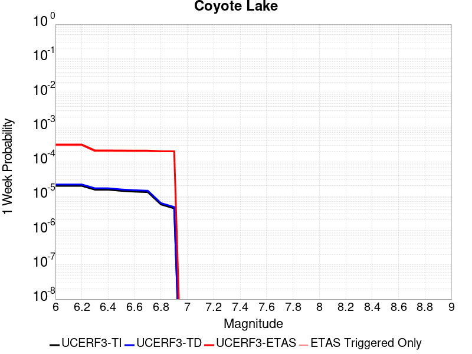 | 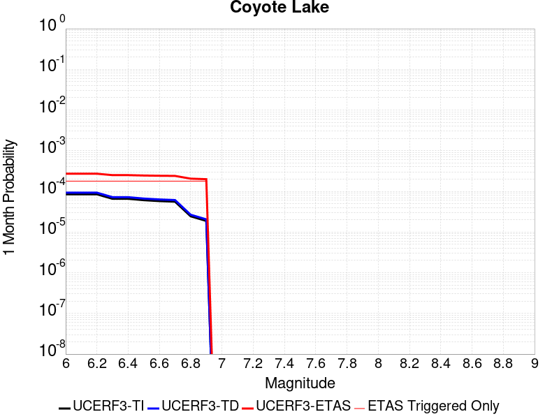 | 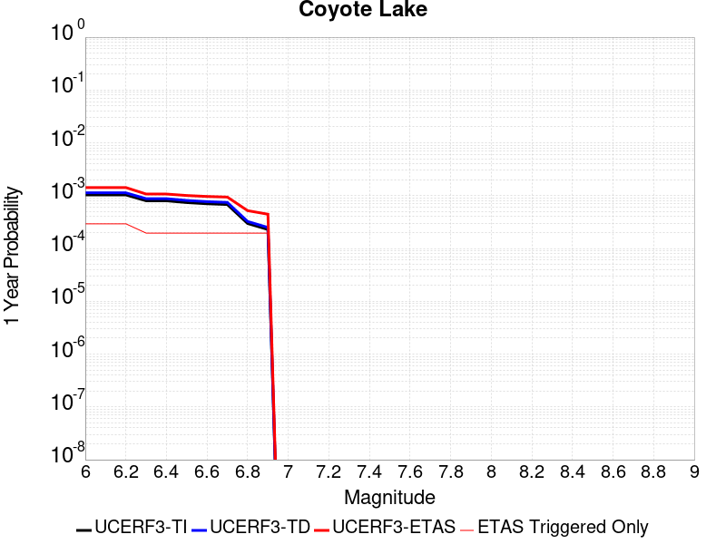 | 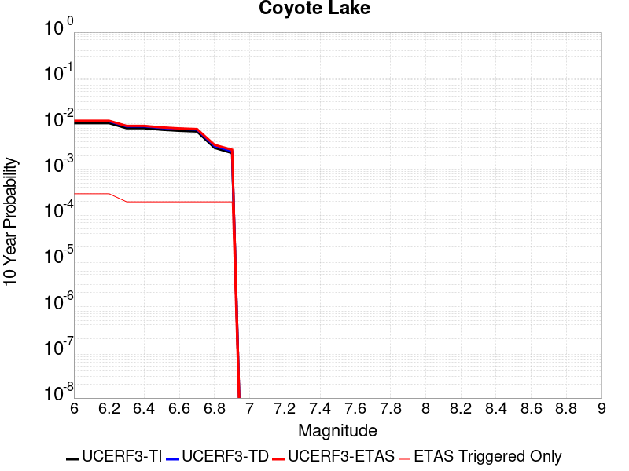 |

| Magnitude | 1 wk TI Prob | 1 wk TD Prob | 1 wk ETAS Prob | 1 wk ETAS/TD Gain | 1 wk ETAS Triggered Only | 1 mo TI Prob | 1 mo TD Prob | 1 mo ETAS Prob | 1 mo ETAS/TD Gain | 1 mo ETAS Triggered Only | 1 yr TI Prob | 1 yr TD Prob | 1 yr ETAS Prob | 1 yr ETAS/TD Gain | 1 yr ETAS Triggered Only | 10 yr TI Prob | 10 yr TD Prob | 10 yr ETAS Prob | 10 yr ETAS/TD Gain | 10 yr ETAS Triggered Only |
|-----|-----|-----|-----|-----|-----|-----|-----|-----|-----|-----|-----|-----|-----|-----|-----|-----|-----|-----|-----|-----|
| 6.0 | 1.980352E-5 | 2.1706745E-5 | 3.151276E-4 | 14.517497 | 2.9342723E-4 | 8.486947E-5 | 9.302599E-5 | 3.8642593E-4 | 4.1539564 | 2.9342723E-4 | 0.0010327959 | 0.0011320751 | 0.0014251701 | 1.2589008 | 2.9342723E-4 | 0.010280091 | 0.011270258 | 0.011560379 | 1.025742 | 2.9342723E-4 |
| 6.1 | 1.980352E-5 | 2.1706745E-5 | 3.151276E-4 | 14.517497 | 2.9342723E-4 | 8.486947E-5 | 9.302599E-5 | 3.8642593E-4 | 4.1539564 | 2.9342723E-4 | 0.0010327959 | 0.0011320751 | 0.0014251701 | 1.2589008 | 2.9342723E-4 | 0.010280091 | 0.011270258 | 0.011560379 | 1.025742 | 2.9342723E-4 |
| 6.2 | 1.980352E-5 | 2.1706745E-5 | 3.151276E-4 | 14.517497 | 2.9342723E-4 | 8.486947E-5 | 9.302599E-5 | 3.8642593E-4 | 4.1539564 | 2.9342723E-4 | 0.0010327959 | 0.0011320751 | 0.0014251701 | 1.2589008 | 2.9342723E-4 | 0.010280091 | 0.011270258 | 0.011560379 | 1.025742 | 2.9342723E-4 |
| 6.3 | 1.5344787E-5 | 1.682067E-5 | 2.1243554E-4 | 12.629434 | 1.9561815E-4 | 6.576172E-5 | 7.2086936E-5 | 2.6769098E-4 | 3.7134466 | 1.9561815E-4 | 8.003548E-4 | 8.773662E-4 | 0.0010728128 | 1.2227651 | 1.9561815E-4 | 0.007974784 | 0.00874507 | 0.008938977 | 1.0221734 | 1.9561815E-4 |
| 6.4 | 1.5344787E-5 | 1.682067E-5 | 2.1243554E-4 | 12.629434 | 1.9561815E-4 | 6.576172E-5 | 7.2086936E-5 | 2.6769098E-4 | 3.7134466 | 1.9561815E-4 | 8.003548E-4 | 8.773662E-4 | 0.0010728128 | 1.2227651 | 1.9561815E-4 | 0.007974784 | 0.00874507 | 0.008938977 | 1.0221734 | 1.9561815E-4 |
| 6.5 | 1.4189697E-5 | 1.5557987E-5 | 2.111731E-4 | 13.573292 | 1.9561815E-4 | 6.081157E-5 | 6.6675726E-5 | 2.6228084E-4 | 3.9336782 | 1.9561815E-4 | 7.401293E-4 | 8.115349E-4 | 0.0010069943 | 1.2408515 | 1.9561815E-4 | 0.0073766913 | 0.008091656 | 0.008285691 | 1.0239797 | 1.9561815E-4 |
| 6.6 | 1.3469301E-5 | 1.4771577E-5 | 2.1038685E-4 | 14.24268 | 1.9561815E-4 | 5.7724297E-5 | 6.330556E-5 | 2.5891134E-4 | 4.089867 | 1.9561815E-4 | 7.025667E-4 | 7.7053264E-4 | 9.660001E-4 | 1.2536783 | 1.9561815E-4 | 0.0070034964 | 0.0076845144 | 0.0078786295 | 1.0252606 | 1.9561815E-4 |
| 6.7 | 1.3027966E-5 | 1.4281745E-5 | 2.098971E-4 | 14.696881 | 1.9561815E-4 | 5.5832945E-5 | 6.120638E-5 | 2.5681255E-4 | 4.195846 | 1.9561815E-4 | 6.7955407E-4 | 7.4499263E-4 | 9.404651E-4 | 1.2623817 | 1.9561815E-4 | 0.006774798 | 0.0074308286 | 0.007624993 | 1.0261296 | 1.9561815E-4 |
| 6.8 | 5.695434E-6 | 6.2244176E-6 | 2.0184135E-4 | 32.427345 | 1.9561815E-4 | 2.4408775E-5 | 2.6675973E-5 | 2.222889E-4 | 8.332926 | 1.9561815E-4 | 2.971363E-4 | 3.2476155E-4 | 5.203162E-4 | 1.6021483 | 1.9561815E-4 | 0.0029673933 | 0.0032458105 | 0.0034407936 | 1.0600723 | 1.9561815E-4 |
| 6.9 | 4.385688E-6 | 4.7930553E-6 | 2.0041027E-4 | 41.812634 | 1.9561815E-4 | 1.879567E-5 | 2.0541665E-5 | 2.1615581E-4 | 10.522798 | 1.9561815E-4 | 2.2881327E-4 | 2.5009477E-4 | 4.4566402E-4 | 1.7819804 | 1.9561815E-4 | 0.002285778 | 0.0025009478 | 0.0026960766 | 1.078022 | 1.9561815E-4 |

## Scodie Lineament
*[(top)](#table-of-contents)*

| 1 Week | 1 Month | 1 Year | 10 Year |
|-----|-----|-----|-----|
|  | 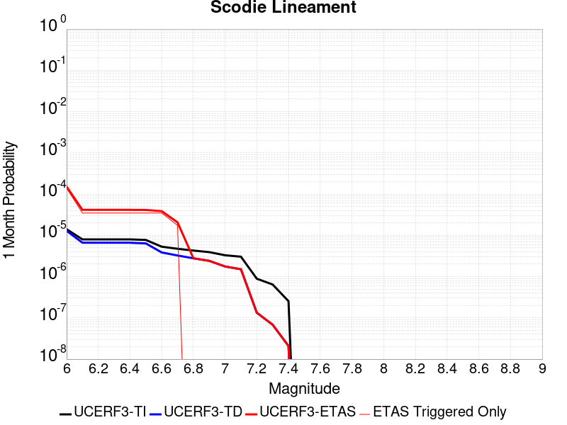 | 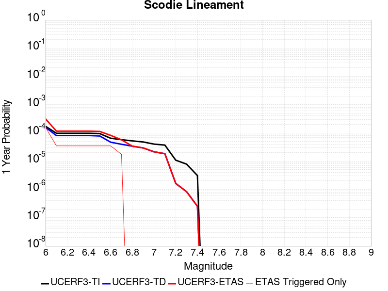 | 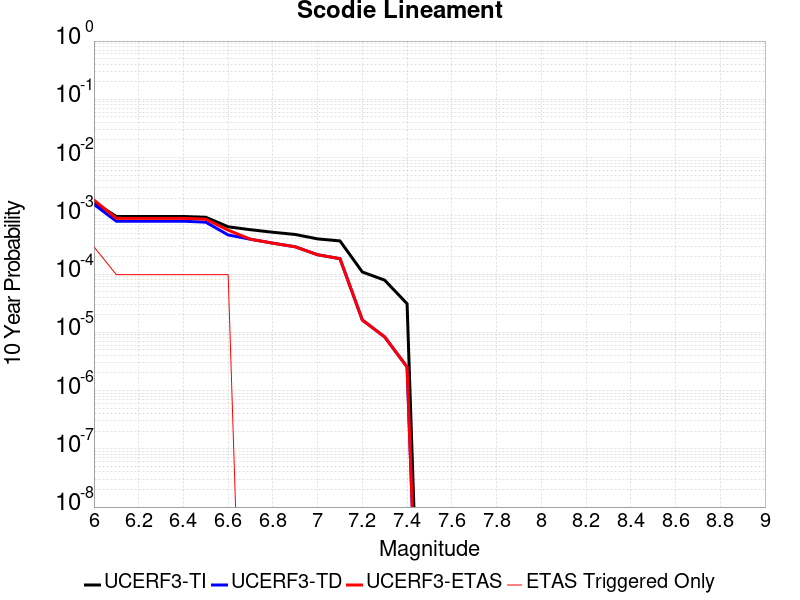 |

| Magnitude | 1 wk TI Prob | 1 wk TD Prob | 1 wk ETAS Prob | 1 wk ETAS/TD Gain | 1 wk ETAS Triggered Only | 1 mo TI Prob | 1 mo TD Prob | 1 mo ETAS Prob | 1 mo ETAS/TD Gain | 1 mo ETAS Triggered Only | 1 yr TI Prob | 1 yr TD Prob | 1 yr ETAS Prob | 1 yr ETAS/TD Gain | 1 yr ETAS Triggered Only | 10 yr TI Prob | 10 yr TD Prob | 10 yr ETAS Prob | 10 yr ETAS/TD Gain | 10 yr ETAS Triggered Only |
|-----|-----|-----|-----|-----|-----|-----|-----|-----|-----|-----|-----|-----|-----|-----|-----|-----|-----|-----|-----|-----|
| 6.0 | 3.2919327E-6 | 3.0133422E-6 | 2.9643968E-4 | 98.37571 | 2.9342723E-4 | 1.4108206E-5 | 1.2914278E-5 | 3.0633772E-4 | 23.720856 | 2.9342723E-4 | 1.7175387E-4 | 1.5722317E-4 | 4.5060428E-4 | 2.866017 | 2.9342723E-4 | 0.0017162118 | 0.0015714309 | 0.0018643971 | 1.1864327 | 2.9342723E-4 |
| 6.1 | 1.8663811E-6 | 1.5490499E-6 | 9.9357974E-5 | 64.141235 | 9.7809076E-5 | 7.998751E-6 | 6.6387715E-6 | 1.044472E-4 | 15.732911 | 9.7809076E-5 | 9.738045E-5 | 8.082454E-5 | 1.786257E-4 | 2.210043 | 9.7809076E-5 | 9.7337784E-4 | 8.080003E-4 | 9.057303E-4 | 1.120953 | 9.7809076E-5 |
| 6.2 | 1.8663811E-6 | 1.5490499E-6 | 9.9357974E-5 | 64.141235 | 9.7809076E-5 | 7.998751E-6 | 6.6387715E-6 | 1.044472E-4 | 15.732911 | 9.7809076E-5 | 9.738045E-5 | 8.082454E-5 | 1.786257E-4 | 2.210043 | 9.7809076E-5 | 9.7337784E-4 | 8.080003E-4 | 9.057303E-4 | 1.120953 | 9.7809076E-5 |
| 6.3 | 1.8663811E-6 | 1.5490499E-6 | 9.9357974E-5 | 64.141235 | 9.7809076E-5 | 7.998751E-6 | 6.6387715E-6 | 1.044472E-4 | 15.732911 | 9.7809076E-5 | 9.738045E-5 | 8.082454E-5 | 1.786257E-4 | 2.210043 | 9.7809076E-5 | 9.7337784E-4 | 8.080003E-4 | 9.057303E-4 | 1.120953 | 9.7809076E-5 |
| 6.4 | 1.8663811E-6 | 1.5490499E-6 | 9.9357974E-5 | 64.141235 | 9.7809076E-5 | 7.998751E-6 | 6.6387715E-6 | 1.044472E-4 | 15.732911 | 9.7809076E-5 | 9.738045E-5 | 8.082454E-5 | 1.786257E-4 | 2.210043 | 9.7809076E-5 | 9.7337784E-4 | 8.080003E-4 | 9.057303E-4 | 1.120953 | 9.7809076E-5 |
| 6.5 | 1.8106311E-6 | 1.4909839E-6 | 9.929991E-5 | 66.60026 | 9.7809076E-5 | 7.759824E-6 | 6.3899183E-6 | 1.0419837E-4 | 16.306683 | 9.7809076E-5 | 9.447177E-5 | 7.7794975E-5 | 1.7559645E-4 | 2.2571695 | 9.7809076E-5 | 9.4431615E-4 | 7.7772606E-4 | 8.754591E-4 | 1.1256651 | 9.7809076E-5 |
| 6.6 | 1.2414679E-6 | 8.997558E-7 | 9.870875E-5 | 109.706154 | 9.7809076E-5 | 5.320566E-6 | 3.856091E-6 | 1.0166479E-4 | 26.364729 | 9.7809076E-5 | 6.477596E-5 | 4.6946985E-5 | 1.4475147E-4 | 3.0832965 | 9.7809076E-5 | 6.475708E-4 | 4.693793E-4 | 5.671425E-4 | 1.2082818 | 9.7809076E-5 |
| 6.7 | 1.1062215E-6 | 7.594311E-7 | 7.594311E-7 | 1.0 | 0.0 | 4.7409408E-6 | 3.2547011E-6 | 3.2547011E-6 | 1.0 | 0.0 | 5.7719422E-5 | 3.9625334E-5 | 3.9625334E-5 | 1.0 | 0.0 | 5.770443E-4 | 3.961897E-4 | 3.961897E-4 | 1.0 | 0.0 |
| 6.8 | 1.0006736E-6 | 6.500397E-7 | 6.500397E-7 | 1.0 | 0.0 | 4.288594E-6 | 2.7858816E-6 | 2.7858816E-6 | 1.0 | 0.0 | 5.221238E-5 | 3.3917644E-5 | 3.3917644E-5 | 1.0 | 0.0 | 5.220012E-4 | 3.3913075E-4 | 3.3913075E-4 | 1.0 | 0.0 |
| 6.9 | 9.167364E-7 | 5.631625E-7 | 5.631625E-7 | 1.0 | 0.0 | 3.9288643E-6 | 2.4135516E-6 | 2.4135516E-6 | 1.0 | 0.0 | 4.7832873E-5 | 2.9384651E-5 | 2.9384651E-5 | 1.0 | 0.0 | 4.782258E-4 | 2.9381333E-4 | 2.9381333E-4 | 1.0 | 0.0 |
| 7.0 | 7.6987664E-7 | 4.113383E-7 | 4.113383E-7 | 1.0 | 0.0 | 3.2994672E-6 | 1.7628774E-6 | 1.7628774E-6 | 1.0 | 0.0 | 4.0170275E-5 | 2.1462862E-5 | 2.1462862E-5 | 1.0 | 0.0 | 4.0163012E-4 | 2.1461173E-4 | 2.1461173E-4 | 1.0 | 0.0 |
| 7.1 | 7.1038727E-7 | 3.5211494E-7 | 3.5211494E-7 | 1.0 | 0.0 | 3.0445133E-6 | 1.5090633E-6 | 1.5090633E-6 | 1.0 | 0.0 | 3.706632E-5 | 1.8372726E-5 | 1.8372726E-5 | 1.0 | 0.0 | 3.7060137E-4 | 1.8371557E-4 | 1.8371557E-4 | 1.0 | 0.0 |
| 7.2 | 2.0799602E-7 | 3.1186854E-8 | 3.1186854E-8 | 1.0 | 0.0 | 8.914113E-7 | 1.3365793E-7 | 1.3365793E-7 | 1.0 | 0.0 | 1.0852878E-5 | 1.6272843E-6 | 1.6272843E-6 | 1.0 | 0.0 | 1.08523476E-4 | 1.627273E-5 | 1.627273E-5 | 1.0 | 0.0 |
| 7.3 | 1.5048182E-7 | 1.5945696E-8 | 1.5945696E-8 | 1.0 | 0.0 | 6.449219E-7 | 6.83387E-8 | 6.83387E-8 | 1.0 | 0.0 | 7.851896E-6 | 8.320234E-7 | 8.320234E-7 | 1.0 | 0.0 | 7.851618E-5 | 8.320206E-6 | 8.320206E-6 | 1.0 | 0.0 |
| 7.4 | 5.9334678E-8 | 4.8683537E-9 | 4.8683537E-9 | 1.0 | 0.0 | 2.5429145E-7 | 2.0864372E-8 | 2.0864372E-8 | 1.0 | 0.0 | 3.095994E-6 | 2.5402372E-7 | 2.5402372E-7 | 1.0 | 0.0 | 3.095951E-5 | 2.5402353E-6 | 2.5402353E-6 | 1.0 | 0.0 |

## Ventura-Pitas Point
*[(top)](#table-of-contents)*

| 1 Week | 1 Month | 1 Year | 10 Year |
|-----|-----|-----|-----|
| 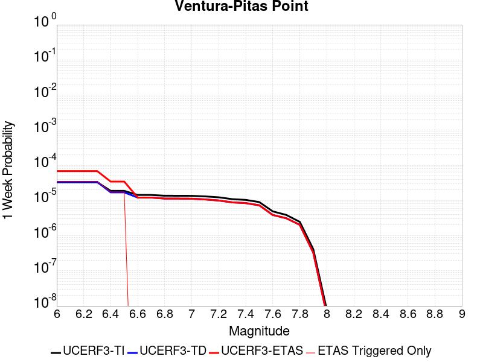 |  | 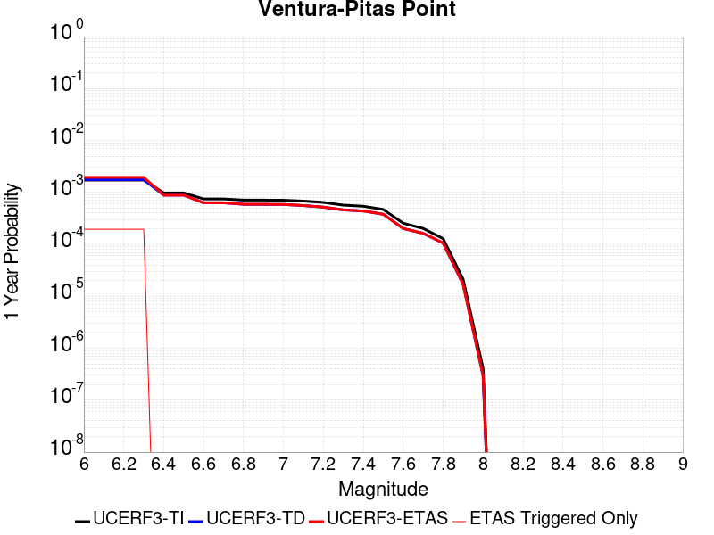 | 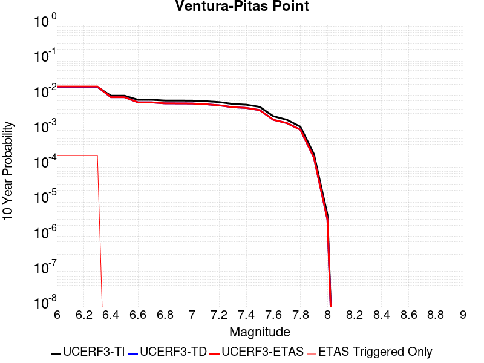 |

| Magnitude | 1 wk TI Prob | 1 wk TD Prob | 1 wk ETAS Prob | 1 wk ETAS/TD Gain | 1 wk ETAS Triggered Only | 1 mo TI Prob | 1 mo TD Prob | 1 mo ETAS Prob | 1 mo ETAS/TD Gain | 1 mo ETAS Triggered Only | 1 yr TI Prob | 1 yr TD Prob | 1 yr ETAS Prob | 1 yr ETAS/TD Gain | 1 yr ETAS Triggered Only | 10 yr TI Prob | 10 yr TD Prob | 10 yr ETAS Prob | 10 yr ETAS/TD Gain | 10 yr ETAS Triggered Only |
|-----|-----|-----|-----|-----|-----|-----|-----|-----|-----|-----|-----|-----|-----|-----|-----|-----|-----|-----|-----|-----|
| 6.0 | 3.3179622E-5 | 3.3735185E-5 | 1.3154096E-4 | 3.8992217 | 9.7809076E-5 | 1.4219063E-4 | 1.445728E-4 | 3.4016266E-4 | 2.3528817 | 1.9561815E-4 | 0.0017297962 | 0.0017590096 | 0.0019542836 | 1.1110137 | 1.9561815E-4 | 0.017163932 | 0.0174764 | 0.0176686 | 1.0109977 | 1.9561815E-4 |
| 6.1 | 3.3179622E-5 | 3.3735185E-5 | 1.3154096E-4 | 3.8992217 | 9.7809076E-5 | 1.4219063E-4 | 1.445728E-4 | 3.4016266E-4 | 2.3528817 | 1.9561815E-4 | 0.0017297962 | 0.0017590096 | 0.0019542836 | 1.1110137 | 1.9561815E-4 | 0.017163932 | 0.0174764 | 0.0176686 | 1.0109977 | 1.9561815E-4 |
| 6.2 | 3.3179622E-5 | 3.3735185E-5 | 1.3154096E-4 | 3.8992217 | 9.7809076E-5 | 1.4219063E-4 | 1.445728E-4 | 3.4016266E-4 | 2.3528817 | 1.9561815E-4 | 0.0017297962 | 0.0017590096 | 0.0019542836 | 1.1110137 | 1.9561815E-4 | 0.017163932 | 0.0174764 | 0.0176686 | 1.0109977 | 1.9561815E-4 |
| 6.3 | 3.3179622E-5 | 3.3735185E-5 | 1.3154096E-4 | 3.8992217 | 9.7809076E-5 | 1.4219063E-4 | 1.445728E-4 | 3.4016266E-4 | 2.3528817 | 1.9561815E-4 | 0.0017297962 | 0.0017590096 | 0.0019542836 | 1.1110137 | 1.9561815E-4 | 0.017163932 | 0.0174764 | 0.0176686 | 1.0109977 | 1.9561815E-4 |
| 6.4 | 1.8754668E-5 | 1.701961E-5 | 1.701961E-5 | 1.0 | 0.0 | 8.037467E-5 | 7.293928E-5 | 7.293928E-5 | 1.0 | 0.0 | 9.781223E-4 | 8.8769704E-4 | 8.8769704E-4 | 1.0 | 0.0 | 0.009738282 | 0.008843848 | 0.008843848 | 1.0 | 0.0 |
| 6.5 | 1.8754668E-5 | 1.701961E-5 | 1.701961E-5 | 1.0 | 0.0 | 8.037467E-5 | 7.293928E-5 | 7.293928E-5 | 1.0 | 0.0 | 9.781223E-4 | 8.8769704E-4 | 8.8769704E-4 | 1.0 | 0.0 | 0.009738282 | 0.008843848 | 0.008843848 | 1.0 | 0.0 |
| 6.6 | 1.4361558E-5 | 1.2122275E-5 | 1.2122275E-5 | 1.0 | 0.0 | 6.154808E-5 | 5.1951585E-5 | 5.1951585E-5 | 1.0 | 0.0 | 7.490902E-4 | 6.3232926E-4 | 6.3232926E-4 | 1.0 | 0.0 | 0.0074657016 | 0.0063055577 | 0.0063055577 | 1.0 | 0.0 |
| 6.7 | 1.4361558E-5 | 1.2122275E-5 | 1.2122275E-5 | 1.0 | 0.0 | 6.154808E-5 | 5.1951585E-5 | 5.1951585E-5 | 1.0 | 0.0 | 7.490902E-4 | 6.3232926E-4 | 6.3232926E-4 | 1.0 | 0.0 | 0.0074657016 | 0.0063055577 | 0.0063055577 | 1.0 | 0.0 |
| 6.8 | 1.3663846E-5 | 1.13444175E-5 | 1.13444175E-5 | 1.0 | 0.0 | 5.8558027E-5 | 4.861804E-5 | 4.861804E-5 | 1.0 | 0.0 | 7.127108E-4 | 5.917658E-4 | 5.917658E-4 | 1.0 | 0.0 | 0.007104293 | 0.005902116 | 0.005902116 | 1.0 | 0.0 |
| 6.9 | 1.3644157E-5 | 1.1322519E-5 | 1.1322519E-5 | 1.0 | 0.0 | 5.8473648E-5 | 4.8524187E-5 | 4.8524187E-5 | 1.0 | 0.0 | 7.116841E-4 | 5.9062376E-4 | 5.9062376E-4 | 1.0 | 0.0 | 0.007094092 | 0.0058907564 | 0.0058907564 | 1.0 | 0.0 |
| 7.0 | 1.3568845E-5 | 1.1242086E-5 | 1.1242086E-5 | 1.0 | 0.0 | 5.8150898E-5 | 4.817949E-5 | 4.817949E-5 | 1.0 | 0.0 | 7.077572E-4 | 5.864293E-4 | 5.864293E-4 | 1.0 | 0.0 | 0.007055073 | 0.0058490336 | 0.0058490336 | 1.0 | 0.0 |
| 7.1 | 1.306572E-5 | 1.072054E-5 | 1.072054E-5 | 1.0 | 0.0 | 5.599474E-5 | 4.5944373E-5 | 4.5944373E-5 | 1.0 | 0.0 | 6.815227E-4 | 5.5923103E-4 | 5.5923103E-4 | 1.0 | 0.0 | 0.0067943637 | 0.0055784425 | 0.0055784425 | 1.0 | 0.0 |
| 7.2 | 1.232604E-5 | 9.995143E-6 | 9.995143E-6 | 1.0 | 0.0 | 5.2824813E-5 | 4.2835632E-5 | 4.2835632E-5 | 1.0 | 0.0 | 6.429523E-4 | 5.214008E-4 | 5.214008E-4 | 1.0 | 0.0 | 0.0064109527 | 0.005201967 | 0.005201967 | 1.0 | 0.0 |
| 7.3 | 1.0917261E-5 | 8.84384E-6 | 8.84384E-6 | 1.0 | 0.0 | 4.678742E-5 | 3.790163E-5 | 3.790163E-5 | 1.0 | 0.0 | 5.69488E-4 | 4.6135622E-4 | 4.6135622E-4 | 1.0 | 0.0 | 0.0056803077 | 0.00460415 | 0.00460415 | 1.0 | 0.0 |
| 7.4 | 1.039959E-5 | 8.423562E-6 | 8.423562E-6 | 1.0 | 0.0 | 4.456891E-5 | 3.610049E-5 | 3.610049E-5 | 1.0 | 0.0 | 5.424914E-4 | 4.3943635E-4 | 4.3943635E-4 | 1.0 | 0.0 | 0.0054116896 | 0.004385836 | 0.004385836 | 1.0 | 0.0 |
| 7.5 | 9.015877E-6 | 7.2975445E-6 | 7.2975445E-6 | 1.0 | 0.0 | 3.86389E-5 | 3.1274823E-5 | 3.1274823E-5 | 1.0 | 0.0 | 4.7032707E-4 | 3.8070587E-4 | 3.8070587E-4 | 1.0 | 0.0 | 0.004693329 | 0.0038006818 | 0.0038006818 | 1.0 | 0.0 |
| 7.6 | 4.900162E-6 | 3.8741155E-6 | 3.8741155E-6 | 1.0 | 0.0 | 2.1000526E-5 | 1.6603248E-5 | 1.6603248E-5 | 1.0 | 0.0 | 2.556514E-4 | 2.0212591E-4 | 2.0212591E-4 | 1.0 | 0.0 | 0.0025535747 | 0.0020194345 | 0.0020194345 | 1.0 | 0.0 |
| 7.7 | 3.8850626E-6 | 3.1267302E-6 | 3.1267302E-6 | 1.0 | 0.0 | 1.6650163E-5 | 1.3400205E-5 | 1.3400205E-5 | 1.0 | 0.0 | 2.0269687E-4 | 1.6313537E-4 | 1.6313537E-4 | 1.0 | 0.0 | 0.002025121 | 0.0016301654 | 0.0016301654 | 1.0 | 0.0 |
| 7.8 | 2.4654719E-6 | 2.029875E-6 | 2.029875E-6 | 1.0 | 0.0 | 1.0566265E-5 | 8.699436E-6 | 8.699436E-6 | 1.0 | 0.0 | 1.2863669E-4 | 1.0591053E-4 | 1.0591053E-4 | 1.0 | 0.0 | 0.0012856225 | 0.0010586053 | 0.0010586053 | 1.0 | 0.0 |
| 7.9 | 4.095894E-7 | 3.2764765E-7 | 3.2764765E-7 | 1.0 | 0.0 | 1.7553821E-6 | 1.4042034E-6 | 1.4042034E-6 | 1.0 | 0.0 | 2.1371567E-5 | 1.7096047E-5 | 1.7096047E-5 | 1.0 | 0.0 | 2.1369511E-4 | 1.7094762E-4 | 1.7094762E-4 | 1.0 | 0.0 |
| 8.0 | 7.791402E-9 | 5.683497E-9 | 5.683497E-9 | 1.0 | 0.0 | 3.3391725E-8 | 2.4357844E-8 | 2.4357844E-8 | 1.0 | 0.0 | 4.0654416E-7 | 2.9655675E-7 | 2.9655675E-7 | 1.0 | 0.0 | 4.065434E-6 | 2.9655655E-6 | 2.9655655E-6 | 1.0 | 0.0 |

## Baker
*[(top)](#table-of-contents)*

| 1 Week | 1 Month | 1 Year | 10 Year |
|-----|-----|-----|-----|
| 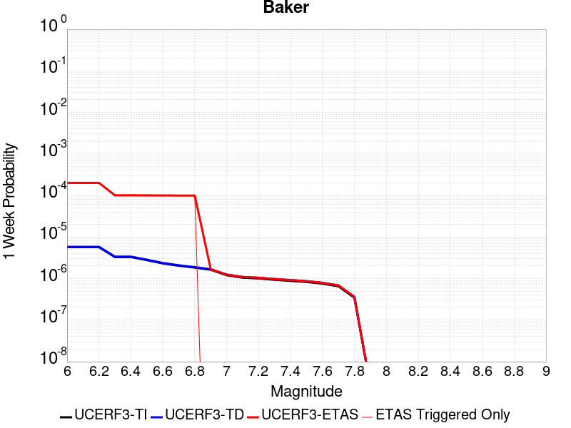 | 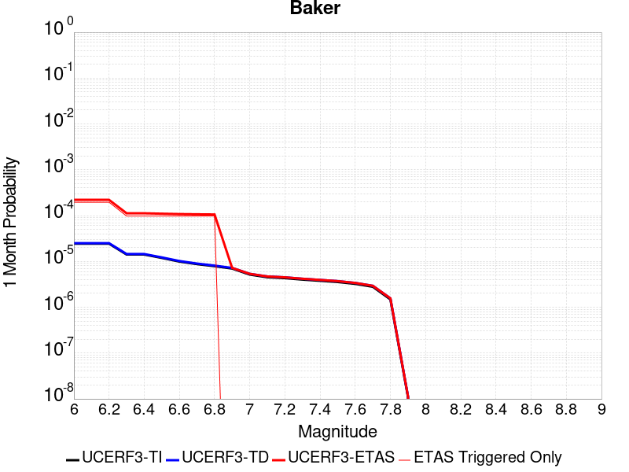 | 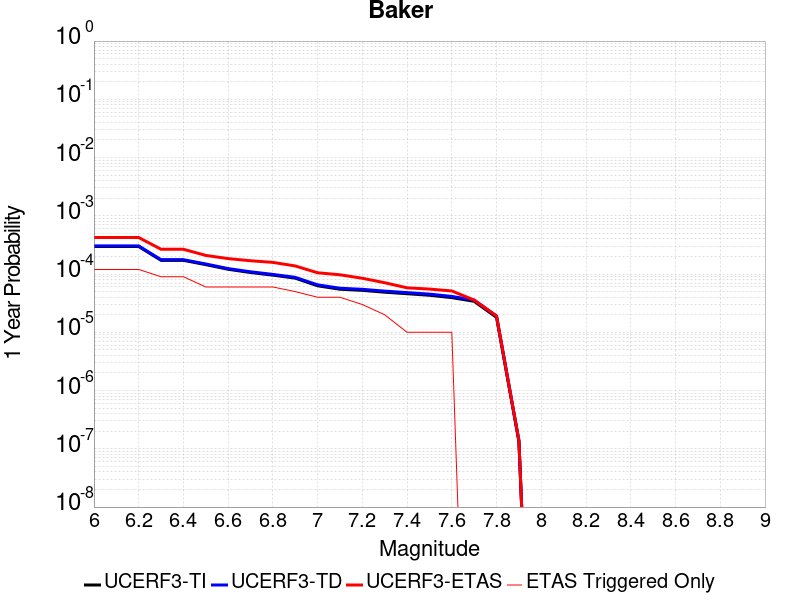 | 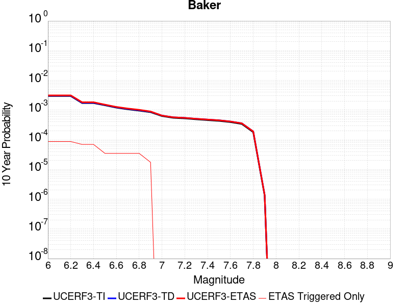 |

| Magnitude | 1 wk TI Prob | 1 wk TD Prob | 1 wk ETAS Prob | 1 wk ETAS/TD Gain | 1 wk ETAS Triggered Only | 1 mo TI Prob | 1 mo TD Prob | 1 mo ETAS Prob | 1 mo ETAS/TD Gain | 1 mo ETAS Triggered Only | 1 yr TI Prob | 1 yr TD Prob | 1 yr ETAS Prob | 1 yr ETAS/TD Gain | 1 yr ETAS Triggered Only | 10 yr TI Prob | 10 yr TD Prob | 10 yr ETAS Prob | 10 yr ETAS/TD Gain | 10 yr ETAS Triggered Only |
|-----|-----|-----|-----|-----|-----|-----|-----|-----|-----|-----|-----|-----|-----|-----|-----|-----|-----|-----|-----|-----|
| 6.0 | 5.695525E-6 | 5.8348373E-6 | 2.0145185E-4 | 34.525703 | 1.9561815E-4 | 2.4409164E-5 | 2.5006228E-5 | 2.2061949E-4 | 8.822582 | 1.9561815E-4 | 2.9714106E-4 | 3.044123E-4 | 4.999709E-4 | 1.6424136 | 1.9561815E-4 | 0.0029674405 | 0.0030403486 | 0.003235372 | 1.0641451 | 1.9561815E-4 |
| 6.1 | 5.695525E-6 | 5.8348373E-6 | 2.0145185E-4 | 34.525703 | 1.9561815E-4 | 2.4409164E-5 | 2.5006228E-5 | 2.2061949E-4 | 8.822582 | 1.9561815E-4 | 2.9714106E-4 | 3.044123E-4 | 4.999709E-4 | 1.6424136 | 1.9561815E-4 | 0.0029674405 | 0.0030403486 | 0.003235372 | 1.0641451 | 1.9561815E-4 |
| 6.2 | 5.695525E-6 | 5.8348373E-6 | 2.0145185E-4 | 34.525703 | 1.9561815E-4 | 2.4409164E-5 | 2.5006228E-5 | 2.2061949E-4 | 8.822582 | 1.9561815E-4 | 2.9714106E-4 | 3.044123E-4 | 4.999709E-4 | 1.6424136 | 1.9561815E-4 | 0.0029674405 | 0.0030403486 | 0.003235372 | 1.0641451 | 1.9561815E-4 |
| 6.3 | 3.2995713E-6 | 3.383667E-6 | 1.0119241E-4 | 29.906137 | 9.7809076E-5 | 1.4140943E-5 | 1.4501353E-5 | 1.1230901E-4 | 7.7447267 | 9.7809076E-5 | 1.7215237E-4 | 1.7654014E-4 | 2.7433195E-4 | 1.5539353 | 9.7809076E-5 | 0.0017201907 | 0.001764046 | 0.0018616825 | 1.055348 | 9.7809076E-5 |
| 6.4 | 3.2995713E-6 | 3.383667E-6 | 1.0119241E-4 | 29.906137 | 9.7809076E-5 | 1.4140943E-5 | 1.4501353E-5 | 1.1230901E-4 | 7.7447267 | 9.7809076E-5 | 1.7215237E-4 | 1.7654014E-4 | 2.7433195E-4 | 1.5539353 | 9.7809076E-5 | 0.0017201907 | 0.001764046 | 0.0018616825 | 1.055348 | 9.7809076E-5 |
| 6.5 | 2.782202E-6 | 2.8558404E-6 | 1.00664634E-4 | 35.24869 | 9.7809076E-5 | 1.1923668E-5 | 1.223926E-5 | 1.1004714E-4 | 8.9913225 | 9.7809076E-5 | 1.4516099E-4 | 1.4900314E-4 | 2.4679763E-4 | 1.6563251 | 9.7809076E-5 | 0.001450662 | 0.0014890651 | 0.0015867285 | 1.065587 | 9.7809076E-5 |
| 6.6 | 2.3163404E-6 | 2.38092E-6 | 1.0018976E-4 | 42.080273 | 9.7809076E-5 | 9.927136E-6 | 1.0203904E-5 | 1.08011984E-4 | 10.585359 | 9.7809076E-5 | 1.20856166E-4 | 1.2422565E-4 | 2.2202257E-4 | 1.7872523 | 9.7809076E-5 | 0.0012079047 | 0.0012415823 | 0.0013392699 | 1.0786799 | 9.7809076E-5 |
| 6.7 | 2.037056E-6 | 2.0965003E-6 | 9.9905374E-5 | 47.6534 | 9.7809076E-5 | 8.7302105E-6 | 8.984972E-6 | 1.06793166E-4 | 11.885755 | 9.7809076E-5 | 1.0628513E-4 | 1.093867E-4 | 2.0718508E-4 | 1.894061 | 9.7809076E-5 | 0.0010623431 | 0.0010933448 | 0.0011910469 | 1.0893608 | 9.7809076E-5 |
| 6.8 | 1.8356744E-6 | 1.8915287E-6 | 9.970042E-5 | 52.70891 | 9.7809076E-5 | 7.867153E-6 | 8.106527E-6 | 1.0591481E-4 | 13.065374 | 9.7809076E-5 | 9.577837E-5 | 9.869264E-5 | 1.9649207E-4 | 1.9909495 | 9.7809076E-5 | 9.57371E-4 | 9.86502E-4 | 0.0010842147 | 1.0990496 | 9.7809076E-5 |
| 6.9 | 1.6310546E-6 | 1.6832072E-6 | 1.6832072E-6 | 1.0 | 0.0 | 6.9902153E-6 | 7.213726E-6 | 7.213726E-6 | 1.0 | 0.0 | 8.510255E-5 | 8.782368E-5 | 8.782368E-5 | 1.0 | 0.0 | 8.5069967E-4 | 8.7790104E-4 | 8.7790104E-4 | 1.0 | 0.0 |
| 7.0 | 1.2058036E-6 | 1.2508665E-6 | 1.2508665E-6 | 1.0 | 0.0 | 5.1677193E-6 | 5.3608455E-6 | 5.3608455E-6 | 1.0 | 0.0 | 6.291517E-5 | 6.5266366E-5 | 6.5266366E-5 | 1.0 | 0.0 | 6.289736E-4 | 6.524743E-4 | 6.524743E-4 | 1.0 | 0.0 |
| 7.1 | 1.052382E-6 | 1.0951609E-6 | 1.0951609E-6 | 1.0 | 0.0 | 4.5102006E-6 | 4.693538E-6 | 4.693538E-6 | 1.0 | 0.0 | 5.491031E-5 | 5.7142337E-5 | 5.7142337E-5 | 1.0 | 0.0 | 5.4896745E-4 | 5.7127734E-4 | 5.7127734E-4 | 1.0 | 0.0 |
| 7.2 | 1.0067454E-6 | 1.0487711E-6 | 1.0487711E-6 | 1.0 | 0.0 | 4.3146156E-6 | 4.4947255E-6 | 4.4947255E-6 | 1.0 | 0.0 | 5.252918E-5 | 5.4721917E-5 | 5.4721917E-5 | 1.0 | 0.0 | 5.251676E-4 | 5.470853E-4 | 5.470853E-4 | 1.0 | 0.0 |
| 7.3 | 9.3596316E-7 | 9.767723E-7 | 9.767723E-7 | 1.0 | 0.0 | 4.0112645E-6 | 4.1861604E-6 | 4.1861604E-6 | 1.0 | 0.0 | 4.8836053E-5 | 5.096532E-5 | 5.096532E-5 | 1.0 | 0.0 | 4.8825322E-4 | 5.095371E-4 | 5.095371E-4 | 1.0 | 0.0 |
| 7.4 | 8.8117395E-7 | 9.2076635E-7 | 9.2076635E-7 | 1.0 | 0.0 | 3.7764542E-6 | 3.9461356E-6 | 3.9461356E-6 | 1.0 | 0.0 | 4.5977362E-5 | 4.8043148E-5 | 4.8043148E-5 | 1.0 | 0.0 | 4.596785E-4 | 4.8032837E-4 | 4.8032837E-4 | 1.0 | 0.0 |
| 7.5 | 8.292386E-7 | 8.6745956E-7 | 8.6745956E-7 | 1.0 | 0.0 | 3.5538749E-6 | 3.7176785E-6 | 3.7176785E-6 | 1.0 | 0.0 | 4.326757E-5 | 4.5261804E-5 | 4.5261804E-5 | 1.0 | 0.0 | 4.3259145E-4 | 4.5252658E-4 | 4.5252658E-4 | 1.0 | 0.0 |
| 7.6 | 7.553842E-7 | 7.9144706E-7 | 7.9144706E-7 | 1.0 | 0.0 | 3.2373566E-6 | 3.3919116E-6 | 3.3919116E-6 | 1.0 | 0.0 | 3.9414106E-5 | 4.129575E-5 | 4.129575E-5 | 1.0 | 0.0 | 3.9407116E-4 | 4.1288146E-4 | 4.1288146E-4 | 1.0 | 0.0 |
| 7.7 | 6.5285366E-7 | 6.852797E-7 | 6.852797E-7 | 1.0 | 0.0 | 2.797941E-6 | 2.9369096E-6 | 2.9369096E-6 | 1.0 | 0.0 | 3.40644E-5 | 3.5756293E-5 | 3.5756293E-5 | 1.0 | 0.0 | 3.405918E-4 | 3.5750607E-4 | 3.5750607E-4 | 1.0 | 0.0 |
| 7.8 | 3.4586725E-7 | 3.6482615E-7 | 3.6482615E-7 | 1.0 | 0.0 | 1.4822873E-6 | 1.5635396E-6 | 1.5635396E-6 | 1.0 | 0.0 | 1.80467E-5 | 1.9035933E-5 | 1.9035933E-5 | 1.0 | 0.0 | 1.8045233E-4 | 1.9034347E-4 | 1.9034347E-4 | 1.0 | 0.0 |
| 7.9 | 2.5591178E-9 | 2.6696718E-9 | 2.6696718E-9 | 1.0 | 0.0 | 1.0967647E-8 | 1.14414505E-8 | 1.14414505E-8 | 1.0 | 0.0 | 1.335311E-7 | 1.3929966E-7 | 1.3929966E-7 | 1.0 | 0.0 | 1.3353102E-6 | 1.3929966E-6 | 1.3929966E-6 | 1.0 | 0.0 |

## Cleghorn Lake
*[(top)](#table-of-contents)*

| 1 Week | 1 Month | 1 Year | 10 Year |
|-----|-----|-----|-----|
| 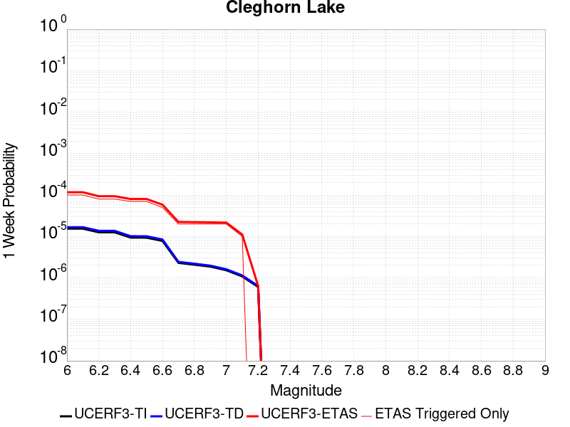 | 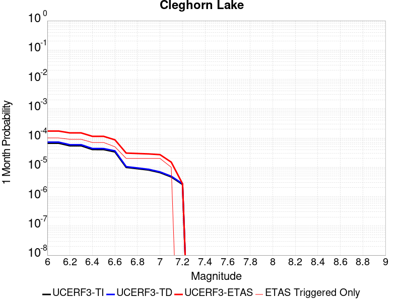 | 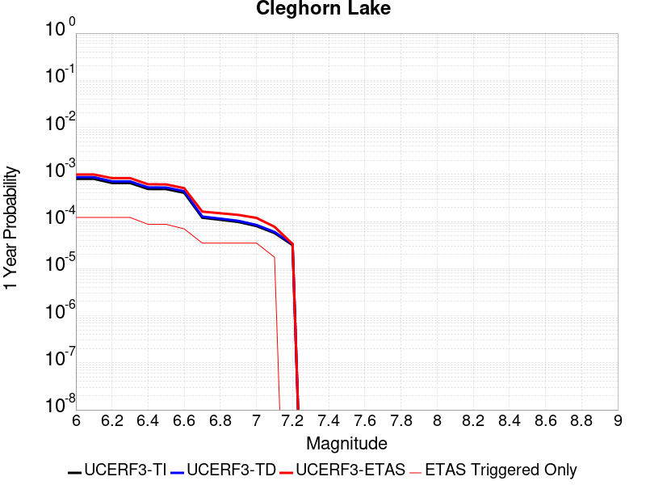 | 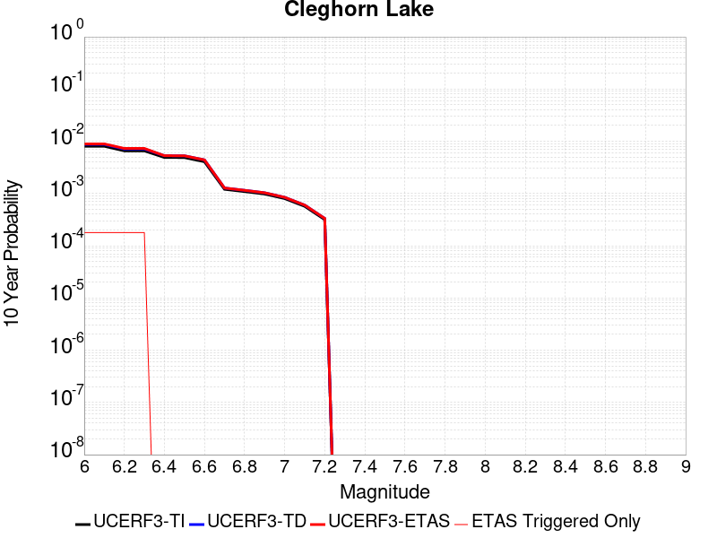 |

| Magnitude | 1 wk TI Prob | 1 wk TD Prob | 1 wk ETAS Prob | 1 wk ETAS/TD Gain | 1 wk ETAS Triggered Only | 1 mo TI Prob | 1 mo TD Prob | 1 mo ETAS Prob | 1 mo ETAS/TD Gain | 1 mo ETAS Triggered Only | 1 yr TI Prob | 1 yr TD Prob | 1 yr ETAS Prob | 1 yr ETAS/TD Gain | 1 yr ETAS Triggered Only | 10 yr TI Prob | 10 yr TD Prob | 10 yr ETAS Prob | 10 yr ETAS/TD Gain | 10 yr ETAS Triggered Only |
|-----|-----|-----|-----|-----|-----|-----|-----|-----|-----|-----|-----|-----|-----|-----|-----|-----|-----|-----|-----|-----|
| 6.0 | 1.5467183E-5 | 1.6794203E-5 | 2.1240907E-4 | 12.64776 | 1.9561815E-4 | 6.6286244E-5 | 7.197348E-5 | 2.6757756E-4 | 3.717724 | 1.9561815E-4 | 8.067362E-4 | 8.759797E-4 | 0.0010714266 | 1.223118 | 1.9561815E-4 | 0.008038137 | 0.008730696 | 0.008924605 | 1.0222101 | 1.9561815E-4 |
| 6.1 | 1.5467183E-5 | 1.6794203E-5 | 2.1240907E-4 | 12.64776 | 1.9561815E-4 | 6.6286244E-5 | 7.197348E-5 | 2.6757756E-4 | 3.717724 | 1.9561815E-4 | 8.067362E-4 | 8.759797E-4 | 0.0010714266 | 1.223118 | 1.9561815E-4 | 0.008038137 | 0.008730696 | 0.008924605 | 1.0222101 | 1.9561815E-4 |
| 6.2 | 1.2624631E-5 | 1.3681544E-5 | 2.0929702E-4 | 15.297763 | 1.9561815E-4 | 5.410444E-5 | 5.863415E-5 | 2.5424082E-4 | 4.336054 | 1.9561815E-4 | 6.585225E-4 | 7.1368564E-4 | 9.0916414E-4 | 1.2739 | 1.9561815E-4 | 0.0065657445 | 0.0071187317 | 0.007312957 | 1.0272838 | 1.9561815E-4 |
| 6.3 | 1.2624631E-5 | 1.3681544E-5 | 2.0929702E-4 | 15.297763 | 1.9561815E-4 | 5.410444E-5 | 5.863415E-5 | 2.5424082E-4 | 4.336054 | 1.9561815E-4 | 6.585225E-4 | 7.1368564E-4 | 9.0916414E-4 | 1.2739 | 1.9561815E-4 | 0.0065657445 | 0.0071187317 | 0.007312957 | 1.0272838 | 1.9561815E-4 |
| 6.4 | 9.417684E-6 | 1.0170118E-5 | 1.079782E-4 | 10.617203 | 9.7809076E-5 | 4.036088E-5 | 4.3585722E-5 | 1.4139054E-4 | 3.2439644 | 9.7809076E-5 | 4.912829E-4 | 5.3056807E-4 | 6.283252E-4 | 1.18425 | 9.7809076E-5 | 0.004901982 | 0.005297049 | 0.00539434 | 1.018367 | 9.7809076E-5 |
| 6.5 | 9.368219E-6 | 1.0117545E-5 | 1.0792563E-4 | 10.667176 | 9.7809076E-5 | 4.014889E-5 | 4.3360415E-5 | 1.4116525E-4 | 3.255625 | 9.7809076E-5 | 4.8870314E-4 | 5.2782625E-4 | 6.255837E-4 | 1.1852076 | 9.7809076E-5 | 0.004876298 | 0.0052697617 | 0.005367055 | 1.0184627 | 9.7809076E-5 |
| 6.6 | 7.803798E-6 | 8.441831E-6 | 1.0625008E-4 | 12.586142 | 9.7809076E-5 | 3.3444423E-5 | 3.6179E-5 | 1.3398453E-4 | 3.7033787 | 9.7809076E-5 | 4.0710976E-4 | 4.4043022E-4 | 5.381962E-4 | 1.2219784 | 9.7809076E-5 | 0.0040636472 | 0.0043994905 | 0.004496869 | 1.0221341 | 9.7809076E-5 |
| 6.7 | 2.3108669E-6 | 2.4438336E-6 | 2.4438336E-6 | 1.0 | 0.0 | 9.903678E-6 | 1.0473532E-5 | 1.0473532E-5 | 1.0 | 0.0 | 1.205706E-4 | 1.2750797E-4 | 1.2750797E-4 | 1.0 | 0.0 | 0.001205052 | 0.0012743667 | 0.0012743667 | 1.0 | 0.0 |
| 6.8 | 2.0882828E-6 | 2.2062823E-6 | 2.2062823E-6 | 1.0 | 0.0 | 8.949753E-6 | 9.455462E-6 | 9.455462E-6 | 1.0 | 0.0 | 1.08957785E-4 | 1.1511434E-4 | 1.1511434E-4 | 1.0 | 0.0 | 0.0010890438 | 0.0011505639 | 0.0011505639 | 1.0 | 0.0 |
| 6.9 | 1.876935E-6 | 1.981051E-6 | 1.981051E-6 | 1.0 | 0.0 | 8.043982E-6 | 8.490192E-6 | 8.490192E-6 | 1.0 | 0.0 | 9.7931086E-5 | 1.03363345E-4 | 1.03363345E-4 | 1.0 | 0.0 | 9.788794E-4 | 0.0010331686 | 0.0010331686 | 1.0 | 0.0 |
| 7.0 | 1.5357559E-6 | 1.6202807E-6 | 1.6202807E-6 | 1.0 | 0.0 | 6.5817944E-6 | 6.9440425E-6 | 6.9440425E-6 | 1.0 | 0.0 | 8.01304E-5 | 8.454057E-5 | 8.454057E-5 | 1.0 | 0.0 | 8.010151E-4 | 8.450965E-4 | 8.450965E-4 | 1.0 | 0.0 |
| 7.1 | 1.0905424E-6 | 1.1497619E-6 | 1.1497619E-6 | 1.0 | 0.0 | 4.6737446E-6 | 4.9275427E-6 | 4.9275427E-6 | 1.0 | 0.0 | 5.6901354E-5 | 5.999128E-5 | 5.999128E-5 | 1.0 | 0.0 | 5.6886784E-4 | 5.997606E-4 | 5.997606E-4 | 1.0 | 0.0 |
| 7.2 | 6.06668E-7 | 6.387277E-7 | 6.387277E-7 | 1.0 | 0.0 | 2.600003E-6 | 2.7374022E-6 | 2.7374022E-6 | 1.0 | 0.0 | 3.1654577E-5 | 3.3327433E-5 | 3.3327433E-5 | 1.0 | 0.0 | 3.1650066E-4 | 3.3323118E-4 | 3.3323118E-4 | 1.0 | 0.0 |

## Red Pass
*[(top)](#table-of-contents)*

| 1 Week | 1 Month | 1 Year | 10 Year |
|-----|-----|-----|-----|
| 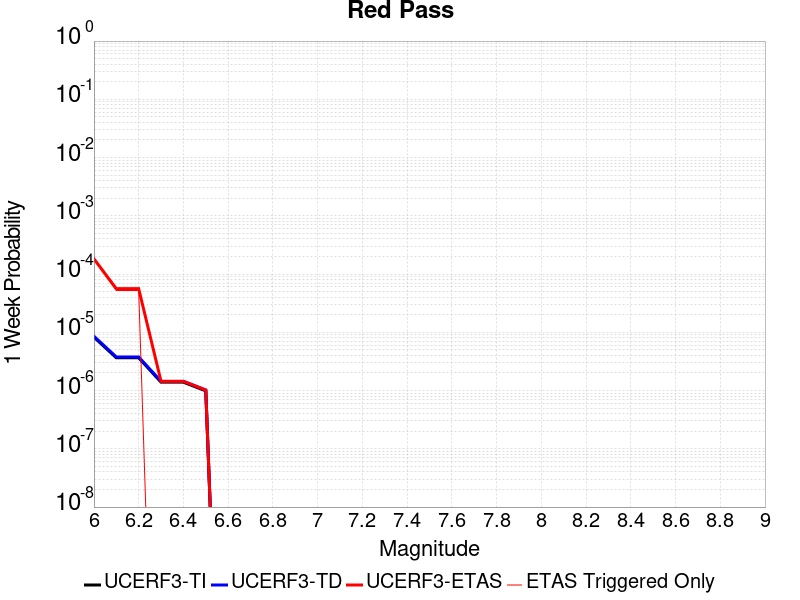 | 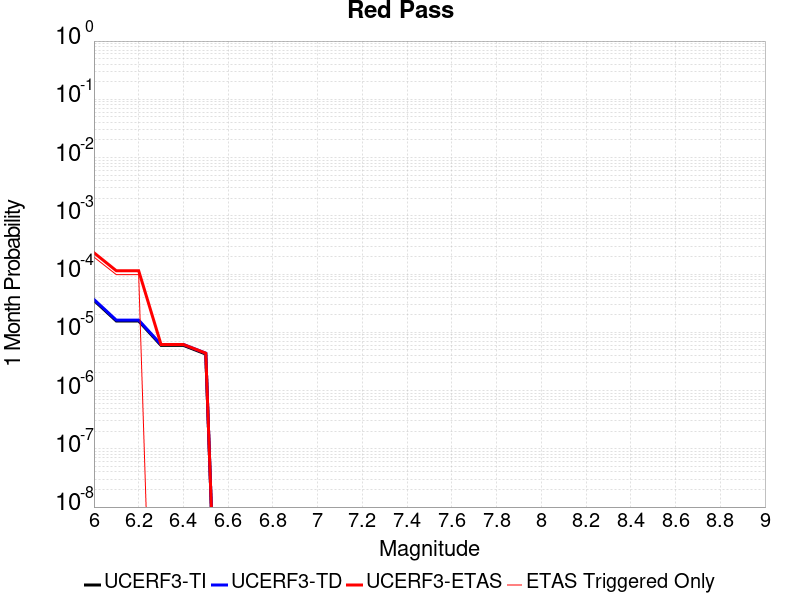 | 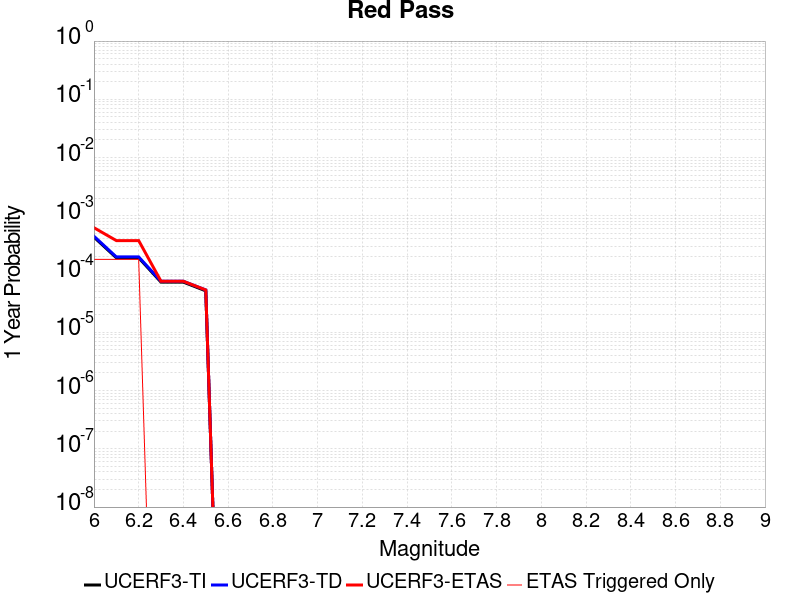 | 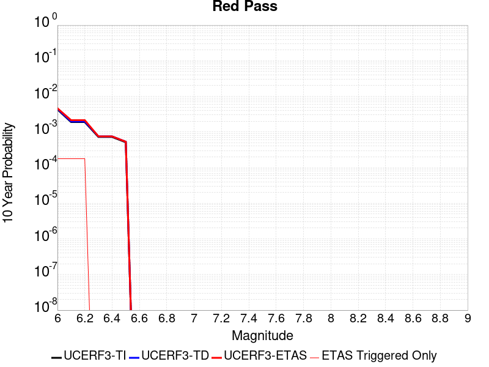 |

| Magnitude | 1 wk TI Prob | 1 wk TD Prob | 1 wk ETAS Prob | 1 wk ETAS/TD Gain | 1 wk ETAS Triggered Only | 1 mo TI Prob | 1 mo TD Prob | 1 mo ETAS Prob | 1 mo ETAS/TD Gain | 1 mo ETAS Triggered Only | 1 yr TI Prob | 1 yr TD Prob | 1 yr ETAS Prob | 1 yr ETAS/TD Gain | 1 yr ETAS Triggered Only | 10 yr TI Prob | 10 yr TD Prob | 10 yr ETAS Prob | 10 yr ETAS/TD Gain | 10 yr ETAS Triggered Only |
|-----|-----|-----|-----|-----|-----|-----|-----|-----|-----|-----|-----|-----|-----|-----|-----|-----|-----|-----|-----|-----|
| 6.0 | 8.258278E-6 | 8.551265E-6 | 2.0416775E-4 | 23.875736 | 1.9561815E-4 | 3.539214E-5 | 3.6647863E-5 | 2.3225886E-4 | 6.337582 | 1.9561815E-4 | 4.308141E-4 | 4.4611428E-4 | 6.4164517E-4 | 1.4382977 | 1.9561815E-4 | 0.0042997985 | 0.004453945 | 0.0046486915 | 1.0437245 | 1.9561815E-4 |
| 6.1 | 3.649988E-6 | 3.7753161E-6 | 1.01584024E-4 | 26.907421 | 9.7809076E-5 | 1.5642712E-5 | 1.6179853E-5 | 1.1398735E-4 | 7.0450177 | 9.7809076E-5 | 1.9043336E-4 | 1.9697666E-4 | 2.9476648E-4 | 1.4964538 | 9.7809076E-5 | 0.0019027026 | 0.001968488 | 0.0020661044 | 1.0495896 | 9.7809076E-5 |
| 6.2 | 3.649988E-6 | 3.7753161E-6 | 1.01584024E-4 | 26.907421 | 9.7809076E-5 | 1.5642712E-5 | 1.6179853E-5 | 1.1398735E-4 | 7.0450177 | 9.7809076E-5 | 1.9043336E-4 | 1.9697666E-4 | 2.9476648E-4 | 1.4964538 | 9.7809076E-5 | 0.0019027026 | 0.001968488 | 0.0020661044 | 1.0495896 | 9.7809076E-5 |
| 6.3 | 1.3924937E-6 | 1.4411166E-6 | 1.4411166E-6 | 1.0 | 0.0 | 5.9678164E-6 | 6.1762075E-6 | 6.1762075E-6 | 1.0 | 0.0 | 7.265574E-5 | 7.519415E-5 | 7.519415E-5 | 1.0 | 0.0 | 7.263199E-4 | 7.518258E-4 | 7.518258E-4 | 1.0 | 0.0 |
| 6.4 | 1.3924937E-6 | 1.4411166E-6 | 1.4411166E-6 | 1.0 | 0.0 | 5.9678164E-6 | 6.1762075E-6 | 6.1762075E-6 | 1.0 | 0.0 | 7.265574E-5 | 7.519415E-5 | 7.519415E-5 | 1.0 | 0.0 | 7.263199E-4 | 7.518258E-4 | 7.518258E-4 | 1.0 | 0.0 |
| 6.5 | 9.876812E-7 | 1.0221912E-6 | 1.0221912E-6 | 1.0 | 0.0 | 4.2329125E-6 | 4.3808195E-6 | 4.3808195E-6 | 1.0 | 0.0 | 5.153449E-5 | 5.3336476E-5 | 5.3336476E-5 | 1.0 | 0.0 | 5.1522546E-4 | 5.333648E-4 | 5.333648E-4 | 1.0 | 0.0 |

## Independence rev 2011
*[(top)](#table-of-contents)*

| 1 Week | 1 Month | 1 Year | 10 Year |
|-----|-----|-----|-----|
| 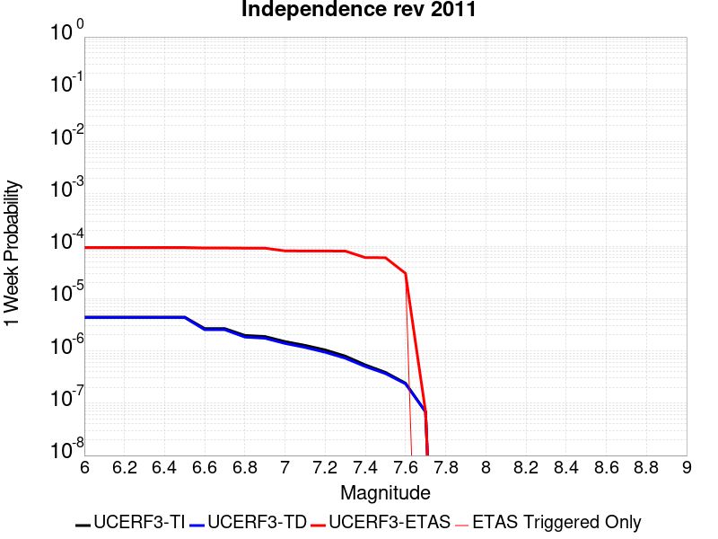 | 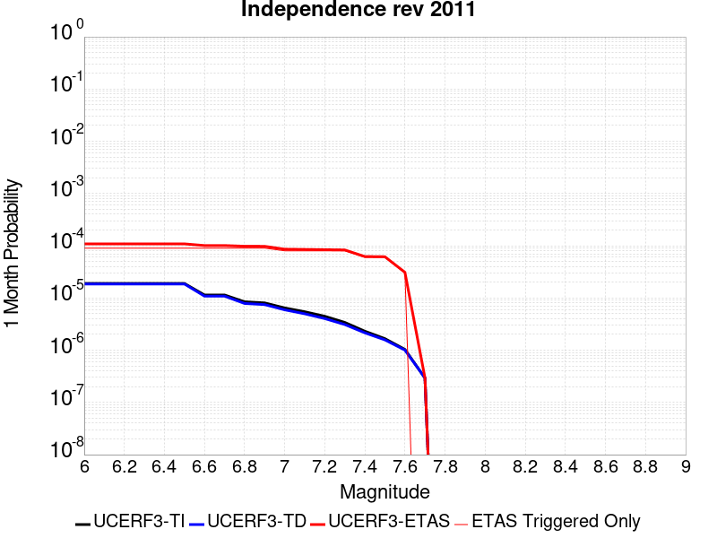 | 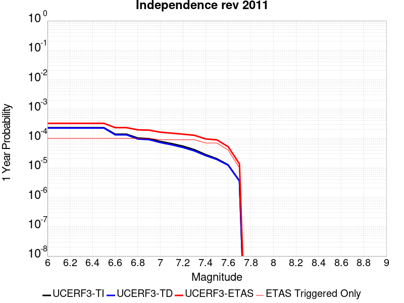 | 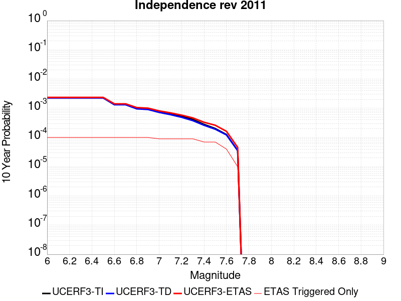 |

| Magnitude | 1 wk TI Prob | 1 wk TD Prob | 1 wk ETAS Prob | 1 wk ETAS/TD Gain | 1 wk ETAS Triggered Only | 1 mo TI Prob | 1 mo TD Prob | 1 mo ETAS Prob | 1 mo ETAS/TD Gain | 1 mo ETAS Triggered Only | 1 yr TI Prob | 1 yr TD Prob | 1 yr ETAS Prob | 1 yr ETAS/TD Gain | 1 yr ETAS Triggered Only | 10 yr TI Prob | 10 yr TD Prob | 10 yr ETAS Prob | 10 yr ETAS/TD Gain | 10 yr ETAS Triggered Only |
|-----|-----|-----|-----|-----|-----|-----|-----|-----|-----|-----|-----|-----|-----|-----|-----|-----|-----|-----|-----|-----|
| 6.0 | 4.422171E-6 | 4.326227E-6 | 1.9994353E-4 | 46.216606 | 1.9561815E-4 | 1.8952025E-5 | 1.8540857E-5 | 2.1415539E-4 | 11.550457 | 1.9561815E-4 | 2.3071647E-4 | 2.2571455E-4 | 4.2128854E-4 | 1.866466 | 1.9561815E-4 | 0.0023047708 | 0.0022551466 | 0.0024503234 | 1.0865474 | 1.9561815E-4 |
| 6.1 | 4.422171E-6 | 4.326227E-6 | 1.9994353E-4 | 46.216606 | 1.9561815E-4 | 1.8952025E-5 | 1.8540857E-5 | 2.1415539E-4 | 11.550457 | 1.9561815E-4 | 2.3071647E-4 | 2.2571455E-4 | 4.2128854E-4 | 1.866466 | 1.9561815E-4 | 0.0023047708 | 0.0022551466 | 0.0024503234 | 1.0865474 | 1.9561815E-4 |
| 6.2 | 4.422171E-6 | 4.326227E-6 | 1.9994353E-4 | 46.216606 | 1.9561815E-4 | 1.8952025E-5 | 1.8540857E-5 | 2.1415539E-4 | 11.550457 | 1.9561815E-4 | 2.3071647E-4 | 2.2571455E-4 | 4.2128854E-4 | 1.866466 | 1.9561815E-4 | 0.0023047708 | 0.0022551466 | 0.0024503234 | 1.0865474 | 1.9561815E-4 |
| 6.3 | 4.422171E-6 | 4.326227E-6 | 1.9994353E-4 | 46.216606 | 1.9561815E-4 | 1.8952025E-5 | 1.8540857E-5 | 2.1415539E-4 | 11.550457 | 1.9561815E-4 | 2.3071647E-4 | 2.2571455E-4 | 4.2128854E-4 | 1.866466 | 1.9561815E-4 | 0.0023047708 | 0.0022551466 | 0.0024503234 | 1.0865474 | 1.9561815E-4 |
| 6.4 | 4.422171E-6 | 4.326227E-6 | 1.9994353E-4 | 46.216606 | 1.9561815E-4 | 1.8952025E-5 | 1.8540857E-5 | 2.1415539E-4 | 11.550457 | 1.9561815E-4 | 2.3071647E-4 | 2.2571455E-4 | 4.2128854E-4 | 1.866466 | 1.9561815E-4 | 0.0023047708 | 0.0022551466 | 0.0024503234 | 1.0865474 | 1.9561815E-4 |
| 6.5 | 4.422171E-6 | 4.326227E-6 | 1.9994353E-4 | 46.216606 | 1.9561815E-4 | 1.8952025E-5 | 1.8540857E-5 | 2.1415539E-4 | 11.550457 | 1.9561815E-4 | 2.3071647E-4 | 2.2571455E-4 | 4.2128854E-4 | 1.866466 | 1.9561815E-4 | 0.0023047708 | 0.0022551466 | 0.0024503234 | 1.0865474 | 1.9561815E-4 |
| 6.6 | 2.663744E-6 | 2.5319862E-6 | 1.9814965E-4 | 78.25858 | 1.9561815E-4 | 1.1415996E-5 | 1.0851327E-5 | 2.0646736E-4 | 19.026922 | 1.9561815E-4 | 1.3898089E-4 | 1.3210738E-4 | 3.276997E-4 | 2.4805555 | 1.9561815E-4 | 0.0013889399 | 0.0013203367 | 0.0015156966 | 1.1479622 | 1.9561815E-4 |
| 6.7 | 2.663744E-6 | 2.5319862E-6 | 1.9814965E-4 | 78.25858 | 1.9561815E-4 | 1.1415996E-5 | 1.0851327E-5 | 2.0646736E-4 | 19.026922 | 1.9561815E-4 | 1.3898089E-4 | 1.3210738E-4 | 3.276997E-4 | 2.4805555 | 1.9561815E-4 | 0.0013889399 | 0.0013203367 | 0.0015156966 | 1.1479622 | 1.9561815E-4 |
| 6.8 | 1.9716529E-6 | 1.8322585E-6 | 1.9745005E-4 | 107.763214 | 1.9561815E-4 | 8.449913E-6 | 7.852514E-6 | 2.0346913E-4 | 25.911339 | 1.9561815E-4 | 1.0287284E-4 | 9.5600284E-5 | 2.9119974E-4 | 3.0460134 | 1.9561815E-4 | 0.0010282523 | 9.556045E-4 | 0.0011510357 | 1.2045106 | 1.9561815E-4 |
| 6.9 | 1.8788617E-6 | 1.7429993E-6 | 1.9736082E-4 | 113.230576 | 1.9561815E-4 | 8.0522395E-6 | 7.4699765E-6 | 2.0308667E-4 | 27.187057 | 1.9561815E-4 | 9.80316E-5 | 9.0943286E-5 | 2.8654365E-4 | 3.150795 | 1.9561815E-4 | 9.798837E-4 | 9.0907275E-4 | 0.0011045131 | 1.2149887 | 1.9561815E-4 |
| 7.0 | 1.5045488E-6 | 1.3849503E-6 | 1.9700284E-4 | 142.2454 | 1.9561815E-4 | 6.44805E-6 | 5.9354884E-6 | 2.0155248E-4 | 33.957184 | 1.9561815E-4 | 7.8502184E-5 | 7.226223E-5 | 2.6786624E-4 | 3.7068639 | 1.9561815E-4 | 7.8474457E-4 | 7.2239246E-4 | 9.1786927E-4 | 1.2705965 | 1.9561815E-4 |
| 7.1 | 1.272341E-6 | 1.1625096E-6 | 1.9678044E-4 | 169.27208 | 1.9561815E-4 | 5.4528787E-6 | 4.982175E-6 | 2.0059936E-4 | 40.26341 | 1.9561815E-4 | 6.6386776E-5 | 6.0656326E-5 | 2.562626E-4 | 4.224829 | 1.9561815E-4 | 6.636695E-4 | 6.064009E-4 | 8.019004E-4 | 1.3223932 | 1.9561815E-4 |
| 7.2 | 1.0416892E-6 | 9.4098806E-7 | 1.9655896E-4 | 208.88571 | 1.9561815E-4 | 4.464375E-6 | 4.0328E-6 | 1.9965017E-4 | 49.506588 | 1.9561815E-4 | 5.4352407E-5 | 4.909825E-5 | 2.447068E-4 | 4.9840226 | 1.9561815E-4 | 5.4339116E-4 | 4.9087586E-4 | 6.86398E-4 | 1.3983128 | 1.9561815E-4 |
| 7.3 | 7.9450155E-7 | 7.235002E-7 | 1.9634151E-4 | 271.3773 | 1.9561815E-4 | 3.4050022E-6 | 3.1007114E-6 | 1.9871826E-4 | 64.08796 | 1.9561815E-4 | 4.1455114E-5 | 3.775052E-5 | 2.333613E-4 | 6.181671 | 1.9561815E-4 | 4.144738E-4 | 3.7744216E-4 | 5.729865E-4 | 1.5180776 | 1.9561815E-4 |
| 7.4 | 5.3893444E-7 | 5.019512E-7 | 9.831098E-5 | 195.85764 | 9.7809076E-5 | 2.309717E-6 | 2.1512178E-6 | 9.996008E-5 | 46.466743 | 9.7809076E-5 | 2.8120441E-5 | 2.6190766E-5 | 1.2399728E-4 | 4.7343893 | 9.7809076E-5 | 2.8116882E-4 | 2.6187726E-4 | 3.596607E-4 | 1.3733943 | 9.7809076E-5 |
| 7.5 | 3.8852085E-7 | 3.682554E-7 | 9.81773E-5 | 266.6011 | 9.7809076E-5 | 1.6650882E-6 | 1.5782365E-6 | 9.938716E-5 | 62.973553 | 9.7809076E-5 | 2.027226E-5 | 1.9214862E-5 | 1.1702206E-4 | 6.0901847 | 9.7809076E-5 | 2.0270412E-4 | 1.9213221E-4 | 2.899225E-4 | 1.508974 | 9.7809076E-5 |
| 7.6 | 2.414929E-7 | 2.345755E-7 | 2.345755E-7 | 1.0 | 0.0 | 1.0349692E-6 | 1.0053232E-6 | 1.0053232E-6 | 1.0 | 0.0 | 1.2600677E-5 | 1.2239742E-5 | 1.2239742E-5 | 1.0 | 0.0 | 1.2599962E-4 | 1.223908E-4 | 1.223908E-4 | 1.0 | 0.0 |
| 7.7 | 6.8298014E-8 | 6.85897E-8 | 6.85897E-8 | 1.0 | 0.0 | 2.9270575E-7 | 2.9395582E-7 | 2.9395582E-7 | 1.0 | 0.0 | 3.5636867E-6 | 3.5789067E-6 | 3.5789067E-6 | 1.0 | 0.0 | 3.5636294E-5 | 3.5788536E-5 | 3.5788536E-5 | 1.0 | 0.0 |

## Shoreline
*[(top)](#table-of-contents)*

| 1 Week | 1 Month | 1 Year | 10 Year |
|-----|-----|-----|-----|
| 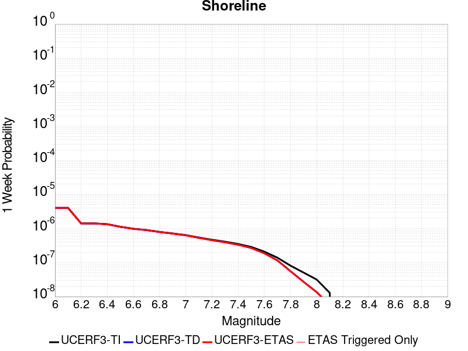 | 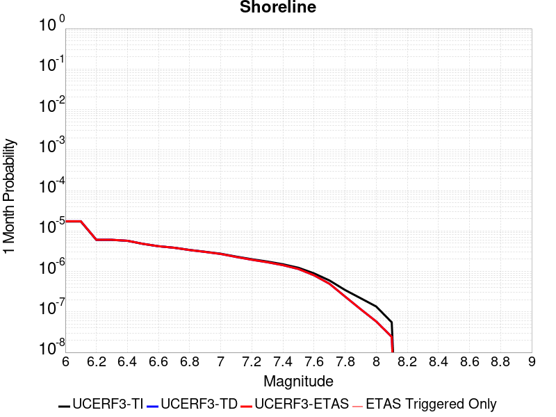 | 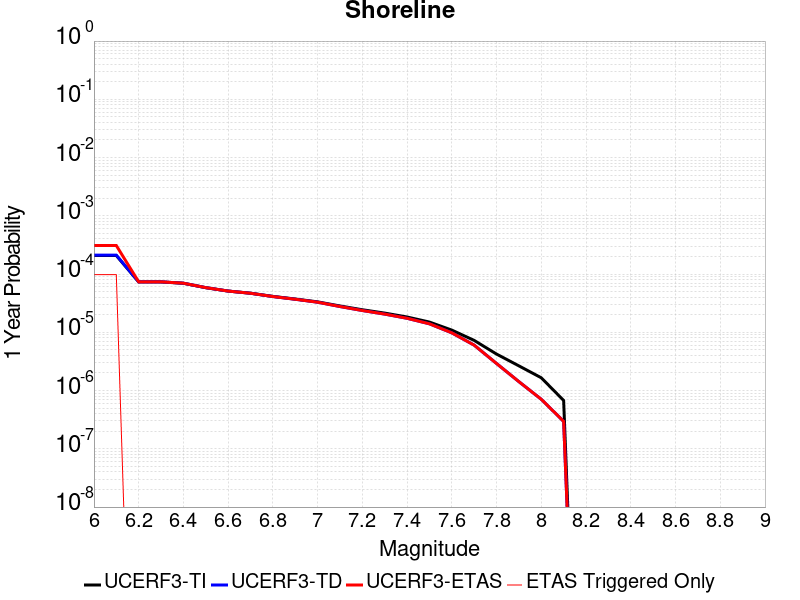 | 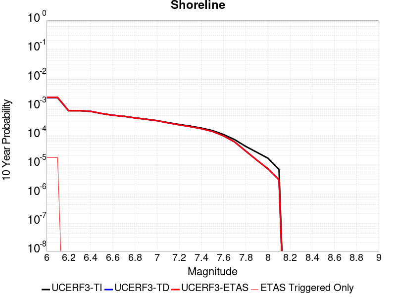 |

| Magnitude | 1 wk TI Prob | 1 wk TD Prob | 1 wk ETAS Prob | 1 wk ETAS/TD Gain | 1 wk ETAS Triggered Only | 1 mo TI Prob | 1 mo TD Prob | 1 mo ETAS Prob | 1 mo ETAS/TD Gain | 1 mo ETAS Triggered Only | 1 yr TI Prob | 1 yr TD Prob | 1 yr ETAS Prob | 1 yr ETAS/TD Gain | 1 yr ETAS Triggered Only | 10 yr TI Prob | 10 yr TD Prob | 10 yr ETAS Prob | 10 yr ETAS/TD Gain | 10 yr ETAS Triggered Only |
|-----|-----|-----|-----|-----|-----|-----|-----|-----|-----|-----|-----|-----|-----|-----|-----|-----|-----|-----|-----|-----|
| 6.0 | 3.9888673E-6 | 4.047929E-6 | 4.047929E-6 | 1.0 | 0.0 | 1.7095033E-5 | 1.7348184E-5 | 1.7348184E-5 | 1.0 | 0.0 | 2.0811215E-4 | 2.1119925E-4 | 3.0898768E-4 | 1.463015 | 9.7809076E-5 | 0.0020791737 | 0.002110534 | 0.0022081367 | 1.0462455 | 9.7809076E-5 |
| 6.1 | 3.9888673E-6 | 4.047929E-6 | 4.047929E-6 | 1.0 | 0.0 | 1.7095033E-5 | 1.7348184E-5 | 1.7348184E-5 | 1.0 | 0.0 | 2.0811215E-4 | 2.1119925E-4 | 3.0898768E-4 | 1.463015 | 9.7809076E-5 | 0.0020791737 | 0.002110534 | 0.0022081367 | 1.0462455 | 9.7809076E-5 |
| 6.2 | 1.4039653E-6 | 1.4100891E-6 | 1.4100891E-6 | 1.0 | 0.0 | 6.0169805E-6 | 6.0432253E-6 | 6.0432253E-6 | 1.0 | 0.0 | 7.325427E-5 | 7.357384E-5 | 7.357384E-5 | 1.0 | 0.0 | 7.3230127E-4 | 7.355009E-4 | 7.355009E-4 | 1.0 | 0.0 |
| 6.3 | 1.4039653E-6 | 1.4100891E-6 | 1.4100891E-6 | 1.0 | 0.0 | 6.0169805E-6 | 6.0432253E-6 | 6.0432253E-6 | 1.0 | 0.0 | 7.325427E-5 | 7.357384E-5 | 7.357384E-5 | 1.0 | 0.0 | 7.3230127E-4 | 7.355009E-4 | 7.355009E-4 | 1.0 | 0.0 |
| 6.4 | 1.3314152E-6 | 1.3361605E-6 | 1.3361605E-6 | 1.0 | 0.0 | 5.7060524E-6 | 5.7263896E-6 | 5.7263896E-6 | 1.0 | 0.0 | 6.946897E-5 | 6.971662E-5 | 6.971662E-5 | 1.0 | 0.0 | 6.9447263E-4 | 6.9695286E-4 | 6.9695286E-4 | 1.0 | 0.0 |
| 6.5 | 1.1187026E-6 | 1.120364E-6 | 1.120364E-6 | 1.0 | 0.0 | 4.794431E-6 | 4.8015513E-6 | 4.8015513E-6 | 1.0 | 0.0 | 5.8370628E-5 | 5.8457343E-5 | 5.8457343E-5 | 1.0 | 0.0 | 5.83553E-4 | 5.844222E-4 | 5.844222E-4 | 1.0 | 0.0 |
| 6.6 | 9.793089E-7 | 9.784919E-7 | 9.784919E-7 | 1.0 | 0.0 | 4.1970316E-6 | 4.1935305E-6 | 4.1935305E-6 | 1.0 | 0.0 | 5.1097657E-5 | 5.105505E-5 | 5.105505E-5 | 1.0 | 0.0 | 5.108591E-4 | 5.1043445E-4 | 5.1043445E-4 | 1.0 | 0.0 |
| 6.7 | 8.995986E-7 | 8.9728E-7 | 8.9728E-7 | 1.0 | 0.0 | 3.8554167E-6 | 3.84548E-6 | 3.84548E-6 | 1.0 | 0.0 | 4.693869E-5 | 4.6817724E-5 | 4.6817724E-5 | 1.0 | 0.0 | 4.6928777E-4 | 4.6807955E-4 | 4.6807955E-4 | 1.0 | 0.0 |
| 6.8 | 7.931612E-7 | 7.8804027E-7 | 7.8804027E-7 | 1.0 | 0.0 | 3.3992578E-6 | 3.377311E-6 | 3.377311E-6 | 1.0 | 0.0 | 4.1385178E-5 | 4.1117994E-5 | 4.1117994E-5 | 1.0 | 0.0 | 4.1377472E-4 | 4.1110438E-4 | 4.1110438E-4 | 1.0 | 0.0 |
| 6.9 | 7.1465956E-7 | 7.078006E-7 | 7.078006E-7 | 1.0 | 0.0 | 3.062823E-6 | 3.0334277E-6 | 3.0334277E-6 | 1.0 | 0.0 | 3.7289232E-5 | 3.6931357E-5 | 3.6931357E-5 | 1.0 | 0.0 | 3.7282976E-4 | 3.6925258E-4 | 3.6925258E-4 | 1.0 | 0.0 |
| 7.0 | 6.389046E-7 | 6.299458E-7 | 6.299458E-7 | 1.0 | 0.0 | 2.7381598E-6 | 2.699765E-6 | 2.699765E-6 | 1.0 | 0.0 | 3.3336586E-5 | 3.2869146E-5 | 3.2869146E-5 | 1.0 | 0.0 | 3.3331584E-4 | 3.2864307E-4 | 3.2864307E-4 | 1.0 | 0.0 |
| 7.1 | 5.4300875E-7 | 5.3111313E-7 | 5.3111313E-7 | 1.0 | 0.0 | 2.3271782E-6 | 2.276197E-6 | 2.276197E-6 | 1.0 | 0.0 | 2.8333026E-5 | 2.7712347E-5 | 2.7712347E-5 | 1.0 | 0.0 | 2.8329415E-4 | 2.77089E-4 | 2.77089E-4 | 1.0 | 0.0 |
| 7.2 | 4.6768855E-7 | 4.5348952E-7 | 4.5348952E-7 | 1.0 | 0.0 | 2.0043778E-6 | 1.9435251E-6 | 1.9435251E-6 | 1.0 | 0.0 | 2.4403027E-5 | 2.3662162E-5 | 2.3662162E-5 | 1.0 | 0.0 | 2.4400349E-4 | 2.3659648E-4 | 2.3659648E-4 | 1.0 | 0.0 |
| 7.3 | 4.0966103E-7 | 3.9385662E-7 | 3.9385662E-7 | 1.0 | 0.0 | 1.7556889E-6 | 1.6879559E-6 | 1.6879559E-6 | 1.0 | 0.0 | 2.1375303E-5 | 2.055067E-5 | 2.055067E-5 | 1.0 | 0.0 | 2.1373246E-4 | 2.0548773E-4 | 2.0548773E-4 | 1.0 | 0.0 |
| 7.4 | 3.5105785E-7 | 3.3363975E-7 | 3.3363975E-7 | 1.0 | 0.0 | 1.5045327E-6 | 1.4298838E-6 | 1.4298838E-6 | 1.0 | 0.0 | 1.8317533E-5 | 1.7408696E-5 | 1.7408696E-5 | 1.0 | 0.0 | 1.8316023E-4 | 1.7407336E-4 | 1.7407336E-4 | 1.0 | 0.0 |
| 7.5 | 2.8737534E-7 | 2.6820038E-7 | 2.6820038E-7 | 1.0 | 0.0 | 1.2316079E-6 | 1.1494297E-6 | 1.1494297E-6 | 1.0 | 0.0 | 1.4994724E-5 | 1.3994217E-5 | 1.3994217E-5 | 1.0 | 0.0 | 1.4993713E-4 | 1.3993339E-4 | 1.3993339E-4 | 1.0 | 0.0 |
| 7.6 | 2.0924051E-7 | 1.8778988E-7 | 1.8778988E-7 | 1.0 | 0.0 | 8.967448E-7 | 8.048135E-7 | 8.048135E-7 | 1.0 | 0.0 | 1.0917813E-5 | 9.79856E-6 | 9.79856E-6 | 1.0 | 0.0 | 1.0917276E-4 | 9.798129E-5 | 9.798129E-5 | 1.0 | 0.0 |
| 7.7 | 1.392265E-7 | 1.15433906E-7 | 1.15433906E-7 | 1.0 | 0.0 | 5.9668486E-7 | 4.9471663E-7 | 4.9471663E-7 | 1.0 | 0.0 | 7.2646135E-6 | 6.023158E-6 | 6.023158E-6 | 1.0 | 0.0 | 7.2643765E-5 | 6.0229955E-5 | 6.0229955E-5 | 1.0 | 0.0 |
| 7.8 | 8.1080074E-8 | 5.586722E-8 | 5.586722E-8 | 1.0 | 0.0 | 3.4748598E-7 | 2.394309E-7 | 2.394309E-7 | 1.0 | 0.0 | 4.2306337E-6 | 2.9150672E-6 | 2.9150672E-6 | 1.0 | 0.0 | 4.230553E-5 | 2.9150291E-5 | 2.9150291E-5 | 1.0 | 0.0 |
| 7.9 | 5.0859036E-8 | 2.7244445E-8 | 2.7244445E-8 | 1.0 | 0.0 | 2.1796728E-7 | 1.16761896E-7 | 1.16761896E-7 | 1.0 | 0.0 | 2.6537484E-6 | 1.4215751E-6 | 1.4215751E-6 | 1.0 | 0.0 | 2.6537167E-5 | 1.4215661E-5 | 1.4215661E-5 | 1.0 | 0.0 |
| 8.0 | 3.1760536E-8 | 1.3577206E-8 | 1.3577206E-8 | 1.0 | 0.0 | 1.3611657E-7 | 5.8188025E-8 | 5.8188025E-8 | 1.0 | 0.0 | 1.6572179E-6 | 7.0843896E-7 | 7.0843896E-7 | 1.0 | 0.0 | 1.6572056E-5 | 7.084367E-6 | 7.084367E-6 | 1.0 | 0.0 |
| 8.1 | 1.2947896E-8 | 5.6628693E-9 | 5.6628693E-9 | 1.0 | 0.0 | 5.5490982E-8 | 2.426944E-8 | 2.426944E-8 | 1.0 | 0.0 | 6.756025E-7 | 2.954804E-7 | 2.954804E-7 | 1.0 | 0.0 | 6.7560045E-6 | 2.9548003E-6 | 2.9548003E-6 | 1.0 | 0.0 |

## Kern Canyon (Lake Isabella) 2011
*[(top)](#table-of-contents)*

| 1 Week | 1 Month | 1 Year | 10 Year |
|-----|-----|-----|-----|
| 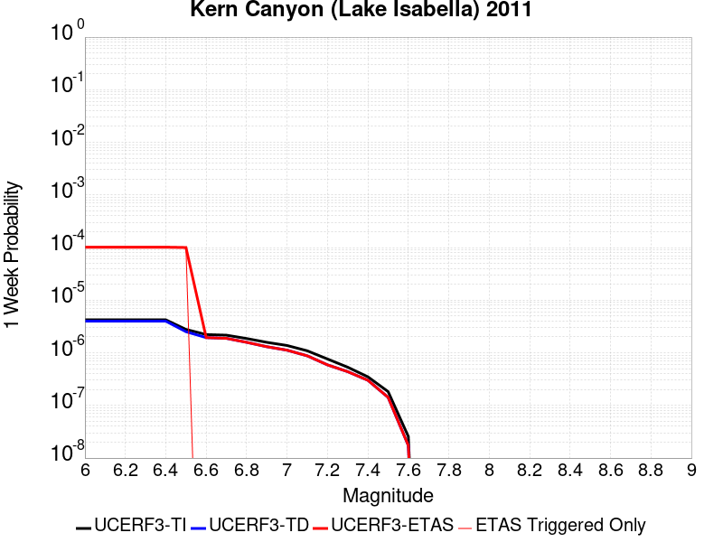 | 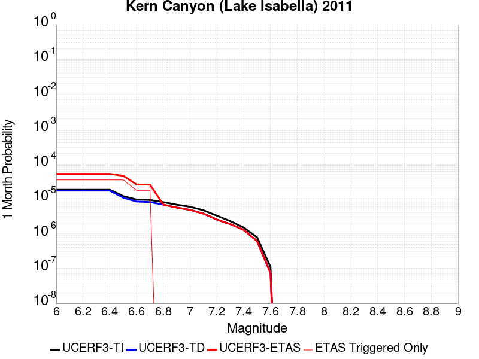 |  | 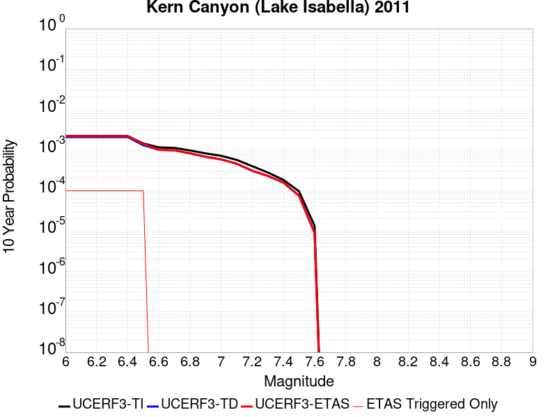 |

| Magnitude | 1 wk TI Prob | 1 wk TD Prob | 1 wk ETAS Prob | 1 wk ETAS/TD Gain | 1 wk ETAS Triggered Only | 1 mo TI Prob | 1 mo TD Prob | 1 mo ETAS Prob | 1 mo ETAS/TD Gain | 1 mo ETAS Triggered Only | 1 yr TI Prob | 1 yr TD Prob | 1 yr ETAS Prob | 1 yr ETAS/TD Gain | 1 yr ETAS Triggered Only | 10 yr TI Prob | 10 yr TD Prob | 10 yr ETAS Prob | 10 yr ETAS/TD Gain | 10 yr ETAS Triggered Only |
|-----|-----|-----|-----|-----|-----|-----|-----|-----|-----|-----|-----|-----|-----|-----|-----|-----|-----|-----|-----|-----|
| 6.0 | 4.2387383E-6 | 4.001639E-6 | 1.0181032E-4 | 25.442158 | 9.7809076E-5 | 1.8165894E-5 | 1.7149778E-5 | 1.14957176E-4 | 6.7031293 | 9.7809076E-5 | 2.2114732E-4 | 2.087804E-4 | 3.0656907E-4 | 1.4683805 | 9.7809076E-5 | 0.0022092736 | 0.0020860266 | 0.0021836315 | 1.0467899 | 9.7809076E-5 |
| 6.1 | 4.2387383E-6 | 4.001639E-6 | 1.0181032E-4 | 25.442158 | 9.7809076E-5 | 1.8165894E-5 | 1.7149778E-5 | 1.14957176E-4 | 6.7031293 | 9.7809076E-5 | 2.2114732E-4 | 2.087804E-4 | 3.0656907E-4 | 1.4683805 | 9.7809076E-5 | 0.0022092736 | 0.0020860266 | 0.0021836315 | 1.0467899 | 9.7809076E-5 |
| 6.2 | 4.2387383E-6 | 4.001639E-6 | 1.0181032E-4 | 25.442158 | 9.7809076E-5 | 1.8165894E-5 | 1.7149778E-5 | 1.14957176E-4 | 6.7031293 | 9.7809076E-5 | 2.2114732E-4 | 2.087804E-4 | 3.0656907E-4 | 1.4683805 | 9.7809076E-5 | 0.0022092736 | 0.0020860266 | 0.0021836315 | 1.0467899 | 9.7809076E-5 |
| 6.3 | 4.2387383E-6 | 4.001639E-6 | 1.0181032E-4 | 25.442158 | 9.7809076E-5 | 1.8165894E-5 | 1.7149778E-5 | 1.14957176E-4 | 6.7031293 | 9.7809076E-5 | 2.2114732E-4 | 2.087804E-4 | 3.0656907E-4 | 1.4683805 | 9.7809076E-5 | 0.0022092736 | 0.0020860266 | 0.0021836315 | 1.0467899 | 9.7809076E-5 |
| 6.4 | 4.2387383E-6 | 4.001639E-6 | 1.0181032E-4 | 25.442158 | 9.7809076E-5 | 1.8165894E-5 | 1.7149778E-5 | 1.14957176E-4 | 6.7031293 | 9.7809076E-5 | 2.2114732E-4 | 2.087804E-4 | 3.0656907E-4 | 1.4683805 | 9.7809076E-5 | 0.0022092736 | 0.0020860266 | 0.0021836315 | 1.0467899 | 9.7809076E-5 |
| 6.5 | 2.7857532E-6 | 2.517867E-6 | 1.00326695E-4 | 39.84591 | 9.7809076E-5 | 1.1938888E-5 | 1.0790815E-5 | 1.0859883E-4 | 10.064007 | 9.7809076E-5 | 1.4534626E-4 | 1.3137059E-4 | 2.2916682E-4 | 1.7444302 | 9.7809076E-5 | 0.0014525123 | 0.001312962 | 0.0014106426 | 1.0743972 | 9.7809076E-5 |
| 6.6 | 2.2233348E-6 | 1.9441236E-6 | 1.9441236E-6 | 1.0 | 0.0 | 9.528543E-6 | 8.331932E-6 | 8.331932E-6 | 1.0 | 0.0 | 1.1600384E-4 | 1.01436635E-4 | 1.01436635E-4 | 1.0 | 0.0 | 0.001159433 | 0.001013912 | 0.001013912 | 1.0 | 0.0 |
| 6.7 | 2.1635126E-6 | 1.8835036E-6 | 1.8835036E-6 | 1.0 | 0.0 | 9.272164E-6 | 8.072134E-6 | 8.072134E-6 | 1.0 | 0.0 | 1.1288274E-4 | 9.827388E-5 | 9.827388E-5 | 1.0 | 0.0 | 0.0011282542 | 9.823124E-4 | 9.823124E-4 | 1.0 | 0.0 |
| 6.8 | 1.8685711E-6 | 1.5831425E-6 | 1.5831425E-6 | 1.0 | 0.0 | 8.008137E-6 | 6.784879E-6 | 6.784879E-6 | 1.0 | 0.0 | 9.74947E-5 | 8.260282E-5 | 8.260282E-5 | 1.0 | 0.0 | 9.745194E-4 | 8.2572614E-4 | 8.2572614E-4 | 1.0 | 0.0 |
| 6.9 | 1.5815071E-6 | 1.3064928E-6 | 1.3064928E-6 | 1.0 | 0.0 | 6.77787E-6 | 5.599243E-6 | 5.599243E-6 | 1.0 | 0.0 | 8.251744E-5 | 6.816868E-5 | 6.816868E-5 | 1.0 | 0.0 | 8.248681E-4 | 6.8148033E-4 | 6.8148033E-4 | 1.0 | 0.0 |
| 7.0 | 1.3772564E-6 | 1.1210718E-6 | 1.1210718E-6 | 1.0 | 0.0 | 5.9025137E-6 | 4.8045845E-6 | 4.8045845E-6 | 1.0 | 0.0 | 7.186073E-5 | 5.8494268E-5 | 5.8494268E-5 | 1.0 | 0.0 | 7.18375E-4 | 5.847908E-4 | 5.847908E-4 | 1.0 | 0.0 |
| 7.1 | 1.0916998E-6 | 8.763777E-7 | 8.763777E-7 | 1.0 | 0.0 | 4.678705E-6 | 3.7558991E-6 | 3.7558991E-6 | 1.0 | 0.0 | 5.6961744E-5 | 4.5727127E-5 | 4.5727127E-5 | 1.0 | 0.0 | 5.6947145E-4 | 4.571785E-4 | 4.571785E-4 | 1.0 | 0.0 |
| 7.2 | 7.6277024E-7 | 5.901454E-7 | 5.901454E-7 | 1.0 | 0.0 | 3.2690114E-6 | 2.5291922E-6 | 2.5291922E-6 | 1.0 | 0.0 | 3.9799485E-5 | 3.0792486E-5 | 3.0792486E-5 | 1.0 | 0.0 | 3.9792358E-4 | 3.0788282E-4 | 3.0788282E-4 | 1.0 | 0.0 |
| 7.3 | 5.3265916E-7 | 4.3824414E-7 | 4.3824414E-7 | 1.0 | 0.0 | 2.282823E-6 | 1.878188E-6 | 1.878188E-6 | 1.0 | 0.0 | 2.7793016E-5 | 2.2866701E-5 | 2.2866701E-5 | 1.0 | 0.0 | 2.778954E-4 | 2.2864387E-4 | 2.2864387E-4 | 1.0 | 0.0 |
| 7.4 | 3.4946007E-7 | 3.006571E-7 | 3.006571E-7 | 1.0 | 0.0 | 1.497685E-6 | 1.2885298E-6 | 1.2885298E-6 | 1.0 | 0.0 | 1.8234163E-5 | 1.568774E-5 | 1.568774E-5 | 1.0 | 0.0 | 1.8232666E-4 | 1.5686655E-4 | 1.5686655E-4 | 1.0 | 0.0 |
| 7.5 | 1.8317026E-7 | 1.4244812E-7 | 1.4244812E-7 | 1.0 | 0.0 | 7.850152E-7 | 6.104918E-7 | 6.104918E-7 | 1.0 | 0.0 | 9.557518E-6 | 7.432713E-6 | 7.432713E-6 | 1.0 | 0.0 | 9.5571064E-5 | 7.432472E-5 | 7.432472E-5 | 1.0 | 0.0 |
| 7.6 | 2.572245E-8 | 1.7352555E-8 | 1.7352555E-8 | 1.0 | 0.0 | 1.10239064E-7 | 7.436809E-8 | 7.436809E-8 | 1.0 | 0.0 | 1.3421597E-6 | 9.054312E-7 | 9.054312E-7 | 1.0 | 0.0 | 1.3421517E-5 | 9.05428E-6 | 9.05428E-6 | 1.0 | 0.0 |

## White Mountains
*[(top)](#table-of-contents)*

| 1 Week | 1 Month | 1 Year | 10 Year |
|-----|-----|-----|-----|
| 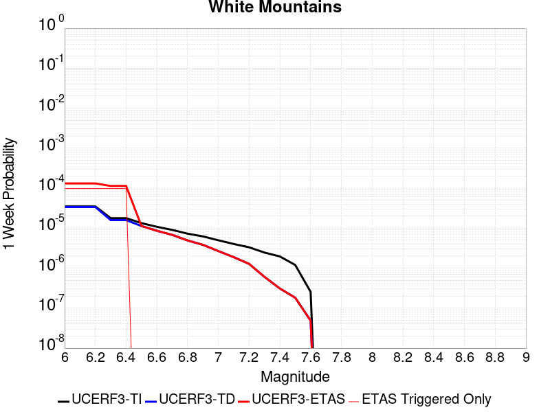 | 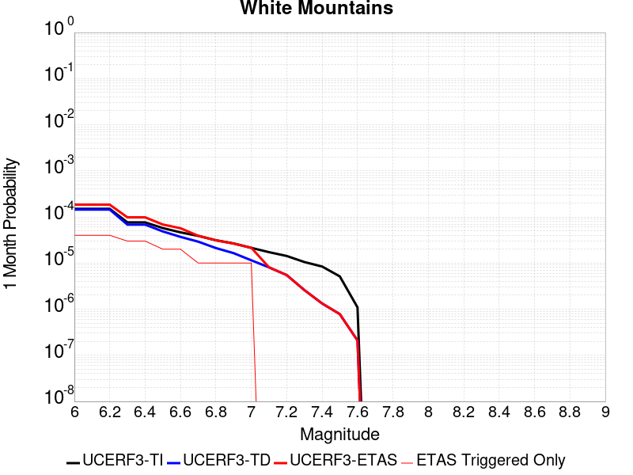 | 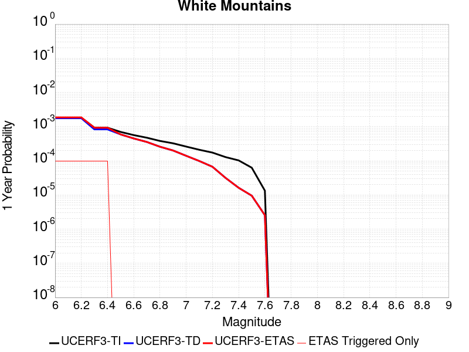 | 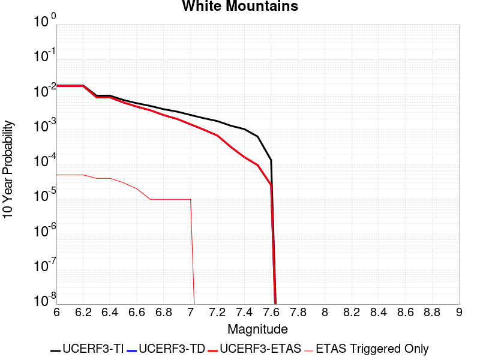 |

| Magnitude | 1 wk TI Prob | 1 wk TD Prob | 1 wk ETAS Prob | 1 wk ETAS/TD Gain | 1 wk ETAS Triggered Only | 1 mo TI Prob | 1 mo TD Prob | 1 mo ETAS Prob | 1 mo ETAS/TD Gain | 1 mo ETAS Triggered Only | 1 yr TI Prob | 1 yr TD Prob | 1 yr ETAS Prob | 1 yr ETAS/TD Gain | 1 yr ETAS Triggered Only | 10 yr TI Prob | 10 yr TD Prob | 10 yr ETAS Prob | 10 yr ETAS/TD Gain | 10 yr ETAS Triggered Only |
|-----|-----|-----|-----|-----|-----|-----|-----|-----|-----|-----|-----|-----|-----|-----|-----|-----|-----|-----|-----|-----|
| 6.0 | 3.503579E-5 | 3.378405E-5 | 1.3158983E-4 | 3.8950279 | 9.7809076E-5 | 1.5014476E-4 | 1.4478143E-4 | 2.4257635E-4 | 1.6754658 | 9.7809076E-5 | 0.0018264796 | 0.0017614096 | 0.0018590464 | 1.055431 | 9.7809076E-5 | 0.018115403 | 0.017486818 | 0.017582918 | 1.0054955 | 9.7809076E-5 |
| 6.1 | 3.503579E-5 | 3.378405E-5 | 1.3158983E-4 | 3.8950279 | 9.7809076E-5 | 1.5014476E-4 | 1.4478143E-4 | 2.4257635E-4 | 1.6754658 | 9.7809076E-5 | 0.0018264796 | 0.0017614096 | 0.0018590464 | 1.055431 | 9.7809076E-5 | 0.018115403 | 0.017486818 | 0.017582918 | 1.0054955 | 9.7809076E-5 |
| 6.2 | 3.503579E-5 | 3.378405E-5 | 1.3158983E-4 | 3.8950279 | 9.7809076E-5 | 1.5014476E-4 | 1.4478143E-4 | 2.4257635E-4 | 1.6754658 | 9.7809076E-5 | 0.0018264796 | 0.0017614096 | 0.0018590464 | 1.055431 | 9.7809076E-5 | 0.018115403 | 0.017486818 | 0.017582918 | 1.0054955 | 9.7809076E-5 |
| 6.3 | 1.7818425E-5 | 1.5916074E-5 | 1.13723596E-4 | 7.145204 | 9.7809076E-5 | 7.636245E-5 | 6.821004E-5 | 1.6601245E-4 | 2.4338417 | 9.7809076E-5 | 9.293162E-4 | 8.301551E-4 | 9.27883E-4 | 1.1177224 | 9.7809076E-5 | 0.009254395 | 0.008271999 | 0.008368999 | 1.0117263 | 9.7809076E-5 |
| 6.4 | 1.7818425E-5 | 1.5916074E-5 | 1.13723596E-4 | 7.145204 | 9.7809076E-5 | 7.636245E-5 | 6.821004E-5 | 1.6601245E-4 | 2.4338417 | 9.7809076E-5 | 9.293162E-4 | 8.301551E-4 | 9.27883E-4 | 1.1177224 | 9.7809076E-5 | 0.009254395 | 0.008271999 | 0.008368999 | 1.0117263 | 9.7809076E-5 |
| 6.5 | 1.3397557E-5 | 1.13362685E-5 | 1.13362685E-5 | 1.0 | 0.0 | 5.741684E-5 | 4.858314E-5 | 4.858314E-5 | 1.0 | 0.0 | 6.988258E-4 | 5.913462E-4 | 5.913462E-4 | 1.0 | 0.0 | 0.006966323 | 0.005898432 | 0.005898432 | 1.0 | 0.0 |
| 6.6 | 1.0818695E-5 | 8.625366E-6 | 8.625366E-6 | 1.0 | 0.0 | 4.6365014E-5 | 3.6965357E-5 | 3.6965357E-5 | 1.0 | 0.0 | 5.6434784E-4 | 4.4996463E-4 | 4.4996463E-4 | 1.0 | 0.0 | 0.005629168 | 0.004490972 | 0.004490972 | 1.0 | 0.0 |
| 6.7 | 9.067908E-6 | 6.802442E-6 | 6.802442E-6 | 1.0 | 0.0 | 3.8861883E-5 | 2.9153016E-5 | 2.9153016E-5 | 1.0 | 0.0 | 4.7304068E-4 | 3.5488335E-4 | 3.5488335E-4 | 1.0 | 0.0 | 0.00472035 | 0.0035434833 | 0.0035434833 | 1.0 | 0.0 |
| 6.8 | 7.295947E-6 | 4.936391E-6 | 4.936391E-6 | 1.0 | 0.0 | 3.126797E-5 | 2.1155796E-5 | 2.1155796E-5 | 1.0 | 0.0 | 3.8062103E-4 | 2.575425E-4 | 2.575425E-4 | 1.0 | 0.0 | 0.0037996976 | 0.0025725532 | 0.0025725532 | 1.0 | 0.0 |
| 6.9 | 6.2243444E-6 | 3.832213E-6 | 3.832213E-6 | 1.0 | 0.0 | 2.6675489E-5 | 1.642367E-5 | 1.642367E-5 | 1.0 | 0.0 | 3.2472567E-4 | 1.9994036E-4 | 1.9994036E-4 | 1.0 | 0.0 | 0.0032425157 | 0.0019976576 | 0.0019976576 | 1.0 | 0.0 |
| 7.0 | 4.9878413E-6 | 2.6795342E-6 | 2.6795342E-6 | 1.0 | 0.0 | 2.1376287E-5 | 1.14836685E-5 | 1.14836685E-5 | 1.0 | 0.0 | 2.602252E-4 | 1.3980496E-4 | 1.3980496E-4 | 1.0 | 0.0 | 0.002599207 | 0.0013971963 | 0.0013971963 | 1.0 | 0.0 |
| 7.1 | 4.0252844E-6 | 1.8857575E-6 | 1.8857575E-6 | 1.0 | 0.0 | 1.7251105E-5 | 8.081794E-6 | 8.081794E-6 | 1.0 | 0.0 | 2.1001195E-4 | 9.8391516E-5 | 9.8391516E-5 | 1.0 | 0.0 | 0.0020981359 | 9.834924E-4 | 9.834924E-4 | 1.0 | 0.0 |
| 7.2 | 3.3284066E-6 | 1.281964E-6 | 1.281964E-6 | 1.0 | 0.0 | 1.4264522E-5 | 5.494121E-6 | 5.494121E-6 | 1.0 | 0.0 | 1.736567E-4 | 6.688897E-5 | 6.688897E-5 | 1.0 | 0.0 | 0.0017352107 | 6.6869846E-4 | 6.6869846E-4 | 1.0 | 0.0 |
| 7.3 | 2.458226E-6 | 6.05722E-7 | 6.05722E-7 | 1.0 | 0.0 | 1.0535211E-5 | 2.5959491E-6 | 2.5959491E-6 | 1.0 | 0.0 | 1.2825865E-4 | 3.1605257E-5 | 3.1605257E-5 | 1.0 | 0.0 | 0.0012818464 | 3.160114E-4 | 3.160114E-4 | 1.0 | 0.0 |
| 7.4 | 1.965953E-6 | 3.1089303E-7 | 3.1089303E-7 | 1.0 | 0.0 | 8.425486E-6 | 1.332398E-6 | 1.332398E-6 | 1.0 | 0.0 | 1.0257547E-4 | 1.6221828E-5 | 1.6221828E-5 | 1.0 | 0.0 | 0.0010252813 | 1.6220656E-4 | 1.6220656E-4 | 1.0 | 0.0 |
| 7.5 | 1.2014192E-6 | 1.8244253E-7 | 1.8244253E-7 | 1.0 | 0.0 | 5.148929E-6 | 7.8189635E-7 | 7.8189635E-7 | 1.0 | 0.0 | 6.2686406E-5 | 9.519547E-6 | 9.519547E-6 | 1.0 | 0.0 | 6.266873E-4 | 9.519148E-5 | 9.519148E-5 | 1.0 | 0.0 |
| 7.6 | 2.5612175E-7 | 4.8946475E-8 | 4.8946475E-8 | 1.0 | 0.0 | 1.0976642E-6 | 2.0977059E-7 | 2.0977059E-7 | 1.0 | 0.0 | 1.3363979E-5 | 2.5539543E-6 | 2.5539543E-6 | 1.0 | 0.0 | 1.3363175E-4 | 2.5539286E-5 | 2.5539286E-5 | 1.0 | 0.0 |

## Big Pine (Central)
*[(top)](#table-of-contents)*

| 1 Week | 1 Month | 1 Year | 10 Year |
|-----|-----|-----|-----|
| 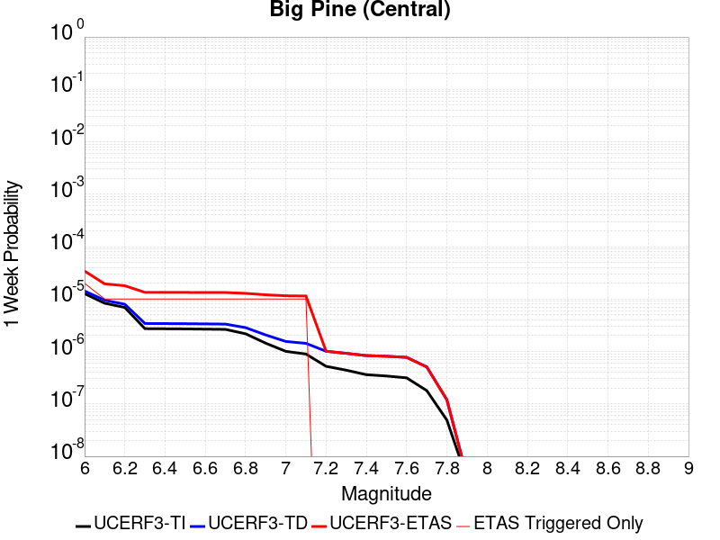 | 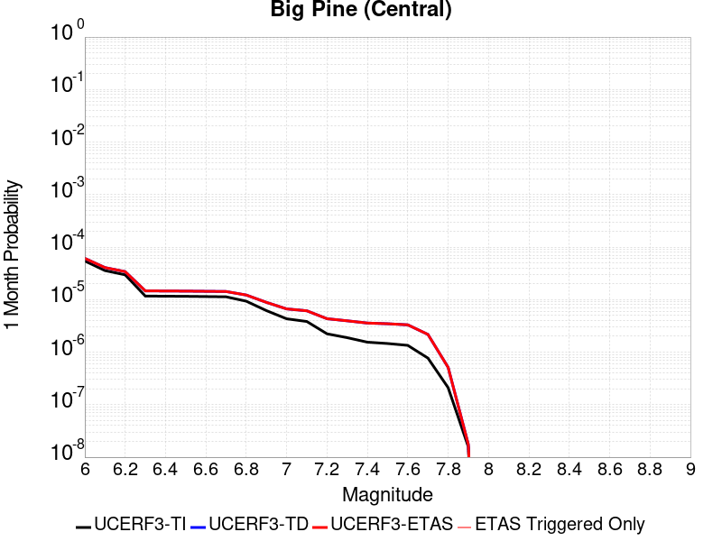 | 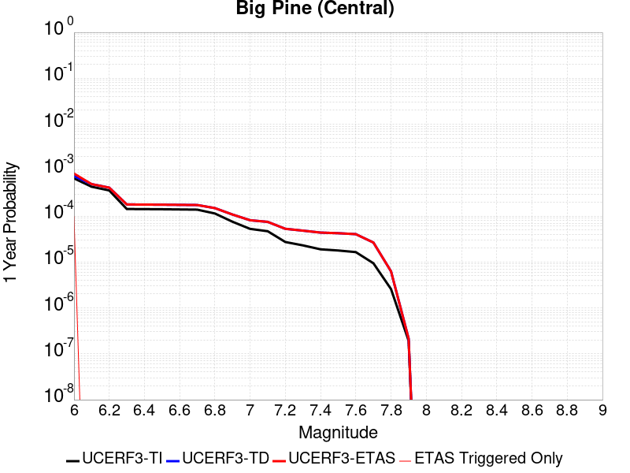 | 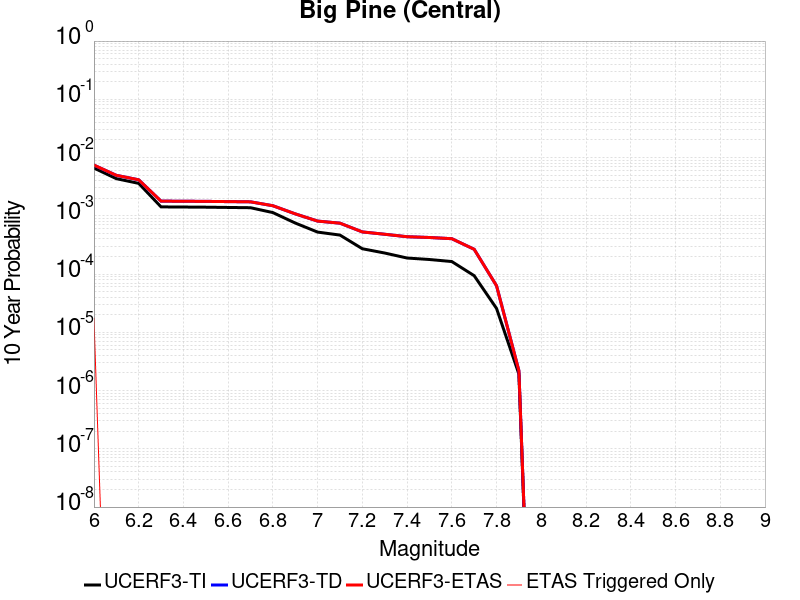 |

| Magnitude | 1 wk TI Prob | 1 wk TD Prob | 1 wk ETAS Prob | 1 wk ETAS/TD Gain | 1 wk ETAS Triggered Only | 1 mo TI Prob | 1 mo TD Prob | 1 mo ETAS Prob | 1 mo ETAS/TD Gain | 1 mo ETAS Triggered Only | 1 yr TI Prob | 1 yr TD Prob | 1 yr ETAS Prob | 1 yr ETAS/TD Gain | 1 yr ETAS Triggered Only | 10 yr TI Prob | 10 yr TD Prob | 10 yr ETAS Prob | 10 yr ETAS/TD Gain | 10 yr ETAS Triggered Only |
|-----|-----|-----|-----|-----|-----|-----|-----|-----|-----|-----|-----|-----|-----|-----|-----|-----|-----|-----|-----|-----|
| 6.0 | 1.2706755E-5 | 1.4250529E-5 | 1.4250529E-5 | 1.0 | 0.0 | 5.4456385E-5 | 6.107247E-5 | 6.107247E-5 | 1.0 | 0.0 | 6.628048E-4 | 7.433402E-4 | 8.410766E-4 | 1.1314827 | 9.7809076E-5 | 0.006608314 | 0.0074135666 | 0.007510651 | 1.0130955 | 9.7809076E-5 |
| 6.1 | 8.342579E-6 | 9.510762E-6 | 9.510762E-6 | 1.0 | 0.0 | 3.5753423E-5 | 4.0759893E-5 | 4.0759893E-5 | 1.0 | 0.0 | 4.3521097E-4 | 4.961604E-4 | 4.961604E-4 | 1.0 | 0.0 | 0.0043435963 | 0.0049540824 | 0.0049540824 | 1.0 | 0.0 |
| 6.2 | 6.923899E-6 | 7.967147E-6 | 7.967147E-6 | 1.0 | 0.0 | 2.9673516E-5 | 3.4144578E-5 | 3.4144578E-5 | 1.0 | 0.0 | 3.6121515E-4 | 4.156502E-4 | 4.156502E-4 | 1.0 | 0.0 | 0.003606286 | 0.0041520367 | 0.0041520367 | 1.0 | 0.0 |
| 6.3 | 2.728396E-6 | 3.4242908E-6 | 3.4242908E-6 | 1.0 | 0.0 | 1.1693074E-5 | 1.4675454E-5 | 1.4675454E-5 | 1.0 | 0.0 | 1.4235388E-4 | 1.7865987E-4 | 1.7865987E-4 | 1.0 | 0.0 | 0.0014226272 | 0.0017866704 | 0.0017866704 | 1.0 | 0.0 |
| 6.4 | 2.7136944E-6 | 3.408584E-6 | 3.408584E-6 | 1.0 | 0.0 | 1.1630066E-5 | 1.4608141E-5 | 1.4608141E-5 | 1.0 | 0.0 | 1.4158686E-4 | 1.7784047E-4 | 1.7784047E-4 | 1.0 | 0.0 | 0.0014149669 | 0.0017784894 | 0.0017784894 | 1.0 | 0.0 |
| 6.5 | 2.6971882E-6 | 3.3909291E-6 | 3.3909291E-6 | 1.0 | 0.0 | 1.1559327E-5 | 1.45324775E-5 | 1.45324775E-5 | 1.0 | 0.0 | 1.4072572E-4 | 1.7691942E-4 | 1.7691942E-4 | 1.0 | 0.0 | 0.0014063664 | 0.0017692937 | 0.0017692937 | 1.0 | 0.0 |
| 6.6 | 2.669092E-6 | 3.3609497E-6 | 3.3609497E-6 | 1.0 | 0.0 | 1.1438916E-5 | 1.4403995E-5 | 1.4403995E-5 | 1.0 | 0.0 | 1.3925991E-4 | 1.753554E-4 | 1.753554E-4 | 1.0 | 0.0 | 0.0013917267 | 0.0017536782 | 0.0017536782 | 1.0 | 0.0 |
| 6.7 | 2.6408059E-6 | 3.3309752E-6 | 3.3309752E-6 | 1.0 | 0.0 | 1.1317691E-5 | 1.4275535E-5 | 1.4275535E-5 | 1.0 | 0.0 | 1.3778417E-4 | 1.7379165E-4 | 1.7379165E-4 | 1.0 | 0.0 | 0.0013769877 | 0.0017380653 | 0.0017380653 | 1.0 | 0.0 |
| 6.8 | 2.1786943E-6 | 2.8544325E-6 | 2.8544325E-6 | 1.0 | 0.0 | 9.337228E-6 | 1.2233229E-5 | 1.2233229E-5 | 1.0 | 0.0 | 1.1367482E-4 | 1.4893012E-4 | 1.4893012E-4 | 1.0 | 0.0 | 0.0011361669 | 0.0014897975 | 0.0014897975 | 1.0 | 0.0 |
| 6.9 | 1.4411696E-6 | 2.068499E-6 | 2.068499E-6 | 1.0 | 0.0 | 6.1764263E-6 | 8.864968E-6 | 8.864968E-6 | 1.0 | 0.0 | 7.51954E-5 | 1.079259E-4 | 1.079259E-4 | 1.0 | 0.0 | 7.5169955E-4 | 0.0010801847 | 0.0010801847 | 1.0 | 0.0 |
| 7.0 | 1.0073411E-6 | 1.554261E-6 | 1.554261E-6 | 1.0 | 0.0 | 4.317169E-6 | 6.6611024E-6 | 6.6611024E-6 | 1.0 | 0.0 | 5.2560266E-5 | 8.1096056E-5 | 8.1096056E-5 | 1.0 | 0.0 | 5.2547833E-4 | 8.1210316E-4 | 8.1210316E-4 | 1.0 | 0.0 |
| 7.1 | 8.947104E-7 | 1.4302494E-6 | 1.4302494E-6 | 1.0 | 0.0 | 3.834468E-6 | 6.129627E-6 | 6.129627E-6 | 1.0 | 0.0 | 4.6683643E-5 | 7.46258E-5 | 7.46258E-5 | 1.0 | 0.0 | 4.6673836E-4 | 7.474457E-4 | 7.474457E-4 | 1.0 | 0.0 |
| 7.2 | 5.215166E-7 | 1.0111678E-6 | 1.0111678E-6 | 1.0 | 0.0 | 2.2350691E-6 | 4.3335694E-6 | 4.3335694E-6 | 1.0 | 0.0 | 2.7211627E-5 | 5.2759973E-5 | 5.2759973E-5 | 1.0 | 0.0 | 2.7208295E-4 | 5.2890263E-4 | 5.2890263E-4 | 1.0 | 0.0 |
| 7.3 | 4.4024807E-7 | 9.219589E-7 | 9.219589E-7 | 1.0 | 0.0 | 1.8867761E-6 | 3.9512465E-6 | 3.9512465E-6 | 1.0 | 0.0 | 2.2971257E-5 | 4.810541E-5 | 4.810541E-5 | 1.0 | 0.0 | 2.2968883E-4 | 4.8237795E-4 | 4.8237795E-4 | 1.0 | 0.0 |
| 7.4 | 3.6130905E-7 | 8.358523E-7 | 8.358523E-7 | 1.0 | 0.0 | 1.5484665E-6 | 3.5822195E-6 | 3.5822195E-6 | 1.0 | 0.0 | 1.8852415E-5 | 4.3612687E-5 | 4.3612687E-5 | 1.0 | 0.0 | 1.8850817E-4 | 4.374597E-4 | 4.374597E-4 | 1.0 | 0.0 |
| 7.5 | 3.408184E-7 | 8.108147E-7 | 8.108147E-7 | 1.0 | 0.0 | 1.4606494E-6 | 3.4749157E-6 | 3.4749157E-6 | 1.0 | 0.0 | 1.7783263E-5 | 4.2306317E-5 | 4.2306317E-5 | 1.0 | 0.0 | 1.778184E-4 | 4.2437963E-4 | 4.2437963E-4 | 1.0 | 0.0 |
| 7.6 | 3.1428627E-7 | 7.7316E-7 | 7.7316E-7 | 1.0 | 0.0 | 1.3469405E-6 | 3.3135389E-6 | 3.3135389E-6 | 1.0 | 0.0 | 1.6398877E-5 | 4.0341627E-5 | 4.0341627E-5 | 1.0 | 0.0 | 1.6397667E-4 | 4.0471106E-4 | 4.0471106E-4 | 1.0 | 0.0 |
| 7.7 | 1.7972785E-7 | 5.077752E-7 | 5.077752E-7 | 1.0 | 0.0 | 7.70262E-7 | 2.1761778E-6 | 2.1761778E-6 | 1.0 | 0.0 | 9.377899E-6 | 2.6494654E-5 | 2.6494654E-5 | 1.0 | 0.0 | 9.377503E-5 | 2.662899E-4 | 2.662899E-4 | 1.0 | 0.0 |
| 7.8 | 4.9230927E-8 | 1.198079E-7 | 1.198079E-7 | 1.0 | 0.0 | 2.1098968E-7 | 5.134623E-7 | 5.134623E-7 | 1.0 | 0.0 | 2.5687964E-6 | 6.2513873E-6 | 6.2513873E-6 | 1.0 | 0.0 | 2.5687666E-5 | 6.295415E-5 | 6.295415E-5 | 1.0 | 0.0 |
| 7.9 | 3.6805972E-9 | 4.105293E-9 | 4.105293E-9 | 1.0 | 0.0 | 1.5773987E-8 | 1.7594115E-8 | 1.7594115E-8 | 1.0 | 0.0 | 1.9204828E-7 | 2.1420831E-7 | 2.1420831E-7 | 1.0 | 0.0 | 1.920481E-6 | 2.1900614E-6 | 2.1900614E-6 | 1.0 | 0.0 |

## Manix-Afton Hills
*[(top)](#table-of-contents)*

| 1 Week | 1 Month | 1 Year | 10 Year |
|-----|-----|-----|-----|
| 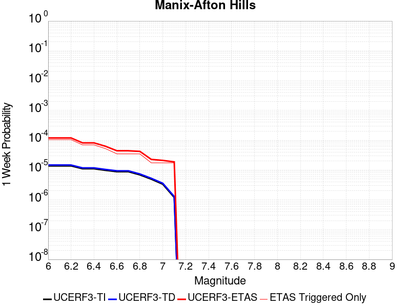 | 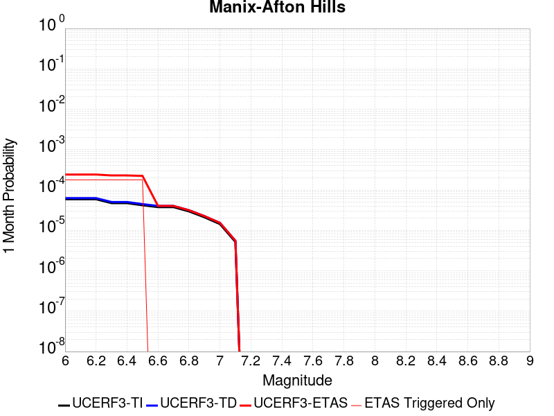 |  | 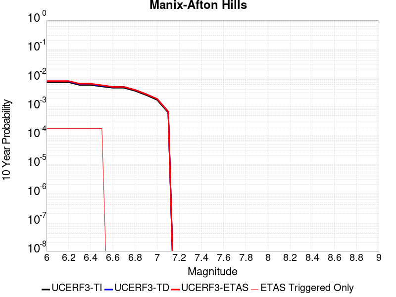 |

| Magnitude | 1 wk TI Prob | 1 wk TD Prob | 1 wk ETAS Prob | 1 wk ETAS/TD Gain | 1 wk ETAS Triggered Only | 1 mo TI Prob | 1 mo TD Prob | 1 mo ETAS Prob | 1 mo ETAS/TD Gain | 1 mo ETAS Triggered Only | 1 yr TI Prob | 1 yr TD Prob | 1 yr ETAS Prob | 1 yr ETAS/TD Gain | 1 yr ETAS Triggered Only | 10 yr TI Prob | 10 yr TD Prob | 10 yr ETAS Prob | 10 yr ETAS/TD Gain | 10 yr ETAS Triggered Only |
|-----|-----|-----|-----|-----|-----|-----|-----|-----|-----|-----|-----|-----|-----|-----|-----|-----|-----|-----|-----|-----|
| 6.0 | 1.3783202E-5 | 1.47110895E-5 | 1.1251873E-4 | 7.648565 | 9.7809076E-5 | 5.906953E-5 | 6.30461E-5 | 1.6084901E-4 | 2.551292 | 9.7809076E-5 | 7.189342E-4 | 7.6733343E-4 | 8.650675E-4 | 1.1273683 | 9.7809076E-5 | 0.0071661277 | 0.007648596 | 0.0077456567 | 1.0126901 | 9.7809076E-5 |
| 6.1 | 1.3783202E-5 | 1.47110895E-5 | 1.1251873E-4 | 7.648565 | 9.7809076E-5 | 5.906953E-5 | 6.30461E-5 | 1.6084901E-4 | 2.551292 | 9.7809076E-5 | 7.189342E-4 | 7.6733343E-4 | 8.650675E-4 | 1.1273683 | 9.7809076E-5 | 0.0071661277 | 0.007648596 | 0.0077456567 | 1.0126901 | 9.7809076E-5 |
| 6.2 | 1.3783202E-5 | 1.47110895E-5 | 1.1251873E-4 | 7.648565 | 9.7809076E-5 | 5.906953E-5 | 6.30461E-5 | 1.6084901E-4 | 2.551292 | 9.7809076E-5 | 7.189342E-4 | 7.6733343E-4 | 8.650675E-4 | 1.1273683 | 9.7809076E-5 | 0.0071661277 | 0.007648596 | 0.0077456567 | 1.0126901 | 9.7809076E-5 |
| 6.3 | 1.10494875E-5 | 1.1793136E-5 | 1.0960106E-4 | 9.293632 | 9.7809076E-5 | 4.7354086E-5 | 5.054109E-5 | 1.4834522E-4 | 2.935141 | 9.7809076E-5 | 5.763835E-4 | 6.151744E-4 | 7.129233E-4 | 1.1588962 | 9.7809076E-5 | 0.005748908 | 0.0061357557 | 0.0062329643 | 1.015843 | 9.7809076E-5 |
| 6.4 | 1.10494875E-5 | 1.1793136E-5 | 1.0960106E-4 | 9.293632 | 9.7809076E-5 | 4.7354086E-5 | 5.054109E-5 | 1.4834522E-4 | 2.935141 | 9.7809076E-5 | 5.763835E-4 | 6.151744E-4 | 7.129233E-4 | 1.1588962 | 9.7809076E-5 | 0.005748908 | 0.0061357557 | 0.0062329643 | 1.015843 | 9.7809076E-5 |
| 6.5 | 9.788949E-6 | 1.045432E-5 | 1.0826237E-4 | 10.355755 | 9.7809076E-5 | 4.1951964E-5 | 4.480351E-5 | 1.426082E-4 | 3.1829696 | 9.7809076E-5 | 5.1064545E-4 | 5.453555E-4 | 6.4311124E-4 | 1.1792514 | 9.7809076E-5 | 0.0050947363 | 0.0054410985 | 0.0055383756 | 1.0178782 | 9.7809076E-5 |
| 6.6 | 8.810006E-6 | 9.4136285E-6 | 9.4136285E-6 | 1.0 | 0.0 | 3.775662E-5 | 4.0343548E-5 | 4.0343548E-5 | 1.0 | 0.0 | 4.5958988E-4 | 4.9108086E-4 | 4.9108086E-4 | 1.0 | 0.0 | 0.0045864056 | 0.004900839 | 0.004900839 | 1.0 | 0.0 |
| 6.7 | 8.80128E-6 | 9.404108E-6 | 9.404108E-6 | 1.0 | 0.0 | 3.7719226E-5 | 4.0302748E-5 | 4.0302748E-5 | 1.0 | 0.0 | 4.591348E-4 | 4.9058435E-4 | 4.9058435E-4 | 1.0 | 0.0 | 0.004581874 | 0.0048958957 | 0.0048958957 | 1.0 | 0.0 |
| 6.8 | 6.8994877E-6 | 7.380076E-6 | 7.380076E-6 | 1.0 | 0.0 | 2.9568899E-5 | 3.162856E-5 | 3.162856E-5 | 1.0 | 0.0 | 3.5994186E-4 | 3.8501783E-4 | 3.8501783E-4 | 1.0 | 0.0 | 0.003593594 | 0.0038443129 | 0.0038443129 | 1.0 | 0.0 |
| 6.9 | 4.9328037E-6 | 5.2709615E-6 | 5.2709615E-6 | 1.0 | 0.0 | 2.1140417E-5 | 2.2589675E-5 | 2.2589675E-5 | 1.0 | 0.0 | 2.5735417E-4 | 2.7500073E-4 | 2.7500073E-4 | 1.0 | 0.0 | 0.0025705635 | 0.0027472095 | 0.0027472095 | 1.0 | 0.0 |
| 7.0 | 3.347973E-6 | 3.59003E-6 | 3.59003E-6 | 1.0 | 0.0 | 1.4348378E-5 | 1.5385775E-5 | 1.5385775E-5 | 1.0 | 0.0 | 1.746775E-4 | 1.8730981E-4 | 1.8730981E-4 | 1.0 | 0.0 | 0.0017454025 | 0.0018719219 | 0.0018719219 | 1.0 | 0.0 |
| 7.1 | 1.2073567E-6 | 1.293482E-6 | 1.293482E-6 | 1.0 | 0.0 | 5.1743755E-6 | 5.543492E-6 | 5.543492E-6 | 1.0 | 0.0 | 6.29962E-5 | 6.749156E-5 | 6.749156E-5 | 1.0 | 0.0 | 6.297835E-4 | 6.7487074E-4 | 6.7487074E-4 | 1.0 | 0.0 |

## Gillem - Big Crack 2011 CFM
*[(top)](#table-of-contents)*

| 1 Week | 1 Month | 1 Year | 10 Year |
|-----|-----|-----|-----|
| 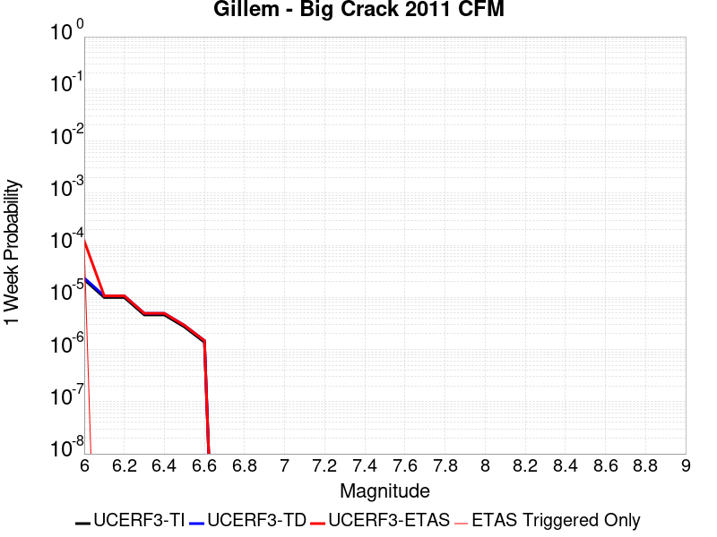 | 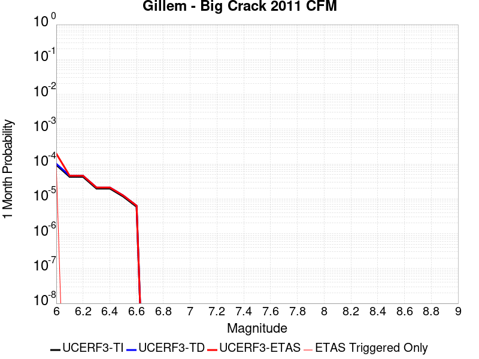 | 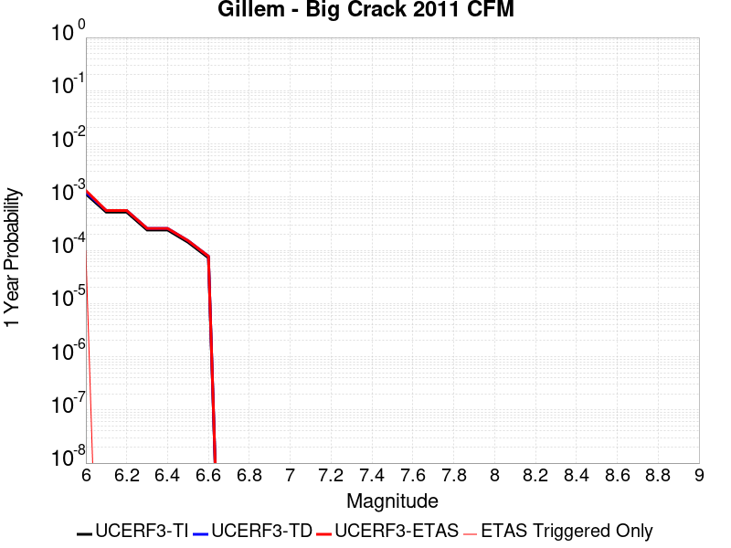 | 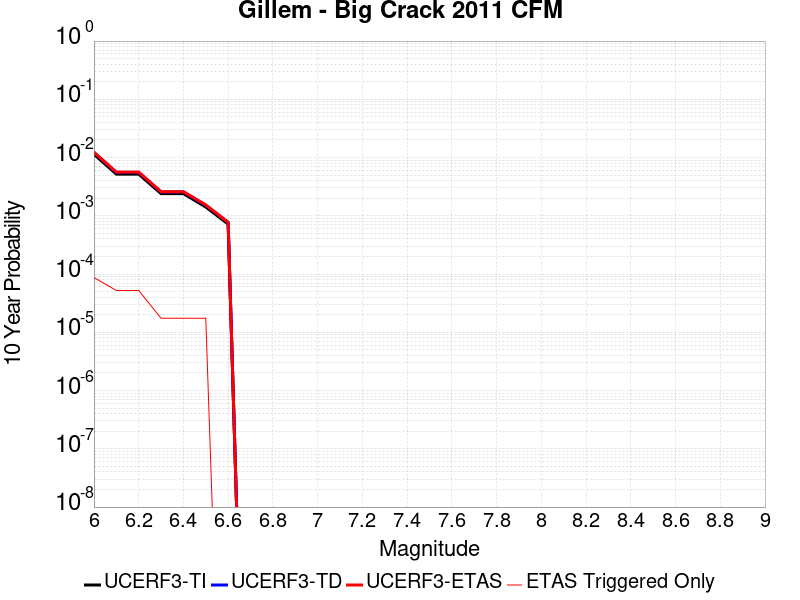 |

| Magnitude | 1 wk TI Prob | 1 wk TD Prob | 1 wk ETAS Prob | 1 wk ETAS/TD Gain | 1 wk ETAS Triggered Only | 1 mo TI Prob | 1 mo TD Prob | 1 mo ETAS Prob | 1 mo ETAS/TD Gain | 1 mo ETAS Triggered Only | 1 yr TI Prob | 1 yr TD Prob | 1 yr ETAS Prob | 1 yr ETAS/TD Gain | 1 yr ETAS Triggered Only | 10 yr TI Prob | 10 yr TD Prob | 10 yr ETAS Prob | 10 yr ETAS/TD Gain | 10 yr ETAS Triggered Only |
|-----|-----|-----|-----|-----|-----|-----|-----|-----|-----|-----|-----|-----|-----|-----|-----|-----|-----|-----|-----|-----|
| 6.0 | 2.196852E-5 | 2.3604485E-5 | 1.21411256E-4 | 5.143567 | 9.7809076E-5 | 9.4147406E-5 | 1.01158665E-4 | 1.9895784E-4 | 1.96679 | 9.7809076E-5 | 0.0011456419 | 0.0012309998 | 0.0013286885 | 1.0793571 | 9.7809076E-5 | 0.011397537 | 0.012250669 | 0.01234728 | 1.0078862 | 9.7809076E-5 |
| 6.1 | 9.992795E-6 | 1.071189E-5 | 1.071189E-5 | 1.0 | 0.0 | 4.2825563E-5 | 4.5907396E-5 | 4.5907396E-5 | 1.0 | 0.0 | 5.2127644E-4 | 5.587975E-4 | 5.587975E-4 | 1.0 | 0.0 | 0.0052005537 | 0.0055757347 | 0.0055757347 | 1.0 | 0.0 |
| 6.2 | 9.992795E-6 | 1.071189E-5 | 1.071189E-5 | 1.0 | 0.0 | 4.2825563E-5 | 4.5907396E-5 | 4.5907396E-5 | 1.0 | 0.0 | 5.2127644E-4 | 5.587975E-4 | 5.587975E-4 | 1.0 | 0.0 | 0.0052005537 | 0.0055757347 | 0.0055757347 | 1.0 | 0.0 |
| 6.3 | 4.6127884E-6 | 4.942657E-6 | 4.942657E-6 | 1.0 | 0.0 | 1.9768944E-5 | 2.1182668E-5 | 2.1182668E-5 | 1.0 | 0.0 | 2.406603E-4 | 2.5787292E-4 | 2.5787292E-4 | 1.0 | 0.0 | 0.0024039985 | 0.0025761751 | 0.0025761751 | 1.0 | 0.0 |
| 6.4 | 4.6127884E-6 | 4.942657E-6 | 4.942657E-6 | 1.0 | 0.0 | 1.9768944E-5 | 2.1182668E-5 | 2.1182668E-5 | 1.0 | 0.0 | 2.406603E-4 | 2.5787292E-4 | 2.5787292E-4 | 1.0 | 0.0 | 0.0024039985 | 0.0025761751 | 0.0025761751 | 1.0 | 0.0 |
| 6.5 | 2.716712E-6 | 2.9111113E-6 | 2.9111113E-6 | 1.0 | 0.0 | 1.1643E-5 | 1.24761455E-5 | 1.24761455E-5 | 1.0 | 0.0 | 1.417443E-4 | 1.5188892E-4 | 1.5188892E-4 | 1.0 | 0.0 | 0.0014165393 | 0.001518089 | 0.001518089 | 1.0 | 0.0 |
| 6.6 | 1.3818255E-6 | 1.4820689E-6 | 1.4820689E-6 | 1.0 | 0.0 | 5.922096E-6 | 6.3517155E-6 | 6.3517155E-6 | 1.0 | 0.0 | 7.209913E-5 | 7.7330624E-5 | 7.7330624E-5 | 1.0 | 0.0 | 7.2075747E-4 | 7.7315804E-4 | 7.7315804E-4 | 1.0 | 0.0 |

## Rinconada 2011 CFM
*[(top)](#table-of-contents)*

| 1 Week | 1 Month | 1 Year | 10 Year |
|-----|-----|-----|-----|
|  |  | 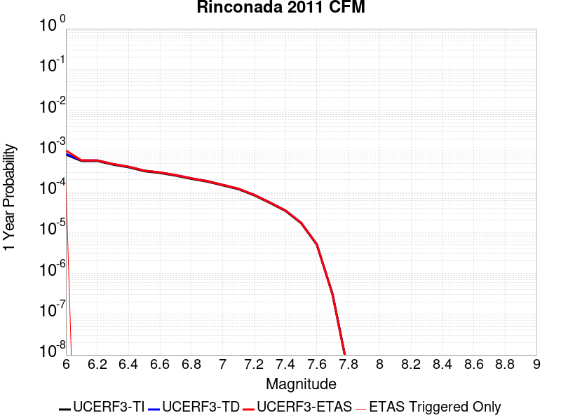 | 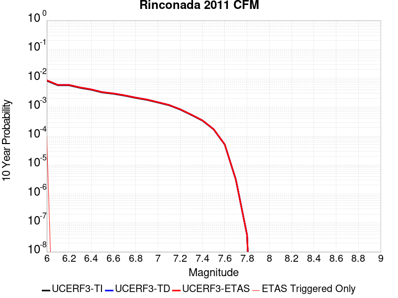 |

| Magnitude | 1 wk TI Prob | 1 wk TD Prob | 1 wk ETAS Prob | 1 wk ETAS/TD Gain | 1 wk ETAS Triggered Only | 1 mo TI Prob | 1 mo TD Prob | 1 mo ETAS Prob | 1 mo ETAS/TD Gain | 1 mo ETAS Triggered Only | 1 yr TI Prob | 1 yr TD Prob | 1 yr ETAS Prob | 1 yr ETAS/TD Gain | 1 yr ETAS Triggered Only | 10 yr TI Prob | 10 yr TD Prob | 10 yr ETAS Prob | 10 yr ETAS/TD Gain | 10 yr ETAS Triggered Only |
|-----|-----|-----|-----|-----|-----|-----|-----|-----|-----|-----|-----|-----|-----|-----|-----|-----|-----|-----|-----|-----|
| 6.0 | 1.5752368E-5 | 1.6274716E-5 | 1.6274716E-5 | 1.0 | 0.0 | 6.75084E-5 | 6.974694E-5 | 6.974694E-5 | 1.0 | 0.0 | 8.2160486E-4 | 8.488412E-4 | 9.465673E-4 | 1.1151288 | 9.7809076E-5 | 0.008185739 | 0.00845637 | 0.008553352 | 1.0114685 | 9.7809076E-5 |
| 6.1 | 1.0966133E-5 | 1.1323029E-5 | 1.1323029E-5 | 1.0 | 0.0 | 4.6996865E-5 | 4.852637E-5 | 4.852637E-5 | 1.0 | 0.0 | 5.720366E-4 | 5.906491E-4 | 5.906491E-4 | 1.0 | 0.0 | 0.0057056635 | 0.0058908886 | 0.0058908886 | 1.0 | 0.0 |
| 6.2 | 1.0966133E-5 | 1.1323029E-5 | 1.1323029E-5 | 1.0 | 0.0 | 4.6996865E-5 | 4.852637E-5 | 4.852637E-5 | 1.0 | 0.0 | 5.720366E-4 | 5.906491E-4 | 5.906491E-4 | 1.0 | 0.0 | 0.0057056635 | 0.0058908886 | 0.0058908886 | 1.0 | 0.0 |
| 6.3 | 8.926149E-6 | 9.212771E-6 | 9.212771E-6 | 1.0 | 0.0 | 3.8254362E-5 | 3.948271E-5 | 3.948271E-5 | 1.0 | 0.0 | 4.6564735E-4 | 4.805963E-4 | 4.805963E-4 | 1.0 | 0.0 | 0.0046467283 | 0.0047956146 | 0.0047956146 | 1.0 | 0.0 |
| 6.4 | 7.676955E-6 | 7.920191E-6 | 7.920191E-6 | 1.0 | 0.0 | 3.290082E-5 | 3.3943234E-5 | 3.3943234E-5 | 1.0 | 0.0 | 4.0049385E-4 | 4.1318068E-4 | 4.1318068E-4 | 1.0 | 0.0 | 0.0039977287 | 0.004124151 | 0.004124151 | 1.0 | 0.0 |
| 6.5 | 6.1671026E-6 | 6.3589546E-6 | 6.3589546E-6 | 1.0 | 0.0 | 2.6430173E-5 | 2.725238E-5 | 2.725238E-5 | 1.0 | 0.0 | 3.2173982E-4 | 3.317473E-4 | 3.317473E-4 | 1.0 | 0.0 | 0.003212744 | 0.0033125326 | 0.0033125326 | 1.0 | 0.0 |
| 6.6 | 5.553456E-6 | 5.7248126E-6 | 5.7248126E-6 | 1.0 | 0.0 | 2.3800309E-5 | 2.453468E-5 | 2.453468E-5 | 1.0 | 0.0 | 2.897302E-4 | 2.9866883E-4 | 2.9866883E-4 | 1.0 | 0.0 | 0.0028935277 | 0.002982683 | 0.002982683 | 1.0 | 0.0 |
| 6.7 | 4.787857E-6 | 4.9333094E-6 | 4.9333094E-6 | 1.0 | 0.0 | 2.0519226E-5 | 2.1142583E-5 | 2.1142583E-5 | 1.0 | 0.0 | 2.4979294E-4 | 2.573806E-4 | 2.573806E-4 | 1.0 | 0.0 | 0.0024951235 | 0.0025708308 | 0.0025708308 | 1.0 | 0.0 |
| 6.8 | 3.9955166E-6 | 4.1134763E-6 | 4.1134763E-6 | 1.0 | 0.0 | 1.7123532E-5 | 1.7629065E-5 | 1.7629065E-5 | 1.0 | 0.0 | 2.0845905E-4 | 2.1461274E-4 | 2.1461274E-4 | 1.0 | 0.0 | 0.002082636 | 0.0021440585 | 0.0021440585 | 1.0 | 0.0 |
| 6.9 | 3.4250072E-6 | 3.5224464E-6 | 3.5224464E-6 | 1.0 | 0.0 | 1.46785205E-5 | 1.5096111E-5 | 1.5096111E-5 | 1.0 | 0.0 | 1.7869633E-4 | 1.8377967E-4 | 1.8377967E-4 | 1.0 | 0.0 | 0.001785527 | 0.0018362794 | 0.0018362794 | 1.0 | 0.0 |
| 7.0 | 2.7712713E-6 | 2.8467E-6 | 2.8467E-6 | 1.0 | 0.0 | 1.1876823E-5 | 1.2200086E-5 | 1.2200086E-5 | 1.0 | 0.0 | 1.4459073E-4 | 1.4852593E-4 | 1.4852593E-4 | 1.0 | 0.0 | 0.0014449668 | 0.0014842682 | 0.0014842682 | 1.0 | 0.0 |
| 7.1 | 2.227358E-6 | 2.2856984E-6 | 2.2856984E-6 | 1.0 | 0.0 | 9.545785E-6 | 9.795814E-6 | 9.795814E-6 | 1.0 | 0.0 | 1.16213734E-4 | 1.19257515E-4 | 1.19257515E-4 | 1.0 | 0.0 | 0.0011615298 | 0.0011919362 | 0.0011919362 | 1.0 | 0.0 |
| 7.2 | 1.581796E-6 | 1.6209011E-6 | 1.6209011E-6 | 1.0 | 0.0 | 6.779108E-6 | 6.9467005E-6 | 6.9467005E-6 | 1.0 | 0.0 | 8.253252E-5 | 8.457281E-5 | 8.457281E-5 | 1.0 | 0.0 | 8.250187E-4 | 8.454067E-4 | 8.454067E-4 | 1.0 | 0.0 |
| 7.3 | 1.0306567E-6 | 1.0546477E-6 | 1.0546477E-6 | 1.0 | 0.0 | 4.4170924E-6 | 4.519911E-6 | 4.519911E-6 | 1.0 | 0.0 | 5.3776774E-5 | 5.5028526E-5 | 5.5028526E-5 | 1.0 | 0.0 | 5.376376E-4 | 5.5014924E-4 | 5.5014924E-4 | 1.0 | 0.0 |
| 7.4 | 6.535541E-7 | 6.682742E-7 | 6.682742E-7 | 1.0 | 0.0 | 2.800943E-6 | 2.864029E-6 | 2.864029E-6 | 1.0 | 0.0 | 3.4100947E-5 | 3.4868997E-5 | 3.4868997E-5 | 1.0 | 0.0 | 3.4095717E-4 | 3.4863537E-4 | 3.4863537E-4 | 1.0 | 0.0 |
| 7.5 | 3.2656962E-7 | 3.3316687E-7 | 3.3316687E-7 | 1.0 | 0.0 | 1.3995833E-6 | 1.4278572E-6 | 1.4278572E-6 | 1.0 | 0.0 | 1.7039794E-5 | 1.7384024E-5 | 1.7384024E-5 | 1.0 | 0.0 | 1.7038487E-4 | 1.7382667E-4 | 1.7382667E-4 | 1.0 | 0.0 |
| 7.6 | 9.754343E-8 | 9.82099E-8 | 9.82099E-8 | 1.0 | 0.0 | 4.180432E-7 | 4.208995E-7 | 4.208995E-7 | 1.0 | 0.0 | 5.089664E-6 | 5.1244397E-6 | 5.1244397E-6 | 1.0 | 0.0 | 5.0895473E-5 | 5.1243223E-5 | 5.1243223E-5 | 1.0 | 0.0 |
| 7.7 | 6.0001453E-9 | 5.8490435E-9 | 5.8490435E-9 | 1.0 | 0.0 | 2.5714908E-8 | 2.506733E-8 | 2.506733E-8 | 1.0 | 0.0 | 3.1307894E-7 | 3.051947E-7 | 3.051947E-7 | 1.0 | 0.0 | 3.1307852E-6 | 3.051943E-6 | 3.051943E-6 | 1.0 | 0.0 |
| 7.8 | 7.400003E-11 | 7.4654505E-11 | 7.4654505E-11 | 1.0 | 0.0 | 3.171432E-10 | 3.1994773E-10 | 3.1994773E-10 | 1.0 | 0.0 | 3.861218E-9 | 3.895363E-9 | 3.895363E-9 | 1.0 | 0.0 | 3.861218E-8 | 3.895363E-8 | 3.895363E-8 | 1.0 | 0.0 |

## Death Valley (Fish Lake Valley)
*[(top)](#table-of-contents)*

| 1 Week | 1 Month | 1 Year | 10 Year |
|-----|-----|-----|-----|
| 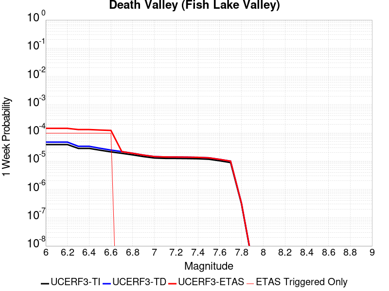 | 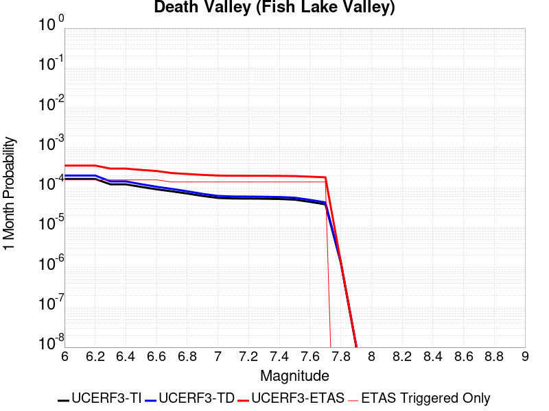 | 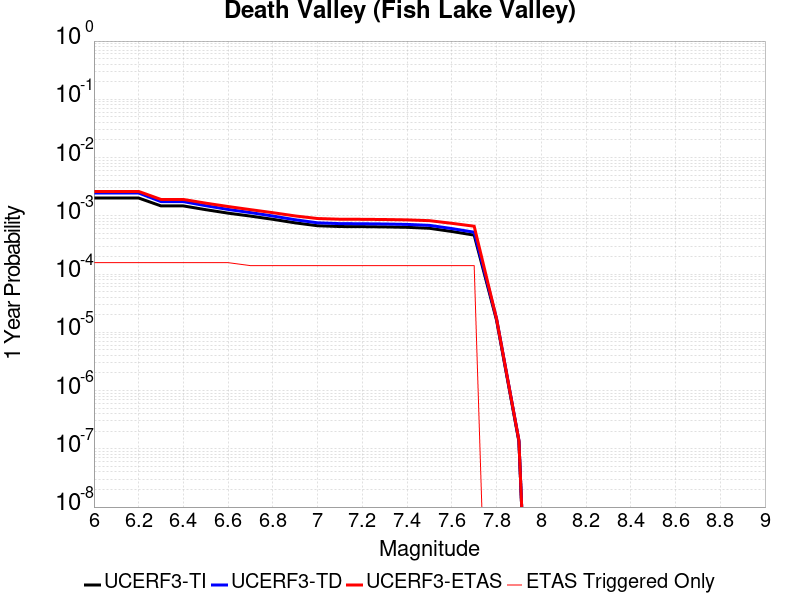 | 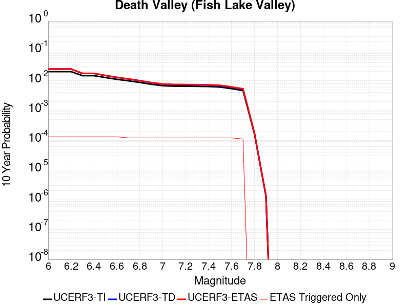 |

| Magnitude | 1 wk TI Prob | 1 wk TD Prob | 1 wk ETAS Prob | 1 wk ETAS/TD Gain | 1 wk ETAS Triggered Only | 1 mo TI Prob | 1 mo TD Prob | 1 mo ETAS Prob | 1 mo ETAS/TD Gain | 1 mo ETAS Triggered Only | 1 yr TI Prob | 1 yr TD Prob | 1 yr ETAS Prob | 1 yr ETAS/TD Gain | 1 yr ETAS Triggered Only | 10 yr TI Prob | 10 yr TD Prob | 10 yr ETAS Prob | 10 yr ETAS/TD Gain | 10 yr ETAS Triggered Only |
|-----|-----|-----|-----|-----|-----|-----|-----|-----|-----|-----|-----|-----|-----|-----|-----|-----|-----|-----|-----|-----|
| 6.0 | 3.872328E-5 | 4.7267473E-5 | 1.4507193E-4 | 3.0691705 | 9.7809076E-5 | 1.6594635E-4 | 2.0256084E-4 | 3.003501E-4 | 1.4827648 | 9.7809076E-5 | 0.0020185246 | 0.002463534 | 0.0025611022 | 1.0396049 | 9.7809076E-5 | 0.02000288 | 0.024388181 | 0.024483604 | 1.0039127 | 9.7809076E-5 |
| 6.1 | 3.872328E-5 | 4.7267473E-5 | 1.4507193E-4 | 3.0691705 | 9.7809076E-5 | 1.6594635E-4 | 2.0256084E-4 | 3.003501E-4 | 1.4827648 | 9.7809076E-5 | 0.0020185246 | 0.002463534 | 0.0025611022 | 1.0396049 | 9.7809076E-5 | 0.02000288 | 0.024388181 | 0.024483604 | 1.0039127 | 9.7809076E-5 |
| 6.2 | 3.872328E-5 | 4.7267473E-5 | 1.4507193E-4 | 3.0691705 | 9.7809076E-5 | 1.6594635E-4 | 2.0256084E-4 | 3.003501E-4 | 1.4827648 | 9.7809076E-5 | 0.0020185246 | 0.002463534 | 0.0025611022 | 1.0396049 | 9.7809076E-5 | 0.02000288 | 0.024388181 | 0.024483604 | 1.0039127 | 9.7809076E-5 |
| 6.3 | 2.8356371E-5 | 3.3609853E-5 | 1.3141564E-4 | 3.9100335 | 9.7809076E-5 | 1.2152165E-4 | 1.4403471E-4 | 2.4182971E-4 | 1.6789682 | 9.7809076E-5 | 0.0014785219 | 0.0017522911 | 0.0018499288 | 1.05572 | 9.7809076E-5 | 0.014687235 | 0.017391782 | 0.017487891 | 1.0055261 | 9.7809076E-5 |
| 6.4 | 2.8356371E-5 | 3.3609853E-5 | 1.3141564E-4 | 3.9100335 | 9.7809076E-5 | 1.2152165E-4 | 1.4403471E-4 | 2.4182971E-4 | 1.6789682 | 9.7809076E-5 | 0.0014785219 | 0.0017522911 | 0.0018499288 | 1.05572 | 9.7809076E-5 | 0.014687235 | 0.017391782 | 0.017487891 | 1.0055261 | 9.7809076E-5 |
| 6.5 | 2.4448687E-5 | 2.8607552E-5 | 1.2641383E-4 | 4.418897 | 9.7809076E-5 | 1.0477588E-4 | 1.2259831E-4 | 2.203954E-4 | 1.7977033 | 9.7809076E-5 | 0.0012748998 | 0.0014916632 | 0.0015893263 | 1.0654727 | 9.7809076E-5 | 0.012676105 | 0.014821377 | 0.014917736 | 1.0065014 | 9.7809076E-5 |
| 6.6 | 2.1298161E-5 | 2.4660083E-5 | 1.2246675E-4 | 4.9661937 | 9.7809076E-5 | 9.127464E-5 | 1.0568198E-4 | 2.0348073E-4 | 1.925406 | 9.7809076E-5 | 0.0011107022 | 0.0012859525 | 0.0013836358 | 1.0759618 | 9.7809076E-5 | 0.011051672 | 0.012788526 | 0.012885083 | 1.0075504 | 9.7809076E-5 |
| 6.7 | 1.8959729E-5 | 2.1781025E-5 | 2.1781025E-5 | 1.0 | 0.0 | 8.125345E-5 | 9.334405E-5 | 9.334405E-5 | 1.0 | 0.0 | 9.888117E-4 | 0.001135897 | 0.001135897 | 1.0 | 0.0 | 0.009844234 | 0.01130357 | 0.01130357 | 1.0 | 0.0 |
| 6.8 | 1.6691629E-5 | 1.9018353E-5 | 1.9018353E-5 | 1.0 | 0.0 | 7.153359E-5 | 8.150477E-5 | 8.150477E-5 | 1.0 | 0.0 | 8.7057345E-4 | 9.918857E-4 | 9.918857E-4 | 1.0 | 0.0 | 0.008671708 | 0.009876343 | 0.009876343 | 1.0 | 0.0 |
| 6.9 | 1.450505E-5 | 1.638954E-5 | 1.638954E-5 | 1.0 | 0.0 | 6.216302E-5 | 7.0239046E-5 | 7.0239046E-5 | 1.0 | 0.0 | 7.5657194E-4 | 8.5483363E-4 | 8.5483363E-4 | 1.0 | 0.0 | 0.007540013 | 0.008516385 | 0.008516385 | 1.0 | 0.0 |
| 7.0 | 1.2940855E-5 | 1.4537972E-5 | 1.4537972E-5 | 1.0 | 0.0 | 5.545963E-5 | 6.230414E-5 | 6.230414E-5 | 1.0 | 0.0 | 6.750118E-4 | 7.5829466E-4 | 7.5829466E-4 | 1.0 | 0.0 | 0.006729651 | 0.0075576897 | 0.0075576897 | 1.0 | 0.0 |
| 7.1 | 1.2544658E-5 | 1.4078208E-5 | 1.4078208E-5 | 1.0 | 0.0 | 5.3761712E-5 | 6.0333812E-5 | 6.0333812E-5 | 1.0 | 0.0 | 6.5435225E-4 | 7.343222E-4 | 7.343222E-4 | 1.0 | 0.0 | 0.006524288 | 0.007319551 | 0.007319551 | 1.0 | 0.0 |
| 7.2 | 1.2489416E-5 | 1.4015674E-5 | 1.4015674E-5 | 1.0 | 0.0 | 5.3524967E-5 | 6.0065824E-5 | 6.0065824E-5 | 1.0 | 0.0 | 6.514716E-4 | 7.310616E-4 | 7.310616E-4 | 1.0 | 0.0 | 0.006495651 | 0.0072871596 | 0.0072871596 | 1.0 | 0.0 |
| 7.3 | 1.2368307E-5 | 1.3879812E-5 | 1.3879812E-5 | 1.0 | 0.0 | 5.3005948E-5 | 5.9483587E-5 | 5.9483587E-5 | 1.0 | 0.0 | 6.451563E-4 | 7.2397763E-4 | 7.2397763E-4 | 1.0 | 0.0 | 0.0064328653 | 0.007216782 | 0.007216782 | 1.0 | 0.0 |
| 7.4 | 1.2161707E-5 | 1.36478675E-5 | 1.36478675E-5 | 1.0 | 0.0 | 5.212056E-5 | 5.8489582E-5 | 5.8489582E-5 | 1.0 | 0.0 | 6.3438306E-4 | 7.118836E-4 | 7.118836E-4 | 1.0 | 0.0 | 0.006325751 | 0.0070966207 | 0.0070966207 | 1.0 | 0.0 |
| 7.5 | 1.1707948E-5 | 1.3145515E-5 | 1.3145515E-5 | 1.0 | 0.0 | 5.0175953E-5 | 5.6336736E-5 | 5.6336736E-5 | 1.0 | 0.0 | 6.10721E-4 | 6.856895E-4 | 6.856895E-4 | 1.0 | 0.0 | 0.0060904534 | 0.006836321 | 0.006836321 | 1.0 | 0.0 |
| 7.6 | 1.0319538E-5 | 1.1579622E-5 | 1.1579622E-5 | 1.0 | 0.0 | 4.4225842E-5 | 4.9626036E-5 | 4.9626036E-5 | 1.0 | 0.0 | 5.383166E-4 | 6.040347E-4 | 6.040347E-4 | 1.0 | 0.0 | 0.0053701443 | 0.0060244603 | 0.0060244603 | 1.0 | 0.0 |
| 7.7 | 8.937764E-6 | 1.0022779E-5 | 1.0022779E-5 | 1.0 | 0.0 | 3.830414E-5 | 4.295409E-5 | 4.295409E-5 | 1.0 | 0.0 | 4.6625308E-4 | 5.228456E-4 | 5.228456E-4 | 1.0 | 0.0 | 0.0046527605 | 0.005216664 | 0.005216664 | 1.0 | 0.0 |
| 7.8 | 3.108007E-7 | 3.284654E-7 | 3.284654E-7 | 1.0 | 0.0 | 1.3320023E-6 | 1.407708E-6 | 1.407708E-6 | 1.0 | 0.0 | 1.6217007E-5 | 1.7138715E-5 | 1.7138715E-5 | 1.0 | 0.0 | 1.6215823E-4 | 1.7137431E-4 | 1.7137431E-4 | 1.0 | 0.0 |
| 7.9 | 2.5591178E-9 | 2.6696718E-9 | 2.6696718E-9 | 1.0 | 0.0 | 1.0967647E-8 | 1.14414505E-8 | 1.14414505E-8 | 1.0 | 0.0 | 1.335311E-7 | 1.3929966E-7 | 1.3929966E-7 | 1.0 | 0.0 | 1.3353102E-6 | 1.3929966E-6 | 1.3929966E-6 | 1.0 | 0.0 |

## San Diego Trough north alt1
*[(top)](#table-of-contents)*

| 1 Week | 1 Month | 1 Year | 10 Year |
|-----|-----|-----|-----|
| 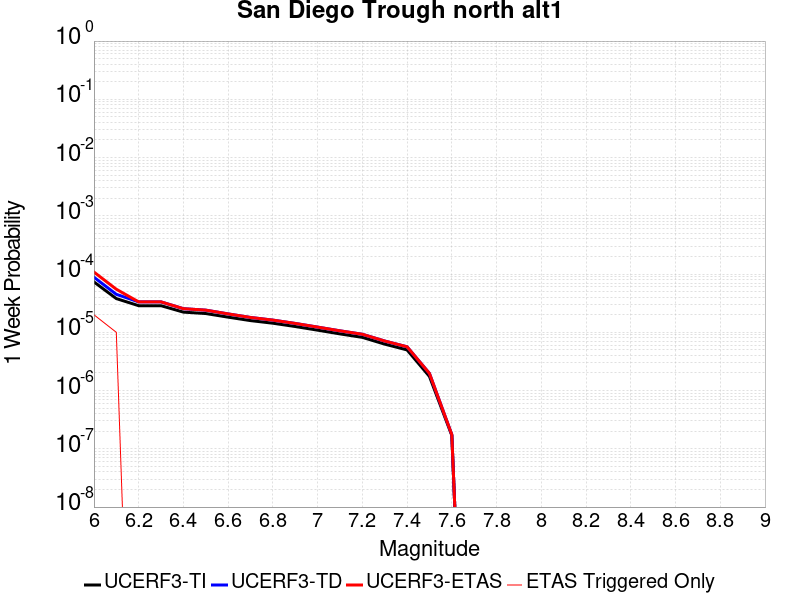 | 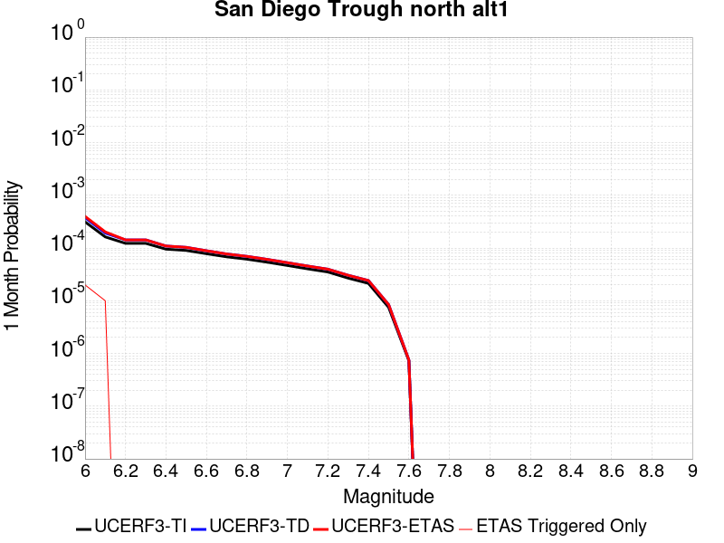 | 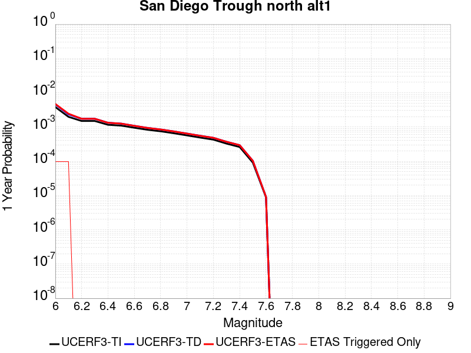 | 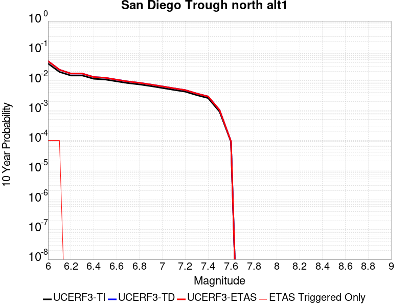 |

| Magnitude | 1 wk TI Prob | 1 wk TD Prob | 1 wk ETAS Prob | 1 wk ETAS/TD Gain | 1 wk ETAS Triggered Only | 1 mo TI Prob | 1 mo TD Prob | 1 mo ETAS Prob | 1 mo ETAS/TD Gain | 1 mo ETAS Triggered Only | 1 yr TI Prob | 1 yr TD Prob | 1 yr ETAS Prob | 1 yr ETAS/TD Gain | 1 yr ETAS Triggered Only | 10 yr TI Prob | 10 yr TD Prob | 10 yr ETAS Prob | 10 yr ETAS/TD Gain | 10 yr ETAS Triggered Only |
|-----|-----|-----|-----|-----|-----|-----|-----|-----|-----|-----|-----|-----|-----|-----|-----|-----|-----|-----|-----|-----|
| 6.0 | 7.329252E-5 | 8.821093E-5 | 8.821093E-5 | 1.0 | 0.0 | 3.14073E-4 | 3.7799572E-4 | 3.7799572E-4 | 1.0 | 0.0 | 0.0038171355 | 0.004593027 | 0.004690387 | 1.0211973 | 9.7809076E-5 | 0.03752231 | 0.045044992 | 0.045138393 | 1.0020735 | 9.7809076E-5 |
| 6.1 | 3.7940346E-5 | 4.4885E-5 | 4.4885E-5 | 1.0 | 0.0 | 1.6259136E-4 | 1.9235066E-4 | 1.9235066E-4 | 1.0 | 0.0 | 0.0019777524 | 0.0023394432 | 0.0024370234 | 1.0417109 | 9.7809076E-5 | 0.019602431 | 0.023156688 | 0.023252232 | 1.004126 | 9.7809076E-5 |
| 6.2 | 2.8645263E-5 | 3.329678E-5 | 3.329678E-5 | 1.0 | 0.0 | 1.2275964E-4 | 1.4269284E-4 | 1.4269284E-4 | 1.0 | 0.0 | 0.0014935739 | 0.0017359189 | 0.0017359189 | 1.0 | 0.0 | 0.0148357535 | 0.017226247 | 0.017226247 | 1.0 | 0.0 |
| 6.3 | 2.8645263E-5 | 3.329678E-5 | 3.329678E-5 | 1.0 | 0.0 | 1.2275964E-4 | 1.4269284E-4 | 1.4269284E-4 | 1.0 | 0.0 | 0.0014935739 | 0.0017359189 | 0.0017359189 | 1.0 | 0.0 | 0.0148357535 | 0.017226247 | 0.017226247 | 1.0 | 0.0 |
| 6.4 | 2.2204576E-5 | 2.5448318E-5 | 2.5448318E-5 | 1.0 | 0.0 | 9.5159E-5 | 1.0905972E-4 | 1.0905972E-4 | 1.0 | 0.0 | 0.001157945 | 0.0013270034 | 0.0013270034 | 1.0 | 0.0 | 0.011519298 | 0.013191955 | 0.013191955 | 1.0 | 0.0 |
| 6.5 | 2.1004838E-5 | 2.4024694E-5 | 2.4024694E-5 | 1.0 | 0.0 | 9.0017624E-5 | 1.0295896E-4 | 1.0295896E-4 | 1.0 | 0.0 | 0.0010954136 | 0.0012528138 | 0.0012528138 | 1.0 | 0.0 | 0.010900296 | 0.012458589 | 0.012458589 | 1.0 | 0.0 |
| 6.6 | 1.820557E-5 | 2.0704787E-5 | 2.0704787E-5 | 1.0 | 0.0 | 7.802154E-5 | 8.873181E-5 | 8.873181E-5 | 1.0 | 0.0 | 9.4949827E-4 | 0.0010797799 | 0.0010797799 | 1.0 | 0.0 | 0.009454516 | 0.010746004 | 0.010746004 | 1.0 | 0.0 |
| 6.7 | 1.5884485E-5 | 1.7983646E-5 | 1.7983646E-5 | 1.0 | 0.0 | 6.807459E-5 | 7.707051E-5 | 7.707051E-5 | 1.0 | 0.0 | 8.284929E-4 | 9.3793223E-4 | 9.3793223E-4 | 1.0 | 0.0 | 0.008254109 | 0.009340104 | 0.009340104 | 1.0 | 0.0 |
| 6.8 | 1.4331171E-5 | 1.6201066E-5 | 1.6201066E-5 | 1.0 | 0.0 | 6.141786E-5 | 6.94313E-5 | 6.94313E-5 | 1.0 | 0.0 | 7.4750587E-4 | 8.450002E-4 | 8.450002E-4 | 1.0 | 0.0 | 0.0074499645 | 0.008418139 | 0.008418139 | 1.0 | 0.0 |
| 6.9 | 1.2574203E-5 | 1.4205835E-5 | 1.4205835E-5 | 1.0 | 0.0 | 5.3888325E-5 | 6.0880735E-5 | 6.0880735E-5 | 1.0 | 0.0 | 6.558929E-4 | 7.409723E-4 | 7.409723E-4 | 1.0 | 0.0 | 0.0065396037 | 0.007385203 | 0.007385203 | 1.0 | 0.0 |
| 7.0 | 1.0883844E-5 | 1.2289262E-5 | 1.2289262E-5 | 1.0 | 0.0 | 4.664421E-5 | 5.2667205E-5 | 5.2667205E-5 | 1.0 | 0.0 | 5.677453E-4 | 6.4103556E-4 | 6.4103556E-4 | 1.0 | 0.0 | 0.00566297 | 0.006391993 | 0.006391993 | 1.0 | 0.0 |
| 7.1 | 9.393088E-6 | 1.060702E-5 | 1.060702E-5 | 1.0 | 0.0 | 4.025547E-5 | 4.545787E-5 | 4.545787E-5 | 1.0 | 0.0 | 4.900001E-4 | 5.533098E-4 | 5.533098E-4 | 1.0 | 0.0 | 0.0048892107 | 0.005519418 | 0.005519418 | 1.0 | 0.0 |
| 7.2 | 8.190791E-6 | 9.258625E-6 | 9.258625E-6 | 1.0 | 0.0 | 3.510292E-5 | 3.9679224E-5 | 3.9679224E-5 | 1.0 | 0.0 | 4.2729423E-4 | 4.8298817E-4 | 4.8298817E-4 | 1.0 | 0.0 | 0.0042647356 | 0.004819465 | 0.004819465 | 1.0 | 0.0 |
| 7.3 | 6.268162E-6 | 7.089716E-6 | 7.089716E-6 | 1.0 | 0.0 | 2.6863276E-5 | 3.0384144E-5 | 3.0384144E-5 | 1.0 | 0.0 | 3.2701128E-4 | 3.6986457E-4 | 3.6986457E-4 | 1.0 | 0.0 | 0.003265305 | 0.003692536 | 0.003692536 | 1.0 | 0.0 |
| 7.4 | 4.985186E-6 | 5.6426816E-6 | 5.6426816E-6 | 1.0 | 0.0 | 2.1364907E-5 | 2.4182698E-5 | 2.4182698E-5 | 1.0 | 0.0 | 2.600867E-4 | 2.9438498E-4 | 2.9438498E-4 | 1.0 | 0.0 | 0.002597825 | 0.0029399914 | 0.0029399914 | 1.0 | 0.0 |
| 7.5 | 1.7489613E-6 | 1.969678E-6 | 1.969678E-6 | 1.0 | 0.0 | 7.495527E-6 | 8.4414505E-6 | 8.4414505E-6 | 1.0 | 0.0 | 9.125422E-5 | 1.02770035E-4 | 1.02770035E-4 | 1.0 | 0.0 | 9.1216754E-4 | 0.0010272472 | 0.0010272472 | 1.0 | 0.0 |
| 7.6 | 1.6988751E-7 | 1.7533823E-7 | 1.7533823E-7 | 1.0 | 0.0 | 7.2808916E-7 | 7.5144936E-7 | 7.5144936E-7 | 1.0 | 0.0 | 8.864449E-6 | 9.14886E-6 | 9.14886E-6 | 1.0 | 0.0 | 8.8640954E-5 | 9.1485024E-5 | 9.1485024E-5 | 1.0 | 0.0 |

## San Juan
*[(top)](#table-of-contents)*

| 1 Week | 1 Month | 1 Year | 10 Year |
|-----|-----|-----|-----|
| 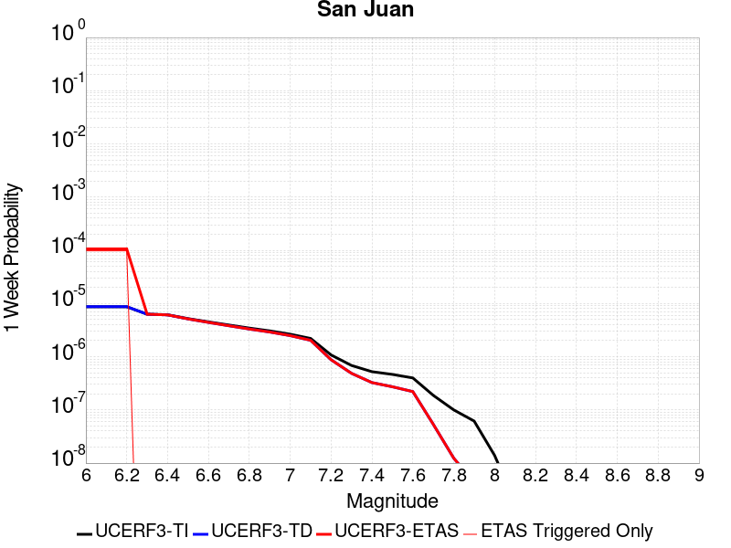 | 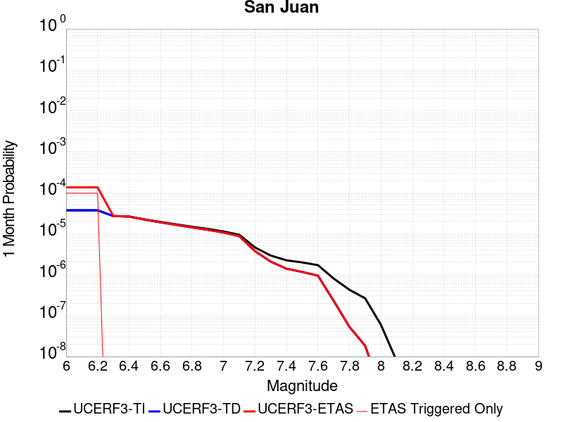 | 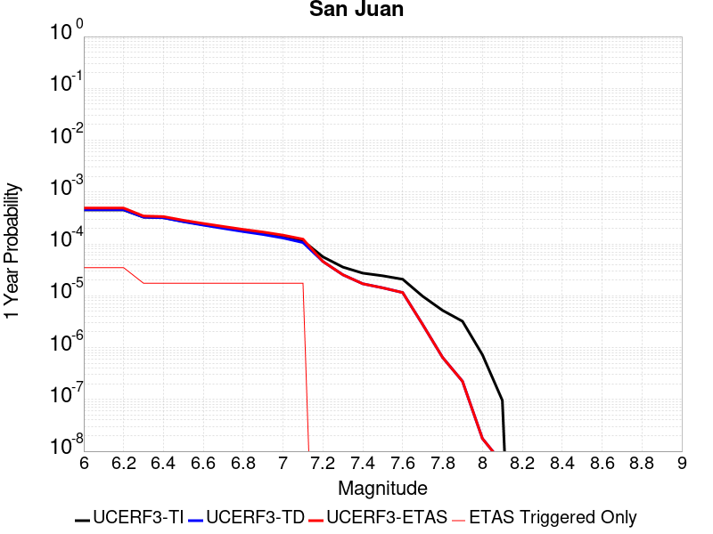 | 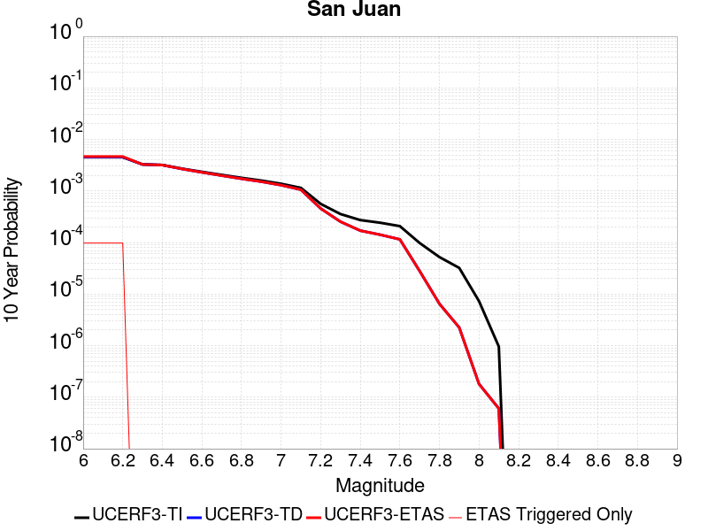 |

| Magnitude | 1 wk TI Prob | 1 wk TD Prob | 1 wk ETAS Prob | 1 wk ETAS/TD Gain | 1 wk ETAS Triggered Only | 1 mo TI Prob | 1 mo TD Prob | 1 mo ETAS Prob | 1 mo ETAS/TD Gain | 1 mo ETAS Triggered Only | 1 yr TI Prob | 1 yr TD Prob | 1 yr ETAS Prob | 1 yr ETAS/TD Gain | 1 yr ETAS Triggered Only | 10 yr TI Prob | 10 yr TD Prob | 10 yr ETAS Prob | 10 yr ETAS/TD Gain | 10 yr ETAS Triggered Only |
|-----|-----|-----|-----|-----|-----|-----|-----|-----|-----|-----|-----|-----|-----|-----|-----|-----|-----|-----|-----|-----|
| 6.0 | 8.682808E-6 | 8.7491635E-6 | 1.0655738E-4 | 12.179152 | 9.7809076E-5 | 3.72115E-5 | 3.74959E-5 | 1.353013E-4 | 3.6084292 | 9.7809076E-5 | 4.5295584E-4 | 4.564218E-4 | 5.5418623E-4 | 1.2141975 | 9.7809076E-5 | 0.004520337 | 0.004555385 | 0.0046527484 | 1.0213733 | 9.7809076E-5 |
| 6.1 | 8.682808E-6 | 8.7491635E-6 | 1.0655738E-4 | 12.179152 | 9.7809076E-5 | 3.72115E-5 | 3.74959E-5 | 1.353013E-4 | 3.6084292 | 9.7809076E-5 | 4.5295584E-4 | 4.564218E-4 | 5.5418623E-4 | 1.2141975 | 9.7809076E-5 | 0.004520337 | 0.004555385 | 0.0046527484 | 1.0213733 | 9.7809076E-5 |
| 6.2 | 8.682808E-6 | 8.7491635E-6 | 1.0655738E-4 | 12.179152 | 9.7809076E-5 | 3.72115E-5 | 3.74959E-5 | 1.353013E-4 | 3.6084292 | 9.7809076E-5 | 4.5295584E-4 | 4.564218E-4 | 5.5418623E-4 | 1.2141975 | 9.7809076E-5 | 0.004520337 | 0.004555385 | 0.0046527484 | 1.0213733 | 9.7809076E-5 |
| 6.3 | 6.3054235E-6 | 6.2825848E-6 | 6.2825848E-6 | 1.0 | 0.0 | 2.7022963E-5 | 2.6925094E-5 | 2.6925094E-5 | 1.0 | 0.0 | 3.2895492E-4 | 3.2776513E-4 | 3.2776513E-4 | 1.0 | 0.0 | 0.003284684 | 0.003273017 | 0.003273017 | 1.0 | 0.0 |
| 6.4 | 6.1490473E-6 | 6.1144656E-6 | 6.1144656E-6 | 1.0 | 0.0 | 2.6352795E-5 | 2.6204598E-5 | 2.6204598E-5 | 1.0 | 0.0 | 3.2079802E-4 | 3.1899565E-4 | 3.1899565E-4 | 1.0 | 0.0 | 0.0032033534 | 0.0031855737 | 0.0031855737 | 1.0 | 0.0 |
| 6.5 | 5.204848E-6 | 5.137233E-6 | 5.137233E-6 | 1.0 | 0.0 | 2.23063E-5 | 2.2016533E-5 | 2.2016533E-5 | 1.0 | 0.0 | 2.7154534E-4 | 2.6801927E-4 | 2.6801927E-4 | 1.0 | 0.0 | 0.0027121378 | 0.0026771144 | 0.0026771144 | 1.0 | 0.0 |
| 6.6 | 4.5179986E-6 | 4.4150297E-6 | 4.4150297E-6 | 1.0 | 0.0 | 1.9362706E-5 | 1.8921424E-5 | 1.8921424E-5 | 1.0 | 0.0 | 2.3571544E-4 | 2.3034477E-4 | 2.3034477E-4 | 1.0 | 0.0 | 0.0023546559 | 0.0023011973 | 0.0023011973 | 1.0 | 0.0 |
| 6.7 | 3.9442616E-6 | 3.819828E-6 | 3.819828E-6 | 1.0 | 0.0 | 1.6903869E-5 | 1.6370592E-5 | 1.6370592E-5 | 1.0 | 0.0 | 2.0578515E-4 | 1.992944E-4 | 1.992944E-4 | 1.0 | 0.0 | 0.002055947 | 0.0019912818 | 0.0019912818 | 1.0 | 0.0 |
| 6.8 | 3.4536245E-6 | 3.3163353E-6 | 3.3163353E-6 | 1.0 | 0.0 | 1.4801163E-5 | 1.4212792E-5 | 1.4212792E-5 | 1.0 | 0.0 | 1.8018926E-4 | 1.7302761E-4 | 1.7302761E-4 | 1.0 | 0.0 | 0.0018004322 | 0.0017290477 | 0.0017290477 | 1.0 | 0.0 |
| 6.9 | 3.059865E-6 | 2.9120315E-6 | 2.9120315E-6 | 1.0 | 0.0 | 1.3113641E-5 | 1.2480078E-5 | 1.2480078E-5 | 1.0 | 0.0 | 1.596469E-4 | 1.5193493E-4 | 1.5193493E-4 | 1.0 | 0.0 | 0.0015953224 | 0.0015184252 | 0.0015184252 | 1.0 | 0.0 |
| 7.0 | 2.6504351E-6 | 2.4920002E-6 | 2.4920002E-6 | 1.0 | 0.0 | 1.1358958E-5 | 1.0679961E-5 | 1.0679961E-5 | 1.0 | 0.0 | 1.3828653E-4 | 1.300213E-4 | 1.300213E-4 | 1.0 | 0.0 | 0.0013820052 | 0.0012995641 | 0.0012995641 | 1.0 | 0.0 |
| 7.1 | 2.2039317E-6 | 2.0338296E-6 | 2.0338296E-6 | 1.0 | 0.0 | 9.445387E-6 | 8.716386E-6 | 8.716386E-6 | 1.0 | 0.0 | 1.1499152E-4 | 1.0611736E-4 | 1.0611736E-4 | 1.0 | 0.0 | 0.0011493203 | 0.0010607769 | 0.0010607769 | 1.0 | 0.0 |
| 7.2 | 1.0786707E-6 | 8.7701903E-7 | 8.7701903E-7 | 1.0 | 0.0 | 4.622866E-6 | 3.7586476E-6 | 3.7586476E-6 | 1.0 | 0.0 | 5.628194E-5 | 4.5760586E-5 | 4.5760586E-5 | 1.0 | 0.0 | 5.6267687E-4 | 4.5757066E-4 | 4.5757066E-4 | 1.0 | 0.0 |
| 7.3 | 6.846433E-7 | 4.868805E-7 | 4.868805E-7 | 1.0 | 0.0 | 2.9341822E-6 | 2.086629E-6 | 2.086629E-6 | 1.0 | 0.0 | 3.5723086E-5 | 2.5404412E-5 | 2.5404412E-5 | 1.0 | 0.0 | 3.571734E-4 | 2.540486E-4 | 2.540486E-4 | 1.0 | 0.0 |
| 7.4 | 5.23043E-7 | 3.2628162E-7 | 3.2628162E-7 | 1.0 | 0.0 | 2.2416111E-6 | 1.398349E-6 | 1.398349E-6 | 1.0 | 0.0 | 2.7291273E-5 | 1.7024766E-5 | 1.7024766E-5 | 1.0 | 0.0 | 2.7287923E-4 | 1.7026656E-4 | 1.7026656E-4 | 1.0 | 0.0 |
| 7.5 | 4.648444E-7 | 2.7234944E-7 | 2.7234944E-7 | 1.0 | 0.0 | 1.9921886E-6 | 1.1672114E-6 | 1.1672114E-6 | 1.0 | 0.0 | 2.4254627E-5 | 1.42107065E-5 | 1.42107065E-5 | 1.0 | 0.0 | 2.425198E-4 | 1.421276E-4 | 1.421276E-4 | 1.0 | 0.0 |
| 7.6 | 3.9906567E-7 | 2.2083314E-7 | 2.2083314E-7 | 1.0 | 0.0 | 1.7102802E-6 | 9.464274E-7 | 9.464274E-7 | 1.0 | 0.0 | 2.0822463E-5 | 1.1522693E-5 | 1.1522693E-5 | 1.0 | 0.0 | 2.0820512E-4 | 1.15245566E-4 | 1.15245566E-4 | 1.0 | 0.0 |
| 7.7 | 1.8784601E-7 | 5.3666906E-8 | 5.3666906E-8 | 1.0 | 0.0 | 8.0505407E-7 | 2.30001E-7 | 2.30001E-7 | 1.0 | 0.0 | 9.80149E-6 | 2.8002585E-6 | 2.8002585E-6 | 1.0 | 0.0 | 9.801057E-5 | 2.8011282E-5 | 2.8011282E-5 | 1.0 | 0.0 |
| 7.8 | 1.00154914E-7 | 1.2415832E-8 | 1.2415832E-8 | 1.0 | 0.0 | 4.2923529E-7 | 5.3210716E-8 | 5.3210716E-8 | 1.0 | 0.0 | 5.225927E-6 | 6.4784024E-7 | 6.4784024E-7 | 1.0 | 0.0 | 5.225804E-5 | 6.484273E-6 | 6.484273E-6 | 1.0 | 0.0 |
| 7.9 | 6.171429E-8 | 4.2966155E-9 | 4.2966155E-9 | 1.0 | 0.0 | 2.6448978E-7 | 1.8414067E-8 | 1.8414067E-8 | 1.0 | 0.0 | 3.2201583E-6 | 2.2419121E-7 | 2.2419121E-7 | 1.0 | 0.0 | 3.2201115E-5 | 2.2472002E-6 | 2.2472002E-6 | 1.0 | 0.0 |
| 8.0 | 1.3974572E-8 | 3.3788217E-10 | 3.3788217E-10 | 1.0 | 0.0 | 5.989102E-8 | 1.448067E-9 | 1.448067E-9 | 1.0 | 0.0 | 7.2917294E-7 | 1.763022E-8 | 1.763022E-8 | 1.0 | 0.0 | 7.2917055E-6 | 1.8060365E-7 | 1.8060365E-7 | 1.0 | 0.0 |
| 8.1 | 1.8403477E-9 | 1.1302803E-10 | 1.1302803E-10 | 1.0 | 0.0 | 7.887204E-9 | 4.844063E-10 | 4.844063E-10 | 1.0 | 0.0 | 9.602671E-8 | 5.8976446E-9 | 5.8976446E-9 | 1.0 | 0.0 | 9.602667E-7 | 6.021993E-8 | 6.021993E-8 | 1.0 | 0.0 |

## San Andreas (Carrizo) rev
*[(top)](#table-of-contents)*

| 1 Week | 1 Month | 1 Year | 10 Year |
|-----|-----|-----|-----|
| 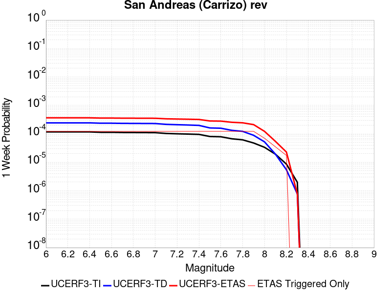 | 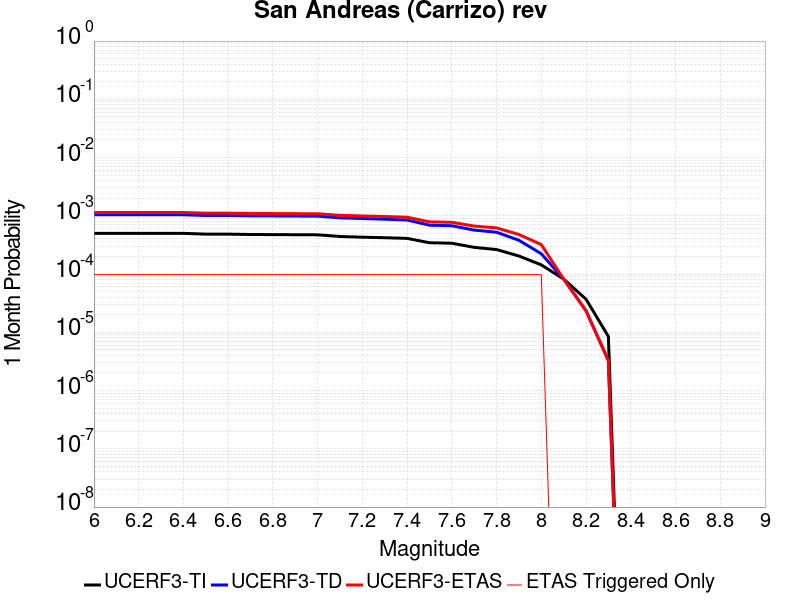 | 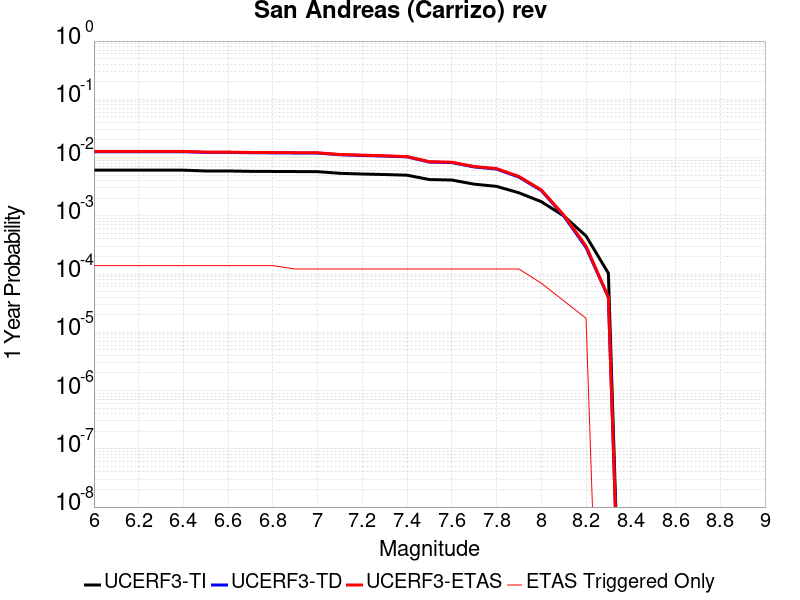 | 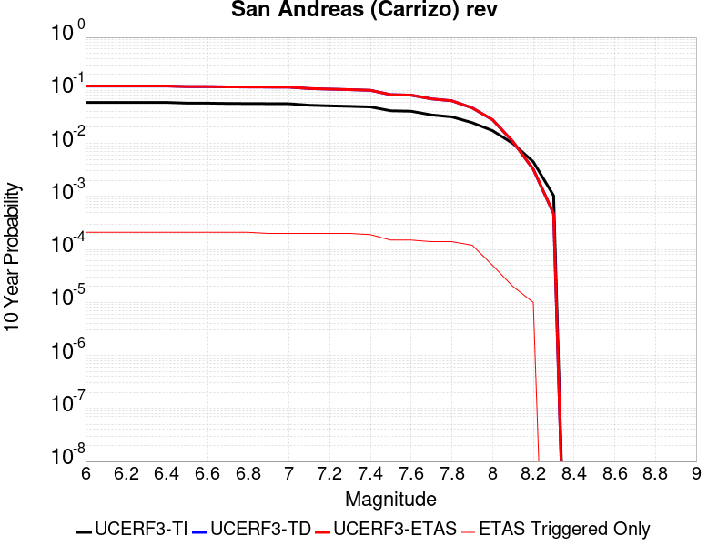 |

| Magnitude | 1 wk TI Prob | 1 wk TD Prob | 1 wk ETAS Prob | 1 wk ETAS/TD Gain | 1 wk ETAS Triggered Only | 1 mo TI Prob | 1 mo TD Prob | 1 mo ETAS Prob | 1 mo ETAS/TD Gain | 1 mo ETAS Triggered Only | 1 yr TI Prob | 1 yr TD Prob | 1 yr ETAS Prob | 1 yr ETAS/TD Gain | 1 yr ETAS Triggered Only | 10 yr TI Prob | 10 yr TD Prob | 10 yr ETAS Prob | 10 yr ETAS/TD Gain | 10 yr ETAS Triggered Only |
|-----|-----|-----|-----|-----|-----|-----|-----|-----|-----|-----|-----|-----|-----|-----|-----|-----|-----|-----|-----|-----|
| 6.0 | 1.1674632E-4 | 2.432302E-4 | 3.410155E-4 | 1.4020277 | 9.7809076E-5 | 5.002454E-4 | 0.0010420004 | 0.0011397075 | 1.0937688 | 9.7809076E-5 | 0.006073493 | 0.012613042 | 0.012709618 | 1.0076568 | 9.7809076E-5 | 0.0591016 | 0.12061418 | 0.12070019 | 1.0007131 | 9.7809076E-5 |
| 6.1 | 1.1674632E-4 | 2.432302E-4 | 3.410155E-4 | 1.4020277 | 9.7809076E-5 | 5.002454E-4 | 0.0010420004 | 0.0011397075 | 1.0937688 | 9.7809076E-5 | 0.006073493 | 0.012613042 | 0.012709618 | 1.0076568 | 9.7809076E-5 | 0.0591016 | 0.12061418 | 0.12070019 | 1.0007131 | 9.7809076E-5 |
| 6.2 | 1.1674632E-4 | 2.432302E-4 | 3.410155E-4 | 1.4020277 | 9.7809076E-5 | 5.002454E-4 | 0.0010420004 | 0.0011397075 | 1.0937688 | 9.7809076E-5 | 0.006073493 | 0.012613042 | 0.012709618 | 1.0076568 | 9.7809076E-5 | 0.0591016 | 0.12061418 | 0.12070019 | 1.0007131 | 9.7809076E-5 |
| 6.3 | 1.1674632E-4 | 2.432302E-4 | 3.410155E-4 | 1.4020277 | 9.7809076E-5 | 5.002454E-4 | 0.0010420004 | 0.0011397075 | 1.0937688 | 9.7809076E-5 | 0.006073493 | 0.012613042 | 0.012709618 | 1.0076568 | 9.7809076E-5 | 0.0591016 | 0.12061418 | 0.12070019 | 1.0007131 | 9.7809076E-5 |
| 6.4 | 1.1674632E-4 | 2.432302E-4 | 3.410155E-4 | 1.4020277 | 9.7809076E-5 | 5.002454E-4 | 0.0010420004 | 0.0011397075 | 1.0937688 | 9.7809076E-5 | 0.006073493 | 0.012613042 | 0.012709618 | 1.0076568 | 9.7809076E-5 | 0.0591016 | 0.12061418 | 0.12070019 | 1.0007131 | 9.7809076E-5 |
| 6.5 | 1.13136164E-4 | 2.3643032E-4 | 3.3421628E-4 | 1.413593 | 9.7809076E-5 | 4.847792E-4 | 0.0010128808 | 0.0011105909 | 1.0964674 | 9.7809076E-5 | 0.0058862255 | 0.012262545 | 0.0123591535 | 1.0078784 | 9.7809076E-5 | 0.057327334 | 0.117585555 | 0.11767186 | 1.000734 | 9.7809076E-5 |
| 6.6 | 1.13136164E-4 | 2.3643032E-4 | 3.3421628E-4 | 1.413593 | 9.7809076E-5 | 4.847792E-4 | 0.0010128808 | 0.0011105909 | 1.0964674 | 9.7809076E-5 | 0.0058862255 | 0.012262545 | 0.0123591535 | 1.0078784 | 9.7809076E-5 | 0.057327334 | 0.117585555 | 0.11767186 | 1.000734 | 9.7809076E-5 |
| 6.7 | 1.1149675E-4 | 2.3334254E-4 | 3.311288E-4 | 1.4190674 | 9.7809076E-5 | 4.777557E-4 | 9.996577E-4 | 0.001097369 | 1.0977447 | 9.7809076E-5 | 0.0058011734 | 0.012103349 | 0.012199975 | 1.0079833 | 9.7809076E-5 | 0.05652051 | 0.1162071 | 0.11629354 | 1.0007439 | 9.7809076E-5 |
| 6.8 | 1.1103589E-4 | 2.3236412E-4 | 3.3015048E-4 | 1.4208324 | 9.7809076E-5 | 4.7578133E-4 | 9.954676E-4 | 0.0010931795 | 1.0981566 | 9.7809076E-5 | 0.005777263 | 0.012052901 | 0.012149531 | 1.0080172 | 9.7809076E-5 | 0.056293584 | 0.1157674 | 0.11585388 | 1.0007471 | 9.7809076E-5 |
| 6.9 | 1.1053259E-4 | 2.3128795E-4 | 3.2907442E-4 | 1.422791 | 9.7809076E-5 | 4.7362508E-4 | 9.90859E-4 | 0.0010885712 | 1.0986136 | 9.7809076E-5 | 0.0057511497 | 0.01199741 | 0.012094046 | 1.0080547 | 9.7809076E-5 | 0.05604569 | 0.11528359 | 0.115370125 | 1.0007507 | 9.7809076E-5 |
| 7.0 | 1.1005377E-4 | 2.3029637E-4 | 3.280829E-4 | 1.4246118 | 9.7809076E-5 | 4.7157376E-4 | 9.866126E-4 | 0.0010843253 | 1.0990385 | 9.7809076E-5 | 0.0057263062 | 0.011946279 | 0.012042919 | 1.0080895 | 9.7809076E-5 | 0.055809796 | 0.11483591 | 0.114922486 | 1.0007539 | 9.7809076E-5 |
| 7.1 | 1.0308142E-4 | 2.1539345E-4 | 3.1318146E-4 | 1.4539971 | 9.7809076E-5 | 4.417027E-4 | 9.227892E-4 | 0.001020508 | 1.105895 | 9.7809076E-5 | 0.0053644776 | 0.011177397 | 0.011274113 | 1.0086528 | 9.7809076E-5 | 0.052368138 | 0.108092256 | 0.108179495 | 1.000807 | 9.7809076E-5 |
| 7.2 | 1.0027479E-4 | 2.094724E-4 | 3.07261E-4 | 1.4668328 | 9.7809076E-5 | 4.296783E-4 | 8.9743105E-4 | 9.951524E-4 | 1.10889 | 9.7809076E-5 | 0.0052187922 | 0.010871782 | 0.010968528 | 1.0088987 | 9.7809076E-5 | 0.050979212 | 0.10539625 | 0.10548375 | 1.0008302 | 9.7809076E-5 |
| 7.3 | 9.816942E-5 | 2.0422463E-4 | 3.0201374E-4 | 1.478831 | 9.7809076E-5 | 4.2065824E-4 | 8.7495585E-4 | 9.7267935E-4 | 1.1116897 | 9.7809076E-5 | 0.005109493 | 0.010600842 | 0.010697614 | 1.0091287 | 9.7809076E-5 | 0.049935985 | 0.102979995 | 0.10306773 | 1.000852 | 9.7809076E-5 |
| 7.4 | 9.5634205E-5 | 1.9791997E-4 | 2.9570967E-4 | 1.4940872 | 9.7809076E-5 | 4.0979648E-4 | 8.479536E-4 | 9.456797E-4 | 1.1152494 | 9.7809076E-5 | 0.0049778637 | 0.010275229 | 0.010372033 | 1.0094211 | 9.7809076E-5 | 0.048678253 | 0.10006632 | 0.10015434 | 1.0008796 | 9.7809076E-5 |
| 7.5 | 8.052417E-5 | 1.611261E-4 | 2.589194E-4 | 1.6069366 | 9.7809076E-5 | 3.4505792E-4 | 6.903579E-4 | 7.880994E-4 | 1.1415809 | 9.7809076E-5 | 0.0041929903 | 0.008372796 | 0.008469786 | 1.0115839 | 9.7809076E-5 | 0.04114753 | 0.08281049 | 0.082900204 | 1.0010833 | 9.7809076E-5 |
| 7.6 | 7.897024E-5 | 1.5765853E-4 | 2.5545218E-4 | 1.6202878 | 9.7809076E-5 | 3.384E-4 | 6.755046E-4 | 7.732476E-4 | 1.1446962 | 9.7809076E-5 | 0.0041122385 | 0.008193332 | 0.008290339 | 1.0118399 | 9.7809076E-5 | 0.040369697 | 0.08115171 | 0.08124158 | 1.0011075 | 9.7809076E-5 |
| 7.7 | 6.707427E-5 | 1.3276102E-4 | 2.3055713E-4 | 1.7366326 | 9.7809076E-5 | 2.8742946E-4 | 5.688518E-4 | 6.6660525E-4 | 1.1718434 | 9.7809076E-5 | 0.003493839 | 0.00690381 | 0.0070009436 | 1.0140696 | 9.7809076E-5 | 0.034394164 | 0.069048055 | 0.069139116 | 1.0013187 | 9.7809076E-5 |
| 7.8 | 6.147705E-5 | 1.2197486E-4 | 2.19772E-4 | 1.8017812 | 9.7809076E-5 | 2.6344648E-4 | 5.226447E-4 | 6.204027E-4 | 1.1870447 | 9.7809076E-5 | 0.0032027436 | 0.006344659 | 0.0064418474 | 1.0153182 | 9.7809076E-5 | 0.031569764 | 0.06351457 | 0.06360616 | 1.0014422 | 9.7809076E-5 |
| 7.9 | 4.7636717E-5 | 8.87977E-5 | 1.8659809E-4 | 2.1013844 | 9.7809076E-5 | 2.0414138E-4 | 3.8050607E-4 | 4.7827794E-4 | 1.2569522 | 9.7809076E-5 | 0.0024825884 | 0.0046228287 | 0.0047201854 | 1.02106 | 9.7809076E-5 | 0.024550365 | 0.046628095 | 0.046721343 | 1.0019999 | 9.7809076E-5 |
| 8.0 | 3.3554235E-5 | 5.2136907E-5 | 1.4994088E-4 | 2.8759067 | 9.7809076E-5 | 1.4379594E-4 | 2.2342477E-4 | 3.21212E-4 | 1.437674 | 9.7809076E-5 | 0.0017493097 | 0.002716805 | 0.0028143483 | 1.0359037 | 9.7809076E-5 | 0.017356034 | 0.027880952 | 0.027976034 | 1.0034103 | 9.7809076E-5 |
| 8.1 | 1.9175432E-5 | 1.9184976E-5 | 1.9184976E-5 | 1.0 | 0.0 | 8.217783E-5 | 8.2218736E-5 | 8.2218736E-5 | 1.0 | 0.0 | 0.0010000558 | 0.0010005541 | 0.0010005541 | 1.0 | 0.0 | 0.009955673 | 0.0107580265 | 0.0107580265 | 1.0 | 0.0 |
| 8.2 | 8.643924E-6 | 5.4748625E-6 | 5.4748625E-6 | 1.0 | 0.0 | 3.704486E-5 | 2.3463486E-5 | 2.3463486E-5 | 1.0 | 0.0 | 4.5092785E-4 | 2.8563058E-4 | 2.8563058E-4 | 1.0 | 0.0 | 0.0045001395 | 0.0032487072 | 0.0032487072 | 1.0 | 0.0 |
| 8.3 | 1.983087E-6 | 7.6599065E-7 | 7.6599065E-7 | 1.0 | 0.0 | 8.498917E-6 | 3.282813E-6 | 3.282813E-6 | 1.0 | 0.0 | 1.034694E-4 | 3.9967534E-5 | 3.9967534E-5 | 1.0 | 0.0 | 0.0010342124 | 4.719687E-4 | 4.719687E-4 | 1.0 | 0.0 |

## Bartlett Springs 2011 CFM
*[(top)](#table-of-contents)*

| 1 Week | 1 Month | 1 Year | 10 Year |
|-----|-----|-----|-----|
| 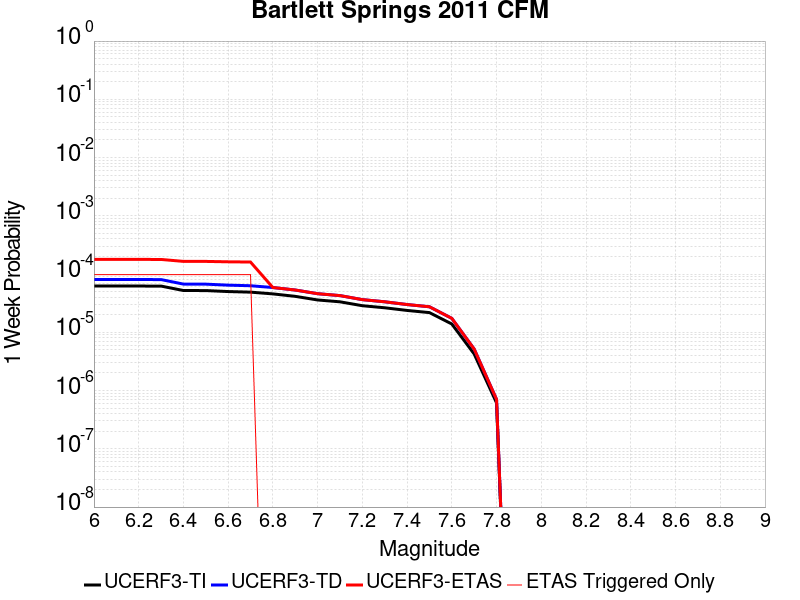 | 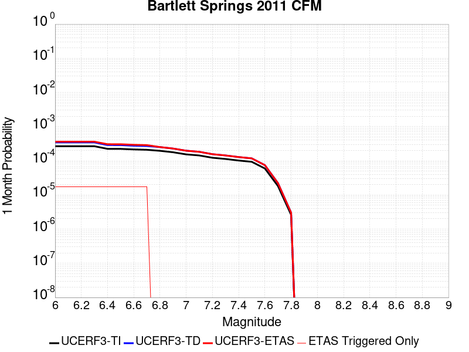 | 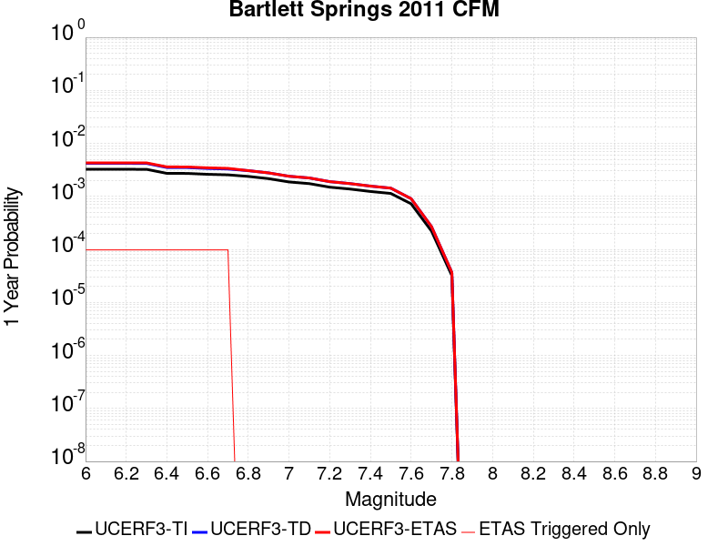 | 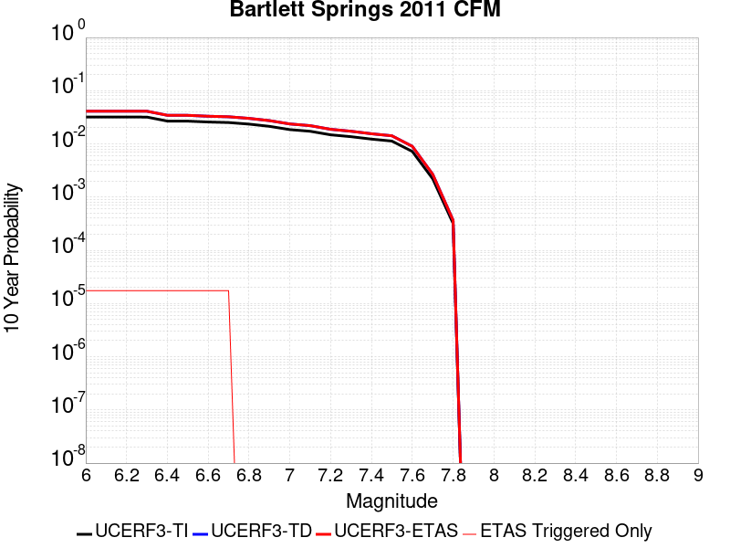 |

| Magnitude | 1 wk TI Prob | 1 wk TD Prob | 1 wk ETAS Prob | 1 wk ETAS/TD Gain | 1 wk ETAS Triggered Only | 1 mo TI Prob | 1 mo TD Prob | 1 mo ETAS Prob | 1 mo ETAS/TD Gain | 1 mo ETAS Triggered Only | 1 yr TI Prob | 1 yr TD Prob | 1 yr ETAS Prob | 1 yr ETAS/TD Gain | 1 yr ETAS Triggered Only | 10 yr TI Prob | 10 yr TD Prob | 10 yr ETAS Prob | 10 yr ETAS/TD Gain | 10 yr ETAS Triggered Only |
|-----|-----|-----|-----|-----|-----|-----|-----|-----|-----|-----|-----|-----|-----|-----|-----|-----|-----|-----|-----|-----|
| 6.0 | 6.2326144E-5 | 8.060613E-5 | 1.7840732E-4 | 2.2133222 | 9.7809076E-5 | 2.6708472E-4 | 3.454099E-4 | 4.4318518E-4 | 1.2830703 | 9.7809076E-5 | 0.003246908 | 0.0041973945 | 0.004294793 | 1.0232046 | 9.7809076E-5 | 0.031998757 | 0.04119771 | 0.04129149 | 1.0022763 | 9.7809076E-5 |
| 6.1 | 6.227657E-5 | 8.054363E-5 | 1.7834482E-4 | 2.2142637 | 9.7809076E-5 | 2.668723E-4 | 3.4514212E-4 | 4.4291743E-4 | 1.28329 | 9.7809076E-5 | 0.0032443295 | 0.004194147 | 0.004291546 | 1.0232226 | 9.7809076E-5 | 0.031973712 | 0.041166443 | 0.041260228 | 1.0022781 | 9.7809076E-5 |
| 6.2 | 6.22452E-5 | 8.050423E-5 | 1.7830543E-4 | 2.2148578 | 9.7809076E-5 | 2.6673786E-4 | 3.4497332E-4 | 4.4274866E-4 | 1.2834287 | 9.7809076E-5 | 0.0032426978 | 0.0041921 | 0.004289499 | 1.023234 | 9.7809076E-5 | 0.03195787 | 0.041146737 | 0.04124052 | 1.0022793 | 9.7809076E-5 |
| 6.3 | 6.219006E-5 | 8.043407E-5 | 1.7823528E-4 | 2.2159178 | 9.7809076E-5 | 2.6650162E-4 | 3.4467268E-4 | 4.4244804E-4 | 1.283676 | 9.7809076E-5 | 0.00323983 | 0.0041884542 | 0.0042858534 | 1.0232543 | 9.7809076E-5 | 0.031930014 | 0.041111637 | 0.041205425 | 1.0022813 | 9.7809076E-5 |
| 6.4 | 5.2175856E-5 | 6.725342E-5 | 1.6505593E-4 | 2.4542382 | 9.7809076E-5 | 2.2359163E-4 | 2.8819745E-4 | 3.8597835E-4 | 1.3392844 | 9.7809076E-5 | 0.0027188298 | 0.0035032115 | 0.003600678 | 1.027822 | 9.7809076E-5 | 0.026858058 | 0.034489222 | 0.034583658 | 1.0027381 | 9.7809076E-5 |
| 6.5 | 5.205166E-5 | 6.7096094E-5 | 1.648986E-4 | 2.4576483 | 9.7809076E-5 | 2.2305945E-4 | 2.8752335E-4 | 3.853043E-4 | 1.34008 | 9.7809076E-5 | 0.0027123666 | 0.0034950306 | 0.003592498 | 1.0278873 | 9.7809076E-5 | 0.026794989 | 0.034409966 | 0.03450441 | 1.0027447 | 9.7809076E-5 |
| 6.6 | 5.0085426E-5 | 6.449277E-5 | 1.6229555E-4 | 2.516492 | 9.7809076E-5 | 2.1463417E-4 | 2.763686E-4 | 3.7415067E-4 | 1.3538102 | 9.7809076E-5 | 0.0026100394 | 0.0033596456 | 0.003457126 | 1.0290151 | 9.7809076E-5 | 0.025795965 | 0.033097573 | 0.033192143 | 1.0028573 | 9.7809076E-5 |
| 6.7 | 4.8930866E-5 | 6.3017396E-5 | 1.608203E-4 | 2.5519986 | 9.7809076E-5 | 2.0968684E-4 | 2.7004688E-4 | 3.6782955E-4 | 1.3620951 | 9.7809076E-5 | 0.0025499484 | 0.0032829174 | 0.0033804055 | 1.0296955 | 9.7809076E-5 | 0.025208864 | 0.03235294 | 0.032447584 | 1.0029254 | 9.7809076E-5 |
| 6.8 | 4.5679535E-5 | 5.8741858E-5 | 5.8741858E-5 | 1.0 | 0.0 | 1.9575475E-4 | 2.5172674E-4 | 2.5172674E-4 | 1.0 | 0.0 | 0.002380709 | 0.0030605064 | 0.0030605064 | 1.0 | 0.0 | 0.023553653 | 0.03019042 | 0.03019042 | 1.0 | 0.0 |
| 6.9 | 4.1439176E-5 | 5.3220094E-5 | 5.3220094E-5 | 1.0 | 0.0 | 1.7758438E-4 | 2.2806633E-4 | 2.2806633E-4 | 1.0 | 0.0 | 0.002159946 | 0.0027731995 | 0.0027731995 | 1.0 | 0.0 | 0.021390721 | 0.027390772 | 0.027390772 | 1.0 | 0.0 |
| 7.0 | 3.5920104E-5 | 4.600871E-5 | 4.600871E-5 | 1.0 | 0.0 | 1.5393422E-4 | 1.9716538E-4 | 1.9716538E-4 | 1.0 | 0.0 | 0.001872538 | 0.0023978627 | 0.0023978627 | 1.0 | 0.0 | 0.018568378 | 0.023723004 | 0.023723004 | 1.0 | 0.0 |
| 7.1 | 3.338812E-5 | 4.2689582E-5 | 4.2689582E-5 | 1.0 | 0.0 | 1.430841E-4 | 1.829426E-4 | 1.829426E-4 | 1.0 | 0.0 | 0.0017406568 | 0.0022250658 | 0.0022250658 | 1.0 | 0.0 | 0.017270854 | 0.02203054 | 0.02203054 | 1.0 | 0.0 |
| 7.2 | 2.8619615E-5 | 3.6401652E-5 | 3.6401652E-5 | 1.0 | 0.0 | 1.2264973E-4 | 1.5599781E-4 | 1.5599781E-4 | 1.0 | 0.0 | 0.0014922376 | 0.0018976285 | 0.0018976285 | 1.0 | 0.0 | 0.014822568 | 0.01881613 | 0.01881613 | 1.0 | 0.0 |
| 7.3 | 2.6376783E-5 | 3.342276E-5 | 3.342276E-5 | 1.0 | 0.0 | 1.13038455E-4 | 1.4323258E-4 | 1.4323258E-4 | 1.0 | 0.0 | 0.0013753743 | 0.001742471 | 0.001742471 | 1.0 | 0.0 | 0.01366893 | 0.01728972 | 0.01728972 | 1.0 | 0.0 |
| 7.4 | 2.3738676E-5 | 2.9978975E-5 | 2.9978975E-5 | 1.0 | 0.0 | 1.0173322E-4 | 1.2847505E-4 | 1.2847505E-4 | 1.0 | 0.0 | 0.0012378981 | 0.0015630693 | 0.0015630693 | 1.0 | 0.0 | 0.012310251 | 0.015522073 | 0.015522073 | 1.0 | 0.0 |
| 7.5 | 2.1789481E-5 | 2.7439388E-5 | 2.7439388E-5 | 1.0 | 0.0 | 9.338015E-5 | 1.1759212E-4 | 1.1759212E-4 | 1.0 | 0.0 | 0.0011363103 | 0.0014307518 | 0.0014307518 | 1.0 | 0.0 | 0.011305175 | 0.014216576 | 0.014216576 | 1.0 | 0.0 |
| 7.6 | 1.3895281E-5 | 1.7368426E-5 | 1.7368426E-5 | 1.0 | 0.0 | 5.9549846E-5 | 7.4434E-5 | 7.4434E-5 | 1.0 | 0.0 | 7.2477816E-4 | 9.0586004E-4 | 9.0586004E-4 | 1.0 | 0.0 | 0.0072241887 | 0.009022084 | 0.009022084 | 1.0 | 0.0 |
| 7.7 | 4.245981E-6 | 5.1624675E-6 | 5.1624675E-6 | 1.0 | 0.0 | 1.8196934E-5 | 2.2124674E-5 | 2.2124674E-5 | 1.0 | 0.0 | 2.2152514E-4 | 2.693348E-4 | 2.693348E-4 | 1.0 | 0.0 | 0.0022130446 | 0.0026901034 | 0.0026901034 | 1.0 | 0.0 |
| 7.8 | 6.145192E-7 | 7.047006E-7 | 7.047006E-7 | 1.0 | 0.0 | 2.633651E-6 | 3.020142E-6 | 3.020142E-6 | 1.0 | 0.0 | 3.206423E-5 | 3.676962E-5 | 3.676962E-5 | 1.0 | 0.0 | 3.2059604E-4 | 3.6763478E-4 | 3.6763478E-4 | 1.0 | 0.0 |

## Santa Ynez (West)
*[(top)](#table-of-contents)*

| 1 Week | 1 Month | 1 Year | 10 Year |
|-----|-----|-----|-----|
| 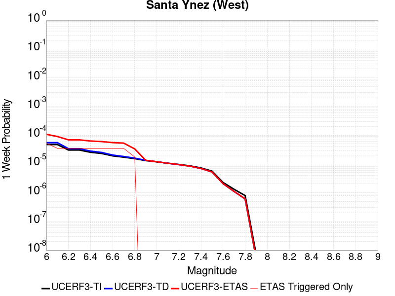 | 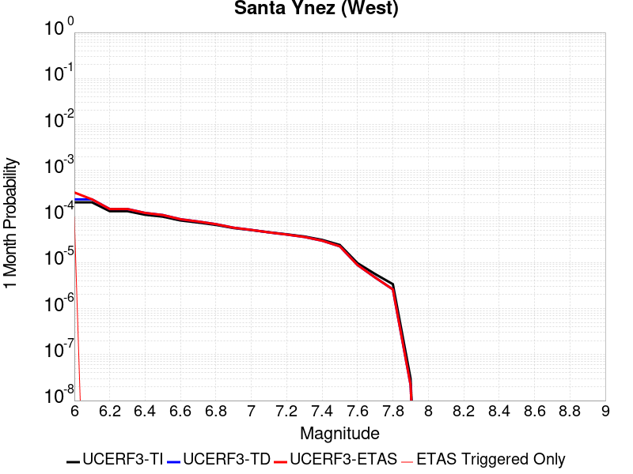 | 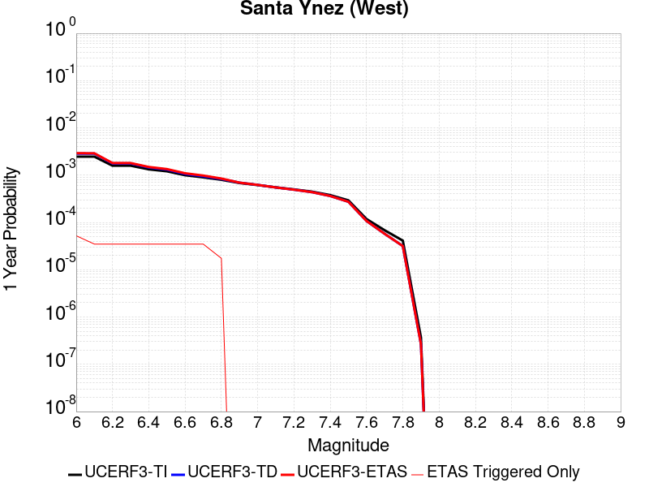 | 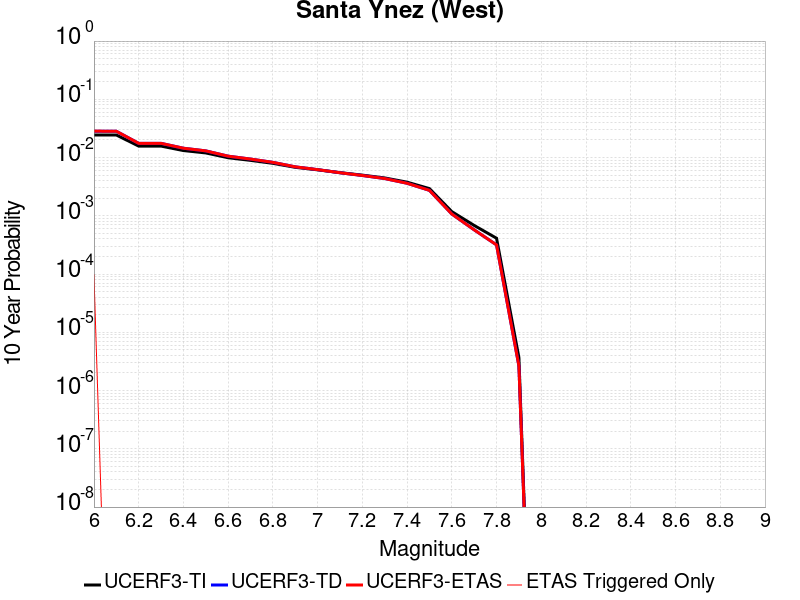 |

| Magnitude | 1 wk TI Prob | 1 wk TD Prob | 1 wk ETAS Prob | 1 wk ETAS/TD Gain | 1 wk ETAS Triggered Only | 1 mo TI Prob | 1 mo TD Prob | 1 mo ETAS Prob | 1 mo ETAS/TD Gain | 1 mo ETAS Triggered Only | 1 yr TI Prob | 1 yr TD Prob | 1 yr ETAS Prob | 1 yr ETAS/TD Gain | 1 yr ETAS Triggered Only | 10 yr TI Prob | 10 yr TD Prob | 10 yr ETAS Prob | 10 yr ETAS/TD Gain | 10 yr ETAS Triggered Only |
|-----|-----|-----|-----|-----|-----|-----|-----|-----|-----|-----|-----|-----|-----|-----|-----|-----|-----|-----|-----|-----|
| 6.0 | 4.7352758E-5 | 5.4972126E-5 | 1.5277583E-4 | 2.7791507 | 9.7809076E-5 | 2.0292461E-4 | 2.3557522E-4 | 3.3336124E-4 | 1.4150947 | 9.7809076E-5 | 0.0024678076 | 0.0028645284 | 0.0029620572 | 1.0340471 | 9.7809076E-5 | 0.024405818 | 0.028304417 | 0.028399458 | 1.0033578 | 9.7809076E-5 |
| 6.1 | 4.7352758E-5 | 5.4972126E-5 | 5.4972126E-5 | 1.0 | 0.0 | 2.0292461E-4 | 2.3557522E-4 | 2.3557522E-4 | 1.0 | 0.0 | 0.0024678076 | 0.0028645284 | 0.0028645284 | 1.0 | 0.0 | 0.024405818 | 0.028304417 | 0.028304417 | 1.0 | 0.0 |
| 6.2 | 3.0415853E-5 | 3.392511E-5 | 3.392511E-5 | 1.0 | 0.0 | 1.3034715E-4 | 1.4538545E-4 | 1.4538545E-4 | 1.0 | 0.0 | 0.0015858212 | 0.0017686661 | 0.0017686661 | 1.0 | 0.0 | 0.015745522 | 0.017549807 | 0.017549807 | 1.0 | 0.0 |
| 6.3 | 3.0415853E-5 | 3.392511E-5 | 3.392511E-5 | 1.0 | 0.0 | 1.3034715E-4 | 1.4538545E-4 | 1.4538545E-4 | 1.0 | 0.0 | 0.0015858212 | 0.0017686661 | 0.0017686661 | 1.0 | 0.0 | 0.015745522 | 0.017549807 | 0.017549807 | 1.0 | 0.0 |
| 6.4 | 2.5452082E-5 | 2.7912422E-5 | 2.7912422E-5 | 1.0 | 0.0 | 1.09075794E-4 | 1.196193E-4 | 1.196193E-4 | 1.0 | 0.0 | 0.0013271887 | 0.0014554089 | 0.0014554089 | 1.0 | 0.0 | 0.013192902 | 0.014460951 | 0.014460951 | 1.0 | 0.0 |
| 6.5 | 2.3143784E-5 | 2.5128256E-5 | 2.5128256E-5 | 1.0 | 0.0 | 9.9183875E-5 | 1.0768817E-4 | 1.0768817E-4 | 1.0 | 0.0 | 0.0012068948 | 0.0013103267 | 0.0013103267 | 1.0 | 0.0 | 0.012003611 | 0.01302768 | 0.01302768 | 1.0 | 0.0 |
| 6.6 | 1.9118515E-5 | 2.035434E-5 | 2.035434E-5 | 1.0 | 0.0 | 8.193392E-5 | 8.7230015E-5 | 8.7230015E-5 | 1.0 | 0.0 | 9.97089E-4 | 0.001061516 | 0.001061516 | 1.0 | 0.0 | 0.00992627 | 0.010565365 | 0.010565365 | 1.0 | 0.0 |
| 6.7 | 1.722807E-5 | 1.8146347E-5 | 1.8146347E-5 | 1.0 | 0.0 | 7.3832496E-5 | 7.776777E-5 | 7.776777E-5 | 1.0 | 0.0 | 8.985399E-4 | 9.464169E-4 | 9.464169E-4 | 1.0 | 0.0 | 0.008949154 | 0.0094245095 | 0.0094245095 | 1.0 | 0.0 |
| 6.8 | 1.5317364E-5 | 1.5926486E-5 | 1.5926486E-5 | 1.0 | 0.0 | 6.56442E-5 | 6.82546E-5 | 6.82546E-5 | 1.0 | 0.0 | 7.98925E-4 | 8.306873E-4 | 8.306873E-4 | 1.0 | 0.0 | 0.007960589 | 0.00827631 | 0.00827631 | 1.0 | 0.0 |
| 6.9 | 1.3071226E-5 | 1.3329624E-5 | 1.3329624E-5 | 1.0 | 0.0 | 5.6018336E-5 | 5.7125722E-5 | 5.7125722E-5 | 1.0 | 0.0 | 6.8180985E-4 | 6.9528597E-4 | 6.9528597E-4 | 1.0 | 0.0 | 0.0067972173 | 0.006931367 | 0.006931367 | 1.0 | 0.0 |
| 7.0 | 1.1836986E-5 | 1.19327815E-5 | 1.19327815E-5 | 1.0 | 0.0 | 5.0728955E-5 | 5.11395E-5 | 5.11395E-5 | 1.0 | 0.0 | 6.1745E-4 | 6.2244723E-4 | 6.2244723E-4 | 1.0 | 0.0 | 0.006157372 | 0.006207231 | 0.006207231 | 1.0 | 0.0 |
| 7.1 | 1.0597169E-5 | 1.0542201E-5 | 1.0542201E-5 | 1.0 | 0.0 | 4.541565E-5 | 4.5180084E-5 | 4.5180084E-5 | 1.0 | 0.0 | 5.5279525E-4 | 5.4992986E-4 | 5.4992986E-4 | 1.0 | 0.0 | 0.0055142213 | 0.005485821 | 0.005485821 | 1.0 | 0.0 |
| 7.2 | 9.59113E-6 | 9.459144E-6 | 9.459144E-6 | 1.0 | 0.0 | 4.11042E-5 | 4.0538565E-5 | 4.0538565E-5 | 1.0 | 0.0 | 5.0032866E-4 | 4.934463E-4 | 4.934463E-4 | 1.0 | 0.0 | 0.004992037 | 0.0049236254 | 0.0049236254 | 1.0 | 0.0 |
| 7.3 | 8.586084E-6 | 8.379583E-6 | 8.379583E-6 | 1.0 | 0.0 | 3.679698E-5 | 3.5912013E-5 | 3.5912013E-5 | 1.0 | 0.0 | 4.4791115E-4 | 4.3714207E-4 | 4.3714207E-4 | 1.0 | 0.0 | 0.004470094 | 0.004362933 | 0.004362933 | 1.0 | 0.0 |
| 7.4 | 7.2622997E-6 | 6.9515427E-6 | 6.9515427E-6 | 1.0 | 0.0 | 3.112377E-5 | 2.979199E-5 | 2.979199E-5 | 1.0 | 0.0 | 3.78866E-4 | 3.626581E-4 | 3.626581E-4 | 1.0 | 0.0 | 0.0037822074 | 0.0036207628 | 0.0036207628 | 1.0 | 0.0 |
| 7.5 | 5.627296E-6 | 5.251588E-6 | 5.251588E-6 | 1.0 | 0.0 | 2.411676E-5 | 2.2506614E-5 | 2.2506614E-5 | 1.0 | 0.0 | 2.9358198E-4 | 2.739843E-4 | 2.739843E-4 | 1.0 | 0.0 | 0.0029319443 | 0.002736537 | 0.002736537 | 1.0 | 0.0 |
| 7.6 | 2.265244E-6 | 2.0608625E-6 | 2.0608625E-6 | 1.0 | 0.0 | 9.708152E-6 | 8.832238E-6 | 8.832238E-6 | 1.0 | 0.0 | 1.18190335E-4 | 1.0752728E-4 | 1.0752728E-4 | 1.0 | 0.0 | 0.001181275 | 0.0010747612 | 0.0010747612 | 1.0 | 0.0 |
| 7.7 | 1.3099874E-6 | 1.1016252E-6 | 1.1016252E-6 | 1.0 | 0.0 | 5.61422E-6 | 4.7212425E-6 | 4.7212425E-6 | 1.0 | 0.0 | 6.8350986E-5 | 5.7479636E-5 | 5.7479636E-5 | 1.0 | 0.0 | 6.832996E-4 | 5.7465007E-4 | 5.7465007E-4 | 1.0 | 0.0 |
| 7.8 | 7.903951E-7 | 6.0711415E-7 | 6.0711415E-7 | 1.0 | 0.0 | 3.3874032E-6 | 2.6019152E-6 | 2.6019152E-6 | 1.0 | 0.0 | 4.1240855E-5 | 3.167787E-5 | 3.167787E-5 | 1.0 | 0.0 | 4.12332E-4 | 3.167349E-4 | 3.167349E-4 | 1.0 | 0.0 |
| 7.9 | 7.0753297E-9 | 5.0899476E-9 | 5.0899476E-9 | 1.0 | 0.0 | 3.032284E-8 | 2.181406E-8 | 2.181406E-8 | 1.0 | 0.0 | 3.6918053E-7 | 2.6558615E-7 | 2.6558615E-7 | 1.0 | 0.0 | 3.691799E-6 | 2.6558594E-6 | 2.6558594E-6 | 1.0 | 0.0 |

## San Andreas (Big Bend)
*[(top)](#table-of-contents)*

| 1 Week | 1 Month | 1 Year | 10 Year |
|-----|-----|-----|-----|
| 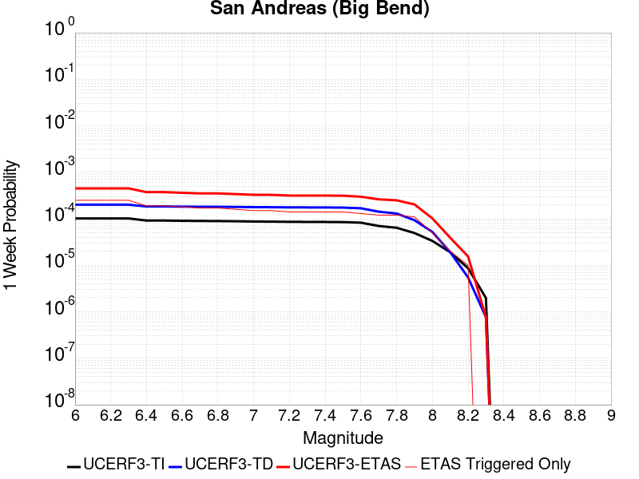 | 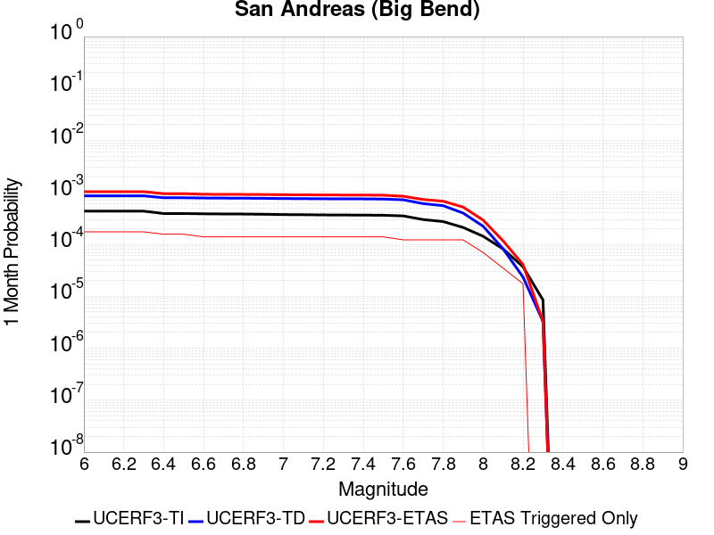 | 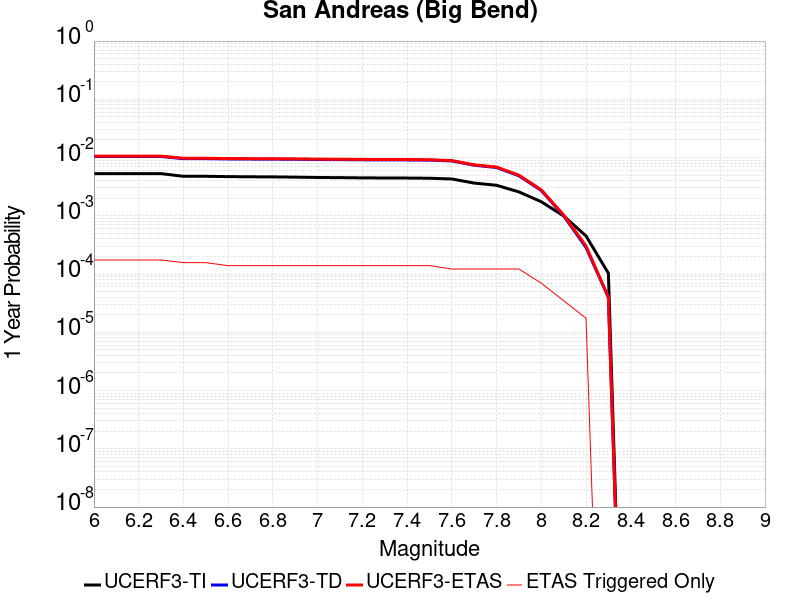 | 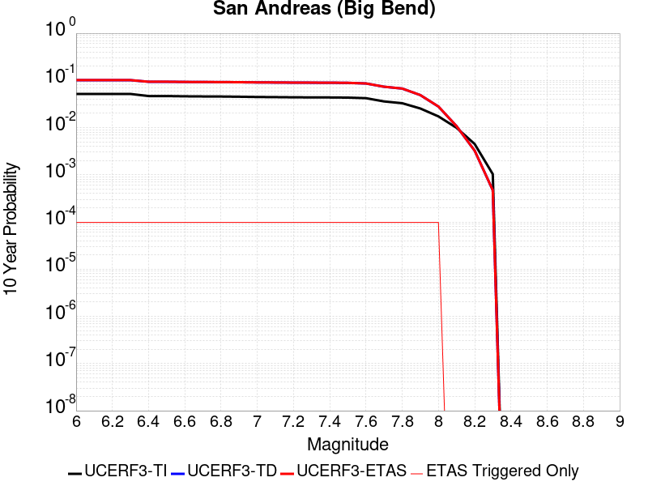 |

| Magnitude | 1 wk TI Prob | 1 wk TD Prob | 1 wk ETAS Prob | 1 wk ETAS/TD Gain | 1 wk ETAS Triggered Only | 1 mo TI Prob | 1 mo TD Prob | 1 mo ETAS Prob | 1 mo ETAS/TD Gain | 1 mo ETAS Triggered Only | 1 yr TI Prob | 1 yr TD Prob | 1 yr ETAS Prob | 1 yr ETAS/TD Gain | 1 yr ETAS Triggered Only | 10 yr TI Prob | 10 yr TD Prob | 10 yr ETAS Prob | 10 yr ETAS/TD Gain | 10 yr ETAS Triggered Only |
|-----|-----|-----|-----|-----|-----|-----|-----|-----|-----|-----|-----|-----|-----|-----|-----|-----|-----|-----|-----|-----|
| 6.0 | 1.0179969E-4 | 2.0072258E-4 | 2.9851202E-4 | 1.487187 | 9.7809076E-5 | 4.362114E-4 | 8.599571E-4 | 9.5768203E-4 | 1.1136394 | 9.7809076E-5 | 0.0052979486 | 0.010419999 | 0.010516789 | 1.0092889 | 9.7809076E-5 | 0.051734097 | 0.10144902 | 0.10153691 | 1.0008663 | 9.7809076E-5 |
| 6.1 | 1.0179969E-4 | 2.0072258E-4 | 2.9851202E-4 | 1.487187 | 9.7809076E-5 | 4.362114E-4 | 8.599571E-4 | 9.5768203E-4 | 1.1136394 | 9.7809076E-5 | 0.0052979486 | 0.010419999 | 0.010516789 | 1.0092889 | 9.7809076E-5 | 0.051734097 | 0.10144902 | 0.10153691 | 1.0008663 | 9.7809076E-5 |
| 6.2 | 1.0179969E-4 | 2.0072258E-4 | 2.9851202E-4 | 1.487187 | 9.7809076E-5 | 4.362114E-4 | 8.599571E-4 | 9.5768203E-4 | 1.1136394 | 9.7809076E-5 | 0.0052979486 | 0.010419999 | 0.010516789 | 1.0092889 | 9.7809076E-5 | 0.051734097 | 0.10144902 | 0.10153691 | 1.0008663 | 9.7809076E-5 |
| 6.3 | 1.0179969E-4 | 2.0072258E-4 | 2.9851202E-4 | 1.487187 | 9.7809076E-5 | 4.362114E-4 | 8.599571E-4 | 9.5768203E-4 | 1.1136394 | 9.7809076E-5 | 0.0052979486 | 0.010419999 | 0.010516789 | 1.0092889 | 9.7809076E-5 | 0.051734097 | 0.10144902 | 0.10153691 | 1.0008663 | 9.7809076E-5 |
| 6.4 | 9.1639464E-5 | 1.8429532E-4 | 2.8208637E-4 | 1.5306214 | 9.7809076E-5 | 3.9268145E-4 | 7.895982E-4 | 8.873301E-4 | 1.1237742 | 9.7809076E-5 | 0.0047704205 | 0.009571102 | 0.009667975 | 1.0101213 | 9.7809076E-5 | 0.046693064 | 0.09377527 | 0.09386391 | 1.0009452 | 9.7809076E-5 |
| 6.5 | 9.1639464E-5 | 1.8429532E-4 | 2.8208637E-4 | 1.5306214 | 9.7809076E-5 | 3.9268145E-4 | 7.895982E-4 | 8.873301E-4 | 1.1237742 | 9.7809076E-5 | 0.0047704205 | 0.009571102 | 0.009667975 | 1.0101213 | 9.7809076E-5 | 0.046693064 | 0.09377527 | 0.09386391 | 1.0009452 | 9.7809076E-5 |
| 6.6 | 9.042622E-5 | 1.823659E-4 | 2.8015714E-4 | 1.5362364 | 9.7809076E-5 | 3.8748336E-4 | 7.8133424E-4 | 8.7906694E-4 | 1.1250843 | 9.7809076E-5 | 0.0047074095 | 0.009471365 | 0.009568248 | 1.010229 | 9.7809076E-5 | 0.046089325 | 0.092869274 | 0.092958 | 1.0009553 | 9.7809076E-5 |
| 6.7 | 8.9836685E-5 | 1.8150927E-4 | 2.7930058E-4 | 1.5387677 | 9.7809076E-5 | 3.8495753E-4 | 7.776651E-4 | 8.7539817E-4 | 1.125675 | 9.7809076E-5 | 0.00467679 | 0.00942708 | 0.009523967 | 1.0102775 | 9.7809076E-5 | 0.045795817 | 0.09246355 | 0.09255231 | 1.00096 | 9.7809076E-5 |
| 6.8 | 8.9471854E-5 | 1.8097709E-4 | 2.7876848E-4 | 1.5403522 | 9.7809076E-5 | 3.8339442E-4 | 7.7538576E-4 | 8.73119E-4 | 1.1260446 | 9.7809076E-5 | 0.004657841 | 0.009399569 | 0.009496458 | 1.0103079 | 9.7809076E-5 | 0.04561414 | 0.092210755 | 0.09229955 | 1.0009629 | 9.7809076E-5 |
| 6.9 | 8.858234E-5 | 1.7979681E-4 | 2.7758832E-4 | 1.5439 | 9.7809076E-5 | 3.7958333E-4 | 7.703304E-4 | 8.680642E-4 | 1.1268724 | 9.7809076E-5 | 0.004611638 | 0.009338548 | 0.009435444 | 1.0103759 | 9.7809076E-5 | 0.04517103 | 0.09165087 | 0.09173972 | 1.0009694 | 9.7809076E-5 |
| 7.0 | 8.7433385E-5 | 1.7818481E-4 | 2.7597646E-4 | 1.5488214 | 9.7809076E-5 | 3.746607E-4 | 7.634259E-4 | 8.611603E-4 | 1.1280208 | 9.7809076E-5 | 0.004551957 | 0.009255203 | 0.009352107 | 1.0104702 | 9.7809076E-5 | 0.044598386 | 0.09088532 | 0.090974234 | 1.0009784 | 9.7809076E-5 |
| 7.1 | 8.684964E-5 | 1.7730435E-4 | 2.7509607E-4 | 1.5515473 | 9.7809076E-5 | 3.7215967E-4 | 7.596547E-4 | 8.573895E-4 | 1.1286569 | 9.7809076E-5 | 0.0045216335 | 0.009209678 | 0.009306586 | 1.0105225 | 9.7809076E-5 | 0.04430731 | 0.09046686 | 0.090555824 | 1.0009834 | 9.7809076E-5 |
| 7.2 | 8.606521E-5 | 1.762105E-4 | 2.7400235E-4 | 1.5549717 | 9.7809076E-5 | 3.6879873E-4 | 7.549695E-4 | 8.5270475E-4 | 1.1294559 | 9.7809076E-5 | 0.0044808835 | 0.0091531165 | 0.00925003 | 1.010588 | 9.7809076E-5 | 0.043916024 | 0.089947365 | 0.09003638 | 1.0009896 | 9.7809076E-5 |
| 7.3 | 8.568266E-5 | 1.7563057E-4 | 2.7342245E-4 | 1.5568045 | 9.7809076E-5 | 3.6715972E-4 | 7.524855E-4 | 8.5022097E-4 | 1.1298835 | 9.7809076E-5 | 0.0044610105 | 0.009123127 | 0.009220044 | 1.0106232 | 9.7809076E-5 | 0.043725148 | 0.08966853 | 0.08975756 | 1.000993 | 9.7809076E-5 |
| 7.4 | 8.5432206E-5 | 1.7525644E-4 | 2.7304838E-4 | 1.5579934 | 9.7809076E-5 | 3.6608664E-4 | 7.50883E-4 | 8.486187E-4 | 1.1301609 | 9.7809076E-5 | 0.004447999 | 0.009103781 | 0.009200699 | 1.010646 | 9.7809076E-5 | 0.043600157 | 0.08948871 | 0.089577764 | 1.0009952 | 9.7809076E-5 |
| 7.5 | 8.4791965E-5 | 1.7394972E-4 | 2.717418E-4 | 1.5621858 | 9.7809076E-5 | 3.633435E-4 | 7.4528606E-4 | 8.430222E-4 | 1.1311392 | 9.7809076E-5 | 0.0044147377 | 0.009036204 | 0.009133129 | 1.0107263 | 9.7809076E-5 | 0.043280575 | 0.088866346 | 0.08895546 | 1.0010028 | 9.7809076E-5 |
| 7.6 | 8.241105E-5 | 1.6840403E-4 | 2.6619664E-4 | 1.5807023 | 9.7809076E-5 | 3.531424E-4 | 7.215321E-4 | 8.192706E-4 | 1.1354597 | 9.7809076E-5 | 0.0042910352 | 0.008749358 | 0.008846312 | 1.0110812 | 9.7809076E-5 | 0.042091176 | 0.086243294 | 0.086332664 | 1.0010363 | 9.7809076E-5 |
| 7.7 | 7.00432E-5 | 1.42045E-4 | 2.3984018E-4 | 1.6884803 | 9.7809076E-5 | 3.001506E-4 | 6.0862233E-4 | 7.0637185E-4 | 1.1606079 | 9.7809076E-5 | 0.0036482112 | 0.0073848404 | 0.007481927 | 1.0131468 | 9.7809076E-5 | 0.035888977 | 0.07351733 | 0.07360795 | 1.0012326 | 9.7809076E-5 |
| 7.8 | 6.415362E-5 | 1.2968935E-4 | 2.2748573E-4 | 1.754082 | 9.7809076E-5 | 2.749151E-4 | 5.556931E-4 | 6.534478E-4 | 1.175915 | 9.7809076E-5 | 0.0033419547 | 0.0067446055 | 0.006841755 | 1.014404 | 9.7809076E-5 | 0.03292141 | 0.06725231 | 0.06734353 | 1.0013566 | 9.7809076E-5 |
| 7.9 | 4.939911E-5 | 9.3411545E-5 | 1.9121148E-4 | 2.0469792 | 9.7809076E-5 | 2.116933E-4 | 4.0027377E-4 | 4.980437E-4 | 1.2442577 | 9.7809076E-5 | 0.0025743195 | 0.004862453 | 0.0049597863 | 1.0200174 | 9.7809076E-5 | 0.025447013 | 0.048914436 | 0.049007464 | 1.0019017 | 9.7809076E-5 |
| 8.0 | 3.344983E-5 | 5.222685E-5 | 1.5003081E-4 | 2.872676 | 9.7809076E-5 | 1.4334853E-4 | 2.2381016E-4 | 3.2159736E-4 | 1.4369202 | 9.7809076E-5 | 0.0017438711 | 0.0027214854 | 0.0028190285 | 1.0358418 | 9.7809076E-5 | 0.017302496 | 0.027922187 | 0.028017266 | 1.0034051 | 9.7809076E-5 |
| 8.1 | 1.9104898E-5 | 1.9173063E-5 | 1.9173063E-5 | 1.0 | 0.0 | 8.1875565E-5 | 8.216769E-5 | 8.216769E-5 | 1.0 | 0.0 | 9.963791E-4 | 9.999331E-4 | 9.999331E-4 | 1.0 | 0.0 | 0.009919235 | 0.010749801 | 0.010749801 | 1.0 | 0.0 |
| 8.2 | 8.643924E-6 | 5.4748625E-6 | 5.4748625E-6 | 1.0 | 0.0 | 3.704486E-5 | 2.3463486E-5 | 2.3463486E-5 | 1.0 | 0.0 | 4.5092785E-4 | 2.8563058E-4 | 2.8563058E-4 | 1.0 | 0.0 | 0.0045001395 | 0.0032487072 | 0.0032487072 | 1.0 | 0.0 |
| 8.3 | 1.983087E-6 | 7.6599065E-7 | 7.6599065E-7 | 1.0 | 0.0 | 8.498917E-6 | 3.282813E-6 | 3.282813E-6 | 1.0 | 0.0 | 1.034694E-4 | 3.9967534E-5 | 3.9967534E-5 | 1.0 | 0.0 | 0.0010342124 | 4.719687E-4 | 4.719687E-4 | 1.0 | 0.0 |

## Owens Valley
*[(top)](#table-of-contents)*

| 1 Week | 1 Month | 1 Year | 10 Year |
|-----|-----|-----|-----|
| 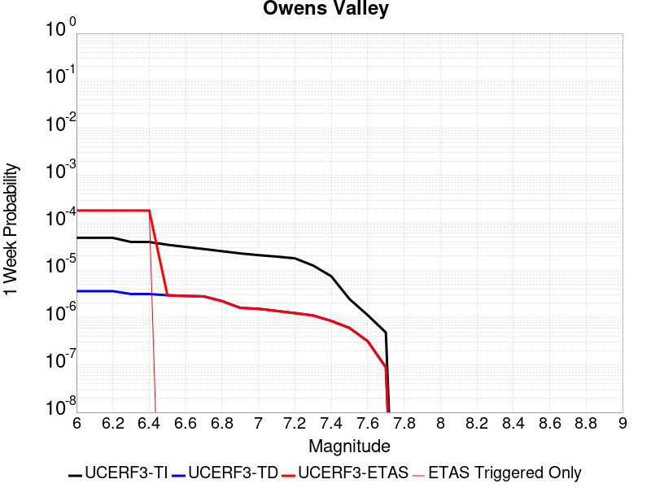 | 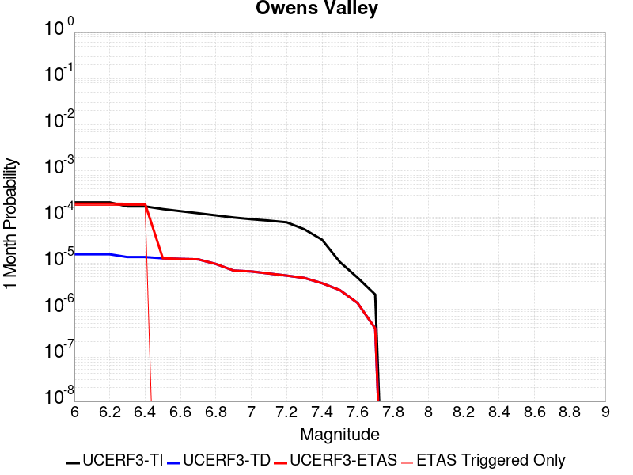 | 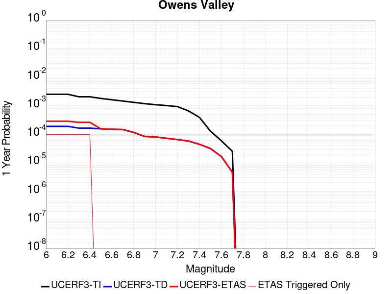 | 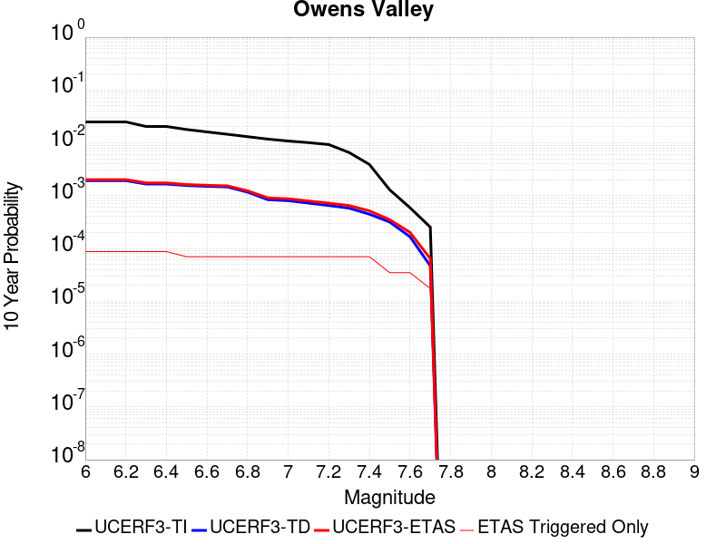 |

| Magnitude | 1 wk TI Prob | 1 wk TD Prob | 1 wk ETAS Prob | 1 wk ETAS/TD Gain | 1 wk ETAS Triggered Only | 1 mo TI Prob | 1 mo TD Prob | 1 mo ETAS Prob | 1 mo ETAS/TD Gain | 1 mo ETAS Triggered Only | 1 yr TI Prob | 1 yr TD Prob | 1 yr ETAS Prob | 1 yr ETAS/TD Gain | 1 yr ETAS Triggered Only | 10 yr TI Prob | 10 yr TD Prob | 10 yr ETAS Prob | 10 yr ETAS/TD Gain | 10 yr ETAS Triggered Only |
|-----|-----|-----|-----|-----|-----|-----|-----|-----|-----|-----|-----|-----|-----|-----|-----|-----|-----|-----|-----|-----|
| 6.0 | 4.83821E-5 | 3.626567E-6 | 1.0143529E-4 | 27.970058 | 9.7809076E-5 | 2.0733538E-4 | 1.5542342E-5 | 1.133499E-4 | 7.292974 | 9.7809076E-5 | 0.002521386 | 1.8921259E-4 | 2.8700315E-4 | 1.5168291 | 9.7809076E-5 | 0.024929691 | 0.001925011 | 0.0020226317 | 1.0507119 | 9.7809076E-5 |
| 6.1 | 4.83821E-5 | 3.626567E-6 | 1.0143529E-4 | 27.970058 | 9.7809076E-5 | 2.0733538E-4 | 1.5542342E-5 | 1.133499E-4 | 7.292974 | 9.7809076E-5 | 0.002521386 | 1.8921259E-4 | 2.8700315E-4 | 1.5168291 | 9.7809076E-5 | 0.024929691 | 0.001925011 | 0.0020226317 | 1.0507119 | 9.7809076E-5 |
| 6.2 | 4.83821E-5 | 3.626567E-6 | 1.0143529E-4 | 27.970058 | 9.7809076E-5 | 2.0733538E-4 | 1.5542342E-5 | 1.133499E-4 | 7.292974 | 9.7809076E-5 | 0.002521386 | 1.8921259E-4 | 2.8700315E-4 | 1.5168291 | 9.7809076E-5 | 0.024929691 | 0.001925011 | 0.0020226317 | 1.0507119 | 9.7809076E-5 |
| 6.3 | 3.953008E-5 | 3.1553948E-6 | 1.00964164E-4 | 31.997314 | 9.7809076E-5 | 1.6940363E-4 | 1.3523055E-5 | 1.1133081E-4 | 8.232667 | 9.7809076E-5 | 0.002060538 | 1.6463149E-4 | 2.6242447E-4 | 1.5940113 | 9.7809076E-5 | 0.020415364 | 0.0016592 | 0.0017568467 | 1.0588517 | 9.7809076E-5 |
| 6.4 | 3.953008E-5 | 3.1553948E-6 | 1.00964164E-4 | 31.997314 | 9.7809076E-5 | 1.6940363E-4 | 1.3523055E-5 | 1.1133081E-4 | 8.232667 | 9.7809076E-5 | 0.002060538 | 1.6463149E-4 | 2.6242447E-4 | 1.5940113 | 9.7809076E-5 | 0.020415364 | 0.0016592 | 0.0017568467 | 1.0588517 | 9.7809076E-5 |
| 6.5 | 3.457342E-5 | 2.9715961E-6 | 2.9715961E-6 | 1.0 | 0.0 | 1.4816338E-4 | 1.2735354E-5 | 1.2735354E-5 | 1.0 | 0.0 | 0.0018023965 | 1.550426E-4 | 1.550426E-4 | 1.0 | 0.0 | 0.017878477 | 0.001555719 | 0.001555719 | 1.0 | 0.0 |
| 6.6 | 3.1127765E-5 | 2.8744932E-6 | 2.8744932E-6 | 1.0 | 0.0 | 1.3339789E-4 | 1.2319203E-5 | 1.2319203E-5 | 1.0 | 0.0 | 0.0016229092 | 1.4997667E-4 | 1.4997667E-4 | 1.0 | 0.0 | 0.016111081 | 0.0015012559 | 0.0015012559 | 1.0 | 0.0 |
| 6.7 | 2.806885E-5 | 2.8104134E-6 | 2.8104134E-6 | 1.0 | 0.0 | 1.2028952E-4 | 1.20445775E-5 | 1.20445775E-5 | 1.0 | 0.0 | 0.001463541 | 1.4663354E-4 | 1.4663354E-4 | 1.0 | 0.0 | 0.014539397 | 0.0014657511 | 0.0014657511 | 1.0 | 0.0 |
| 6.8 | 2.524524E-5 | 2.2353688E-6 | 2.2353688E-6 | 1.0 | 0.0 | 1.0818939E-4 | 9.580118E-6 | 9.580118E-6 | 1.0 | 0.0 | 0.0013164099 | 1.16632E-4 | 1.16632E-4 | 1.0 | 0.0 | 0.01308639 | 0.0011659812 | 0.0011659812 | 1.0 | 0.0 |
| 6.9 | 2.2704568E-5 | 1.6081682E-6 | 1.6081682E-6 | 1.0 | 0.0 | 9.730166E-5 | 6.8921313E-6 | 6.8921313E-6 | 1.0 | 0.0 | 0.0011840039 | 8.390849E-5 | 8.390849E-5 | 1.0 | 0.0 | 0.011777153 | 8.3897985E-4 | 8.3897985E-4 | 1.0 | 0.0 |
| 7.0 | 2.0871712E-5 | 1.5395453E-6 | 1.5395453E-6 | 1.0 | 0.0 | 8.944713E-5 | 6.598035E-6 | 6.598035E-6 | 1.0 | 0.0 | 0.0010884746 | 8.032813E-5 | 8.032813E-5 | 1.0 | 0.0 | 0.010831586 | 8.0316263E-4 | 8.0316263E-4 | 1.0 | 0.0 |
| 7.1 | 1.944928E-5 | 1.3864178E-6 | 1.3864178E-6 | 1.0 | 0.0 | 8.335139E-5 | 5.941777E-6 | 5.941777E-6 | 1.0 | 0.0 | 0.0010143308 | 7.233874E-5 | 7.233874E-5 | 1.0 | 0.0 | 0.010097133 | 7.2330976E-4 | 7.2330976E-4 | 1.0 | 0.0 |
| 7.2 | 1.7876306E-5 | 1.2489141E-6 | 1.2489141E-6 | 1.0 | 0.0 | 7.6610486E-5 | 5.352478E-6 | 5.352478E-6 | 1.0 | 0.0 | 9.3233347E-4 | 6.516448E-5 | 6.516448E-5 | 1.0 | 0.0 | 0.009284316 | 6.5159105E-4 | 6.5159105E-4 | 1.0 | 0.0 |
| 7.3 | 1.2618672E-5 | 1.1115209E-6 | 1.1115209E-6 | 1.0 | 0.0 | 5.40789E-5 | 4.763652E-6 | 4.763652E-6 | 1.0 | 0.0 | 6.582117E-4 | 5.799593E-5 | 5.799593E-5 | 1.0 | 0.0 | 0.0065626553 | 5.7994033E-4 | 5.7994033E-4 | 1.0 | 0.0 |
| 7.4 | 7.4874442E-6 | 8.5486437E-7 | 8.5486437E-7 | 1.0 | 0.0 | 3.208865E-5 | 3.6636993E-6 | 3.6636993E-6 | 1.0 | 0.0 | 3.906093E-4 | 4.4604632E-5 | 4.4604632E-5 | 1.0 | 0.0 | 0.003899234 | 4.4604883E-4 | 4.4604883E-4 | 1.0 | 0.0 |
| 7.5 | 2.4734156E-6 | 6.068616E-7 | 6.068616E-7 | 1.0 | 0.0 | 1.060031E-5 | 2.6008327E-6 | 2.6008327E-6 | 1.0 | 0.0 | 1.2905113E-4 | 3.166468E-5 | 3.166468E-5 | 1.0 | 0.0 | 0.0012897621 | 3.1660203E-4 | 3.1660203E-4 | 1.0 | 0.0 |
| 7.6 | 1.1328841E-6 | 3.196531E-7 | 3.196531E-7 | 1.0 | 0.0 | 4.8552088E-6 | 1.3699412E-6 | 1.3699412E-6 | 1.0 | 0.0 | 5.9110564E-5 | 1.6678909E-5 | 1.6678909E-5 | 1.0 | 0.0 | 5.9094845E-4 | 1.6677675E-4 | 1.6677675E-4 | 1.0 | 0.0 |
| 7.7 | 4.8613185E-7 | 8.964689E-8 | 8.964689E-8 | 1.0 | 0.0 | 2.0834207E-6 | 3.8420092E-7 | 3.8420092E-7 | 1.0 | 0.0 | 2.536535E-5 | 4.6776368E-6 | 4.6776368E-6 | 1.0 | 0.0 | 2.5362454E-4 | 4.677545E-5 | 4.677545E-5 | 1.0 | 0.0 |

## Brawley (Seismic Zone) alt 1
*[(top)](#table-of-contents)*

| 1 Week | 1 Month | 1 Year | 10 Year |
|-----|-----|-----|-----|
| 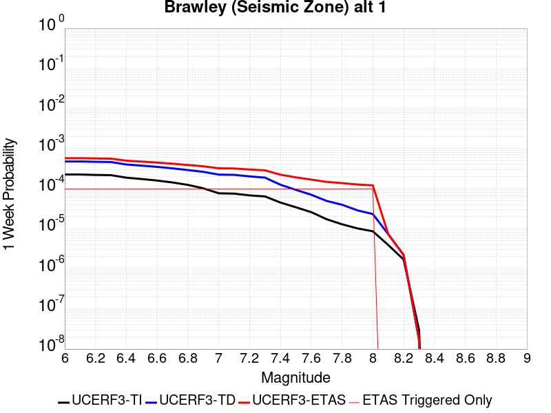 | 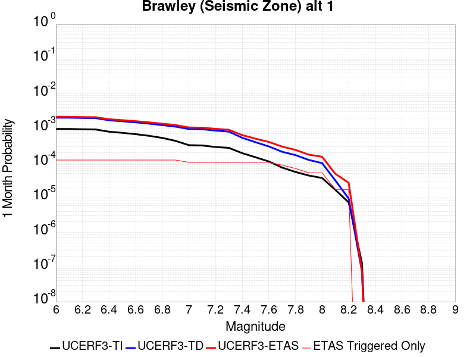 | 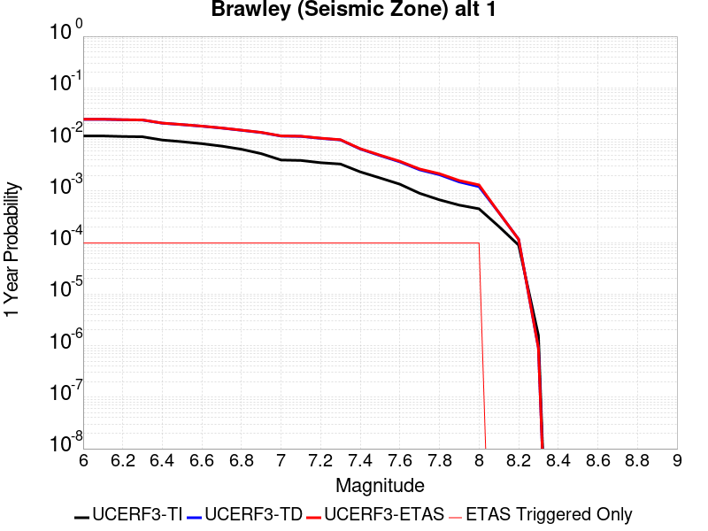 | 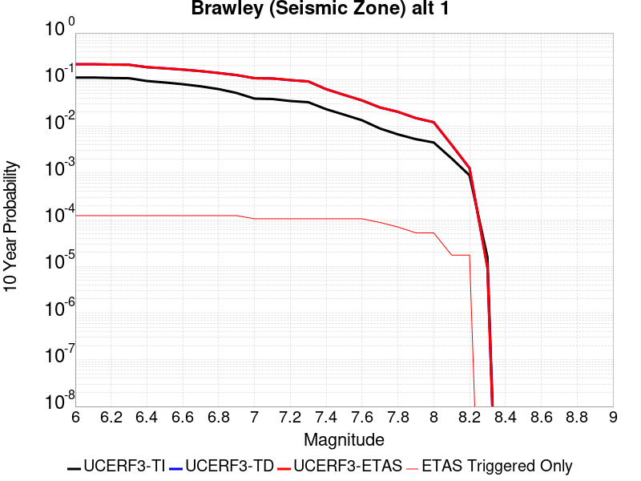 |

| Magnitude | 1 wk TI Prob | 1 wk TD Prob | 1 wk ETAS Prob | 1 wk ETAS/TD Gain | 1 wk ETAS Triggered Only | 1 mo TI Prob | 1 mo TD Prob | 1 mo ETAS Prob | 1 mo ETAS/TD Gain | 1 mo ETAS Triggered Only | 1 yr TI Prob | 1 yr TD Prob | 1 yr ETAS Prob | 1 yr ETAS/TD Gain | 1 yr ETAS Triggered Only | 10 yr TI Prob | 10 yr TD Prob | 10 yr ETAS Prob | 10 yr ETAS/TD Gain | 10 yr ETAS Triggered Only |
|-----|-----|-----|-----|-----|-----|-----|-----|-----|-----|-----|-----|-----|-----|-----|-----|-----|-----|-----|-----|-----|
| 6.0 | 2.2521618E-4 | 4.7632487E-4 | 5.740874E-4 | 1.2052433 | 9.7809076E-5 | 9.6485513E-4 | 0.0020398323 | 0.002137442 | 1.0478518 | 9.7809076E-5 | 0.011683988 | 0.024546238 | 0.024641644 | 1.0038868 | 9.7809076E-5 | 0.11088423 | 0.21350002 | 0.21357694 | 1.0003604 | 9.7809076E-5 |
| 6.1 | 2.2521618E-4 | 4.7632487E-4 | 5.740874E-4 | 1.2052433 | 9.7809076E-5 | 9.6485513E-4 | 0.0020398323 | 0.002137442 | 1.0478518 | 9.7809076E-5 | 0.011683988 | 0.024546238 | 0.024641644 | 1.0038868 | 9.7809076E-5 | 0.11088423 | 0.21350002 | 0.21357694 | 1.0003604 | 9.7809076E-5 |
| 6.2 | 2.198148E-4 | 4.6717093E-4 | 5.6493434E-4 | 1.2092668 | 9.7809076E-5 | 9.417233E-4 | 0.0020006616 | 0.0020982749 | 1.0487906 | 9.7809076E-5 | 0.011405343 | 0.024080504 | 0.024175957 | 1.003964 | 9.7809076E-5 | 0.10837428 | 0.20993657 | 0.21001385 | 1.0003681 | 9.7809076E-5 |
| 6.3 | 2.1704129E-4 | 4.615278E-4 | 5.592917E-4 | 1.2118268 | 9.7809076E-5 | 9.298453E-4 | 0.0019765133 | 0.0020741292 | 1.0493878 | 9.7809076E-5 | 0.011262234 | 0.02379366 | 0.023889143 | 1.004013 | 9.7809076E-5 | 0.107082725 | 0.20782755 | 0.20790502 | 1.0003728 | 9.7809076E-5 |
| 6.4 | 1.876142E-4 | 4.00449E-4 | 4.982189E-4 | 1.2441508 | 9.7809076E-5 | 8.038131E-4 | 0.0017150956 | 0.001812737 | 1.0569305 | 9.7809076E-5 | 0.00974259 | 0.020680401 | 0.020776188 | 1.0046318 | 9.7809076E-5 | 0.093263686 | 0.18457815 | 0.18465792 | 1.0004321 | 9.7809076E-5 |
| 6.5 | 1.7390939E-4 | 3.7477075E-4 | 4.7254318E-4 | 1.260886 | 9.7809076E-5 | 7.45113E-4 | 0.0016051838 | 0.0017028359 | 1.0608355 | 9.7809076E-5 | 0.009034078 | 0.019368723 | 0.019464638 | 1.0049521 | 9.7809076E-5 | 0.086755216 | 0.17440031 | 0.17448106 | 1.000463 | 9.7809076E-5 |
| 6.6 | 1.591791E-4 | 3.4891962E-4 | 4.4669458E-4 | 1.2802219 | 9.7809076E-5 | 6.8201777E-4 | 0.0014945229 | 0.0015921858 | 1.0653472 | 9.7809076E-5 | 0.008271996 | 0.018045569 | 0.018141614 | 1.0053223 | 9.7809076E-5 | 0.07970774 | 0.16380852 | 0.16389032 | 1.0004992 | 9.7809076E-5 |
| 6.7 | 1.4268003E-4 | 3.20582E-4 | 4.1835973E-4 | 1.3050007 | 9.7809076E-5 | 6.1134255E-4 | 0.0013732077 | 0.0014708824 | 1.071129 | 9.7809076E-5 | 0.007417723 | 0.016592601 | 0.016688788 | 1.0057969 | 9.7809076E-5 | 0.07174956 | 0.15193306 | 0.15201601 | 1.000546 | 9.7809076E-5 |
| 6.8 | 1.239713E-4 | 2.9053655E-4 | 3.8831722E-4 | 1.336552 | 9.7809076E-5 | 5.3119735E-4 | 0.0012445687 | 0.001342256 | 1.078491 | 9.7809076E-5 | 0.0064481674 | 0.015048777 | 0.015145115 | 1.0064017 | 9.7809076E-5 | 0.06264243 | 0.13837762 | 0.1384619 | 1.000609 | 9.7809076E-5 |
| 6.9 | 1.0180238E-4 | 2.625439E-4 | 3.603273E-4 | 1.372446 | 9.7809076E-5 | 4.3622297E-4 | 0.0011247073 | 0.0012224063 | 1.0868663 | 9.7809076E-5 | 0.005298089 | 0.013608336 | 0.013704814 | 1.0070896 | 9.7809076E-5 | 0.05173543 | 0.124961674 | 0.12504725 | 1.0006849 | 9.7809076E-5 |
| 7.0 | 7.6619996E-5 | 2.23993E-4 | 3.2178016E-4 | 1.4365635 | 9.7809076E-5 | 3.283301E-4 | 9.5962E-4 | 0.0010573352 | 1.101827 | 9.7809076E-5 | 0.0039900932 | 0.011621496 | 0.011718168 | 1.0083184 | 9.7809076E-5 | 0.039192066 | 0.107266866 | 0.10735418 | 1.000814 | 9.7809076E-5 |
| 7.1 | 7.5127435E-5 | 2.2082464E-4 | 3.1861212E-4 | 1.4428287 | 9.7809076E-5 | 3.2193496E-4 | 9.4605127E-4 | 0.0010437678 | 1.1032889 | 9.7809076E-5 | 0.0039125155 | 0.011458045 | 0.011554733 | 1.0084385 | 9.7809076E-5 | 0.038443442 | 0.10583085 | 0.10591831 | 1.0008264 | 9.7809076E-5 |
| 7.2 | 6.788582E-5 | 2.0210193E-4 | 2.9989125E-4 | 1.4838613 | 9.7809076E-5 | 2.9090676E-4 | 8.6586666E-4 | 9.6359104E-4 | 1.1128631 | 9.7809076E-5 | 0.0035360386 | 0.0104916105 | 0.010588394 | 1.0092248 | 9.7809076E-5 | 0.034803 | 0.09750131 | 0.09758958 | 1.0009054 | 9.7809076E-5 |
| 7.3 | 6.399602E-5 | 1.8841137E-4 | 2.8620203E-4 | 1.5190274 | 9.7809076E-5 | 2.7423984E-4 | 8.072303E-4 | 9.0496044E-4 | 1.1210685 | 9.7809076E-5 | 0.0033337586 | 0.009784332 | 0.0098811835 | 1.0098987 | 9.7809076E-5 | 0.03284188 | 0.09139617 | 0.09148503 | 1.0009724 | 9.7809076E-5 |
| 7.4 | 4.506759E-5 | 1.2529209E-4 | 2.2308891E-4 | 1.7805506 | 9.7809076E-5 | 1.9313251E-4 | 5.368565E-4 | 6.3461304E-4 | 1.1820906 | 9.7809076E-5 | 0.0023488526 | 0.0065168133 | 0.006613985 | 1.0149109 | 9.7809076E-5 | 0.023241805 | 0.062363707 | 0.062455416 | 1.0014706 | 9.7809076E-5 |
| 7.5 | 3.43289E-5 | 9.33541E-5 | 1.9115405E-4 | 2.0476234 | 9.7809076E-5 | 1.4711556E-4 | 4.00028E-4 | 4.977979E-4 | 1.2444078 | 9.7809076E-5 | 0.0017896603 | 0.0048595266 | 0.0049568606 | 1.0200294 | 9.7809076E-5 | 0.01775316 | 0.04705519 | 0.047148395 | 1.0019808 | 9.7809076E-5 |
| 7.6 | 2.5980507E-5 | 7.053101E-5 | 1.683332E-4 | 2.386655 | 9.7809076E-5 | 1.1134028E-4 | 3.0224086E-4 | 4.000204E-4 | 1.3235152 | 9.7809076E-5 | 0.001354725 | 0.003673598 | 0.0037710476 | 1.026527 | 9.7809076E-5 | 0.013464959 | 0.035840835 | 0.035935137 | 1.0026312 | 9.7809076E-5 |
| 7.7 | 1.7292105E-5 | 4.9407296E-5 | 1.4721154E-4 | 2.9795506 | 9.7809076E-5 | 7.4106916E-5 | 2.117284E-4 | 3.0951676E-4 | 1.4618576 | 9.7809076E-5 | 9.018782E-4 | 0.0025747516 | 0.0026723088 | 1.03789 | 9.7809076E-5 | 0.008982267 | 0.025290398 | 0.025385734 | 1.0037696 | 9.7809076E-5 |
| 7.8 | 1.2927471E-5 | 3.9693266E-5 | 1.3749846E-4 | 3.4640248 | 9.7809076E-5 | 5.5402274E-5 | 1.7010293E-4 | 2.6789538E-4 | 1.5749016 | 9.7809076E-5 | 6.743139E-4 | 0.0020690386 | 0.0021666454 | 1.0471749 | 9.7809076E-5 | 0.0067227143 | 0.020431727 | 0.020527538 | 1.0046893 | 9.7809076E-5 |
| 7.9 | 1.0200774E-5 | 2.874569E-5 | 1.2655195E-4 | 4.4024673 | 9.7809076E-5 | 4.371687E-5 | 1.2319001E-4 | 2.2098703E-4 | 1.7938714 | 9.7809076E-5 | 5.321229E-4 | 0.0014988075 | 0.00159647 | 1.0651602 | 9.7809076E-5 | 0.005308505 | 0.014991644 | 0.015087986 | 1.0064265 | 9.7809076E-5 |
| 8.0 | 8.650396E-6 | 2.3277367E-5 | 1.21084166E-4 | 5.201798 | 9.7809076E-5 | 3.70726E-5 | 9.975634E-5 | 1.9755565E-4 | 1.980382 | 9.7809076E-5 | 4.5126543E-4 | 0.0012138576 | 0.0013115479 | 1.0804793 | 9.7809076E-5 | 0.0045035016 | 0.012211097 | 0.012307712 | 1.007912 | 9.7809076E-5 |
| 8.1 | 3.9368224E-6 | 7.3279825E-6 | 7.3279825E-6 | 1.0 | 0.0 | 1.6871985E-5 | 3.140526E-5 | 3.140526E-5 | 1.0 | 0.0 | 2.0539707E-4 | 3.8229208E-4 | 3.8229208E-4 | 1.0 | 0.0 | 0.0020520731 | 0.004001185 | 0.004001185 | 1.0 | 0.0 |
| 8.2 | 1.7101195E-6 | 2.217876E-6 | 2.217876E-6 | 1.0 | 0.0 | 7.329063E-6 | 9.505149E-6 | 9.505149E-6 | 1.0 | 0.0 | 8.922769E-5 | 1.1571907E-4 | 1.1571907E-4 | 1.0 | 0.0 | 8.9191867E-4 | 0.0012666774 | 0.0012666774 | 1.0 | 0.0 |
| 8.3 | 3.0346666E-8 | 1.721586E-8 | 1.721586E-8 | 1.0 | 0.0 | 1.3005713E-7 | 7.378226E-8 | 7.378226E-8 | 1.0 | 0.0 | 1.5834444E-6 | 8.9829894E-7 | 8.9829894E-7 | 1.0 | 0.0 | 1.5834332E-5 | 9.367729E-6 | 9.367729E-6 | 1.0 | 0.0 |

## Clamshell-Sawpit
*[(top)](#table-of-contents)*

| 1 Week | 1 Month | 1 Year | 10 Year |
|-----|-----|-----|-----|
| 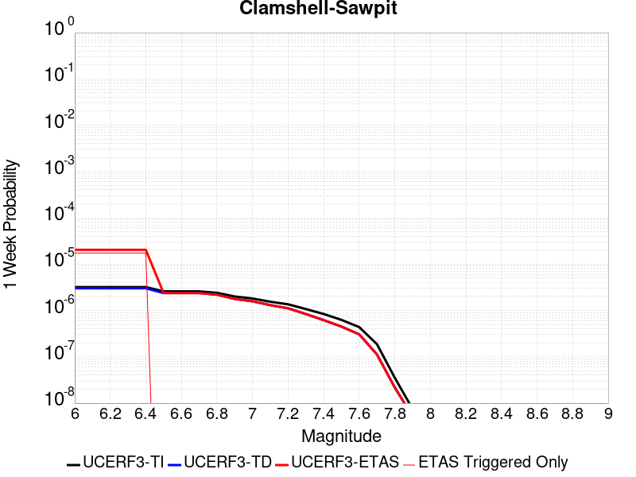 | 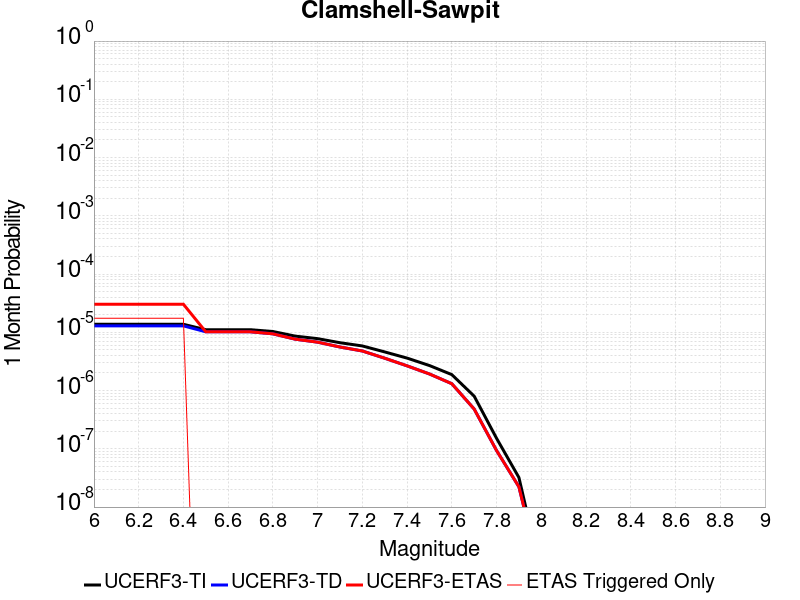 | 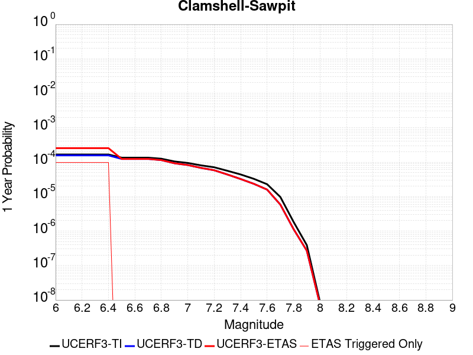 | 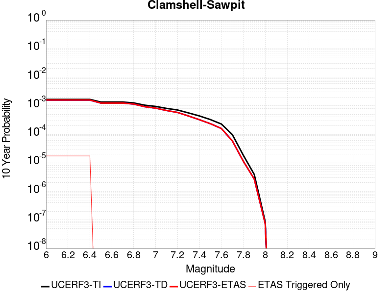 |

| Magnitude | 1 wk TI Prob | 1 wk TD Prob | 1 wk ETAS Prob | 1 wk ETAS/TD Gain | 1 wk ETAS Triggered Only | 1 mo TI Prob | 1 mo TD Prob | 1 mo ETAS Prob | 1 mo ETAS/TD Gain | 1 mo ETAS Triggered Only | 1 yr TI Prob | 1 yr TD Prob | 1 yr ETAS Prob | 1 yr ETAS/TD Gain | 1 yr ETAS Triggered Only | 10 yr TI Prob | 10 yr TD Prob | 10 yr ETAS Prob | 10 yr ETAS/TD Gain | 10 yr ETAS Triggered Only |
|-----|-----|-----|-----|-----|-----|-----|-----|-----|-----|-----|-----|-----|-----|-----|-----|-----|-----|-----|-----|-----|
| 6.0 | 3.202998E-6 | 3.0127644E-6 | 1.0082155E-4 | 33.464798 | 9.7809076E-5 | 1.3727062E-5 | 1.2911788E-5 | 1.107196E-4 | 8.575079 | 9.7809076E-5 | 1.6711417E-4 | 1.5719049E-4 | 2.549842E-4 | 1.622135 | 9.7809076E-5 | 0.0016698855 | 0.0015708724 | 0.0016685277 | 1.0621663 | 9.7809076E-5 |
| 6.1 | 3.202998E-6 | 3.0127644E-6 | 1.0082155E-4 | 33.464798 | 9.7809076E-5 | 1.3727062E-5 | 1.2911788E-5 | 1.107196E-4 | 8.575079 | 9.7809076E-5 | 1.6711417E-4 | 1.5719049E-4 | 2.549842E-4 | 1.622135 | 9.7809076E-5 | 0.0016698855 | 0.0015708724 | 0.0016685277 | 1.0621663 | 9.7809076E-5 |
| 6.2 | 3.202998E-6 | 3.0127644E-6 | 1.0082155E-4 | 33.464798 | 9.7809076E-5 | 1.3727062E-5 | 1.2911788E-5 | 1.107196E-4 | 8.575079 | 9.7809076E-5 | 1.6711417E-4 | 1.5719049E-4 | 2.549842E-4 | 1.622135 | 9.7809076E-5 | 0.0016698855 | 0.0015708724 | 0.0016685277 | 1.0621663 | 9.7809076E-5 |
| 6.3 | 3.202998E-6 | 3.0127644E-6 | 1.0082155E-4 | 33.464798 | 9.7809076E-5 | 1.3727062E-5 | 1.2911788E-5 | 1.107196E-4 | 8.575079 | 9.7809076E-5 | 1.6711417E-4 | 1.5719049E-4 | 2.549842E-4 | 1.622135 | 9.7809076E-5 | 0.0016698855 | 0.0015708724 | 0.0016685277 | 1.0621663 | 9.7809076E-5 |
| 6.4 | 3.202998E-6 | 3.0127644E-6 | 1.0082155E-4 | 33.464798 | 9.7809076E-5 | 1.3727062E-5 | 1.2911788E-5 | 1.107196E-4 | 8.575079 | 9.7809076E-5 | 1.6711417E-4 | 1.5719049E-4 | 2.549842E-4 | 1.622135 | 9.7809076E-5 | 0.0016698855 | 0.0015708724 | 0.0016685277 | 1.0621663 | 9.7809076E-5 |
| 6.5 | 2.5862723E-6 | 2.380775E-6 | 2.380775E-6 | 1.0 | 0.0 | 1.1083977E-5 | 1.0203283E-5 | 1.0203283E-5 | 1.0 | 0.0 | 1.3493907E-4 | 1.2421819E-4 | 1.2421819E-4 | 1.0 | 0.0 | 0.0013485716 | 0.0012415178 | 0.0012415178 | 1.0 | 0.0 |
| 6.6 | 2.5862723E-6 | 2.380775E-6 | 2.380775E-6 | 1.0 | 0.0 | 1.1083977E-5 | 1.0203283E-5 | 1.0203283E-5 | 1.0 | 0.0 | 1.3493907E-4 | 1.2421819E-4 | 1.2421819E-4 | 1.0 | 0.0 | 0.0013485716 | 0.0012415178 | 0.0012415178 | 1.0 | 0.0 |
| 6.7 | 2.5862723E-6 | 2.380775E-6 | 2.380775E-6 | 1.0 | 0.0 | 1.1083977E-5 | 1.0203283E-5 | 1.0203283E-5 | 1.0 | 0.0 | 1.3493907E-4 | 1.2421819E-4 | 1.2421819E-4 | 1.0 | 0.0 | 0.0013485716 | 0.0012415178 | 0.0012415178 | 1.0 | 0.0 |
| 6.8 | 2.4098806E-6 | 2.1977307E-6 | 2.1977307E-6 | 1.0 | 0.0 | 1.0328019E-5 | 9.4188135E-6 | 9.4188135E-6 | 1.0 | 0.0 | 1.2573638E-4 | 1.1466829E-4 | 1.1466829E-4 | 1.0 | 0.0 | 0.0012566525 | 0.0011461178 | 0.0011461178 | 1.0 | 0.0 |
| 6.9 | 2.0073985E-6 | 1.7784248E-6 | 1.7784248E-6 | 1.0 | 0.0 | 8.603109E-6 | 7.621799E-6 | 7.621799E-6 | 1.0 | 0.0 | 1.0473781E-4 | 9.279157E-5 | 9.279157E-5 | 1.0 | 0.0 | 0.0010468846 | 9.275401E-4 | 9.275401E-4 | 1.0 | 0.0 |
| 7.0 | 1.8166766E-6 | 1.5807095E-6 | 1.5807095E-6 | 1.0 | 0.0 | 7.785734E-6 | 6.7744522E-6 | 6.7744522E-6 | 1.0 | 0.0 | 9.478718E-5 | 8.247593E-5 | 8.247593E-5 | 1.0 | 0.0 | 9.4746763E-4 | 8.244633E-4 | 8.244633E-4 | 1.0 | 0.0 |
| 7.1 | 1.5471421E-6 | 1.3052961E-6 | 1.3052961E-6 | 1.0 | 0.0 | 6.6305925E-6 | 5.5941146E-6 | 5.5941146E-6 | 1.0 | 0.0 | 8.072447E-5 | 6.8106274E-5 | 6.8106274E-5 | 1.0 | 0.0 | 8.0695155E-4 | 6.808595E-4 | 6.808595E-4 | 1.0 | 0.0 |
| 7.2 | 1.3608037E-6 | 1.1153443E-6 | 1.1153443E-6 | 1.0 | 0.0 | 5.8320024E-6 | 4.7800386E-6 | 4.7800386E-6 | 1.0 | 0.0 | 7.1002316E-5 | 5.8195463E-5 | 5.8195463E-5 | 1.0 | 0.0 | 7.097964E-4 | 5.818069E-4 | 5.818069E-4 | 1.0 | 0.0 |
| 7.3 | 1.0749634E-6 | 8.384254E-7 | 8.384254E-7 | 1.0 | 0.0 | 4.6069777E-6 | 3.593247E-6 | 3.593247E-6 | 1.0 | 0.0 | 5.608851E-5 | 4.374693E-5 | 4.374693E-5 | 1.0 | 0.0 | 5.6074356E-4 | 4.37386E-4 | 4.37386E-4 | 1.0 | 0.0 |
| 7.4 | 8.416856E-7 | 6.200048E-7 | 6.200048E-7 | 1.0 | 0.0 | 3.607219E-6 | 2.6571608E-6 | 2.6571608E-6 | 1.0 | 0.0 | 4.3917007E-5 | 3.2350472E-5 | 3.2350472E-5 | 1.0 | 0.0 | 4.390833E-4 | 3.2345962E-4 | 3.2345962E-4 | 1.0 | 0.0 |
| 7.5 | 6.2779594E-7 | 4.496886E-7 | 4.496886E-7 | 1.0 | 0.0 | 2.6905511E-6 | 1.9272356E-6 | 1.9272356E-6 | 1.0 | 0.0 | 3.275697E-5 | 2.346386E-5 | 2.346386E-5 | 1.0 | 0.0 | 3.275214E-4 | 2.346157E-4 | 2.346157E-4 | 1.0 | 0.0 |
| 7.6 | 4.3822078E-7 | 3.0595405E-7 | 3.0595405E-7 | 1.0 | 0.0 | 1.8780877E-6 | 1.311231E-6 | 1.311231E-6 | 1.0 | 0.0 | 2.2865479E-5 | 1.5964137E-5 | 1.5964137E-5 | 1.0 | 0.0 | 2.2863125E-4 | 1.5963144E-4 | 1.5963144E-4 | 1.0 | 0.0 |
| 7.7 | 1.8704569E-7 | 1.12379205E-7 | 1.12379205E-7 | 1.0 | 0.0 | 8.0162414E-7 | 4.816251E-7 | 4.816251E-7 | 1.0 | 0.0 | 9.75973E-6 | 5.86377E-6 | 5.86377E-6 | 1.0 | 0.0 | 9.7593016E-5 | 5.863622E-5 | 5.863622E-5 | 1.0 | 0.0 |
| 7.8 | 3.5378733E-8 | 2.1838144E-8 | 2.1838144E-8 | 1.0 | 0.0 | 1.5162313E-7 | 9.359204E-8 | 9.359204E-8 | 1.0 | 0.0 | 1.84601E-6 | 1.1394826E-6 | 1.1394826E-6 | 1.0 | 0.0 | 1.8459947E-5 | 1.139477E-5 | 1.139477E-5 | 1.0 | 0.0 |
| 7.9 | 7.504945E-9 | 5.1920326E-9 | 5.1920326E-9 | 1.0 | 0.0 | 3.2164053E-8 | 2.225157E-8 | 2.225157E-8 | 1.0 | 0.0 | 3.9159727E-7 | 2.7091284E-7 | 2.7091284E-7 | 1.0 | 0.0 | 3.915966E-6 | 2.7091257E-6 | 2.7091257E-6 | 1.0 | 0.0 |
| 8.0 | 1.6554036E-10 | 1.4180768E-10 | 1.4180768E-10 | 1.0 | 0.0 | 7.0945894E-10 | 6.077475E-10 | 6.077475E-10 | 1.0 | 0.0 | 8.637662E-9 | 7.3993256E-9 | 7.3993256E-9 | 1.0 | 0.0 | 8.6376616E-8 | 7.3993256E-8 | 7.3993256E-8 | 1.0 | 0.0 |

## Pisgah-Bullion Mtn-Mesquite Lk
*[(top)](#table-of-contents)*

| 1 Week | 1 Month | 1 Year | 10 Year |
|-----|-----|-----|-----|
| 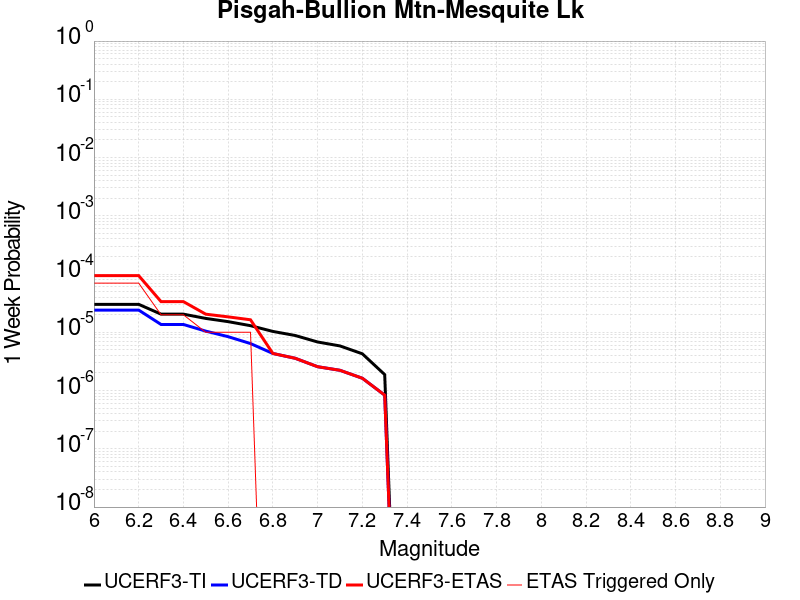 | 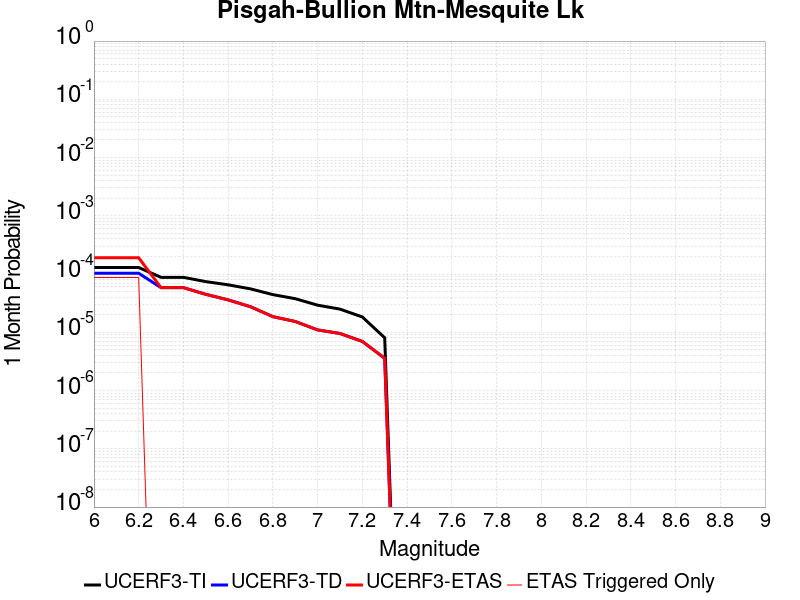 | 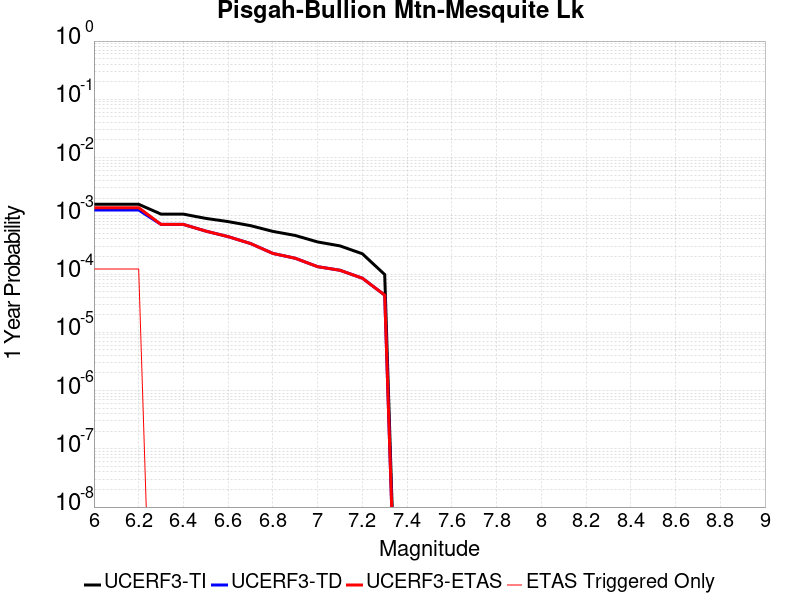 | 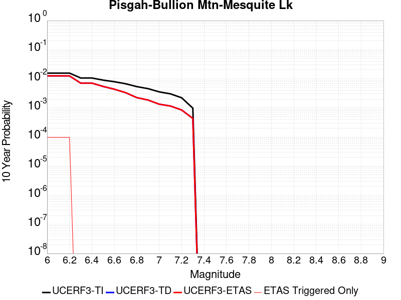 |

| Magnitude | 1 wk TI Prob | 1 wk TD Prob | 1 wk ETAS Prob | 1 wk ETAS/TD Gain | 1 wk ETAS Triggered Only | 1 mo TI Prob | 1 mo TD Prob | 1 mo ETAS Prob | 1 mo ETAS/TD Gain | 1 mo ETAS Triggered Only | 1 yr TI Prob | 1 yr TD Prob | 1 yr ETAS Prob | 1 yr ETAS/TD Gain | 1 yr ETAS Triggered Only | 10 yr TI Prob | 10 yr TD Prob | 10 yr ETAS Prob | 10 yr ETAS/TD Gain | 10 yr ETAS Triggered Only |
|-----|-----|-----|-----|-----|-----|-----|-----|-----|-----|-----|-----|-----|-----|-----|-----|-----|-----|-----|-----|-----|
| 6.0 | 3.0240792E-5 | 2.4091114E-5 | 2.4091114E-5 | 1.0 | 0.0 | 1.2959696E-4 | 1.03244114E-4 | 1.03244114E-4 | 1.0 | 0.0 | 0.0015767008 | 0.0012563728 | 0.001354059 | 1.0777526 | 9.7809076E-5 | 0.015655609 | 0.012502721 | 0.012599307 | 1.0077252 | 9.7809076E-5 |
| 6.1 | 3.0240792E-5 | 2.4091114E-5 | 2.4091114E-5 | 1.0 | 0.0 | 1.2959696E-4 | 1.03244114E-4 | 1.03244114E-4 | 1.0 | 0.0 | 0.0015767008 | 0.0012563728 | 0.001354059 | 1.0777526 | 9.7809076E-5 | 0.015655609 | 0.012502721 | 0.012599307 | 1.0077252 | 9.7809076E-5 |
| 6.2 | 3.0240792E-5 | 2.4091114E-5 | 2.4091114E-5 | 1.0 | 0.0 | 1.2959696E-4 | 1.03244114E-4 | 1.03244114E-4 | 1.0 | 0.0 | 0.0015767008 | 0.0012563728 | 0.001354059 | 1.0777526 | 9.7809076E-5 | 0.015655609 | 0.012502721 | 0.012599307 | 1.0077252 | 9.7809076E-5 |
| 6.3 | 2.0498217E-5 | 1.36380695E-5 | 1.36380695E-5 | 1.0 | 0.0 | 8.784654E-5 | 5.844765E-5 | 5.844765E-5 | 1.0 | 0.0 | 0.0010690069 | 7.1138405E-4 | 7.1138405E-4 | 1.0 | 0.0 | 0.01063879 | 0.0070926943 | 0.0070926943 | 1.0 | 0.0 |
| 6.4 | 2.0498217E-5 | 1.36380695E-5 | 1.36380695E-5 | 1.0 | 0.0 | 8.784654E-5 | 5.844765E-5 | 5.844765E-5 | 1.0 | 0.0 | 0.0010690069 | 7.1138405E-4 | 7.1138405E-4 | 1.0 | 0.0 | 0.01063879 | 0.0070926943 | 0.0070926943 | 1.0 | 0.0 |
| 6.5 | 1.7316182E-5 | 1.0477042E-5 | 1.0477042E-5 | 1.0 | 0.0 | 7.42101E-5 | 4.4900895E-5 | 4.4900895E-5 | 1.0 | 0.0 | 9.0313336E-4 | 5.465413E-4 | 5.465413E-4 | 1.0 | 0.0 | 0.008994718 | 0.0054529672 | 0.0054529672 | 1.0 | 0.0 |
| 6.6 | 1.5251077E-5 | 8.414273E-6 | 8.414273E-6 | 1.0 | 0.0 | 6.536012E-5 | 3.6060712E-5 | 3.6060712E-5 | 1.0 | 0.0 | 7.9546886E-4 | 4.3895794E-4 | 4.3895794E-4 | 1.0 | 0.0 | 0.007926274 | 0.0043816264 | 0.0043816264 | 1.0 | 0.0 |
| 6.7 | 1.2997425E-5 | 6.4114965E-6 | 6.4114965E-6 | 1.0 | 0.0 | 5.570206E-5 | 2.7477578E-5 | 2.7477578E-5 | 1.0 | 0.0 | 6.7796157E-4 | 3.3449283E-4 | 3.3449283E-4 | 1.0 | 0.0 | 0.0067589693 | 0.0033403537 | 0.0033403537 | 1.0 | 0.0 |
| 6.8 | 1.035386E-5 | 4.3332193E-6 | 4.3332193E-6 | 1.0 | 0.0 | 4.437293E-5 | 1.8570812E-5 | 1.8570812E-5 | 1.0 | 0.0 | 5.401065E-4 | 2.2607706E-4 | 2.2607706E-4 | 1.0 | 0.0 | 0.0053879567 | 0.0022585576 | 0.0022585576 | 1.0 | 0.0 |
| 6.9 | 8.816252E-6 | 3.580638E-6 | 3.580638E-6 | 1.0 | 0.0 | 3.778339E-5 | 1.5345504E-5 | 1.5345504E-5 | 1.0 | 0.0 | 4.5991567E-4 | 1.8681608E-4 | 1.8681608E-4 | 1.0 | 0.0 | 0.00458965 | 0.0018666488 | 0.0018666488 | 1.0 | 0.0 |
| 7.0 | 6.8232207E-6 | 2.5675843E-6 | 2.5675843E-6 | 1.0 | 0.0 | 2.9242048E-5 | 1.1003888E-5 | 1.1003888E-5 | 1.0 | 0.0 | 3.5596377E-4 | 1.3396442E-4 | 1.3396442E-4 | 1.0 | 0.0 | 0.0035539411 | 0.0013388677 | 0.0013388677 | 1.0 | 0.0 |
| 7.1 | 5.837013E-6 | 2.22738E-6 | 2.22738E-6 | 1.0 | 0.0 | 2.501553E-5 | 9.545881E-6 | 9.545881E-6 | 1.0 | 0.0 | 3.045215E-4 | 1.16215204E-4 | 1.16215204E-4 | 1.0 | 0.0 | 0.0030410455 | 0.0011615733 | 0.0011615733 | 1.0 | 0.0 |
| 7.2 | 4.278052E-6 | 1.6275711E-6 | 1.6275711E-6 | 1.0 | 0.0 | 1.833438E-5 | 6.9752873E-6 | 6.9752873E-6 | 1.0 | 0.0 | 2.231982E-4 | 8.492105E-5 | 8.492105E-5 | 1.0 | 0.0 | 0.0022297418 | 8.489092E-4 | 8.489092E-4 | 1.0 | 0.0 |
| 7.3 | 1.8803692E-6 | 8.344926E-7 | 8.344926E-7 | 1.0 | 0.0 | 8.0587E-6 | 3.5763926E-6 | 3.5763926E-6 | 1.0 | 0.0 | 9.811026E-5 | 4.354186E-5 | 4.354186E-5 | 1.0 | 0.0 | 9.806695E-4 | 4.3534773E-4 | 4.3534773E-4 | 1.0 | 0.0 |

## Imperial
*[(top)](#table-of-contents)*

| 1 Week | 1 Month | 1 Year | 10 Year |
|-----|-----|-----|-----|
| 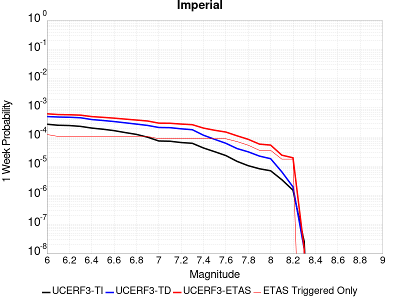 | 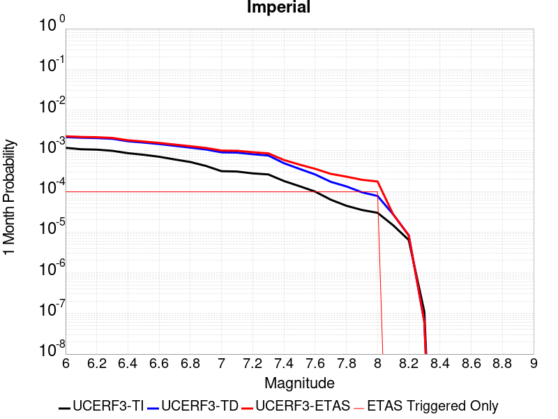 | 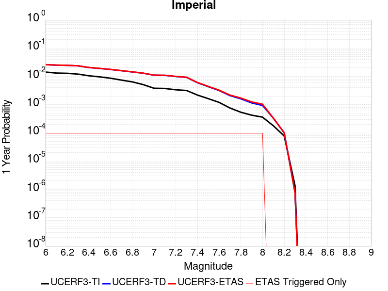 | 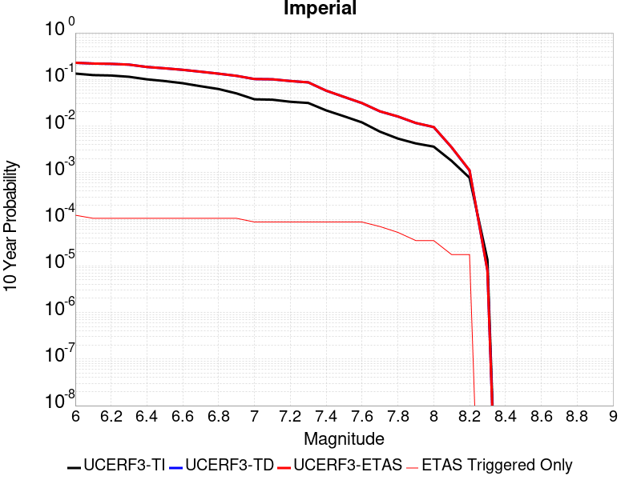 |

| Magnitude | 1 wk TI Prob | 1 wk TD Prob | 1 wk ETAS Prob | 1 wk ETAS/TD Gain | 1 wk ETAS Triggered Only | 1 mo TI Prob | 1 mo TD Prob | 1 mo ETAS Prob | 1 mo ETAS/TD Gain | 1 mo ETAS Triggered Only | 1 yr TI Prob | 1 yr TD Prob | 1 yr ETAS Prob | 1 yr ETAS/TD Gain | 1 yr ETAS Triggered Only | 10 yr TI Prob | 10 yr TD Prob | 10 yr ETAS Prob | 10 yr ETAS/TD Gain | 10 yr ETAS Triggered Only |
|-----|-----|-----|-----|-----|-----|-----|-----|-----|-----|-----|-----|-----|-----|-----|-----|-----|-----|-----|-----|-----|
| 6.0 | 2.7496446E-4 | 5.0552754E-4 | 6.032872E-4 | 1.1933814 | 9.7809076E-5 | 0.0011778869 | 0.002164787 | 0.0022623844 | 1.045084 | 9.7809076E-5 | 0.0142467655 | 0.026038699 | 0.02613396 | 1.0036585 | 9.7809076E-5 | 0.13367249 | 0.2280438 | 0.2281193 | 1.000331 | 9.7809076E-5 |
| 6.1 | 2.5356023E-4 | 4.8656776E-4 | 5.8432925E-4 | 1.2009206 | 9.7809076E-5 | 0.001086234 | 0.0020836622 | 0.0021812676 | 1.0468432 | 9.7809076E-5 | 0.013144928 | 0.025071215 | 0.025166571 | 1.0038035 | 9.7809076E-5 | 0.123940155 | 0.21947981 | 0.21955615 | 1.0003479 | 9.7809076E-5 |
| 6.2 | 2.4820742E-4 | 4.7752203E-4 | 5.752844E-4 | 1.2047285 | 9.7809076E-5 | 0.0010633124 | 0.0020449557 | 0.0021425649 | 1.0477316 | 9.7809076E-5 | 0.01286919 | 0.024611235 | 0.024706637 | 1.0038763 | 9.7809076E-5 | 0.12148927 | 0.21598552 | 0.2160622 | 1.000355 | 9.7809076E-5 |
| 6.3 | 2.3205351E-4 | 4.5890483E-4 | 5.56669E-4 | 1.2130381 | 9.7809076E-5 | 9.94136E-4 | 0.0019652895 | 0.0020629063 | 1.0496705 | 9.7809076E-5 | 0.012036599 | 0.02366133 | 0.023756826 | 1.004036 | 9.7809076E-5 | 0.11405133 | 0.20793462 | 0.20801209 | 1.0003725 | 9.7809076E-5 |
| 6.4 | 2.0304754E-4 | 3.987652E-4 | 4.965353E-4 | 1.245182 | 9.7809076E-5 | 8.6991355E-4 | 0.0017078889 | 0.001805531 | 1.0571712 | 9.7809076E-5 | 0.010539869 | 0.020595672 | 0.020691466 | 1.0046512 | 9.7809076E-5 | 0.100537635 | 0.1850669 | 0.1851466 | 1.0004307 | 9.7809076E-5 |
| 6.5 | 1.854992E-4 | 3.6988858E-4 | 4.6766148E-4 | 1.2643306 | 9.7809076E-5 | 7.9475436E-4 | 0.0015842861 | 0.0016819402 | 1.0616392 | 9.7809076E-5 | 0.009633281 | 0.01911948 | 0.01921542 | 1.0050179 | 9.7809076E-5 | 0.0922623 | 0.173298 | 0.17337885 | 1.0004666 | 9.7809076E-5 |
| 6.6 | 1.6586106E-4 | 3.403506E-4 | 4.3812642E-4 | 1.2872796 | 9.7809076E-5 | 7.106394E-4 | 0.0014578402 | 0.0015555067 | 1.066994 | 9.7809076E-5 | 0.008617763 | 0.01760642 | 0.017702507 | 1.0054575 | 9.7809076E-5 | 0.08291132 | 0.16077545 | 0.16085753 | 1.0005106 | 9.7809076E-5 |
| 6.7 | 1.4224656E-4 | 3.076692E-4 | 4.0544817E-4 | 1.3178055 | 9.7809076E-5 | 6.094856E-4 | 0.001317924 | 0.0014156043 | 1.0741167 | 9.7809076E-5 | 0.0073952693 | 0.015929576 | 0.016025828 | 1.0060422 | 9.7809076E-5 | 0.07153955 | 0.14648417 | 0.14656764 | 1.0005699 | 9.7809076E-5 |
| 6.8 | 1.2317259E-4 | 2.779122E-4 | 3.7569407E-4 | 1.3518445 | 9.7809076E-5 | 5.2777573E-4 | 0.0011905148 | 0.0012882074 | 1.0820591 | 9.7809076E-5 | 0.0064067547 | 0.0143995695 | 0.014495971 | 1.0066947 | 9.7809076E-5 | 0.06225166 | 0.13293684 | 0.13302164 | 1.0006379 | 9.7809076E-5 |
| 6.9 | 9.859898E-5 | 2.5014306E-4 | 3.4792765E-4 | 1.3909148 | 9.7809076E-5 | 4.2249862E-4 | 0.0010716055 | 0.0011693097 | 1.0911756 | 9.7809076E-5 | 0.0051317946 | 0.012969712 | 0.013066253 | 1.0074435 | 9.7809076E-5 | 0.05014893 | 0.11940631 | 0.11949244 | 1.0007213 | 9.7809076E-5 |
| 7.0 | 7.3191884E-5 | 2.1266776E-4 | 3.1045603E-4 | 1.4598172 | 9.7809076E-5 | 3.136418E-4 | 9.1111806E-4 | 0.0010088381 | 1.1072528 | 9.7809076E-5 | 0.003811904 | 0.011037128 | 0.011133857 | 1.008764 | 9.7809076E-5 | 0.037471764 | 0.10206493 | 0.10215275 | 1.0008605 | 9.7809076E-5 |
| 7.1 | 7.1760296E-5 | 2.0968143E-4 | 3.0746998E-4 | 1.4663674 | 9.7809076E-5 | 3.0750787E-4 | 8.983284E-4 | 9.960496E-4 | 1.1087812 | 9.7809076E-5 | 0.003737482 | 0.010882978 | 0.010979723 | 1.0088896 | 9.7809076E-5 | 0.03675245 | 0.10070146 | 0.10078941 | 1.0008734 | 9.7809076E-5 |
| 7.2 | 6.46614E-5 | 1.9136685E-4 | 2.891572E-4 | 1.5110099 | 9.7809076E-5 | 2.7709085E-4 | 8.1988896E-4 | 9.176178E-4 | 1.1191977 | 9.7809076E-5 | 0.0033683628 | 0.0099370815 | 0.010033919 | 1.009745 | 9.7809076E-5 | 0.033177625 | 0.09250898 | 0.09259774 | 1.0009595 | 9.7809076E-5 |
| 7.3 | 6.088115E-5 | 1.78084E-4 | 2.7587565E-4 | 1.5491322 | 9.7809076E-5 | 2.6089314E-4 | 7.6299673E-4 | 8.607312E-4 | 1.1280929 | 9.7809076E-5 | 0.0031717476 | 0.009250494 | 0.009347398 | 1.0104756 | 9.7809076E-5 | 0.031268585 | 0.08655989 | 0.08664924 | 1.0010321 | 9.7809076E-5 |
| 7.4 | 4.199346E-5 | 1.1510366E-4 | 2.1290149E-4 | 1.8496499 | 9.7809076E-5 | 1.7995955E-4 | 4.9320905E-4 | 5.9096987E-4 | 1.1982138 | 9.7809076E-5 | 0.0021888057 | 0.0059884563 | 0.0060856794 | 1.0162351 | 9.7809076E-5 | 0.02167372 | 0.057439793 | 0.057531986 | 1.001605 | 9.7809076E-5 |
| 7.5 | 3.130448E-5 | 8.33328E-5 | 1.8113373E-4 | 2.1736186 | 9.7809076E-5 | 1.3415517E-4 | 3.57092E-4 | 4.5486615E-4 | 1.2738066 | 9.7809076E-5 | 0.0016321153 | 0.004338988 | 0.004436373 | 1.0224441 | 9.7809076E-5 | 0.016201803 | 0.04213201 | 0.042225696 | 1.0022237 | 9.7809076E-5 |
| 7.6 | 2.3074248E-5 | 6.0844646E-5 | 1.5864777E-4 | 2.6074235 | 9.7809076E-5 | 9.888588E-5 | 2.6073685E-4 | 3.5852042E-4 | 1.3750279 | 9.7809076E-5 | 0.0012032706 | 0.0031698733 | 0.0032673725 | 1.030758 | 9.7809076E-5 | 0.011967761 | 0.031026395 | 0.031121168 | 1.0030546 | 9.7809076E-5 |
| 7.7 | 1.45864815E-5 | 4.0124698E-5 | 1.3792985E-4 | 3.4375298 | 9.7809076E-5 | 6.2511994E-5 | 1.7195169E-4 | 2.6974396E-4 | 1.5687194 | 9.7809076E-5 | 7.608177E-4 | 0.0020915072 | 0.0021891117 | 1.0466671 | 9.7809076E-5 | 0.007582182 | 0.020627763 | 0.020723555 | 1.0046438 | 9.7809076E-5 |
| 7.8 | 1.0352979E-5 | 3.0960902E-5 | 1.2876694E-4 | 4.159018 | 9.7809076E-5 | 4.4369157E-5 | 1.3268284E-4 | 2.3047894E-4 | 1.7370666 | 9.7809076E-5 | 5.400606E-4 | 0.0016142189 | 0.0017118701 | 1.0604944 | 9.7809076E-5 | 0.0053875 | 0.016016833 | 0.016113074 | 1.0060089 | 9.7809076E-5 |
| 7.9 | 8.137906E-6 | 2.2149103E-5 | 1.19956014E-4 | 5.415841 | 9.7809076E-5 | 3.4876273E-5 | 9.492128E-5 | 1.9272107E-4 | 2.0303254 | 9.7809076E-5 | 4.2453592E-4 | 0.0011550548 | 0.0012527509 | 1.0845814 | 9.7809076E-5 | 0.004237258 | 0.011617903 | 0.011714575 | 1.008321 | 9.7809076E-5 |
| 8.0 | 6.93792E-6 | 1.8008766E-5 | 1.1581608E-4 | 6.431095 | 9.7809076E-5 | 2.9733603E-5 | 7.717814E-5 | 1.7497968E-4 | 2.2672179 | 9.7809076E-5 | 3.6194647E-4 | 9.3923963E-4 | 0.0010369568 | 1.1040386 | 9.7809076E-5 | 0.0036135751 | 0.00950155 | 0.00959843 | 1.0101962 | 9.7809076E-5 |
| 8.1 | 3.4286315E-6 | 6.379872E-6 | 6.379872E-6 | 1.0 | 0.0 | 1.4694053E-5 | 2.7342023E-5 | 2.7342023E-5 | 1.0 | 0.0 | 1.7888541E-4 | 3.328384E-4 | 3.328384E-4 | 1.0 | 0.0 | 0.0017874148 | 0.003486031 | 0.003486031 | 1.0 | 0.0 |
| 8.2 | 1.4906886E-6 | 1.9366646E-6 | 1.9366646E-6 | 1.0 | 0.0 | 6.3886496E-6 | 8.299965E-6 | 8.299965E-6 | 1.0 | 0.0 | 7.7779034E-5 | 1.0104742E-4 | 1.0104742E-4 | 1.0 | 0.0 | 7.775182E-4 | 0.0011075331 | 0.0011075331 | 1.0 | 0.0 |
| 8.3 | 2.5758007E-8 | 1.4500102E-8 | 1.4500102E-8 | 1.0 | 0.0 | 1.10391454E-7 | 6.214329E-8 | 6.214329E-8 | 1.0 | 0.0 | 1.3440151E-6 | 7.565946E-7 | 7.565946E-7 | 1.0 | 0.0 | 1.344007E-5 | 7.887763E-6 | 7.887763E-6 | 1.0 | 0.0 |

## Santa Ynez (East)
*[(top)](#table-of-contents)*

| 1 Week | 1 Month | 1 Year | 10 Year |
|-----|-----|-----|-----|
| 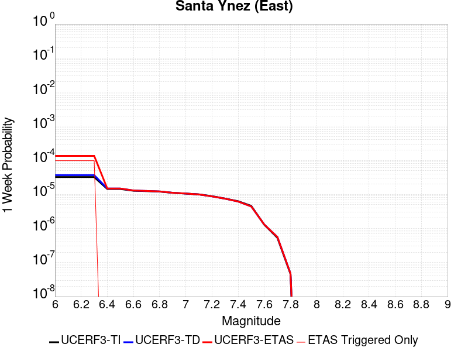 | 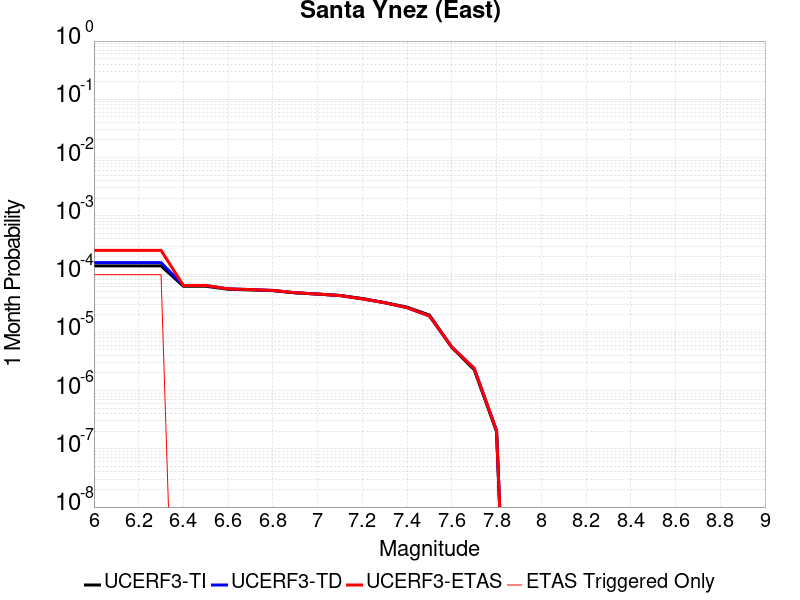 | 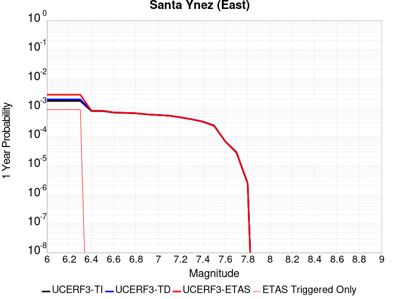 | 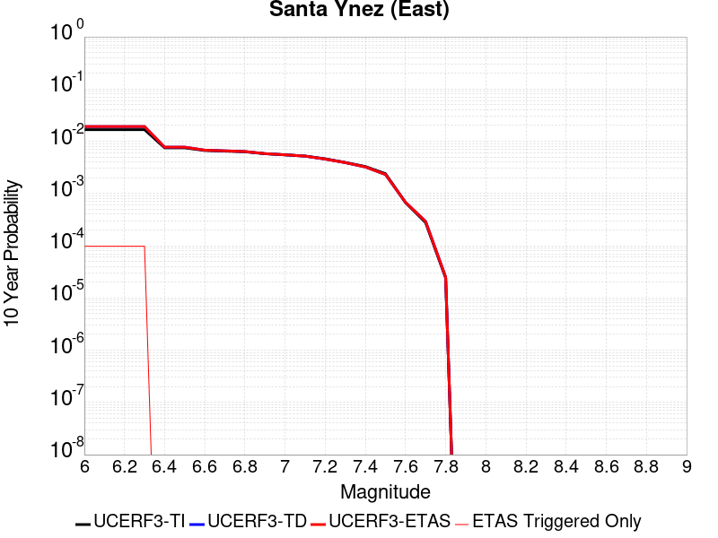 |

| Magnitude | 1 wk TI Prob | 1 wk TD Prob | 1 wk ETAS Prob | 1 wk ETAS/TD Gain | 1 wk ETAS Triggered Only | 1 mo TI Prob | 1 mo TD Prob | 1 mo ETAS Prob | 1 mo ETAS/TD Gain | 1 mo ETAS Triggered Only | 1 yr TI Prob | 1 yr TD Prob | 1 yr ETAS Prob | 1 yr ETAS/TD Gain | 1 yr ETAS Triggered Only | 10 yr TI Prob | 10 yr TD Prob | 10 yr ETAS Prob | 10 yr ETAS/TD Gain | 10 yr ETAS Triggered Only |
|-----|-----|-----|-----|-----|-----|-----|-----|-----|-----|-----|-----|-----|-----|-----|-----|-----|-----|-----|-----|-----|
| 6.0 | 3.2269712E-5 | 3.67505E-5 | 1.3455599E-4 | 3.6613371 | 9.7809076E-5 | 1.3829143E-4 | 1.5749598E-4 | 2.5528963E-4 | 1.620928 | 9.7809076E-5 | 0.0016823979 | 0.0019164166 | 0.0020140382 | 1.0509397 | 9.7809076E-5 | 0.016697178 | 0.019056441 | 0.019152386 | 1.0050348 | 9.7809076E-5 |
| 6.1 | 3.2269712E-5 | 3.67505E-5 | 1.3455599E-4 | 3.6613371 | 9.7809076E-5 | 1.3829143E-4 | 1.5749598E-4 | 2.5528963E-4 | 1.620928 | 9.7809076E-5 | 0.0016823979 | 0.0019164166 | 0.0020140382 | 1.0509397 | 9.7809076E-5 | 0.016697178 | 0.019056441 | 0.019152386 | 1.0050348 | 9.7809076E-5 |
| 6.2 | 3.2269712E-5 | 3.67505E-5 | 1.3455599E-4 | 3.6613371 | 9.7809076E-5 | 1.3829143E-4 | 1.5749598E-4 | 2.5528963E-4 | 1.620928 | 9.7809076E-5 | 0.0016823979 | 0.0019164166 | 0.0020140382 | 1.0509397 | 9.7809076E-5 | 0.016697178 | 0.019056441 | 0.019152386 | 1.0050348 | 9.7809076E-5 |
| 6.3 | 3.2269712E-5 | 3.67505E-5 | 1.3455599E-4 | 3.6613371 | 9.7809076E-5 | 1.3829143E-4 | 1.5749598E-4 | 2.5528963E-4 | 1.620928 | 9.7809076E-5 | 0.0016823979 | 0.0019164166 | 0.0020140382 | 1.0509397 | 9.7809076E-5 | 0.016697178 | 0.019056441 | 0.019152386 | 1.0050348 | 9.7809076E-5 |
| 6.4 | 1.4404779E-5 | 1.4849382E-5 | 1.4849382E-5 | 1.0 | 0.0 | 6.1733306E-5 | 6.363868E-5 | 6.363868E-5 | 1.0 | 0.0 | 7.513438E-4 | 7.745306E-4 | 7.745306E-4 | 1.0 | 0.0 | 0.0074880854 | 0.007718862 | 0.007718862 | 1.0 | 0.0 |
| 6.5 | 1.4404779E-5 | 1.4849382E-5 | 1.4849382E-5 | 1.0 | 0.0 | 6.1733306E-5 | 6.363868E-5 | 6.363868E-5 | 1.0 | 0.0 | 7.513438E-4 | 7.745306E-4 | 7.745306E-4 | 1.0 | 0.0 | 0.0074880854 | 0.007718862 | 0.007718862 | 1.0 | 0.0 |
| 6.6 | 1.280208E-5 | 1.3011947E-5 | 1.3011947E-5 | 1.0 | 0.0 | 5.4864904E-5 | 5.5764307E-5 | 5.5764307E-5 | 1.0 | 0.0 | 6.6777546E-4 | 6.787207E-4 | 6.787207E-4 | 1.0 | 0.0 | 0.006657724 | 0.0067666885 | 0.0067666885 | 1.0 | 0.0 |
| 6.7 | 1.2457027E-5 | 1.2628468E-5 | 1.2628468E-5 | 1.0 | 0.0 | 5.3386164E-5 | 5.412089E-5 | 5.412089E-5 | 1.0 | 0.0 | 6.497827E-4 | 6.587243E-4 | 6.587243E-4 | 1.0 | 0.0 | 0.00647886 | 0.006567915 | 0.006567915 | 1.0 | 0.0 |
| 6.8 | 1.2095134E-5 | 1.2230915E-5 | 1.2230915E-5 | 1.0 | 0.0 | 5.1835254E-5 | 5.241716E-5 | 5.241716E-5 | 1.0 | 0.0 | 6.309115E-4 | 6.379937E-4 | 6.379937E-4 | 1.0 | 0.0 | 0.0062912325 | 0.006361809 | 0.006361809 | 1.0 | 0.0 |
| 6.9 | 1.1104036E-5 | 1.1157347E-5 | 1.1157347E-5 | 1.0 | 0.0 | 4.758786E-5 | 4.781633E-5 | 4.781633E-5 | 1.0 | 0.0 | 5.7922816E-4 | 5.820096E-4 | 5.820096E-4 | 1.0 | 0.0 | 0.005777207 | 0.0058049993 | 0.0058049993 | 1.0 | 0.0 |
| 7.0 | 1.0577444E-5 | 1.058168E-5 | 1.058168E-5 | 1.0 | 0.0 | 4.5331115E-5 | 4.5349276E-5 | 4.5349276E-5 | 1.0 | 0.0 | 5.5176654E-4 | 5.519888E-4 | 5.519888E-4 | 1.0 | 0.0 | 0.0055039856 | 0.0055063153 | 0.0055063153 | 1.0 | 0.0 |
| 7.1 | 1.0021775E-5 | 9.980988E-6 | 9.980988E-6 | 1.0 | 0.0 | 4.294976E-5 | 4.2774966E-5 | 4.2774966E-5 | 1.0 | 0.0 | 5.2278786E-4 | 5.2066194E-4 | 5.2066194E-4 | 1.0 | 0.0 | 0.0052155964 | 0.0051945536 | 0.0051945536 | 1.0 | 0.0 |
| 7.2 | 8.874109E-6 | 8.748793E-6 | 8.748793E-6 | 1.0 | 0.0 | 3.8031343E-5 | 3.7494297E-5 | 3.7494297E-5 | 1.0 | 0.0 | 4.629332E-4 | 4.5639853E-4 | 4.5639853E-4 | 1.0 | 0.0 | 0.0046197 | 0.0045547304 | 0.0045547304 | 1.0 | 0.0 |
| 7.3 | 7.5504267E-6 | 7.5051175E-6 | 7.5051175E-6 | 1.0 | 0.0 | 3.235857E-5 | 3.21644E-5 | 3.21644E-5 | 1.0 | 0.0 | 3.9389438E-4 | 3.915322E-4 | 3.915322E-4 | 1.0 | 0.0 | 0.0039319694 | 0.003908531 | 0.003908531 | 1.0 | 0.0 |
| 7.4 | 6.309394E-6 | 6.1831556E-6 | 6.1831556E-6 | 1.0 | 0.0 | 2.703998E-5 | 2.6498974E-5 | 2.6498974E-5 | 1.0 | 0.0 | 3.2916202E-4 | 3.225782E-4 | 3.225782E-4 | 1.0 | 0.0 | 0.003286749 | 0.003221197 | 0.003221197 | 1.0 | 0.0 |
| 7.5 | 4.6103073E-6 | 4.4408903E-6 | 4.4408903E-6 | 1.0 | 0.0 | 1.975831E-5 | 1.9032252E-5 | 1.9032252E-5 | 1.0 | 0.0 | 2.4053088E-4 | 2.3169373E-4 | 2.3169373E-4 | 1.0 | 0.0 | 0.002402707 | 0.002314591 | 0.002314591 | 1.0 | 0.0 |
| 7.6 | 1.2858658E-6 | 1.3008173E-6 | 1.3008173E-6 | 1.0 | 0.0 | 5.5108417E-6 | 5.5749197E-6 | 5.5749197E-6 | 1.0 | 0.0 | 6.7092435E-5 | 6.78726E-5 | 6.78726E-5 | 1.0 | 0.0 | 6.707218E-4 | 6.785256E-4 | 6.785256E-4 | 1.0 | 0.0 |
| 7.7 | 5.3302307E-7 | 5.612138E-7 | 5.612138E-7 | 1.0 | 0.0 | 2.2843826E-6 | 2.4052001E-6 | 2.4052001E-6 | 1.0 | 0.0 | 2.7812002E-5 | 2.9282954E-5 | 2.9282954E-5 | 1.0 | 0.0 | 2.7808524E-4 | 2.9279452E-4 | 2.9279452E-4 | 1.0 | 0.0 |
| 7.8 | 4.613933E-8 | 4.80301E-8 | 4.80301E-8 | 1.0 | 0.0 | 1.9773998E-7 | 2.0584326E-7 | 2.0584326E-7 | 1.0 | 0.0 | 2.4074816E-6 | 2.5061388E-6 | 2.5061388E-6 | 1.0 | 0.0 | 2.4074554E-5 | 2.5061116E-5 | 2.5061116E-5 | 1.0 | 0.0 |

## Johnson Valley (No) 2011 rev
*[(top)](#table-of-contents)*

| 1 Week | 1 Month | 1 Year | 10 Year |
|-----|-----|-----|-----|
| 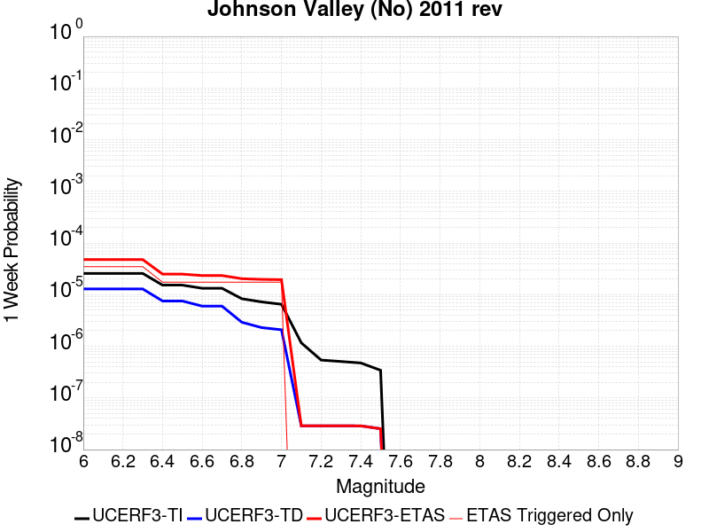 | 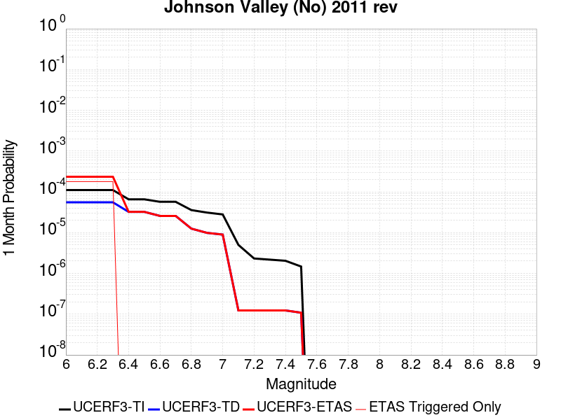 | 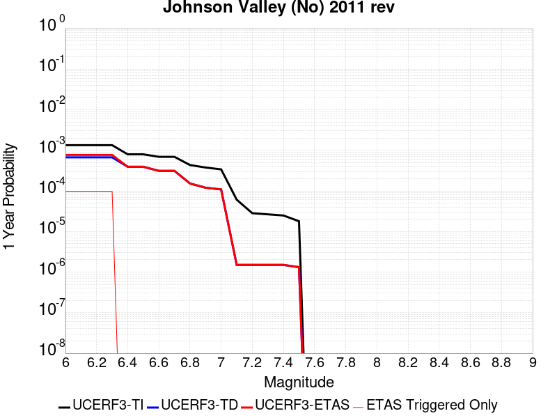 | 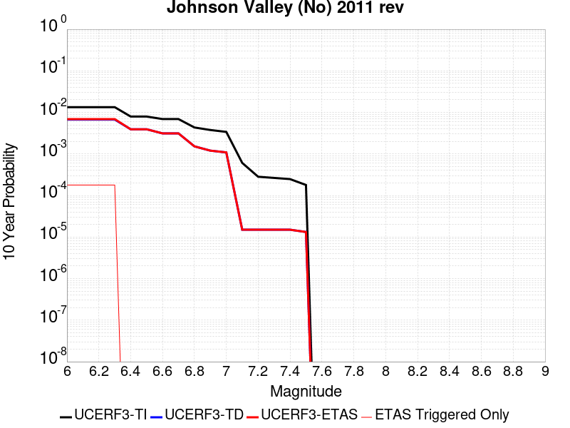 |

| Magnitude | 1 wk TI Prob | 1 wk TD Prob | 1 wk ETAS Prob | 1 wk ETAS/TD Gain | 1 wk ETAS Triggered Only | 1 mo TI Prob | 1 mo TD Prob | 1 mo ETAS Prob | 1 mo ETAS/TD Gain | 1 mo ETAS Triggered Only | 1 yr TI Prob | 1 yr TD Prob | 1 yr ETAS Prob | 1 yr ETAS/TD Gain | 1 yr ETAS Triggered Only | 10 yr TI Prob | 10 yr TD Prob | 10 yr ETAS Prob | 10 yr ETAS/TD Gain | 10 yr ETAS Triggered Only |
|-----|-----|-----|-----|-----|-----|-----|-----|-----|-----|-----|-----|-----|-----|-----|-----|-----|-----|-----|-----|-----|
| 6.0 | 2.577707E-5 | 1.2900938E-5 | 1.1070875E-4 | 8.5814495 | 9.7809076E-5 | 1.1046848E-4 | 5.5288787E-5 | 1.5309245E-4 | 2.7689602 | 9.7809076E-5 | 0.0013441239 | 6.7297276E-4 | 7.70716E-4 | 1.145241 | 9.7809076E-5 | 0.013360229 | 0.006713257 | 0.0068104095 | 1.0144718 | 9.7809076E-5 |
| 6.1 | 2.577707E-5 | 1.2900938E-5 | 1.1070875E-4 | 8.5814495 | 9.7809076E-5 | 1.1046848E-4 | 5.5288787E-5 | 1.5309245E-4 | 2.7689602 | 9.7809076E-5 | 0.0013441239 | 6.7297276E-4 | 7.70716E-4 | 1.145241 | 9.7809076E-5 | 0.013360229 | 0.006713257 | 0.0068104095 | 1.0144718 | 9.7809076E-5 |
| 6.2 | 2.577707E-5 | 1.2900938E-5 | 1.1070875E-4 | 8.5814495 | 9.7809076E-5 | 1.1046848E-4 | 5.5288787E-5 | 1.5309245E-4 | 2.7689602 | 9.7809076E-5 | 0.0013441239 | 6.7297276E-4 | 7.70716E-4 | 1.145241 | 9.7809076E-5 | 0.013360229 | 0.006713257 | 0.0068104095 | 1.0144718 | 9.7809076E-5 |
| 6.3 | 2.577707E-5 | 1.2900938E-5 | 1.1070875E-4 | 8.5814495 | 9.7809076E-5 | 1.1046848E-4 | 5.5288787E-5 | 1.5309245E-4 | 2.7689602 | 9.7809076E-5 | 0.0013441239 | 6.7297276E-4 | 7.70716E-4 | 1.145241 | 9.7809076E-5 | 0.013360229 | 0.006713257 | 0.0068104095 | 1.0144718 | 9.7809076E-5 |
| 6.4 | 1.5296591E-5 | 7.536742E-6 | 7.536742E-6 | 1.0 | 0.0 | 6.555518E-5 | 3.2300028E-5 | 3.2300028E-5 | 1.0 | 0.0 | 7.97842E-4 | 3.9320064E-4 | 3.9320064E-4 | 1.0 | 0.0 | 0.007949836 | 0.0039268904 | 0.0039268904 | 1.0 | 0.0 |
| 6.5 | 1.5296591E-5 | 7.536742E-6 | 7.536742E-6 | 1.0 | 0.0 | 6.555518E-5 | 3.2300028E-5 | 3.2300028E-5 | 1.0 | 0.0 | 7.97842E-4 | 3.9320064E-4 | 3.9320064E-4 | 1.0 | 0.0 | 0.007949836 | 0.0039268904 | 0.0039268904 | 1.0 | 0.0 |
| 6.6 | 1.3289383E-5 | 5.9917306E-6 | 5.9917306E-6 | 1.0 | 0.0 | 5.6953253E-5 | 2.5678688E-5 | 2.5678688E-5 | 1.0 | 0.0 | 6.9318525E-4 | 3.1261015E-4 | 3.1261015E-4 | 1.0 | 0.0 | 0.0069102696 | 0.0031233684 | 0.0031233684 | 1.0 | 0.0 |
| 6.7 | 1.3289383E-5 | 5.9917306E-6 | 5.9917306E-6 | 1.0 | 0.0 | 5.6953253E-5 | 2.5678688E-5 | 2.5678688E-5 | 1.0 | 0.0 | 6.9318525E-4 | 3.1261015E-4 | 3.1261015E-4 | 1.0 | 0.0 | 0.0069102696 | 0.0031233684 | 0.0031233684 | 1.0 | 0.0 |
| 6.8 | 8.330789E-6 | 2.9211888E-6 | 2.9211888E-6 | 1.0 | 0.0 | 3.570289E-5 | 1.2519352E-5 | 1.2519352E-5 | 1.0 | 0.0 | 4.34596E-4 | 1.5241816E-4 | 1.5241816E-4 | 1.0 | 0.0 | 0.0043374705 | 0.0015236961 | 0.0015236961 | 1.0 | 0.0 |
| 6.9 | 7.2359003E-6 | 2.3013247E-6 | 2.3013247E-6 | 1.0 | 0.0 | 3.1010633E-5 | 9.8628125E-6 | 9.8628125E-6 | 1.0 | 0.0 | 3.7748902E-4 | 1.2007845E-4 | 1.2007845E-4 | 1.0 | 0.0 | 0.0037684843 | 0.0012006586 | 0.0012006586 | 1.0 | 0.0 |
| 7.0 | 6.5149957E-6 | 2.088482E-6 | 2.088482E-6 | 1.0 | 0.0 | 2.792111E-5 | 8.950637E-6 | 8.950637E-6 | 1.0 | 0.0 | 3.398865E-4 | 1.0897385E-4 | 1.0897385E-4 | 1.0 | 0.0 | 0.003393671 | 0.0010897239 | 0.0010897239 | 1.0 | 0.0 |
| 7.1 | 1.1662233E-6 | 2.8802024E-8 | 2.8802024E-8 | 1.0 | 0.0 | 4.9980904E-6 | 1.2343725E-7 | 1.2343725E-7 | 1.0 | 0.0 | 6.0850052E-5 | 1.5028476E-6 | 1.5028476E-6 | 1.0 | 0.0 | 6.083339E-4 | 1.50283895E-5 | 1.50283895E-5 | 1.0 | 0.0 |
| 7.2 | 5.413881E-7 | 2.8802024E-8 | 2.8802024E-8 | 1.0 | 0.0 | 2.3202326E-6 | 1.2343725E-7 | 1.2343725E-7 | 1.0 | 0.0 | 2.8248465E-5 | 1.5028476E-6 | 1.5028476E-6 | 1.0 | 0.0 | 2.8244875E-4 | 1.50283895E-5 | 1.50283895E-5 | 1.0 | 0.0 |
| 7.3 | 5.076821E-7 | 2.8802024E-8 | 2.8802024E-8 | 1.0 | 0.0 | 2.1757785E-6 | 1.2343723E-7 | 1.2343723E-7 | 1.0 | 0.0 | 2.648978E-5 | 1.5028475E-6 | 1.5028475E-6 | 1.0 | 0.0 | 2.6486625E-4 | 1.50283895E-5 | 1.50283895E-5 | 1.0 | 0.0 |
| 7.4 | 4.7568687E-7 | 2.8783948E-8 | 2.8783948E-8 | 1.0 | 0.0 | 2.0386565E-6 | 1.2335977E-7 | 1.2335977E-7 | 1.0 | 0.0 | 2.482036E-5 | 1.5019043E-6 | 1.5019043E-6 | 1.0 | 0.0 | 2.4817587E-4 | 1.5018958E-5 | 1.5018958E-5 | 1.0 | 0.0 |
| 7.5 | 3.435626E-7 | 2.5357679E-8 | 2.5357679E-8 | 1.0 | 0.0 | 1.4724103E-6 | 1.0867576E-7 | 1.0867576E-7 | 1.0 | 0.0 | 1.7926448E-5 | 1.3231268E-6 | 1.3231268E-6 | 1.0 | 0.0 | 1.7925001E-4 | 1.3231205E-5 | 1.3231205E-5 | 1.0 | 0.0 |

## San Andreas (Cholame) rev
*[(top)](#table-of-contents)*

| 1 Week | 1 Month | 1 Year | 10 Year |
|-----|-----|-----|-----|
| 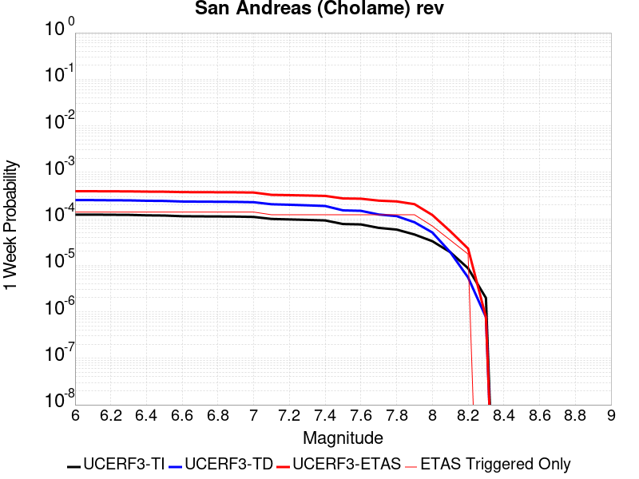 | 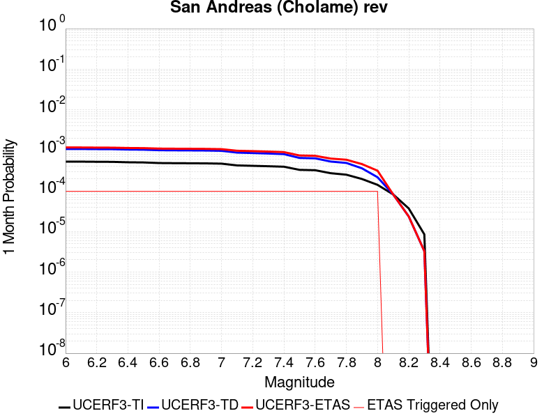 | 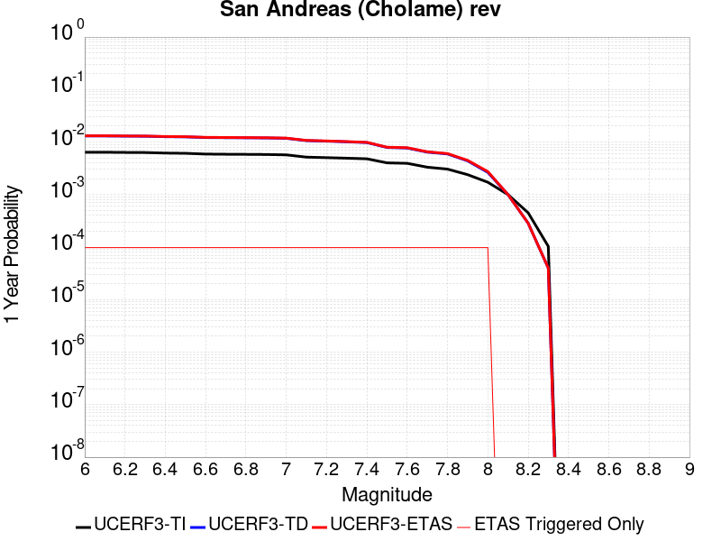 | 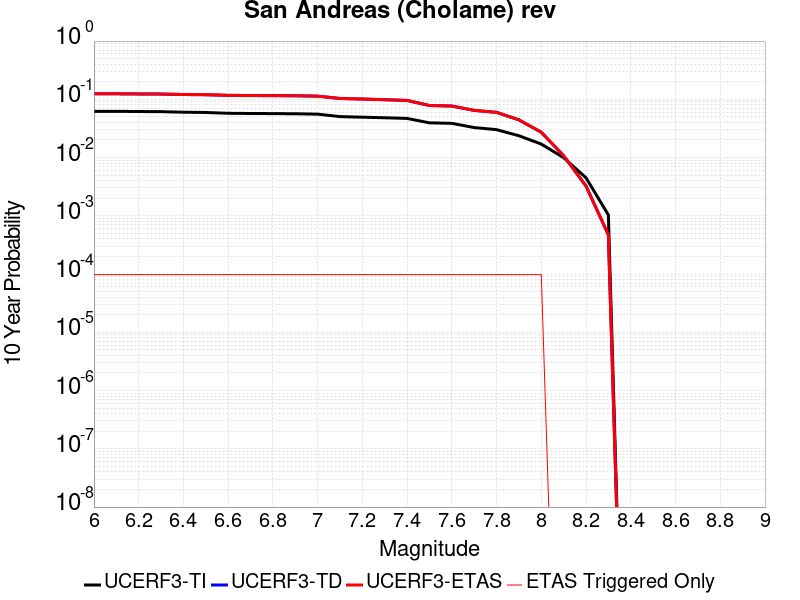 |

| Magnitude | 1 wk TI Prob | 1 wk TD Prob | 1 wk ETAS Prob | 1 wk ETAS/TD Gain | 1 wk ETAS Triggered Only | 1 mo TI Prob | 1 mo TD Prob | 1 mo ETAS Prob | 1 mo ETAS/TD Gain | 1 mo ETAS Triggered Only | 1 yr TI Prob | 1 yr TD Prob | 1 yr ETAS Prob | 1 yr ETAS/TD Gain | 1 yr ETAS Triggered Only | 10 yr TI Prob | 10 yr TD Prob | 10 yr ETAS Prob | 10 yr ETAS/TD Gain | 10 yr ETAS Triggered Only |
|-----|-----|-----|-----|-----|-----|-----|-----|-----|-----|-----|-----|-----|-----|-----|-----|-----|-----|-----|-----|-----|
| 6.0 | 1.2302514E-4 | 2.5204287E-4 | 3.4982729E-4 | 1.3879675 | 9.7809076E-5 | 5.27144E-4 | 0.0010797381 | 0.0011774417 | 1.0904881 | 9.7809076E-5 | 0.0063991086 | 0.0130670825 | 0.013163614 | 1.0073874 | 9.7809076E-5 | 0.06217949 | 0.12439073 | 0.12447637 | 1.0006886 | 9.7809076E-5 |
| 6.1 | 1.2302514E-4 | 2.5204287E-4 | 3.4982729E-4 | 1.3879675 | 9.7809076E-5 | 5.27144E-4 | 0.0010797381 | 0.0011774417 | 1.0904881 | 9.7809076E-5 | 0.0063991086 | 0.0130670825 | 0.013163614 | 1.0073874 | 9.7809076E-5 | 0.06217949 | 0.12439073 | 0.12447637 | 1.0006886 | 9.7809076E-5 |
| 6.2 | 1.2203569E-4 | 2.5021084E-4 | 3.4799543E-4 | 1.3908088 | 9.7809076E-5 | 5.2290526E-4 | 0.0010718931 | 0.0011695974 | 1.0911511 | 9.7809076E-5 | 0.006347804 | 0.01297271 | 0.01306925 | 1.0074418 | 9.7809076E-5 | 0.061695136 | 0.12357691 | 0.12366263 | 1.0006937 | 9.7809076E-5 |
| 6.3 | 1.2142645E-4 | 2.4907055E-4 | 3.468553E-4 | 1.3925984 | 9.7809076E-5 | 5.202953E-4 | 0.0010670102 | 0.0011647149 | 1.0915687 | 9.7809076E-5 | 0.006316212 | 0.012913967 | 0.013010513 | 1.0074761 | 9.7809076E-5 | 0.06139677 | 0.12307103 | 0.1231568 | 1.0006969 | 9.7809076E-5 |
| 6.4 | 1.1865206E-4 | 2.44126E-4 | 3.4191122E-4 | 1.4005522 | 9.7809076E-5 | 5.0840975E-4 | 0.0010458364 | 0.0011435432 | 1.0934246 | 9.7809076E-5 | 0.006172335 | 0.012659196 | 0.012755767 | 1.0076286 | 9.7809076E-5 | 0.060036868 | 0.1208638 | 0.12094979 | 1.0007114 | 9.7809076E-5 |
| 6.5 | 1.17443946E-4 | 2.4205919E-4 | 3.3984458E-4 | 1.4039731 | 9.7809076E-5 | 5.032341E-4 | 0.0010369857 | 0.0011346933 | 1.0942228 | 9.7809076E-5 | 0.006109677 | 0.012552682 | 0.012649264 | 1.0076941 | 9.7809076E-5 | 0.059444077 | 0.11993805 | 0.12002413 | 1.0007176 | 9.7809076E-5 |
| 6.6 | 1.13579066E-4 | 2.3514954E-4 | 3.3293563E-4 | 1.4158463 | 9.7809076E-5 | 4.866766E-4 | 0.001007396 | 0.0011051066 | 1.0969932 | 9.7809076E-5 | 0.0059092017 | 0.012196515 | 0.012293131 | 1.0079216 | 9.7809076E-5 | 0.057545185 | 0.11685214 | 0.116938524 | 1.0007392 | 9.7809076E-5 |
| 6.7 | 1.1271412E-4 | 2.3359268E-4 | 3.3137892E-4 | 1.4186186 | 9.7809076E-5 | 4.829711E-4 | 0.0010007289 | 0.0010984401 | 1.09764 | 9.7809076E-5 | 0.005864331 | 0.012116249 | 0.0122128725 | 1.0079747 | 9.7809076E-5 | 0.057119697 | 0.116155714 | 0.11624216 | 1.0007442 | 9.7809076E-5 |
| 6.8 | 1.1217975E-4 | 2.3247694E-4 | 3.3026328E-4 | 1.4206281 | 9.7809076E-5 | 4.8068175E-4 | 9.959509E-4 | 0.0010936626 | 1.0981089 | 9.7809076E-5 | 0.005836608 | 0.012058721 | 0.012155351 | 1.0080132 | 9.7809076E-5 | 0.056856725 | 0.11565396 | 0.11574046 | 1.0007479 | 9.7809076E-5 |
| 6.9 | 1.1146753E-4 | 2.3096445E-4 | 3.2875093E-4 | 1.4233832 | 9.7809076E-5 | 4.7763053E-4 | 9.894737E-4 | 0.0010871859 | 1.0987518 | 9.7809076E-5 | 0.0057996577 | 0.011980731 | 0.012077369 | 1.008066 | 9.7809076E-5 | 0.056506127 | 0.11497439 | 0.115060955 | 1.0007529 | 9.7809076E-5 |
| 7.0 | 1.0965793E-4 | 2.2719789E-4 | 3.2498475E-4 | 1.4304038 | 9.7809076E-5 | 4.698779E-4 | 9.733434E-4 | 0.0010710573 | 1.10039 | 9.7809076E-5 | 0.005705768 | 0.011786487 | 0.011883143 | 1.0082006 | 9.7809076E-5 | 0.055614736 | 0.11327597 | 0.11336269 | 1.0007657 | 9.7809076E-5 |
| 7.1 | 9.927982E-5 | 2.0538924E-4 | 3.031782E-4 | 1.4761155 | 9.7809076E-5 | 4.2541555E-4 | 8.7994366E-4 | 9.776667E-4 | 1.111056 | 9.7809076E-5 | 0.0051671406 | 0.010660981 | 0.010757747 | 1.0090767 | 9.7809076E-5 | 0.05048634 | 0.1033706 | 0.1034583 | 1.0008484 | 9.7809076E-5 |
| 7.2 | 9.696786E-5 | 2.0043184E-4 | 2.982213E-4 | 1.4878939 | 9.7809076E-5 | 4.1551032E-4 | 8.5871184E-4 | 9.564369E-4 | 1.1138043 | 9.7809076E-5 | 0.00504711 | 0.010404981 | 0.010501772 | 1.0093024 | 9.7809076E-5 | 0.04934009 | 0.1011086 | 0.10119652 | 1.0008695 | 9.7809076E-5 |
| 7.3 | 9.4727984E-5 | 1.9472468E-4 | 2.925147E-4 | 1.5021964 | 9.7809076E-5 | 4.0591392E-4 | 8.3426846E-4 | 9.319959E-4 | 1.1171415 | 9.7809076E-5 | 0.0049308087 | 0.010110183 | 0.010207003 | 1.0095766 | 9.7809076E-5 | 0.048228268 | 0.09847952 | 0.098567694 | 1.0008954 | 9.7809076E-5 |
| 7.4 | 9.220358E-5 | 1.8843076E-4 | 2.8622142E-4 | 1.518974 | 9.7809076E-5 | 3.9509835E-4 | 8.073114E-4 | 9.0504147E-4 | 1.1210563 | 9.7809076E-5 | 0.004799717 | 0.009784967 | 0.009881819 | 1.0098981 | 9.7809076E-5 | 0.046973653 | 0.095557496 | 0.095645964 | 1.0009258 | 9.7809076E-5 |
| 7.5 | 7.71631E-5 | 1.5177966E-4 | 2.495739E-4 | 1.6443172 | 9.7809076E-5 | 3.306571E-4 | 6.503223E-4 | 7.4806775E-4 | 1.1503031 | 9.7809076E-5 | 0.0040183207 | 0.007889002 | 0.007986039 | 1.0123004 | 9.7809076E-5 | 0.03946433 | 0.07828531 | 0.07837546 | 1.0011516 | 9.7809076E-5 |
| 7.6 | 7.5634416E-5 | 1.483744E-4 | 2.4616896E-4 | 1.6591067 | 9.7809076E-5 | 3.241072E-4 | 6.3573546E-4 | 7.3348236E-4 | 1.153754 | 9.7809076E-5 | 0.0039388672 | 0.0077126776 | 0.007809732 | 1.0125837 | 9.7809076E-5 | 0.038697794 | 0.07664872 | 0.076739036 | 1.0011783 | 9.7809076E-5 |
| 7.7 | 6.3783E-5 | 1.235872E-4 | 2.213842E-4 | 1.7913197 | 9.7809076E-5 | 2.7332708E-4 | 5.29552E-4 | 6.2730926E-4 | 1.1846038 | 9.7809076E-5 | 0.0033226798 | 0.0064282627 | 0.006525443 | 1.0151176 | 9.7809076E-5 | 0.032734364 | 0.06454029 | 0.06463179 | 1.0014176 | 9.7809076E-5 |
| 7.8 | 5.863422E-5 | 1.1416107E-4 | 2.1195898E-4 | 1.856666 | 9.7809076E-5 | 2.512653E-4 | 4.8917E-4 | 5.8693124E-4 | 1.1998513 | 9.7809076E-5 | 0.003054864 | 0.0059394026 | 0.006036631 | 1.01637 | 9.7809076E-5 | 0.030132094 | 0.059659187 | 0.05975116 | 1.0015416 | 9.7809076E-5 |
| 7.9 | 4.595283E-5 | 8.426331E-5 | 1.8206415E-4 | 2.1606574 | 9.7809076E-5 | 1.9692584E-4 | 3.610785E-4 | 4.5885227E-4 | 1.2707826 | 9.7809076E-5 | 0.0023949358 | 0.0043872762 | 0.0044846563 | 1.022196 | 9.7809076E-5 | 0.023692891 | 0.044362005 | 0.044455476 | 1.002107 | 9.7809076E-5 |
| 8.0 | 3.2950178E-5 | 5.0772942E-5 | 1.4857705E-4 | 2.9263039 | 9.7809076E-5 | 1.412074E-4 | 2.1758018E-4 | 3.1536797E-4 | 1.4494333 | 9.7809076E-5 | 0.0017178444 | 0.0026458222 | 0.0027433727 | 1.0368695 | 9.7809076E-5 | 0.017046256 | 0.027180137 | 0.027275288 | 1.0035007 | 9.7809076E-5 |
| 8.1 | 1.9177472E-5 | 1.9185145E-5 | 1.9185145E-5 | 1.0 | 0.0 | 8.218658E-5 | 8.221946E-5 | 8.221946E-5 | 1.0 | 0.0 | 0.0010001622 | 0.0010005629 | 0.0010005629 | 1.0 | 0.0 | 0.009956728 | 0.010758142 | 0.010758142 | 1.0 | 0.0 |
| 8.2 | 8.643924E-6 | 5.4748625E-6 | 5.4748625E-6 | 1.0 | 0.0 | 3.704486E-5 | 2.3463486E-5 | 2.3463486E-5 | 1.0 | 0.0 | 4.5092785E-4 | 2.8563058E-4 | 2.8563058E-4 | 1.0 | 0.0 | 0.0045001395 | 0.0032487072 | 0.0032487072 | 1.0 | 0.0 |
| 8.3 | 1.983087E-6 | 7.6599065E-7 | 7.6599065E-7 | 1.0 | 0.0 | 8.498917E-6 | 3.282813E-6 | 3.282813E-6 | 1.0 | 0.0 | 1.034694E-4 | 3.9967534E-5 | 3.9967534E-5 | 1.0 | 0.0 | 0.0010342124 | 4.719687E-4 | 4.719687E-4 | 1.0 | 0.0 |

## Carlsbad
*[(top)](#table-of-contents)*

| 1 Week | 1 Month | 1 Year | 10 Year |
|-----|-----|-----|-----|
| 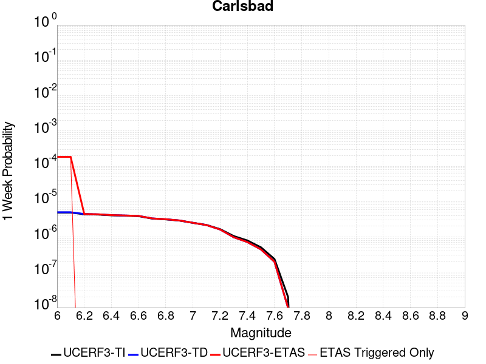 | 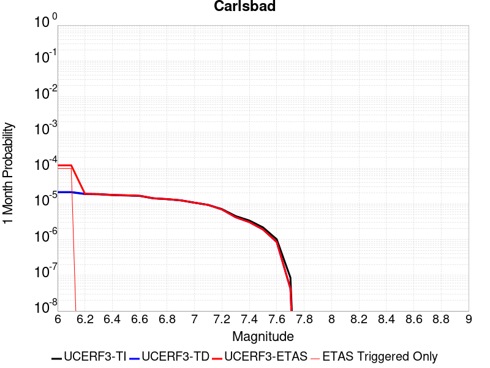 | 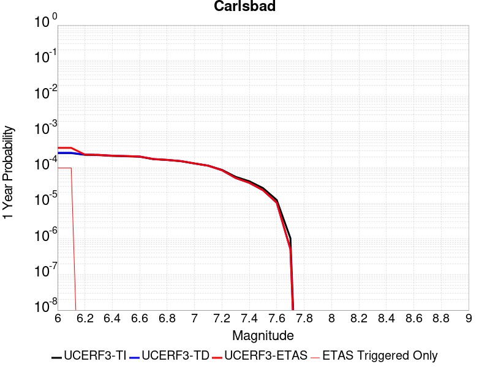 | 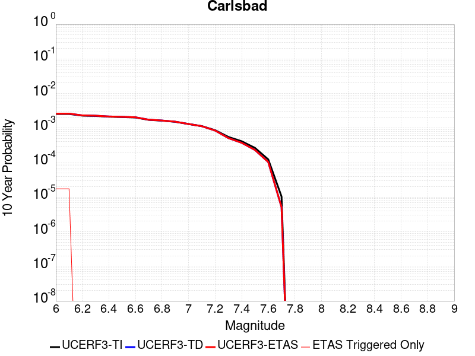 |

| Magnitude | 1 wk TI Prob | 1 wk TD Prob | 1 wk ETAS Prob | 1 wk ETAS/TD Gain | 1 wk ETAS Triggered Only | 1 mo TI Prob | 1 mo TD Prob | 1 mo ETAS Prob | 1 mo ETAS/TD Gain | 1 mo ETAS Triggered Only | 1 yr TI Prob | 1 yr TD Prob | 1 yr ETAS Prob | 1 yr ETAS/TD Gain | 1 yr ETAS Triggered Only | 10 yr TI Prob | 10 yr TD Prob | 10 yr ETAS Prob | 10 yr ETAS/TD Gain | 10 yr ETAS Triggered Only |
|-----|-----|-----|-----|-----|-----|-----|-----|-----|-----|-----|-----|-----|-----|-----|-----|-----|-----|-----|-----|-----|
| 6.0 | 4.9038536E-6 | 4.9872565E-6 | 1.0279584E-4 | 20.611702 | 9.7809076E-5 | 2.1016345E-5 | 2.1373784E-5 | 1.1918077E-4 | 5.576026 | 9.7809076E-5 | 2.5584397E-4 | 2.601952E-4 | 3.5797883E-4 | 1.3758087 | 9.7809076E-5 | 0.002555496 | 0.0025989525 | 0.0026965074 | 1.0375363 | 9.7809076E-5 |
| 6.1 | 4.9038536E-6 | 4.9872565E-6 | 1.0279584E-4 | 20.611702 | 9.7809076E-5 | 2.1016345E-5 | 2.1373784E-5 | 1.1918077E-4 | 5.576026 | 9.7809076E-5 | 2.5584397E-4 | 2.601952E-4 | 3.5797883E-4 | 1.3758087 | 9.7809076E-5 | 0.002555496 | 0.0025989525 | 0.0026965074 | 1.0375363 | 9.7809076E-5 |
| 6.2 | 4.3820614E-6 | 4.4547687E-6 | 4.4547687E-6 | 1.0 | 0.0 | 1.8780129E-5 | 1.9091729E-5 | 1.9091729E-5 | 1.0 | 0.0 | 2.2862408E-4 | 2.3241735E-4 | 2.3241735E-4 | 1.0 | 0.0 | 0.00228389 | 0.0023217786 | 0.0023217786 | 1.0 | 0.0 |
| 6.3 | 4.302872E-6 | 4.373006E-6 | 4.373006E-6 | 1.0 | 0.0 | 1.8440749E-5 | 1.8741322E-5 | 1.8741322E-5 | 1.0 | 0.0 | 2.24493E-4 | 2.2815206E-4 | 2.2815206E-4 | 1.0 | 0.0 | 0.0022426634 | 0.0022792136 | 0.0022792136 | 1.0 | 0.0 |
| 6.4 | 4.0835243E-6 | 4.1476546E-6 | 4.1476546E-6 | 1.0 | 0.0 | 1.75007E-5 | 1.7775543E-5 | 1.7775543E-5 | 1.0 | 0.0 | 2.1305021E-4 | 2.1639607E-4 | 2.1639607E-4 | 1.0 | 0.0 | 0.0021284607 | 0.0021618877 | 0.0021618877 | 1.0 | 0.0 |
| 6.5 | 3.987806E-6 | 4.0488867E-6 | 4.0488867E-6 | 1.0 | 0.0 | 1.7090486E-5 | 1.7352257E-5 | 1.7352257E-5 | 1.0 | 0.0 | 2.080568E-4 | 2.1124359E-4 | 2.1124359E-4 | 1.0 | 0.0 | 0.002078621 | 0.0021104617 | 0.0021104617 | 1.0 | 0.0 |
| 6.6 | 3.8707576E-6 | 3.927488E-6 | 3.927488E-6 | 1.0 | 0.0 | 1.6588854E-5 | 1.6831984E-5 | 1.6831984E-5 | 1.0 | 0.0 | 2.0195059E-4 | 2.0491047E-4 | 2.0491047E-4 | 1.0 | 0.0 | 0.0020176715 | 0.0020472489 | 0.0020472489 | 1.0 | 0.0 |
| 6.7 | 3.3093434E-6 | 3.3423917E-6 | 3.3423917E-6 | 1.0 | 0.0 | 1.4182823E-5 | 1.4324457E-5 | 1.4324457E-5 | 1.0 | 0.0 | 1.7266218E-4 | 1.7438637E-4 | 1.7438637E-4 | 1.0 | 0.0 | 0.001725281 | 0.0017425013 | 0.0017425013 | 1.0 | 0.0 |
| 6.8 | 3.136983E-6 | 3.1664536E-6 | 3.1664536E-6 | 1.0 | 0.0 | 1.3444143E-5 | 1.3570445E-5 | 1.3570445E-5 | 1.0 | 0.0 | 1.6367015E-4 | 1.6520769E-4 | 1.6520769E-4 | 1.0 | 0.0 | 0.0016354966 | 0.0016508545 | 0.0016508545 | 1.0 | 0.0 |
| 6.9 | 2.9056644E-6 | 2.9267585E-6 | 2.9267585E-6 | 1.0 | 0.0 | 1.2452788E-5 | 1.2543191E-5 | 1.2543191E-5 | 1.0 | 0.0 | 1.5160214E-4 | 1.5270269E-4 | 1.5270269E-4 | 1.0 | 0.0 | 0.0015149876 | 0.001525983 | 0.001525983 | 1.0 | 0.0 |
| 7.0 | 2.5071035E-6 | 2.5113977E-6 | 2.5113977E-6 | 1.0 | 0.0 | 1.0744685E-5 | 1.07630885E-5 | 1.07630885E-5 | 1.0 | 0.0 | 1.308087E-4 | 1.3103275E-4 | 1.3103275E-4 | 1.0 | 0.0 | 0.0013073172 | 0.0013095582 | 0.0013095582 | 1.0 | 0.0 |
| 7.1 | 2.1786877E-6 | 2.1678832E-6 | 2.1678832E-6 | 1.0 | 0.0 | 9.3372E-6 | 9.290896E-6 | 9.290896E-6 | 1.0 | 0.0 | 1.13674476E-4 | 1.1311081E-4 | 1.1311081E-4 | 1.0 | 0.0 | 0.0011361635 | 0.0011305353 | 0.0011305353 | 1.0 | 0.0 |
| 7.2 | 1.6628418E-6 | 1.6213872E-6 | 1.6213872E-6 | 1.0 | 0.0 | 7.1264453E-6 | 6.948784E-6 | 6.948784E-6 | 1.0 | 0.0 | 8.676102E-5 | 8.4598185E-5 | 8.4598185E-5 | 1.0 | 0.0 | 8.672715E-4 | 8.45662E-4 | 8.45662E-4 | 1.0 | 0.0 |
| 7.3 | 1.0595926E-6 | 9.816804E-7 | 9.816804E-7 | 1.0 | 0.0 | 4.541103E-6 | 4.2071947E-6 | 4.2071947E-6 | 1.0 | 0.0 | 5.5286528E-5 | 5.1221403E-5 | 5.1221403E-5 | 1.0 | 0.0 | 5.527277E-4 | 5.1209686E-4 | 5.1209686E-4 | 1.0 | 0.0 |
| 7.4 | 7.956623E-7 | 7.1737975E-7 | 7.1737975E-7 | 1.0 | 0.0 | 3.4099767E-6 | 3.074481E-6 | 3.074481E-6 | 1.0 | 0.0 | 4.1515676E-5 | 3.743117E-5 | 3.743117E-5 | 1.0 | 0.0 | 4.150792E-4 | 3.7424936E-4 | 3.7424936E-4 | 1.0 | 0.0 |
| 7.5 | 5.1043804E-7 | 4.4483627E-7 | 4.4483627E-7 | 1.0 | 0.0 | 2.1875896E-6 | 1.9064398E-6 | 1.9064398E-6 | 1.0 | 0.0 | 2.663358E-5 | 2.3210663E-5 | 2.3210663E-5 | 1.0 | 0.0 | 2.6630386E-4 | 2.3208297E-4 | 2.3208297E-4 | 1.0 | 0.0 |
| 7.6 | 2.3723294E-7 | 1.989569E-7 | 1.989569E-7 | 1.0 | 0.0 | 1.0167122E-6 | 8.5267214E-7 | 8.5267214E-7 | 1.0 | 0.0 | 1.2378401E-5 | 1.0381237E-5 | 1.0381237E-5 | 1.0 | 0.0 | 1.237771E-4 | 1.038078E-4 | 1.038078E-4 | 1.0 | 0.0 |
| 7.7 | 1.9992152E-8 | 9.8601785E-9 | 9.8601785E-9 | 1.0 | 0.0 | 8.568065E-8 | 4.225791E-8 | 4.225791E-8 | 1.0 | 0.0 | 1.0431614E-6 | 5.1449E-7 | 5.1449E-7 | 1.0 | 0.0 | 1.0431565E-5 | 5.1449E-6 | 5.1449E-6 | 1.0 | 0.0 |

## Cleghorn Pass
*[(top)](#table-of-contents)*

| 1 Week | 1 Month | 1 Year | 10 Year |
|-----|-----|-----|-----|
| 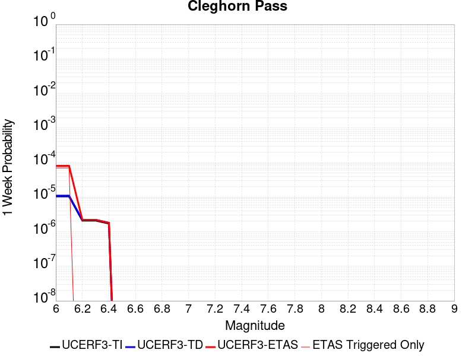 | 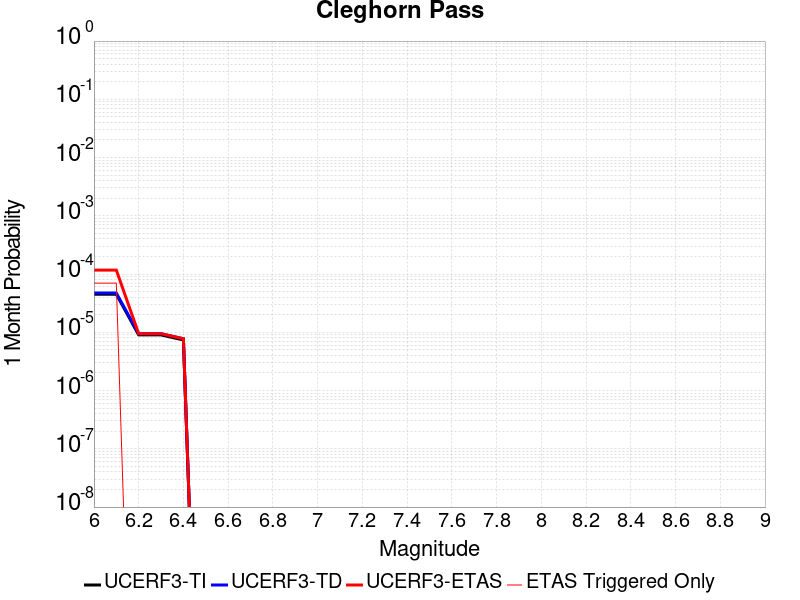 | 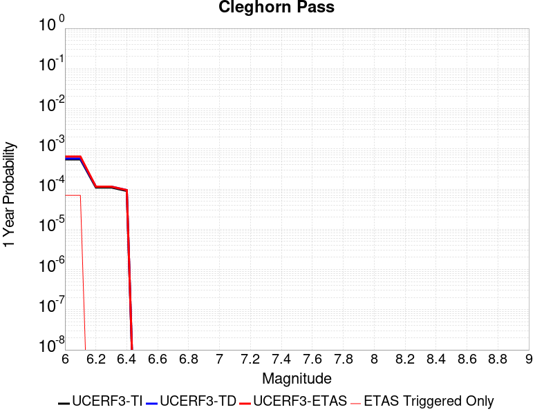 | 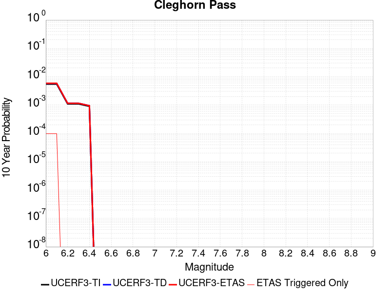 |

| Magnitude | 1 wk TI Prob | 1 wk TD Prob | 1 wk ETAS Prob | 1 wk ETAS/TD Gain | 1 wk ETAS Triggered Only | 1 mo TI Prob | 1 mo TD Prob | 1 mo ETAS Prob | 1 mo ETAS/TD Gain | 1 mo ETAS Triggered Only | 1 yr TI Prob | 1 yr TD Prob | 1 yr ETAS Prob | 1 yr ETAS/TD Gain | 1 yr ETAS Triggered Only | 10 yr TI Prob | 10 yr TD Prob | 10 yr ETAS Prob | 10 yr ETAS/TD Gain | 10 yr ETAS Triggered Only |
|-----|-----|-----|-----|-----|-----|-----|-----|-----|-----|-----|-----|-----|-----|-----|-----|-----|-----|-----|-----|-----|
| 6.0 | 1.0522846E-5 | 1.1040642E-5 | 1.0884864E-4 | 9.858905 | 9.7809076E-5 | 4.509713E-5 | 4.7316473E-5 | 1.4512092E-4 | 3.0670273 | 9.7809076E-5 | 5.4891926E-4 | 5.759784E-4 | 6.737312E-4 | 1.169716 | 9.7809076E-5 | 0.0054756533 | 0.005750022 | 0.0058472683 | 1.0169123 | 9.7809076E-5 |
| 6.1 | 1.0522846E-5 | 1.1040642E-5 | 1.0884864E-4 | 9.858905 | 9.7809076E-5 | 4.509713E-5 | 4.7316473E-5 | 1.4512092E-4 | 3.0670273 | 9.7809076E-5 | 5.4891926E-4 | 5.759784E-4 | 6.737312E-4 | 1.169716 | 9.7809076E-5 | 0.0054756533 | 0.005750022 | 0.0058472683 | 1.0169123 | 9.7809076E-5 |
| 6.2 | 2.1045846E-6 | 2.2082024E-6 | 2.2082024E-6 | 1.0 | 0.0 | 9.019617E-6 | 9.463714E-6 | 9.463714E-6 | 1.0 | 0.0 | 1.098083E-4 | 1.1521882E-4 | 1.1521882E-4 | 1.0 | 0.0 | 0.0010975406 | 0.0011520023 | 0.0011520023 | 1.0 | 0.0 |
| 6.3 | 2.1045846E-6 | 2.2082024E-6 | 2.2082024E-6 | 1.0 | 0.0 | 9.019617E-6 | 9.463714E-6 | 9.463714E-6 | 1.0 | 0.0 | 1.098083E-4 | 1.1521882E-4 | 1.1521882E-4 | 1.0 | 0.0 | 0.0010975406 | 0.0011520023 | 0.0011520023 | 1.0 | 0.0 |
| 6.4 | 1.7259927E-6 | 1.810877E-6 | 1.810877E-6 | 1.0 | 0.0 | 7.3970905E-6 | 7.760902E-6 | 7.760902E-6 | 1.0 | 0.0 | 9.005586E-5 | 9.4488976E-5 | 9.4488976E-5 | 1.0 | 0.0 | 9.001937E-4 | 9.448898E-4 | 9.448898E-4 | 1.0 | 0.0 |

## San Pedro Basin
*[(top)](#table-of-contents)*

| 1 Week | 1 Month | 1 Year | 10 Year |
|-----|-----|-----|-----|
| 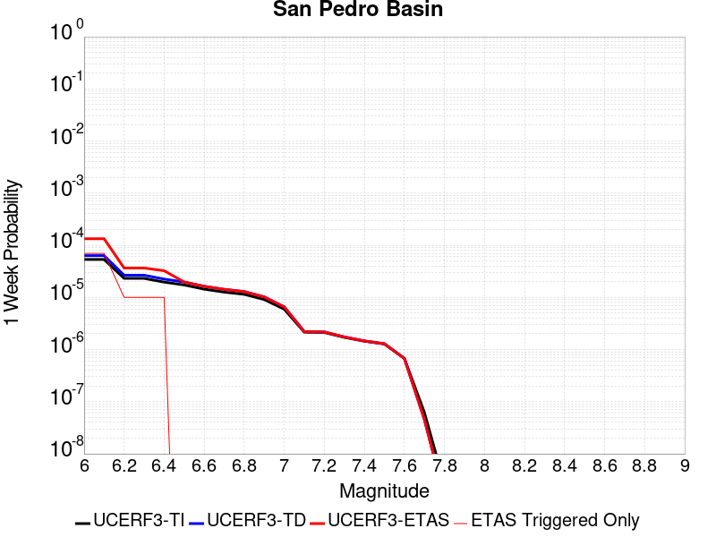 | 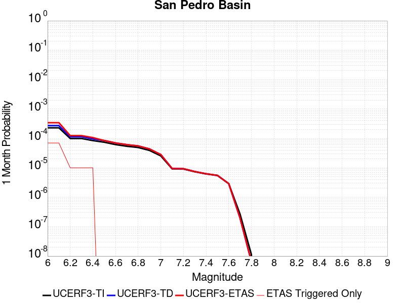 | 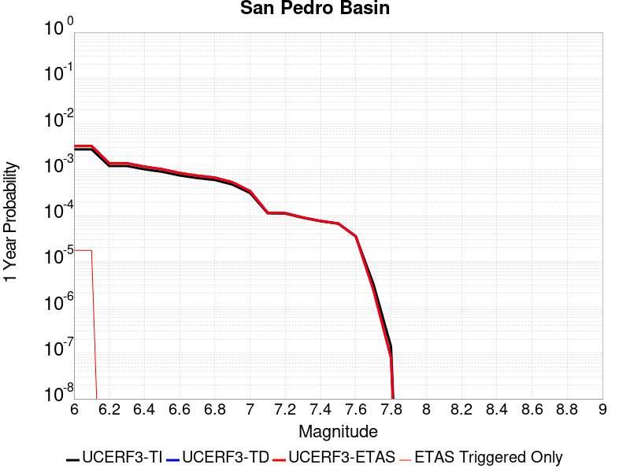 | 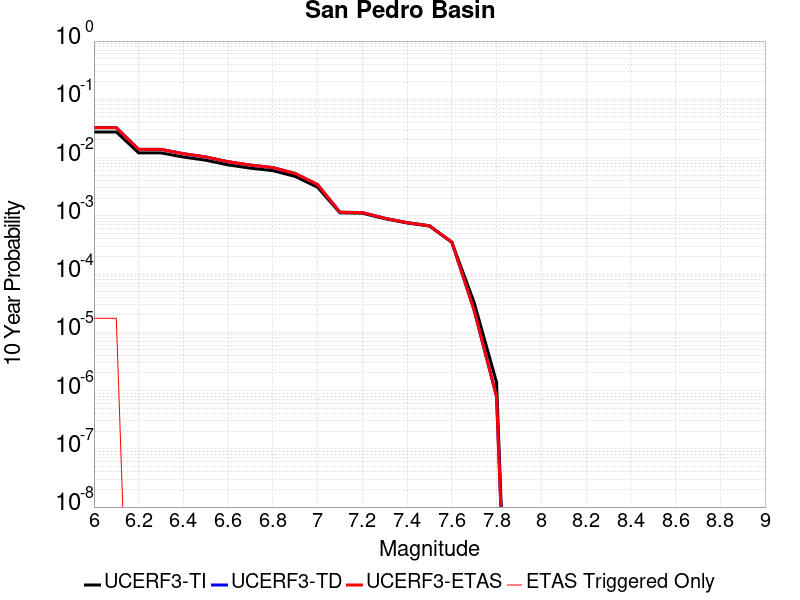 |

| Magnitude | 1 wk TI Prob | 1 wk TD Prob | 1 wk ETAS Prob | 1 wk ETAS/TD Gain | 1 wk ETAS Triggered Only | 1 mo TI Prob | 1 mo TD Prob | 1 mo ETAS Prob | 1 mo ETAS/TD Gain | 1 mo ETAS Triggered Only | 1 yr TI Prob | 1 yr TD Prob | 1 yr ETAS Prob | 1 yr ETAS/TD Gain | 1 yr ETAS Triggered Only | 10 yr TI Prob | 10 yr TD Prob | 10 yr ETAS Prob | 10 yr ETAS/TD Gain | 10 yr ETAS Triggered Only |
|-----|-----|-----|-----|-----|-----|-----|-----|-----|-----|-----|-----|-----|-----|-----|-----|-----|-----|-----|-----|-----|
| 6.0 | 5.3449043E-5 | 6.336954E-5 | 1.6117241E-4 | 2.5433738 | 9.7809076E-5 | 2.2904722E-4 | 2.715589E-4 | 3.6934143E-4 | 1.3600785 | 9.7809076E-5 | 0.0027850836 | 0.0033018254 | 0.0033993116 | 1.0295249 | 9.7809076E-5 | 0.027504366 | 0.03258945 | 0.032684073 | 1.0029035 | 9.7809076E-5 |
| 6.1 | 5.3449043E-5 | 6.336954E-5 | 1.6117241E-4 | 2.5433738 | 9.7809076E-5 | 2.2904722E-4 | 2.715589E-4 | 3.6934143E-4 | 1.3600785 | 9.7809076E-5 | 0.0027850836 | 0.0033018254 | 0.0033993116 | 1.0295249 | 9.7809076E-5 | 0.027504366 | 0.03258945 | 0.032684073 | 1.0029035 | 9.7809076E-5 |
| 6.2 | 2.3189454E-5 | 2.6642796E-5 | 2.6642796E-5 | 1.0 | 0.0 | 9.9379584E-5 | 1.14178685E-4 | 1.14178685E-4 | 1.0 | 0.0 | 0.0012092749 | 0.0013892864 | 0.0013892864 | 1.0 | 0.0 | 0.012027155 | 0.013810883 | 0.013810883 | 1.0 | 0.0 |
| 6.3 | 2.3189454E-5 | 2.6642796E-5 | 2.6642796E-5 | 1.0 | 0.0 | 9.9379584E-5 | 1.14178685E-4 | 1.14178685E-4 | 1.0 | 0.0 | 0.0012092749 | 0.0013892864 | 0.0013892864 | 1.0 | 0.0 | 0.012027155 | 0.013810883 | 0.013810883 | 1.0 | 0.0 |
| 6.4 | 1.966056E-5 | 2.2463413E-5 | 2.2463413E-5 | 1.0 | 0.0 | 8.425682E-5 | 9.626844E-5 | 9.626844E-5 | 1.0 | 0.0 | 0.001025344 | 0.0011714783 | 0.0011714783 | 1.0 | 0.0 | 0.010206259 | 0.011657117 | 0.011657117 | 1.0 | 0.0 |
| 6.5 | 1.7342953E-5 | 1.9745148E-5 | 1.9745148E-5 | 1.0 | 0.0 | 7.4324824E-5 | 8.4619525E-5 | 8.4619525E-5 | 1.0 | 0.0 | 9.04529E-4 | 0.0010297928 | 0.0010297928 | 1.0 | 0.0 | 0.009008561 | 0.010253931 | 0.010253931 | 1.0 | 0.0 |
| 6.6 | 1.439804E-5 | 1.6322716E-5 | 1.6322716E-5 | 1.0 | 0.0 | 6.170443E-5 | 6.99528E-5 | 6.99528E-5 | 1.0 | 0.0 | 7.509924E-4 | 8.513747E-4 | 8.513747E-4 | 1.0 | 0.0 | 0.0074845953 | 0.008484332 | 0.008484332 | 1.0 | 0.0 |
| 6.7 | 1.2634884E-5 | 1.4285297E-5 | 1.4285297E-5 | 1.0 | 0.0 | 5.414838E-5 | 6.1221435E-5 | 6.1221435E-5 | 1.0 | 0.0 | 6.590571E-4 | 7.4514654E-4 | 7.4514654E-4 | 1.0 | 0.0 | 0.006571059 | 0.007429501 | 0.007429501 | 1.0 | 0.0 |
| 6.8 | 1.146091E-5 | 1.2933192E-5 | 1.2933192E-5 | 1.0 | 0.0 | 4.911726E-5 | 5.5426954E-5 | 5.5426954E-5 | 1.0 | 0.0 | 5.9783855E-4 | 6.7464396E-4 | 6.7464396E-4 | 1.0 | 0.0 | 0.0059623276 | 0.006728899 | 0.006728899 | 1.0 | 0.0 |
| 6.9 | 9.109035E-6 | 1.0235011E-5 | 1.0235011E-5 | 1.0 | 0.0 | 3.9038136E-5 | 4.3863754E-5 | 4.3863754E-5 | 1.0 | 0.0 | 4.7518566E-4 | 5.3393835E-4 | 5.3393835E-4 | 1.0 | 0.0 | 0.0047417083 | 0.005329309 | 0.005329309 | 1.0 | 0.0 |
| 7.0 | 5.9351028E-6 | 6.583964E-6 | 6.583964E-6 | 1.0 | 0.0 | 2.5435906E-5 | 2.8216817E-5 | 2.8216817E-5 | 1.0 | 0.0 | 3.0963816E-4 | 3.435092E-4 | 3.435092E-4 | 1.0 | 0.0 | 0.0030920706 | 0.0034320992 | 0.0034320992 | 1.0 | 0.0 |
| 7.1 | 2.1557585E-6 | 2.209648E-6 | 2.209648E-6 | 1.0 | 0.0 | 9.238933E-6 | 9.469887E-6 | 9.469887E-6 | 1.0 | 0.0 | 1.1247819E-4 | 1.1528993E-4 | 1.1528993E-4 | 1.0 | 0.0 | 0.0011242128 | 0.0011523166 | 0.0011523166 | 1.0 | 0.0 |
| 7.2 | 2.1251979E-6 | 2.1779945E-6 | 2.1779945E-6 | 1.0 | 0.0 | 9.107958E-6 | 9.334229E-6 | 9.334229E-6 | 1.0 | 0.0 | 1.1088375E-4 | 1.1363847E-4 | 1.1363847E-4 | 1.0 | 0.0 | 0.0011082845 | 0.0011358189 | 0.0011358189 | 1.0 | 0.0 |
| 7.3 | 1.7145798E-6 | 1.7442874E-6 | 1.7442874E-6 | 1.0 | 0.0 | 7.3481783E-6 | 7.4754967E-6 | 7.4754967E-6 | 1.0 | 0.0 | 8.94604E-5 | 9.1010465E-5 | 9.1010465E-5 | 1.0 | 0.0 | 8.9424395E-4 | 9.0974104E-4 | 9.0974104E-4 | 1.0 | 0.0 |
| 7.4 | 1.4467993E-6 | 1.4641868E-6 | 1.4641868E-6 | 1.0 | 0.0 | 6.200554E-6 | 6.2750714E-6 | 6.2750714E-6 | 1.0 | 0.0 | 7.548913E-5 | 7.639639E-5 | 7.639639E-5 | 1.0 | 0.0 | 7.546349E-4 | 7.6370855E-4 | 7.6370855E-4 | 1.0 | 0.0 |
| 7.5 | 1.2803735E-6 | 1.2931497E-6 | 1.2931497E-6 | 1.0 | 0.0 | 5.487303E-6 | 5.5420587E-6 | 5.5420587E-6 | 1.0 | 0.0 | 6.680587E-5 | 6.7472545E-5 | 6.7472545E-5 | 1.0 | 0.0 | 6.678579E-4 | 6.7452766E-4 | 6.7452766E-4 | 1.0 | 0.0 |
| 7.6 | 6.755009E-7 | 6.769465E-7 | 6.769465E-7 | 1.0 | 0.0 | 2.8950008E-6 | 2.9011965E-6 | 2.9011965E-6 | 1.0 | 0.0 | 3.5246063E-5 | 3.5321555E-5 | 3.5321555E-5 | 1.0 | 0.0 | 3.5240475E-4 | 3.5316512E-4 | 3.5316512E-4 | 1.0 | 0.0 |
| 7.7 | 6.211885E-8 | 4.569953E-8 | 4.569953E-8 | 1.0 | 0.0 | 2.6622362E-7 | 1.9585512E-7 | 1.9585512E-7 | 1.0 | 0.0 | 3.2412677E-6 | 2.3845337E-6 | 2.3845337E-6 | 1.0 | 0.0 | 3.2412205E-5 | 2.3845101E-5 | 2.3845101E-5 | 1.0 | 0.0 |
| 7.8 | 2.6580573E-9 | 1.5138163E-9 | 1.5138163E-9 | 1.0 | 0.0 | 1.1391674E-8 | 6.487784E-9 | 6.487784E-9 | 1.0 | 0.0 | 1.3869362E-7 | 7.898877E-8 | 7.898877E-8 | 1.0 | 0.0 | 1.3869354E-6 | 7.898877E-7 | 7.898877E-7 | 1.0 | 0.0 |

## Calico-Hidalgo
*[(top)](#table-of-contents)*

| 1 Week | 1 Month | 1 Year | 10 Year |
|-----|-----|-----|-----|
| 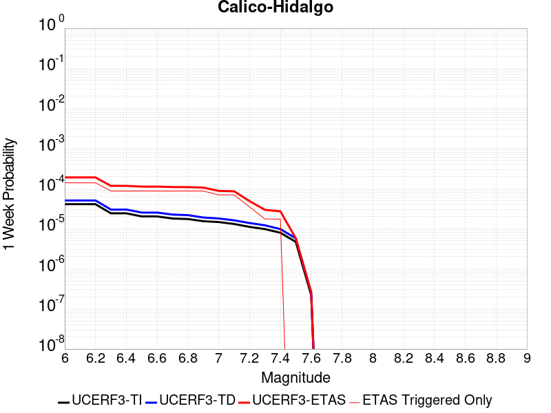 | 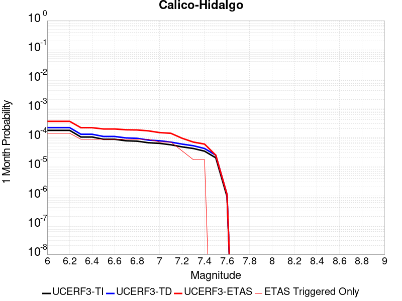 | 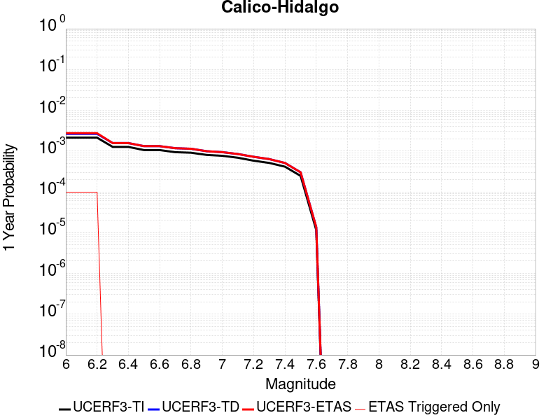 | 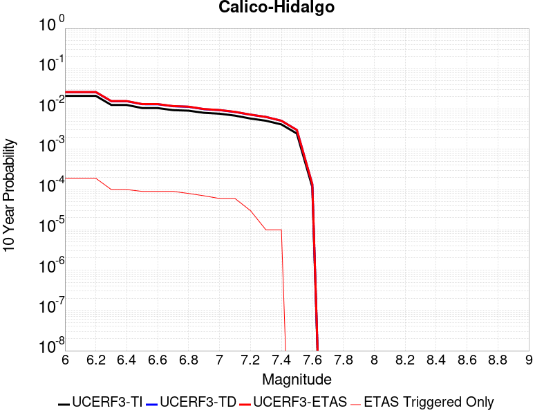 |

| Magnitude | 1 wk TI Prob | 1 wk TD Prob | 1 wk ETAS Prob | 1 wk ETAS/TD Gain | 1 wk ETAS Triggered Only | 1 mo TI Prob | 1 mo TD Prob | 1 mo ETAS Prob | 1 mo ETAS/TD Gain | 1 mo ETAS Triggered Only | 1 yr TI Prob | 1 yr TD Prob | 1 yr ETAS Prob | 1 yr ETAS/TD Gain | 1 yr ETAS Triggered Only | 10 yr TI Prob | 10 yr TD Prob | 10 yr ETAS Prob | 10 yr ETAS/TD Gain | 10 yr ETAS Triggered Only |
|-----|-----|-----|-----|-----|-----|-----|-----|-----|-----|-----|-----|-----|-----|-----|-----|-----|-----|-----|-----|-----|
| 6.0 | 4.0906612E-5 | 5.0703686E-5 | 5.0703686E-5 | 1.0 | 0.0 | 1.7530227E-4 | 2.172857E-4 | 2.172857E-4 | 1.0 | 0.0 | 0.0021322158 | 0.002642648 | 0.0027401987 | 1.036914 | 9.7809076E-5 | 0.02111873 | 0.026152607 | 0.026247859 | 1.0036421 | 9.7809076E-5 |
| 6.1 | 4.0906612E-5 | 5.0703686E-5 | 5.0703686E-5 | 1.0 | 0.0 | 1.7530227E-4 | 2.172857E-4 | 2.172857E-4 | 1.0 | 0.0 | 0.0021322158 | 0.002642648 | 0.0027401987 | 1.036914 | 9.7809076E-5 | 0.02111873 | 0.026152607 | 0.026247859 | 1.0036421 | 9.7809076E-5 |
| 6.2 | 4.0906612E-5 | 5.0703686E-5 | 5.0703686E-5 | 1.0 | 0.0 | 1.7530227E-4 | 2.172857E-4 | 2.172857E-4 | 1.0 | 0.0 | 0.0021322158 | 0.002642648 | 0.0027401987 | 1.036914 | 9.7809076E-5 | 0.02111873 | 0.026152607 | 0.026247859 | 1.0036421 | 9.7809076E-5 |
| 6.3 | 2.4242801E-5 | 3.0090669E-5 | 3.0090669E-5 | 1.0 | 0.0 | 1.0389358E-4 | 1.2895382E-4 | 1.2895382E-4 | 1.0 | 0.0 | 0.0012641704 | 0.0015689151 | 0.0015689151 | 1.0 | 0.0 | 0.01257003 | 0.01558206 | 0.01558206 | 1.0 | 0.0 |
| 6.4 | 2.4242801E-5 | 3.0090669E-5 | 3.0090669E-5 | 1.0 | 0.0 | 1.0389358E-4 | 1.2895382E-4 | 1.2895382E-4 | 1.0 | 0.0 | 0.0012641704 | 0.0015689151 | 0.0015689151 | 1.0 | 0.0 | 0.01257003 | 0.01558206 | 0.01558206 | 1.0 | 0.0 |
| 6.5 | 2.0286952E-5 | 2.5315738E-5 | 2.5315738E-5 | 1.0 | 0.0 | 8.694118E-5 | 1.0849161E-4 | 1.0849161E-4 | 1.0 | 0.0 | 0.0010579949 | 0.001320102 | 0.001320102 | 1.0 | 0.0 | 0.010529719 | 0.013124538 | 0.013124538 | 1.0 | 0.0 |
| 6.6 | 2.0269223E-5 | 2.5296687E-5 | 2.5296687E-5 | 1.0 | 0.0 | 8.6865206E-5 | 1.08409964E-4 | 1.08409964E-4 | 1.0 | 0.0 | 0.0010570707 | 0.0013191093 | 0.0013191093 | 1.0 | 0.0 | 0.010520565 | 0.013114728 | 0.013114728 | 1.0 | 0.0 |
| 6.7 | 1.799852E-5 | 2.25406E-5 | 2.25406E-5 | 1.0 | 0.0 | 7.713423E-5 | 9.659908E-5 | 9.659908E-5 | 1.0 | 0.0 | 9.3870464E-4 | 0.0011754738 | 0.0011754738 | 1.0 | 0.0 | 0.009347493 | 0.011694173 | 0.011694173 | 1.0 | 0.0 |
| 6.8 | 1.7458793E-5 | 2.184212E-5 | 2.184212E-5 | 1.0 | 0.0 | 7.4821255E-5 | 9.3605806E-5 | 9.3605806E-5 | 1.0 | 0.0 | 9.10568E-4 | 0.0011390693 | 0.0011390693 | 1.0 | 0.0 | 0.009068459 | 0.011333893 | 0.011333893 | 1.0 | 0.0 |
| 6.9 | 1.542884E-5 | 1.9025927E-5 | 1.9025927E-5 | 1.0 | 0.0 | 6.612192E-5 | 8.153721E-5 | 8.153721E-5 | 1.0 | 0.0 | 8.04737E-4 | 9.922766E-4 | 9.922766E-4 | 1.0 | 0.0 | 0.008018291 | 0.009879857 | 0.009879857 | 1.0 | 0.0 |
| 7.0 | 1.468253E-5 | 1.8030598E-5 | 1.8030598E-5 | 1.0 | 0.0 | 6.292361E-5 | 7.7271776E-5 | 7.7271776E-5 | 1.0 | 0.0 | 7.658257E-4 | 9.4039086E-4 | 9.4039086E-4 | 1.0 | 0.0 | 0.0076319184 | 0.009365481 | 0.009365481 | 1.0 | 0.0 |
| 7.1 | 1.3139281E-5 | 1.6200942E-5 | 1.6200942E-5 | 1.0 | 0.0 | 5.6309986E-5 | 6.943083E-5 | 6.943083E-5 | 1.0 | 0.0 | 6.853584E-4 | 8.4500515E-4 | 8.4500515E-4 | 1.0 | 0.0 | 0.0068324856 | 0.0084192185 | 0.0084192185 | 1.0 | 0.0 |
| 7.2 | 1.1127404E-5 | 1.3866597E-5 | 1.3866597E-5 | 1.0 | 0.0 | 4.7688E-5 | 5.942698E-5 | 5.942698E-5 | 1.0 | 0.0 | 5.8044674E-4 | 7.232942E-4 | 7.232942E-4 | 1.0 | 0.0 | 0.0057893298 | 0.0072105085 | 0.0072105085 | 1.0 | 0.0 |
| 7.3 | 9.808154E-6 | 1.2176215E-5 | 1.2176215E-5 | 1.0 | 0.0 | 4.2034266E-5 | 5.2182797E-5 | 5.2182797E-5 | 1.0 | 0.0 | 5.11647E-4 | 6.3515105E-4 | 6.3515105E-4 | 1.0 | 0.0 | 0.0051047057 | 0.006334433 | 0.006334433 | 1.0 | 0.0 |
| 7.4 | 7.942452E-6 | 9.792144E-6 | 9.792144E-6 | 1.0 | 0.0 | 3.4038632E-5 | 4.1965708E-5 | 4.1965708E-5 | 1.0 | 0.0 | 4.1434157E-4 | 5.1082217E-4 | 5.1082217E-4 | 1.0 | 0.0 | 0.0041356985 | 0.005097421 | 0.005097421 | 1.0 | 0.0 |
| 7.5 | 4.7121216E-6 | 5.772836E-6 | 5.772836E-6 | 1.0 | 0.0 | 2.019465E-5 | 2.4740535E-5 | 2.4740535E-5 | 1.0 | 0.0 | 2.4584212E-4 | 3.0118204E-4 | 3.0118204E-4 | 1.0 | 0.0 | 0.0024557032 | 0.0030084911 | 0.0030084911 | 1.0 | 0.0 |
| 7.6 | 2.21172E-7 | 2.603961E-7 | 2.603961E-7 | 1.0 | 0.0 | 9.478797E-7 | 1.1159829E-6 | 1.1159829E-6 | 1.0 | 0.0 | 1.1540374E-5 | 1.3587036E-5 | 1.3587036E-5 | 1.0 | 0.0 | 1.1539775E-4 | 1.3586486E-4 | 1.3586486E-4 | 1.0 | 0.0 |

## Elysian Park (Upper)
*[(top)](#table-of-contents)*

| 1 Week | 1 Month | 1 Year | 10 Year |
|-----|-----|-----|-----|
| 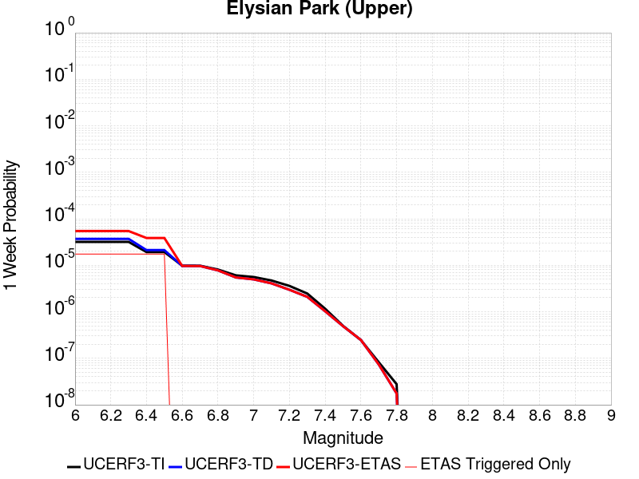 | 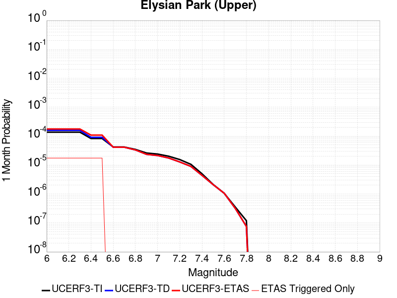 | 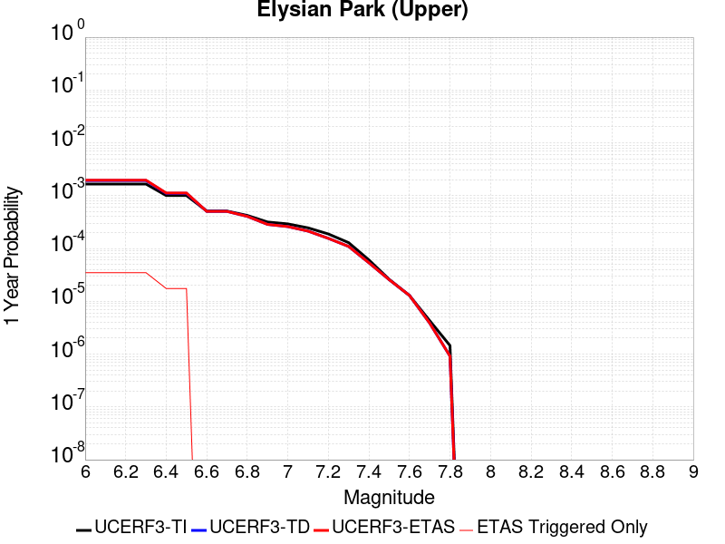 | 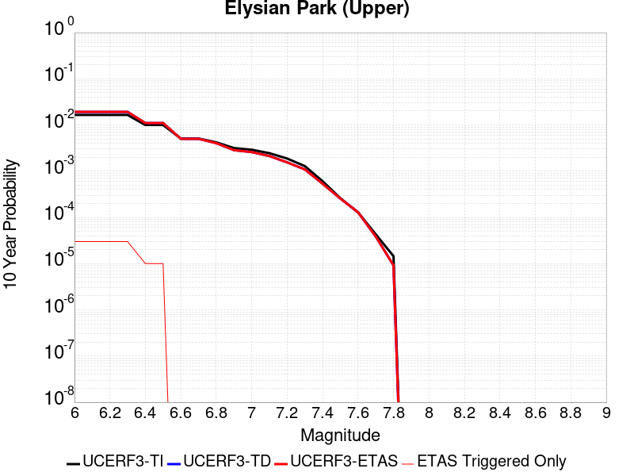 |

| Magnitude | 1 wk TI Prob | 1 wk TD Prob | 1 wk ETAS Prob | 1 wk ETAS/TD Gain | 1 wk ETAS Triggered Only | 1 mo TI Prob | 1 mo TD Prob | 1 mo ETAS Prob | 1 mo ETAS/TD Gain | 1 mo ETAS Triggered Only | 1 yr TI Prob | 1 yr TD Prob | 1 yr ETAS Prob | 1 yr ETAS/TD Gain | 1 yr ETAS Triggered Only | 10 yr TI Prob | 10 yr TD Prob | 10 yr ETAS Prob | 10 yr ETAS/TD Gain | 10 yr ETAS Triggered Only |
|-----|-----|-----|-----|-----|-----|-----|-----|-----|-----|-----|-----|-----|-----|-----|-----|-----|-----|-----|-----|-----|
| 6.0 | 3.1876025E-5 | 3.7035516E-5 | 3.7035516E-5 | 1.0 | 0.0 | 1.3660437E-4 | 1.587167E-4 | 1.587167E-4 | 1.0 | 0.0 | 0.0016618895 | 0.0019311075 | 0.0020287277 | 1.0505514 | 9.7809076E-5 | 0.016495159 | 0.019189782 | 0.019285716 | 1.0049992 | 9.7809076E-5 |
| 6.1 | 3.1876025E-5 | 3.7035516E-5 | 3.7035516E-5 | 1.0 | 0.0 | 1.3660437E-4 | 1.587167E-4 | 1.587167E-4 | 1.0 | 0.0 | 0.0016618895 | 0.0019311075 | 0.0020287277 | 1.0505514 | 9.7809076E-5 | 0.016495159 | 0.019189782 | 0.019285716 | 1.0049992 | 9.7809076E-5 |
| 6.2 | 3.1876025E-5 | 3.7035516E-5 | 3.7035516E-5 | 1.0 | 0.0 | 1.3660437E-4 | 1.587167E-4 | 1.587167E-4 | 1.0 | 0.0 | 0.0016618895 | 0.0019311075 | 0.0020287277 | 1.0505514 | 9.7809076E-5 | 0.016495159 | 0.019189782 | 0.019285716 | 1.0049992 | 9.7809076E-5 |
| 6.3 | 3.1876025E-5 | 3.7035516E-5 | 3.7035516E-5 | 1.0 | 0.0 | 1.3660437E-4 | 1.587167E-4 | 1.587167E-4 | 1.0 | 0.0 | 0.0016618895 | 0.0019311075 | 0.0020287277 | 1.0505514 | 9.7809076E-5 | 0.016495159 | 0.019189782 | 0.019285716 | 1.0049992 | 9.7809076E-5 |
| 6.4 | 1.9273462E-5 | 2.1202266E-5 | 2.1202266E-5 | 1.0 | 0.0 | 8.259794E-5 | 9.086466E-5 | 9.086466E-5 | 1.0 | 0.0 | 0.001005166 | 0.0011058892 | 0.0011058892 | 1.0 | 0.0 | 0.010006315 | 0.011020724 | 0.011020724 | 1.0 | 0.0 |
| 6.5 | 1.9273462E-5 | 2.1202266E-5 | 2.1202266E-5 | 1.0 | 0.0 | 8.259794E-5 | 9.086466E-5 | 9.086466E-5 | 1.0 | 0.0 | 0.001005166 | 0.0011058892 | 0.0011058892 | 1.0 | 0.0 | 0.010006315 | 0.011020724 | 0.011020724 | 1.0 | 0.0 |
| 6.6 | 9.813258E-6 | 9.665599E-6 | 9.665599E-6 | 1.0 | 0.0 | 4.205614E-5 | 4.1423376E-5 | 4.1423376E-5 | 1.0 | 0.0 | 5.119132E-4 | 5.0422014E-4 | 5.0422014E-4 | 1.0 | 0.0 | 0.005107356 | 0.0050314846 | 0.0050314846 | 1.0 | 0.0 |
| 6.7 | 9.801478E-6 | 9.653168E-6 | 9.653168E-6 | 1.0 | 0.0 | 4.2005657E-5 | 4.1370105E-5 | 4.1370105E-5 | 1.0 | 0.0 | 5.112989E-4 | 5.035719E-4 | 5.035719E-4 | 1.0 | 0.0 | 0.0051012407 | 0.0050250315 | 0.0050250315 | 1.0 | 0.0 |
| 6.8 | 8.102489E-6 | 7.773004E-6 | 7.773004E-6 | 1.0 | 0.0 | 3.4724493E-5 | 3.3312477E-5 | 3.3312477E-5 | 1.0 | 0.0 | 4.2268867E-4 | 4.055089E-4 | 4.055089E-4 | 1.0 | 0.0 | 0.004218856 | 0.0040481836 | 0.0040481836 | 1.0 | 0.0 |
| 6.9 | 6.08275E-6 | 5.4814514E-6 | 5.4814514E-6 | 1.0 | 0.0 | 2.6068668E-5 | 2.3491726E-5 | 2.3491726E-5 | 1.0 | 0.0 | 3.173398E-4 | 2.85975E-4 | 2.85975E-4 | 1.0 | 0.0 | 0.0031688702 | 0.0028561477 | 0.0028561477 | 1.0 | 0.0 |
| 7.0 | 5.5995934E-6 | 4.98278E-6 | 4.98278E-6 | 1.0 | 0.0 | 2.3998036E-5 | 2.13546E-5 | 2.13546E-5 | 1.0 | 0.0 | 2.9213692E-4 | 2.599619E-4 | 2.599619E-4 | 1.0 | 0.0 | 0.0029175316 | 0.0025966454 | 0.0025966454 | 1.0 | 0.0 |
| 7.1 | 4.709881E-6 | 4.0874015E-6 | 4.0874015E-6 | 1.0 | 0.0 | 2.0185047E-5 | 1.7517319E-5 | 1.7517319E-5 | 1.0 | 0.0 | 2.4572524E-4 | 2.132529E-4 | 2.132529E-4 | 1.0 | 0.0 | 0.002454537 | 0.002130524 | 0.002130524 | 1.0 | 0.0 |
| 7.2 | 3.6063436E-6 | 2.9779544E-6 | 2.9779544E-6 | 1.0 | 0.0 | 1.5455667E-5 | 1.27626E-5 | 1.27626E-5 | 1.0 | 0.0 | 1.881565E-4 | 1.5537368E-4 | 1.5537368E-4 | 1.0 | 0.0 | 0.0018799726 | 0.0015526618 | 0.0015526618 | 1.0 | 0.0 |
| 7.3 | 2.471135E-6 | 2.0954615E-6 | 2.0954615E-6 | 1.0 | 0.0 | 1.0590536E-5 | 8.980519E-6 | 8.980519E-6 | 1.0 | 0.0 | 1.2893214E-4 | 1.093324E-4 | 1.093324E-4 | 1.0 | 0.0 | 0.0012885736 | 0.0010927934 | 0.0010927934 | 1.0 | 0.0 |
| 7.4 | 1.163943E-6 | 1.0275091E-6 | 1.0275091E-6 | 1.0 | 0.0 | 4.988318E-6 | 4.4036033E-6 | 4.4036033E-6 | 1.0 | 0.0 | 6.0731076E-5 | 5.3612584E-5 | 5.3612584E-5 | 1.0 | 0.0 | 6.071448E-4 | 5.359995E-4 | 5.359995E-4 | 1.0 | 0.0 |
| 7.5 | 4.99459E-7 | 4.917604E-7 | 4.917604E-7 | 1.0 | 0.0 | 2.140537E-6 | 2.1075427E-6 | 2.1075427E-6 | 1.0 | 0.0 | 2.6060725E-5 | 2.5659048E-5 | 2.5659048E-5 | 1.0 | 0.0 | 2.605767E-4 | 2.5656243E-4 | 2.5656243E-4 | 1.0 | 0.0 |
| 7.6 | 2.4667852E-7 | 2.4778336E-7 | 2.4778336E-7 | 1.0 | 0.0 | 1.0571932E-6 | 1.0619283E-6 | 1.0619283E-6 | 1.0 | 0.0 | 1.2871251E-5 | 1.2928905E-5 | 1.2928905E-5 | 1.0 | 0.0 | 1.2870505E-4 | 1.2928189E-4 | 1.2928189E-4 | 1.0 | 0.0 |
| 7.7 | 8.2312795E-8 | 7.3864456E-8 | 7.3864456E-8 | 1.0 | 0.0 | 3.527691E-7 | 3.165619E-7 | 3.165619E-7 | 1.0 | 0.0 | 4.294955E-6 | 3.8541357E-6 | 3.8541357E-6 | 1.0 | 0.0 | 4.2948723E-5 | 3.8540802E-5 | 3.8540802E-5 | 1.0 | 0.0 |
| 7.8 | 2.7819295E-8 | 1.7566023E-8 | 1.7566023E-8 | 1.0 | 0.0 | 1.1922555E-7 | 7.5282955E-8 | 7.5282955E-8 | 1.0 | 0.0 | 1.45157E-6 | 9.165697E-7 | 9.165697E-7 | 1.0 | 0.0 | 1.45156055E-5 | 9.165675E-6 | 9.165675E-6 | 1.0 | 0.0 |

## San Clemente
*[(top)](#table-of-contents)*

| 1 Week | 1 Month | 1 Year | 10 Year |
|-----|-----|-----|-----|
| 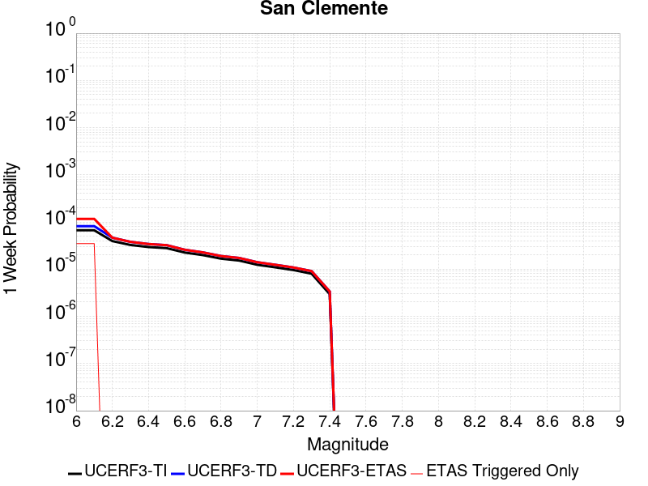 | 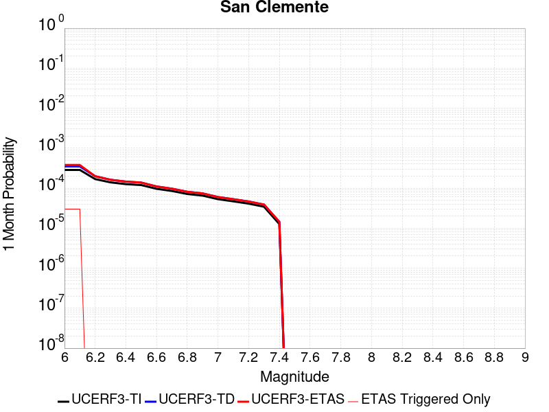 |  | 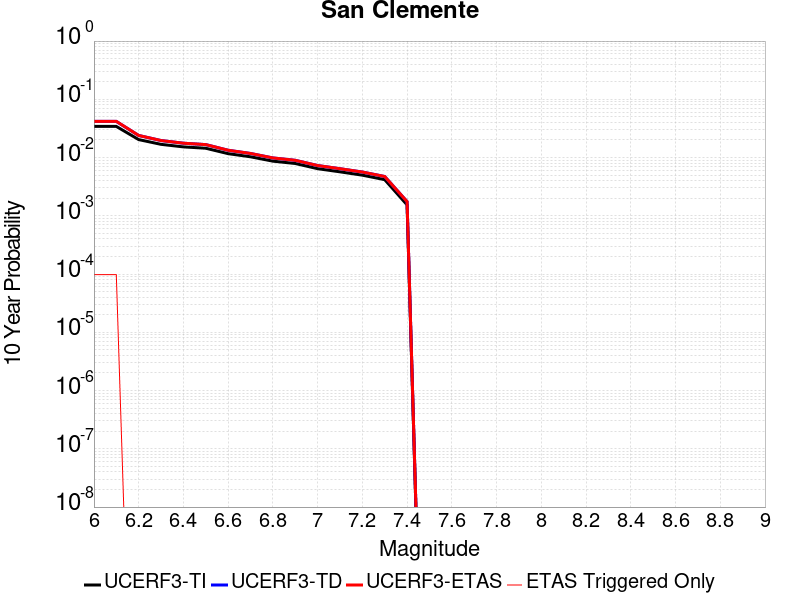 |

| Magnitude | 1 wk TI Prob | 1 wk TD Prob | 1 wk ETAS Prob | 1 wk ETAS/TD Gain | 1 wk ETAS Triggered Only | 1 mo TI Prob | 1 mo TD Prob | 1 mo ETAS Prob | 1 mo ETAS/TD Gain | 1 mo ETAS Triggered Only | 1 yr TI Prob | 1 yr TD Prob | 1 yr ETAS Prob | 1 yr ETAS/TD Gain | 1 yr ETAS Triggered Only | 10 yr TI Prob | 10 yr TD Prob | 10 yr ETAS Prob | 10 yr ETAS/TD Gain | 10 yr ETAS Triggered Only |
|-----|-----|-----|-----|-----|-----|-----|-----|-----|-----|-----|-----|-----|-----|-----|-----|-----|-----|-----|-----|-----|
| 6.0 | 6.681379E-5 | 8.163422E-5 | 1.7943532E-4 | 2.1980402 | 9.7809076E-5 | 2.8631336E-4 | 3.498173E-4 | 4.4759217E-4 | 1.2795026 | 9.7809076E-5 | 0.003480294 | 0.0042512873 | 0.004348681 | 1.0229092 | 9.7809076E-5 | 0.03426291 | 0.041755714 | 0.041849438 | 1.0022446 | 9.7809076E-5 |
| 6.1 | 6.681379E-5 | 8.163422E-5 | 1.7943532E-4 | 2.1980402 | 9.7809076E-5 | 2.8631336E-4 | 3.498173E-4 | 4.4759217E-4 | 1.2795026 | 9.7809076E-5 | 0.003480294 | 0.0042512873 | 0.004348681 | 1.0229092 | 9.7809076E-5 | 0.03426291 | 0.041755714 | 0.041849438 | 1.0022446 | 9.7809076E-5 |
| 6.2 | 3.9400576E-5 | 4.6451984E-5 | 4.6451984E-5 | 1.0 | 0.0 | 1.6884868E-4 | 1.9906509E-4 | 1.9906509E-4 | 1.0 | 0.0 | 0.0020537945 | 0.002420985 | 0.002420985 | 1.0 | 0.0 | 0.020349167 | 0.02395286 | 0.02395286 | 1.0 | 0.0 |
| 6.3 | 3.2590255E-5 | 3.7929087E-5 | 3.7929087E-5 | 1.0 | 0.0 | 1.3966505E-4 | 1.6254328E-4 | 1.6254328E-4 | 1.0 | 0.0 | 0.0016990956 | 0.0019771985 | 0.0019771985 | 1.0 | 0.0 | 0.01686163 | 0.019599866 | 0.019599866 | 1.0 | 0.0 |
| 6.4 | 2.9454652E-5 | 3.4097775E-5 | 3.4097775E-5 | 1.0 | 0.0 | 1.2622811E-4 | 1.4612528E-4 | 1.4612528E-4 | 1.0 | 0.0 | 0.0015357438 | 0.0017776482 | 0.0017776482 | 1.0 | 0.0 | 0.015251739 | 0.017637458 | 0.017637458 | 1.0 | 0.0 |
| 6.5 | 2.790836E-5 | 3.2247463E-5 | 3.2247463E-5 | 1.0 | 0.0 | 1.1960178E-4 | 1.3819622E-4 | 1.3819622E-4 | 1.0 | 0.0 | 0.001455179 | 0.0016812651 | 0.0016812651 | 1.0 | 0.0 | 0.014456868 | 0.016688475 | 0.016688475 | 1.0 | 0.0 |
| 6.6 | 2.2492153E-5 | 2.5762707E-5 | 2.5762707E-5 | 1.0 | 0.0 | 9.639138E-5 | 1.1040701E-4 | 1.1040701E-4 | 1.0 | 0.0 | 0.0011729331 | 0.0013433908 | 0.0013433908 | 1.0 | 0.0 | 0.011667615 | 0.013354415 | 0.013354415 | 1.0 | 0.0 |
| 6.7 | 1.9862755E-5 | 2.2666423E-5 | 2.2666423E-5 | 1.0 | 0.0 | 8.512331E-5 | 9.713826E-5 | 9.713826E-5 | 1.0 | 0.0 | 0.0010358836 | 0.0011820279 | 0.0011820279 | 1.0 | 0.0 | 0.010310682 | 0.011758701 | 0.011758701 | 1.0 | 0.0 |
| 6.8 | 1.6697575E-5 | 1.897771E-5 | 1.897771E-5 | 1.0 | 0.0 | 7.155907E-5 | 8.133056E-5 | 8.133056E-5 | 1.0 | 0.0 | 8.7088346E-4 | 9.897591E-4 | 9.897591E-4 | 1.0 | 0.0 | 0.008674784 | 0.0098545365 | 0.0098545365 | 1.0 | 0.0 |
| 6.9 | 1.5218415E-5 | 1.72694E-5 | 1.72694E-5 | 1.0 | 0.0 | 6.522015E-5 | 7.4009666E-5 | 7.4009666E-5 | 1.0 | 0.0 | 7.93766E-4 | 9.00704E-4 | 9.00704E-4 | 1.0 | 0.0 | 0.007909367 | 0.008971481 | 0.008971481 | 1.0 | 0.0 |
| 7.0 | 1.2392958E-5 | 1.4033016E-5 | 1.4033016E-5 | 1.0 | 0.0 | 5.3111595E-5 | 6.014015E-5 | 6.014015E-5 | 1.0 | 0.0 | 6.4644177E-4 | 7.319679E-4 | 7.319679E-4 | 1.0 | 0.0 | 0.0064456454 | 0.0072963564 | 0.0072963564 | 1.0 | 0.0 |
| 7.1 | 1.0934128E-5 | 1.2375138E-5 | 1.2375138E-5 | 1.0 | 0.0 | 4.6859706E-5 | 5.303527E-5 | 5.303527E-5 | 1.0 | 0.0 | 5.7036756E-4 | 6.455204E-4 | 6.455204E-4 | 1.0 | 0.0 | 0.0056890585 | 0.0064371997 | 0.0064371997 | 1.0 | 0.0 |
| 7.2 | 9.5798805E-6 | 1.0844935E-5 | 1.0844935E-5 | 1.0 | 0.0 | 4.1055984E-5 | 4.6477508E-5 | 4.6477508E-5 | 1.0 | 0.0 | 4.9974193E-4 | 5.657239E-4 | 5.657239E-4 | 1.0 | 0.0 | 0.0049861963 | 0.0056435615 | 0.0056435615 | 1.0 | 0.0 |
| 7.3 | 8.0167365E-6 | 9.083918E-6 | 9.083918E-6 | 1.0 | 0.0 | 3.4356988E-5 | 3.8930535E-5 | 3.8930535E-5 | 1.0 | 0.0 | 4.1821605E-4 | 4.7388324E-4 | 4.7388324E-4 | 1.0 | 0.0 | 0.0041742986 | 0.0047294297 | 0.0047294297 | 1.0 | 0.0 |
| 7.4 | 2.9581017E-6 | 3.3623792E-6 | 3.3623792E-6 | 1.0 | 0.0 | 1.2677518E-5 | 1.4410146E-5 | 1.4410146E-5 | 1.0 | 0.0 | 1.5433785E-4 | 1.7543444E-4 | 1.7543444E-4 | 1.0 | 0.0 | 0.001542307 | 0.0017534546 | 0.0017534546 | 1.0 | 0.0 |

## Ortigalita (North)
*[(top)](#table-of-contents)*

| 1 Week | 1 Month | 1 Year | 10 Year |
|-----|-----|-----|-----|
| 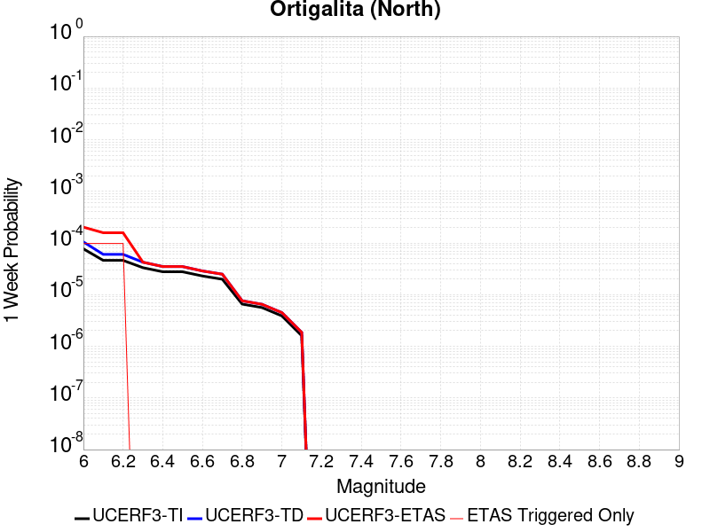 | 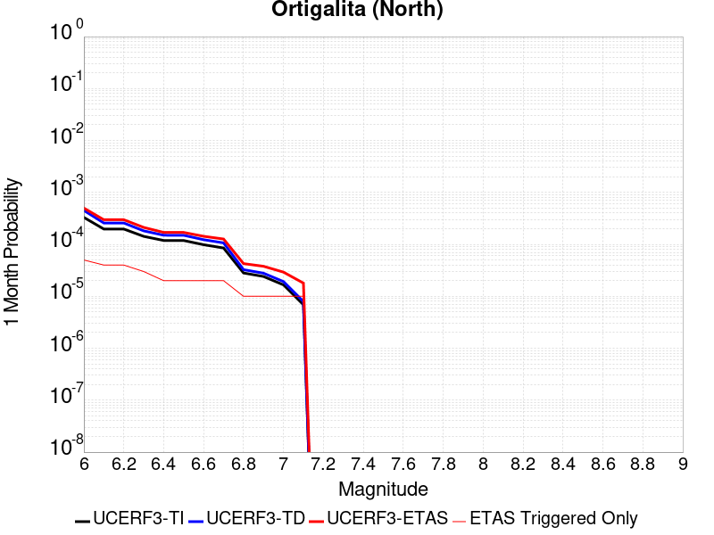 | 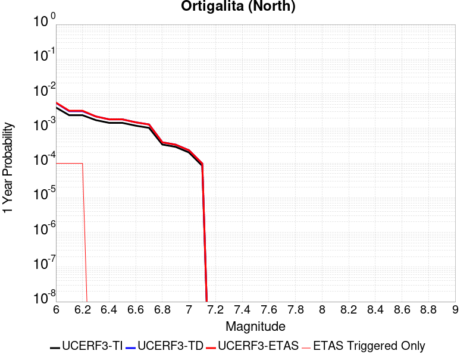 | 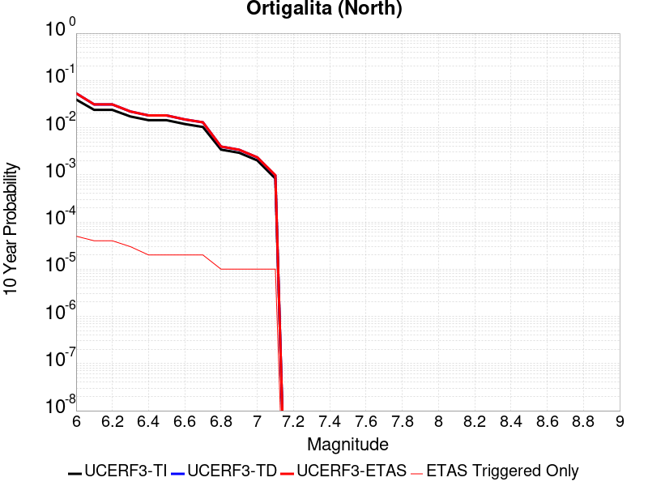 |

| Magnitude | 1 wk TI Prob | 1 wk TD Prob | 1 wk ETAS Prob | 1 wk ETAS/TD Gain | 1 wk ETAS Triggered Only | 1 mo TI Prob | 1 mo TD Prob | 1 mo ETAS Prob | 1 mo ETAS/TD Gain | 1 mo ETAS Triggered Only | 1 yr TI Prob | 1 yr TD Prob | 1 yr ETAS Prob | 1 yr ETAS/TD Gain | 1 yr ETAS Triggered Only | 10 yr TI Prob | 10 yr TD Prob | 10 yr ETAS Prob | 10 yr ETAS/TD Gain | 10 yr ETAS Triggered Only |
|-----|-----|-----|-----|-----|-----|-----|-----|-----|-----|-----|-----|-----|-----|-----|-----|-----|-----|-----|-----|-----|
| 6.0 | 7.711876E-5 | 1.05064966E-4 | 2.0286377E-4 | 1.9308412 | 9.7809076E-5 | 3.3046713E-4 | 4.502116E-4 | 5.4797664E-4 | 1.2171535 | 9.7809076E-5 | 0.004016016 | 0.0054681194 | 0.0055653937 | 1.0177894 | 9.7809076E-5 | 0.039442103 | 0.053454787 | 0.053547367 | 1.001732 | 9.7809076E-5 |
| 6.1 | 4.607858E-5 | 6.0239203E-5 | 1.5804239E-4 | 2.6235805 | 9.7809076E-5 | 1.9746469E-4 | 2.5814527E-4 | 3.5592908E-4 | 1.3787938 | 9.7809076E-5 | 0.0024014818 | 0.0031387596 | 0.0032362617 | 1.0310639 | 9.7809076E-5 | 0.023756953 | 0.030975068 | 0.031069849 | 1.0030599 | 9.7809076E-5 |
| 6.2 | 4.607858E-5 | 6.0239203E-5 | 1.5804239E-4 | 2.6235805 | 9.7809076E-5 | 1.9746469E-4 | 2.5814527E-4 | 3.5592908E-4 | 1.3787938 | 9.7809076E-5 | 0.0024014818 | 0.0031387596 | 0.0032362617 | 1.0310639 | 9.7809076E-5 | 0.023756953 | 0.030975068 | 0.031069849 | 1.0030599 | 9.7809076E-5 |
| 6.3 | 3.327423E-5 | 4.2475127E-5 | 4.2475127E-5 | 1.0 | 0.0 | 1.4259605E-4 | 1.8202531E-4 | 1.8202531E-4 | 1.0 | 0.0 | 0.0017347244 | 0.002214197 | 0.002214197 | 1.0 | 0.0 | 0.017212452 | 0.021945644 | 0.021945644 | 1.0 | 0.0 |
| 6.4 | 2.7732503E-5 | 3.4998593E-5 | 3.4998593E-5 | 1.0 | 0.0 | 1.1884817E-4 | 1.4998685E-4 | 1.4998685E-4 | 1.0 | 0.0 | 0.001446016 | 0.0018248095 | 0.0018248095 | 1.0 | 0.0 | 0.014366428 | 0.018121224 | 0.018121224 | 1.0 | 0.0 |
| 6.5 | 2.7689714E-5 | 3.4948407E-5 | 3.4948407E-5 | 1.0 | 0.0 | 1.186648E-4 | 1.497718E-4 | 1.497718E-4 | 1.0 | 0.0 | 0.0014437864 | 0.0018221956 | 0.0018221956 | 1.0 | 0.0 | 0.014344421 | 0.01809551 | 0.01809551 | 1.0 | 0.0 |
| 6.6 | 2.2976905E-5 | 2.8718265E-5 | 2.8718265E-5 | 1.0 | 0.0 | 9.846873E-5 | 1.230739E-4 | 1.230739E-4 | 1.0 | 0.0 | 0.0011981975 | 0.0014976363 | 0.0014976363 | 1.0 | 0.0 | 0.011917574 | 0.014898697 | 0.014898697 | 1.0 | 0.0 |
| 6.7 | 1.9871539E-5 | 2.4904411E-5 | 2.4904411E-5 | 1.0 | 0.0 | 8.516096E-5 | 1.0673023E-4 | 1.0673023E-4 | 1.0 | 0.0 | 0.0010363415 | 0.0012989145 | 0.0012989145 | 1.0 | 0.0 | 0.010315218 | 0.012936919 | 0.012936919 | 1.0 | 0.0 |
| 6.8 | 6.5640475E-6 | 7.6054926E-6 | 7.6054926E-6 | 1.0 | 0.0 | 2.813133E-5 | 3.2594577E-5 | 3.2594577E-5 | 1.0 | 0.0 | 3.424451E-4 | 3.9676955E-4 | 3.9676955E-4 | 1.0 | 0.0 | 0.0034191788 | 0.003960899 | 0.003960899 | 1.0 | 0.0 |
| 6.9 | 5.6219683E-6 | 6.5018376E-6 | 6.5018376E-6 | 1.0 | 0.0 | 2.4093928E-5 | 2.7864735E-5 | 2.7864735E-5 | 1.0 | 0.0 | 2.933041E-4 | 3.3920293E-4 | 3.3920293E-4 | 1.0 | 0.0 | 0.0029291727 | 0.003387109 | 0.003387109 | 1.0 | 0.0 |
| 7.0 | 3.875591E-6 | 4.4847548E-6 | 4.4847548E-6 | 1.0 | 0.0 | 1.6609569E-5 | 1.9220248E-5 | 1.9220248E-5 | 1.0 | 0.0 | 2.0220275E-4 | 2.339835E-4 | 2.339835E-4 | 1.0 | 0.0 | 0.0020201886 | 0.0023375798 | 0.0023375798 | 1.0 | 0.0 |
| 7.1 | 1.6017933E-6 | 1.8570418E-6 | 1.8570418E-6 | 1.0 | 0.0 | 6.8648105E-6 | 7.958732E-6 | 7.958732E-6 | 1.0 | 0.0 | 8.357586E-5 | 9.689432E-5 | 9.689432E-5 | 1.0 | 0.0 | 8.3544437E-4 | 9.686254E-4 | 9.686254E-4 | 1.0 | 0.0 |

## Whittier alt 1
*[(top)](#table-of-contents)*

| 1 Week | 1 Month | 1 Year | 10 Year |
|-----|-----|-----|-----|
| 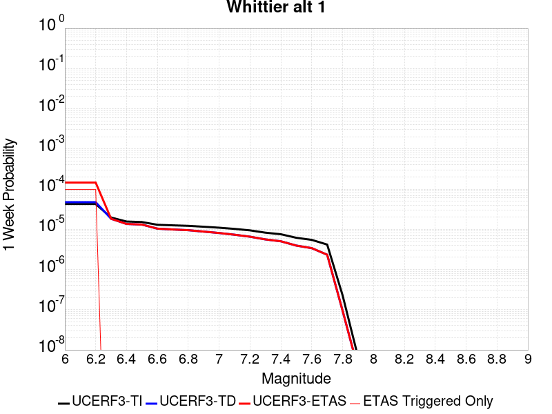 |  | 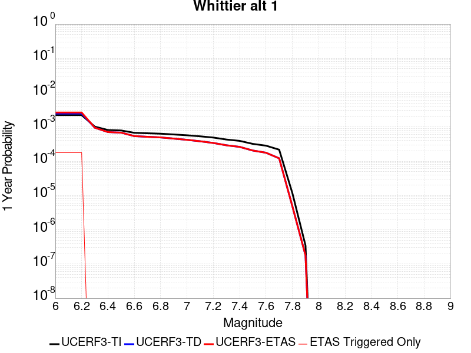 | 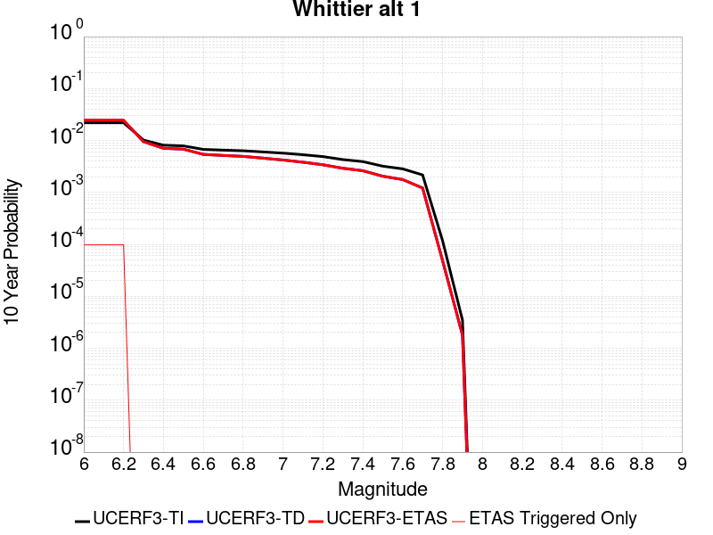 |

| Magnitude | 1 wk TI Prob | 1 wk TD Prob | 1 wk ETAS Prob | 1 wk ETAS/TD Gain | 1 wk ETAS Triggered Only | 1 mo TI Prob | 1 mo TD Prob | 1 mo ETAS Prob | 1 mo ETAS/TD Gain | 1 mo ETAS Triggered Only | 1 yr TI Prob | 1 yr TD Prob | 1 yr ETAS Prob | 1 yr ETAS/TD Gain | 1 yr ETAS Triggered Only | 10 yr TI Prob | 10 yr TD Prob | 10 yr ETAS Prob | 10 yr ETAS/TD Gain | 10 yr ETAS Triggered Only |
|-----|-----|-----|-----|-----|-----|-----|-----|-----|-----|-----|-----|-----|-----|-----|-----|-----|-----|-----|-----|-----|
| 6.0 | 4.2554693E-5 | 4.725218E-5 | 1.4505663E-4 | 3.0698402 | 9.7809076E-5 | 1.8236451E-4 | 2.0249544E-4 | 3.002847E-4 | 1.4829209 | 9.7809076E-5 | 0.002218027 | 0.0024629154 | 0.0025604835 | 1.0396149 | 9.7809076E-5 | 0.02196019 | 0.024390234 | 0.024485659 | 1.0039123 | 9.7809076E-5 |
| 6.1 | 4.2554693E-5 | 4.725218E-5 | 1.4505663E-4 | 3.0698402 | 9.7809076E-5 | 1.8236451E-4 | 2.0249544E-4 | 3.002847E-4 | 1.4829209 | 9.7809076E-5 | 0.002218027 | 0.0024629154 | 0.0025604835 | 1.0396149 | 9.7809076E-5 | 0.02196019 | 0.024390234 | 0.024485659 | 1.0039123 | 9.7809076E-5 |
| 6.2 | 4.2554693E-5 | 4.725218E-5 | 1.4505663E-4 | 3.0698402 | 9.7809076E-5 | 1.8236451E-4 | 2.0249544E-4 | 3.002847E-4 | 1.4829209 | 9.7809076E-5 | 0.002218027 | 0.0024629154 | 0.0025604835 | 1.0396149 | 9.7809076E-5 | 0.02196019 | 0.024390234 | 0.024485659 | 1.0039123 | 9.7809076E-5 |
| 6.3 | 1.9617712E-5 | 1.8268593E-5 | 1.8268593E-5 | 1.0 | 0.0 | 8.40732E-5 | 7.829172E-5 | 7.829172E-5 | 1.0 | 0.0 | 0.0010231105 | 9.52804E-4 | 9.52804E-4 | 1.0 | 0.0 | 0.01018413 | 0.009490474 | 0.009490474 | 1.0 | 0.0 |
| 6.4 | 1.5611336E-5 | 1.3604271E-5 | 1.3604271E-5 | 1.0 | 0.0 | 6.690401E-5 | 5.8302747E-5 | 5.8302747E-5 | 1.0 | 0.0 | 8.142519E-4 | 7.0961076E-4 | 7.0961076E-4 | 1.0 | 0.0 | 0.008112748 | 0.0070754145 | 0.0070754145 | 1.0 | 0.0 |
| 6.5 | 1.5150166E-5 | 1.3100925E-5 | 1.3100925E-5 | 1.0 | 0.0 | 6.492767E-5 | 5.6145647E-5 | 5.6145647E-5 | 1.0 | 0.0 | 7.9020765E-4 | 6.8336475E-4 | 6.8336475E-4 | 1.0 | 0.0 | 0.007874036 | 0.0068145846 | 0.0068145846 | 1.0 | 0.0 |
| 6.6 | 1.295588E-5 | 1.0380725E-5 | 1.0380725E-5 | 1.0 | 0.0 | 5.552402E-5 | 4.4488075E-5 | 4.4488075E-5 | 1.0 | 0.0 | 6.7579525E-4 | 5.4150965E-4 | 5.4150965E-4 | 1.0 | 0.0 | 0.006737438 | 0.0054033357 | 0.0054033357 | 1.0 | 0.0 |
| 6.7 | 1.2542085E-5 | 9.899369E-6 | 9.899369E-6 | 1.0 | 0.0 | 5.3750682E-5 | 4.242519E-5 | 4.242519E-5 | 1.0 | 0.0 | 6.542181E-4 | 5.164061E-4 | 5.164061E-4 | 1.0 | 0.0 | 0.006522954 | 0.0051534795 | 0.0051534795 | 1.0 | 0.0 |
| 6.8 | 1.2195878E-5 | 9.495415E-6 | 9.495415E-6 | 1.0 | 0.0 | 5.2267E-5 | 4.069401E-5 | 4.069401E-5 | 1.0 | 0.0 | 6.36165E-4 | 4.9533875E-4 | 4.9533875E-4 | 1.0 | 0.0 | 0.0063434686 | 0.004943688 | 0.004943688 | 1.0 | 0.0 |
| 6.9 | 1.1580298E-5 | 8.772933E-6 | 8.772933E-6 | 1.0 | 0.0 | 4.9628903E-5 | 3.7597754E-5 | 3.7597754E-5 | 1.0 | 0.0 | 6.040644E-4 | 4.5765814E-4 | 4.5765814E-4 | 1.0 | 0.0 | 0.00602425 | 0.0045684157 | 0.0045684157 | 1.0 | 0.0 |
| 7.0 | 1.0964795E-5 | 8.083994E-6 | 8.083994E-6 | 1.0 | 0.0 | 4.6991136E-5 | 3.4645236E-5 | 3.4645236E-5 | 1.0 | 0.0 | 5.7196687E-4 | 4.2172565E-4 | 4.2172565E-4 | 1.0 | 0.0 | 0.0057049696 | 0.004210462 | 0.004210462 | 1.0 | 0.0 |
| 7.1 | 1.0230601E-5 | 7.3266697E-6 | 7.3266697E-6 | 1.0 | 0.0 | 4.3844695E-5 | 3.1399642E-5 | 3.1399642E-5 | 1.0 | 0.0 | 5.336784E-4 | 3.8222488E-4 | 3.8222488E-4 | 1.0 | 0.0 | 0.005323986 | 0.0038168381 | 0.0038168381 | 1.0 | 0.0 |
| 7.2 | 9.40865E-6 | 6.543289E-6 | 6.543289E-6 | 1.0 | 0.0 | 4.032216E-5 | 2.8042374E-5 | 2.8042374E-5 | 1.0 | 0.0 | 4.908117E-4 | 3.4136363E-4 | 3.4136363E-4 | 1.0 | 0.0 | 0.0048972913 | 0.003409485 | 0.003409485 | 1.0 | 0.0 |
| 7.3 | 8.237384E-6 | 5.5977525E-6 | 5.5977525E-6 | 1.0 | 0.0 | 3.5302593E-5 | 2.3990153E-5 | 2.3990153E-5 | 1.0 | 0.0 | 4.2972428E-4 | 2.92042E-4 | 2.92042E-4 | 1.0 | 0.0 | 0.0042889426 | 0.002916903 | 0.002916903 | 1.0 | 0.0 |
| 7.4 | 7.5316966E-6 | 5.027819E-6 | 5.027819E-6 | 1.0 | 0.0 | 3.2278298E-5 | 2.1547625E-5 | 2.1547625E-5 | 1.0 | 0.0 | 3.9291743E-4 | 2.6231175E-4 | 2.6231175E-4 | 1.0 | 0.0 | 0.0039222343 | 0.0026201333 | 0.0026201333 | 1.0 | 0.0 |
| 7.5 | 6.149649E-6 | 3.933841E-6 | 3.933841E-6 | 1.0 | 0.0 | 2.6355372E-5 | 1.6859214E-5 | 1.6859214E-5 | 1.0 | 0.0 | 3.208294E-4 | 2.052425E-4 | 2.052425E-4 | 1.0 | 0.0 | 0.003203666 | 0.0020506186 | 0.0020506186 | 1.0 | 0.0 |
| 7.6 | 5.457711E-6 | 3.3953788E-6 | 3.3953788E-6 | 1.0 | 0.0 | 2.338998E-5 | 1.4551547E-5 | 1.4551547E-5 | 1.0 | 0.0 | 2.8473578E-4 | 1.771515E-4 | 1.771515E-4 | 1.0 | 0.0 | 0.0028437122 | 0.0017701836 | 0.0017701836 | 1.0 | 0.0 |
| 7.7 | 4.1676276E-6 | 2.3331952E-6 | 2.3331952E-6 | 1.0 | 0.0 | 1.7861139E-5 | 9.999374E-6 | 9.999374E-6 | 1.0 | 0.0 | 2.1743766E-4 | 1.2173632E-4 | 1.2173632E-4 | 1.0 | 0.0 | 0.0021722503 | 0.0012167693 | 0.0012167693 | 1.0 | 0.0 |
| 7.8 | 2.2692414E-7 | 9.3854695E-8 | 9.3854695E-8 | 1.0 | 0.0 | 9.725317E-7 | 4.0223435E-7 | 4.0223435E-7 | 1.0 | 0.0 | 1.1840509E-5 | 4.8971956E-6 | 4.8971956E-6 | 1.0 | 0.0 | 1.1839878E-4 | 4.8971204E-5 | 4.8971204E-5 | 1.0 | 0.0 |
| 7.9 | 6.676829E-9 | 3.439853E-9 | 3.439853E-9 | 1.0 | 0.0 | 2.861498E-8 | 1.4742227E-8 | 1.4742227E-8 | 1.0 | 0.0 | 3.4838732E-7 | 1.7948659E-7 | 1.7948659E-7 | 1.0 | 0.0 | 3.4838679E-6 | 1.7948646E-6 | 1.7948646E-6 | 1.0 | 0.0 |

## San Jacinto (San Bernardino)
*[(top)](#table-of-contents)*

| 1 Week | 1 Month | 1 Year | 10 Year |
|-----|-----|-----|-----|
| 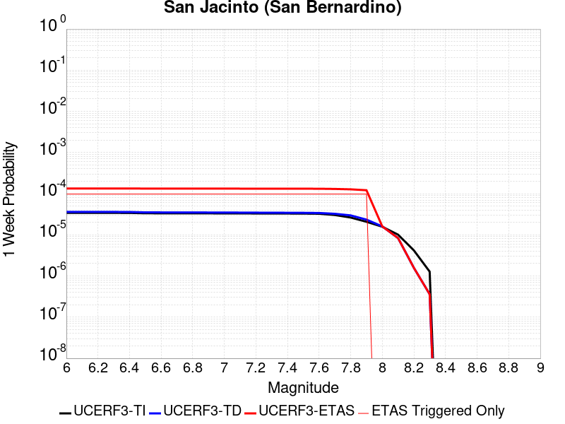 | 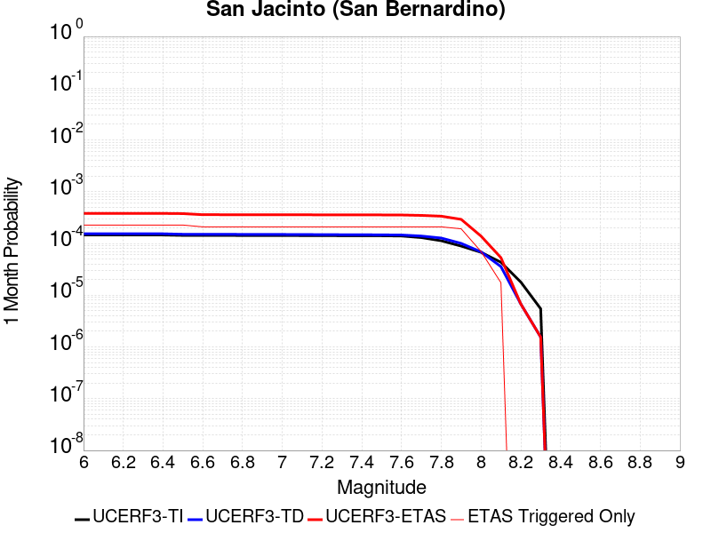 | 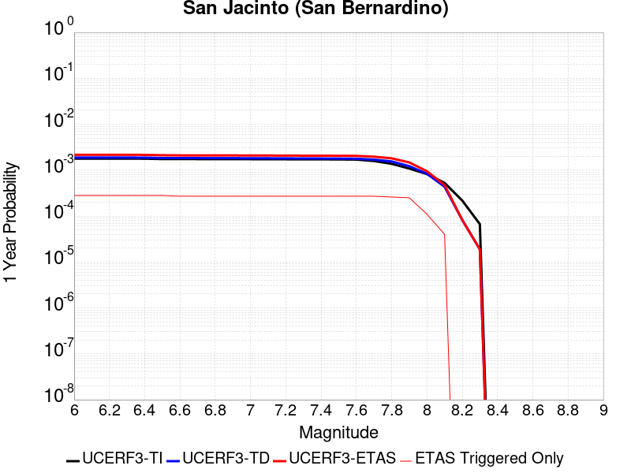 | 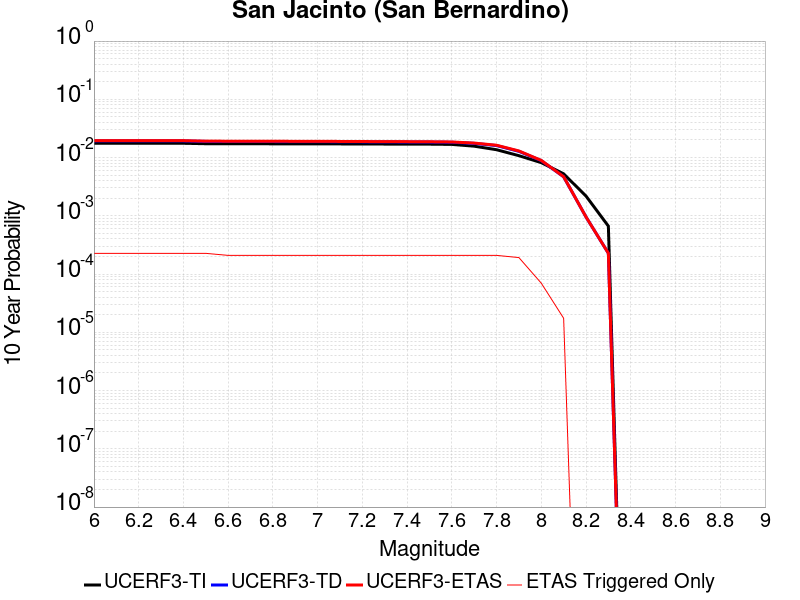 |

| Magnitude | 1 wk TI Prob | 1 wk TD Prob | 1 wk ETAS Prob | 1 wk ETAS/TD Gain | 1 wk ETAS Triggered Only | 1 mo TI Prob | 1 mo TD Prob | 1 mo ETAS Prob | 1 mo ETAS/TD Gain | 1 mo ETAS Triggered Only | 1 yr TI Prob | 1 yr TD Prob | 1 yr ETAS Prob | 1 yr ETAS/TD Gain | 1 yr ETAS Triggered Only | 10 yr TI Prob | 10 yr TD Prob | 10 yr ETAS Prob | 10 yr ETAS/TD Gain | 10 yr ETAS Triggered Only |
|-----|-----|-----|-----|-----|-----|-----|-----|-----|-----|-----|-----|-----|-----|-----|-----|-----|-----|-----|-----|-----|
| 6.0 | 3.409352E-5 | 3.5986508E-5 | 1.3379207E-4 | 3.7178395 | 9.7809076E-5 | 1.461069E-4 | 1.542188E-4 | 2.5201277E-4 | 1.634125 | 9.7809076E-5 | 0.0017774 | 0.0018759987 | 0.0019736243 | 1.0520393 | 9.7809076E-5 | 0.01763251 | 0.019349935 | 0.019445851 | 1.004957 | 9.7809076E-5 |
| 6.1 | 3.409352E-5 | 3.5986508E-5 | 1.3379207E-4 | 3.7178395 | 9.7809076E-5 | 1.461069E-4 | 1.542188E-4 | 2.5201277E-4 | 1.634125 | 9.7809076E-5 | 0.0017774 | 0.0018759987 | 0.0019736243 | 1.0520393 | 9.7809076E-5 | 0.01763251 | 0.019349935 | 0.019445851 | 1.004957 | 9.7809076E-5 |
| 6.2 | 3.409352E-5 | 3.5986508E-5 | 1.3379207E-4 | 3.7178395 | 9.7809076E-5 | 1.461069E-4 | 1.542188E-4 | 2.5201277E-4 | 1.634125 | 9.7809076E-5 | 0.0017774 | 0.0018759987 | 0.0019736243 | 1.0520393 | 9.7809076E-5 | 0.01763251 | 0.019349935 | 0.019445851 | 1.004957 | 9.7809076E-5 |
| 6.3 | 3.409352E-5 | 3.5986508E-5 | 1.3379207E-4 | 3.7178395 | 9.7809076E-5 | 1.461069E-4 | 1.542188E-4 | 2.5201277E-4 | 1.634125 | 9.7809076E-5 | 0.0017774 | 0.0018759987 | 0.0019736243 | 1.0520393 | 9.7809076E-5 | 0.01763251 | 0.019349935 | 0.019445851 | 1.004957 | 9.7809076E-5 |
| 6.4 | 3.400795E-5 | 3.5879173E-5 | 1.3368473E-4 | 3.7259705 | 9.7809076E-5 | 1.4574021E-4 | 1.5375883E-4 | 2.5155288E-4 | 1.6360222 | 9.7809076E-5 | 0.0017729428 | 0.0018704084 | 0.0019680345 | 1.0521951 | 9.7809076E-5 | 0.017588645 | 0.019295016 | 0.019390939 | 1.0049714 | 9.7809076E-5 |
| 6.5 | 3.341482E-5 | 3.5139812E-5 | 1.3294545E-4 | 3.7833285 | 9.7809076E-5 | 1.4319851E-4 | 1.5059051E-4 | 2.4838484E-4 | 1.6494058 | 9.7809076E-5 | 0.0017420477 | 0.0018318989 | 0.0019295289 | 1.0532944 | 9.7809076E-5 | 0.017284546 | 0.018916558 | 0.019012518 | 1.0050727 | 9.7809076E-5 |
| 6.6 | 3.3364955E-5 | 3.5077028E-5 | 1.3288268E-4 | 3.7883103 | 9.7809076E-5 | 1.4298483E-4 | 1.5032147E-4 | 2.4811586E-4 | 1.6505682 | 9.7809076E-5 | 0.0017394501 | 0.001828629 | 0.0019262593 | 1.0533898 | 9.7809076E-5 | 0.017258976 | 0.018884424 | 0.018980386 | 1.0050815 | 9.7809076E-5 |
| 6.7 | 3.335922E-5 | 3.5066805E-5 | 1.3287245E-4 | 3.7891235 | 9.7809076E-5 | 1.4296026E-4 | 1.5027766E-4 | 2.4807203E-4 | 1.6507579 | 9.7809076E-5 | 0.0017391514 | 0.0018280965 | 0.0019257267 | 1.0534054 | 9.7809076E-5 | 0.017256035 | 0.018879214 | 0.018975178 | 1.005083 | 9.7809076E-5 |
| 6.8 | 3.327683E-5 | 3.496087E-5 | 1.3276652E-4 | 3.797575 | 9.7809076E-5 | 1.4260718E-4 | 1.498237E-4 | 2.4761813E-4 | 1.65273 | 9.7809076E-5 | 0.0017348597 | 0.0018225788 | 0.0019202096 | 1.0535674 | 9.7809076E-5 | 0.017213784 | 0.018824987 | 0.018920954 | 1.0050979 | 9.7809076E-5 |
| 6.9 | 3.3235785E-5 | 3.4901823E-5 | 1.3270749E-4 | 3.802308 | 9.7809076E-5 | 1.4243131E-4 | 1.4957068E-4 | 2.4736513E-4 | 1.6538343 | 9.7809076E-5 | 0.0017327217 | 0.0018195034 | 0.0019171345 | 1.0536581 | 9.7809076E-5 | 0.017192734 | 0.018794855 | 0.018890826 | 1.0051062 | 9.7809076E-5 |
| 7.0 | 3.3197095E-5 | 3.4841752E-5 | 1.3264742E-4 | 3.8071396 | 9.7809076E-5 | 1.422655E-4 | 1.4931326E-4 | 2.4710773E-4 | 1.6549617 | 9.7809076E-5 | 0.0017307063 | 0.0018163746 | 0.0019140061 | 1.0537508 | 9.7809076E-5 | 0.017172894 | 0.018764233 | 0.018860206 | 1.0051147 | 9.7809076E-5 |
| 7.1 | 3.3129716E-5 | 3.4721965E-5 | 1.3252764E-4 | 3.8168244 | 9.7809076E-5 | 1.4197677E-4 | 1.4879994E-4 | 2.4659446E-4 | 1.6572216 | 9.7809076E-5 | 0.0017271966 | 0.0018101353 | 0.0019077674 | 1.0539364 | 9.7809076E-5 | 0.017138338 | 0.018703312 | 0.018799292 | 1.0051317 | 9.7809076E-5 |
| 7.2 | 3.3034008E-5 | 3.458941E-5 | 1.323951E-4 | 3.8276193 | 9.7809076E-5 | 1.4156665E-4 | 1.4823192E-4 | 2.460265E-4 | 1.6597403 | 9.7809076E-5 | 0.0017222111 | 0.0018032312 | 0.0019008638 | 1.0541432 | 9.7809076E-5 | 0.017089253 | 0.018635705 | 0.018731691 | 1.0051507 | 9.7809076E-5 |
| 7.3 | 3.2956614E-5 | 3.445717E-5 | 1.3226288E-4 | 3.838472 | 9.7809076E-5 | 1.4123498E-4 | 1.4766524E-4 | 2.4545987E-4 | 1.6622726 | 9.7809076E-5 | 0.0017181796 | 0.0017963431 | 0.0018939765 | 1.0543512 | 9.7809076E-5 | 0.017049557 | 0.018568452 | 0.018664446 | 1.0051696 | 9.7809076E-5 |
| 7.4 | 3.2915937E-5 | 3.4378863E-5 | 1.3218458E-4 | 3.8449373 | 9.7809076E-5 | 1.4106068E-4 | 1.4732967E-4 | 2.4512433E-4 | 1.6637812 | 9.7809076E-5 | 0.0017160608 | 0.0017922645 | 0.0018898983 | 1.0544751 | 9.7809076E-5 | 0.017028693 | 0.018528719 | 0.018624716 | 1.005181 | 9.7809076E-5 |
| 7.5 | 3.281791E-5 | 3.4243778E-5 | 1.320495E-4 | 3.8561604 | 9.7809076E-5 | 1.406406E-4 | 1.4675081E-4 | 2.4454552E-4 | 1.6664 | 9.7809076E-5 | 0.0017109542 | 0.0017852283 | 0.0018828628 | 1.0546902 | 9.7809076E-5 | 0.016978411 | 0.018459605 | 0.01855561 | 1.0052007 | 9.7809076E-5 |
| 7.6 | 3.2521442E-5 | 3.396873E-5 | 1.3177449E-4 | 3.879288 | 9.7809076E-5 | 1.3937015E-4 | 1.4557215E-4 | 2.4336699E-4 | 1.6717963 | 9.7809076E-5 | 0.0016955109 | 0.0017709016 | 0.0018685375 | 1.0551335 | 9.7809076E-5 | 0.016826328 | 0.018317232 | 0.01841325 | 1.0052419 | 9.7809076E-5 |
| 7.7 | 3.0287873E-5 | 3.245276E-5 | 1.3025866E-4 | 4.013793 | 9.7809076E-5 | 1.297987E-4 | 1.3907586E-4 | 2.3687133E-4 | 1.7031808 | 9.7809076E-5 | 0.0015791537 | 0.0016919347 | 0.0017895782 | 1.0577112 | 9.7809076E-5 | 0.01567979 | 0.01752809 | 0.017624184 | 1.0054823 | 9.7809076E-5 |
| 7.8 | 2.6316151E-5 | 2.9663592E-5 | 1.2746977E-4 | 4.297179 | 9.7809076E-5 | 1.1277862E-4 | 1.2712348E-4 | 2.2492014E-4 | 1.7693043 | 9.7809076E-5 | 0.0013722149 | 0.0015466306 | 0.0016442884 | 1.0631423 | 9.7809076E-5 | 0.013637724 | 0.016069634 | 0.016165871 | 1.0059887 | 9.7809076E-5 |
| 7.9 | 2.0761147E-5 | 2.34181E-5 | 1.2122489E-4 | 5.1765466 | 9.7809076E-5 | 8.897331E-5 | 1.0035944E-4 | 1.981587E-4 | 1.9744899 | 9.7809076E-5 | 0.0010827117 | 0.0012211921 | 0.0013188816 | 1.0799953 | 9.7809076E-5 | 0.010774517 | 0.012793174 | 0.012889732 | 1.0075476 | 9.7809076E-5 |
| 8.0 | 1.5738568E-5 | 1.6033575E-5 | 1.6033575E-5 | 1.0 | 0.0 | 6.744926E-5 | 6.871352E-5 | 6.871352E-5 | 1.0 | 0.0 | 8.2088535E-4 | 8.3626667E-4 | 8.3626667E-4 | 1.0 | 0.0 | 0.008178596 | 0.008865921 | 0.008865921 | 1.0 | 0.0 |
| 8.1 | 1.0105832E-5 | 8.3304985E-6 | 8.3304985E-6 | 1.0 | 0.0 | 4.3309992E-5 | 3.570165E-5 | 3.570165E-5 | 1.0 | 0.0 | 5.2717153E-4 | 4.345814E-4 | 4.345814E-4 | 1.0 | 0.0 | 0.005259227 | 0.004677232 | 0.004677232 | 1.0 | 0.0 |
| 8.2 | 4.189207E-6 | 1.5784357E-6 | 1.5784357E-6 | 1.0 | 0.0 | 1.7953622E-5 | 6.7647065E-6 | 6.7647065E-6 | 1.0 | 0.0 | 2.1856341E-4 | 8.235722E-5 | 8.235722E-5 | 1.0 | 0.0 | 0.0021834858 | 9.565867E-4 | 9.565867E-4 | 1.0 | 0.0 |
| 8.3 | 1.2758221E-6 | 3.6149942E-7 | 3.6149942E-7 | 1.0 | 0.0 | 5.4677976E-6 | 1.5492824E-6 | 1.5492824E-6 | 1.0 | 0.0 | 6.65684E-5 | 1.8862354E-5 | 1.8862354E-5 | 1.0 | 0.0 | 6.6548464E-4 | 2.2751294E-4 | 2.2751294E-4 | 1.0 | 0.0 |

