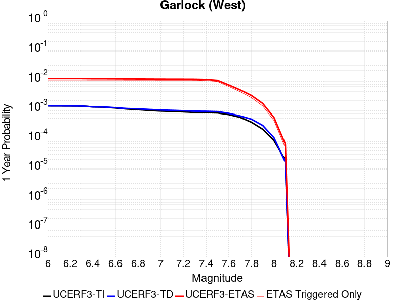
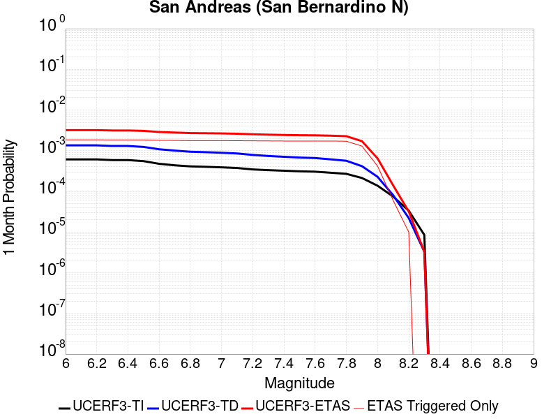
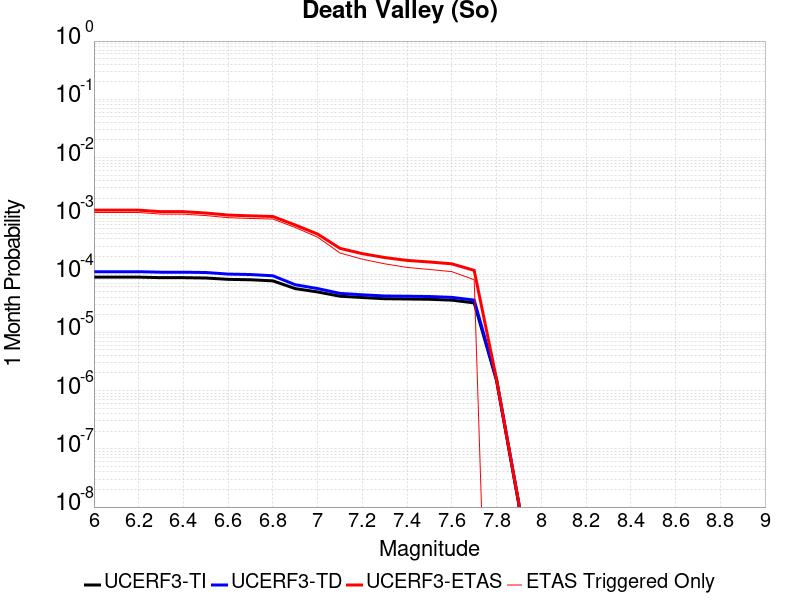
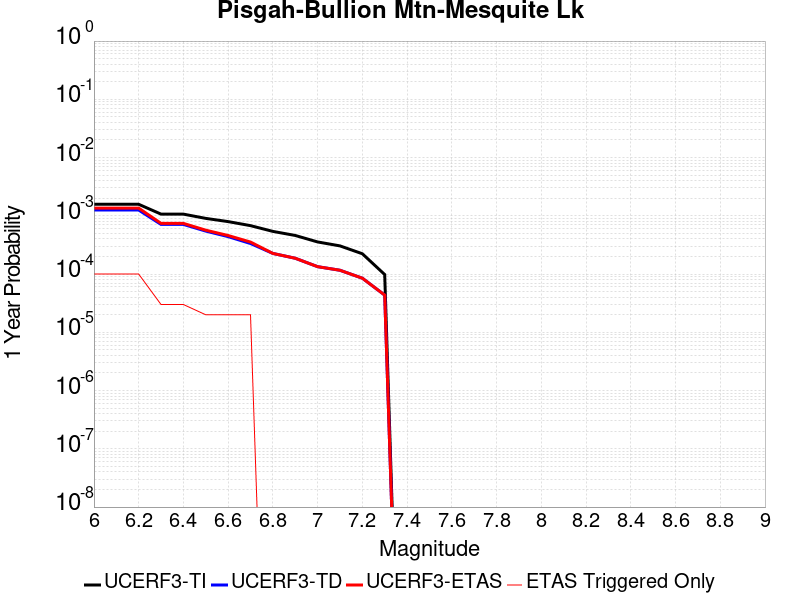
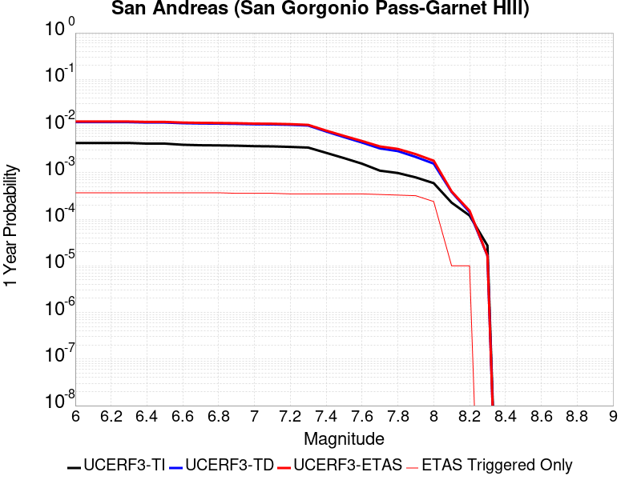

# Parent Section Magnitude-Probability Distributions

Only fault sections with at least one triggered aftershock are plotted. Sections are sorted by total supraseismogenic trigger rate (decreasing)

## Table Of Contents

* [Garlock (Central)](#garlock-central)
* [Tank Canyon](#tank-canyon)
* [Airport Lake](#airport-lake)
* [Little Lake](#little-lake)
* [Owl Lake](#owl-lake)
* [Garlock (East)](#garlock-east)
* [Panamint Valley](#panamint-valley)
* [Garlock (West)](#garlock-west)
* [Hunter Mountain-Saline Valley](#hunter-mountain-saline-valley)
* [Gravel Hills-Harper Lk](#gravel-hills-harper-lk)
* [San Andreas (Mojave N)](#san-andreas-mojave-n)
* [San Andreas (Mojave S)](#san-andreas-mojave-s)
* [San Andreas (San Bernardino N)](#san-andreas-san-bernardino-n)
* [Blackwater](#blackwater)
* [Lenwood-Lockhart-Old Woman Springs](#lenwood-lockhart-old-woman-springs)
* [Ash Hill](#ash-hill)
* [So Sierra Nevada](#so-sierra-nevada)
* [Death Valley (So)](#death-valley-so)
* [Shoreline](#shoreline)
* [Santa Ynez (East)](#santa-ynez-east)
* [Death Valley (Black Mtns Frontal)](#death-valley-black-mtns-frontal)
* [San Andreas (Coachella) rev](#san-andreas-coachella-rev)
* [Death Valley (No)](#death-valley-no)
* [San Andreas (North Branch Mill Creek)](#san-andreas-north-branch-mill-creek)
* [San Andreas (San Bernardino S)](#san-andreas-san-bernardino-s)
* [Goldstone Lake](#goldstone-lake)
* [Towne Pass](#towne-pass)
* [McLean Lake](#mclean-lake)
* [Pisgah-Bullion Mtn-Mesquite Lk](#pisgah-bullion-mtn-mesquite-lk)
* [San Andreas (San Gorgonio Pass-Garnet HIll)](#san-andreas-san-gorgonio-pass-garnet-hill)

## Garlock (Central)
*[(top)](#table-of-contents)*

| 1 Week | 1 Month | 1 Year | 10 Year |
|-----|-----|-----|-----|
|  |  |  |  |

| Magnitude | 1 wk TI Prob | 1 wk TD Prob | 1 wk ETAS Prob | 1 wk ETAS/TD Gain | 1 wk ETAS Triggered Only | 1 mo TI Prob | 1 mo TD Prob | 1 mo ETAS Prob | 1 mo ETAS/TD Gain | 1 mo ETAS Triggered Only | 1 yr TI Prob | 1 yr TD Prob | 1 yr ETAS Prob | 1 yr ETAS/TD Gain | 1 yr ETAS Triggered Only | 10 yr TI Prob | 10 yr TD Prob | 10 yr ETAS Prob | 10 yr ETAS/TD Gain | 10 yr ETAS Triggered Only |
|-----|-----|-----|-----|-----|-----|-----|-----|-----|-----|-----|-----|-----|-----|-----|-----|-----|-----|-----|-----|-----|
| 6.0 | 5.5131142E-5 | 7.024681E-5 | 0.10371632 | 1476.4559 | 0.10365336 | 2.3625491E-4 | 3.010234E-4 | 0.10732062 | 356.51923 | 0.10705183 | 0.0028726095 | 0.0036588663 | 0.12132362 | 33.158802 | 0.11809686 | 0.028357591 | 0.036079824 | 0.1581054 | 4.3821 | 0.12659304 |
| 6.1 | 5.5131142E-5 | 7.024681E-5 | 0.10371632 | 1476.4559 | 0.10365336 | 2.3625491E-4 | 3.010234E-4 | 0.10732062 | 356.51923 | 0.10705183 | 0.0028726095 | 0.0036588663 | 0.12132362 | 33.158802 | 0.11809686 | 0.028357591 | 0.036079824 | 0.1581054 | 4.3821 | 0.12659304 |
| 6.2 | 4.216245E-5 | 5.1661493E-5 | 0.0603714 | 1168.5957 | 0.060322855 | 1.806837E-4 | 2.2138779E-4 | 0.063928604 | 288.76303 | 0.06372133 | 0.0021976046 | 0.0026920962 | 0.07471518 | 27.753532 | 0.0722175 | 0.021759989 | 0.026689773 | 0.1027684 | 3.8504784 | 0.07816482 |
| 6.3 | 4.216245E-5 | 5.1661493E-5 | 0.0603714 | 1168.5957 | 0.060322855 | 1.806837E-4 | 2.2138779E-4 | 0.063928604 | 288.76303 | 0.06372133 | 0.0021976046 | 0.0026920962 | 0.07471518 | 27.753532 | 0.0722175 | 0.021759989 | 0.026689773 | 0.1027684 | 3.8504784 | 0.07816482 |
| 6.4 | 3.6858168E-5 | 4.411054E-5 | 0.04592144 | 1041.0537 | 0.045879353 | 1.5795401E-4 | 1.8903162E-4 | 0.049457543 | 261.63635 | 0.049277823 | 0.0019213937 | 0.002299056 | 0.059092566 | 25.70297 | 0.056924384 | 0.019048655 | 0.02284894 | 0.08179348 | 3.5797496 | 0.060322855 |
| 6.5 | 3.39199E-5 | 4.0018083E-5 | 0.040820036 | 1020.03973 | 0.040781647 | 1.453629E-4 | 1.7149492E-4 | 0.04519351 | 263.5268 | 0.045029737 | 0.0017683565 | 0.002085973 | 0.053804543 | 25.793499 | 0.05182668 | 0.017543508 | 0.020759864 | 0.07483855 | 3.6049633 | 0.05522515 |
| 6.6 | 3.3571985E-5 | 3.9472274E-5 | 0.04081951 | 1034.1312 | 0.040781647 | 1.4387199E-4 | 1.6915603E-4 | 0.045191277 | 267.15735 | 0.045029737 | 0.0017502342 | 0.0020575512 | 0.053777594 | 26.136698 | 0.05182668 | 0.017365133 | 0.020481179 | 0.07457525 | 3.64116 | 0.05522515 |
| 6.7 | 3.2580007E-5 | 3.8088703E-5 | 0.039119013 | 1027.0503 | 0.03908241 | 1.3962112E-4 | 1.632272E-4 | 0.043486655 | 266.41794 | 0.0433305 | 0.0016985617 | 0.0019855013 | 0.051165484 | 25.769556 | 0.049277823 | 0.016856372 | 0.019773813 | 0.071408495 | 3.611266 | 0.052676294 |
| 6.8 | 3.2185937E-5 | 3.7515918E-5 | 0.03911846 | 1042.7163 | 0.03908241 | 1.3793244E-4 | 1.6077272E-4 | 0.043484308 | 270.47067 | 0.0433305 | 0.0016780337 | 0.001955672 | 0.051137127 | 26.14811 | 0.049277823 | 0.016654192 | 0.019480614 | 0.07029767 | 3.6085966 | 0.05182668 |
| 6.9 | 3.165394E-5 | 3.6720503E-5 | 0.037418526 | 1019.00903 | 0.037383176 | 1.3565269E-4 | 1.5736422E-4 | 0.041782077 | 265.51193 | 0.041631266 | 0.0016503202 | 0.001914247 | 0.04940176 | 25.80741 | 0.047578588 | 0.01638118 | 0.019073246 | 0.0682446 | 3.5780272 | 0.050127443 |
| 7.0 | 3.0903822E-5 | 3.5625766E-5 | 0.035718296 | 1002.5973 | 0.03568394 | 1.3243823E-4 | 1.5267303E-4 | 0.040078606 | 262.51266 | 0.03993203 | 0.0016112428 | 0.0018572307 | 0.047651377 | 25.65722 | 0.045879353 | 0.015996104 | 0.018512413 | 0.0660441 | 3.5675573 | 0.048428208 |
| 7.1 | 3.0069863E-5 | 3.4392073E-5 | 0.03401793 | 989.1213 | 0.033984706 | 1.2886449E-4 | 1.4738638E-4 | 0.038374547 | 260.36697 | 0.038232796 | 0.0015677959 | 0.0017929734 | 0.04419769 | 24.6505 | 0.042480882 | 0.01556781 | 0.017880075 | 0.062104676 | 3.4734013 | 0.045029737 |
| 7.2 | 2.7957109E-5 | 3.128145E-5 | 0.028067788 | 897.2661 | 0.028037382 | 1.1981068E-4 | 1.340566E-4 | 0.0324152 | 241.80235 | 0.03228547 | 0.0014577188 | 0.0016309366 | 0.034711983 | 21.283466 | 0.03313509 | 0.014481937 | 0.016283695 | 0.05138657 | 3.1557071 | 0.03568394 |
| 7.3 | 2.4519275E-5 | 2.6714795E-5 | 0.020416994 | 764.25793 | 0.020390823 | 1.0507837E-4 | 1.1448703E-4 | 0.023901058 | 208.76651 | 0.023789294 | 0.0012785783 | 0.001393003 | 0.025997594 | 18.662983 | 0.024638912 | 0.012712469 | 0.013928054 | 0.03906158 | 2.8045254 | 0.02548853 |
| 7.4 | 2.3225532E-5 | 2.51994E-5 | 0.02041551 | 810.15857 | 0.020390823 | 9.95342E-5 | 1.0799304E-4 | 0.023894718 | 221.26166 | 0.023789294 | 0.0012111551 | 0.0013140367 | 0.025920574 | 19.725914 | 0.024638912 | 0.012045753 | 0.013145725 | 0.03829919 | 2.913433 | 0.02548853 |
| 7.5 | 2.097765E-5 | 2.2483688E-5 | 0.017864054 | 794.53394 | 0.01784197 | 8.9901114E-5 | 9.635517E-5 | 0.020485215 | 212.60109 | 0.020390823 | 0.0010939965 | 0.0011725046 | 0.022388041 | 19.094202 | 0.021240441 | 0.010886264 | 0.011740365 | 0.03357108 | 2.8594577 | 0.022090059 |
| 7.6 | 1.511254E-5 | 1.5991332E-5 | 0.006812824 | 426.0323 | 0.006796941 | 6.476642E-5 | 6.853253E-5 | 0.008564127 | 124.96441 | 0.008496176 | 7.882459E-4 | 8.3407195E-4 | 0.010172071 | 12.195676 | 0.009345794 | 0.007854558 | 0.008383559 | 0.017651003 | 2.1054308 | 0.009345794 |
| 7.7 | 9.934069E-6 | 1.0678794E-5 | 0.0034091133 | 319.24142 | 0.0033984706 | 4.2573887E-5 | 4.5765457E-5 | 0.0042936592 | 93.81878 | 0.004248088 | 5.182138E-4 | 5.570524E-4 | 0.004802774 | 8.621764 | 0.004248088 | 0.00517007 | 0.005627684 | 0.0098518655 | 1.7506075 | 0.004248088 |
| 7.8 | 6.7562896E-6 | 8.428449E-6 | 0.00255726 | 303.40814 | 0.002548853 | 2.8955206E-5 | 3.6121426E-5 | 0.0034344695 | 95.08122 | 0.0033984706 | 3.5247262E-4 | 4.3968976E-4 | 0.0038366662 | 8.725848 | 0.0033984706 | 0.0035191406 | 0.004446654 | 0.0078300135 | 1.7608774 | 0.0033984706 |
| 7.9 | 3.975453E-6 | 5.37103E-6 | 0.0017045973 | 317.36877 | 0.0016992353 | 1.7037546E-5 | 2.3018498E-5 | 0.0025718128 | 111.72809 | 0.002548853 | 2.0741238E-4 | 2.8021427E-4 | 0.002828353 | 10.093536 | 0.002548853 | 0.002072189 | 0.0028336283 | 0.0053752586 | 1.8969527 | 0.002548853 |
| 8.0 | 1.6729537E-6 | 2.0775144E-6 | 2.0775144E-6 | 1.0 | 0.0 | 7.169782E-6 | 8.903603E-6 | 8.585137E-4 | 96.42318 | 8.4961765E-4 | 8.7288594E-5 | 1.0839601E-4 | 9.5792155E-4 | 8.83724 | 8.4961765E-4 | 8.7254314E-4 | 0.0010969337 | 0.0019456195 | 1.773689 | 8.4961765E-4 |
| 8.1 | 3.6733252E-7 | 3.1489964E-7 | 3.1489964E-7 | 1.0 | 0.0 | 1.5742813E-6 | 1.3495693E-6 | 1.3495693E-6 | 1.0 | 0.0 | 1.9166706E-5 | 1.6430899E-5 | 1.6430899E-5 | 1.0 | 0.0 | 1.9165053E-4 | 1.6638759E-4 | 1.6638759E-4 | 1.0 | 0.0 |

## Tank Canyon
*[(top)](#table-of-contents)*

| 1 Week | 1 Month | 1 Year | 10 Year |
|-----|-----|-----|-----|
|  |  |  |  |

| Magnitude | 1 wk TI Prob | 1 wk TD Prob | 1 wk ETAS Prob | 1 wk ETAS/TD Gain | 1 wk ETAS Triggered Only | 1 mo TI Prob | 1 mo TD Prob | 1 mo ETAS Prob | 1 mo ETAS/TD Gain | 1 mo ETAS Triggered Only | 1 yr TI Prob | 1 yr TD Prob | 1 yr ETAS Prob | 1 yr ETAS/TD Gain | 1 yr ETAS Triggered Only | 10 yr TI Prob | 10 yr TD Prob | 10 yr ETAS Prob | 10 yr ETAS/TD Gain | 10 yr ETAS Triggered Only |
|-----|-----|-----|-----|-----|-----|-----|-----|-----|-----|-----|-----|-----|-----|-----|-----|-----|-----|-----|-----|-----|
| 6.0 | 4.8284557E-5 | 5.7964822E-5 | 0.06292603 | 1085.59 | 0.06287171 | 2.0691741E-4 | 2.4840087E-4 | 0.069050334 | 277.97946 | 0.06881903 | 0.0025163088 | 0.0030207601 | 0.07671421 | 25.395664 | 0.07391674 | 0.02488006 | 0.029863637 | 0.10404569 | 3.484026 | 0.07646559 |
| 6.1 | 1.7796336E-5 | 2.0873314E-5 | 0.019561673 | 937.16174 | 0.019541206 | 7.626778E-5 | 8.945422E-5 | 0.022177538 | 247.92053 | 0.022090059 | 9.281647E-4 | 0.0010885983 | 0.024003303 | 22.049736 | 0.022939676 | 0.009242975 | 0.010836744 | 0.03604906 | 3.3265584 | 0.02548853 |
| 6.2 | 1.7796336E-5 | 2.0873314E-5 | 0.019561673 | 937.16174 | 0.019541206 | 7.626778E-5 | 8.945422E-5 | 0.022177538 | 247.92053 | 0.022090059 | 9.281647E-4 | 0.0010885983 | 0.024003303 | 22.049736 | 0.022939676 | 0.009242975 | 0.010836744 | 0.03604906 | 3.3265584 | 0.02548853 |
| 6.3 | 1.3515912E-5 | 1.5759564E-5 | 0.013609428 | 863.5662 | 0.013593882 | 5.792405E-5 | 6.753938E-5 | 0.016209185 | 239.99606 | 0.016142735 | 7.049971E-4 | 8.2200574E-4 | 0.01780039 | 21.654825 | 0.016992353 | 0.007027647 | 0.0081922645 | 0.026730727 | 3.2629228 | 0.018691588 |
| 6.4 | 1.0870146E-5 | 1.2618021E-5 | 0.0076590804 | 606.9954 | 0.0076465593 | 4.658551E-5 | 5.4076212E-5 | 0.009399366 | 173.817 | 0.009345794 | 5.67031E-4 | 6.581969E-4 | 0.010846898 | 16.479715 | 0.010195412 | 0.005655863 | 0.0065644905 | 0.018381055 | 2.8000734 | 0.011894647 |
| 6.5 | 7.964826E-6 | 9.196094E-6 | 0.0025580258 | 278.16437 | 0.002548853 | 3.4134522E-5 | 3.9411298E-5 | 0.0042873323 | 108.78435 | 0.004248088 | 4.1550855E-4 | 4.7973756E-4 | 0.005574998 | 11.620933 | 0.005097706 | 0.0041473247 | 0.004788321 | 0.010707167 | 2.2361004 | 0.0059473235 |
| 6.6 | 6.6317E-6 | 7.6122988E-6 | 0.0017068346 | 224.22066 | 0.0016992353 | 2.8421264E-5 | 3.2623782E-5 | 0.0034309835 | 105.168175 | 0.0033984706 | 3.4597394E-4 | 3.9713128E-4 | 0.0046435324 | 11.692689 | 0.004248088 | 0.0034543579 | 0.003965368 | 0.00904286 | 2.2804592 | 0.005097706 |
| 6.7 | 4.793663E-6 | 5.4307857E-6 | 8.550438E-4 | 157.44386 | 8.4961765E-4 | 2.0544108E-5 | 2.3274613E-5 | 0.0017224704 | 74.00641 | 0.0016992353 | 2.500958E-4 | 2.8333595E-4 | 0.0028314667 | 9.99332 | 0.002548853 | 0.0024981452 | 0.0028304397 | 0.005372078 | 1.897966 | 0.002548853 |
| 6.8 | 4.382823E-6 | 4.9692567E-6 | 8.545827E-4 | 171.97394 | 8.4961765E-4 | 1.8783392E-5 | 2.1296666E-5 | 0.0017204959 | 80.7871 | 0.0016992353 | 2.286638E-4 | 2.5926033E-4 | 0.0028074526 | 10.828701 | 0.002548853 | 0.0022842865 | 0.002590253 | 0.005132504 | 1.9814682 | 0.002548853 |
| 6.9 | 2.729601E-6 | 3.0735416E-6 | 3.0735416E-6 | 1.0 | 0.0 | 1.1698237E-5 | 1.3172262E-5 | 1.3172262E-5 | 1.0 | 0.0 | 1.4241673E-4 | 1.6036171E-4 | 0.0010098432 | 6.297283 | 8.4961765E-4 | 0.001423255 | 0.0016026258 | 0.002450882 | 1.5292914 | 8.4961765E-4 |
| 7.0 | 1.8987357E-6 | 2.126939E-6 | 2.126939E-6 | 1.0 | 0.0 | 8.137413E-6 | 9.115425E-6 | 9.115425E-6 | 1.0 | 0.0 | 9.90685E-5 | 1.1097535E-4 | 1.1097535E-4 | 1.0 | 0.0 | 9.902435E-4 | 0.0011092679 | 0.0011092679 | 1.0 | 0.0 |
| 7.1 | 1.4928986E-6 | 1.6641272E-6 | 1.6641272E-6 | 1.0 | 0.0 | 6.398121E-6 | 7.1319573E-6 | 7.1319573E-6 | 1.0 | 0.0 | 7.789434E-5 | 8.682871E-5 | 8.682871E-5 | 1.0 | 0.0 | 7.786704E-4 | 8.6800574E-4 | 8.6800574E-4 | 1.0 | 0.0 |
| 7.2 | 1.069082E-6 | 1.1828573E-6 | 1.1828573E-6 | 1.0 | 0.0 | 4.581772E-6 | 5.0693816E-6 | 5.0693816E-6 | 1.0 | 0.0 | 5.5781646E-5 | 6.171851E-5 | 6.171851E-5 | 1.0 | 0.0 | 5.576765E-4 | 6.170659E-4 | 6.170659E-4 | 1.0 | 0.0 |
| 7.3 | 8.776551E-7 | 9.770005E-7 | 9.770005E-7 | 1.0 | 0.0 | 3.7613736E-6 | 4.1871413E-6 | 4.1871413E-6 | 1.0 | 0.0 | 4.579376E-5 | 5.097777E-5 | 5.097777E-5 | 1.0 | 0.0 | 4.5784327E-4 | 5.097118E-4 | 5.097118E-4 | 1.0 | 0.0 |
| 7.4 | 7.55721E-7 | 8.510244E-7 | 8.510244E-7 | 1.0 | 0.0 | 3.2388E-6 | 3.6472454E-6 | 3.6472454E-6 | 1.0 | 0.0 | 3.9431678E-5 | 4.4404827E-5 | 4.4404827E-5 | 1.0 | 0.0 | 3.942468E-4 | 4.440104E-4 | 4.440104E-4 | 1.0 | 0.0 |
| 7.5 | 5.587665E-7 | 6.305619E-7 | 6.305619E-7 | 1.0 | 0.0 | 2.3947114E-6 | 2.702408E-6 | 2.702408E-6 | 1.0 | 0.0 | 2.915522E-5 | 3.290182E-5 | 3.290182E-5 | 1.0 | 0.0 | 2.9151395E-4 | 3.290182E-4 | 3.290182E-4 | 1.0 | 0.0 |

## Airport Lake
*[(top)](#table-of-contents)*

| 1 Week | 1 Month | 1 Year | 10 Year |
|-----|-----|-----|-----|
|  |  |  |  |

| Magnitude | 1 wk TI Prob | 1 wk TD Prob | 1 wk ETAS Prob | 1 wk ETAS/TD Gain | 1 wk ETAS Triggered Only | 1 mo TI Prob | 1 mo TD Prob | 1 mo ETAS Prob | 1 mo ETAS/TD Gain | 1 mo ETAS Triggered Only | 1 yr TI Prob | 1 yr TD Prob | 1 yr ETAS Prob | 1 yr ETAS/TD Gain | 1 yr ETAS Triggered Only | 10 yr TI Prob | 10 yr TD Prob | 10 yr ETAS Prob | 10 yr ETAS/TD Gain | 10 yr ETAS Triggered Only |
|-----|-----|-----|-----|-----|-----|-----|-----|-----|-----|-----|-----|-----|-----|-----|-----|-----|-----|-----|-----|-----|
| 6.0 | 1.2387061E-5 | 1.3103157E-5 | 0.050989494 | 3891.3901 | 0.05097706 | 5.3086325E-5 | 5.615534E-5 | 0.05612777 | 999.50916 | 0.056074765 | 6.461343E-4 | 6.8350515E-4 | 0.061814167 | 90.43701 | 0.061172474 | 0.0064425888 | 0.0068168393 | 0.07010379 | 10.283914 | 0.06372133 |
| 6.1 | 1.2387061E-5 | 1.3103157E-5 | 0.050989494 | 3891.3901 | 0.05097706 | 5.3086325E-5 | 5.615534E-5 | 0.05612777 | 999.50916 | 0.056074765 | 6.461343E-4 | 6.8350515E-4 | 0.061814167 | 90.43701 | 0.061172474 | 0.0064425888 | 0.0068168393 | 0.07010379 | 10.283914 | 0.06372133 |
| 6.2 | 1.2387061E-5 | 1.3103157E-5 | 0.050989494 | 3891.3901 | 0.05097706 | 5.3086325E-5 | 5.615534E-5 | 0.05612777 | 999.50916 | 0.056074765 | 6.461343E-4 | 6.8350515E-4 | 0.061814167 | 90.43701 | 0.061172474 | 0.0064425888 | 0.0068168393 | 0.07010379 | 10.283914 | 0.06372133 |
| 6.3 | 1.2387061E-5 | 1.3103157E-5 | 0.050989494 | 3891.3901 | 0.05097706 | 5.3086325E-5 | 5.615534E-5 | 0.05612777 | 999.50916 | 0.056074765 | 6.461343E-4 | 6.8350515E-4 | 0.061814167 | 90.43701 | 0.061172474 | 0.0064425888 | 0.0068168393 | 0.07010379 | 10.283914 | 0.06372133 |
| 6.4 | 1.2387061E-5 | 1.3103157E-5 | 0.050989494 | 3891.3901 | 0.05097706 | 5.3086325E-5 | 5.615534E-5 | 0.05612777 | 999.50916 | 0.056074765 | 6.461343E-4 | 6.8350515E-4 | 0.061814167 | 90.43701 | 0.061172474 | 0.0064425888 | 0.0068168393 | 0.07010379 | 10.283914 | 0.06372133 |
| 6.5 | 6.9922594E-6 | 7.384925E-6 | 0.03399184 | 4602.8687 | 0.033984706 | 2.996648E-5 | 3.1649324E-5 | 0.036564052 | 1155.287 | 0.03653356 | 3.6478083E-4 | 3.8526783E-4 | 0.037754044 | 97.99428 | 0.037383176 | 0.003641826 | 0.0038465366 | 0.041932266 | 10.901305 | 0.038232796 |
| 6.6 | 6.9922594E-6 | 7.384925E-6 | 0.03399184 | 4602.8687 | 0.033984706 | 2.996648E-5 | 3.1649324E-5 | 0.036564052 | 1155.287 | 0.03653356 | 3.6478083E-4 | 3.8526783E-4 | 0.037754044 | 97.99428 | 0.037383176 | 0.003641826 | 0.0038465366 | 0.041932266 | 10.901305 | 0.038232796 |
| 6.7 | 5.477277E-6 | 5.7860684E-6 | 0.030591846 | 5287.156 | 0.030586237 | 2.3473833E-5 | 2.4797222E-5 | 0.033159066 | 1337.2089 | 0.03313509 | 2.8575645E-4 | 3.0186825E-4 | 0.034276318 | 113.54727 | 0.033984706 | 0.0028538927 | 0.003014966 | 0.03689721 | 12.238019 | 0.033984706 |
| 6.8 | 3.9950432E-6 | 4.2190873E-6 | 0.02124457 | 5035.3477 | 0.021240441 | 1.7121502E-5 | 1.8081691E-5 | 0.022957344 | 1269.6458 | 0.022939676 | 2.0843433E-4 | 2.2012512E-4 | 0.023154752 | 105.18906 | 0.022939676 | 0.0020823893 | 0.0021993418 | 0.025088567 | 11.407307 | 0.022939676 |
| 6.9 | 2.95695E-6 | 3.1230243E-6 | 0.016995423 | 5441.976 | 0.016992353 | 1.2672582E-5 | 1.3384334E-5 | 0.018704724 | 1397.5087 | 0.018691588 | 1.5427776E-4 | 1.6294434E-4 | 0.018851487 | 115.692795 | 0.018691588 | 0.001541707 | 0.0016284712 | 0.02028962 | 12.459307 | 0.018691588 |
| 7.0 | 1.456072E-6 | 1.540812E-6 | 0.006798472 | 4412.2656 | 0.006796941 | 6.2402937E-6 | 6.603469E-6 | 0.008502724 | 1287.6147 | 0.008496176 | 7.597293E-5 | 8.039528E-5 | 0.008575889 | 106.671555 | 0.008496176 | 7.594696E-4 | 8.0376083E-4 | 0.009293108 | 11.562033 | 0.008496176 |
| 7.1 | 6.995192E-7 | 7.4089746E-7 | 0.0042488263 | 5734.702 | 0.004248088 | 2.997936E-6 | 3.1752747E-6 | 0.0059504802 | 1874.0048 | 0.0059473235 | 3.649926E-5 | 3.865897E-5 | 0.0059857527 | 154.83478 | 0.0059473235 | 3.6493264E-4 | 3.865897E-4 | 0.006331614 | 16.378124 | 0.0059473235 |

## Little Lake
*[(top)](#table-of-contents)*

| 1 Week | 1 Month | 1 Year | 10 Year |
|-----|-----|-----|-----|
|  |  |  |  |

| Magnitude | 1 wk TI Prob | 1 wk TD Prob | 1 wk ETAS Prob | 1 wk ETAS/TD Gain | 1 wk ETAS Triggered Only | 1 mo TI Prob | 1 mo TD Prob | 1 mo ETAS Prob | 1 mo ETAS/TD Gain | 1 mo ETAS Triggered Only | 1 yr TI Prob | 1 yr TD Prob | 1 yr ETAS Prob | 1 yr ETAS/TD Gain | 1 yr ETAS Triggered Only | 10 yr TI Prob | 10 yr TD Prob | 10 yr ETAS Prob | 10 yr ETAS/TD Gain | 10 yr ETAS Triggered Only |
|-----|-----|-----|-----|-----|-----|-----|-----|-----|-----|-----|-----|-----|-----|-----|-----|-----|-----|-----|-----|-----|
| 6.0 | 2.8424427E-5 | 3.120572E-5 | 0.052705858 | 1688.9806 | 0.052676294 | 1.2181328E-4 | 1.337327E-4 | 0.055351496 | 413.89648 | 0.05522515 | 0.0014820677 | 0.0016271127 | 0.058458876 | 35.92798 | 0.056924384 | 0.014722223 | 0.016165402 | 0.07300546 | 4.5161552 | 0.057774 |
| 6.1 | 2.8424427E-5 | 3.120572E-5 | 0.052705858 | 1688.9806 | 0.052676294 | 1.2181328E-4 | 1.337327E-4 | 0.055351496 | 413.89648 | 0.05522515 | 0.0014820677 | 0.0016271127 | 0.058458876 | 35.92798 | 0.056924384 | 0.014722223 | 0.016165402 | 0.07300546 | 4.5161552 | 0.057774 |
| 6.2 | 2.8424427E-5 | 3.120572E-5 | 0.052705858 | 1688.9806 | 0.052676294 | 1.2181328E-4 | 1.337327E-4 | 0.055351496 | 413.89648 | 0.05522515 | 0.0014820677 | 0.0016271127 | 0.058458876 | 35.92798 | 0.056924384 | 0.014722223 | 0.016165402 | 0.07300546 | 4.5161552 | 0.057774 |
| 6.3 | 1.48860645E-5 | 1.6081389E-5 | 0.036549054 | 2272.7546 | 0.03653356 | 6.379586E-5 | 6.8918576E-5 | 0.039148636 | 568.0419 | 0.03908241 | 7.7643775E-4 | 8.3878887E-4 | 0.04158623 | 49.5789 | 0.040781647 | 0.007737305 | 0.008359048 | 0.0487998 | 5.8379617 | 0.040781647 |
| 6.4 | 1.48860645E-5 | 1.6081389E-5 | 0.036549054 | 2272.7546 | 0.03653356 | 6.379586E-5 | 6.8918576E-5 | 0.039148636 | 568.0419 | 0.03908241 | 7.7643775E-4 | 8.3878887E-4 | 0.04158623 | 49.5789 | 0.040781647 | 0.007737305 | 0.008359048 | 0.0487998 | 5.8379617 | 0.040781647 |
| 6.5 | 1.2797581E-5 | 1.3765565E-5 | 0.033998005 | 2469.7864 | 0.033984706 | 5.4845623E-5 | 5.899409E-5 | 0.036590397 | 620.2384 | 0.03653356 | 6.675408E-4 | 7.18042E-4 | 0.038074378 | 53.025276 | 0.037383176 | 0.006655392 | 0.00715977 | 0.04427529 | 6.183899 | 0.037383176 |
| 6.6 | 9.661896E-6 | 1.0289038E-5 | 0.024648948 | 2395.6514 | 0.024638912 | 4.1407468E-5 | 4.409522E-5 | 0.027230661 | 617.54224 | 0.027187765 | 5.040193E-4 | 5.367433E-4 | 0.028559078 | 53.208073 | 0.028037382 | 0.005028777 | 0.0053560743 | 0.033243287 | 6.2066517 | 0.028037382 |
| 6.7 | 7.767871E-6 | 8.199687E-6 | 0.02294769 | 2798.6055 | 0.022939676 | 3.329045E-5 | 3.5141118E-5 | 0.025522776 | 726.29376 | 0.02548853 | 4.0523586E-4 | 4.2777284E-4 | 0.026754653 | 62.544067 | 0.026338147 | 0.004044977 | 0.004270846 | 0.030496508 | 7.1406245 | 0.026338147 |
| 6.8 | 6.4235196E-6 | 6.7357446E-6 | 0.0152997505 | 2271.4268 | 0.015293119 | 2.752908E-5 | 2.8867229E-5 | 0.01702073 | 589.6212 | 0.016992353 | 3.35115E-4 | 3.5141467E-4 | 0.018187115 | 51.754 | 0.01784197 | 0.003346101 | 0.00350985 | 0.021289198 | 6.065558 | 0.01784197 |
| 6.9 | 3.1283696E-6 | 3.1121804E-6 | 0.008499263 | 2730.967 | 0.008496176 | 1.3407229E-5 | 1.3337856E-5 | 0.010208614 | 765.3864 | 0.010195412 | 1.6322079E-4 | 1.6237781E-4 | 0.010356135 | 63.778015 | 0.010195412 | 0.0016310095 | 0.00162274 | 0.011801608 | 7.2726426 | 0.010195412 |
| 7.0 | 2.290603E-6 | 2.2286815E-6 | 0.006799155 | 3050.7522 | 0.006796941 | 9.816834E-6 | 9.551463E-6 | 0.008505647 | 890.5072 | 0.008496176 | 1.19513395E-4 | 1.162839E-4 | 0.008611472 | 74.05559 | 0.008496176 | 0.0011944914 | 0.0011623327 | 0.009648634 | 8.301095 | 0.008496176 |
| 7.1 | 1.293693E-6 | 1.1776827E-6 | 0.004249261 | 3608.1543 | 0.004248088 | 5.5443866E-6 | 5.0472063E-6 | 0.005952341 | 1179.3339 | 0.0059473235 | 6.750081E-5 | 6.14487E-5 | 0.006008407 | 97.779236 | 0.0059473235 | 6.7480316E-4 | 6.143856E-4 | 0.0065580555 | 10.674169 | 0.0059473235 |
| 7.2 | 4.715842E-7 | 3.0917857E-7 | 3.0917857E-7 | 1.0 | 0.0 | 2.0210737E-6 | 1.3250503E-6 | 1.3250503E-6 | 1.0 | 0.0 | 2.4606294E-5 | 1.6132375E-5 | 1.6132375E-5 | 1.0 | 0.0 | 2.460357E-4 | 1.6131258E-4 | 1.6131258E-4 | 1.0 | 0.0 |
| 7.3 | 3.9430947E-7 | 2.3097488E-7 | 2.3097488E-7 | 1.0 | 0.0 | 1.6898966E-6 | 9.89892E-7 | 9.89892E-7 | 1.0 | 0.0 | 2.0574296E-5 | 1.2051869E-5 | 1.2051869E-5 | 1.0 | 0.0 | 2.0572392E-4 | 1.20512224E-4 | 1.20512224E-4 | 1.0 | 0.0 |
| 7.4 | 3.547123E-7 | 1.9679135E-7 | 1.9679135E-7 | 1.0 | 0.0 | 1.5201948E-6 | 8.4339126E-7 | 8.4339126E-7 | 1.0 | 0.0 | 1.8508214E-5 | 1.0268241E-5 | 1.0268241E-5 | 1.0 | 0.0 | 1.8506673E-4 | 1.02677724E-4 | 1.02677724E-4 | 1.0 | 0.0 |
| 7.5 | 2.6354266E-7 | 1.4423138E-7 | 1.4423138E-7 | 1.0 | 0.0 | 1.129468E-6 | 6.181344E-7 | 6.181344E-7 | 1.0 | 0.0 | 1.3751187E-5 | 7.5257603E-6 | 7.5257603E-6 | 1.0 | 0.0 | 1.3750336E-4 | 7.5255106E-5 | 7.5255106E-5 | 1.0 | 0.0 |
| 7.6 | 1.269913E-7 | 7.572556E-8 | 7.572556E-8 | 1.0 | 0.0 | 5.4424834E-7 | 3.245381E-7 | 3.245381E-7 | 1.0 | 0.0 | 6.6262032E-6 | 3.9512443E-6 | 3.9512443E-6 | 1.0 | 0.0 | 6.626006E-5 | 3.9511775E-5 | 3.9511775E-5 | 1.0 | 0.0 |

## Owl Lake
*[(top)](#table-of-contents)*

| 1 Week | 1 Month | 1 Year | 10 Year |
|-----|-----|-----|-----|
|  |  |  |  |

| Magnitude | 1 wk TI Prob | 1 wk TD Prob | 1 wk ETAS Prob | 1 wk ETAS/TD Gain | 1 wk ETAS Triggered Only | 1 mo TI Prob | 1 mo TD Prob | 1 mo ETAS Prob | 1 mo ETAS/TD Gain | 1 mo ETAS Triggered Only | 1 yr TI Prob | 1 yr TD Prob | 1 yr ETAS Prob | 1 yr ETAS/TD Gain | 1 yr ETAS Triggered Only | 10 yr TI Prob | 10 yr TD Prob | 10 yr ETAS Prob | 10 yr ETAS/TD Gain | 10 yr ETAS Triggered Only |
|-----|-----|-----|-----|-----|-----|-----|-----|-----|-----|-----|-----|-----|-----|-----|-----|-----|-----|-----|-----|-----|
| 6.0 | 5.0320643E-5 | 6.635816E-5 | 0.019606268 | 295.4613 | 0.019541206 | 2.1564208E-4 | 2.843674E-4 | 0.021518769 | 75.672424 | 0.021240441 | 0.0026222812 | 0.0034577388 | 0.028858136 | 8.345956 | 0.02548853 | 0.02591553 | 0.034140717 | 0.062041495 | 1.8172288 | 0.028887 |
| 6.1 | 5.0320643E-5 | 6.635816E-5 | 0.019606268 | 295.4613 | 0.019541206 | 2.1564208E-4 | 2.843674E-4 | 0.021518769 | 75.672424 | 0.021240441 | 0.0026222812 | 0.0034577388 | 0.028858136 | 8.345956 | 0.02548853 | 0.02591553 | 0.034140717 | 0.062041495 | 1.8172288 | 0.028887 |
| 6.2 | 2.4125871E-5 | 3.0981035E-5 | 0.017022807 | 549.459 | 0.016992353 | 1.0339249E-4 | 1.3277028E-4 | 0.017972372 | 135.36443 | 0.01784197 | 0.0012580766 | 0.001615439 | 0.023669813 | 14.652248 | 0.022090059 | 0.012509781 | 0.016070465 | 0.04114938 | 2.5605595 | 0.02548853 |
| 6.3 | 1.7433485E-5 | 2.2355514E-5 | 0.016164731 | 723.07574 | 0.016142735 | 7.471279E-5 | 9.580672E-5 | 0.017086532 | 178.34378 | 0.016992353 | 9.0924866E-4 | 0.0011659743 | 0.02238165 | 19.195663 | 0.021240441 | 0.009055373 | 0.011628896 | 0.035981286 | 3.0941274 | 0.024638912 |
| 6.4 | 1.7433485E-5 | 2.2355514E-5 | 0.016164731 | 723.07574 | 0.016142735 | 7.471279E-5 | 9.580672E-5 | 0.017086532 | 178.34378 | 0.016992353 | 9.0924866E-4 | 0.0011659743 | 0.02238165 | 19.195663 | 0.021240441 | 0.009055373 | 0.011628896 | 0.035981286 | 3.0941274 | 0.024638912 |
| 6.5 | 1.5182742E-5 | 1.9429144E-5 | 0.016161852 | 831.83545 | 0.016142735 | 6.506727E-5 | 8.326596E-5 | 0.017074205 | 205.05624 | 0.016992353 | 7.919061E-4 | 0.0010134429 | 0.02223236 | 21.937456 | 0.021240441 | 0.0078909 | 0.010118429 | 0.034508035 | 3.4104145 | 0.024638912 |
| 6.6 | 6.7271576E-6 | 8.547361E-6 | 0.013602314 | 1591.4052 | 0.013593882 | 2.8830356E-5 | 3.6631063E-5 | 0.014479603 | 395.28204 | 0.0144435 | 3.5095305E-4 | 4.458976E-4 | 0.019129151 | 42.900326 | 0.018691588 | 0.0035039932 | 0.004467813 | 0.024767535 | 5.543548 | 0.020390823 |
| 6.7 | 6.682835E-6 | 8.479807E-6 | 0.013602247 | 1604.0751 | 0.013593882 | 2.8640408E-5 | 3.6341557E-5 | 0.014479317 | 398.42316 | 0.0144435 | 3.4864116E-4 | 4.4237426E-4 | 0.019125694 | 43.23419 | 0.018691588 | 0.003480947 | 0.0044327388 | 0.024733176 | 5.57966 | 0.020390823 |
| 6.8 | 6.5774975E-6 | 8.32628E-6 | 0.013602096 | 1633.6342 | 0.013593882 | 2.8188972E-5 | 3.5683603E-5 | 0.014478669 | 405.7513 | 0.0144435 | 3.4314668E-4 | 4.343669E-4 | 0.019117836 | 44.013107 | 0.018691588 | 0.0034261728 | 0.004352885 | 0.024654951 | 5.664048 | 0.020390823 |
| 6.9 | 6.363419E-6 | 7.999454E-6 | 0.013601773 | 1700.3376 | 0.013593882 | 2.727151E-5 | 3.428296E-5 | 0.014477288 | 422.28818 | 0.0144435 | 3.3198006E-4 | 4.1732067E-4 | 0.01910111 | 45.77082 | 0.018691588 | 0.0033148455 | 0.0041828766 | 0.024488408 | 5.854442 | 0.020390823 |
| 7.0 | 6.1342453E-6 | 7.6316555E-6 | 0.01360141 | 1782.236 | 0.013593882 | 2.6289357E-5 | 3.2706717E-5 | 0.014475735 | 442.5921 | 0.0144435 | 3.2002592E-4 | 3.9813702E-4 | 0.019082284 | 47.928936 | 0.018691588 | 0.0031956544 | 0.003991571 | 0.024301004 | 6.0880804 | 0.020390823 |
| 7.1 | 5.842926E-6 | 7.142211E-6 | 0.012751317 | 1785.3457 | 0.012744265 | 2.504087E-5 | 3.0609146E-5 | 0.013624076 | 445.09818 | 0.013593882 | 3.0482994E-4 | 3.7260808E-4 | 0.016509328 | 44.30749 | 0.016142735 | 0.0030441214 | 0.0037370329 | 0.021512328 | 5.756526 | 0.01784197 |
| 7.2 | 4.77173E-6 | 5.358483E-6 | 0.0068022637 | 1269.4382 | 0.006796941 | 2.045011E-5 | 2.2964748E-5 | 0.0076693483 | 333.96176 | 0.0076465593 | 2.4895166E-4 | 2.79564E-4 | 0.007923985 | 28.344084 | 0.0076465593 | 0.0024867293 | 0.002808645 | 0.01212819 | 4.3181643 | 0.009345794 |
| 7.3 | 3.0494948E-6 | 2.710463E-6 | 0.0017019412 | 627.91534 | 0.0016992353 | 1.3069198E-5 | 1.1616219E-5 | 0.0017108318 | 147.27957 | 0.0016992353 | 1.5910587E-4 | 1.4141845E-4 | 0.0018404135 | 13.013956 | 0.0016992353 | 0.0015899199 | 0.0014232415 | 0.0031200584 | 2.19222 | 0.0016992353 |
| 7.4 | 2.7263884E-6 | 2.3056762E-6 | 0.001701537 | 737.9775 | 0.0016992353 | 1.1684469E-5 | 9.881433E-6 | 0.0017091 | 172.96074 | 0.0016992353 | 1.4224913E-4 | 1.20299905E-4 | 0.0018193308 | 15.123294 | 0.0016992353 | 0.0014215811 | 0.0012112238 | 0.002908401 | 2.4012086 | 0.0016992353 |
| 7.5 | 2.6090431E-6 | 2.1656133E-6 | 0.0017013972 | 785.6423 | 0.0016992353 | 1.1181565E-5 | 9.281167E-6 | 0.0017085008 | 184.08253 | 0.0016992353 | 1.3612706E-4 | 1.1299244E-4 | 0.0018120358 | 16.036787 | 0.0016992353 | 0.001360437 | 0.0011379806 | 0.0028352824 | 2.491503 | 0.0016992353 |
| 7.6 | 2.3008756E-6 | 1.8727933E-6 | 1.8727933E-6 | 1.0 | 0.0 | 9.860858E-6 | 8.0262325E-6 | 8.0262325E-6 | 1.0 | 0.0 | 1.20049335E-4 | 9.7715085E-5 | 9.7715085E-5 | 1.0 | 0.0 | 0.001199845 | 9.849932E-4 | 9.849932E-4 | 1.0 | 0.0 |
| 7.7 | 1.7184348E-6 | 1.3419171E-6 | 1.3419171E-6 | 1.0 | 0.0 | 7.3646997E-6 | 5.7510606E-6 | 5.7510606E-6 | 1.0 | 0.0 | 8.966153E-5 | 7.0016955E-5 | 7.0016955E-5 | 1.0 | 0.0 | 8.962536E-4 | 7.078345E-4 | 7.078345E-4 | 1.0 | 0.0 |
| 7.8 | 8.4612907E-7 | 8.4058576E-7 | 8.4058576E-7 | 1.0 | 0.0 | 3.6262625E-6 | 3.6025056E-6 | 3.6025056E-6 | 1.0 | 0.0 | 4.4148852E-5 | 4.3859643E-5 | 4.3859643E-5 | 1.0 | 0.0 | 4.414008E-4 | 4.4398365E-4 | 4.4398365E-4 | 1.0 | 0.0 |
| 7.9 | 2.716738E-7 | 3.768106E-7 | 3.768106E-7 | 1.0 | 0.0 | 1.1643157E-6 | 1.6149015E-6 | 1.6149015E-6 | 1.0 | 0.0 | 1.4175452E-5 | 1.966126E-5 | 1.966126E-5 | 1.0 | 0.0 | 1.4174548E-4 | 1.9836679E-4 | 1.9836679E-4 | 1.0 | 0.0 |
| 8.0 | 2.1995428E-8 | 3.384878E-8 | 3.384878E-8 | 1.0 | 0.0 | 9.426611E-8 | 1.4506621E-7 | 1.4506621E-7 | 1.0 | 0.0 | 1.1476893E-6 | 1.7661803E-6 | 1.7661803E-6 | 1.0 | 0.0 | 1.14768345E-5 | 1.7963059E-5 | 1.7963059E-5 | 1.0 | 0.0 |

## Garlock (East)
*[(top)](#table-of-contents)*

| 1 Week | 1 Month | 1 Year | 10 Year |
|-----|-----|-----|-----|
|  |  |  |  |

| Magnitude | 1 wk TI Prob | 1 wk TD Prob | 1 wk ETAS Prob | 1 wk ETAS/TD Gain | 1 wk ETAS Triggered Only | 1 mo TI Prob | 1 mo TD Prob | 1 mo ETAS Prob | 1 mo ETAS/TD Gain | 1 mo ETAS Triggered Only | 1 yr TI Prob | 1 yr TD Prob | 1 yr ETAS Prob | 1 yr ETAS/TD Gain | 1 yr ETAS Triggered Only | 10 yr TI Prob | 10 yr TD Prob | 10 yr ETAS Prob | 10 yr ETAS/TD Gain | 10 yr ETAS Triggered Only |
|-----|-----|-----|-----|-----|-----|-----|-----|-----|-----|-----|-----|-----|-----|-----|-----|-----|-----|-----|-----|-----|
| 6.0 | 4.5092507E-5 | 6.290325E-5 | 0.010257674 | 163.07065 | 0.010195412 | 1.9323928E-4 | 2.6956003E-4 | 0.01301039 | 48.26528 | 0.012744265 | 0.0023501497 | 0.0032774 | 0.017673563 | 5.392556 | 0.0144435 | 0.023254504 | 0.032351844 | 0.047972333 | 1.4828315 | 0.016142735 |
| 6.1 | 4.5092507E-5 | 6.290325E-5 | 0.010257674 | 163.07065 | 0.010195412 | 1.9323928E-4 | 2.6956003E-4 | 0.01301039 | 48.26528 | 0.012744265 | 0.0023501497 | 0.0032774 | 0.017673563 | 5.392556 | 0.0144435 | 0.023254504 | 0.032351844 | 0.047972333 | 1.4828315 | 0.016142735 |
| 6.2 | 2.6674514E-5 | 3.4509674E-5 | 0.009379981 | 271.8073 | 0.009345794 | 1.1431433E-4 | 1.4789042E-4 | 0.012040779 | 81.4169 | 0.011894647 | 0.0013908884 | 0.0017991117 | 0.014520449 | 8.070899 | 0.012744265 | 0.01382215 | 0.017890299 | 0.0320754 | 1.7928935 | 0.0144435 |
| 6.3 | 2.6674514E-5 | 3.4509674E-5 | 0.009379981 | 271.8073 | 0.009345794 | 1.1431433E-4 | 1.4789042E-4 | 0.012040779 | 81.4169 | 0.011894647 | 0.0013908884 | 0.0017991117 | 0.014520449 | 8.070899 | 0.012744265 | 0.01382215 | 0.017890299 | 0.0320754 | 1.7928935 | 0.0144435 |
| 6.4 | 2.5312667E-5 | 3.233893E-5 | 0.009377831 | 289.9858 | 0.009345794 | 1.0847834E-4 | 1.3858822E-4 | 0.012031587 | 86.81537 | 0.011894647 | 0.0013199237 | 0.0016860351 | 0.014408813 | 8.545975 | 0.012744265 | 0.013121112 | 0.016778335 | 0.030979497 | 1.8463987 | 0.0144435 |
| 6.5 | 2.5312667E-5 | 3.233893E-5 | 0.009377831 | 289.9858 | 0.009345794 | 1.0847834E-4 | 1.3858822E-4 | 0.012031587 | 86.81537 | 0.011894647 | 0.0013199237 | 0.0016860351 | 0.014408813 | 8.545975 | 0.012744265 | 0.013121112 | 0.016778335 | 0.030979497 | 1.8463987 | 0.0144435 |
| 6.6 | 2.246556E-5 | 2.8133776E-5 | 0.009373665 | 333.18192 | 0.009345794 | 9.627742E-5 | 1.20567885E-4 | 0.012013781 | 99.64329 | 0.011894647 | 0.0011715472 | 0.0014669491 | 0.014192519 | 9.674854 | 0.012744265 | 0.011653901 | 0.01461866 | 0.028851015 | 1.9735745 | 0.0144435 |
| 6.7 | 2.2241198E-5 | 2.7803519E-5 | 0.009373338 | 337.12775 | 0.009345794 | 9.531594E-5 | 1.1915263E-4 | 0.012012383 | 100.81509 | 0.011894647 | 0.0011598538 | 0.0014497414 | 0.0141755305 | 9.777972 | 0.012744265 | 0.011538187 | 0.014448853 | 0.028683662 | 1.985186 | 0.0144435 |
| 6.8 | 1.9528685E-5 | 2.389819E-5 | 0.009369469 | 392.05768 | 0.009345794 | 8.369167E-5 | 1.0241691E-4 | 0.011995846 | 117.127594 | 0.011894647 | 0.0010184698 | 0.0012462323 | 0.013974615 | 11.213491 | 0.012744265 | 0.010138147 | 0.012436427 | 0.026700303 | 2.146943 | 0.0144435 |
| 6.9 | 1.3318621E-5 | 1.5198884E-5 | 0.009360851 | 615.8907 | 0.009345794 | 5.7078556E-5 | 6.513648E-5 | 0.011959009 | 183.59924 | 0.011894647 | 6.9470983E-4 | 7.927538E-4 | 0.013526916 | 17.063198 | 0.012744265 | 0.0069254204 | 0.007939888 | 0.021425836 | 2.698506 | 0.013593882 |
| 7.0 | 1.1760853E-5 | 1.31077895E-5 | 0.0093587795 | 713.98615 | 0.009345794 | 5.0402683E-5 | 5.6175057E-5 | 0.011950154 | 212.7306 | 0.011894647 | 6.134799E-4 | 6.8372174E-4 | 0.013419273 | 19.626804 | 0.012744265 | 0.0061178906 | 0.00685652 | 0.020357197 | 2.9690273 | 0.013593882 |
| 7.1 | 1.0064758E-5 | 1.0902931E-5 | 0.008506987 | 780.24774 | 0.008496176 | 4.3133965E-5 | 4.672603E-5 | 0.01109124 | 237.3675 | 0.011045029 | 5.2502943E-4 | 5.687444E-4 | 0.012456627 | 21.901978 | 0.011894647 | 0.005237907 | 0.0057129986 | 0.018384457 | 3.2180047 | 0.012744265 |
| 7.2 | 9.768808E-6 | 1.0498807E-5 | 0.008506587 | 810.24316 | 0.008496176 | 4.186565E-5 | 4.499413E-5 | 0.011089527 | 246.46608 | 0.011045029 | 5.095951E-4 | 5.4766936E-4 | 0.01158665 | 21.156288 | 0.011045029 | 0.0050842804 | 0.0055032647 | 0.017332453 | 3.1494856 | 0.011894647 |
| 7.3 | 9.344516E-6 | 9.944468E-6 | 0.0076564276 | 769.9183 | 0.0076465593 | 4.004731E-5 | 4.261847E-5 | 0.010237596 | 240.21501 | 0.010195412 | 4.8746695E-4 | 5.1875977E-4 | 0.0107088825 | 20.64324 | 0.010195412 | 0.0048639905 | 0.0052149445 | 0.016202375 | 3.1069121 | 0.011045029 |
| 7.4 | 9.023491E-6 | 9.490661E-6 | 0.0076559773 | 806.68536 | 0.0076465593 | 3.867153E-5 | 4.0673647E-5 | 0.010235671 | 251.65364 | 0.010195412 | 4.7072413E-4 | 4.950925E-4 | 0.010685457 | 21.582748 | 0.010195412 | 0.004697283 | 0.0049783974 | 0.01596844 | 3.2075465 | 0.011045029 |
| 7.5 | 7.081253E-6 | 7.087672E-6 | 0.0051047574 | 720.2305 | 0.005097706 | 3.0347876E-5 | 3.0375388E-5 | 0.0068271104 | 224.75797 | 0.006796941 | 3.6942272E-4 | 3.6975832E-4 | 0.0071641863 | 19.375322 | 0.006796941 | 0.003688092 | 0.0037243143 | 0.011342395 | 3.0454988 | 0.0076465593 |
| 7.6 | 6.116396E-6 | 5.959245E-6 | 0.002554797 | 428.71155 | 0.002548853 | 2.6212863E-5 | 2.5539372E-5 | 0.0034239232 | 134.06451 | 0.0033984706 | 3.1909486E-4 | 3.1089774E-4 | 0.0037083118 | 11.927754 | 0.0033984706 | 0.0031863707 | 0.0031357552 | 0.006523569 | 2.080382 | 0.0033984706 |
| 7.7 | 4.797145E-6 | 4.757281E-6 | 0.0017039846 | 358.18454 | 0.0016992353 | 2.055903E-5 | 2.0388188E-5 | 0.0025691893 | 126.01361 | 0.002548853 | 2.5027743E-4 | 2.4819805E-4 | 0.0027964185 | 11.266883 | 0.002548853 | 0.0024999576 | 0.0025093474 | 0.0050518042 | 2.0131946 | 0.002548853 |
| 7.8 | 3.4028885E-6 | 3.978462E-6 | 8.5359276E-4 | 214.55347 | 8.4961765E-4 | 1.4583726E-5 | 1.7050439E-5 | 0.0017162568 | 100.65763 | 0.0016992353 | 1.775424E-4 | 2.0756939E-4 | 0.001906452 | 9.1846485 | 0.0016992353 | 0.0017740062 | 0.0021012232 | 0.003796888 | 1.8069894 | 0.0016992353 |
| 7.9 | 2.5928412E-6 | 3.3724489E-6 | 8.529872E-4 | 252.92815 | 8.4961765E-4 | 1.1112129E-5 | 1.4453272E-5 | 0.001713664 | 118.56582 | 0.0016992353 | 1.3528178E-4 | 1.7595445E-4 | 0.0018748908 | 10.655546 | 0.0016992353 | 0.0013519945 | 0.0017812408 | 0.0034774495 | 1.9522624 | 0.0016992353 |
| 8.0 | 1.3743648E-6 | 1.6734747E-6 | 1.6734747E-6 | 1.0 | 0.0 | 5.8901214E-6 | 7.1720146E-6 | 8.567836E-4 | 119.46205 | 8.4961765E-4 | 7.1709874E-5 | 8.731581E-5 | 9.368593E-4 | 10.729549 | 8.4961765E-4 | 7.1686733E-4 | 8.837234E-4 | 0.0017325903 | 1.9605572 | 8.4961765E-4 |
| 8.1 | 3.6733252E-7 | 3.1489964E-7 | 3.1489964E-7 | 1.0 | 0.0 | 1.5742813E-6 | 1.3495693E-6 | 1.3495693E-6 | 1.0 | 0.0 | 1.9166706E-5 | 1.6430899E-5 | 1.6430899E-5 | 1.0 | 0.0 | 1.9165053E-4 | 1.6638759E-4 | 1.6638759E-4 | 1.0 | 0.0 |

## Panamint Valley
*[(top)](#table-of-contents)*

| 1 Week | 1 Month | 1 Year | 10 Year |
|-----|-----|-----|-----|
|  |  |  |  |

| Magnitude | 1 wk TI Prob | 1 wk TD Prob | 1 wk ETAS Prob | 1 wk ETAS/TD Gain | 1 wk ETAS Triggered Only | 1 mo TI Prob | 1 mo TD Prob | 1 mo ETAS Prob | 1 mo ETAS/TD Gain | 1 mo ETAS Triggered Only | 1 yr TI Prob | 1 yr TD Prob | 1 yr ETAS Prob | 1 yr ETAS/TD Gain | 1 yr ETAS Triggered Only | 10 yr TI Prob | 10 yr TD Prob | 10 yr ETAS Prob | 10 yr ETAS/TD Gain | 10 yr ETAS Triggered Only |
|-----|-----|-----|-----|-----|-----|-----|-----|-----|-----|-----|-----|-----|-----|-----|-----|-----|-----|-----|-----|-----|
| 6.0 | 3.0211835E-5 | 3.3984514E-5 | 0.011928228 | 350.9901 | 0.011894647 | 1.2947287E-4 | 1.4563995E-4 | 0.013737543 | 94.32538 | 0.013593882 | 0.0015751923 | 0.0017717537 | 0.017037775 | 9.616335 | 0.015293119 | 0.015640736 | 0.017583137 | 0.032607354 | 1.8544674 | 0.015293119 |
| 6.1 | 3.0211835E-5 | 3.3984514E-5 | 0.011928228 | 350.9901 | 0.011894647 | 1.2947287E-4 | 1.4563995E-4 | 0.013737543 | 94.32538 | 0.013593882 | 0.0015751923 | 0.0017717537 | 0.017037775 | 9.616335 | 0.015293119 | 0.015640736 | 0.017583137 | 0.032607354 | 1.8544674 | 0.015293119 |
| 6.2 | 3.0211835E-5 | 3.3984514E-5 | 0.011928228 | 350.9901 | 0.011894647 | 1.2947287E-4 | 1.4563995E-4 | 0.013737543 | 94.32538 | 0.013593882 | 0.0015751923 | 0.0017717537 | 0.017037775 | 9.616335 | 0.015293119 | 0.015640736 | 0.017583137 | 0.032607354 | 1.8544674 | 0.015293119 |
| 6.3 | 2.8573924E-5 | 3.210268E-5 | 0.011926368 | 371.50693 | 0.011894647 | 1.2245393E-4 | 1.3757581E-4 | 0.013729588 | 99.796524 | 0.013593882 | 0.001489857 | 0.0016737265 | 0.016941248 | 10.121874 | 0.015293119 | 0.01479908 | 0.016617801 | 0.03165678 | 1.9049922 | 0.015293119 |
| 6.4 | 2.8573924E-5 | 3.210268E-5 | 0.011926368 | 371.50693 | 0.011894647 | 1.2245393E-4 | 1.3757581E-4 | 0.013729588 | 99.796524 | 0.013593882 | 0.001489857 | 0.0016737265 | 0.016941248 | 10.121874 | 0.015293119 | 0.01479908 | 0.016617801 | 0.03165678 | 1.9049922 | 0.015293119 |
| 6.5 | 2.7468774E-5 | 3.0828433E-5 | 0.011075518 | 359.26306 | 0.011045029 | 1.1771801E-4 | 1.3211532E-4 | 0.012874696 | 97.45045 | 0.012744265 | 0.0014322745 | 0.0016073446 | 0.01602763 | 9.971496 | 0.0144435 | 0.014230782 | 0.015963677 | 0.030176606 | 1.8903294 | 0.0144435 |
| 6.6 | 2.6135967E-5 | 2.925248E-5 | 0.011073959 | 378.5648 | 0.011045029 | 1.1200648E-4 | 1.253619E-4 | 0.012868029 | 102.64705 | 0.012744265 | 0.0013628257 | 0.0015252391 | 0.01594671 | 10.45522 | 0.0144435 | 0.013544982 | 0.015154043 | 0.029378666 | 1.9386685 | 0.0144435 |
| 6.7 | 2.4498746E-5 | 2.7341335E-5 | 0.011072069 | 404.95715 | 0.011045029 | 1.04990395E-4 | 1.1717203E-4 | 0.012859944 | 109.75268 | 0.012744265 | 0.0012775084 | 0.0014256609 | 0.01584857 | 11.116647 | 0.0144435 | 0.012701893 | 0.014171274 | 0.028410092 | 2.0047662 | 0.0144435 |
| 6.8 | 2.2244329E-5 | 2.4935423E-5 | 0.01106969 | 443.9343 | 0.011045029 | 9.532935E-5 | 1.0686185E-4 | 0.012849765 | 120.24651 | 0.012744265 | 0.0011600169 | 0.0013002884 | 0.015725007 | 12.093478 | 0.0144435 | 0.011539802 | 0.0129325185 | 0.027189229 | 2.1023924 | 0.0144435 |
| 6.9 | 1.9902658E-5 | 2.2290267E-5 | 0.010217475 | 458.3828 | 0.010195412 | 8.529431E-5 | 9.552632E-5 | 0.011139501 | 116.61185 | 0.011045029 | 0.0010379635 | 0.0011624309 | 0.013891881 | 11.950716 | 0.012744265 | 0.010331288 | 0.011568608 | 0.024165438 | 2.0888805 | 0.012744265 |
| 7.0 | 1.8353881E-5 | 2.0566185E-5 | 0.010215769 | 496.72644 | 0.010195412 | 7.865712E-5 | 8.813792E-5 | 0.011132194 | 126.30425 | 0.011045029 | 9.5722964E-4 | 0.0010725686 | 0.012954459 | 12.077976 | 0.011894647 | 0.009531168 | 0.010678849 | 0.022446476 | 2.1019564 | 0.011894647 |
| 7.1 | 1.7667631E-5 | 1.9772613E-5 | 0.0102149835 | 516.62286 | 0.010195412 | 7.571623E-5 | 8.473711E-5 | 0.011128831 | 131.3336 | 0.011045029 | 9.2145515E-4 | 0.0010312037 | 0.012913586 | 12.522827 | 0.011894647 | 0.009176437 | 0.010269073 | 0.022041572 | 2.1464036 | 0.011894647 |
| 7.2 | 1.6381597E-5 | 1.8158249E-5 | 0.010213385 | 562.4653 | 0.010195412 | 7.020495E-5 | 7.781885E-5 | 0.011121989 | 142.92154 | 0.011045029 | 8.544101E-4 | 9.4704994E-4 | 0.0128304325 | 13.547789 | 0.011894647 | 0.008511325 | 0.009434792 | 0.021217216 | 2.248827 | 0.011894647 |
| 7.3 | 1.4520491E-5 | 1.5966476E-5 | 0.008512008 | 533.1175 | 0.008496176 | 6.222919E-5 | 6.842605E-5 | 0.009413581 | 137.57306 | 0.009345794 | 7.57377E-4 | 8.327849E-4 | 0.011019707 | 13.232355 | 0.010195412 | 0.0075480095 | 0.00829975 | 0.018410543 | 2.2182045 | 0.010195412 |
| 7.4 | 1.2852287E-5 | 1.4145411E-5 | 0.008510202 | 601.6228 | 0.008496176 | 5.5080065E-5 | 6.062187E-5 | 0.0094058495 | 155.15605 | 0.009345794 | 6.7039346E-4 | 7.378371E-4 | 0.010925727 | 14.8077755 | 0.010195412 | 0.0066837464 | 0.0073567946 | 0.017477201 | 2.3756545 | 0.010195412 |
| 7.5 | 1.1637851E-5 | 1.2836797E-5 | 0.008508905 | 662.8526 | 0.008496176 | 4.987555E-5 | 5.5013777E-5 | 0.009400294 | 170.87164 | 0.009345794 | 6.070656E-4 | 6.6960254E-4 | 0.010858187 | 16.21587 | 0.010195412 | 0.006054099 | 0.0066787465 | 0.016806066 | 2.5163503 | 0.010195412 |
| 7.6 | 3.0068115E-6 | 3.3330316E-6 | 0.0025521775 | 765.7226 | 0.002548853 | 1.2886271E-5 | 1.4284384E-5 | 0.0034127065 | 238.91171 | 0.0033984706 | 1.5687906E-4 | 1.7390578E-4 | 0.0044212556 | 25.42328 | 0.004248088 | 0.0015676835 | 0.0017391363 | 0.0059798365 | 3.4383945 | 0.004248088 |

## Garlock (West)
*[(top)](#table-of-contents)*

| 1 Week | 1 Month | 1 Year | 10 Year |
|-----|-----|-----|-----|
|  |  |  |  |

| Magnitude | 1 wk TI Prob | 1 wk TD Prob | 1 wk ETAS Prob | 1 wk ETAS/TD Gain | 1 wk ETAS Triggered Only | 1 mo TI Prob | 1 mo TD Prob | 1 mo ETAS Prob | 1 mo ETAS/TD Gain | 1 mo ETAS Triggered Only | 1 yr TI Prob | 1 yr TD Prob | 1 yr ETAS Prob | 1 yr ETAS/TD Gain | 1 yr ETAS Triggered Only | 10 yr TI Prob | 10 yr TD Prob | 10 yr ETAS Prob | 10 yr ETAS/TD Gain | 10 yr ETAS Triggered Only |
|-----|-----|-----|-----|-----|-----|-----|-----|-----|-----|-----|-----|-----|-----|-----|-----|-----|-----|-----|-----|-----|
| 6.0 | 2.5181727E-5 | 2.51973E-5 | 0.011069949 | 439.33075 | 0.011045029 | 1.0791722E-4 | 1.0798398E-4 | 0.012850873 | 119.00722 | 0.012744265 | 0.0013131002 | 0.0013139155 | 0.014041436 | 10.686711 | 0.012744265 | 0.013053683 | 0.013141977 | 0.026557209 | 2.0207925 | 0.013593882 |
| 6.1 | 2.5077732E-5 | 2.5098372E-5 | 0.011069851 | 441.05853 | 0.011045029 | 1.0747157E-4 | 1.0756004E-4 | 0.012850454 | 119.47239 | 0.012744265 | 0.001307681 | 0.0013087603 | 0.014036346 | 10.724918 | 0.012744265 | 0.013000126 | 0.013091032 | 0.026506957 | 2.024818 | 0.013593882 |
| 6.2 | 2.494612E-5 | 2.498005E-5 | 0.011069734 | 443.14297 | 0.011045029 | 1.0690756E-4 | 1.0705298E-4 | 0.012849954 | 120.033585 | 0.012744265 | 0.0013008224 | 0.0013025942 | 0.014030259 | 10.771012 | 0.012744265 | 0.012932341 | 0.013030097 | 0.02644685 | 2.029674 | 0.013593882 |
| 6.3 | 2.4733758E-5 | 2.479942E-5 | 0.011069555 | 446.3635 | 0.011045029 | 1.0599751E-4 | 1.06278916E-4 | 0.012849189 | 120.90065 | 0.012744265 | 0.0012897556 | 0.0012931811 | 0.014020965 | 10.842229 | 0.012744265 | 0.012822957 | 0.012937066 | 0.026355084 | 2.0371761 | 0.013593882 |
| 6.4 | 2.3237335E-5 | 2.317873E-5 | 0.011067952 | 477.5047 | 0.011045029 | 9.958477E-5 | 9.933365E-5 | 0.012842333 | 129.28482 | 0.012744265 | 0.0012117702 | 0.001208719 | 0.0139375795 | 11.530869 | 0.012744265 | 0.012051838 | 0.012101916 | 0.025531286 | 2.1096897 | 0.013593882 |
| 6.5 | 2.2732203E-5 | 2.2993298E-5 | 0.0110677695 | 481.34763 | 0.011045029 | 9.742009E-5 | 9.8539E-5 | 0.012841548 | 130.31946 | 0.012744265 | 0.0011854442 | 0.0011990548 | 0.013928039 | 11.615849 | 0.012744265 | 0.011791403 | 0.012006322 | 0.025436992 | 2.1186333 | 0.013593882 |
| 6.6 | 2.1319436E-5 | 2.17735E-5 | 0.0110665625 | 508.25836 | 0.011045029 | 9.136581E-5 | 9.331167E-5 | 0.012836387 | 137.56465 | 0.012744265 | 0.001111811 | 0.0011354799 | 0.013865274 | 12.210938 | 0.012744265 | 0.011062649 | 0.011377227 | 0.024816448 | 2.181239 | 0.013593882 |
| 6.7 | 1.970802E-5 | 2.0393396E-5 | 0.011065198 | 542.58734 | 0.011045029 | 8.446021E-5 | 8.739735E-5 | 0.012830549 | 146.80707 | 0.012744265 | 0.001027818 | 0.001063545 | 0.013794256 | 12.970073 | 0.012744265 | 0.010230771 | 0.010664964 | 0.02411387 | 2.2610362 | 0.013593882 |
| 6.8 | 1.8744462E-5 | 1.9901045E-5 | 0.011064711 | 555.98645 | 0.011045029 | 8.033094E-5 | 8.5287415E-5 | 0.012828466 | 150.41452 | 0.012744265 | 9.775903E-4 | 0.0010378812 | 0.01376892 | 13.266373 | 0.012744265 | 0.009733009 | 0.01041075 | 0.02386311 | 2.2921605 | 0.013593882 |
| 6.9 | 1.7559682E-5 | 1.8953415E-5 | 0.011063774 | 583.7351 | 0.011045029 | 7.5253614E-5 | 8.12264E-5 | 0.012824456 | 157.88533 | 0.012744265 | 9.158276E-4 | 9.884841E-4 | 0.013720152 | 13.879992 | 0.012744265 | 0.0091206245 | 0.009921231 | 0.023380246 | 2.3565872 | 0.013593882 |
| 7.0 | 1.6794445E-5 | 1.8216237E-5 | 0.011063045 | 607.3178 | 0.011045029 | 7.197421E-5 | 7.8067256E-5 | 0.012821337 | 164.2345 | 0.012744265 | 8.759337E-4 | 9.5005584E-4 | 0.013682213 | 14.401484 | 0.012744265 | 0.008724891 | 0.009540141 | 0.023004336 | 2.4113204 | 0.013593882 |
| 7.1 | 1.6337795E-5 | 1.7717046E-5 | 0.011062551 | 624.4016 | 0.011045029 | 7.0017246E-5 | 7.5927994E-5 | 0.012819225 | 168.83398 | 0.012744265 | 8.521265E-4 | 9.240326E-4 | 0.013656521 | 14.779264 | 0.012744265 | 0.008488664 | 0.009281996 | 0.0227497 | 2.4509492 | 0.013593882 |
| 7.2 | 1.5780008E-5 | 1.7165687E-5 | 0.011062006 | 644.4255 | 0.011045029 | 6.762685E-5 | 7.356516E-5 | 0.012816893 | 174.22504 | 0.012744265 | 8.2304585E-4 | 8.9528906E-4 | 0.013628145 | 15.22206 | 0.012744265 | 0.008200042 | 0.008996838 | 0.02246842 | 2.4973683 | 0.013593882 |
| 7.3 | 1.5058865E-5 | 1.6618762E-5 | 0.011061465 | 665.601 | 0.011045029 | 6.45364E-5 | 7.122133E-5 | 0.012814579 | 179.92615 | 0.012744265 | 7.854473E-4 | 8.667759E-4 | 0.013599995 | 15.690324 | 0.012744265 | 0.00782677 | 0.008713539 | 0.02218897 | 2.5464938 | 0.013593882 |
| 7.4 | 1.4887923E-5 | 1.6454731E-5 | 0.011061302 | 672.22626 | 0.011045029 | 6.380382E-5 | 7.051838E-5 | 0.012813885 | 181.70985 | 0.012744265 | 7.7653467E-4 | 8.582243E-4 | 0.013591552 | 15.83683 | 0.012744265 | 0.0077382675 | 0.008628399 | 0.022104988 | 2.5618875 | 0.013593882 |
| 7.5 | 1.4509299E-5 | 1.6046748E-5 | 0.010211295 | 636.3467 | 0.010195412 | 6.218123E-5 | 6.876997E-5 | 0.011962599 | 173.95091 | 0.011894647 | 7.567935E-4 | 8.36954E-4 | 0.012721646 | 15.199935 | 0.011894647 | 0.0075422134 | 0.008416704 | 0.021053705 | 2.501419 | 0.012744265 |
| 7.6 | 1.2756717E-5 | 1.4050848E-5 | 0.0042620795 | 303.33255 | 0.004248088 | 5.4670498E-5 | 6.0216535E-5 | 0.0051576155 | 85.65115 | 0.005097706 | 6.6541E-4 | 7.328904E-4 | 0.00582686 | 7.950521 | 0.005097706 | 0.006634211 | 0.0073816874 | 0.012441764 | 1.6854905 | 0.005097706 |
| 7.7 | 1.0328985E-5 | 1.1460557E-5 | 0.0034098923 | 297.53287 | 0.0033984706 | 4.4266326E-5 | 4.911575E-5 | 0.0042969952 | 87.48712 | 0.004248088 | 5.388092E-4 | 5.978206E-4 | 0.004843369 | 8.10171 | 0.004248088 | 0.0053750467 | 0.006038511 | 0.010260947 | 1.6992512 | 0.004248088 |
| 7.8 | 7.0306583E-6 | 8.899601E-6 | 0.0025577298 | 287.39825 | 0.002548853 | 3.0131043E-5 | 3.814059E-5 | 0.0034364816 | 90.10038 | 0.0033984706 | 3.667837E-4 | 4.642629E-4 | 0.0038611558 | 8.316744 | 0.0033984706 | 0.003661789 | 0.0046952725 | 0.008077786 | 1.7204084 | 0.0033984706 |
| 7.9 | 4.060633E-6 | 5.4653938E-6 | 0.0017046914 | 311.90643 | 0.0016992353 | 1.7402595E-5 | 2.3422906E-5 | 0.0025722163 | 109.81627 | 0.002548853 | 2.11856E-4 | 2.851367E-4 | 0.002833263 | 9.936508 | 0.002548853 | 0.0021165414 | 0.002884201 | 0.005425703 | 1.8811805 | 0.002548853 |
| 8.0 | 1.6729537E-6 | 2.0775144E-6 | 2.0775144E-6 | 1.0 | 0.0 | 7.169782E-6 | 8.903603E-6 | 8.585137E-4 | 96.42318 | 8.4961765E-4 | 8.7288594E-5 | 1.0839601E-4 | 9.5792155E-4 | 8.83724 | 8.4961765E-4 | 8.7254314E-4 | 0.0010969337 | 0.0019456195 | 1.773689 | 8.4961765E-4 |
| 8.1 | 3.6733252E-7 | 3.1489964E-7 | 3.1489964E-7 | 1.0 | 0.0 | 1.5742813E-6 | 1.3495693E-6 | 1.3495693E-6 | 1.0 | 0.0 | 1.9166706E-5 | 1.6430899E-5 | 1.6430899E-5 | 1.0 | 0.0 | 1.9165053E-4 | 1.6638759E-4 | 1.6638759E-4 | 1.0 | 0.0 |

## Hunter Mountain-Saline Valley
*[(top)](#table-of-contents)*

| 1 Week | 1 Month | 1 Year | 10 Year |
|-----|-----|-----|-----|
|  |  |  |  |

| Magnitude | 1 wk TI Prob | 1 wk TD Prob | 1 wk ETAS Prob | 1 wk ETAS/TD Gain | 1 wk ETAS Triggered Only | 1 mo TI Prob | 1 mo TD Prob | 1 mo ETAS Prob | 1 mo ETAS/TD Gain | 1 mo ETAS Triggered Only | 1 yr TI Prob | 1 yr TD Prob | 1 yr ETAS Prob | 1 yr ETAS/TD Gain | 1 yr ETAS Triggered Only | 10 yr TI Prob | 10 yr TD Prob | 10 yr ETAS Prob | 10 yr ETAS/TD Gain | 10 yr ETAS Triggered Only |
|-----|-----|-----|-----|-----|-----|-----|-----|-----|-----|-----|-----|-----|-----|-----|-----|-----|-----|-----|-----|-----|
| 6.0 | 4.5103672E-5 | 5.4570177E-5 | 0.007700712 | 141.11575 | 0.0076465593 | 1.9328714E-4 | 2.3385242E-4 | 0.008728042 | 37.322865 | 0.008496176 | 0.002350731 | 0.0028435152 | 0.012162735 | 4.2773585 | 0.009345794 | 0.023260195 | 0.028091887 | 0.03717514 | 1.3233408 | 0.009345794 |
| 6.1 | 4.5103672E-5 | 5.4570177E-5 | 0.007700712 | 141.11575 | 0.0076465593 | 1.9328714E-4 | 2.3385242E-4 | 0.008728042 | 37.322865 | 0.008496176 | 0.002350731 | 0.0028435152 | 0.012162735 | 4.2773585 | 0.009345794 | 0.023260195 | 0.028091887 | 0.03717514 | 1.3233408 | 0.009345794 |
| 6.2 | 3.9363465E-5 | 4.706337E-5 | 0.007693263 | 163.46603 | 0.0076465593 | 1.6868966E-4 | 2.0168544E-4 | 0.008696148 | 43.117382 | 0.008496176 | 0.002051862 | 0.0024528175 | 0.011775688 | 4.8008823 | 0.009345794 | 0.020330196 | 0.024273481 | 0.033392422 | 1.375675 | 0.009345794 |
| 6.3 | 3.9363465E-5 | 4.706337E-5 | 0.007693263 | 163.46603 | 0.0076465593 | 1.6868966E-4 | 2.0168544E-4 | 0.008696148 | 43.117382 | 0.008496176 | 0.002051862 | 0.0024528175 | 0.011775688 | 4.8008823 | 0.009345794 | 0.020330196 | 0.024273481 | 0.033392422 | 1.375675 | 0.009345794 |
| 6.4 | 3.2311684E-5 | 3.795099E-5 | 0.0076842196 | 202.47746 | 0.0076465593 | 1.384713E-4 | 1.6263737E-4 | 0.008657432 | 53.231506 | 0.008496176 | 0.0016845843 | 0.0019783843 | 0.011305689 | 5.714607 | 0.009345794 | 0.016718714 | 0.019616475 | 0.028778937 | 1.46708 | 0.009345794 |
| 6.5 | 3.2311684E-5 | 3.795099E-5 | 0.0076842196 | 202.47746 | 0.0076465593 | 1.384713E-4 | 1.6263737E-4 | 0.008657432 | 53.231506 | 0.008496176 | 0.0016845843 | 0.0019783843 | 0.011305689 | 5.714607 | 0.009345794 | 0.016718714 | 0.019616475 | 0.028778937 | 1.46708 | 0.009345794 |
| 6.6 | 2.9305844E-5 | 3.418183E-5 | 0.0076804794 | 224.6948 | 0.0076465593 | 1.2559042E-4 | 1.4648569E-4 | 0.008641418 | 58.991547 | 0.008496176 | 0.0015279909 | 0.001782067 | 0.011111206 | 6.2350106 | 0.009345794 | 0.015175272 | 0.01768569 | 0.0268662 | 1.5190923 | 0.009345794 |
| 6.7 | 2.7826512E-5 | 3.2344276E-5 | 0.007678656 | 237.40387 | 0.0076465593 | 1.19251024E-4 | 1.386113E-4 | 0.008633611 | 62.286484 | 0.008496176 | 0.0014509142 | 0.0016863465 | 0.011016381 | 6.532691 | 0.009345794 | 0.014414776 | 0.016743187 | 0.025932502 | 1.5488391 | 0.009345794 |
| 6.8 | 2.3389874E-5 | 2.6866714E-5 | 0.0076732202 | 285.60324 | 0.0076465593 | 1.0023846E-4 | 1.15138246E-4 | 0.008610337 | 74.78259 | 0.008496176 | 0.00121972 | 0.001400954 | 0.010733656 | 7.661676 | 0.009345794 | 0.01213047 | 0.013927434 | 0.023143066 | 1.6616892 | 0.009345794 |
| 6.9 | 2.069209E-5 | 2.3570032E-5 | 0.007669949 | 325.41104 | 0.0076465593 | 8.867737E-5 | 1.01010715E-4 | 0.008596329 | 85.10314 | 0.008496176 | 0.0010791123 | 0.0012291478 | 0.010563455 | 8.59413 | 0.009345794 | 0.010738871 | 0.012228523 | 0.021460032 | 1.7549161 | 0.009345794 |
| 7.0 | 1.7462342E-5 | 1.9633546E-5 | 0.0076660425 | 390.45633 | 0.0076465593 | 7.483646E-5 | 8.414118E-5 | 0.008579603 | 101.96675 | 0.008496176 | 9.1075303E-4 | 0.0010239601 | 0.010360185 | 10.117763 | 0.009345794 | 0.009070295 | 0.0101960525 | 0.019446557 | 1.9072633 | 0.009345794 |
| 7.1 | 1.4807709E-5 | 1.6441749E-5 | 0.007662875 | 466.062 | 0.0076465593 | 6.3460066E-5 | 7.046283E-5 | 0.008566041 | 121.56822 | 0.008496176 | 7.723524E-4 | 8.575638E-4 | 0.010195344 | 11.888729 | 0.009345794 | 0.007696735 | 0.008545532 | 0.017811462 | 2.0843012 | 0.009345794 |
| 7.2 | 1.4180048E-5 | 1.5698337E-5 | 0.0076621375 | 488.08594 | 0.0076465593 | 6.077022E-5 | 6.727694E-5 | 0.008562882 | 127.278114 | 0.008496176 | 7.396263E-4 | 8.188051E-4 | 0.010156947 | 12.404596 | 0.009345794 | 0.0073716943 | 0.008160833 | 0.017430358 | 2.1358552 | 0.009345794 |
| 7.3 | 1.3730402E-5 | 1.5172075E-5 | 0.007661615 | 504.98135 | 0.0076465593 | 5.8843252E-5 | 6.502165E-5 | 0.008560646 | 131.65839 | 0.008496176 | 7.161811E-4 | 7.9136714E-4 | 0.010129766 | 12.800336 | 0.009345794 | 0.007138774 | 0.007888422 | 0.017160494 | 2.1754024 | 0.009345794 |
| 7.4 | 1.2810095E-5 | 1.4109277E-5 | 0.0076605603 | 542.94495 | 0.0076465593 | 5.489925E-5 | 6.0467017E-5 | 0.00855613 | 141.50078 | 0.008496176 | 6.681934E-4 | 7.359531E-4 | 0.01007487 | 13.689554 | 0.009345794 | 0.006661878 | 0.007338053 | 0.016615268 | 2.264261 | 0.009345794 |
| 7.5 | 1.1595659E-5 | 1.2800664E-5 | 0.007659262 | 598.3488 | 0.0076465593 | 4.9694736E-5 | 5.4858923E-5 | 0.008550569 | 155.8647 | 0.008496176 | 6.0486543E-4 | 6.6771836E-4 | 0.0100072725 | 14.987266 | 0.009345794 | 0.006032217 | 0.0066599925 | 0.015943544 | 2.3939283 | 0.009345794 |
| 7.6 | 2.997694E-6 | 3.3251579E-6 | 0.0025521696 | 767.5334 | 0.002548853 | 1.28471975E-5 | 1.425064E-5 | 0.0034126728 | 239.47507 | 0.0033984706 | 1.564034E-4 | 1.73495E-4 | 0.0044208462 | 25.481115 | 0.004248088 | 0.0015629337 | 0.001735031 | 0.005975749 | 3.444174 | 0.004248088 |

## Gravel Hills-Harper Lk
*[(top)](#table-of-contents)*

| 1 Week | 1 Month | 1 Year | 10 Year |
|-----|-----|-----|-----|
|  |  |  |  |

| Magnitude | 1 wk TI Prob | 1 wk TD Prob | 1 wk ETAS Prob | 1 wk ETAS/TD Gain | 1 wk ETAS Triggered Only | 1 mo TI Prob | 1 mo TD Prob | 1 mo ETAS Prob | 1 mo ETAS/TD Gain | 1 mo ETAS Triggered Only | 1 yr TI Prob | 1 yr TD Prob | 1 yr ETAS Prob | 1 yr ETAS/TD Gain | 1 yr ETAS Triggered Only | 10 yr TI Prob | 10 yr TD Prob | 10 yr ETAS Prob | 10 yr ETAS/TD Gain | 10 yr ETAS Triggered Only |
|-----|-----|-----|-----|-----|-----|-----|-----|-----|-----|-----|-----|-----|-----|-----|-----|-----|-----|-----|-----|-----|
| 6.0 | 3.0679566E-5 | 3.1464646E-5 | 0.006828192 | 217.01157 | 0.006796941 | 1.3147724E-4 | 1.3484273E-4 | 0.0069308677 | 51.399635 | 0.006796941 | 0.0015995599 | 0.0016406906 | 0.009274704 | 5.652927 | 0.0076465593 | 0.015880952 | 0.01630734 | 0.023829203 | 1.4612564 | 0.0076465593 |
| 6.1 | 3.0679566E-5 | 3.1464646E-5 | 0.006828192 | 217.01157 | 0.006796941 | 1.3147724E-4 | 1.3484273E-4 | 0.0069308677 | 51.399635 | 0.006796941 | 0.0015995599 | 0.0016406906 | 0.009274704 | 5.652927 | 0.0076465593 | 0.015880952 | 0.01630734 | 0.023829203 | 1.4612564 | 0.0076465593 |
| 6.2 | 1.514536E-5 | 1.3635206E-5 | 0.0025624535 | 187.9292 | 0.002548853 | 6.490707E-5 | 5.843536E-5 | 0.0026071395 | 44.615788 | 0.002548853 | 7.8995706E-4 | 7.1123015E-4 | 0.004107284 | 5.774901 | 0.0033984706 | 0.007871548 | 0.0070907404 | 0.010465113 | 1.4758844 | 0.0033984706 |
| 6.3 | 1.514536E-5 | 1.3635206E-5 | 0.0025624535 | 187.9292 | 0.002548853 | 6.490707E-5 | 5.843536E-5 | 0.0026071395 | 44.615788 | 0.002548853 | 7.8995706E-4 | 7.1123015E-4 | 0.004107284 | 5.774901 | 0.0033984706 | 0.007871548 | 0.0070907404 | 0.010465113 | 1.4758844 | 0.0033984706 |
| 6.4 | 1.2532521E-5 | 1.06896905E-5 | 1.06896905E-5 | 1.0 | 0.0 | 5.37097E-5 | 4.581219E-5 | 4.581219E-5 | 1.0 | 0.0 | 6.537194E-4 | 5.576265E-4 | 5.576265E-4 | 1.0 | 0.0 | 0.0065179965 | 0.005562863 | 0.005562863 | 1.0 | 0.0 |
| 6.5 | 1.1094058E-5 | 9.083664E-6 | 9.083664E-6 | 1.0 | 0.0 | 4.7545094E-5 | 3.892943E-5 | 3.892943E-5 | 1.0 | 0.0 | 5.787078E-4 | 4.7386673E-4 | 4.7386673E-4 | 1.0 | 0.0 | 0.0057720304 | 0.0047289706 | 0.0047289706 | 1.0 | 0.0 |
| 6.6 | 9.688328E-6 | 7.5316952E-6 | 7.5316952E-6 | 1.0 | 0.0 | 4.1520743E-5 | 3.227831E-5 | 3.227831E-5 | 1.0 | 0.0 | 5.053978E-4 | 3.9292008E-4 | 3.9292008E-4 | 1.0 | 0.0 | 0.0050424994 | 0.0039225104 | 0.0039225104 | 1.0 | 0.0 |
| 6.7 | 8.974824E-6 | 6.749413E-6 | 6.749413E-6 | 1.0 | 0.0 | 3.8462964E-5 | 2.8925748E-5 | 2.8925748E-5 | 1.0 | 0.0 | 4.6818596E-4 | 3.5211627E-4 | 3.5211627E-4 | 1.0 | 0.0 | 0.004672008 | 0.0035158044 | 0.0035158044 | 1.0 | 0.0 |
| 6.8 | 7.4780046E-6 | 5.1161933E-6 | 5.1161933E-6 | 1.0 | 0.0 | 3.20482E-5 | 2.1926366E-5 | 2.1926366E-5 | 1.0 | 0.0 | 3.9011694E-4 | 2.669222E-4 | 2.669222E-4 | 1.0 | 0.0 | 0.0038943281 | 0.0026661542 | 0.0026661542 | 1.0 | 0.0 |
| 6.9 | 6.3409307E-6 | 3.9074966E-6 | 3.9074966E-6 | 1.0 | 0.0 | 2.7175134E-5 | 1.6746313E-5 | 1.6746313E-5 | 1.0 | 0.0 | 3.3080703E-4 | 2.0386827E-4 | 2.0386827E-4 | 1.0 | 0.0 | 0.0033031502 | 0.0020369107 | 0.0020369107 | 1.0 | 0.0 |
| 7.0 | 5.1239335E-6 | 2.6058565E-6 | 2.6058565E-6 | 1.0 | 0.0 | 2.195953E-5 | 1.116791E-5 | 1.116791E-5 | 1.0 | 0.0 | 2.6732447E-4 | 1.3596108E-4 | 1.3596108E-4 | 1.0 | 0.0 | 0.0026700313 | 0.0013588042 | 0.0013588042 | 1.0 | 0.0 |
| 7.1 | 4.438899E-6 | 2.0984728E-6 | 2.0984728E-6 | 1.0 | 0.0 | 1.9023713E-5 | 8.993425E-6 | 8.993425E-6 | 1.0 | 0.0 | 2.315891E-4 | 1.0948967E-4 | 1.0948967E-4 | 1.0 | 0.0 | 0.002313479 | 0.0010943791 | 0.0010943791 | 1.0 | 0.0 |
| 7.2 | 3.50367E-6 | 1.2615716E-6 | 1.2615716E-6 | 1.0 | 0.0 | 1.5015643E-5 | 5.4067245E-6 | 5.4067245E-6 | 1.0 | 0.0 | 1.8280011E-4 | 6.582497E-5 | 6.582497E-5 | 1.0 | 0.0 | 0.0018264982 | 6.580629E-4 | 6.580629E-4 | 1.0 | 0.0 |
| 7.3 | 2.561638E-6 | 7.1191585E-7 | 7.1191585E-7 | 1.0 | 0.0 | 1.0978401E-5 | 3.0510646E-6 | 3.0510646E-6 | 1.0 | 0.0 | 1.3365384E-4 | 3.71461E-5 | 3.71461E-5 | 1.0 | 0.0 | 0.0013357349 | 3.7140088E-4 | 3.7140088E-4 | 1.0 | 0.0 |
| 7.4 | 2.0368864E-6 | 5.304837E-7 | 5.304837E-7 | 1.0 | 0.0 | 8.729483E-6 | 2.2734996E-6 | 2.2734996E-6 | 1.0 | 0.0 | 1.06276275E-4 | 2.7679513E-5 | 2.7679513E-5 | 1.0 | 0.0 | 0.0010622547 | 2.767612E-4 | 2.767612E-4 | 1.0 | 0.0 |
| 7.5 | 1.1681728E-6 | 3.6030585E-7 | 3.6030585E-7 | 1.0 | 0.0 | 5.0064455E-6 | 1.544167E-6 | 1.544167E-6 | 1.0 | 0.0 | 6.0951766E-5 | 1.8800076E-5 | 1.8800076E-5 | 1.0 | 0.0 | 6.093505E-4 | 1.8798532E-4 | 1.8798532E-4 | 1.0 | 0.0 |
| 7.6 | 1.3154387E-7 | 7.1197384E-8 | 7.1197384E-8 | 1.0 | 0.0 | 5.6375933E-7 | 3.051316E-7 | 3.051316E-7 | 1.0 | 0.0 | 6.863748E-6 | 3.7149728E-6 | 3.7149728E-6 | 1.0 | 0.0 | 6.863536E-5 | 3.7149264E-5 | 3.7149264E-5 | 1.0 | 0.0 |

## San Andreas (Mojave N)
*[(top)](#table-of-contents)*

| 1 Week | 1 Month | 1 Year | 10 Year |
|-----|-----|-----|-----|
|  |  |  |  |

| Magnitude | 1 wk TI Prob | 1 wk TD Prob | 1 wk ETAS Prob | 1 wk ETAS/TD Gain | 1 wk ETAS Triggered Only | 1 mo TI Prob | 1 mo TD Prob | 1 mo ETAS Prob | 1 mo ETAS/TD Gain | 1 mo ETAS Triggered Only | 1 yr TI Prob | 1 yr TD Prob | 1 yr ETAS Prob | 1 yr ETAS/TD Gain | 1 yr ETAS Triggered Only | 10 yr TI Prob | 10 yr TD Prob | 10 yr ETAS Prob | 10 yr ETAS/TD Gain | 10 yr ETAS Triggered Only |
|-----|-----|-----|-----|-----|-----|-----|-----|-----|-----|-----|-----|-----|-----|-----|-----|-----|-----|-----|-----|-----|
| 6.0 | 9.877682E-5 | 1.9400702E-4 | 0.0035918183 | 18.513859 | 0.0033984706 | 4.2326056E-4 | 8.311939E-4 | 0.0050757513 | 6.1065793 | 0.004248088 | 0.0051410277 | 0.010072956 | 0.014278254 | 1.4174839 | 0.004248088 | 0.05023708 | 0.09831428 | 0.10214472 | 1.0389612 | 0.004248088 |
| 6.1 | 9.877682E-5 | 1.9400702E-4 | 0.0035918183 | 18.513859 | 0.0033984706 | 4.2326056E-4 | 8.311939E-4 | 0.0050757513 | 6.1065793 | 0.004248088 | 0.0051410277 | 0.010072956 | 0.014278254 | 1.4174839 | 0.004248088 | 0.05023708 | 0.09831428 | 0.10214472 | 1.0389612 | 0.004248088 |
| 6.2 | 9.877682E-5 | 1.9400702E-4 | 0.0035918183 | 18.513859 | 0.0033984706 | 4.2326056E-4 | 8.311939E-4 | 0.0050757513 | 6.1065793 | 0.004248088 | 0.0051410277 | 0.010072956 | 0.014278254 | 1.4174839 | 0.004248088 | 0.05023708 | 0.09831428 | 0.10214472 | 1.0389612 | 0.004248088 |
| 6.3 | 9.877682E-5 | 1.9400702E-4 | 0.0035918183 | 18.513859 | 0.0033984706 | 4.2326056E-4 | 8.311939E-4 | 0.0050757513 | 6.1065793 | 0.004248088 | 0.0051410277 | 0.010072956 | 0.014278254 | 1.4174839 | 0.004248088 | 0.05023708 | 0.09831428 | 0.10214472 | 1.0389612 | 0.004248088 |
| 6.4 | 9.877682E-5 | 1.9400702E-4 | 0.0035918183 | 18.513859 | 0.0033984706 | 4.2326056E-4 | 8.311939E-4 | 0.0050757513 | 6.1065793 | 0.004248088 | 0.0051410277 | 0.010072956 | 0.014278254 | 1.4174839 | 0.004248088 | 0.05023708 | 0.09831428 | 0.10214472 | 1.0389612 | 0.004248088 |
| 6.5 | 9.861474E-5 | 1.9374468E-4 | 0.003591557 | 18.537577 | 0.0033984706 | 4.2256617E-4 | 8.300703E-4 | 0.0050746324 | 6.1134973 | 0.004248088 | 0.0051326132 | 0.010059402 | 0.014264758 | 1.4180522 | 0.004248088 | 0.050156746 | 0.098192066 | 0.10202303 | 1.0390149 | 0.004248088 |
| 6.6 | 9.861474E-5 | 1.9374468E-4 | 0.003591557 | 18.537577 | 0.0033984706 | 4.2256617E-4 | 8.300703E-4 | 0.0050746324 | 6.1134973 | 0.004248088 | 0.0051326132 | 0.010059402 | 0.014264758 | 1.4180522 | 0.004248088 | 0.050156746 | 0.098192066 | 0.10202303 | 1.0390149 | 0.004248088 |
| 6.7 | 9.8552715E-5 | 1.9364421E-4 | 0.003591457 | 18.546679 | 0.0033984706 | 4.223004E-4 | 8.2964E-4 | 0.005074204 | 6.1161513 | 0.004248088 | 0.0051293927 | 0.010054212 | 0.014259589 | 1.4182702 | 0.004248088 | 0.050125998 | 0.098145254 | 0.10197642 | 1.0390356 | 0.004248088 |
| 6.8 | 9.8464974E-5 | 1.9349584E-4 | 0.0035913088 | 18.560135 | 0.0033984706 | 4.219245E-4 | 8.290045E-4 | 0.005073571 | 6.1200767 | 0.004248088 | 0.0051248376 | 0.010046546 | 0.014251957 | 1.4185926 | 0.004248088 | 0.05008251 | 0.09807528 | 0.10190674 | 1.0390664 | 0.004248088 |
| 6.9 | 9.825824E-5 | 1.9317595E-4 | 0.00359099 | 18.58922 | 0.0033984706 | 4.2103877E-4 | 8.276344E-4 | 0.0050722067 | 6.1285596 | 0.004248088 | 0.0051141046 | 0.010030019 | 0.014235499 | 1.4192894 | 0.004248088 | 0.049980022 | 0.09792438 | 0.101756476 | 1.0391332 | 0.004248088 |
| 7.0 | 9.781462E-5 | 1.924896E-4 | 0.003590306 | 18.651949 | 0.0033984706 | 4.1913814E-4 | 8.246948E-4 | 0.0050692796 | 6.1468554 | 0.004248088 | 0.005091073 | 0.009994558 | 0.014200189 | 1.420792 | 0.004248088 | 0.04976007 | 0.09760077 | 0.101434246 | 1.0392771 | 0.004248088 |
| 7.1 | 9.7121134E-5 | 1.9150671E-4 | 0.0035893265 | 18.742561 | 0.0033984706 | 4.1616702E-4 | 8.204851E-4 | 0.005065088 | 6.1732845 | 0.004248088 | 0.005055068 | 0.009943774 | 0.01414962 | 1.4229628 | 0.004248088 | 0.04941613 | 0.09713728 | 0.10097273 | 1.0394847 | 0.004248088 |
| 7.2 | 9.663819E-5 | 1.9081456E-4 | 0.0035886369 | 18.806932 | 0.0033984706 | 4.1409794E-4 | 8.175206E-4 | 0.005062136 | 6.192059 | 0.004248088 | 0.0050299936 | 0.00990801 | 0.014114009 | 1.4245049 | 0.004248088 | 0.049176537 | 0.09681055 | 0.100647375 | 1.0396323 | 0.004248088 |
| 7.3 | 9.6277574E-5 | 1.9033969E-4 | 0.0035881635 | 18.851368 | 0.0033984706 | 4.125529E-4 | 8.154867E-4 | 0.0050601107 | 6.2050195 | 0.004248088 | 0.0050112694 | 0.009883473 | 0.014089575 | 1.4255693 | 0.004248088 | 0.04899759 | 0.09658401 | 0.1004218 | 1.0397353 | 0.004248088 |
| 7.4 | 9.593308E-5 | 1.897375E-4 | 0.0035875633 | 18.908035 | 0.0033984706 | 4.1107697E-4 | 8.129075E-4 | 0.0050575426 | 6.2215476 | 0.004248088 | 0.0049933824 | 0.009852355 | 0.01405859 | 1.4269269 | 0.004248088 | 0.04882661 | 0.09630218 | 0.100141175 | 1.039864 | 0.004248088 |
| 7.5 | 9.561707E-5 | 1.8919831E-4 | 0.003587026 | 18.95908 | 0.0033984706 | 4.0972308E-4 | 8.1059814E-4 | 0.005055243 | 6.2364354 | 0.004248088 | 0.0049769743 | 0.009824493 | 0.014030846 | 1.4281496 | 0.004248088 | 0.048669744 | 0.09604836 | 0.09988843 | 1.0399805 | 0.004248088 |
| 7.6 | 9.418194E-5 | 1.8572104E-4 | 0.0035835605 | 19.295393 | 0.0033984706 | 4.0357444E-4 | 7.957047E-4 | 0.005040413 | 6.3345265 | 0.004248088 | 0.004902454 | 0.009644784 | 0.013851901 | 1.4362063 | 0.004248088 | 0.047957025 | 0.094430685 | 0.09827762 | 1.0407382 | 0.004248088 |
| 7.7 | 8.202141E-5 | 1.6021315E-4 | 0.0035581393 | 22.208784 | 0.0033984706 | 3.51473E-4 | 6.8644714E-4 | 0.0049316194 | 7.1842666 | 0.004248088 | 0.00427079 | 0.008325525 | 0.012538246 | 1.5060006 | 0.004248088 | 0.04189639 | 0.08223219 | 0.086130954 | 1.0474116 | 0.004248088 |
| 7.8 | 7.2859846E-5 | 1.4516473E-4 | 0.0026936478 | 18.555801 | 0.002548853 | 3.1221908E-4 | 6.219862E-4 | 0.004018343 | 6.4605017 | 0.0033984706 | 0.003794643 | 0.0075464295 | 0.010919254 | 1.446943 | 0.0033984706 | 0.037304975 | 0.07472468 | 0.0778692 | 1.0420815 | 0.0033984706 |
| 7.9 | 5.3874453E-5 | 1.0045676E-4 | 0.0017995214 | 17.913393 | 0.0016992353 | 2.3087008E-4 | 4.3045796E-4 | 0.0029782138 | 6.91871 | 0.002548853 | 0.0028072202 | 0.0052282433 | 0.00776377 | 1.4849674 | 0.002548853 | 0.02772022 | 0.05242443 | 0.05483966 | 1.0460707 | 0.002548853 |
| 8.0 | 3.468538E-5 | 5.4260272E-5 | 5.4260272E-5 | 1.0 | 0.0 | 1.4864317E-4 | 2.325233E-4 | 0.0010819434 | 4.6530538 | 8.4961765E-4 | 0.0018082283 | 0.002827298 | 0.0036745134 | 1.2996556 | 8.4961765E-4 | 0.017935853 | 0.028947512 | 0.029772535 | 1.0285007 | 8.4961765E-4 |
| 8.1 | 1.9152367E-5 | 1.940263E-5 | 1.940263E-5 | 1.0 | 0.0 | 8.207899E-5 | 8.3151484E-5 | 8.3151484E-5 | 1.0 | 0.0 | 9.988535E-4 | 0.0010118998 | 0.0010118998 | 1.0 | 0.0 | 0.009943757 | 0.01085625 | 0.01085625 | 1.0 | 0.0 |
| 8.2 | 8.643924E-6 | 5.4748625E-6 | 5.4748625E-6 | 1.0 | 0.0 | 3.704486E-5 | 2.3463486E-5 | 2.3463486E-5 | 1.0 | 0.0 | 4.5092785E-4 | 2.8563058E-4 | 2.8563058E-4 | 1.0 | 0.0 | 0.0045001395 | 0.0032487072 | 0.0032487072 | 1.0 | 0.0 |
| 8.3 | 1.983087E-6 | 7.6599065E-7 | 7.6599065E-7 | 1.0 | 0.0 | 8.498917E-6 | 3.282813E-6 | 3.282813E-6 | 1.0 | 0.0 | 1.034694E-4 | 3.9967534E-5 | 3.9967534E-5 | 1.0 | 0.0 | 0.0010342124 | 4.719687E-4 | 4.719687E-4 | 1.0 | 0.0 |

## San Andreas (Mojave S)
*[(top)](#table-of-contents)*

| 1 Week | 1 Month | 1 Year | 10 Year |
|-----|-----|-----|-----|
|  |  |  |  |

| Magnitude | 1 wk TI Prob | 1 wk TD Prob | 1 wk ETAS Prob | 1 wk ETAS/TD Gain | 1 wk ETAS Triggered Only | 1 mo TI Prob | 1 mo TD Prob | 1 mo ETAS Prob | 1 mo ETAS/TD Gain | 1 mo ETAS Triggered Only | 1 yr TI Prob | 1 yr TD Prob | 1 yr ETAS Prob | 1 yr ETAS/TD Gain | 1 yr ETAS Triggered Only | 10 yr TI Prob | 10 yr TD Prob | 10 yr ETAS Prob | 10 yr ETAS/TD Gain | 10 yr ETAS Triggered Only |
|-----|-----|-----|-----|-----|-----|-----|-----|-----|-----|-----|-----|-----|-----|-----|-----|-----|-----|-----|-----|-----|
| 6.0 | 3.1064058E-4 | 6.7460834E-4 | 0.0032217419 | 4.775722 | 0.002548853 | 0.0013306376 | 0.0028881032 | 0.006276759 | 2.1733153 | 0.0033984706 | 0.016080605 | 0.03462235 | 0.037903156 | 1.0947598 | 0.0033984706 | 0.1496549 | 0.28660452 | 0.28902897 | 1.0084592 | 0.0033984706 |
| 6.1 | 3.1064058E-4 | 6.7460834E-4 | 0.0032217419 | 4.775722 | 0.002548853 | 0.0013306376 | 0.0028881032 | 0.006276759 | 2.1733153 | 0.0033984706 | 0.016080605 | 0.03462235 | 0.037903156 | 1.0947598 | 0.0033984706 | 0.1496549 | 0.28660452 | 0.28902897 | 1.0084592 | 0.0033984706 |
| 6.2 | 3.1064058E-4 | 6.7460834E-4 | 0.0032217419 | 4.775722 | 0.002548853 | 0.0013306376 | 0.0028881032 | 0.006276759 | 2.1733153 | 0.0033984706 | 0.016080605 | 0.03462235 | 0.037903156 | 1.0947598 | 0.0033984706 | 0.1496549 | 0.28660452 | 0.28902897 | 1.0084592 | 0.0033984706 |
| 6.3 | 3.1064058E-4 | 6.7460834E-4 | 0.0032217419 | 4.775722 | 0.002548853 | 0.0013306376 | 0.0028881032 | 0.006276759 | 2.1733153 | 0.0033984706 | 0.016080605 | 0.03462235 | 0.037903156 | 1.0947598 | 0.0033984706 | 0.1496549 | 0.28660452 | 0.28902897 | 1.0084592 | 0.0033984706 |
| 6.4 | 1.9872203E-4 | 4.3179357E-4 | 0.002979546 | 6.900395 | 0.002548853 | 8.5138786E-4 | 0.0018492596 | 0.0052414457 | 2.8343482 | 0.0033984706 | 0.010316478 | 0.02228844 | 0.025611164 | 1.1490784 | 0.0033984706 | 0.098504856 | 0.19699748 | 0.19972646 | 1.0138528 | 0.0033984706 |
| 6.5 | 1.291105E-4 | 2.875267E-4 | 0.0028356467 | 9.862204 | 0.002548853 | 5.5321335E-4 | 0.0012316781 | 0.004625963 | 3.7558215 | 0.0033984706 | 0.006714592 | 0.0148934 | 0.018241256 | 1.2247878 | 0.0033984706 | 0.065152965 | 0.13803436 | 0.14096372 | 1.021222 | 0.0033984706 |
| 6.6 | 1.291105E-4 | 2.875267E-4 | 0.0028356467 | 9.862204 | 0.002548853 | 5.5321335E-4 | 0.0012316781 | 0.004625963 | 3.7558215 | 0.0033984706 | 0.006714592 | 0.0148934 | 0.018241256 | 1.2247878 | 0.0033984706 | 0.065152965 | 0.13803436 | 0.14096372 | 1.021222 | 0.0033984706 |
| 6.7 | 1.08001186E-4 | 2.4333889E-4 | 0.0027915717 | 11.471951 | 0.002548853 | 4.6278012E-4 | 0.0010424647 | 0.0044373926 | 4.2566357 | 0.0033984706 | 0.0056198016 | 0.012618446 | 0.015974034 | 1.2659272 | 0.0033984706 | 0.054797906 | 0.119176775 | 0.122170225 | 1.0251178 | 0.0033984706 |
| 6.8 | 1.0624356E-4 | 2.3851555E-4 | 0.0027867607 | 11.683769 | 0.002548853 | 4.5525006E-4 | 0.0010218095 | 0.0044168076 | 4.322535 | 0.0033984706 | 0.0055285925 | 0.012369843 | 0.015726276 | 1.2713399 | 0.0033984706 | 0.053930566 | 0.11712591 | 0.12012634 | 1.025617 | 0.0033984706 |
| 6.9 | 1.0393785E-4 | 2.3221898E-4 | 0.00278048 | 11.973526 | 0.002548853 | 4.4537184E-4 | 9.948451E-4 | 0.0043899347 | 4.4126816 | 0.0033984706 | 0.0054089287 | 0.012045221 | 0.015402757 | 1.2787442 | 0.0033984706 | 0.05279156 | 0.11442335 | 0.11743296 | 1.0263023 | 0.0033984706 |
| 7.0 | 1.0155622E-4 | 2.2591476E-4 | 0.002774192 | 12.279818 | 0.002548853 | 4.3516833E-4 | 9.6784724E-4 | 0.004363029 | 4.5079727 | 0.0033984706 | 0.005285311 | 0.0117200995 | 0.01507874 | 1.2865709 | 0.0033984706 | 0.05161361 | 0.111683756 | 0.11470267 | 1.027031 | 0.0033984706 |
| 7.1 | 9.885595E-5 | 2.1879886E-4 | 0.0027670942 | 12.646749 | 0.002548853 | 4.2359953E-4 | 9.3737274E-4 | 0.004332658 | 4.622129 | 0.0033984706 | 0.0051451353 | 0.011352993 | 0.01471288 | 1.2959473 | 0.0033984706 | 0.05027629 | 0.1085682 | 0.11159771 | 1.0279042 | 0.0033984706 |
| 7.2 | 9.6411415E-5 | 2.124288E-4 | 0.0027607405 | 12.996074 | 0.002548853 | 4.1312634E-4 | 9.1009185E-4 | 0.00430547 | 4.730808 | 0.0033984706 | 0.005018219 | 0.011024255 | 0.014385261 | 1.3048737 | 0.0033984706 | 0.049064007 | 0.105758004 | 0.10879706 | 1.028736 | 0.0033984706 |
| 7.3 | 9.1180635E-5 | 1.9471257E-4 | 0.0027430693 | 14.087787 | 0.002548853 | 3.907156E-4 | 8.342157E-4 | 0.0042298515 | 5.0704527 | 0.0033984706 | 0.004746591 | 0.01010939 | 0.013473504 | 1.3327713 | 0.0033984706 | 0.046464786 | 0.09795115 | 0.10101674 | 1.0312971 | 0.0033984706 |
| 7.4 | 8.887388E-5 | 1.8719878E-4 | 0.0027355747 | 14.613208 | 0.002548853 | 3.8083247E-4 | 8.020339E-4 | 0.004197779 | 5.233917 | 0.0033984706 | 0.0046267817 | 0.00972114 | 0.013086574 | 1.3461974 | 0.0033984706 | 0.045316286 | 0.09458615 | 0.09766317 | 1.0325314 | 0.0033984706 |
| 7.5 | 8.6750515E-5 | 1.8051457E-4 | 0.0027289074 | 15.117381 | 0.002548853 | 3.7173493E-4 | 7.7340455E-4 | 0.0041692466 | 5.390771 | 0.0033984706 | 0.004516484 | 0.009375632 | 0.01274224 | 1.3590807 | 0.0033984706 | 0.04425787 | 0.091549896 | 0.09463724 | 1.033723 | 0.0033984706 |
| 7.6 | 8.453092E-5 | 1.7439072E-4 | 0.0027227993 | 15.613212 | 0.002548853 | 3.6222505E-4 | 7.471748E-4 | 0.0041431063 | 5.5450296 | 0.0033984706 | 0.0044011753 | 0.009058985 | 0.012426669 | 1.3717507 | 0.0033984706 | 0.04315024 | 0.08870898 | 0.09180598 | 1.0349119 | 0.0033984706 |
| 7.7 | 8.259102E-5 | 1.6961215E-4 | 0.0027180328 | 16.024988 | 0.002548853 | 3.539135E-4 | 7.2670676E-4 | 0.0041227075 | 5.673138 | 0.0033984706 | 0.004300386 | 0.008811831 | 0.012180354 | 1.382273 | 0.0033984706 | 0.042181134 | 0.08645982 | 0.089564465 | 1.0359085 | 0.0033984706 |
| 7.8 | 7.444844E-5 | 1.5283503E-4 | 0.0027012986 | 17.674604 | 0.002548853 | 3.1902574E-4 | 6.548429E-4 | 0.004051088 | 6.1863513 | 0.0033984706 | 0.0038772223 | 0.007943616 | 0.011315091 | 1.4244257 | 0.0033984706 | 0.03810269 | 0.078290746 | 0.08142315 | 1.0400099 | 0.0033984706 |
| 7.9 | 5.2586525E-5 | 1.00064186E-4 | 0.0017991295 | 17.979753 | 0.0016992353 | 2.2535135E-4 | 4.2877605E-4 | 0.0029765363 | 6.941937 | 0.002548853 | 0.0027402006 | 0.005207864 | 0.007743443 | 1.486875 | 0.002548853 | 0.027066574 | 0.052200034 | 0.054615837 | 1.0462797 | 0.002548853 |
| 8.0 | 3.379877E-5 | 5.4074168E-5 | 5.4074168E-5 | 1.0 | 0.0 | 1.4484383E-4 | 2.3172585E-4 | 0.0010811466 | 4.665628 | 8.4961765E-4 | 0.0017620471 | 0.002817614 | 0.003664838 | 1.3006884 | 8.4961765E-4 | 0.017481409 | 0.028834904 | 0.029660022 | 1.0286152 | 8.4961765E-4 |
| 8.1 | 1.8668277E-5 | 1.9309397E-5 | 1.9309397E-5 | 1.0 | 0.0 | 8.000444E-5 | 8.275194E-5 | 8.275194E-5 | 1.0 | 0.0 | 9.736188E-4 | 0.0010070398 | 0.0010070398 | 1.0 | 0.0 | 0.009693642 | 0.010798888 | 0.010798888 | 1.0 | 0.0 |
| 8.2 | 8.541571E-6 | 5.460819E-6 | 5.460819E-6 | 1.0 | 0.0 | 3.660622E-5 | 2.3403301E-5 | 2.3403301E-5 | 1.0 | 0.0 | 4.455896E-4 | 2.84898E-4 | 2.84898E-4 | 1.0 | 0.0 | 0.0044469717 | 0.0032408056 | 0.0032408056 | 1.0 | 0.0 |
| 8.3 | 1.983087E-6 | 7.6599065E-7 | 7.6599065E-7 | 1.0 | 0.0 | 8.498917E-6 | 3.282813E-6 | 3.282813E-6 | 1.0 | 0.0 | 1.034694E-4 | 3.9967534E-5 | 3.9967534E-5 | 1.0 | 0.0 | 0.0010342124 | 4.719687E-4 | 4.719687E-4 | 1.0 | 0.0 |

## San Andreas (San Bernardino N)
*[(top)](#table-of-contents)*

| 1 Week | 1 Month | 1 Year | 10 Year |
|-----|-----|-----|-----|
|  |  |  |  |

| Magnitude | 1 wk TI Prob | 1 wk TD Prob | 1 wk ETAS Prob | 1 wk ETAS/TD Gain | 1 wk ETAS Triggered Only | 1 mo TI Prob | 1 mo TD Prob | 1 mo ETAS Prob | 1 mo ETAS/TD Gain | 1 mo ETAS Triggered Only | 1 yr TI Prob | 1 yr TD Prob | 1 yr ETAS Prob | 1 yr ETAS/TD Gain | 1 yr ETAS Triggered Only | 10 yr TI Prob | 10 yr TD Prob | 10 yr ETAS Prob | 10 yr ETAS/TD Gain | 10 yr ETAS Triggered Only |
|-----|-----|-----|-----|-----|-----|-----|-----|-----|-----|-----|-----|-----|-----|-----|-----|-----|-----|-----|-----|-----|
| 6.0 | 1.4273766E-4 | 3.1606483E-4 | 0.0028641121 | 9.061787 | 0.002548853 | 6.115894E-4 | 0.0013538664 | 0.004747736 | 3.506798 | 0.0033984706 | 0.0074207084 | 0.016360244 | 0.019703114 | 1.2043289 | 0.0033984706 | 0.07177748 | 0.15026689 | 0.15315467 | 1.0192177 | 0.0033984706 |
| 6.1 | 1.4273766E-4 | 3.1606483E-4 | 0.0028641121 | 9.061787 | 0.002548853 | 6.115894E-4 | 0.0013538664 | 0.004747736 | 3.506798 | 0.0033984706 | 0.0074207084 | 0.016360244 | 0.019703114 | 1.2043289 | 0.0033984706 | 0.07177748 | 0.15026689 | 0.15315467 | 1.0192177 | 0.0033984706 |
| 6.2 | 1.4273766E-4 | 3.1606483E-4 | 0.0028641121 | 9.061787 | 0.002548853 | 6.115894E-4 | 0.0013538664 | 0.004747736 | 3.506798 | 0.0033984706 | 0.0074207084 | 0.016360244 | 0.019703114 | 1.2043289 | 0.0033984706 | 0.07177748 | 0.15026689 | 0.15315467 | 1.0192177 | 0.0033984706 |
| 6.3 | 1.3730655E-4 | 3.0511338E-4 | 0.0028531887 | 9.351241 | 0.002548853 | 5.883239E-4 | 0.0013069791 | 0.004701008 | 3.5968502 | 0.0033984706 | 0.0071393442 | 0.015797773 | 0.019142555 | 1.211725 | 0.0033984706 | 0.06914291 | 0.14556676 | 0.14847054 | 1.019948 | 0.0033984706 |
| 6.4 | 1.3730655E-4 | 3.0511338E-4 | 0.0028531887 | 9.351241 | 0.002548853 | 5.883239E-4 | 0.0013069791 | 0.004701008 | 3.5968502 | 0.0033984706 | 0.0071393442 | 0.015797773 | 0.019142555 | 1.211725 | 0.0033984706 | 0.06914291 | 0.14556676 | 0.14847054 | 1.019948 | 0.0033984706 |
| 6.5 | 1.2942807E-4 | 2.8925808E-4 | 0.0028373739 | 9.809143 | 0.002548853 | 5.545738E-4 | 0.0012390936 | 0.004633353 | 3.7393084 | 0.0033984706 | 0.0067310524 | 0.01498286 | 0.018330412 | 1.2234254 | 0.0033984706 | 0.06530788 | 0.13870941 | 0.14163649 | 1.0211022 | 0.0033984706 |
| 6.6 | 1.1125901E-4 | 2.536472E-4 | 0.0028018537 | 11.046264 | 0.002548853 | 4.767372E-4 | 0.0010866089 | 0.004481387 | 4.124195 | 0.0033984706 | 0.005788839 | 0.013149847 | 0.016503628 | 1.2550434 | 0.0033984706 | 0.056403454 | 0.122999296 | 0.12597975 | 1.0242316 | 0.0033984706 |
| 6.7 | 1.02209575E-4 | 2.3499702E-4 | 0.002783251 | 11.843772 | 0.002548853 | 4.3796748E-4 | 0.0010067427 | 0.004401792 | 4.3723106 | 0.0033984706 | 0.0053192247 | 0.012188629 | 0.015545677 | 1.2754246 | 0.0033984706 | 0.051936906 | 0.114790924 | 0.11779928 | 1.0262073 | 0.0033984706 |
| 6.8 | 9.610582E-5 | 2.2025521E-4 | 0.0027685468 | 12.569722 | 0.002548853 | 4.1181705E-4 | 9.436101E-4 | 0.004338874 | 4.598164 | 0.0033984706 | 0.0050023515 | 0.011428202 | 0.014787834 | 1.2939774 | 0.0033984706 | 0.048912346 | 0.1081929 | 0.11122368 | 1.0280128 | 0.0033984706 |
| 6.9 | 9.3877505E-5 | 2.1481077E-4 | 0.0027631163 | 12.863025 | 0.002548853 | 4.0227012E-4 | 9.2029345E-4 | 0.0043156366 | 4.6894135 | 0.0033984706 | 0.0048866454 | 0.011147255 | 0.014507842 | 1.3014722 | 0.0033984706 | 0.04780577 | 0.10578323 | 0.1088222 | 1.0287282 | 0.0033984706 |
| 7.0 | 9.1019785E-5 | 2.0808022E-4 | 0.0027564028 | 13.246828 | 0.002548853 | 3.900265E-4 | 8.914682E-4 | 0.0042869095 | 4.808819 | 0.0033984706 | 0.0047382377 | 0.010799837 | 0.014161604 | 1.3112795 | 0.0033984706 | 0.046384744 | 0.102753714 | 0.10580298 | 1.0296755 | 0.0033984706 |
| 7.1 | 8.771155E-5 | 1.9982594E-4 | 0.0027481697 | 13.752817 | 0.002548853 | 3.758525E-4 | 8.5611636E-4 | 0.0042516775 | 4.966238 | 0.0033984706 | 0.0045664064 | 0.0103736 | 0.013736816 | 1.3242092 | 0.0033984706 | 0.044737056 | 0.09906527 | 0.10212707 | 1.0309069 | 0.0033984706 |
| 7.2 | 8.0830236E-5 | 1.8388197E-4 | 0.0027322662 | 14.858804 | 0.002548853 | 3.4636928E-4 | 7.8782777E-4 | 0.004183621 | 5.3103247 | 0.0033984706 | 0.0042088944 | 0.009549725 | 0.012915741 | 1.3524725 | 0.0033984706 | 0.041300658 | 0.09179615 | 0.09488265 | 1.0336235 | 0.0033984706 |
| 7.3 | 7.7668235E-5 | 1.7331762E-4 | 0.002721729 | 15.703706 | 0.002548853 | 3.328214E-4 | 7.425784E-4 | 0.0041385256 | 5.573183 | 0.0033984706 | 0.0040445733 | 0.009003494 | 0.012371367 | 1.3740629 | 0.0033984706 | 0.03971748 | 0.08706327 | 0.09016585 | 1.0356361 | 0.0033984706 |
| 7.4 | 7.520177E-5 | 1.6551897E-4 | 0.0027139501 | 16.39661 | 0.002548853 | 3.2225347E-4 | 7.0917426E-4 | 0.004105235 | 5.7887535 | 0.0033984706 | 0.0039163795 | 0.008600081 | 0.011969325 | 1.3917688 | 0.0033984706 | 0.038480744 | 0.08351955 | 0.08663418 | 1.0372922 | 0.0033984706 |
| 7.5 | 7.274697E-5 | 1.5839566E-4 | 0.002706845 | 17.089136 | 0.002548853 | 3.1173544E-4 | 6.78662E-4 | 0.0040748264 | 6.0042057 | 0.0033984706 | 0.003788775 | 0.008231463 | 0.011601959 | 1.4094651 | 0.0033984706 | 0.03724827 | 0.08023631 | 0.0833621 | 1.0389574 | 0.0033984706 |
| 7.6 | 7.1185845E-5 | 1.540943E-4 | 0.0027025545 | 17.538315 | 0.002548853 | 3.0504653E-4 | 6.6023704E-4 | 0.004056464 | 6.1439505 | 0.0033984706 | 0.0037076178 | 0.008008812 | 0.011380064 | 1.420943 | 0.0033984706 | 0.036463667 | 0.07822598 | 0.0813586 | 1.0400459 | 0.0033984706 |
| 7.7 | 6.709961E-5 | 1.4318313E-4 | 0.0026916713 | 18.798801 | 0.002548853 | 2.8753807E-4 | 6.1349774E-4 | 0.0040098834 | 6.536102 | 0.0033984706 | 0.003495157 | 0.0074437927 | 0.010816965 | 1.4531525 | 0.0033984706 | 0.034406938 | 0.07305469 | 0.07620489 | 1.0431211 | 0.0033984706 |
| 7.8 | 6.300812E-5 | 1.3202413E-4 | 0.0026805406 | 20.303415 | 0.002548853 | 2.7000686E-4 | 5.65695E-4 | 0.0039622434 | 7.004204 | 0.0033984706 | 0.0032823787 | 0.006865616 | 0.010240754 | 1.4916002 | 0.0033984706 | 0.032343175 | 0.06771354 | 0.07088189 | 1.0467905 | 0.0033984706 |
| 7.9 | 4.983037E-5 | 9.723488E-5 | 0.001796305 | 18.473875 | 0.0016992353 | 2.1354125E-4 | 4.1665437E-4 | 0.0029644454 | 7.1148787 | 0.002548853 | 0.0025967648 | 0.0050609782 | 0.0075969314 | 1.5010797 | 0.002548853 | 0.025666296 | 0.05064886 | 0.053068615 | 1.0477751 | 0.002548853 |
| 8.0 | 3.2211527E-5 | 5.3304586E-5 | 5.3304586E-5 | 1.0 | 0.0 | 1.380421E-4 | 2.2842824E-4 | 0.0010778519 | 4.718558 | 8.4961765E-4 | 0.0016793669 | 0.0027775685 | 0.0036248264 | 1.3050358 | 8.4961765E-4 | 0.016667323 | 0.028361378 | 0.0291869 | 1.0291072 | 8.4961765E-4 |
| 8.1 | 1.743376E-5 | 1.8824427E-5 | 1.8824427E-5 | 1.0 | 0.0 | 7.471398E-5 | 8.067362E-5 | 8.067362E-5 | 1.0 | 0.0 | 9.0926304E-4 | 9.817594E-4 | 9.817594E-4 | 1.0 | 0.0 | 0.009055517 | 0.010484105 | 0.010484105 | 1.0 | 0.0 |
| 8.2 | 7.831616E-6 | 5.1551065E-6 | 5.1551065E-6 | 1.0 | 0.0 | 3.3563636E-5 | 2.2093127E-5 | 2.2093127E-5 | 1.0 | 0.0 | 4.0856065E-4 | 2.6895068E-4 | 2.6895068E-4 | 1.0 | 0.0 | 0.004078103 | 0.0030418145 | 0.0030418145 | 1.0 | 0.0 |
| 8.3 | 1.983087E-6 | 7.6599065E-7 | 7.6599065E-7 | 1.0 | 0.0 | 8.498917E-6 | 3.282813E-6 | 3.282813E-6 | 1.0 | 0.0 | 1.034694E-4 | 3.9967534E-5 | 3.9967534E-5 | 1.0 | 0.0 | 0.0010342124 | 4.719687E-4 | 4.719687E-4 | 1.0 | 0.0 |

## Blackwater
*[(top)](#table-of-contents)*

| 1 Week | 1 Month | 1 Year | 10 Year |
|-----|-----|-----|-----|
|  |  |  |  |

| Magnitude | 1 wk TI Prob | 1 wk TD Prob | 1 wk ETAS Prob | 1 wk ETAS/TD Gain | 1 wk ETAS Triggered Only | 1 mo TI Prob | 1 mo TD Prob | 1 mo ETAS Prob | 1 mo ETAS/TD Gain | 1 mo ETAS Triggered Only | 1 yr TI Prob | 1 yr TD Prob | 1 yr ETAS Prob | 1 yr ETAS/TD Gain | 1 yr ETAS Triggered Only | 10 yr TI Prob | 10 yr TD Prob | 10 yr ETAS Prob | 10 yr ETAS/TD Gain | 10 yr ETAS Triggered Only |
|-----|-----|-----|-----|-----|-----|-----|-----|-----|-----|-----|-----|-----|-----|-----|-----|-----|-----|-----|-----|-----|
| 6.0 | 3.0708583E-5 | 3.3095846E-5 | 0.003431454 | 103.68231 | 0.0033984706 | 1.3160157E-4 | 1.4183241E-4 | 0.0035398211 | 24.957773 | 0.0033984706 | 0.0016010714 | 0.0017255784 | 0.0051181847 | 2.966069 | 0.0033984706 | 0.015895851 | 0.017135633 | 0.020475868 | 1.1949292 | 0.0033984706 |
| 6.1 | 3.0708583E-5 | 3.3095846E-5 | 0.003431454 | 103.68231 | 0.0033984706 | 1.3160157E-4 | 1.4183241E-4 | 0.0035398211 | 24.957773 | 0.0033984706 | 0.0016010714 | 0.0017255784 | 0.0051181847 | 2.966069 | 0.0033984706 | 0.015895851 | 0.017135633 | 0.020475868 | 1.1949292 | 0.0033984706 |
| 6.2 | 1.1707779E-5 | 1.2545122E-5 | 0.0017117591 | 136.44818 | 0.0016992353 | 5.017523E-5 | 5.3763757E-5 | 0.0017529078 | 32.603893 | 0.0016992353 | 6.107122E-4 | 6.5438676E-4 | 0.00235251 | 3.5949843 | 0.0016992353 | 0.006090366 | 0.0065255696 | 0.008213717 | 1.2586973 | 0.0016992353 |
| 6.3 | 1.1707779E-5 | 1.2545122E-5 | 0.0017117591 | 136.44818 | 0.0016992353 | 5.017523E-5 | 5.3763757E-5 | 0.0017529078 | 32.603893 | 0.0016992353 | 6.107122E-4 | 6.5438676E-4 | 0.00235251 | 3.5949843 | 0.0016992353 | 0.006090366 | 0.0065255696 | 0.008213717 | 1.2586973 | 0.0016992353 |
| 6.4 | 7.929244E-6 | 8.480098E-6 | 0.001707701 | 201.37752 | 0.0016992353 | 3.3982033E-5 | 3.6342793E-5 | 0.0017355164 | 47.75407 | 0.0016992353 | 4.136527E-4 | 4.423877E-4 | 0.0021408712 | 4.8393555 | 0.0016992353 | 0.0041288356 | 0.0044154758 | 0.0061072083 | 1.383137 | 0.0016992353 |
| 6.5 | 5.8832115E-6 | 6.285991E-6 | 0.0017055107 | 271.3193 | 0.0016992353 | 2.521352E-5 | 2.6939697E-5 | 0.0017261292 | 64.07382 | 0.0016992353 | 3.0693135E-4 | 3.27944E-4 | 0.0020266222 | 6.179781 | 0.0016992353 | 0.0030650778 | 0.0032748538 | 0.0049685244 | 1.5171744 | 0.0016992353 |
| 6.6 | 5.8832115E-6 | 6.285991E-6 | 0.0017055107 | 271.3193 | 0.0016992353 | 2.521352E-5 | 2.6939697E-5 | 0.0017261292 | 64.07382 | 0.0016992353 | 3.0693135E-4 | 3.27944E-4 | 0.0020266222 | 6.179781 | 0.0016992353 | 0.0030650778 | 0.0032748538 | 0.0049685244 | 1.5171744 | 0.0016992353 |
| 6.7 | 3.0715053E-6 | 3.2814662E-6 | 3.2814662E-6 | 1.0 | 0.0 | 1.3163528E-5 | 1.4063357E-5 | 1.4063357E-5 | 1.0 | 0.0 | 1.6025416E-4 | 1.7120909E-4 | 1.7120909E-4 | 1.0 | 0.0 | 0.0016013865 | 0.0017108864 | 0.0017108864 | 1.0 | 0.0 |
| 6.8 | 2.2722281E-6 | 2.4287538E-6 | 2.4287538E-6 | 1.0 | 0.0 | 9.738084E-6 | 1.0408908E-5 | 1.0408908E-5 | 1.0 | 0.0 | 1.1855473E-4 | 1.26722E-4 | 1.26722E-4 | 1.0 | 0.0 | 0.001184915 | 0.0012665876 | 0.0012665876 | 1.0 | 0.0 |
| 6.9 | 9.952399E-7 | 1.0653489E-6 | 1.0653489E-6 | 1.0 | 0.0 | 4.265307E-6 | 4.5657757E-6 | 4.5657757E-6 | 1.0 | 0.0 | 5.1928873E-5 | 5.5587418E-5 | 5.5587418E-5 | 1.0 | 0.0 | 5.191674E-4 | 5.557858E-4 | 5.557858E-4 | 1.0 | 0.0 |
| 7.0 | 4.7385504E-7 | 5.0755597E-7 | 5.0755597E-7 | 1.0 | 0.0 | 2.0308057E-6 | 2.1752398E-6 | 2.1752398E-6 | 1.0 | 0.0 | 2.4724779E-5 | 2.6483543E-5 | 2.6483543E-5 | 1.0 | 0.0 | 2.4722028E-4 | 2.6483546E-4 | 2.6483546E-4 | 1.0 | 0.0 |

## Lenwood-Lockhart-Old Woman Springs
*[(top)](#table-of-contents)*

| 1 Week | 1 Month | 1 Year | 10 Year |
|-----|-----|-----|-----|
|  |  |  |  |

| Magnitude | 1 wk TI Prob | 1 wk TD Prob | 1 wk ETAS Prob | 1 wk ETAS/TD Gain | 1 wk ETAS Triggered Only | 1 mo TI Prob | 1 mo TD Prob | 1 mo ETAS Prob | 1 mo ETAS/TD Gain | 1 mo ETAS Triggered Only | 1 yr TI Prob | 1 yr TD Prob | 1 yr ETAS Prob | 1 yr ETAS/TD Gain | 1 yr ETAS Triggered Only | 10 yr TI Prob | 10 yr TD Prob | 10 yr ETAS Prob | 10 yr ETAS/TD Gain | 10 yr ETAS Triggered Only |
|-----|-----|-----|-----|-----|-----|-----|-----|-----|-----|-----|-----|-----|-----|-----|-----|-----|-----|-----|-----|-----|
| 6.0 | 3.744542E-5 | 4.396252E-5 | 0.0034422837 | 78.30042 | 0.0033984706 | 1.604705E-4 | 1.8839816E-4 | 0.0035862285 | 19.03537 | 0.0033984706 | 0.0019519776 | 0.0022915069 | 0.00568219 | 2.479674 | 0.0033984706 | 0.019349206 | 0.022696787 | 0.026018124 | 1.1463351 | 0.0033984706 |
| 6.1 | 3.744542E-5 | 4.396252E-5 | 0.0034422837 | 78.30042 | 0.0033984706 | 1.604705E-4 | 1.8839816E-4 | 0.0035862285 | 19.03537 | 0.0033984706 | 0.0019519776 | 0.0022915069 | 0.00568219 | 2.479674 | 0.0033984706 | 0.019349206 | 0.022696787 | 0.026018124 | 1.1463351 | 0.0033984706 |
| 6.2 | 3.744542E-5 | 4.396252E-5 | 0.0034422837 | 78.30042 | 0.0033984706 | 1.604705E-4 | 1.8839816E-4 | 0.0035862285 | 19.03537 | 0.0033984706 | 0.0019519776 | 0.0022915069 | 0.00568219 | 2.479674 | 0.0033984706 | 0.019349206 | 0.022696787 | 0.026018124 | 1.1463351 | 0.0033984706 |
| 6.3 | 2.1079984E-5 | 2.5353434E-5 | 0.0017245457 | 68.0202 | 0.0016992353 | 9.0339665E-5 | 1.0865316E-4 | 0.0018077039 | 16.637379 | 0.0016992353 | 0.0010993304 | 0.0013220694 | 0.0030190584 | 2.2835853 | 0.0016992353 | 0.010939079 | 0.0131442575 | 0.014821158 | 1.1275766 | 0.0016992353 |
| 6.4 | 2.1079984E-5 | 2.5353434E-5 | 0.0017245457 | 68.0202 | 0.0016992353 | 9.0339665E-5 | 1.0865316E-4 | 0.0018077039 | 16.637379 | 0.0016992353 | 0.0010993304 | 0.0013220694 | 0.0030190584 | 2.2835853 | 0.0016992353 | 0.010939079 | 0.0131442575 | 0.014821158 | 1.1275766 | 0.0016992353 |
| 6.5 | 1.7397282E-5 | 2.066241E-5 | 0.0017198627 | 83.236305 | 0.0016992353 | 7.455765E-5 | 8.8550245E-5 | 0.0017876351 | 20.187805 | 0.0016992353 | 9.073613E-4 | 0.0010775778 | 0.002774982 | 2.5752034 | 0.0016992353 | 0.009036654 | 0.010724821 | 0.012405832 | 1.1567403 | 0.0016992353 |
| 6.6 | 1.52050325E-5 | 1.7679693E-5 | 0.001716885 | 97.11056 | 0.0016992353 | 6.51628E-5 | 7.576796E-5 | 0.0017748745 | 23.425133 | 0.0016992353 | 7.9306826E-4 | 9.220924E-4 | 0.0026197608 | 2.8411045 | 0.0016992353 | 0.007902439 | 0.009183526 | 0.010867157 | 1.1833316 | 0.0016992353 |
| 6.7 | 1.332523E-5 | 1.5264002E-5 | 1.5264002E-5 | 1.0 | 0.0 | 5.7106878E-5 | 6.5415545E-5 | 6.5415545E-5 | 1.0 | 0.0 | 6.950544E-4 | 7.961491E-4 | 7.961491E-4 | 1.0 | 0.0 | 0.006928845 | 0.007933599 | 0.007933599 | 1.0 | 0.0 |
| 6.8 | 1.1525329E-5 | 1.3030979E-5 | 1.3030979E-5 | 1.0 | 0.0 | 4.9393333E-5 | 5.584588E-5 | 5.584588E-5 | 1.0 | 0.0 | 6.011979E-4 | 6.797157E-4 | 6.797157E-4 | 1.0 | 0.0 | 0.00599574 | 0.006776819 | 0.006776819 | 1.0 | 0.0 |
| 6.9 | 1.0253909E-5 | 1.15144385E-5 | 1.15144385E-5 | 1.0 | 0.0 | 4.3944583E-5 | 4.9346683E-5 | 4.9346683E-5 | 1.0 | 0.0 | 5.3489394E-4 | 6.0063385E-4 | 6.0063385E-4 | 1.0 | 0.0 | 0.0053360825 | 0.0059904843 | 0.0059904843 | 1.0 | 0.0 |
| 7.0 | 8.104563E-6 | 8.991279E-6 | 8.991279E-6 | 1.0 | 0.0 | 3.4733377E-5 | 3.8533497E-5 | 3.8533497E-5 | 1.0 | 0.0 | 4.2279682E-4 | 4.6904673E-4 | 4.6904673E-4 | 1.0 | 0.0 | 0.0042199334 | 0.0046808156 | 0.0046808156 | 1.0 | 0.0 |
| 7.1 | 6.7986157E-6 | 7.515816E-6 | 7.515816E-6 | 1.0 | 0.0 | 2.91366E-5 | 3.2210253E-5 | 3.2210253E-5 | 1.0 | 0.0 | 3.5468035E-4 | 3.920914E-4 | 3.920914E-4 | 1.0 | 0.0 | 0.003541148 | 0.003914213 | 0.003914213 | 1.0 | 0.0 |
| 7.2 | 5.6893327E-6 | 6.2800136E-6 | 6.2800136E-6 | 1.0 | 0.0 | 2.4382627E-5 | 2.6914078E-5 | 2.6914078E-5 | 1.0 | 0.0 | 2.9681803E-4 | 3.2763163E-4 | 3.2763163E-4 | 1.0 | 0.0 | 0.002964219 | 0.0032716845 | 0.0032716845 | 1.0 | 0.0 |
| 7.3 | 4.253348E-6 | 4.7069107E-6 | 4.7069107E-6 | 1.0 | 0.0 | 1.8228506E-5 | 2.0172329E-5 | 2.0172329E-5 | 1.0 | 0.0 | 2.2190946E-4 | 2.4557224E-4 | 2.4557224E-4 | 1.0 | 0.0 | 0.00221688 | 0.0024531898 | 0.0024531898 | 1.0 | 0.0 |
| 7.4 | 2.5448119E-6 | 2.852045E-6 | 2.852045E-6 | 1.0 | 0.0 | 1.0906291E-5 | 1.2223002E-5 | 1.2223002E-5 | 1.0 | 0.0 | 1.3277601E-4 | 1.4880655E-4 | 1.4880655E-4 | 1.0 | 0.0 | 0.001326967 | 0.0014872311 | 0.0014872311 | 1.0 | 0.0 |
| 7.5 | 4.3706837E-8 | 4.562909E-8 | 4.562909E-8 | 1.0 | 0.0 | 1.8731501E-7 | 1.9555324E-7 | 1.9555324E-7 | 1.0 | 0.0 | 2.2805577E-6 | 2.3808586E-6 | 2.3808586E-6 | 1.0 | 0.0 | 2.2805343E-5 | 2.3808387E-5 | 2.3808387E-5 | 1.0 | 0.0 |

## Ash Hill
*[(top)](#table-of-contents)*

| 1 Week | 1 Month | 1 Year | 10 Year |
|-----|-----|-----|-----|
|  |  |  |  |

| Magnitude | 1 wk TI Prob | 1 wk TD Prob | 1 wk ETAS Prob | 1 wk ETAS/TD Gain | 1 wk ETAS Triggered Only | 1 mo TI Prob | 1 mo TD Prob | 1 mo ETAS Prob | 1 mo ETAS/TD Gain | 1 mo ETAS Triggered Only | 1 yr TI Prob | 1 yr TD Prob | 1 yr ETAS Prob | 1 yr ETAS/TD Gain | 1 yr ETAS Triggered Only | 10 yr TI Prob | 10 yr TD Prob | 10 yr ETAS Prob | 10 yr ETAS/TD Gain | 10 yr ETAS Triggered Only |
|-----|-----|-----|-----|-----|-----|-----|-----|-----|-----|-----|-----|-----|-----|-----|-----|-----|-----|-----|-----|-----|
| 6.0 | 2.1545662E-5 | 2.3194447E-5 | 0.0017223904 | 74.25874 | 0.0016992353 | 9.2335285E-5 | 9.940143E-5 | 0.0017984678 | 18.092978 | 0.0016992353 | 0.0011236023 | 0.0012096206 | 0.0029068005 | 2.403068 | 0.0016992353 | 0.011179381 | 0.012038348 | 0.014556518 | 1.2091789 | 0.002548853 |
| 6.1 | 2.1545662E-5 | 2.3194447E-5 | 0.0017223904 | 74.25874 | 0.0016992353 | 9.2335285E-5 | 9.940143E-5 | 0.0017984678 | 18.092978 | 0.0016992353 | 0.0011236023 | 0.0012096206 | 0.0029068005 | 2.403068 | 0.0016992353 | 0.011179381 | 0.012038348 | 0.014556518 | 1.2091789 | 0.002548853 |
| 6.2 | 2.1545662E-5 | 2.3194447E-5 | 0.0017223904 | 74.25874 | 0.0016992353 | 9.2335285E-5 | 9.940143E-5 | 0.0017984678 | 18.092978 | 0.0016992353 | 0.0011236023 | 0.0012096206 | 0.0029068005 | 2.403068 | 0.0016992353 | 0.011179381 | 0.012038348 | 0.014556518 | 1.2091789 | 0.002548853 |
| 6.3 | 1.0025529E-5 | 1.0746934E-5 | 8.603555E-4 | 80.0559 | 8.4961765E-4 | 4.2965847E-5 | 4.605755E-5 | 8.956361E-4 | 19.44602 | 8.4961765E-4 | 5.229836E-4 | 5.6061964E-4 | 0.001409761 | 2.514648 | 8.4961765E-4 | 0.005217545 | 0.0055933665 | 0.006438232 | 1.1510477 | 8.4961765E-4 |
| 6.4 | 1.0025529E-5 | 1.0746934E-5 | 8.603555E-4 | 80.0559 | 8.4961765E-4 | 4.2965847E-5 | 4.605755E-5 | 8.956361E-4 | 19.44602 | 8.4961765E-4 | 5.229836E-4 | 5.6061964E-4 | 0.001409761 | 2.514648 | 8.4961765E-4 | 0.005217545 | 0.0055933665 | 0.006438232 | 1.1510477 | 8.4961765E-4 |
| 6.5 | 6.9617327E-6 | 7.456634E-6 | 7.456634E-6 | 1.0 | 0.0 | 2.9835655E-5 | 3.195666E-5 | 3.195666E-5 | 1.0 | 0.0 | 3.6318856E-4 | 3.8901155E-4 | 3.8901155E-4 | 1.0 | 0.0 | 0.0036259557 | 0.0038841602 | 0.0038841602 | 1.0 | 0.0 |
| 6.6 | 4.9919777E-6 | 5.3466883E-6 | 5.3466883E-6 | 1.0 | 0.0 | 2.1394015E-5 | 2.2914215E-5 | 2.2914215E-5 | 1.0 | 0.0 | 2.60441E-4 | 2.7895154E-4 | 2.7895154E-4 | 1.0 | 0.0 | 0.0026013597 | 0.0027866727 | 0.0027866727 | 1.0 | 0.0 |
| 6.7 | 3.6630722E-6 | 3.924624E-6 | 3.924624E-6 | 1.0 | 0.0 | 1.5698786E-5 | 1.681974E-5 | 1.681974E-5 | 1.0 | 0.0 | 1.9111596E-4 | 2.0476682E-4 | 2.0476682E-4 | 1.0 | 0.0 | 0.0019095168 | 0.0020463446 | 0.0020463446 | 1.0 | 0.0 |
| 6.8 | 2.5599613E-6 | 2.744925E-6 | 2.744925E-6 | 1.0 | 0.0 | 1.0971216E-5 | 1.1763939E-5 | 1.1763939E-5 | 1.0 | 0.0 | 1.3356637E-4 | 1.4322149E-4 | 1.4322149E-4 | 1.0 | 0.0 | 0.0013348613 | 0.0014317769 | 0.0014317769 | 1.0 | 0.0 |
| 6.9 | 1.7684905E-6 | 1.8968707E-6 | 1.8968707E-6 | 1.0 | 0.0 | 7.579223E-6 | 8.129446E-6 | 8.129446E-6 | 1.0 | 0.0 | 9.2273134E-5 | 9.8976E-5 | 9.8976E-5 | 1.0 | 0.0 | 9.223483E-4 | 9.8976E-4 | 9.8976E-4 | 1.0 | 0.0 |

## So Sierra Nevada
*[(top)](#table-of-contents)*

| 1 Week | 1 Month | 1 Year | 10 Year |
|-----|-----|-----|-----|
|  |  |  |  |

| Magnitude | 1 wk TI Prob | 1 wk TD Prob | 1 wk ETAS Prob | 1 wk ETAS/TD Gain | 1 wk ETAS Triggered Only | 1 mo TI Prob | 1 mo TD Prob | 1 mo ETAS Prob | 1 mo ETAS/TD Gain | 1 mo ETAS Triggered Only | 1 yr TI Prob | 1 yr TD Prob | 1 yr ETAS Prob | 1 yr ETAS/TD Gain | 1 yr ETAS Triggered Only | 10 yr TI Prob | 10 yr TD Prob | 10 yr ETAS Prob | 10 yr ETAS/TD Gain | 10 yr ETAS Triggered Only |
|-----|-----|-----|-----|-----|-----|-----|-----|-----|-----|-----|-----|-----|-----|-----|-----|-----|-----|-----|-----|-----|
| 6.0 | 1.15488665E-5 | 1.1079643E-5 | 0.0017102961 | 154.36385 | 0.0016992353 | 4.9494203E-5 | 4.748339E-5 | 0.0017466381 | 36.78419 | 0.0016992353 | 6.024253E-4 | 5.7796965E-4 | 0.002276223 | 3.9383085 | 0.0016992353 | 0.006007948 | 0.005765934 | 0.007455372 | 1.2930033 | 0.0016992353 |
| 6.1 | 1.15488665E-5 | 1.1079643E-5 | 0.0017102961 | 154.36385 | 0.0016992353 | 4.9494203E-5 | 4.748339E-5 | 0.0017466381 | 36.78419 | 0.0016992353 | 6.024253E-4 | 5.7796965E-4 | 0.002276223 | 3.9383085 | 0.0016992353 | 0.006007948 | 0.005765934 | 0.007455372 | 1.2930033 | 0.0016992353 |
| 6.2 | 1.15488665E-5 | 1.1079643E-5 | 0.0017102961 | 154.36385 | 0.0016992353 | 4.9494203E-5 | 4.748339E-5 | 0.0017466381 | 36.78419 | 0.0016992353 | 6.024253E-4 | 5.7796965E-4 | 0.002276223 | 3.9383085 | 0.0016992353 | 0.006007948 | 0.005765934 | 0.007455372 | 1.2930033 | 0.0016992353 |
| 6.3 | 1.15488665E-5 | 1.1079643E-5 | 0.0017102961 | 154.36385 | 0.0016992353 | 4.9494203E-5 | 4.748339E-5 | 0.0017466381 | 36.78419 | 0.0016992353 | 6.024253E-4 | 5.7796965E-4 | 0.002276223 | 3.9383085 | 0.0016992353 | 0.006007948 | 0.005765934 | 0.007455372 | 1.2930033 | 0.0016992353 |
| 6.4 | 1.15488665E-5 | 1.1079643E-5 | 0.0017102961 | 154.36385 | 0.0016992353 | 4.9494203E-5 | 4.748339E-5 | 0.0017466381 | 36.78419 | 0.0016992353 | 6.024253E-4 | 5.7796965E-4 | 0.002276223 | 3.9383085 | 0.0016992353 | 0.006007948 | 0.005765934 | 0.007455372 | 1.2930033 | 0.0016992353 |
| 6.5 | 1.15488665E-5 | 1.1079643E-5 | 0.0017102961 | 154.36385 | 0.0016992353 | 4.9494203E-5 | 4.748339E-5 | 0.0017466381 | 36.78419 | 0.0016992353 | 6.024253E-4 | 5.7796965E-4 | 0.002276223 | 3.9383085 | 0.0016992353 | 0.006007948 | 0.005765934 | 0.007455372 | 1.2930033 | 0.0016992353 |
| 6.6 | 7.587044E-6 | 6.935635E-6 | 0.0017061592 | 245.99898 | 0.0016992353 | 3.2515498E-5 | 2.9723828E-5 | 0.0017289086 | 58.165745 | 0.0016992353 | 3.9580427E-4 | 3.6183043E-4 | 0.0020604508 | 5.694521 | 0.0016992353 | 0.003951 | 0.0036127048 | 0.0053058015 | 1.4686507 | 0.0016992353 |
| 6.7 | 7.587044E-6 | 6.935635E-6 | 0.0017061592 | 245.99898 | 0.0016992353 | 3.2515498E-5 | 2.9723828E-5 | 0.0017289086 | 58.165745 | 0.0016992353 | 3.9580427E-4 | 3.6183043E-4 | 0.0020604508 | 5.694521 | 0.0016992353 | 0.003951 | 0.0036127048 | 0.0053058015 | 1.4686507 | 0.0016992353 |
| 6.8 | 5.9026956E-6 | 5.1793927E-6 | 5.1793927E-6 | 1.0 | 0.0 | 2.5297022E-5 | 2.2197215E-5 | 2.2197215E-5 | 1.0 | 0.0 | 3.0794772E-4 | 2.7021873E-4 | 2.7021873E-4 | 1.0 | 0.0 | 0.0030752132 | 0.002699018 | 0.002699018 | 1.0 | 0.0 |
| 6.9 | 5.0118915E-6 | 4.2524252E-6 | 4.2524252E-6 | 1.0 | 0.0 | 2.1479358E-5 | 1.8224557E-5 | 1.8224557E-5 | 1.0 | 0.0 | 2.614798E-4 | 2.2186211E-4 | 2.2186211E-4 | 1.0 | 0.0 | 0.0026117235 | 0.0022164788 | 0.0022164788 | 1.0 | 0.0 |
| 7.0 | 4.4924795E-6 | 3.7139177E-6 | 3.7139177E-6 | 1.0 | 0.0 | 1.925334E-5 | 1.5916696E-5 | 1.5916696E-5 | 1.0 | 0.0 | 2.3438422E-4 | 1.9376918E-4 | 1.9376918E-4 | 1.0 | 0.0 | 0.0023413717 | 0.0019360651 | 0.0019360651 | 1.0 | 0.0 |
| 7.1 | 3.9118436E-6 | 3.1119775E-6 | 3.1119775E-6 | 1.0 | 0.0 | 1.6764936E-5 | 1.3336982E-5 | 1.3336982E-5 | 1.0 | 0.0 | 2.0409399E-4 | 1.6236622E-4 | 1.6236622E-4 | 1.0 | 0.0 | 0.0020390663 | 0.001622532 | 0.001622532 | 1.0 | 0.0 |
| 7.2 | 3.4200818E-6 | 2.6054543E-6 | 2.6054543E-6 | 1.0 | 0.0 | 1.4657411E-5 | 1.11661875E-5 | 1.11661875E-5 | 1.0 | 0.0 | 1.7843937E-4 | 1.3594035E-4 | 1.3594035E-4 | 1.0 | 0.0 | 0.0017829615 | 0.0013586218 | 0.0013586218 | 1.0 | 0.0 |
| 7.3 | 2.6593618E-6 | 1.8284203E-6 | 1.8284203E-6 | 1.0 | 0.0 | 1.13972155E-5 | 7.836065E-6 | 7.836065E-6 | 1.0 | 0.0 | 1.3875226E-4 | 9.540021E-5 | 9.540021E-5 | 1.0 | 0.0 | 0.0013866565 | 9.5362146E-4 | 9.5362146E-4 | 1.0 | 0.0 |
| 7.4 | 2.2577992E-6 | 1.436438E-6 | 1.436438E-6 | 1.0 | 0.0 | 9.676246E-6 | 6.15615E-6 | 6.15615E-6 | 1.0 | 0.0 | 1.1780193E-4 | 7.49488E-5 | 7.49488E-5 | 1.0 | 0.0 | 0.001177395 | 7.492603E-4 | 7.492603E-4 | 1.0 | 0.0 |
| 7.5 | 1.489319E-6 | 7.353936E-7 | 7.353936E-7 | 1.0 | 0.0 | 6.3827797E-6 | 3.1516831E-6 | 3.1516831E-6 | 1.0 | 0.0 | 7.770758E-5 | 3.8371072E-5 | 3.8371072E-5 | 1.0 | 0.0 | 7.7680405E-4 | 3.836449E-4 | 3.836449E-4 | 1.0 | 0.0 |
| 7.6 | 1.0680322E-6 | 4.6596554E-7 | 4.6596554E-7 | 1.0 | 0.0 | 4.577273E-6 | 1.9969937E-6 | 1.9969937E-6 | 1.0 | 0.0 | 5.5726876E-5 | 2.4313129E-5 | 2.4313129E-5 | 1.0 | 0.0 | 5.5712904E-4 | 2.4310495E-4 | 2.4310495E-4 | 1.0 | 0.0 |
| 7.7 | 5.509146E-7 | 1.5580486E-7 | 1.5580486E-7 | 1.0 | 0.0 | 2.3610605E-6 | 6.677349E-7 | 6.677349E-7 | 1.0 | 0.0 | 2.8745531E-5 | 8.129644E-6 | 8.129644E-6 | 1.0 | 0.0 | 2.8741814E-4 | 8.1293576E-5 | 8.1293576E-5 | 1.0 | 0.0 |

## Death Valley (So)
*[(top)](#table-of-contents)*

| 1 Week | 1 Month | 1 Year | 10 Year |
|-----|-----|-----|-----|
|  |  |  |  |

| Magnitude | 1 wk TI Prob | 1 wk TD Prob | 1 wk ETAS Prob | 1 wk ETAS/TD Gain | 1 wk ETAS Triggered Only | 1 mo TI Prob | 1 mo TD Prob | 1 mo ETAS Prob | 1 mo ETAS/TD Gain | 1 mo ETAS Triggered Only | 1 yr TI Prob | 1 yr TD Prob | 1 yr ETAS Prob | 1 yr ETAS/TD Gain | 1 yr ETAS Triggered Only | 10 yr TI Prob | 10 yr TD Prob | 10 yr ETAS Prob | 10 yr ETAS/TD Gain | 10 yr ETAS Triggered Only |
|-----|-----|-----|-----|-----|-----|-----|-----|-----|-----|-----|-----|-----|-----|-----|-----|-----|-----|-----|-----|-----|
| 6.0 | 2.0684236E-5 | 2.5617775E-5 | 8.752137E-4 | 34.16431 | 8.4961765E-4 | 8.864371E-5 | 1.0978594E-4 | 9.5931033E-4 | 8.738007 | 8.4961765E-4 | 0.0010787029 | 0.0013358411 | 0.002184324 | 1.6351674 | 8.4961765E-4 | 0.010734817 | 0.013281397 | 0.014958064 | 1.1262418 | 0.0016992353 |
| 6.1 | 2.0684236E-5 | 2.5617775E-5 | 8.752137E-4 | 34.16431 | 8.4961765E-4 | 8.864371E-5 | 1.0978594E-4 | 9.5931033E-4 | 8.738007 | 8.4961765E-4 | 0.0010787029 | 0.0013358411 | 0.002184324 | 1.6351674 | 8.4961765E-4 | 0.010734817 | 0.013281397 | 0.014958064 | 1.1262418 | 0.0016992353 |
| 6.2 | 2.0684236E-5 | 2.5617775E-5 | 8.752137E-4 | 34.16431 | 8.4961765E-4 | 8.864371E-5 | 1.0978594E-4 | 9.5931033E-4 | 8.738007 | 8.4961765E-4 | 0.0010787029 | 0.0013358411 | 0.002184324 | 1.6351674 | 8.4961765E-4 | 0.010734817 | 0.013281397 | 0.014958064 | 1.1262418 | 0.0016992353 |
| 6.3 | 2.0240292E-5 | 2.511786E-5 | 8.7471417E-4 | 34.82439 | 8.4961765E-4 | 8.6741224E-5 | 1.07643624E-4 | 9.5716986E-4 | 8.892025 | 8.4961765E-4 | 0.0010555626 | 0.00130979 | 0.002158295 | 1.6478175 | 8.4961765E-4 | 0.010505628 | 0.013023956 | 0.014701061 | 1.1287707 | 0.0016992353 |
| 6.4 | 2.0240292E-5 | 2.511786E-5 | 8.7471417E-4 | 34.82439 | 8.4961765E-4 | 8.6741224E-5 | 1.07643624E-4 | 9.5716986E-4 | 8.892025 | 8.4961765E-4 | 0.0010555626 | 0.00130979 | 0.002158295 | 1.6478175 | 8.4961765E-4 | 0.010505628 | 0.013023956 | 0.014701061 | 1.1287707 | 0.0016992353 |
| 6.5 | 1.9962767E-5 | 2.4807114E-5 | 8.744037E-4 | 35.248104 | 8.4961765E-4 | 8.55519E-5 | 1.0631196E-4 | 9.558393E-4 | 8.990891 | 8.4961765E-4 | 0.0010410968 | 0.0012935963 | 0.002142115 | 1.6559377 | 8.4961765E-4 | 0.010362327 | 0.012863902 | 0.0145412795 | 1.1303941 | 0.0016992353 |
| 6.6 | 1.8937297E-5 | 2.3310964E-5 | 8.7290886E-4 | 37.446278 | 8.4961765E-4 | 8.115732E-5 | 9.990039E-5 | 9.494332E-4 | 9.5037985 | 8.4961765E-4 | 9.876423E-4 | 0.0012156231 | 0.002064208 | 1.6980658 | 8.4961765E-4 | 0.009832645 | 0.012092789 | 0.013771475 | 1.1388172 | 0.0016992353 |
| 6.7 | 1.8621096E-5 | 2.2911607E-5 | 8.725098E-4 | 38.081566 | 8.4961765E-4 | 7.980225E-5 | 9.818898E-5 | 9.477232E-4 | 9.652032 | 8.4961765E-4 | 9.711593E-4 | 0.0011948098 | 0.0020434123 | 1.7102407 | 8.4961765E-4 | 0.009669261 | 0.011886904 | 0.013565941 | 1.141251 | 0.0016992353 |
| 6.8 | 1.7830353E-5 | 2.1805688E-5 | 8.7140483E-4 | 39.962273 | 8.4961765E-4 | 7.641356E-5 | 9.344968E-5 | 9.42988E-4 | 10.090863 | 8.4961765E-4 | 9.29938E-4 | 0.00113717 | 0.0019858216 | 1.7462838 | 8.4961765E-4 | 0.009260561 | 0.011316354 | 0.012996361 | 1.1484582 | 0.0016992353 |
| 6.9 | 1.3135183E-5 | 1.5303925E-5 | 8.649086E-4 | 56.515476 | 8.4961765E-4 | 5.6292425E-5 | 6.558664E-5 | 9.151486E-4 | 13.953279 | 8.4961765E-4 | 6.8514474E-4 | 7.982312E-4 | 0.0016471707 | 2.0635257 | 8.4961765E-4 | 0.006830362 | 0.007954649 | 0.008797508 | 1.1059581 | 8.4961765E-4 |
| 7.0 | 1.1507512E-5 | 1.3154199E-5 | 8.627607E-4 | 65.588234 | 8.4961765E-4 | 4.9316975E-5 | 5.6373956E-5 | 9.0594374E-4 | 16.070253 | 8.4961765E-4 | 6.002687E-4 | 6.8614254E-4 | 0.0015351772 | 2.237403 | 8.4961765E-4 | 0.0059864987 | 0.0068409415 | 0.007684747 | 1.1233464 | 8.4961765E-4 |
| 7.1 | 9.715903E-6 | 1.0865278E-5 | 1.0865278E-5 | 1.0 | 0.0 | 4.1638916E-5 | 4.656467E-5 | 4.656467E-5 | 1.0 | 0.0 | 5.068359E-4 | 5.667817E-4 | 5.667817E-4 | 1.0 | 0.0 | 0.0050568148 | 0.0056538144 | 0.0056538144 | 1.0 | 0.0 |
| 7.2 | 9.233269E-6 | 1.02863105E-5 | 1.02863105E-5 | 1.0 | 0.0 | 3.9570554E-5 | 4.4083466E-5 | 4.4083466E-5 | 1.0 | 0.0 | 4.81665E-4 | 5.3658825E-4 | 5.3658825E-4 | 1.0 | 0.0 | 0.0048062233 | 0.0053533576 | 0.0053533576 | 1.0 | 0.0 |
| 7.3 | 8.8041315E-6 | 9.808164E-6 | 9.808164E-6 | 1.0 | 0.0 | 3.7731446E-5 | 4.2034335E-5 | 4.2034335E-5 | 1.0 | 0.0 | 4.592835E-4 | 5.1165203E-4 | 5.1165203E-4 | 1.0 | 0.0 | 0.0045833546 | 0.005105167 | 0.005105167 | 1.0 | 0.0 |
| 7.4 | 8.708749E-6 | 9.707175E-6 | 9.707175E-6 | 1.0 | 0.0 | 3.7322676E-5 | 4.160154E-5 | 4.160154E-5 | 1.0 | 0.0 | 4.5430884E-4 | 5.0638523E-4 | 5.0638523E-4 | 1.0 | 0.0 | 0.004533812 | 0.0050527398 | 0.0050527398 | 1.0 | 0.0 |
| 7.5 | 8.612678E-6 | 9.604817E-6 | 9.604817E-6 | 1.0 | 0.0 | 3.6910955E-5 | 4.1162875E-5 | 4.1162875E-5 | 1.0 | 0.0 | 4.492982E-4 | 5.01047E-4 | 5.01047E-4 | 1.0 | 0.0 | 0.004483909 | 0.0049995985 | 0.0049995985 | 1.0 | 0.0 |
| 7.6 | 8.319024E-6 | 9.283916E-6 | 9.283916E-6 | 1.0 | 0.0 | 3.5652476E-5 | 3.978763E-5 | 3.978763E-5 | 1.0 | 0.0 | 4.3398244E-4 | 4.8431093E-4 | 4.8431093E-4 | 1.0 | 0.0 | 0.0043313587 | 0.0048329784 | 0.0048329784 | 1.0 | 0.0 |
| 7.7 | 7.4718328E-6 | 8.34517E-6 | 8.34517E-6 | 1.0 | 0.0 | 3.2021748E-5 | 3.5764548E-5 | 3.5764548E-5 | 1.0 | 0.0 | 3.8979502E-4 | 4.353504E-4 | 4.353504E-4 | 1.0 | 0.0 | 0.00389112 | 0.0043453807 | 0.0043453807 | 1.0 | 0.0 |
| 7.8 | 3.4586725E-7 | 3.6482615E-7 | 3.6482615E-7 | 1.0 | 0.0 | 1.4822873E-6 | 1.5635396E-6 | 1.5635396E-6 | 1.0 | 0.0 | 1.80467E-5 | 1.9035933E-5 | 1.9035933E-5 | 1.0 | 0.0 | 1.8045233E-4 | 1.9034347E-4 | 1.9034347E-4 | 1.0 | 0.0 |
| 7.9 | 2.5591178E-9 | 2.6696718E-9 | 2.6696718E-9 | 1.0 | 0.0 | 1.0967647E-8 | 1.14414505E-8 | 1.14414505E-8 | 1.0 | 0.0 | 1.335311E-7 | 1.3929966E-7 | 1.3929966E-7 | 1.0 | 0.0 | 1.3353102E-6 | 1.3929966E-6 | 1.3929966E-6 | 1.0 | 0.0 |

## Shoreline
*[(top)](#table-of-contents)*

| 1 Week | 1 Month | 1 Year | 10 Year |
|-----|-----|-----|-----|
|  |  |  |  |

| Magnitude | 1 wk TI Prob | 1 wk TD Prob | 1 wk ETAS Prob | 1 wk ETAS/TD Gain | 1 wk ETAS Triggered Only | 1 mo TI Prob | 1 mo TD Prob | 1 mo ETAS Prob | 1 mo ETAS/TD Gain | 1 mo ETAS Triggered Only | 1 yr TI Prob | 1 yr TD Prob | 1 yr ETAS Prob | 1 yr ETAS/TD Gain | 1 yr ETAS Triggered Only | 10 yr TI Prob | 10 yr TD Prob | 10 yr ETAS Prob | 10 yr ETAS/TD Gain | 10 yr ETAS Triggered Only |
|-----|-----|-----|-----|-----|-----|-----|-----|-----|-----|-----|-----|-----|-----|-----|-----|-----|-----|-----|-----|-----|
| 6.0 | 3.9888673E-6 | 4.047929E-6 | 4.047929E-6 | 1.0 | 0.0 | 1.7095033E-5 | 1.7348184E-5 | 1.7348184E-5 | 1.0 | 0.0 | 2.0811215E-4 | 2.1119925E-4 | 0.0010606375 | 5.0219755 | 8.4961765E-4 | 0.0020791737 | 0.002110534 | 0.0029583587 | 1.4017109 | 8.4961765E-4 |
| 6.1 | 3.9888673E-6 | 4.047929E-6 | 4.047929E-6 | 1.0 | 0.0 | 1.7095033E-5 | 1.7348184E-5 | 1.7348184E-5 | 1.0 | 0.0 | 2.0811215E-4 | 2.1119925E-4 | 0.0010606375 | 5.0219755 | 8.4961765E-4 | 0.0020791737 | 0.002110534 | 0.0029583587 | 1.4017109 | 8.4961765E-4 |
| 6.2 | 1.4039653E-6 | 1.4100891E-6 | 1.4100891E-6 | 1.0 | 0.0 | 6.0169805E-6 | 6.0432253E-6 | 6.0432253E-6 | 1.0 | 0.0 | 7.325427E-5 | 7.357384E-5 | 7.357384E-5 | 1.0 | 0.0 | 7.3230127E-4 | 7.355009E-4 | 7.355009E-4 | 1.0 | 0.0 |
| 6.3 | 1.4039653E-6 | 1.4100891E-6 | 1.4100891E-6 | 1.0 | 0.0 | 6.0169805E-6 | 6.0432253E-6 | 6.0432253E-6 | 1.0 | 0.0 | 7.325427E-5 | 7.357384E-5 | 7.357384E-5 | 1.0 | 0.0 | 7.3230127E-4 | 7.355009E-4 | 7.355009E-4 | 1.0 | 0.0 |
| 6.4 | 1.3314152E-6 | 1.3361605E-6 | 1.3361605E-6 | 1.0 | 0.0 | 5.7060524E-6 | 5.7263896E-6 | 5.7263896E-6 | 1.0 | 0.0 | 6.946897E-5 | 6.971662E-5 | 6.971662E-5 | 1.0 | 0.0 | 6.9447263E-4 | 6.9695286E-4 | 6.9695286E-4 | 1.0 | 0.0 |
| 6.5 | 1.1187026E-6 | 1.120364E-6 | 1.120364E-6 | 1.0 | 0.0 | 4.794431E-6 | 4.8015513E-6 | 4.8015513E-6 | 1.0 | 0.0 | 5.8370628E-5 | 5.8457343E-5 | 5.8457343E-5 | 1.0 | 0.0 | 5.83553E-4 | 5.844222E-4 | 5.844222E-4 | 1.0 | 0.0 |
| 6.6 | 9.793089E-7 | 9.784919E-7 | 9.784919E-7 | 1.0 | 0.0 | 4.1970316E-6 | 4.1935305E-6 | 4.1935305E-6 | 1.0 | 0.0 | 5.1097657E-5 | 5.105505E-5 | 5.105505E-5 | 1.0 | 0.0 | 5.108591E-4 | 5.1043445E-4 | 5.1043445E-4 | 1.0 | 0.0 |
| 6.7 | 8.995986E-7 | 8.9728E-7 | 8.9728E-7 | 1.0 | 0.0 | 3.8554167E-6 | 3.84548E-6 | 3.84548E-6 | 1.0 | 0.0 | 4.693869E-5 | 4.6817724E-5 | 4.6817724E-5 | 1.0 | 0.0 | 4.6928777E-4 | 4.6807955E-4 | 4.6807955E-4 | 1.0 | 0.0 |
| 6.8 | 7.931612E-7 | 7.8804027E-7 | 7.8804027E-7 | 1.0 | 0.0 | 3.3992578E-6 | 3.377311E-6 | 3.377311E-6 | 1.0 | 0.0 | 4.1385178E-5 | 4.1117994E-5 | 4.1117994E-5 | 1.0 | 0.0 | 4.1377472E-4 | 4.1110438E-4 | 4.1110438E-4 | 1.0 | 0.0 |
| 6.9 | 7.1465956E-7 | 7.078006E-7 | 7.078006E-7 | 1.0 | 0.0 | 3.062823E-6 | 3.0334277E-6 | 3.0334277E-6 | 1.0 | 0.0 | 3.7289232E-5 | 3.6931357E-5 | 3.6931357E-5 | 1.0 | 0.0 | 3.7282976E-4 | 3.6925258E-4 | 3.6925258E-4 | 1.0 | 0.0 |
| 7.0 | 6.389046E-7 | 6.299458E-7 | 6.299458E-7 | 1.0 | 0.0 | 2.7381598E-6 | 2.699765E-6 | 2.699765E-6 | 1.0 | 0.0 | 3.3336586E-5 | 3.2869146E-5 | 3.2869146E-5 | 1.0 | 0.0 | 3.3331584E-4 | 3.2864307E-4 | 3.2864307E-4 | 1.0 | 0.0 |
| 7.1 | 5.4300875E-7 | 5.3111313E-7 | 5.3111313E-7 | 1.0 | 0.0 | 2.3271782E-6 | 2.276197E-6 | 2.276197E-6 | 1.0 | 0.0 | 2.8333026E-5 | 2.7712347E-5 | 2.7712347E-5 | 1.0 | 0.0 | 2.8329415E-4 | 2.77089E-4 | 2.77089E-4 | 1.0 | 0.0 |
| 7.2 | 4.6768855E-7 | 4.5348952E-7 | 4.5348952E-7 | 1.0 | 0.0 | 2.0043778E-6 | 1.9435251E-6 | 1.9435251E-6 | 1.0 | 0.0 | 2.4403027E-5 | 2.3662162E-5 | 2.3662162E-5 | 1.0 | 0.0 | 2.4400349E-4 | 2.3659648E-4 | 2.3659648E-4 | 1.0 | 0.0 |
| 7.3 | 4.0966103E-7 | 3.9385662E-7 | 3.9385662E-7 | 1.0 | 0.0 | 1.7556889E-6 | 1.6879559E-6 | 1.6879559E-6 | 1.0 | 0.0 | 2.1375303E-5 | 2.055067E-5 | 2.055067E-5 | 1.0 | 0.0 | 2.1373246E-4 | 2.0548773E-4 | 2.0548773E-4 | 1.0 | 0.0 |
| 7.4 | 3.5105785E-7 | 3.3363975E-7 | 3.3363975E-7 | 1.0 | 0.0 | 1.5045327E-6 | 1.4298838E-6 | 1.4298838E-6 | 1.0 | 0.0 | 1.8317533E-5 | 1.7408696E-5 | 1.7408696E-5 | 1.0 | 0.0 | 1.8316023E-4 | 1.7407336E-4 | 1.7407336E-4 | 1.0 | 0.0 |
| 7.5 | 2.8737534E-7 | 2.6820038E-7 | 2.6820038E-7 | 1.0 | 0.0 | 1.2316079E-6 | 1.1494297E-6 | 1.1494297E-6 | 1.0 | 0.0 | 1.4994724E-5 | 1.3994217E-5 | 1.3994217E-5 | 1.0 | 0.0 | 1.4993713E-4 | 1.3993339E-4 | 1.3993339E-4 | 1.0 | 0.0 |
| 7.6 | 2.0924051E-7 | 1.8778988E-7 | 1.8778988E-7 | 1.0 | 0.0 | 8.967448E-7 | 8.048135E-7 | 8.048135E-7 | 1.0 | 0.0 | 1.0917813E-5 | 9.79856E-6 | 9.79856E-6 | 1.0 | 0.0 | 1.0917276E-4 | 9.798129E-5 | 9.798129E-5 | 1.0 | 0.0 |
| 7.7 | 1.392265E-7 | 1.15433906E-7 | 1.15433906E-7 | 1.0 | 0.0 | 5.9668486E-7 | 4.9471663E-7 | 4.9471663E-7 | 1.0 | 0.0 | 7.2646135E-6 | 6.023158E-6 | 6.023158E-6 | 1.0 | 0.0 | 7.2643765E-5 | 6.0229955E-5 | 6.0229955E-5 | 1.0 | 0.0 |
| 7.8 | 8.1080074E-8 | 5.586722E-8 | 5.586722E-8 | 1.0 | 0.0 | 3.4748598E-7 | 2.394309E-7 | 2.394309E-7 | 1.0 | 0.0 | 4.2306337E-6 | 2.9150672E-6 | 2.9150672E-6 | 1.0 | 0.0 | 4.230553E-5 | 2.9150291E-5 | 2.9150291E-5 | 1.0 | 0.0 |
| 7.9 | 5.0859036E-8 | 2.7244445E-8 | 2.7244445E-8 | 1.0 | 0.0 | 2.1796728E-7 | 1.16761896E-7 | 1.16761896E-7 | 1.0 | 0.0 | 2.6537484E-6 | 1.4215751E-6 | 1.4215751E-6 | 1.0 | 0.0 | 2.6537167E-5 | 1.4215661E-5 | 1.4215661E-5 | 1.0 | 0.0 |
| 8.0 | 3.1760536E-8 | 1.3577206E-8 | 1.3577206E-8 | 1.0 | 0.0 | 1.3611657E-7 | 5.8188025E-8 | 5.8188025E-8 | 1.0 | 0.0 | 1.6572179E-6 | 7.0843896E-7 | 7.0843896E-7 | 1.0 | 0.0 | 1.6572056E-5 | 7.084367E-6 | 7.084367E-6 | 1.0 | 0.0 |
| 8.1 | 1.2947896E-8 | 5.6628693E-9 | 5.6628693E-9 | 1.0 | 0.0 | 5.5490982E-8 | 2.426944E-8 | 2.426944E-8 | 1.0 | 0.0 | 6.756025E-7 | 2.954804E-7 | 2.954804E-7 | 1.0 | 0.0 | 6.7560045E-6 | 2.9548003E-6 | 2.9548003E-6 | 1.0 | 0.0 |

## Santa Ynez (East)
*[(top)](#table-of-contents)*

| 1 Week | 1 Month | 1 Year | 10 Year |
|-----|-----|-----|-----|
|  |  |  |  |

| Magnitude | 1 wk TI Prob | 1 wk TD Prob | 1 wk ETAS Prob | 1 wk ETAS/TD Gain | 1 wk ETAS Triggered Only | 1 mo TI Prob | 1 mo TD Prob | 1 mo ETAS Prob | 1 mo ETAS/TD Gain | 1 mo ETAS Triggered Only | 1 yr TI Prob | 1 yr TD Prob | 1 yr ETAS Prob | 1 yr ETAS/TD Gain | 1 yr ETAS Triggered Only | 10 yr TI Prob | 10 yr TD Prob | 10 yr ETAS Prob | 10 yr ETAS/TD Gain | 10 yr ETAS Triggered Only |
|-----|-----|-----|-----|-----|-----|-----|-----|-----|-----|-----|-----|-----|-----|-----|-----|-----|-----|-----|-----|-----|
| 6.0 | 3.2269712E-5 | 3.67505E-5 | 8.8633696E-4 | 24.117682 | 8.4961765E-4 | 1.3829143E-4 | 1.5749598E-4 | 0.0010069798 | 6.3936863 | 8.4961765E-4 | 0.0016823979 | 0.0019164166 | 0.0027644061 | 1.442487 | 8.4961765E-4 | 0.016697178 | 0.019056441 | 0.019889869 | 1.0437347 | 8.4961765E-4 |
| 6.1 | 3.2269712E-5 | 3.67505E-5 | 8.8633696E-4 | 24.117682 | 8.4961765E-4 | 1.3829143E-4 | 1.5749598E-4 | 0.0010069798 | 6.3936863 | 8.4961765E-4 | 0.0016823979 | 0.0019164166 | 0.0027644061 | 1.442487 | 8.4961765E-4 | 0.016697178 | 0.019056441 | 0.019889869 | 1.0437347 | 8.4961765E-4 |
| 6.2 | 3.2269712E-5 | 3.67505E-5 | 8.8633696E-4 | 24.117682 | 8.4961765E-4 | 1.3829143E-4 | 1.5749598E-4 | 0.0010069798 | 6.3936863 | 8.4961765E-4 | 0.0016823979 | 0.0019164166 | 0.0027644061 | 1.442487 | 8.4961765E-4 | 0.016697178 | 0.019056441 | 0.019889869 | 1.0437347 | 8.4961765E-4 |
| 6.3 | 3.2269712E-5 | 3.67505E-5 | 8.8633696E-4 | 24.117682 | 8.4961765E-4 | 1.3829143E-4 | 1.5749598E-4 | 0.0010069798 | 6.3936863 | 8.4961765E-4 | 0.0016823979 | 0.0019164166 | 0.0027644061 | 1.442487 | 8.4961765E-4 | 0.016697178 | 0.019056441 | 0.019889869 | 1.0437347 | 8.4961765E-4 |
| 6.4 | 1.4404779E-5 | 1.4849382E-5 | 1.4849382E-5 | 1.0 | 0.0 | 6.1733306E-5 | 6.363868E-5 | 6.363868E-5 | 1.0 | 0.0 | 7.513438E-4 | 7.745306E-4 | 7.745306E-4 | 1.0 | 0.0 | 0.0074880854 | 0.007718862 | 0.007718862 | 1.0 | 0.0 |
| 6.5 | 1.4404779E-5 | 1.4849382E-5 | 1.4849382E-5 | 1.0 | 0.0 | 6.1733306E-5 | 6.363868E-5 | 6.363868E-5 | 1.0 | 0.0 | 7.513438E-4 | 7.745306E-4 | 7.745306E-4 | 1.0 | 0.0 | 0.0074880854 | 0.007718862 | 0.007718862 | 1.0 | 0.0 |
| 6.6 | 1.280208E-5 | 1.3011947E-5 | 1.3011947E-5 | 1.0 | 0.0 | 5.4864904E-5 | 5.5764307E-5 | 5.5764307E-5 | 1.0 | 0.0 | 6.6777546E-4 | 6.787207E-4 | 6.787207E-4 | 1.0 | 0.0 | 0.006657724 | 0.0067666885 | 0.0067666885 | 1.0 | 0.0 |
| 6.7 | 1.2457027E-5 | 1.2628468E-5 | 1.2628468E-5 | 1.0 | 0.0 | 5.3386164E-5 | 5.412089E-5 | 5.412089E-5 | 1.0 | 0.0 | 6.497827E-4 | 6.587243E-4 | 6.587243E-4 | 1.0 | 0.0 | 0.00647886 | 0.006567915 | 0.006567915 | 1.0 | 0.0 |
| 6.8 | 1.2095134E-5 | 1.2230915E-5 | 1.2230915E-5 | 1.0 | 0.0 | 5.1835254E-5 | 5.241716E-5 | 5.241716E-5 | 1.0 | 0.0 | 6.309115E-4 | 6.379937E-4 | 6.379937E-4 | 1.0 | 0.0 | 0.0062912325 | 0.006361809 | 0.006361809 | 1.0 | 0.0 |
| 6.9 | 1.1104036E-5 | 1.1157347E-5 | 1.1157347E-5 | 1.0 | 0.0 | 4.758786E-5 | 4.781633E-5 | 4.781633E-5 | 1.0 | 0.0 | 5.7922816E-4 | 5.820096E-4 | 5.820096E-4 | 1.0 | 0.0 | 0.005777207 | 0.0058049993 | 0.0058049993 | 1.0 | 0.0 |
| 7.0 | 1.0577444E-5 | 1.058168E-5 | 1.058168E-5 | 1.0 | 0.0 | 4.5331115E-5 | 4.5349276E-5 | 4.5349276E-5 | 1.0 | 0.0 | 5.5176654E-4 | 5.519888E-4 | 5.519888E-4 | 1.0 | 0.0 | 0.0055039856 | 0.0055063153 | 0.0055063153 | 1.0 | 0.0 |
| 7.1 | 1.0021775E-5 | 9.980988E-6 | 9.980988E-6 | 1.0 | 0.0 | 4.294976E-5 | 4.2774966E-5 | 4.2774966E-5 | 1.0 | 0.0 | 5.2278786E-4 | 5.2066194E-4 | 5.2066194E-4 | 1.0 | 0.0 | 0.0052155964 | 0.0051945536 | 0.0051945536 | 1.0 | 0.0 |
| 7.2 | 8.874109E-6 | 8.748793E-6 | 8.748793E-6 | 1.0 | 0.0 | 3.8031343E-5 | 3.7494297E-5 | 3.7494297E-5 | 1.0 | 0.0 | 4.629332E-4 | 4.5639853E-4 | 4.5639853E-4 | 1.0 | 0.0 | 0.0046197 | 0.0045547304 | 0.0045547304 | 1.0 | 0.0 |
| 7.3 | 7.5504267E-6 | 7.5051175E-6 | 7.5051175E-6 | 1.0 | 0.0 | 3.235857E-5 | 3.21644E-5 | 3.21644E-5 | 1.0 | 0.0 | 3.9389438E-4 | 3.915322E-4 | 3.915322E-4 | 1.0 | 0.0 | 0.0039319694 | 0.003908531 | 0.003908531 | 1.0 | 0.0 |
| 7.4 | 6.309394E-6 | 6.1831556E-6 | 6.1831556E-6 | 1.0 | 0.0 | 2.703998E-5 | 2.6498974E-5 | 2.6498974E-5 | 1.0 | 0.0 | 3.2916202E-4 | 3.225782E-4 | 3.225782E-4 | 1.0 | 0.0 | 0.003286749 | 0.003221197 | 0.003221197 | 1.0 | 0.0 |
| 7.5 | 4.6103073E-6 | 4.4408903E-6 | 4.4408903E-6 | 1.0 | 0.0 | 1.975831E-5 | 1.9032252E-5 | 1.9032252E-5 | 1.0 | 0.0 | 2.4053088E-4 | 2.3169373E-4 | 2.3169373E-4 | 1.0 | 0.0 | 0.002402707 | 0.002314591 | 0.002314591 | 1.0 | 0.0 |
| 7.6 | 1.2858658E-6 | 1.3008173E-6 | 1.3008173E-6 | 1.0 | 0.0 | 5.5108417E-6 | 5.5749197E-6 | 5.5749197E-6 | 1.0 | 0.0 | 6.7092435E-5 | 6.78726E-5 | 6.78726E-5 | 1.0 | 0.0 | 6.707218E-4 | 6.785256E-4 | 6.785256E-4 | 1.0 | 0.0 |
| 7.7 | 5.3302307E-7 | 5.612138E-7 | 5.612138E-7 | 1.0 | 0.0 | 2.2843826E-6 | 2.4052001E-6 | 2.4052001E-6 | 1.0 | 0.0 | 2.7812002E-5 | 2.9282954E-5 | 2.9282954E-5 | 1.0 | 0.0 | 2.7808524E-4 | 2.9279452E-4 | 2.9279452E-4 | 1.0 | 0.0 |
| 7.8 | 4.613933E-8 | 4.80301E-8 | 4.80301E-8 | 1.0 | 0.0 | 1.9773998E-7 | 2.0584326E-7 | 2.0584326E-7 | 1.0 | 0.0 | 2.4074816E-6 | 2.5061388E-6 | 2.5061388E-6 | 1.0 | 0.0 | 2.4074554E-5 | 2.5061116E-5 | 2.5061116E-5 | 1.0 | 0.0 |

## Death Valley (Black Mtns Frontal)
*[(top)](#table-of-contents)*

| 1 Week | 1 Month | 1 Year | 10 Year |
|-----|-----|-----|-----|
|  |  |  |  |

| Magnitude | 1 wk TI Prob | 1 wk TD Prob | 1 wk ETAS Prob | 1 wk ETAS/TD Gain | 1 wk ETAS Triggered Only | 1 mo TI Prob | 1 mo TD Prob | 1 mo ETAS Prob | 1 mo ETAS/TD Gain | 1 mo ETAS Triggered Only | 1 yr TI Prob | 1 yr TD Prob | 1 yr ETAS Prob | 1 yr ETAS/TD Gain | 1 yr ETAS Triggered Only | 10 yr TI Prob | 10 yr TD Prob | 10 yr ETAS Prob | 10 yr ETAS/TD Gain | 10 yr ETAS Triggered Only |
|-----|-----|-----|-----|-----|-----|-----|-----|-----|-----|-----|-----|-----|-----|-----|-----|-----|-----|-----|-----|-----|
| 6.0 | 1.6707214E-5 | 1.867027E-5 | 8.682721E-4 | 46.505604 | 8.4961765E-4 | 7.160038E-5 | 8.001302E-5 | 9.295627E-4 | 11.617642 | 8.4961765E-4 | 8.71386E-4 | 9.737309E-4 | 0.0018225212 | 1.871689 | 8.4961765E-4 | 0.00867977 | 0.009695496 | 0.010536877 | 1.0867805 | 8.4961765E-4 |
| 6.1 | 1.6707214E-5 | 1.867027E-5 | 8.682721E-4 | 46.505604 | 8.4961765E-4 | 7.160038E-5 | 8.001302E-5 | 9.295627E-4 | 11.617642 | 8.4961765E-4 | 8.71386E-4 | 9.737309E-4 | 0.0018225212 | 1.871689 | 8.4961765E-4 | 0.00867977 | 0.009695496 | 0.010536877 | 1.0867805 | 8.4961765E-4 |
| 6.2 | 1.6707214E-5 | 1.867027E-5 | 8.682721E-4 | 46.505604 | 8.4961765E-4 | 7.160038E-5 | 8.001302E-5 | 9.295627E-4 | 11.617642 | 8.4961765E-4 | 8.71386E-4 | 9.737309E-4 | 0.0018225212 | 1.871689 | 8.4961765E-4 | 0.00867977 | 0.009695496 | 0.010536877 | 1.0867805 | 8.4961765E-4 |
| 6.3 | 1.6707214E-5 | 1.867027E-5 | 8.682721E-4 | 46.505604 | 8.4961765E-4 | 7.160038E-5 | 8.001302E-5 | 9.295627E-4 | 11.617642 | 8.4961765E-4 | 8.71386E-4 | 9.737309E-4 | 0.0018225212 | 1.871689 | 8.4961765E-4 | 0.00867977 | 0.009695496 | 0.010536877 | 1.0867805 | 8.4961765E-4 |
| 6.4 | 1.5515609E-5 | 1.7338214E-5 | 8.669412E-4 | 50.00176 | 8.4961765E-4 | 6.649377E-5 | 7.4304546E-5 | 9.238591E-4 | 12.433413 | 8.4961765E-4 | 8.0926094E-4 | 9.042885E-4 | 0.0017531379 | 1.938693 | 8.4961765E-4 | 0.008063202 | 0.009006773 | 0.009848738 | 1.0934813 | 8.4961765E-4 |
| 6.5 | 1.5515609E-5 | 1.7338214E-5 | 8.669412E-4 | 50.00176 | 8.4961765E-4 | 6.649377E-5 | 7.4304546E-5 | 9.238591E-4 | 12.433413 | 8.4961765E-4 | 8.0926094E-4 | 9.042885E-4 | 0.0017531379 | 1.938693 | 8.4961765E-4 | 0.008063202 | 0.009006773 | 0.009848738 | 1.0934813 | 8.4961765E-4 |
| 6.6 | 1.5041828E-5 | 1.6809145E-5 | 8.6641253E-4 | 51.544117 | 8.4961765E-4 | 6.4463384E-5 | 7.203723E-5 | 9.215937E-4 | 12.793297 | 8.4961765E-4 | 7.8455906E-4 | 8.767063E-4 | 0.0017255791 | 1.9682522 | 8.4961765E-4 | 0.00781795 | 0.008733132 | 0.009575331 | 1.0964371 | 8.4961765E-4 |
| 6.7 | 1.4634985E-5 | 1.6356016E-5 | 8.659598E-4 | 52.94442 | 8.4961765E-4 | 6.271985E-5 | 7.009536E-5 | 9.1965345E-4 | 13.120033 | 8.4961765E-4 | 7.6334673E-4 | 8.5308263E-4 | 0.0017019755 | 1.9950887 | 8.4961765E-4 | 0.007607299 | 0.008498715 | 0.009341112 | 1.0991205 | 8.4961765E-4 |
| 6.8 | 1.4209158E-5 | 1.5882048E-5 | 8.654862E-4 | 54.494625 | 8.4961765E-4 | 6.089497E-5 | 6.8064175E-5 | 9.1762404E-4 | 13.481748 | 8.4961765E-4 | 7.4114406E-4 | 8.2837185E-4 | 0.0016772858 | 2.0247982 | 8.4961765E-4 | 0.007386771 | 0.008253456 | 0.009096062 | 1.1020912 | 8.4961765E-4 |
| 6.9 | 1.3780098E-5 | 1.5404594E-5 | 8.650092E-4 | 56.15268 | 8.4961765E-4 | 5.9056227E-5 | 6.6018045E-5 | 9.155796E-4 | 13.868627 | 8.4961765E-4 | 7.1877235E-4 | 8.0347876E-4 | 0.0016524137 | 2.0565743 | 8.4961765E-4 | 0.0071645193 | 0.008006332 | 0.008849148 | 1.1052686 | 8.4961765E-4 |
| 7.0 | 1.3585064E-5 | 1.5188155E-5 | 8.647929E-4 | 56.93864 | 8.4961765E-4 | 5.8220405E-5 | 6.50905E-5 | 9.146529E-4 | 14.052017 | 8.4961765E-4 | 7.086029E-4 | 7.9219416E-4 | 0.0016411388 | 2.071637 | 8.4961765E-4 | 0.007063476 | 0.007894293 | 0.008737205 | 1.1067747 | 8.4961765E-4 |
| 7.1 | 1.3398601E-5 | 1.49813395E-5 | 8.6458627E-4 | 57.71088 | 8.4961765E-4 | 5.742131E-5 | 6.420419E-5 | 9.137673E-4 | 14.232206 | 8.4961765E-4 | 6.9888023E-4 | 7.8141113E-4 | 0.0016303649 | 2.0864367 | 8.4961765E-4 | 0.0069668638 | 0.007787224 | 0.008630225 | 1.1082544 | 8.4961765E-4 |
| 7.2 | 1.3126312E-5 | 1.4679561E-5 | 8.6428475E-4 | 58.876747 | 8.4961765E-4 | 5.6254412E-5 | 6.291092E-5 | 9.1247517E-4 | 14.504242 | 8.4961765E-4 | 6.846822E-4 | 7.6567667E-4 | 0.0016146438 | 2.1087801 | 8.4961765E-4 | 0.006825765 | 0.00763097 | 0.008474104 | 1.1104885 | 8.4961765E-4 |
| 7.3 | 1.2922429E-5 | 1.4453788E-5 | 8.640592E-4 | 59.78081 | 8.4961765E-4 | 5.5380664E-5 | 6.194336E-5 | 9.115084E-4 | 14.71519 | 8.4961765E-4 | 6.74051E-4 | 7.53905E-4 | 0.001602882 | 2.1261063 | 8.4961765E-4 | 0.006720101 | 0.007514055 | 0.008357288 | 1.1122209 | 8.4961765E-4 |
| 7.4 | 1.2768878E-5 | 1.4283772E-5 | 8.638893E-4 | 60.480476 | 8.4961765E-4 | 5.4722615E-5 | 6.1214756E-5 | 9.107804E-4 | 14.878446 | 8.4961765E-4 | 6.660441E-4 | 7.4504025E-4 | 0.001594025 | 2.1395152 | 8.4961765E-4 | 0.0066405144 | 0.0074260035 | 0.008269312 | 1.1135615 | 8.4961765E-4 |
| 7.5 | 1.2521929E-5 | 1.40120155E-5 | 8.636178E-4 | 61.63409 | 8.4961765E-4 | 5.366431E-5 | 6.005014E-5 | 9.096168E-4 | 15.147621 | 8.4961765E-4 | 6.531671E-4 | 7.3087064E-4 | 0.0015798673 | 2.1616237 | 8.4961765E-4 | 0.006512506 | 0.0072852457 | 0.008128674 | 1.1157721 | 8.4961765E-4 |
| 7.6 | 1.1301089E-5 | 1.2648149E-5 | 1.2648149E-5 | 1.0 | 0.0 | 4.8432343E-5 | 5.4205255E-5 | 5.4205255E-5 | 1.0 | 0.0 | 5.895042E-4 | 6.5975444E-4 | 6.5975444E-4 | 1.0 | 0.0 | 0.0058794282 | 0.00657851 | 0.00657851 | 1.0 | 0.0 |
| 7.7 | 9.189108E-6 | 1.0283358E-5 | 1.0283358E-5 | 1.0 | 0.0 | 3.93813E-5 | 4.407082E-5 | 4.407082E-5 | 1.0 | 0.0 | 4.7936183E-4 | 5.3643517E-4 | 5.3643517E-4 | 1.0 | 0.0 | 0.004783291 | 0.005351914 | 0.005351914 | 1.0 | 0.0 |
| 7.8 | 3.4586725E-7 | 3.6482615E-7 | 3.6482615E-7 | 1.0 | 0.0 | 1.4822873E-6 | 1.5635396E-6 | 1.5635396E-6 | 1.0 | 0.0 | 1.80467E-5 | 1.9035933E-5 | 1.9035933E-5 | 1.0 | 0.0 | 1.8045233E-4 | 1.9034347E-4 | 1.9034347E-4 | 1.0 | 0.0 |
| 7.9 | 2.5591178E-9 | 2.6696718E-9 | 2.6696718E-9 | 1.0 | 0.0 | 1.0967647E-8 | 1.14414505E-8 | 1.14414505E-8 | 1.0 | 0.0 | 1.335311E-7 | 1.3929966E-7 | 1.3929966E-7 | 1.0 | 0.0 | 1.3353102E-6 | 1.3929966E-6 | 1.3929966E-6 | 1.0 | 0.0 |

## San Andreas (Coachella) rev
*[(top)](#table-of-contents)*

| 1 Week | 1 Month | 1 Year | 10 Year |
|-----|-----|-----|-----|
|  |  |  |  |

| Magnitude | 1 wk TI Prob | 1 wk TD Prob | 1 wk ETAS Prob | 1 wk ETAS/TD Gain | 1 wk ETAS Triggered Only | 1 mo TI Prob | 1 mo TD Prob | 1 mo ETAS Prob | 1 mo ETAS/TD Gain | 1 mo ETAS Triggered Only | 1 yr TI Prob | 1 yr TD Prob | 1 yr ETAS Prob | 1 yr ETAS/TD Gain | 1 yr ETAS Triggered Only | 10 yr TI Prob | 10 yr TD Prob | 10 yr ETAS Prob | 10 yr ETAS/TD Gain | 10 yr ETAS Triggered Only |
|-----|-----|-----|-----|-----|-----|-----|-----|-----|-----|-----|-----|-----|-----|-----|-----|-----|-----|-----|-----|-----|
| 6.0 | 1.1925945E-4 | 3.2729402E-4 | 3.2729402E-4 | 1.0 | 0.0 | 5.110118E-4 | 0.0014019393 | 0.002250366 | 1.6051806 | 8.4961765E-4 | 0.0062038354 | 0.016936364 | 0.017771592 | 1.0493157 | 8.4961765E-4 | 0.060334753 | 0.15265316 | 0.15337308 | 1.004716 | 8.4961765E-4 |
| 6.1 | 1.1925945E-4 | 3.2729402E-4 | 3.2729402E-4 | 1.0 | 0.0 | 5.110118E-4 | 0.0014019393 | 0.002250366 | 1.6051806 | 8.4961765E-4 | 0.0062038354 | 0.016936364 | 0.017771592 | 1.0493157 | 8.4961765E-4 | 0.060334753 | 0.15265316 | 0.15337308 | 1.004716 | 8.4961765E-4 |
| 6.2 | 1.07432395E-4 | 3.0230157E-4 | 3.0230157E-4 | 1.0 | 0.0 | 4.603433E-4 | 0.0012949388 | 0.0021434564 | 1.6552567 | 8.4961765E-4 | 0.005590286 | 0.015653009 | 0.016489327 | 1.0534286 | 8.4961765E-4 | 0.05451731 | 0.14182423 | 0.14255336 | 1.005141 | 8.4961765E-4 |
| 6.3 | 1.0718766E-4 | 3.0175463E-4 | 3.0175463E-4 | 1.0 | 0.0 | 4.592948E-4 | 0.0012925972 | 0.0021411167 | 1.6564454 | 8.4961765E-4 | 0.005577586 | 0.015624908 | 0.01646125 | 1.0535263 | 8.4961765E-4 | 0.054396555 | 0.14159249 | 0.14232181 | 1.0051508 | 8.4961765E-4 |
| 6.4 | 1.0355944E-4 | 2.9383553E-4 | 2.9383553E-4 | 1.0 | 0.0 | 4.4375064E-4 | 0.0012586913 | 0.0021072396 | 1.6741512 | 8.4961765E-4 | 0.0053892885 | 0.015217941 | 0.01605463 | 1.0549804 | 8.4961765E-4 | 0.052604496 | 0.13815255 | 0.1388848 | 1.0053003 | 8.4961765E-4 |
| 6.5 | 1.0227914E-4 | 2.9102986E-4 | 2.9102986E-4 | 1.0 | 0.0 | 4.382655E-4 | 0.0012466786 | 0.0020952371 | 1.6806554 | 8.4961765E-4 | 0.0053228354 | 0.01507372 | 0.01591053 | 1.0555146 | 8.4961765E-4 | 0.051971316 | 0.13693172 | 0.137665 | 1.0053551 | 8.4961765E-4 |
| 6.6 | 1.0116757E-4 | 2.8868738E-4 | 2.8868738E-4 | 1.0 | 0.0 | 4.3350324E-4 | 0.0012366489 | 0.0020852159 | 1.6861826 | 8.4961765E-4 | 0.0052651367 | 0.01495329 | 0.015790204 | 1.0559685 | 8.4961765E-4 | 0.051421247 | 0.1359099 | 0.13664405 | 1.0054017 | 8.4961765E-4 |
| 6.7 | 1.0050676E-4 | 2.8727303E-4 | 2.8727303E-4 | 1.0 | 0.0 | 4.3067214E-4 | 0.0012305931 | 0.0020791653 | 1.6895635 | 8.4961765E-4 | 0.005230834 | 0.014880571 | 0.015717546 | 1.0562462 | 8.4961765E-4 | 0.051094085 | 0.13529462 | 0.13602929 | 1.0054301 | 8.4961765E-4 |
| 6.8 | 9.976819E-5 | 2.853096E-4 | 2.853096E-4 | 1.0 | 0.0 | 4.2750788E-4 | 0.0012221863 | 0.0020707655 | 1.6943126 | 8.4961765E-4 | 0.0051924936 | 0.0147796115 | 0.015616672 | 1.0566362 | 8.4961765E-4 | 0.050728295 | 0.13444631 | 0.1351817 | 1.0054698 | 8.4961765E-4 |
| 6.9 | 9.77719E-5 | 2.8027873E-4 | 2.8027873E-4 | 1.0 | 0.0 | 4.1895514E-4 | 0.0012006456 | 0.002049243 | 1.7067845 | 8.4961765E-4 | 0.0050888555 | 0.014520878 | 0.015358158 | 1.0576605 | 8.4961765E-4 | 0.049738888 | 0.1322748 | 0.13301204 | 1.0055735 | 8.4961765E-4 |
| 7.0 | 8.500761E-5 | 2.4762485E-4 | 2.4762485E-4 | 1.0 | 0.0 | 3.6426744E-4 | 0.001060821 | 0.0019095374 | 1.8000562 | 8.4961765E-4 | 0.0044259406 | 0.012839786 | 0.013678495 | 1.0653211 | 8.4961765E-4 | 0.04338823 | 0.11813272 | 0.11888197 | 1.0063424 | 8.4961765E-4 |
| 7.1 | 8.319876E-5 | 2.4365232E-4 | 2.4365232E-4 | 1.0 | 0.0 | 3.5651738E-4 | 0.0010438096 | 0.0018925404 | 1.8131089 | 8.4961765E-4 | 0.004331963 | 0.012635092 | 0.0134739755 | 1.066393 | 8.4961765E-4 | 0.042484846 | 0.116353 | 0.11710376 | 1.0064524 | 8.4961765E-4 |
| 7.2 | 7.563917E-5 | 2.2413683E-4 | 2.2413683E-4 | 1.0 | 0.0 | 3.2412758E-4 | 9.602359E-4 | 0.0018090378 | 1.8839514 | 8.4961765E-4 | 0.0039391145 | 0.011628893 | 0.012468631 | 1.0722113 | 8.4961765E-4 | 0.03870018 | 0.10775925 | 0.10851731 | 1.0070348 | 8.4961765E-4 |
| 7.3 | 7.082985E-5 | 2.0729867E-4 | 2.0729867E-4 | 1.0 | 0.0 | 3.0352117E-4 | 8.881233E-4 | 0.0017369863 | 1.9557942 | 8.4961765E-4 | 0.0036891096 | 0.010759917 | 0.011600393 | 1.0781118 | 8.4961765E-4 | 0.03628465 | 0.100282 | 0.10104641 | 1.0076227 | 8.4961765E-4 |
| 7.4 | 5.146215E-5 | 1.4273795E-4 | 1.4273795E-4 | 1.0 | 0.0 | 2.2053342E-4 | 6.115915E-4 | 0.0014606896 | 2.388342 | 8.4961765E-4 | 0.0026816884 | 0.0074208933 | 0.008264206 | 1.1136403 | 8.4961765E-4 | 0.02649557 | 0.070849575 | 0.071639 | 1.0111423 | 8.4961765E-4 |
| 7.5 | 4.0285166E-5 | 1.09416E-4 | 1.09416E-4 | 1.0 | 0.0 | 1.7263928E-4 | 4.6884175E-4 | 0.0013180611 | 2.8113134 | 8.4961765E-4 | 0.002099857 | 0.0056932783 | 0.0065380586 | 1.1483821 | 8.4961765E-4 | 0.020801254 | 0.055011146 | 0.055814028 | 1.0145948 | 8.4961765E-4 |
| 7.6 | 3.1168736E-5 | 8.4389096E-5 | 8.4389096E-5 | 1.0 | 0.0 | 1.3357346E-4 | 3.6161754E-4 | 0.001210928 | 3.3486428 | 8.4961765E-4 | 0.0016250437 | 0.0043938323 | 0.0052397167 | 1.1925163 | 8.4961765E-4 | 0.016132116 | 0.04281005 | 0.043623295 | 1.0189966 | 8.4961765E-4 |
| 7.7 | 2.2100989E-5 | 6.238755E-5 | 6.238755E-5 | 1.0 | 0.0 | 9.4715084E-5 | 2.6734784E-4 | 0.0011167384 | 4.1770988 | 8.4961765E-4 | 0.001152546 | 0.0032501083 | 0.004096965 | 1.2605625 | 8.4961765E-4 | 0.011465867 | 0.0319002 | 0.032722715 | 1.025784 | 8.4961765E-4 |
| 7.8 | 1.7484861E-5 | 5.179572E-5 | 5.179572E-5 | 1.0 | 0.0 | 7.493296E-5 | 2.2196278E-4 | 0.0010713919 | 4.8268986 | 8.4961765E-4 | 9.1192697E-4 | 0.0026990508 | 0.0035463753 | 1.3139342 | 8.4961765E-4 | 0.009081938 | 0.026640115 | 0.0274671 | 1.0310428 | 8.4961765E-4 |
| 7.9 | 1.3967285E-5 | 3.822255E-5 | 3.822255E-5 | 1.0 | 0.0 | 5.985842E-5 | 1.6380067E-4 | 0.0010132792 | 6.1860504 | 8.4961765E-4 | 7.2853256E-4 | 0.00199245 | 0.002840375 | 1.4255689 | 8.4961765E-4 | 0.0072614877 | 0.019909438 | 0.020742139 | 1.0418245 | 8.4961765E-4 |
| 8.0 | 1.1887396E-5 | 3.106521E-5 | 3.106521E-5 | 1.0 | 0.0 | 5.094499E-5 | 1.3312983E-4 | 9.826344E-4 | 7.3810234 | 8.4961765E-4 | 6.200787E-4 | 0.0016196516 | 0.002467893 | 1.5237186 | 8.4961765E-4 | 0.006183513 | 0.016279267 | 0.017115055 | 1.0513406 | 8.4961765E-4 |
| 8.1 | 5.100864E-6 | 8.973418E-6 | 8.973418E-6 | 1.0 | 0.0 | 2.1860664E-5 | 3.8456936E-5 | 3.8456936E-5 | 1.0 | 0.0 | 2.6612106E-4 | 4.6811273E-4 | 4.6811273E-4 | 1.0 | 0.0 | 0.002658026 | 0.004917731 | 0.004917731 | 1.0 | 0.0 |
| 8.2 | 2.3004484E-6 | 2.7864487E-6 | 2.7864487E-6 | 1.0 | 0.0 | 9.859027E-6 | 1.1941868E-5 | 1.1941868E-5 | 1.0 | 0.0 | 1.2002704E-4 | 1.4538258E-4 | 1.4538258E-4 | 1.0 | 0.0 | 0.0011996223 | 0.0015973912 | 0.0015973912 | 1.0 | 0.0 |
| 8.3 | 1.0424446E-7 | 5.8161504E-8 | 5.8161504E-8 | 1.0 | 0.0 | 4.4676187E-7 | 2.4926356E-7 | 2.4926356E-7 | 1.0 | 0.0 | 5.439312E-6 | 3.03478E-6 | 3.03478E-6 | 1.0 | 0.0 | 5.4391792E-5 | 3.190716E-5 | 3.190716E-5 | 1.0 | 0.0 |

## Death Valley (No)
*[(top)](#table-of-contents)*

| 1 Week | 1 Month | 1 Year | 10 Year |
|-----|-----|-----|-----|
|  |  |  |  |

| Magnitude | 1 wk TI Prob | 1 wk TD Prob | 1 wk ETAS Prob | 1 wk ETAS/TD Gain | 1 wk ETAS Triggered Only | 1 mo TI Prob | 1 mo TD Prob | 1 mo ETAS Prob | 1 mo ETAS/TD Gain | 1 mo ETAS Triggered Only | 1 yr TI Prob | 1 yr TD Prob | 1 yr ETAS Prob | 1 yr ETAS/TD Gain | 1 yr ETAS Triggered Only | 10 yr TI Prob | 10 yr TD Prob | 10 yr ETAS Prob | 10 yr ETAS/TD Gain | 10 yr ETAS Triggered Only |
|-----|-----|-----|-----|-----|-----|-----|-----|-----|-----|-----|-----|-----|-----|-----|-----|-----|-----|-----|-----|-----|
| 6.0 | 2.0074807E-5 | 2.2500084E-5 | 8.7209867E-4 | 38.759796 | 8.4961765E-4 | 8.603206E-5 | 9.642541E-5 | 9.4596116E-4 | 9.810289 | 8.4961765E-4 | 0.001046937 | 0.0011733545 | 0.0020219753 | 1.7232434 | 8.4961765E-4 | 0.010420183 | 0.011672506 | 0.012512207 | 1.0719383 | 8.4961765E-4 |
| 6.1 | 2.0074807E-5 | 2.2500084E-5 | 8.7209867E-4 | 38.759796 | 8.4961765E-4 | 8.603206E-5 | 9.642541E-5 | 9.4596116E-4 | 9.810289 | 8.4961765E-4 | 0.001046937 | 0.0011733545 | 0.0020219753 | 1.7232434 | 8.4961765E-4 | 0.010420183 | 0.011672506 | 0.012512207 | 1.0719383 | 8.4961765E-4 |
| 6.2 | 2.0074807E-5 | 2.2500084E-5 | 8.7209867E-4 | 38.759796 | 8.4961765E-4 | 8.603206E-5 | 9.642541E-5 | 9.4596116E-4 | 9.810289 | 8.4961765E-4 | 0.001046937 | 0.0011733545 | 0.0020219753 | 1.7232434 | 8.4961765E-4 | 0.010420183 | 0.011672506 | 0.012512207 | 1.0719383 | 8.4961765E-4 |
| 6.3 | 1.9050609E-5 | 2.1336948E-5 | 8.709365E-4 | 40.818233 | 8.4961765E-4 | 8.164292E-5 | 9.1440896E-5 | 9.4098086E-4 | 10.290591 | 8.4961765E-4 | 9.935491E-4 | 0.001112731 | 0.0019614033 | 1.762693 | 8.4961765E-4 | 0.009891188 | 0.011072419 | 0.011912629 | 1.0758832 | 8.4961765E-4 |
| 6.4 | 1.9050609E-5 | 2.1336948E-5 | 8.709365E-4 | 40.818233 | 8.4961765E-4 | 8.164292E-5 | 9.1440896E-5 | 9.4098086E-4 | 10.290591 | 8.4961765E-4 | 9.935491E-4 | 0.001112731 | 0.0019614033 | 1.762693 | 8.4961765E-4 | 0.009891188 | 0.011072419 | 0.011912629 | 1.0758832 | 8.4961765E-4 |
| 6.5 | 1.8367004E-5 | 2.0561009E-5 | 8.701612E-4 | 42.320942 | 8.4961765E-4 | 7.8713354E-5 | 8.811567E-5 | 9.376585E-4 | 10.641223 | 8.4961765E-4 | 9.5791375E-4 | 0.0010722869 | 0.0019209934 | 1.7914922 | 8.4961765E-4 | 0.009537951 | 0.0106719155 | 0.011512466 | 1.0787629 | 8.4961765E-4 |
| 6.6 | 1.779439E-5 | 1.9910927E-5 | 8.695117E-4 | 43.670074 | 8.4961765E-4 | 7.625944E-5 | 8.53298E-5 | 9.34875E-4 | 10.95602 | 8.4961765E-4 | 9.280632E-4 | 0.0010384015 | 0.001887137 | 1.817348 | 8.4961765E-4 | 0.009241969 | 0.010336253 | 0.011177088 | 1.0813482 | 8.4961765E-4 |
| 6.7 | 1.7025437E-5 | 1.9043426E-5 | 8.686449E-4 | 45.6139 | 8.4961765E-4 | 7.296412E-5 | 8.161216E-5 | 9.3116047E-4 | 11.40958 | 8.4961765E-4 | 8.87976E-4 | 9.931813E-4 | 0.0018419551 | 1.8546011 | 8.4961765E-4 | 0.008844362 | 0.009888145 | 0.010729362 | 1.0850732 | 8.4961765E-4 |
| 6.8 | 1.6545107E-5 | 1.8512545E-5 | 8.6811447E-4 | 46.893307 | 8.4961765E-4 | 7.090568E-5 | 7.93371E-5 | 9.2888734E-4 | 11.708108 | 8.4961765E-4 | 8.629347E-4 | 9.655073E-4 | 0.0018143046 | 1.8791206 | 8.4961765E-4 | 0.008595915 | 0.009613829 | 0.010455279 | 1.0875249 | 8.4961765E-4 |
| 6.9 | 1.615478E-5 | 1.8087594E-5 | 8.676899E-4 | 47.97155 | 8.4961765E-4 | 6.9232934E-5 | 7.751599E-5 | 9.270678E-4 | 11.959698 | 8.4961765E-4 | 8.4258494E-4 | 9.433546E-4 | 0.0017921708 | 1.8997848 | 8.4961765E-4 | 0.008393973 | 0.009394196 | 0.010235832 | 1.0895911 | 8.4961765E-4 |
| 7.0 | 1.5894311E-5 | 1.780555E-5 | 8.674081E-4 | 48.715603 | 8.4961765E-4 | 6.81167E-5 | 7.6307304E-5 | 9.2586013E-4 | 12.13331 | 8.4961765E-4 | 8.2900526E-4 | 9.286515E-4 | 0.0017774801 | 1.9140444 | 8.4961765E-4 | 0.008259195 | 0.009248397 | 0.010090157 | 1.0910169 | 8.4961765E-4 |
| 7.1 | 1.5602263E-5 | 1.7483504E-5 | 8.6708635E-4 | 49.59454 | 8.4961765E-4 | 6.6865134E-5 | 7.492718E-5 | 9.244812E-4 | 12.338395 | 8.4961765E-4 | 8.137789E-4 | 9.118627E-4 | 0.0017607056 | 1.930889 | 8.4961765E-4 | 0.008108052 | 0.009081894 | 0.009923795 | 1.0927011 | 8.4961765E-4 |
| 7.2 | 1.5323829E-5 | 1.717063E-5 | 8.667737E-4 | 50.48002 | 8.4961765E-4 | 6.56719E-5 | 7.358637E-5 | 9.2314155E-4 | 12.545007 | 8.4961765E-4 | 7.99262E-4 | 8.9555193E-4 | 0.0017444087 | 1.9478588 | 8.4961765E-4 | 0.007963934 | 0.008920107 | 0.009762146 | 1.0943979 | 8.4961765E-4 |
| 7.3 | 1.4556212E-5 | 1.6302456E-5 | 8.659063E-4 | 53.11508 | 8.4961765E-4 | 6.238227E-5 | 6.9865826E-5 | 9.194241E-4 | 13.159855 | 8.4961765E-4 | 7.592395E-4 | 8.5029035E-4 | 0.0016991856 | 1.9983593 | 8.4961765E-4 | 0.0075665074 | 0.008471014 | 0.009313435 | 1.0994474 | 8.4961765E-4 |
| 7.4 | 1.411725E-5 | 1.580796E-5 | 8.654122E-4 | 54.745342 | 8.4961765E-4 | 6.0501097E-5 | 6.7746674E-5 | 9.173068E-4 | 13.540249 | 8.4961765E-4 | 7.363519E-4 | 8.245094E-4 | 0.0016734266 | 2.0296028 | 8.4961765E-4 | 0.0073391674 | 0.008215138 | 0.009057776 | 1.1025714 | 8.4961765E-4 |
| 7.5 | 1.3503312E-5 | 1.5126289E-5 | 8.647311E-4 | 57.16743 | 8.4961765E-4 | 5.7870053E-5 | 6.482538E-5 | 9.14388E-4 | 14.105402 | 8.4961765E-4 | 7.043401E-4 | 7.8896893E-4 | 0.0016379163 | 2.0760212 | 8.4961765E-4 | 0.007021119 | 0.007862304 | 0.008705242 | 1.1072125 | 8.4961765E-4 |
| 7.6 | 1.1279839E-5 | 1.2626327E-5 | 1.2626327E-5 | 1.0 | 0.0 | 4.834127E-5 | 5.4111737E-5 | 5.4111737E-5 | 1.0 | 0.0 | 5.88396E-4 | 6.5861654E-4 | 6.5861654E-4 | 1.0 | 0.0 | 0.005868405 | 0.006567199 | 0.006567199 | 1.0 | 0.0 |
| 7.7 | 9.189108E-6 | 1.0283358E-5 | 1.0283358E-5 | 1.0 | 0.0 | 3.93813E-5 | 4.407082E-5 | 4.407082E-5 | 1.0 | 0.0 | 4.7936183E-4 | 5.3643517E-4 | 5.3643517E-4 | 1.0 | 0.0 | 0.004783291 | 0.005351914 | 0.005351914 | 1.0 | 0.0 |
| 7.8 | 3.4586725E-7 | 3.6482615E-7 | 3.6482615E-7 | 1.0 | 0.0 | 1.4822873E-6 | 1.5635396E-6 | 1.5635396E-6 | 1.0 | 0.0 | 1.80467E-5 | 1.9035933E-5 | 1.9035933E-5 | 1.0 | 0.0 | 1.8045233E-4 | 1.9034347E-4 | 1.9034347E-4 | 1.0 | 0.0 |
| 7.9 | 2.5591178E-9 | 2.6696718E-9 | 2.6696718E-9 | 1.0 | 0.0 | 1.0967647E-8 | 1.14414505E-8 | 1.14414505E-8 | 1.0 | 0.0 | 1.335311E-7 | 1.3929966E-7 | 1.3929966E-7 | 1.0 | 0.0 | 1.3353102E-6 | 1.3929966E-6 | 1.3929966E-6 | 1.0 | 0.0 |

## San Andreas (North Branch Mill Creek)
*[(top)](#table-of-contents)*

| 1 Week | 1 Month | 1 Year | 10 Year |
|-----|-----|-----|-----|
|  |  |  |  |

| Magnitude | 1 wk TI Prob | 1 wk TD Prob | 1 wk ETAS Prob | 1 wk ETAS/TD Gain | 1 wk ETAS Triggered Only | 1 mo TI Prob | 1 mo TD Prob | 1 mo ETAS Prob | 1 mo ETAS/TD Gain | 1 mo ETAS Triggered Only | 1 yr TI Prob | 1 yr TD Prob | 1 yr ETAS Prob | 1 yr ETAS/TD Gain | 1 yr ETAS Triggered Only | 10 yr TI Prob | 10 yr TD Prob | 10 yr ETAS Prob | 10 yr ETAS/TD Gain | 10 yr ETAS Triggered Only |
|-----|-----|-----|-----|-----|-----|-----|-----|-----|-----|-----|-----|-----|-----|-----|-----|-----|-----|-----|-----|-----|
| 6.0 | 1.3461156E-5 | 2.3499893E-5 | 8.730976E-4 | 37.15326 | 8.4961765E-4 | 5.7689394E-5 | 1.00709956E-4 | 9.5024204E-4 | 9.435433 | 8.4961765E-4 | 7.02142E-4 | 0.0012254574 | 0.002074034 | 1.692457 | 8.4961765E-4 | 0.0069992766 | 0.01222957 | 0.013068797 | 1.0686228 | 8.4961765E-4 |
| 6.1 | 1.3461156E-5 | 2.3499893E-5 | 8.730976E-4 | 37.15326 | 8.4961765E-4 | 5.7689394E-5 | 1.00709956E-4 | 9.5024204E-4 | 9.435433 | 8.4961765E-4 | 7.02142E-4 | 0.0012254574 | 0.002074034 | 1.692457 | 8.4961765E-4 | 0.0069992766 | 0.01222957 | 0.013068797 | 1.0686228 | 8.4961765E-4 |
| 6.2 | 1.3461156E-5 | 2.3499893E-5 | 8.730976E-4 | 37.15326 | 8.4961765E-4 | 5.7689394E-5 | 1.00709956E-4 | 9.5024204E-4 | 9.435433 | 8.4961765E-4 | 7.02142E-4 | 0.0012254574 | 0.002074034 | 1.692457 | 8.4961765E-4 | 0.0069992766 | 0.01222957 | 0.013068797 | 1.0686228 | 8.4961765E-4 |
| 6.3 | 1.3461156E-5 | 2.3499893E-5 | 8.730976E-4 | 37.15326 | 8.4961765E-4 | 5.7689394E-5 | 1.00709956E-4 | 9.5024204E-4 | 9.435433 | 8.4961765E-4 | 7.02142E-4 | 0.0012254574 | 0.002074034 | 1.692457 | 8.4961765E-4 | 0.0069992766 | 0.01222957 | 0.013068797 | 1.0686228 | 8.4961765E-4 |
| 6.4 | 1.3461156E-5 | 2.3499893E-5 | 8.730976E-4 | 37.15326 | 8.4961765E-4 | 5.7689394E-5 | 1.00709956E-4 | 9.5024204E-4 | 9.435433 | 8.4961765E-4 | 7.02142E-4 | 0.0012254574 | 0.002074034 | 1.692457 | 8.4961765E-4 | 0.0069992766 | 0.01222957 | 0.013068797 | 1.0686228 | 8.4961765E-4 |
| 6.5 | 1.3450706E-5 | 2.3488852E-5 | 8.7308657E-4 | 37.17025 | 8.4961765E-4 | 5.764461E-5 | 1.0066265E-4 | 9.501948E-4 | 9.439398 | 8.4961765E-4 | 7.0159714E-4 | 0.001224882 | 0.002073459 | 1.6927826 | 8.4961765E-4 | 0.006993862 | 0.01222388 | 0.013063111 | 1.0686551 | 8.4961765E-4 |
| 6.6 | 1.3074523E-5 | 2.3103135E-5 | 8.727012E-4 | 37.774143 | 8.4961765E-4 | 5.6032466E-5 | 9.9009696E-5 | 9.4854325E-4 | 9.580306 | 8.4961765E-4 | 6.8198174E-4 | 0.0012047797 | 0.0020533737 | 1.7043562 | 8.4961765E-4 | 0.006798926 | 0.012025044 | 0.012864445 | 1.0698044 | 8.4961765E-4 |
| 6.7 | 1.3050216E-5 | 2.3078432E-5 | 8.726765E-4 | 37.813507 | 8.4961765E-4 | 5.59283E-5 | 9.890384E-5 | 9.484375E-4 | 9.589492 | 8.4961765E-4 | 6.8071426E-4 | 0.0012034923 | 0.0020520873 | 1.7051107 | 8.4961765E-4 | 0.0067863287 | 0.012012309 | 0.012851721 | 1.0698793 | 8.4961765E-4 |
| 6.8 | 1.29049395E-5 | 2.292684E-5 | 8.7252504E-4 | 38.056923 | 8.4961765E-4 | 5.530571E-5 | 9.825421E-5 | 9.477884E-4 | 9.646288 | 8.4961765E-4 | 6.73139E-4 | 0.0011955918 | 0.0020441937 | 1.7097756 | 8.4961765E-4 | 0.0067110364 | 0.011934154 | 0.012773632 | 1.0703425 | 8.4961765E-4 |
| 6.9 | 1.2867369E-5 | 2.2886245E-5 | 8.7248447E-4 | 38.122658 | 8.4961765E-4 | 5.51447E-5 | 9.8080236E-5 | 9.4761455E-4 | 9.661626 | 8.4961765E-4 | 6.711799E-4 | 0.0011934759 | 0.0020420796 | 1.7110354 | 8.4961765E-4 | 0.006691564 | 0.011913223 | 0.012752719 | 1.0704676 | 8.4961765E-4 |
| 7.0 | 1.2495996E-5 | 2.2286325E-5 | 8.7188504E-4 | 39.121975 | 8.4961765E-4 | 5.3553173E-5 | 9.550934E-5 | 9.4504585E-4 | 9.8948 | 8.4961765E-4 | 6.518148E-4 | 0.0011622087 | 0.002010839 | 1.7301874 | 8.4961765E-4 | 0.0064990623 | 0.0116038285 | 0.012443587 | 1.0723691 | 8.4961765E-4 |
| 7.1 | 1.2452067E-5 | 2.2231397E-5 | 8.7183015E-4 | 39.216164 | 8.4961765E-4 | 5.3364907E-5 | 9.527396E-5 | 9.448107E-4 | 9.916778 | 8.4961765E-4 | 6.4952404E-4 | 0.0011593461 | 0.0020079787 | 1.7319926 | 8.4961765E-4 | 0.0064762887 | 0.0115755 | 0.012415282 | 1.0725483 | 8.4961765E-4 |
| 7.2 | 1.2002777E-5 | 2.1609963E-5 | 8.7120925E-4 | 40.315166 | 8.4961765E-4 | 5.143946E-5 | 9.2610855E-5 | 9.4214984E-4 | 10.173212 | 8.4961765E-4 | 6.2609545E-4 | 0.0011269567 | 0.001975617 | 1.7530549 | 8.4961765E-4 | 0.006243344 | 0.011254923 | 0.012094978 | 1.074639 | 8.4961765E-4 |
| 7.3 | 1.1923425E-5 | 2.1479793E-5 | 8.710792E-4 | 40.55343 | 8.4961765E-4 | 5.109939E-5 | 9.205302E-5 | 9.415925E-4 | 10.228806 | 8.4961765E-4 | 6.219575E-4 | 0.001120172 | 0.001968838 | 1.7576212 | 8.4961765E-4 | 0.0062021962 | 0.011187789 | 0.012027902 | 1.075092 | 8.4961765E-4 |
| 7.4 | 1.16105175E-5 | 2.0853771E-5 | 8.704537E-4 | 41.74083 | 8.4961765E-4 | 4.975841E-5 | 8.937026E-5 | 9.38912E-4 | 10.505866 | 8.4961765E-4 | 6.0564023E-4 | 0.0010875424 | 0.001936236 | 1.7803776 | 8.4961765E-4 | 0.006039923 | 0.010865397 | 0.011705783 | 1.0773453 | 8.4961765E-4 |
| 7.5 | 1.1037265E-5 | 1.9553907E-5 | 8.69155E-4 | 44.449173 | 8.4961765E-4 | 4.7301706E-5 | 8.379978E-5 | 9.333463E-4 | 11.137813 | 8.4961765E-4 | 5.757461E-4 | 0.0010197869 | 0.0018685382 | 1.8322829 | 8.4961765E-4 | 0.005742567 | 0.010194898 | 0.011035853 | 1.082488 | 8.4961765E-4 |
| 7.6 | 1.0720915E-5 | 1.899582E-5 | 8.6859736E-4 | 45.72571 | 8.4961765E-4 | 4.5945973E-5 | 8.140812E-5 | 9.309566E-4 | 11.435673 | 8.4961765E-4 | 5.592486E-4 | 9.906954E-4 | 0.0018394714 | 1.8567476 | 8.4961765E-4 | 0.005578433 | 0.009906623 | 0.010747823 | 1.084913 | 8.4961765E-4 |
| 7.7 | 9.276279E-6 | 1.6441649E-5 | 8.6604536E-4 | 52.673874 | 8.4961765E-4 | 3.9754876E-5 | 7.0462316E-5 | 9.200201E-4 | 13.0569105 | 8.4961765E-4 | 4.839081E-4 | 8.575427E-4 | 0.0017064317 | 1.9899088 | 8.4961765E-4 | 0.0048285574 | 0.008586041 | 0.009428364 | 1.0981038 | 8.4961765E-4 |
| 7.8 | 5.8346777E-6 | 1.1155013E-5 | 8.607632E-4 | 77.163795 | 8.4961765E-4 | 2.5005522E-5 | 4.7806327E-5 | 8.973834E-4 | 18.771227 | 8.4961765E-4 | 3.043997E-4 | 5.818867E-4 | 0.00143101 | 2.4592588 | 8.4961765E-4 | 0.0030398308 | 0.0058469265 | 0.0066915764 | 1.1444606 | 8.4961765E-4 |
| 7.9 | 4.690204E-6 | 8.509093E-6 | 8.581195E-4 | 100.84735 | 8.4961765E-4 | 2.0100719E-5 | 3.6467034E-5 | 8.860537E-4 | 24.29739 | 8.4961765E-4 | 2.4469878E-4 | 4.4389578E-4 | 0.0012931363 | 2.913153 | 8.4961765E-4 | 0.002444295 | 0.0044707474 | 0.0053165667 | 1.1891897 | 8.4961765E-4 |
| 8.0 | 2.9570454E-6 | 4.846947E-6 | 4.846947E-6 | 1.0 | 0.0 | 1.267299E-5 | 2.0772464E-5 | 2.0772464E-5 | 1.0 | 0.0 | 1.5428272E-4 | 2.5287544E-4 | 2.5287544E-4 | 1.0 | 0.0 | 0.0015417566 | 0.002549644 | 0.002549644 | 1.0 | 0.0 |
| 8.1 | 1.6376824E-6 | 2.1968929E-6 | 2.1968929E-6 | 1.0 | 0.0 | 7.01862E-6 | 9.41522E-6 | 9.41522E-6 | 1.0 | 0.0 | 8.544835E-5 | 1.14624294E-4 | 1.14624294E-4 | 1.0 | 0.0 | 8.54155E-4 | 0.0011606582 | 0.0011606582 | 1.0 | 0.0 |
| 8.2 | 6.9631557E-7 | 4.5360213E-7 | 4.5360213E-7 | 1.0 | 0.0 | 2.984206E-6 | 1.9440076E-6 | 1.9440076E-6 | 1.0 | 0.0 | 3.63321E-5 | 2.3668037E-5 | 2.3668037E-5 | 1.0 | 0.0 | 3.6326164E-4 | 2.451564E-4 | 2.451564E-4 | 1.0 | 0.0 |
| 8.3 | 1.7876137E-7 | 8.360375E-8 | 8.360375E-8 | 1.0 | 0.0 | 7.661199E-7 | 3.5830175E-7 | 3.5830175E-7 | 1.0 | 0.0 | 9.32747E-6 | 4.3623154E-6 | 4.3623154E-6 | 1.0 | 0.0 | 9.3270784E-5 | 4.5817014E-5 | 4.5817014E-5 | 1.0 | 0.0 |

## San Andreas (San Bernardino S)
*[(top)](#table-of-contents)*

| 1 Week | 1 Month | 1 Year | 10 Year |
|-----|-----|-----|-----|
|  |  |  |  |

| Magnitude | 1 wk TI Prob | 1 wk TD Prob | 1 wk ETAS Prob | 1 wk ETAS/TD Gain | 1 wk ETAS Triggered Only | 1 mo TI Prob | 1 mo TD Prob | 1 mo ETAS Prob | 1 mo ETAS/TD Gain | 1 mo ETAS Triggered Only | 1 yr TI Prob | 1 yr TD Prob | 1 yr ETAS Prob | 1 yr ETAS/TD Gain | 1 yr ETAS Triggered Only | 10 yr TI Prob | 10 yr TD Prob | 10 yr ETAS Prob | 10 yr ETAS/TD Gain | 10 yr ETAS Triggered Only |
|-----|-----|-----|-----|-----|-----|-----|-----|-----|-----|-----|-----|-----|-----|-----|-----|-----|-----|-----|-----|-----|
| 6.0 | 1.2336002E-4 | 3.0004102E-4 | 3.0004102E-4 | 1.0 | 0.0 | 5.2857865E-4 | 0.0012852824 | 0.002133808 | 1.6601862 | 8.4961765E-4 | 0.006416472 | 0.015540994 | 0.016377408 | 1.0538199 | 8.4961765E-4 | 0.06234337 | 0.14283717 | 0.14356543 | 1.0050986 | 8.4961765E-4 |
| 6.1 | 1.2336002E-4 | 3.0004102E-4 | 3.0004102E-4 | 1.0 | 0.0 | 5.2857865E-4 | 0.0012852824 | 0.002133808 | 1.6601862 | 8.4961765E-4 | 0.006416472 | 0.015540994 | 0.016377408 | 1.0538199 | 8.4961765E-4 | 0.06234337 | 0.14283717 | 0.14356543 | 1.0050986 | 8.4961765E-4 |
| 6.2 | 1.2336002E-4 | 3.0004102E-4 | 3.0004102E-4 | 1.0 | 0.0 | 5.2857865E-4 | 0.0012852824 | 0.002133808 | 1.6601862 | 8.4961765E-4 | 0.006416472 | 0.015540994 | 0.016377408 | 1.0538199 | 8.4961765E-4 | 0.06234337 | 0.14283717 | 0.14356543 | 1.0050986 | 8.4961765E-4 |
| 6.3 | 1.1712257E-4 | 2.8792414E-4 | 2.8792414E-4 | 1.0 | 0.0 | 5.018573E-4 | 0.0012334028 | 0.0020819725 | 1.6879908 | 8.4961765E-4 | 0.006093008 | 0.014918125 | 0.015755069 | 1.0561024 | 8.4961765E-4 | 0.059286322 | 0.13754563 | 0.13827838 | 1.0053273 | 8.4961765E-4 |
| 6.4 | 1.1712257E-4 | 2.8792414E-4 | 2.8792414E-4 | 1.0 | 0.0 | 5.018573E-4 | 0.0012334028 | 0.0020819725 | 1.6879908 | 8.4961765E-4 | 0.006093008 | 0.014918125 | 0.015755069 | 1.0561024 | 8.4961765E-4 | 0.059286322 | 0.13754563 | 0.13827838 | 1.0053273 | 8.4961765E-4 |
| 6.5 | 1.0689076E-4 | 2.680528E-4 | 2.680528E-4 | 1.0 | 0.0 | 4.5802278E-4 | 0.0011483167 | 0.0019969586 | 1.7390313 | 8.4961765E-4 | 0.0055621783 | 0.01389575 | 0.014733562 | 1.0602926 | 8.4961765E-4 | 0.05425003 | 0.12879294 | 0.12953314 | 1.0057472 | 8.4961765E-4 |
| 6.6 | 9.7648895E-5 | 2.50501E-4 | 2.50501E-4 | 1.0 | 0.0 | 4.1842813E-4 | 0.0010731576 | 0.0019218635 | 1.7908492 | 8.4961765E-4 | 0.005082469 | 0.012991785 | 0.013830365 | 1.064547 | 8.4961765E-4 | 0.049677886 | 0.12095292 | 0.12169977 | 1.0061748 | 8.4961765E-4 |
| 6.7 | 8.757013E-5 | 2.3120902E-4 | 2.3120902E-4 | 1.0 | 0.0 | 3.7524657E-4 | 9.905418E-4 | 0.0018393178 | 1.8568807 | 8.4961765E-4 | 0.00455906 | 0.011997245 | 0.01283667 | 1.0699681 | 8.4961765E-4 | 0.04466656 | 0.11226123 | 0.113015465 | 1.0067186 | 8.4961765E-4 |
| 6.8 | 8.562978E-5 | 2.2680782E-4 | 2.2680782E-4 | 1.0 | 0.0 | 3.6693315E-4 | 9.7169366E-4 | 0.0018204858 | 1.8735182 | 8.4961765E-4 | 0.004458263 | 0.011770263 | 0.012609881 | 1.0713338 | 8.4961765E-4 | 0.043698758 | 0.11027153 | 0.11102746 | 1.0068551 | 8.4961765E-4 |
| 6.9 | 6.124075E-5 | 1.7065753E-4 | 1.7065753E-4 | 1.0 | 0.0 | 2.6243398E-4 | 7.311852E-4 | 0.0015801816 | 2.1611238 | 8.4961765E-4 | 0.0031904527 | 0.008866051 | 0.009708135 | 1.0949786 | 8.4961765E-4 | 0.031450346 | 0.08418263 | 0.08496072 | 1.0092429 | 8.4961765E-4 |
| 7.0 | 5.8598747E-5 | 1.649477E-4 | 1.649477E-4 | 1.0 | 0.0 | 2.5111332E-4 | 7.06728E-4 | 0.0015557453 | 2.2013352 | 8.4961765E-4 | 0.0030530186 | 0.008570663 | 0.009412999 | 1.0982813 | 8.4961765E-4 | 0.03011414 | 0.081500374 | 0.08228075 | 1.0095751 | 8.4961765E-4 |
| 7.1 | 5.613814E-5 | 1.5913323E-4 | 1.5913323E-4 | 1.0 | 0.0 | 2.4056983E-4 | 6.818221E-4 | 0.0015308604 | 2.2452493 | 8.4961765E-4 | 0.0029250039 | 0.008269769 | 0.00911236 | 1.1018882 | 8.4961765E-4 | 0.028868021 | 0.07879931 | 0.079581976 | 1.0099324 | 8.4961765E-4 |
| 7.2 | 4.991222E-5 | 1.4519796E-4 | 1.4519796E-4 | 1.0 | 0.0 | 2.1389198E-4 | 6.2212895E-4 | 0.0014712181 | 2.3648121 | 8.4961765E-4 | 0.002601025 | 0.007548217 | 0.008391421 | 1.1117091 | 8.4961765E-4 | 0.025707912 | 0.07225321 | 0.07304144 | 1.0109093 | 8.4961765E-4 |
| 7.3 | 4.7410045E-5 | 1.3714004E-4 | 1.3714004E-4 | 1.0 | 0.0 | 2.0317009E-4 | 5.8761094E-4 | 0.0014367293 | 2.445035 | 8.4961765E-4 | 0.0024707897 | 0.0071307817 | 0.007974341 | 1.1182983 | 8.4961765E-4 | 0.024434982 | 0.06853558 | 0.06932697 | 1.0115471 | 8.4961765E-4 |
| 7.4 | 4.5556746E-5 | 1.3121912E-4 | 1.3121912E-4 | 1.0 | 0.0 | 1.952286E-4 | 5.622468E-4 | 0.0014113868 | 2.510262 | 8.4961765E-4 | 0.002374317 | 0.0068239477 | 0.0076677673 | 1.1236557 | 8.4961765E-4 | 0.023491086 | 0.065788016 | 0.06658173 | 1.0120648 | 8.4961765E-4 |
| 7.5 | 4.3084514E-5 | 1.2357246E-4 | 1.2357246E-4 | 1.0 | 0.0 | 1.8463485E-4 | 5.2948913E-4 | 0.001378657 | 2.6037493 | 8.4961765E-4 | 0.0022456115 | 0.0064275465 | 0.0072717033 | 1.1313342 | 8.4961765E-4 | 0.022230545 | 0.062188786 | 0.06298557 | 1.0128123 | 8.4961765E-4 |
| 7.6 | 3.408608E-5 | 9.83552E-5 | 9.83552E-5 | 1.0 | 0.0 | 1.4607502E-4 | 4.214543E-4 | 0.0012707139 | 3.0150692 | 8.4961765E-4 | 0.0017770125 | 0.0051191594 | 0.0059644277 | 1.1651186 | 8.4961765E-4 | 0.017628696 | 0.050020292 | 0.05082741 | 1.0161358 | 8.4961765E-4 |
| 7.7 | 2.8315713E-5 | 8.248679E-5 | 8.248679E-5 | 1.0 | 0.0 | 1.2134742E-4 | 3.5346695E-4 | 0.0012027844 | 3.4028196 | 8.4961765E-4 | 0.0014764034 | 0.0042949775 | 0.0051409462 | 1.1969669 | 8.4961765E-4 | 0.01466633 | 0.0422714 | 0.043085106 | 1.0192494 | 8.4961765E-4 |
| 7.8 | 2.6222975E-5 | 7.463088E-5 | 7.463088E-5 | 1.0 | 0.0 | 1.1237934E-4 | 3.1980744E-4 | 0.0011691534 | 3.6558042 | 8.4961765E-4 | 0.0013673597 | 0.0038867102 | 0.0047330256 | 1.217746 | 8.4961765E-4 | 0.013589768 | 0.03843674 | 0.039253704 | 1.0212547 | 8.4961765E-4 |
| 7.9 | 2.1469694E-5 | 5.787864E-5 | 5.787864E-5 | 1.0 | 0.0 | 9.200973E-5 | 2.4802773E-4 | 0.0010974347 | 4.424645 | 8.4961765E-4 | 0.0011196428 | 0.0030155594 | 0.003862615 | 1.280895 | 8.4961765E-4 | 0.011140184 | 0.030152109 | 0.03097611 | 1.0273281 | 8.4961765E-4 |
| 8.0 | 1.2420249E-5 | 3.131896E-5 | 3.131896E-5 | 1.0 | 0.0 | 5.322855E-5 | 1.342172E-4 | 9.837209E-4 | 7.32932 | 8.4961765E-4 | 6.478649E-4 | 0.0016328706 | 0.002481101 | 1.5194719 | 8.4961765E-4 | 0.0064597935 | 0.016522504 | 0.017358083 | 1.0505723 | 8.4961765E-4 |
| 8.1 | 4.9197724E-6 | 7.822348E-6 | 7.822348E-6 | 1.0 | 0.0 | 2.1084568E-5 | 3.352392E-5 | 3.352392E-5 | 1.0 | 0.0 | 2.566744E-4 | 4.0807744E-4 | 4.0807744E-4 | 1.0 | 0.0 | 0.002563781 | 0.0043843705 | 0.0043843705 | 1.0 | 0.0 |
| 8.2 | 2.5634774E-6 | 2.9067196E-6 | 2.9067196E-6 | 1.0 | 0.0 | 1.0986286E-5 | 1.2457311E-5 | 1.2457311E-5 | 1.0 | 0.0 | 1.3374983E-4 | 1.5165724E-4 | 1.5165724E-4 | 1.0 | 0.0 | 0.0013366934 | 0.0017049741 | 0.0017049741 | 1.0 | 0.0 |
| 8.3 | 5.2850464E-7 | 3.2088764E-7 | 3.2088764E-7 | 1.0 | 0.0 | 2.2650179E-6 | 1.375232E-6 | 1.375232E-6 | 1.0 | 0.0 | 2.7576245E-5 | 1.6743334E-5 | 1.6743334E-5 | 1.0 | 0.0 | 2.7572823E-4 | 1.9870348E-4 | 1.9870348E-4 | 1.0 | 0.0 |

## Goldstone Lake
*[(top)](#table-of-contents)*

| 1 Week | 1 Month | 1 Year | 10 Year |
|-----|-----|-----|-----|
|  |  |  |  |

| Magnitude | 1 wk TI Prob | 1 wk TD Prob | 1 wk ETAS Prob | 1 wk ETAS/TD Gain | 1 wk ETAS Triggered Only | 1 mo TI Prob | 1 mo TD Prob | 1 mo ETAS Prob | 1 mo ETAS/TD Gain | 1 mo ETAS Triggered Only | 1 yr TI Prob | 1 yr TD Prob | 1 yr ETAS Prob | 1 yr ETAS/TD Gain | 1 yr ETAS Triggered Only | 10 yr TI Prob | 10 yr TD Prob | 10 yr ETAS Prob | 10 yr ETAS/TD Gain | 10 yr ETAS Triggered Only |
|-----|-----|-----|-----|-----|-----|-----|-----|-----|-----|-----|-----|-----|-----|-----|-----|-----|-----|-----|-----|-----|
| 6.0 | 2.671352E-5 | 3.037609E-5 | 8.7996793E-4 | 28.969099 | 8.4961765E-4 | 1.1448149E-4 | 1.3017785E-4 | 9.796849E-4 | 7.525742 | 8.4961765E-4 | 0.001392921 | 0.0015839594 | 0.0024322313 | 1.5355389 | 8.4961765E-4 | 0.013842222 | 0.015746197 | 0.016582435 | 1.0531074 | 8.4961765E-4 |
| 6.1 | 2.671352E-5 | 3.037609E-5 | 8.7996793E-4 | 28.969099 | 8.4961765E-4 | 1.1448149E-4 | 1.3017785E-4 | 9.796849E-4 | 7.525742 | 8.4961765E-4 | 0.001392921 | 0.0015839594 | 0.0024322313 | 1.5355389 | 8.4961765E-4 | 0.013842222 | 0.015746197 | 0.016582435 | 1.0531074 | 8.4961765E-4 |
| 6.2 | 1.4197047E-5 | 1.6096245E-5 | 1.6096245E-5 | 1.0 | 0.0 | 6.0843064E-5 | 6.8982634E-5 | 6.8982634E-5 | 1.0 | 0.0 | 7.4051257E-4 | 8.3963864E-4 | 8.3963864E-4 | 1.0 | 0.0 | 0.007380498 | 0.0083743585 | 0.0083743585 | 1.0 | 0.0 |
| 6.3 | 1.4197047E-5 | 1.6096245E-5 | 1.6096245E-5 | 1.0 | 0.0 | 6.0843064E-5 | 6.8982634E-5 | 6.8982634E-5 | 1.0 | 0.0 | 7.4051257E-4 | 8.3963864E-4 | 8.3963864E-4 | 1.0 | 0.0 | 0.007380498 | 0.0083743585 | 0.0083743585 | 1.0 | 0.0 |
| 6.4 | 1.3238931E-5 | 1.500846E-5 | 1.500846E-5 | 1.0 | 0.0 | 5.6737044E-5 | 6.4320935E-5 | 6.4320935E-5 | 1.0 | 0.0 | 6.9055456E-4 | 7.82924E-4 | 7.82924E-4 | 1.0 | 0.0 | 0.006884126 | 0.0078112837 | 0.0078112837 | 1.0 | 0.0 |
| 6.5 | 1.3238931E-5 | 1.500846E-5 | 1.500846E-5 | 1.0 | 0.0 | 5.6737044E-5 | 6.4320935E-5 | 6.4320935E-5 | 1.0 | 0.0 | 6.9055456E-4 | 7.82924E-4 | 7.82924E-4 | 1.0 | 0.0 | 0.006884126 | 0.0078112837 | 0.0078112837 | 1.0 | 0.0 |
| 6.6 | 1.1328278E-5 | 1.2855166E-5 | 1.2855166E-5 | 1.0 | 0.0 | 4.8548856E-5 | 5.5092944E-5 | 5.5092944E-5 | 1.0 | 0.0 | 5.90922E-4 | 6.7064585E-4 | 6.7064585E-4 | 1.0 | 0.0 | 0.0058935313 | 0.0066956086 | 0.0066956086 | 1.0 | 0.0 |
| 6.7 | 8.651175E-6 | 9.824565E-6 | 9.824565E-6 | 1.0 | 0.0 | 3.707594E-5 | 4.2105108E-5 | 4.2105108E-5 | 1.0 | 0.0 | 4.5130608E-4 | 5.1259965E-4 | 5.1259965E-4 | 1.0 | 0.0 | 0.0045039062 | 0.005123051 | 0.005123051 | 1.0 | 0.0 |
| 6.8 | 1.0215377E-6 | 1.1754702E-6 | 1.1754702E-6 | 1.0 | 0.0 | 4.378012E-6 | 5.0377203E-6 | 5.0377203E-6 | 1.0 | 0.0 | 5.3300988E-5 | 6.1332634E-5 | 6.1332634E-5 | 1.0 | 0.0 | 5.3288206E-4 | 6.1316835E-4 | 6.1316835E-4 | 1.0 | 0.0 |
| 6.9 | 7.9360774E-7 | 9.2833966E-7 | 9.2833966E-7 | 1.0 | 0.0 | 3.4011714E-6 | 3.9785928E-6 | 3.9785928E-6 | 1.0 | 0.0 | 4.1408475E-5 | 4.843836E-5 | 4.843836E-5 | 1.0 | 0.0 | 4.140076E-4 | 4.8428503E-4 | 4.8428503E-4 | 1.0 | 0.0 |
| 7.0 | 7.4382757E-7 | 8.7473285E-7 | 8.7473285E-7 | 1.0 | 0.0 | 3.1878285E-6 | 3.74885E-6 | 3.74885E-6 | 1.0 | 0.0 | 3.8811122E-5 | 4.564136E-5 | 4.564136E-5 | 1.0 | 0.0 | 3.8804344E-4 | 4.5632652E-4 | 4.5632652E-4 | 1.0 | 0.0 |
| 7.1 | 6.4709513E-7 | 7.7113E-7 | 7.7113E-7 | 1.0 | 0.0 | 2.773262E-6 | 3.3048389E-6 | 3.3048389E-6 | 1.0 | 0.0 | 3.376394E-5 | 4.0235733E-5 | 4.0235733E-5 | 1.0 | 0.0 | 3.375881E-4 | 4.0229043E-4 | 4.0229043E-4 | 1.0 | 0.0 |
| 7.2 | 6.356704E-7 | 7.5883594E-7 | 7.5883594E-7 | 1.0 | 0.0 | 2.7242988E-6 | 3.2521505E-6 | 3.2521505E-6 | 1.0 | 0.0 | 3.3167835E-5 | 3.959427E-5 | 3.959427E-5 | 1.0 | 0.0 | 3.3162883E-4 | 3.958781E-4 | 3.958781E-4 | 1.0 | 0.0 |
| 7.3 | 5.7695723E-7 | 6.8965653E-7 | 6.8965653E-7 | 1.0 | 0.0 | 2.4726714E-6 | 2.9556677E-6 | 2.9556677E-6 | 1.0 | 0.0 | 3.0104358E-5 | 3.5984718E-5 | 3.5984718E-5 | 1.0 | 0.0 | 3.0100282E-4 | 3.5979465E-4 | 3.5979465E-4 | 1.0 | 0.0 |
| 7.4 | 5.209647E-7 | 6.193514E-7 | 6.193514E-7 | 1.0 | 0.0 | 2.232704E-6 | 2.6543607E-6 | 2.6543607E-6 | 1.0 | 0.0 | 2.718283E-5 | 3.2316417E-5 | 3.2316417E-5 | 1.0 | 0.0 | 2.7179506E-4 | 3.2312275E-4 | 3.2312275E-4 | 1.0 | 0.0 |
| 7.5 | 4.512955E-7 | 5.348885E-7 | 5.348885E-7 | 1.0 | 0.0 | 1.934122E-6 | 2.2923775E-6 | 2.2923775E-6 | 1.0 | 0.0 | 2.3547682E-5 | 2.7909393E-5 | 2.7909393E-5 | 1.0 | 0.0 | 2.3545188E-4 | 2.7906417E-4 | 2.7906417E-4 | 1.0 | 0.0 |
| 7.6 | 2.21172E-7 | 2.603961E-7 | 2.603961E-7 | 1.0 | 0.0 | 9.478797E-7 | 1.1159829E-6 | 1.1159829E-6 | 1.0 | 0.0 | 1.1540374E-5 | 1.3587036E-5 | 1.3587036E-5 | 1.0 | 0.0 | 1.1539775E-4 | 1.3586486E-4 | 1.3586486E-4 | 1.0 | 0.0 |

## Towne Pass
*[(top)](#table-of-contents)*

| 1 Week | 1 Month | 1 Year | 10 Year |
|-----|-----|-----|-----|
|  |  |  |  |

| Magnitude | 1 wk TI Prob | 1 wk TD Prob | 1 wk ETAS Prob | 1 wk ETAS/TD Gain | 1 wk ETAS Triggered Only | 1 mo TI Prob | 1 mo TD Prob | 1 mo ETAS Prob | 1 mo ETAS/TD Gain | 1 mo ETAS Triggered Only | 1 yr TI Prob | 1 yr TD Prob | 1 yr ETAS Prob | 1 yr ETAS/TD Gain | 1 yr ETAS Triggered Only | 10 yr TI Prob | 10 yr TD Prob | 10 yr ETAS Prob | 10 yr ETAS/TD Gain | 10 yr ETAS Triggered Only |
|-----|-----|-----|-----|-----|-----|-----|-----|-----|-----|-----|-----|-----|-----|-----|-----|-----|-----|-----|-----|-----|
| 6.0 | 3.849728E-6 | 3.8945414E-6 | 8.535089E-4 | 219.15518 | 8.4961765E-4 | 1.649873E-5 | 1.669081E-5 | 8.662943E-4 | 51.902473 | 8.4961765E-4 | 2.0085352E-4 | 2.0319603E-4 | 0.0010526411 | 5.1804214 | 8.4961765E-4 | 0.0020067208 | 0.0020305314 | 0.002878424 | 1.4175717 | 8.4961765E-4 |
| 6.1 | 3.849728E-6 | 3.8945414E-6 | 8.535089E-4 | 219.15518 | 8.4961765E-4 | 1.649873E-5 | 1.669081E-5 | 8.662943E-4 | 51.902473 | 8.4961765E-4 | 2.0085352E-4 | 2.0319603E-4 | 0.0010526411 | 5.1804214 | 8.4961765E-4 | 0.0020067208 | 0.0020305314 | 0.002878424 | 1.4175717 | 8.4961765E-4 |
| 6.2 | 3.849728E-6 | 3.8945414E-6 | 8.535089E-4 | 219.15518 | 8.4961765E-4 | 1.649873E-5 | 1.669081E-5 | 8.662943E-4 | 51.902473 | 8.4961765E-4 | 2.0085352E-4 | 2.0319603E-4 | 0.0010526411 | 5.1804214 | 8.4961765E-4 | 0.0020067208 | 0.0020305314 | 0.002878424 | 1.4175717 | 8.4961765E-4 |
| 6.3 | 3.849728E-6 | 3.8945414E-6 | 8.535089E-4 | 219.15518 | 8.4961765E-4 | 1.649873E-5 | 1.669081E-5 | 8.662943E-4 | 51.902473 | 8.4961765E-4 | 2.0085352E-4 | 2.0319603E-4 | 0.0010526411 | 5.1804214 | 8.4961765E-4 | 0.0020067208 | 0.0020305314 | 0.002878424 | 1.4175717 | 8.4961765E-4 |
| 6.4 | 3.849728E-6 | 3.8945414E-6 | 8.535089E-4 | 219.15518 | 8.4961765E-4 | 1.649873E-5 | 1.669081E-5 | 8.662943E-4 | 51.902473 | 8.4961765E-4 | 2.0085352E-4 | 2.0319603E-4 | 0.0010526411 | 5.1804214 | 8.4961765E-4 | 0.0020067208 | 0.0020305314 | 0.002878424 | 1.4175717 | 8.4961765E-4 |
| 6.5 | 1.1953545E-6 | 1.203052E-6 | 1.203052E-6 | 1.0 | 0.0 | 5.1229376E-6 | 5.1559277E-6 | 5.1559277E-6 | 1.0 | 0.0 | 6.236998E-5 | 6.277173E-5 | 6.277173E-5 | 1.0 | 0.0 | 6.235248E-4 | 6.275517E-4 | 6.275517E-4 | 1.0 | 0.0 |
| 6.6 | 1.1953545E-6 | 1.203052E-6 | 1.203052E-6 | 1.0 | 0.0 | 5.1229376E-6 | 5.1559277E-6 | 5.1559277E-6 | 1.0 | 0.0 | 6.236998E-5 | 6.277173E-5 | 6.277173E-5 | 1.0 | 0.0 | 6.235248E-4 | 6.275517E-4 | 6.275517E-4 | 1.0 | 0.0 |
| 6.7 | 8.375951E-7 | 8.4106705E-7 | 8.4106705E-7 | 1.0 | 0.0 | 3.5896885E-6 | 3.6045683E-6 | 3.6045683E-6 | 1.0 | 0.0 | 4.370358E-5 | 4.3884793E-5 | 4.3884793E-5 | 1.0 | 0.0 | 4.3694986E-4 | 4.38767E-4 | 4.38767E-4 | 1.0 | 0.0 |
| 6.8 | 6.38041E-7 | 6.392156E-7 | 6.392156E-7 | 1.0 | 0.0 | 2.7344586E-6 | 2.7394929E-6 | 2.7394929E-6 | 1.0 | 0.0 | 3.3291526E-5 | 3.3352855E-5 | 3.3352855E-5 | 1.0 | 0.0 | 3.3286537E-4 | 3.334823E-4 | 3.334823E-4 | 1.0 | 0.0 |
| 6.9 | 5.3460053E-7 | 5.345333E-7 | 5.345333E-7 | 1.0 | 0.0 | 2.2911431E-6 | 2.2908553E-6 | 2.2908553E-6 | 1.0 | 0.0 | 2.789431E-5 | 2.789084E-5 | 2.789084E-5 | 1.0 | 0.0 | 2.789081E-4 | 2.7887672E-4 | 2.7887672E-4 | 1.0 | 0.0 |
| 7.0 | 3.557783E-7 | 3.5324226E-7 | 3.5324226E-7 | 1.0 | 0.0 | 1.5247632E-6 | 1.5138945E-6 | 1.5138945E-6 | 1.0 | 0.0 | 1.8563835E-5 | 1.843152E-5 | 1.843152E-5 | 1.0 | 0.0 | 1.8562283E-4 | 1.8430075E-4 | 1.8430075E-4 | 1.0 | 0.0 |
| 7.1 | 3.037942E-7 | 3.0002218E-7 | 3.0002218E-7 | 1.0 | 0.0 | 1.3019744E-6 | 1.2858087E-6 | 1.2858087E-6 | 1.0 | 0.0 | 1.5851423E-5 | 1.5654618E-5 | 1.5654618E-5 | 1.0 | 0.0 | 1.5850292E-4 | 1.5653588E-4 | 1.5653588E-4 | 1.0 | 0.0 |
| 7.2 | 2.0808248E-7 | 2.0217689E-7 | 2.0217689E-7 | 1.0 | 0.0 | 8.917818E-7 | 8.6647213E-7 | 8.6647213E-7 | 1.0 | 0.0 | 1.0857389E-5 | 1.0549252E-5 | 1.0549252E-5 | 1.0 | 0.0 | 1.0856859E-4 | 1.0548797E-4 | 1.0548797E-4 | 1.0 | 0.0 |
| 7.3 | 1.1162073E-7 | 1.0636894E-7 | 1.0636894E-7 | 1.0 | 0.0 | 4.7837443E-7 | 4.558668E-7 | 4.558668E-7 | 1.0 | 0.0 | 5.8241935E-6 | 5.550166E-6 | 5.550166E-6 | 1.0 | 0.0 | 5.8240406E-5 | 5.5500474E-5 | 5.5500474E-5 | 1.0 | 0.0 |

## McLean Lake
*[(top)](#table-of-contents)*

| 1 Week | 1 Month | 1 Year | 10 Year |
|-----|-----|-----|-----|
|  |  |  |  |

| Magnitude | 1 wk TI Prob | 1 wk TD Prob | 1 wk ETAS Prob | 1 wk ETAS/TD Gain | 1 wk ETAS Triggered Only | 1 mo TI Prob | 1 mo TD Prob | 1 mo ETAS Prob | 1 mo ETAS/TD Gain | 1 mo ETAS Triggered Only | 1 yr TI Prob | 1 yr TD Prob | 1 yr ETAS Prob | 1 yr ETAS/TD Gain | 1 yr ETAS Triggered Only | 10 yr TI Prob | 10 yr TD Prob | 10 yr ETAS Prob | 10 yr ETAS/TD Gain | 10 yr ETAS Triggered Only |
|-----|-----|-----|-----|-----|-----|-----|-----|-----|-----|-----|-----|-----|-----|-----|-----|-----|-----|-----|-----|-----|
| 6.0 | 1.7360222E-5 | 1.8501627E-5 | 1.8501627E-5 | 1.0 | 0.0 | 7.439883E-5 | 7.9290556E-5 | 7.9290556E-5 | 1.0 | 0.0 | 9.0542925E-4 | 9.6498354E-4 | 0.0018137813 | 1.8795981 | 8.4961765E-4 | 0.009017491 | 0.0096127745 | 0.010454225 | 1.0875347 | 8.4961765E-4 |
| 6.1 | 9.062689E-6 | 9.592193E-6 | 9.592193E-6 | 1.0 | 0.0 | 3.8839516E-5 | 4.1108804E-5 | 4.1108804E-5 | 1.0 | 0.0 | 4.727685E-4 | 5.003936E-4 | 0.0013495862 | 2.6970491 | 8.4961765E-4 | 0.0047176396 | 0.004993552 | 0.005838927 | 1.1692934 | 8.4961765E-4 |
| 6.2 | 9.062689E-6 | 9.592193E-6 | 9.592193E-6 | 1.0 | 0.0 | 3.8839516E-5 | 4.1108804E-5 | 4.1108804E-5 | 1.0 | 0.0 | 4.727685E-4 | 5.003936E-4 | 0.0013495862 | 2.6970491 | 8.4961765E-4 | 0.0047176396 | 0.004993552 | 0.005838927 | 1.1692934 | 8.4961765E-4 |
| 6.3 | 7.2575485E-6 | 7.66771E-6 | 7.66771E-6 | 1.0 | 0.0 | 3.110341E-5 | 3.2861237E-5 | 3.2861237E-5 | 1.0 | 0.0 | 3.786182E-4 | 4.0001926E-4 | 0.001249297 | 3.1230924 | 8.4961765E-4 | 0.0037797375 | 0.0039936965 | 0.0048399214 | 1.21189 | 8.4961765E-4 |
| 6.4 | 7.2575485E-6 | 7.66771E-6 | 7.66771E-6 | 1.0 | 0.0 | 3.110341E-5 | 3.2861237E-5 | 3.2861237E-5 | 1.0 | 0.0 | 3.786182E-4 | 4.0001926E-4 | 0.001249297 | 3.1230924 | 8.4961765E-4 | 0.0037797375 | 0.0039936965 | 0.0048399214 | 1.21189 | 8.4961765E-4 |
| 6.5 | 6.06582E-6 | 6.4038773E-6 | 6.4038773E-6 | 1.0 | 0.0 | 2.5996113E-5 | 2.7444936E-5 | 2.7444936E-5 | 1.0 | 0.0 | 3.164567E-4 | 3.3409733E-4 | 3.3409733E-4 | 1.0 | 0.0 | 0.0031600643 | 0.0033365893 | 0.0033365893 | 1.0 | 0.0 |
| 6.6 | 5.598744E-6 | 5.910262E-6 | 5.910262E-6 | 1.0 | 0.0 | 2.3994397E-5 | 2.5329486E-5 | 2.5329486E-5 | 1.0 | 0.0 | 2.9209262E-4 | 3.0834923E-4 | 3.0834923E-4 | 1.0 | 0.0 | 0.0029170897 | 0.003079843 | 0.003079843 | 1.0 | 0.0 |
| 6.7 | 5.246996E-6 | 5.539162E-6 | 5.539162E-6 | 1.0 | 0.0 | 2.2486933E-5 | 2.3739085E-5 | 2.3739085E-5 | 1.0 | 0.0 | 2.73744E-4 | 2.8899137E-4 | 2.8899137E-4 | 1.0 | 0.0 | 0.0027340704 | 0.0028867796 | 0.0028867796 | 1.0 | 0.0 |
| 6.8 | 4.02324E-6 | 4.2469046E-6 | 4.2469046E-6 | 1.0 | 0.0 | 1.7242342E-5 | 1.8200926E-5 | 1.8200926E-5 | 1.0 | 0.0 | 2.099053E-4 | 2.2157968E-4 | 2.2157968E-4 | 1.0 | 0.0 | 0.0020970714 | 0.002214172 | 0.002214172 | 1.0 | 0.0 |
| 6.9 | 6.835972E-7 | 7.1399285E-7 | 7.1399285E-7 | 1.0 | 0.0 | 2.9296991E-6 | 3.0599674E-6 | 3.0599674E-6 | 1.0 | 0.0 | 3.56685E-5 | 3.7254784E-5 | 3.7254784E-5 | 1.0 | 0.0 | 3.5662777E-4 | 3.7251666E-4 | 3.7251666E-4 | 1.0 | 0.0 |

## Pisgah-Bullion Mtn-Mesquite Lk
*[(top)](#table-of-contents)*

| 1 Week | 1 Month | 1 Year | 10 Year |
|-----|-----|-----|-----|
|  |  |  |  |

| Magnitude | 1 wk TI Prob | 1 wk TD Prob | 1 wk ETAS Prob | 1 wk ETAS/TD Gain | 1 wk ETAS Triggered Only | 1 mo TI Prob | 1 mo TD Prob | 1 mo ETAS Prob | 1 mo ETAS/TD Gain | 1 mo ETAS Triggered Only | 1 yr TI Prob | 1 yr TD Prob | 1 yr ETAS Prob | 1 yr ETAS/TD Gain | 1 yr ETAS Triggered Only | 10 yr TI Prob | 10 yr TD Prob | 10 yr ETAS Prob | 10 yr ETAS/TD Gain | 10 yr ETAS Triggered Only |
|-----|-----|-----|-----|-----|-----|-----|-----|-----|-----|-----|-----|-----|-----|-----|-----|-----|-----|-----|-----|-----|
| 6.0 | 3.0240792E-5 | 2.4091114E-5 | 2.4091114E-5 | 1.0 | 0.0 | 1.2959696E-4 | 1.03244114E-4 | 1.03244114E-4 | 1.0 | 0.0 | 0.0015767008 | 0.0012563728 | 0.002104923 | 1.6753969 | 8.4961765E-4 | 0.015655609 | 0.012502721 | 0.013341716 | 1.067105 | 8.4961765E-4 |
| 6.1 | 3.0240792E-5 | 2.4091114E-5 | 2.4091114E-5 | 1.0 | 0.0 | 1.2959696E-4 | 1.03244114E-4 | 1.03244114E-4 | 1.0 | 0.0 | 0.0015767008 | 0.0012563728 | 0.002104923 | 1.6753969 | 8.4961765E-4 | 0.015655609 | 0.012502721 | 0.013341716 | 1.067105 | 8.4961765E-4 |
| 6.2 | 3.0240792E-5 | 2.4091114E-5 | 2.4091114E-5 | 1.0 | 0.0 | 1.2959696E-4 | 1.03244114E-4 | 1.03244114E-4 | 1.0 | 0.0 | 0.0015767008 | 0.0012563728 | 0.002104923 | 1.6753969 | 8.4961765E-4 | 0.015655609 | 0.012502721 | 0.013341716 | 1.067105 | 8.4961765E-4 |
| 6.3 | 2.0498217E-5 | 1.36380695E-5 | 1.36380695E-5 | 1.0 | 0.0 | 8.784654E-5 | 5.844765E-5 | 5.844765E-5 | 1.0 | 0.0 | 0.0010690069 | 7.1138405E-4 | 7.1138405E-4 | 1.0 | 0.0 | 0.01063879 | 0.0070926943 | 0.0070926943 | 1.0 | 0.0 |
| 6.4 | 2.0498217E-5 | 1.36380695E-5 | 1.36380695E-5 | 1.0 | 0.0 | 8.784654E-5 | 5.844765E-5 | 5.844765E-5 | 1.0 | 0.0 | 0.0010690069 | 7.1138405E-4 | 7.1138405E-4 | 1.0 | 0.0 | 0.01063879 | 0.0070926943 | 0.0070926943 | 1.0 | 0.0 |
| 6.5 | 1.7316182E-5 | 1.0477042E-5 | 1.0477042E-5 | 1.0 | 0.0 | 7.42101E-5 | 4.4900895E-5 | 4.4900895E-5 | 1.0 | 0.0 | 9.0313336E-4 | 5.465413E-4 | 5.465413E-4 | 1.0 | 0.0 | 0.008994718 | 0.0054529672 | 0.0054529672 | 1.0 | 0.0 |
| 6.6 | 1.5251077E-5 | 8.414273E-6 | 8.414273E-6 | 1.0 | 0.0 | 6.536012E-5 | 3.6060712E-5 | 3.6060712E-5 | 1.0 | 0.0 | 7.9546886E-4 | 4.3895794E-4 | 4.3895794E-4 | 1.0 | 0.0 | 0.007926274 | 0.0043816264 | 0.0043816264 | 1.0 | 0.0 |
| 6.7 | 1.2997425E-5 | 6.4114965E-6 | 6.4114965E-6 | 1.0 | 0.0 | 5.570206E-5 | 2.7477578E-5 | 2.7477578E-5 | 1.0 | 0.0 | 6.7796157E-4 | 3.3449283E-4 | 3.3449283E-4 | 1.0 | 0.0 | 0.0067589693 | 0.0033403537 | 0.0033403537 | 1.0 | 0.0 |
| 6.8 | 1.035386E-5 | 4.3332193E-6 | 4.3332193E-6 | 1.0 | 0.0 | 4.437293E-5 | 1.8570812E-5 | 1.8570812E-5 | 1.0 | 0.0 | 5.401065E-4 | 2.2607706E-4 | 2.2607706E-4 | 1.0 | 0.0 | 0.0053879567 | 0.0022585576 | 0.0022585576 | 1.0 | 0.0 |
| 6.9 | 8.816252E-6 | 3.580638E-6 | 3.580638E-6 | 1.0 | 0.0 | 3.778339E-5 | 1.5345504E-5 | 1.5345504E-5 | 1.0 | 0.0 | 4.5991567E-4 | 1.8681608E-4 | 1.8681608E-4 | 1.0 | 0.0 | 0.00458965 | 0.0018666488 | 0.0018666488 | 1.0 | 0.0 |
| 7.0 | 6.8232207E-6 | 2.5675843E-6 | 2.5675843E-6 | 1.0 | 0.0 | 2.9242048E-5 | 1.1003888E-5 | 1.1003888E-5 | 1.0 | 0.0 | 3.5596377E-4 | 1.3396442E-4 | 1.3396442E-4 | 1.0 | 0.0 | 0.0035539411 | 0.0013388677 | 0.0013388677 | 1.0 | 0.0 |
| 7.1 | 5.837013E-6 | 2.22738E-6 | 2.22738E-6 | 1.0 | 0.0 | 2.501553E-5 | 9.545881E-6 | 9.545881E-6 | 1.0 | 0.0 | 3.045215E-4 | 1.16215204E-4 | 1.16215204E-4 | 1.0 | 0.0 | 0.0030410455 | 0.0011615733 | 0.0011615733 | 1.0 | 0.0 |
| 7.2 | 4.278052E-6 | 1.6275711E-6 | 1.6275711E-6 | 1.0 | 0.0 | 1.833438E-5 | 6.9752873E-6 | 6.9752873E-6 | 1.0 | 0.0 | 2.231982E-4 | 8.492105E-5 | 8.492105E-5 | 1.0 | 0.0 | 0.0022297418 | 8.489092E-4 | 8.489092E-4 | 1.0 | 0.0 |
| 7.3 | 1.8803692E-6 | 8.344926E-7 | 8.344926E-7 | 1.0 | 0.0 | 8.0587E-6 | 3.5763926E-6 | 3.5763926E-6 | 1.0 | 0.0 | 9.811026E-5 | 4.354186E-5 | 4.354186E-5 | 1.0 | 0.0 | 9.806695E-4 | 4.3534773E-4 | 4.3534773E-4 | 1.0 | 0.0 |

## San Andreas (San Gorgonio Pass-Garnet HIll)
*[(top)](#table-of-contents)*

| 1 Week | 1 Month | 1 Year | 10 Year |
|-----|-----|-----|-----|
|  |  |  |  |

| Magnitude | 1 wk TI Prob | 1 wk TD Prob | 1 wk ETAS Prob | 1 wk ETAS/TD Gain | 1 wk ETAS Triggered Only | 1 mo TI Prob | 1 mo TD Prob | 1 mo ETAS Prob | 1 mo ETAS/TD Gain | 1 mo ETAS Triggered Only | 1 yr TI Prob | 1 yr TD Prob | 1 yr ETAS Prob | 1 yr ETAS/TD Gain | 1 yr ETAS Triggered Only | 10 yr TI Prob | 10 yr TD Prob | 10 yr ETAS Prob | 10 yr ETAS/TD Gain | 10 yr ETAS Triggered Only |
|-----|-----|-----|-----|-----|-----|-----|-----|-----|-----|-----|-----|-----|-----|-----|-----|-----|-----|-----|-----|-----|
| 6.0 | 8.31567E-5 | 2.3382473E-4 | 2.3382473E-4 | 1.0 | 0.0 | 3.5633717E-4 | 0.0010017233 | 0.00185049 | 1.8473064 | 8.4961765E-4 | 0.004329778 | 0.012127888 | 0.012967202 | 1.0692053 | 8.4961765E-4 | 0.042463828 | 0.11257892 | 0.11333289 | 1.0066973 | 8.4961765E-4 |
| 6.1 | 8.31567E-5 | 2.3382473E-4 | 2.3382473E-4 | 1.0 | 0.0 | 3.5633717E-4 | 0.0010017233 | 0.00185049 | 1.8473064 | 8.4961765E-4 | 0.004329778 | 0.012127888 | 0.012967202 | 1.0692053 | 8.4961765E-4 | 0.042463828 | 0.11257892 | 0.11333289 | 1.0066973 | 8.4961765E-4 |
| 6.2 | 8.31567E-5 | 2.3382473E-4 | 2.3382473E-4 | 1.0 | 0.0 | 3.5633717E-4 | 0.0010017233 | 0.00185049 | 1.8473064 | 8.4961765E-4 | 0.004329778 | 0.012127888 | 0.012967202 | 1.0692053 | 8.4961765E-4 | 0.042463828 | 0.11257892 | 0.11333289 | 1.0066973 | 8.4961765E-4 |
| 6.3 | 8.31567E-5 | 2.3382473E-4 | 2.3382473E-4 | 1.0 | 0.0 | 3.5633717E-4 | 0.0010017233 | 0.00185049 | 1.8473064 | 8.4961765E-4 | 0.004329778 | 0.012127888 | 0.012967202 | 1.0692053 | 8.4961765E-4 | 0.042463828 | 0.11257892 | 0.11333289 | 1.0066973 | 8.4961765E-4 |
| 6.4 | 8.059055E-5 | 2.2940808E-4 | 2.2940808E-4 | 1.0 | 0.0 | 3.4534236E-4 | 9.828096E-4 | 0.0018315922 | 1.8636289 | 8.4961765E-4 | 0.0041964394 | 0.011900152 | 0.012739659 | 1.0705459 | 8.4961765E-4 | 0.041180745 | 0.11056015 | 0.11131583 | 1.0068351 | 8.4961765E-4 |
| 6.5 | 8.059055E-5 | 2.2940808E-4 | 2.2940808E-4 | 1.0 | 0.0 | 3.4534236E-4 | 9.828096E-4 | 0.0018315922 | 1.8636289 | 8.4961765E-4 | 0.0041964394 | 0.011900152 | 0.012739659 | 1.0705459 | 8.4961765E-4 | 0.041180745 | 0.11056015 | 0.11131583 | 1.0068351 | 8.4961765E-4 |
| 6.6 | 7.619237E-5 | 2.218517E-4 | 2.218517E-4 | 1.0 | 0.0 | 3.2649786E-4 | 9.5044886E-4 | 0.001799259 | 1.8930624 | 8.4961765E-4 | 0.0039678677 | 0.01151087 | 0.012350708 | 1.0729604 | 8.4961765E-4 | 0.03897764 | 0.10709683 | 0.107855454 | 1.0070835 | 8.4961765E-4 |
| 6.7 | 7.440636E-5 | 2.1860997E-4 | 2.1860997E-4 | 1.0 | 0.0 | 3.188454E-4 | 9.3656575E-4 | 0.0017853876 | 1.9063133 | 8.4961765E-4 | 0.0038750346 | 0.011343609 | 0.012183588 | 1.0740488 | 8.4961765E-4 | 0.038081564 | 0.105605274 | 0.10636517 | 1.0071956 | 8.4961765E-4 |
| 6.8 | 7.3735864E-5 | 2.1708169E-4 | 2.1708169E-4 | 1.0 | 0.0 | 3.1597257E-4 | 9.3002064E-4 | 0.0017788481 | 1.9126976 | 8.4961765E-4 | 0.0038401815 | 0.011264749 | 0.012104796 | 1.074573 | 8.4961765E-4 | 0.03774495 | 0.10490683 | 0.105667315 | 1.0072491 | 8.4961765E-4 |
| 6.9 | 7.27575E-5 | 2.1477141E-4 | 2.1477141E-4 | 1.0 | 0.0 | 3.117806E-4 | 9.201265E-4 | 0.0017689624 | 1.9225209 | 8.4961765E-4 | 0.003789323 | 0.011145527 | 0.0119856745 | 1.0753798 | 8.4961765E-4 | 0.037253562 | 0.103854746 | 0.10461612 | 1.0073313 | 8.4961765E-4 |
| 7.0 | 7.102591E-5 | 2.1061185E-4 | 2.1061185E-4 | 1.0 | 0.0 | 3.0436125E-4 | 9.023122E-4 | 0.0017511633 | 1.940751 | 8.4961765E-4 | 0.003699303 | 0.010930831 | 0.011771162 | 1.0768771 | 8.4961765E-4 | 0.03638325 | 0.10195695 | 0.10271994 | 1.0074835 | 8.4961765E-4 |
| 7.1 | 7.028513E-5 | 2.0896831E-4 | 2.0896831E-4 | 1.0 | 0.0 | 3.0118722E-4 | 8.9527335E-4 | 0.0017441304 | 1.9481541 | 8.4961765E-4 | 0.0036607897 | 0.010845989 | 0.011686392 | 1.0774851 | 8.4961765E-4 | 0.036010686 | 0.101199985 | 0.101963624 | 1.0075458 | 8.4961765E-4 |
| 7.2 | 6.8498244E-5 | 2.0504706E-4 | 2.0504706E-4 | 1.0 | 0.0 | 2.9353087E-4 | 8.784794E-4 | 0.0017273506 | 1.9662962 | 8.4961765E-4 | 0.003567883 | 0.010643536 | 0.011484111 | 1.0789751 | 8.4961765E-4 | 0.035111405 | 0.09939202 | 0.100157194 | 1.0076985 | 8.4961765E-4 |
| 7.3 | 6.622592E-5 | 1.9732013E-4 | 1.9732013E-4 | 1.0 | 0.0 | 2.8379448E-4 | 8.453858E-4 | 0.0016942852 | 2.0041564 | 8.4961765E-4 | 0.0034497243 | 0.0102444785 | 0.011085393 | 1.0820845 | 8.4961765E-4 | 0.033966612 | 0.095888525 | 0.09665667 | 1.0080109 | 8.4961765E-4 |
| 7.4 | 5.1050705E-5 | 1.4689034E-4 | 1.4689034E-4 | 1.0 | 0.0 | 2.1877038E-4 | 6.29379E-4 | 0.0014784619 | 2.3490806 | 8.4961765E-4 | 0.002660276 | 0.0076359594 | 0.0084790895 | 1.1104157 | 8.4961765E-4 | 0.02628654 | 0.07286301 | 0.073650725 | 1.0108109 | 8.4961765E-4 |
| 7.5 | 3.9302922E-5 | 1.1129847E-4 | 1.1129847E-4 | 1.0 | 0.0 | 1.6843023E-4 | 4.7690657E-4 | 0.0013261191 | 2.7806685 | 8.4961765E-4 | 0.0020487092 | 0.005790949 | 0.0066356463 | 1.1458652 | 8.4961765E-4 | 0.020299247 | 0.05600951 | 0.05681154 | 1.0143195 | 8.4961765E-4 |
| 7.6 | 2.9851626E-5 | 8.4949745E-5 | 8.4949745E-5 | 1.0 | 0.0 | 1.2792926E-4 | 3.6401965E-4 | 0.0012133281 | 3.333139 | 8.4961765E-4 | 0.0015564259 | 0.0044229585 | 0.0052688182 | 1.191243 | 8.4961765E-4 | 0.0154556995 | 0.04319374 | 0.044006657 | 1.0188203 | 8.4961765E-4 |
| 7.7 | 2.1135214E-5 | 6.3529005E-5 | 6.3529005E-5 | 1.0 | 0.0 | 9.0576345E-5 | 2.7223877E-4 | 0.0011216252 | 4.120005 | 8.4961765E-4 | 0.0011022091 | 0.0033094748 | 0.004156281 | 1.2558732 | 8.4961765E-4 | 0.010967582 | 0.032582592 | 0.03340453 | 1.0252262 | 8.4961765E-4 |
| 7.8 | 1.883379E-5 | 5.564028E-5 | 5.564028E-5 | 1.0 | 0.0 | 8.0713755E-5 | 2.3843657E-4 | 0.0010878517 | 4.5624366 | 8.4961765E-4 | 9.822468E-4 | 0.0028991038 | 0.0037462583 | 1.2922126 | 8.4961765E-4 | 0.0097791655 | 0.028695205 | 0.029520445 | 1.0287588 | 8.4961765E-4 |
| 7.9 | 1.5156185E-5 | 4.1658426E-5 | 4.1658426E-5 | 1.0 | 0.0 | 6.495346E-5 | 1.785239E-4 | 0.0010279899 | 5.758276 | 8.4961765E-4 | 7.9052144E-4 | 0.0021713632 | 0.0030191361 | 1.3904334 | 8.4961765E-4 | 0.007877152 | 0.021759422 | 0.022590553 | 1.0381963 | 8.4961765E-4 |
| 8.0 | 1.1405907E-5 | 2.9974231E-5 | 2.9974231E-5 | 1.0 | 0.0 | 4.8881542E-5 | 1.2845467E-4 | 9.779632E-4 | 7.613294 | 8.4961765E-4 | 5.9497025E-4 | 0.0015628147 | 0.0024111045 | 1.5427963 | 8.4961765E-4 | 0.005933798 | 0.015772851 | 0.016609067 | 1.0530162 | 8.4961765E-4 |
| 8.1 | 4.3511436E-6 | 7.369219E-6 | 7.369219E-6 | 1.0 | 0.0 | 1.8647626E-5 | 3.1581985E-5 | 3.1581985E-5 | 1.0 | 0.0 | 2.2701119E-4 | 3.8444297E-4 | 3.8444297E-4 | 1.0 | 0.0 | 0.0022677942 | 0.0041163345 | 0.0041163345 | 1.0 | 0.0 |
| 8.2 | 2.3042528E-6 | 2.7329415E-6 | 2.7329415E-6 | 1.0 | 0.0 | 9.875332E-6 | 1.1712554E-5 | 1.1712554E-5 | 1.0 | 0.0 | 1.2022553E-4 | 1.4259106E-4 | 1.4259106E-4 | 1.0 | 0.0 | 0.0012016051 | 0.0015979785 | 0.0015979785 | 1.0 | 0.0 |
| 8.3 | 5.202968E-7 | 3.1598344E-7 | 3.1598344E-7 | 1.0 | 0.0 | 2.2298414E-6 | 1.3542141E-6 | 1.3542141E-6 | 1.0 | 0.0 | 2.714798E-5 | 1.6487444E-5 | 1.6487444E-5 | 1.0 | 0.0 | 2.7144665E-4 | 1.9563142E-4 | 1.9563142E-4 | 1.0 | 0.0 |

