# Parent Section Magnitude-Probability Distributions

Only fault sections with at least one triggered aftershock are plotted. Sections are sorted by total supraseismogenic trigger rate (decreasing)

## Table Of Contents

* [Garlock (Central)](#garlock-central)
* [Tank Canyon](#tank-canyon)
* [Little Lake](#little-lake)
* [Airport Lake](#airport-lake)
* [Owl Lake](#owl-lake)
* [Panamint Valley](#panamint-valley)
* [Garlock (East)](#garlock-east)
* [Hunter Mountain-Saline Valley](#hunter-mountain-saline-valley)
* [Garlock (West)](#garlock-west)
* [Blackwater](#blackwater)
* [Ash Hill](#ash-hill)
* [San Andreas (Mojave N)](#san-andreas-mojave-n)
* [San Andreas (Mojave S)](#san-andreas-mojave-s)
* [Gravel Hills-Harper Lk](#gravel-hills-harper-lk)
* [McLean Lake](#mclean-lake)
* [So Sierra Nevada](#so-sierra-nevada)
* [Goldstone Lake](#goldstone-lake)
* [San Andreas (San Bernardino N)](#san-andreas-san-bernardino-n)
* [Lenwood-Lockhart-Old Woman Springs](#lenwood-lockhart-old-woman-springs)
* [Coyote Canyon](#coyote-canyon)
* [Death Valley (So)](#death-valley-so)
* [Towne Pass](#towne-pass)
* [San Andreas (San Bernardino S)](#san-andreas-san-bernardino-s)
* [Nelson Lake](#nelson-lake)
* [Paradise](#paradise)
* [Bicycle Lake](#bicycle-lake)
* [Garlic Springs](#garlic-springs)
* [Death Valley (Black Mtns Frontal)](#death-valley-black-mtns-frontal)
* [San Andreas (Parkfield)](#san-andreas-parkfield)
* [Helendale-So Lockhart](#helendale-so-lockhart)
* [San Andreas (San Gorgonio Pass-Garnet HIll)](#san-andreas-san-gorgonio-pass-garnet-hill)
* [Death Valley (No)](#death-valley-no)
* [San Andreas (Coachella) rev](#san-andreas-coachella-rev)
* [Sierra Nevada  (No Extension)](#sierra-nevada--no-extension)
* [Coyote Lake](#coyote-lake)
* [Red Pass](#red-pass)
* [Ludlow](#ludlow)
* [San Jacinto (San Bernardino)](#san-jacinto-san-bernardino)
* [Elsinore (Glen Ivy) rev](#elsinore-glen-ivy-rev)
* [Death Valley (Fish Lake Valley)](#death-valley-fish-lake-valley)
* [San Andreas (Big Bend)](#san-andreas-big-bend)
* [Calico-Hidalgo](#calico-hidalgo)
* [Scodie Lineament](#scodie-lineament)
* [San Andreas (Cholame) rev](#san-andreas-cholame-rev)
* [Lake Isabella (Seismicity)](#lake-isabella-seismicity)
* [San Jacinto (Lytle Creek connector)](#san-jacinto-lytle-creek-connector)
* [Mission Creek](#mission-creek)
* [White Wolf (Extension)](#white-wolf-extension)
* [San Andreas (North Branch Mill Creek)](#san-andreas-north-branch-mill-creek)
* [San Andreas (Carrizo) rev](#san-andreas-carrizo-rev)
* [Cleghorn Lake](#cleghorn-lake)
* [Cady](#cady)
* [Manix-Afton Hills](#manix-afton-hills)
* [Pisgah-Bullion Mtn-Mesquite Lk](#pisgah-bullion-mtn-mesquite-lk)
* [Imperial](#imperial)
* [Brawley (Seismic Zone) alt 1](#brawley-seismic-zone-alt-1)
* [San Jacinto (San Jacinto Valley) rev](#san-jacinto-san-jacinto-valley-rev)
* [Mission Ridge-Arroyo Parida-Santa Ana](#mission-ridge-arroyo-parida-santa-ana)
* [Owens Valley](#owens-valley)
* [Cleghorn Pass](#cleghorn-pass)
* [Baker](#baker)
* [San Jacinto (Stepovers Combined)](#san-jacinto-stepovers-combined)
* [Independence rev 2011](#independence-rev-2011)
* [Kern Canyon (North Kern) 2011](#kern-canyon-north-kern-2011)
* [Ortigalita (North)](#ortigalita-north)
* [Gillem - Big Crack 2011 CFM](#gillem---big-crack-2011-cfm)
* [Santa Rosa Island](#santa-rosa-island)
* [San Andreas (Creeping Section) 2011 CFM](#san-andreas-creeping-section-2011-cfm)
* [San Diego Trough north alt1](#san-diego-trough-north-alt1)
* [Pinto Mtn](#pinto-mtn)
* [San Jacinto (Coyote Creek)](#san-jacinto-coyote-creek)
* [San Jacinto (Anza) rev](#san-jacinto-anza-rev)
* [Santa Ynez (East)](#santa-ynez-east)
* [Red Mountain](#red-mountain)
* [Sheephole](#sheephole)
* [Bullion Mountains](#bullion-mountains)
* [Kern Canyon (South Kern) 2011](#kern-canyon-south-kern-2011)
* [Lost Hills](#lost-hills)
* [San Clemente](#san-clemente)
* [Dry Mountain](#dry-mountain)
* [Coronado Bank alt1](#coronado-bank-alt1)
* [Santa Ynez (West)](#santa-ynez-west)
* [Ventura-Pitas Point](#ventura-pitas-point)
* [Blue Cut](#blue-cut)
* [Santa Cruz Catalina Ridge alt1](#santa-cruz-catalina-ridge-alt1)
* [Hunting Creek - Berryessa 2011 CFM](#hunting-creek---berryessa-2011-cfm)
* [Kern Canyon (Lake Isabella) 2011](#kern-canyon-lake-isabella-2011)
* [White Mountains](#white-mountains)
* [South Klamath Lake West](#south-klamath-lake-west)
* [Great Valley 09 (Laguna Seca)](#great-valley-09-laguna-seca)
* [Johnson Valley (No) 2011 rev](#johnson-valley-no-2011-rev)
* [San Andreas (North Coast) 2011 CFM](#san-andreas-north-coast-2011-cfm)
* [Camp Rock 2011](#camp-rock-2011)
* [Rose Canyon](#rose-canyon)
* [Simi-Santa Rosa](#simi-santa-rosa)
* [Whittier alt 1](#whittier-alt-1)
* [San Andreas (Santa Cruz Mts) 2011 CFM](#san-andreas-santa-cruz-mts-2011-cfm)
* [Santa Cruz Island](#santa-cruz-island)
* [San Juan](#san-juan)
* [Deep Springs](#deep-springs)
* [Cerro Prieto](#cerro-prieto)
* [Cedar Mtn-Mahogany Mtn](#cedar-mtn-mahogany-mtn)
* [Palos Verdes](#palos-verdes)
* [Channel Islands Thrust](#channel-islands-thrust)
* [Hector Mine](#hector-mine)
* [San Andreas (Peninsula) 2011 CFM](#san-andreas-peninsula-2011-cfm)
* [Elysian Park (Upper)](#elysian-park-upper)
* [Ortigalita (South)](#ortigalita-south)
* [Shoreline](#shoreline)
* [Rinconada 2011 CFM](#rinconada-2011-cfm)
* [Mono Lake 2011 CFM](#mono-lake-2011-cfm)
* [Santa Ynez River](#santa-ynez-river)
* [San Luis Range 2011 CFM](#san-luis-range-2011-cfm)
* [Hat Creek-McArthur-Mayfield](#hat-creek-mcarthur-mayfield)
* [North Frontal  (West)](#north-frontal--west)
* [Elmore Ranch](#elmore-ranch)
* [Great Valley 08 (Quinto)](#great-valley-08-quinto)
* [Davis Creek](#davis-creek)
* [Clamshell-Sawpit](#clamshell-sawpit)
* [San Diego Trough south](#san-diego-trough-south)
* [Carlsbad](#carlsbad)
* [Oceanic - West Huasna](#oceanic---west-huasna)
* [Tin Mountain](#tin-mountain)
* [Newport-Inglewood (Offshore)](#newport-inglewood-offshore)
* [White Wolf](#white-wolf)
* [Quien Sabe 2011 CFM](#quien-sabe-2011-cfm)
* [San Gorgonio Pass](#san-gorgonio-pass)
* [South Klamath Lake East](#south-klamath-lake-east)
* [Oak Ridge (Onshore)](#oak-ridge-onshore)
* [Sierra Madre](#sierra-madre)
* [Eaton Roughs 2011 CFM](#eaton-roughs-2011-cfm)
* [Peralta Hills](#peralta-hills)
* [Big Pine (Central)](#big-pine-central)
* [Chino alt 1](#chino-alt-1)
* [Bartlett Springs 2011 CFM](#bartlett-springs-2011-cfm)
* [Pleito](#pleito)
* [Great Valley 03a Dunnigan Hills](#great-valley-03a-dunnigan-hills)
* [Newport-Inglewood alt 1](#newport-inglewood-alt-1)
* [Great Valley 11](#great-valley-11)
* [Pine Mtn](#pine-mtn)
* [Hunting Creek - Bartlett Springs connector 2011](#hunting-creek---bartlett-springs-connector-2011)
* [San Pedro Basin](#san-pedro-basin)
* [San Jacinto (Borrego)](#san-jacinto-borrego)
* [Monterey Bay-Tularcitos](#monterey-bay-tularcitos)
* [Earthquake Valley (No  Extension)](#earthquake-valley-no--extension)
* [Calaveras (So) 2011 CFM](#calaveras-so-2011-cfm)
* [Malibu Coast alt 1](#malibu-coast-alt-1)

## Garlock (Central)
*[(top)](#table-of-contents)*

| 1 Week | 1 Month | 1 Year | 10 Year |
|-----|-----|-----|-----|
|  |  | 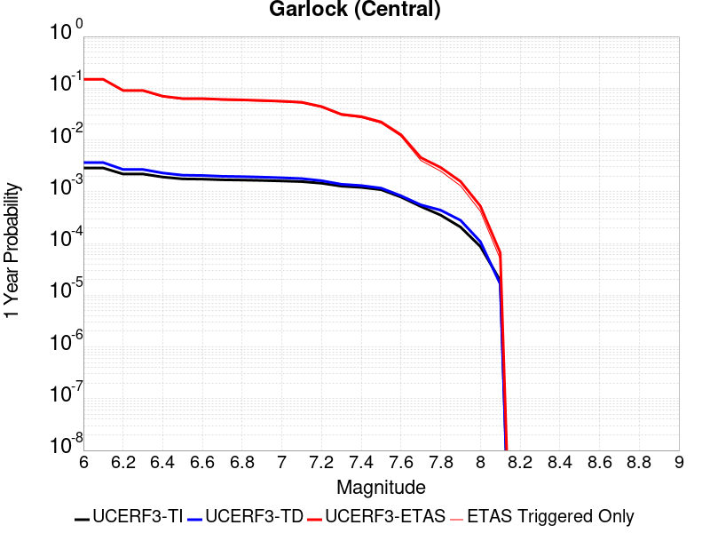 |  |

| Magnitude | 1 wk TI Prob | 1 wk TD Prob | 1 wk ETAS Prob | 1 wk ETAS/TD Gain | 1 wk ETAS Triggered Only | 1 mo TI Prob | 1 mo TD Prob | 1 mo ETAS Prob | 1 mo ETAS/TD Gain | 1 mo ETAS Triggered Only | 1 yr TI Prob | 1 yr TD Prob | 1 yr ETAS Prob | 1 yr ETAS/TD Gain | 1 yr ETAS Triggered Only | 10 yr TI Prob | 10 yr TD Prob | 10 yr ETAS Prob | 10 yr ETAS/TD Gain | 10 yr ETAS Triggered Only |
|-----|-----|-----|-----|-----|-----|-----|-----|-----|-----|-----|-----|-----|-----|-----|-----|-----|-----|-----|-----|-----|
| 6.0 | 5.5131142E-5 | 7.024681E-5 | 0.12504621 | 1780.0979 | 0.124984734 | 2.3625491E-4 | 3.010234E-4 | 0.13356632 | 443.70746 | 0.13330543 | 0.0028726095 | 0.0036588663 | 0.14711308 | 40.207287 | 0.14398102 | 0.028357591 | 0.036079824 | 0.18155818 | 5.0321245 | 0.15092365 |
| 6.1 | 5.5131142E-5 | 7.024681E-5 | 0.12504621 | 1780.0979 | 0.124984734 | 2.3625491E-4 | 3.010234E-4 | 0.13356632 | 443.70746 | 0.13330543 | 0.0028726095 | 0.0036588663 | 0.14711308 | 40.207287 | 0.14398102 | 0.028357591 | 0.036079824 | 0.18155818 | 5.0321245 | 0.15092365 |
| 6.2 | 4.216245E-5 | 5.1661493E-5 | 0.07451534 | 1442.3768 | 0.074467525 | 1.806837E-4 | 2.2138779E-4 | 0.07969513 | 359.9798 | 0.07949134 | 0.0021976046 | 0.0026920962 | 0.088458456 | 32.858578 | 0.08599787 | 0.021759989 | 0.026689773 | 0.114297375 | 4.2824407 | 0.09000994 |
| 6.3 | 4.216245E-5 | 5.1661493E-5 | 0.07451534 | 1442.3768 | 0.074467525 | 1.806837E-4 | 2.2138779E-4 | 0.07969513 | 359.9798 | 0.07949134 | 0.0021976046 | 0.0026920962 | 0.088458456 | 32.858578 | 0.08599787 | 0.021759989 | 0.026689773 | 0.114297375 | 4.2824407 | 0.09000994 |
| 6.4 | 3.6858168E-5 | 4.411054E-5 | 0.056821134 | 1288.1532 | 0.056779526 | 1.5795401E-4 | 1.8903162E-4 | 0.060881935 | 322.07275 | 0.06070438 | 0.0019213937 | 0.002299056 | 0.067893535 | 29.53105 | 0.06574564 | 0.019048655 | 0.02284894 | 0.09010936 | 3.9436998 | 0.06883319 |
| 6.5 | 3.39199E-5 | 4.0018083E-5 | 0.05147969 | 1286.4106 | 0.05144173 | 1.453629E-4 | 1.7149492E-4 | 0.055127442 | 321.45233 | 0.054965373 | 0.0017683565 | 0.002085973 | 0.061584465 | 29.523138 | 0.059622865 | 0.017543508 | 0.020759864 | 0.08179262 | 3.9399402 | 0.06232665 |
| 6.6 | 3.3571985E-5 | 3.9472274E-5 | 0.051479172 | 1304.1857 | 0.05144173 | 1.4387199E-4 | 1.6915603E-4 | 0.055125233 | 325.8839 | 0.054965373 | 0.0017502342 | 0.0020575512 | 0.06155774 | 29.917963 | 0.059622865 | 0.017365133 | 0.020481179 | 0.08153131 | 3.9807918 | 0.06232665 |
| 6.7 | 3.2580007E-5 | 3.8088703E-5 | 0.04957656 | 1301.608 | 0.049540356 | 1.3962112E-4 | 1.632272E-4 | 0.053113922 | 325.3987 | 0.052959338 | 0.0016985617 | 0.0019855013 | 0.059296433 | 29.864716 | 0.057424948 | 0.016856372 | 0.019773813 | 0.07862808 | 3.9763741 | 0.060041517 |
| 6.8 | 3.2185937E-5 | 3.7515918E-5 | 0.04866897 | 1297.2885 | 0.048633277 | 1.3793244E-4 | 1.6077272E-4 | 0.052169785 | 324.494 | 0.052017376 | 0.0016780337 | 0.001955672 | 0.058206327 | 29.762825 | 0.056360878 | 0.016654192 | 0.019480614 | 0.07724073 | 3.9650047 | 0.05890767 |
| 6.9 | 3.165394E-5 | 3.6720503E-5 | 0.04722043 | 1285.9419 | 0.047185443 | 1.3565269E-4 | 1.5736422E-4 | 0.050579417 | 321.41626 | 0.05042999 | 0.0016503202 | 0.001914247 | 0.056478426 | 29.504251 | 0.05466883 | 0.01638118 | 0.019073246 | 0.07516336 | 3.9407742 | 0.057180736 |
| 7.0 | 3.0903822E-5 | 3.5625766E-5 | 0.045823935 | 1286.2583 | 0.045789942 | 1.3243823E-4 | 1.5267303E-4 | 0.049040142 | 321.21027 | 0.048894934 | 0.0016112428 | 0.0018572307 | 0.054770447 | 29.490383 | 0.05301167 | 0.015996104 | 0.018512413 | 0.072922505 | 3.939114 | 0.055436358 |
| 7.1 | 3.0069863E-5 | 3.4392073E-5 | 0.04369469 | 1270.4873 | 0.0436618 | 1.2886449E-4 | 1.4738638E-4 | 0.04668055 | 316.7223 | 0.046540026 | 0.0015677959 | 0.0017929734 | 0.05209772 | 29.056604 | 0.0503951 | 0.01556781 | 0.017880075 | 0.06954986 | 3.8897967 | 0.052610464 |
| 7.2 | 2.7957109E-5 | 3.128145E-5 | 0.035946917 | 1149.1447 | 0.035916757 | 1.1981068E-4 | 1.340566E-4 | 0.03831339 | 285.8001 | 0.03818445 | 0.0014577188 | 0.0016309366 | 0.042765964 | 26.22172 | 0.041202225 | 0.014481937 | 0.016283695 | 0.058685407 | 3.603937 | 0.043103598 |
| 7.3 | 2.4519275E-5 | 2.6714795E-5 | 0.02505788 | 937.97766 | 0.025031835 | 1.0507837E-4 | 1.1448703E-4 | 0.0267481 | 233.63432 | 0.026636664 | 0.0012785783 | 0.001393003 | 0.030152578 | 21.645737 | 0.028799692 | 0.012712469 | 0.013928054 | 0.043616686 | 3.1315708 | 0.030107977 |
| 7.4 | 2.3225532E-5 | 2.51994E-5 | 0.022544561 | 894.6467 | 0.02251993 | 9.95342E-5 | 1.0799304E-4 | 0.023968518 | 221.94502 | 0.023863101 | 0.0012111551 | 0.0013140367 | 0.02714918 | 20.6609 | 0.025869137 | 0.012045753 | 0.013145725 | 0.03989702 | 3.0349805 | 0.027107645 |
| 7.5 | 2.097765E-5 | 2.2483688E-5 | 0.01783219 | 793.11676 | 0.017810106 | 8.9901114E-5 | 9.635517E-5 | 0.018968714 | 196.86244 | 0.018874178 | 0.0010939965 | 0.0011725046 | 0.021488113 | 18.326675 | 0.020339455 | 0.010886264 | 0.011740365 | 0.032875367 | 2.8001997 | 0.021386083 |
| 7.6 | 1.511254E-5 | 1.5991332E-5 | 0.009993678 | 624.9434 | 0.009977846 | 6.476642E-5 | 6.853253E-5 | 0.010621301 | 154.98189 | 0.010553491 | 7.882459E-4 | 8.3407195E-4 | 0.012163077 | 14.582767 | 0.011338462 | 0.007854558 | 0.008383559 | 0.02028427 | 2.41953 | 0.012001325 |
| 7.7 | 9.934069E-6 | 1.0678794E-5 | 0.0033598503 | 314.62827 | 0.003349207 | 4.2573887E-5 | 4.5765457E-5 | 0.0035866923 | 78.37117 | 0.003541089 | 5.182138E-4 | 5.570524E-4 | 0.004427416 | 7.947935 | 0.0038725208 | 0.00517007 | 0.005627684 | 0.009738595 | 1.7304802 | 0.0041341777 |
| 7.8 | 6.7562896E-6 | 8.428449E-6 | 0.0019272289 | 228.6576 | 0.0019188166 | 2.8955206E-5 | 3.6121426E-5 | 0.0020595277 | 57.01679 | 0.0020234794 | 3.5247262E-4 | 4.3968976E-4 | 0.0026366406 | 5.996593 | 0.0021979173 | 0.0035191406 | 0.004446654 | 0.0067389957 | 1.5155205 | 0.00230258 |
| 7.9 | 3.975453E-6 | 5.37103E-6 | 9.6477417E-4 | 179.62553 | 9.594083E-4 | 1.7037546E-5 | 2.3018498E-5 | 0.0010172914 | 44.19452 | 9.942959E-4 | 2.0741238E-4 | 2.8021427E-4 | 0.0013265483 | 4.7340493 | 0.0010466273 | 0.002072189 | 0.0028336283 | 0.0039642616 | 1.3990055 | 0.0011338462 |
| 8.0 | 1.6729537E-6 | 2.0775144E-6 | 2.1140253E-4 | 101.75743 | 2.0932544E-4 | 7.169782E-6 | 8.903603E-6 | 2.3567081E-4 | 26.469152 | 2.2676923E-4 | 8.7288594E-5 | 1.0839601E-4 | 3.7002444E-4 | 3.4136355 | 2.6165682E-4 | 8.7254314E-4 | 0.0010969337 | 0.0013757282 | 1.2541579 | 2.791006E-4 |
| 8.1 | 3.6733252E-7 | 3.1489964E-7 | 1.775868E-5 | 56.394733 | 1.7443788E-5 | 1.5742813E-6 | 1.3495693E-6 | 1.8793333E-5 | 13.92543 | 1.7443788E-5 | 1.9166706E-5 | 1.6430899E-5 | 3.38744E-5 | 2.0616279 | 1.7443788E-5 | 1.9165053E-4 | 1.6638759E-4 | 1.8382847E-4 | 1.1048208 | 1.7443788E-5 |

## Tank Canyon
*[(top)](#table-of-contents)*

| 1 Week | 1 Month | 1 Year | 10 Year |
|-----|-----|-----|-----|
|  |  |  |  |

| Magnitude | 1 wk TI Prob | 1 wk TD Prob | 1 wk ETAS Prob | 1 wk ETAS/TD Gain | 1 wk ETAS Triggered Only | 1 mo TI Prob | 1 mo TD Prob | 1 mo ETAS Prob | 1 mo ETAS/TD Gain | 1 mo ETAS Triggered Only | 1 yr TI Prob | 1 yr TD Prob | 1 yr ETAS Prob | 1 yr ETAS/TD Gain | 1 yr ETAS Triggered Only | 10 yr TI Prob | 10 yr TD Prob | 10 yr ETAS Prob | 10 yr ETAS/TD Gain | 10 yr ETAS Triggered Only |
|-----|-----|-----|-----|-----|-----|-----|-----|-----|-----|-----|-----|-----|-----|-----|-----|-----|-----|-----|-----|-----|
| 6.0 | 4.8284557E-5 | 5.7964822E-5 | 0.057060957 | 984.4066 | 0.057006296 | 2.0691741E-4 | 2.4840087E-4 | 0.062053826 | 249.81325 | 0.061820783 | 0.0025163088 | 0.0030207601 | 0.070724286 | 23.412745 | 0.06790867 | 0.02488006 | 0.029863637 | 0.099619634 | 3.3358173 | 0.07190329 |
| 6.1 | 1.7796336E-5 | 2.0873314E-5 | 0.018214364 | 872.6148 | 0.01819387 | 7.626778E-5 | 8.945422E-5 | 0.020113131 | 224.84273 | 0.020025468 | 9.281647E-4 | 0.0010885983 | 0.023218092 | 21.32843 | 0.02215361 | 0.009242975 | 0.010836744 | 0.03437223 | 3.1718225 | 0.023793327 |
| 6.2 | 1.7796336E-5 | 2.0873314E-5 | 0.018214364 | 872.6148 | 0.01819387 | 7.626778E-5 | 8.945422E-5 | 0.020113131 | 224.84273 | 0.020025468 | 9.281647E-4 | 0.0010885983 | 0.023218092 | 21.32843 | 0.02215361 | 0.009242975 | 0.010836744 | 0.03437223 | 3.1718225 | 0.023793327 |
| 6.3 | 1.3515912E-5 | 1.5759564E-5 | 0.012627419 | 801.2543 | 0.012611859 | 5.792405E-5 | 6.753938E-5 | 0.014126282 | 209.15623 | 0.014059693 | 7.049971E-4 | 8.2200574E-4 | 0.016369075 | 19.913576 | 0.015559859 | 0.007027647 | 0.0081922645 | 0.024853015 | 3.0337174 | 0.016798368 |
| 6.4 | 1.0870146E-5 | 1.2618021E-5 | 0.009292596 | 736.4543 | 0.009280095 | 4.658551E-5 | 5.4076212E-5 | 0.010345355 | 191.31062 | 0.010291834 | 5.67031E-4 | 6.581969E-4 | 0.012024061 | 18.26818 | 0.011373349 | 0.005655863 | 0.0065644905 | 0.018781632 | 2.861095 | 0.01229787 |
| 6.5 | 7.964826E-6 | 9.196094E-6 | 0.006044691 | 657.31067 | 0.0060355505 | 3.4134522E-5 | 3.9411298E-5 | 0.0067375614 | 170.9551 | 0.006698414 | 4.1550855E-4 | 4.7973756E-4 | 0.007837485 | 16.337025 | 0.0073612784 | 0.0041473247 | 0.004788321 | 0.01272196 | 2.656873 | 0.007971811 |
| 6.6 | 6.6317E-6 | 7.6122988E-6 | 0.0045080753 | 592.2094 | 0.004500497 | 2.8421264E-5 | 3.2623782E-5 | 0.005056271 | 154.98726 | 0.0050238105 | 3.4597394E-4 | 3.9713128E-4 | 0.005889742 | 14.830718 | 0.005494793 | 0.0034543579 | 0.003965368 | 0.009924862 | 2.5028853 | 0.005983219 |
| 6.7 | 4.793663E-6 | 5.4307857E-6 | 0.002430104 | 447.46823 | 0.0024246864 | 2.0544108E-5 | 2.3274613E-5 | 0.002744442 | 117.915695 | 0.0027212307 | 2.500958E-4 | 2.8333595E-4 | 0.0032653785 | 11.524759 | 0.0029828877 | 0.0024981452 | 0.0028304397 | 0.006083195 | 2.149205 | 0.0032619883 |
| 6.8 | 4.382823E-6 | 4.9692567E-6 | 0.0022028754 | 443.3008 | 0.0021979173 | 1.8783392E-5 | 2.1296666E-5 | 0.0024982616 | 117.30765 | 0.0024770177 | 2.286638E-4 | 2.5926033E-4 | 0.0029623464 | 11.4261465 | 0.002703787 | 0.0022842865 | 0.002590253 | 0.005565414 | 2.1485987 | 0.0029828877 |
| 6.9 | 2.729601E-6 | 3.0735416E-6 | 0.00101481 | 330.17612 | 0.0010117397 | 1.1698237E-5 | 1.3172262E-5 | 0.0012167777 | 92.374245 | 0.0012036214 | 1.4241673E-4 | 1.6036171E-4 | 0.001433554 | 8.939503 | 0.0012733964 | 0.001423255 | 0.0016026258 | 0.0029784765 | 1.8584977 | 0.0013780592 |
| 7.0 | 1.8987357E-6 | 2.126939E-6 | 5.2543945E-4 | 247.0402 | 5.2331365E-4 | 8.137413E-6 | 9.115425E-6 | 6.5452966E-4 | 71.80463 | 6.454201E-4 | 9.90685E-5 | 1.1097535E-4 | 7.737657E-4 | 6.9724107 | 6.628639E-4 | 9.902435E-4 | 0.0011092679 | 0.0018062454 | 1.628322 | 6.977515E-4 |
| 7.1 | 1.4928986E-6 | 1.6641272E-6 | 2.9820803E-4 | 179.19785 | 2.965444E-4 | 6.398121E-6 | 7.1319573E-6 | 3.734489E-4 | 52.362747 | 3.6631952E-4 | 7.789434E-5 | 8.682871E-5 | 4.705587E-4 | 5.4193907 | 3.837633E-4 | 7.786704E-4 | 8.6800574E-4 | 0.0012688646 | 1.461816 | 4.012071E-4 |
| 7.2 | 1.069082E-6 | 1.1828573E-6 | 1.7562053E-4 | 148.47144 | 1.7443787E-4 | 4.581772E-6 | 5.0693816E-6 | 1.9695007E-4 | 38.850906 | 1.9188166E-4 | 5.5781646E-5 | 6.171851E-5 | 2.7103102E-4 | 4.3914065 | 2.0932544E-4 | 5.576765E-4 | 6.170659E-4 | 8.436952E-4 | 1.3672692 | 2.2676923E-4 |
| 7.3 | 8.776551E-7 | 9.770005E-7 | 1.0563962E-4 | 108.12648 | 1.0466272E-4 | 3.7613736E-6 | 4.1871413E-6 | 1.08849425E-4 | 25.99612 | 1.0466272E-4 | 4.579376E-5 | 5.097777E-5 | 1.5563516E-4 | 3.0530005 | 1.0466272E-4 | 4.5784327E-4 | 5.097118E-4 | 6.3175603E-4 | 1.2394378 | 1.2210652E-4 |
| 7.4 | 7.55721E-7 | 8.510244E-7 | 7.062611E-5 | 82.989525 | 6.977515E-5 | 3.2388E-6 | 3.6472454E-6 | 7.342214E-5 | 20.130848 | 6.977515E-5 | 3.9431678E-5 | 4.4404827E-5 | 1.1417688E-4 | 2.571272 | 6.977515E-5 | 3.942468E-4 | 4.440104E-4 | 5.311906E-4 | 1.1963472 | 8.7218934E-5 |
| 7.5 | 5.587665E-7 | 6.305619E-7 | 5.2961892E-5 | 83.991585 | 5.233136E-5 | 2.3947114E-6 | 2.702408E-6 | 5.503363E-5 | 20.364662 | 5.233136E-5 | 2.915522E-5 | 3.290182E-5 | 8.523146E-5 | 2.5904787 | 5.233136E-5 | 2.9151395E-4 | 3.290182E-4 | 3.9877038E-4 | 1.212001 | 6.977515E-5 |

## Little Lake
*[(top)](#table-of-contents)*

| 1 Week | 1 Month | 1 Year | 10 Year |
|-----|-----|-----|-----|
|  |  | 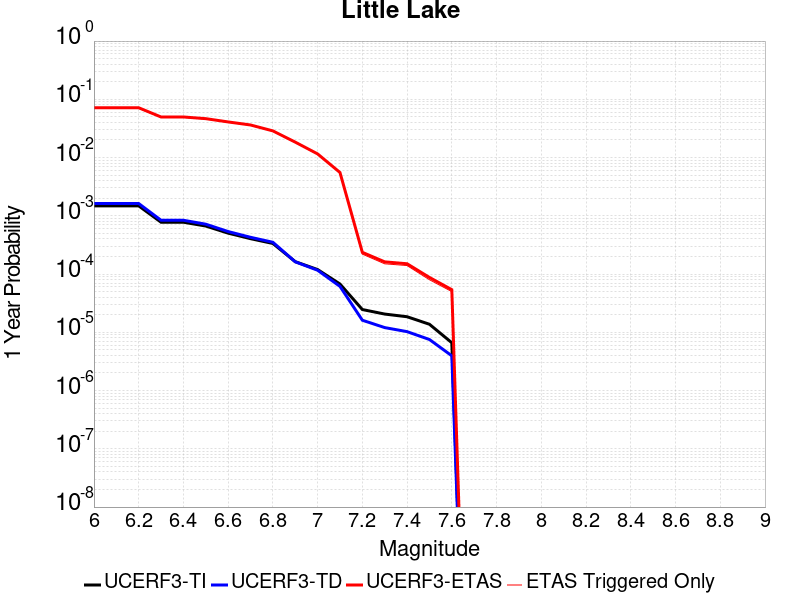 |  |

| Magnitude | 1 wk TI Prob | 1 wk TD Prob | 1 wk ETAS Prob | 1 wk ETAS/TD Gain | 1 wk ETAS Triggered Only | 1 mo TI Prob | 1 mo TD Prob | 1 mo ETAS Prob | 1 mo ETAS/TD Gain | 1 mo ETAS Triggered Only | 1 yr TI Prob | 1 yr TD Prob | 1 yr ETAS Prob | 1 yr ETAS/TD Gain | 1 yr ETAS Triggered Only | 10 yr TI Prob | 10 yr TD Prob | 10 yr ETAS Prob | 10 yr ETAS/TD Gain | 10 yr ETAS Triggered Only |
|-----|-----|-----|-----|-----|-----|-----|-----|-----|-----|-----|-----|-----|-----|-----|-----|-----|-----|-----|-----|-----|
| 6.0 | 2.8424427E-5 | 3.120572E-5 | 0.06024528 | 1930.5845 | 0.060215954 | 1.2181328E-4 | 1.337327E-4 | 0.06424852 | 480.4249 | 0.06412336 | 0.0014820677 | 0.0016271127 | 0.070661776 | 43.427708 | 0.06914717 | 0.014722223 | 0.016165402 | 0.087678626 | 5.423845 | 0.07268826 |
| 6.1 | 2.8424427E-5 | 3.120572E-5 | 0.06024528 | 1930.5845 | 0.060215954 | 1.2181328E-4 | 1.337327E-4 | 0.06424852 | 480.4249 | 0.06412336 | 0.0014820677 | 0.0016271127 | 0.070661776 | 43.427708 | 0.06914717 | 0.014722223 | 0.016165402 | 0.087678626 | 5.423845 | 0.07268826 |
| 6.2 | 2.8424427E-5 | 3.120572E-5 | 0.06024528 | 1930.5845 | 0.060215954 | 1.2181328E-4 | 1.337327E-4 | 0.06424852 | 480.4249 | 0.06412336 | 0.0014820677 | 0.0016271127 | 0.070661776 | 43.427708 | 0.06914717 | 0.014722223 | 0.016165402 | 0.087678626 | 5.423845 | 0.07268826 |
| 6.3 | 1.48860645E-5 | 1.6081389E-5 | 0.04259568 | 2648.7563 | 0.042580284 | 6.379586E-5 | 6.8918576E-5 | 0.04548941 | 660.04565 | 0.045423623 | 7.7643775E-4 | 8.3878887E-4 | 0.04951842 | 59.035618 | 0.048720498 | 0.007737305 | 0.008359048 | 0.058921024 | 7.0487723 | 0.05098819 |
| 6.4 | 1.48860645E-5 | 1.6081389E-5 | 0.04259568 | 2648.7563 | 0.042580284 | 6.379586E-5 | 6.8918576E-5 | 0.04548941 | 660.04565 | 0.045423623 | 7.7643775E-4 | 8.3878887E-4 | 0.04951842 | 59.035618 | 0.048720498 | 0.007737305 | 0.008359048 | 0.058921024 | 7.0487723 | 0.05098819 |
| 6.5 | 1.2797581E-5 | 1.3765565E-5 | 0.039802495 | 2891.4539 | 0.039789278 | 5.4845623E-5 | 5.899409E-5 | 0.042514667 | 720.6598 | 0.04245818 | 6.675408E-4 | 7.18042E-4 | 0.04631822 | 64.50629 | 0.045632947 | 0.006655392 | 0.00715977 | 0.054492306 | 7.610902 | 0.04767387 |
| 6.6 | 9.661896E-6 | 1.0289038E-5 | 0.034705624 | 3373.068 | 0.034695692 | 4.1407468E-5 | 4.409522E-5 | 0.037110507 | 841.5993 | 0.037068047 | 5.040193E-4 | 5.367433E-4 | 0.04044414 | 75.35099 | 0.03992883 | 0.005028777 | 0.0053560743 | 0.04685813 | 8.748595 | 0.04172554 |
| 6.7 | 7.767871E-6 | 8.199687E-6 | 0.030517133 | 3721.744 | 0.030509185 | 3.329045E-5 | 3.5141118E-5 | 0.032618992 | 928.2286 | 0.032584995 | 4.0523586E-4 | 4.2777284E-4 | 0.035544533 | 83.09207 | 0.035131786 | 0.004044977 | 0.004270846 | 0.04079846 | 9.552781 | 0.036684286 |
| 6.8 | 6.4235196E-6 | 6.7357446E-6 | 0.023904564 | 3548.9119 | 0.023897989 | 2.752908E-5 | 2.8867229E-5 | 0.025600722 | 886.84375 | 0.025572592 | 3.35115E-4 | 3.5141467E-4 | 0.027833162 | 79.20319 | 0.02749141 | 0.003346101 | 0.00350985 | 0.032017253 | 9.122114 | 0.028607812 |
| 6.9 | 3.1283696E-6 | 3.1121804E-6 | 0.015318709 | 4922.179 | 0.015315645 | 1.3407229E-5 | 1.3337856E-5 | 0.01646261 | 1234.277 | 0.016449492 | 1.6322079E-4 | 1.6237781E-4 | 0.017952152 | 110.557915 | 0.017792663 | 0.0016310095 | 0.00162274 | 0.020187642 | 12.440467 | 0.018595077 |
| 7.0 | 2.290603E-6 | 2.2286815E-6 | 0.009718397 | 4360.6035 | 0.0097161895 | 9.816834E-6 | 9.551463E-6 | 0.010336175 | 1082.1561 | 0.010326722 | 1.19513395E-4 | 1.162839E-4 | 0.0112615675 | 96.84546 | 0.01114658 | 0.0011944914 | 0.0011623327 | 0.012853509 | 11.058373 | 0.011704781 |
| 7.1 | 1.293693E-6 | 1.1776827E-6 | 0.004222569 | 3585.4895 | 0.0042213965 | 5.5443866E-6 | 5.0472063E-6 | 0.0045578526 | 903.0447 | 0.0045528286 | 6.750081E-5 | 6.14487E-5 | 0.0049977372 | 81.33186 | 0.0049365917 | 6.7480316E-4 | 6.143856E-4 | 0.0057920073 | 9.427317 | 0.005180805 |
| 7.2 | 4.715842E-7 | 3.0917857E-7 | 1.3985943E-4 | 452.35812 | 1.395503E-4 | 2.0210737E-6 | 1.3250503E-6 | 1.7576269E-4 | 132.64604 | 1.7443787E-4 | 2.4606294E-5 | 1.6132375E-5 | 1.9056743E-4 | 11.812733 | 1.7443787E-4 | 2.460357E-4 | 1.6131258E-4 | 3.5316328E-4 | 2.1893103 | 1.9188166E-4 |
| 7.3 | 3.9430947E-7 | 2.3097488E-7 | 8.7449895E-5 | 378.61215 | 8.7218934E-5 | 1.6898966E-6 | 9.89892E-7 | 1.05652514E-4 | 106.73136 | 1.0466272E-4 | 2.0574296E-5 | 1.2051869E-5 | 1.1671333E-4 | 9.684252 | 1.0466272E-4 | 2.0572392E-4 | 1.20512224E-4 | 2.4260402E-4 | 2.013107 | 1.2210652E-4 |
| 7.4 | 3.547123E-7 | 1.9679135E-7 | 8.741571E-5 | 444.20505 | 8.7218934E-5 | 1.5201948E-6 | 8.4339126E-7 | 1.0550603E-4 | 125.097374 | 1.0466272E-4 | 1.8508214E-5 | 1.0268241E-5 | 1.1492989E-4 | 11.192754 | 1.0466272E-4 | 1.8506673E-4 | 1.02677724E-4 | 2.247717E-4 | 2.1890988 | 1.2210652E-4 |
| 7.5 | 2.6354266E-7 | 1.4423138E-7 | 5.2475585E-5 | 363.8292 | 5.233136E-5 | 1.129468E-6 | 6.181344E-7 | 7.039324E-5 | 113.880165 | 6.977515E-5 | 1.3751187E-5 | 7.5257603E-6 | 7.7300385E-5 | 10.271439 | 6.977515E-5 | 1.3750336E-4 | 7.5255106E-5 | 1.4502501E-4 | 1.9271119 | 6.977515E-5 |
| 7.6 | 1.269913E-7 | 7.572556E-8 | 1.7519511E-5 | 231.35532 | 1.7443788E-5 | 5.4424834E-7 | 3.245381E-7 | 3.5212102E-5 | 108.49914 | 3.4887576E-5 | 6.6262032E-6 | 3.9512443E-6 | 3.883868E-5 | 9.829481 | 3.4887576E-5 | 6.626006E-5 | 3.9511775E-5 | 7.4397976E-5 | 1.8829316 | 3.4887576E-5 |

## Airport Lake
*[(top)](#table-of-contents)*

| 1 Week | 1 Month | 1 Year | 10 Year |
|-----|-----|-----|-----|
|  |  |  |  |

| Magnitude | 1 wk TI Prob | 1 wk TD Prob | 1 wk ETAS Prob | 1 wk ETAS/TD Gain | 1 wk ETAS Triggered Only | 1 mo TI Prob | 1 mo TD Prob | 1 mo ETAS Prob | 1 mo ETAS/TD Gain | 1 mo ETAS Triggered Only | 1 yr TI Prob | 1 yr TD Prob | 1 yr ETAS Prob | 1 yr ETAS/TD Gain | 1 yr ETAS Triggered Only | 10 yr TI Prob | 10 yr TD Prob | 10 yr ETAS Prob | 10 yr ETAS/TD Gain | 10 yr ETAS Triggered Only |
|-----|-----|-----|-----|-----|-----|-----|-----|-----|-----|-----|-----|-----|-----|-----|-----|-----|-----|-----|-----|-----|
| 6.0 | 1.2387061E-5 | 1.3103157E-5 | 0.057472184 | 4386.133 | 0.057459835 | 5.3086325E-5 | 5.615534E-5 | 0.061437394 | 1094.0615 | 0.06138469 | 6.461343E-4 | 6.8350515E-4 | 0.06687229 | 97.83729 | 0.06623406 | 0.0064425888 | 0.0068168393 | 0.07578717 | 11.1176405 | 0.06944372 |
| 6.1 | 1.2387061E-5 | 1.3103157E-5 | 0.057472184 | 4386.133 | 0.057459835 | 5.3086325E-5 | 5.615534E-5 | 0.061437394 | 1094.0615 | 0.06138469 | 6.461343E-4 | 6.8350515E-4 | 0.06687229 | 97.83729 | 0.06623406 | 0.0064425888 | 0.0068168393 | 0.07578717 | 11.1176405 | 0.06944372 |
| 6.2 | 1.2387061E-5 | 1.3103157E-5 | 0.057472184 | 4386.133 | 0.057459835 | 5.3086325E-5 | 5.615534E-5 | 0.061437394 | 1094.0615 | 0.06138469 | 6.461343E-4 | 6.8350515E-4 | 0.06687229 | 97.83729 | 0.06623406 | 0.0064425888 | 0.0068168393 | 0.07578717 | 11.1176405 | 0.06944372 |
| 6.3 | 1.2387061E-5 | 1.3103157E-5 | 0.057472184 | 4386.133 | 0.057459835 | 5.3086325E-5 | 5.615534E-5 | 0.061437394 | 1094.0615 | 0.06138469 | 6.461343E-4 | 6.8350515E-4 | 0.06687229 | 97.83729 | 0.06623406 | 0.0064425888 | 0.0068168393 | 0.07578717 | 11.1176405 | 0.06944372 |
| 6.4 | 1.2387061E-5 | 1.3103157E-5 | 0.057472184 | 4386.133 | 0.057459835 | 5.3086325E-5 | 5.615534E-5 | 0.061437394 | 1094.0615 | 0.06138469 | 6.461343E-4 | 6.8350515E-4 | 0.06687229 | 97.83729 | 0.06623406 | 0.0064425888 | 0.0068168393 | 0.07578717 | 11.1176405 | 0.06944372 |
| 6.5 | 6.9922594E-6 | 7.384925E-6 | 0.04370375 | 5917.968 | 0.043696687 | 2.996648E-5 | 3.1649324E-5 | 0.04667486 | 1474.7505 | 0.046644688 | 3.6478083E-4 | 3.8526783E-4 | 0.050673768 | 131.52867 | 0.05030788 | 0.003641826 | 0.0038465366 | 0.05641102 | 14.665406 | 0.052767456 |
| 6.6 | 6.9922594E-6 | 7.384925E-6 | 0.04370375 | 5917.968 | 0.043696687 | 2.996648E-5 | 3.1649324E-5 | 0.04667486 | 1474.7505 | 0.046644688 | 3.6478083E-4 | 3.8526783E-4 | 0.050673768 | 131.52867 | 0.05030788 | 0.003641826 | 0.0038465366 | 0.05641102 | 14.665406 | 0.052767456 |
| 6.7 | 5.477277E-6 | 5.7860684E-6 | 0.037091065 | 6410.4087 | 0.037085492 | 2.3473833E-5 | 2.4797222E-5 | 0.039499108 | 1592.8844 | 0.039475292 | 2.8575645E-4 | 3.0186825E-4 | 0.042939052 | 142.24435 | 0.04265006 | 0.0028538927 | 0.003014966 | 0.047588598 | 15.784125 | 0.044708427 |
| 6.8 | 3.9950432E-6 | 4.2190873E-6 | 0.028350255 | 6719.5234 | 0.028346155 | 1.7121502E-5 | 1.8081691E-5 | 0.030212732 | 1670.9019 | 0.030195195 | 2.0843433E-4 | 2.2012512E-4 | 0.032623548 | 148.20457 | 0.03241056 | 0.0020823893 | 0.0021993418 | 0.036105104 | 16.416323 | 0.033980496 |
| 6.9 | 2.95695E-6 | 3.1230243E-6 | 0.020656502 | 6614.2627 | 0.020653443 | 1.2672582E-5 | 1.3384334E-5 | 0.021992262 | 1643.1346 | 0.021979172 | 1.5427776E-4 | 1.6294434E-4 | 0.023830308 | 146.24814 | 0.02367122 | 0.001541707 | 0.0016284712 | 0.026462805 | 16.250092 | 0.02487484 |
| 7.0 | 1.456072E-6 | 1.540812E-6 | 0.009299065 | 6035.172 | 0.009297539 | 6.2402937E-6 | 6.603469E-6 | 0.009844835 | 1490.858 | 0.009838296 | 7.597293E-5 | 8.039528E-5 | 0.01072025 | 133.34428 | 0.010640711 | 7.594696E-4 | 8.0376083E-4 | 0.011976241 | 14.900255 | 0.011181468 |
| 7.1 | 6.995192E-7 | 7.4089746E-7 | 0.0039953655 | 5392.6025 | 0.0039946274 | 2.997936E-6 | 3.1752747E-6 | 0.0042594457 | 1341.4417 | 0.0042562843 | 3.649926E-5 | 3.865897E-5 | 0.004661084 | 120.569275 | 0.0046226038 | 3.6493264E-4 | 3.865897E-4 | 0.005234088 | 13.539129 | 0.004849373 |

## Owl Lake
*[(top)](#table-of-contents)*

| 1 Week | 1 Month | 1 Year | 10 Year |
|-----|-----|-----|-----|
|  |  |  |  |

| Magnitude | 1 wk TI Prob | 1 wk TD Prob | 1 wk ETAS Prob | 1 wk ETAS/TD Gain | 1 wk ETAS Triggered Only | 1 mo TI Prob | 1 mo TD Prob | 1 mo ETAS Prob | 1 mo ETAS/TD Gain | 1 mo ETAS Triggered Only | 1 yr TI Prob | 1 yr TD Prob | 1 yr ETAS Prob | 1 yr ETAS/TD Gain | 1 yr ETAS Triggered Only | 10 yr TI Prob | 10 yr TD Prob | 10 yr ETAS Prob | 10 yr ETAS/TD Gain | 10 yr ETAS Triggered Only |
|-----|-----|-----|-----|-----|-----|-----|-----|-----|-----|-----|-----|-----|-----|-----|-----|-----|-----|-----|-----|-----|
| 6.0 | 5.0320643E-5 | 6.635816E-5 | 0.023858106 | 359.5354 | 0.023793327 | 2.1564208E-4 | 2.843674E-4 | 0.026250781 | 92.31291 | 0.025973799 | 0.0026222812 | 0.0034577388 | 0.031827565 | 9.204734 | 0.02846826 | 0.02591553 | 0.034140717 | 0.06335557 | 1.8557189 | 0.030247528 |
| 6.1 | 5.0320643E-5 | 6.635816E-5 | 0.023858106 | 359.5354 | 0.023793327 | 2.1564208E-4 | 2.843674E-4 | 0.026250781 | 92.31291 | 0.025973799 | 0.0026222812 | 0.0034577388 | 0.031827565 | 9.204734 | 0.02846826 | 0.02591553 | 0.034140717 | 0.06335557 | 1.8557189 | 0.030247528 |
| 6.2 | 2.4125871E-5 | 3.0981035E-5 | 0.020526797 | 662.56006 | 0.02049645 | 1.0339249E-4 | 1.3277028E-4 | 0.022440413 | 169.01683 | 0.022310603 | 0.0012580766 | 0.001615439 | 0.025892796 | 16.028336 | 0.024316639 | 0.012509781 | 0.016070465 | 0.041335072 | 2.5721145 | 0.025677254 |
| 6.3 | 1.7433485E-5 | 2.2355514E-5 | 0.019192649 | 858.5197 | 0.019170722 | 7.471279E-5 | 9.580672E-5 | 0.020869367 | 217.8278 | 0.020775551 | 9.0924866E-4 | 0.0011659743 | 0.02372934 | 20.351511 | 0.022589704 | 0.009055373 | 0.011628896 | 0.03511105 | 3.0192935 | 0.02375844 |
| 6.4 | 1.7433485E-5 | 2.2355514E-5 | 0.019192649 | 858.5197 | 0.019170722 | 7.471279E-5 | 9.580672E-5 | 0.020869367 | 217.8278 | 0.020775551 | 9.0924866E-4 | 0.0011659743 | 0.02372934 | 20.351511 | 0.022589704 | 0.009055373 | 0.011628896 | 0.03511105 | 3.0192935 | 0.02375844 |
| 6.5 | 1.5182742E-5 | 1.9429144E-5 | 0.01889324 | 972.4175 | 0.018874178 | 6.506727E-5 | 8.326596E-5 | 0.020525683 | 246.50749 | 0.02044412 | 7.919061E-4 | 0.0010134429 | 0.02319688 | 22.889183 | 0.022205941 | 0.0078909 | 0.010118429 | 0.033222053 | 3.2833216 | 0.023339787 |
| 6.6 | 6.7271576E-6 | 8.547361E-6 | 0.017085869 | 1998.9642 | 0.017077468 | 2.8830356E-5 | 3.6631063E-5 | 0.018404266 | 502.42236 | 0.018368308 | 3.5095305E-4 | 4.458976E-4 | 0.02035782 | 45.65582 | 0.019920805 | 0.0035039932 | 0.004467813 | 0.025289468 | 5.6603694 | 0.0209151 |
| 6.7 | 6.682835E-6 | 8.479807E-6 | 0.017085804 | 2014.8811 | 0.017077468 | 2.8640408E-5 | 3.6341557E-5 | 0.018403983 | 506.41702 | 0.018368308 | 3.4864116E-4 | 4.4237426E-4 | 0.020336932 | 45.97223 | 0.019903362 | 0.003480947 | 0.0044327388 | 0.025237763 | 5.693492 | 0.020897657 |
| 6.8 | 6.5774975E-6 | 8.32628E-6 | 0.017085653 | 2052.015 | 0.017077468 | 2.8188972E-5 | 3.5683603E-5 | 0.018403336 | 515.7365 | 0.018368308 | 3.4314668E-4 | 4.343669E-4 | 0.020329082 | 46.80164 | 0.019903362 | 0.0034261728 | 0.004352885 | 0.025159577 | 5.779978 | 0.020897657 |
| 6.9 | 6.363419E-6 | 7.999454E-6 | 0.017050443 | 2131.4507 | 0.017042581 | 2.727151E-5 | 3.428296E-5 | 0.018367074 | 535.74945 | 0.01833342 | 3.3198006E-4 | 4.1732067E-4 | 0.020277504 | 48.58974 | 0.019868474 | 0.0033148455 | 0.0041828766 | 0.02495838 | 5.966798 | 0.02086277 |
| 7.0 | 6.1342453E-6 | 7.6316555E-6 | 0.016927976 | 2218.1265 | 0.016920473 | 2.6289357E-5 | 3.2706717E-5 | 0.01820854 | 556.7217 | 0.018176427 | 3.2002592E-4 | 3.9813702E-4 | 0.020101769 | 50.489574 | 0.01971148 | 0.0031956544 | 0.003991571 | 0.02457995 | 6.157964 | 0.020670889 |
| 7.1 | 5.842926E-6 | 7.142211E-6 | 0.016055312 | 2247.947 | 0.016048284 | 2.504087E-5 | 3.0609146E-5 | 0.01719477 | 561.7527 | 0.017164687 | 3.0482994E-4 | 3.7260808E-4 | 0.018995631 | 50.980194 | 0.018629964 | 0.0030441214 | 0.0037370329 | 0.02313155 | 6.189817 | 0.019467266 |
| 7.2 | 4.77173E-6 | 5.358483E-6 | 0.009965708 | 1859.8 | 0.009960403 | 2.045011E-5 | 2.2964748E-5 | 0.010628544 | 462.81995 | 0.010605822 | 2.4895166E-4 | 2.79564E-4 | 0.01170205 | 41.858215 | 0.0114256805 | 0.0024867293 | 0.002808645 | 0.014811053 | 5.2733803 | 0.012036214 |
| 7.3 | 3.0494948E-6 | 2.710463E-6 | 0.002584384 | 953.4844 | 0.0025816804 | 1.3069198E-5 | 1.1616219E-5 | 0.0027851462 | 239.76358 | 0.0027735622 | 1.5910587E-4 | 1.4141845E-4 | 0.0031936495 | 22.582977 | 0.0030526628 | 0.0015899199 | 0.0014232415 | 0.004645749 | 3.264203 | 0.0032271007 |
| 7.4 | 2.7263884E-6 | 2.3056762E-6 | 0.0017466804 | 757.55664 | 0.0017443787 | 1.1684469E-5 | 9.881433E-6 | 0.001841461 | 186.35567 | 0.0018315976 | 1.4224913E-4 | 1.20299905E-4 | 0.0021609776 | 17.963251 | 0.002040923 | 0.0014215811 | 0.0012112238 | 0.0034064788 | 2.8124273 | 0.0021979173 |
| 7.5 | 2.6090431E-6 | 2.1656133E-6 | 0.0014674406 | 677.60974 | 0.0014652781 | 1.1181565E-5 | 9.281167E-6 | 0.0015443203 | 166.39288 | 0.0015350532 | 1.3612706E-4 | 1.1299244E-4 | 0.0018222905 | 16.127542 | 0.0017094911 | 0.001360437 | 0.0011379806 | 0.0030023418 | 2.6383066 | 0.0018664852 |
| 7.6 | 2.3008756E-6 | 1.8727933E-6 | 9.612793E-4 | 513.2864 | 9.594083E-4 | 9.860858E-6 | 8.0262325E-6 | 0.0010197578 | 127.0531 | 0.0010117397 | 1.20049335E-4 | 9.7715085E-5 | 0.0012488925 | 12.780959 | 0.00115129 | 0.001199845 | 9.849932E-4 | 0.002274562 | 2.309216 | 0.0012908402 |
| 7.7 | 1.7184348E-6 | 1.3419171E-6 | 7.5142377E-4 | 559.9629 | 7.5008284E-4 | 7.3646997E-6 | 5.7510606E-6 | 7.9071696E-4 | 137.49063 | 7.849704E-4 | 8.966153E-5 | 7.0016955E-5 | 9.770304E-4 | 13.954197 | 9.0707693E-4 | 8.962536E-4 | 7.078345E-4 | 0.0017014266 | 2.4037068 | 9.942959E-4 |
| 7.8 | 8.4612907E-7 | 8.4058576E-7 | 2.2760963E-4 | 270.77502 | 2.2676923E-4 | 3.6262625E-6 | 3.6025056E-6 | 2.3037092E-4 | 63.94742 | 2.2676923E-4 | 4.4148852E-5 | 4.3859643E-5 | 3.22948E-4 | 7.3632154 | 2.791006E-4 | 4.414008E-4 | 4.4398365E-4 | 7.403964E-4 | 1.6676208 | 2.965444E-4 |
| 7.9 | 2.716738E-7 | 3.768106E-7 | 5.2708154E-5 | 139.87971 | 5.233136E-5 | 1.1643157E-6 | 1.6149015E-6 | 5.394618E-5 | 33.405243 | 5.233136E-5 | 1.4175452E-5 | 1.966126E-5 | 7.199159E-5 | 3.6615963 | 5.233136E-5 | 1.4174548E-4 | 1.9836679E-4 | 2.5068776E-4 | 1.2637588 | 5.233136E-5 |
| 8.0 | 2.1995428E-8 | 3.384878E-8 | 3.384878E-8 | 1.0 | 0.0 | 9.426611E-8 | 1.4506621E-7 | 1.4506621E-7 | 1.0 | 0.0 | 1.1476893E-6 | 1.7661803E-6 | 1.7661803E-6 | 1.0 | 0.0 | 1.14768345E-5 | 1.7963059E-5 | 1.7963059E-5 | 1.0 | 0.0 |

## Panamint Valley
*[(top)](#table-of-contents)*

| 1 Week | 1 Month | 1 Year | 10 Year |
|-----|-----|-----|-----|
|  |  |  |  |

| Magnitude | 1 wk TI Prob | 1 wk TD Prob | 1 wk ETAS Prob | 1 wk ETAS/TD Gain | 1 wk ETAS Triggered Only | 1 mo TI Prob | 1 mo TD Prob | 1 mo ETAS Prob | 1 mo ETAS/TD Gain | 1 mo ETAS Triggered Only | 1 yr TI Prob | 1 yr TD Prob | 1 yr ETAS Prob | 1 yr ETAS/TD Gain | 1 yr ETAS Triggered Only | 10 yr TI Prob | 10 yr TD Prob | 10 yr ETAS Prob | 10 yr ETAS/TD Gain | 10 yr ETAS Triggered Only |
|-----|-----|-----|-----|-----|-----|-----|-----|-----|-----|-----|-----|-----|-----|-----|-----|-----|-----|-----|-----|-----|
| 6.0 | 3.0211835E-5 | 3.3984514E-5 | 0.020145988 | 592.7991 | 0.020112688 | 1.2947287E-4 | 1.4563995E-4 | 0.021737903 | 149.25784 | 0.02159541 | 0.0015751923 | 0.0017717537 | 0.025296556 | 14.277694 | 0.023566557 | 0.015640736 | 0.017583137 | 0.04191778 | 2.383976 | 0.024770178 |
| 6.1 | 3.0211835E-5 | 3.3984514E-5 | 0.020145988 | 592.7991 | 0.020112688 | 1.2947287E-4 | 1.4563995E-4 | 0.021737903 | 149.25784 | 0.02159541 | 0.0015751923 | 0.0017717537 | 0.025296556 | 14.277694 | 0.023566557 | 0.015640736 | 0.017583137 | 0.04191778 | 2.383976 | 0.024770178 |
| 6.2 | 3.0211835E-5 | 3.3984514E-5 | 0.020145988 | 592.7991 | 0.020112688 | 1.2947287E-4 | 1.4563995E-4 | 0.021737903 | 149.25784 | 0.02159541 | 0.0015751923 | 0.0017717537 | 0.025296556 | 14.277694 | 0.023566557 | 0.015640736 | 0.017583137 | 0.04191778 | 2.383976 | 0.024770178 |
| 6.3 | 2.8573924E-5 | 3.210268E-5 | 0.01979528 | 616.6239 | 0.01976381 | 1.2245393E-4 | 1.3757581E-4 | 0.021363745 | 155.28706 | 0.02122909 | 0.001489857 | 0.0016737265 | 0.024782889 | 14.807013 | 0.023147905 | 0.01479908 | 0.016617801 | 0.040496044 | 2.4369075 | 0.024281751 |
| 6.4 | 2.8573924E-5 | 3.210268E-5 | 0.01979528 | 616.6239 | 0.01976381 | 1.2245393E-4 | 1.3757581E-4 | 0.021363745 | 155.28706 | 0.02122909 | 0.001489857 | 0.0016737265 | 0.024782889 | 14.807013 | 0.023147905 | 0.01479908 | 0.016617801 | 0.040496044 | 2.4369075 | 0.024281751 |
| 6.5 | 2.7468774E-5 | 3.0828433E-5 | 0.019549824 | 634.1492 | 0.019519597 | 1.1771801E-4 | 1.3211532E-4 | 0.021096777 | 159.68457 | 0.020967433 | 0.0014322745 | 0.0016073446 | 0.024421977 | 15.193989 | 0.022851361 | 0.014230782 | 0.015963677 | 0.039548825 | 2.477426 | 0.023967763 |
| 6.6 | 2.6135967E-5 | 2.925248E-5 | 0.019059869 | 651.56415 | 0.019031173 | 1.1200648E-4 | 1.253619E-4 | 0.020549476 | 163.92123 | 0.020426676 | 0.0013628257 | 0.0015252391 | 0.023749562 | 15.571043 | 0.022258272 | 0.013544982 | 0.015154043 | 0.03814014 | 2.5168293 | 0.023339787 |
| 6.7 | 2.4498746E-5 | 2.7341335E-5 | 0.018464921 | 675.34814 | 0.018438084 | 1.04990395E-4 | 1.1717203E-4 | 0.019896109 | 169.80255 | 0.019781254 | 0.0012775084 | 0.0014256609 | 0.022938026 | 16.089397 | 0.021543078 | 0.012701893 | 0.014171274 | 0.036423657 | 2.5702457 | 0.02257226 |
| 6.8 | 2.2244329E-5 | 2.4935423E-5 | 0.017817155 | 714.53186 | 0.017792663 | 9.532935E-5 | 1.0686185E-4 | 0.019118559 | 178.9091 | 0.019013729 | 0.0011600169 | 0.0013002884 | 0.02197914 | 16.903282 | 0.020705776 | 0.011539802 | 0.0129325185 | 0.034334734 | 2.6549149 | 0.021682627 |
| 6.9 | 1.9902658E-5 | 2.2290267E-5 | 0.016471416 | 738.951 | 0.016449492 | 8.529431E-5 | 9.552632E-5 | 0.017677184 | 185.0504 | 0.017583339 | 0.0010379635 | 0.0011624309 | 0.020223752 | 17.39781 | 0.019083504 | 0.010331288 | 0.011568608 | 0.03120723 | 2.697579 | 0.019868474 |
| 7.0 | 1.8353881E-5 | 2.0566185E-5 | 0.015841756 | 770.2817 | 0.015821515 | 7.865712E-5 | 8.813792E-5 | 0.016972236 | 192.56451 | 0.016885586 | 9.5722964E-4 | 0.0010725686 | 0.0193689 | 18.058426 | 0.018315976 | 0.009531168 | 0.010678849 | 0.029489532 | 2.7614899 | 0.019013729 |
| 7.1 | 1.7667631E-5 | 1.9772613E-5 | 0.015317672 | 774.69135 | 0.015298202 | 7.571623E-5 | 8.473711E-5 | 0.016410738 | 193.66649 | 0.016327385 | 9.2145515E-4 | 0.0010312037 | 0.018753242 | 18.18578 | 0.017740332 | 0.009176437 | 0.010269073 | 0.02850055 | 2.775377 | 0.01842064 |
| 7.2 | 1.6381597E-5 | 1.8158249E-5 | 0.013728726 | 756.06 | 0.013710817 | 7.020495E-5 | 7.781885E-5 | 0.014642248 | 188.15811 | 0.014565563 | 8.544101E-4 | 9.4704994E-4 | 0.01677101 | 17.708685 | 0.015838958 | 0.008511325 | 0.009434792 | 0.025729086 | 2.7270432 | 0.016449492 |
| 7.3 | 1.4520491E-5 | 1.5966476E-5 | 0.0112147 | 702.3904 | 0.011198912 | 6.222919E-5 | 6.842605E-5 | 0.011981717 | 175.10463 | 0.011914107 | 7.57377E-4 | 8.327849E-4 | 0.0137304375 | 16.487375 | 0.012908403 | 0.0075480095 | 0.00829975 | 0.021654585 | 2.6090646 | 0.013466604 |
| 7.4 | 1.2852287E-5 | 1.4145411E-5 | 0.010864028 | 768.0249 | 0.010850036 | 5.5080065E-5 | 6.062187E-5 | 0.011607709 | 191.47725 | 0.011547787 | 6.7039346E-4 | 7.378371E-4 | 0.013270666 | 17.9859 | 0.012542083 | 0.0066837464 | 0.0073567946 | 0.020343387 | 2.7652516 | 0.0130828405 |
| 7.5 | 1.1637851E-5 | 1.2836797E-5 | 0.010688297 | 832.6296 | 0.010675598 | 4.987555E-5 | 5.5013777E-5 | 0.011427738 | 207.72502 | 0.011373349 | 6.070656E-4 | 6.6960254E-4 | 0.013028966 | 19.457762 | 0.012367645 | 0.006054099 | 0.0066787465 | 0.01948361 | 2.9172556 | 0.012890959 |
| 7.6 | 3.0068115E-6 | 3.3330316E-6 | 0.0048701335 | 1461.1724 | 0.0048668166 | 1.2886271E-5 | 1.4284384E-5 | 0.005177572 | 362.46378 | 0.005163361 | 1.5687906E-4 | 1.7390578E-4 | 0.0057026246 | 32.791462 | 0.0055296808 | 0.0015676835 | 0.0017391363 | 0.0075029884 | 4.3142037 | 0.0057738936 |

## Garlock (East)
*[(top)](#table-of-contents)*

| 1 Week | 1 Month | 1 Year | 10 Year |
|-----|-----|-----|-----|
|  |  |  |  |

| Magnitude | 1 wk TI Prob | 1 wk TD Prob | 1 wk ETAS Prob | 1 wk ETAS/TD Gain | 1 wk ETAS Triggered Only | 1 mo TI Prob | 1 mo TD Prob | 1 mo ETAS Prob | 1 mo ETAS/TD Gain | 1 mo ETAS Triggered Only | 1 yr TI Prob | 1 yr TD Prob | 1 yr ETAS Prob | 1 yr ETAS/TD Gain | 1 yr ETAS Triggered Only | 10 yr TI Prob | 10 yr TD Prob | 10 yr ETAS Prob | 10 yr ETAS/TD Gain | 10 yr ETAS Triggered Only |
|-----|-----|-----|-----|-----|-----|-----|-----|-----|-----|-----|-----|-----|-----|-----|-----|-----|-----|-----|-----|-----|
| 6.0 | 4.5092507E-5 | 6.290325E-5 | 0.015621783 | 248.34619 | 0.015559859 | 1.9323928E-4 | 2.6956003E-4 | 0.016923886 | 62.78337 | 0.016658816 | 0.0023501497 | 0.0032774 | 0.021550735 | 6.575558 | 0.01833342 | 0.023254504 | 0.032351844 | 0.051138673 | 1.5807034 | 0.019414935 |
| 6.1 | 4.5092507E-5 | 6.290325E-5 | 0.015621783 | 248.34619 | 0.015559859 | 1.9323928E-4 | 2.6956003E-4 | 0.016923886 | 62.78337 | 0.016658816 | 0.0023501497 | 0.0032774 | 0.021550735 | 6.575558 | 0.01833342 | 0.023254504 | 0.032351844 | 0.051138673 | 1.5807034 | 0.019414935 |
| 6.2 | 2.6674514E-5 | 3.4509674E-5 | 0.013361103 | 387.16977 | 0.013327054 | 1.1431433E-4 | 1.4789042E-4 | 0.014362475 | 97.11566 | 0.014216687 | 0.0013908884 | 0.0017991117 | 0.017226502 | 9.575004 | 0.015455196 | 0.01382215 | 0.017890299 | 0.03389132 | 1.8943964 | 0.016292498 |
| 6.3 | 2.6674514E-5 | 3.4509674E-5 | 0.013361103 | 387.16977 | 0.013327054 | 1.1431433E-4 | 1.4789042E-4 | 0.014362475 | 97.11566 | 0.014216687 | 0.0013908884 | 0.0017991117 | 0.017226502 | 9.575004 | 0.015455196 | 0.01382215 | 0.017890299 | 0.03389132 | 1.8943964 | 0.016292498 |
| 6.4 | 2.5312667E-5 | 3.233893E-5 | 0.013289189 | 410.9347 | 0.013257278 | 1.0847834E-4 | 1.3858822E-4 | 0.014266098 | 102.93875 | 0.014129468 | 0.0013199237 | 0.0016860351 | 0.0170281 | 10.099494 | 0.015367976 | 0.013121112 | 0.016778335 | 0.03271172 | 1.9496402 | 0.01620528 |
| 6.5 | 2.5312667E-5 | 3.233893E-5 | 0.013289189 | 410.9347 | 0.013257278 | 1.0847834E-4 | 1.3858822E-4 | 0.014266098 | 102.93875 | 0.014129468 | 0.0013199237 | 0.0016860351 | 0.0170281 | 10.099494 | 0.015367976 | 0.013121112 | 0.016778335 | 0.03271172 | 1.9496402 | 0.01620528 |
| 6.6 | 2.246556E-5 | 2.8133776E-5 | 0.012971059 | 461.04938 | 0.01294329 | 9.627742E-5 | 1.20567885E-4 | 0.013882057 | 115.13892 | 0.013763148 | 0.0011715472 | 0.0014669491 | 0.016376927 | 11.163937 | 0.014931882 | 0.011653901 | 0.01461866 | 0.030140132 | 2.0617573 | 0.01575174 |
| 6.7 | 2.2241198E-5 | 2.7803519E-5 | 0.012953291 | 465.88672 | 0.0129258465 | 9.531594E-5 | 1.1915263E-4 | 0.013863219 | 116.34841 | 0.013745705 | 0.0011598538 | 0.0014497414 | 0.016342558 | 11.272739 | 0.014914438 | 0.011538187 | 0.014448853 | 0.029938616 | 2.0720408 | 0.015716853 |
| 6.8 | 1.9528685E-5 | 2.389819E-5 | 0.012583125 | 526.53046 | 0.012559527 | 8.369167E-5 | 1.0241691E-4 | 0.01346299 | 131.4528 | 0.013361941 | 0.0010184698 | 0.0012462323 | 0.015706532 | 12.603214 | 0.014478344 | 0.010138147 | 0.012436427 | 0.027475467 | 2.2092733 | 0.015228426 |
| 6.9 | 1.3318621E-5 | 1.5198884E-5 | 0.012138447 | 798.6406 | 0.012123432 | 5.7078556E-5 | 6.513648E-5 | 0.012955256 | 198.894 | 0.012890959 | 6.9470983E-4 | 7.927538E-4 | 0.014719291 | 18.567291 | 0.013937586 | 0.0069254204 | 0.007939888 | 0.022441717 | 2.8264527 | 0.014617894 |
| 7.0 | 1.1760853E-5 | 1.31077895E-5 | 0.01203172 | 917.9061 | 0.01201877 | 5.0402683E-5 | 5.6175057E-5 | 0.012841753 | 228.6024 | 0.012786296 | 6.134799E-4 | 6.8372174E-4 | 0.014454892 | 21.141483 | 0.013780592 | 0.0061178906 | 0.00685652 | 0.021200944 | 3.0920851 | 0.014443456 |
| 7.1 | 1.0064758E-5 | 1.0902931E-5 | 0.0117678875 | 1079.3325 | 0.011757113 | 4.3133965E-5 | 4.672603E-5 | 0.012501008 | 267.53842 | 0.012454865 | 5.2502943E-4 | 5.687444E-4 | 0.014010255 | 24.63366 | 0.01344916 | 0.005237907 | 0.0057129986 | 0.019727057 | 3.4530127 | 0.01409458 |
| 7.2 | 9.768808E-6 | 1.0498807E-5 | 0.011540721 | 1099.2412 | 0.011530343 | 4.186565E-5 | 4.499413E-5 | 0.012255096 | 272.371 | 0.012210651 | 5.095951E-4 | 5.4766936E-4 | 0.013693082 | 25.002462 | 0.013152616 | 0.0050842804 | 0.0055032647 | 0.019208018 | 3.4902952 | 0.013780592 |
| 7.3 | 9.344516E-6 | 9.944468E-6 | 0.01045867 | 1051.7073 | 0.010448828 | 4.004731E-5 | 4.261847E-5 | 0.011084065 | 260.07657 | 0.011041918 | 4.8746695E-4 | 5.1875977E-4 | 0.0124266865 | 23.954605 | 0.011914107 | 0.0048639905 | 0.0052149445 | 0.01762221 | 3.379175 | 0.012472308 |
| 7.4 | 9.023491E-6 | 9.490661E-6 | 0.0091848355 | 967.7762 | 0.009175432 | 3.867153E-5 | 4.0673647E-5 | 0.009721582 | 239.01427 | 0.009681302 | 4.7072413E-4 | 4.950925E-4 | 0.0109213125 | 22.059137 | 0.010431385 | 0.004697283 | 0.0049783974 | 0.015878558 | 3.189492 | 0.010954699 |
| 7.5 | 7.081253E-6 | 7.087672E-6 | 0.0048040953 | 677.81006 | 0.0047970414 | 3.0347876E-5 | 3.0375388E-5 | 0.0050889202 | 167.53433 | 0.0050586984 | 3.6942272E-4 | 3.6975832E-4 | 0.0057055834 | 15.430575 | 0.005337799 | 0.003688092 | 0.0037243143 | 0.009407189 | 2.5258849 | 0.0057041184 |
| 7.6 | 6.116396E-6 | 5.959245E-6 | 0.0031458223 | 527.8894 | 0.0031398816 | 2.6212863E-5 | 2.5539372E-5 | 0.003322331 | 130.08664 | 0.0032968759 | 3.1909486E-4 | 3.1089774E-4 | 0.003816009 | 12.274161 | 0.0035062013 | 0.0031863707 | 0.0031357552 | 0.006874409 | 2.192266 | 0.0037504144 |
| 7.7 | 4.797145E-6 | 4.757281E-6 | 0.0016967966 | 356.6736 | 0.0016920473 | 2.055903E-5 | 2.0388188E-5 | 0.0018170617 | 89.12325 | 0.0017967101 | 2.5027743E-4 | 2.4819805E-4 | 0.0022014172 | 8.869599 | 0.0019537043 | 0.0024999576 | 0.0025093474 | 0.004597349 | 1.8320895 | 0.0020932546 |
| 7.8 | 3.4028885E-6 | 3.978462E-6 | 9.110518E-4 | 228.996 | 9.0707693E-4 | 1.4583726E-5 | 1.7050439E-5 | 9.938859E-4 | 58.290924 | 9.768521E-4 | 1.775424E-4 | 2.0756939E-4 | 0.0012714196 | 6.1252747 | 0.0010640711 | 0.0017740062 | 0.0021012232 | 0.0032152797 | 1.5301943 | 0.0011164024 |
| 7.9 | 2.5928412E-6 | 3.3724489E-6 | 5.7901547E-4 | 171.68993 | 5.75645E-4 | 1.1112129E-5 | 1.4453272E-5 | 6.24977E-4 | 43.24121 | 6.1053253E-4 | 1.3528178E-4 | 1.7595445E-4 | 8.3870173E-4 | 4.7665844 | 6.628639E-4 | 0.0013519945 | 0.0017812408 | 0.0024951622 | 1.4008 | 7.1519526E-4 |
| 8.0 | 1.3743648E-6 | 1.6734747E-6 | 1.9355482E-4 | 115.66044 | 1.9188166E-4 | 5.8901214E-6 | 7.1720146E-6 | 2.1649596E-4 | 30.186213 | 2.0932544E-4 | 7.1709874E-5 | 8.731581E-5 | 3.315075E-4 | 3.7966492 | 2.4421304E-4 | 7.1686733E-4 | 8.837234E-4 | 0.001145149 | 1.2958229 | 2.6165682E-4 |
| 8.1 | 3.6733252E-7 | 3.1489964E-7 | 1.775868E-5 | 56.394733 | 1.7443788E-5 | 1.5742813E-6 | 1.3495693E-6 | 1.8793333E-5 | 13.92543 | 1.7443788E-5 | 1.9166706E-5 | 1.6430899E-5 | 3.38744E-5 | 2.0616279 | 1.7443788E-5 | 1.9165053E-4 | 1.6638759E-4 | 1.8382847E-4 | 1.1048208 | 1.7443788E-5 |

## Hunter Mountain-Saline Valley
*[(top)](#table-of-contents)*

| 1 Week | 1 Month | 1 Year | 10 Year |
|-----|-----|-----|-----|
| 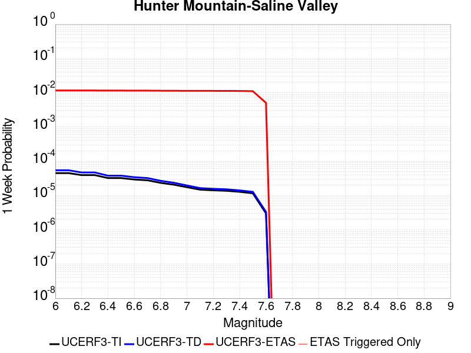 |  |  |  |

| Magnitude | 1 wk TI Prob | 1 wk TD Prob | 1 wk ETAS Prob | 1 wk ETAS/TD Gain | 1 wk ETAS Triggered Only | 1 mo TI Prob | 1 mo TD Prob | 1 mo ETAS Prob | 1 mo ETAS/TD Gain | 1 mo ETAS Triggered Only | 1 yr TI Prob | 1 yr TD Prob | 1 yr ETAS Prob | 1 yr ETAS/TD Gain | 1 yr ETAS Triggered Only | 10 yr TI Prob | 10 yr TD Prob | 10 yr ETAS Prob | 10 yr ETAS/TD Gain | 10 yr ETAS Triggered Only |
|-----|-----|-----|-----|-----|-----|-----|-----|-----|-----|-----|-----|-----|-----|-----|-----|-----|-----|-----|-----|-----|
| 6.0 | 4.5103672E-5 | 5.4570177E-5 | 0.011200542 | 205.25024 | 0.01114658 | 1.9328714E-4 | 2.3385242E-4 | 0.012075414 | 51.636898 | 0.011844331 | 0.002350731 | 0.0028435152 | 0.015680425 | 5.5144506 | 0.0128735155 | 0.023260195 | 0.028091887 | 0.041163236 | 1.4653069 | 0.01344916 |
| 6.1 | 4.5103672E-5 | 5.4570177E-5 | 0.011200542 | 205.25024 | 0.01114658 | 1.9328714E-4 | 2.3385242E-4 | 0.012075414 | 51.636898 | 0.011844331 | 0.002350731 | 0.0028435152 | 0.015680425 | 5.5144506 | 0.0128735155 | 0.023260195 | 0.028091887 | 0.041163236 | 1.4653069 | 0.01344916 |
| 6.2 | 3.9363465E-5 | 4.706337E-5 | 0.011158233 | 237.08954 | 0.0111116925 | 1.6868966E-4 | 2.0168544E-4 | 0.012008748 | 59.541965 | 0.011809444 | 0.002051862 | 0.0024528175 | 0.015259954 | 6.2213984 | 0.012838627 | 0.020330196 | 0.024273481 | 0.037345123 | 1.5385153 | 0.013396828 |
| 6.3 | 3.9363465E-5 | 4.706337E-5 | 0.011158233 | 237.08954 | 0.0111116925 | 1.6868966E-4 | 2.0168544E-4 | 0.012008748 | 59.541965 | 0.011809444 | 0.002051862 | 0.0024528175 | 0.015259954 | 6.2213984 | 0.012838627 | 0.020330196 | 0.024273481 | 0.037345123 | 1.5385153 | 0.013396828 |
| 6.4 | 3.2311684E-5 | 3.795099E-5 | 0.0110620065 | 291.48135 | 0.011024473 | 1.384713E-4 | 1.6263737E-4 | 0.011882956 | 73.06412 | 0.011722225 | 0.0016845843 | 0.0019783843 | 0.0147045655 | 7.4326134 | 0.012751409 | 0.016718714 | 0.019616475 | 0.032647897 | 1.66431 | 0.013292166 |
| 6.5 | 3.2311684E-5 | 3.795099E-5 | 0.0110620065 | 291.48135 | 0.011024473 | 1.384713E-4 | 1.6263737E-4 | 0.011882956 | 73.06412 | 0.011722225 | 0.0016845843 | 0.0019783843 | 0.0147045655 | 7.4326134 | 0.012751409 | 0.016718714 | 0.019616475 | 0.032647897 | 1.66431 | 0.013292166 |
| 6.6 | 2.9305844E-5 | 3.418183E-5 | 0.011023392 | 322.49274 | 0.010989586 | 1.2559042E-4 | 1.4648569E-4 | 0.0118321115 | 80.773155 | 0.011687337 | 0.0015279909 | 0.001782067 | 0.014475927 | 8.12311 | 0.012716521 | 0.015175272 | 0.01768569 | 0.030708505 | 1.7363474 | 0.013257278 |
| 6.7 | 2.7826512E-5 | 3.2344276E-5 | 0.011004131 | 340.21884 | 0.010972142 | 1.19251024E-4 | 1.386113E-4 | 0.011806888 | 85.17983 | 0.011669894 | 0.0014509142 | 0.0016863465 | 0.014364009 | 8.517828 | 0.012699077 | 0.014414776 | 0.016743187 | 0.029761344 | 1.7775197 | 0.013239834 |
| 6.8 | 2.3389874E-5 | 2.6866714E-5 | 0.010911497 | 406.13443 | 0.010884923 | 1.0023846E-4 | 1.15138246E-4 | 0.011696479 | 101.586395 | 0.011582674 | 0.00121972 | 0.001400954 | 0.013977724 | 9.97729 | 0.012594415 | 0.01213047 | 0.013927434 | 0.026879666 | 1.9299798 | 0.0131351715 |
| 6.9 | 2.069209E-5 | 2.3570032E-5 | 0.01087335 | 461.32098 | 0.010850036 | 8.867737E-5 | 1.01010715E-4 | 0.011647631 | 115.31085 | 0.011547787 | 0.0010791123 | 0.0012291478 | 0.013773237 | 11.205518 | 0.012559527 | 0.010738871 | 0.012228523 | 0.02516861 | 2.058189 | 0.013100284 |
| 7.0 | 1.7462342E-5 | 1.9633546E-5 | 0.010852013 | 552.7281 | 0.010832592 | 7.483646E-5 | 8.414118E-5 | 0.011613514 | 138.02414 | 0.011530343 | 9.1075303E-4 | 0.0010239601 | 0.0135532 | 13.236064 | 0.012542083 | 0.009070295 | 0.0101960525 | 0.0231455 | 2.2700453 | 0.0130828405 |
| 7.1 | 1.4807709E-5 | 1.6441749E-5 | 0.010831412 | 658.7749 | 0.010815148 | 6.3460066E-5 | 7.046283E-5 | 0.0115825515 | 164.37817 | 0.0115129 | 7.723524E-4 | 8.575638E-4 | 0.013371463 | 15.592382 | 0.012524639 | 0.007696735 | 0.008545532 | 0.021499278 | 2.5158503 | 0.013065397 |
| 7.2 | 1.4180048E-5 | 1.5698337E-5 | 0.010830677 | 689.9251 | 0.010815148 | 6.077022E-5 | 6.727694E-5 | 0.011579402 | 172.11546 | 0.0115129 | 7.396263E-4 | 8.188051E-4 | 0.01331576 | 16.262428 | 0.012507196 | 0.0073716943 | 0.008160833 | 0.021102304 | 2.5858026 | 0.013047953 |
| 7.3 | 1.3730402E-5 | 1.5172075E-5 | 0.0108301565 | 713.82166 | 0.010815148 | 5.8843252E-5 | 6.502165E-5 | 0.011577173 | 178.05104 | 0.0115129 | 7.161811E-4 | 7.9136714E-4 | 0.013288665 | 16.792034 | 0.012507196 | 0.007138774 | 0.007888422 | 0.020833448 | 2.6410158 | 0.013047953 |
| 7.4 | 1.2810095E-5 | 1.4109277E-5 | 0.010776774 | 763.8077 | 0.010762817 | 5.489925E-5 | 6.0467017E-5 | 0.011520342 | 190.52275 | 0.011460569 | 6.681934E-4 | 7.359531E-4 | 0.013181651 | 17.910994 | 0.012454865 | 0.006661878 | 0.007338053 | 0.020238312 | 2.7579947 | 0.012995621 |
| 7.5 | 1.1595659E-5 | 1.2800664E-5 | 0.010601044 | 828.16364 | 0.010588379 | 4.9694736E-5 | 5.4858923E-5 | 0.01134037 | 206.7188 | 0.01128613 | 6.0486543E-4 | 6.6771836E-4 | 0.012939945 | 19.379345 | 0.012280426 | 0.006032217 | 0.0066599925 | 0.01937846 | 2.909682 | 0.01280374 |
| 7.6 | 2.997694E-6 | 3.3251579E-6 | 0.0048701256 | 1464.6299 | 0.0048668166 | 1.28471975E-5 | 1.425064E-5 | 0.005177538 | 363.3197 | 0.005163361 | 1.564034E-4 | 1.73495E-4 | 0.005702216 | 32.866745 | 0.0055296808 | 0.0015629337 | 0.001735031 | 0.007498907 | 4.322059 | 0.0057738936 |

## Garlock (West)
*[(top)](#table-of-contents)*

| 1 Week | 1 Month | 1 Year | 10 Year |
|-----|-----|-----|-----|
|  |  |  |  |

| Magnitude | 1 wk TI Prob | 1 wk TD Prob | 1 wk ETAS Prob | 1 wk ETAS/TD Gain | 1 wk ETAS Triggered Only | 1 mo TI Prob | 1 mo TD Prob | 1 mo ETAS Prob | 1 mo ETAS/TD Gain | 1 mo ETAS Triggered Only | 1 yr TI Prob | 1 yr TD Prob | 1 yr ETAS Prob | 1 yr ETAS/TD Gain | 1 yr ETAS Triggered Only | 10 yr TI Prob | 10 yr TD Prob | 10 yr ETAS Prob | 10 yr ETAS/TD Gain | 10 yr ETAS Triggered Only |
|-----|-----|-----|-----|-----|-----|-----|-----|-----|-----|-----|-----|-----|-----|-----|-----|-----|-----|-----|-----|-----|
| 6.0 | 2.5181727E-5 | 2.51973E-5 | 0.008572438 | 340.21255 | 0.008547456 | 1.0791722E-4 | 1.0798398E-4 | 0.009160332 | 84.830475 | 0.009053325 | 0.0013131002 | 0.0013139155 | 0.011087023 | 8.438155 | 0.009785965 | 0.013053683 | 0.013141977 | 0.023401843 | 1.7806944 | 0.010396497 |
| 6.1 | 2.5077732E-5 | 2.5098372E-5 | 0.00857234 | 341.54962 | 0.008547456 | 1.0747157E-4 | 1.0756004E-4 | 0.009159912 | 85.16092 | 0.009053325 | 0.001307681 | 0.0013087603 | 0.011081917 | 8.467493 | 0.009785965 | 0.013000126 | 0.013091032 | 0.023351429 | 1.783773 | 0.010396497 |
| 6.2 | 2.494612E-5 | 2.498005E-5 | 0.008572223 | 343.16275 | 0.008547456 | 1.0690756E-4 | 1.0705298E-4 | 0.009159409 | 85.55959 | 0.009053325 | 0.0013008224 | 0.0013025942 | 0.011075811 | 8.502888 | 0.009785965 | 0.012932341 | 0.013030097 | 0.023291126 | 1.7874869 | 0.010396497 |
| 6.3 | 2.4733758E-5 | 2.479942E-5 | 0.008572043 | 345.655 | 0.008547456 | 1.0599751E-4 | 1.06278916E-4 | 0.009158642 | 86.17554 | 0.009053325 | 0.0012897556 | 0.0012931811 | 0.011066491 | 8.557572 | 0.009785965 | 0.012822957 | 0.012937066 | 0.023199063 | 1.7932245 | 0.010396497 |
| 6.4 | 2.3237335E-5 | 2.317873E-5 | 0.00853555 | 368.24924 | 0.008512569 | 9.958477E-5 | 9.933365E-5 | 0.009116876 | 91.780334 | 0.009018438 | 0.0012117702 | 0.001208719 | 0.010930588 | 9.043117 | 0.009733633 | 0.012051838 | 0.012101916 | 0.022320898 | 1.8444103 | 0.010344166 |
| 6.5 | 2.2732203E-5 | 2.2993298E-5 | 0.008535366 | 371.21103 | 0.008512569 | 9.742009E-5 | 9.8539E-5 | 0.009116088 | 92.51249 | 0.009018438 | 0.0011854442 | 0.0011990548 | 0.010921017 | 9.108022 | 0.009733633 | 0.011791403 | 0.012006322 | 0.022226293 | 1.8512157 | 0.010344166 |
| 6.6 | 2.1319436E-5 | 2.17735E-5 | 0.008516713 | 391.1504 | 0.008495124 | 9.136581E-5 | 9.331167E-5 | 0.009093466 | 97.452614 | 0.009000994 | 0.001111811 | 0.0011354799 | 0.010840637 | 9.547186 | 0.0097161895 | 0.011062649 | 0.011377227 | 0.02158646 | 1.8973393 | 0.010326722 |
| 6.7 | 1.970802E-5 | 2.0393396E-5 | 0.008515345 | 417.55402 | 0.008495124 | 8.446021E-5 | 8.739735E-5 | 0.009087605 | 103.98032 | 0.009000994 | 0.001027818 | 0.001063545 | 0.010769401 | 10.125947 | 0.0097161895 | 0.010230771 | 0.010664964 | 0.020881552 | 1.957958 | 0.010326722 |
| 6.8 | 1.8744462E-5 | 1.9901045E-5 | 0.008497413 | 426.98328 | 0.00847768 | 8.033094E-5 | 8.5287415E-5 | 0.009068072 | 106.323685 | 0.008983551 | 9.775903E-4 | 0.0010378812 | 0.010726561 | 10.335055 | 0.009698746 | 0.009733009 | 0.01041075 | 0.020612702 | 1.9799439 | 0.010309278 |
| 6.9 | 1.7559682E-5 | 1.8953415E-5 | 0.008461586 | 446.44128 | 0.008442793 | 7.5253614E-5 | 8.12264E-5 | 0.009029162 | 111.160446 | 0.008948663 | 9.158276E-4 | 9.884841E-4 | 0.01064279 | 10.766778 | 0.009663858 | 0.0091206245 | 0.009921231 | 0.020093687 | 2.025322 | 0.010274391 |
| 7.0 | 1.6794445E-5 | 1.8216237E-5 | 0.008425969 | 462.55264 | 0.008407906 | 7.197421E-5 | 7.8067256E-5 | 0.008991146 | 115.1718 | 0.008913775 | 8.759337E-4 | 9.5005584E-4 | 0.010569879 | 11.125534 | 0.009628971 | 0.008724891 | 0.009540141 | 0.019681957 | 2.063068 | 0.010239503 |
| 7.1 | 1.6337795E-5 | 1.7717046E-5 | 0.0084080305 | 474.57294 | 0.008390462 | 7.0017246E-5 | 7.5927994E-5 | 0.008971584 | 118.15911 | 0.008896331 | 8.521265E-4 | 9.240326E-4 | 0.0105266785 | 11.392107 | 0.0096115265 | 0.008488664 | 0.009281996 | 0.019409174 | 2.091056 | 0.01022206 |
| 7.2 | 1.5780008E-5 | 1.7165687E-5 | 0.008407484 | 489.78427 | 0.008390462 | 6.762685E-5 | 7.356516E-5 | 0.008969243 | 121.92242 | 0.008896331 | 8.2304585E-4 | 8.9528906E-4 | 0.010498211 | 11.726057 | 0.0096115265 | 0.008200042 | 0.008996838 | 0.019126931 | 2.1259615 | 0.01022206 |
| 7.3 | 1.5058865E-5 | 1.6618762E-5 | 0.008372054 | 503.77124 | 0.008355574 | 6.45364E-5 | 7.122133E-5 | 0.0089320345 | 125.41235 | 0.008861444 | 7.854473E-4 | 8.667759E-4 | 0.010435115 | 12.039 | 0.009576639 | 0.00782677 | 0.008713539 | 0.018811943 | 2.158933 | 0.010187171 |
| 7.4 | 1.4887923E-5 | 1.6454731E-5 | 0.008232343 | 500.3025 | 0.008216023 | 6.380382E-5 | 7.051838E-5 | 0.00873947 | 123.93179 | 0.008669563 | 7.7653467E-4 | 8.582243E-4 | 0.010234928 | 11.925703 | 0.009384758 | 0.0077382675 | 0.008628399 | 0.018537445 | 2.1484225 | 0.00999529 |
| 7.5 | 1.4509299E-5 | 1.6046748E-5 | 0.0076563032 | 477.12488 | 0.007640379 | 6.218123E-5 | 6.876997E-5 | 0.008127245 | 118.180145 | 0.0080590295 | 7.567935E-4 | 8.36954E-4 | 0.009464402 | 11.308151 | 0.008634674 | 0.0075422134 | 0.008416704 | 0.0175668 | 2.0871353 | 0.009227764 |
| 7.6 | 1.2756717E-5 | 1.4050848E-5 | 0.0051250085 | 364.74728 | 0.00511103 | 5.4670498E-5 | 6.0216535E-5 | 0.0054500224 | 90.50707 | 0.0053901304 | 6.6541E-4 | 7.328904E-4 | 0.006537414 | 8.920044 | 0.0058087814 | 0.006634211 | 0.0073816874 | 0.013563151 | 1.8374051 | 0.0062274323 |
| 7.7 | 1.0328985E-5 | 1.1460557E-5 | 0.0033606293 | 293.23438 | 0.003349207 | 4.4266326E-5 | 4.911575E-5 | 0.0035900306 | 73.09327 | 0.003541089 | 5.388092E-4 | 5.978206E-4 | 0.004468026 | 7.4738584 | 0.0038725208 | 0.0053750467 | 0.006038511 | 0.010147724 | 1.6805011 | 0.0041341777 |
| 7.8 | 7.0306583E-6 | 8.899601E-6 | 0.0019276992 | 216.60512 | 0.0019188166 | 3.0131043E-5 | 3.814059E-5 | 0.0020615428 | 54.051147 | 0.0020234794 | 3.667837E-4 | 4.642629E-4 | 0.0026611597 | 5.7320104 | 0.0021979173 | 0.003661789 | 0.0046952725 | 0.0069870413 | 1.4881014 | 0.00230258 |
| 7.9 | 4.060633E-6 | 5.4653938E-6 | 9.6486846E-4 | 176.54143 | 9.594083E-4 | 1.7402595E-5 | 2.3422906E-5 | 0.0010176955 | 43.448727 | 9.942959E-4 | 2.11856E-4 | 2.851367E-4 | 0.0013314654 | 4.6695695 | 0.0010466273 | 0.0021165414 | 0.002884201 | 0.004014777 | 1.3919894 | 0.0011338462 |
| 8.0 | 1.6729537E-6 | 2.0775144E-6 | 2.1140253E-4 | 101.75743 | 2.0932544E-4 | 7.169782E-6 | 8.903603E-6 | 2.3567081E-4 | 26.469152 | 2.2676923E-4 | 8.7288594E-5 | 1.0839601E-4 | 3.7002444E-4 | 3.4136355 | 2.6165682E-4 | 8.7254314E-4 | 0.0010969337 | 0.0013757282 | 1.2541579 | 2.791006E-4 |
| 8.1 | 3.6733252E-7 | 3.1489964E-7 | 1.775868E-5 | 56.394733 | 1.7443788E-5 | 1.5742813E-6 | 1.3495693E-6 | 1.8793333E-5 | 13.92543 | 1.7443788E-5 | 1.9166706E-5 | 1.6430899E-5 | 3.38744E-5 | 2.0616279 | 1.7443788E-5 | 1.9165053E-4 | 1.6638759E-4 | 1.8382847E-4 | 1.1048208 | 1.7443788E-5 |

## Blackwater
*[(top)](#table-of-contents)*

| 1 Week | 1 Month | 1 Year | 10 Year |
|-----|-----|-----|-----|
| 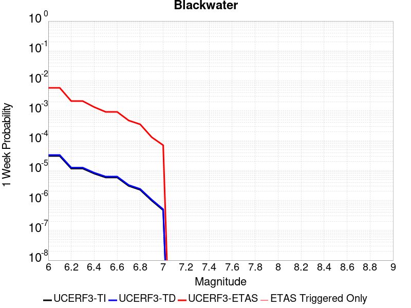 |  |  |  |

| Magnitude | 1 wk TI Prob | 1 wk TD Prob | 1 wk ETAS Prob | 1 wk ETAS/TD Gain | 1 wk ETAS Triggered Only | 1 mo TI Prob | 1 mo TD Prob | 1 mo ETAS Prob | 1 mo ETAS/TD Gain | 1 mo ETAS Triggered Only | 1 yr TI Prob | 1 yr TD Prob | 1 yr ETAS Prob | 1 yr ETAS/TD Gain | 1 yr ETAS Triggered Only | 10 yr TI Prob | 10 yr TD Prob | 10 yr ETAS Prob | 10 yr ETAS/TD Gain | 10 yr ETAS Triggered Only |
|-----|-----|-----|-----|-----|-----|-----|-----|-----|-----|-----|-----|-----|-----|-----|-----|-----|-----|-----|-----|-----|
| 6.0 | 3.0708583E-5 | 3.3095846E-5 | 0.0057021393 | 172.29167 | 0.005669231 | 1.3160157E-4 | 1.4183241E-4 | 0.006141644 | 43.30212 | 0.0060006627 | 0.0016010714 | 0.0017255784 | 0.008377607 | 4.8549557 | 0.006663527 | 0.015895851 | 0.017135633 | 0.024079308 | 1.4052185 | 0.007064734 |
| 6.1 | 3.0708583E-5 | 3.3095846E-5 | 0.0057021393 | 172.29167 | 0.005669231 | 1.3160157E-4 | 1.4183241E-4 | 0.006141644 | 43.30212 | 0.0060006627 | 0.0016010714 | 0.0017255784 | 0.008377607 | 4.8549557 | 0.006663527 | 0.015895851 | 0.017135633 | 0.024079308 | 1.4052185 | 0.007064734 |
| 6.2 | 1.1707779E-5 | 1.2545122E-5 | 0.0020011119 | 159.51315 | 0.0019885919 | 5.017523E-5 | 5.3763757E-5 | 0.0021992342 | 40.905518 | 0.0021455858 | 6.107122E-4 | 6.5438676E-4 | 0.0030251895 | 4.622938 | 0.0023723552 | 0.006090366 | 0.0065255696 | 0.009021083 | 1.3824209 | 0.0025119053 |
| 6.3 | 1.1707779E-5 | 1.2545122E-5 | 0.0020011119 | 159.51315 | 0.0019885919 | 5.017523E-5 | 5.3763757E-5 | 0.0021992342 | 40.905518 | 0.0021455858 | 6.107122E-4 | 6.5438676E-4 | 0.0030251895 | 4.622938 | 0.0023723552 | 0.006090366 | 0.0065255696 | 0.009021083 | 1.3824209 | 0.0025119053 |
| 6.4 | 7.929244E-6 | 8.480098E-6 | 0.0012644221 | 149.10466 | 0.0012559526 | 3.3982033E-5 | 3.6342793E-5 | 0.0013969088 | 38.437023 | 0.0013606154 | 4.136527E-4 | 4.423877E-4 | 0.0019070177 | 4.310738 | 0.0014652781 | 0.0041288356 | 0.0044154758 | 0.0059784846 | 1.3539842 | 0.0015699408 |
| 6.5 | 5.8832115E-6 | 6.285991E-6 | 8.0869516E-4 | 128.65039 | 8.024142E-4 | 2.521352E-5 | 2.6939697E-5 | 8.8166224E-4 | 32.727253 | 8.5474557E-4 | 3.0693135E-4 | 3.27944E-4 | 0.0012347235 | 3.7650437 | 9.0707693E-4 | 0.0030650778 | 0.0032748538 | 0.004248507 | 1.2973119 | 9.768521E-4 |
| 6.6 | 5.8832115E-6 | 6.285991E-6 | 8.0869516E-4 | 128.65039 | 8.024142E-4 | 2.521352E-5 | 2.6939697E-5 | 8.8166224E-4 | 32.727253 | 8.5474557E-4 | 3.0693135E-4 | 3.27944E-4 | 0.0012347235 | 3.7650437 | 9.0707693E-4 | 0.0030650778 | 0.0032748538 | 0.004248507 | 1.2973119 | 9.768521E-4 |
| 6.7 | 3.0715053E-6 | 3.2814662E-6 | 4.5681844E-4 | 139.21169 | 4.5353847E-4 | 1.3163528E-5 | 1.4063357E-5 | 5.024825E-4 | 35.72991 | 4.8842607E-4 | 1.6025416E-4 | 1.7120909E-4 | 6.769923E-4 | 3.9541845 | 5.0586986E-4 | 0.0016013865 | 0.0017108864 | 0.0022681325 | 1.3257061 | 5.582012E-4 |
| 6.8 | 2.2722281E-6 | 2.4287538E-6 | 3.1641618E-4 | 130.27924 | 3.1398816E-4 | 9.738084E-6 | 1.0408908E-5 | 3.418374E-4 | 32.840855 | 3.3143195E-4 | 1.1855473E-4 | 1.26722E-4 | 4.7555353E-4 | 3.7527306 | 3.4887574E-4 | 0.001184915 | 0.0012665876 | 0.0016672865 | 1.3163611 | 4.012071E-4 |
| 6.9 | 9.952399E-7 | 1.0653489E-6 | 1.2317173E-4 | 115.61633 | 1.2210652E-4 | 4.265307E-6 | 4.5657757E-6 | 1.4411543E-4 | 31.564283 | 1.395503E-4 | 5.1928873E-5 | 5.5587418E-5 | 1.9512996E-4 | 3.510326 | 1.395503E-4 | 5.191674E-4 | 5.557858E-4 | 6.952585E-4 | 1.250947 | 1.395503E-4 |
| 7.0 | 4.7385504E-7 | 5.0755597E-7 | 5.2838892E-5 | 104.10457 | 5.233136E-5 | 2.0308057E-6 | 2.1752398E-6 | 5.4506487E-5 | 25.057692 | 5.233136E-5 | 2.4724779E-5 | 2.6483543E-5 | 7.881352E-5 | 2.975943 | 5.233136E-5 | 2.4722028E-4 | 2.6483546E-4 | 3.1715294E-4 | 1.1975472 | 5.233136E-5 |

## Ash Hill
*[(top)](#table-of-contents)*

| 1 Week | 1 Month | 1 Year | 10 Year |
|-----|-----|-----|-----|
|  |  |  |  |

| Magnitude | 1 wk TI Prob | 1 wk TD Prob | 1 wk ETAS Prob | 1 wk ETAS/TD Gain | 1 wk ETAS Triggered Only | 1 mo TI Prob | 1 mo TD Prob | 1 mo ETAS Prob | 1 mo ETAS/TD Gain | 1 mo ETAS Triggered Only | 1 yr TI Prob | 1 yr TD Prob | 1 yr ETAS Prob | 1 yr ETAS/TD Gain | 1 yr ETAS Triggered Only | 10 yr TI Prob | 10 yr TD Prob | 10 yr ETAS Prob | 10 yr ETAS/TD Gain | 10 yr ETAS Triggered Only |
|-----|-----|-----|-----|-----|-----|-----|-----|-----|-----|-----|-----|-----|-----|-----|-----|-----|-----|-----|-----|-----|
| 6.0 | 2.1545662E-5 | 2.3194447E-5 | 0.004471257 | 192.77274 | 0.0044481657 | 9.2335285E-5 | 9.940143E-5 | 0.0050180606 | 50.482777 | 0.004919148 | 0.0011236023 | 0.0012096206 | 0.0068545714 | 5.666712 | 0.005651787 | 0.011179381 | 0.012038348 | 0.018018475 | 1.4967563 | 0.006052994 |
| 6.1 | 2.1545662E-5 | 2.3194447E-5 | 0.004471257 | 192.77274 | 0.0044481657 | 9.2335285E-5 | 9.940143E-5 | 0.0050180606 | 50.482777 | 0.004919148 | 0.0011236023 | 0.0012096206 | 0.0068545714 | 5.666712 | 0.005651787 | 0.011179381 | 0.012038348 | 0.018018475 | 1.4967563 | 0.006052994 |
| 6.2 | 2.1545662E-5 | 2.3194447E-5 | 0.004471257 | 192.77274 | 0.0044481657 | 9.2335285E-5 | 9.940143E-5 | 0.0050180606 | 50.482777 | 0.004919148 | 0.0011236023 | 0.0012096206 | 0.0068545714 | 5.666712 | 0.005651787 | 0.011179381 | 0.012038348 | 0.018018475 | 1.4967563 | 0.006052994 |
| 6.3 | 1.0025529E-5 | 1.0746934E-5 | 0.0016853325 | 156.81984 | 0.0016746036 | 4.2965847E-5 | 4.605755E-5 | 0.0019124568 | 41.523197 | 0.0018664852 | 5.229836E-4 | 5.6061964E-4 | 0.0026701347 | 4.7628274 | 0.0021106983 | 0.005217545 | 0.0055933665 | 0.007848375 | 1.4031576 | 0.0022676925 |
| 6.4 | 1.0025529E-5 | 1.0746934E-5 | 0.0016853325 | 156.81984 | 0.0016746036 | 4.2965847E-5 | 4.605755E-5 | 0.0019124568 | 41.523197 | 0.0018664852 | 5.229836E-4 | 5.6061964E-4 | 0.0026701347 | 4.7628274 | 0.0021106983 | 0.005217545 | 0.0055933665 | 0.007848375 | 1.4031576 | 0.0022676925 |
| 6.5 | 6.9617327E-6 | 7.456634E-6 | 0.0011238507 | 150.71823 | 0.0011164024 | 2.9835655E-5 | 3.195666E-5 | 0.001270426 | 39.754654 | 0.0012385088 | 3.6318856E-4 | 3.8901155E-4 | 0.0017839717 | 4.5859094 | 0.001395503 | 0.0036259557 | 0.0038841602 | 0.005413251 | 1.3936734 | 0.0015350532 |
| 6.6 | 4.9919777E-6 | 5.3466883E-6 | 7.5542554E-4 | 141.2885 | 7.5008284E-4 | 2.1394015E-5 | 2.2914215E-5 | 8.776402E-4 | 38.301125 | 8.5474557E-4 | 2.60441E-4 | 2.7895154E-4 | 0.0012206533 | 4.375861 | 9.419645E-4 | 0.0026013597 | 0.0027866727 | 0.0038303833 | 1.3745365 | 0.0010466273 |
| 6.7 | 3.6630722E-6 | 3.924624E-6 | 5.4467993E-4 | 138.78526 | 5.4075744E-4 | 1.5698786E-5 | 1.681974E-5 | 6.447855E-4 | 38.33505 | 6.279763E-4 | 1.9111596E-4 | 2.0476682E-4 | 8.849352E-4 | 4.321673 | 6.803077E-4 | 0.0019095168 | 0.0020463446 | 0.0028123006 | 1.3743045 | 7.675266E-4 |
| 6.8 | 2.5599613E-6 | 2.744925E-6 | 3.865072E-4 | 140.80792 | 3.837633E-4 | 1.0971216E-5 | 1.1763939E-5 | 4.8274067E-4 | 41.03563 | 4.7098225E-4 | 1.3356637E-4 | 1.4322149E-4 | 6.664602E-4 | 4.6533527 | 5.2331365E-4 | 0.0013348613 | 0.0014317769 | 0.0020414353 | 1.4258054 | 6.1053253E-4 |
| 6.9 | 1.7684905E-6 | 1.8968707E-6 | 2.4610944E-4 | 129.74496 | 2.4421304E-4 | 7.579223E-6 | 8.129446E-6 | 3.2211505E-4 | 39.62325 | 3.1398816E-4 | 9.2273134E-5 | 9.8976E-5 | 4.6525928E-4 | 4.700728 | 3.6631952E-4 | 9.223483E-4 | 9.8976E-4 | 0.0014079966 | 1.4225636 | 4.186509E-4 |

## San Andreas (Mojave N)
*[(top)](#table-of-contents)*

| 1 Week | 1 Month | 1 Year | 10 Year |
|-----|-----|-----|-----|
|  |  | 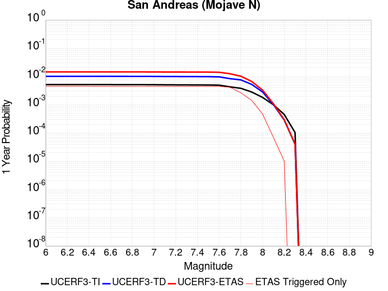 |  |

| Magnitude | 1 wk TI Prob | 1 wk TD Prob | 1 wk ETAS Prob | 1 wk ETAS/TD Gain | 1 wk ETAS Triggered Only | 1 mo TI Prob | 1 mo TD Prob | 1 mo ETAS Prob | 1 mo ETAS/TD Gain | 1 mo ETAS Triggered Only | 1 yr TI Prob | 1 yr TD Prob | 1 yr ETAS Prob | 1 yr ETAS/TD Gain | 1 yr ETAS Triggered Only | 10 yr TI Prob | 10 yr TD Prob | 10 yr ETAS Prob | 10 yr ETAS/TD Gain | 10 yr ETAS Triggered Only |
|-----|-----|-----|-----|-----|-----|-----|-----|-----|-----|-----|-----|-----|-----|-----|-----|-----|-----|-----|-----|-----|
| 6.0 | 9.877682E-5 | 1.9400702E-4 | 0.0038390514 | 19.788208 | 0.0036457516 | 4.2326056E-4 | 8.311939E-4 | 0.004700496 | 5.6551137 | 0.0038725208 | 0.0051410277 | 0.010072956 | 0.014251831 | 1.4148608 | 0.0042213965 | 0.05023708 | 0.09831428 | 0.10235658 | 1.0411161 | 0.0044830535 |
| 6.1 | 9.877682E-5 | 1.9400702E-4 | 0.0038390514 | 19.788208 | 0.0036457516 | 4.2326056E-4 | 8.311939E-4 | 0.004700496 | 5.6551137 | 0.0038725208 | 0.0051410277 | 0.010072956 | 0.014251831 | 1.4148608 | 0.0042213965 | 0.05023708 | 0.09831428 | 0.10235658 | 1.0411161 | 0.0044830535 |
| 6.2 | 9.877682E-5 | 1.9400702E-4 | 0.0038390514 | 19.788208 | 0.0036457516 | 4.2326056E-4 | 8.311939E-4 | 0.004700496 | 5.6551137 | 0.0038725208 | 0.0051410277 | 0.010072956 | 0.014251831 | 1.4148608 | 0.0042213965 | 0.05023708 | 0.09831428 | 0.10235658 | 1.0411161 | 0.0044830535 |
| 6.3 | 9.877682E-5 | 1.9400702E-4 | 0.0038390514 | 19.788208 | 0.0036457516 | 4.2326056E-4 | 8.311939E-4 | 0.004700496 | 5.6551137 | 0.0038725208 | 0.0051410277 | 0.010072956 | 0.014251831 | 1.4148608 | 0.0042213965 | 0.05023708 | 0.09831428 | 0.10235658 | 1.0411161 | 0.0044830535 |
| 6.4 | 9.877682E-5 | 1.9400702E-4 | 0.0038390514 | 19.788208 | 0.0036457516 | 4.2326056E-4 | 8.311939E-4 | 0.004700496 | 5.6551137 | 0.0038725208 | 0.0051410277 | 0.010072956 | 0.014251831 | 1.4148608 | 0.0042213965 | 0.05023708 | 0.09831428 | 0.10235658 | 1.0411161 | 0.0044830535 |
| 6.5 | 9.861474E-5 | 1.9374468E-4 | 0.0038387899 | 19.813652 | 0.0036457516 | 4.2256617E-4 | 8.300703E-4 | 0.004699377 | 5.66142 | 0.0038725208 | 0.0051326132 | 0.010059402 | 0.014238334 | 1.4154254 | 0.0042213965 | 0.050156746 | 0.098192066 | 0.10223492 | 1.0411729 | 0.0044830535 |
| 6.6 | 9.861474E-5 | 1.9374468E-4 | 0.0038387899 | 19.813652 | 0.0036457516 | 4.2256617E-4 | 8.300703E-4 | 0.004699377 | 5.66142 | 0.0038725208 | 0.0051326132 | 0.010059402 | 0.014238334 | 1.4154254 | 0.0042213965 | 0.050156746 | 0.098192066 | 0.10223492 | 1.0411729 | 0.0044830535 |
| 6.7 | 9.8552715E-5 | 1.9364421E-4 | 0.0038386898 | 19.823416 | 0.0036457516 | 4.223004E-4 | 8.2964E-4 | 0.004698948 | 5.66384 | 0.0038725208 | 0.0051293927 | 0.010054212 | 0.014233165 | 1.4156421 | 0.0042213965 | 0.050125998 | 0.098145254 | 0.10218832 | 1.0411947 | 0.0044830535 |
| 6.8 | 9.8464974E-5 | 1.9349584E-4 | 0.003838542 | 19.837852 | 0.0036457516 | 4.219245E-4 | 8.290045E-4 | 0.004698315 | 5.6674175 | 0.0038725208 | 0.0051248376 | 0.010046546 | 0.014225533 | 1.4159625 | 0.0042213965 | 0.05008251 | 0.09807528 | 0.102118656 | 1.0412272 | 0.0044830535 |
| 6.9 | 9.825824E-5 | 1.9317595E-4 | 0.0038382232 | 19.869055 | 0.0036457516 | 4.2103877E-4 | 8.276344E-4 | 0.0046969503 | 5.675151 | 0.0038725208 | 0.0051141046 | 0.010030019 | 0.014209075 | 1.4166548 | 0.0042213965 | 0.049980022 | 0.09792438 | 0.10196843 | 1.0412977 | 0.0044830535 |
| 7.0 | 9.781462E-5 | 1.924896E-4 | 0.0038375393 | 19.936346 | 0.0036457516 | 4.1913814E-4 | 8.246948E-4 | 0.004694022 | 5.691829 | 0.0038725208 | 0.005091073 | 0.009994558 | 0.014173764 | 1.418148 | 0.0042213965 | 0.04976007 | 0.09760077 | 0.101646274 | 1.0414495 | 0.0044830535 |
| 7.1 | 9.7121134E-5 | 1.9150671E-4 | 0.00383656 | 20.033554 | 0.0036457516 | 4.1616702E-4 | 8.204851E-4 | 0.0046898285 | 5.715922 | 0.0038725208 | 0.005055068 | 0.009943774 | 0.014123194 | 1.4203051 | 0.0042213965 | 0.04941613 | 0.09713728 | 0.10118487 | 1.0416687 | 0.0044830535 |
| 7.2 | 9.663819E-5 | 1.9081456E-4 | 0.0038358704 | 20.102608 | 0.0036457516 | 4.1409794E-4 | 8.175206E-4 | 0.0046868757 | 5.7330365 | 0.0038725208 | 0.0050299936 | 0.00990801 | 0.014087581 | 1.4218376 | 0.0042213965 | 0.049176537 | 0.09681055 | 0.10085959 | 1.0418245 | 0.0044830535 |
| 7.3 | 9.6277574E-5 | 1.9033969E-4 | 0.0038353973 | 20.150276 | 0.0036457516 | 4.125529E-4 | 8.154867E-4 | 0.0046848496 | 5.7448506 | 0.0038725208 | 0.0050112694 | 0.009883473 | 0.014063147 | 1.4228953 | 0.0042213965 | 0.04899759 | 0.09658401 | 0.10063407 | 1.0419331 | 0.0044830535 |
| 7.4 | 9.593308E-5 | 1.897375E-4 | 0.0038347973 | 20.211067 | 0.0036457516 | 4.1107697E-4 | 8.129075E-4 | 0.00468228 | 5.7599177 | 0.0038725208 | 0.0049933824 | 0.009852355 | 0.014032161 | 1.4242443 | 0.0042213965 | 0.04882661 | 0.09630218 | 0.10035351 | 1.0420688 | 0.0044830535 |
| 7.5 | 9.561707E-5 | 1.8919831E-4 | 0.0038342602 | 20.265825 | 0.0036457516 | 4.0972308E-4 | 8.1059814E-4 | 0.0046799798 | 5.7734895 | 0.0038725208 | 0.0049769743 | 0.009824493 | 0.014004416 | 1.4254595 | 0.0042213965 | 0.048669744 | 0.09604836 | 0.10010082 | 1.0421919 | 0.0044830535 |
| 7.6 | 9.418194E-5 | 1.8572104E-4 | 0.003813355 | 20.532701 | 0.0036283077 | 4.0357444E-4 | 7.957047E-4 | 0.004647714 | 5.841004 | 0.003855077 | 0.004902454 | 0.009644784 | 0.013808191 | 1.4316744 | 0.004203953 | 0.047957025 | 0.094430685 | 0.09847461 | 1.0428241 | 0.00446561 |
| 7.7 | 8.202141E-5 | 1.6021315E-4 | 0.0036135297 | 22.554514 | 0.0034538698 | 3.51473E-4 | 6.8644714E-4 | 0.0043296963 | 6.307399 | 0.0036457516 | 0.00427079 | 0.008325525 | 0.012269596 | 1.4737325 | 0.0039771837 | 0.04189639 | 0.08223219 | 0.08612247 | 1.0473083 | 0.00423884 |
| 7.8 | 7.2859846E-5 | 1.4516473E-4 | 0.0021683504 | 14.937172 | 0.0020234794 | 3.1221908E-4 | 6.219862E-4 | 0.0027488046 | 4.419398 | 0.0021281422 | 0.003794643 | 0.0075464295 | 0.009831633 | 1.3028191 | 0.00230258 | 0.037304975 | 0.07472468 | 0.07695204 | 1.0298076 | 0.0024072428 |
| 7.9 | 5.3874453E-5 | 1.0045676E-4 | 0.0011818629 | 11.764892 | 0.0010815149 | 2.3087008E-4 | 4.3045796E-4 | 0.0015463798 | 3.592406 | 0.0011164024 | 0.0028072202 | 0.0052282433 | 0.0063908664 | 1.2223736 | 0.0011687338 | 0.02772022 | 0.05242443 | 0.05361454 | 1.0227014 | 0.0012559526 |
| 8.0 | 3.468538E-5 | 5.4260272E-5 | 3.3334573E-4 | 6.1434584 | 2.791006E-4 | 1.4864317E-4 | 2.325233E-4 | 5.2899873E-4 | 2.2750354 | 2.965444E-4 | 0.0018082283 | 0.002827298 | 0.0031577928 | 1.1168942 | 3.3143195E-4 | 0.017935853 | 0.028947512 | 0.029286288 | 1.0117031 | 3.4887574E-4 |
| 8.1 | 1.9152367E-5 | 1.940263E-5 | 7.1732975E-5 | 3.697075 | 5.233136E-5 | 8.207899E-5 | 8.3151484E-5 | 1.3547849E-4 | 1.6292974 | 5.233136E-5 | 9.988535E-4 | 0.0010118998 | 0.0010641782 | 1.0516636 | 5.233136E-5 | 0.009943757 | 0.01085625 | 0.010908013 | 1.004768 | 5.233136E-5 |
| 8.2 | 8.643924E-6 | 5.4748625E-6 | 2.2918555E-5 | 4.1861424 | 1.7443788E-5 | 3.704486E-5 | 2.3463486E-5 | 4.0906863E-5 | 1.7434266 | 1.7443788E-5 | 4.5092785E-4 | 2.8563058E-4 | 3.0306936E-4 | 1.0610538 | 1.7443788E-5 | 0.0045001395 | 0.0032487072 | 0.0032660943 | 1.005352 | 1.7443788E-5 |
| 8.3 | 1.983087E-6 | 7.6599065E-7 | 7.6599065E-7 | 1.0 | 0.0 | 8.498917E-6 | 3.282813E-6 | 3.282813E-6 | 1.0 | 0.0 | 1.034694E-4 | 3.9967534E-5 | 3.9967534E-5 | 1.0 | 0.0 | 0.0010342124 | 4.719687E-4 | 4.719687E-4 | 1.0 | 0.0 |

## San Andreas (Mojave S)
*[(top)](#table-of-contents)*

| 1 Week | 1 Month | 1 Year | 10 Year |
|-----|-----|-----|-----|
|  |  |  |  |

| Magnitude | 1 wk TI Prob | 1 wk TD Prob | 1 wk ETAS Prob | 1 wk ETAS/TD Gain | 1 wk ETAS Triggered Only | 1 mo TI Prob | 1 mo TD Prob | 1 mo ETAS Prob | 1 mo ETAS/TD Gain | 1 mo ETAS Triggered Only | 1 yr TI Prob | 1 yr TD Prob | 1 yr ETAS Prob | 1 yr ETAS/TD Gain | 1 yr ETAS Triggered Only | 10 yr TI Prob | 10 yr TD Prob | 10 yr ETAS Prob | 10 yr ETAS/TD Gain | 10 yr ETAS Triggered Only |
|-----|-----|-----|-----|-----|-----|-----|-----|-----|-----|-----|-----|-----|-----|-----|-----|-----|-----|-----|-----|-----|
| 6.0 | 3.1064058E-4 | 6.7460834E-4 | 0.0037949397 | 5.625397 | 0.003122438 | 0.0013306376 | 0.0028881032 | 0.0061754575 | 2.1382399 | 0.0032968759 | 0.016080605 | 0.03462235 | 0.038074516 | 1.0997093 | 0.0035759765 | 0.1496549 | 0.28660452 | 0.28930494 | 1.0094221 | 0.003785302 |
| 6.1 | 3.1064058E-4 | 6.7460834E-4 | 0.0037949397 | 5.625397 | 0.003122438 | 0.0013306376 | 0.0028881032 | 0.0061754575 | 2.1382399 | 0.0032968759 | 0.016080605 | 0.03462235 | 0.038074516 | 1.0997093 | 0.0035759765 | 0.1496549 | 0.28660452 | 0.28930494 | 1.0094221 | 0.003785302 |
| 6.2 | 3.1064058E-4 | 6.7460834E-4 | 0.0037949397 | 5.625397 | 0.003122438 | 0.0013306376 | 0.0028881032 | 0.0061754575 | 2.1382399 | 0.0032968759 | 0.016080605 | 0.03462235 | 0.038074516 | 1.0997093 | 0.0035759765 | 0.1496549 | 0.28660452 | 0.28930494 | 1.0094221 | 0.003785302 |
| 6.3 | 3.1064058E-4 | 6.7460834E-4 | 0.0037949397 | 5.625397 | 0.003122438 | 0.0013306376 | 0.0028881032 | 0.0061754575 | 2.1382399 | 0.0032968759 | 0.016080605 | 0.03462235 | 0.038074516 | 1.0997093 | 0.0035759765 | 0.1496549 | 0.28660452 | 0.28930494 | 1.0094221 | 0.003785302 |
| 6.4 | 1.9872203E-4 | 4.3179357E-4 | 0.0033436483 | 7.743627 | 0.0029131125 | 8.5138786E-4 | 0.0018492596 | 0.0049311 | 2.6665268 | 0.0030875504 | 0.010316478 | 0.02228844 | 0.025545944 | 1.1461521 | 0.0033317634 | 0.098504856 | 0.19699748 | 0.19982697 | 1.014363 | 0.003523645 |
| 6.5 | 1.291105E-4 | 2.875267E-4 | 0.0029730976 | 10.340249 | 0.0026863432 | 5.5321335E-4 | 0.0012316781 | 0.004071513 | 3.3056636 | 0.0028433374 | 0.006714592 | 0.0148934 | 0.017934967 | 1.2042224 | 0.0030875504 | 0.065152965 | 0.13803436 | 0.14083104 | 1.0202608 | 0.0032445444 |
| 6.6 | 1.291105E-4 | 2.875267E-4 | 0.0029730976 | 10.340249 | 0.0026863432 | 5.5321335E-4 | 0.0012316781 | 0.004071513 | 3.3056636 | 0.0028433374 | 0.006714592 | 0.0148934 | 0.017934967 | 1.2042224 | 0.0030875504 | 0.065152965 | 0.13803436 | 0.14083104 | 1.0202608 | 0.0032445444 |
| 6.7 | 1.08001186E-4 | 2.4333889E-4 | 0.0028941494 | 11.893494 | 0.0026514556 | 4.6278012E-4 | 0.0010424647 | 0.0038479867 | 3.6912394 | 0.0028084498 | 0.0056198016 | 0.012618446 | 0.015632588 | 1.238868 | 0.0030526628 | 0.054797906 | 0.119176775 | 0.12200391 | 1.0237223 | 0.0032096568 |
| 6.8 | 1.0624356E-4 | 2.3851555E-4 | 0.0028893389 | 12.113838 | 0.0026514556 | 4.5525006E-4 | 0.0010218095 | 0.0038273896 | 3.7456975 | 0.0028084498 | 0.0055285925 | 0.012369843 | 0.015384745 | 1.24373 | 0.0030526628 | 0.053930566 | 0.11712591 | 0.11995964 | 1.0241938 | 0.0032096568 |
| 6.9 | 1.0393785E-4 | 2.3221898E-4 | 0.002883059 | 12.415259 | 0.0026514556 | 4.4537184E-4 | 9.948451E-4 | 0.0038005009 | 3.8201935 | 0.0028084498 | 0.0054089287 | 0.012045221 | 0.015061114 | 1.2503809 | 0.0030526628 | 0.05279156 | 0.11442335 | 0.11726575 | 1.0248411 | 0.0032096568 |
| 7.0 | 1.0155622E-4 | 2.2591476E-4 | 0.0028593317 | 12.656684 | 0.002634012 | 4.3516833E-4 | 9.6784724E-4 | 0.003756152 | 3.8809347 | 0.002791006 | 0.005285311 | 0.0117200995 | 0.014719746 | 1.2559403 | 0.003035219 | 0.05161361 | 0.111683756 | 0.11451945 | 1.0253904 | 0.0031922131 |
| 7.1 | 9.885595E-5 | 2.1879886E-4 | 0.0028522345 | 13.035874 | 0.002634012 | 4.2359953E-4 | 9.3737274E-4 | 0.0037257625 | 3.9746861 | 0.002791006 | 0.0051451353 | 0.011352993 | 0.014353753 | 1.2643144 | 0.003035219 | 0.05027629 | 0.1085682 | 0.111413844 | 1.0262107 | 0.0031922131 |
| 7.2 | 9.6411415E-5 | 2.124288E-4 | 0.0028458813 | 13.396871 | 0.002634012 | 4.1312634E-4 | 9.1009185E-4 | 0.0036985578 | 4.063939 | 0.002791006 | 0.005018219 | 0.011024255 | 0.014026013 | 1.2722867 | 0.003035219 | 0.049064007 | 0.105758004 | 0.10861261 | 1.026992 | 0.0031922131 |
| 7.3 | 9.1180635E-5 | 1.9471257E-4 | 0.0028282115 | 14.525059 | 0.002634012 | 3.907156E-4 | 8.342157E-4 | 0.0036228935 | 4.3428736 | 0.002791006 | 0.004746591 | 0.01010939 | 0.013113924 | 1.2972023 | 0.003035219 | 0.046464786 | 0.09795115 | 0.10083068 | 1.0293976 | 0.0031922131 |
| 7.4 | 8.887388E-5 | 1.8719878E-4 | 0.0028207176 | 15.068034 | 0.002634012 | 3.8083247E-4 | 8.020339E-4 | 0.0035908015 | 4.4771194 | 0.002791006 | 0.0046267817 | 0.00972114 | 0.012726854 | 1.3091935 | 0.003035219 | 0.045316286 | 0.09458615 | 0.09747642 | 1.030557 | 0.0031922131 |
| 7.5 | 8.6750515E-5 | 1.8051457E-4 | 0.002814051 | 15.589052 | 0.002634012 | 3.7173493E-4 | 7.7340455E-4 | 0.003562252 | 4.605936 | 0.002791006 | 0.004516484 | 0.009375632 | 0.012382394 | 1.3206997 | 0.003035219 | 0.04425787 | 0.091549896 | 0.09444986 | 1.0316763 | 0.0031922131 |
| 7.6 | 8.453092E-5 | 1.7439072E-4 | 0.0027905025 | 16.00144 | 0.002616568 | 3.6222505E-4 | 7.471748E-4 | 0.0035186647 | 4.7092924 | 0.0027735622 | 0.0044011753 | 0.009058985 | 0.012049422 | 1.3301073 | 0.0030177752 | 0.04315024 | 0.08870898 | 0.091602124 | 1.0326139 | 0.0031747692 |
| 7.7 | 8.259102E-5 | 1.6961215E-4 | 0.0027857365 | 16.424156 | 0.002616568 | 3.539135E-4 | 7.2670676E-4 | 0.0034982534 | 4.8138447 | 0.0027735622 | 0.004300386 | 0.008811831 | 0.011803013 | 1.3394508 | 0.0030177752 | 0.042181134 | 0.08645982 | 0.0893601 | 1.0335448 | 0.0031747692 |
| 7.8 | 7.444844E-5 | 1.5283503E-4 | 0.0021934463 | 14.351725 | 0.002040923 | 3.1902574E-4 | 6.548429E-4 | 0.0027990236 | 4.274344 | 0.0021455858 | 0.0038772223 | 0.007943616 | 0.0102452105 | 1.2897414 | 0.0023200237 | 0.03810269 | 0.078290746 | 0.0805256 | 1.0285456 | 0.0024246864 |
| 7.9 | 5.2586525E-5 | 1.00064186E-4 | 0.0011814708 | 11.807129 | 0.0010815149 | 2.2535135E-4 | 4.2877605E-4 | 0.0015446998 | 3.6025794 | 0.0011164024 | 0.0027402006 | 0.005207864 | 0.006370511 | 1.2232484 | 0.0011687338 | 0.027066574 | 0.052200034 | 0.053390425 | 1.0228044 | 0.0012559526 |
| 8.0 | 3.379877E-5 | 5.4074168E-5 | 3.3315967E-4 | 6.1611614 | 2.791006E-4 | 1.4484383E-4 | 2.3172585E-4 | 5.282015E-4 | 2.2794242 | 2.965444E-4 | 0.0017620471 | 0.002817614 | 0.0031481122 | 1.1172972 | 3.3143195E-4 | 0.017481409 | 0.028834904 | 0.029173719 | 1.0117502 | 3.4887574E-4 |
| 8.1 | 1.8668277E-5 | 1.9309397E-5 | 7.163975E-5 | 3.7100978 | 5.233136E-5 | 8.000444E-5 | 8.275194E-5 | 1.3507897E-4 | 1.632336 | 5.233136E-5 | 9.736188E-4 | 0.0010070398 | 0.0010593184 | 1.0519133 | 5.233136E-5 | 0.009693642 | 0.010798888 | 0.010850654 | 1.0047936 | 5.233136E-5 |
| 8.2 | 8.541571E-6 | 5.460819E-6 | 2.290451E-5 | 4.1943364 | 1.7443788E-5 | 3.660622E-5 | 2.3403301E-5 | 4.084668E-5 | 1.7453384 | 1.7443788E-5 | 4.455896E-4 | 2.84898E-4 | 3.0233682E-4 | 1.0612108 | 1.7443788E-5 | 0.0044469717 | 0.0032408056 | 0.003258193 | 1.0053651 | 1.7443788E-5 |
| 8.3 | 1.983087E-6 | 7.6599065E-7 | 7.6599065E-7 | 1.0 | 0.0 | 8.498917E-6 | 3.282813E-6 | 3.282813E-6 | 1.0 | 0.0 | 1.034694E-4 | 3.9967534E-5 | 3.9967534E-5 | 1.0 | 0.0 | 0.0010342124 | 4.719687E-4 | 4.719687E-4 | 1.0 | 0.0 |

## Gravel Hills-Harper Lk
*[(top)](#table-of-contents)*

| 1 Week | 1 Month | 1 Year | 10 Year |
|-----|-----|-----|-----|
|  |  | 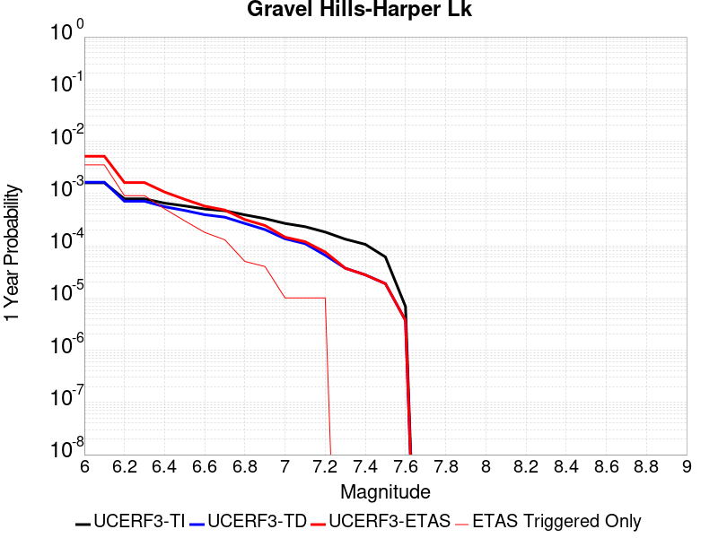 | 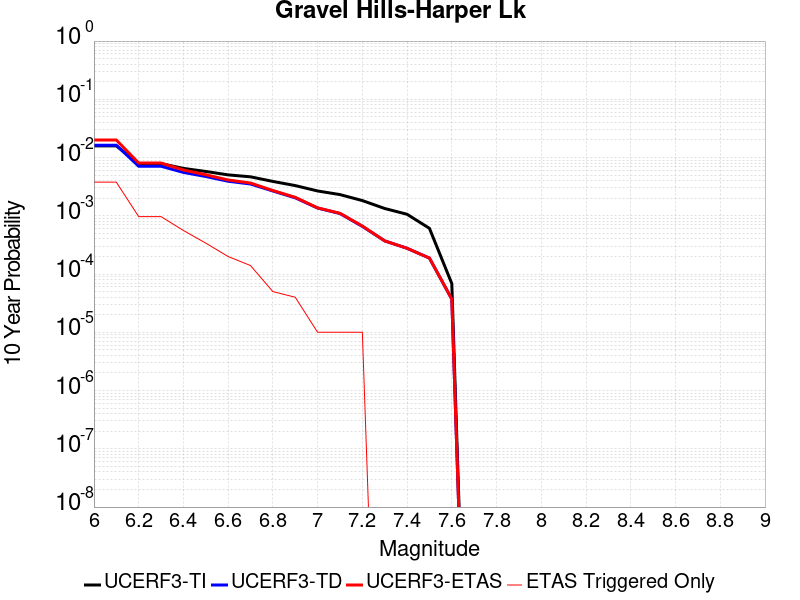 |

| Magnitude | 1 wk TI Prob | 1 wk TD Prob | 1 wk ETAS Prob | 1 wk ETAS/TD Gain | 1 wk ETAS Triggered Only | 1 mo TI Prob | 1 mo TD Prob | 1 mo ETAS Prob | 1 mo ETAS/TD Gain | 1 mo ETAS Triggered Only | 1 yr TI Prob | 1 yr TD Prob | 1 yr ETAS Prob | 1 yr ETAS/TD Gain | 1 yr ETAS Triggered Only | 10 yr TI Prob | 10 yr TD Prob | 10 yr ETAS Prob | 10 yr ETAS/TD Gain | 10 yr ETAS Triggered Only |
|-----|-----|-----|-----|-----|-----|-----|-----|-----|-----|-----|-----|-----|-----|-----|-----|-----|-----|-----|-----|-----|
| 6.0 | 3.0679566E-5 | 3.1464646E-5 | 0.0029444855 | 93.58076 | 0.0029131125 | 1.3147724E-4 | 1.3484273E-4 | 0.0032917424 | 24.411715 | 0.0031573256 | 0.0015995599 | 0.0016406906 | 0.005123724 | 3.122907 | 0.0034887574 | 0.015880952 | 0.01630734 | 0.020030912 | 1.2283373 | 0.003785302 |
| 6.1 | 3.0679566E-5 | 3.1464646E-5 | 0.0029444855 | 93.58076 | 0.0029131125 | 1.3147724E-4 | 1.3484273E-4 | 0.0032917424 | 24.411715 | 0.0031573256 | 0.0015995599 | 0.0016406906 | 0.005123724 | 3.122907 | 0.0034887574 | 0.015880952 | 0.01630734 | 0.020030912 | 1.2283373 | 0.003785302 |
| 6.2 | 1.514536E-5 | 1.3635206E-5 | 7.462643E-4 | 54.73069 | 7.3263905E-4 | 6.490707E-5 | 5.843536E-5 | 8.7824545E-4 | 15.02935 | 8.19858E-4 | 7.8995706E-4 | 7.1123015E-4 | 0.0016873875 | 2.3724916 | 9.768521E-4 | 0.007871548 | 0.0070907404 | 0.008147267 | 1.1490008 | 0.0010640711 |
| 6.3 | 1.514536E-5 | 1.3635206E-5 | 7.462643E-4 | 54.73069 | 7.3263905E-4 | 6.490707E-5 | 5.843536E-5 | 8.7824545E-4 | 15.02935 | 8.19858E-4 | 7.8995706E-4 | 7.1123015E-4 | 0.0016873875 | 2.3724916 | 9.768521E-4 | 0.007871548 | 0.0070907404 | 0.008147267 | 1.1490008 | 0.0010640711 |
| 6.4 | 1.2532521E-5 | 1.06896905E-5 | 3.944489E-4 | 36.899937 | 3.837633E-4 | 5.37097E-5 | 4.581219E-5 | 4.993299E-4 | 10.899499 | 4.5353847E-4 | 6.537194E-4 | 5.576265E-4 | 0.0010980824 | 1.9692076 | 5.4075744E-4 | 0.0065179965 | 0.005562863 | 0.006169999 | 1.109141 | 6.1053253E-4 |
| 6.5 | 1.1094058E-5 | 9.083664E-6 | 2.3585084E-4 | 25.964287 | 2.2676923E-4 | 4.7545094E-5 | 3.892943E-5 | 2.8313295E-4 | 7.2729797 | 2.4421304E-4 | 5.787078E-4 | 4.7386673E-4 | 7.702706E-4 | 1.6255004 | 2.965444E-4 | 0.0057720304 | 0.0047289706 | 0.0050935578 | 1.0770966 | 3.6631952E-4 |
| 6.6 | 9.688328E-6 | 7.5316952E-6 | 1.1219363E-4 | 14.896199 | 1.0466272E-4 | 4.1520743E-5 | 3.227831E-5 | 1.5438088E-4 | 4.782806 | 1.2210652E-4 | 5.053978E-4 | 3.9292008E-4 | 5.498525E-4 | 1.3994004 | 1.5699408E-4 | 0.0050424994 | 0.0039225104 | 0.0041136397 | 1.0487262 | 1.9188166E-4 |
| 6.7 | 8.974824E-6 | 6.749413E-6 | 9.396776E-5 | 13.92236 | 8.7218934E-5 | 3.8462964E-5 | 2.8925748E-5 | 1.3358545E-4 | 4.6182194 | 1.0466272E-4 | 4.6818596E-4 | 3.5211627E-4 | 4.916174E-4 | 1.3961792 | 1.395503E-4 | 0.004672008 | 0.0035158044 | 0.0036722466 | 1.0444968 | 1.5699408E-4 |
| 6.8 | 7.4780046E-6 | 5.1161933E-6 | 5.7447287E-5 | 11.228522 | 5.233136E-5 | 3.20482E-5 | 2.1926366E-5 | 7.425658E-5 | 3.386634 | 5.233136E-5 | 3.9011694E-4 | 2.669222E-4 | 3.192396E-4 | 1.1960024 | 5.233136E-5 | 0.0038943281 | 0.0026661542 | 0.002718346 | 1.0195757 | 5.233136E-5 |
| 6.9 | 6.3409307E-6 | 3.9074966E-6 | 3.8794937E-5 | 9.928334 | 3.4887576E-5 | 2.7175134E-5 | 1.6746313E-5 | 5.1633302E-5 | 3.0832639 | 3.4887576E-5 | 3.3080703E-4 | 2.0386827E-4 | 2.3874873E-4 | 1.1710931 | 3.4887576E-5 | 0.0033031502 | 0.0020369107 | 0.0020717273 | 1.0170928 | 3.4887576E-5 |
| 7.0 | 5.1239335E-6 | 2.6058565E-6 | 2.0049598E-5 | 7.694053 | 1.7443788E-5 | 2.195953E-5 | 1.116791E-5 | 2.8611503E-5 | 2.5619388 | 1.7443788E-5 | 2.6732447E-4 | 1.3596108E-4 | 1.5340249E-4 | 1.1282824 | 1.7443788E-5 | 0.0026700313 | 0.0013588042 | 0.0013762242 | 1.0128201 | 1.7443788E-5 |
| 7.1 | 4.438899E-6 | 2.0984728E-6 | 1.9542224E-5 | 9.312593 | 1.7443788E-5 | 1.9023713E-5 | 8.993425E-6 | 2.6437056E-5 | 2.939598 | 1.7443788E-5 | 2.315891E-4 | 1.0948967E-4 | 1.2693154E-4 | 1.1593016 | 1.7443788E-5 | 0.002313479 | 0.0010943791 | 0.0011118038 | 1.015922 | 1.7443788E-5 |
| 7.2 | 3.50367E-6 | 1.2615716E-6 | 1.8705337E-5 | 14.827012 | 1.7443788E-5 | 1.5015643E-5 | 5.4067245E-6 | 2.2850418E-5 | 4.226296 | 1.7443788E-5 | 1.8280011E-4 | 6.582497E-5 | 8.326761E-5 | 1.2649852 | 1.7443788E-5 | 0.0018264982 | 6.580629E-4 | 6.7549525E-4 | 1.0264903 | 1.7443788E-5 |
| 7.3 | 2.561638E-6 | 7.1191585E-7 | 7.1191585E-7 | 1.0 | 0.0 | 1.0978401E-5 | 3.0510646E-6 | 3.0510646E-6 | 1.0 | 0.0 | 1.3365384E-4 | 3.71461E-5 | 3.71461E-5 | 1.0 | 0.0 | 0.0013357349 | 3.7140088E-4 | 3.7140088E-4 | 1.0 | 0.0 |
| 7.4 | 2.0368864E-6 | 5.304837E-7 | 5.304837E-7 | 1.0 | 0.0 | 8.729483E-6 | 2.2734996E-6 | 2.2734996E-6 | 1.0 | 0.0 | 1.06276275E-4 | 2.7679513E-5 | 2.7679513E-5 | 1.0 | 0.0 | 0.0010622547 | 2.767612E-4 | 2.767612E-4 | 1.0 | 0.0 |
| 7.5 | 1.1681728E-6 | 3.6030585E-7 | 3.6030585E-7 | 1.0 | 0.0 | 5.0064455E-6 | 1.544167E-6 | 1.544167E-6 | 1.0 | 0.0 | 6.0951766E-5 | 1.8800076E-5 | 1.8800076E-5 | 1.0 | 0.0 | 6.093505E-4 | 1.8798532E-4 | 1.8798532E-4 | 1.0 | 0.0 |
| 7.6 | 1.3154387E-7 | 7.1197384E-8 | 7.1197384E-8 | 1.0 | 0.0 | 5.6375933E-7 | 3.051316E-7 | 3.051316E-7 | 1.0 | 0.0 | 6.863748E-6 | 3.7149728E-6 | 3.7149728E-6 | 1.0 | 0.0 | 6.863536E-5 | 3.7149264E-5 | 3.7149264E-5 | 1.0 | 0.0 |

## McLean Lake
*[(top)](#table-of-contents)*

| 1 Week | 1 Month | 1 Year | 10 Year |
|-----|-----|-----|-----|
|  |  |  |  |

| Magnitude | 1 wk TI Prob | 1 wk TD Prob | 1 wk ETAS Prob | 1 wk ETAS/TD Gain | 1 wk ETAS Triggered Only | 1 mo TI Prob | 1 mo TD Prob | 1 mo ETAS Prob | 1 mo ETAS/TD Gain | 1 mo ETAS Triggered Only | 1 yr TI Prob | 1 yr TD Prob | 1 yr ETAS Prob | 1 yr ETAS/TD Gain | 1 yr ETAS Triggered Only | 10 yr TI Prob | 10 yr TD Prob | 10 yr ETAS Prob | 10 yr ETAS/TD Gain | 10 yr ETAS Triggered Only |
|-----|-----|-----|-----|-----|-----|-----|-----|-----|-----|-----|-----|-----|-----|-----|-----|-----|-----|-----|-----|-----|
| 6.0 | 1.7360222E-5 | 1.8501627E-5 | 0.0018500654 | 99.994736 | 0.0018315976 | 7.439883E-5 | 7.9290556E-5 | 0.002172379 | 27.397703 | 0.0020932546 | 9.0542925E-4 | 9.6498354E-4 | 0.0032479146 | 3.365772 | 0.0022851361 | 0.009017491 | 0.0096127745 | 0.0119796 | 1.2462168 | 0.0023897989 |
| 6.1 | 9.062689E-6 | 9.592193E-6 | 0.0010038785 | 104.655785 | 9.942959E-4 | 3.8839516E-5 | 4.1108804E-5 | 0.0011749084 | 28.580458 | 0.0011338462 | 4.727685E-4 | 5.003936E-4 | 0.0017382827 | 3.473831 | 0.0012385088 | 0.0047176396 | 0.004993552 | 0.006260589 | 1.2537348 | 0.0012733964 |
| 6.2 | 9.062689E-6 | 9.592193E-6 | 0.0010038785 | 104.655785 | 9.942959E-4 | 3.8839516E-5 | 4.1108804E-5 | 0.0011749084 | 28.580458 | 0.0011338462 | 4.727685E-4 | 5.003936E-4 | 0.0017382827 | 3.473831 | 0.0012385088 | 0.0047176396 | 0.004993552 | 0.006260589 | 1.2537348 | 0.0012733964 |
| 6.3 | 7.2575485E-6 | 7.66771E-6 | 7.228575E-4 | 94.27294 | 7.1519526E-4 | 3.110341E-5 | 3.2861237E-5 | 8.352491E-4 | 25.417458 | 8.024142E-4 | 3.786182E-4 | 4.0001926E-4 | 0.0012892965 | 3.223086 | 8.8963314E-4 | 0.0037797375 | 0.0039936965 | 0.0049145254 | 1.2305704 | 9.245207E-4 |
| 6.4 | 7.2575485E-6 | 7.66771E-6 | 7.228575E-4 | 94.27294 | 7.1519526E-4 | 3.110341E-5 | 3.2861237E-5 | 8.352491E-4 | 25.417458 | 8.024142E-4 | 3.786182E-4 | 4.0001926E-4 | 0.0012892965 | 3.223086 | 8.8963314E-4 | 0.0037797375 | 0.0039936965 | 0.0049145254 | 1.2305704 | 9.245207E-4 |
| 6.5 | 6.06582E-6 | 6.4038773E-6 | 5.820452E-4 | 90.889496 | 5.75645E-4 | 2.5996113E-5 | 2.7444936E-5 | 6.9029065E-4 | 25.151842 | 6.628639E-4 | 3.164567E-4 | 3.3409733E-4 | 0.0010664916 | 3.1921585 | 7.3263905E-4 | 0.0031600643 | 0.0033365893 | 0.004101555 | 1.2292658 | 7.675266E-4 |
| 6.6 | 5.598744E-6 | 5.910262E-6 | 5.292208E-4 | 89.542694 | 5.2331365E-4 | 2.3994397E-5 | 2.5329486E-5 | 6.358466E-4 | 25.10302 | 6.1053253E-4 | 2.9209262E-4 | 3.0834923E-4 | 9.710088E-4 | 3.1490552 | 6.628639E-4 | 0.0029170897 | 0.003079843 | 0.0037754455 | 1.2258565 | 6.977515E-4 |
| 6.7 | 5.246996E-6 | 5.539162E-6 | 4.7651882E-4 | 86.02724 | 4.7098225E-4 | 2.2486933E-5 | 2.3739085E-5 | 5.6448363E-4 | 23.77866 | 5.4075744E-4 | 2.73744E-4 | 2.8899137E-4 | 8.6447E-4 | 2.991335 | 5.75645E-4 | 0.0027340704 | 0.0028867796 | 0.0034955498 | 1.2108821 | 6.1053253E-4 |
| 6.8 | 4.02324E-6 | 4.2469046E-6 | 3.3567747E-4 | 79.040504 | 3.3143195E-4 | 1.7242342E-5 | 1.8200926E-5 | 4.1940072E-4 | 23.042824 | 4.012071E-4 | 2.099053E-4 | 2.2157968E-4 | 6.5757777E-4 | 2.9676807 | 4.3609468E-4 | 0.0020970714 | 0.002214172 | 0.0026841115 | 1.2122416 | 4.7098225E-4 |
| 6.9 | 6.835972E-7 | 7.1399285E-7 | 1.8157767E-5 | 25.431303 | 1.7443788E-5 | 2.9296991E-6 | 3.0599674E-6 | 2.0503701E-5 | 6.7006273 | 1.7443788E-5 | 3.56685E-5 | 3.7254784E-5 | 5.4697924E-5 | 1.468212 | 1.7443788E-5 | 3.5662777E-4 | 3.7251666E-4 | 3.8995396E-4 | 1.0468094 | 1.7443788E-5 |

## So Sierra Nevada
*[(top)](#table-of-contents)*

| 1 Week | 1 Month | 1 Year | 10 Year |
|-----|-----|-----|-----|
|  |  |  |  |

| Magnitude | 1 wk TI Prob | 1 wk TD Prob | 1 wk ETAS Prob | 1 wk ETAS/TD Gain | 1 wk ETAS Triggered Only | 1 mo TI Prob | 1 mo TD Prob | 1 mo ETAS Prob | 1 mo ETAS/TD Gain | 1 mo ETAS Triggered Only | 1 yr TI Prob | 1 yr TD Prob | 1 yr ETAS Prob | 1 yr ETAS/TD Gain | 1 yr ETAS Triggered Only | 10 yr TI Prob | 10 yr TD Prob | 10 yr ETAS Prob | 10 yr ETAS/TD Gain | 10 yr ETAS Triggered Only |
|-----|-----|-----|-----|-----|-----|-----|-----|-----|-----|-----|-----|-----|-----|-----|-----|-----|-----|-----|-----|-----|
| 6.0 | 1.15488665E-5 | 1.1079643E-5 | 0.001842657 | 166.31015 | 0.0018315976 | 4.9494203E-5 | 4.748339E-5 | 0.0021231954 | 44.71449 | 0.0020758107 | 6.024253E-4 | 5.7796965E-4 | 0.0028269177 | 4.8911176 | 0.0022502486 | 0.006007948 | 0.005765934 | 0.0081419535 | 1.4120789 | 0.0023897989 |
| 6.1 | 1.15488665E-5 | 1.1079643E-5 | 0.001842657 | 166.31015 | 0.0018315976 | 4.9494203E-5 | 4.748339E-5 | 0.0021231954 | 44.71449 | 0.0020758107 | 6.024253E-4 | 5.7796965E-4 | 0.0028269177 | 4.8911176 | 0.0022502486 | 0.006007948 | 0.005765934 | 0.0081419535 | 1.4120789 | 0.0023897989 |
| 6.2 | 1.15488665E-5 | 1.1079643E-5 | 0.001842657 | 166.31015 | 0.0018315976 | 4.9494203E-5 | 4.748339E-5 | 0.0021231954 | 44.71449 | 0.0020758107 | 6.024253E-4 | 5.7796965E-4 | 0.0028269177 | 4.8911176 | 0.0022502486 | 0.006007948 | 0.005765934 | 0.0081419535 | 1.4120789 | 0.0023897989 |
| 6.3 | 1.15488665E-5 | 1.1079643E-5 | 0.001842657 | 166.31015 | 0.0018315976 | 4.9494203E-5 | 4.748339E-5 | 0.0021231954 | 44.71449 | 0.0020758107 | 6.024253E-4 | 5.7796965E-4 | 0.0028269177 | 4.8911176 | 0.0022502486 | 0.006007948 | 0.005765934 | 0.0081419535 | 1.4120789 | 0.0023897989 |
| 6.4 | 1.15488665E-5 | 1.1079643E-5 | 0.001842657 | 166.31015 | 0.0018315976 | 4.9494203E-5 | 4.748339E-5 | 0.0021231954 | 44.71449 | 0.0020758107 | 6.024253E-4 | 5.7796965E-4 | 0.0028269177 | 4.8911176 | 0.0022502486 | 0.006007948 | 0.005765934 | 0.0081419535 | 1.4120789 | 0.0023897989 |
| 6.5 | 1.15488665E-5 | 1.1079643E-5 | 0.001842657 | 166.31015 | 0.0018315976 | 4.9494203E-5 | 4.748339E-5 | 0.0021231954 | 44.71449 | 0.0020758107 | 6.024253E-4 | 5.7796965E-4 | 0.0028269177 | 4.8911176 | 0.0022502486 | 0.006007948 | 0.005765934 | 0.0081419535 | 1.4120789 | 0.0023897989 |
| 6.6 | 7.587044E-6 | 6.935635E-6 | 0.0012454359 | 179.57057 | 0.0012385088 | 3.2515498E-5 | 2.9723828E-5 | 0.0014600719 | 49.121258 | 0.0014303905 | 3.9580427E-4 | 3.6183043E-4 | 0.0018788908 | 5.1927385 | 0.0015176095 | 0.003951 | 0.0036127048 | 0.0052117356 | 1.4426131 | 0.0016048284 |
| 6.7 | 7.587044E-6 | 6.935635E-6 | 0.0012454359 | 179.57057 | 0.0012385088 | 3.2515498E-5 | 2.9723828E-5 | 0.0014600719 | 49.121258 | 0.0014303905 | 3.9580427E-4 | 3.6183043E-4 | 0.0018788908 | 5.1927385 | 0.0015176095 | 0.003951 | 0.0036127048 | 0.0052117356 | 1.4426131 | 0.0016048284 |
| 6.8 | 5.9026956E-6 | 5.1793927E-6 | 0.0010518013 | 203.07423 | 0.0010466273 | 2.5297022E-5 | 2.2197215E-5 | 0.0012432352 | 56.008614 | 0.0012210651 | 3.0794772E-4 | 2.7021873E-4 | 0.0015607103 | 5.7757287 | 0.0012908402 | 0.0030752132 | 0.002699018 | 0.0040385644 | 1.4963088 | 0.0013431716 |
| 6.9 | 5.0118915E-6 | 4.2524252E-6 | 8.4155065E-4 | 197.89899 | 8.373018E-4 | 2.1479358E-5 | 1.8224557E-5 | 0.0010125024 | 55.557034 | 9.942959E-4 | 2.614798E-4 | 2.2186211E-4 | 0.0012682572 | 5.7164207 | 0.0010466273 | 0.0026117235 | 0.0022164788 | 0.0033130015 | 1.4947139 | 0.0010989587 |
| 7.0 | 4.4924795E-6 | 3.7139177E-6 | 7.712377E-4 | 207.6615 | 7.675266E-4 | 1.925334E-5 | 1.5916696E-5 | 9.055357E-4 | 56.89219 | 8.8963314E-4 | 2.3438422E-4 | 1.9376918E-4 | 0.0011355511 | 5.860329 | 9.419645E-4 | 0.0023413717 | 0.0019360651 | 0.002928436 | 1.512571 | 9.942959E-4 |
| 7.1 | 3.9118436E-6 | 3.1119775E-6 | 5.0898024E-4 | 163.55524 | 5.0586986E-4 | 1.6764936E-5 | 1.3336982E-5 | 6.4130494E-4 | 48.084713 | 6.279763E-4 | 2.0409399E-4 | 1.6236622E-4 | 8.4256346E-4 | 5.189278 | 6.803077E-4 | 0.0020390663 | 0.001622532 | 0.0023539823 | 1.4508079 | 7.3263905E-4 |
| 7.2 | 3.4200818E-6 | 2.6054543E-6 | 3.514803E-4 | 134.90173 | 3.4887574E-4 | 1.4657411E-5 | 1.11661875E-5 | 4.47256E-4 | 40.054493 | 4.3609468E-4 | 1.7843937E-4 | 1.3594035E-4 | 5.894172E-4 | 4.335851 | 4.5353847E-4 | 0.0017829615 | 0.0013586218 | 0.0018463843 | 1.3590127 | 4.8842607E-4 |
| 7.3 | 2.6593618E-6 | 1.8284203E-6 | 1.5882222E-4 | 86.86308 | 1.5699408E-4 | 1.13972155E-5 | 7.836065E-6 | 2.1715988E-4 | 27.712873 | 2.0932544E-4 | 1.3875226E-4 | 9.540021E-5 | 3.047057E-4 | 3.193973 | 2.0932544E-4 | 0.0013866565 | 9.5362146E-4 | 0.0011976016 | 1.2558459 | 2.4421304E-4 |
| 7.4 | 2.2577992E-6 | 1.436438E-6 | 1.584303E-4 | 110.29386 | 1.5699408E-4 | 9.676246E-6 | 6.15615E-6 | 1.9803664E-4 | 32.16891 | 1.9188166E-4 | 1.1780193E-4 | 7.49488E-5 | 2.668161E-4 | 3.559978 | 1.9188166E-4 | 0.001177395 | 7.492603E-4 | 9.584289E-4 | 1.2791668 | 2.0932544E-4 |
| 7.5 | 1.489319E-6 | 7.353936E-7 | 7.051049E-5 | 95.881294 | 6.977515E-5 | 6.3827797E-6 | 3.1516831E-6 | 9.037035E-5 | 28.673677 | 8.7218934E-5 | 7.770758E-5 | 3.8371072E-5 | 1.2558667E-4 | 3.2729516 | 8.7218934E-5 | 7.7680405E-4 | 3.836449E-4 | 4.7083036E-4 | 1.2272557 | 8.7218934E-5 |
| 7.6 | 1.0680322E-6 | 4.6596554E-7 | 3.5353525E-5 | 75.871544 | 3.4887576E-5 | 4.577273E-6 | 1.9969937E-6 | 5.432825E-5 | 27.205019 | 5.233136E-5 | 5.5726876E-5 | 2.4313129E-5 | 7.664322E-5 | 3.1523387 | 5.233136E-5 | 5.5712904E-4 | 2.4310495E-4 | 2.9542358E-4 | 1.2152101 | 5.233136E-5 |
| 7.7 | 5.509146E-7 | 1.5580486E-7 | 1.759959E-5 | 112.95918 | 1.7443788E-5 | 2.3610605E-6 | 6.677349E-7 | 1.811151E-5 | 27.123802 | 1.7443788E-5 | 2.8745531E-5 | 8.129644E-6 | 2.557329E-5 | 3.1456838 | 1.7443788E-5 | 2.8741814E-4 | 8.1293576E-5 | 9.8735945E-5 | 1.2145603 | 1.7443788E-5 |

## Goldstone Lake
*[(top)](#table-of-contents)*

| 1 Week | 1 Month | 1 Year | 10 Year |
|-----|-----|-----|-----|
|  |  |  |  |

| Magnitude | 1 wk TI Prob | 1 wk TD Prob | 1 wk ETAS Prob | 1 wk ETAS/TD Gain | 1 wk ETAS Triggered Only | 1 mo TI Prob | 1 mo TD Prob | 1 mo ETAS Prob | 1 mo ETAS/TD Gain | 1 mo ETAS Triggered Only | 1 yr TI Prob | 1 yr TD Prob | 1 yr ETAS Prob | 1 yr ETAS/TD Gain | 1 yr ETAS Triggered Only | 10 yr TI Prob | 10 yr TD Prob | 10 yr ETAS Prob | 10 yr ETAS/TD Gain | 10 yr ETAS Triggered Only |
|-----|-----|-----|-----|-----|-----|-----|-----|-----|-----|-----|-----|-----|-----|-----|-----|-----|-----|-----|-----|-----|
| 6.0 | 2.671352E-5 | 3.037609E-5 | 0.001513053 | 49.810658 | 0.0014827219 | 1.1448149E-4 | 1.3017785E-4 | 0.001752239 | 13.460345 | 0.0016222722 | 0.001392921 | 0.0015839594 | 0.0034649044 | 2.1874957 | 0.001883929 | 0.013842222 | 0.015746197 | 0.017754983 | 1.1275728 | 0.002040923 |
| 6.1 | 2.671352E-5 | 3.037609E-5 | 0.001513053 | 49.810658 | 0.0014827219 | 1.1448149E-4 | 1.3017785E-4 | 0.001752239 | 13.460345 | 0.0016222722 | 0.001392921 | 0.0015839594 | 0.0034649044 | 2.1874957 | 0.001883929 | 0.013842222 | 0.015746197 | 0.017754983 | 1.1275728 | 0.002040923 |
| 6.2 | 1.4197047E-5 | 1.6096245E-5 | 7.487235E-4 | 46.515415 | 7.3263905E-4 | 6.0843064E-5 | 6.8982634E-5 | 8.713415E-4 | 12.631316 | 8.024142E-4 | 7.4051257E-4 | 8.3963864E-4 | 0.0017285248 | 2.0586534 | 8.8963314E-4 | 0.007380498 | 0.0083743585 | 0.009308435 | 1.1115401 | 9.419645E-4 |
| 6.3 | 1.4197047E-5 | 1.6096245E-5 | 7.487235E-4 | 46.515415 | 7.3263905E-4 | 6.0843064E-5 | 6.8982634E-5 | 8.713415E-4 | 12.631316 | 8.024142E-4 | 7.4051257E-4 | 8.3963864E-4 | 0.0017285248 | 2.0586534 | 8.8963314E-4 | 0.007380498 | 0.0083743585 | 0.009308435 | 1.1115401 | 9.419645E-4 |
| 6.4 | 1.3238931E-5 | 1.500846E-5 | 7.127495E-4 | 47.48985 | 6.977515E-4 | 5.6737044E-5 | 6.4320935E-5 | 8.317982E-4 | 12.931998 | 7.675266E-4 | 6.9055456E-4 | 7.82924E-4 | 0.0016195703 | 2.0686173 | 8.373018E-4 | 0.006884126 | 0.0078112837 | 0.008693967 | 1.1130011 | 8.8963314E-4 |
| 6.5 | 1.3238931E-5 | 1.500846E-5 | 7.127495E-4 | 47.48985 | 6.977515E-4 | 5.6737044E-5 | 6.4320935E-5 | 8.317982E-4 | 12.931998 | 7.675266E-4 | 6.9055456E-4 | 7.82924E-4 | 0.0016195703 | 2.0686173 | 8.373018E-4 | 0.006884126 | 0.0078112837 | 0.008693967 | 1.1130011 | 8.8963314E-4 |
| 6.6 | 1.1328278E-5 | 1.2855166E-5 | 6.0593634E-4 | 47.135628 | 5.930888E-4 | 4.8548856E-5 | 5.5092944E-5 | 7.004775E-4 | 12.714469 | 6.454201E-4 | 5.90922E-4 | 6.7064585E-4 | 0.0013853614 | 2.0657125 | 7.1519526E-4 | 0.0058935313 | 0.0066956086 | 0.0074579963 | 1.1138638 | 7.675266E-4 |
| 6.7 | 8.651175E-6 | 9.824565E-6 | 4.982458E-4 | 50.71429 | 4.8842607E-4 | 3.707594E-5 | 4.2105108E-5 | 5.653967E-4 | 13.428222 | 5.2331365E-4 | 4.5130608E-4 | 5.1259965E-4 | 0.0011053844 | 2.1564283 | 5.930888E-4 | 0.0045039062 | 0.005123051 | 0.0057478105 | 1.1219506 | 6.279763E-4 |
| 6.8 | 1.0215377E-6 | 1.1754702E-6 | 3.6063004E-5 | 30.67964 | 3.4887576E-5 | 4.378012E-6 | 5.0377203E-6 | 3.992512E-5 | 7.9252353 | 3.4887576E-5 | 5.3300988E-5 | 6.1332634E-5 | 9.621807E-5 | 1.5687908 | 3.4887576E-5 | 5.3288206E-4 | 6.1316835E-4 | 6.480345E-4 | 1.0568624 | 3.4887576E-5 |
| 6.9 | 7.9360774E-7 | 9.2833966E-7 | 9.2833966E-7 | 1.0 | 0.0 | 3.4011714E-6 | 3.9785928E-6 | 3.9785928E-6 | 1.0 | 0.0 | 4.1408475E-5 | 4.843836E-5 | 4.843836E-5 | 1.0 | 0.0 | 4.140076E-4 | 4.8428503E-4 | 4.8428503E-4 | 1.0 | 0.0 |
| 7.0 | 7.4382757E-7 | 8.7473285E-7 | 8.7473285E-7 | 1.0 | 0.0 | 3.1878285E-6 | 3.74885E-6 | 3.74885E-6 | 1.0 | 0.0 | 3.8811122E-5 | 4.564136E-5 | 4.564136E-5 | 1.0 | 0.0 | 3.8804344E-4 | 4.5632652E-4 | 4.5632652E-4 | 1.0 | 0.0 |
| 7.1 | 6.4709513E-7 | 7.7113E-7 | 7.7113E-7 | 1.0 | 0.0 | 2.773262E-6 | 3.3048389E-6 | 3.3048389E-6 | 1.0 | 0.0 | 3.376394E-5 | 4.0235733E-5 | 4.0235733E-5 | 1.0 | 0.0 | 3.375881E-4 | 4.0229043E-4 | 4.0229043E-4 | 1.0 | 0.0 |
| 7.2 | 6.356704E-7 | 7.5883594E-7 | 7.5883594E-7 | 1.0 | 0.0 | 2.7242988E-6 | 3.2521505E-6 | 3.2521505E-6 | 1.0 | 0.0 | 3.3167835E-5 | 3.959427E-5 | 3.959427E-5 | 1.0 | 0.0 | 3.3162883E-4 | 3.958781E-4 | 3.958781E-4 | 1.0 | 0.0 |
| 7.3 | 5.7695723E-7 | 6.8965653E-7 | 6.8965653E-7 | 1.0 | 0.0 | 2.4726714E-6 | 2.9556677E-6 | 2.9556677E-6 | 1.0 | 0.0 | 3.0104358E-5 | 3.5984718E-5 | 3.5984718E-5 | 1.0 | 0.0 | 3.0100282E-4 | 3.5979465E-4 | 3.5979465E-4 | 1.0 | 0.0 |
| 7.4 | 5.209647E-7 | 6.193514E-7 | 6.193514E-7 | 1.0 | 0.0 | 2.232704E-6 | 2.6543607E-6 | 2.6543607E-6 | 1.0 | 0.0 | 2.718283E-5 | 3.2316417E-5 | 3.2316417E-5 | 1.0 | 0.0 | 2.7179506E-4 | 3.2312275E-4 | 3.2312275E-4 | 1.0 | 0.0 |
| 7.5 | 4.512955E-7 | 5.348885E-7 | 5.348885E-7 | 1.0 | 0.0 | 1.934122E-6 | 2.2923775E-6 | 2.2923775E-6 | 1.0 | 0.0 | 2.3547682E-5 | 2.7909393E-5 | 2.7909393E-5 | 1.0 | 0.0 | 2.3545188E-4 | 2.7906417E-4 | 2.7906417E-4 | 1.0 | 0.0 |
| 7.6 | 2.21172E-7 | 2.603961E-7 | 2.603961E-7 | 1.0 | 0.0 | 9.478797E-7 | 1.1159829E-6 | 1.1159829E-6 | 1.0 | 0.0 | 1.1540374E-5 | 1.3587036E-5 | 1.3587036E-5 | 1.0 | 0.0 | 1.1539775E-4 | 1.3586486E-4 | 1.3586486E-4 | 1.0 | 0.0 |

## San Andreas (San Bernardino N)
*[(top)](#table-of-contents)*

| 1 Week | 1 Month | 1 Year | 10 Year |
|-----|-----|-----|-----|
|  |  |  | 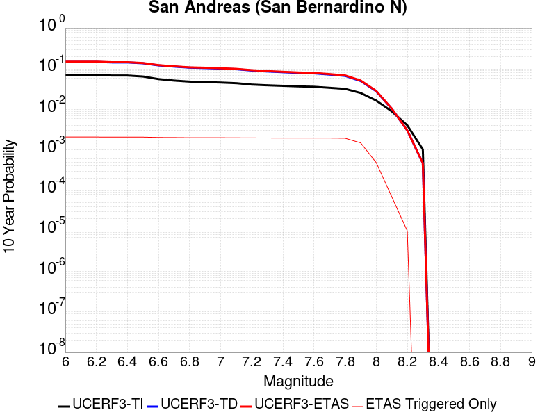 |

| Magnitude | 1 wk TI Prob | 1 wk TD Prob | 1 wk ETAS Prob | 1 wk ETAS/TD Gain | 1 wk ETAS Triggered Only | 1 mo TI Prob | 1 mo TD Prob | 1 mo ETAS Prob | 1 mo ETAS/TD Gain | 1 mo ETAS Triggered Only | 1 yr TI Prob | 1 yr TD Prob | 1 yr ETAS Prob | 1 yr ETAS/TD Gain | 1 yr ETAS Triggered Only | 10 yr TI Prob | 10 yr TD Prob | 10 yr ETAS Prob | 10 yr ETAS/TD Gain | 10 yr ETAS Triggered Only |
|-----|-----|-----|-----|-----|-----|-----|-----|-----|-----|-----|-----|-----|-----|-----|-----|-----|-----|-----|-----|-----|
| 6.0 | 1.4273766E-4 | 3.1606483E-4 | 0.0019029478 | 6.020751 | 0.0015873846 | 6.115894E-4 | 0.0013538664 | 0.0030087826 | 2.222363 | 0.0016571598 | 0.0074207084 | 0.016360244 | 0.018076083 | 1.1048787 | 0.0017443787 | 0.07177748 | 0.15026689 | 0.15182325 | 1.0103574 | 0.0018315976 |
| 6.1 | 1.4273766E-4 | 3.1606483E-4 | 0.0019029478 | 6.020751 | 0.0015873846 | 6.115894E-4 | 0.0013538664 | 0.0030087826 | 2.222363 | 0.0016571598 | 0.0074207084 | 0.016360244 | 0.018076083 | 1.1048787 | 0.0017443787 | 0.07177748 | 0.15026689 | 0.15182325 | 1.0103574 | 0.0018315976 |
| 6.2 | 1.4273766E-4 | 3.1606483E-4 | 0.0019029478 | 6.020751 | 0.0015873846 | 6.115894E-4 | 0.0013538664 | 0.0030087826 | 2.222363 | 0.0016571598 | 0.0074207084 | 0.016360244 | 0.018076083 | 1.1048787 | 0.0017443787 | 0.07177748 | 0.15026689 | 0.15182325 | 1.0103574 | 0.0018315976 |
| 6.3 | 1.3730655E-4 | 3.0511338E-4 | 0.0018745753 | 6.143864 | 0.0015699408 | 5.883239E-4 | 0.0013069791 | 0.002944552 | 2.252945 | 0.001639716 | 0.0071393442 | 0.015797773 | 0.017497426 | 1.1075882 | 0.0017269349 | 0.06914291 | 0.14556676 | 0.14711684 | 1.0106485 | 0.0018141539 |
| 6.4 | 1.3730655E-4 | 3.0511338E-4 | 0.0018745753 | 6.143864 | 0.0015699408 | 5.883239E-4 | 0.0013069791 | 0.002944552 | 2.252945 | 0.001639716 | 0.0071393442 | 0.015797773 | 0.017497426 | 1.1075882 | 0.0017269349 | 0.06914291 | 0.14556676 | 0.14711684 | 1.0106485 | 0.0018141539 |
| 6.5 | 1.2942807E-4 | 2.8925808E-4 | 0.0018587448 | 6.4259048 | 0.0015699408 | 5.545738E-4 | 0.0012390936 | 0.002876778 | 2.321679 | 0.001639716 | 0.0067310524 | 0.01498286 | 0.016683921 | 1.1135337 | 0.0017269349 | 0.06530788 | 0.13870941 | 0.14027193 | 1.0112647 | 0.0018141539 |
| 6.6 | 1.1125901E-4 | 2.536472E-4 | 0.0017708718 | 6.9816337 | 0.0015176095 | 4.767372E-4 | 0.0010866089 | 0.0026722685 | 2.4592738 | 0.0015873846 | 0.005788839 | 0.013149847 | 0.01480243 | 1.1256732 | 0.0016746036 | 0.056403454 | 0.122999296 | 0.12454441 | 1.012562 | 0.0017618225 |
| 6.7 | 1.02209575E-4 | 2.3499702E-4 | 0.0017522499 | 7.456477 | 0.0015176095 | 4.3796748E-4 | 0.0010067427 | 0.0025925294 | 2.5751657 | 0.0015873846 | 0.0053192247 | 0.012188629 | 0.013842822 | 1.1357161 | 0.0016746036 | 0.051936906 | 0.114790924 | 0.1163505 | 1.0135863 | 0.0017618225 |
| 6.8 | 9.610582E-5 | 2.2025521E-4 | 0.0017200905 | 7.809534 | 0.0015001657 | 4.1181705E-4 | 9.436101E-4 | 0.0025120697 | 2.6621902 | 0.0015699408 | 0.0050023515 | 0.011428202 | 0.013066423 | 1.143349 | 0.0016571598 | 0.048912346 | 0.1081929 | 0.10974855 | 1.0143784 | 0.0017443787 |
| 6.9 | 9.3877505E-5 | 2.1481077E-4 | 0.0017146543 | 7.982161 | 0.0015001657 | 4.0227012E-4 | 9.2029345E-4 | 0.0024887896 | 2.7043433 | 0.0015699408 | 0.0048866454 | 0.011147255 | 0.012785942 | 1.1470037 | 0.0016571598 | 0.04780577 | 0.10578323 | 0.10734308 | 1.0147457 | 0.0017443787 |
| 7.0 | 9.1019785E-5 | 2.0808022E-4 | 0.0017079338 | 8.208055 | 0.0015001657 | 3.900265E-4 | 8.914682E-4 | 0.0024600094 | 2.7595034 | 0.0015699408 | 0.0047382377 | 0.010799837 | 0.0124391 | 1.1517859 | 0.0016571598 | 0.046384744 | 0.102753714 | 0.10431885 | 1.015232 | 0.0017443787 |
| 7.1 | 8.771155E-5 | 1.9982594E-4 | 0.0016822516 | 8.418585 | 0.0014827219 | 3.758525E-4 | 8.5611636E-4 | 0.0024072842 | 2.8118658 | 0.001552497 | 0.0045664064 | 0.0103736 | 0.011996306 | 1.1564265 | 0.001639716 | 0.044737056 | 0.09906527 | 0.10062112 | 1.0157053 | 0.0017269349 |
| 7.2 | 8.0830236E-5 | 1.8388197E-4 | 0.0016488907 | 8.967114 | 0.0014652781 | 3.4636928E-4 | 7.8782777E-4 | 0.0023216717 | 2.946928 | 0.0015350532 | 0.0042088944 | 0.009549725 | 0.011156505 | 1.168254 | 0.0016222722 | 0.041300658 | 0.09179615 | 0.09334872 | 1.0169132 | 0.0017094911 |
| 7.3 | 7.7668235E-5 | 1.7331762E-4 | 0.0016383418 | 9.452829 | 0.0014652781 | 3.328214E-4 | 7.425784E-4 | 0.0022764918 | 3.0656583 | 0.0015350532 | 0.0040445733 | 0.009003494 | 0.01061116 | 1.1785603 | 0.0016222722 | 0.03971748 | 0.08706327 | 0.08862392 | 1.0179255 | 0.0017094911 |
| 7.4 | 7.520177E-5 | 1.6551897E-4 | 0.0016305546 | 9.851164 | 0.0014652781 | 3.2225347E-4 | 7.0917426E-4 | 0.0022431388 | 3.1630292 | 0.0015350532 | 0.0039163795 | 0.008600081 | 0.010208402 | 1.1870122 | 0.0016222722 | 0.038480744 | 0.08351955 | 0.08508626 | 1.0187587 | 0.0017094911 |
| 7.5 | 7.274697E-5 | 1.5839566E-4 | 0.0016234417 | 10.249282 | 0.0014652781 | 3.1173544E-4 | 6.78662E-4 | 0.0022126734 | 3.260347 | 0.0015350532 | 0.003788775 | 0.008231463 | 0.009840381 | 1.1954596 | 0.0016222722 | 0.03724827 | 0.08023631 | 0.081808634 | 1.0195962 | 0.0017094911 |
| 7.6 | 7.1185845E-5 | 1.540943E-4 | 0.0016191467 | 10.507504 | 0.0014652781 | 3.0504653E-4 | 6.6023704E-4 | 0.0021942768 | 3.3234682 | 0.0015350532 | 0.0037076178 | 0.008008812 | 0.009618091 | 1.2009387 | 0.0016222722 | 0.036463667 | 0.07822598 | 0.07980174 | 1.0201437 | 0.0017094911 |
| 7.7 | 6.709961E-5 | 1.4318313E-4 | 0.0016082515 | 11.232129 | 0.0014652781 | 2.8753807E-4 | 6.1349774E-4 | 0.0021476094 | 3.5005987 | 0.0015350532 | 0.003495157 | 0.0074437927 | 0.009053988 | 1.216314 | 0.0016222722 | 0.034406938 | 0.07305469 | 0.0746393 | 1.0216906 | 0.0017094911 |
| 7.8 | 6.300812E-5 | 1.3202413E-4 | 0.0015796673 | 11.96499 | 0.0014478343 | 2.7000686E-4 | 5.65695E-4 | 0.0020824461 | 3.6812167 | 0.0015176095 | 0.0032823787 | 0.006865616 | 0.008459426 | 1.2321439 | 0.0016048284 | 0.032343175 | 0.06771354 | 0.06929101 | 1.0232962 | 0.0016920473 |
| 7.9 | 4.983037E-5 | 9.723488E-5 | 0.0011612024 | 11.942242 | 0.0010640711 | 2.1354125E-4 | 4.1665437E-4 | 0.0015151551 | 3.6364796 | 0.0010989587 | 0.0025967648 | 0.0050609782 | 0.0062064417 | 1.2263324 | 0.00115129 | 0.025666296 | 0.05064886 | 0.05182464 | 1.0232143 | 0.0012385088 |
| 8.0 | 3.2211527E-5 | 5.3304586E-5 | 3.323903E-4 | 6.235679 | 2.791006E-4 | 1.380421E-4 | 2.2842824E-4 | 5.2490487E-4 | 2.2978985 | 2.965444E-4 | 0.0016793669 | 0.0027775685 | 0.00310808 | 1.118993 | 3.3143195E-4 | 0.016667323 | 0.028361378 | 0.02870036 | 1.0119522 | 3.4887574E-4 |
| 8.1 | 1.743376E-5 | 1.8824427E-5 | 7.1154805E-5 | 3.779919 | 5.233136E-5 | 7.471398E-5 | 8.067362E-5 | 1.3300077E-4 | 1.6486276 | 5.233136E-5 | 9.0926304E-4 | 9.817594E-4 | 0.0010340394 | 1.0532513 | 5.233136E-5 | 0.009055517 | 0.010484105 | 0.010535887 | 1.0049392 | 5.233136E-5 |
| 8.2 | 7.831616E-6 | 5.1551065E-6 | 2.2598804E-5 | 4.3837705 | 1.7443788E-5 | 3.3563636E-5 | 2.2093127E-5 | 3.9536528E-5 | 1.7895398 | 1.7443788E-5 | 4.0856065E-4 | 2.6895068E-4 | 2.8638978E-4 | 1.0648413 | 1.7443788E-5 | 0.004078103 | 0.0030418145 | 0.0030592054 | 1.0057173 | 1.7443788E-5 |
| 8.3 | 1.983087E-6 | 7.6599065E-7 | 7.6599065E-7 | 1.0 | 0.0 | 8.498917E-6 | 3.282813E-6 | 3.282813E-6 | 1.0 | 0.0 | 1.034694E-4 | 3.9967534E-5 | 3.9967534E-5 | 1.0 | 0.0 | 0.0010342124 | 4.719687E-4 | 4.719687E-4 | 1.0 | 0.0 |

## Lenwood-Lockhart-Old Woman Springs
*[(top)](#table-of-contents)*

| 1 Week | 1 Month | 1 Year | 10 Year |
|-----|-----|-----|-----|
|  |  |  |  |

| Magnitude | 1 wk TI Prob | 1 wk TD Prob | 1 wk ETAS Prob | 1 wk ETAS/TD Gain | 1 wk ETAS Triggered Only | 1 mo TI Prob | 1 mo TD Prob | 1 mo ETAS Prob | 1 mo ETAS/TD Gain | 1 mo ETAS Triggered Only | 1 yr TI Prob | 1 yr TD Prob | 1 yr ETAS Prob | 1 yr ETAS/TD Gain | 1 yr ETAS Triggered Only | 10 yr TI Prob | 10 yr TD Prob | 10 yr ETAS Prob | 10 yr ETAS/TD Gain | 10 yr ETAS Triggered Only |
|-----|-----|-----|-----|-----|-----|-----|-----|-----|-----|-----|-----|-----|-----|-----|-----|-----|-----|-----|-----|-----|
| 6.0 | 3.744542E-5 | 4.396252E-5 | 0.0014219611 | 32.344852 | 0.0013780592 | 1.604705E-4 | 1.8839816E-4 | 0.0017231622 | 9.146385 | 0.0015350532 | 0.0019519776 | 0.0022915069 | 0.003944869 | 1.7215176 | 0.0016571598 | 0.019349206 | 0.022696787 | 0.024384527 | 1.0743603 | 0.0017269349 |
| 6.1 | 3.744542E-5 | 4.396252E-5 | 0.0014219611 | 32.344852 | 0.0013780592 | 1.604705E-4 | 1.8839816E-4 | 0.0017231622 | 9.146385 | 0.0015350532 | 0.0019519776 | 0.0022915069 | 0.003944869 | 1.7215176 | 0.0016571598 | 0.019349206 | 0.022696787 | 0.024384527 | 1.0743603 | 0.0017269349 |
| 6.2 | 3.744542E-5 | 4.396252E-5 | 0.0014219611 | 32.344852 | 0.0013780592 | 1.604705E-4 | 1.8839816E-4 | 0.0017231622 | 9.146385 | 0.0015350532 | 0.0019519776 | 0.0022915069 | 0.003944869 | 1.7215176 | 0.0016571598 | 0.019349206 | 0.022696787 | 0.024384527 | 1.0743603 | 0.0017269349 |
| 6.3 | 2.1079984E-5 | 2.5353434E-5 | 6.009838E-4 | 23.704237 | 5.75645E-4 | 9.0339665E-5 | 1.0865316E-4 | 7.3656125E-4 | 6.7790136 | 6.279763E-4 | 0.0010993304 | 0.0013220694 | 0.0020014776 | 1.5138975 | 6.803077E-4 | 0.010939079 | 0.0131442575 | 0.013832837 | 1.0523864 | 6.977515E-4 |
| 6.4 | 2.1079984E-5 | 2.5353434E-5 | 6.009838E-4 | 23.704237 | 5.75645E-4 | 9.0339665E-5 | 1.0865316E-4 | 7.3656125E-4 | 6.7790136 | 6.279763E-4 | 0.0010993304 | 0.0013220694 | 0.0020014776 | 1.5138975 | 6.803077E-4 | 0.010939079 | 0.0131442575 | 0.013832837 | 1.0523864 | 6.977515E-4 |
| 6.5 | 1.7397282E-5 | 2.066241E-5 | 4.3930465E-4 | 21.261057 | 4.186509E-4 | 7.455765E-5 | 8.8550245E-5 | 5.594908E-4 | 6.3183427 | 4.7098225E-4 | 9.073613E-4 | 0.0010775778 | 0.0015654775 | 1.4527745 | 4.8842607E-4 | 0.009036654 | 0.010724821 | 0.011208009 | 1.0450532 | 4.8842607E-4 |
| 6.6 | 1.52050325E-5 | 1.7679693E-5 | 4.0143623E-4 | 22.706062 | 3.837633E-4 | 6.51628E-5 | 7.576796E-5 | 5.118296E-4 | 6.7552247 | 4.3609468E-4 | 7.9306826E-4 | 9.220924E-4 | 0.0013752127 | 1.4914044 | 4.5353847E-4 | 0.007902439 | 0.009183526 | 0.009632899 | 1.0489326 | 4.5353847E-4 |
| 6.7 | 1.332523E-5 | 1.5264002E-5 | 3.6413444E-4 | 23.855762 | 3.4887574E-4 | 5.7106878E-5 | 6.5415545E-5 | 4.6659642E-4 | 7.1328063 | 4.012071E-4 | 6.950544E-4 | 7.961491E-4 | 0.0012144666 | 1.5254261 | 4.186509E-4 | 0.006928845 | 0.007933599 | 0.008348929 | 1.0523508 | 4.186509E-4 |
| 6.8 | 1.1525329E-5 | 1.3030979E-5 | 3.4445862E-4 | 26.433825 | 3.3143195E-4 | 4.9393333E-5 | 5.584588E-5 | 4.3958778E-4 | 7.8714447 | 3.837633E-4 | 6.011979E-4 | 6.797157E-4 | 0.0010806501 | 1.589856 | 4.012071E-4 | 0.00599574 | 0.006776819 | 0.0071753073 | 1.0588017 | 4.012071E-4 |
| 6.9 | 1.0253909E-5 | 1.15144385E-5 | 2.5572465E-4 | 22.209042 | 2.4421304E-4 | 4.3944583E-5 | 4.9346683E-5 | 3.4587644E-4 | 7.0091124 | 2.965444E-4 | 5.3489394E-4 | 6.0063385E-4 | 8.9700014E-4 | 1.4934225 | 2.965444E-4 | 0.0053360825 | 0.0059904843 | 0.006285252 | 1.049206 | 2.965444E-4 |
| 7.0 | 8.104563E-6 | 8.991279E-6 | 1.4854032E-4 | 16.520489 | 1.395503E-4 | 3.4733377E-5 | 3.8533497E-5 | 2.1296465E-4 | 5.526741 | 1.7443787E-4 | 4.2279682E-4 | 4.6904673E-4 | 6.434028E-4 | 1.3717242 | 1.7443787E-4 | 0.0042199334 | 0.0046808156 | 0.004854437 | 1.0370921 | 1.7443787E-4 |
| 7.1 | 6.7986157E-6 | 7.515816E-6 | 1.1217775E-4 | 14.925559 | 1.0466272E-4 | 2.91366E-5 | 3.2210253E-5 | 1.7175605E-4 | 5.332341 | 1.395503E-4 | 3.5468035E-4 | 3.920914E-4 | 5.31587E-4 | 1.3557731 | 1.395503E-4 | 0.003541148 | 0.003914213 | 0.004053217 | 1.0355127 | 1.395503E-4 |
| 7.2 | 5.6893327E-6 | 6.2800136E-6 | 9.3498405E-5 | 14.888248 | 8.7218934E-5 | 2.4382627E-5 | 2.6914078E-5 | 1.490173E-4 | 5.536779 | 1.2210652E-4 | 2.9681803E-4 | 3.2763163E-4 | 4.4969813E-4 | 1.3725724 | 1.2210652E-4 | 0.002964219 | 0.0032716845 | 0.0033933916 | 1.0372001 | 1.2210652E-4 |
| 7.3 | 4.253348E-6 | 4.7069107E-6 | 5.7038025E-5 | 12.117933 | 5.233136E-5 | 1.8228506E-5 | 2.0172329E-5 | 8.994607E-5 | 4.458884 | 6.977515E-5 | 2.2190946E-4 | 2.4557224E-4 | 3.1533025E-4 | 1.2840631 | 6.977515E-5 | 0.00221688 | 0.0024531898 | 0.0025227938 | 1.0283729 | 6.977515E-5 |
| 7.4 | 2.5448119E-6 | 2.852045E-6 | 3.773952E-5 | 13.232442 | 3.4887576E-5 | 1.0906291E-5 | 1.2223002E-5 | 4.7110152E-5 | 3.8542209 | 3.4887576E-5 | 1.3277601E-4 | 1.4880655E-4 | 1.8368893E-4 | 1.2344143 | 3.4887576E-5 | 0.001326967 | 0.0014872311 | 0.0015220669 | 1.0234232 | 3.4887576E-5 |
| 7.5 | 4.3706837E-8 | 4.562909E-8 | 4.562909E-8 | 1.0 | 0.0 | 1.8731501E-7 | 1.9555324E-7 | 1.9555324E-7 | 1.0 | 0.0 | 2.2805577E-6 | 2.3808586E-6 | 2.3808586E-6 | 1.0 | 0.0 | 2.2805343E-5 | 2.3808387E-5 | 2.3808387E-5 | 1.0 | 0.0 |

## Coyote Canyon
*[(top)](#table-of-contents)*

| 1 Week | 1 Month | 1 Year | 10 Year |
|-----|-----|-----|-----|
|  |  |  |  |

| Magnitude | 1 wk TI Prob | 1 wk TD Prob | 1 wk ETAS Prob | 1 wk ETAS/TD Gain | 1 wk ETAS Triggered Only | 1 mo TI Prob | 1 mo TD Prob | 1 mo ETAS Prob | 1 mo ETAS/TD Gain | 1 mo ETAS Triggered Only | 1 yr TI Prob | 1 yr TD Prob | 1 yr ETAS Prob | 1 yr ETAS/TD Gain | 1 yr ETAS Triggered Only | 10 yr TI Prob | 10 yr TD Prob | 10 yr ETAS Prob | 10 yr ETAS/TD Gain | 10 yr ETAS Triggered Only |
|-----|-----|-----|-----|-----|-----|-----|-----|-----|-----|-----|-----|-----|-----|-----|-----|-----|-----|-----|-----|-----|
| 6.0 | 3.5090034E-5 | 4.0364324E-5 | 0.0011741647 | 29.089172 | 0.0011338462 | 1.503772E-4 | 1.7297994E-4 | 0.0014461562 | 8.360253 | 0.0012733964 | 0.0018293047 | 0.0021042528 | 0.0035316334 | 1.6783314 | 0.0014303905 | 0.018143194 | 0.020869201 | 0.022406379 | 1.0736578 | 0.0015699408 |
| 6.1 | 3.5090034E-5 | 4.0364324E-5 | 0.0011741647 | 29.089172 | 0.0011338462 | 1.503772E-4 | 1.7297994E-4 | 0.0014461562 | 8.360253 | 0.0012733964 | 0.0018293047 | 0.0021042528 | 0.0035316334 | 1.6783314 | 0.0014303905 | 0.018143194 | 0.020869201 | 0.022406379 | 1.0736578 | 0.0015699408 |
| 6.2 | 1.841879E-5 | 2.1059794E-5 | 6.490229E-4 | 30.818104 | 6.279763E-4 | 7.8935285E-5 | 9.0253714E-5 | 7.7050005E-4 | 8.5370455 | 6.803077E-4 | 9.606133E-4 | 0.001098387 | 0.001847646 | 1.6821448 | 7.5008284E-4 | 0.0095647145 | 0.010939667 | 0.011750556 | 1.0741237 | 8.19858E-4 |
| 6.3 | 1.841879E-5 | 2.1059794E-5 | 6.490229E-4 | 30.818104 | 6.279763E-4 | 7.8935285E-5 | 9.0253714E-5 | 7.7050005E-4 | 8.5370455 | 6.803077E-4 | 9.606133E-4 | 0.001098387 | 0.001847646 | 1.6821448 | 7.5008284E-4 | 0.0095647145 | 0.010939667 | 0.011750556 | 1.0741237 | 8.19858E-4 |
| 6.4 | 1.712201E-5 | 1.9565212E-5 | 6.4752926E-4 | 33.09595 | 6.279763E-4 | 7.337798E-5 | 8.3848776E-5 | 7.640995E-4 | 9.112827 | 6.803077E-4 | 8.930107E-4 | 0.0010204813 | 0.0017697987 | 1.7342784 | 7.5008284E-4 | 0.008894307 | 0.010167871 | 0.010979393 | 1.0798124 | 8.19858E-4 |
| 6.5 | 1.4744935E-5 | 1.6836972E-5 | 5.226983E-4 | 31.044674 | 5.0586986E-4 | 6.3191044E-5 | 7.215698E-5 | 6.128754E-4 | 8.493639 | 5.4075744E-4 | 7.6907943E-4 | 8.7825063E-4 | 0.001488247 | 1.6945584 | 6.1053253E-4 | 0.007664232 | 0.008756994 | 0.009431344 | 1.077007 | 6.803077E-4 |
| 6.6 | 1.2017839E-5 | 1.37240895E-5 | 4.6725632E-4 | 34.046436 | 4.5353847E-4 | 5.150401E-5 | 5.88167E-5 | 5.47214E-4 | 9.303719 | 4.8842607E-4 | 6.268809E-4 | 7.159466E-4 | 0.0012737481 | 1.7791106 | 5.582012E-4 | 0.0062511545 | 0.0071450938 | 0.007751264 | 1.0848373 | 6.1053253E-4 |
| 6.7 | 1.00956095E-5 | 1.1533517E-5 | 4.3017959E-4 | 37.298214 | 4.186509E-4 | 4.326618E-5 | 4.942891E-5 | 5.02945E-4 | 10.1751175 | 4.5353847E-4 | 5.266384E-4 | 6.017178E-4 | 0.0011247165 | 1.8691761 | 5.2331365E-4 | 0.005253921 | 0.0060094125 | 0.006581598 | 1.095215 | 5.75645E-4 |

## Death Valley (So)
*[(top)](#table-of-contents)*

| 1 Week | 1 Month | 1 Year | 10 Year |
|-----|-----|-----|-----|
| 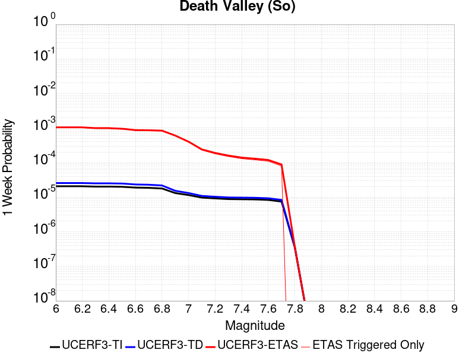 |  |  |  |

| Magnitude | 1 wk TI Prob | 1 wk TD Prob | 1 wk ETAS Prob | 1 wk ETAS/TD Gain | 1 wk ETAS Triggered Only | 1 mo TI Prob | 1 mo TD Prob | 1 mo ETAS Prob | 1 mo ETAS/TD Gain | 1 mo ETAS Triggered Only | 1 yr TI Prob | 1 yr TD Prob | 1 yr ETAS Prob | 1 yr ETAS/TD Gain | 1 yr ETAS Triggered Only | 10 yr TI Prob | 10 yr TD Prob | 10 yr ETAS Prob | 10 yr ETAS/TD Gain | 10 yr ETAS Triggered Only |
|-----|-----|-----|-----|-----|-----|-----|-----|-----|-----|-----|-----|-----|-----|-----|-----|-----|-----|-----|-----|-----|
| 6.0 | 2.0684236E-5 | 2.5617775E-5 | 0.0010373315 | 40.492645 | 0.0010117397 | 8.864371E-5 | 1.0978594E-4 | 0.0012609495 | 11.485528 | 0.00115129 | 0.0010787029 | 0.0013358411 | 0.0026946391 | 2.0171852 | 0.0013606154 | 0.010734817 | 0.013281397 | 0.014710002 | 1.1075643 | 0.0014478343 |
| 6.1 | 2.0684236E-5 | 2.5617775E-5 | 0.0010373315 | 40.492645 | 0.0010117397 | 8.864371E-5 | 1.0978594E-4 | 0.0012609495 | 11.485528 | 0.00115129 | 0.0010787029 | 0.0013358411 | 0.0026946391 | 2.0171852 | 0.0013606154 | 0.010734817 | 0.013281397 | 0.014710002 | 1.1075643 | 0.0014478343 |
| 6.2 | 2.0684236E-5 | 2.5617775E-5 | 0.0010373315 | 40.492645 | 0.0010117397 | 8.864371E-5 | 1.0978594E-4 | 0.0012609495 | 11.485528 | 0.00115129 | 0.0010787029 | 0.0013358411 | 0.0026946391 | 2.0171852 | 0.0013606154 | 0.010734817 | 0.013281397 | 0.014710002 | 1.1075643 | 0.0014478343 |
| 6.3 | 2.0240292E-5 | 2.511786E-5 | 0.0010019455 | 39.88976 | 9.768521E-4 | 8.6741224E-5 | 1.07643624E-4 | 0.001189042 | 11.046098 | 0.0010815149 | 0.0010555626 | 0.00130979 | 0.0025989395 | 1.9842414 | 0.0012908402 | 0.010505628 | 0.013023956 | 0.014401284 | 1.1057534 | 0.001395503 |
| 6.4 | 2.0240292E-5 | 2.511786E-5 | 0.0010019455 | 39.88976 | 9.768521E-4 | 8.6741224E-5 | 1.07643624E-4 | 0.001189042 | 11.046098 | 0.0010815149 | 0.0010555626 | 0.00130979 | 0.0025989395 | 1.9842414 | 0.0012908402 | 0.010505628 | 0.013023956 | 0.014401284 | 1.1057534 | 0.001395503 |
| 6.5 | 1.9962767E-5 | 2.4807114E-5 | 9.841917E-4 | 39.673767 | 9.594083E-4 | 8.55519E-5 | 1.0631196E-4 | 0.001152828 | 10.843822 | 0.0010466273 | 0.0010410968 | 0.0012935963 | 0.0025479244 | 1.9696441 | 0.0012559526 | 0.010362327 | 0.012863902 | 0.014189796 | 1.1030709 | 0.0013431716 |
| 6.6 | 1.8937297E-5 | 2.3310964E-5 | 9.1292337E-4 | 39.16283 | 8.8963314E-4 | 8.115732E-5 | 9.990039E-5 | 0.0010766549 | 10.777284 | 9.768521E-4 | 9.876423E-4 | 0.0012156231 | 0.0023655137 | 1.9459267 | 0.00115129 | 0.009832645 | 0.012092789 | 0.01331632 | 1.1011786 | 0.0012385088 |
| 6.7 | 1.8621096E-5 | 2.2911607E-5 | 8.95081E-4 | 39.066708 | 8.7218935E-4 | 7.980225E-5 | 9.818898E-5 | 0.001040061 | 10.592441 | 9.419645E-4 | 9.711593E-4 | 0.0011948098 | 0.0022924554 | 1.918678 | 0.0010989587 | 0.009669261 | 0.011886904 | 0.013041745 | 1.0971524 | 0.0011687338 |
| 6.8 | 1.7830353E-5 | 2.1805688E-5 | 8.5908925E-4 | 39.397484 | 8.373018E-4 | 7.641356E-5 | 9.344968E-5 | 0.0010004418 | 10.705674 | 9.0707693E-4 | 9.29938E-4 | 0.00113717 | 0.002182607 | 1.9193323 | 0.0010466273 | 0.009260561 | 0.011316354 | 0.012420123 | 1.0975375 | 0.0011164024 |
| 6.9 | 1.3135183E-5 | 1.5303925E-5 | 6.083836E-4 | 39.753437 | 5.930888E-4 | 5.6292425E-5 | 6.558664E-5 | 7.2840706E-4 | 11.106029 | 6.628639E-4 | 6.8514474E-4 | 7.982312E-4 | 0.0015477154 | 1.9389311 | 7.5008284E-4 | 0.006830362 | 0.007954649 | 0.008733375 | 1.0978957 | 7.849704E-4 |
| 7.0 | 1.1507512E-5 | 1.3154199E-5 | 4.317996E-4 | 32.82599 | 4.186509E-4 | 4.9316975E-5 | 5.6373956E-5 | 5.447725E-4 | 9.663548 | 4.8842607E-4 | 6.002687E-4 | 6.8614254E-4 | 0.0011916653 | 1.7367605 | 5.0586986E-4 | 0.0059864987 | 0.0068409415 | 0.0073606754 | 1.075974 | 5.2331365E-4 |
| 7.1 | 9.715903E-6 | 1.0865278E-5 | 2.5507566E-4 | 23.47622 | 2.4421304E-4 | 4.1638916E-5 | 4.656467E-5 | 2.9076633E-4 | 6.2443547 | 2.4421304E-4 | 5.068359E-4 | 5.667817E-4 | 8.282902E-4 | 1.4613919 | 2.6165682E-4 | 0.0050568148 | 0.0056538144 | 0.0059313374 | 1.0490859 | 2.791006E-4 |
| 7.2 | 9.233269E-6 | 1.02863105E-5 | 2.02166E-4 | 19.653889 | 1.9188166E-4 | 3.9570554E-5 | 4.4083466E-5 | 2.3595667E-4 | 5.352498 | 1.9188166E-4 | 4.81665E-4 | 5.3658825E-4 | 7.2836695E-4 | 1.3574039 | 1.9188166E-4 | 0.0048062233 | 0.0053533576 | 0.0055615627 | 1.0388924 | 2.0932544E-4 |
| 7.3 | 8.8041315E-6 | 9.808164E-6 | 2.0168794E-4 | 20.563272 | 1.9188166E-4 | 3.7731446E-5 | 4.2034335E-5 | 2.3390794E-4 | 5.5646873 | 1.9188166E-4 | 4.592835E-4 | 5.1165203E-4 | 7.0343557E-4 | 1.3748318 | 1.9188166E-4 | 0.0045833546 | 0.005105167 | 0.005313424 | 1.0407933 | 2.0932544E-4 |
| 7.4 | 8.708749E-6 | 9.707175E-6 | 2.0158697E-4 | 20.766802 | 1.9188166E-4 | 3.7322676E-5 | 4.160154E-5 | 2.3347522E-4 | 5.6121774 | 1.9188166E-4 | 4.5430884E-4 | 5.0638523E-4 | 6.981697E-4 | 1.3787324 | 1.9188166E-4 | 0.004533812 | 0.0050527398 | 0.005261007 | 1.0412188 | 2.0932544E-4 |
| 7.5 | 8.612678E-6 | 9.604817E-6 | 1.8404101E-4 | 19.161324 | 1.7443787E-4 | 3.6910955E-5 | 4.1162875E-5 | 2.1559357E-4 | 5.237573 | 1.7443787E-4 | 4.492982E-4 | 5.01047E-4 | 6.7539746E-4 | 1.3479723 | 1.7443787E-4 | 0.004483909 | 0.0049995985 | 0.005190521 | 1.0381875 | 1.9188166E-4 |
| 7.6 | 8.319024E-6 | 9.283916E-6 | 1.6627654E-4 | 17.910173 | 1.5699408E-4 | 3.5652476E-5 | 3.978763E-5 | 1.9677547E-4 | 4.9456444 | 1.5699408E-4 | 4.3398244E-4 | 4.8431093E-4 | 6.41229E-4 | 1.3240027 | 1.5699408E-4 | 0.0043313587 | 0.0048329784 | 0.005006573 | 1.0359188 | 1.7443787E-4 |
| 7.7 | 7.4718328E-6 | 8.34517E-6 | 1.3045066E-4 | 15.631876 | 1.2210652E-4 | 3.2021748E-5 | 3.5764548E-5 | 1.5786669E-4 | 4.4140553 | 1.2210652E-4 | 3.8979502E-4 | 4.353504E-4 | 5.574037E-4 | 1.2803566 | 1.2210652E-4 | 0.00389112 | 0.0043453807 | 0.0044843247 | 1.031975 | 1.395503E-4 |
| 7.8 | 3.4586725E-7 | 3.6482615E-7 | 3.6482615E-7 | 1.0 | 0.0 | 1.4822873E-6 | 1.5635396E-6 | 1.5635396E-6 | 1.0 | 0.0 | 1.80467E-5 | 1.9035933E-5 | 1.9035933E-5 | 1.0 | 0.0 | 1.8045233E-4 | 1.9034347E-4 | 1.9034347E-4 | 1.0 | 0.0 |
| 7.9 | 2.5591178E-9 | 2.6696718E-9 | 2.6696718E-9 | 1.0 | 0.0 | 1.0967647E-8 | 1.14414505E-8 | 1.14414505E-8 | 1.0 | 0.0 | 1.335311E-7 | 1.3929966E-7 | 1.3929966E-7 | 1.0 | 0.0 | 1.3353102E-6 | 1.3929966E-6 | 1.3929966E-6 | 1.0 | 0.0 |

## Towne Pass
*[(top)](#table-of-contents)*

| 1 Week | 1 Month | 1 Year | 10 Year |
|-----|-----|-----|-----|
| 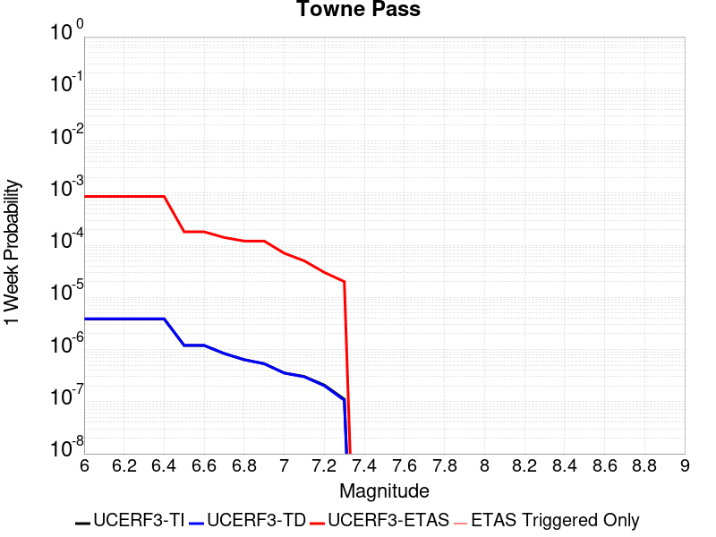 |  | 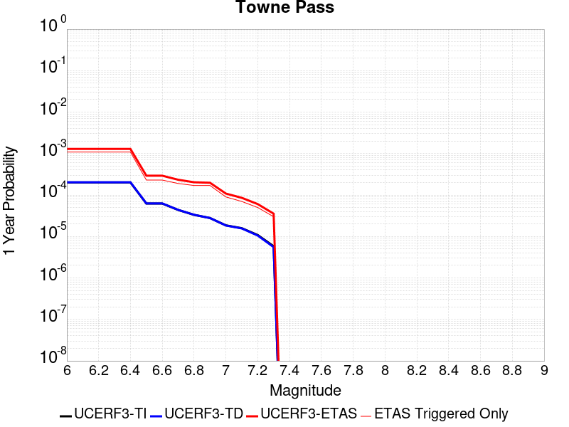 |  |

| Magnitude | 1 wk TI Prob | 1 wk TD Prob | 1 wk ETAS Prob | 1 wk ETAS/TD Gain | 1 wk ETAS Triggered Only | 1 mo TI Prob | 1 mo TD Prob | 1 mo ETAS Prob | 1 mo ETAS/TD Gain | 1 mo ETAS Triggered Only | 1 yr TI Prob | 1 yr TD Prob | 1 yr ETAS Prob | 1 yr ETAS/TD Gain | 1 yr ETAS Triggered Only | 10 yr TI Prob | 10 yr TD Prob | 10 yr ETAS Prob | 10 yr ETAS/TD Gain | 10 yr ETAS Triggered Only |
|-----|-----|-----|-----|-----|-----|-----|-----|-----|-----|-----|-----|-----|-----|-----|-----|-----|-----|-----|-----|-----|
| 6.0 | 3.849728E-6 | 3.8945414E-6 | 7.8886194E-4 | 202.55579 | 7.849704E-4 | 1.649873E-5 | 1.669081E-5 | 8.714221E-4 | 52.209698 | 8.5474557E-4 | 2.0085352E-4 | 2.0319603E-4 | 0.0012321704 | 6.063949 | 0.0010291835 | 0.0020067208 | 0.0020305314 | 0.0031098502 | 1.5315449 | 0.0010815149 |
| 6.1 | 3.849728E-6 | 3.8945414E-6 | 7.8886194E-4 | 202.55579 | 7.849704E-4 | 1.649873E-5 | 1.669081E-5 | 8.714221E-4 | 52.209698 | 8.5474557E-4 | 2.0085352E-4 | 2.0319603E-4 | 0.0012321704 | 6.063949 | 0.0010291835 | 0.0020067208 | 0.0020305314 | 0.0031098502 | 1.5315449 | 0.0010815149 |
| 6.2 | 3.849728E-6 | 3.8945414E-6 | 7.8886194E-4 | 202.55579 | 7.849704E-4 | 1.649873E-5 | 1.669081E-5 | 8.714221E-4 | 52.209698 | 8.5474557E-4 | 2.0085352E-4 | 2.0319603E-4 | 0.0012321704 | 6.063949 | 0.0010291835 | 0.0020067208 | 0.0020305314 | 0.0031098502 | 1.5315449 | 0.0010815149 |
| 6.3 | 3.849728E-6 | 3.8945414E-6 | 7.8886194E-4 | 202.55579 | 7.849704E-4 | 1.649873E-5 | 1.669081E-5 | 8.714221E-4 | 52.209698 | 8.5474557E-4 | 2.0085352E-4 | 2.0319603E-4 | 0.0012321704 | 6.063949 | 0.0010291835 | 0.0020067208 | 0.0020305314 | 0.0031098502 | 1.5315449 | 0.0010815149 |
| 6.4 | 3.849728E-6 | 3.8945414E-6 | 7.8886194E-4 | 202.55579 | 7.849704E-4 | 1.649873E-5 | 1.669081E-5 | 8.714221E-4 | 52.209698 | 8.5474557E-4 | 2.0085352E-4 | 2.0319603E-4 | 0.0012321704 | 6.063949 | 0.0010291835 | 0.0020067208 | 0.0020305314 | 0.0031098502 | 1.5315449 | 0.0010815149 |
| 6.5 | 1.1953545E-6 | 1.203052E-6 | 1.5819696E-4 | 131.49635 | 1.5699408E-4 | 5.1229376E-6 | 5.1559277E-6 | 1.6214921E-4 | 31.449083 | 1.5699408E-4 | 6.236998E-5 | 6.277173E-5 | 2.7208403E-4 | 4.3344994 | 2.0932544E-4 | 6.235248E-4 | 6.275517E-4 | 8.3674584E-4 | 1.3333496 | 2.0932544E-4 |
| 6.6 | 1.1953545E-6 | 1.203052E-6 | 1.5819696E-4 | 131.49635 | 1.5699408E-4 | 5.1229376E-6 | 5.1559277E-6 | 1.6214921E-4 | 31.449083 | 1.5699408E-4 | 6.236998E-5 | 6.277173E-5 | 2.7208403E-4 | 4.3344994 | 2.0932544E-4 | 6.235248E-4 | 6.275517E-4 | 8.3674584E-4 | 1.3333496 | 2.0932544E-4 |
| 6.7 | 8.375951E-7 | 8.4106705E-7 | 1.2294747E-4 | 146.18036 | 1.2210652E-4 | 3.5896885E-6 | 3.6045683E-6 | 1.2571063E-4 | 34.875366 | 1.2210652E-4 | 4.370358E-5 | 4.3884793E-5 | 2.18315E-4 | 4.97473 | 1.7443787E-4 | 4.3694986E-4 | 4.38767E-4 | 6.131283E-4 | 1.3973894 | 1.7443787E-4 |
| 6.8 | 6.38041E-7 | 6.392156E-7 | 1.0530187E-4 | 164.73607 | 1.0466272E-4 | 2.7344586E-6 | 2.7394929E-6 | 1.0740193E-4 | 39.20504 | 1.0466272E-4 | 3.3291526E-5 | 3.3352855E-5 | 1.903417E-4 | 5.7069087 | 1.5699408E-4 | 3.3286537E-4 | 3.334823E-4 | 4.9042405E-4 | 1.4706149 | 1.5699408E-4 |
| 6.9 | 5.3460053E-7 | 5.345333E-7 | 1.051972E-4 | 196.80196 | 1.0466272E-4 | 2.2911431E-6 | 2.2908553E-6 | 1.0695334E-4 | 46.68708 | 1.0466272E-4 | 2.789431E-5 | 2.789084E-5 | 1.8488054E-4 | 6.6287193 | 1.5699408E-4 | 2.789081E-4 | 2.7887672E-4 | 4.35827E-4 | 1.5627946 | 1.5699408E-4 |
| 7.0 | 3.557783E-7 | 3.5324226E-7 | 8.7572145E-5 | 247.9096 | 8.7218934E-5 | 1.5247632E-6 | 1.5138945E-6 | 8.87327E-5 | 58.612206 | 8.7218934E-5 | 1.8563835E-5 | 1.843152E-5 | 1.0564885E-4 | 5.7319665 | 8.7218934E-5 | 1.8562283E-4 | 1.8430075E-4 | 2.715036E-4 | 1.4731553 | 8.7218934E-5 |
| 7.1 | 3.037942E-7 | 3.0002218E-7 | 8.7518936E-5 | 291.70822 | 8.7218934E-5 | 1.3019744E-6 | 1.2858087E-6 | 8.850463E-5 | 68.83188 | 8.7218934E-5 | 1.5851423E-5 | 1.5654618E-5 | 1.0287219E-4 | 6.5713644 | 8.7218934E-5 | 1.5850292E-4 | 1.5653588E-4 | 2.4374117E-4 | 1.5570945 | 8.7218934E-5 |
| 7.2 | 2.0808248E-7 | 2.0217689E-7 | 5.2533527E-5 | 259.83945 | 5.233136E-5 | 8.917818E-7 | 8.6647213E-7 | 5.319779E-5 | 61.395847 | 5.233136E-5 | 1.0857389E-5 | 1.0549252E-5 | 6.288006E-5 | 5.960618 | 5.233136E-5 | 1.0856859E-4 | 1.0548797E-4 | 1.5781382E-4 | 1.496036 | 5.233136E-5 |
| 7.3 | 1.1162073E-7 | 1.0636894E-7 | 3.499394E-5 | 328.98648 | 3.4887576E-5 | 4.7837443E-7 | 4.558668E-7 | 3.5343426E-5 | 77.53016 | 3.4887576E-5 | 5.8241935E-6 | 5.550166E-6 | 4.0437546E-5 | 7.2858267 | 3.4887576E-5 | 5.8240406E-5 | 5.5500474E-5 | 9.0386115E-5 | 1.6285647 | 3.4887576E-5 |

## San Andreas (San Bernardino S)
*[(top)](#table-of-contents)*

| 1 Week | 1 Month | 1 Year | 10 Year |
|-----|-----|-----|-----|
|  |  |  |  |

| Magnitude | 1 wk TI Prob | 1 wk TD Prob | 1 wk ETAS Prob | 1 wk ETAS/TD Gain | 1 wk ETAS Triggered Only | 1 mo TI Prob | 1 mo TD Prob | 1 mo ETAS Prob | 1 mo ETAS/TD Gain | 1 mo ETAS Triggered Only | 1 yr TI Prob | 1 yr TD Prob | 1 yr ETAS Prob | 1 yr ETAS/TD Gain | 1 yr ETAS Triggered Only | 10 yr TI Prob | 10 yr TD Prob | 10 yr ETAS Prob | 10 yr ETAS/TD Gain | 10 yr ETAS Triggered Only |
|-----|-----|-----|-----|-----|-----|-----|-----|-----|-----|-----|-----|-----|-----|-----|-----|-----|-----|-----|-----|-----|
| 6.0 | 1.2336002E-4 | 3.0004102E-4 | 0.001119653 | 3.7316666 | 8.19858E-4 | 5.2857865E-4 | 0.0012852824 | 0.0021389294 | 1.6641707 | 8.5474557E-4 | 0.006416472 | 0.015540994 | 0.016416801 | 1.0563546 | 8.8963314E-4 | 0.06234337 | 0.14283717 | 0.14364459 | 1.0056527 | 9.419645E-4 |
| 6.1 | 1.2336002E-4 | 3.0004102E-4 | 0.001119653 | 3.7316666 | 8.19858E-4 | 5.2857865E-4 | 0.0012852824 | 0.0021389294 | 1.6641707 | 8.5474557E-4 | 0.006416472 | 0.015540994 | 0.016416801 | 1.0563546 | 8.8963314E-4 | 0.06234337 | 0.14283717 | 0.14364459 | 1.0056527 | 9.419645E-4 |
| 6.2 | 1.2336002E-4 | 3.0004102E-4 | 0.001119653 | 3.7316666 | 8.19858E-4 | 5.2857865E-4 | 0.0012852824 | 0.0021389294 | 1.6641707 | 8.5474557E-4 | 0.006416472 | 0.015540994 | 0.016416801 | 1.0563546 | 8.8963314E-4 | 0.06234337 | 0.14283717 | 0.14364459 | 1.0056527 | 9.419645E-4 |
| 6.3 | 1.1712257E-4 | 2.8792414E-4 | 0.001107546 | 3.8466594 | 8.19858E-4 | 5.018573E-4 | 0.0012334028 | 0.0020870941 | 1.6921432 | 8.5474557E-4 | 0.006093008 | 0.014918125 | 0.015794486 | 1.0587448 | 8.8963314E-4 | 0.059286322 | 0.13754563 | 0.13835803 | 1.0059065 | 9.419645E-4 |
| 6.4 | 1.1712257E-4 | 2.8792414E-4 | 0.001107546 | 3.8466594 | 8.19858E-4 | 5.018573E-4 | 0.0012334028 | 0.0020870941 | 1.6921432 | 8.5474557E-4 | 0.006093008 | 0.014918125 | 0.015794486 | 1.0587448 | 8.8963314E-4 | 0.059286322 | 0.13754563 | 0.13835803 | 1.0059065 | 9.419645E-4 |
| 6.5 | 1.0689076E-4 | 2.680528E-4 | 0.0010702519 | 3.9926908 | 8.024142E-4 | 4.5802278E-4 | 0.0011483167 | 0.001984657 | 1.7283186 | 8.373018E-4 | 0.0055621783 | 0.01389575 | 0.01475582 | 1.0618944 | 8.7218935E-4 | 0.05425003 | 0.12879294 | 0.1295984 | 1.0062538 | 9.245207E-4 |
| 6.6 | 9.7648895E-5 | 2.50501E-4 | 0.0010178353 | 4.0631986 | 7.675266E-4 | 4.1842813E-4 | 0.0010731576 | 0.0018747108 | 1.7469108 | 8.024142E-4 | 0.005082469 | 0.012991785 | 0.013818209 | 1.0636113 | 8.373018E-4 | 0.049677886 | 0.12095292 | 0.12173495 | 1.0064656 | 8.8963314E-4 |
| 6.7 | 8.757013E-5 | 2.3120902E-4 | 9.985582E-4 | 4.318855 | 7.675266E-4 | 3.7524657E-4 | 9.905418E-4 | 0.0017921613 | 1.8092737 | 8.024142E-4 | 0.00455906 | 0.011997245 | 0.012824502 | 1.0689539 | 8.373018E-4 | 0.04466656 | 0.11226123 | 0.11305099 | 1.007035 | 8.8963314E-4 |
| 6.8 | 8.562978E-5 | 2.2680782E-4 | 9.941604E-4 | 4.383272 | 7.675266E-4 | 3.6693315E-4 | 9.7169366E-4 | 0.0017733282 | 1.8249869 | 8.024142E-4 | 0.004458263 | 0.011770263 | 0.01259771 | 1.0702997 | 8.373018E-4 | 0.043698758 | 0.11027153 | 0.11106306 | 1.0071781 | 8.8963314E-4 |
| 6.9 | 6.124075E-5 | 1.7065753E-4 | 9.2061237E-4 | 5.394502 | 7.5008284E-4 | 2.6243398E-4 | 7.311852E-4 | 0.0015155817 | 2.072774 | 7.849704E-4 | 0.0031904527 | 0.008866051 | 0.0096786395 | 1.0916518 | 8.19858E-4 | 0.031450346 | 0.08418263 | 0.0849814 | 1.0094885 | 8.7218935E-4 |
| 7.0 | 5.8598747E-5 | 1.649477E-4 | 9.1490685E-4 | 5.5466475 | 7.5008284E-4 | 2.5111332E-4 | 7.06728E-4 | 0.0014911437 | 2.1099257 | 7.849704E-4 | 0.0030530186 | 0.008570663 | 0.009383494 | 1.0948387 | 8.19858E-4 | 0.03011414 | 0.081500374 | 0.082301475 | 1.0098295 | 8.7218935E-4 |
| 7.1 | 5.613814E-5 | 1.5913323E-4 | 8.916557E-4 | 5.6032023 | 7.3263905E-4 | 2.4056983E-4 | 6.818221E-4 | 0.0014488254 | 2.1249318 | 7.675266E-4 | 0.0029250039 | 0.008269769 | 0.009065547 | 1.0962274 | 8.024142E-4 | 0.028868021 | 0.07879931 | 0.0795867 | 1.0099924 | 8.5474557E-4 |
| 7.2 | 4.991222E-5 | 1.4519796E-4 | 8.602894E-4 | 5.9249415 | 7.1519526E-4 | 2.1389198E-4 | 6.2212895E-4 | 0.0013717451 | 2.204921 | 7.5008284E-4 | 0.002601025 | 0.007548217 | 0.0083272625 | 1.1032091 | 7.849704E-4 | 0.025707912 | 0.07225321 | 0.07303001 | 1.0107511 | 8.373018E-4 |
| 7.3 | 4.7410045E-5 | 1.3714004E-4 | 8.522372E-4 | 6.214358 | 7.1519526E-4 | 2.0317009E-4 | 5.8761094E-4 | 0.001337253 | 2.2757456 | 7.5008284E-4 | 0.0024707897 | 0.0071307817 | 0.007910155 | 1.109297 | 7.849704E-4 | 0.024434982 | 0.06853558 | 0.0693155 | 1.0113797 | 8.373018E-4 |
| 7.4 | 4.5556746E-5 | 1.3121912E-4 | 8.4632053E-4 | 6.449674 | 7.1519526E-4 | 1.952286E-4 | 5.622468E-4 | 0.0013119079 | 2.333331 | 7.5008284E-4 | 0.002374317 | 0.0068239477 | 0.0076035615 | 1.1142467 | 7.849704E-4 | 0.023491086 | 0.065788016 | 0.06657023 | 1.0118899 | 8.373018E-4 |
| 7.5 | 4.3084514E-5 | 1.2357246E-4 | 8.386794E-4 | 6.7869434 | 7.1519526E-4 | 1.8463485E-4 | 5.2948913E-4 | 0.0012791748 | 2.4158661 | 7.5008284E-4 | 0.0022456115 | 0.0064275465 | 0.007207472 | 1.121341 | 7.849704E-4 | 0.022230545 | 0.062188786 | 0.06297401 | 1.0126265 | 8.373018E-4 |
| 7.6 | 3.408608E-5 | 9.83552E-5 | 8.134801E-4 | 8.270841 | 7.1519526E-4 | 1.4607502E-4 | 4.214543E-4 | 0.001171221 | 2.7789989 | 7.5008284E-4 | 0.0017770125 | 0.0051191594 | 0.005900111 | 1.1525548 | 7.849704E-4 | 0.017628696 | 0.050020292 | 0.050815713 | 1.0159019 | 8.373018E-4 |
| 7.7 | 2.8315713E-5 | 8.248679E-5 | 7.9762307E-4 | 9.669706 | 7.1519526E-4 | 1.2134742E-4 | 3.5346695E-4 | 0.0011032847 | 3.1213233 | 7.5008284E-4 | 0.0014764034 | 0.0042949775 | 0.0050765765 | 1.1819798 | 7.849704E-4 | 0.01466633 | 0.0422714 | 0.04307331 | 1.0189705 | 8.373018E-4 |
| 7.8 | 2.6222975E-5 | 7.463088E-5 | 7.723303E-4 | 10.348669 | 6.977515E-4 | 1.1237934E-4 | 3.1980744E-4 | 0.0010522122 | 3.290143 | 7.3263905E-4 | 0.0013673597 | 0.0038867102 | 0.0046512536 | 1.1967071 | 7.675266E-4 | 0.013589768 | 0.03843674 | 0.039225087 | 1.0205102 | 8.19858E-4 |
| 7.9 | 2.1469694E-5 | 5.787864E-5 | 5.9860473E-4 | 10.342412 | 5.4075744E-4 | 9.200973E-5 | 2.4802773E-4 | 8.2352996E-4 | 3.320314 | 5.75645E-4 | 0.0011196428 | 0.0030155594 | 0.0036242509 | 1.2018503 | 6.1053253E-4 | 0.011140184 | 0.030152109 | 0.030794986 | 1.0213212 | 6.628639E-4 |
| 8.0 | 1.2420249E-5 | 3.131896E-5 | 1.8830813E-4 | 6.0125923 | 1.5699408E-4 | 5.322855E-5 | 1.342172E-4 | 3.0863166E-4 | 2.299494 | 1.7443787E-4 | 6.478649E-4 | 0.0016328706 | 0.0018418543 | 1.1279855 | 2.0932544E-4 | 0.0064597935 | 0.016522504 | 0.016745526 | 1.0134981 | 2.2676923E-4 |
| 8.1 | 4.9197724E-6 | 7.822348E-6 | 2.5266E-5 | 3.2299762 | 1.7443788E-5 | 2.1084568E-5 | 3.352392E-5 | 5.0967123E-5 | 1.5203211 | 1.7443788E-5 | 2.566744E-4 | 4.0807744E-4 | 4.255141E-4 | 1.0427288 | 1.7443788E-5 | 0.002563781 | 0.0043843705 | 0.004401738 | 1.0039612 | 1.7443788E-5 |
| 8.2 | 2.5634774E-6 | 2.9067196E-6 | 2.0350457E-5 | 7.0011764 | 1.7443788E-5 | 1.0986286E-5 | 1.2457311E-5 | 2.990088E-5 | 2.4002678 | 1.7443788E-5 | 1.3374983E-4 | 1.5165724E-4 | 1.6909839E-4 | 1.1150037 | 1.7443788E-5 | 0.0013366934 | 0.0017049741 | 0.0017223881 | 1.0102136 | 1.7443788E-5 |
| 8.3 | 5.2850464E-7 | 3.2088764E-7 | 3.2088764E-7 | 1.0 | 0.0 | 2.2650179E-6 | 1.375232E-6 | 1.375232E-6 | 1.0 | 0.0 | 2.7576245E-5 | 1.6743334E-5 | 1.6743334E-5 | 1.0 | 0.0 | 2.7572823E-4 | 1.9870348E-4 | 1.9870348E-4 | 1.0 | 0.0 |

## Nelson Lake
*[(top)](#table-of-contents)*

| 1 Week | 1 Month | 1 Year | 10 Year |
|-----|-----|-----|-----|
|  | 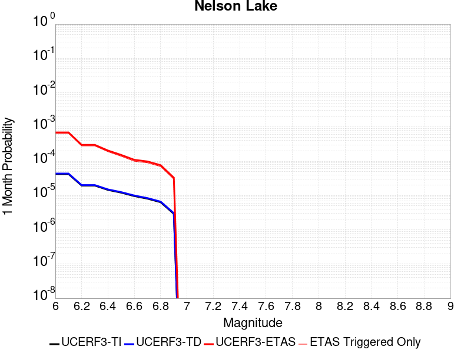 |  |  |

| Magnitude | 1 wk TI Prob | 1 wk TD Prob | 1 wk ETAS Prob | 1 wk ETAS/TD Gain | 1 wk ETAS Triggered Only | 1 mo TI Prob | 1 mo TD Prob | 1 mo ETAS Prob | 1 mo ETAS/TD Gain | 1 mo ETAS Triggered Only | 1 yr TI Prob | 1 yr TD Prob | 1 yr ETAS Prob | 1 yr ETAS/TD Gain | 1 yr ETAS Triggered Only | 10 yr TI Prob | 10 yr TD Prob | 10 yr ETAS Prob | 10 yr ETAS/TD Gain | 10 yr ETAS Triggered Only |
|-----|-----|-----|-----|-----|-----|-----|-----|-----|-----|-----|-----|-----|-----|-----|-----|-----|-----|-----|-----|-----|
| 6.0 | 9.913453E-6 | 1.0192255E-5 | 6.381622E-4 | 62.61246 | 6.279763E-4 | 4.2485535E-5 | 4.3680422E-5 | 7.762875E-4 | 17.771978 | 7.3263905E-4 | 5.1713863E-4 | 5.316897E-4 | 0.0013162427 | 2.4755845 | 7.849704E-4 | 0.0051593683 | 0.005305204 | 0.0061207125 | 1.1537186 | 8.19858E-4 |
| 6.1 | 9.913453E-6 | 1.0192255E-5 | 6.381622E-4 | 62.61246 | 6.279763E-4 | 4.2485535E-5 | 4.3680422E-5 | 7.762875E-4 | 17.771978 | 7.3263905E-4 | 5.1713863E-4 | 5.316897E-4 | 0.0013162427 | 2.4755845 | 7.849704E-4 | 0.0051593683 | 0.005305204 | 0.0061207125 | 1.1537186 | 8.19858E-4 |
| 6.2 | 4.5596407E-6 | 4.696313E-6 | 2.4890818E-4 | 53.000767 | 2.4421304E-4 | 1.954117E-5 | 2.0126909E-5 | 3.3410877E-4 | 16.600103 | 3.1398816E-4 | 2.3788778E-4 | 2.4501883E-4 | 5.9380906E-4 | 2.4235244 | 3.4887574E-4 | 0.0023763329 | 0.0024476128 | 0.002830437 | 1.1564071 | 3.837633E-4 |
| 6.3 | 4.5596407E-6 | 4.696313E-6 | 2.4890818E-4 | 53.000767 | 2.4421304E-4 | 1.954117E-5 | 2.0126909E-5 | 3.3410877E-4 | 16.600103 | 3.1398816E-4 | 2.3788778E-4 | 2.4501883E-4 | 5.9380906E-4 | 2.4235244 | 3.4887574E-4 | 0.0023763329 | 0.0024476128 | 0.002830437 | 1.1564071 | 3.837633E-4 |
| 6.4 | 3.4025713E-6 | 3.5098972E-6 | 1.7794716E-4 | 50.69868 | 1.7443787E-4 | 1.4582367E-5 | 1.5042335E-5 | 2.069211E-4 | 13.755917 | 1.9188166E-4 | 1.7752586E-4 | 1.8312587E-4 | 4.098536E-4 | 2.2380977 | 2.2676923E-4 | 0.001773841 | 0.0018298327 | 0.0020910106 | 1.1427333 | 2.6165682E-4 |
| 6.5 | 2.8352947E-6 | 2.927856E-6 | 1.2503401E-4 | 42.70497 | 1.2210652E-4 | 1.2151207E-5 | 1.2547898E-5 | 1.5209644E-4 | 12.121268 | 1.395503E-4 | 1.479309E-4 | 1.5276071E-4 | 3.2717193E-4 | 2.1417284 | 1.7443787E-4 | 0.0014783246 | 0.0015266308 | 0.0017356367 | 1.1369066 | 2.0932544E-4 |
| 6.6 | 2.251518E-6 | 2.3290677E-6 | 7.2104056E-5 | 30.958336 | 6.977515E-5 | 9.649328E-6 | 9.981683E-6 | 9.719975E-5 | 9.737811 | 8.7218934E-5 | 1.1747423E-4 | 1.2152085E-4 | 2.4361252E-4 | 2.0046973 | 1.2210652E-4 | 0.0011741214 | 0.0012146058 | 0.0013539866 | 1.114754 | 1.395503E-4 |
| 6.7 | 1.8911853E-6 | 1.9591396E-6 | 5.4290398E-5 | 27.711348 | 5.233136E-5 | 8.105055E-6 | 8.39629E-6 | 7.817085E-5 | 9.310166 | 6.977515E-5 | 9.867457E-5 | 1.0222061E-4 | 2.0687263E-4 | 2.023786 | 1.0466272E-4 | 9.863076E-4 | 0.0010217935 | 0.0011437752 | 1.11938 | 1.2210652E-4 |
| 6.8 | 1.4874814E-6 | 1.5438305E-6 | 5.3875112E-5 | 34.897038 | 5.233136E-5 | 6.374905E-6 | 6.6164025E-6 | 7.6391094E-5 | 11.545713 | 6.977515E-5 | 7.76117E-5 | 8.055224E-5 | 1.6776416E-4 | 2.0826752 | 8.7218934E-5 | 7.75846E-4 | 8.0528157E-4 | 9.0986E-4 | 1.1298656 | 1.0466272E-4 |
| 6.9 | 6.835972E-7 | 7.1399285E-7 | 1.8157767E-5 | 25.431303 | 1.7443788E-5 | 2.9296991E-6 | 3.0599674E-6 | 2.0503701E-5 | 6.7006273 | 1.7443788E-5 | 3.56685E-5 | 3.7254784E-5 | 5.4697924E-5 | 1.468212 | 1.7443788E-5 | 3.5662777E-4 | 3.7251666E-4 | 3.8995396E-4 | 1.0468094 | 1.7443788E-5 |

## Paradise
*[(top)](#table-of-contents)*

| 1 Week | 1 Month | 1 Year | 10 Year |
|-----|-----|-----|-----|
|  | 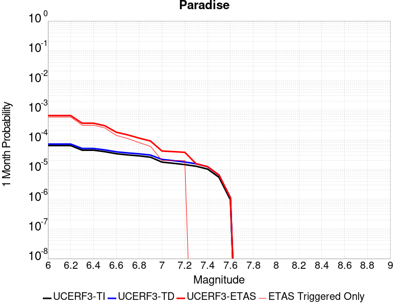 |  |  |

| Magnitude | 1 wk TI Prob | 1 wk TD Prob | 1 wk ETAS Prob | 1 wk ETAS/TD Gain | 1 wk ETAS Triggered Only | 1 mo TI Prob | 1 mo TD Prob | 1 mo ETAS Prob | 1 mo ETAS/TD Gain | 1 mo ETAS Triggered Only | 1 yr TI Prob | 1 yr TD Prob | 1 yr ETAS Prob | 1 yr ETAS/TD Gain | 1 yr ETAS Triggered Only | 10 yr TI Prob | 10 yr TD Prob | 10 yr ETAS Prob | 10 yr ETAS/TD Gain | 10 yr ETAS Triggered Only |
|-----|-----|-----|-----|-----|-----|-----|-----|-----|-----|-----|-----|-----|-----|-----|-----|-----|-----|-----|-----|-----|
| 6.0 | 1.4851273E-5 | 1.6694692E-5 | 6.0977356E-4 | 36.524998 | 5.930888E-4 | 6.364676E-5 | 7.154685E-5 | 7.169208E-4 | 10.020299 | 6.454201E-4 | 7.7462377E-4 | 8.707584E-4 | 0.0015853309 | 1.8206323 | 7.1519526E-4 | 0.0077192914 | 0.008675844 | 0.00941942 | 1.0857064 | 7.5008284E-4 |
| 6.1 | 1.4851273E-5 | 1.6694692E-5 | 6.0977356E-4 | 36.524998 | 5.930888E-4 | 6.364676E-5 | 7.154685E-5 | 7.169208E-4 | 10.020299 | 6.454201E-4 | 7.7462377E-4 | 8.707584E-4 | 0.0015853309 | 1.8206323 | 7.1519526E-4 | 0.0077192914 | 0.008675844 | 0.00941942 | 1.0857064 | 7.5008284E-4 |
| 6.2 | 1.4851273E-5 | 1.6694692E-5 | 6.0977356E-4 | 36.524998 | 5.930888E-4 | 6.364676E-5 | 7.154685E-5 | 7.169208E-4 | 10.020299 | 6.454201E-4 | 7.7462377E-4 | 8.707584E-4 | 0.0015853309 | 1.8206323 | 7.1519526E-4 | 0.0077192914 | 0.008675844 | 0.00941942 | 1.0857064 | 7.5008284E-4 |
| 6.3 | 1.0426831E-5 | 1.188862E-5 | 2.5609875E-4 | 21.541502 | 2.4421304E-4 | 4.4685654E-5 | 5.0950268E-5 | 3.1259374E-4 | 6.135272 | 2.6165682E-4 | 5.43912E-4 | 6.201489E-4 | 9.1650937E-4 | 1.477886 | 2.965444E-4 | 0.0054258266 | 0.0061847917 | 0.0064795017 | 1.0476508 | 2.965444E-4 |
| 6.4 | 1.0426831E-5 | 1.188862E-5 | 2.5609875E-4 | 21.541502 | 2.4421304E-4 | 4.4685654E-5 | 5.0950268E-5 | 3.1259374E-4 | 6.135272 | 2.6165682E-4 | 5.43912E-4 | 6.201489E-4 | 9.1650937E-4 | 1.477886 | 2.965444E-4 | 0.0054258266 | 0.0061847917 | 0.0064795017 | 1.0476508 | 2.965444E-4 |
| 6.5 | 9.25027E-6 | 1.06199595E-5 | 2.0249958E-4 | 19.06783 | 1.9188166E-4 | 3.964341E-5 | 4.551335E-5 | 2.5482927E-4 | 5.599001 | 2.0932544E-4 | 4.8255164E-4 | 5.53989E-4 | 7.631985E-4 | 1.3776419 | 2.0932544E-4 | 0.0048150513 | 0.0055265795 | 0.0057347477 | 1.0376668 | 2.0932544E-4 |
| 6.6 | 7.904275E-6 | 9.159525E-6 | 1.3126493E-4 | 14.330975 | 1.2210652E-4 | 3.3875025E-5 | 3.9254537E-5 | 1.6135626E-4 | 4.1105123 | 1.2210652E-4 | 4.1235037E-4 | 4.7782314E-4 | 5.998713E-4 | 1.2554255 | 1.2210652E-4 | 0.0041158604 | 0.0047683544 | 0.0048898784 | 1.0254856 | 1.2210652E-4 |
| 6.7 | 7.2061953E-6 | 8.407248E-6 | 1.13069094E-4 | 13.449001 | 1.0466272E-4 | 3.088333E-5 | 3.6030586E-5 | 1.4068955E-4 | 3.904725 | 1.0466272E-4 | 3.7593965E-4 | 4.3858777E-4 | 5.432046E-4 | 1.2385311 | 1.0466272E-4 | 0.003753043 | 0.004377591 | 0.0044817957 | 1.0238041 | 1.0466272E-4 |
| 6.8 | 6.6948724E-6 | 7.842166E-6 | 9.5060415E-5 | 12.121705 | 8.7218934E-5 | 2.8691995E-5 | 3.360887E-5 | 1.2082487E-4 | 3.5950294 | 8.7218934E-5 | 3.4926904E-4 | 4.0911473E-4 | 4.9629796E-4 | 1.2131022 | 8.7218934E-5 | 0.003487206 | 0.0040839734 | 0.004170836 | 1.0212692 | 8.7218934E-5 |
| 6.9 | 6.0421025E-6 | 7.130621E-6 | 5.946161E-5 | 8.338911 | 5.233136E-5 | 2.5894467E-5 | 3.0559466E-5 | 8.288923E-5 | 2.7123914 | 5.233136E-5 | 3.1521954E-4 | 3.7200135E-4 | 4.2431324E-4 | 1.1406229 | 5.233136E-5 | 0.0031477278 | 0.0037141247 | 0.0037662617 | 1.0140375 | 5.233136E-5 |
| 7.0 | 4.134091E-6 | 5.0803087E-6 | 2.2524007E-5 | 4.43359 | 1.7443788E-5 | 1.7717413E-5 | 2.177258E-5 | 3.9215985E-5 | 1.801164 | 1.7443788E-5 | 2.1568815E-4 | 2.6505045E-4 | 2.824896E-4 | 1.0657957 | 1.7443788E-5 | 0.0021547892 | 0.0026474963 | 0.002664894 | 1.0065713 | 1.7443788E-5 |
| 7.1 | 3.7674888E-6 | 4.6318696E-6 | 2.2075576E-5 | 4.766019 | 1.7443788E-5 | 1.6146281E-5 | 1.9850726E-5 | 3.729417E-5 | 1.8787307 | 1.7443788E-5 | 1.9656324E-4 | 2.4165731E-4 | 2.5909688E-4 | 1.0721666 | 1.7443788E-5 | 0.0019638946 | 0.002414096 | 0.0024314977 | 1.0072083 | 1.7443788E-5 |
| 7.2 | 3.4065345E-6 | 4.156723E-6 | 2.1600437E-5 | 5.1965065 | 1.7443788E-5 | 1.4599351E-5 | 1.7814415E-5 | 3.525789E-5 | 1.9791777 | 1.7443788E-5 | 1.777326E-4 | 2.1687041E-4 | 2.3431041E-4 | 1.0804167 | 1.7443788E-5 | 0.0017759053 | 0.002166736 | 0.002184142 | 1.0080333 | 1.7443788E-5 |
| 7.3 | 2.9934936E-6 | 3.6293168E-6 | 3.6293168E-6 | 1.0 | 0.0 | 1.2829195E-5 | 1.555413E-5 | 1.555413E-5 | 1.0 | 0.0 | 1.5618425E-4 | 1.8935655E-4 | 1.8935655E-4 | 1.0 | 0.0 | 0.0015607453 | 0.0018920974 | 0.0018920974 | 1.0 | 0.0 |
| 7.4 | 2.4049796E-6 | 2.8889842E-6 | 2.8889842E-6 | 1.0 | 0.0 | 1.0307015E-5 | 1.238131E-5 | 1.238131E-5 | 1.0 | 0.0 | 1.2548068E-4 | 1.5073347E-4 | 1.5073347E-4 | 1.0 | 0.0 | 0.0012540985 | 0.0015064536 | 0.0015064536 | 1.0 | 0.0 |
| 7.5 | 1.2710091E-6 | 1.5134682E-6 | 1.5134682E-6 | 1.0 | 0.0 | 5.44717E-6 | 6.4862834E-6 | 6.4862834E-6 | 1.0 | 0.0 | 6.631728E-5 | 7.8968886E-5 | 7.8968886E-5 | 1.0 | 0.0 | 6.6297496E-4 | 7.8953087E-4 | 7.8953087E-4 | 1.0 | 0.0 |
| 7.6 | 2.21172E-7 | 2.603961E-7 | 2.603961E-7 | 1.0 | 0.0 | 9.478797E-7 | 1.1159829E-6 | 1.1159829E-6 | 1.0 | 0.0 | 1.1540374E-5 | 1.3587036E-5 | 1.3587036E-5 | 1.0 | 0.0 | 1.1539775E-4 | 1.3586486E-4 | 1.3586486E-4 | 1.0 | 0.0 |

## Bicycle Lake
*[(top)](#table-of-contents)*

| 1 Week | 1 Month | 1 Year | 10 Year |
|-----|-----|-----|-----|
|  |  |  |  |

| Magnitude | 1 wk TI Prob | 1 wk TD Prob | 1 wk ETAS Prob | 1 wk ETAS/TD Gain | 1 wk ETAS Triggered Only | 1 mo TI Prob | 1 mo TD Prob | 1 mo ETAS Prob | 1 mo ETAS/TD Gain | 1 mo ETAS Triggered Only | 1 yr TI Prob | 1 yr TD Prob | 1 yr ETAS Prob | 1 yr ETAS/TD Gain | 1 yr ETAS Triggered Only | 10 yr TI Prob | 10 yr TD Prob | 10 yr ETAS Prob | 10 yr ETAS/TD Gain | 10 yr ETAS Triggered Only |
|-----|-----|-----|-----|-----|-----|-----|-----|-----|-----|-----|-----|-----|-----|-----|-----|-----|-----|-----|-----|-----|
| 6.0 | 1.9621975E-5 | 2.2097078E-5 | 4.5818213E-4 | 20.734964 | 4.3609468E-4 | 8.4091465E-5 | 9.4699084E-5 | 5.481946E-4 | 5.7888055 | 4.5353847E-4 | 0.0010233327 | 0.0011524865 | 0.0016577734 | 1.4384319 | 5.0586986E-4 | 0.01018633 | 0.011478408 | 0.012030202 | 1.0480723 | 5.582012E-4 |
| 6.1 | 1.9621975E-5 | 2.2097078E-5 | 4.5818213E-4 | 20.734964 | 4.3609468E-4 | 8.4091465E-5 | 9.4699084E-5 | 5.481946E-4 | 5.7888055 | 4.5353847E-4 | 0.0010233327 | 0.0011524865 | 0.0016577734 | 1.4384319 | 5.0586986E-4 | 0.01018633 | 0.011478408 | 0.012030202 | 1.0480723 | 5.582012E-4 |
| 6.2 | 9.9971285E-6 | 1.1255639E-5 | 3.077967E-4 | 27.345997 | 2.965444E-4 | 4.2844134E-5 | 4.8237856E-5 | 3.4476793E-4 | 7.1472483 | 2.965444E-4 | 5.2150246E-4 | 5.871896E-4 | 9.3586056E-4 | 1.593796 | 3.4887574E-4 | 0.0052028033 | 0.005861487 | 0.006260342 | 1.0680468 | 4.012071E-4 |
| 6.3 | 9.589428E-6 | 1.0798346E-5 | 2.8989592E-4 | 26.846327 | 2.791006E-4 | 4.10969E-5 | 4.62781E-5 | 3.2536578E-4 | 7.0306644 | 2.791006E-4 | 5.002399E-4 | 5.6334207E-4 | 8.945873E-4 | 1.5880002 | 3.3143195E-4 | 0.0049911533 | 0.0056242296 | 0.0060058343 | 1.0678502 | 3.837633E-4 |
| 6.4 | 9.589428E-6 | 1.0798346E-5 | 2.8989592E-4 | 26.846327 | 2.791006E-4 | 4.10969E-5 | 4.62781E-5 | 3.2536578E-4 | 7.0306644 | 2.791006E-4 | 5.002399E-4 | 5.6334207E-4 | 8.945873E-4 | 1.5880002 | 3.3143195E-4 | 0.0049911533 | 0.0056242296 | 0.0060058343 | 1.0678502 | 3.837633E-4 |
| 6.5 | 5.557707E-6 | 6.2856016E-6 | 1.9816606E-4 | 31.526983 | 1.9188166E-4 | 2.3818526E-5 | 2.6938165E-5 | 2.1881466E-4 | 8.122849 | 1.9188166E-4 | 2.8995197E-4 | 3.2794967E-4 | 5.5464456E-4 | 1.6912489 | 2.2676923E-4 | 0.0028957394 | 0.0032772934 | 0.0035380926 | 1.0795777 | 2.6165682E-4 |
| 6.6 | 4.8742945E-6 | 5.5132896E-6 | 1.9739389E-4 | 35.803288 | 1.9188166E-4 | 2.0889667E-5 | 2.3628318E-5 | 2.1550544E-4 | 9.120643 | 1.9188166E-4 | 2.54302E-4 | 2.87663E-4 | 5.14367E-4 | 1.7880888 | 2.2676923E-4 | 0.002540112 | 0.0028754752 | 0.0031363796 | 1.0907344 | 2.6165682E-4 |
| 6.7 | 3.991108E-6 | 4.5159104E-6 | 1.7895299E-4 | 39.627224 | 1.7443787E-4 | 1.7104636E-5 | 1.9353902E-5 | 1.937884E-4 | 10.012885 | 1.7443787E-4 | 2.0822904E-4 | 2.3563375E-4 | 4.4490988E-4 | 1.8881415 | 2.0932544E-4 | 0.0020803404 | 0.0023563374 | 0.002599975 | 1.1033968 | 2.4421304E-4 |

## Garlic Springs
*[(top)](#table-of-contents)*

| 1 Week | 1 Month | 1 Year | 10 Year |
|-----|-----|-----|-----|
|  |  |  |  |

| Magnitude | 1 wk TI Prob | 1 wk TD Prob | 1 wk ETAS Prob | 1 wk ETAS/TD Gain | 1 wk ETAS Triggered Only | 1 mo TI Prob | 1 mo TD Prob | 1 mo ETAS Prob | 1 mo ETAS/TD Gain | 1 mo ETAS Triggered Only | 1 yr TI Prob | 1 yr TD Prob | 1 yr ETAS Prob | 1 yr ETAS/TD Gain | 1 yr ETAS Triggered Only | 10 yr TI Prob | 10 yr TD Prob | 10 yr ETAS Prob | 10 yr ETAS/TD Gain | 10 yr ETAS Triggered Only |
|-----|-----|-----|-----|-----|-----|-----|-----|-----|-----|-----|-----|-----|-----|-----|-----|-----|-----|-----|-----|-----|
| 6.0 | 1.6760017E-5 | 1.8776833E-5 | 4.723068E-4 | 25.153698 | 4.5353847E-4 | 7.182667E-5 | 8.0470316E-5 | 5.514147E-4 | 6.8523984 | 4.7098225E-4 | 8.7413884E-4 | 9.794032E-4 | 0.0015022042 | 1.5337956 | 5.2331365E-4 | 0.008707083 | 0.009762413 | 0.0102806175 | 1.0530816 | 5.2331365E-4 |
| 6.1 | 9.852767E-6 | 1.09735865E-5 | 2.726275E-4 | 24.843975 | 2.6165682E-4 | 4.222546E-5 | 4.702921E-5 | 3.086737E-4 | 6.5634465 | 2.6165682E-4 | 5.139737E-4 | 5.7250116E-4 | 8.6887577E-4 | 1.5176839 | 2.965444E-4 | 0.005127866 | 0.005717221 | 0.0060120705 | 1.0515721 | 2.965444E-4 |
| 6.2 | 9.852767E-6 | 1.09735865E-5 | 2.726275E-4 | 24.843975 | 2.6165682E-4 | 4.222546E-5 | 4.702921E-5 | 3.086737E-4 | 6.5634465 | 2.6165682E-4 | 5.139737E-4 | 5.7250116E-4 | 8.6887577E-4 | 1.5176839 | 2.965444E-4 | 0.005127866 | 0.005717221 | 0.0060120705 | 1.0515721 | 2.965444E-4 |
| 6.3 | 4.3167724E-6 | 4.7780286E-6 | 5.710914E-5 | 11.952449 | 5.233136E-5 | 1.8500323E-5 | 2.0477235E-5 | 7.2807525E-5 | 3.555535 | 5.233136E-5 | 2.2521814E-4 | 2.4930484E-4 | 3.190626E-4 | 1.2798091 | 6.977515E-5 | 0.0022499003 | 0.00249251 | 0.0025621112 | 1.0279242 | 6.977515E-5 |
| 6.4 | 4.3167724E-6 | 4.7780286E-6 | 5.710914E-5 | 11.952449 | 5.233136E-5 | 1.8500323E-5 | 2.0477235E-5 | 7.2807525E-5 | 3.555535 | 5.233136E-5 | 2.2521814E-4 | 2.4930484E-4 | 3.190626E-4 | 1.2798091 | 6.977515E-5 | 0.0022499003 | 0.00249251 | 0.0025621112 | 1.0279242 | 6.977515E-5 |
| 6.5 | 4.3167724E-6 | 4.7780286E-6 | 5.710914E-5 | 11.952449 | 5.233136E-5 | 1.8500323E-5 | 2.0477235E-5 | 7.2807525E-5 | 3.555535 | 5.233136E-5 | 2.2521814E-4 | 2.4930484E-4 | 3.190626E-4 | 1.2798091 | 6.977515E-5 | 0.0022499003 | 0.00249251 | 0.0025621112 | 1.0279242 | 6.977515E-5 |
| 6.6 | 4.301311E-6 | 4.760897E-6 | 5.709201E-5 | 11.991859 | 5.233136E-5 | 1.8434059E-5 | 2.0403815E-5 | 7.273411E-5 | 3.564731 | 5.233136E-5 | 2.2441156E-4 | 2.4841115E-4 | 3.1816898E-4 | 1.280816 | 6.977515E-5 | 0.0022418506 | 0.002483593 | 0.002553195 | 1.0280247 | 6.977515E-5 |
| 6.7 | 3.8599724E-6 | 4.27106E-6 | 5.66022E-5 | 13.252495 | 5.233136E-5 | 1.6542634E-5 | 1.8304541E-5 | 7.0634946E-5 | 3.8588753 | 5.233136E-5 | 2.0138794E-4 | 2.228578E-4 | 2.926174E-4 | 1.313023 | 6.977515E-5 | 0.0020120554 | 0.002228578 | 0.0022981977 | 1.0312395 | 6.977515E-5 |

## Death Valley (Black Mtns Frontal)
*[(top)](#table-of-contents)*

| 1 Week | 1 Month | 1 Year | 10 Year |
|-----|-----|-----|-----|
|  |  | 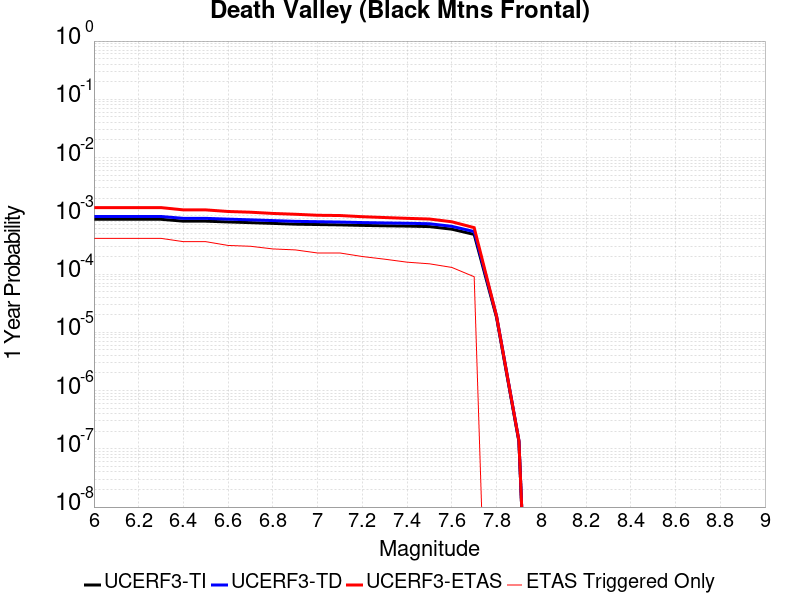 |  |

| Magnitude | 1 wk TI Prob | 1 wk TD Prob | 1 wk ETAS Prob | 1 wk ETAS/TD Gain | 1 wk ETAS Triggered Only | 1 mo TI Prob | 1 mo TD Prob | 1 mo ETAS Prob | 1 mo ETAS/TD Gain | 1 mo ETAS Triggered Only | 1 yr TI Prob | 1 yr TD Prob | 1 yr ETAS Prob | 1 yr ETAS/TD Gain | 1 yr ETAS Triggered Only | 10 yr TI Prob | 10 yr TD Prob | 10 yr ETAS Prob | 10 yr ETAS/TD Gain | 10 yr ETAS Triggered Only |
|-----|-----|-----|-----|-----|-----|-----|-----|-----|-----|-----|-----|-----|-----|-----|-----|-----|-----|-----|-----|-----|
| 6.0 | 1.6707214E-5 | 1.867027E-5 | 3.5009603E-4 | 18.751526 | 3.3143195E-4 | 7.160038E-5 | 8.001302E-5 | 4.2886086E-4 | 5.359888 | 3.4887574E-4 | 8.71386E-4 | 9.737309E-4 | 0.0013571205 | 1.3937327 | 3.837633E-4 | 0.00867977 | 0.009695496 | 0.010127364 | 1.044543 | 4.3609468E-4 |
| 6.1 | 1.6707214E-5 | 1.867027E-5 | 3.5009603E-4 | 18.751526 | 3.3143195E-4 | 7.160038E-5 | 8.001302E-5 | 4.2886086E-4 | 5.359888 | 3.4887574E-4 | 8.71386E-4 | 9.737309E-4 | 0.0013571205 | 1.3937327 | 3.837633E-4 | 0.00867977 | 0.009695496 | 0.010127364 | 1.044543 | 4.3609468E-4 |
| 6.2 | 1.6707214E-5 | 1.867027E-5 | 3.5009603E-4 | 18.751526 | 3.3143195E-4 | 7.160038E-5 | 8.001302E-5 | 4.2886086E-4 | 5.359888 | 3.4887574E-4 | 8.71386E-4 | 9.737309E-4 | 0.0013571205 | 1.3937327 | 3.837633E-4 | 0.00867977 | 0.009695496 | 0.010127364 | 1.044543 | 4.3609468E-4 |
| 6.3 | 1.6707214E-5 | 1.867027E-5 | 3.5009603E-4 | 18.751526 | 3.3143195E-4 | 7.160038E-5 | 8.001302E-5 | 4.2886086E-4 | 5.359888 | 3.4887574E-4 | 8.71386E-4 | 9.737309E-4 | 0.0013571205 | 1.3937327 | 3.837633E-4 | 0.00867977 | 0.009695496 | 0.010127364 | 1.044543 | 4.3609468E-4 |
| 6.4 | 1.5515609E-5 | 1.7338214E-5 | 3.1387745E-4 | 18.103218 | 2.965444E-4 | 6.649377E-5 | 7.4304546E-5 | 3.882694E-4 | 5.2253785 | 3.1398816E-4 | 8.0926094E-4 | 9.042885E-4 | 0.0012528488 | 1.3854525 | 3.4887574E-4 | 0.008063202 | 0.009006773 | 0.009404366 | 1.0441438 | 4.012071E-4 |
| 6.5 | 1.5515609E-5 | 1.7338214E-5 | 3.1387745E-4 | 18.103218 | 2.965444E-4 | 6.649377E-5 | 7.4304546E-5 | 3.882694E-4 | 5.2253785 | 3.1398816E-4 | 8.0926094E-4 | 9.042885E-4 | 0.0012528488 | 1.3854525 | 3.4887574E-4 | 0.008063202 | 0.009006773 | 0.009404366 | 1.0441438 | 4.012071E-4 |
| 6.6 | 1.5041828E-5 | 1.6809145E-5 | 2.9590505E-4 | 17.603813 | 2.791006E-4 | 6.4463384E-5 | 7.203723E-5 | 3.5111772E-4 | 4.8741145 | 2.791006E-4 | 7.8455906E-4 | 8.767063E-4 | 0.0011904192 | 1.3578312 | 3.1398816E-4 | 0.00781795 | 0.008733132 | 0.009096253 | 1.0415796 | 3.6631952E-4 |
| 6.7 | 1.4634985E-5 | 1.6356016E-5 | 2.9545205E-4 | 18.063814 | 2.791006E-4 | 6.271985E-5 | 7.009536E-5 | 3.491764E-4 | 4.981448 | 2.791006E-4 | 7.6334673E-4 | 8.5308263E-4 | 0.001166803 | 1.367749 | 3.1398816E-4 | 0.007607299 | 0.008498715 | 0.008861922 | 1.0427366 | 3.6631952E-4 |
| 6.8 | 1.4209158E-5 | 1.5882048E-5 | 2.775347E-4 | 17.474743 | 2.6165682E-4 | 6.089497E-5 | 6.8064175E-5 | 3.2970318E-4 | 4.8440046 | 2.6165682E-4 | 7.4114406E-4 | 8.2837185E-4 | 0.0011246706 | 1.3576881 | 2.965444E-4 | 0.007386771 | 0.008253456 | 0.008582152 | 1.0398253 | 3.3143195E-4 |
| 6.9 | 1.3780098E-5 | 1.5404594E-5 | 2.7705738E-4 | 17.985374 | 2.6165682E-4 | 5.9056227E-5 | 6.6018045E-5 | 3.276576E-4 | 4.963152 | 2.6165682E-4 | 7.1877235E-4 | 8.0347876E-4 | 0.0010997849 | 1.3687791 | 2.965444E-4 | 0.0071645193 | 0.008006332 | 0.008335111 | 1.0410647 | 3.3143195E-4 |
| 7.0 | 1.3585064E-5 | 1.5188155E-5 | 2.5939746E-4 | 17.078932 | 2.4421304E-4 | 5.8220405E-5 | 6.50905E-5 | 3.0928763E-4 | 4.7516556 | 2.4421304E-4 | 7.086029E-4 | 7.9219416E-4 | 0.0010536436 | 1.3300321 | 2.6165682E-4 | 0.007063476 | 0.007894293 | 0.008188497 | 1.0372678 | 2.965444E-4 |
| 7.1 | 1.3398601E-5 | 1.49813395E-5 | 2.591907E-4 | 17.300903 | 2.4421304E-4 | 5.742131E-5 | 6.420419E-5 | 3.0840153E-4 | 4.8034487 | 2.4421304E-4 | 6.9888023E-4 | 7.8141113E-4 | 0.0010428635 | 1.33459 | 2.6165682E-4 | 0.0069668638 | 0.007787224 | 0.008081459 | 1.0377843 | 2.965444E-4 |
| 7.2 | 1.3126312E-5 | 1.4679561E-5 | 2.4144546E-4 | 16.447731 | 2.2676923E-4 | 5.6254412E-5 | 6.291092E-5 | 2.8966588E-4 | 4.604382 | 2.2676923E-4 | 6.846822E-4 | 7.6567667E-4 | 9.922723E-4 | 1.2959416 | 2.2676923E-4 | 0.006825765 | 0.00763097 | 0.0078906305 | 1.0340271 | 2.6165682E-4 |
| 7.3 | 1.2922429E-5 | 1.4453788E-5 | 2.4121975E-4 | 16.689034 | 2.2676923E-4 | 5.5380664E-5 | 6.194336E-5 | 2.8869856E-4 | 4.6606855 | 2.2676923E-4 | 6.74051E-4 | 7.53905E-4 | 9.805033E-4 | 1.3005661 | 2.2676923E-4 | 0.006720101 | 0.007514055 | 0.0077737453 | 1.0345607 | 2.6165682E-4 |
| 7.4 | 1.2768878E-5 | 1.4283772E-5 | 2.4104977E-4 | 16.875778 | 2.2676923E-4 | 5.4722615E-5 | 6.1214756E-5 | 2.8797012E-4 | 4.70426 | 2.2676923E-4 | 6.660441E-4 | 7.4504025E-4 | 9.716405E-4 | 1.304145 | 2.2676923E-4 | 0.0066405144 | 0.0074260035 | 0.007685717 | 1.0349735 | 2.6165682E-4 |
| 7.5 | 1.2521929E-5 | 1.40120155E-5 | 2.2333453E-4 | 15.938787 | 2.0932544E-4 | 5.366431E-5 | 6.005014E-5 | 2.6936302E-4 | 4.4856353 | 2.0932544E-4 | 6.531671E-4 | 7.3087064E-4 | 9.4004313E-4 | 1.2861962 | 2.0932544E-4 | 0.006512506 | 0.0072852457 | 0.0075276797 | 1.0332774 | 2.4421304E-4 |
| 7.6 | 1.1301089E-5 | 1.2648149E-5 | 1.8708382E-4 | 14.791399 | 1.7443787E-4 | 4.8432343E-5 | 5.4205255E-5 | 2.2863367E-4 | 4.2179246 | 1.7443787E-4 | 5.895042E-4 | 6.5975444E-4 | 8.3407725E-4 | 1.2642237 | 1.7443787E-4 | 0.0058794282 | 0.00657851 | 0.0067864587 | 1.0316103 | 2.0932544E-4 |
| 7.7 | 9.189108E-6 | 1.0283358E-5 | 1.4983222E-4 | 14.570359 | 1.395503E-4 | 3.93813E-5 | 4.407082E-5 | 1.8361497E-4 | 4.1663613 | 1.395503E-4 | 4.7936183E-4 | 5.3643517E-4 | 6.759106E-4 | 1.2600043 | 1.395503E-4 | 0.004783291 | 0.005351914 | 0.005525418 | 1.0324191 | 1.7443787E-4 |
| 7.8 | 3.4586725E-7 | 3.6482615E-7 | 3.6482615E-7 | 1.0 | 0.0 | 1.4822873E-6 | 1.5635396E-6 | 1.5635396E-6 | 1.0 | 0.0 | 1.80467E-5 | 1.9035933E-5 | 1.9035933E-5 | 1.0 | 0.0 | 1.8045233E-4 | 1.9034347E-4 | 1.9034347E-4 | 1.0 | 0.0 |
| 7.9 | 2.5591178E-9 | 2.6696718E-9 | 2.6696718E-9 | 1.0 | 0.0 | 1.0967647E-8 | 1.14414505E-8 | 1.14414505E-8 | 1.0 | 0.0 | 1.335311E-7 | 1.3929966E-7 | 1.3929966E-7 | 1.0 | 0.0 | 1.3353102E-6 | 1.3929966E-6 | 1.3929966E-6 | 1.0 | 0.0 |

## San Andreas (Parkfield)
*[(top)](#table-of-contents)*

| 1 Week | 1 Month | 1 Year | 10 Year |
|-----|-----|-----|-----|
|  |  |  |  |

| Magnitude | 1 wk TI Prob | 1 wk TD Prob | 1 wk ETAS Prob | 1 wk ETAS/TD Gain | 1 wk ETAS Triggered Only | 1 mo TI Prob | 1 mo TD Prob | 1 mo ETAS Prob | 1 mo ETAS/TD Gain | 1 mo ETAS Triggered Only | 1 yr TI Prob | 1 yr TD Prob | 1 yr ETAS Prob | 1 yr ETAS/TD Gain | 1 yr ETAS Triggered Only | 10 yr TI Prob | 10 yr TD Prob | 10 yr ETAS Prob | 10 yr ETAS/TD Gain | 10 yr ETAS Triggered Only |
|-----|-----|-----|-----|-----|-----|-----|-----|-----|-----|-----|-----|-----|-----|-----|-----|-----|-----|-----|-----|-----|
| 6.0 | 5.556969E-4 | 7.7782426E-4 | 0.0011264286 | 1.4481789 | 3.4887574E-4 | 0.0023793848 | 0.0033298214 | 0.0036775356 | 1.1044242 | 3.4887574E-4 | 0.028586963 | 0.040191233 | 0.040526085 | 1.0083315 | 3.4887574E-4 | 0.25176284 | 0.33716413 | 0.3373954 | 1.0006858 | 3.4887574E-4 |
| 6.1 | 1.925858E-4 | 3.0276453E-4 | 4.4227258E-4 | 1.4607807 | 1.395503E-4 | 8.2510663E-4 | 0.0012970108 | 0.0014363801 | 1.1074542 | 1.395503E-4 | 0.0099994885 | 0.015778083 | 0.015915431 | 1.008705 | 1.395503E-4 | 0.095613256 | 0.1497237 | 0.14984235 | 1.0007925 | 1.395503E-4 |
| 6.2 | 9.4306815E-5 | 1.8242796E-4 | 3.219528E-4 | 1.7648215 | 1.395503E-4 | 4.0410945E-4 | 7.816011E-4 | 9.2104234E-4 | 1.1784046 | 1.395503E-4 | 0.0049089384 | 0.009474681 | 0.009612909 | 1.0145892 | 1.395503E-4 | 0.048019063 | 0.09185409 | 0.09198082 | 1.0013797 | 1.395503E-4 |
| 6.3 | 9.283051E-5 | 1.7939322E-4 | 3.1891846E-4 | 1.7777622 | 1.395503E-4 | 3.9778434E-4 | 7.686027E-4 | 9.0804574E-4 | 1.181424 | 1.395503E-4 | 0.0048322747 | 0.009317789 | 0.009456039 | 1.0148373 | 1.395503E-4 | 0.047285385 | 0.09050704 | 0.09063396 | 1.0014024 | 1.395503E-4 |
| 6.4 | 9.138826E-5 | 1.770153E-4 | 3.165409E-4 | 1.7882121 | 1.395503E-4 | 3.916052E-4 | 7.5841765E-4 | 8.9786213E-4 | 1.1838623 | 1.395503E-4 | 0.0047573745 | 0.00919484 | 0.009333107 | 1.0150374 | 1.395503E-4 | 0.046568092 | 0.08940927 | 0.08953635 | 1.0014212 | 1.395503E-4 |
| 6.5 | 9.000255E-5 | 1.7459576E-4 | 3.141217E-4 | 1.799137 | 1.395503E-4 | 3.8566816E-4 | 7.480541E-4 | 8.8750006E-4 | 1.1864115 | 1.395503E-4 | 0.0046854047 | 0.009069731 | 0.009208016 | 1.0152469 | 1.395503E-4 | 0.045878403 | 0.088295065 | 0.08842229 | 1.001441 | 1.395503E-4 |
| 6.6 | 8.8109264E-5 | 1.7140752E-4 | 3.109339E-4 | 1.8140038 | 1.395503E-4 | 3.7755648E-4 | 7.3439797E-4 | 8.738458E-4 | 1.1898805 | 1.395503E-4 | 0.0045870654 | 0.008904854 | 0.009043162 | 1.0155317 | 1.395503E-4 | 0.04493529 | 0.0868267 | 0.086954124 | 1.0014677 | 1.395503E-4 |
| 6.7 | 8.738073E-5 | 1.7007832E-4 | 3.096049E-4 | 1.8203665 | 1.395503E-4 | 3.7443507E-4 | 7.287046E-4 | 8.6815323E-4 | 1.1913651 | 1.395503E-4 | 0.0045492216 | 0.008836143 | 0.00897446 | 1.0156536 | 1.395503E-4 | 0.04457213 | 0.08622707 | 0.08635458 | 1.0014789 | 1.395503E-4 |
| 6.8 | 8.710195E-5 | 1.6953335E-4 | 3.0905998E-4 | 1.8230041 | 1.395503E-4 | 3.7324068E-4 | 7.263703E-4 | 8.658192E-4 | 1.1919805 | 1.395503E-4 | 0.0045347405 | 0.008807961 | 0.008946282 | 1.0157042 | 1.395503E-4 | 0.04443313 | 0.08597467 | 0.086102225 | 1.0014836 | 1.395503E-4 |
| 6.9 | 8.6801556E-5 | 1.689429E-4 | 3.0846964E-4 | 1.825881 | 1.395503E-4 | 3.7195362E-4 | 7.2384125E-4 | 8.632905E-4 | 1.1926517 | 1.395503E-4 | 0.0045191357 | 0.008777418 | 0.008915744 | 1.0157592 | 1.395503E-4 | 0.044283327 | 0.085700735 | 0.08582833 | 1.0014888 | 1.395503E-4 |
| 7.0 | 8.5571606E-5 | 1.6647128E-4 | 3.0599834E-4 | 1.838145 | 1.395503E-4 | 3.6668387E-4 | 7.132544E-4 | 8.5270515E-4 | 1.1955134 | 1.395503E-4 | 0.004455241 | 0.008649553 | 0.0087878965 | 1.0159943 | 1.395503E-4 | 0.043669727 | 0.08454914 | 0.08467689 | 1.001511 | 1.395503E-4 |
| 7.1 | 7.82589E-5 | 1.5128135E-4 | 2.733694E-4 | 1.8070264 | 1.2210652E-4 | 3.3535215E-4 | 6.481883E-4 | 7.7021564E-4 | 1.1882591 | 1.2210652E-4 | 0.0040752706 | 0.007863307 | 0.007984453 | 1.0154065 | 1.2210652E-4 | 0.040013418 | 0.07746111 | 0.077573754 | 1.0014542 | 1.2210652E-4 |
| 7.2 | 7.690929E-5 | 1.4865391E-4 | 2.7074228E-4 | 1.8212926 | 1.2210652E-4 | 3.2956956E-4 | 6.369334E-4 | 7.589621E-4 | 1.1915879 | 1.2210652E-4 | 0.004005129 | 0.007727258 | 0.007848421 | 1.01568 | 1.2210652E-4 | 0.0393371 | 0.07623427 | 0.07634707 | 1.0014796 | 1.2210652E-4 |
| 7.3 | 7.5543794E-5 | 1.4561978E-4 | 2.677085E-4 | 1.8384076 | 1.2210652E-4 | 3.2371894E-4 | 6.2393624E-4 | 7.4596656E-4 | 1.1955814 | 1.2210652E-4 | 0.003934157 | 0.007570127 | 0.0076913093 | 1.0160079 | 1.2210652E-4 | 0.038652334 | 0.074797355 | 0.07491033 | 1.0015104 | 1.2210652E-4 |
| 7.4 | 7.4214564E-5 | 1.4262961E-4 | 2.6471872E-4 | 1.855987 | 1.2210652E-4 | 3.1802364E-4 | 6.111273E-4 | 7.331592E-4 | 1.1996833 | 1.2210652E-4 | 0.003865065 | 0.00741525 | 0.007536451 | 1.0163448 | 1.2210652E-4 | 0.03798529 | 0.07337123 | 0.07348438 | 1.0015421 | 1.2210652E-4 |
| 7.5 | 6.149578E-5 | 1.11907226E-4 | 2.3400008E-4 | 2.0910184 | 1.2210652E-4 | 2.6352672E-4 | 4.7951436E-4 | 6.015623E-4 | 1.2545241 | 1.2210652E-4 | 0.0032037178 | 0.0058224914 | 0.005943887 | 1.0208495 | 1.2210652E-4 | 0.03157923 | 0.058557566 | 0.05867252 | 1.0019631 | 1.2210652E-4 |
| 7.6 | 6.0643448E-5 | 1.10193796E-4 | 2.3228685E-4 | 2.1079848 | 1.2210652E-4 | 2.598746E-4 | 4.7217376E-4 | 5.942226E-4 | 1.2584829 | 1.2210652E-4 | 0.0031593828 | 0.0057335934 | 0.005855 | 1.0211746 | 1.2210652E-4 | 0.031148417 | 0.057718582 | 0.057833638 | 1.0019934 | 1.2210652E-4 |
| 7.7 | 5.1652263E-5 | 9.174698E-5 | 2.1384229E-4 | 2.330783 | 1.2210652E-4 | 2.2134806E-4 | 3.931421E-4 | 5.152006E-4 | 1.3104692 | 1.2210652E-4 | 0.002691582 | 0.0047760103 | 0.0048975335 | 1.0254445 | 1.2210652E-4 | 0.026592141 | 0.04853623 | 0.048652407 | 1.0023937 | 1.2210652E-4 |
| 7.8 | 4.8090482E-5 | 8.559635E-5 | 2.0769241E-4 | 2.4264166 | 1.2210652E-4 | 2.060858E-4 | 3.6678996E-4 | 4.888517E-4 | 1.3327837 | 1.2210652E-4 | 0.0025062072 | 0.0044565317 | 0.0045780945 | 1.0272774 | 1.2210652E-4 | 0.024781305 | 0.04530245 | 0.045419026 | 1.0025733 | 1.2210652E-4 |
| 7.9 | 3.970278E-5 | 6.750426E-5 | 1.8960254E-4 | 2.8087492 | 1.2210652E-4 | 1.7014367E-4 | 2.892719E-4 | 4.113431E-4 | 1.4219947 | 1.2210652E-4 | 0.002069531 | 0.0035162016 | 0.0036378787 | 1.0346047 | 1.2210652E-4 | 0.020503636 | 0.035881363 | 0.035999086 | 1.003281 | 1.2210652E-4 |
| 8.0 | 2.8982335E-5 | 4.069796E-5 | 1.1047027E-4 | 2.7143934 | 6.977515E-5 | 1.2420409E-4 | 1.7440817E-4 | 2.4417115E-4 | 1.3999983 | 6.977515E-5 | 0.0015111357 | 0.0021213528 | 0.00219098 | 1.032822 | 6.977515E-5 | 0.015009012 | 0.022010697 | 0.022078935 | 1.0031003 | 6.977515E-5 |
| 8.1 | 1.8836186E-5 | 1.8681134E-5 | 5.356806E-5 | 2.8674948 | 3.4887576E-5 | 8.0724014E-5 | 8.005955E-5 | 1.14944334E-4 | 1.4357355 | 3.4887576E-5 | 9.823717E-4 | 9.742898E-4 | 0.0010091433 | 1.0357733 | 3.4887576E-5 | 0.009780403 | 0.010488115 | 0.0105226375 | 1.0032915 | 3.4887576E-5 |
| 8.2 | 8.643924E-6 | 5.4748625E-6 | 2.2918555E-5 | 4.1861424 | 1.7443788E-5 | 3.704486E-5 | 2.3463486E-5 | 4.0906863E-5 | 1.7434266 | 1.7443788E-5 | 4.5092785E-4 | 2.8563058E-4 | 3.0306936E-4 | 1.0610538 | 1.7443788E-5 | 0.0045001395 | 0.0032487072 | 0.0032660943 | 1.005352 | 1.7443788E-5 |
| 8.3 | 1.983087E-6 | 7.6599065E-7 | 7.6599065E-7 | 1.0 | 0.0 | 8.498917E-6 | 3.282813E-6 | 3.282813E-6 | 1.0 | 0.0 | 1.034694E-4 | 3.9967534E-5 | 3.9967534E-5 | 1.0 | 0.0 | 0.0010342124 | 4.719687E-4 | 4.719687E-4 | 1.0 | 0.0 |

## Helendale-So Lockhart
*[(top)](#table-of-contents)*

| 1 Week | 1 Month | 1 Year | 10 Year |
|-----|-----|-----|-----|
|  |  |  |  |

| Magnitude | 1 wk TI Prob | 1 wk TD Prob | 1 wk ETAS Prob | 1 wk ETAS/TD Gain | 1 wk ETAS Triggered Only | 1 mo TI Prob | 1 mo TD Prob | 1 mo ETAS Prob | 1 mo ETAS/TD Gain | 1 mo ETAS Triggered Only | 1 yr TI Prob | 1 yr TD Prob | 1 yr ETAS Prob | 1 yr ETAS/TD Gain | 1 yr ETAS Triggered Only | 10 yr TI Prob | 10 yr TD Prob | 10 yr ETAS Prob | 10 yr ETAS/TD Gain | 10 yr ETAS Triggered Only |
|-----|-----|-----|-----|-----|-----|-----|-----|-----|-----|-----|-----|-----|-----|-----|-----|-----|-----|-----|-----|-----|
| 6.0 | 1.7296055E-5 | 1.8103729E-5 | 3.3208623E-4 | 18.343525 | 3.1398816E-4 | 7.412385E-5 | 7.7585224E-5 | 4.0899147E-4 | 5.2715125 | 3.3143195E-4 | 9.0208417E-4 | 9.4421144E-4 | 0.0012927578 | 1.3691401 | 3.4887574E-4 | 0.008984311 | 0.009404116 | 0.009766991 | 1.0385867 | 3.6631952E-4 |
| 6.1 | 1.7296055E-5 | 1.8103729E-5 | 3.3208623E-4 | 18.343525 | 3.1398816E-4 | 7.412385E-5 | 7.7585224E-5 | 4.0899147E-4 | 5.2715125 | 3.3143195E-4 | 9.0208417E-4 | 9.4421144E-4 | 0.0012927578 | 1.3691401 | 3.4887574E-4 | 0.008984311 | 0.009404116 | 0.009766991 | 1.0385867 | 3.6631952E-4 |
| 6.2 | 1.7296055E-5 | 1.8103729E-5 | 3.3208623E-4 | 18.343525 | 3.1398816E-4 | 7.412385E-5 | 7.7585224E-5 | 4.0899147E-4 | 5.2715125 | 3.3143195E-4 | 9.0208417E-4 | 9.4421144E-4 | 0.0012927578 | 1.3691401 | 3.4887574E-4 | 0.008984311 | 0.009404116 | 0.009766991 | 1.0385867 | 3.6631952E-4 |
| 6.3 | 1.0669118E-5 | 1.1135425E-5 | 2.3790213E-4 | 21.364443 | 2.2676923E-4 | 4.5723988E-5 | 4.772239E-5 | 2.9192376E-4 | 6.1171236 | 2.4421304E-4 | 5.5654737E-4 | 5.80868E-4 | 8.423728E-4 | 1.4501966 | 2.6165682E-4 | 0.0055515557 | 0.0057937936 | 0.006071277 | 1.0478933 | 2.791006E-4 |
| 6.4 | 1.0669118E-5 | 1.1135425E-5 | 2.3790213E-4 | 21.364443 | 2.2676923E-4 | 4.5723988E-5 | 4.772239E-5 | 2.9192376E-4 | 6.1171236 | 2.4421304E-4 | 5.5654737E-4 | 5.80868E-4 | 8.423728E-4 | 1.4501966 | 2.6165682E-4 | 0.0055515557 | 0.0057937936 | 0.006071277 | 1.0478933 | 2.791006E-4 |
| 6.5 | 8.790038E-6 | 9.170197E-6 | 1.8360648E-4 | 20.022087 | 1.7443787E-4 | 3.767105E-5 | 3.930026E-5 | 2.3117437E-4 | 5.882261 | 1.9188166E-4 | 4.585485E-4 | 4.7837716E-4 | 6.876025E-4 | 1.4373647 | 2.0932544E-4 | 0.0045760344 | 0.004773638 | 0.0049819644 | 1.043641 | 2.0932544E-4 |
| 6.6 | 7.396949E-6 | 7.715537E-6 | 1.8215207E-4 | 23.608475 | 1.7443787E-4 | 3.1700827E-5 | 3.3066175E-5 | 2.2494148E-4 | 6.8027673 | 1.9188166E-4 | 3.858892E-4 | 4.025073E-4 | 6.117485E-4 | 1.5198444 | 2.0932544E-4 | 0.003852198 | 0.00401789 | 0.004226374 | 1.0518891 | 2.0932544E-4 |
| 6.7 | 6.4600285E-6 | 6.738031E-6 | 1.8117474E-4 | 26.888378 | 1.7443787E-4 | 2.7685543E-5 | 2.887696E-5 | 2.2075308E-4 | 7.6446095 | 1.9188166E-4 | 3.3701936E-4 | 3.5152107E-4 | 5.607729E-4 | 1.5952755 | 2.0932544E-4 | 0.0033650869 | 0.003509732 | 0.0037183226 | 1.0594321 | 2.0932544E-4 |
| 6.8 | 5.600104E-6 | 5.836009E-6 | 1.8027287E-4 | 30.88975 | 1.7443787E-4 | 2.4000226E-5 | 2.5011232E-5 | 2.1688809E-4 | 8.671628 | 1.9188166E-4 | 2.9216358E-4 | 3.044698E-4 | 5.137315E-4 | 1.6872988 | 2.0932544E-4 | 0.0029177975 | 0.003040588 | 0.0032492771 | 1.0686344 | 2.0932544E-4 |
| 6.9 | 4.839122E-6 | 5.0395092E-6 | 1.4458911E-4 | 28.691109 | 1.395503E-4 | 2.0738931E-5 | 2.159772E-5 | 1.7858842E-4 | 8.268855 | 1.5699408E-4 | 2.5246723E-4 | 2.6292098E-4 | 4.198738E-4 | 1.596958 | 1.5699408E-4 | 0.002521806 | 0.002626147 | 0.0027827285 | 1.0596242 | 1.5699408E-4 |
| 7.0 | 3.6937633E-6 | 3.845208E-6 | 1.2595125E-4 | 32.75538 | 1.2210652E-4 | 1.5830317E-5 | 1.647936E-5 | 1.3858386E-4 | 8.409541 | 1.2210652E-4 | 1.9271708E-4 | 2.0061806E-4 | 3.2270007E-4 | 1.6085296 | 1.2210652E-4 | 0.0019255003 | 0.002004401 | 0.0021262628 | 1.0607971 | 1.2210652E-4 |
| 7.1 | 2.7858857E-6 | 2.8978538E-6 | 1.0756028E-4 | 37.117218 | 1.0466272E-4 | 1.1939455E-5 | 1.2419316E-5 | 1.1708074E-4 | 9.42731 | 1.0466272E-4 | 1.4535317E-4 | 1.511949E-4 | 2.558418E-4 | 1.6921325 | 1.0466272E-4 | 0.0014525814 | 0.0015109418 | 0.0016154463 | 1.0691652 | 1.0466272E-4 |
| 7.2 | 2.1672065E-6 | 2.2540128E-6 | 7.2029005E-5 | 31.955898 | 6.977515E-5 | 9.2879945E-6 | 9.66002E-6 | 7.9434496E-5 | 8.223016 | 6.977515E-5 | 1.1307546E-4 | 1.1760458E-4 | 1.8737152E-4 | 1.5932332 | 6.977515E-5 | 0.0011301794 | 0.0011754417 | 0.0012451347 | 1.059291 | 6.977515E-5 |
| 7.3 | 1.4823496E-6 | 1.5422102E-6 | 3.642973E-5 | 23.621767 | 3.4887576E-5 | 6.3529114E-6 | 6.6094562E-6 | 4.14968E-5 | 6.2783985 | 3.4887576E-5 | 7.734395E-5 | 8.046731E-5 | 1.1535208E-4 | 1.4335272 | 3.4887576E-5 | 7.731704E-4 | 8.0439687E-4 | 8.392564E-4 | 1.0433362 | 3.4887576E-5 |
| 7.4 | 4.2321457E-7 | 4.4108765E-7 | 1.7884868E-5 | 40.547195 | 1.7443788E-5 | 1.8137755E-6 | 1.8903745E-6 | 1.933413E-5 | 10.227671 | 1.7443788E-5 | 2.2082493E-5 | 2.3015113E-5 | 4.04585E-5 | 1.75791 | 1.7443788E-5 | 2.2080299E-4 | 2.3013182E-4 | 2.475716E-4 | 1.0757817 | 1.7443788E-5 |
| 7.5 | 5.6942316E-8 | 5.9415648E-8 | 5.9415648E-8 | 1.0 | 0.0 | 2.440385E-7 | 2.5463845E-7 | 2.5463845E-7 | 1.0 | 0.0 | 2.9711643E-6 | 3.1002196E-6 | 3.1002196E-6 | 1.0 | 0.0 | 2.9711247E-5 | 3.1001844E-5 | 3.1001844E-5 | 1.0 | 0.0 |

## San Andreas (San Gorgonio Pass-Garnet HIll)
*[(top)](#table-of-contents)*

| 1 Week | 1 Month | 1 Year | 10 Year |
|-----|-----|-----|-----|
|  |  |  |  |

| Magnitude | 1 wk TI Prob | 1 wk TD Prob | 1 wk ETAS Prob | 1 wk ETAS/TD Gain | 1 wk ETAS Triggered Only | 1 mo TI Prob | 1 mo TD Prob | 1 mo ETAS Prob | 1 mo ETAS/TD Gain | 1 mo ETAS Triggered Only | 1 yr TI Prob | 1 yr TD Prob | 1 yr ETAS Prob | 1 yr ETAS/TD Gain | 1 yr ETAS Triggered Only | 10 yr TI Prob | 10 yr TD Prob | 10 yr ETAS Prob | 10 yr ETAS/TD Gain | 10 yr ETAS Triggered Only |
|-----|-----|-----|-----|-----|-----|-----|-----|-----|-----|-----|-----|-----|-----|-----|-----|-----|-----|-----|-----|-----|
| 6.0 | 8.31567E-5 | 2.3382473E-4 | 5.128601E-4 | 2.1933525 | 2.791006E-4 | 3.5633717E-4 | 0.0010017233 | 0.0012979708 | 1.2957376 | 2.965444E-4 | 0.004329778 | 0.012127888 | 0.012455301 | 1.0269966 | 3.3143195E-4 | 0.042463828 | 0.11257892 | 0.112904 | 1.0028876 | 3.6631952E-4 |
| 6.1 | 8.31567E-5 | 2.3382473E-4 | 5.128601E-4 | 2.1933525 | 2.791006E-4 | 3.5633717E-4 | 0.0010017233 | 0.0012979708 | 1.2957376 | 2.965444E-4 | 0.004329778 | 0.012127888 | 0.012455301 | 1.0269966 | 3.3143195E-4 | 0.042463828 | 0.11257892 | 0.112904 | 1.0028876 | 3.6631952E-4 |
| 6.2 | 8.31567E-5 | 2.3382473E-4 | 5.128601E-4 | 2.1933525 | 2.791006E-4 | 3.5633717E-4 | 0.0010017233 | 0.0012979708 | 1.2957376 | 2.965444E-4 | 0.004329778 | 0.012127888 | 0.012455301 | 1.0269966 | 3.3143195E-4 | 0.042463828 | 0.11257892 | 0.112904 | 1.0028876 | 3.6631952E-4 |
| 6.3 | 8.31567E-5 | 2.3382473E-4 | 5.128601E-4 | 2.1933525 | 2.791006E-4 | 3.5633717E-4 | 0.0010017233 | 0.0012979708 | 1.2957376 | 2.965444E-4 | 0.004329778 | 0.012127888 | 0.012455301 | 1.0269966 | 3.3143195E-4 | 0.042463828 | 0.11257892 | 0.112904 | 1.0028876 | 3.6631952E-4 |
| 6.4 | 8.059055E-5 | 2.2940808E-4 | 5.084447E-4 | 2.2163327 | 2.791006E-4 | 3.4534236E-4 | 9.828096E-4 | 0.0012790625 | 1.3014348 | 2.965444E-4 | 0.0041964394 | 0.011900152 | 0.01222764 | 1.0275196 | 3.3143195E-4 | 0.041180745 | 0.11056015 | 0.11088596 | 1.002947 | 3.6631952E-4 |
| 6.5 | 8.059055E-5 | 2.2940808E-4 | 5.084447E-4 | 2.2163327 | 2.791006E-4 | 3.4534236E-4 | 9.828096E-4 | 0.0012790625 | 1.3014348 | 2.965444E-4 | 0.0041964394 | 0.011900152 | 0.01222764 | 1.0275196 | 3.3143195E-4 | 0.041180745 | 0.11056015 | 0.11088596 | 1.002947 | 3.6631952E-4 |
| 6.6 | 7.619237E-5 | 2.218517E-4 | 5.0089037E-4 | 2.2577713 | 2.791006E-4 | 3.2649786E-4 | 9.5044886E-4 | 0.0012467115 | 1.311708 | 2.965444E-4 | 0.0039678677 | 0.01151087 | 0.011838487 | 1.0284616 | 3.3143195E-4 | 0.03897764 | 0.10709683 | 0.10742392 | 1.0030541 | 3.6631952E-4 |
| 6.7 | 7.440636E-5 | 2.1860997E-4 | 4.9764954E-4 | 2.2764266 | 2.791006E-4 | 3.188454E-4 | 9.3656575E-4 | 0.0012328324 | 1.316333 | 2.965444E-4 | 0.0038750346 | 0.011343609 | 0.0116712805 | 1.0288861 | 3.3143195E-4 | 0.038081564 | 0.105605274 | 0.105932906 | 1.0031024 | 3.6631952E-4 |
| 6.8 | 7.3735864E-5 | 2.1708169E-4 | 4.961217E-4 | 2.2854147 | 2.791006E-4 | 3.1597257E-4 | 9.3002064E-4 | 0.0012262892 | 1.3185613 | 2.965444E-4 | 0.0038401815 | 0.011264749 | 0.011592448 | 1.0290906 | 3.3143195E-4 | 0.03774495 | 0.10490683 | 0.10523472 | 1.0031255 | 3.6631952E-4 |
| 6.9 | 7.27575E-5 | 2.1477141E-4 | 4.7637202E-4 | 2.2180421 | 2.6165682E-4 | 3.117806E-4 | 9.201265E-4 | 0.0011989702 | 1.3030494 | 2.791006E-4 | 0.003789323 | 0.011145527 | 0.011456015 | 1.0278577 | 3.1398816E-4 | 0.037253562 | 0.103854746 | 0.10416739 | 1.0030104 | 3.4887574E-4 |
| 7.0 | 7.102591E-5 | 2.1061185E-4 | 4.7221355E-4 | 2.2421033 | 2.6165682E-4 | 3.0436125E-4 | 9.023122E-4 | 0.0011811609 | 1.309038 | 2.791006E-4 | 0.003699303 | 0.010930831 | 0.011241387 | 1.028411 | 3.1398816E-4 | 0.03638325 | 0.10195695 | 0.10227025 | 1.003073 | 3.4887574E-4 |
| 7.1 | 7.028513E-5 | 2.0896831E-4 | 4.7057043E-4 | 2.2518747 | 2.6165682E-4 | 3.0118722E-4 | 8.9527335E-4 | 0.0011741241 | 1.3114699 | 2.791006E-4 | 0.0036607897 | 0.010845989 | 0.011156572 | 1.0286357 | 3.1398816E-4 | 0.036010686 | 0.101199985 | 0.10151356 | 1.0030985 | 3.4887574E-4 |
| 7.2 | 6.8498244E-5 | 2.0504706E-4 | 4.4921003E-4 | 2.1907654 | 2.4421304E-4 | 2.9353087E-4 | 8.784794E-4 | 0.0011399064 | 1.2975903 | 2.6165682E-4 | 0.003567883 | 0.010643536 | 0.010936924 | 1.0275649 | 2.965444E-4 | 0.035111405 | 0.09939202 | 0.09969051 | 1.0030031 | 3.3143195E-4 |
| 7.3 | 6.622592E-5 | 1.9732013E-4 | 4.4148497E-4 | 2.2374046 | 2.4421304E-4 | 2.8379448E-4 | 8.453858E-4 | 0.0011068213 | 1.3092501 | 2.6165682E-4 | 0.0034497243 | 0.0102444785 | 0.010537986 | 1.0286502 | 2.965444E-4 | 0.033966612 | 0.095888525 | 0.09618818 | 1.003125 | 3.3143195E-4 |
| 7.4 | 5.1050705E-5 | 1.4689034E-4 | 3.9106747E-4 | 2.6623092 | 2.4421304E-4 | 2.1877038E-4 | 6.29379E-4 | 8.908711E-4 | 1.4154764 | 2.6165682E-4 | 0.002660276 | 0.0076359594 | 0.00793024 | 1.0385387 | 2.965444E-4 | 0.02628654 | 0.07286301 | 0.0731703 | 1.0042173 | 3.3143195E-4 |
| 7.5 | 3.9302922E-5 | 1.1129847E-4 | 3.554843E-4 | 3.193973 | 2.4421304E-4 | 1.6843023E-4 | 4.7690657E-4 | 7.3843857E-4 | 1.5483927 | 2.6165682E-4 | 0.0020487092 | 0.005790949 | 0.006085776 | 1.0509117 | 2.965444E-4 | 0.020299247 | 0.05600951 | 0.05632238 | 1.005586 | 3.3143195E-4 |
| 7.6 | 2.9851626E-5 | 8.4949745E-5 | 3.2914203E-4 | 3.8745499 | 2.4421304E-4 | 1.2792926E-4 | 3.6401965E-4 | 6.255812E-4 | 1.718537 | 2.6165682E-4 | 0.0015564259 | 0.0044229585 | 0.0047181915 | 1.06675 | 2.965444E-4 | 0.0154556995 | 0.04319374 | 0.043510854 | 1.0073417 | 3.3143195E-4 |
| 7.7 | 2.1135214E-5 | 6.3529005E-5 | 2.9028385E-4 | 4.569312 | 2.2676923E-4 | 9.0576345E-5 | 2.7223877E-4 | 5.163853E-4 | 1.8968103 | 2.4421304E-4 | 0.0011022091 | 0.0033094748 | 0.0035876518 | 1.0840547 | 2.791006E-4 | 0.010967582 | 0.032582592 | 0.032886352 | 1.0093226 | 3.1398816E-4 |
| 7.8 | 1.883379E-5 | 5.564028E-5 | 2.6495408E-4 | 4.7619114 | 2.0932544E-4 | 8.0713755E-5 | 2.3843657E-4 | 4.6515174E-4 | 1.9508406 | 2.2676923E-4 | 9.822468E-4 | 0.0028991038 | 0.0031600022 | 1.0899928 | 2.6165682E-4 | 0.0097791655 | 0.028695205 | 0.028983241 | 1.0100378 | 2.965444E-4 |
| 7.9 | 1.5156185E-5 | 4.1658426E-5 | 2.3353209E-4 | 5.605879 | 1.9188166E-4 | 6.495346E-5 | 1.785239E-4 | 3.8781198E-4 | 2.1723254 | 2.0932544E-4 | 7.9052144E-4 | 0.0021713632 | 0.0024150459 | 1.1122257 | 2.4421304E-4 | 0.007877152 | 0.021759422 | 0.02203245 | 1.0125476 | 2.791006E-4 |
| 8.0 | 1.1405907E-5 | 2.9974231E-5 | 1.6952035E-4 | 5.655536 | 1.395503E-4 | 4.8881542E-5 | 1.2845467E-4 | 2.854286E-4 | 2.222018 | 1.5699408E-4 | 5.9497025E-4 | 0.0015628147 | 0.0017543965 | 1.1225877 | 1.9188166E-4 | 0.005933798 | 0.015772851 | 0.015978875 | 1.0130619 | 2.0932544E-4 |
| 8.1 | 4.3511436E-6 | 7.369219E-6 | 2.4812878E-5 | 3.3670974 | 1.7443788E-5 | 1.8647626E-5 | 3.1581985E-5 | 4.902522E-5 | 1.5523161 | 1.7443788E-5 | 2.2701119E-4 | 3.8444297E-4 | 4.0188004E-4 | 1.0453568 | 1.7443788E-5 | 0.0022677942 | 0.0041163345 | 0.0041337064 | 1.0042202 | 1.7443788E-5 |
| 8.2 | 2.3042528E-6 | 2.7329415E-6 | 2.0176682E-5 | 7.382771 | 1.7443788E-5 | 9.875332E-6 | 1.1712554E-5 | 2.9156137E-5 | 2.4893064 | 1.7443788E-5 | 1.2022553E-4 | 1.4259106E-4 | 1.6003236E-4 | 1.122317 | 1.7443788E-5 | 0.0012016051 | 0.0015979785 | 0.0016153945 | 1.0108987 | 1.7443788E-5 |
| 8.3 | 5.202968E-7 | 3.1598344E-7 | 3.1598344E-7 | 1.0 | 0.0 | 2.2298414E-6 | 1.3542141E-6 | 1.3542141E-6 | 1.0 | 0.0 | 2.714798E-5 | 1.6487444E-5 | 1.6487444E-5 | 1.0 | 0.0 | 2.7144665E-4 | 1.9563142E-4 | 1.9563142E-4 | 1.0 | 0.0 |

## Death Valley (No)
*[(top)](#table-of-contents)*

| 1 Week | 1 Month | 1 Year | 10 Year |
|-----|-----|-----|-----|
|  |  |  |  |

| Magnitude | 1 wk TI Prob | 1 wk TD Prob | 1 wk ETAS Prob | 1 wk ETAS/TD Gain | 1 wk ETAS Triggered Only | 1 mo TI Prob | 1 mo TD Prob | 1 mo ETAS Prob | 1 mo ETAS/TD Gain | 1 mo ETAS Triggered Only | 1 yr TI Prob | 1 yr TD Prob | 1 yr ETAS Prob | 1 yr ETAS/TD Gain | 1 yr ETAS Triggered Only | 10 yr TI Prob | 10 yr TD Prob | 10 yr ETAS Prob | 10 yr ETAS/TD Gain | 10 yr ETAS Triggered Only |
|-----|-----|-----|-----|-----|-----|-----|-----|-----|-----|-----|-----|-----|-----|-----|-----|-----|-----|-----|-----|-----|
| 6.0 | 2.0074807E-5 | 2.2500084E-5 | 3.015944E-4 | 13.404146 | 2.791006E-4 | 8.603206E-5 | 9.642541E-5 | 3.754991E-4 | 3.8941925 | 2.791006E-4 | 0.001046937 | 0.0011733545 | 0.0014695509 | 1.2524356 | 2.965444E-4 | 0.010420183 | 0.011672506 | 0.01201731 | 1.0295398 | 3.4887574E-4 |
| 6.1 | 2.0074807E-5 | 2.2500084E-5 | 3.015944E-4 | 13.404146 | 2.791006E-4 | 8.603206E-5 | 9.642541E-5 | 3.754991E-4 | 3.8941925 | 2.791006E-4 | 0.001046937 | 0.0011733545 | 0.0014695509 | 1.2524356 | 2.965444E-4 | 0.010420183 | 0.011672506 | 0.01201731 | 1.0295398 | 3.4887574E-4 |
| 6.2 | 2.0074807E-5 | 2.2500084E-5 | 3.015944E-4 | 13.404146 | 2.791006E-4 | 8.603206E-5 | 9.642541E-5 | 3.754991E-4 | 3.8941925 | 2.791006E-4 | 0.001046937 | 0.0011733545 | 0.0014695509 | 1.2524356 | 2.965444E-4 | 0.010420183 | 0.011672506 | 0.01201731 | 1.0295398 | 3.4887574E-4 |
| 6.3 | 1.9050609E-5 | 2.1336948E-5 | 3.004316E-4 | 14.080345 | 2.791006E-4 | 8.164292E-5 | 9.1440896E-5 | 3.7051598E-4 | 4.0519724 | 2.791006E-4 | 9.935491E-4 | 0.001112731 | 0.0014089454 | 1.2662048 | 2.965444E-4 | 0.009891188 | 0.011072419 | 0.011417432 | 1.0311596 | 3.4887574E-4 |
| 6.4 | 1.9050609E-5 | 2.1336948E-5 | 3.004316E-4 | 14.080345 | 2.791006E-4 | 8.164292E-5 | 9.1440896E-5 | 3.7051598E-4 | 4.0519724 | 2.791006E-4 | 9.935491E-4 | 0.001112731 | 0.0014089454 | 1.2662048 | 2.965444E-4 | 0.009891188 | 0.011072419 | 0.011417432 | 1.0311596 | 3.4887574E-4 |
| 6.5 | 1.8367004E-5 | 2.0561009E-5 | 2.9965586E-4 | 14.573987 | 2.791006E-4 | 7.8713354E-5 | 8.811567E-5 | 3.6719168E-4 | 4.1671553 | 2.791006E-4 | 9.5791375E-4 | 0.0010722869 | 0.0013685132 | 1.2762567 | 2.965444E-4 | 0.009537951 | 0.0106719155 | 0.011017068 | 1.0323422 | 3.4887574E-4 |
| 6.6 | 1.779439E-5 | 1.9910927E-5 | 2.9900597E-4 | 15.017179 | 2.791006E-4 | 7.625944E-5 | 8.53298E-5 | 3.644066E-4 | 4.270567 | 2.791006E-4 | 9.280632E-4 | 0.0010384015 | 0.001334638 | 1.2852812 | 2.965444E-4 | 0.009241969 | 0.010336253 | 0.010681522 | 1.0334038 | 3.4887574E-4 |
| 6.7 | 1.7025437E-5 | 1.9043426E-5 | 2.981387E-4 | 15.655729 | 2.791006E-4 | 7.296412E-5 | 8.161216E-5 | 3.6068997E-4 | 4.419562 | 2.791006E-4 | 8.87976E-4 | 9.931813E-4 | 0.0012720047 | 1.2807376 | 2.791006E-4 | 0.008844362 | 0.009888145 | 0.010199029 | 1.03144 | 3.1398816E-4 |
| 6.8 | 1.6545107E-5 | 1.8512545E-5 | 2.801645E-4 | 15.133765 | 2.6165682E-4 | 7.090568E-5 | 7.93371E-5 | 3.4097314E-4 | 4.2977767 | 2.6165682E-4 | 8.629347E-4 | 9.655073E-4 | 0.0012269114 | 1.2707429 | 2.6165682E-4 | 0.008595915 | 0.009613829 | 0.009907522 | 1.030549 | 2.965444E-4 |
| 6.9 | 1.615478E-5 | 1.8087594E-5 | 2.622962E-4 | 14.501442 | 2.4421304E-4 | 6.9232934E-5 | 7.751599E-5 | 3.2171007E-4 | 4.1502414 | 2.4421304E-4 | 8.4258494E-4 | 9.433546E-4 | 0.0011873373 | 1.258633 | 2.4421304E-4 | 0.008393973 | 0.009394196 | 0.009670674 | 1.0294307 | 2.791006E-4 |
| 7.0 | 1.5894311E-5 | 1.780555E-5 | 2.6201422E-4 | 14.715312 | 2.4421304E-4 | 6.81167E-5 | 7.6307304E-5 | 3.2050168E-4 | 4.2001443 | 2.4421304E-4 | 8.2900526E-4 | 9.286515E-4 | 0.0011726377 | 1.2627318 | 2.4421304E-4 | 0.008259195 | 0.009248397 | 0.009524917 | 1.0298991 | 2.791006E-4 |
| 7.1 | 1.5602263E-5 | 1.7483504E-5 | 2.6169224E-4 | 14.967953 | 2.4421304E-4 | 6.6865134E-5 | 7.492718E-5 | 3.191219E-4 | 4.2590938 | 2.4421304E-4 | 8.137789E-4 | 9.118627E-4 | 0.001155853 | 1.2675736 | 2.4421304E-4 | 0.008108052 | 0.009081894 | 0.00935846 | 1.0304525 | 2.791006E-4 |
| 7.2 | 1.5323829E-5 | 1.717063E-5 | 2.6137946E-4 | 15.222473 | 2.4421304E-4 | 6.56719E-5 | 7.358637E-5 | 3.1778144E-4 | 4.318482 | 2.4421304E-4 | 7.99262E-4 | 8.9555193E-4 | 0.0011395463 | 1.2724514 | 2.4421304E-4 | 0.007963934 | 0.008920107 | 0.009196717 | 1.0310098 | 2.791006E-4 |
| 7.3 | 1.4556212E-5 | 1.6302456E-5 | 2.4306799E-4 | 14.909901 | 2.2676923E-4 | 6.238227E-5 | 6.9865826E-5 | 2.9661923E-4 | 4.245555 | 2.2676923E-4 | 7.592395E-4 | 8.5029035E-4 | 0.0010768668 | 1.2664695 | 2.2676923E-4 | 0.0075665074 | 0.008471014 | 0.008730454 | 1.0306268 | 2.6165682E-4 |
| 7.4 | 1.411725E-5 | 1.580796E-5 | 2.4257362E-4 | 15.34503 | 2.2676923E-4 | 6.0501097E-5 | 6.7746674E-5 | 2.9450055E-4 | 4.347085 | 2.2676923E-4 | 7.363519E-4 | 8.245094E-4 | 0.0010510917 | 1.2748085 | 2.2676923E-4 | 0.0073391674 | 0.008215138 | 0.008474645 | 1.0315889 | 2.6165682E-4 |
| 7.5 | 1.3503312E-5 | 1.5126289E-5 | 2.2444857E-4 | 14.83831 | 2.0932544E-4 | 5.7870053E-5 | 6.482538E-5 | 2.7413724E-4 | 4.228857 | 2.0932544E-4 | 7.043401E-4 | 7.8896893E-4 | 9.981293E-4 | 1.2651058 | 2.0932544E-4 | 0.007021119 | 0.007862304 | 0.008104597 | 1.030817 | 2.4421304E-4 |
| 7.6 | 1.1279839E-5 | 1.2626327E-5 | 1.87062E-4 | 14.815235 | 1.7443787E-4 | 4.834127E-5 | 5.4111737E-5 | 2.2854017E-4 | 4.223486 | 1.7443787E-4 | 5.88396E-4 | 6.5861654E-4 | 8.329395E-4 | 1.2646805 | 1.7443787E-4 | 0.005868405 | 0.006567199 | 0.006775149 | 1.0316651 | 2.0932544E-4 |
| 7.7 | 9.189108E-6 | 1.0283358E-5 | 1.4983222E-4 | 14.570359 | 1.395503E-4 | 3.93813E-5 | 4.407082E-5 | 1.8361497E-4 | 4.1663613 | 1.395503E-4 | 4.7936183E-4 | 5.3643517E-4 | 6.759106E-4 | 1.2600043 | 1.395503E-4 | 0.004783291 | 0.005351914 | 0.005525418 | 1.0324191 | 1.7443787E-4 |
| 7.8 | 3.4586725E-7 | 3.6482615E-7 | 3.6482615E-7 | 1.0 | 0.0 | 1.4822873E-6 | 1.5635396E-6 | 1.5635396E-6 | 1.0 | 0.0 | 1.80467E-5 | 1.9035933E-5 | 1.9035933E-5 | 1.0 | 0.0 | 1.8045233E-4 | 1.9034347E-4 | 1.9034347E-4 | 1.0 | 0.0 |
| 7.9 | 2.5591178E-9 | 2.6696718E-9 | 2.6696718E-9 | 1.0 | 0.0 | 1.0967647E-8 | 1.14414505E-8 | 1.14414505E-8 | 1.0 | 0.0 | 1.335311E-7 | 1.3929966E-7 | 1.3929966E-7 | 1.0 | 0.0 | 1.3353102E-6 | 1.3929966E-6 | 1.3929966E-6 | 1.0 | 0.0 |

## San Andreas (Coachella) rev
*[(top)](#table-of-contents)*

| 1 Week | 1 Month | 1 Year | 10 Year |
|-----|-----|-----|-----|
|  |  |  |  |

| Magnitude | 1 wk TI Prob | 1 wk TD Prob | 1 wk ETAS Prob | 1 wk ETAS/TD Gain | 1 wk ETAS Triggered Only | 1 mo TI Prob | 1 mo TD Prob | 1 mo ETAS Prob | 1 mo ETAS/TD Gain | 1 mo ETAS Triggered Only | 1 yr TI Prob | 1 yr TD Prob | 1 yr ETAS Prob | 1 yr ETAS/TD Gain | 1 yr ETAS Triggered Only | 10 yr TI Prob | 10 yr TD Prob | 10 yr ETAS Prob | 10 yr ETAS/TD Gain | 10 yr ETAS Triggered Only |
|-----|-----|-----|-----|-----|-----|-----|-----|-----|-----|-----|-----|-----|-----|-----|-----|-----|-----|-----|-----|-----|
| 6.0 | 1.1925945E-4 | 3.2729402E-4 | 5.53989E-4 | 1.6926342 | 2.2676923E-4 | 5.110118E-4 | 0.0014019393 | 0.00164581 | 1.1739523 | 2.4421304E-4 | 0.0062038354 | 0.016936364 | 0.017210737 | 1.0162003 | 2.791006E-4 | 0.060334753 | 0.15265316 | 0.15288965 | 1.0015492 | 2.791006E-4 |
| 6.1 | 1.1925945E-4 | 3.2729402E-4 | 5.53989E-4 | 1.6926342 | 2.2676923E-4 | 5.110118E-4 | 0.0014019393 | 0.00164581 | 1.1739523 | 2.4421304E-4 | 0.0062038354 | 0.016936364 | 0.017210737 | 1.0162003 | 2.791006E-4 | 0.060334753 | 0.15265316 | 0.15288965 | 1.0015492 | 2.791006E-4 |
| 6.2 | 1.07432395E-4 | 3.0230157E-4 | 5.1156373E-4 | 1.6922299 | 2.0932544E-4 | 4.603433E-4 | 0.0012949388 | 0.0015214144 | 1.1748929 | 2.2676923E-4 | 0.005590286 | 0.015653009 | 0.01591057 | 1.0164545 | 2.6165682E-4 | 0.05451731 | 0.14182423 | 0.14204878 | 1.0015833 | 2.6165682E-4 |
| 6.3 | 1.0718766E-4 | 3.0175463E-4 | 5.1101693E-4 | 1.6934849 | 2.0932544E-4 | 4.592948E-4 | 0.0012925972 | 0.0015190733 | 1.1752101 | 2.2676923E-4 | 0.005577586 | 0.015624908 | 0.015882475 | 1.0164845 | 2.6165682E-4 | 0.054396555 | 0.14159249 | 0.14181711 | 1.0015863 | 2.6165682E-4 |
| 6.4 | 1.0355944E-4 | 2.9383553E-4 | 5.0309947E-4 | 1.7121805 | 2.0932544E-4 | 4.4375064E-4 | 0.0012586913 | 0.0014851751 | 1.1799359 | 2.2676923E-4 | 0.0053892885 | 0.015217941 | 0.015475617 | 1.0169324 | 2.6165682E-4 | 0.052604496 | 0.13815255 | 0.13837807 | 1.0016323 | 2.6165682E-4 |
| 6.5 | 1.0227914E-4 | 2.9102986E-4 | 5.002944E-4 | 1.7190483 | 2.0932544E-4 | 4.382655E-4 | 0.0012466786 | 0.0014731651 | 1.181672 | 2.2676923E-4 | 0.0053228354 | 0.01507372 | 0.015331433 | 1.0170969 | 2.6165682E-4 | 0.051971316 | 0.13693172 | 0.13715754 | 1.0016491 | 2.6165682E-4 |
| 6.6 | 1.0116757E-4 | 2.8868738E-4 | 4.979524E-4 | 1.7248845 | 2.0932544E-4 | 4.3350324E-4 | 0.0012366489 | 0.0014631377 | 1.1831472 | 2.2676923E-4 | 0.0052651367 | 0.01495329 | 0.015211035 | 1.0172366 | 2.6165682E-4 | 0.051421247 | 0.1359099 | 0.136136 | 1.0016636 | 2.6165682E-4 |
| 6.7 | 1.0050676E-4 | 2.8727303E-4 | 4.9653836E-4 | 1.7284545 | 2.0932544E-4 | 4.3067214E-4 | 0.0012305931 | 0.0014570833 | 1.1840496 | 2.2676923E-4 | 0.005230834 | 0.014880571 | 0.015138334 | 1.0173222 | 2.6165682E-4 | 0.051094085 | 0.13529462 | 0.13552088 | 1.0016723 | 2.6165682E-4 |
| 6.8 | 9.976819E-5 | 2.853096E-4 | 4.945753E-4 | 1.733469 | 2.0932544E-4 | 4.2750788E-4 | 0.0012221863 | 0.0014486784 | 1.1853172 | 2.2676923E-4 | 0.0051924936 | 0.0147796115 | 0.015037401 | 1.0174422 | 2.6165682E-4 | 0.050728295 | 0.13444631 | 0.13467279 | 1.0016845 | 2.6165682E-4 |
| 6.9 | 9.77719E-5 | 2.8027873E-4 | 4.7210662E-4 | 1.6844182 | 1.9188166E-4 | 4.1895514E-4 | 0.0012006456 | 0.0014097197 | 1.1741347 | 2.0932544E-4 | 0.0050888555 | 0.014520878 | 0.014761545 | 1.0165739 | 2.4421304E-4 | 0.049738888 | 0.1322748 | 0.13248672 | 1.001602 | 2.4421304E-4 |
| 7.0 | 8.500761E-5 | 2.4762485E-4 | 4.2201954E-4 | 1.7042696 | 1.7443787E-4 | 3.6426744E-4 | 0.001060821 | 0.0012524991 | 1.1806885 | 1.9188166E-4 | 0.0044259406 | 0.012839786 | 0.013063643 | 1.0174347 | 2.2676923E-4 | 0.04338823 | 0.11813272 | 0.1183327 | 1.0016929 | 2.2676923E-4 |
| 7.1 | 8.319876E-5 | 2.4365232E-4 | 4.1804768E-4 | 1.715755 | 1.7443787E-4 | 3.5651738E-4 | 0.0010438096 | 0.0012354909 | 1.1836363 | 1.9188166E-4 | 0.004331963 | 0.012635092 | 0.012858996 | 1.0177208 | 2.2676923E-4 | 0.042484846 | 0.116353 | 0.11655338 | 1.0017222 | 2.2676923E-4 |
| 7.2 | 7.563917E-5 | 2.2413683E-4 | 3.985356E-4 | 1.7780906 | 1.7443787E-4 | 3.2412758E-4 | 9.602359E-4 | 0.0011519333 | 1.1996357 | 1.9188166E-4 | 0.0039391145 | 0.011628893 | 0.011853025 | 1.0192738 | 2.2676923E-4 | 0.03870018 | 0.10775925 | 0.10796158 | 1.0018777 | 2.2676923E-4 |
| 7.3 | 7.082985E-5 | 2.0729867E-4 | 3.8170037E-4 | 1.8413064 | 1.7443787E-4 | 3.0352117E-4 | 8.881233E-4 | 0.0010798345 | 1.2158611 | 1.9188166E-4 | 0.0036891096 | 0.010759917 | 0.010984247 | 1.0208486 | 2.2676923E-4 | 0.03628465 | 0.100282 | 0.100486025 | 1.0020345 | 2.2676923E-4 |
| 7.4 | 5.146215E-5 | 1.4273795E-4 | 3.1715093E-4 | 2.2219105 | 1.7443787E-4 | 2.2053342E-4 | 6.115915E-4 | 8.033558E-4 | 1.3135496 | 1.9188166E-4 | 0.0026816884 | 0.0074208933 | 0.0076459795 | 1.0303315 | 2.2676923E-4 | 0.02649557 | 0.070849575 | 0.07106028 | 1.0029739 | 2.2676923E-4 |
| 7.5 | 4.0285166E-5 | 1.09416E-4 | 2.838348E-4 | 2.5940886 | 1.7443787E-4 | 1.7263928E-4 | 4.6884175E-4 | 6.6063344E-4 | 1.4090755 | 1.9188166E-4 | 0.002099857 | 0.0056932783 | 0.005918756 | 1.0396043 | 2.2676923E-4 | 0.020801254 | 0.055011146 | 0.055225443 | 1.0038955 | 2.2676923E-4 |
| 7.6 | 3.1168736E-5 | 8.4389096E-5 | 2.5881224E-4 | 3.0668921 | 1.7443787E-4 | 1.3357346E-4 | 3.6161754E-4 | 5.534298E-4 | 1.5304285 | 1.9188166E-4 | 0.0016250437 | 0.0043938323 | 0.0046196054 | 1.0513841 | 2.2676923E-4 | 0.016132116 | 0.04281005 | 0.04302711 | 1.0050703 | 2.2676923E-4 |
| 7.7 | 2.2100989E-5 | 6.238755E-5 | 2.1937184E-4 | 3.516276 | 1.5699408E-4 | 9.4715084E-5 | 2.6734784E-4 | 4.417391E-4 | 1.6523008 | 1.7443787E-4 | 0.001152546 | 0.0032501083 | 0.0034587535 | 1.0641963 | 2.0932544E-4 | 0.011465867 | 0.0319002 | 0.032102846 | 1.0063525 | 2.0932544E-4 |
| 7.8 | 1.7484861E-5 | 5.179572E-5 | 1.913388E-4 | 3.6941044 | 1.395503E-4 | 7.493296E-5 | 2.2196278E-4 | 3.78922E-4 | 1.7071421 | 1.5699408E-4 | 9.1192697E-4 | 0.0026990508 | 0.0028904146 | 1.0709004 | 1.9188166E-4 | 0.009081938 | 0.026640115 | 0.026826886 | 1.0070108 | 1.9188166E-4 |
| 7.9 | 1.3967285E-5 | 3.822255E-5 | 1.603244E-4 | 4.1944976 | 1.2210652E-4 | 5.985842E-5 | 1.6380067E-4 | 3.033281E-4 | 1.8518125 | 1.395503E-4 | 7.2853256E-4 | 0.00199245 | 0.0021665404 | 1.087375 | 1.7443787E-4 | 0.0072614877 | 0.019909438 | 0.020080402 | 1.0085871 | 1.7443787E-4 |
| 8.0 | 1.1887396E-5 | 3.106521E-5 | 1.5316793E-4 | 4.930529 | 1.2210652E-4 | 5.094499E-5 | 1.3312983E-4 | 2.7266153E-4 | 2.0480876 | 1.395503E-4 | 6.200787E-4 | 0.0016196516 | 0.0017938069 | 1.1075264 | 1.7443787E-4 | 0.006183513 | 0.016279267 | 0.016450865 | 1.0105408 | 1.7443787E-4 |
| 8.1 | 5.100864E-6 | 8.973418E-6 | 2.6417049E-5 | 2.9439228 | 1.7443788E-5 | 2.1860664E-5 | 3.8456936E-5 | 5.5900055E-5 | 1.4535753 | 1.7443788E-5 | 2.6612106E-4 | 4.6811273E-4 | 4.8554837E-4 | 1.0372466 | 1.7443788E-5 | 0.002658026 | 0.004917731 | 0.004935089 | 1.0035297 | 1.7443788E-5 |
| 8.2 | 2.3004484E-6 | 2.7864487E-6 | 2.0230187E-5 | 7.260205 | 1.7443788E-5 | 9.859027E-6 | 1.1941868E-5 | 2.9385448E-5 | 2.4607077 | 1.7443788E-5 | 1.2002704E-4 | 1.4538258E-4 | 1.6282384E-4 | 1.1199679 | 1.7443788E-5 | 0.0011996223 | 0.0015973912 | 0.001614807 | 1.0109028 | 1.7443788E-5 |
| 8.3 | 1.0424446E-7 | 5.8161504E-8 | 5.8161504E-8 | 1.0 | 0.0 | 4.4676187E-7 | 2.4926356E-7 | 2.4926356E-7 | 1.0 | 0.0 | 5.439312E-6 | 3.03478E-6 | 3.03478E-6 | 1.0 | 0.0 | 5.4391792E-5 | 3.190716E-5 | 3.190716E-5 | 1.0 | 0.0 |

## Sierra Nevada  (No Extension)
*[(top)](#table-of-contents)*

| 1 Week | 1 Month | 1 Year | 10 Year |
|-----|-----|-----|-----|
|  |  |  |  |

| Magnitude | 1 wk TI Prob | 1 wk TD Prob | 1 wk ETAS Prob | 1 wk ETAS/TD Gain | 1 wk ETAS Triggered Only | 1 mo TI Prob | 1 mo TD Prob | 1 mo ETAS Prob | 1 mo ETAS/TD Gain | 1 mo ETAS Triggered Only | 1 yr TI Prob | 1 yr TD Prob | 1 yr ETAS Prob | 1 yr ETAS/TD Gain | 1 yr ETAS Triggered Only | 10 yr TI Prob | 10 yr TD Prob | 10 yr ETAS Prob | 10 yr ETAS/TD Gain | 10 yr ETAS Triggered Only |
|-----|-----|-----|-----|-----|-----|-----|-----|-----|-----|-----|-----|-----|-----|-----|-----|-----|-----|-----|-----|-----|
| 6.0 | 7.7690465E-6 | 6.976322E-6 | 2.3374398E-4 | 33.505333 | 2.2676923E-4 | 3.329549E-5 | 2.9898381E-5 | 2.741041E-4 | 9.167858 | 2.4421304E-4 | 4.0529718E-4 | 3.6398784E-4 | 6.0811196E-4 | 1.6706932 | 2.4421304E-4 | 0.004045588 | 0.0036374326 | 0.0038981377 | 1.0716728 | 2.6165682E-4 |
| 6.1 | 7.7690465E-6 | 6.976322E-6 | 2.3374398E-4 | 33.505333 | 2.2676923E-4 | 3.329549E-5 | 2.9898381E-5 | 2.741041E-4 | 9.167858 | 2.4421304E-4 | 4.0529718E-4 | 3.6398784E-4 | 6.0811196E-4 | 1.6706932 | 2.4421304E-4 | 0.004045588 | 0.0036374326 | 0.0038981377 | 1.0716728 | 2.6165682E-4 |
| 6.2 | 7.7690465E-6 | 6.976322E-6 | 2.3374398E-4 | 33.505333 | 2.2676923E-4 | 3.329549E-5 | 2.9898381E-5 | 2.741041E-4 | 9.167858 | 2.4421304E-4 | 4.0529718E-4 | 3.6398784E-4 | 6.0811196E-4 | 1.6706932 | 2.4421304E-4 | 0.004045588 | 0.0036374326 | 0.0038981377 | 1.0716728 | 2.6165682E-4 |
| 6.3 | 7.7690465E-6 | 6.976322E-6 | 2.3374398E-4 | 33.505333 | 2.2676923E-4 | 3.329549E-5 | 2.9898381E-5 | 2.741041E-4 | 9.167858 | 2.4421304E-4 | 4.0529718E-4 | 3.6398784E-4 | 6.0811196E-4 | 1.6706932 | 2.4421304E-4 | 0.004045588 | 0.0036374326 | 0.0038981377 | 1.0716728 | 2.6165682E-4 |
| 6.4 | 7.7690465E-6 | 6.976322E-6 | 2.3374398E-4 | 33.505333 | 2.2676923E-4 | 3.329549E-5 | 2.9898381E-5 | 2.741041E-4 | 9.167858 | 2.4421304E-4 | 4.0529718E-4 | 3.6398784E-4 | 6.0811196E-4 | 1.6706932 | 2.4421304E-4 | 0.004045588 | 0.0036374326 | 0.0038981377 | 1.0716728 | 2.6165682E-4 |
| 6.5 | 7.7690465E-6 | 6.976322E-6 | 2.3374398E-4 | 33.505333 | 2.2676923E-4 | 3.329549E-5 | 2.9898381E-5 | 2.741041E-4 | 9.167858 | 2.4421304E-4 | 4.0529718E-4 | 3.6398784E-4 | 6.0811196E-4 | 1.6706932 | 2.4421304E-4 | 0.004045588 | 0.0036374326 | 0.0038981377 | 1.0716728 | 2.6165682E-4 |
| 6.6 | 2.653E-6 | 1.614854E-6 | 1.4116493E-4 | 87.41653 | 1.395503E-4 | 1.136995E-5 | 6.9207845E-6 | 1.6391379E-4 | 23.684278 | 1.5699408E-4 | 1.3842035E-4 | 8.425733E-5 | 2.4123819E-4 | 2.8631122 | 1.5699408E-4 | 0.0013833415 | 8.422573E-4 | 0.0010165483 | 1.2069331 | 1.7443787E-4 |
| 6.7 | 2.5902466E-6 | 1.5501876E-6 | 1.4110027E-4 | 91.02142 | 1.395503E-4 | 1.11010095E-5 | 6.643644E-6 | 1.636367E-4 | 24.630562 | 1.5699408E-4 | 1.351464E-4 | 8.0883394E-5 | 2.3786478E-4 | 2.9408357 | 1.5699408E-4 | 0.0013506424 | 8.0854254E-4 | 9.828394E-4 | 1.2155691 | 1.7443787E-4 |
| 6.8 | 2.5853892E-6 | 1.5469877E-6 | 1.4109707E-4 | 91.20762 | 1.395503E-4 | 1.1080193E-5 | 6.629931E-6 | 1.6362297E-4 | 24.67944 | 1.5699408E-4 | 1.34893E-4 | 8.071645E-5 | 2.3769787E-4 | 2.9448504 | 1.5699408E-4 | 0.0013481114 | 8.068743E-4 | 9.811714E-4 | 1.2160152 | 1.7443787E-4 |
| 6.9 | 2.458257E-6 | 1.4220619E-6 | 1.4097216E-4 | 99.132225 | 1.395503E-4 | 1.0535345E-5 | 6.094537E-6 | 1.6308766E-4 | 26.759647 | 1.5699408E-4 | 1.2826028E-4 | 7.4198484E-5 | 2.3118092E-4 | 3.1157095 | 1.5699408E-4 | 0.0012818627 | 7.4173906E-4 | 9.1604755E-4 | 1.2349998 | 1.7443787E-4 |
| 7.0 | 2.4341468E-6 | 1.3990258E-6 | 1.2350536E-4 | 88.27955 | 1.2210652E-4 | 1.0432016E-5 | 5.9958115E-6 | 1.4554527E-4 | 24.274492 | 1.395503E-4 | 1.270024E-4 | 7.2996576E-5 | 2.1253669E-4 | 2.911598 | 1.395503E-4 | 0.0012692984 | 7.297279E-4 | 8.8660745E-4 | 1.2149836 | 1.5699408E-4 |
| 7.1 | 2.3652476E-6 | 1.3339754E-6 | 1.2344032E-4 | 92.53568 | 1.2210652E-4 | 1.0136736E-5 | 5.717025E-6 | 1.4526653E-4 | 25.40946 | 1.395503E-4 | 1.2340778E-4 | 6.9602575E-5 | 2.0914317E-4 | 3.0048194 | 1.395503E-4 | 0.0012333926 | 6.9580943E-4 | 8.526943E-4 | 1.225471 | 1.5699408E-4 |
| 7.2 | 2.272158E-6 | 1.2502821E-6 | 1.2335664E-4 | 98.66304 | 1.2210652E-4 | 9.737784E-6 | 5.3583412E-6 | 1.449079E-4 | 27.043425 | 1.395503E-4 | 1.1855107E-4 | 6.5235865E-5 | 2.0477705E-4 | 3.1390257 | 1.395503E-4 | 0.0011848784 | 6.5216864E-4 | 8.0906035E-4 | 1.2405692 | 1.5699408E-4 |
| 7.3 | 2.1382127E-6 | 1.1419703E-6 | 1.2324835E-4 | 107.92605 | 1.2210652E-4 | 9.163737E-6 | 4.8941492E-6 | 1.4444377E-4 | 29.51356 | 1.395503E-4 | 1.1156279E-4 | 5.958465E-5 | 1.9912663E-4 | 3.3419116 | 1.395503E-4 | 0.001115068 | 5.956879E-4 | 7.525885E-4 | 1.2633939 | 1.5699408E-4 |
| 7.4 | 1.9048055E-6 | 9.575242E-7 | 1.0562015E-4 | 110.30546 | 1.0466272E-4 | 8.163426E-6 | 4.1036687E-6 | 1.2620968E-4 | 30.755327 | 1.2210652E-4 | 9.9385186E-5 | 4.996103E-5 | 1.7206144E-4 | 3.443913 | 1.2210652E-4 | 9.934074E-4 | 4.994987E-4 | 6.3897925E-4 | 1.2792412 | 1.395503E-4 |
| 7.5 | 1.5373403E-6 | 7.560042E-7 | 7.05311E-5 | 93.294586 | 6.977515E-5 | 6.5885843E-6 | 3.2400142E-6 | 9.045867E-5 | 27.91922 | 8.7218934E-5 | 8.021306E-5 | 3.9446462E-5 | 1.2666197E-4 | 3.210984 | 8.7218934E-5 | 8.0184115E-4 | 3.943951E-4 | 4.8157963E-4 | 1.2210588 | 8.7218934E-5 |
| 7.6 | 1.0680322E-6 | 4.6596554E-7 | 3.5353525E-5 | 75.871544 | 3.4887576E-5 | 4.577273E-6 | 1.9969937E-6 | 5.432825E-5 | 27.205019 | 5.233136E-5 | 5.5726876E-5 | 2.4313129E-5 | 7.664322E-5 | 3.1523387 | 5.233136E-5 | 5.5712904E-4 | 2.4310495E-4 | 2.9542358E-4 | 1.2152101 | 5.233136E-5 |
| 7.7 | 5.509146E-7 | 1.5580486E-7 | 1.759959E-5 | 112.95918 | 1.7443788E-5 | 2.3610605E-6 | 6.677349E-7 | 1.811151E-5 | 27.123802 | 1.7443788E-5 | 2.8745531E-5 | 8.129644E-6 | 2.557329E-5 | 3.1456838 | 1.7443788E-5 | 2.8741814E-4 | 8.1293576E-5 | 9.8735945E-5 | 1.2145603 | 1.7443788E-5 |

## Coyote Lake
*[(top)](#table-of-contents)*

| 1 Week | 1 Month | 1 Year | 10 Year |
|-----|-----|-----|-----|
|  |  |  |  |

| Magnitude | 1 wk TI Prob | 1 wk TD Prob | 1 wk ETAS Prob | 1 wk ETAS/TD Gain | 1 wk ETAS Triggered Only | 1 mo TI Prob | 1 mo TD Prob | 1 mo ETAS Prob | 1 mo ETAS/TD Gain | 1 mo ETAS Triggered Only | 1 yr TI Prob | 1 yr TD Prob | 1 yr ETAS Prob | 1 yr ETAS/TD Gain | 1 yr ETAS Triggered Only | 10 yr TI Prob | 10 yr TD Prob | 10 yr ETAS Prob | 10 yr ETAS/TD Gain | 10 yr ETAS Triggered Only |
|-----|-----|-----|-----|-----|-----|-----|-----|-----|-----|-----|-----|-----|-----|-----|-----|-----|-----|-----|-----|-----|
| 6.0 | 1.980352E-5 | 2.1706745E-5 | 2.4847107E-4 | 11.446721 | 2.2676923E-4 | 8.486947E-5 | 9.302599E-5 | 3.1977415E-4 | 3.4374707 | 2.2676923E-4 | 0.0010327959 | 0.0011320751 | 0.0013760116 | 1.2154773 | 2.4421304E-4 | 0.010280091 | 0.011270258 | 0.011511719 | 1.0214247 | 2.4421304E-4 |
| 6.1 | 1.980352E-5 | 2.1706745E-5 | 2.4847107E-4 | 11.446721 | 2.2676923E-4 | 8.486947E-5 | 9.302599E-5 | 3.1977415E-4 | 3.4374707 | 2.2676923E-4 | 0.0010327959 | 0.0011320751 | 0.0013760116 | 1.2154773 | 2.4421304E-4 | 0.010280091 | 0.011270258 | 0.011511719 | 1.0214247 | 2.4421304E-4 |
| 6.2 | 1.980352E-5 | 2.1706745E-5 | 2.4847107E-4 | 11.446721 | 2.2676923E-4 | 8.486947E-5 | 9.302599E-5 | 3.1977415E-4 | 3.4374707 | 2.2676923E-4 | 0.0010327959 | 0.0011320751 | 0.0013760116 | 1.2154773 | 2.4421304E-4 | 0.010280091 | 0.011270258 | 0.011511719 | 1.0214247 | 2.4421304E-4 |
| 6.3 | 1.5344787E-5 | 1.682067E-5 | 1.7381212E-4 | 10.333246 | 1.5699408E-4 | 6.576172E-5 | 7.2086936E-5 | 2.290697E-4 | 3.177687 | 1.5699408E-4 | 8.003548E-4 | 8.773662E-4 | 0.0010516511 | 1.1986455 | 1.7443787E-4 | 0.007974784 | 0.00874507 | 0.008917982 | 1.0197725 | 1.7443787E-4 |
| 6.4 | 1.5344787E-5 | 1.682067E-5 | 1.7381212E-4 | 10.333246 | 1.5699408E-4 | 6.576172E-5 | 7.2086936E-5 | 2.290697E-4 | 3.177687 | 1.5699408E-4 | 8.003548E-4 | 8.773662E-4 | 0.0010516511 | 1.1986455 | 1.7443787E-4 | 0.007974784 | 0.00874507 | 0.008917982 | 1.0197725 | 1.7443787E-4 |
| 6.5 | 1.4189697E-5 | 1.5557987E-5 | 1.376626E-4 | 8.848355 | 1.2210652E-4 | 6.081157E-5 | 6.6675726E-5 | 1.887741E-4 | 2.8312268 | 1.2210652E-4 | 7.401293E-4 | 8.115349E-4 | 9.509719E-4 | 1.171819 | 1.395503E-4 | 0.0073766913 | 0.008091656 | 0.008230077 | 1.0171067 | 1.395503E-4 |
| 6.6 | 1.3469301E-5 | 1.4771577E-5 | 1.3687629E-4 | 9.266193 | 1.2210652E-4 | 5.7724297E-5 | 6.330556E-5 | 1.8540434E-4 | 2.9287212 | 1.2210652E-4 | 7.025667E-4 | 7.7053264E-4 | 9.0997544E-4 | 1.1809694 | 1.395503E-4 | 0.0070034964 | 0.0076845144 | 0.007822992 | 1.0180204 | 1.395503E-4 |
| 6.7 | 1.3027966E-5 | 1.4281745E-5 | 1.3638652E-4 | 9.549709 | 1.2210652E-4 | 5.5832945E-5 | 6.120638E-5 | 1.8330541E-4 | 2.9948745 | 1.2210652E-4 | 6.7955407E-4 | 7.4499263E-4 | 8.84439E-4 | 1.1871781 | 1.395503E-4 | 0.006774798 | 0.0074308286 | 0.007569342 | 1.0186404 | 1.395503E-4 |
| 6.8 | 5.695434E-6 | 6.2244176E-6 | 7.599913E-5 | 12.209838 | 6.977515E-5 | 2.4408775E-5 | 2.6675973E-5 | 9.644926E-5 | 3.6155856 | 6.977515E-5 | 2.971363E-4 | 3.2476155E-4 | 3.9451403E-4 | 1.2147806 | 6.977515E-5 | 0.0029673933 | 0.0032458105 | 0.0033153591 | 1.0214272 | 6.977515E-5 |
| 6.9 | 4.385688E-6 | 4.7930553E-6 | 5.7124165E-5 | 11.918111 | 5.233136E-5 | 1.879567E-5 | 2.0541665E-5 | 7.287195E-5 | 3.5475192 | 5.233136E-5 | 2.2881327E-4 | 2.5009477E-4 | 3.0241307E-4 | 1.2091938 | 5.233136E-5 | 0.002285778 | 0.0025009478 | 0.0025531482 | 1.0208722 | 5.233136E-5 |

## Red Pass
*[(top)](#table-of-contents)*

| 1 Week | 1 Month | 1 Year | 10 Year |
|-----|-----|-----|-----|
|  |  |  |  |

| Magnitude | 1 wk TI Prob | 1 wk TD Prob | 1 wk ETAS Prob | 1 wk ETAS/TD Gain | 1 wk ETAS Triggered Only | 1 mo TI Prob | 1 mo TD Prob | 1 mo ETAS Prob | 1 mo ETAS/TD Gain | 1 mo ETAS Triggered Only | 1 yr TI Prob | 1 yr TD Prob | 1 yr ETAS Prob | 1 yr ETAS/TD Gain | 1 yr ETAS Triggered Only | 10 yr TI Prob | 10 yr TD Prob | 10 yr ETAS Prob | 10 yr ETAS/TD Gain | 10 yr ETAS Triggered Only |
|-----|-----|-----|-----|-----|-----|-----|-----|-----|-----|-----|-----|-----|-----|-----|-----|-----|-----|-----|-----|-----|
| 6.0 | 8.258278E-6 | 8.551265E-6 | 1.8298764E-4 | 21.3989 | 1.7443787E-4 | 3.539214E-5 | 3.6647863E-5 | 2.1107934E-4 | 5.759663 | 1.7443787E-4 | 4.308141E-4 | 4.4611428E-4 | 6.9021835E-4 | 1.5471784 | 2.4421304E-4 | 0.0042997985 | 0.004453945 | 0.00469707 | 1.0545865 | 2.4421304E-4 |
| 6.1 | 3.649988E-6 | 3.7753161E-6 | 5.610648E-5 | 14.8614 | 5.233136E-5 | 1.5642712E-5 | 1.6179853E-5 | 6.8510366E-5 | 4.234301 | 5.233136E-5 | 1.9043336E-4 | 1.9697666E-4 | 2.6673806E-4 | 1.3541608 | 6.977515E-5 | 0.0019027026 | 0.001968488 | 0.0020381259 | 1.0353763 | 6.977515E-5 |
| 6.2 | 3.649988E-6 | 3.7753161E-6 | 5.610648E-5 | 14.8614 | 5.233136E-5 | 1.5642712E-5 | 1.6179853E-5 | 6.8510366E-5 | 4.234301 | 5.233136E-5 | 1.9043336E-4 | 1.9697666E-4 | 2.6673806E-4 | 1.3541608 | 6.977515E-5 | 0.0019027026 | 0.001968488 | 0.0020381259 | 1.0353763 | 6.977515E-5 |
| 6.3 | 1.3924937E-6 | 1.4411166E-6 | 1.4411166E-6 | 1.0 | 0.0 | 5.9678164E-6 | 6.1762075E-6 | 6.1762075E-6 | 1.0 | 0.0 | 7.265574E-5 | 7.519415E-5 | 7.519415E-5 | 1.0 | 0.0 | 7.263199E-4 | 7.518258E-4 | 7.518258E-4 | 1.0 | 0.0 |
| 6.4 | 1.3924937E-6 | 1.4411166E-6 | 1.4411166E-6 | 1.0 | 0.0 | 5.9678164E-6 | 6.1762075E-6 | 6.1762075E-6 | 1.0 | 0.0 | 7.265574E-5 | 7.519415E-5 | 7.519415E-5 | 1.0 | 0.0 | 7.263199E-4 | 7.518258E-4 | 7.518258E-4 | 1.0 | 0.0 |
| 6.5 | 9.876812E-7 | 1.0221912E-6 | 1.0221912E-6 | 1.0 | 0.0 | 4.2329125E-6 | 4.3808195E-6 | 4.3808195E-6 | 1.0 | 0.0 | 5.153449E-5 | 5.3336476E-5 | 5.3336476E-5 | 1.0 | 0.0 | 5.1522546E-4 | 5.333648E-4 | 5.333648E-4 | 1.0 | 0.0 |

## Ludlow
*[(top)](#table-of-contents)*

| 1 Week | 1 Month | 1 Year | 10 Year |
|-----|-----|-----|-----|
| 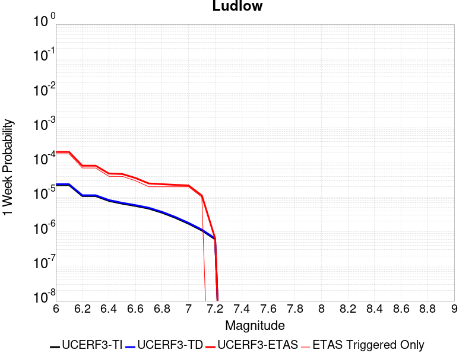 |  |  |  |

| Magnitude | 1 wk TI Prob | 1 wk TD Prob | 1 wk ETAS Prob | 1 wk ETAS/TD Gain | 1 wk ETAS Triggered Only | 1 mo TI Prob | 1 mo TD Prob | 1 mo ETAS Prob | 1 mo ETAS/TD Gain | 1 mo ETAS Triggered Only | 1 yr TI Prob | 1 yr TD Prob | 1 yr ETAS Prob | 1 yr ETAS/TD Gain | 1 yr ETAS Triggered Only | 10 yr TI Prob | 10 yr TD Prob | 10 yr ETAS Prob | 10 yr ETAS/TD Gain | 10 yr ETAS Triggered Only |
|-----|-----|-----|-----|-----|-----|-----|-----|-----|-----|-----|-----|-----|-----|-----|-----|-----|-----|-----|-----|-----|
| 6.0 | 2.2407607E-5 | 2.3657254E-5 | 2.3297775E-4 | 9.848047 | 2.0932544E-4 | 9.602906E-5 | 1.0138454E-4 | 3.281308E-4 | 3.2364974 | 2.2676923E-4 | 0.0011685267 | 0.001233702 | 0.0014601914 | 1.1835853 | 2.2676923E-4 | 0.011624013 | 0.012273042 | 0.012497028 | 1.0182502 | 2.2676923E-4 |
| 6.1 | 2.2407607E-5 | 2.3657254E-5 | 2.3297775E-4 | 9.848047 | 2.0932544E-4 | 9.602906E-5 | 1.0138454E-4 | 3.281308E-4 | 3.2364974 | 2.2676923E-4 | 0.0011685267 | 0.001233702 | 0.0014601914 | 1.1835853 | 2.2676923E-4 | 0.011624013 | 0.012273042 | 0.012497028 | 1.0182502 | 2.2676923E-4 |
| 6.2 | 1.0781252E-5 | 1.1365663E-5 | 1.160272E-4 | 10.208572 | 1.0466272E-4 | 4.620455E-5 | 4.8709102E-5 | 1.7080967E-4 | 3.50673 | 1.2210652E-4 | 5.623952E-4 | 5.9287593E-4 | 7.149101E-4 | 1.2058342 | 1.2210652E-4 | 0.00560974 | 0.0059133614 | 0.006034746 | 1.0205271 | 1.2210652E-4 |
| 6.3 | 1.0781252E-5 | 1.1365663E-5 | 1.160272E-4 | 10.208572 | 1.0466272E-4 | 4.620455E-5 | 4.8709102E-5 | 1.7080967E-4 | 3.50673 | 1.2210652E-4 | 5.623952E-4 | 5.9287593E-4 | 7.149101E-4 | 1.2058342 | 1.2210652E-4 | 0.00560974 | 0.0059133614 | 0.006034746 | 1.0205271 | 1.2210652E-4 |
| 6.4 | 7.814439E-6 | 8.237729E-6 | 7.80123E-5 | 9.470122 | 6.977515E-5 | 3.3490025E-5 | 3.530408E-5 | 1.2251994E-4 | 3.4704185 | 8.7218934E-5 | 4.0766477E-4 | 4.2974384E-4 | 5.169253E-4 | 1.2028685 | 8.7218934E-5 | 0.0040691774 | 0.0042892746 | 0.0043761195 | 1.020247 | 8.7218934E-5 |
| 6.5 | 6.4986366E-6 | 6.85092E-6 | 7.662559E-5 | 11.184716 | 6.977515E-5 | 2.7851002E-5 | 2.9360759E-5 | 1.1657713E-4 | 3.9705083 | 8.7218934E-5 | 3.390332E-4 | 3.5740953E-4 | 4.445973E-4 | 1.2439436 | 8.7218934E-5 | 0.003385164 | 0.0035684432 | 0.003655351 | 1.0243545 | 8.7218934E-5 |
| 6.6 | 5.582177E-6 | 5.8860055E-6 | 5.821706E-5 | 9.8907585 | 5.233136E-5 | 2.3923398E-5 | 2.5225498E-5 | 9.499889E-5 | 3.7659867 | 6.977515E-5 | 2.9122844E-4 | 3.0707786E-4 | 3.768316E-4 | 1.2271532 | 6.977515E-5 | 0.0029084706 | 0.003066609 | 0.00313617 | 1.0226834 | 6.977515E-5 |
| 6.7 | 4.6858763E-6 | 4.940427E-6 | 3.9827828E-5 | 8.061617 | 3.4887576E-5 | 2.0082172E-5 | 2.1173091E-5 | 5.6059926E-5 | 2.647697 | 3.4887576E-5 | 2.4447302E-4 | 2.5775246E-4 | 2.92631E-4 | 1.1353182 | 3.4887576E-5 | 0.0024420423 | 0.0025745912 | 0.0026093891 | 1.0135158 | 3.4887576E-5 |
| 6.8 | 3.5584908E-6 | 3.7520183E-6 | 3.8639464E-5 | 10.298314 | 3.4887576E-5 | 1.5250586E-5 | 1.6079981E-5 | 5.0966995E-5 | 3.1695929 | 3.4887576E-5 | 1.8566006E-4 | 1.957566E-4 | 2.3063735E-4 | 1.1781843 | 3.4887576E-5 | 0.0018550502 | 0.0019558826 | 0.001990702 | 1.0178024 | 3.4887576E-5 |
| 6.9 | 2.532834E-6 | 2.6710034E-6 | 3.7558486E-5 | 14.0615635 | 3.4887576E-5 | 1.0854958E-5 | 1.1447109E-5 | 4.6334284E-5 | 4.047684 | 3.4887576E-5 | 1.3215111E-4 | 1.3935992E-4 | 1.7424262E-4 | 1.2503066 | 3.4887576E-5 | 0.0013207254 | 0.0013927529 | 0.0014275918 | 1.0250145 | 3.4887576E-5 |
| 7.0 | 1.7083285E-6 | 1.8019439E-6 | 3.6689456E-5 | 20.361042 | 3.4887576E-5 | 7.3213873E-6 | 7.722595E-6 | 4.26099E-5 | 5.517563 | 3.4887576E-5 | 8.913424E-5 | 9.40187E-5 | 1.2890299E-4 | 1.3710357 | 3.4887576E-5 | 8.9098496E-4 | 9.3980576E-4 | 9.746605E-4 | 1.0370872 | 3.4887576E-5 |
| 7.1 | 1.0905424E-6 | 1.1497619E-6 | 1.859353E-5 | 16.171633 | 1.7443788E-5 | 4.6737446E-6 | 4.9275427E-6 | 2.2371243E-5 | 4.540041 | 1.7443788E-5 | 5.6901354E-5 | 5.999128E-5 | 7.743402E-5 | 1.2907546 | 1.7443788E-5 | 5.6886784E-4 | 5.997606E-4 | 6.1719393E-4 | 1.0290672 | 1.7443788E-5 |
| 7.2 | 6.06668E-7 | 6.387277E-7 | 6.387277E-7 | 1.0 | 0.0 | 2.600003E-6 | 2.7374022E-6 | 2.7374022E-6 | 1.0 | 0.0 | 3.1654577E-5 | 3.3327433E-5 | 3.3327433E-5 | 1.0 | 0.0 | 3.1650066E-4 | 3.3323118E-4 | 3.3323118E-4 | 1.0 | 0.0 |

## San Jacinto (San Bernardino)
*[(top)](#table-of-contents)*

| 1 Week | 1 Month | 1 Year | 10 Year |
|-----|-----|-----|-----|
|  |  |  |  |

| Magnitude | 1 wk TI Prob | 1 wk TD Prob | 1 wk ETAS Prob | 1 wk ETAS/TD Gain | 1 wk ETAS Triggered Only | 1 mo TI Prob | 1 mo TD Prob | 1 mo ETAS Prob | 1 mo ETAS/TD Gain | 1 mo ETAS Triggered Only | 1 yr TI Prob | 1 yr TD Prob | 1 yr ETAS Prob | 1 yr ETAS/TD Gain | 1 yr ETAS Triggered Only | 10 yr TI Prob | 10 yr TD Prob | 10 yr ETAS Prob | 10 yr ETAS/TD Gain | 10 yr ETAS Triggered Only |
|-----|-----|-----|-----|-----|-----|-----|-----|-----|-----|-----|-----|-----|-----|-----|-----|-----|-----|-----|-----|-----|
| 6.0 | 3.409352E-5 | 3.5986508E-5 | 2.6274758E-4 | 7.30128 | 2.2676923E-4 | 1.461069E-4 | 1.542188E-4 | 3.8095305E-4 | 2.4702117 | 2.2676923E-4 | 0.0017774 | 0.0018759987 | 0.0021023424 | 1.1206524 | 2.2676923E-4 | 0.01763251 | 0.019349935 | 0.019572316 | 1.0114926 | 2.2676923E-4 |
| 6.1 | 3.409352E-5 | 3.5986508E-5 | 2.6274758E-4 | 7.30128 | 2.2676923E-4 | 1.461069E-4 | 1.542188E-4 | 3.8095305E-4 | 2.4702117 | 2.2676923E-4 | 0.0017774 | 0.0018759987 | 0.0021023424 | 1.1206524 | 2.2676923E-4 | 0.01763251 | 0.019349935 | 0.019572316 | 1.0114926 | 2.2676923E-4 |
| 6.2 | 3.409352E-5 | 3.5986508E-5 | 2.6274758E-4 | 7.30128 | 2.2676923E-4 | 1.461069E-4 | 1.542188E-4 | 3.8095305E-4 | 2.4702117 | 2.2676923E-4 | 0.0017774 | 0.0018759987 | 0.0021023424 | 1.1206524 | 2.2676923E-4 | 0.01763251 | 0.019349935 | 0.019572316 | 1.0114926 | 2.2676923E-4 |
| 6.3 | 3.409352E-5 | 3.5986508E-5 | 2.6274758E-4 | 7.30128 | 2.2676923E-4 | 1.461069E-4 | 1.542188E-4 | 3.8095305E-4 | 2.4702117 | 2.2676923E-4 | 0.0017774 | 0.0018759987 | 0.0021023424 | 1.1206524 | 2.2676923E-4 | 0.01763251 | 0.019349935 | 0.019572316 | 1.0114926 | 2.2676923E-4 |
| 6.4 | 3.400795E-5 | 3.5879173E-5 | 2.6264027E-4 | 7.320132 | 2.2676923E-4 | 1.4574021E-4 | 1.5375883E-4 | 3.804932E-4 | 2.4746103 | 2.2676923E-4 | 0.0017729428 | 0.0018704084 | 0.0020967536 | 1.1210138 | 2.2676923E-4 | 0.017588645 | 0.019295016 | 0.01951741 | 1.011526 | 2.2676923E-4 |
| 6.5 | 3.341482E-5 | 3.5139812E-5 | 2.619011E-4 | 7.453116 | 2.2676923E-4 | 1.4319851E-4 | 1.5059051E-4 | 3.773256E-4 | 2.50564 | 2.2676923E-4 | 0.0017420477 | 0.0018318989 | 0.0020582527 | 1.1235623 | 2.2676923E-4 | 0.017284546 | 0.018916558 | 0.019139038 | 1.0117611 | 2.2676923E-4 |
| 6.6 | 3.3364955E-5 | 3.5077028E-5 | 2.4439514E-4 | 6.967384 | 2.0932544E-4 | 1.4298483E-4 | 1.5032147E-4 | 3.5961546E-4 | 2.3923092 | 2.0932544E-4 | 0.0017394501 | 0.001828629 | 0.0020375717 | 1.1142619 | 2.0932544E-4 | 0.017258976 | 0.018884424 | 0.019089796 | 1.0108752 | 2.0932544E-4 |
| 6.7 | 3.335922E-5 | 3.5066805E-5 | 2.4438492E-4 | 6.9691243 | 2.0932544E-4 | 1.4296026E-4 | 1.5027766E-4 | 3.5957166E-4 | 2.3927152 | 2.0932544E-4 | 0.0017391514 | 0.0018280965 | 0.0020370393 | 1.1142952 | 2.0932544E-4 | 0.017256035 | 0.018879214 | 0.019084588 | 1.0108783 | 2.0932544E-4 |
| 6.8 | 3.327683E-5 | 3.496087E-5 | 2.44279E-4 | 6.9872117 | 2.0932544E-4 | 1.4260718E-4 | 1.498237E-4 | 3.5911778E-4 | 2.3969357 | 2.0932544E-4 | 0.0017348597 | 0.0018225788 | 0.0020315228 | 1.1146419 | 2.0932544E-4 | 0.017213784 | 0.018824987 | 0.019030372 | 1.0109103 | 2.0932544E-4 |
| 6.9 | 3.3235785E-5 | 3.4901823E-5 | 2.4421996E-4 | 6.997341 | 2.0932544E-4 | 1.4243131E-4 | 1.4957068E-4 | 3.588648E-4 | 2.3992994 | 2.0932544E-4 | 0.0017327217 | 0.0018195034 | 0.002028448 | 1.1148361 | 2.0932544E-4 | 0.017192734 | 0.018794855 | 0.019000247 | 1.010928 | 2.0932544E-4 |
| 7.0 | 3.3197095E-5 | 3.4841752E-5 | 2.4415992E-4 | 7.0076814 | 2.0932544E-4 | 1.422655E-4 | 1.4931326E-4 | 3.5860745E-4 | 2.401712 | 2.0932544E-4 | 0.0017307063 | 0.0018163746 | 0.00202532 | 1.1150342 | 2.0932544E-4 | 0.017172894 | 0.018764233 | 0.01896963 | 1.0109463 | 2.0932544E-4 |
| 7.1 | 3.3129716E-5 | 3.4721965E-5 | 2.4404014E-4 | 7.028408 | 2.0932544E-4 | 1.4197677E-4 | 1.4879994E-4 | 3.5809426E-4 | 2.4065483 | 2.0932544E-4 | 0.0017271966 | 0.0018101353 | 0.002019082 | 1.1154314 | 2.0932544E-4 | 0.017138338 | 0.018703312 | 0.018908722 | 1.0109825 | 2.0932544E-4 |
| 7.2 | 3.3034008E-5 | 3.458941E-5 | 2.4390762E-4 | 7.051511 | 2.0932544E-4 | 1.4156665E-4 | 1.4823192E-4 | 3.5752635E-4 | 2.411939 | 2.0932544E-4 | 0.0017222111 | 0.0018032312 | 0.0020121792 | 1.1158742 | 2.0932544E-4 | 0.017089253 | 0.018635705 | 0.018841129 | 1.0110232 | 2.0932544E-4 |
| 7.3 | 3.2956614E-5 | 3.445717E-5 | 2.437754E-4 | 7.0747366 | 2.0932544E-4 | 1.4123498E-4 | 1.4766524E-4 | 3.5695976E-4 | 2.4173582 | 2.0932544E-4 | 0.0017181796 | 0.0017963431 | 0.0020052926 | 1.1163193 | 2.0932544E-4 | 0.017049557 | 0.018568452 | 0.018773891 | 1.0110638 | 2.0932544E-4 |
| 7.4 | 3.2915937E-5 | 3.4378863E-5 | 2.4369711E-4 | 7.088574 | 2.0932544E-4 | 1.4106068E-4 | 1.4732967E-4 | 3.5662428E-4 | 2.4205868 | 2.0932544E-4 | 0.0017160608 | 0.0017922645 | 0.0020012148 | 1.1165845 | 2.0932544E-4 | 0.017028693 | 0.018528719 | 0.018734165 | 1.011088 | 2.0932544E-4 |
| 7.5 | 3.281791E-5 | 3.4243778E-5 | 2.4356206E-4 | 7.1125927 | 2.0932544E-4 | 1.406406E-4 | 1.4675081E-4 | 3.5604552E-4 | 2.4261913 | 2.0932544E-4 | 0.0017109542 | 0.0017852283 | 0.00199418 | 1.1170448 | 2.0932544E-4 | 0.016978411 | 0.018459605 | 0.018665066 | 1.0111303 | 2.0932544E-4 |
| 7.6 | 3.2521442E-5 | 3.396873E-5 | 2.4328707E-4 | 7.162089 | 2.0932544E-4 | 1.3937015E-4 | 1.4557215E-4 | 3.5486714E-4 | 2.4377406 | 2.0932544E-4 | 0.0016955109 | 0.0017709016 | 0.0019798563 | 1.1179935 | 2.0932544E-4 | 0.016826328 | 0.018317232 | 0.018522725 | 1.0112184 | 2.0932544E-4 |
| 7.7 | 3.0287873E-5 | 3.245276E-5 | 2.4177141E-4 | 7.449949 | 2.0932544E-4 | 1.297987E-4 | 1.3907586E-4 | 3.483722E-4 | 2.5049078 | 2.0932544E-4 | 0.0015791537 | 0.0016919347 | 0.001900906 | 1.1235102 | 2.0932544E-4 | 0.01567979 | 0.01752809 | 0.017733747 | 1.0117329 | 2.0932544E-4 |
| 7.8 | 2.6316151E-5 | 2.9663592E-5 | 2.3898283E-4 | 8.056437 | 2.0932544E-4 | 1.1277862E-4 | 1.2712348E-4 | 3.3642232E-4 | 2.6464214 | 2.0932544E-4 | 0.0013722149 | 0.0015466306 | 0.0017556323 | 1.1351335 | 2.0932544E-4 | 0.013637724 | 0.016069634 | 0.016275596 | 1.0128168 | 2.0932544E-4 |
| 7.9 | 2.0761147E-5 | 2.34181E-5 | 2.1529527E-4 | 9.193541 | 1.9188166E-4 | 8.897331E-5 | 1.0035944E-4 | 2.9222184E-4 | 2.9117525 | 1.9188166E-4 | 0.0010827117 | 0.0012211921 | 0.0014128394 | 1.1569346 | 1.9188166E-4 | 0.010774517 | 0.012793174 | 0.012982601 | 1.0148069 | 1.9188166E-4 |
| 8.0 | 1.5738568E-5 | 1.6033575E-5 | 8.580761E-5 | 5.351745 | 6.977515E-5 | 6.744926E-5 | 6.871352E-5 | 1.3848387E-4 | 2.0153804 | 6.977515E-5 | 8.2088535E-4 | 8.3626667E-4 | 9.0598344E-4 | 1.0833668 | 6.977515E-5 | 0.008178596 | 0.008865921 | 0.008935077 | 1.0078002 | 6.977515E-5 |
| 8.1 | 1.0105832E-5 | 8.3304985E-6 | 2.577414E-5 | 3.0939493 | 1.7443788E-5 | 4.3309992E-5 | 3.570165E-5 | 5.3144813E-5 | 1.4885814 | 1.7443788E-5 | 5.2717153E-4 | 4.345814E-4 | 4.5201762E-4 | 1.0401218 | 1.7443788E-5 | 0.005259227 | 0.004677232 | 0.004694594 | 1.003712 | 1.7443788E-5 |
| 8.2 | 4.189207E-6 | 1.5784357E-6 | 1.5784357E-6 | 1.0 | 0.0 | 1.7953622E-5 | 6.7647065E-6 | 6.7647065E-6 | 1.0 | 0.0 | 2.1856341E-4 | 8.235722E-5 | 8.235722E-5 | 1.0 | 0.0 | 0.0021834858 | 9.565867E-4 | 9.565867E-4 | 1.0 | 0.0 |
| 8.3 | 1.2758221E-6 | 3.6149942E-7 | 3.6149942E-7 | 1.0 | 0.0 | 5.4677976E-6 | 1.5492824E-6 | 1.5492824E-6 | 1.0 | 0.0 | 6.65684E-5 | 1.8862354E-5 | 1.8862354E-5 | 1.0 | 0.0 | 6.6548464E-4 | 2.2751294E-4 | 2.2751294E-4 | 1.0 | 0.0 |

## Elsinore (Glen Ivy) rev
*[(top)](#table-of-contents)*

| 1 Week | 1 Month | 1 Year | 10 Year |
|-----|-----|-----|-----|
|  |  | 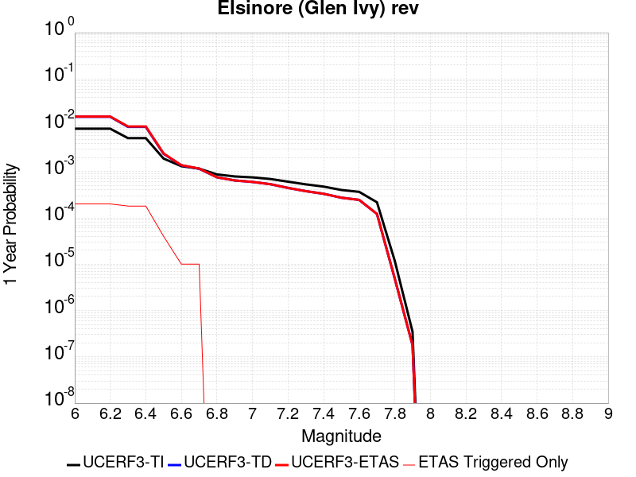 |  |

| Magnitude | 1 wk TI Prob | 1 wk TD Prob | 1 wk ETAS Prob | 1 wk ETAS/TD Gain | 1 wk ETAS Triggered Only | 1 mo TI Prob | 1 mo TD Prob | 1 mo ETAS Prob | 1 mo ETAS/TD Gain | 1 mo ETAS Triggered Only | 1 yr TI Prob | 1 yr TD Prob | 1 yr ETAS Prob | 1 yr ETAS/TD Gain | 1 yr ETAS Triggered Only | 10 yr TI Prob | 10 yr TD Prob | 10 yr ETAS Prob | 10 yr ETAS/TD Gain | 10 yr ETAS Triggered Only |
|-----|-----|-----|-----|-----|-----|-----|-----|-----|-----|-----|-----|-----|-----|-----|-----|-----|-----|-----|-----|-----|
| 6.0 | 1.6204086E-4 | 2.9360707E-4 | 4.5055506E-4 | 1.5345511 | 1.5699408E-4 | 6.94276E-4 | 0.0012578638 | 0.0014320823 | 1.1385034 | 1.7443787E-4 | 0.008420097 | 0.015234485 | 0.015423443 | 1.0124034 | 1.9188166E-4 | 0.081081145 | 0.13969168 | 0.13987176 | 1.0012891 | 2.0932544E-4 |
| 6.1 | 1.6204086E-4 | 2.9360707E-4 | 4.5055506E-4 | 1.5345511 | 1.5699408E-4 | 6.94276E-4 | 0.0012578638 | 0.0014320823 | 1.1385034 | 1.7443787E-4 | 0.008420097 | 0.015234485 | 0.015423443 | 1.0124034 | 1.9188166E-4 | 0.081081145 | 0.13969168 | 0.13987176 | 1.0012891 | 2.0932544E-4 |
| 6.2 | 1.6204086E-4 | 2.9360707E-4 | 4.5055506E-4 | 1.5345511 | 1.5699408E-4 | 6.94276E-4 | 0.0012578638 | 0.0014320823 | 1.1385034 | 1.7443787E-4 | 0.008420097 | 0.015234485 | 0.015423443 | 1.0124034 | 1.9188166E-4 | 0.081081145 | 0.13969168 | 0.13987176 | 1.0012891 | 2.0932544E-4 |
| 6.3 | 1.0111737E-4 | 1.7703383E-4 | 2.9911872E-4 | 1.6896133 | 1.2210652E-4 | 4.332882E-4 | 7.5861247E-4 | 8.980569E-4 | 1.1838151 | 1.395503E-4 | 0.005262531 | 0.009217682 | 0.009373229 | 1.0168748 | 1.5699408E-4 | 0.0513964 | 0.0870191 | 0.087162435 | 1.0016471 | 1.5699408E-4 |
| 6.4 | 1.0111737E-4 | 1.7703383E-4 | 2.9911872E-4 | 1.6896133 | 1.2210652E-4 | 4.332882E-4 | 7.5861247E-4 | 8.980569E-4 | 1.1838151 | 1.395503E-4 | 0.005262531 | 0.009217682 | 0.009373229 | 1.0168748 | 1.5699408E-4 | 0.0513964 | 0.0870191 | 0.087162435 | 1.0016471 | 1.5699408E-4 |
| 6.5 | 3.6624708E-5 | 4.6391084E-5 | 8.127704E-5 | 1.751997 | 3.4887576E-5 | 1.569536E-4 | 1.9880582E-4 | 2.3368647E-4 | 1.1754508 | 3.4887576E-5 | 0.001909235 | 0.0024181372 | 0.0024529402 | 1.0143926 | 3.4887576E-5 | 0.01892915 | 0.023739954 | 0.023774015 | 1.0014347 | 3.4887576E-5 |
| 6.6 | 2.5051324E-5 | 2.614772E-5 | 4.359105E-5 | 1.6671071 | 1.7443788E-5 | 1.073584E-4 | 1.12057096E-4 | 1.2949893E-4 | 1.1556513 | 1.7443788E-5 | 0.0013063047 | 0.0013634858 | 0.0013809059 | 1.0127761 | 1.7443788E-5 | 0.012986525 | 0.013564618 | 0.013581825 | 1.0012685 | 1.7443788E-5 |
| 6.7 | 2.2189772E-5 | 2.2072849E-5 | 3.951625E-5 | 1.7902651 | 1.7443788E-5 | 9.509556E-5 | 9.4594696E-5 | 1.1203684E-4 | 1.1843882 | 1.7443788E-5 | 0.0011571734 | 0.0011511183 | 0.0011685421 | 1.0151364 | 1.7443788E-5 | 0.011511663 | 0.011465415 | 0.01148266 | 1.001504 | 1.7443788E-5 |
| 6.8 | 1.6654378E-5 | 1.4437705E-5 | 1.4437705E-5 | 1.0 | 0.0 | 7.137396E-5 | 6.187444E-5 | 6.187444E-5 | 1.0 | 0.0 | 8.686314E-4 | 7.530661E-4 | 7.530661E-4 | 1.0 | 0.0 | 0.008652439 | 0.00751048 | 0.00751048 | 1.0 | 0.0 |
| 6.9 | 1.5042909E-5 | 1.2332022E-5 | 1.2332022E-5 | 1.0 | 0.0 | 6.446802E-5 | 5.285047E-5 | 5.285047E-5 | 1.0 | 0.0 | 7.8461546E-4 | 6.4326765E-4 | 6.4326765E-4 | 1.0 | 0.0 | 0.007818509 | 0.00641828 | 0.00641828 | 1.0 | 0.0 |
| 7.0 | 1.4361385E-5 | 1.1451324E-5 | 1.1451324E-5 | 1.0 | 0.0 | 6.154734E-5 | 4.9076196E-5 | 4.9076196E-5 | 1.0 | 0.0 | 7.490812E-4 | 5.973418E-4 | 5.973418E-4 | 1.0 | 0.0 | 0.007465612 | 0.0059613534 | 0.0059613534 | 1.0 | 0.0 |
| 7.1 | 1.3265571E-5 | 1.0244926E-5 | 1.0244926E-5 | 1.0 | 0.0 | 5.6851208E-5 | 4.39061E-5 | 4.39061E-5 | 1.0 | 0.0 | 6.919436E-4 | 5.344282E-4 | 5.344282E-4 | 1.0 | 0.0 | 0.006897931 | 0.0053347866 | 0.0053347866 | 1.0 | 0.0 |
| 7.2 | 1.1596403E-5 | 8.505067E-6 | 8.505067E-6 | 1.0 | 0.0 | 4.9697923E-5 | 3.6449786E-5 | 3.6449786E-5 | 1.0 | 0.0 | 6.049042E-4 | 4.436875E-4 | 4.436875E-4 | 1.0 | 0.0 | 0.006032603 | 0.0044294316 | 0.0044294316 | 1.0 | 0.0 |
| 7.3 | 1.0150827E-5 | 7.2387597E-6 | 7.2387597E-6 | 1.0 | 0.0 | 4.3502816E-5 | 3.1022897E-5 | 3.1022897E-5 | 1.0 | 0.0 | 5.2951806E-4 | 3.7763975E-4 | 3.7763975E-4 | 1.0 | 0.0 | 0.005282581 | 0.0037703665 | 0.0037703665 | 1.0 | 0.0 |
| 7.4 | 9.080705E-6 | 6.352519E-6 | 6.352519E-6 | 1.0 | 0.0 | 3.8916725E-5 | 2.7224805E-5 | 2.7224805E-5 | 1.0 | 0.0 | 4.7370812E-4 | 3.3141294E-4 | 3.3141294E-4 | 1.0 | 0.0 | 0.004726996 | 0.0033093381 | 0.0033093381 | 1.0 | 0.0 |
| 7.5 | 7.671649E-6 | 5.2256332E-6 | 5.2256332E-6 | 1.0 | 0.0 | 3.287808E-5 | 2.2395385E-5 | 2.2395385E-5 | 1.0 | 0.0 | 4.0021708E-4 | 2.7263095E-4 | 2.7263095E-4 | 1.0 | 0.0 | 0.0039949706 | 0.00272309 | 0.00272309 | 1.0 | 0.0 |
| 7.6 | 6.990086E-6 | 4.687545E-6 | 4.687545E-6 | 1.0 | 0.0 | 2.9957167E-5 | 2.008933E-5 | 2.008933E-5 | 1.0 | 0.0 | 3.6466747E-4 | 2.445613E-4 | 2.445613E-4 | 1.0 | 0.0 | 0.0036406964 | 0.002443038 | 0.002443038 | 1.0 | 0.0 |
| 7.7 | 4.163505E-6 | 2.3295343E-6 | 2.3295343E-6 | 1.0 | 0.0 | 1.7843471E-5 | 9.983683E-6 | 9.983683E-6 | 1.0 | 0.0 | 2.172226E-4 | 1.21545316E-4 | 1.21545316E-4 | 1.0 | 0.0 | 0.0021701038 | 0.0012148614 | 0.0012148614 | 1.0 | 0.0 |
| 7.8 | 2.2692414E-7 | 9.3854695E-8 | 9.3854695E-8 | 1.0 | 0.0 | 9.725317E-7 | 4.0223435E-7 | 4.0223435E-7 | 1.0 | 0.0 | 1.1840509E-5 | 4.8971956E-6 | 4.8971956E-6 | 1.0 | 0.0 | 1.1839878E-4 | 4.8971204E-5 | 4.8971204E-5 | 1.0 | 0.0 |
| 7.9 | 6.676829E-9 | 3.439853E-9 | 3.439853E-9 | 1.0 | 0.0 | 2.861498E-8 | 1.4742227E-8 | 1.4742227E-8 | 1.0 | 0.0 | 3.4838732E-7 | 1.7948659E-7 | 1.7948659E-7 | 1.0 | 0.0 | 3.4838679E-6 | 1.7948646E-6 | 1.7948646E-6 | 1.0 | 0.0 |

## Death Valley (Fish Lake Valley)
*[(top)](#table-of-contents)*

| 1 Week | 1 Month | 1 Year | 10 Year |
|-----|-----|-----|-----|
|  |  | 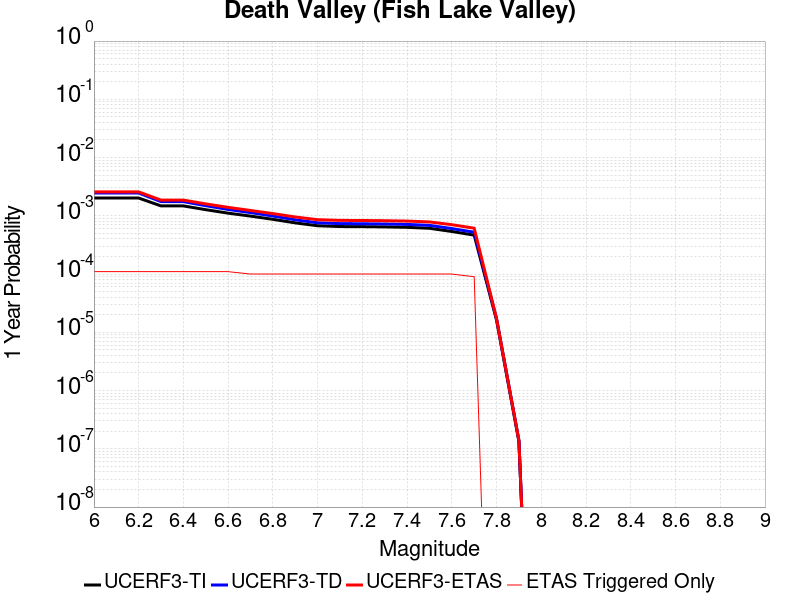 | 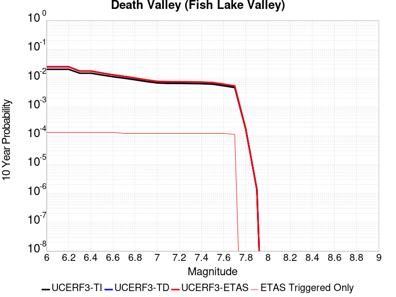 |

| Magnitude | 1 wk TI Prob | 1 wk TD Prob | 1 wk ETAS Prob | 1 wk ETAS/TD Gain | 1 wk ETAS Triggered Only | 1 mo TI Prob | 1 mo TD Prob | 1 mo ETAS Prob | 1 mo ETAS/TD Gain | 1 mo ETAS Triggered Only | 1 yr TI Prob | 1 yr TD Prob | 1 yr ETAS Prob | 1 yr ETAS/TD Gain | 1 yr ETAS Triggered Only | 10 yr TI Prob | 10 yr TD Prob | 10 yr ETAS Prob | 10 yr ETAS/TD Gain | 10 yr ETAS Triggered Only |
|-----|-----|-----|-----|-----|-----|-----|-----|-----|-----|-----|-----|-----|-----|-----|-----|-----|-----|-----|-----|-----|
| 6.0 | 3.872328E-5 | 4.7267473E-5 | 2.0425415E-4 | 4.321241 | 1.5699408E-4 | 1.6594635E-4 | 2.0256084E-4 | 3.5952314E-4 | 1.7748896 | 1.5699408E-4 | 0.0020185246 | 0.002463534 | 0.0026201413 | 1.0635701 | 1.5699408E-4 | 0.02000288 | 0.024388181 | 0.024575382 | 1.0076759 | 1.9188166E-4 |
| 6.1 | 3.872328E-5 | 4.7267473E-5 | 2.0425415E-4 | 4.321241 | 1.5699408E-4 | 1.6594635E-4 | 2.0256084E-4 | 3.5952314E-4 | 1.7748896 | 1.5699408E-4 | 0.0020185246 | 0.002463534 | 0.0026201413 | 1.0635701 | 1.5699408E-4 | 0.02000288 | 0.024388181 | 0.024575382 | 1.0076759 | 1.9188166E-4 |
| 6.2 | 3.872328E-5 | 4.7267473E-5 | 2.0425415E-4 | 4.321241 | 1.5699408E-4 | 1.6594635E-4 | 2.0256084E-4 | 3.5952314E-4 | 1.7748896 | 1.5699408E-4 | 0.0020185246 | 0.002463534 | 0.0026201413 | 1.0635701 | 1.5699408E-4 | 0.02000288 | 0.024388181 | 0.024575382 | 1.0076759 | 1.9188166E-4 |
| 6.3 | 2.8356371E-5 | 3.3609853E-5 | 1.9059866E-4 | 5.6709166 | 1.5699408E-4 | 1.2152165E-4 | 1.4403471E-4 | 3.010062E-4 | 2.089817 | 1.5699408E-4 | 0.0014785219 | 0.0017522911 | 0.0019090101 | 1.0894367 | 1.5699408E-4 | 0.014687235 | 0.017391782 | 0.017580327 | 1.010841 | 1.9188166E-4 |
| 6.4 | 2.8356371E-5 | 3.3609853E-5 | 1.9059866E-4 | 5.6709166 | 1.5699408E-4 | 1.2152165E-4 | 1.4403471E-4 | 3.010062E-4 | 2.089817 | 1.5699408E-4 | 0.0014785219 | 0.0017522911 | 0.0019090101 | 1.0894367 | 1.5699408E-4 | 0.014687235 | 0.017391782 | 0.017580327 | 1.010841 | 1.9188166E-4 |
| 6.5 | 2.4448687E-5 | 2.8607552E-5 | 1.8559715E-4 | 6.4876976 | 1.5699408E-4 | 1.0477588E-4 | 1.2259831E-4 | 2.7957317E-4 | 2.2803996 | 1.5699408E-4 | 0.0012748998 | 0.0014916632 | 0.001648423 | 1.1050907 | 1.5699408E-4 | 0.012676105 | 0.014821377 | 0.015010415 | 1.0127544 | 1.9188166E-4 |
| 6.6 | 2.1298161E-5 | 2.4660083E-5 | 1.8165029E-4 | 7.366167 | 1.5699408E-4 | 9.127464E-5 | 1.0568198E-4 | 2.6265948E-4 | 2.4853761 | 1.5699408E-4 | 0.0011107022 | 0.0012859525 | 0.0014427447 | 1.1219269 | 1.5699408E-4 | 0.011051672 | 0.012788526 | 0.012977953 | 1.0148124 | 1.9188166E-4 |
| 6.7 | 1.8959729E-5 | 2.1781025E-5 | 1.6132828E-4 | 7.406827 | 1.395503E-4 | 8.125345E-5 | 9.334405E-5 | 2.3288133E-4 | 2.4948704 | 1.395503E-4 | 9.888117E-4 | 0.001135897 | 0.0012752888 | 1.1227151 | 1.395503E-4 | 0.009844234 | 0.01130357 | 0.011476036 | 1.0152577 | 1.7443787E-4 |
| 6.8 | 1.6691629E-5 | 1.9018353E-5 | 1.5856599E-4 | 8.337525 | 1.395503E-4 | 7.153359E-5 | 8.150477E-5 | 2.210437E-4 | 2.7120337 | 1.395503E-4 | 8.7057345E-4 | 9.918857E-4 | 0.0011312976 | 1.1405524 | 1.395503E-4 | 0.008671708 | 0.009876343 | 0.010049059 | 1.0174878 | 1.7443787E-4 |
| 6.9 | 1.450505E-5 | 1.638954E-5 | 1.5593755E-4 | 9.514456 | 1.395503E-4 | 6.216302E-5 | 7.0239046E-5 | 2.0977954E-4 | 2.9866514 | 1.395503E-4 | 7.5657194E-4 | 8.5483363E-4 | 9.942646E-4 | 1.163109 | 1.395503E-4 | 0.007540013 | 0.008516385 | 0.008689338 | 1.0203081 | 1.7443787E-4 |
| 7.0 | 1.2940855E-5 | 1.4537972E-5 | 1.5408624E-4 | 10.598882 | 1.395503E-4 | 5.545963E-5 | 6.230414E-5 | 2.0184575E-4 | 3.2396843 | 1.395503E-4 | 6.750118E-4 | 7.5829466E-4 | 8.9773914E-4 | 1.1838923 | 1.395503E-4 | 0.006729651 | 0.0075576897 | 0.0077308095 | 1.0229064 | 1.7443787E-4 |
| 7.1 | 1.2544658E-5 | 1.4078208E-5 | 1.5362655E-4 | 10.912365 | 1.395503E-4 | 5.3761712E-5 | 6.0333812E-5 | 1.9987569E-4 | 3.3128304 | 1.395503E-4 | 6.5435225E-4 | 7.343222E-4 | 8.7377004E-4 | 1.1899 | 1.395503E-4 | 0.006524288 | 0.007319551 | 0.007492712 | 1.0236573 | 1.7443787E-4 |
| 7.2 | 1.2489416E-5 | 1.4015674E-5 | 1.5356402E-4 | 10.956592 | 1.395503E-4 | 5.3524967E-5 | 6.0065824E-5 | 1.9960775E-4 | 3.32315 | 1.395503E-4 | 6.514716E-4 | 7.310616E-4 | 8.705099E-4 | 1.1907476 | 1.395503E-4 | 0.006495651 | 0.0072871596 | 0.0074603264 | 1.0237633 | 1.7443787E-4 |
| 7.3 | 1.2368307E-5 | 1.3879812E-5 | 1.5342818E-4 | 11.054052 | 1.395503E-4 | 5.3005948E-5 | 5.9483587E-5 | 1.9902558E-4 | 3.3458908 | 1.395503E-4 | 6.451563E-4 | 7.2397763E-4 | 8.634269E-4 | 1.1926154 | 1.395503E-4 | 0.0064328653 | 0.007216782 | 0.007389961 | 1.0239967 | 1.7443787E-4 |
| 7.4 | 1.2161707E-5 | 1.36478675E-5 | 1.5319626E-4 | 11.224923 | 1.395503E-4 | 5.212056E-5 | 5.8489582E-5 | 1.9803172E-4 | 3.3857605 | 1.395503E-4 | 6.3438306E-4 | 7.118836E-4 | 8.5133454E-4 | 1.1958901 | 1.395503E-4 | 0.006325751 | 0.0070966207 | 0.0072698207 | 1.024406 | 1.7443787E-4 |
| 7.5 | 1.1707948E-5 | 1.3145515E-5 | 1.5269397E-4 | 11.615671 | 1.395503E-4 | 5.0175953E-5 | 5.6336736E-5 | 1.9587917E-4 | 3.4769351 | 1.395503E-4 | 6.10721E-4 | 6.856895E-4 | 8.251441E-4 | 1.2033787 | 1.395503E-4 | 0.0060904534 | 0.006836321 | 0.0070095668 | 1.0253419 | 1.7443787E-4 |
| 7.6 | 1.0319538E-5 | 1.1579622E-5 | 1.511283E-4 | 13.0512295 | 1.395503E-4 | 4.4225842E-5 | 4.9626036E-5 | 1.8916941E-4 | 3.8118982 | 1.395503E-4 | 5.383166E-4 | 6.040347E-4 | 7.435007E-4 | 1.2308908 | 1.395503E-4 | 0.0053701443 | 0.0060244603 | 0.0061978474 | 1.0287805 | 1.7443787E-4 |
| 7.7 | 8.937764E-6 | 1.0022779E-5 | 1.4957169E-4 | 14.923174 | 1.395503E-4 | 3.830414E-5 | 4.295409E-5 | 1.8249839E-4 | 4.248685 | 1.395503E-4 | 4.6625308E-4 | 5.228456E-4 | 6.623229E-4 | 1.2667658 | 1.395503E-4 | 0.0046527605 | 0.005216664 | 0.005390192 | 1.0332642 | 1.7443787E-4 |
| 7.8 | 3.108007E-7 | 3.284654E-7 | 3.284654E-7 | 1.0 | 0.0 | 1.3320023E-6 | 1.407708E-6 | 1.407708E-6 | 1.0 | 0.0 | 1.6217007E-5 | 1.7138715E-5 | 1.7138715E-5 | 1.0 | 0.0 | 1.6215823E-4 | 1.7137431E-4 | 1.7137431E-4 | 1.0 | 0.0 |
| 7.9 | 2.5591178E-9 | 2.6696718E-9 | 2.6696718E-9 | 1.0 | 0.0 | 1.0967647E-8 | 1.14414505E-8 | 1.14414505E-8 | 1.0 | 0.0 | 1.335311E-7 | 1.3929966E-7 | 1.3929966E-7 | 1.0 | 0.0 | 1.3353102E-6 | 1.3929966E-6 | 1.3929966E-6 | 1.0 | 0.0 |

## San Andreas (Big Bend)
*[(top)](#table-of-contents)*

| 1 Week | 1 Month | 1 Year | 10 Year |
|-----|-----|-----|-----|
|  | 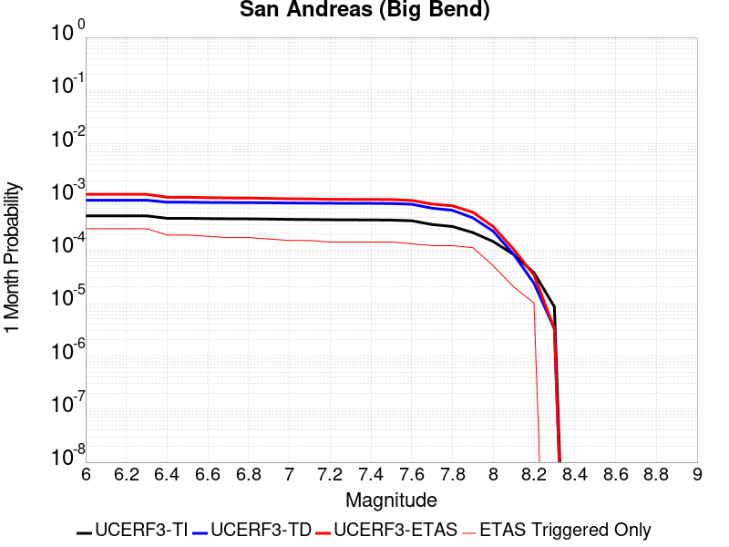 |  |  |

| Magnitude | 1 wk TI Prob | 1 wk TD Prob | 1 wk ETAS Prob | 1 wk ETAS/TD Gain | 1 wk ETAS Triggered Only | 1 mo TI Prob | 1 mo TD Prob | 1 mo ETAS Prob | 1 mo ETAS/TD Gain | 1 mo ETAS Triggered Only | 1 yr TI Prob | 1 yr TD Prob | 1 yr ETAS Prob | 1 yr ETAS/TD Gain | 1 yr ETAS Triggered Only | 10 yr TI Prob | 10 yr TD Prob | 10 yr ETAS Prob | 10 yr ETAS/TD Gain | 10 yr ETAS Triggered Only |
|-----|-----|-----|-----|-----|-----|-----|-----|-----|-----|-----|-----|-----|-----|-----|-----|-----|-----|-----|-----|-----|
| 6.0 | 1.0179969E-4 | 2.0072258E-4 | 3.7512544E-4 | 1.8688751 | 1.7443787E-4 | 4.362114E-4 | 8.599571E-4 | 0.001034245 | 1.2026705 | 1.7443787E-4 | 0.0052979486 | 0.010419999 | 0.010592619 | 1.0165663 | 1.7443787E-4 | 0.051734097 | 0.10144902 | 0.101621434 | 1.0016996 | 1.9188166E-4 |
| 6.1 | 1.0179969E-4 | 2.0072258E-4 | 3.7512544E-4 | 1.8688751 | 1.7443787E-4 | 4.362114E-4 | 8.599571E-4 | 0.001034245 | 1.2026705 | 1.7443787E-4 | 0.0052979486 | 0.010419999 | 0.010592619 | 1.0165663 | 1.7443787E-4 | 0.051734097 | 0.10144902 | 0.101621434 | 1.0016996 | 1.9188166E-4 |
| 6.2 | 1.0179969E-4 | 2.0072258E-4 | 3.7512544E-4 | 1.8688751 | 1.7443787E-4 | 4.362114E-4 | 8.599571E-4 | 0.001034245 | 1.2026705 | 1.7443787E-4 | 0.0052979486 | 0.010419999 | 0.010592619 | 1.0165663 | 1.7443787E-4 | 0.051734097 | 0.10144902 | 0.101621434 | 1.0016996 | 1.9188166E-4 |
| 6.3 | 1.0179969E-4 | 2.0072258E-4 | 3.7512544E-4 | 1.8688751 | 1.7443787E-4 | 4.362114E-4 | 8.599571E-4 | 0.001034245 | 1.2026705 | 1.7443787E-4 | 0.0052979486 | 0.010419999 | 0.010592619 | 1.0165663 | 1.7443787E-4 | 0.051734097 | 0.10144902 | 0.101621434 | 1.0016996 | 1.9188166E-4 |
| 6.4 | 9.1639464E-5 | 1.8429532E-4 | 3.412605E-4 | 1.8517045 | 1.5699408E-4 | 3.9268145E-4 | 7.895982E-4 | 9.464683E-4 | 1.1986709 | 1.5699408E-4 | 0.0047704205 | 0.009571102 | 0.009726593 | 1.016246 | 1.5699408E-4 | 0.046693064 | 0.09377527 | 0.09391754 | 1.0015172 | 1.5699408E-4 |
| 6.5 | 9.1639464E-5 | 1.8429532E-4 | 3.412605E-4 | 1.8517045 | 1.5699408E-4 | 3.9268145E-4 | 7.895982E-4 | 9.464683E-4 | 1.1986709 | 1.5699408E-4 | 0.0047704205 | 0.009571102 | 0.009726593 | 1.016246 | 1.5699408E-4 | 0.046693064 | 0.09377527 | 0.09391754 | 1.0015172 | 1.5699408E-4 |
| 6.6 | 9.042622E-5 | 1.823659E-4 | 3.2189075E-4 | 1.7650819 | 1.395503E-4 | 3.8748336E-4 | 7.8133424E-4 | 9.207755E-4 | 1.1784656 | 1.395503E-4 | 0.0047074095 | 0.009471365 | 0.009609594 | 1.0145943 | 1.395503E-4 | 0.046089325 | 0.092869274 | 0.09299587 | 1.0013632 | 1.395503E-4 |
| 6.7 | 8.9836685E-5 | 1.8150927E-4 | 3.2103423E-4 | 1.7686933 | 1.395503E-4 | 3.8495753E-4 | 7.776651E-4 | 9.171069E-4 | 1.1793083 | 1.395503E-4 | 0.00467679 | 0.00942708 | 0.009565315 | 1.0146636 | 1.395503E-4 | 0.045795817 | 0.09246355 | 0.0925902 | 1.0013697 | 1.395503E-4 |
| 6.8 | 8.9471854E-5 | 1.8097709E-4 | 3.2050212E-4 | 1.7709541 | 1.395503E-4 | 3.8339442E-4 | 7.7538576E-4 | 9.1482786E-4 | 1.1798358 | 1.395503E-4 | 0.004657841 | 0.009399569 | 0.009537807 | 1.0147069 | 1.395503E-4 | 0.04561414 | 0.092210755 | 0.09233744 | 1.0013739 | 1.395503E-4 |
| 6.9 | 8.858234E-5 | 1.7979681E-4 | 3.1932202E-4 | 1.776016 | 1.395503E-4 | 3.7958333E-4 | 7.703304E-4 | 9.097732E-4 | 1.1810169 | 1.395503E-4 | 0.004611638 | 0.009338548 | 0.009476796 | 1.0148039 | 1.395503E-4 | 0.04517103 | 0.09165087 | 0.09177763 | 1.0013831 | 1.395503E-4 |
| 7.0 | 8.7433385E-5 | 1.7818481E-4 | 3.1771025E-4 | 1.7830378 | 1.395503E-4 | 3.746607E-4 | 7.634259E-4 | 9.028697E-4 | 1.1826552 | 1.395503E-4 | 0.004551957 | 0.009255203 | 0.009393462 | 1.0149385 | 1.395503E-4 | 0.044598386 | 0.09088532 | 0.09101219 | 1.001396 | 1.395503E-4 |
| 7.1 | 8.684964E-5 | 1.7730435E-4 | 3.1682992E-4 | 1.7869269 | 1.395503E-4 | 3.7215967E-4 | 7.596547E-4 | 8.99099E-4 | 1.1835628 | 1.395503E-4 | 0.0045216335 | 0.009209678 | 0.009347943 | 1.015013 | 1.395503E-4 | 0.04430731 | 0.09046686 | 0.090593785 | 1.001403 | 1.395503E-4 |
| 7.2 | 8.606521E-5 | 1.762105E-4 | 3.1573622E-4 | 1.7918127 | 1.395503E-4 | 3.6879873E-4 | 7.549695E-4 | 8.9441444E-4 | 1.1847028 | 1.395503E-4 | 0.0044808835 | 0.0091531165 | 0.009291389 | 1.0151067 | 1.395503E-4 | 0.043916024 | 0.089947365 | 0.09007437 | 1.0014119 | 1.395503E-4 |
| 7.3 | 8.568266E-5 | 1.7563057E-4 | 3.1515636E-4 | 1.7944278 | 1.395503E-4 | 3.6715972E-4 | 7.524855E-4 | 8.919308E-4 | 1.185313 | 1.395503E-4 | 0.0044610105 | 0.009123127 | 0.009261404 | 1.0151567 | 1.395503E-4 | 0.043725148 | 0.08966853 | 0.08979557 | 1.0014167 | 1.395503E-4 |
| 7.4 | 8.5432206E-5 | 1.7525644E-4 | 3.147823E-4 | 1.7961239 | 1.395503E-4 | 3.6608664E-4 | 7.50883E-4 | 8.9032855E-4 | 1.1857088 | 1.395503E-4 | 0.004447999 | 0.009103781 | 0.009242061 | 1.0151893 | 1.395503E-4 | 0.043600157 | 0.08948871 | 0.08961577 | 1.0014199 | 1.395503E-4 |
| 7.5 | 8.4791965E-5 | 1.7394972E-4 | 3.1347576E-4 | 1.8021054 | 1.395503E-4 | 3.633435E-4 | 7.4528606E-4 | 8.8473235E-4 | 1.1871043 | 1.395503E-4 | 0.0044147377 | 0.009036204 | 0.009174493 | 1.015304 | 1.395503E-4 | 0.043280575 | 0.088866346 | 0.08899349 | 1.0014307 | 1.395503E-4 |
| 7.6 | 8.241105E-5 | 1.6840403E-4 | 2.9049E-4 | 1.7249585 | 1.2210652E-4 | 3.531424E-4 | 7.215321E-4 | 8.4355054E-4 | 1.1691102 | 1.2210652E-4 | 0.0042910352 | 0.008749358 | 0.008870397 | 1.013834 | 1.2210652E-4 | 0.042091176 | 0.086243294 | 0.08635487 | 1.0012938 | 1.2210652E-4 |
| 7.7 | 7.00432E-5 | 1.42045E-4 | 2.6413417E-4 | 1.8595104 | 1.2210652E-4 | 3.001506E-4 | 6.0862233E-4 | 7.306545E-4 | 1.2005056 | 1.2210652E-4 | 0.0036482112 | 0.0073848404 | 0.007506045 | 1.0164126 | 1.2210652E-4 | 0.035888977 | 0.07351733 | 0.07363046 | 1.0015389 | 1.2210652E-4 |
| 7.8 | 6.415362E-5 | 1.2968935E-4 | 2.5178E-4 | 1.9414088 | 1.2210652E-4 | 2.749151E-4 | 5.556931E-4 | 6.7773176E-4 | 1.2196152 | 1.2210652E-4 | 0.0033419547 | 0.0067446055 | 0.0068658884 | 1.0179822 | 1.2210652E-4 | 0.03292141 | 0.06725231 | 0.0673662 | 1.0016935 | 1.2210652E-4 |
| 7.9 | 4.939911E-5 | 9.3411545E-5 | 2.1550665E-4 | 2.3070667 | 1.2210652E-4 | 2.116933E-4 | 4.0027377E-4 | 5.223314E-4 | 1.3049353 | 1.2210652E-4 | 0.0025743195 | 0.004862453 | 0.0049839653 | 1.02499 | 1.2210652E-4 | 0.025447013 | 0.048914436 | 0.049030572 | 1.0023742 | 1.2210652E-4 |
| 8.0 | 3.344983E-5 | 5.222685E-5 | 1.2199835E-4 | 2.3359318 | 6.977515E-5 | 1.4334853E-4 | 2.2381016E-4 | 2.935697E-4 | 1.3116907 | 6.977515E-5 | 0.0017438711 | 0.0027214854 | 0.0027910708 | 1.0255688 | 6.977515E-5 | 0.017302496 | 0.027922187 | 0.027990015 | 1.0024291 | 6.977515E-5 |
| 8.1 | 1.9104898E-5 | 1.9173063E-5 | 5.405997E-5 | 2.8195791 | 3.4887576E-5 | 8.1875565E-5 | 8.216769E-5 | 1.170524E-4 | 1.4245551 | 3.4887576E-5 | 9.963791E-4 | 9.999331E-4 | 0.0010347858 | 1.034855 | 3.4887576E-5 | 0.009919235 | 0.010749801 | 0.010784313 | 1.0032105 | 3.4887576E-5 |
| 8.2 | 8.643924E-6 | 5.4748625E-6 | 2.2918555E-5 | 4.1861424 | 1.7443788E-5 | 3.704486E-5 | 2.3463486E-5 | 4.0906863E-5 | 1.7434266 | 1.7443788E-5 | 4.5092785E-4 | 2.8563058E-4 | 3.0306936E-4 | 1.0610538 | 1.7443788E-5 | 0.0045001395 | 0.0032487072 | 0.0032660943 | 1.005352 | 1.7443788E-5 |
| 8.3 | 1.983087E-6 | 7.6599065E-7 | 7.6599065E-7 | 1.0 | 0.0 | 8.498917E-6 | 3.282813E-6 | 3.282813E-6 | 1.0 | 0.0 | 1.034694E-4 | 3.9967534E-5 | 3.9967534E-5 | 1.0 | 0.0 | 0.0010342124 | 4.719687E-4 | 4.719687E-4 | 1.0 | 0.0 |

## Calico-Hidalgo
*[(top)](#table-of-contents)*

| 1 Week | 1 Month | 1 Year | 10 Year |
|-----|-----|-----|-----|
|  | 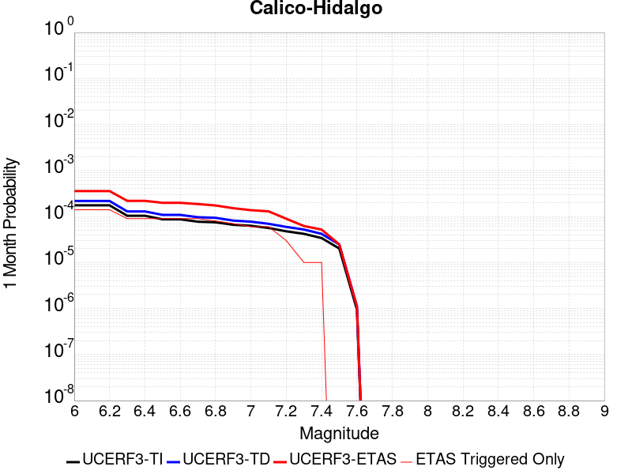 |  | 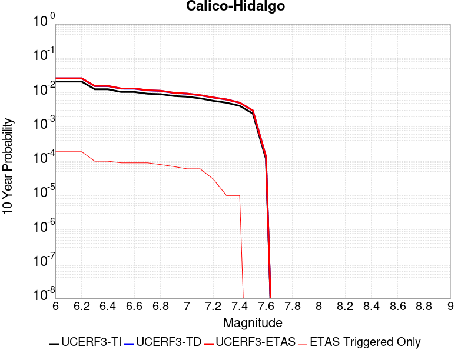 |

| Magnitude | 1 wk TI Prob | 1 wk TD Prob | 1 wk ETAS Prob | 1 wk ETAS/TD Gain | 1 wk ETAS Triggered Only | 1 mo TI Prob | 1 mo TD Prob | 1 mo ETAS Prob | 1 mo ETAS/TD Gain | 1 mo ETAS Triggered Only | 1 yr TI Prob | 1 yr TD Prob | 1 yr ETAS Prob | 1 yr ETAS/TD Gain | 1 yr ETAS Triggered Only | 10 yr TI Prob | 10 yr TD Prob | 10 yr ETAS Prob | 10 yr ETAS/TD Gain | 10 yr ETAS Triggered Only |
|-----|-----|-----|-----|-----|-----|-----|-----|-----|-----|-----|-----|-----|-----|-----|-----|-----|-----|-----|-----|-----|
| 6.0 | 4.0906612E-5 | 5.0703686E-5 | 1.9024691E-4 | 3.7521317 | 1.395503E-4 | 1.7530227E-4 | 2.172857E-4 | 3.5680569E-4 | 1.6421038 | 1.395503E-4 | 0.0021322158 | 0.002642648 | 0.002816625 | 1.0658343 | 1.7443787E-4 | 0.02111873 | 0.026152607 | 0.026339471 | 1.0071452 | 1.9188166E-4 |
| 6.1 | 4.0906612E-5 | 5.0703686E-5 | 1.9024691E-4 | 3.7521317 | 1.395503E-4 | 1.7530227E-4 | 2.172857E-4 | 3.5680569E-4 | 1.6421038 | 1.395503E-4 | 0.0021322158 | 0.002642648 | 0.002816625 | 1.0658343 | 1.7443787E-4 | 0.02111873 | 0.026152607 | 0.026339471 | 1.0071452 | 1.9188166E-4 |
| 6.2 | 4.0906612E-5 | 5.0703686E-5 | 1.9024691E-4 | 3.7521317 | 1.395503E-4 | 1.7530227E-4 | 2.172857E-4 | 3.5680569E-4 | 1.6421038 | 1.395503E-4 | 0.0021322158 | 0.002642648 | 0.002816625 | 1.0658343 | 1.7443787E-4 | 0.02111873 | 0.026152607 | 0.026339471 | 1.0071452 | 1.9188166E-4 |
| 6.3 | 2.4242801E-5 | 3.0090669E-5 | 1.1730698E-4 | 3.8984506 | 8.7218934E-5 | 1.0389358E-4 | 1.2895382E-4 | 2.1616151E-4 | 1.6762707 | 8.7218934E-5 | 0.0012641704 | 0.0015689151 | 0.0016559972 | 1.0555047 | 8.7218934E-5 | 0.01257003 | 0.01558206 | 0.015685093 | 1.0066122 | 1.0466272E-4 |
| 6.4 | 2.4242801E-5 | 3.0090669E-5 | 1.1730698E-4 | 3.8984506 | 8.7218934E-5 | 1.0389358E-4 | 1.2895382E-4 | 2.1616151E-4 | 1.6762707 | 8.7218934E-5 | 0.0012641704 | 0.0015689151 | 0.0016559972 | 1.0555047 | 8.7218934E-5 | 0.01257003 | 0.01558206 | 0.015685093 | 1.0066122 | 1.0466272E-4 |
| 6.5 | 2.0286952E-5 | 2.5315738E-5 | 1.1253246E-4 | 4.4451585 | 8.7218934E-5 | 8.694118E-5 | 1.0849161E-4 | 1.9570108E-4 | 1.8038361 | 8.7218934E-5 | 0.0010579949 | 0.001320102 | 0.0014072058 | 1.0659826 | 8.7218934E-5 | 0.010529719 | 0.013124538 | 0.013210612 | 1.0065583 | 8.7218934E-5 |
| 6.6 | 2.0269223E-5 | 2.5296687E-5 | 1.12513415E-4 | 4.447753 | 8.7218934E-5 | 8.6865206E-5 | 1.08409964E-4 | 1.9561945E-4 | 1.8044416 | 8.7218934E-5 | 0.0010570707 | 0.0013191093 | 0.0014062132 | 1.0660323 | 8.7218934E-5 | 0.010520565 | 0.013114728 | 0.013200803 | 1.0065632 | 8.7218934E-5 |
| 6.7 | 1.799852E-5 | 2.25406E-5 | 1.0975757E-4 | 4.869328 | 8.7218934E-5 | 7.713423E-5 | 9.659908E-5 | 1.8380959E-4 | 1.9028089 | 8.7218934E-5 | 9.3870464E-4 | 0.0011754738 | 0.0012625902 | 1.0741117 | 8.7218934E-5 | 0.009347493 | 0.011694173 | 0.011780373 | 1.0073711 | 8.7218934E-5 |
| 6.8 | 1.7458793E-5 | 2.184212E-5 | 1.09059154E-4 | 4.9930663 | 8.7218934E-5 | 7.4821255E-5 | 9.3605806E-5 | 1.8081658E-4 | 1.9316812 | 8.7218934E-5 | 9.10568E-4 | 0.0011390693 | 0.001226189 | 1.0764831 | 8.7218934E-5 | 0.009068459 | 0.011333893 | 0.011420123 | 1.0076082 | 8.7218934E-5 |
| 6.9 | 1.542884E-5 | 1.9025927E-5 | 1.06243206E-4 | 5.5841274 | 8.7218934E-5 | 6.612192E-5 | 8.153721E-5 | 1.6874904E-4 | 2.0695953 | 8.7218934E-5 | 8.04737E-4 | 9.922766E-4 | 0.001079409 | 1.0878106 | 8.7218934E-5 | 0.008018291 | 0.009879857 | 0.009966215 | 1.0087408 | 8.7218934E-5 |
| 7.0 | 1.468253E-5 | 1.8030598E-5 | 8.780449E-5 | 4.869749 | 6.977515E-5 | 6.292361E-5 | 7.7271776E-5 | 1.4704153E-4 | 1.9029138 | 6.977515E-5 | 7.658257E-4 | 9.4039086E-4 | 0.0010101004 | 1.0741283 | 6.977515E-5 | 0.0076319184 | 0.009365481 | 0.009434603 | 1.0073805 | 6.977515E-5 |
| 7.1 | 1.3139281E-5 | 1.6200942E-5 | 8.597496E-5 | 5.3067875 | 6.977515E-5 | 5.6309986E-5 | 6.943083E-5 | 1.3920113E-4 | 2.0048892 | 6.977515E-5 | 6.853584E-4 | 8.4500515E-4 | 9.1472134E-4 | 1.0825039 | 6.977515E-5 | 0.0068324856 | 0.0084192185 | 0.008488406 | 1.0082178 | 6.977515E-5 |
| 7.2 | 1.1127404E-5 | 1.3866597E-5 | 4.875369E-5 | 3.5159085 | 3.4887576E-5 | 4.7688E-5 | 5.942698E-5 | 9.431248E-5 | 1.5870314 | 3.4887576E-5 | 5.8044674E-4 | 7.232942E-4 | 7.5815653E-4 | 1.0481994 | 3.4887576E-5 | 0.0057893298 | 0.0072105085 | 0.0072451443 | 1.0048035 | 3.4887576E-5 |
| 7.3 | 9.808154E-6 | 1.2176215E-5 | 2.961979E-5 | 2.4325943 | 1.7443788E-5 | 4.2034266E-5 | 5.2182797E-5 | 6.9625676E-5 | 1.3342649 | 1.7443788E-5 | 5.11647E-4 | 6.3515105E-4 | 6.525838E-4 | 1.0274465 | 1.7443788E-5 | 0.0051047057 | 0.006334433 | 0.006351766 | 1.0027363 | 1.7443788E-5 |
| 7.4 | 7.942452E-6 | 9.792144E-6 | 2.723576E-5 | 2.781389 | 1.7443788E-5 | 3.4038632E-5 | 4.1965708E-5 | 5.940876E-5 | 1.4156502 | 1.7443788E-5 | 4.1434157E-4 | 5.1082217E-4 | 5.2825705E-4 | 1.034131 | 1.7443788E-5 | 0.0041356985 | 0.005097421 | 0.005114776 | 1.0034046 | 1.7443788E-5 |
| 7.5 | 4.7121216E-6 | 5.772836E-6 | 5.772836E-6 | 1.0 | 0.0 | 2.019465E-5 | 2.4740535E-5 | 2.4740535E-5 | 1.0 | 0.0 | 2.4584212E-4 | 3.0118204E-4 | 3.0118204E-4 | 1.0 | 0.0 | 0.0024557032 | 0.0030084911 | 0.0030084911 | 1.0 | 0.0 |
| 7.6 | 2.21172E-7 | 2.603961E-7 | 2.603961E-7 | 1.0 | 0.0 | 9.478797E-7 | 1.1159829E-6 | 1.1159829E-6 | 1.0 | 0.0 | 1.1540374E-5 | 1.3587036E-5 | 1.3587036E-5 | 1.0 | 0.0 | 1.1539775E-4 | 1.3586486E-4 | 1.3586486E-4 | 1.0 | 0.0 |

## Scodie Lineament
*[(top)](#table-of-contents)*

| 1 Week | 1 Month | 1 Year | 10 Year |
|-----|-----|-----|-----|
|  |  | 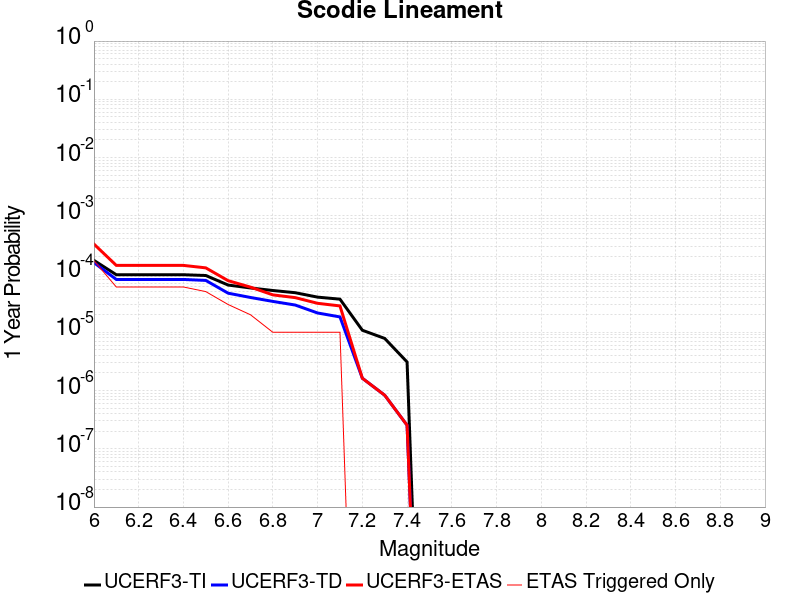 |  |

| Magnitude | 1 wk TI Prob | 1 wk TD Prob | 1 wk ETAS Prob | 1 wk ETAS/TD Gain | 1 wk ETAS Triggered Only | 1 mo TI Prob | 1 mo TD Prob | 1 mo ETAS Prob | 1 mo ETAS/TD Gain | 1 mo ETAS Triggered Only | 1 yr TI Prob | 1 yr TD Prob | 1 yr ETAS Prob | 1 yr ETAS/TD Gain | 1 yr ETAS Triggered Only | 10 yr TI Prob | 10 yr TD Prob | 10 yr ETAS Prob | 10 yr ETAS/TD Gain | 10 yr ETAS Triggered Only |
|-----|-----|-----|-----|-----|-----|-----|-----|-----|-----|-----|-----|-----|-----|-----|-----|-----|-----|-----|-----|-----|
| 6.0 | 3.2919327E-6 | 3.0133422E-6 | 1.4256322E-4 | 47.310665 | 1.395503E-4 | 1.4108206E-5 | 1.2914278E-5 | 1.5246277E-4 | 11.805753 | 1.395503E-4 | 1.7175387E-4 | 1.5722317E-4 | 3.1419256E-4 | 1.998386 | 1.5699408E-4 | 0.0017162118 | 0.0015714309 | 0.0017455947 | 1.1108313 | 1.7443787E-4 |
| 6.1 | 1.8663811E-6 | 1.5490499E-6 | 3.643657E-5 | 23.521883 | 3.4887576E-5 | 7.998751E-6 | 6.6387715E-6 | 4.1526113E-5 | 6.25509 | 3.4887576E-5 | 9.738045E-5 | 8.082454E-5 | 1.1570929E-4 | 1.431611 | 3.4887576E-5 | 9.7337784E-4 | 8.080003E-4 | 8.428596E-4 | 1.0431428 | 3.4887576E-5 |
| 6.2 | 1.8663811E-6 | 1.5490499E-6 | 3.643657E-5 | 23.521883 | 3.4887576E-5 | 7.998751E-6 | 6.6387715E-6 | 4.1526113E-5 | 6.25509 | 3.4887576E-5 | 9.738045E-5 | 8.082454E-5 | 1.1570929E-4 | 1.431611 | 3.4887576E-5 | 9.7337784E-4 | 8.080003E-4 | 8.428596E-4 | 1.0431428 | 3.4887576E-5 |
| 6.3 | 1.8663811E-6 | 1.5490499E-6 | 3.643657E-5 | 23.521883 | 3.4887576E-5 | 7.998751E-6 | 6.6387715E-6 | 4.1526113E-5 | 6.25509 | 3.4887576E-5 | 9.738045E-5 | 8.082454E-5 | 1.1570929E-4 | 1.431611 | 3.4887576E-5 | 9.7337784E-4 | 8.080003E-4 | 8.428596E-4 | 1.0431428 | 3.4887576E-5 |
| 6.4 | 1.8663811E-6 | 1.5490499E-6 | 3.643657E-5 | 23.521883 | 3.4887576E-5 | 7.998751E-6 | 6.6387715E-6 | 4.1526113E-5 | 6.25509 | 3.4887576E-5 | 9.738045E-5 | 8.082454E-5 | 1.1570929E-4 | 1.431611 | 3.4887576E-5 | 9.7337784E-4 | 8.080003E-4 | 8.428596E-4 | 1.0431428 | 3.4887576E-5 |
| 6.5 | 1.8106311E-6 | 1.4909839E-6 | 3.6378508E-5 | 24.398993 | 3.4887576E-5 | 7.759824E-6 | 6.3899183E-6 | 4.127727E-5 | 6.459749 | 3.4887576E-5 | 9.447177E-5 | 7.7794975E-5 | 1.1267984E-4 | 1.4484205 | 3.4887576E-5 | 9.4431615E-4 | 7.7772606E-4 | 8.125865E-4 | 1.0448235 | 3.4887576E-5 |
| 6.6 | 1.2414679E-6 | 8.997558E-7 | 3.57873E-5 | 39.77446 | 3.4887576E-5 | 5.320566E-6 | 3.856091E-6 | 3.8743532E-5 | 10.047359 | 3.4887576E-5 | 6.477596E-5 | 4.6946985E-5 | 8.183292E-5 | 1.7430922 | 3.4887576E-5 | 6.475708E-4 | 4.693793E-4 | 5.042505E-4 | 1.0742922 | 3.4887576E-5 |
| 6.7 | 1.1062215E-6 | 7.594311E-7 | 1.8203205E-5 | 23.969528 | 1.7443788E-5 | 4.7409408E-6 | 3.2547011E-6 | 2.0698431E-5 | 6.359549 | 1.7443788E-5 | 5.7719422E-5 | 3.9625334E-5 | 5.706843E-5 | 1.4402006 | 1.7443788E-5 | 5.770443E-4 | 3.961897E-4 | 4.1362658E-4 | 1.0440115 | 1.7443788E-5 |
| 6.8 | 1.0006736E-6 | 6.500397E-7 | 6.500397E-7 | 1.0 | 0.0 | 4.288594E-6 | 2.7858816E-6 | 2.7858816E-6 | 1.0 | 0.0 | 5.221238E-5 | 3.3917644E-5 | 3.3917644E-5 | 1.0 | 0.0 | 5.220012E-4 | 3.3913075E-4 | 3.3913075E-4 | 1.0 | 0.0 |
| 6.9 | 9.167364E-7 | 5.631625E-7 | 5.631625E-7 | 1.0 | 0.0 | 3.9288643E-6 | 2.4135516E-6 | 2.4135516E-6 | 1.0 | 0.0 | 4.7832873E-5 | 2.9384651E-5 | 2.9384651E-5 | 1.0 | 0.0 | 4.782258E-4 | 2.9381333E-4 | 2.9381333E-4 | 1.0 | 0.0 |
| 7.0 | 7.6987664E-7 | 4.113383E-7 | 4.113383E-7 | 1.0 | 0.0 | 3.2994672E-6 | 1.7628774E-6 | 1.7628774E-6 | 1.0 | 0.0 | 4.0170275E-5 | 2.1462862E-5 | 2.1462862E-5 | 1.0 | 0.0 | 4.0163012E-4 | 2.1461173E-4 | 2.1461173E-4 | 1.0 | 0.0 |
| 7.1 | 7.1038727E-7 | 3.5211494E-7 | 3.5211494E-7 | 1.0 | 0.0 | 3.0445133E-6 | 1.5090633E-6 | 1.5090633E-6 | 1.0 | 0.0 | 3.706632E-5 | 1.8372726E-5 | 1.8372726E-5 | 1.0 | 0.0 | 3.7060137E-4 | 1.8371557E-4 | 1.8371557E-4 | 1.0 | 0.0 |
| 7.2 | 2.0799602E-7 | 3.1186854E-8 | 3.1186854E-8 | 1.0 | 0.0 | 8.914113E-7 | 1.3365793E-7 | 1.3365793E-7 | 1.0 | 0.0 | 1.0852878E-5 | 1.6272843E-6 | 1.6272843E-6 | 1.0 | 0.0 | 1.08523476E-4 | 1.627273E-5 | 1.627273E-5 | 1.0 | 0.0 |
| 7.3 | 1.5048182E-7 | 1.5945696E-8 | 1.5945696E-8 | 1.0 | 0.0 | 6.449219E-7 | 6.83387E-8 | 6.83387E-8 | 1.0 | 0.0 | 7.851896E-6 | 8.320234E-7 | 8.320234E-7 | 1.0 | 0.0 | 7.851618E-5 | 8.320206E-6 | 8.320206E-6 | 1.0 | 0.0 |
| 7.4 | 5.9334678E-8 | 4.8683537E-9 | 4.8683537E-9 | 1.0 | 0.0 | 2.5429145E-7 | 2.0864372E-8 | 2.0864372E-8 | 1.0 | 0.0 | 3.095994E-6 | 2.5402372E-7 | 2.5402372E-7 | 1.0 | 0.0 | 3.095951E-5 | 2.5402353E-6 | 2.5402353E-6 | 1.0 | 0.0 |

## San Andreas (Cholame) rev
*[(top)](#table-of-contents)*

| 1 Week | 1 Month | 1 Year | 10 Year |
|-----|-----|-----|-----|
|  | 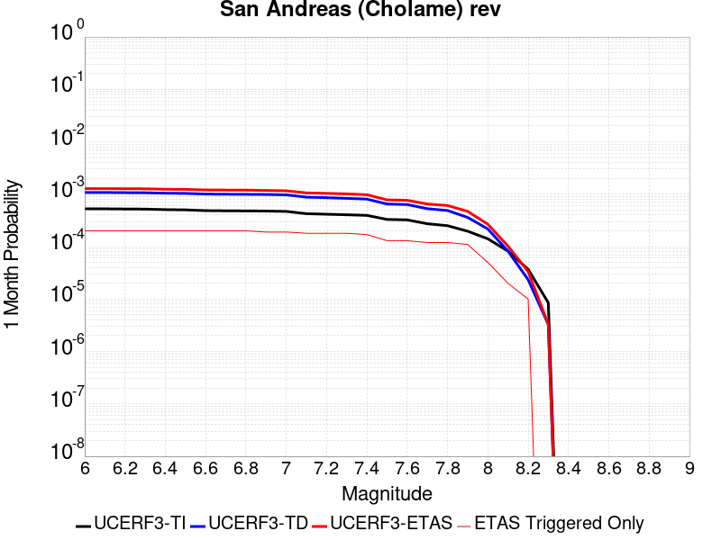 |  |  |

| Magnitude | 1 wk TI Prob | 1 wk TD Prob | 1 wk ETAS Prob | 1 wk ETAS/TD Gain | 1 wk ETAS Triggered Only | 1 mo TI Prob | 1 mo TD Prob | 1 mo ETAS Prob | 1 mo ETAS/TD Gain | 1 mo ETAS Triggered Only | 1 yr TI Prob | 1 yr TD Prob | 1 yr ETAS Prob | 1 yr ETAS/TD Gain | 1 yr ETAS Triggered Only | 10 yr TI Prob | 10 yr TD Prob | 10 yr ETAS Prob | 10 yr ETAS/TD Gain | 10 yr ETAS Triggered Only |
|-----|-----|-----|-----|-----|-----|-----|-----|-----|-----|-----|-----|-----|-----|-----|-----|-----|-----|-----|-----|-----|
| 6.0 | 1.2302514E-4 | 2.5204287E-4 | 3.91558E-4 | 1.5535372 | 1.395503E-4 | 5.27144E-4 | 0.0010797381 | 0.0012365627 | 1.1452432 | 1.5699408E-4 | 0.0063991086 | 0.0130670825 | 0.013222026 | 1.0118575 | 1.5699408E-4 | 0.06217949 | 0.12439073 | 0.12452819 | 1.0011051 | 1.5699408E-4 |
| 6.1 | 1.2302514E-4 | 2.5204287E-4 | 3.91558E-4 | 1.5535372 | 1.395503E-4 | 5.27144E-4 | 0.0010797381 | 0.0012365627 | 1.1452432 | 1.5699408E-4 | 0.0063991086 | 0.0130670825 | 0.013222026 | 1.0118575 | 1.5699408E-4 | 0.06217949 | 0.12439073 | 0.12452819 | 1.0011051 | 1.5699408E-4 |
| 6.2 | 1.2203569E-4 | 2.5021084E-4 | 3.8972622E-4 | 1.5575913 | 1.395503E-4 | 5.2290526E-4 | 0.0010718931 | 0.0012287189 | 1.1463073 | 1.5699408E-4 | 0.006347804 | 0.01297271 | 0.013127667 | 1.0119449 | 1.5699408E-4 | 0.061695136 | 0.12357691 | 0.1237145 | 1.0011134 | 1.5699408E-4 |
| 6.3 | 1.2142645E-4 | 2.4907055E-4 | 3.885861E-4 | 1.5601447 | 1.395503E-4 | 5.202953E-4 | 0.0010670102 | 0.0012238368 | 1.1469775 | 1.5699408E-4 | 0.006316212 | 0.012913967 | 0.013068933 | 1.012 | 1.5699408E-4 | 0.06139677 | 0.12307103 | 0.1232087 | 1.0011187 | 1.5699408E-4 |
| 6.4 | 1.1865206E-4 | 2.44126E-4 | 3.8364224E-4 | 1.5714927 | 1.395503E-4 | 5.0840975E-4 | 0.0010458364 | 0.0012026663 | 1.1499565 | 1.5699408E-4 | 0.006172335 | 0.012659196 | 0.012814203 | 1.0122446 | 1.5699408E-4 | 0.060036868 | 0.1208638 | 0.121001825 | 1.0011419 | 1.5699408E-4 |
| 6.5 | 1.17443946E-4 | 2.4205919E-4 | 3.8157572E-4 | 1.5763736 | 1.395503E-4 | 5.032341E-4 | 0.0010369857 | 0.001193817 | 1.1512376 | 1.5699408E-4 | 0.006109677 | 0.012552682 | 0.012707706 | 1.0123498 | 1.5699408E-4 | 0.059444077 | 0.11993805 | 0.12007622 | 1.0011519 | 1.5699408E-4 |
| 6.6 | 1.13579066E-4 | 2.3514954E-4 | 3.7466703E-4 | 1.5933139 | 1.395503E-4 | 4.866766E-4 | 0.001007396 | 0.0011642319 | 1.1556845 | 1.5699408E-4 | 0.0059092017 | 0.012196515 | 0.012351594 | 1.0127151 | 1.5699408E-4 | 0.057545185 | 0.11685214 | 0.1169908 | 1.0011865 | 1.5699408E-4 |
| 6.7 | 1.1271412E-4 | 2.3359268E-4 | 3.7311038E-4 | 1.5972692 | 1.395503E-4 | 4.829711E-4 | 0.0010007289 | 0.0011575659 | 1.1567228 | 1.5699408E-4 | 0.005864331 | 0.012116249 | 0.012271341 | 1.0128003 | 1.5699408E-4 | 0.057119697 | 0.116155714 | 0.11629447 | 1.0011946 | 1.5699408E-4 |
| 6.8 | 1.1217975E-4 | 2.3247694E-4 | 3.719948E-4 | 1.6001363 | 1.395503E-4 | 4.8068175E-4 | 9.959509E-4 | 0.0011527886 | 1.1574754 | 1.5699408E-4 | 0.005836608 | 0.012058721 | 0.012213822 | 1.0128621 | 1.5699408E-4 | 0.056856725 | 0.11565396 | 0.1157928 | 1.0012004 | 1.5699408E-4 |
| 6.9 | 1.1146753E-4 | 2.3096445E-4 | 3.704825E-4 | 1.6040673 | 1.395503E-4 | 4.7763053E-4 | 9.894737E-4 | 0.0011288859 | 1.1408954 | 1.395503E-4 | 0.0057996577 | 0.011980731 | 0.01211861 | 1.0115083 | 1.395503E-4 | 0.056506127 | 0.11497439 | 0.115097895 | 1.0010742 | 1.395503E-4 |
| 7.0 | 1.0965793E-4 | 2.2719789E-4 | 3.6671647E-4 | 1.614084 | 1.395503E-4 | 4.698779E-4 | 9.733434E-4 | 0.0011127578 | 1.1432326 | 1.395503E-4 | 0.005705768 | 0.011786487 | 0.011924393 | 1.0117003 | 1.395503E-4 | 0.055614736 | 0.11327597 | 0.11339971 | 1.0010924 | 1.395503E-4 |
| 7.1 | 9.927982E-5 | 2.0538924E-4 | 3.2747065E-4 | 1.5943906 | 1.2210652E-4 | 4.2541555E-4 | 8.7994366E-4 | 0.0010019427 | 1.1386442 | 1.2210652E-4 | 0.0051671406 | 0.010660981 | 0.0107817855 | 1.0113314 | 1.2210652E-4 | 0.05048634 | 0.1033706 | 0.103480086 | 1.0010592 | 1.2210652E-4 |
| 7.2 | 9.696786E-5 | 2.0043184E-4 | 3.2251386E-4 | 1.609095 | 1.2210652E-4 | 4.1551032E-4 | 8.5871184E-4 | 9.807135E-4 | 1.1420752 | 1.2210652E-4 | 0.00504711 | 0.010404981 | 0.010525817 | 1.0116132 | 1.2210652E-4 | 0.04934009 | 0.1011086 | 0.10121836 | 1.0010855 | 1.2210652E-4 |
| 7.3 | 9.4727984E-5 | 1.9472468E-4 | 3.1680742E-4 | 1.6269505 | 1.2210652E-4 | 4.0591392E-4 | 8.3426846E-4 | 9.562731E-4 | 1.1462414 | 1.2210652E-4 | 0.0049308087 | 0.010110183 | 0.010231054 | 1.0119555 | 1.2210652E-4 | 0.048228268 | 0.09847952 | 0.0985896 | 1.0011178 | 1.2210652E-4 |
| 7.4 | 9.220358E-5 | 1.8843076E-4 | 3.1051427E-4 | 1.6478958 | 1.2210652E-4 | 3.9509835E-4 | 8.073114E-4 | 9.293193E-4 | 1.1511288 | 1.2210652E-4 | 0.004799717 | 0.009784967 | 0.009905878 | 1.0123569 | 1.2210652E-4 | 0.046973653 | 0.095557496 | 0.095667936 | 1.0011557 | 1.2210652E-4 |
| 7.5 | 7.71631E-5 | 1.5177966E-4 | 2.7386766E-4 | 1.8043764 | 1.2210652E-4 | 3.306571E-4 | 6.503223E-4 | 7.7234936E-4 | 1.187641 | 1.2210652E-4 | 0.0040183207 | 0.007889002 | 0.008010144 | 1.015356 | 1.2210652E-4 | 0.03946433 | 0.07828531 | 0.078397855 | 1.0014377 | 1.2210652E-4 |
| 7.6 | 7.5634416E-5 | 1.483744E-4 | 2.704628E-4 | 1.8228401 | 1.2210652E-4 | 3.241072E-4 | 6.3573546E-4 | 7.577643E-4 | 1.1919491 | 1.2210652E-4 | 0.0039388672 | 0.0077126776 | 0.007833842 | 1.0157098 | 1.2210652E-4 | 0.038697794 | 0.07664872 | 0.07676147 | 1.0014709 | 1.2210652E-4 |
| 7.7 | 6.3783E-5 | 1.235872E-4 | 2.4567862E-4 | 1.9878969 | 1.2210652E-4 | 2.7332708E-4 | 5.29552E-4 | 6.5159384E-4 | 1.2304624 | 1.2210652E-4 | 0.0033226798 | 0.0064282627 | 0.006549584 | 1.0188731 | 1.2210652E-4 | 0.032734364 | 0.06454029 | 0.06465452 | 1.0017698 | 1.2210652E-4 |
| 7.8 | 5.863422E-5 | 1.1416107E-4 | 2.3625365E-4 | 2.0694764 | 1.2210652E-4 | 2.512653E-4 | 4.8917E-4 | 6.112168E-4 | 1.2494977 | 1.2210652E-4 | 0.003054864 | 0.0059394026 | 0.0060607838 | 1.0204366 | 1.2210652E-4 | 0.030132094 | 0.059659187 | 0.059774008 | 1.0019246 | 1.2210652E-4 |
| 7.9 | 4.595283E-5 | 8.426331E-5 | 2.0635953E-4 | 2.4489844 | 1.2210652E-4 | 1.9692584E-4 | 3.610785E-4 | 4.8314093E-4 | 1.3380495 | 1.2210652E-4 | 0.0023949358 | 0.0043872762 | 0.004508847 | 1.0277098 | 1.2210652E-4 | 0.023692891 | 0.044362005 | 0.044478696 | 1.0026304 | 1.2210652E-4 |
| 8.0 | 3.2950178E-5 | 5.0772942E-5 | 1.2054455E-4 | 2.3741887 | 6.977515E-5 | 1.412074E-4 | 2.1758018E-4 | 2.8734014E-4 | 1.3206173 | 6.977515E-5 | 0.0017178444 | 0.0026458222 | 0.002715413 | 1.0263021 | 6.977515E-5 | 0.017046256 | 0.027180137 | 0.027248016 | 1.0024973 | 6.977515E-5 |
| 8.1 | 1.9177472E-5 | 1.9185145E-5 | 5.407205E-5 | 2.8184333 | 3.4887576E-5 | 8.218658E-5 | 8.221946E-5 | 1.1710417E-4 | 1.4242877 | 3.4887576E-5 | 0.0010001622 | 0.0010005629 | 0.0010354156 | 1.0348331 | 3.4887576E-5 | 0.009956728 | 0.010758142 | 0.010792655 | 1.003208 | 3.4887576E-5 |
| 8.2 | 8.643924E-6 | 5.4748625E-6 | 2.2918555E-5 | 4.1861424 | 1.7443788E-5 | 3.704486E-5 | 2.3463486E-5 | 4.0906863E-5 | 1.7434266 | 1.7443788E-5 | 4.5092785E-4 | 2.8563058E-4 | 3.0306936E-4 | 1.0610538 | 1.7443788E-5 | 0.0045001395 | 0.0032487072 | 0.0032660943 | 1.005352 | 1.7443788E-5 |
| 8.3 | 1.983087E-6 | 7.6599065E-7 | 7.6599065E-7 | 1.0 | 0.0 | 8.498917E-6 | 3.282813E-6 | 3.282813E-6 | 1.0 | 0.0 | 1.034694E-4 | 3.9967534E-5 | 3.9967534E-5 | 1.0 | 0.0 | 0.0010342124 | 4.719687E-4 | 4.719687E-4 | 1.0 | 0.0 |

## Lake Isabella (Seismicity)
*[(top)](#table-of-contents)*

| 1 Week | 1 Month | 1 Year | 10 Year |
|-----|-----|-----|-----|
| 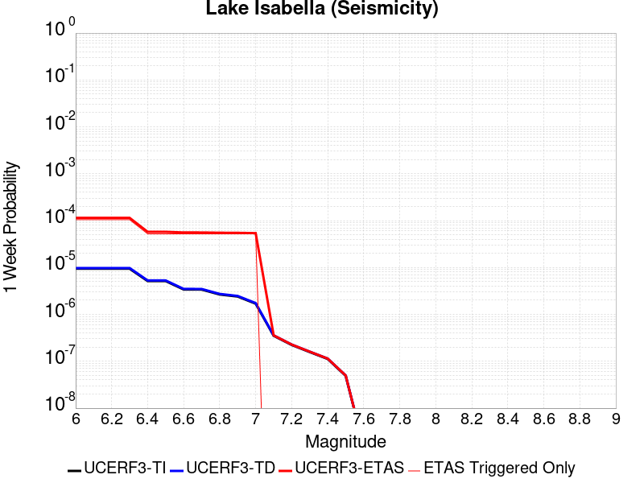 | 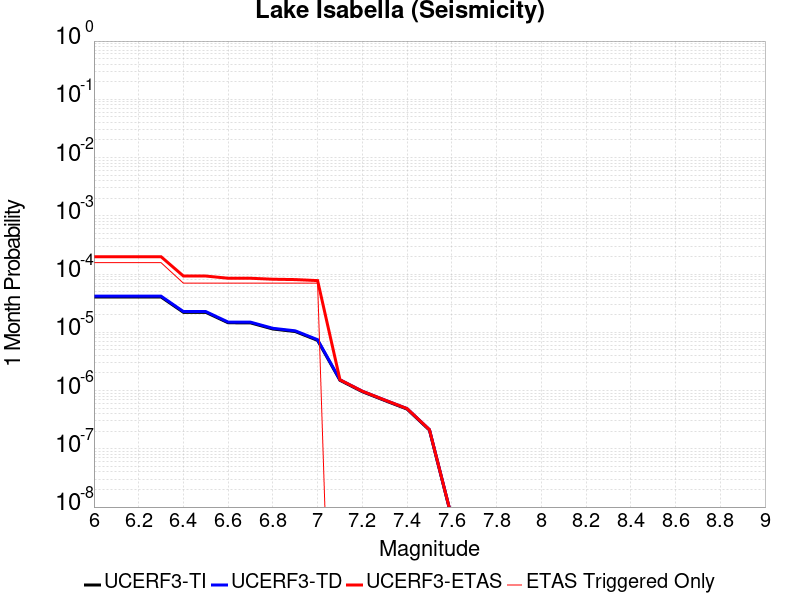 | 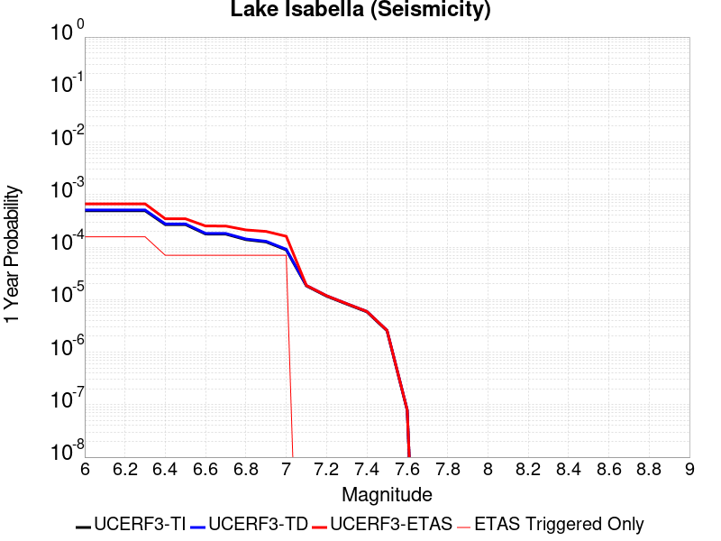 | 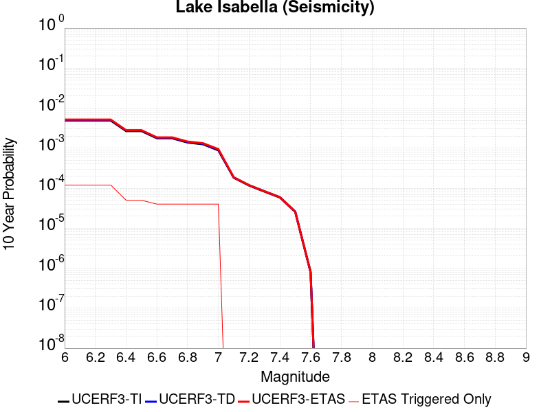 |

| Magnitude | 1 wk TI Prob | 1 wk TD Prob | 1 wk ETAS Prob | 1 wk ETAS/TD Gain | 1 wk ETAS Triggered Only | 1 mo TI Prob | 1 mo TD Prob | 1 mo ETAS Prob | 1 mo ETAS/TD Gain | 1 mo ETAS Triggered Only | 1 yr TI Prob | 1 yr TD Prob | 1 yr ETAS Prob | 1 yr ETAS/TD Gain | 1 yr ETAS Triggered Only | 10 yr TI Prob | 10 yr TD Prob | 10 yr ETAS Prob | 10 yr ETAS/TD Gain | 10 yr ETAS Triggered Only |
|-----|-----|-----|-----|-----|-----|-----|-----|-----|-----|-----|-----|-----|-----|-----|-----|-----|-----|-----|-----|-----|
| 6.0 | 9.431637E-6 | 9.741651E-6 | 1.1440336E-4 | 11.743733 | 1.0466272E-4 | 4.0420677E-5 | 4.1749343E-5 | 1.9873687E-4 | 4.7602396 | 1.5699408E-4 | 4.920106E-4 | 5.0819275E-4 | 6.6510704E-4 | 1.3087692 | 1.5699408E-4 | 0.004909227 | 0.005071599 | 0.0052277967 | 1.0307986 | 1.5699408E-4 |
| 6.1 | 9.431637E-6 | 9.741651E-6 | 1.1440336E-4 | 11.743733 | 1.0466272E-4 | 4.0420677E-5 | 4.1749343E-5 | 1.9873687E-4 | 4.7602396 | 1.5699408E-4 | 4.920106E-4 | 5.0819275E-4 | 6.6510704E-4 | 1.3087692 | 1.5699408E-4 | 0.004909227 | 0.005071599 | 0.0052277967 | 1.0307986 | 1.5699408E-4 |
| 6.2 | 9.431637E-6 | 9.741651E-6 | 1.1440336E-4 | 11.743733 | 1.0466272E-4 | 4.0420677E-5 | 4.1749343E-5 | 1.9873687E-4 | 4.7602396 | 1.5699408E-4 | 4.920106E-4 | 5.0819275E-4 | 6.6510704E-4 | 1.3087692 | 1.5699408E-4 | 0.004909227 | 0.005071599 | 0.0052277967 | 1.0307986 | 1.5699408E-4 |
| 6.3 | 9.431637E-6 | 9.741651E-6 | 1.1440336E-4 | 11.743733 | 1.0466272E-4 | 4.0420677E-5 | 4.1749343E-5 | 1.9873687E-4 | 4.7602396 | 1.5699408E-4 | 4.920106E-4 | 5.0819275E-4 | 6.6510704E-4 | 1.3087692 | 1.5699408E-4 | 0.004909227 | 0.005071599 | 0.0052277967 | 1.0307986 | 1.5699408E-4 |
| 6.4 | 5.144063E-6 | 5.3000763E-6 | 5.763116E-5 | 10.873648 | 5.233136E-5 | 2.2045799E-5 | 2.2714434E-5 | 9.2488E-5 | 4.071772 | 6.977515E-5 | 2.6837454E-4 | 2.765166E-4 | 3.4627246E-4 | 1.2522664 | 6.977515E-5 | 0.0026805066 | 0.0027620657 | 0.002831648 | 1.0251921 | 6.977515E-5 |
| 6.5 | 5.144063E-6 | 5.3000763E-6 | 5.763116E-5 | 10.873648 | 5.233136E-5 | 2.2045799E-5 | 2.2714434E-5 | 9.2488E-5 | 4.071772 | 6.977515E-5 | 2.6837454E-4 | 2.765166E-4 | 3.4627246E-4 | 1.2522664 | 6.977515E-5 | 0.0026805066 | 0.0027620657 | 0.002831648 | 1.0251921 | 6.977515E-5 |
| 6.6 | 3.4009804E-6 | 3.498786E-6 | 5.5829965E-5 | 15.956953 | 5.233136E-5 | 1.4575549E-5 | 1.4994721E-5 | 8.476882E-5 | 5.6532445 | 6.977515E-5 | 1.7744285E-4 | 1.8254704E-4 | 2.5230946E-4 | 1.3821613 | 6.977515E-5 | 0.0017730123 | 0.0018241286 | 0.0018937765 | 1.0381814 | 6.977515E-5 |
| 6.7 | 3.3880428E-6 | 3.4856528E-6 | 5.5816832E-5 | 16.013308 | 5.233136E-5 | 1.4520103E-5 | 1.4938435E-5 | 8.471254E-5 | 5.6707773 | 6.977515E-5 | 1.767679E-4 | 1.8186188E-4 | 2.5162433E-4 | 1.3836013 | 6.977515E-5 | 0.0017662736 | 0.0018172882 | 0.0018869366 | 1.0383254 | 6.977515E-5 |
| 6.8 | 2.6582E-6 | 2.7337003E-6 | 5.506492E-5 | 20.142998 | 5.233136E-5 | 1.1392236E-5 | 1.1715813E-5 | 8.149014E-5 | 6.955569 | 6.977515E-5 | 1.3869164E-4 | 1.4263204E-4 | 2.1239722E-4 | 1.4891272 | 6.977515E-5 | 0.0013860512 | 0.0014255369 | 0.0014952127 | 1.0488768 | 6.977515E-5 |
| 6.9 | 2.406011E-6 | 2.4743288E-6 | 5.480556E-5 | 22.149668 | 5.233136E-5 | 1.0311434E-5 | 1.0604231E-5 | 8.037864E-5 | 7.5798655 | 6.977515E-5 | 1.2553448E-4 | 1.2910018E-4 | 1.9886633E-4 | 1.5404031 | 6.977515E-5 | 0.0012546359 | 0.0012903814 | 0.0013600666 | 1.0540035 | 6.977515E-5 |
| 7.0 | 1.6953097E-6 | 1.7429371E-6 | 5.4074208E-5 | 31.024761 | 5.233136E-5 | 7.265593E-6 | 7.469715E-6 | 7.7244345E-5 | 10.341002 | 6.977515E-5 | 8.8455E-5 | 9.094104E-5 | 1.6070984E-4 | 1.7671872 | 6.977515E-5 | 8.84198E-4 | 9.09141E-4 | 9.788526E-4 | 1.0766786 | 6.977515E-5 |
| 7.1 | 3.5013824E-7 | 3.5714822E-7 | 3.5714822E-7 | 1.0 | 0.0 | 1.5005916E-6 | 1.5306344E-6 | 1.5306344E-6 | 1.0 | 0.0 | 1.826955E-5 | 1.8635317E-5 | 1.8635317E-5 | 1.0 | 0.0 | 1.8268047E-4 | 1.863378E-4 | 1.863378E-4 | 1.0 | 0.0 |
| 7.2 | 2.2321095E-7 | 2.2750574E-7 | 2.2750574E-7 | 1.0 | 0.0 | 9.56618E-7 | 9.750242E-7 | 9.750242E-7 | 1.0 | 0.0 | 1.1646762E-5 | 1.1870856E-5 | 1.1870856E-5 | 1.0 | 0.0 | 1.1646151E-4 | 1.1870232E-4 | 1.1870232E-4 | 1.0 | 0.0 |
| 7.3 | 1.5760406E-7 | 1.6060922E-7 | 1.6060922E-7 | 1.0 | 0.0 | 6.7544585E-7 | 6.8832503E-7 | 6.8832503E-7 | 1.0 | 0.0 | 8.223522E-6 | 8.380326E-6 | 8.380326E-6 | 1.0 | 0.0 | 8.2232174E-5 | 8.3800165E-5 | 8.3800165E-5 | 1.0 | 0.0 |
| 7.4 | 1.1216497E-7 | 1.1431706E-7 | 1.1431706E-7 | 1.0 | 0.0 | 4.8070694E-7 | 4.899302E-7 | 4.899302E-7 | 1.0 | 0.0 | 5.852591E-6 | 5.964884E-6 | 5.964884E-6 | 1.0 | 0.0 | 5.8524372E-5 | 5.9647282E-5 | 5.9647282E-5 | 1.0 | 0.0 |
| 7.5 | 4.885185E-8 | 4.9787737E-8 | 4.9787737E-8 | 1.0 | 0.0 | 2.0936506E-7 | 2.13376E-7 | 2.13376E-7 | 1.0 | 0.0 | 2.5490165E-6 | 2.59785E-6 | 2.59785E-6 | 1.0 | 0.0 | 2.5489873E-5 | 2.5978214E-5 | 2.5978214E-5 | 1.0 | 0.0 |
| 7.6 | 1.504641E-9 | 1.5317903E-9 | 1.5317903E-9 | 1.0 | 0.0 | 6.4484613E-9 | 6.5648154E-9 | 6.5648154E-9 | 1.0 | 0.0 | 7.851001E-8 | 7.992663E-8 | 7.992663E-8 | 1.0 | 0.0 | 7.8509987E-7 | 7.992663E-7 | 7.992663E-7 | 1.0 | 0.0 |

## San Jacinto (Lytle Creek connector)
*[(top)](#table-of-contents)*

| 1 Week | 1 Month | 1 Year | 10 Year |
|-----|-----|-----|-----|
| 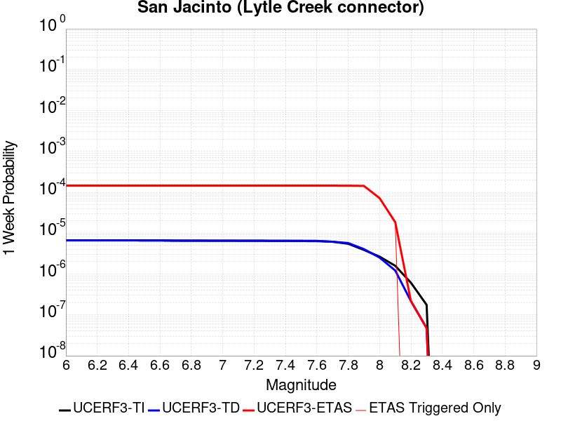 | 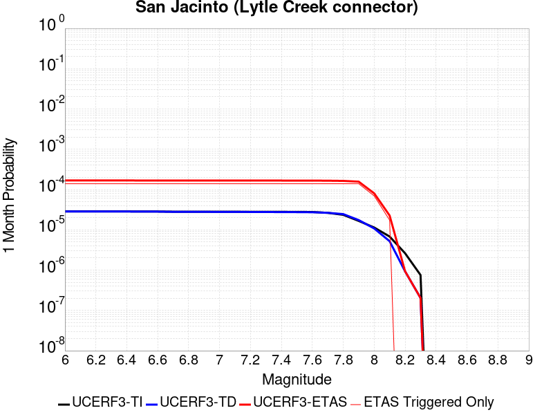 | 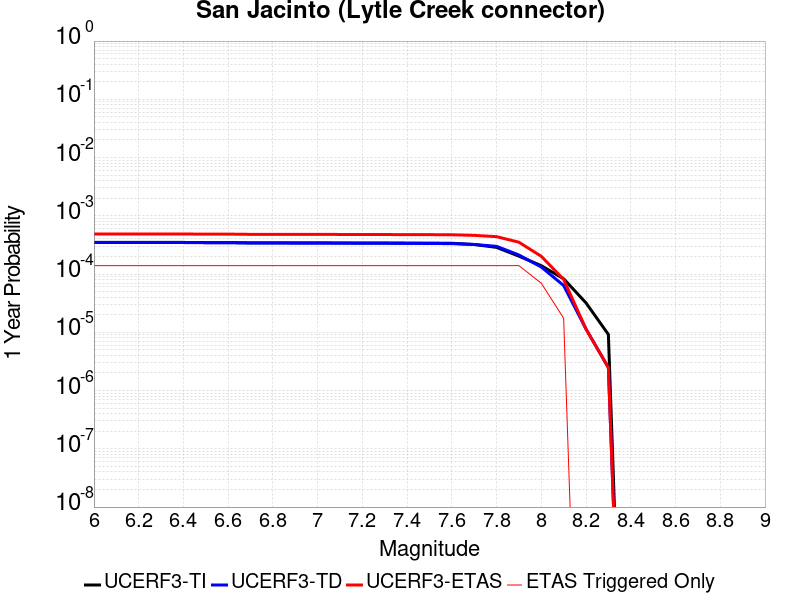 | 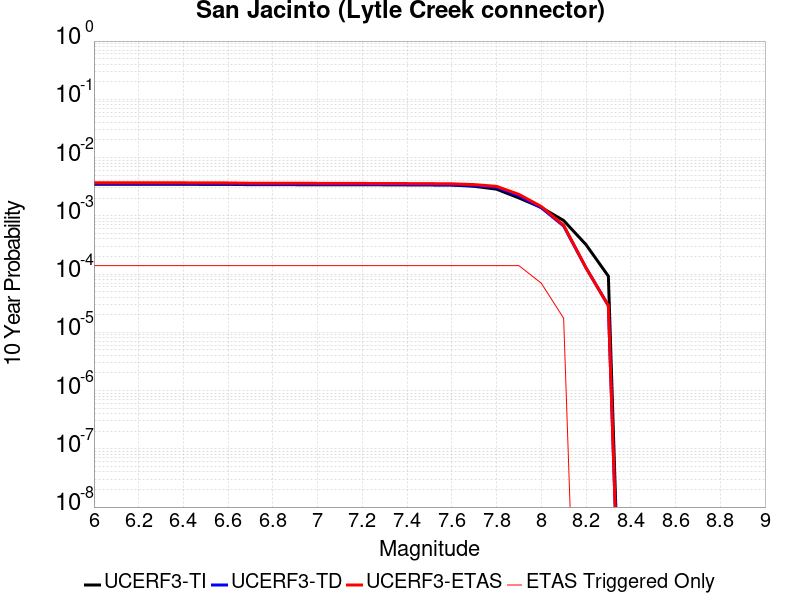 |

| Magnitude | 1 wk TI Prob | 1 wk TD Prob | 1 wk ETAS Prob | 1 wk ETAS/TD Gain | 1 wk ETAS Triggered Only | 1 mo TI Prob | 1 mo TD Prob | 1 mo ETAS Prob | 1 mo ETAS/TD Gain | 1 mo ETAS Triggered Only | 1 yr TI Prob | 1 yr TD Prob | 1 yr ETAS Prob | 1 yr ETAS/TD Gain | 1 yr ETAS Triggered Only | 10 yr TI Prob | 10 yr TD Prob | 10 yr ETAS Prob | 10 yr ETAS/TD Gain | 10 yr ETAS Triggered Only |
|-----|-----|-----|-----|-----|-----|-----|-----|-----|-----|-----|-----|-----|-----|-----|-----|-----|-----|-----|-----|-----|
| 6.0 | 6.693995E-6 | 6.660216E-6 | 1.4620958E-4 | 21.952679 | 1.395503E-4 | 2.8688235E-5 | 2.854347E-5 | 1.6808978E-4 | 5.888905 | 1.395503E-4 | 3.492233E-4 | 3.4746144E-4 | 4.8696325E-4 | 1.4014887 | 1.395503E-4 | 0.00348675 | 0.0035493854 | 0.0036884402 | 1.0391772 | 1.395503E-4 |
| 6.1 | 6.693995E-6 | 6.660216E-6 | 1.4620958E-4 | 21.952679 | 1.395503E-4 | 2.8688235E-5 | 2.854347E-5 | 1.6808978E-4 | 5.888905 | 1.395503E-4 | 3.492233E-4 | 3.4746144E-4 | 4.8696325E-4 | 1.4014887 | 1.395503E-4 | 0.00348675 | 0.0035493854 | 0.0036884402 | 1.0391772 | 1.395503E-4 |
| 6.2 | 6.693995E-6 | 6.660216E-6 | 1.4620958E-4 | 21.952679 | 1.395503E-4 | 2.8688235E-5 | 2.854347E-5 | 1.6808978E-4 | 5.888905 | 1.395503E-4 | 3.492233E-4 | 3.4746144E-4 | 4.8696325E-4 | 1.4014887 | 1.395503E-4 | 0.00348675 | 0.0035493854 | 0.0036884402 | 1.0391772 | 1.395503E-4 |
| 6.3 | 6.693995E-6 | 6.660216E-6 | 1.4620958E-4 | 21.952679 | 1.395503E-4 | 2.8688235E-5 | 2.854347E-5 | 1.6808978E-4 | 5.888905 | 1.395503E-4 | 3.492233E-4 | 3.4746144E-4 | 4.8696325E-4 | 1.4014887 | 1.395503E-4 | 0.00348675 | 0.0035493854 | 0.0036884402 | 1.0391772 | 1.395503E-4 |
| 6.4 | 6.693995E-6 | 6.660216E-6 | 1.4620958E-4 | 21.952679 | 1.395503E-4 | 2.8688235E-5 | 2.854347E-5 | 1.6808978E-4 | 5.888905 | 1.395503E-4 | 3.492233E-4 | 3.4746144E-4 | 4.8696325E-4 | 1.4014887 | 1.395503E-4 | 0.00348675 | 0.0035493854 | 0.0036884402 | 1.0391772 | 1.395503E-4 |
| 6.5 | 6.6561875E-6 | 6.6204343E-6 | 1.4616981E-4 | 22.078583 | 1.395503E-4 | 2.8526205E-5 | 2.837298E-5 | 1.6791932E-4 | 5.9182825 | 1.395503E-4 | 3.472512E-4 | 3.4538636E-4 | 4.8488847E-4 | 1.4039016 | 1.395503E-4 | 0.0034670907 | 0.003528701 | 0.0036677588 | 1.0394076 | 1.395503E-4 |
| 6.6 | 6.6561875E-6 | 6.6204343E-6 | 1.4616981E-4 | 22.078583 | 1.395503E-4 | 2.8526205E-5 | 2.837298E-5 | 1.6791932E-4 | 5.9182825 | 1.395503E-4 | 3.472512E-4 | 3.4538636E-4 | 4.8488847E-4 | 1.4039016 | 1.395503E-4 | 0.0034670907 | 0.003528701 | 0.0036677588 | 1.0394076 | 1.395503E-4 |
| 6.7 | 6.5802237E-6 | 6.539611E-6 | 1.4608899E-4 | 22.339096 | 1.395503E-4 | 2.8200653E-5 | 2.8026603E-5 | 1.6757299E-4 | 5.9790688 | 1.395503E-4 | 3.4328885E-4 | 3.4117055E-4 | 4.8067325E-4 | 1.4088943 | 1.395503E-4 | 0.0034275902 | 0.0034866752 | 0.003625739 | 1.0398843 | 1.395503E-4 |
| 6.8 | 6.575632E-6 | 6.5341005E-6 | 1.4608349E-4 | 22.357092 | 1.395503E-4 | 2.8180975E-5 | 2.8002989E-5 | 1.6754938E-4 | 5.983268 | 1.395503E-4 | 3.4304935E-4 | 3.4088313E-4 | 4.8038585E-4 | 1.4092392 | 1.395503E-4 | 0.0034252026 | 0.00348381 | 0.0036228742 | 1.0399172 | 1.395503E-4 |
| 6.9 | 6.570433E-6 | 6.525495E-6 | 1.4607489E-4 | 22.385258 | 1.395503E-4 | 2.8158694E-5 | 2.7966107E-5 | 1.6751251E-4 | 5.98984 | 1.395503E-4 | 3.4277816E-4 | 3.4043423E-4 | 4.79937E-4 | 1.409779 | 1.395503E-4 | 0.0034224992 | 0.0034793352 | 0.0036184 | 1.0399687 | 1.395503E-4 |
| 7.0 | 6.5643826E-6 | 6.515616E-6 | 1.4606501E-4 | 22.417683 | 1.395503E-4 | 2.8132765E-5 | 2.792377E-5 | 1.6747018E-4 | 5.9974055 | 1.395503E-4 | 3.424626E-4 | 3.3991894E-4 | 4.7942178E-4 | 1.4104004 | 1.395503E-4 | 0.0034193532 | 0.0034741985 | 0.0036132638 | 1.0400281 | 1.395503E-4 |
| 7.1 | 6.557402E-6 | 6.5043278E-6 | 1.4605372E-4 | 22.454853 | 1.395503E-4 | 2.8102848E-5 | 2.7875392E-5 | 1.6742181E-4 | 6.0060787 | 1.395503E-4 | 3.4209844E-4 | 3.3933012E-4 | 4.7883307E-4 | 1.4111128 | 1.395503E-4 | 0.0034157229 | 0.0034683298 | 0.003607396 | 1.040096 | 1.395503E-4 |
| 7.2 | 6.546394E-6 | 6.4862943E-6 | 1.4603569E-4 | 22.514502 | 1.395503E-4 | 2.8055672E-5 | 2.7798109E-5 | 1.6734452E-4 | 6.0199966 | 1.395503E-4 | 3.4152428E-4 | 3.3838948E-4 | 4.7789258E-4 | 1.4122559 | 1.395503E-4 | 0.0034099987 | 0.0034589572 | 0.0035980246 | 1.0402051 | 1.395503E-4 |
| 7.3 | 6.5364216E-6 | 6.4670803E-6 | 1.4601648E-4 | 22.578423 | 1.395503E-4 | 2.8012933E-5 | 2.7715765E-5 | 1.672622E-4 | 6.0349116 | 1.395503E-4 | 3.4100408E-4 | 3.3738726E-4 | 4.7689048E-4 | 1.413481 | 1.395503E-4 | 0.003404813 | 0.0034489788 | 0.0035880478 | 1.0403218 | 1.395503E-4 |
| 7.4 | 6.5269523E-6 | 6.4481674E-6 | 1.4599756E-4 | 22.641714 | 1.395503E-4 | 2.7972354E-5 | 2.7634711E-5 | 1.6718115E-4 | 6.0496798 | 1.395503E-4 | 3.4051016E-4 | 3.3640073E-4 | 4.759041E-4 | 1.414694 | 1.395503E-4 | 0.0033998888 | 0.003439161 | 0.0035782312 | 1.0404373 | 1.395503E-4 |
| 7.5 | 6.5111835E-6 | 6.424442E-6 | 1.4597384E-4 | 22.721638 | 1.395503E-4 | 2.7904773E-5 | 2.7533031E-5 | 1.6707949E-4 | 6.068329 | 1.395503E-4 | 3.3968766E-4 | 3.3516317E-4 | 4.746667E-4 | 1.4162257 | 1.395503E-4 | 0.0033916887 | 0.003426834 | 0.003565906 | 1.0405833 | 1.395503E-4 |
| 7.6 | 6.4768806E-6 | 6.383551E-6 | 1.4593297E-4 | 22.86078 | 1.395503E-4 | 2.7757764E-5 | 2.735779E-5 | 1.6690427E-4 | 6.1007953 | 1.395503E-4 | 3.3789838E-4 | 3.3303024E-4 | 4.7253407E-4 | 1.4188924 | 1.395503E-4 | 0.0033738504 | 0.0034055663 | 0.0035446412 | 1.0408375 | 1.395503E-4 |
| 7.7 | 6.1655364E-6 | 6.1760365E-6 | 1.4572547E-4 | 23.595306 | 1.395503E-4 | 2.642346E-5 | 2.646846E-5 | 1.6601506E-4 | 6.272185 | 1.395503E-4 | 3.2165812E-4 | 3.2220592E-4 | 4.6171123E-4 | 1.4329696 | 1.395503E-4 | 0.0032119295 | 0.0032971818 | 0.0034362718 | 1.0421846 | 1.395503E-4 |
| 7.8 | 5.5043524E-6 | 5.737097E-6 | 1.452866E-4 | 25.324062 | 1.395503E-4 | 2.3589868E-5 | 2.4587327E-5 | 1.641342E-4 | 6.675561 | 1.395503E-4 | 2.871688E-4 | 2.9930964E-4 | 4.3881816E-4 | 1.466101 | 1.395503E-4 | 0.0028679797 | 0.0030672832 | 0.0032064056 | 1.0453569 | 1.395503E-4 |
| 7.9 | 3.889249E-6 | 4.076761E-6 | 1.4362649E-4 | 35.23054 | 1.395503E-4 | 1.6668104E-5 | 1.7471715E-5 | 1.5701957E-4 | 8.987072 | 1.395503E-4 | 2.0291525E-4 | 2.1269741E-4 | 3.5221805E-4 | 1.6559582 | 1.395503E-4 | 0.0020273007 | 0.0021943315 | 0.0023335756 | 1.0634563 | 1.395503E-4 |
| 8.0 | 2.668535E-6 | 2.5315155E-6 | 7.230649E-5 | 28.56253 | 6.977515E-5 | 1.1436528E-5 | 1.0849307E-5 | 8.06237E-5 | 7.4312305 | 6.977515E-5 | 1.3923083E-4 | 1.3208234E-4 | 2.0184826E-4 | 1.5282004 | 6.977515E-5 | 0.0013914363 | 0.0013757964 | 0.0014454755 | 1.0506464 | 6.977515E-5 |
| 8.1 | 1.5911459E-6 | 1.218661E-6 | 1.8662427E-5 | 15.313879 | 1.7443788E-5 | 6.8191785E-6 | 5.2228224E-6 | 2.266652E-5 | 4.339898 | 1.7443788E-5 | 8.3020335E-5 | 6.3586034E-5 | 8.102871E-5 | 1.2743162 | 1.7443788E-5 | 8.298933E-4 | 6.6932244E-4 | 6.8675453E-4 | 1.0260444 | 1.7443788E-5 |
| 8.2 | 6.1294963E-7 | 2.1812275E-7 | 2.1812275E-7 | 1.0 | 0.0 | 2.6269242E-6 | 9.3481145E-7 | 9.3481145E-7 | 1.0 | 0.0 | 3.1982334E-5 | 1.138127E-5 | 1.138127E-5 | 1.0 | 0.0 | 3.1977732E-4 | 1.2784546E-4 | 1.2784546E-4 | 1.0 | 0.0 |
| 8.3 | 1.762871E-7 | 4.7546838E-8 | 4.7546838E-8 | 1.0 | 0.0 | 7.5551594E-7 | 2.0377215E-7 | 2.0377215E-7 | 1.0 | 0.0 | 9.1983675E-6 | 2.480923E-6 | 2.480923E-6 | 1.0 | 0.0 | 9.197987E-5 | 2.868753E-5 | 2.868753E-5 | 1.0 | 0.0 |

## Mission Creek
*[(top)](#table-of-contents)*

| 1 Week | 1 Month | 1 Year | 10 Year |
|-----|-----|-----|-----|
| 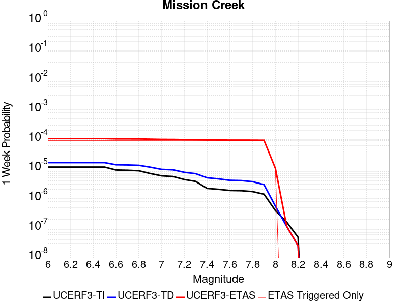 | 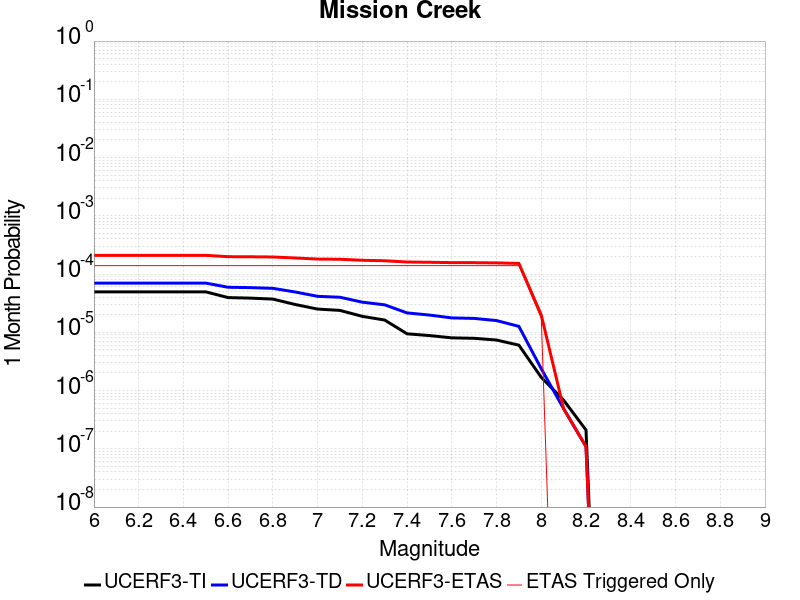 |  | 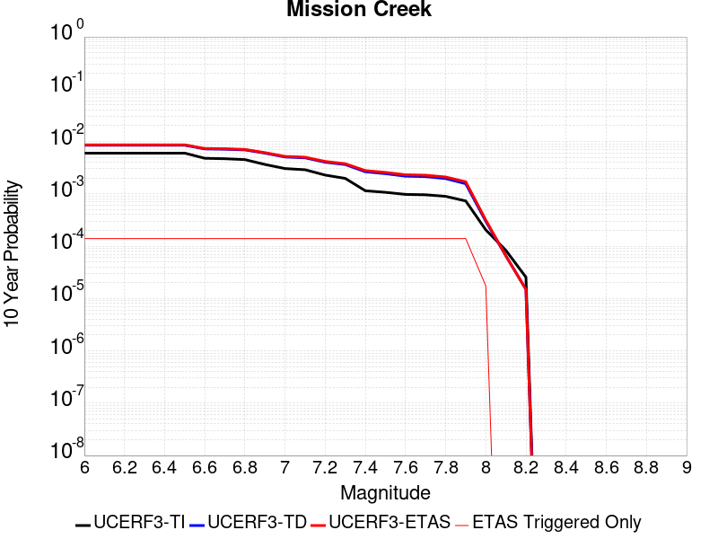 |

| Magnitude | 1 wk TI Prob | 1 wk TD Prob | 1 wk ETAS Prob | 1 wk ETAS/TD Gain | 1 wk ETAS Triggered Only | 1 mo TI Prob | 1 mo TD Prob | 1 mo ETAS Prob | 1 mo ETAS/TD Gain | 1 mo ETAS Triggered Only | 1 yr TI Prob | 1 yr TD Prob | 1 yr ETAS Prob | 1 yr ETAS/TD Gain | 1 yr ETAS Triggered Only | 10 yr TI Prob | 10 yr TD Prob | 10 yr ETAS Prob | 10 yr ETAS/TD Gain | 10 yr ETAS Triggered Only |
|-----|-----|-----|-----|-----|-----|-----|-----|-----|-----|-----|-----|-----|-----|-----|-----|-----|-----|-----|-----|-----|
| 6.0 | 1.1549387E-5 | 1.632237E-5 | 1.558704E-4 | 9.549495 | 1.395503E-4 | 4.9496433E-5 | 6.9951224E-5 | 2.0949176E-4 | 2.9948263 | 1.395503E-4 | 6.0245243E-4 | 8.513384E-4 | 9.907698E-4 | 1.1637791 | 1.395503E-4 | 0.006008218 | 0.008509998 | 0.008648361 | 1.0162588 | 1.395503E-4 |
| 6.1 | 1.1549387E-5 | 1.632237E-5 | 1.558704E-4 | 9.549495 | 1.395503E-4 | 4.9496433E-5 | 6.9951224E-5 | 2.0949176E-4 | 2.9948263 | 1.395503E-4 | 6.0245243E-4 | 8.513384E-4 | 9.907698E-4 | 1.1637791 | 1.395503E-4 | 0.006008218 | 0.008509998 | 0.008648361 | 1.0162588 | 1.395503E-4 |
| 6.2 | 1.1549387E-5 | 1.632237E-5 | 1.558704E-4 | 9.549495 | 1.395503E-4 | 4.9496433E-5 | 6.9951224E-5 | 2.0949176E-4 | 2.9948263 | 1.395503E-4 | 6.0245243E-4 | 8.513384E-4 | 9.907698E-4 | 1.1637791 | 1.395503E-4 | 0.006008218 | 0.008509998 | 0.008648361 | 1.0162588 | 1.395503E-4 |
| 6.3 | 1.1549387E-5 | 1.632237E-5 | 1.558704E-4 | 9.549495 | 1.395503E-4 | 4.9496433E-5 | 6.9951224E-5 | 2.0949176E-4 | 2.9948263 | 1.395503E-4 | 6.0245243E-4 | 8.513384E-4 | 9.907698E-4 | 1.1637791 | 1.395503E-4 | 0.006008218 | 0.008509998 | 0.008648361 | 1.0162588 | 1.395503E-4 |
| 6.4 | 1.1549387E-5 | 1.632237E-5 | 1.558704E-4 | 9.549495 | 1.395503E-4 | 4.9496433E-5 | 6.9951224E-5 | 2.0949176E-4 | 2.9948263 | 1.395503E-4 | 6.0245243E-4 | 8.513384E-4 | 9.907698E-4 | 1.1637791 | 1.395503E-4 | 0.006008218 | 0.008509998 | 0.008648361 | 1.0162588 | 1.395503E-4 |
| 6.5 | 1.1549387E-5 | 1.632237E-5 | 1.558704E-4 | 9.549495 | 1.395503E-4 | 4.9496433E-5 | 6.9951224E-5 | 2.0949176E-4 | 2.9948263 | 1.395503E-4 | 6.0245243E-4 | 8.513384E-4 | 9.907698E-4 | 1.1637791 | 1.395503E-4 | 0.006008218 | 0.008509998 | 0.008648361 | 1.0162588 | 1.395503E-4 |
| 6.6 | 9.202681E-6 | 1.3845646E-5 | 1.5339401E-4 | 11.078862 | 1.395503E-4 | 3.9439463E-5 | 5.9337188E-5 | 1.988792E-4 | 3.351679 | 1.395503E-4 | 4.800697E-4 | 7.221998E-4 | 8.6164934E-4 | 1.19309 | 1.395503E-4 | 0.004790339 | 0.0072271815 | 0.007365723 | 1.0191696 | 1.395503E-4 |
| 6.7 | 9.019164E-6 | 1.3651316E-5 | 1.5319971E-4 | 11.22234 | 1.395503E-4 | 3.8652986E-5 | 5.8504378E-5 | 1.9804652E-4 | 3.385157 | 1.395503E-4 | 4.7049852E-4 | 7.12067E-4 | 8.5151795E-4 | 1.1958396 | 1.395503E-4 | 0.004695036 | 0.007126506 | 0.0072650616 | 1.0194423 | 1.395503E-4 |
| 6.8 | 8.673558E-6 | 1.3273427E-5 | 1.5282187E-4 | 11.51337 | 1.395503E-4 | 3.717186E-5 | 5.6884925E-5 | 1.9642728E-4 | 3.453064 | 1.395503E-4 | 4.524734E-4 | 6.923627E-4 | 8.318164E-4 | 1.2014171 | 1.395503E-4 | 0.0045155324 | 0.006930694 | 0.007069277 | 1.0199956 | 1.395503E-4 |
| 6.9 | 7.002255E-6 | 1.1477657E-5 | 1.5102635E-4 | 13.158292 | 1.395503E-4 | 3.000932E-5 | 4.9189068E-5 | 1.887325E-4 | 3.836879 | 1.395503E-4 | 3.653022E-4 | 5.9871917E-4 | 7.3818595E-4 | 1.2329419 | 1.395503E-4 | 0.0036470229 | 0.005999517 | 0.00613823 | 1.0231208 | 1.395503E-4 |
| 7.0 | 5.84644E-6 | 9.67498E-6 | 1.4922392E-4 | 15.423694 | 1.395503E-4 | 2.5055931E-5 | 4.1463565E-5 | 1.8100809E-4 | 4.365473 | 1.395503E-4 | 3.0501327E-4 | 5.047066E-4 | 6.441864E-4 | 1.2763584 | 1.395503E-4 | 0.0030459496 | 0.0050638523 | 0.0052026957 | 1.0274186 | 1.395503E-4 |
| 7.1 | 5.54703E-6 | 9.329456E-6 | 1.4887845E-4 | 15.957892 | 1.395503E-4 | 2.377277E-5 | 3.9982795E-5 | 1.7952752E-4 | 4.490119 | 1.395503E-4 | 2.8939504E-4 | 4.8668624E-4 | 6.261686E-4 | 1.2865961 | 1.395503E-4 | 0.0028901845 | 0.004884446 | 0.005023315 | 1.0284308 | 1.395503E-4 |
| 7.2 | 4.384709E-6 | 7.68157E-6 | 1.4723079E-4 | 19.166758 | 1.395503E-4 | 1.8791474E-5 | 3.2920623E-5 | 1.7246633E-4 | 5.238854 | 1.395503E-4 | 2.2876218E-4 | 4.0073853E-4 | 5.4023287E-4 | 1.3480933 | 1.395503E-4 | 0.0022852682 | 0.004028366 | 0.0041673537 | 1.0345024 | 1.395503E-4 |
| 7.3 | 3.7888456E-6 | 6.915452E-6 | 1.4646478E-4 | 21.179352 | 1.395503E-4 | 1.623781E-5 | 2.9637333E-5 | 1.6918349E-4 | 5.708459 | 1.395503E-4 | 1.9767738E-4 | 3.6077813E-4 | 5.002781E-4 | 1.3866642 | 1.395503E-4 | 0.0019750162 | 0.0036301152 | 0.0037691589 | 1.0383029 | 1.395503E-4 |
| 7.4 | 2.1982462E-6 | 5.0237763E-6 | 1.4457338E-4 | 28.777828 | 1.395503E-4 | 9.421021E-6 | 2.1530293E-5 | 1.610776E-4 | 7.481439 | 1.395503E-4 | 1.1469489E-4 | 2.621E-4 | 4.016137E-4 | 1.532292 | 1.395503E-4 | 0.0011463572 | 0.0026458844 | 0.0027850654 | 1.0526029 | 1.395503E-4 |
| 7.5 | 2.051923E-6 | 4.615016E-6 | 1.4416467E-4 | 31.238173 | 1.395503E-4 | 8.793926E-6 | 1.9778492E-5 | 1.5932602E-4 | 8.05552 | 1.395503E-4 | 1.0706078E-4 | 2.4077666E-4 | 3.8029335E-4 | 1.5794444 | 1.395503E-4 | 0.0010700922 | 0.0024335422 | 0.0025727528 | 1.057205 | 1.395503E-4 |
| 7.6 | 1.8733427E-6 | 4.1233748E-6 | 1.436731E-4 | 34.843567 | 1.395503E-4 | 8.028587E-6 | 1.7671488E-5 | 1.5721931E-4 | 8.896779 | 1.395503E-4 | 9.774366E-5 | 2.151292E-4 | 3.5464947E-4 | 1.6485418 | 1.395503E-4 | 9.770069E-4 | 0.0021780801 | 0.0023173266 | 1.0639307 | 1.395503E-4 |
| 7.7 | 1.8411953E-6 | 4.0430496E-6 | 1.4359278E-4 | 35.515957 | 1.395503E-4 | 7.890813E-6 | 1.732724E-5 | 1.5687512E-4 | 9.05367 | 1.395503E-4 | 9.606641E-5 | 2.1093882E-4 | 3.5045968E-4 | 1.6614281 | 1.395503E-4 | 9.6024893E-4 | 0.0021363653 | 0.0022756176 | 1.0651819 | 1.395503E-4 |
| 7.8 | 1.7194251E-6 | 3.7104276E-6 | 1.4326021E-4 | 38.61016 | 1.395503E-4 | 7.368944E-6 | 1.5901736E-5 | 1.5544982E-4 | 9.775651 | 1.395503E-4 | 8.97132E-5 | 1.9358651E-4 | 3.3310978E-4 | 1.7207284 | 1.395503E-4 | 8.967699E-4 | 0.0019623525 | 0.0021016288 | 1.0709742 | 1.395503E-4 |
| 7.9 | 1.4035052E-6 | 2.9500632E-6 | 1.4249995E-4 | 48.304035 | 1.395503E-4 | 6.0150082E-6 | 1.2643067E-5 | 1.521916E-4 | 12.037554 | 1.395503E-4 | 7.3230265E-5 | 1.5391852E-4 | 2.9344735E-4 | 1.906511 | 1.395503E-4 | 7.3206134E-4 | 0.0015631086 | 0.0017024408 | 1.0891379 | 1.395503E-4 |
| 8.0 | 3.9318823E-7 | 5.528522E-7 | 1.799663E-5 | 32.552334 | 1.7443788E-5 | 1.6850913E-6 | 2.3693647E-6 | 1.9813111E-5 | 8.362205 | 1.7443788E-5 | 2.0515794E-5 | 2.8846638E-5 | 4.6289922E-5 | 1.6046904 | 1.7443788E-5 | 2.0513899E-4 | 2.9899E-4 | 3.1642857E-4 | 1.0583249 | 1.7443788E-5 |
| 8.1 | 1.596793E-7 | 1.1380002E-7 | 1.1380002E-7 | 1.0 | 0.0 | 6.8433974E-7 | 4.877143E-7 | 4.877143E-7 | 1.0 | 0.0 | 8.331805E-6 | 5.937906E-6 | 5.937906E-6 | 1.0 | 0.0 | 8.331492E-5 | 6.549966E-5 | 6.549966E-5 | 1.0 | 0.0 |
| 8.2 | 4.9003038E-8 | 2.5444924E-8 | 2.5444924E-8 | 1.0 | 0.0 | 2.10013E-7 | 1.0904967E-7 | 1.0904967E-7 | 1.0 | 0.0 | 2.5569052E-6 | 1.327679E-6 | 1.327679E-6 | 1.0 | 0.0 | 2.556876E-5 | 1.495635E-5 | 1.495635E-5 | 1.0 | 0.0 |

## White Wolf (Extension)
*[(top)](#table-of-contents)*

| 1 Week | 1 Month | 1 Year | 10 Year |
|-----|-----|-----|-----|
|  |  |  |  |

| Magnitude | 1 wk TI Prob | 1 wk TD Prob | 1 wk ETAS Prob | 1 wk ETAS/TD Gain | 1 wk ETAS Triggered Only | 1 mo TI Prob | 1 mo TD Prob | 1 mo ETAS Prob | 1 mo ETAS/TD Gain | 1 mo ETAS Triggered Only | 1 yr TI Prob | 1 yr TD Prob | 1 yr ETAS Prob | 1 yr ETAS/TD Gain | 1 yr ETAS Triggered Only | 10 yr TI Prob | 10 yr TD Prob | 10 yr ETAS Prob | 10 yr ETAS/TD Gain | 10 yr ETAS Triggered Only |
|-----|-----|-----|-----|-----|-----|-----|-----|-----|-----|-----|-----|-----|-----|-----|-----|-----|-----|-----|-----|-----|
| 6.0 | 8.222555E-6 | 6.0666657E-6 | 1.2817244E-4 | 21.127329 | 1.2210652E-4 | 3.5239045E-5 | 2.5999774E-5 | 1.6554644E-4 | 6.367226 | 1.395503E-4 | 4.289509E-4 | 3.1650788E-4 | 4.5601404E-4 | 1.4407667 | 1.395503E-4 | 0.0042812387 | 0.003161223 | 0.0033003322 | 1.0440048 | 1.395503E-4 |
| 6.1 | 8.222555E-6 | 6.0666657E-6 | 1.2817244E-4 | 21.127329 | 1.2210652E-4 | 3.5239045E-5 | 2.5999774E-5 | 1.6554644E-4 | 6.367226 | 1.395503E-4 | 4.289509E-4 | 3.1650788E-4 | 4.5601404E-4 | 1.4407667 | 1.395503E-4 | 0.0042812387 | 0.003161223 | 0.0033003322 | 1.0440048 | 1.395503E-4 |
| 6.2 | 8.222555E-6 | 6.0666657E-6 | 1.2817244E-4 | 21.127329 | 1.2210652E-4 | 3.5239045E-5 | 2.5999774E-5 | 1.6554644E-4 | 6.367226 | 1.395503E-4 | 4.289509E-4 | 3.1650788E-4 | 4.5601404E-4 | 1.4407667 | 1.395503E-4 | 0.0042812387 | 0.003161223 | 0.0033003322 | 1.0440048 | 1.395503E-4 |
| 6.3 | 8.222555E-6 | 6.0666657E-6 | 1.2817244E-4 | 21.127329 | 1.2210652E-4 | 3.5239045E-5 | 2.5999774E-5 | 1.6554644E-4 | 6.367226 | 1.395503E-4 | 4.289509E-4 | 3.1650788E-4 | 4.5601404E-4 | 1.4407667 | 1.395503E-4 | 0.0042812387 | 0.003161223 | 0.0033003322 | 1.0440048 | 1.395503E-4 |
| 6.4 | 5.821773E-6 | 3.5571766E-6 | 7.333208E-5 | 20.61525 | 6.977515E-5 | 2.4950215E-5 | 1.5244959E-5 | 8.501905E-5 | 5.576863 | 6.977515E-5 | 3.0372653E-4 | 1.8559267E-4 | 2.5535485E-4 | 1.3758888 | 6.977515E-5 | 0.0030331176 | 0.001854485 | 0.0019241308 | 1.0375553 | 6.977515E-5 |
| 6.5 | 5.766023E-6 | 3.4991106E-6 | 7.3274015E-5 | 20.940754 | 6.977515E-5 | 2.4711293E-5 | 1.4996108E-5 | 8.477021E-5 | 5.652814 | 6.977515E-5 | 3.0081844E-4 | 1.8256342E-4 | 2.5232584E-4 | 1.382127 | 6.977515E-5 | 0.0030041158 | 0.0018242426 | 0.0018938904 | 1.038179 | 6.977515E-5 |
| 6.6 | 4.643576E-6 | 2.332624E-6 | 5.4663866E-5 | 23.434494 | 5.233136E-5 | 1.9900888E-5 | 9.996925E-6 | 6.232777E-5 | 6.234694 | 5.233136E-5 | 2.4226638E-4 | 1.2170619E-4 | 1.7403119E-4 | 1.4299288 | 5.233136E-5 | 0.0024200242 | 0.0012164378 | 0.0012687055 | 1.0429678 | 5.233136E-5 |
| 6.7 | 3.9529173E-6 | 1.6483477E-6 | 3.6535865E-5 | 22.165144 | 3.4887576E-5 | 1.6940963E-5 | 7.0643296E-6 | 4.195166E-5 | 5.9385195 | 3.4887576E-5 | 2.0623671E-4 | 8.6005006E-5 | 1.2088958E-4 | 1.4056109 | 3.4887576E-5 | 0.002060454 | 8.597357E-4 | 8.945933E-4 | 1.0405445 | 3.4887576E-5 |
| 6.8 | 3.4377522E-6 | 1.2245237E-6 | 1.866829E-5 | 15.245348 | 1.7443788E-5 | 1.473314E-5 | 5.2479486E-6 | 2.2691644E-5 | 4.3239074 | 1.7443788E-5 | 1.7936122E-4 | 6.3891996E-5 | 8.133466E-5 | 1.2730025 | 1.7443788E-5 | 0.0017921652 | 6.387454E-4 | 6.56178E-4 | 1.027292 | 1.7443788E-5 |
| 6.9 | 3.1367306E-6 | 1.0033783E-6 | 1.8447148E-5 | 18.385036 | 1.7443788E-5 | 1.3443062E-5 | 4.3001864E-6 | 2.17439E-5 | 5.0565014 | 1.7443788E-5 | 1.63657E-4 | 5.235359E-5 | 6.9796464E-5 | 1.3331743 | 1.7443788E-5 | 0.0016353652 | 5.2342017E-4 | 5.408548E-4 | 1.0333091 | 1.7443788E-5 |
| 7.0 | 2.8298145E-6 | 7.4286646E-7 | 1.8186642E-5 | 24.481709 | 1.7443788E-5 | 1.2127721E-5 | 3.1837099E-6 | 2.0627442E-5 | 6.4790583 | 1.7443788E-5 | 1.47645E-4 | 3.8761027E-5 | 5.620414E-5 | 1.4500167 | 1.7443788E-5 | 0.0014754693 | 3.8754768E-4 | 4.049847E-4 | 1.0449933 | 1.7443788E-5 |
| 7.1 | 2.4091064E-6 | 5.4227525E-7 | 1.7986053E-5 | 33.16776 | 1.7443788E-5 | 1.03247E-5 | 2.3240348E-6 | 1.9767782E-5 | 8.505802 | 1.7443788E-5 | 1.2569598E-4 | 2.8294799E-5 | 4.5738092E-5 | 1.6164842 | 1.7443788E-5 | 0.001256249 | 2.8291598E-4 | 3.0035485E-4 | 1.0616397 | 1.7443788E-5 |
| 7.2 | 1.3875518E-6 | 1.0743063E-7 | 1.7551216E-5 | 163.37256 | 1.7443788E-5 | 5.9466374E-6 | 4.6041689E-7 | 1.7904196E-5 | 38.886925 | 1.7443788E-5 | 7.23979E-5 | 5.6055624E-6 | 2.3049251E-5 | 4.1118536 | 1.7443788E-5 | 7.2374323E-4 | 5.6054323E-5 | 7.349713E-5 | 1.3111769 | 1.7443788E-5 |
| 7.3 | 7.056077E-7 | 5.002034E-8 | 5.002034E-8 | 1.0 | 0.0 | 3.0240296E-6 | 2.1437286E-7 | 2.1437286E-7 | 1.0 | 0.0 | 3.681694E-5 | 2.609987E-6 | 2.609987E-6 | 1.0 | 0.0 | 3.681084E-4 | 2.609961E-5 | 2.609961E-5 | 1.0 | 0.0 |
| 7.4 | 5.9334678E-8 | 4.8683537E-9 | 4.8683537E-9 | 1.0 | 0.0 | 2.5429145E-7 | 2.0864372E-8 | 2.0864372E-8 | 1.0 | 0.0 | 3.095994E-6 | 2.5402372E-7 | 2.5402372E-7 | 1.0 | 0.0 | 3.095951E-5 | 2.5402353E-6 | 2.5402353E-6 | 1.0 | 0.0 |

## San Andreas (North Branch Mill Creek)
*[(top)](#table-of-contents)*

| 1 Week | 1 Month | 1 Year | 10 Year |
|-----|-----|-----|-----|
|  | 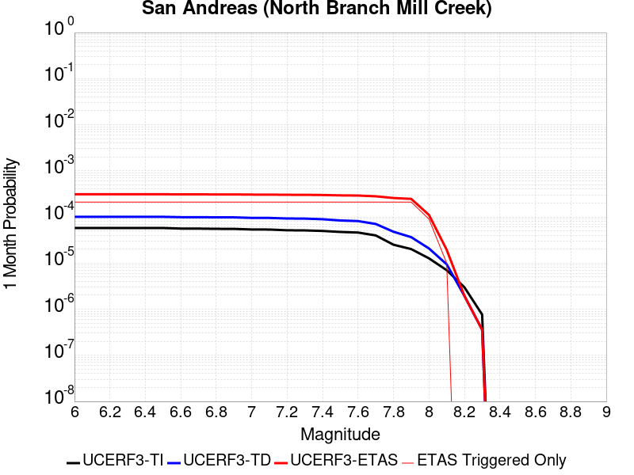 |  |  |

| Magnitude | 1 wk TI Prob | 1 wk TD Prob | 1 wk ETAS Prob | 1 wk ETAS/TD Gain | 1 wk ETAS Triggered Only | 1 mo TI Prob | 1 mo TD Prob | 1 mo ETAS Prob | 1 mo ETAS/TD Gain | 1 mo ETAS Triggered Only | 1 yr TI Prob | 1 yr TD Prob | 1 yr ETAS Prob | 1 yr ETAS/TD Gain | 1 yr ETAS Triggered Only | 10 yr TI Prob | 10 yr TD Prob | 10 yr ETAS Prob | 10 yr ETAS/TD Gain | 10 yr ETAS Triggered Only |
|-----|-----|-----|-----|-----|-----|-----|-----|-----|-----|-----|-----|-----|-----|-----|-----|-----|-----|-----|-----|-----|
| 6.0 | 1.3461156E-5 | 2.3499893E-5 | 1.4560354E-4 | 6.1959233 | 1.2210652E-4 | 5.7689394E-5 | 1.00709956E-4 | 2.2280417E-4 | 2.212335 | 1.2210652E-4 | 7.02142E-4 | 0.0012254574 | 0.0013648367 | 1.1137365 | 1.395503E-4 | 0.0069992766 | 0.01222957 | 0.012367413 | 1.0112714 | 1.395503E-4 |
| 6.1 | 1.3461156E-5 | 2.3499893E-5 | 1.4560354E-4 | 6.1959233 | 1.2210652E-4 | 5.7689394E-5 | 1.00709956E-4 | 2.2280417E-4 | 2.212335 | 1.2210652E-4 | 7.02142E-4 | 0.0012254574 | 0.0013648367 | 1.1137365 | 1.395503E-4 | 0.0069992766 | 0.01222957 | 0.012367413 | 1.0112714 | 1.395503E-4 |
| 6.2 | 1.3461156E-5 | 2.3499893E-5 | 1.4560354E-4 | 6.1959233 | 1.2210652E-4 | 5.7689394E-5 | 1.00709956E-4 | 2.2280417E-4 | 2.212335 | 1.2210652E-4 | 7.02142E-4 | 0.0012254574 | 0.0013648367 | 1.1137365 | 1.395503E-4 | 0.0069992766 | 0.01222957 | 0.012367413 | 1.0112714 | 1.395503E-4 |
| 6.3 | 1.3461156E-5 | 2.3499893E-5 | 1.4560354E-4 | 6.1959233 | 1.2210652E-4 | 5.7689394E-5 | 1.00709956E-4 | 2.2280417E-4 | 2.212335 | 1.2210652E-4 | 7.02142E-4 | 0.0012254574 | 0.0013648367 | 1.1137365 | 1.395503E-4 | 0.0069992766 | 0.01222957 | 0.012367413 | 1.0112714 | 1.395503E-4 |
| 6.4 | 1.3461156E-5 | 2.3499893E-5 | 1.4560354E-4 | 6.1959233 | 1.2210652E-4 | 5.7689394E-5 | 1.00709956E-4 | 2.2280417E-4 | 2.212335 | 1.2210652E-4 | 7.02142E-4 | 0.0012254574 | 0.0013648367 | 1.1137365 | 1.395503E-4 | 0.0069992766 | 0.01222957 | 0.012367413 | 1.0112714 | 1.395503E-4 |
| 6.5 | 1.3450706E-5 | 2.3488852E-5 | 1.455925E-4 | 6.1983657 | 1.2210652E-4 | 5.764461E-5 | 1.0066265E-4 | 2.2275686E-4 | 2.212905 | 1.2210652E-4 | 7.0159714E-4 | 0.001224882 | 0.0013642614 | 1.11379 | 1.395503E-4 | 0.006993862 | 0.01222388 | 0.012361724 | 1.0112766 | 1.395503E-4 |
| 6.6 | 1.3074523E-5 | 2.3103135E-5 | 1.4520682E-4 | 6.2851567 | 1.2210652E-4 | 5.6032466E-5 | 9.9009696E-5 | 2.2110413E-4 | 2.2331562 | 1.2210652E-4 | 6.8198174E-4 | 0.0012047797 | 0.0013441619 | 1.115691 | 1.395503E-4 | 0.006798926 | 0.012025044 | 0.012162916 | 1.0114654 | 1.395503E-4 |
| 6.7 | 1.3050216E-5 | 2.3078432E-5 | 1.4518213E-4 | 6.290814 | 1.2210652E-4 | 5.59283E-5 | 9.890384E-5 | 2.2099826E-4 | 2.2344763 | 1.2210652E-4 | 6.8071426E-4 | 0.0012034923 | 0.0013428746 | 1.1158149 | 1.395503E-4 | 0.0067863287 | 0.012012309 | 0.012150183 | 1.0114777 | 1.395503E-4 |
| 6.8 | 1.29049395E-5 | 2.292684E-5 | 1.4503056E-4 | 6.3257976 | 1.2210652E-4 | 5.530571E-5 | 9.825421E-5 | 2.2034872E-4 | 2.242639 | 1.2210652E-4 | 6.73139E-4 | 0.0011955918 | 0.0013349752 | 1.1165812 | 1.395503E-4 | 0.0067110364 | 0.011934154 | 0.012072039 | 1.0115538 | 1.395503E-4 |
| 6.9 | 1.2867369E-5 | 2.2886245E-5 | 1.4498996E-4 | 6.3352447 | 1.2210652E-4 | 5.51447E-5 | 9.8080236E-5 | 2.2017477E-4 | 2.2448435 | 1.2210652E-4 | 6.711799E-4 | 0.0011934759 | 0.0013328597 | 1.116788 | 1.395503E-4 | 0.006691564 | 0.011913223 | 0.012051111 | 1.0115744 | 1.395503E-4 |
| 7.0 | 1.2495996E-5 | 2.2286325E-5 | 1.4439011E-4 | 6.478866 | 1.2210652E-4 | 5.3553173E-5 | 9.550934E-5 | 2.1760419E-4 | 2.2783551 | 1.2210652E-4 | 6.518148E-4 | 0.0011622087 | 0.0013015969 | 1.1199338 | 1.395503E-4 | 0.0064990623 | 0.0116038285 | 0.011741759 | 1.0118867 | 1.395503E-4 |
| 7.1 | 1.2452067E-5 | 2.2231397E-5 | 1.443352E-4 | 6.492403 | 1.2210652E-4 | 5.3364907E-5 | 9.527396E-5 | 2.1736884E-4 | 2.2815137 | 1.2210652E-4 | 6.4952404E-4 | 0.0011593461 | 0.0012987346 | 1.1202303 | 1.395503E-4 | 0.0064762887 | 0.0115755 | 0.011713435 | 1.0119162 | 1.395503E-4 |
| 7.2 | 1.2002777E-5 | 2.1609963E-5 | 1.4371384E-4 | 6.6503506 | 1.2210652E-4 | 5.143946E-5 | 9.2610855E-5 | 2.1470606E-4 | 2.3183682 | 1.2210652E-4 | 6.2609545E-4 | 0.0011269567 | 0.0012489255 | 1.1082286 | 1.2210652E-4 | 0.006243344 | 0.011254923 | 0.011375655 | 1.010727 | 1.2210652E-4 |
| 7.3 | 1.1923425E-5 | 2.1479793E-5 | 1.4358367E-4 | 6.684593 | 1.2210652E-4 | 5.109939E-5 | 9.205302E-5 | 2.141483E-4 | 2.326358 | 1.2210652E-4 | 6.219575E-4 | 0.001120172 | 0.0012421417 | 1.1088848 | 1.2210652E-4 | 0.0062021962 | 0.011187789 | 0.011308529 | 1.0107921 | 1.2210652E-4 |
| 7.4 | 1.16105175E-5 | 2.0853771E-5 | 1.4295774E-4 | 6.855246 | 1.2210652E-4 | 4.975841E-5 | 8.937026E-5 | 2.1146586E-4 | 2.366177 | 1.2210652E-4 | 6.0564023E-4 | 0.0010875424 | 0.0012095161 | 1.1121553 | 1.2210652E-4 | 0.006039923 | 0.010865397 | 0.010986176 | 1.011116 | 1.2210652E-4 |
| 7.5 | 1.1037265E-5 | 1.9553907E-5 | 1.4165803E-4 | 7.2444873 | 1.2210652E-4 | 4.7301706E-5 | 8.379978E-5 | 2.0589605E-4 | 2.457 | 1.2210652E-4 | 5.757461E-4 | 0.0010197869 | 0.001141769 | 1.1196152 | 1.2210652E-4 | 0.005742567 | 0.010194898 | 0.010315759 | 1.0118551 | 1.2210652E-4 |
| 7.6 | 1.0720915E-5 | 1.899582E-5 | 1.4110001E-4 | 7.427951 | 1.2210652E-4 | 4.5945973E-5 | 8.140812E-5 | 2.035047E-4 | 2.4998083 | 1.2210652E-4 | 5.592486E-4 | 9.906954E-4 | 0.001112681 | 1.1231313 | 1.2210652E-4 | 0.005578433 | 0.009906623 | 0.010027519 | 1.0122037 | 1.2210652E-4 |
| 7.7 | 9.276279E-6 | 1.6441649E-5 | 1.3854615E-4 | 8.426537 | 1.2210652E-4 | 3.9754876E-5 | 7.0462316E-5 | 1.9256023E-4 | 2.7328115 | 1.2210652E-4 | 4.839081E-4 | 8.575427E-4 | 9.795445E-4 | 1.142269 | 1.2210652E-4 | 0.0048285574 | 0.008586041 | 0.0087071 | 1.0140994 | 1.2210652E-4 |
| 7.8 | 5.8346777E-6 | 1.1155013E-5 | 1.3326017E-4 | 11.946213 | 1.2210652E-4 | 2.5005522E-5 | 4.7806327E-5 | 1.69907E-4 | 3.5540695 | 1.2210652E-4 | 3.043997E-4 | 5.818867E-4 | 7.039221E-4 | 1.2097237 | 1.2210652E-4 | 0.0030398308 | 0.0058469265 | 0.0059683193 | 1.0207617 | 1.2210652E-4 |
| 7.9 | 4.690204E-6 | 8.509093E-6 | 1.3061457E-4 | 15.3499975 | 1.2210652E-4 | 2.0100719E-5 | 3.6467034E-5 | 1.5856909E-4 | 4.348286 | 1.2210652E-4 | 2.4469878E-4 | 4.4389578E-4 | 5.659481E-4 | 1.2749572 | 1.2210652E-4 | 0.002444295 | 0.0044707474 | 0.004592308 | 1.0271902 | 1.2210652E-4 |
| 8.0 | 2.9570454E-6 | 4.846947E-6 | 3.9734354E-5 | 8.197811 | 3.4887576E-5 | 1.267299E-5 | 2.0772464E-5 | 5.5659315E-5 | 2.6794758 | 3.4887576E-5 | 1.5428272E-4 | 2.5287544E-4 | 2.8775417E-4 | 1.1379286 | 3.4887576E-5 | 0.0015417566 | 0.002549644 | 0.0025844427 | 1.0136484 | 3.4887576E-5 |
| 8.1 | 1.6376824E-6 | 2.1968929E-6 | 2.1968929E-6 | 1.0 | 0.0 | 7.01862E-6 | 9.41522E-6 | 9.41522E-6 | 1.0 | 0.0 | 8.544835E-5 | 1.14624294E-4 | 1.14624294E-4 | 1.0 | 0.0 | 8.54155E-4 | 0.0011606582 | 0.0011606582 | 1.0 | 0.0 |
| 8.2 | 6.9631557E-7 | 4.5360213E-7 | 4.5360213E-7 | 1.0 | 0.0 | 2.984206E-6 | 1.9440076E-6 | 1.9440076E-6 | 1.0 | 0.0 | 3.63321E-5 | 2.3668037E-5 | 2.3668037E-5 | 1.0 | 0.0 | 3.6326164E-4 | 2.451564E-4 | 2.451564E-4 | 1.0 | 0.0 |
| 8.3 | 1.7876137E-7 | 8.360375E-8 | 8.360375E-8 | 1.0 | 0.0 | 7.661199E-7 | 3.5830175E-7 | 3.5830175E-7 | 1.0 | 0.0 | 9.32747E-6 | 4.3623154E-6 | 4.3623154E-6 | 1.0 | 0.0 | 9.3270784E-5 | 4.5817014E-5 | 4.5817014E-5 | 1.0 | 0.0 |

## San Andreas (Carrizo) rev
*[(top)](#table-of-contents)*

| 1 Week | 1 Month | 1 Year | 10 Year |
|-----|-----|-----|-----|
|  |  |  |  |

| Magnitude | 1 wk TI Prob | 1 wk TD Prob | 1 wk ETAS Prob | 1 wk ETAS/TD Gain | 1 wk ETAS Triggered Only | 1 mo TI Prob | 1 mo TD Prob | 1 mo ETAS Prob | 1 mo ETAS/TD Gain | 1 mo ETAS Triggered Only | 1 yr TI Prob | 1 yr TD Prob | 1 yr ETAS Prob | 1 yr ETAS/TD Gain | 1 yr ETAS Triggered Only | 10 yr TI Prob | 10 yr TD Prob | 10 yr ETAS Prob | 10 yr ETAS/TD Gain | 10 yr ETAS Triggered Only |
|-----|-----|-----|-----|-----|-----|-----|-----|-----|-----|-----|-----|-----|-----|-----|-----|-----|-----|-----|-----|-----|
| 6.0 | 1.1674632E-4 | 2.432302E-4 | 3.65307E-4 | 1.5018983 | 1.2210652E-4 | 5.002454E-4 | 0.0010420004 | 0.0011814053 | 1.1337858 | 1.395503E-4 | 0.006073493 | 0.012613042 | 0.012750832 | 1.0109245 | 1.395503E-4 | 0.0591016 | 0.12061418 | 0.1207369 | 1.0010175 | 1.395503E-4 |
| 6.1 | 1.1674632E-4 | 2.432302E-4 | 3.65307E-4 | 1.5018983 | 1.2210652E-4 | 5.002454E-4 | 0.0010420004 | 0.0011814053 | 1.1337858 | 1.395503E-4 | 0.006073493 | 0.012613042 | 0.012750832 | 1.0109245 | 1.395503E-4 | 0.0591016 | 0.12061418 | 0.1207369 | 1.0010175 | 1.395503E-4 |
| 6.2 | 1.1674632E-4 | 2.432302E-4 | 3.65307E-4 | 1.5018983 | 1.2210652E-4 | 5.002454E-4 | 0.0010420004 | 0.0011814053 | 1.1337858 | 1.395503E-4 | 0.006073493 | 0.012613042 | 0.012750832 | 1.0109245 | 1.395503E-4 | 0.0591016 | 0.12061418 | 0.1207369 | 1.0010175 | 1.395503E-4 |
| 6.3 | 1.1674632E-4 | 2.432302E-4 | 3.65307E-4 | 1.5018983 | 1.2210652E-4 | 5.002454E-4 | 0.0010420004 | 0.0011814053 | 1.1337858 | 1.395503E-4 | 0.006073493 | 0.012613042 | 0.012750832 | 1.0109245 | 1.395503E-4 | 0.0591016 | 0.12061418 | 0.1207369 | 1.0010175 | 1.395503E-4 |
| 6.4 | 1.1674632E-4 | 2.432302E-4 | 3.65307E-4 | 1.5018983 | 1.2210652E-4 | 5.002454E-4 | 0.0010420004 | 0.0011814053 | 1.1337858 | 1.395503E-4 | 0.006073493 | 0.012613042 | 0.012750832 | 1.0109245 | 1.395503E-4 | 0.0591016 | 0.12061418 | 0.1207369 | 1.0010175 | 1.395503E-4 |
| 6.5 | 1.13136164E-4 | 2.3643032E-4 | 3.5850797E-4 | 1.5163367 | 1.2210652E-4 | 4.847792E-4 | 0.0010128808 | 0.0011522898 | 1.1376361 | 1.395503E-4 | 0.0058862255 | 0.012262545 | 0.012400383 | 1.0112406 | 1.395503E-4 | 0.057327334 | 0.117585555 | 0.11770869 | 1.0010473 | 1.395503E-4 |
| 6.6 | 1.13136164E-4 | 2.3643032E-4 | 3.5850797E-4 | 1.5163367 | 1.2210652E-4 | 4.847792E-4 | 0.0010128808 | 0.0011522898 | 1.1376361 | 1.395503E-4 | 0.0058862255 | 0.012262545 | 0.012400383 | 1.0112406 | 1.395503E-4 | 0.057327334 | 0.117585555 | 0.11770869 | 1.0010473 | 1.395503E-4 |
| 6.7 | 1.1149675E-4 | 2.3334254E-4 | 3.5542055E-4 | 1.5231708 | 1.2210652E-4 | 4.777557E-4 | 9.996577E-4 | 0.0011390685 | 1.1394585 | 1.395503E-4 | 0.0058011734 | 0.012103349 | 0.01224121 | 1.0113903 | 1.395503E-4 | 0.05652051 | 0.1162071 | 0.11633043 | 1.0010613 | 1.395503E-4 |
| 6.8 | 1.1103589E-4 | 2.3236412E-4 | 3.5444225E-4 | 1.5253743 | 1.2210652E-4 | 4.7578133E-4 | 9.954676E-4 | 0.0011348791 | 1.1400461 | 1.395503E-4 | 0.005777263 | 0.012052901 | 0.012190769 | 1.0114386 | 1.395503E-4 | 0.056293584 | 0.1157674 | 0.11589079 | 1.0010659 | 1.395503E-4 |
| 6.9 | 1.1053259E-4 | 2.3128795E-4 | 3.5336622E-4 | 1.5278194 | 1.2210652E-4 | 4.7362508E-4 | 9.90859E-4 | 0.0011128446 | 1.1231109 | 1.2210652E-4 | 0.0057511497 | 0.01199741 | 0.012118052 | 1.0100557 | 1.2210652E-4 | 0.05604569 | 0.11528359 | 0.11539163 | 1.0009371 | 1.2210652E-4 |
| 7.0 | 1.1005377E-4 | 2.3029637E-4 | 3.5237477E-4 | 1.5300926 | 1.2210652E-4 | 4.7157376E-4 | 9.866126E-4 | 0.0011085987 | 1.1236413 | 1.2210652E-4 | 0.0057263062 | 0.011946279 | 0.012066927 | 1.0100992 | 1.2210652E-4 | 0.055809796 | 0.11483591 | 0.114943996 | 1.0009412 | 1.2210652E-4 |
| 7.1 | 1.0308142E-4 | 2.1539345E-4 | 3.3747364E-4 | 1.5667777 | 1.2210652E-4 | 4.417027E-4 | 9.227892E-4 | 0.001044783 | 1.1322012 | 1.2210652E-4 | 0.0053644776 | 0.011177397 | 0.01129814 | 1.0108023 | 1.2210652E-4 | 0.052368138 | 0.108092256 | 0.10820117 | 1.0010076 | 1.2210652E-4 |
| 7.2 | 1.0027479E-4 | 2.094724E-4 | 3.3155334E-4 | 1.5828019 | 1.2210652E-4 | 4.296783E-4 | 8.9743105E-4 | 0.001019428 | 1.1359402 | 1.2210652E-4 | 0.0052187922 | 0.010871782 | 0.0109925615 | 1.0111094 | 1.2210652E-4 | 0.050979212 | 0.10539625 | 0.10550548 | 1.0010364 | 1.2210652E-4 |
| 7.3 | 9.816942E-5 | 2.0422463E-4 | 3.263062E-4 | 1.5977808 | 1.2210652E-4 | 4.2065824E-4 | 8.7495585E-4 | 9.969556E-4 | 1.1394353 | 1.2210652E-4 | 0.005109493 | 0.010600842 | 0.010721654 | 1.0113964 | 1.2210652E-4 | 0.049935985 | 0.102979995 | 0.103089534 | 1.0010636 | 1.2210652E-4 |
| 7.4 | 9.5634205E-5 | 1.9791997E-4 | 3.2000232E-4 | 1.6168268 | 1.2210652E-4 | 4.0979648E-4 | 8.479536E-4 | 9.6995657E-4 | 1.1438793 | 1.2210652E-4 | 0.0049778637 | 0.010275229 | 0.010396081 | 1.0117614 | 1.2210652E-4 | 0.048678253 | 0.10006632 | 0.10017621 | 1.0010982 | 1.2210652E-4 |
| 7.5 | 8.052417E-5 | 1.611261E-4 | 2.8321292E-4 | 1.7577099 | 1.2210652E-4 | 3.4505792E-4 | 6.903579E-4 | 8.1238005E-4 | 1.1767521 | 1.2210652E-4 | 0.0041929903 | 0.008372796 | 0.00849388 | 1.0144616 | 1.2210652E-4 | 0.04114753 | 0.08281049 | 0.08292249 | 1.0013524 | 1.2210652E-4 |
| 7.6 | 7.897024E-5 | 1.5765853E-4 | 2.797458E-4 | 1.7743777 | 1.2210652E-4 | 3.384E-4 | 6.755046E-4 | 7.9752866E-4 | 1.1806413 | 1.2210652E-4 | 0.0041122385 | 0.008193332 | 0.008314438 | 1.014781 | 1.2210652E-4 | 0.040369697 | 0.08115171 | 0.0812639 | 1.0013826 | 1.2210652E-4 |
| 7.7 | 6.707427E-5 | 1.3276102E-4 | 2.5485133E-4 | 1.9196246 | 1.2210652E-4 | 2.8742946E-4 | 5.688518E-4 | 6.9088885E-4 | 1.2145323 | 1.2210652E-4 | 0.003493839 | 0.00690381 | 0.0070250737 | 1.0175648 | 1.2210652E-4 | 0.034394164 | 0.069048055 | 0.069161735 | 1.0016463 | 1.2210652E-4 |
| 7.8 | 6.147705E-5 | 1.2197486E-4 | 2.4406648E-4 | 2.0009573 | 1.2210652E-4 | 2.6344648E-4 | 5.226447E-4 | 6.446874E-4 | 1.2335099 | 1.2210652E-4 | 0.0032027436 | 0.006344659 | 0.006465991 | 1.0191234 | 1.2210652E-4 | 0.031569764 | 0.06351457 | 0.06362891 | 1.0018004 | 1.2210652E-4 |
| 7.9 | 4.7636717E-5 | 8.87977E-5 | 2.1089337E-4 | 2.374987 | 1.2210652E-4 | 2.0414138E-4 | 3.8050607E-4 | 5.025661E-4 | 1.3207835 | 1.2210652E-4 | 0.0024825884 | 0.0046228287 | 0.004744371 | 1.0262917 | 1.2210652E-4 | 0.024550365 | 0.046628095 | 0.046744507 | 1.0024966 | 1.2210652E-4 |
| 8.0 | 3.3554235E-5 | 5.2136907E-5 | 1.2190842E-4 | 2.3382363 | 6.977515E-5 | 1.4379594E-4 | 2.2342477E-4 | 2.9318433E-4 | 1.3122284 | 6.977515E-5 | 0.0017493097 | 0.002716805 | 0.0027863907 | 1.0256131 | 6.977515E-5 | 0.017356034 | 0.027880952 | 0.027948782 | 1.0024328 | 6.977515E-5 |
| 8.1 | 1.9175432E-5 | 1.9184976E-5 | 5.407188E-5 | 2.8184493 | 3.4887576E-5 | 8.217783E-5 | 8.2218736E-5 | 1.17103446E-4 | 1.4242915 | 3.4887576E-5 | 0.0010000558 | 0.0010005541 | 0.0010354067 | 1.0348333 | 3.4887576E-5 | 0.009955673 | 0.0107580265 | 0.0107925385 | 1.003208 | 3.4887576E-5 |
| 8.2 | 8.643924E-6 | 5.4748625E-6 | 2.2918555E-5 | 4.1861424 | 1.7443788E-5 | 3.704486E-5 | 2.3463486E-5 | 4.0906863E-5 | 1.7434266 | 1.7443788E-5 | 4.5092785E-4 | 2.8563058E-4 | 3.0306936E-4 | 1.0610538 | 1.7443788E-5 | 0.0045001395 | 0.0032487072 | 0.0032660943 | 1.005352 | 1.7443788E-5 |
| 8.3 | 1.983087E-6 | 7.6599065E-7 | 7.6599065E-7 | 1.0 | 0.0 | 8.498917E-6 | 3.282813E-6 | 3.282813E-6 | 1.0 | 0.0 | 1.034694E-4 | 3.9967534E-5 | 3.9967534E-5 | 1.0 | 0.0 | 0.0010342124 | 4.719687E-4 | 4.719687E-4 | 1.0 | 0.0 |

## Cleghorn Lake
*[(top)](#table-of-contents)*

| 1 Week | 1 Month | 1 Year | 10 Year |
|-----|-----|-----|-----|
| 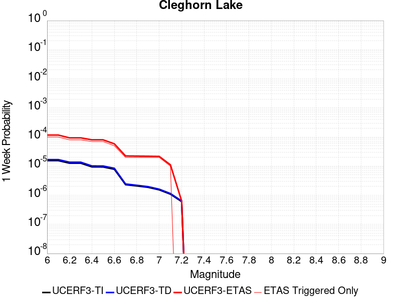 |  |  |  |

| Magnitude | 1 wk TI Prob | 1 wk TD Prob | 1 wk ETAS Prob | 1 wk ETAS/TD Gain | 1 wk ETAS Triggered Only | 1 mo TI Prob | 1 mo TD Prob | 1 mo ETAS Prob | 1 mo ETAS/TD Gain | 1 mo ETAS Triggered Only | 1 yr TI Prob | 1 yr TD Prob | 1 yr ETAS Prob | 1 yr ETAS/TD Gain | 1 yr ETAS Triggered Only | 10 yr TI Prob | 10 yr TD Prob | 10 yr ETAS Prob | 10 yr ETAS/TD Gain | 10 yr ETAS Triggered Only |
|-----|-----|-----|-----|-----|-----|-----|-----|-----|-----|-----|-----|-----|-----|-----|-----|-----|-----|-----|-----|-----|
| 6.0 | 1.5467183E-5 | 1.6794203E-5 | 1.3889867E-4 | 8.270631 | 1.2210652E-4 | 6.6286244E-5 | 7.197348E-5 | 1.9407121E-4 | 2.6964264 | 1.2210652E-4 | 8.067362E-4 | 8.759797E-4 | 9.979793E-4 | 1.1392721 | 1.2210652E-4 | 0.008038137 | 0.008730696 | 0.008851736 | 1.0138638 | 1.2210652E-4 |
| 6.1 | 1.5467183E-5 | 1.6794203E-5 | 1.3889867E-4 | 8.270631 | 1.2210652E-4 | 6.6286244E-5 | 7.197348E-5 | 1.9407121E-4 | 2.6964264 | 1.2210652E-4 | 8.067362E-4 | 8.759797E-4 | 9.979793E-4 | 1.1392721 | 1.2210652E-4 | 0.008038137 | 0.008730696 | 0.008851736 | 1.0138638 | 1.2210652E-4 |
| 6.2 | 1.2624631E-5 | 1.3681544E-5 | 1.1834284E-4 | 8.649816 | 1.0466272E-4 | 5.410444E-5 | 5.863415E-5 | 1.807335E-4 | 3.0823932 | 1.2210652E-4 | 6.585225E-4 | 7.1368564E-4 | 8.3570497E-4 | 1.1709708 | 1.2210652E-4 | 0.0065657445 | 0.0071187317 | 0.007239969 | 1.0170307 | 1.2210652E-4 |
| 6.3 | 1.2624631E-5 | 1.3681544E-5 | 1.1834284E-4 | 8.649816 | 1.0466272E-4 | 5.410444E-5 | 5.863415E-5 | 1.807335E-4 | 3.0823932 | 1.2210652E-4 | 6.585225E-4 | 7.1368564E-4 | 8.3570497E-4 | 1.1709708 | 1.2210652E-4 | 0.0065657445 | 0.0071187317 | 0.007239969 | 1.0170307 | 1.2210652E-4 |
| 6.4 | 9.417684E-6 | 1.0170118E-5 | 9.738817E-5 | 9.575913 | 8.7218934E-5 | 4.036088E-5 | 4.3585722E-5 | 1.3080085E-4 | 3.0010026 | 8.7218934E-5 | 4.912829E-4 | 5.3056807E-4 | 6.1774073E-4 | 1.1643007 | 8.7218934E-5 | 0.004901982 | 0.005297049 | 0.005383806 | 1.0163784 | 8.7218934E-5 |
| 6.5 | 9.368219E-6 | 1.0117545E-5 | 9.73356E-5 | 9.620477 | 8.7218934E-5 | 4.014889E-5 | 4.3360415E-5 | 1.3057557E-4 | 3.0114005 | 8.7218934E-5 | 4.8870314E-4 | 5.2782625E-4 | 6.1499915E-4 | 1.1651546 | 8.7218934E-5 | 0.004876298 | 0.0052697617 | 0.005356521 | 1.0164636 | 8.7218934E-5 |
| 6.6 | 7.803798E-6 | 8.441831E-6 | 7.821639E-5 | 9.265335 | 6.977515E-5 | 3.3444423E-5 | 3.6179E-5 | 1.0595162E-4 | 2.9285395 | 6.977515E-5 | 4.0710976E-4 | 4.4043022E-4 | 5.101746E-4 | 1.1583552 | 6.977515E-5 | 0.0040636472 | 0.0043994905 | 0.0044689584 | 1.0157901 | 6.977515E-5 |
| 6.7 | 2.3108669E-6 | 2.4438336E-6 | 3.7331323E-5 | 15.275722 | 3.4887576E-5 | 9.903678E-6 | 1.0473532E-5 | 4.5360743E-5 | 4.330988 | 3.4887576E-5 | 1.205706E-4 | 1.2750797E-4 | 1.6239111E-4 | 1.273576 | 3.4887576E-5 | 0.001205052 | 0.0012743667 | 0.0013092099 | 1.0273415 | 3.4887576E-5 |
| 6.8 | 2.0882828E-6 | 2.2062823E-6 | 3.709378E-5 | 16.8128 | 3.4887576E-5 | 8.949753E-6 | 9.455462E-6 | 4.4342705E-5 | 4.6896396 | 3.4887576E-5 | 1.08957785E-4 | 1.1511434E-4 | 1.499979E-4 | 1.3030341 | 3.4887576E-5 | 0.0010890438 | 0.0011505639 | 0.0011854114 | 1.0302873 | 3.4887576E-5 |
| 6.9 | 1.876935E-6 | 1.981051E-6 | 3.6868558E-5 | 18.610605 | 3.4887576E-5 | 8.043982E-6 | 8.490192E-6 | 4.337747E-5 | 5.109127 | 3.4887576E-5 | 9.7931086E-5 | 1.03363345E-4 | 1.3824731E-4 | 1.3374888 | 3.4887576E-5 | 9.788794E-4 | 0.0010331686 | 0.0010680202 | 1.0337327 | 3.4887576E-5 |
| 7.0 | 1.5357559E-6 | 1.6202807E-6 | 3.6507798E-5 | 22.531775 | 3.4887576E-5 | 6.5817944E-6 | 6.9440425E-6 | 4.1831376E-5 | 6.024067 | 3.4887576E-5 | 8.01304E-5 | 8.454057E-5 | 1.1942519E-4 | 1.4126377 | 3.4887576E-5 | 8.010151E-4 | 8.450965E-4 | 8.7995455E-4 | 1.0412475 | 3.4887576E-5 |
| 7.1 | 1.0905424E-6 | 1.1497619E-6 | 1.859353E-5 | 16.171633 | 1.7443788E-5 | 4.6737446E-6 | 4.9275427E-6 | 2.2371243E-5 | 4.540041 | 1.7443788E-5 | 5.6901354E-5 | 5.999128E-5 | 7.743402E-5 | 1.2907546 | 1.7443788E-5 | 5.6886784E-4 | 5.997606E-4 | 6.1719393E-4 | 1.0290672 | 1.7443788E-5 |
| 7.2 | 6.06668E-7 | 6.387277E-7 | 6.387277E-7 | 1.0 | 0.0 | 2.600003E-6 | 2.7374022E-6 | 2.7374022E-6 | 1.0 | 0.0 | 3.1654577E-5 | 3.3327433E-5 | 3.3327433E-5 | 1.0 | 0.0 | 3.1650066E-4 | 3.3323118E-4 | 3.3323118E-4 | 1.0 | 0.0 |

## Cady
*[(top)](#table-of-contents)*

| 1 Week | 1 Month | 1 Year | 10 Year |
|-----|-----|-----|-----|
| 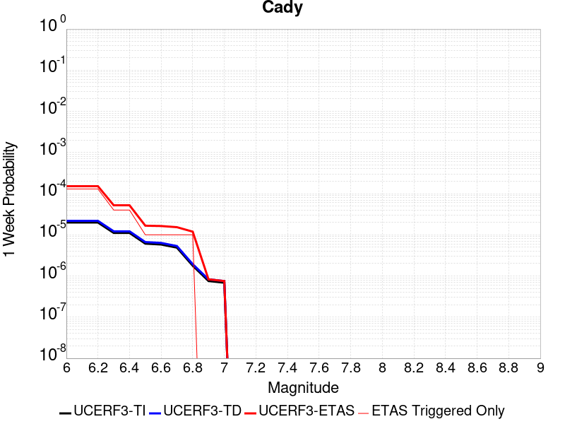 | 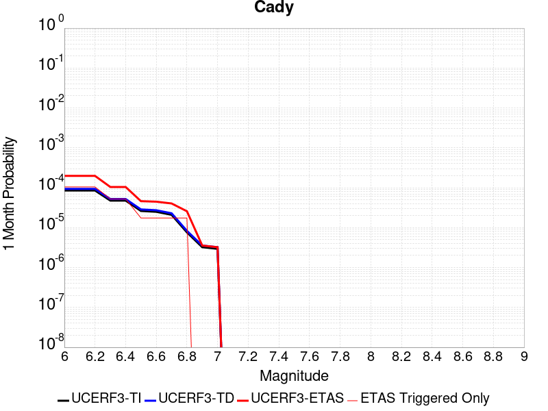 | 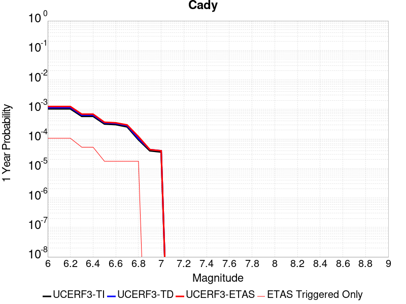 | 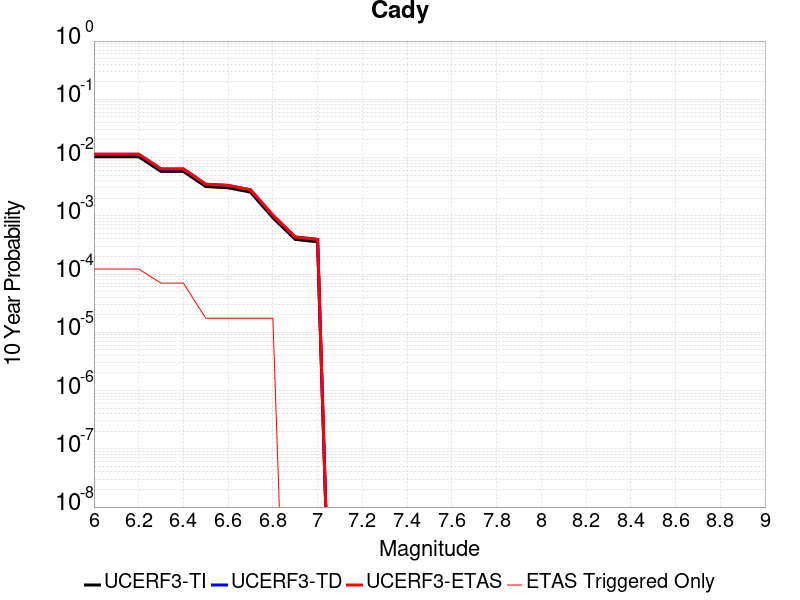 |

| Magnitude | 1 wk TI Prob | 1 wk TD Prob | 1 wk ETAS Prob | 1 wk ETAS/TD Gain | 1 wk ETAS Triggered Only | 1 mo TI Prob | 1 mo TD Prob | 1 mo ETAS Prob | 1 mo ETAS/TD Gain | 1 mo ETAS Triggered Only | 1 yr TI Prob | 1 yr TD Prob | 1 yr ETAS Prob | 1 yr ETAS/TD Gain | 1 yr ETAS Triggered Only | 10 yr TI Prob | 10 yr TD Prob | 10 yr ETAS Prob | 10 yr ETAS/TD Gain | 10 yr ETAS Triggered Only |
|-----|-----|-----|-----|-----|-----|-----|-----|-----|-----|-----|-----|-----|-----|-----|-----|-----|-----|-----|-----|-----|
| 6.0 | 1.9892565E-5 | 2.1858728E-5 | 1.0907576E-4 | 4.990032 | 8.7218934E-5 | 8.525106E-5 | 9.3677416E-5 | 1.9833034E-4 | 2.1171627 | 1.0466272E-4 | 0.0010374374 | 0.0011400167 | 0.0012445601 | 1.0917034 | 1.0466272E-4 | 0.010326075 | 0.011350701 | 0.0114714205 | 1.0106355 | 1.2210652E-4 |
| 6.1 | 1.9892565E-5 | 2.1858728E-5 | 1.0907576E-4 | 4.990032 | 8.7218934E-5 | 8.525106E-5 | 9.3677416E-5 | 1.9833034E-4 | 2.1171627 | 1.0466272E-4 | 0.0010374374 | 0.0011400167 | 0.0012445601 | 1.0917034 | 1.0466272E-4 | 0.010326075 | 0.011350701 | 0.0114714205 | 1.0106355 | 1.2210652E-4 |
| 6.2 | 1.9892565E-5 | 2.1858728E-5 | 1.0907576E-4 | 4.990032 | 8.7218934E-5 | 8.525106E-5 | 9.3677416E-5 | 1.9833034E-4 | 2.1171627 | 1.0466272E-4 | 0.0010374374 | 0.0011400167 | 0.0012445601 | 1.0917034 | 1.0466272E-4 | 0.010326075 | 0.011350701 | 0.0114714205 | 1.0106355 | 1.2210652E-4 |
| 6.3 | 1.1117327E-5 | 1.2176583E-5 | 4.7063735E-5 | 3.8651016 | 3.4887576E-5 | 4.764482E-5 | 5.2184492E-5 | 1.0451312E-4 | 2.002762 | 5.233136E-5 | 5.7992124E-4 | 6.351925E-4 | 6.874906E-4 | 1.0823343 | 5.233136E-5 | 0.0057841022 | 0.0063368753 | 0.0064062085 | 1.0109411 | 6.977515E-5 |
| 6.4 | 1.1117327E-5 | 1.2176583E-5 | 4.7063735E-5 | 3.8651016 | 3.4887576E-5 | 4.764482E-5 | 5.2184492E-5 | 1.0451312E-4 | 2.002762 | 5.233136E-5 | 5.7992124E-4 | 6.351925E-4 | 6.874906E-4 | 1.0823343 | 5.233136E-5 | 0.0057841022 | 0.0063368753 | 0.0064062085 | 1.0109411 | 6.977515E-5 |
| 6.5 | 6.103093E-6 | 6.672021E-6 | 2.4115692E-5 | 3.614451 | 1.7443788E-5 | 2.615585E-5 | 2.8594131E-5 | 4.603742E-5 | 1.6100304 | 1.7443788E-5 | 3.1840094E-4 | 3.480905E-4 | 3.6552822E-4 | 1.0500953 | 1.7443788E-5 | 0.0031794512 | 0.0034766865 | 0.0034940697 | 1.0049999 | 1.7443788E-5 |
| 6.6 | 5.817237E-6 | 6.3656585E-6 | 2.3809334E-5 | 3.7402782 | 1.7443788E-5 | 2.4930776E-5 | 2.728118E-5 | 4.472449E-5 | 1.63939 | 1.7443788E-5 | 3.034899E-4 | 3.3211018E-4 | 3.4954818E-4 | 1.0525067 | 1.7443788E-5 | 0.0030307577 | 0.0033173605 | 0.0033347465 | 1.0052409 | 1.7443788E-5 |
| 6.7 | 4.8846314E-6 | 5.3405684E-6 | 2.2784263E-5 | 4.266262 | 1.7443788E-5 | 2.0933967E-5 | 2.2888014E-5 | 4.0331404E-5 | 1.7621188 | 1.7443788E-5 | 2.5484123E-4 | 2.7863772E-4 | 2.9607664E-4 | 1.0625864 | 1.7443788E-5 | 0.0025454918 | 0.0027840391 | 0.0028014344 | 1.0062482 | 1.7443788E-5 |
| 6.8 | 1.7788773E-6 | 1.9399079E-6 | 1.9383662E-5 | 9.992052 | 1.7443788E-5 | 7.6237375E-6 | 8.313874E-6 | 2.5757516E-5 | 3.0981367 | 1.7443788E-5 | 9.281505E-5 | 1.01218284E-4 | 1.1866031E-4 | 1.1723208 | 1.7443788E-5 | 9.2776294E-4 | 0.0010118765 | 0.0010293026 | 1.0172216 | 1.7443788E-5 |
| 6.9 | 7.5455404E-7 | 8.297092E-7 | 8.297092E-7 | 1.0 | 0.0 | 3.233799E-6 | 3.5558937E-6 | 3.5558937E-6 | 1.0 | 0.0 | 3.937079E-5 | 4.3292483E-5 | 4.3292483E-5 | 1.0 | 0.0 | 3.9363815E-4 | 4.3287344E-4 | 4.3287344E-4 | 1.0 | 0.0 |
| 7.0 | 6.8578805E-7 | 7.541816E-7 | 7.541816E-7 | 1.0 | 0.0 | 2.9390883E-6 | 3.2322048E-6 | 3.2322048E-6 | 1.0 | 0.0 | 3.578281E-5 | 3.9351715E-5 | 3.9351715E-5 | 1.0 | 0.0 | 3.577705E-4 | 3.9347992E-4 | 3.9347992E-4 | 1.0 | 0.0 |

## Manix-Afton Hills
*[(top)](#table-of-contents)*

| 1 Week | 1 Month | 1 Year | 10 Year |
|-----|-----|-----|-----|
|  |  |  | 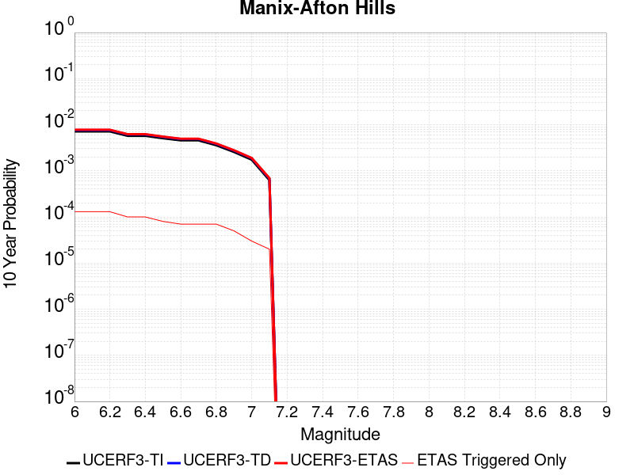 |

| Magnitude | 1 wk TI Prob | 1 wk TD Prob | 1 wk ETAS Prob | 1 wk ETAS/TD Gain | 1 wk ETAS Triggered Only | 1 mo TI Prob | 1 mo TD Prob | 1 mo ETAS Prob | 1 mo ETAS/TD Gain | 1 mo ETAS Triggered Only | 1 yr TI Prob | 1 yr TD Prob | 1 yr ETAS Prob | 1 yr ETAS/TD Gain | 1 yr ETAS Triggered Only | 10 yr TI Prob | 10 yr TD Prob | 10 yr ETAS Prob | 10 yr ETAS/TD Gain | 10 yr ETAS Triggered Only |
|-----|-----|-----|-----|-----|-----|-----|-----|-----|-----|-----|-----|-----|-----|-----|-----|-----|-----|-----|-----|-----|
| 6.0 | 1.3783202E-5 | 1.47110895E-5 | 1.1937227E-4 | 8.114441 | 1.0466272E-4 | 5.906953E-5 | 6.30461E-5 | 1.6770222E-4 | 2.6599936 | 1.0466272E-4 | 7.189342E-4 | 7.6733343E-4 | 8.8934624E-4 | 1.1590089 | 1.2210652E-4 | 0.0071661277 | 0.007648596 | 0.0077697686 | 1.0158424 | 1.2210652E-4 |
| 6.1 | 1.3783202E-5 | 1.47110895E-5 | 1.1937227E-4 | 8.114441 | 1.0466272E-4 | 5.906953E-5 | 6.30461E-5 | 1.6770222E-4 | 2.6599936 | 1.0466272E-4 | 7.189342E-4 | 7.6733343E-4 | 8.8934624E-4 | 1.1590089 | 1.2210652E-4 | 0.0071661277 | 0.007648596 | 0.0077697686 | 1.0158424 | 1.2210652E-4 |
| 6.2 | 1.3783202E-5 | 1.47110895E-5 | 1.1937227E-4 | 8.114441 | 1.0466272E-4 | 5.906953E-5 | 6.30461E-5 | 1.6770222E-4 | 2.6599936 | 1.0466272E-4 | 7.189342E-4 | 7.6733343E-4 | 8.8934624E-4 | 1.1590089 | 1.2210652E-4 | 0.0071661277 | 0.007648596 | 0.0077697686 | 1.0158424 | 1.2210652E-4 |
| 6.3 | 1.10494875E-5 | 1.1793136E-5 | 8.1567465E-5 | 6.91652 | 6.977515E-5 | 4.7354086E-5 | 5.054109E-5 | 1.2031271E-4 | 2.3804932 | 6.977515E-5 | 5.763835E-4 | 6.151744E-4 | 7.023397E-4 | 1.141692 | 8.7218934E-5 | 0.005748908 | 0.0061357557 | 0.0062224395 | 1.0141276 | 8.7218934E-5 |
| 6.4 | 1.10494875E-5 | 1.1793136E-5 | 8.1567465E-5 | 6.91652 | 6.977515E-5 | 4.7354086E-5 | 5.054109E-5 | 1.2031271E-4 | 2.3804932 | 6.977515E-5 | 5.763835E-4 | 6.151744E-4 | 7.023397E-4 | 1.141692 | 8.7218934E-5 | 0.005748908 | 0.0061357557 | 0.0062224395 | 1.0141276 | 8.7218934E-5 |
| 6.5 | 9.788949E-6 | 1.045432E-5 | 6.278513E-5 | 6.0056643 | 5.233136E-5 | 4.1951964E-5 | 4.480351E-5 | 9.713253E-5 | 2.1679668 | 5.233136E-5 | 5.1064545E-4 | 5.453555E-4 | 6.150926E-4 | 1.1278746 | 6.977515E-5 | 0.0050947363 | 0.0054410985 | 0.005510494 | 1.012754 | 6.977515E-5 |
| 6.6 | 8.810006E-6 | 9.4136285E-6 | 4.4300876E-5 | 4.706036 | 3.4887576E-5 | 3.775662E-5 | 4.0343548E-5 | 7.522971E-5 | 1.8647274 | 3.4887576E-5 | 4.5958988E-4 | 4.9108086E-4 | 5.4338656E-4 | 1.1065114 | 5.233136E-5 | 0.0045864056 | 0.004900839 | 0.004952914 | 1.0106257 | 5.233136E-5 |
| 6.7 | 8.80128E-6 | 9.404108E-6 | 4.4291355E-5 | 4.709788 | 3.4887576E-5 | 3.7719226E-5 | 4.0302748E-5 | 7.518892E-5 | 1.8656027 | 3.4887576E-5 | 4.591348E-4 | 4.9058435E-4 | 5.4289005E-4 | 1.1066191 | 5.233136E-5 | 0.004581874 | 0.0048958957 | 0.004947971 | 1.0106364 | 5.233136E-5 |
| 6.8 | 6.8994877E-6 | 7.380076E-6 | 4.2267395E-5 | 5.72723 | 3.4887576E-5 | 2.9568899E-5 | 3.162856E-5 | 6.651503E-5 | 2.1030054 | 3.4887576E-5 | 3.5994186E-4 | 3.8501783E-4 | 4.3732906E-4 | 1.135867 | 5.233136E-5 | 0.003593594 | 0.0038443129 | 0.003896443 | 1.0135603 | 5.233136E-5 |
| 6.9 | 4.9328037E-6 | 5.2709615E-6 | 2.2714657E-5 | 4.3093953 | 1.7443788E-5 | 2.1140417E-5 | 2.2589675E-5 | 4.003307E-5 | 1.7721844 | 1.7443788E-5 | 2.5735417E-4 | 2.7500073E-4 | 2.924397E-4 | 1.0634143 | 1.7443788E-5 | 0.0025705635 | 0.0027472095 | 0.0027646052 | 1.0063322 | 1.7443788E-5 |
| 7.0 | 3.347973E-6 | 3.59003E-6 | 2.1033755E-5 | 5.858936 | 1.7443788E-5 | 1.4348378E-5 | 1.5385775E-5 | 3.2829295E-5 | 2.1337433 | 1.7443788E-5 | 1.746775E-4 | 1.8730981E-4 | 2.0475034E-4 | 1.0931106 | 1.7443788E-5 | 0.0017454025 | 0.0018719219 | 0.0018893331 | 1.0093012 | 1.7443788E-5 |
| 7.1 | 1.2073567E-6 | 1.293482E-6 | 1.8737246E-5 | 14.485896 | 1.7443788E-5 | 5.1743755E-6 | 5.543492E-6 | 2.2987182E-5 | 4.146697 | 1.7443788E-5 | 6.29962E-5 | 6.749156E-5 | 8.493417E-5 | 1.2584413 | 1.7443788E-5 | 6.297835E-4 | 6.7487074E-4 | 6.9230277E-4 | 1.0258301 | 1.7443788E-5 |

## Pisgah-Bullion Mtn-Mesquite Lk
*[(top)](#table-of-contents)*

| 1 Week | 1 Month | 1 Year | 10 Year |
|-----|-----|-----|-----|
|  | 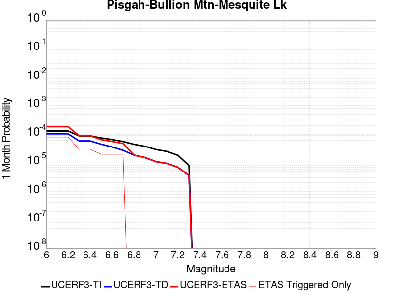 |  |  |

| Magnitude | 1 wk TI Prob | 1 wk TD Prob | 1 wk ETAS Prob | 1 wk ETAS/TD Gain | 1 wk ETAS Triggered Only | 1 mo TI Prob | 1 mo TD Prob | 1 mo ETAS Prob | 1 mo ETAS/TD Gain | 1 mo ETAS Triggered Only | 1 yr TI Prob | 1 yr TD Prob | 1 yr ETAS Prob | 1 yr ETAS/TD Gain | 1 yr ETAS Triggered Only | 10 yr TI Prob | 10 yr TD Prob | 10 yr ETAS Prob | 10 yr ETAS/TD Gain | 10 yr ETAS Triggered Only |
|-----|-----|-----|-----|-----|-----|-----|-----|-----|-----|-----|-----|-----|-----|-----|-----|-----|-----|-----|-----|-----|
| 6.0 | 3.0240792E-5 | 2.4091114E-5 | 1.1130795E-4 | 4.6202908 | 8.7218934E-5 | 1.2959696E-4 | 1.03244114E-4 | 1.9045404E-4 | 1.8446964 | 8.7218934E-5 | 0.0015767008 | 0.0012563728 | 0.0013783259 | 1.0970676 | 1.2210652E-4 | 0.015655609 | 0.012502721 | 0.012623301 | 1.0096443 | 1.2210652E-4 |
| 6.1 | 3.0240792E-5 | 2.4091114E-5 | 1.1130795E-4 | 4.6202908 | 8.7218934E-5 | 1.2959696E-4 | 1.03244114E-4 | 1.9045404E-4 | 1.8446964 | 8.7218934E-5 | 0.0015767008 | 0.0012563728 | 0.0013783259 | 1.0970676 | 1.2210652E-4 | 0.015655609 | 0.012502721 | 0.012623301 | 1.0096443 | 1.2210652E-4 |
| 6.2 | 3.0240792E-5 | 2.4091114E-5 | 1.1130795E-4 | 4.6202908 | 8.7218934E-5 | 1.2959696E-4 | 1.03244114E-4 | 1.9045404E-4 | 1.8446964 | 8.7218934E-5 | 0.0015767008 | 0.0012563728 | 0.0013783259 | 1.0970676 | 1.2210652E-4 | 0.015655609 | 0.012502721 | 0.012623301 | 1.0096443 | 1.2210652E-4 |
| 6.3 | 2.0498217E-5 | 1.36380695E-5 | 1.36380695E-5 | 1.0 | 0.0 | 8.784654E-5 | 5.844765E-5 | 5.844765E-5 | 1.0 | 0.0 | 0.0010690069 | 7.1138405E-4 | 7.1138405E-4 | 1.0 | 0.0 | 0.01063879 | 0.0070926943 | 0.0070926943 | 1.0 | 0.0 |
| 6.4 | 2.0498217E-5 | 1.36380695E-5 | 1.36380695E-5 | 1.0 | 0.0 | 8.784654E-5 | 5.844765E-5 | 5.844765E-5 | 1.0 | 0.0 | 0.0010690069 | 7.1138405E-4 | 7.1138405E-4 | 1.0 | 0.0 | 0.01063879 | 0.0070926943 | 0.0070926943 | 1.0 | 0.0 |
| 6.5 | 1.7316182E-5 | 1.0477042E-5 | 1.0477042E-5 | 1.0 | 0.0 | 7.42101E-5 | 4.4900895E-5 | 4.4900895E-5 | 1.0 | 0.0 | 9.0313336E-4 | 5.465413E-4 | 5.465413E-4 | 1.0 | 0.0 | 0.008994718 | 0.0054529672 | 0.0054529672 | 1.0 | 0.0 |
| 6.6 | 1.5251077E-5 | 8.414273E-6 | 8.414273E-6 | 1.0 | 0.0 | 6.536012E-5 | 3.6060712E-5 | 3.6060712E-5 | 1.0 | 0.0 | 7.9546886E-4 | 4.3895794E-4 | 4.3895794E-4 | 1.0 | 0.0 | 0.007926274 | 0.0043816264 | 0.0043816264 | 1.0 | 0.0 |
| 6.7 | 1.2997425E-5 | 6.4114965E-6 | 6.4114965E-6 | 1.0 | 0.0 | 5.570206E-5 | 2.7477578E-5 | 2.7477578E-5 | 1.0 | 0.0 | 6.7796157E-4 | 3.3449283E-4 | 3.3449283E-4 | 1.0 | 0.0 | 0.0067589693 | 0.0033403537 | 0.0033403537 | 1.0 | 0.0 |
| 6.8 | 1.035386E-5 | 4.3332193E-6 | 4.3332193E-6 | 1.0 | 0.0 | 4.437293E-5 | 1.8570812E-5 | 1.8570812E-5 | 1.0 | 0.0 | 5.401065E-4 | 2.2607706E-4 | 2.2607706E-4 | 1.0 | 0.0 | 0.0053879567 | 0.0022585576 | 0.0022585576 | 1.0 | 0.0 |
| 6.9 | 8.816252E-6 | 3.580638E-6 | 3.580638E-6 | 1.0 | 0.0 | 3.778339E-5 | 1.5345504E-5 | 1.5345504E-5 | 1.0 | 0.0 | 4.5991567E-4 | 1.8681608E-4 | 1.8681608E-4 | 1.0 | 0.0 | 0.00458965 | 0.0018666488 | 0.0018666488 | 1.0 | 0.0 |
| 7.0 | 6.8232207E-6 | 2.5675843E-6 | 2.5675843E-6 | 1.0 | 0.0 | 2.9242048E-5 | 1.1003888E-5 | 1.1003888E-5 | 1.0 | 0.0 | 3.5596377E-4 | 1.3396442E-4 | 1.3396442E-4 | 1.0 | 0.0 | 0.0035539411 | 0.0013388677 | 0.0013388677 | 1.0 | 0.0 |
| 7.1 | 5.837013E-6 | 2.22738E-6 | 2.22738E-6 | 1.0 | 0.0 | 2.501553E-5 | 9.545881E-6 | 9.545881E-6 | 1.0 | 0.0 | 3.045215E-4 | 1.16215204E-4 | 1.16215204E-4 | 1.0 | 0.0 | 0.0030410455 | 0.0011615733 | 0.0011615733 | 1.0 | 0.0 |
| 7.2 | 4.278052E-6 | 1.6275711E-6 | 1.6275711E-6 | 1.0 | 0.0 | 1.833438E-5 | 6.9752873E-6 | 6.9752873E-6 | 1.0 | 0.0 | 2.231982E-4 | 8.492105E-5 | 8.492105E-5 | 1.0 | 0.0 | 0.0022297418 | 8.489092E-4 | 8.489092E-4 | 1.0 | 0.0 |
| 7.3 | 1.8803692E-6 | 8.344926E-7 | 8.344926E-7 | 1.0 | 0.0 | 8.0587E-6 | 3.5763926E-6 | 3.5763926E-6 | 1.0 | 0.0 | 9.811026E-5 | 4.354186E-5 | 4.354186E-5 | 1.0 | 0.0 | 9.806695E-4 | 4.3534773E-4 | 4.3534773E-4 | 1.0 | 0.0 |

## Imperial
*[(top)](#table-of-contents)*

| 1 Week | 1 Month | 1 Year | 10 Year |
|-----|-----|-----|-----|
|  | 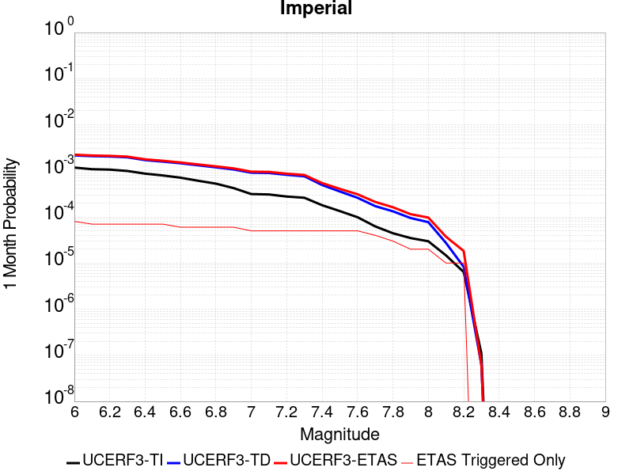 |  |  |

| Magnitude | 1 wk TI Prob | 1 wk TD Prob | 1 wk ETAS Prob | 1 wk ETAS/TD Gain | 1 wk ETAS Triggered Only | 1 mo TI Prob | 1 mo TD Prob | 1 mo ETAS Prob | 1 mo ETAS/TD Gain | 1 mo ETAS Triggered Only | 1 yr TI Prob | 1 yr TD Prob | 1 yr ETAS Prob | 1 yr ETAS/TD Gain | 1 yr ETAS Triggered Only | 10 yr TI Prob | 10 yr TD Prob | 10 yr ETAS Prob | 10 yr ETAS/TD Gain | 10 yr ETAS Triggered Only |
|-----|-----|-----|-----|-----|-----|-----|-----|-----|-----|-----|-----|-----|-----|-----|-----|-----|-----|-----|-----|-----|
| 6.0 | 2.7496446E-4 | 5.0552754E-4 | 6.275723E-4 | 1.2414206 | 1.2210652E-4 | 0.0011778869 | 0.002164787 | 0.002286629 | 1.0562837 | 1.2210652E-4 | 0.0142467655 | 0.026038699 | 0.026157625 | 1.0045673 | 1.2210652E-4 | 0.13367249 | 0.2280438 | 0.22813804 | 1.0004133 | 1.2210652E-4 |
| 6.1 | 2.5356023E-4 | 4.8656776E-4 | 5.911796E-4 | 1.2149994 | 1.0466272E-4 | 0.001086234 | 0.0020836622 | 0.002188107 | 1.0501255 | 1.0466272E-4 | 0.013144928 | 0.025071215 | 0.025173252 | 1.0040699 | 1.0466272E-4 | 0.123940155 | 0.21947981 | 0.2195615 | 1.0003722 | 1.0466272E-4 |
| 6.2 | 2.4820742E-4 | 4.7752203E-4 | 5.8213476E-4 | 1.2190741 | 1.0466272E-4 | 0.0010633124 | 0.0020449557 | 0.0021494045 | 1.0510763 | 1.0466272E-4 | 0.01286919 | 0.024611235 | 0.024713323 | 1.004148 | 1.0466272E-4 | 0.12148927 | 0.21598552 | 0.21606758 | 1.0003799 | 1.0466272E-4 |
| 6.3 | 2.3205351E-4 | 4.5890483E-4 | 5.6351954E-4 | 1.227966 | 1.0466272E-4 | 9.94136E-4 | 0.0019652895 | 0.0020697464 | 1.053151 | 1.0466272E-4 | 0.012036599 | 0.02366133 | 0.023763517 | 1.0043187 | 1.0466272E-4 | 0.11405133 | 0.20793462 | 0.20801751 | 1.0003986 | 1.0466272E-4 |
| 6.4 | 2.0304754E-4 | 3.987652E-4 | 5.033862E-4 | 1.2623624 | 1.0466272E-4 | 8.6991355E-4 | 0.0017078889 | 0.0018123729 | 1.0611773 | 1.0466272E-4 | 0.010539869 | 0.020595672 | 0.020698179 | 1.0049771 | 1.0466272E-4 | 0.100537635 | 0.1850669 | 0.18515219 | 1.0004609 | 1.0466272E-4 |
| 6.5 | 1.854992E-4 | 3.6988858E-4 | 4.745126E-4 | 1.2828528 | 1.0466272E-4 | 7.9475436E-4 | 0.0015842861 | 0.0016887829 | 1.0659584 | 1.0466272E-4 | 0.009633281 | 0.01911948 | 0.019222142 | 1.0053694 | 1.0466272E-4 | 0.0922623 | 0.173298 | 0.17338453 | 1.0004992 | 1.0466272E-4 |
| 6.6 | 1.6586106E-4 | 3.403506E-4 | 4.4497772E-4 | 1.3074098 | 1.0466272E-4 | 7.106394E-4 | 0.0014578402 | 0.0015623504 | 1.0716883 | 1.0466272E-4 | 0.008617763 | 0.01760642 | 0.01770924 | 1.00584 | 1.0466272E-4 | 0.08291132 | 0.16077545 | 0.16086328 | 1.0005463 | 1.0466272E-4 |
| 6.7 | 1.4224656E-4 | 3.076692E-4 | 4.122997E-4 | 1.3400748 | 1.0466272E-4 | 6.094856E-4 | 0.001317924 | 0.0014224489 | 1.0793102 | 1.0466272E-4 | 0.0073952693 | 0.015929576 | 0.016032573 | 1.0064657 | 1.0466272E-4 | 0.07153955 | 0.14648417 | 0.1465735 | 1.0006099 | 1.0466272E-4 |
| 6.8 | 1.2317259E-4 | 2.779122E-4 | 3.825458E-4 | 1.3764989 | 1.0466272E-4 | 5.2777573E-4 | 0.0011905148 | 0.0012950528 | 1.0878092 | 1.0466272E-4 | 0.0064067547 | 0.0143995695 | 0.014502726 | 1.0071638 | 1.0466272E-4 | 0.06225166 | 0.13293684 | 0.13302758 | 1.0006826 | 1.0466272E-4 |
| 6.9 | 9.859898E-5 | 2.5014306E-4 | 3.547796E-4 | 1.4183068 | 1.0466272E-4 | 4.2249862E-4 | 0.0010716055 | 0.001176156 | 1.0975645 | 1.0466272E-4 | 0.0051317946 | 0.012969712 | 0.013073017 | 1.0079651 | 1.0466272E-4 | 0.05014893 | 0.11940631 | 0.11949848 | 1.0007719 | 1.0466272E-4 |
| 7.0 | 7.3191884E-5 | 2.1266776E-4 | 2.9986814E-4 | 1.4100311 | 8.7218934E-5 | 3.136418E-4 | 9.1111806E-4 | 9.982575E-4 | 1.0956402 | 8.7218934E-5 | 0.003811904 | 0.011037128 | 0.011123384 | 1.0078151 | 8.7218934E-5 | 0.037471764 | 0.10206493 | 0.10214324 | 1.0007674 | 8.7218934E-5 |
| 7.1 | 7.1760296E-5 | 2.0968143E-4 | 2.9688206E-4 | 1.4158721 | 8.7218934E-5 | 3.0750787E-4 | 8.983284E-4 | 9.85469E-4 | 1.0970031 | 8.7218934E-5 | 0.003737482 | 0.010882978 | 0.010969248 | 1.0079271 | 8.7218934E-5 | 0.03675245 | 0.10070146 | 0.10077989 | 1.0007789 | 8.7218934E-5 |
| 7.2 | 6.46614E-5 | 1.9136685E-4 | 2.7856912E-4 | 1.455681 | 8.7218934E-5 | 2.7709085E-4 | 8.1988896E-4 | 9.0703636E-4 | 1.1062918 | 8.7218934E-5 | 0.0033683628 | 0.0099370815 | 0.010023434 | 1.0086899 | 8.7218934E-5 | 0.033177625 | 0.09250898 | 0.09258813 | 1.0008556 | 8.7218934E-5 |
| 7.3 | 6.088115E-5 | 1.78084E-4 | 2.6528738E-4 | 1.4896758 | 8.7218934E-5 | 2.6089314E-4 | 7.6299673E-4 | 8.5014914E-4 | 1.1142238 | 8.7218934E-5 | 0.0031717476 | 0.009250494 | 0.009336906 | 1.0093414 | 8.7218934E-5 | 0.031268585 | 0.08655989 | 0.08663956 | 1.0009204 | 8.7218934E-5 |
| 7.4 | 4.199346E-5 | 1.1510366E-4 | 2.0231256E-4 | 1.7576553 | 8.7218934E-5 | 1.7995955E-4 | 4.9320905E-4 | 5.80385E-4 | 1.1767524 | 8.7218934E-5 | 0.0021888057 | 0.0059884563 | 0.0060751527 | 1.0144773 | 8.7218934E-5 | 0.02167372 | 0.057439793 | 0.057522003 | 1.0014312 | 8.7218934E-5 |
| 7.5 | 3.130448E-5 | 8.33328E-5 | 1.7054447E-4 | 2.0465467 | 8.7218934E-5 | 1.3415517E-4 | 3.57092E-4 | 4.442798E-4 | 1.2441605 | 8.7218934E-5 | 0.0016321153 | 0.004338988 | 0.0044258283 | 1.020014 | 8.7218934E-5 | 0.016201803 | 0.04213201 | 0.042215552 | 1.0019829 | 8.7218934E-5 |
| 7.6 | 2.3074248E-5 | 6.0844646E-5 | 1.4805827E-4 | 2.433382 | 8.7218934E-5 | 9.888588E-5 | 2.6073685E-4 | 3.4793303E-4 | 1.3344222 | 8.7218934E-5 | 0.0012032706 | 0.0031698733 | 0.0032568157 | 1.0274278 | 8.7218934E-5 | 0.011967761 | 0.031026395 | 0.031110907 | 1.0027239 | 8.7218934E-5 |
| 7.7 | 1.45864815E-5 | 4.0124698E-5 | 1.09897046E-4 | 2.7388878 | 6.977515E-5 | 6.2511994E-5 | 1.7195169E-4 | 2.4171485E-4 | 1.4057137 | 6.977515E-5 | 7.608177E-4 | 0.0020915072 | 0.0021611364 | 1.0332915 | 6.977515E-5 | 0.007582182 | 0.020627763 | 0.0206961 | 1.0033128 | 6.977515E-5 |
| 7.8 | 1.0352979E-5 | 3.0960902E-5 | 8.3290644E-5 | 2.690188 | 5.233136E-5 | 4.4369157E-5 | 1.3268284E-4 | 1.8500726E-4 | 1.3943571 | 5.233136E-5 | 5.400606E-4 | 0.0016142189 | 0.0016664658 | 1.0323666 | 5.233136E-5 | 0.0053875 | 0.016016833 | 0.016068326 | 1.003215 | 5.233136E-5 |
| 7.9 | 8.137906E-6 | 2.2149103E-5 | 5.7035904E-5 | 2.5750887 | 3.4887576E-5 | 3.4876273E-5 | 9.492128E-5 | 1.2980554E-4 | 1.3675073 | 3.4887576E-5 | 4.2453592E-4 | 0.0011550548 | 0.0011899021 | 1.0301694 | 3.4887576E-5 | 0.004237258 | 0.011617903 | 0.011652385 | 1.0029681 | 3.4887576E-5 |
| 8.0 | 6.93792E-6 | 1.8008766E-5 | 5.2895713E-5 | 2.9372203 | 3.4887576E-5 | 2.9733603E-5 | 7.717814E-5 | 1.12063026E-4 | 1.4520047 | 3.4887576E-5 | 3.6194647E-4 | 9.3923963E-4 | 9.7409444E-4 | 1.0371096 | 3.4887576E-5 | 0.0036135751 | 0.00950155 | 0.009536107 | 1.0036368 | 3.4887576E-5 |
| 8.1 | 3.4286315E-6 | 6.379872E-6 | 2.3823548E-5 | 3.7341733 | 1.7443788E-5 | 1.4694053E-5 | 2.7342023E-5 | 4.4785334E-5 | 1.6379671 | 1.7443788E-5 | 1.7888541E-4 | 3.328384E-4 | 3.502764E-4 | 1.0523918 | 1.7443788E-5 | 0.0017874148 | 0.003486031 | 0.0035034139 | 1.0049865 | 1.7443788E-5 |
| 8.2 | 1.4906886E-6 | 1.9366646E-6 | 1.9380419E-5 | 10.007111 | 1.7443788E-5 | 6.3886496E-6 | 8.299965E-6 | 2.5743608E-5 | 3.1016524 | 1.7443788E-5 | 7.7779034E-5 | 1.0104742E-4 | 1.1848944E-4 | 1.1726123 | 1.7443788E-5 | 7.775182E-4 | 0.0011075331 | 0.0011249576 | 1.0157326 | 1.7443788E-5 |
| 8.3 | 2.5758007E-8 | 1.4500102E-8 | 1.4500102E-8 | 1.0 | 0.0 | 1.10391454E-7 | 6.214329E-8 | 6.214329E-8 | 1.0 | 0.0 | 1.3440151E-6 | 7.565946E-7 | 7.565946E-7 | 1.0 | 0.0 | 1.344007E-5 | 7.887763E-6 | 7.887763E-6 | 1.0 | 0.0 |

## Brawley (Seismic Zone) alt 1
*[(top)](#table-of-contents)*

| 1 Week | 1 Month | 1 Year | 10 Year |
|-----|-----|-----|-----|
|  |  |  |  |

| Magnitude | 1 wk TI Prob | 1 wk TD Prob | 1 wk ETAS Prob | 1 wk ETAS/TD Gain | 1 wk ETAS Triggered Only | 1 mo TI Prob | 1 mo TD Prob | 1 mo ETAS Prob | 1 mo ETAS/TD Gain | 1 mo ETAS Triggered Only | 1 yr TI Prob | 1 yr TD Prob | 1 yr ETAS Prob | 1 yr ETAS/TD Gain | 1 yr ETAS Triggered Only | 10 yr TI Prob | 10 yr TD Prob | 10 yr ETAS Prob | 10 yr ETAS/TD Gain | 10 yr ETAS Triggered Only |
|-----|-----|-----|-----|-----|-----|-----|-----|-----|-----|-----|-----|-----|-----|-----|-----|-----|-----|-----|-----|-----|
| 6.0 | 2.2521618E-4 | 4.7632487E-4 | 5.9837324E-4 | 1.2562293 | 1.2210652E-4 | 9.6485513E-4 | 0.0020398323 | 0.0021616898 | 1.059739 | 1.2210652E-4 | 0.011683988 | 0.024546238 | 0.024665346 | 1.0048524 | 1.2210652E-4 | 0.11088423 | 0.21350002 | 0.21359606 | 1.0004498 | 1.2210652E-4 |
| 6.1 | 2.2521618E-4 | 4.7632487E-4 | 5.9837324E-4 | 1.2562293 | 1.2210652E-4 | 9.6485513E-4 | 0.0020398323 | 0.0021616898 | 1.059739 | 1.2210652E-4 | 0.011683988 | 0.024546238 | 0.024665346 | 1.0048524 | 1.2210652E-4 | 0.11088423 | 0.21350002 | 0.21359606 | 1.0004498 | 1.2210652E-4 |
| 6.2 | 2.198148E-4 | 4.6717093E-4 | 5.892204E-4 | 1.2612523 | 1.2210652E-4 | 9.417233E-4 | 0.0020006616 | 0.0021225237 | 1.0609109 | 1.2210652E-4 | 0.011405343 | 0.024080504 | 0.024199668 | 1.0049486 | 1.2210652E-4 | 0.10837428 | 0.20993657 | 0.21003304 | 1.0004596 | 1.2210652E-4 |
| 6.3 | 2.1704129E-4 | 4.615278E-4 | 5.835779E-4 | 1.2644482 | 1.2210652E-4 | 9.298453E-4 | 0.0019765133 | 0.0020983785 | 1.0616566 | 1.2210652E-4 | 0.011262234 | 0.02379366 | 0.023912862 | 1.0050098 | 1.2210652E-4 | 0.107082725 | 0.20782755 | 0.20792428 | 1.0004654 | 1.2210652E-4 |
| 6.4 | 1.876142E-4 | 4.00449E-4 | 5.2250666E-4 | 1.304802 | 1.2210652E-4 | 8.038131E-4 | 0.0017150956 | 0.0018369927 | 1.071073 | 1.2210652E-4 | 0.00974259 | 0.020680401 | 0.020799983 | 1.0057824 | 1.2210652E-4 | 0.093263686 | 0.18457815 | 0.18467772 | 1.0005394 | 1.2210652E-4 |
| 6.5 | 1.7390939E-4 | 3.7477075E-4 | 4.968315E-4 | 1.3256944 | 1.2210652E-4 | 7.45113E-4 | 0.0016051838 | 0.0017270944 | 1.075948 | 1.2210652E-4 | 0.009034078 | 0.019368723 | 0.019488465 | 1.0061822 | 1.2210652E-4 | 0.086755216 | 0.17440031 | 0.17450112 | 1.000578 | 1.2210652E-4 |
| 6.6 | 1.591791E-4 | 3.4891962E-4 | 4.7098353E-4 | 1.3498338 | 1.2210652E-4 | 6.8201777E-4 | 0.0014945229 | 0.0016164469 | 1.0815805 | 1.2210652E-4 | 0.008271996 | 0.018045569 | 0.018165473 | 1.0066445 | 1.2210652E-4 | 0.07970774 | 0.16380852 | 0.16391063 | 1.0006233 | 1.2210652E-4 |
| 6.7 | 1.4268003E-4 | 3.20582E-4 | 4.4264938E-4 | 1.380768 | 1.2210652E-4 | 6.1134255E-4 | 0.0013732077 | 0.0014951465 | 1.0887985 | 1.2210652E-4 | 0.007417723 | 0.016592601 | 0.016712682 | 1.007237 | 1.2210652E-4 | 0.07174956 | 0.15193306 | 0.15203662 | 1.0006816 | 1.2210652E-4 |
| 6.8 | 1.239713E-4 | 2.9053655E-4 | 4.126076E-4 | 1.4201572 | 1.2210652E-4 | 5.3119735E-4 | 0.0012445687 | 0.0013665232 | 1.0979894 | 1.2210652E-4 | 0.0064481674 | 0.015048777 | 0.015169046 | 1.0079919 | 1.2210652E-4 | 0.06264243 | 0.13837762 | 0.13848284 | 1.0007603 | 1.2210652E-4 |
| 6.9 | 1.0180238E-4 | 2.625439E-4 | 3.8461835E-4 | 1.4649677 | 1.2210652E-4 | 4.3622297E-4 | 0.0011247073 | 0.0012466764 | 1.1084453 | 1.2210652E-4 | 0.005298089 | 0.013608336 | 0.013728781 | 1.0088508 | 1.2210652E-4 | 0.05173543 | 0.124961674 | 0.12506852 | 1.0008551 | 1.2210652E-4 |
| 7.0 | 7.6619996E-5 | 2.23993E-4 | 3.2863228E-4 | 1.4671543 | 1.0466272E-4 | 3.283301E-4 | 9.5962E-4 | 0.0010641823 | 1.1089622 | 1.0466272E-4 | 0.0039900932 | 0.011621496 | 0.011724941 | 1.0089012 | 1.0466272E-4 | 0.039192066 | 0.107266866 | 0.1073603 | 1.0008711 | 1.0466272E-4 |
| 7.1 | 7.5127435E-5 | 2.2082464E-4 | 3.2546427E-4 | 1.4738584 | 1.0466272E-4 | 3.2193496E-4 | 9.4605127E-4 | 0.001050615 | 1.1105264 | 1.0466272E-4 | 0.0039125155 | 0.011458045 | 0.011561508 | 1.0090297 | 1.0466272E-4 | 0.038443442 | 0.10583085 | 0.105924435 | 1.0008843 | 1.0466272E-4 |
| 7.2 | 6.788582E-5 | 2.0210193E-4 | 3.0674352E-4 | 1.5177662 | 1.0466272E-4 | 2.9090676E-4 | 8.6586666E-4 | 9.7043876E-4 | 1.1207716 | 1.0466272E-4 | 0.0035360386 | 0.0104916105 | 0.010595175 | 1.0098712 | 1.0466272E-4 | 0.034803 | 0.09750131 | 0.097595766 | 1.0009688 | 1.0466272E-4 |
| 7.3 | 6.399602E-5 | 1.8841137E-4 | 2.9305439E-4 | 1.5553964 | 1.0466272E-4 | 2.7423984E-4 | 8.072303E-4 | 9.118085E-4 | 1.1295519 | 1.0466272E-4 | 0.0033337586 | 0.009784332 | 0.00988797 | 1.0105923 | 1.0466272E-4 | 0.03284188 | 0.09139617 | 0.09149126 | 1.0010405 | 1.0466272E-4 |
| 7.4 | 4.506759E-5 | 1.2529209E-4 | 2.299417E-4 | 1.8352451 | 1.0466272E-4 | 1.9313251E-4 | 5.368565E-4 | 6.41463E-4 | 1.1948501 | 1.0466272E-4 | 0.0023488526 | 0.0065168133 | 0.006620794 | 1.0159558 | 1.0466272E-4 | 0.023241805 | 0.062363707 | 0.06246184 | 1.0015736 | 1.0466272E-4 |
| 7.5 | 3.43289E-5 | 9.33541E-5 | 1.9800705E-4 | 2.1210322 | 1.0466272E-4 | 1.4711556E-4 | 4.00028E-4 | 5.0464884E-4 | 1.2615339 | 1.0466272E-4 | 0.0017896603 | 0.0048595266 | 0.0049636806 | 1.021433 | 1.0466272E-4 | 0.01775316 | 0.04705519 | 0.047154926 | 1.0021195 | 1.0466272E-4 |
| 7.6 | 2.5980507E-5 | 7.053101E-5 | 1.7518636E-4 | 2.4838202 | 1.0466272E-4 | 1.1134028E-4 | 3.0224086E-4 | 4.0687196E-4 | 1.3461845 | 1.0466272E-4 | 0.001354725 | 0.003673598 | 0.003777876 | 1.0283859 | 1.0466272E-4 | 0.013464959 | 0.035840835 | 0.035941746 | 1.0028156 | 1.0466272E-4 |
| 7.7 | 1.7292105E-5 | 4.9407296E-5 | 1.3662192E-4 | 2.7652175 | 8.7218934E-5 | 7.4106916E-5 | 2.117284E-4 | 2.9892888E-4 | 1.4118506 | 8.7218934E-5 | 9.018782E-4 | 0.0025747516 | 0.002661746 | 1.0337875 | 8.7218934E-5 | 0.008982267 | 0.025290398 | 0.02537541 | 1.0033615 | 8.7218934E-5 |
| 7.8 | 1.2927471E-5 | 3.9693266E-5 | 1.0946565E-4 | 2.7577887 | 6.977515E-5 | 5.5402274E-5 | 1.7010293E-4 | 2.398662E-4 | 1.410124 | 6.977515E-5 | 6.743139E-4 | 0.0020690386 | 0.0021386694 | 1.0336537 | 6.977515E-5 | 0.0067227143 | 0.020431727 | 0.020500077 | 1.0033453 | 6.977515E-5 |
| 7.9 | 1.0200774E-5 | 2.874569E-5 | 8.1075545E-5 | 2.820442 | 5.233136E-5 | 4.371687E-5 | 1.2319001E-4 | 1.7551491E-4 | 1.4247497 | 5.233136E-5 | 5.321229E-4 | 0.0014988075 | 0.0015510605 | 1.034863 | 5.233136E-5 | 0.005308505 | 0.014991644 | 0.015043191 | 1.0034384 | 5.233136E-5 |
| 8.0 | 8.650396E-6 | 2.3277367E-5 | 7.560751E-5 | 3.2481127 | 5.233136E-5 | 3.70726E-5 | 9.975634E-5 | 1.5208247E-4 | 1.5245395 | 5.233136E-5 | 4.5126543E-4 | 0.0012138576 | 0.0012661254 | 1.0430592 | 5.233136E-5 | 0.0045035016 | 0.012211097 | 0.0122627895 | 1.0042332 | 5.233136E-5 |
| 8.1 | 3.9368224E-6 | 7.3279825E-6 | 2.4771642E-5 | 3.3804178 | 1.7443788E-5 | 1.6871985E-5 | 3.140526E-5 | 4.8848502E-5 | 1.5554241 | 1.7443788E-5 | 2.0539707E-4 | 3.8229208E-4 | 3.997292E-4 | 1.045612 | 1.7443788E-5 | 0.0020520731 | 0.004001185 | 0.0040185587 | 1.0043422 | 1.7443788E-5 |
| 8.2 | 1.7101195E-6 | 2.217876E-6 | 1.9661626E-5 | 8.865069 | 1.7443788E-5 | 7.329063E-6 | 9.505149E-6 | 2.694877E-5 | 2.835176 | 1.7443788E-5 | 8.922769E-5 | 1.1571907E-4 | 1.3316084E-4 | 1.1507251 | 1.7443788E-5 | 8.9191867E-4 | 0.0012666774 | 0.0012840991 | 1.0137539 | 1.7443788E-5 |
| 8.3 | 3.0346666E-8 | 1.721586E-8 | 1.721586E-8 | 1.0 | 0.0 | 1.3005713E-7 | 7.378226E-8 | 7.378226E-8 | 1.0 | 0.0 | 1.5834444E-6 | 8.9829894E-7 | 8.9829894E-7 | 1.0 | 0.0 | 1.5834332E-5 | 9.367729E-6 | 9.367729E-6 | 1.0 | 0.0 |

## San Jacinto (San Jacinto Valley) rev
*[(top)](#table-of-contents)*

| 1 Week | 1 Month | 1 Year | 10 Year |
|-----|-----|-----|-----|
| 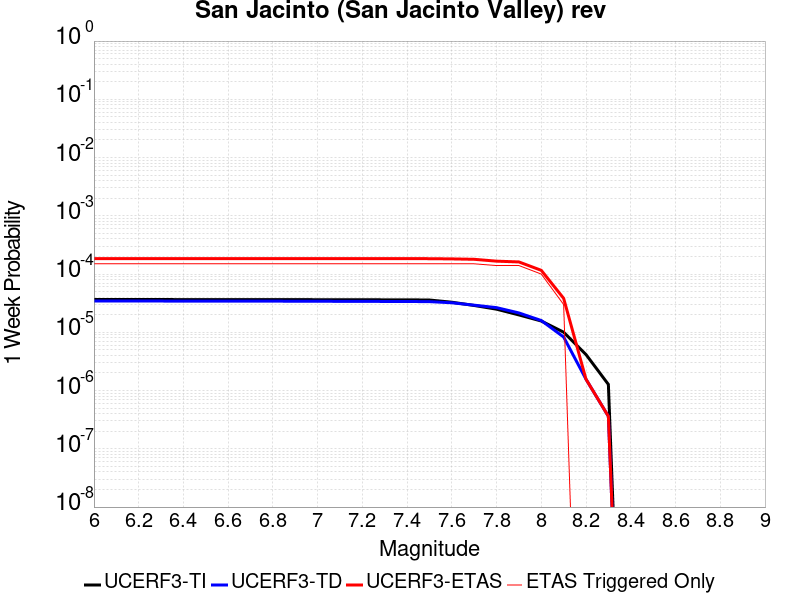 |  | 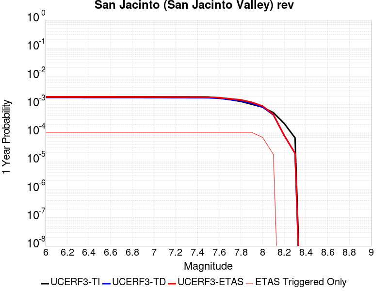 | 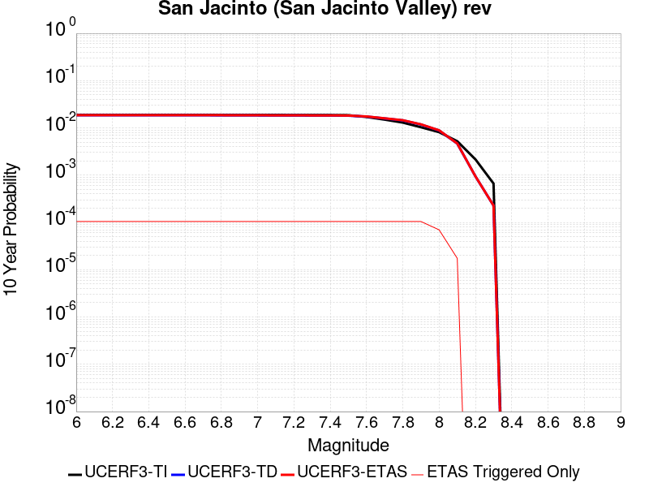 |

| Magnitude | 1 wk TI Prob | 1 wk TD Prob | 1 wk ETAS Prob | 1 wk ETAS/TD Gain | 1 wk ETAS Triggered Only | 1 mo TI Prob | 1 mo TD Prob | 1 mo ETAS Prob | 1 mo ETAS/TD Gain | 1 mo ETAS Triggered Only | 1 yr TI Prob | 1 yr TD Prob | 1 yr ETAS Prob | 1 yr ETAS/TD Gain | 1 yr ETAS Triggered Only | 10 yr TI Prob | 10 yr TD Prob | 10 yr ETAS Prob | 10 yr ETAS/TD Gain | 10 yr ETAS Triggered Only |
|-----|-----|-----|-----|-----|-----|-----|-----|-----|-----|-----|-----|-----|-----|-----|-----|-----|-----|-----|-----|-----|
| 6.0 | 3.652694E-5 | 3.4402394E-5 | 1.3906152E-4 | 4.042205 | 1.0466272E-4 | 1.5653463E-4 | 1.474305E-4 | 2.520778E-4 | 1.7098076 | 1.0466272E-4 | 0.0019041431 | 0.00179349 | 0.001897965 | 1.0582523 | 1.0466272E-4 | 0.018879099 | 0.018526595 | 0.018629318 | 1.0055447 | 1.0466272E-4 |
| 6.1 | 3.652694E-5 | 3.4402394E-5 | 1.3906152E-4 | 4.042205 | 1.0466272E-4 | 1.5653463E-4 | 1.474305E-4 | 2.520778E-4 | 1.7098076 | 1.0466272E-4 | 0.0019041431 | 0.00179349 | 0.001897965 | 1.0582523 | 1.0466272E-4 | 0.018879099 | 0.018526595 | 0.018629318 | 1.0055447 | 1.0466272E-4 |
| 6.2 | 3.652694E-5 | 3.4402394E-5 | 1.3906152E-4 | 4.042205 | 1.0466272E-4 | 1.5653463E-4 | 1.474305E-4 | 2.520778E-4 | 1.7098076 | 1.0466272E-4 | 0.0019041431 | 0.00179349 | 0.001897965 | 1.0582523 | 1.0466272E-4 | 0.018879099 | 0.018526595 | 0.018629318 | 1.0055447 | 1.0466272E-4 |
| 6.3 | 3.652694E-5 | 3.4402394E-5 | 1.3906152E-4 | 4.042205 | 1.0466272E-4 | 1.5653463E-4 | 1.474305E-4 | 2.520778E-4 | 1.7098076 | 1.0466272E-4 | 0.0019041431 | 0.00179349 | 0.001897965 | 1.0582523 | 1.0466272E-4 | 0.018879099 | 0.018526595 | 0.018629318 | 1.0055447 | 1.0466272E-4 |
| 6.4 | 3.646941E-5 | 3.432397E-5 | 1.389831E-4 | 4.0491557 | 1.0466272E-4 | 1.5628811E-4 | 1.4709444E-4 | 2.5174176E-4 | 1.7114295 | 1.0466272E-4 | 0.0019011468 | 0.0017894056 | 0.0018938811 | 1.0583856 | 1.0466272E-4 | 0.018849645 | 0.018486476 | 0.018589204 | 1.005557 | 1.0466272E-4 |
| 6.5 | 3.646941E-5 | 3.432397E-5 | 1.389831E-4 | 4.0491557 | 1.0466272E-4 | 1.5628811E-4 | 1.4709444E-4 | 2.5174176E-4 | 1.7114295 | 1.0466272E-4 | 0.0019011468 | 0.0017894056 | 0.0018938811 | 1.0583856 | 1.0466272E-4 | 0.018849645 | 0.018486476 | 0.018589204 | 1.005557 | 1.0466272E-4 |
| 6.6 | 3.6442503E-5 | 3.4287354E-5 | 1.3894649E-4 | 4.052412 | 1.0466272E-4 | 1.561728E-4 | 1.4693754E-4 | 2.515849E-4 | 1.7121893 | 1.0466272E-4 | 0.0018997455 | 0.0017874985 | 0.0018919741 | 1.058448 | 1.0466272E-4 | 0.018835869 | 0.018467745 | 0.018570475 | 1.0055627 | 1.0466272E-4 |
| 6.7 | 3.6432113E-5 | 3.4272925E-5 | 1.3893207E-4 | 4.053697 | 1.0466272E-4 | 1.5612828E-4 | 1.4687571E-4 | 2.5152307E-4 | 1.7124891 | 1.0466272E-4 | 0.0018992044 | 0.0017867472 | 0.001891223 | 1.0584726 | 1.0466272E-4 | 0.018830549 | 0.018460369 | 0.0185631 | 1.0055649 | 1.0466272E-4 |
| 6.8 | 3.6409598E-5 | 3.424198E-5 | 1.3890112E-4 | 4.056457 | 1.0466272E-4 | 1.560318E-4 | 1.4674311E-4 | 2.5139048E-4 | 1.7131331 | 1.0466272E-4 | 0.0018980318 | 0.0017851355 | 0.0018896114 | 1.0585254 | 1.0466272E-4 | 0.018819023 | 0.018444523 | 0.018547256 | 1.0055698 | 1.0466272E-4 |
| 6.9 | 3.638078E-5 | 3.4202407E-5 | 1.3886155E-4 | 4.0599937 | 1.0466272E-4 | 1.5590832E-4 | 1.4657351E-4 | 2.512209E-4 | 1.7139584 | 1.0466272E-4 | 0.0018965311 | 0.001783074 | 0.0018875501 | 1.0585933 | 1.0466272E-4 | 0.018804269 | 0.018424258 | 0.018526992 | 1.005576 | 1.0466272E-4 |
| 7.0 | 3.6294874E-5 | 3.408442E-5 | 1.3874358E-4 | 4.070586 | 1.0466272E-4 | 1.5554018E-4 | 1.4606792E-4 | 2.5071535E-4 | 1.71643 | 1.0466272E-4 | 0.0018920569 | 0.001776929 | 0.0018814057 | 1.0587963 | 1.0466272E-4 | 0.018760284 | 0.018363839 | 0.01846658 | 1.0055947 | 1.0466272E-4 |
| 7.1 | 3.6260717E-5 | 3.4040702E-5 | 1.3869986E-4 | 4.07453 | 1.0466272E-4 | 1.5539382E-4 | 1.4588058E-4 | 2.5052804E-4 | 1.7173501 | 1.0466272E-4 | 0.001890278 | 0.0017746518 | 0.0018791289 | 1.0588719 | 1.0466272E-4 | 0.018742796 | 0.018341439 | 0.018444182 | 1.0056016 | 1.0466272E-4 |
| 7.2 | 3.6210204E-5 | 3.397492E-5 | 1.3863409E-4 | 4.080483 | 1.0466272E-4 | 1.5517735E-4 | 1.455987E-4 | 2.5024617E-4 | 1.7187392 | 1.0466272E-4 | 0.001887647 | 0.0017712255 | 0.0018757028 | 1.058986 | 1.0466272E-4 | 0.01871693 | 0.01830772 | 0.018410467 | 1.0056123 | 1.0466272E-4 |
| 7.3 | 3.6119454E-5 | 3.386321E-5 | 1.3852239E-4 | 4.090646 | 1.0466272E-4 | 1.5478847E-4 | 1.4511998E-4 | 2.497675E-4 | 1.7211105 | 1.0466272E-4 | 0.0018829206 | 0.0017654065 | 0.0018698844 | 1.0591807 | 1.0466272E-4 | 0.018670462 | 0.018250274 | 0.018353026 | 1.0056303 | 1.0466272E-4 |
| 7.4 | 3.607848E-5 | 3.381071E-5 | 1.384699E-4 | 4.095445 | 1.0466272E-4 | 1.5461289E-4 | 1.44895E-4 | 2.4954256E-4 | 1.7222303 | 1.0466272E-4 | 0.0018807866 | 0.0017626719 | 0.0018671502 | 1.0592726 | 1.0466272E-4 | 0.018649481 | 0.018223269 | 0.018326024 | 1.0056387 | 1.0466272E-4 |
| 7.5 | 3.5856774E-5 | 3.3620483E-5 | 1.3827969E-4 | 4.11296 | 1.0466272E-4 | 1.5366284E-4 | 1.4407984E-4 | 2.4872748E-4 | 1.726317 | 1.0466272E-4 | 0.0018692396 | 0.0017527633 | 0.0018572425 | 1.0596083 | 1.0466272E-4 | 0.018535944 | 0.018124366 | 0.018227132 | 1.0056701 | 1.0466272E-4 |
| 7.6 | 3.286655E-5 | 3.2143445E-5 | 1.368028E-4 | 4.256009 | 1.0466272E-4 | 1.4084904E-4 | 1.3775036E-4 | 2.4239867E-4 | 1.7596953 | 1.0466272E-4 | 0.001713488 | 0.0016758227 | 0.00178031 | 1.0623499 | 1.0466272E-4 | 0.017003361 | 0.017344031 | 0.01744688 | 1.0059298 | 1.0466272E-4 |
| 7.7 | 2.8882527E-5 | 2.9236293E-5 | 1.3389596E-4 | 4.579786 | 1.0466272E-4 | 1.237764E-4 | 1.2529238E-4 | 2.29942E-4 | 1.8352431 | 1.0466272E-4 | 0.0015059357 | 0.0015243685 | 0.0016288717 | 1.0685551 | 1.0466272E-4 | 0.014957713 | 0.015830461 | 0.015933467 | 1.0065068 | 1.0466272E-4 |
| 7.8 | 2.4950225E-5 | 2.6527203E-5 | 1.3118715E-4 | 4.945382 | 1.0466272E-4 | 1.0692515E-4 | 1.1368306E-4 | 2.183339E-4 | 1.9205489 | 1.0466272E-4 | 0.0013010362 | 0.0013832134 | 0.0014877314 | 1.0755616 | 1.0466272E-4 | 0.012934455 | 0.014411755 | 0.014514909 | 1.0071577 | 1.0466272E-4 |
| 7.9 | 1.9881603E-5 | 2.1507445E-5 | 1.2616791E-4 | 5.866244 | 1.0466272E-4 | 8.520408E-5 | 9.217151E-5 | 1.9682459E-4 | 2.1354167 | 1.0466272E-4 | 0.001036866 | 0.0011216112 | 0.0012261566 | 1.09321 | 1.0466272E-4 | 0.010320415 | 0.011777027 | 0.0118804565 | 1.0087824 | 1.0466272E-4 |
| 8.0 | 1.563292E-5 | 1.5937347E-5 | 8.5711385E-5 | 5.3780212 | 6.977515E-5 | 6.6996516E-5 | 6.8301124E-5 | 1.3807151E-4 | 2.0215116 | 6.977515E-5 | 8.153773E-4 | 8.3124964E-4 | 9.009668E-4 | 1.0838703 | 6.977515E-5 | 0.00812392 | 0.008810506 | 0.008879666 | 1.0078498 | 6.977515E-5 |
| 8.1 | 1.0045313E-5 | 8.301802E-6 | 2.5745445E-5 | 3.1011875 | 1.7443788E-5 | 4.305063E-5 | 3.5578672E-5 | 5.302184E-5 | 1.4902704 | 1.7443788E-5 | 5.2401534E-4 | 4.3308473E-4 | 4.5052098E-4 | 1.0402606 | 1.7443788E-5 | 0.0052278144 | 0.0046591135 | 0.004676476 | 1.0037266 | 1.7443788E-5 |
| 8.2 | 4.1554413E-6 | 1.5655598E-6 | 1.5655598E-6 | 1.0 | 0.0 | 1.7808914E-5 | 6.709525E-6 | 6.709525E-6 | 1.0 | 0.0 | 2.1680194E-4 | 8.168544E-5 | 8.168544E-5 | 1.0 | 0.0 | 0.0021659054 | 9.482903E-4 | 9.482903E-4 | 1.0 | 0.0 |
| 8.3 | 1.2758221E-6 | 3.6149942E-7 | 3.6149942E-7 | 1.0 | 0.0 | 5.4677976E-6 | 1.5492824E-6 | 1.5492824E-6 | 1.0 | 0.0 | 6.65684E-5 | 1.8862354E-5 | 1.8862354E-5 | 1.0 | 0.0 | 6.6548464E-4 | 2.2751294E-4 | 2.2751294E-4 | 1.0 | 0.0 |

## Mission Ridge-Arroyo Parida-Santa Ana
*[(top)](#table-of-contents)*

| 1 Week | 1 Month | 1 Year | 10 Year |
|-----|-----|-----|-----|
| 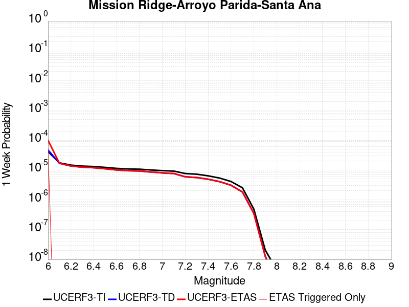 | 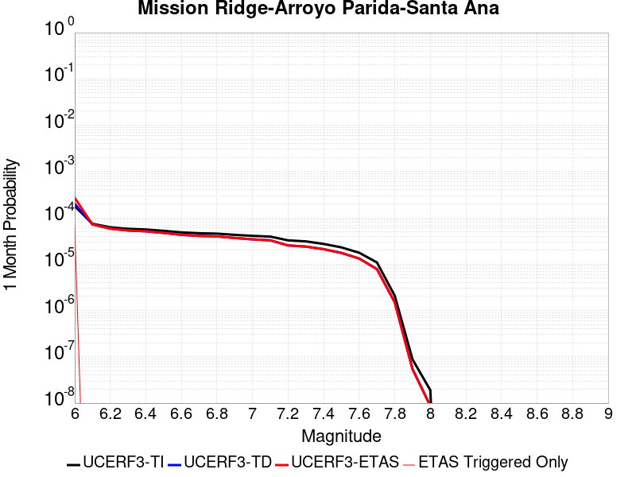 | 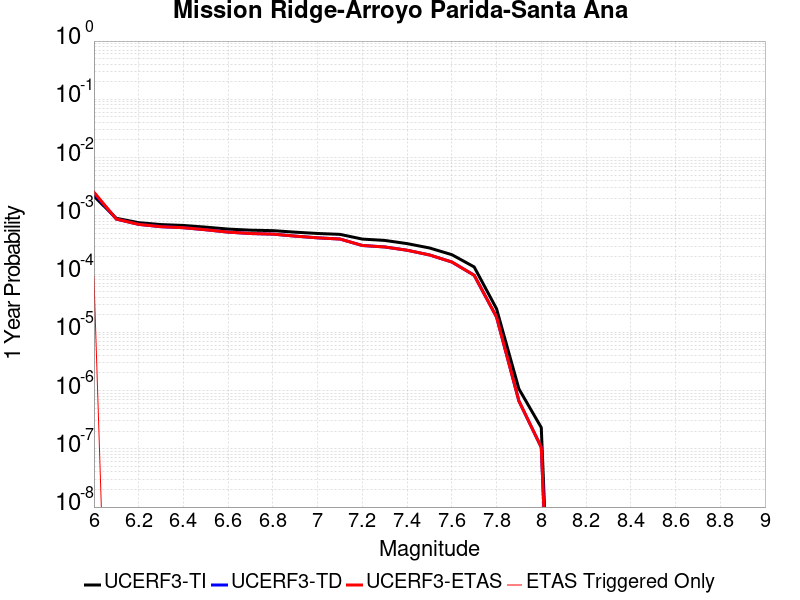 | 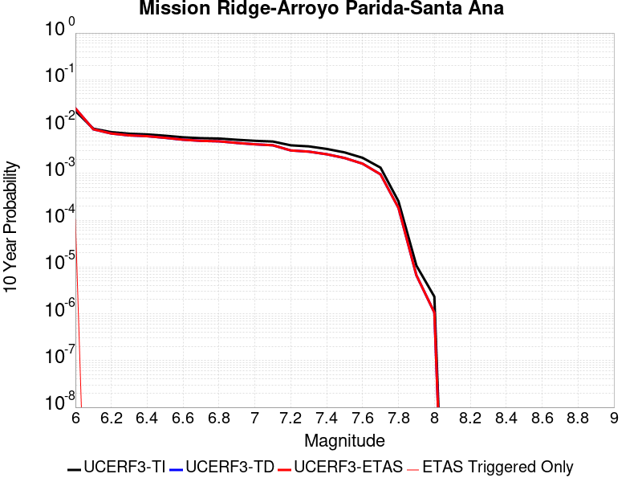 |

| Magnitude | 1 wk TI Prob | 1 wk TD Prob | 1 wk ETAS Prob | 1 wk ETAS/TD Gain | 1 wk ETAS Triggered Only | 1 mo TI Prob | 1 mo TD Prob | 1 mo ETAS Prob | 1 mo ETAS/TD Gain | 1 mo ETAS Triggered Only | 1 yr TI Prob | 1 yr TD Prob | 1 yr ETAS Prob | 1 yr ETAS/TD Gain | 1 yr ETAS Triggered Only | 10 yr TI Prob | 10 yr TD Prob | 10 yr ETAS Prob | 10 yr ETAS/TD Gain | 10 yr ETAS Triggered Only |
|-----|-----|-----|-----|-----|-----|-----|-----|-----|-----|-----|-----|-----|-----|-----|-----|-----|-----|-----|-----|-----|
| 6.0 | 4.169034E-5 | 4.7138263E-5 | 9.946716E-5 | 2.110115 | 5.233136E-5 | 1.7866064E-4 | 2.0201034E-4 | 2.717714E-4 | 1.345334 | 6.977515E-5 | 0.0021730233 | 0.00245745 | 0.0025618556 | 1.0424854 | 1.0466272E-4 | 0.021518968 | 0.024384614 | 0.024486724 | 1.0041875 | 1.0466272E-4 |
| 6.1 | 1.73813E-5 | 1.6854226E-5 | 1.6854226E-5 | 1.0 | 0.0 | 7.4489166E-5 | 7.223046E-5 | 7.223046E-5 | 1.0 | 0.0 | 9.065282E-4 | 8.790618E-4 | 8.790618E-4 | 1.0 | 0.0 | 0.009028391 | 0.008756988 | 0.008756988 | 1.0 | 0.0 |
| 6.2 | 1.4622182E-5 | 1.367329E-5 | 1.367329E-5 | 1.0 | 0.0 | 6.2664985E-5 | 5.8598518E-5 | 5.8598518E-5 | 1.0 | 0.0 | 7.6267915E-4 | 7.132073E-4 | 7.132073E-4 | 1.0 | 0.0 | 0.007600669 | 0.007109627 | 0.007109627 | 1.0 | 0.0 |
| 6.3 | 1.3552434E-5 | 1.2482201E-5 | 1.2482201E-5 | 1.0 | 0.0 | 5.8080568E-5 | 5.3494066E-5 | 5.3494066E-5 | 1.0 | 0.0 | 7.069015E-4 | 6.510988E-4 | 6.510988E-4 | 1.0 | 0.0 | 0.00704657 | 0.006492275 | 0.006492275 | 1.0 | 0.0 |
| 6.4 | 1.30977305E-5 | 1.1979156E-5 | 1.1979156E-5 | 1.0 | 0.0 | 5.613192E-5 | 5.1338247E-5 | 5.1338247E-5 | 1.0 | 0.0 | 6.831918E-4 | 6.248669E-4 | 6.248669E-4 | 1.0 | 0.0 | 0.006810953 | 0.0062314444 | 0.0062314444 | 1.0 | 0.0 |
| 6.5 | 1.225205E-5 | 1.1048803E-5 | 1.1048803E-5 | 1.0 | 0.0 | 5.2507727E-5 | 4.7351168E-5 | 4.7351168E-5 | 1.0 | 0.0 | 6.3909404E-4 | 5.7635066E-4 | 5.7635066E-4 | 1.0 | 0.0 | 0.006372592 | 0.005748869 | 0.005748869 | 1.0 | 0.0 |
| 6.6 | 1.1352241E-5 | 1.0063535E-5 | 1.0063535E-5 | 1.0 | 0.0 | 4.8651553E-5 | 4.3128734E-5 | 4.3128734E-5 | 1.0 | 0.0 | 5.921717E-4 | 5.2496797E-4 | 5.2496797E-4 | 1.0 | 0.0 | 0.0059059616 | 0.0052375244 | 0.0052375244 | 1.0 | 0.0 |
| 6.7 | 1.0864116E-5 | 9.517027E-6 | 9.517027E-6 | 1.0 | 0.0 | 4.6559664E-5 | 4.0786632E-5 | 4.0786632E-5 | 1.0 | 0.0 | 5.667165E-4 | 4.964661E-4 | 4.964661E-4 | 1.0 | 0.0 | 0.005652734 | 0.004953804 | 0.004953804 | 1.0 | 0.0 |
| 6.8 | 1.0666365E-5 | 9.299779E-6 | 9.299779E-6 | 1.0 | 0.0 | 4.571219E-5 | 3.9855597E-5 | 3.9855597E-5 | 1.0 | 0.0 | 5.564038E-4 | 4.8513585E-4 | 4.8513585E-4 | 1.0 | 0.0 | 0.005550127 | 0.0048410003 | 0.0048410003 | 1.0 | 0.0 |
| 6.9 | 1.0038665E-5 | 8.592046E-6 | 8.592046E-6 | 1.0 | 0.0 | 4.302214E-5 | 3.682254E-5 | 3.682254E-5 | 1.0 | 0.0 | 5.236687E-4 | 4.4822405E-4 | 4.4822405E-4 | 1.0 | 0.0 | 0.005224364 | 0.004473411 | 0.004473411 | 1.0 | 0.0 |
| 7.0 | 9.5379955E-6 | 8.025073E-6 | 8.025073E-6 | 1.0 | 0.0 | 4.0876483E-5 | 3.4392728E-5 | 3.4392728E-5 | 1.0 | 0.0 | 4.975576E-4 | 4.1865272E-4 | 4.1865272E-4 | 1.0 | 0.0 | 0.00496445 | 0.0041788397 | 0.0041788397 | 1.0 | 0.0 |
| 7.1 | 9.207389E-6 | 7.652375E-6 | 7.652375E-6 | 1.0 | 0.0 | 3.945964E-5 | 3.279549E-5 | 3.279549E-5 | 1.0 | 0.0 | 4.803152E-4 | 3.9921363E-4 | 3.9921363E-4 | 1.0 | 0.0 | 0.004792784 | 0.003985161 | 0.003985161 | 1.0 | 0.0 |
| 7.2 | 7.638091E-6 | 5.9311183E-6 | 5.9311183E-6 | 1.0 | 0.0 | 3.2734264E-5 | 2.541883E-5 | 2.541883E-5 | 1.0 | 0.0 | 3.984668E-4 | 3.0943064E-4 | 3.0943064E-4 | 1.0 | 0.0 | 0.0039775306 | 0.0030900547 | 0.0030900547 | 1.0 | 0.0 |
| 7.3 | 7.2500147E-6 | 5.5961527E-6 | 5.5961527E-6 | 1.0 | 0.0 | 3.1071122E-5 | 2.3983293E-5 | 2.3983293E-5 | 1.0 | 0.0 | 3.7822526E-4 | 2.9195778E-4 | 2.9195778E-4 | 1.0 | 0.0 | 0.0037758215 | 0.0029157975 | 0.0029157975 | 1.0 | 0.0 |
| 7.4 | 6.3899715E-6 | 4.9184964E-6 | 4.9184964E-6 | 1.0 | 0.0 | 2.7385306E-5 | 2.10791E-5 | 2.10791E-5 | 1.0 | 0.0 | 3.3336508E-4 | 2.5660804E-4 | 2.5660804E-4 | 1.0 | 0.0 | 0.0033286542 | 0.0025631618 | 0.0025631618 | 1.0 | 0.0 |
| 7.5 | 5.379025E-6 | 4.0838527E-6 | 4.0838527E-6 | 1.0 | 0.0 | 2.305276E-5 | 1.7502109E-5 | 1.7502109E-5 | 1.0 | 0.0 | 2.806312E-4 | 2.1306744E-4 | 2.1306744E-4 | 1.0 | 0.0 | 0.0028027708 | 0.002128643 | 0.002128643 | 1.0 | 0.0 |
| 7.6 | 4.1270696E-6 | 3.0883439E-6 | 3.0883439E-6 | 1.0 | 0.0 | 1.768732E-5 | 1.3235693E-5 | 1.3235693E-5 | 1.0 | 0.0 | 2.1532185E-4 | 1.6113273E-4 | 1.6113273E-4 | 1.0 | 0.0 | 0.0021511333 | 0.001610167 | 0.001610167 | 1.0 | 0.0 |
| 7.7 | 2.5406805E-6 | 1.8282013E-6 | 1.8282013E-6 | 1.0 | 0.0 | 1.0888585E-5 | 7.835125E-6 | 7.835125E-6 | 1.0 | 0.0 | 1.3256045E-4 | 9.538854E-5 | 9.538854E-5 | 1.0 | 0.0 | 0.0013248142 | 9.534821E-4 | 9.534821E-4 | 1.0 | 0.0 |
| 7.8 | 4.8608285E-7 | 3.5098864E-7 | 3.5098864E-7 | 1.0 | 0.0 | 2.0832106E-6 | 1.5042363E-6 | 1.5042363E-6 | 1.0 | 0.0 | 2.5362791E-5 | 1.8313924E-5 | 1.8313924E-5 | 1.0 | 0.0 | 2.5359896E-4 | 1.8312426E-4 | 1.8312426E-4 | 1.0 | 0.0 |
| 7.9 | 2.0472514E-8 | 1.2688783E-8 | 1.2688783E-8 | 1.0 | 0.0 | 8.7739345E-8 | 5.43805E-8 | 5.43805E-8 | 1.0 | 0.0 | 1.068226E-6 | 6.6208236E-7 | 6.6208236E-7 | 1.0 | 0.0 | 1.0682209E-5 | 6.620805E-6 | 6.620805E-6 | 1.0 | 0.0 |
| 8.0 | 4.443582E-9 | 2.0321211E-9 | 2.0321211E-9 | 1.0 | 0.0 | 1.9043922E-8 | 8.70909E-9 | 8.70909E-9 | 1.0 | 0.0 | 2.3185973E-7 | 1.0603316E-7 | 1.0603316E-7 | 1.0 | 0.0 | 2.3185949E-6 | 1.0603312E-6 | 1.0603312E-6 | 1.0 | 0.0 |

## Owens Valley
*[(top)](#table-of-contents)*

| 1 Week | 1 Month | 1 Year | 10 Year |
|-----|-----|-----|-----|
|  | 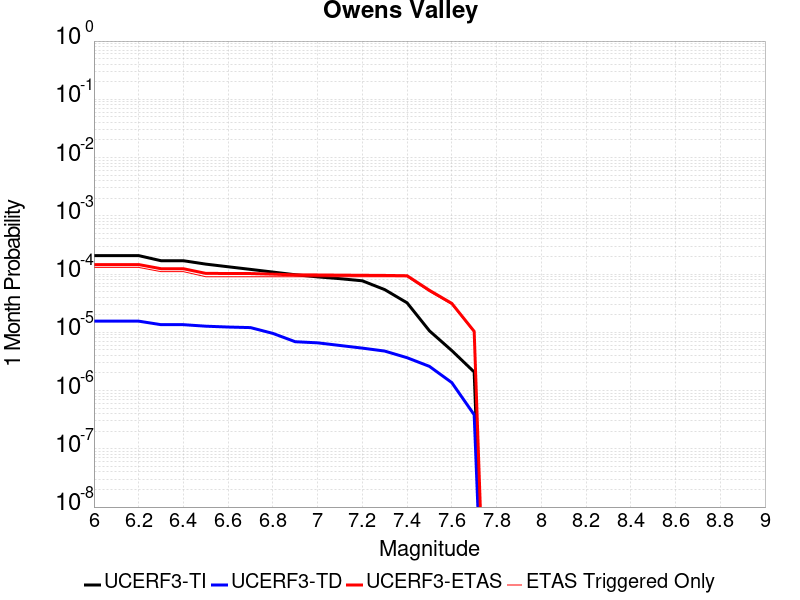 |  | 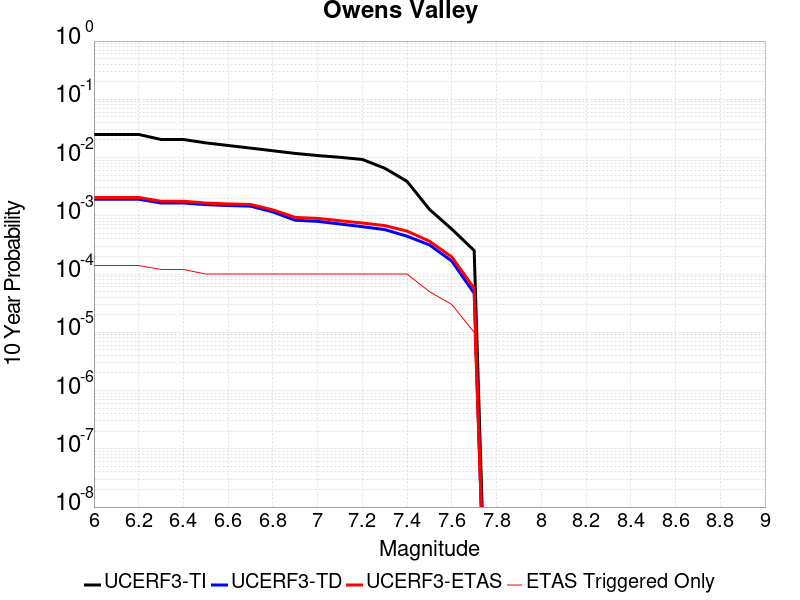 |

| Magnitude | 1 wk TI Prob | 1 wk TD Prob | 1 wk ETAS Prob | 1 wk ETAS/TD Gain | 1 wk ETAS Triggered Only | 1 mo TI Prob | 1 mo TD Prob | 1 mo ETAS Prob | 1 mo ETAS/TD Gain | 1 mo ETAS Triggered Only | 1 yr TI Prob | 1 yr TD Prob | 1 yr ETAS Prob | 1 yr ETAS/TD Gain | 1 yr ETAS Triggered Only | 10 yr TI Prob | 10 yr TD Prob | 10 yr ETAS Prob | 10 yr ETAS/TD Gain | 10 yr ETAS Triggered Only |
|-----|-----|-----|-----|-----|-----|-----|-----|-----|-----|-----|-----|-----|-----|-----|-----|-----|-----|-----|-----|-----|
| 6.0 | 4.83821E-5 | 3.626567E-6 | 5.595774E-5 | 15.429948 | 5.233136E-5 | 2.0733538E-4 | 1.5542342E-5 | 8.531641E-5 | 5.489289 | 6.977515E-5 | 0.002521386 | 1.8921259E-4 | 2.5897453E-4 | 1.3686961 | 6.977515E-5 | 0.024929691 | 0.001925011 | 0.0020120621 | 1.0452211 | 8.7218934E-5 |
| 6.1 | 4.83821E-5 | 3.626567E-6 | 5.595774E-5 | 15.429948 | 5.233136E-5 | 2.0733538E-4 | 1.5542342E-5 | 8.531641E-5 | 5.489289 | 6.977515E-5 | 0.002521386 | 1.8921259E-4 | 2.5897453E-4 | 1.3686961 | 6.977515E-5 | 0.024929691 | 0.001925011 | 0.0020120621 | 1.0452211 | 8.7218934E-5 |
| 6.2 | 4.83821E-5 | 3.626567E-6 | 5.595774E-5 | 15.429948 | 5.233136E-5 | 2.0733538E-4 | 1.5542342E-5 | 8.531641E-5 | 5.489289 | 6.977515E-5 | 0.002521386 | 1.8921259E-4 | 2.5897453E-4 | 1.3686961 | 6.977515E-5 | 0.024929691 | 0.001925011 | 0.0020120621 | 1.0452211 | 8.7218934E-5 |
| 6.3 | 3.953008E-5 | 3.1553948E-6 | 5.548659E-5 | 17.584675 | 5.233136E-5 | 1.6940363E-4 | 1.3523055E-5 | 8.329726E-5 | 6.1596484 | 6.977515E-5 | 0.002060538 | 1.6463149E-4 | 2.3439515E-4 | 1.4237565 | 6.977515E-5 | 0.020415364 | 0.0016592 | 0.0017462742 | 1.0524796 | 8.7218934E-5 |
| 6.4 | 3.953008E-5 | 3.1553948E-6 | 5.548659E-5 | 17.584675 | 5.233136E-5 | 1.6940363E-4 | 1.3523055E-5 | 8.329726E-5 | 6.1596484 | 6.977515E-5 | 0.002060538 | 1.6463149E-4 | 2.3439515E-4 | 1.4237565 | 6.977515E-5 | 0.020415364 | 0.0016592 | 0.0017462742 | 1.0524796 | 8.7218934E-5 |
| 6.5 | 3.457342E-5 | 2.9715961E-6 | 3.7859067E-5 | 12.740314 | 3.4887576E-5 | 1.4816338E-4 | 1.2735354E-5 | 6.506605E-5 | 5.1090884 | 5.233136E-5 | 0.0018023965 | 1.550426E-4 | 2.0736585E-4 | 1.3374766 | 5.233136E-5 | 0.017878477 | 0.001555719 | 0.0016253856 | 1.044781 | 6.977515E-5 |
| 6.6 | 3.1127765E-5 | 2.8744932E-6 | 3.776197E-5 | 13.136912 | 3.4887576E-5 | 1.3339789E-4 | 1.2319203E-5 | 6.464992E-5 | 5.247898 | 5.233136E-5 | 0.0016229092 | 1.4997667E-4 | 2.0230017E-4 | 1.3488777 | 5.233136E-5 | 0.016111081 | 0.0015012559 | 0.0015709263 | 1.046408 | 6.977515E-5 |
| 6.7 | 2.806885E-5 | 2.8104134E-6 | 3.769789E-5 | 13.413646 | 3.4887576E-5 | 1.2028952E-4 | 1.20445775E-5 | 6.437531E-5 | 5.3447547 | 5.233136E-5 | 0.001463541 | 1.4663354E-4 | 1.9895723E-4 | 1.356833 | 5.233136E-5 | 0.014539397 | 0.0014657511 | 0.0015354239 | 1.0475339 | 6.977515E-5 |
| 6.8 | 2.524524E-5 | 2.2353688E-6 | 3.7122867E-5 | 16.607044 | 3.4887576E-5 | 1.0818939E-4 | 9.580118E-6 | 6.191098E-5 | 6.4624443 | 5.233136E-5 | 0.0013164099 | 1.16632E-4 | 1.6895725E-4 | 1.4486356 | 5.233136E-5 | 0.01308639 | 0.0011659812 | 0.001235675 | 1.0597726 | 6.977515E-5 |
| 6.9 | 2.2704568E-5 | 1.6081682E-6 | 3.6495687E-5 | 22.693949 | 3.4887576E-5 | 9.730166E-5 | 6.8921313E-6 | 5.9223134E-5 | 8.592862 | 5.233136E-5 | 0.0011840039 | 8.390849E-5 | 1.3623545E-4 | 1.6236196 | 5.233136E-5 | 0.011777153 | 8.3897985E-4 | 9.0869644E-4 | 1.0830969 | 6.977515E-5 |
| 7.0 | 2.0871712E-5 | 1.5395453E-6 | 3.6427067E-5 | 23.660925 | 3.4887576E-5 | 8.944713E-5 | 6.598035E-6 | 5.892905E-5 | 8.931304 | 5.233136E-5 | 0.0010884746 | 8.032813E-5 | 1.3265529E-4 | 1.6514176 | 5.233136E-5 | 0.010831586 | 8.0316263E-4 | 8.7288173E-4 | 1.0868057 | 6.977515E-5 |
| 7.1 | 1.944928E-5 | 1.3864178E-6 | 3.6273945E-5 | 26.16379 | 3.4887576E-5 | 8.335139E-5 | 5.941777E-6 | 5.8272828E-5 | 9.807306 | 5.233136E-5 | 0.0010143308 | 7.233874E-5 | 1.2466632E-4 | 1.7233686 | 5.233136E-5 | 0.010097133 | 7.2330976E-4 | 7.9303444E-4 | 1.0963967 | 6.977515E-5 |
| 7.2 | 1.7876306E-5 | 1.2489141E-6 | 3.6136444E-5 | 28.934292 | 3.4887576E-5 | 7.6610486E-5 | 5.352478E-6 | 5.768356E-5 | 10.776982 | 5.233136E-5 | 9.3233347E-4 | 6.516448E-5 | 1.1749243E-4 | 1.8030134 | 5.233136E-5 | 0.009284316 | 6.5159105E-4 | 7.2132074E-4 | 1.1070145 | 6.977515E-5 |
| 7.3 | 1.2618672E-5 | 1.1115209E-6 | 3.5999055E-5 | 32.387207 | 3.4887576E-5 | 5.40789E-5 | 4.763652E-6 | 5.7094767E-5 | 11.985502 | 5.233136E-5 | 6.582117E-4 | 5.799593E-5 | 1.10324254E-4 | 1.9022758 | 5.233136E-5 | 0.0065626553 | 5.7994033E-4 | 6.49675E-4 | 1.1202446 | 6.977515E-5 |
| 7.4 | 7.4874442E-6 | 8.5486437E-7 | 3.574241E-5 | 41.81062 | 3.4887576E-5 | 3.208865E-5 | 3.6636993E-6 | 5.599487E-5 | 15.283696 | 5.233136E-5 | 3.906093E-4 | 4.4604632E-5 | 9.693366E-5 | 2.1731749 | 5.233136E-5 | 0.003899234 | 4.4604883E-4 | 5.1579287E-4 | 1.1563597 | 6.977515E-5 |
| 7.5 | 2.4734156E-6 | 6.068616E-7 | 1.8050638E-5 | 29.744244 | 1.7443788E-5 | 1.060031E-5 | 2.6008327E-6 | 3.7488317E-5 | 14.413967 | 3.4887576E-5 | 1.2905113E-4 | 3.166468E-5 | 6.6551154E-5 | 2.101747 | 3.4887576E-5 | 0.0012897621 | 3.1660203E-4 | 3.5147855E-4 | 1.1101589 | 3.4887576E-5 |
| 7.6 | 1.1328841E-6 | 3.196531E-7 | 1.7763436E-5 | 55.570976 | 1.7443788E-5 | 4.8552088E-6 | 1.3699412E-6 | 3.625747E-5 | 26.466442 | 3.4887576E-5 | 5.9110564E-5 | 1.6678909E-5 | 5.15659E-5 | 3.0916834 | 3.4887576E-5 | 5.9094845E-4 | 1.6677675E-4 | 2.016585E-4 | 1.2091523 | 3.4887576E-5 |
| 7.7 | 4.8613185E-7 | 8.964689E-8 | 1.7533433E-5 | 195.58328 | 1.7443788E-5 | 2.0834207E-6 | 3.8420092E-7 | 1.7827982E-5 | 46.40276 | 1.7443788E-5 | 2.536535E-5 | 4.6776368E-6 | 2.2121343E-5 | 4.729171 | 1.7443788E-5 | 2.5362454E-4 | 4.677545E-5 | 6.4218424E-5 | 1.3729087 | 1.7443788E-5 |

## Cleghorn Pass
*[(top)](#table-of-contents)*

| 1 Week | 1 Month | 1 Year | 10 Year |
|-----|-----|-----|-----|
|  |  |  |  |

| Magnitude | 1 wk TI Prob | 1 wk TD Prob | 1 wk ETAS Prob | 1 wk ETAS/TD Gain | 1 wk ETAS Triggered Only | 1 mo TI Prob | 1 mo TD Prob | 1 mo ETAS Prob | 1 mo ETAS/TD Gain | 1 mo ETAS Triggered Only | 1 yr TI Prob | 1 yr TD Prob | 1 yr ETAS Prob | 1 yr ETAS/TD Gain | 1 yr ETAS Triggered Only | 10 yr TI Prob | 10 yr TD Prob | 10 yr ETAS Prob | 10 yr ETAS/TD Gain | 10 yr ETAS Triggered Only |
|-----|-----|-----|-----|-----|-----|-----|-----|-----|-----|-----|-----|-----|-----|-----|-----|-----|-----|-----|-----|-----|
| 6.0 | 1.0522846E-5 | 1.1040642E-5 | 8.081502E-5 | 7.3197756 | 6.977515E-5 | 4.509713E-5 | 4.7316473E-5 | 1.17088326E-4 | 2.4745784 | 6.977515E-5 | 5.4891926E-4 | 5.759784E-4 | 6.457134E-4 | 1.1210722 | 6.977515E-5 | 0.0054756533 | 0.005750022 | 0.005836739 | 1.0150813 | 8.7218934E-5 |
| 6.1 | 1.0522846E-5 | 1.1040642E-5 | 8.081502E-5 | 7.3197756 | 6.977515E-5 | 4.509713E-5 | 4.7316473E-5 | 1.17088326E-4 | 2.4745784 | 6.977515E-5 | 5.4891926E-4 | 5.759784E-4 | 6.457134E-4 | 1.1210722 | 6.977515E-5 | 0.0054756533 | 0.005750022 | 0.005836739 | 1.0150813 | 8.7218934E-5 |
| 6.2 | 2.1045846E-6 | 2.2082024E-6 | 2.2082024E-6 | 1.0 | 0.0 | 9.019617E-6 | 9.463714E-6 | 9.463714E-6 | 1.0 | 0.0 | 1.098083E-4 | 1.1521882E-4 | 1.1521882E-4 | 1.0 | 0.0 | 0.0010975406 | 0.0011520023 | 0.0011520023 | 1.0 | 0.0 |
| 6.3 | 2.1045846E-6 | 2.2082024E-6 | 2.2082024E-6 | 1.0 | 0.0 | 9.019617E-6 | 9.463714E-6 | 9.463714E-6 | 1.0 | 0.0 | 1.098083E-4 | 1.1521882E-4 | 1.1521882E-4 | 1.0 | 0.0 | 0.0010975406 | 0.0011520023 | 0.0011520023 | 1.0 | 0.0 |
| 6.4 | 1.7259927E-6 | 1.810877E-6 | 1.810877E-6 | 1.0 | 0.0 | 7.3970905E-6 | 7.760902E-6 | 7.760902E-6 | 1.0 | 0.0 | 9.005586E-5 | 9.4488976E-5 | 9.4488976E-5 | 1.0 | 0.0 | 9.001937E-4 | 9.448898E-4 | 9.448898E-4 | 1.0 | 0.0 |

## Baker
*[(top)](#table-of-contents)*

| 1 Week | 1 Month | 1 Year | 10 Year |
|-----|-----|-----|-----|
|  | 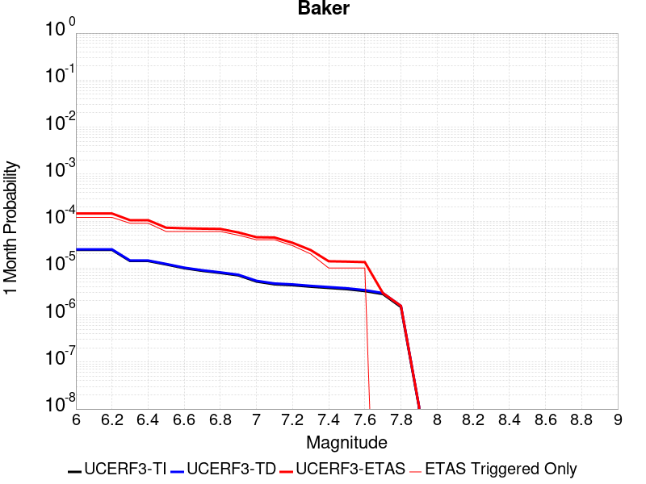 |  |  |

| Magnitude | 1 wk TI Prob | 1 wk TD Prob | 1 wk ETAS Prob | 1 wk ETAS/TD Gain | 1 wk ETAS Triggered Only | 1 mo TI Prob | 1 mo TD Prob | 1 mo ETAS Prob | 1 mo ETAS/TD Gain | 1 mo ETAS Triggered Only | 1 yr TI Prob | 1 yr TD Prob | 1 yr ETAS Prob | 1 yr ETAS/TD Gain | 1 yr ETAS Triggered Only | 10 yr TI Prob | 10 yr TD Prob | 10 yr ETAS Prob | 10 yr ETAS/TD Gain | 10 yr ETAS Triggered Only |
|-----|-----|-----|-----|-----|-----|-----|-----|-----|-----|-----|-----|-----|-----|-----|-----|-----|-----|-----|-----|-----|
| 6.0 | 5.695525E-6 | 5.8348373E-6 | 9.305326E-5 | 15.947877 | 8.7218934E-5 | 2.4409164E-5 | 2.5006228E-5 | 1.1222298E-4 | 4.4878016 | 8.7218934E-5 | 2.9714106E-4 | 3.044123E-4 | 3.916047E-4 | 1.2864286 | 8.7218934E-5 | 0.0029674405 | 0.0030403486 | 0.0031273025 | 1.0286 | 8.7218934E-5 |
| 6.1 | 5.695525E-6 | 5.8348373E-6 | 9.305326E-5 | 15.947877 | 8.7218934E-5 | 2.4409164E-5 | 2.5006228E-5 | 1.1222298E-4 | 4.4878016 | 8.7218934E-5 | 2.9714106E-4 | 3.044123E-4 | 3.916047E-4 | 1.2864286 | 8.7218934E-5 | 0.0029674405 | 0.0030403486 | 0.0031273025 | 1.0286 | 8.7218934E-5 |
| 6.2 | 5.695525E-6 | 5.8348373E-6 | 9.305326E-5 | 15.947877 | 8.7218934E-5 | 2.4409164E-5 | 2.5006228E-5 | 1.1222298E-4 | 4.4878016 | 8.7218934E-5 | 2.9714106E-4 | 3.044123E-4 | 3.916047E-4 | 1.2864286 | 8.7218934E-5 | 0.0029674405 | 0.0030403486 | 0.0031273025 | 1.0286 | 8.7218934E-5 |
| 6.3 | 3.2995713E-6 | 3.383667E-6 | 7.315858E-5 | 21.621094 | 6.977515E-5 | 1.4140943E-5 | 1.4501353E-5 | 8.427549E-5 | 5.8115606 | 6.977515E-5 | 1.7215237E-4 | 1.7654014E-4 | 2.4630298E-4 | 1.395167 | 6.977515E-5 | 0.0017201907 | 0.001764046 | 0.0018336981 | 1.0394843 | 6.977515E-5 |
| 6.4 | 3.2995713E-6 | 3.383667E-6 | 7.315858E-5 | 21.621094 | 6.977515E-5 | 1.4140943E-5 | 1.4501353E-5 | 8.427549E-5 | 5.8115606 | 6.977515E-5 | 1.7215237E-4 | 1.7654014E-4 | 2.4630298E-4 | 1.395167 | 6.977515E-5 | 0.0017201907 | 0.001764046 | 0.0018336981 | 1.0394843 | 6.977515E-5 |
| 6.5 | 2.782202E-6 | 2.8558404E-6 | 3.7743317E-5 | 13.216185 | 3.4887576E-5 | 1.1923668E-5 | 1.223926E-5 | 4.7126407E-5 | 3.8504293 | 3.4887576E-5 | 1.4516099E-4 | 1.4900314E-4 | 1.8388551E-4 | 1.234105 | 3.4887576E-5 | 0.001450662 | 0.0014890651 | 0.0015239007 | 1.0233943 | 3.4887576E-5 |
| 6.6 | 2.3163404E-6 | 2.38092E-6 | 3.726841E-5 | 15.652946 | 3.4887576E-5 | 9.927136E-6 | 1.0203904E-5 | 4.509112E-5 | 4.419007 | 3.4887576E-5 | 1.20856166E-4 | 1.2422565E-4 | 1.591089E-4 | 1.2808055 | 3.4887576E-5 | 0.0012079047 | 0.0012415823 | 0.0012764266 | 1.0280644 | 3.4887576E-5 |
| 6.7 | 2.037056E-6 | 2.0965003E-6 | 3.6984E-5 | 17.640827 | 3.4887576E-5 | 8.7302105E-6 | 8.984972E-6 | 4.3872235E-5 | 4.882846 | 3.4887576E-5 | 1.0628513E-4 | 1.093867E-4 | 1.4427047E-4 | 1.3189031 | 3.4887576E-5 | 0.0010623431 | 0.0010933448 | 0.0011281942 | 1.0318742 | 3.4887576E-5 |
| 6.8 | 1.8356744E-6 | 1.8915287E-6 | 3.6779038E-5 | 19.444082 | 3.4887576E-5 | 7.867153E-6 | 8.106527E-6 | 4.299382E-5 | 5.303605 | 3.4887576E-5 | 9.577837E-5 | 9.869264E-5 | 1.3357677E-4 | 1.3534623 | 3.4887576E-5 | 9.57371E-4 | 9.86502E-4 | 0.0010213552 | 1.03533 | 3.4887576E-5 |
| 6.9 | 1.6310546E-6 | 1.6832072E-6 | 1.9126965E-5 | 11.363405 | 1.7443788E-5 | 6.9902153E-6 | 7.213726E-6 | 2.4657387E-5 | 3.4181209 | 1.7443788E-5 | 8.510255E-5 | 8.782368E-5 | 1.0526594E-4 | 1.1986054 | 1.7443788E-5 | 8.5069967E-4 | 8.7790104E-4 | 8.953295E-4 | 1.0198524 | 1.7443788E-5 |
| 7.0 | 1.2058036E-6 | 1.2508665E-6 | 1.2508665E-6 | 1.0 | 0.0 | 5.1677193E-6 | 5.3608455E-6 | 5.3608455E-6 | 1.0 | 0.0 | 6.291517E-5 | 6.5266366E-5 | 6.5266366E-5 | 1.0 | 0.0 | 6.289736E-4 | 6.524743E-4 | 6.524743E-4 | 1.0 | 0.0 |
| 7.1 | 1.052382E-6 | 1.0951609E-6 | 1.0951609E-6 | 1.0 | 0.0 | 4.5102006E-6 | 4.693538E-6 | 4.693538E-6 | 1.0 | 0.0 | 5.491031E-5 | 5.7142337E-5 | 5.7142337E-5 | 1.0 | 0.0 | 5.4896745E-4 | 5.7127734E-4 | 5.7127734E-4 | 1.0 | 0.0 |
| 7.2 | 1.0067454E-6 | 1.0487711E-6 | 1.0487711E-6 | 1.0 | 0.0 | 4.3146156E-6 | 4.4947255E-6 | 4.4947255E-6 | 1.0 | 0.0 | 5.252918E-5 | 5.4721917E-5 | 5.4721917E-5 | 1.0 | 0.0 | 5.251676E-4 | 5.470853E-4 | 5.470853E-4 | 1.0 | 0.0 |
| 7.3 | 9.3596316E-7 | 9.767723E-7 | 9.767723E-7 | 1.0 | 0.0 | 4.0112645E-6 | 4.1861604E-6 | 4.1861604E-6 | 1.0 | 0.0 | 4.8836053E-5 | 5.096532E-5 | 5.096532E-5 | 1.0 | 0.0 | 4.8825322E-4 | 5.095371E-4 | 5.095371E-4 | 1.0 | 0.0 |
| 7.4 | 8.8117395E-7 | 9.2076635E-7 | 9.2076635E-7 | 1.0 | 0.0 | 3.7764542E-6 | 3.9461356E-6 | 3.9461356E-6 | 1.0 | 0.0 | 4.5977362E-5 | 4.8043148E-5 | 4.8043148E-5 | 1.0 | 0.0 | 4.596785E-4 | 4.8032837E-4 | 4.8032837E-4 | 1.0 | 0.0 |
| 7.5 | 8.292386E-7 | 8.6745956E-7 | 8.6745956E-7 | 1.0 | 0.0 | 3.5538749E-6 | 3.7176785E-6 | 3.7176785E-6 | 1.0 | 0.0 | 4.326757E-5 | 4.5261804E-5 | 4.5261804E-5 | 1.0 | 0.0 | 4.3259145E-4 | 4.5252658E-4 | 4.5252658E-4 | 1.0 | 0.0 |
| 7.6 | 7.553842E-7 | 7.9144706E-7 | 7.9144706E-7 | 1.0 | 0.0 | 3.2373566E-6 | 3.3919116E-6 | 3.3919116E-6 | 1.0 | 0.0 | 3.9414106E-5 | 4.129575E-5 | 4.129575E-5 | 1.0 | 0.0 | 3.9407116E-4 | 4.1288146E-4 | 4.1288146E-4 | 1.0 | 0.0 |
| 7.7 | 6.5285366E-7 | 6.852797E-7 | 6.852797E-7 | 1.0 | 0.0 | 2.797941E-6 | 2.9369096E-6 | 2.9369096E-6 | 1.0 | 0.0 | 3.40644E-5 | 3.5756293E-5 | 3.5756293E-5 | 1.0 | 0.0 | 3.405918E-4 | 3.5750607E-4 | 3.5750607E-4 | 1.0 | 0.0 |
| 7.8 | 3.4586725E-7 | 3.6482615E-7 | 3.6482615E-7 | 1.0 | 0.0 | 1.4822873E-6 | 1.5635396E-6 | 1.5635396E-6 | 1.0 | 0.0 | 1.80467E-5 | 1.9035933E-5 | 1.9035933E-5 | 1.0 | 0.0 | 1.8045233E-4 | 1.9034347E-4 | 1.9034347E-4 | 1.0 | 0.0 |
| 7.9 | 2.5591178E-9 | 2.6696718E-9 | 2.6696718E-9 | 1.0 | 0.0 | 1.0967647E-8 | 1.14414505E-8 | 1.14414505E-8 | 1.0 | 0.0 | 1.335311E-7 | 1.3929966E-7 | 1.3929966E-7 | 1.0 | 0.0 | 1.3353102E-6 | 1.3929966E-6 | 1.3929966E-6 | 1.0 | 0.0 |

## San Jacinto (Stepovers Combined)
*[(top)](#table-of-contents)*

| 1 Week | 1 Month | 1 Year | 10 Year |
|-----|-----|-----|-----|
|  | 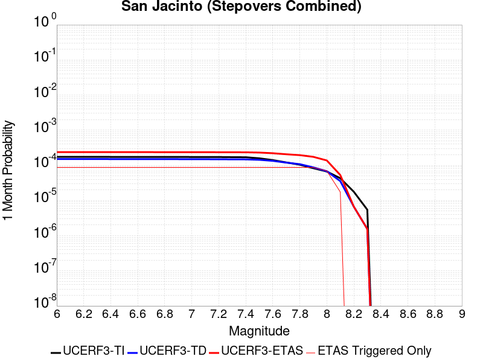 | 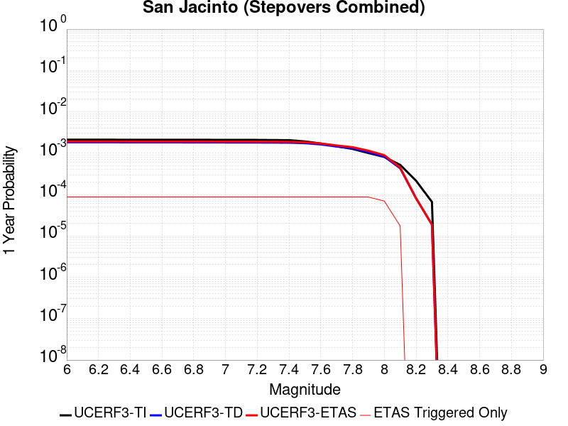 | 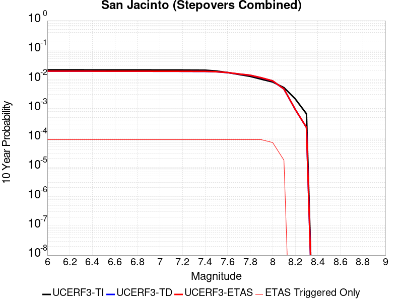 |

| Magnitude | 1 wk TI Prob | 1 wk TD Prob | 1 wk ETAS Prob | 1 wk ETAS/TD Gain | 1 wk ETAS Triggered Only | 1 mo TI Prob | 1 mo TD Prob | 1 mo ETAS Prob | 1 mo ETAS/TD Gain | 1 mo ETAS Triggered Only | 1 yr TI Prob | 1 yr TD Prob | 1 yr ETAS Prob | 1 yr ETAS/TD Gain | 1 yr ETAS Triggered Only | 10 yr TI Prob | 10 yr TD Prob | 10 yr ETAS Prob | 10 yr ETAS/TD Gain | 10 yr ETAS Triggered Only |
|-----|-----|-----|-----|-----|-----|-----|-----|-----|-----|-----|-----|-----|-----|-----|-----|-----|-----|-----|-----|-----|
| 6.0 | 4.0667746E-5 | 3.5272755E-5 | 1.2248862E-4 | 3.4726126 | 8.7218934E-5 | 1.742787E-4 | 1.5116022E-4 | 2.3836596E-4 | 1.5769094 | 8.7218934E-5 | 0.0021197782 | 0.0018388226 | 0.0019258811 | 1.0473447 | 8.7218934E-5 | 0.020996714 | 0.018986892 | 0.019072454 | 1.0045065 | 8.7218934E-5 |
| 6.1 | 4.0667746E-5 | 3.5272755E-5 | 1.2248862E-4 | 3.4726126 | 8.7218934E-5 | 1.742787E-4 | 1.5116022E-4 | 2.3836596E-4 | 1.5769094 | 8.7218934E-5 | 0.0021197782 | 0.0018388226 | 0.0019258811 | 1.0473447 | 8.7218934E-5 | 0.020996714 | 0.018986892 | 0.019072454 | 1.0045065 | 8.7218934E-5 |
| 6.2 | 4.0667746E-5 | 3.5272755E-5 | 1.2248862E-4 | 3.4726126 | 8.7218934E-5 | 1.742787E-4 | 1.5116022E-4 | 2.3836596E-4 | 1.5769094 | 8.7218934E-5 | 0.0021197782 | 0.0018388226 | 0.0019258811 | 1.0473447 | 8.7218934E-5 | 0.020996714 | 0.018986892 | 0.019072454 | 1.0045065 | 8.7218934E-5 |
| 6.3 | 4.0667746E-5 | 3.5272755E-5 | 1.2248862E-4 | 3.4726126 | 8.7218934E-5 | 1.742787E-4 | 1.5116022E-4 | 2.3836596E-4 | 1.5769094 | 8.7218934E-5 | 0.0021197782 | 0.0018388226 | 0.0019258811 | 1.0473447 | 8.7218934E-5 | 0.020996714 | 0.018986892 | 0.019072454 | 1.0045065 | 8.7218934E-5 |
| 6.4 | 4.0577226E-5 | 3.5144654E-5 | 1.2236052E-4 | 3.4816256 | 8.7218934E-5 | 1.738908E-4 | 1.5061127E-4 | 2.3781708E-4 | 1.5790124 | 8.7218934E-5 | 0.0021150648 | 0.0018321523 | 0.0019192115 | 1.0475174 | 8.7218934E-5 | 0.020950472 | 0.018921461 | 0.019007029 | 1.0045223 | 8.7218934E-5 |
| 6.5 | 4.0577226E-5 | 3.5144654E-5 | 1.2236052E-4 | 3.4816256 | 8.7218934E-5 | 1.738908E-4 | 1.5061127E-4 | 2.3781708E-4 | 1.5790124 | 8.7218934E-5 | 0.0021150648 | 0.0018321523 | 0.0019192115 | 1.0475174 | 8.7218934E-5 | 0.020950472 | 0.018921461 | 0.019007029 | 1.0045223 | 8.7218934E-5 |
| 6.6 | 4.053861E-5 | 3.509E-5 | 1.2230588E-4 | 3.4854908 | 8.7218934E-5 | 1.7372532E-4 | 1.5037706E-4 | 2.3758289E-4 | 1.5799143 | 8.7218934E-5 | 0.0021130538 | 0.0018293057 | 0.001916365 | 1.0475914 | 8.7218934E-5 | 0.020930743 | 0.018893538 | 0.01897911 | 1.0045291 | 8.7218934E-5 |
| 6.7 | 4.0516545E-5 | 3.5059067E-5 | 1.2227494E-4 | 3.4876838 | 8.7218934E-5 | 1.7363077E-4 | 1.5024451E-4 | 2.3745035E-4 | 1.5804261 | 8.7218934E-5 | 0.002111905 | 0.001827695 | 0.0019147545 | 1.0476335 | 8.7218934E-5 | 0.020919468 | 0.018877735 | 0.018963307 | 1.0045329 | 8.7218934E-5 |
| 6.8 | 4.049434E-5 | 3.5030633E-5 | 1.222465E-4 | 3.4897034 | 8.7218934E-5 | 1.7353562E-4 | 1.5012265E-4 | 2.373285E-4 | 1.5808973 | 8.7218934E-5 | 0.0021107488 | 0.0018262138 | 0.0019132735 | 1.0476723 | 8.7218934E-5 | 0.020908125 | 0.018863149 | 0.018948723 | 1.0045365 | 8.7218934E-5 |
| 6.9 | 4.046386E-5 | 3.499319E-5 | 1.2220908E-4 | 3.4923673 | 8.7218934E-5 | 1.73405E-4 | 1.4996222E-4 | 2.3716807E-4 | 1.5815189 | 8.7218934E-5 | 0.0021091616 | 0.0018242638 | 0.0019113236 | 1.0477233 | 8.7218934E-5 | 0.020892553 | 0.01884392 | 0.018929496 | 1.0045413 | 8.7218934E-5 |
| 7.0 | 4.036382E-5 | 3.487376E-5 | 1.2208965E-4 | 3.5009034 | 8.7218934E-5 | 1.7297632E-4 | 1.4945042E-4 | 2.3665633E-4 | 1.5835106 | 8.7218934E-5 | 0.0021039525 | 0.0018180435 | 0.0019051039 | 1.0478868 | 8.7218934E-5 | 0.02084144 | 0.018782536 | 0.018868117 | 1.0045564 | 8.7218934E-5 |
| 7.1 | 4.0343282E-5 | 3.4852223E-5 | 1.22068115E-4 | 3.5024488 | 8.7218934E-5 | 1.7288832E-4 | 1.4935812E-4 | 2.3656404E-4 | 1.5838712 | 8.7218934E-5 | 0.002102883 | 0.0018169218 | 0.0019039823 | 1.0479164 | 8.7218934E-5 | 0.020830948 | 0.018771412 | 0.018856995 | 1.0045592 | 8.7218934E-5 |
| 7.2 | 4.0257353E-5 | 3.4756722E-5 | 1.21972625E-4 | 3.5093248 | 8.7218934E-5 | 1.725201E-4 | 1.489489E-4 | 2.3615484E-4 | 1.5854756 | 8.7218934E-5 | 0.0020984085 | 0.0018119477 | 0.0018990085 | 1.0480483 | 8.7218934E-5 | 0.020787042 | 0.018722152 | 0.018807737 | 1.0045713 | 8.7218934E-5 |
| 7.3 | 3.9940667E-5 | 3.4584376E-5 | 1.21800294E-4 | 3.52183 | 8.7218934E-5 | 1.7116306E-4 | 1.4821035E-4 | 2.3541637E-4 | 1.5883934 | 8.7218934E-5 | 0.0020819185 | 0.0018029709 | 0.0018900326 | 1.0482879 | 8.7218934E-5 | 0.020625217 | 0.018630784 | 0.018716378 | 1.0045942 | 8.7218934E-5 |
| 7.4 | 3.9721202E-5 | 3.4469766E-5 | 1.216857E-4 | 3.5302153 | 8.7218934E-5 | 1.7022261E-4 | 1.4771923E-4 | 2.3492528E-4 | 1.59035 | 8.7218934E-5 | 0.0020704903 | 0.0017970012 | 0.0018840635 | 1.0484486 | 8.7218934E-5 | 0.020513052 | 0.018569905 | 0.018655505 | 1.0046096 | 8.7218934E-5 |
| 7.5 | 3.7036873E-5 | 3.3537188E-5 | 1.207532E-4 | 3.6005764 | 8.7218934E-5 | 1.5871979E-4 | 1.437229E-4 | 2.3092929E-4 | 1.6067677 | 8.7218934E-5 | 0.0019307006 | 0.0017484248 | 0.0018354913 | 1.049797 | 8.7218934E-5 | 0.019140124 | 0.018071463 | 0.018157106 | 1.0047392 | 8.7218934E-5 |
| 7.6 | 3.2940967E-5 | 3.1317984E-5 | 1.1853419E-4 | 3.78486 | 8.7218934E-5 | 1.4116794E-4 | 1.3421304E-4 | 2.2142028E-4 | 1.6497672 | 8.7218934E-5 | 0.0017173645 | 0.0016328214 | 0.0017198978 | 1.0533289 | 8.7218934E-5 | 0.01704153 | 0.016904354 | 0.016990097 | 1.0050724 | 8.7218934E-5 |
| 7.7 | 2.8236149E-5 | 2.7883889E-5 | 1.15100396E-4 | 4.127846 | 8.7218934E-5 | 1.2100645E-4 | 1.19496915E-4 | 2.0670543E-4 | 1.7297972 | 8.7218934E-5 | 0.0014722579 | 0.001453905 | 0.0015409972 | 1.0599022 | 8.7218934E-5 | 0.014625421 | 0.015115095 | 0.015200996 | 1.0056831 | 8.7218934E-5 |
| 7.8 | 2.4329287E-5 | 2.5207537E-5 | 1.1242428E-4 | 4.459947 | 8.7218934E-5 | 1.042642E-4 | 1.0802783E-4 | 1.9523734E-4 | 1.8072875 | 8.7218934E-5 | 0.0012686774 | 0.0013144462 | 0.0014015505 | 1.0662669 | 8.7218934E-5 | 0.012614589 | 0.013712396 | 0.013798418 | 1.0062734 | 8.7218934E-5 |
| 7.9 | 1.9370926E-5 | 2.0421452E-5 | 1.0763861E-4 | 5.2708597 | 8.7218934E-5 | 8.301561E-5 | 8.7517576E-5 | 1.7472888E-4 | 1.9965005 | 8.7218934E-5 | 0.0010102465 | 0.0010650064 | 0.0011521324 | 1.081808 | 8.7218934E-5 | 0.0100566605 | 0.011199483 | 0.011285724 | 1.0077006 | 8.7218934E-5 |
| 8.0 | 1.5583017E-5 | 1.588647E-5 | 8.566051E-5 | 5.392042 | 6.977515E-5 | 6.6782646E-5 | 6.808309E-5 | 1.378535E-4 | 2.0247831 | 6.977515E-5 | 8.127754E-4 | 8.285971E-4 | 8.983144E-4 | 1.084139 | 6.977515E-5 | 0.008098091 | 0.008781809 | 0.008850972 | 1.0078757 | 6.977515E-5 |
| 8.1 | 1.0024873E-5 | 8.292404E-6 | 2.5736046E-5 | 3.1035688 | 1.7443788E-5 | 4.2963035E-5 | 3.5538393E-5 | 5.2981562E-5 | 1.490826 | 1.7443788E-5 | 5.229494E-4 | 4.3259456E-4 | 4.5003078E-4 | 1.0403062 | 1.7443788E-5 | 0.0052172043 | 0.0046534105 | 0.004670773 | 1.0037311 | 1.7443788E-5 |
| 8.2 | 4.142796E-6 | 1.5610041E-6 | 1.5610041E-6 | 1.0 | 0.0 | 1.775472E-5 | 6.69E-6 | 6.69E-6 | 1.0 | 0.0 | 2.1614227E-4 | 8.144774E-5 | 8.144774E-5 | 1.0 | 0.0 | 0.0021593217 | 9.454649E-4 | 9.454649E-4 | 1.0 | 0.0 |
| 8.3 | 1.2750878E-6 | 3.612133E-7 | 3.612133E-7 | 1.0 | 0.0 | 5.4646503E-6 | 1.548056E-6 | 1.548056E-6 | 1.0 | 0.0 | 6.653009E-5 | 1.8847424E-5 | 1.8847424E-5 | 1.0 | 0.0 | 6.6510175E-4 | 2.2734253E-4 | 2.2734253E-4 | 1.0 | 0.0 |

## Independence rev 2011
*[(top)](#table-of-contents)*

| 1 Week | 1 Month | 1 Year | 10 Year |
|-----|-----|-----|-----|
|  |  |  |  |

| Magnitude | 1 wk TI Prob | 1 wk TD Prob | 1 wk ETAS Prob | 1 wk ETAS/TD Gain | 1 wk ETAS Triggered Only | 1 mo TI Prob | 1 mo TD Prob | 1 mo ETAS Prob | 1 mo ETAS/TD Gain | 1 mo ETAS Triggered Only | 1 yr TI Prob | 1 yr TD Prob | 1 yr ETAS Prob | 1 yr ETAS/TD Gain | 1 yr ETAS Triggered Only | 10 yr TI Prob | 10 yr TD Prob | 10 yr ETAS Prob | 10 yr ETAS/TD Gain | 10 yr ETAS Triggered Only |
|-----|-----|-----|-----|-----|-----|-----|-----|-----|-----|-----|-----|-----|-----|-----|-----|-----|-----|-----|-----|-----|
| 6.0 | 4.422171E-6 | 4.326227E-6 | 9.154479E-5 | 21.160421 | 8.7218934E-5 | 1.8952025E-5 | 1.8540857E-5 | 1.05758176E-4 | 5.7040606 | 8.7218934E-5 | 2.3071647E-4 | 2.2571455E-4 | 3.129138E-4 | 1.3863254 | 8.7218934E-5 | 0.0023047708 | 0.0022551466 | 0.0023421687 | 1.0385883 | 8.7218934E-5 |
| 6.1 | 4.422171E-6 | 4.326227E-6 | 9.154479E-5 | 21.160421 | 8.7218934E-5 | 1.8952025E-5 | 1.8540857E-5 | 1.05758176E-4 | 5.7040606 | 8.7218934E-5 | 2.3071647E-4 | 2.2571455E-4 | 3.129138E-4 | 1.3863254 | 8.7218934E-5 | 0.0023047708 | 0.0022551466 | 0.0023421687 | 1.0385883 | 8.7218934E-5 |
| 6.2 | 4.422171E-6 | 4.326227E-6 | 9.154479E-5 | 21.160421 | 8.7218934E-5 | 1.8952025E-5 | 1.8540857E-5 | 1.05758176E-4 | 5.7040606 | 8.7218934E-5 | 2.3071647E-4 | 2.2571455E-4 | 3.129138E-4 | 1.3863254 | 8.7218934E-5 | 0.0023047708 | 0.0022551466 | 0.0023421687 | 1.0385883 | 8.7218934E-5 |
| 6.3 | 4.422171E-6 | 4.326227E-6 | 9.154479E-5 | 21.160421 | 8.7218934E-5 | 1.8952025E-5 | 1.8540857E-5 | 1.05758176E-4 | 5.7040606 | 8.7218934E-5 | 2.3071647E-4 | 2.2571455E-4 | 3.129138E-4 | 1.3863254 | 8.7218934E-5 | 0.0023047708 | 0.0022551466 | 0.0023421687 | 1.0385883 | 8.7218934E-5 |
| 6.4 | 4.422171E-6 | 4.326227E-6 | 9.154479E-5 | 21.160421 | 8.7218934E-5 | 1.8952025E-5 | 1.8540857E-5 | 1.05758176E-4 | 5.7040606 | 8.7218934E-5 | 2.3071647E-4 | 2.2571455E-4 | 3.129138E-4 | 1.3863254 | 8.7218934E-5 | 0.0023047708 | 0.0022551466 | 0.0023421687 | 1.0385883 | 8.7218934E-5 |
| 6.5 | 4.422171E-6 | 4.326227E-6 | 9.154479E-5 | 21.160421 | 8.7218934E-5 | 1.8952025E-5 | 1.8540857E-5 | 1.05758176E-4 | 5.7040606 | 8.7218934E-5 | 2.3071647E-4 | 2.2571455E-4 | 3.129138E-4 | 1.3863254 | 8.7218934E-5 | 0.0023047708 | 0.0022551466 | 0.0023421687 | 1.0385883 | 8.7218934E-5 |
| 6.6 | 2.663744E-6 | 2.5319862E-6 | 8.9750705E-5 | 35.44676 | 8.7218934E-5 | 1.1415996E-5 | 1.0851327E-5 | 9.8069315E-5 | 9.037541 | 8.7218934E-5 | 1.3898089E-4 | 1.3210738E-4 | 2.193148E-4 | 1.6601253 | 8.7218934E-5 | 0.0013889399 | 0.0013203367 | 0.0014074405 | 1.0659709 | 8.7218934E-5 |
| 6.7 | 2.663744E-6 | 2.5319862E-6 | 8.9750705E-5 | 35.44676 | 8.7218934E-5 | 1.1415996E-5 | 1.0851327E-5 | 9.8069315E-5 | 9.037541 | 8.7218934E-5 | 1.3898089E-4 | 1.3210738E-4 | 2.193148E-4 | 1.6601253 | 8.7218934E-5 | 0.0013889399 | 0.0013203367 | 0.0014074405 | 1.0659709 | 8.7218934E-5 |
| 6.8 | 1.9716529E-6 | 1.8322585E-6 | 8.9051035E-5 | 48.601788 | 8.7218934E-5 | 8.449913E-6 | 7.852514E-6 | 9.507076E-5 | 12.107049 | 8.7218934E-5 | 1.0287284E-4 | 9.5600284E-5 | 1.8281088E-4 | 1.912242 | 8.7218934E-5 | 0.0010282523 | 9.556045E-4 | 0.0010427401 | 1.0911838 | 8.7218934E-5 |
| 6.9 | 1.8788617E-6 | 1.7429993E-6 | 8.896179E-5 | 51.039482 | 8.7218934E-5 | 8.0522395E-6 | 7.4699765E-6 | 9.4688265E-5 | 12.675845 | 8.7218934E-5 | 9.80316E-5 | 9.0943286E-5 | 1.781543E-4 | 1.9589603 | 8.7218934E-5 | 9.798837E-4 | 9.0907275E-4 | 9.962124E-4 | 1.0958555 | 8.7218934E-5 |
| 7.0 | 1.5045488E-6 | 1.3849503E-6 | 7.116E-5 | 51.380905 | 6.977515E-5 | 6.44805E-6 | 5.9354884E-6 | 7.5710224E-5 | 12.755517 | 6.977515E-5 | 7.8502184E-5 | 7.226223E-5 | 1.4203234E-4 | 1.9655129 | 6.977515E-5 | 7.8474457E-4 | 7.2239246E-4 | 7.921172E-4 | 1.0965192 | 6.977515E-5 |
| 7.1 | 1.272341E-6 | 1.1625096E-6 | 7.093758E-5 | 61.021065 | 6.977515E-5 | 5.4528787E-6 | 4.982175E-6 | 7.475698E-5 | 15.004888 | 6.977515E-5 | 6.6386776E-5 | 6.0656326E-5 | 1.3042724E-4 | 2.1502662 | 6.977515E-5 | 6.636695E-4 | 6.064009E-4 | 6.761337E-4 | 1.1149946 | 6.977515E-5 |
| 7.2 | 1.0416892E-6 | 9.4098806E-7 | 7.071607E-5 | 75.15087 | 6.977515E-5 | 4.464375E-6 | 4.0328E-6 | 7.380767E-5 | 18.301844 | 6.977515E-5 | 5.4352407E-5 | 4.909825E-5 | 1.18869975E-4 | 2.4210634 | 6.977515E-5 | 5.4339116E-4 | 4.9087586E-4 | 5.606168E-4 | 1.1420743 | 6.977515E-5 |
| 7.3 | 7.9450155E-7 | 7.235002E-7 | 7.04986E-5 | 97.441025 | 6.977515E-5 | 3.4050022E-6 | 3.1007114E-6 | 7.287564E-5 | 23.502878 | 6.977515E-5 | 4.1455114E-5 | 3.775052E-5 | 1.0752303E-4 | 2.8482533 | 6.977515E-5 | 4.144738E-4 | 3.7744216E-4 | 4.4719098E-4 | 1.1847934 | 6.977515E-5 |
| 7.4 | 5.3893444E-7 | 5.019512E-7 | 5.2833286E-5 | 105.25582 | 5.233136E-5 | 2.309717E-6 | 2.1512178E-6 | 5.448247E-5 | 25.326338 | 5.233136E-5 | 2.8120441E-5 | 2.6190766E-5 | 7.852076E-5 | 2.998032 | 5.233136E-5 | 2.8116882E-4 | 2.6187726E-4 | 3.141949E-4 | 1.1997793 | 5.233136E-5 |
| 7.5 | 3.8852085E-7 | 3.682554E-7 | 5.2699597E-5 | 143.10611 | 5.233136E-5 | 1.6650882E-6 | 1.5782365E-6 | 5.3909516E-5 | 34.158073 | 5.233136E-5 | 2.027226E-5 | 1.9214862E-5 | 7.154522E-5 | 3.7234313 | 5.233136E-5 | 2.0270412E-4 | 1.9213221E-4 | 2.4445352E-4 | 1.2723193 | 5.233136E-5 |
| 7.6 | 2.414929E-7 | 2.345755E-7 | 1.767836E-5 | 75.36319 | 1.7443788E-5 | 1.0349692E-6 | 1.0053232E-6 | 1.8449093E-5 | 18.351404 | 1.7443788E-5 | 1.2600677E-5 | 1.2239742E-5 | 2.9683317E-5 | 2.4251585 | 1.7443788E-5 | 1.2599962E-4 | 1.223908E-4 | 1.3983245E-4 | 1.1425079 | 1.7443788E-5 |
| 7.7 | 6.8298014E-8 | 6.85897E-8 | 6.85897E-8 | 1.0 | 0.0 | 2.9270575E-7 | 2.9395582E-7 | 2.9395582E-7 | 1.0 | 0.0 | 3.5636867E-6 | 3.5789067E-6 | 3.5789067E-6 | 1.0 | 0.0 | 3.5636294E-5 | 3.5788536E-5 | 3.5788536E-5 | 1.0 | 0.0 |

## Kern Canyon (North Kern) 2011
*[(top)](#table-of-contents)*

| 1 Week | 1 Month | 1 Year | 10 Year |
|-----|-----|-----|-----|
| 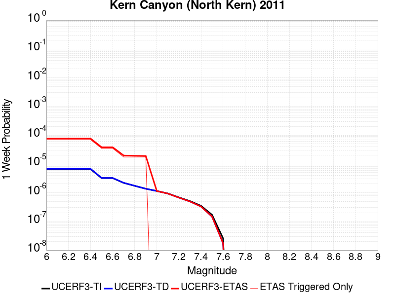 | 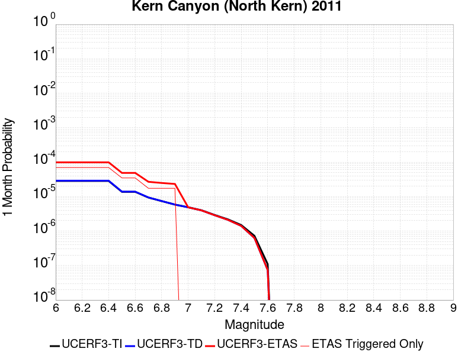 | 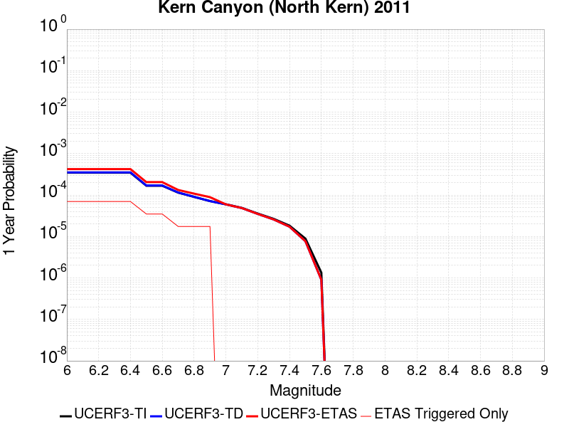 | 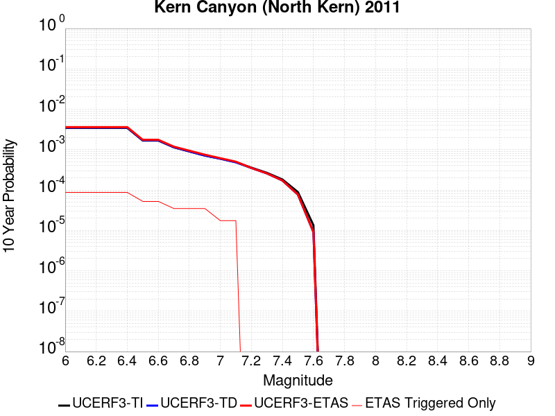 |

| Magnitude | 1 wk TI Prob | 1 wk TD Prob | 1 wk ETAS Prob | 1 wk ETAS/TD Gain | 1 wk ETAS Triggered Only | 1 mo TI Prob | 1 mo TD Prob | 1 mo ETAS Prob | 1 mo ETAS/TD Gain | 1 mo ETAS Triggered Only | 1 yr TI Prob | 1 yr TD Prob | 1 yr ETAS Prob | 1 yr ETAS/TD Gain | 1 yr ETAS Triggered Only | 10 yr TI Prob | 10 yr TD Prob | 10 yr ETAS Prob | 10 yr ETAS/TD Gain | 10 yr ETAS Triggered Only |
|-----|-----|-----|-----|-----|-----|-----|-----|-----|-----|-----|-----|-----|-----|-----|-----|-----|-----|-----|-----|-----|
| 6.0 | 6.6264497E-6 | 6.75733E-6 | 7.653201E-5 | 11.325776 | 6.977515E-5 | 2.8398761E-5 | 2.895971E-5 | 9.873284E-5 | 3.4093173 | 6.977515E-5 | 3.4570007E-4 | 3.5253543E-4 | 4.22286E-4 | 1.197854 | 6.977515E-5 | 0.0034516277 | 0.0035205502 | 0.0036074622 | 1.024687 | 8.7218934E-5 |
| 6.1 | 6.6264497E-6 | 6.75733E-6 | 7.653201E-5 | 11.325776 | 6.977515E-5 | 2.8398761E-5 | 2.895971E-5 | 9.873284E-5 | 3.4093173 | 6.977515E-5 | 3.4570007E-4 | 3.5253543E-4 | 4.22286E-4 | 1.197854 | 6.977515E-5 | 0.0034516277 | 0.0035205502 | 0.0036074622 | 1.024687 | 8.7218934E-5 |
| 6.2 | 6.6264497E-6 | 6.75733E-6 | 7.653201E-5 | 11.325776 | 6.977515E-5 | 2.8398761E-5 | 2.895971E-5 | 9.873284E-5 | 3.4093173 | 6.977515E-5 | 3.4570007E-4 | 3.5253543E-4 | 4.22286E-4 | 1.197854 | 6.977515E-5 | 0.0034516277 | 0.0035205502 | 0.0036074622 | 1.024687 | 8.7218934E-5 |
| 6.3 | 6.6264497E-6 | 6.75733E-6 | 7.653201E-5 | 11.325776 | 6.977515E-5 | 2.8398761E-5 | 2.895971E-5 | 9.873284E-5 | 3.4093173 | 6.977515E-5 | 3.4570007E-4 | 3.5253543E-4 | 4.22286E-4 | 1.197854 | 6.977515E-5 | 0.0034516277 | 0.0035205502 | 0.0036074622 | 1.024687 | 8.7218934E-5 |
| 6.4 | 6.6264497E-6 | 6.75733E-6 | 7.653201E-5 | 11.325776 | 6.977515E-5 | 2.8398761E-5 | 2.895971E-5 | 9.873284E-5 | 3.4093173 | 6.977515E-5 | 3.4570007E-4 | 3.5253543E-4 | 4.22286E-4 | 1.197854 | 6.977515E-5 | 0.0034516277 | 0.0035205502 | 0.0036074622 | 1.024687 | 8.7218934E-5 |
| 6.5 | 3.2162225E-6 | 3.2570915E-6 | 3.8144553E-5 | 11.711232 | 3.4887576E-5 | 1.3783738E-5 | 1.3958893E-5 | 4.884598E-5 | 3.4992733 | 3.4887576E-5 | 1.6780409E-4 | 1.6993708E-4 | 2.0481873E-4 | 1.2052622 | 3.4887576E-5 | 0.0016767744 | 0.001698151 | 0.0017503934 | 1.0307643 | 5.233136E-5 |
| 6.6 | 3.2162225E-6 | 3.2570915E-6 | 3.8144553E-5 | 11.711232 | 3.4887576E-5 | 1.3783738E-5 | 1.3958893E-5 | 4.884598E-5 | 3.4992733 | 3.4887576E-5 | 1.6780409E-4 | 1.6993708E-4 | 2.0481873E-4 | 1.2052622 | 3.4887576E-5 | 0.0016767744 | 0.001698151 | 0.0017503934 | 1.0307643 | 5.233136E-5 |
| 6.7 | 2.1908265E-6 | 2.2071222E-6 | 1.9650872E-5 | 8.903391 | 1.7443788E-5 | 9.389223E-6 | 9.459061E-6 | 2.6902684E-5 | 2.8441176 | 1.7443788E-5 | 1.1430779E-4 | 1.1515819E-4 | 1.3259996E-4 | 1.1514593 | 1.7443788E-5 | 0.0011424901 | 0.0011510046 | 0.001185852 | 1.0302757 | 3.4887576E-5 |
| 6.8 | 1.7303895E-6 | 1.7365529E-6 | 1.918031E-5 | 11.045048 | 1.7443788E-5 | 7.415934E-6 | 7.4423488E-6 | 2.4886007E-5 | 3.3438377 | 1.7443788E-5 | 9.028525E-5 | 9.0606925E-5 | 1.08049135E-4 | 1.1925042 | 1.7443788E-5 | 9.024858E-4 | 9.057096E-4 | 9.4056554E-4 | 1.0384847 | 3.4887576E-5 |
| 6.9 | 1.3700314E-6 | 1.3688622E-6 | 1.8812625E-5 | 13.7432575 | 1.7443788E-5 | 5.87155E-6 | 5.8665396E-6 | 2.3310224E-5 | 3.97342 | 1.7443788E-5 | 7.148377E-5 | 7.142282E-5 | 8.886537E-5 | 1.2442153 | 1.7443788E-5 | 7.146078E-4 | 7.140032E-4 | 7.488659E-4 | 1.048827 | 3.4887576E-5 |
| 7.0 | 1.1467797E-6 | 1.1413804E-6 | 1.1413804E-6 | 1.0 | 0.0 | 4.9147607E-6 | 4.8916213E-6 | 4.8916213E-6 | 1.0 | 0.0 | 5.983557E-5 | 5.9553895E-5 | 5.9553895E-5 | 1.0 | 0.0 | 5.981946E-4 | 5.953825E-4 | 6.128159E-4 | 1.029281 | 1.7443788E-5 |
| 7.1 | 9.3952065E-7 | 9.3026904E-7 | 9.3026904E-7 | 1.0 | 0.0 | 4.026511E-6 | 3.9868614E-6 | 3.9868614E-6 | 1.0 | 0.0 | 4.9021666E-5 | 4.8538972E-5 | 4.8538972E-5 | 1.0 | 0.0 | 4.901085E-4 | 4.8528548E-4 | 5.027208E-4 | 1.035928 | 1.7443788E-5 |
| 7.2 | 6.858055E-7 | 6.7193E-7 | 6.7193E-7 | 1.0 | 0.0 | 2.939163E-6 | 2.879697E-6 | 2.879697E-6 | 1.0 | 0.0 | 3.5783723E-5 | 3.5059755E-5 | 3.5059755E-5 | 1.0 | 0.0 | 3.5777962E-4 | 3.5054312E-4 | 3.5054312E-4 | 1.0 | 0.0 |
| 7.3 | 5.1101983E-7 | 4.9393E-7 | 4.9393E-7 | 1.0 | 0.0 | 2.1900833E-6 | 2.116841E-6 | 2.116841E-6 | 1.0 | 0.0 | 2.6663936E-5 | 2.5772239E-5 | 2.5772239E-5 | 1.0 | 0.0 | 2.6660739E-4 | 2.57693E-4 | 2.57693E-4 | 1.0 | 0.0 |
| 7.4 | 3.4999414E-7 | 3.2995905E-7 | 3.2995905E-7 | 1.0 | 0.0 | 1.499974E-6 | 1.4141094E-6 | 1.4141094E-6 | 1.0 | 0.0 | 1.8262032E-5 | 1.721665E-5 | 1.721665E-5 | 1.0 | 0.0 | 1.826053E-4 | 1.7215339E-4 | 1.7215339E-4 | 1.0 | 0.0 |
| 7.5 | 1.7021522E-7 | 1.4750044E-7 | 1.4750044E-7 | 1.0 | 0.0 | 7.2949354E-7 | 6.321446E-7 | 6.321446E-7 | 1.0 | 0.0 | 8.881548E-6 | 7.696334E-6 | 7.696334E-6 | 1.0 | 0.0 | 8.8811925E-5 | 7.696076E-5 | 7.696076E-5 | 1.0 | 0.0 |
| 7.6 | 2.572245E-8 | 1.7352555E-8 | 1.7352555E-8 | 1.0 | 0.0 | 1.10239064E-7 | 7.436809E-8 | 7.436809E-8 | 1.0 | 0.0 | 1.3421597E-6 | 9.054312E-7 | 9.054312E-7 | 1.0 | 0.0 | 1.3421517E-5 | 9.05428E-6 | 9.05428E-6 | 1.0 | 0.0 |

## Ortigalita (North)
*[(top)](#table-of-contents)*

| 1 Week | 1 Month | 1 Year | 10 Year |
|-----|-----|-----|-----|
|  |  |  |  |

| Magnitude | 1 wk TI Prob | 1 wk TD Prob | 1 wk ETAS Prob | 1 wk ETAS/TD Gain | 1 wk ETAS Triggered Only | 1 mo TI Prob | 1 mo TD Prob | 1 mo ETAS Prob | 1 mo ETAS/TD Gain | 1 mo ETAS Triggered Only | 1 yr TI Prob | 1 yr TD Prob | 1 yr ETAS Prob | 1 yr ETAS/TD Gain | 1 yr ETAS Triggered Only | 10 yr TI Prob | 10 yr TD Prob | 10 yr ETAS Prob | 10 yr ETAS/TD Gain | 10 yr ETAS Triggered Only |
|-----|-----|-----|-----|-----|-----|-----|-----|-----|-----|-----|-----|-----|-----|-----|-----|-----|-----|-----|-----|-----|
| 6.0 | 7.711876E-5 | 1.05064966E-4 | 1.7483279E-4 | 1.6640445 | 6.977515E-5 | 3.3046713E-4 | 4.502116E-4 | 5.1995536E-4 | 1.1549132 | 6.977515E-5 | 0.004016016 | 0.0054681194 | 0.005537513 | 1.0126905 | 6.977515E-5 | 0.039442103 | 0.053454787 | 0.053520832 | 1.0012355 | 6.977515E-5 |
| 6.1 | 4.607858E-5 | 6.0239203E-5 | 1.3001014E-4 | 2.1582315 | 6.977515E-5 | 1.9746469E-4 | 2.5814527E-4 | 3.279024E-4 | 1.2702243 | 6.977515E-5 | 0.0024014818 | 0.0031387596 | 0.0032083157 | 1.0221604 | 6.977515E-5 | 0.023756953 | 0.030975068 | 0.031042682 | 1.0021828 | 6.977515E-5 |
| 6.2 | 4.607858E-5 | 6.0239203E-5 | 1.3001014E-4 | 2.1582315 | 6.977515E-5 | 1.9746469E-4 | 2.5814527E-4 | 3.279024E-4 | 1.2702243 | 6.977515E-5 | 0.0024014818 | 0.0031387596 | 0.0032083157 | 1.0221604 | 6.977515E-5 | 0.023756953 | 0.030975068 | 0.031042682 | 1.0021828 | 6.977515E-5 |
| 6.3 | 3.327423E-5 | 4.2475127E-5 | 9.4804265E-5 | 2.2319949 | 5.233136E-5 | 1.4259605E-4 | 1.8202531E-4 | 2.3434714E-4 | 1.2874427 | 5.233136E-5 | 0.0017347244 | 0.002214197 | 0.0022664126 | 1.0235821 | 5.233136E-5 | 0.017212452 | 0.021945644 | 0.021996828 | 1.0023322 | 5.233136E-5 |
| 6.4 | 2.7732503E-5 | 3.4998593E-5 | 6.988495E-5 | 1.996793 | 3.4887576E-5 | 1.1884817E-4 | 1.4998685E-4 | 1.848692E-4 | 1.2325693 | 3.4887576E-5 | 0.001446016 | 0.0018248095 | 0.0018596335 | 1.0190836 | 3.4887576E-5 | 0.014366428 | 0.018121224 | 0.018155478 | 1.0018903 | 3.4887576E-5 |
| 6.5 | 2.7689714E-5 | 3.4948407E-5 | 6.9834765E-5 | 1.9982245 | 3.4887576E-5 | 1.186648E-4 | 1.497718E-4 | 1.8465414E-4 | 1.2329034 | 3.4887576E-5 | 0.0014437864 | 0.0018221956 | 0.0018570196 | 1.019111 | 3.4887576E-5 | 0.014344421 | 0.01809551 | 0.018129766 | 1.001893 | 3.4887576E-5 |
| 6.6 | 2.2976905E-5 | 2.8718265E-5 | 6.3604835E-5 | 2.214787 | 3.4887576E-5 | 9.846873E-5 | 1.230739E-4 | 1.5795718E-4 | 1.2834336 | 3.4887576E-5 | 0.0011981975 | 0.0014976363 | 0.0015324717 | 1.0232602 | 3.4887576E-5 | 0.011917574 | 0.014898697 | 0.014933065 | 1.0023068 | 3.4887576E-5 |
| 6.7 | 1.9871539E-5 | 2.4904411E-5 | 5.9791117E-5 | 2.4008243 | 3.4887576E-5 | 8.516096E-5 | 1.0673023E-4 | 1.4161409E-4 | 1.3268414 | 3.4887576E-5 | 0.0010363415 | 0.0012989145 | 0.0013337568 | 1.0268241 | 3.4887576E-5 | 0.010315218 | 0.012936919 | 0.012971356 | 1.0026618 | 3.4887576E-5 |
| 6.8 | 6.5640475E-6 | 7.6054926E-6 | 2.5049147E-5 | 3.2935603 | 1.7443788E-5 | 2.813133E-5 | 3.2594577E-5 | 5.0037794E-5 | 1.5351571 | 1.7443788E-5 | 3.424451E-4 | 3.9676955E-4 | 4.1420644E-4 | 1.0439471 | 1.7443788E-5 | 0.0034191788 | 0.003960899 | 0.0039782734 | 1.0043865 | 1.7443788E-5 |
| 6.9 | 5.6219683E-6 | 6.5018376E-6 | 2.3945511E-5 | 3.6828837 | 1.7443788E-5 | 2.4093928E-5 | 2.7864735E-5 | 4.5308036E-5 | 1.6259992 | 1.7443788E-5 | 2.933041E-4 | 3.3920293E-4 | 3.5664078E-4 | 1.0514084 | 1.7443788E-5 | 0.0029291727 | 0.003387109 | 0.0034044934 | 1.0051326 | 1.7443788E-5 |
| 7.0 | 3.875591E-6 | 4.4847548E-6 | 2.1928465E-5 | 4.889557 | 1.7443788E-5 | 1.6609569E-5 | 1.9220248E-5 | 3.66637E-5 | 1.907556 | 1.7443788E-5 | 2.0220275E-4 | 2.339835E-4 | 2.5142322E-4 | 1.0745339 | 1.7443788E-5 | 0.0020201886 | 0.0023375798 | 0.0023549828 | 1.0074449 | 1.7443788E-5 |
| 7.1 | 1.6017933E-6 | 1.8570418E-6 | 1.9300796E-5 | 10.393303 | 1.7443788E-5 | 6.8648105E-6 | 7.958732E-6 | 2.540238E-5 | 3.1917622 | 1.7443788E-5 | 8.357586E-5 | 9.689432E-5 | 1.1433642E-4 | 1.1800115 | 1.7443788E-5 | 8.3544437E-4 | 9.686254E-4 | 9.860523E-4 | 1.0179913 | 1.7443788E-5 |

## Gillem - Big Crack 2011 CFM
*[(top)](#table-of-contents)*

| 1 Week | 1 Month | 1 Year | 10 Year |
|-----|-----|-----|-----|
|  |  |  |  |

| Magnitude | 1 wk TI Prob | 1 wk TD Prob | 1 wk ETAS Prob | 1 wk ETAS/TD Gain | 1 wk ETAS Triggered Only | 1 mo TI Prob | 1 mo TD Prob | 1 mo ETAS Prob | 1 mo ETAS/TD Gain | 1 mo ETAS Triggered Only | 1 yr TI Prob | 1 yr TD Prob | 1 yr ETAS Prob | 1 yr ETAS/TD Gain | 1 yr ETAS Triggered Only | 10 yr TI Prob | 10 yr TD Prob | 10 yr ETAS Prob | 10 yr ETAS/TD Gain | 10 yr ETAS Triggered Only |
|-----|-----|-----|-----|-----|-----|-----|-----|-----|-----|-----|-----|-----|-----|-----|-----|-----|-----|-----|-----|-----|
| 6.0 | 2.196852E-5 | 2.3604485E-5 | 7.5934615E-5 | 3.2169569 | 5.233136E-5 | 9.4147406E-5 | 1.01158665E-4 | 1.7092675E-4 | 1.6896898 | 6.977515E-5 | 0.0011456419 | 0.0012309998 | 0.0013181113 | 1.0707649 | 8.7218934E-5 | 0.011397537 | 0.012250669 | 0.01233682 | 1.0070323 | 8.7218934E-5 |
| 6.1 | 9.992795E-6 | 1.071189E-5 | 2.8155491E-5 | 2.6284335 | 1.7443788E-5 | 4.2825563E-5 | 4.5907396E-5 | 8.079337E-5 | 1.7599206 | 3.4887576E-5 | 5.2127644E-4 | 5.587975E-4 | 6.1109965E-4 | 1.0935977 | 5.233136E-5 | 0.0052005537 | 0.0055757347 | 0.005627774 | 1.0093333 | 5.233136E-5 |
| 6.2 | 9.992795E-6 | 1.071189E-5 | 2.8155491E-5 | 2.6284335 | 1.7443788E-5 | 4.2825563E-5 | 4.5907396E-5 | 8.079337E-5 | 1.7599206 | 3.4887576E-5 | 5.2127644E-4 | 5.587975E-4 | 6.1109965E-4 | 1.0935977 | 5.233136E-5 | 0.0052005537 | 0.0055757347 | 0.005627774 | 1.0093333 | 5.233136E-5 |
| 6.3 | 4.6127884E-6 | 4.942657E-6 | 4.942657E-6 | 1.0 | 0.0 | 1.9768944E-5 | 2.1182668E-5 | 3.8626087E-5 | 1.823476 | 1.7443788E-5 | 2.406603E-4 | 2.5787292E-4 | 2.7531222E-4 | 1.0676274 | 1.7443788E-5 | 0.0024039985 | 0.0025761751 | 0.0025935739 | 1.0067538 | 1.7443788E-5 |
| 6.4 | 4.6127884E-6 | 4.942657E-6 | 4.942657E-6 | 1.0 | 0.0 | 1.9768944E-5 | 2.1182668E-5 | 3.8626087E-5 | 1.823476 | 1.7443788E-5 | 2.406603E-4 | 2.5787292E-4 | 2.7531222E-4 | 1.0676274 | 1.7443788E-5 | 0.0024039985 | 0.0025761751 | 0.0025935739 | 1.0067538 | 1.7443788E-5 |
| 6.5 | 2.716712E-6 | 2.9111113E-6 | 2.9111113E-6 | 1.0 | 0.0 | 1.1643E-5 | 1.24761455E-5 | 2.9919716E-5 | 2.3981538 | 1.7443788E-5 | 1.417443E-4 | 1.5188892E-4 | 1.6933004E-4 | 1.1148282 | 1.7443788E-5 | 0.0014165393 | 0.001518089 | 0.0015355063 | 1.0114732 | 1.7443788E-5 |
| 6.6 | 1.3818255E-6 | 1.4820689E-6 | 1.4820689E-6 | 1.0 | 0.0 | 5.922096E-6 | 6.3517155E-6 | 6.3517155E-6 | 1.0 | 0.0 | 7.209913E-5 | 7.7330624E-5 | 7.7330624E-5 | 1.0 | 0.0 | 7.2075747E-4 | 7.7315804E-4 | 7.7315804E-4 | 1.0 | 0.0 |

## Santa Rosa Island
*[(top)](#table-of-contents)*

| 1 Week | 1 Month | 1 Year | 10 Year |
|-----|-----|-----|-----|
| 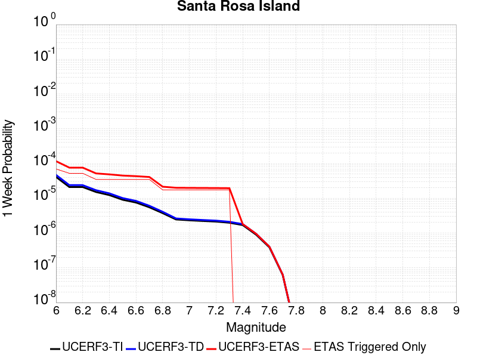 | 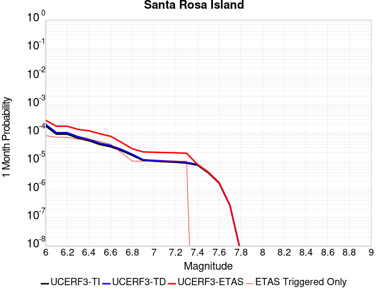 | 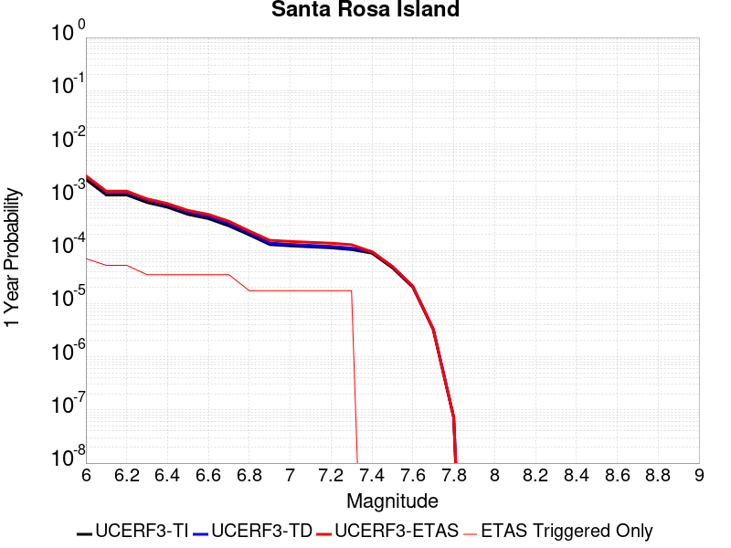 | 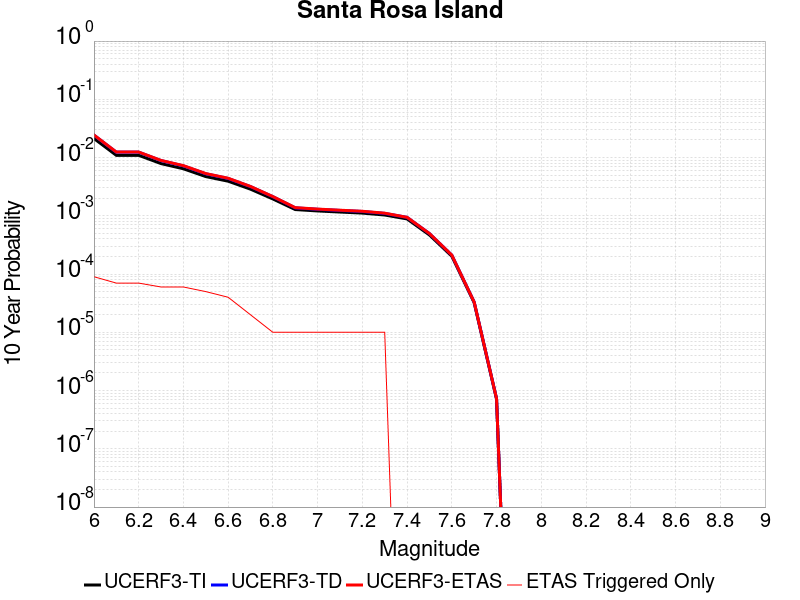 |

| Magnitude | 1 wk TI Prob | 1 wk TD Prob | 1 wk ETAS Prob | 1 wk ETAS/TD Gain | 1 wk ETAS Triggered Only | 1 mo TI Prob | 1 mo TD Prob | 1 mo ETAS Prob | 1 mo ETAS/TD Gain | 1 mo ETAS Triggered Only | 1 yr TI Prob | 1 yr TD Prob | 1 yr ETAS Prob | 1 yr ETAS/TD Gain | 1 yr ETAS Triggered Only | 10 yr TI Prob | 10 yr TD Prob | 10 yr ETAS Prob | 10 yr ETAS/TD Gain | 10 yr ETAS Triggered Only |
|-----|-----|-----|-----|-----|-----|-----|-----|-----|-----|-----|-----|-----|-----|-----|-----|-----|-----|-----|-----|-----|
| 6.0 | 4.1143165E-5 | 4.7091133E-5 | 1.16863E-4 | 2.4816349 | 6.977515E-5 | 1.7631594E-4 | 2.0180465E-4 | 2.7156572E-4 | 1.3456862 | 6.977515E-5 | 0.002144533 | 0.0024544 | 0.0025240039 | 1.0283588 | 6.977515E-5 | 0.021239553 | 0.024293551 | 0.024378652 | 1.003503 | 8.7218934E-5 |
| 6.1 | 2.1061249E-5 | 2.3864959E-5 | 7.619507E-5 | 3.1927593 | 5.233136E-5 | 9.0259375E-5 | 1.0227455E-4 | 1.5460057E-4 | 1.511623 | 5.233136E-5 | 0.0010983539 | 0.0012445104 | 0.0012967766 | 1.0419974 | 5.233136E-5 | 0.01092941 | 0.012378449 | 0.012430131 | 1.0041753 | 5.233136E-5 |
| 6.2 | 2.1061249E-5 | 2.3864959E-5 | 7.619507E-5 | 3.1927593 | 5.233136E-5 | 9.0259375E-5 | 1.0227455E-4 | 1.5460057E-4 | 1.511623 | 5.233136E-5 | 0.0010983539 | 0.0012445104 | 0.0012967766 | 1.0419974 | 5.233136E-5 | 0.01092941 | 0.012378449 | 0.012430131 | 1.0041753 | 5.233136E-5 |
| 6.3 | 1.5158236E-5 | 1.7074419E-5 | 5.1961397E-5 | 3.0432308 | 3.4887576E-5 | 6.496225E-5 | 7.3174095E-5 | 1.0805912E-4 | 1.47674 | 3.4887576E-5 | 7.906284E-4 | 8.905424E-4 | 9.2539896E-4 | 1.0391407 | 3.4887576E-5 | 0.007878214 | 0.008870989 | 0.008905567 | 1.0038979 | 3.4887576E-5 |
| 6.4 | 1.2341918E-5 | 1.3852917E-5 | 4.8740007E-5 | 3.5183933 | 3.4887576E-5 | 5.2892858E-5 | 5.9368336E-5 | 9.425384E-5 | 1.5876113 | 3.4887576E-5 | 6.437803E-4 | 7.225779E-4 | 7.574403E-4 | 1.0482472 | 3.4887576E-5 | 0.006419184 | 0.007203121 | 0.0072377576 | 1.0048085 | 3.4887576E-5 |
| 6.5 | 9.061158E-6 | 1.0117031E-5 | 4.5004253E-5 | 4.4483657 | 3.4887576E-5 | 3.883296E-5 | 4.3358013E-5 | 7.824408E-5 | 1.8046048 | 3.4887576E-5 | 4.726887E-4 | 5.277613E-4 | 5.626305E-4 | 1.06607 | 3.4887576E-5 | 0.004716845 | 0.0052656173 | 0.005300321 | 1.0065906 | 3.4887576E-5 |
| 6.6 | 7.5461685E-6 | 8.400733E-6 | 4.3288015E-5 | 5.152885 | 3.4887576E-5 | 3.2340322E-5 | 3.600267E-5 | 7.088899E-5 | 1.9689925 | 3.4887576E-5 | 3.936723E-4 | 4.3824865E-4 | 4.7312095E-4 | 1.079572 | 3.4887576E-5 | 0.003929756 | 0.0043742736 | 0.0044090087 | 1.0079408 | 3.4887576E-5 |
| 6.7 | 5.5023775E-6 | 6.087381E-6 | 4.0974744E-5 | 6.731096 | 3.4887576E-5 | 2.3581404E-5 | 2.6088532E-5 | 6.0975195E-5 | 2.3372414 | 3.4887576E-5 | 2.8706578E-4 | 3.1758484E-4 | 3.5246133E-4 | 1.1098179 | 3.4887576E-5 | 0.0028669522 | 0.0031716314 | 0.0032064083 | 1.010965 | 3.4887576E-5 |
| 6.8 | 3.7351679E-6 | 4.0831405E-6 | 2.1526857E-5 | 5.2721324 | 1.7443788E-5 | 1.6007763E-5 | 1.749907E-5 | 3.4942554E-5 | 1.9968234 | 1.7443788E-5 | 1.948771E-4 | 2.1303284E-4 | 2.3047291E-4 | 1.0818657 | 1.7443788E-5 | 0.0019470629 | 0.0021285315 | 0.002145938 | 1.0081778 | 1.7443788E-5 |
| 6.9 | 2.456366E-6 | 2.6292705E-6 | 2.0073012E-5 | 7.6344414 | 1.7443788E-5 | 1.0527241E-5 | 1.1268254E-5 | 2.8711846E-5 | 2.5480297 | 1.7443788E-5 | 1.2816161E-4 | 1.3718237E-4 | 1.5462378E-4 | 1.1271402 | 1.7443788E-5 | 0.0012808773 | 0.0013709799 | 0.0013883997 | 1.0127062 | 1.7443788E-5 |
| 7.0 | 2.3245157E-6 | 2.4827782E-6 | 1.9926523E-5 | 8.025897 | 1.7443788E-5 | 9.962172E-6 | 1.0640435E-5 | 2.8084038E-5 | 2.6393692 | 1.7443788E-5 | 1.2128269E-4 | 1.2953962E-4 | 1.4698114E-4 | 1.1346424 | 1.7443788E-5 | 0.0012121652 | 0.0012946434 | 0.0013120646 | 1.0134563 | 1.7443788E-5 |
| 7.1 | 2.2248344E-6 | 2.37325E-6 | 1.9816996E-5 | 8.350151 | 1.7443788E-5 | 9.53497E-6 | 1.0171032E-5 | 2.7614642E-5 | 2.7150285 | 1.7443788E-5 | 1.1608207E-4 | 1.2382529E-4 | 1.4126692E-4 | 1.1408567 | 1.7443788E-5 | 0.0011602144 | 0.001237565 | 0.0012549872 | 1.0140778 | 1.7443788E-5 |
| 7.2 | 2.1350402E-6 | 2.276154E-6 | 1.9719902E-5 | 8.663694 | 1.7443788E-5 | 9.150141E-6 | 9.754909E-6 | 2.7198526E-5 | 2.7881887 | 1.7443788E-5 | 1.1139726E-4 | 1.1875956E-4 | 1.3620128E-4 | 1.1468657 | 1.7443788E-5 | 0.0011134144 | 0.0011869629 | 0.001204386 | 1.0146787 | 1.7443788E-5 |
| 7.3 | 1.9793572E-6 | 2.108719E-6 | 1.955247E-5 | 9.2722025 | 1.7443788E-5 | 8.482932E-6 | 9.037336E-6 | 2.6480966E-5 | 2.9301739 | 1.7443788E-5 | 1.032748E-4 | 1.10024026E-4 | 1.274659E-4 | 1.1585279 | 1.7443788E-5 | 0.0010322682 | 0.0010996973 | 0.001117122 | 1.015845 | 1.7443788E-5 |
| 7.4 | 1.6951194E-6 | 1.8045733E-6 | 1.8045733E-6 | 1.0 | 0.0 | 7.264777E-6 | 7.733863E-6 | 7.733863E-6 | 1.0 | 0.0 | 8.844508E-5 | 9.415573E-5 | 9.415573E-5 | 1.0 | 0.0 | 8.840988E-4 | 9.4116E-4 | 9.4116E-4 | 1.0 | 0.0 |
| 7.5 | 8.987207E-7 | 9.5122147E-7 | 9.5122147E-7 | 1.0 | 0.0 | 3.8516546E-6 | 4.076657E-6 | 4.076657E-6 | 1.0 | 0.0 | 4.6892885E-5 | 4.963218E-5 | 4.963218E-5 | 1.0 | 0.0 | 4.688299E-4 | 4.9621216E-4 | 4.9621216E-4 | 1.0 | 0.0 |
| 7.6 | 3.8783037E-7 | 4.052932E-7 | 4.052932E-7 | 1.0 | 0.0 | 1.6621291E-6 | 1.7369698E-6 | 1.7369698E-6 | 1.0 | 0.0 | 2.0236233E-5 | 2.1147409E-5 | 2.1147409E-5 | 1.0 | 0.0 | 2.023439E-4 | 2.1145462E-4 | 2.1145462E-4 | 1.0 | 0.0 |
| 7.7 | 6.181804E-8 | 6.339035E-8 | 6.339035E-8 | 1.0 | 0.0 | 2.6493444E-7 | 2.7167292E-7 | 2.7167292E-7 | 1.0 | 0.0 | 3.225572E-6 | 3.3076128E-6 | 3.3076128E-6 | 1.0 | 0.0 | 3.225525E-5 | 3.307564E-5 | 3.307564E-5 | 1.0 | 0.0 |
| 7.8 | 1.3704449E-9 | 1.3964153E-9 | 1.3964153E-9 | 1.0 | 0.0 | 5.873335E-9 | 5.984637E-9 | 5.984637E-9 | 1.0 | 0.0 | 7.1507856E-8 | 7.286295E-8 | 7.286295E-8 | 1.0 | 0.0 | 7.1507833E-7 | 7.286294E-7 | 7.286294E-7 | 1.0 | 0.0 |

## San Andreas (Creeping Section) 2011 CFM
*[(top)](#table-of-contents)*

| 1 Week | 1 Month | 1 Year | 10 Year |
|-----|-----|-----|-----|
| 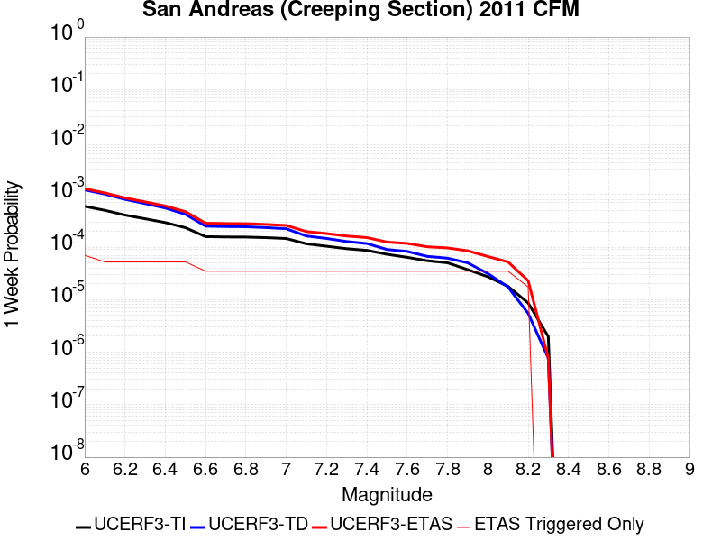 | 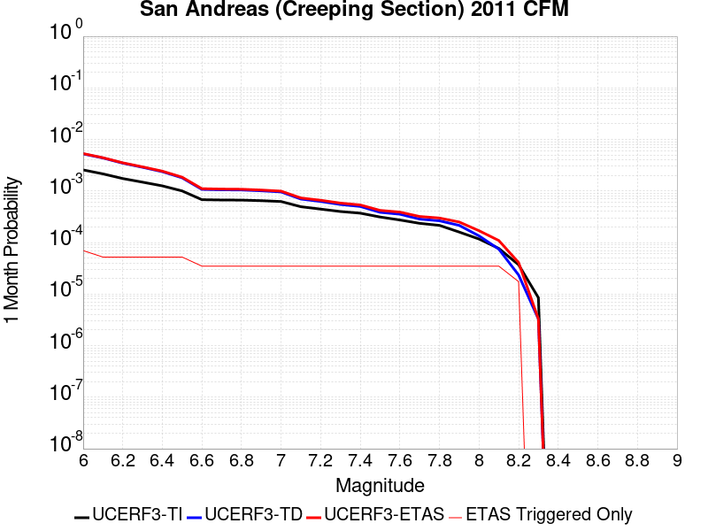 |  | 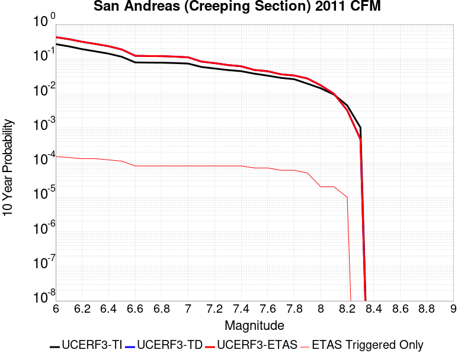 |

| Magnitude | 1 wk TI Prob | 1 wk TD Prob | 1 wk ETAS Prob | 1 wk ETAS/TD Gain | 1 wk ETAS Triggered Only | 1 mo TI Prob | 1 mo TD Prob | 1 mo ETAS Prob | 1 mo ETAS/TD Gain | 1 mo ETAS Triggered Only | 1 yr TI Prob | 1 yr TD Prob | 1 yr ETAS Prob | 1 yr ETAS/TD Gain | 1 yr ETAS Triggered Only | 10 yr TI Prob | 10 yr TD Prob | 10 yr ETAS Prob | 10 yr ETAS/TD Gain | 10 yr ETAS Triggered Only |
|-----|-----|-----|-----|-----|-----|-----|-----|-----|-----|-----|-----|-----|-----|-----|-----|-----|-----|-----|-----|-----|
| 6.0 | 5.986481E-4 | 0.001228691 | 0.0012983804 | 1.0567185 | 6.977515E-5 | 0.0025631124 | 0.005246795 | 0.005316204 | 1.0132289 | 6.977515E-5 | 0.030762846 | 0.061203245 | 0.06126875 | 1.0010703 | 6.977515E-5 | 0.26835477 | 0.425928 | 0.42596805 | 1.000094 | 6.977515E-5 |
| 6.1 | 5.015945E-4 | 0.0010230356 | 0.0010753134 | 1.0511007 | 5.233136E-5 | 0.00214792 | 0.004369436 | 0.004421538 | 1.0119244 | 5.233136E-5 | 0.025839351 | 0.051246606 | 0.051296256 | 1.0009688 | 5.233136E-5 | 0.23032776 | 0.37284943 | 0.37288228 | 1.000088 | 5.233136E-5 |
| 6.2 | 4.073338E-4 | 8.1157376E-4 | 8.6386263E-4 | 1.064429 | 5.233136E-5 | 0.0017445484 | 0.0034683137 | 0.0035204636 | 1.0150361 | 5.233136E-5 | 0.021034058 | 0.04093177 | 0.04098196 | 1.0012262 | 5.233136E-5 | 0.19150782 | 0.31302592 | 0.31306186 | 1.0001148 | 5.233136E-5 |
| 6.3 | 3.464099E-4 | 6.7455834E-4 | 7.2685437E-4 | 1.0775263 | 5.233136E-5 | 0.0014837692 | 0.0028832308 | 0.0029354114 | 1.0180979 | 5.233136E-5 | 0.017915873 | 0.034187846 | 0.034238387 | 1.0014783 | 5.233136E-5 | 0.16538359 | 0.27130842 | 0.27134654 | 1.0001405 | 5.233136E-5 |
| 6.4 | 2.935057E-4 | 5.5516965E-4 | 6.07472E-4 | 1.0942096 | 5.233136E-5 | 0.0012572751 | 0.0023727308 | 0.0024249381 | 1.022003 | 5.233136E-5 | 0.015200248 | 0.02826279 | 0.028313642 | 1.0017992 | 5.233136E-5 | 0.14201577 | 0.23297668 | 0.23301682 | 1.0001723 | 5.233136E-5 |
| 6.5 | 2.3409708E-4 | 4.2132285E-4 | 4.7363216E-4 | 1.1241549 | 5.233136E-5 | 0.0010028875 | 0.0018017791 | 0.0018540162 | 1.0289919 | 5.233136E-5 | 0.012141965 | 0.021586355 | 0.021637555 | 1.0023719 | 5.233136E-5 | 0.11499573 | 0.1868149 | 0.18685746 | 1.0002278 | 5.233136E-5 |
| 6.6 | 1.5842178E-4 | 2.5068692E-4 | 2.8556574E-4 | 1.139133 | 3.4887576E-5 | 6.7877385E-4 | 0.0010739256 | 0.0011087757 | 1.0324512 | 3.4887576E-5 | 0.0082328 | 0.012995283 | 0.013029717 | 1.0026498 | 3.4887576E-5 | 0.07934396 | 0.12313759 | 0.123168185 | 1.0002484 | 3.4887576E-5 |
| 6.7 | 1.5616413E-4 | 2.4605254E-4 | 2.8093153E-4 | 1.1417543 | 3.4887576E-5 | 6.691031E-4 | 0.0010540807 | 0.0010889315 | 1.0330627 | 3.4887576E-5 | 0.0081159435 | 0.012757154 | 0.012791596 | 1.0026999 | 3.4887576E-5 | 0.0782586 | 0.12116472 | 0.121195376 | 1.0002531 | 3.4887576E-5 |
| 6.8 | 1.5538467E-4 | 2.442914E-4 | 2.7917046E-4 | 1.1427764 | 3.4887576E-5 | 6.6576427E-4 | 0.001046539 | 0.0010813901 | 1.0333012 | 3.4887576E-5 | 0.008075596 | 0.012666538 | 0.012700983 | 1.0027194 | 3.4887576E-5 | 0.07788358 | 0.12039561 | 0.12042629 | 1.0002549 | 3.4887576E-5 |
| 6.9 | 1.5153569E-4 | 2.3538464E-4 | 2.70264E-4 | 1.1481802 | 3.4887576E-5 | 6.49277E-4 | 0.0010084033 | 0.0010432557 | 1.034562 | 3.4887576E-5 | 0.007876333 | 0.012208726 | 0.012243188 | 1.0028228 | 3.4887576E-5 | 0.07602952 | 0.11646574 | 0.11649656 | 1.0002646 | 3.4887576E-5 |
| 7.0 | 1.4588932E-4 | 2.2395732E-4 | 2.5883707E-4 | 1.1557429 | 3.4887576E-5 | 6.250901E-4 | 9.59466E-4 | 9.943201E-4 | 1.0363265 | 3.4887576E-5 | 0.0075839474 | 0.011619428 | 0.01165391 | 1.0029676 | 3.4887576E-5 | 0.073302895 | 0.11131206 | 0.11134307 | 1.0002786 | 3.4887576E-5 |
| 7.1 | 1.1565079E-4 | 1.6281323E-4 | 1.9769512E-4 | 1.2142448 | 3.4887576E-5 | 4.955521E-4 | 6.9758523E-4 | 7.324485E-4 | 1.0499771 | 3.4887576E-5 | 0.006016669 | 0.008460228 | 0.00849482 | 1.0040889 | 3.4887576E-5 | 0.058563538 | 0.08366478 | 0.08369675 | 1.0003821 | 3.4887576E-5 |
| 7.2 | 1.0393792E-4 | 1.4615392E-4 | 1.8103639E-4 | 1.2386694 | 3.4887576E-5 | 4.4537216E-4 | 6.262243E-4 | 6.610901E-4 | 1.0556761 | 3.4887576E-5 | 0.005408933 | 0.0075977976 | 0.0076324204 | 1.0045569 | 3.4887576E-5 | 0.052791595 | 0.07561503 | 0.07564729 | 1.0004265 | 3.4887576E-5 |
| 7.3 | 9.332884E-5 | 1.2780601E-4 | 1.6268912E-4 | 1.272938 | 3.4887576E-5 | 3.999194E-4 | 5.4762565E-4 | 5.8249413E-4 | 1.0636721 | 3.4887576E-5 | 0.0048581534 | 0.0066470946 | 0.00668175 | 1.0052136 | 3.4887576E-5 | 0.047533102 | 0.06647954 | 0.06651211 | 1.00049 | 3.4887576E-5 |
| 7.4 | 8.670252E-5 | 1.1702972E-4 | 1.519132E-4 | 1.2980738 | 3.4887576E-5 | 3.715293E-4 | 5.014601E-4 | 5.3633016E-4 | 1.069537 | 3.4887576E-5 | 0.004513991 | 0.0060883067 | 0.0061229817 | 1.0056953 | 3.4887576E-5 | 0.044233937 | 0.061148684 | 0.061181437 | 1.0005356 | 3.4887576E-5 |
| 7.5 | 7.3036405E-5 | 9.005699E-5 | 1.2494142E-4 | 1.3873595 | 3.4887576E-5 | 3.129756E-4 | 3.859015E-4 | 4.207756E-4 | 1.0903705 | 3.4887576E-5 | 0.0038038217 | 0.0046882504 | 0.0047229743 | 1.0074066 | 3.4887576E-5 | 0.03739367 | 0.047875606 | 0.047908824 | 1.0006938 | 3.4887576E-5 |
| 7.6 | 6.3935775E-5 | 8.280209E-5 | 1.1768677E-4 | 1.421302 | 3.4887576E-5 | 2.7398168E-4 | 3.5481792E-4 | 3.8969313E-4 | 1.0982904 | 3.4887576E-5 | 0.0033306254 | 0.00431137 | 0.004346107 | 1.0080571 | 3.4887576E-5 | 0.032811474 | 0.043990135 | 0.044023488 | 1.0007582 | 3.4887576E-5 |
| 7.7 | 5.5050095E-5 | 6.661729E-5 | 1.0150254E-4 | 1.5236666 | 3.4887576E-5 | 2.3590765E-4 | 2.8547147E-4 | 3.2034906E-4 | 1.1221755 | 3.4887576E-5 | 0.0028683927 | 0.0034700802 | 0.0035048467 | 1.010019 | 3.4887576E-5 | 0.0283165 | 0.03579509 | 0.035828725 | 1.0009397 | 3.4887576E-5 |
| 7.8 | 5.027131E-5 | 6.1627725E-5 | 9.651315E-5 | 1.5660671 | 3.4887576E-5 | 2.1543067E-4 | 2.640921E-4 | 2.9897044E-4 | 1.132069 | 3.4887576E-5 | 0.0026197135 | 0.003210584 | 0.0032453595 | 1.0108316 | 3.4887576E-5 | 0.025890453 | 0.03312572 | 0.033159453 | 1.0010183 | 3.4887576E-5 |
| 7.9 | 3.7271806E-5 | 5.0224386E-5 | 8.511021E-5 | 1.6945993 | 3.4887576E-5 | 1.5972654E-4 | 2.1522962E-4 | 2.5010968E-4 | 1.1620598 | 3.4887576E-5 | 0.0019429359 | 0.0026172737 | 0.00265207 | 1.0132948 | 3.4887576E-5 | 0.019260362 | 0.027066687 | 0.02710063 | 1.0012541 | 3.4887576E-5 |
| 8.0 | 2.7310243E-5 | 3.1428404E-5 | 6.631488E-5 | 2.1100302 | 3.4887576E-5 | 1.17038646E-4 | 1.3468621E-4 | 1.6956909E-4 | 1.2589936 | 3.4887576E-5 | 0.0014240141 | 0.0016385721 | 0.0016734025 | 1.0212566 | 3.4887576E-5 | 0.014149235 | 0.01721387 | 0.017248156 | 1.0019919 | 3.4887576E-5 |
| 8.1 | 1.7940547E-5 | 1.7400796E-5 | 5.2287764E-5 | 3.0049064 | 3.4887576E-5 | 7.688579E-5 | 7.457271E-5 | 1.0945769E-4 | 1.4677981 | 3.4887576E-5 | 9.3568244E-4 | 9.075451E-4 | 9.42401E-4 | 1.0384068 | 3.4887576E-5 | 0.009317525 | 0.009799073 | 0.009833619 | 1.0035254 | 3.4887576E-5 |
| 8.2 | 8.643924E-6 | 5.4748625E-6 | 2.2918555E-5 | 4.1861424 | 1.7443788E-5 | 3.704486E-5 | 2.3463486E-5 | 4.0906863E-5 | 1.7434266 | 1.7443788E-5 | 4.5092785E-4 | 2.8563058E-4 | 3.0306936E-4 | 1.0610538 | 1.7443788E-5 | 0.0045001395 | 0.0032487072 | 0.0032660943 | 1.005352 | 1.7443788E-5 |
| 8.3 | 1.983087E-6 | 7.6599065E-7 | 7.6599065E-7 | 1.0 | 0.0 | 8.498917E-6 | 3.282813E-6 | 3.282813E-6 | 1.0 | 0.0 | 1.034694E-4 | 3.9967534E-5 | 3.9967534E-5 | 1.0 | 0.0 | 0.0010342124 | 4.719687E-4 | 4.719687E-4 | 1.0 | 0.0 |

## San Diego Trough north alt1
*[(top)](#table-of-contents)*

| 1 Week | 1 Month | 1 Year | 10 Year |
|-----|-----|-----|-----|
| 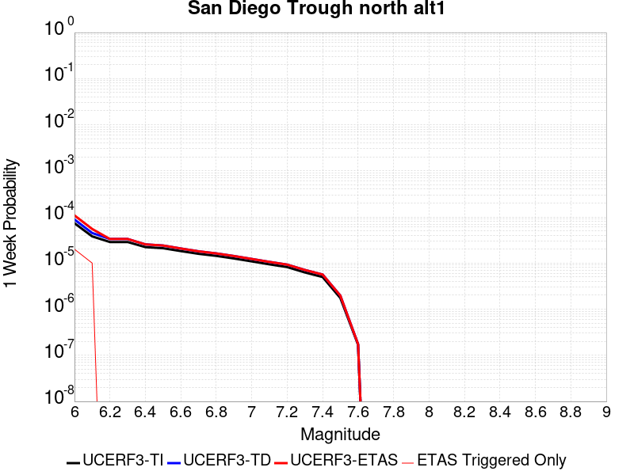 |  |  |  |

| Magnitude | 1 wk TI Prob | 1 wk TD Prob | 1 wk ETAS Prob | 1 wk ETAS/TD Gain | 1 wk ETAS Triggered Only | 1 mo TI Prob | 1 mo TD Prob | 1 mo ETAS Prob | 1 mo ETAS/TD Gain | 1 mo ETAS Triggered Only | 1 yr TI Prob | 1 yr TD Prob | 1 yr ETAS Prob | 1 yr ETAS/TD Gain | 1 yr ETAS Triggered Only | 10 yr TI Prob | 10 yr TD Prob | 10 yr ETAS Prob | 10 yr ETAS/TD Gain | 10 yr ETAS Triggered Only |
|-----|-----|-----|-----|-----|-----|-----|-----|-----|-----|-----|-----|-----|-----|-----|-----|-----|-----|-----|-----|-----|
| 6.0 | 7.329252E-5 | 8.821093E-5 | 1.0565318E-4 | 1.1977334 | 1.7443788E-5 | 3.14073E-4 | 3.7799572E-4 | 3.954329E-4 | 1.0461307 | 1.7443788E-5 | 0.0038171355 | 0.004593027 | 0.004645118 | 1.0113413 | 5.233136E-5 | 0.03752231 | 0.045044992 | 0.045111623 | 1.0014793 | 6.977515E-5 |
| 6.1 | 3.7940346E-5 | 4.4885E-5 | 6.232801E-5 | 1.3886155 | 1.7443788E-5 | 1.6259136E-4 | 1.9235066E-4 | 2.097911E-4 | 1.09067 | 1.7443788E-5 | 0.0019777524 | 0.0023394432 | 0.0023742493 | 1.0148779 | 3.4887576E-5 | 0.019602431 | 0.023156688 | 0.023207806 | 1.0022075 | 5.233136E-5 |
| 6.2 | 2.8645263E-5 | 3.329678E-5 | 3.329678E-5 | 1.0 | 0.0 | 1.2275964E-4 | 1.4269284E-4 | 1.4269284E-4 | 1.0 | 0.0 | 0.0014935739 | 0.0017359189 | 0.0017359189 | 1.0 | 0.0 | 0.0148357535 | 0.017226247 | 0.01724339 | 1.0009952 | 1.7443788E-5 |
| 6.3 | 2.8645263E-5 | 3.329678E-5 | 3.329678E-5 | 1.0 | 0.0 | 1.2275964E-4 | 1.4269284E-4 | 1.4269284E-4 | 1.0 | 0.0 | 0.0014935739 | 0.0017359189 | 0.0017359189 | 1.0 | 0.0 | 0.0148357535 | 0.017226247 | 0.01724339 | 1.0009952 | 1.7443788E-5 |
| 6.4 | 2.2204576E-5 | 2.5448318E-5 | 2.5448318E-5 | 1.0 | 0.0 | 9.5159E-5 | 1.0905972E-4 | 1.0905972E-4 | 1.0 | 0.0 | 0.001157945 | 0.0013270034 | 0.0013270034 | 1.0 | 0.0 | 0.011519298 | 0.013191955 | 0.013209169 | 1.0013049 | 1.7443788E-5 |
| 6.5 | 2.1004838E-5 | 2.4024694E-5 | 2.4024694E-5 | 1.0 | 0.0 | 9.0017624E-5 | 1.0295896E-4 | 1.0295896E-4 | 1.0 | 0.0 | 0.0010954136 | 0.0012528138 | 0.0012528138 | 1.0 | 0.0 | 0.010900296 | 0.012458589 | 0.012475816 | 1.0013827 | 1.7443788E-5 |
| 6.6 | 1.820557E-5 | 2.0704787E-5 | 2.0704787E-5 | 1.0 | 0.0 | 7.802154E-5 | 8.873181E-5 | 8.873181E-5 | 1.0 | 0.0 | 9.4949827E-4 | 0.0010797799 | 0.0010797799 | 1.0 | 0.0 | 0.009454516 | 0.010746004 | 0.010763261 | 1.0016059 | 1.7443788E-5 |
| 6.7 | 1.5884485E-5 | 1.7983646E-5 | 1.7983646E-5 | 1.0 | 0.0 | 6.807459E-5 | 7.707051E-5 | 7.707051E-5 | 1.0 | 0.0 | 8.284929E-4 | 9.3793223E-4 | 9.3793223E-4 | 1.0 | 0.0 | 0.008254109 | 0.009340104 | 0.009357384 | 1.0018501 | 1.7443788E-5 |
| 6.8 | 1.4331171E-5 | 1.6201066E-5 | 1.6201066E-5 | 1.0 | 0.0 | 6.141786E-5 | 6.94313E-5 | 6.94313E-5 | 1.0 | 0.0 | 7.4750587E-4 | 8.450002E-4 | 8.450002E-4 | 1.0 | 0.0 | 0.0074499645 | 0.008418139 | 0.008435436 | 1.0020547 | 1.7443788E-5 |
| 6.9 | 1.2574203E-5 | 1.4205835E-5 | 1.4205835E-5 | 1.0 | 0.0 | 5.3888325E-5 | 6.0880735E-5 | 6.0880735E-5 | 1.0 | 0.0 | 6.558929E-4 | 7.409723E-4 | 7.409723E-4 | 1.0 | 0.0 | 0.0065396037 | 0.007385203 | 0.0074025183 | 1.0023445 | 1.7443788E-5 |
| 7.0 | 1.0883844E-5 | 1.2289262E-5 | 1.2289262E-5 | 1.0 | 0.0 | 4.664421E-5 | 5.2667205E-5 | 5.2667205E-5 | 1.0 | 0.0 | 5.677453E-4 | 6.4103556E-4 | 6.4103556E-4 | 1.0 | 0.0 | 0.00566297 | 0.006391993 | 0.0064093247 | 1.0027115 | 1.7443788E-5 |
| 7.1 | 9.393088E-6 | 1.060702E-5 | 1.060702E-5 | 1.0 | 0.0 | 4.025547E-5 | 4.545787E-5 | 4.545787E-5 | 1.0 | 0.0 | 4.900001E-4 | 5.533098E-4 | 5.533098E-4 | 1.0 | 0.0 | 0.0048892107 | 0.005519418 | 0.0055367653 | 1.003143 | 1.7443788E-5 |
| 7.2 | 8.190791E-6 | 9.258625E-6 | 9.258625E-6 | 1.0 | 0.0 | 3.510292E-5 | 3.9679224E-5 | 3.9679224E-5 | 1.0 | 0.0 | 4.2729423E-4 | 4.8298817E-4 | 4.8298817E-4 | 1.0 | 0.0 | 0.0042647356 | 0.004819465 | 0.0048368243 | 1.003602 | 1.7443788E-5 |
| 7.3 | 6.268162E-6 | 7.089716E-6 | 7.089716E-6 | 1.0 | 0.0 | 2.6863276E-5 | 3.0384144E-5 | 3.0384144E-5 | 1.0 | 0.0 | 3.2701128E-4 | 3.6986457E-4 | 3.6986457E-4 | 1.0 | 0.0 | 0.003265305 | 0.003692536 | 0.0037099153 | 1.0047066 | 1.7443788E-5 |
| 7.4 | 4.985186E-6 | 5.6426816E-6 | 5.6426816E-6 | 1.0 | 0.0 | 2.1364907E-5 | 2.4182698E-5 | 2.4182698E-5 | 1.0 | 0.0 | 2.600867E-4 | 2.9438498E-4 | 2.9438498E-4 | 1.0 | 0.0 | 0.002597825 | 0.0029399914 | 0.0029573839 | 1.0059159 | 1.7443788E-5 |
| 7.5 | 1.7489613E-6 | 1.969678E-6 | 1.969678E-6 | 1.0 | 0.0 | 7.495527E-6 | 8.4414505E-6 | 8.4414505E-6 | 1.0 | 0.0 | 9.125422E-5 | 1.02770035E-4 | 1.02770035E-4 | 1.0 | 0.0 | 9.1216754E-4 | 0.0010272472 | 0.0010272472 | 1.0 | 0.0 |
| 7.6 | 1.6988751E-7 | 1.7533823E-7 | 1.7533823E-7 | 1.0 | 0.0 | 7.2808916E-7 | 7.5144936E-7 | 7.5144936E-7 | 1.0 | 0.0 | 8.864449E-6 | 9.14886E-6 | 9.14886E-6 | 1.0 | 0.0 | 8.8640954E-5 | 9.1485024E-5 | 9.1485024E-5 | 1.0 | 0.0 |

## Pinto Mtn
*[(top)](#table-of-contents)*

| 1 Week | 1 Month | 1 Year | 10 Year |
|-----|-----|-----|-----|
| 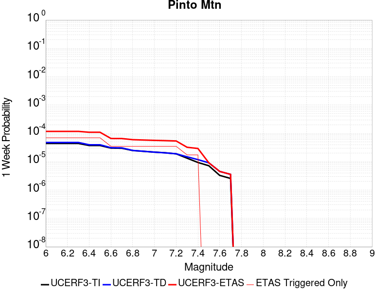 | 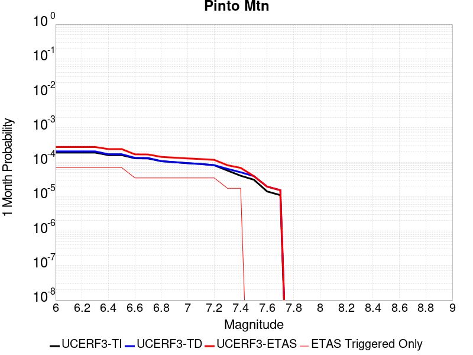 | 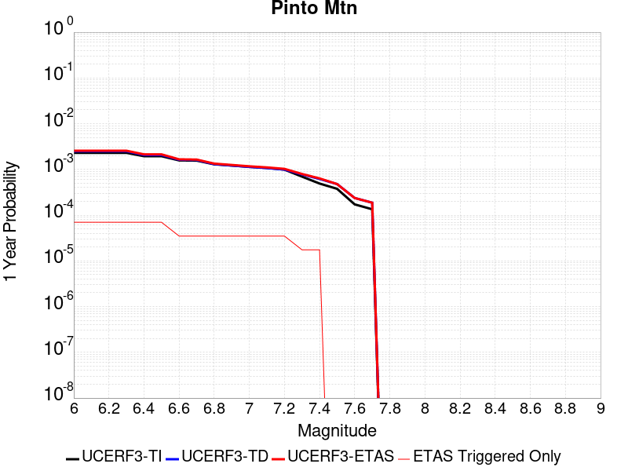 | 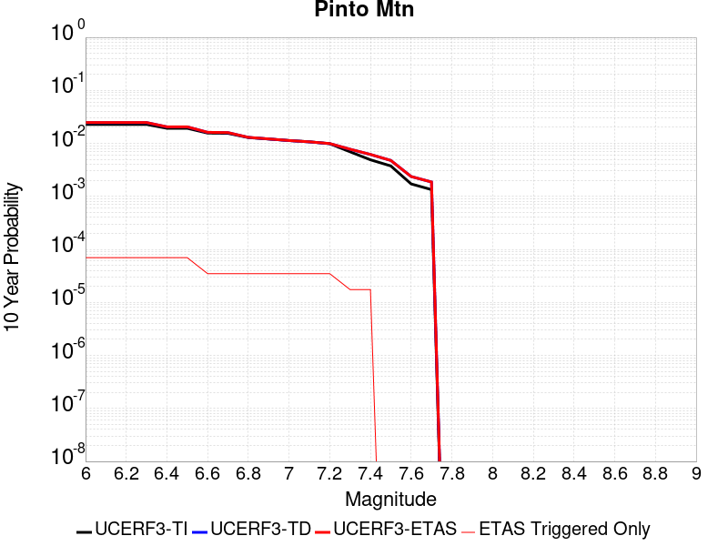 |

| Magnitude | 1 wk TI Prob | 1 wk TD Prob | 1 wk ETAS Prob | 1 wk ETAS/TD Gain | 1 wk ETAS Triggered Only | 1 mo TI Prob | 1 mo TD Prob | 1 mo ETAS Prob | 1 mo ETAS/TD Gain | 1 mo ETAS Triggered Only | 1 yr TI Prob | 1 yr TD Prob | 1 yr ETAS Prob | 1 yr ETAS/TD Gain | 1 yr ETAS Triggered Only | 10 yr TI Prob | 10 yr TD Prob | 10 yr ETAS Prob | 10 yr ETAS/TD Gain | 10 yr ETAS Triggered Only |
|-----|-----|-----|-----|-----|-----|-----|-----|-----|-----|-----|-----|-----|-----|-----|-----|-----|-----|-----|-----|-----|
| 6.0 | 4.4194956E-5 | 4.785362E-5 | 1.1762543E-4 | 2.4580257 | 6.977515E-5 | 1.893932E-4 | 2.0507174E-4 | 2.748326E-4 | 1.3401778 | 6.977515E-5 | 0.0023034236 | 0.0024940541 | 0.0025636554 | 1.0279068 | 6.977515E-5 | 0.022796938 | 0.024678145 | 0.024746198 | 1.0027577 | 6.977515E-5 |
| 6.1 | 4.4194956E-5 | 4.785362E-5 | 1.1762543E-4 | 2.4580257 | 6.977515E-5 | 1.893932E-4 | 2.0507174E-4 | 2.748326E-4 | 1.3401778 | 6.977515E-5 | 0.0023034236 | 0.0024940541 | 0.0025636554 | 1.0279068 | 6.977515E-5 | 0.022796938 | 0.024678145 | 0.024746198 | 1.0027577 | 6.977515E-5 |
| 6.2 | 4.4194956E-5 | 4.785362E-5 | 1.1762543E-4 | 2.4580257 | 6.977515E-5 | 1.893932E-4 | 2.0507174E-4 | 2.748326E-4 | 1.3401778 | 6.977515E-5 | 0.0023034236 | 0.0024940541 | 0.0025636554 | 1.0279068 | 6.977515E-5 | 0.022796938 | 0.024678145 | 0.024746198 | 1.0027577 | 6.977515E-5 |
| 6.3 | 4.4194956E-5 | 4.785362E-5 | 1.1762543E-4 | 2.4580257 | 6.977515E-5 | 1.893932E-4 | 2.0507174E-4 | 2.748326E-4 | 1.3401778 | 6.977515E-5 | 0.0023034236 | 0.0024940541 | 0.0025636554 | 1.0279068 | 6.977515E-5 | 0.022796938 | 0.024678145 | 0.024746198 | 1.0027577 | 6.977515E-5 |
| 6.4 | 3.729929E-5 | 3.9603186E-5 | 1.0937557E-4 | 2.7617872 | 6.977515E-5 | 1.5984432E-4 | 1.6971743E-4 | 2.3948074E-4 | 1.4110557 | 6.977515E-5 | 0.0019443673 | 0.002064445 | 0.002134076 | 1.0337287 | 6.977515E-5 | 0.019274427 | 0.02046269 | 0.020531038 | 1.0033401 | 6.977515E-5 |
| 6.5 | 3.729929E-5 | 3.9603186E-5 | 1.0937557E-4 | 2.7617872 | 6.977515E-5 | 1.5984432E-4 | 1.6971743E-4 | 2.3948074E-4 | 1.4110557 | 6.977515E-5 | 0.0019443673 | 0.002064445 | 0.002134076 | 1.0337287 | 6.977515E-5 | 0.019274427 | 0.02046269 | 0.020531038 | 1.0033401 | 6.977515E-5 |
| 6.6 | 3.0204548E-5 | 3.1205298E-5 | 6.609179E-5 | 2.117967 | 3.4887576E-5 | 1.2944164E-4 | 1.3373033E-4 | 1.6861325E-4 | 1.2608452 | 3.4887576E-5 | 0.0015748127 | 0.0016269855 | 0.0016618163 | 1.0214082 | 3.4887576E-5 | 0.015636992 | 0.01615461 | 0.016188933 | 1.0021247 | 3.4887576E-5 |
| 6.7 | 2.9857754E-5 | 3.081468E-5 | 6.5701184E-5 | 2.132139 | 3.4887576E-5 | 1.2795553E-4 | 1.3205643E-4 | 1.669394E-4 | 1.2641519 | 3.4887576E-5 | 0.0015567453 | 0.001606636 | 0.0016414674 | 1.0216798 | 3.4887576E-5 | 0.015458848 | 0.01595405 | 0.01598838 | 1.0021518 | 3.4887576E-5 |
| 6.8 | 2.4819734E-5 | 2.5009364E-5 | 5.9896065E-5 | 2.3949456 | 3.4887576E-5 | 1.0636595E-4 | 1.07178705E-4 | 1.4206253E-4 | 1.3254735 | 3.4887576E-5 | 0.0012942362 | 0.0013041412 | 0.0013389833 | 1.0267165 | 3.4887576E-5 | 0.012867244 | 0.0129672475 | 0.013001682 | 1.0026555 | 3.4887576E-5 |
| 6.9 | 2.331124E-5 | 2.3337643E-5 | 5.8224403E-5 | 2.494871 | 3.4887576E-5 | 9.990149E-5 | 1.00014746E-4 | 1.3489883E-4 | 1.3487895 | 3.4887576E-5 | 0.001215622 | 0.0012170197 | 0.0012518648 | 1.0286316 | 3.4887576E-5 | 0.012089936 | 0.012105742 | 0.012140206 | 1.002847 | 3.4887576E-5 |
| 7.0 | 2.1818534E-5 | 2.1760772E-5 | 5.6647586E-5 | 2.6031976 | 3.4887576E-5 | 9.3504656E-5 | 9.325723E-5 | 1.2814155E-4 | 1.3740656 | 3.4887576E-5 | 0.0011378246 | 0.0011348352 | 0.0011696832 | 1.0307075 | 3.4887576E-5 | 0.011320163 | 0.011292503 | 0.011326998 | 1.0030545 | 3.4887576E-5 |
| 7.1 | 2.066081E-5 | 2.0540418E-5 | 5.5427277E-5 | 2.6984494 | 3.4887576E-5 | 8.854332E-5 | 8.8027504E-5 | 1.2291201E-4 | 1.396291 | 3.4887576E-5 | 0.0010774818 | 0.0010712275 | 0.0011060777 | 1.0325329 | 3.4887576E-5 | 0.010722724 | 0.010662688 | 0.010697204 | 1.003237 | 3.4887576E-5 |
| 7.2 | 1.8990233E-5 | 1.9053701E-5 | 5.394061E-5 | 2.8309782 | 3.4887576E-5 | 8.138417E-5 | 8.1656275E-5 | 1.16541E-4 | 1.4272143 | 3.4887576E-5 | 9.904018E-4 | 9.937311E-4 | 0.001028584 | 1.0350728 | 3.4887576E-5 | 0.009859995 | 0.009894874 | 0.009929416 | 1.0034909 | 3.4887576E-5 |
| 7.3 | 1.3335872E-5 | 1.4906372E-5 | 3.23499E-5 | 2.170206 | 1.7443788E-5 | 5.7152483E-5 | 6.388296E-5 | 8.1325634E-5 | 1.2730411 | 1.7443788E-5 | 6.956093E-4 | 7.775102E-4 | 7.9494045E-4 | 1.022418 | 1.7443788E-5 | 0.006934359 | 0.0077491994 | 0.007766508 | 1.0022336 | 1.7443788E-5 |
| 7.4 | 9.414066E-6 | 1.186061E-5 | 2.930419E-5 | 2.4707153 | 1.7443788E-5 | 4.0345374E-5 | 5.0830247E-5 | 6.827315E-5 | 1.3431598 | 1.7443788E-5 | 4.910942E-4 | 6.1869196E-4 | 6.36125E-4 | 1.0281771 | 1.7443788E-5 | 0.0049001034 | 0.006170644 | 0.00618798 | 1.0028094 | 1.7443788E-5 |
| 7.5 | 7.2101157E-6 | 9.157893E-6 | 9.157893E-6 | 1.0 | 0.0 | 3.090013E-5 | 3.924757E-5 | 3.924757E-5 | 1.0 | 0.0 | 3.7614413E-4 | 4.7774217E-4 | 4.7774217E-4 | 1.0 | 0.0 | 0.0037550807 | 0.004767927 | 0.004767927 | 1.0 | 0.0 |
| 7.6 | 3.296375E-6 | 4.5453176E-6 | 4.5453176E-6 | 1.0 | 0.0 | 1.4127245E-5 | 1.9479796E-5 | 1.9479796E-5 | 1.0 | 0.0 | 1.7198564E-4 | 2.3714209E-4 | 2.3714209E-4 | 1.0 | 0.0 | 0.0017185259 | 0.0023690276 | 0.0023690276 | 1.0 | 0.0 |
| 7.7 | 2.5741092E-6 | 3.584251E-6 | 3.584251E-6 | 1.0 | 0.0 | 1.103185E-5 | 1.5360993E-5 | 1.5360993E-5 | 1.0 | 0.0 | 1.3430449E-4 | 1.8700535E-4 | 1.8700535E-4 | 1.0 | 0.0 | 0.0013422335 | 0.0018686098 | 0.0018686098 | 1.0 | 0.0 |

## San Jacinto (Coyote Creek)
*[(top)](#table-of-contents)*

| 1 Week | 1 Month | 1 Year | 10 Year |
|-----|-----|-----|-----|
|  | 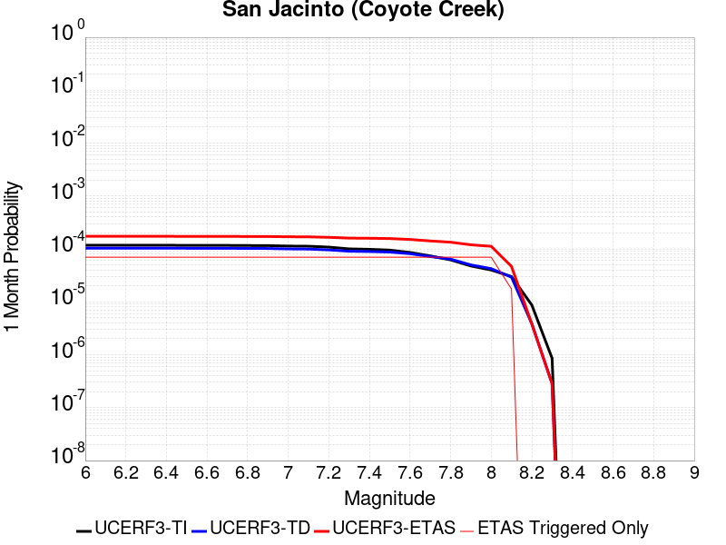 | 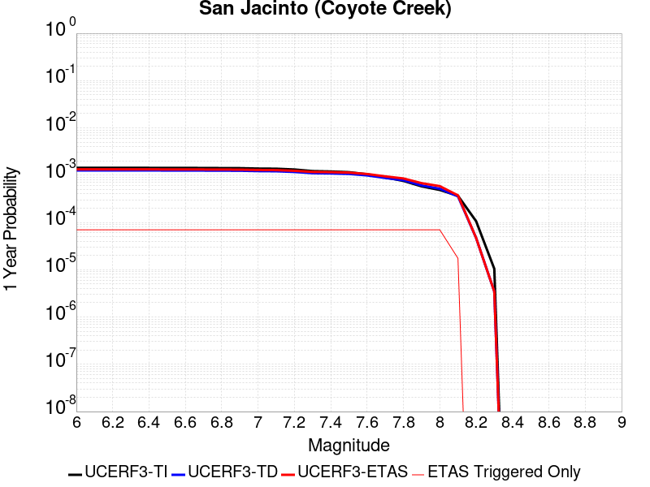 | 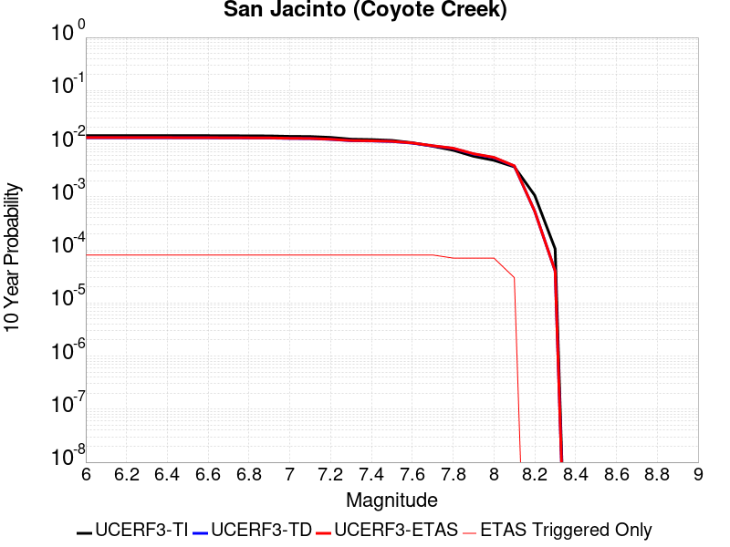 |

| Magnitude | 1 wk TI Prob | 1 wk TD Prob | 1 wk ETAS Prob | 1 wk ETAS/TD Gain | 1 wk ETAS Triggered Only | 1 mo TI Prob | 1 mo TD Prob | 1 mo ETAS Prob | 1 mo ETAS/TD Gain | 1 mo ETAS Triggered Only | 1 yr TI Prob | 1 yr TD Prob | 1 yr ETAS Prob | 1 yr ETAS/TD Gain | 1 yr ETAS Triggered Only | 10 yr TI Prob | 10 yr TD Prob | 10 yr ETAS Prob | 10 yr ETAS/TD Gain | 10 yr ETAS Triggered Only |
|-----|-----|-----|-----|-----|-----|-----|-----|-----|-----|-----|-----|-----|-----|-----|-----|-----|-----|-----|-----|-----|
| 6.0 | 2.7374346E-5 | 2.4145214E-5 | 9.391868E-5 | 3.889743 | 6.977515E-5 | 1.1731335E-4 | 1.034754E-4 | 1.7324333E-4 | 1.6742465 | 6.977515E-5 | 0.0014273542 | 0.0012590875 | 0.0013287747 | 1.0553474 | 6.977515E-5 | 0.01418221 | 0.012928318 | 0.012997191 | 1.0053273 | 6.977515E-5 |
| 6.1 | 2.7374346E-5 | 2.4145214E-5 | 9.391868E-5 | 3.889743 | 6.977515E-5 | 1.1731335E-4 | 1.034754E-4 | 1.7324333E-4 | 1.6742465 | 6.977515E-5 | 0.0014273542 | 0.0012590875 | 0.0013287747 | 1.0553474 | 6.977515E-5 | 0.01418221 | 0.012928318 | 0.012997191 | 1.0053273 | 6.977515E-5 |
| 6.2 | 2.7374346E-5 | 2.4145214E-5 | 9.391868E-5 | 3.889743 | 6.977515E-5 | 1.1731335E-4 | 1.034754E-4 | 1.7324333E-4 | 1.6742465 | 6.977515E-5 | 0.0014273542 | 0.0012590875 | 0.0013287747 | 1.0553474 | 6.977515E-5 | 0.01418221 | 0.012928318 | 0.012997191 | 1.0053273 | 6.977515E-5 |
| 6.3 | 2.7374346E-5 | 2.4145214E-5 | 9.391868E-5 | 3.889743 | 6.977515E-5 | 1.1731335E-4 | 1.034754E-4 | 1.7324333E-4 | 1.6742465 | 6.977515E-5 | 0.0014273542 | 0.0012590875 | 0.0013287747 | 1.0553474 | 6.977515E-5 | 0.01418221 | 0.012928318 | 0.012997191 | 1.0053273 | 6.977515E-5 |
| 6.4 | 2.7374346E-5 | 2.4145214E-5 | 9.391868E-5 | 3.889743 | 6.977515E-5 | 1.1731335E-4 | 1.034754E-4 | 1.7324333E-4 | 1.6742465 | 6.977515E-5 | 0.0014273542 | 0.0012590875 | 0.0013287747 | 1.0553474 | 6.977515E-5 | 0.01418221 | 0.012928318 | 0.012997191 | 1.0053273 | 6.977515E-5 |
| 6.5 | 2.7282445E-5 | 2.4031293E-5 | 9.380477E-5 | 3.9034424 | 6.977515E-5 | 1.16919524E-4 | 1.029872E-4 | 1.7275517E-4 | 1.677443 | 6.977515E-5 | 0.0014225657 | 0.0012531505 | 0.0013228382 | 1.0556101 | 6.977515E-5 | 0.014134934 | 0.012869646 | 0.012938523 | 1.0053519 | 6.977515E-5 |
| 6.6 | 2.7282445E-5 | 2.4031293E-5 | 9.380477E-5 | 3.9034424 | 6.977515E-5 | 1.16919524E-4 | 1.029872E-4 | 1.7275517E-4 | 1.677443 | 6.977515E-5 | 0.0014225657 | 0.0012531505 | 0.0013228382 | 1.0556101 | 6.977515E-5 | 0.014134934 | 0.012869646 | 0.012938523 | 1.0053519 | 6.977515E-5 |
| 6.7 | 2.7216198E-5 | 2.3956412E-5 | 9.372989E-5 | 3.9125178 | 6.977515E-5 | 1.1663563E-4 | 1.02666316E-4 | 1.724343E-4 | 1.6795607 | 6.977515E-5 | 0.0014191137 | 0.0012492483 | 0.0013189364 | 1.055784 | 6.977515E-5 | 0.014100855 | 0.0128310565 | 0.012899937 | 1.0053682 | 6.977515E-5 |
| 6.8 | 2.7078617E-5 | 2.387363E-5 | 9.364711E-5 | 3.9226172 | 6.977515E-5 | 1.1604605E-4 | 1.0231156E-4 | 1.7207957E-4 | 1.6819172 | 6.977515E-5 | 0.001411945 | 0.0012449342 | 0.0013146224 | 1.0559775 | 6.977515E-5 | 0.014030075 | 0.012788199 | 0.012857081 | 1.0053865 | 6.977515E-5 |
| 6.9 | 2.6982952E-5 | 2.3793142E-5 | 9.356663E-5 | 3.9325042 | 6.977515E-5 | 1.15636096E-4 | 1.0196664E-4 | 1.7173467E-4 | 1.6842241 | 6.977515E-5 | 0.0014069602 | 0.0012407395 | 0.001310428 | 1.056167 | 6.977515E-5 | 0.013980856 | 0.012746515 | 0.0128154 | 1.0054042 | 6.977515E-5 |
| 7.0 | 2.6449972E-5 | 2.3370165E-5 | 9.314368E-5 | 3.9855812 | 6.977515E-5 | 1.1335209E-4 | 1.00154015E-4 | 1.6992218E-4 | 1.6966088 | 6.977515E-5 | 0.001379188 | 0.0012186957 | 0.0012883857 | 1.0571842 | 6.977515E-5 | 0.0137065975 | 0.0125278765 | 0.012596778 | 1.0054998 | 6.977515E-5 |
| 7.1 | 2.6257849E-5 | 2.3196202E-5 | 9.2969734E-5 | 4.0079722 | 6.977515E-5 | 1.1252879E-4 | 9.940852E-5 | 1.6917672E-4 | 1.7018334 | 6.977515E-5 | 0.0013691769 | 0.0012096294 | 0.0012793201 | 1.0576133 | 6.977515E-5 | 0.013607717 | 0.012437741 | 0.012506649 | 1.0055401 | 6.977515E-5 |
| 7.2 | 2.5270041E-5 | 2.2390966E-5 | 9.2164555E-5 | 4.116149 | 6.977515E-5 | 1.0829568E-4 | 9.595777E-5 | 1.6572622E-4 | 1.7270746 | 6.977515E-5 | 0.0013177024 | 0.0011676621 | 0.0012373558 | 1.0596865 | 6.977515E-5 | 0.013099162 | 0.012018777 | 0.012087714 | 1.0057358 | 6.977515E-5 |
| 7.3 | 2.339701E-5 | 2.1122814E-5 | 9.089649E-5 | 4.3032374 | 6.977515E-5 | 1.0026905E-4 | 9.0523215E-5 | 1.6029205E-4 | 1.7707286 | 6.977515E-5 | 0.001220092 | 0.0011015651 | 0.0011712633 | 1.0632721 | 6.977515E-5 | 0.012134149 | 0.011357696 | 0.011426679 | 1.0060736 | 6.977515E-5 |
| 7.4 | 2.296333E-5 | 2.0853171E-5 | 9.062686E-5 | 4.3459516 | 6.977515E-5 | 9.841056E-5 | 8.936768E-5 | 1.5913659E-4 | 1.7806952 | 6.977515E-5 | 0.0011974899 | 0.0010875105 | 0.0011572097 | 1.0640906 | 6.977515E-5 | 0.011910575 | 0.01121681 | 0.011285802 | 1.0061508 | 6.977515E-5 |
| 7.5 | 2.2188895E-5 | 2.0376096E-5 | 9.014982E-5 | 4.4242935 | 6.977515E-5 | 9.50918E-5 | 8.732321E-5 | 1.5709226E-4 | 1.7989749 | 6.977515E-5 | 0.0011571277 | 0.0010626436 | 0.0011323446 | 1.065592 | 6.977515E-5 | 0.011511209 | 0.010966429 | 0.011035439 | 1.0062928 | 6.977515E-5 |
| 7.6 | 2.0013189E-5 | 1.8962366E-5 | 8.873619E-5 | 4.679595 | 6.977515E-5 | 8.5767984E-5 | 8.1264756E-5 | 1.5103424E-4 | 1.8585453 | 6.977515E-5 | 0.001043725 | 9.889511E-4 | 0.0010586573 | 1.0704849 | 6.977515E-5 | 0.010388365 | 0.010224434 | 0.010293495 | 1.0067546 | 6.977515E-5 |
| 7.7 | 1.7230794E-5 | 1.674371E-5 | 8.651769E-5 | 5.167176 | 6.977515E-5 | 7.384417E-5 | 7.175679E-5 | 1.4152694E-4 | 1.9723142 | 6.977515E-5 | 8.986819E-4 | 8.7328954E-4 | 9.4300375E-4 | 1.0798295 | 6.977515E-5 | 0.008950562 | 0.009062956 | 0.009132099 | 1.0076292 | 6.977515E-5 |
| 7.8 | 1.4478809E-5 | 1.4990978E-5 | 8.476508E-5 | 5.6544065 | 6.977515E-5 | 6.205057E-5 | 6.424547E-5 | 1.3401614E-4 | 2.0860014 | 6.977515E-5 | 7.552038E-4 | 7.819085E-4 | 8.516291E-4 | 1.0891672 | 6.977515E-5 | 0.0075264242 | 0.008141387 | 0.008210595 | 1.0085007 | 6.977515E-5 |
| 7.9 | 1.1114467E-5 | 1.1645102E-5 | 8.141944E-5 | 6.9917326 | 6.977515E-5 | 4.7632562E-5 | 4.990663E-5 | 1.196783E-4 | 2.398044 | 6.977515E-5 | 5.797721E-4 | 6.074444E-4 | 6.7717716E-4 | 1.114797 | 6.977515E-5 | 0.0057826187 | 0.0063803247 | 0.0064496547 | 1.0108662 | 6.977515E-5 |
| 8.0 | 9.327402E-6 | 9.899186E-6 | 7.967364E-5 | 8.048505 | 6.977515E-5 | 3.9973966E-5 | 4.2424395E-5 | 1.1219658E-4 | 2.6446242 | 6.977515E-5 | 4.8657437E-4 | 5.1639514E-4 | 5.8613427E-4 | 1.1350499 | 6.977515E-5 | 0.0048551033 | 0.0054499684 | 0.0055193636 | 1.0127331 | 6.977515E-5 |
| 8.1 | 7.0235833E-6 | 6.827495E-6 | 2.4271163E-5 | 3.554915 | 1.7443788E-5 | 3.0100724E-5 | 2.9260367E-5 | 4.6703644E-5 | 1.59614 | 1.7443788E-5 | 3.664147E-4 | 3.5618723E-4 | 3.7362482E-4 | 1.0489562 | 1.7443788E-5 | 0.003658111 | 0.0037876023 | 0.00380498 | 1.004588 | 1.7443788E-5 |
| 8.2 | 2.0358202E-6 | 8.994527E-7 | 8.994527E-7 | 1.0 | 0.0 | 8.724915E-6 | 3.854792E-6 | 3.854792E-6 | 1.0 | 0.0 | 1.06220665E-4 | 4.69311E-5 | 4.69311E-5 | 1.0 | 0.0 | 0.001061699 | 5.3254166E-4 | 5.3254166E-4 | 1.0 | 0.0 |
| 8.3 | 2.0051264E-7 | 6.617272E-8 | 6.617272E-8 | 1.0 | 0.0 | 8.5933965E-7 | 2.8359733E-7 | 2.8359733E-7 | 1.0 | 0.0 | 1.046241E-5 | 3.4527925E-6 | 3.4527925E-6 | 1.0 | 0.0 | 1.0461917E-4 | 4.01389E-5 | 4.01389E-5 | 1.0 | 0.0 |

## San Jacinto (Anza) rev
*[(top)](#table-of-contents)*

| 1 Week | 1 Month | 1 Year | 10 Year |
|-----|-----|-----|-----|
| 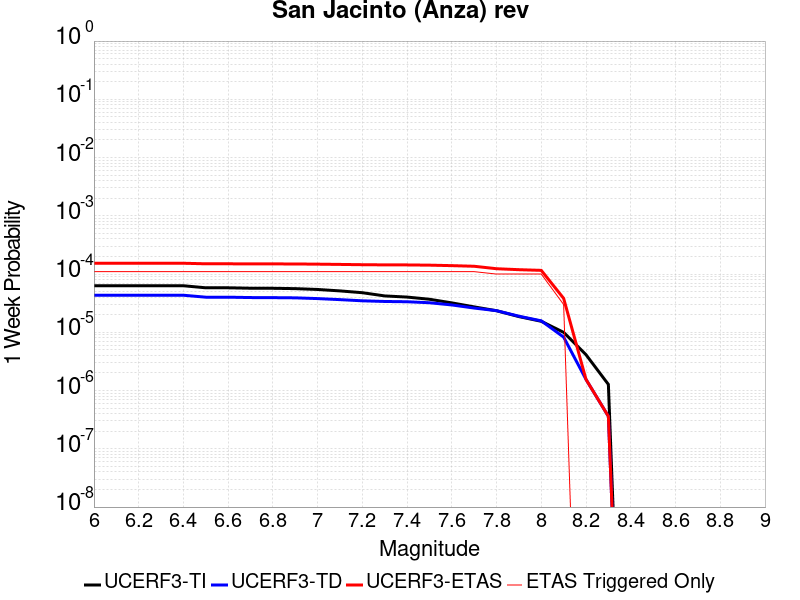 | 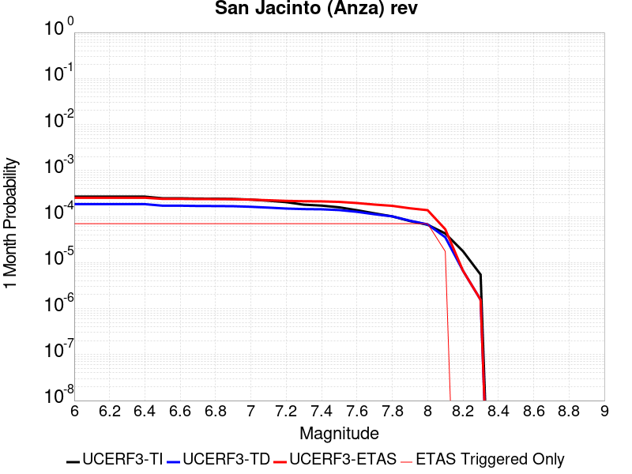 | 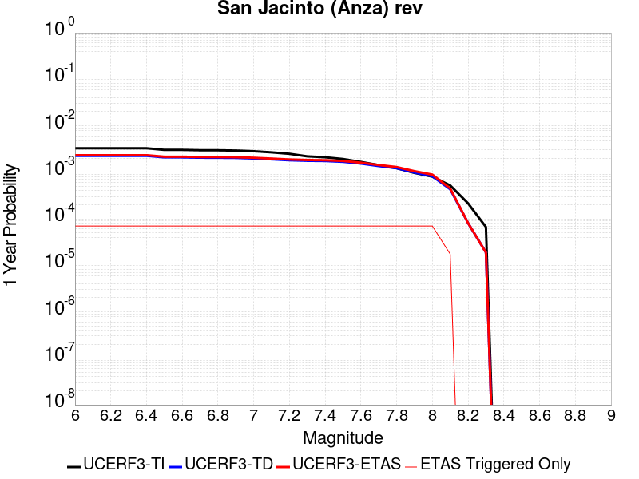 | 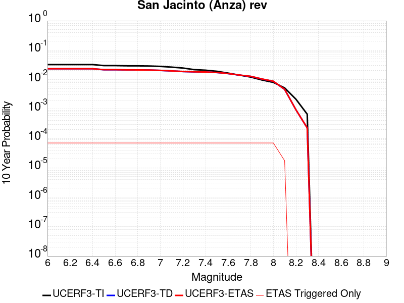 |

| Magnitude | 1 wk TI Prob | 1 wk TD Prob | 1 wk ETAS Prob | 1 wk ETAS/TD Gain | 1 wk ETAS Triggered Only | 1 mo TI Prob | 1 mo TD Prob | 1 mo ETAS Prob | 1 mo ETAS/TD Gain | 1 mo ETAS Triggered Only | 1 yr TI Prob | 1 yr TD Prob | 1 yr ETAS Prob | 1 yr ETAS/TD Gain | 1 yr ETAS Triggered Only | 10 yr TI Prob | 10 yr TD Prob | 10 yr ETAS Prob | 10 yr ETAS/TD Gain | 10 yr ETAS Triggered Only |
|-----|-----|-----|-----|-----|-----|-----|-----|-----|-----|-----|-----|-----|-----|-----|-----|-----|-----|-----|-----|-----|
| 6.0 | 6.3015636E-5 | 4.3302647E-5 | 1.1307478E-4 | 2.611267 | 6.977515E-5 | 2.7003905E-4 | 1.8556965E-4 | 2.5533183E-4 | 1.3759354 | 6.977515E-5 | 0.0032827691 | 0.0022569813 | 0.0023265989 | 1.0308455 | 6.977515E-5 | 0.032346968 | 0.023296192 | 0.023364343 | 1.0029254 | 6.977515E-5 |
| 6.1 | 6.3015636E-5 | 4.3302647E-5 | 1.1307478E-4 | 2.611267 | 6.977515E-5 | 2.7003905E-4 | 1.8556965E-4 | 2.5533183E-4 | 1.3759354 | 6.977515E-5 | 0.0032827691 | 0.0022569813 | 0.0023265989 | 1.0308455 | 6.977515E-5 | 0.032346968 | 0.023296192 | 0.023364343 | 1.0029254 | 6.977515E-5 |
| 6.2 | 6.3015636E-5 | 4.3302647E-5 | 1.1307478E-4 | 2.611267 | 6.977515E-5 | 2.7003905E-4 | 1.8556965E-4 | 2.5533183E-4 | 1.3759354 | 6.977515E-5 | 0.0032827691 | 0.0022569813 | 0.0023265989 | 1.0308455 | 6.977515E-5 | 0.032346968 | 0.023296192 | 0.023364343 | 1.0029254 | 6.977515E-5 |
| 6.3 | 6.3015636E-5 | 4.3302647E-5 | 1.1307478E-4 | 2.611267 | 6.977515E-5 | 2.7003905E-4 | 1.8556965E-4 | 2.5533183E-4 | 1.3759354 | 6.977515E-5 | 0.0032827691 | 0.0022569813 | 0.0023265989 | 1.0308455 | 6.977515E-5 | 0.032346968 | 0.023296192 | 0.023364343 | 1.0029254 | 6.977515E-5 |
| 6.4 | 6.3015636E-5 | 4.3302647E-5 | 1.1307478E-4 | 2.611267 | 6.977515E-5 | 2.7003905E-4 | 1.8556965E-4 | 2.5533183E-4 | 1.3759354 | 6.977515E-5 | 0.0032827691 | 0.0022569813 | 0.0023265989 | 1.0308455 | 6.977515E-5 | 0.032346968 | 0.023296192 | 0.023364343 | 1.0029254 | 6.977515E-5 |
| 6.5 | 5.811017E-5 | 4.0082516E-5 | 1.0985487E-4 | 2.740718 | 6.977515E-5 | 2.4901982E-4 | 1.7177092E-4 | 2.4153409E-4 | 1.4061407 | 6.977515E-5 | 0.0030276014 | 0.002089311 | 0.00215894 | 1.0333265 | 6.977515E-5 | 0.02986684 | 0.021593736 | 0.021662006 | 1.0031615 | 6.977515E-5 |
| 6.6 | 5.811017E-5 | 4.0082516E-5 | 1.0985487E-4 | 2.740718 | 6.977515E-5 | 2.4901982E-4 | 1.7177092E-4 | 2.4153409E-4 | 1.4061407 | 6.977515E-5 | 0.0030276014 | 0.002089311 | 0.00215894 | 1.0333265 | 6.977515E-5 | 0.02986684 | 0.021593736 | 0.021662006 | 1.0031615 | 6.977515E-5 |
| 6.7 | 5.712442E-5 | 3.9505223E-5 | 1.09277615E-4 | 2.7661562 | 6.977515E-5 | 2.4479596E-4 | 1.6929714E-4 | 2.3906048E-4 | 1.4120762 | 6.977515E-5 | 0.0029763177 | 0.0020592497 | 0.0021288812 | 1.033814 | 6.977515E-5 | 0.029367693 | 0.021285562 | 0.021353852 | 1.0032083 | 6.977515E-5 |
| 6.8 | 5.6967532E-5 | 3.9361643E-5 | 1.09134045E-4 | 2.7725987 | 6.977515E-5 | 2.4412372E-4 | 1.6868189E-4 | 2.3844527E-4 | 1.4135796 | 6.977515E-5 | 0.0029681553 | 0.002051773 | 0.002121405 | 1.0339375 | 6.977515E-5 | 0.029288229 | 0.021210281 | 0.021278577 | 1.00322 | 6.977515E-5 |
| 6.9 | 5.6211324E-5 | 3.9066435E-5 | 1.0883886E-4 | 2.785994 | 6.977515E-5 | 2.4088343E-4 | 1.6741687E-4 | 2.3718034E-4 | 1.4167051 | 6.977515E-5 | 0.0029288116 | 0.0020364004 | 0.0021060335 | 1.0341942 | 6.977515E-5 | 0.028905109 | 0.021049714 | 0.02111802 | 1.003245 | 6.977515E-5 |
| 7.0 | 5.4383527E-5 | 3.792697E-5 | 1.07699474E-4 | 2.839654 | 6.977515E-5 | 2.3305144E-4 | 1.6253405E-4 | 2.3229787E-4 | 1.4292258 | 6.977515E-5 | 0.0028337094 | 0.001977061 | 0.0020466982 | 1.0352225 | 6.977515E-5 | 0.027978465 | 0.020440677 | 0.020509025 | 1.0033438 | 6.977515E-5 |
| 7.1 | 5.1393665E-5 | 3.6389913E-5 | 1.0616252E-4 | 2.9173613 | 6.977515E-5 | 2.2023996E-4 | 1.5594746E-4 | 2.2571173E-4 | 1.4473575 | 6.977515E-5 | 0.0026781242 | 0.0018970112 | 0.001966654 | 1.0367118 | 6.977515E-5 | 0.026460782 | 0.019614287 | 0.019682692 | 1.0034876 | 6.977515E-5 |
| 7.2 | 4.785222E-5 | 3.4741795E-5 | 1.0451452E-4 | 3.0083222 | 6.977515E-5 | 2.0506482E-4 | 1.4888494E-4 | 2.186497E-4 | 1.4685817 | 6.977515E-5 | 0.0024938055 | 0.0018111705 | 0.0018808193 | 1.0384551 | 6.977515E-5 | 0.024660049 | 0.018728992 | 0.01879746 | 1.0036558 | 6.977515E-5 |
| 7.3 | 4.2143256E-5 | 3.383628E-5 | 1.0360907E-4 | 3.0620704 | 6.977515E-5 | 1.8060145E-4 | 1.4500458E-4 | 2.1476962E-4 | 1.481123 | 6.977515E-5 | 0.002196605 | 0.0017640047 | 0.0018336567 | 1.0394852 | 6.977515E-5 | 0.02175019 | 0.01823724 | 0.018305743 | 1.0037562 | 6.977515E-5 |
| 7.4 | 4.0264713E-5 | 3.347446E-5 | 1.0324728E-4 | 3.0843594 | 6.977515E-5 | 1.7255165E-4 | 1.4345412E-4 | 2.1321926E-4 | 1.4863237 | 6.977515E-5 | 0.002098792 | 0.0017451581 | 0.0018148115 | 1.0399123 | 6.977515E-5 | 0.020790804 | 0.018041821 | 0.018110337 | 1.0037977 | 6.977515E-5 |
| 7.5 | 3.694492E-5 | 3.218847E-5 | 1.0196137E-4 | 3.1676366 | 6.977515E-5 | 1.5832575E-4 | 1.379433E-4 | 2.0770883E-4 | 1.5057551 | 6.977515E-5 | 0.0019259118 | 0.001678169 | 0.001747827 | 1.0415083 | 6.977515E-5 | 0.01909306 | 0.01735827 | 0.017426834 | 1.0039499 | 6.977515E-5 |
| 7.6 | 3.200565E-5 | 2.9504106E-5 | 9.92772E-5 | 3.3648603 | 6.977515E-5 | 1.3715986E-4 | 1.2644005E-4 | 1.9620638E-4 | 1.5517739 | 6.977515E-5 | 0.001668642 | 0.0015383229 | 0.0016079907 | 1.0452882 | 6.977515E-5 | 0.01656168 | 0.0159463 | 0.016014963 | 1.0043058 | 6.977515E-5 |
| 7.7 | 2.731642E-5 | 2.6092788E-5 | 9.586612E-5 | 3.6740465 | 6.977515E-5 | 1.1706512E-4 | 1.1182144E-4 | 1.815888E-4 | 1.6239175 | 6.977515E-5 | 0.001424336 | 0.0013605768 | 0.0014302571 | 1.0512137 | 6.977515E-5 | 0.014152412 | 0.014167004 | 0.014235792 | 1.0048554 | 6.977515E-5 |
| 7.8 | 2.3466424E-5 | 2.3504817E-5 | 9.327833E-5 | 3.968477 | 6.977515E-5 | 1.0056651E-4 | 1.0073105E-4 | 1.7049917E-4 | 1.6926179 | 6.977515E-5 | 0.0012237094 | 0.0012257113 | 0.001295401 | 1.0568565 | 6.977515E-5 | 0.012169928 | 0.012808893 | 0.012877774 | 1.0053777 | 6.977515E-5 |
| 7.9 | 1.8611925E-5 | 1.8908117E-5 | 8.868195E-5 | 4.690152 | 6.977515E-5 | 7.9762955E-5 | 8.1032274E-5 | 1.5080177E-4 | 1.8610088 | 6.977515E-5 | 9.7068126E-4 | 9.861222E-4 | 0.0010558285 | 1.0706873 | 6.977515E-5 | 0.0096645225 | 0.010393824 | 0.010462875 | 1.0066434 | 6.977515E-5 |
| 8.0 | 1.5460775E-5 | 1.5740965E-5 | 8.5515014E-5 | 5.4326415 | 6.977515E-5 | 6.6258784E-5 | 6.7459536E-5 | 1.3722997E-4 | 2.0342562 | 6.977515E-5 | 8.0640207E-4 | 8.21011E-4 | 8.907289E-4 | 1.0849171 | 6.977515E-5 | 0.008034821 | 0.0087028835 | 0.008772052 | 1.0079477 | 6.977515E-5 |
| 8.1 | 9.983884E-6 | 8.269952E-6 | 2.5713594E-5 | 3.1092799 | 1.7443788E-5 | 4.2787375E-5 | 3.544217E-5 | 5.288534E-5 | 1.4921585 | 1.7443788E-5 | 5.2081177E-4 | 4.314235E-4 | 4.488598E-4 | 1.0404156 | 1.7443788E-5 | 0.0051959283 | 0.004640022 | 0.004657385 | 1.003742 | 1.7443788E-5 |
| 8.2 | 4.1226E-6 | 1.5529788E-6 | 1.5529788E-6 | 1.0 | 0.0 | 1.7668166E-5 | 6.6556063E-6 | 6.6556063E-6 | 1.0 | 0.0 | 2.1508869E-4 | 8.102902E-5 | 8.102902E-5 | 1.0 | 0.0 | 0.0021488064 | 9.4050163E-4 | 9.4050163E-4 | 1.0 | 0.0 |
| 8.3 | 1.2750878E-6 | 3.612133E-7 | 3.612133E-7 | 1.0 | 0.0 | 5.4646503E-6 | 1.548056E-6 | 1.548056E-6 | 1.0 | 0.0 | 6.653009E-5 | 1.8847424E-5 | 1.8847424E-5 | 1.0 | 0.0 | 6.6510175E-4 | 2.2734253E-4 | 2.2734253E-4 | 1.0 | 0.0 |

## Santa Ynez (East)
*[(top)](#table-of-contents)*

| 1 Week | 1 Month | 1 Year | 10 Year |
|-----|-----|-----|-----|
| 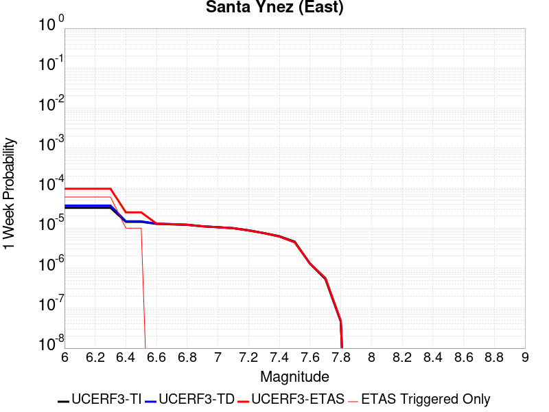 |  |  |  |

| Magnitude | 1 wk TI Prob | 1 wk TD Prob | 1 wk ETAS Prob | 1 wk ETAS/TD Gain | 1 wk ETAS Triggered Only | 1 mo TI Prob | 1 mo TD Prob | 1 mo ETAS Prob | 1 mo ETAS/TD Gain | 1 mo ETAS Triggered Only | 1 yr TI Prob | 1 yr TD Prob | 1 yr ETAS Prob | 1 yr ETAS/TD Gain | 1 yr ETAS Triggered Only | 10 yr TI Prob | 10 yr TD Prob | 10 yr ETAS Prob | 10 yr ETAS/TD Gain | 10 yr ETAS Triggered Only |
|-----|-----|-----|-----|-----|-----|-----|-----|-----|-----|-----|-----|-----|-----|-----|-----|-----|-----|-----|-----|-----|
| 6.0 | 3.2269712E-5 | 3.67505E-5 | 1.0652309E-4 | 2.898548 | 6.977515E-5 | 1.3829143E-4 | 1.5749598E-4 | 2.2726013E-4 | 1.4429584 | 6.977515E-5 | 0.0016823979 | 0.0019164166 | 0.001986058 | 1.0363394 | 6.977515E-5 | 0.016697178 | 0.019056441 | 0.019124886 | 1.0035918 | 6.977515E-5 |
| 6.1 | 3.2269712E-5 | 3.67505E-5 | 1.0652309E-4 | 2.898548 | 6.977515E-5 | 1.3829143E-4 | 1.5749598E-4 | 2.2726013E-4 | 1.4429584 | 6.977515E-5 | 0.0016823979 | 0.0019164166 | 0.001986058 | 1.0363394 | 6.977515E-5 | 0.016697178 | 0.019056441 | 0.019124886 | 1.0035918 | 6.977515E-5 |
| 6.2 | 3.2269712E-5 | 3.67505E-5 | 1.0652309E-4 | 2.898548 | 6.977515E-5 | 1.3829143E-4 | 1.5749598E-4 | 2.2726013E-4 | 1.4429584 | 6.977515E-5 | 0.0016823979 | 0.0019164166 | 0.001986058 | 1.0363394 | 6.977515E-5 | 0.016697178 | 0.019056441 | 0.019124886 | 1.0035918 | 6.977515E-5 |
| 6.3 | 3.2269712E-5 | 3.67505E-5 | 1.0652309E-4 | 2.898548 | 6.977515E-5 | 1.3829143E-4 | 1.5749598E-4 | 2.2726013E-4 | 1.4429584 | 6.977515E-5 | 0.0016823979 | 0.0019164166 | 0.001986058 | 1.0363394 | 6.977515E-5 | 0.016697178 | 0.019056441 | 0.019124886 | 1.0035918 | 6.977515E-5 |
| 6.4 | 1.4404779E-5 | 1.4849382E-5 | 1.4849382E-5 | 1.0 | 0.0 | 6.1733306E-5 | 6.363868E-5 | 6.363868E-5 | 1.0 | 0.0 | 7.513438E-4 | 7.745306E-4 | 7.745306E-4 | 1.0 | 0.0 | 0.0074880854 | 0.007718862 | 0.007718862 | 1.0 | 0.0 |
| 6.5 | 1.4404779E-5 | 1.4849382E-5 | 1.4849382E-5 | 1.0 | 0.0 | 6.1733306E-5 | 6.363868E-5 | 6.363868E-5 | 1.0 | 0.0 | 7.513438E-4 | 7.745306E-4 | 7.745306E-4 | 1.0 | 0.0 | 0.0074880854 | 0.007718862 | 0.007718862 | 1.0 | 0.0 |
| 6.6 | 1.280208E-5 | 1.3011947E-5 | 1.3011947E-5 | 1.0 | 0.0 | 5.4864904E-5 | 5.5764307E-5 | 5.5764307E-5 | 1.0 | 0.0 | 6.6777546E-4 | 6.787207E-4 | 6.787207E-4 | 1.0 | 0.0 | 0.006657724 | 0.0067666885 | 0.0067666885 | 1.0 | 0.0 |
| 6.7 | 1.2457027E-5 | 1.2628468E-5 | 1.2628468E-5 | 1.0 | 0.0 | 5.3386164E-5 | 5.412089E-5 | 5.412089E-5 | 1.0 | 0.0 | 6.497827E-4 | 6.587243E-4 | 6.587243E-4 | 1.0 | 0.0 | 0.00647886 | 0.006567915 | 0.006567915 | 1.0 | 0.0 |
| 6.8 | 1.2095134E-5 | 1.2230915E-5 | 1.2230915E-5 | 1.0 | 0.0 | 5.1835254E-5 | 5.241716E-5 | 5.241716E-5 | 1.0 | 0.0 | 6.309115E-4 | 6.379937E-4 | 6.379937E-4 | 1.0 | 0.0 | 0.0062912325 | 0.006361809 | 0.006361809 | 1.0 | 0.0 |
| 6.9 | 1.1104036E-5 | 1.1157347E-5 | 1.1157347E-5 | 1.0 | 0.0 | 4.758786E-5 | 4.781633E-5 | 4.781633E-5 | 1.0 | 0.0 | 5.7922816E-4 | 5.820096E-4 | 5.820096E-4 | 1.0 | 0.0 | 0.005777207 | 0.0058049993 | 0.0058049993 | 1.0 | 0.0 |
| 7.0 | 1.0577444E-5 | 1.058168E-5 | 1.058168E-5 | 1.0 | 0.0 | 4.5331115E-5 | 4.5349276E-5 | 4.5349276E-5 | 1.0 | 0.0 | 5.5176654E-4 | 5.519888E-4 | 5.519888E-4 | 1.0 | 0.0 | 0.0055039856 | 0.0055063153 | 0.0055063153 | 1.0 | 0.0 |
| 7.1 | 1.0021775E-5 | 9.980988E-6 | 9.980988E-6 | 1.0 | 0.0 | 4.294976E-5 | 4.2774966E-5 | 4.2774966E-5 | 1.0 | 0.0 | 5.2278786E-4 | 5.2066194E-4 | 5.2066194E-4 | 1.0 | 0.0 | 0.0052155964 | 0.0051945536 | 0.0051945536 | 1.0 | 0.0 |
| 7.2 | 8.874109E-6 | 8.748793E-6 | 8.748793E-6 | 1.0 | 0.0 | 3.8031343E-5 | 3.7494297E-5 | 3.7494297E-5 | 1.0 | 0.0 | 4.629332E-4 | 4.5639853E-4 | 4.5639853E-4 | 1.0 | 0.0 | 0.0046197 | 0.0045547304 | 0.0045547304 | 1.0 | 0.0 |
| 7.3 | 7.5504267E-6 | 7.5051175E-6 | 7.5051175E-6 | 1.0 | 0.0 | 3.235857E-5 | 3.21644E-5 | 3.21644E-5 | 1.0 | 0.0 | 3.9389438E-4 | 3.915322E-4 | 3.915322E-4 | 1.0 | 0.0 | 0.0039319694 | 0.003908531 | 0.003908531 | 1.0 | 0.0 |
| 7.4 | 6.309394E-6 | 6.1831556E-6 | 6.1831556E-6 | 1.0 | 0.0 | 2.703998E-5 | 2.6498974E-5 | 2.6498974E-5 | 1.0 | 0.0 | 3.2916202E-4 | 3.225782E-4 | 3.225782E-4 | 1.0 | 0.0 | 0.003286749 | 0.003221197 | 0.003221197 | 1.0 | 0.0 |
| 7.5 | 4.6103073E-6 | 4.4408903E-6 | 4.4408903E-6 | 1.0 | 0.0 | 1.975831E-5 | 1.9032252E-5 | 1.9032252E-5 | 1.0 | 0.0 | 2.4053088E-4 | 2.3169373E-4 | 2.3169373E-4 | 1.0 | 0.0 | 0.002402707 | 0.002314591 | 0.002314591 | 1.0 | 0.0 |
| 7.6 | 1.2858658E-6 | 1.3008173E-6 | 1.3008173E-6 | 1.0 | 0.0 | 5.5108417E-6 | 5.5749197E-6 | 5.5749197E-6 | 1.0 | 0.0 | 6.7092435E-5 | 6.78726E-5 | 6.78726E-5 | 1.0 | 0.0 | 6.707218E-4 | 6.785256E-4 | 6.785256E-4 | 1.0 | 0.0 |
| 7.7 | 5.3302307E-7 | 5.612138E-7 | 5.612138E-7 | 1.0 | 0.0 | 2.2843826E-6 | 2.4052001E-6 | 2.4052001E-6 | 1.0 | 0.0 | 2.7812002E-5 | 2.9282954E-5 | 2.9282954E-5 | 1.0 | 0.0 | 2.7808524E-4 | 2.9279452E-4 | 2.9279452E-4 | 1.0 | 0.0 |
| 7.8 | 4.613933E-8 | 4.80301E-8 | 4.80301E-8 | 1.0 | 0.0 | 1.9773998E-7 | 2.0584326E-7 | 2.0584326E-7 | 1.0 | 0.0 | 2.4074816E-6 | 2.5061388E-6 | 2.5061388E-6 | 1.0 | 0.0 | 2.4074554E-5 | 2.5061116E-5 | 2.5061116E-5 | 1.0 | 0.0 |

## Red Mountain
*[(top)](#table-of-contents)*

| 1 Week | 1 Month | 1 Year | 10 Year |
|-----|-----|-----|-----|
| 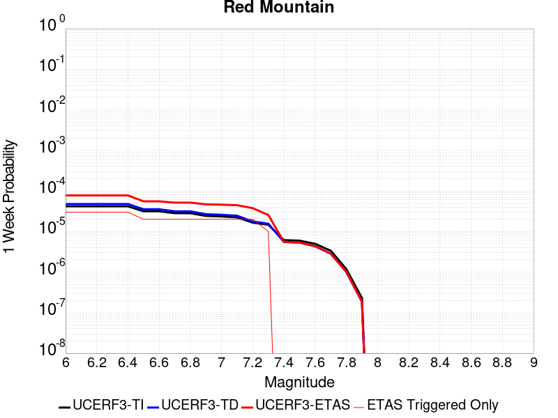 | 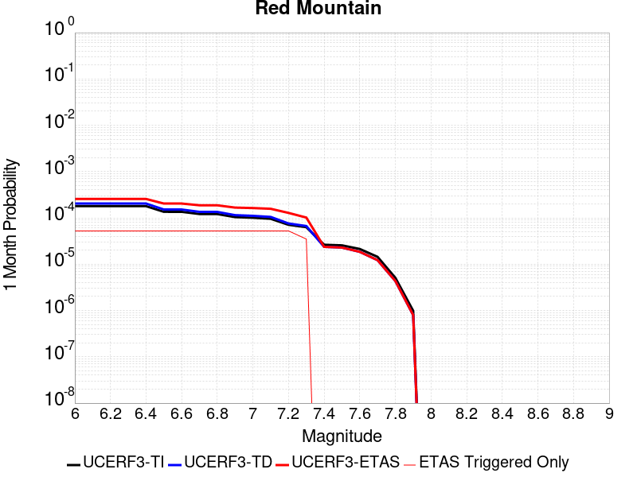 | 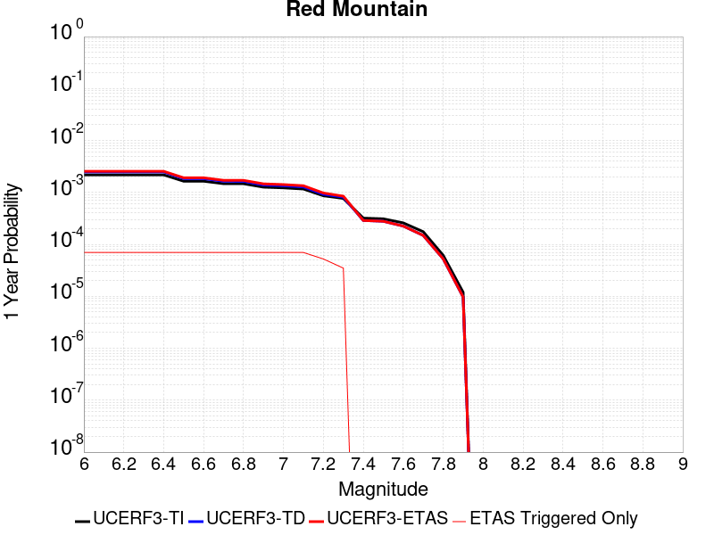 | 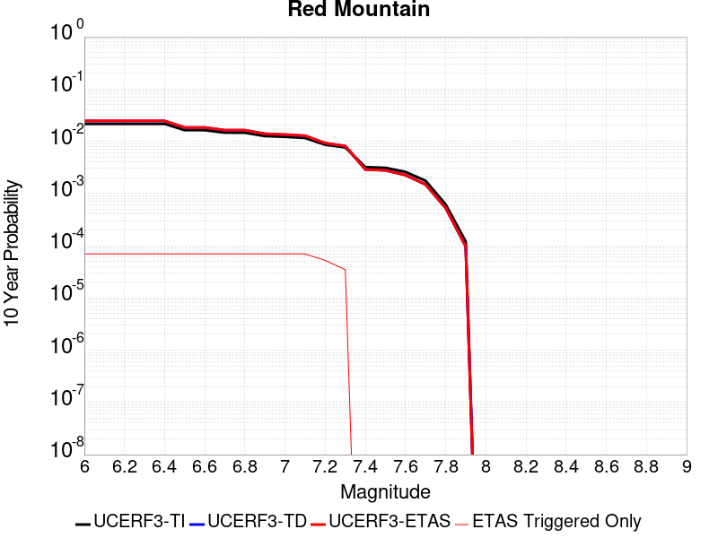 |

| Magnitude | 1 wk TI Prob | 1 wk TD Prob | 1 wk ETAS Prob | 1 wk ETAS/TD Gain | 1 wk ETAS Triggered Only | 1 mo TI Prob | 1 mo TD Prob | 1 mo ETAS Prob | 1 mo ETAS/TD Gain | 1 mo ETAS Triggered Only | 1 yr TI Prob | 1 yr TD Prob | 1 yr ETAS Prob | 1 yr ETAS/TD Gain | 1 yr ETAS Triggered Only | 10 yr TI Prob | 10 yr TD Prob | 10 yr ETAS Prob | 10 yr ETAS/TD Gain | 10 yr ETAS Triggered Only |
|-----|-----|-----|-----|-----|-----|-----|-----|-----|-----|-----|-----|-----|-----|-----|-----|-----|-----|-----|-----|-----|
| 6.0 | 4.1810763E-5 | 4.7589947E-5 | 8.247586E-5 | 1.7330521 | 3.4887576E-5 | 1.7917668E-4 | 2.039419E-4 | 2.562626E-4 | 1.256547 | 5.233136E-5 | 0.0021792934 | 0.0024803306 | 0.0025499328 | 1.0280616 | 6.977515E-5 | 0.021580452 | 0.024544092 | 0.024612155 | 1.002773 | 6.977515E-5 |
| 6.1 | 4.1810763E-5 | 4.7589947E-5 | 8.247586E-5 | 1.7330521 | 3.4887576E-5 | 1.7917668E-4 | 2.039419E-4 | 2.562626E-4 | 1.256547 | 5.233136E-5 | 0.0021792934 | 0.0024803306 | 0.0025499328 | 1.0280616 | 6.977515E-5 | 0.021580452 | 0.024544092 | 0.024612155 | 1.002773 | 6.977515E-5 |
| 6.2 | 4.1810763E-5 | 4.7589947E-5 | 8.247586E-5 | 1.7330521 | 3.4887576E-5 | 1.7917668E-4 | 2.039419E-4 | 2.562626E-4 | 1.256547 | 5.233136E-5 | 0.0021792934 | 0.0024803306 | 0.0025499328 | 1.0280616 | 6.977515E-5 | 0.021580452 | 0.024544092 | 0.024612155 | 1.002773 | 6.977515E-5 |
| 6.3 | 4.1810763E-5 | 4.7589947E-5 | 8.247586E-5 | 1.7330521 | 3.4887576E-5 | 1.7917668E-4 | 2.039419E-4 | 2.562626E-4 | 1.256547 | 5.233136E-5 | 0.0021792934 | 0.0024803306 | 0.0025499328 | 1.0280616 | 6.977515E-5 | 0.021580452 | 0.024544092 | 0.024612155 | 1.002773 | 6.977515E-5 |
| 6.4 | 4.1810763E-5 | 4.7589947E-5 | 8.247586E-5 | 1.7330521 | 3.4887576E-5 | 1.7917668E-4 | 2.039419E-4 | 2.562626E-4 | 1.256547 | 5.233136E-5 | 0.0021792934 | 0.0024803306 | 0.0025499328 | 1.0280616 | 6.977515E-5 | 0.021580452 | 0.024544092 | 0.024612155 | 1.002773 | 6.977515E-5 |
| 6.5 | 3.154503E-5 | 3.5359728E-5 | 7.024607E-5 | 1.9866123 | 3.4887576E-5 | 1.3518598E-4 | 1.5153342E-4 | 2.0385683E-4 | 1.345293 | 5.233136E-5 | 0.0016446467 | 0.0018434501 | 0.0019130966 | 1.0377805 | 6.977515E-5 | 0.01632528 | 0.018291233 | 0.018359732 | 1.003745 | 6.977515E-5 |
| 6.6 | 3.1535834E-5 | 3.534911E-5 | 7.023545E-5 | 1.9869087 | 3.4887576E-5 | 1.3514658E-4 | 1.5148791E-4 | 2.0381135E-4 | 1.3453968 | 5.233136E-5 | 0.0016441676 | 0.001842897 | 0.0019125437 | 1.0377918 | 6.977515E-5 | 0.01632056 | 0.018285794 | 0.018354295 | 1.003746 | 6.977515E-5 |
| 6.7 | 2.8267326E-5 | 3.146934E-5 | 6.635582E-5 | 2.1085863 | 3.4887576E-5 | 1.2114006E-4 | 1.348621E-4 | 1.8718641E-4 | 1.3879838 | 5.233136E-5 | 0.0014738824 | 0.0016407946 | 0.0017104552 | 1.0424554 | 6.977515E-5 | 0.014641452 | 0.016295563 | 0.016364202 | 1.004212 | 6.977515E-5 |
| 6.8 | 2.8212884E-5 | 3.1407224E-5 | 6.62937E-5 | 2.1107788 | 3.4887576E-5 | 1.20906756E-4 | 1.3459593E-4 | 1.8692025E-4 | 1.3887511 | 5.233136E-5 | 0.0014710457 | 0.0016375587 | 0.0017072196 | 1.0425395 | 6.977515E-5 | 0.014613459 | 0.01626368 | 0.01633232 | 1.0042205 | 6.977515E-5 |
| 6.9 | 2.4227871E-5 | 2.6706979E-5 | 6.159362E-5 | 2.3062744 | 3.4887576E-5 | 1.03829596E-4 | 1.14453884E-4 | 1.6677925E-4 | 1.4571743 | 5.233136E-5 | 0.0012633923 | 0.0013926612 | 0.0014623392 | 1.0500323 | 6.977515E-5 | 0.012562336 | 0.013847026 | 0.013915835 | 1.0049692 | 6.977515E-5 |
| 7.0 | 2.348524E-5 | 2.5835763E-5 | 6.0722436E-5 | 2.3503249 | 3.4887576E-5 | 1.0064714E-4 | 1.1072042E-4 | 1.6304599E-4 | 1.4725919 | 5.233136E-5 | 0.0012246901 | 0.0013472632 | 0.0014169443 | 1.0517205 | 6.977515E-5 | 0.012179627 | 0.01339859 | 0.01346743 | 1.0051379 | 6.977515E-5 |
| 7.1 | 2.2311642E-5 | 2.4462828E-5 | 5.934955E-5 | 2.4261115 | 3.4887576E-5 | 9.561782E-5 | 1.048369E-4 | 1.5716278E-4 | 1.4991169 | 5.233136E-5 | 0.0011635252 | 0.0012757168 | 0.0013454029 | 1.054625 | 6.977515E-5 | 0.01157452 | 0.012691451 | 0.012760341 | 1.0054281 | 6.977515E-5 |
| 7.2 | 1.6533986E-5 | 1.7670347E-5 | 5.2557305E-5 | 2.9743223 | 3.4887576E-5 | 7.085802E-5 | 7.572822E-5 | 1.2805562E-4 | 1.6909895 | 5.233136E-5 | 8.623549E-4 | 9.216645E-4 | 9.7394764E-4 | 1.0567268 | 5.233136E-5 | 0.008590161 | 0.009184699 | 0.00923655 | 1.0056454 | 5.233136E-5 |
| 7.3 | 1.4703092E-5 | 1.555952E-5 | 3.3003038E-5 | 2.121083 | 1.7443788E-5 | 6.301173E-5 | 6.66823E-5 | 1.0156755E-4 | 1.523156 | 3.4887576E-5 | 7.668978E-4 | 8.1161625E-4 | 8.4647554E-4 | 1.0429504 | 3.4887576E-5 | 0.0076425658 | 0.008092596 | 0.008127201 | 1.0042762 | 3.4887576E-5 |
| 7.4 | 6.1331984E-6 | 5.528872E-6 | 5.528872E-6 | 1.0 | 0.0 | 2.6284872E-5 | 2.3694953E-5 | 2.3694953E-5 | 1.0 | 0.0 | 3.199713E-4 | 2.8844838E-4 | 2.8844838E-4 | 1.0 | 0.0 | 0.0031951098 | 0.0028807942 | 0.0028807942 | 1.0 | 0.0 |
| 7.5 | 5.954766E-6 | 5.3385015E-6 | 5.3385015E-6 | 1.0 | 0.0 | 2.5520176E-5 | 2.2879094E-5 | 2.2879094E-5 | 1.0 | 0.0 | 3.1066386E-4 | 2.785179E-4 | 2.785179E-4 | 1.0 | 0.0 | 0.003102299 | 0.0027817423 | 0.0027817423 | 1.0 | 0.0 |
| 7.6 | 4.9726646E-6 | 4.315295E-6 | 4.315295E-6 | 1.0 | 0.0 | 2.1311245E-5 | 1.8493993E-5 | 1.8493993E-5 | 1.0 | 0.0 | 2.5943352E-4 | 2.2514143E-4 | 2.2514143E-4 | 1.0 | 0.0 | 0.0025913084 | 0.002249168 | 0.002249168 | 1.0 | 0.0 |
| 7.7 | 3.3613894E-6 | 2.8526642E-6 | 2.8526642E-6 | 1.0 | 0.0 | 1.4405875E-5 | 1.2225649E-5 | 1.2225649E-5 | 1.0 | 0.0 | 1.7537741E-4 | 1.4883737E-4 | 1.4883737E-4 | 1.0 | 0.0 | 0.0017523908 | 0.0014874031 | 0.0014874031 | 1.0 | 0.0 |
| 7.8 | 1.1828961E-6 | 1.0122756E-6 | 1.0122756E-6 | 1.0 | 0.0 | 5.069545E-6 | 4.338317E-6 | 4.338317E-6 | 1.0 | 0.0 | 6.171996E-5 | 5.281776E-5 | 5.281776E-5 | 1.0 | 0.0 | 6.170282E-4 | 5.2805495E-4 | 5.2805495E-4 | 1.0 | 0.0 |
| 7.9 | 2.2967266E-7 | 1.8618952E-7 | 1.8618952E-7 | 1.0 | 0.0 | 9.843111E-7 | 7.9795484E-7 | 7.9795484E-7 | 1.0 | 0.0 | 1.19839215E-5 | 9.7150605E-6 | 9.7150605E-6 | 1.0 | 0.0 | 1.1983275E-4 | 9.714664E-5 | 9.714664E-5 | 1.0 | 0.0 |

## Sheephole
*[(top)](#table-of-contents)*

| 1 Week | 1 Month | 1 Year | 10 Year |
|-----|-----|-----|-----|
| 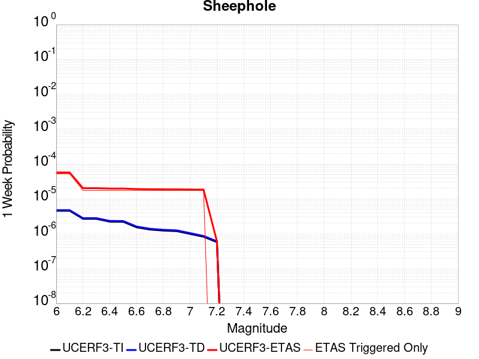 |  | 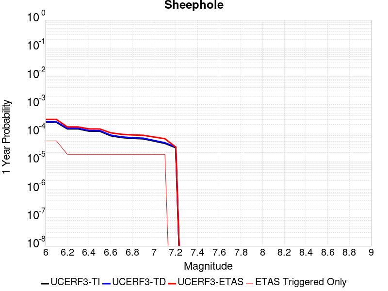 | 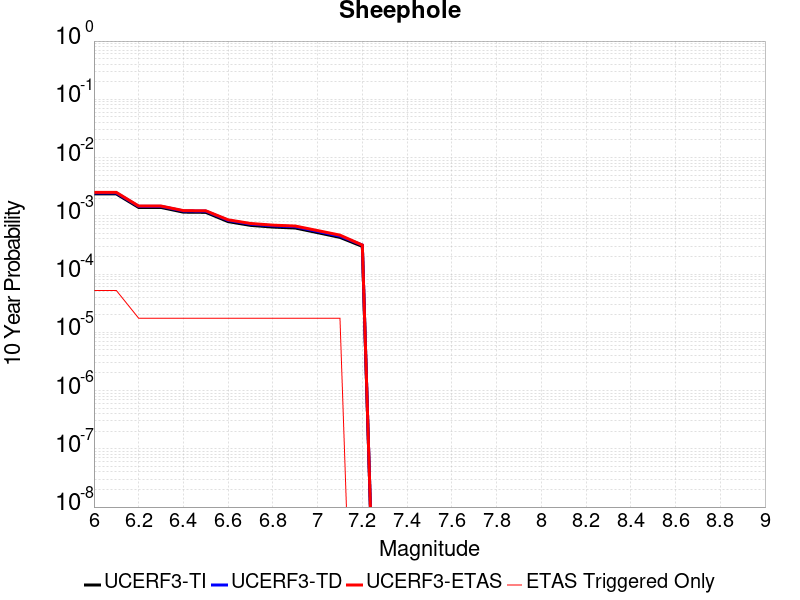 |

| Magnitude | 1 wk TI Prob | 1 wk TD Prob | 1 wk ETAS Prob | 1 wk ETAS/TD Gain | 1 wk ETAS Triggered Only | 1 mo TI Prob | 1 mo TD Prob | 1 mo ETAS Prob | 1 mo ETAS/TD Gain | 1 mo ETAS Triggered Only | 1 yr TI Prob | 1 yr TD Prob | 1 yr ETAS Prob | 1 yr ETAS/TD Gain | 1 yr ETAS Triggered Only | 10 yr TI Prob | 10 yr TD Prob | 10 yr ETAS Prob | 10 yr ETAS/TD Gain | 10 yr ETAS Triggered Only |
|-----|-----|-----|-----|-----|-----|-----|-----|-----|-----|-----|-----|-----|-----|-----|-----|-----|-----|-----|-----|-----|
| 6.0 | 4.5579695E-6 | 4.7412627E-6 | 5.7072375E-5 | 12.037379 | 5.233136E-5 | 1.9534009E-5 | 2.031957E-5 | 7.264987E-5 | 3.5753646 | 5.233136E-5 | 2.3780059E-4 | 2.473682E-4 | 2.9968662E-4 | 1.2115002 | 5.233136E-5 | 0.0023754628 | 0.002471473 | 0.002523675 | 1.0211219 | 5.233136E-5 |
| 6.1 | 4.5579695E-6 | 4.7412627E-6 | 5.7072375E-5 | 12.037379 | 5.233136E-5 | 1.9534009E-5 | 2.031957E-5 | 7.264987E-5 | 3.5753646 | 5.233136E-5 | 2.3780059E-4 | 2.473682E-4 | 2.9968662E-4 | 1.2115002 | 5.233136E-5 | 0.0023754628 | 0.002471473 | 0.002523675 | 1.0211219 | 5.233136E-5 |
| 6.2 | 2.6677674E-6 | 2.7873941E-6 | 2.0231133E-5 | 7.258081 | 1.7443788E-5 | 1.1433239E-5 | 1.1945926E-5 | 2.9389506E-5 | 2.4602115 | 1.7443788E-5 | 1.3919079E-4 | 1.4543302E-4 | 1.6287428E-4 | 1.1199263 | 1.7443788E-5 | 0.0013910364 | 0.0014534844 | 0.0014709028 | 1.0119839 | 1.7443788E-5 |
| 6.3 | 2.6677674E-6 | 2.7873941E-6 | 2.0231133E-5 | 7.258081 | 1.7443788E-5 | 1.1433239E-5 | 1.1945926E-5 | 2.9389506E-5 | 2.4602115 | 1.7443788E-5 | 1.3919079E-4 | 1.4543302E-4 | 1.6287428E-4 | 1.1199263 | 1.7443788E-5 | 0.0013910364 | 0.0014534844 | 0.0014709028 | 1.0119839 | 1.7443788E-5 |
| 6.4 | 2.2159759E-6 | 2.3228788E-6 | 1.9766625E-5 | 8.509539 | 1.7443788E-5 | 9.497005E-6 | 9.955161E-6 | 2.7398775E-5 | 2.7522182 | 1.7443788E-5 | 1.156199E-4 | 1.2119815E-4 | 1.3863982E-4 | 1.1439104 | 1.7443788E-5 | 0.0011555976 | 0.0012113999 | 0.0012288225 | 1.0143822 | 1.7443788E-5 |
| 6.5 | 2.1986082E-6 | 2.304759E-6 | 1.9748506E-5 | 8.568578 | 1.7443788E-5 | 9.4225725E-6 | 9.877506E-6 | 2.732112E-5 | 2.7659938 | 1.7443788E-5 | 1.1471378E-4 | 1.2025281E-4 | 1.376945E-4 | 1.1450418 | 1.7443788E-5 | 0.0011465458 | 0.0012019566 | 0.0012193795 | 1.0144954 | 1.7443788E-5 |
| 6.6 | 1.5232331E-6 | 1.6018919E-6 | 1.9045652E-5 | 11.889474 | 1.7443788E-5 | 6.5281256E-6 | 6.865234E-6 | 2.4308902E-5 | 3.5408702 | 1.7443788E-5 | 7.947703E-5 | 8.35812E-5 | 1.01023536E-4 | 1.2086872 | 1.7443788E-5 | 7.9448614E-4 | 8.3551643E-4 | 8.529456E-4 | 1.0208604 | 1.7443788E-5 |
| 6.7 | 1.3137362E-6 | 1.382819E-6 | 1.8826582E-5 | 13.614639 | 1.7443788E-5 | 5.6302856E-6 | 5.926355E-6 | 2.337004E-5 | 3.9434087 | 1.7443788E-5 | 6.854657E-5 | 7.215112E-5 | 8.959365E-5 | 1.2417499 | 1.7443788E-5 | 6.8525434E-4 | 7.212908E-4 | 7.3872204E-4 | 1.0241667 | 1.7443788E-5 |
| 6.8 | 1.2275751E-6 | 1.2922847E-6 | 1.873605E-5 | 14.498392 | 1.7443788E-5 | 5.2610258E-6 | 5.5383516E-6 | 2.2982043E-5 | 4.1496177 | 1.7443788E-5 | 6.4051106E-5 | 6.7427485E-5 | 8.4870095E-5 | 1.258687 | 1.7443788E-5 | 6.4032647E-4 | 6.740836E-4 | 6.915156E-4 | 1.0258603 | 1.7443788E-5 |
| 6.9 | 1.1837088E-6 | 1.246102E-6 | 1.8689867E-5 | 14.998666 | 1.7443788E-5 | 5.0730278E-6 | 5.340427E-6 | 2.2784121E-5 | 4.2663484 | 1.7443788E-5 | 6.176237E-5 | 6.501789E-5 | 8.2460545E-5 | 1.2682747 | 1.7443788E-5 | 6.17452E-4 | 6.5000186E-4 | 6.674343E-4 | 1.0268191 | 1.7443788E-5 |
| 7.0 | 9.849371E-7 | 1.0366288E-6 | 1.8480398E-5 | 17.827402 | 1.7443788E-5 | 4.2211523E-6 | 4.442688E-6 | 2.1886397E-5 | 4.9263864 | 1.7443788E-5 | 5.1391315E-5 | 5.4088487E-5 | 7.153133E-5 | 1.3224872 | 1.7443788E-5 | 5.137943E-4 | 5.407633E-4 | 5.581977E-4 | 1.0322403 | 1.7443788E-5 |
| 7.1 | 8.1643645E-7 | 8.591669E-7 | 1.8302939E-5 | 21.303123 | 1.7443788E-5 | 3.4990085E-6 | 3.682139E-6 | 2.1125863E-5 | 5.737388 | 1.7443788E-5 | 4.2599597E-5 | 4.482921E-5 | 6.2272215E-5 | 1.3890991 | 1.7443788E-5 | 4.259143E-4 | 4.4821028E-4 | 4.6564627E-4 | 1.0389013 | 1.7443788E-5 |
| 7.2 | 5.7295756E-7 | 6.029502E-7 | 6.029502E-7 | 1.0 | 0.0 | 2.45553E-6 | 2.58407E-6 | 2.58407E-6 | 1.0 | 0.0 | 2.9895667E-5 | 3.1460666E-5 | 3.1460666E-5 | 1.0 | 0.0 | 2.9891645E-4 | 3.145688E-4 | 3.145688E-4 | 1.0 | 0.0 |

## Bullion Mountains
*[(top)](#table-of-contents)*

| 1 Week | 1 Month | 1 Year | 10 Year |
|-----|-----|-----|-----|
| 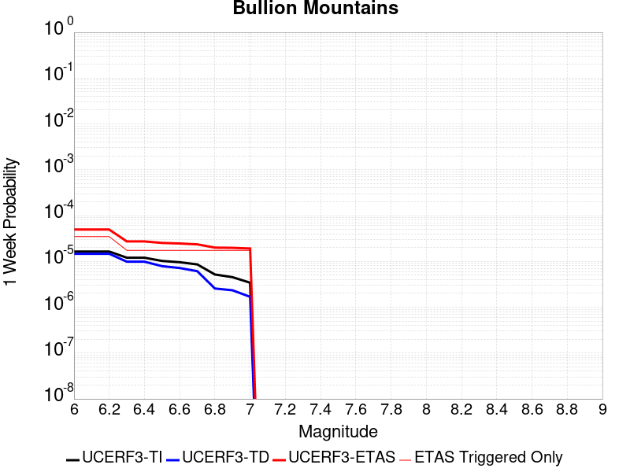 | 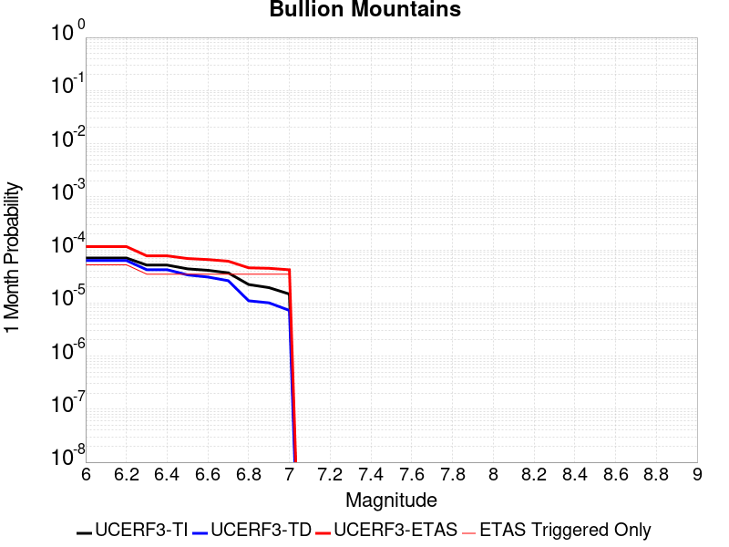 | 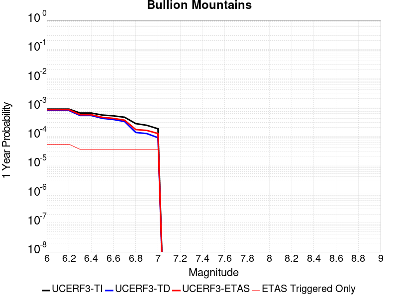 | 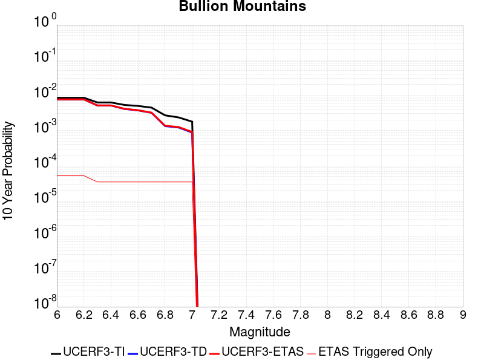 |

| Magnitude | 1 wk TI Prob | 1 wk TD Prob | 1 wk ETAS Prob | 1 wk ETAS/TD Gain | 1 wk ETAS Triggered Only | 1 mo TI Prob | 1 mo TD Prob | 1 mo ETAS Prob | 1 mo ETAS/TD Gain | 1 mo ETAS Triggered Only | 1 yr TI Prob | 1 yr TD Prob | 1 yr ETAS Prob | 1 yr ETAS/TD Gain | 1 yr ETAS Triggered Only | 10 yr TI Prob | 10 yr TD Prob | 10 yr ETAS Prob | 10 yr ETAS/TD Gain | 10 yr ETAS Triggered Only |
|-----|-----|-----|-----|-----|-----|-----|-----|-----|-----|-----|-----|-----|-----|-----|-----|-----|-----|-----|-----|-----|
| 6.0 | 1.6420427E-5 | 1.4692089E-5 | 4.957915E-5 | 3.3745475 | 3.4887576E-5 | 7.037136E-5 | 6.296479E-5 | 1.1529286E-4 | 1.8310686 | 5.233136E-5 | 8.5643446E-4 | 7.663651E-4 | 8.1865635E-4 | 1.0682328 | 5.233136E-5 | 0.008531413 | 0.007641016 | 0.0076929475 | 1.0067964 | 5.233136E-5 |
| 6.1 | 1.6420427E-5 | 1.4692089E-5 | 4.957915E-5 | 3.3745475 | 3.4887576E-5 | 7.037136E-5 | 6.296479E-5 | 1.1529286E-4 | 1.8310686 | 5.233136E-5 | 8.5643446E-4 | 7.663651E-4 | 8.1865635E-4 | 1.0682328 | 5.233136E-5 | 0.008531413 | 0.007641016 | 0.0076929475 | 1.0067964 | 5.233136E-5 |
| 6.2 | 1.6420427E-5 | 1.4692089E-5 | 4.957915E-5 | 3.3745475 | 3.4887576E-5 | 7.037136E-5 | 6.296479E-5 | 1.1529286E-4 | 1.8310686 | 5.233136E-5 | 8.5643446E-4 | 7.663651E-4 | 8.1865635E-4 | 1.0682328 | 5.233136E-5 | 0.008531413 | 0.007641016 | 0.0076929475 | 1.0067964 | 5.233136E-5 |
| 6.3 | 1.2046778E-5 | 9.862335E-6 | 2.730595E-5 | 2.7687104 | 1.7443788E-5 | 5.1628023E-5 | 4.2266598E-5 | 7.71527E-5 | 1.8253824 | 3.4887576E-5 | 6.283899E-4 | 5.144975E-4 | 5.493671E-4 | 1.0677742 | 3.4887576E-5 | 0.0062661595 | 0.005135345 | 0.0051700533 | 1.0067587 | 3.4887576E-5 |
| 6.4 | 1.2046778E-5 | 9.862335E-6 | 2.730595E-5 | 2.7687104 | 1.7443788E-5 | 5.1628023E-5 | 4.2266598E-5 | 7.71527E-5 | 1.8253824 | 3.4887576E-5 | 6.283899E-4 | 5.144975E-4 | 5.493671E-4 | 1.0677742 | 3.4887576E-5 | 0.0062661595 | 0.005135345 | 0.0051700533 | 1.0067587 | 3.4887576E-5 |
| 6.5 | 1.0244343E-5 | 7.879458E-6 | 2.5323108E-5 | 3.2138133 | 1.7443788E-5 | 4.390359E-5 | 3.3768785E-5 | 6.865519E-5 | 2.033096 | 3.4887576E-5 | 5.343951E-4 | 4.110781E-4 | 4.4595133E-4 | 1.0848336 | 3.4887576E-5 | 0.005331118 | 0.004105208 | 0.0041399524 | 1.0084635 | 3.4887576E-5 |
| 6.6 | 9.605408E-6 | 7.1774966E-6 | 2.4621158E-5 | 3.430327 | 1.7443788E-5 | 4.1165385E-5 | 3.076045E-5 | 6.564695E-5 | 2.134135 | 3.4887576E-5 | 5.010733E-4 | 3.744645E-4 | 4.09339E-4 | 1.0931317 | 3.4887576E-5 | 0.00499945 | 0.003740332 | 0.0037750893 | 1.0092925 | 3.4887576E-5 |
| 6.7 | 8.60418E-6 | 6.1240044E-6 | 2.3567685E-5 | 3.8484108 | 1.7443788E-5 | 3.687454E-5 | 2.624558E-5 | 6.113224E-5 | 2.3292394 | 3.4887576E-5 | 4.48855E-4 | 3.1951256E-4 | 3.54389E-4 | 1.109155 | 3.4887576E-5 | 0.004479495 | 0.0031924439 | 0.00322722 | 1.0108932 | 3.4887576E-5 |
| 6.8 | 5.187994E-6 | 2.5631666E-6 | 2.000691E-5 | 7.8055434 | 1.7443788E-5 | 2.223407E-5 | 1.0984976E-5 | 4.587217E-5 | 4.1759005 | 3.4887576E-5 | 2.7066618E-4 | 1.3373788E-4 | 1.6862078E-4 | 1.2608304 | 3.4887576E-5 | 0.0027033675 | 0.0013369655 | 0.0013718064 | 1.0260597 | 3.4887576E-5 |
| 6.9 | 4.5302368E-6 | 2.3443165E-6 | 1.9788064E-5 | 8.440866 | 1.7443788E-5 | 1.9415156E-5 | 1.0047055E-5 | 4.493428E-5 | 4.472383 | 3.4887576E-5 | 2.3635388E-4 | 1.2232E-4 | 1.572033E-4 | 1.2851808 | 3.4887576E-5 | 0.0023610266 | 0.0012229157 | 0.0012577607 | 1.0284933 | 3.4887576E-5 |
| 7.0 | 3.431668E-6 | 1.6882402E-6 | 1.9131998E-5 | 11.332509 | 1.7443788E-5 | 1.4707065E-5 | 7.235315E-6 | 4.2122636E-5 | 5.821811 | 3.4887576E-5 | 1.7904381E-4 | 8.808996E-5 | 1.2297447E-4 | 1.3960099 | 3.4887576E-5 | 0.0017889962 | 8.808996E-4 | 9.1575645E-4 | 1.0395696 | 3.4887576E-5 |

## Kern Canyon (South Kern) 2011
*[(top)](#table-of-contents)*

| 1 Week | 1 Month | 1 Year | 10 Year |
|-----|-----|-----|-----|
| 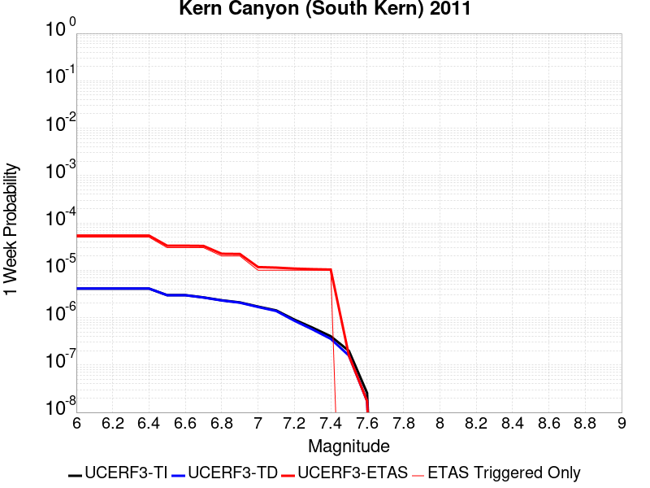 | 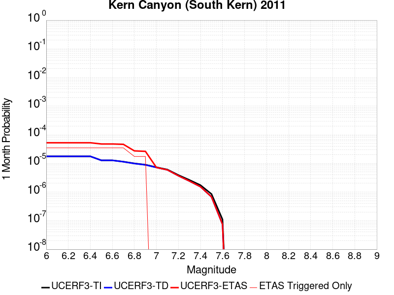 | 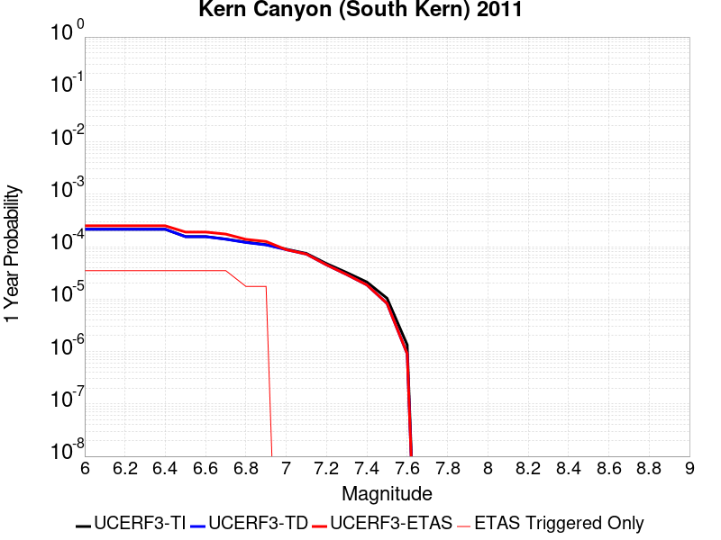 | 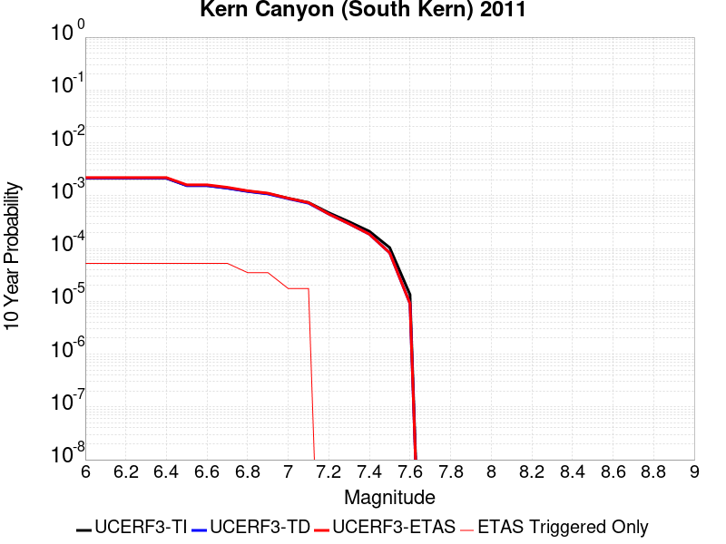 |

| Magnitude | 1 wk TI Prob | 1 wk TD Prob | 1 wk ETAS Prob | 1 wk ETAS/TD Gain | 1 wk ETAS Triggered Only | 1 mo TI Prob | 1 mo TD Prob | 1 mo ETAS Prob | 1 mo ETAS/TD Gain | 1 mo ETAS Triggered Only | 1 yr TI Prob | 1 yr TD Prob | 1 yr ETAS Prob | 1 yr ETAS/TD Gain | 1 yr ETAS Triggered Only | 10 yr TI Prob | 10 yr TD Prob | 10 yr ETAS Prob | 10 yr ETAS/TD Gain | 10 yr ETAS Triggered Only |
|-----|-----|-----|-----|-----|-----|-----|-----|-----|-----|-----|-----|-----|-----|-----|-----|-----|-----|-----|-----|-----|
| 6.0 | 4.105075E-6 | 4.1137264E-6 | 3.900116E-5 | 9.480737 | 3.4887576E-5 | 1.7593058E-5 | 1.763014E-5 | 5.25171E-5 | 2.9788249 | 3.4887576E-5 | 2.1417443E-4 | 2.1462646E-4 | 2.4950656E-4 | 1.1625153 | 3.4887576E-5 | 0.0021396813 | 0.0021442557 | 0.002196475 | 1.024353 | 5.233136E-5 |
| 6.1 | 4.105075E-6 | 4.1137264E-6 | 3.900116E-5 | 9.480737 | 3.4887576E-5 | 1.7593058E-5 | 1.763014E-5 | 5.25171E-5 | 2.9788249 | 3.4887576E-5 | 2.1417443E-4 | 2.1462646E-4 | 2.4950656E-4 | 1.1625153 | 3.4887576E-5 | 0.0021396813 | 0.0021442557 | 0.002196475 | 1.024353 | 5.233136E-5 |
| 6.2 | 4.105075E-6 | 4.1137264E-6 | 3.900116E-5 | 9.480737 | 3.4887576E-5 | 1.7593058E-5 | 1.763014E-5 | 5.25171E-5 | 2.9788249 | 3.4887576E-5 | 2.1417443E-4 | 2.1462646E-4 | 2.4950656E-4 | 1.1625153 | 3.4887576E-5 | 0.0021396813 | 0.0021442557 | 0.002196475 | 1.024353 | 5.233136E-5 |
| 6.3 | 4.105075E-6 | 4.1137264E-6 | 3.900116E-5 | 9.480737 | 3.4887576E-5 | 1.7593058E-5 | 1.763014E-5 | 5.25171E-5 | 2.9788249 | 3.4887576E-5 | 2.1417443E-4 | 2.1462646E-4 | 2.4950656E-4 | 1.1625153 | 3.4887576E-5 | 0.0021396813 | 0.0021442557 | 0.002196475 | 1.024353 | 5.233136E-5 |
| 6.4 | 4.105075E-6 | 4.1137264E-6 | 3.900116E-5 | 9.480737 | 3.4887576E-5 | 1.7593058E-5 | 1.763014E-5 | 5.25171E-5 | 2.9788249 | 3.4887576E-5 | 2.1417443E-4 | 2.1462646E-4 | 2.4950656E-4 | 1.1625153 | 3.4887576E-5 | 0.0021396813 | 0.0021442557 | 0.002196475 | 1.024353 | 5.233136E-5 |
| 6.5 | 2.9849807E-6 | 2.9731548E-6 | 3.7860627E-5 | 12.734159 | 3.4887576E-5 | 1.2792712E-5 | 1.274203E-5 | 4.762916E-5 | 3.737957 | 3.4887576E-5 | 1.5574014E-4 | 1.5512333E-4 | 1.9000549E-4 | 1.2248673 | 3.4887576E-5 | 0.0015563103 | 0.0015501656 | 0.0016024158 | 1.0337062 | 5.233136E-5 |
| 6.6 | 2.9849807E-6 | 2.9731548E-6 | 3.7860627E-5 | 12.734159 | 3.4887576E-5 | 1.2792712E-5 | 1.274203E-5 | 4.762916E-5 | 3.737957 | 3.4887576E-5 | 1.5574014E-4 | 1.5512333E-4 | 1.9000549E-4 | 1.2248673 | 3.4887576E-5 | 0.0015563103 | 0.0015501656 | 0.0016024158 | 1.0337062 | 5.233136E-5 |
| 6.7 | 2.6756725E-6 | 2.6582206E-6 | 3.7545702E-5 | 14.124373 | 3.4887576E-5 | 1.1467117E-5 | 1.1392325E-5 | 4.6279503E-5 | 4.0623403 | 3.4887576E-5 | 1.396032E-4 | 1.3869285E-4 | 1.7357558E-4 | 1.2515107 | 3.4887576E-5 | 0.0013951553 | 0.0013860738 | 0.0014383326 | 1.0377028 | 5.233136E-5 |
| 6.8 | 2.3283721E-6 | 2.3047787E-6 | 1.9748526E-5 | 8.568513 | 1.7443788E-5 | 9.9787E-6 | 9.877586E-6 | 2.73212E-5 | 2.7659795 | 1.7443788E-5 | 1.214839E-4 | 1.20253055E-4 | 1.3769475E-4 | 1.1450416 | 1.7443788E-5 | 0.001214175 | 0.0012018873 | 0.0012367329 | 1.0289924 | 3.4887576E-5 |
| 6.9 | 2.0972677E-6 | 2.0696411E-6 | 1.9513393E-5 | 9.428394 | 1.7443788E-5 | 8.988259E-6 | 8.869861E-6 | 2.6313493E-5 | 2.9666185 | 1.7443788E-5 | 1.0942656E-4 | 1.0798526E-4 | 1.2542716E-4 | 1.1615212 | 1.7443788E-5 | 0.0010937268 | 0.0010793337 | 0.0011141837 | 1.0322883 | 3.4887576E-5 |
| 7.0 | 1.7132242E-6 | 1.6787036E-6 | 1.6787036E-6 | 1.0 | 0.0 | 7.3423685E-6 | 7.194424E-6 | 7.194424E-6 | 1.0 | 0.0 | 8.938967E-5 | 8.758863E-5 | 8.758863E-5 | 1.0 | 0.0 | 8.935372E-4 | 8.7554497E-4 | 8.9297345E-4 | 1.0199059 | 1.7443788E-5 |
| 7.1 | 1.4215541E-6 | 1.3815752E-6 | 1.3815752E-6 | 1.0 | 0.0 | 6.0923603E-6 | 5.9210233E-6 | 5.9210233E-6 | 1.0 | 0.0 | 7.417196E-5 | 7.20861E-5 | 7.20861E-5 | 1.0 | 0.0 | 7.414721E-4 | 7.206299E-4 | 7.380611E-4 | 1.0241889 | 1.7443788E-5 |
| 7.2 | 9.097853E-7 | 8.6037755E-7 | 8.6037755E-7 | 1.0 | 0.0 | 3.899074E-6 | 3.6873273E-6 | 3.6873273E-6 | 1.0 | 0.0 | 4.7470192E-5 | 4.4892295E-5 | 4.4892295E-5 | 1.0 | 0.0 | 4.7460053E-4 | 4.4883334E-4 | 4.4883334E-4 | 1.0 | 0.0 |
| 7.3 | 6.144169E-7 | 5.628206E-7 | 5.628206E-7 | 1.0 | 0.0 | 2.6332125E-6 | 2.4120861E-6 | 2.4120861E-6 | 1.0 | 0.0 | 3.205889E-5 | 2.9366758E-5 | 2.9366758E-5 | 1.0 | 0.0 | 3.2054266E-4 | 2.936293E-4 | 2.936293E-4 | 1.0 | 0.0 |
| 7.4 | 4.049844E-7 | 3.5728314E-7 | 3.5728314E-7 | 1.0 | 0.0 | 1.7356463E-6 | 1.5312125E-6 | 1.5312125E-6 | 1.0 | 0.0 | 2.1131287E-5 | 1.8642357E-5 | 1.8642357E-5 | 1.0 | 0.0 | 2.1129279E-4 | 1.8640817E-4 | 1.8640817E-4 | 1.0 | 0.0 |
| 7.5 | 1.9871162E-7 | 1.583044E-7 | 1.583044E-7 | 1.0 | 0.0 | 8.5162094E-7 | 6.7844724E-7 | 6.7844724E-7 | 1.0 | 0.0 | 1.0368436E-5 | 8.260065E-6 | 8.260065E-6 | 1.0 | 0.0 | 1.0367952E-4 | 8.259767E-5 | 8.259767E-5 | 1.0 | 0.0 |
| 7.6 | 2.572245E-8 | 1.7352555E-8 | 1.7352555E-8 | 1.0 | 0.0 | 1.10239064E-7 | 7.436809E-8 | 7.436809E-8 | 1.0 | 0.0 | 1.3421597E-6 | 9.054312E-7 | 9.054312E-7 | 1.0 | 0.0 | 1.3421517E-5 | 9.05428E-6 | 9.05428E-6 | 1.0 | 0.0 |

## Lost Hills
*[(top)](#table-of-contents)*

| 1 Week | 1 Month | 1 Year | 10 Year |
|-----|-----|-----|-----|
| 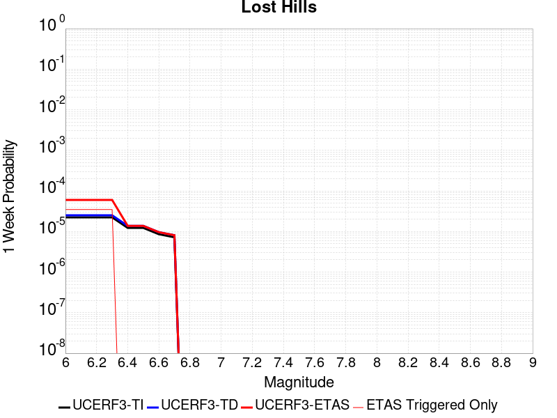 |  | 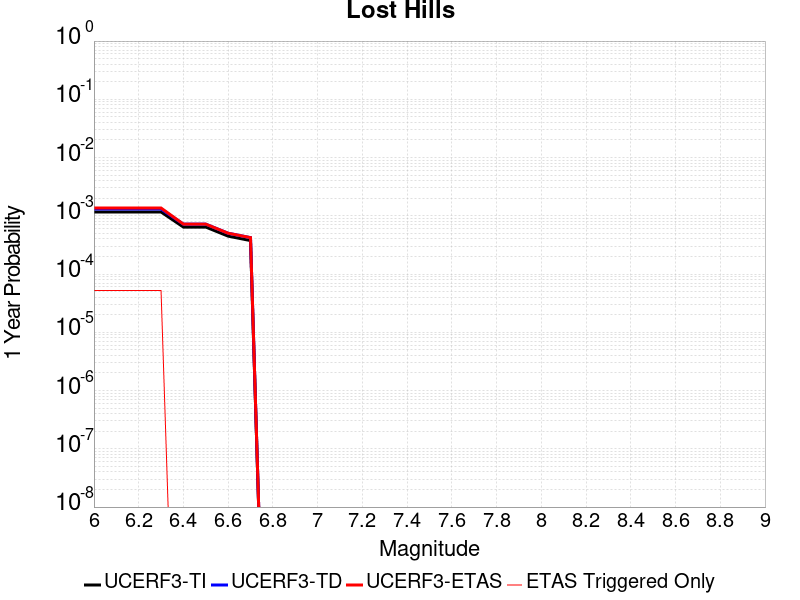 | 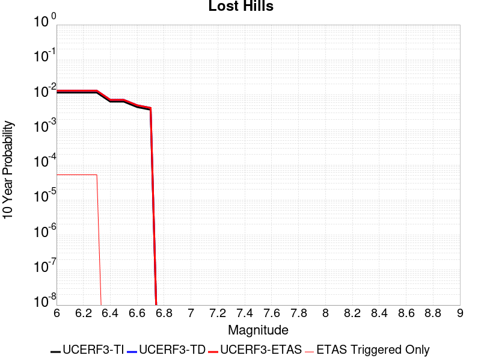 |

| Magnitude | 1 wk TI Prob | 1 wk TD Prob | 1 wk ETAS Prob | 1 wk ETAS/TD Gain | 1 wk ETAS Triggered Only | 1 mo TI Prob | 1 mo TD Prob | 1 mo ETAS Prob | 1 mo ETAS/TD Gain | 1 mo ETAS Triggered Only | 1 yr TI Prob | 1 yr TD Prob | 1 yr ETAS Prob | 1 yr ETAS/TD Gain | 1 yr ETAS Triggered Only | 10 yr TI Prob | 10 yr TD Prob | 10 yr ETAS Prob | 10 yr ETAS/TD Gain | 10 yr ETAS Triggered Only |
|-----|-----|-----|-----|-----|-----|-----|-----|-----|-----|-----|-----|-----|-----|-----|-----|-----|-----|-----|-----|-----|
| 6.0 | 2.233523E-5 | 2.5106583E-5 | 5.9993283E-5 | 2.389544 | 3.4887576E-5 | 9.571891E-5 | 1.0759615E-4 | 1.5992188E-4 | 1.486316 | 5.233136E-5 | 0.0011647546 | 0.001309364 | 0.0013616269 | 1.0399147 | 5.233136E-5 | 0.011586686 | 0.013033091 | 0.01308474 | 1.003963 | 5.233136E-5 |
| 6.1 | 2.233523E-5 | 2.5106583E-5 | 5.9993283E-5 | 2.389544 | 3.4887576E-5 | 9.571891E-5 | 1.0759615E-4 | 1.5992188E-4 | 1.486316 | 5.233136E-5 | 0.0011647546 | 0.001309364 | 0.0013616269 | 1.0399147 | 5.233136E-5 | 0.011586686 | 0.013033091 | 0.01308474 | 1.003963 | 5.233136E-5 |
| 6.2 | 2.233523E-5 | 2.5106583E-5 | 5.9993283E-5 | 2.389544 | 3.4887576E-5 | 9.571891E-5 | 1.0759615E-4 | 1.5992188E-4 | 1.486316 | 5.233136E-5 | 0.0011647546 | 0.001309364 | 0.0013616269 | 1.0399147 | 5.233136E-5 | 0.011586686 | 0.013033091 | 0.01308474 | 1.003963 | 5.233136E-5 |
| 6.3 | 2.233523E-5 | 2.5106583E-5 | 5.9993283E-5 | 2.389544 | 3.4887576E-5 | 9.571891E-5 | 1.0759615E-4 | 1.5992188E-4 | 1.486316 | 5.233136E-5 | 0.0011647546 | 0.001309364 | 0.0013616269 | 1.0399147 | 5.233136E-5 | 0.011586686 | 0.013033091 | 0.01308474 | 1.003963 | 5.233136E-5 |
| 6.4 | 1.2288092E-5 | 1.3781108E-5 | 1.3781108E-5 | 1.0 | 0.0 | 5.2662188E-5 | 5.906108E-5 | 5.906108E-5 | 1.0 | 0.0 | 6.409735E-4 | 7.189252E-4 | 7.189252E-4 | 1.0 | 0.0 | 0.006391279 | 0.0071752006 | 0.0071752006 | 1.0 | 0.0 |
| 6.5 | 1.2288092E-5 | 1.3781108E-5 | 1.3781108E-5 | 1.0 | 0.0 | 5.2662188E-5 | 5.906108E-5 | 5.906108E-5 | 1.0 | 0.0 | 6.409735E-4 | 7.189252E-4 | 7.189252E-4 | 1.0 | 0.0 | 0.006391279 | 0.0071752006 | 0.0071752006 | 1.0 | 0.0 |
| 6.6 | 8.58281E-6 | 9.63377E-6 | 9.63377E-6 | 1.0 | 0.0 | 3.6782953E-5 | 4.12874E-5 | 4.12874E-5 | 1.0 | 0.0 | 4.4774043E-4 | 5.026414E-4 | 5.026414E-4 | 1.0 | 0.0 | 0.0044683935 | 0.005023205 | 0.005023205 | 1.0 | 0.0 |
| 6.7 | 7.205685E-6 | 8.088302E-6 | 8.088302E-6 | 1.0 | 0.0 | 3.088114E-5 | 3.466415E-5 | 3.466415E-5 | 1.0 | 0.0 | 3.7591302E-4 | 4.2203604E-4 | 4.2203604E-4 | 1.0 | 0.0 | 0.0037527776 | 0.0042203604 | 0.0042203604 | 1.0 | 0.0 |

## San Clemente
*[(top)](#table-of-contents)*

| 1 Week | 1 Month | 1 Year | 10 Year |
|-----|-----|-----|-----|
|  |  |  | 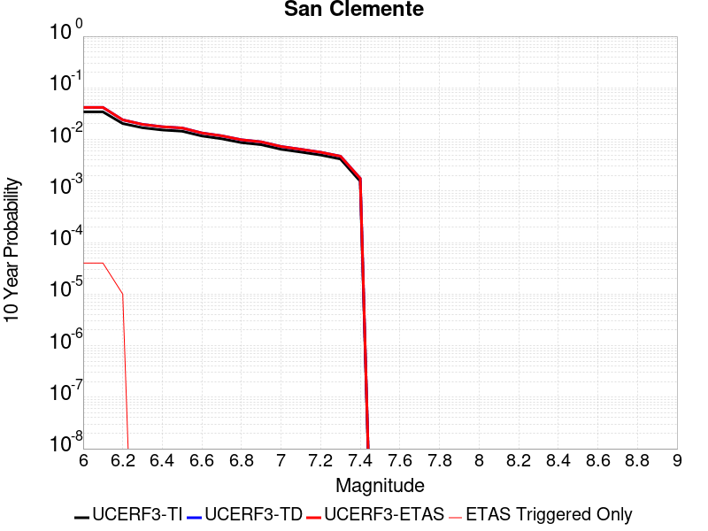 |

| Magnitude | 1 wk TI Prob | 1 wk TD Prob | 1 wk ETAS Prob | 1 wk ETAS/TD Gain | 1 wk ETAS Triggered Only | 1 mo TI Prob | 1 mo TD Prob | 1 mo ETAS Prob | 1 mo ETAS/TD Gain | 1 mo ETAS Triggered Only | 1 yr TI Prob | 1 yr TD Prob | 1 yr ETAS Prob | 1 yr ETAS/TD Gain | 1 yr ETAS Triggered Only | 10 yr TI Prob | 10 yr TD Prob | 10 yr ETAS Prob | 10 yr ETAS/TD Gain | 10 yr ETAS Triggered Only |
|-----|-----|-----|-----|-----|-----|-----|-----|-----|-----|-----|-----|-----|-----|-----|-----|-----|-----|-----|-----|-----|
| 6.0 | 6.681379E-5 | 8.163422E-5 | 1.1651895E-4 | 1.4273297 | 3.4887576E-5 | 2.8631336E-4 | 3.498173E-4 | 3.8469268E-4 | 1.0996959 | 3.4887576E-5 | 0.003480294 | 0.0042512873 | 0.004303396 | 1.0122572 | 5.233136E-5 | 0.03426291 | 0.041755714 | 0.04180586 | 1.0012009 | 5.233136E-5 |
| 6.1 | 6.681379E-5 | 8.163422E-5 | 1.1651895E-4 | 1.4273297 | 3.4887576E-5 | 2.8631336E-4 | 3.498173E-4 | 3.8469268E-4 | 1.0996959 | 3.4887576E-5 | 0.003480294 | 0.0042512873 | 0.004303396 | 1.0122572 | 5.233136E-5 | 0.03426291 | 0.041755714 | 0.04180586 | 1.0012009 | 5.233136E-5 |
| 6.2 | 3.9400576E-5 | 4.6451984E-5 | 4.6451984E-5 | 1.0 | 0.0 | 1.6884868E-4 | 1.9906509E-4 | 1.9906509E-4 | 1.0 | 0.0 | 0.0020537945 | 0.002420985 | 0.0024383864 | 1.0071878 | 1.7443788E-5 | 0.020349167 | 0.02395286 | 0.023969887 | 1.0007108 | 1.7443788E-5 |
| 6.3 | 3.2590255E-5 | 3.7929087E-5 | 3.7929087E-5 | 1.0 | 0.0 | 1.3966505E-4 | 1.6254328E-4 | 1.6254328E-4 | 1.0 | 0.0 | 0.0016990956 | 0.0019771985 | 0.0019771985 | 1.0 | 0.0 | 0.01686163 | 0.019599866 | 0.019599866 | 1.0 | 0.0 |
| 6.4 | 2.9454652E-5 | 3.4097775E-5 | 3.4097775E-5 | 1.0 | 0.0 | 1.2622811E-4 | 1.4612528E-4 | 1.4612528E-4 | 1.0 | 0.0 | 0.0015357438 | 0.0017776482 | 0.0017776482 | 1.0 | 0.0 | 0.015251739 | 0.017637458 | 0.017637458 | 1.0 | 0.0 |
| 6.5 | 2.790836E-5 | 3.2247463E-5 | 3.2247463E-5 | 1.0 | 0.0 | 1.1960178E-4 | 1.3819622E-4 | 1.3819622E-4 | 1.0 | 0.0 | 0.001455179 | 0.0016812651 | 0.0016812651 | 1.0 | 0.0 | 0.014456868 | 0.016688475 | 0.016688475 | 1.0 | 0.0 |
| 6.6 | 2.2492153E-5 | 2.5762707E-5 | 2.5762707E-5 | 1.0 | 0.0 | 9.639138E-5 | 1.1040701E-4 | 1.1040701E-4 | 1.0 | 0.0 | 0.0011729331 | 0.0013433908 | 0.0013433908 | 1.0 | 0.0 | 0.011667615 | 0.013354415 | 0.013354415 | 1.0 | 0.0 |
| 6.7 | 1.9862755E-5 | 2.2666423E-5 | 2.2666423E-5 | 1.0 | 0.0 | 8.512331E-5 | 9.713826E-5 | 9.713826E-5 | 1.0 | 0.0 | 0.0010358836 | 0.0011820279 | 0.0011820279 | 1.0 | 0.0 | 0.010310682 | 0.011758701 | 0.011758701 | 1.0 | 0.0 |
| 6.8 | 1.6697575E-5 | 1.897771E-5 | 1.897771E-5 | 1.0 | 0.0 | 7.155907E-5 | 8.133056E-5 | 8.133056E-5 | 1.0 | 0.0 | 8.7088346E-4 | 9.897591E-4 | 9.897591E-4 | 1.0 | 0.0 | 0.008674784 | 0.0098545365 | 0.0098545365 | 1.0 | 0.0 |
| 6.9 | 1.5218415E-5 | 1.72694E-5 | 1.72694E-5 | 1.0 | 0.0 | 6.522015E-5 | 7.4009666E-5 | 7.4009666E-5 | 1.0 | 0.0 | 7.93766E-4 | 9.00704E-4 | 9.00704E-4 | 1.0 | 0.0 | 0.007909367 | 0.008971481 | 0.008971481 | 1.0 | 0.0 |
| 7.0 | 1.2392958E-5 | 1.4033016E-5 | 1.4033016E-5 | 1.0 | 0.0 | 5.3111595E-5 | 6.014015E-5 | 6.014015E-5 | 1.0 | 0.0 | 6.4644177E-4 | 7.319679E-4 | 7.319679E-4 | 1.0 | 0.0 | 0.0064456454 | 0.0072963564 | 0.0072963564 | 1.0 | 0.0 |
| 7.1 | 1.0934128E-5 | 1.2375138E-5 | 1.2375138E-5 | 1.0 | 0.0 | 4.6859706E-5 | 5.303527E-5 | 5.303527E-5 | 1.0 | 0.0 | 5.7036756E-4 | 6.455204E-4 | 6.455204E-4 | 1.0 | 0.0 | 0.0056890585 | 0.0064371997 | 0.0064371997 | 1.0 | 0.0 |
| 7.2 | 9.5798805E-6 | 1.0844935E-5 | 1.0844935E-5 | 1.0 | 0.0 | 4.1055984E-5 | 4.6477508E-5 | 4.6477508E-5 | 1.0 | 0.0 | 4.9974193E-4 | 5.657239E-4 | 5.657239E-4 | 1.0 | 0.0 | 0.0049861963 | 0.0056435615 | 0.0056435615 | 1.0 | 0.0 |
| 7.3 | 8.0167365E-6 | 9.083918E-6 | 9.083918E-6 | 1.0 | 0.0 | 3.4356988E-5 | 3.8930535E-5 | 3.8930535E-5 | 1.0 | 0.0 | 4.1821605E-4 | 4.7388324E-4 | 4.7388324E-4 | 1.0 | 0.0 | 0.0041742986 | 0.0047294297 | 0.0047294297 | 1.0 | 0.0 |
| 7.4 | 2.9581017E-6 | 3.3623792E-6 | 3.3623792E-6 | 1.0 | 0.0 | 1.2677518E-5 | 1.4410146E-5 | 1.4410146E-5 | 1.0 | 0.0 | 1.5433785E-4 | 1.7543444E-4 | 1.7543444E-4 | 1.0 | 0.0 | 0.001542307 | 0.0017534546 | 0.0017534546 | 1.0 | 0.0 |

## Dry Mountain
*[(top)](#table-of-contents)*

| 1 Week | 1 Month | 1 Year | 10 Year |
|-----|-----|-----|-----|
| 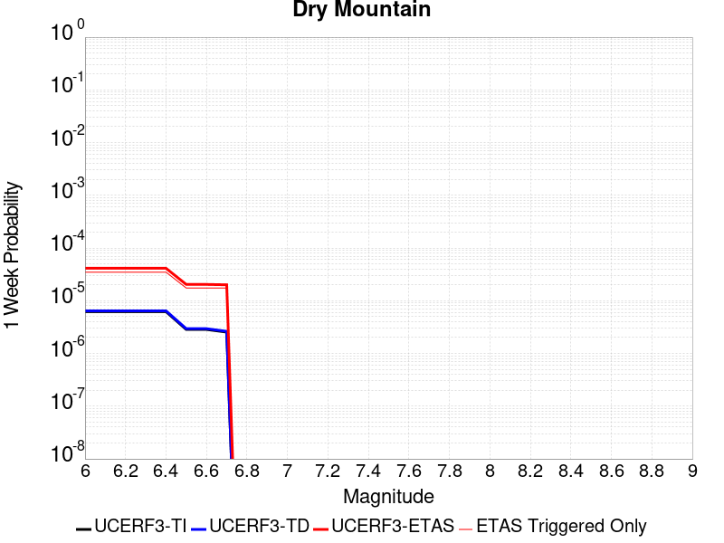 | 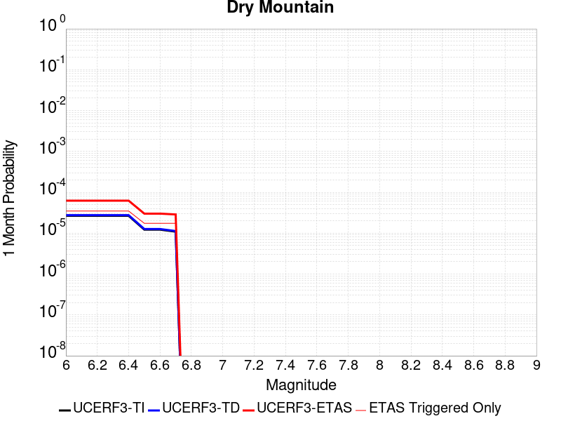 | 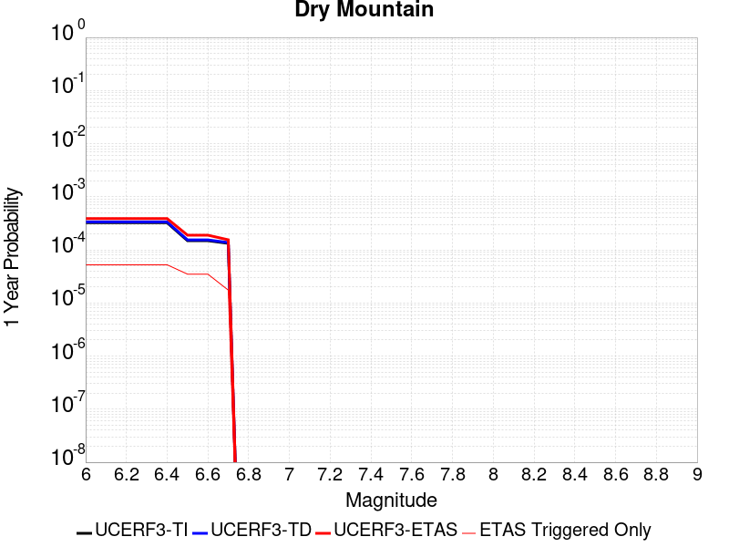 | 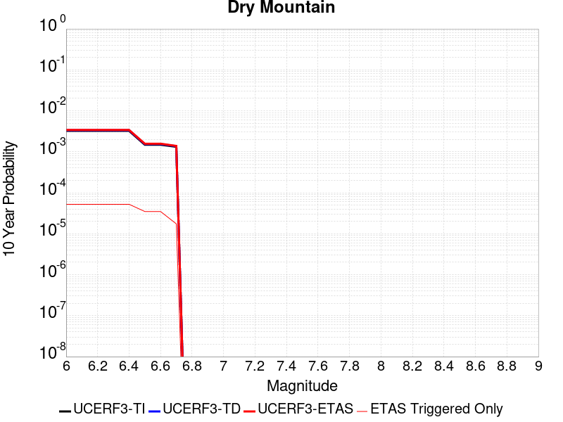 |

| Magnitude | 1 wk TI Prob | 1 wk TD Prob | 1 wk ETAS Prob | 1 wk ETAS/TD Gain | 1 wk ETAS Triggered Only | 1 mo TI Prob | 1 mo TD Prob | 1 mo ETAS Prob | 1 mo ETAS/TD Gain | 1 mo ETAS Triggered Only | 1 yr TI Prob | 1 yr TD Prob | 1 yr ETAS Prob | 1 yr ETAS/TD Gain | 1 yr ETAS Triggered Only | 10 yr TI Prob | 10 yr TD Prob | 10 yr ETAS Prob | 10 yr ETAS/TD Gain | 10 yr ETAS Triggered Only |
|-----|-----|-----|-----|-----|-----|-----|-----|-----|-----|-----|-----|-----|-----|-----|-----|-----|-----|-----|-----|-----|
| 6.0 | 6.222801E-6 | 6.439381E-6 | 4.132673E-5 | 6.417811 | 3.4887576E-5 | 2.6668875E-5 | 2.7597147E-5 | 6.2483756E-5 | 2.2641385 | 3.4887576E-5 | 3.2464517E-4 | 3.3595937E-4 | 3.8827315E-4 | 1.1557146 | 5.233136E-5 | 0.0032417132 | 0.0033560768 | 0.0034082325 | 1.0155407 | 5.233136E-5 |
| 6.1 | 6.222801E-6 | 6.439381E-6 | 4.132673E-5 | 6.417811 | 3.4887576E-5 | 2.6668875E-5 | 2.7597147E-5 | 6.2483756E-5 | 2.2641385 | 3.4887576E-5 | 3.2464517E-4 | 3.3595937E-4 | 3.8827315E-4 | 1.1557146 | 5.233136E-5 | 0.0032417132 | 0.0033560768 | 0.0034082325 | 1.0155407 | 5.233136E-5 |
| 6.2 | 6.222801E-6 | 6.439381E-6 | 4.132673E-5 | 6.417811 | 3.4887576E-5 | 2.6668875E-5 | 2.7597147E-5 | 6.2483756E-5 | 2.2641385 | 3.4887576E-5 | 3.2464517E-4 | 3.3595937E-4 | 3.8827315E-4 | 1.1557146 | 5.233136E-5 | 0.0032417132 | 0.0033560768 | 0.0034082325 | 1.0155407 | 5.233136E-5 |
| 6.3 | 6.222801E-6 | 6.439381E-6 | 4.132673E-5 | 6.417811 | 3.4887576E-5 | 2.6668875E-5 | 2.7597147E-5 | 6.2483756E-5 | 2.2641385 | 3.4887576E-5 | 3.2464517E-4 | 3.3595937E-4 | 3.8827315E-4 | 1.1557146 | 5.233136E-5 | 0.0032417132 | 0.0033560768 | 0.0034082325 | 1.0155407 | 5.233136E-5 |
| 6.4 | 6.222801E-6 | 6.439381E-6 | 4.132673E-5 | 6.417811 | 3.4887576E-5 | 2.6668875E-5 | 2.7597147E-5 | 6.2483756E-5 | 2.2641385 | 3.4887576E-5 | 3.2464517E-4 | 3.3595937E-4 | 3.8827315E-4 | 1.1557146 | 5.233136E-5 | 0.0032417132 | 0.0033560768 | 0.0034082325 | 1.0155407 | 5.233136E-5 |
| 6.5 | 2.8528623E-6 | 2.9521684E-6 | 2.0395904E-5 | 6.9087877 | 1.7443788E-5 | 1.22264955E-5 | 1.2652138E-5 | 3.0095705E-5 | 2.378705 | 1.7443788E-5 | 1.4884741E-4 | 1.540376E-4 | 1.8891979E-4 | 1.2264525 | 3.4887576E-5 | 0.0014874774 | 0.0015401616 | 0.0015749955 | 1.022617 | 3.4887576E-5 |
| 6.6 | 2.8528623E-6 | 2.9521684E-6 | 2.0395904E-5 | 6.9087877 | 1.7443788E-5 | 1.22264955E-5 | 1.2652138E-5 | 3.0095705E-5 | 2.378705 | 1.7443788E-5 | 1.4884741E-4 | 1.540376E-4 | 1.8891979E-4 | 1.2264525 | 3.4887576E-5 | 0.0014874774 | 0.0015401616 | 0.0015749955 | 1.022617 | 3.4887576E-5 |
| 6.7 | 2.541E-6 | 2.6293578E-6 | 2.00731E-5 | 7.634221 | 1.7443788E-5 | 1.0889954E-5 | 1.1268677E-5 | 2.8712268E-5 | 2.5479715 | 1.7443788E-5 | 1.3257713E-4 | 1.3719614E-4 | 1.5463753E-4 | 1.1271274 | 1.7443788E-5 | 0.0013249806 | 0.0013719613 | 0.0013893812 | 1.0126971 | 1.7443788E-5 |

## Coronado Bank alt1
*[(top)](#table-of-contents)*

| 1 Week | 1 Month | 1 Year | 10 Year |
|-----|-----|-----|-----|
| 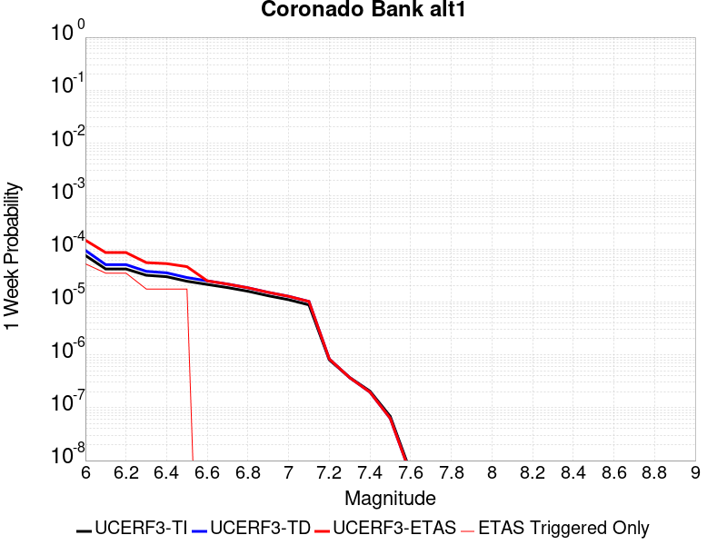 | 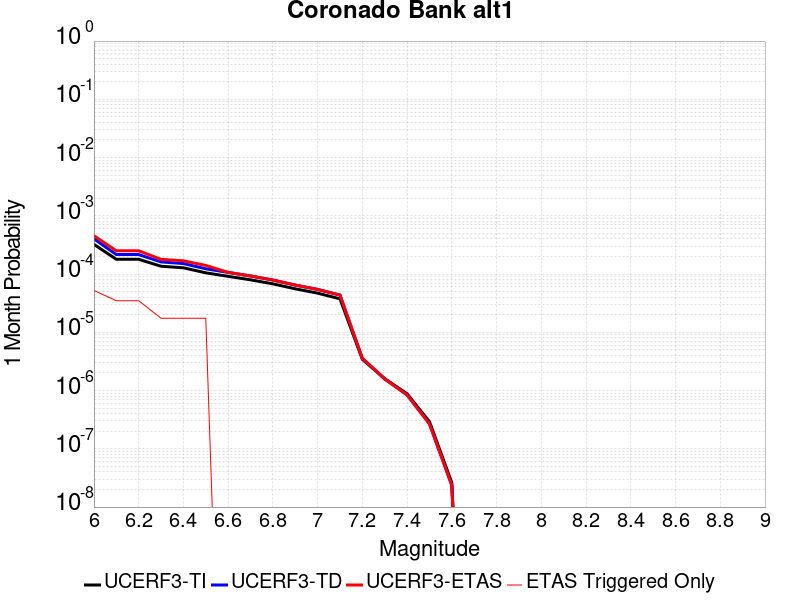 | 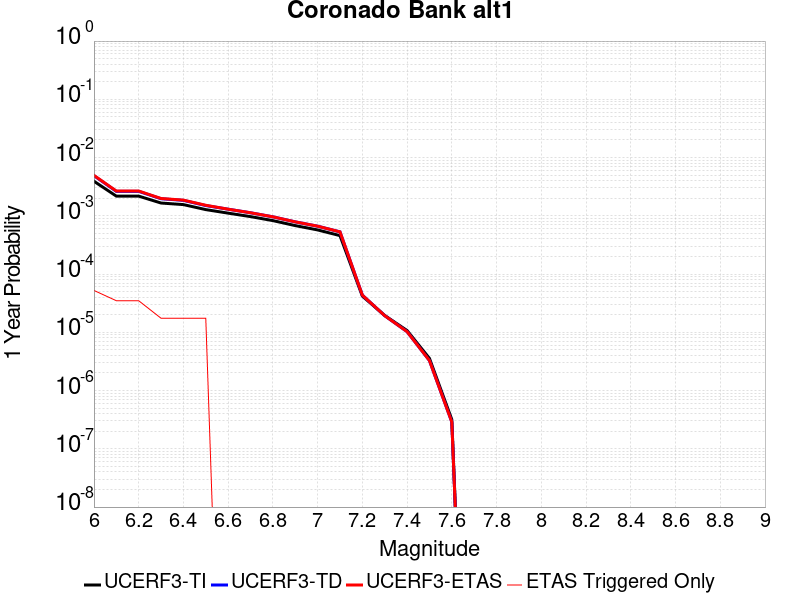 | 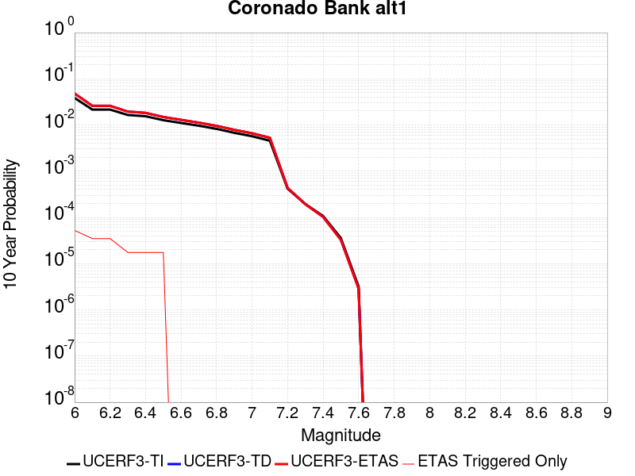 |

| Magnitude | 1 wk TI Prob | 1 wk TD Prob | 1 wk ETAS Prob | 1 wk ETAS/TD Gain | 1 wk ETAS Triggered Only | 1 mo TI Prob | 1 mo TD Prob | 1 mo ETAS Prob | 1 mo ETAS/TD Gain | 1 mo ETAS Triggered Only | 1 yr TI Prob | 1 yr TD Prob | 1 yr ETAS Prob | 1 yr ETAS/TD Gain | 1 yr ETAS Triggered Only | 10 yr TI Prob | 10 yr TD Prob | 10 yr ETAS Prob | 10 yr ETAS/TD Gain | 10 yr ETAS Triggered Only |
|-----|-----|-----|-----|-----|-----|-----|-----|-----|-----|-----|-----|-----|-----|-----|-----|-----|-----|-----|-----|-----|
| 6.0 | 7.533492E-5 | 9.394913E-5 | 1.4627558E-4 | 1.5569657 | 5.233136E-5 | 3.22824E-4 | 4.0258127E-4 | 4.5489156E-4 | 1.1299373 | 5.233136E-5 | 0.0039233007 | 0.0048909658 | 0.004943041 | 1.0106473 | 5.233136E-5 | 0.03854755 | 0.04790356 | 0.047953386 | 1.0010401 | 5.233136E-5 |
| 6.1 | 4.1807285E-5 | 5.049283E-5 | 8.537864E-5 | 1.6909063 | 3.4887576E-5 | 1.7916178E-4 | 2.1638049E-4 | 2.512605E-4 | 1.1611977 | 3.4887576E-5 | 0.0021791123 | 0.0026313474 | 0.0026661432 | 1.0132235 | 3.4887576E-5 | 0.021578677 | 0.026011046 | 0.026045026 | 1.0013064 | 3.4887576E-5 |
| 6.2 | 4.1807285E-5 | 5.049283E-5 | 8.537864E-5 | 1.6909063 | 3.4887576E-5 | 1.7916178E-4 | 2.1638049E-4 | 2.512605E-4 | 1.1611977 | 3.4887576E-5 | 0.0021791123 | 0.0026313474 | 0.0026661432 | 1.0132235 | 3.4887576E-5 | 0.021578677 | 0.026011046 | 0.026045026 | 1.0013064 | 3.4887576E-5 |
| 6.3 | 3.1793104E-5 | 3.7711117E-5 | 5.5154243E-5 | 1.4625461 | 1.7443788E-5 | 1.3624904E-4 | 1.6160926E-4 | 1.7905023E-4 | 1.1079206 | 1.7443788E-5 | 0.0016575698 | 0.001965848 | 0.0019832575 | 1.0088559 | 1.7443788E-5 | 0.016452603 | 0.019488465 | 0.019505568 | 1.0008776 | 1.7443788E-5 |
| 6.4 | 2.9878007E-5 | 3.5335794E-5 | 5.2778967E-5 | 1.4936403 | 1.7443788E-5 | 1.2804232E-4 | 1.5143053E-4 | 1.6887167E-4 | 1.1151758 | 1.7443788E-5 | 0.0015578003 | 0.0018421387 | 0.0018595504 | 1.0094519 | 1.7443788E-5 | 0.015469253 | 0.01827244 | 0.018289566 | 1.0009372 | 1.7443788E-5 |
| 6.5 | 2.4512565E-5 | 2.8764043E-5 | 4.620733E-5 | 1.6064267 | 1.7443788E-5 | 1.0504962E-4 | 1.2326881E-4 | 1.4071044E-4 | 1.1414927 | 1.7443788E-5 | 0.0012782287 | 0.0014997921 | 0.0015172098 | 1.0116134 | 1.7443788E-5 | 0.012709012 | 0.014899683 | 0.014916867 | 1.0011533 | 1.7443788E-5 |
| 6.6 | 2.1317413E-5 | 2.490667E-5 | 2.490667E-5 | 1.0 | 0.0 | 9.135714E-5 | 1.0673863E-4 | 1.0673863E-4 | 1.0 | 0.0 | 0.0011117056 | 0.0012987906 | 0.0012987906 | 1.0 | 0.0 | 0.011061605 | 0.012914404 | 0.012914404 | 1.0 | 0.0 |
| 6.7 | 1.8585655E-5 | 2.163488E-5 | 2.163488E-5 | 1.0 | 0.0 | 7.9650374E-5 | 9.271773E-5 | 9.271773E-5 | 1.0 | 0.0 | 9.6931186E-4 | 0.0011282742 | 0.0011282742 | 1.0 | 0.0 | 0.0096509475 | 0.011227623 | 0.011227623 | 1.0 | 0.0 |
| 6.8 | 1.5862879E-5 | 1.8419474E-5 | 1.8419474E-5 | 1.0 | 0.0 | 6.798199E-5 | 7.893833E-5 | 7.893833E-5 | 1.0 | 0.0 | 8.273665E-4 | 9.6066965E-4 | 9.6066965E-4 | 1.0 | 0.0 | 0.008242928 | 0.00956715 | 0.00956715 | 1.0 | 0.0 |
| 6.9 | 1.3021509E-5 | 1.5095265E-5 | 1.5095265E-5 | 1.0 | 0.0 | 5.5805274E-5 | 6.469249E-5 | 6.469249E-5 | 1.0 | 0.0 | 6.792174E-4 | 7.8736455E-4 | 7.8736455E-4 | 1.0 | 0.0 | 0.006771452 | 0.007847573 | 0.007847573 | 1.0 | 0.0 |
| 7.0 | 1.0974371E-5 | 1.2720104E-5 | 1.2720104E-5 | 1.0 | 0.0 | 4.7032172E-5 | 5.451369E-5 | 5.451369E-5 | 1.0 | 0.0 | 5.7246623E-4 | 6.6351966E-4 | 6.6351966E-4 | 1.0 | 0.0 | 0.0057099373 | 0.006617135 | 0.006617135 | 1.0 | 0.0 |
| 7.1 | 8.766221E-6 | 1.01638325E-5 | 1.01638325E-5 | 1.0 | 0.0 | 3.7568978E-5 | 4.355865E-5 | 4.355865E-5 | 1.0 | 0.0 | 4.573063E-4 | 5.3021475E-4 | 5.3021475E-4 | 1.0 | 0.0 | 0.0045636636 | 0.0052911965 | 0.0052911965 | 1.0 | 0.0 |
| 7.2 | 8.026024E-7 | 8.331765E-7 | 8.331765E-7 | 1.0 | 0.0 | 3.43972E-6 | 3.5707515E-6 | 3.5707515E-6 | 1.0 | 0.0 | 4.1877785E-5 | 4.3473043E-5 | 4.3473043E-5 | 1.0 | 0.0 | 4.1869894E-4 | 4.3464647E-4 | 4.3464647E-4 | 1.0 | 0.0 |
| 7.3 | 3.7293114E-7 | 3.7000953E-7 | 3.7000953E-7 | 1.0 | 0.0 | 1.5982754E-6 | 1.5857541E-6 | 1.5857541E-6 | 1.0 | 0.0 | 1.9458828E-5 | 1.9306386E-5 | 1.9306386E-5 | 1.0 | 0.0 | 1.9457124E-4 | 1.9304715E-4 | 1.9304715E-4 | 1.0 | 0.0 |
| 7.4 | 2.0557036E-7 | 1.9674363E-7 | 1.9674363E-7 | 1.0 | 0.0 | 8.810155E-7 | 8.431867E-7 | 8.431867E-7 | 1.0 | 0.0 | 1.0726311E-5 | 1.026575E-5 | 1.026575E-5 | 1.0 | 0.0 | 1.0725793E-4 | 1.0265279E-4 | 1.0265279E-4 | 1.0 | 0.0 |
| 7.5 | 6.845446E-8 | 6.279369E-8 | 6.279369E-8 | 1.0 | 0.0 | 2.9337625E-7 | 2.691158E-7 | 2.691158E-7 | 1.0 | 0.0 | 3.5718497E-6 | 3.2764797E-6 | 3.2764797E-6 | 1.0 | 0.0 | 3.5717923E-5 | 3.2764325E-5 | 3.2764325E-5 | 1.0 | 0.0 |
| 7.6 | 6.0975145E-9 | 5.53185E-9 | 5.53185E-9 | 1.0 | 0.0 | 2.6132206E-8 | 2.370793E-8 | 2.370793E-8 | 1.0 | 0.0 | 3.1815955E-7 | 2.88644E-7 | 2.88644E-7 | 1.0 | 0.0 | 3.181591E-6 | 2.8864374E-6 | 2.8864374E-6 | 1.0 | 0.0 |

## Santa Ynez (West)
*[(top)](#table-of-contents)*

| 1 Week | 1 Month | 1 Year | 10 Year |
|-----|-----|-----|-----|
|  |  |  |  |

| Magnitude | 1 wk TI Prob | 1 wk TD Prob | 1 wk ETAS Prob | 1 wk ETAS/TD Gain | 1 wk ETAS Triggered Only | 1 mo TI Prob | 1 mo TD Prob | 1 mo ETAS Prob | 1 mo ETAS/TD Gain | 1 mo ETAS Triggered Only | 1 yr TI Prob | 1 yr TD Prob | 1 yr ETAS Prob | 1 yr ETAS/TD Gain | 1 yr ETAS Triggered Only | 10 yr TI Prob | 10 yr TD Prob | 10 yr ETAS Prob | 10 yr ETAS/TD Gain | 10 yr ETAS Triggered Only |
|-----|-----|-----|-----|-----|-----|-----|-----|-----|-----|-----|-----|-----|-----|-----|-----|-----|-----|-----|-----|-----|
| 6.0 | 4.7352758E-5 | 5.4972126E-5 | 1.0730061E-4 | 1.9519094 | 5.233136E-5 | 2.0292461E-4 | 2.3557522E-4 | 2.8789425E-4 | 1.2220906 | 5.233136E-5 | 0.0024678076 | 0.0028645284 | 0.0029167098 | 1.0182164 | 5.233136E-5 | 0.024405818 | 0.028304417 | 0.028355267 | 1.0017966 | 5.233136E-5 |
| 6.1 | 4.7352758E-5 | 5.4972126E-5 | 8.9857785E-5 | 1.6346062 | 3.4887576E-5 | 2.0292461E-4 | 2.3557522E-4 | 2.7045456E-4 | 1.1480603 | 3.4887576E-5 | 0.0024678076 | 0.0028645284 | 0.002899316 | 1.0121443 | 3.4887576E-5 | 0.024405818 | 0.028304417 | 0.028338317 | 1.0011977 | 3.4887576E-5 |
| 6.2 | 3.0415853E-5 | 3.392511E-5 | 6.88115E-5 | 2.0283353 | 3.4887576E-5 | 1.3034715E-4 | 1.4538545E-4 | 1.8026795E-4 | 1.2399312 | 3.4887576E-5 | 0.0015858212 | 0.0017686661 | 0.001803492 | 1.0196905 | 3.4887576E-5 | 0.015745522 | 0.017549807 | 0.017584082 | 1.001953 | 3.4887576E-5 |
| 6.3 | 3.0415853E-5 | 3.392511E-5 | 6.88115E-5 | 2.0283353 | 3.4887576E-5 | 1.3034715E-4 | 1.4538545E-4 | 1.8026795E-4 | 1.2399312 | 3.4887576E-5 | 0.0015858212 | 0.0017686661 | 0.001803492 | 1.0196905 | 3.4887576E-5 | 0.015745522 | 0.017549807 | 0.017584082 | 1.001953 | 3.4887576E-5 |
| 6.4 | 2.5452082E-5 | 2.7912422E-5 | 6.279902E-5 | 2.2498593 | 3.4887576E-5 | 1.09075794E-4 | 1.196193E-4 | 1.545027E-4 | 1.2916201 | 3.4887576E-5 | 0.0013271887 | 0.0014554089 | 0.0014902456 | 1.023936 | 3.4887576E-5 | 0.013192902 | 0.014460951 | 0.014495335 | 1.0023776 | 3.4887576E-5 |
| 6.5 | 2.3143784E-5 | 2.5128256E-5 | 6.0014954E-5 | 2.3883452 | 3.4887576E-5 | 9.9183875E-5 | 1.0768817E-4 | 1.4257198E-4 | 1.3239336 | 3.4887576E-5 | 0.0012068948 | 0.0013103267 | 0.0013451686 | 1.0265902 | 3.4887576E-5 | 0.012003611 | 0.01302768 | 0.013062113 | 1.0026431 | 3.4887576E-5 |
| 6.6 | 1.9118515E-5 | 2.035434E-5 | 5.5241206E-5 | 2.7139766 | 3.4887576E-5 | 8.193392E-5 | 8.7230015E-5 | 1.2211455E-4 | 1.3999143 | 3.4887576E-5 | 9.97089E-4 | 0.001061516 | 0.0010963666 | 1.032831 | 3.4887576E-5 | 0.00992627 | 0.010565365 | 0.010599884 | 1.0032672 | 3.4887576E-5 |
| 6.7 | 1.722807E-5 | 1.8146347E-5 | 5.3033287E-5 | 2.9225326 | 3.4887576E-5 | 7.3832496E-5 | 7.776777E-5 | 1.1265263E-4 | 1.4485774 | 3.4887576E-5 | 8.985399E-4 | 9.464169E-4 | 9.812715E-4 | 1.0368279 | 3.4887576E-5 | 0.008949154 | 0.0094245095 | 0.009459069 | 1.0036669 | 3.4887576E-5 |
| 6.8 | 1.5317364E-5 | 1.5926486E-5 | 3.3369994E-5 | 2.0952516 | 1.7443788E-5 | 6.56442E-5 | 6.82546E-5 | 8.56972E-5 | 1.2555519 | 1.7443788E-5 | 7.98925E-4 | 8.306873E-4 | 8.481166E-4 | 1.0209818 | 1.7443788E-5 | 0.007960589 | 0.00827631 | 0.008293609 | 1.0020902 | 1.7443788E-5 |
| 6.9 | 1.3071226E-5 | 1.3329624E-5 | 1.3329624E-5 | 1.0 | 0.0 | 5.6018336E-5 | 5.7125722E-5 | 5.7125722E-5 | 1.0 | 0.0 | 6.8180985E-4 | 6.9528597E-4 | 6.9528597E-4 | 1.0 | 0.0 | 0.0067972173 | 0.006931367 | 0.006931367 | 1.0 | 0.0 |
| 7.0 | 1.1836986E-5 | 1.19327815E-5 | 1.19327815E-5 | 1.0 | 0.0 | 5.0728955E-5 | 5.11395E-5 | 5.11395E-5 | 1.0 | 0.0 | 6.1745E-4 | 6.2244723E-4 | 6.2244723E-4 | 1.0 | 0.0 | 0.006157372 | 0.006207231 | 0.006207231 | 1.0 | 0.0 |
| 7.1 | 1.0597169E-5 | 1.0542201E-5 | 1.0542201E-5 | 1.0 | 0.0 | 4.541565E-5 | 4.5180084E-5 | 4.5180084E-5 | 1.0 | 0.0 | 5.5279525E-4 | 5.4992986E-4 | 5.4992986E-4 | 1.0 | 0.0 | 0.0055142213 | 0.005485821 | 0.005485821 | 1.0 | 0.0 |
| 7.2 | 9.59113E-6 | 9.459144E-6 | 9.459144E-6 | 1.0 | 0.0 | 4.11042E-5 | 4.0538565E-5 | 4.0538565E-5 | 1.0 | 0.0 | 5.0032866E-4 | 4.934463E-4 | 4.934463E-4 | 1.0 | 0.0 | 0.004992037 | 0.0049236254 | 0.0049236254 | 1.0 | 0.0 |
| 7.3 | 8.586084E-6 | 8.379583E-6 | 8.379583E-6 | 1.0 | 0.0 | 3.679698E-5 | 3.5912013E-5 | 3.5912013E-5 | 1.0 | 0.0 | 4.4791115E-4 | 4.3714207E-4 | 4.3714207E-4 | 1.0 | 0.0 | 0.004470094 | 0.004362933 | 0.004362933 | 1.0 | 0.0 |
| 7.4 | 7.2622997E-6 | 6.9515427E-6 | 6.9515427E-6 | 1.0 | 0.0 | 3.112377E-5 | 2.979199E-5 | 2.979199E-5 | 1.0 | 0.0 | 3.78866E-4 | 3.626581E-4 | 3.626581E-4 | 1.0 | 0.0 | 0.0037822074 | 0.0036207628 | 0.0036207628 | 1.0 | 0.0 |
| 7.5 | 5.627296E-6 | 5.251588E-6 | 5.251588E-6 | 1.0 | 0.0 | 2.411676E-5 | 2.2506614E-5 | 2.2506614E-5 | 1.0 | 0.0 | 2.9358198E-4 | 2.739843E-4 | 2.739843E-4 | 1.0 | 0.0 | 0.0029319443 | 0.002736537 | 0.002736537 | 1.0 | 0.0 |
| 7.6 | 2.265244E-6 | 2.0608625E-6 | 2.0608625E-6 | 1.0 | 0.0 | 9.708152E-6 | 8.832238E-6 | 8.832238E-6 | 1.0 | 0.0 | 1.18190335E-4 | 1.0752728E-4 | 1.0752728E-4 | 1.0 | 0.0 | 0.001181275 | 0.0010747612 | 0.0010747612 | 1.0 | 0.0 |
| 7.7 | 1.3099874E-6 | 1.1016252E-6 | 1.1016252E-6 | 1.0 | 0.0 | 5.61422E-6 | 4.7212425E-6 | 4.7212425E-6 | 1.0 | 0.0 | 6.8350986E-5 | 5.7479636E-5 | 5.7479636E-5 | 1.0 | 0.0 | 6.832996E-4 | 5.7465007E-4 | 5.7465007E-4 | 1.0 | 0.0 |
| 7.8 | 7.903951E-7 | 6.0711415E-7 | 6.0711415E-7 | 1.0 | 0.0 | 3.3874032E-6 | 2.6019152E-6 | 2.6019152E-6 | 1.0 | 0.0 | 4.1240855E-5 | 3.167787E-5 | 3.167787E-5 | 1.0 | 0.0 | 4.12332E-4 | 3.167349E-4 | 3.167349E-4 | 1.0 | 0.0 |
| 7.9 | 7.0753297E-9 | 5.0899476E-9 | 5.0899476E-9 | 1.0 | 0.0 | 3.032284E-8 | 2.181406E-8 | 2.181406E-8 | 1.0 | 0.0 | 3.6918053E-7 | 2.6558615E-7 | 2.6558615E-7 | 1.0 | 0.0 | 3.691799E-6 | 2.6558594E-6 | 2.6558594E-6 | 1.0 | 0.0 |

## Ventura-Pitas Point
*[(top)](#table-of-contents)*

| 1 Week | 1 Month | 1 Year | 10 Year |
|-----|-----|-----|-----|
|  |  |  |  |

| Magnitude | 1 wk TI Prob | 1 wk TD Prob | 1 wk ETAS Prob | 1 wk ETAS/TD Gain | 1 wk ETAS Triggered Only | 1 mo TI Prob | 1 mo TD Prob | 1 mo ETAS Prob | 1 mo ETAS/TD Gain | 1 mo ETAS Triggered Only | 1 yr TI Prob | 1 yr TD Prob | 1 yr ETAS Prob | 1 yr ETAS/TD Gain | 1 yr ETAS Triggered Only | 10 yr TI Prob | 10 yr TD Prob | 10 yr ETAS Prob | 10 yr ETAS/TD Gain | 10 yr ETAS Triggered Only |
|-----|-----|-----|-----|-----|-----|-----|-----|-----|-----|-----|-----|-----|-----|-----|-----|-----|-----|-----|-----|-----|
| 6.0 | 3.3179622E-5 | 3.3735185E-5 | 6.862158E-5 | 2.034125 | 3.4887576E-5 | 1.4219063E-4 | 1.445728E-4 | 1.968966E-4 | 1.3619201 | 5.233136E-5 | 0.0017297962 | 0.0017590096 | 0.001811249 | 1.0296981 | 5.233136E-5 | 0.017163932 | 0.0174764 | 0.017527817 | 1.0029421 | 5.233136E-5 |
| 6.1 | 3.3179622E-5 | 3.3735185E-5 | 6.862158E-5 | 2.034125 | 3.4887576E-5 | 1.4219063E-4 | 1.445728E-4 | 1.968966E-4 | 1.3619201 | 5.233136E-5 | 0.0017297962 | 0.0017590096 | 0.001811249 | 1.0296981 | 5.233136E-5 | 0.017163932 | 0.0174764 | 0.017527817 | 1.0029421 | 5.233136E-5 |
| 6.2 | 3.3179622E-5 | 3.3735185E-5 | 6.862158E-5 | 2.034125 | 3.4887576E-5 | 1.4219063E-4 | 1.445728E-4 | 1.968966E-4 | 1.3619201 | 5.233136E-5 | 0.0017297962 | 0.0017590096 | 0.001811249 | 1.0296981 | 5.233136E-5 | 0.017163932 | 0.0174764 | 0.017527817 | 1.0029421 | 5.233136E-5 |
| 6.3 | 3.3179622E-5 | 3.3735185E-5 | 6.862158E-5 | 2.034125 | 3.4887576E-5 | 1.4219063E-4 | 1.445728E-4 | 1.968966E-4 | 1.3619201 | 5.233136E-5 | 0.0017297962 | 0.0017590096 | 0.001811249 | 1.0296981 | 5.233136E-5 | 0.017163932 | 0.0174764 | 0.017527817 | 1.0029421 | 5.233136E-5 |
| 6.4 | 1.8754668E-5 | 1.701961E-5 | 3.44631E-5 | 2.0249054 | 1.7443788E-5 | 8.037467E-5 | 7.293928E-5 | 9.038179E-5 | 1.2391375 | 1.7443788E-5 | 9.781223E-4 | 8.8769704E-4 | 9.0512534E-4 | 1.0196332 | 1.7443788E-5 | 0.009738282 | 0.008843848 | 0.008861138 | 1.001955 | 1.7443788E-5 |
| 6.5 | 1.8754668E-5 | 1.701961E-5 | 3.44631E-5 | 2.0249054 | 1.7443788E-5 | 8.037467E-5 | 7.293928E-5 | 9.038179E-5 | 1.2391375 | 1.7443788E-5 | 9.781223E-4 | 8.8769704E-4 | 9.0512534E-4 | 1.0196332 | 1.7443788E-5 | 0.009738282 | 0.008843848 | 0.008861138 | 1.001955 | 1.7443788E-5 |
| 6.6 | 1.4361558E-5 | 1.2122275E-5 | 1.2122275E-5 | 1.0 | 0.0 | 6.154808E-5 | 5.1951585E-5 | 5.1951585E-5 | 1.0 | 0.0 | 7.490902E-4 | 6.3232926E-4 | 6.3232926E-4 | 1.0 | 0.0 | 0.0074657016 | 0.0063055577 | 0.0063055577 | 1.0 | 0.0 |
| 6.7 | 1.4361558E-5 | 1.2122275E-5 | 1.2122275E-5 | 1.0 | 0.0 | 6.154808E-5 | 5.1951585E-5 | 5.1951585E-5 | 1.0 | 0.0 | 7.490902E-4 | 6.3232926E-4 | 6.3232926E-4 | 1.0 | 0.0 | 0.0074657016 | 0.0063055577 | 0.0063055577 | 1.0 | 0.0 |
| 6.8 | 1.3663846E-5 | 1.13444175E-5 | 1.13444175E-5 | 1.0 | 0.0 | 5.8558027E-5 | 4.861804E-5 | 4.861804E-5 | 1.0 | 0.0 | 7.127108E-4 | 5.917658E-4 | 5.917658E-4 | 1.0 | 0.0 | 0.007104293 | 0.005902116 | 0.005902116 | 1.0 | 0.0 |
| 6.9 | 1.3644157E-5 | 1.1322519E-5 | 1.1322519E-5 | 1.0 | 0.0 | 5.8473648E-5 | 4.8524187E-5 | 4.8524187E-5 | 1.0 | 0.0 | 7.116841E-4 | 5.9062376E-4 | 5.9062376E-4 | 1.0 | 0.0 | 0.007094092 | 0.0058907564 | 0.0058907564 | 1.0 | 0.0 |
| 7.0 | 1.3568845E-5 | 1.1242086E-5 | 1.1242086E-5 | 1.0 | 0.0 | 5.8150898E-5 | 4.817949E-5 | 4.817949E-5 | 1.0 | 0.0 | 7.077572E-4 | 5.864293E-4 | 5.864293E-4 | 1.0 | 0.0 | 0.007055073 | 0.0058490336 | 0.0058490336 | 1.0 | 0.0 |
| 7.1 | 1.306572E-5 | 1.072054E-5 | 1.072054E-5 | 1.0 | 0.0 | 5.599474E-5 | 4.5944373E-5 | 4.5944373E-5 | 1.0 | 0.0 | 6.815227E-4 | 5.5923103E-4 | 5.5923103E-4 | 1.0 | 0.0 | 0.0067943637 | 0.0055784425 | 0.0055784425 | 1.0 | 0.0 |
| 7.2 | 1.232604E-5 | 9.995143E-6 | 9.995143E-6 | 1.0 | 0.0 | 5.2824813E-5 | 4.2835632E-5 | 4.2835632E-5 | 1.0 | 0.0 | 6.429523E-4 | 5.214008E-4 | 5.214008E-4 | 1.0 | 0.0 | 0.0064109527 | 0.005201967 | 0.005201967 | 1.0 | 0.0 |
| 7.3 | 1.0917261E-5 | 8.84384E-6 | 8.84384E-6 | 1.0 | 0.0 | 4.678742E-5 | 3.790163E-5 | 3.790163E-5 | 1.0 | 0.0 | 5.69488E-4 | 4.6135622E-4 | 4.6135622E-4 | 1.0 | 0.0 | 0.0056803077 | 0.00460415 | 0.00460415 | 1.0 | 0.0 |
| 7.4 | 1.039959E-5 | 8.423562E-6 | 8.423562E-6 | 1.0 | 0.0 | 4.456891E-5 | 3.610049E-5 | 3.610049E-5 | 1.0 | 0.0 | 5.424914E-4 | 4.3943635E-4 | 4.3943635E-4 | 1.0 | 0.0 | 0.0054116896 | 0.004385836 | 0.004385836 | 1.0 | 0.0 |
| 7.5 | 9.015877E-6 | 7.2975445E-6 | 7.2975445E-6 | 1.0 | 0.0 | 3.86389E-5 | 3.1274823E-5 | 3.1274823E-5 | 1.0 | 0.0 | 4.7032707E-4 | 3.8070587E-4 | 3.8070587E-4 | 1.0 | 0.0 | 0.004693329 | 0.0038006818 | 0.0038006818 | 1.0 | 0.0 |
| 7.6 | 4.900162E-6 | 3.8741155E-6 | 3.8741155E-6 | 1.0 | 0.0 | 2.1000526E-5 | 1.6603248E-5 | 1.6603248E-5 | 1.0 | 0.0 | 2.556514E-4 | 2.0212591E-4 | 2.0212591E-4 | 1.0 | 0.0 | 0.0025535747 | 0.0020194345 | 0.0020194345 | 1.0 | 0.0 |
| 7.7 | 3.8850626E-6 | 3.1267302E-6 | 3.1267302E-6 | 1.0 | 0.0 | 1.6650163E-5 | 1.3400205E-5 | 1.3400205E-5 | 1.0 | 0.0 | 2.0269687E-4 | 1.6313537E-4 | 1.6313537E-4 | 1.0 | 0.0 | 0.002025121 | 0.0016301654 | 0.0016301654 | 1.0 | 0.0 |
| 7.8 | 2.4654719E-6 | 2.029875E-6 | 2.029875E-6 | 1.0 | 0.0 | 1.0566265E-5 | 8.699436E-6 | 8.699436E-6 | 1.0 | 0.0 | 1.2863669E-4 | 1.0591053E-4 | 1.0591053E-4 | 1.0 | 0.0 | 0.0012856225 | 0.0010586053 | 0.0010586053 | 1.0 | 0.0 |
| 7.9 | 4.095894E-7 | 3.2764765E-7 | 3.2764765E-7 | 1.0 | 0.0 | 1.7553821E-6 | 1.4042034E-6 | 1.4042034E-6 | 1.0 | 0.0 | 2.1371567E-5 | 1.7096047E-5 | 1.7096047E-5 | 1.0 | 0.0 | 2.1369511E-4 | 1.7094762E-4 | 1.7094762E-4 | 1.0 | 0.0 |
| 8.0 | 7.791402E-9 | 5.683497E-9 | 5.683497E-9 | 1.0 | 0.0 | 3.3391725E-8 | 2.4357844E-8 | 2.4357844E-8 | 1.0 | 0.0 | 4.0654416E-7 | 2.9655675E-7 | 2.9655675E-7 | 1.0 | 0.0 | 4.065434E-6 | 2.9655655E-6 | 2.9655655E-6 | 1.0 | 0.0 |

## Blue Cut
*[(top)](#table-of-contents)*

| 1 Week | 1 Month | 1 Year | 10 Year |
|-----|-----|-----|-----|
| 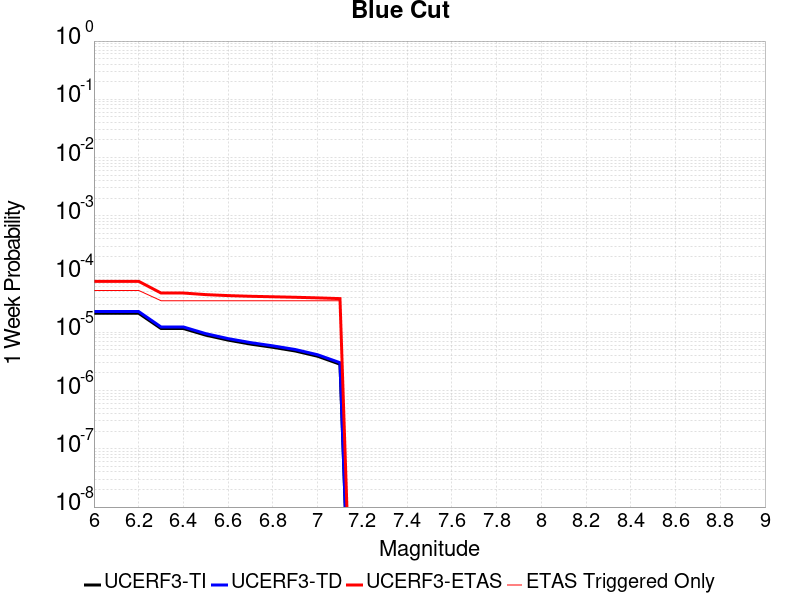 | 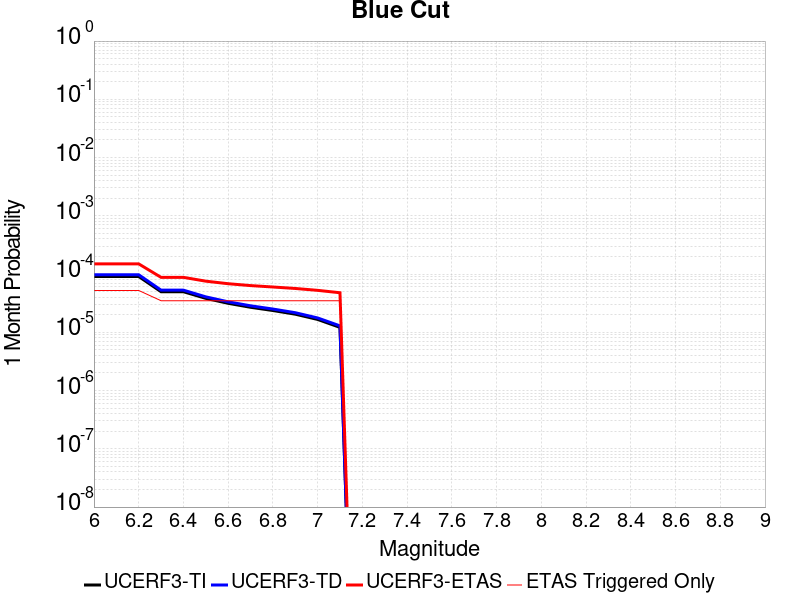 | 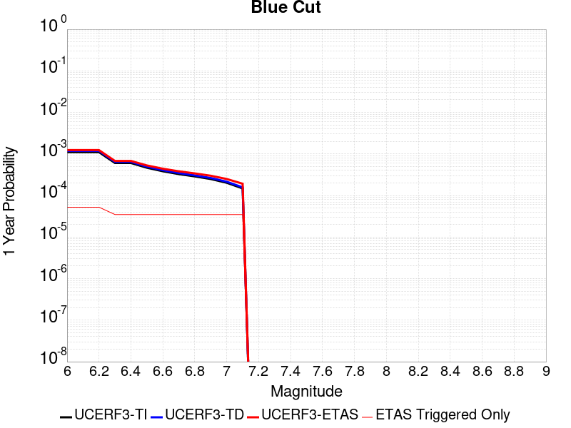 | 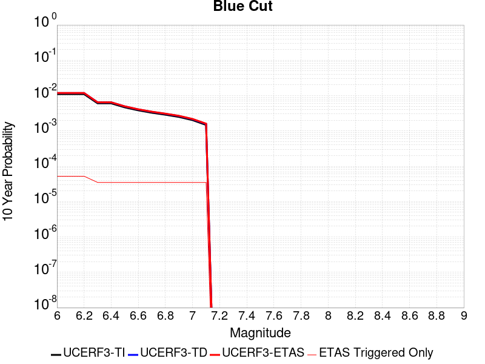 |

| Magnitude | 1 wk TI Prob | 1 wk TD Prob | 1 wk ETAS Prob | 1 wk ETAS/TD Gain | 1 wk ETAS Triggered Only | 1 mo TI Prob | 1 mo TD Prob | 1 mo ETAS Prob | 1 mo ETAS/TD Gain | 1 mo ETAS Triggered Only | 1 yr TI Prob | 1 yr TD Prob | 1 yr ETAS Prob | 1 yr ETAS/TD Gain | 1 yr ETAS Triggered Only | 10 yr TI Prob | 10 yr TD Prob | 10 yr ETAS Prob | 10 yr ETAS/TD Gain | 10 yr ETAS Triggered Only |
|-----|-----|-----|-----|-----|-----|-----|-----|-----|-----|-----|-----|-----|-----|-----|-----|-----|-----|-----|-----|-----|
| 6.0 | 2.1227985E-5 | 2.2719574E-5 | 7.504975E-5 | 3.3033078 | 5.233136E-5 | 9.097391E-5 | 9.73663E-5 | 1.4969257E-4 | 1.5374166 | 5.233136E-5 | 0.0011070445 | 0.0011848481 | 0.0012371175 | 1.0441148 | 5.233136E-5 | 0.011015458 | 0.011791152 | 0.011842866 | 1.0043858 | 5.233136E-5 |
| 6.1 | 2.1227985E-5 | 2.2719574E-5 | 7.504975E-5 | 3.3033078 | 5.233136E-5 | 9.097391E-5 | 9.73663E-5 | 1.4969257E-4 | 1.5374166 | 5.233136E-5 | 0.0011070445 | 0.0011848481 | 0.0012371175 | 1.0441148 | 5.233136E-5 | 0.011015458 | 0.011791152 | 0.011842866 | 1.0043858 | 5.233136E-5 |
| 6.2 | 2.1227985E-5 | 2.2719574E-5 | 7.504975E-5 | 3.3033078 | 5.233136E-5 | 9.097391E-5 | 9.73663E-5 | 1.4969257E-4 | 1.5374166 | 5.233136E-5 | 0.0011070445 | 0.0011848481 | 0.0012371175 | 1.0441148 | 5.233136E-5 | 0.011015458 | 0.011791152 | 0.011842866 | 1.0043858 | 5.233136E-5 |
| 6.3 | 1.1613981E-5 | 1.2353542E-5 | 4.7240686E-5 | 3.82406 | 3.4887576E-5 | 4.9773254E-5 | 5.2942745E-5 | 8.782848E-5 | 1.658933 | 3.4887576E-5 | 6.0582085E-4 | 6.443998E-4 | 6.7926483E-4 | 1.0541048 | 3.4887576E-5 | 0.0060417196 | 0.0064265593 | 0.0064612227 | 1.0053937 | 3.4887576E-5 |
| 6.4 | 1.1613981E-5 | 1.2353542E-5 | 4.7240686E-5 | 3.82406 | 3.4887576E-5 | 4.9773254E-5 | 5.2942745E-5 | 8.782848E-5 | 1.658933 | 3.4887576E-5 | 6.0582085E-4 | 6.443998E-4 | 6.7926483E-4 | 1.0541048 | 3.4887576E-5 | 0.0060417196 | 0.0064265593 | 0.0064612227 | 1.0053937 | 3.4887576E-5 |
| 6.5 | 8.931326E-6 | 9.4816E-6 | 4.4368844E-5 | 4.679468 | 3.4887576E-5 | 3.8276554E-5 | 4.0634844E-5 | 7.5521006E-5 | 1.8585281 | 3.4887576E-5 | 4.6591737E-4 | 4.946261E-4 | 5.294964E-4 | 1.0704983 | 3.4887576E-5 | 0.0046494175 | 0.004936161 | 0.0049708765 | 1.0070329 | 3.4887576E-5 |
| 6.6 | 7.345353E-6 | 7.79028E-6 | 4.267758E-5 | 5.4783125 | 3.4887576E-5 | 3.1479703E-5 | 3.338653E-5 | 6.827294E-5 | 2.0449247 | 3.4887576E-5 | 3.83198E-4 | 4.064132E-4 | 4.4128657E-4 | 1.0858077 | 3.4887576E-5 | 0.0038253788 | 0.0040574907 | 0.004092237 | 1.0085634 | 3.4887576E-5 |
| 6.7 | 6.2775666E-6 | 6.655149E-6 | 4.154249E-5 | 6.242158 | 3.4887576E-5 | 2.690358E-5 | 2.8521798E-5 | 6.340838E-5 | 2.223155 | 3.4887576E-5 | 3.2750185E-4 | 3.472051E-4 | 3.8208053E-4 | 1.1004463 | 3.4887576E-5 | 0.0032701963 | 0.003467367 | 0.0035021338 | 1.0100268 | 3.4887576E-5 |
| 6.8 | 5.5234095E-6 | 5.8551113E-6 | 4.074248E-5 | 6.958447 | 3.4887576E-5 | 2.367154E-5 | 2.5093133E-5 | 5.9979833E-5 | 2.3902886 | 3.4887576E-5 | 2.8816288E-4 | 3.0547334E-4 | 3.4035026E-4 | 1.1141734 | 3.4887576E-5 | 0.002877895 | 0.0030512505 | 0.0030860316 | 1.011399 | 3.4887576E-5 |
| 6.9 | 4.7780054E-6 | 5.0654203E-6 | 3.9952818E-5 | 7.887365 | 3.4887576E-5 | 2.0477004E-5 | 2.1708804E-5 | 5.659562E-5 | 2.6070354 | 3.4887576E-5 | 2.4927902E-4 | 2.642797E-4 | 2.9915804E-4 | 1.1319752 | 3.4887576E-5 | 0.0024899957 | 0.002640346 | 0.0026751417 | 1.0131783 | 3.4887576E-5 |
| 7.0 | 3.883171E-6 | 4.118487E-6 | 3.9005918E-5 | 9.470934 | 3.4887576E-5 | 1.6642054E-5 | 1.7650578E-5 | 5.2537536E-5 | 2.9765334 | 3.4887576E-5 | 2.0259817E-4 | 2.1488148E-4 | 2.4976156E-4 | 1.1623224 | 3.4887576E-5 | 0.0020241356 | 0.0021474129 | 0.0021822255 | 1.0162114 | 3.4887576E-5 |
| 7.1 | 2.8358215E-6 | 3.0097158E-6 | 3.7897185E-5 | 12.591616 | 3.4887576E-5 | 1.2153464E-5 | 1.2898756E-5 | 4.778588E-5 | 3.7046893 | 3.4887576E-5 | 1.4795837E-4 | 1.5703762E-4 | 1.9191971E-4 | 1.2221258 | 3.4887576E-5 | 0.001478599 | 0.0015699116 | 0.0016047445 | 1.0221877 | 3.4887576E-5 |

## Santa Cruz Catalina Ridge alt1
*[(top)](#table-of-contents)*

| 1 Week | 1 Month | 1 Year | 10 Year |
|-----|-----|-----|-----|
| 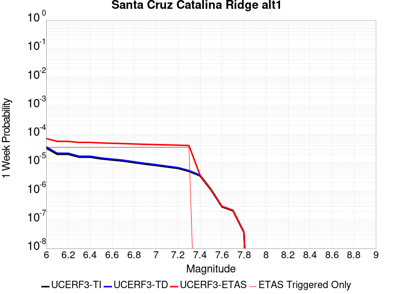 | 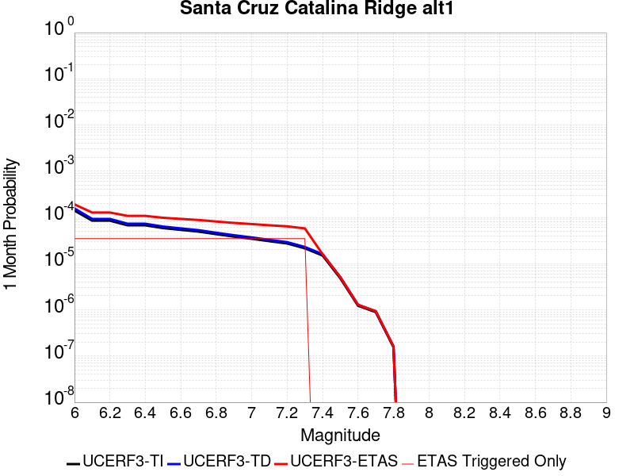 | 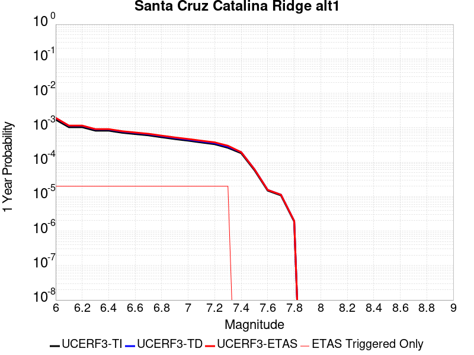 | 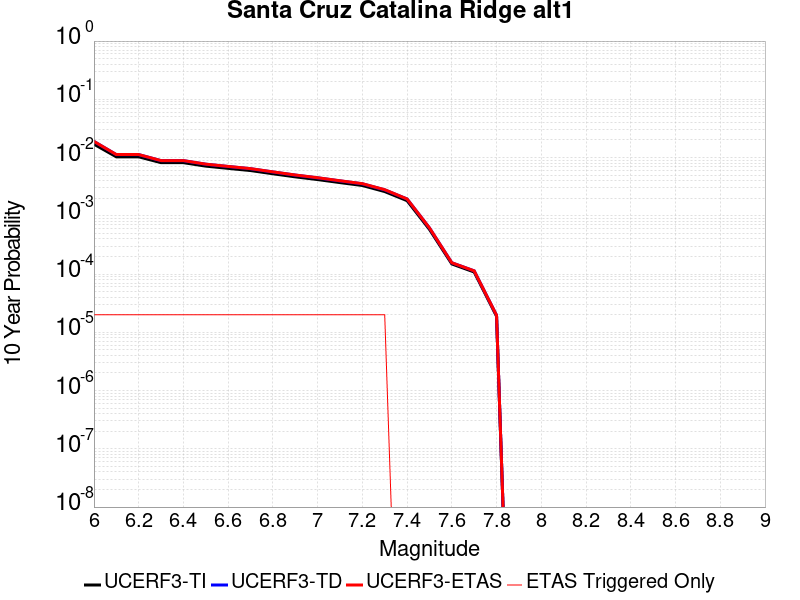 |

| Magnitude | 1 wk TI Prob | 1 wk TD Prob | 1 wk ETAS Prob | 1 wk ETAS/TD Gain | 1 wk ETAS Triggered Only | 1 mo TI Prob | 1 mo TD Prob | 1 mo ETAS Prob | 1 mo ETAS/TD Gain | 1 mo ETAS Triggered Only | 1 yr TI Prob | 1 yr TD Prob | 1 yr ETAS Prob | 1 yr ETAS/TD Gain | 1 yr ETAS Triggered Only | 10 yr TI Prob | 10 yr TD Prob | 10 yr ETAS Prob | 10 yr ETAS/TD Gain | 10 yr ETAS Triggered Only |
|-----|-----|-----|-----|-----|-----|-----|-----|-----|-----|-----|-----|-----|-----|-----|-----|-----|-----|-----|-----|-----|
| 6.0 | 3.2833184E-5 | 3.65584E-5 | 7.1444694E-5 | 1.9542623 | 3.4887576E-5 | 1.4070606E-4 | 1.5667039E-4 | 1.9155249E-4 | 1.2226465 | 3.4887576E-5 | 0.00171175 | 0.0019059596 | 0.0019407807 | 1.0182695 | 3.4887576E-5 | 0.016986247 | 0.018913029 | 0.018947257 | 1.0018097 | 3.4887576E-5 |
| 6.1 | 1.9835548E-5 | 2.1659505E-5 | 5.6546323E-5 | 2.6106932 | 3.4887576E-5 | 8.500672E-5 | 9.282326E-5 | 1.277076E-4 | 1.3758146 | 3.4887576E-5 | 0.0010344655 | 0.0011295575 | 0.0011644056 | 1.0308511 | 3.4887576E-5 | 0.010296632 | 0.011240295 | 0.011274791 | 1.0030689 | 3.4887576E-5 |
| 6.2 | 1.9835548E-5 | 2.1659505E-5 | 5.6546323E-5 | 2.6106932 | 3.4887576E-5 | 8.500672E-5 | 9.282326E-5 | 1.277076E-4 | 1.3758146 | 3.4887576E-5 | 0.0010344655 | 0.0011295575 | 0.0011644056 | 1.0308511 | 3.4887576E-5 | 0.010296632 | 0.011240295 | 0.011274791 | 1.0030689 | 3.4887576E-5 |
| 6.3 | 1.5728183E-5 | 1.703395E-5 | 5.1920928E-5 | 3.0480852 | 3.4887576E-5 | 6.7404755E-5 | 7.300063E-5 | 1.0788566E-4 | 1.477873 | 3.4887576E-5 | 8.2034385E-4 | 8.884264E-4 | 9.23283E-4 | 1.039234 | 3.4887576E-5 | 0.008173222 | 0.008849427 | 0.008884005 | 1.0039074 | 3.4887576E-5 |
| 6.4 | 1.5728183E-5 | 1.703395E-5 | 5.1920928E-5 | 3.0480852 | 3.4887576E-5 | 6.7404755E-5 | 7.300063E-5 | 1.0788566E-4 | 1.477873 | 3.4887576E-5 | 8.2034385E-4 | 8.884264E-4 | 9.23283E-4 | 1.039234 | 3.4887576E-5 | 0.008173222 | 0.008849427 | 0.008884005 | 1.0039074 | 3.4887576E-5 |
| 6.5 | 1.3707734E-5 | 1.4794522E-5 | 4.968158E-5 | 3.3581066 | 3.4887576E-5 | 5.8746107E-5 | 6.3403575E-5 | 9.828893E-5 | 1.5502113 | 3.4887576E-5 | 7.1499916E-4 | 7.716686E-4 | 8.0652925E-4 | 1.0451757 | 3.4887576E-5 | 0.0071270303 | 0.0076902895 | 0.007724909 | 1.0045017 | 3.4887576E-5 |
| 6.6 | 1.2539813E-5 | 1.3510219E-5 | 4.8397324E-5 | 3.5822752 | 3.4887576E-5 | 5.3740947E-5 | 5.789967E-5 | 9.278522E-5 | 1.6025174 | 3.4887576E-5 | 6.540996E-4 | 7.0470315E-4 | 7.3956617E-4 | 1.0494719 | 3.4887576E-5 | 0.0065217763 | 0.0070249885 | 0.007059631 | 1.0049313 | 3.4887576E-5 |
| 6.7 | 1.1504083E-5 | 1.2377375E-5 | 4.726452E-5 | 3.818622 | 3.4887576E-5 | 4.930228E-5 | 5.3044827E-5 | 8.793055E-5 | 1.657665 | 3.4887576E-5 | 6.0008996E-4 | 6.456314E-4 | 6.8049645E-4 | 1.0540015 | 3.4887576E-5 | 0.005984721 | 0.006437786 | 0.006472449 | 1.0053843 | 3.4887576E-5 |
| 6.8 | 1.012739E-5 | 1.0877071E-5 | 4.5764267E-5 | 4.207407 | 3.4887576E-5 | 4.340238E-5 | 4.6615194E-5 | 8.1501144E-5 | 1.7483815 | 3.4887576E-5 | 5.282958E-4 | 5.673937E-4 | 6.022615E-4 | 1.0614525 | 3.4887576E-5 | 0.0052704164 | 0.0056596193 | 0.0056943097 | 1.0061294 | 3.4887576E-5 |
| 6.9 | 8.9607865E-6 | 9.609117E-6 | 4.4496355E-5 | 4.6306396 | 3.4887576E-5 | 3.8402806E-5 | 4.1181287E-5 | 7.606742E-5 | 1.8471357 | 3.4887576E-5 | 4.6745385E-4 | 5.012679E-4 | 5.3613796E-4 | 1.0695637 | 3.4887576E-5 | 0.0046647177 | 0.005001492 | 0.005036205 | 1.0069406 | 3.4887576E-5 |
| 7.0 | 8.046829E-6 | 8.619746E-6 | 4.350702E-5 | 5.047367 | 3.4887576E-5 | 3.4485955E-5 | 3.694125E-5 | 7.182753E-5 | 1.944372 | 3.4887576E-5 | 4.1978562E-4 | 4.496677E-4 | 4.845396E-4 | 1.0775503 | 3.4887576E-5 | 0.004189935 | 0.0044876686 | 0.0045224 | 1.0077392 | 3.4887576E-5 |
| 7.1 | 7.136131E-6 | 7.637656E-6 | 4.2524964E-5 | 5.567803 | 3.4887576E-5 | 3.0583058E-5 | 3.2732405E-5 | 6.7618836E-5 | 2.065807 | 3.4887576E-5 | 3.7228514E-4 | 3.9844486E-4 | 4.3331852E-4 | 1.0875244 | 3.4887576E-5 | 0.0037166206 | 0.003977381 | 0.00401213 | 1.0087366 | 3.4887576E-5 |
| 7.2 | 6.362014E-6 | 6.8049585E-6 | 4.1692296E-5 | 6.1267524 | 3.4887576E-5 | 2.726549E-5 | 2.9163786E-5 | 6.405034E-5 | 2.1962287 | 3.4887576E-5 | 3.3190678E-4 | 3.550119E-4 | 3.8988708E-4 | 1.0982367 | 3.4887576E-5 | 0.0033141149 | 0.003544516 | 0.0035792799 | 1.0098078 | 3.4887576E-5 |
| 7.3 | 5.004101E-6 | 5.351715E-6 | 4.02391E-5 | 7.5189176 | 3.4887576E-5 | 2.1445969E-5 | 2.2935723E-5 | 5.7822497E-5 | 2.5210671 | 3.4887576E-5 | 2.6107338E-4 | 2.792072E-4 | 3.1408502E-4 | 1.1249174 | 3.4887576E-5 | 0.002607669 | 0.0027886187 | 0.002823409 | 1.0124758 | 3.4887576E-5 |
| 7.4 | 3.4901443E-6 | 3.7320526E-6 | 3.7320526E-6 | 1.0 | 0.0 | 1.4957676E-5 | 1.5994416E-5 | 1.5994416E-5 | 1.0 | 0.0 | 1.8209449E-4 | 1.9471499E-4 | 1.9471499E-4 | 1.0 | 0.0 | 0.0018194534 | 0.0019454823 | 0.0019454823 | 1.0 | 0.0 |
| 7.5 | 1.1215045E-6 | 1.189387E-6 | 1.189387E-6 | 1.0 | 0.0 | 4.806439E-6 | 5.097363E-6 | 5.097363E-6 | 1.0 | 0.0 | 5.851682E-5 | 6.205866E-5 | 6.205866E-5 | 1.0 | 0.0 | 5.850142E-4 | 6.2041637E-4 | 6.2041637E-4 | 1.0 | 0.0 |
| 7.6 | 2.8599047E-7 | 2.9951994E-7 | 2.9951994E-7 | 1.0 | 0.0 | 1.2256729E-6 | 1.2836562E-6 | 1.2836562E-6 | 1.0 | 0.0 | 1.4922465E-5 | 1.5628404E-5 | 1.5628404E-5 | 1.0 | 0.0 | 1.4921463E-4 | 1.5627318E-4 | 1.5627318E-4 | 1.0 | 0.0 |
| 7.7 | 2.0781519E-7 | 2.1744323E-7 | 2.1744323E-7 | 1.0 | 0.0 | 8.906362E-7 | 9.3189925E-7 | 9.3189925E-7 | 1.0 | 0.0 | 1.08434415E-5 | 1.13458145E-5 | 1.13458145E-5 | 1.0 | 0.0 | 1.0842913E-4 | 1.1345245E-4 | 1.1345245E-4 | 1.0 | 0.0 |
| 7.8 | 3.614776E-8 | 3.764102E-8 | 3.764102E-8 | 1.0 | 0.0 | 1.5491896E-7 | 1.6131864E-7 | 1.6131864E-7 | 1.0 | 0.0 | 1.8861368E-6 | 1.9640527E-6 | 1.9640527E-6 | 1.0 | 0.0 | 1.8861208E-5 | 1.9640367E-5 | 1.9640367E-5 | 1.0 | 0.0 |

## Hunting Creek - Berryessa 2011 CFM
*[(top)](#table-of-contents)*

| 1 Week | 1 Month | 1 Year | 10 Year |
|-----|-----|-----|-----|
| 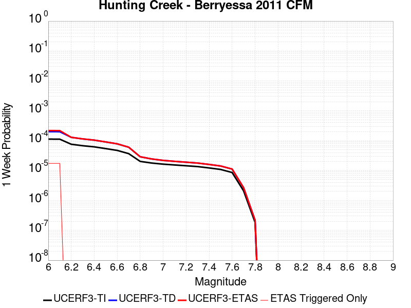 | 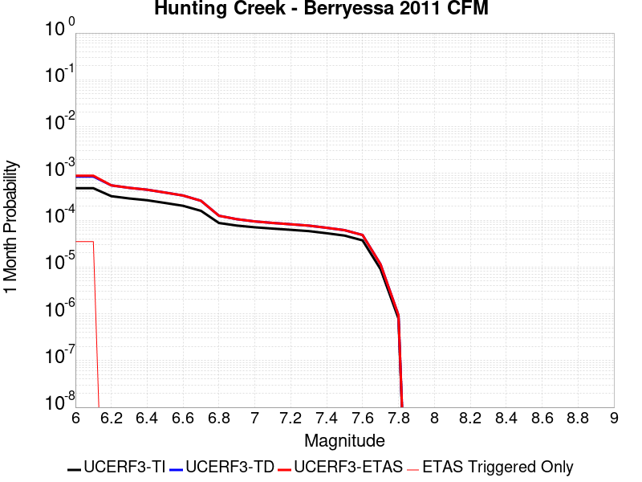 | 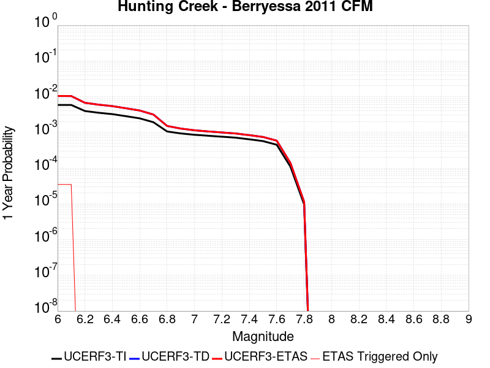 | 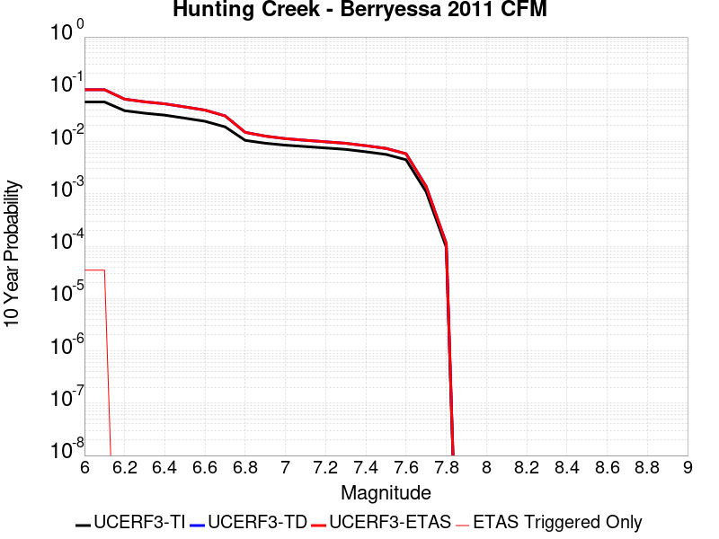 |

| Magnitude | 1 wk TI Prob | 1 wk TD Prob | 1 wk ETAS Prob | 1 wk ETAS/TD Gain | 1 wk ETAS Triggered Only | 1 mo TI Prob | 1 mo TD Prob | 1 mo ETAS Prob | 1 mo ETAS/TD Gain | 1 mo ETAS Triggered Only | 1 yr TI Prob | 1 yr TD Prob | 1 yr ETAS Prob | 1 yr ETAS/TD Gain | 1 yr ETAS Triggered Only | 10 yr TI Prob | 10 yr TD Prob | 10 yr ETAS Prob | 10 yr ETAS/TD Gain | 10 yr ETAS Triggered Only |
|-----|-----|-----|-----|-----|-----|-----|-----|-----|-----|-----|-----|-----|-----|-----|-----|-----|-----|-----|-----|-----|
| 6.0 | 1.1270982E-4 | 2.0012174E-4 | 2.1756203E-4 | 1.0871484 | 1.7443788E-5 | 4.8295266E-4 | 8.5739547E-4 | 8.922531E-4 | 1.0406553 | 3.4887576E-5 | 0.0058641075 | 0.010386313 | 0.010420838 | 1.0033242 | 3.4887576E-5 | 0.057117578 | 0.09803703 | 0.09806849 | 1.000321 | 3.4887576E-5 |
| 6.1 | 1.1239393E-4 | 1.9960315E-4 | 2.1704345E-4 | 1.0873749 | 1.7443788E-5 | 4.8159933E-4 | 8.551744E-4 | 8.900321E-4 | 1.040761 | 3.4887576E-5 | 0.0058477195 | 0.010359551 | 0.010394077 | 1.0033327 | 3.4887576E-5 | 0.056962132 | 0.09779551 | 0.09782698 | 1.0003219 | 3.4887576E-5 |
| 6.2 | 7.596265E-5 | 1.2940196E-4 | 1.2940196E-4 | 1.0 | 0.0 | 3.2551357E-4 | 5.5444165E-4 | 5.5444165E-4 | 1.0 | 0.0 | 0.0039559277 | 0.0067210156 | 0.0067210156 | 1.0 | 0.0 | 0.038862433 | 0.0645915 | 0.0645915 | 1.0 | 0.0 |
| 6.3 | 6.78794E-5 | 1.145119E-4 | 1.145119E-4 | 1.0 | 0.0 | 2.9087928E-4 | 4.906513E-4 | 4.906513E-4 | 1.0 | 0.0 | 0.003535705 | 0.005952679 | 0.005952679 | 1.0 | 0.0 | 0.034799766 | 0.057465393 | 0.057465393 | 1.0 | 0.0 |
| 6.4 | 6.2165134E-5 | 1.0436625E-4 | 1.0436625E-4 | 1.0 | 0.0 | 2.6639478E-4 | 4.4721062E-4 | 4.4721062E-4 | 1.0 | 0.0 | 0.0032385332 | 0.005427573 | 0.005427573 | 1.0 | 0.0 | 0.03191742 | 0.052550517 | 0.052550517 | 1.0 | 0.0 |
| 6.5 | 5.4368087E-5 | 9.071415E-5 | 9.071415E-5 | 1.0 | 0.0 | 2.3298527E-4 | 3.8872007E-4 | 3.8872007E-4 | 1.0 | 0.0 | 0.0028329059 | 0.0047198683 | 0.0047198683 | 1.0 | 0.0 | 0.027970633 | 0.045880128 | 0.045880128 | 1.0 | 0.0 |
| 6.6 | 4.729947E-5 | 7.847572E-5 | 7.847572E-5 | 1.0 | 0.0 | 2.0269625E-4 | 3.362842E-4 | 3.362842E-4 | 1.0 | 0.0 | 0.002465034 | 0.0040849647 | 0.0040849647 | 1.0 | 0.0 | 0.02437869 | 0.03985155 | 0.03985155 | 1.0 | 0.0 |
| 6.7 | 3.6875328E-5 | 6.0451803E-5 | 6.0451803E-5 | 1.0 | 0.0 | 1.5802756E-4 | 2.59056E-4 | 2.59056E-4 | 1.0 | 0.0 | 0.0019222875 | 0.0031482063 | 0.0031482063 | 1.0 | 0.0 | 0.019057442 | 0.03089237 | 0.03089237 | 1.0 | 0.0 |
| 6.8 | 2.0292036E-5 | 2.8976308E-5 | 2.8976308E-5 | 1.0 | 0.0 | 8.6962966E-5 | 1.2417832E-4 | 1.2417832E-4 | 1.0 | 0.0 | 0.0010582599 | 0.0015108072 | 0.0015108072 | 1.0 | 0.0 | 0.010532344 | 0.014978523 | 0.014978523 | 1.0 | 0.0 |
| 6.9 | 1.7871042E-5 | 2.4472254E-5 | 2.4472254E-5 | 1.0 | 0.0 | 7.658793E-5 | 1.048769E-4 | 1.048769E-4 | 1.0 | 0.0 | 9.320591E-4 | 0.0012761299 | 0.0012761299 | 1.0 | 0.0 | 0.009281595 | 0.012679775 | 0.012679775 | 1.0 | 0.0 |
| 7.0 | 1.6415532E-5 | 2.1906277E-5 | 2.1906277E-5 | 1.0 | 0.0 | 7.035038E-5 | 9.3880684E-5 | 9.3880684E-5 | 1.0 | 0.0 | 8.561793E-4 | 0.0011424015 | 0.0011424015 | 1.0 | 0.0 | 0.008528882 | 0.01136452 | 0.01136452 | 1.0 | 0.0 |
| 7.1 | 1.5409885E-5 | 2.0346342E-5 | 2.0346342E-5 | 1.0 | 0.0 | 6.6040695E-5 | 8.7195716E-5 | 8.7195716E-5 | 1.0 | 0.0 | 8.0374884E-4 | 0.0010610938 | 0.0010610938 | 1.0 | 0.0 | 0.00800848 | 0.010560595 | 0.010560595 | 1.0 | 0.0 |
| 7.2 | 1.4497423E-5 | 1.9054964E-5 | 1.9054964E-5 | 1.0 | 0.0 | 6.213033E-5 | 8.166159E-5 | 8.166159E-5 | 1.0 | 0.0 | 7.5617427E-4 | 9.937795E-4 | 9.937795E-4 | 1.0 | 0.0 | 0.0075360634 | 0.009893929 | 0.009893929 | 1.0 | 0.0 |
| 7.3 | 1.3615175E-5 | 1.7826127E-5 | 1.7826127E-5 | 1.0 | 0.0 | 5.8349444E-5 | 7.639547E-5 | 7.639547E-5 | 1.0 | 0.0 | 7.101729E-4 | 9.297209E-4 | 9.297209E-4 | 1.0 | 0.0 | 0.0070790765 | 0.009258823 | 0.009258823 | 1.0 | 0.0 |
| 7.4 | 1.2252825E-5 | 1.602625E-5 | 1.602625E-5 | 1.0 | 0.0 | 5.251105E-5 | 6.868213E-5 | 6.868213E-5 | 1.0 | 0.0 | 6.391345E-4 | 8.35887E-4 | 8.35887E-4 | 1.0 | 0.0 | 0.0063729943 | 0.008327872 | 0.008327872 | 1.0 | 0.0 |
| 7.5 | 1.0913301E-5 | 1.4241117E-5 | 1.4241117E-5 | 1.0 | 0.0 | 4.6770452E-5 | 6.1031948E-5 | 6.1031948E-5 | 1.0 | 0.0 | 5.6928146E-4 | 7.4281334E-4 | 7.4281334E-4 | 1.0 | 0.0 | 0.0056782532 | 0.0074036797 | 0.0074036797 | 1.0 | 0.0 |
| 7.6 | 8.623192E-6 | 1.12346415E-5 | 1.12346415E-5 | 1.0 | 0.0 | 3.6956015E-5 | 4.814759E-5 | 4.814759E-5 | 1.0 | 0.0 | 4.4984656E-4 | 5.8604183E-4 | 5.8604183E-4 | 1.0 | 0.0 | 0.00448937 | 0.0058452785 | 0.0058452785 | 1.0 | 0.0 |
| 7.7 | 2.0993634E-6 | 2.662584E-6 | 2.662584E-6 | 1.0 | 0.0 | 8.997241E-6 | 1.1411025E-5 | 1.1411025E-5 | 1.0 | 0.0 | 1.09535904E-4 | 1.3892044E-4 | 1.3892044E-4 | 1.0 | 0.0 | 0.0010948193 | 0.0013883426 | 0.0013883426 | 1.0 | 0.0 |
| 7.8 | 1.8428308E-7 | 2.167437E-7 | 2.167437E-7 | 1.0 | 0.0 | 7.897844E-7 | 9.289013E-7 | 9.289013E-7 | 1.0 | 0.0 | 9.615583E-6 | 1.1309318E-5 | 1.1309318E-5 | 1.0 | 0.0 | 9.615166E-5 | 1.13086026E-4 | 1.13086026E-4 | 1.0 | 0.0 |

## Kern Canyon (Lake Isabella) 2011
*[(top)](#table-of-contents)*

| 1 Week | 1 Month | 1 Year | 10 Year |
|-----|-----|-----|-----|
|  |  | 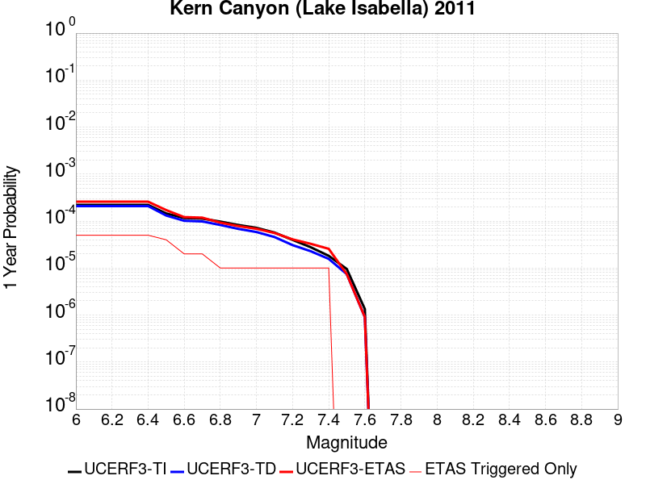 |  |

| Magnitude | 1 wk TI Prob | 1 wk TD Prob | 1 wk ETAS Prob | 1 wk ETAS/TD Gain | 1 wk ETAS Triggered Only | 1 mo TI Prob | 1 mo TD Prob | 1 mo ETAS Prob | 1 mo ETAS/TD Gain | 1 mo ETAS Triggered Only | 1 yr TI Prob | 1 yr TD Prob | 1 yr ETAS Prob | 1 yr ETAS/TD Gain | 1 yr ETAS Triggered Only | 10 yr TI Prob | 10 yr TD Prob | 10 yr ETAS Prob | 10 yr ETAS/TD Gain | 10 yr ETAS Triggered Only |
|-----|-----|-----|-----|-----|-----|-----|-----|-----|-----|-----|-----|-----|-----|-----|-----|-----|-----|-----|-----|-----|
| 6.0 | 4.2387383E-6 | 4.001639E-6 | 3.8889073E-5 | 9.718287 | 3.4887576E-5 | 1.8165894E-5 | 1.7149778E-5 | 5.2036754E-5 | 3.0342524 | 3.4887576E-5 | 2.2114732E-4 | 2.087804E-4 | 2.436607E-4 | 1.1670669 | 3.4887576E-5 | 0.0022092736 | 0.0020860266 | 0.0021208413 | 1.0166895 | 3.4887576E-5 |
| 6.1 | 4.2387383E-6 | 4.001639E-6 | 3.8889073E-5 | 9.718287 | 3.4887576E-5 | 1.8165894E-5 | 1.7149778E-5 | 5.2036754E-5 | 3.0342524 | 3.4887576E-5 | 2.2114732E-4 | 2.087804E-4 | 2.436607E-4 | 1.1670669 | 3.4887576E-5 | 0.0022092736 | 0.0020860266 | 0.0021208413 | 1.0166895 | 3.4887576E-5 |
| 6.2 | 4.2387383E-6 | 4.001639E-6 | 3.8889073E-5 | 9.718287 | 3.4887576E-5 | 1.8165894E-5 | 1.7149778E-5 | 5.2036754E-5 | 3.0342524 | 3.4887576E-5 | 2.2114732E-4 | 2.087804E-4 | 2.436607E-4 | 1.1670669 | 3.4887576E-5 | 0.0022092736 | 0.0020860266 | 0.0021208413 | 1.0166895 | 3.4887576E-5 |
| 6.3 | 4.2387383E-6 | 4.001639E-6 | 3.8889073E-5 | 9.718287 | 3.4887576E-5 | 1.8165894E-5 | 1.7149778E-5 | 5.2036754E-5 | 3.0342524 | 3.4887576E-5 | 2.2114732E-4 | 2.087804E-4 | 2.436607E-4 | 1.1670669 | 3.4887576E-5 | 0.0022092736 | 0.0020860266 | 0.0021208413 | 1.0166895 | 3.4887576E-5 |
| 6.4 | 4.2387383E-6 | 4.001639E-6 | 3.8889073E-5 | 9.718287 | 3.4887576E-5 | 1.8165894E-5 | 1.7149778E-5 | 5.2036754E-5 | 3.0342524 | 3.4887576E-5 | 2.2114732E-4 | 2.087804E-4 | 2.436607E-4 | 1.1670669 | 3.4887576E-5 | 0.0022092736 | 0.0020860266 | 0.0021208413 | 1.0166895 | 3.4887576E-5 |
| 6.5 | 2.7857532E-6 | 2.517867E-6 | 3.7405352E-5 | 14.855969 | 3.4887576E-5 | 1.1938888E-5 | 1.0790815E-5 | 4.5678014E-5 | 4.2330456 | 3.4887576E-5 | 1.4534626E-4 | 1.3137059E-4 | 1.6625358E-4 | 1.2655312 | 3.4887576E-5 | 0.0014525123 | 0.001312962 | 0.0013478037 | 1.0265368 | 3.4887576E-5 |
| 6.6 | 2.2233348E-6 | 1.9441236E-6 | 1.9387877E-5 | 9.972554 | 1.7443788E-5 | 9.528543E-6 | 8.331932E-6 | 2.5775575E-5 | 3.093589 | 1.7443788E-5 | 1.1600384E-4 | 1.01436635E-4 | 1.18878655E-4 | 1.1719499 | 1.7443788E-5 | 0.001159433 | 0.001013912 | 0.0010313381 | 1.017187 | 1.7443788E-5 |
| 6.7 | 2.1635126E-6 | 1.8835036E-6 | 1.9327259E-5 | 10.261333 | 1.7443788E-5 | 9.272164E-6 | 8.072134E-6 | 2.5515781E-5 | 3.160971 | 1.7443788E-5 | 1.1288274E-4 | 9.827388E-5 | 1.1571595E-4 | 1.1774843 | 1.7443788E-5 | 0.0011282542 | 9.823124E-4 | 9.99739E-4 | 1.0177405 | 1.7443788E-5 |
| 6.8 | 1.8685711E-6 | 1.5831425E-6 | 1.5831425E-6 | 1.0 | 0.0 | 8.008137E-6 | 6.784879E-6 | 6.784879E-6 | 1.0 | 0.0 | 9.74947E-5 | 8.260282E-5 | 8.260282E-5 | 1.0 | 0.0 | 9.745194E-4 | 8.2572614E-4 | 8.2572614E-4 | 1.0 | 0.0 |
| 6.9 | 1.5815071E-6 | 1.3064928E-6 | 1.3064928E-6 | 1.0 | 0.0 | 6.77787E-6 | 5.599243E-6 | 5.599243E-6 | 1.0 | 0.0 | 8.251744E-5 | 6.816868E-5 | 6.816868E-5 | 1.0 | 0.0 | 8.248681E-4 | 6.8148033E-4 | 6.8148033E-4 | 1.0 | 0.0 |
| 7.0 | 1.3772564E-6 | 1.1210718E-6 | 1.1210718E-6 | 1.0 | 0.0 | 5.9025137E-6 | 4.8045845E-6 | 4.8045845E-6 | 1.0 | 0.0 | 7.186073E-5 | 5.8494268E-5 | 5.8494268E-5 | 1.0 | 0.0 | 7.18375E-4 | 5.847908E-4 | 5.847908E-4 | 1.0 | 0.0 |
| 7.1 | 1.0916998E-6 | 8.763777E-7 | 8.763777E-7 | 1.0 | 0.0 | 4.678705E-6 | 3.7558991E-6 | 3.7558991E-6 | 1.0 | 0.0 | 5.6961744E-5 | 4.5727127E-5 | 4.5727127E-5 | 1.0 | 0.0 | 5.6947145E-4 | 4.571785E-4 | 4.571785E-4 | 1.0 | 0.0 |
| 7.2 | 7.6277024E-7 | 5.901454E-7 | 5.901454E-7 | 1.0 | 0.0 | 3.2690114E-6 | 2.5291922E-6 | 2.5291922E-6 | 1.0 | 0.0 | 3.9799485E-5 | 3.0792486E-5 | 3.0792486E-5 | 1.0 | 0.0 | 3.9792358E-4 | 3.0788282E-4 | 3.0788282E-4 | 1.0 | 0.0 |
| 7.3 | 5.3265916E-7 | 4.3824414E-7 | 4.3824414E-7 | 1.0 | 0.0 | 2.282823E-6 | 1.878188E-6 | 1.878188E-6 | 1.0 | 0.0 | 2.7793016E-5 | 2.2866701E-5 | 2.2866701E-5 | 1.0 | 0.0 | 2.778954E-4 | 2.2864387E-4 | 2.2864387E-4 | 1.0 | 0.0 |
| 7.4 | 3.4946007E-7 | 3.006571E-7 | 3.006571E-7 | 1.0 | 0.0 | 1.497685E-6 | 1.2885298E-6 | 1.2885298E-6 | 1.0 | 0.0 | 1.8234163E-5 | 1.568774E-5 | 1.568774E-5 | 1.0 | 0.0 | 1.8232666E-4 | 1.5686655E-4 | 1.5686655E-4 | 1.0 | 0.0 |
| 7.5 | 1.8317026E-7 | 1.4244812E-7 | 1.4244812E-7 | 1.0 | 0.0 | 7.850152E-7 | 6.104918E-7 | 6.104918E-7 | 1.0 | 0.0 | 9.557518E-6 | 7.432713E-6 | 7.432713E-6 | 1.0 | 0.0 | 9.5571064E-5 | 7.432472E-5 | 7.432472E-5 | 1.0 | 0.0 |
| 7.6 | 2.572245E-8 | 1.7352555E-8 | 1.7352555E-8 | 1.0 | 0.0 | 1.10239064E-7 | 7.436809E-8 | 7.436809E-8 | 1.0 | 0.0 | 1.3421597E-6 | 9.054312E-7 | 9.054312E-7 | 1.0 | 0.0 | 1.3421517E-5 | 9.05428E-6 | 9.05428E-6 | 1.0 | 0.0 |

## White Mountains
*[(top)](#table-of-contents)*

| 1 Week | 1 Month | 1 Year | 10 Year |
|-----|-----|-----|-----|
|  |  | 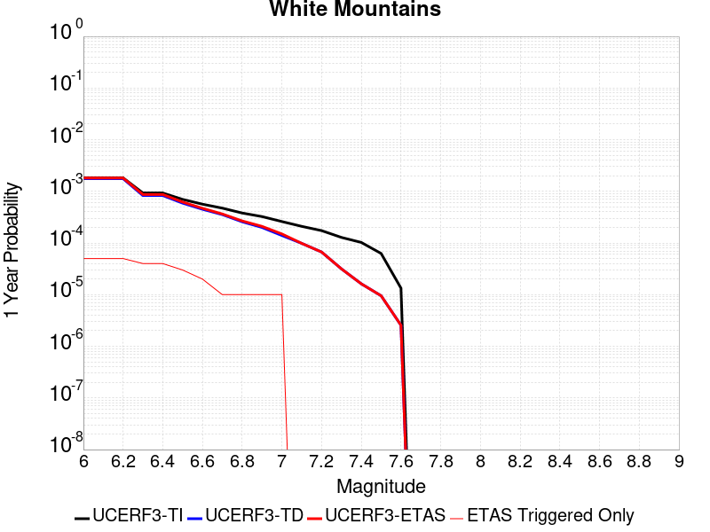 |  |

| Magnitude | 1 wk TI Prob | 1 wk TD Prob | 1 wk ETAS Prob | 1 wk ETAS/TD Gain | 1 wk ETAS Triggered Only | 1 mo TI Prob | 1 mo TD Prob | 1 mo ETAS Prob | 1 mo ETAS/TD Gain | 1 mo ETAS Triggered Only | 1 yr TI Prob | 1 yr TD Prob | 1 yr ETAS Prob | 1 yr ETAS/TD Gain | 1 yr ETAS Triggered Only | 10 yr TI Prob | 10 yr TD Prob | 10 yr ETAS Prob | 10 yr ETAS/TD Gain | 10 yr ETAS Triggered Only |
|-----|-----|-----|-----|-----|-----|-----|-----|-----|-----|-----|-----|-----|-----|-----|-----|-----|-----|-----|-----|-----|
| 6.0 | 3.503579E-5 | 3.378405E-5 | 6.8670444E-5 | 2.0326293 | 3.4887576E-5 | 1.5014476E-4 | 1.4478143E-4 | 1.7966396E-4 | 1.2409323 | 3.4887576E-5 | 0.0018264796 | 0.0017614096 | 0.0017962357 | 1.0197717 | 3.4887576E-5 | 0.018115403 | 0.017486818 | 0.017521096 | 1.0019602 | 3.4887576E-5 |
| 6.1 | 3.503579E-5 | 3.378405E-5 | 6.8670444E-5 | 2.0326293 | 3.4887576E-5 | 1.5014476E-4 | 1.4478143E-4 | 1.7966396E-4 | 1.2409323 | 3.4887576E-5 | 0.0018264796 | 0.0017614096 | 0.0017962357 | 1.0197717 | 3.4887576E-5 | 0.018115403 | 0.017486818 | 0.017521096 | 1.0019602 | 3.4887576E-5 |
| 6.2 | 3.503579E-5 | 3.378405E-5 | 6.8670444E-5 | 2.0326293 | 3.4887576E-5 | 1.5014476E-4 | 1.4478143E-4 | 1.7966396E-4 | 1.2409323 | 3.4887576E-5 | 0.0018264796 | 0.0017614096 | 0.0017962357 | 1.0197717 | 3.4887576E-5 | 0.018115403 | 0.017486818 | 0.017521096 | 1.0019602 | 3.4887576E-5 |
| 6.3 | 1.7818425E-5 | 1.5916074E-5 | 5.0803093E-5 | 3.1919363 | 3.4887576E-5 | 7.636245E-5 | 6.821004E-5 | 1.0309524E-4 | 1.5114378 | 3.4887576E-5 | 9.293162E-4 | 8.301551E-4 | 8.6501375E-4 | 1.0419905 | 3.4887576E-5 | 0.009254395 | 0.008271999 | 0.008306597 | 1.0041827 | 3.4887576E-5 |
| 6.4 | 1.7818425E-5 | 1.5916074E-5 | 5.0803093E-5 | 3.1919363 | 3.4887576E-5 | 7.636245E-5 | 6.821004E-5 | 1.0309524E-4 | 1.5114378 | 3.4887576E-5 | 9.293162E-4 | 8.301551E-4 | 8.6501375E-4 | 1.0419905 | 3.4887576E-5 | 0.009254395 | 0.008271999 | 0.008306597 | 1.0041827 | 3.4887576E-5 |
| 6.5 | 1.3397557E-5 | 1.13362685E-5 | 2.8779858E-5 | 2.5387418 | 1.7443788E-5 | 5.741684E-5 | 4.858314E-5 | 6.6026085E-5 | 1.3590328 | 1.7443788E-5 | 6.988258E-4 | 5.913462E-4 | 6.0877966E-4 | 1.0294809 | 1.7443788E-5 | 0.006966323 | 0.005898432 | 0.0059157726 | 1.0029399 | 1.7443788E-5 |
| 6.6 | 1.0818695E-5 | 8.625366E-6 | 2.6069003E-5 | 3.0223649 | 1.7443788E-5 | 4.6365014E-5 | 3.6965357E-5 | 5.4408498E-5 | 1.4718782 | 1.7443788E-5 | 5.6434784E-4 | 4.4996463E-4 | 4.6740056E-4 | 1.0387496 | 1.7443788E-5 | 0.005629168 | 0.004490972 | 0.0045083375 | 1.0038668 | 1.7443788E-5 |
| 6.7 | 9.067908E-6 | 6.802442E-6 | 2.424611E-5 | 3.5643244 | 1.7443788E-5 | 3.8861883E-5 | 2.9153016E-5 | 4.6596295E-5 | 1.5983354 | 1.7443788E-5 | 4.7304068E-4 | 3.5488335E-4 | 3.7232094E-4 | 1.0491362 | 1.7443788E-5 | 0.00472035 | 0.0035434833 | 0.0035608653 | 1.0049053 | 1.7443788E-5 |
| 6.8 | 7.295947E-6 | 4.936391E-6 | 2.2380093E-5 | 4.533695 | 1.7443788E-5 | 3.126797E-5 | 2.1155796E-5 | 3.8599213E-5 | 1.8245219 | 1.7443788E-5 | 3.8062103E-4 | 2.575425E-4 | 2.749818E-4 | 1.0677142 | 1.7443788E-5 | 0.0037996976 | 0.0025725532 | 0.0025899522 | 1.0067633 | 1.7443788E-5 |
| 6.9 | 6.2243444E-6 | 3.832213E-6 | 2.1275933E-5 | 5.551866 | 1.7443788E-5 | 2.6675489E-5 | 1.642367E-5 | 3.386717E-5 | 2.0620952 | 1.7443788E-5 | 3.2472567E-4 | 1.9994036E-4 | 2.1738067E-4 | 1.0872275 | 1.7443788E-5 | 0.0032425157 | 0.0019976576 | 0.0020150663 | 1.0087147 | 1.7443788E-5 |
| 7.0 | 4.9878413E-6 | 2.6795342E-6 | 2.0123274E-5 | 7.50999 | 1.7443788E-5 | 2.1376287E-5 | 1.14836685E-5 | 2.8927256E-5 | 2.5189908 | 1.7443788E-5 | 2.602252E-4 | 1.3980496E-4 | 1.5724631E-4 | 1.1247549 | 1.7443788E-5 | 0.002599207 | 0.0013971963 | 0.0014146158 | 1.0124674 | 1.7443788E-5 |
| 7.1 | 4.0252844E-6 | 1.8857575E-6 | 1.8857575E-6 | 1.0 | 0.0 | 1.7251105E-5 | 8.081794E-6 | 8.081794E-6 | 1.0 | 0.0 | 2.1001195E-4 | 9.8391516E-5 | 9.8391516E-5 | 1.0 | 0.0 | 0.0020981359 | 9.834924E-4 | 9.834924E-4 | 1.0 | 0.0 |
| 7.2 | 3.3284066E-6 | 1.281964E-6 | 1.281964E-6 | 1.0 | 0.0 | 1.4264522E-5 | 5.494121E-6 | 5.494121E-6 | 1.0 | 0.0 | 1.736567E-4 | 6.688897E-5 | 6.688897E-5 | 1.0 | 0.0 | 0.0017352107 | 6.6869846E-4 | 6.6869846E-4 | 1.0 | 0.0 |
| 7.3 | 2.458226E-6 | 6.05722E-7 | 6.05722E-7 | 1.0 | 0.0 | 1.0535211E-5 | 2.5959491E-6 | 2.5959491E-6 | 1.0 | 0.0 | 1.2825865E-4 | 3.1605257E-5 | 3.1605257E-5 | 1.0 | 0.0 | 0.0012818464 | 3.160114E-4 | 3.160114E-4 | 1.0 | 0.0 |
| 7.4 | 1.965953E-6 | 3.1089303E-7 | 3.1089303E-7 | 1.0 | 0.0 | 8.425486E-6 | 1.332398E-6 | 1.332398E-6 | 1.0 | 0.0 | 1.0257547E-4 | 1.6221828E-5 | 1.6221828E-5 | 1.0 | 0.0 | 0.0010252813 | 1.6220656E-4 | 1.6220656E-4 | 1.0 | 0.0 |
| 7.5 | 1.2014192E-6 | 1.8244253E-7 | 1.8244253E-7 | 1.0 | 0.0 | 5.148929E-6 | 7.8189635E-7 | 7.8189635E-7 | 1.0 | 0.0 | 6.2686406E-5 | 9.519547E-6 | 9.519547E-6 | 1.0 | 0.0 | 6.266873E-4 | 9.519148E-5 | 9.519148E-5 | 1.0 | 0.0 |
| 7.6 | 2.5612175E-7 | 4.8946475E-8 | 4.8946475E-8 | 1.0 | 0.0 | 1.0976642E-6 | 2.0977059E-7 | 2.0977059E-7 | 1.0 | 0.0 | 1.3363979E-5 | 2.5539543E-6 | 2.5539543E-6 | 1.0 | 0.0 | 1.3363175E-4 | 2.5539286E-5 | 2.5539286E-5 | 1.0 | 0.0 |

## South Klamath Lake West
*[(top)](#table-of-contents)*

| 1 Week | 1 Month | 1 Year | 10 Year |
|-----|-----|-----|-----|
| 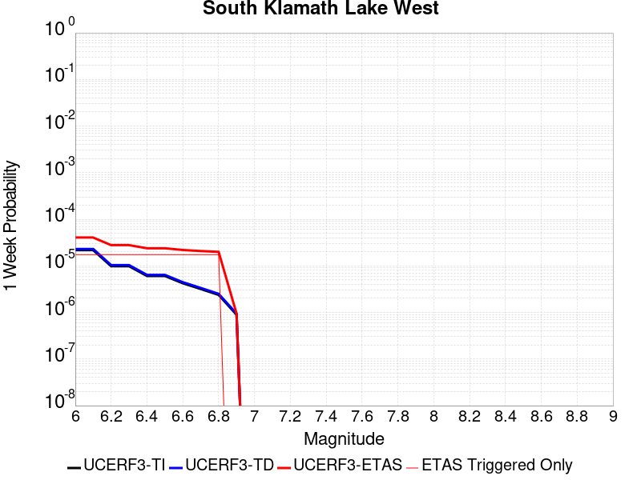 |  | 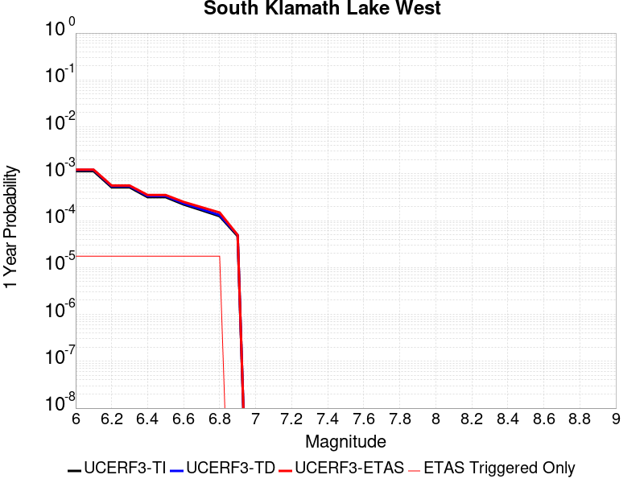 | 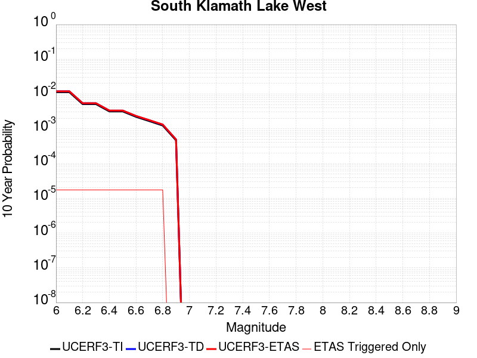 |

| Magnitude | 1 wk TI Prob | 1 wk TD Prob | 1 wk ETAS Prob | 1 wk ETAS/TD Gain | 1 wk ETAS Triggered Only | 1 mo TI Prob | 1 mo TD Prob | 1 mo ETAS Prob | 1 mo ETAS/TD Gain | 1 mo ETAS Triggered Only | 1 yr TI Prob | 1 yr TD Prob | 1 yr ETAS Prob | 1 yr ETAS/TD Gain | 1 yr ETAS Triggered Only | 10 yr TI Prob | 10 yr TD Prob | 10 yr ETAS Prob | 10 yr ETAS/TD Gain | 10 yr ETAS Triggered Only |
|-----|-----|-----|-----|-----|-----|-----|-----|-----|-----|-----|-----|-----|-----|-----|-----|-----|-----|-----|-----|-----|
| 6.0 | 2.174025E-5 | 2.3042025E-5 | 4.048541E-5 | 1.7570249 | 1.7443788E-5 | 9.3169176E-5 | 9.874817E-5 | 1.1619023E-4 | 1.1766318 | 1.7443788E-5 | 0.0011337444 | 0.0012016617 | 0.0012190845 | 1.014499 | 1.7443788E-5 | 0.011279777 | 0.0119582405 | 0.011975476 | 1.0014412 | 1.7443788E-5 |
| 6.1 | 2.174025E-5 | 2.3042025E-5 | 4.048541E-5 | 1.7570249 | 1.7443788E-5 | 9.3169176E-5 | 9.874817E-5 | 1.1619023E-4 | 1.1766318 | 1.7443788E-5 | 0.0011337444 | 0.0012016617 | 0.0012190845 | 1.014499 | 1.7443788E-5 | 0.011279777 | 0.0119582405 | 0.011975476 | 1.0014412 | 1.7443788E-5 |
| 6.2 | 9.834929E-6 | 1.0393841E-5 | 2.7837448E-5 | 2.6782637 | 1.7443788E-5 | 4.2149015E-5 | 4.4544326E-5 | 6.198733E-5 | 1.3915877 | 1.7443788E-5 | 5.1304343E-4 | 5.422012E-4 | 5.596356E-4 | 1.0321547 | 1.7443788E-5 | 0.0051186057 | 0.0054096854 | 0.005427035 | 1.0032071 | 1.7443788E-5 |
| 6.3 | 9.834929E-6 | 1.0393841E-5 | 2.7837448E-5 | 2.6782637 | 1.7443788E-5 | 4.2149015E-5 | 4.4544326E-5 | 6.198733E-5 | 1.3915877 | 1.7443788E-5 | 5.1304343E-4 | 5.422012E-4 | 5.596356E-4 | 1.0321547 | 1.7443788E-5 | 0.0051186057 | 0.0054096854 | 0.005427035 | 1.0032071 | 1.7443788E-5 |
| 6.4 | 6.066321E-6 | 6.40043E-6 | 2.3844106E-5 | 3.7253914 | 1.7443788E-5 | 2.5998259E-5 | 2.743014E-5 | 4.487345E-5 | 1.6359175 | 1.7443788E-5 | 3.1648282E-4 | 3.3391351E-4 | 3.5135145E-4 | 1.052223 | 1.7443788E-5 | 0.0031603249 | 0.0033343881 | 0.0033517738 | 1.0052141 | 1.7443788E-5 |
| 6.5 | 6.066321E-6 | 6.40043E-6 | 2.3844106E-5 | 3.7253914 | 1.7443788E-5 | 2.5998259E-5 | 2.743014E-5 | 4.487345E-5 | 1.6359175 | 1.7443788E-5 | 3.1648282E-4 | 3.3391351E-4 | 3.5135145E-4 | 1.052223 | 1.7443788E-5 | 0.0031603249 | 0.0033343881 | 0.0033517738 | 1.0052141 | 1.7443788E-5 |
| 6.6 | 4.2321803E-6 | 4.461291E-6 | 2.1905002E-5 | 4.9100137 | 1.7443788E-5 | 1.8137789E-5 | 1.9119685E-5 | 3.656314E-5 | 1.9123296 | 1.7443788E-5 | 2.208052E-4 | 2.3275832E-4 | 2.5019806E-4 | 1.0749264 | 1.7443788E-5 | 0.0022058594 | 0.0023252473 | 0.0023426507 | 1.0074844 | 1.7443788E-5 |
| 6.7 | 3.186646E-6 | 3.360305E-6 | 2.0804035E-5 | 6.1911144 | 1.7443788E-5 | 1.3656982E-5 | 1.4401232E-5 | 3.1844767E-5 | 2.211253 | 1.7443788E-5 | 1.6626107E-4 | 1.7532158E-4 | 1.9276231E-4 | 1.0994785 | 1.7443788E-5 | 0.0016613674 | 0.0017518997 | 0.0017693129 | 1.0099397 | 1.7443788E-5 |
| 6.8 | 2.380121E-6 | 2.510907E-6 | 1.995465E-5 | 7.9471884 | 1.7443788E-5 | 1.0200479E-5 | 1.07609885E-5 | 2.8204588E-5 | 2.6210034 | 1.7443788E-5 | 1.2418375E-4 | 1.3100762E-4 | 1.4844912E-4 | 1.1331335 | 1.7443788E-5 | 0.0012411437 | 0.0013093497 | 0.0013267706 | 1.0133051 | 1.7443788E-5 |
| 6.9 | 8.928287E-7 | 9.4302504E-7 | 9.4302504E-7 | 1.0 | 0.0 | 3.826403E-6 | 4.0415307E-6 | 4.0415307E-6 | 1.0 | 0.0 | 4.658546E-5 | 4.9204747E-5 | 4.9204747E-5 | 1.0 | 0.0 | 4.6575698E-4 | 4.9196015E-4 | 4.9196015E-4 | 1.0 | 0.0 |

## Great Valley 09 (Laguna Seca)
*[(top)](#table-of-contents)*

| 1 Week | 1 Month | 1 Year | 10 Year |
|-----|-----|-----|-----|
| 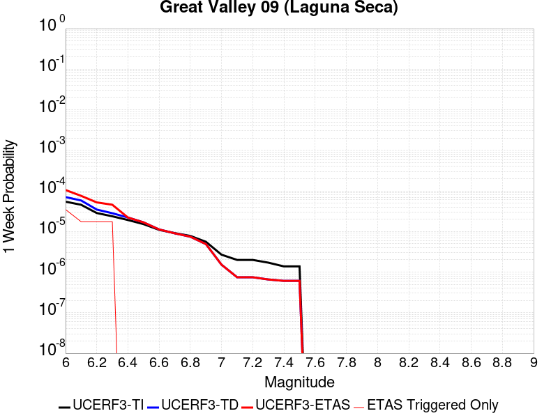 | 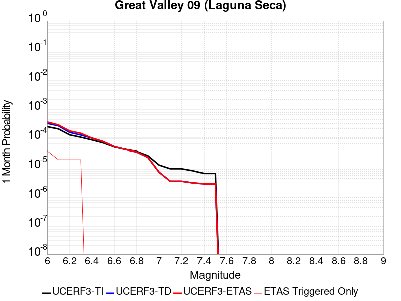 | 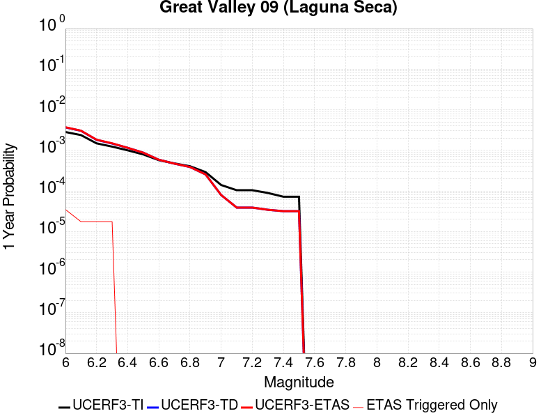 | 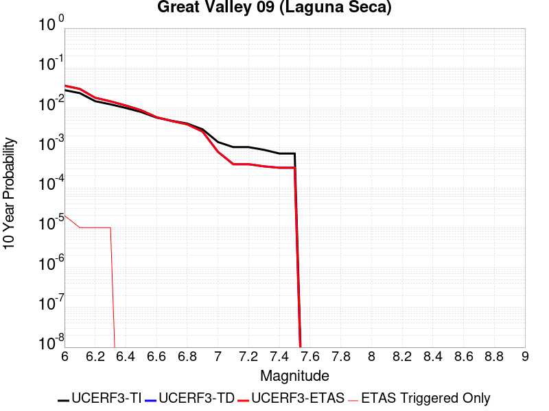 |

| Magnitude | 1 wk TI Prob | 1 wk TD Prob | 1 wk ETAS Prob | 1 wk ETAS/TD Gain | 1 wk ETAS Triggered Only | 1 mo TI Prob | 1 mo TD Prob | 1 mo ETAS Prob | 1 mo ETAS/TD Gain | 1 mo ETAS Triggered Only | 1 yr TI Prob | 1 yr TD Prob | 1 yr ETAS Prob | 1 yr ETAS/TD Gain | 1 yr ETAS Triggered Only | 10 yr TI Prob | 10 yr TD Prob | 10 yr ETAS Prob | 10 yr ETAS/TD Gain | 10 yr ETAS Triggered Only |
|-----|-----|-----|-----|-----|-----|-----|-----|-----|-----|-----|-----|-----|-----|-----|-----|-----|-----|-----|-----|-----|
| 6.0 | 5.4353277E-5 | 7.05022E-5 | 1.0538731E-4 | 1.4948089 | 3.4887576E-5 | 2.3292181E-4 | 3.0211566E-4 | 3.369927E-4 | 1.1154426 | 3.4887576E-5 | 0.0028321352 | 0.0036721937 | 0.0037069533 | 1.0094656 | 3.4887576E-5 | 0.02796312 | 0.03611547 | 0.0361491 | 1.0009311 | 3.4887576E-5 |
| 6.1 | 4.5578287E-5 | 5.822118E-5 | 7.566396E-5 | 1.299595 | 1.7443788E-5 | 1.953209E-4 | 2.4949326E-4 | 2.6693268E-4 | 1.0698994 | 1.7443788E-5 | 0.0023754383 | 0.003033432 | 0.0030508228 | 1.005733 | 1.7443788E-5 | 0.023502063 | 0.029919548 | 0.029936468 | 1.0005655 | 1.7443788E-5 |
| 6.2 | 2.8536782E-5 | 3.4737273E-5 | 5.2180454E-5 | 1.5021459 | 1.7443788E-5 | 1.2229476E-4 | 1.4886224E-4 | 1.6630342E-4 | 1.1171633 | 1.7443788E-5 | 0.0014879217 | 0.001810813 | 0.0018282252 | 1.0096157 | 1.7443788E-5 | 0.014779986 | 0.017958116 | 0.017975247 | 1.0009539 | 1.7443788E-5 |
| 6.3 | 2.3698774E-5 | 2.8213295E-5 | 4.565659E-5 | 1.618265 | 1.7443788E-5 | 1.01562226E-4 | 1.20905075E-4 | 1.3834676E-4 | 1.1442592 | 1.7443788E-5 | 0.0012358186 | 0.0014710218 | 0.0014884399 | 1.0118408 | 1.7443788E-5 | 0.012289686 | 0.014611342 | 0.0146285305 | 1.0011764 | 1.7443788E-5 |
| 6.4 | 1.9191197E-5 | 2.2123184E-5 | 2.2123184E-5 | 1.0 | 0.0 | 8.2245395E-5 | 9.4806666E-5 | 9.4806666E-5 | 1.0 | 0.0 | 0.0010008777 | 0.0011536429 | 0.0011536429 | 1.0 | 0.0 | 0.009963818 | 0.011476948 | 0.011476948 | 1.0 | 0.0 |
| 6.5 | 1.5203241E-5 | 1.6802203E-5 | 1.6802203E-5 | 1.0 | 0.0 | 6.5155116E-5 | 7.200386E-5 | 7.200386E-5 | 1.0 | 0.0 | 7.9297484E-4 | 8.7626575E-4 | 8.7626575E-4 | 1.0 | 0.0 | 0.007901512 | 0.0087295165 | 0.0087295165 | 1.0 | 0.0 |
| 6.6 | 1.0984925E-5 | 1.1242595E-5 | 1.1242595E-5 | 1.0 | 0.0 | 4.70774E-5 | 4.8181686E-5 | 4.8181686E-5 | 1.0 | 0.0 | 5.730166E-4 | 5.8645656E-4 | 5.8645656E-4 | 1.0 | 0.0 | 0.005715413 | 0.0058494853 | 0.0058494853 | 1.0 | 0.0 |
| 6.7 | 9.134616E-6 | 9.019894E-6 | 9.019894E-6 | 1.0 | 0.0 | 3.9147766E-5 | 3.865613E-5 | 3.865613E-5 | 1.0 | 0.0 | 4.7651984E-4 | 4.7053912E-4 | 4.7053912E-4 | 1.0 | 0.0 | 0.004754993 | 0.0046956735 | 0.0046956735 | 1.0 | 0.0 |
| 6.8 | 7.785589E-6 | 7.4519444E-6 | 7.4519444E-6 | 1.0 | 0.0 | 3.3366385E-5 | 3.1936524E-5 | 3.1936524E-5 | 1.0 | 0.0 | 4.0616E-4 | 3.8875983E-4 | 3.8875983E-4 | 1.0 | 0.0 | 0.0040541845 | 0.0038810016 | 0.0038810016 | 1.0 | 0.0 |
| 6.9 | 5.579095E-6 | 4.898492E-6 | 4.898492E-6 | 1.0 | 0.0 | 2.3910188E-5 | 2.0993377E-5 | 2.0993377E-5 | 1.0 | 0.0 | 2.9106764E-4 | 2.5556577E-4 | 2.5556577E-4 | 1.0 | 0.0 | 0.002906867 | 0.002552856 | 0.002552856 | 1.0 | 0.0 |
| 7.0 | 2.6816688E-6 | 1.5216126E-6 | 1.5216126E-6 | 1.0 | 0.0 | 1.1492816E-5 | 6.521181E-6 | 6.521181E-6 | 1.0 | 0.0 | 1.3991605E-4 | 7.939258E-5 | 7.939258E-5 | 1.0 | 0.0 | 0.0013982799 | 7.9365086E-4 | 7.9365086E-4 | 1.0 | 0.0 |
| 7.1 | 1.9951021E-6 | 7.453827E-7 | 7.453827E-7 | 1.0 | 0.0 | 8.55041E-6 | 3.1944935E-6 | 3.1944935E-6 | 1.0 | 0.0 | 1.0409627E-4 | 3.8892307E-5 | 3.8892307E-5 | 1.0 | 0.0 | 0.0010404752 | 3.8885913E-4 | 3.8885913E-4 | 1.0 | 0.0 |
| 7.2 | 1.9951021E-6 | 7.453827E-7 | 7.453827E-7 | 1.0 | 0.0 | 8.55041E-6 | 3.1944935E-6 | 3.1944935E-6 | 1.0 | 0.0 | 1.0409627E-4 | 3.8892307E-5 | 3.8892307E-5 | 1.0 | 0.0 | 0.0010404752 | 3.8885913E-4 | 3.8885913E-4 | 1.0 | 0.0 |
| 7.3 | 1.7087556E-6 | 6.578881E-7 | 6.578881E-7 | 1.0 | 0.0 | 7.3232177E-6 | 2.8195177E-6 | 2.8195177E-6 | 1.0 | 0.0 | 8.915652E-5 | 3.4327128E-5 | 3.4327128E-5 | 1.0 | 0.0 | 8.9120766E-4 | 3.432223E-4 | 3.432223E-4 | 1.0 | 0.0 |
| 7.4 | 1.3804846E-6 | 6.073852E-7 | 6.073852E-7 | 1.0 | 0.0 | 5.916349E-6 | 2.6030768E-6 | 2.6030768E-6 | 1.0 | 0.0 | 7.2029165E-5 | 3.169204E-5 | 3.169204E-5 | 1.0 | 0.0 | 7.200583E-4 | 3.1687922E-4 | 3.1687922E-4 | 1.0 | 0.0 |
| 7.5 | 1.3804846E-6 | 6.073852E-7 | 6.073852E-7 | 1.0 | 0.0 | 5.916349E-6 | 2.6030768E-6 | 2.6030768E-6 | 1.0 | 0.0 | 7.2029165E-5 | 3.169204E-5 | 3.169204E-5 | 1.0 | 0.0 | 7.200583E-4 | 3.1687922E-4 | 3.1687922E-4 | 1.0 | 0.0 |

## Johnson Valley (No) 2011 rev
*[(top)](#table-of-contents)*

| 1 Week | 1 Month | 1 Year | 10 Year |
|-----|-----|-----|-----|
| 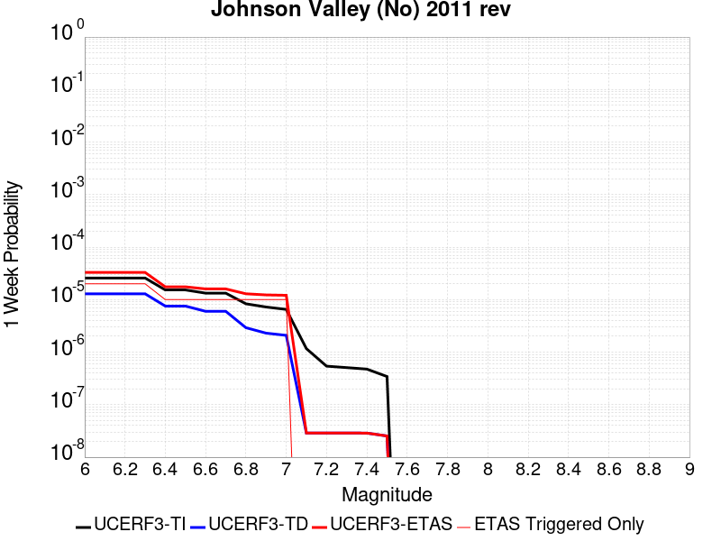 |  |  |  |

| Magnitude | 1 wk TI Prob | 1 wk TD Prob | 1 wk ETAS Prob | 1 wk ETAS/TD Gain | 1 wk ETAS Triggered Only | 1 mo TI Prob | 1 mo TD Prob | 1 mo ETAS Prob | 1 mo ETAS/TD Gain | 1 mo ETAS Triggered Only | 1 yr TI Prob | 1 yr TD Prob | 1 yr ETAS Prob | 1 yr ETAS/TD Gain | 1 yr ETAS Triggered Only | 10 yr TI Prob | 10 yr TD Prob | 10 yr ETAS Prob | 10 yr ETAS/TD Gain | 10 yr ETAS Triggered Only |
|-----|-----|-----|-----|-----|-----|-----|-----|-----|-----|-----|-----|-----|-----|-----|-----|-----|-----|-----|-----|-----|
| 6.0 | 2.577707E-5 | 1.2900938E-5 | 4.7788064E-5 | 3.7042317 | 3.4887576E-5 | 1.1046848E-4 | 5.5288787E-5 | 9.0174435E-5 | 1.6309714 | 3.4887576E-5 | 0.0013441239 | 6.7297276E-4 | 7.078368E-4 | 1.0518061 | 3.4887576E-5 | 0.013360229 | 0.006713257 | 0.0067479103 | 1.0051619 | 3.4887576E-5 |
| 6.1 | 2.577707E-5 | 1.2900938E-5 | 4.7788064E-5 | 3.7042317 | 3.4887576E-5 | 1.1046848E-4 | 5.5288787E-5 | 9.0174435E-5 | 1.6309714 | 3.4887576E-5 | 0.0013441239 | 6.7297276E-4 | 7.078368E-4 | 1.0518061 | 3.4887576E-5 | 0.013360229 | 0.006713257 | 0.0067479103 | 1.0051619 | 3.4887576E-5 |
| 6.2 | 2.577707E-5 | 1.2900938E-5 | 4.7788064E-5 | 3.7042317 | 3.4887576E-5 | 1.1046848E-4 | 5.5288787E-5 | 9.0174435E-5 | 1.6309714 | 3.4887576E-5 | 0.0013441239 | 6.7297276E-4 | 7.078368E-4 | 1.0518061 | 3.4887576E-5 | 0.013360229 | 0.006713257 | 0.0067479103 | 1.0051619 | 3.4887576E-5 |
| 6.3 | 2.577707E-5 | 1.2900938E-5 | 4.7788064E-5 | 3.7042317 | 3.4887576E-5 | 1.1046848E-4 | 5.5288787E-5 | 9.0174435E-5 | 1.6309714 | 3.4887576E-5 | 0.0013441239 | 6.7297276E-4 | 7.078368E-4 | 1.0518061 | 3.4887576E-5 | 0.013360229 | 0.006713257 | 0.0067479103 | 1.0051619 | 3.4887576E-5 |
| 6.4 | 1.5296591E-5 | 7.536742E-6 | 2.4980398E-5 | 3.3144822 | 1.7443788E-5 | 6.555518E-5 | 3.2300028E-5 | 4.9743252E-5 | 1.5400374 | 1.7443788E-5 | 7.97842E-4 | 3.9320064E-4 | 4.1063756E-4 | 1.0443461 | 1.7443788E-5 | 0.007949836 | 0.0039268904 | 0.003944266 | 1.0044247 | 1.7443788E-5 |
| 6.5 | 1.5296591E-5 | 7.536742E-6 | 2.4980398E-5 | 3.3144822 | 1.7443788E-5 | 6.555518E-5 | 3.2300028E-5 | 4.9743252E-5 | 1.5400374 | 1.7443788E-5 | 7.97842E-4 | 3.9320064E-4 | 4.1063756E-4 | 1.0443461 | 1.7443788E-5 | 0.007949836 | 0.0039268904 | 0.003944266 | 1.0044247 | 1.7443788E-5 |
| 6.6 | 1.3289383E-5 | 5.9917306E-6 | 2.3435414E-5 | 3.911293 | 1.7443788E-5 | 5.6953253E-5 | 2.5678688E-5 | 4.312203E-5 | 1.6792924 | 1.7443788E-5 | 6.9318525E-4 | 3.1261015E-4 | 3.3004847E-4 | 1.055783 | 1.7443788E-5 | 0.0069102696 | 0.0031233684 | 0.0031407576 | 1.0055674 | 1.7443788E-5 |
| 6.7 | 1.3289383E-5 | 5.9917306E-6 | 2.3435414E-5 | 3.911293 | 1.7443788E-5 | 5.6953253E-5 | 2.5678688E-5 | 4.312203E-5 | 1.6792924 | 1.7443788E-5 | 6.9318525E-4 | 3.1261015E-4 | 3.3004847E-4 | 1.055783 | 1.7443788E-5 | 0.0069102696 | 0.0031233684 | 0.0031407576 | 1.0055674 | 1.7443788E-5 |
| 6.8 | 8.330789E-6 | 2.9211888E-6 | 2.0364925E-5 | 6.9714513 | 1.7443788E-5 | 3.570289E-5 | 1.2519352E-5 | 2.9962921E-5 | 2.3933284 | 1.7443788E-5 | 4.34596E-4 | 1.5241816E-4 | 1.698593E-4 | 1.1144295 | 1.7443788E-5 | 0.0043374705 | 0.0015236961 | 0.0015411134 | 1.0114309 | 1.7443788E-5 |
| 6.9 | 7.2359003E-6 | 2.3013247E-6 | 1.9745072E-5 | 8.579872 | 1.7443788E-5 | 3.1010633E-5 | 9.8628125E-6 | 2.7306427E-5 | 2.7686248 | 1.7443788E-5 | 3.7748902E-4 | 1.2007845E-4 | 1.3752015E-4 | 1.1452525 | 1.7443788E-5 | 0.0037684843 | 0.0012006586 | 0.0012180815 | 1.0145111 | 1.7443788E-5 |
| 7.0 | 6.5149957E-6 | 2.088482E-6 | 1.9532234E-5 | 9.352359 | 1.7443788E-5 | 2.792111E-5 | 8.950637E-6 | 2.6394267E-5 | 2.9488704 | 1.7443788E-5 | 3.398865E-4 | 1.0897385E-4 | 1.2641573E-4 | 1.1600558 | 1.7443788E-5 | 0.003393671 | 0.0010897239 | 0.0011071487 | 1.0159901 | 1.7443788E-5 |
| 7.1 | 1.1662233E-6 | 2.8802024E-8 | 2.8802024E-8 | 1.0 | 0.0 | 4.9980904E-6 | 1.2343725E-7 | 1.2343725E-7 | 1.0 | 0.0 | 6.0850052E-5 | 1.5028476E-6 | 1.5028476E-6 | 1.0 | 0.0 | 6.083339E-4 | 1.50283895E-5 | 1.50283895E-5 | 1.0 | 0.0 |
| 7.2 | 5.413881E-7 | 2.8802024E-8 | 2.8802024E-8 | 1.0 | 0.0 | 2.3202326E-6 | 1.2343725E-7 | 1.2343725E-7 | 1.0 | 0.0 | 2.8248465E-5 | 1.5028476E-6 | 1.5028476E-6 | 1.0 | 0.0 | 2.8244875E-4 | 1.50283895E-5 | 1.50283895E-5 | 1.0 | 0.0 |
| 7.3 | 5.076821E-7 | 2.8802024E-8 | 2.8802024E-8 | 1.0 | 0.0 | 2.1757785E-6 | 1.2343723E-7 | 1.2343723E-7 | 1.0 | 0.0 | 2.648978E-5 | 1.5028475E-6 | 1.5028475E-6 | 1.0 | 0.0 | 2.6486625E-4 | 1.50283895E-5 | 1.50283895E-5 | 1.0 | 0.0 |
| 7.4 | 4.7568687E-7 | 2.8783948E-8 | 2.8783948E-8 | 1.0 | 0.0 | 2.0386565E-6 | 1.2335977E-7 | 1.2335977E-7 | 1.0 | 0.0 | 2.482036E-5 | 1.5019043E-6 | 1.5019043E-6 | 1.0 | 0.0 | 2.4817587E-4 | 1.5018958E-5 | 1.5018958E-5 | 1.0 | 0.0 |
| 7.5 | 3.435626E-7 | 2.5357679E-8 | 2.5357679E-8 | 1.0 | 0.0 | 1.4724103E-6 | 1.0867576E-7 | 1.0867576E-7 | 1.0 | 0.0 | 1.7926448E-5 | 1.3231268E-6 | 1.3231268E-6 | 1.0 | 0.0 | 1.7925001E-4 | 1.3231205E-5 | 1.3231205E-5 | 1.0 | 0.0 |

## San Andreas (North Coast) 2011 CFM
*[(top)](#table-of-contents)*

| 1 Week | 1 Month | 1 Year | 10 Year |
|-----|-----|-----|-----|
| 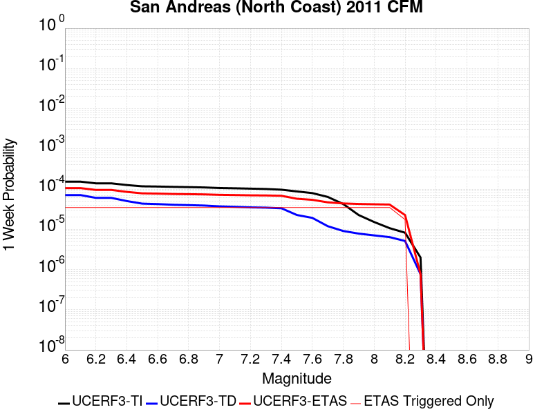 | 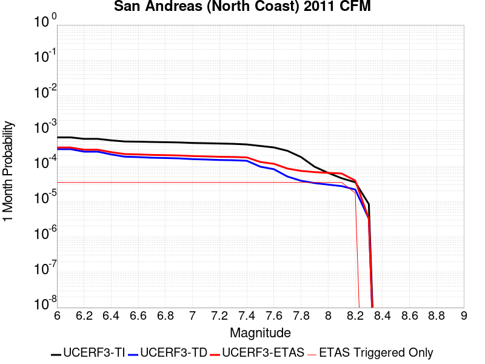 | 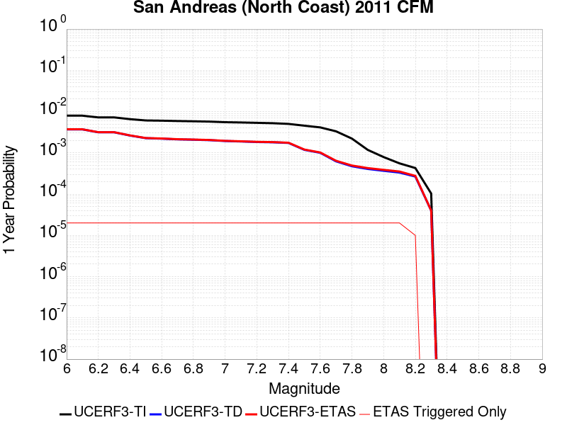 | 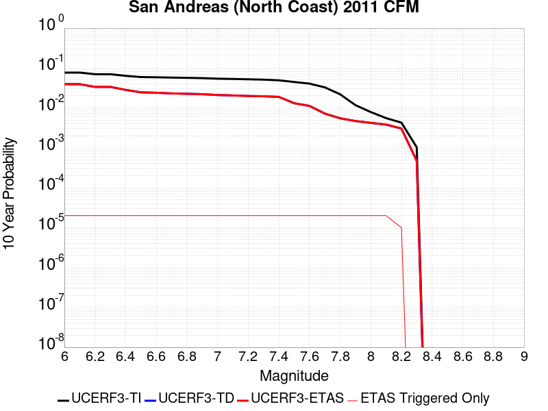 |

| Magnitude | 1 wk TI Prob | 1 wk TD Prob | 1 wk ETAS Prob | 1 wk ETAS/TD Gain | 1 wk ETAS Triggered Only | 1 mo TI Prob | 1 mo TD Prob | 1 mo ETAS Prob | 1 mo ETAS/TD Gain | 1 mo ETAS Triggered Only | 1 yr TI Prob | 1 yr TD Prob | 1 yr ETAS Prob | 1 yr ETAS/TD Gain | 1 yr ETAS Triggered Only | 10 yr TI Prob | 10 yr TD Prob | 10 yr ETAS Prob | 10 yr ETAS/TD Gain | 10 yr ETAS Triggered Only |
|-----|-----|-----|-----|-----|-----|-----|-----|-----|-----|-----|-----|-----|-----|-----|-----|-----|-----|-----|-----|-----|
| 6.0 | 1.5333705E-4 | 7.1106435E-5 | 1.0599153E-4 | 1.4906039 | 3.4887576E-5 | 6.5699324E-4 | 3.0470645E-4 | 3.3958338E-4 | 1.1144608 | 3.4887576E-5 | 0.007969595 | 0.0037035241 | 0.0037382825 | 1.0093852 | 3.4887576E-5 | 0.0768977 | 0.03935284 | 0.039386354 | 1.0008516 | 3.4887576E-5 |
| 6.1 | 1.5333705E-4 | 7.1106435E-5 | 1.0599153E-4 | 1.4906039 | 3.4887576E-5 | 6.5699324E-4 | 3.0470645E-4 | 3.3958338E-4 | 1.1144608 | 3.4887576E-5 | 0.007969595 | 0.0037035241 | 0.0037382825 | 1.0093852 | 3.4887576E-5 | 0.0768977 | 0.03935284 | 0.039386354 | 1.0008516 | 3.4887576E-5 |
| 6.2 | 1.3912938E-4 | 6.050204E-5 | 9.5387506E-5 | 1.5765998 | 3.4887576E-5 | 5.961325E-4 | 2.5926883E-4 | 2.9414735E-4 | 1.1345265 | 3.4887576E-5 | 0.007233787 | 0.003152056 | 0.0031868336 | 1.0110333 | 3.4887576E-5 | 0.07002798 | 0.03369227 | 0.03372598 | 1.0010006 | 3.4887576E-5 |
| 6.3 | 1.3912938E-4 | 6.050204E-5 | 9.5387506E-5 | 1.5765998 | 3.4887576E-5 | 5.961325E-4 | 2.5926883E-4 | 2.9414735E-4 | 1.1345265 | 3.4887576E-5 | 0.007233787 | 0.003152056 | 0.0031868336 | 1.0110333 | 3.4887576E-5 | 0.07002798 | 0.03369227 | 0.03372598 | 1.0010006 | 3.4887576E-5 |
| 6.4 | 1.2623647E-4 | 5.0442024E-5 | 8.532784E-5 | 1.6916022 | 3.4887576E-5 | 5.4090127E-4 | 2.161623E-4 | 2.5104234E-4 | 1.1613604 | 3.4887576E-5 | 0.0065656058 | 0.0026286195 | 0.0026634154 | 1.0132374 | 3.4887576E-5 | 0.06374981 | 0.028303223 | 0.028337123 | 1.0011977 | 3.4887576E-5 |
| 6.5 | 1.1736096E-4 | 4.3523814E-5 | 7.840987E-5 | 1.8015395 | 3.4887576E-5 | 5.028786E-4 | 1.8651738E-4 | 2.2139844E-4 | 1.1870124 | 3.4887576E-5 | 0.006105373 | 0.0022685004 | 0.0023033088 | 1.0153443 | 3.4887576E-5 | 0.05940335 | 0.024579322 | 0.02461335 | 1.0013845 | 3.4887576E-5 |
| 6.6 | 1.1586959E-4 | 4.2423668E-5 | 7.730976E-5 | 1.8223262 | 3.4887576E-5 | 4.964894E-4 | 1.8180315E-4 | 2.1668438E-4 | 1.1918627 | 3.4887576E-5 | 0.006028018 | 0.0022112224 | 0.002246033 | 1.0157427 | 3.4887576E-5 | 0.058671024 | 0.023984991 | 0.024019042 | 1.0014197 | 3.4887576E-5 |
| 6.7 | 1.13693764E-4 | 4.073593E-5 | 7.562208E-5 | 1.8563976 | 3.4887576E-5 | 4.87168E-4 | 1.7457096E-4 | 2.0945244E-4 | 1.1998127 | 3.4887576E-5 | 0.005915152 | 0.0021233456 | 0.002158159 | 1.0163956 | 3.4887576E-5 | 0.057601593 | 0.023076393 | 0.023110475 | 1.0014769 | 3.4887576E-5 |
| 6.8 | 1.1204889E-4 | 3.9953447E-5 | 7.483963E-5 | 1.8731707 | 3.4887576E-5 | 4.8012115E-4 | 1.7121792E-4 | 2.0609952E-4 | 1.2037263 | 3.4887576E-5 | 0.005829819 | 0.002082601 | 0.002117416 | 1.0167171 | 3.4887576E-5 | 0.05679232 | 0.022636656 | 0.022670753 | 1.0015063 | 3.4887576E-5 |
| 6.9 | 1.1005794E-4 | 3.900957E-5 | 7.389578E-5 | 1.8942989 | 3.4887576E-5 | 4.7159163E-4 | 1.6717325E-4 | 2.0205499E-4 | 1.2086562 | 3.4887576E-5 | 0.0057265228 | 0.0020334502 | 0.0020682667 | 1.0171219 | 3.4887576E-5 | 0.055811852 | 0.022102542 | 0.022136658 | 1.0015435 | 3.4887576E-5 |
| 7.0 | 1.0647948E-4 | 3.7166337E-5 | 7.2052615E-5 | 1.9386526 | 3.4887576E-5 | 4.562608E-4 | 1.5927466E-4 | 1.9415667E-4 | 1.2190055 | 3.4887576E-5 | 0.0055408357 | 0.0019374598 | 0.0019722797 | 1.017972 | 3.4887576E-5 | 0.054047033 | 0.021062272 | 0.021096425 | 1.0016215 | 3.4887576E-5 |
| 7.1 | 1.04795035E-4 | 3.6215948E-5 | 7.110226E-5 | 1.9632859 | 3.4887576E-5 | 4.4904428E-4 | 1.5520205E-4 | 1.9008422E-4 | 1.2247533 | 3.4887576E-5 | 0.0054534175 | 0.0018879628 | 0.0019227846 | 1.0184441 | 3.4887576E-5 | 0.053215165 | 0.020530313 | 0.020564483 | 1.0016644 | 3.4887576E-5 |
| 7.2 | 1.02724036E-4 | 3.5124547E-5 | 7.0010894E-5 | 1.9932185 | 3.4887576E-5 | 4.401716E-4 | 1.5052517E-4 | 1.854075E-4 | 1.2317375 | 3.4887576E-5 | 0.0053459285 | 0.0018311188 | 0.0018659425 | 1.0190177 | 3.4887576E-5 | 0.052191395 | 0.019919246 | 0.019953439 | 1.0017166 | 3.4887576E-5 |
| 7.3 | 1.00650694E-4 | 3.4592013E-5 | 6.947838E-5 | 2.0085094 | 3.4887576E-5 | 4.312888E-4 | 1.4824314E-4 | 1.8312555E-4 | 1.2353053 | 3.4887576E-5 | 0.005238306 | 0.0018033815 | 0.0018382062 | 1.0193107 | 3.4887576E-5 | 0.051165357 | 0.019596443 | 0.019630646 | 1.0017455 | 3.4887576E-5 |
| 7.4 | 9.672919E-5 | 3.338123E-5 | 6.826764E-5 | 2.0450907 | 3.4887576E-5 | 4.144878E-4 | 1.4305465E-4 | 1.7793724E-4 | 1.2438409 | 3.4887576E-5 | 0.005034718 | 0.0017403142 | 0.001775141 | 1.0200118 | 3.4887576E-5 | 0.049221683 | 0.018869769 | 0.018903997 | 1.001814 | 3.4887576E-5 |
| 7.5 | 8.7600405E-5 | 2.2700917E-5 | 5.75877E-5 | 2.5368006 | 3.4887576E-5 | 3.753763E-4 | 9.728602E-5 | 1.321702E-4 | 1.3585734 | 3.4887576E-5 | 0.0045606326 | 0.0011838155 | 0.0012186618 | 1.0294355 | 3.4887576E-5 | 0.04468165 | 0.013130207 | 0.013164637 | 1.0026221 | 3.4887576E-5 |
| 7.6 | 7.9562284E-5 | 1.9226305E-5 | 5.411321E-5 | 2.8145401 | 3.4887576E-5 | 3.4093665E-4 | 8.239586E-5 | 1.1728056E-4 | 1.4233793 | 3.4887576E-5 | 0.0041430052 | 0.0010027094 | 0.001037562 | 1.0347584 | 3.4887576E-5 | 0.040666126 | 0.011221658 | 0.011256155 | 1.003074 | 3.4887576E-5 |
| 7.7 | 6.3866544E-5 | 1.1941707E-5 | 4.6828864E-5 | 3.921455 | 3.4887576E-5 | 2.7368503E-4 | 5.117774E-5 | 8.6063534E-5 | 1.6816595 | 3.4887576E-5 | 0.0033270244 | 6.2291115E-4 | 6.5777695E-4 | 1.0559725 | 3.4887576E-5 | 0.032776527 | 0.007210334 | 0.0072449697 | 1.0048037 | 3.4887576E-5 |
| 7.8 | 4.2543215E-5 | 9.076524E-6 | 4.3963784E-5 | 4.8436804 | 3.4887576E-5 | 1.8231533E-4 | 3.8898812E-5 | 7.378503E-5 | 1.8968453 | 3.4887576E-5 | 0.0022174292 | 4.7349022E-4 | 5.0836126E-4 | 1.0736468 | 3.4887576E-5 | 0.021954332 | 0.005490525 | 0.005525221 | 1.0063193 | 3.4887576E-5 |
| 7.9 | 2.2636612E-5 | 7.81435E-6 | 4.2701653E-5 | 5.4645176 | 3.4887576E-5 | 9.7010445E-5 | 3.3489643E-5 | 6.8376045E-5 | 2.0417073 | 3.4887576E-5 | 0.0011804621 | 4.076602E-4 | 4.4253355E-4 | 1.0855452 | 3.4887576E-5 | 0.011742111 | 0.0046832846 | 0.0047180085 | 1.0074145 | 3.4887576E-5 |
| 8.0 | 1.5167874E-5 | 7.0494675E-6 | 4.1936797E-5 | 5.9489307 | 3.4887576E-5 | 6.500356E-5 | 3.0211655E-5 | 6.5098175E-5 | 2.1547372 | 3.4887576E-5 | 7.9113094E-4 | 3.677649E-4 | 4.0263965E-4 | 1.094829 | 3.4887576E-5 | 0.007883203 | 0.004215588 | 0.004250328 | 1.0082409 | 3.4887576E-5 |
| 8.1 | 1.0681047E-5 | 6.386992E-6 | 4.1274343E-5 | 6.4622507 | 3.4887576E-5 | 4.5775112E-5 | 2.7372536E-5 | 6.2259154E-5 | 2.2745118 | 3.4887576E-5 | 5.5716943E-4 | 3.3320975E-4 | 3.6808572E-4 | 1.1046667 | 3.4887576E-5 | 0.0055577457 | 0.003817393 | 0.0038521474 | 1.0091043 | 3.4887576E-5 |
| 8.2 | 8.226114E-6 | 5.1150587E-6 | 2.2558757E-5 | 4.4102635 | 1.7443788E-5 | 3.52543E-5 | 2.1921496E-5 | 3.93649E-5 | 1.7957215 | 1.7443788E-5 | 4.2913653E-4 | 2.668616E-4 | 2.8430074E-4 | 1.065349 | 1.7443788E-5 | 0.004283088 | 0.0030450926 | 0.0030624834 | 1.0057111 | 1.7443788E-5 |
| 8.3 | 1.983087E-6 | 7.6599065E-7 | 7.6599065E-7 | 1.0 | 0.0 | 8.498917E-6 | 3.282813E-6 | 3.282813E-6 | 1.0 | 0.0 | 1.034694E-4 | 3.9967534E-5 | 3.9967534E-5 | 1.0 | 0.0 | 0.0010342124 | 4.719687E-4 | 4.719687E-4 | 1.0 | 0.0 |

## Camp Rock 2011
*[(top)](#table-of-contents)*

| 1 Week | 1 Month | 1 Year | 10 Year |
|-----|-----|-----|-----|
| 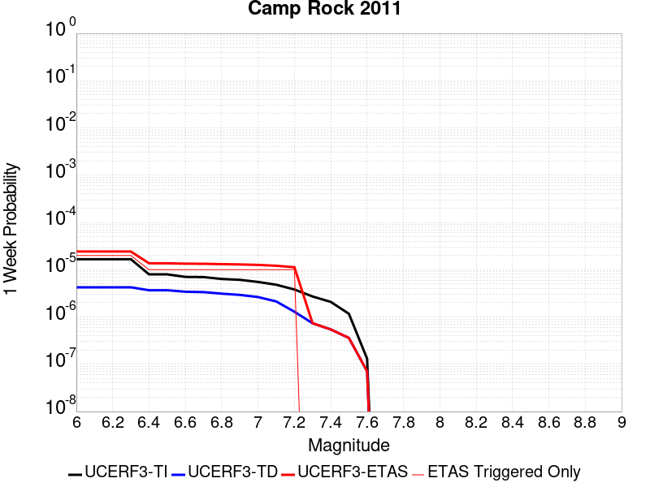 | 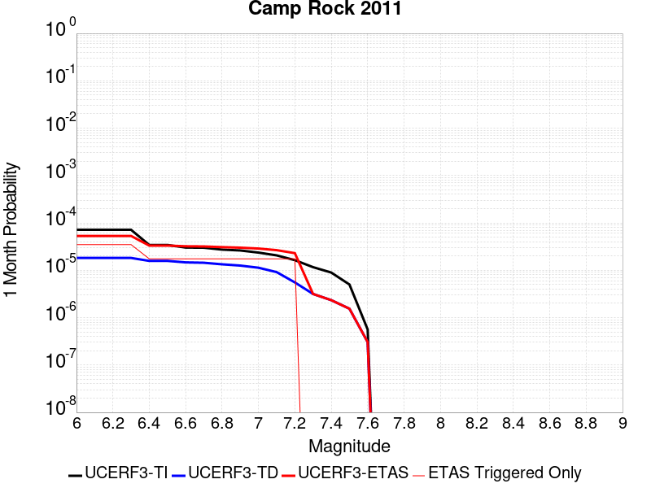 | 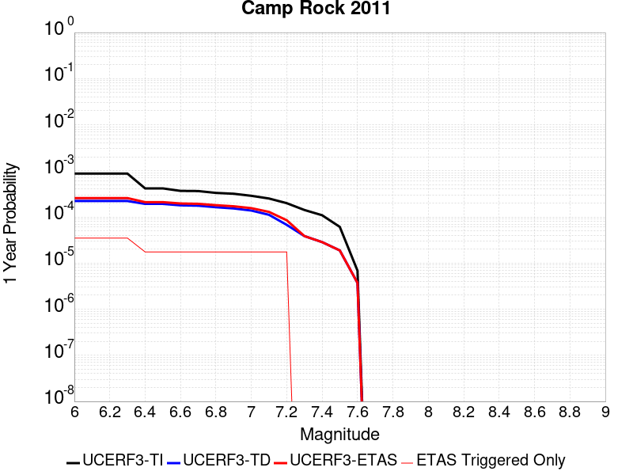 | 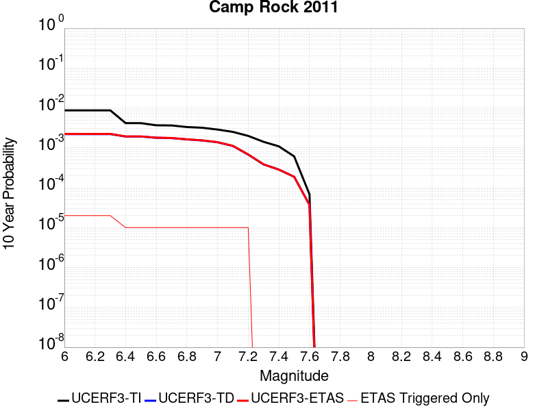 |

| Magnitude | 1 wk TI Prob | 1 wk TD Prob | 1 wk ETAS Prob | 1 wk ETAS/TD Gain | 1 wk ETAS Triggered Only | 1 mo TI Prob | 1 mo TD Prob | 1 mo ETAS Prob | 1 mo ETAS/TD Gain | 1 mo ETAS Triggered Only | 1 yr TI Prob | 1 yr TD Prob | 1 yr ETAS Prob | 1 yr ETAS/TD Gain | 1 yr ETAS Triggered Only | 10 yr TI Prob | 10 yr TD Prob | 10 yr ETAS Prob | 10 yr ETAS/TD Gain | 10 yr ETAS Triggered Only |
|-----|-----|-----|-----|-----|-----|-----|-----|-----|-----|-----|-----|-----|-----|-----|-----|-----|-----|-----|-----|-----|
| 6.0 | 1.6710783E-5 | 4.25026E-6 | 3.9137685E-5 | 9.208303 | 3.4887576E-5 | 7.161568E-5 | 1.8215276E-5 | 5.3102216E-5 | 2.9152572 | 3.4887576E-5 | 8.7157206E-4 | 2.2174895E-4 | 2.566288E-4 | 1.1572943 | 3.4887576E-5 | 0.008681616 | 0.0022153298 | 0.00225014 | 1.0157133 | 3.4887576E-5 |
| 6.1 | 1.6710783E-5 | 4.25026E-6 | 3.9137685E-5 | 9.208303 | 3.4887576E-5 | 7.161568E-5 | 1.8215276E-5 | 5.3102216E-5 | 2.9152572 | 3.4887576E-5 | 8.7157206E-4 | 2.2174895E-4 | 2.566288E-4 | 1.1572943 | 3.4887576E-5 | 0.008681616 | 0.0022153298 | 0.00225014 | 1.0157133 | 3.4887576E-5 |
| 6.2 | 1.6710783E-5 | 4.25026E-6 | 3.9137685E-5 | 9.208303 | 3.4887576E-5 | 7.161568E-5 | 1.8215276E-5 | 5.3102216E-5 | 2.9152572 | 3.4887576E-5 | 8.7157206E-4 | 2.2174895E-4 | 2.566288E-4 | 1.1572943 | 3.4887576E-5 | 0.008681616 | 0.0022153298 | 0.00225014 | 1.0157133 | 3.4887576E-5 |
| 6.3 | 1.6710783E-5 | 4.25026E-6 | 3.9137685E-5 | 9.208303 | 3.4887576E-5 | 7.161568E-5 | 1.8215276E-5 | 5.3102216E-5 | 2.9152572 | 3.4887576E-5 | 8.7157206E-4 | 2.2174895E-4 | 2.566288E-4 | 1.1572943 | 3.4887576E-5 | 0.008681616 | 0.0022153298 | 0.00225014 | 1.0157133 | 3.4887576E-5 |
| 6.4 | 7.982846E-6 | 3.6820884E-6 | 2.1125812E-5 | 5.7374535 | 1.7443788E-5 | 3.421175E-5 | 1.5780286E-5 | 3.3223798E-5 | 2.105399 | 1.7443788E-5 | 4.1644843E-4 | 1.9210839E-4 | 2.0954883E-4 | 1.0907843 | 1.7443788E-5 | 0.0041566887 | 0.001919458 | 0.0019368683 | 1.0090704 | 1.7443788E-5 |
| 6.5 | 7.982846E-6 | 3.6820884E-6 | 2.1125812E-5 | 5.7374535 | 1.7443788E-5 | 3.421175E-5 | 1.5780286E-5 | 3.3223798E-5 | 2.105399 | 1.7443788E-5 | 4.1644843E-4 | 1.9210839E-4 | 2.0954883E-4 | 1.0907843 | 1.7443788E-5 | 0.0041566887 | 0.001919458 | 0.0019368683 | 1.0090704 | 1.7443788E-5 |
| 6.6 | 7.048869E-6 | 3.4243571E-6 | 2.0868085E-5 | 6.094015 | 1.7443788E-5 | 3.0209088E-5 | 1.4675736E-5 | 3.2119267E-5 | 2.1885967 | 1.7443788E-5 | 3.677336E-4 | 1.7866275E-4 | 1.9610341E-4 | 1.0976179 | 1.7443788E-5 | 0.0036712566 | 0.0017852228 | 0.0018026354 | 1.0097538 | 1.7443788E-5 |
| 6.7 | 6.987307E-6 | 3.3623348E-6 | 2.0806063E-5 | 6.187981 | 1.7443788E-5 | 2.9945259E-5 | 1.4409929E-5 | 3.1853466E-5 | 2.2105222 | 1.7443788E-5 | 3.6452254E-4 | 1.7542706E-4 | 1.928678E-4 | 1.0994186 | 1.7443788E-5 | 0.0036392517 | 0.001752917 | 0.0017703301 | 1.0099338 | 1.7443788E-5 |
| 6.8 | 6.3737602E-6 | 3.1179077E-6 | 2.056164E-5 | 6.594692 | 1.7443788E-5 | 2.731583E-5 | 1.3362394E-5 | 3.080595E-5 | 2.3054214 | 1.7443788E-5 | 3.3251947E-4 | 1.626753E-4 | 1.8011624E-4 | 1.1072133 | 1.7443788E-5 | 0.0033202237 | 0.0016255907 | 0.0016430062 | 1.0107133 | 1.7443788E-5 |
| 6.9 | 6.112211E-6 | 2.9331156E-6 | 2.0376852E-5 | 6.94717 | 1.7443788E-5 | 2.6194928E-5 | 1.2570436E-5 | 3.0014004E-5 | 2.387666 | 1.7443788E-5 | 3.1887658E-4 | 1.5303459E-4 | 1.7047572E-4 | 1.1139685 | 1.7443788E-5 | 0.003184194 | 0.0015293199 | 0.0015467369 | 1.0113888 | 1.7443788E-5 |
| 7.0 | 5.5140117E-6 | 2.641923E-6 | 2.0085665E-5 | 7.6026683 | 1.7443788E-5 | 2.3631264E-5 | 1.132248E-5 | 2.876607E-5 | 2.5406158 | 1.7443788E-5 | 2.8767265E-4 | 1.3784273E-4 | 1.552841E-4 | 1.126531 | 1.7443788E-5 | 0.0028730053 | 0.0013775975 | 0.0013950173 | 1.012645 | 1.7443788E-5 |
| 7.1 | 4.8151105E-6 | 2.1342705E-6 | 1.9578021E-5 | 9.173168 | 1.7443788E-5 | 2.0636026E-5 | 9.146843E-6 | 2.6590471E-5 | 2.9070656 | 1.7443788E-5 | 2.5121463E-4 | 1.1135734E-4 | 1.2879918E-4 | 1.1566296 | 1.7443788E-5 | 0.0025093083 | 0.0011130372 | 0.0011304616 | 1.0156548 | 1.7443788E-5 |
| 7.2 | 3.818335E-6 | 1.2937425E-6 | 1.8737508E-5 | 14.483182 | 1.7443788E-5 | 1.6364189E-5 | 5.5445994E-6 | 2.298829E-5 | 4.146069 | 1.7443788E-5 | 1.9921579E-4 | 6.750349E-5 | 8.49461E-5 | 1.2583957 | 1.7443788E-5 | 0.0019903728 | 6.748381E-4 | 6.9227006E-4 | 1.0258315 | 1.7443788E-5 |
| 7.3 | 2.7166698E-6 | 7.3835776E-7 | 7.3835776E-7 | 1.0 | 0.0 | 1.1642818E-5 | 3.1643867E-6 | 3.1643867E-6 | 1.0 | 0.0 | 1.4174209E-4 | 3.8525748E-5 | 3.8525748E-5 | 1.0 | 0.0 | 0.0014165172 | 3.851927E-4 | 3.851927E-4 | 1.0 | 0.0 |
| 7.4 | 2.0893426E-6 | 5.4618386E-7 | 5.4618386E-7 | 1.0 | 0.0 | 8.954295E-6 | 2.3407858E-6 | 2.3407858E-6 | 1.0 | 0.0 | 1.0901308E-4 | 2.84987E-5 | 2.84987E-5 | 1.0 | 0.0 | 0.0010895962 | 2.84951E-4 | 2.84951E-4 | 1.0 | 0.0 |
| 7.5 | 1.1681728E-6 | 3.6030585E-7 | 3.6030585E-7 | 1.0 | 0.0 | 5.0064455E-6 | 1.544167E-6 | 1.544167E-6 | 1.0 | 0.0 | 6.0951766E-5 | 1.8800076E-5 | 1.8800076E-5 | 1.0 | 0.0 | 6.093505E-4 | 1.8798532E-4 | 1.8798532E-4 | 1.0 | 0.0 |
| 7.6 | 1.3154387E-7 | 7.1197384E-8 | 7.1197384E-8 | 1.0 | 0.0 | 5.6375933E-7 | 3.051316E-7 | 3.051316E-7 | 1.0 | 0.0 | 6.863748E-6 | 3.7149728E-6 | 3.7149728E-6 | 1.0 | 0.0 | 6.863536E-5 | 3.7149264E-5 | 3.7149264E-5 | 1.0 | 0.0 |

## Rose Canyon
*[(top)](#table-of-contents)*

| 1 Week | 1 Month | 1 Year | 10 Year |
|-----|-----|-----|-----|
| 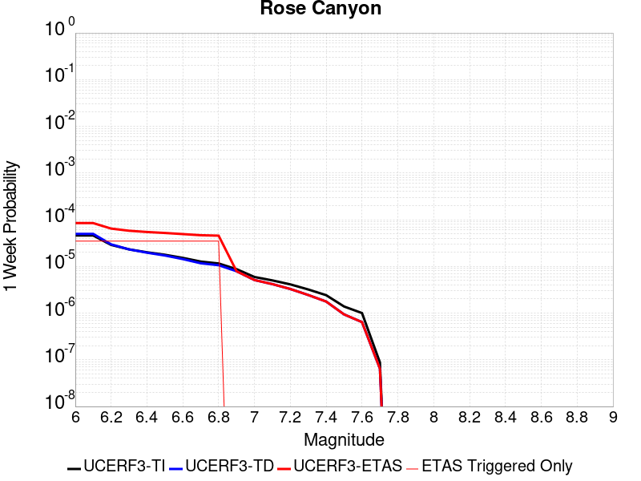 | 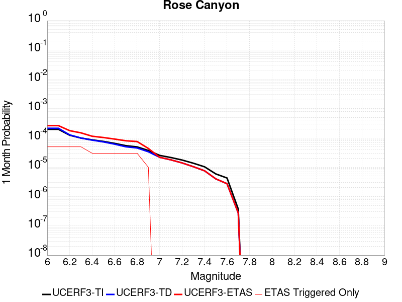 | 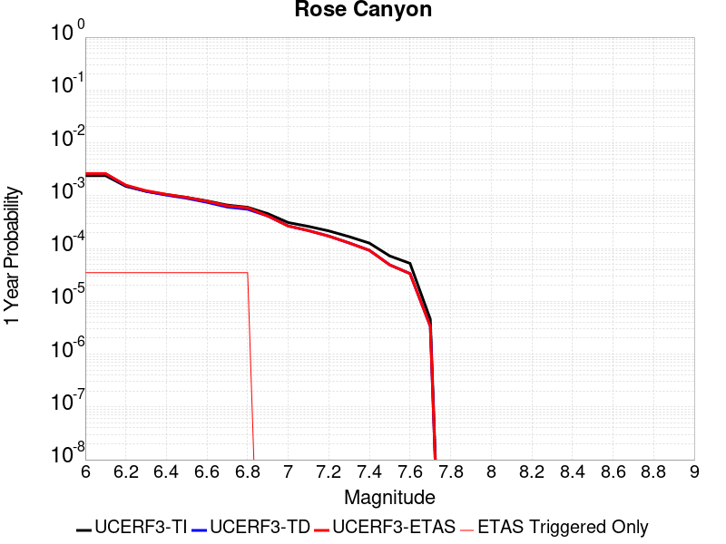 | 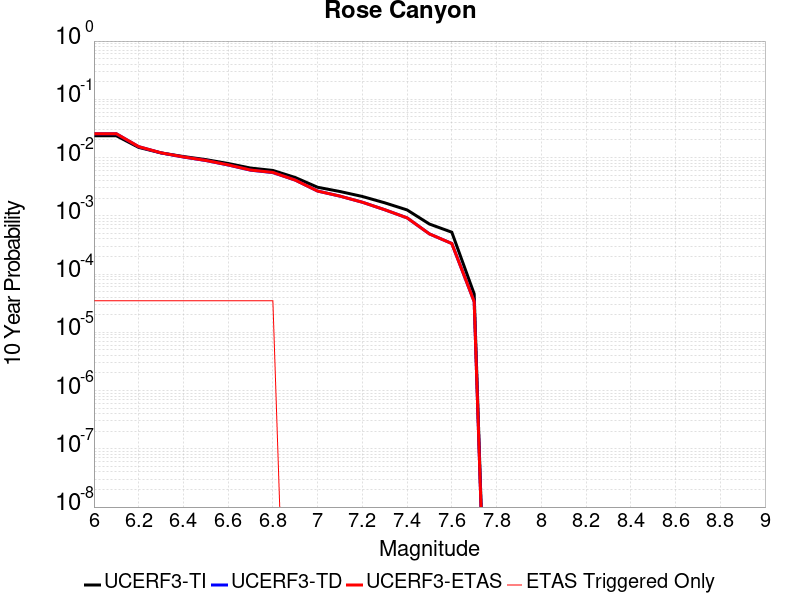 |

| Magnitude | 1 wk TI Prob | 1 wk TD Prob | 1 wk ETAS Prob | 1 wk ETAS/TD Gain | 1 wk ETAS Triggered Only | 1 mo TI Prob | 1 mo TD Prob | 1 mo ETAS Prob | 1 mo ETAS/TD Gain | 1 mo ETAS Triggered Only | 1 yr TI Prob | 1 yr TD Prob | 1 yr ETAS Prob | 1 yr ETAS/TD Gain | 1 yr ETAS Triggered Only | 10 yr TI Prob | 10 yr TD Prob | 10 yr ETAS Prob | 10 yr ETAS/TD Gain | 10 yr ETAS Triggered Only |
|-----|-----|-----|-----|-----|-----|-----|-----|-----|-----|-----|-----|-----|-----|-----|-----|-----|-----|-----|-----|-----|
| 6.0 | 4.5923203E-5 | 4.9714225E-5 | 8.460007E-5 | 1.7017275 | 3.4887576E-5 | 1.9679888E-4 | 2.1304491E-4 | 2.4792505E-4 | 1.163722 | 3.4887576E-5 | 0.0023933933 | 0.0025909345 | 0.0026257315 | 1.0134304 | 3.4887576E-5 | 0.023677798 | 0.02563999 | 0.025673984 | 1.0013257 | 3.4887576E-5 |
| 6.1 | 4.5923203E-5 | 4.9714225E-5 | 8.460007E-5 | 1.7017275 | 3.4887576E-5 | 1.9679888E-4 | 2.1304491E-4 | 2.4792505E-4 | 1.163722 | 3.4887576E-5 | 0.0023933933 | 0.0025909345 | 0.0026257315 | 1.0134304 | 3.4887576E-5 | 0.023677798 | 0.02563999 | 0.025673984 | 1.0013257 | 3.4887576E-5 |
| 6.2 | 2.8844734E-5 | 2.9668723E-5 | 6.4555265E-5 | 2.1758692 | 3.4887576E-5 | 1.2361443E-4 | 1.2714567E-4 | 1.6202881E-4 | 1.2743556 | 3.4887576E-5 | 0.0015039665 | 0.0015468939 | 0.0015817275 | 1.0225184 | 3.4887576E-5 | 0.0149382865 | 0.015374276 | 0.015408628 | 1.0022343 | 3.4887576E-5 |
| 6.3 | 2.3171577E-5 | 2.3161238E-5 | 5.8048005E-5 | 2.5062566 | 3.4887576E-5 | 9.9302975E-5 | 9.9258745E-5 | 1.3414286E-4 | 1.3514463 | 3.4887576E-5 | 0.0012083431 | 0.0012078186 | 0.0012426641 | 1.0288498 | 3.4887576E-5 | 0.012017938 | 0.012022437 | 0.012056905 | 1.002867 | 3.4887576E-5 |
| 6.4 | 2.0066604E-5 | 1.9667024E-5 | 5.4553915E-5 | 2.7738774 | 3.4887576E-5 | 8.599689E-5 | 8.4284584E-5 | 1.1916921E-4 | 1.4138911 | 3.4887576E-5 | 0.0010465092 | 0.0010256917 | 0.0010605435 | 1.0339788 | 3.4887576E-5 | 0.010415946 | 0.010217559 | 0.010252089 | 1.0033796 | 3.4887576E-5 |
| 6.5 | 1.776989E-5 | 1.7113807E-5 | 5.2000785E-5 | 3.0385282 | 3.4887576E-5 | 7.615444E-5 | 7.334287E-5 | 1.0822788E-4 | 1.4756429 | 3.4887576E-5 | 9.267859E-4 | 8.925905E-4 | 9.2744693E-4 | 1.0390508 | 3.4887576E-5 | 0.009229303 | 0.008896211 | 0.008930788 | 1.0038867 | 3.4887576E-5 |
| 6.6 | 1.5227364E-5 | 1.433926E-5 | 4.9226335E-5 | 3.432976 | 3.4887576E-5 | 6.52585E-5 | 6.1452556E-5 | 9.6337986E-5 | 1.5676807 | 3.4887576E-5 | 7.942326E-4 | 7.479332E-4 | 7.8279467E-4 | 1.0466105 | 3.4887576E-5 | 0.007914 | 0.007458359 | 0.0074929865 | 1.0046427 | 3.4887576E-5 |
| 6.7 | 1.2703898E-5 | 1.1673274E-5 | 4.6560443E-5 | 3.9886363 | 3.4887576E-5 | 5.4444143E-5 | 5.0027378E-5 | 8.491321E-5 | 1.6973348 | 3.4887576E-5 | 6.626558E-4 | 6.089174E-4 | 6.437837E-4 | 1.0572596 | 3.4887576E-5 | 0.006606833 | 0.0060750856 | 0.0061097615 | 1.0057079 | 3.4887576E-5 |
| 6.8 | 1.1554917E-5 | 1.0609337E-5 | 4.549654E-5 | 4.288349 | 3.4887576E-5 | 4.9520135E-5 | 4.546782E-5 | 8.0353806E-5 | 1.7672677 | 3.4887576E-5 | 6.0274085E-4 | 5.5343413E-4 | 5.883024E-4 | 1.0630034 | 3.4887576E-5 | 0.0060110865 | 0.0055225673 | 0.0055572623 | 1.0062823 | 3.4887576E-5 |
| 6.9 | 8.732078E-6 | 7.881357E-6 | 7.881357E-6 | 1.0 | 0.0 | 3.7422655E-5 | 3.3776825E-5 | 3.3776825E-5 | 1.0 | 0.0 | 4.5552556E-4 | 4.111582E-4 | 4.111582E-4 | 1.0 | 0.0 | 0.0045459294 | 0.0041048084 | 0.0041048084 | 1.0 | 0.0 |
| 7.0 | 5.9337494E-6 | 5.1074853E-6 | 5.1074853E-6 | 1.0 | 0.0 | 2.5430107E-5 | 2.188904E-5 | 2.188904E-5 | 1.0 | 0.0 | 3.0956755E-4 | 2.664666E-4 | 2.664666E-4 | 1.0 | 0.0 | 0.0030913667 | 0.0026614866 | 0.0026614866 | 1.0 | 0.0 |
| 7.1 | 5.013409E-6 | 4.1773833E-6 | 4.1773833E-6 | 1.0 | 0.0 | 2.1485863E-5 | 1.7902948E-5 | 1.7902948E-5 | 1.0 | 0.0 | 2.6155898E-4 | 2.179467E-4 | 2.179467E-4 | 1.0 | 0.0 | 0.0026125133 | 0.0021773411 | 0.0021773411 | 1.0 | 0.0 |
| 7.2 | 4.120763E-6 | 3.2821383E-6 | 3.2821383E-6 | 1.0 | 0.0 | 1.7660293E-5 | 1.4066231E-5 | 1.4066231E-5 | 1.0 | 0.0 | 2.1499286E-4 | 1.7124301E-4 | 1.7124301E-4 | 1.0 | 0.0 | 0.0021478499 | 0.00171112 | 0.00171112 | 1.0 | 0.0 |
| 7.3 | 3.2081239E-6 | 2.4405372E-6 | 2.4405372E-6 | 1.0 | 0.0 | 1.374903E-5 | 1.0459404E-5 | 1.0459404E-5 | 1.0 | 0.0 | 1.6738157E-4 | 1.2733586E-4 | 1.2733586E-4 | 1.0 | 0.0 | 0.0016725556 | 0.001272636 | 0.001272636 | 1.0 | 0.0 |
| 7.4 | 2.4194755E-6 | 1.7680634E-6 | 1.7680634E-6 | 1.0 | 0.0 | 1.0369139E-5 | 7.577393E-6 | 7.577393E-6 | 1.0 | 0.0 | 1.2623696E-4 | 9.2250906E-5 | 9.2250906E-5 | 1.0 | 0.0 | 0.0012616527 | 9.2213147E-4 | 9.2213147E-4 | 1.0 | 0.0 |
| 7.5 | 1.3842889E-6 | 9.3786275E-7 | 9.3786275E-7 | 1.0 | 0.0 | 5.9326535E-6 | 4.019406E-6 | 4.019406E-6 | 1.0 | 0.0 | 7.222766E-5 | 4.8935202E-5 | 4.8935202E-5 | 1.0 | 0.0 | 7.220419E-4 | 4.892478E-4 | 4.892478E-4 | 1.0 | 0.0 |
| 7.6 | 1.0021575E-6 | 6.411463E-7 | 6.411463E-7 | 1.0 | 0.0 | 4.2949537E-6 | 2.7477672E-6 | 2.7477672E-6 | 1.0 | 0.0 | 5.2289808E-5 | 3.3453573E-5 | 3.3453573E-5 | 1.0 | 0.0 | 5.2277505E-4 | 3.344875E-4 | 3.344875E-4 | 1.0 | 0.0 |
| 7.7 | 8.7620116E-8 | 6.4492404E-8 | 6.4492404E-8 | 1.0 | 0.0 | 3.7551473E-7 | 2.76396E-7 | 2.76396E-7 | 1.0 | 0.0 | 4.5718825E-6 | 3.3651165E-6 | 3.3651165E-6 | 1.0 | 0.0 | 4.5717883E-5 | 3.3650686E-5 | 3.3650686E-5 | 1.0 | 0.0 |

## Simi-Santa Rosa
*[(top)](#table-of-contents)*

| 1 Week | 1 Month | 1 Year | 10 Year |
|-----|-----|-----|-----|
| 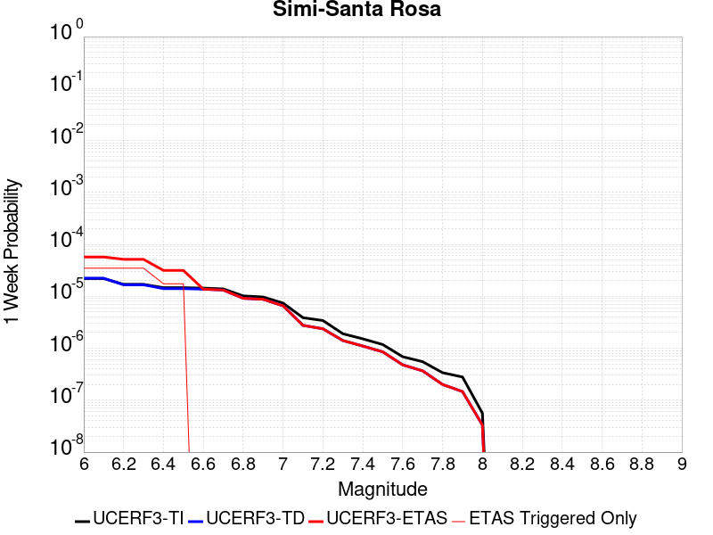 | 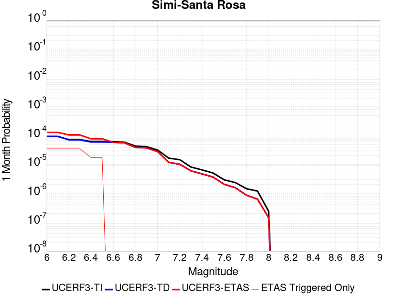 | 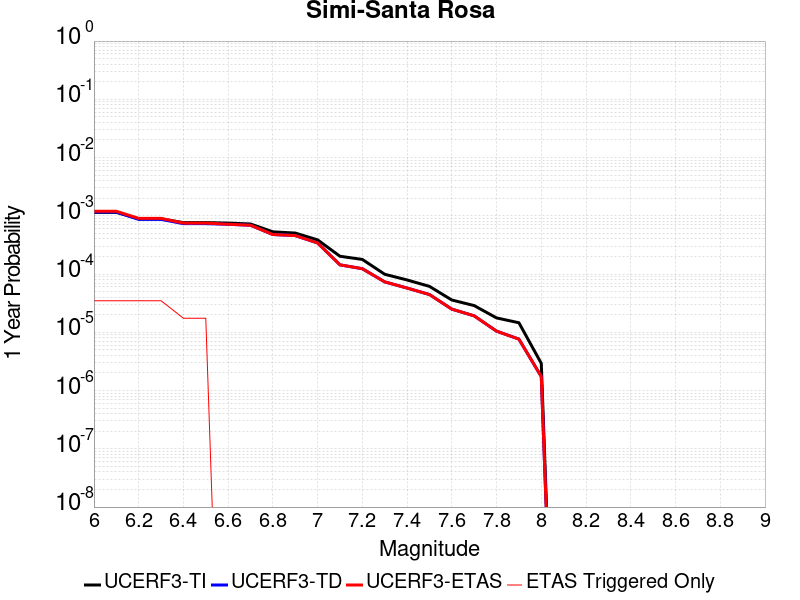 | 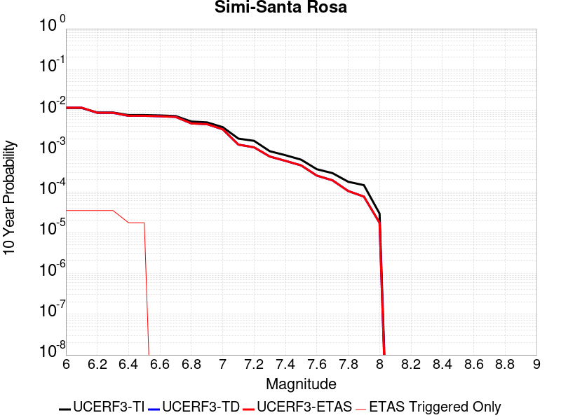 |

| Magnitude | 1 wk TI Prob | 1 wk TD Prob | 1 wk ETAS Prob | 1 wk ETAS/TD Gain | 1 wk ETAS Triggered Only | 1 mo TI Prob | 1 mo TD Prob | 1 mo ETAS Prob | 1 mo ETAS/TD Gain | 1 mo ETAS Triggered Only | 1 yr TI Prob | 1 yr TD Prob | 1 yr ETAS Prob | 1 yr ETAS/TD Gain | 1 yr ETAS Triggered Only | 10 yr TI Prob | 10 yr TD Prob | 10 yr ETAS Prob | 10 yr ETAS/TD Gain | 10 yr ETAS Triggered Only |
|-----|-----|-----|-----|-----|-----|-----|-----|-----|-----|-----|-----|-----|-----|-----|-----|-----|-----|-----|-----|-----|
| 6.0 | 2.198912E-5 | 2.2275442E-5 | 5.716224E-5 | 2.5661552 | 3.4887576E-5 | 9.4235686E-5 | 9.5462936E-5 | 1.3034718E-4 | 1.3654219 | 3.4887576E-5 | 0.0011467156 | 0.0011616853 | 0.0011965324 | 1.029997 | 3.4887576E-5 | 0.011408163 | 0.011560575 | 0.011595059 | 1.002983 | 3.4887576E-5 |
| 6.1 | 2.198912E-5 | 2.2275442E-5 | 5.716224E-5 | 2.5661552 | 3.4887576E-5 | 9.4235686E-5 | 9.5462936E-5 | 1.3034718E-4 | 1.3654219 | 3.4887576E-5 | 0.0011467156 | 0.0011616853 | 0.0011965324 | 1.029997 | 3.4887576E-5 | 0.011408163 | 0.011560575 | 0.011595059 | 1.002983 | 3.4887576E-5 |
| 6.2 | 1.69983E-5 | 1.6668559E-5 | 5.155555E-5 | 3.0929818 | 3.4887576E-5 | 7.284782E-5 | 7.143489E-5 | 1.06319974E-4 | 1.488348 | 3.4887576E-5 | 8.865613E-4 | 8.6940196E-4 | 9.0425916E-4 | 1.0400933 | 3.4887576E-5 | 0.008830327 | 0.008662928 | 0.008697513 | 1.0039923 | 3.4887576E-5 |
| 6.3 | 1.69983E-5 | 1.6668559E-5 | 5.155555E-5 | 3.0929818 | 3.4887576E-5 | 7.284782E-5 | 7.143489E-5 | 1.06319974E-4 | 1.488348 | 3.4887576E-5 | 8.865613E-4 | 8.6940196E-4 | 9.0425916E-4 | 1.0400933 | 3.4887576E-5 | 0.008830327 | 0.008662928 | 0.008697513 | 1.0039923 | 3.4887576E-5 |
| 6.4 | 1.4666188E-5 | 1.4052543E-5 | 3.1496085E-5 | 2.2413087 | 1.7443788E-5 | 6.285358E-5 | 6.0223934E-5 | 7.766667E-5 | 1.2896314 | 1.7443788E-5 | 7.6497364E-4 | 7.3300465E-4 | 7.5043563E-4 | 1.0237802 | 1.7443788E-5 | 0.0076234564 | 0.007308344 | 0.0073256604 | 1.0023694 | 1.7443788E-5 |
| 6.5 | 1.4666188E-5 | 1.4052543E-5 | 3.1496085E-5 | 2.2413087 | 1.7443788E-5 | 6.285358E-5 | 6.0223934E-5 | 7.766667E-5 | 1.2896314 | 1.7443788E-5 | 7.6497364E-4 | 7.3300465E-4 | 7.5043563E-4 | 1.0237802 | 1.7443788E-5 | 0.0076234564 | 0.007308344 | 0.0073256604 | 1.0023694 | 1.7443788E-5 |
| 6.6 | 1.4377586E-5 | 1.3729583E-5 | 1.3729583E-5 | 1.0 | 0.0 | 6.1616774E-5 | 5.883988E-5 | 5.883988E-5 | 1.0 | 0.0 | 7.4992597E-4 | 7.1616494E-4 | 7.1616494E-4 | 1.0 | 0.0 | 0.007474003 | 0.0071410383 | 0.0071410383 | 1.0 | 0.0 |
| 6.7 | 1.3881404E-5 | 1.320755E-5 | 1.320755E-5 | 1.0 | 0.0 | 5.9490372E-5 | 5.66027E-5 | 5.66027E-5 | 1.0 | 0.0 | 7.240546E-4 | 6.8894465E-4 | 6.8894465E-4 | 1.0 | 0.0 | 0.007217 | 0.006870538 | 0.006870538 | 1.0 | 0.0 |
| 6.8 | 1.0176516E-5 | 9.154151E-6 | 9.154151E-6 | 1.0 | 0.0 | 4.3612912E-5 | 3.9231574E-5 | 3.9231574E-5 | 1.0 | 0.0 | 5.308578E-4 | 4.7755634E-4 | 4.7755634E-4 | 1.0 | 0.0 | 0.0052959146 | 0.004766934 | 0.004766934 | 1.0 | 0.0 |
| 6.9 | 9.699797E-6 | 8.774719E-6 | 8.774719E-6 | 1.0 | 0.0 | 4.15699E-5 | 3.7605492E-5 | 3.7605492E-5 | 1.0 | 0.0 | 5.05996E-4 | 4.577671E-4 | 4.577671E-4 | 1.0 | 0.0 | 0.005048454 | 0.0045698597 | 0.0045698597 | 1.0 | 0.0 |
| 7.0 | 7.4049476E-6 | 6.559333E-6 | 6.559333E-6 | 1.0 | 0.0 | 3.1735104E-5 | 2.8111197E-5 | 2.8111197E-5 | 1.0 | 0.0 | 3.8630638E-4 | 3.422127E-4 | 3.422127E-4 | 1.0 | 0.0 | 0.0038563553 | 0.0034180996 | 0.0034180996 | 1.0 | 0.0 |
| 7.1 | 3.873439E-6 | 2.7595095E-6 | 2.7595095E-6 | 1.0 | 0.0 | 1.6600346E-5 | 1.1826417E-5 | 1.1826417E-5 | 1.0 | 0.0 | 2.0209046E-4 | 1.4397735E-4 | 1.4397735E-4 | 1.0 | 0.0 | 0.0020190678 | 0.0014388643 | 0.0014388643 | 1.0 | 0.0 |
| 7.2 | 3.417706E-6 | 2.3676484E-6 | 2.3676484E-6 | 1.0 | 0.0 | 1.4647229E-5 | 1.0147027E-5 | 1.0147027E-5 | 1.0 | 0.0 | 1.7831543E-4 | 1.2353327E-4 | 1.2353327E-4 | 1.0 | 0.0 | 0.0017817242 | 0.0012346683 | 0.0012346683 | 1.0 | 0.0 |
| 7.3 | 1.90225E-6 | 1.4073753E-6 | 1.4073753E-6 | 1.0 | 0.0 | 8.152474E-6 | 6.0315947E-6 | 6.0315947E-6 | 1.0 | 0.0 | 9.9251854E-5 | 7.343221E-5 | 7.343221E-5 | 1.0 | 0.0 | 9.920754E-4 | 7.340817E-4 | 7.340817E-4 | 1.0 | 0.0 |
| 7.4 | 1.5170556E-6 | 1.1024773E-6 | 1.1024773E-6 | 1.0 | 0.0 | 6.5016507E-6 | 4.724894E-6 | 4.724894E-6 | 1.0 | 0.0 | 7.915472E-5 | 5.7524077E-5 | 5.7524077E-5 | 1.0 | 0.0 | 7.9126534E-4 | 5.7509297E-4 | 5.7509297E-4 | 1.0 | 0.0 |
| 7.5 | 1.178732E-6 | 8.535102E-7 | 8.535102E-7 | 1.0 | 0.0 | 5.0516987E-6 | 3.6578958E-6 | 3.6578958E-6 | 1.0 | 0.0 | 6.1502695E-5 | 4.453398E-5 | 4.453398E-5 | 1.0 | 0.0 | 6.148568E-4 | 4.452515E-4 | 4.452515E-4 | 1.0 | 0.0 |
| 7.6 | 6.8722386E-7 | 4.793198E-7 | 4.793198E-7 | 1.0 | 0.0 | 2.9452417E-6 | 2.054226E-6 | 2.054226E-6 | 1.0 | 0.0 | 3.5857727E-5 | 2.5009915E-5 | 2.5009915E-5 | 1.0 | 0.0 | 3.5851944E-4 | 2.5007114E-4 | 2.5007114E-4 | 1.0 | 0.0 |
| 7.7 | 5.5126515E-7 | 3.6731157E-7 | 3.6731157E-7 | 1.0 | 0.0 | 2.3625628E-6 | 1.5741915E-6 | 1.5741915E-6 | 1.0 | 0.0 | 2.8763823E-5 | 1.9165615E-5 | 1.9165615E-5 | 1.0 | 0.0 | 2.87601E-4 | 1.9163972E-4 | 1.9163972E-4 | 1.0 | 0.0 |
| 7.8 | 3.3860243E-7 | 2.0075942E-7 | 2.0075942E-7 | 1.0 | 0.0 | 1.4511525E-6 | 8.6039717E-7 | 8.6039717E-7 | 1.0 | 0.0 | 1.7667637E-5 | 1.0475286E-5 | 1.0475286E-5 | 1.0 | 0.0 | 1.7666233E-4 | 1.04747975E-4 | 1.04747975E-4 | 1.0 | 0.0 |
| 7.9 | 2.7955386E-7 | 1.4649108E-7 | 1.4649108E-7 | 1.0 | 0.0 | 1.1980875E-6 | 6.278188E-7 | 6.278188E-7 | 1.0 | 0.0 | 1.4586617E-5 | 7.643667E-6 | 7.643667E-6 | 1.0 | 0.0 | 1.458566E-4 | 7.643409E-5 | 7.643409E-5 | 1.0 | 0.0 |
| 8.0 | 5.6259015E-8 | 3.3355324E-8 | 3.3355324E-8 | 1.0 | 0.0 | 2.4111003E-7 | 1.4295138E-7 | 1.4295138E-7 | 1.0 | 0.0 | 2.9355108E-6 | 1.7404317E-6 | 1.7404317E-6 | 1.0 | 0.0 | 2.935472E-5 | 1.7404194E-5 | 1.7404194E-5 | 1.0 | 0.0 |

## Whittier alt 1
*[(top)](#table-of-contents)*

| 1 Week | 1 Month | 1 Year | 10 Year |
|-----|-----|-----|-----|
|  |  |  |  |

| Magnitude | 1 wk TI Prob | 1 wk TD Prob | 1 wk ETAS Prob | 1 wk ETAS/TD Gain | 1 wk ETAS Triggered Only | 1 mo TI Prob | 1 mo TD Prob | 1 mo ETAS Prob | 1 mo ETAS/TD Gain | 1 mo ETAS Triggered Only | 1 yr TI Prob | 1 yr TD Prob | 1 yr ETAS Prob | 1 yr ETAS/TD Gain | 1 yr ETAS Triggered Only | 10 yr TI Prob | 10 yr TD Prob | 10 yr ETAS Prob | 10 yr ETAS/TD Gain | 10 yr ETAS Triggered Only |
|-----|-----|-----|-----|-----|-----|-----|-----|-----|-----|-----|-----|-----|-----|-----|-----|-----|-----|-----|-----|-----|
| 6.0 | 4.2554693E-5 | 4.725218E-5 | 8.21381E-5 | 1.7382925 | 3.4887576E-5 | 1.8236451E-4 | 2.0249544E-4 | 2.3737595E-4 | 1.1722534 | 3.4887576E-5 | 0.002218027 | 0.0024629154 | 0.002497717 | 1.0141302 | 3.4887576E-5 | 0.02196019 | 0.024390234 | 0.024424272 | 1.0013955 | 3.4887576E-5 |
| 6.1 | 4.2554693E-5 | 4.725218E-5 | 8.21381E-5 | 1.7382925 | 3.4887576E-5 | 1.8236451E-4 | 2.0249544E-4 | 2.3737595E-4 | 1.1722534 | 3.4887576E-5 | 0.002218027 | 0.0024629154 | 0.002497717 | 1.0141302 | 3.4887576E-5 | 0.02196019 | 0.024390234 | 0.024424272 | 1.0013955 | 3.4887576E-5 |
| 6.2 | 4.2554693E-5 | 4.725218E-5 | 8.21381E-5 | 1.7382925 | 3.4887576E-5 | 1.8236451E-4 | 2.0249544E-4 | 2.3737595E-4 | 1.1722534 | 3.4887576E-5 | 0.002218027 | 0.0024629154 | 0.002497717 | 1.0141302 | 3.4887576E-5 | 0.02196019 | 0.024390234 | 0.024424272 | 1.0013955 | 3.4887576E-5 |
| 6.3 | 1.9617712E-5 | 1.8268593E-5 | 1.8268593E-5 | 1.0 | 0.0 | 8.40732E-5 | 7.829172E-5 | 7.829172E-5 | 1.0 | 0.0 | 0.0010231105 | 9.52804E-4 | 9.52804E-4 | 1.0 | 0.0 | 0.01018413 | 0.009490474 | 0.009490474 | 1.0 | 0.0 |
| 6.4 | 1.5611336E-5 | 1.3604271E-5 | 1.3604271E-5 | 1.0 | 0.0 | 6.690401E-5 | 5.8302747E-5 | 5.8302747E-5 | 1.0 | 0.0 | 8.142519E-4 | 7.0961076E-4 | 7.0961076E-4 | 1.0 | 0.0 | 0.008112748 | 0.0070754145 | 0.0070754145 | 1.0 | 0.0 |
| 6.5 | 1.5150166E-5 | 1.3100925E-5 | 1.3100925E-5 | 1.0 | 0.0 | 6.492767E-5 | 5.6145647E-5 | 5.6145647E-5 | 1.0 | 0.0 | 7.9020765E-4 | 6.8336475E-4 | 6.8336475E-4 | 1.0 | 0.0 | 0.007874036 | 0.0068145846 | 0.0068145846 | 1.0 | 0.0 |
| 6.6 | 1.295588E-5 | 1.0380725E-5 | 1.0380725E-5 | 1.0 | 0.0 | 5.552402E-5 | 4.4488075E-5 | 4.4488075E-5 | 1.0 | 0.0 | 6.7579525E-4 | 5.4150965E-4 | 5.4150965E-4 | 1.0 | 0.0 | 0.006737438 | 0.0054033357 | 0.0054033357 | 1.0 | 0.0 |
| 6.7 | 1.2542085E-5 | 9.899369E-6 | 9.899369E-6 | 1.0 | 0.0 | 5.3750682E-5 | 4.242519E-5 | 4.242519E-5 | 1.0 | 0.0 | 6.542181E-4 | 5.164061E-4 | 5.164061E-4 | 1.0 | 0.0 | 0.006522954 | 0.0051534795 | 0.0051534795 | 1.0 | 0.0 |
| 6.8 | 1.2195878E-5 | 9.495415E-6 | 9.495415E-6 | 1.0 | 0.0 | 5.2267E-5 | 4.069401E-5 | 4.069401E-5 | 1.0 | 0.0 | 6.36165E-4 | 4.9533875E-4 | 4.9533875E-4 | 1.0 | 0.0 | 0.0063434686 | 0.004943688 | 0.004943688 | 1.0 | 0.0 |
| 6.9 | 1.1580298E-5 | 8.772933E-6 | 8.772933E-6 | 1.0 | 0.0 | 4.9628903E-5 | 3.7597754E-5 | 3.7597754E-5 | 1.0 | 0.0 | 6.040644E-4 | 4.5765814E-4 | 4.5765814E-4 | 1.0 | 0.0 | 0.00602425 | 0.0045684157 | 0.0045684157 | 1.0 | 0.0 |
| 7.0 | 1.0964795E-5 | 8.083994E-6 | 8.083994E-6 | 1.0 | 0.0 | 4.6991136E-5 | 3.4645236E-5 | 3.4645236E-5 | 1.0 | 0.0 | 5.7196687E-4 | 4.2172565E-4 | 4.2172565E-4 | 1.0 | 0.0 | 0.0057049696 | 0.004210462 | 0.004210462 | 1.0 | 0.0 |
| 7.1 | 1.0230601E-5 | 7.3266697E-6 | 7.3266697E-6 | 1.0 | 0.0 | 4.3844695E-5 | 3.1399642E-5 | 3.1399642E-5 | 1.0 | 0.0 | 5.336784E-4 | 3.8222488E-4 | 3.8222488E-4 | 1.0 | 0.0 | 0.005323986 | 0.0038168381 | 0.0038168381 | 1.0 | 0.0 |
| 7.2 | 9.40865E-6 | 6.543289E-6 | 6.543289E-6 | 1.0 | 0.0 | 4.032216E-5 | 2.8042374E-5 | 2.8042374E-5 | 1.0 | 0.0 | 4.908117E-4 | 3.4136363E-4 | 3.4136363E-4 | 1.0 | 0.0 | 0.0048972913 | 0.003409485 | 0.003409485 | 1.0 | 0.0 |
| 7.3 | 8.237384E-6 | 5.5977525E-6 | 5.5977525E-6 | 1.0 | 0.0 | 3.5302593E-5 | 2.3990153E-5 | 2.3990153E-5 | 1.0 | 0.0 | 4.2972428E-4 | 2.92042E-4 | 2.92042E-4 | 1.0 | 0.0 | 0.0042889426 | 0.002916903 | 0.002916903 | 1.0 | 0.0 |
| 7.4 | 7.5316966E-6 | 5.027819E-6 | 5.027819E-6 | 1.0 | 0.0 | 3.2278298E-5 | 2.1547625E-5 | 2.1547625E-5 | 1.0 | 0.0 | 3.9291743E-4 | 2.6231175E-4 | 2.6231175E-4 | 1.0 | 0.0 | 0.0039222343 | 0.0026201333 | 0.0026201333 | 1.0 | 0.0 |
| 7.5 | 6.149649E-6 | 3.933841E-6 | 3.933841E-6 | 1.0 | 0.0 | 2.6355372E-5 | 1.6859214E-5 | 1.6859214E-5 | 1.0 | 0.0 | 3.208294E-4 | 2.052425E-4 | 2.052425E-4 | 1.0 | 0.0 | 0.003203666 | 0.0020506186 | 0.0020506186 | 1.0 | 0.0 |
| 7.6 | 5.457711E-6 | 3.3953788E-6 | 3.3953788E-6 | 1.0 | 0.0 | 2.338998E-5 | 1.4551547E-5 | 1.4551547E-5 | 1.0 | 0.0 | 2.8473578E-4 | 1.771515E-4 | 1.771515E-4 | 1.0 | 0.0 | 0.0028437122 | 0.0017701836 | 0.0017701836 | 1.0 | 0.0 |
| 7.7 | 4.1676276E-6 | 2.3331952E-6 | 2.3331952E-6 | 1.0 | 0.0 | 1.7861139E-5 | 9.999374E-6 | 9.999374E-6 | 1.0 | 0.0 | 2.1743766E-4 | 1.2173632E-4 | 1.2173632E-4 | 1.0 | 0.0 | 0.0021722503 | 0.0012167693 | 0.0012167693 | 1.0 | 0.0 |
| 7.8 | 2.2692414E-7 | 9.3854695E-8 | 9.3854695E-8 | 1.0 | 0.0 | 9.725317E-7 | 4.0223435E-7 | 4.0223435E-7 | 1.0 | 0.0 | 1.1840509E-5 | 4.8971956E-6 | 4.8971956E-6 | 1.0 | 0.0 | 1.1839878E-4 | 4.8971204E-5 | 4.8971204E-5 | 1.0 | 0.0 |
| 7.9 | 6.676829E-9 | 3.439853E-9 | 3.439853E-9 | 1.0 | 0.0 | 2.861498E-8 | 1.4742227E-8 | 1.4742227E-8 | 1.0 | 0.0 | 3.4838732E-7 | 1.7948659E-7 | 1.7948659E-7 | 1.0 | 0.0 | 3.4838679E-6 | 1.7948646E-6 | 1.7948646E-6 | 1.0 | 0.0 |

## San Andreas (Santa Cruz Mts) 2011 CFM
*[(top)](#table-of-contents)*

| 1 Week | 1 Month | 1 Year | 10 Year |
|-----|-----|-----|-----|
| 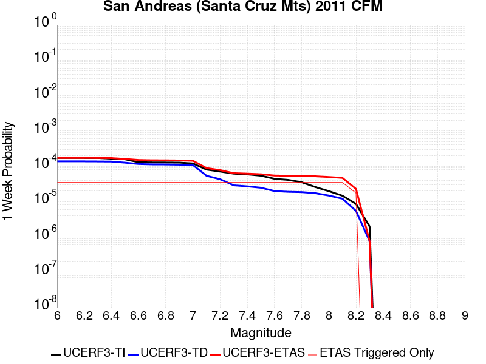 | 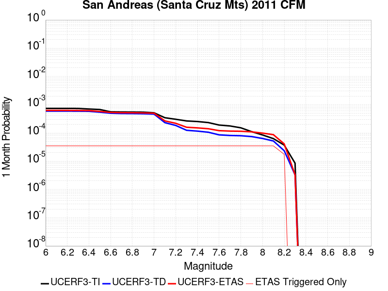 | 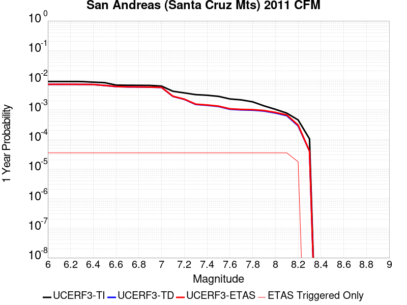 | 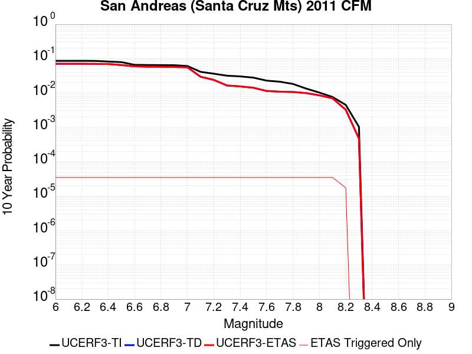 |

| Magnitude | 1 wk TI Prob | 1 wk TD Prob | 1 wk ETAS Prob | 1 wk ETAS/TD Gain | 1 wk ETAS Triggered Only | 1 mo TI Prob | 1 mo TD Prob | 1 mo ETAS Prob | 1 mo ETAS/TD Gain | 1 mo ETAS Triggered Only | 1 yr TI Prob | 1 yr TD Prob | 1 yr ETAS Prob | 1 yr ETAS/TD Gain | 1 yr ETAS Triggered Only | 10 yr TI Prob | 10 yr TD Prob | 10 yr ETAS Prob | 10 yr ETAS/TD Gain | 10 yr ETAS Triggered Only |
|-----|-----|-----|-----|-----|-----|-----|-----|-----|-----|-----|-----|-----|-----|-----|-----|-----|-----|-----|-----|-----|
| 6.0 | 1.7221631E-4 | 1.3793171E-4 | 1.7281447E-4 | 1.2528988 | 3.4887576E-5 | 7.378611E-4 | 5.9100403E-4 | 6.2587095E-4 | 1.0589962 | 3.4887576E-5 | 0.008946515 | 0.007172124 | 0.0072067613 | 1.0048294 | 3.4887576E-5 | 0.08594794 | 0.0705551 | 0.07058752 | 1.0004596 | 3.4887576E-5 |
| 6.1 | 1.7221631E-4 | 1.3793171E-4 | 1.7281447E-4 | 1.2528988 | 3.4887576E-5 | 7.378611E-4 | 5.9100403E-4 | 6.2587095E-4 | 1.0589962 | 3.4887576E-5 | 0.008946515 | 0.007172124 | 0.0072067613 | 1.0048294 | 3.4887576E-5 | 0.08594794 | 0.0705551 | 0.07058752 | 1.0004596 | 3.4887576E-5 |
| 6.2 | 1.7221631E-4 | 1.3793171E-4 | 1.7281447E-4 | 1.2528988 | 3.4887576E-5 | 7.378611E-4 | 5.9100403E-4 | 6.2587095E-4 | 1.0589962 | 3.4887576E-5 | 0.008946515 | 0.007172124 | 0.0072067613 | 1.0048294 | 3.4887576E-5 | 0.08594794 | 0.0705551 | 0.07058752 | 1.0004596 | 3.4887576E-5 |
| 6.3 | 1.716926E-4 | 1.3712609E-4 | 1.7200888E-4 | 1.2543848 | 3.4887576E-5 | 7.3561794E-4 | 5.875529E-4 | 6.2242E-4 | 1.0593429 | 3.4887576E-5 | 0.008919428 | 0.0071303817 | 0.0071650203 | 1.0048579 | 3.4887576E-5 | 0.08569809 | 0.070167266 | 0.070199706 | 1.0004623 | 3.4887576E-5 |
| 6.4 | 1.6392978E-4 | 1.3588481E-4 | 1.7076764E-4 | 1.2567089 | 3.4887576E-5 | 7.02367E-4 | 5.822355E-4 | 6.171028E-4 | 1.0598851 | 3.4887576E-5 | 0.008517839 | 0.007066063 | 0.007100704 | 1.0049025 | 3.4887576E-5 | 0.08198654 | 0.06940135 | 0.069433816 | 1.0004678 | 3.4887576E-5 |
| 6.5 | 1.5742714E-4 | 1.2648388E-4 | 1.6136703E-4 | 1.2757914 | 3.4887576E-5 | 6.745133E-4 | 5.4196286E-4 | 5.768315E-4 | 1.0643377 | 3.4887576E-5 | 0.00818132 | 0.0065787593 | 0.006613417 | 1.0052682 | 3.4887576E-5 | 0.078865945 | 0.06486309 | 0.06489572 | 1.000503 | 3.4887576E-5 |
| 6.6 | 1.3038084E-4 | 1.1588213E-4 | 1.5076567E-4 | 1.301026 | 3.4887576E-5 | 5.5865536E-4 | 4.9654447E-4 | 5.314147E-4 | 1.0702258 | 3.4887576E-5 | 0.006780438 | 0.0060289134 | 0.0060635903 | 1.0057518 | 3.4887576E-5 | 0.0657725 | 0.05932738 | 0.059360195 | 1.0005531 | 3.4887576E-5 |
| 6.7 | 1.2867592E-4 | 1.1314701E-4 | 1.4803064E-4 | 1.3083036 | 3.4887576E-5 | 5.5135164E-4 | 4.8482692E-4 | 5.1969755E-4 | 1.071924 | 3.4887576E-5 | 0.0066920654 | 0.00588703 | 0.0059217126 | 1.0058913 | 3.4887576E-5 | 0.06494093 | 0.058038417 | 0.058071278 | 1.0005662 | 3.4887576E-5 |
| 6.8 | 1.2801298E-4 | 1.1252261E-4 | 1.4740626E-4 | 1.3100146 | 3.4887576E-5 | 5.485117E-4 | 4.8215193E-4 | 5.170227E-4 | 1.0723232 | 3.4887576E-5 | 0.0066577005 | 0.0058546383 | 0.0058893217 | 1.0059241 | 3.4887576E-5 | 0.06461738 | 0.057752274 | 0.057785146 | 1.0005692 | 3.4887576E-5 |
| 6.9 | 1.269149E-4 | 1.1094465E-4 | 1.4582835E-4 | 1.3144244 | 3.4887576E-5 | 5.4380763E-4 | 4.7539172E-4 | 5.1026273E-4 | 1.0733521 | 3.4887576E-5 | 0.006600777 | 0.005772772 | 0.005807458 | 1.0060086 | 3.4887576E-5 | 0.06408122 | 0.0570241 | 0.057056997 | 1.000577 | 3.4887576E-5 |
| 7.0 | 1.2030331E-4 | 1.0824504E-4 | 1.4312884E-4 | 1.3222669 | 3.4887576E-5 | 5.154837E-4 | 4.638261E-4 | 4.986975E-4 | 1.0751821 | 3.4887576E-5 | 0.006257969 | 0.0056326967 | 0.0056673875 | 1.0061588 | 3.4887576E-5 | 0.06084648 | 0.055696685 | 0.05572963 | 1.0005915 | 3.4887576E-5 |
| 7.1 | 8.049617E-5 | 5.3926604E-5 | 8.8812296E-5 | 1.6469107 | 3.4887576E-5 | 3.4493793E-4 | 2.3109373E-4 | 2.6597324E-4 | 1.1509323 | 3.4887576E-5 | 0.0041915346 | 0.0028099709 | 0.0028447604 | 1.0123807 | 3.4887576E-5 | 0.041133516 | 0.029618956 | 0.02965281 | 1.001143 | 3.4887576E-5 |
| 7.2 | 7.093979E-5 | 4.2937932E-5 | 7.782401E-5 | 1.8124769 | 3.4887576E-5 | 3.0399222E-4 | 1.8400686E-4 | 2.18888E-4 | 1.1895645 | 3.4887576E-5 | 0.0036948253 | 0.0022380045 | 0.002272814 | 1.0155538 | 3.4887576E-5 | 0.03633994 | 0.023941692 | 0.023975743 | 1.0014223 | 3.4887576E-5 |
| 7.3 | 6.193693E-5 | 2.8894141E-5 | 6.378071E-5 | 2.2073925 | 3.4887576E-5 | 2.6541698E-4 | 1.2382616E-4 | 1.5870942E-4 | 1.2817115 | 3.4887576E-5 | 0.0032266637 | 0.0015065427 | 0.0015413777 | 1.0231224 | 3.4887576E-5 | 0.031802133 | 0.016499156 | 0.016533468 | 1.0020796 | 3.4887576E-5 |
| 7.4 | 5.906492E-5 | 2.702346E-5 | 6.191009E-5 | 2.2909758 | 3.4887576E-5 | 2.5311083E-4 | 1.1580969E-4 | 1.5069323E-4 | 1.3012143 | 3.4887576E-5 | 0.0030772698 | 0.0014090725 | 0.0014439109 | 1.0247244 | 3.4887576E-5 | 0.030350044 | 0.015471023 | 0.01550537 | 1.0022202 | 3.4887576E-5 |
| 7.5 | 5.424296E-5 | 2.4678277E-5 | 5.956499E-5 | 2.413661 | 3.4887576E-5 | 2.324491E-4 | 1.05759755E-4 | 1.4064365E-4 | 1.3298408 | 3.4887576E-5 | 0.002826395 | 0.0012868657 | 0.0013217083 | 1.0270756 | 3.4887576E-5 | 0.027907165 | 0.014163188 | 0.0141975805 | 1.0024284 | 3.4887576E-5 |
| 7.6 | 4.43084E-5 | 1.990431E-5 | 5.479119E-5 | 2.75273 | 3.4887576E-5 | 1.8987931E-4 | 8.53014E-5 | 1.20186E-4 | 1.4089569 | 3.4887576E-5 | 0.0023093296 | 0.0010380499 | 0.0010729013 | 1.0335739 | 3.4887576E-5 | 0.022854783 | 0.011412679 | 0.011447169 | 1.0030221 | 3.4887576E-5 |
| 7.7 | 4.118098E-5 | 1.8936442E-5 | 5.3823358E-5 | 2.8423162 | 3.4887576E-5 | 1.7647797E-4 | 8.115366E-5 | 1.160384E-4 | 1.4298604 | 3.4887576E-5 | 0.002146502 | 9.875982E-4 | 0.0010224513 | 1.0352908 | 3.4887576E-5 | 0.021258866 | 0.010870468 | 0.010904976 | 1.0031745 | 3.4887576E-5 |
| 7.8 | 3.5408906E-5 | 1.856446E-5 | 5.345139E-5 | 2.879232 | 3.4887576E-5 | 1.5174363E-4 | 7.955955E-5 | 1.14444345E-4 | 1.438474 | 3.4887576E-5 | 0.0018459131 | 9.682073E-4 | 0.0010030611 | 1.0359982 | 3.4887576E-5 | 0.018306552 | 0.010652021 | 0.010686536 | 1.0032403 | 3.4887576E-5 |
| 7.9 | 2.5860836E-5 | 1.7315993E-5 | 5.2202962E-5 | 3.0147254 | 3.4887576E-5 | 1.10827445E-4 | 7.420929E-5 | 1.09094275E-4 | 1.4700892 | 3.4887576E-5 | 0.001348489 | 9.031238E-4 | 9.379799E-4 | 1.038595 | 3.4887576E-5 | 0.013403354 | 0.009907599 | 0.00994214 | 1.0034864 | 3.4887576E-5 |
| 8.0 | 1.9777332E-5 | 1.4839596E-5 | 4.9726652E-5 | 3.3509438 | 3.4887576E-5 | 8.4757245E-5 | 6.3596715E-5 | 9.848207E-5 | 1.5485402 | 3.4887576E-5 | 0.0010314309 | 7.740152E-4 | 8.088758E-4 | 1.0450386 | 3.4887576E-5 | 0.010266567 | 0.008508967 | 0.008543558 | 1.0040652 | 3.4887576E-5 |
| 8.1 | 1.468494E-5 | 1.2107374E-5 | 4.6994526E-5 | 3.8814797 | 3.4887576E-5 | 6.293394E-5 | 5.1887713E-5 | 8.677348E-5 | 1.6723319 | 3.4887576E-5 | 7.6595135E-4 | 6.3155E-4 | 6.664155E-4 | 1.0552063 | 3.4887576E-5 | 0.0076331664 | 0.006969149 | 0.0070037935 | 1.0049711 | 3.4887576E-5 |
| 8.2 | 8.63836E-6 | 5.469061E-6 | 2.2912753E-5 | 4.1895223 | 1.7443788E-5 | 3.7021015E-5 | 2.3438623E-5 | 4.0882E-5 | 1.7442153 | 1.7443788E-5 | 4.5063766E-4 | 2.8532793E-4 | 3.0276674E-4 | 1.0611185 | 1.7443788E-5 | 0.004497249 | 0.00324569 | 0.003263077 | 1.005357 | 1.7443788E-5 |
| 8.3 | 1.983087E-6 | 7.6599065E-7 | 7.6599065E-7 | 1.0 | 0.0 | 8.498917E-6 | 3.282813E-6 | 3.282813E-6 | 1.0 | 0.0 | 1.034694E-4 | 3.9967534E-5 | 3.9967534E-5 | 1.0 | 0.0 | 0.0010342124 | 4.719687E-4 | 4.719687E-4 | 1.0 | 0.0 |

## Santa Cruz Island
*[(top)](#table-of-contents)*

| 1 Week | 1 Month | 1 Year | 10 Year |
|-----|-----|-----|-----|
| 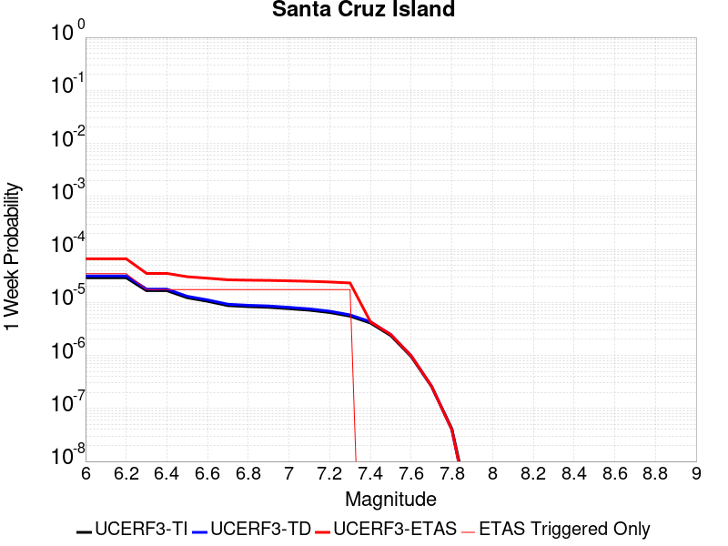 | 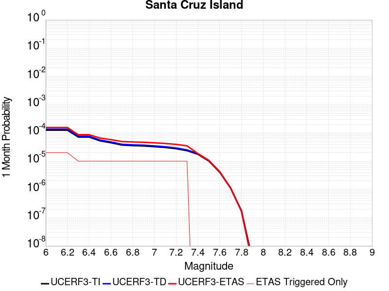 | 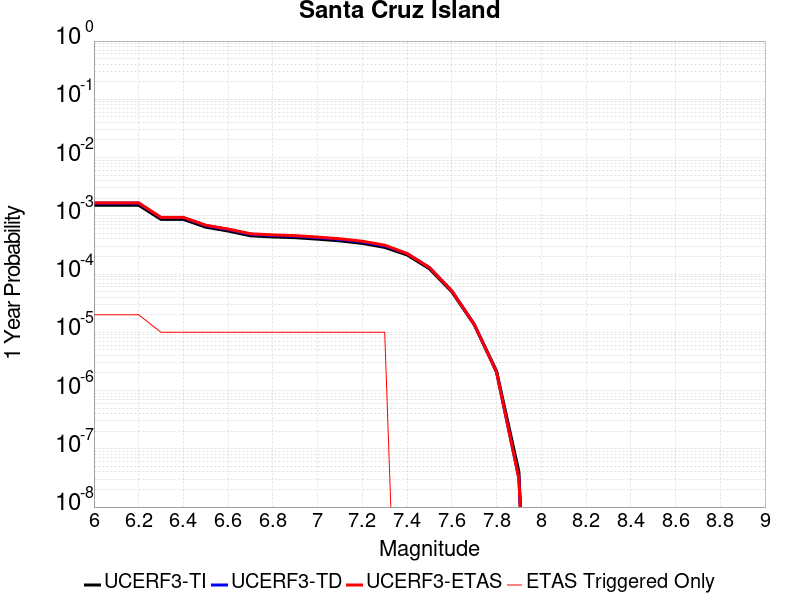 | 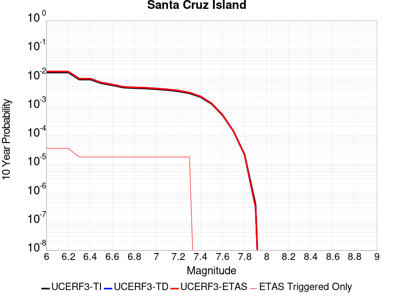 |

| Magnitude | 1 wk TI Prob | 1 wk TD Prob | 1 wk ETAS Prob | 1 wk ETAS/TD Gain | 1 wk ETAS Triggered Only | 1 mo TI Prob | 1 mo TD Prob | 1 mo ETAS Prob | 1 mo ETAS/TD Gain | 1 mo ETAS Triggered Only | 1 yr TI Prob | 1 yr TD Prob | 1 yr ETAS Prob | 1 yr ETAS/TD Gain | 1 yr ETAS Triggered Only | 10 yr TI Prob | 10 yr TD Prob | 10 yr ETAS Prob | 10 yr ETAS/TD Gain | 10 yr ETAS Triggered Only |
|-----|-----|-----|-----|-----|-----|-----|-----|-----|-----|-----|-----|-----|-----|-----|-----|-----|-----|-----|-----|-----|
| 6.0 | 2.9164563E-5 | 3.1599742E-5 | 6.648622E-5 | 2.1040113 | 3.4887576E-5 | 1.2498499E-4 | 1.3542121E-4 | 1.7030406E-4 | 1.2575878 | 3.4887576E-5 | 0.0015206301 | 0.0016476426 | 0.0016824726 | 1.0211394 | 3.4887576E-5 | 0.015102667 | 0.016368 | 0.016402315 | 1.0020965 | 3.4887576E-5 |
| 6.1 | 2.9164563E-5 | 3.1599742E-5 | 6.648622E-5 | 2.1040113 | 3.4887576E-5 | 1.2498499E-4 | 1.3542121E-4 | 1.7030406E-4 | 1.2575878 | 3.4887576E-5 | 0.0015206301 | 0.0016476426 | 0.0016824726 | 1.0211394 | 3.4887576E-5 | 0.015102667 | 0.016368 | 0.016402315 | 1.0020965 | 3.4887576E-5 |
| 6.2 | 2.9164563E-5 | 3.1599742E-5 | 6.648622E-5 | 2.1040113 | 3.4887576E-5 | 1.2498499E-4 | 1.3542121E-4 | 1.7030406E-4 | 1.2575878 | 3.4887576E-5 | 0.0015206301 | 0.0016476426 | 0.0016824726 | 1.0211394 | 3.4887576E-5 | 0.015102667 | 0.016368 | 0.016402315 | 1.0020965 | 3.4887576E-5 |
| 6.3 | 1.6635553E-5 | 1.780436E-5 | 3.5247835E-5 | 1.9797307 | 1.7443788E-5 | 7.1293274E-5 | 7.630226E-5 | 9.374472E-5 | 1.2285968 | 1.7443788E-5 | 8.6765E-4 | 9.2860236E-4 | 9.4602996E-4 | 1.0187676 | 1.7443788E-5 | 0.008642701 | 0.009249094 | 0.0092663765 | 1.0018686 | 1.7443788E-5 |
| 6.4 | 1.6635553E-5 | 1.780436E-5 | 3.5247835E-5 | 1.9797307 | 1.7443788E-5 | 7.1293274E-5 | 7.630226E-5 | 9.374472E-5 | 1.2285968 | 1.7443788E-5 | 8.6765E-4 | 9.2860236E-4 | 9.4602996E-4 | 1.0187676 | 1.7443788E-5 | 0.008642701 | 0.009249094 | 0.0092663765 | 1.0018686 | 1.7443788E-5 |
| 6.5 | 1.2238748E-5 | 1.3042995E-5 | 3.0486555E-5 | 2.337389 | 1.7443788E-5 | 5.2450723E-5 | 5.5897377E-5 | 7.334019E-5 | 1.3120507 | 1.7443788E-5 | 6.3840044E-4 | 6.8034173E-4 | 6.9777365E-4 | 1.0256222 | 1.7443788E-5 | 0.0063656955 | 0.0067829876 | 0.0068003135 | 1.0025543 | 1.7443788E-5 |
| 6.6 | 1.0489767E-5 | 1.1156636E-5 | 2.8600229E-5 | 2.5635173 | 1.7443788E-5 | 4.495537E-5 | 4.781329E-5 | 6.5256245E-5 | 1.3648139 | 1.7443788E-5 | 5.4719415E-4 | 5.819735E-4 | 5.994072E-4 | 1.0299561 | 1.7443788E-5 | 0.005458487 | 0.0058047357 | 0.0058220783 | 1.0029876 | 1.7443788E-5 |
| 6.7 | 8.699222E-6 | 9.236782E-6 | 2.6680409E-5 | 2.8884962 | 1.7443788E-5 | 3.7281847E-5 | 3.958561E-5 | 5.702871E-5 | 1.4406424 | 1.7443788E-5 | 4.5381195E-4 | 4.8184878E-4 | 4.992842E-4 | 1.0361843 | 1.7443788E-5 | 0.0045288634 | 0.004808108 | 0.0048254677 | 1.0036105 | 1.7443788E-5 |
| 6.8 | 8.307732E-6 | 8.8169045E-6 | 2.6260537E-5 | 2.9784307 | 1.7443788E-5 | 3.560408E-5 | 3.7786187E-5 | 5.5229317E-5 | 1.4616271 | 1.7443788E-5 | 4.3339343E-4 | 4.5995016E-4 | 4.773859E-4 | 1.037908 | 1.7443788E-5 | 0.004325492 | 0.0045900354 | 0.004607399 | 1.0037829 | 1.7443788E-5 |
| 6.9 | 8.073121E-6 | 8.564939E-6 | 2.6008576E-5 | 3.036633 | 1.7443788E-5 | 3.459863E-5 | 3.6706366E-5 | 5.4149514E-5 | 1.4752077 | 1.7443788E-5 | 4.2115687E-4 | 4.468088E-4 | 4.6424477E-4 | 1.0390234 | 1.7443788E-5 | 0.004203596 | 0.004459156 | 0.004476522 | 1.0038944 | 1.7443788E-5 |
| 7.0 | 7.617019E-6 | 8.074664E-6 | 2.5518311E-5 | 3.1602938 | 1.7443788E-5 | 3.264396E-5 | 3.4605247E-5 | 5.2048432E-5 | 1.5040618 | 1.7443788E-5 | 3.9736772E-4 | 4.212378E-4 | 4.3867427E-4 | 1.0413933 | 1.7443788E-5 | 0.003966579 | 0.0042044413 | 0.0042218114 | 1.0041314 | 1.7443788E-5 |
| 7.1 | 7.1224836E-6 | 7.545788E-6 | 2.4989444E-5 | 3.3117077 | 1.7443788E-5 | 3.052457E-5 | 3.2338692E-5 | 4.9781916E-5 | 1.5393918 | 1.7443788E-5 | 3.715733E-4 | 3.936528E-4 | 4.110897E-4 | 1.0442952 | 1.7443788E-5 | 0.003709526 | 0.003929598 | 0.003946973 | 1.0044216 | 1.7443788E-5 |
| 7.2 | 6.441115E-6 | 6.8273835E-6 | 2.4271052E-5 | 3.5549567 | 1.7443788E-5 | 2.7604487E-5 | 2.9259887E-5 | 4.6703164E-5 | 1.5961498 | 1.7443788E-5 | 3.360328E-4 | 3.5618112E-4 | 3.736187E-4 | 1.048957 | 1.7443788E-5 | 0.0033552512 | 0.003556131 | 0.0035735127 | 1.0048878 | 1.7443788E-5 |
| 7.3 | 5.494274E-6 | 5.8199944E-6 | 2.326368E-5 | 3.9971998 | 1.7443788E-5 | 2.3546674E-5 | 2.4942596E-5 | 4.238595E-5 | 1.6993399 | 1.7443788E-5 | 2.8664304E-4 | 3.0363398E-4 | 3.2107247E-4 | 1.0574327 | 1.7443788E-5 | 0.002862736 | 0.0030322142 | 0.0030496053 | 1.0057354 | 1.7443788E-5 |
| 7.4 | 4.0802624E-6 | 4.312256E-6 | 4.312256E-6 | 1.0 | 0.0 | 1.7486722E-5 | 1.8480967E-5 | 1.8480967E-5 | 1.0 | 0.0 | 2.1288003E-4 | 2.2498262E-4 | 2.2498262E-4 | 1.0 | 0.0 | 0.0021267622 | 0.0022475575 | 0.0022475575 | 1.0 | 0.0 |
| 7.5 | 2.3584746E-6 | 2.4753094E-6 | 2.4753094E-6 | 1.0 | 0.0 | 1.0107709E-5 | 1.0608426E-5 | 1.0608426E-5 | 1.0 | 0.0 | 1.2305441E-4 | 1.2915E-4 | 1.2915E-4 | 1.0 | 0.0 | 0.0012298629 | 0.0012907543 | 0.0012907543 | 1.0 | 0.0 |
| 7.6 | 9.4981914E-7 | 9.86093E-7 | 9.86093E-7 | 1.0 | 0.0 | 4.0706473E-6 | 4.2261063E-6 | 4.2261063E-6 | 1.0 | 0.0 | 4.9559E-5 | 5.145164E-5 | 5.145164E-5 | 1.0 | 0.0 | 4.954795E-4 | 5.1439856E-4 | 5.1439856E-4 | 1.0 | 0.0 |
| 7.7 | 2.6013532E-7 | 2.6416603E-7 | 2.6416603E-7 | 1.0 | 0.0 | 1.1148652E-6 | 1.1321397E-6 | 1.1321397E-6 | 1.0 | 0.0 | 1.3573399E-5 | 1.3783714E-5 | 1.3783714E-5 | 1.0 | 0.0 | 1.357257E-4 | 1.3782867E-4 | 1.3782867E-4 | 1.0 | 0.0 |
| 7.8 | 4.1522263E-8 | 3.965679E-8 | 3.965679E-8 | 1.0 | 0.0 | 1.7795254E-7 | 1.6995766E-7 | 1.6995766E-7 | 1.0 | 0.0 | 2.16657E-6 | 2.0692328E-6 | 2.0692328E-6 | 1.0 | 0.0 | 2.1665488E-5 | 2.0692156E-5 | 2.0692156E-5 | 1.0 | 0.0 |
| 7.9 | 7.7242046E-10 | 5.9468175E-10 | 5.9468175E-10 | 1.0 | 0.0 | 3.3103735E-9 | 2.5486364E-9 | 2.5486364E-9 | 1.0 | 0.0 | 4.0303796E-8 | 3.1029646E-8 | 3.1029646E-8 | 1.0 | 0.0 | 4.030379E-7 | 3.1029643E-7 | 3.1029643E-7 | 1.0 | 0.0 |

## San Juan
*[(top)](#table-of-contents)*

| 1 Week | 1 Month | 1 Year | 10 Year |
|-----|-----|-----|-----|
|  |  |  |  |

| Magnitude | 1 wk TI Prob | 1 wk TD Prob | 1 wk ETAS Prob | 1 wk ETAS/TD Gain | 1 wk ETAS Triggered Only | 1 mo TI Prob | 1 mo TD Prob | 1 mo ETAS Prob | 1 mo ETAS/TD Gain | 1 mo ETAS Triggered Only | 1 yr TI Prob | 1 yr TD Prob | 1 yr ETAS Prob | 1 yr ETAS/TD Gain | 1 yr ETAS Triggered Only | 10 yr TI Prob | 10 yr TD Prob | 10 yr ETAS Prob | 10 yr ETAS/TD Gain | 10 yr ETAS Triggered Only |
|-----|-----|-----|-----|-----|-----|-----|-----|-----|-----|-----|-----|-----|-----|-----|-----|-----|-----|-----|-----|-----|
| 6.0 | 8.682808E-6 | 8.7491635E-6 | 4.363643E-5 | 4.987498 | 3.4887576E-5 | 3.72115E-5 | 3.74959E-5 | 7.238217E-5 | 1.930402 | 3.4887576E-5 | 4.5295584E-4 | 4.564218E-4 | 4.912935E-4 | 1.0764022 | 3.4887576E-5 | 0.004520337 | 0.004555385 | 0.0045901136 | 1.0076237 | 3.4887576E-5 |
| 6.1 | 8.682808E-6 | 8.7491635E-6 | 4.363643E-5 | 4.987498 | 3.4887576E-5 | 3.72115E-5 | 3.74959E-5 | 7.238217E-5 | 1.930402 | 3.4887576E-5 | 4.5295584E-4 | 4.564218E-4 | 4.912935E-4 | 1.0764022 | 3.4887576E-5 | 0.004520337 | 0.004555385 | 0.0045901136 | 1.0076237 | 3.4887576E-5 |
| 6.2 | 8.682808E-6 | 8.7491635E-6 | 4.363643E-5 | 4.987498 | 3.4887576E-5 | 3.72115E-5 | 3.74959E-5 | 7.238217E-5 | 1.930402 | 3.4887576E-5 | 4.5295584E-4 | 4.564218E-4 | 4.912935E-4 | 1.0764022 | 3.4887576E-5 | 0.004520337 | 0.004555385 | 0.0045901136 | 1.0076237 | 3.4887576E-5 |
| 6.3 | 6.3054235E-6 | 6.2825848E-6 | 2.3726263E-5 | 3.7765129 | 1.7443788E-5 | 2.7022963E-5 | 2.6925094E-5 | 4.436841E-5 | 1.6478461 | 1.7443788E-5 | 3.2895492E-4 | 3.2776513E-4 | 3.4520318E-4 | 1.053203 | 1.7443788E-5 | 0.003284684 | 0.003273017 | 0.0032904036 | 1.0053121 | 1.7443788E-5 |
| 6.4 | 6.1490473E-6 | 6.1144656E-6 | 2.3558146E-5 | 3.8528545 | 1.7443788E-5 | 2.6352795E-5 | 2.6204598E-5 | 4.3647928E-5 | 1.6656592 | 1.7443788E-5 | 3.2079802E-4 | 3.1899565E-4 | 3.3643388E-4 | 1.054666 | 1.7443788E-5 | 0.0032033534 | 0.0031855737 | 0.003202962 | 1.0054585 | 1.7443788E-5 |
| 6.5 | 5.204848E-6 | 5.137233E-6 | 2.258093E-5 | 4.395543 | 1.7443788E-5 | 2.23063E-5 | 2.2016533E-5 | 3.9459937E-5 | 1.7922865 | 1.7443788E-5 | 2.7154534E-4 | 2.6801927E-4 | 2.854584E-4 | 1.0650666 | 1.7443788E-5 | 0.0027121378 | 0.0026771144 | 0.0026945116 | 1.0064985 | 1.7443788E-5 |
| 6.6 | 4.5179986E-6 | 4.4150297E-6 | 2.1858741E-5 | 4.9509835 | 1.7443788E-5 | 1.9362706E-5 | 1.8921424E-5 | 3.636488E-5 | 1.9218893 | 1.7443788E-5 | 2.3571544E-4 | 2.3034477E-4 | 2.4778454E-4 | 1.0757116 | 1.7443788E-5 | 0.0023546559 | 0.0023011973 | 0.002318601 | 1.0075629 | 1.7443788E-5 |
| 6.7 | 3.9442616E-6 | 3.819828E-6 | 2.126355E-5 | 5.5666246 | 1.7443788E-5 | 1.6903869E-5 | 1.6370592E-5 | 3.3814093E-5 | 2.065539 | 1.7443788E-5 | 2.0578515E-4 | 1.992944E-4 | 2.1673471E-4 | 1.0875103 | 1.7443788E-5 | 0.002055947 | 0.0019912818 | 0.0020086907 | 1.0087427 | 1.7443788E-5 |
| 6.8 | 3.4536245E-6 | 3.3163353E-6 | 2.0760064E-5 | 6.2599416 | 1.7443788E-5 | 1.4801163E-5 | 1.4212792E-5 | 3.165633E-5 | 2.2273126 | 1.7443788E-5 | 1.8018926E-4 | 1.7302761E-4 | 1.9046837E-4 | 1.1007977 | 1.7443788E-5 | 0.0018004322 | 0.0017290477 | 0.0017464614 | 1.0100713 | 1.7443788E-5 |
| 6.9 | 3.059865E-6 | 2.9120315E-6 | 2.0355768E-5 | 6.990229 | 1.7443788E-5 | 1.3113641E-5 | 1.2480078E-5 | 2.9923649E-5 | 2.3977132 | 1.7443788E-5 | 1.596469E-4 | 1.5193493E-4 | 1.6937607E-4 | 1.1147934 | 1.7443788E-5 | 0.0015953224 | 0.0015184252 | 0.0015358425 | 1.0114707 | 1.7443788E-5 |
| 7.0 | 2.6504351E-6 | 2.4920002E-6 | 1.9935744E-5 | 7.9998965 | 1.7443788E-5 | 1.1358958E-5 | 1.0679961E-5 | 2.812356E-5 | 2.633302 | 1.7443788E-5 | 1.3828653E-4 | 1.300213E-4 | 1.4746282E-4 | 1.1341436 | 1.7443788E-5 | 0.0013820052 | 0.0012995641 | 0.0013169853 | 1.0134053 | 1.7443788E-5 |
| 7.1 | 2.2039317E-6 | 2.0338296E-6 | 1.9477582E-5 | 9.576801 | 1.7443788E-5 | 9.445387E-6 | 8.716386E-6 | 2.6160022E-5 | 3.0012462 | 1.7443788E-5 | 1.1499152E-4 | 1.0611736E-4 | 1.235593E-4 | 1.1643646 | 1.7443788E-5 | 0.0011493203 | 0.0010607769 | 0.0010782022 | 1.0164269 | 1.7443788E-5 |
| 7.2 | 1.0786707E-6 | 8.7701903E-7 | 8.7701903E-7 | 1.0 | 0.0 | 4.622866E-6 | 3.7586476E-6 | 3.7586476E-6 | 1.0 | 0.0 | 5.628194E-5 | 4.5760586E-5 | 4.5760586E-5 | 1.0 | 0.0 | 5.6267687E-4 | 4.5757066E-4 | 4.5757066E-4 | 1.0 | 0.0 |
| 7.3 | 6.846433E-7 | 4.868805E-7 | 4.868805E-7 | 1.0 | 0.0 | 2.9341822E-6 | 2.086629E-6 | 2.086629E-6 | 1.0 | 0.0 | 3.5723086E-5 | 2.5404412E-5 | 2.5404412E-5 | 1.0 | 0.0 | 3.571734E-4 | 2.540486E-4 | 2.540486E-4 | 1.0 | 0.0 |
| 7.4 | 5.23043E-7 | 3.2628162E-7 | 3.2628162E-7 | 1.0 | 0.0 | 2.2416111E-6 | 1.398349E-6 | 1.398349E-6 | 1.0 | 0.0 | 2.7291273E-5 | 1.7024766E-5 | 1.7024766E-5 | 1.0 | 0.0 | 2.7287923E-4 | 1.7026656E-4 | 1.7026656E-4 | 1.0 | 0.0 |
| 7.5 | 4.648444E-7 | 2.7234944E-7 | 2.7234944E-7 | 1.0 | 0.0 | 1.9921886E-6 | 1.1672114E-6 | 1.1672114E-6 | 1.0 | 0.0 | 2.4254627E-5 | 1.42107065E-5 | 1.42107065E-5 | 1.0 | 0.0 | 2.425198E-4 | 1.421276E-4 | 1.421276E-4 | 1.0 | 0.0 |
| 7.6 | 3.9906567E-7 | 2.2083314E-7 | 2.2083314E-7 | 1.0 | 0.0 | 1.7102802E-6 | 9.464274E-7 | 9.464274E-7 | 1.0 | 0.0 | 2.0822463E-5 | 1.1522693E-5 | 1.1522693E-5 | 1.0 | 0.0 | 2.0820512E-4 | 1.15245566E-4 | 1.15245566E-4 | 1.0 | 0.0 |
| 7.7 | 1.8784601E-7 | 5.3666906E-8 | 5.3666906E-8 | 1.0 | 0.0 | 8.0505407E-7 | 2.30001E-7 | 2.30001E-7 | 1.0 | 0.0 | 9.80149E-6 | 2.8002585E-6 | 2.8002585E-6 | 1.0 | 0.0 | 9.801057E-5 | 2.8011282E-5 | 2.8011282E-5 | 1.0 | 0.0 |
| 7.8 | 1.00154914E-7 | 1.2415832E-8 | 1.2415832E-8 | 1.0 | 0.0 | 4.2923529E-7 | 5.3210716E-8 | 5.3210716E-8 | 1.0 | 0.0 | 5.225927E-6 | 6.4784024E-7 | 6.4784024E-7 | 1.0 | 0.0 | 5.225804E-5 | 6.484273E-6 | 6.484273E-6 | 1.0 | 0.0 |
| 7.9 | 6.171429E-8 | 4.2966155E-9 | 4.2966155E-9 | 1.0 | 0.0 | 2.6448978E-7 | 1.8414067E-8 | 1.8414067E-8 | 1.0 | 0.0 | 3.2201583E-6 | 2.2419121E-7 | 2.2419121E-7 | 1.0 | 0.0 | 3.2201115E-5 | 2.2472002E-6 | 2.2472002E-6 | 1.0 | 0.0 |
| 8.0 | 1.3974572E-8 | 3.3788217E-10 | 3.3788217E-10 | 1.0 | 0.0 | 5.989102E-8 | 1.448067E-9 | 1.448067E-9 | 1.0 | 0.0 | 7.2917294E-7 | 1.763022E-8 | 1.763022E-8 | 1.0 | 0.0 | 7.2917055E-6 | 1.8060365E-7 | 1.8060365E-7 | 1.0 | 0.0 |
| 8.1 | 1.8403477E-9 | 1.1302803E-10 | 1.1302803E-10 | 1.0 | 0.0 | 7.887204E-9 | 4.844063E-10 | 4.844063E-10 | 1.0 | 0.0 | 9.602671E-8 | 5.8976446E-9 | 5.8976446E-9 | 1.0 | 0.0 | 9.602667E-7 | 6.021993E-8 | 6.021993E-8 | 1.0 | 0.0 |

## Deep Springs
*[(top)](#table-of-contents)*

| 1 Week | 1 Month | 1 Year | 10 Year |
|-----|-----|-----|-----|
| 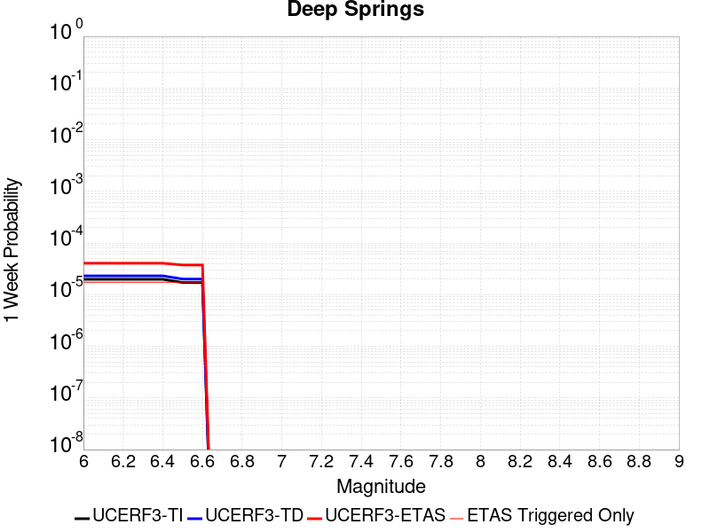 | 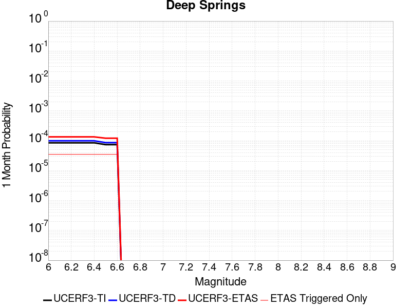 | 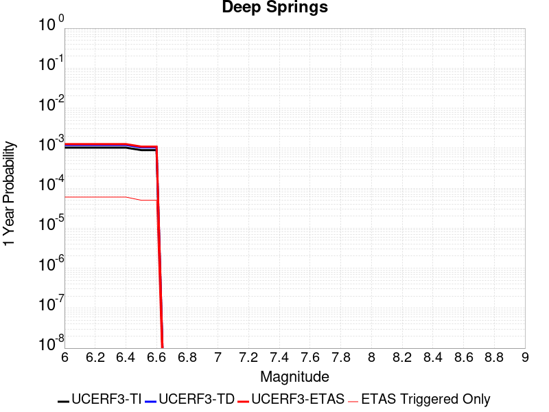 |  |

| Magnitude | 1 wk TI Prob | 1 wk TD Prob | 1 wk ETAS Prob | 1 wk ETAS/TD Gain | 1 wk ETAS Triggered Only | 1 mo TI Prob | 1 mo TD Prob | 1 mo ETAS Prob | 1 mo ETAS/TD Gain | 1 mo ETAS Triggered Only | 1 yr TI Prob | 1 yr TD Prob | 1 yr ETAS Prob | 1 yr ETAS/TD Gain | 1 yr ETAS Triggered Only | 10 yr TI Prob | 10 yr TD Prob | 10 yr ETAS Prob | 10 yr ETAS/TD Gain | 10 yr ETAS Triggered Only |
|-----|-----|-----|-----|-----|-----|-----|-----|-----|-----|-----|-----|-----|-----|-----|-----|-----|-----|-----|-----|-----|
| 6.0 | 1.9810619E-5 | 2.311252E-5 | 4.0555904E-5 | 1.7547158 | 1.7443788E-5 | 8.489989E-5 | 9.905276E-5 | 1.3393688E-4 | 1.3521771 | 3.4887576E-5 | 0.001033166 | 0.0012058079 | 0.0012406535 | 1.028898 | 3.4887576E-5 | 0.010283757 | 0.012042425 | 0.012076892 | 1.0028622 | 3.4887576E-5 |
| 6.1 | 1.9810619E-5 | 2.311252E-5 | 4.0555904E-5 | 1.7547158 | 1.7443788E-5 | 8.489989E-5 | 9.905276E-5 | 1.3393688E-4 | 1.3521771 | 3.4887576E-5 | 0.001033166 | 0.0012058079 | 0.0012406535 | 1.028898 | 3.4887576E-5 | 0.010283757 | 0.012042425 | 0.012076892 | 1.0028622 | 3.4887576E-5 |
| 6.2 | 1.9810619E-5 | 2.311252E-5 | 4.0555904E-5 | 1.7547158 | 1.7443788E-5 | 8.489989E-5 | 9.905276E-5 | 1.3393688E-4 | 1.3521771 | 3.4887576E-5 | 0.001033166 | 0.0012058079 | 0.0012406535 | 1.028898 | 3.4887576E-5 | 0.010283757 | 0.012042425 | 0.012076892 | 1.0028622 | 3.4887576E-5 |
| 6.3 | 1.9810619E-5 | 2.311252E-5 | 4.0555904E-5 | 1.7547158 | 1.7443788E-5 | 8.489989E-5 | 9.905276E-5 | 1.3393688E-4 | 1.3521771 | 3.4887576E-5 | 0.001033166 | 0.0012058079 | 0.0012406535 | 1.028898 | 3.4887576E-5 | 0.010283757 | 0.012042425 | 0.012076892 | 1.0028622 | 3.4887576E-5 |
| 6.4 | 1.9810619E-5 | 2.311252E-5 | 4.0555904E-5 | 1.7547158 | 1.7443788E-5 | 8.489989E-5 | 9.905276E-5 | 1.3393688E-4 | 1.3521771 | 3.4887576E-5 | 0.001033166 | 0.0012058079 | 0.0012406535 | 1.028898 | 3.4887576E-5 | 0.010283757 | 0.012042425 | 0.012076892 | 1.0028622 | 3.4887576E-5 |
| 6.5 | 1.7190405E-5 | 2.0050555E-5 | 3.7493992E-5 | 1.8699728 | 1.7443788E-5 | 7.367108E-5 | 8.593095E-5 | 1.2081553E-4 | 1.4059606 | 3.4887576E-5 | 8.9657627E-4 | 0.0010462094 | 0.0010810604 | 1.0333117 | 3.4887576E-5 | 0.008929676 | 0.010462056 | 0.010496579 | 1.0032998 | 3.4887576E-5 |
| 6.6 | 1.7190405E-5 | 2.0050555E-5 | 3.7493992E-5 | 1.8699728 | 1.7443788E-5 | 7.367108E-5 | 8.593095E-5 | 1.2081553E-4 | 1.4059606 | 3.4887576E-5 | 8.9657627E-4 | 0.0010462094 | 0.0010810604 | 1.0333117 | 3.4887576E-5 | 0.008929676 | 0.010462056 | 0.010496579 | 1.0032998 | 3.4887576E-5 |

## Cerro Prieto
*[(top)](#table-of-contents)*

| 1 Week | 1 Month | 1 Year | 10 Year |
|-----|-----|-----|-----|
| 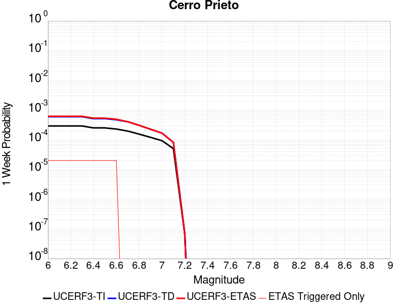 | 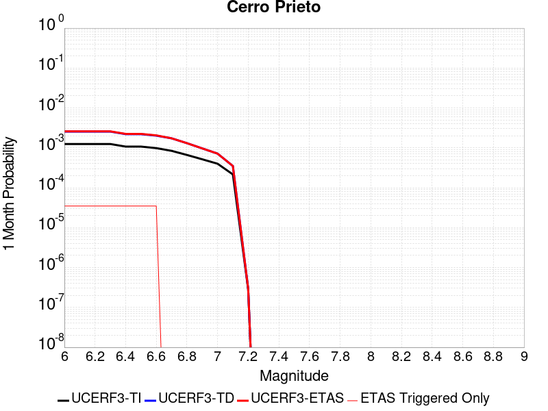 | 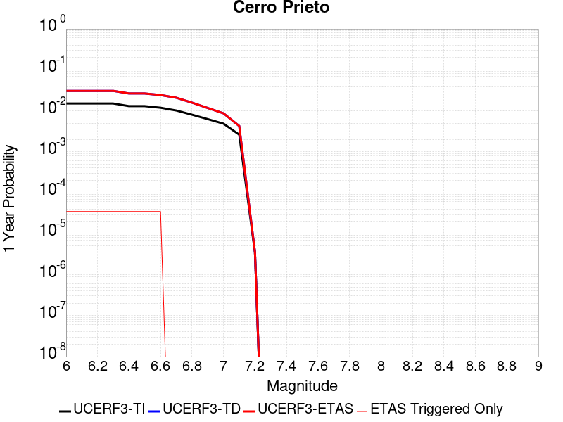 | 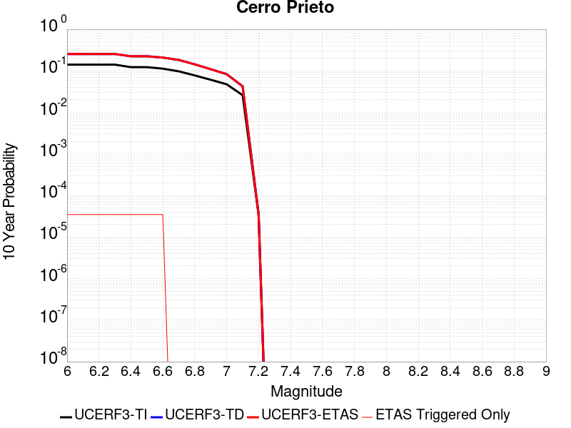 |

| Magnitude | 1 wk TI Prob | 1 wk TD Prob | 1 wk ETAS Prob | 1 wk ETAS/TD Gain | 1 wk ETAS Triggered Only | 1 mo TI Prob | 1 mo TD Prob | 1 mo ETAS Prob | 1 mo ETAS/TD Gain | 1 mo ETAS Triggered Only | 1 yr TI Prob | 1 yr TD Prob | 1 yr ETAS Prob | 1 yr ETAS/TD Gain | 1 yr ETAS Triggered Only | 10 yr TI Prob | 10 yr TD Prob | 10 yr ETAS Prob | 10 yr ETAS/TD Gain | 10 yr ETAS Triggered Only |
|-----|-----|-----|-----|-----|-----|-----|-----|-----|-----|-----|-----|-----|-----|-----|-----|-----|-----|-----|-----|-----|
| 6.0 | 2.9101528E-4 | 5.964804E-4 | 6.313471E-4 | 1.0584542 | 3.4887576E-5 | 0.0012466122 | 0.002554082 | 0.0025888807 | 1.0136247 | 3.4887576E-5 | 0.015072231 | 0.03064807 | 0.030681888 | 1.0011034 | 3.4887576E-5 | 0.14089979 | 0.25397858 | 0.2540046 | 1.0001025 | 3.4887576E-5 |
| 6.1 | 2.9101528E-4 | 5.964804E-4 | 6.313471E-4 | 1.0584542 | 3.4887576E-5 | 0.0012466122 | 0.002554082 | 0.0025888807 | 1.0136247 | 3.4887576E-5 | 0.015072231 | 0.03064807 | 0.030681888 | 1.0011034 | 3.4887576E-5 | 0.14089979 | 0.25397858 | 0.2540046 | 1.0001025 | 3.4887576E-5 |
| 6.2 | 2.9101528E-4 | 5.964804E-4 | 6.313471E-4 | 1.0584542 | 3.4887576E-5 | 0.0012466122 | 0.002554082 | 0.0025888807 | 1.0136247 | 3.4887576E-5 | 0.015072231 | 0.03064807 | 0.030681888 | 1.0011034 | 3.4887576E-5 | 0.14089979 | 0.25397858 | 0.2540046 | 1.0001025 | 3.4887576E-5 |
| 6.3 | 2.9101528E-4 | 5.964804E-4 | 6.313471E-4 | 1.0584542 | 3.4887576E-5 | 0.0012466122 | 0.002554082 | 0.0025888807 | 1.0136247 | 3.4887576E-5 | 0.015072231 | 0.03064807 | 0.030681888 | 1.0011034 | 3.4887576E-5 | 0.14089979 | 0.25397858 | 0.2540046 | 1.0001025 | 3.4887576E-5 |
| 6.4 | 2.508648E-4 | 5.1397446E-4 | 5.488441E-4 | 1.0678432 | 3.4887576E-5 | 0.0010746918 | 0.0022010866 | 0.0022358974 | 1.0158153 | 3.4887576E-5 | 0.013006088 | 0.026471792 | 0.026505755 | 1.001283 | 3.4887576E-5 | 0.12270685 | 0.22440416 | 0.22443122 | 1.0001205 | 3.4887576E-5 |
| 6.5 | 2.508648E-4 | 5.1397446E-4 | 5.488441E-4 | 1.0678432 | 3.4887576E-5 | 0.0010746918 | 0.0022010866 | 0.0022358974 | 1.0158153 | 3.4887576E-5 | 0.013006088 | 0.026471792 | 0.026505755 | 1.001283 | 3.4887576E-5 | 0.12270685 | 0.22440416 | 0.22443122 | 1.0001205 | 3.4887576E-5 |
| 6.6 | 2.294914E-4 | 4.7116808E-4 | 5.060392E-4 | 1.07401 | 3.4887576E-5 | 9.831638E-4 | 0.0020179166 | 0.0020527337 | 1.017254 | 3.4887576E-5 | 0.011904482 | 0.02429866 | 0.0243327 | 1.001401 | 3.4887576E-5 | 0.11286586 | 0.20858558 | 0.20861317 | 1.0001323 | 3.4887576E-5 |
| 6.7 | 1.9621674E-4 | 4.0419117E-4 | 4.0419117E-4 | 1.0 | 0.0 | 8.4065786E-4 | 0.0017312564 | 0.0017312564 | 1.0 | 0.0 | 0.010187071 | 0.020884845 | 0.020884845 | 1.0 | 0.0 | 0.09732539 | 0.18290249 | 0.18290249 | 1.0 | 0.0 |
| 6.8 | 1.5476145E-4 | 3.056516E-4 | 3.056516E-4 | 1.0 | 0.0 | 6.6309475E-4 | 0.00130938 | 0.00130938 | 1.0 | 0.0 | 0.008043335 | 0.015836509 | 0.015836509 | 1.0 | 0.0 | 0.07758363 | 0.14336355 | 0.14336355 | 1.0 | 0.0 |
| 6.9 | 1.20509176E-4 | 2.2582515E-4 | 2.2582515E-4 | 1.0 | 0.0 | 5.1636563E-4 | 9.6752634E-4 | 9.6752634E-4 | 1.0 | 0.0 | 0.006268645 | 0.011726342 | 0.011726342 | 1.0 | 0.0 | 0.060947374 | 0.109451205 | 0.109451205 | 1.0 | 0.0 |
| 7.0 | 9.3269155E-5 | 1.6716642E-4 | 1.6716642E-4 | 1.0 | 0.0 | 3.9966372E-4 | 7.162739E-4 | 7.162739E-4 | 1.0 | 0.0 | 0.0048550544 | 0.008693418 | 0.008693418 | 1.0 | 0.0 | 0.04750344 | 0.08315912 | 0.08315912 | 1.0 | 0.0 |
| 7.1 | 5.029709E-5 | 8.1718936E-5 | 8.1718936E-5 | 1.0 | 0.0 | 2.1554115E-4 | 3.5019626E-4 | 3.5019626E-4 | 1.0 | 0.0 | 0.0026210553 | 0.0042587193 | 0.0042587193 | 1.0 | 0.0 | 0.025903556 | 0.042365108 | 0.042365108 | 1.0 | 0.0 |
| 7.2 | 6.5445185E-8 | 6.814903E-8 | 6.814903E-8 | 1.0 | 0.0 | 2.8047933E-7 | 2.9206726E-7 | 2.9206726E-7 | 1.0 | 0.0 | 3.4148304E-6 | 3.555919E-6 | 3.555919E-6 | 1.0 | 0.0 | 3.414778E-5 | 3.5559187E-5 | 3.5559187E-5 | 1.0 | 0.0 |

## Cedar Mtn-Mahogany Mtn
*[(top)](#table-of-contents)*

| 1 Week | 1 Month | 1 Year | 10 Year |
|-----|-----|-----|-----|
| 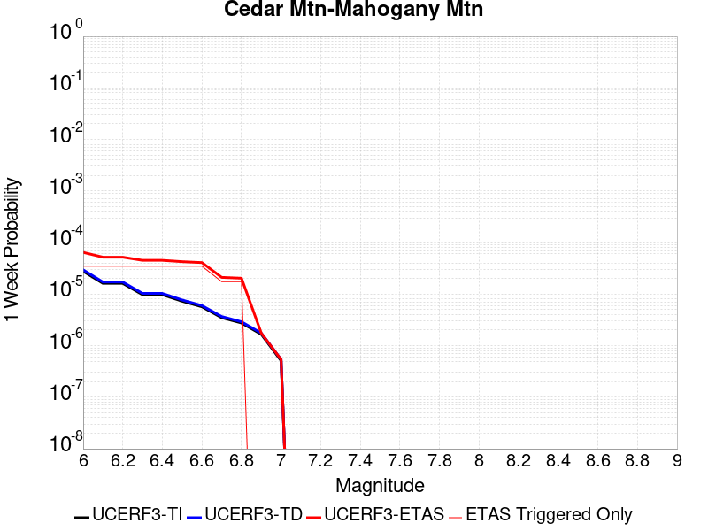 | 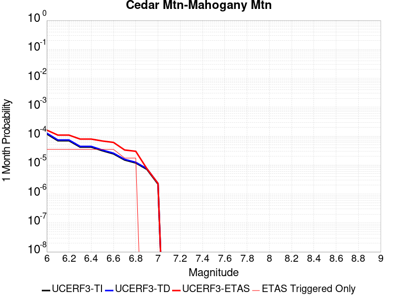 | 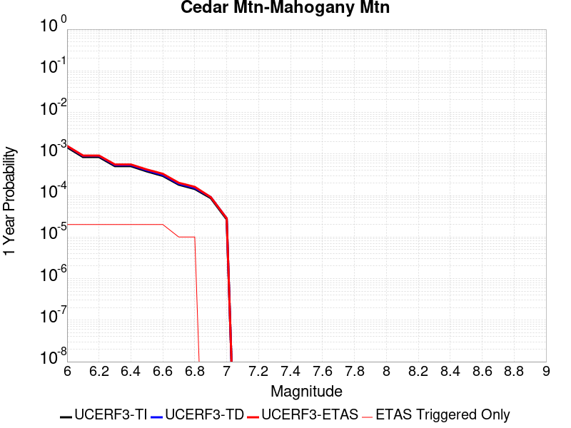 | 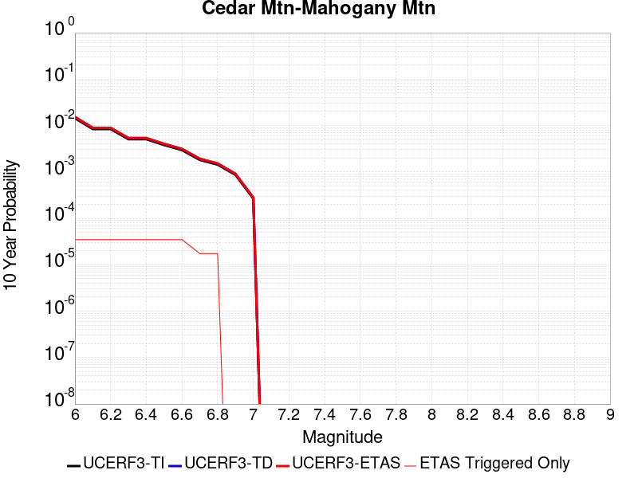 |

| Magnitude | 1 wk TI Prob | 1 wk TD Prob | 1 wk ETAS Prob | 1 wk ETAS/TD Gain | 1 wk ETAS Triggered Only | 1 mo TI Prob | 1 mo TD Prob | 1 mo ETAS Prob | 1 mo ETAS/TD Gain | 1 mo ETAS Triggered Only | 1 yr TI Prob | 1 yr TD Prob | 1 yr ETAS Prob | 1 yr ETAS/TD Gain | 1 yr ETAS Triggered Only | 10 yr TI Prob | 10 yr TD Prob | 10 yr ETAS Prob | 10 yr ETAS/TD Gain | 10 yr ETAS Triggered Only |
|-----|-----|-----|-----|-----|-----|-----|-----|-----|-----|-----|-----|-----|-----|-----|-----|-----|-----|-----|-----|-----|
| 6.0 | 2.7763876E-5 | 2.9588866E-5 | 6.447541E-5 | 2.1790428 | 3.4887576E-5 | 1.1898261E-4 | 1.2680366E-4 | 1.6168681E-4 | 1.2750958 | 3.4887576E-5 | 0.0014476506 | 0.0015428112 | 0.001577645 | 1.0225781 | 3.4887576E-5 | 0.0143825635 | 0.015328225 | 0.0153625775 | 1.0022411 | 3.4887576E-5 |
| 6.1 | 1.6162443E-5 | 1.7142966E-5 | 5.2029944E-5 | 3.035061 | 3.4887576E-5 | 6.926578E-5 | 7.346788E-5 | 1.083529E-4 | 1.4748335 | 3.4887576E-5 | 8.4298453E-4 | 8.941221E-4 | 9.289785E-4 | 1.038984 | 3.4887576E-5 | 0.008397939 | 0.008907059 | 0.0089416355 | 1.0038819 | 3.4887576E-5 |
| 6.2 | 1.6162443E-5 | 1.7142966E-5 | 5.2029944E-5 | 3.035061 | 3.4887576E-5 | 6.926578E-5 | 7.346788E-5 | 1.083529E-4 | 1.4748335 | 3.4887576E-5 | 8.4298453E-4 | 8.941221E-4 | 9.289785E-4 | 1.038984 | 3.4887576E-5 | 0.008397939 | 0.008907059 | 0.0089416355 | 1.0038819 | 3.4887576E-5 |
| 6.3 | 9.746053E-6 | 1.0303152E-5 | 4.519037E-5 | 4.386072 | 3.4887576E-5 | 4.1768133E-5 | 4.415564E-5 | 7.9041674E-5 | 1.7900697 | 3.4887576E-5 | 5.0840835E-4 | 5.3746643E-4 | 5.723352E-4 | 1.0648763 | 3.4887576E-5 | 0.0050724675 | 0.005362084 | 0.0053967847 | 1.0064715 | 3.4887576E-5 |
| 6.4 | 9.746053E-6 | 1.0303152E-5 | 4.519037E-5 | 4.386072 | 3.4887576E-5 | 4.1768133E-5 | 4.415564E-5 | 7.9041674E-5 | 1.7900697 | 3.4887576E-5 | 5.0840835E-4 | 5.3746643E-4 | 5.723352E-4 | 1.0648763 | 3.4887576E-5 | 0.0050724675 | 0.005362084 | 0.0053967847 | 1.0064715 | 3.4887576E-5 |
| 6.5 | 7.290083E-6 | 7.695325E-6 | 4.258263E-5 | 5.5335717 | 3.4887576E-5 | 3.124284E-5 | 3.297956E-5 | 6.786598E-5 | 2.0578196 | 3.4887576E-5 | 3.8031515E-4 | 4.014543E-4 | 4.363279E-4 | 1.086868 | 3.4887576E-5 | 0.0037966494 | 0.004007511 | 0.004042259 | 1.0086707 | 3.4887576E-5 |
| 6.6 | 5.67907E-6 | 5.9891527E-6 | 4.087652E-5 | 6.825092 | 3.4887576E-5 | 2.4338644E-5 | 2.5667552E-5 | 6.055423E-5 | 2.3591743 | 3.4887576E-5 | 2.962827E-4 | 3.12459E-4 | 3.4733568E-4 | 1.11162 | 3.4887576E-5 | 0.0029588798 | 0.003120333 | 0.0031551116 | 1.0111458 | 3.4887576E-5 |
| 6.7 | 3.4853963E-6 | 3.672631E-6 | 2.1116355E-5 | 5.749653 | 1.7443788E-5 | 1.4937327E-5 | 1.5739755E-5 | 3.3183267E-5 | 2.1082454 | 1.7443788E-5 | 1.8184677E-4 | 1.916153E-4 | 2.0905574E-4 | 1.091018 | 1.7443788E-5 | 0.0018169804 | 0.0019145629 | 0.0019319733 | 1.0090936 | 1.7443788E-5 |
| 6.8 | 2.7535168E-6 | 2.9015764E-6 | 2.0345313E-5 | 7.0118136 | 1.7443788E-5 | 1.1800733E-5 | 1.2435271E-5 | 2.9878842E-5 | 2.4027495 | 1.7443788E-5 | 1.4366445E-4 | 1.5138938E-4 | 1.6883052E-4 | 1.1152072 | 1.7443788E-5 | 0.0014357162 | 0.0015129098 | 0.0015303271 | 1.0115125 | 1.7443788E-5 |
| 6.9 | 1.6594106E-6 | 1.7496985E-6 | 1.7496985E-6 | 1.0 | 0.0 | 7.1117406E-6 | 7.4986883E-6 | 7.4986883E-6 | 1.0 | 0.0 | 8.6582E-5 | 9.129302E-5 | 9.129302E-5 | 1.0 | 0.0 | 8.654827E-4 | 9.125856E-4 | 9.125856E-4 | 1.0 | 0.0 |
| 7.0 | 5.10215E-7 | 5.389254E-7 | 5.389254E-7 | 1.0 | 0.0 | 2.186634E-6 | 2.3096788E-6 | 2.3096788E-6 | 1.0 | 0.0 | 2.6621943E-5 | 2.8120105E-5 | 2.8120105E-5 | 1.0 | 0.0 | 2.6618753E-4 | 2.81178E-4 | 2.81178E-4 | 1.0 | 0.0 |

## Palos Verdes
*[(top)](#table-of-contents)*

| 1 Week | 1 Month | 1 Year | 10 Year |
|-----|-----|-----|-----|
| 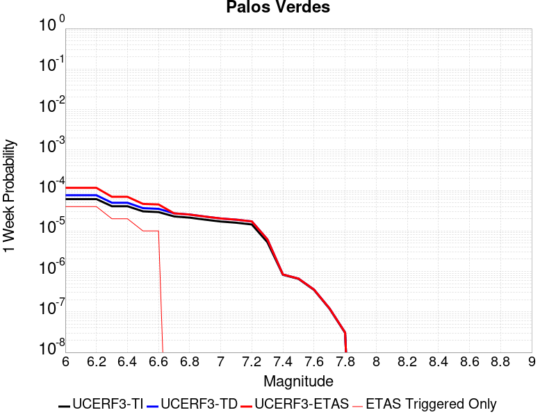 | 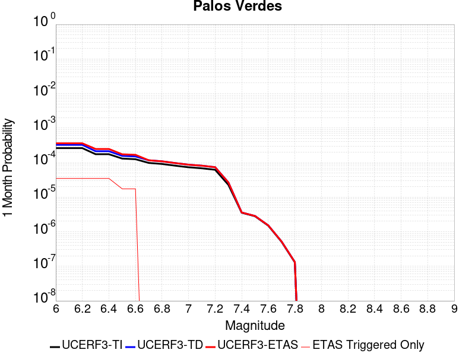 | 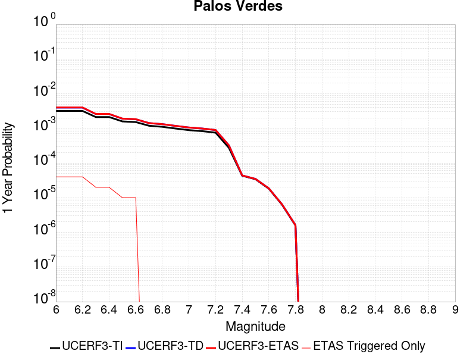 |  |

| Magnitude | 1 wk TI Prob | 1 wk TD Prob | 1 wk ETAS Prob | 1 wk ETAS/TD Gain | 1 wk ETAS Triggered Only | 1 mo TI Prob | 1 mo TD Prob | 1 mo ETAS Prob | 1 mo ETAS/TD Gain | 1 mo ETAS Triggered Only | 1 yr TI Prob | 1 yr TD Prob | 1 yr ETAS Prob | 1 yr ETAS/TD Gain | 1 yr ETAS Triggered Only | 10 yr TI Prob | 10 yr TD Prob | 10 yr ETAS Prob | 10 yr ETAS/TD Gain | 10 yr ETAS Triggered Only |
|-----|-----|-----|-----|-----|-----|-----|-----|-----|-----|-----|-----|-----|-----|-----|-----|-----|-----|-----|-----|-----|
| 6.0 | 6.126063E-5 | 7.622612E-5 | 1.1111103E-4 | 1.4576504 | 3.4887576E-5 | 2.6251914E-4 | 3.2664582E-4 | 3.61522E-4 | 1.1067706 | 3.4887576E-5 | 0.0031914865 | 0.003970174 | 0.004004923 | 1.0087526 | 3.4887576E-5 | 0.031460393 | 0.039048895 | 0.039082423 | 1.0008585 | 3.4887576E-5 |
| 6.1 | 6.126063E-5 | 7.622612E-5 | 1.1111103E-4 | 1.4576504 | 3.4887576E-5 | 2.6251914E-4 | 3.2664582E-4 | 3.61522E-4 | 1.1067706 | 3.4887576E-5 | 0.0031914865 | 0.003970174 | 0.004004923 | 1.0087526 | 3.4887576E-5 | 0.031460393 | 0.039048895 | 0.039082423 | 1.0008585 | 3.4887576E-5 |
| 6.2 | 6.126063E-5 | 7.622612E-5 | 1.1111103E-4 | 1.4576504 | 3.4887576E-5 | 2.6251914E-4 | 3.2664582E-4 | 3.61522E-4 | 1.1067706 | 3.4887576E-5 | 0.0031914865 | 0.003970174 | 0.004004923 | 1.0087526 | 3.4887576E-5 | 0.031460393 | 0.039048895 | 0.039082423 | 1.0008585 | 3.4887576E-5 |
| 6.3 | 4.0838047E-5 | 4.9749437E-5 | 8.463527E-5 | 1.7012309 | 3.4887576E-5 | 1.7500846E-4 | 2.1319572E-4 | 2.4807584E-4 | 1.1636062 | 3.4887576E-5 | 0.0021286458 | 0.0025927818 | 0.002627579 | 1.0134208 | 3.4887576E-5 | 0.021083709 | 0.025646681 | 0.025680674 | 1.0013254 | 3.4887576E-5 |
| 6.4 | 4.0838047E-5 | 4.9749437E-5 | 8.463527E-5 | 1.7012309 | 3.4887576E-5 | 1.7500846E-4 | 2.1319572E-4 | 2.4807584E-4 | 1.1636062 | 3.4887576E-5 | 0.0021286458 | 0.0025927818 | 0.002627579 | 1.0134208 | 3.4887576E-5 | 0.021083709 | 0.025646681 | 0.025680674 | 1.0013254 | 3.4887576E-5 |
| 6.5 | 3.0512005E-5 | 3.656162E-5 | 5.4004773E-5 | 1.477089 | 1.7443788E-5 | 1.3075917E-4 | 1.5668393E-4 | 1.7412499E-4 | 1.1113136 | 1.7443788E-5 | 0.0015908304 | 0.0019060767 | 0.0019234872 | 1.0091342 | 1.7443788E-5 | 0.015794903 | 0.018909154 | 0.018926268 | 1.000905 | 1.7443788E-5 |
| 6.6 | 2.9255087E-5 | 3.515442E-5 | 5.2597596E-5 | 1.4961872 | 1.7443788E-5 | 1.2537291E-4 | 1.5065377E-4 | 1.6809492E-4 | 1.1157699 | 1.7443788E-5 | 0.0015253464 | 0.0018327828 | 0.0018501946 | 1.0095003 | 1.7443788E-5 | 0.015149189 | 0.018188225 | 0.018205352 | 1.0009416 | 1.7443788E-5 |
| 6.7 | 2.287198E-5 | 2.7248278E-5 | 2.7248278E-5 | 1.0 | 0.0 | 9.801909E-5 | 1.16773626E-4 | 1.16773626E-4 | 1.0 | 0.0 | 0.001192729 | 0.0014208833 | 0.0014208833 | 1.0 | 0.0 | 0.011863477 | 0.014127217 | 0.014127217 | 1.0 | 0.0 |
| 6.8 | 2.1325764E-5 | 2.5431877E-5 | 2.5431877E-5 | 1.0 | 0.0 | 9.139293E-5 | 1.0898971E-4 | 1.0898971E-4 | 1.0 | 0.0 | 0.001112141 | 0.0013262323 | 0.0013262323 | 1.0 | 0.0 | 0.011065915 | 0.013192211 | 0.013192211 | 1.0 | 0.0 |
| 6.9 | 1.9009392E-5 | 2.2613547E-5 | 2.2613547E-5 | 1.0 | 0.0 | 8.1466285E-5 | 9.6912096E-5 | 9.6912096E-5 | 1.0 | 0.0 | 9.914007E-4 | 0.0011793535 | 0.0011793535 | 1.0 | 0.0 | 0.009869894 | 0.011739632 | 0.011739632 | 1.0 | 0.0 |
| 7.0 | 1.7098473E-5 | 2.0319356E-5 | 2.0319356E-5 | 1.0 | 0.0 | 7.3277115E-5 | 8.708052E-5 | 8.708052E-5 | 1.0 | 0.0 | 8.917837E-4 | 0.001059775 | 0.001059775 | 1.0 | 0.0 | 0.008882134 | 0.010555646 | 0.010555646 | 1.0 | 0.0 |
| 7.1 | 1.5982785E-5 | 1.899476E-5 | 1.899476E-5 | 1.0 | 0.0 | 6.849585E-5 | 8.1404054E-5 | 8.1404054E-5 | 1.0 | 0.0 | 8.336179E-4 | 9.907284E-4 | 9.907284E-4 | 1.0 | 0.0 | 0.008304977 | 0.009871479 | 0.009871479 | 1.0 | 0.0 |
| 7.2 | 1.4468002E-5 | 1.7197237E-5 | 1.7197237E-5 | 1.0 | 0.0 | 6.200425E-5 | 7.370083E-5 | 7.370083E-5 | 1.0 | 0.0 | 7.546402E-4 | 8.970222E-4 | 8.970222E-4 | 1.0 | 0.0 | 0.007520827 | 0.008942284 | 0.008942284 | 1.0 | 0.0 |
| 7.3 | 5.288233E-6 | 6.2036747E-6 | 6.2036747E-6 | 1.0 | 0.0 | 2.2663658E-5 | 2.6587102E-5 | 2.6587102E-5 | 1.0 | 0.0 | 2.7589512E-4 | 3.236848E-4 | 3.236848E-4 | 1.0 | 0.0 | 0.0027555283 | 0.0032355562 | 0.0032355562 | 1.0 | 0.0 |
| 7.4 | 8.279556E-7 | 8.408347E-7 | 8.408347E-7 | 1.0 | 0.0 | 3.5483763E-6 | 3.6035726E-6 | 3.6035726E-6 | 1.0 | 0.0 | 4.3200624E-5 | 4.3872686E-5 | 4.3872686E-5 | 1.0 | 0.0 | 4.3192226E-4 | 4.3864746E-4 | 4.3864746E-4 | 1.0 | 0.0 |
| 7.5 | 6.559831E-7 | 6.667229E-7 | 6.667229E-7 | 1.0 | 0.0 | 2.8113532E-6 | 2.857381E-6 | 2.857381E-6 | 1.0 | 0.0 | 3.4227687E-5 | 3.4788125E-5 | 3.4788125E-5 | 1.0 | 0.0 | 3.4222414E-4 | 3.4783344E-4 | 3.4783344E-4 | 1.0 | 0.0 |
| 7.6 | 3.5018968E-7 | 3.5620027E-7 | 3.5620027E-7 | 1.0 | 0.0 | 1.500812E-6 | 1.526572E-6 | 1.526572E-6 | 1.0 | 0.0 | 1.8272232E-5 | 1.8585903E-5 | 1.8585903E-5 | 1.0 | 0.0 | 1.8270731E-4 | 1.8584808E-4 | 1.8584808E-4 | 1.0 | 0.0 |
| 7.7 | 1.1986104E-7 | 1.2198376E-7 | 1.2198376E-7 | 1.0 | 0.0 | 5.1369005E-7 | 5.2278745E-7 | 5.2278745E-7 | 1.0 | 0.0 | 6.2541585E-6 | 6.364919E-6 | 6.364919E-6 | 1.0 | 0.0 | 6.2539824E-5 | 6.364741E-5 | 6.364741E-5 | 1.0 | 0.0 |
| 7.8 | 3.0445005E-8 | 3.1027582E-8 | 3.1027582E-8 | 1.0 | 0.0 | 1.3047858E-7 | 1.3297536E-7 | 1.3297536E-7 | 1.0 | 0.0 | 1.5885756E-6 | 1.6189739E-6 | 1.6189739E-6 | 1.0 | 0.0 | 1.5885644E-5 | 1.6189642E-5 | 1.6189642E-5 | 1.0 | 0.0 |

## Channel Islands Thrust
*[(top)](#table-of-contents)*

| 1 Week | 1 Month | 1 Year | 10 Year |
|-----|-----|-----|-----|
| 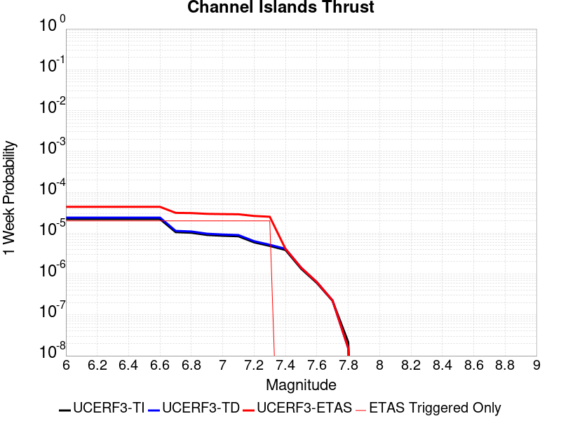 |  |  | 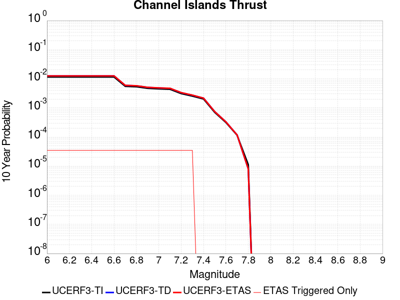 |

| Magnitude | 1 wk TI Prob | 1 wk TD Prob | 1 wk ETAS Prob | 1 wk ETAS/TD Gain | 1 wk ETAS Triggered Only | 1 mo TI Prob | 1 mo TD Prob | 1 mo ETAS Prob | 1 mo ETAS/TD Gain | 1 mo ETAS Triggered Only | 1 yr TI Prob | 1 yr TD Prob | 1 yr ETAS Prob | 1 yr ETAS/TD Gain | 1 yr ETAS Triggered Only | 10 yr TI Prob | 10 yr TD Prob | 10 yr ETAS Prob | 10 yr ETAS/TD Gain | 10 yr ETAS Triggered Only |
|-----|-----|-----|-----|-----|-----|-----|-----|-----|-----|-----|-----|-----|-----|-----|-----|-----|-----|-----|-----|-----|
| 6.0 | 2.2156251E-5 | 2.4092022E-5 | 5.8978756E-5 | 2.4480617 | 3.4887576E-5 | 9.495191E-5 | 1.03248036E-4 | 1.38132E-4 | 1.3378657 | 3.4887576E-5 | 0.0011554264 | 0.0012564264 | 0.0012912703 | 1.0277324 | 3.4887576E-5 | 0.011494373 | 0.0125038205 | 0.012538272 | 1.0027553 | 3.4887576E-5 |
| 6.1 | 2.2156251E-5 | 2.4092022E-5 | 5.8978756E-5 | 2.4480617 | 3.4887576E-5 | 9.495191E-5 | 1.03248036E-4 | 1.38132E-4 | 1.3378657 | 3.4887576E-5 | 0.0011554264 | 0.0012564264 | 0.0012912703 | 1.0277324 | 3.4887576E-5 | 0.011494373 | 0.0125038205 | 0.012538272 | 1.0027553 | 3.4887576E-5 |
| 6.2 | 2.2156251E-5 | 2.4092022E-5 | 5.8978756E-5 | 2.4480617 | 3.4887576E-5 | 9.495191E-5 | 1.03248036E-4 | 1.38132E-4 | 1.3378657 | 3.4887576E-5 | 0.0011554264 | 0.0012564264 | 0.0012912703 | 1.0277324 | 3.4887576E-5 | 0.011494373 | 0.0125038205 | 0.012538272 | 1.0027553 | 3.4887576E-5 |
| 6.3 | 2.2156251E-5 | 2.4092022E-5 | 5.8978756E-5 | 2.4480617 | 3.4887576E-5 | 9.495191E-5 | 1.03248036E-4 | 1.38132E-4 | 1.3378657 | 3.4887576E-5 | 0.0011554264 | 0.0012564264 | 0.0012912703 | 1.0277324 | 3.4887576E-5 | 0.011494373 | 0.0125038205 | 0.012538272 | 1.0027553 | 3.4887576E-5 |
| 6.4 | 2.2156251E-5 | 2.4092022E-5 | 5.8978756E-5 | 2.4480617 | 3.4887576E-5 | 9.495191E-5 | 1.03248036E-4 | 1.38132E-4 | 1.3378657 | 3.4887576E-5 | 0.0011554264 | 0.0012564264 | 0.0012912703 | 1.0277324 | 3.4887576E-5 | 0.011494373 | 0.0125038205 | 0.012538272 | 1.0027553 | 3.4887576E-5 |
| 6.5 | 2.2156251E-5 | 2.4092022E-5 | 5.8978756E-5 | 2.4480617 | 3.4887576E-5 | 9.495191E-5 | 1.03248036E-4 | 1.38132E-4 | 1.3378657 | 3.4887576E-5 | 0.0011554264 | 0.0012564264 | 0.0012912703 | 1.0277324 | 3.4887576E-5 | 0.011494373 | 0.0125038205 | 0.012538272 | 1.0027553 | 3.4887576E-5 |
| 6.6 | 2.2156251E-5 | 2.4092022E-5 | 5.8978756E-5 | 2.4480617 | 3.4887576E-5 | 9.495191E-5 | 1.03248036E-4 | 1.38132E-4 | 1.3378657 | 3.4887576E-5 | 0.0011554264 | 0.0012564264 | 0.0012912703 | 1.0277324 | 3.4887576E-5 | 0.011494373 | 0.0125038205 | 0.012538272 | 1.0027553 | 3.4887576E-5 |
| 6.7 | 1.0601296E-5 | 1.1379544E-5 | 4.6266723E-5 | 4.06578 | 3.4887576E-5 | 4.5433335E-5 | 4.876859E-5 | 8.3654464E-5 | 1.7153349 | 3.4887576E-5 | 5.5301044E-4 | 5.936007E-4 | 6.2846753E-4 | 1.0587379 | 3.4887576E-5 | 0.005516363 | 0.005920653 | 0.0059553343 | 1.0058576 | 3.4887576E-5 |
| 6.8 | 1.0246747E-5 | 1.0996669E-5 | 4.588386E-5 | 4.1725235 | 3.4887576E-5 | 4.391389E-5 | 4.7127756E-5 | 8.2013685E-5 | 1.7402418 | 3.4887576E-5 | 5.345204E-4 | 5.7363417E-4 | 6.085017E-4 | 1.0607836 | 3.4887576E-5 | 0.0053323656 | 0.005722025 | 0.0057567125 | 1.0060622 | 3.4887576E-5 |
| 6.9 | 9.049551E-6 | 9.699645E-6 | 4.458688E-5 | 4.596754 | 3.4887576E-5 | 3.878322E-5 | 4.1569267E-5 | 7.645539E-5 | 1.8392287 | 3.4887576E-5 | 4.7208337E-4 | 5.059924E-4 | 5.408623E-4 | 1.0689139 | 3.4887576E-5 | 0.0047108172 | 0.0050488203 | 0.0050835316 | 1.0068752 | 3.4887576E-5 |
| 7.0 | 8.6542195E-6 | 9.274603E-6 | 4.4161854E-5 | 4.7615895 | 3.4887576E-5 | 3.7088983E-5 | 3.9747716E-5 | 7.463391E-5 | 1.8776904 | 3.4887576E-5 | 4.5146482E-4 | 4.8382508E-4 | 5.1869574E-4 | 1.072073 | 3.4887576E-5 | 0.004505487 | 0.004828129 | 0.004862848 | 1.0071911 | 3.4887576E-5 |
| 7.1 | 8.391028E-6 | 8.992924E-6 | 4.3880187E-5 | 4.879412 | 3.4887576E-5 | 3.5961057E-5 | 3.854056E-5 | 7.342679E-5 | 1.9051822 | 3.4887576E-5 | 4.3773788E-4 | 4.6913436E-4 | 5.040056E-4 | 1.0743309 | 3.4887576E-5 | 0.004368766 | 0.0046818503 | 0.0047165747 | 1.0074167 | 3.4887576E-5 |
| 7.2 | 5.965188E-6 | 6.3716952E-6 | 4.125905E-5 | 6.475364 | 3.4887576E-5 | 2.556484E-5 | 2.7306982E-5 | 6.2193605E-5 | 2.2775714 | 3.4887576E-5 | 3.1120746E-4 | 3.3241234E-4 | 3.6728833E-4 | 1.1049178 | 3.4887576E-5 | 0.00310772 | 0.0033192092 | 0.003353981 | 1.0104759 | 3.4887576E-5 |
| 7.3 | 4.877518E-6 | 5.2060063E-6 | 4.00934E-5 | 7.701373 | 3.4887576E-5 | 2.0903482E-5 | 2.2311267E-5 | 5.7198064E-5 | 2.56364 | 3.4887576E-5 | 2.5447016E-4 | 2.716063E-4 | 3.0648438E-4 | 1.1284142 | 3.4887576E-5 | 0.0025417898 | 0.0027127895 | 0.0027475825 | 1.0128255 | 3.4887576E-5 |
| 7.4 | 3.8829853E-6 | 4.141863E-6 | 4.141863E-6 | 1.0 | 0.0 | 1.664126E-5 | 1.7750723E-5 | 1.7750723E-5 | 1.0 | 0.0 | 2.0258849E-4 | 2.1609402E-4 | 2.1609402E-4 | 1.0 | 0.0 | 0.002024039 | 0.0021588807 | 0.0021588807 | 1.0 | 0.0 |
| 7.5 | 1.3489616E-6 | 1.4277903E-6 | 1.4277903E-6 | 1.0 | 0.0 | 5.7812517E-6 | 6.119087E-6 | 6.119087E-6 | 1.0 | 0.0 | 7.038446E-5 | 7.449738E-5 | 7.449738E-5 | 1.0 | 0.0 | 7.036218E-4 | 7.44728E-4 | 7.44728E-4 | 1.0 | 0.0 |
| 7.6 | 6.058192E-7 | 6.353778E-7 | 6.353778E-7 | 1.0 | 0.0 | 2.5963652E-6 | 2.7230449E-6 | 2.7230449E-6 | 1.0 | 0.0 | 3.161029E-5 | 3.3152584E-5 | 3.3152584E-5 | 1.0 | 0.0 | 3.1605794E-4 | 3.31478E-4 | 3.31478E-4 | 1.0 | 0.0 |
| 7.7 | 2.2170494E-7 | 2.2607902E-7 | 2.2607902E-7 | 1.0 | 0.0 | 9.5016367E-7 | 9.689098E-7 | 9.689098E-7 | 1.0 | 0.0 | 1.1568181E-5 | 1.1796425E-5 | 1.1796425E-5 | 1.0 | 0.0 | 1.1567579E-4 | 1.1795909E-4 | 1.1795909E-4 | 1.0 | 0.0 |
| 7.8 | 2.1613102E-8 | 1.5466682E-8 | 1.5466682E-8 | 1.0 | 0.0 | 9.262757E-8 | 6.628578E-8 | 6.628578E-8 | 1.0 | 0.0 | 1.1277401E-6 | 8.070291E-7 | 8.070291E-7 | 1.0 | 0.0 | 1.1277344E-5 | 8.070269E-6 | 8.070269E-6 | 1.0 | 0.0 |

## Hector Mine
*[(top)](#table-of-contents)*

| 1 Week | 1 Month | 1 Year | 10 Year |
|-----|-----|-----|-----|
| 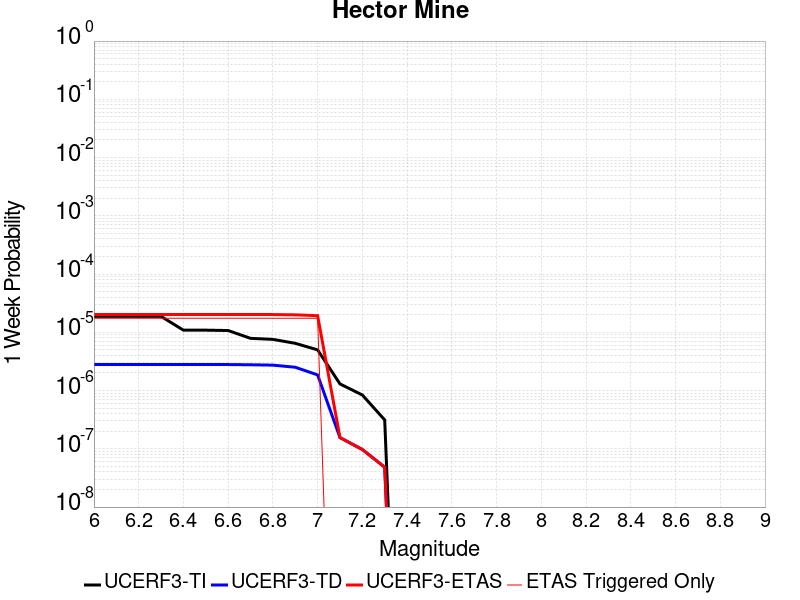 | 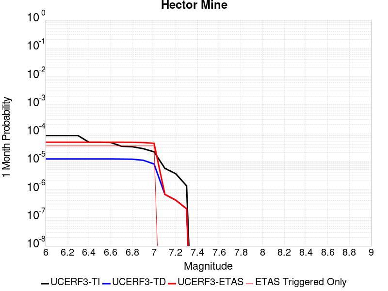 | 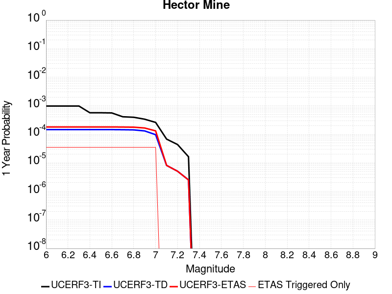 | 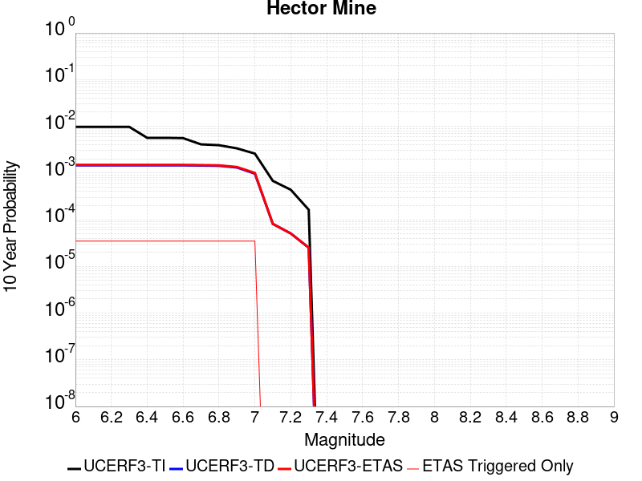 |

| Magnitude | 1 wk TI Prob | 1 wk TD Prob | 1 wk ETAS Prob | 1 wk ETAS/TD Gain | 1 wk ETAS Triggered Only | 1 mo TI Prob | 1 mo TD Prob | 1 mo ETAS Prob | 1 mo ETAS/TD Gain | 1 mo ETAS Triggered Only | 1 yr TI Prob | 1 yr TD Prob | 1 yr ETAS Prob | 1 yr ETAS/TD Gain | 1 yr ETAS Triggered Only | 10 yr TI Prob | 10 yr TD Prob | 10 yr ETAS Prob | 10 yr ETAS/TD Gain | 10 yr ETAS Triggered Only |
|-----|-----|-----|-----|-----|-----|-----|-----|-----|-----|-----|-----|-----|-----|-----|-----|-----|-----|-----|-----|-----|
| 6.0 | 1.8760093E-5 | 2.7963818E-6 | 2.024012E-5 | 7.2379675 | 1.7443788E-5 | 8.039792E-5 | 1.1984461E-5 | 4.6871617E-5 | 3.9110327 | 3.4887576E-5 | 9.78405E-4 | 1.4590504E-4 | 1.8078752E-4 | 1.2390766 | 3.4887576E-5 | 0.009741086 | 0.0014584847 | 0.0014933214 | 1.0238855 | 3.4887576E-5 |
| 6.1 | 1.8760093E-5 | 2.7963818E-6 | 2.024012E-5 | 7.2379675 | 1.7443788E-5 | 8.039792E-5 | 1.1984461E-5 | 4.6871617E-5 | 3.9110327 | 3.4887576E-5 | 9.78405E-4 | 1.4590504E-4 | 1.8078752E-4 | 1.2390766 | 3.4887576E-5 | 0.009741086 | 0.0014584847 | 0.0014933214 | 1.0238855 | 3.4887576E-5 |
| 6.2 | 1.8760093E-5 | 2.7963818E-6 | 2.024012E-5 | 7.2379675 | 1.7443788E-5 | 8.039792E-5 | 1.1984461E-5 | 4.6871617E-5 | 3.9110327 | 3.4887576E-5 | 9.78405E-4 | 1.4590504E-4 | 1.8078752E-4 | 1.2390766 | 3.4887576E-5 | 0.009741086 | 0.0014584847 | 0.0014933214 | 1.0238855 | 3.4887576E-5 |
| 6.3 | 1.8760093E-5 | 2.7963818E-6 | 2.024012E-5 | 7.2379675 | 1.7443788E-5 | 8.039792E-5 | 1.1984461E-5 | 4.6871617E-5 | 3.9110327 | 3.4887576E-5 | 9.78405E-4 | 1.4590504E-4 | 1.8078752E-4 | 1.2390766 | 3.4887576E-5 | 0.009741086 | 0.0014584847 | 0.0014933214 | 1.0238855 | 3.4887576E-5 |
| 6.4 | 1.0888055E-5 | 2.7963818E-6 | 2.024012E-5 | 7.2379675 | 1.7443788E-5 | 4.666226E-5 | 1.1984461E-5 | 4.6871617E-5 | 3.9110327 | 3.4887576E-5 | 5.679649E-4 | 1.4590504E-4 | 1.8078752E-4 | 1.2390766 | 3.4887576E-5 | 0.0056651547 | 0.0014584847 | 0.0014933214 | 1.0238855 | 3.4887576E-5 |
| 6.5 | 1.0888055E-5 | 2.7963818E-6 | 2.024012E-5 | 7.2379675 | 1.7443788E-5 | 4.666226E-5 | 1.1984461E-5 | 4.6871617E-5 | 3.9110327 | 3.4887576E-5 | 5.679649E-4 | 1.4590504E-4 | 1.8078752E-4 | 1.2390766 | 3.4887576E-5 | 0.0056651547 | 0.0014584847 | 0.0014933214 | 1.0238855 | 3.4887576E-5 |
| 6.6 | 1.0730738E-5 | 2.7963818E-6 | 2.024012E-5 | 7.2379675 | 1.7443788E-5 | 4.5988065E-5 | 1.1984461E-5 | 4.6871617E-5 | 3.9110327 | 3.4887576E-5 | 5.5976084E-4 | 1.4590504E-4 | 1.8078752E-4 | 1.2390766 | 3.4887576E-5 | 0.0055835294 | 0.0014584847 | 0.0014933214 | 1.0238855 | 3.4887576E-5 |
| 6.7 | 7.881326E-6 | 2.7710626E-6 | 2.0214802E-5 | 7.2949643 | 1.7443788E-5 | 3.3776672E-5 | 1.1875951E-5 | 4.676311E-5 | 3.9376311 | 3.4887576E-5 | 4.111534E-4 | 1.445841E-4 | 1.7946663E-4 | 1.2412611 | 3.4887576E-5 | 0.0041039353 | 0.0014452925 | 0.0014801295 | 1.0241039 | 3.4887576E-5 |
| 6.8 | 7.5683483E-6 | 2.7328138E-6 | 2.0176554E-5 | 7.3830695 | 1.7443788E-5 | 3.2435375E-5 | 1.1712029E-5 | 4.6599194E-5 | 3.9787467 | 3.4887576E-5 | 3.9482914E-4 | 1.4258861E-4 | 1.7747121E-4 | 1.2446381 | 3.4887576E-5 | 0.0039412836 | 0.0014253634 | 0.0014602011 | 1.0244414 | 3.4887576E-5 |
| 6.9 | 6.473048E-6 | 2.5138945E-6 | 1.9957639E-5 | 7.938932 | 1.7443788E-5 | 2.7741338E-5 | 1.07738115E-5 | 4.566101E-5 | 4.238148 | 3.4887576E-5 | 3.3769844E-4 | 1.3116724E-4 | 1.6605023E-4 | 1.2659429 | 3.4887576E-5 | 0.0033718573 | 0.0013112876 | 0.0013461295 | 1.0265707 | 3.4887576E-5 |
| 7.0 | 4.9959954E-6 | 1.8565124E-6 | 1.9300267E-5 | 10.395981 | 1.7443788E-5 | 2.1411232E-5 | 7.956478E-6 | 4.2843774E-5 | 5.3847666 | 3.4887576E-5 | 2.6065056E-4 | 9.686937E-5 | 1.3175356E-4 | 1.3601159 | 3.4887576E-5 | 0.0026034506 | 9.6862105E-4 | 0.0010034748 | 1.0359828 | 3.4887576E-5 |
| 7.1 | 1.2997541E-6 | 1.5602147E-7 | 1.5602147E-7 | 1.0 | 0.0 | 5.5703626E-6 | 6.686633E-7 | 6.686633E-7 | 1.0 | 0.0 | 6.7817055E-5 | 8.140949E-6 | 8.140949E-6 | 1.0 | 0.0 | 6.779636E-4 | 8.1406906E-5 | 8.1406906E-5 | 1.0 | 0.0 |
| 7.2 | 8.392699E-7 | 9.727592E-8 | 9.727592E-8 | 1.0 | 0.0 | 3.596866E-6 | 4.1689677E-7 | 4.1689677E-7 | 1.0 | 0.0 | 4.3790962E-5 | 5.0757085E-6 | 5.0757085E-6 | 1.0 | 0.0 | 4.3782333E-4 | 5.0756116E-5 | 5.0756116E-5 | 1.0 | 0.0 |
| 7.3 | 3.13015E-7 | 4.829262E-8 | 4.829262E-8 | 1.0 | 0.0 | 1.3414921E-6 | 2.0696835E-7 | 2.0696835E-7 | 1.0 | 0.0 | 1.6332544E-5 | 2.5198376E-6 | 2.5198376E-6 | 1.0 | 0.0 | 1.6331344E-4 | 2.5198176E-5 | 2.5198176E-5 | 1.0 | 0.0 |

## San Andreas (Peninsula) 2011 CFM
*[(top)](#table-of-contents)*

| 1 Week | 1 Month | 1 Year | 10 Year |
|-----|-----|-----|-----|
| 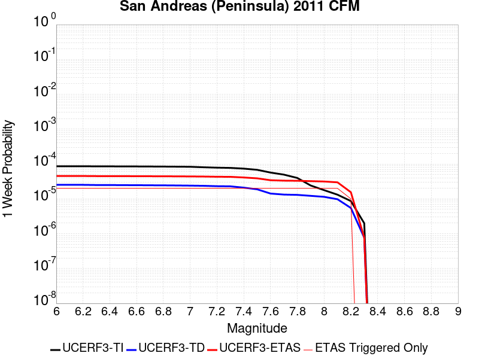 | 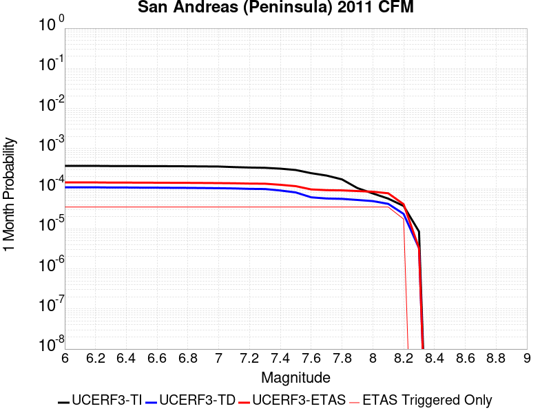 | 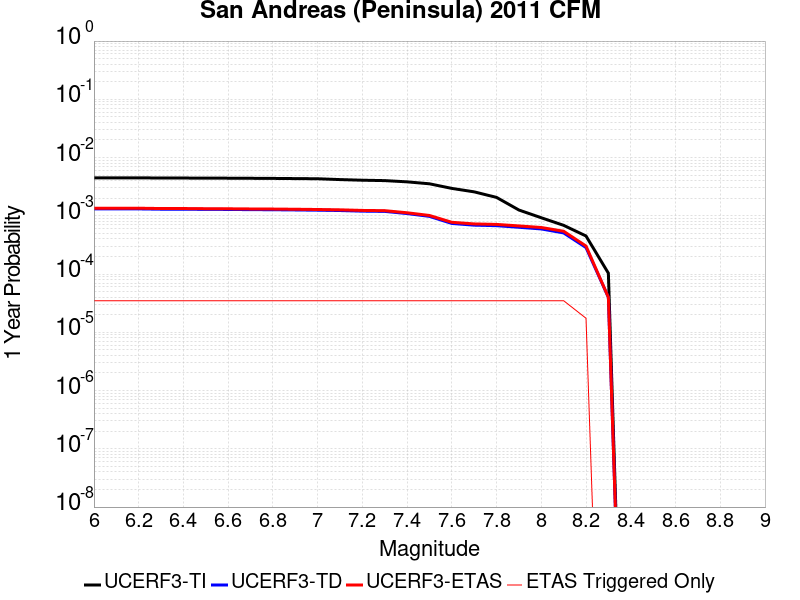 | 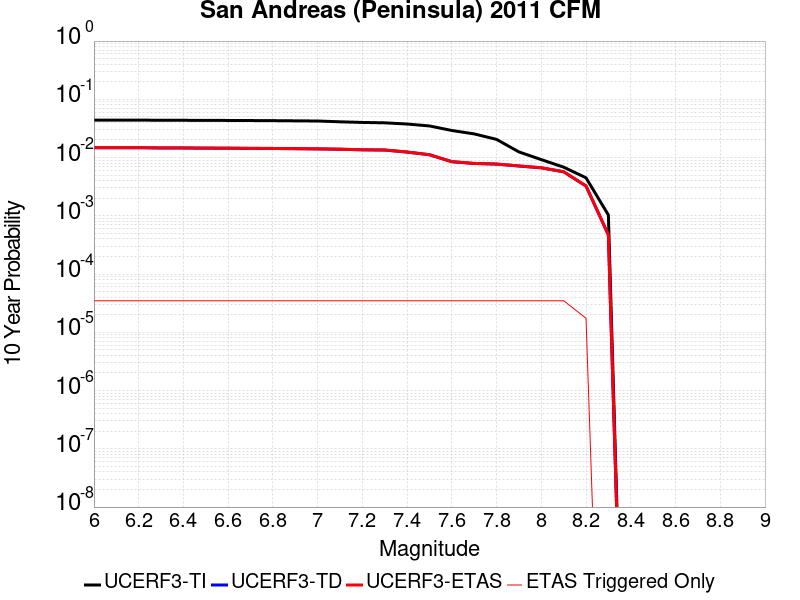 |

| Magnitude | 1 wk TI Prob | 1 wk TD Prob | 1 wk ETAS Prob | 1 wk ETAS/TD Gain | 1 wk ETAS Triggered Only | 1 mo TI Prob | 1 mo TD Prob | 1 mo ETAS Prob | 1 mo ETAS/TD Gain | 1 mo ETAS Triggered Only | 1 yr TI Prob | 1 yr TD Prob | 1 yr ETAS Prob | 1 yr ETAS/TD Gain | 1 yr ETAS Triggered Only | 10 yr TI Prob | 10 yr TD Prob | 10 yr ETAS Prob | 10 yr ETAS/TD Gain | 10 yr ETAS Triggered Only |
|-----|-----|-----|-----|-----|-----|-----|-----|-----|-----|-----|-----|-----|-----|-----|-----|-----|-----|-----|-----|-----|
| 6.0 | 8.6200685E-5 | 2.52136E-5 | 6.0100294E-5 | 2.383646 | 3.4887576E-5 | 3.6937918E-4 | 1.0805382E-4 | 1.4293763E-4 | 1.3228374 | 3.4887576E-5 | 0.0044879215 | 0.001314763 | 0.0013496047 | 1.0265003 | 3.4887576E-5 | 0.043983612 | 0.014774441 | 0.014808813 | 1.0023265 | 3.4887576E-5 |
| 6.1 | 8.6200685E-5 | 2.52136E-5 | 6.0100294E-5 | 2.383646 | 3.4887576E-5 | 3.6937918E-4 | 1.0805382E-4 | 1.4293763E-4 | 1.3228374 | 3.4887576E-5 | 0.0044879215 | 0.001314763 | 0.0013496047 | 1.0265003 | 3.4887576E-5 | 0.043983612 | 0.014774441 | 0.014808813 | 1.0023265 | 3.4887576E-5 |
| 6.2 | 8.6200685E-5 | 2.52136E-5 | 6.0100294E-5 | 2.383646 | 3.4887576E-5 | 3.6937918E-4 | 1.0805382E-4 | 1.4293763E-4 | 1.3228374 | 3.4887576E-5 | 0.0044879215 | 0.001314763 | 0.0013496047 | 1.0265003 | 3.4887576E-5 | 0.043983612 | 0.014774441 | 0.014808813 | 1.0023265 | 3.4887576E-5 |
| 6.3 | 8.551163E-5 | 2.490552E-5 | 5.9792226E-5 | 2.400762 | 3.4887576E-5 | 3.6642692E-4 | 1.06733576E-4 | 1.4161743E-4 | 1.3268311 | 3.4887576E-5 | 0.004452125 | 0.0012987083 | 0.0013335506 | 1.0268284 | 3.4887576E-5 | 0.043639794 | 0.014601416 | 0.014635794 | 1.0023544 | 3.4887576E-5 |
| 6.4 | 8.551163E-5 | 2.490552E-5 | 5.9792226E-5 | 2.400762 | 3.4887576E-5 | 3.6642692E-4 | 1.06733576E-4 | 1.4161743E-4 | 1.3268311 | 3.4887576E-5 | 0.004452125 | 0.0012987083 | 0.0013335506 | 1.0268284 | 3.4887576E-5 | 0.043639794 | 0.014601416 | 0.014635794 | 1.0023544 | 3.4887576E-5 |
| 6.5 | 8.511146E-5 | 2.4726973E-5 | 5.9613685E-5 | 2.4108768 | 3.4887576E-5 | 3.647124E-4 | 1.05968444E-4 | 1.4085232E-4 | 1.3291912 | 3.4887576E-5 | 0.004431336 | 0.0012894038 | 0.0013242464 | 1.0270222 | 3.4887576E-5 | 0.04344007 | 0.0145011945 | 0.014535576 | 1.002371 | 3.4887576E-5 |
| 6.6 | 8.4985084E-5 | 2.4657606E-5 | 5.954432E-5 | 2.414846 | 3.4887576E-5 | 3.6417096E-4 | 1.05671184E-4 | 1.4055507E-4 | 1.3301173 | 3.4887576E-5 | 0.0044247704 | 0.001285789 | 0.0013206317 | 1.0270983 | 3.4887576E-5 | 0.043376986 | 0.014463263 | 0.014497645 | 1.0023773 | 3.4887576E-5 |
| 6.7 | 8.462618E-5 | 2.4486113E-5 | 5.9372833E-5 | 2.4247553 | 3.4887576E-5 | 3.6263323E-4 | 1.0493627E-4 | 1.3982019E-4 | 1.3324295 | 3.4887576E-5 | 0.004406125 | 0.0012768519 | 0.001311695 | 1.0272882 | 3.4887576E-5 | 0.043197807 | 0.01436807 | 0.014402457 | 1.0023932 | 3.4887576E-5 |
| 6.8 | 8.42337E-5 | 2.438192E-5 | 5.9268645E-5 | 2.430844 | 3.4887576E-5 | 3.6095164E-4 | 1.04489765E-4 | 1.3937369E-4 | 1.3338501 | 3.4887576E-5 | 0.004385734 | 0.0012714221 | 0.0013062654 | 1.0274049 | 3.4887576E-5 | 0.043001823 | 0.014308756 | 0.014343144 | 1.0024033 | 3.4887576E-5 |
| 6.9 | 8.365989E-5 | 2.4186513E-5 | 5.9073245E-5 | 2.4424043 | 3.4887576E-5 | 3.5849313E-4 | 1.03652375E-4 | 1.3853633E-4 | 1.3365476 | 3.4887576E-5 | 0.004355922 | 0.0012612387 | 0.0012960823 | 1.0276265 | 3.4887576E-5 | 0.04271523 | 0.014201242 | 0.014235633 | 1.0024217 | 3.4887576E-5 |
| 7.0 | 8.30936E-5 | 2.3948E-5 | 5.883474E-5 | 2.4567704 | 3.4887576E-5 | 3.560668E-4 | 1.02630256E-4 | 1.3751425E-4 | 1.3398997 | 3.4887576E-5 | 0.004326499 | 0.0012488087 | 0.0012836527 | 1.0279018 | 3.4887576E-5 | 0.042432297 | 0.014072227 | 0.014106624 | 1.0024443 | 3.4887576E-5 |
| 7.1 | 8.041264E-5 | 2.3634402E-5 | 5.8521153E-5 | 2.4761004 | 3.4887576E-5 | 3.4458007E-4 | 1.0128637E-4 | 1.3617042E-4 | 1.3444101 | 3.4887576E-5 | 0.0041871946 | 0.0012324656 | 0.0012673101 | 1.0282723 | 3.4887576E-5 | 0.041091725 | 0.013895032 | 0.013929435 | 1.0024759 | 3.4887576E-5 |
| 7.2 | 7.8427016E-5 | 2.3058019E-5 | 5.7944788E-5 | 2.5129995 | 3.4887576E-5 | 3.3607247E-4 | 9.8816345E-5 | 1.3370047E-4 | 1.3530198 | 3.4887576E-5 | 0.004084008 | 0.0012024266 | 0.0012372722 | 1.0289794 | 3.4887576E-5 | 0.040097635 | 0.013579085 | 0.013613498 | 1.0025343 | 3.4887576E-5 |
| 7.3 | 7.721087E-5 | 2.2842805E-5 | 5.7729583E-5 | 2.5272546 | 3.4887576E-5 | 3.3086175E-4 | 9.7894066E-5 | 1.3277822E-4 | 1.356346 | 3.4887576E-5 | 0.004020803 | 0.0011912102 | 0.0012260563 | 1.0292526 | 3.4887576E-5 | 0.03948827 | 0.013462781 | 0.013497199 | 1.0025566 | 3.4887576E-5 |
| 7.4 | 7.3536525E-5 | 2.0960428E-5 | 5.584727E-5 | 2.6644146 | 3.4887576E-5 | 3.1511846E-4 | 8.982732E-5 | 1.2471176E-4 | 1.38835 | 3.4887576E-5 | 0.0038298194 | 0.0010931002 | 0.0011279497 | 1.0318813 | 3.4887576E-5 | 0.037644852 | 0.012419564 | 0.012454018 | 1.0027742 | 3.4887576E-5 |
| 7.5 | 6.806207E-5 | 1.876674E-5 | 5.365366E-5 | 2.8589761 | 3.4887576E-5 | 2.9166197E-4 | 8.042641E-5 | 1.1531118E-4 | 1.4337476 | 3.4887576E-5 | 0.0035452035 | 9.787527E-4 | 0.0010136062 | 1.0356101 | 3.4887576E-5 | 0.034891766 | 0.01117254 | 0.011207037 | 1.0030878 | 3.4887576E-5 |
| 7.6 | 5.6731416E-5 | 1.4177827E-5 | 4.9064907E-5 | 3.4606788 | 3.4887576E-5 | 2.43112E-4 | 6.07607E-5 | 9.564616E-5 | 1.5741451 | 3.4887576E-5 | 0.0029558712 | 7.395106E-4 | 7.7437237E-4 | 1.0471417 | 3.4887576E-5 | 0.02916862 | 0.008485565 | 0.008520156 | 1.0040765 | 3.4887576E-5 |
| 7.7 | 4.946994E-5 | 1.3246218E-5 | 4.813333E-5 | 3.6337414 | 3.4887576E-5 | 2.1199681E-4 | 5.6768273E-5 | 9.165386E-5 | 1.6145263 | 3.4887576E-5 | 0.002578006 | 6.9093466E-4 | 7.2579813E-4 | 1.0504584 | 3.4887576E-5 | 0.02548303 | 0.0079078935 | 0.007942505 | 1.0043769 | 3.4887576E-5 |
| 7.8 | 3.9718198E-5 | 1.2982541E-5 | 4.7869664E-5 | 3.6872337 | 3.4887576E-5 | 1.7020974E-4 | 5.5638273E-5 | 9.052391E-5 | 1.6270078 | 3.4887576E-5 | 0.0020703338 | 6.771856E-4 | 7.1204954E-4 | 1.0514836 | 3.4887576E-5 | 0.020511515 | 0.0077184658 | 0.0077530844 | 1.0044851 | 3.4887576E-5 |
| 7.9 | 2.4115114E-5 | 1.218559E-5 | 4.707274E-5 | 3.862984 | 3.4887576E-5 | 1.0334639E-4 | 5.2222913E-5 | 8.710867E-5 | 1.6680162 | 3.4887576E-5 | 0.001257516 | 6.3562865E-4 | 6.7049405E-4 | 1.0548519 | 3.4887576E-5 | 0.012504238 | 0.007159044 | 0.007193682 | 1.0048383 | 3.4887576E-5 |
| 8.0 | 1.7756569E-5 | 1.1410005E-5 | 4.629718E-5 | 4.0575953 | 3.4887576E-5 | 7.6097356E-5 | 4.8899106E-5 | 8.378497E-5 | 1.7134255 | 3.4887576E-5 | 9.260915E-4 | 5.951841E-4 | 6.300509E-4 | 1.0585816 | 3.4887576E-5 | 0.009222416 | 0.006659493 | 0.0066941483 | 1.0052038 | 3.4887576E-5 |
| 8.1 | 1.3159258E-5 | 9.746194E-6 | 4.463343E-5 | 4.579575 | 3.4887576E-5 | 5.6395602E-5 | 4.1768737E-5 | 7.6654855E-5 | 1.8352208 | 3.4887576E-5 | 6.864001E-4 | 5.0841586E-4 | 5.432857E-4 | 1.0685853 | 3.4887576E-5 | 0.0068428386 | 0.005689538 | 0.005724227 | 1.006097 | 3.4887576E-5 |
| 8.2 | 8.635426E-6 | 5.466912E-6 | 2.2910604E-5 | 4.190776 | 1.7443788E-5 | 3.700844E-5 | 2.3429413E-5 | 4.087279E-5 | 1.7445077 | 1.7443788E-5 | 4.5048463E-4 | 2.8521585E-4 | 3.0265466E-4 | 1.0611426 | 1.7443788E-5 | 0.004495725 | 0.0032445018 | 0.0032618889 | 1.0053589 | 1.7443788E-5 |
| 8.3 | 1.983087E-6 | 7.6599065E-7 | 7.6599065E-7 | 1.0 | 0.0 | 8.498917E-6 | 3.282813E-6 | 3.282813E-6 | 1.0 | 0.0 | 1.034694E-4 | 3.9967534E-5 | 3.9967534E-5 | 1.0 | 0.0 | 0.0010342124 | 4.719687E-4 | 4.719687E-4 | 1.0 | 0.0 |

## Elysian Park (Upper)
*[(top)](#table-of-contents)*

| 1 Week | 1 Month | 1 Year | 10 Year |
|-----|-----|-----|-----|
|  |  |  |  |

| Magnitude | 1 wk TI Prob | 1 wk TD Prob | 1 wk ETAS Prob | 1 wk ETAS/TD Gain | 1 wk ETAS Triggered Only | 1 mo TI Prob | 1 mo TD Prob | 1 mo ETAS Prob | 1 mo ETAS/TD Gain | 1 mo ETAS Triggered Only | 1 yr TI Prob | 1 yr TD Prob | 1 yr ETAS Prob | 1 yr ETAS/TD Gain | 1 yr ETAS Triggered Only | 10 yr TI Prob | 10 yr TD Prob | 10 yr ETAS Prob | 10 yr ETAS/TD Gain | 10 yr ETAS Triggered Only |
|-----|-----|-----|-----|-----|-----|-----|-----|-----|-----|-----|-----|-----|-----|-----|-----|-----|-----|-----|-----|-----|
| 6.0 | 3.1876025E-5 | 3.7035516E-5 | 5.4478656E-5 | 1.4709842 | 1.7443788E-5 | 1.3660437E-4 | 1.587167E-4 | 1.7615773E-4 | 1.1098877 | 1.7443788E-5 | 0.0016618895 | 0.0019311075 | 0.0019659277 | 1.0180312 | 3.4887576E-5 | 0.016495159 | 0.019189782 | 0.019224001 | 1.0017831 | 3.4887576E-5 |
| 6.1 | 3.1876025E-5 | 3.7035516E-5 | 5.4478656E-5 | 1.4709842 | 1.7443788E-5 | 1.3660437E-4 | 1.587167E-4 | 1.7615773E-4 | 1.1098877 | 1.7443788E-5 | 0.0016618895 | 0.0019311075 | 0.0019659277 | 1.0180312 | 3.4887576E-5 | 0.016495159 | 0.019189782 | 0.019224001 | 1.0017831 | 3.4887576E-5 |
| 6.2 | 3.1876025E-5 | 3.7035516E-5 | 5.4478656E-5 | 1.4709842 | 1.7443788E-5 | 1.3660437E-4 | 1.587167E-4 | 1.7615773E-4 | 1.1098877 | 1.7443788E-5 | 0.0016618895 | 0.0019311075 | 0.0019659277 | 1.0180312 | 3.4887576E-5 | 0.016495159 | 0.019189782 | 0.019224001 | 1.0017831 | 3.4887576E-5 |
| 6.3 | 3.1876025E-5 | 3.7035516E-5 | 5.4478656E-5 | 1.4709842 | 1.7443788E-5 | 1.3660437E-4 | 1.587167E-4 | 1.7615773E-4 | 1.1098877 | 1.7443788E-5 | 0.0016618895 | 0.0019311075 | 0.0019659277 | 1.0180312 | 3.4887576E-5 | 0.016495159 | 0.019189782 | 0.019224001 | 1.0017831 | 3.4887576E-5 |
| 6.4 | 1.9273462E-5 | 2.1202266E-5 | 3.864568E-5 | 1.8227148 | 1.7443788E-5 | 8.259794E-5 | 9.086466E-5 | 1.08306864E-4 | 1.1919581 | 1.7443788E-5 | 0.001005166 | 0.0011058892 | 0.0011233138 | 1.0157561 | 1.7443788E-5 | 0.010006315 | 0.011020724 | 0.011037976 | 1.0015653 | 1.7443788E-5 |
| 6.5 | 1.9273462E-5 | 2.1202266E-5 | 3.864568E-5 | 1.8227148 | 1.7443788E-5 | 8.259794E-5 | 9.086466E-5 | 1.08306864E-4 | 1.1919581 | 1.7443788E-5 | 0.001005166 | 0.0011058892 | 0.0011233138 | 1.0157561 | 1.7443788E-5 | 0.010006315 | 0.011020724 | 0.011037976 | 1.0015653 | 1.7443788E-5 |
| 6.6 | 9.813258E-6 | 9.665599E-6 | 9.665599E-6 | 1.0 | 0.0 | 4.205614E-5 | 4.1423376E-5 | 4.1423376E-5 | 1.0 | 0.0 | 5.119132E-4 | 5.0422014E-4 | 5.0422014E-4 | 1.0 | 0.0 | 0.005107356 | 0.0050314846 | 0.0050314846 | 1.0 | 0.0 |
| 6.7 | 9.801478E-6 | 9.653168E-6 | 9.653168E-6 | 1.0 | 0.0 | 4.2005657E-5 | 4.1370105E-5 | 4.1370105E-5 | 1.0 | 0.0 | 5.112989E-4 | 5.035719E-4 | 5.035719E-4 | 1.0 | 0.0 | 0.0051012407 | 0.0050250315 | 0.0050250315 | 1.0 | 0.0 |
| 6.8 | 8.102489E-6 | 7.773004E-6 | 7.773004E-6 | 1.0 | 0.0 | 3.4724493E-5 | 3.3312477E-5 | 3.3312477E-5 | 1.0 | 0.0 | 4.2268867E-4 | 4.055089E-4 | 4.055089E-4 | 1.0 | 0.0 | 0.004218856 | 0.0040481836 | 0.0040481836 | 1.0 | 0.0 |
| 6.9 | 6.08275E-6 | 5.4814514E-6 | 5.4814514E-6 | 1.0 | 0.0 | 2.6068668E-5 | 2.3491726E-5 | 2.3491726E-5 | 1.0 | 0.0 | 3.173398E-4 | 2.85975E-4 | 2.85975E-4 | 1.0 | 0.0 | 0.0031688702 | 0.0028561477 | 0.0028561477 | 1.0 | 0.0 |
| 7.0 | 5.5995934E-6 | 4.98278E-6 | 4.98278E-6 | 1.0 | 0.0 | 2.3998036E-5 | 2.13546E-5 | 2.13546E-5 | 1.0 | 0.0 | 2.9213692E-4 | 2.599619E-4 | 2.599619E-4 | 1.0 | 0.0 | 0.0029175316 | 0.0025966454 | 0.0025966454 | 1.0 | 0.0 |
| 7.1 | 4.709881E-6 | 4.0874015E-6 | 4.0874015E-6 | 1.0 | 0.0 | 2.0185047E-5 | 1.7517319E-5 | 1.7517319E-5 | 1.0 | 0.0 | 2.4572524E-4 | 2.132529E-4 | 2.132529E-4 | 1.0 | 0.0 | 0.002454537 | 0.002130524 | 0.002130524 | 1.0 | 0.0 |
| 7.2 | 3.6063436E-6 | 2.9779544E-6 | 2.9779544E-6 | 1.0 | 0.0 | 1.5455667E-5 | 1.27626E-5 | 1.27626E-5 | 1.0 | 0.0 | 1.881565E-4 | 1.5537368E-4 | 1.5537368E-4 | 1.0 | 0.0 | 0.0018799726 | 0.0015526618 | 0.0015526618 | 1.0 | 0.0 |
| 7.3 | 2.471135E-6 | 2.0954615E-6 | 2.0954615E-6 | 1.0 | 0.0 | 1.0590536E-5 | 8.980519E-6 | 8.980519E-6 | 1.0 | 0.0 | 1.2893214E-4 | 1.093324E-4 | 1.093324E-4 | 1.0 | 0.0 | 0.0012885736 | 0.0010927934 | 0.0010927934 | 1.0 | 0.0 |
| 7.4 | 1.163943E-6 | 1.0275091E-6 | 1.0275091E-6 | 1.0 | 0.0 | 4.988318E-6 | 4.4036033E-6 | 4.4036033E-6 | 1.0 | 0.0 | 6.0731076E-5 | 5.3612584E-5 | 5.3612584E-5 | 1.0 | 0.0 | 6.071448E-4 | 5.359995E-4 | 5.359995E-4 | 1.0 | 0.0 |
| 7.5 | 4.99459E-7 | 4.917604E-7 | 4.917604E-7 | 1.0 | 0.0 | 2.140537E-6 | 2.1075427E-6 | 2.1075427E-6 | 1.0 | 0.0 | 2.6060725E-5 | 2.5659048E-5 | 2.5659048E-5 | 1.0 | 0.0 | 2.605767E-4 | 2.5656243E-4 | 2.5656243E-4 | 1.0 | 0.0 |
| 7.6 | 2.4667852E-7 | 2.4778336E-7 | 2.4778336E-7 | 1.0 | 0.0 | 1.0571932E-6 | 1.0619283E-6 | 1.0619283E-6 | 1.0 | 0.0 | 1.2871251E-5 | 1.2928905E-5 | 1.2928905E-5 | 1.0 | 0.0 | 1.2870505E-4 | 1.2928189E-4 | 1.2928189E-4 | 1.0 | 0.0 |
| 7.7 | 8.2312795E-8 | 7.3864456E-8 | 7.3864456E-8 | 1.0 | 0.0 | 3.527691E-7 | 3.165619E-7 | 3.165619E-7 | 1.0 | 0.0 | 4.294955E-6 | 3.8541357E-6 | 3.8541357E-6 | 1.0 | 0.0 | 4.2948723E-5 | 3.8540802E-5 | 3.8540802E-5 | 1.0 | 0.0 |
| 7.8 | 2.7819295E-8 | 1.7566023E-8 | 1.7566023E-8 | 1.0 | 0.0 | 1.1922555E-7 | 7.5282955E-8 | 7.5282955E-8 | 1.0 | 0.0 | 1.45157E-6 | 9.165697E-7 | 9.165697E-7 | 1.0 | 0.0 | 1.45156055E-5 | 9.165675E-6 | 9.165675E-6 | 1.0 | 0.0 |

## Ortigalita (South)
*[(top)](#table-of-contents)*

| 1 Week | 1 Month | 1 Year | 10 Year |
|-----|-----|-----|-----|
| 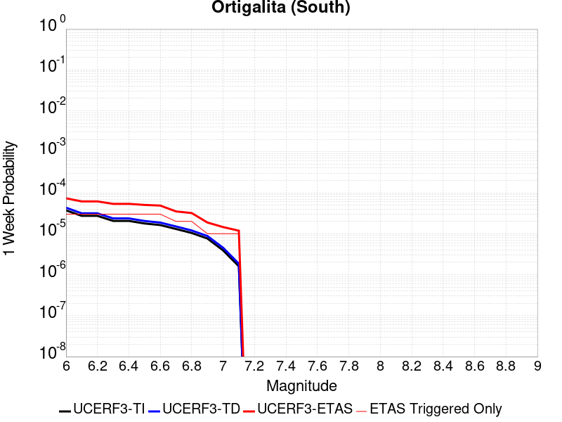 | 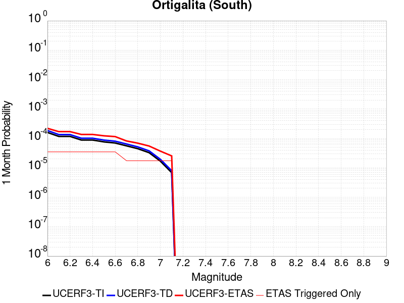 | 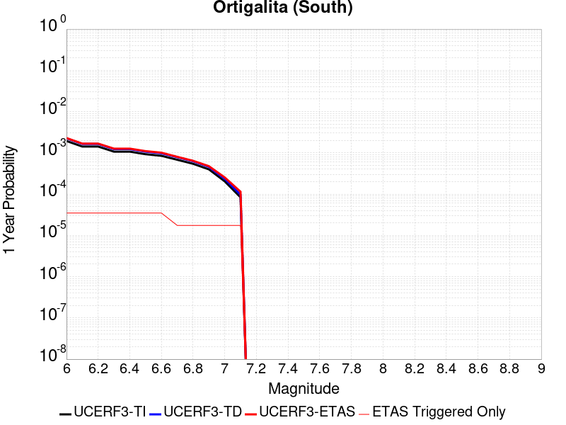 | 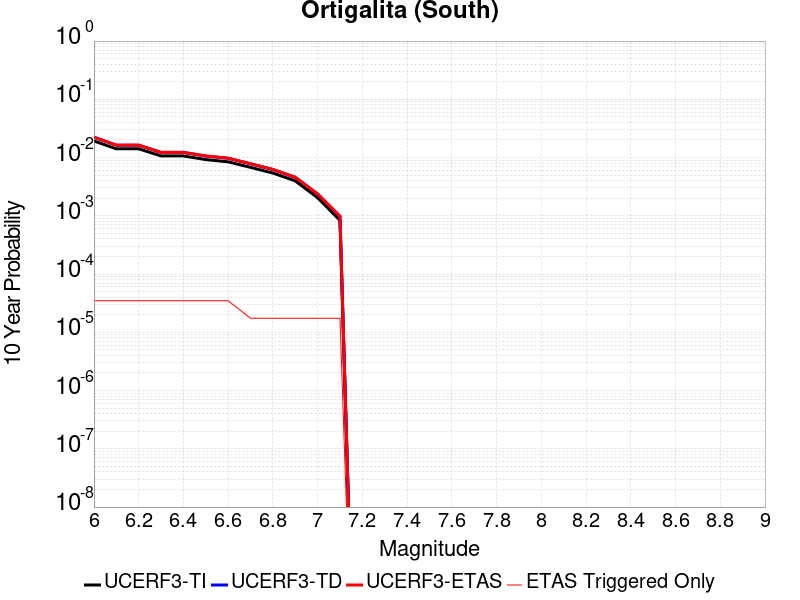 |

| Magnitude | 1 wk TI Prob | 1 wk TD Prob | 1 wk ETAS Prob | 1 wk ETAS/TD Gain | 1 wk ETAS Triggered Only | 1 mo TI Prob | 1 mo TD Prob | 1 mo ETAS Prob | 1 mo ETAS/TD Gain | 1 mo ETAS Triggered Only | 1 yr TI Prob | 1 yr TD Prob | 1 yr ETAS Prob | 1 yr ETAS/TD Gain | 1 yr ETAS Triggered Only | 10 yr TI Prob | 10 yr TD Prob | 10 yr ETAS Prob | 10 yr ETAS/TD Gain | 10 yr ETAS Triggered Only |
|-----|-----|-----|-----|-----|-----|-----|-----|-----|-----|-----|-----|-----|-----|-----|-----|-----|-----|-----|-----|-----|
| 6.0 | 3.72394E-5 | 4.325562E-5 | 7.814168E-5 | 1.8065095 | 3.4887576E-5 | 1.5958765E-4 | 1.8536893E-4 | 2.2025005E-4 | 1.1881713 | 3.4887576E-5 | 0.0019412481 | 0.0022546875 | 0.0022894964 | 1.0154384 | 3.4887576E-5 | 0.019243775 | 0.022334497 | 0.022368604 | 1.0015272 | 3.4887576E-5 |
| 6.1 | 2.7299884E-5 | 3.149204E-5 | 6.637852E-5 | 2.1077871 | 3.4887576E-5 | 1.16994255E-4 | 1.3495922E-4 | 1.698421E-4 | 1.2584697 | 3.4887576E-5 | 0.0014234743 | 0.0016419457 | 0.001676776 | 1.0212128 | 3.4887576E-5 | 0.014143906 | 0.01630407 | 0.01633839 | 1.0021049 | 3.4887576E-5 |
| 6.2 | 2.7299884E-5 | 3.149204E-5 | 6.637852E-5 | 2.1077871 | 3.4887576E-5 | 1.16994255E-4 | 1.3495922E-4 | 1.698421E-4 | 1.2584697 | 3.4887576E-5 | 0.0014234743 | 0.0016419457 | 0.001676776 | 1.0212128 | 3.4887576E-5 | 0.014143906 | 0.01630407 | 0.01633839 | 1.0021049 | 3.4887576E-5 |
| 6.3 | 2.0546433E-5 | 2.363145E-5 | 5.8518202E-5 | 2.4762847 | 3.4887576E-5 | 8.805317E-5 | 1.0127382E-4 | 1.3615786E-4 | 1.3444527 | 3.4887576E-5 | 0.00107152 | 0.0012323303 | 0.0012671748 | 1.0282754 | 3.4887576E-5 | 0.010663681 | 0.01225703 | 0.01229149 | 1.0028114 | 3.4887576E-5 |
| 6.4 | 2.0546433E-5 | 2.363145E-5 | 5.8518202E-5 | 2.4762847 | 3.4887576E-5 | 8.805317E-5 | 1.0127382E-4 | 1.3615786E-4 | 1.3444527 | 3.4887576E-5 | 0.00107152 | 0.0012323303 | 0.0012671748 | 1.0282754 | 3.4887576E-5 | 0.010663681 | 0.01225703 | 0.01229149 | 1.0028114 | 3.4887576E-5 |
| 6.5 | 1.7779594E-5 | 2.0446974E-5 | 5.5333836E-5 | 2.7062116 | 3.4887576E-5 | 7.619603E-5 | 8.762702E-5 | 1.2251154E-4 | 1.3981023 | 3.4887576E-5 | 9.272918E-4 | 0.0010663504 | 0.0011012008 | 1.032682 | 3.4887576E-5 | 0.009234319 | 0.010613803 | 0.01064832 | 1.0032521 | 3.4887576E-5 |
| 6.6 | 1.6272212E-5 | 1.8714967E-5 | 5.360189E-5 | 2.8641188 | 3.4887576E-5 | 6.973618E-5 | 8.0204605E-5 | 1.1508938E-4 | 1.4349473 | 3.4887576E-5 | 8.487073E-4 | 9.760658E-4 | 0.0010109193 | 1.0357082 | 3.4887576E-5 | 0.008454733 | 0.009719091 | 0.009753639 | 1.0035547 | 3.4887576E-5 |
| 6.7 | 1.3051484E-5 | 1.5038758E-5 | 3.2482283E-5 | 2.1599047 | 1.7443788E-5 | 5.593373E-5 | 6.445028E-5 | 8.189295E-5 | 1.2706375 | 1.7443788E-5 | 6.807804E-4 | 7.844092E-4 | 8.018393E-4 | 1.0222207 | 1.7443788E-5 | 0.006786986 | 0.007817388 | 0.007834695 | 1.002214 | 1.7443788E-5 |
| 6.8 | 1.04277415E-5 | 1.1987235E-5 | 2.9430814E-5 | 2.4551795 | 1.7443788E-5 | 4.4689557E-5 | 5.1372896E-5 | 6.881579E-5 | 1.3395349 | 1.7443788E-5 | 5.439595E-4 | 6.2529295E-4 | 6.427258E-4 | 1.0278796 | 1.7443788E-5 | 0.0054262993 | 0.00623609 | 0.006253425 | 1.0027798 | 1.7443788E-5 |
| 6.9 | 7.639968E-6 | 8.791503E-6 | 2.6235137E-5 | 2.9841468 | 1.7443788E-5 | 3.274231E-5 | 3.767736E-5 | 5.512049E-5 | 1.4629605 | 1.7443788E-5 | 3.9856473E-4 | 4.586312E-4 | 4.7606698E-4 | 1.038017 | 1.7443788E-5 | 0.003978506 | 0.004577433 | 0.004594797 | 1.0037934 | 1.7443788E-5 |
| 7.0 | 3.919831E-6 | 4.5334014E-6 | 2.197711E-5 | 4.8478193 | 1.7443788E-5 | 1.679917E-5 | 1.942873E-5 | 3.6872178E-5 | 1.8978173 | 1.7443788E-5 | 2.045107E-4 | 2.3652123E-4 | 2.539609E-4 | 1.073734 | 1.7443788E-5 | 0.0020432258 | 0.0023629034 | 0.0023803061 | 1.0073649 | 1.7443788E-5 |
| 7.1 | 1.6017933E-6 | 1.8570418E-6 | 1.9300796E-5 | 10.393303 | 1.7443788E-5 | 6.8648105E-6 | 7.958732E-6 | 2.540238E-5 | 3.1917622 | 1.7443788E-5 | 8.357586E-5 | 9.689432E-5 | 1.1433642E-4 | 1.1800115 | 1.7443788E-5 | 8.3544437E-4 | 9.686254E-4 | 9.860523E-4 | 1.0179913 | 1.7443788E-5 |

## Shoreline
*[(top)](#table-of-contents)*

| 1 Week | 1 Month | 1 Year | 10 Year |
|-----|-----|-----|-----|
|  |  |  |  |

| Magnitude | 1 wk TI Prob | 1 wk TD Prob | 1 wk ETAS Prob | 1 wk ETAS/TD Gain | 1 wk ETAS Triggered Only | 1 mo TI Prob | 1 mo TD Prob | 1 mo ETAS Prob | 1 mo ETAS/TD Gain | 1 mo ETAS Triggered Only | 1 yr TI Prob | 1 yr TD Prob | 1 yr ETAS Prob | 1 yr ETAS/TD Gain | 1 yr ETAS Triggered Only | 10 yr TI Prob | 10 yr TD Prob | 10 yr ETAS Prob | 10 yr ETAS/TD Gain | 10 yr ETAS Triggered Only |
|-----|-----|-----|-----|-----|-----|-----|-----|-----|-----|-----|-----|-----|-----|-----|-----|-----|-----|-----|-----|-----|
| 6.0 | 3.9888673E-6 | 4.047929E-6 | 4.047929E-6 | 1.0 | 0.0 | 1.7095033E-5 | 1.7348184E-5 | 1.7348184E-5 | 1.0 | 0.0 | 2.0811215E-4 | 2.1119925E-4 | 2.2863936E-4 | 1.0825765 | 1.7443788E-5 | 0.0020791737 | 0.002110534 | 0.002127941 | 1.0082476 | 1.7443788E-5 |
| 6.1 | 3.9888673E-6 | 4.047929E-6 | 4.047929E-6 | 1.0 | 0.0 | 1.7095033E-5 | 1.7348184E-5 | 1.7348184E-5 | 1.0 | 0.0 | 2.0811215E-4 | 2.1119925E-4 | 2.2863936E-4 | 1.0825765 | 1.7443788E-5 | 0.0020791737 | 0.002110534 | 0.002127941 | 1.0082476 | 1.7443788E-5 |
| 6.2 | 1.4039653E-6 | 1.4100891E-6 | 1.4100891E-6 | 1.0 | 0.0 | 6.0169805E-6 | 6.0432253E-6 | 6.0432253E-6 | 1.0 | 0.0 | 7.325427E-5 | 7.357384E-5 | 7.357384E-5 | 1.0 | 0.0 | 7.3230127E-4 | 7.355009E-4 | 7.355009E-4 | 1.0 | 0.0 |
| 6.3 | 1.4039653E-6 | 1.4100891E-6 | 1.4100891E-6 | 1.0 | 0.0 | 6.0169805E-6 | 6.0432253E-6 | 6.0432253E-6 | 1.0 | 0.0 | 7.325427E-5 | 7.357384E-5 | 7.357384E-5 | 1.0 | 0.0 | 7.3230127E-4 | 7.355009E-4 | 7.355009E-4 | 1.0 | 0.0 |
| 6.4 | 1.3314152E-6 | 1.3361605E-6 | 1.3361605E-6 | 1.0 | 0.0 | 5.7060524E-6 | 5.7263896E-6 | 5.7263896E-6 | 1.0 | 0.0 | 6.946897E-5 | 6.971662E-5 | 6.971662E-5 | 1.0 | 0.0 | 6.9447263E-4 | 6.9695286E-4 | 6.9695286E-4 | 1.0 | 0.0 |
| 6.5 | 1.1187026E-6 | 1.120364E-6 | 1.120364E-6 | 1.0 | 0.0 | 4.794431E-6 | 4.8015513E-6 | 4.8015513E-6 | 1.0 | 0.0 | 5.8370628E-5 | 5.8457343E-5 | 5.8457343E-5 | 1.0 | 0.0 | 5.83553E-4 | 5.844222E-4 | 5.844222E-4 | 1.0 | 0.0 |
| 6.6 | 9.793089E-7 | 9.784919E-7 | 9.784919E-7 | 1.0 | 0.0 | 4.1970316E-6 | 4.1935305E-6 | 4.1935305E-6 | 1.0 | 0.0 | 5.1097657E-5 | 5.105505E-5 | 5.105505E-5 | 1.0 | 0.0 | 5.108591E-4 | 5.1043445E-4 | 5.1043445E-4 | 1.0 | 0.0 |
| 6.7 | 8.995986E-7 | 8.9728E-7 | 8.9728E-7 | 1.0 | 0.0 | 3.8554167E-6 | 3.84548E-6 | 3.84548E-6 | 1.0 | 0.0 | 4.693869E-5 | 4.6817724E-5 | 4.6817724E-5 | 1.0 | 0.0 | 4.6928777E-4 | 4.6807955E-4 | 4.6807955E-4 | 1.0 | 0.0 |
| 6.8 | 7.931612E-7 | 7.8804027E-7 | 7.8804027E-7 | 1.0 | 0.0 | 3.3992578E-6 | 3.377311E-6 | 3.377311E-6 | 1.0 | 0.0 | 4.1385178E-5 | 4.1117994E-5 | 4.1117994E-5 | 1.0 | 0.0 | 4.1377472E-4 | 4.1110438E-4 | 4.1110438E-4 | 1.0 | 0.0 |
| 6.9 | 7.1465956E-7 | 7.078006E-7 | 7.078006E-7 | 1.0 | 0.0 | 3.062823E-6 | 3.0334277E-6 | 3.0334277E-6 | 1.0 | 0.0 | 3.7289232E-5 | 3.6931357E-5 | 3.6931357E-5 | 1.0 | 0.0 | 3.7282976E-4 | 3.6925258E-4 | 3.6925258E-4 | 1.0 | 0.0 |
| 7.0 | 6.389046E-7 | 6.299458E-7 | 6.299458E-7 | 1.0 | 0.0 | 2.7381598E-6 | 2.699765E-6 | 2.699765E-6 | 1.0 | 0.0 | 3.3336586E-5 | 3.2869146E-5 | 3.2869146E-5 | 1.0 | 0.0 | 3.3331584E-4 | 3.2864307E-4 | 3.2864307E-4 | 1.0 | 0.0 |
| 7.1 | 5.4300875E-7 | 5.3111313E-7 | 5.3111313E-7 | 1.0 | 0.0 | 2.3271782E-6 | 2.276197E-6 | 2.276197E-6 | 1.0 | 0.0 | 2.8333026E-5 | 2.7712347E-5 | 2.7712347E-5 | 1.0 | 0.0 | 2.8329415E-4 | 2.77089E-4 | 2.77089E-4 | 1.0 | 0.0 |
| 7.2 | 4.6768855E-7 | 4.5348952E-7 | 4.5348952E-7 | 1.0 | 0.0 | 2.0043778E-6 | 1.9435251E-6 | 1.9435251E-6 | 1.0 | 0.0 | 2.4403027E-5 | 2.3662162E-5 | 2.3662162E-5 | 1.0 | 0.0 | 2.4400349E-4 | 2.3659648E-4 | 2.3659648E-4 | 1.0 | 0.0 |
| 7.3 | 4.0966103E-7 | 3.9385662E-7 | 3.9385662E-7 | 1.0 | 0.0 | 1.7556889E-6 | 1.6879559E-6 | 1.6879559E-6 | 1.0 | 0.0 | 2.1375303E-5 | 2.055067E-5 | 2.055067E-5 | 1.0 | 0.0 | 2.1373246E-4 | 2.0548773E-4 | 2.0548773E-4 | 1.0 | 0.0 |
| 7.4 | 3.5105785E-7 | 3.3363975E-7 | 3.3363975E-7 | 1.0 | 0.0 | 1.5045327E-6 | 1.4298838E-6 | 1.4298838E-6 | 1.0 | 0.0 | 1.8317533E-5 | 1.7408696E-5 | 1.7408696E-5 | 1.0 | 0.0 | 1.8316023E-4 | 1.7407336E-4 | 1.7407336E-4 | 1.0 | 0.0 |
| 7.5 | 2.8737534E-7 | 2.6820038E-7 | 2.6820038E-7 | 1.0 | 0.0 | 1.2316079E-6 | 1.1494297E-6 | 1.1494297E-6 | 1.0 | 0.0 | 1.4994724E-5 | 1.3994217E-5 | 1.3994217E-5 | 1.0 | 0.0 | 1.4993713E-4 | 1.3993339E-4 | 1.3993339E-4 | 1.0 | 0.0 |
| 7.6 | 2.0924051E-7 | 1.8778988E-7 | 1.8778988E-7 | 1.0 | 0.0 | 8.967448E-7 | 8.048135E-7 | 8.048135E-7 | 1.0 | 0.0 | 1.0917813E-5 | 9.79856E-6 | 9.79856E-6 | 1.0 | 0.0 | 1.0917276E-4 | 9.798129E-5 | 9.798129E-5 | 1.0 | 0.0 |
| 7.7 | 1.392265E-7 | 1.15433906E-7 | 1.15433906E-7 | 1.0 | 0.0 | 5.9668486E-7 | 4.9471663E-7 | 4.9471663E-7 | 1.0 | 0.0 | 7.2646135E-6 | 6.023158E-6 | 6.023158E-6 | 1.0 | 0.0 | 7.2643765E-5 | 6.0229955E-5 | 6.0229955E-5 | 1.0 | 0.0 |
| 7.8 | 8.1080074E-8 | 5.586722E-8 | 5.586722E-8 | 1.0 | 0.0 | 3.4748598E-7 | 2.394309E-7 | 2.394309E-7 | 1.0 | 0.0 | 4.2306337E-6 | 2.9150672E-6 | 2.9150672E-6 | 1.0 | 0.0 | 4.230553E-5 | 2.9150291E-5 | 2.9150291E-5 | 1.0 | 0.0 |
| 7.9 | 5.0859036E-8 | 2.7244445E-8 | 2.7244445E-8 | 1.0 | 0.0 | 2.1796728E-7 | 1.16761896E-7 | 1.16761896E-7 | 1.0 | 0.0 | 2.6537484E-6 | 1.4215751E-6 | 1.4215751E-6 | 1.0 | 0.0 | 2.6537167E-5 | 1.4215661E-5 | 1.4215661E-5 | 1.0 | 0.0 |
| 8.0 | 3.1760536E-8 | 1.3577206E-8 | 1.3577206E-8 | 1.0 | 0.0 | 1.3611657E-7 | 5.8188025E-8 | 5.8188025E-8 | 1.0 | 0.0 | 1.6572179E-6 | 7.0843896E-7 | 7.0843896E-7 | 1.0 | 0.0 | 1.6572056E-5 | 7.084367E-6 | 7.084367E-6 | 1.0 | 0.0 |
| 8.1 | 1.2947896E-8 | 5.6628693E-9 | 5.6628693E-9 | 1.0 | 0.0 | 5.5490982E-8 | 2.426944E-8 | 2.426944E-8 | 1.0 | 0.0 | 6.756025E-7 | 2.954804E-7 | 2.954804E-7 | 1.0 | 0.0 | 6.7560045E-6 | 2.9548003E-6 | 2.9548003E-6 | 1.0 | 0.0 |

## Rinconada 2011 CFM
*[(top)](#table-of-contents)*

| 1 Week | 1 Month | 1 Year | 10 Year |
|-----|-----|-----|-----|
|  |  |  |  |

| Magnitude | 1 wk TI Prob | 1 wk TD Prob | 1 wk ETAS Prob | 1 wk ETAS/TD Gain | 1 wk ETAS Triggered Only | 1 mo TI Prob | 1 mo TD Prob | 1 mo ETAS Prob | 1 mo ETAS/TD Gain | 1 mo ETAS Triggered Only | 1 yr TI Prob | 1 yr TD Prob | 1 yr ETAS Prob | 1 yr ETAS/TD Gain | 1 yr ETAS Triggered Only | 10 yr TI Prob | 10 yr TD Prob | 10 yr ETAS Prob | 10 yr ETAS/TD Gain | 10 yr ETAS Triggered Only |
|-----|-----|-----|-----|-----|-----|-----|-----|-----|-----|-----|-----|-----|-----|-----|-----|-----|-----|-----|-----|-----|
| 6.0 | 1.5752368E-5 | 1.6274716E-5 | 1.6274716E-5 | 1.0 | 0.0 | 6.75084E-5 | 6.974694E-5 | 6.974694E-5 | 1.0 | 0.0 | 8.2160486E-4 | 8.488412E-4 | 8.662702E-4 | 1.0205327 | 1.7443788E-5 | 0.008185739 | 0.00845637 | 0.008473666 | 1.0020454 | 1.7443788E-5 |
| 6.1 | 1.0966133E-5 | 1.1323029E-5 | 1.1323029E-5 | 1.0 | 0.0 | 4.6996865E-5 | 4.852637E-5 | 4.852637E-5 | 1.0 | 0.0 | 5.720366E-4 | 5.906491E-4 | 5.906491E-4 | 1.0 | 0.0 | 0.0057056635 | 0.0058908886 | 0.0058908886 | 1.0 | 0.0 |
| 6.2 | 1.0966133E-5 | 1.1323029E-5 | 1.1323029E-5 | 1.0 | 0.0 | 4.6996865E-5 | 4.852637E-5 | 4.852637E-5 | 1.0 | 0.0 | 5.720366E-4 | 5.906491E-4 | 5.906491E-4 | 1.0 | 0.0 | 0.0057056635 | 0.0058908886 | 0.0058908886 | 1.0 | 0.0 |
| 6.3 | 8.926149E-6 | 9.212771E-6 | 9.212771E-6 | 1.0 | 0.0 | 3.8254362E-5 | 3.948271E-5 | 3.948271E-5 | 1.0 | 0.0 | 4.6564735E-4 | 4.805963E-4 | 4.805963E-4 | 1.0 | 0.0 | 0.0046467283 | 0.0047956146 | 0.0047956146 | 1.0 | 0.0 |
| 6.4 | 7.676955E-6 | 7.920191E-6 | 7.920191E-6 | 1.0 | 0.0 | 3.290082E-5 | 3.3943234E-5 | 3.3943234E-5 | 1.0 | 0.0 | 4.0049385E-4 | 4.1318068E-4 | 4.1318068E-4 | 1.0 | 0.0 | 0.0039977287 | 0.004124151 | 0.004124151 | 1.0 | 0.0 |
| 6.5 | 6.1671026E-6 | 6.3589546E-6 | 6.3589546E-6 | 1.0 | 0.0 | 2.6430173E-5 | 2.725238E-5 | 2.725238E-5 | 1.0 | 0.0 | 3.2173982E-4 | 3.317473E-4 | 3.317473E-4 | 1.0 | 0.0 | 0.003212744 | 0.0033125326 | 0.0033125326 | 1.0 | 0.0 |
| 6.6 | 5.553456E-6 | 5.7248126E-6 | 5.7248126E-6 | 1.0 | 0.0 | 2.3800309E-5 | 2.453468E-5 | 2.453468E-5 | 1.0 | 0.0 | 2.897302E-4 | 2.9866883E-4 | 2.9866883E-4 | 1.0 | 0.0 | 0.0028935277 | 0.002982683 | 0.002982683 | 1.0 | 0.0 |
| 6.7 | 4.787857E-6 | 4.9333094E-6 | 4.9333094E-6 | 1.0 | 0.0 | 2.0519226E-5 | 2.1142583E-5 | 2.1142583E-5 | 1.0 | 0.0 | 2.4979294E-4 | 2.573806E-4 | 2.573806E-4 | 1.0 | 0.0 | 0.0024951235 | 0.0025708308 | 0.0025708308 | 1.0 | 0.0 |
| 6.8 | 3.9955166E-6 | 4.1134763E-6 | 4.1134763E-6 | 1.0 | 0.0 | 1.7123532E-5 | 1.7629065E-5 | 1.7629065E-5 | 1.0 | 0.0 | 2.0845905E-4 | 2.1461274E-4 | 2.1461274E-4 | 1.0 | 0.0 | 0.002082636 | 0.0021440585 | 0.0021440585 | 1.0 | 0.0 |
| 6.9 | 3.4250072E-6 | 3.5224464E-6 | 3.5224464E-6 | 1.0 | 0.0 | 1.46785205E-5 | 1.5096111E-5 | 1.5096111E-5 | 1.0 | 0.0 | 1.7869633E-4 | 1.8377967E-4 | 1.8377967E-4 | 1.0 | 0.0 | 0.001785527 | 0.0018362794 | 0.0018362794 | 1.0 | 0.0 |
| 7.0 | 2.7712713E-6 | 2.8467E-6 | 2.8467E-6 | 1.0 | 0.0 | 1.1876823E-5 | 1.2200086E-5 | 1.2200086E-5 | 1.0 | 0.0 | 1.4459073E-4 | 1.4852593E-4 | 1.4852593E-4 | 1.0 | 0.0 | 0.0014449668 | 0.0014842682 | 0.0014842682 | 1.0 | 0.0 |
| 7.1 | 2.227358E-6 | 2.2856984E-6 | 2.2856984E-6 | 1.0 | 0.0 | 9.545785E-6 | 9.795814E-6 | 9.795814E-6 | 1.0 | 0.0 | 1.16213734E-4 | 1.19257515E-4 | 1.19257515E-4 | 1.0 | 0.0 | 0.0011615298 | 0.0011919362 | 0.0011919362 | 1.0 | 0.0 |
| 7.2 | 1.581796E-6 | 1.6209011E-6 | 1.6209011E-6 | 1.0 | 0.0 | 6.779108E-6 | 6.9467005E-6 | 6.9467005E-6 | 1.0 | 0.0 | 8.253252E-5 | 8.457281E-5 | 8.457281E-5 | 1.0 | 0.0 | 8.250187E-4 | 8.454067E-4 | 8.454067E-4 | 1.0 | 0.0 |
| 7.3 | 1.0306567E-6 | 1.0546477E-6 | 1.0546477E-6 | 1.0 | 0.0 | 4.4170924E-6 | 4.519911E-6 | 4.519911E-6 | 1.0 | 0.0 | 5.3776774E-5 | 5.5028526E-5 | 5.5028526E-5 | 1.0 | 0.0 | 5.376376E-4 | 5.5014924E-4 | 5.5014924E-4 | 1.0 | 0.0 |
| 7.4 | 6.535541E-7 | 6.682742E-7 | 6.682742E-7 | 1.0 | 0.0 | 2.800943E-6 | 2.864029E-6 | 2.864029E-6 | 1.0 | 0.0 | 3.4100947E-5 | 3.4868997E-5 | 3.4868997E-5 | 1.0 | 0.0 | 3.4095717E-4 | 3.4863537E-4 | 3.4863537E-4 | 1.0 | 0.0 |
| 7.5 | 3.2656962E-7 | 3.3316687E-7 | 3.3316687E-7 | 1.0 | 0.0 | 1.3995833E-6 | 1.4278572E-6 | 1.4278572E-6 | 1.0 | 0.0 | 1.7039794E-5 | 1.7384024E-5 | 1.7384024E-5 | 1.0 | 0.0 | 1.7038487E-4 | 1.7382667E-4 | 1.7382667E-4 | 1.0 | 0.0 |
| 7.6 | 9.754343E-8 | 9.82099E-8 | 9.82099E-8 | 1.0 | 0.0 | 4.180432E-7 | 4.208995E-7 | 4.208995E-7 | 1.0 | 0.0 | 5.089664E-6 | 5.1244397E-6 | 5.1244397E-6 | 1.0 | 0.0 | 5.0895473E-5 | 5.1243223E-5 | 5.1243223E-5 | 1.0 | 0.0 |
| 7.7 | 6.0001453E-9 | 5.8490435E-9 | 5.8490435E-9 | 1.0 | 0.0 | 2.5714908E-8 | 2.506733E-8 | 2.506733E-8 | 1.0 | 0.0 | 3.1307894E-7 | 3.051947E-7 | 3.051947E-7 | 1.0 | 0.0 | 3.1307852E-6 | 3.051943E-6 | 3.051943E-6 | 1.0 | 0.0 |
| 7.8 | 7.400003E-11 | 7.4654505E-11 | 7.4654505E-11 | 1.0 | 0.0 | 3.171432E-10 | 3.1994773E-10 | 3.1994773E-10 | 1.0 | 0.0 | 3.861218E-9 | 3.895363E-9 | 3.895363E-9 | 1.0 | 0.0 | 3.861218E-8 | 3.895363E-8 | 3.895363E-8 | 1.0 | 0.0 |

## Mono Lake 2011 CFM
*[(top)](#table-of-contents)*

| 1 Week | 1 Month | 1 Year | 10 Year |
|-----|-----|-----|-----|
| 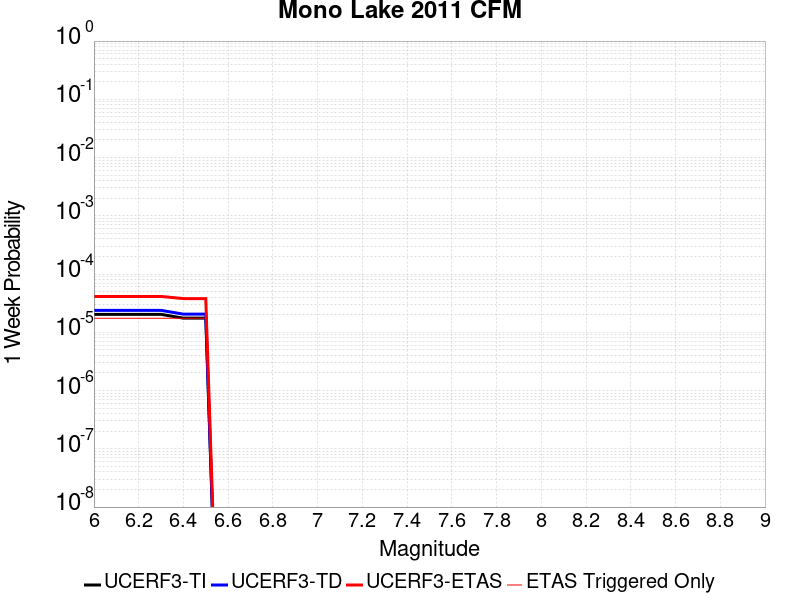 | 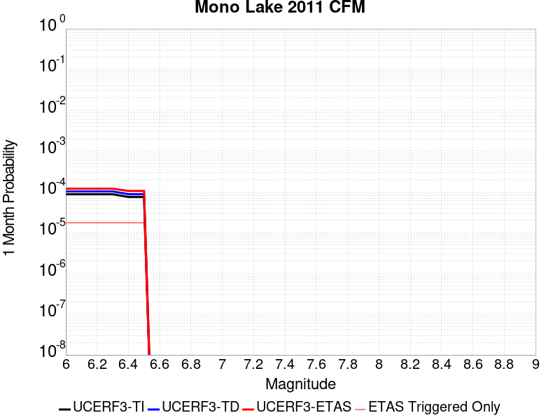 | 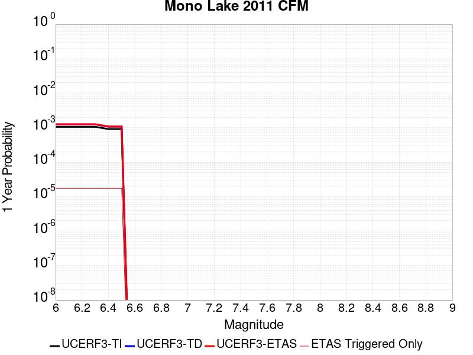 |  |

| Magnitude | 1 wk TI Prob | 1 wk TD Prob | 1 wk ETAS Prob | 1 wk ETAS/TD Gain | 1 wk ETAS Triggered Only | 1 mo TI Prob | 1 mo TD Prob | 1 mo ETAS Prob | 1 mo ETAS/TD Gain | 1 mo ETAS Triggered Only | 1 yr TI Prob | 1 yr TD Prob | 1 yr ETAS Prob | 1 yr ETAS/TD Gain | 1 yr ETAS Triggered Only | 10 yr TI Prob | 10 yr TD Prob | 10 yr ETAS Prob | 10 yr ETAS/TD Gain | 10 yr ETAS Triggered Only |
|-----|-----|-----|-----|-----|-----|-----|-----|-----|-----|-----|-----|-----|-----|-----|-----|-----|-----|-----|-----|-----|
| 6.0 | 2.0341662E-5 | 2.3828166E-5 | 4.1271538E-5 | 1.7320484 | 1.7443788E-5 | 8.717564E-5 | 1.0211971E-4 | 1.1956172E-4 | 1.1707996 | 1.7443788E-5 | 0.0010608466 | 0.0012431298 | 0.001260552 | 1.0140147 | 1.7443788E-5 | 0.010557966 | 0.012413835 | 0.012431063 | 1.0013877 | 1.7443788E-5 |
| 6.1 | 2.0341662E-5 | 2.3828166E-5 | 4.1271538E-5 | 1.7320484 | 1.7443788E-5 | 8.717564E-5 | 1.0211971E-4 | 1.1956172E-4 | 1.1707996 | 1.7443788E-5 | 0.0010608466 | 0.0012431298 | 0.001260552 | 1.0140147 | 1.7443788E-5 | 0.010557966 | 0.012413835 | 0.012431063 | 1.0013877 | 1.7443788E-5 |
| 6.2 | 2.0341662E-5 | 2.3828166E-5 | 4.1271538E-5 | 1.7320484 | 1.7443788E-5 | 8.717564E-5 | 1.0211971E-4 | 1.1956172E-4 | 1.1707996 | 1.7443788E-5 | 0.0010608466 | 0.0012431298 | 0.001260552 | 1.0140147 | 1.7443788E-5 | 0.010557966 | 0.012413835 | 0.012431063 | 1.0013877 | 1.7443788E-5 |
| 6.3 | 2.0341662E-5 | 2.3828166E-5 | 4.1271538E-5 | 1.7320484 | 1.7443788E-5 | 8.717564E-5 | 1.0211971E-4 | 1.1956172E-4 | 1.1707996 | 1.7443788E-5 | 0.0010608466 | 0.0012431298 | 0.001260552 | 1.0140147 | 1.7443788E-5 | 0.010557966 | 0.012413835 | 0.012431063 | 1.0013877 | 1.7443788E-5 |
| 6.4 | 1.749821E-5 | 2.0490985E-5 | 3.7934416E-5 | 1.8512734 | 1.7443788E-5 | 7.499018E-5 | 8.781851E-5 | 1.0526076E-4 | 1.1986171 | 1.7443788E-5 | 9.1262296E-4 | 0.0010691903 | 0.0010866155 | 1.0162975 | 1.7443788E-5 | 0.009088841 | 0.010691865 | 0.010709122 | 1.0016141 | 1.7443788E-5 |
| 6.5 | 1.749821E-5 | 2.0490985E-5 | 3.7934416E-5 | 1.8512734 | 1.7443788E-5 | 7.499018E-5 | 8.781851E-5 | 1.0526076E-4 | 1.1986171 | 1.7443788E-5 | 9.1262296E-4 | 0.0010691903 | 0.0010866155 | 1.0162975 | 1.7443788E-5 | 0.009088841 | 0.010691865 | 0.010709122 | 1.0016141 | 1.7443788E-5 |

## Santa Ynez River
*[(top)](#table-of-contents)*

| 1 Week | 1 Month | 1 Year | 10 Year |
|-----|-----|-----|-----|
| 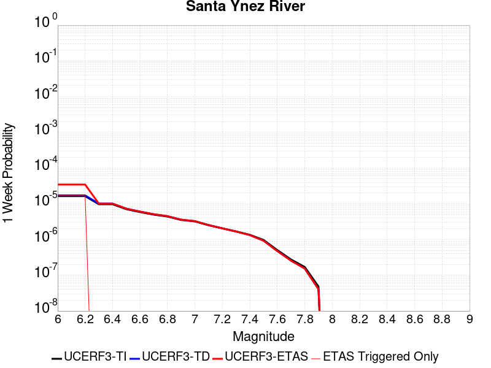 | 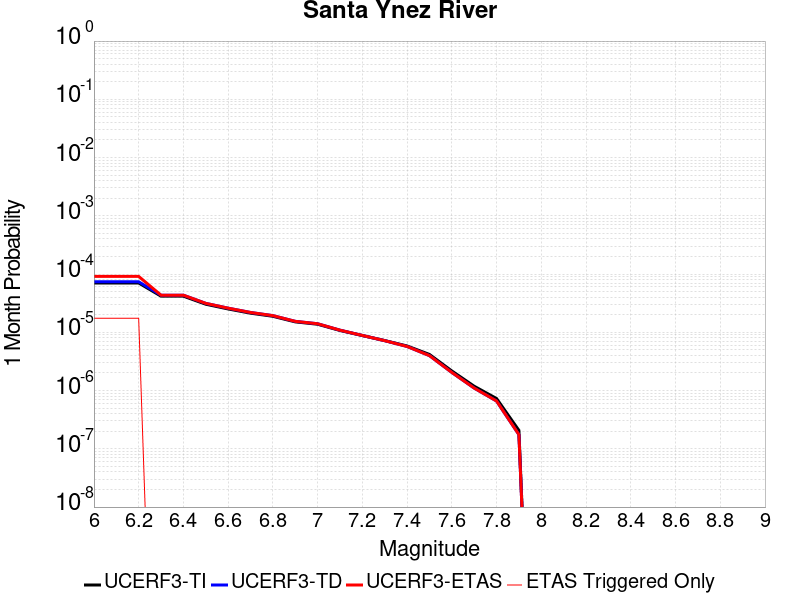 | 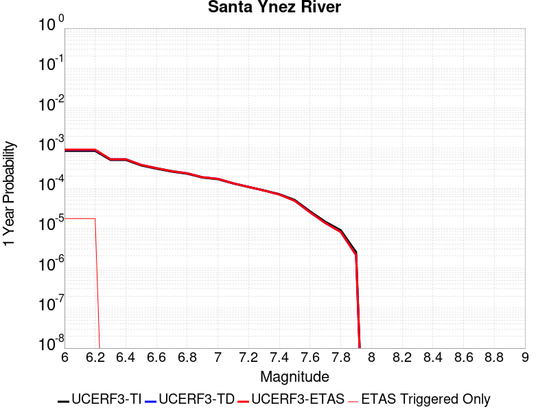 |  |

| Magnitude | 1 wk TI Prob | 1 wk TD Prob | 1 wk ETAS Prob | 1 wk ETAS/TD Gain | 1 wk ETAS Triggered Only | 1 mo TI Prob | 1 mo TD Prob | 1 mo ETAS Prob | 1 mo ETAS/TD Gain | 1 mo ETAS Triggered Only | 1 yr TI Prob | 1 yr TD Prob | 1 yr ETAS Prob | 1 yr ETAS/TD Gain | 1 yr ETAS Triggered Only | 10 yr TI Prob | 10 yr TD Prob | 10 yr ETAS Prob | 10 yr ETAS/TD Gain | 10 yr ETAS Triggered Only |
|-----|-----|-----|-----|-----|-----|-----|-----|-----|-----|-----|-----|-----|-----|-----|-----|-----|-----|-----|-----|-----|
| 6.0 | 1.6396456E-5 | 1.7209435E-5 | 3.4652923E-5 | 2.0136 | 1.7443788E-5 | 7.026863E-5 | 7.375284E-5 | 9.119534E-5 | 1.2364994 | 1.7443788E-5 | 8.551848E-4 | 8.976064E-4 | 9.1503456E-4 | 1.0194162 | 1.7443788E-5 | 0.0085190125 | 0.008943358 | 0.008960646 | 1.001933 | 1.7443788E-5 |
| 6.1 | 1.6396456E-5 | 1.7209435E-5 | 3.4652923E-5 | 2.0136 | 1.7443788E-5 | 7.026863E-5 | 7.375284E-5 | 9.119534E-5 | 1.2364994 | 1.7443788E-5 | 8.551848E-4 | 8.976064E-4 | 9.1503456E-4 | 1.0194162 | 1.7443788E-5 | 0.0085190125 | 0.008943358 | 0.008960646 | 1.001933 | 1.7443788E-5 |
| 6.2 | 1.6396456E-5 | 1.7209435E-5 | 3.4652923E-5 | 2.0136 | 1.7443788E-5 | 7.026863E-5 | 7.375284E-5 | 9.119534E-5 | 1.2364994 | 1.7443788E-5 | 8.551848E-4 | 8.976064E-4 | 9.1503456E-4 | 1.0194162 | 1.7443788E-5 | 0.0085190125 | 0.008943358 | 0.008960646 | 1.001933 | 1.7443788E-5 |
| 6.3 | 9.736976E-6 | 1.012233E-5 | 1.012233E-5 | 1.0 | 0.0 | 4.172923E-5 | 4.338072E-5 | 4.338072E-5 | 1.0 | 0.0 | 5.0793495E-4 | 5.280373E-4 | 5.280373E-4 | 1.0 | 0.0 | 0.005067755 | 0.005268332 | 0.005268332 | 1.0 | 0.0 |
| 6.4 | 9.736976E-6 | 1.012233E-5 | 1.012233E-5 | 1.0 | 0.0 | 4.172923E-5 | 4.338072E-5 | 4.338072E-5 | 1.0 | 0.0 | 5.0793495E-4 | 5.280373E-4 | 5.280373E-4 | 1.0 | 0.0 | 0.005067755 | 0.005268332 | 0.005268332 | 1.0 | 0.0 |
| 6.5 | 7.081964E-6 | 7.3298966E-6 | 7.3298966E-6 | 1.0 | 0.0 | 3.035092E-5 | 3.1413474E-5 | 3.1413474E-5 | 1.0 | 0.0 | 3.694598E-4 | 3.8239348E-4 | 3.8239348E-4 | 1.0 | 0.0 | 0.0036884616 | 0.0038175168 | 0.0038175168 | 1.0 | 0.0 |
| 6.6 | 5.873247E-6 | 6.059743E-6 | 6.059743E-6 | 1.0 | 0.0 | 2.5170815E-5 | 2.5970074E-5 | 2.5970074E-5 | 1.0 | 0.0 | 3.064116E-4 | 3.1614062E-4 | 3.1614062E-4 | 1.0 | 0.0 | 0.0030598943 | 0.0031569963 | 0.0031569963 | 1.0 | 0.0 |
| 6.7 | 4.973277E-6 | 5.115901E-6 | 5.115901E-6 | 1.0 | 0.0 | 2.1313872E-5 | 2.1925109E-5 | 2.1925109E-5 | 1.0 | 0.0 | 2.5946548E-4 | 2.66906E-4 | 2.66906E-4 | 1.0 | 0.0 | 0.0025916274 | 0.0026659032 | 0.0026659032 | 1.0 | 0.0 |
| 6.8 | 4.396492E-6 | 4.5109778E-6 | 4.5109778E-6 | 1.0 | 0.0 | 1.884197E-5 | 1.9332621E-5 | 1.9332621E-5 | 1.0 | 0.0 | 2.2937685E-4 | 2.3534958E-4 | 2.3534958E-4 | 1.0 | 0.0 | 0.0022914023 | 0.0023510386 | 0.0023510386 | 1.0 | 0.0 |
| 6.9 | 3.5255632E-6 | 3.6013332E-6 | 3.6013332E-6 | 1.0 | 0.0 | 1.5109469E-5 | 1.5434196E-5 | 1.5434196E-5 | 1.0 | 0.0 | 1.8394225E-4 | 1.8789528E-4 | 1.8789528E-4 | 1.0 | 0.0 | 0.0018379007 | 0.0018773803 | 0.0018773803 | 1.0 | 0.0 |
| 7.0 | 3.211603E-6 | 3.273654E-6 | 3.273654E-6 | 1.0 | 0.0 | 1.376394E-5 | 1.4029872E-5 | 1.4029872E-5 | 1.0 | 0.0 | 1.6756308E-4 | 1.7080043E-4 | 1.7080043E-4 | 1.0 | 0.0 | 0.0016743679 | 0.0017067058 | 0.0017067058 | 1.0 | 0.0 |
| 7.1 | 2.5094619E-6 | 2.5409204E-6 | 2.5409204E-6 | 1.0 | 0.0 | 1.0754793E-5 | 1.0889614E-5 | 1.0889614E-5 | 1.0 | 0.0 | 1.3093173E-4 | 1.3257304E-4 | 1.3257304E-4 | 1.0 | 0.0 | 0.0013085462 | 0.0013249456 | 0.0013249456 | 1.0 | 0.0 |
| 7.2 | 2.0515774E-6 | 2.0619375E-6 | 2.0619375E-6 | 1.0 | 0.0 | 8.792445E-6 | 8.836846E-6 | 8.836846E-6 | 1.0 | 0.0 | 1.0704277E-4 | 1.0758333E-4 | 1.0758333E-4 | 1.0 | 0.0 | 0.0010699122 | 0.0010753168 | 0.0010753168 | 1.0 | 0.0 |
| 7.3 | 1.6845745E-6 | 1.6773907E-6 | 1.6773907E-6 | 1.0 | 0.0 | 7.219585E-6 | 7.1887976E-6 | 7.1887976E-6 | 1.0 | 0.0 | 8.78949E-5 | 8.752012E-5 | 8.752012E-5 | 1.0 | 0.0 | 8.7860145E-4 | 8.7485946E-4 | 8.7485946E-4 | 1.0 | 0.0 |
| 7.4 | 1.3600285E-6 | 1.3333357E-6 | 1.3333357E-6 | 1.0 | 0.0 | 5.82868E-6 | 5.714284E-6 | 5.714284E-6 | 1.0 | 0.0 | 7.096187E-5 | 6.956921E-5 | 6.956921E-5 | 1.0 | 0.0 | 7.0939213E-4 | 6.954765E-4 | 6.954765E-4 | 1.0 | 0.0 |
| 7.5 | 9.735342E-7 | 9.290103E-7 | 9.290103E-7 | 1.0 | 0.0 | 4.172283E-6 | 3.9814668E-6 | 3.9814668E-6 | 1.0 | 0.0 | 5.079636E-5 | 4.8473295E-5 | 4.8473295E-5 | 1.0 | 0.0 | 5.0784746E-4 | 4.8462892E-4 | 4.8462892E-4 | 1.0 | 0.0 |
| 7.6 | 5.067187E-7 | 4.77857E-7 | 4.77857E-7 | 1.0 | 0.0 | 2.1716498E-6 | 2.047957E-6 | 2.047957E-6 | 1.0 | 0.0 | 2.6439517E-5 | 2.4933597E-5 | 2.4933597E-5 | 1.0 | 0.0 | 2.643637E-4 | 2.4930874E-4 | 2.4930874E-4 | 1.0 | 0.0 |
| 7.7 | 2.769089E-7 | 2.5759124E-7 | 2.5759124E-7 | 1.0 | 0.0 | 1.1867519E-6 | 1.1039621E-6 | 1.1039621E-6 | 1.0 | 0.0 | 1.4448608E-5 | 1.34406555E-5 | 1.34406555E-5 | 1.0 | 0.0 | 1.444767E-4 | 1.3439846E-4 | 1.3439846E-4 | 1.0 | 0.0 |
| 7.8 | 1.7044663E-7 | 1.5449015E-7 | 1.5449015E-7 | 1.0 | 0.0 | 7.3048534E-7 | 6.621005E-7 | 6.621005E-7 | 1.0 | 0.0 | 8.893623E-6 | 8.061043E-6 | 8.061043E-6 | 1.0 | 0.0 | 8.893267E-5 | 8.060753E-5 | 8.060753E-5 | 1.0 | 0.0 |
| 7.9 | 4.8344287E-8 | 4.0910923E-8 | 4.0910923E-8 | 1.0 | 0.0 | 2.0718979E-7 | 1.7533252E-7 | 1.7533252E-7 | 1.0 | 0.0 | 2.5225327E-6 | 2.1346711E-6 | 2.1346711E-6 | 1.0 | 0.0 | 2.5225041E-5 | 2.1346512E-5 | 2.1346512E-5 | 1.0 | 0.0 |

## San Luis Range 2011 CFM
*[(top)](#table-of-contents)*

| 1 Week | 1 Month | 1 Year | 10 Year |
|-----|-----|-----|-----|
|  | 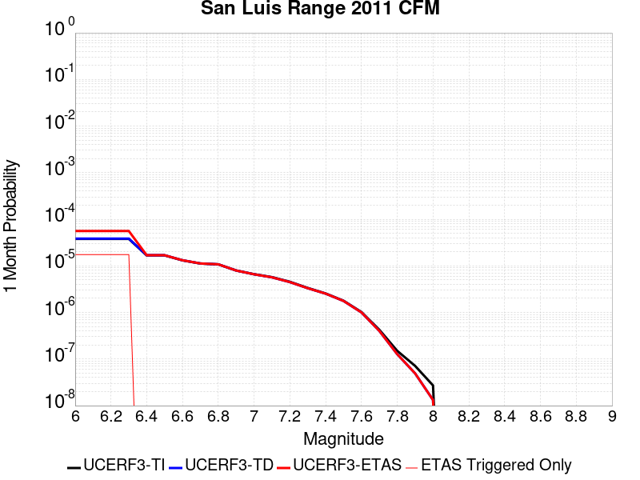 | 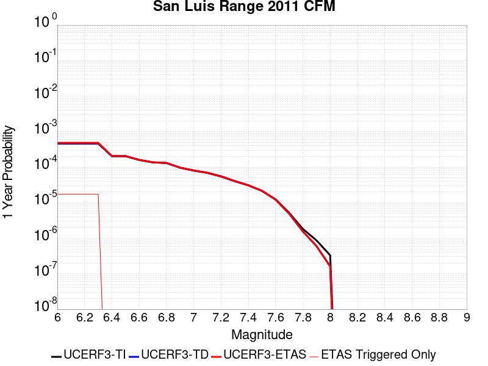 | 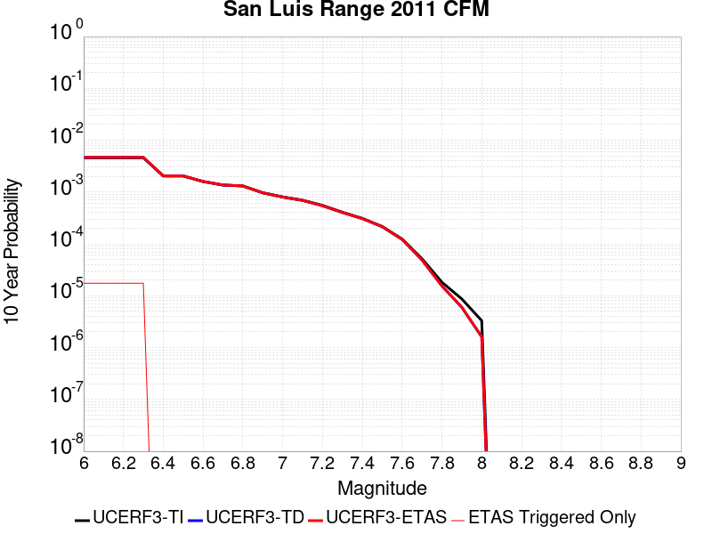 |

| Magnitude | 1 wk TI Prob | 1 wk TD Prob | 1 wk ETAS Prob | 1 wk ETAS/TD Gain | 1 wk ETAS Triggered Only | 1 mo TI Prob | 1 mo TD Prob | 1 mo ETAS Prob | 1 mo ETAS/TD Gain | 1 mo ETAS Triggered Only | 1 yr TI Prob | 1 yr TD Prob | 1 yr ETAS Prob | 1 yr ETAS/TD Gain | 1 yr ETAS Triggered Only | 10 yr TI Prob | 10 yr TD Prob | 10 yr ETAS Prob | 10 yr ETAS/TD Gain | 10 yr ETAS Triggered Only |
|-----|-----|-----|-----|-----|-----|-----|-----|-----|-----|-----|-----|-----|-----|-----|-----|-----|-----|-----|-----|-----|
| 6.0 | 8.8368415E-6 | 8.965454E-6 | 2.6409085E-5 | 2.9456496 | 1.7443788E-5 | 3.787163E-5 | 3.842285E-5 | 5.586597E-5 | 1.4539777 | 1.7443788E-5 | 4.609895E-4 | 4.677057E-4 | 4.8514133E-4 | 1.037279 | 1.7443788E-5 | 0.0046003438 | 0.0046679964 | 0.0046853586 | 1.0037194 | 1.7443788E-5 |
| 6.1 | 8.8368415E-6 | 8.965454E-6 | 2.6409085E-5 | 2.9456496 | 1.7443788E-5 | 3.787163E-5 | 3.842285E-5 | 5.586597E-5 | 1.4539777 | 1.7443788E-5 | 4.609895E-4 | 4.677057E-4 | 4.8514133E-4 | 1.037279 | 1.7443788E-5 | 0.0046003438 | 0.0046679964 | 0.0046853586 | 1.0037194 | 1.7443788E-5 |
| 6.2 | 8.8368415E-6 | 8.965454E-6 | 2.6409085E-5 | 2.9456496 | 1.7443788E-5 | 3.787163E-5 | 3.842285E-5 | 5.586597E-5 | 1.4539777 | 1.7443788E-5 | 4.609895E-4 | 4.677057E-4 | 4.8514133E-4 | 1.037279 | 1.7443788E-5 | 0.0046003438 | 0.0046679964 | 0.0046853586 | 1.0037194 | 1.7443788E-5 |
| 6.3 | 8.8368415E-6 | 8.965454E-6 | 2.6409085E-5 | 2.9456496 | 1.7443788E-5 | 3.787163E-5 | 3.842285E-5 | 5.586597E-5 | 1.4539777 | 1.7443788E-5 | 4.609895E-4 | 4.677057E-4 | 4.8514133E-4 | 1.037279 | 1.7443788E-5 | 0.0046003438 | 0.0046679964 | 0.0046853586 | 1.0037194 | 1.7443788E-5 |
| 6.4 | 3.9094193E-6 | 3.9412025E-6 | 3.9412025E-6 | 1.0 | 0.0 | 1.6754546E-5 | 1.689076E-5 | 1.689076E-5 | 1.0 | 0.0 | 2.039675E-4 | 2.056259E-4 | 2.056259E-4 | 1.0 | 0.0 | 0.0020378039 | 0.0020543851 | 0.0020543851 | 1.0 | 0.0 |
| 6.5 | 3.9094193E-6 | 3.9412025E-6 | 3.9412025E-6 | 1.0 | 0.0 | 1.6754546E-5 | 1.689076E-5 | 1.689076E-5 | 1.0 | 0.0 | 2.039675E-4 | 2.056259E-4 | 2.056259E-4 | 1.0 | 0.0 | 0.0020378039 | 0.0020543851 | 0.0020543851 | 1.0 | 0.0 |
| 6.6 | 3.0587726E-6 | 3.0753883E-6 | 3.0753883E-6 | 1.0 | 0.0 | 1.3108959E-5 | 1.318017E-5 | 1.318017E-5 | 1.0 | 0.0 | 1.595899E-4 | 1.6045687E-4 | 1.6045687E-4 | 1.0 | 0.0 | 0.0015947534 | 0.0016034221 | 0.0016034221 | 1.0 | 0.0 |
| 6.7 | 2.6160574E-6 | 2.6251273E-6 | 2.6251273E-6 | 1.0 | 0.0 | 1.1211626E-5 | 1.1250498E-5 | 1.1250498E-5 | 1.0 | 0.0 | 1.3649299E-4 | 1.3696625E-4 | 1.3696625E-4 | 1.0 | 0.0 | 0.0013640919 | 0.0013688246 | 0.0013688246 | 1.0 | 0.0 |
| 6.8 | 2.5110312E-6 | 2.51814E-6 | 2.51814E-6 | 1.0 | 0.0 | 1.0761518E-5 | 1.0791985E-5 | 1.0791985E-5 | 1.0 | 0.0 | 1.310136E-4 | 1.3138456E-4 | 1.3138456E-4 | 1.0 | 0.0 | 0.0013093639 | 0.0013130746 | 0.0013130746 | 1.0 | 0.0 |
| 6.9 | 1.8564405E-6 | 1.852487E-6 | 1.852487E-6 | 1.0 | 0.0 | 7.95615E-6 | 7.939206E-6 | 7.939206E-6 | 1.0 | 0.0 | 9.686181E-5 | 9.665557E-5 | 9.665557E-5 | 1.0 | 0.0 | 9.68196E-4 | 9.661373E-4 | 9.661373E-4 | 1.0 | 0.0 |
| 7.0 | 1.546127E-6 | 1.5369537E-6 | 1.5369537E-6 | 1.0 | 0.0 | 6.626242E-6 | 6.586928E-6 | 6.586928E-6 | 1.0 | 0.0 | 8.06715E-5 | 8.0192905E-5 | 8.0192905E-5 | 1.0 | 0.0 | 8.0642226E-4 | 8.016404E-4 | 8.016404E-4 | 1.0 | 0.0 |
| 7.1 | 1.3368208E-6 | 1.3235326E-6 | 1.3235326E-6 | 1.0 | 0.0 | 5.7292195E-6 | 5.67227E-6 | 5.67227E-6 | 1.0 | 0.0 | 6.975101E-5 | 6.905771E-5 | 6.905771E-5 | 1.0 | 0.0 | 6.972912E-4 | 6.9036294E-4 | 6.9036294E-4 | 1.0 | 0.0 |
| 7.2 | 1.0623363E-6 | 1.0454368E-6 | 1.0454368E-6 | 1.0 | 0.0 | 4.5528623E-6 | 4.4804356E-6 | 4.4804356E-6 | 1.0 | 0.0 | 5.5429686E-5 | 5.4547938E-5 | 5.4547938E-5 | 1.0 | 0.0 | 5.5415864E-4 | 5.4534577E-4 | 5.4534577E-4 | 1.0 | 0.0 |
| 7.3 | 7.831679E-7 | 7.7273904E-7 | 7.7273904E-7 | 1.0 | 0.0 | 3.3564295E-6 | 3.3117344E-6 | 3.3117344E-6 | 1.0 | 0.0 | 4.086376E-5 | 4.0319625E-5 | 4.0319625E-5 | 1.0 | 0.0 | 4.0856248E-4 | 4.031232E-4 | 4.031232E-4 | 1.0 | 0.0 |
| 7.4 | 5.9558846E-7 | 5.910636E-7 | 5.910636E-7 | 1.0 | 0.0 | 2.5525194E-6 | 2.5331274E-6 | 2.5331274E-6 | 1.0 | 0.0 | 3.107648E-5 | 3.084039E-5 | 3.084039E-5 | 1.0 | 0.0 | 3.1072134E-4 | 3.083612E-4 | 3.083612E-4 | 1.0 | 0.0 |
| 7.5 | 4.1616502E-7 | 4.119631E-7 | 4.119631E-7 | 1.0 | 0.0 | 1.7835631E-6 | 1.7655549E-6 | 1.7655549E-6 | 1.0 | 0.0 | 2.1714664E-5 | 2.149542E-5 | 2.149542E-5 | 1.0 | 0.0 | 2.1712543E-4 | 2.1493346E-4 | 2.1493346E-4 | 1.0 | 0.0 |
| 7.6 | 2.3816014E-7 | 2.3376548E-7 | 2.3376548E-7 | 1.0 | 0.0 | 1.0206859E-6 | 1.0018516E-6 | 1.0018516E-6 | 1.0 | 0.0 | 1.242678E-5 | 1.2197475E-5 | 1.2197475E-5 | 1.0 | 0.0 | 1.2426086E-4 | 1.2196808E-4 | 1.2196808E-4 | 1.0 | 0.0 |
| 7.7 | 9.918777E-8 | 9.3867584E-8 | 9.3867584E-8 | 1.0 | 0.0 | 4.2509038E-7 | 4.0228957E-7 | 4.0228957E-7 | 1.0 | 0.0 | 5.1754632E-6 | 4.8978645E-6 | 4.8978645E-6 | 1.0 | 0.0 | 5.1753424E-5 | 4.897757E-5 | 4.897757E-5 | 1.0 | 0.0 |
| 7.8 | 3.4982556E-8 | 2.968655E-8 | 2.968655E-8 | 1.0 | 0.0 | 1.4992524E-7 | 1.2722806E-7 | 1.2722806E-7 | 1.0 | 0.0 | 1.8253382E-6 | 1.5490006E-6 | 1.5490006E-6 | 1.0 | 0.0 | 1.8253233E-5 | 1.5489897E-5 | 1.5489897E-5 | 1.0 | 0.0 |
| 7.9 | 1.6624908E-8 | 1.1477036E-8 | 1.1477036E-8 | 1.0 | 0.0 | 7.12496E-8 | 4.91873E-8 | 4.91873E-8 | 1.0 | 0.0 | 8.6746354E-7 | 5.988552E-7 | 5.988552E-7 | 1.0 | 0.0 | 8.674601E-6 | 5.988536E-6 | 5.988536E-6 | 1.0 | 0.0 |
| 8.0 | 6.3352315E-9 | 3.0888412E-9 | 3.0888412E-9 | 1.0 | 0.0 | 2.715099E-8 | 1.3237893E-8 | 1.3237893E-8 | 1.0 | 0.0 | 3.3056327E-7 | 1.6117131E-7 | 1.6117131E-7 | 1.0 | 0.0 | 3.3056278E-6 | 1.611712E-6 | 1.611712E-6 | 1.0 | 0.0 |

## Hat Creek-McArthur-Mayfield
*[(top)](#table-of-contents)*

| 1 Week | 1 Month | 1 Year | 10 Year |
|-----|-----|-----|-----|
| 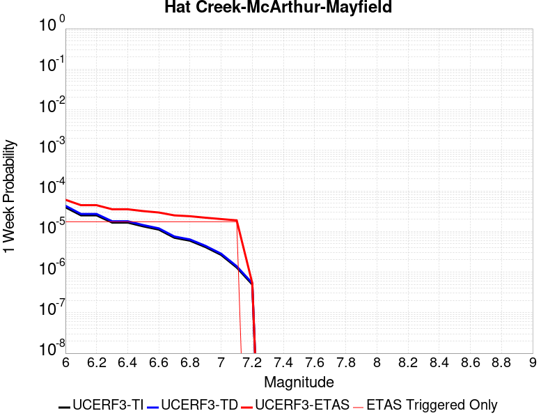 | 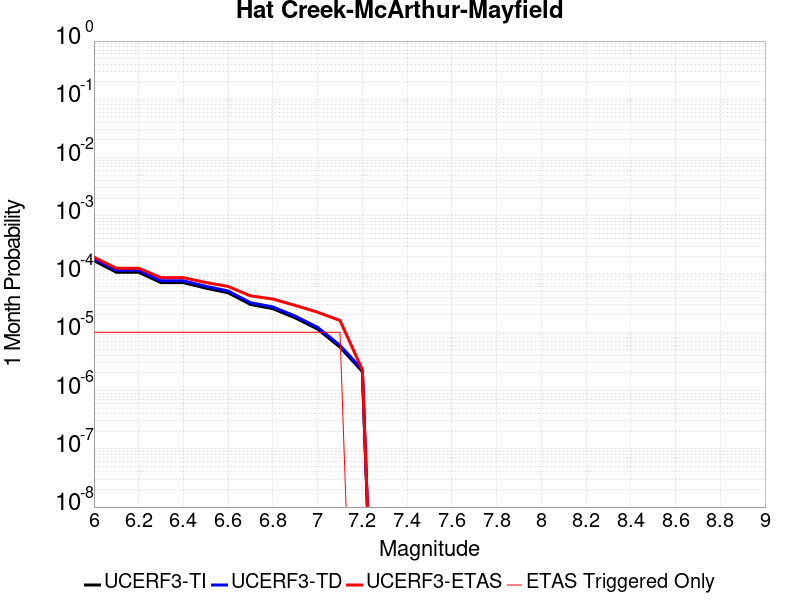 | 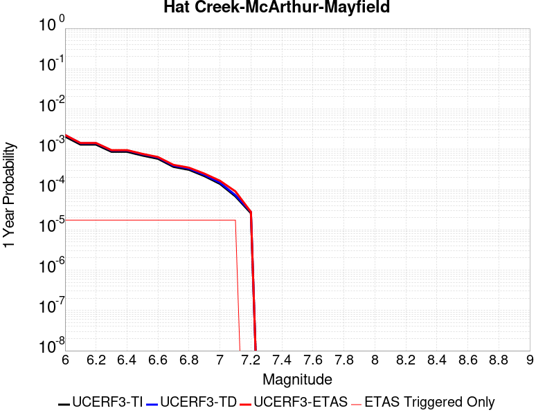 | 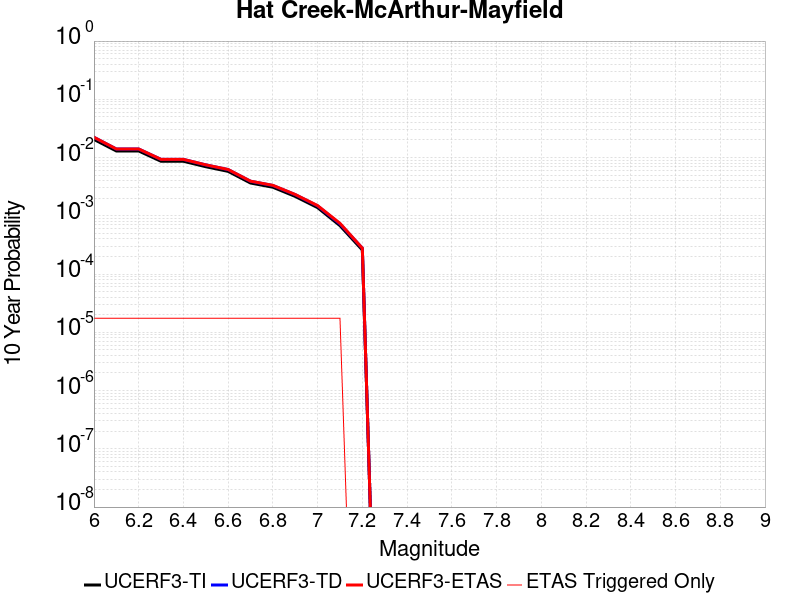 |

| Magnitude | 1 wk TI Prob | 1 wk TD Prob | 1 wk ETAS Prob | 1 wk ETAS/TD Gain | 1 wk ETAS Triggered Only | 1 mo TI Prob | 1 mo TD Prob | 1 mo ETAS Prob | 1 mo ETAS/TD Gain | 1 mo ETAS Triggered Only | 1 yr TI Prob | 1 yr TD Prob | 1 yr ETAS Prob | 1 yr ETAS/TD Gain | 1 yr ETAS Triggered Only | 10 yr TI Prob | 10 yr TD Prob | 10 yr ETAS Prob | 10 yr ETAS/TD Gain | 10 yr ETAS Triggered Only |
|-----|-----|-----|-----|-----|-----|-----|-----|-----|-----|-----|-----|-----|-----|-----|-----|-----|-----|-----|-----|-----|
| 6.0 | 3.967457E-5 | 4.315831E-5 | 6.0601345E-5 | 1.404164 | 1.7443788E-5 | 1.7002279E-4 | 1.8495171E-4 | 2.0239229E-4 | 1.0942979 | 1.7443788E-5 | 0.002068062 | 0.002249576 | 0.0022669805 | 1.0077368 | 1.7443788E-5 | 0.02048922 | 0.022280399 | 0.022297453 | 1.0007654 | 1.7443788E-5 |
| 6.1 | 2.5044013E-5 | 2.7071164E-5 | 4.451448E-5 | 1.6443504 | 1.7443788E-5 | 1.0732707E-4 | 1.1601429E-4 | 1.3345605E-4 | 1.1503415 | 1.7443788E-5 | 0.0013059238 | 0.0014115906 | 0.0014290098 | 1.0123401 | 1.7443788E-5 | 0.01298276 | 0.01402966 | 0.01404686 | 1.001226 | 1.7443788E-5 |
| 6.2 | 2.5044013E-5 | 2.7071164E-5 | 4.451448E-5 | 1.6443504 | 1.7443788E-5 | 1.0732707E-4 | 1.1601429E-4 | 1.3345605E-4 | 1.1503415 | 1.7443788E-5 | 0.0013059238 | 0.0014115906 | 0.0014290098 | 1.0123401 | 1.7443788E-5 | 0.01298276 | 0.01402966 | 0.01404686 | 1.001226 | 1.7443788E-5 |
| 6.3 | 1.6624012E-5 | 1.7891072E-5 | 3.5334546E-5 | 1.9749821 | 1.7443788E-5 | 7.124382E-5 | 7.6673816E-5 | 9.4116265E-5 | 1.227489 | 1.7443788E-5 | 8.670483E-4 | 9.331125E-4 | 9.5054E-4 | 1.0186768 | 1.7443788E-5 | 0.008636732 | 0.009292879 | 0.009310161 | 1.0018597 | 1.7443788E-5 |
| 6.4 | 1.6624012E-5 | 1.7891072E-5 | 3.5334546E-5 | 1.9749821 | 1.7443788E-5 | 7.124382E-5 | 7.6673816E-5 | 9.4116265E-5 | 1.227489 | 1.7443788E-5 | 8.670483E-4 | 9.331125E-4 | 9.5054E-4 | 1.0186768 | 1.7443788E-5 | 0.008636732 | 0.009292879 | 0.009310161 | 1.0018597 | 1.7443788E-5 |
| 6.5 | 1.3394842E-5 | 1.4392137E-5 | 3.1835672E-5 | 2.2120185 | 1.7443788E-5 | 5.7405203E-5 | 6.167916E-5 | 7.912187E-5 | 1.2827975 | 1.7443788E-5 | 6.986842E-4 | 7.506906E-4 | 7.681213E-4 | 1.0232196 | 1.7443788E-5 | 0.006964916 | 0.0074821403 | 0.0074994536 | 1.002314 | 1.7443788E-5 |
| 6.6 | 1.1137514E-5 | 1.1954546E-5 | 2.9398125E-5 | 2.4591587 | 1.7443788E-5 | 4.7731326E-5 | 5.1232782E-5 | 6.8675676E-5 | 1.3404635 | 1.7443788E-5 | 5.809739E-4 | 6.2358467E-4 | 6.4101757E-4 | 1.027956 | 1.7443788E-5 | 0.005794574 | 0.00621877 | 0.006236105 | 1.0027876 | 1.7443788E-5 |
| 6.7 | 7.0200663E-6 | 7.5242897E-6 | 2.4967945E-5 | 3.3183126 | 1.7443788E-5 | 3.008565E-5 | 3.2246568E-5 | 4.9689792E-5 | 1.5409328 | 1.7443788E-5 | 3.6623122E-4 | 3.925328E-4 | 4.0996974E-4 | 1.0444216 | 1.7443788E-5 | 0.0036562826 | 0.0039185574 | 0.0039359326 | 1.0044341 | 1.7443788E-5 |
| 6.8 | 5.940172E-6 | 6.3654766E-6 | 2.3809152E-5 | 3.7403567 | 1.7443788E-5 | 2.545763E-5 | 2.7280335E-5 | 4.472365E-5 | 1.6394097 | 1.7443788E-5 | 3.0990256E-4 | 3.3208873E-4 | 3.4952673E-4 | 1.05251 | 1.7443788E-5 | 0.0030947074 | 0.0033160534 | 0.0033334394 | 1.005243 | 1.7443788E-5 |
| 6.9 | 4.129831E-6 | 4.423547E-6 | 2.1867258E-5 | 4.943376 | 1.7443788E-5 | 1.7699154E-5 | 1.8957926E-5 | 3.6401383E-5 | 1.9201142 | 1.7443788E-5 | 2.154659E-4 | 2.3078908E-4 | 2.4822884E-4 | 1.0755658 | 1.7443788E-5 | 0.002152571 | 0.0023055724 | 0.002322976 | 1.0075485 | 1.7443788E-5 |
| 7.0 | 2.6512955E-6 | 2.8374002E-6 | 2.0281139E-5 | 7.147789 | 1.7443788E-5 | 1.1362646E-5 | 1.2160232E-5 | 2.9603807E-5 | 2.434477 | 1.7443788E-5 | 1.3833142E-4 | 1.480412E-4 | 1.654824E-4 | 1.1178132 | 1.7443788E-5 | 0.0013824535 | 0.0014794683 | 0.0014968863 | 1.0117731 | 1.7443788E-5 |
| 7.1 | 1.2992575E-6 | 1.3909317E-6 | 1.8834695E-5 | 13.541063 | 1.7443788E-5 | 5.568235E-6 | 5.961124E-6 | 2.3404808E-5 | 3.9262407 | 1.7443788E-5 | 6.779115E-5 | 7.257448E-5 | 9.0017005E-5 | 1.2403396 | 1.7443788E-5 | 6.7770475E-4 | 7.2552945E-4 | 7.429606E-4 | 1.0240254 | 1.7443788E-5 |
| 7.2 | 4.968191E-7 | 5.3271475E-7 | 5.3271475E-7 | 1.0 | 0.0 | 2.1292228E-6 | 2.283062E-6 | 2.283062E-6 | 1.0 | 0.0 | 2.592298E-5 | 2.7796052E-5 | 2.7796052E-5 | 1.0 | 0.0 | 2.5919956E-4 | 2.7793812E-4 | 2.7793812E-4 | 1.0 | 0.0 |

## North Frontal  (West)
*[(top)](#table-of-contents)*

| 1 Week | 1 Month | 1 Year | 10 Year |
|-----|-----|-----|-----|
| 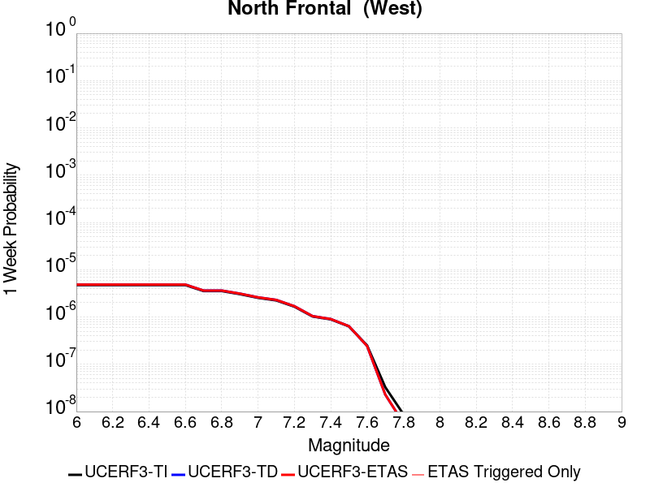 | 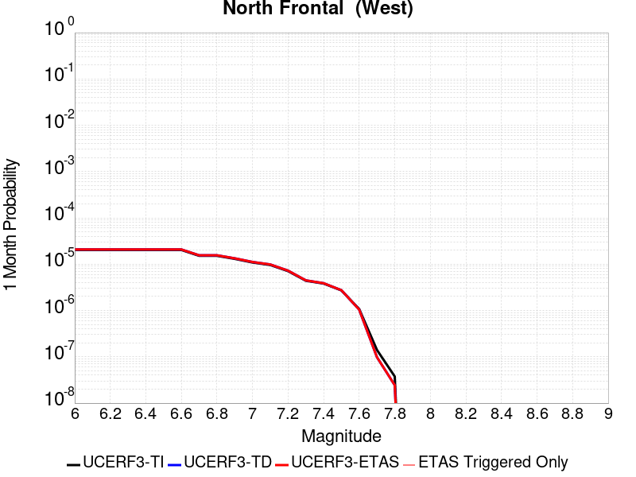 | 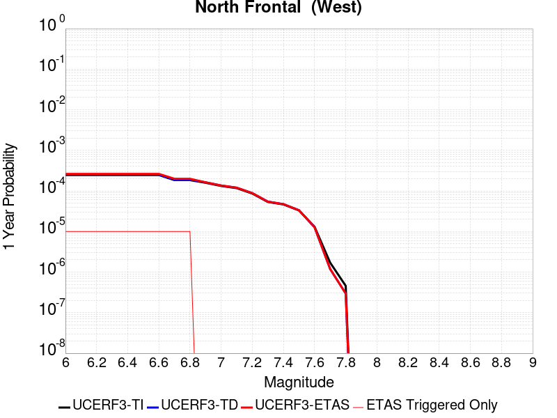 | 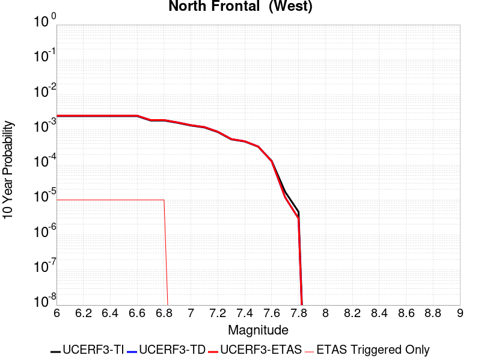 |

| Magnitude | 1 wk TI Prob | 1 wk TD Prob | 1 wk ETAS Prob | 1 wk ETAS/TD Gain | 1 wk ETAS Triggered Only | 1 mo TI Prob | 1 mo TD Prob | 1 mo ETAS Prob | 1 mo ETAS/TD Gain | 1 mo ETAS Triggered Only | 1 yr TI Prob | 1 yr TD Prob | 1 yr ETAS Prob | 1 yr ETAS/TD Gain | 1 yr ETAS Triggered Only | 10 yr TI Prob | 10 yr TD Prob | 10 yr ETAS Prob | 10 yr ETAS/TD Gain | 10 yr ETAS Triggered Only |
|-----|-----|-----|-----|-----|-----|-----|-----|-----|-----|-----|-----|-----|-----|-----|-----|-----|-----|-----|-----|-----|
| 6.0 | 4.7316266E-6 | 4.8526726E-6 | 4.8526726E-6 | 1.0 | 0.0 | 2.0278241E-5 | 2.0797012E-5 | 2.0797012E-5 | 1.0 | 0.0 | 2.4685962E-4 | 2.5317568E-4 | 2.7061504E-4 | 1.0688825 | 1.7443788E-5 | 0.0024658558 | 0.0025290183 | 0.002546418 | 1.00688 | 1.7443788E-5 |
| 6.1 | 4.7316266E-6 | 4.8526726E-6 | 4.8526726E-6 | 1.0 | 0.0 | 2.0278241E-5 | 2.0797012E-5 | 2.0797012E-5 | 1.0 | 0.0 | 2.4685962E-4 | 2.5317568E-4 | 2.7061504E-4 | 1.0688825 | 1.7443788E-5 | 0.0024658558 | 0.0025290183 | 0.002546418 | 1.00688 | 1.7443788E-5 |
| 6.2 | 4.7316266E-6 | 4.8526726E-6 | 4.8526726E-6 | 1.0 | 0.0 | 2.0278241E-5 | 2.0797012E-5 | 2.0797012E-5 | 1.0 | 0.0 | 2.4685962E-4 | 2.5317568E-4 | 2.7061504E-4 | 1.0688825 | 1.7443788E-5 | 0.0024658558 | 0.0025290183 | 0.002546418 | 1.00688 | 1.7443788E-5 |
| 6.3 | 4.7316266E-6 | 4.8526726E-6 | 4.8526726E-6 | 1.0 | 0.0 | 2.0278241E-5 | 2.0797012E-5 | 2.0797012E-5 | 1.0 | 0.0 | 2.4685962E-4 | 2.5317568E-4 | 2.7061504E-4 | 1.0688825 | 1.7443788E-5 | 0.0024658558 | 0.0025290183 | 0.002546418 | 1.00688 | 1.7443788E-5 |
| 6.4 | 4.7316266E-6 | 4.8526726E-6 | 4.8526726E-6 | 1.0 | 0.0 | 2.0278241E-5 | 2.0797012E-5 | 2.0797012E-5 | 1.0 | 0.0 | 2.4685962E-4 | 2.5317568E-4 | 2.7061504E-4 | 1.0688825 | 1.7443788E-5 | 0.0024658558 | 0.0025290183 | 0.002546418 | 1.00688 | 1.7443788E-5 |
| 6.5 | 4.7316266E-6 | 4.8526726E-6 | 4.8526726E-6 | 1.0 | 0.0 | 2.0278241E-5 | 2.0797012E-5 | 2.0797012E-5 | 1.0 | 0.0 | 2.4685962E-4 | 2.5317568E-4 | 2.7061504E-4 | 1.0688825 | 1.7443788E-5 | 0.0024658558 | 0.0025290183 | 0.002546418 | 1.00688 | 1.7443788E-5 |
| 6.6 | 4.7316266E-6 | 4.8526726E-6 | 4.8526726E-6 | 1.0 | 0.0 | 2.0278241E-5 | 2.0797012E-5 | 2.0797012E-5 | 1.0 | 0.0 | 2.4685962E-4 | 2.5317568E-4 | 2.7061504E-4 | 1.0688825 | 1.7443788E-5 | 0.0024658558 | 0.0025290183 | 0.002546418 | 1.00688 | 1.7443788E-5 |
| 6.7 | 3.5382777E-6 | 3.6308859E-6 | 3.6308859E-6 | 1.0 | 0.0 | 1.516396E-5 | 1.5560852E-5 | 1.5560852E-5 | 1.0 | 0.0 | 1.8460557E-4 | 1.8943768E-4 | 2.0687816E-4 | 1.0920645 | 1.7443788E-5 | 0.0018445229 | 0.0018928389 | 0.0019102496 | 1.0091982 | 1.7443788E-5 |
| 6.8 | 3.5382777E-6 | 3.6308859E-6 | 3.6308859E-6 | 1.0 | 0.0 | 1.516396E-5 | 1.5560852E-5 | 1.5560852E-5 | 1.0 | 0.0 | 1.8460557E-4 | 1.8943768E-4 | 2.0687816E-4 | 1.0920645 | 1.7443788E-5 | 0.0018445229 | 0.0018928389 | 0.0019102496 | 1.0091982 | 1.7443788E-5 |
| 6.9 | 3.0428037E-6 | 3.1227605E-6 | 3.1227605E-6 | 1.0 | 0.0 | 1.30405215E-5 | 1.33831945E-5 | 1.33831945E-5 | 1.0 | 0.0 | 1.5875678E-4 | 1.6292889E-4 | 1.6292889E-4 | 1.0 | 0.0 | 0.0015864341 | 0.0016281615 | 0.0016281615 | 1.0 | 0.0 |
| 7.0 | 2.538778E-6 | 2.6060904E-6 | 2.6060904E-6 | 1.0 | 0.0 | 1.0880432E-5 | 1.1168913E-5 | 1.1168913E-5 | 1.0 | 0.0 | 1.324612E-4 | 1.3597352E-4 | 1.3597352E-4 | 1.0 | 0.0 | 0.0013238228 | 0.0013589499 | 0.0013589499 | 1.0 | 0.0 |
| 7.1 | 2.2418935E-6 | 2.3012074E-6 | 2.3012074E-6 | 1.0 | 0.0 | 9.60808E-6 | 9.862282E-6 | 9.862282E-6 | 1.0 | 0.0 | 1.1697209E-4 | 1.2006712E-4 | 1.2006712E-4 | 1.0 | 0.0 | 0.0011691054 | 0.0012000664 | 0.0012000664 | 1.0 | 0.0 |
| 7.2 | 1.6526745E-6 | 1.6924851E-6 | 1.6924851E-6 | 1.0 | 0.0 | 7.082872E-6 | 7.253489E-6 | 7.253489E-6 | 1.0 | 0.0 | 8.623055E-5 | 8.8307905E-5 | 8.8307905E-5 | 1.0 | 0.0 | 8.61971E-4 | 8.827532E-4 | 8.827532E-4 | 1.0 | 0.0 |
| 7.3 | 1.0246019E-6 | 1.0442261E-6 | 1.0442261E-6 | 1.0 | 0.0 | 4.391144E-6 | 4.4752474E-6 | 4.4752474E-6 | 1.0 | 0.0 | 5.3460866E-5 | 5.448489E-5 | 5.448489E-5 | 1.0 | 0.0 | 5.344801E-4 | 5.4472685E-4 | 5.4472685E-4 | 1.0 | 0.0 |
| 7.4 | 8.9045164E-7 | 9.0565584E-7 | 9.0565584E-7 | 1.0 | 0.0 | 3.8162157E-6 | 3.8813773E-6 | 3.8813773E-6 | 1.0 | 0.0 | 4.646144E-5 | 4.7254853E-5 | 4.7254853E-5 | 1.0 | 0.0 | 4.6451724E-4 | 4.7245892E-4 | 4.7245892E-4 | 1.0 | 0.0 |
| 7.5 | 6.3357E-7 | 6.4027006E-7 | 6.4027006E-7 | 1.0 | 0.0 | 2.7152971E-6 | 2.744012E-6 | 2.744012E-6 | 1.0 | 0.0 | 3.305824E-5 | 3.34079E-5 | 3.34079E-5 | 1.0 | 0.0 | 3.3053322E-4 | 3.3403534E-4 | 3.3403534E-4 | 1.0 | 0.0 |
| 7.6 | 2.5087024E-7 | 2.4361097E-7 | 2.4361097E-7 | 1.0 | 0.0 | 1.0751578E-6 | 1.0440467E-6 | 1.0440467E-6 | 1.0 | 0.0 | 1.3089967E-5 | 1.2711216E-5 | 1.2711216E-5 | 1.0 | 0.0 | 1.3089196E-4 | 1.2710695E-4 | 1.2710695E-4 | 1.0 | 0.0 |
| 7.7 | 3.282987E-8 | 2.2874195E-8 | 2.2874195E-8 | 1.0 | 0.0 | 1.4069944E-7 | 9.803227E-8 | 9.803227E-8 | 1.0 | 0.0 | 1.7130144E-6 | 1.1935423E-6 | 1.1935423E-6 | 1.0 | 0.0 | 1.7130013E-5 | 1.1935367E-5 | 1.1935367E-5 | 1.0 | 0.0 |
| 7.8 | 8.77499E-9 | 5.6815956E-9 | 5.6815956E-9 | 1.0 | 0.0 | 3.7607098E-8 | 2.4349696E-8 | 2.4349696E-8 | 1.0 | 0.0 | 4.578663E-7 | 2.9645753E-7 | 2.9645753E-7 | 1.0 | 0.0 | 4.5786537E-6 | 2.9645726E-6 | 2.9645726E-6 | 1.0 | 0.0 |

## Elmore Ranch
*[(top)](#table-of-contents)*

| 1 Week | 1 Month | 1 Year | 10 Year |
|-----|-----|-----|-----|
| 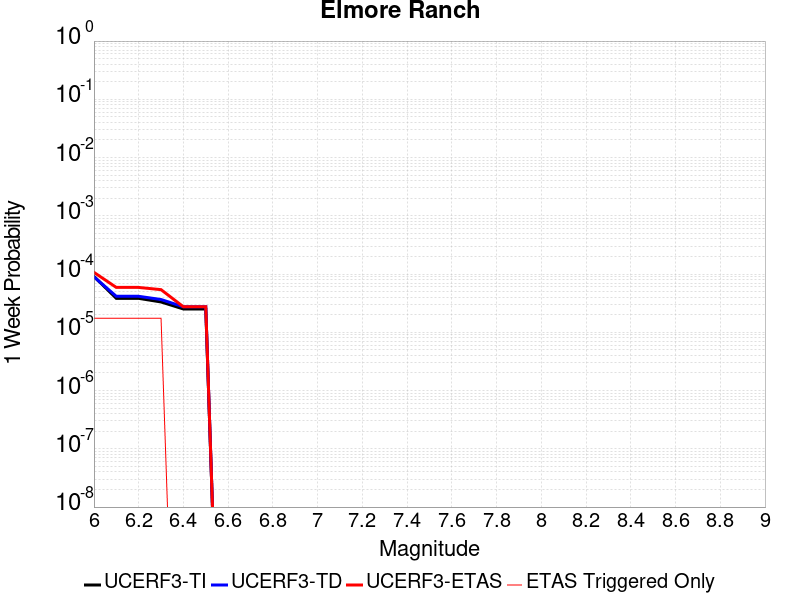 | 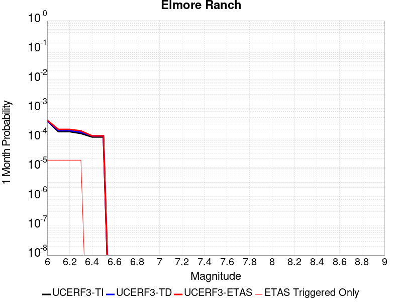 | 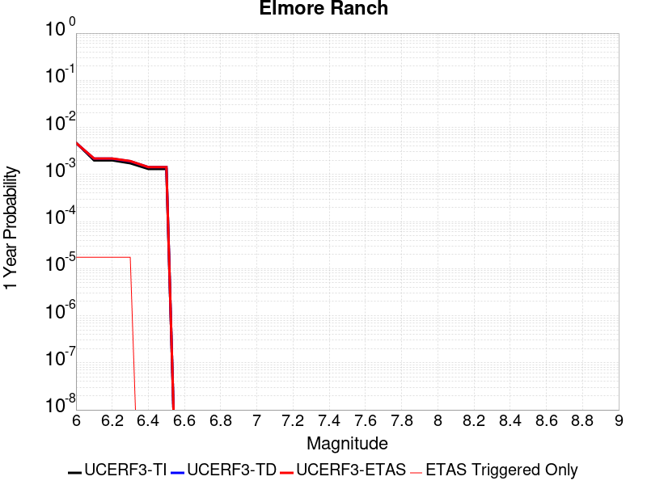 | 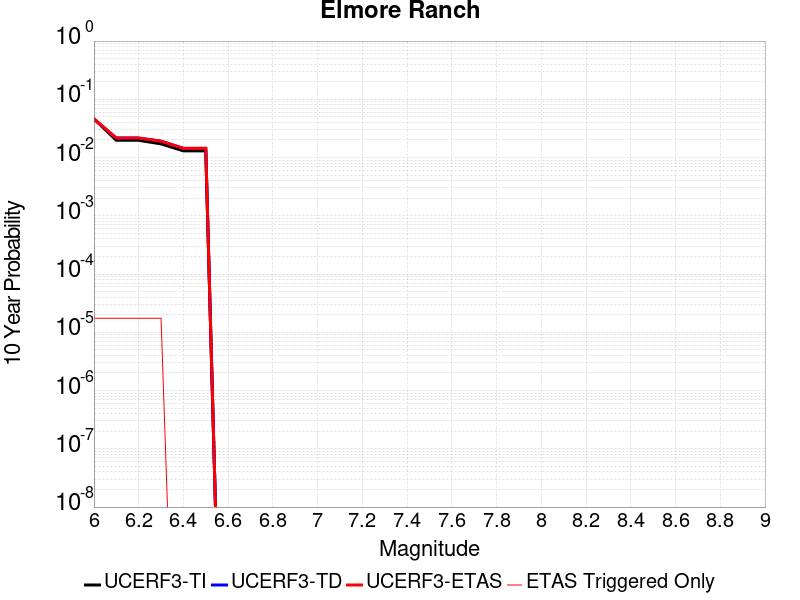 |

| Magnitude | 1 wk TI Prob | 1 wk TD Prob | 1 wk ETAS Prob | 1 wk ETAS/TD Gain | 1 wk ETAS Triggered Only | 1 mo TI Prob | 1 mo TD Prob | 1 mo ETAS Prob | 1 mo ETAS/TD Gain | 1 mo ETAS Triggered Only | 1 yr TI Prob | 1 yr TD Prob | 1 yr ETAS Prob | 1 yr ETAS/TD Gain | 1 yr ETAS Triggered Only | 10 yr TI Prob | 10 yr TD Prob | 10 yr ETAS Prob | 10 yr ETAS/TD Gain | 10 yr ETAS Triggered Only |
|-----|-----|-----|-----|-----|-----|-----|-----|-----|-----|-----|-----|-----|-----|-----|-----|-----|-----|-----|-----|-----|
| 6.0 | 9.102099E-5 | 8.952015E-5 | 1.06962376E-4 | 1.1948414 | 1.7443788E-5 | 3.9003167E-4 | 3.8361453E-4 | 4.0105163E-4 | 1.0454547 | 1.7443788E-5 | 0.0047383 | 0.004662009 | 0.004679371 | 1.0037242 | 1.7443788E-5 | 0.046385348 | 0.045870975 | 0.04588762 | 1.0003629 | 1.7443788E-5 |
| 6.1 | 3.8306698E-5 | 4.1498504E-5 | 5.894157E-5 | 1.4203299 | 1.7443788E-5 | 1.6416123E-4 | 1.7784268E-4 | 1.9528337E-4 | 1.098068 | 1.7443788E-5 | 0.0019968306 | 0.0021631396 | 0.0021805456 | 1.0080466 | 1.7443788E-5 | 0.019789828 | 0.021628205 | 0.02164527 | 1.000789 | 1.7443788E-5 |
| 6.2 | 3.8306698E-5 | 4.1498504E-5 | 5.894157E-5 | 1.4203299 | 1.7443788E-5 | 1.6416123E-4 | 1.7784268E-4 | 1.9528337E-4 | 1.098068 | 1.7443788E-5 | 0.0019968306 | 0.0021631396 | 0.0021805456 | 1.0080466 | 1.7443788E-5 | 0.019789828 | 0.021628205 | 0.02164527 | 1.000789 | 1.7443788E-5 |
| 6.3 | 3.3197924E-5 | 3.6554302E-5 | 5.3997454E-5 | 1.4771845 | 1.7443788E-5 | 1.4226905E-4 | 1.5665586E-4 | 1.7409692E-4 | 1.1113336 | 1.7443788E-5 | 0.0017307495 | 0.001905917 | 0.0019233276 | 1.009135 | 1.7443788E-5 | 0.017173318 | 0.01908996 | 0.01910707 | 1.0008963 | 1.7443788E-5 |
| 6.4 | 2.5148964E-5 | 2.7420487E-5 | 2.7420487E-5 | 1.0 | 0.0 | 1.0777682E-4 | 1.17514726E-4 | 1.17514726E-4 | 1.0 | 0.0 | 0.0013113929 | 0.0014304507 | 0.0014304507 | 1.0 | 0.0 | 0.01303681 | 0.014387194 | 0.014387194 | 1.0 | 0.0 |
| 6.5 | 2.5148964E-5 | 2.7420487E-5 | 2.7420487E-5 | 1.0 | 0.0 | 1.0777682E-4 | 1.17514726E-4 | 1.17514726E-4 | 1.0 | 0.0 | 0.0013113929 | 0.0014304507 | 0.0014304507 | 1.0 | 0.0 | 0.01303681 | 0.014387194 | 0.014387194 | 1.0 | 0.0 |

## Great Valley 08 (Quinto)
*[(top)](#table-of-contents)*

| 1 Week | 1 Month | 1 Year | 10 Year |
|-----|-----|-----|-----|
| 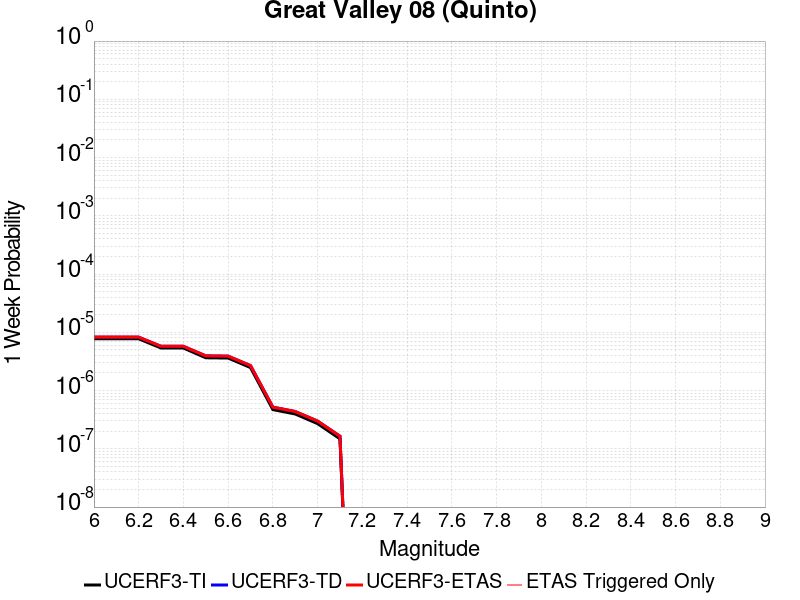 |  | 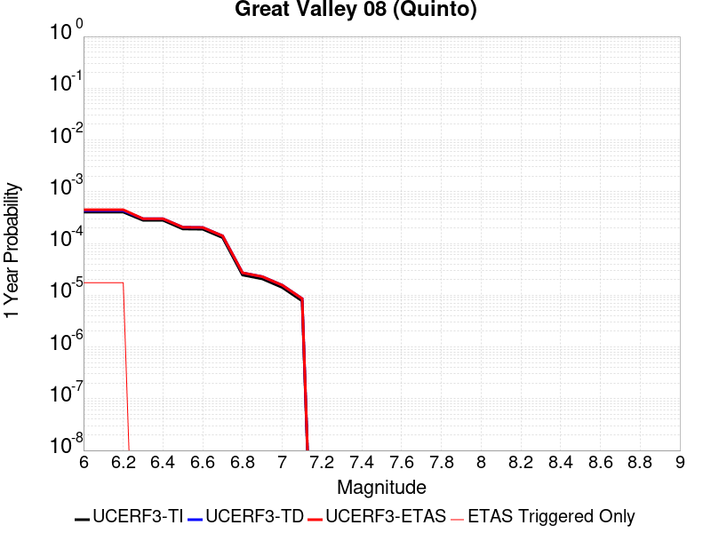 | 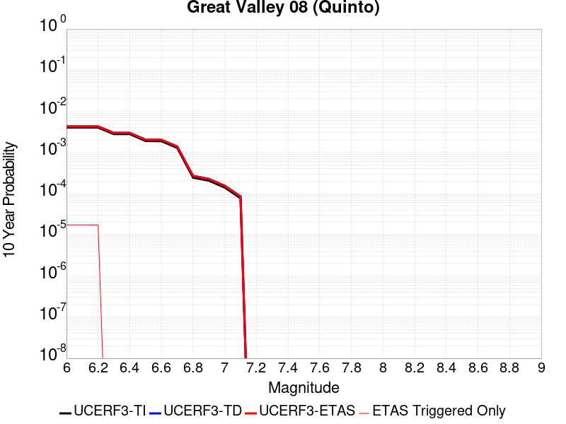 |

| Magnitude | 1 wk TI Prob | 1 wk TD Prob | 1 wk ETAS Prob | 1 wk ETAS/TD Gain | 1 wk ETAS Triggered Only | 1 mo TI Prob | 1 mo TD Prob | 1 mo ETAS Prob | 1 mo ETAS/TD Gain | 1 mo ETAS Triggered Only | 1 yr TI Prob | 1 yr TD Prob | 1 yr ETAS Prob | 1 yr ETAS/TD Gain | 1 yr ETAS Triggered Only | 10 yr TI Prob | 10 yr TD Prob | 10 yr ETAS Prob | 10 yr ETAS/TD Gain | 10 yr ETAS Triggered Only |
|-----|-----|-----|-----|-----|-----|-----|-----|-----|-----|-----|-----|-----|-----|-----|-----|-----|-----|-----|-----|-----|
| 6.0 | 7.737697E-6 | 8.253038E-6 | 8.253038E-6 | 1.0 | 0.0 | 3.3161137E-5 | 3.536979E-5 | 3.536979E-5 | 1.0 | 0.0 | 4.0366207E-4 | 4.3056096E-4 | 4.4799724E-4 | 1.0404967 | 1.7443788E-5 | 0.004029296 | 0.0042991205 | 0.004316489 | 1.0040401 | 1.7443788E-5 |
| 6.1 | 7.737697E-6 | 8.253038E-6 | 8.253038E-6 | 1.0 | 0.0 | 3.3161137E-5 | 3.536979E-5 | 3.536979E-5 | 1.0 | 0.0 | 4.0366207E-4 | 4.3056096E-4 | 4.4799724E-4 | 1.0404967 | 1.7443788E-5 | 0.004029296 | 0.0042991205 | 0.004316489 | 1.0040401 | 1.7443788E-5 |
| 6.2 | 7.737697E-6 | 8.253038E-6 | 8.253038E-6 | 1.0 | 0.0 | 3.3161137E-5 | 3.536979E-5 | 3.536979E-5 | 1.0 | 0.0 | 4.0366207E-4 | 4.3056096E-4 | 4.4799724E-4 | 1.0404967 | 1.7443788E-5 | 0.004029296 | 0.0042991205 | 0.004316489 | 1.0040401 | 1.7443788E-5 |
| 6.3 | 5.374012E-6 | 5.7505736E-6 | 5.7505736E-6 | 1.0 | 0.0 | 2.3031276E-5 | 2.4645145E-5 | 2.4645145E-5 | 1.0 | 0.0 | 2.803697E-4 | 3.0002446E-4 | 3.0002446E-4 | 1.0 | 0.0 | 0.0028001624 | 0.0029972875 | 0.0029972875 | 1.0 | 0.0 |
| 6.4 | 5.374012E-6 | 5.7505736E-6 | 5.7505736E-6 | 1.0 | 0.0 | 2.3031276E-5 | 2.4645145E-5 | 2.4645145E-5 | 1.0 | 0.0 | 2.803697E-4 | 3.0002446E-4 | 3.0002446E-4 | 1.0 | 0.0 | 0.0028001624 | 0.0029972875 | 0.0029972875 | 1.0 | 0.0 |
| 6.5 | 3.65427E-6 | 3.941324E-6 | 3.941324E-6 | 1.0 | 0.0 | 1.5661062E-5 | 1.689132E-5 | 1.689132E-5 | 1.0 | 0.0 | 1.9065675E-4 | 2.0563944E-4 | 2.0563944E-4 | 1.0 | 0.0 | 0.0019049325 | 0.0020551833 | 0.0020551833 | 1.0 | 0.0 |
| 6.6 | 3.6143538E-6 | 3.8985104E-6 | 3.8985104E-6 | 1.0 | 0.0 | 1.5489995E-5 | 1.6707834E-5 | 1.6707834E-5 | 1.0 | 0.0 | 1.8857437E-4 | 2.0340596E-4 | 2.0340596E-4 | 1.0 | 0.0 | 0.0018841444 | 0.0020328893 | 0.0020328893 | 1.0 | 0.0 |
| 6.7 | 2.4821015E-6 | 2.6857067E-6 | 2.6857067E-6 | 1.0 | 0.0 | 1.0637535E-5 | 1.1510153E-5 | 1.1510153E-5 | 1.0 | 0.0 | 1.2950429E-4 | 1.4013276E-4 | 1.4013276E-4 | 1.0 | 0.0 | 0.0012942884 | 0.0014009989 | 0.0014009989 | 1.0 | 0.0 |
| 6.8 | 4.7110538E-7 | 5.193021E-7 | 5.193021E-7 | 1.0 | 0.0 | 2.0190216E-6 | 2.2255786E-6 | 2.2255786E-6 | 1.0 | 0.0 | 2.458131E-5 | 2.70961E-5 | 2.70961E-5 | 1.0 | 0.0 | 2.457859E-4 | 2.7092977E-4 | 2.7092977E-4 | 1.0 | 0.0 |
| 6.9 | 3.958685E-7 | 4.3703452E-7 | 4.3703452E-7 | 1.0 | 0.0 | 1.6965782E-6 | 1.8730038E-6 | 1.8730038E-6 | 1.0 | 0.0 | 2.0655643E-5 | 2.28036E-5 | 2.28036E-5 | 1.0 | 0.0 | 2.0653724E-4 | 2.2801422E-4 | 2.2801422E-4 | 1.0 | 0.0 |
| 7.0 | 2.70294E-7 | 2.9920008E-7 | 2.9920008E-7 | 1.0 | 0.0 | 1.1584025E-6 | 1.2822856E-6 | 1.2822856E-6 | 1.0 | 0.0 | 1.4103458E-5 | 1.5611728E-5 | 1.5611728E-5 | 1.0 | 0.0 | 1.4102564E-4 | 1.5610759E-4 | 1.5610759E-4 | 1.0 | 0.0 |
| 7.1 | 1.4828602E-7 | 1.6469107E-7 | 1.6469107E-7 | 1.0 | 0.0 | 6.3551136E-7 | 7.058187E-7 | 7.058187E-7 | 1.0 | 0.0 | 7.737323E-6 | 8.593317E-6 | 8.593317E-6 | 1.0 | 0.0 | 7.737054E-5 | 8.593065E-5 | 8.593065E-5 | 1.0 | 0.0 |

## Davis Creek
*[(top)](#table-of-contents)*

| 1 Week | 1 Month | 1 Year | 10 Year |
|-----|-----|-----|-----|
| 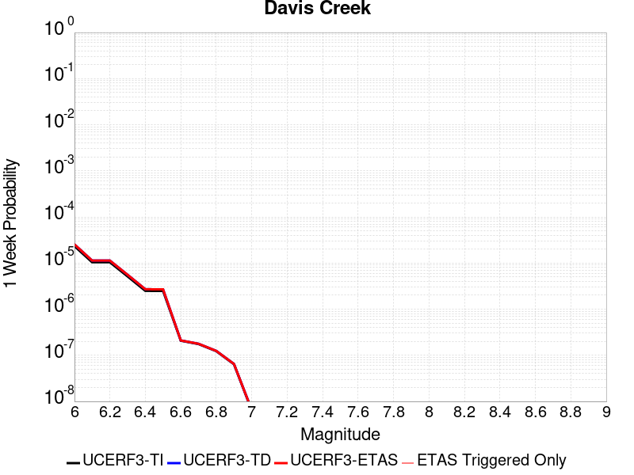 |  | 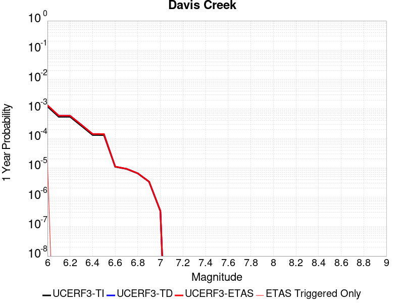 | 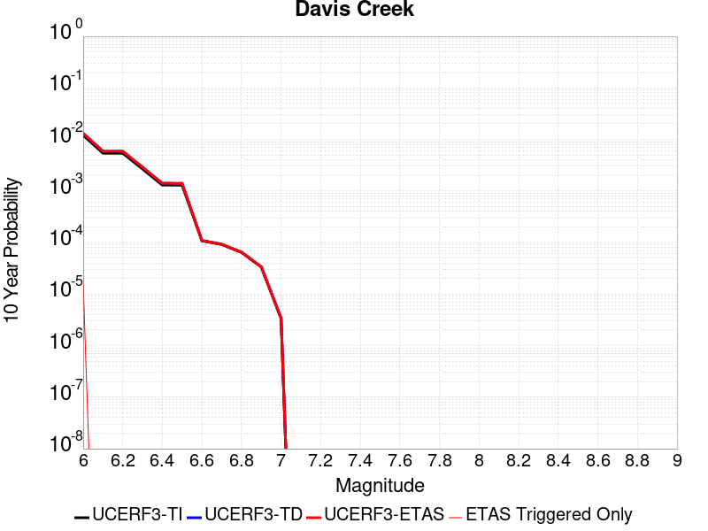 |

| Magnitude | 1 wk TI Prob | 1 wk TD Prob | 1 wk ETAS Prob | 1 wk ETAS/TD Gain | 1 wk ETAS Triggered Only | 1 mo TI Prob | 1 mo TD Prob | 1 mo ETAS Prob | 1 mo ETAS/TD Gain | 1 mo ETAS Triggered Only | 1 yr TI Prob | 1 yr TD Prob | 1 yr ETAS Prob | 1 yr ETAS/TD Gain | 1 yr ETAS Triggered Only | 10 yr TI Prob | 10 yr TD Prob | 10 yr ETAS Prob | 10 yr ETAS/TD Gain | 10 yr ETAS Triggered Only |
|-----|-----|-----|-----|-----|-----|-----|-----|-----|-----|-----|-----|-----|-----|-----|-----|-----|-----|-----|-----|-----|
| 6.0 | 2.331472E-5 | 2.5417214E-5 | 2.5417214E-5 | 1.0 | 0.0 | 9.99164E-5 | 1.0892704E-4 | 1.0892704E-4 | 1.0 | 0.0 | 0.0012158032 | 0.0013254983 | 0.001342919 | 1.0131427 | 1.7443788E-5 | 0.01209173 | 0.013187704 | 0.013204918 | 1.0013053 | 1.7443788E-5 |
| 6.1 | 1.0407654E-5 | 1.1316986E-5 | 1.1316986E-5 | 1.0 | 0.0 | 4.4603472E-5 | 4.8500624E-5 | 4.8500624E-5 | 1.0 | 0.0 | 5.4291193E-4 | 5.9036224E-4 | 5.9036224E-4 | 1.0 | 0.0 | 0.0054158745 | 0.005890611 | 0.005890611 | 1.0 | 0.0 |
| 6.2 | 1.0407654E-5 | 1.1316986E-5 | 1.1316986E-5 | 1.0 | 0.0 | 4.4603472E-5 | 4.8500624E-5 | 4.8500624E-5 | 1.0 | 0.0 | 5.4291193E-4 | 5.9036224E-4 | 5.9036224E-4 | 1.0 | 0.0 | 0.0054158745 | 0.005890611 | 0.005890611 | 1.0 | 0.0 |
| 6.3 | 5.1323277E-6 | 5.568556E-6 | 5.568556E-6 | 1.0 | 0.0 | 2.1995505E-5 | 2.386507E-5 | 2.386507E-5 | 1.0 | 0.0 | 2.6776237E-4 | 2.905271E-4 | 2.905271E-4 | 1.0 | 0.0 | 0.0026743996 | 0.0029023192 | 0.0029023192 | 1.0 | 0.0 |
| 6.4 | 2.4985154E-6 | 2.704538E-6 | 2.704538E-6 | 1.0 | 0.0 | 1.07078795E-5 | 1.1590847E-5 | 1.1590847E-5 | 1.0 | 0.0 | 1.3036063E-4 | 1.4111304E-4 | 1.4111304E-4 | 1.0 | 0.0 | 0.0013028418 | 0.001410589 | 0.001410589 | 1.0 | 0.0 |
| 6.5 | 2.4846438E-6 | 2.6904722E-6 | 2.6904722E-6 | 1.0 | 0.0 | 1.064843E-5 | 1.1530565E-5 | 1.1530565E-5 | 1.0 | 0.0 | 1.2963692E-4 | 1.403792E-4 | 1.403792E-4 | 1.0 | 0.0 | 0.0012956132 | 0.0014032599 | 0.0014032599 | 1.0 | 0.0 |
| 6.6 | 2.072566E-7 | 2.1018087E-7 | 2.1018087E-7 | 1.0 | 0.0 | 8.882423E-7 | 9.0077486E-7 | 9.0077486E-7 | 1.0 | 0.0 | 1.0814296E-5 | 1.0966881E-5 | 1.0966881E-5 | 1.0 | 0.0 | 1.081377E-4 | 1.09663575E-4 | 1.09663575E-4 | 1.0 | 0.0 |
| 6.7 | 1.7544528E-7 | 1.7790826E-7 | 1.7790826E-7 | 1.0 | 0.0 | 7.5190815E-7 | 7.6246374E-7 | 7.6246374E-7 | 1.0 | 0.0 | 9.154443E-6 | 9.282958E-6 | 9.282958E-6 | 1.0 | 0.0 | 9.1540656E-5 | 9.282586E-5 | 9.282586E-5 | 1.0 | 0.0 |
| 6.8 | 1.2320395E-7 | 1.2481138E-7 | 1.2481138E-7 | 1.0 | 0.0 | 5.280168E-7 | 5.349058E-7 | 5.349058E-7 | 1.0 | 0.0 | 6.428586E-6 | 6.5124595E-6 | 6.5124595E-6 | 1.0 | 0.0 | 6.4284E-5 | 6.5122804E-5 | 6.5122804E-5 | 1.0 | 0.0 |
| 6.9 | 6.399997E-8 | 6.486058E-8 | 6.486058E-8 | 1.0 | 0.0 | 2.7428555E-7 | 2.7797387E-7 | 2.7797387E-7 | 1.0 | 0.0 | 3.3394215E-6 | 3.3843273E-6 | 3.3843273E-6 | 1.0 | 0.0 | 3.3393713E-5 | 3.384282E-5 | 3.384282E-5 | 1.0 | 0.0 |
| 7.0 | 6.4455685E-9 | 6.535264E-9 | 6.535264E-9 | 1.0 | 0.0 | 2.7623864E-8 | 2.8008275E-8 | 2.8008275E-8 | 1.0 | 0.0 | 3.3632048E-7 | 3.4100074E-7 | 3.4100074E-7 | 1.0 | 0.0 | 3.3631998E-6 | 3.4100074E-6 | 3.4100074E-6 | 1.0 | 0.0 |

## Clamshell-Sawpit
*[(top)](#table-of-contents)*

| 1 Week | 1 Month | 1 Year | 10 Year |
|-----|-----|-----|-----|
|  | 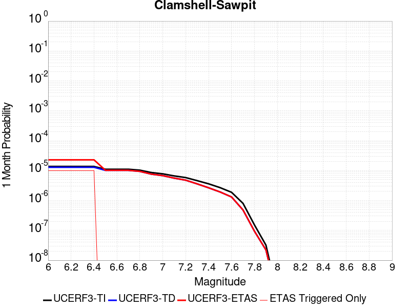 |  |  |

| Magnitude | 1 wk TI Prob | 1 wk TD Prob | 1 wk ETAS Prob | 1 wk ETAS/TD Gain | 1 wk ETAS Triggered Only | 1 mo TI Prob | 1 mo TD Prob | 1 mo ETAS Prob | 1 mo ETAS/TD Gain | 1 mo ETAS Triggered Only | 1 yr TI Prob | 1 yr TD Prob | 1 yr ETAS Prob | 1 yr ETAS/TD Gain | 1 yr ETAS Triggered Only | 10 yr TI Prob | 10 yr TD Prob | 10 yr ETAS Prob | 10 yr ETAS/TD Gain | 10 yr ETAS Triggered Only |
|-----|-----|-----|-----|-----|-----|-----|-----|-----|-----|-----|-----|-----|-----|-----|-----|-----|-----|-----|-----|-----|
| 6.0 | 3.202998E-6 | 3.0127644E-6 | 2.0456499E-5 | 6.789943 | 1.7443788E-5 | 1.3727062E-5 | 1.2911788E-5 | 3.035535E-5 | 2.3509796 | 1.7443788E-5 | 1.6711417E-4 | 1.5719049E-4 | 1.7463152E-4 | 1.1109549 | 1.7443788E-5 | 0.0016698855 | 0.0015708724 | 0.0015882887 | 1.0110871 | 1.7443788E-5 |
| 6.1 | 3.202998E-6 | 3.0127644E-6 | 2.0456499E-5 | 6.789943 | 1.7443788E-5 | 1.3727062E-5 | 1.2911788E-5 | 3.035535E-5 | 2.3509796 | 1.7443788E-5 | 1.6711417E-4 | 1.5719049E-4 | 1.7463152E-4 | 1.1109549 | 1.7443788E-5 | 0.0016698855 | 0.0015708724 | 0.0015882887 | 1.0110871 | 1.7443788E-5 |
| 6.2 | 3.202998E-6 | 3.0127644E-6 | 2.0456499E-5 | 6.789943 | 1.7443788E-5 | 1.3727062E-5 | 1.2911788E-5 | 3.035535E-5 | 2.3509796 | 1.7443788E-5 | 1.6711417E-4 | 1.5719049E-4 | 1.7463152E-4 | 1.1109549 | 1.7443788E-5 | 0.0016698855 | 0.0015708724 | 0.0015882887 | 1.0110871 | 1.7443788E-5 |
| 6.3 | 3.202998E-6 | 3.0127644E-6 | 2.0456499E-5 | 6.789943 | 1.7443788E-5 | 1.3727062E-5 | 1.2911788E-5 | 3.035535E-5 | 2.3509796 | 1.7443788E-5 | 1.6711417E-4 | 1.5719049E-4 | 1.7463152E-4 | 1.1109549 | 1.7443788E-5 | 0.0016698855 | 0.0015708724 | 0.0015882887 | 1.0110871 | 1.7443788E-5 |
| 6.4 | 3.202998E-6 | 3.0127644E-6 | 2.0456499E-5 | 6.789943 | 1.7443788E-5 | 1.3727062E-5 | 1.2911788E-5 | 3.035535E-5 | 2.3509796 | 1.7443788E-5 | 1.6711417E-4 | 1.5719049E-4 | 1.7463152E-4 | 1.1109549 | 1.7443788E-5 | 0.0016698855 | 0.0015708724 | 0.0015882887 | 1.0110871 | 1.7443788E-5 |
| 6.5 | 2.5862723E-6 | 2.380775E-6 | 2.380775E-6 | 1.0 | 0.0 | 1.1083977E-5 | 1.0203283E-5 | 1.0203283E-5 | 1.0 | 0.0 | 1.3493907E-4 | 1.2421819E-4 | 1.2421819E-4 | 1.0 | 0.0 | 0.0013485716 | 0.0012415178 | 0.0012415178 | 1.0 | 0.0 |
| 6.6 | 2.5862723E-6 | 2.380775E-6 | 2.380775E-6 | 1.0 | 0.0 | 1.1083977E-5 | 1.0203283E-5 | 1.0203283E-5 | 1.0 | 0.0 | 1.3493907E-4 | 1.2421819E-4 | 1.2421819E-4 | 1.0 | 0.0 | 0.0013485716 | 0.0012415178 | 0.0012415178 | 1.0 | 0.0 |
| 6.7 | 2.5862723E-6 | 2.380775E-6 | 2.380775E-6 | 1.0 | 0.0 | 1.1083977E-5 | 1.0203283E-5 | 1.0203283E-5 | 1.0 | 0.0 | 1.3493907E-4 | 1.2421819E-4 | 1.2421819E-4 | 1.0 | 0.0 | 0.0013485716 | 0.0012415178 | 0.0012415178 | 1.0 | 0.0 |
| 6.8 | 2.4098806E-6 | 2.1977307E-6 | 2.1977307E-6 | 1.0 | 0.0 | 1.0328019E-5 | 9.4188135E-6 | 9.4188135E-6 | 1.0 | 0.0 | 1.2573638E-4 | 1.1466829E-4 | 1.1466829E-4 | 1.0 | 0.0 | 0.0012566525 | 0.0011461178 | 0.0011461178 | 1.0 | 0.0 |
| 6.9 | 2.0073985E-6 | 1.7784248E-6 | 1.7784248E-6 | 1.0 | 0.0 | 8.603109E-6 | 7.621799E-6 | 7.621799E-6 | 1.0 | 0.0 | 1.0473781E-4 | 9.279157E-5 | 9.279157E-5 | 1.0 | 0.0 | 0.0010468846 | 9.275401E-4 | 9.275401E-4 | 1.0 | 0.0 |
| 7.0 | 1.8166766E-6 | 1.5807095E-6 | 1.5807095E-6 | 1.0 | 0.0 | 7.785734E-6 | 6.7744522E-6 | 6.7744522E-6 | 1.0 | 0.0 | 9.478718E-5 | 8.247593E-5 | 8.247593E-5 | 1.0 | 0.0 | 9.4746763E-4 | 8.244633E-4 | 8.244633E-4 | 1.0 | 0.0 |
| 7.1 | 1.5471421E-6 | 1.3052961E-6 | 1.3052961E-6 | 1.0 | 0.0 | 6.6305925E-6 | 5.5941146E-6 | 5.5941146E-6 | 1.0 | 0.0 | 8.072447E-5 | 6.8106274E-5 | 6.8106274E-5 | 1.0 | 0.0 | 8.0695155E-4 | 6.808595E-4 | 6.808595E-4 | 1.0 | 0.0 |
| 7.2 | 1.3608037E-6 | 1.1153443E-6 | 1.1153443E-6 | 1.0 | 0.0 | 5.8320024E-6 | 4.7800386E-6 | 4.7800386E-6 | 1.0 | 0.0 | 7.1002316E-5 | 5.8195463E-5 | 5.8195463E-5 | 1.0 | 0.0 | 7.097964E-4 | 5.818069E-4 | 5.818069E-4 | 1.0 | 0.0 |
| 7.3 | 1.0749634E-6 | 8.384254E-7 | 8.384254E-7 | 1.0 | 0.0 | 4.6069777E-6 | 3.593247E-6 | 3.593247E-6 | 1.0 | 0.0 | 5.608851E-5 | 4.374693E-5 | 4.374693E-5 | 1.0 | 0.0 | 5.6074356E-4 | 4.37386E-4 | 4.37386E-4 | 1.0 | 0.0 |
| 7.4 | 8.416856E-7 | 6.200048E-7 | 6.200048E-7 | 1.0 | 0.0 | 3.607219E-6 | 2.6571608E-6 | 2.6571608E-6 | 1.0 | 0.0 | 4.3917007E-5 | 3.2350472E-5 | 3.2350472E-5 | 1.0 | 0.0 | 4.390833E-4 | 3.2345962E-4 | 3.2345962E-4 | 1.0 | 0.0 |
| 7.5 | 6.2779594E-7 | 4.496886E-7 | 4.496886E-7 | 1.0 | 0.0 | 2.6905511E-6 | 1.9272356E-6 | 1.9272356E-6 | 1.0 | 0.0 | 3.275697E-5 | 2.346386E-5 | 2.346386E-5 | 1.0 | 0.0 | 3.275214E-4 | 2.346157E-4 | 2.346157E-4 | 1.0 | 0.0 |
| 7.6 | 4.3822078E-7 | 3.0595405E-7 | 3.0595405E-7 | 1.0 | 0.0 | 1.8780877E-6 | 1.311231E-6 | 1.311231E-6 | 1.0 | 0.0 | 2.2865479E-5 | 1.5964137E-5 | 1.5964137E-5 | 1.0 | 0.0 | 2.2863125E-4 | 1.5963144E-4 | 1.5963144E-4 | 1.0 | 0.0 |
| 7.7 | 1.8704569E-7 | 1.12379205E-7 | 1.12379205E-7 | 1.0 | 0.0 | 8.0162414E-7 | 4.816251E-7 | 4.816251E-7 | 1.0 | 0.0 | 9.75973E-6 | 5.86377E-6 | 5.86377E-6 | 1.0 | 0.0 | 9.7593016E-5 | 5.863622E-5 | 5.863622E-5 | 1.0 | 0.0 |
| 7.8 | 3.5378733E-8 | 2.1838144E-8 | 2.1838144E-8 | 1.0 | 0.0 | 1.5162313E-7 | 9.359204E-8 | 9.359204E-8 | 1.0 | 0.0 | 1.84601E-6 | 1.1394826E-6 | 1.1394826E-6 | 1.0 | 0.0 | 1.8459947E-5 | 1.139477E-5 | 1.139477E-5 | 1.0 | 0.0 |
| 7.9 | 7.504945E-9 | 5.1920326E-9 | 5.1920326E-9 | 1.0 | 0.0 | 3.2164053E-8 | 2.225157E-8 | 2.225157E-8 | 1.0 | 0.0 | 3.9159727E-7 | 2.7091284E-7 | 2.7091284E-7 | 1.0 | 0.0 | 3.915966E-6 | 2.7091257E-6 | 2.7091257E-6 | 1.0 | 0.0 |
| 8.0 | 1.6554036E-10 | 1.4180768E-10 | 1.4180768E-10 | 1.0 | 0.0 | 7.0945894E-10 | 6.077475E-10 | 6.077475E-10 | 1.0 | 0.0 | 8.637662E-9 | 7.3993256E-9 | 7.3993256E-9 | 1.0 | 0.0 | 8.6376616E-8 | 7.3993256E-8 | 7.3993256E-8 | 1.0 | 0.0 |

## San Diego Trough south
*[(top)](#table-of-contents)*

| 1 Week | 1 Month | 1 Year | 10 Year |
|-----|-----|-----|-----|
|  |  | 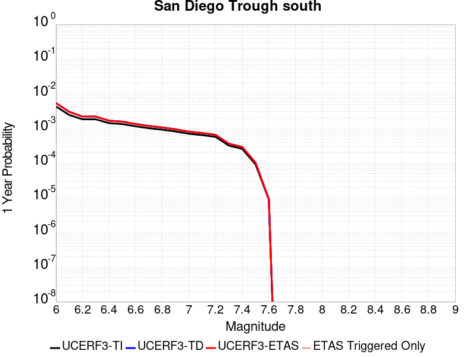 | 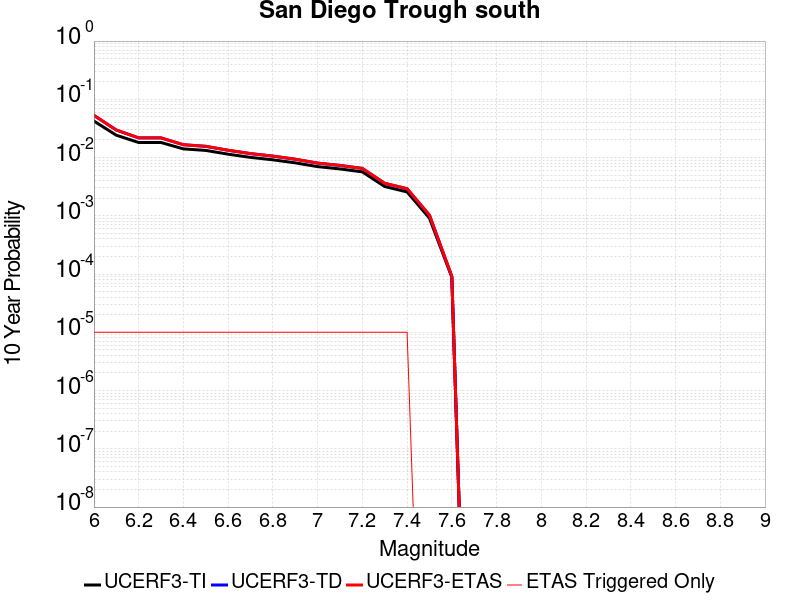 |

| Magnitude | 1 wk TI Prob | 1 wk TD Prob | 1 wk ETAS Prob | 1 wk ETAS/TD Gain | 1 wk ETAS Triggered Only | 1 mo TI Prob | 1 mo TD Prob | 1 mo ETAS Prob | 1 mo ETAS/TD Gain | 1 mo ETAS Triggered Only | 1 yr TI Prob | 1 yr TD Prob | 1 yr ETAS Prob | 1 yr ETAS/TD Gain | 1 yr ETAS Triggered Only | 10 yr TI Prob | 10 yr TD Prob | 10 yr ETAS Prob | 10 yr ETAS/TD Gain | 10 yr ETAS Triggered Only |
|-----|-----|-----|-----|-----|-----|-----|-----|-----|-----|-----|-----|-----|-----|-----|-----|-----|-----|-----|-----|-----|
| 6.0 | 8.279495E-5 | 1.04241306E-4 | 1.04241306E-4 | 1.0 | 0.0 | 3.5478722E-4 | 4.4667677E-4 | 4.4667677E-4 | 1.0 | 0.0 | 0.004310982 | 0.0054256152 | 0.0054256152 | 1.0 | 0.0 | 0.042283054 | 0.05299221 | 0.053008728 | 1.0003117 | 1.7443788E-5 |
| 6.1 | 4.6961468E-5 | 5.772944E-5 | 5.772944E-5 | 1.0 | 0.0 | 2.0124791E-4 | 2.473894E-4 | 2.473894E-4 | 1.0 | 0.0 | 0.00244744 | 0.0030079768 | 0.0030079768 | 1.0 | 0.0 | 0.024206603 | 0.029679462 | 0.029696388 | 1.0005703 | 1.7443788E-5 |
| 6.2 | 3.5079658E-5 | 4.214154E-5 | 4.214154E-5 | 1.0 | 0.0 | 1.5033272E-4 | 1.8059435E-4 | 1.8059435E-4 | 1.0 | 0.0 | 0.0018287642 | 0.0021965632 | 0.0021965632 | 1.0 | 0.0 | 0.018137876 | 0.021751117 | 0.021768183 | 1.0007845 | 1.7443788E-5 |
| 6.3 | 3.5079658E-5 | 4.214154E-5 | 4.214154E-5 | 1.0 | 0.0 | 1.5033272E-4 | 1.8059435E-4 | 1.8059435E-4 | 1.0 | 0.0 | 0.0018287642 | 0.0021965632 | 0.0021965632 | 1.0 | 0.0 | 0.018137876 | 0.021751117 | 0.021768183 | 1.0007845 | 1.7443788E-5 |
| 6.4 | 2.7196904E-5 | 3.2087162E-5 | 3.2087162E-5 | 1.0 | 0.0 | 1.16552954E-4 | 1.3750927E-4 | 1.3750927E-4 | 1.0 | 0.0 | 0.0014181085 | 0.0016729041 | 0.0016729041 | 1.0 | 0.0 | 0.014090929 | 0.016604643 | 0.016621796 | 1.0010331 | 1.7443788E-5 |
| 6.5 | 2.5584688E-5 | 3.010164E-5 | 3.010164E-5 | 1.0 | 0.0 | 1.0964406E-4 | 1.2900073E-4 | 1.2900073E-4 | 1.0 | 0.0 | 0.0013340989 | 0.0015694655 | 0.0015694655 | 1.0 | 0.0 | 0.013261181 | 0.015585314 | 0.015602486 | 1.0011019 | 1.7443788E-5 |
| 6.6 | 2.2034688E-5 | 2.5742738E-5 | 2.5742738E-5 | 1.0 | 0.0 | 9.443096E-5 | 1.1032141E-4 | 1.1032141E-4 | 1.0 | 0.0 | 0.0011490905 | 0.0013423424 | 0.0013423424 | 1.0 | 0.0 | 0.011431668 | 0.013343317 | 0.013360528 | 1.0012898 | 1.7443788E-5 |
| 6.7 | 1.9394853E-5 | 2.254176E-5 | 2.254176E-5 | 1.0 | 0.0 | 8.311815E-5 | 9.6603995E-5 | 9.6603995E-5 | 1.0 | 0.0 | 0.0010114936 | 0.0011755243 | 0.0011755243 | 1.0 | 0.0 | 0.01006902 | 0.011693766 | 0.011711006 | 1.0014743 | 1.7443788E-5 |
| 6.8 | 1.7615313E-5 | 2.0403182E-5 | 2.0403182E-5 | 1.0 | 0.0 | 7.549201E-5 | 8.74393E-5 | 8.74393E-5 | 1.0 | 0.0 | 9.1872766E-4 | 0.0010640579 | 0.0010640579 | 1.0 | 0.0 | 0.009149387 | 0.010590198 | 0.010607457 | 1.0016297 | 1.7443788E-5 |
| 6.9 | 1.5621423E-5 | 1.8026114E-5 | 1.8026114E-5 | 1.0 | 0.0 | 6.6947236E-5 | 7.725251E-5 | 7.725251E-5 | 1.0 | 0.0 | 8.147778E-4 | 9.40147E-4 | 9.40147E-4 | 1.0 | 0.0 | 0.008117969 | 0.009362142 | 0.009379422 | 1.0018458 | 1.7443788E-5 |
| 7.0 | 1.3444376E-5 | 1.544809E-5 | 1.544809E-5 | 1.0 | 0.0 | 5.7617483E-5 | 6.620443E-5 | 6.620443E-5 | 1.0 | 0.0 | 7.0126704E-4 | 8.057436E-4 | 8.057436E-4 | 1.0 | 0.0 | 0.006990582 | 0.008028555 | 0.008045859 | 1.0021553 | 1.7443788E-5 |
| 7.1 | 1.2268361E-5 | 1.407303E-5 | 1.407303E-5 | 1.0 | 0.0 | 5.2577634E-5 | 6.0311606E-5 | 6.0311606E-5 | 1.0 | 0.0 | 6.399447E-4 | 7.3404907E-4 | 7.3404907E-4 | 1.0 | 0.0 | 0.0063810493 | 0.0073165493 | 0.0073338654 | 1.0023667 | 1.7443788E-5 |
| 7.2 | 1.0922655E-5 | 1.2513563E-5 | 1.2513563E-5 | 1.0 | 0.0 | 4.681054E-5 | 5.3628468E-5 | 5.3628468E-5 | 1.0 | 0.0 | 5.697693E-4 | 6.5273355E-4 | 6.5273355E-4 | 1.0 | 0.0 | 0.0056831064 | 0.0065084435 | 0.006525774 | 1.0026628 | 1.7443788E-5 |
| 7.3 | 6.1106753E-6 | 6.928925E-6 | 6.928925E-6 | 1.0 | 0.0 | 2.6188345E-5 | 2.9695057E-5 | 2.9695057E-5 | 1.0 | 0.0 | 3.1879646E-4 | 3.6147775E-4 | 3.6147775E-4 | 1.0 | 0.0 | 0.0031833951 | 0.003608943 | 0.0036263238 | 1.004816 | 1.7443788E-5 |
| 7.4 | 4.933187E-6 | 5.5895525E-6 | 5.5895525E-6 | 1.0 | 0.0 | 2.114206E-5 | 2.3955008E-5 | 2.3955008E-5 | 1.0 | 0.0 | 2.5737417E-4 | 2.9161357E-4 | 2.9161357E-4 | 1.0 | 0.0 | 0.002570763 | 0.0029123505 | 0.0029297434 | 1.0059721 | 1.7443788E-5 |
| 7.5 | 1.7489613E-6 | 1.969678E-6 | 1.969678E-6 | 1.0 | 0.0 | 7.495527E-6 | 8.4414505E-6 | 8.4414505E-6 | 1.0 | 0.0 | 9.125422E-5 | 1.02770035E-4 | 1.02770035E-4 | 1.0 | 0.0 | 9.1216754E-4 | 0.0010272472 | 0.0010272472 | 1.0 | 0.0 |
| 7.6 | 1.6988751E-7 | 1.7533823E-7 | 1.7533823E-7 | 1.0 | 0.0 | 7.2808916E-7 | 7.5144936E-7 | 7.5144936E-7 | 1.0 | 0.0 | 8.864449E-6 | 9.14886E-6 | 9.14886E-6 | 1.0 | 0.0 | 8.8640954E-5 | 9.1485024E-5 | 9.1485024E-5 | 1.0 | 0.0 |

## Carlsbad
*[(top)](#table-of-contents)*

| 1 Week | 1 Month | 1 Year | 10 Year |
|-----|-----|-----|-----|
|  |  |  |  |

| Magnitude | 1 wk TI Prob | 1 wk TD Prob | 1 wk ETAS Prob | 1 wk ETAS/TD Gain | 1 wk ETAS Triggered Only | 1 mo TI Prob | 1 mo TD Prob | 1 mo ETAS Prob | 1 mo ETAS/TD Gain | 1 mo ETAS Triggered Only | 1 yr TI Prob | 1 yr TD Prob | 1 yr ETAS Prob | 1 yr ETAS/TD Gain | 1 yr ETAS Triggered Only | 10 yr TI Prob | 10 yr TD Prob | 10 yr ETAS Prob | 10 yr ETAS/TD Gain | 10 yr ETAS Triggered Only |
|-----|-----|-----|-----|-----|-----|-----|-----|-----|-----|-----|-----|-----|-----|-----|-----|-----|-----|-----|-----|-----|
| 6.0 | 4.9038536E-6 | 4.9872565E-6 | 2.2430957E-5 | 4.4976544 | 1.7443788E-5 | 2.1016345E-5 | 2.1373784E-5 | 3.8817197E-5 | 1.8161126 | 1.7443788E-5 | 2.5584397E-4 | 2.601952E-4 | 2.7763445E-4 | 1.0670238 | 1.7443788E-5 | 0.002555496 | 0.0025989525 | 0.002616351 | 1.0066944 | 1.7443788E-5 |
| 6.1 | 4.9038536E-6 | 4.9872565E-6 | 2.2430957E-5 | 4.4976544 | 1.7443788E-5 | 2.1016345E-5 | 2.1373784E-5 | 3.8817197E-5 | 1.8161126 | 1.7443788E-5 | 2.5584397E-4 | 2.601952E-4 | 2.7763445E-4 | 1.0670238 | 1.7443788E-5 | 0.002555496 | 0.0025989525 | 0.002616351 | 1.0066944 | 1.7443788E-5 |
| 6.2 | 4.3820614E-6 | 4.4547687E-6 | 4.4547687E-6 | 1.0 | 0.0 | 1.8780129E-5 | 1.9091729E-5 | 1.9091729E-5 | 1.0 | 0.0 | 2.2862408E-4 | 2.3241735E-4 | 2.3241735E-4 | 1.0 | 0.0 | 0.00228389 | 0.0023217786 | 0.0023217786 | 1.0 | 0.0 |
| 6.3 | 4.302872E-6 | 4.373006E-6 | 4.373006E-6 | 1.0 | 0.0 | 1.8440749E-5 | 1.8741322E-5 | 1.8741322E-5 | 1.0 | 0.0 | 2.24493E-4 | 2.2815206E-4 | 2.2815206E-4 | 1.0 | 0.0 | 0.0022426634 | 0.0022792136 | 0.0022792136 | 1.0 | 0.0 |
| 6.4 | 4.0835243E-6 | 4.1476546E-6 | 4.1476546E-6 | 1.0 | 0.0 | 1.75007E-5 | 1.7775543E-5 | 1.7775543E-5 | 1.0 | 0.0 | 2.1305021E-4 | 2.1639607E-4 | 2.1639607E-4 | 1.0 | 0.0 | 0.0021284607 | 0.0021618877 | 0.0021618877 | 1.0 | 0.0 |
| 6.5 | 3.987806E-6 | 4.0488867E-6 | 4.0488867E-6 | 1.0 | 0.0 | 1.7090486E-5 | 1.7352257E-5 | 1.7352257E-5 | 1.0 | 0.0 | 2.080568E-4 | 2.1124359E-4 | 2.1124359E-4 | 1.0 | 0.0 | 0.002078621 | 0.0021104617 | 0.0021104617 | 1.0 | 0.0 |
| 6.6 | 3.8707576E-6 | 3.927488E-6 | 3.927488E-6 | 1.0 | 0.0 | 1.6588854E-5 | 1.6831984E-5 | 1.6831984E-5 | 1.0 | 0.0 | 2.0195059E-4 | 2.0491047E-4 | 2.0491047E-4 | 1.0 | 0.0 | 0.0020176715 | 0.0020472489 | 0.0020472489 | 1.0 | 0.0 |
| 6.7 | 3.3093434E-6 | 3.3423917E-6 | 3.3423917E-6 | 1.0 | 0.0 | 1.4182823E-5 | 1.4324457E-5 | 1.4324457E-5 | 1.0 | 0.0 | 1.7266218E-4 | 1.7438637E-4 | 1.7438637E-4 | 1.0 | 0.0 | 0.001725281 | 0.0017425013 | 0.0017425013 | 1.0 | 0.0 |
| 6.8 | 3.136983E-6 | 3.1664536E-6 | 3.1664536E-6 | 1.0 | 0.0 | 1.3444143E-5 | 1.3570445E-5 | 1.3570445E-5 | 1.0 | 0.0 | 1.6367015E-4 | 1.6520769E-4 | 1.6520769E-4 | 1.0 | 0.0 | 0.0016354966 | 0.0016508545 | 0.0016508545 | 1.0 | 0.0 |
| 6.9 | 2.9056644E-6 | 2.9267585E-6 | 2.9267585E-6 | 1.0 | 0.0 | 1.2452788E-5 | 1.2543191E-5 | 1.2543191E-5 | 1.0 | 0.0 | 1.5160214E-4 | 1.5270269E-4 | 1.5270269E-4 | 1.0 | 0.0 | 0.0015149876 | 0.001525983 | 0.001525983 | 1.0 | 0.0 |
| 7.0 | 2.5071035E-6 | 2.5113977E-6 | 2.5113977E-6 | 1.0 | 0.0 | 1.0744685E-5 | 1.07630885E-5 | 1.07630885E-5 | 1.0 | 0.0 | 1.308087E-4 | 1.3103275E-4 | 1.3103275E-4 | 1.0 | 0.0 | 0.0013073172 | 0.0013095582 | 0.0013095582 | 1.0 | 0.0 |
| 7.1 | 2.1786877E-6 | 2.1678832E-6 | 2.1678832E-6 | 1.0 | 0.0 | 9.3372E-6 | 9.290896E-6 | 9.290896E-6 | 1.0 | 0.0 | 1.13674476E-4 | 1.1311081E-4 | 1.1311081E-4 | 1.0 | 0.0 | 0.0011361635 | 0.0011305353 | 0.0011305353 | 1.0 | 0.0 |
| 7.2 | 1.6628418E-6 | 1.6213872E-6 | 1.6213872E-6 | 1.0 | 0.0 | 7.1264453E-6 | 6.948784E-6 | 6.948784E-6 | 1.0 | 0.0 | 8.676102E-5 | 8.4598185E-5 | 8.4598185E-5 | 1.0 | 0.0 | 8.672715E-4 | 8.45662E-4 | 8.45662E-4 | 1.0 | 0.0 |
| 7.3 | 1.0595926E-6 | 9.816804E-7 | 9.816804E-7 | 1.0 | 0.0 | 4.541103E-6 | 4.2071947E-6 | 4.2071947E-6 | 1.0 | 0.0 | 5.5286528E-5 | 5.1221403E-5 | 5.1221403E-5 | 1.0 | 0.0 | 5.527277E-4 | 5.1209686E-4 | 5.1209686E-4 | 1.0 | 0.0 |
| 7.4 | 7.956623E-7 | 7.1737975E-7 | 7.1737975E-7 | 1.0 | 0.0 | 3.4099767E-6 | 3.074481E-6 | 3.074481E-6 | 1.0 | 0.0 | 4.1515676E-5 | 3.743117E-5 | 3.743117E-5 | 1.0 | 0.0 | 4.150792E-4 | 3.7424936E-4 | 3.7424936E-4 | 1.0 | 0.0 |
| 7.5 | 5.1043804E-7 | 4.4483627E-7 | 4.4483627E-7 | 1.0 | 0.0 | 2.1875896E-6 | 1.9064398E-6 | 1.9064398E-6 | 1.0 | 0.0 | 2.663358E-5 | 2.3210663E-5 | 2.3210663E-5 | 1.0 | 0.0 | 2.6630386E-4 | 2.3208297E-4 | 2.3208297E-4 | 1.0 | 0.0 |
| 7.6 | 2.3723294E-7 | 1.989569E-7 | 1.989569E-7 | 1.0 | 0.0 | 1.0167122E-6 | 8.5267214E-7 | 8.5267214E-7 | 1.0 | 0.0 | 1.2378401E-5 | 1.0381237E-5 | 1.0381237E-5 | 1.0 | 0.0 | 1.237771E-4 | 1.038078E-4 | 1.038078E-4 | 1.0 | 0.0 |
| 7.7 | 1.9992152E-8 | 9.8601785E-9 | 9.8601785E-9 | 1.0 | 0.0 | 8.568065E-8 | 4.225791E-8 | 4.225791E-8 | 1.0 | 0.0 | 1.0431614E-6 | 5.1449E-7 | 5.1449E-7 | 1.0 | 0.0 | 1.0431565E-5 | 5.1449E-6 | 5.1449E-6 | 1.0 | 0.0 |

## Oceanic - West Huasna
*[(top)](#table-of-contents)*

| 1 Week | 1 Month | 1 Year | 10 Year |
|-----|-----|-----|-----|
| 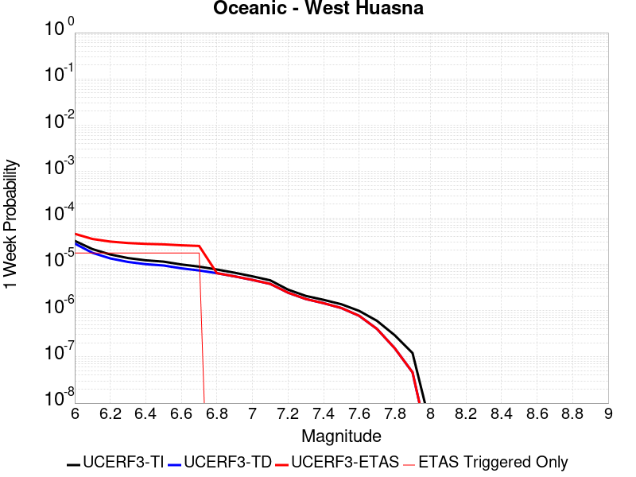 | 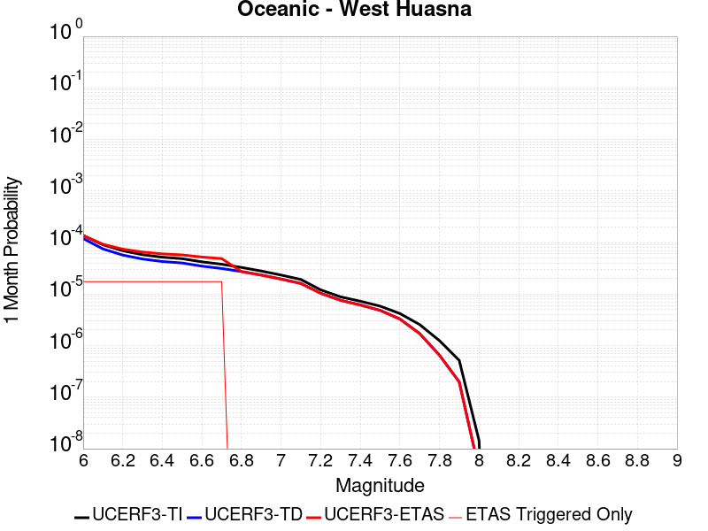 | 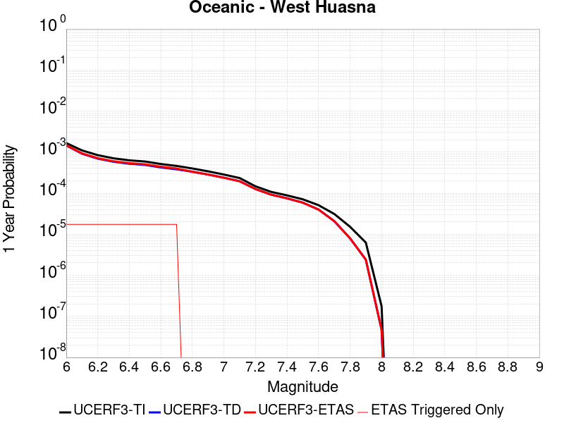 | 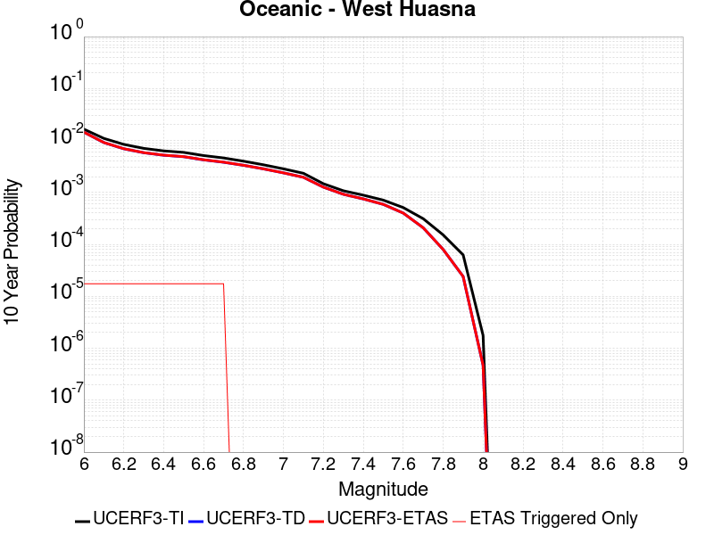 |

| Magnitude | 1 wk TI Prob | 1 wk TD Prob | 1 wk ETAS Prob | 1 wk ETAS/TD Gain | 1 wk ETAS Triggered Only | 1 mo TI Prob | 1 mo TD Prob | 1 mo ETAS Prob | 1 mo ETAS/TD Gain | 1 mo ETAS Triggered Only | 1 yr TI Prob | 1 yr TD Prob | 1 yr ETAS Prob | 1 yr ETAS/TD Gain | 1 yr ETAS Triggered Only | 10 yr TI Prob | 10 yr TD Prob | 10 yr ETAS Prob | 10 yr ETAS/TD Gain | 10 yr ETAS Triggered Only |
|-----|-----|-----|-----|-----|-----|-----|-----|-----|-----|-----|-----|-----|-----|-----|-----|-----|-----|-----|-----|-----|
| 6.0 | 3.195567E-5 | 2.7926868E-5 | 4.537017E-5 | 1.6246064 | 1.7443788E-5 | 1.3694567E-4 | 1.1968133E-4 | 1.3712303E-4 | 1.1457345 | 1.7443788E-5 | 0.0016660384 | 0.0014561893 | 0.0014736077 | 1.0119616 | 1.7443788E-5 | 0.016536033 | 0.014471028 | 0.014488219 | 1.001188 | 1.7443788E-5 |
| 6.1 | 2.1156782E-5 | 1.7573486E-5 | 3.501697E-5 | 1.9926022 | 1.7443788E-5 | 9.066878E-5 | 7.531282E-5 | 9.275529E-5 | 1.2316003 | 1.7443788E-5 | 0.0011033333 | 9.165572E-4 | 9.33985E-4 | 1.0190144 | 1.7443788E-5 | 0.010978713 | 0.009128777 | 0.009146063 | 1.0018934 | 1.7443788E-5 |
| 6.2 | 1.6195117E-5 | 1.3327152E-5 | 3.077071E-5 | 2.3088734 | 1.7443788E-5 | 6.9405796E-5 | 5.7115132E-5 | 7.4557924E-5 | 1.305397 | 1.7443788E-5 | 8.44688E-4 | 6.9515745E-4 | 7.125891E-4 | 1.0250758 | 1.7443788E-5 | 0.008414844 | 0.006930123 | 0.006947446 | 1.0024997 | 1.7443788E-5 |
| 6.3 | 1.3559345E-5 | 1.1179142E-5 | 2.8622735E-5 | 2.5603695 | 1.7443788E-5 | 5.811018E-5 | 4.7909736E-5 | 6.535269E-5 | 1.3640795 | 1.7443788E-5 | 7.072618E-4 | 5.831459E-4 | 6.005795E-4 | 1.0298958 | 1.7443788E-5 | 0.0070501505 | 0.0058162753 | 0.0058336174 | 1.0029817 | 1.7443788E-5 |
| 6.4 | 1.2120619E-5 | 1.0000977E-5 | 2.744459E-5 | 2.7441907 | 1.7443788E-5 | 5.1944477E-5 | 4.2860633E-5 | 6.030367E-5 | 1.4069711 | 1.7443788E-5 | 6.322405E-4 | 5.2170374E-4 | 5.3913845E-4 | 1.0334188 | 1.7443788E-5 | 0.006304447 | 0.0052048573 | 0.0052222107 | 1.003334 | 1.7443788E-5 |
| 6.5 | 1.13511915E-5 | 9.3674735E-6 | 2.6811098E-5 | 2.8621483 | 1.7443788E-5 | 4.8647056E-5 | 4.01457E-5 | 5.7588786E-5 | 1.4344945 | 1.7443788E-5 | 5.9211696E-4 | 4.886647E-4 | 5.061E-4 | 1.0356793 | 1.7443788E-5 | 0.0059054173 | 0.0048759608 | 0.0048933197 | 1.0035601 | 1.7443788E-5 |
| 6.6 | 9.850605E-6 | 8.135418E-6 | 2.5579064E-5 | 3.144161 | 1.7443788E-5 | 4.2216197E-5 | 3.4865614E-5 | 5.230879E-5 | 1.5002975 | 1.7443788E-5 | 5.1386096E-4 | 4.2440637E-4 | 4.4184277E-4 | 1.0410842 | 1.7443788E-5 | 0.0051267436 | 0.004235991 | 0.004253361 | 1.0041006 | 1.7443788E-5 |
| 6.7 | 8.8558645E-6 | 7.318433E-6 | 2.4762092E-5 | 3.383524 | 1.7443788E-5 | 3.7953152E-5 | 3.1364336E-5 | 4.8807575E-5 | 1.5561489 | 1.7443788E-5 | 4.6198163E-4 | 3.8179406E-4 | 3.9923118E-4 | 1.0456716 | 1.7443788E-5 | 0.004610224 | 0.0038114067 | 0.003828784 | 1.0045593 | 1.7443788E-5 |
| 6.8 | 7.67136E-6 | 6.391756E-6 | 6.391756E-6 | 1.0 | 0.0 | 3.2876844E-5 | 2.7392953E-5 | 2.7392953E-5 | 1.0 | 0.0 | 4.0020206E-4 | 3.3345833E-4 | 3.3345833E-4 | 1.0 | 0.0 | 0.003994821 | 0.0033296007 | 0.0033296007 | 1.0 | 0.0 |
| 6.9 | 6.534529E-6 | 5.4583297E-6 | 5.4583297E-6 | 1.0 | 0.0 | 2.8004823E-5 | 2.3392633E-5 | 2.3392633E-5 | 1.0 | 0.0 | 3.4090536E-4 | 2.847682E-4 | 2.847682E-4 | 1.0 | 0.0 | 0.0034038287 | 0.0028440498 | 0.0028440498 | 1.0 | 0.0 |
| 7.0 | 5.460525E-6 | 4.5699517E-6 | 4.5699517E-6 | 1.0 | 0.0 | 2.3402039E-5 | 1.958536E-5 | 1.958536E-5 | 1.0 | 0.0 | 2.8488258E-4 | 2.3842578E-4 | 2.3842578E-4 | 1.0 | 0.0 | 0.0028451765 | 0.0023817138 | 0.0023817138 | 1.0 | 0.0 |
| 7.1 | 4.4825083E-6 | 3.7524428E-6 | 3.7524428E-6 | 1.0 | 0.0 | 1.9210609E-5 | 1.60818E-5 | 1.60818E-5 | 1.0 | 0.0 | 2.3386406E-4 | 1.9577841E-4 | 1.9577841E-4 | 1.0 | 0.0 | 0.002336181 | 0.0019560715 | 0.0019560715 | 1.0 | 0.0 |
| 7.2 | 2.821708E-6 | 2.4249334E-6 | 2.4249334E-6 | 1.0 | 0.0 | 1.2092979E-5 | 1.039253E-5 | 1.039253E-5 | 1.0 | 0.0 | 1.4722206E-4 | 1.2652173E-4 | 1.2652173E-4 | 1.0 | 0.0 | 0.0014712457 | 0.0012644994 | 0.0012644994 | 1.0 | 0.0 |
| 7.3 | 2.0644757E-6 | 1.7687412E-6 | 1.7687412E-6 | 1.0 | 0.0 | 8.847723E-6 | 7.5802973E-6 | 7.5802973E-6 | 1.0 | 0.0 | 1.0771569E-4 | 9.228622E-5 | 9.228622E-5 | 1.0 | 0.0 | 0.001076635 | 9.2248066E-4 | 9.2248066E-4 | 1.0 | 0.0 |
| 7.4 | 1.6980367E-6 | 1.4379892E-6 | 1.4379892E-6 | 1.0 | 0.0 | 7.27728E-6 | 6.162796E-6 | 6.162796E-6 | 1.0 | 0.0 | 8.8597284E-5 | 7.5029464E-5 | 7.5029464E-5 | 1.0 | 0.0 | 8.8561967E-4 | 7.500429E-4 | 7.500429E-4 | 1.0 | 0.0 |
| 7.5 | 1.3637683E-6 | 1.1302635E-6 | 1.1302635E-6 | 1.0 | 0.0 | 5.844708E-6 | 4.8439774E-6 | 4.8439774E-6 | 1.0 | 0.0 | 7.1156996E-5 | 5.897383E-5 | 5.897383E-5 | 1.0 | 0.0 | 7.1134215E-4 | 5.895833E-4 | 5.895833E-4 | 1.0 | 0.0 |
| 7.6 | 9.802994E-7 | 7.677247E-7 | 7.677247E-7 | 1.0 | 0.0 | 4.2012766E-6 | 3.2902446E-6 | 3.2902446E-6 | 1.0 | 0.0 | 5.1149345E-5 | 4.0057992E-5 | 4.0057992E-5 | 1.0 | 0.0 | 5.113757E-4 | 4.0050913E-4 | 4.0050913E-4 | 1.0 | 0.0 |
| 7.7 | 5.986191E-7 | 4.0050548E-7 | 4.0050548E-7 | 1.0 | 0.0 | 2.5655079E-6 | 1.7164509E-6 | 1.7164509E-6 | 1.0 | 0.0 | 3.1234613E-5 | 2.089759E-5 | 2.089759E-5 | 1.0 | 0.0 | 3.123022E-4 | 2.089576E-4 | 2.089576E-4 | 1.0 | 0.0 |
| 7.8 | 2.9189815E-7 | 1.5285792E-7 | 1.5285792E-7 | 1.0 | 0.0 | 1.2509914E-6 | 6.5510517E-7 | 6.5510517E-7 | 1.0 | 0.0 | 1.5230714E-5 | 7.9758765E-6 | 7.9758765E-6 | 1.0 | 0.0 | 1.522967E-4 | 7.9757214E-5 | 7.9757214E-5 | 1.0 | 0.0 |
| 7.9 | 1.2057845E-7 | 4.621248E-8 | 4.621248E-8 | 1.0 | 0.0 | 5.1676466E-7 | 1.9805347E-7 | 1.9805347E-7 | 1.0 | 0.0 | 6.2915915E-6 | 2.4112983E-6 | 2.4112983E-6 | 1.0 | 0.0 | 6.2914136E-5 | 2.4114026E-5 | 2.4114026E-5 | 1.0 | 0.0 |
| 8.0 | 3.3806387E-9 | 9.011393E-10 | 9.011393E-10 | 1.0 | 0.0 | 1.4488451E-8 | 3.8620254E-9 | 3.8620254E-9 | 1.0 | 0.0 | 1.7639688E-7 | 4.702016E-8 | 4.702016E-8 | 1.0 | 0.0 | 1.7639674E-6 | 4.7129527E-7 | 4.7129527E-7 | 1.0 | 0.0 |

## Tin Mountain
*[(top)](#table-of-contents)*

| 1 Week | 1 Month | 1 Year | 10 Year |
|-----|-----|-----|-----|
| 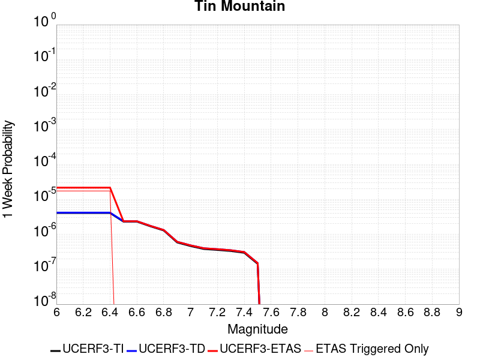 | 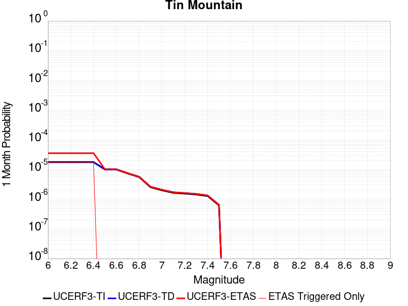 | 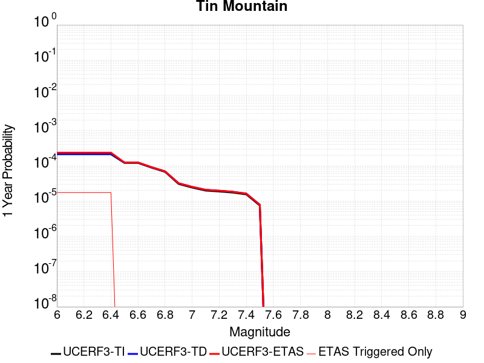 | 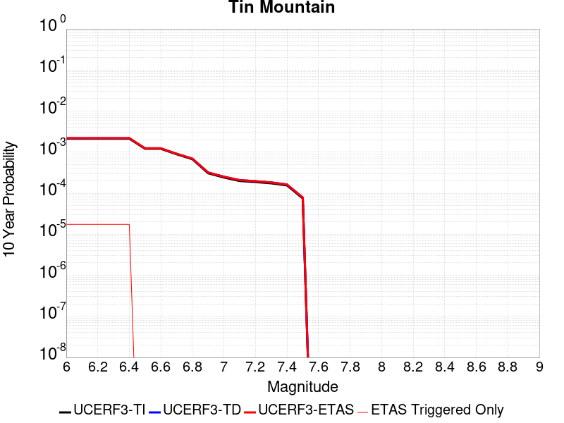 |

| Magnitude | 1 wk TI Prob | 1 wk TD Prob | 1 wk ETAS Prob | 1 wk ETAS/TD Gain | 1 wk ETAS Triggered Only | 1 mo TI Prob | 1 mo TD Prob | 1 mo ETAS Prob | 1 mo ETAS/TD Gain | 1 mo ETAS Triggered Only | 1 yr TI Prob | 1 yr TD Prob | 1 yr ETAS Prob | 1 yr ETAS/TD Gain | 1 yr ETAS Triggered Only | 10 yr TI Prob | 10 yr TD Prob | 10 yr ETAS Prob | 10 yr ETAS/TD Gain | 10 yr ETAS Triggered Only |
|-----|-----|-----|-----|-----|-----|-----|-----|-----|-----|-----|-----|-----|-----|-----|-----|-----|-----|-----|-----|-----|
| 6.0 | 4.083776E-6 | 4.1815365E-6 | 2.1625252E-5 | 5.1716037 | 1.7443788E-5 | 1.750178E-5 | 1.792077E-5 | 3.5364243E-5 | 1.9733664 | 1.7443788E-5 | 2.1306332E-4 | 2.1816725E-4 | 2.3560722E-4 | 1.0799385 | 1.7443788E-5 | 0.0021285915 | 0.0021798965 | 0.0021973022 | 1.0079846 | 1.7443788E-5 |
| 6.1 | 4.083776E-6 | 4.1815365E-6 | 2.1625252E-5 | 5.1716037 | 1.7443788E-5 | 1.750178E-5 | 1.792077E-5 | 3.5364243E-5 | 1.9733664 | 1.7443788E-5 | 2.1306332E-4 | 2.1816725E-4 | 2.3560722E-4 | 1.0799385 | 1.7443788E-5 | 0.0021285915 | 0.0021798965 | 0.0021973022 | 1.0079846 | 1.7443788E-5 |
| 6.2 | 4.083776E-6 | 4.1815365E-6 | 2.1625252E-5 | 5.1716037 | 1.7443788E-5 | 1.750178E-5 | 1.792077E-5 | 3.5364243E-5 | 1.9733664 | 1.7443788E-5 | 2.1306332E-4 | 2.1816725E-4 | 2.3560722E-4 | 1.0799385 | 1.7443788E-5 | 0.0021285915 | 0.0021798965 | 0.0021973022 | 1.0079846 | 1.7443788E-5 |
| 6.3 | 4.083776E-6 | 4.1815365E-6 | 2.1625252E-5 | 5.1716037 | 1.7443788E-5 | 1.750178E-5 | 1.792077E-5 | 3.5364243E-5 | 1.9733664 | 1.7443788E-5 | 2.1306332E-4 | 2.1816725E-4 | 2.3560722E-4 | 1.0799385 | 1.7443788E-5 | 0.0021285915 | 0.0021798965 | 0.0021973022 | 1.0079846 | 1.7443788E-5 |
| 6.4 | 4.083776E-6 | 4.1815365E-6 | 2.1625252E-5 | 5.1716037 | 1.7443788E-5 | 1.750178E-5 | 1.792077E-5 | 3.5364243E-5 | 1.9733664 | 1.7443788E-5 | 2.1306332E-4 | 2.1816725E-4 | 2.3560722E-4 | 1.0799385 | 1.7443788E-5 | 0.0021285915 | 0.0021798965 | 0.0021973022 | 1.0079846 | 1.7443788E-5 |
| 6.5 | 2.3143427E-6 | 2.3731573E-6 | 2.3731573E-6 | 1.0 | 0.0 | 9.9185745E-6 | 1.0170638E-5 | 1.0170638E-5 | 1.0 | 0.0 | 1.2075195E-4 | 1.2382126E-4 | 1.2382126E-4 | 1.0 | 0.0 | 0.0012068636 | 0.0012375986 | 0.0012375986 | 1.0 | 0.0 |
| 6.6 | 2.3143427E-6 | 2.3731573E-6 | 2.3731573E-6 | 1.0 | 0.0 | 9.9185745E-6 | 1.0170638E-5 | 1.0170638E-5 | 1.0 | 0.0 | 1.2075195E-4 | 1.2382126E-4 | 1.2382126E-4 | 1.0 | 0.0 | 0.0012068636 | 0.0012375986 | 0.0012375986 | 1.0 | 0.0 |
| 6.7 | 1.7029532E-6 | 1.7497915E-6 | 1.7497915E-6 | 1.0 | 0.0 | 7.2983503E-6 | 7.499088E-6 | 7.499088E-6 | 1.0 | 0.0 | 8.885379E-5 | 9.1298105E-5 | 9.1298105E-5 | 1.0 | 0.0 | 8.881827E-4 | 9.1265864E-4 | 9.1265864E-4 | 1.0 | 0.0 |
| 6.8 | 1.2914646E-6 | 1.3299378E-6 | 1.3299378E-6 | 1.0 | 0.0 | 5.534837E-6 | 5.6997237E-6 | 5.6997237E-6 | 1.0 | 0.0 | 6.738455E-5 | 6.939237E-5 | 6.939237E-5 | 1.0 | 0.0 | 6.736412E-4 | 6.9375033E-4 | 6.9375033E-4 | 1.0 | 0.0 |
| 6.9 | 5.8708974E-7 | 6.1169936E-7 | 6.1169936E-7 | 1.0 | 0.0 | 2.5160964E-6 | 2.6215664E-6 | 2.6215664E-6 | 1.0 | 0.0 | 3.0633044E-5 | 3.1917145E-5 | 3.1917145E-5 | 1.0 | 0.0 | 3.0628822E-4 | 3.191297E-4 | 3.191297E-4 | 1.0 | 0.0 |
| 7.0 | 4.6248786E-7 | 4.832015E-7 | 4.832015E-7 | 1.0 | 0.0 | 1.9820893E-6 | 2.0708624E-6 | 2.0708624E-6 | 1.0 | 0.0 | 2.413167E-5 | 2.5212494E-5 | 2.5212494E-5 | 1.0 | 0.0 | 2.412905E-4 | 2.5210003E-4 | 2.5210003E-4 | 1.0 | 0.0 |
| 7.1 | 3.804606E-7 | 3.987147E-7 | 3.987147E-7 | 1.0 | 0.0 | 1.6305444E-6 | 1.7087764E-6 | 1.7087764E-6 | 1.0 | 0.0 | 1.9851697E-5 | 2.0804187E-5 | 2.0804187E-5 | 1.0 | 0.0 | 1.9849923E-4 | 2.0802575E-4 | 2.0802575E-4 | 1.0 | 0.0 |
| 7.2 | 3.5864858E-7 | 3.7616863E-7 | 3.7616863E-7 | 1.0 | 0.0 | 1.5370645E-6 | 1.6121504E-6 | 1.6121504E-6 | 1.0 | 0.0 | 1.87136E-5 | 1.9627789E-5 | 1.9627789E-5 | 1.0 | 0.0 | 1.8712023E-4 | 1.9626386E-4 | 1.9626386E-4 | 1.0 | 0.0 |
| 7.3 | 3.342063E-7 | 3.506347E-7 | 3.506347E-7 | 1.0 | 0.0 | 1.4323119E-6 | 1.5027196E-6 | 1.5027196E-6 | 1.0 | 0.0 | 1.7438259E-5 | 1.829549E-5 | 1.829549E-5 | 1.0 | 0.0 | 1.743689E-4 | 1.8294314E-4 | 1.8294314E-4 | 1.0 | 0.0 |
| 7.4 | 2.971242E-7 | 3.1165817E-7 | 3.1165817E-7 | 1.0 | 0.0 | 1.2733886E-6 | 1.3356774E-6 | 1.3356774E-6 | 1.0 | 0.0 | 1.5503398E-5 | 1.6261785E-5 | 1.6261785E-5 | 1.0 | 0.0 | 1.5502315E-4 | 1.6260923E-4 | 1.6260923E-4 | 1.0 | 0.0 |
| 7.5 | 1.4326713E-7 | 1.5012525E-7 | 1.5012525E-7 | 1.0 | 0.0 | 6.140018E-7 | 6.433939E-7 | 6.433939E-7 | 1.0 | 0.0 | 7.4754466E-6 | 7.8333205E-6 | 7.8333205E-6 | 1.0 | 0.0 | 7.475195E-5 | 7.833321E-5 | 7.833321E-5 | 1.0 | 0.0 |

## Newport-Inglewood (Offshore)
*[(top)](#table-of-contents)*

| 1 Week | 1 Month | 1 Year | 10 Year |
|-----|-----|-----|-----|
| 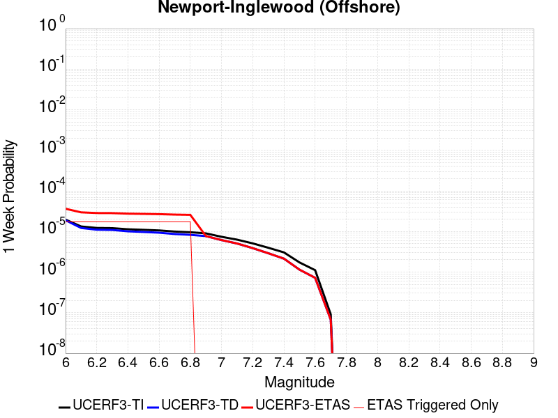 | 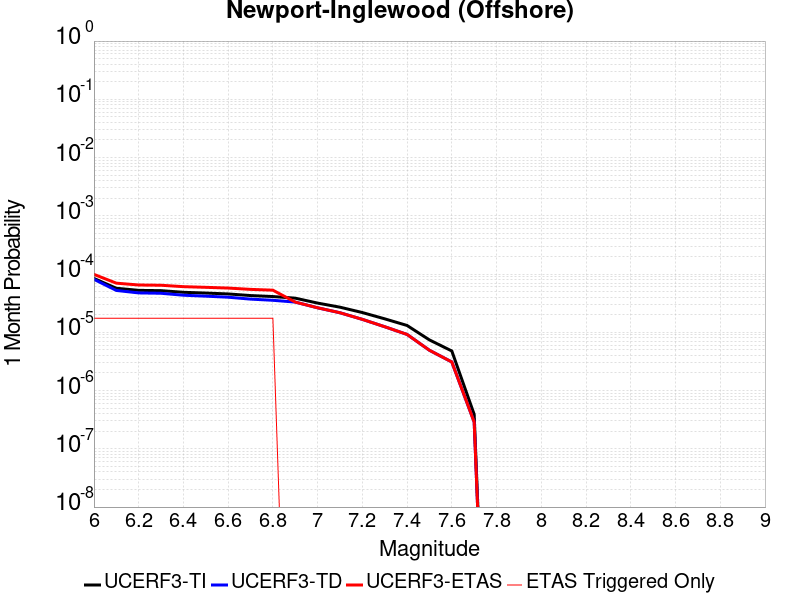 | 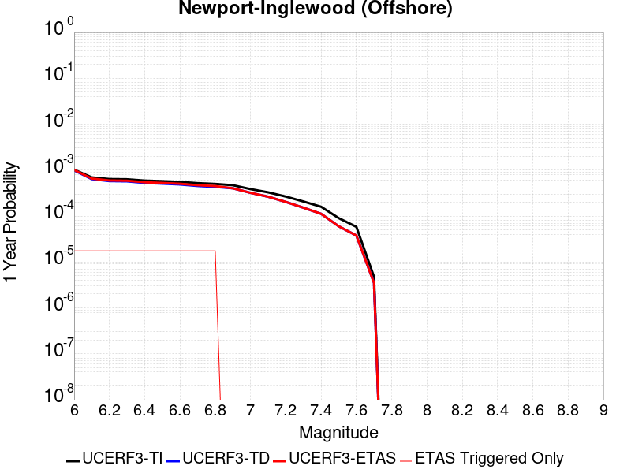 |  |

| Magnitude | 1 wk TI Prob | 1 wk TD Prob | 1 wk ETAS Prob | 1 wk ETAS/TD Gain | 1 wk ETAS Triggered Only | 1 mo TI Prob | 1 mo TD Prob | 1 mo ETAS Prob | 1 mo ETAS/TD Gain | 1 mo ETAS Triggered Only | 1 yr TI Prob | 1 yr TD Prob | 1 yr ETAS Prob | 1 yr ETAS/TD Gain | 1 yr ETAS Triggered Only | 10 yr TI Prob | 10 yr TD Prob | 10 yr ETAS Prob | 10 yr ETAS/TD Gain | 10 yr ETAS Triggered Only |
|-----|-----|-----|-----|-----|-----|-----|-----|-----|-----|-----|-----|-----|-----|-----|-----|-----|-----|-----|-----|-----|
| 6.0 | 1.9626508E-5 | 1.8965357E-5 | 3.6408812E-5 | 1.9197537 | 1.7443788E-5 | 8.411089E-5 | 8.1277634E-5 | 9.8720004E-5 | 1.2146024 | 1.7443788E-5 | 0.001023569 | 9.891186E-4 | 0.0010065451 | 1.0176183 | 1.7443788E-5 | 0.010188672 | 0.009848503 | 0.009865776 | 1.0017538 | 1.7443788E-5 |
| 6.1 | 1.331886E-5 | 1.2218092E-5 | 2.9661667E-5 | 2.427684 | 1.7443788E-5 | 5.707958E-5 | 5.2362207E-5 | 6.9805086E-5 | 1.3331195 | 1.7443788E-5 | 6.947222E-4 | 6.3732493E-4 | 6.547576E-4 | 1.0273529 | 1.7443788E-5 | 0.006925544 | 0.006355149 | 0.006372482 | 1.0027274 | 1.7443788E-5 |
| 6.2 | 1.2250852E-5 | 1.1076029E-5 | 2.8519624E-5 | 2.574896 | 1.7443788E-5 | 5.2502597E-5 | 4.7467838E-5 | 6.49108E-5 | 1.367469 | 1.7443788E-5 | 6.3903164E-4 | 5.777687E-4 | 5.952024E-4 | 1.0301743 | 1.7443788E-5 | 0.006371971 | 0.0057627866 | 0.00578013 | 1.0030096 | 1.7443788E-5 |
| 6.3 | 1.2106258E-5 | 1.0918891E-5 | 2.8362489E-5 | 2.5975611 | 1.7443788E-5 | 5.1882926E-5 | 4.6794412E-5 | 6.4237385E-5 | 1.3727576 | 1.7443788E-5 | 6.3149154E-4 | 5.69574E-4 | 5.8700785E-4 | 1.0306085 | 1.7443788E-5 | 0.0062970007 | 0.005681259 | 0.0056986036 | 1.003053 | 1.7443788E-5 |
| 6.4 | 1.1348758E-5 | 1.0109362E-5 | 2.7552973E-5 | 2.7254908 | 1.7443788E-5 | 4.8636626E-5 | 4.3325123E-5 | 6.0768154E-5 | 1.4026078 | 1.7443788E-5 | 5.919901E-4 | 5.273565E-4 | 5.4479105E-4 | 1.0330603 | 1.7443788E-5 | 0.005904155 | 0.0052611465 | 0.0052784984 | 1.0032982 | 1.7443788E-5 |
| 6.5 | 1.100837E-5 | 9.7433895E-6 | 2.7187007E-5 | 2.790303 | 1.7443788E-5 | 4.7177873E-5 | 4.1756717E-5 | 5.9199778E-5 | 1.4177306 | 1.7443788E-5 | 5.7423924E-4 | 5.082702E-4 | 5.2570517E-4 | 1.0343025 | 1.7443788E-5 | 0.005727576 | 0.0050711688 | 0.005088524 | 1.0034224 | 1.7443788E-5 |
| 6.6 | 1.0634696E-5 | 9.345544E-6 | 2.6789168E-5 | 2.866518 | 1.7443788E-5 | 4.557647E-5 | 4.0051716E-5 | 5.7494806E-5 | 1.4355141 | 1.7443788E-5 | 5.5475225E-4 | 4.8752132E-4 | 5.049566E-4 | 1.0357631 | 1.7443788E-5 | 0.0055336943 | 0.0048646047 | 0.0048819636 | 1.0035684 | 1.7443788E-5 |
| 6.7 | 9.9780855E-6 | 8.667911E-6 | 2.6111547E-5 | 3.0124383 | 1.7443788E-5 | 4.276252E-5 | 3.7147664E-5 | 5.4590804E-5 | 1.4695622 | 1.7443788E-5 | 5.205093E-4 | 4.5217964E-4 | 4.6961554E-4 | 1.0385597 | 1.7443788E-5 | 0.0051929182 | 0.004512675 | 0.00453004 | 1.0038481 | 1.7443788E-5 |
| 6.8 | 9.59546E-6 | 8.27295E-6 | 2.5716594E-5 | 3.1085153 | 1.7443788E-5 | 4.1122752E-5 | 3.5455025E-5 | 5.2898195E-5 | 1.4919802 | 1.7443788E-5 | 5.0055445E-4 | 4.315801E-4 | 4.4901634E-4 | 1.040401 | 1.7443788E-5 | 0.004994285 | 0.004307495 | 0.0043248637 | 1.0040321 | 1.7443788E-5 |
| 6.9 | 9.000614E-6 | 7.70684E-6 | 7.70684E-6 | 1.0 | 0.0 | 3.857349E-5 | 3.30289E-5 | 3.30289E-5 | 1.0 | 0.0 | 4.6953102E-4 | 4.0205332E-4 | 4.0205332E-4 | 1.0 | 0.0 | 0.004685402 | 0.0040133307 | 0.0040133307 | 1.0 | 0.0 |
| 7.0 | 7.4070194E-6 | 6.148904E-6 | 6.148904E-6 | 1.0 | 0.0 | 3.1743984E-5 | 2.635218E-5 | 2.635218E-5 | 1.0 | 0.0 | 3.8641447E-4 | 3.207907E-4 | 3.207907E-4 | 1.0 | 0.0 | 0.0038574322 | 0.0032032963 | 0.0032032963 | 1.0 | 0.0 |
| 7.1 | 6.299615E-6 | 5.0565927E-6 | 5.0565927E-6 | 1.0 | 0.0 | 2.699807E-5 | 2.1670932E-5 | 2.1670932E-5 | 1.0 | 0.0 | 3.2865192E-4 | 2.638118E-4 | 2.638118E-4 | 1.0 | 0.0 | 0.003281663 | 0.002635001 | 0.002635001 | 1.0 | 0.0 |
| 7.2 | 5.096653E-6 | 3.892769E-6 | 3.892769E-6 | 1.0 | 0.0 | 2.1842614E-5 | 1.668319E-5 | 1.668319E-5 | 1.0 | 0.0 | 2.6590136E-4 | 2.0309901E-4 | 2.0309901E-4 | 1.0 | 0.0 | 0.0026558342 | 0.0020291451 | 0.0020291451 | 1.0 | 0.0 |
| 7.3 | 3.9753018E-6 | 2.9099103E-6 | 2.9099103E-6 | 1.0 | 0.0 | 1.7036897E-5 | 1.2470985E-5 | 1.2470985E-5 | 1.0 | 0.0 | 2.0740448E-4 | 1.5182374E-4 | 1.5182374E-4 | 1.0 | 0.0 | 0.00207211 | 0.0015172083 | 0.0015172083 | 1.0 | 0.0 |
| 7.4 | 3.0568392E-6 | 2.1449955E-6 | 2.1449955E-6 | 1.0 | 0.0 | 1.3100675E-5 | 9.192806E-6 | 9.192806E-6 | 1.0 | 0.0 | 1.5948903E-4 | 1.1191672E-4 | 1.1191672E-4 | 1.0 | 0.0 | 0.0015937461 | 0.0011186098 | 0.0011186098 | 1.0 | 0.0 |
| 7.5 | 1.7279019E-6 | 1.1469883E-6 | 1.1469883E-6 | 1.0 | 0.0 | 7.405273E-6 | 4.915655E-6 | 4.915655E-6 | 1.0 | 0.0 | 9.015547E-5 | 5.9846494E-5 | 5.9846494E-5 | 1.0 | 0.0 | 9.01189E-4 | 5.9830764E-4 | 5.9830764E-4 | 1.0 | 0.0 |
| 7.6 | 1.1156416E-6 | 7.223012E-7 | 7.223012E-7 | 1.0 | 0.0 | 4.7813123E-6 | 3.095573E-6 | 3.095573E-6 | 1.0 | 0.0 | 5.821092E-5 | 3.7687976E-5 | 3.7687976E-5 | 1.0 | 0.0 | 5.8195676E-4 | 3.7681818E-4 | 3.7681818E-4 | 1.0 | 0.0 |
| 7.7 | 9.117973E-8 | 6.734145E-8 | 6.734145E-8 | 1.0 | 0.0 | 3.907702E-7 | 2.886062E-7 | 2.886062E-7 | 1.0 | 0.0 | 4.757617E-6 | 3.513775E-6 | 3.513775E-6 | 1.0 | 0.0 | 4.7575148E-5 | 3.5137225E-5 | 3.5137225E-5 | 1.0 | 0.0 |

## White Wolf
*[(top)](#table-of-contents)*

| 1 Week | 1 Month | 1 Year | 10 Year |
|-----|-----|-----|-----|
| 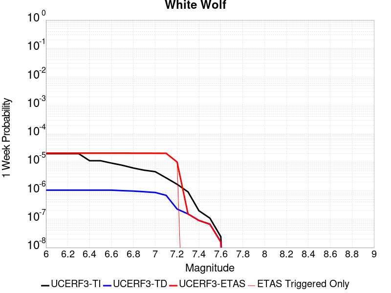 | 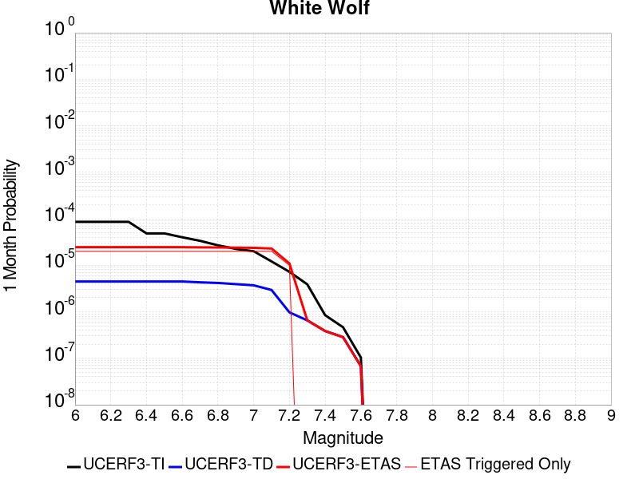 | 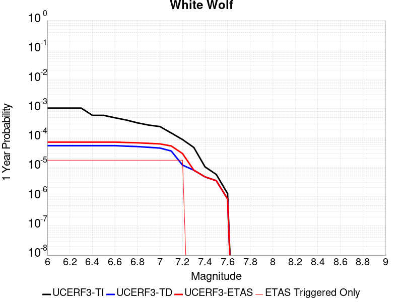 | 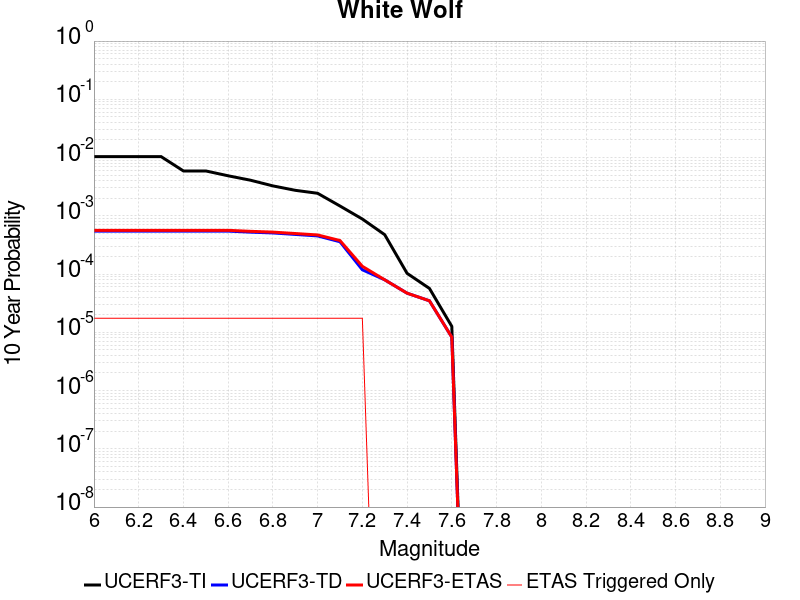 |

| Magnitude | 1 wk TI Prob | 1 wk TD Prob | 1 wk ETAS Prob | 1 wk ETAS/TD Gain | 1 wk ETAS Triggered Only | 1 mo TI Prob | 1 mo TD Prob | 1 mo ETAS Prob | 1 mo ETAS/TD Gain | 1 mo ETAS Triggered Only | 1 yr TI Prob | 1 yr TD Prob | 1 yr ETAS Prob | 1 yr ETAS/TD Gain | 1 yr ETAS Triggered Only | 10 yr TI Prob | 10 yr TD Prob | 10 yr ETAS Prob | 10 yr ETAS/TD Gain | 10 yr ETAS Triggered Only |
|-----|-----|-----|-----|-----|-----|-----|-----|-----|-----|-----|-----|-----|-----|-----|-----|-----|-----|-----|-----|-----|
| 6.0 | 2.0037822E-5 | 1.0469162E-6 | 1.8490686E-5 | 17.66205 | 1.7443788E-5 | 8.587355E-5 | 4.486776E-6 | 2.1930486E-5 | 4.8878045 | 1.7443788E-5 | 0.001045009 | 5.4625183E-5 | 7.206802E-5 | 1.3193185 | 1.7443788E-5 | 0.010401085 | 5.461226E-4 | 5.6355685E-4 | 1.0319238 | 1.7443788E-5 |
| 6.1 | 2.0037822E-5 | 1.0469162E-6 | 1.8490686E-5 | 17.66205 | 1.7443788E-5 | 8.587355E-5 | 4.486776E-6 | 2.1930486E-5 | 4.8878045 | 1.7443788E-5 | 0.001045009 | 5.4625183E-5 | 7.206802E-5 | 1.3193185 | 1.7443788E-5 | 0.010401085 | 5.461226E-4 | 5.6355685E-4 | 1.0319238 | 1.7443788E-5 |
| 6.2 | 2.0037822E-5 | 1.0469162E-6 | 1.8490686E-5 | 17.66205 | 1.7443788E-5 | 8.587355E-5 | 4.486776E-6 | 2.1930486E-5 | 4.8878045 | 1.7443788E-5 | 0.001045009 | 5.4625183E-5 | 7.206802E-5 | 1.3193185 | 1.7443788E-5 | 0.010401085 | 5.461226E-4 | 5.6355685E-4 | 1.0319238 | 1.7443788E-5 |
| 6.3 | 2.0037822E-5 | 1.0469162E-6 | 1.8490686E-5 | 17.66205 | 1.7443788E-5 | 8.587355E-5 | 4.486776E-6 | 2.1930486E-5 | 4.8878045 | 1.7443788E-5 | 0.001045009 | 5.4625183E-5 | 7.206802E-5 | 1.3193185 | 1.7443788E-5 | 0.010401085 | 5.461226E-4 | 5.6355685E-4 | 1.0319238 | 1.7443788E-5 |
| 6.4 | 1.132487E-5 | 1.0469162E-6 | 1.8490686E-5 | 17.66205 | 1.7443788E-5 | 4.8534253E-5 | 4.486776E-6 | 2.1930486E-5 | 4.8878045 | 1.7443788E-5 | 5.907443E-4 | 5.4625183E-5 | 7.206802E-5 | 1.3193185 | 1.7443788E-5 | 0.005891764 | 5.461226E-4 | 5.6355685E-4 | 1.0319238 | 1.7443788E-5 |
| 6.5 | 1.132487E-5 | 1.0469162E-6 | 1.8490686E-5 | 17.66205 | 1.7443788E-5 | 4.8534253E-5 | 4.486776E-6 | 2.1930486E-5 | 4.8878045 | 1.7443788E-5 | 5.907443E-4 | 5.4625183E-5 | 7.206802E-5 | 1.3193185 | 1.7443788E-5 | 0.005891764 | 5.461226E-4 | 5.6355685E-4 | 1.0319238 | 1.7443788E-5 |
| 6.6 | 9.347473E-6 | 1.0469162E-6 | 1.8490686E-5 | 17.66205 | 1.7443788E-5 | 4.0059982E-5 | 4.486776E-6 | 2.1930486E-5 | 4.8878045 | 1.7443788E-5 | 4.8762115E-4 | 5.4625183E-5 | 7.206802E-5 | 1.3193185 | 1.7443788E-5 | 0.0048655253 | 5.461226E-4 | 5.6355685E-4 | 1.0319238 | 1.7443788E-5 |
| 6.7 | 7.842647E-6 | 1.0048342E-6 | 1.8448603E-5 | 18.35985 | 1.7443788E-5 | 3.361091E-5 | 4.3064256E-6 | 2.1750138E-5 | 5.0506244 | 1.7443788E-5 | 4.0913603E-4 | 5.2429517E-5 | 6.987239E-5 | 1.3326918 | 1.7443788E-5 | 0.004083836 | 5.2417646E-4 | 5.416111E-4 | 1.0332611 | 1.7443788E-5 |
| 6.8 | 6.26597E-6 | 9.734822E-7 | 1.8417253E-5 | 18.918941 | 1.7443788E-5 | 2.685388E-5 | 4.17206E-6 | 2.1615775E-5 | 5.1810794 | 1.7443788E-5 | 3.2689696E-4 | 5.0793697E-5 | 6.82366E-5 | 1.3434068 | 1.7443788E-5 | 0.003264165 | 5.078258E-4 | 5.252607E-4 | 1.0343325 | 1.7443788E-5 |
| 6.9 | 5.258436E-6 | 9.183254E-7 | 1.8362096E-5 | 19.995197 | 1.7443788E-5 | 2.2535958E-5 | 3.9356746E-6 | 2.1379394E-5 | 5.4322057 | 1.7443788E-5 | 2.7434074E-4 | 4.7915833E-5 | 6.5358785E-5 | 1.3640331 | 1.7443788E-5 | 0.0027400232 | 4.790598E-4 | 4.964952E-4 | 1.0363951 | 1.7443788E-5 |
| 7.0 | 4.675028E-6 | 8.6611794E-7 | 1.8309891E-5 | 21.14018 | 1.7443788E-5 | 2.003568E-5 | 3.7119291E-6 | 2.1155653E-5 | 5.6993685 | 1.7443788E-5 | 2.4390711E-4 | 4.5191846E-5 | 6.263485E-5 | 1.3859767 | 1.7443788E-5 | 0.0024363957 | 4.518313E-4 | 4.692672E-4 | 1.0385894 | 1.7443788E-5 |
| 7.1 | 2.8270078E-6 | 6.8741696E-7 | 1.8131192E-5 | 26.37583 | 1.7443788E-5 | 1.2115692E-5 | 2.9460696E-6 | 2.0389805E-5 | 6.9210196 | 1.7443788E-5 | 1.4749856E-4 | 3.5867848E-5 | 5.331101E-5 | 1.4863175 | 1.7443788E-5 | 0.001474007 | 3.586247E-4 | 3.7606223E-4 | 1.0486233 | 1.7443788E-5 |
| 7.2 | 1.6881406E-6 | 2.2706382E-7 | 1.7670847E-5 | 77.82326 | 1.7443788E-5 | 7.2348685E-6 | 9.731303E-7 | 1.84169E-5 | 18.92542 | 1.7443788E-5 | 8.808096E-5 | 1.1847799E-5 | 2.929138E-5 | 2.4723055 | 1.7443788E-5 | 8.8046055E-4 | 1.1847183E-4 | 1.3591355E-4 | 1.1472225 | 1.7443788E-5 |
| 7.3 | 9.086107E-7 | 1.5266386E-7 | 1.5266386E-7 | 1.0 | 0.0 | 3.8940398E-6 | 6.5427355E-7 | 6.5427355E-7 | 1.0 | 0.0 | 4.7408903E-5 | 7.965752E-6 | 7.965752E-6 | 1.0 | 0.0 | 4.739879E-4 | 7.965475E-5 | 7.965475E-5 | 1.0 | 0.0 |
| 7.4 | 1.9717383E-7 | 9.003913E-8 | 9.003913E-8 | 1.0 | 0.0 | 8.450304E-7 | 3.8588192E-7 | 3.8588192E-7 | 1.0 | 0.0 | 1.0288197E-5 | 4.6981027E-6 | 4.6981027E-6 | 1.0 | 0.0 | 1.028772E-4 | 4.6980065E-5 | 4.6980065E-5 | 1.0 | 0.0 |
| 7.5 | 1.086975E-7 | 6.6597195E-8 | 6.6597195E-8 | 1.0 | 0.0 | 4.6584634E-7 | 2.8541652E-7 | 2.8541652E-7 | 1.0 | 0.0 | 5.6716644E-6 | 3.474941E-6 | 3.474941E-6 | 1.0 | 0.0 | 5.6715195E-5 | 3.474889E-5 | 3.474889E-5 | 1.0 | 0.0 |
| 7.6 | 2.4217808E-8 | 1.5820765E-8 | 1.5820765E-8 | 1.0 | 0.0 | 1.03790605E-7 | 6.780328E-8 | 6.780328E-8 | 1.0 | 0.0 | 1.2636499E-6 | 8.255046E-7 | 8.255046E-7 | 1.0 | 0.0 | 1.2636427E-5 | 8.2550205E-6 | 8.2550205E-6 | 1.0 | 0.0 |

## Quien Sabe 2011 CFM
*[(top)](#table-of-contents)*

| 1 Week | 1 Month | 1 Year | 10 Year |
|-----|-----|-----|-----|
| 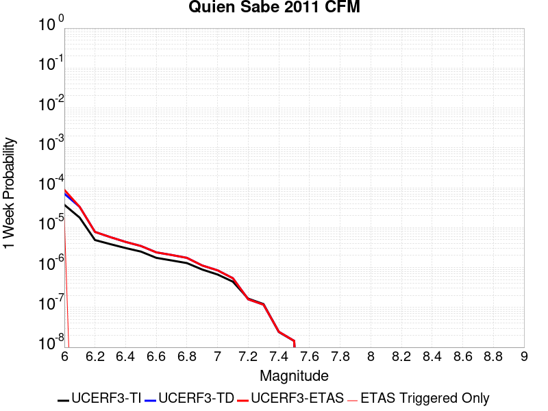 | 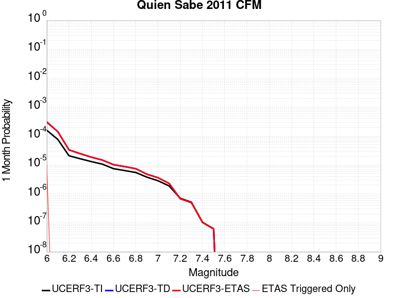 | 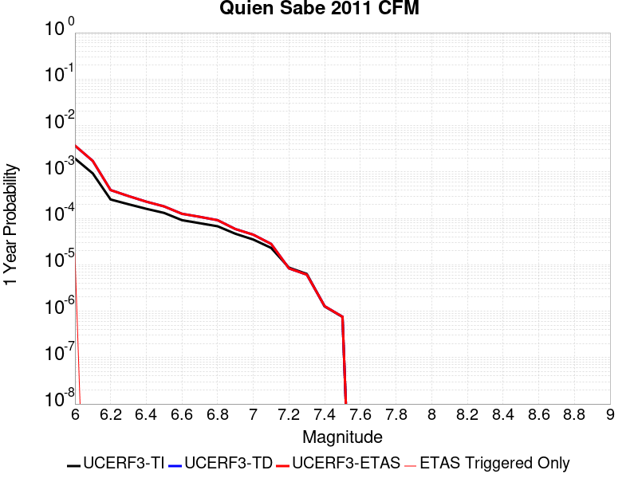 | 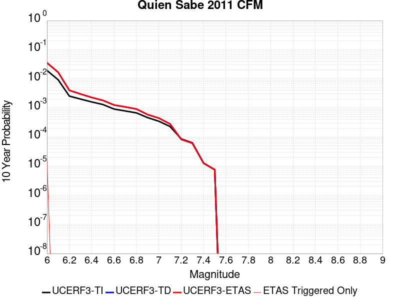 |

| Magnitude | 1 wk TI Prob | 1 wk TD Prob | 1 wk ETAS Prob | 1 wk ETAS/TD Gain | 1 wk ETAS Triggered Only | 1 mo TI Prob | 1 mo TD Prob | 1 mo ETAS Prob | 1 mo ETAS/TD Gain | 1 mo ETAS Triggered Only | 1 yr TI Prob | 1 yr TD Prob | 1 yr ETAS Prob | 1 yr ETAS/TD Gain | 1 yr ETAS Triggered Only | 10 yr TI Prob | 10 yr TD Prob | 10 yr ETAS Prob | 10 yr ETAS/TD Gain | 10 yr ETAS Triggered Only |
|-----|-----|-----|-----|-----|-----|-----|-----|-----|-----|-----|-----|-----|-----|-----|-----|-----|-----|-----|-----|-----|
| 6.0 | 3.729899E-5 | 7.087805E-5 | 8.83206E-5 | 1.2460924 | 1.7443788E-5 | 1.5984301E-4 | 3.037322E-4 | 3.211707E-4 | 1.057414 | 1.7443788E-5 | 0.0019443515 | 0.0036852323 | 0.0037026117 | 1.004716 | 1.7443788E-5 | 0.019274272 | 0.035349756 | 0.035366584 | 1.000476 | 1.7443788E-5 |
| 6.1 | 1.7825725E-5 | 3.31456E-5 | 3.31456E-5 | 1.0 | 0.0 | 7.639373E-5 | 1.4204586E-4 | 1.4204586E-4 | 1.0 | 0.0 | 9.296967E-4 | 0.0017267246 | 0.0017267246 | 1.0 | 0.0 | 0.009258169 | 0.016698597 | 0.016698597 | 1.0 | 0.0 |
| 6.2 | 4.8865336E-6 | 7.804963E-6 | 7.804963E-6 | 1.0 | 0.0 | 2.0942118E-5 | 3.344947E-5 | 3.344947E-5 | 1.0 | 0.0 | 2.5494045E-4 | 4.0691497E-4 | 4.0691497E-4 | 1.0 | 0.0 | 0.0025464818 | 0.0040135453 | 0.0040135453 | 1.0 | 0.0 |
| 6.3 | 3.858491E-6 | 5.789573E-6 | 5.789573E-6 | 1.0 | 0.0 | 1.6536285E-5 | 2.4812247E-5 | 2.4812247E-5 | 1.0 | 0.0 | 2.0131067E-4 | 3.0205192E-4 | 3.0205192E-4 | 1.0 | 0.0 | 0.002011284 | 0.0030019816 | 0.0030019816 | 1.0 | 0.0 |
| 6.4 | 3.0771805E-6 | 4.384806E-6 | 4.384806E-6 | 1.0 | 0.0 | 1.318785E-5 | 1.8791905E-5 | 1.8791905E-5 | 1.0 | 0.0 | 1.6055023E-4 | 2.2876984E-4 | 2.2876984E-4 | 1.0 | 0.0 | 0.001604343 | 0.002286477 | 0.002286477 | 1.0 | 0.0 |
| 6.5 | 2.5081235E-6 | 3.463511E-6 | 3.463511E-6 | 1.0 | 0.0 | 1.0749056E-5 | 1.4843542E-5 | 1.4843542E-5 | 1.0 | 0.0 | 1.308619E-4 | 1.807066E-4 | 1.807066E-4 | 1.0 | 0.0 | 0.0013078486 | 0.0018123116 | 0.0018123116 | 1.0 | 0.0 |
| 6.6 | 1.7505364E-6 | 2.4023168E-6 | 2.4023168E-6 | 1.0 | 0.0 | 7.502277E-6 | 1.0295607E-5 | 1.0295607E-5 | 1.0 | 0.0 | 9.13364E-5 | 1.2534253E-4 | 1.2534253E-4 | 1.0 | 0.0 | 9.129886E-4 | 0.0012582915 | 0.0012582915 | 1.0 | 0.0 |
| 6.7 | 1.505737E-6 | 2.0637349E-6 | 2.0637349E-6 | 1.0 | 0.0 | 6.4531428E-6 | 8.844551E-6 | 8.844551E-6 | 1.0 | 0.0 | 7.8564175E-5 | 1.0767768E-4 | 1.0767768E-4 | 1.0 | 0.0 | 7.853641E-4 | 0.0010818138 | 0.0010818138 | 1.0 | 0.0 |
| 6.8 | 1.2924105E-6 | 1.7484025E-6 | 1.7484025E-6 | 1.0 | 0.0 | 5.5388905E-6 | 7.4931354E-6 | 7.4931354E-6 | 1.0 | 0.0 | 6.74339E-5 | 9.122565E-5 | 9.122565E-5 | 1.0 | 0.0 | 6.741344E-4 | 9.1609603E-4 | 9.1609603E-4 | 1.0 | 0.0 |
| 6.9 | 8.9075286E-7 | 1.1249955E-6 | 1.1249955E-6 | 1.0 | 0.0 | 3.8175067E-6 | 4.8214015E-6 | 4.8214015E-6 | 1.0 | 0.0 | 4.6477155E-5 | 5.8699206E-5 | 5.8699206E-5 | 1.0 | 0.0 | 4.6467435E-4 | 5.903947E-4 | 5.903947E-4 | 1.0 | 0.0 |
| 7.0 | 6.6891175E-7 | 8.51663E-7 | 8.51663E-7 | 1.0 | 0.0 | 2.8667614E-6 | 3.6499803E-6 | 3.6499803E-6 | 1.0 | 0.0 | 3.4902263E-5 | 4.44378E-5 | 4.44378E-5 | 1.0 | 0.0 | 3.4896782E-4 | 4.4678617E-4 | 4.4678617E-4 | 1.0 | 0.0 |
| 7.1 | 4.4205015E-7 | 5.3919683E-7 | 5.3919683E-7 | 1.0 | 0.0 | 1.8944993E-6 | 2.3108425E-6 | 2.3108425E-6 | 1.0 | 0.0 | 2.3065284E-5 | 2.8134315E-5 | 2.8134315E-5 | 1.0 | 0.0 | 2.3062891E-4 | 2.826926E-4 | 2.826926E-4 | 1.0 | 0.0 |
| 7.2 | 1.6620965E-7 | 1.5987598E-7 | 1.5987598E-7 | 1.0 | 0.0 | 7.123269E-7 | 6.851826E-7 | 6.851826E-7 | 1.0 | 0.0 | 8.672545E-6 | 8.34207E-6 | 8.34207E-6 | 1.0 | 0.0 | 8.6722066E-5 | 8.3573126E-5 | 8.3573126E-5 | 1.0 | 0.0 |
| 7.3 | 1.2142488E-7 | 1.1726492E-7 | 1.1726492E-7 | 1.0 | 0.0 | 5.2039223E-7 | 5.0256386E-7 | 5.0256386E-7 | 1.0 | 0.0 | 6.335757E-6 | 6.118701E-6 | 6.118701E-6 | 1.0 | 0.0 | 6.3355765E-5 | 6.124848E-5 | 6.124848E-5 | 1.0 | 0.0 |
| 7.4 | 2.4192937E-8 | 2.4543448E-8 | 2.4543448E-8 | 1.0 | 0.0 | 1.0368401E-7 | 1.051862E-7 | 1.051862E-7 | 1.0 | 0.0 | 1.2623522E-6 | 1.2806413E-6 | 1.2806413E-6 | 1.0 | 0.0 | 1.2623449E-5 | 1.2812683E-5 | 1.2812683E-5 | 1.0 | 0.0 |
| 7.5 | 1.4432802E-8 | 1.4506471E-8 | 1.4506471E-8 | 1.0 | 0.0 | 6.185486E-8 | 6.2170585E-8 | 6.2170585E-8 | 1.0 | 0.0 | 7.530827E-7 | 7.5692674E-7 | 7.5692674E-7 | 1.0 | 0.0 | 7.530801E-6 | 7.5735175E-6 | 7.5735175E-6 | 1.0 | 0.0 |

## San Gorgonio Pass
*[(top)](#table-of-contents)*

| 1 Week | 1 Month | 1 Year | 10 Year |
|-----|-----|-----|-----|
| 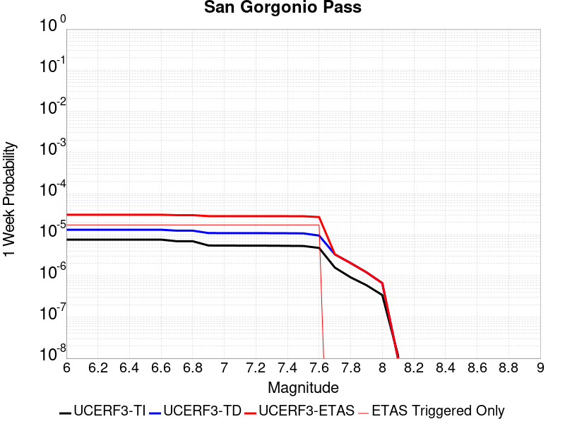 | 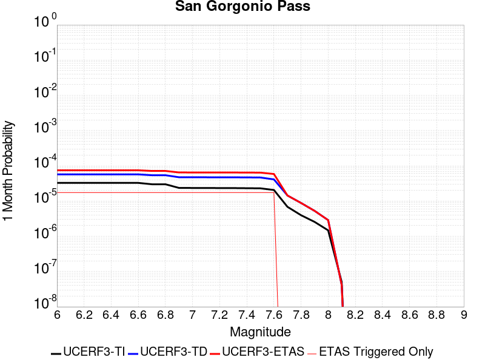 | 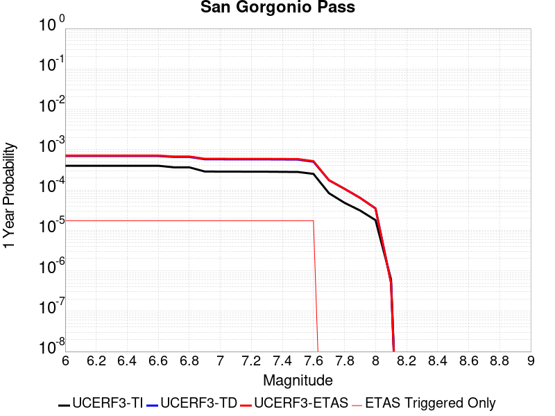 | 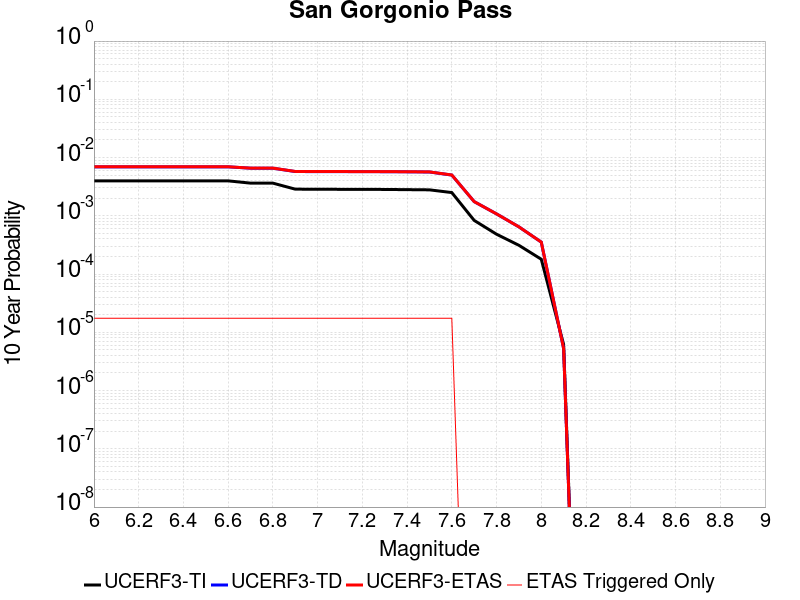 |

| Magnitude | 1 wk TI Prob | 1 wk TD Prob | 1 wk ETAS Prob | 1 wk ETAS/TD Gain | 1 wk ETAS Triggered Only | 1 mo TI Prob | 1 mo TD Prob | 1 mo ETAS Prob | 1 mo ETAS/TD Gain | 1 mo ETAS Triggered Only | 1 yr TI Prob | 1 yr TD Prob | 1 yr ETAS Prob | 1 yr ETAS/TD Gain | 1 yr ETAS Triggered Only | 10 yr TI Prob | 10 yr TD Prob | 10 yr ETAS Prob | 10 yr ETAS/TD Gain | 10 yr ETAS Triggered Only |
|-----|-----|-----|-----|-----|-----|-----|-----|-----|-----|-----|-----|-----|-----|-----|-----|-----|-----|-----|-----|-----|
| 6.0 | 7.644328E-6 | 1.3314231E-5 | 3.0757787E-5 | 2.3101437 | 1.7443788E-5 | 3.2760996E-5 | 5.705979E-5 | 7.450258E-5 | 1.3056933 | 1.7443788E-5 | 3.987921E-4 | 6.944901E-4 | 7.119218E-4 | 1.0251 | 1.7443788E-5 | 0.003980772 | 0.0069299806 | 0.0069473037 | 1.0024997 | 1.7443788E-5 |
| 6.1 | 7.644328E-6 | 1.3314231E-5 | 3.0757787E-5 | 2.3101437 | 1.7443788E-5 | 3.2760996E-5 | 5.705979E-5 | 7.450258E-5 | 1.3056933 | 1.7443788E-5 | 3.987921E-4 | 6.944901E-4 | 7.119218E-4 | 1.0251 | 1.7443788E-5 | 0.003980772 | 0.0069299806 | 0.0069473037 | 1.0024997 | 1.7443788E-5 |
| 6.2 | 7.644328E-6 | 1.3314231E-5 | 3.0757787E-5 | 2.3101437 | 1.7443788E-5 | 3.2760996E-5 | 5.705979E-5 | 7.450258E-5 | 1.3056933 | 1.7443788E-5 | 3.987921E-4 | 6.944901E-4 | 7.119218E-4 | 1.0251 | 1.7443788E-5 | 0.003980772 | 0.0069299806 | 0.0069473037 | 1.0024997 | 1.7443788E-5 |
| 6.3 | 7.644328E-6 | 1.3314231E-5 | 3.0757787E-5 | 2.3101437 | 1.7443788E-5 | 3.2760996E-5 | 5.705979E-5 | 7.450258E-5 | 1.3056933 | 1.7443788E-5 | 3.987921E-4 | 6.944901E-4 | 7.119218E-4 | 1.0251 | 1.7443788E-5 | 0.003980772 | 0.0069299806 | 0.0069473037 | 1.0024997 | 1.7443788E-5 |
| 6.4 | 7.644328E-6 | 1.3314231E-5 | 3.0757787E-5 | 2.3101437 | 1.7443788E-5 | 3.2760996E-5 | 5.705979E-5 | 7.450258E-5 | 1.3056933 | 1.7443788E-5 | 3.987921E-4 | 6.944901E-4 | 7.119218E-4 | 1.0251 | 1.7443788E-5 | 0.003980772 | 0.0069299806 | 0.0069473037 | 1.0024997 | 1.7443788E-5 |
| 6.5 | 7.644328E-6 | 1.3314231E-5 | 3.0757787E-5 | 2.3101437 | 1.7443788E-5 | 3.2760996E-5 | 5.705979E-5 | 7.450258E-5 | 1.3056933 | 1.7443788E-5 | 3.987921E-4 | 6.944901E-4 | 7.119218E-4 | 1.0251 | 1.7443788E-5 | 0.003980772 | 0.0069299806 | 0.0069473037 | 1.0024997 | 1.7443788E-5 |
| 6.6 | 7.644328E-6 | 1.3314231E-5 | 3.0757787E-5 | 2.3101437 | 1.7443788E-5 | 3.2760996E-5 | 5.705979E-5 | 7.450258E-5 | 1.3056933 | 1.7443788E-5 | 3.987921E-4 | 6.944901E-4 | 7.119218E-4 | 1.0251 | 1.7443788E-5 | 0.003980772 | 0.0069299806 | 0.0069473037 | 1.0024997 | 1.7443788E-5 |
| 6.7 | 6.987586E-6 | 1.2618505E-5 | 3.0062072E-5 | 2.3823798 | 1.7443788E-5 | 2.9946454E-5 | 5.4078235E-5 | 7.152108E-5 | 1.3225484 | 1.7443788E-5 | 3.645371E-4 | 6.582117E-4 | 6.75644E-4 | 1.0264844 | 1.7443788E-5 | 0.0036393967 | 0.0065693567 | 0.006586686 | 1.0026379 | 1.7443788E-5 |
| 6.8 | 6.987586E-6 | 1.2618505E-5 | 3.0062072E-5 | 2.3823798 | 1.7443788E-5 | 2.9946454E-5 | 5.4078235E-5 | 7.152108E-5 | 1.3225484 | 1.7443788E-5 | 3.645371E-4 | 6.582117E-4 | 6.75644E-4 | 1.0264844 | 1.7443788E-5 | 0.0036393967 | 0.0065693567 | 0.006586686 | 1.0026379 | 1.7443788E-5 |
| 6.9 | 5.504702E-6 | 1.1049368E-5 | 2.8492963E-5 | 2.578696 | 1.7443788E-5 | 2.3591367E-5 | 4.7353606E-5 | 6.4796564E-5 | 1.3683555 | 1.7443788E-5 | 2.8718702E-4 | 5.7638274E-4 | 5.9381645E-4 | 1.0302469 | 1.7443788E-5 | 0.0028681618 | 0.005755309 | 0.0057726526 | 1.0030135 | 1.7443788E-5 |
| 7.0 | 5.4825764E-6 | 1.102571E-5 | 2.8469305E-5 | 2.5820837 | 1.7443788E-5 | 2.3496545E-5 | 4.7252215E-5 | 6.4695174E-5 | 1.369146 | 1.7443788E-5 | 2.8603288E-4 | 5.751489E-4 | 5.925827E-4 | 1.0303117 | 1.7443788E-5 | 0.00285665 | 0.005743035 | 0.0057603787 | 1.0030199 | 1.7443788E-5 |
| 7.1 | 5.4692787E-6 | 1.101142E-5 | 2.8455015E-5 | 2.5841367 | 1.7443788E-5 | 2.3439556E-5 | 4.7190973E-5 | 6.463394E-5 | 1.369625 | 1.7443788E-5 | 2.8533922E-4 | 5.744037E-4 | 5.9183745E-4 | 1.030351 | 1.7443788E-5 | 0.0028497311 | 0.0057356213 | 0.005752965 | 1.0030239 | 1.7443788E-5 |
| 7.2 | 5.453661E-6 | 1.0994446E-5 | 2.8438042E-5 | 2.5865824 | 1.7443788E-5 | 2.3372622E-5 | 4.7118232E-5 | 6.4561194E-5 | 1.3701956 | 1.7443788E-5 | 2.8452452E-4 | 5.7351857E-4 | 5.9095235E-4 | 1.0303979 | 1.7443788E-5 | 0.002841605 | 0.0057268157 | 0.005744159 | 1.0030285 | 1.7443788E-5 |
| 7.3 | 5.4422303E-6 | 1.0981369E-5 | 2.8424965E-5 | 2.588472 | 1.7443788E-5 | 2.3323635E-5 | 4.706219E-5 | 6.4505155E-5 | 1.3706365 | 1.7443788E-5 | 2.8392827E-4 | 5.728366E-4 | 5.902704E-4 | 1.0304341 | 1.7443788E-5 | 0.0028356577 | 0.005720031 | 0.005737375 | 1.0030322 | 1.7443788E-5 |
| 7.4 | 5.398595E-6 | 1.0928734E-5 | 2.8372331E-5 | 2.5961223 | 1.7443788E-5 | 2.313663E-5 | 4.683662E-5 | 6.427959E-5 | 1.3724216 | 1.7443788E-5 | 2.8165206E-4 | 5.700917E-4 | 5.8752554E-4 | 1.0305808 | 1.7443788E-5 | 0.0028129534 | 0.005692723 | 0.0057100677 | 1.0030468 | 1.7443788E-5 |
| 7.5 | 5.3578788E-6 | 1.0855281E-5 | 2.8298879E-5 | 2.6069226 | 1.7443788E-5 | 2.2962136E-5 | 4.6521833E-5 | 6.3964806E-5 | 1.3749417 | 1.7443788E-5 | 2.7952815E-4 | 5.662612E-4 | 5.836951E-4 | 1.0307877 | 1.7443788E-5 | 0.002791768 | 0.0056546377 | 0.005671983 | 1.0030674 | 1.7443788E-5 |
| 7.6 | 4.8091474E-6 | 9.60368E-6 | 2.70473E-5 | 2.8163474 | 1.7443788E-5 | 2.0610469E-5 | 4.1158008E-5 | 5.8601076E-5 | 1.4238075 | 1.7443788E-5 | 2.5090357E-4 | 5.0098833E-4 | 5.184234E-4 | 1.0348014 | 1.7443788E-5 | 0.0025062046 | 0.0050053033 | 0.00502266 | 1.0034676 | 1.7443788E-5 |
| 7.7 | 1.5991155E-6 | 3.352866E-6 | 3.352866E-6 | 1.0 | 0.0 | 6.853334E-6 | 1.4369349E-5 | 1.4369349E-5 | 1.0 | 0.0 | 8.343615E-5 | 1.7493303E-4 | 1.7493303E-4 | 1.0 | 0.0 | 8.340483E-4 | 0.0017534072 | 0.0017534072 | 1.0 | 0.0 |
| 7.8 | 9.258398E-7 | 2.0579948E-6 | 2.0579948E-6 | 1.0 | 0.0 | 3.967879E-6 | 8.819949E-6 | 8.819949E-6 | 1.0 | 0.0 | 4.8307855E-5 | 1.073776E-4 | 1.073776E-4 | 1.0 | 0.0 | 4.8297356E-4 | 0.001078687 | 0.001078687 | 1.0 | 0.0 |
| 7.9 | 5.975575E-7 | 1.2291794E-6 | 1.2291794E-6 | 1.0 | 0.0 | 2.5609581E-6 | 5.2679006E-6 | 5.2679006E-6 | 1.0 | 0.0 | 3.117922E-5 | 6.4134816E-5 | 6.4134816E-5 | 1.0 | 0.0 | 3.1174847E-4 | 6.463092E-4 | 6.463092E-4 | 1.0 | 0.0 |
| 8.0 | 3.4413725E-7 | 6.7148494E-7 | 6.7148494E-7 | 1.0 | 0.0 | 1.4748731E-6 | 2.8777895E-6 | 2.8777895E-6 | 1.0 | 0.0 | 1.7956432E-5 | 3.503653E-5 | 3.503653E-5 | 1.0 | 0.0 | 1.7954981E-4 | 3.5373896E-4 | 3.5373896E-4 | 1.0 | 0.0 |
| 8.1 | 1.1787731E-8 | 9.634385E-9 | 9.634385E-9 | 1.0 | 0.0 | 5.0518846E-8 | 4.129022E-8 | 4.129022E-8 | 1.0 | 0.0 | 6.1506677E-7 | 5.027083E-7 | 5.027083E-7 | 1.0 | 0.0 | 6.1506507E-6 | 5.2424944E-6 | 5.2424944E-6 | 1.0 | 0.0 |

## South Klamath Lake East
*[(top)](#table-of-contents)*

| 1 Week | 1 Month | 1 Year | 10 Year |
|-----|-----|-----|-----|
| 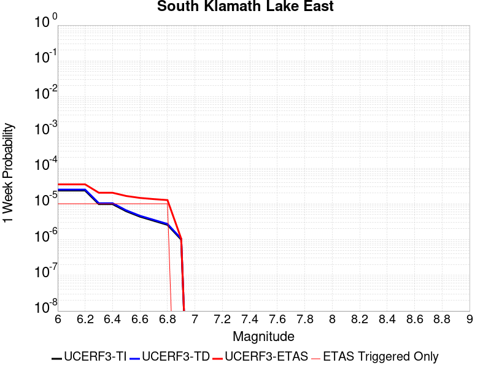 | 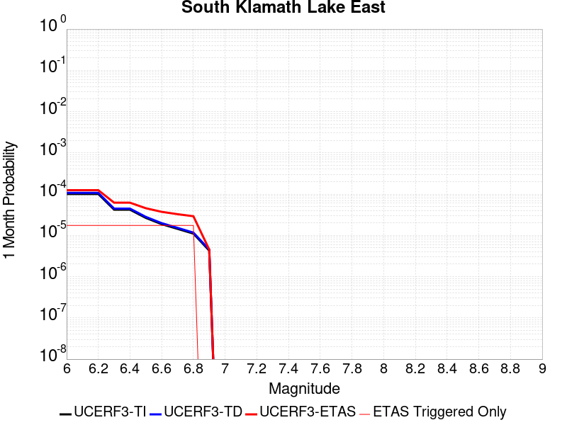 |  | 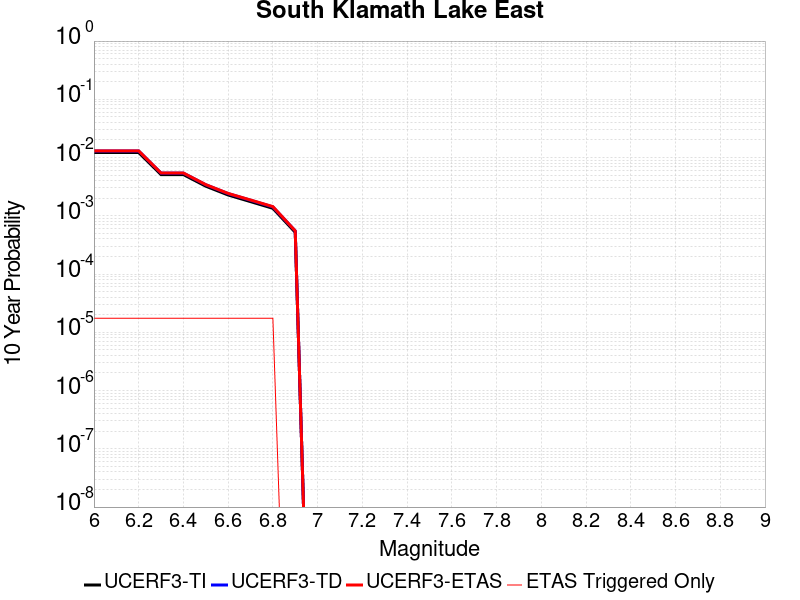 |

| Magnitude | 1 wk TI Prob | 1 wk TD Prob | 1 wk ETAS Prob | 1 wk ETAS/TD Gain | 1 wk ETAS Triggered Only | 1 mo TI Prob | 1 mo TD Prob | 1 mo ETAS Prob | 1 mo ETAS/TD Gain | 1 mo ETAS Triggered Only | 1 yr TI Prob | 1 yr TD Prob | 1 yr ETAS Prob | 1 yr ETAS/TD Gain | 1 yr ETAS Triggered Only | 10 yr TI Prob | 10 yr TD Prob | 10 yr ETAS Prob | 10 yr ETAS/TD Gain | 10 yr ETAS Triggered Only |
|-----|-----|-----|-----|-----|-----|-----|-----|-----|-----|-----|-----|-----|-----|-----|-----|-----|-----|-----|-----|-----|
| 6.0 | 2.3539369E-5 | 2.5047308E-5 | 4.2490658E-5 | 1.6964163 | 1.7443788E-5 | 1.0087911E-4 | 1.0734166E-4 | 1.2478358E-4 | 1.1624898 | 1.7443788E-5 | 0.0012275111 | 0.0013061843 | 0.0013236054 | 1.0133374 | 1.7443788E-5 | 0.012207527 | 0.012993417 | 0.013010634 | 1.001325 | 1.7443788E-5 |
| 6.1 | 2.3539369E-5 | 2.5047308E-5 | 4.2490658E-5 | 1.6964163 | 1.7443788E-5 | 1.0087911E-4 | 1.0734166E-4 | 1.2478358E-4 | 1.1624898 | 1.7443788E-5 | 0.0012275111 | 0.0013061843 | 0.0013236054 | 1.0133374 | 1.7443788E-5 | 0.012207527 | 0.012993417 | 0.013010634 | 1.001325 | 1.7443788E-5 |
| 6.2 | 2.3539369E-5 | 2.5047308E-5 | 4.2490658E-5 | 1.6964163 | 1.7443788E-5 | 1.0087911E-4 | 1.0734166E-4 | 1.2478358E-4 | 1.1624898 | 1.7443788E-5 | 0.0012275111 | 0.0013061843 | 0.0013236054 | 1.0133374 | 1.7443788E-5 | 0.012207527 | 0.012993417 | 0.013010634 | 1.001325 | 1.7443788E-5 |
| 6.3 | 9.807823E-6 | 1.0396044E-5 | 2.783965E-5 | 2.6779082 | 1.7443788E-5 | 4.2032847E-5 | 4.455376E-5 | 6.199677E-5 | 1.3915048 | 1.7443788E-5 | 5.1162974E-4 | 5.4231536E-4 | 5.597497E-4 | 1.032148 | 1.7443788E-5 | 0.005104534 | 0.005410756 | 0.0054281056 | 1.0032065 | 1.7443788E-5 |
| 6.4 | 9.807823E-6 | 1.0396044E-5 | 2.783965E-5 | 2.6779082 | 1.7443788E-5 | 4.2032847E-5 | 4.455376E-5 | 6.199677E-5 | 1.3915048 | 1.7443788E-5 | 5.1162974E-4 | 5.4231536E-4 | 5.597497E-4 | 1.032148 | 1.7443788E-5 | 0.005104534 | 0.005410756 | 0.0054281056 | 1.0032065 | 1.7443788E-5 |
| 6.5 | 6.191981E-6 | 6.5508398E-6 | 2.3994513E-5 | 3.6628146 | 1.7443788E-5 | 2.653679E-5 | 2.8074743E-5 | 4.5518038E-5 | 1.6213164 | 1.7443788E-5 | 3.2303753E-4 | 3.4175918E-4 | 3.59197E-4 | 1.0510237 | 1.7443788E-5 | 0.0032256835 | 0.003412614 | 0.0034299982 | 1.0050942 | 1.7443788E-5 |
| 6.6 | 4.3693776E-6 | 4.6165574E-6 | 2.2060265E-5 | 4.7785096 | 1.7443788E-5 | 1.8725768E-5 | 1.9785102E-5 | 3.7228543E-5 | 1.8816453 | 1.7443788E-5 | 2.2796239E-4 | 2.4085813E-4 | 2.5829772E-4 | 1.072406 | 1.7443788E-5 | 0.0022772867 | 0.0024060833 | 0.002423485 | 1.0072324 | 1.7443788E-5 |
| 6.7 | 3.360834E-6 | 3.5512403E-6 | 2.0994965E-5 | 5.9120092 | 1.7443788E-5 | 1.4403494E-5 | 1.5219517E-5 | 3.266304E-5 | 2.1461284 | 1.7443788E-5 | 1.7534842E-4 | 1.8528267E-4 | 2.0272323E-4 | 1.0941294 | 1.7443788E-5 | 0.0017521014 | 0.0018513618 | 0.0018687734 | 1.0094047 | 1.7443788E-5 |
| 6.8 | 2.57873E-6 | 2.7251708E-6 | 2.016891E-5 | 7.400971 | 1.7443788E-5 | 1.1051653E-5 | 1.1679254E-5 | 2.9122839E-5 | 2.493553 | 1.7443788E-5 | 1.3454557E-4 | 1.4218627E-4 | 1.5962757E-4 | 1.1226652 | 1.7443788E-5 | 0.0013446413 | 0.0014210136 | 0.0014384326 | 1.0122582 | 1.7443788E-5 |
| 6.9 | 9.987825E-7 | 1.0566213E-6 | 1.0566213E-6 | 1.0 | 0.0 | 4.2804895E-6 | 4.528371E-6 | 4.528371E-6 | 1.0 | 0.0 | 5.211371E-5 | 5.5131848E-5 | 5.5131848E-5 | 1.0 | 0.0 | 5.210149E-4 | 5.5121386E-4 | 5.5121386E-4 | 1.0 | 0.0 |

## Oak Ridge (Onshore)
*[(top)](#table-of-contents)*

| 1 Week | 1 Month | 1 Year | 10 Year |
|-----|-----|-----|-----|
| 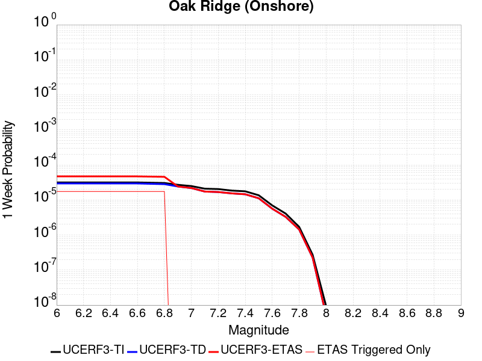 | 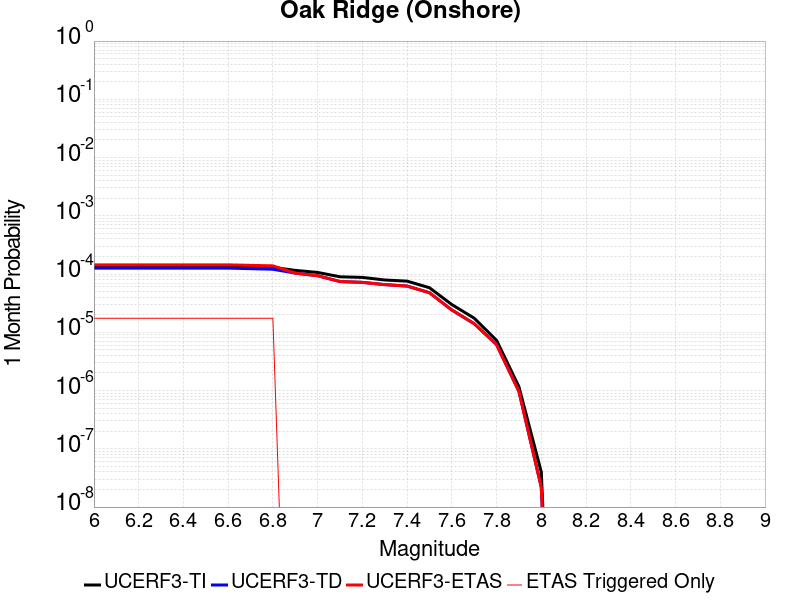 | 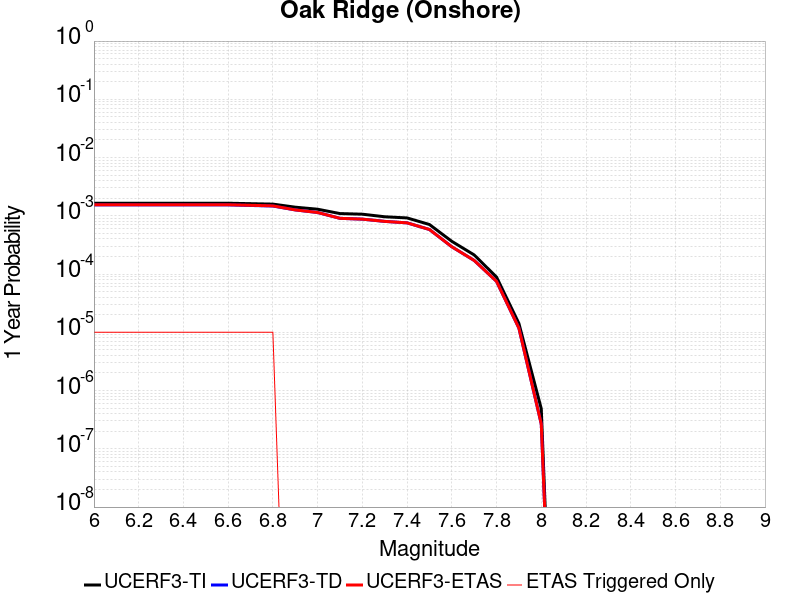 | 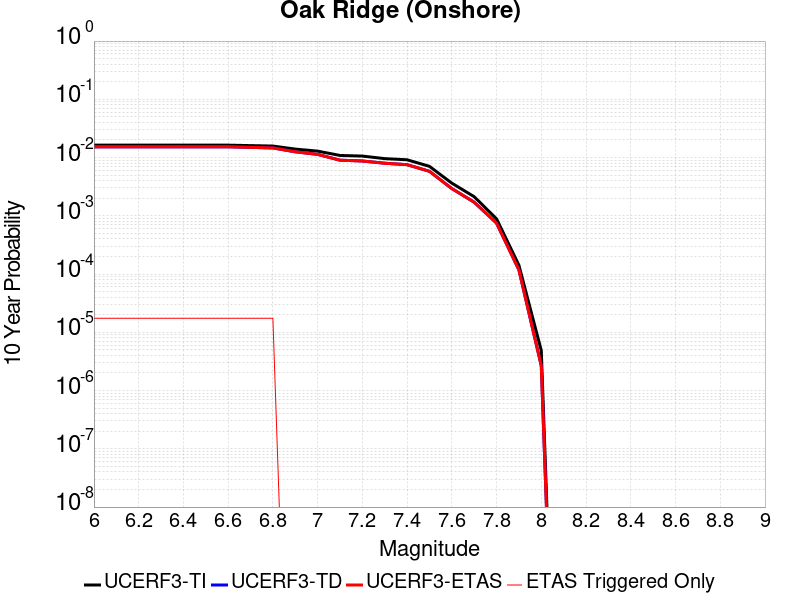 |

| Magnitude | 1 wk TI Prob | 1 wk TD Prob | 1 wk ETAS Prob | 1 wk ETAS/TD Gain | 1 wk ETAS Triggered Only | 1 mo TI Prob | 1 mo TD Prob | 1 mo ETAS Prob | 1 mo ETAS/TD Gain | 1 mo ETAS Triggered Only | 1 yr TI Prob | 1 yr TD Prob | 1 yr ETAS Prob | 1 yr ETAS/TD Gain | 1 yr ETAS Triggered Only | 10 yr TI Prob | 10 yr TD Prob | 10 yr ETAS Prob | 10 yr ETAS/TD Gain | 10 yr ETAS Triggered Only |
|-----|-----|-----|-----|-----|-----|-----|-----|-----|-----|-----|-----|-----|-----|-----|-----|-----|-----|-----|-----|-----|
| 6.0 | 3.155064E-5 | 2.9525974E-5 | 4.6969246E-5 | 1.5907772 | 1.7443788E-5 | 1.3521002E-4 | 1.2653397E-4 | 1.4397554E-4 | 1.1378411 | 1.7443788E-5 | 0.001644939 | 0.0015395004 | 0.0015569173 | 1.0113133 | 1.7443788E-5 | 0.01632816 | 0.015292859 | 0.015310036 | 1.0011232 | 1.7443788E-5 |
| 6.1 | 3.155064E-5 | 2.9525974E-5 | 4.6969246E-5 | 1.5907772 | 1.7443788E-5 | 1.3521002E-4 | 1.2653397E-4 | 1.4397554E-4 | 1.1378411 | 1.7443788E-5 | 0.001644939 | 0.0015395004 | 0.0015569173 | 1.0113133 | 1.7443788E-5 | 0.01632816 | 0.015292859 | 0.015310036 | 1.0011232 | 1.7443788E-5 |
| 6.2 | 3.155064E-5 | 2.9525974E-5 | 4.6969246E-5 | 1.5907772 | 1.7443788E-5 | 1.3521002E-4 | 1.2653397E-4 | 1.4397554E-4 | 1.1378411 | 1.7443788E-5 | 0.001644939 | 0.0015395004 | 0.0015569173 | 1.0113133 | 1.7443788E-5 | 0.01632816 | 0.015292859 | 0.015310036 | 1.0011232 | 1.7443788E-5 |
| 6.3 | 3.155064E-5 | 2.9525974E-5 | 4.6969246E-5 | 1.5907772 | 1.7443788E-5 | 1.3521002E-4 | 1.2653397E-4 | 1.4397554E-4 | 1.1378411 | 1.7443788E-5 | 0.001644939 | 0.0015395004 | 0.0015569173 | 1.0113133 | 1.7443788E-5 | 0.01632816 | 0.015292859 | 0.015310036 | 1.0011232 | 1.7443788E-5 |
| 6.4 | 3.155064E-5 | 2.9525974E-5 | 4.6969246E-5 | 1.5907772 | 1.7443788E-5 | 1.3521002E-4 | 1.2653397E-4 | 1.4397554E-4 | 1.1378411 | 1.7443788E-5 | 0.001644939 | 0.0015395004 | 0.0015569173 | 1.0113133 | 1.7443788E-5 | 0.01632816 | 0.015292859 | 0.015310036 | 1.0011232 | 1.7443788E-5 |
| 6.5 | 3.155064E-5 | 2.9525974E-5 | 4.6969246E-5 | 1.5907772 | 1.7443788E-5 | 1.3521002E-4 | 1.2653397E-4 | 1.4397554E-4 | 1.1378411 | 1.7443788E-5 | 0.001644939 | 0.0015395004 | 0.0015569173 | 1.0113133 | 1.7443788E-5 | 0.01632816 | 0.015292859 | 0.015310036 | 1.0011232 | 1.7443788E-5 |
| 6.6 | 3.155064E-5 | 2.9525974E-5 | 4.6969246E-5 | 1.5907772 | 1.7443788E-5 | 1.3521002E-4 | 1.2653397E-4 | 1.4397554E-4 | 1.1378411 | 1.7443788E-5 | 0.001644939 | 0.0015395004 | 0.0015569173 | 1.0113133 | 1.7443788E-5 | 0.01632816 | 0.015292859 | 0.015310036 | 1.0011232 | 1.7443788E-5 |
| 6.7 | 3.098897E-5 | 2.8864175E-5 | 4.6307458E-5 | 1.604323 | 1.7443788E-5 | 1.328031E-4 | 1.2369796E-4 | 1.4113958E-4 | 1.1410018 | 1.7443788E-5 | 0.0016156785 | 0.0015050198 | 0.0015224374 | 1.011573 | 1.7443788E-5 | 0.016039822 | 0.014952714 | 0.0149698965 | 1.0011492 | 1.7443788E-5 |
| 6.8 | 3.0449872E-5 | 2.8239372E-5 | 4.5682667E-5 | 1.6176941 | 1.7443788E-5 | 1.3049292E-4 | 1.2102048E-4 | 1.3846216E-4 | 1.1441216 | 1.7443788E-5 | 0.0015875935 | 0.0014724657 | 0.0014898838 | 1.0118293 | 1.7443788E-5 | 0.015762992 | 0.014631462 | 0.014648651 | 1.0011748 | 1.7443788E-5 |
| 6.9 | 2.697928E-5 | 2.4219773E-5 | 2.4219773E-5 | 1.0 | 0.0 | 1.15620365E-4 | 1.0379502E-4 | 1.0379502E-4 | 1.0 | 0.0 | 0.0014067689 | 0.0012629933 | 0.0012629933 | 1.0 | 0.0 | 0.0139789665 | 0.01256087 | 0.01256087 | 1.0 | 0.0 |
| 7.0 | 2.4893961E-5 | 2.1862043E-5 | 2.1862043E-5 | 1.0 | 0.0 | 1.0668404E-4 | 9.3691204E-5 | 9.3691204E-5 | 1.0 | 0.0 | 0.0012981043 | 0.0011401111 | 0.0011401111 | 1.0 | 0.0 | 0.012905477 | 0.011344905 | 0.011344905 | 1.0 | 0.0 |
| 7.1 | 2.0945363E-5 | 1.7354487E-5 | 1.7354487E-5 | 1.0 | 0.0 | 8.976275E-5 | 7.437428E-5 | 7.437428E-5 | 1.0 | 0.0 | 0.0010923136 | 9.051354E-4 | 9.051354E-4 | 1.0 | 0.0 | 0.0108696 | 0.009015423 | 0.009015423 | 1.0 | 0.0 |
| 7.2 | 2.0439404E-5 | 1.6809423E-5 | 1.6809423E-5 | 1.0 | 0.0 | 8.7594504E-5 | 7.203843E-5 | 7.203843E-5 | 1.0 | 0.0 | 0.0010659413 | 8.767196E-4 | 8.767196E-4 | 1.0 | 0.0 | 0.010608427 | 0.008733526 | 0.008733526 | 1.0 | 0.0 |
| 7.3 | 1.8463334E-5 | 1.5381811E-5 | 1.5381811E-5 | 1.0 | 0.0 | 7.912617E-5 | 6.59204E-5 | 6.59204E-5 | 1.0 | 0.0 | 9.6293533E-4 | 8.0228975E-4 | 8.0228975E-4 | 1.0 | 0.0 | 0.009587734 | 0.007994797 | 0.007994797 | 1.0 | 0.0 |
| 7.4 | 1.763139E-5 | 1.451684E-5 | 1.451684E-5 | 1.0 | 0.0 | 7.556091E-5 | 6.221356E-5 | 6.221356E-5 | 1.0 | 0.0 | 9.1956573E-4 | 7.571909E-4 | 7.571909E-4 | 1.0 | 0.0 | 0.009157699 | 0.007546914 | 0.007546914 | 1.0 | 0.0 |
| 7.5 | 1.3594944E-5 | 1.1163356E-5 | 1.1163356E-5 | 1.0 | 0.0 | 5.8262744E-5 | 4.784209E-5 | 4.784209E-5 | 1.0 | 0.0 | 7.0911803E-4 | 5.8232434E-4 | 5.8232434E-4 | 1.0 | 0.0 | 0.007068595 | 0.0058082556 | 0.0058082556 | 1.0 | 0.0 |
| 7.6 | 6.9889534E-6 | 5.6367144E-6 | 5.6367144E-6 | 1.0 | 0.0 | 2.9952313E-5 | 2.4157125E-5 | 2.4157125E-5 | 1.0 | 0.0 | 3.646084E-4 | 2.9407372E-4 | 2.9407372E-4 | 1.0 | 0.0 | 0.0036401073 | 0.0029368899 | 0.0029368899 | 1.0 | 0.0 |
| 7.7 | 4.0824193E-6 | 3.2832586E-6 | 3.2832586E-6 | 1.0 | 0.0 | 1.7495966E-5 | 1.4071033E-5 | 1.4071033E-5 | 1.0 | 0.0 | 2.1299256E-4 | 1.713015E-4 | 1.713015E-4 | 1.0 | 0.0 | 0.0021278851 | 0.0017117079 | 0.0017117079 | 1.0 | 0.0 |
| 7.8 | 1.7023609E-6 | 1.4370495E-6 | 1.4370495E-6 | 1.0 | 0.0 | 7.295812E-6 | 6.1587693E-6 | 6.1587693E-6 | 1.0 | 0.0 | 8.882289E-5 | 7.498047E-5 | 7.498047E-5 | 1.0 | 0.0 | 8.8787393E-4 | 7.495545E-4 | 7.495545E-4 | 1.0 | 0.0 |
| 7.9 | 2.721225E-7 | 2.2616497E-7 | 2.2616497E-7 | 1.0 | 0.0 | 1.1662388E-6 | 9.692781E-7 | 9.692781E-7 | 1.0 | 0.0 | 1.4198865E-5 | 1.1800899E-5 | 1.1800899E-5 | 1.0 | 0.0 | 1.4197957E-4 | 1.1800301E-4 | 1.1800301E-4 | 1.0 | 0.0 |
| 8.0 | 9.364255E-9 | 5.1206666E-9 | 5.1206666E-9 | 1.0 | 0.0 | 4.0132523E-8 | 2.1945715E-8 | 2.1945715E-8 | 1.0 | 0.0 | 4.8861335E-7 | 2.6718905E-7 | 2.6718905E-7 | 1.0 | 0.0 | 4.8861225E-6 | 2.6718876E-6 | 2.6718876E-6 | 1.0 | 0.0 |

## Sierra Madre
*[(top)](#table-of-contents)*

| 1 Week | 1 Month | 1 Year | 10 Year |
|-----|-----|-----|-----|
|  | 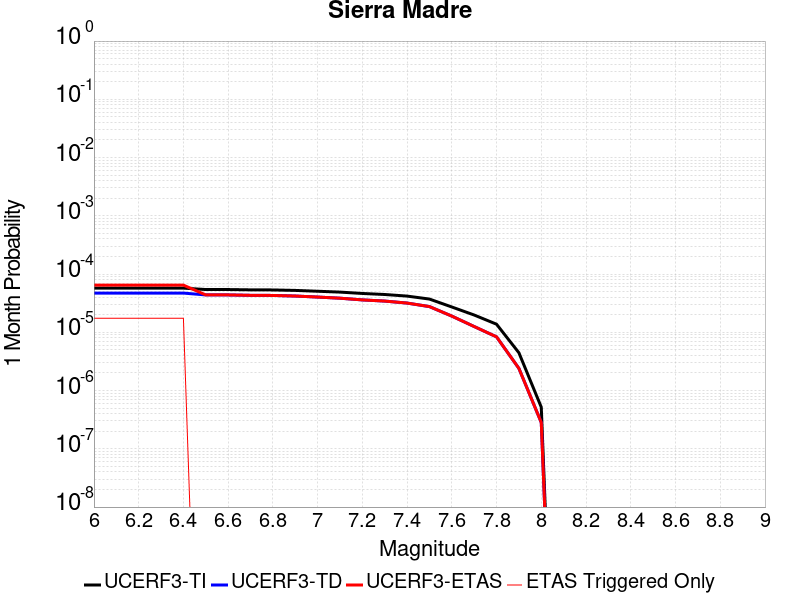 | 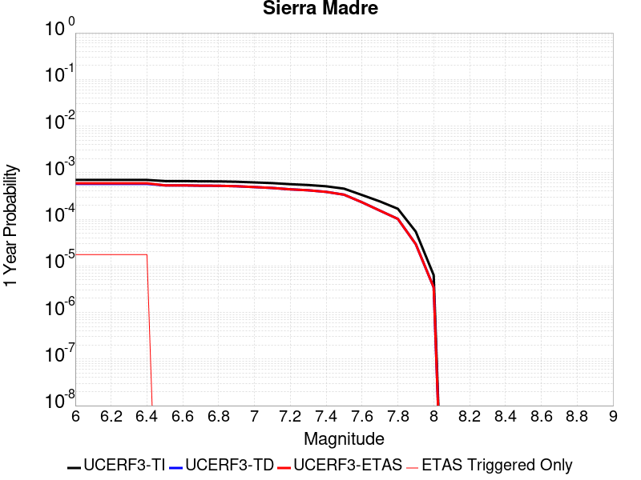 | 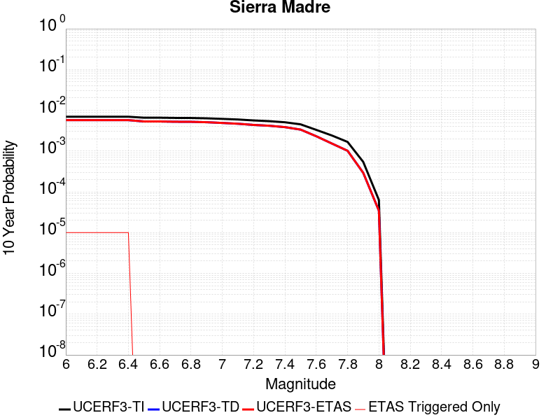 |

| Magnitude | 1 wk TI Prob | 1 wk TD Prob | 1 wk ETAS Prob | 1 wk ETAS/TD Gain | 1 wk ETAS Triggered Only | 1 mo TI Prob | 1 mo TD Prob | 1 mo ETAS Prob | 1 mo ETAS/TD Gain | 1 mo ETAS Triggered Only | 1 yr TI Prob | 1 yr TD Prob | 1 yr ETAS Prob | 1 yr ETAS/TD Gain | 1 yr ETAS Triggered Only | 10 yr TI Prob | 10 yr TD Prob | 10 yr ETAS Prob | 10 yr ETAS/TD Gain | 10 yr ETAS Triggered Only |
|-----|-----|-----|-----|-----|-----|-----|-----|-----|-----|-----|-----|-----|-----|-----|-----|-----|-----|-----|-----|-----|
| 6.0 | 1.3379373E-5 | 1.10007395E-5 | 2.8444336E-5 | 2.5856748 | 1.7443788E-5 | 5.7338908E-5 | 4.7145186E-5 | 6.458815E-5 | 1.369984 | 1.7443788E-5 | 6.978776E-4 | 5.738429E-4 | 5.912767E-4 | 1.0303807 | 1.7443788E-5 | 0.0069569005 | 0.0057239756 | 0.0057413196 | 1.0030301 | 1.7443788E-5 |
| 6.1 | 1.3379373E-5 | 1.10007395E-5 | 2.8444336E-5 | 2.5856748 | 1.7443788E-5 | 5.7338908E-5 | 4.7145186E-5 | 6.458815E-5 | 1.369984 | 1.7443788E-5 | 6.978776E-4 | 5.738429E-4 | 5.912767E-4 | 1.0303807 | 1.7443788E-5 | 0.0069569005 | 0.0057239756 | 0.0057413196 | 1.0030301 | 1.7443788E-5 |
| 6.2 | 1.3379373E-5 | 1.10007395E-5 | 2.8444336E-5 | 2.5856748 | 1.7443788E-5 | 5.7338908E-5 | 4.7145186E-5 | 6.458815E-5 | 1.369984 | 1.7443788E-5 | 6.978776E-4 | 5.738429E-4 | 5.912767E-4 | 1.0303807 | 1.7443788E-5 | 0.0069569005 | 0.0057239756 | 0.0057413196 | 1.0030301 | 1.7443788E-5 |
| 6.3 | 1.3379373E-5 | 1.10007395E-5 | 2.8444336E-5 | 2.5856748 | 1.7443788E-5 | 5.7338908E-5 | 4.7145186E-5 | 6.458815E-5 | 1.369984 | 1.7443788E-5 | 6.978776E-4 | 5.738429E-4 | 5.912767E-4 | 1.0303807 | 1.7443788E-5 | 0.0069569005 | 0.0057239756 | 0.0057413196 | 1.0030301 | 1.7443788E-5 |
| 6.4 | 1.3379373E-5 | 1.10007395E-5 | 2.8444336E-5 | 2.5856748 | 1.7443788E-5 | 5.7338908E-5 | 4.7145186E-5 | 6.458815E-5 | 1.369984 | 1.7443788E-5 | 6.978776E-4 | 5.738429E-4 | 5.912767E-4 | 1.0303807 | 1.7443788E-5 | 0.0069569005 | 0.0057239756 | 0.0057413196 | 1.0030301 | 1.7443788E-5 |
| 6.5 | 1.26563245E-5 | 1.0230196E-5 | 1.0230196E-5 | 1.0 | 0.0 | 5.4240263E-5 | 4.3842967E-5 | 4.3842967E-5 | 1.0 | 0.0 | 6.601751E-4 | 5.336584E-4 | 5.336584E-4 | 1.0 | 0.0 | 0.006582173 | 0.0053240913 | 0.0053240913 | 1.0 | 0.0 |
| 6.6 | 1.26563245E-5 | 1.0230196E-5 | 1.0230196E-5 | 1.0 | 0.0 | 5.4240263E-5 | 4.3842967E-5 | 4.3842967E-5 | 1.0 | 0.0 | 6.601751E-4 | 5.336584E-4 | 5.336584E-4 | 1.0 | 0.0 | 0.006582173 | 0.0053240913 | 0.0053240913 | 1.0 | 0.0 |
| 6.7 | 1.2502474E-5 | 1.006634E-5 | 1.006634E-5 | 1.0 | 0.0 | 5.3580934E-5 | 4.314075E-5 | 4.314075E-5 | 1.0 | 0.0 | 6.521526E-4 | 5.251131E-4 | 5.251131E-4 | 1.0 | 0.0 | 0.0065024206 | 0.0052390425 | 0.0052390425 | 1.0 | 0.0 |
| 6.8 | 1.2454966E-5 | 1.0018625E-5 | 1.0018625E-5 | 1.0 | 0.0 | 5.3377335E-5 | 4.2936266E-5 | 4.2936266E-5 | 1.0 | 0.0 | 6.4967526E-4 | 5.226247E-4 | 5.226247E-4 | 1.0 | 0.0 | 0.006477792 | 0.0052142753 | 0.0052142753 | 1.0 | 0.0 |
| 6.9 | 1.2225574E-5 | 9.792602E-6 | 9.792602E-6 | 1.0 | 0.0 | 5.2394265E-5 | 4.1967625E-5 | 4.1967625E-5 | 1.0 | 0.0 | 6.3771347E-4 | 5.108371E-4 | 5.108371E-4 | 1.0 | 0.0 | 0.006358865 | 0.0050969445 | 0.0050969445 | 1.0 | 0.0 |
| 7.0 | 1.182946E-5 | 9.399144E-6 | 9.399144E-6 | 1.0 | 0.0 | 5.06967E-5 | 4.0281426E-5 | 4.0281426E-5 | 1.0 | 0.0 | 6.1705755E-4 | 4.9031706E-4 | 4.9031706E-4 | 1.0 | 0.0 | 0.006153469 | 0.004892664 | 0.004892664 | 1.0 | 0.0 |
| 7.1 | 1.14369095E-5 | 8.986159E-6 | 8.986159E-6 | 1.0 | 0.0 | 4.9014405E-5 | 3.8511545E-5 | 3.8511545E-5 | 1.0 | 0.0 | 5.9658696E-4 | 4.687782E-4 | 4.687782E-4 | 1.0 | 0.0 | 0.005949879 | 0.004678199 | 0.004678199 | 1.0 | 0.0 |
| 7.2 | 1.0836419E-5 | 8.3995565E-6 | 8.3995565E-6 | 1.0 | 0.0 | 4.644097E-5 | 3.5997607E-5 | 3.5997607E-5 | 1.0 | 0.0 | 5.652721E-4 | 4.3818366E-4 | 4.3818366E-4 | 1.0 | 0.0 | 0.0056383642 | 0.004373494 | 0.004373494 | 1.0 | 0.0 |
| 7.3 | 1.0403439E-5 | 8.02082E-6 | 8.02082E-6 | 1.0 | 0.0 | 4.4585406E-5 | 3.4374494E-5 | 3.4374494E-5 | 1.0 | 0.0 | 5.426921E-4 | 4.1843E-4 | 4.1843E-4 | 1.0 | 0.0 | 0.005413687 | 0.004176717 | 0.004176717 | 1.0 | 0.0 |
| 7.4 | 9.768864E-6 | 7.414448E-6 | 7.414448E-6 | 1.0 | 0.0 | 4.186589E-5 | 3.1775824E-5 | 3.1775824E-5 | 1.0 | 0.0 | 5.09598E-4 | 3.868029E-4 | 3.868029E-4 | 1.0 | 0.0 | 0.0050843097 | 0.0038615882 | 0.0038615882 | 1.0 | 0.0 |
| 7.5 | 8.687089E-6 | 6.4501564E-6 | 6.4501564E-6 | 1.0 | 0.0 | 3.722985E-5 | 2.764324E-5 | 2.764324E-5 | 1.0 | 0.0 | 4.5317915E-4 | 3.3650533E-4 | 3.3650533E-4 | 1.0 | 0.0 | 0.004522561 | 0.0033602451 | 0.0033602451 | 1.0 | 0.0 |
| 7.6 | 6.3506063E-6 | 4.4303215E-6 | 4.4303215E-6 | 1.0 | 0.0 | 2.72166E-5 | 1.8986955E-5 | 1.8986955E-5 | 1.0 | 0.0 | 3.3131172E-4 | 2.3114192E-4 | 2.3114192E-4 | 1.0 | 0.0 | 0.003308182 | 0.0023092402 | 0.0023092402 | 1.0 | 0.0 |
| 7.7 | 4.62223E-6 | 2.932967E-6 | 2.932967E-6 | 1.0 | 0.0 | 1.9809406E-5 | 1.2569798E-5 | 1.2569798E-5 | 1.0 | 0.0 | 2.4115283E-4 | 1.5302657E-4 | 1.5302657E-4 | 1.0 | 0.0 | 0.0024089129 | 0.001529413 | 0.001529413 | 1.0 | 0.0 |
| 7.8 | 3.2145008E-6 | 1.9494332E-6 | 1.9494332E-6 | 1.0 | 0.0 | 1.3776359E-5 | 8.3546865E-6 | 8.3546865E-6 | 1.0 | 0.0 | 1.6771426E-4 | 1.0171358E-4 | 1.0171358E-4 | 1.0 | 0.0 | 0.0016758774 | 0.0010168145 | 0.0010168145 | 1.0 | 0.0 |
| 7.9 | 1.0391769E-6 | 5.6026335E-7 | 5.6026335E-7 | 1.0 | 0.0 | 4.4536077E-6 | 2.4011265E-6 | 2.4011265E-6 | 1.0 | 0.0 | 5.4221324E-5 | 2.9233326E-5 | 2.9233326E-5 | 1.0 | 0.0 | 5.4208096E-4 | 2.9229524E-4 | 2.9229524E-4 | 1.0 | 0.0 |
| 8.0 | 1.210983E-7 | 6.613821E-8 | 6.613821E-8 | 1.0 | 0.0 | 5.1899264E-7 | 2.8344945E-7 | 2.8344945E-7 | 1.0 | 0.0 | 6.3187167E-6 | 3.4509917E-6 | 3.4509917E-6 | 1.0 | 0.0 | 6.318537E-5 | 3.45094E-5 | 3.45094E-5 | 1.0 | 0.0 |

## Eaton Roughs 2011 CFM
*[(top)](#table-of-contents)*

| 1 Week | 1 Month | 1 Year | 10 Year |
|-----|-----|-----|-----|
| 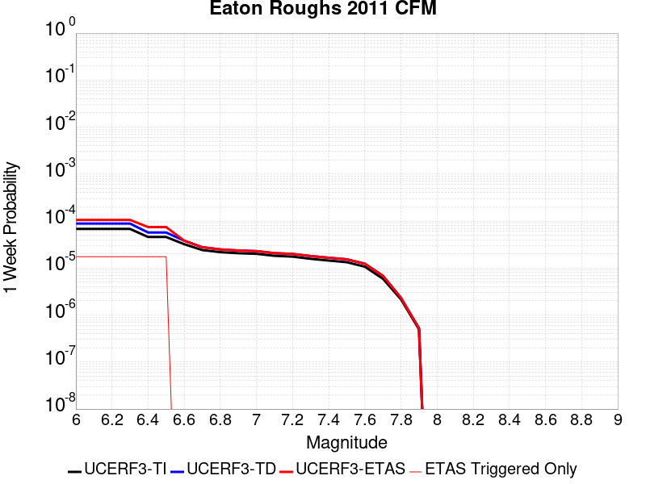 | 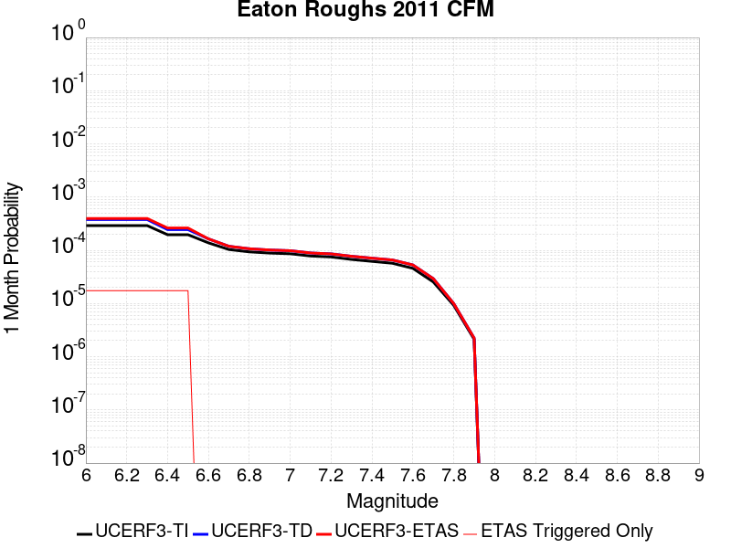 | 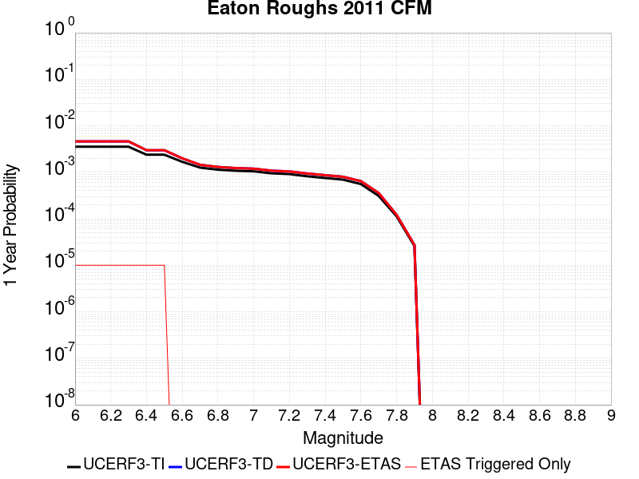 | 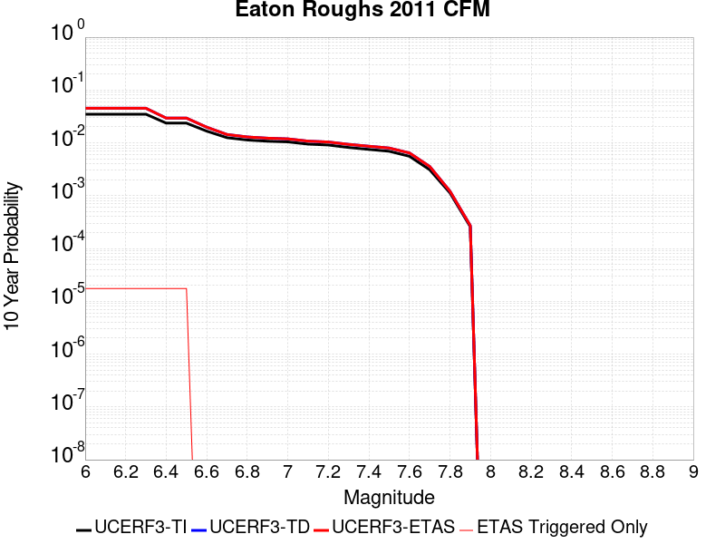 |

| Magnitude | 1 wk TI Prob | 1 wk TD Prob | 1 wk ETAS Prob | 1 wk ETAS/TD Gain | 1 wk ETAS Triggered Only | 1 mo TI Prob | 1 mo TD Prob | 1 mo ETAS Prob | 1 mo ETAS/TD Gain | 1 mo ETAS Triggered Only | 1 yr TI Prob | 1 yr TD Prob | 1 yr ETAS Prob | 1 yr ETAS/TD Gain | 1 yr ETAS Triggered Only | 10 yr TI Prob | 10 yr TD Prob | 10 yr ETAS Prob | 10 yr ETAS/TD Gain | 10 yr ETAS Triggered Only |
|-----|-----|-----|-----|-----|-----|-----|-----|-----|-----|-----|-----|-----|-----|-----|-----|-----|-----|-----|-----|-----|
| 6.0 | 6.8044945E-5 | 8.843646E-5 | 1.0587871E-4 | 1.1972291 | 1.7443788E-5 | 2.9158857E-4 | 3.7896493E-4 | 3.9640212E-4 | 1.0460126 | 1.7443788E-5 | 0.0035443127 | 0.0046050907 | 0.0046224543 | 1.0037705 | 1.7443788E-5 | 0.03488314 | 0.04516335 | 0.045180004 | 1.0003688 | 1.7443788E-5 |
| 6.1 | 6.8044945E-5 | 8.843646E-5 | 1.0587871E-4 | 1.1972291 | 1.7443788E-5 | 2.9158857E-4 | 3.7896493E-4 | 3.9640212E-4 | 1.0460126 | 1.7443788E-5 | 0.0035443127 | 0.0046050907 | 0.0046224543 | 1.0037705 | 1.7443788E-5 | 0.03488314 | 0.04516335 | 0.045180004 | 1.0003688 | 1.7443788E-5 |
| 6.2 | 6.8044945E-5 | 8.843646E-5 | 1.0587871E-4 | 1.1972291 | 1.7443788E-5 | 2.9158857E-4 | 3.7896493E-4 | 3.9640212E-4 | 1.0460126 | 1.7443788E-5 | 0.0035443127 | 0.0046050907 | 0.0046224543 | 1.0037705 | 1.7443788E-5 | 0.03488314 | 0.04516335 | 0.045180004 | 1.0003688 | 1.7443788E-5 |
| 6.3 | 6.8044945E-5 | 8.843646E-5 | 1.0587871E-4 | 1.1972291 | 1.7443788E-5 | 2.9158857E-4 | 3.7896493E-4 | 3.9640212E-4 | 1.0460126 | 1.7443788E-5 | 0.0035443127 | 0.0046050907 | 0.0046224543 | 1.0037705 | 1.7443788E-5 | 0.03488314 | 0.04516335 | 0.045180004 | 1.0003688 | 1.7443788E-5 |
| 6.4 | 4.5830013E-5 | 5.715427E-5 | 7.459706E-5 | 1.3051878 | 1.7443788E-5 | 1.9639956E-4 | 2.4492692E-4 | 2.6236643E-4 | 1.0712029 | 1.7443788E-5 | 0.0023885423 | 0.0029784471 | 0.0029958389 | 1.0058392 | 1.7443788E-5 | 0.023630321 | 0.029421588 | 0.02943852 | 1.0005754 | 1.7443788E-5 |
| 6.5 | 4.5830013E-5 | 5.715427E-5 | 7.459706E-5 | 1.3051878 | 1.7443788E-5 | 1.9639956E-4 | 2.4492692E-4 | 2.6236643E-4 | 1.0712029 | 1.7443788E-5 | 0.0023885423 | 0.0029784471 | 0.0029958389 | 1.0058392 | 1.7443788E-5 | 0.023630321 | 0.029421588 | 0.02943852 | 1.0005754 | 1.7443788E-5 |
| 6.6 | 3.222194E-5 | 3.8261504E-5 | 3.8261504E-5 | 1.0 | 0.0 | 1.3808672E-4 | 1.639682E-4 | 1.639682E-4 | 1.0 | 0.0 | 0.0016799092 | 0.001994599 | 0.001994599 | 1.0 | 0.0 | 0.016672665 | 0.019776601 | 0.019776601 | 1.0 | 0.0 |
| 6.7 | 2.4155654E-5 | 2.7786238E-5 | 2.7786238E-5 | 1.0 | 0.0 | 1.0352012E-4 | 1.1907848E-4 | 1.1907848E-4 | 1.0 | 0.0 | 0.0012596287 | 0.0014488247 | 0.0014488247 | 1.0 | 0.0 | 0.012525126 | 0.014394943 | 0.014394943 | 1.0 | 0.0 |
| 6.8 | 2.1814667E-5 | 2.4940868E-5 | 2.4940868E-5 | 1.0 | 0.0 | 9.348808E-5 | 1.06885076E-4 | 1.06885076E-4 | 1.0 | 0.0 | 0.001137623 | 0.0013005526 | 0.0013005526 | 1.0 | 0.0 | 0.011318169 | 0.012930038 | 0.012930038 | 1.0 | 0.0 |
| 6.9 | 2.0700467E-5 | 2.3628932E-5 | 2.3628932E-5 | 1.0 | 0.0 | 8.871327E-5 | 1.01262944E-4 | 1.01262944E-4 | 1.0 | 0.0 | 0.0010795488 | 0.0012321823 | 0.0012321823 | 1.0 | 0.0 | 0.010743194 | 0.012254035 | 0.012254035 | 1.0 | 0.0 |
| 7.0 | 2.0104066E-5 | 2.29365E-5 | 2.29365E-5 | 1.0 | 0.0 | 8.615744E-5 | 9.82956E-5 | 9.82956E-5 | 1.0 | 0.0 | 0.0010484619 | 0.0011960949 | 0.0011960949 | 1.0 | 0.0 | 0.010435291 | 0.011897073 | 0.011897073 | 1.0 | 0.0 |
| 7.1 | 1.8225232E-5 | 2.0773046E-5 | 2.0773046E-5 | 1.0 | 0.0 | 7.81058E-5 | 8.902431E-5 | 8.902431E-5 | 1.0 | 0.0 | 9.5052324E-4 | 0.0010833336 | 0.0010833336 | 1.0 | 0.0 | 0.009464677 | 0.010780825 | 0.010780825 | 1.0 | 0.0 |
| 7.2 | 1.7526572E-5 | 1.9993488E-5 | 1.9993488E-5 | 1.0 | 0.0 | 7.511172E-5 | 8.5683576E-5 | 8.5683576E-5 | 1.0 | 0.0 | 9.141015E-4 | 0.0010426997 | 0.0010426997 | 1.0 | 0.0 | 0.009103506 | 0.010378351 | 0.010378351 | 1.0 | 0.0 |
| 7.3 | 1.5727232E-5 | 1.8021507E-5 | 1.8021507E-5 | 1.0 | 0.0 | 6.740067E-5 | 7.723275E-5 | 7.723275E-5 | 1.0 | 0.0 | 8.2029426E-4 | 9.399043E-4 | 9.399043E-4 | 1.0 | 0.0 | 0.008172729 | 0.009359511 | 0.009359511 | 1.0 | 0.0 |
| 7.4 | 1.4457361E-5 | 1.6598358E-5 | 1.6598358E-5 | 1.0 | 0.0 | 6.195865E-5 | 7.113389E-5 | 7.113389E-5 | 1.0 | 0.0 | 7.540854E-4 | 8.657119E-4 | 8.657119E-4 | 1.0 | 0.0 | 0.007515317 | 0.008623555 | 0.008623555 | 1.0 | 0.0 |
| 7.5 | 1.33280955E-5 | 1.5345435E-5 | 1.5345435E-5 | 1.0 | 0.0 | 5.711916E-5 | 6.57645E-5 | 6.57645E-5 | 1.0 | 0.0 | 6.9520384E-4 | 8.0038945E-4 | 8.0038945E-4 | 1.0 | 0.0 | 0.00693033 | 0.007975209 | 0.007975209 | 1.0 | 0.0 |
| 7.6 | 1.0699478E-5 | 1.2387815E-5 | 1.2387815E-5 | 1.0 | 0.0 | 4.5854096E-5 | 5.308956E-5 | 5.308956E-5 | 1.0 | 0.0 | 5.581306E-4 | 6.4617425E-4 | 6.4617425E-4 | 1.0 | 0.0 | 0.005567309 | 0.0064430353 | 0.0064430353 | 1.0 | 0.0 |
| 7.7 | 5.9390236E-6 | 6.852951E-6 | 6.852951E-6 | 1.0 | 0.0 | 2.545271E-5 | 2.9369461E-5 | 2.9369461E-5 | 1.0 | 0.0 | 3.0984267E-4 | 3.5751477E-4 | 3.5751477E-4 | 1.0 | 0.0 | 0.0030941102 | 0.0035694204 | 0.0035694204 | 1.0 | 0.0 |
| 7.8 | 2.1622036E-6 | 2.3296996E-6 | 2.3296996E-6 | 1.0 | 0.0 | 9.266554E-6 | 9.984388E-6 | 9.984388E-6 | 1.0 | 0.0 | 1.1281446E-4 | 1.21553225E-4 | 1.21553225E-4 | 1.0 | 0.0 | 0.001127572 | 0.001214873 | 0.001214873 | 1.0 | 0.0 |
| 7.9 | 4.9586197E-7 | 5.2189216E-7 | 5.2189216E-7 | 1.0 | 0.0 | 2.125121E-6 | 2.2366787E-6 | 2.2366787E-6 | 1.0 | 0.0 | 2.5873042E-5 | 2.7231245E-5 | 2.7231245E-5 | 1.0 | 0.0 | 2.5870028E-4 | 2.7228118E-4 | 2.7228118E-4 | 1.0 | 0.0 |

## Peralta Hills
*[(top)](#table-of-contents)*

| 1 Week | 1 Month | 1 Year | 10 Year |
|-----|-----|-----|-----|
| 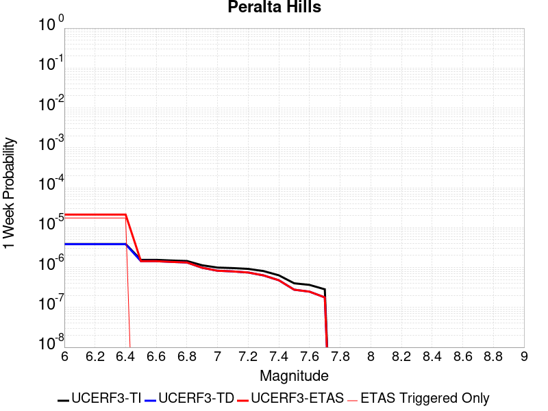 | 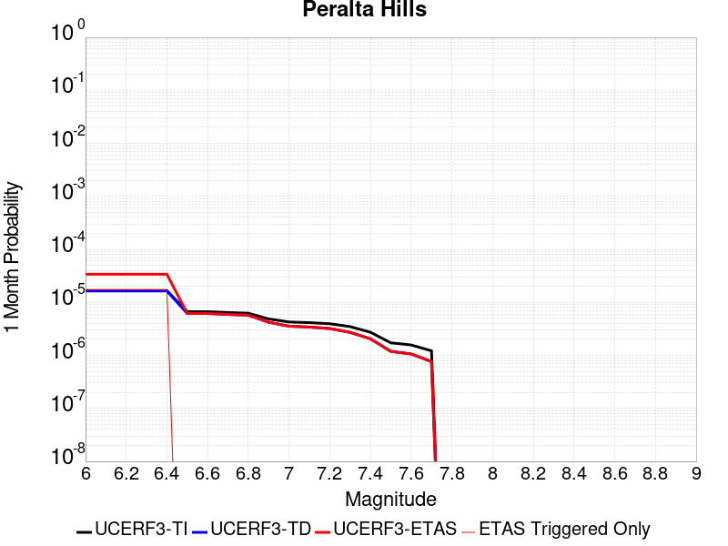 | 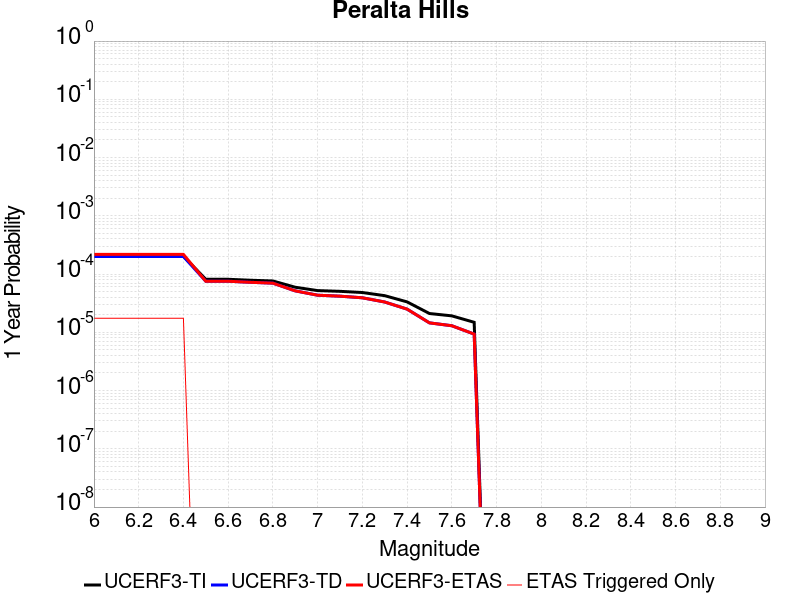 | 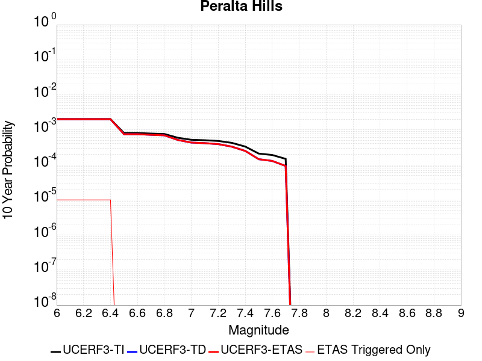 |

| Magnitude | 1 wk TI Prob | 1 wk TD Prob | 1 wk ETAS Prob | 1 wk ETAS/TD Gain | 1 wk ETAS Triggered Only | 1 mo TI Prob | 1 mo TD Prob | 1 mo ETAS Prob | 1 mo ETAS/TD Gain | 1 mo ETAS Triggered Only | 1 yr TI Prob | 1 yr TD Prob | 1 yr ETAS Prob | 1 yr ETAS/TD Gain | 1 yr ETAS Triggered Only | 10 yr TI Prob | 10 yr TD Prob | 10 yr ETAS Prob | 10 yr ETAS/TD Gain | 10 yr ETAS Triggered Only |
|-----|-----|-----|-----|-----|-----|-----|-----|-----|-----|-----|-----|-----|-----|-----|-----|-----|-----|-----|-----|-----|
| 6.0 | 3.8850067E-6 | 3.839512E-6 | 2.1283233E-5 | 5.5432134 | 1.7443788E-5 | 1.6649923E-5 | 1.645499E-5 | 3.389849E-5 | 2.0600736 | 1.7443788E-5 | 2.0269395E-4 | 2.0032849E-4 | 2.1776879E-4 | 1.0870584 | 1.7443788E-5 | 0.0020250916 | 0.0020022066 | 0.0020196156 | 1.0086949 | 1.7443788E-5 |
| 6.1 | 3.8850067E-6 | 3.839512E-6 | 2.1283233E-5 | 5.5432134 | 1.7443788E-5 | 1.6649923E-5 | 1.645499E-5 | 3.389849E-5 | 2.0600736 | 1.7443788E-5 | 2.0269395E-4 | 2.0032849E-4 | 2.1776879E-4 | 1.0870584 | 1.7443788E-5 | 0.0020250916 | 0.0020022066 | 0.0020196156 | 1.0086949 | 1.7443788E-5 |
| 6.2 | 3.8850067E-6 | 3.839512E-6 | 2.1283233E-5 | 5.5432134 | 1.7443788E-5 | 1.6649923E-5 | 1.645499E-5 | 3.389849E-5 | 2.0600736 | 1.7443788E-5 | 2.0269395E-4 | 2.0032849E-4 | 2.1776879E-4 | 1.0870584 | 1.7443788E-5 | 0.0020250916 | 0.0020022066 | 0.0020196156 | 1.0086949 | 1.7443788E-5 |
| 6.3 | 3.8850067E-6 | 3.839512E-6 | 2.1283233E-5 | 5.5432134 | 1.7443788E-5 | 1.6649923E-5 | 1.645499E-5 | 3.389849E-5 | 2.0600736 | 1.7443788E-5 | 2.0269395E-4 | 2.0032849E-4 | 2.1776879E-4 | 1.0870584 | 1.7443788E-5 | 0.0020250916 | 0.0020022066 | 0.0020196156 | 1.0086949 | 1.7443788E-5 |
| 6.4 | 3.8850067E-6 | 3.839512E-6 | 2.1283233E-5 | 5.5432134 | 1.7443788E-5 | 1.6649923E-5 | 1.645499E-5 | 3.389849E-5 | 2.0600736 | 1.7443788E-5 | 2.0269395E-4 | 2.0032849E-4 | 2.1776879E-4 | 1.0870584 | 1.7443788E-5 | 0.0020250916 | 0.0020022066 | 0.0020196156 | 1.0086949 | 1.7443788E-5 |
| 6.5 | 1.5587785E-6 | 1.4430796E-6 | 1.4430796E-6 | 1.0 | 0.0 | 6.6804623E-6 | 6.184613E-6 | 6.184613E-6 | 1.0 | 0.0 | 8.133159E-5 | 7.529531E-5 | 7.529531E-5 | 1.0 | 0.0 | 8.1301836E-4 | 7.52722E-4 | 7.52722E-4 | 1.0 | 0.0 |
| 6.6 | 1.5587785E-6 | 1.4430796E-6 | 1.4430796E-6 | 1.0 | 0.0 | 6.6804623E-6 | 6.184613E-6 | 6.184613E-6 | 1.0 | 0.0 | 8.133159E-5 | 7.529531E-5 | 7.529531E-5 | 1.0 | 0.0 | 8.1301836E-4 | 7.52722E-4 | 7.52722E-4 | 1.0 | 0.0 |
| 6.7 | 1.5018579E-6 | 1.3837022E-6 | 1.3837022E-6 | 1.0 | 0.0 | 6.436518E-6 | 5.93014E-6 | 5.93014E-6 | 1.0 | 0.0 | 7.836179E-5 | 7.21973E-5 | 7.21973E-5 | 1.0 | 0.0 | 7.833416E-4 | 7.21762E-4 | 7.21762E-4 | 1.0 | 0.0 |
| 6.8 | 1.4584314E-6 | 1.3381342E-6 | 1.3381342E-6 | 1.0 | 0.0 | 6.250405E-6 | 5.7348498E-6 | 5.7348498E-6 | 1.0 | 0.0 | 7.6096025E-5 | 6.98198E-5 | 6.98198E-5 | 1.0 | 0.0 | 7.6069974E-4 | 6.98002E-4 | 6.98002E-4 | 1.0 | 0.0 |
| 6.9 | 1.1382393E-6 | 9.862285E-7 | 9.862285E-7 | 1.0 | 0.0 | 4.8781594E-6 | 4.226687E-6 | 4.226687E-6 | 1.0 | 0.0 | 5.9389975E-5 | 5.1458785E-5 | 5.1458785E-5 | 1.0 | 0.0 | 5.93741E-4 | 5.144769E-4 | 5.144769E-4 | 1.0 | 0.0 |
| 7.0 | 9.970413E-7 | 8.309642E-7 | 8.309642E-7 | 1.0 | 0.0 | 4.273027E-6 | 3.561271E-6 | 3.561271E-6 | 1.0 | 0.0 | 5.2022864E-5 | 4.335768E-5 | 4.335768E-5 | 1.0 | 0.0 | 5.2010687E-4 | 4.33499E-4 | 4.33499E-4 | 1.0 | 0.0 |
| 7.1 | 9.684443E-7 | 7.99408E-7 | 7.99408E-7 | 1.0 | 0.0 | 4.150469E-6 | 3.4260302E-6 | 3.4260302E-6 | 1.0 | 0.0 | 5.053079E-5 | 4.1711188E-5 | 4.1711188E-5 | 1.0 | 0.0 | 5.05193E-4 | 4.170403E-4 | 4.170403E-4 | 1.0 | 0.0 |
| 7.2 | 9.240811E-7 | 7.5031426E-7 | 7.5031426E-7 | 1.0 | 0.0 | 3.960342E-6 | 3.215629E-6 | 3.215629E-6 | 1.0 | 0.0 | 4.8216094E-5 | 3.9149647E-5 | 3.9149647E-5 | 1.0 | 0.0 | 4.8205635E-4 | 3.9143403E-4 | 3.9143403E-4 | 1.0 | 0.0 |
| 7.3 | 8.158643E-7 | 6.350017E-7 | 6.350017E-7 | 1.0 | 0.0 | 3.4965567E-6 | 2.7214332E-6 | 2.7214332E-6 | 1.0 | 0.0 | 4.2569747E-5 | 3.313301E-5 | 3.313301E-5 | 1.0 | 0.0 | 4.2561593E-4 | 3.3128684E-4 | 3.3128684E-4 | 1.0 | 0.0 |
| 7.4 | 6.3822824E-7 | 4.7957286E-7 | 4.7957286E-7 | 1.0 | 0.0 | 2.7352612E-6 | 2.0553111E-6 | 2.0553111E-6 | 1.0 | 0.0 | 3.3301294E-5 | 2.5023177E-5 | 2.5023177E-5 | 1.0 | 0.0 | 3.3296304E-4 | 2.5020874E-4 | 2.5020874E-4 | 1.0 | 0.0 |
| 7.5 | 4.0292628E-7 | 2.7846056E-7 | 2.7846056E-7 | 1.0 | 0.0 | 1.7268258E-6 | 1.193402E-6 | 1.193402E-6 | 1.0 | 0.0 | 2.1023901E-5 | 1.4529601E-5 | 1.4529601E-5 | 1.0 | 0.0 | 2.1021912E-4 | 1.452893E-4 | 1.452893E-4 | 1.0 | 0.0 |
| 7.6 | 3.672993E-7 | 2.485495E-7 | 2.485495E-7 | 1.0 | 0.0 | 1.5741389E-6 | 1.0652118E-6 | 1.0652118E-6 | 1.0 | 0.0 | 1.9164972E-5 | 1.2968904E-5 | 1.2968904E-5 | 1.0 | 0.0 | 1.916332E-4 | 1.296842E-4 | 1.296842E-4 | 1.0 | 0.0 |
| 7.7 | 2.8466823E-7 | 1.7859877E-7 | 1.7859877E-7 | 1.0 | 0.0 | 1.2200061E-6 | 7.6542324E-7 | 7.6542324E-7 | 1.0 | 0.0 | 1.4853474E-5 | 9.319015E-6 | 9.319015E-6 | 1.0 | 0.0 | 1.485248E-4 | 9.3188835E-5 | 9.3188835E-5 | 1.0 | 0.0 |

## Big Pine (Central)
*[(top)](#table-of-contents)*

| 1 Week | 1 Month | 1 Year | 10 Year |
|-----|-----|-----|-----|
| 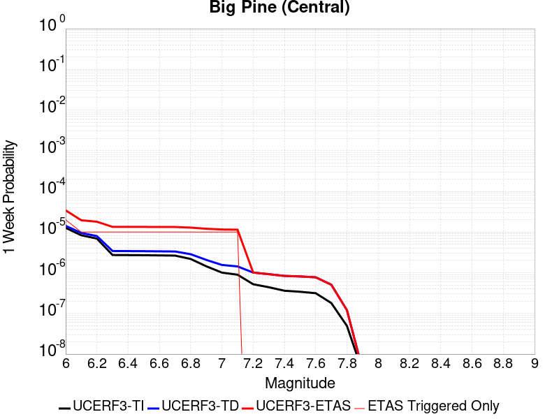 | 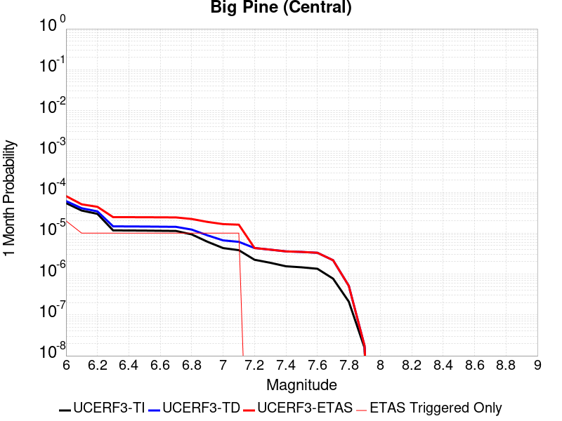 |  | 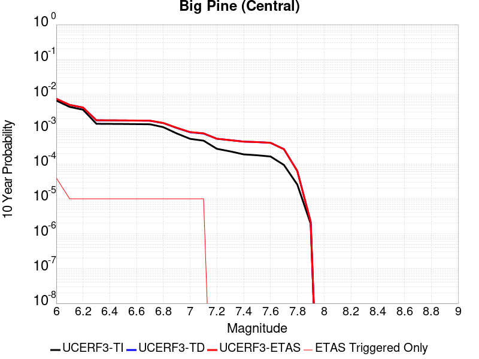 |

| Magnitude | 1 wk TI Prob | 1 wk TD Prob | 1 wk ETAS Prob | 1 wk ETAS/TD Gain | 1 wk ETAS Triggered Only | 1 mo TI Prob | 1 mo TD Prob | 1 mo ETAS Prob | 1 mo ETAS/TD Gain | 1 mo ETAS Triggered Only | 1 yr TI Prob | 1 yr TD Prob | 1 yr ETAS Prob | 1 yr ETAS/TD Gain | 1 yr ETAS Triggered Only | 10 yr TI Prob | 10 yr TD Prob | 10 yr ETAS Prob | 10 yr ETAS/TD Gain | 10 yr ETAS Triggered Only |
|-----|-----|-----|-----|-----|-----|-----|-----|-----|-----|-----|-----|-----|-----|-----|-----|-----|-----|-----|-----|-----|
| 6.0 | 1.2706755E-5 | 1.4250529E-5 | 1.4250529E-5 | 1.0 | 0.0 | 5.4456385E-5 | 6.107247E-5 | 6.107247E-5 | 1.0 | 0.0 | 6.628048E-4 | 7.433402E-4 | 7.6077104E-4 | 1.0234493 | 1.7443788E-5 | 0.006608314 | 0.0074135666 | 0.0074308813 | 1.0023355 | 1.7443788E-5 |
| 6.1 | 8.342579E-6 | 9.510762E-6 | 9.510762E-6 | 1.0 | 0.0 | 3.5753423E-5 | 4.0759893E-5 | 4.0759893E-5 | 1.0 | 0.0 | 4.3521097E-4 | 4.961604E-4 | 4.961604E-4 | 1.0 | 0.0 | 0.0043435963 | 0.0049540824 | 0.0049540824 | 1.0 | 0.0 |
| 6.2 | 6.923899E-6 | 7.967147E-6 | 7.967147E-6 | 1.0 | 0.0 | 2.9673516E-5 | 3.4144578E-5 | 3.4144578E-5 | 1.0 | 0.0 | 3.6121515E-4 | 4.156502E-4 | 4.156502E-4 | 1.0 | 0.0 | 0.003606286 | 0.0041520367 | 0.0041520367 | 1.0 | 0.0 |
| 6.3 | 2.728396E-6 | 3.4242908E-6 | 3.4242908E-6 | 1.0 | 0.0 | 1.1693074E-5 | 1.4675454E-5 | 1.4675454E-5 | 1.0 | 0.0 | 1.4235388E-4 | 1.7865987E-4 | 1.7865987E-4 | 1.0 | 0.0 | 0.0014226272 | 0.0017866704 | 0.0017866704 | 1.0 | 0.0 |
| 6.4 | 2.7136944E-6 | 3.408584E-6 | 3.408584E-6 | 1.0 | 0.0 | 1.1630066E-5 | 1.4608141E-5 | 1.4608141E-5 | 1.0 | 0.0 | 1.4158686E-4 | 1.7784047E-4 | 1.7784047E-4 | 1.0 | 0.0 | 0.0014149669 | 0.0017784894 | 0.0017784894 | 1.0 | 0.0 |
| 6.5 | 2.6971882E-6 | 3.3909291E-6 | 3.3909291E-6 | 1.0 | 0.0 | 1.1559327E-5 | 1.45324775E-5 | 1.45324775E-5 | 1.0 | 0.0 | 1.4072572E-4 | 1.7691942E-4 | 1.7691942E-4 | 1.0 | 0.0 | 0.0014063664 | 0.0017692937 | 0.0017692937 | 1.0 | 0.0 |
| 6.6 | 2.669092E-6 | 3.3609497E-6 | 3.3609497E-6 | 1.0 | 0.0 | 1.1438916E-5 | 1.4403995E-5 | 1.4403995E-5 | 1.0 | 0.0 | 1.3925991E-4 | 1.753554E-4 | 1.753554E-4 | 1.0 | 0.0 | 0.0013917267 | 0.0017536782 | 0.0017536782 | 1.0 | 0.0 |
| 6.7 | 2.6408059E-6 | 3.3309752E-6 | 3.3309752E-6 | 1.0 | 0.0 | 1.1317691E-5 | 1.4275535E-5 | 1.4275535E-5 | 1.0 | 0.0 | 1.3778417E-4 | 1.7379165E-4 | 1.7379165E-4 | 1.0 | 0.0 | 0.0013769877 | 0.0017380653 | 0.0017380653 | 1.0 | 0.0 |
| 6.8 | 2.1786943E-6 | 2.8544325E-6 | 2.8544325E-6 | 1.0 | 0.0 | 9.337228E-6 | 1.2233229E-5 | 1.2233229E-5 | 1.0 | 0.0 | 1.1367482E-4 | 1.4893012E-4 | 1.4893012E-4 | 1.0 | 0.0 | 0.0011361669 | 0.0014897975 | 0.0014897975 | 1.0 | 0.0 |
| 6.9 | 1.4411696E-6 | 2.068499E-6 | 2.068499E-6 | 1.0 | 0.0 | 6.1764263E-6 | 8.864968E-6 | 8.864968E-6 | 1.0 | 0.0 | 7.51954E-5 | 1.079259E-4 | 1.079259E-4 | 1.0 | 0.0 | 7.5169955E-4 | 0.0010801847 | 0.0010801847 | 1.0 | 0.0 |
| 7.0 | 1.0073411E-6 | 1.554261E-6 | 1.554261E-6 | 1.0 | 0.0 | 4.317169E-6 | 6.6611024E-6 | 6.6611024E-6 | 1.0 | 0.0 | 5.2560266E-5 | 8.1096056E-5 | 8.1096056E-5 | 1.0 | 0.0 | 5.2547833E-4 | 8.1210316E-4 | 8.1210316E-4 | 1.0 | 0.0 |
| 7.1 | 8.947104E-7 | 1.4302494E-6 | 1.4302494E-6 | 1.0 | 0.0 | 3.834468E-6 | 6.129627E-6 | 6.129627E-6 | 1.0 | 0.0 | 4.6683643E-5 | 7.46258E-5 | 7.46258E-5 | 1.0 | 0.0 | 4.6673836E-4 | 7.474457E-4 | 7.474457E-4 | 1.0 | 0.0 |
| 7.2 | 5.215166E-7 | 1.0111678E-6 | 1.0111678E-6 | 1.0 | 0.0 | 2.2350691E-6 | 4.3335694E-6 | 4.3335694E-6 | 1.0 | 0.0 | 2.7211627E-5 | 5.2759973E-5 | 5.2759973E-5 | 1.0 | 0.0 | 2.7208295E-4 | 5.2890263E-4 | 5.2890263E-4 | 1.0 | 0.0 |
| 7.3 | 4.4024807E-7 | 9.219589E-7 | 9.219589E-7 | 1.0 | 0.0 | 1.8867761E-6 | 3.9512465E-6 | 3.9512465E-6 | 1.0 | 0.0 | 2.2971257E-5 | 4.810541E-5 | 4.810541E-5 | 1.0 | 0.0 | 2.2968883E-4 | 4.8237795E-4 | 4.8237795E-4 | 1.0 | 0.0 |
| 7.4 | 3.6130905E-7 | 8.358523E-7 | 8.358523E-7 | 1.0 | 0.0 | 1.5484665E-6 | 3.5822195E-6 | 3.5822195E-6 | 1.0 | 0.0 | 1.8852415E-5 | 4.3612687E-5 | 4.3612687E-5 | 1.0 | 0.0 | 1.8850817E-4 | 4.374597E-4 | 4.374597E-4 | 1.0 | 0.0 |
| 7.5 | 3.408184E-7 | 8.108147E-7 | 8.108147E-7 | 1.0 | 0.0 | 1.4606494E-6 | 3.4749157E-6 | 3.4749157E-6 | 1.0 | 0.0 | 1.7783263E-5 | 4.2306317E-5 | 4.2306317E-5 | 1.0 | 0.0 | 1.778184E-4 | 4.2437963E-4 | 4.2437963E-4 | 1.0 | 0.0 |
| 7.6 | 3.1428627E-7 | 7.7316E-7 | 7.7316E-7 | 1.0 | 0.0 | 1.3469405E-6 | 3.3135389E-6 | 3.3135389E-6 | 1.0 | 0.0 | 1.6398877E-5 | 4.0341627E-5 | 4.0341627E-5 | 1.0 | 0.0 | 1.6397667E-4 | 4.0471106E-4 | 4.0471106E-4 | 1.0 | 0.0 |
| 7.7 | 1.7972785E-7 | 5.077752E-7 | 5.077752E-7 | 1.0 | 0.0 | 7.70262E-7 | 2.1761778E-6 | 2.1761778E-6 | 1.0 | 0.0 | 9.377899E-6 | 2.6494654E-5 | 2.6494654E-5 | 1.0 | 0.0 | 9.377503E-5 | 2.662899E-4 | 2.662899E-4 | 1.0 | 0.0 |
| 7.8 | 4.9230927E-8 | 1.198079E-7 | 1.198079E-7 | 1.0 | 0.0 | 2.1098968E-7 | 5.134623E-7 | 5.134623E-7 | 1.0 | 0.0 | 2.5687964E-6 | 6.2513873E-6 | 6.2513873E-6 | 1.0 | 0.0 | 2.5687666E-5 | 6.295415E-5 | 6.295415E-5 | 1.0 | 0.0 |
| 7.9 | 3.6805972E-9 | 4.105293E-9 | 4.105293E-9 | 1.0 | 0.0 | 1.5773987E-8 | 1.7594115E-8 | 1.7594115E-8 | 1.0 | 0.0 | 1.9204828E-7 | 2.1420831E-7 | 2.1420831E-7 | 1.0 | 0.0 | 1.920481E-6 | 2.1900614E-6 | 2.1900614E-6 | 1.0 | 0.0 |

## Chino alt 1
*[(top)](#table-of-contents)*

| 1 Week | 1 Month | 1 Year | 10 Year |
|-----|-----|-----|-----|
| 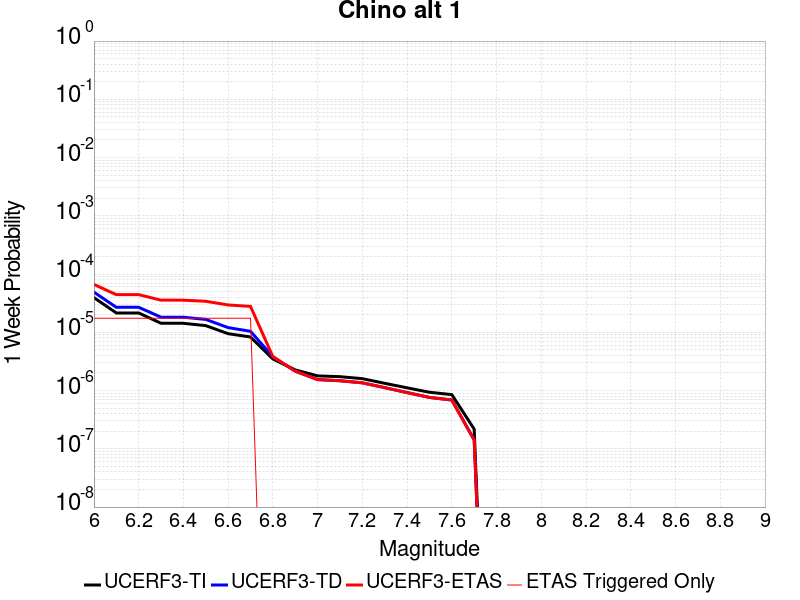 | 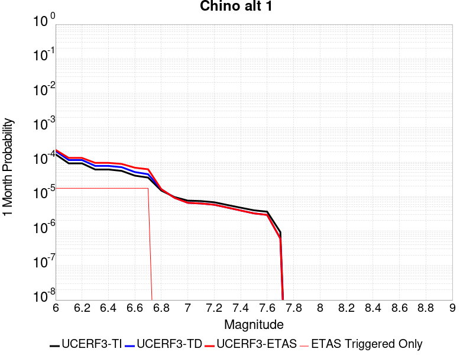 | 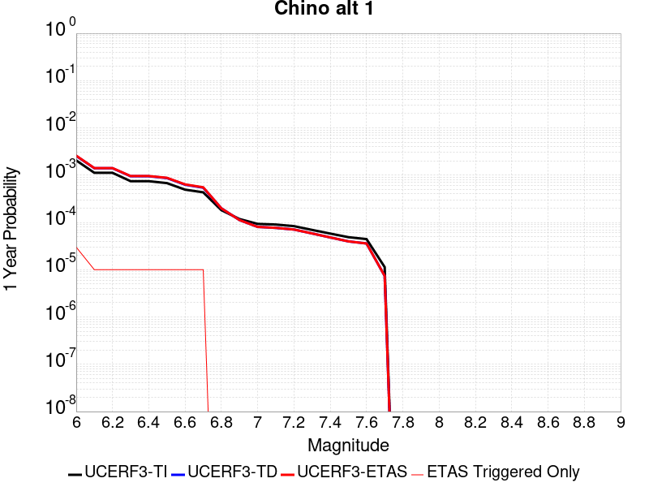 | 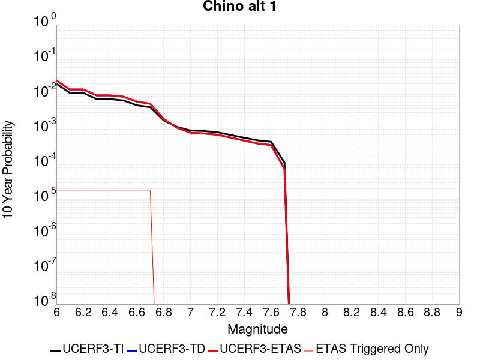 |

| Magnitude | 1 wk TI Prob | 1 wk TD Prob | 1 wk ETAS Prob | 1 wk ETAS/TD Gain | 1 wk ETAS Triggered Only | 1 mo TI Prob | 1 mo TD Prob | 1 mo ETAS Prob | 1 mo ETAS/TD Gain | 1 mo ETAS Triggered Only | 1 yr TI Prob | 1 yr TD Prob | 1 yr ETAS Prob | 1 yr ETAS/TD Gain | 1 yr ETAS Triggered Only | 10 yr TI Prob | 10 yr TD Prob | 10 yr ETAS Prob | 10 yr ETAS/TD Gain | 10 yr ETAS Triggered Only |
|-----|-----|-----|-----|-----|-----|-----|-----|-----|-----|-----|-----|-----|-----|-----|-----|-----|-----|-----|-----|-----|
| 6.0 | 3.939946E-5 | 4.8948554E-5 | 6.639149E-5 | 1.3563523 | 1.7443788E-5 | 1.6884391E-4 | 2.097656E-4 | 2.2720572E-4 | 1.0831411 | 1.7443788E-5 | 0.0020537362 | 0.0025513945 | 0.002568794 | 1.0068195 | 1.7443788E-5 | 0.020348595 | 0.025277847 | 0.02529485 | 1.0006726 | 1.7443788E-5 |
| 6.1 | 2.1505624E-5 | 2.6879026E-5 | 4.4322343E-5 | 1.6489565 | 1.7443788E-5 | 9.2163704E-5 | 1.1519137E-4 | 1.3263314E-4 | 1.1514157 | 1.7443788E-5 | 0.0011215154 | 0.001401664 | 0.0014190833 | 1.0124276 | 1.7443788E-5 | 0.011158722 | 0.013945141 | 0.0139623415 | 1.0012335 | 1.7443788E-5 |
| 6.2 | 2.1505624E-5 | 2.6879026E-5 | 4.4322343E-5 | 1.6489565 | 1.7443788E-5 | 9.2163704E-5 | 1.1519137E-4 | 1.3263314E-4 | 1.1514157 | 1.7443788E-5 | 0.0011215154 | 0.001401664 | 0.0014190833 | 1.0124276 | 1.7443788E-5 | 0.011158722 | 0.013945141 | 0.0139623415 | 1.0012335 | 1.7443788E-5 |
| 6.3 | 1.4290785E-5 | 1.8165128E-5 | 3.56086E-5 | 1.9602724 | 1.7443788E-5 | 6.1244784E-5 | 7.784848E-5 | 9.529091E-5 | 1.2240561 | 1.7443788E-5 | 7.454001E-4 | 9.4743853E-4 | 9.648658E-4 | 1.0183941 | 1.7443788E-5 | 0.007429048 | 0.0094444575 | 0.009461736 | 1.0018295 | 1.7443788E-5 |
| 6.4 | 1.4290785E-5 | 1.8165128E-5 | 3.56086E-5 | 1.9602724 | 1.7443788E-5 | 6.1244784E-5 | 7.784848E-5 | 9.529091E-5 | 1.2240561 | 1.7443788E-5 | 7.454001E-4 | 9.4743853E-4 | 9.648658E-4 | 1.0183941 | 1.7443788E-5 | 0.007429048 | 0.0094444575 | 0.009461736 | 1.0018295 | 1.7443788E-5 |
| 6.5 | 1.3017944E-5 | 1.6652088E-5 | 3.4095585E-5 | 2.0475261 | 1.7443788E-5 | 5.5789995E-5 | 7.136439E-5 | 8.880693E-5 | 1.2444152 | 1.7443788E-5 | 6.790315E-4 | 8.685589E-4 | 8.859875E-4 | 1.0200661 | 1.7443788E-5 | 0.0067696036 | 0.008661949 | 0.008679242 | 1.0019964 | 1.7443788E-5 |
| 6.6 | 9.470016E-6 | 1.2039424E-5 | 2.9483002E-5 | 2.4488714 | 1.7443788E-5 | 4.058515E-5 | 5.1596704E-5 | 6.903959E-5 | 1.338062 | 1.7443788E-5 | 4.940122E-4 | 6.280428E-4 | 6.454756E-4 | 1.0277574 | 1.7443788E-5 | 0.004929154 | 0.0062718987 | 0.006289233 | 1.0027639 | 1.7443788E-5 |
| 6.7 | 8.314155E-6 | 1.0407736E-5 | 2.7851342E-5 | 2.676023 | 1.7443788E-5 | 3.5631605E-5 | 4.4604003E-5 | 6.204702E-5 | 1.3910637 | 1.7443788E-5 | 4.3372845E-4 | 5.429507E-4 | 5.60385E-4 | 1.0321103 | 1.7443788E-5 | 0.004328829 | 0.005425775 | 0.005443124 | 1.0031976 | 1.7443788E-5 |
| 6.8 | 3.4856364E-6 | 3.8133708E-6 | 3.8133708E-6 | 1.0 | 0.0 | 1.4938357E-5 | 1.6342927E-5 | 1.6342927E-5 | 1.0 | 0.0 | 1.8185932E-4 | 1.9895904E-4 | 1.9895904E-4 | 1.0 | 0.0 | 0.0018171056 | 0.0019894864 | 0.0019894864 | 1.0 | 0.0 |
| 6.9 | 2.2645952E-6 | 2.1529022E-6 | 2.1529022E-6 | 1.0 | 0.0 | 9.705372E-6 | 9.226692E-6 | 9.226692E-6 | 1.0 | 0.0 | 1.18156495E-4 | 1.123294E-4 | 1.123294E-4 | 1.0 | 0.0 | 0.0011809369 | 0.0011233423 | 0.0011233423 | 1.0 | 0.0 |
| 7.0 | 1.7864003E-6 | 1.5430785E-6 | 1.5430785E-6 | 1.0 | 0.0 | 7.655979E-6 | 6.613177E-6 | 6.613177E-6 | 1.0 | 0.0 | 9.3207556E-5 | 8.051251E-5 | 8.051251E-5 | 1.0 | 0.0 | 9.316847E-4 | 8.0528046E-4 | 8.0528046E-4 | 1.0 | 0.0 |
| 7.1 | 1.7315456E-6 | 1.4733511E-6 | 1.4733511E-6 | 1.0 | 0.0 | 7.420889E-6 | 6.3143466E-6 | 6.3143466E-6 | 1.0 | 0.0 | 9.034557E-5 | 7.6874516E-5 | 7.6874516E-5 | 1.0 | 0.0 | 9.0308854E-4 | 7.6891703E-4 | 7.6891703E-4 | 1.0 | 0.0 |
| 7.2 | 1.6008337E-6 | 1.3574215E-6 | 1.3574215E-6 | 1.0 | 0.0 | 6.860698E-6 | 5.817508E-6 | 5.817508E-6 | 1.0 | 0.0 | 8.352579E-5 | 7.082591E-5 | 7.082591E-5 | 1.0 | 0.0 | 8.34944E-4 | 7.0845755E-4 | 7.0845755E-4 | 1.0 | 0.0 |
| 7.3 | 1.3320939E-6 | 1.121782E-6 | 1.121782E-6 | 1.0 | 0.0 | 5.7089615E-6 | 4.807629E-6 | 4.807629E-6 | 1.0 | 0.0 | 6.9504385E-5 | 5.8531357E-5 | 5.8531357E-5 | 1.0 | 0.0 | 6.9482654E-4 | 5.8530393E-4 | 5.8530393E-4 | 1.0 | 0.0 |
| 7.4 | 1.114294E-6 | 9.237111E-7 | 9.237111E-7 | 1.0 | 0.0 | 4.775537E-6 | 3.958756E-6 | 3.958756E-6 | 1.0 | 0.0 | 5.8140613E-5 | 4.8196827E-5 | 4.8196827E-5 | 1.0 | 0.0 | 5.81254E-4 | 4.8188053E-4 | 4.8188053E-4 | 1.0 | 0.0 |
| 7.5 | 9.354081E-7 | 7.6234323E-7 | 7.6234323E-7 | 1.0 | 0.0 | 4.0088858E-6 | 3.2671815E-6 | 3.2671815E-6 | 1.0 | 0.0 | 4.8807087E-5 | 3.9777242E-5 | 3.9777242E-5 | 1.0 | 0.0 | 4.879637E-4 | 3.977046E-4 | 3.977046E-4 | 1.0 | 0.0 |
| 7.6 | 8.521771E-7 | 6.88071E-7 | 6.88071E-7 | 1.0 | 0.0 | 3.6521824E-6 | 2.9488726E-6 | 2.9488726E-6 | 1.0 | 0.0 | 4.4464414E-5 | 3.5901965E-5 | 3.5901965E-5 | 1.0 | 0.0 | 4.4455516E-4 | 3.589648E-4 | 3.589648E-4 | 1.0 | 0.0 |
| 7.7 | 2.1803626E-7 | 1.418649E-7 | 1.418649E-7 | 1.0 | 0.0 | 9.344408E-7 | 6.079923E-7 | 6.079923E-7 | 1.0 | 0.0 | 1.1376757E-5 | 7.4022914E-6 | 7.4022914E-6 | 1.0 | 0.0 | 1.13761744E-4 | 7.402141E-5 | 7.402141E-5 | 1.0 | 0.0 |

## Bartlett Springs 2011 CFM
*[(top)](#table-of-contents)*

| 1 Week | 1 Month | 1 Year | 10 Year |
|-----|-----|-----|-----|
|  |  |  |  |

| Magnitude | 1 wk TI Prob | 1 wk TD Prob | 1 wk ETAS Prob | 1 wk ETAS/TD Gain | 1 wk ETAS Triggered Only | 1 mo TI Prob | 1 mo TD Prob | 1 mo ETAS Prob | 1 mo ETAS/TD Gain | 1 mo ETAS Triggered Only | 1 yr TI Prob | 1 yr TD Prob | 1 yr ETAS Prob | 1 yr ETAS/TD Gain | 1 yr ETAS Triggered Only | 10 yr TI Prob | 10 yr TD Prob | 10 yr ETAS Prob | 10 yr ETAS/TD Gain | 10 yr ETAS Triggered Only |
|-----|-----|-----|-----|-----|-----|-----|-----|-----|-----|-----|-----|-----|-----|-----|-----|-----|-----|-----|-----|-----|
| 6.0 | 6.2326144E-5 | 8.060613E-5 | 9.8048506E-5 | 1.2163903 | 1.7443788E-5 | 2.6708472E-4 | 3.454099E-4 | 3.6284767E-4 | 1.0504843 | 1.7443788E-5 | 0.003246908 | 0.0041973945 | 0.0042147655 | 1.0041385 | 1.7443788E-5 | 0.031998757 | 0.04119771 | 0.041214436 | 1.000406 | 1.7443788E-5 |
| 6.1 | 6.227657E-5 | 8.054363E-5 | 9.798601E-5 | 1.2165582 | 1.7443788E-5 | 2.668723E-4 | 3.4514212E-4 | 3.6257989E-4 | 1.0505234 | 1.7443788E-5 | 0.0032443295 | 0.004194147 | 0.0042115175 | 1.0041417 | 1.7443788E-5 | 0.031973712 | 0.041166443 | 0.04118317 | 1.0004063 | 1.7443788E-5 |
| 6.2 | 6.22452E-5 | 8.050423E-5 | 9.794661E-5 | 1.2166642 | 1.7443788E-5 | 2.6673786E-4 | 3.4497332E-4 | 3.6241108E-4 | 1.0505482 | 1.7443788E-5 | 0.0032426978 | 0.0041921 | 0.0042094705 | 1.0041437 | 1.7443788E-5 | 0.03195787 | 0.041146737 | 0.041163463 | 1.0004065 | 1.7443788E-5 |
| 6.3 | 6.219006E-5 | 8.043407E-5 | 9.787645E-5 | 1.2168531 | 1.7443788E-5 | 2.6650162E-4 | 3.4467268E-4 | 3.6211047E-4 | 1.0505923 | 1.7443788E-5 | 0.00323983 | 0.0041884542 | 0.004205825 | 1.0041473 | 1.7443788E-5 | 0.031930014 | 0.041111637 | 0.041128363 | 1.0004069 | 1.7443788E-5 |
| 6.4 | 5.2175856E-5 | 6.725342E-5 | 8.469604E-5 | 1.2593565 | 1.7443788E-5 | 2.2359163E-4 | 2.8819745E-4 | 3.056362E-4 | 1.0605098 | 1.7443788E-5 | 0.0027188298 | 0.0035032115 | 0.0035205942 | 1.004962 | 1.7443788E-5 | 0.026858058 | 0.034489222 | 0.034506064 | 1.0004883 | 1.7443788E-5 |
| 6.5 | 5.205166E-5 | 6.7096094E-5 | 8.453871E-5 | 1.2599647 | 1.7443788E-5 | 2.2305945E-4 | 2.8752335E-4 | 3.049621E-4 | 1.0606517 | 1.7443788E-5 | 0.0027123666 | 0.0034950306 | 0.0035124135 | 1.0049735 | 1.7443788E-5 | 0.026794989 | 0.034409966 | 0.03442681 | 1.0004895 | 1.7443788E-5 |
| 6.6 | 5.0085426E-5 | 6.449277E-5 | 8.193543E-5 | 1.2704592 | 1.7443788E-5 | 2.1463417E-4 | 2.763686E-4 | 2.938076E-4 | 1.0631003 | 1.7443788E-5 | 0.0026100394 | 0.0033596456 | 0.0033770306 | 1.0051748 | 1.7443788E-5 | 0.025795965 | 0.033097573 | 0.03311444 | 1.0005096 | 1.7443788E-5 |
| 6.7 | 4.8930866E-5 | 6.3017396E-5 | 8.046008E-5 | 1.2767917 | 1.7443788E-5 | 2.0968684E-4 | 2.7004688E-4 | 2.8748595E-4 | 1.0645779 | 1.7443788E-5 | 0.0025499484 | 0.0032829174 | 0.003300304 | 1.0052961 | 1.7443788E-5 | 0.025208864 | 0.03235294 | 0.03236982 | 1.0005218 | 1.7443788E-5 |
| 6.8 | 4.5679535E-5 | 5.8741858E-5 | 5.8741858E-5 | 1.0 | 0.0 | 1.9575475E-4 | 2.5172674E-4 | 2.5172674E-4 | 1.0 | 0.0 | 0.002380709 | 0.0030605064 | 0.0030605064 | 1.0 | 0.0 | 0.023553653 | 0.03019042 | 0.03019042 | 1.0 | 0.0 |
| 6.9 | 4.1439176E-5 | 5.3220094E-5 | 5.3220094E-5 | 1.0 | 0.0 | 1.7758438E-4 | 2.2806633E-4 | 2.2806633E-4 | 1.0 | 0.0 | 0.002159946 | 0.0027731995 | 0.0027731995 | 1.0 | 0.0 | 0.021390721 | 0.027390772 | 0.027390772 | 1.0 | 0.0 |
| 7.0 | 3.5920104E-5 | 4.600871E-5 | 4.600871E-5 | 1.0 | 0.0 | 1.5393422E-4 | 1.9716538E-4 | 1.9716538E-4 | 1.0 | 0.0 | 0.001872538 | 0.0023978627 | 0.0023978627 | 1.0 | 0.0 | 0.018568378 | 0.023723004 | 0.023723004 | 1.0 | 0.0 |
| 7.1 | 3.338812E-5 | 4.2689582E-5 | 4.2689582E-5 | 1.0 | 0.0 | 1.430841E-4 | 1.829426E-4 | 1.829426E-4 | 1.0 | 0.0 | 0.0017406568 | 0.0022250658 | 0.0022250658 | 1.0 | 0.0 | 0.017270854 | 0.02203054 | 0.02203054 | 1.0 | 0.0 |
| 7.2 | 2.8619615E-5 | 3.6401652E-5 | 3.6401652E-5 | 1.0 | 0.0 | 1.2264973E-4 | 1.5599781E-4 | 1.5599781E-4 | 1.0 | 0.0 | 0.0014922376 | 0.0018976285 | 0.0018976285 | 1.0 | 0.0 | 0.014822568 | 0.01881613 | 0.01881613 | 1.0 | 0.0 |
| 7.3 | 2.6376783E-5 | 3.342276E-5 | 3.342276E-5 | 1.0 | 0.0 | 1.13038455E-4 | 1.4323258E-4 | 1.4323258E-4 | 1.0 | 0.0 | 0.0013753743 | 0.001742471 | 0.001742471 | 1.0 | 0.0 | 0.01366893 | 0.01728972 | 0.01728972 | 1.0 | 0.0 |
| 7.4 | 2.3738676E-5 | 2.9978975E-5 | 2.9978975E-5 | 1.0 | 0.0 | 1.0173322E-4 | 1.2847505E-4 | 1.2847505E-4 | 1.0 | 0.0 | 0.0012378981 | 0.0015630693 | 0.0015630693 | 1.0 | 0.0 | 0.012310251 | 0.015522073 | 0.015522073 | 1.0 | 0.0 |
| 7.5 | 2.1789481E-5 | 2.7439388E-5 | 2.7439388E-5 | 1.0 | 0.0 | 9.338015E-5 | 1.1759212E-4 | 1.1759212E-4 | 1.0 | 0.0 | 0.0011363103 | 0.0014307518 | 0.0014307518 | 1.0 | 0.0 | 0.011305175 | 0.014216576 | 0.014216576 | 1.0 | 0.0 |
| 7.6 | 1.3895281E-5 | 1.7368426E-5 | 1.7368426E-5 | 1.0 | 0.0 | 5.9549846E-5 | 7.4434E-5 | 7.4434E-5 | 1.0 | 0.0 | 7.2477816E-4 | 9.0586004E-4 | 9.0586004E-4 | 1.0 | 0.0 | 0.0072241887 | 0.009022084 | 0.009022084 | 1.0 | 0.0 |
| 7.7 | 4.245981E-6 | 5.1624675E-6 | 5.1624675E-6 | 1.0 | 0.0 | 1.8196934E-5 | 2.2124674E-5 | 2.2124674E-5 | 1.0 | 0.0 | 2.2152514E-4 | 2.693348E-4 | 2.693348E-4 | 1.0 | 0.0 | 0.0022130446 | 0.0026901034 | 0.0026901034 | 1.0 | 0.0 |
| 7.8 | 6.145192E-7 | 7.047006E-7 | 7.047006E-7 | 1.0 | 0.0 | 2.633651E-6 | 3.020142E-6 | 3.020142E-6 | 1.0 | 0.0 | 3.206423E-5 | 3.676962E-5 | 3.676962E-5 | 1.0 | 0.0 | 3.2059604E-4 | 3.6763478E-4 | 3.6763478E-4 | 1.0 | 0.0 |

## Pleito
*[(top)](#table-of-contents)*

| 1 Week | 1 Month | 1 Year | 10 Year |
|-----|-----|-----|-----|
| 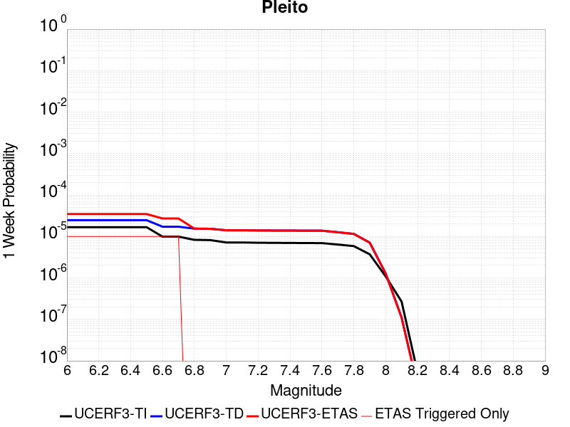 | 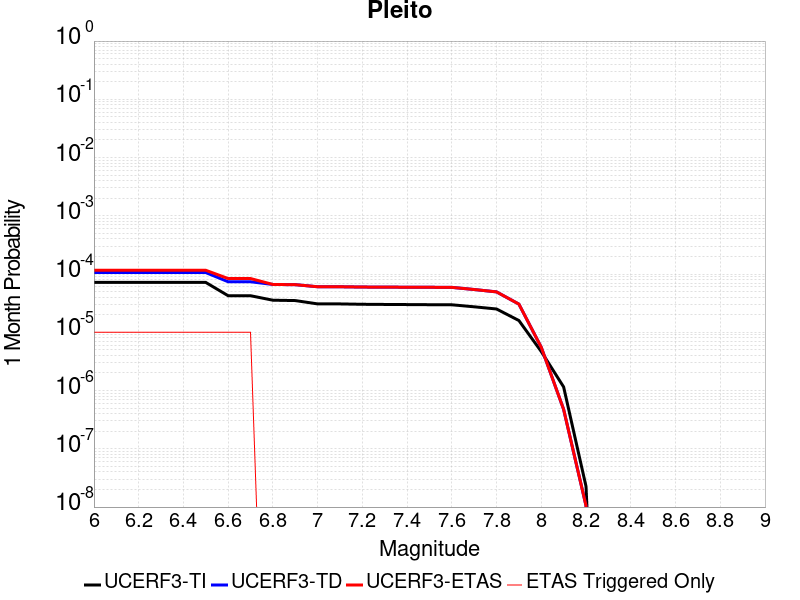 | 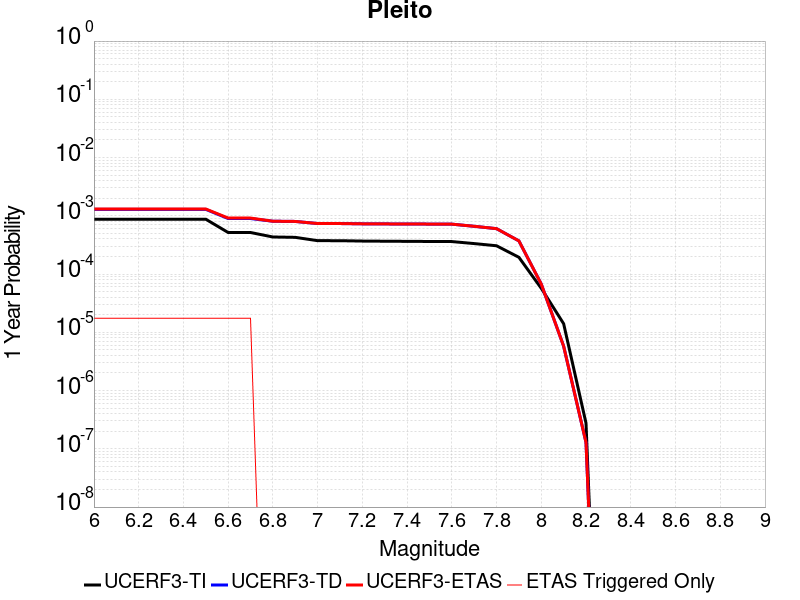 | 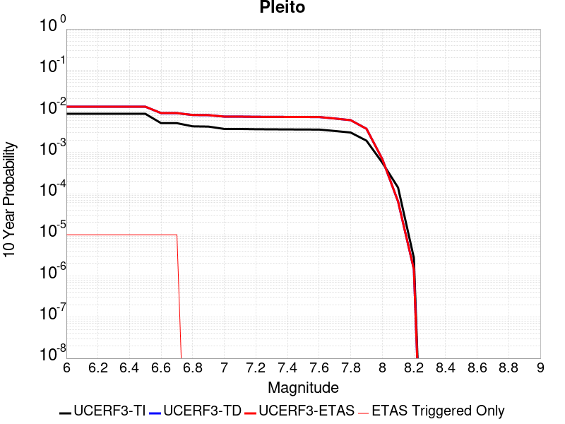 |

| Magnitude | 1 wk TI Prob | 1 wk TD Prob | 1 wk ETAS Prob | 1 wk ETAS/TD Gain | 1 wk ETAS Triggered Only | 1 mo TI Prob | 1 mo TD Prob | 1 mo ETAS Prob | 1 mo ETAS/TD Gain | 1 mo ETAS Triggered Only | 1 yr TI Prob | 1 yr TD Prob | 1 yr ETAS Prob | 1 yr ETAS/TD Gain | 1 yr ETAS Triggered Only | 10 yr TI Prob | 10 yr TD Prob | 10 yr ETAS Prob | 10 yr ETAS/TD Gain | 10 yr ETAS Triggered Only |
|-----|-----|-----|-----|-----|-----|-----|-----|-----|-----|-----|-----|-----|-----|-----|-----|-----|-----|-----|-----|-----|
| 6.0 | 1.6763008E-5 | 2.4763838E-5 | 4.2207193E-5 | 1.7043881 | 1.7443788E-5 | 7.183948E-5 | 1.0612683E-4 | 1.2356877E-4 | 1.1643499 | 1.7443788E-5 | 8.742947E-4 | 0.0012914003 | 0.0013088216 | 1.0134902 | 1.7443788E-5 | 0.00870863 | 0.0129538905 | 0.012971108 | 1.0013292 | 1.7443788E-5 |
| 6.1 | 1.6763008E-5 | 2.4763838E-5 | 4.2207193E-5 | 1.7043881 | 1.7443788E-5 | 7.183948E-5 | 1.0612683E-4 | 1.2356877E-4 | 1.1643499 | 1.7443788E-5 | 8.742947E-4 | 0.0012914003 | 0.0013088216 | 1.0134902 | 1.7443788E-5 | 0.00870863 | 0.0129538905 | 0.012971108 | 1.0013292 | 1.7443788E-5 |
| 6.2 | 1.6763008E-5 | 2.4763838E-5 | 4.2207193E-5 | 1.7043881 | 1.7443788E-5 | 7.183948E-5 | 1.0612683E-4 | 1.2356877E-4 | 1.1643499 | 1.7443788E-5 | 8.742947E-4 | 0.0012914003 | 0.0013088216 | 1.0134902 | 1.7443788E-5 | 0.00870863 | 0.0129538905 | 0.012971108 | 1.0013292 | 1.7443788E-5 |
| 6.3 | 1.6763008E-5 | 2.4763838E-5 | 4.2207193E-5 | 1.7043881 | 1.7443788E-5 | 7.183948E-5 | 1.0612683E-4 | 1.2356877E-4 | 1.1643499 | 1.7443788E-5 | 8.742947E-4 | 0.0012914003 | 0.0013088216 | 1.0134902 | 1.7443788E-5 | 0.00870863 | 0.0129538905 | 0.012971108 | 1.0013292 | 1.7443788E-5 |
| 6.4 | 1.6763008E-5 | 2.4763838E-5 | 4.2207193E-5 | 1.7043881 | 1.7443788E-5 | 7.183948E-5 | 1.0612683E-4 | 1.2356877E-4 | 1.1643499 | 1.7443788E-5 | 8.742947E-4 | 0.0012914003 | 0.0013088216 | 1.0134902 | 1.7443788E-5 | 0.00870863 | 0.0129538905 | 0.012971108 | 1.0013292 | 1.7443788E-5 |
| 6.5 | 1.6763008E-5 | 2.4763838E-5 | 4.2207193E-5 | 1.7043881 | 1.7443788E-5 | 7.183948E-5 | 1.0612683E-4 | 1.2356877E-4 | 1.1643499 | 1.7443788E-5 | 8.742947E-4 | 0.0012914003 | 0.0013088216 | 1.0134902 | 1.7443788E-5 | 0.00870863 | 0.0129538905 | 0.012971108 | 1.0013292 | 1.7443788E-5 |
| 6.6 | 9.910213E-6 | 1.7214623E-5 | 3.465811E-5 | 2.0132947 | 1.7443788E-5 | 4.247165E-5 | 7.377489E-5 | 9.121739E-5 | 1.2364287 | 1.7443788E-5 | 5.169696E-4 | 8.978429E-4 | 9.15271E-4 | 1.0194111 | 1.7443788E-5 | 0.0051576863 | 0.009050702 | 0.009067988 | 1.0019099 | 1.7443788E-5 |
| 6.7 | 9.910213E-6 | 1.7214623E-5 | 3.465811E-5 | 2.0132947 | 1.7443788E-5 | 4.247165E-5 | 7.377489E-5 | 9.121739E-5 | 1.2364287 | 1.7443788E-5 | 5.169696E-4 | 8.978429E-4 | 9.15271E-4 | 1.0194111 | 1.7443788E-5 | 0.0051576863 | 0.009050702 | 0.009067988 | 1.0019099 | 1.7443788E-5 |
| 6.8 | 8.300162E-6 | 1.5474232E-5 | 1.5474232E-5 | 1.0 | 0.0 | 3.557164E-5 | 6.631646E-5 | 6.631646E-5 | 1.0 | 0.0 | 4.3299864E-4 | 8.071053E-4 | 8.071053E-4 | 1.0 | 0.0 | 0.004321559 | 0.008150139 | 0.008150139 | 1.0 | 0.0 |
| 6.9 | 8.183114E-6 | 1.5345448E-5 | 1.5345448E-5 | 1.0 | 0.0 | 3.5070017E-5 | 6.576455E-5 | 6.576455E-5 | 1.0 | 0.0 | 4.2689382E-4 | 8.003907E-4 | 8.003907E-4 | 1.0 | 0.0 | 0.0042607468 | 0.008083483 | 0.008083483 | 1.0 | 0.0 |
| 7.0 | 7.1748823E-6 | 1.413244E-5 | 1.413244E-5 | 1.0 | 0.0 | 3.0749135E-5 | 6.0566195E-5 | 6.0566195E-5 | 1.0 | 0.0 | 3.743064E-4 | 7.371445E-4 | 7.371445E-4 | 1.0 | 0.0 | 0.0037367654 | 0.007454939 | 0.007454939 | 1.0 | 0.0 |
| 7.1 | 7.1671807E-6 | 1.412281E-5 | 1.412281E-5 | 1.0 | 0.0 | 3.0716128E-5 | 6.052493E-5 | 6.052493E-5 | 1.0 | 0.0 | 3.7390468E-4 | 7.366424E-4 | 7.366424E-4 | 1.0 | 0.0 | 0.0037327618 | 0.0074499524 | 0.0074499524 | 1.0 | 0.0 |
| 7.2 | 7.0649667E-6 | 1.39701015E-5 | 1.39701015E-5 | 1.0 | 0.0 | 3.0278077E-5 | 5.9870494E-5 | 5.9870494E-5 | 1.0 | 0.0 | 3.6857324E-4 | 7.2868E-4 | 7.2868E-4 | 1.0 | 0.0 | 0.0036796255 | 0.0073707094 | 0.0073707094 | 1.0 | 0.0 |
| 7.3 | 7.02082E-6 | 1.3913556E-5 | 1.3913556E-5 | 1.0 | 0.0 | 3.008888E-5 | 5.9628168E-5 | 5.9628168E-5 | 1.0 | 0.0 | 3.6627054E-4 | 7.2573166E-4 | 7.2573166E-4 | 1.0 | 0.0 | 0.0036566744 | 0.007341209 | 0.007341209 | 1.0 | 0.0 |
| 7.4 | 6.987146E-6 | 1.3873118E-5 | 1.3873118E-5 | 1.0 | 0.0 | 2.9944567E-5 | 5.945487E-5 | 5.945487E-5 | 1.0 | 0.0 | 3.6451413E-4 | 7.2362315E-4 | 7.2362315E-4 | 1.0 | 0.0 | 0.0036391679 | 0.007320144 | 0.007320144 | 1.0 | 0.0 |
| 7.5 | 6.9494554E-6 | 1.3830024E-5 | 1.3830024E-5 | 1.0 | 0.0 | 2.9783041E-5 | 5.9270187E-5 | 5.9270187E-5 | 1.0 | 0.0 | 3.625482E-4 | 7.2137616E-4 | 7.2137616E-4 | 1.0 | 0.0 | 0.0036195726 | 0.0072977724 | 0.0072977724 | 1.0 | 0.0 |
| 7.6 | 6.92694E-6 | 1.3789138E-5 | 1.3789138E-5 | 1.0 | 0.0 | 2.9686547E-5 | 5.909497E-5 | 5.909497E-5 | 1.0 | 0.0 | 3.6137376E-4 | 7.1924424E-4 | 7.1924424E-4 | 1.0 | 0.0 | 0.0036078666 | 0.0072765257 | 0.0072765257 | 1.0 | 0.0 |
| 7.7 | 6.395867E-6 | 1.2668219E-5 | 1.2668219E-5 | 1.0 | 0.0 | 2.741057E-5 | 5.429124E-5 | 5.429124E-5 | 1.0 | 0.0 | 3.336726E-4 | 6.6079566E-4 | 6.6079566E-4 | 1.0 | 0.0 | 0.0033317201 | 0.0066951844 | 0.0066951844 | 1.0 | 0.0 |
| 7.8 | 5.8664327E-6 | 1.153586E-5 | 1.153586E-5 | 1.0 | 0.0 | 2.5141611E-5 | 4.9438466E-5 | 4.9438466E-5 | 1.0 | 0.0 | 3.060561E-4 | 6.017473E-4 | 6.017473E-4 | 1.0 | 0.0 | 0.0030563495 | 0.0061006667 | 0.0061006667 | 1.0 | 0.0 |
| 7.9 | 3.7167474E-6 | 7.1140853E-6 | 7.1140853E-6 | 1.0 | 0.0 | 1.592882E-5 | 3.0488582E-5 | 3.0488582E-5 | 1.0 | 0.0 | 1.9391612E-4 | 3.7113542E-4 | 3.7113542E-4 | 1.0 | 0.0 | 0.0019374699 | 0.0037674906 | 0.0037674906 | 1.0 | 0.0 |
| 8.0 | 1.0903841E-6 | 1.2879392E-6 | 1.2879392E-6 | 1.0 | 0.0 | 4.6730665E-6 | 5.5197274E-6 | 5.5197274E-6 | 1.0 | 0.0 | 5.68931E-5 | 6.720063E-5 | 6.720063E-5 | 1.0 | 0.0 | 5.6878536E-4 | 6.941948E-4 | 6.941948E-4 | 1.0 | 0.0 |
| 8.1 | 2.6894583E-7 | 1.1060341E-7 | 1.1060341E-7 | 1.0 | 0.0 | 1.1526245E-6 | 4.740145E-7 | 4.740145E-7 | 1.0 | 0.0 | 1.4033113E-5 | 5.7711113E-6 | 5.7711113E-6 | 1.0 | 0.0 | 1.4032227E-4 | 6.456908E-5 | 6.456908E-5 | 1.0 | 0.0 |
| 8.2 | 5.2967013E-9 | 2.4578228E-9 | 2.4578228E-9 | 1.0 | 0.0 | 2.2700148E-8 | 1.0533527E-8 | 1.0533527E-8 | 1.0 | 0.0 | 2.7637427E-7 | 1.2824569E-7 | 1.2824569E-7 | 1.0 | 0.0 | 2.7637393E-6 | 1.4592787E-6 | 1.4592787E-6 | 1.0 | 0.0 |

## Great Valley 03a Dunnigan Hills
*[(top)](#table-of-contents)*

| 1 Week | 1 Month | 1 Year | 10 Year |
|-----|-----|-----|-----|
| 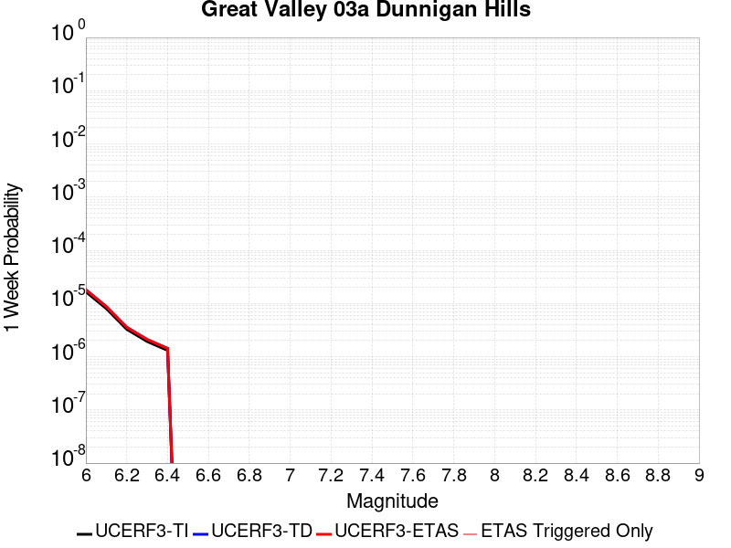 | 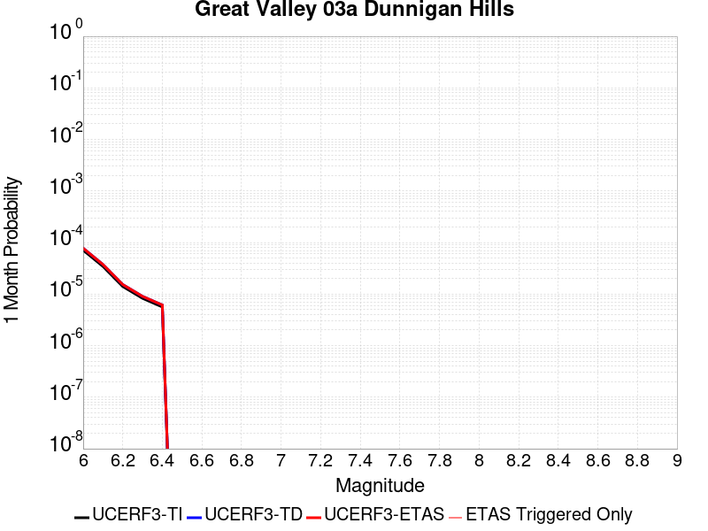 | 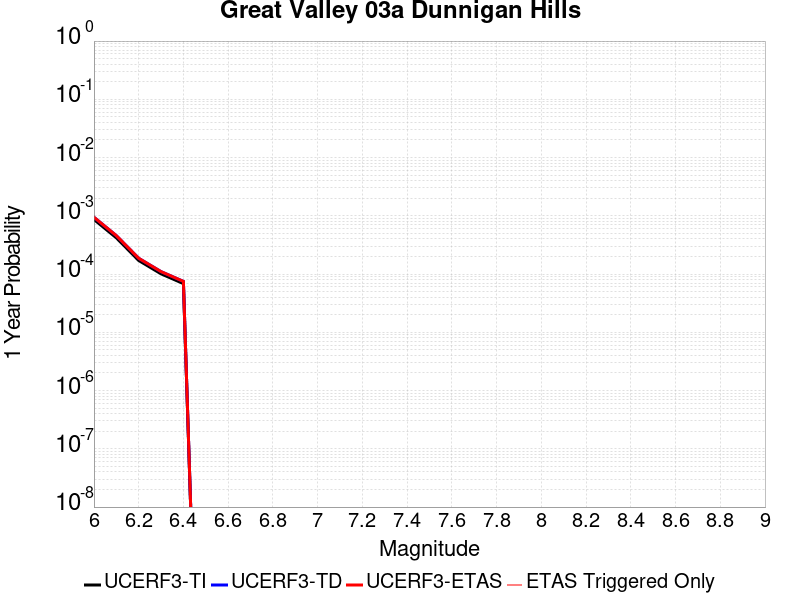 | 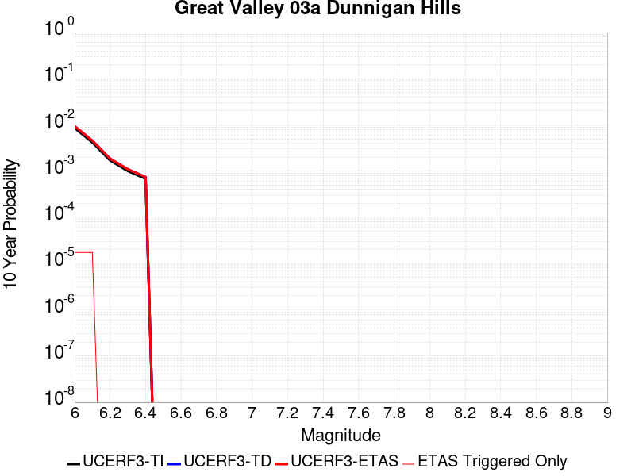 |

| Magnitude | 1 wk TI Prob | 1 wk TD Prob | 1 wk ETAS Prob | 1 wk ETAS/TD Gain | 1 wk ETAS Triggered Only | 1 mo TI Prob | 1 mo TD Prob | 1 mo ETAS Prob | 1 mo ETAS/TD Gain | 1 mo ETAS Triggered Only | 1 yr TI Prob | 1 yr TD Prob | 1 yr ETAS Prob | 1 yr ETAS/TD Gain | 1 yr ETAS Triggered Only | 10 yr TI Prob | 10 yr TD Prob | 10 yr ETAS Prob | 10 yr ETAS/TD Gain | 10 yr ETAS Triggered Only |
|-----|-----|-----|-----|-----|-----|-----|-----|-----|-----|-----|-----|-----|-----|-----|-----|-----|-----|-----|-----|-----|
| 6.0 | 1.6591328E-5 | 1.8107954E-5 | 1.8107954E-5 | 1.0 | 0.0 | 7.110376E-5 | 7.7603596E-5 | 7.7603596E-5 | 1.0 | 0.0 | 8.6534437E-4 | 9.444834E-4 | 9.444834E-4 | 1.0 | 0.0 | 0.008619824 | 0.009411525 | 0.009428805 | 1.0018361 | 1.7443788E-5 |
| 6.1 | 8.041125E-6 | 8.769726E-6 | 8.769726E-6 | 1.0 | 0.0 | 3.4461507E-5 | 3.7584115E-5 | 3.7584115E-5 | 1.0 | 0.0 | 4.194881E-4 | 4.5751085E-4 | 4.5751085E-4 | 1.0 | 0.0 | 0.004186971 | 0.004567687 | 0.004585051 | 1.0038015 | 1.7443788E-5 |
| 6.2 | 3.2807004E-6 | 3.5795688E-6 | 3.5795688E-6 | 1.0 | 0.0 | 1.4060069E-5 | 1.5340942E-5 | 1.5340942E-5 | 1.0 | 0.0 | 1.7116789E-4 | 1.8676413E-4 | 1.8676413E-4 | 1.0 | 0.0 | 0.0017103611 | 0.0018664796 | 0.0018664796 | 1.0 | 0.0 |
| 6.3 | 1.9339366E-6 | 2.1103806E-6 | 2.1103806E-6 | 1.0 | 0.0 | 8.288273E-6 | 9.044474E-6 | 9.044474E-6 | 1.0 | 0.0 | 1.00905054E-4 | 1.1011375E-4 | 1.1011375E-4 | 1.0 | 0.0 | 0.0010085925 | 0.0011008718 | 0.0011008718 | 1.0 | 0.0 |
| 6.4 | 1.3142635E-6 | 1.4339867E-6 | 1.4339867E-6 | 1.0 | 0.0 | 5.6325457E-6 | 6.145657E-6 | 6.145657E-6 | 1.0 | 0.0 | 6.857408E-5 | 7.482337E-5 | 7.482337E-5 | 1.0 | 0.0 | 6.8552926E-4 | 7.4823375E-4 | 7.4823375E-4 | 1.0 | 0.0 |

## Newport-Inglewood alt 1
*[(top)](#table-of-contents)*

| 1 Week | 1 Month | 1 Year | 10 Year |
|-----|-----|-----|-----|
| 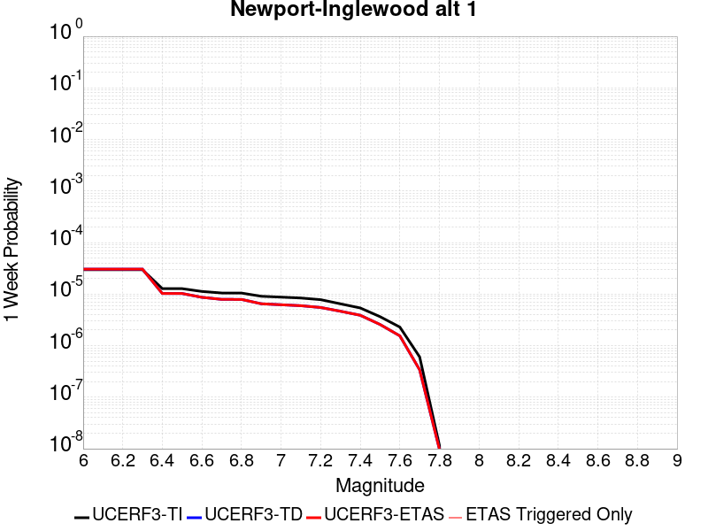 | 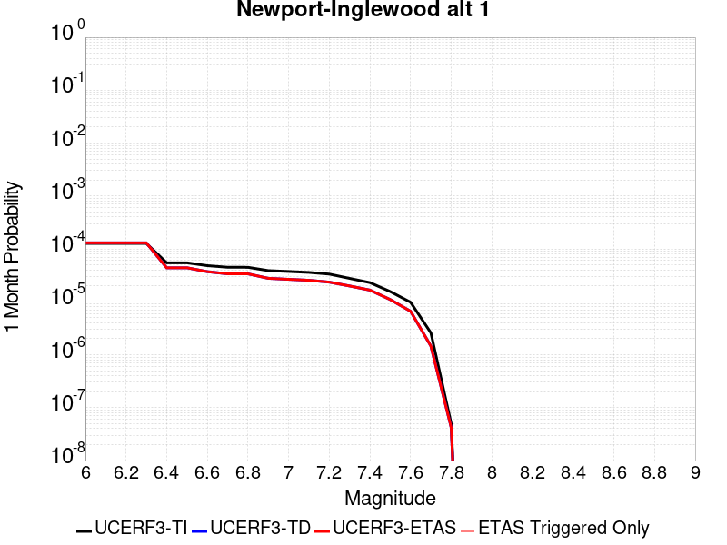 | 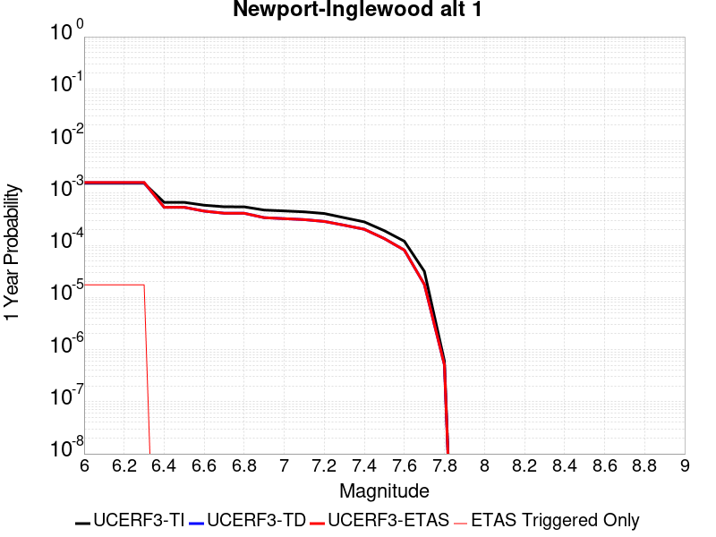 | 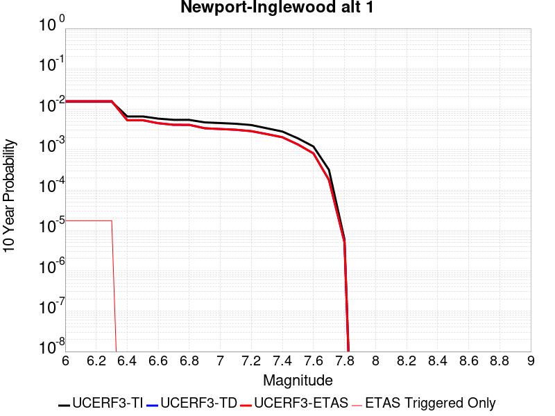 |

| Magnitude | 1 wk TI Prob | 1 wk TD Prob | 1 wk ETAS Prob | 1 wk ETAS/TD Gain | 1 wk ETAS Triggered Only | 1 mo TI Prob | 1 mo TD Prob | 1 mo ETAS Prob | 1 mo ETAS/TD Gain | 1 mo ETAS Triggered Only | 1 yr TI Prob | 1 yr TD Prob | 1 yr ETAS Prob | 1 yr ETAS/TD Gain | 1 yr ETAS Triggered Only | 10 yr TI Prob | 10 yr TD Prob | 10 yr ETAS Prob | 10 yr ETAS/TD Gain | 10 yr ETAS Triggered Only |
|-----|-----|-----|-----|-----|-----|-----|-----|-----|-----|-----|-----|-----|-----|-----|-----|-----|-----|-----|-----|-----|
| 6.0 | 2.9668912E-5 | 3.0404817E-5 | 3.0404817E-5 | 1.0 | 0.0 | 1.2714628E-4 | 1.303026E-4 | 1.303026E-4 | 1.0 | 0.0 | 0.0015469068 | 0.0015857625 | 0.0016031787 | 1.0109828 | 1.7443788E-5 | 0.015361829 | 0.015792042 | 0.015809212 | 1.0010872 | 1.7443788E-5 |
| 6.1 | 2.9668912E-5 | 3.0404817E-5 | 3.0404817E-5 | 1.0 | 0.0 | 1.2714628E-4 | 1.303026E-4 | 1.303026E-4 | 1.0 | 0.0 | 0.0015469068 | 0.0015857625 | 0.0016031787 | 1.0109828 | 1.7443788E-5 | 0.015361829 | 0.015792042 | 0.015809212 | 1.0010872 | 1.7443788E-5 |
| 6.2 | 2.9668912E-5 | 3.0404817E-5 | 3.0404817E-5 | 1.0 | 0.0 | 1.2714628E-4 | 1.303026E-4 | 1.303026E-4 | 1.0 | 0.0 | 0.0015469068 | 0.0015857625 | 0.0016031787 | 1.0109828 | 1.7443788E-5 | 0.015361829 | 0.015792042 | 0.015809212 | 1.0010872 | 1.7443788E-5 |
| 6.3 | 2.9668912E-5 | 3.0404817E-5 | 3.0404817E-5 | 1.0 | 0.0 | 1.2714628E-4 | 1.303026E-4 | 1.303026E-4 | 1.0 | 0.0 | 0.0015469068 | 0.0015857625 | 0.0016031787 | 1.0109828 | 1.7443788E-5 | 0.015361829 | 0.015792042 | 0.015809212 | 1.0010872 | 1.7443788E-5 |
| 6.4 | 1.275942E-5 | 1.0272503E-5 | 1.0272503E-5 | 1.0 | 0.0 | 5.4682085E-5 | 4.402429E-5 | 4.402429E-5 | 1.0 | 0.0 | 6.65551E-4 | 5.358681E-4 | 5.358681E-4 | 1.0 | 0.0 | 0.0066356123 | 0.005346184 | 0.005346184 | 1.0 | 0.0 |
| 6.5 | 1.275942E-5 | 1.0272503E-5 | 1.0272503E-5 | 1.0 | 0.0 | 5.4682085E-5 | 4.402429E-5 | 4.402429E-5 | 1.0 | 0.0 | 6.65551E-4 | 5.358681E-4 | 5.358681E-4 | 1.0 | 0.0 | 0.0066356123 | 0.005346184 | 0.005346184 | 1.0 | 0.0 |
| 6.6 | 1.1255358E-5 | 8.661884E-6 | 8.661884E-6 | 1.0 | 0.0 | 4.8236358E-5 | 3.712184E-5 | 3.712184E-5 | 1.0 | 0.0 | 5.871194E-4 | 4.518664E-4 | 4.518664E-4 | 1.0 | 0.0 | 0.005855706 | 0.004509653 | 0.004509653 | 1.0 | 0.0 |
| 6.7 | 1.0504745E-5 | 7.8997955E-6 | 7.8997955E-6 | 1.0 | 0.0 | 4.5019555E-5 | 3.3855835E-5 | 3.3855835E-5 | 1.0 | 0.0 | 5.4797524E-4 | 4.1211807E-4 | 4.1211807E-4 | 1.0 | 0.0 | 0.0054662596 | 0.004113668 | 0.004113668 | 1.0 | 0.0 |
| 6.8 | 1.0476007E-5 | 7.881176E-6 | 7.881176E-6 | 1.0 | 0.0 | 4.4896402E-5 | 3.3776043E-5 | 3.3776043E-5 | 1.0 | 0.0 | 5.464766E-4 | 4.1114696E-4 | 4.1114696E-4 | 1.0 | 0.0 | 0.005451347 | 0.0041039926 | 0.0041039926 | 1.0 | 0.0 |
| 6.9 | 9.076797E-6 | 6.4896312E-6 | 6.4896312E-6 | 1.0 | 0.0 | 3.889998E-5 | 2.781241E-5 | 2.781241E-5 | 1.0 | 0.0 | 4.7350433E-4 | 3.385638E-4 | 3.385638E-4 | 1.0 | 0.0 | 0.004724967 | 0.0033805177 | 0.0033805177 | 1.0 | 0.0 |
| 7.0 | 8.73795E-6 | 6.2120125E-6 | 6.2120125E-6 | 1.0 | 0.0 | 3.7447822E-5 | 2.6622642E-5 | 2.6622642E-5 | 1.0 | 0.0 | 4.5583185E-4 | 3.2408274E-4 | 3.2408274E-4 | 1.0 | 0.0 | 0.0045489795 | 0.0032361327 | 0.0032361327 | 1.0 | 0.0 |
| 7.1 | 8.391299E-6 | 5.95579E-6 | 5.95579E-6 | 1.0 | 0.0 | 3.5962214E-5 | 2.5524565E-5 | 2.5524565E-5 | 1.0 | 0.0 | 4.37752E-4 | 3.1071753E-4 | 3.1071753E-4 | 1.0 | 0.0 | 0.004368907 | 0.0031028606 | 0.0031028606 | 1.0 | 0.0 |
| 7.2 | 7.796882E-6 | 5.4965344E-6 | 5.4965344E-6 | 1.0 | 0.0 | 3.341478E-5 | 2.3556364E-5 | 2.3556364E-5 | 1.0 | 0.0 | 4.06749E-4 | 2.867612E-4 | 2.867612E-4 | 1.0 | 0.0 | 0.0040600533 | 0.0028639357 | 0.0028639357 | 1.0 | 0.0 |
| 7.3 | 6.4738833E-6 | 4.6478162E-6 | 4.6478162E-6 | 1.0 | 0.0 | 2.774492E-5 | 1.9919062E-5 | 1.9919062E-5 | 1.0 | 0.0 | 3.3774204E-4 | 2.4248775E-4 | 2.4248775E-4 | 1.0 | 0.0 | 0.0033722918 | 0.0024222482 | 0.0024222482 | 1.0 | 0.0 |
| 7.4 | 5.382145E-6 | 3.8857597E-6 | 3.8857597E-6 | 1.0 | 0.0 | 2.3066134E-5 | 1.665315E-5 | 1.665315E-5 | 1.0 | 0.0 | 2.8079396E-4 | 2.0273338E-4 | 2.0273338E-4 | 1.0 | 0.0 | 0.0028043943 | 0.0020254988 | 0.0020254988 | 1.0 | 0.0 |
| 7.5 | 3.648244E-6 | 2.5737843E-6 | 2.5737843E-6 | 1.0 | 0.0 | 1.5635238E-5 | 1.1030458E-5 | 1.1030458E-5 | 1.0 | 0.0 | 1.9034238E-4 | 1.3428765E-4 | 1.3428765E-4 | 1.0 | 0.0 | 0.0019017943 | 0.0013420755 | 0.0013420755 | 1.0 | 0.0 |
| 7.6 | 2.2906888E-6 | 1.5479842E-6 | 1.5479842E-6 | 1.0 | 0.0 | 9.817201E-6 | 6.634202E-6 | 6.634202E-6 | 1.0 | 0.0 | 1.1951787E-4 | 8.076848E-5 | 8.076848E-5 | 1.0 | 0.0 | 0.0011945361 | 8.07398E-4 | 8.07398E-4 | 1.0 | 0.0 |
| 7.7 | 6.0479874E-7 | 3.397512E-7 | 3.397512E-7 | 1.0 | 0.0 | 2.5919921E-6 | 1.4560758E-6 | 1.4560758E-6 | 1.0 | 0.0 | 3.1557047E-5 | 1.7727592E-5 | 1.7727592E-5 | 1.0 | 0.0 | 3.1552566E-4 | 1.7726317E-4 | 1.7726317E-4 | 1.0 | 0.0 |
| 7.8 | 1.16056995E-8 | 9.782373E-9 | 9.782373E-9 | 1.0 | 0.0 | 4.9738713E-8 | 4.1924455E-8 | 4.1924455E-8 | 1.0 | 0.0 | 6.0556863E-7 | 5.1043025E-7 | 5.1043025E-7 | 1.0 | 0.0 | 6.05567E-6 | 5.1043025E-6 | 5.1043025E-6 | 1.0 | 0.0 |

## Great Valley 11
*[(top)](#table-of-contents)*

| 1 Week | 1 Month | 1 Year | 10 Year |
|-----|-----|-----|-----|
|  | 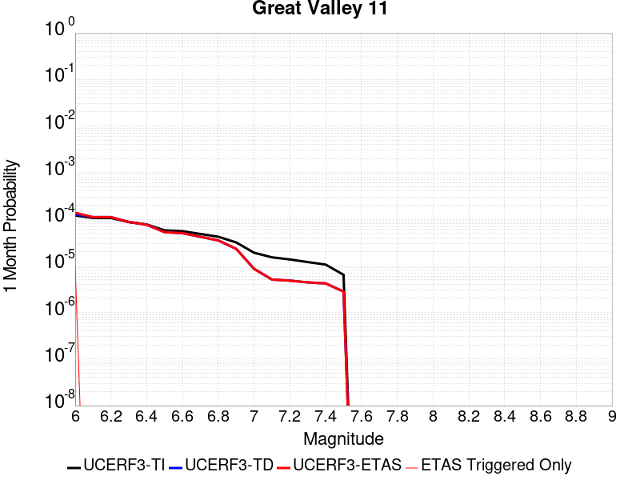 | 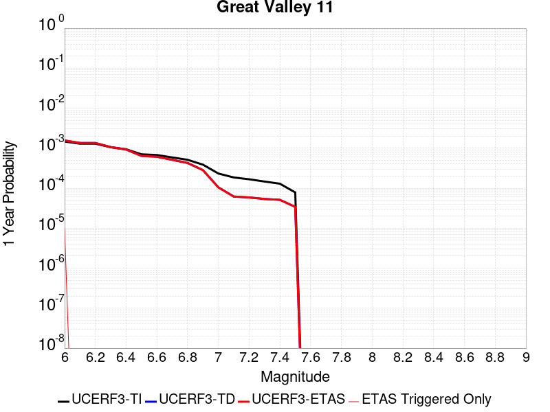 | 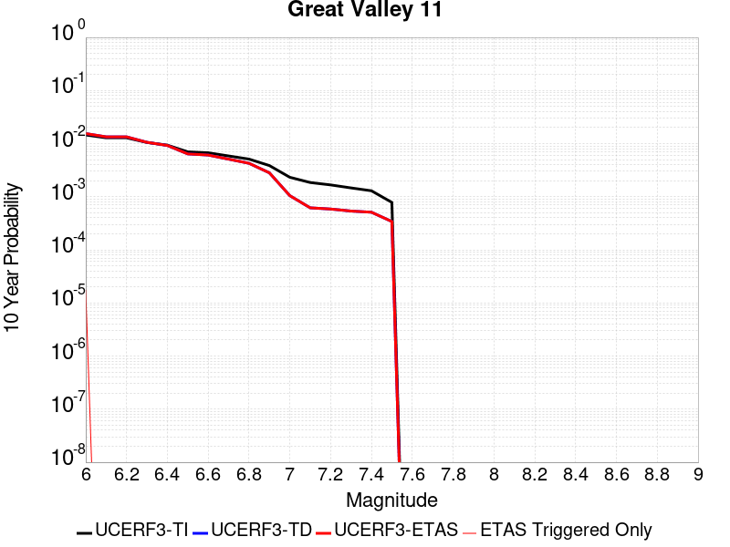 |

| Magnitude | 1 wk TI Prob | 1 wk TD Prob | 1 wk ETAS Prob | 1 wk ETAS/TD Gain | 1 wk ETAS Triggered Only | 1 mo TI Prob | 1 mo TD Prob | 1 mo ETAS Prob | 1 mo ETAS/TD Gain | 1 mo ETAS Triggered Only | 1 yr TI Prob | 1 yr TD Prob | 1 yr ETAS Prob | 1 yr ETAS/TD Gain | 1 yr ETAS Triggered Only | 10 yr TI Prob | 10 yr TD Prob | 10 yr ETAS Prob | 10 yr ETAS/TD Gain | 10 yr ETAS Triggered Only |
|-----|-----|-----|-----|-----|-----|-----|-----|-----|-----|-----|-----|-----|-----|-----|-----|-----|-----|-----|-----|-----|
| 6.0 | 2.8099583E-5 | 2.9832152E-5 | 2.9832152E-5 | 1.0 | 0.0 | 1.20421224E-4 | 1.278462E-4 | 1.4528776E-4 | 1.1364261 | 1.7443788E-5 | 0.0014651422 | 0.0015554909 | 0.0015729076 | 1.0111969 | 1.7443788E-5 | 0.0145552 | 0.01545356 | 0.015470735 | 1.0011114 | 1.7443788E-5 |
| 6.1 | 2.483194E-5 | 2.590715E-5 | 2.590715E-5 | 1.0 | 0.0 | 1.0641825E-4 | 1.11026246E-4 | 1.11026246E-4 | 1.0 | 0.0 | 0.0012948721 | 0.0013509706 | 0.0013509706 | 1.0 | 0.0 | 0.012873529 | 0.013433994 | 0.013433994 | 1.0 | 0.0 |
| 6.2 | 2.483194E-5 | 2.590715E-5 | 2.590715E-5 | 1.0 | 0.0 | 1.0641825E-4 | 1.11026246E-4 | 1.11026246E-4 | 1.0 | 0.0 | 0.0012948721 | 0.0013509706 | 0.0013509706 | 1.0 | 0.0 | 0.012873529 | 0.013433994 | 0.013433994 | 1.0 | 0.0 |
| 6.3 | 2.0257901E-5 | 2.0398922E-5 | 2.0398922E-5 | 1.0 | 0.0 | 8.681669E-5 | 8.742122E-5 | 8.742122E-5 | 1.0 | 0.0 | 0.0010564806 | 0.0010638756 | 0.0010638756 | 1.0 | 0.0 | 0.01051472 | 0.010592012 | 0.010592012 | 1.0 | 0.0 |
| 6.4 | 1.8054898E-5 | 1.7780874E-5 | 1.7780874E-5 | 1.0 | 0.0 | 7.737584E-5 | 7.62017E-5 | 7.62017E-5 | 1.0 | 0.0 | 9.416436E-4 | 9.2739856E-4 | 9.2739856E-4 | 1.0 | 0.0 | 0.009376635 | 0.009239036 | 0.009239036 | 1.0 | 0.0 |
| 6.5 | 1.34804895E-5 | 1.2321055E-5 | 1.2321055E-5 | 1.0 | 0.0 | 5.777225E-5 | 5.2803476E-5 | 5.2803476E-5 | 1.0 | 0.0 | 7.031501E-4 | 6.4269686E-4 | 6.4269686E-4 | 1.0 | 0.0 | 0.007009294 | 0.0064088185 | 0.0064088185 | 1.0 | 0.0 |
| 6.6 | 1.294883E-5 | 1.1732312E-5 | 1.1732312E-5 | 1.0 | 0.0 | 5.5493805E-5 | 5.028039E-5 | 5.028039E-5 | 1.0 | 0.0 | 6.754276E-4 | 6.1199587E-4 | 6.1199587E-4 | 1.0 | 0.0 | 0.006733784 | 0.0061035305 | 0.0061035305 | 1.0 | 0.0 |
| 6.7 | 1.1272237E-5 | 9.811886E-6 | 9.811886E-6 | 1.0 | 0.0 | 4.8308695E-5 | 4.2050277E-5 | 4.2050277E-5 | 1.0 | 0.0 | 5.879996E-4 | 5.118446E-4 | 5.118446E-4 | 1.0 | 0.0 | 0.005864462 | 0.0051069413 | 0.0051069413 | 1.0 | 0.0 |
| 6.8 | 9.8337505E-6 | 8.19377E-6 | 8.19377E-6 | 1.0 | 0.0 | 4.2143965E-5 | 3.5115696E-5 | 3.5115696E-5 | 1.0 | 0.0 | 5.1298196E-4 | 4.2745177E-4 | 4.2745177E-4 | 1.0 | 0.0 | 0.005117994 | 0.0042665056 | 0.0042665056 | 1.0 | 0.0 |
| 6.9 | 7.4224813E-6 | 5.4131347E-6 | 5.4131347E-6 | 1.0 | 0.0 | 3.1810247E-5 | 2.319895E-5 | 2.319895E-5 | 1.0 | 0.0 | 3.872209E-4 | 2.8241202E-4 | 2.8241202E-4 | 1.0 | 0.0 | 0.0038654688 | 0.0028206722 | 0.0028206722 | 1.0 | 0.0 |
| 7.0 | 4.4628923E-6 | 2.0110795E-6 | 2.0110795E-6 | 1.0 | 0.0 | 1.912654E-5 | 8.618884E-6 | 8.618884E-6 | 1.0 | 0.0 | 2.3284076E-4 | 1.04929975E-4 | 1.04929975E-4 | 1.0 | 0.0 | 0.0023259693 | 0.0010488159 | 0.0010488159 | 1.0 | 0.0 |
| 7.1 | 3.5546527E-6 | 1.1855836E-6 | 1.1855836E-6 | 1.0 | 0.0 | 1.5234136E-5 | 5.081063E-6 | 5.081063E-6 | 1.0 | 0.0 | 1.8545982E-4 | 6.186026E-5 | 6.186026E-5 | 1.0 | 0.0 | 0.0018530512 | 6.1843713E-4 | 6.1843713E-4 | 1.0 | 0.0 |
| 7.2 | 3.2039936E-6 | 1.1254128E-6 | 1.1254128E-6 | 1.0 | 0.0 | 1.3731329E-5 | 4.823189E-6 | 4.823189E-6 | 1.0 | 0.0 | 1.671661E-4 | 5.8720816E-5 | 5.8720816E-5 | 1.0 | 0.0 | 0.0016704041 | 5.870597E-4 | 5.870597E-4 | 1.0 | 0.0 |
| 7.3 | 2.8120473E-6 | 1.0305612E-6 | 1.0305612E-6 | 1.0 | 0.0 | 1.2051575E-5 | 4.4166836E-6 | 4.4166836E-6 | 1.0 | 0.0 | 1.4671806E-4 | 5.3771862E-5 | 5.3771862E-5 | 1.0 | 0.0 | 0.0014662122 | 5.3759513E-4 | 5.3759513E-4 | 1.0 | 0.0 |
| 7.4 | 2.4837766E-6 | 9.800582E-7 | 9.800582E-7 | 1.0 | 0.0 | 1.0644713E-5 | 4.200243E-6 | 4.200243E-6 | 1.0 | 0.0 | 1.2959167E-4 | 5.1136827E-5 | 5.1136827E-5 | 1.0 | 0.0 | 0.0012951613 | 5.112572E-4 | 5.112572E-4 | 1.0 | 0.0 |
| 7.5 | 1.5002679E-6 | 6.546144E-7 | 6.546144E-7 | 1.0 | 0.0 | 6.4297037E-6 | 2.8054874E-6 | 2.8054874E-6 | 1.0 | 0.0 | 7.827883E-5 | 3.4156317E-5 | 3.4156317E-5 | 1.0 | 0.0 | 7.825126E-4 | 3.4151482E-4 | 3.4151482E-4 | 1.0 | 0.0 |

## Pine Mtn
*[(top)](#table-of-contents)*

| 1 Week | 1 Month | 1 Year | 10 Year |
|-----|-----|-----|-----|
| 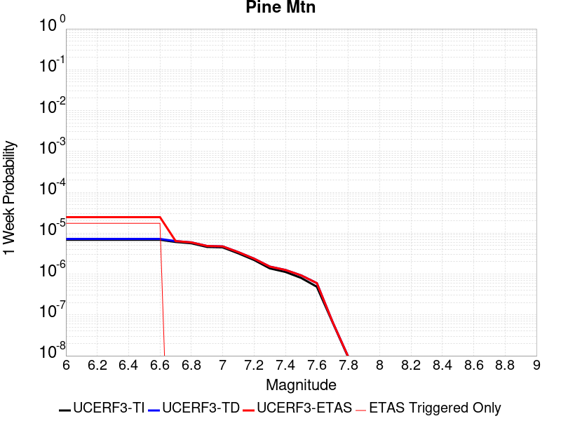 | 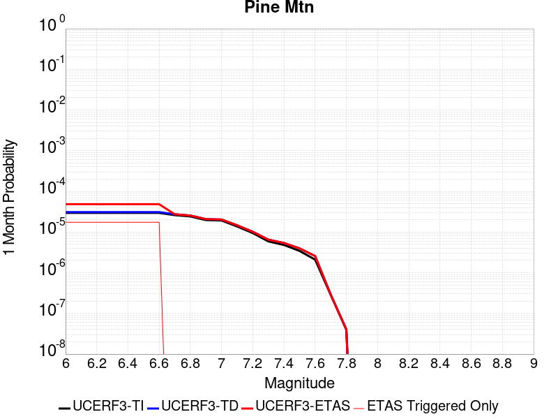 | 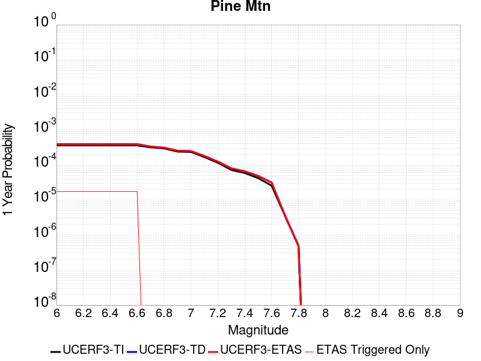 | 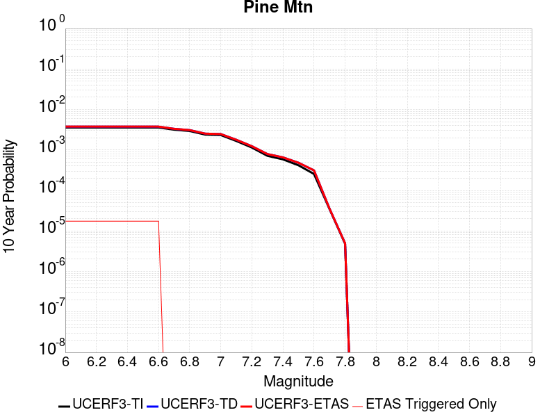 |

| Magnitude | 1 wk TI Prob | 1 wk TD Prob | 1 wk ETAS Prob | 1 wk ETAS/TD Gain | 1 wk ETAS Triggered Only | 1 mo TI Prob | 1 mo TD Prob | 1 mo ETAS Prob | 1 mo ETAS/TD Gain | 1 mo ETAS Triggered Only | 1 yr TI Prob | 1 yr TD Prob | 1 yr ETAS Prob | 1 yr ETAS/TD Gain | 1 yr ETAS Triggered Only | 10 yr TI Prob | 10 yr TD Prob | 10 yr ETAS Prob | 10 yr ETAS/TD Gain | 10 yr ETAS Triggered Only |
|-----|-----|-----|-----|-----|-----|-----|-----|-----|-----|-----|-----|-----|-----|-----|-----|-----|-----|-----|-----|-----|
| 6.0 | 6.894797E-6 | 7.225461E-6 | 2.4669123E-5 | 3.4141934 | 1.7443788E-5 | 2.9548795E-5 | 3.096591E-5 | 4.8409158E-5 | 1.5633048 | 1.7443788E-5 | 3.596972E-4 | 3.7694772E-4 | 3.9438496E-4 | 1.0462589 | 1.7443788E-5 | 0.0035911554 | 0.003763381 | 0.0037807592 | 1.0046177 | 1.7443788E-5 |
| 6.1 | 6.894797E-6 | 7.225461E-6 | 2.4669123E-5 | 3.4141934 | 1.7443788E-5 | 2.9548795E-5 | 3.096591E-5 | 4.8409158E-5 | 1.5633048 | 1.7443788E-5 | 3.596972E-4 | 3.7694772E-4 | 3.9438496E-4 | 1.0462589 | 1.7443788E-5 | 0.0035911554 | 0.003763381 | 0.0037807592 | 1.0046177 | 1.7443788E-5 |
| 6.2 | 6.894797E-6 | 7.225461E-6 | 2.4669123E-5 | 3.4141934 | 1.7443788E-5 | 2.9548795E-5 | 3.096591E-5 | 4.8409158E-5 | 1.5633048 | 1.7443788E-5 | 3.596972E-4 | 3.7694772E-4 | 3.9438496E-4 | 1.0462589 | 1.7443788E-5 | 0.0035911554 | 0.003763381 | 0.0037807592 | 1.0046177 | 1.7443788E-5 |
| 6.3 | 6.894797E-6 | 7.225461E-6 | 2.4669123E-5 | 3.4141934 | 1.7443788E-5 | 2.9548795E-5 | 3.096591E-5 | 4.8409158E-5 | 1.5633048 | 1.7443788E-5 | 3.596972E-4 | 3.7694772E-4 | 3.9438496E-4 | 1.0462589 | 1.7443788E-5 | 0.0035911554 | 0.003763381 | 0.0037807592 | 1.0046177 | 1.7443788E-5 |
| 6.4 | 6.894797E-6 | 7.225461E-6 | 2.4669123E-5 | 3.4141934 | 1.7443788E-5 | 2.9548795E-5 | 3.096591E-5 | 4.8409158E-5 | 1.5633048 | 1.7443788E-5 | 3.596972E-4 | 3.7694772E-4 | 3.9438496E-4 | 1.0462589 | 1.7443788E-5 | 0.0035911554 | 0.003763381 | 0.0037807592 | 1.0046177 | 1.7443788E-5 |
| 6.5 | 6.894797E-6 | 7.225461E-6 | 2.4669123E-5 | 3.4141934 | 1.7443788E-5 | 2.9548795E-5 | 3.096591E-5 | 4.8409158E-5 | 1.5633048 | 1.7443788E-5 | 3.596972E-4 | 3.7694772E-4 | 3.9438496E-4 | 1.0462589 | 1.7443788E-5 | 0.0035911554 | 0.003763381 | 0.0037807592 | 1.0046177 | 1.7443788E-5 |
| 6.6 | 6.894797E-6 | 7.225461E-6 | 2.4669123E-5 | 3.4141934 | 1.7443788E-5 | 2.9548795E-5 | 3.096591E-5 | 4.8409158E-5 | 1.5633048 | 1.7443788E-5 | 3.596972E-4 | 3.7694772E-4 | 3.9438496E-4 | 1.0462589 | 1.7443788E-5 | 0.0035911554 | 0.003763381 | 0.0037807592 | 1.0046177 | 1.7443788E-5 |
| 6.7 | 6.0867933E-6 | 6.3971133E-6 | 6.3971133E-6 | 1.0 | 0.0 | 2.6085996E-5 | 2.7415923E-5 | 2.7415923E-5 | 1.0 | 0.0 | 3.1755073E-4 | 3.3373994E-4 | 3.3373994E-4 | 1.0 | 0.0 | 0.0031709734 | 0.0033326065 | 0.0033326065 | 1.0 | 0.0 |
| 6.8 | 5.6530425E-6 | 5.9505956E-6 | 5.9505956E-6 | 1.0 | 0.0 | 2.42271E-5 | 2.5502315E-5 | 2.5502315E-5 | 1.0 | 0.0 | 2.94925E-4 | 3.104485E-4 | 3.104485E-4 | 1.0 | 0.0 | 0.002945339 | 0.0031003528 | 0.0031003528 | 1.0 | 0.0 |
| 6.9 | 4.6015225E-6 | 4.863834E-6 | 4.863834E-6 | 1.0 | 0.0 | 1.9720663E-5 | 2.0844845E-5 | 2.0844845E-5 | 1.0 | 0.0 | 2.4007261E-4 | 2.5375787E-4 | 2.5375787E-4 | 1.0 | 0.0 | 0.0023981342 | 0.0025348254 | 0.0025348254 | 1.0 | 0.0 |
| 7.0 | 4.4875965E-6 | 4.747473E-6 | 4.747473E-6 | 1.0 | 0.0 | 1.9232413E-5 | 2.0346162E-5 | 2.0346162E-5 | 1.0 | 0.0 | 2.3412947E-4 | 2.4768783E-4 | 2.4768783E-4 | 1.0 | 0.0 | 0.0023388295 | 0.0024742614 | 0.0024742614 | 1.0 | 0.0 |
| 7.1 | 3.203907E-6 | 3.4294096E-6 | 3.4294096E-6 | 1.0 | 0.0 | 1.3730958E-5 | 1.4697391E-5 | 1.4697391E-5 | 1.0 | 0.0 | 1.6716159E-4 | 1.789267E-4 | 1.789267E-4 | 1.0 | 0.0 | 0.0016703589 | 0.0017878925 | 0.0017878925 | 1.0 | 0.0 |
| 7.2 | 2.2060601E-6 | 2.3784817E-6 | 2.3784817E-6 | 1.0 | 0.0 | 9.4545085E-6 | 1.0193455E-5 | 1.0193455E-5 | 1.0 | 0.0 | 1.15102564E-4 | 1.240987E-4 | 1.240987E-4 | 1.0 | 0.0 | 0.0011504296 | 0.0012403389 | 0.0012403389 | 1.0 | 0.0 |
| 7.3 | 1.3765207E-6 | 1.5216481E-6 | 1.5216481E-6 | 1.0 | 0.0 | 5.899361E-6 | 6.521333E-6 | 6.521333E-6 | 1.0 | 0.0 | 7.182235E-5 | 7.939443E-5 | 7.939443E-5 | 1.0 | 0.0 | 7.1799144E-4 | 7.936697E-4 | 7.936697E-4 | 1.0 | 0.0 |
| 7.4 | 1.1245983E-6 | 1.2587075E-6 | 1.2587075E-6 | 1.0 | 0.0 | 4.819698E-6 | 5.39445E-6 | 5.39445E-6 | 1.0 | 0.0 | 5.8678244E-5 | 6.567554E-5 | 6.567554E-5 | 1.0 | 0.0 | 5.866275E-4 | 6.5656955E-4 | 6.5656955E-4 | 1.0 | 0.0 |
| 7.5 | 8.031682E-7 | 9.276951E-7 | 9.276951E-7 | 1.0 | 0.0 | 3.4421448E-6 | 3.9758306E-6 | 3.9758306E-6 | 1.0 | 0.0 | 4.1907308E-5 | 4.840473E-5 | 4.840473E-5 | 1.0 | 0.0 | 4.1899405E-4 | 4.8394862E-4 | 4.8394862E-4 | 1.0 | 0.0 |
| 7.6 | 4.8953444E-7 | 6.003009E-7 | 6.003009E-7 | 1.0 | 0.0 | 2.098003E-6 | 2.5727159E-6 | 2.5727159E-6 | 1.0 | 0.0 | 2.5542888E-5 | 3.1322415E-5 | 3.1322415E-5 | 1.0 | 0.0 | 2.5539953E-4 | 3.1318486E-4 | 3.1318486E-4 | 1.0 | 0.0 |
| 7.7 | 6.634529E-8 | 6.788826E-8 | 6.788826E-8 | 1.0 | 0.0 | 2.843369E-7 | 2.9094966E-7 | 2.9094966E-7 | 1.0 | 0.0 | 3.4617963E-6 | 3.5423066E-6 | 3.5423066E-6 | 1.0 | 0.0 | 3.4617424E-5 | 3.542255E-5 | 3.542255E-5 | 1.0 | 0.0 |
| 7.8 | 9.235578E-9 | 9.488566E-9 | 9.488566E-9 | 1.0 | 0.0 | 3.9581046E-8 | 4.0665284E-8 | 4.0665284E-8 | 1.0 | 0.0 | 4.818991E-7 | 4.950997E-7 | 4.950997E-7 | 1.0 | 0.0 | 4.8189804E-6 | 4.950988E-6 | 4.950988E-6 | 1.0 | 0.0 |

## Hunting Creek - Bartlett Springs connector 2011
*[(top)](#table-of-contents)*

| 1 Week | 1 Month | 1 Year | 10 Year |
|-----|-----|-----|-----|
| 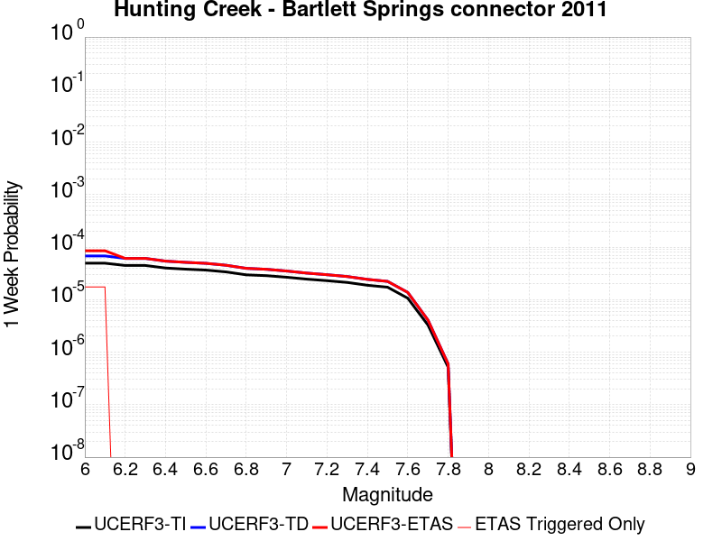 | 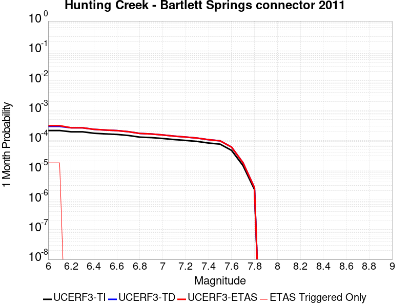 | 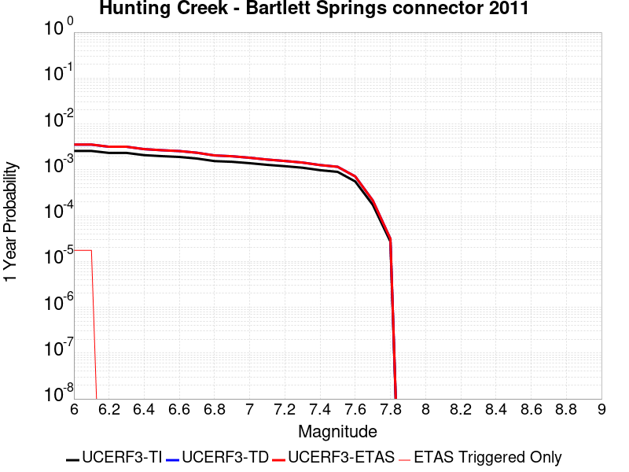 | 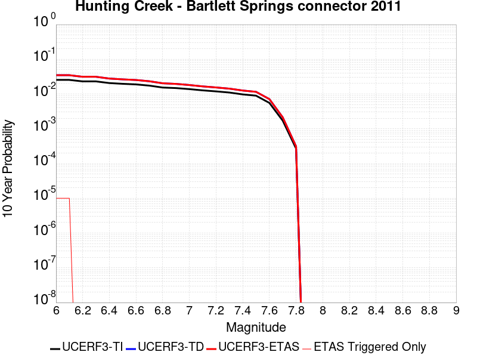 |

| Magnitude | 1 wk TI Prob | 1 wk TD Prob | 1 wk ETAS Prob | 1 wk ETAS/TD Gain | 1 wk ETAS Triggered Only | 1 mo TI Prob | 1 mo TD Prob | 1 mo ETAS Prob | 1 mo ETAS/TD Gain | 1 mo ETAS Triggered Only | 1 yr TI Prob | 1 yr TD Prob | 1 yr ETAS Prob | 1 yr ETAS/TD Gain | 1 yr ETAS Triggered Only | 10 yr TI Prob | 10 yr TD Prob | 10 yr ETAS Prob | 10 yr ETAS/TD Gain | 10 yr ETAS Triggered Only |
|-----|-----|-----|-----|-----|-----|-----|-----|-----|-----|-----|-----|-----|-----|-----|-----|-----|-----|-----|-----|-----|
| 6.0 | 4.940016E-5 | 6.786822E-5 | 8.531082E-5 | 1.257007 | 1.7443788E-5 | 2.1169778E-4 | 2.9083234E-4 | 3.0827103E-4 | 1.0599614 | 1.7443788E-5 | 0.002574374 | 0.003535177 | 0.0035525593 | 1.0049169 | 1.7443788E-5 | 0.025447546 | 0.034773834 | 0.034790672 | 1.0004842 | 1.7443788E-5 |
| 6.1 | 4.940016E-5 | 6.786822E-5 | 8.531082E-5 | 1.257007 | 1.7443788E-5 | 2.1169778E-4 | 2.9083234E-4 | 3.0827103E-4 | 1.0599614 | 1.7443788E-5 | 0.002574374 | 0.003535177 | 0.0035525593 | 1.0049169 | 1.7443788E-5 | 0.025447546 | 0.034773834 | 0.034790672 | 1.0004842 | 1.7443788E-5 |
| 6.2 | 4.472471E-5 | 6.1002804E-5 | 6.1002804E-5 | 1.0 | 0.0 | 1.9166325E-4 | 2.6141506E-4 | 2.6141506E-4 | 1.0 | 0.0 | 0.0023310026 | 0.003178107 | 0.003178107 | 1.0 | 0.0 | 0.02306703 | 0.031316914 | 0.031316914 | 1.0 | 0.0 |
| 6.3 | 4.472471E-5 | 6.1002804E-5 | 6.1002804E-5 | 1.0 | 0.0 | 1.9166325E-4 | 2.6141506E-4 | 2.6141506E-4 | 1.0 | 0.0 | 0.0023310026 | 0.003178107 | 0.003178107 | 1.0 | 0.0 | 0.02306703 | 0.031316914 | 0.031316914 | 1.0 | 0.0 |
| 6.4 | 4.0001003E-5 | 5.4103755E-5 | 5.4103755E-5 | 1.0 | 0.0 | 1.714216E-4 | 2.31853E-4 | 2.31853E-4 | 1.0 | 0.0 | 0.0020850603 | 0.0028191248 | 0.0028191248 | 1.0 | 0.0 | 0.02065605 | 0.027828315 | 0.027828315 | 1.0 | 0.0 |
| 6.5 | 3.8033053E-5 | 5.1266547E-5 | 5.1266547E-5 | 1.0 | 0.0 | 1.6298861E-4 | 2.1969559E-4 | 2.1969559E-4 | 1.0 | 0.0 | 0.0019825802 | 0.0026714746 | 0.0026714746 | 1.0 | 0.0 | 0.019649856 | 0.026390454 | 0.026390454 | 1.0 | 0.0 |
| 6.6 | 3.653754E-5 | 4.913017E-5 | 4.913017E-5 | 1.0 | 0.0 | 1.5658008E-4 | 2.1054115E-4 | 2.1054115E-4 | 1.0 | 0.0 | 0.0019046954 | 0.0025602852 | 0.0025602852 | 1.0 | 0.0 | 0.018884527 | 0.025306415 | 0.025306415 | 1.0 | 0.0 |
| 6.7 | 3.372024E-5 | 4.514011E-5 | 4.514011E-5 | 1.0 | 0.0 | 1.4450731E-4 | 1.9344354E-4 | 1.9344354E-4 | 1.0 | 0.0 | 0.0017579567 | 0.002352639 | 0.002352639 | 1.0 | 0.0 | 0.017441148 | 0.023278099 | 0.023278099 | 1.0 | 0.0 |
| 6.8 | 2.9650024E-5 | 3.9411374E-5 | 3.9411374E-5 | 1.0 | 0.0 | 1.2706534E-4 | 1.6889503E-4 | 1.6889503E-4 | 1.0 | 0.0 | 0.0015459227 | 0.0020543463 | 0.0020543463 | 1.0 | 0.0 | 0.015352124 | 0.020351216 | 0.020351216 | 1.0 | 0.0 |
| 6.9 | 2.860775E-5 | 3.7812544E-5 | 3.7812544E-5 | 1.0 | 0.0 | 1.2259888E-4 | 1.6204377E-4 | 1.6204377E-4 | 1.0 | 0.0 | 0.0014916194 | 0.001971107 | 0.001971107 | 1.0 | 0.0 | 0.014816469 | 0.01953584 | 0.01953584 | 1.0 | 0.0 |
| 7.0 | 2.6696067E-5 | 3.506726E-5 | 3.506726E-5 | 1.0 | 0.0 | 1.144067E-4 | 1.5027967E-4 | 1.5027967E-4 | 1.0 | 0.0 | 0.0013920115 | 0.0018281302 | 0.0018281302 | 1.0 | 0.0 | 0.013833242 | 0.018131364 | 0.018131364 | 1.0 | 0.0 |
| 7.1 | 2.456087E-5 | 3.2013093E-5 | 3.2013093E-5 | 1.0 | 0.0 | 1.0525662E-4 | 1.371918E-4 | 1.371918E-4 | 1.0 | 0.0 | 0.001280746 | 0.0016690396 | 0.0016690396 | 1.0 | 0.0 | 0.012733897 | 0.016566366 | 0.016566366 | 1.0 | 0.0 |
| 7.2 | 2.295761E-5 | 2.9822932E-5 | 2.9822932E-5 | 1.0 | 0.0 | 9.8386045E-5 | 1.2780636E-4 | 1.2780636E-4 | 1.0 | 0.0 | 0.0011971919 | 0.001554941 | 0.001554941 | 1.0 | 0.0 | 0.011907627 | 0.015442089 | 0.015442089 | 1.0 | 0.0 |
| 7.3 | 2.1256936E-5 | 2.7541912E-5 | 2.7541912E-5 | 1.0 | 0.0 | 9.109797E-5 | 1.1803147E-4 | 1.1803147E-4 | 1.0 | 0.0 | 0.0011085535 | 0.0014360948 | 0.0014360948 | 1.0 | 0.0 | 0.011030397 | 0.014269472 | 0.014269472 | 1.0 | 0.0 |
| 7.4 | 1.8784336E-5 | 2.4306766E-5 | 2.4306766E-5 | 1.0 | 0.0 | 8.050181E-5 | 1.0416774E-4 | 1.0416774E-4 | 1.0 | 0.0 | 9.796688E-4 | 0.001267512 | 0.001267512 | 1.0 | 0.0 | 0.009753612 | 0.012603902 | 0.012603902 | 1.0 | 0.0 |
| 7.5 | 1.7248298E-5 | 2.2268887E-5 | 2.2268887E-5 | 1.0 | 0.0 | 7.391918E-5 | 9.543464E-5 | 9.543464E-5 | 1.0 | 0.0 | 8.9959445E-4 | 0.0011613049 | 0.0011613049 | 1.0 | 0.0 | 0.008959615 | 0.01155334 | 0.01155334 | 1.0 | 0.0 |
| 7.6 | 1.0653709E-5 | 1.3722118E-5 | 1.3722118E-5 | 1.0 | 0.0 | 4.5657955E-5 | 5.8807767E-5 | 5.8807767E-5 | 1.0 | 0.0 | 5.557438E-4 | 7.157521E-4 | 7.157521E-4 | 1.0 | 0.0 | 0.0055435603 | 0.0071348166 | 0.0071348166 | 1.0 | 0.0 |
| 7.7 | 3.286316E-6 | 4.0903437E-6 | 4.0903437E-6 | 1.0 | 0.0 | 1.4084137E-5 | 1.7529928E-5 | 1.7529928E-5 | 1.0 | 0.0 | 1.7146087E-4 | 2.1340612E-4 | 2.1340612E-4 | 1.0 | 0.0 | 0.0017132863 | 0.0021320276 | 0.0021320276 | 1.0 | 0.0 |
| 7.8 | 5.1855085E-7 | 5.9720696E-7 | 5.9720696E-7 | 1.0 | 0.0 | 2.222359E-6 | 2.5594559E-6 | 2.5594559E-6 | 1.0 | 0.0 | 2.7056883E-5 | 3.116094E-5 | 3.116094E-5 | 1.0 | 0.0 | 2.705359E-4 | 3.1156495E-4 | 3.1156495E-4 | 1.0 | 0.0 |

## San Pedro Basin
*[(top)](#table-of-contents)*

| 1 Week | 1 Month | 1 Year | 10 Year |
|-----|-----|-----|-----|
|  |  |  |  |

| Magnitude | 1 wk TI Prob | 1 wk TD Prob | 1 wk ETAS Prob | 1 wk ETAS/TD Gain | 1 wk ETAS Triggered Only | 1 mo TI Prob | 1 mo TD Prob | 1 mo ETAS Prob | 1 mo ETAS/TD Gain | 1 mo ETAS Triggered Only | 1 yr TI Prob | 1 yr TD Prob | 1 yr ETAS Prob | 1 yr ETAS/TD Gain | 1 yr ETAS Triggered Only | 10 yr TI Prob | 10 yr TD Prob | 10 yr ETAS Prob | 10 yr ETAS/TD Gain | 10 yr ETAS Triggered Only |
|-----|-----|-----|-----|-----|-----|-----|-----|-----|-----|-----|-----|-----|-----|-----|-----|-----|-----|-----|-----|-----|
| 6.0 | 5.3449043E-5 | 6.336954E-5 | 8.081222E-5 | 1.2752534 | 1.7443788E-5 | 2.2904722E-4 | 2.715589E-4 | 2.8899798E-4 | 1.0642183 | 1.7443788E-5 | 0.0027850836 | 0.0033018254 | 0.0033192115 | 1.0052656 | 1.7443788E-5 | 0.027504366 | 0.03258945 | 0.032606326 | 1.0005178 | 1.7443788E-5 |
| 6.1 | 5.3449043E-5 | 6.336954E-5 | 8.081222E-5 | 1.2752534 | 1.7443788E-5 | 2.2904722E-4 | 2.715589E-4 | 2.8899798E-4 | 1.0642183 | 1.7443788E-5 | 0.0027850836 | 0.0033018254 | 0.0033192115 | 1.0052656 | 1.7443788E-5 | 0.027504366 | 0.03258945 | 0.032606326 | 1.0005178 | 1.7443788E-5 |
| 6.2 | 2.3189454E-5 | 2.6642796E-5 | 2.6642796E-5 | 1.0 | 0.0 | 9.9379584E-5 | 1.14178685E-4 | 1.14178685E-4 | 1.0 | 0.0 | 0.0012092749 | 0.0013892864 | 0.0013892864 | 1.0 | 0.0 | 0.012027155 | 0.013810883 | 0.013810883 | 1.0 | 0.0 |
| 6.3 | 2.3189454E-5 | 2.6642796E-5 | 2.6642796E-5 | 1.0 | 0.0 | 9.9379584E-5 | 1.14178685E-4 | 1.14178685E-4 | 1.0 | 0.0 | 0.0012092749 | 0.0013892864 | 0.0013892864 | 1.0 | 0.0 | 0.012027155 | 0.013810883 | 0.013810883 | 1.0 | 0.0 |
| 6.4 | 1.966056E-5 | 2.2463413E-5 | 2.2463413E-5 | 1.0 | 0.0 | 8.425682E-5 | 9.626844E-5 | 9.626844E-5 | 1.0 | 0.0 | 0.001025344 | 0.0011714783 | 0.0011714783 | 1.0 | 0.0 | 0.010206259 | 0.011657117 | 0.011657117 | 1.0 | 0.0 |
| 6.5 | 1.7342953E-5 | 1.9745148E-5 | 1.9745148E-5 | 1.0 | 0.0 | 7.4324824E-5 | 8.4619525E-5 | 8.4619525E-5 | 1.0 | 0.0 | 9.04529E-4 | 0.0010297928 | 0.0010297928 | 1.0 | 0.0 | 0.009008561 | 0.010253931 | 0.010253931 | 1.0 | 0.0 |
| 6.6 | 1.439804E-5 | 1.6322716E-5 | 1.6322716E-5 | 1.0 | 0.0 | 6.170443E-5 | 6.99528E-5 | 6.99528E-5 | 1.0 | 0.0 | 7.509924E-4 | 8.513747E-4 | 8.513747E-4 | 1.0 | 0.0 | 0.0074845953 | 0.008484332 | 0.008484332 | 1.0 | 0.0 |
| 6.7 | 1.2634884E-5 | 1.4285297E-5 | 1.4285297E-5 | 1.0 | 0.0 | 5.414838E-5 | 6.1221435E-5 | 6.1221435E-5 | 1.0 | 0.0 | 6.590571E-4 | 7.4514654E-4 | 7.4514654E-4 | 1.0 | 0.0 | 0.006571059 | 0.007429501 | 0.007429501 | 1.0 | 0.0 |
| 6.8 | 1.146091E-5 | 1.2933192E-5 | 1.2933192E-5 | 1.0 | 0.0 | 4.911726E-5 | 5.5426954E-5 | 5.5426954E-5 | 1.0 | 0.0 | 5.9783855E-4 | 6.7464396E-4 | 6.7464396E-4 | 1.0 | 0.0 | 0.0059623276 | 0.006728899 | 0.006728899 | 1.0 | 0.0 |
| 6.9 | 9.109035E-6 | 1.0235011E-5 | 1.0235011E-5 | 1.0 | 0.0 | 3.9038136E-5 | 4.3863754E-5 | 4.3863754E-5 | 1.0 | 0.0 | 4.7518566E-4 | 5.3393835E-4 | 5.3393835E-4 | 1.0 | 0.0 | 0.0047417083 | 0.005329309 | 0.005329309 | 1.0 | 0.0 |
| 7.0 | 5.9351028E-6 | 6.583964E-6 | 6.583964E-6 | 1.0 | 0.0 | 2.5435906E-5 | 2.8216817E-5 | 2.8216817E-5 | 1.0 | 0.0 | 3.0963816E-4 | 3.435092E-4 | 3.435092E-4 | 1.0 | 0.0 | 0.0030920706 | 0.0034320992 | 0.0034320992 | 1.0 | 0.0 |
| 7.1 | 2.1557585E-6 | 2.209648E-6 | 2.209648E-6 | 1.0 | 0.0 | 9.238933E-6 | 9.469887E-6 | 9.469887E-6 | 1.0 | 0.0 | 1.1247819E-4 | 1.1528993E-4 | 1.1528993E-4 | 1.0 | 0.0 | 0.0011242128 | 0.0011523166 | 0.0011523166 | 1.0 | 0.0 |
| 7.2 | 2.1251979E-6 | 2.1779945E-6 | 2.1779945E-6 | 1.0 | 0.0 | 9.107958E-6 | 9.334229E-6 | 9.334229E-6 | 1.0 | 0.0 | 1.1088375E-4 | 1.1363847E-4 | 1.1363847E-4 | 1.0 | 0.0 | 0.0011082845 | 0.0011358189 | 0.0011358189 | 1.0 | 0.0 |
| 7.3 | 1.7145798E-6 | 1.7442874E-6 | 1.7442874E-6 | 1.0 | 0.0 | 7.3481783E-6 | 7.4754967E-6 | 7.4754967E-6 | 1.0 | 0.0 | 8.94604E-5 | 9.1010465E-5 | 9.1010465E-5 | 1.0 | 0.0 | 8.9424395E-4 | 9.0974104E-4 | 9.0974104E-4 | 1.0 | 0.0 |
| 7.4 | 1.4467993E-6 | 1.4641868E-6 | 1.4641868E-6 | 1.0 | 0.0 | 6.200554E-6 | 6.2750714E-6 | 6.2750714E-6 | 1.0 | 0.0 | 7.548913E-5 | 7.639639E-5 | 7.639639E-5 | 1.0 | 0.0 | 7.546349E-4 | 7.6370855E-4 | 7.6370855E-4 | 1.0 | 0.0 |
| 7.5 | 1.2803735E-6 | 1.2931497E-6 | 1.2931497E-6 | 1.0 | 0.0 | 5.487303E-6 | 5.5420587E-6 | 5.5420587E-6 | 1.0 | 0.0 | 6.680587E-5 | 6.7472545E-5 | 6.7472545E-5 | 1.0 | 0.0 | 6.678579E-4 | 6.7452766E-4 | 6.7452766E-4 | 1.0 | 0.0 |
| 7.6 | 6.755009E-7 | 6.769465E-7 | 6.769465E-7 | 1.0 | 0.0 | 2.8950008E-6 | 2.9011965E-6 | 2.9011965E-6 | 1.0 | 0.0 | 3.5246063E-5 | 3.5321555E-5 | 3.5321555E-5 | 1.0 | 0.0 | 3.5240475E-4 | 3.5316512E-4 | 3.5316512E-4 | 1.0 | 0.0 |
| 7.7 | 6.211885E-8 | 4.569953E-8 | 4.569953E-8 | 1.0 | 0.0 | 2.6622362E-7 | 1.9585512E-7 | 1.9585512E-7 | 1.0 | 0.0 | 3.2412677E-6 | 2.3845337E-6 | 2.3845337E-6 | 1.0 | 0.0 | 3.2412205E-5 | 2.3845101E-5 | 2.3845101E-5 | 1.0 | 0.0 |
| 7.8 | 2.6580573E-9 | 1.5138163E-9 | 1.5138163E-9 | 1.0 | 0.0 | 1.1391674E-8 | 6.487784E-9 | 6.487784E-9 | 1.0 | 0.0 | 1.3869362E-7 | 7.898877E-8 | 7.898877E-8 | 1.0 | 0.0 | 1.3869354E-6 | 7.898877E-7 | 7.898877E-7 | 1.0 | 0.0 |

## San Jacinto (Borrego)
*[(top)](#table-of-contents)*

| 1 Week | 1 Month | 1 Year | 10 Year |
|-----|-----|-----|-----|
| 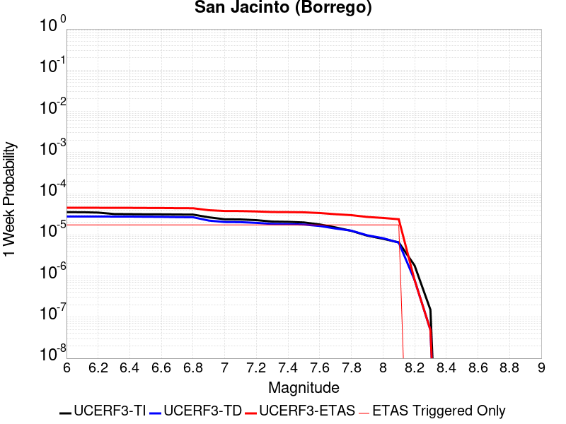 | 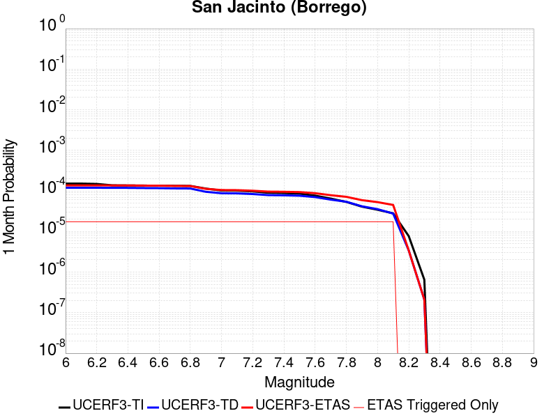 | 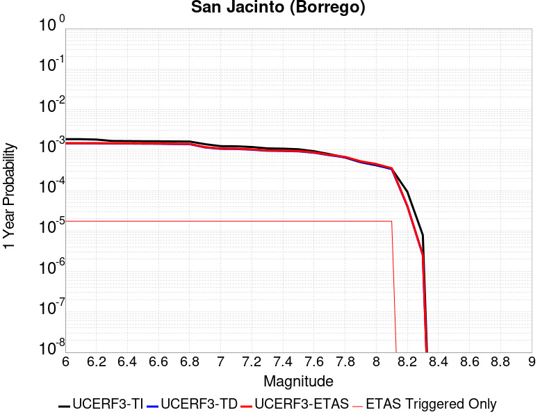 | 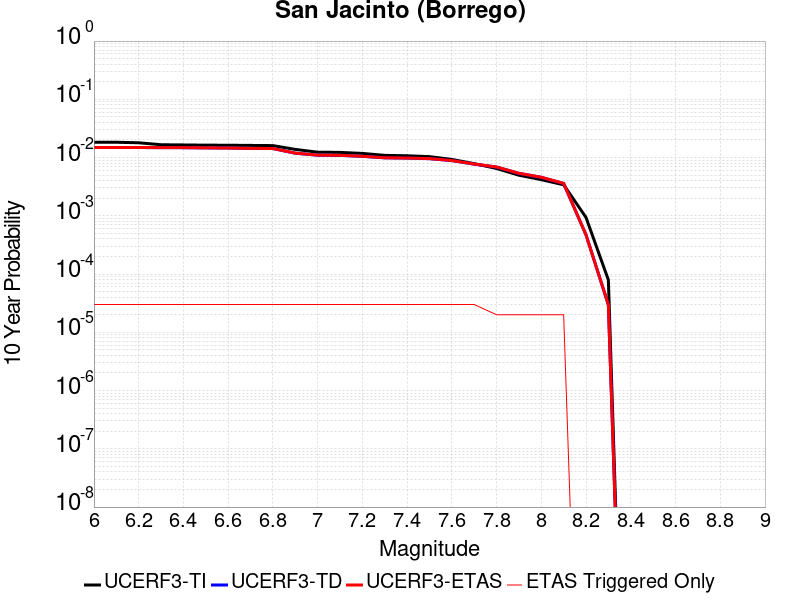 |

| Magnitude | 1 wk TI Prob | 1 wk TD Prob | 1 wk ETAS Prob | 1 wk ETAS/TD Gain | 1 wk ETAS Triggered Only | 1 mo TI Prob | 1 mo TD Prob | 1 mo ETAS Prob | 1 mo ETAS/TD Gain | 1 mo ETAS Triggered Only | 1 yr TI Prob | 1 yr TD Prob | 1 yr ETAS Prob | 1 yr ETAS/TD Gain | 1 yr ETAS Triggered Only | 10 yr TI Prob | 10 yr TD Prob | 10 yr ETAS Prob | 10 yr ETAS/TD Gain | 10 yr ETAS Triggered Only |
|-----|-----|-----|-----|-----|-----|-----|-----|-----|-----|-----|-----|-----|-----|-----|-----|-----|-----|-----|-----|-----|
| 6.0 | 3.543992E-5 | 2.7926513E-5 | 4.5369812E-5 | 1.6246144 | 1.7443788E-5 | 1.5187653E-4 | 1.1967963E-4 | 1.3712133E-4 | 1.1457366 | 1.7443788E-5 | 0.0018475284 | 0.0014561379 | 0.0014735563 | 1.011962 | 1.7443788E-5 | 0.018322436 | 0.014869647 | 0.014886832 | 1.0011556 | 1.7443788E-5 |
| 6.1 | 3.542281E-5 | 2.7926513E-5 | 4.5369812E-5 | 1.6246144 | 1.7443788E-5 | 1.5180321E-4 | 1.1967963E-4 | 1.3712133E-4 | 1.1457366 | 1.7443788E-5 | 0.0018466372 | 0.0014561379 | 0.0014735563 | 1.011962 | 1.7443788E-5 | 0.018313672 | 0.014869647 | 0.014886832 | 1.0011556 | 1.7443788E-5 |
| 6.2 | 3.4688688E-5 | 2.7926511E-5 | 4.5369812E-5 | 1.6246144 | 1.7443788E-5 | 1.4865733E-4 | 1.1967963E-4 | 1.3712133E-4 | 1.1457366 | 1.7443788E-5 | 0.0018084005 | 0.0014561379 | 0.0014735562 | 1.011962 | 1.7443788E-5 | 0.017937548 | 0.014869647 | 0.014886831 | 1.0011556 | 1.7443788E-5 |
| 6.3 | 3.2087122E-5 | 2.7771865E-5 | 4.5215165E-5 | 1.6280926 | 1.7443788E-5 | 1.3750899E-4 | 1.1901691E-4 | 1.3645862E-4 | 1.1465482 | 1.7443788E-5 | 0.0016728862 | 0.00144808 | 0.0014654985 | 1.0120287 | 1.7443788E-5 | 0.016603488 | 0.014790683 | 0.014807869 | 1.0011619 | 1.7443788E-5 |
| 6.4 | 3.1828724E-5 | 2.7738852E-5 | 4.5182154E-5 | 1.6288402 | 1.7443788E-5 | 1.364017E-4 | 1.1887544E-4 | 1.3631716E-4 | 1.1467226 | 1.7443788E-5 | 0.0016594254 | 0.0014463598 | 0.0014637784 | 1.012043 | 1.7443788E-5 | 0.016470885 | 0.014773762 | 0.014790948 | 1.0011632 | 1.7443788E-5 |
| 6.5 | 3.1563577E-5 | 2.747857E-5 | 4.492188E-5 | 1.6347967 | 1.7443788E-5 | 1.3526545E-4 | 1.1776006E-4 | 1.3520179E-4 | 1.1481125 | 1.7443788E-5 | 0.0016456128 | 0.0014327979 | 0.0014502167 | 1.0121572 | 1.7443788E-5 | 0.0163348 | 0.014640348 | 0.0146575365 | 1.0011741 | 1.7443788E-5 |
| 6.6 | 3.1467625E-5 | 2.7322796E-5 | 4.4766108E-5 | 1.638416 | 1.7443788E-5 | 1.3485427E-4 | 1.1709251E-4 | 1.3453425E-4 | 1.148957 | 1.7443788E-5 | 0.0016406142 | 0.0014246812 | 0.0014421002 | 1.0122266 | 1.7443788E-5 | 0.016285548 | 0.014560594 | 0.014577785 | 1.0011805 | 1.7443788E-5 |
| 6.7 | 3.1223695E-5 | 2.6940816E-5 | 4.438413E-5 | 1.6474681 | 1.7443788E-5 | 1.3380898E-4 | 1.15455594E-4 | 1.3289737E-4 | 1.1510692 | 1.7443788E-5 | 0.0016279068 | 0.0014047775 | 0.0014221969 | 1.0124 | 1.7443788E-5 | 0.01616033 | 0.014364966 | 0.014382159 | 1.0011969 | 1.7443788E-5 |
| 6.8 | 3.1015585E-5 | 2.6761822E-5 | 4.4205142E-5 | 1.6517987 | 1.7443788E-5 | 1.3291716E-4 | 1.1468855E-4 | 1.3213034E-4 | 1.1520796 | 1.7443788E-5 | 0.001617065 | 0.0013954508 | 0.0014128702 | 1.012483 | 1.7443788E-5 | 0.016053487 | 0.014272246 | 0.014289441 | 1.0012047 | 1.7443788E-5 |
| 6.9 | 2.6641965E-5 | 2.2184247E-5 | 3.962765E-5 | 1.7862967 | 1.7443788E-5 | 1.1417485E-4 | 9.50719E-5 | 1.12514026E-4 | 1.1834625 | 1.7443788E-5 | 0.0013891924 | 0.0011568897 | 0.0011743132 | 1.0150608 | 1.7443788E-5 | 0.0138054015 | 0.011882438 | 0.011899675 | 1.0014505 | 1.7443788E-5 |
| 7.0 | 2.3854353E-5 | 2.0479023E-5 | 3.7922455E-5 | 1.8517706 | 1.7443788E-5 | 1.02228936E-4 | 8.77643E-5 | 1.0520656E-4 | 1.1987398 | 1.7443788E-5 | 0.0012439266 | 0.0010680092 | 0.0010854343 | 1.0163156 | 1.7443788E-5 | 0.012369866 | 0.0109828 | 0.011000053 | 1.0015708 | 1.7443788E-5 |
| 7.1 | 2.3672901E-5 | 2.031551E-5 | 3.7758942E-5 | 1.8586264 | 1.7443788E-5 | 1.0145135E-4 | 8.7063585E-5 | 1.0450585E-4 | 1.2003394 | 1.7443788E-5 | 0.0012344702 | 0.0010594862 | 0.0010769116 | 1.016447 | 1.7443788E-5 | 0.0122763505 | 0.010897976 | 0.01091523 | 1.0015832 | 1.7443788E-5 |
| 7.2 | 2.2717244E-5 | 1.9542893E-5 | 3.6986337E-5 | 1.8925724 | 1.7443788E-5 | 9.735599E-5 | 8.375258E-5 | 1.01194906E-4 | 1.2082602 | 1.7443788E-5 | 0.0011846646 | 0.001019213 | 0.001036639 | 1.0170975 | 1.7443788E-5 | 0.01178369 | 0.010495341 | 0.0105126025 | 1.0016446 | 1.7443788E-5 |
| 7.3 | 2.1016205E-5 | 1.8384526E-5 | 3.582799E-5 | 1.9488125 | 1.7443788E-5 | 9.006634E-5 | 7.878846E-5 | 9.623087E-5 | 1.2213829 | 1.7443788E-5 | 0.001096006 | 9.5882936E-4 | 9.7625644E-4 | 1.0181754 | 1.7443788E-5 | 0.010906163 | 0.009890967 | 0.009908238 | 1.0017462 | 1.7443788E-5 |
| 7.4 | 2.0683625E-5 | 1.8187047E-5 | 3.5630517E-5 | 1.959115 | 1.7443788E-5 | 8.86411E-5 | 7.794217E-5 | 9.5384596E-5 | 1.2237868 | 1.7443788E-5 | 0.001078671 | 9.485349E-4 | 9.6596207E-4 | 1.0183728 | 1.7443788E-5 | 0.010734501 | 0.009787692 | 0.009804965 | 1.0017648 | 1.7443788E-5 |
| 7.5 | 1.9993966E-5 | 1.7782075E-5 | 3.5225552E-5 | 1.9809586 | 1.7443788E-5 | 8.568561E-5 | 7.620667E-5 | 9.3649134E-5 | 1.2288836 | 1.7443788E-5 | 0.001042723 | 9.2742336E-4 | 9.4485097E-4 | 1.0187914 | 1.7443788E-5 | 0.010378438 | 0.009574614 | 0.009591891 | 1.0018045 | 1.7443788E-5 |
| 7.6 | 1.788966E-5 | 1.6435291E-5 | 3.387879E-5 | 2.0613441 | 1.7443788E-5 | 7.666772E-5 | 7.043507E-5 | 8.7877626E-5 | 1.2476403 | 1.7443788E-5 | 9.3302975E-4 | 8.572113E-4 | 8.746401E-4 | 1.020332 | 1.7443788E-5 | 0.00929122 | 0.008866487 | 0.008883776 | 1.0019499 | 1.7443788E-5 |
| 7.7 | 1.5125781E-5 | 1.4237377E-5 | 3.1680916E-5 | 2.2251933 | 1.7443788E-5 | 6.4823165E-5 | 6.1015908E-5 | 7.845863E-5 | 1.2858717 | 1.7443788E-5 | 7.889362E-4 | 7.426163E-4 | 7.600471E-4 | 1.0234722 | 1.7443788E-5 | 0.007861412 | 0.0077142045 | 0.0077315136 | 1.0022438 | 1.7443788E-5 |
| 7.8 | 1.250089E-5 | 1.26304985E-5 | 3.0074065E-5 | 2.3810673 | 1.7443788E-5 | 5.3574146E-5 | 5.412959E-5 | 7.157243E-5 | 1.3222423 | 1.7443788E-5 | 6.5207E-4 | 6.588291E-4 | 6.762614E-4 | 1.0264595 | 1.7443788E-5 | 0.006501599 | 0.0068677636 | 0.0068850876 | 1.0025225 | 1.7443788E-5 |
| 7.9 | 9.561E-6 | 9.754616E-6 | 2.7198234E-5 | 2.7882423 | 1.7443788E-5 | 4.0975072E-5 | 4.1804833E-5 | 5.924789E-5 | 1.4172498 | 1.7443788E-5 | 4.987573E-4 | 5.088555E-4 | 5.2629045E-4 | 1.034263 | 1.7443788E-5 | 0.0049763937 | 0.0053523467 | 0.0053696968 | 1.0032417 | 1.7443788E-5 |
| 8.0 | 8.01699E-6 | 8.293488E-6 | 2.573713E-5 | 3.103294 | 1.7443788E-5 | 3.4358076E-5 | 3.554304E-5 | 5.2986205E-5 | 1.4907619 | 1.7443788E-5 | 4.1822926E-4 | 4.3265108E-4 | 4.500873E-4 | 1.040301 | 1.7443788E-5 | 0.0041744304 | 0.004573375 | 0.004590739 | 1.0037968 | 1.7443788E-5 |
| 8.1 | 6.541947E-6 | 6.4622354E-6 | 2.390591E-5 | 3.699325 | 1.7443788E-5 | 2.8036617E-5 | 2.7695003E-5 | 4.513831E-5 | 1.6298358 | 1.7443788E-5 | 3.4129233E-4 | 3.37135E-4 | 3.545729E-4 | 1.0517238 | 1.7443788E-5 | 0.0034076865 | 0.0035806994 | 0.0035980807 | 1.0048542 | 1.7443788E-5 |
| 8.2 | 1.7968189E-6 | 7.9713476E-7 | 7.9713476E-7 | 1.0 | 0.0 | 7.70063E-6 | 3.4162877E-6 | 3.4162877E-6 | 1.0 | 0.0 | 9.3751136E-5 | 4.159253E-5 | 4.159253E-5 | 1.0 | 0.0 | 9.371159E-4 | 4.712058E-4 | 4.712058E-4 | 1.0 | 0.0 |
| 8.3 | 1.5167889E-7 | 4.897714E-8 | 4.897714E-8 | 1.0 | 0.0 | 6.500522E-7 | 2.09902E-7 | 2.09902E-7 | 1.0 | 0.0 | 7.9143565E-6 | 2.5555544E-6 | 2.5555544E-6 | 1.0 | 0.0 | 7.914075E-5 | 2.969505E-5 | 2.969505E-5 | 1.0 | 0.0 |

## Monterey Bay-Tularcitos
*[(top)](#table-of-contents)*

| 1 Week | 1 Month | 1 Year | 10 Year |
|-----|-----|-----|-----|
| 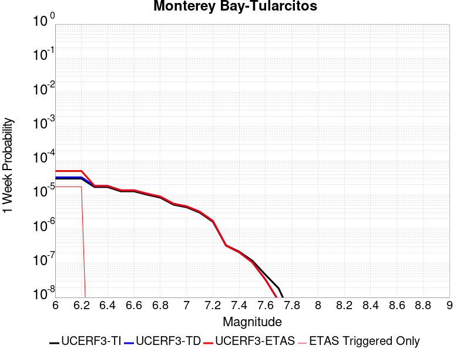 | 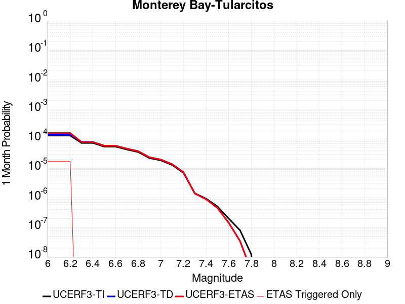 | 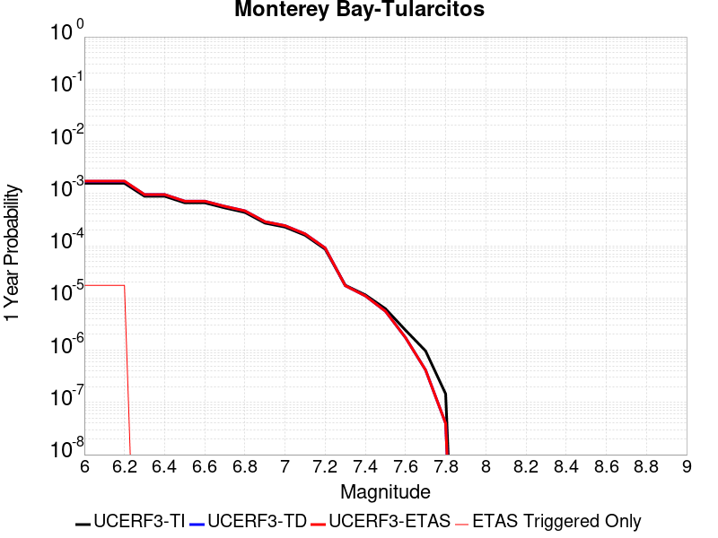 | 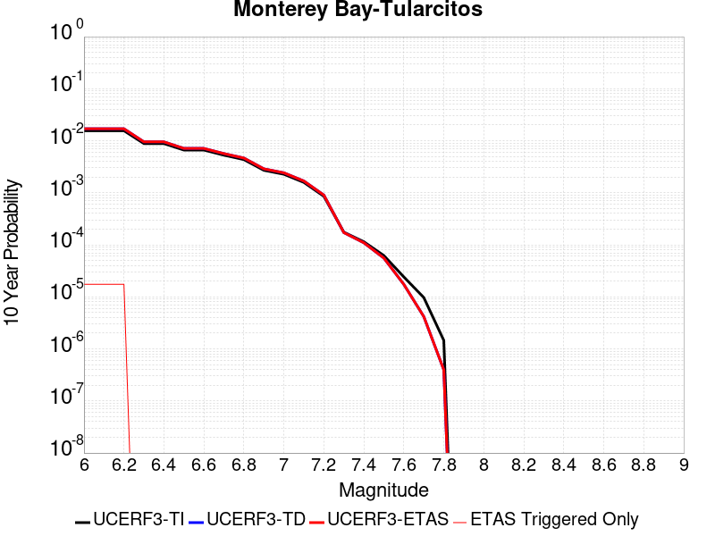 |

| Magnitude | 1 wk TI Prob | 1 wk TD Prob | 1 wk ETAS Prob | 1 wk ETAS/TD Gain | 1 wk ETAS Triggered Only | 1 mo TI Prob | 1 mo TD Prob | 1 mo ETAS Prob | 1 mo ETAS/TD Gain | 1 mo ETAS Triggered Only | 1 yr TI Prob | 1 yr TD Prob | 1 yr ETAS Prob | 1 yr ETAS/TD Gain | 1 yr ETAS Triggered Only | 10 yr TI Prob | 10 yr TD Prob | 10 yr ETAS Prob | 10 yr ETAS/TD Gain | 10 yr ETAS Triggered Only |
|-----|-----|-----|-----|-----|-----|-----|-----|-----|-----|-----|-----|-----|-----|-----|-----|-----|-----|-----|-----|-----|
| 6.0 | 3.0131365E-5 | 3.279877E-5 | 5.0241986E-5 | 1.5318253 | 1.7443788E-5 | 1.2912804E-4 | 1.4055918E-4 | 1.5800052E-4 | 1.1240853 | 1.7443788E-5 | 0.001571 | 0.0017100703 | 0.0017274842 | 1.0101832 | 1.7443788E-5 | 0.015599402 | 0.016979916 | 0.016997064 | 1.0010098 | 1.7443788E-5 |
| 6.1 | 3.0131365E-5 | 3.279877E-5 | 5.0241986E-5 | 1.5318253 | 1.7443788E-5 | 1.2912804E-4 | 1.4055918E-4 | 1.5800052E-4 | 1.1240853 | 1.7443788E-5 | 0.001571 | 0.0017100703 | 0.0017274842 | 1.0101832 | 1.7443788E-5 | 0.015599402 | 0.016979916 | 0.016997064 | 1.0010098 | 1.7443788E-5 |
| 6.2 | 3.0131365E-5 | 3.279877E-5 | 5.0241986E-5 | 1.5318253 | 1.7443788E-5 | 1.2912804E-4 | 1.4055918E-4 | 1.5800052E-4 | 1.1240853 | 1.7443788E-5 | 0.001571 | 0.0017100703 | 0.0017274842 | 1.0101832 | 1.7443788E-5 | 0.015599402 | 0.016979916 | 0.016997064 | 1.0010098 | 1.7443788E-5 |
| 6.3 | 1.6998249E-5 | 1.8330798E-5 | 1.8330798E-5 | 1.0 | 0.0 | 7.28476E-5 | 7.85583E-5 | 7.85583E-5 | 1.0 | 0.0 | 8.865586E-4 | 9.5604634E-4 | 9.5604634E-4 | 1.0 | 0.0 | 0.0088303005 | 0.009521258 | 0.009521258 | 1.0 | 0.0 |
| 6.4 | 1.6998249E-5 | 1.8330798E-5 | 1.8330798E-5 | 1.0 | 0.0 | 7.28476E-5 | 7.85583E-5 | 7.85583E-5 | 1.0 | 0.0 | 8.865586E-4 | 9.5604634E-4 | 9.5604634E-4 | 1.0 | 0.0 | 0.0088303005 | 0.009521258 | 0.009521258 | 1.0 | 0.0 |
| 6.5 | 1.27470785E-5 | 1.3693312E-5 | 1.3693312E-5 | 1.0 | 0.0 | 5.4629192E-5 | 5.8684363E-5 | 5.8684363E-5 | 1.0 | 0.0 | 6.649074E-4 | 7.1425823E-4 | 7.1425823E-4 | 1.0 | 0.0 | 0.0066292146 | 0.007120678 | 0.007120678 | 1.0 | 0.0 |
| 6.6 | 1.2739422E-5 | 1.36854E-5 | 1.36854E-5 | 1.0 | 0.0 | 5.4596385E-5 | 5.8650454E-5 | 5.8650454E-5 | 1.0 | 0.0 | 6.645082E-4 | 7.1384566E-4 | 7.1384566E-4 | 1.0 | 0.0 | 0.0066252467 | 0.007116579 | 0.007116579 | 1.0 | 0.0 |
| 6.7 | 1.0160109E-5 | 1.0885755E-5 | 1.0885755E-5 | 1.0 | 0.0 | 4.35426E-5 | 4.665244E-5 | 4.665244E-5 | 1.0 | 0.0 | 5.300022E-4 | 5.6785246E-4 | 5.6785246E-4 | 1.0 | 0.0 | 0.005287399 | 0.0056647263 | 0.0056647263 | 1.0 | 0.0 |
| 6.8 | 8.349859E-6 | 8.932587E-6 | 8.932587E-6 | 1.0 | 0.0 | 3.578462E-5 | 3.8281985E-5 | 3.8281985E-5 | 1.0 | 0.0 | 4.3559066E-4 | 4.6598914E-4 | 4.6598914E-4 | 1.0 | 0.0 | 0.004347378 | 0.004650685 | 0.004650685 | 1.0 | 0.0 |
| 6.9 | 5.193639E-6 | 5.53643E-6 | 5.53643E-6 | 1.0 | 0.0 | 2.2258262E-5 | 2.372736E-5 | 2.372736E-5 | 1.0 | 0.0 | 2.7096065E-4 | 2.8884556E-4 | 2.8884556E-4 | 1.0 | 0.0 | 0.0027063051 | 0.0028850222 | 0.0028850222 | 1.0 | 0.0 |
| 7.0 | 4.359381E-6 | 4.643366E-6 | 4.643366E-6 | 1.0 | 0.0 | 1.8682927E-5 | 1.9900004E-5 | 1.9900004E-5 | 1.0 | 0.0 | 2.274409E-4 | 2.422586E-4 | 2.422586E-4 | 1.0 | 0.0 | 0.0022720827 | 0.002420238 | 0.002420238 | 1.0 | 0.0 |
| 7.1 | 3.0398533E-6 | 3.2310427E-6 | 3.2310427E-6 | 1.0 | 0.0 | 1.3027877E-5 | 1.3847267E-5 | 1.3847267E-5 | 1.0 | 0.0 | 1.5860285E-4 | 1.6858005E-4 | 1.6858005E-4 | 1.0 | 0.0 | 0.001584897 | 0.0016847793 | 0.0016847793 | 1.0 | 0.0 |
| 7.2 | 1.642335E-6 | 1.7333153E-6 | 1.7333153E-6 | 1.0 | 0.0 | 7.0385595E-6 | 7.428485E-6 | 7.428485E-6 | 1.0 | 0.0 | 8.569109E-5 | 9.044012E-5 | 9.044012E-5 | 1.0 | 0.0 | 8.5658056E-4 | 9.042358E-4 | 9.042358E-4 | 1.0 | 0.0 |
| 7.3 | 3.356842E-7 | 3.2952389E-7 | 3.2952389E-7 | 1.0 | 0.0 | 1.4386458E-6 | 1.4122444E-6 | 1.4122444E-6 | 1.0 | 0.0 | 1.7515373E-5 | 1.7193941E-5 | 1.7193941E-5 | 1.0 | 0.0 | 1.7513991E-4 | 1.719262E-4 | 1.719262E-4 | 1.0 | 0.0 |
| 7.4 | 2.1973483E-7 | 2.1006413E-7 | 2.1006413E-7 | 1.0 | 0.0 | 9.417204E-7 | 9.0027453E-7 | 9.0027453E-7 | 1.0 | 0.0 | 1.1465385E-5 | 1.0960787E-5 | 1.0960787E-5 | 1.0 | 0.0 | 1.1464794E-4 | 1.096025E-4 | 1.096025E-4 | 1.0 | 0.0 |
| 7.5 | 1.1944135E-7 | 1.0696043E-7 | 1.0696043E-7 | 1.0 | 0.0 | 5.118914E-7 | 4.5840173E-7 | 4.5840173E-7 | 1.0 | 0.0 | 6.23226E-6 | 5.581027E-6 | 5.581027E-6 | 1.0 | 0.0 | 6.2320854E-5 | 5.5808883E-5 | 5.5808883E-5 | 1.0 | 0.0 |
| 7.6 | 4.636058E-8 | 3.336489E-8 | 3.336489E-8 | 1.0 | 0.0 | 1.9868818E-7 | 1.4299238E-7 | 1.4299238E-7 | 1.0 | 0.0 | 2.419026E-6 | 1.7409308E-6 | 1.7409308E-6 | 1.0 | 0.0 | 2.4189996E-5 | 1.7409173E-5 | 1.7409173E-5 | 1.0 | 0.0 |
| 7.7 | 1.8588572E-8 | 8.003744E-9 | 8.003744E-9 | 1.0 | 0.0 | 7.9665305E-8 | 3.430176E-8 | 3.430176E-8 | 1.0 | 0.0 | 9.699246E-7 | 4.1762385E-7 | 4.1762385E-7 | 1.0 | 0.0 | 9.699204E-6 | 4.176231E-6 | 4.176231E-6 | 1.0 | 0.0 |
| 7.8 | 2.7960154E-9 | 7.6099427E-10 | 7.6099427E-10 | 1.0 | 0.0 | 1.1982923E-8 | 3.2614043E-9 | 3.2614043E-9 | 1.0 | 0.0 | 1.4589209E-7 | 3.9707597E-8 | 3.9707597E-8 | 1.0 | 0.0 | 1.4589199E-6 | 3.9707595E-7 | 3.9707595E-7 | 1.0 | 0.0 |

## Earthquake Valley (No  Extension)
*[(top)](#table-of-contents)*

| 1 Week | 1 Month | 1 Year | 10 Year |
|-----|-----|-----|-----|
| 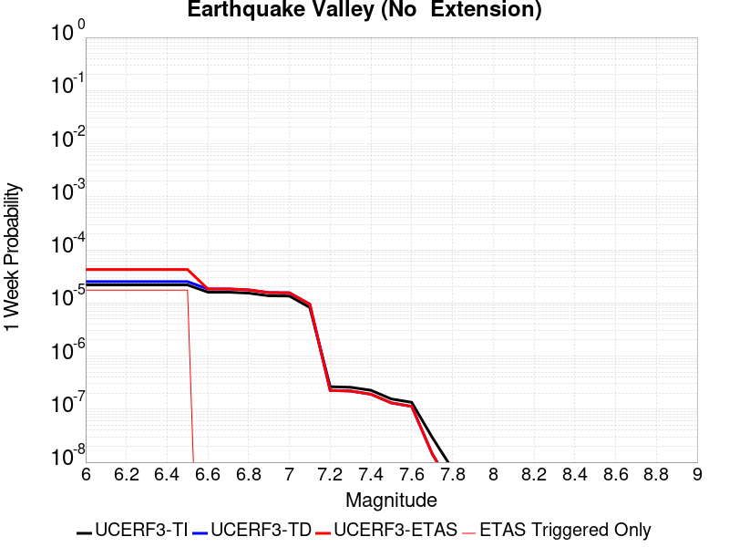 | 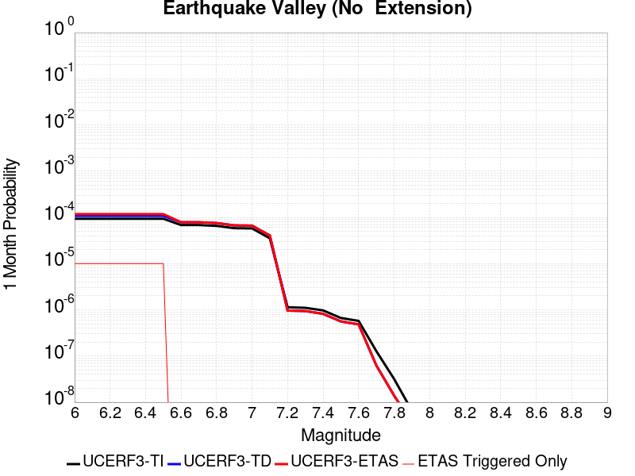 | 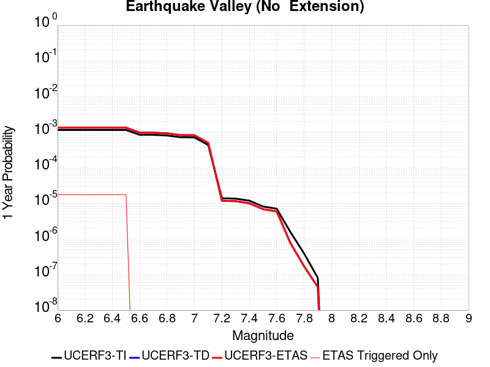 | 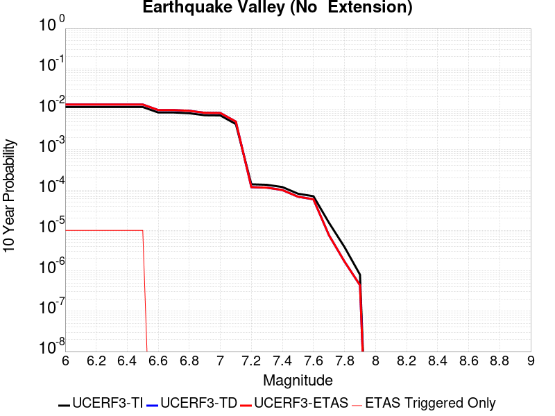 |

| Magnitude | 1 wk TI Prob | 1 wk TD Prob | 1 wk ETAS Prob | 1 wk ETAS/TD Gain | 1 wk ETAS Triggered Only | 1 mo TI Prob | 1 mo TD Prob | 1 mo ETAS Prob | 1 mo ETAS/TD Gain | 1 mo ETAS Triggered Only | 1 yr TI Prob | 1 yr TD Prob | 1 yr ETAS Prob | 1 yr ETAS/TD Gain | 1 yr ETAS Triggered Only | 10 yr TI Prob | 10 yr TD Prob | 10 yr ETAS Prob | 10 yr ETAS/TD Gain | 10 yr ETAS Triggered Only |
|-----|-----|-----|-----|-----|-----|-----|-----|-----|-----|-----|-----|-----|-----|-----|-----|-----|-----|-----|-----|-----|
| 6.0 | 2.1859703E-5 | 2.5198362E-5 | 4.264171E-5 | 1.6922413 | 1.7443788E-5 | 9.3681076E-5 | 1.07989326E-4 | 1.2543122E-4 | 1.1615151 | 1.7443788E-5 | 0.0011399703 | 0.001314122 | 0.0013315429 | 1.0132567 | 1.7443788E-5 | 0.011341401 | 0.013077871 | 0.013095087 | 1.0013164 | 1.7443788E-5 |
| 6.1 | 2.1859703E-5 | 2.5198362E-5 | 4.264171E-5 | 1.6922413 | 1.7443788E-5 | 9.3681076E-5 | 1.07989326E-4 | 1.2543122E-4 | 1.1615151 | 1.7443788E-5 | 0.0011399703 | 0.001314122 | 0.0013315429 | 1.0132567 | 1.7443788E-5 | 0.011341401 | 0.013077871 | 0.013095087 | 1.0013164 | 1.7443788E-5 |
| 6.2 | 2.1859703E-5 | 2.5198362E-5 | 4.264171E-5 | 1.6922413 | 1.7443788E-5 | 9.3681076E-5 | 1.07989326E-4 | 1.2543122E-4 | 1.1615151 | 1.7443788E-5 | 0.0011399703 | 0.001314122 | 0.0013315429 | 1.0132567 | 1.7443788E-5 | 0.011341401 | 0.013077871 | 0.013095087 | 1.0013164 | 1.7443788E-5 |
| 6.3 | 2.1859703E-5 | 2.5198362E-5 | 4.264171E-5 | 1.6922413 | 1.7443788E-5 | 9.3681076E-5 | 1.07989326E-4 | 1.2543122E-4 | 1.1615151 | 1.7443788E-5 | 0.0011399703 | 0.001314122 | 0.0013315429 | 1.0132567 | 1.7443788E-5 | 0.011341401 | 0.013077871 | 0.013095087 | 1.0013164 | 1.7443788E-5 |
| 6.4 | 2.1859703E-5 | 2.5198362E-5 | 4.264171E-5 | 1.6922413 | 1.7443788E-5 | 9.3681076E-5 | 1.07989326E-4 | 1.2543122E-4 | 1.1615151 | 1.7443788E-5 | 0.0011399703 | 0.001314122 | 0.0013315429 | 1.0132567 | 1.7443788E-5 | 0.011341401 | 0.013077871 | 0.013095087 | 1.0013164 | 1.7443788E-5 |
| 6.5 | 2.1859703E-5 | 2.5198362E-5 | 4.264171E-5 | 1.6922413 | 1.7443788E-5 | 9.3681076E-5 | 1.07989326E-4 | 1.2543122E-4 | 1.1615151 | 1.7443788E-5 | 0.0011399703 | 0.001314122 | 0.0013315429 | 1.0132567 | 1.7443788E-5 | 0.011341401 | 0.013077871 | 0.013095087 | 1.0013164 | 1.7443788E-5 |
| 6.6 | 1.597E-5 | 1.8356275E-5 | 1.8356275E-5 | 1.0 | 0.0 | 6.8441055E-5 | 7.866787E-5 | 7.866787E-5 | 1.0 | 0.0 | 8.329513E-4 | 9.574478E-4 | 9.574478E-4 | 1.0 | 0.0 | 0.008298361 | 0.009541836 | 0.009541836 | 1.0 | 0.0 |
| 6.7 | 1.597E-5 | 1.8356275E-5 | 1.8356275E-5 | 1.0 | 0.0 | 6.8441055E-5 | 7.866787E-5 | 7.866787E-5 | 1.0 | 0.0 | 8.329513E-4 | 9.574478E-4 | 9.574478E-4 | 1.0 | 0.0 | 0.008298361 | 0.009541836 | 0.009541836 | 1.0 | 0.0 |
| 6.8 | 1.5315149E-5 | 1.7602091E-5 | 1.7602091E-5 | 1.0 | 0.0 | 6.5634704E-5 | 7.543584E-5 | 7.543584E-5 | 1.0 | 0.0 | 7.988095E-4 | 9.181311E-4 | 9.181311E-4 | 1.0 | 0.0 | 0.007959441 | 0.009151919 | 0.009151919 | 1.0 | 0.0 |
| 6.9 | 1.3634728E-5 | 1.5675821E-5 | 1.5675821E-5 | 1.0 | 0.0 | 5.8433237E-5 | 6.718082E-5 | 6.718082E-5 | 1.0 | 0.0 | 7.1119244E-4 | 8.177017E-4 | 8.177017E-4 | 1.0 | 0.0 | 0.007089207 | 0.008155 | 0.008155 | 1.0 | 0.0 |
| 7.0 | 1.3496271E-5 | 1.5517853E-5 | 1.5517853E-5 | 1.0 | 0.0 | 5.783988E-5 | 6.650385E-5 | 6.650385E-5 | 1.0 | 0.0 | 7.03973E-4 | 8.094657E-4 | 8.094657E-4 | 1.0 | 0.0 | 0.007017471 | 0.0080732405 | 0.0080732405 | 1.0 | 0.0 |
| 7.1 | 8.242798E-6 | 9.4726E-6 | 9.4726E-6 | 1.0 | 0.0 | 3.53258E-5 | 4.0596606E-5 | 4.0596606E-5 | 1.0 | 0.0 | 4.300067E-4 | 4.9421866E-4 | 4.9421866E-4 | 1.0 | 0.0 | 0.004291756 | 0.0049377717 | 0.0049377717 | 1.0 | 0.0 |
| 7.2 | 2.6506527E-7 | 2.2560312E-7 | 2.2560312E-7 | 1.0 | 0.0 | 1.1359936E-6 | 9.668702E-7 | 9.668702E-7 | 1.0 | 0.0 | 1.3830633E-5 | 1.17715845E-5 | 1.17715845E-5 | 1.0 | 0.0 | 1.3829772E-4 | 1.1771003E-4 | 1.1771003E-4 | 1.0 | 0.0 |
| 7.3 | 2.5810488E-7 | 2.1955442E-7 | 2.1955442E-7 | 1.0 | 0.0 | 1.1061633E-6 | 9.409472E-7 | 9.409472E-7 | 1.0 | 0.0 | 1.3467455E-5 | 1.1455976E-5 | 1.1455976E-5 | 1.0 | 0.0 | 1.3466639E-4 | 1.1455427E-4 | 1.1455427E-4 | 1.0 | 0.0 |
| 7.4 | 2.2676066E-7 | 1.9110601E-7 | 1.9110601E-7 | 1.0 | 0.0 | 9.71831E-7 | 8.190255E-7 | 8.190255E-7 | 1.0 | 0.0 | 1.1831979E-5 | 9.9715935E-6 | 9.9715935E-6 | 1.0 | 0.0 | 1.1831349E-4 | 9.9711855E-5 | 9.9711855E-5 | 1.0 | 0.0 |
| 7.5 | 1.5553917E-7 | 1.3112096E-7 | 1.3112096E-7 | 1.0 | 0.0 | 6.6659624E-7 | 5.619469E-7 | 5.619469E-7 | 1.0 | 0.0 | 8.115779E-6 | 6.8416834E-6 | 6.8416834E-6 | 1.0 | 0.0 | 8.115482E-5 | 6.841495E-5 | 6.841495E-5 | 1.0 | 0.0 |
| 7.6 | 1.3448629E-7 | 1.1288419E-7 | 1.1288419E-7 | 1.0 | 0.0 | 5.7636964E-7 | 4.837893E-7 | 4.837893E-7 | 1.0 | 0.0 | 7.017278E-6 | 5.890121E-6 | 5.890121E-6 | 1.0 | 0.0 | 7.0170565E-5 | 5.889986E-5 | 5.889986E-5 | 1.0 | 0.0 |
| 7.7 | 2.9719402E-8 | 1.458206E-8 | 1.458206E-8 | 1.0 | 0.0 | 1.2736886E-7 | 6.249454E-8 | 6.249454E-8 | 1.0 | 0.0 | 1.5507147E-6 | 7.608708E-7 | 7.608708E-7 | 1.0 | 0.0 | 1.550704E-5 | 7.6086876E-6 | 7.6086876E-6 | 1.0 | 0.0 |
| 7.8 | 7.4390196E-9 | 3.2502152E-9 | 3.2502152E-9 | 1.0 | 0.0 | 3.1881513E-8 | 1.3929493E-8 | 1.3929493E-8 | 1.0 | 0.0 | 3.8815733E-7 | 1.6959156E-7 | 1.6959156E-7 | 1.0 | 0.0 | 3.8815665E-6 | 1.6959145E-6 | 1.6959145E-6 | 1.0 | 0.0 |
| 7.9 | 1.5373532E-9 | 8.440161E-10 | 8.440161E-10 | 1.0 | 0.0 | 6.5886567E-9 | 3.6172119E-9 | 3.6172119E-9 | 1.0 | 0.0 | 8.021689E-8 | 4.4039556E-8 | 4.4039556E-8 | 1.0 | 0.0 | 8.0216864E-7 | 4.4039552E-7 | 4.4039552E-7 | 1.0 | 0.0 |

## Calaveras (So) 2011 CFM
*[(top)](#table-of-contents)*

| 1 Week | 1 Month | 1 Year | 10 Year |
|-----|-----|-----|-----|
| 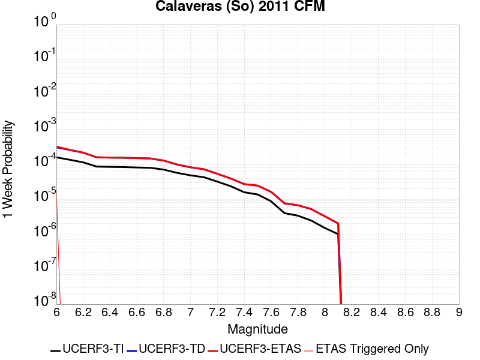 | 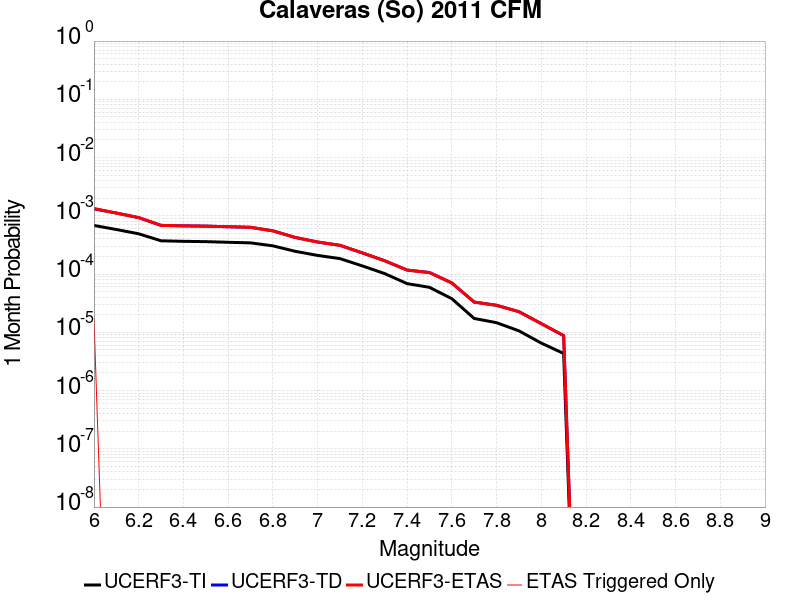 | 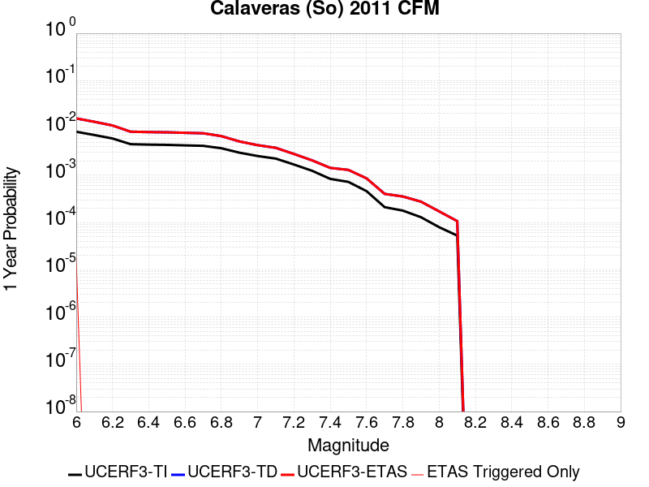 | 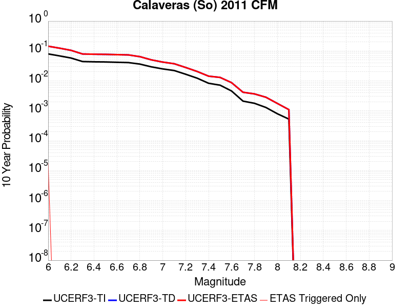 |

| Magnitude | 1 wk TI Prob | 1 wk TD Prob | 1 wk ETAS Prob | 1 wk ETAS/TD Gain | 1 wk ETAS Triggered Only | 1 mo TI Prob | 1 mo TD Prob | 1 mo ETAS Prob | 1 mo ETAS/TD Gain | 1 mo ETAS Triggered Only | 1 yr TI Prob | 1 yr TD Prob | 1 yr ETAS Prob | 1 yr ETAS/TD Gain | 1 yr ETAS Triggered Only | 10 yr TI Prob | 10 yr TD Prob | 10 yr ETAS Prob | 10 yr ETAS/TD Gain | 10 yr ETAS Triggered Only |
|-----|-----|-----|-----|-----|-----|-----|-----|-----|-----|-----|-----|-----|-----|-----|-----|-----|-----|-----|-----|-----|
| 6.0 | 1.5950744E-4 | 3.071188E-4 | 3.2455724E-4 | 1.0567807 | 1.7443788E-5 | 6.834242E-4 | 0.0013155643 | 0.0013329851 | 1.0132421 | 1.7443788E-5 | 0.00828899 | 0.01585904 | 0.015876208 | 1.0010825 | 1.7443788E-5 | 0.079865426 | 0.14440064 | 0.14441557 | 1.0001034 | 1.7443788E-5 |
| 6.1 | 1.3584697E-4 | 2.6036944E-4 | 2.6036944E-4 | 1.0 | 0.0 | 5.8207137E-4 | 0.0011153965 | 0.0011153965 | 1.0 | 0.0 | 0.007063716 | 0.013462106 | 0.013462106 | 1.0 | 0.0 | 0.06843361 | 0.12402854 | 0.12402854 | 1.0 | 0.0 |
| 6.2 | 1.14676266E-4 | 2.1726108E-4 | 2.1726108E-4 | 1.0 | 0.0 | 4.9137714E-4 | 9.307893E-4 | 9.307893E-4 | 1.0 | 0.0 | 0.0059661185 | 0.011245592 | 0.011245592 | 1.0 | 0.0 | 0.058084648 | 0.105019294 | 0.105019294 | 1.0 | 0.0 |
| 6.3 | 8.691518E-5 | 1.5987165E-4 | 1.5987165E-4 | 1.0 | 0.0 | 3.7244044E-4 | 6.8496726E-4 | 6.8496726E-4 | 1.0 | 0.0 | 0.004525038 | 0.008300893 | 0.008300893 | 1.0 | 0.0 | 0.044339992 | 0.0793347 | 0.0793347 | 1.0 | 0.0 |
| 6.4 | 8.50982E-5 | 1.5693568E-4 | 1.5693568E-4 | 1.0 | 0.0 | 3.646556E-4 | 6.7239115E-4 | 6.7239115E-4 | 1.0 | 0.0 | 0.0044306475 | 0.008148931 | 0.008148931 | 1.0 | 0.0 | 0.04343345 | 0.077940844 | 0.077940844 | 1.0 | 0.0 |
| 6.5 | 8.4062965E-5 | 1.5518135E-4 | 1.5518135E-4 | 1.0 | 0.0 | 3.602201E-4 | 6.648764E-4 | 6.648764E-4 | 1.0 | 0.0 | 0.004376863 | 0.008058134 | 0.008058134 | 1.0 | 0.0 | 0.042916555 | 0.077112116 | 0.077112116 | 1.0 | 0.0 |
| 6.6 | 8.194716E-5 | 1.5154095E-4 | 1.5154095E-4 | 1.0 | 0.0 | 3.5115483E-4 | 6.492825E-4 | 6.492825E-4 | 1.0 | 0.0 | 0.0042669317 | 0.007869979 | 0.007869979 | 1.0 | 0.0 | 0.04185927 | 0.07539739 | 0.07539739 | 1.0 | 0.0 |
| 6.7 | 8.012326E-5 | 1.4821833E-4 | 1.4821833E-4 | 1.0 | 0.0 | 3.433402E-4 | 6.350497E-4 | 6.350497E-4 | 1.0 | 0.0 | 0.004172157 | 0.007698474 | 0.007698474 | 1.0 | 0.0 | 0.040946912 | 0.073839515 | 0.073839515 | 1.0 | 0.0 |
| 6.8 | 7.119773E-5 | 1.2880519E-4 | 1.2880519E-4 | 1.0 | 0.0 | 3.0509746E-4 | 5.519001E-4 | 5.519001E-4 | 1.0 | 0.0 | 0.0037082357 | 0.0066958875 | 0.0066958875 | 1.0 | 0.0 | 0.036469642 | 0.06468402 | 0.06468402 | 1.0 | 0.0 |
| 6.9 | 5.7343088E-5 | 9.9189E-5 | 9.9189E-5 | 1.0 | 0.0 | 2.4573295E-4 | 4.2502693E-4 | 4.2502693E-4 | 1.0 | 0.0 | 0.0029876942 | 0.0051625078 | 0.0051625078 | 1.0 | 0.0 | 0.02947844 | 0.050509132 | 0.050509132 | 1.0 | 0.0 |
| 7.0 | 4.8746577E-5 | 8.284751E-5 | 8.284751E-5 | 1.0 | 0.0 | 2.0889717E-4 | 3.550128E-4 | 3.550128E-4 | 1.0 | 0.0 | 0.0025403565 | 0.004313781 | 0.004313781 | 1.0 | 0.0 | 0.025115121 | 0.04248505 | 0.04248505 | 1.0 | 0.0 |
| 7.1 | 4.2998014E-5 | 7.264914E-5 | 7.264914E-5 | 1.0 | 0.0 | 1.8426418E-4 | 3.1131663E-4 | 3.1131663E-4 | 1.0 | 0.0 | 0.002241108 | 0.0037837527 | 0.0037837527 | 1.0 | 0.0 | 0.022186412 | 0.037423246 | 0.037423246 | 1.0 | 0.0 |
| 7.2 | 3.221292E-5 | 5.390566E-5 | 5.390566E-5 | 1.0 | 0.0 | 1.3804805E-4 | 2.3100396E-4 | 2.3100396E-4 | 1.0 | 0.0 | 0.0016794393 | 0.0028088738 | 0.0028088738 | 1.0 | 0.0 | 0.016668037 | 0.028035998 | 0.028035998 | 1.0 | 0.0 |
| 7.3 | 2.3756531E-5 | 3.9471706E-5 | 3.9471706E-5 | 1.0 | 0.0 | 1.0180973E-4 | 1.6915359E-4 | 1.6915359E-4 | 1.0 | 0.0 | 0.0012388286 | 0.0020575167 | 0.0020575167 | 1.0 | 0.0 | 0.012319452 | 0.02064345 | 0.02064345 | 1.0 | 0.0 |
| 7.4 | 1.5997684E-5 | 2.734085E-5 | 2.734085E-5 | 1.0 | 0.0 | 6.8559704E-5 | 1.1716982E-4 | 1.1716982E-4 | 1.0 | 0.0 | 8.343947E-4 | 0.0014256114 | 0.0014256114 | 1.0 | 0.0 | 0.008312687 | 0.014376549 | 0.014376549 | 1.0 | 0.0 |
| 7.5 | 1.3814293E-5 | 2.4782603E-5 | 2.4782603E-5 | 1.0 | 0.0 | 5.9202768E-5 | 1.0620684E-4 | 1.0620684E-4 | 1.0 | 0.0 | 7.205553E-4 | 0.0012923037 | 0.0012923037 | 1.0 | 0.0 | 0.007182234 | 0.013055766 | 0.013055766 | 1.0 | 0.0 |
| 7.6 | 8.817309E-6 | 1.6429829E-5 | 1.6429829E-5 | 1.0 | 0.0 | 3.7787922E-5 | 7.041166E-5 | 7.041166E-5 | 1.0 | 0.0 | 4.5997082E-4 | 8.5692614E-4 | 8.5692614E-4 | 1.0 | 0.0 | 0.004590199 | 0.008719863 | 0.008719863 | 1.0 | 0.0 |
| 7.7 | 4.0352206E-6 | 7.706877E-6 | 7.706877E-6 | 1.0 | 0.0 | 1.7293689E-5 | 3.3029053E-5 | 3.3029053E-5 | 1.0 | 0.0 | 2.1053031E-4 | 4.020546E-4 | 4.020546E-4 | 1.0 | 0.0 | 0.0021033096 | 0.0041649863 | 0.0041649863 | 1.0 | 0.0 |
| 7.8 | 3.413169E-6 | 6.7868646E-6 | 6.7868646E-6 | 1.0 | 0.0 | 1.4627784E-5 | 2.9086239E-5 | 2.9086239E-5 | 1.0 | 0.0 | 1.7807873E-4 | 3.5406748E-4 | 3.5406748E-4 | 1.0 | 0.0 | 0.0017793609 | 0.0036663096 | 0.0036663096 | 1.0 | 0.0 |
| 7.9 | 2.4740732E-6 | 5.278809E-6 | 5.278809E-6 | 1.0 | 0.0 | 1.06031275E-5 | 2.2623271E-5 | 2.2623271E-5 | 1.0 | 0.0 | 1.2908543E-4 | 2.7540355E-4 | 2.7540355E-4 | 1.0 | 0.0 | 0.0012901047 | 0.002834638 | 0.002834638 | 1.0 | 0.0 |
| 8.0 | 1.5231818E-6 | 3.2887135E-6 | 3.2887135E-6 | 1.0 | 0.0 | 6.527906E-6 | 1.409441E-5 | 1.409441E-5 | 1.0 | 0.0 | 7.9474354E-5 | 1.7158597E-4 | 1.7158597E-4 | 1.0 | 0.0 | 7.944594E-4 | 0.001756374 | 0.001756374 | 1.0 | 0.0 |
| 8.1 | 1.0104524E-6 | 2.0456548E-6 | 2.0456548E-6 | 1.0 | 0.0 | 4.330503E-6 | 8.767062E-6 | 8.767062E-6 | 1.0 | 0.0 | 5.2722597E-5 | 1.06733794E-4 | 1.06733794E-4 | 1.0 | 0.0 | 5.271009E-4 | 0.0010929212 | 0.0010929212 | 1.0 | 0.0 |

## Malibu Coast alt 1
*[(top)](#table-of-contents)*

| 1 Week | 1 Month | 1 Year | 10 Year |
|-----|-----|-----|-----|
| 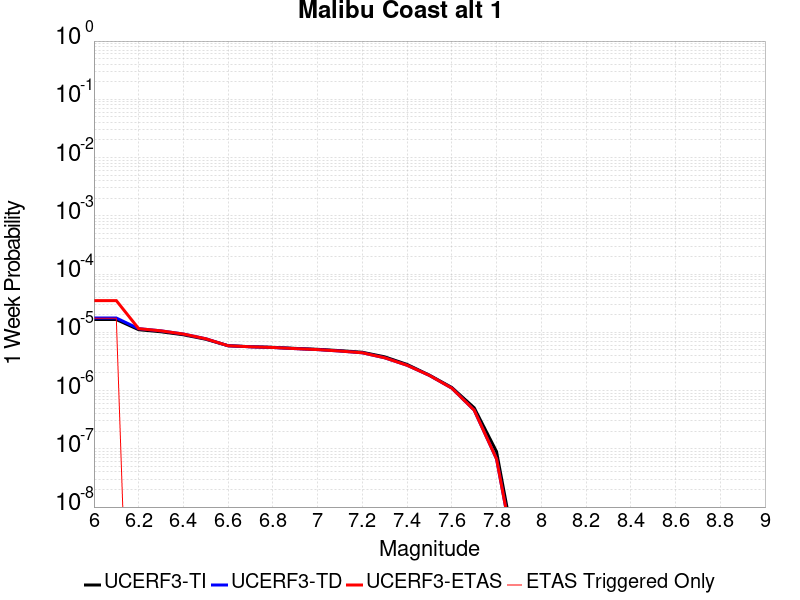 | 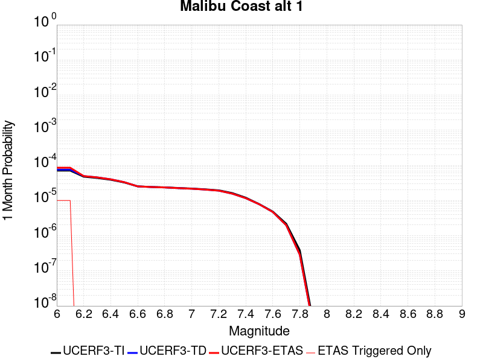 | 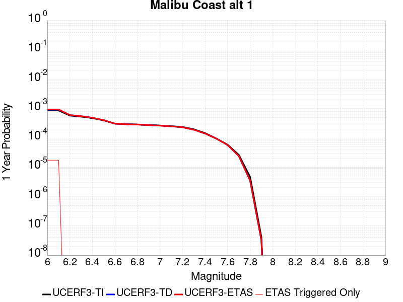 | 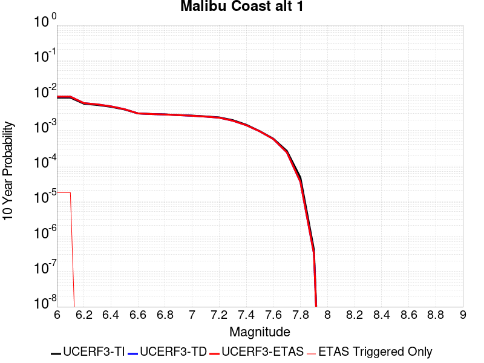 |

| Magnitude | 1 wk TI Prob | 1 wk TD Prob | 1 wk ETAS Prob | 1 wk ETAS/TD Gain | 1 wk ETAS Triggered Only | 1 mo TI Prob | 1 mo TD Prob | 1 mo ETAS Prob | 1 mo ETAS/TD Gain | 1 mo ETAS Triggered Only | 1 yr TI Prob | 1 yr TD Prob | 1 yr ETAS Prob | 1 yr ETAS/TD Gain | 1 yr ETAS Triggered Only | 10 yr TI Prob | 10 yr TD Prob | 10 yr ETAS Prob | 10 yr ETAS/TD Gain | 10 yr ETAS Triggered Only |
|-----|-----|-----|-----|-----|-----|-----|-----|-----|-----|-----|-----|-----|-----|-----|-----|-----|-----|-----|-----|-----|
| 6.0 | 1.6572556E-5 | 1.7598066E-5 | 3.5041547E-5 | 1.9912157 | 1.7443788E-5 | 7.102331E-5 | 7.541821E-5 | 9.286068E-5 | 1.2312766 | 1.7443788E-5 | 8.6436566E-4 | 9.178488E-4 | 9.3527656E-4 | 1.0189877 | 1.7443788E-5 | 0.0086101135 | 0.009142512 | 0.009159797 | 1.0018905 | 1.7443788E-5 |
| 6.1 | 1.6572556E-5 | 1.7598066E-5 | 3.5041547E-5 | 1.9912157 | 1.7443788E-5 | 7.102331E-5 | 7.541821E-5 | 9.286068E-5 | 1.2312766 | 1.7443788E-5 | 8.6436566E-4 | 9.178488E-4 | 9.3527656E-4 | 1.0189877 | 1.7443788E-5 | 0.0086101135 | 0.009142512 | 0.009159797 | 1.0018905 | 1.7443788E-5 |
| 6.2 | 1.1085717E-5 | 1.1557147E-5 | 1.1557147E-5 | 1.0 | 0.0 | 4.750935E-5 | 4.952971E-5 | 4.952971E-5 | 1.0 | 0.0 | 5.782728E-4 | 6.028609E-4 | 6.028609E-4 | 1.0 | 0.0 | 0.0057677035 | 0.0060126255 | 0.0060126255 | 1.0 | 0.0 |
| 6.3 | 1.0208568E-5 | 1.0592237E-5 | 1.0592237E-5 | 1.0 | 0.0 | 4.375027E-5 | 4.539453E-5 | 4.539453E-5 | 1.0 | 0.0 | 5.325294E-4 | 5.5254117E-4 | 5.5254117E-4 | 1.0 | 0.0 | 0.0053125503 | 0.0055119814 | 0.0055119814 | 1.0 | 0.0 |
| 6.4 | 9.0682315E-6 | 9.342637E-6 | 9.342637E-6 | 1.0 | 0.0 | 3.8863272E-5 | 4.003927E-5 | 4.003927E-5 | 1.0 | 0.0 | 4.730576E-4 | 4.8737114E-4 | 4.8737114E-4 | 1.0 | 0.0 | 0.0047205184 | 0.004863236 | 0.004863236 | 1.0 | 0.0 |
| 6.5 | 7.605796E-6 | 7.748587E-6 | 7.748587E-6 | 1.0 | 0.0 | 3.259586E-5 | 3.3207816E-5 | 3.3207816E-5 | 1.0 | 0.0 | 3.9678233E-4 | 4.0423148E-4 | 4.0423148E-4 | 1.0 | 0.0 | 0.0039607463 | 0.0040351 | 0.0040351 | 1.0 | 0.0 |
| 6.6 | 5.889873E-6 | 5.8795385E-6 | 5.8795385E-6 | 1.0 | 0.0 | 2.5242069E-5 | 2.519778E-5 | 2.519778E-5 | 1.0 | 0.0 | 3.0727885E-4 | 3.0673988E-4 | 3.0673988E-4 | 1.0 | 0.0 | 0.003068543 | 0.0030631777 | 0.0030631777 | 1.0 | 0.0 |
| 6.7 | 5.66586E-6 | 5.641641E-6 | 5.641641E-6 | 1.0 | 0.0 | 2.428203E-5 | 2.417824E-5 | 2.417824E-5 | 1.0 | 0.0 | 2.955936E-4 | 2.9433038E-4 | 2.9433038E-4 | 1.0 | 0.0 | 0.0029520073 | 0.0029394177 | 0.0029394177 | 1.0 | 0.0 |
| 6.8 | 5.521556E-6 | 5.489427E-6 | 5.489427E-6 | 1.0 | 0.0 | 2.3663597E-5 | 2.3525903E-5 | 2.3525903E-5 | 1.0 | 0.0 | 2.880662E-4 | 2.8639034E-4 | 2.8639034E-4 | 1.0 | 0.0 | 0.0028769306 | 0.002860224 | 0.002860224 | 1.0 | 0.0 |
| 6.9 | 5.29752E-6 | 5.2499317E-6 | 5.2499317E-6 | 1.0 | 0.0 | 2.270346E-5 | 2.2499513E-5 | 2.2499513E-5 | 1.0 | 0.0 | 2.7637955E-4 | 2.7389723E-4 | 2.7389723E-4 | 1.0 | 0.0 | 0.0027603607 | 0.0027356069 | 0.0027356069 | 1.0 | 0.0 |
| 7.0 | 5.106743E-6 | 5.0476788E-6 | 5.0476788E-6 | 1.0 | 0.0 | 2.1885859E-5 | 2.163273E-5 | 2.163273E-5 | 1.0 | 0.0 | 2.6642776E-4 | 2.6334674E-4 | 2.6334674E-4 | 1.0 | 0.0 | 0.0026610855 | 0.0026303562 | 0.0026303562 | 1.0 | 0.0 |
| 7.1 | 4.8469647E-6 | 4.770373E-6 | 4.770373E-6 | 1.0 | 0.0 | 2.0772539E-5 | 2.0444295E-5 | 2.0444295E-5 | 1.0 | 0.0 | 2.528763E-4 | 2.4888094E-4 | 2.4888094E-4 | 1.0 | 0.0 | 0.0025258875 | 0.00248603 | 0.00248603 | 1.0 | 0.0 |
| 7.2 | 4.545514E-6 | 4.4481935E-6 | 4.4481935E-6 | 1.0 | 0.0 | 1.9480629E-5 | 1.9063547E-5 | 1.9063547E-5 | 1.0 | 0.0 | 2.3715083E-4 | 2.3207403E-4 | 2.3207403E-4 | 1.0 | 0.0 | 0.0023689792 | 0.0023183243 | 0.0023183243 | 1.0 | 0.0 |
| 7.3 | 3.794097E-6 | 3.6519348E-6 | 3.6519348E-6 | 1.0 | 0.0 | 1.6260314E-5 | 1.5651056E-5 | 1.5651056E-5 | 1.0 | 0.0 | 1.9795135E-4 | 1.9053498E-4 | 1.9053498E-4 | 1.0 | 0.0 | 0.001977751 | 0.0019037209 | 0.0019037209 | 1.0 | 0.0 |
| 7.4 | 2.808217E-6 | 2.719077E-6 | 2.719077E-6 | 1.0 | 0.0 | 1.203516E-5 | 1.1653135E-5 | 1.1653135E-5 | 1.0 | 0.0 | 1.4651821E-4 | 1.418677E-4 | 1.418677E-4 | 1.0 | 0.0 | 0.0014642165 | 0.001417774 | 0.001417774 | 1.0 | 0.0 |
| 7.5 | 1.83809E-6 | 1.8190691E-6 | 1.8190691E-6 | 1.0 | 0.0 | 7.877505E-6 | 7.795988E-6 | 7.795988E-6 | 1.0 | 0.0 | 9.59044E-5 | 9.491203E-5 | 9.491203E-5 | 1.0 | 0.0 | 9.5863023E-4 | 9.48717E-4 | 9.48717E-4 | 1.0 | 0.0 |
| 7.6 | 1.1292672E-6 | 1.1001447E-6 | 1.1001447E-6 | 1.0 | 0.0 | 4.839708E-6 | 4.714897E-6 | 4.714897E-6 | 1.0 | 0.0 | 5.8921847E-5 | 5.7402376E-5 | 5.7402376E-5 | 1.0 | 0.0 | 5.890623E-4 | 5.738771E-4 | 5.738771E-4 | 1.0 | 0.0 |
| 7.7 | 5.065272E-7 | 4.609151E-7 | 4.609151E-7 | 1.0 | 0.0 | 2.170829E-6 | 1.975349E-6 | 1.975349E-6 | 1.0 | 0.0 | 2.6429525E-5 | 2.404962E-5 | 2.404962E-5 | 1.0 | 0.0 | 2.642638E-4 | 2.4047129E-4 | 2.4047129E-4 | 1.0 | 0.0 |
| 7.8 | 8.952991E-8 | 6.707874E-8 | 6.707874E-8 | 1.0 | 0.0 | 3.8369956E-7 | 2.8748025E-7 | 2.8748025E-7 | 1.0 | 0.0 | 4.671532E-6 | 3.5000667E-6 | 3.5000667E-6 | 1.0 | 0.0 | 4.671434E-5 | 3.5000136E-5 | 3.5000136E-5 | 1.0 | 0.0 |
| 7.9 | 8.007447E-10 | 6.1608785E-10 | 6.1608785E-10 | 1.0 | 0.0 | 3.4317629E-9 | 2.6403764E-9 | 2.6403764E-9 | 1.0 | 0.0 | 4.1781714E-8 | 3.2146584E-8 | 3.2146584E-8 | 1.0 | 0.0 | 4.1781706E-7 | 3.214658E-7 | 3.214658E-7 | 1.0 | 0.0 |

