# Parent Section Magnitude-Probability Distributions

Only fault sections with at least one triggered aftershock are plotted. Sections are sorted by total supraseismogenic trigger rate (decreasing)

## Table Of Contents

* [Garlock (Central)](#garlock-central)
* [Tank Canyon](#tank-canyon)
* [Little Lake](#little-lake)
* [Airport Lake](#airport-lake)
* [Owl Lake](#owl-lake)
* [Panamint Valley](#panamint-valley)
* [Garlock (East)](#garlock-east)
* [Hunter Mountain-Saline Valley](#hunter-mountain-saline-valley)
* [Garlock (West)](#garlock-west)
* [Blackwater](#blackwater)
* [Gravel Hills-Harper Lk](#gravel-hills-harper-lk)
* [Ash Hill](#ash-hill)
* [San Andreas (Mojave N)](#san-andreas-mojave-n)
* [San Andreas (Mojave S)](#san-andreas-mojave-s)
* [So Sierra Nevada](#so-sierra-nevada)
* [Death Valley (So)](#death-valley-so)
* [San Andreas (San Bernardino N)](#san-andreas-san-bernardino-n)
* [McLean Lake](#mclean-lake)
* [Goldstone Lake](#goldstone-lake)
* [Coyote Canyon](#coyote-canyon)
* [Lenwood-Lockhart-Old Woman Springs](#lenwood-lockhart-old-woman-springs)
* [Nelson Lake](#nelson-lake)
* [Paradise](#paradise)
* [Towne Pass](#towne-pass)
* [Bicycle Lake](#bicycle-lake)
* [Elsinore (Glen Ivy) rev](#elsinore-glen-ivy-rev)
* [Ludlow](#ludlow)
* [Death Valley (Black Mtns Frontal)](#death-valley-black-mtns-frontal)
* [White Wolf (Extension)](#white-wolf-extension)
* [San Andreas (North Branch Mill Creek)](#san-andreas-north-branch-mill-creek)
* [Death Valley (No)](#death-valley-no)
* [Ventura-Pitas Point](#ventura-pitas-point)
* [Garlic Springs](#garlic-springs)
* [San Andreas (San Bernardino S)](#san-andreas-san-bernardino-s)
* [Helendale-So Lockhart](#helendale-so-lockhart)
* [Calico-Hidalgo](#calico-hidalgo)
* [San Andreas (Parkfield)](#san-andreas-parkfield)
* [Pisgah-Bullion Mtn-Mesquite Lk](#pisgah-bullion-mtn-mesquite-lk)
* [San Juan](#san-juan)
* [Owens Valley](#owens-valley)
* [Whittier alt 1](#whittier-alt-1)
* [Santa Ynez (East)](#santa-ynez-east)
* [Red Pass](#red-pass)
* [Johnson Valley (No) 2011 rev](#johnson-valley-no-2011-rev)
* [Cleghorn Lake](#cleghorn-lake)
* [San Andreas (San Gorgonio Pass-Garnet HIll)](#san-andreas-san-gorgonio-pass-garnet-hill)
* [Scodie Lineament](#scodie-lineament)
* [Carlsbad](#carlsbad)
* [Shoreline](#shoreline)
* [Coyote Lake](#coyote-lake)
* [Rinconada 2011 CFM](#rinconada-2011-cfm)
* [San Andreas (Coachella) rev](#san-andreas-coachella-rev)
* [Manix-Afton Hills](#manix-afton-hills)

## Garlock (Central)
*[(top)](#table-of-contents)*

| 1 Week | 1 Month | 1 Year | 10 Year |
|-----|-----|-----|-----|
|  |  |  |  |

| Magnitude | 1 wk TI Prob | 1 wk TD Prob | 1 wk ETAS Prob | 1 wk ETAS/TD Gain | 1 wk ETAS Triggered Only | 1 mo TI Prob | 1 mo TD Prob | 1 mo ETAS Prob | 1 mo ETAS/TD Gain | 1 mo ETAS Triggered Only | 1 yr TI Prob | 1 yr TD Prob | 1 yr ETAS Prob | 1 yr ETAS/TD Gain | 1 yr ETAS Triggered Only | 10 yr TI Prob | 10 yr TD Prob | 10 yr ETAS Prob | 10 yr ETAS/TD Gain | 10 yr ETAS Triggered Only |
|-----|-----|-----|-----|-----|-----|-----|-----|-----|-----|-----|-----|-----|-----|-----|-----|-----|-----|-----|-----|-----|
| 6.0 | 5.5131142E-5 | 7.024681E-5 | 0.122265995 | 1740.5201 | 0.12220433 | 2.3625491E-4 | 3.010234E-4 | 0.13015993 | 432.39145 | 0.12989801 | 0.0028726095 | 0.0036588663 | 0.14359942 | 39.24697 | 0.14045447 | 0.028357591 | 0.036079824 | 0.17957269 | 4.977094 | 0.14886384 |
| 6.1 | 5.5131142E-5 | 7.024681E-5 | 0.122265995 | 1740.5201 | 0.12220433 | 2.3625491E-4 | 3.010234E-4 | 0.13015993 | 432.39145 | 0.12989801 | 0.0028726095 | 0.0036588663 | 0.14359942 | 39.24697 | 0.14045447 | 0.028357591 | 0.036079824 | 0.17957269 | 4.977094 | 0.14886384 |
| 6.2 | 4.216245E-5 | 5.1661493E-5 | 0.07215386 | 1396.6661 | 0.07210592 | 1.806837E-4 | 2.2138779E-4 | 0.076067895 | 343.5957 | 0.0758633 | 0.0021976046 | 0.0026920962 | 0.08548882 | 31.755482 | 0.08302022 | 0.021759989 | 0.026689773 | 0.112196185 | 4.2037144 | 0.08785114 |
| 6.3 | 4.216245E-5 | 5.1661493E-5 | 0.07215386 | 1396.6661 | 0.07210592 | 1.806837E-4 | 2.2138779E-4 | 0.076067895 | 343.5957 | 0.0758633 | 0.0021976046 | 0.0026920962 | 0.08548882 | 31.755482 | 0.08302022 | 0.021759989 | 0.026689773 | 0.112196185 | 4.2037144 | 0.08785114 |
| 6.4 | 3.6858168E-5 | 4.411054E-5 | 0.05586559 | 1266.4906 | 0.05582394 | 1.5795401E-4 | 1.8903162E-4 | 0.05940131 | 314.24008 | 0.059223473 | 0.0019213937 | 0.002299056 | 0.06745576 | 29.340637 | 0.06530685 | 0.019048655 | 0.02284894 | 0.089810625 | 3.9306254 | 0.06852747 |
| 6.5 | 3.39199E-5 | 4.0018083E-5 | 0.049778588 | 1243.9023 | 0.04974056 | 1.453629E-4 | 1.7149492E-4 | 0.053302478 | 310.81082 | 0.053140096 | 0.0017683565 | 0.002085973 | 0.06082881 | 29.160881 | 0.05886563 | 0.017543508 | 0.020759864 | 0.08138199 | 3.9201603 | 0.061907317 |
| 6.6 | 3.3571985E-5 | 3.9472274E-5 | 0.04977807 | 1261.0896 | 0.04974056 | 1.4387199E-4 | 1.6915603E-4 | 0.053300265 | 315.09525 | 0.053140096 | 0.0017502342 | 0.0020575512 | 0.06080206 | 29.550694 | 0.05886563 | 0.017365133 | 0.020481179 | 0.081120566 | 3.960737 | 0.061907317 |
| 6.7 | 3.2580007E-5 | 3.8088703E-5 | 0.047093015 | 1236.4038 | 0.04705672 | 1.3962112E-4 | 1.632272E-4 | 0.050611246 | 310.06625 | 0.050456252 | 0.0016985617 | 0.0019855013 | 0.057520036 | 28.970032 | 0.05564502 | 0.016856372 | 0.019773813 | 0.07730006 | 3.9092135 | 0.058686707 |
| 6.8 | 3.2185937E-5 | 3.7515918E-5 | 0.045840055 | 1221.8828 | 0.04580426 | 1.3793244E-4 | 1.6077272E-4 | 0.049356654 | 306.99646 | 0.049203794 | 0.0016780337 | 0.001955672 | 0.056063283 | 28.667017 | 0.054213636 | 0.016654192 | 0.019480614 | 0.07544513 | 3.872831 | 0.0570764 |
| 6.9 | 3.165394E-5 | 3.6720503E-5 | 0.044050135 | 1199.606 | 0.04401503 | 1.3565269E-4 | 1.5736422E-4 | 0.047564466 | 302.2572 | 0.047414564 | 0.0016503202 | 0.001914247 | 0.0542383 | 28.334011 | 0.052424405 | 0.01638118 | 0.019073246 | 0.07295489 | 3.8249855 | 0.054929327 |
| 7.0 | 3.0903822E-5 | 3.5625766E-5 | 0.042617757 | 1196.2622 | 0.042583648 | 1.3243823E-4 | 1.5267303E-4 | 0.045771044 | 299.79782 | 0.045625336 | 0.0016112428 | 0.0018572307 | 0.052041184 | 28.020851 | 0.05027733 | 0.015996104 | 0.018512413 | 0.07014193 | 3.7889132 | 0.052603327 |
| 7.1 | 3.0069863E-5 | 3.4392073E-5 | 0.04082741 | 1187.1168 | 0.040794417 | 1.2886449E-4 | 1.4738638E-4 | 0.043977033 | 298.3792 | 0.043836106 | 0.0015677959 | 0.0017929734 | 0.049658332 | 27.69608 | 0.047951333 | 0.01556781 | 0.017880075 | 0.06708272 | 3.7518141 | 0.050098408 |
| 7.2 | 2.7957109E-5 | 3.128145E-5 | 0.032236394 | 1030.5273 | 0.032206118 | 1.1981068E-4 | 1.340566E-4 | 0.03501934 | 261.22806 | 0.034889963 | 0.0014577188 | 0.0016309366 | 0.039500725 | 24.219656 | 0.03793165 | 0.014481937 | 0.016283695 | 0.055181764 | 3.3887742 | 0.039541956 |
| 7.3 | 2.4519275E-5 | 2.6714795E-5 | 0.02131797 | 797.98364 | 0.021291824 | 1.0507837E-4 | 1.1448703E-4 | 0.023550702 | 205.70627 | 0.023438897 | 0.0012785783 | 0.001393003 | 0.027479354 | 19.7267 | 0.026122741 | 0.012712469 | 0.013928054 | 0.04056911 | 2.9127624 | 0.027017355 |
| 7.4 | 2.3225532E-5 | 2.51994E-5 | 0.018095955 | 718.11053 | 0.018071212 | 9.95342E-5 | 1.0799304E-4 | 0.020145193 | 186.54158 | 0.020039363 | 0.0012111551 | 0.0013140367 | 0.023828696 | 18.133966 | 0.022544283 | 0.012045753 | 0.013145725 | 0.03609993 | 2.7461345 | 0.023259975 |
| 7.5 | 2.097765E-5 | 2.2483688E-5 | 0.01469383 | 653.5329 | 0.014671677 | 8.9901114E-5 | 9.635517E-5 | 0.01637677 | 169.96254 | 0.016281983 | 0.0010939965 | 0.0011725046 | 0.019401241 | 16.546835 | 0.018250134 | 0.010886264 | 0.011740365 | 0.030483525 | 2.5964715 | 0.018965825 |
| 7.6 | 1.511254E-5 | 1.5991332E-5 | 0.008783072 | 549.23956 | 0.008767221 | 6.476642E-5 | 6.853253E-5 | 0.009908617 | 144.58269 | 0.0098407585 | 7.882459E-4 | 8.3407195E-4 | 0.011560491 | 13.860305 | 0.010735373 | 0.007854558 | 0.008383559 | 0.019383777 | 2.312118 | 0.011093219 |
| 7.7 | 9.934069E-6 | 1.0678794E-5 | 0.0028734144 | 269.0767 | 0.0028627662 | 4.2573887E-5 | 4.5765457E-5 | 0.00326623 | 71.3689 | 0.003220612 | 5.182138E-4 | 5.570524E-4 | 0.0041335165 | 7.4203377 | 0.0035784577 | 0.00517007 | 0.005627684 | 0.009541835 | 1.6955173 | 0.0039363033 |
| 7.8 | 6.7562896E-6 | 8.428449E-6 | 0.001260878 | 149.59787 | 0.0012524602 | 2.8955206E-5 | 3.6121426E-5 | 0.0016463692 | 45.578743 | 0.001610306 | 3.5247262E-4 | 4.3968976E-4 | 0.002228132 | 5.067509 | 0.0017892289 | 0.0035191406 | 0.004446654 | 0.0064060544 | 1.4406459 | 0.0019681517 |
| 7.9 | 3.975453E-6 | 5.37103E-6 | 5.421368E-4 | 100.93721 | 5.3676864E-4 | 1.7037546E-5 | 2.3018498E-5 | 7.386936E-4 | 32.0913 | 7.1569154E-4 | 2.0741238E-4 | 2.8021427E-4 | 0.001174578 | 4.191714 | 8.9461444E-4 | 0.002072189 | 0.0028336283 | 0.0039041236 | 1.3777826 | 0.0010735373 |
| 8.0 | 1.6729537E-6 | 2.0775144E-6 | 2.0775144E-6 | 1.0 | 0.0 | 7.169782E-6 | 8.903603E-6 | 1.8782489E-4 | 21.09538 | 1.7892288E-4 | 8.7288594E-5 | 1.0839601E-4 | 2.872995E-4 | 2.650462 | 1.7892288E-4 | 8.7254314E-4 | 0.0010969337 | 0.0012756604 | 1.1629329 | 1.7892288E-4 |
| 8.1 | 3.6733252E-7 | 3.1489964E-7 | 3.1489964E-7 | 1.0 | 0.0 | 1.5742813E-6 | 1.3495693E-6 | 1.3495693E-6 | 1.0 | 0.0 | 1.9166706E-5 | 1.6430899E-5 | 1.6430899E-5 | 1.0 | 0.0 | 1.9165053E-4 | 1.6638759E-4 | 1.6638759E-4 | 1.0 | 0.0 |

## Tank Canyon
*[(top)](#table-of-contents)*

| 1 Week | 1 Month | 1 Year | 10 Year |
|-----|-----|-----|-----|
| 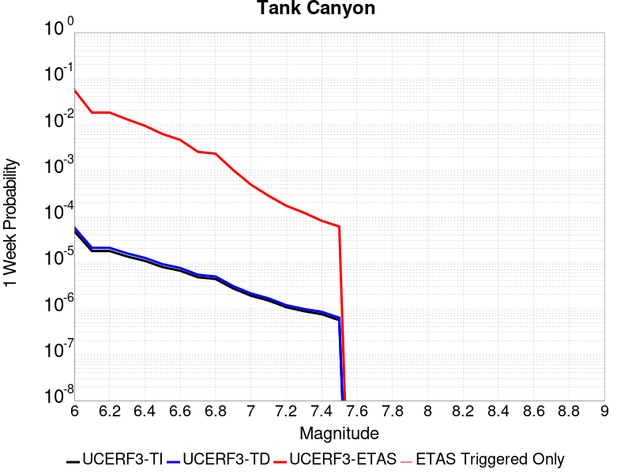 |  |  |  |

| Magnitude | 1 wk TI Prob | 1 wk TD Prob | 1 wk ETAS Prob | 1 wk ETAS/TD Gain | 1 wk ETAS Triggered Only | 1 mo TI Prob | 1 mo TD Prob | 1 mo ETAS Prob | 1 mo ETAS/TD Gain | 1 mo ETAS Triggered Only | 1 yr TI Prob | 1 yr TD Prob | 1 yr ETAS Prob | 1 yr ETAS/TD Gain | 1 yr ETAS Triggered Only | 10 yr TI Prob | 10 yr TD Prob | 10 yr ETAS Prob | 10 yr ETAS/TD Gain | 10 yr ETAS Triggered Only |
|-----|-----|-----|-----|-----|-----|-----|-----|-----|-----|-----|-----|-----|-----|-----|-----|-----|-----|-----|-----|-----|
| 6.0 | 4.8284557E-5 | 5.7964822E-5 | 0.059814744 | 1031.9146 | 0.059760243 | 2.0691741E-4 | 2.4840087E-4 | 0.06410801 | 258.08286 | 0.06387547 | 0.0025163088 | 0.0030207601 | 0.071519606 | 23.676027 | 0.068706386 | 0.02488006 | 0.029863637 | 0.10085769 | 3.3772743 | 0.07317946 |
| 6.1 | 1.7796336E-5 | 2.0873314E-5 | 0.020954413 | 1003.8853 | 0.020933978 | 7.626778E-5 | 8.945422E-5 | 0.022095 | 246.99786 | 0.022007516 | 9.281647E-4 | 0.0010885983 | 0.024323253 | 22.343645 | 0.023259975 | 0.009242975 | 0.010836744 | 0.03579148 | 3.3027892 | 0.025228126 |
| 6.2 | 1.7796336E-5 | 2.0873314E-5 | 0.020954413 | 1003.8853 | 0.020933978 | 7.626778E-5 | 8.945422E-5 | 0.022095 | 246.99786 | 0.022007516 | 9.281647E-4 | 0.0010885983 | 0.024323253 | 22.343645 | 0.023259975 | 0.009242975 | 0.010836744 | 0.03579148 | 3.3027892 | 0.025228126 |
| 6.3 | 1.3515912E-5 | 1.5759564E-5 | 0.014150444 | 897.8956 | 0.014134908 | 5.792405E-5 | 6.753938E-5 | 0.015096047 | 223.51474 | 0.015029523 | 7.049971E-4 | 8.2200574E-4 | 0.0163755 | 19.921394 | 0.015566291 | 0.007027647 | 0.0081922645 | 0.024873232 | 3.0361853 | 0.01681875 |
| 6.4 | 1.0870146E-5 | 1.2618021E-5 | 0.010032173 | 795.0671 | 0.010019681 | 4.658551E-5 | 5.4076212E-5 | 0.010788869 | 199.51228 | 0.010735373 | 5.67031E-4 | 6.581969E-4 | 0.011922919 | 18.114517 | 0.011272142 | 0.005655863 | 0.0065644905 | 0.019006874 | 2.8954074 | 0.012524602 |
| 6.5 | 7.964826E-6 | 9.196094E-6 | 0.006092518 | 662.51154 | 0.006083378 | 3.4134522E-5 | 3.9411298E-5 | 0.0066592973 | 168.96925 | 0.006620147 | 4.1550855E-4 | 4.7973756E-4 | 0.0074543823 | 15.538459 | 0.0069779926 | 0.0041473247 | 0.004788321 | 0.012445165 | 2.5990665 | 0.007693684 |
| 6.6 | 6.6317E-6 | 7.6122988E-6 | 0.0050174147 | 659.11957 | 0.0050098407 | 2.8421264E-5 | 3.2623782E-5 | 0.005579052 | 171.01183 | 0.0055466094 | 3.4597394E-4 | 3.9713128E-4 | 0.0062992414 | 15.861862 | 0.005904455 | 0.0034543579 | 0.003965368 | 0.01038105 | 2.6179285 | 0.006441224 |
| 6.7 | 4.793663E-6 | 5.4307857E-6 | 0.0028681813 | 528.1338 | 0.0028627662 | 2.0544108E-5 | 2.3274613E-5 | 0.0032438117 | 139.37123 | 0.003220612 | 2.500958E-4 | 2.8333595E-4 | 0.0036819074 | 12.994848 | 0.0033995348 | 0.0024981452 | 0.0028304397 | 0.0065771854 | 2.3237326 | 0.0037573806 |
| 6.8 | 4.382823E-6 | 4.9692567E-6 | 0.002509877 | 505.081 | 0.0025049204 | 1.8783392E-5 | 2.1296666E-5 | 0.002884002 | 135.42035 | 0.0028627662 | 2.286638E-4 | 2.5926033E-4 | 0.0033001609 | 12.729139 | 0.003041689 | 0.0022842865 | 0.002590253 | 0.005980982 | 2.309034 | 0.0033995348 |
| 6.9 | 2.729601E-6 | 3.0735416E-6 | 8.9768524E-4 | 292.06866 | 8.9461444E-4 | 1.1698237E-5 | 1.3172262E-5 | 0.0010866955 | 82.49877 | 0.0010735373 | 1.4241673E-4 | 1.6036171E-4 | 0.001412621 | 8.808967 | 0.0012524602 | 0.001423255 | 0.0016026258 | 0.0028530788 | 1.7802526 | 0.0012524602 |
| 7.0 | 1.8987357E-6 | 2.126939E-6 | 1.8104944E-4 | 85.12206 | 1.7892288E-4 | 8.137413E-6 | 9.115425E-6 | 3.6695795E-4 | 40.25681 | 3.5784577E-4 | 9.90685E-5 | 1.1097535E-4 | 4.687814E-4 | 4.224194 | 3.5784577E-4 | 9.902435E-4 | 0.0011092679 | 0.0014667168 | 1.3222384 | 3.5784577E-4 |
| 7.1 | 1.4928986E-6 | 1.6641272E-6 | 1.6641272E-6 | 1.0 | 0.0 | 6.398121E-6 | 7.1319573E-6 | 1.8605357E-4 | 26.087307 | 1.7892288E-4 | 7.789434E-5 | 8.682871E-5 | 2.6573607E-4 | 3.060463 | 1.7892288E-4 | 7.786704E-4 | 8.6800574E-4 | 0.0010467733 | 1.205952 | 1.7892288E-4 |
| 7.2 | 1.069082E-6 | 1.1828573E-6 | 1.1828573E-6 | 1.0 | 0.0 | 4.581772E-6 | 5.0693816E-6 | 5.0693816E-6 | 1.0 | 0.0 | 5.5781646E-5 | 6.171851E-5 | 6.171851E-5 | 1.0 | 0.0 | 5.576765E-4 | 6.170659E-4 | 6.170659E-4 | 1.0 | 0.0 |
| 7.3 | 8.776551E-7 | 9.770005E-7 | 9.770005E-7 | 1.0 | 0.0 | 3.7613736E-6 | 4.1871413E-6 | 4.1871413E-6 | 1.0 | 0.0 | 4.579376E-5 | 5.097777E-5 | 5.097777E-5 | 1.0 | 0.0 | 4.5784327E-4 | 5.097118E-4 | 5.097118E-4 | 1.0 | 0.0 |
| 7.4 | 7.55721E-7 | 8.510244E-7 | 8.510244E-7 | 1.0 | 0.0 | 3.2388E-6 | 3.6472454E-6 | 3.6472454E-6 | 1.0 | 0.0 | 3.9431678E-5 | 4.4404827E-5 | 4.4404827E-5 | 1.0 | 0.0 | 3.942468E-4 | 4.440104E-4 | 4.440104E-4 | 1.0 | 0.0 |
| 7.5 | 5.587665E-7 | 6.305619E-7 | 6.305619E-7 | 1.0 | 0.0 | 2.3947114E-6 | 2.702408E-6 | 2.702408E-6 | 1.0 | 0.0 | 2.915522E-5 | 3.290182E-5 | 3.290182E-5 | 1.0 | 0.0 | 2.9151395E-4 | 3.290182E-4 | 3.290182E-4 | 1.0 | 0.0 |

## Little Lake
*[(top)](#table-of-contents)*

| 1 Week | 1 Month | 1 Year | 10 Year |
|-----|-----|-----|-----|
|  |  |  |  |

| Magnitude | 1 wk TI Prob | 1 wk TD Prob | 1 wk ETAS Prob | 1 wk ETAS/TD Gain | 1 wk ETAS Triggered Only | 1 mo TI Prob | 1 mo TD Prob | 1 mo ETAS Prob | 1 mo ETAS/TD Gain | 1 mo ETAS Triggered Only | 1 yr TI Prob | 1 yr TD Prob | 1 yr ETAS Prob | 1 yr ETAS/TD Gain | 1 yr ETAS Triggered Only | 10 yr TI Prob | 10 yr TD Prob | 10 yr ETAS Prob | 10 yr ETAS/TD Gain | 10 yr ETAS Triggered Only |
|-----|-----|-----|-----|-----|-----|-----|-----|-----|-----|-----|-----|-----|-----|-----|-----|-----|-----|-----|-----|-----|
| 6.0 | 2.8424427E-5 | 3.120572E-5 | 0.059073914 | 1893.0476 | 0.05904455 | 1.2181328E-4 | 1.337327E-4 | 0.062748365 | 469.20737 | 0.06262301 | 0.0014820677 | 0.0016271127 | 0.06968581 | 42.827892 | 0.068169616 | 0.014722223 | 0.016165402 | 0.08604952 | 5.3230677 | 0.07103238 |
| 6.1 | 2.8424427E-5 | 3.120572E-5 | 0.059073914 | 1893.0476 | 0.05904455 | 1.2181328E-4 | 1.337327E-4 | 0.062748365 | 469.20737 | 0.06262301 | 0.0014820677 | 0.0016271127 | 0.06968581 | 42.827892 | 0.068169616 | 0.014722223 | 0.016165402 | 0.08604952 | 5.3230677 | 0.07103238 |
| 6.2 | 2.8424427E-5 | 3.120572E-5 | 0.059073914 | 1893.0476 | 0.05904455 | 1.2181328E-4 | 1.337327E-4 | 0.062748365 | 469.20737 | 0.06262301 | 0.0014820677 | 0.0016271127 | 0.06968581 | 42.827892 | 0.068169616 | 0.014722223 | 0.016165402 | 0.08604952 | 5.3230677 | 0.07103238 |
| 6.3 | 1.48860645E-5 | 1.6081389E-5 | 0.041346602 | 2571.084 | 0.041331187 | 6.379586E-5 | 6.8918576E-5 | 0.044259824 | 642.2045 | 0.044193953 | 7.7643775E-4 | 8.3878887E-4 | 0.049107447 | 58.54566 | 0.048309177 | 0.007737305 | 0.008359048 | 0.057683825 | 6.900765 | 0.04974056 |
| 6.4 | 1.48860645E-5 | 1.6081389E-5 | 0.041346602 | 2571.084 | 0.041331187 | 6.379586E-5 | 6.8918576E-5 | 0.044259824 | 642.2045 | 0.044193953 | 7.7643775E-4 | 8.3878887E-4 | 0.049107447 | 58.54566 | 0.048309177 | 0.007737305 | 0.008359048 | 0.057683825 | 6.900765 | 0.04974056 |
| 6.5 | 1.2797581E-5 | 1.3765565E-5 | 0.03937626 | 2860.4897 | 0.039363034 | 5.4845623E-5 | 5.899409E-5 | 0.04210339 | 713.6883 | 0.04204688 | 6.675408E-4 | 7.18042E-4 | 0.04648941 | 64.74469 | 0.04580426 | 0.006655392 | 0.00715977 | 0.05370193 | 7.5005107 | 0.046877794 |
| 6.6 | 9.661896E-6 | 1.0289038E-5 | 0.03454205 | 3357.1702 | 0.034532115 | 4.1407468E-5 | 4.409522E-5 | 0.0370795 | 840.89606 | 0.037037037 | 5.040193E-4 | 5.367433E-4 | 0.04095161 | 76.296455 | 0.040436573 | 0.005028777 | 0.0053560743 | 0.046643853 | 8.70859 | 0.04151011 |
| 6.7 | 7.767871E-6 | 8.199687E-6 | 0.031319447 | 3819.5908 | 0.031311505 | 3.329045E-5 | 3.5141118E-5 | 0.033492547 | 953.08704 | 0.03345858 | 4.0523586E-4 | 4.2777284E-4 | 0.036912426 | 86.28979 | 0.036500268 | 0.004044977 | 0.004270846 | 0.041506022 | 9.718454 | 0.03739488 |
| 6.8 | 6.4235196E-6 | 6.7357446E-6 | 0.024519006 | 3640.133 | 0.024512434 | 2.752908E-5 | 2.8867229E-5 | 0.025971936 | 899.7031 | 0.025943818 | 3.35115E-4 | 3.5141467E-4 | 0.028253576 | 80.399536 | 0.02791197 | 0.003346101 | 0.00350985 | 0.03185874 | 9.076951 | 0.028448738 |
| 6.9 | 3.1283696E-6 | 3.1121804E-6 | 0.0159272 | 5117.6978 | 0.015924137 | 1.3407229E-5 | 1.3337856E-5 | 0.017189706 | 1288.7908 | 0.017176596 | 1.6322079E-4 | 1.6237781E-4 | 0.018767336 | 115.57821 | 0.01860798 | 0.0016310095 | 0.00162274 | 0.02055779 | 12.668567 | 0.018965825 |
| 7.0 | 2.290603E-6 | 2.2286815E-6 | 0.010021888 | 4496.779 | 0.010019681 | 9.816834E-6 | 9.551463E-6 | 0.010744822 | 1124.9398 | 0.010735373 | 1.19513395E-4 | 1.162839E-4 | 0.012102723 | 104.079094 | 0.011987833 | 0.0011944914 | 0.0011623327 | 0.013314947 | 11.455366 | 0.012166756 |
| 7.1 | 1.293693E-6 | 1.1776827E-6 | 0.0044742445 | 3799.1934 | 0.004473072 | 5.5443866E-6 | 5.0472063E-6 | 0.005014863 | 993.5918 | 0.0050098407 | 6.750081E-5 | 6.14487E-5 | 0.0057866294 | 94.17008 | 0.0057255323 | 6.7480316E-4 | 6.143856E-4 | 0.0063364003 | 10.313394 | 0.0057255323 |
| 7.2 | 4.715842E-7 | 3.0917857E-7 | 3.0917857E-7 | 1.0 | 0.0 | 2.0210737E-6 | 1.3250503E-6 | 1.3250503E-6 | 1.0 | 0.0 | 2.4606294E-5 | 1.6132375E-5 | 1.6132375E-5 | 1.0 | 0.0 | 2.460357E-4 | 1.6131258E-4 | 1.6131258E-4 | 1.0 | 0.0 |
| 7.3 | 3.9430947E-7 | 2.3097488E-7 | 2.3097488E-7 | 1.0 | 0.0 | 1.6898966E-6 | 9.89892E-7 | 9.89892E-7 | 1.0 | 0.0 | 2.0574296E-5 | 1.2051869E-5 | 1.2051869E-5 | 1.0 | 0.0 | 2.0572392E-4 | 1.20512224E-4 | 1.20512224E-4 | 1.0 | 0.0 |
| 7.4 | 3.547123E-7 | 1.9679135E-7 | 1.9679135E-7 | 1.0 | 0.0 | 1.5201948E-6 | 8.4339126E-7 | 8.4339126E-7 | 1.0 | 0.0 | 1.8508214E-5 | 1.0268241E-5 | 1.0268241E-5 | 1.0 | 0.0 | 1.8506673E-4 | 1.02677724E-4 | 1.02677724E-4 | 1.0 | 0.0 |
| 7.5 | 2.6354266E-7 | 1.4423138E-7 | 1.4423138E-7 | 1.0 | 0.0 | 1.129468E-6 | 6.181344E-7 | 6.181344E-7 | 1.0 | 0.0 | 1.3751187E-5 | 7.5257603E-6 | 7.5257603E-6 | 1.0 | 0.0 | 1.3750336E-4 | 7.5255106E-5 | 7.5255106E-5 | 1.0 | 0.0 |
| 7.6 | 1.269913E-7 | 7.572556E-8 | 7.572556E-8 | 1.0 | 0.0 | 5.4424834E-7 | 3.245381E-7 | 3.245381E-7 | 1.0 | 0.0 | 6.6262032E-6 | 3.9512443E-6 | 3.9512443E-6 | 1.0 | 0.0 | 6.626006E-5 | 3.9511775E-5 | 3.9511775E-5 | 1.0 | 0.0 |

## Airport Lake
*[(top)](#table-of-contents)*

| 1 Week | 1 Month | 1 Year | 10 Year |
|-----|-----|-----|-----|
|  |  |  |  |

| Magnitude | 1 wk TI Prob | 1 wk TD Prob | 1 wk ETAS Prob | 1 wk ETAS/TD Gain | 1 wk ETAS Triggered Only | 1 mo TI Prob | 1 mo TD Prob | 1 mo ETAS Prob | 1 mo ETAS/TD Gain | 1 mo ETAS Triggered Only | 1 yr TI Prob | 1 yr TD Prob | 1 yr ETAS Prob | 1 yr ETAS/TD Gain | 1 yr ETAS Triggered Only | 10 yr TI Prob | 10 yr TD Prob | 10 yr ETAS Prob | 10 yr ETAS/TD Gain | 10 yr ETAS Triggered Only |
|-----|-----|-----|-----|-----|-----|-----|-----|-----|-----|-----|-----|-----|-----|-----|-----|-----|-----|-----|-----|-----|
| 6.0 | 1.2387061E-5 | 1.3103157E-5 | 0.05887796 | 4493.418 | 0.05886563 | 5.3086325E-5 | 5.615534E-5 | 0.06392804 | 1138.4143 | 0.06387547 | 6.461343E-4 | 6.8350515E-4 | 0.06952173 | 101.71354 | 0.06888531 | 0.0064425888 | 0.0068168393 | 0.07860893 | 11.53158 | 0.07228485 |
| 6.1 | 1.2387061E-5 | 1.3103157E-5 | 0.05887796 | 4493.418 | 0.05886563 | 5.3086325E-5 | 5.615534E-5 | 0.06392804 | 1138.4143 | 0.06387547 | 6.461343E-4 | 6.8350515E-4 | 0.06952173 | 101.71354 | 0.06888531 | 0.0064425888 | 0.0068168393 | 0.07860893 | 11.53158 | 0.07228485 |
| 6.2 | 1.2387061E-5 | 1.3103157E-5 | 0.05887796 | 4493.418 | 0.05886563 | 5.3086325E-5 | 5.615534E-5 | 0.06392804 | 1138.4143 | 0.06387547 | 6.461343E-4 | 6.8350515E-4 | 0.06952173 | 101.71354 | 0.06888531 | 0.0064425888 | 0.0068168393 | 0.07860893 | 11.53158 | 0.07228485 |
| 6.3 | 1.2387061E-5 | 1.3103157E-5 | 0.05887796 | 4493.418 | 0.05886563 | 5.3086325E-5 | 5.615534E-5 | 0.06392804 | 1138.4143 | 0.06387547 | 6.461343E-4 | 6.8350515E-4 | 0.06952173 | 101.71354 | 0.06888531 | 0.0064425888 | 0.0068168393 | 0.07860893 | 11.53158 | 0.07228485 |
| 6.4 | 1.2387061E-5 | 1.3103157E-5 | 0.05887796 | 4493.418 | 0.05886563 | 5.3086325E-5 | 5.615534E-5 | 0.06392804 | 1138.4143 | 0.06387547 | 6.461343E-4 | 6.8350515E-4 | 0.06952173 | 101.71354 | 0.06888531 | 0.0064425888 | 0.0068168393 | 0.07860893 | 11.53158 | 0.07228485 |
| 6.5 | 6.9922594E-6 | 7.384925E-6 | 0.043306403 | 5864.1626 | 0.04329934 | 2.996648E-5 | 3.1649324E-5 | 0.04708688 | 1487.7688 | 0.04705672 | 3.6478083E-4 | 3.8526783E-4 | 0.05117979 | 132.8421 | 0.0508141 | 0.003641826 | 0.0038465366 | 0.057138696 | 14.854583 | 0.053497944 |
| 6.6 | 6.9922594E-6 | 7.384925E-6 | 0.043306403 | 5864.1626 | 0.04329934 | 2.996648E-5 | 3.1649324E-5 | 0.04708688 | 1487.7688 | 0.04705672 | 3.6478083E-4 | 3.8526783E-4 | 0.05117979 | 132.8421 | 0.0508141 | 0.003641826 | 0.0038465366 | 0.057138696 | 14.854583 | 0.053497944 |
| 6.7 | 5.477277E-6 | 5.7860684E-6 | 0.037400454 | 6463.88 | 0.03739488 | 2.3473833E-5 | 2.4797222E-5 | 0.040460367 | 1631.6492 | 0.040436573 | 2.8575645E-4 | 3.0186825E-4 | 0.043588135 | 144.39456 | 0.04329934 | 0.0028538927 | 0.003014966 | 0.048145976 | 15.968995 | 0.04526749 |
| 6.8 | 3.9950432E-6 | 4.2190873E-6 | 0.027916072 | 6616.6143 | 0.02791197 | 1.7121502E-5 | 1.8081691E-5 | 0.029897664 | 1653.477 | 0.029880121 | 2.0843433E-4 | 2.2012512E-4 | 0.031882506 | 144.8381 | 0.031669352 | 0.0020823893 | 0.0021993418 | 0.035405803 | 16.098364 | 0.033279657 |
| 6.9 | 2.95695E-6 | 3.1230243E-6 | 0.020937035 | 6704.09 | 0.020933978 | 1.2672582E-5 | 1.3384334E-5 | 0.022557367 | 1685.3558 | 0.022544283 | 1.5427776E-4 | 1.6294434E-4 | 0.024134705 | 148.11624 | 0.023975667 | 0.001541707 | 0.0016284712 | 0.026636884 | 16.356989 | 0.025049204 |
| 7.0 | 1.456072E-6 | 1.540812E-6 | 0.009842284 | 6387.7256 | 0.0098407585 | 6.2402937E-6 | 6.603469E-6 | 0.010562984 | 1599.6113 | 0.01055645 | 7.597293E-5 | 8.039528E-5 | 0.011888356 | 147.87381 | 0.01180891 | 7.594696E-4 | 8.0376083E-4 | 0.012781959 | 15.90269 | 0.011987833 |
| 7.1 | 6.995192E-7 | 7.4089746E-7 | 0.0044738096 | 6038.3657 | 0.004473072 | 2.997936E-6 | 3.1752747E-6 | 0.005013 | 1578.7611 | 0.0050098407 | 3.649926E-5 | 3.865897E-5 | 0.00576397 | 149.09787 | 0.0057255323 | 3.6493264E-4 | 3.865897E-4 | 0.0061099087 | 15.804633 | 0.0057255323 |

## Owl Lake
*[(top)](#table-of-contents)*

| 1 Week | 1 Month | 1 Year | 10 Year |
|-----|-----|-----|-----|
| 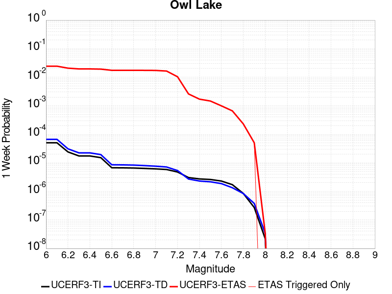 |  |  |  |

| Magnitude | 1 wk TI Prob | 1 wk TD Prob | 1 wk ETAS Prob | 1 wk ETAS/TD Gain | 1 wk ETAS Triggered Only | 1 mo TI Prob | 1 mo TD Prob | 1 mo ETAS Prob | 1 mo ETAS/TD Gain | 1 mo ETAS Triggered Only | 1 yr TI Prob | 1 yr TD Prob | 1 yr ETAS Prob | 1 yr ETAS/TD Gain | 1 yr ETAS Triggered Only | 10 yr TI Prob | 10 yr TD Prob | 10 yr ETAS Prob | 10 yr ETAS/TD Gain | 10 yr ETAS Triggered Only |
|-----|-----|-----|-----|-----|-----|-----|-----|-----|-----|-----|-----|-----|-----|-----|-----|-----|-----|-----|-----|-----|
| 6.0 | 5.0320643E-5 | 6.635816E-5 | 0.026366277 | 397.3329 | 0.026301663 | 2.1564208E-4 | 2.843674E-4 | 0.0281884 | 99.1267 | 0.02791197 | 0.0026222812 | 0.0034577388 | 0.033412848 | 9.663207 | 0.030059045 | 0.02591553 | 0.034140717 | 0.064728856 | 1.895943 | 0.031669352 |
| 6.1 | 5.0320643E-5 | 6.635816E-5 | 0.026366277 | 397.3329 | 0.026301663 | 2.1564208E-4 | 2.843674E-4 | 0.0281884 | 99.1267 | 0.02791197 | 0.0026222812 | 0.0034577388 | 0.033412848 | 9.663207 | 0.030059045 | 0.02591553 | 0.034140717 | 0.064728856 | 1.895943 | 0.031669352 |
| 6.2 | 2.4125871E-5 | 3.0981035E-5 | 0.022574566 | 728.65753 | 0.022544283 | 1.0339249E-4 | 1.3277028E-4 | 0.023568556 | 177.5138 | 0.023438897 | 0.0012580766 | 0.001615439 | 0.026981445 | 16.702238 | 0.02540705 | 0.012509781 | 0.016070465 | 0.042301543 | 2.632254 | 0.02665951 |
| 6.3 | 1.7433485E-5 | 2.2355514E-5 | 0.02149262 | 961.40137 | 0.021470746 | 7.471279E-5 | 9.580672E-5 | 0.02228012 | 232.55278 | 0.022186438 | 9.0924866E-4 | 0.0011659743 | 0.025113685 | 21.5388 | 0.023975667 | 0.009055373 | 0.011628896 | 0.036563646 | 3.1442063 | 0.025228126 |
| 6.4 | 1.7433485E-5 | 2.2355514E-5 | 0.02149262 | 961.40137 | 0.021470746 | 7.471279E-5 | 9.580672E-5 | 0.02228012 | 232.55278 | 0.022186438 | 9.0924866E-4 | 0.0011659743 | 0.025113685 | 21.5388 | 0.023975667 | 0.009055373 | 0.011628896 | 0.036563646 | 3.1442063 | 0.025228126 |
| 6.5 | 1.5182742E-5 | 1.9429144E-5 | 0.021310838 | 1096.849 | 0.021291824 | 6.506727E-5 | 8.326596E-5 | 0.022088949 | 265.28186 | 0.022007516 | 7.919061E-4 | 0.0010134429 | 0.02478607 | 24.457293 | 0.023796743 | 0.0078909 | 0.010118429 | 0.034914173 | 3.450553 | 0.025049204 |
| 6.6 | 6.7271576E-6 | 8.547361E-6 | 0.018974211 | 2219.891 | 0.018965825 | 2.8830356E-5 | 3.6631063E-5 | 0.01953851 | 533.38635 | 0.019502595 | 3.5095305E-4 | 4.458976E-4 | 0.021728227 | 48.729183 | 0.021291824 | 0.0035039932 | 0.004467813 | 0.026555125 | 5.9436526 | 0.022186438 |
| 6.7 | 6.682835E-6 | 8.479807E-6 | 0.018974144 | 2237.5679 | 0.018965825 | 2.8640408E-5 | 3.6341557E-5 | 0.019538227 | 537.6277 | 0.019502595 | 3.4864116E-4 | 4.4237426E-4 | 0.02172478 | 49.109497 | 0.021291824 | 0.003480947 | 0.0044327388 | 0.02652083 | 5.982944 | 0.022186438 |
| 6.8 | 6.5774975E-6 | 8.32628E-6 | 0.018973995 | 2278.8079 | 0.018965825 | 2.8188972E-5 | 3.5683603E-5 | 0.019537581 | 547.5227 | 0.019502595 | 3.4314668E-4 | 4.343669E-4 | 0.021716941 | 49.99677 | 0.021291824 | 0.0034261728 | 0.004352885 | 0.026442748 | 6.074764 | 0.022186438 |
| 6.9 | 6.363419E-6 | 7.999454E-6 | 0.018794753 | 2349.5042 | 0.018786903 | 2.727151E-5 | 3.428296E-5 | 0.019357292 | 564.63306 | 0.019323671 | 3.3198006E-4 | 4.1732067E-4 | 0.02152141 | 51.57044 | 0.0211129 | 0.0033148455 | 0.0041828766 | 0.026098337 | 6.2393274 | 0.022007516 |
| 7.0 | 6.1342453E-6 | 7.6316555E-6 | 0.01861547 | 2439.244 | 0.01860798 | 2.6289357E-5 | 3.2706717E-5 | 0.01917683 | 586.32697 | 0.01914475 | 3.2002592E-4 | 3.9813702E-4 | 0.02132378 | 53.5589 | 0.020933978 | 0.0031956544 | 0.003991571 | 0.025733031 | 6.4468436 | 0.021828592 |
| 7.1 | 5.842926E-6 | 7.142211E-6 | 0.01772038 | 2481.0776 | 0.017713366 | 2.504087E-5 | 3.0609146E-5 | 0.018280184 | 597.21313 | 0.018250134 | 3.0482994E-4 | 3.7260808E-4 | 0.020046791 | 53.80128 | 0.019681517 | 0.0030441214 | 0.0037370329 | 0.024236271 | 6.4854317 | 0.020576132 |
| 7.2 | 4.77173E-6 | 5.358483E-6 | 0.010919596 | 2037.8147 | 0.010914296 | 2.045011E-5 | 2.2964748E-5 | 0.011294847 | 491.83414 | 0.011272142 | 2.4895166E-4 | 2.79564E-4 | 0.012085173 | 43.228645 | 0.01180891 | 0.0024867293 | 0.002808645 | 0.0151196495 | 5.383254 | 0.012345679 |
| 7.3 | 3.0494948E-6 | 2.710463E-6 | 0.0032233137 | 1189.2114 | 0.003220612 | 1.3069198E-5 | 1.1616219E-5 | 0.0032321906 | 278.24808 | 0.003220612 | 1.5910587E-4 | 1.4141845E-4 | 0.0035404726 | 25.035435 | 0.0033995348 | 0.0015899199 | 0.0014232415 | 0.004996606 | 3.5107229 | 0.0035784577 |
| 7.4 | 2.7263884E-6 | 2.3056762E-6 | 0.0017915304 | 777.00867 | 0.0017892289 | 1.1684469E-5 | 9.881433E-6 | 0.0017990926 | 182.068 | 0.0017892289 | 1.4224913E-4 | 1.20299905E-4 | 0.002088215 | 17.358408 | 0.0019681517 | 0.0014215811 | 0.0012112238 | 0.0033556977 | 2.7705019 | 0.0021470746 |
| 7.5 | 2.6090431E-6 | 2.1656133E-6 | 0.0017913906 | 827.1978 | 0.0017892289 | 1.1181565E-5 | 9.281167E-6 | 0.0017984934 | 193.7788 | 0.0017892289 | 1.3612706E-4 | 1.1299244E-4 | 0.0020809218 | 18.416468 | 0.0019681517 | 0.001360437 | 0.0011379806 | 0.003282612 | 2.884594 | 0.0021470746 |
| 7.6 | 2.3008756E-6 | 1.8727933E-6 | 8.964855E-4 | 478.689 | 8.9461444E-4 | 9.860858E-6 | 8.0262325E-6 | 9.026335E-4 | 112.46041 | 8.9461444E-4 | 1.20049335E-4 | 9.7715085E-5 | 0.0011711475 | 11.98533 | 0.0010735373 | 0.001199845 | 9.849932E-4 | 0.002057473 | 2.0888195 | 0.0010735373 |
| 7.7 | 1.7184348E-6 | 1.3419171E-6 | 8.9595513E-4 | 667.668 | 8.9461444E-4 | 7.3646997E-6 | 5.7510606E-6 | 9.0036035E-4 | 156.55553 | 8.9461444E-4 | 8.966153E-5 | 7.0016955E-5 | 0.0011434791 | 16.331459 | 0.0010735373 | 8.962536E-4 | 7.078345E-4 | 0.0017806119 | 2.5155766 | 0.0010735373 |
| 7.8 | 8.4612907E-7 | 8.4058576E-7 | 1.7976332E-4 | 213.85483 | 1.7892288E-4 | 3.6262625E-6 | 3.6025056E-6 | 1.8252475E-4 | 50.666054 | 1.7892288E-4 | 4.4148852E-5 | 4.3859643E-5 | 2.2277467E-4 | 5.079263 | 1.7892288E-4 | 4.414008E-4 | 4.4398365E-4 | 6.228271E-4 | 1.4028153 | 1.7892288E-4 |
| 7.9 | 2.716738E-7 | 3.768106E-7 | 1.7929963E-4 | 475.8349 | 1.7892288E-4 | 1.1643157E-6 | 1.6149015E-6 | 1.8053749E-4 | 111.79474 | 1.7892288E-4 | 1.4175452E-5 | 1.966126E-5 | 1.9858063E-4 | 10.100097 | 1.7892288E-4 | 1.4174548E-4 | 1.9836679E-4 | 3.7725418E-4 | 1.9018011 | 1.7892288E-4 |
| 8.0 | 2.1995428E-8 | 3.384878E-8 | 3.384878E-8 | 1.0 | 0.0 | 9.426611E-8 | 1.4506621E-7 | 1.4506621E-7 | 1.0 | 0.0 | 1.1476893E-6 | 1.7661803E-6 | 1.7661803E-6 | 1.0 | 0.0 | 1.14768345E-5 | 1.7963059E-5 | 1.7963059E-5 | 1.0 | 0.0 |

## Panamint Valley
*[(top)](#table-of-contents)*

| 1 Week | 1 Month | 1 Year | 10 Year |
|-----|-----|-----|-----|
|  |  |  |  |

| Magnitude | 1 wk TI Prob | 1 wk TD Prob | 1 wk ETAS Prob | 1 wk ETAS/TD Gain | 1 wk ETAS Triggered Only | 1 mo TI Prob | 1 mo TD Prob | 1 mo ETAS Prob | 1 mo ETAS/TD Gain | 1 mo ETAS Triggered Only | 1 yr TI Prob | 1 yr TD Prob | 1 yr ETAS Prob | 1 yr ETAS/TD Gain | 1 yr ETAS Triggered Only | 10 yr TI Prob | 10 yr TD Prob | 10 yr ETAS Prob | 10 yr ETAS/TD Gain | 10 yr ETAS Triggered Only |
|-----|-----|-----|-----|-----|-----|-----|-----|-----|-----|-----|-----|-----|-----|-----|-----|-----|-----|-----|-----|-----|
| 6.0 | 3.0211835E-5 | 3.3984514E-5 | 0.016673246 | 490.6131 | 0.016639829 | 1.2947287E-4 | 1.4563995E-4 | 0.018572014 | 127.52005 | 0.018429058 | 0.0015751923 | 0.0017717537 | 0.022132823 | 12.4920435 | 0.020397209 | 0.015640736 | 0.017583137 | 0.038324807 | 2.179634 | 0.0211129 |
| 6.1 | 3.0211835E-5 | 3.3984514E-5 | 0.016673246 | 490.6131 | 0.016639829 | 1.2947287E-4 | 1.4563995E-4 | 0.018572014 | 127.52005 | 0.018429058 | 0.0015751923 | 0.0017717537 | 0.022132823 | 12.4920435 | 0.020397209 | 0.015640736 | 0.017583137 | 0.038324807 | 2.179634 | 0.0211129 |
| 6.2 | 3.0211835E-5 | 3.3984514E-5 | 0.016673246 | 490.6131 | 0.016639829 | 1.2947287E-4 | 1.4563995E-4 | 0.018572014 | 127.52005 | 0.018429058 | 0.0015751923 | 0.0017717537 | 0.022132823 | 12.4920435 | 0.020397209 | 0.015640736 | 0.017583137 | 0.038324807 | 2.179634 | 0.0211129 |
| 6.3 | 2.8573924E-5 | 3.210268E-5 | 0.01649248 | 513.7415 | 0.016460905 | 1.2245393E-4 | 1.3757581E-4 | 0.0183852 | 133.63686 | 0.018250134 | 0.001489857 | 0.0016737265 | 0.021858172 | 13.059585 | 0.020218287 | 0.01479908 | 0.016617801 | 0.0372039 | 2.2387981 | 0.020933978 |
| 6.4 | 2.8573924E-5 | 3.210268E-5 | 0.01649248 | 513.7415 | 0.016460905 | 1.2245393E-4 | 1.3757581E-4 | 0.0183852 | 133.63686 | 0.018250134 | 0.001489857 | 0.0016737265 | 0.021858172 | 13.059585 | 0.020218287 | 0.01479908 | 0.016617801 | 0.0372039 | 2.2387981 | 0.020933978 |
| 6.5 | 2.7468774E-5 | 3.0828433E-5 | 0.016133392 | 523.3283 | 0.016103059 | 1.1771801E-4 | 1.3211532E-4 | 0.01802204 | 136.41142 | 0.017892288 | 0.0014322745 | 0.0016073446 | 0.021435862 | 13.336196 | 0.01986044 | 0.014230782 | 0.015963677 | 0.036211338 | 2.2683582 | 0.020576132 |
| 6.6 | 2.6135967E-5 | 2.925248E-5 | 0.015774006 | 539.2365 | 0.015745213 | 1.1200648E-4 | 1.253619E-4 | 0.017657606 | 140.85306 | 0.017534442 | 0.0013628257 | 0.0015252391 | 0.020998087 | 13.767079 | 0.019502595 | 0.013544982 | 0.015154043 | 0.03506594 | 2.313966 | 0.020218287 |
| 6.7 | 2.4498746E-5 | 2.7341335E-5 | 0.015235371 | 557.2285 | 0.0152084455 | 1.04990395E-4 | 1.1717203E-4 | 0.017112855 | 146.04898 | 0.016997674 | 0.0012775084 | 0.0014256609 | 0.020364448 | 14.284215 | 0.018965825 | 0.012701893 | 0.014171274 | 0.03357388 | 2.3691504 | 0.019681517 |
| 6.8 | 2.2244329E-5 | 2.4935423E-5 | 0.014517328 | 582.19696 | 0.014492754 | 9.532935E-5 | 1.0686185E-4 | 0.016387105 | 153.3485 | 0.016281983 | 0.0011600169 | 0.0013002884 | 0.019348001 | 14.879778 | 0.018071212 | 0.011539802 | 0.0129325185 | 0.03147646 | 2.4339 | 0.018786903 |
| 6.9 | 1.9902658E-5 | 2.2290267E-5 | 0.012725532 | 570.9008 | 0.012703525 | 8.529431E-5 | 9.552632E-5 | 0.01440799 | 150.82744 | 0.014313831 | 0.0010379635 | 0.0011624309 | 0.017246772 | 14.836815 | 0.016103059 | 0.010331288 | 0.011568608 | 0.027839083 | 2.4064333 | 0.016460905 |
| 7.0 | 1.8353881E-5 | 2.0566185E-5 | 0.011829234 | 575.1788 | 0.01180891 | 7.865712E-5 | 8.813792E-5 | 0.013506171 | 153.23906 | 0.0134192165 | 9.5722964E-4 | 0.0010725686 | 0.016085971 | 14.997615 | 0.015029523 | 0.009531168 | 0.010678849 | 0.025724886 | 2.4089568 | 0.0152084455 |
| 7.1 | 1.7667631E-5 | 1.9772613E-5 | 0.011291691 | 571.0774 | 0.011272142 | 7.571623E-5 | 8.473711E-5 | 0.012966094 | 153.01552 | 0.012882448 | 9.2145515E-4 | 0.0010312037 | 0.015509012 | 15.039719 | 0.014492754 | 0.009176437 | 0.010269073 | 0.024790084 | 2.414053 | 0.014671677 |
| 7.2 | 1.6381597E-5 | 1.8158249E-5 | 0.010037658 | 552.7877 | 0.010019681 | 7.020495E-5 | 7.781885E-5 | 0.011349083 | 145.83978 | 0.011272142 | 8.544101E-4 | 9.4704994E-4 | 0.013817297 | 14.589829 | 0.012882448 | 0.008511325 | 0.009434792 | 0.022372931 | 2.3713222 | 0.013061371 |
| 7.3 | 1.4520491E-5 | 1.5966476E-5 | 0.008425208 | 527.6811 | 0.008409375 | 6.222919E-5 | 6.842605E-5 | 0.00955069 | 139.57681 | 0.009482913 | 7.57377E-4 | 8.327849E-4 | 0.011916766 | 14.309535 | 0.011093219 | 0.0075480095 | 0.00829975 | 0.019300899 | 2.3254793 | 0.011093219 |
| 7.4 | 1.2852287E-5 | 1.4145411E-5 | 0.008244482 | 582.8379 | 0.008230452 | 5.5080065E-5 | 6.062187E-5 | 0.009185135 | 151.51521 | 0.009125067 | 6.7039346E-4 | 7.378371E-4 | 0.01146529 | 15.539051 | 0.010735373 | 0.0066837464 | 0.0073567946 | 0.018013189 | 2.4485106 | 0.010735373 |
| 7.5 | 1.1637851E-5 | 1.2836797E-5 | 0.008243184 | 642.15265 | 0.008230452 | 4.987555E-5 | 5.5013777E-5 | 0.009179579 | 166.85963 | 0.009125067 | 6.070656E-4 | 6.6960254E-4 | 0.011397787 | 17.02172 | 0.010735373 | 0.006054099 | 0.0066787465 | 0.01734242 | 2.596658 | 0.010735373 |
| 7.6 | 3.0068115E-6 | 3.3330316E-6 | 0.0044763903 | 1343.0387 | 0.004473072 | 1.2886271E-5 | 1.4284384E-5 | 0.0050240536 | 351.71652 | 0.0050098407 | 1.5687906E-4 | 1.7390578E-4 | 0.0057195504 | 32.88879 | 0.0055466094 | 0.0015676835 | 0.0017391363 | 0.007276099 | 4.183743 | 0.0055466094 |

## Garlock (East)
*[(top)](#table-of-contents)*

| 1 Week | 1 Month | 1 Year | 10 Year |
|-----|-----|-----|-----|
|  |  | 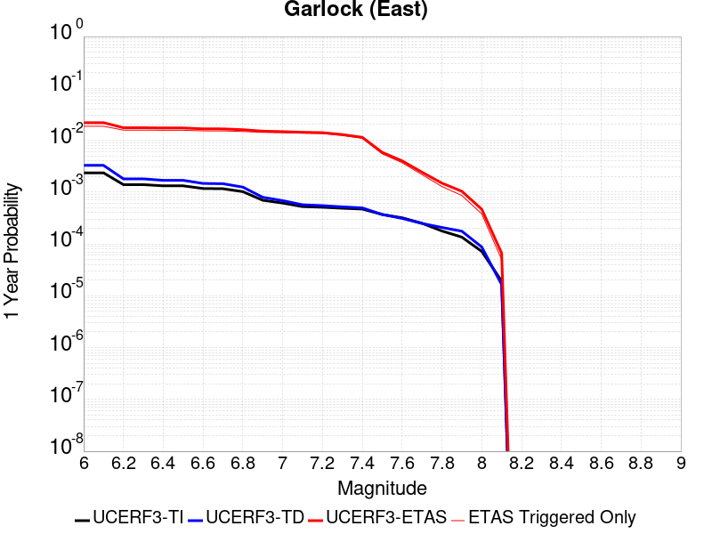 |  |

| Magnitude | 1 wk TI Prob | 1 wk TD Prob | 1 wk ETAS Prob | 1 wk ETAS/TD Gain | 1 wk ETAS Triggered Only | 1 mo TI Prob | 1 mo TD Prob | 1 mo ETAS Prob | 1 mo ETAS/TD Gain | 1 mo ETAS Triggered Only | 1 yr TI Prob | 1 yr TD Prob | 1 yr ETAS Prob | 1 yr ETAS/TD Gain | 1 yr ETAS Triggered Only | 10 yr TI Prob | 10 yr TD Prob | 10 yr ETAS Prob | 10 yr ETAS/TD Gain | 10 yr ETAS Triggered Only |
|-----|-----|-----|-----|-----|-----|-----|-----|-----|-----|-----|-----|-----|-----|-----|-----|-----|-----|-----|-----|-----|
| 6.0 | 4.5092507E-5 | 6.290325E-5 | 0.0145547455 | 231.38304 | 0.014492754 | 1.9323928E-4 | 2.6956003E-4 | 0.01601053 | 59.395046 | 0.015745213 | 0.0023501497 | 0.0032774 | 0.020754375 | 6.332573 | 0.017534442 | 0.023254504 | 0.032351844 | 0.050877225 | 1.5726221 | 0.01914475 |
| 6.1 | 4.5092507E-5 | 6.290325E-5 | 0.0145547455 | 231.38304 | 0.014492754 | 1.9323928E-4 | 2.6956003E-4 | 0.01601053 | 59.395046 | 0.015745213 | 0.0023501497 | 0.0032774 | 0.020754375 | 6.332573 | 0.017534442 | 0.023254504 | 0.032351844 | 0.050877225 | 1.5726221 | 0.01914475 |
| 6.2 | 2.6674514E-5 | 3.4509674E-5 | 0.012021929 | 348.364 | 0.011987833 | 1.1431433E-4 | 1.4789042E-4 | 0.013207329 | 89.30484 | 0.013061371 | 0.0013908884 | 0.0017991117 | 0.016087191 | 8.94174 | 0.014313831 | 0.01382215 | 0.017890299 | 0.033353828 | 1.8643527 | 0.015745213 |
| 6.3 | 2.6674514E-5 | 3.4509674E-5 | 0.012021929 | 348.364 | 0.011987833 | 1.1431433E-4 | 1.4789042E-4 | 0.013207329 | 89.30484 | 0.013061371 | 0.0013908884 | 0.0017991117 | 0.016087191 | 8.94174 | 0.014313831 | 0.01382215 | 0.017890299 | 0.033353828 | 1.8643527 | 0.015745213 |
| 6.4 | 2.5312667E-5 | 3.233893E-5 | 0.011840868 | 366.14902 | 0.01180891 | 1.0847834E-4 | 1.3858822E-4 | 0.013019251 | 93.94197 | 0.012882448 | 0.0013199237 | 0.0016860351 | 0.01579711 | 9.369385 | 0.014134908 | 0.013121112 | 0.016778335 | 0.03208345 | 1.9121951 | 0.015566291 |
| 6.5 | 2.5312667E-5 | 3.233893E-5 | 0.011840868 | 366.14902 | 0.01180891 | 1.0847834E-4 | 1.3858822E-4 | 0.013019251 | 93.94197 | 0.012882448 | 0.0013199237 | 0.0016860351 | 0.01579711 | 9.369385 | 0.014134908 | 0.013121112 | 0.016778335 | 0.03208345 | 1.9121951 | 0.015566291 |
| 6.6 | 2.246556E-5 | 2.8133776E-5 | 0.011836712 | 420.72958 | 0.01180891 | 9.627742E-5 | 1.20567885E-4 | 0.013001462 | 107.8352 | 0.012882448 | 0.0011715472 | 0.0014669491 | 0.015581122 | 10.621447 | 0.014134908 | 0.011653901 | 0.01461866 | 0.029957393 | 2.049257 | 0.015566291 |
| 6.7 | 2.2241198E-5 | 2.7803519E-5 | 0.011836385 | 425.71536 | 0.01180891 | 9.531594E-5 | 1.1915263E-4 | 0.013000065 | 109.10431 | 0.012882448 | 0.0011598538 | 0.0014497414 | 0.015564158 | 10.735816 | 0.014134908 | 0.011538187 | 0.014448853 | 0.02979023 | 2.0617712 | 0.015566291 |
| 6.8 | 1.9528685E-5 | 2.389819E-5 | 0.011653608 | 487.63556 | 0.0116299875 | 8.369167E-5 | 1.0241691E-4 | 0.01280464 | 125.02467 | 0.012703525 | 0.0010184698 | 0.0012462323 | 0.015184825 | 12.184587 | 0.013955985 | 0.010138147 | 0.012436427 | 0.027455734 | 2.2076867 | 0.0152084455 |
| 6.9 | 1.3318621E-5 | 1.5198884E-5 | 0.0112871695 | 742.6314 | 0.011272142 | 5.7078556E-5 | 6.513648E-5 | 0.012410011 | 190.52321 | 0.012345679 | 6.9470983E-4 | 7.927538E-4 | 0.014380113 | 18.139442 | 0.013598139 | 0.0069254204 | 0.007939888 | 0.022495072 | 2.8331726 | 0.014671677 |
| 7.0 | 1.1760853E-5 | 1.31077895E-5 | 0.011106181 | 847.29626 | 0.011093219 | 5.0402683E-5 | 5.6175057E-5 | 0.012222248 | 217.57428 | 0.012166756 | 6.134799E-4 | 6.8372174E-4 | 0.014093763 | 20.613302 | 0.0134192165 | 0.0061178906 | 0.00685652 | 0.021249903 | 3.0992258 | 0.014492754 |
| 7.1 | 1.0064758E-5 | 1.0902931E-5 | 0.010746159 | 985.62115 | 0.010735373 | 4.3133965E-5 | 4.672603E-5 | 0.01167617 | 249.88579 | 0.0116299875 | 5.2502943E-4 | 5.687444E-4 | 0.013443865 | 23.637798 | 0.012882448 | 0.005237907 | 0.0057129986 | 0.019411352 | 3.397752 | 0.013777062 |
| 7.2 | 9.768808E-6 | 1.0498807E-5 | 0.010208996 | 972.3958 | 0.010198604 | 4.186565E-5 | 4.499413E-5 | 0.011137714 | 247.53703 | 0.011093219 | 5.095951E-4 | 5.4766936E-4 | 0.012707762 | 23.203348 | 0.012166756 | 0.0050842804 | 0.0055032647 | 0.018314816 | 3.3279912 | 0.012882448 |
| 7.3 | 9.344516E-6 | 9.944468E-6 | 0.008955999 | 900.60126 | 0.008946144 | 4.004731E-5 | 4.261847E-5 | 0.009882958 | 231.89377 | 0.0098407585 | 4.8746695E-4 | 5.1875977E-4 | 0.011427394 | 22.028296 | 0.010914296 | 0.0048639905 | 0.0052149445 | 0.016606292 | 3.184366 | 0.011451065 |
| 7.4 | 9.023491E-6 | 9.490661E-6 | 0.007345259 | 773.94604 | 0.0073358384 | 3.867153E-5 | 4.0673647E-5 | 0.008270792 | 203.34521 | 0.008230452 | 4.7072413E-4 | 4.950925E-4 | 0.009436808 | 19.060696 | 0.008946144 | 0.004697283 | 0.0049783974 | 0.014236068 | 2.8595686 | 0.00930399 |
| 7.5 | 7.081253E-6 | 7.087672E-6 | 0.003943363 | 556.3693 | 0.0039363033 | 3.0347876E-5 | 3.0375388E-5 | 0.0045033116 | 148.25528 | 0.004473072 | 3.6942272E-4 | 3.6975832E-4 | 0.005020033 | 13.576525 | 0.004651995 | 0.003688092 | 0.0037243143 | 0.008715496 | 2.3401616 | 0.0050098407 |
| 7.6 | 6.116396E-6 | 5.959245E-6 | 0.0025108648 | 421.33942 | 0.0025049204 | 2.6212863E-5 | 2.5539372E-5 | 0.0028882325 | 113.08941 | 0.0028627662 | 3.1909486E-4 | 3.1089774E-4 | 0.0033516411 | 10.780526 | 0.003041689 | 0.0031863707 | 0.0031357552 | 0.006346268 | 2.0238404 | 0.003220612 |
| 7.7 | 4.797145E-6 | 4.757281E-6 | 0.0010782895 | 226.66087 | 0.0010735373 | 2.055903E-5 | 2.0388188E-5 | 0.0014517421 | 71.205055 | 0.0014313831 | 2.5027743E-4 | 2.4819805E-4 | 0.0018581044 | 7.4863777 | 0.001610306 | 0.0024999576 | 0.0025093474 | 0.0042940862 | 1.7112364 | 0.0017892289 |
| 7.8 | 3.4028885E-6 | 3.978462E-6 | 3.618228E-4 | 90.945404 | 3.5784577E-4 | 1.4583726E-5 | 1.7050439E-5 | 7.327298E-4 | 42.974247 | 7.1569154E-4 | 1.775424E-4 | 2.0756939E-4 | 0.0011019981 | 5.3090587 | 8.9461444E-4 | 0.0017740062 | 0.0021012232 | 0.0029939578 | 1.4248643 | 8.9461444E-4 |
| 7.9 | 2.5928412E-6 | 3.3724489E-6 | 1.8229472E-4 | 54.05411 | 1.7892288E-4 | 1.1112129E-5 | 1.4453272E-5 | 3.7229387E-4 | 25.758448 | 3.5784577E-4 | 1.3528178E-4 | 1.7595445E-4 | 7.1262865E-4 | 4.0500746 | 5.3676864E-4 | 0.0013519945 | 0.0017812408 | 0.0023170533 | 1.3008085 | 5.3676864E-4 |
| 8.0 | 1.3743648E-6 | 1.6734747E-6 | 1.6734747E-6 | 1.0 | 0.0 | 5.8901214E-6 | 7.1720146E-6 | 1.8609362E-4 | 25.947187 | 1.7892288E-4 | 7.1709874E-5 | 8.731581E-5 | 2.6622307E-4 | 3.0489676 | 1.7892288E-4 | 7.1686733E-4 | 8.837234E-4 | 0.0010624882 | 1.2022859 | 1.7892288E-4 |
| 8.1 | 3.6733252E-7 | 3.1489964E-7 | 3.1489964E-7 | 1.0 | 0.0 | 1.5742813E-6 | 1.3495693E-6 | 1.3495693E-6 | 1.0 | 0.0 | 1.9166706E-5 | 1.6430899E-5 | 1.6430899E-5 | 1.0 | 0.0 | 1.9165053E-4 | 1.6638759E-4 | 1.6638759E-4 | 1.0 | 0.0 |

## Hunter Mountain-Saline Valley
*[(top)](#table-of-contents)*

| 1 Week | 1 Month | 1 Year | 10 Year |
|-----|-----|-----|-----|
|  |  |  |  |

| Magnitude | 1 wk TI Prob | 1 wk TD Prob | 1 wk ETAS Prob | 1 wk ETAS/TD Gain | 1 wk ETAS Triggered Only | 1 mo TI Prob | 1 mo TD Prob | 1 mo ETAS Prob | 1 mo ETAS/TD Gain | 1 mo ETAS Triggered Only | 1 yr TI Prob | 1 yr TD Prob | 1 yr ETAS Prob | 1 yr ETAS/TD Gain | 1 yr ETAS Triggered Only | 10 yr TI Prob | 10 yr TD Prob | 10 yr ETAS Prob | 10 yr ETAS/TD Gain | 10 yr ETAS Triggered Only |
|-----|-----|-----|-----|-----|-----|-----|-----|-----|-----|-----|-----|-----|-----|-----|-----|-----|-----|-----|-----|-----|
| 6.0 | 4.5103672E-5 | 5.4570177E-5 | 0.008105661 | 148.53645 | 0.0080515295 | 1.9328714E-4 | 2.3385242E-4 | 0.009177905 | 39.246567 | 0.008946144 | 0.002350731 | 0.0028435152 | 0.013369948 | 4.701908 | 0.01055645 | 0.023260195 | 0.028091887 | 0.038351785 | 1.3652264 | 0.01055645 |
| 6.1 | 4.5103672E-5 | 5.4570177E-5 | 0.008105661 | 148.53645 | 0.0080515295 | 1.9328714E-4 | 2.3385242E-4 | 0.009177905 | 39.246567 | 0.008946144 | 0.002350731 | 0.0028435152 | 0.013369948 | 4.701908 | 0.01055645 | 0.023260195 | 0.028091887 | 0.038351785 | 1.3652264 | 0.01055645 |
| 6.2 | 3.9363465E-5 | 4.706337E-5 | 0.008098214 | 172.07043 | 0.0080515295 | 1.6868966E-4 | 2.0168544E-4 | 0.009146025 | 45.34797 | 0.008946144 | 0.002051862 | 0.0024528175 | 0.012983374 | 5.2932496 | 0.01055645 | 0.020330196 | 0.024273481 | 0.03457369 | 1.42434 | 0.01055645 |
| 6.3 | 3.9363465E-5 | 4.706337E-5 | 0.008098214 | 172.07043 | 0.0080515295 | 1.6868966E-4 | 2.0168544E-4 | 0.009146025 | 45.34797 | 0.008946144 | 0.002051862 | 0.0024528175 | 0.012983374 | 5.2932496 | 0.01055645 | 0.020330196 | 0.024273481 | 0.03457369 | 1.42434 | 0.01055645 |
| 6.4 | 3.2311684E-5 | 3.795099E-5 | 0.008089175 | 213.14793 | 0.0080515295 | 1.384713E-4 | 1.6263737E-4 | 0.009107326 | 55.99775 | 0.008946144 | 0.0016845843 | 0.0019783843 | 0.01251395 | 6.325338 | 0.01055645 | 0.016718714 | 0.019616475 | 0.029965844 | 1.5275856 | 0.01055645 |
| 6.5 | 3.2311684E-5 | 3.795099E-5 | 0.008089175 | 213.14793 | 0.0080515295 | 1.384713E-4 | 1.6263737E-4 | 0.009107326 | 55.99775 | 0.008946144 | 0.0016845843 | 0.0019783843 | 0.01251395 | 6.325338 | 0.01055645 | 0.016718714 | 0.019616475 | 0.029965844 | 1.5275856 | 0.01055645 |
| 6.6 | 2.9305844E-5 | 3.418183E-5 | 0.008085436 | 236.54193 | 0.0080515295 | 1.2559042E-4 | 1.4648569E-4 | 0.0090913195 | 62.062847 | 0.008946144 | 0.0015279909 | 0.001782067 | 0.0123197045 | 6.9131546 | 0.01055645 | 0.015175272 | 0.01768569 | 0.028055444 | 1.5863357 | 0.01055645 |
| 6.7 | 2.7826512E-5 | 3.2344276E-5 | 0.008083614 | 249.92409 | 0.0080515295 | 1.19251024E-4 | 1.386113E-4 | 0.009083515 | 65.53229 | 0.008946144 | 0.0014509142 | 0.0016863465 | 0.012224995 | 7.249397 | 0.01055645 | 0.014414776 | 0.016743187 | 0.027122889 | 1.6199359 | 0.01055645 |
| 6.8 | 2.3389874E-5 | 2.6866714E-5 | 0.00807818 | 300.67615 | 0.0080515295 | 1.0023846E-4 | 1.15138246E-4 | 0.009060252 | 78.69021 | 0.008946144 | 0.00121972 | 0.001400954 | 0.011942615 | 8.524631 | 0.01055645 | 0.01213047 | 0.013927434 | 0.02433686 | 1.7474045 | 0.01055645 |
| 6.9 | 2.069209E-5 | 2.3570032E-5 | 0.00807491 | 342.59225 | 0.0080515295 | 8.867737E-5 | 1.01010715E-4 | 0.009046251 | 89.55734 | 0.008946144 | 0.0010791123 | 0.0012291478 | 0.011772622 | 9.577874 | 0.01055645 | 0.010738871 | 0.012228523 | 0.022655884 | 1.8527081 | 0.01055645 |
| 7.0 | 1.7462342E-5 | 1.9633546E-5 | 0.008071005 | 411.0824 | 0.0080515295 | 7.483646E-5 | 8.414118E-5 | 0.009029533 | 107.31407 | 0.008946144 | 9.1075303E-4 | 0.0010239601 | 0.011569601 | 11.298879 | 0.01055645 | 0.009070295 | 0.0101960525 | 0.020644868 | 2.0247903 | 0.01055645 |
| 7.1 | 1.4807709E-5 | 1.6441749E-5 | 0.008067839 | 490.69226 | 0.0080515295 | 6.3460066E-5 | 7.046283E-5 | 0.009015976 | 127.95365 | 0.008946144 | 7.723524E-4 | 8.575638E-4 | 0.011404961 | 13.299256 | 0.01055645 | 0.007696735 | 0.008545532 | 0.019011771 | 2.2247617 | 0.01055645 |
| 7.2 | 1.4180048E-5 | 1.5698337E-5 | 0.008067102 | 513.88257 | 0.0080515295 | 6.077022E-5 | 6.727694E-5 | 0.009012819 | 133.96596 | 0.008946144 | 7.396263E-4 | 8.188051E-4 | 0.011366611 | 13.881949 | 0.01055645 | 0.0073716943 | 0.008160833 | 0.018631134 | 2.282994 | 0.01055645 |
| 7.3 | 1.3730402E-5 | 1.5172075E-5 | 0.00806658 | 531.6728 | 0.0080515295 | 5.8843252E-5 | 6.502165E-5 | 0.009010584 | 138.57822 | 0.008946144 | 7.161811E-4 | 7.9136714E-4 | 0.011339463 | 14.328954 | 0.01055645 | 0.007138774 | 0.007888422 | 0.018361598 | 2.3276641 | 0.01055645 |
| 7.4 | 1.2810095E-5 | 1.4109277E-5 | 0.008065525 | 571.647 | 0.0080515295 | 5.489925E-5 | 6.0467017E-5 | 0.00900607 | 148.94186 | 0.008946144 | 6.681934E-4 | 7.359531E-4 | 0.0112846345 | 15.333361 | 0.01055645 | 0.006661878 | 0.007338053 | 0.017817039 | 2.4280336 | 0.01055645 |
| 7.5 | 1.1595659E-5 | 1.2800664E-5 | 0.008064227 | 629.9851 | 0.0080515295 | 4.9694736E-5 | 5.4858923E-5 | 0.009000513 | 164.06651 | 0.008946144 | 6.0486543E-4 | 6.6771836E-4 | 0.01121712 | 16.799177 | 0.01055645 | 0.006032217 | 0.0066599925 | 0.017146137 | 2.574498 | 0.01055645 |
| 7.6 | 2.997694E-6 | 3.3251579E-6 | 0.0044763824 | 1346.2164 | 0.004473072 | 1.28471975E-5 | 1.425064E-5 | 0.00502402 | 352.54697 | 0.0050098407 | 1.564034E-4 | 1.73495E-4 | 0.005719142 | 32.964302 | 0.0055466094 | 0.0015629337 | 0.001735031 | 0.0072720167 | 4.1912894 | 0.0055466094 |

## Garlock (West)
*[(top)](#table-of-contents)*

| 1 Week | 1 Month | 1 Year | 10 Year |
|-----|-----|-----|-----|
|  |  |  |  |

| Magnitude | 1 wk TI Prob | 1 wk TD Prob | 1 wk ETAS Prob | 1 wk ETAS/TD Gain | 1 wk ETAS Triggered Only | 1 mo TI Prob | 1 mo TD Prob | 1 mo ETAS Prob | 1 mo ETAS/TD Gain | 1 mo ETAS Triggered Only | 1 yr TI Prob | 1 yr TD Prob | 1 yr ETAS Prob | 1 yr ETAS/TD Gain | 1 yr ETAS Triggered Only | 10 yr TI Prob | 10 yr TD Prob | 10 yr ETAS Prob | 10 yr ETAS/TD Gain | 10 yr ETAS Triggered Only |
|-----|-----|-----|-----|-----|-----|-----|-----|-----|-----|-----|-----|-----|-----|-----|-----|-----|-----|-----|-----|-----|
| 6.0 | 2.5181727E-5 | 2.51973E-5 | 0.0077186874 | 306.32996 | 0.007693684 | 1.0791722E-4 | 1.0798398E-4 | 0.008516451 | 78.86773 | 0.008409375 | 0.0013131002 | 0.0013139155 | 0.010069617 | 7.6638246 | 0.008767221 | 0.013053683 | 0.013141977 | 0.022500265 | 1.7120914 | 0.009482913 |
| 6.1 | 2.5077732E-5 | 2.5098372E-5 | 0.007718589 | 307.53345 | 0.007693684 | 1.0747157E-4 | 1.0756004E-4 | 0.008516031 | 79.174675 | 0.008409375 | 0.001307681 | 0.0013087603 | 0.010064507 | 7.690108 | 0.008767221 | 0.013000126 | 0.013091032 | 0.022449804 | 1.7148994 | 0.009482913 |
| 6.2 | 2.494612E-5 | 2.498005E-5 | 0.007718472 | 308.98544 | 0.007693684 | 1.0690756E-4 | 1.0705298E-4 | 0.008515528 | 79.54499 | 0.008409375 | 0.0013008224 | 0.0013025942 | 0.010058396 | 7.721818 | 0.008767221 | 0.012932341 | 0.013030097 | 0.022389447 | 1.718287 | 0.009482913 |
| 6.3 | 2.4733758E-5 | 2.479942E-5 | 0.0077182925 | 311.22876 | 0.007693684 | 1.0599751E-4 | 1.06278916E-4 | 0.008514761 | 80.11712 | 0.008409375 | 0.0012897556 | 0.0012931811 | 0.010049065 | 7.77081 | 0.008767221 | 0.012822957 | 0.012937066 | 0.022297299 | 1.7235204 | 0.009482913 |
| 6.4 | 2.3237335E-5 | 2.317873E-5 | 0.0077166846 | 332.92093 | 0.007693684 | 9.958477E-5 | 9.933365E-5 | 0.008507874 | 85.64947 | 0.008409375 | 0.0012117702 | 0.001208719 | 0.009965343 | 8.244549 | 0.008767221 | 0.012051838 | 0.012101916 | 0.021470068 | 1.7741048 | 0.009482913 |
| 6.5 | 2.2732203E-5 | 2.2993298E-5 | 0.0077165 | 335.5978 | 0.007693684 | 9.742009E-5 | 9.8539E-5 | 0.008507086 | 86.33218 | 0.008409375 | 0.0011854442 | 0.0011990548 | 0.009955764 | 8.30301 | 0.008767221 | 0.011791403 | 0.012006322 | 0.02137538 | 1.7803437 | 0.009482913 |
| 6.6 | 2.1319436E-5 | 2.17735E-5 | 0.00771529 | 354.34314 | 0.007693684 | 9.136581E-5 | 9.331167E-5 | 0.008501902 | 91.11296 | 0.008409375 | 0.001111811 | 0.0011354799 | 0.009892746 | 8.712393 | 0.008767221 | 0.011062649 | 0.011377227 | 0.02075225 | 1.8240167 | 0.009482913 |
| 6.7 | 1.970802E-5 | 2.0393396E-5 | 0.0077139204 | 378.2558 | 0.007693684 | 8.446021E-5 | 8.739735E-5 | 0.008496038 | 97.21162 | 0.008409375 | 0.001027818 | 0.001063545 | 0.009821442 | 9.234628 | 0.008767221 | 0.010230771 | 0.010664964 | 0.020046743 | 1.8796821 | 0.009482913 |
| 6.8 | 1.8744462E-5 | 1.9901045E-5 | 0.007713432 | 387.5893 | 0.007693684 | 8.033094E-5 | 8.5287415E-5 | 0.008493946 | 99.59202 | 0.008409375 | 9.775903E-4 | 0.0010378812 | 0.009796003 | 9.438462 | 0.008767221 | 0.009733009 | 0.01041075 | 0.01979494 | 1.901394 | 0.009482913 |
| 6.9 | 1.7559682E-5 | 1.8953415E-5 | 0.007712492 | 406.9183 | 0.007693684 | 7.5253614E-5 | 8.12264E-5 | 0.008489919 | 104.52167 | 0.008409375 | 9.158276E-4 | 9.884841E-4 | 0.0097470395 | 9.860592 | 0.008767221 | 0.0091206245 | 0.009921231 | 0.019310063 | 1.9463372 | 0.009482913 |
| 7.0 | 1.6794445E-5 | 1.8216237E-5 | 0.0077117602 | 423.3454 | 0.007693684 | 7.197421E-5 | 7.8067256E-5 | 0.008486786 | 108.71121 | 0.008409375 | 8.759337E-4 | 9.5005584E-4 | 0.0097089475 | 10.219345 | 0.008767221 | 0.008724891 | 0.009540141 | 0.018932585 | 1.9845185 | 0.009482913 |
| 7.1 | 1.6337795E-5 | 1.7717046E-5 | 0.007711265 | 435.24554 | 0.007693684 | 7.0017246E-5 | 7.5927994E-5 | 0.008484665 | 111.74621 | 0.008409375 | 8.521265E-4 | 9.240326E-4 | 0.009683153 | 10.479233 | 0.008767221 | 0.008488664 | 0.009281996 | 0.018676888 | 2.012163 | 0.009482913 |
| 7.2 | 1.5780008E-5 | 1.7165687E-5 | 0.0077107176 | 449.19366 | 0.007693684 | 6.762685E-5 | 7.356516E-5 | 0.008482322 | 115.30352 | 0.008409375 | 8.2304585E-4 | 8.9528906E-4 | 0.009654662 | 10.783848 | 0.008767221 | 0.008200042 | 0.008996838 | 0.018394435 | 2.0445445 | 0.009482913 |
| 7.3 | 1.5058865E-5 | 1.6618762E-5 | 0.007531255 | 453.17786 | 0.0075147613 | 6.45364E-5 | 7.122133E-5 | 0.008301088 | 116.5534 | 0.008230452 | 7.854473E-4 | 8.667759E-4 | 0.0094476305 | 10.899738 | 0.008588298 | 0.00782677 | 0.008713539 | 0.017936457 | 2.0584586 | 0.00930399 |
| 7.4 | 1.4887923E-5 | 1.6454731E-5 | 0.007531092 | 457.68552 | 0.0075147613 | 6.380382E-5 | 7.051838E-5 | 0.008300391 | 117.70535 | 0.008230452 | 7.7653467E-4 | 8.582243E-4 | 0.009439152 | 10.998467 | 0.008588298 | 0.0077382675 | 0.008628399 | 0.01785211 | 2.0689945 | 0.00930399 |
| 7.5 | 1.4509299E-5 | 1.6046748E-5 | 0.006993927 | 435.84702 | 0.0069779926 | 6.218123E-5 | 6.876997E-5 | 0.007761925 | 112.867935 | 0.007693684 | 7.567935E-4 | 8.36954E-4 | 0.008881745 | 10.611987 | 0.0080515295 | 0.0075422134 | 0.008416704 | 0.017110134 | 2.0328782 | 0.008767221 |
| 7.6 | 1.2756717E-5 | 1.4050848E-5 | 0.00430814 | 306.61066 | 0.004294149 | 5.4670498E-5 | 6.0216535E-5 | 0.0048908433 | 81.22094 | 0.004830918 | 6.6541E-4 | 7.328904E-4 | 0.0059178513 | 8.074675 | 0.0051887636 | 0.006634211 | 0.0073816874 | 0.012887354 | 1.7458546 | 0.0055466094 |
| 7.7 | 1.0328985E-5 | 1.1460557E-5 | 0.002874194 | 250.79007 | 0.0028627662 | 4.4266326E-5 | 4.911575E-5 | 0.0032695695 | 66.56866 | 0.003220612 | 5.388092E-4 | 5.978206E-4 | 0.004174139 | 6.98226 | 0.0035784577 | 0.0053750467 | 0.006038511 | 0.009951046 | 1.6479303 | 0.0039363033 |
| 7.8 | 7.0306583E-6 | 8.899601E-6 | 0.0012613486 | 141.73093 | 0.0012524602 | 3.0131043E-5 | 3.814059E-5 | 0.0016483851 | 43.21866 | 0.001610306 | 3.667837E-4 | 4.642629E-4 | 0.0022526612 | 4.8521237 | 0.0017892289 | 0.003661789 | 0.0046952725 | 0.0066541834 | 1.4172091 | 0.0019681517 |
| 7.9 | 4.060633E-6 | 5.4653938E-6 | 5.4223114E-4 | 99.211716 | 5.3676864E-4 | 1.7402595E-5 | 2.3422906E-5 | 7.3909765E-4 | 31.554482 | 7.1569154E-4 | 2.11856E-4 | 2.851367E-4 | 0.0011794961 | 4.1365986 | 8.9461444E-4 | 0.0021165414 | 0.002884201 | 0.003954642 | 1.3711395 | 0.0010735373 |
| 8.0 | 1.6729537E-6 | 2.0775144E-6 | 2.0775144E-6 | 1.0 | 0.0 | 7.169782E-6 | 8.903603E-6 | 1.8782489E-4 | 21.09538 | 1.7892288E-4 | 8.7288594E-5 | 1.0839601E-4 | 2.872995E-4 | 2.650462 | 1.7892288E-4 | 8.7254314E-4 | 0.0010969337 | 0.0012756604 | 1.1629329 | 1.7892288E-4 |
| 8.1 | 3.6733252E-7 | 3.1489964E-7 | 3.1489964E-7 | 1.0 | 0.0 | 1.5742813E-6 | 1.3495693E-6 | 1.3495693E-6 | 1.0 | 0.0 | 1.9166706E-5 | 1.6430899E-5 | 1.6430899E-5 | 1.0 | 0.0 | 1.9165053E-4 | 1.6638759E-4 | 1.6638759E-4 | 1.0 | 0.0 |

## Blackwater
*[(top)](#table-of-contents)*

| 1 Week | 1 Month | 1 Year | 10 Year |
|-----|-----|-----|-----|
|  |  |  |  |

| Magnitude | 1 wk TI Prob | 1 wk TD Prob | 1 wk ETAS Prob | 1 wk ETAS/TD Gain | 1 wk ETAS Triggered Only | 1 mo TI Prob | 1 mo TD Prob | 1 mo ETAS Prob | 1 mo ETAS/TD Gain | 1 mo ETAS Triggered Only | 1 yr TI Prob | 1 yr TD Prob | 1 yr ETAS Prob | 1 yr ETAS/TD Gain | 1 yr ETAS Triggered Only | 10 yr TI Prob | 10 yr TD Prob | 10 yr ETAS Prob | 10 yr ETAS/TD Gain | 10 yr ETAS Triggered Only |
|-----|-----|-----|-----|-----|-----|-----|-----|-----|-----|-----|-----|-----|-----|-----|-----|-----|-----|-----|-----|-----|
| 6.0 | 3.0708583E-5 | 3.3095846E-5 | 0.0059373556 | 179.3988 | 0.005904455 | 1.3160157E-4 | 1.4183241E-4 | 0.00676104 | 47.66922 | 0.006620147 | 0.0016010714 | 0.0017255784 | 0.009048758 | 5.2438984 | 0.0073358384 | 0.015895851 | 0.017135633 | 0.024345767 | 1.4207685 | 0.0073358384 |
| 6.1 | 3.0708583E-5 | 3.3095846E-5 | 0.0059373556 | 179.3988 | 0.005904455 | 1.3160157E-4 | 1.4183241E-4 | 0.00676104 | 47.66922 | 0.006620147 | 0.0016010714 | 0.0017255784 | 0.009048758 | 5.2438984 | 0.0073358384 | 0.015895851 | 0.017135633 | 0.024345767 | 1.4207685 | 0.0073358384 |
| 6.2 | 1.1707779E-5 | 1.2545122E-5 | 0.0023385135 | 186.40819 | 0.0023259975 | 5.017523E-5 | 5.3763757E-5 | 0.0025585494 | 47.58874 | 0.0025049204 | 6.107122E-4 | 6.5438676E-4 | 0.0033364738 | 5.0986266 | 0.0026838433 | 0.006090366 | 0.0065255696 | 0.0091919 | 1.4085972 | 0.0026838433 |
| 6.3 | 1.1707779E-5 | 1.2545122E-5 | 0.0023385135 | 186.40819 | 0.0023259975 | 5.017523E-5 | 5.3763757E-5 | 0.0025585494 | 47.58874 | 0.0025049204 | 6.107122E-4 | 6.5438676E-4 | 0.0033364738 | 5.0986266 | 0.0026838433 | 0.006090366 | 0.0065255696 | 0.0091919 | 1.4085972 | 0.0026838433 |
| 6.4 | 7.929244E-6 | 8.480098E-6 | 0.0016187724 | 190.89076 | 0.001610306 | 3.3982033E-5 | 3.6342793E-5 | 0.0016465902 | 45.3072 | 0.001610306 | 4.136527E-4 | 4.423877E-4 | 0.0020519814 | 4.638423 | 0.001610306 | 0.0041288356 | 0.0044154758 | 0.0060186717 | 1.3630856 | 0.001610306 |
| 6.5 | 5.8832115E-6 | 6.285991E-6 | 0.0012587383 | 200.24501 | 0.0012524602 | 2.521352E-5 | 2.6939697E-5 | 0.0012793662 | 47.489998 | 0.0012524602 | 3.0693135E-4 | 3.27944E-4 | 0.0015799934 | 4.817876 | 0.0012524602 | 0.0030650778 | 0.0032748538 | 0.0045232126 | 1.3811952 | 0.0012524602 |
| 6.6 | 5.8832115E-6 | 6.285991E-6 | 0.0012587383 | 200.24501 | 0.0012524602 | 2.521352E-5 | 2.6939697E-5 | 0.0012793662 | 47.489998 | 0.0012524602 | 3.0693135E-4 | 3.27944E-4 | 0.0015799934 | 4.817876 | 0.0012524602 | 0.0030650778 | 0.0032748538 | 0.0045232126 | 1.3811952 | 0.0012524602 |
| 6.7 | 3.0715053E-6 | 3.2814662E-6 | 5.4004835E-4 | 164.57532 | 5.3676864E-4 | 1.3163528E-5 | 1.4063357E-5 | 5.5082445E-4 | 39.16735 | 5.3676864E-4 | 1.6025416E-4 | 1.7120909E-4 | 7.0788583E-4 | 4.134628 | 5.3676864E-4 | 0.0016013865 | 0.0017108864 | 0.0022467368 | 1.3132004 | 5.3676864E-4 |
| 6.8 | 2.2722281E-6 | 2.4287538E-6 | 5.3919613E-4 | 222.00526 | 5.3676864E-4 | 9.738084E-6 | 1.0408908E-5 | 5.47172E-4 | 52.567665 | 5.3676864E-4 | 1.1855473E-4 | 1.26722E-4 | 6.6342263E-4 | 5.23526 | 5.3676864E-4 | 0.001184915 | 0.0012665876 | 0.0018026764 | 1.4232544 | 5.3676864E-4 |
| 6.9 | 9.952399E-7 | 1.0653489E-6 | 1.0653489E-6 | 1.0 | 0.0 | 4.265307E-6 | 4.5657757E-6 | 4.5657757E-6 | 1.0 | 0.0 | 5.1928873E-5 | 5.5587418E-5 | 5.5587418E-5 | 1.0 | 0.0 | 5.191674E-4 | 5.557858E-4 | 5.557858E-4 | 1.0 | 0.0 |
| 7.0 | 4.7385504E-7 | 5.0755597E-7 | 5.0755597E-7 | 1.0 | 0.0 | 2.0308057E-6 | 2.1752398E-6 | 2.1752398E-6 | 1.0 | 0.0 | 2.4724779E-5 | 2.6483543E-5 | 2.6483543E-5 | 1.0 | 0.0 | 2.4722028E-4 | 2.6483546E-4 | 2.6483546E-4 | 1.0 | 0.0 |

## Gravel Hills-Harper Lk
*[(top)](#table-of-contents)*

| 1 Week | 1 Month | 1 Year | 10 Year |
|-----|-----|-----|-----|
|  |  |  |  |

| Magnitude | 1 wk TI Prob | 1 wk TD Prob | 1 wk ETAS Prob | 1 wk ETAS/TD Gain | 1 wk ETAS Triggered Only | 1 mo TI Prob | 1 mo TD Prob | 1 mo ETAS Prob | 1 mo ETAS/TD Gain | 1 mo ETAS Triggered Only | 1 yr TI Prob | 1 yr TD Prob | 1 yr ETAS Prob | 1 yr ETAS/TD Gain | 1 yr ETAS Triggered Only | 10 yr TI Prob | 10 yr TD Prob | 10 yr ETAS Prob | 10 yr ETAS/TD Gain | 10 yr ETAS Triggered Only |
|-----|-----|-----|-----|-----|-----|-----|-----|-----|-----|-----|-----|-----|-----|-----|-----|-----|-----|-----|-----|-----|
| 6.0 | 3.0679566E-5 | 3.1464646E-5 | 0.0046833134 | 148.84367 | 0.004651995 | 1.3147724E-4 | 1.3484273E-4 | 0.005144008 | 38.1482 | 0.0050098407 | 0.0015995599 | 0.0016406906 | 0.0069995704 | 4.2662344 | 0.0053676865 | 0.015880952 | 0.01630734 | 0.021763498 | 1.334583 | 0.0055466094 |
| 6.1 | 3.0679566E-5 | 3.1464646E-5 | 0.0046833134 | 148.84367 | 0.004651995 | 1.3147724E-4 | 1.3484273E-4 | 0.005144008 | 38.1482 | 0.0050098407 | 0.0015995599 | 0.0016406906 | 0.0069995704 | 4.2662344 | 0.0053676865 | 0.015880952 | 0.01630734 | 0.021763498 | 1.334583 | 0.0055466094 |
| 6.2 | 1.514536E-5 | 1.3635206E-5 | 0.0012660783 | 92.85362 | 0.0012524602 | 6.490707E-5 | 5.843536E-5 | 0.0013108223 | 22.432007 | 0.0012524602 | 7.8995706E-4 | 7.1123015E-4 | 0.002320391 | 3.2625034 | 0.001610306 | 0.007871548 | 0.0070907404 | 0.008689628 | 1.2254895 | 0.001610306 |
| 6.3 | 1.514536E-5 | 1.3635206E-5 | 0.0012660783 | 92.85362 | 0.0012524602 | 6.490707E-5 | 5.843536E-5 | 0.0013108223 | 22.432007 | 0.0012524602 | 7.8995706E-4 | 7.1123015E-4 | 0.002320391 | 3.2625034 | 0.001610306 | 0.007871548 | 0.0070907404 | 0.008689628 | 1.2254895 | 0.001610306 |
| 6.4 | 1.2532521E-5 | 1.06896905E-5 | 1.8961066E-4 | 17.737713 | 1.7892288E-4 | 5.37097E-5 | 4.581219E-5 | 2.2472687E-4 | 4.905395 | 1.7892288E-4 | 6.537194E-4 | 5.576265E-4 | 9.152727E-4 | 1.6413723 | 3.5784577E-4 | 0.0065179965 | 0.005562863 | 0.005918718 | 1.0639697 | 3.5784577E-4 |
| 6.5 | 1.1094058E-5 | 9.083664E-6 | 1.8800492E-4 | 20.697037 | 1.7892288E-4 | 4.7545094E-5 | 3.892943E-5 | 2.1784534E-4 | 5.5959044 | 1.7892288E-4 | 5.787078E-4 | 4.7386673E-4 | 6.5270485E-4 | 1.3774017 | 1.7892288E-4 | 0.0057720304 | 0.0047289706 | 0.0049070474 | 1.0376565 | 1.7892288E-4 |
| 6.6 | 9.688328E-6 | 7.5316952E-6 | 1.8645324E-4 | 24.755812 | 1.7892288E-4 | 4.1520743E-5 | 3.227831E-5 | 2.1119542E-4 | 6.542952 | 1.7892288E-4 | 5.053978E-4 | 3.9292008E-4 | 5.717727E-4 | 1.4551882 | 1.7892288E-4 | 0.0050424994 | 0.0039225104 | 0.0041007316 | 1.0454354 | 1.7892288E-4 |
| 6.7 | 8.974824E-6 | 6.749413E-6 | 1.8567109E-4 | 27.50922 | 1.7892288E-4 | 3.8462964E-5 | 2.8925748E-5 | 2.0784346E-4 | 7.1854134 | 1.7892288E-4 | 4.6818596E-4 | 3.5211627E-4 | 5.3097616E-4 | 1.5079569 | 1.7892288E-4 | 0.004672008 | 0.0035158044 | 0.0036940984 | 1.0507121 | 1.7892288E-4 |
| 6.8 | 7.4780046E-6 | 5.1161933E-6 | 5.1161933E-6 | 1.0 | 0.0 | 3.20482E-5 | 2.1926366E-5 | 2.1926366E-5 | 1.0 | 0.0 | 3.9011694E-4 | 2.669222E-4 | 2.669222E-4 | 1.0 | 0.0 | 0.0038943281 | 0.0026661542 | 0.0026661542 | 1.0 | 0.0 |
| 6.9 | 6.3409307E-6 | 3.9074966E-6 | 3.9074966E-6 | 1.0 | 0.0 | 2.7175134E-5 | 1.6746313E-5 | 1.6746313E-5 | 1.0 | 0.0 | 3.3080703E-4 | 2.0386827E-4 | 2.0386827E-4 | 1.0 | 0.0 | 0.0033031502 | 0.0020369107 | 0.0020369107 | 1.0 | 0.0 |
| 7.0 | 5.1239335E-6 | 2.6058565E-6 | 2.6058565E-6 | 1.0 | 0.0 | 2.195953E-5 | 1.116791E-5 | 1.116791E-5 | 1.0 | 0.0 | 2.6732447E-4 | 1.3596108E-4 | 1.3596108E-4 | 1.0 | 0.0 | 0.0026700313 | 0.0013588042 | 0.0013588042 | 1.0 | 0.0 |
| 7.1 | 4.438899E-6 | 2.0984728E-6 | 2.0984728E-6 | 1.0 | 0.0 | 1.9023713E-5 | 8.993425E-6 | 8.993425E-6 | 1.0 | 0.0 | 2.315891E-4 | 1.0948967E-4 | 1.0948967E-4 | 1.0 | 0.0 | 0.002313479 | 0.0010943791 | 0.0010943791 | 1.0 | 0.0 |
| 7.2 | 3.50367E-6 | 1.2615716E-6 | 1.2615716E-6 | 1.0 | 0.0 | 1.5015643E-5 | 5.4067245E-6 | 5.4067245E-6 | 1.0 | 0.0 | 1.8280011E-4 | 6.582497E-5 | 6.582497E-5 | 1.0 | 0.0 | 0.0018264982 | 6.580629E-4 | 6.580629E-4 | 1.0 | 0.0 |
| 7.3 | 2.561638E-6 | 7.1191585E-7 | 7.1191585E-7 | 1.0 | 0.0 | 1.0978401E-5 | 3.0510646E-6 | 3.0510646E-6 | 1.0 | 0.0 | 1.3365384E-4 | 3.71461E-5 | 3.71461E-5 | 1.0 | 0.0 | 0.0013357349 | 3.7140088E-4 | 3.7140088E-4 | 1.0 | 0.0 |
| 7.4 | 2.0368864E-6 | 5.304837E-7 | 5.304837E-7 | 1.0 | 0.0 | 8.729483E-6 | 2.2734996E-6 | 2.2734996E-6 | 1.0 | 0.0 | 1.06276275E-4 | 2.7679513E-5 | 2.7679513E-5 | 1.0 | 0.0 | 0.0010622547 | 2.767612E-4 | 2.767612E-4 | 1.0 | 0.0 |
| 7.5 | 1.1681728E-6 | 3.6030585E-7 | 3.6030585E-7 | 1.0 | 0.0 | 5.0064455E-6 | 1.544167E-6 | 1.544167E-6 | 1.0 | 0.0 | 6.0951766E-5 | 1.8800076E-5 | 1.8800076E-5 | 1.0 | 0.0 | 6.093505E-4 | 1.8798532E-4 | 1.8798532E-4 | 1.0 | 0.0 |
| 7.6 | 1.3154387E-7 | 7.1197384E-8 | 7.1197384E-8 | 1.0 | 0.0 | 5.6375933E-7 | 3.051316E-7 | 3.051316E-7 | 1.0 | 0.0 | 6.863748E-6 | 3.7149728E-6 | 3.7149728E-6 | 1.0 | 0.0 | 6.863536E-5 | 3.7149264E-5 | 3.7149264E-5 | 1.0 | 0.0 |

## Ash Hill
*[(top)](#table-of-contents)*

| 1 Week | 1 Month | 1 Year | 10 Year |
|-----|-----|-----|-----|
|  |  |  |  |

| Magnitude | 1 wk TI Prob | 1 wk TD Prob | 1 wk ETAS Prob | 1 wk ETAS/TD Gain | 1 wk ETAS Triggered Only | 1 mo TI Prob | 1 mo TD Prob | 1 mo ETAS Prob | 1 mo ETAS/TD Gain | 1 mo ETAS Triggered Only | 1 yr TI Prob | 1 yr TD Prob | 1 yr ETAS Prob | 1 yr ETAS/TD Gain | 1 yr ETAS Triggered Only | 10 yr TI Prob | 10 yr TD Prob | 10 yr ETAS Prob | 10 yr ETAS/TD Gain | 10 yr ETAS Triggered Only |
|-----|-----|-----|-----|-----|-----|-----|-----|-----|-----|-----|-----|-----|-----|-----|-----|-----|-----|-----|-----|-----|
| 6.0 | 2.1545662E-5 | 2.3194447E-5 | 0.0036015692 | 155.27722 | 0.0035784577 | 9.2335285E-5 | 9.940143E-5 | 0.0038564084 | 38.796307 | 0.0037573806 | 0.0011236023 | 0.0012096206 | 0.005319869 | 4.397965 | 0.004115226 | 0.011179381 | 0.012038348 | 0.016457573 | 1.3670955 | 0.004473072 |
| 6.1 | 2.1545662E-5 | 2.3194447E-5 | 0.0036015692 | 155.27722 | 0.0035784577 | 9.2335285E-5 | 9.940143E-5 | 0.0038564084 | 38.796307 | 0.0037573806 | 0.0011236023 | 0.0012096206 | 0.005319869 | 4.397965 | 0.004115226 | 0.011179381 | 0.012038348 | 0.016457573 | 1.3670955 | 0.004473072 |
| 6.2 | 2.1545662E-5 | 2.3194447E-5 | 0.0036015692 | 155.27722 | 0.0035784577 | 9.2335285E-5 | 9.940143E-5 | 0.0038564084 | 38.796307 | 0.0037573806 | 0.0011236023 | 0.0012096206 | 0.005319869 | 4.397965 | 0.004115226 | 0.011179381 | 0.012038348 | 0.016457573 | 1.3670955 | 0.004473072 |
| 6.3 | 1.0025529E-5 | 1.0746934E-5 | 0.0014421146 | 134.18846 | 0.0014313831 | 4.2965847E-5 | 4.605755E-5 | 0.0014773747 | 32.07671 | 0.0014313831 | 5.229836E-4 | 5.6061964E-4 | 0.0021700228 | 3.8707578 | 0.001610306 | 0.005217545 | 0.0055933665 | 0.0071946653 | 1.2862854 | 0.001610306 |
| 6.4 | 1.0025529E-5 | 1.0746934E-5 | 0.0014421146 | 134.18846 | 0.0014313831 | 4.2965847E-5 | 4.605755E-5 | 0.0014773747 | 32.07671 | 0.0014313831 | 5.229836E-4 | 5.6061964E-4 | 0.0021700228 | 3.8707578 | 0.001610306 | 0.005217545 | 0.0055933665 | 0.0071946653 | 1.2862854 | 0.001610306 |
| 6.5 | 6.9617327E-6 | 7.456634E-6 | 7.231428E-4 | 96.97979 | 7.1569154E-4 | 2.9835655E-5 | 3.195666E-5 | 7.476253E-4 | 23.394976 | 7.1569154E-4 | 3.6318856E-4 | 3.8901155E-4 | 0.0011044247 | 2.8390536 | 7.1569154E-4 | 0.0036259557 | 0.0038841602 | 0.004597072 | 1.1835433 | 7.1569154E-4 |
| 6.6 | 4.9919777E-6 | 5.3466883E-6 | 1.8426862E-4 | 34.464066 | 1.7892288E-4 | 2.1394015E-5 | 2.2914215E-5 | 2.01833E-4 | 8.808201 | 1.7892288E-4 | 2.60441E-4 | 2.7895154E-4 | 4.5782453E-4 | 1.6412331 | 1.7892288E-4 | 0.0026013597 | 0.0027866727 | 0.0029650968 | 1.0640277 | 1.7892288E-4 |
| 6.7 | 3.6630722E-6 | 3.924624E-6 | 1.8284681E-4 | 46.58964 | 1.7892288E-4 | 1.5698786E-5 | 1.681974E-5 | 1.9573962E-4 | 11.637494 | 1.7892288E-4 | 1.9111596E-4 | 2.0476682E-4 | 3.8365307E-4 | 1.8736095 | 1.7892288E-4 | 0.0019095168 | 0.0020463446 | 0.0022249012 | 1.0872564 | 1.7892288E-4 |
| 6.8 | 2.5599613E-6 | 2.744925E-6 | 1.8166732E-4 | 66.182976 | 1.7892288E-4 | 1.0971216E-5 | 1.1763939E-5 | 1.9068472E-4 | 16.209257 | 1.7892288E-4 | 1.3356637E-4 | 1.4322149E-4 | 3.2211875E-4 | 2.249095 | 1.7892288E-4 | 0.0013348613 | 0.0014317769 | 0.0016104436 | 1.1247867 | 1.7892288E-4 |
| 6.9 | 1.7684905E-6 | 1.8968707E-6 | 1.8081942E-4 | 95.32511 | 1.7892288E-4 | 7.579223E-6 | 8.129446E-6 | 1.8705087E-4 | 23.009056 | 1.7892288E-4 | 9.2273134E-5 | 9.8976E-5 | 2.778812E-4 | 2.8075612 | 1.7892288E-4 | 9.223483E-4 | 9.8976E-4 | 0.0011685059 | 1.180595 | 1.7892288E-4 |

## San Andreas (Mojave N)
*[(top)](#table-of-contents)*

| 1 Week | 1 Month | 1 Year | 10 Year |
|-----|-----|-----|-----|
|  |  |  | 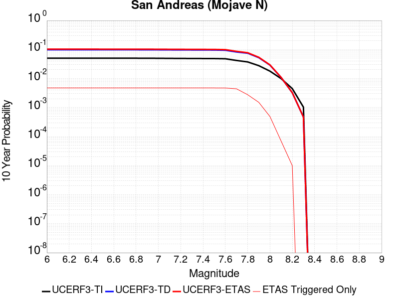 |

| Magnitude | 1 wk TI Prob | 1 wk TD Prob | 1 wk ETAS Prob | 1 wk ETAS/TD Gain | 1 wk ETAS Triggered Only | 1 mo TI Prob | 1 mo TD Prob | 1 mo ETAS Prob | 1 mo ETAS/TD Gain | 1 mo ETAS Triggered Only | 1 yr TI Prob | 1 yr TD Prob | 1 yr ETAS Prob | 1 yr ETAS/TD Gain | 1 yr ETAS Triggered Only | 10 yr TI Prob | 10 yr TD Prob | 10 yr ETAS Prob | 10 yr ETAS/TD Gain | 10 yr ETAS Triggered Only |
|-----|-----|-----|-----|-----|-----|-----|-----|-----|-----|-----|-----|-----|-----|-----|-----|-----|-----|-----|-----|-----|
| 6.0 | 9.877682E-5 | 1.9400702E-4 | 0.0030562177 | 15.75313 | 0.0028627662 | 4.2326056E-4 | 8.311939E-4 | 0.004227903 | 5.0865426 | 0.0033995348 | 0.0051410277 | 0.010072956 | 0.013792489 | 1.3692592 | 0.0037573806 | 0.05023708 | 0.09831428 | 0.10202491 | 1.0377426 | 0.004115226 |
| 6.1 | 9.877682E-5 | 1.9400702E-4 | 0.0030562177 | 15.75313 | 0.0028627662 | 4.2326056E-4 | 8.311939E-4 | 0.004227903 | 5.0865426 | 0.0033995348 | 0.0051410277 | 0.010072956 | 0.013792489 | 1.3692592 | 0.0037573806 | 0.05023708 | 0.09831428 | 0.10202491 | 1.0377426 | 0.004115226 |
| 6.2 | 9.877682E-5 | 1.9400702E-4 | 0.0030562177 | 15.75313 | 0.0028627662 | 4.2326056E-4 | 8.311939E-4 | 0.004227903 | 5.0865426 | 0.0033995348 | 0.0051410277 | 0.010072956 | 0.013792489 | 1.3692592 | 0.0037573806 | 0.05023708 | 0.09831428 | 0.10202491 | 1.0377426 | 0.004115226 |
| 6.3 | 9.877682E-5 | 1.9400702E-4 | 0.0030562177 | 15.75313 | 0.0028627662 | 4.2326056E-4 | 8.311939E-4 | 0.004227903 | 5.0865426 | 0.0033995348 | 0.0051410277 | 0.010072956 | 0.013792489 | 1.3692592 | 0.0037573806 | 0.05023708 | 0.09831428 | 0.10202491 | 1.0377426 | 0.004115226 |
| 6.4 | 9.877682E-5 | 1.9400702E-4 | 0.0030562177 | 15.75313 | 0.0028627662 | 4.2326056E-4 | 8.311939E-4 | 0.004227903 | 5.0865426 | 0.0033995348 | 0.0051410277 | 0.010072956 | 0.013792489 | 1.3692592 | 0.0037573806 | 0.05023708 | 0.09831428 | 0.10202491 | 1.0377426 | 0.004115226 |
| 6.5 | 9.861474E-5 | 1.9374468E-4 | 0.0030559562 | 15.77311 | 0.0028627662 | 4.2256617E-4 | 8.300703E-4 | 0.0042267833 | 5.0920787 | 0.0033995348 | 0.0051326132 | 0.010059402 | 0.013778986 | 1.3697618 | 0.0037573806 | 0.050156746 | 0.098192066 | 0.101903215 | 1.0377947 | 0.004115226 |
| 6.6 | 9.861474E-5 | 1.9374468E-4 | 0.0030559562 | 15.77311 | 0.0028627662 | 4.2256617E-4 | 8.300703E-4 | 0.0042267833 | 5.0920787 | 0.0033995348 | 0.0051326132 | 0.010059402 | 0.013778986 | 1.3697618 | 0.0037573806 | 0.050156746 | 0.098192066 | 0.101903215 | 1.0377947 | 0.004115226 |
| 6.7 | 9.8552715E-5 | 1.9364421E-4 | 0.003055856 | 15.780776 | 0.0028627662 | 4.223004E-4 | 8.2964E-4 | 0.0042263544 | 5.094203 | 0.0033995348 | 0.0051293927 | 0.010054212 | 0.013773815 | 1.3699547 | 0.0037573806 | 0.050125998 | 0.098145254 | 0.10185659 | 1.0378147 | 0.004115226 |
| 6.8 | 9.8464974E-5 | 1.9349584E-4 | 0.003055708 | 15.792112 | 0.0028627662 | 4.219245E-4 | 8.290045E-4 | 0.004225721 | 5.097344 | 0.0033995348 | 0.0051248376 | 0.010046546 | 0.013766179 | 1.3702399 | 0.0037573806 | 0.05008251 | 0.09807528 | 0.101786904 | 1.0378447 | 0.004115226 |
| 6.9 | 9.825824E-5 | 1.9317595E-4 | 0.003055389 | 15.816613 | 0.0028627662 | 4.2103877E-4 | 8.276344E-4 | 0.004224356 | 5.1041327 | 0.0033995348 | 0.0051141046 | 0.010030019 | 0.013749713 | 1.3708562 | 0.0037573806 | 0.049980022 | 0.09792438 | 0.101636626 | 1.0379093 | 0.004115226 |
| 7.0 | 9.781462E-5 | 1.924896E-4 | 0.0030547047 | 15.869453 | 0.0028627662 | 4.1913814E-4 | 8.246948E-4 | 0.004221426 | 5.1187735 | 0.0033995348 | 0.005091073 | 0.009994558 | 0.013714385 | 1.3721852 | 0.0037573806 | 0.04976007 | 0.09760077 | 0.10131435 | 1.0380486 | 0.004115226 |
| 7.1 | 9.7121134E-5 | 1.9150671E-4 | 0.0030537245 | 15.945784 | 0.0028627662 | 4.1616702E-4 | 8.204851E-4 | 0.0042172307 | 5.1399236 | 0.0033995348 | 0.005055068 | 0.009943774 | 0.013663792 | 1.3741052 | 0.0037573806 | 0.04941613 | 0.09713728 | 0.100852765 | 1.0382499 | 0.004115226 |
| 7.2 | 9.663819E-5 | 1.9081456E-4 | 0.0030530344 | 16.000008 | 0.0028627662 | 4.1409794E-4 | 8.175206E-4 | 0.004214276 | 5.1549478 | 0.0033995348 | 0.0050299936 | 0.00990801 | 0.013628163 | 1.3754692 | 0.0037573806 | 0.049176537 | 0.09681055 | 0.100527376 | 1.0383928 | 0.004115226 |
| 7.3 | 9.6277574E-5 | 1.9033969E-4 | 0.0030525608 | 16.037437 | 0.0028627662 | 4.125529E-4 | 8.154867E-4 | 0.004212249 | 5.1653194 | 0.0033995348 | 0.0050112694 | 0.009883473 | 0.013603717 | 1.3764107 | 0.0037573806 | 0.04899759 | 0.09658401 | 0.100301765 | 1.0384926 | 0.004115226 |
| 7.4 | 9.593308E-5 | 1.897375E-4 | 0.0030519604 | 16.085173 | 0.0028627662 | 4.1107697E-4 | 8.129075E-4 | 0.0042096786 | 5.178546 | 0.0033995348 | 0.0049933824 | 0.009852355 | 0.013572717 | 1.3776114 | 0.0037573806 | 0.04882661 | 0.09630218 | 0.10002111 | 1.0386173 | 0.004115226 |
| 7.5 | 9.561707E-5 | 1.8919831E-4 | 0.0030514228 | 16.128172 | 0.0028627662 | 4.0972308E-4 | 8.1059814E-4 | 0.0042073773 | 5.19046 | 0.0033995348 | 0.0049769743 | 0.009824493 | 0.013544959 | 1.378693 | 0.0037573806 | 0.048669744 | 0.09604836 | 0.099768326 | 1.0387301 | 0.004115226 |
| 7.6 | 9.418194E-5 | 1.8572104E-4 | 0.0030479555 | 16.41147 | 0.0028627662 | 4.0357444E-4 | 7.957047E-4 | 0.0041925344 | 5.2689576 | 0.0033995348 | 0.004902454 | 0.009644784 | 0.013365925 | 1.3858191 | 0.0037573806 | 0.047957025 | 0.094430685 | 0.09815731 | 1.0394641 | 0.004115226 |
| 7.7 | 8.202141E-5 | 1.6021315E-4 | 0.0030225206 | 18.865622 | 0.0028627662 | 3.51473E-4 | 6.8644714E-4 | 0.0039048484 | 5.688491 | 0.003220612 | 0.00427079 | 0.008325525 | 0.01187419 | 1.4262393 | 0.0035784577 | 0.04189639 | 0.08223219 | 0.08584481 | 1.0439318 | 0.0039363033 |
| 7.8 | 7.2859846E-5 | 1.4516473E-4 | 0.0013974431 | 9.626603 | 0.0012524602 | 3.1221908E-4 | 6.219862E-4 | 0.0022312906 | 3.5873635 | 0.001610306 | 0.003794643 | 0.0075464295 | 0.009322156 | 1.2353069 | 0.0017892289 | 0.037304975 | 0.07472468 | 0.07654576 | 1.0243706 | 0.0019681517 |
| 7.9 | 5.3874453E-5 | 1.0045676E-4 | 6.371715E-4 | 6.342744 | 5.3676864E-4 | 2.3087008E-4 | 4.3045796E-4 | 0.0011458414 | 2.6619124 | 7.1569154E-4 | 0.0028072202 | 0.0052282433 | 0.00611818 | 1.1702173 | 8.9461444E-4 | 0.02772022 | 0.05242443 | 0.05344169 | 1.0194043 | 0.0010735373 |
| 8.0 | 3.468538E-5 | 5.4260272E-5 | 5.4260272E-5 | 1.0 | 0.0 | 1.4864317E-4 | 2.325233E-4 | 4.114046E-4 | 1.7693048 | 1.7892288E-4 | 0.0018082283 | 0.002827298 | 0.0030057149 | 1.0631051 | 1.7892288E-4 | 0.017935853 | 0.028947512 | 0.029121256 | 1.0060021 | 1.7892288E-4 |
| 8.1 | 1.9152367E-5 | 1.940263E-5 | 1.940263E-5 | 1.0 | 0.0 | 8.207899E-5 | 8.3151484E-5 | 8.3151484E-5 | 1.0 | 0.0 | 9.988535E-4 | 0.0010118998 | 0.0010118998 | 1.0 | 0.0 | 0.009943757 | 0.01085625 | 0.01085625 | 1.0 | 0.0 |
| 8.2 | 8.643924E-6 | 5.4748625E-6 | 5.4748625E-6 | 1.0 | 0.0 | 3.704486E-5 | 2.3463486E-5 | 2.3463486E-5 | 1.0 | 0.0 | 4.5092785E-4 | 2.8563058E-4 | 2.8563058E-4 | 1.0 | 0.0 | 0.0045001395 | 0.0032487072 | 0.0032487072 | 1.0 | 0.0 |
| 8.3 | 1.983087E-6 | 7.6599065E-7 | 7.6599065E-7 | 1.0 | 0.0 | 8.498917E-6 | 3.282813E-6 | 3.282813E-6 | 1.0 | 0.0 | 1.034694E-4 | 3.9967534E-5 | 3.9967534E-5 | 1.0 | 0.0 | 0.0010342124 | 4.719687E-4 | 4.719687E-4 | 1.0 | 0.0 |

## San Andreas (Mojave S)
*[(top)](#table-of-contents)*

| 1 Week | 1 Month | 1 Year | 10 Year |
|-----|-----|-----|-----|
|  |  |  |  |

| Magnitude | 1 wk TI Prob | 1 wk TD Prob | 1 wk ETAS Prob | 1 wk ETAS/TD Gain | 1 wk ETAS Triggered Only | 1 mo TI Prob | 1 mo TD Prob | 1 mo ETAS Prob | 1 mo ETAS/TD Gain | 1 mo ETAS Triggered Only | 1 yr TI Prob | 1 yr TD Prob | 1 yr ETAS Prob | 1 yr ETAS/TD Gain | 1 yr ETAS Triggered Only | 10 yr TI Prob | 10 yr TD Prob | 10 yr ETAS Prob | 10 yr ETAS/TD Gain | 10 yr ETAS Triggered Only |
|-----|-----|-----|-----|-----|-----|-----|-----|-----|-----|-----|-----|-----|-----|-----|-----|-----|-----|-----|-----|-----|
| 6.0 | 3.1064058E-4 | 6.7460834E-4 | 0.0028202345 | 4.180551 | 0.0021470746 | 0.0013306376 | 0.0028881032 | 0.005385789 | 1.8648188 | 0.0025049204 | 0.016080605 | 0.03462235 | 0.03721327 | 1.0748339 | 0.0026838433 | 0.1496549 | 0.28660452 | 0.28864682 | 1.0071257 | 0.0028627662 |
| 6.1 | 3.1064058E-4 | 6.7460834E-4 | 0.0028202345 | 4.180551 | 0.0021470746 | 0.0013306376 | 0.0028881032 | 0.005385789 | 1.8648188 | 0.0025049204 | 0.016080605 | 0.03462235 | 0.03721327 | 1.0748339 | 0.0026838433 | 0.1496549 | 0.28660452 | 0.28864682 | 1.0071257 | 0.0028627662 |
| 6.2 | 3.1064058E-4 | 6.7460834E-4 | 0.0028202345 | 4.180551 | 0.0021470746 | 0.0013306376 | 0.0028881032 | 0.005385789 | 1.8648188 | 0.0025049204 | 0.016080605 | 0.03462235 | 0.03721327 | 1.0748339 | 0.0026838433 | 0.1496549 | 0.28660452 | 0.28864682 | 1.0071257 | 0.0028627662 |
| 6.3 | 3.1064058E-4 | 6.7460834E-4 | 0.0028202345 | 4.180551 | 0.0021470746 | 0.0013306376 | 0.0028881032 | 0.005385789 | 1.8648188 | 0.0025049204 | 0.016080605 | 0.03462235 | 0.03721327 | 1.0748339 | 0.0026838433 | 0.1496549 | 0.28660452 | 0.28864682 | 1.0071257 | 0.0028627662 |
| 6.4 | 1.9872203E-4 | 4.3179357E-4 | 0.0025779412 | 5.9703093 | 0.0021470746 | 8.5138786E-4 | 0.0018492596 | 0.004349548 | 2.3520482 | 0.0025049204 | 0.010316478 | 0.02228844 | 0.024912464 | 1.1177303 | 0.0026838433 | 0.098504856 | 0.19699748 | 0.19929628 | 1.0116693 | 0.0028627662 |
| 6.5 | 1.291105E-4 | 2.875267E-4 | 0.0022551126 | 7.8431416 | 0.0019681517 | 5.5321335E-4 | 0.0012316781 | 0.0035548108 | 2.8861525 | 0.0023259975 | 0.006714592 | 0.0148934 | 0.017361013 | 1.165685 | 0.0025049204 | 0.065152965 | 0.13803436 | 0.14034773 | 1.0167595 | 0.0026838433 |
| 6.6 | 1.291105E-4 | 2.875267E-4 | 0.0022551126 | 7.8431416 | 0.0019681517 | 5.5321335E-4 | 0.0012316781 | 0.0035548108 | 2.8861525 | 0.0023259975 | 0.006714592 | 0.0148934 | 0.017361013 | 1.165685 | 0.0025049204 | 0.065152965 | 0.13803436 | 0.14034773 | 1.0167595 | 0.0026838433 |
| 6.7 | 1.08001186E-4 | 2.4333889E-4 | 0.0022110117 | 9.086143 | 0.0019681517 | 4.6278012E-4 | 0.0010424647 | 0.0033660375 | 3.2289221 | 0.0023259975 | 0.0056198016 | 0.012618446 | 0.015091758 | 1.1960077 | 0.0025049204 | 0.054797906 | 0.119176775 | 0.12154076 | 1.019836 | 0.0026838433 |
| 6.8 | 1.0624356E-4 | 2.3851555E-4 | 0.002206198 | 9.249702 | 0.0019681517 | 4.5525006E-4 | 0.0010218095 | 0.0033454304 | 3.2740252 | 0.0023259975 | 0.0055285925 | 0.012369843 | 0.014843779 | 1.1999973 | 0.0025049204 | 0.053930566 | 0.11712591 | 0.11949541 | 1.0202303 | 0.0026838433 |
| 6.9 | 1.0393785E-4 | 2.3221898E-4 | 0.0021999136 | 9.473444 | 0.0019681517 | 4.4537184E-4 | 9.948451E-4 | 0.0033185286 | 3.3357239 | 0.0023259975 | 0.0054089287 | 0.012045221 | 0.014519969 | 1.2054547 | 0.0025049204 | 0.05279156 | 0.11442335 | 0.1168001 | 1.0207715 | 0.0026838433 |
| 7.0 | 1.0155622E-4 | 2.2591476E-4 | 0.0021936218 | 9.709954 | 0.0019681517 | 4.3516833E-4 | 9.6784724E-4 | 0.0032915936 | 3.4009433 | 0.0023259975 | 0.005285311 | 0.0117200995 | 0.014195662 | 1.2112237 | 0.0025049204 | 0.05161361 | 0.111683756 | 0.11406785 | 1.0213469 | 0.0026838433 |
| 7.1 | 9.885595E-5 | 2.1879886E-4 | 0.00218652 | 9.993288 | 0.0019681517 | 4.2359953E-4 | 9.3737274E-4 | 0.00326119 | 3.4790747 | 0.0023259975 | 0.0051451353 | 0.011352993 | 0.013829474 | 1.2181348 | 0.0025049204 | 0.05027629 | 0.1085682 | 0.11096066 | 1.0220366 | 0.0026838433 |
| 7.2 | 9.6411415E-5 | 2.124288E-4 | 0.0021801624 | 10.263026 | 0.0019681517 | 4.1312634E-4 | 9.1009185E-4 | 0.0032339725 | 3.5534573 | 0.0023259975 | 0.005018219 | 0.011024255 | 0.013501561 | 1.224714 | 0.0025049204 | 0.049064007 | 0.105758004 | 0.10815801 | 1.0226934 | 0.0026838433 |
| 7.3 | 9.1180635E-5 | 1.9471257E-4 | 0.0021624812 | 11.106016 | 0.0019681517 | 3.907156E-4 | 8.342157E-4 | 0.0031582727 | 3.7859187 | 0.0023259975 | 0.004746591 | 0.01010939 | 0.012588987 | 1.2452767 | 0.0025049204 | 0.046464786 | 0.09795115 | 0.10037211 | 1.024716 | 0.0026838433 |
| 7.4 | 8.887388E-5 | 1.8719878E-4 | 0.0021549822 | 11.511731 | 0.0019681517 | 3.8083247E-4 | 8.020339E-4 | 0.0031261658 | 3.8977976 | 0.0023259975 | 0.0046267817 | 0.00972114 | 0.01220171 | 1.2551727 | 0.0025049204 | 0.045316286 | 0.09458615 | 0.09701613 | 1.0256908 | 0.0026838433 |
| 7.5 | 8.6750515E-5 | 1.8051457E-4 | 0.0021483111 | 11.901039 | 0.0019681517 | 3.7173493E-4 | 7.7340455E-4 | 0.003097603 | 4.005152 | 0.0023259975 | 0.004516484 | 0.009375632 | 0.011857067 | 1.2646686 | 0.0025049204 | 0.04425787 | 0.091549896 | 0.09398803 | 1.0266318 | 0.0026838433 |
| 7.6 | 8.453092E-5 | 1.7439072E-4 | 0.0021421993 | 12.283906 | 0.0019681517 | 3.6222505E-4 | 7.471748E-4 | 0.0030714343 | 4.1107306 | 0.0023259975 | 0.0044011753 | 0.009058985 | 0.011541213 | 1.2740073 | 0.0025049204 | 0.04315024 | 0.08870898 | 0.09115475 | 1.0275706 | 0.0026838433 |
| 7.7 | 8.259102E-5 | 1.6961215E-4 | 0.00213743 | 12.601869 | 0.0019681517 | 3.539135E-4 | 7.2670676E-4 | 0.003051014 | 4.1984115 | 0.0023259975 | 0.004300386 | 0.008811831 | 0.011294678 | 1.281763 | 0.0025049204 | 0.042181134 | 0.08645982 | 0.08891162 | 1.0283576 | 0.0026838433 |
| 7.8 | 7.444844E-5 | 1.5283503E-4 | 0.0014051038 | 9.193598 | 0.0012524602 | 3.1902574E-4 | 6.548429E-4 | 0.0022640943 | 3.457462 | 0.001610306 | 0.0038772223 | 0.007943616 | 0.009718632 | 1.2234519 | 0.0017892289 | 0.03810269 | 0.078290746 | 0.08010481 | 1.0231708 | 0.0019681517 |
| 7.9 | 5.2586525E-5 | 1.00064186E-4 | 6.367791E-4 | 6.3637066 | 5.3676864E-4 | 2.2535135E-4 | 4.2877605E-4 | 0.0011441607 | 2.6684344 | 7.1569154E-4 | 0.0027402006 | 0.005207864 | 0.006097819 | 1.1708869 | 8.9461444E-4 | 0.027066574 | 0.052200034 | 0.053217534 | 1.0194923 | 0.0010735373 |
| 8.0 | 3.379877E-5 | 5.4074168E-5 | 5.4074168E-5 | 1.0 | 0.0 | 1.4484383E-4 | 2.3172585E-4 | 4.106073E-4 | 1.7719529 | 1.7892288E-4 | 0.0017620471 | 0.002817614 | 0.0029960328 | 1.0633227 | 1.7892288E-4 | 0.017481409 | 0.028834904 | 0.029008666 | 1.0060261 | 1.7892288E-4 |
| 8.1 | 1.8668277E-5 | 1.9309397E-5 | 1.9309397E-5 | 1.0 | 0.0 | 8.000444E-5 | 8.275194E-5 | 8.275194E-5 | 1.0 | 0.0 | 9.736188E-4 | 0.0010070398 | 0.0010070398 | 1.0 | 0.0 | 0.009693642 | 0.010798888 | 0.010798888 | 1.0 | 0.0 |
| 8.2 | 8.541571E-6 | 5.460819E-6 | 5.460819E-6 | 1.0 | 0.0 | 3.660622E-5 | 2.3403301E-5 | 2.3403301E-5 | 1.0 | 0.0 | 4.455896E-4 | 2.84898E-4 | 2.84898E-4 | 1.0 | 0.0 | 0.0044469717 | 0.0032408056 | 0.0032408056 | 1.0 | 0.0 |
| 8.3 | 1.983087E-6 | 7.6599065E-7 | 7.6599065E-7 | 1.0 | 0.0 | 8.498917E-6 | 3.282813E-6 | 3.282813E-6 | 1.0 | 0.0 | 1.034694E-4 | 3.9967534E-5 | 3.9967534E-5 | 1.0 | 0.0 | 0.0010342124 | 4.719687E-4 | 4.719687E-4 | 1.0 | 0.0 |

## So Sierra Nevada
*[(top)](#table-of-contents)*

| 1 Week | 1 Month | 1 Year | 10 Year |
|-----|-----|-----|-----|
|  |  |  |  |

| Magnitude | 1 wk TI Prob | 1 wk TD Prob | 1 wk ETAS Prob | 1 wk ETAS/TD Gain | 1 wk ETAS Triggered Only | 1 mo TI Prob | 1 mo TD Prob | 1 mo ETAS Prob | 1 mo ETAS/TD Gain | 1 mo ETAS Triggered Only | 1 yr TI Prob | 1 yr TD Prob | 1 yr ETAS Prob | 1 yr ETAS/TD Gain | 1 yr ETAS Triggered Only | 10 yr TI Prob | 10 yr TD Prob | 10 yr ETAS Prob | 10 yr ETAS/TD Gain | 10 yr ETAS Triggered Only |
|-----|-----|-----|-----|-----|-----|-----|-----|-----|-----|-----|-----|-----|-----|-----|-----|-----|-----|-----|-----|-----|
| 6.0 | 1.15488665E-5 | 1.1079643E-5 | 0.001084605 | 97.8917 | 0.0010735373 | 4.9494203E-5 | 4.748339E-5 | 0.0014787985 | 31.143492 | 0.0014313831 | 6.024253E-4 | 5.7796965E-4 | 0.0025449838 | 4.4033175 | 0.0019681517 | 0.006007948 | 0.005765934 | 0.0077227377 | 1.3393732 | 0.0019681517 |
| 6.1 | 1.15488665E-5 | 1.1079643E-5 | 0.001084605 | 97.8917 | 0.0010735373 | 4.9494203E-5 | 4.748339E-5 | 0.0014787985 | 31.143492 | 0.0014313831 | 6.024253E-4 | 5.7796965E-4 | 0.0025449838 | 4.4033175 | 0.0019681517 | 0.006007948 | 0.005765934 | 0.0077227377 | 1.3393732 | 0.0019681517 |
| 6.2 | 1.15488665E-5 | 1.1079643E-5 | 0.001084605 | 97.8917 | 0.0010735373 | 4.9494203E-5 | 4.748339E-5 | 0.0014787985 | 31.143492 | 0.0014313831 | 6.024253E-4 | 5.7796965E-4 | 0.0025449838 | 4.4033175 | 0.0019681517 | 0.006007948 | 0.005765934 | 0.0077227377 | 1.3393732 | 0.0019681517 |
| 6.3 | 1.15488665E-5 | 1.1079643E-5 | 0.001084605 | 97.8917 | 0.0010735373 | 4.9494203E-5 | 4.748339E-5 | 0.0014787985 | 31.143492 | 0.0014313831 | 6.024253E-4 | 5.7796965E-4 | 0.0025449838 | 4.4033175 | 0.0019681517 | 0.006007948 | 0.005765934 | 0.0077227377 | 1.3393732 | 0.0019681517 |
| 6.4 | 1.15488665E-5 | 1.1079643E-5 | 0.001084605 | 97.8917 | 0.0010735373 | 4.9494203E-5 | 4.748339E-5 | 0.0014787985 | 31.143492 | 0.0014313831 | 6.024253E-4 | 5.7796965E-4 | 0.0025449838 | 4.4033175 | 0.0019681517 | 0.006007948 | 0.005765934 | 0.0077227377 | 1.3393732 | 0.0019681517 |
| 6.5 | 1.15488665E-5 | 1.1079643E-5 | 0.001084605 | 97.8917 | 0.0010735373 | 4.9494203E-5 | 4.748339E-5 | 0.0014787985 | 31.143492 | 0.0014313831 | 6.024253E-4 | 5.7796965E-4 | 0.0025449838 | 4.4033175 | 0.0019681517 | 0.006007948 | 0.005765934 | 0.0077227377 | 1.3393732 | 0.0019681517 |
| 6.6 | 7.587044E-6 | 6.935635E-6 | 0.0010804655 | 155.78465 | 0.0010735373 | 3.2515498E-5 | 2.9723828E-5 | 0.0012821468 | 43.13532 | 0.0012524602 | 3.9580427E-4 | 3.6183043E-4 | 0.0016138374 | 4.4602036 | 0.0012524602 | 0.003951 | 0.0036127048 | 0.00486064 | 1.3454297 | 0.0012524602 |
| 6.7 | 7.587044E-6 | 6.935635E-6 | 0.0010804655 | 155.78465 | 0.0010735373 | 3.2515498E-5 | 2.9723828E-5 | 0.0012821468 | 43.13532 | 0.0012524602 | 3.9580427E-4 | 3.6183043E-4 | 0.0016138374 | 4.4602036 | 0.0012524602 | 0.003951 | 0.0036127048 | 0.00486064 | 1.3454297 | 0.0012524602 |
| 6.8 | 5.9026956E-6 | 5.1793927E-6 | 5.419453E-4 | 104.6349 | 5.3676864E-4 | 2.5297022E-5 | 2.2197215E-5 | 7.3787285E-4 | 33.241688 | 7.1569154E-4 | 3.0794772E-4 | 2.7021873E-4 | 9.857169E-4 | 3.647848 | 7.1569154E-4 | 0.0030752132 | 0.002699018 | 0.0034127778 | 1.2644517 | 7.1569154E-4 |
| 6.9 | 5.0118915E-6 | 4.2524252E-6 | 3.6209667E-4 | 85.15063 | 3.5784577E-4 | 2.1479358E-5 | 1.8224557E-5 | 5.5498345E-4 | 30.452507 | 5.3676864E-4 | 2.614798E-4 | 2.2186211E-4 | 7.5851165E-4 | 3.4188428 | 5.3676864E-4 | 0.0026117235 | 0.0022164788 | 0.0027520577 | 1.2416351 | 5.3676864E-4 |
| 7.0 | 4.4924795E-6 | 3.7139177E-6 | 3.6155837E-4 | 97.35228 | 3.5784577E-4 | 1.925334E-5 | 1.5916696E-5 | 5.526768E-4 | 34.723083 | 5.3676864E-4 | 2.3438422E-4 | 1.9376918E-4 | 7.3043385E-4 | 3.7696078 | 5.3676864E-4 | 0.0023413717 | 0.0019360651 | 0.0024717946 | 1.2767104 | 5.3676864E-4 |
| 7.1 | 3.9118436E-6 | 3.1119775E-6 | 3.1119775E-6 | 1.0 | 0.0 | 1.6764936E-5 | 1.3336982E-5 | 1.9225747E-4 | 14.415366 | 1.7892288E-4 | 2.0409399E-4 | 1.6236622E-4 | 3.4126005E-4 | 2.101792 | 1.7892288E-4 | 0.0020390663 | 0.001622532 | 0.0018011646 | 1.1100949 | 1.7892288E-4 |
| 7.2 | 3.4200818E-6 | 2.6054543E-6 | 2.6054543E-6 | 1.0 | 0.0 | 1.4657411E-5 | 1.11661875E-5 | 1.9008707E-4 | 17.023453 | 1.7892288E-4 | 1.7843937E-4 | 1.3594035E-4 | 3.1483892E-4 | 2.3160076 | 1.7892288E-4 | 0.0017829615 | 0.0013586218 | 0.0015373016 | 1.1315155 | 1.7892288E-4 |
| 7.3 | 2.6593618E-6 | 1.8284203E-6 | 1.8284203E-6 | 1.0 | 0.0 | 1.13972155E-5 | 7.836065E-6 | 7.836065E-6 | 1.0 | 0.0 | 1.3875226E-4 | 9.540021E-5 | 9.540021E-5 | 1.0 | 0.0 | 0.0013866565 | 9.5362146E-4 | 9.5362146E-4 | 1.0 | 0.0 |
| 7.4 | 2.2577992E-6 | 1.436438E-6 | 1.436438E-6 | 1.0 | 0.0 | 9.676246E-6 | 6.15615E-6 | 6.15615E-6 | 1.0 | 0.0 | 1.1780193E-4 | 7.49488E-5 | 7.49488E-5 | 1.0 | 0.0 | 0.001177395 | 7.492603E-4 | 7.492603E-4 | 1.0 | 0.0 |
| 7.5 | 1.489319E-6 | 7.353936E-7 | 7.353936E-7 | 1.0 | 0.0 | 6.3827797E-6 | 3.1516831E-6 | 3.1516831E-6 | 1.0 | 0.0 | 7.770758E-5 | 3.8371072E-5 | 3.8371072E-5 | 1.0 | 0.0 | 7.7680405E-4 | 3.836449E-4 | 3.836449E-4 | 1.0 | 0.0 |
| 7.6 | 1.0680322E-6 | 4.6596554E-7 | 4.6596554E-7 | 1.0 | 0.0 | 4.577273E-6 | 1.9969937E-6 | 1.9969937E-6 | 1.0 | 0.0 | 5.5726876E-5 | 2.4313129E-5 | 2.4313129E-5 | 1.0 | 0.0 | 5.5712904E-4 | 2.4310495E-4 | 2.4310495E-4 | 1.0 | 0.0 |
| 7.7 | 5.509146E-7 | 1.5580486E-7 | 1.5580486E-7 | 1.0 | 0.0 | 2.3610605E-6 | 6.677349E-7 | 6.677349E-7 | 1.0 | 0.0 | 2.8745531E-5 | 8.129644E-6 | 8.129644E-6 | 1.0 | 0.0 | 2.8741814E-4 | 8.1293576E-5 | 8.1293576E-5 | 1.0 | 0.0 |

## Death Valley (So)
*[(top)](#table-of-contents)*

| 1 Week | 1 Month | 1 Year | 10 Year |
|-----|-----|-----|-----|
|  |  |  |  |

| Magnitude | 1 wk TI Prob | 1 wk TD Prob | 1 wk ETAS Prob | 1 wk ETAS/TD Gain | 1 wk ETAS Triggered Only | 1 mo TI Prob | 1 mo TD Prob | 1 mo ETAS Prob | 1 mo ETAS/TD Gain | 1 mo ETAS Triggered Only | 1 yr TI Prob | 1 yr TD Prob | 1 yr ETAS Prob | 1 yr ETAS/TD Gain | 1 yr ETAS Triggered Only | 10 yr TI Prob | 10 yr TD Prob | 10 yr ETAS Prob | 10 yr ETAS/TD Gain | 10 yr ETAS Triggered Only |
|-----|-----|-----|-----|-----|-----|-----|-----|-----|-----|-----|-----|-----|-----|-----|-----|-----|-----|-----|-----|-----|
| 6.0 | 2.0684236E-5 | 2.5617775E-5 | 0.0012780459 | 49.889027 | 0.0012524602 | 8.864371E-5 | 1.0978594E-4 | 0.0015410119 | 14.036513 | 0.0014313831 | 0.0010787029 | 0.0013358411 | 0.002943996 | 2.203852 | 0.001610306 | 0.010734817 | 0.013281397 | 0.015046862 | 1.1329277 | 0.0017892289 |
| 6.1 | 2.0684236E-5 | 2.5617775E-5 | 0.0012780459 | 49.889027 | 0.0012524602 | 8.864371E-5 | 1.0978594E-4 | 0.0015410119 | 14.036513 | 0.0014313831 | 0.0010787029 | 0.0013358411 | 0.002943996 | 2.203852 | 0.001610306 | 0.010734817 | 0.013281397 | 0.015046862 | 1.1329277 | 0.0017892289 |
| 6.2 | 2.0684236E-5 | 2.5617775E-5 | 0.0012780459 | 49.889027 | 0.0012524602 | 8.864371E-5 | 1.0978594E-4 | 0.0015410119 | 14.036513 | 0.0014313831 | 0.0010787029 | 0.0013358411 | 0.002943996 | 2.203852 | 0.001610306 | 0.010734817 | 0.013281397 | 0.015046862 | 1.1329277 | 0.0017892289 |
| 6.3 | 2.0240292E-5 | 2.511786E-5 | 0.0012775466 | 50.86208 | 0.0012524602 | 8.6741224E-5 | 1.07643624E-4 | 0.0015388726 | 14.295994 | 0.0014313831 | 0.0010555626 | 0.00130979 | 0.0029179868 | 2.227828 | 0.001610306 | 0.010505628 | 0.013023956 | 0.014789882 | 1.1355906 | 0.0017892289 |
| 6.4 | 2.0240292E-5 | 2.511786E-5 | 0.0012775466 | 50.86208 | 0.0012524602 | 8.6741224E-5 | 1.07643624E-4 | 0.0015388726 | 14.295994 | 0.0014313831 | 0.0010555626 | 0.00130979 | 0.0029179868 | 2.227828 | 0.001610306 | 0.010505628 | 0.013023956 | 0.014789882 | 1.1355906 | 0.0017892289 |
| 6.5 | 1.9962767E-5 | 2.4807114E-5 | 0.0010983178 | 44.274307 | 0.0010735373 | 8.55519E-5 | 1.0631196E-4 | 0.001358639 | 12.779737 | 0.0012524602 | 0.0010410968 | 0.0012935963 | 0.0027231278 | 2.1050832 | 0.0014313831 | 0.010362327 | 0.012863902 | 0.014453494 | 1.1235698 | 0.001610306 |
| 6.6 | 1.8937297E-5 | 2.3310964E-5 | 0.0010968233 | 47.051815 | 0.0010735373 | 8.115732E-5 | 9.990039E-5 | 0.0013522354 | 13.535837 | 0.0012524602 | 9.876423E-4 | 0.0012156231 | 0.0026452662 | 2.1760578 | 0.0014313831 | 0.009832645 | 0.012092789 | 0.013683622 | 1.1315522 | 0.001610306 |
| 6.7 | 1.8621096E-5 | 2.2911607E-5 | 0.0010964243 | 47.854538 | 0.0010735373 | 7.980225E-5 | 9.818898E-5 | 0.0013505262 | 13.754355 | 0.0012524602 | 9.711593E-4 | 0.0011948098 | 0.0026244826 | 2.1965694 | 0.0014313831 | 0.009669261 | 0.011886904 | 0.013478069 | 1.1338586 | 0.001610306 |
| 6.8 | 1.7830353E-5 | 2.1805688E-5 | 9.164006E-4 | 42.02576 | 8.9461444E-4 | 7.641356E-5 | 9.344968E-5 | 0.0011668867 | 12.486792 | 0.0010735373 | 9.29938E-4 | 0.00113717 | 0.002388206 | 2.100131 | 0.0012524602 | 0.009260561 | 0.011316354 | 0.012731539 | 1.1250566 | 0.0014313831 |
| 6.9 | 1.3135183E-5 | 1.5303925E-5 | 3.7314423E-4 | 24.382256 | 3.5784577E-4 | 5.6292425E-5 | 6.558664E-5 | 6.0232007E-4 | 9.183579 | 5.3676864E-4 | 6.8514474E-4 | 7.982312E-4 | 0.0013345714 | 1.6719108 | 5.3676864E-4 | 0.006830362 | 0.007954649 | 0.008487147 | 1.0669419 | 5.3676864E-4 |
| 7.0 | 1.1507512E-5 | 1.3154199E-5 | 1.9207473E-4 | 14.60178 | 1.7892288E-4 | 4.9316975E-5 | 5.6373956E-5 | 4.1419955E-4 | 7.347357 | 3.5784577E-4 | 6.002687E-4 | 6.8614254E-4 | 0.0010437428 | 1.5211749 | 3.5784577E-4 | 0.0059864987 | 0.0068409415 | 0.0071963393 | 1.0519515 | 3.5784577E-4 |
| 7.1 | 9.715903E-6 | 1.0865278E-5 | 1.0865278E-5 | 1.0 | 0.0 | 4.1638916E-5 | 4.656467E-5 | 4.656467E-5 | 1.0 | 0.0 | 5.068359E-4 | 5.667817E-4 | 5.667817E-4 | 1.0 | 0.0 | 0.0050568148 | 0.0056538144 | 0.0056538144 | 1.0 | 0.0 |
| 7.2 | 9.233269E-6 | 1.02863105E-5 | 1.02863105E-5 | 1.0 | 0.0 | 3.9570554E-5 | 4.4083466E-5 | 4.4083466E-5 | 1.0 | 0.0 | 4.81665E-4 | 5.3658825E-4 | 5.3658825E-4 | 1.0 | 0.0 | 0.0048062233 | 0.0053533576 | 0.0053533576 | 1.0 | 0.0 |
| 7.3 | 8.8041315E-6 | 9.808164E-6 | 9.808164E-6 | 1.0 | 0.0 | 3.7731446E-5 | 4.2034335E-5 | 4.2034335E-5 | 1.0 | 0.0 | 4.592835E-4 | 5.1165203E-4 | 5.1165203E-4 | 1.0 | 0.0 | 0.0045833546 | 0.005105167 | 0.005105167 | 1.0 | 0.0 |
| 7.4 | 8.708749E-6 | 9.707175E-6 | 9.707175E-6 | 1.0 | 0.0 | 3.7322676E-5 | 4.160154E-5 | 4.160154E-5 | 1.0 | 0.0 | 4.5430884E-4 | 5.0638523E-4 | 5.0638523E-4 | 1.0 | 0.0 | 0.004533812 | 0.0050527398 | 0.0050527398 | 1.0 | 0.0 |
| 7.5 | 8.612678E-6 | 9.604817E-6 | 9.604817E-6 | 1.0 | 0.0 | 3.6910955E-5 | 4.1162875E-5 | 4.1162875E-5 | 1.0 | 0.0 | 4.492982E-4 | 5.01047E-4 | 5.01047E-4 | 1.0 | 0.0 | 0.004483909 | 0.0049995985 | 0.0049995985 | 1.0 | 0.0 |
| 7.6 | 8.319024E-6 | 9.283916E-6 | 9.283916E-6 | 1.0 | 0.0 | 3.5652476E-5 | 3.978763E-5 | 3.978763E-5 | 1.0 | 0.0 | 4.3398244E-4 | 4.8431093E-4 | 4.8431093E-4 | 1.0 | 0.0 | 0.0043313587 | 0.0048329784 | 0.0048329784 | 1.0 | 0.0 |
| 7.7 | 7.4718328E-6 | 8.34517E-6 | 8.34517E-6 | 1.0 | 0.0 | 3.2021748E-5 | 3.5764548E-5 | 3.5764548E-5 | 1.0 | 0.0 | 3.8979502E-4 | 4.353504E-4 | 4.353504E-4 | 1.0 | 0.0 | 0.00389112 | 0.0043453807 | 0.0043453807 | 1.0 | 0.0 |
| 7.8 | 3.4586725E-7 | 3.6482615E-7 | 3.6482615E-7 | 1.0 | 0.0 | 1.4822873E-6 | 1.5635396E-6 | 1.5635396E-6 | 1.0 | 0.0 | 1.80467E-5 | 1.9035933E-5 | 1.9035933E-5 | 1.0 | 0.0 | 1.8045233E-4 | 1.9034347E-4 | 1.9034347E-4 | 1.0 | 0.0 |
| 7.9 | 2.5591178E-9 | 2.6696718E-9 | 2.6696718E-9 | 1.0 | 0.0 | 1.0967647E-8 | 1.14414505E-8 | 1.14414505E-8 | 1.0 | 0.0 | 1.335311E-7 | 1.3929966E-7 | 1.3929966E-7 | 1.0 | 0.0 | 1.3353102E-6 | 1.3929966E-6 | 1.3929966E-6 | 1.0 | 0.0 |

## San Andreas (San Bernardino N)
*[(top)](#table-of-contents)*

| 1 Week | 1 Month | 1 Year | 10 Year |
|-----|-----|-----|-----|
|  |  |  |  |

| Magnitude | 1 wk TI Prob | 1 wk TD Prob | 1 wk ETAS Prob | 1 wk ETAS/TD Gain | 1 wk ETAS Triggered Only | 1 mo TI Prob | 1 mo TD Prob | 1 mo ETAS Prob | 1 mo ETAS/TD Gain | 1 mo ETAS Triggered Only | 1 yr TI Prob | 1 yr TD Prob | 1 yr ETAS Prob | 1 yr ETAS/TD Gain | 1 yr ETAS Triggered Only | 10 yr TI Prob | 10 yr TD Prob | 10 yr ETAS Prob | 10 yr ETAS/TD Gain | 10 yr ETAS Triggered Only |
|-----|-----|-----|-----|-----|-----|-----|-----|-----|-----|-----|-----|-----|-----|-----|-----|-----|-----|-----|-----|-----|
| 6.0 | 1.4273766E-4 | 3.1606483E-4 | 0.0013892628 | 4.395499 | 0.0010735373 | 6.115894E-4 | 0.0013538664 | 0.002604631 | 1.9238464 | 0.0012524602 | 0.0074207084 | 0.016360244 | 0.017768208 | 1.0860602 | 0.0014313831 | 0.07177748 | 0.15026689 | 0.15163521 | 1.009106 | 0.001610306 |
| 6.1 | 1.4273766E-4 | 3.1606483E-4 | 0.0013892628 | 4.395499 | 0.0010735373 | 6.115894E-4 | 0.0013538664 | 0.002604631 | 1.9238464 | 0.0012524602 | 0.0074207084 | 0.016360244 | 0.017768208 | 1.0860602 | 0.0014313831 | 0.07177748 | 0.15026689 | 0.15163521 | 1.009106 | 0.001610306 |
| 6.2 | 1.4273766E-4 | 3.1606483E-4 | 0.0013892628 | 4.395499 | 0.0010735373 | 6.115894E-4 | 0.0013538664 | 0.002604631 | 1.9238464 | 0.0012524602 | 0.0074207084 | 0.016360244 | 0.017768208 | 1.0860602 | 0.0014313831 | 0.07177748 | 0.15026689 | 0.15163521 | 1.009106 | 0.001610306 |
| 6.3 | 1.3730655E-4 | 3.0511338E-4 | 0.0013783232 | 4.5174127 | 0.0010735373 | 5.883239E-4 | 0.0013069791 | 0.0025578025 | 1.9570339 | 0.0012524602 | 0.0071393442 | 0.015797773 | 0.017206542 | 1.0891752 | 0.0014313831 | 0.06914291 | 0.14556676 | 0.14694266 | 1.009452 | 0.001610306 |
| 6.4 | 1.3730655E-4 | 3.0511338E-4 | 0.0013783232 | 4.5174127 | 0.0010735373 | 5.883239E-4 | 0.0013069791 | 0.0025578025 | 1.9570339 | 0.0012524602 | 0.0071393442 | 0.015797773 | 0.017206542 | 1.0891752 | 0.0014313831 | 0.06914291 | 0.14556676 | 0.14694266 | 1.009452 | 0.001610306 |
| 6.5 | 1.2942807E-4 | 2.8925808E-4 | 0.0013624849 | 4.710274 | 0.0010735373 | 5.545738E-4 | 0.0012390936 | 0.002490002 | 2.0095348 | 0.0012524602 | 0.0067310524 | 0.01498286 | 0.016392797 | 1.0941033 | 0.0014313831 | 0.06530788 | 0.13870941 | 0.14009637 | 1.0099989 | 0.001610306 |
| 6.6 | 1.1125901E-4 | 2.536472E-4 | 0.0013269122 | 5.23133 | 0.0010735373 | 4.767372E-4 | 0.0010866089 | 0.0023377081 | 2.1513796 | 0.0012524602 | 0.005788839 | 0.013149847 | 0.0145624075 | 1.1074203 | 0.0014313831 | 0.056403454 | 0.122999296 | 0.12441153 | 1.0114816 | 0.001610306 |
| 6.7 | 1.02209575E-4 | 2.3499702E-4 | 0.001308282 | 5.5672283 | 0.0010735373 | 4.3796748E-4 | 0.0010067427 | 0.002257942 | 2.2428193 | 0.0012524602 | 0.0053192247 | 0.012188629 | 0.013602566 | 1.1160046 | 0.0014313831 | 0.051936906 | 0.114790924 | 0.11621638 | 1.0124179 | 0.001610306 |
| 6.8 | 9.610582E-5 | 2.2025521E-4 | 0.0011146726 | 5.060823 | 8.9461444E-4 | 4.1181705E-4 | 9.436101E-4 | 0.0020161343 | 2.1366181 | 0.0010735373 | 0.0050023515 | 0.011428202 | 0.012666348 | 1.1083413 | 0.0012524602 | 0.048912346 | 0.1081929 | 0.10946942 | 1.0117985 | 0.0014313831 |
| 6.9 | 9.3877505E-5 | 2.1481077E-4 | 0.001109233 | 5.1637683 | 8.9461444E-4 | 4.0227012E-4 | 9.2029345E-4 | 0.0019928429 | 2.1654427 | 0.0010735373 | 0.0048866454 | 0.011147255 | 0.012385754 | 1.1111034 | 0.0012524602 | 0.04780577 | 0.10578323 | 0.1070632 | 1.0120999 | 0.0014313831 |
| 7.0 | 9.1019785E-5 | 2.0808022E-4 | 0.0011025085 | 5.298478 | 8.9461444E-4 | 3.900265E-4 | 8.914682E-4 | 0.0019640485 | 2.2031615 | 0.0010735373 | 0.0047382377 | 0.010799837 | 0.012038771 | 1.1147178 | 0.0012524602 | 0.046384744 | 0.102753714 | 0.10403802 | 1.0124989 | 0.0014313831 |
| 7.1 | 8.771155E-5 | 1.9982594E-4 | 0.0010942616 | 5.4760737 | 8.9461444E-4 | 3.758525E-4 | 8.5611636E-4 | 0.0019287346 | 2.2528884 | 0.0010735373 | 0.0045664064 | 0.0103736 | 0.011613067 | 1.1194829 | 0.0012524602 | 0.044737056 | 0.09906527 | 0.10035485 | 1.0130175 | 0.0014313831 |
| 7.2 | 8.0830236E-5 | 1.8388197E-4 | 0.0010783318 | 5.864261 | 8.9461444E-4 | 3.4636928E-4 | 7.8782777E-4 | 0.0018605193 | 2.3615813 | 0.0010735373 | 0.0042088944 | 0.009549725 | 0.010790224 | 1.129899 | 0.0012524602 | 0.041300658 | 0.09179615 | 0.09309614 | 1.0141617 | 0.0014313831 |
| 7.3 | 7.7668235E-5 | 1.7331762E-4 | 0.0010677769 | 6.1608105 | 8.9461444E-4 | 3.328214E-4 | 7.425784E-4 | 0.0018153186 | 2.4446151 | 0.0010735373 | 0.0040445733 | 0.009003494 | 0.010244678 | 1.1378558 | 0.0012524602 | 0.03971748 | 0.08706327 | 0.088370025 | 1.0150093 | 0.0014313831 |
| 7.4 | 7.520177E-5 | 1.6551897E-4 | 0.0010599854 | 6.404011 | 8.9461444E-4 | 3.2225347E-4 | 7.0917426E-4 | 0.0017819502 | 2.5127113 | 0.0010735373 | 0.0039163795 | 0.008600081 | 0.00984177 | 1.144381 | 0.0012524602 | 0.038480744 | 0.08351955 | 0.08483139 | 1.0157069 | 0.0014313831 |
| 7.5 | 7.274697E-5 | 1.5839566E-4 | 0.0010528683 | 6.6470785 | 8.9461444E-4 | 3.1173544E-4 | 6.78662E-4 | 0.0017514707 | 2.5807703 | 0.0010735373 | 0.003788775 | 0.008231463 | 0.009473613 | 1.1509027 | 0.0012524602 | 0.03724827 | 0.08023631 | 0.08155284 | 1.0164082 | 0.0014313831 |
| 7.6 | 7.1185845E-5 | 1.540943E-4 | 0.0010485708 | 6.8047347 | 8.9461444E-4 | 3.0504653E-4 | 6.6023704E-4 | 0.0017330656 | 2.6249142 | 0.0010735373 | 0.0037076178 | 0.008008812 | 0.009251241 | 1.1551328 | 0.0012524602 | 0.036463667 | 0.07822598 | 0.079545386 | 1.0168667 | 0.0014313831 |
| 7.7 | 6.709961E-5 | 1.4318313E-4 | 0.0010376695 | 7.2471485 | 8.9461444E-4 | 2.8753807E-4 | 6.1349774E-4 | 0.0016863764 | 2.74879 | 0.0010735373 | 0.003495157 | 0.0074437927 | 0.00868693 | 1.1670032 | 0.0012524602 | 0.034406938 | 0.07305469 | 0.07438151 | 1.0181619 | 0.0014313831 |
| 7.8 | 6.300812E-5 | 1.3202413E-4 | 0.0010265204 | 7.775249 | 8.9461444E-4 | 2.7000686E-4 | 5.65695E-4 | 0.001638625 | 2.896658 | 0.0010735373 | 0.0032823787 | 0.006865616 | 0.008109477 | 1.1811726 | 0.0012524602 | 0.032343175 | 0.06771354 | 0.069047995 | 1.0197074 | 0.0014313831 |
| 7.9 | 4.983037E-5 | 9.723488E-5 | 6.3395133E-4 | 6.5197935 | 5.3676864E-4 | 2.1354125E-4 | 4.1665437E-4 | 0.0011320477 | 2.7169948 | 7.1569154E-4 | 0.0025967648 | 0.0050609782 | 0.005951065 | 1.1758724 | 8.9461444E-4 | 0.025666296 | 0.05064886 | 0.051668026 | 1.0201222 | 0.0010735373 |
| 8.0 | 3.2211527E-5 | 5.3304586E-5 | 5.3304586E-5 | 1.0 | 0.0 | 1.380421E-4 | 2.2842824E-4 | 4.0731026E-4 | 1.7830994 | 1.7892288E-4 | 0.0016793669 | 0.0027775685 | 0.0029559946 | 1.0642382 | 1.7892288E-4 | 0.016667323 | 0.028361378 | 0.028535226 | 1.0061297 | 1.7892288E-4 |
| 8.1 | 1.743376E-5 | 1.8824427E-5 | 1.8824427E-5 | 1.0 | 0.0 | 7.471398E-5 | 8.067362E-5 | 8.067362E-5 | 1.0 | 0.0 | 9.0926304E-4 | 9.817594E-4 | 9.817594E-4 | 1.0 | 0.0 | 0.009055517 | 0.010484105 | 0.010484105 | 1.0 | 0.0 |
| 8.2 | 7.831616E-6 | 5.1551065E-6 | 5.1551065E-6 | 1.0 | 0.0 | 3.3563636E-5 | 2.2093127E-5 | 2.2093127E-5 | 1.0 | 0.0 | 4.0856065E-4 | 2.6895068E-4 | 2.6895068E-4 | 1.0 | 0.0 | 0.004078103 | 0.0030418145 | 0.0030418145 | 1.0 | 0.0 |
| 8.3 | 1.983087E-6 | 7.6599065E-7 | 7.6599065E-7 | 1.0 | 0.0 | 8.498917E-6 | 3.282813E-6 | 3.282813E-6 | 1.0 | 0.0 | 1.034694E-4 | 3.9967534E-5 | 3.9967534E-5 | 1.0 | 0.0 | 0.0010342124 | 4.719687E-4 | 4.719687E-4 | 1.0 | 0.0 |

## McLean Lake
*[(top)](#table-of-contents)*

| 1 Week | 1 Month | 1 Year | 10 Year |
|-----|-----|-----|-----|
|  |  |  |  |

| Magnitude | 1 wk TI Prob | 1 wk TD Prob | 1 wk ETAS Prob | 1 wk ETAS/TD Gain | 1 wk ETAS Triggered Only | 1 mo TI Prob | 1 mo TD Prob | 1 mo ETAS Prob | 1 mo ETAS/TD Gain | 1 mo ETAS Triggered Only | 1 yr TI Prob | 1 yr TD Prob | 1 yr ETAS Prob | 1 yr ETAS/TD Gain | 1 yr ETAS Triggered Only | 10 yr TI Prob | 10 yr TD Prob | 10 yr ETAS Prob | 10 yr ETAS/TD Gain | 10 yr ETAS Triggered Only |
|-----|-----|-----|-----|-----|-----|-----|-----|-----|-----|-----|-----|-----|-----|-----|-----|-----|-----|-----|-----|-----|
| 6.0 | 1.7360222E-5 | 1.8501627E-5 | 0.001092019 | 59.022865 | 0.0010735373 | 7.439883E-5 | 7.9290556E-5 | 0.0013316515 | 16.794579 | 0.0012524602 | 9.0542925E-4 | 9.6498354E-4 | 0.0023949854 | 2.4818923 | 0.0014313831 | 0.009017491 | 0.0096127745 | 0.011030398 | 1.1474729 | 0.0014313831 |
| 6.1 | 9.062689E-6 | 9.592193E-6 | 3.6743452E-4 | 38.30558 | 3.5784577E-4 | 3.8839516E-5 | 4.1108804E-5 | 3.9893985E-4 | 9.704488 | 3.5784577E-4 | 4.727685E-4 | 5.003936E-4 | 0.0010368937 | 2.072156 | 5.3676864E-4 | 0.0047176396 | 0.004993552 | 0.0055276398 | 1.1069556 | 5.3676864E-4 |
| 6.2 | 9.062689E-6 | 9.592193E-6 | 3.6743452E-4 | 38.30558 | 3.5784577E-4 | 3.8839516E-5 | 4.1108804E-5 | 3.9893985E-4 | 9.704488 | 3.5784577E-4 | 4.727685E-4 | 5.003936E-4 | 0.0010368937 | 2.072156 | 5.3676864E-4 | 0.0047176396 | 0.004993552 | 0.0055276398 | 1.1069556 | 5.3676864E-4 |
| 6.3 | 7.2575485E-6 | 7.66771E-6 | 3.6551073E-4 | 47.66883 | 3.5784577E-4 | 3.110341E-5 | 3.2861237E-5 | 3.9069523E-4 | 11.889243 | 3.5784577E-4 | 3.786182E-4 | 4.0001926E-4 | 9.365732E-4 | 2.3413203 | 5.3676864E-4 | 0.0037797375 | 0.0039936965 | 0.004528322 | 1.1338671 | 5.3676864E-4 |
| 6.4 | 7.2575485E-6 | 7.66771E-6 | 3.6551073E-4 | 47.66883 | 3.5784577E-4 | 3.110341E-5 | 3.2861237E-5 | 3.9069523E-4 | 11.889243 | 3.5784577E-4 | 3.786182E-4 | 4.0001926E-4 | 9.365732E-4 | 2.3413203 | 5.3676864E-4 | 0.0037797375 | 0.0039936965 | 0.004528322 | 1.1338671 | 5.3676864E-4 |
| 6.5 | 6.06582E-6 | 6.4038773E-6 | 3.6424736E-4 | 56.879192 | 3.5784577E-4 | 2.5996113E-5 | 2.7444936E-5 | 3.8528087E-4 | 14.038323 | 3.5784577E-4 | 3.164567E-4 | 3.3409733E-4 | 6.9182354E-4 | 2.0707245 | 3.5784577E-4 | 0.0031600643 | 0.0033365893 | 0.003693241 | 1.1068912 | 3.5784577E-4 |
| 6.6 | 5.598744E-6 | 5.910262E-6 | 3.637539E-4 | 61.546154 | 3.5784577E-4 | 2.3994397E-5 | 2.5329486E-5 | 3.831662E-4 | 15.127279 | 3.5784577E-4 | 2.9209262E-4 | 3.0834923E-4 | 6.6608464E-4 | 2.1601632 | 3.5784577E-4 | 0.0029170897 | 0.003079843 | 0.0034365868 | 1.1158317 | 3.5784577E-4 |
| 6.7 | 5.246996E-6 | 5.539162E-6 | 3.6338295E-4 | 65.602516 | 3.5784577E-4 | 2.2486933E-5 | 2.3739085E-5 | 3.8157636E-4 | 16.07376 | 3.5784577E-4 | 2.73744E-4 | 2.8899137E-4 | 6.4673374E-4 | 2.2378998 | 3.5784577E-4 | 0.0027340704 | 0.0028867796 | 0.0032435923 | 1.1236024 | 3.5784577E-4 |
| 6.8 | 4.02324E-6 | 4.2469046E-6 | 3.6209114E-4 | 85.26002 | 3.5784577E-4 | 1.7242342E-5 | 1.8200926E-5 | 3.7604017E-4 | 20.660498 | 3.5784577E-4 | 2.099053E-4 | 2.2157968E-4 | 5.7934615E-4 | 2.6146176 | 3.5784577E-4 | 0.0020970714 | 0.002214172 | 0.0025712254 | 1.1612582 | 3.5784577E-4 |
| 6.9 | 6.835972E-7 | 7.1399285E-7 | 7.1399285E-7 | 1.0 | 0.0 | 2.9296991E-6 | 3.0599674E-6 | 3.0599674E-6 | 1.0 | 0.0 | 3.56685E-5 | 3.7254784E-5 | 3.7254784E-5 | 1.0 | 0.0 | 3.5662777E-4 | 3.7251666E-4 | 3.7251666E-4 | 1.0 | 0.0 |

## Goldstone Lake
*[(top)](#table-of-contents)*

| 1 Week | 1 Month | 1 Year | 10 Year |
|-----|-----|-----|-----|
|  |  |  |  |

| Magnitude | 1 wk TI Prob | 1 wk TD Prob | 1 wk ETAS Prob | 1 wk ETAS/TD Gain | 1 wk ETAS Triggered Only | 1 mo TI Prob | 1 mo TD Prob | 1 mo ETAS Prob | 1 mo ETAS/TD Gain | 1 mo ETAS Triggered Only | 1 yr TI Prob | 1 yr TD Prob | 1 yr ETAS Prob | 1 yr ETAS/TD Gain | 1 yr ETAS Triggered Only | 10 yr TI Prob | 10 yr TD Prob | 10 yr ETAS Prob | 10 yr ETAS/TD Gain | 10 yr ETAS Triggered Only |
|-----|-----|-----|-----|-----|-----|-----|-----|-----|-----|-----|-----|-----|-----|-----|-----|-----|-----|-----|-----|-----|
| 6.0 | 2.671352E-5 | 3.037609E-5 | 0.0011038808 | 36.34045 | 0.0010735373 | 1.1448149E-4 | 1.3017785E-4 | 0.0012035754 | 9.245624 | 0.0010735373 | 0.001392921 | 0.0015839594 | 0.0030130753 | 1.9022427 | 0.0014313831 | 0.013842222 | 0.015746197 | 0.01715504 | 1.089472 | 0.0014313831 |
| 6.1 | 2.671352E-5 | 3.037609E-5 | 0.0011038808 | 36.34045 | 0.0010735373 | 1.1448149E-4 | 1.3017785E-4 | 0.0012035754 | 9.245624 | 0.0010735373 | 0.001392921 | 0.0015839594 | 0.0030130753 | 1.9022427 | 0.0014313831 | 0.013842222 | 0.015746197 | 0.01715504 | 1.089472 | 0.0014313831 |
| 6.2 | 1.4197047E-5 | 1.6096245E-5 | 7.3177624E-4 | 45.462547 | 7.1569154E-4 | 6.0843064E-5 | 6.8982634E-5 | 7.846248E-4 | 11.374236 | 7.1569154E-4 | 7.4051257E-4 | 8.3963864E-4 | 0.0017335019 | 2.064581 | 8.9461444E-4 | 0.007380498 | 0.0083743585 | 0.009261481 | 1.1059332 | 8.9461444E-4 |
| 6.3 | 1.4197047E-5 | 1.6096245E-5 | 7.3177624E-4 | 45.462547 | 7.1569154E-4 | 6.0843064E-5 | 6.8982634E-5 | 7.846248E-4 | 11.374236 | 7.1569154E-4 | 7.4051257E-4 | 8.3963864E-4 | 0.0017335019 | 2.064581 | 8.9461444E-4 | 0.007380498 | 0.0083743585 | 0.009261481 | 1.1059332 | 8.9461444E-4 |
| 6.4 | 1.3238931E-5 | 1.500846E-5 | 7.3068927E-4 | 48.68516 | 7.1569154E-4 | 5.6737044E-5 | 6.4320935E-5 | 7.799664E-4 | 12.126167 | 7.1569154E-4 | 6.9055456E-4 | 7.82924E-4 | 0.001676838 | 2.1417634 | 8.9461444E-4 | 0.006884126 | 0.0078112837 | 0.00869891 | 1.1136339 | 8.9461444E-4 |
| 6.5 | 1.3238931E-5 | 1.500846E-5 | 7.3068927E-4 | 48.68516 | 7.1569154E-4 | 5.6737044E-5 | 6.4320935E-5 | 7.799664E-4 | 12.126167 | 7.1569154E-4 | 6.9055456E-4 | 7.82924E-4 | 0.001676838 | 2.1417634 | 8.9461444E-4 | 0.006884126 | 0.0078112837 | 0.00869891 | 1.1136339 | 8.9461444E-4 |
| 6.6 | 1.1328278E-5 | 1.2855166E-5 | 7.285375E-4 | 56.672745 | 7.1569154E-4 | 4.8548856E-5 | 5.5092944E-5 | 7.7074504E-4 | 13.989905 | 7.1569154E-4 | 5.90922E-4 | 6.7064585E-4 | 0.0015646603 | 2.333065 | 8.9461444E-4 | 0.0058935313 | 0.0066956086 | 0.007584233 | 1.1327175 | 8.9461444E-4 |
| 6.7 | 8.651175E-6 | 9.824565E-6 | 5.465879E-4 | 55.634827 | 5.3676864E-4 | 3.707594E-5 | 4.2105108E-5 | 5.7885115E-4 | 13.7477665 | 5.3676864E-4 | 4.5130608E-4 | 5.1259965E-4 | 0.0012279243 | 2.3954842 | 7.1569154E-4 | 0.0045039062 | 0.005123051 | 0.0058350763 | 1.1389846 | 7.1569154E-4 |
| 6.8 | 1.0215377E-6 | 1.1754702E-6 | 1.1754702E-6 | 1.0 | 0.0 | 4.378012E-6 | 5.0377203E-6 | 5.0377203E-6 | 1.0 | 0.0 | 5.3300988E-5 | 6.1332634E-5 | 6.1332634E-5 | 1.0 | 0.0 | 5.3288206E-4 | 6.1316835E-4 | 6.1316835E-4 | 1.0 | 0.0 |
| 6.9 | 7.9360774E-7 | 9.2833966E-7 | 9.2833966E-7 | 1.0 | 0.0 | 3.4011714E-6 | 3.9785928E-6 | 3.9785928E-6 | 1.0 | 0.0 | 4.1408475E-5 | 4.843836E-5 | 4.843836E-5 | 1.0 | 0.0 | 4.140076E-4 | 4.8428503E-4 | 4.8428503E-4 | 1.0 | 0.0 |
| 7.0 | 7.4382757E-7 | 8.7473285E-7 | 8.7473285E-7 | 1.0 | 0.0 | 3.1878285E-6 | 3.74885E-6 | 3.74885E-6 | 1.0 | 0.0 | 3.8811122E-5 | 4.564136E-5 | 4.564136E-5 | 1.0 | 0.0 | 3.8804344E-4 | 4.5632652E-4 | 4.5632652E-4 | 1.0 | 0.0 |
| 7.1 | 6.4709513E-7 | 7.7113E-7 | 7.7113E-7 | 1.0 | 0.0 | 2.773262E-6 | 3.3048389E-6 | 3.3048389E-6 | 1.0 | 0.0 | 3.376394E-5 | 4.0235733E-5 | 4.0235733E-5 | 1.0 | 0.0 | 3.375881E-4 | 4.0229043E-4 | 4.0229043E-4 | 1.0 | 0.0 |
| 7.2 | 6.356704E-7 | 7.5883594E-7 | 7.5883594E-7 | 1.0 | 0.0 | 2.7242988E-6 | 3.2521505E-6 | 3.2521505E-6 | 1.0 | 0.0 | 3.3167835E-5 | 3.959427E-5 | 3.959427E-5 | 1.0 | 0.0 | 3.3162883E-4 | 3.958781E-4 | 3.958781E-4 | 1.0 | 0.0 |
| 7.3 | 5.7695723E-7 | 6.8965653E-7 | 6.8965653E-7 | 1.0 | 0.0 | 2.4726714E-6 | 2.9556677E-6 | 2.9556677E-6 | 1.0 | 0.0 | 3.0104358E-5 | 3.5984718E-5 | 3.5984718E-5 | 1.0 | 0.0 | 3.0100282E-4 | 3.5979465E-4 | 3.5979465E-4 | 1.0 | 0.0 |
| 7.4 | 5.209647E-7 | 6.193514E-7 | 6.193514E-7 | 1.0 | 0.0 | 2.232704E-6 | 2.6543607E-6 | 2.6543607E-6 | 1.0 | 0.0 | 2.718283E-5 | 3.2316417E-5 | 3.2316417E-5 | 1.0 | 0.0 | 2.7179506E-4 | 3.2312275E-4 | 3.2312275E-4 | 1.0 | 0.0 |
| 7.5 | 4.512955E-7 | 5.348885E-7 | 5.348885E-7 | 1.0 | 0.0 | 1.934122E-6 | 2.2923775E-6 | 2.2923775E-6 | 1.0 | 0.0 | 2.3547682E-5 | 2.7909393E-5 | 2.7909393E-5 | 1.0 | 0.0 | 2.3545188E-4 | 2.7906417E-4 | 2.7906417E-4 | 1.0 | 0.0 |
| 7.6 | 2.21172E-7 | 2.603961E-7 | 2.603961E-7 | 1.0 | 0.0 | 9.478797E-7 | 1.1159829E-6 | 1.1159829E-6 | 1.0 | 0.0 | 1.1540374E-5 | 1.3587036E-5 | 1.3587036E-5 | 1.0 | 0.0 | 1.1539775E-4 | 1.3586486E-4 | 1.3586486E-4 | 1.0 | 0.0 |

## Coyote Canyon
*[(top)](#table-of-contents)*

| 1 Week | 1 Month | 1 Year | 10 Year |
|-----|-----|-----|-----|
|  |  |  |  |

| Magnitude | 1 wk TI Prob | 1 wk TD Prob | 1 wk ETAS Prob | 1 wk ETAS/TD Gain | 1 wk ETAS Triggered Only | 1 mo TI Prob | 1 mo TD Prob | 1 mo ETAS Prob | 1 mo ETAS/TD Gain | 1 mo ETAS Triggered Only | 1 yr TI Prob | 1 yr TD Prob | 1 yr ETAS Prob | 1 yr ETAS/TD Gain | 1 yr ETAS Triggered Only | 10 yr TI Prob | 10 yr TD Prob | 10 yr ETAS Prob | 10 yr ETAS/TD Gain | 10 yr ETAS Triggered Only |
|-----|-----|-----|-----|-----|-----|-----|-----|-----|-----|-----|-----|-----|-----|-----|-----|-----|-----|-----|-----|-----|
| 6.0 | 3.5090034E-5 | 4.0364324E-5 | 0.001292774 | 32.027637 | 0.0012524602 | 1.503772E-4 | 1.7297994E-4 | 0.0014252234 | 8.239242 | 0.0012524602 | 0.0018293047 | 0.0021042528 | 0.0033540775 | 1.5939518 | 0.0012524602 | 0.018143194 | 0.020869201 | 0.022095524 | 1.0587623 | 0.0012524602 |
| 6.1 | 3.5090034E-5 | 4.0364324E-5 | 0.001292774 | 32.027637 | 0.0012524602 | 1.503772E-4 | 1.7297994E-4 | 0.0014252234 | 8.239242 | 0.0012524602 | 0.0018293047 | 0.0021042528 | 0.0033540775 | 1.5939518 | 0.0012524602 | 0.018143194 | 0.020869201 | 0.022095524 | 1.0587623 | 0.0012524602 |
| 6.2 | 1.841879E-5 | 2.1059794E-5 | 0.0010945745 | 51.974606 | 0.0010735373 | 7.8935285E-5 | 9.0253714E-5 | 0.0011636941 | 12.893588 | 0.0010735373 | 9.606133E-4 | 0.001098387 | 0.002170745 | 1.9763027 | 0.0010735373 | 0.0095647145 | 0.010939667 | 0.01200146 | 1.097059 | 0.0010735373 |
| 6.3 | 1.841879E-5 | 2.1059794E-5 | 0.0010945745 | 51.974606 | 0.0010735373 | 7.8935285E-5 | 9.0253714E-5 | 0.0011636941 | 12.893588 | 0.0010735373 | 9.606133E-4 | 0.001098387 | 0.002170745 | 1.9763027 | 0.0010735373 | 0.0095647145 | 0.010939667 | 0.01200146 | 1.097059 | 0.0010735373 |
| 6.4 | 1.712201E-5 | 1.9565212E-5 | 0.0010930815 | 55.868626 | 0.0010735373 | 7.337798E-5 | 8.3848776E-5 | 0.0011572961 | 13.802181 | 0.0010735373 | 8.930107E-4 | 0.0010204813 | 0.002092923 | 2.0509176 | 0.0010735373 | 0.008894307 | 0.010167871 | 0.011230492 | 1.1045078 | 0.0010735373 |
| 6.5 | 1.4744935E-5 | 1.6836972E-5 | 0.0010903561 | 64.759636 | 0.0010735373 | 6.3191044E-5 | 7.215698E-5 | 0.0011456169 | 15.876729 | 0.0010735373 | 7.6907943E-4 | 8.7825063E-4 | 0.0019508451 | 2.221285 | 0.0010735373 | 0.007664232 | 0.008756994 | 0.009821131 | 1.1215185 | 0.0010735373 |
| 6.6 | 1.2017839E-5 | 1.37240895E-5 | 0.0010872467 | 79.22177 | 0.0010735373 | 5.150401E-5 | 5.88167E-5 | 0.0011322908 | 19.25118 | 0.0010735373 | 6.268809E-4 | 7.159466E-4 | 0.0017887154 | 2.498392 | 0.0010735373 | 0.0062511545 | 0.0071450938 | 0.008210961 | 1.1491747 | 0.0010735373 |
| 6.7 | 1.00956095E-5 | 1.1533517E-5 | 9.0613763E-4 | 78.5656 | 8.9461444E-4 | 4.326618E-5 | 4.942891E-5 | 9.439991E-4 | 19.098118 | 8.9461444E-4 | 5.266384E-4 | 6.017178E-4 | 0.0014957939 | 2.4858727 | 8.9461444E-4 | 0.005253921 | 0.0060094125 | 0.006898651 | 1.1479743 | 8.9461444E-4 |

## Lenwood-Lockhart-Old Woman Springs
*[(top)](#table-of-contents)*

| 1 Week | 1 Month | 1 Year | 10 Year |
|-----|-----|-----|-----|
|  |  | 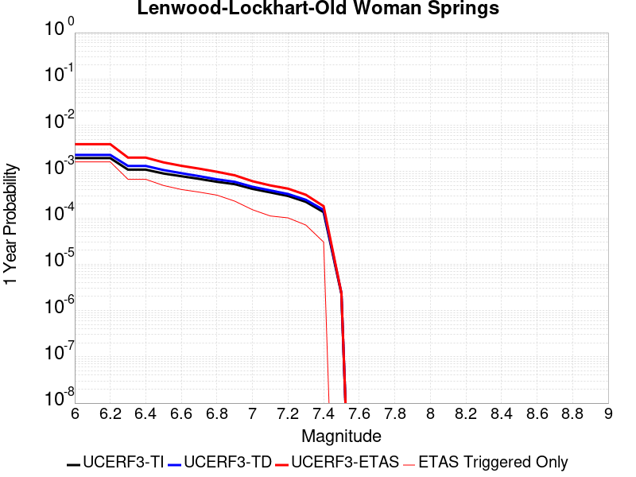 |  |

| Magnitude | 1 wk TI Prob | 1 wk TD Prob | 1 wk ETAS Prob | 1 wk ETAS/TD Gain | 1 wk ETAS Triggered Only | 1 mo TI Prob | 1 mo TD Prob | 1 mo ETAS Prob | 1 mo ETAS/TD Gain | 1 mo ETAS Triggered Only | 1 yr TI Prob | 1 yr TD Prob | 1 yr ETAS Prob | 1 yr ETAS/TD Gain | 1 yr ETAS Triggered Only | 10 yr TI Prob | 10 yr TD Prob | 10 yr ETAS Prob | 10 yr ETAS/TD Gain | 10 yr ETAS Triggered Only |
|-----|-----|-----|-----|-----|-----|-----|-----|-----|-----|-----|-----|-----|-----|-----|-----|-----|-----|-----|-----|-----|
| 6.0 | 3.744542E-5 | 4.396252E-5 | 0.0011174526 | 25.418303 | 0.0010735373 | 1.604705E-4 | 1.8839816E-4 | 0.0012617332 | 6.697163 | 0.0010735373 | 0.0019519776 | 0.0022915069 | 0.0033625842 | 1.4674118 | 0.0010735373 | 0.019349206 | 0.022696787 | 0.02374596 | 1.0462255 | 0.0010735373 |
| 6.1 | 3.744542E-5 | 4.396252E-5 | 0.0011174526 | 25.418303 | 0.0010735373 | 1.604705E-4 | 1.8839816E-4 | 0.0012617332 | 6.697163 | 0.0010735373 | 0.0019519776 | 0.0022915069 | 0.0033625842 | 1.4674118 | 0.0010735373 | 0.019349206 | 0.022696787 | 0.02374596 | 1.0462255 | 0.0010735373 |
| 6.2 | 3.744542E-5 | 4.396252E-5 | 0.0011174526 | 25.418303 | 0.0010735373 | 1.604705E-4 | 1.8839816E-4 | 0.0012617332 | 6.697163 | 0.0010735373 | 0.0019519776 | 0.0022915069 | 0.0033625842 | 1.4674118 | 0.0010735373 | 0.019349206 | 0.022696787 | 0.02374596 | 1.0462255 | 0.0010735373 |
| 6.3 | 2.1079984E-5 | 2.5353434E-5 | 5.621085E-4 | 22.1709 | 5.3676864E-4 | 9.0339665E-5 | 1.0865316E-4 | 6.4536347E-4 | 5.9396663 | 5.3676864E-4 | 0.0010993304 | 0.0013220694 | 0.0018581285 | 1.4054697 | 5.3676864E-4 | 0.010939079 | 0.0131442575 | 0.0136739705 | 1.0403 | 5.3676864E-4 |
| 6.4 | 2.1079984E-5 | 2.5353434E-5 | 5.621085E-4 | 22.1709 | 5.3676864E-4 | 9.0339665E-5 | 1.0865316E-4 | 6.4536347E-4 | 5.9396663 | 5.3676864E-4 | 0.0010993304 | 0.0013220694 | 0.0018581285 | 1.4054697 | 5.3676864E-4 | 0.010939079 | 0.0131442575 | 0.0136739705 | 1.0403 | 5.3676864E-4 |
| 6.5 | 1.7397282E-5 | 2.066241E-5 | 3.785008E-4 | 18.318327 | 3.5784577E-4 | 7.455765E-5 | 8.8550245E-5 | 4.4636434E-4 | 5.040803 | 3.5784577E-4 | 9.073613E-4 | 0.0010775778 | 0.0014350379 | 1.3317256 | 3.5784577E-4 | 0.009036654 | 0.010724821 | 0.011078829 | 1.0330083 | 3.5784577E-4 |
| 6.6 | 1.52050325E-5 | 1.7679693E-5 | 3.7551913E-4 | 21.240137 | 3.5784577E-4 | 6.51628E-5 | 7.576796E-5 | 4.3358663E-4 | 5.722559 | 3.5784577E-4 | 7.9306826E-4 | 9.220924E-4 | 0.0012796082 | 1.3877224 | 3.5784577E-4 | 0.007902439 | 0.009183526 | 0.009538086 | 1.0386082 | 3.5784577E-4 |
| 6.7 | 1.332523E-5 | 1.5264002E-5 | 1.5264002E-5 | 1.0 | 0.0 | 5.7106878E-5 | 6.5415545E-5 | 6.5415545E-5 | 1.0 | 0.0 | 6.950544E-4 | 7.961491E-4 | 7.961491E-4 | 1.0 | 0.0 | 0.006928845 | 0.007933599 | 0.007933599 | 1.0 | 0.0 |
| 6.8 | 1.1525329E-5 | 1.3030979E-5 | 1.3030979E-5 | 1.0 | 0.0 | 4.9393333E-5 | 5.584588E-5 | 5.584588E-5 | 1.0 | 0.0 | 6.011979E-4 | 6.797157E-4 | 6.797157E-4 | 1.0 | 0.0 | 0.00599574 | 0.006776819 | 0.006776819 | 1.0 | 0.0 |
| 6.9 | 1.0253909E-5 | 1.15144385E-5 | 1.15144385E-5 | 1.0 | 0.0 | 4.3944583E-5 | 4.9346683E-5 | 4.9346683E-5 | 1.0 | 0.0 | 5.3489394E-4 | 6.0063385E-4 | 6.0063385E-4 | 1.0 | 0.0 | 0.0053360825 | 0.0059904843 | 0.0059904843 | 1.0 | 0.0 |
| 7.0 | 8.104563E-6 | 8.991279E-6 | 8.991279E-6 | 1.0 | 0.0 | 3.4733377E-5 | 3.8533497E-5 | 3.8533497E-5 | 1.0 | 0.0 | 4.2279682E-4 | 4.6904673E-4 | 4.6904673E-4 | 1.0 | 0.0 | 0.0042199334 | 0.0046808156 | 0.0046808156 | 1.0 | 0.0 |
| 7.1 | 6.7986157E-6 | 7.515816E-6 | 7.515816E-6 | 1.0 | 0.0 | 2.91366E-5 | 3.2210253E-5 | 3.2210253E-5 | 1.0 | 0.0 | 3.5468035E-4 | 3.920914E-4 | 3.920914E-4 | 1.0 | 0.0 | 0.003541148 | 0.003914213 | 0.003914213 | 1.0 | 0.0 |
| 7.2 | 5.6893327E-6 | 6.2800136E-6 | 6.2800136E-6 | 1.0 | 0.0 | 2.4382627E-5 | 2.6914078E-5 | 2.6914078E-5 | 1.0 | 0.0 | 2.9681803E-4 | 3.2763163E-4 | 3.2763163E-4 | 1.0 | 0.0 | 0.002964219 | 0.0032716845 | 0.0032716845 | 1.0 | 0.0 |
| 7.3 | 4.253348E-6 | 4.7069107E-6 | 4.7069107E-6 | 1.0 | 0.0 | 1.8228506E-5 | 2.0172329E-5 | 2.0172329E-5 | 1.0 | 0.0 | 2.2190946E-4 | 2.4557224E-4 | 2.4557224E-4 | 1.0 | 0.0 | 0.00221688 | 0.0024531898 | 0.0024531898 | 1.0 | 0.0 |
| 7.4 | 2.5448119E-6 | 2.852045E-6 | 2.852045E-6 | 1.0 | 0.0 | 1.0906291E-5 | 1.2223002E-5 | 1.2223002E-5 | 1.0 | 0.0 | 1.3277601E-4 | 1.4880655E-4 | 1.4880655E-4 | 1.0 | 0.0 | 0.001326967 | 0.0014872311 | 0.0014872311 | 1.0 | 0.0 |
| 7.5 | 4.3706837E-8 | 4.562909E-8 | 4.562909E-8 | 1.0 | 0.0 | 1.8731501E-7 | 1.9555324E-7 | 1.9555324E-7 | 1.0 | 0.0 | 2.2805577E-6 | 2.3808586E-6 | 2.3808586E-6 | 1.0 | 0.0 | 2.2805343E-5 | 2.3808387E-5 | 2.3808387E-5 | 1.0 | 0.0 |

## Nelson Lake
*[(top)](#table-of-contents)*

| 1 Week | 1 Month | 1 Year | 10 Year |
|-----|-----|-----|-----|
| 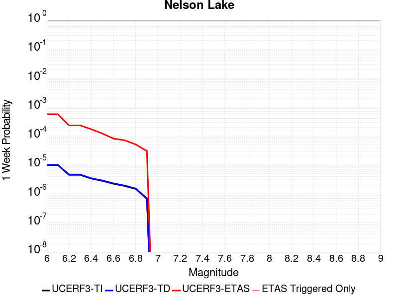 |  |  |  |

| Magnitude | 1 wk TI Prob | 1 wk TD Prob | 1 wk ETAS Prob | 1 wk ETAS/TD Gain | 1 wk ETAS Triggered Only | 1 mo TI Prob | 1 mo TD Prob | 1 mo ETAS Prob | 1 mo ETAS/TD Gain | 1 mo ETAS Triggered Only | 1 yr TI Prob | 1 yr TD Prob | 1 yr ETAS Prob | 1 yr ETAS/TD Gain | 1 yr ETAS Triggered Only | 10 yr TI Prob | 10 yr TD Prob | 10 yr ETAS Prob | 10 yr ETAS/TD Gain | 10 yr ETAS Triggered Only |
|-----|-----|-----|-----|-----|-----|-----|-----|-----|-----|-----|-----|-----|-----|-----|-----|-----|-----|-----|-----|-----|
| 6.0 | 9.913453E-6 | 1.0192255E-5 | 9.047976E-4 | 88.77305 | 8.9461444E-4 | 4.2485535E-5 | 4.3680422E-5 | 9.3825575E-4 | 21.480007 | 8.9461444E-4 | 5.1713863E-4 | 5.316897E-4 | 0.0014258284 | 2.6816928 | 8.9461444E-4 | 0.0051593683 | 0.005305204 | 0.006195072 | 1.167735 | 8.9461444E-4 |
| 6.1 | 9.913453E-6 | 1.0192255E-5 | 9.047976E-4 | 88.77305 | 8.9461444E-4 | 4.2485535E-5 | 4.3680422E-5 | 9.3825575E-4 | 21.480007 | 8.9461444E-4 | 5.1713863E-4 | 5.316897E-4 | 0.0014258284 | 2.6816928 | 8.9461444E-4 | 0.0051593683 | 0.005305204 | 0.006195072 | 1.167735 | 8.9461444E-4 |
| 6.2 | 4.5596407E-6 | 4.696313E-6 | 3.625404E-4 | 77.196815 | 3.5784577E-4 | 1.954117E-5 | 2.0126909E-5 | 3.7796548E-4 | 18.779114 | 3.5784577E-4 | 2.3788778E-4 | 2.4501883E-4 | 6.027769E-4 | 2.460125 | 3.5784577E-4 | 0.0023763329 | 0.0024476128 | 0.0028045827 | 1.1458441 | 3.5784577E-4 |
| 6.3 | 4.5596407E-6 | 4.696313E-6 | 3.625404E-4 | 77.196815 | 3.5784577E-4 | 1.954117E-5 | 2.0126909E-5 | 3.7796548E-4 | 18.779114 | 3.5784577E-4 | 2.3788778E-4 | 2.4501883E-4 | 6.027769E-4 | 2.460125 | 3.5784577E-4 | 0.0023763329 | 0.0024476128 | 0.0028045827 | 1.1458441 | 3.5784577E-4 |
| 6.4 | 3.4025713E-6 | 3.5098972E-6 | 3.613544E-4 | 102.95299 | 3.5784577E-4 | 1.4582367E-5 | 1.5042335E-5 | 3.7288273E-4 | 24.788885 | 3.5784577E-4 | 1.7752586E-4 | 1.8312587E-4 | 5.409061E-4 | 2.9537394 | 3.5784577E-4 | 0.001773841 | 0.0018298327 | 0.0021870236 | 1.1952041 | 3.5784577E-4 |
| 6.5 | 2.8352947E-6 | 2.927856E-6 | 3.6077257E-4 | 123.22073 | 3.5784577E-4 | 1.2151207E-5 | 1.2547898E-5 | 3.7038917E-4 | 29.518024 | 3.5784577E-4 | 1.479309E-4 | 1.5276071E-4 | 5.105518E-4 | 3.3421671 | 3.5784577E-4 | 0.0014783246 | 0.0015266308 | 0.0018839303 | 1.2340444 | 3.5784577E-4 |
| 6.6 | 2.251518E-6 | 2.3290677E-6 | 3.60174E-4 | 154.643 | 3.5784577E-4 | 9.649328E-6 | 9.981683E-6 | 3.6782387E-4 | 36.849884 | 3.5784577E-4 | 1.1747423E-4 | 1.2152085E-4 | 4.7932312E-4 | 3.9443696 | 3.5784577E-4 | 0.0011741214 | 0.0012146058 | 0.0015720169 | 1.294261 | 3.5784577E-4 |
| 6.7 | 1.8911853E-6 | 1.9591396E-6 | 1.8088167E-4 | 92.327095 | 1.7892288E-4 | 8.105055E-6 | 8.39629E-6 | 1.8731767E-4 | 22.309578 | 1.7892288E-4 | 9.867457E-5 | 1.0222061E-4 | 2.8112522E-4 | 2.7501812 | 1.7892288E-4 | 9.863076E-4 | 0.0010217935 | 0.0012005335 | 1.1749278 | 1.7892288E-4 |
| 6.8 | 1.4874814E-6 | 1.5438305E-6 | 1.8046644E-4 | 116.89524 | 1.7892288E-4 | 6.374905E-6 | 6.6164025E-6 | 1.855381E-4 | 28.042143 | 1.7892288E-4 | 7.76117E-5 | 8.055224E-5 | 2.594607E-4 | 3.221024 | 1.7892288E-4 | 7.75846E-4 | 8.0528157E-4 | 9.840603E-4 | 1.2220079 | 1.7892288E-4 |
| 6.9 | 6.835972E-7 | 7.1399285E-7 | 7.1399285E-7 | 1.0 | 0.0 | 2.9296991E-6 | 3.0599674E-6 | 3.0599674E-6 | 1.0 | 0.0 | 3.56685E-5 | 3.7254784E-5 | 3.7254784E-5 | 1.0 | 0.0 | 3.5662777E-4 | 3.7251666E-4 | 3.7251666E-4 | 1.0 | 0.0 |

## Paradise
*[(top)](#table-of-contents)*

| 1 Week | 1 Month | 1 Year | 10 Year |
|-----|-----|-----|-----|
|  |  |  |  |

| Magnitude | 1 wk TI Prob | 1 wk TD Prob | 1 wk ETAS Prob | 1 wk ETAS/TD Gain | 1 wk ETAS Triggered Only | 1 mo TI Prob | 1 mo TD Prob | 1 mo ETAS Prob | 1 mo ETAS/TD Gain | 1 mo ETAS Triggered Only | 1 yr TI Prob | 1 yr TD Prob | 1 yr ETAS Prob | 1 yr ETAS/TD Gain | 1 yr ETAS Triggered Only | 10 yr TI Prob | 10 yr TD Prob | 10 yr ETAS Prob | 10 yr ETAS/TD Gain | 10 yr ETAS Triggered Only |
|-----|-----|-----|-----|-----|-----|-----|-----|-----|-----|-----|-----|-----|-----|-----|-----|-----|-----|-----|-----|-----|
| 6.0 | 1.4851273E-5 | 1.6694692E-5 | 7.3237426E-4 | 43.86869 | 7.1569154E-4 | 6.364676E-5 | 7.154685E-5 | 7.871872E-4 | 11.002402 | 7.1569154E-4 | 7.7462377E-4 | 8.707584E-4 | 0.0017645938 | 2.0265024 | 8.9461444E-4 | 0.0077192914 | 0.008675844 | 0.009562697 | 1.1022209 | 8.9461444E-4 |
| 6.1 | 1.4851273E-5 | 1.6694692E-5 | 7.3237426E-4 | 43.86869 | 7.1569154E-4 | 6.364676E-5 | 7.154685E-5 | 7.871872E-4 | 11.002402 | 7.1569154E-4 | 7.7462377E-4 | 8.707584E-4 | 0.0017645938 | 2.0265024 | 8.9461444E-4 | 0.0077192914 | 0.008675844 | 0.009562697 | 1.1022209 | 8.9461444E-4 |
| 6.2 | 1.4851273E-5 | 1.6694692E-5 | 7.3237426E-4 | 43.86869 | 7.1569154E-4 | 6.364676E-5 | 7.154685E-5 | 7.871872E-4 | 11.002402 | 7.1569154E-4 | 7.7462377E-4 | 8.707584E-4 | 0.0017645938 | 2.0265024 | 8.9461444E-4 | 0.0077192914 | 0.008675844 | 0.009562697 | 1.1022209 | 8.9461444E-4 |
| 6.3 | 1.0426831E-5 | 1.188862E-5 | 5.486509E-4 | 46.14925 | 5.3676864E-4 | 4.4685654E-5 | 5.0950268E-5 | 5.8769155E-4 | 11.534612 | 5.3676864E-4 | 5.43912E-4 | 6.201489E-4 | 0.0013353965 | 2.1533484 | 7.1569154E-4 | 0.0054258266 | 0.0061847917 | 0.0068960567 | 1.1150023 | 7.1569154E-4 |
| 6.4 | 1.0426831E-5 | 1.188862E-5 | 5.486509E-4 | 46.14925 | 5.3676864E-4 | 4.4685654E-5 | 5.0950268E-5 | 5.8769155E-4 | 11.534612 | 5.3676864E-4 | 5.43912E-4 | 6.201489E-4 | 0.0013353965 | 2.1533484 | 7.1569154E-4 | 0.0054258266 | 0.0061847917 | 0.0068960567 | 1.1150023 | 7.1569154E-4 |
| 6.5 | 9.25027E-6 | 1.06199595E-5 | 3.6846192E-4 | 34.69523 | 3.5784577E-4 | 3.964341E-5 | 4.551335E-5 | 4.0334283E-4 | 8.862078 | 3.5784577E-4 | 4.8255164E-4 | 5.53989E-4 | 9.1163657E-4 | 1.6455859 | 3.5784577E-4 | 0.0048150513 | 0.0055265795 | 0.0058824476 | 1.0643921 | 3.5784577E-4 |
| 6.6 | 7.904275E-6 | 9.159525E-6 | 1.8808077E-4 | 20.5339 | 1.7892288E-4 | 3.3875025E-5 | 3.9254537E-5 | 2.181704E-4 | 5.557839 | 1.7892288E-4 | 4.1235037E-4 | 4.7782314E-4 | 6.5666053E-4 | 1.3742753 | 1.7892288E-4 | 0.0041158604 | 0.0047683544 | 0.004946424 | 1.0373441 | 1.7892288E-4 |
| 6.7 | 7.2061953E-6 | 8.407248E-6 | 1.8732862E-4 | 22.2818 | 1.7892288E-4 | 3.088333E-5 | 3.6030586E-5 | 2.1494702E-4 | 5.965682 | 1.7892288E-4 | 3.7593965E-4 | 4.3858777E-4 | 6.174322E-4 | 1.4077734 | 1.7892288E-4 | 0.003753043 | 0.004377591 | 0.0045557306 | 1.0406935 | 1.7892288E-4 |
| 6.8 | 6.6948724E-6 | 7.842166E-6 | 1.8676365E-4 | 23.815315 | 1.7892288E-4 | 2.8691995E-5 | 3.360887E-5 | 2.1252575E-4 | 6.3235016 | 1.7892288E-4 | 3.4926904E-4 | 4.0911473E-4 | 5.8796443E-4 | 1.4371626 | 1.7892288E-4 | 0.003487206 | 0.0040839734 | 0.004262165 | 1.043632 | 1.7892288E-4 |
| 6.9 | 6.0421025E-6 | 7.130621E-6 | 1.8605223E-4 | 26.09201 | 1.7892288E-4 | 2.5894467E-5 | 3.0559466E-5 | 2.0947689E-4 | 6.85473 | 1.7892288E-4 | 3.1521954E-4 | 3.7200135E-4 | 5.508577E-4 | 1.4807948 | 1.7892288E-4 | 0.0031477278 | 0.0037141247 | 0.003892383 | 1.0479947 | 1.7892288E-4 |
| 7.0 | 4.134091E-6 | 5.0803087E-6 | 5.0803087E-6 | 1.0 | 0.0 | 1.7717413E-5 | 2.177258E-5 | 2.177258E-5 | 1.0 | 0.0 | 2.1568815E-4 | 2.6505045E-4 | 2.6505045E-4 | 1.0 | 0.0 | 0.0021547892 | 0.0026474963 | 0.0026474963 | 1.0 | 0.0 |
| 7.1 | 3.7674888E-6 | 4.6318696E-6 | 4.6318696E-6 | 1.0 | 0.0 | 1.6146281E-5 | 1.9850726E-5 | 1.9850726E-5 | 1.0 | 0.0 | 1.9656324E-4 | 2.4165731E-4 | 2.4165731E-4 | 1.0 | 0.0 | 0.0019638946 | 0.002414096 | 0.002414096 | 1.0 | 0.0 |
| 7.2 | 3.4065345E-6 | 4.156723E-6 | 4.156723E-6 | 1.0 | 0.0 | 1.4599351E-5 | 1.7814415E-5 | 1.7814415E-5 | 1.0 | 0.0 | 1.777326E-4 | 2.1687041E-4 | 2.1687041E-4 | 1.0 | 0.0 | 0.0017759053 | 0.002166736 | 0.002166736 | 1.0 | 0.0 |
| 7.3 | 2.9934936E-6 | 3.6293168E-6 | 3.6293168E-6 | 1.0 | 0.0 | 1.2829195E-5 | 1.555413E-5 | 1.555413E-5 | 1.0 | 0.0 | 1.5618425E-4 | 1.8935655E-4 | 1.8935655E-4 | 1.0 | 0.0 | 0.0015607453 | 0.0018920974 | 0.0018920974 | 1.0 | 0.0 |
| 7.4 | 2.4049796E-6 | 2.8889842E-6 | 2.8889842E-6 | 1.0 | 0.0 | 1.0307015E-5 | 1.238131E-5 | 1.238131E-5 | 1.0 | 0.0 | 1.2548068E-4 | 1.5073347E-4 | 1.5073347E-4 | 1.0 | 0.0 | 0.0012540985 | 0.0015064536 | 0.0015064536 | 1.0 | 0.0 |
| 7.5 | 1.2710091E-6 | 1.5134682E-6 | 1.5134682E-6 | 1.0 | 0.0 | 5.44717E-6 | 6.4862834E-6 | 6.4862834E-6 | 1.0 | 0.0 | 6.631728E-5 | 7.8968886E-5 | 7.8968886E-5 | 1.0 | 0.0 | 6.6297496E-4 | 7.8953087E-4 | 7.8953087E-4 | 1.0 | 0.0 |
| 7.6 | 2.21172E-7 | 2.603961E-7 | 2.603961E-7 | 1.0 | 0.0 | 9.478797E-7 | 1.1159829E-6 | 1.1159829E-6 | 1.0 | 0.0 | 1.1540374E-5 | 1.3587036E-5 | 1.3587036E-5 | 1.0 | 0.0 | 1.1539775E-4 | 1.3586486E-4 | 1.3586486E-4 | 1.0 | 0.0 |

## Towne Pass
*[(top)](#table-of-contents)*

| 1 Week | 1 Month | 1 Year | 10 Year |
|-----|-----|-----|-----|
|  |  |  |  |

| Magnitude | 1 wk TI Prob | 1 wk TD Prob | 1 wk ETAS Prob | 1 wk ETAS/TD Gain | 1 wk ETAS Triggered Only | 1 mo TI Prob | 1 mo TD Prob | 1 mo ETAS Prob | 1 mo ETAS/TD Gain | 1 mo ETAS Triggered Only | 1 yr TI Prob | 1 yr TD Prob | 1 yr ETAS Prob | 1 yr ETAS/TD Gain | 1 yr ETAS Triggered Only | 10 yr TI Prob | 10 yr TD Prob | 10 yr ETAS Prob | 10 yr ETAS/TD Gain | 10 yr ETAS Triggered Only |
|-----|-----|-----|-----|-----|-----|-----|-----|-----|-----|-----|-----|-----|-----|-----|-----|-----|-----|-----|-----|-----|
| 6.0 | 3.849728E-6 | 3.8945414E-6 | 5.406611E-4 | 138.82536 | 5.3676864E-4 | 1.649873E-5 | 1.669081E-5 | 5.534505E-4 | 33.158997 | 5.3676864E-4 | 2.0085352E-4 | 2.0319603E-4 | 0.0010976286 | 5.4018216 | 8.9461444E-4 | 0.0020067208 | 0.0020305314 | 0.0029233294 | 1.4396868 | 8.9461444E-4 |
| 6.1 | 3.849728E-6 | 3.8945414E-6 | 5.406611E-4 | 138.82536 | 5.3676864E-4 | 1.649873E-5 | 1.669081E-5 | 5.534505E-4 | 33.158997 | 5.3676864E-4 | 2.0085352E-4 | 2.0319603E-4 | 0.0010976286 | 5.4018216 | 8.9461444E-4 | 0.0020067208 | 0.0020305314 | 0.0029233294 | 1.4396868 | 8.9461444E-4 |
| 6.2 | 3.849728E-6 | 3.8945414E-6 | 5.406611E-4 | 138.82536 | 5.3676864E-4 | 1.649873E-5 | 1.669081E-5 | 5.534505E-4 | 33.158997 | 5.3676864E-4 | 2.0085352E-4 | 2.0319603E-4 | 0.0010976286 | 5.4018216 | 8.9461444E-4 | 0.0020067208 | 0.0020305314 | 0.0029233294 | 1.4396868 | 8.9461444E-4 |
| 6.3 | 3.849728E-6 | 3.8945414E-6 | 5.406611E-4 | 138.82536 | 5.3676864E-4 | 1.649873E-5 | 1.669081E-5 | 5.534505E-4 | 33.158997 | 5.3676864E-4 | 2.0085352E-4 | 2.0319603E-4 | 0.0010976286 | 5.4018216 | 8.9461444E-4 | 0.0020067208 | 0.0020305314 | 0.0029233294 | 1.4396868 | 8.9461444E-4 |
| 6.4 | 3.849728E-6 | 3.8945414E-6 | 5.406611E-4 | 138.82536 | 5.3676864E-4 | 1.649873E-5 | 1.669081E-5 | 5.534505E-4 | 33.158997 | 5.3676864E-4 | 2.0085352E-4 | 2.0319603E-4 | 0.0010976286 | 5.4018216 | 8.9461444E-4 | 0.0020067208 | 0.0020305314 | 0.0029233294 | 1.4396868 | 8.9461444E-4 |
| 6.5 | 1.1953545E-6 | 1.203052E-6 | 1.203052E-6 | 1.0 | 0.0 | 5.1229376E-6 | 5.1559277E-6 | 5.1559277E-6 | 1.0 | 0.0 | 6.236998E-5 | 6.277173E-5 | 6.277173E-5 | 1.0 | 0.0 | 6.235248E-4 | 6.275517E-4 | 6.275517E-4 | 1.0 | 0.0 |
| 6.6 | 1.1953545E-6 | 1.203052E-6 | 1.203052E-6 | 1.0 | 0.0 | 5.1229376E-6 | 5.1559277E-6 | 5.1559277E-6 | 1.0 | 0.0 | 6.236998E-5 | 6.277173E-5 | 6.277173E-5 | 1.0 | 0.0 | 6.235248E-4 | 6.275517E-4 | 6.275517E-4 | 1.0 | 0.0 |
| 6.7 | 8.375951E-7 | 8.4106705E-7 | 8.4106705E-7 | 1.0 | 0.0 | 3.5896885E-6 | 3.6045683E-6 | 3.6045683E-6 | 1.0 | 0.0 | 4.370358E-5 | 4.3884793E-5 | 4.3884793E-5 | 1.0 | 0.0 | 4.3694986E-4 | 4.38767E-4 | 4.38767E-4 | 1.0 | 0.0 |
| 6.8 | 6.38041E-7 | 6.392156E-7 | 6.392156E-7 | 1.0 | 0.0 | 2.7344586E-6 | 2.7394929E-6 | 2.7394929E-6 | 1.0 | 0.0 | 3.3291526E-5 | 3.3352855E-5 | 3.3352855E-5 | 1.0 | 0.0 | 3.3286537E-4 | 3.334823E-4 | 3.334823E-4 | 1.0 | 0.0 |
| 6.9 | 5.3460053E-7 | 5.345333E-7 | 5.345333E-7 | 1.0 | 0.0 | 2.2911431E-6 | 2.2908553E-6 | 2.2908553E-6 | 1.0 | 0.0 | 2.789431E-5 | 2.789084E-5 | 2.789084E-5 | 1.0 | 0.0 | 2.789081E-4 | 2.7887672E-4 | 2.7887672E-4 | 1.0 | 0.0 |
| 7.0 | 3.557783E-7 | 3.5324226E-7 | 3.5324226E-7 | 1.0 | 0.0 | 1.5247632E-6 | 1.5138945E-6 | 1.5138945E-6 | 1.0 | 0.0 | 1.8563835E-5 | 1.843152E-5 | 1.843152E-5 | 1.0 | 0.0 | 1.8562283E-4 | 1.8430075E-4 | 1.8430075E-4 | 1.0 | 0.0 |
| 7.1 | 3.037942E-7 | 3.0002218E-7 | 3.0002218E-7 | 1.0 | 0.0 | 1.3019744E-6 | 1.2858087E-6 | 1.2858087E-6 | 1.0 | 0.0 | 1.5851423E-5 | 1.5654618E-5 | 1.5654618E-5 | 1.0 | 0.0 | 1.5850292E-4 | 1.5653588E-4 | 1.5653588E-4 | 1.0 | 0.0 |
| 7.2 | 2.0808248E-7 | 2.0217689E-7 | 2.0217689E-7 | 1.0 | 0.0 | 8.917818E-7 | 8.6647213E-7 | 8.6647213E-7 | 1.0 | 0.0 | 1.0857389E-5 | 1.0549252E-5 | 1.0549252E-5 | 1.0 | 0.0 | 1.0856859E-4 | 1.0548797E-4 | 1.0548797E-4 | 1.0 | 0.0 |
| 7.3 | 1.1162073E-7 | 1.0636894E-7 | 1.0636894E-7 | 1.0 | 0.0 | 4.7837443E-7 | 4.558668E-7 | 4.558668E-7 | 1.0 | 0.0 | 5.8241935E-6 | 5.550166E-6 | 5.550166E-6 | 1.0 | 0.0 | 5.8240406E-5 | 5.5500474E-5 | 5.5500474E-5 | 1.0 | 0.0 |

## Bicycle Lake
*[(top)](#table-of-contents)*

| 1 Week | 1 Month | 1 Year | 10 Year |
|-----|-----|-----|-----|
|  |  |  |  |

| Magnitude | 1 wk TI Prob | 1 wk TD Prob | 1 wk ETAS Prob | 1 wk ETAS/TD Gain | 1 wk ETAS Triggered Only | 1 mo TI Prob | 1 mo TD Prob | 1 mo ETAS Prob | 1 mo ETAS/TD Gain | 1 mo ETAS Triggered Only | 1 yr TI Prob | 1 yr TD Prob | 1 yr ETAS Prob | 1 yr ETAS/TD Gain | 1 yr ETAS Triggered Only | 10 yr TI Prob | 10 yr TD Prob | 10 yr ETAS Prob | 10 yr ETAS/TD Gain | 10 yr ETAS Triggered Only |
|-----|-----|-----|-----|-----|-----|-----|-----|-----|-----|-----|-----|-----|-----|-----|-----|-----|-----|-----|-----|-----|
| 6.0 | 1.9621975E-5 | 2.2097078E-5 | 5.5885385E-4 | 25.29085 | 5.3676864E-4 | 8.4091465E-5 | 9.4699084E-5 | 6.314169E-4 | 6.6676135 | 5.3676864E-4 | 0.0010233327 | 0.0011524865 | 0.0016886366 | 1.4652115 | 5.3676864E-4 | 0.01018633 | 0.011478408 | 0.012009015 | 1.0462266 | 5.3676864E-4 |
| 6.1 | 1.9621975E-5 | 2.2097078E-5 | 5.5885385E-4 | 25.29085 | 5.3676864E-4 | 8.4091465E-5 | 9.4699084E-5 | 6.314169E-4 | 6.6676135 | 5.3676864E-4 | 0.0010233327 | 0.0011524865 | 0.0016886366 | 1.4652115 | 5.3676864E-4 | 0.01018633 | 0.011478408 | 0.012009015 | 1.0462266 | 5.3676864E-4 |
| 6.2 | 9.9971285E-6 | 1.1255639E-5 | 5.4801826E-4 | 48.688328 | 5.3676864E-4 | 4.2844134E-5 | 4.8237856E-5 | 5.849806E-4 | 12.127003 | 5.3676864E-4 | 5.2150246E-4 | 5.871896E-4 | 0.0011236431 | 1.9135948 | 5.3676864E-4 | 0.0052028033 | 0.005861487 | 0.006395109 | 1.0910387 | 5.3676864E-4 |
| 6.3 | 9.589428E-6 | 1.0798346E-5 | 5.475612E-4 | 50.70788 | 5.3676864E-4 | 4.10969E-5 | 4.62781E-5 | 5.830219E-4 | 12.598226 | 5.3676864E-4 | 5.002399E-4 | 5.6334207E-4 | 0.0010998083 | 1.9522922 | 5.3676864E-4 | 0.0049911533 | 0.0056242296 | 0.0061579794 | 1.0949018 | 5.3676864E-4 |
| 6.4 | 9.589428E-6 | 1.0798346E-5 | 5.475612E-4 | 50.70788 | 5.3676864E-4 | 4.10969E-5 | 4.62781E-5 | 5.830219E-4 | 12.598226 | 5.3676864E-4 | 5.002399E-4 | 5.6334207E-4 | 0.0010998083 | 1.9522922 | 5.3676864E-4 | 0.0049911533 | 0.0056242296 | 0.0061579794 | 1.0949018 | 5.3676864E-4 |
| 6.5 | 5.557707E-6 | 6.2856016E-6 | 5.430509E-4 | 86.39601 | 5.3676864E-4 | 2.3818526E-5 | 2.6938165E-5 | 5.6369236E-4 | 20.925417 | 5.3676864E-4 | 2.8995197E-4 | 3.2794967E-4 | 8.645423E-4 | 2.636204 | 5.3676864E-4 | 0.0028957394 | 0.0032772934 | 0.0038123028 | 1.1632473 | 5.3676864E-4 |
| 6.6 | 4.8742945E-6 | 5.5132896E-6 | 5.42279E-4 | 98.35851 | 5.3676864E-4 | 2.0889667E-5 | 2.3628318E-5 | 5.603843E-4 | 23.716639 | 5.3676864E-4 | 2.54302E-4 | 2.87663E-4 | 8.2427723E-4 | 2.8654268 | 5.3676864E-4 | 0.002540112 | 0.0028754752 | 0.0034107005 | 1.1861345 | 5.3676864E-4 |
| 6.7 | 3.991108E-6 | 4.5159104E-6 | 5.412821E-4 | 119.86114 | 5.3676864E-4 | 1.7104636E-5 | 1.9353902E-5 | 5.5611215E-4 | 28.733854 | 5.3676864E-4 | 2.0822904E-4 | 2.3563375E-4 | 7.722759E-4 | 3.277442 | 5.3676864E-4 | 0.0020803404 | 0.0023563374 | 0.0028918413 | 1.2272611 | 5.3676864E-4 |

## Elsinore (Glen Ivy) rev
*[(top)](#table-of-contents)*

| 1 Week | 1 Month | 1 Year | 10 Year |
|-----|-----|-----|-----|
| 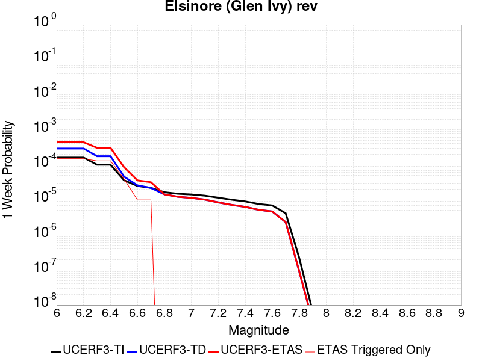 |  |  |  |

| Magnitude | 1 wk TI Prob | 1 wk TD Prob | 1 wk ETAS Prob | 1 wk ETAS/TD Gain | 1 wk ETAS Triggered Only | 1 mo TI Prob | 1 mo TD Prob | 1 mo ETAS Prob | 1 mo ETAS/TD Gain | 1 mo ETAS Triggered Only | 1 yr TI Prob | 1 yr TD Prob | 1 yr ETAS Prob | 1 yr ETAS/TD Gain | 1 yr ETAS Triggered Only | 10 yr TI Prob | 10 yr TD Prob | 10 yr ETAS Prob | 10 yr ETAS/TD Gain | 10 yr ETAS Triggered Only |
|-----|-----|-----|-----|-----|-----|-----|-----|-----|-----|-----|-----|-----|-----|-----|-----|-----|-----|-----|-----|-----|
| 6.0 | 1.6204086E-4 | 2.9360707E-4 | 8.3021814E-4 | 2.8276503 | 5.3676864E-4 | 6.94276E-4 | 0.0012578638 | 0.0017939573 | 1.4261936 | 5.3676864E-4 | 0.008420097 | 0.015234485 | 0.015763076 | 1.034697 | 5.3676864E-4 | 0.081081145 | 0.13969168 | 0.14015347 | 1.0033058 | 5.3676864E-4 |
| 6.1 | 1.6204086E-4 | 2.9360707E-4 | 8.3021814E-4 | 2.8276503 | 5.3676864E-4 | 6.94276E-4 | 0.0012578638 | 0.0017939573 | 1.4261936 | 5.3676864E-4 | 0.008420097 | 0.015234485 | 0.015763076 | 1.034697 | 5.3676864E-4 | 0.081081145 | 0.13969168 | 0.14015347 | 1.0033058 | 5.3676864E-4 |
| 6.2 | 1.6204086E-4 | 2.9360707E-4 | 8.3021814E-4 | 2.8276503 | 5.3676864E-4 | 6.94276E-4 | 0.0012578638 | 0.0017939573 | 1.4261936 | 5.3676864E-4 | 0.008420097 | 0.015234485 | 0.015763076 | 1.034697 | 5.3676864E-4 | 0.081081145 | 0.13969168 | 0.14015347 | 1.0033058 | 5.3676864E-4 |
| 6.3 | 1.0111737E-4 | 1.7703383E-4 | 7.137075E-4 | 4.031475 | 5.3676864E-4 | 4.332882E-4 | 7.5861247E-4 | 0.0012949739 | 1.7070296 | 5.3676864E-4 | 0.005262531 | 0.009217682 | 0.009749503 | 1.0576957 | 5.3676864E-4 | 0.0513964 | 0.0870191 | 0.087509155 | 1.0056317 | 5.3676864E-4 |
| 6.4 | 1.0111737E-4 | 1.7703383E-4 | 7.137075E-4 | 4.031475 | 5.3676864E-4 | 4.332882E-4 | 7.5861247E-4 | 0.0012949739 | 1.7070296 | 5.3676864E-4 | 0.005262531 | 0.009217682 | 0.009749503 | 1.0576957 | 5.3676864E-4 | 0.0513964 | 0.0870191 | 0.087509155 | 1.0056317 | 5.3676864E-4 |
| 6.5 | 3.6624708E-5 | 4.6391084E-5 | 2.2530567E-4 | 4.856659 | 1.7892288E-4 | 1.569536E-4 | 1.9880582E-4 | 3.7769313E-4 | 1.8998092 | 1.7892288E-4 | 0.001909235 | 0.0024181372 | 0.0025966272 | 1.0738131 | 1.7892288E-4 | 0.01892915 | 0.023739954 | 0.02391463 | 1.0073578 | 1.7892288E-4 |
| 6.6 | 2.5051324E-5 | 2.614772E-5 | 2.614772E-5 | 1.0 | 0.0 | 1.073584E-4 | 1.12057096E-4 | 1.12057096E-4 | 1.0 | 0.0 | 0.0013063047 | 0.0013634858 | 0.0013634858 | 1.0 | 0.0 | 0.012986525 | 0.013564618 | 0.013564618 | 1.0 | 0.0 |
| 6.7 | 2.2189772E-5 | 2.2072849E-5 | 2.2072849E-5 | 1.0 | 0.0 | 9.509556E-5 | 9.4594696E-5 | 9.4594696E-5 | 1.0 | 0.0 | 0.0011571734 | 0.0011511183 | 0.0011511183 | 1.0 | 0.0 | 0.011511663 | 0.011465415 | 0.011465415 | 1.0 | 0.0 |
| 6.8 | 1.6654378E-5 | 1.4437705E-5 | 1.4437705E-5 | 1.0 | 0.0 | 7.137396E-5 | 6.187444E-5 | 6.187444E-5 | 1.0 | 0.0 | 8.686314E-4 | 7.530661E-4 | 7.530661E-4 | 1.0 | 0.0 | 0.008652439 | 0.00751048 | 0.00751048 | 1.0 | 0.0 |
| 6.9 | 1.5042909E-5 | 1.2332022E-5 | 1.2332022E-5 | 1.0 | 0.0 | 6.446802E-5 | 5.285047E-5 | 5.285047E-5 | 1.0 | 0.0 | 7.8461546E-4 | 6.4326765E-4 | 6.4326765E-4 | 1.0 | 0.0 | 0.007818509 | 0.00641828 | 0.00641828 | 1.0 | 0.0 |
| 7.0 | 1.4361385E-5 | 1.1451324E-5 | 1.1451324E-5 | 1.0 | 0.0 | 6.154734E-5 | 4.9076196E-5 | 4.9076196E-5 | 1.0 | 0.0 | 7.490812E-4 | 5.973418E-4 | 5.973418E-4 | 1.0 | 0.0 | 0.007465612 | 0.0059613534 | 0.0059613534 | 1.0 | 0.0 |
| 7.1 | 1.3265571E-5 | 1.0244926E-5 | 1.0244926E-5 | 1.0 | 0.0 | 5.6851208E-5 | 4.39061E-5 | 4.39061E-5 | 1.0 | 0.0 | 6.919436E-4 | 5.344282E-4 | 5.344282E-4 | 1.0 | 0.0 | 0.006897931 | 0.0053347866 | 0.0053347866 | 1.0 | 0.0 |
| 7.2 | 1.1596403E-5 | 8.505067E-6 | 8.505067E-6 | 1.0 | 0.0 | 4.9697923E-5 | 3.6449786E-5 | 3.6449786E-5 | 1.0 | 0.0 | 6.049042E-4 | 4.436875E-4 | 4.436875E-4 | 1.0 | 0.0 | 0.006032603 | 0.0044294316 | 0.0044294316 | 1.0 | 0.0 |
| 7.3 | 1.0150827E-5 | 7.2387597E-6 | 7.2387597E-6 | 1.0 | 0.0 | 4.3502816E-5 | 3.1022897E-5 | 3.1022897E-5 | 1.0 | 0.0 | 5.2951806E-4 | 3.7763975E-4 | 3.7763975E-4 | 1.0 | 0.0 | 0.005282581 | 0.0037703665 | 0.0037703665 | 1.0 | 0.0 |
| 7.4 | 9.080705E-6 | 6.352519E-6 | 6.352519E-6 | 1.0 | 0.0 | 3.8916725E-5 | 2.7224805E-5 | 2.7224805E-5 | 1.0 | 0.0 | 4.7370812E-4 | 3.3141294E-4 | 3.3141294E-4 | 1.0 | 0.0 | 0.004726996 | 0.0033093381 | 0.0033093381 | 1.0 | 0.0 |
| 7.5 | 7.671649E-6 | 5.2256332E-6 | 5.2256332E-6 | 1.0 | 0.0 | 3.287808E-5 | 2.2395385E-5 | 2.2395385E-5 | 1.0 | 0.0 | 4.0021708E-4 | 2.7263095E-4 | 2.7263095E-4 | 1.0 | 0.0 | 0.0039949706 | 0.00272309 | 0.00272309 | 1.0 | 0.0 |
| 7.6 | 6.990086E-6 | 4.687545E-6 | 4.687545E-6 | 1.0 | 0.0 | 2.9957167E-5 | 2.008933E-5 | 2.008933E-5 | 1.0 | 0.0 | 3.6466747E-4 | 2.445613E-4 | 2.445613E-4 | 1.0 | 0.0 | 0.0036406964 | 0.002443038 | 0.002443038 | 1.0 | 0.0 |
| 7.7 | 4.163505E-6 | 2.3295343E-6 | 2.3295343E-6 | 1.0 | 0.0 | 1.7843471E-5 | 9.983683E-6 | 9.983683E-6 | 1.0 | 0.0 | 2.172226E-4 | 1.21545316E-4 | 1.21545316E-4 | 1.0 | 0.0 | 0.0021701038 | 0.0012148614 | 0.0012148614 | 1.0 | 0.0 |
| 7.8 | 2.2692414E-7 | 9.3854695E-8 | 9.3854695E-8 | 1.0 | 0.0 | 9.725317E-7 | 4.0223435E-7 | 4.0223435E-7 | 1.0 | 0.0 | 1.1840509E-5 | 4.8971956E-6 | 4.8971956E-6 | 1.0 | 0.0 | 1.1839878E-4 | 4.8971204E-5 | 4.8971204E-5 | 1.0 | 0.0 |
| 7.9 | 6.676829E-9 | 3.439853E-9 | 3.439853E-9 | 1.0 | 0.0 | 2.861498E-8 | 1.4742227E-8 | 1.4742227E-8 | 1.0 | 0.0 | 3.4838732E-7 | 1.7948659E-7 | 1.7948659E-7 | 1.0 | 0.0 | 3.4838679E-6 | 1.7948646E-6 | 1.7948646E-6 | 1.0 | 0.0 |

## Ludlow
*[(top)](#table-of-contents)*

| 1 Week | 1 Month | 1 Year | 10 Year |
|-----|-----|-----|-----|
|  |  |  | 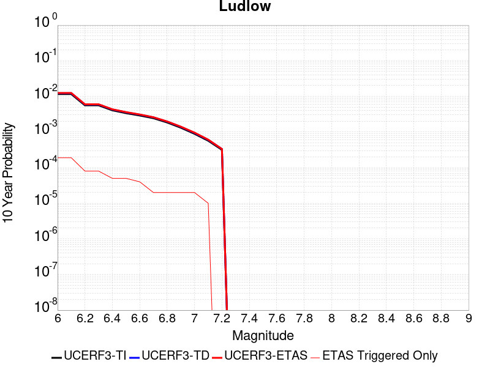 |

| Magnitude | 1 wk TI Prob | 1 wk TD Prob | 1 wk ETAS Prob | 1 wk ETAS/TD Gain | 1 wk ETAS Triggered Only | 1 mo TI Prob | 1 mo TD Prob | 1 mo ETAS Prob | 1 mo ETAS/TD Gain | 1 mo ETAS Triggered Only | 1 yr TI Prob | 1 yr TD Prob | 1 yr ETAS Prob | 1 yr ETAS/TD Gain | 1 yr ETAS Triggered Only | 10 yr TI Prob | 10 yr TD Prob | 10 yr ETAS Prob | 10 yr ETAS/TD Gain | 10 yr ETAS Triggered Only |
|-----|-----|-----|-----|-----|-----|-----|-----|-----|-----|-----|-----|-----|-----|-----|-----|-----|-----|-----|-----|-----|
| 6.0 | 2.2407607E-5 | 2.3657254E-5 | 3.8149455E-4 | 16.125902 | 3.5784577E-4 | 9.602906E-5 | 1.0138454E-4 | 4.5919404E-4 | 4.5292315 | 3.5784577E-4 | 0.0011685267 | 0.001233702 | 0.0015911062 | 1.2897006 | 3.5784577E-4 | 0.011624013 | 0.012273042 | 0.012626496 | 1.0287992 | 3.5784577E-4 |
| 6.1 | 2.2407607E-5 | 2.3657254E-5 | 3.8149455E-4 | 16.125902 | 3.5784577E-4 | 9.602906E-5 | 1.0138454E-4 | 4.5919404E-4 | 4.5292315 | 3.5784577E-4 | 0.0011685267 | 0.001233702 | 0.0015911062 | 1.2897006 | 3.5784577E-4 | 0.011624013 | 0.012273042 | 0.012626496 | 1.0287992 | 3.5784577E-4 |
| 6.2 | 1.0781252E-5 | 1.1365663E-5 | 1.1365663E-5 | 1.0 | 0.0 | 4.620455E-5 | 4.8709102E-5 | 4.8709102E-5 | 1.0 | 0.0 | 5.623952E-4 | 5.9287593E-4 | 5.9287593E-4 | 1.0 | 0.0 | 0.00560974 | 0.0059133614 | 0.0059133614 | 1.0 | 0.0 |
| 6.3 | 1.0781252E-5 | 1.1365663E-5 | 1.1365663E-5 | 1.0 | 0.0 | 4.620455E-5 | 4.8709102E-5 | 4.8709102E-5 | 1.0 | 0.0 | 5.623952E-4 | 5.9287593E-4 | 5.9287593E-4 | 1.0 | 0.0 | 0.00560974 | 0.0059133614 | 0.0059133614 | 1.0 | 0.0 |
| 6.4 | 7.814439E-6 | 8.237729E-6 | 8.237729E-6 | 1.0 | 0.0 | 3.3490025E-5 | 3.530408E-5 | 3.530408E-5 | 1.0 | 0.0 | 4.0766477E-4 | 4.2974384E-4 | 4.2974384E-4 | 1.0 | 0.0 | 0.0040691774 | 0.0042892746 | 0.0042892746 | 1.0 | 0.0 |
| 6.5 | 6.4986366E-6 | 6.85092E-6 | 6.85092E-6 | 1.0 | 0.0 | 2.7851002E-5 | 2.9360759E-5 | 2.9360759E-5 | 1.0 | 0.0 | 3.390332E-4 | 3.5740953E-4 | 3.5740953E-4 | 1.0 | 0.0 | 0.003385164 | 0.0035684432 | 0.0035684432 | 1.0 | 0.0 |
| 6.6 | 5.582177E-6 | 5.8860055E-6 | 5.8860055E-6 | 1.0 | 0.0 | 2.3923398E-5 | 2.5225498E-5 | 2.5225498E-5 | 1.0 | 0.0 | 2.9122844E-4 | 3.0707786E-4 | 3.0707786E-4 | 1.0 | 0.0 | 0.0029084706 | 0.003066609 | 0.003066609 | 1.0 | 0.0 |
| 6.7 | 4.6858763E-6 | 4.940427E-6 | 4.940427E-6 | 1.0 | 0.0 | 2.0082172E-5 | 2.1173091E-5 | 2.1173091E-5 | 1.0 | 0.0 | 2.4447302E-4 | 2.5775246E-4 | 2.5775246E-4 | 1.0 | 0.0 | 0.0024420423 | 0.0025745912 | 0.0025745912 | 1.0 | 0.0 |
| 6.8 | 3.5584908E-6 | 3.7520183E-6 | 3.7520183E-6 | 1.0 | 0.0 | 1.5250586E-5 | 1.6079981E-5 | 1.6079981E-5 | 1.0 | 0.0 | 1.8566006E-4 | 1.957566E-4 | 1.957566E-4 | 1.0 | 0.0 | 0.0018550502 | 0.0019558826 | 0.0019558826 | 1.0 | 0.0 |
| 6.9 | 2.532834E-6 | 2.6710034E-6 | 2.6710034E-6 | 1.0 | 0.0 | 1.0854958E-5 | 1.1447109E-5 | 1.1447109E-5 | 1.0 | 0.0 | 1.3215111E-4 | 1.3935992E-4 | 1.3935992E-4 | 1.0 | 0.0 | 0.0013207254 | 0.0013927529 | 0.0013927529 | 1.0 | 0.0 |
| 7.0 | 1.7083285E-6 | 1.8019439E-6 | 1.8019439E-6 | 1.0 | 0.0 | 7.3213873E-6 | 7.722595E-6 | 7.722595E-6 | 1.0 | 0.0 | 8.913424E-5 | 9.40187E-5 | 9.40187E-5 | 1.0 | 0.0 | 8.9098496E-4 | 9.3980576E-4 | 9.3980576E-4 | 1.0 | 0.0 |
| 7.1 | 1.0905424E-6 | 1.1497619E-6 | 1.1497619E-6 | 1.0 | 0.0 | 4.6737446E-6 | 4.9275427E-6 | 4.9275427E-6 | 1.0 | 0.0 | 5.6901354E-5 | 5.999128E-5 | 5.999128E-5 | 1.0 | 0.0 | 5.6886784E-4 | 5.997606E-4 | 5.997606E-4 | 1.0 | 0.0 |
| 7.2 | 6.06668E-7 | 6.387277E-7 | 6.387277E-7 | 1.0 | 0.0 | 2.600003E-6 | 2.7374022E-6 | 2.7374022E-6 | 1.0 | 0.0 | 3.1654577E-5 | 3.3327433E-5 | 3.3327433E-5 | 1.0 | 0.0 | 3.1650066E-4 | 3.3323118E-4 | 3.3323118E-4 | 1.0 | 0.0 |

## Death Valley (Black Mtns Frontal)
*[(top)](#table-of-contents)*

| 1 Week | 1 Month | 1 Year | 10 Year |
|-----|-----|-----|-----|
| 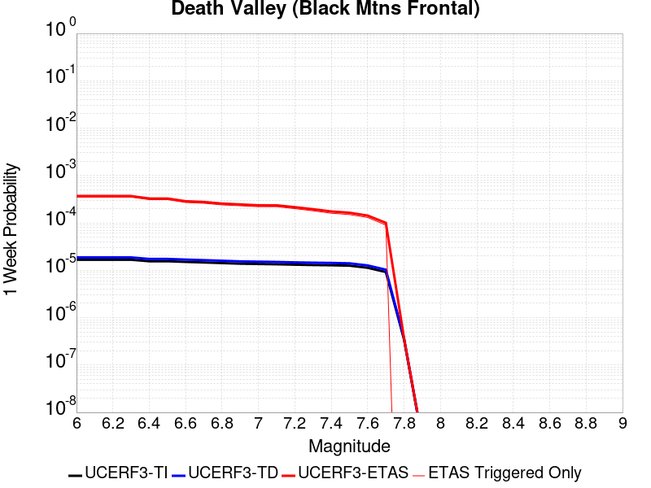 |  |  |  |

| Magnitude | 1 wk TI Prob | 1 wk TD Prob | 1 wk ETAS Prob | 1 wk ETAS/TD Gain | 1 wk ETAS Triggered Only | 1 mo TI Prob | 1 mo TD Prob | 1 mo ETAS Prob | 1 mo ETAS/TD Gain | 1 mo ETAS Triggered Only | 1 yr TI Prob | 1 yr TD Prob | 1 yr ETAS Prob | 1 yr ETAS/TD Gain | 1 yr ETAS Triggered Only | 10 yr TI Prob | 10 yr TD Prob | 10 yr ETAS Prob | 10 yr ETAS/TD Gain | 10 yr ETAS Triggered Only |
|-----|-----|-----|-----|-----|-----|-----|-----|-----|-----|-----|-----|-----|-----|-----|-----|-----|-----|-----|-----|-----|
| 6.0 | 1.6707214E-5 | 1.867027E-5 | 3.7650936E-4 | 20.166252 | 3.5784577E-4 | 7.160038E-5 | 8.001302E-5 | 4.3783017E-4 | 5.4719863 | 3.5784577E-4 | 8.71386E-4 | 9.737309E-4 | 0.0013312282 | 1.3671418 | 3.5784577E-4 | 0.00867977 | 0.009695496 | 0.010049873 | 1.0365506 | 3.5784577E-4 |
| 6.1 | 1.6707214E-5 | 1.867027E-5 | 3.7650936E-4 | 20.166252 | 3.5784577E-4 | 7.160038E-5 | 8.001302E-5 | 4.3783017E-4 | 5.4719863 | 3.5784577E-4 | 8.71386E-4 | 9.737309E-4 | 0.0013312282 | 1.3671418 | 3.5784577E-4 | 0.00867977 | 0.009695496 | 0.010049873 | 1.0365506 | 3.5784577E-4 |
| 6.2 | 1.6707214E-5 | 1.867027E-5 | 3.7650936E-4 | 20.166252 | 3.5784577E-4 | 7.160038E-5 | 8.001302E-5 | 4.3783017E-4 | 5.4719863 | 3.5784577E-4 | 8.71386E-4 | 9.737309E-4 | 0.0013312282 | 1.3671418 | 3.5784577E-4 | 0.00867977 | 0.009695496 | 0.010049873 | 1.0365506 | 3.5784577E-4 |
| 6.3 | 1.6707214E-5 | 1.867027E-5 | 3.7650936E-4 | 20.166252 | 3.5784577E-4 | 7.160038E-5 | 8.001302E-5 | 4.3783017E-4 | 5.4719863 | 3.5784577E-4 | 8.71386E-4 | 9.737309E-4 | 0.0013312282 | 1.3671418 | 3.5784577E-4 | 0.00867977 | 0.009695496 | 0.010049873 | 1.0365506 | 3.5784577E-4 |
| 6.4 | 1.5515609E-5 | 1.7338214E-5 | 3.7517777E-4 | 21.63878 | 3.5784577E-4 | 6.649377E-5 | 7.4304546E-5 | 4.3212372E-4 | 5.815576 | 3.5784577E-4 | 8.0926094E-4 | 9.042885E-4 | 0.0012618107 | 1.395363 | 3.5784577E-4 | 0.008063202 | 0.009006773 | 0.009361396 | 1.0393729 | 3.5784577E-4 |
| 6.5 | 1.5515609E-5 | 1.7338214E-5 | 3.7517777E-4 | 21.63878 | 3.5784577E-4 | 6.649377E-5 | 7.4304546E-5 | 4.3212372E-4 | 5.815576 | 3.5784577E-4 | 8.0926094E-4 | 9.042885E-4 | 0.0012618107 | 1.395363 | 3.5784577E-4 | 0.008063202 | 0.009006773 | 0.009361396 | 1.0393729 | 3.5784577E-4 |
| 6.6 | 1.5041828E-5 | 1.6809145E-5 | 3.746489E-4 | 22.288397 | 3.5784577E-4 | 6.4463384E-5 | 7.203723E-5 | 4.2985723E-4 | 5.967153 | 3.5784577E-4 | 7.8455906E-4 | 8.767063E-4 | 0.0012342384 | 1.4078128 | 3.5784577E-4 | 0.00781795 | 0.008733132 | 0.009087853 | 1.0406178 | 3.5784577E-4 |
| 6.7 | 1.4634985E-5 | 1.6356016E-5 | 3.7419592E-4 | 22.878183 | 3.5784577E-4 | 6.271985E-5 | 7.009536E-5 | 4.2791603E-4 | 6.1047697 | 3.5784577E-4 | 7.6334673E-4 | 8.5308263E-4 | 0.0012106232 | 1.4191159 | 3.5784577E-4 | 0.007607299 | 0.008498715 | 0.00885352 | 1.041748 | 3.5784577E-4 |
| 6.8 | 1.4209158E-5 | 1.5882048E-5 | 1.948021E-4 | 12.2655525 | 1.7892288E-4 | 6.089497E-5 | 6.8064175E-5 | 2.4697487E-4 | 3.628559 | 1.7892288E-4 | 7.4114406E-4 | 8.2837185E-4 | 0.0010071466 | 1.2158145 | 1.7892288E-4 | 0.007386771 | 0.008253456 | 0.008430903 | 1.0214996 | 1.7892288E-4 |
| 6.9 | 1.3780098E-5 | 1.5404594E-5 | 1.9432472E-4 | 12.614726 | 1.7892288E-4 | 5.9056227E-5 | 6.6018045E-5 | 2.449291E-4 | 3.710033 | 1.7892288E-4 | 7.1877235E-4 | 8.0347876E-4 | 9.822579E-4 | 1.2225064 | 1.7892288E-4 | 0.0071645193 | 0.008006332 | 0.008183823 | 1.0221688 | 1.7892288E-4 |
| 7.0 | 1.3585064E-5 | 1.5188155E-5 | 1.9410832E-4 | 12.780244 | 1.7892288E-4 | 5.8220405E-5 | 6.50905E-5 | 2.4400174E-4 | 3.7486537 | 1.7892288E-4 | 7.086029E-4 | 7.9219416E-4 | 9.709753E-4 | 1.2256784 | 1.7892288E-4 | 0.007063476 | 0.007894293 | 0.008071804 | 1.022486 | 1.7892288E-4 |
| 7.1 | 1.3398601E-5 | 1.49813395E-5 | 1.9390155E-4 | 12.942871 | 1.7892288E-4 | 5.742131E-5 | 6.420419E-5 | 2.4311559E-4 | 3.7865999 | 1.7892288E-4 | 6.9888023E-4 | 7.8141113E-4 | 9.601942E-4 | 1.2287952 | 1.7892288E-4 | 0.0069668638 | 0.007787224 | 0.007964754 | 1.0227976 | 1.7892288E-4 |
| 7.2 | 1.3126312E-5 | 1.4679561E-5 | 1.9359982E-4 | 13.188394 | 1.7892288E-4 | 5.6254412E-5 | 6.291092E-5 | 2.4182255E-4 | 3.8438885 | 1.7892288E-4 | 6.846822E-4 | 7.6567667E-4 | 9.4446255E-4 | 1.2335005 | 1.7892288E-4 | 0.006825765 | 0.00763097 | 0.0078085274 | 1.023268 | 1.7892288E-4 |
| 7.3 | 1.2922429E-5 | 1.4453788E-5 | 1.9337409E-4 | 13.378782 | 1.7892288E-4 | 5.5380664E-5 | 6.194336E-5 | 2.4085517E-4 | 3.8883126 | 1.7892288E-4 | 6.74051E-4 | 7.53905E-4 | 9.3269296E-4 | 1.2371492 | 1.7892288E-4 | 0.006720101 | 0.007514055 | 0.0076916334 | 1.0236329 | 1.7892288E-4 |
| 7.4 | 1.2768878E-5 | 1.4283772E-5 | 1.932041E-4 | 13.526127 | 1.7892288E-4 | 5.4722615E-5 | 6.1214756E-5 | 2.4012668E-4 | 3.9226928 | 1.7892288E-4 | 6.660441E-4 | 7.4504025E-4 | 9.2382985E-4 | 1.2399731 | 1.7892288E-4 | 0.0066405144 | 0.0074260035 | 0.007603598 | 1.0239152 | 1.7892288E-4 |
| 7.5 | 1.2521929E-5 | 1.40120155E-5 | 1.9293239E-4 | 13.769069 | 1.7892288E-4 | 5.366431E-5 | 6.005014E-5 | 2.3896228E-4 | 3.9793792 | 1.7892288E-4 | 6.531671E-4 | 7.3087064E-4 | 9.0966275E-4 | 1.2446289 | 1.7892288E-4 | 0.006512506 | 0.0072852457 | 0.007462865 | 1.0243807 | 1.7892288E-4 |
| 7.6 | 1.1301089E-5 | 1.2648149E-5 | 1.2648149E-5 | 1.0 | 0.0 | 4.8432343E-5 | 5.4205255E-5 | 5.4205255E-5 | 1.0 | 0.0 | 5.895042E-4 | 6.5975444E-4 | 6.5975444E-4 | 1.0 | 0.0 | 0.0058794282 | 0.00657851 | 0.00657851 | 1.0 | 0.0 |
| 7.7 | 9.189108E-6 | 1.0283358E-5 | 1.0283358E-5 | 1.0 | 0.0 | 3.93813E-5 | 4.407082E-5 | 4.407082E-5 | 1.0 | 0.0 | 4.7936183E-4 | 5.3643517E-4 | 5.3643517E-4 | 1.0 | 0.0 | 0.004783291 | 0.005351914 | 0.005351914 | 1.0 | 0.0 |
| 7.8 | 3.4586725E-7 | 3.6482615E-7 | 3.6482615E-7 | 1.0 | 0.0 | 1.4822873E-6 | 1.5635396E-6 | 1.5635396E-6 | 1.0 | 0.0 | 1.80467E-5 | 1.9035933E-5 | 1.9035933E-5 | 1.0 | 0.0 | 1.8045233E-4 | 1.9034347E-4 | 1.9034347E-4 | 1.0 | 0.0 |
| 7.9 | 2.5591178E-9 | 2.6696718E-9 | 2.6696718E-9 | 1.0 | 0.0 | 1.0967647E-8 | 1.14414505E-8 | 1.14414505E-8 | 1.0 | 0.0 | 1.335311E-7 | 1.3929966E-7 | 1.3929966E-7 | 1.0 | 0.0 | 1.3353102E-6 | 1.3929966E-6 | 1.3929966E-6 | 1.0 | 0.0 |

## White Wolf (Extension)
*[(top)](#table-of-contents)*

| 1 Week | 1 Month | 1 Year | 10 Year |
|-----|-----|-----|-----|
|  |  | 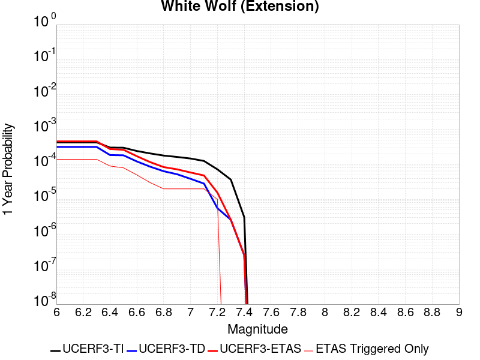 | 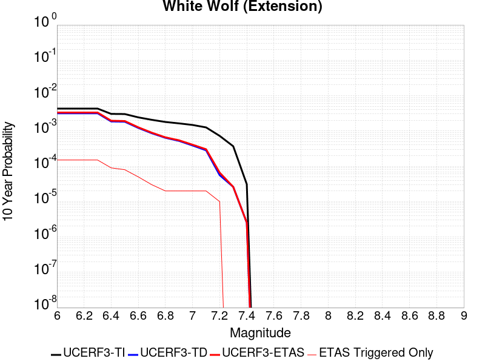 |

| Magnitude | 1 wk TI Prob | 1 wk TD Prob | 1 wk ETAS Prob | 1 wk ETAS/TD Gain | 1 wk ETAS Triggered Only | 1 mo TI Prob | 1 mo TD Prob | 1 mo ETAS Prob | 1 mo ETAS/TD Gain | 1 mo ETAS Triggered Only | 1 yr TI Prob | 1 yr TD Prob | 1 yr ETAS Prob | 1 yr ETAS/TD Gain | 1 yr ETAS Triggered Only | 10 yr TI Prob | 10 yr TD Prob | 10 yr ETAS Prob | 10 yr ETAS/TD Gain | 10 yr ETAS Triggered Only |
|-----|-----|-----|-----|-----|-----|-----|-----|-----|-----|-----|-----|-----|-----|-----|-----|-----|-----|-----|-----|-----|
| 6.0 | 8.222555E-6 | 6.0666657E-6 | 1.8498846E-4 | 30.492609 | 1.7892288E-4 | 3.5239045E-5 | 2.5999774E-5 | 3.8383625E-4 | 14.763061 | 3.5784577E-4 | 4.289509E-4 | 3.1650788E-4 | 6.742404E-4 | 2.1302483 | 3.5784577E-4 | 0.0042812387 | 0.003161223 | 0.0035179376 | 1.1128407 | 3.5784577E-4 |
| 6.1 | 8.222555E-6 | 6.0666657E-6 | 1.8498846E-4 | 30.492609 | 1.7892288E-4 | 3.5239045E-5 | 2.5999774E-5 | 3.8383625E-4 | 14.763061 | 3.5784577E-4 | 4.289509E-4 | 3.1650788E-4 | 6.742404E-4 | 2.1302483 | 3.5784577E-4 | 0.0042812387 | 0.003161223 | 0.0035179376 | 1.1128407 | 3.5784577E-4 |
| 6.2 | 8.222555E-6 | 6.0666657E-6 | 1.8498846E-4 | 30.492609 | 1.7892288E-4 | 3.5239045E-5 | 2.5999774E-5 | 3.8383625E-4 | 14.763061 | 3.5784577E-4 | 4.289509E-4 | 3.1650788E-4 | 6.742404E-4 | 2.1302483 | 3.5784577E-4 | 0.0042812387 | 0.003161223 | 0.0035179376 | 1.1128407 | 3.5784577E-4 |
| 6.3 | 8.222555E-6 | 6.0666657E-6 | 1.8498846E-4 | 30.492609 | 1.7892288E-4 | 3.5239045E-5 | 2.5999774E-5 | 3.8383625E-4 | 14.763061 | 3.5784577E-4 | 4.289509E-4 | 3.1650788E-4 | 6.742404E-4 | 2.1302483 | 3.5784577E-4 | 0.0042812387 | 0.003161223 | 0.0035179376 | 1.1128407 | 3.5784577E-4 |
| 6.4 | 5.821773E-6 | 3.5571766E-6 | 1.8247943E-4 | 51.29895 | 1.7892288E-4 | 2.4950215E-5 | 1.5244959E-5 | 1.9416511E-4 | 12.736349 | 1.7892288E-4 | 3.0372653E-4 | 1.8559267E-4 | 3.6448234E-4 | 1.9638833 | 1.7892288E-4 | 0.0030331176 | 0.001854485 | 0.0020330762 | 1.0963023 | 1.7892288E-4 |
| 6.5 | 5.766023E-6 | 3.4991106E-6 | 1.8242137E-4 | 52.13364 | 1.7892288E-4 | 2.4711293E-5 | 1.4996108E-5 | 1.939163E-4 | 12.931108 | 1.7892288E-4 | 3.0081844E-4 | 1.8256342E-4 | 3.6145363E-4 | 1.9798799 | 1.7892288E-4 | 0.0030041158 | 0.0018242426 | 0.002002839 | 1.0979017 | 1.7892288E-4 |
| 6.6 | 4.643576E-6 | 2.332624E-6 | 2.332624E-6 | 1.0 | 0.0 | 1.9900888E-5 | 9.996925E-6 | 9.996925E-6 | 1.0 | 0.0 | 2.4226638E-4 | 1.2170619E-4 | 1.2170619E-4 | 1.0 | 0.0 | 0.0024200242 | 0.0012164378 | 0.0012164378 | 1.0 | 0.0 |
| 6.7 | 3.9529173E-6 | 1.6483477E-6 | 1.6483477E-6 | 1.0 | 0.0 | 1.6940963E-5 | 7.0643296E-6 | 7.0643296E-6 | 1.0 | 0.0 | 2.0623671E-4 | 8.6005006E-5 | 8.6005006E-5 | 1.0 | 0.0 | 0.002060454 | 8.597357E-4 | 8.597357E-4 | 1.0 | 0.0 |
| 6.8 | 3.4377522E-6 | 1.2245237E-6 | 1.2245237E-6 | 1.0 | 0.0 | 1.473314E-5 | 5.2479486E-6 | 5.2479486E-6 | 1.0 | 0.0 | 1.7936122E-4 | 6.3891996E-5 | 6.3891996E-5 | 1.0 | 0.0 | 0.0017921652 | 6.387454E-4 | 6.387454E-4 | 1.0 | 0.0 |
| 6.9 | 3.1367306E-6 | 1.0033783E-6 | 1.0033783E-6 | 1.0 | 0.0 | 1.3443062E-5 | 4.3001864E-6 | 4.3001864E-6 | 1.0 | 0.0 | 1.63657E-4 | 5.235359E-5 | 5.235359E-5 | 1.0 | 0.0 | 0.0016353652 | 5.2342017E-4 | 5.2342017E-4 | 1.0 | 0.0 |
| 7.0 | 2.8298145E-6 | 7.4286646E-7 | 7.4286646E-7 | 1.0 | 0.0 | 1.2127721E-5 | 3.1837099E-6 | 3.1837099E-6 | 1.0 | 0.0 | 1.47645E-4 | 3.8761027E-5 | 3.8761027E-5 | 1.0 | 0.0 | 0.0014754693 | 3.8754768E-4 | 3.8754768E-4 | 1.0 | 0.0 |
| 7.1 | 2.4091064E-6 | 5.4227525E-7 | 5.4227525E-7 | 1.0 | 0.0 | 1.03247E-5 | 2.3240348E-6 | 2.3240348E-6 | 1.0 | 0.0 | 1.2569598E-4 | 2.8294799E-5 | 2.8294799E-5 | 1.0 | 0.0 | 0.001256249 | 2.8291598E-4 | 2.8291598E-4 | 1.0 | 0.0 |
| 7.2 | 1.3875518E-6 | 1.0743063E-7 | 1.0743063E-7 | 1.0 | 0.0 | 5.9466374E-6 | 4.6041689E-7 | 4.6041689E-7 | 1.0 | 0.0 | 7.23979E-5 | 5.6055624E-6 | 5.6055624E-6 | 1.0 | 0.0 | 7.2374323E-4 | 5.6054323E-5 | 5.6054323E-5 | 1.0 | 0.0 |
| 7.3 | 7.056077E-7 | 5.002034E-8 | 5.002034E-8 | 1.0 | 0.0 | 3.0240296E-6 | 2.1437286E-7 | 2.1437286E-7 | 1.0 | 0.0 | 3.681694E-5 | 2.609987E-6 | 2.609987E-6 | 1.0 | 0.0 | 3.681084E-4 | 2.609961E-5 | 2.609961E-5 | 1.0 | 0.0 |
| 7.4 | 5.9334678E-8 | 4.8683537E-9 | 4.8683537E-9 | 1.0 | 0.0 | 2.5429145E-7 | 2.0864372E-8 | 2.0864372E-8 | 1.0 | 0.0 | 3.095994E-6 | 2.5402372E-7 | 2.5402372E-7 | 1.0 | 0.0 | 3.095951E-5 | 2.5402353E-6 | 2.5402353E-6 | 1.0 | 0.0 |

## San Andreas (North Branch Mill Creek)
*[(top)](#table-of-contents)*

| 1 Week | 1 Month | 1 Year | 10 Year |
|-----|-----|-----|-----|
|  |  |  |  |

| Magnitude | 1 wk TI Prob | 1 wk TD Prob | 1 wk ETAS Prob | 1 wk ETAS/TD Gain | 1 wk ETAS Triggered Only | 1 mo TI Prob | 1 mo TD Prob | 1 mo ETAS Prob | 1 mo ETAS/TD Gain | 1 mo ETAS Triggered Only | 1 yr TI Prob | 1 yr TD Prob | 1 yr ETAS Prob | 1 yr ETAS/TD Gain | 1 yr ETAS Triggered Only | 10 yr TI Prob | 10 yr TD Prob | 10 yr ETAS Prob | 10 yr ETAS/TD Gain | 10 yr ETAS Triggered Only |
|-----|-----|-----|-----|-----|-----|-----|-----|-----|-----|-----|-----|-----|-----|-----|-----|-----|-----|-----|-----|-----|
| 6.0 | 1.3461156E-5 | 2.3499893E-5 | 3.8133725E-4 | 16.227192 | 3.5784577E-4 | 5.7689394E-5 | 1.00709956E-4 | 4.5851967E-4 | 4.5528736 | 3.5784577E-4 | 7.02142E-4 | 0.0012254574 | 0.0015828646 | 1.2916521 | 3.5784577E-4 | 0.0069992766 | 0.01222957 | 0.01258304 | 1.0289029 | 3.5784577E-4 |
| 6.1 | 1.3461156E-5 | 2.3499893E-5 | 3.8133725E-4 | 16.227192 | 3.5784577E-4 | 5.7689394E-5 | 1.00709956E-4 | 4.5851967E-4 | 4.5528736 | 3.5784577E-4 | 7.02142E-4 | 0.0012254574 | 0.0015828646 | 1.2916521 | 3.5784577E-4 | 0.0069992766 | 0.01222957 | 0.01258304 | 1.0289029 | 3.5784577E-4 |
| 6.2 | 1.3461156E-5 | 2.3499893E-5 | 3.8133725E-4 | 16.227192 | 3.5784577E-4 | 5.7689394E-5 | 1.00709956E-4 | 4.5851967E-4 | 4.5528736 | 3.5784577E-4 | 7.02142E-4 | 0.0012254574 | 0.0015828646 | 1.2916521 | 3.5784577E-4 | 0.0069992766 | 0.01222957 | 0.01258304 | 1.0289029 | 3.5784577E-4 |
| 6.3 | 1.3461156E-5 | 2.3499893E-5 | 3.8133725E-4 | 16.227192 | 3.5784577E-4 | 5.7689394E-5 | 1.00709956E-4 | 4.5851967E-4 | 4.5528736 | 3.5784577E-4 | 7.02142E-4 | 0.0012254574 | 0.0015828646 | 1.2916521 | 3.5784577E-4 | 0.0069992766 | 0.01222957 | 0.01258304 | 1.0289029 | 3.5784577E-4 |
| 6.4 | 1.3461156E-5 | 2.3499893E-5 | 3.8133725E-4 | 16.227192 | 3.5784577E-4 | 5.7689394E-5 | 1.00709956E-4 | 4.5851967E-4 | 4.5528736 | 3.5784577E-4 | 7.02142E-4 | 0.0012254574 | 0.0015828646 | 1.2916521 | 3.5784577E-4 | 0.0069992766 | 0.01222957 | 0.01258304 | 1.0289029 | 3.5784577E-4 |
| 6.5 | 1.3450706E-5 | 2.3488852E-5 | 3.8132622E-4 | 16.234348 | 3.5784577E-4 | 5.764461E-5 | 1.0066265E-4 | 4.5847238E-4 | 4.5545435 | 3.5784577E-4 | 7.0159714E-4 | 0.001224882 | 0.0015822895 | 1.2917893 | 3.5784577E-4 | 0.006993862 | 0.01222388 | 0.012577351 | 1.0289165 | 3.5784577E-4 |
| 6.6 | 1.3074523E-5 | 2.3103135E-5 | 3.8094065E-4 | 16.488699 | 3.5784577E-4 | 5.6032466E-5 | 9.9009696E-5 | 4.5682004E-4 | 4.6138916 | 3.5784577E-4 | 6.8198174E-4 | 0.0012047797 | 0.0015621943 | 1.2966639 | 3.5784577E-4 | 0.006798926 | 0.012025044 | 0.012378587 | 1.0294006 | 3.5784577E-4 |
| 6.7 | 1.3050216E-5 | 2.3078432E-5 | 3.8091594E-4 | 16.505278 | 3.5784577E-4 | 5.59283E-5 | 9.890384E-5 | 4.5671422E-4 | 4.61776 | 3.5784577E-4 | 6.8071426E-4 | 0.0012034923 | 0.0015609073 | 1.2969817 | 3.5784577E-4 | 0.0067863287 | 0.012012309 | 0.012365856 | 1.029432 | 3.5784577E-4 |
| 6.8 | 1.29049395E-5 | 2.292684E-5 | 3.807644E-4 | 16.6078 | 3.5784577E-4 | 5.530571E-5 | 9.825421E-5 | 4.5606482E-4 | 4.641682 | 3.5784577E-4 | 6.73139E-4 | 0.0011955918 | 0.0015530096 | 1.2989465 | 3.5784577E-4 | 0.0067110364 | 0.011934154 | 0.012287729 | 1.0296272 | 3.5784577E-4 |
| 6.9 | 1.2867369E-5 | 2.2886245E-5 | 3.8072382E-4 | 16.635487 | 3.5784577E-4 | 5.51447E-5 | 9.8080236E-5 | 4.558909E-4 | 4.6481423 | 3.5784577E-4 | 6.711799E-4 | 0.0011934759 | 0.0015508946 | 1.2994771 | 3.5784577E-4 | 0.006691564 | 0.011913223 | 0.012266806 | 1.0296799 | 3.5784577E-4 |
| 7.0 | 1.2495996E-5 | 2.2286325E-5 | 3.801241E-4 | 17.056383 | 3.5784577E-4 | 5.3553173E-5 | 9.550934E-5 | 4.5332094E-4 | 4.7463517 | 3.5784577E-4 | 6.518148E-4 | 0.0011622087 | 0.0015196387 | 1.3075436 | 3.5784577E-4 | 0.0064990623 | 0.0116038285 | 0.011957522 | 1.0304807 | 3.5784577E-4 |
| 7.1 | 1.2452067E-5 | 2.2231397E-5 | 3.8006922E-4 | 17.096056 | 3.5784577E-4 | 5.3364907E-5 | 9.527396E-5 | 4.5308564E-4 | 4.7556086 | 3.5784577E-4 | 6.4952404E-4 | 0.0011593461 | 0.001516777 | 1.308304 | 3.5784577E-4 | 0.0064762887 | 0.0115755 | 0.011929204 | 1.0305562 | 3.5784577E-4 |
| 7.2 | 1.2002777E-5 | 2.1609963E-5 | 3.79448E-4 | 17.558937 | 3.5784577E-4 | 5.143946E-5 | 9.2610855E-5 | 4.5042348E-4 | 4.863614 | 3.5784577E-4 | 6.2609545E-4 | 0.0011269567 | 0.0014843991 | 1.317175 | 3.5784577E-4 | 0.006243344 | 0.011254923 | 0.011608741 | 1.0314368 | 3.5784577E-4 |
| 7.3 | 1.1923425E-5 | 2.1479793E-5 | 3.7931788E-4 | 17.659288 | 3.5784577E-4 | 5.109939E-5 | 9.205302E-5 | 4.4986585E-4 | 4.8870296 | 3.5784577E-4 | 6.219575E-4 | 0.001120172 | 0.0014776168 | 1.3190982 | 3.5784577E-4 | 0.0062021962 | 0.011187789 | 0.011541631 | 1.0316275 | 3.5784577E-4 |
| 7.4 | 1.16105175E-5 | 2.0853771E-5 | 3.786921E-4 | 18.159405 | 3.5784577E-4 | 4.975841E-5 | 8.937026E-5 | 4.4718405E-4 | 5.003723 | 3.5784577E-4 | 6.0564023E-4 | 0.0010875424 | 0.001444999 | 1.3286829 | 3.5784577E-4 | 0.006039923 | 0.010865397 | 0.011219354 | 1.0325766 | 3.5784577E-4 |
| 7.5 | 1.1037265E-5 | 1.9553907E-5 | 3.773927E-4 | 19.300116 | 3.5784577E-4 | 4.7301706E-5 | 8.379978E-5 | 4.4161556E-4 | 5.2698894 | 3.5784577E-4 | 5.757461E-4 | 0.0010197869 | 0.0013772678 | 1.3505446 | 3.5784577E-4 | 0.005742567 | 0.010194898 | 0.010549095 | 1.0347426 | 3.5784577E-4 |
| 7.6 | 1.0720915E-5 | 1.899582E-5 | 3.768348E-4 | 19.837776 | 3.5784577E-4 | 4.5945973E-5 | 8.140812E-5 | 4.3922476E-4 | 5.3953433 | 3.5784577E-4 | 5.592486E-4 | 9.906954E-4 | 0.0013481866 | 1.3608488 | 3.5784577E-4 | 0.005578433 | 0.009906623 | 0.010260923 | 1.035764 | 3.5784577E-4 |
| 7.7 | 9.276279E-6 | 1.6441649E-5 | 3.7428155E-4 | 22.764235 | 3.5784577E-4 | 3.9754876E-5 | 7.0462316E-5 | 4.2828286E-4 | 6.078183 | 3.5784577E-4 | 4.839081E-4 | 8.575427E-4 | 0.0012150815 | 1.4169343 | 3.5784577E-4 | 0.0048285574 | 0.008586041 | 0.008940814 | 1.0413197 | 3.5784577E-4 |
| 7.8 | 5.8346777E-6 | 1.1155013E-5 | 3.6899679E-4 | 33.07901 | 3.5784577E-4 | 2.5005522E-5 | 4.7806327E-5 | 4.05635E-4 | 8.484965 | 3.5784577E-4 | 3.043997E-4 | 5.818867E-4 | 9.395242E-4 | 1.6146171 | 3.5784577E-4 | 0.0030398308 | 0.0058469265 | 0.00620268 | 1.0608445 | 3.5784577E-4 |
| 7.9 | 4.690204E-6 | 8.509093E-6 | 3.6635183E-4 | 43.054153 | 3.5784577E-4 | 2.0100719E-5 | 3.6467034E-5 | 3.9429974E-4 | 10.812498 | 3.5784577E-4 | 2.4469878E-4 | 4.4389578E-4 | 8.015827E-4 | 1.8057903 | 3.5784577E-4 | 0.002444295 | 0.0044707474 | 0.004826993 | 1.0796838 | 3.5784577E-4 |
| 8.0 | 2.9570454E-6 | 4.846947E-6 | 4.846947E-6 | 1.0 | 0.0 | 1.267299E-5 | 2.0772464E-5 | 2.0772464E-5 | 1.0 | 0.0 | 1.5428272E-4 | 2.5287544E-4 | 2.5287544E-4 | 1.0 | 0.0 | 0.0015417566 | 0.002549644 | 0.002549644 | 1.0 | 0.0 |
| 8.1 | 1.6376824E-6 | 2.1968929E-6 | 2.1968929E-6 | 1.0 | 0.0 | 7.01862E-6 | 9.41522E-6 | 9.41522E-6 | 1.0 | 0.0 | 8.544835E-5 | 1.14624294E-4 | 1.14624294E-4 | 1.0 | 0.0 | 8.54155E-4 | 0.0011606582 | 0.0011606582 | 1.0 | 0.0 |
| 8.2 | 6.9631557E-7 | 4.5360213E-7 | 4.5360213E-7 | 1.0 | 0.0 | 2.984206E-6 | 1.9440076E-6 | 1.9440076E-6 | 1.0 | 0.0 | 3.63321E-5 | 2.3668037E-5 | 2.3668037E-5 | 1.0 | 0.0 | 3.6326164E-4 | 2.451564E-4 | 2.451564E-4 | 1.0 | 0.0 |
| 8.3 | 1.7876137E-7 | 8.360375E-8 | 8.360375E-8 | 1.0 | 0.0 | 7.661199E-7 | 3.5830175E-7 | 3.5830175E-7 | 1.0 | 0.0 | 9.32747E-6 | 4.3623154E-6 | 4.3623154E-6 | 1.0 | 0.0 | 9.3270784E-5 | 4.5817014E-5 | 4.5817014E-5 | 1.0 | 0.0 |

## Death Valley (No)
*[(top)](#table-of-contents)*

| 1 Week | 1 Month | 1 Year | 10 Year |
|-----|-----|-----|-----|
|  |  |  |  |

| Magnitude | 1 wk TI Prob | 1 wk TD Prob | 1 wk ETAS Prob | 1 wk ETAS/TD Gain | 1 wk ETAS Triggered Only | 1 mo TI Prob | 1 mo TD Prob | 1 mo ETAS Prob | 1 mo ETAS/TD Gain | 1 mo ETAS Triggered Only | 1 yr TI Prob | 1 yr TD Prob | 1 yr ETAS Prob | 1 yr ETAS/TD Gain | 1 yr ETAS Triggered Only | 10 yr TI Prob | 10 yr TD Prob | 10 yr ETAS Prob | 10 yr ETAS/TD Gain | 10 yr ETAS Triggered Only |
|-----|-----|-----|-----|-----|-----|-----|-----|-----|-----|-----|-----|-----|-----|-----|-----|-----|-----|-----|-----|-----|
| 6.0 | 2.0074807E-5 | 2.2500084E-5 | 2.0141894E-4 | 8.95192 | 1.7892288E-4 | 8.603206E-5 | 9.642541E-5 | 2.7533103E-4 | 2.8553786 | 1.7892288E-4 | 0.001046937 | 0.0011733545 | 0.0013520675 | 1.1523094 | 1.7892288E-4 | 0.010420183 | 0.011672506 | 0.012026175 | 1.0302993 | 3.5784577E-4 |
| 6.1 | 2.0074807E-5 | 2.2500084E-5 | 2.0141894E-4 | 8.95192 | 1.7892288E-4 | 8.603206E-5 | 9.642541E-5 | 2.7533103E-4 | 2.8553786 | 1.7892288E-4 | 0.001046937 | 0.0011733545 | 0.0013520675 | 1.1523094 | 1.7892288E-4 | 0.010420183 | 0.011672506 | 0.012026175 | 1.0302993 | 3.5784577E-4 |
| 6.2 | 2.0074807E-5 | 2.2500084E-5 | 2.0141894E-4 | 8.95192 | 1.7892288E-4 | 8.603206E-5 | 9.642541E-5 | 2.7533103E-4 | 2.8553786 | 1.7892288E-4 | 0.001046937 | 0.0011733545 | 0.0013520675 | 1.1523094 | 1.7892288E-4 | 0.010420183 | 0.011672506 | 0.012026175 | 1.0302993 | 3.5784577E-4 |
| 6.3 | 1.9050609E-5 | 2.1336948E-5 | 2.00256E-4 | 9.38541 | 1.7892288E-4 | 8.164292E-5 | 9.1440896E-5 | 2.703474E-4 | 2.9565265 | 1.7892288E-4 | 9.935491E-4 | 0.001112731 | 0.0012914549 | 1.1606172 | 1.7892288E-4 | 0.009891188 | 0.011072419 | 0.011426303 | 1.0319608 | 3.5784577E-4 |
| 6.4 | 1.9050609E-5 | 2.1336948E-5 | 2.00256E-4 | 9.38541 | 1.7892288E-4 | 8.164292E-5 | 9.1440896E-5 | 2.703474E-4 | 2.9565265 | 1.7892288E-4 | 9.935491E-4 | 0.001112731 | 0.0012914549 | 1.1606172 | 1.7892288E-4 | 0.009891188 | 0.011072419 | 0.011426303 | 1.0319608 | 3.5784577E-4 |
| 6.5 | 1.8367004E-5 | 2.0561009E-5 | 1.9948022E-4 | 9.701869 | 1.7892288E-4 | 7.8713354E-5 | 8.811567E-5 | 2.6702278E-4 | 3.0303667 | 1.7892288E-4 | 9.5791375E-4 | 0.0010722869 | 0.0012510178 | 1.1666821 | 1.7892288E-4 | 0.009537951 | 0.0106719155 | 0.011025942 | 1.0331737 | 3.5784577E-4 |
| 6.6 | 1.779439E-5 | 1.9910927E-5 | 1.9883025E-4 | 9.985986 | 1.7892288E-4 | 7.625944E-5 | 8.53298E-5 | 2.642374E-4 | 3.0966606 | 1.7892288E-4 | 9.280632E-4 | 0.0010384015 | 0.0012171386 | 1.1721271 | 1.7892288E-4 | 0.009241969 | 0.010336253 | 0.010690399 | 1.0342627 | 3.5784577E-4 |
| 6.7 | 1.7025437E-5 | 1.9043426E-5 | 1.979629E-4 | 10.395341 | 1.7892288E-4 | 7.296412E-5 | 8.161216E-5 | 2.6052044E-4 | 3.1921768 | 1.7892288E-4 | 8.87976E-4 | 9.931813E-4 | 0.0011719265 | 1.1799724 | 1.7892288E-4 | 0.008844362 | 0.009888145 | 0.0100652985 | 1.0179157 | 1.7892288E-4 |
| 6.8 | 1.6545107E-5 | 1.8512545E-5 | 1.9743212E-4 | 10.664774 | 1.7892288E-4 | 7.090568E-5 | 7.93371E-5 | 2.582458E-4 | 3.2550445 | 1.7892288E-4 | 8.629347E-4 | 9.655073E-4 | 0.0011442574 | 1.185136 | 1.7892288E-4 | 0.008595915 | 0.009613829 | 0.0097910315 | 1.018432 | 1.7892288E-4 |
| 6.9 | 1.615478E-5 | 1.8087594E-5 | 1.9700725E-4 | 10.891844 | 1.7892288E-4 | 6.9232934E-5 | 7.751599E-5 | 2.56425E-4 | 3.3080273 | 1.7892288E-4 | 8.4258494E-4 | 9.433546E-4 | 0.0011221088 | 1.1894877 | 1.7892288E-4 | 0.008393973 | 0.009394196 | 0.009571438 | 1.0188671 | 1.7892288E-4 |
| 7.0 | 1.5894311E-5 | 1.780555E-5 | 1.9672525E-4 | 11.048535 | 1.7892288E-4 | 6.81167E-5 | 7.6307304E-5 | 2.5521652E-4 | 3.3445885 | 1.7892288E-4 | 8.2900526E-4 | 9.286515E-4 | 0.0011074082 | 1.1924907 | 1.7892288E-4 | 0.008259195 | 0.009248397 | 0.009425665 | 1.0191674 | 1.7892288E-4 |
| 7.1 | 1.5602263E-5 | 1.7483504E-5 | 1.9640326E-4 | 11.233633 | 1.7892288E-4 | 6.6865134E-5 | 7.492718E-5 | 2.5383665E-4 | 3.387778 | 1.7892288E-4 | 8.137789E-4 | 9.118627E-4 | 0.0010906225 | 1.196038 | 1.7892288E-4 | 0.008108052 | 0.009081894 | 0.009259192 | 1.0195222 | 1.7892288E-4 |
| 7.2 | 1.5323829E-5 | 1.717063E-5 | 1.9609045E-4 | 11.420108 | 1.7892288E-4 | 6.56719E-5 | 7.358637E-5 | 2.524961E-4 | 3.4312887 | 1.7892288E-4 | 7.99262E-4 | 8.9555193E-4 | 0.0010743146 | 1.1996117 | 1.7892288E-4 | 0.007963934 | 0.008920107 | 0.009097434 | 1.0198795 | 1.7892288E-4 |
| 7.3 | 1.4556212E-5 | 1.6302456E-5 | 1.9522243E-4 | 11.975032 | 1.7892288E-4 | 6.238227E-5 | 6.9865826E-5 | 2.4877622E-4 | 3.560771 | 1.7892288E-4 | 7.592395E-4 | 8.5029035E-4 | 0.001029061 | 1.2102467 | 1.7892288E-4 | 0.0075665074 | 0.008471014 | 0.008648422 | 1.0209428 | 1.7892288E-4 |
| 7.4 | 1.411725E-5 | 1.580796E-5 | 1.9472801E-4 | 12.318352 | 1.7892288E-4 | 6.0501097E-5 | 6.7746674E-5 | 2.4665744E-4 | 3.640879 | 1.7892288E-4 | 7.363519E-4 | 8.245094E-4 | 0.0010032848 | 1.2168263 | 1.7892288E-4 | 0.0073391674 | 0.008215138 | 0.008392591 | 1.0216007 | 1.7892288E-4 |
| 7.5 | 1.3503312E-5 | 1.5126289E-5 | 1.9404647E-4 | 12.828425 | 1.7892288E-4 | 5.7870053E-5 | 6.482538E-5 | 2.4373666E-4 | 3.7598958 | 1.7892288E-4 | 7.043401E-4 | 7.8896893E-4 | 9.677507E-4 | 1.2266017 | 1.7892288E-4 | 0.007021119 | 0.007862304 | 0.00803982 | 1.0225781 | 1.7892288E-4 |
| 7.6 | 1.1279839E-5 | 1.2626327E-5 | 1.2626327E-5 | 1.0 | 0.0 | 4.834127E-5 | 5.4111737E-5 | 5.4111737E-5 | 1.0 | 0.0 | 5.88396E-4 | 6.5861654E-4 | 6.5861654E-4 | 1.0 | 0.0 | 0.005868405 | 0.006567199 | 0.006567199 | 1.0 | 0.0 |
| 7.7 | 9.189108E-6 | 1.0283358E-5 | 1.0283358E-5 | 1.0 | 0.0 | 3.93813E-5 | 4.407082E-5 | 4.407082E-5 | 1.0 | 0.0 | 4.7936183E-4 | 5.3643517E-4 | 5.3643517E-4 | 1.0 | 0.0 | 0.004783291 | 0.005351914 | 0.005351914 | 1.0 | 0.0 |
| 7.8 | 3.4586725E-7 | 3.6482615E-7 | 3.6482615E-7 | 1.0 | 0.0 | 1.4822873E-6 | 1.5635396E-6 | 1.5635396E-6 | 1.0 | 0.0 | 1.80467E-5 | 1.9035933E-5 | 1.9035933E-5 | 1.0 | 0.0 | 1.8045233E-4 | 1.9034347E-4 | 1.9034347E-4 | 1.0 | 0.0 |
| 7.9 | 2.5591178E-9 | 2.6696718E-9 | 2.6696718E-9 | 1.0 | 0.0 | 1.0967647E-8 | 1.14414505E-8 | 1.14414505E-8 | 1.0 | 0.0 | 1.335311E-7 | 1.3929966E-7 | 1.3929966E-7 | 1.0 | 0.0 | 1.3353102E-6 | 1.3929966E-6 | 1.3929966E-6 | 1.0 | 0.0 |

## Ventura-Pitas Point
*[(top)](#table-of-contents)*

| 1 Week | 1 Month | 1 Year | 10 Year |
|-----|-----|-----|-----|
|  | 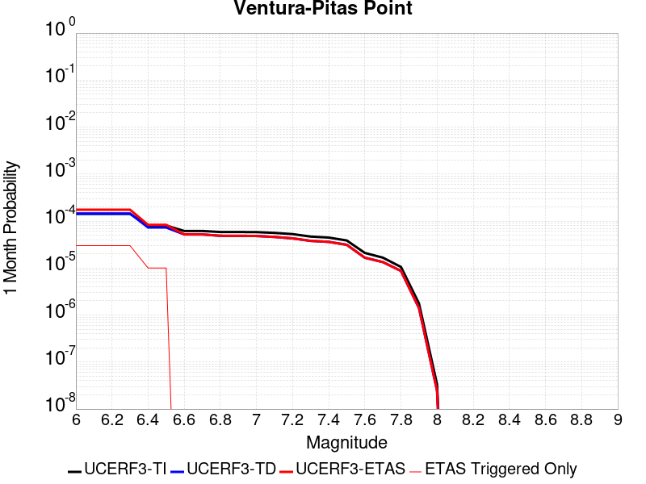 |  |  |

| Magnitude | 1 wk TI Prob | 1 wk TD Prob | 1 wk ETAS Prob | 1 wk ETAS/TD Gain | 1 wk ETAS Triggered Only | 1 mo TI Prob | 1 mo TD Prob | 1 mo ETAS Prob | 1 mo ETAS/TD Gain | 1 mo ETAS Triggered Only | 1 yr TI Prob | 1 yr TD Prob | 1 yr ETAS Prob | 1 yr ETAS/TD Gain | 1 yr ETAS Triggered Only | 10 yr TI Prob | 10 yr TD Prob | 10 yr ETAS Prob | 10 yr ETAS/TD Gain | 10 yr ETAS Triggered Only |
|-----|-----|-----|-----|-----|-----|-----|-----|-----|-----|-----|-----|-----|-----|-----|-----|-----|-----|-----|-----|-----|
| 6.0 | 3.3179622E-5 | 3.3735185E-5 | 2.1265203E-4 | 6.3035684 | 1.7892288E-4 | 1.4219063E-4 | 1.445728E-4 | 5.023668E-4 | 3.4748366 | 3.5784577E-4 | 0.0017297962 | 0.0017590096 | 0.002116226 | 1.2030782 | 3.5784577E-4 | 0.017163932 | 0.0174764 | 0.017827993 | 1.0201181 | 3.5784577E-4 |
| 6.1 | 3.3179622E-5 | 3.3735185E-5 | 2.1265203E-4 | 6.3035684 | 1.7892288E-4 | 1.4219063E-4 | 1.445728E-4 | 5.023668E-4 | 3.4748366 | 3.5784577E-4 | 0.0017297962 | 0.0017590096 | 0.002116226 | 1.2030782 | 3.5784577E-4 | 0.017163932 | 0.0174764 | 0.017827993 | 1.0201181 | 3.5784577E-4 |
| 6.2 | 3.3179622E-5 | 3.3735185E-5 | 2.1265203E-4 | 6.3035684 | 1.7892288E-4 | 1.4219063E-4 | 1.445728E-4 | 5.023668E-4 | 3.4748366 | 3.5784577E-4 | 0.0017297962 | 0.0017590096 | 0.002116226 | 1.2030782 | 3.5784577E-4 | 0.017163932 | 0.0174764 | 0.017827993 | 1.0201181 | 3.5784577E-4 |
| 6.3 | 3.3179622E-5 | 3.3735185E-5 | 2.1265203E-4 | 6.3035684 | 1.7892288E-4 | 1.4219063E-4 | 1.445728E-4 | 5.023668E-4 | 3.4748366 | 3.5784577E-4 | 0.0017297962 | 0.0017590096 | 0.002116226 | 1.2030782 | 3.5784577E-4 | 0.017163932 | 0.0174764 | 0.017827993 | 1.0201181 | 3.5784577E-4 |
| 6.4 | 1.8754668E-5 | 1.701961E-5 | 1.701961E-5 | 1.0 | 0.0 | 8.037467E-5 | 7.293928E-5 | 7.293928E-5 | 1.0 | 0.0 | 9.781223E-4 | 8.8769704E-4 | 8.8769704E-4 | 1.0 | 0.0 | 0.009738282 | 0.008843848 | 0.008843848 | 1.0 | 0.0 |
| 6.5 | 1.8754668E-5 | 1.701961E-5 | 1.701961E-5 | 1.0 | 0.0 | 8.037467E-5 | 7.293928E-5 | 7.293928E-5 | 1.0 | 0.0 | 9.781223E-4 | 8.8769704E-4 | 8.8769704E-4 | 1.0 | 0.0 | 0.009738282 | 0.008843848 | 0.008843848 | 1.0 | 0.0 |
| 6.6 | 1.4361558E-5 | 1.2122275E-5 | 1.2122275E-5 | 1.0 | 0.0 | 6.154808E-5 | 5.1951585E-5 | 5.1951585E-5 | 1.0 | 0.0 | 7.490902E-4 | 6.3232926E-4 | 6.3232926E-4 | 1.0 | 0.0 | 0.0074657016 | 0.0063055577 | 0.0063055577 | 1.0 | 0.0 |
| 6.7 | 1.4361558E-5 | 1.2122275E-5 | 1.2122275E-5 | 1.0 | 0.0 | 6.154808E-5 | 5.1951585E-5 | 5.1951585E-5 | 1.0 | 0.0 | 7.490902E-4 | 6.3232926E-4 | 6.3232926E-4 | 1.0 | 0.0 | 0.0074657016 | 0.0063055577 | 0.0063055577 | 1.0 | 0.0 |
| 6.8 | 1.3663846E-5 | 1.13444175E-5 | 1.13444175E-5 | 1.0 | 0.0 | 5.8558027E-5 | 4.861804E-5 | 4.861804E-5 | 1.0 | 0.0 | 7.127108E-4 | 5.917658E-4 | 5.917658E-4 | 1.0 | 0.0 | 0.007104293 | 0.005902116 | 0.005902116 | 1.0 | 0.0 |
| 6.9 | 1.3644157E-5 | 1.1322519E-5 | 1.1322519E-5 | 1.0 | 0.0 | 5.8473648E-5 | 4.8524187E-5 | 4.8524187E-5 | 1.0 | 0.0 | 7.116841E-4 | 5.9062376E-4 | 5.9062376E-4 | 1.0 | 0.0 | 0.007094092 | 0.0058907564 | 0.0058907564 | 1.0 | 0.0 |
| 7.0 | 1.3568845E-5 | 1.1242086E-5 | 1.1242086E-5 | 1.0 | 0.0 | 5.8150898E-5 | 4.817949E-5 | 4.817949E-5 | 1.0 | 0.0 | 7.077572E-4 | 5.864293E-4 | 5.864293E-4 | 1.0 | 0.0 | 0.007055073 | 0.0058490336 | 0.0058490336 | 1.0 | 0.0 |
| 7.1 | 1.306572E-5 | 1.072054E-5 | 1.072054E-5 | 1.0 | 0.0 | 5.599474E-5 | 4.5944373E-5 | 4.5944373E-5 | 1.0 | 0.0 | 6.815227E-4 | 5.5923103E-4 | 5.5923103E-4 | 1.0 | 0.0 | 0.0067943637 | 0.0055784425 | 0.0055784425 | 1.0 | 0.0 |
| 7.2 | 1.232604E-5 | 9.995143E-6 | 9.995143E-6 | 1.0 | 0.0 | 5.2824813E-5 | 4.2835632E-5 | 4.2835632E-5 | 1.0 | 0.0 | 6.429523E-4 | 5.214008E-4 | 5.214008E-4 | 1.0 | 0.0 | 0.0064109527 | 0.005201967 | 0.005201967 | 1.0 | 0.0 |
| 7.3 | 1.0917261E-5 | 8.84384E-6 | 8.84384E-6 | 1.0 | 0.0 | 4.678742E-5 | 3.790163E-5 | 3.790163E-5 | 1.0 | 0.0 | 5.69488E-4 | 4.6135622E-4 | 4.6135622E-4 | 1.0 | 0.0 | 0.0056803077 | 0.00460415 | 0.00460415 | 1.0 | 0.0 |
| 7.4 | 1.039959E-5 | 8.423562E-6 | 8.423562E-6 | 1.0 | 0.0 | 4.456891E-5 | 3.610049E-5 | 3.610049E-5 | 1.0 | 0.0 | 5.424914E-4 | 4.3943635E-4 | 4.3943635E-4 | 1.0 | 0.0 | 0.0054116896 | 0.004385836 | 0.004385836 | 1.0 | 0.0 |
| 7.5 | 9.015877E-6 | 7.2975445E-6 | 7.2975445E-6 | 1.0 | 0.0 | 3.86389E-5 | 3.1274823E-5 | 3.1274823E-5 | 1.0 | 0.0 | 4.7032707E-4 | 3.8070587E-4 | 3.8070587E-4 | 1.0 | 0.0 | 0.004693329 | 0.0038006818 | 0.0038006818 | 1.0 | 0.0 |
| 7.6 | 4.900162E-6 | 3.8741155E-6 | 3.8741155E-6 | 1.0 | 0.0 | 2.1000526E-5 | 1.6603248E-5 | 1.6603248E-5 | 1.0 | 0.0 | 2.556514E-4 | 2.0212591E-4 | 2.0212591E-4 | 1.0 | 0.0 | 0.0025535747 | 0.0020194345 | 0.0020194345 | 1.0 | 0.0 |
| 7.7 | 3.8850626E-6 | 3.1267302E-6 | 3.1267302E-6 | 1.0 | 0.0 | 1.6650163E-5 | 1.3400205E-5 | 1.3400205E-5 | 1.0 | 0.0 | 2.0269687E-4 | 1.6313537E-4 | 1.6313537E-4 | 1.0 | 0.0 | 0.002025121 | 0.0016301654 | 0.0016301654 | 1.0 | 0.0 |
| 7.8 | 2.4654719E-6 | 2.029875E-6 | 2.029875E-6 | 1.0 | 0.0 | 1.0566265E-5 | 8.699436E-6 | 8.699436E-6 | 1.0 | 0.0 | 1.2863669E-4 | 1.0591053E-4 | 1.0591053E-4 | 1.0 | 0.0 | 0.0012856225 | 0.0010586053 | 0.0010586053 | 1.0 | 0.0 |
| 7.9 | 4.095894E-7 | 3.2764765E-7 | 3.2764765E-7 | 1.0 | 0.0 | 1.7553821E-6 | 1.4042034E-6 | 1.4042034E-6 | 1.0 | 0.0 | 2.1371567E-5 | 1.7096047E-5 | 1.7096047E-5 | 1.0 | 0.0 | 2.1369511E-4 | 1.7094762E-4 | 1.7094762E-4 | 1.0 | 0.0 |
| 8.0 | 7.791402E-9 | 5.683497E-9 | 5.683497E-9 | 1.0 | 0.0 | 3.3391725E-8 | 2.4357844E-8 | 2.4357844E-8 | 1.0 | 0.0 | 4.0654416E-7 | 2.9655675E-7 | 2.9655675E-7 | 1.0 | 0.0 | 4.065434E-6 | 2.9655655E-6 | 2.9655655E-6 | 1.0 | 0.0 |

## Garlic Springs
*[(top)](#table-of-contents)*

| 1 Week | 1 Month | 1 Year | 10 Year |
|-----|-----|-----|-----|
|  |  |  |  |

| Magnitude | 1 wk TI Prob | 1 wk TD Prob | 1 wk ETAS Prob | 1 wk ETAS/TD Gain | 1 wk ETAS Triggered Only | 1 mo TI Prob | 1 mo TD Prob | 1 mo ETAS Prob | 1 mo ETAS/TD Gain | 1 mo ETAS Triggered Only | 1 yr TI Prob | 1 yr TD Prob | 1 yr ETAS Prob | 1 yr ETAS/TD Gain | 1 yr ETAS Triggered Only | 10 yr TI Prob | 10 yr TD Prob | 10 yr ETAS Prob | 10 yr ETAS/TD Gain | 10 yr ETAS Triggered Only |
|-----|-----|-----|-----|-----|-----|-----|-----|-----|-----|-----|-----|-----|-----|-----|-----|-----|-----|-----|-----|-----|
| 6.0 | 1.6760017E-5 | 1.8776833E-5 | 1.9769635E-4 | 10.528738 | 1.7892288E-4 | 7.182667E-5 | 8.0470316E-5 | 4.382873E-4 | 5.446571 | 3.5784577E-4 | 8.7413884E-4 | 9.794032E-4 | 0.0013368984 | 1.3650134 | 3.5784577E-4 | 0.008707083 | 0.009762413 | 0.010116765 | 1.0362976 | 3.5784577E-4 |
| 6.1 | 9.852767E-6 | 1.09735865E-5 | 1.898945E-4 | 17.30469 | 1.7892288E-4 | 4.222546E-5 | 4.702921E-5 | 2.2594367E-4 | 4.8043265 | 1.7892288E-4 | 5.139737E-4 | 5.7250116E-4 | 7.513216E-4 | 1.3123494 | 1.7892288E-4 | 0.005127866 | 0.005717221 | 0.0058951215 | 1.0311165 | 1.7892288E-4 |
| 6.2 | 9.852767E-6 | 1.09735865E-5 | 1.898945E-4 | 17.30469 | 1.7892288E-4 | 4.222546E-5 | 4.702921E-5 | 2.2594367E-4 | 4.8043265 | 1.7892288E-4 | 5.139737E-4 | 5.7250116E-4 | 7.513216E-4 | 1.3123494 | 1.7892288E-4 | 0.005127866 | 0.005717221 | 0.0058951215 | 1.0311165 | 1.7892288E-4 |
| 6.3 | 4.3167724E-6 | 4.7780286E-6 | 4.7780286E-6 | 1.0 | 0.0 | 1.8500323E-5 | 2.0477235E-5 | 2.0477235E-5 | 1.0 | 0.0 | 2.2521814E-4 | 2.4930484E-4 | 2.4930484E-4 | 1.0 | 0.0 | 0.0022499003 | 0.00249251 | 0.00249251 | 1.0 | 0.0 |
| 6.4 | 4.3167724E-6 | 4.7780286E-6 | 4.7780286E-6 | 1.0 | 0.0 | 1.8500323E-5 | 2.0477235E-5 | 2.0477235E-5 | 1.0 | 0.0 | 2.2521814E-4 | 2.4930484E-4 | 2.4930484E-4 | 1.0 | 0.0 | 0.0022499003 | 0.00249251 | 0.00249251 | 1.0 | 0.0 |
| 6.5 | 4.3167724E-6 | 4.7780286E-6 | 4.7780286E-6 | 1.0 | 0.0 | 1.8500323E-5 | 2.0477235E-5 | 2.0477235E-5 | 1.0 | 0.0 | 2.2521814E-4 | 2.4930484E-4 | 2.4930484E-4 | 1.0 | 0.0 | 0.0022499003 | 0.00249251 | 0.00249251 | 1.0 | 0.0 |
| 6.6 | 4.301311E-6 | 4.760897E-6 | 4.760897E-6 | 1.0 | 0.0 | 1.8434059E-5 | 2.0403815E-5 | 2.0403815E-5 | 1.0 | 0.0 | 2.2441156E-4 | 2.4841115E-4 | 2.4841115E-4 | 1.0 | 0.0 | 0.0022418506 | 0.002483593 | 0.002483593 | 1.0 | 0.0 |
| 6.7 | 3.8599724E-6 | 4.27106E-6 | 4.27106E-6 | 1.0 | 0.0 | 1.6542634E-5 | 1.8304541E-5 | 1.8304541E-5 | 1.0 | 0.0 | 2.0138794E-4 | 2.228578E-4 | 2.228578E-4 | 1.0 | 0.0 | 0.0020120554 | 0.002228578 | 0.002228578 | 1.0 | 0.0 |

## San Andreas (San Bernardino S)
*[(top)](#table-of-contents)*

| 1 Week | 1 Month | 1 Year | 10 Year |
|-----|-----|-----|-----|
|  |  |  |  |

| Magnitude | 1 wk TI Prob | 1 wk TD Prob | 1 wk ETAS Prob | 1 wk ETAS/TD Gain | 1 wk ETAS Triggered Only | 1 mo TI Prob | 1 mo TD Prob | 1 mo ETAS Prob | 1 mo ETAS/TD Gain | 1 mo ETAS Triggered Only | 1 yr TI Prob | 1 yr TD Prob | 1 yr ETAS Prob | 1 yr ETAS/TD Gain | 1 yr ETAS Triggered Only | 10 yr TI Prob | 10 yr TD Prob | 10 yr ETAS Prob | 10 yr ETAS/TD Gain | 10 yr ETAS Triggered Only |
|-----|-----|-----|-----|-----|-----|-----|-----|-----|-----|-----|-----|-----|-----|-----|-----|-----|-----|-----|-----|-----|
| 6.0 | 1.2336002E-4 | 3.0004102E-4 | 3.0004102E-4 | 1.0 | 0.0 | 5.2857865E-4 | 0.0012852824 | 0.0014639754 | 1.1390301 | 1.7892288E-4 | 0.006416472 | 0.015540994 | 0.015717136 | 1.0113341 | 1.7892288E-4 | 0.06234337 | 0.14283717 | 0.1431439 | 1.0021474 | 3.5784577E-4 |
| 6.1 | 1.2336002E-4 | 3.0004102E-4 | 3.0004102E-4 | 1.0 | 0.0 | 5.2857865E-4 | 0.0012852824 | 0.0014639754 | 1.1390301 | 1.7892288E-4 | 0.006416472 | 0.015540994 | 0.015717136 | 1.0113341 | 1.7892288E-4 | 0.06234337 | 0.14283717 | 0.1431439 | 1.0021474 | 3.5784577E-4 |
| 6.2 | 1.2336002E-4 | 3.0004102E-4 | 3.0004102E-4 | 1.0 | 0.0 | 5.2857865E-4 | 0.0012852824 | 0.0014639754 | 1.1390301 | 1.7892288E-4 | 0.006416472 | 0.015540994 | 0.015717136 | 1.0113341 | 1.7892288E-4 | 0.06234337 | 0.14283717 | 0.1431439 | 1.0021474 | 3.5784577E-4 |
| 6.3 | 1.1712257E-4 | 2.8792414E-4 | 2.8792414E-4 | 1.0 | 0.0 | 5.018573E-4 | 0.0012334028 | 0.0014121049 | 1.1448855 | 1.7892288E-4 | 0.006093008 | 0.014918125 | 0.015094379 | 1.0118147 | 1.7892288E-4 | 0.059286322 | 0.13754563 | 0.13785425 | 1.0022438 | 3.5784577E-4 |
| 6.4 | 1.1712257E-4 | 2.8792414E-4 | 2.8792414E-4 | 1.0 | 0.0 | 5.018573E-4 | 0.0012334028 | 0.0014121049 | 1.1448855 | 1.7892288E-4 | 0.006093008 | 0.014918125 | 0.015094379 | 1.0118147 | 1.7892288E-4 | 0.059286322 | 0.13754563 | 0.13785425 | 1.0022438 | 3.5784577E-4 |
| 6.5 | 1.0689076E-4 | 2.680528E-4 | 2.680528E-4 | 1.0 | 0.0 | 4.5802278E-4 | 0.0011483167 | 0.0013270341 | 1.1556343 | 1.7892288E-4 | 0.0055621783 | 0.01389575 | 0.014072187 | 1.0126972 | 1.7892288E-4 | 0.05425003 | 0.12879294 | 0.1291047 | 1.0024207 | 3.5784577E-4 |
| 6.6 | 9.7648895E-5 | 2.50501E-4 | 2.50501E-4 | 1.0 | 0.0 | 4.1842813E-4 | 0.0010731576 | 0.0012518886 | 1.1665467 | 1.7892288E-4 | 0.005082469 | 0.012991785 | 0.013168383 | 1.0135931 | 1.7892288E-4 | 0.049677886 | 0.12095292 | 0.12126748 | 1.0026007 | 3.5784577E-4 |
| 6.7 | 8.757013E-5 | 2.3120902E-4 | 2.3120902E-4 | 1.0 | 0.0 | 3.7524657E-4 | 9.905418E-4 | 0.0011692875 | 1.1804525 | 1.7892288E-4 | 0.00455906 | 0.011997245 | 0.012174021 | 1.0147347 | 1.7892288E-4 | 0.04466656 | 0.11226123 | 0.1125789 | 1.0028298 | 3.5784577E-4 |
| 6.8 | 8.562978E-5 | 2.2680782E-4 | 2.2680782E-4 | 1.0 | 0.0 | 3.6693315E-4 | 9.7169366E-4 | 0.0011504426 | 1.1839561 | 1.7892288E-4 | 0.004458263 | 0.011770263 | 0.0119470805 | 1.0150224 | 1.7892288E-4 | 0.043698758 | 0.11027153 | 0.110589914 | 1.0028872 | 3.5784577E-4 |
| 6.9 | 6.124075E-5 | 1.7065753E-4 | 1.7065753E-4 | 1.0 | 0.0 | 2.6243398E-4 | 7.311852E-4 | 9.099773E-4 | 1.2445236 | 1.7892288E-4 | 0.0031904527 | 0.008866051 | 0.009043387 | 1.0200018 | 1.7892288E-4 | 0.031450346 | 0.08418263 | 0.08451035 | 1.003893 | 3.5784577E-4 |
| 7.0 | 5.8598747E-5 | 1.649477E-4 | 1.649477E-4 | 1.0 | 0.0 | 2.5111332E-4 | 7.06728E-4 | 8.855245E-4 | 1.2529918 | 1.7892288E-4 | 0.0030530186 | 0.008570663 | 0.008748053 | 1.0206972 | 1.7892288E-4 | 0.03011414 | 0.081500374 | 0.08182905 | 1.0040329 | 3.5784577E-4 |
| 7.1 | 5.613814E-5 | 1.5913323E-4 | 1.5913323E-4 | 1.0 | 0.0 | 2.4056983E-4 | 6.818221E-4 | 8.6062297E-4 | 1.2622398 | 1.7892288E-4 | 0.0029250039 | 0.008269769 | 0.008447212 | 1.0214568 | 1.7892288E-4 | 0.028868021 | 0.07879931 | 0.07912896 | 1.0041834 | 3.5784577E-4 |
| 7.2 | 4.991222E-5 | 1.4519796E-4 | 1.4519796E-4 | 1.0 | 0.0 | 2.1389198E-4 | 6.2212895E-4 | 8.009405E-4 | 1.2874188 | 1.7892288E-4 | 0.002601025 | 0.007548217 | 0.0077257897 | 1.0235251 | 1.7892288E-4 | 0.025707912 | 0.07225321 | 0.0725852 | 1.0045948 | 3.5784577E-4 |
| 7.3 | 4.7410045E-5 | 1.3714004E-4 | 1.3714004E-4 | 1.0 | 0.0 | 2.0317009E-4 | 5.8761094E-4 | 7.664287E-4 | 1.3043132 | 1.7892288E-4 | 0.0024707897 | 0.0071307817 | 0.0073084286 | 1.0249127 | 1.7892288E-4 | 0.024434982 | 0.06853558 | 0.0688689 | 1.0048635 | 3.5784577E-4 |
| 7.4 | 4.5556746E-5 | 1.3121912E-4 | 1.3121912E-4 | 1.0 | 0.0 | 1.952286E-4 | 5.622468E-4 | 7.4106903E-4 | 1.3180494 | 1.7892288E-4 | 0.002374317 | 0.0068239477 | 0.0070016496 | 1.0260409 | 1.7892288E-4 | 0.023491086 | 0.065788016 | 0.066122316 | 1.0050815 | 3.5784577E-4 |
| 7.5 | 4.3084514E-5 | 1.2357246E-4 | 1.2357246E-4 | 1.0 | 0.0 | 1.8463485E-4 | 5.2948913E-4 | 7.0831727E-4 | 1.3377372 | 1.7892288E-4 | 0.0022456115 | 0.0064275465 | 0.0066053197 | 1.027658 | 1.7892288E-4 | 0.022230545 | 0.062188786 | 0.06252438 | 1.0053964 | 3.5784577E-4 |
| 7.6 | 3.408608E-5 | 9.83552E-5 | 9.83552E-5 | 1.0 | 0.0 | 1.4607502E-4 | 4.214543E-4 | 6.003018E-4 | 1.424358 | 1.7892288E-4 | 0.0017770125 | 0.0051191594 | 0.0052971663 | 1.0347726 | 1.7892288E-4 | 0.017628696 | 0.050020292 | 0.05036024 | 1.0067961 | 3.5784577E-4 |
| 7.7 | 2.8315713E-5 | 8.248679E-5 | 8.248679E-5 | 1.0 | 0.0 | 1.2134742E-4 | 3.5346695E-4 | 5.323266E-4 | 1.5060152 | 1.7892288E-4 | 0.0014764034 | 0.0042949775 | 0.004473132 | 1.0414797 | 1.7892288E-4 | 0.01466633 | 0.0422714 | 0.04261412 | 1.0081075 | 3.5784577E-4 |
| 7.8 | 2.6222975E-5 | 7.463088E-5 | 7.463088E-5 | 1.0 | 0.0 | 1.1237934E-4 | 3.1980744E-4 | 4.986731E-4 | 1.5592917 | 1.7892288E-4 | 0.0013673597 | 0.0038867102 | 0.0040649376 | 1.0458556 | 1.7892288E-4 | 0.013589768 | 0.03843674 | 0.038780835 | 1.0089521 | 3.5784577E-4 |
| 7.9 | 2.1469694E-5 | 5.787864E-5 | 5.787864E-5 | 1.0 | 0.0 | 9.200973E-5 | 2.4802773E-4 | 4.2690625E-4 | 1.7212036 | 1.7892288E-4 | 0.0011196428 | 0.0030155594 | 0.0031939426 | 1.0591543 | 1.7892288E-4 | 0.011140184 | 0.030152109 | 0.030499164 | 1.0115101 | 3.5784577E-4 |
| 8.0 | 1.2420249E-5 | 3.131896E-5 | 3.131896E-5 | 1.0 | 0.0 | 5.322855E-5 | 1.342172E-4 | 3.131161E-4 | 2.3329055 | 1.7892288E-4 | 6.478649E-4 | 0.0016328706 | 0.0018115015 | 1.1093967 | 1.7892288E-4 | 0.0064597935 | 0.016522504 | 0.01669847 | 1.0106502 | 1.7892288E-4 |
| 8.1 | 4.9197724E-6 | 7.822348E-6 | 7.822348E-6 | 1.0 | 0.0 | 2.1084568E-5 | 3.352392E-5 | 3.352392E-5 | 1.0 | 0.0 | 2.566744E-4 | 4.0807744E-4 | 4.0807744E-4 | 1.0 | 0.0 | 0.002563781 | 0.0043843705 | 0.0043843705 | 1.0 | 0.0 |
| 8.2 | 2.5634774E-6 | 2.9067196E-6 | 2.9067196E-6 | 1.0 | 0.0 | 1.0986286E-5 | 1.2457311E-5 | 1.2457311E-5 | 1.0 | 0.0 | 1.3374983E-4 | 1.5165724E-4 | 1.5165724E-4 | 1.0 | 0.0 | 0.0013366934 | 0.0017049741 | 0.0017049741 | 1.0 | 0.0 |
| 8.3 | 5.2850464E-7 | 3.2088764E-7 | 3.2088764E-7 | 1.0 | 0.0 | 2.2650179E-6 | 1.375232E-6 | 1.375232E-6 | 1.0 | 0.0 | 2.7576245E-5 | 1.6743334E-5 | 1.6743334E-5 | 1.0 | 0.0 | 2.7572823E-4 | 1.9870348E-4 | 1.9870348E-4 | 1.0 | 0.0 |

## Helendale-So Lockhart
*[(top)](#table-of-contents)*

| 1 Week | 1 Month | 1 Year | 10 Year |
|-----|-----|-----|-----|
|  |  |  |  |

| Magnitude | 1 wk TI Prob | 1 wk TD Prob | 1 wk ETAS Prob | 1 wk ETAS/TD Gain | 1 wk ETAS Triggered Only | 1 mo TI Prob | 1 mo TD Prob | 1 mo ETAS Prob | 1 mo ETAS/TD Gain | 1 mo ETAS Triggered Only | 1 yr TI Prob | 1 yr TD Prob | 1 yr ETAS Prob | 1 yr ETAS/TD Gain | 1 yr ETAS Triggered Only | 10 yr TI Prob | 10 yr TD Prob | 10 yr ETAS Prob | 10 yr ETAS/TD Gain | 10 yr ETAS Triggered Only |
|-----|-----|-----|-----|-----|-----|-----|-----|-----|-----|-----|-----|-----|-----|-----|-----|-----|-----|-----|-----|-----|
| 6.0 | 1.7296055E-5 | 1.8103729E-5 | 3.7594303E-4 | 20.766054 | 3.5784577E-4 | 7.412385E-5 | 7.7585224E-5 | 4.3540323E-4 | 5.611935 | 3.5784577E-4 | 9.0208417E-4 | 9.4421144E-4 | 0.0013017193 | 1.3786311 | 3.5784577E-4 | 0.008984311 | 0.009404116 | 0.009758597 | 1.0376942 | 3.5784577E-4 |
| 6.1 | 1.7296055E-5 | 1.8103729E-5 | 3.7594303E-4 | 20.766054 | 3.5784577E-4 | 7.412385E-5 | 7.7585224E-5 | 4.3540323E-4 | 5.611935 | 3.5784577E-4 | 9.0208417E-4 | 9.4421144E-4 | 0.0013017193 | 1.3786311 | 3.5784577E-4 | 0.008984311 | 0.009404116 | 0.009758597 | 1.0376942 | 3.5784577E-4 |
| 6.2 | 1.7296055E-5 | 1.8103729E-5 | 3.7594303E-4 | 20.766054 | 3.5784577E-4 | 7.412385E-5 | 7.7585224E-5 | 4.3540323E-4 | 5.611935 | 3.5784577E-4 | 9.0208417E-4 | 9.4421144E-4 | 0.0013017193 | 1.3786311 | 3.5784577E-4 | 0.008984311 | 0.009404116 | 0.009758597 | 1.0376942 | 3.5784577E-4 |
| 6.3 | 1.0669118E-5 | 1.1135425E-5 | 3.689772E-4 | 33.13544 | 3.5784577E-4 | 4.5723988E-5 | 4.772239E-5 | 4.0555108E-4 | 8.49813 | 3.5784577E-4 | 5.5654737E-4 | 5.80868E-4 | 9.385059E-4 | 1.6156957 | 3.5784577E-4 | 0.0055515557 | 0.0057937936 | 0.0061495663 | 1.0614058 | 3.5784577E-4 |
| 6.4 | 1.0669118E-5 | 1.1135425E-5 | 3.689772E-4 | 33.13544 | 3.5784577E-4 | 4.5723988E-5 | 4.772239E-5 | 4.0555108E-4 | 8.49813 | 3.5784577E-4 | 5.5654737E-4 | 5.80868E-4 | 9.385059E-4 | 1.6156957 | 3.5784577E-4 | 0.0055515557 | 0.0057937936 | 0.0061495663 | 1.0614058 | 3.5784577E-4 |
| 6.5 | 8.790038E-6 | 9.170197E-6 | 1.8809144E-4 | 20.511168 | 1.7892288E-4 | 3.767105E-5 | 3.930026E-5 | 2.1821611E-4 | 5.552536 | 1.7892288E-4 | 4.585485E-4 | 4.7837716E-4 | 6.5721443E-4 | 1.3738416 | 1.7892288E-4 | 0.0045760344 | 0.004773638 | 0.004951707 | 1.0373025 | 1.7892288E-4 |
| 6.6 | 7.396949E-6 | 7.715537E-6 | 1.8663704E-4 | 24.189768 | 1.7892288E-4 | 3.1700827E-5 | 3.3066175E-5 | 2.1198315E-4 | 6.4108763 | 1.7892288E-4 | 3.858892E-4 | 4.025073E-4 | 5.8135815E-4 | 1.4443419 | 1.7892288E-4 | 0.003852198 | 0.00401789 | 0.004196094 | 1.0443527 | 1.7892288E-4 |
| 6.7 | 6.4600285E-6 | 6.738031E-6 | 1.8565971E-4 | 27.554 | 1.7892288E-4 | 2.7685543E-5 | 2.887696E-5 | 2.0779468E-4 | 7.1958637 | 1.7892288E-4 | 3.3701936E-4 | 3.5152107E-4 | 5.3038105E-4 | 1.5088173 | 1.7892288E-4 | 0.0033650869 | 0.003509732 | 0.003688027 | 1.0508002 | 1.7892288E-4 |
| 6.8 | 5.600104E-6 | 5.836009E-6 | 1.8475785E-4 | 31.65825 | 1.7892288E-4 | 2.4000226E-5 | 2.5011232E-5 | 2.0392964E-4 | 8.1535225 | 1.7892288E-4 | 2.9216358E-4 | 3.044698E-4 | 4.833382E-4 | 1.5874751 | 1.7892288E-4 | 0.0029177975 | 0.003040588 | 0.003218967 | 1.0586659 | 1.7892288E-4 |
| 6.9 | 4.839122E-6 | 5.0395092E-6 | 1.8396149E-4 | 36.50385 | 1.7892288E-4 | 2.0738931E-5 | 2.159772E-5 | 2.0051673E-4 | 9.2841625 | 1.7892288E-4 | 2.5246723E-4 | 2.6292098E-4 | 4.4179682E-4 | 1.6803406 | 1.7892288E-4 | 0.002521806 | 0.002626147 | 0.0028045997 | 1.0679524 | 1.7892288E-4 |
| 7.0 | 3.6937633E-6 | 3.845208E-6 | 1.827674E-4 | 47.531216 | 1.7892288E-4 | 1.5830317E-5 | 1.647936E-5 | 1.9539929E-4 | 11.857213 | 1.7892288E-4 | 1.9271708E-4 | 2.0061806E-4 | 3.7950504E-4 | 1.8916794 | 1.7892288E-4 | 0.0019255003 | 0.002004401 | 0.0021829652 | 1.089086 | 1.7892288E-4 |
| 7.1 | 2.7858857E-6 | 2.8978538E-6 | 1.8182021E-4 | 62.74306 | 1.7892288E-4 | 1.1939455E-5 | 1.2419316E-5 | 1.9133998E-4 | 15.406645 | 1.7892288E-4 | 1.4535317E-4 | 1.511949E-4 | 3.3009073E-4 | 2.1832135 | 1.7892288E-4 | 0.0014525814 | 0.0015109418 | 0.0016895944 | 1.1182392 | 1.7892288E-4 |
| 7.2 | 2.1672065E-6 | 2.2540128E-6 | 2.2540128E-6 | 1.0 | 0.0 | 9.2879945E-6 | 9.66002E-6 | 9.66002E-6 | 1.0 | 0.0 | 1.1307546E-4 | 1.1760458E-4 | 1.1760458E-4 | 1.0 | 0.0 | 0.0011301794 | 0.0011754417 | 0.0011754417 | 1.0 | 0.0 |
| 7.3 | 1.4823496E-6 | 1.5422102E-6 | 1.5422102E-6 | 1.0 | 0.0 | 6.3529114E-6 | 6.6094562E-6 | 6.6094562E-6 | 1.0 | 0.0 | 7.734395E-5 | 8.046731E-5 | 8.046731E-5 | 1.0 | 0.0 | 7.731704E-4 | 8.0439687E-4 | 8.0439687E-4 | 1.0 | 0.0 |
| 7.4 | 4.2321457E-7 | 4.4108765E-7 | 4.4108765E-7 | 1.0 | 0.0 | 1.8137755E-6 | 1.8903745E-6 | 1.8903745E-6 | 1.0 | 0.0 | 2.2082493E-5 | 2.3015113E-5 | 2.3015113E-5 | 1.0 | 0.0 | 2.2080299E-4 | 2.3013182E-4 | 2.3013182E-4 | 1.0 | 0.0 |
| 7.5 | 5.6942316E-8 | 5.9415648E-8 | 5.9415648E-8 | 1.0 | 0.0 | 2.440385E-7 | 2.5463845E-7 | 2.5463845E-7 | 1.0 | 0.0 | 2.9711643E-6 | 3.1002196E-6 | 3.1002196E-6 | 1.0 | 0.0 | 2.9711247E-5 | 3.1001844E-5 | 3.1001844E-5 | 1.0 | 0.0 |

## Calico-Hidalgo
*[(top)](#table-of-contents)*

| 1 Week | 1 Month | 1 Year | 10 Year |
|-----|-----|-----|-----|
|  |  | 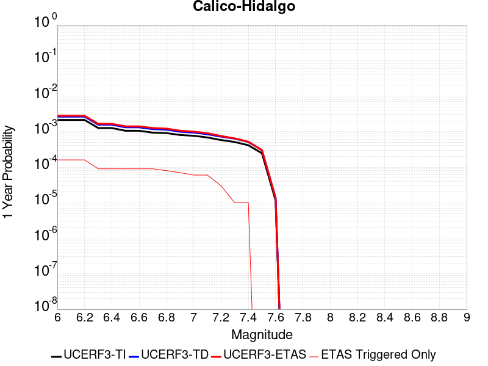 |  |

| Magnitude | 1 wk TI Prob | 1 wk TD Prob | 1 wk ETAS Prob | 1 wk ETAS/TD Gain | 1 wk ETAS Triggered Only | 1 mo TI Prob | 1 mo TD Prob | 1 mo ETAS Prob | 1 mo ETAS/TD Gain | 1 mo ETAS Triggered Only | 1 yr TI Prob | 1 yr TD Prob | 1 yr ETAS Prob | 1 yr ETAS/TD Gain | 1 yr ETAS Triggered Only | 10 yr TI Prob | 10 yr TD Prob | 10 yr ETAS Prob | 10 yr ETAS/TD Gain | 10 yr ETAS Triggered Only |
|-----|-----|-----|-----|-----|-----|-----|-----|-----|-----|-----|-----|-----|-----|-----|-----|-----|-----|-----|-----|-----|
| 6.0 | 4.0906612E-5 | 5.0703686E-5 | 5.0703686E-5 | 1.0 | 0.0 | 1.7530227E-4 | 2.172857E-4 | 2.172857E-4 | 1.0 | 0.0 | 0.0021322158 | 0.002642648 | 0.002821098 | 1.0675269 | 1.7892288E-4 | 0.02111873 | 0.026152607 | 0.02632685 | 1.0066626 | 1.7892288E-4 |
| 6.1 | 4.0906612E-5 | 5.0703686E-5 | 5.0703686E-5 | 1.0 | 0.0 | 1.7530227E-4 | 2.172857E-4 | 2.172857E-4 | 1.0 | 0.0 | 0.0021322158 | 0.002642648 | 0.002821098 | 1.0675269 | 1.7892288E-4 | 0.02111873 | 0.026152607 | 0.02632685 | 1.0066626 | 1.7892288E-4 |
| 6.2 | 4.0906612E-5 | 5.0703686E-5 | 5.0703686E-5 | 1.0 | 0.0 | 1.7530227E-4 | 2.172857E-4 | 2.172857E-4 | 1.0 | 0.0 | 0.0021322158 | 0.002642648 | 0.002821098 | 1.0675269 | 1.7892288E-4 | 0.02111873 | 0.026152607 | 0.02632685 | 1.0066626 | 1.7892288E-4 |
| 6.3 | 2.4242801E-5 | 3.0090669E-5 | 3.0090669E-5 | 1.0 | 0.0 | 1.0389358E-4 | 1.2895382E-4 | 1.2895382E-4 | 1.0 | 0.0 | 0.0012641704 | 0.0015689151 | 0.0015689151 | 1.0 | 0.0 | 0.01257003 | 0.01558206 | 0.01558206 | 1.0 | 0.0 |
| 6.4 | 2.4242801E-5 | 3.0090669E-5 | 3.0090669E-5 | 1.0 | 0.0 | 1.0389358E-4 | 1.2895382E-4 | 1.2895382E-4 | 1.0 | 0.0 | 0.0012641704 | 0.0015689151 | 0.0015689151 | 1.0 | 0.0 | 0.01257003 | 0.01558206 | 0.01558206 | 1.0 | 0.0 |
| 6.5 | 2.0286952E-5 | 2.5315738E-5 | 2.5315738E-5 | 1.0 | 0.0 | 8.694118E-5 | 1.0849161E-4 | 1.0849161E-4 | 1.0 | 0.0 | 0.0010579949 | 0.001320102 | 0.001320102 | 1.0 | 0.0 | 0.010529719 | 0.013124538 | 0.013124538 | 1.0 | 0.0 |
| 6.6 | 2.0269223E-5 | 2.5296687E-5 | 2.5296687E-5 | 1.0 | 0.0 | 8.6865206E-5 | 1.08409964E-4 | 1.08409964E-4 | 1.0 | 0.0 | 0.0010570707 | 0.0013191093 | 0.0013191093 | 1.0 | 0.0 | 0.010520565 | 0.013114728 | 0.013114728 | 1.0 | 0.0 |
| 6.7 | 1.799852E-5 | 2.25406E-5 | 2.25406E-5 | 1.0 | 0.0 | 7.713423E-5 | 9.659908E-5 | 9.659908E-5 | 1.0 | 0.0 | 9.3870464E-4 | 0.0011754738 | 0.0011754738 | 1.0 | 0.0 | 0.009347493 | 0.011694173 | 0.011694173 | 1.0 | 0.0 |
| 6.8 | 1.7458793E-5 | 2.184212E-5 | 2.184212E-5 | 1.0 | 0.0 | 7.4821255E-5 | 9.3605806E-5 | 9.3605806E-5 | 1.0 | 0.0 | 9.10568E-4 | 0.0011390693 | 0.0011390693 | 1.0 | 0.0 | 0.009068459 | 0.011333893 | 0.011333893 | 1.0 | 0.0 |
| 6.9 | 1.542884E-5 | 1.9025927E-5 | 1.9025927E-5 | 1.0 | 0.0 | 6.612192E-5 | 8.153721E-5 | 8.153721E-5 | 1.0 | 0.0 | 8.04737E-4 | 9.922766E-4 | 9.922766E-4 | 1.0 | 0.0 | 0.008018291 | 0.009879857 | 0.009879857 | 1.0 | 0.0 |
| 7.0 | 1.468253E-5 | 1.8030598E-5 | 1.8030598E-5 | 1.0 | 0.0 | 6.292361E-5 | 7.7271776E-5 | 7.7271776E-5 | 1.0 | 0.0 | 7.658257E-4 | 9.4039086E-4 | 9.4039086E-4 | 1.0 | 0.0 | 0.0076319184 | 0.009365481 | 0.009365481 | 1.0 | 0.0 |
| 7.1 | 1.3139281E-5 | 1.6200942E-5 | 1.6200942E-5 | 1.0 | 0.0 | 5.6309986E-5 | 6.943083E-5 | 6.943083E-5 | 1.0 | 0.0 | 6.853584E-4 | 8.4500515E-4 | 8.4500515E-4 | 1.0 | 0.0 | 0.0068324856 | 0.0084192185 | 0.0084192185 | 1.0 | 0.0 |
| 7.2 | 1.1127404E-5 | 1.3866597E-5 | 1.3866597E-5 | 1.0 | 0.0 | 4.7688E-5 | 5.942698E-5 | 5.942698E-5 | 1.0 | 0.0 | 5.8044674E-4 | 7.232942E-4 | 7.232942E-4 | 1.0 | 0.0 | 0.0057893298 | 0.0072105085 | 0.0072105085 | 1.0 | 0.0 |
| 7.3 | 9.808154E-6 | 1.2176215E-5 | 1.2176215E-5 | 1.0 | 0.0 | 4.2034266E-5 | 5.2182797E-5 | 5.2182797E-5 | 1.0 | 0.0 | 5.11647E-4 | 6.3515105E-4 | 6.3515105E-4 | 1.0 | 0.0 | 0.0051047057 | 0.006334433 | 0.006334433 | 1.0 | 0.0 |
| 7.4 | 7.942452E-6 | 9.792144E-6 | 9.792144E-6 | 1.0 | 0.0 | 3.4038632E-5 | 4.1965708E-5 | 4.1965708E-5 | 1.0 | 0.0 | 4.1434157E-4 | 5.1082217E-4 | 5.1082217E-4 | 1.0 | 0.0 | 0.0041356985 | 0.005097421 | 0.005097421 | 1.0 | 0.0 |
| 7.5 | 4.7121216E-6 | 5.772836E-6 | 5.772836E-6 | 1.0 | 0.0 | 2.019465E-5 | 2.4740535E-5 | 2.4740535E-5 | 1.0 | 0.0 | 2.4584212E-4 | 3.0118204E-4 | 3.0118204E-4 | 1.0 | 0.0 | 0.0024557032 | 0.0030084911 | 0.0030084911 | 1.0 | 0.0 |
| 7.6 | 2.21172E-7 | 2.603961E-7 | 2.603961E-7 | 1.0 | 0.0 | 9.478797E-7 | 1.1159829E-6 | 1.1159829E-6 | 1.0 | 0.0 | 1.1540374E-5 | 1.3587036E-5 | 1.3587036E-5 | 1.0 | 0.0 | 1.1539775E-4 | 1.3586486E-4 | 1.3586486E-4 | 1.0 | 0.0 |

## San Andreas (Parkfield)
*[(top)](#table-of-contents)*

| 1 Week | 1 Month | 1 Year | 10 Year |
|-----|-----|-----|-----|
|  | 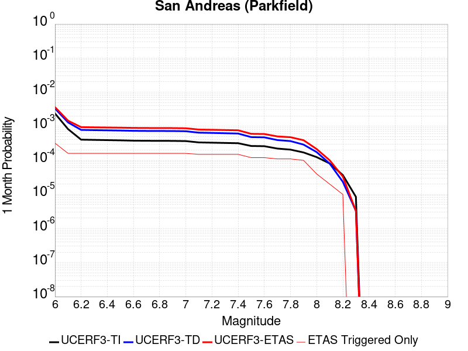 |  |  |

| Magnitude | 1 wk TI Prob | 1 wk TD Prob | 1 wk ETAS Prob | 1 wk ETAS/TD Gain | 1 wk ETAS Triggered Only | 1 mo TI Prob | 1 mo TD Prob | 1 mo ETAS Prob | 1 mo ETAS/TD Gain | 1 mo ETAS Triggered Only | 1 yr TI Prob | 1 yr TD Prob | 1 yr ETAS Prob | 1 yr ETAS/TD Gain | 1 yr ETAS Triggered Only | 10 yr TI Prob | 10 yr TD Prob | 10 yr ETAS Prob | 10 yr ETAS/TD Gain | 10 yr ETAS Triggered Only |
|-----|-----|-----|-----|-----|-----|-----|-----|-----|-----|-----|-----|-----|-----|-----|-----|-----|-----|-----|-----|-----|
| 6.0 | 5.556969E-4 | 7.7782426E-4 | 9.566079E-4 | 1.229851 | 1.7892288E-4 | 0.0023793848 | 0.0033298214 | 0.0035081485 | 1.0535545 | 1.7892288E-4 | 0.028586963 | 0.040191233 | 0.040362965 | 1.0042728 | 1.7892288E-4 | 0.25176284 | 0.33716413 | 0.33728275 | 1.0003518 | 1.7892288E-4 |
| 6.1 | 1.925858E-4 | 3.0276453E-4 | 3.0276453E-4 | 1.0 | 0.0 | 8.2510663E-4 | 0.0012970108 | 0.0012970108 | 1.0 | 0.0 | 0.0099994885 | 0.015778083 | 0.015778083 | 1.0 | 0.0 | 0.095613256 | 0.1497237 | 0.1497237 | 1.0 | 0.0 |
| 6.2 | 9.4306815E-5 | 1.8242796E-4 | 1.8242796E-4 | 1.0 | 0.0 | 4.0410945E-4 | 7.816011E-4 | 7.816011E-4 | 1.0 | 0.0 | 0.0049089384 | 0.009474681 | 0.009474681 | 1.0 | 0.0 | 0.048019063 | 0.09185409 | 0.09185409 | 1.0 | 0.0 |
| 6.3 | 9.283051E-5 | 1.7939322E-4 | 1.7939322E-4 | 1.0 | 0.0 | 3.9778434E-4 | 7.686027E-4 | 7.686027E-4 | 1.0 | 0.0 | 0.0048322747 | 0.009317789 | 0.009317789 | 1.0 | 0.0 | 0.047285385 | 0.09050704 | 0.09050704 | 1.0 | 0.0 |
| 6.4 | 9.138826E-5 | 1.770153E-4 | 1.770153E-4 | 1.0 | 0.0 | 3.916052E-4 | 7.5841765E-4 | 7.5841765E-4 | 1.0 | 0.0 | 0.0047573745 | 0.00919484 | 0.00919484 | 1.0 | 0.0 | 0.046568092 | 0.08940927 | 0.08940927 | 1.0 | 0.0 |
| 6.5 | 9.000255E-5 | 1.7459576E-4 | 1.7459576E-4 | 1.0 | 0.0 | 3.8566816E-4 | 7.480541E-4 | 7.480541E-4 | 1.0 | 0.0 | 0.0046854047 | 0.009069731 | 0.009069731 | 1.0 | 0.0 | 0.045878403 | 0.088295065 | 0.088295065 | 1.0 | 0.0 |
| 6.6 | 8.8109264E-5 | 1.7140752E-4 | 1.7140752E-4 | 1.0 | 0.0 | 3.7755648E-4 | 7.3439797E-4 | 7.3439797E-4 | 1.0 | 0.0 | 0.0045870654 | 0.008904854 | 0.008904854 | 1.0 | 0.0 | 0.04493529 | 0.0868267 | 0.0868267 | 1.0 | 0.0 |
| 6.7 | 8.738073E-5 | 1.7007832E-4 | 1.7007832E-4 | 1.0 | 0.0 | 3.7443507E-4 | 7.287046E-4 | 7.287046E-4 | 1.0 | 0.0 | 0.0045492216 | 0.008836143 | 0.008836143 | 1.0 | 0.0 | 0.04457213 | 0.08622707 | 0.08622707 | 1.0 | 0.0 |
| 6.8 | 8.710195E-5 | 1.6953335E-4 | 1.6953335E-4 | 1.0 | 0.0 | 3.7324068E-4 | 7.263703E-4 | 7.263703E-4 | 1.0 | 0.0 | 0.0045347405 | 0.008807961 | 0.008807961 | 1.0 | 0.0 | 0.04443313 | 0.08597467 | 0.08597467 | 1.0 | 0.0 |
| 6.9 | 8.6801556E-5 | 1.689429E-4 | 1.689429E-4 | 1.0 | 0.0 | 3.7195362E-4 | 7.2384125E-4 | 7.2384125E-4 | 1.0 | 0.0 | 0.0045191357 | 0.008777418 | 0.008777418 | 1.0 | 0.0 | 0.044283327 | 0.085700735 | 0.085700735 | 1.0 | 0.0 |
| 7.0 | 8.5571606E-5 | 1.6647128E-4 | 1.6647128E-4 | 1.0 | 0.0 | 3.6668387E-4 | 7.132544E-4 | 7.132544E-4 | 1.0 | 0.0 | 0.004455241 | 0.008649553 | 0.008649553 | 1.0 | 0.0 | 0.043669727 | 0.08454914 | 0.08454914 | 1.0 | 0.0 |
| 7.1 | 7.82589E-5 | 1.5128135E-4 | 1.5128135E-4 | 1.0 | 0.0 | 3.3535215E-4 | 6.481883E-4 | 6.481883E-4 | 1.0 | 0.0 | 0.0040752706 | 0.007863307 | 0.007863307 | 1.0 | 0.0 | 0.040013418 | 0.07746111 | 0.07746111 | 1.0 | 0.0 |
| 7.2 | 7.690929E-5 | 1.4865391E-4 | 1.4865391E-4 | 1.0 | 0.0 | 3.2956956E-4 | 6.369334E-4 | 6.369334E-4 | 1.0 | 0.0 | 0.004005129 | 0.007727258 | 0.007727258 | 1.0 | 0.0 | 0.0393371 | 0.07623427 | 0.07623427 | 1.0 | 0.0 |
| 7.3 | 7.5543794E-5 | 1.4561978E-4 | 1.4561978E-4 | 1.0 | 0.0 | 3.2371894E-4 | 6.2393624E-4 | 6.2393624E-4 | 1.0 | 0.0 | 0.003934157 | 0.007570127 | 0.007570127 | 1.0 | 0.0 | 0.038652334 | 0.074797355 | 0.074797355 | 1.0 | 0.0 |
| 7.4 | 7.4214564E-5 | 1.4262961E-4 | 1.4262961E-4 | 1.0 | 0.0 | 3.1802364E-4 | 6.111273E-4 | 6.111273E-4 | 1.0 | 0.0 | 0.003865065 | 0.00741525 | 0.00741525 | 1.0 | 0.0 | 0.03798529 | 0.07337123 | 0.07337123 | 1.0 | 0.0 |
| 7.5 | 6.149578E-5 | 1.11907226E-4 | 1.11907226E-4 | 1.0 | 0.0 | 2.6352672E-4 | 4.7951436E-4 | 4.7951436E-4 | 1.0 | 0.0 | 0.0032037178 | 0.0058224914 | 0.0058224914 | 1.0 | 0.0 | 0.03157923 | 0.058557566 | 0.058557566 | 1.0 | 0.0 |
| 7.6 | 6.0643448E-5 | 1.10193796E-4 | 1.10193796E-4 | 1.0 | 0.0 | 2.598746E-4 | 4.7217376E-4 | 4.7217376E-4 | 1.0 | 0.0 | 0.0031593828 | 0.0057335934 | 0.0057335934 | 1.0 | 0.0 | 0.031148417 | 0.057718582 | 0.057718582 | 1.0 | 0.0 |
| 7.7 | 5.1652263E-5 | 9.174698E-5 | 9.174698E-5 | 1.0 | 0.0 | 2.2134806E-4 | 3.931421E-4 | 3.931421E-4 | 1.0 | 0.0 | 0.002691582 | 0.0047760103 | 0.0047760103 | 1.0 | 0.0 | 0.026592141 | 0.04853623 | 0.04853623 | 1.0 | 0.0 |
| 7.8 | 4.8090482E-5 | 8.559635E-5 | 8.559635E-5 | 1.0 | 0.0 | 2.060858E-4 | 3.6678996E-4 | 3.6678996E-4 | 1.0 | 0.0 | 0.0025062072 | 0.0044565317 | 0.0044565317 | 1.0 | 0.0 | 0.024781305 | 0.04530245 | 0.04530245 | 1.0 | 0.0 |
| 7.9 | 3.970278E-5 | 6.750426E-5 | 6.750426E-5 | 1.0 | 0.0 | 1.7014367E-4 | 2.892719E-4 | 2.892719E-4 | 1.0 | 0.0 | 0.002069531 | 0.0035162016 | 0.0035162016 | 1.0 | 0.0 | 0.020503636 | 0.035881363 | 0.035881363 | 1.0 | 0.0 |
| 8.0 | 2.8982335E-5 | 4.069796E-5 | 4.069796E-5 | 1.0 | 0.0 | 1.2420409E-4 | 1.7440817E-4 | 1.7440817E-4 | 1.0 | 0.0 | 0.0015111357 | 0.0021213528 | 0.0021213528 | 1.0 | 0.0 | 0.015009012 | 0.022010697 | 0.022010697 | 1.0 | 0.0 |
| 8.1 | 1.8836186E-5 | 1.8681134E-5 | 1.8681134E-5 | 1.0 | 0.0 | 8.0724014E-5 | 8.005955E-5 | 8.005955E-5 | 1.0 | 0.0 | 9.823717E-4 | 9.742898E-4 | 9.742898E-4 | 1.0 | 0.0 | 0.009780403 | 0.010488115 | 0.010488115 | 1.0 | 0.0 |
| 8.2 | 8.643924E-6 | 5.4748625E-6 | 5.4748625E-6 | 1.0 | 0.0 | 3.704486E-5 | 2.3463486E-5 | 2.3463486E-5 | 1.0 | 0.0 | 4.5092785E-4 | 2.8563058E-4 | 2.8563058E-4 | 1.0 | 0.0 | 0.0045001395 | 0.0032487072 | 0.0032487072 | 1.0 | 0.0 |
| 8.3 | 1.983087E-6 | 7.6599065E-7 | 7.6599065E-7 | 1.0 | 0.0 | 8.498917E-6 | 3.282813E-6 | 3.282813E-6 | 1.0 | 0.0 | 1.034694E-4 | 3.9967534E-5 | 3.9967534E-5 | 1.0 | 0.0 | 0.0010342124 | 4.719687E-4 | 4.719687E-4 | 1.0 | 0.0 |

## Pisgah-Bullion Mtn-Mesquite Lk
*[(top)](#table-of-contents)*

| 1 Week | 1 Month | 1 Year | 10 Year |
|-----|-----|-----|-----|
|  |  |  |  |

| Magnitude | 1 wk TI Prob | 1 wk TD Prob | 1 wk ETAS Prob | 1 wk ETAS/TD Gain | 1 wk ETAS Triggered Only | 1 mo TI Prob | 1 mo TD Prob | 1 mo ETAS Prob | 1 mo ETAS/TD Gain | 1 mo ETAS Triggered Only | 1 yr TI Prob | 1 yr TD Prob | 1 yr ETAS Prob | 1 yr ETAS/TD Gain | 1 yr ETAS Triggered Only | 10 yr TI Prob | 10 yr TD Prob | 10 yr ETAS Prob | 10 yr ETAS/TD Gain | 10 yr ETAS Triggered Only |
|-----|-----|-----|-----|-----|-----|-----|-----|-----|-----|-----|-----|-----|-----|-----|-----|-----|-----|-----|-----|-----|
| 6.0 | 3.0240792E-5 | 2.4091114E-5 | 2.4091114E-5 | 1.0 | 0.0 | 1.2959696E-4 | 1.03244114E-4 | 1.03244114E-4 | 1.0 | 0.0 | 0.0015767008 | 0.0012563728 | 0.0014350709 | 1.1422334 | 1.7892288E-4 | 0.015655609 | 0.012502721 | 0.012679406 | 1.0141318 | 1.7892288E-4 |
| 6.1 | 3.0240792E-5 | 2.4091114E-5 | 2.4091114E-5 | 1.0 | 0.0 | 1.2959696E-4 | 1.03244114E-4 | 1.03244114E-4 | 1.0 | 0.0 | 0.0015767008 | 0.0012563728 | 0.0014350709 | 1.1422334 | 1.7892288E-4 | 0.015655609 | 0.012502721 | 0.012679406 | 1.0141318 | 1.7892288E-4 |
| 6.2 | 3.0240792E-5 | 2.4091114E-5 | 2.4091114E-5 | 1.0 | 0.0 | 1.2959696E-4 | 1.03244114E-4 | 1.03244114E-4 | 1.0 | 0.0 | 0.0015767008 | 0.0012563728 | 0.0014350709 | 1.1422334 | 1.7892288E-4 | 0.015655609 | 0.012502721 | 0.012679406 | 1.0141318 | 1.7892288E-4 |
| 6.3 | 2.0498217E-5 | 1.36380695E-5 | 1.36380695E-5 | 1.0 | 0.0 | 8.784654E-5 | 5.844765E-5 | 5.844765E-5 | 1.0 | 0.0 | 0.0010690069 | 7.1138405E-4 | 7.1138405E-4 | 1.0 | 0.0 | 0.01063879 | 0.0070926943 | 0.0070926943 | 1.0 | 0.0 |
| 6.4 | 2.0498217E-5 | 1.36380695E-5 | 1.36380695E-5 | 1.0 | 0.0 | 8.784654E-5 | 5.844765E-5 | 5.844765E-5 | 1.0 | 0.0 | 0.0010690069 | 7.1138405E-4 | 7.1138405E-4 | 1.0 | 0.0 | 0.01063879 | 0.0070926943 | 0.0070926943 | 1.0 | 0.0 |
| 6.5 | 1.7316182E-5 | 1.0477042E-5 | 1.0477042E-5 | 1.0 | 0.0 | 7.42101E-5 | 4.4900895E-5 | 4.4900895E-5 | 1.0 | 0.0 | 9.0313336E-4 | 5.465413E-4 | 5.465413E-4 | 1.0 | 0.0 | 0.008994718 | 0.0054529672 | 0.0054529672 | 1.0 | 0.0 |
| 6.6 | 1.5251077E-5 | 8.414273E-6 | 8.414273E-6 | 1.0 | 0.0 | 6.536012E-5 | 3.6060712E-5 | 3.6060712E-5 | 1.0 | 0.0 | 7.9546886E-4 | 4.3895794E-4 | 4.3895794E-4 | 1.0 | 0.0 | 0.007926274 | 0.0043816264 | 0.0043816264 | 1.0 | 0.0 |
| 6.7 | 1.2997425E-5 | 6.4114965E-6 | 6.4114965E-6 | 1.0 | 0.0 | 5.570206E-5 | 2.7477578E-5 | 2.7477578E-5 | 1.0 | 0.0 | 6.7796157E-4 | 3.3449283E-4 | 3.3449283E-4 | 1.0 | 0.0 | 0.0067589693 | 0.0033403537 | 0.0033403537 | 1.0 | 0.0 |
| 6.8 | 1.035386E-5 | 4.3332193E-6 | 4.3332193E-6 | 1.0 | 0.0 | 4.437293E-5 | 1.8570812E-5 | 1.8570812E-5 | 1.0 | 0.0 | 5.401065E-4 | 2.2607706E-4 | 2.2607706E-4 | 1.0 | 0.0 | 0.0053879567 | 0.0022585576 | 0.0022585576 | 1.0 | 0.0 |
| 6.9 | 8.816252E-6 | 3.580638E-6 | 3.580638E-6 | 1.0 | 0.0 | 3.778339E-5 | 1.5345504E-5 | 1.5345504E-5 | 1.0 | 0.0 | 4.5991567E-4 | 1.8681608E-4 | 1.8681608E-4 | 1.0 | 0.0 | 0.00458965 | 0.0018666488 | 0.0018666488 | 1.0 | 0.0 |
| 7.0 | 6.8232207E-6 | 2.5675843E-6 | 2.5675843E-6 | 1.0 | 0.0 | 2.9242048E-5 | 1.1003888E-5 | 1.1003888E-5 | 1.0 | 0.0 | 3.5596377E-4 | 1.3396442E-4 | 1.3396442E-4 | 1.0 | 0.0 | 0.0035539411 | 0.0013388677 | 0.0013388677 | 1.0 | 0.0 |
| 7.1 | 5.837013E-6 | 2.22738E-6 | 2.22738E-6 | 1.0 | 0.0 | 2.501553E-5 | 9.545881E-6 | 9.545881E-6 | 1.0 | 0.0 | 3.045215E-4 | 1.16215204E-4 | 1.16215204E-4 | 1.0 | 0.0 | 0.0030410455 | 0.0011615733 | 0.0011615733 | 1.0 | 0.0 |
| 7.2 | 4.278052E-6 | 1.6275711E-6 | 1.6275711E-6 | 1.0 | 0.0 | 1.833438E-5 | 6.9752873E-6 | 6.9752873E-6 | 1.0 | 0.0 | 2.231982E-4 | 8.492105E-5 | 8.492105E-5 | 1.0 | 0.0 | 0.0022297418 | 8.489092E-4 | 8.489092E-4 | 1.0 | 0.0 |
| 7.3 | 1.8803692E-6 | 8.344926E-7 | 8.344926E-7 | 1.0 | 0.0 | 8.0587E-6 | 3.5763926E-6 | 3.5763926E-6 | 1.0 | 0.0 | 9.811026E-5 | 4.354186E-5 | 4.354186E-5 | 1.0 | 0.0 | 9.806695E-4 | 4.3534773E-4 | 4.3534773E-4 | 1.0 | 0.0 |

## San Juan
*[(top)](#table-of-contents)*

| 1 Week | 1 Month | 1 Year | 10 Year |
|-----|-----|-----|-----|
|  |  |  |  |

| Magnitude | 1 wk TI Prob | 1 wk TD Prob | 1 wk ETAS Prob | 1 wk ETAS/TD Gain | 1 wk ETAS Triggered Only | 1 mo TI Prob | 1 mo TD Prob | 1 mo ETAS Prob | 1 mo ETAS/TD Gain | 1 mo ETAS Triggered Only | 1 yr TI Prob | 1 yr TD Prob | 1 yr ETAS Prob | 1 yr ETAS/TD Gain | 1 yr ETAS Triggered Only | 10 yr TI Prob | 10 yr TD Prob | 10 yr ETAS Prob | 10 yr ETAS/TD Gain | 10 yr ETAS Triggered Only |
|-----|-----|-----|-----|-----|-----|-----|-----|-----|-----|-----|-----|-----|-----|-----|-----|-----|-----|-----|-----|-----|
| 6.0 | 8.682808E-6 | 8.7491635E-6 | 1.8767048E-4 | 21.450106 | 1.7892288E-4 | 3.72115E-5 | 3.74959E-5 | 2.1641208E-4 | 5.7716193 | 1.7892288E-4 | 4.5295584E-4 | 4.564218E-4 | 6.3526304E-4 | 1.3918332 | 1.7892288E-4 | 0.004520337 | 0.004555385 | 0.0047334926 | 1.0390983 | 1.7892288E-4 |
| 6.1 | 8.682808E-6 | 8.7491635E-6 | 1.8767048E-4 | 21.450106 | 1.7892288E-4 | 3.72115E-5 | 3.74959E-5 | 2.1641208E-4 | 5.7716193 | 1.7892288E-4 | 4.5295584E-4 | 4.564218E-4 | 6.3526304E-4 | 1.3918332 | 1.7892288E-4 | 0.004520337 | 0.004555385 | 0.0047334926 | 1.0390983 | 1.7892288E-4 |
| 6.2 | 8.682808E-6 | 8.7491635E-6 | 1.8767048E-4 | 21.450106 | 1.7892288E-4 | 3.72115E-5 | 3.74959E-5 | 2.1641208E-4 | 5.7716193 | 1.7892288E-4 | 4.5295584E-4 | 4.564218E-4 | 6.3526304E-4 | 1.3918332 | 1.7892288E-4 | 0.004520337 | 0.004555385 | 0.0047334926 | 1.0390983 | 1.7892288E-4 |
| 6.3 | 6.3054235E-6 | 6.2825848E-6 | 6.2825848E-6 | 1.0 | 0.0 | 2.7022963E-5 | 2.6925094E-5 | 2.6925094E-5 | 1.0 | 0.0 | 3.2895492E-4 | 3.2776513E-4 | 3.2776513E-4 | 1.0 | 0.0 | 0.003284684 | 0.003273017 | 0.003273017 | 1.0 | 0.0 |
| 6.4 | 6.1490473E-6 | 6.1144656E-6 | 6.1144656E-6 | 1.0 | 0.0 | 2.6352795E-5 | 2.6204598E-5 | 2.6204598E-5 | 1.0 | 0.0 | 3.2079802E-4 | 3.1899565E-4 | 3.1899565E-4 | 1.0 | 0.0 | 0.0032033534 | 0.0031855737 | 0.0031855737 | 1.0 | 0.0 |
| 6.5 | 5.204848E-6 | 5.137233E-6 | 5.137233E-6 | 1.0 | 0.0 | 2.23063E-5 | 2.2016533E-5 | 2.2016533E-5 | 1.0 | 0.0 | 2.7154534E-4 | 2.6801927E-4 | 2.6801927E-4 | 1.0 | 0.0 | 0.0027121378 | 0.0026771144 | 0.0026771144 | 1.0 | 0.0 |
| 6.6 | 4.5179986E-6 | 4.4150297E-6 | 4.4150297E-6 | 1.0 | 0.0 | 1.9362706E-5 | 1.8921424E-5 | 1.8921424E-5 | 1.0 | 0.0 | 2.3571544E-4 | 2.3034477E-4 | 2.3034477E-4 | 1.0 | 0.0 | 0.0023546559 | 0.0023011973 | 0.0023011973 | 1.0 | 0.0 |
| 6.7 | 3.9442616E-6 | 3.819828E-6 | 3.819828E-6 | 1.0 | 0.0 | 1.6903869E-5 | 1.6370592E-5 | 1.6370592E-5 | 1.0 | 0.0 | 2.0578515E-4 | 1.992944E-4 | 1.992944E-4 | 1.0 | 0.0 | 0.002055947 | 0.0019912818 | 0.0019912818 | 1.0 | 0.0 |
| 6.8 | 3.4536245E-6 | 3.3163353E-6 | 3.3163353E-6 | 1.0 | 0.0 | 1.4801163E-5 | 1.4212792E-5 | 1.4212792E-5 | 1.0 | 0.0 | 1.8018926E-4 | 1.7302761E-4 | 1.7302761E-4 | 1.0 | 0.0 | 0.0018004322 | 0.0017290477 | 0.0017290477 | 1.0 | 0.0 |
| 6.9 | 3.059865E-6 | 2.9120315E-6 | 2.9120315E-6 | 1.0 | 0.0 | 1.3113641E-5 | 1.2480078E-5 | 1.2480078E-5 | 1.0 | 0.0 | 1.596469E-4 | 1.5193493E-4 | 1.5193493E-4 | 1.0 | 0.0 | 0.0015953224 | 0.0015184252 | 0.0015184252 | 1.0 | 0.0 |
| 7.0 | 2.6504351E-6 | 2.4920002E-6 | 2.4920002E-6 | 1.0 | 0.0 | 1.1358958E-5 | 1.0679961E-5 | 1.0679961E-5 | 1.0 | 0.0 | 1.3828653E-4 | 1.300213E-4 | 1.300213E-4 | 1.0 | 0.0 | 0.0013820052 | 0.0012995641 | 0.0012995641 | 1.0 | 0.0 |
| 7.1 | 2.2039317E-6 | 2.0338296E-6 | 2.0338296E-6 | 1.0 | 0.0 | 9.445387E-6 | 8.716386E-6 | 8.716386E-6 | 1.0 | 0.0 | 1.1499152E-4 | 1.0611736E-4 | 1.0611736E-4 | 1.0 | 0.0 | 0.0011493203 | 0.0010607769 | 0.0010607769 | 1.0 | 0.0 |
| 7.2 | 1.0786707E-6 | 8.7701903E-7 | 8.7701903E-7 | 1.0 | 0.0 | 4.622866E-6 | 3.7586476E-6 | 3.7586476E-6 | 1.0 | 0.0 | 5.628194E-5 | 4.5760586E-5 | 4.5760586E-5 | 1.0 | 0.0 | 5.6267687E-4 | 4.5757066E-4 | 4.5757066E-4 | 1.0 | 0.0 |
| 7.3 | 6.846433E-7 | 4.868805E-7 | 4.868805E-7 | 1.0 | 0.0 | 2.9341822E-6 | 2.086629E-6 | 2.086629E-6 | 1.0 | 0.0 | 3.5723086E-5 | 2.5404412E-5 | 2.5404412E-5 | 1.0 | 0.0 | 3.571734E-4 | 2.540486E-4 | 2.540486E-4 | 1.0 | 0.0 |
| 7.4 | 5.23043E-7 | 3.2628162E-7 | 3.2628162E-7 | 1.0 | 0.0 | 2.2416111E-6 | 1.398349E-6 | 1.398349E-6 | 1.0 | 0.0 | 2.7291273E-5 | 1.7024766E-5 | 1.7024766E-5 | 1.0 | 0.0 | 2.7287923E-4 | 1.7026656E-4 | 1.7026656E-4 | 1.0 | 0.0 |
| 7.5 | 4.648444E-7 | 2.7234944E-7 | 2.7234944E-7 | 1.0 | 0.0 | 1.9921886E-6 | 1.1672114E-6 | 1.1672114E-6 | 1.0 | 0.0 | 2.4254627E-5 | 1.42107065E-5 | 1.42107065E-5 | 1.0 | 0.0 | 2.425198E-4 | 1.421276E-4 | 1.421276E-4 | 1.0 | 0.0 |
| 7.6 | 3.9906567E-7 | 2.2083314E-7 | 2.2083314E-7 | 1.0 | 0.0 | 1.7102802E-6 | 9.464274E-7 | 9.464274E-7 | 1.0 | 0.0 | 2.0822463E-5 | 1.1522693E-5 | 1.1522693E-5 | 1.0 | 0.0 | 2.0820512E-4 | 1.15245566E-4 | 1.15245566E-4 | 1.0 | 0.0 |
| 7.7 | 1.8784601E-7 | 5.3666906E-8 | 5.3666906E-8 | 1.0 | 0.0 | 8.0505407E-7 | 2.30001E-7 | 2.30001E-7 | 1.0 | 0.0 | 9.80149E-6 | 2.8002585E-6 | 2.8002585E-6 | 1.0 | 0.0 | 9.801057E-5 | 2.8011282E-5 | 2.8011282E-5 | 1.0 | 0.0 |
| 7.8 | 1.00154914E-7 | 1.2415832E-8 | 1.2415832E-8 | 1.0 | 0.0 | 4.2923529E-7 | 5.3210716E-8 | 5.3210716E-8 | 1.0 | 0.0 | 5.225927E-6 | 6.4784024E-7 | 6.4784024E-7 | 1.0 | 0.0 | 5.225804E-5 | 6.484273E-6 | 6.484273E-6 | 1.0 | 0.0 |
| 7.9 | 6.171429E-8 | 4.2966155E-9 | 4.2966155E-9 | 1.0 | 0.0 | 2.6448978E-7 | 1.8414067E-8 | 1.8414067E-8 | 1.0 | 0.0 | 3.2201583E-6 | 2.2419121E-7 | 2.2419121E-7 | 1.0 | 0.0 | 3.2201115E-5 | 2.2472002E-6 | 2.2472002E-6 | 1.0 | 0.0 |
| 8.0 | 1.3974572E-8 | 3.3788217E-10 | 3.3788217E-10 | 1.0 | 0.0 | 5.989102E-8 | 1.448067E-9 | 1.448067E-9 | 1.0 | 0.0 | 7.2917294E-7 | 1.763022E-8 | 1.763022E-8 | 1.0 | 0.0 | 7.2917055E-6 | 1.8060365E-7 | 1.8060365E-7 | 1.0 | 0.0 |
| 8.1 | 1.8403477E-9 | 1.1302803E-10 | 1.1302803E-10 | 1.0 | 0.0 | 7.887204E-9 | 4.844063E-10 | 4.844063E-10 | 1.0 | 0.0 | 9.602671E-8 | 5.8976446E-9 | 5.8976446E-9 | 1.0 | 0.0 | 9.602667E-7 | 6.021993E-8 | 6.021993E-8 | 1.0 | 0.0 |

## Owens Valley
*[(top)](#table-of-contents)*

| 1 Week | 1 Month | 1 Year | 10 Year |
|-----|-----|-----|-----|
|  |  |  |  |

| Magnitude | 1 wk TI Prob | 1 wk TD Prob | 1 wk ETAS Prob | 1 wk ETAS/TD Gain | 1 wk ETAS Triggered Only | 1 mo TI Prob | 1 mo TD Prob | 1 mo ETAS Prob | 1 mo ETAS/TD Gain | 1 mo ETAS Triggered Only | 1 yr TI Prob | 1 yr TD Prob | 1 yr ETAS Prob | 1 yr ETAS/TD Gain | 1 yr ETAS Triggered Only | 10 yr TI Prob | 10 yr TD Prob | 10 yr ETAS Prob | 10 yr ETAS/TD Gain | 10 yr ETAS Triggered Only |
|-----|-----|-----|-----|-----|-----|-----|-----|-----|-----|-----|-----|-----|-----|-----|-----|-----|-----|-----|-----|-----|
| 6.0 | 4.83821E-5 | 3.626567E-6 | 1.825488E-4 | 50.336533 | 1.7892288E-4 | 2.0733538E-4 | 1.5542342E-5 | 1.9446245E-4 | 12.511785 | 1.7892288E-4 | 0.002521386 | 1.8921259E-4 | 3.681016E-4 | 1.9454393 | 1.7892288E-4 | 0.024929691 | 0.001925011 | 0.0021035895 | 1.0927675 | 1.7892288E-4 |
| 6.1 | 4.83821E-5 | 3.626567E-6 | 1.825488E-4 | 50.336533 | 1.7892288E-4 | 2.0733538E-4 | 1.5542342E-5 | 1.9446245E-4 | 12.511785 | 1.7892288E-4 | 0.002521386 | 1.8921259E-4 | 3.681016E-4 | 1.9454393 | 1.7892288E-4 | 0.024929691 | 0.001925011 | 0.0021035895 | 1.0927675 | 1.7892288E-4 |
| 6.2 | 4.83821E-5 | 3.626567E-6 | 1.825488E-4 | 50.336533 | 1.7892288E-4 | 2.0733538E-4 | 1.5542342E-5 | 1.9446245E-4 | 12.511785 | 1.7892288E-4 | 0.002521386 | 1.8921259E-4 | 3.681016E-4 | 1.9454393 | 1.7892288E-4 | 0.024929691 | 0.001925011 | 0.0021035895 | 1.0927675 | 1.7892288E-4 |
| 6.3 | 3.953008E-5 | 3.1553948E-6 | 1.8207771E-4 | 57.703625 | 1.7892288E-4 | 1.6940363E-4 | 1.3523055E-5 | 1.9244352E-4 | 14.230773 | 1.7892288E-4 | 0.002060538 | 1.6463149E-4 | 3.435249E-4 | 2.0866294 | 1.7892288E-4 | 0.020415364 | 0.0016592 | 0.0018378259 | 1.1076579 | 1.7892288E-4 |
| 6.4 | 3.953008E-5 | 3.1553948E-6 | 1.8207771E-4 | 57.703625 | 1.7892288E-4 | 1.6940363E-4 | 1.3523055E-5 | 1.9244352E-4 | 14.230773 | 1.7892288E-4 | 0.002060538 | 1.6463149E-4 | 3.435249E-4 | 2.0866294 | 1.7892288E-4 | 0.020415364 | 0.0016592 | 0.0018378259 | 1.1076579 | 1.7892288E-4 |
| 6.5 | 3.457342E-5 | 2.9715961E-6 | 2.9715961E-6 | 1.0 | 0.0 | 1.4816338E-4 | 1.2735354E-5 | 1.2735354E-5 | 1.0 | 0.0 | 0.0018023965 | 1.550426E-4 | 1.550426E-4 | 1.0 | 0.0 | 0.017878477 | 0.001555719 | 0.001555719 | 1.0 | 0.0 |
| 6.6 | 3.1127765E-5 | 2.8744932E-6 | 2.8744932E-6 | 1.0 | 0.0 | 1.3339789E-4 | 1.2319203E-5 | 1.2319203E-5 | 1.0 | 0.0 | 0.0016229092 | 1.4997667E-4 | 1.4997667E-4 | 1.0 | 0.0 | 0.016111081 | 0.0015012559 | 0.0015012559 | 1.0 | 0.0 |
| 6.7 | 2.806885E-5 | 2.8104134E-6 | 2.8104134E-6 | 1.0 | 0.0 | 1.2028952E-4 | 1.20445775E-5 | 1.20445775E-5 | 1.0 | 0.0 | 0.001463541 | 1.4663354E-4 | 1.4663354E-4 | 1.0 | 0.0 | 0.014539397 | 0.0014657511 | 0.0014657511 | 1.0 | 0.0 |
| 6.8 | 2.524524E-5 | 2.2353688E-6 | 2.2353688E-6 | 1.0 | 0.0 | 1.0818939E-4 | 9.580118E-6 | 9.580118E-6 | 1.0 | 0.0 | 0.0013164099 | 1.16632E-4 | 1.16632E-4 | 1.0 | 0.0 | 0.01308639 | 0.0011659812 | 0.0011659812 | 1.0 | 0.0 |
| 6.9 | 2.2704568E-5 | 1.6081682E-6 | 1.6081682E-6 | 1.0 | 0.0 | 9.730166E-5 | 6.8921313E-6 | 6.8921313E-6 | 1.0 | 0.0 | 0.0011840039 | 8.390849E-5 | 8.390849E-5 | 1.0 | 0.0 | 0.011777153 | 8.3897985E-4 | 8.3897985E-4 | 1.0 | 0.0 |
| 7.0 | 2.0871712E-5 | 1.5395453E-6 | 1.5395453E-6 | 1.0 | 0.0 | 8.944713E-5 | 6.598035E-6 | 6.598035E-6 | 1.0 | 0.0 | 0.0010884746 | 8.032813E-5 | 8.032813E-5 | 1.0 | 0.0 | 0.010831586 | 8.0316263E-4 | 8.0316263E-4 | 1.0 | 0.0 |
| 7.1 | 1.944928E-5 | 1.3864178E-6 | 1.3864178E-6 | 1.0 | 0.0 | 8.335139E-5 | 5.941777E-6 | 5.941777E-6 | 1.0 | 0.0 | 0.0010143308 | 7.233874E-5 | 7.233874E-5 | 1.0 | 0.0 | 0.010097133 | 7.2330976E-4 | 7.2330976E-4 | 1.0 | 0.0 |
| 7.2 | 1.7876306E-5 | 1.2489141E-6 | 1.2489141E-6 | 1.0 | 0.0 | 7.6610486E-5 | 5.352478E-6 | 5.352478E-6 | 1.0 | 0.0 | 9.3233347E-4 | 6.516448E-5 | 6.516448E-5 | 1.0 | 0.0 | 0.009284316 | 6.5159105E-4 | 6.5159105E-4 | 1.0 | 0.0 |
| 7.3 | 1.2618672E-5 | 1.1115209E-6 | 1.1115209E-6 | 1.0 | 0.0 | 5.40789E-5 | 4.763652E-6 | 4.763652E-6 | 1.0 | 0.0 | 6.582117E-4 | 5.799593E-5 | 5.799593E-5 | 1.0 | 0.0 | 0.0065626553 | 5.7994033E-4 | 5.7994033E-4 | 1.0 | 0.0 |
| 7.4 | 7.4874442E-6 | 8.5486437E-7 | 8.5486437E-7 | 1.0 | 0.0 | 3.208865E-5 | 3.6636993E-6 | 3.6636993E-6 | 1.0 | 0.0 | 3.906093E-4 | 4.4604632E-5 | 4.4604632E-5 | 1.0 | 0.0 | 0.003899234 | 4.4604883E-4 | 4.4604883E-4 | 1.0 | 0.0 |
| 7.5 | 2.4734156E-6 | 6.068616E-7 | 6.068616E-7 | 1.0 | 0.0 | 1.060031E-5 | 2.6008327E-6 | 2.6008327E-6 | 1.0 | 0.0 | 1.2905113E-4 | 3.166468E-5 | 3.166468E-5 | 1.0 | 0.0 | 0.0012897621 | 3.1660203E-4 | 3.1660203E-4 | 1.0 | 0.0 |
| 7.6 | 1.1328841E-6 | 3.196531E-7 | 3.196531E-7 | 1.0 | 0.0 | 4.8552088E-6 | 1.3699412E-6 | 1.3699412E-6 | 1.0 | 0.0 | 5.9110564E-5 | 1.6678909E-5 | 1.6678909E-5 | 1.0 | 0.0 | 5.9094845E-4 | 1.6677675E-4 | 1.6677675E-4 | 1.0 | 0.0 |
| 7.7 | 4.8613185E-7 | 8.964689E-8 | 8.964689E-8 | 1.0 | 0.0 | 2.0834207E-6 | 3.8420092E-7 | 3.8420092E-7 | 1.0 | 0.0 | 2.536535E-5 | 4.6776368E-6 | 4.6776368E-6 | 1.0 | 0.0 | 2.5362454E-4 | 4.677545E-5 | 4.677545E-5 | 1.0 | 0.0 |

## Whittier alt 1
*[(top)](#table-of-contents)*

| 1 Week | 1 Month | 1 Year | 10 Year |
|-----|-----|-----|-----|
|  |  |  |  |

| Magnitude | 1 wk TI Prob | 1 wk TD Prob | 1 wk ETAS Prob | 1 wk ETAS/TD Gain | 1 wk ETAS Triggered Only | 1 mo TI Prob | 1 mo TD Prob | 1 mo ETAS Prob | 1 mo ETAS/TD Gain | 1 mo ETAS Triggered Only | 1 yr TI Prob | 1 yr TD Prob | 1 yr ETAS Prob | 1 yr ETAS/TD Gain | 1 yr ETAS Triggered Only | 10 yr TI Prob | 10 yr TD Prob | 10 yr ETAS Prob | 10 yr ETAS/TD Gain | 10 yr ETAS Triggered Only |
|-----|-----|-----|-----|-----|-----|-----|-----|-----|-----|-----|-----|-----|-----|-----|-----|-----|-----|-----|-----|-----|
| 6.0 | 4.2554693E-5 | 4.725218E-5 | 2.2616661E-4 | 4.786374 | 1.7892288E-4 | 1.8236451E-4 | 2.0249544E-4 | 3.813821E-4 | 1.8834108 | 1.7892288E-4 | 0.002218027 | 0.0024629154 | 0.0026413975 | 1.0724679 | 1.7892288E-4 | 0.02196019 | 0.024390234 | 0.024564793 | 1.007157 | 1.7892288E-4 |
| 6.1 | 4.2554693E-5 | 4.725218E-5 | 2.2616661E-4 | 4.786374 | 1.7892288E-4 | 1.8236451E-4 | 2.0249544E-4 | 3.813821E-4 | 1.8834108 | 1.7892288E-4 | 0.002218027 | 0.0024629154 | 0.0026413975 | 1.0724679 | 1.7892288E-4 | 0.02196019 | 0.024390234 | 0.024564793 | 1.007157 | 1.7892288E-4 |
| 6.2 | 4.2554693E-5 | 4.725218E-5 | 2.2616661E-4 | 4.786374 | 1.7892288E-4 | 1.8236451E-4 | 2.0249544E-4 | 3.813821E-4 | 1.8834108 | 1.7892288E-4 | 0.002218027 | 0.0024629154 | 0.0026413975 | 1.0724679 | 1.7892288E-4 | 0.02196019 | 0.024390234 | 0.024564793 | 1.007157 | 1.7892288E-4 |
| 6.3 | 1.9617712E-5 | 1.8268593E-5 | 1.8268593E-5 | 1.0 | 0.0 | 8.40732E-5 | 7.829172E-5 | 7.829172E-5 | 1.0 | 0.0 | 0.0010231105 | 9.52804E-4 | 9.52804E-4 | 1.0 | 0.0 | 0.01018413 | 0.009490474 | 0.009490474 | 1.0 | 0.0 |
| 6.4 | 1.5611336E-5 | 1.3604271E-5 | 1.3604271E-5 | 1.0 | 0.0 | 6.690401E-5 | 5.8302747E-5 | 5.8302747E-5 | 1.0 | 0.0 | 8.142519E-4 | 7.0961076E-4 | 7.0961076E-4 | 1.0 | 0.0 | 0.008112748 | 0.0070754145 | 0.0070754145 | 1.0 | 0.0 |
| 6.5 | 1.5150166E-5 | 1.3100925E-5 | 1.3100925E-5 | 1.0 | 0.0 | 6.492767E-5 | 5.6145647E-5 | 5.6145647E-5 | 1.0 | 0.0 | 7.9020765E-4 | 6.8336475E-4 | 6.8336475E-4 | 1.0 | 0.0 | 0.007874036 | 0.0068145846 | 0.0068145846 | 1.0 | 0.0 |
| 6.6 | 1.295588E-5 | 1.0380725E-5 | 1.0380725E-5 | 1.0 | 0.0 | 5.552402E-5 | 4.4488075E-5 | 4.4488075E-5 | 1.0 | 0.0 | 6.7579525E-4 | 5.4150965E-4 | 5.4150965E-4 | 1.0 | 0.0 | 0.006737438 | 0.0054033357 | 0.0054033357 | 1.0 | 0.0 |
| 6.7 | 1.2542085E-5 | 9.899369E-6 | 9.899369E-6 | 1.0 | 0.0 | 5.3750682E-5 | 4.242519E-5 | 4.242519E-5 | 1.0 | 0.0 | 6.542181E-4 | 5.164061E-4 | 5.164061E-4 | 1.0 | 0.0 | 0.006522954 | 0.0051534795 | 0.0051534795 | 1.0 | 0.0 |
| 6.8 | 1.2195878E-5 | 9.495415E-6 | 9.495415E-6 | 1.0 | 0.0 | 5.2267E-5 | 4.069401E-5 | 4.069401E-5 | 1.0 | 0.0 | 6.36165E-4 | 4.9533875E-4 | 4.9533875E-4 | 1.0 | 0.0 | 0.0063434686 | 0.004943688 | 0.004943688 | 1.0 | 0.0 |
| 6.9 | 1.1580298E-5 | 8.772933E-6 | 8.772933E-6 | 1.0 | 0.0 | 4.9628903E-5 | 3.7597754E-5 | 3.7597754E-5 | 1.0 | 0.0 | 6.040644E-4 | 4.5765814E-4 | 4.5765814E-4 | 1.0 | 0.0 | 0.00602425 | 0.0045684157 | 0.0045684157 | 1.0 | 0.0 |
| 7.0 | 1.0964795E-5 | 8.083994E-6 | 8.083994E-6 | 1.0 | 0.0 | 4.6991136E-5 | 3.4645236E-5 | 3.4645236E-5 | 1.0 | 0.0 | 5.7196687E-4 | 4.2172565E-4 | 4.2172565E-4 | 1.0 | 0.0 | 0.0057049696 | 0.004210462 | 0.004210462 | 1.0 | 0.0 |
| 7.1 | 1.0230601E-5 | 7.3266697E-6 | 7.3266697E-6 | 1.0 | 0.0 | 4.3844695E-5 | 3.1399642E-5 | 3.1399642E-5 | 1.0 | 0.0 | 5.336784E-4 | 3.8222488E-4 | 3.8222488E-4 | 1.0 | 0.0 | 0.005323986 | 0.0038168381 | 0.0038168381 | 1.0 | 0.0 |
| 7.2 | 9.40865E-6 | 6.543289E-6 | 6.543289E-6 | 1.0 | 0.0 | 4.032216E-5 | 2.8042374E-5 | 2.8042374E-5 | 1.0 | 0.0 | 4.908117E-4 | 3.4136363E-4 | 3.4136363E-4 | 1.0 | 0.0 | 0.0048972913 | 0.003409485 | 0.003409485 | 1.0 | 0.0 |
| 7.3 | 8.237384E-6 | 5.5977525E-6 | 5.5977525E-6 | 1.0 | 0.0 | 3.5302593E-5 | 2.3990153E-5 | 2.3990153E-5 | 1.0 | 0.0 | 4.2972428E-4 | 2.92042E-4 | 2.92042E-4 | 1.0 | 0.0 | 0.0042889426 | 0.002916903 | 0.002916903 | 1.0 | 0.0 |
| 7.4 | 7.5316966E-6 | 5.027819E-6 | 5.027819E-6 | 1.0 | 0.0 | 3.2278298E-5 | 2.1547625E-5 | 2.1547625E-5 | 1.0 | 0.0 | 3.9291743E-4 | 2.6231175E-4 | 2.6231175E-4 | 1.0 | 0.0 | 0.0039222343 | 0.0026201333 | 0.0026201333 | 1.0 | 0.0 |
| 7.5 | 6.149649E-6 | 3.933841E-6 | 3.933841E-6 | 1.0 | 0.0 | 2.6355372E-5 | 1.6859214E-5 | 1.6859214E-5 | 1.0 | 0.0 | 3.208294E-4 | 2.052425E-4 | 2.052425E-4 | 1.0 | 0.0 | 0.003203666 | 0.0020506186 | 0.0020506186 | 1.0 | 0.0 |
| 7.6 | 5.457711E-6 | 3.3953788E-6 | 3.3953788E-6 | 1.0 | 0.0 | 2.338998E-5 | 1.4551547E-5 | 1.4551547E-5 | 1.0 | 0.0 | 2.8473578E-4 | 1.771515E-4 | 1.771515E-4 | 1.0 | 0.0 | 0.0028437122 | 0.0017701836 | 0.0017701836 | 1.0 | 0.0 |
| 7.7 | 4.1676276E-6 | 2.3331952E-6 | 2.3331952E-6 | 1.0 | 0.0 | 1.7861139E-5 | 9.999374E-6 | 9.999374E-6 | 1.0 | 0.0 | 2.1743766E-4 | 1.2173632E-4 | 1.2173632E-4 | 1.0 | 0.0 | 0.0021722503 | 0.0012167693 | 0.0012167693 | 1.0 | 0.0 |
| 7.8 | 2.2692414E-7 | 9.3854695E-8 | 9.3854695E-8 | 1.0 | 0.0 | 9.725317E-7 | 4.0223435E-7 | 4.0223435E-7 | 1.0 | 0.0 | 1.1840509E-5 | 4.8971956E-6 | 4.8971956E-6 | 1.0 | 0.0 | 1.1839878E-4 | 4.8971204E-5 | 4.8971204E-5 | 1.0 | 0.0 |
| 7.9 | 6.676829E-9 | 3.439853E-9 | 3.439853E-9 | 1.0 | 0.0 | 2.861498E-8 | 1.4742227E-8 | 1.4742227E-8 | 1.0 | 0.0 | 3.4838732E-7 | 1.7948659E-7 | 1.7948659E-7 | 1.0 | 0.0 | 3.4838679E-6 | 1.7948646E-6 | 1.7948646E-6 | 1.0 | 0.0 |

## Santa Ynez (East)
*[(top)](#table-of-contents)*

| 1 Week | 1 Month | 1 Year | 10 Year |
|-----|-----|-----|-----|
|  |  |  |  |

| Magnitude | 1 wk TI Prob | 1 wk TD Prob | 1 wk ETAS Prob | 1 wk ETAS/TD Gain | 1 wk ETAS Triggered Only | 1 mo TI Prob | 1 mo TD Prob | 1 mo ETAS Prob | 1 mo ETAS/TD Gain | 1 mo ETAS Triggered Only | 1 yr TI Prob | 1 yr TD Prob | 1 yr ETAS Prob | 1 yr ETAS/TD Gain | 1 yr ETAS Triggered Only | 10 yr TI Prob | 10 yr TD Prob | 10 yr ETAS Prob | 10 yr ETAS/TD Gain | 10 yr ETAS Triggered Only |
|-----|-----|-----|-----|-----|-----|-----|-----|-----|-----|-----|-----|-----|-----|-----|-----|-----|-----|-----|-----|-----|
| 6.0 | 3.2269712E-5 | 3.67505E-5 | 2.156668E-4 | 5.8684044 | 1.7892288E-4 | 1.3829143E-4 | 1.5749598E-4 | 3.363907E-4 | 2.1358685 | 1.7892288E-4 | 0.0016823979 | 0.0019164166 | 0.0020949966 | 1.0931844 | 1.7892288E-4 | 0.016697178 | 0.019056441 | 0.019231955 | 1.0092102 | 1.7892288E-4 |
| 6.1 | 3.2269712E-5 | 3.67505E-5 | 2.156668E-4 | 5.8684044 | 1.7892288E-4 | 1.3829143E-4 | 1.5749598E-4 | 3.363907E-4 | 2.1358685 | 1.7892288E-4 | 0.0016823979 | 0.0019164166 | 0.0020949966 | 1.0931844 | 1.7892288E-4 | 0.016697178 | 0.019056441 | 0.019231955 | 1.0092102 | 1.7892288E-4 |
| 6.2 | 3.2269712E-5 | 3.67505E-5 | 2.156668E-4 | 5.8684044 | 1.7892288E-4 | 1.3829143E-4 | 1.5749598E-4 | 3.363907E-4 | 2.1358685 | 1.7892288E-4 | 0.0016823979 | 0.0019164166 | 0.0020949966 | 1.0931844 | 1.7892288E-4 | 0.016697178 | 0.019056441 | 0.019231955 | 1.0092102 | 1.7892288E-4 |
| 6.3 | 3.2269712E-5 | 3.67505E-5 | 2.156668E-4 | 5.8684044 | 1.7892288E-4 | 1.3829143E-4 | 1.5749598E-4 | 3.363907E-4 | 2.1358685 | 1.7892288E-4 | 0.0016823979 | 0.0019164166 | 0.0020949966 | 1.0931844 | 1.7892288E-4 | 0.016697178 | 0.019056441 | 0.019231955 | 1.0092102 | 1.7892288E-4 |
| 6.4 | 1.4404779E-5 | 1.4849382E-5 | 1.4849382E-5 | 1.0 | 0.0 | 6.1733306E-5 | 6.363868E-5 | 6.363868E-5 | 1.0 | 0.0 | 7.513438E-4 | 7.745306E-4 | 7.745306E-4 | 1.0 | 0.0 | 0.0074880854 | 0.007718862 | 0.007718862 | 1.0 | 0.0 |
| 6.5 | 1.4404779E-5 | 1.4849382E-5 | 1.4849382E-5 | 1.0 | 0.0 | 6.1733306E-5 | 6.363868E-5 | 6.363868E-5 | 1.0 | 0.0 | 7.513438E-4 | 7.745306E-4 | 7.745306E-4 | 1.0 | 0.0 | 0.0074880854 | 0.007718862 | 0.007718862 | 1.0 | 0.0 |
| 6.6 | 1.280208E-5 | 1.3011947E-5 | 1.3011947E-5 | 1.0 | 0.0 | 5.4864904E-5 | 5.5764307E-5 | 5.5764307E-5 | 1.0 | 0.0 | 6.6777546E-4 | 6.787207E-4 | 6.787207E-4 | 1.0 | 0.0 | 0.006657724 | 0.0067666885 | 0.0067666885 | 1.0 | 0.0 |
| 6.7 | 1.2457027E-5 | 1.2628468E-5 | 1.2628468E-5 | 1.0 | 0.0 | 5.3386164E-5 | 5.412089E-5 | 5.412089E-5 | 1.0 | 0.0 | 6.497827E-4 | 6.587243E-4 | 6.587243E-4 | 1.0 | 0.0 | 0.00647886 | 0.006567915 | 0.006567915 | 1.0 | 0.0 |
| 6.8 | 1.2095134E-5 | 1.2230915E-5 | 1.2230915E-5 | 1.0 | 0.0 | 5.1835254E-5 | 5.241716E-5 | 5.241716E-5 | 1.0 | 0.0 | 6.309115E-4 | 6.379937E-4 | 6.379937E-4 | 1.0 | 0.0 | 0.0062912325 | 0.006361809 | 0.006361809 | 1.0 | 0.0 |
| 6.9 | 1.1104036E-5 | 1.1157347E-5 | 1.1157347E-5 | 1.0 | 0.0 | 4.758786E-5 | 4.781633E-5 | 4.781633E-5 | 1.0 | 0.0 | 5.7922816E-4 | 5.820096E-4 | 5.820096E-4 | 1.0 | 0.0 | 0.005777207 | 0.0058049993 | 0.0058049993 | 1.0 | 0.0 |
| 7.0 | 1.0577444E-5 | 1.058168E-5 | 1.058168E-5 | 1.0 | 0.0 | 4.5331115E-5 | 4.5349276E-5 | 4.5349276E-5 | 1.0 | 0.0 | 5.5176654E-4 | 5.519888E-4 | 5.519888E-4 | 1.0 | 0.0 | 0.0055039856 | 0.0055063153 | 0.0055063153 | 1.0 | 0.0 |
| 7.1 | 1.0021775E-5 | 9.980988E-6 | 9.980988E-6 | 1.0 | 0.0 | 4.294976E-5 | 4.2774966E-5 | 4.2774966E-5 | 1.0 | 0.0 | 5.2278786E-4 | 5.2066194E-4 | 5.2066194E-4 | 1.0 | 0.0 | 0.0052155964 | 0.0051945536 | 0.0051945536 | 1.0 | 0.0 |
| 7.2 | 8.874109E-6 | 8.748793E-6 | 8.748793E-6 | 1.0 | 0.0 | 3.8031343E-5 | 3.7494297E-5 | 3.7494297E-5 | 1.0 | 0.0 | 4.629332E-4 | 4.5639853E-4 | 4.5639853E-4 | 1.0 | 0.0 | 0.0046197 | 0.0045547304 | 0.0045547304 | 1.0 | 0.0 |
| 7.3 | 7.5504267E-6 | 7.5051175E-6 | 7.5051175E-6 | 1.0 | 0.0 | 3.235857E-5 | 3.21644E-5 | 3.21644E-5 | 1.0 | 0.0 | 3.9389438E-4 | 3.915322E-4 | 3.915322E-4 | 1.0 | 0.0 | 0.0039319694 | 0.003908531 | 0.003908531 | 1.0 | 0.0 |
| 7.4 | 6.309394E-6 | 6.1831556E-6 | 6.1831556E-6 | 1.0 | 0.0 | 2.703998E-5 | 2.6498974E-5 | 2.6498974E-5 | 1.0 | 0.0 | 3.2916202E-4 | 3.225782E-4 | 3.225782E-4 | 1.0 | 0.0 | 0.003286749 | 0.003221197 | 0.003221197 | 1.0 | 0.0 |
| 7.5 | 4.6103073E-6 | 4.4408903E-6 | 4.4408903E-6 | 1.0 | 0.0 | 1.975831E-5 | 1.9032252E-5 | 1.9032252E-5 | 1.0 | 0.0 | 2.4053088E-4 | 2.3169373E-4 | 2.3169373E-4 | 1.0 | 0.0 | 0.002402707 | 0.002314591 | 0.002314591 | 1.0 | 0.0 |
| 7.6 | 1.2858658E-6 | 1.3008173E-6 | 1.3008173E-6 | 1.0 | 0.0 | 5.5108417E-6 | 5.5749197E-6 | 5.5749197E-6 | 1.0 | 0.0 | 6.7092435E-5 | 6.78726E-5 | 6.78726E-5 | 1.0 | 0.0 | 6.707218E-4 | 6.785256E-4 | 6.785256E-4 | 1.0 | 0.0 |
| 7.7 | 5.3302307E-7 | 5.612138E-7 | 5.612138E-7 | 1.0 | 0.0 | 2.2843826E-6 | 2.4052001E-6 | 2.4052001E-6 | 1.0 | 0.0 | 2.7812002E-5 | 2.9282954E-5 | 2.9282954E-5 | 1.0 | 0.0 | 2.7808524E-4 | 2.9279452E-4 | 2.9279452E-4 | 1.0 | 0.0 |
| 7.8 | 4.613933E-8 | 4.80301E-8 | 4.80301E-8 | 1.0 | 0.0 | 1.9773998E-7 | 2.0584326E-7 | 2.0584326E-7 | 1.0 | 0.0 | 2.4074816E-6 | 2.5061388E-6 | 2.5061388E-6 | 1.0 | 0.0 | 2.4074554E-5 | 2.5061116E-5 | 2.5061116E-5 | 1.0 | 0.0 |

## Red Pass
*[(top)](#table-of-contents)*

| 1 Week | 1 Month | 1 Year | 10 Year |
|-----|-----|-----|-----|
|  |  |  |  |

| Magnitude | 1 wk TI Prob | 1 wk TD Prob | 1 wk ETAS Prob | 1 wk ETAS/TD Gain | 1 wk ETAS Triggered Only | 1 mo TI Prob | 1 mo TD Prob | 1 mo ETAS Prob | 1 mo ETAS/TD Gain | 1 mo ETAS Triggered Only | 1 yr TI Prob | 1 yr TD Prob | 1 yr ETAS Prob | 1 yr ETAS/TD Gain | 1 yr ETAS Triggered Only | 10 yr TI Prob | 10 yr TD Prob | 10 yr ETAS Prob | 10 yr ETAS/TD Gain | 10 yr ETAS Triggered Only |
|-----|-----|-----|-----|-----|-----|-----|-----|-----|-----|-----|-----|-----|-----|-----|-----|-----|-----|-----|-----|-----|
| 6.0 | 8.258278E-6 | 8.551265E-6 | 1.8747261E-4 | 21.923378 | 1.7892288E-4 | 3.539214E-5 | 3.6647863E-5 | 2.1556419E-4 | 5.8820395 | 1.7892288E-4 | 4.308141E-4 | 4.4611428E-4 | 6.249573E-4 | 1.4008907 | 1.7892288E-4 | 0.0042997985 | 0.004453945 | 0.0046320707 | 1.0399928 | 1.7892288E-4 |
| 6.1 | 3.649988E-6 | 3.7753161E-6 | 1.8269752E-4 | 48.392643 | 1.7892288E-4 | 1.5642712E-5 | 1.6179853E-5 | 1.9509984E-4 | 12.058196 | 1.7892288E-4 | 1.9043336E-4 | 1.9697666E-4 | 3.758643E-4 | 1.9081666 | 1.7892288E-4 | 0.0019027026 | 0.001968488 | 0.0021470587 | 1.0907147 | 1.7892288E-4 |
| 6.2 | 3.649988E-6 | 3.7753161E-6 | 1.8269752E-4 | 48.392643 | 1.7892288E-4 | 1.5642712E-5 | 1.6179853E-5 | 1.9509984E-4 | 12.058196 | 1.7892288E-4 | 1.9043336E-4 | 1.9697666E-4 | 3.758643E-4 | 1.9081666 | 1.7892288E-4 | 0.0019027026 | 0.001968488 | 0.0021470587 | 1.0907147 | 1.7892288E-4 |
| 6.3 | 1.3924937E-6 | 1.4411166E-6 | 1.4411166E-6 | 1.0 | 0.0 | 5.9678164E-6 | 6.1762075E-6 | 6.1762075E-6 | 1.0 | 0.0 | 7.265574E-5 | 7.519415E-5 | 7.519415E-5 | 1.0 | 0.0 | 7.263199E-4 | 7.518258E-4 | 7.518258E-4 | 1.0 | 0.0 |
| 6.4 | 1.3924937E-6 | 1.4411166E-6 | 1.4411166E-6 | 1.0 | 0.0 | 5.9678164E-6 | 6.1762075E-6 | 6.1762075E-6 | 1.0 | 0.0 | 7.265574E-5 | 7.519415E-5 | 7.519415E-5 | 1.0 | 0.0 | 7.263199E-4 | 7.518258E-4 | 7.518258E-4 | 1.0 | 0.0 |
| 6.5 | 9.876812E-7 | 1.0221912E-6 | 1.0221912E-6 | 1.0 | 0.0 | 4.2329125E-6 | 4.3808195E-6 | 4.3808195E-6 | 1.0 | 0.0 | 5.153449E-5 | 5.3336476E-5 | 5.3336476E-5 | 1.0 | 0.0 | 5.1522546E-4 | 5.333648E-4 | 5.333648E-4 | 1.0 | 0.0 |

## Johnson Valley (No) 2011 rev
*[(top)](#table-of-contents)*

| 1 Week | 1 Month | 1 Year | 10 Year |
|-----|-----|-----|-----|
|  |  |  |  |

| Magnitude | 1 wk TI Prob | 1 wk TD Prob | 1 wk ETAS Prob | 1 wk ETAS/TD Gain | 1 wk ETAS Triggered Only | 1 mo TI Prob | 1 mo TD Prob | 1 mo ETAS Prob | 1 mo ETAS/TD Gain | 1 mo ETAS Triggered Only | 1 yr TI Prob | 1 yr TD Prob | 1 yr ETAS Prob | 1 yr ETAS/TD Gain | 1 yr ETAS Triggered Only | 10 yr TI Prob | 10 yr TD Prob | 10 yr ETAS Prob | 10 yr ETAS/TD Gain | 10 yr ETAS Triggered Only |
|-----|-----|-----|-----|-----|-----|-----|-----|-----|-----|-----|-----|-----|-----|-----|-----|-----|-----|-----|-----|-----|
| 6.0 | 2.577707E-5 | 1.2900938E-5 | 1.9182151E-4 | 14.868804 | 1.7892288E-4 | 1.1046848E-4 | 5.5288787E-5 | 2.3420178E-4 | 4.2359724 | 1.7892288E-4 | 0.0013441239 | 6.7297276E-4 | 8.517752E-4 | 1.2656906 | 1.7892288E-4 | 0.013360229 | 0.006713257 | 0.0068909787 | 1.0264733 | 1.7892288E-4 |
| 6.1 | 2.577707E-5 | 1.2900938E-5 | 1.9182151E-4 | 14.868804 | 1.7892288E-4 | 1.1046848E-4 | 5.5288787E-5 | 2.3420178E-4 | 4.2359724 | 1.7892288E-4 | 0.0013441239 | 6.7297276E-4 | 8.517752E-4 | 1.2656906 | 1.7892288E-4 | 0.013360229 | 0.006713257 | 0.0068909787 | 1.0264733 | 1.7892288E-4 |
| 6.2 | 2.577707E-5 | 1.2900938E-5 | 1.9182151E-4 | 14.868804 | 1.7892288E-4 | 1.1046848E-4 | 5.5288787E-5 | 2.3420178E-4 | 4.2359724 | 1.7892288E-4 | 0.0013441239 | 6.7297276E-4 | 8.517752E-4 | 1.2656906 | 1.7892288E-4 | 0.013360229 | 0.006713257 | 0.0068909787 | 1.0264733 | 1.7892288E-4 |
| 6.3 | 2.577707E-5 | 1.2900938E-5 | 1.9182151E-4 | 14.868804 | 1.7892288E-4 | 1.1046848E-4 | 5.5288787E-5 | 2.3420178E-4 | 4.2359724 | 1.7892288E-4 | 0.0013441239 | 6.7297276E-4 | 8.517752E-4 | 1.2656906 | 1.7892288E-4 | 0.013360229 | 0.006713257 | 0.0068909787 | 1.0264733 | 1.7892288E-4 |
| 6.4 | 1.5296591E-5 | 7.536742E-6 | 7.536742E-6 | 1.0 | 0.0 | 6.555518E-5 | 3.2300028E-5 | 3.2300028E-5 | 1.0 | 0.0 | 7.97842E-4 | 3.9320064E-4 | 3.9320064E-4 | 1.0 | 0.0 | 0.007949836 | 0.0039268904 | 0.0039268904 | 1.0 | 0.0 |
| 6.5 | 1.5296591E-5 | 7.536742E-6 | 7.536742E-6 | 1.0 | 0.0 | 6.555518E-5 | 3.2300028E-5 | 3.2300028E-5 | 1.0 | 0.0 | 7.97842E-4 | 3.9320064E-4 | 3.9320064E-4 | 1.0 | 0.0 | 0.007949836 | 0.0039268904 | 0.0039268904 | 1.0 | 0.0 |
| 6.6 | 1.3289383E-5 | 5.9917306E-6 | 5.9917306E-6 | 1.0 | 0.0 | 5.6953253E-5 | 2.5678688E-5 | 2.5678688E-5 | 1.0 | 0.0 | 6.9318525E-4 | 3.1261015E-4 | 3.1261015E-4 | 1.0 | 0.0 | 0.0069102696 | 0.0031233684 | 0.0031233684 | 1.0 | 0.0 |
| 6.7 | 1.3289383E-5 | 5.9917306E-6 | 5.9917306E-6 | 1.0 | 0.0 | 5.6953253E-5 | 2.5678688E-5 | 2.5678688E-5 | 1.0 | 0.0 | 6.9318525E-4 | 3.1261015E-4 | 3.1261015E-4 | 1.0 | 0.0 | 0.0069102696 | 0.0031233684 | 0.0031233684 | 1.0 | 0.0 |
| 6.8 | 8.330789E-6 | 2.9211888E-6 | 2.9211888E-6 | 1.0 | 0.0 | 3.570289E-5 | 1.2519352E-5 | 1.2519352E-5 | 1.0 | 0.0 | 4.34596E-4 | 1.5241816E-4 | 1.5241816E-4 | 1.0 | 0.0 | 0.0043374705 | 0.0015236961 | 0.0015236961 | 1.0 | 0.0 |
| 6.9 | 7.2359003E-6 | 2.3013247E-6 | 2.3013247E-6 | 1.0 | 0.0 | 3.1010633E-5 | 9.8628125E-6 | 9.8628125E-6 | 1.0 | 0.0 | 3.7748902E-4 | 1.2007845E-4 | 1.2007845E-4 | 1.0 | 0.0 | 0.0037684843 | 0.0012006586 | 0.0012006586 | 1.0 | 0.0 |
| 7.0 | 6.5149957E-6 | 2.088482E-6 | 2.088482E-6 | 1.0 | 0.0 | 2.792111E-5 | 8.950637E-6 | 8.950637E-6 | 1.0 | 0.0 | 3.398865E-4 | 1.0897385E-4 | 1.0897385E-4 | 1.0 | 0.0 | 0.003393671 | 0.0010897239 | 0.0010897239 | 1.0 | 0.0 |
| 7.1 | 1.1662233E-6 | 2.8802024E-8 | 2.8802024E-8 | 1.0 | 0.0 | 4.9980904E-6 | 1.2343725E-7 | 1.2343725E-7 | 1.0 | 0.0 | 6.0850052E-5 | 1.5028476E-6 | 1.5028476E-6 | 1.0 | 0.0 | 6.083339E-4 | 1.50283895E-5 | 1.50283895E-5 | 1.0 | 0.0 |
| 7.2 | 5.413881E-7 | 2.8802024E-8 | 2.8802024E-8 | 1.0 | 0.0 | 2.3202326E-6 | 1.2343725E-7 | 1.2343725E-7 | 1.0 | 0.0 | 2.8248465E-5 | 1.5028476E-6 | 1.5028476E-6 | 1.0 | 0.0 | 2.8244875E-4 | 1.50283895E-5 | 1.50283895E-5 | 1.0 | 0.0 |
| 7.3 | 5.076821E-7 | 2.8802024E-8 | 2.8802024E-8 | 1.0 | 0.0 | 2.1757785E-6 | 1.2343723E-7 | 1.2343723E-7 | 1.0 | 0.0 | 2.648978E-5 | 1.5028475E-6 | 1.5028475E-6 | 1.0 | 0.0 | 2.6486625E-4 | 1.50283895E-5 | 1.50283895E-5 | 1.0 | 0.0 |
| 7.4 | 4.7568687E-7 | 2.8783948E-8 | 2.8783948E-8 | 1.0 | 0.0 | 2.0386565E-6 | 1.2335977E-7 | 1.2335977E-7 | 1.0 | 0.0 | 2.482036E-5 | 1.5019043E-6 | 1.5019043E-6 | 1.0 | 0.0 | 2.4817587E-4 | 1.5018958E-5 | 1.5018958E-5 | 1.0 | 0.0 |
| 7.5 | 3.435626E-7 | 2.5357679E-8 | 2.5357679E-8 | 1.0 | 0.0 | 1.4724103E-6 | 1.0867576E-7 | 1.0867576E-7 | 1.0 | 0.0 | 1.7926448E-5 | 1.3231268E-6 | 1.3231268E-6 | 1.0 | 0.0 | 1.7925001E-4 | 1.3231205E-5 | 1.3231205E-5 | 1.0 | 0.0 |

## Cleghorn Lake
*[(top)](#table-of-contents)*

| 1 Week | 1 Month | 1 Year | 10 Year |
|-----|-----|-----|-----|
|  |  |  |  |

| Magnitude | 1 wk TI Prob | 1 wk TD Prob | 1 wk ETAS Prob | 1 wk ETAS/TD Gain | 1 wk ETAS Triggered Only | 1 mo TI Prob | 1 mo TD Prob | 1 mo ETAS Prob | 1 mo ETAS/TD Gain | 1 mo ETAS Triggered Only | 1 yr TI Prob | 1 yr TD Prob | 1 yr ETAS Prob | 1 yr ETAS/TD Gain | 1 yr ETAS Triggered Only | 10 yr TI Prob | 10 yr TD Prob | 10 yr ETAS Prob | 10 yr ETAS/TD Gain | 10 yr ETAS Triggered Only |
|-----|-----|-----|-----|-----|-----|-----|-----|-----|-----|-----|-----|-----|-----|-----|-----|-----|-----|-----|-----|-----|
| 6.0 | 1.5467183E-5 | 1.6794203E-5 | 1.9571408E-4 | 11.653668 | 1.7892288E-4 | 6.6286244E-5 | 7.197348E-5 | 2.508835E-4 | 3.4857767 | 1.7892288E-4 | 8.067362E-4 | 8.759797E-4 | 0.0010547459 | 1.2040757 | 1.7892288E-4 | 0.008038137 | 0.008730696 | 0.008908057 | 1.0203146 | 1.7892288E-4 |
| 6.1 | 1.5467183E-5 | 1.6794203E-5 | 1.9571408E-4 | 11.653668 | 1.7892288E-4 | 6.6286244E-5 | 7.197348E-5 | 2.508835E-4 | 3.4857767 | 1.7892288E-4 | 8.067362E-4 | 8.759797E-4 | 0.0010547459 | 1.2040757 | 1.7892288E-4 | 0.008038137 | 0.008730696 | 0.008908057 | 1.0203146 | 1.7892288E-4 |
| 6.2 | 1.2624631E-5 | 1.3681544E-5 | 1.9260198E-4 | 14.077503 | 1.7892288E-4 | 5.410444E-5 | 5.863415E-5 | 2.3754654E-4 | 4.0513344 | 1.7892288E-4 | 6.585225E-4 | 7.1368564E-4 | 8.924808E-4 | 1.2505237 | 1.7892288E-4 | 0.0065657445 | 0.0071187317 | 0.007296381 | 1.0249552 | 1.7892288E-4 |
| 6.3 | 1.2624631E-5 | 1.3681544E-5 | 1.9260198E-4 | 14.077503 | 1.7892288E-4 | 5.410444E-5 | 5.863415E-5 | 2.3754654E-4 | 4.0513344 | 1.7892288E-4 | 6.585225E-4 | 7.1368564E-4 | 8.924808E-4 | 1.2505237 | 1.7892288E-4 | 0.0065657445 | 0.0071187317 | 0.007296381 | 1.0249552 | 1.7892288E-4 |
| 6.4 | 9.417684E-6 | 1.0170118E-5 | 1.0170118E-5 | 1.0 | 0.0 | 4.036088E-5 | 4.3585722E-5 | 4.3585722E-5 | 1.0 | 0.0 | 4.912829E-4 | 5.3056807E-4 | 5.3056807E-4 | 1.0 | 0.0 | 0.004901982 | 0.005297049 | 0.005297049 | 1.0 | 0.0 |
| 6.5 | 9.368219E-6 | 1.0117545E-5 | 1.0117545E-5 | 1.0 | 0.0 | 4.014889E-5 | 4.3360415E-5 | 4.3360415E-5 | 1.0 | 0.0 | 4.8870314E-4 | 5.2782625E-4 | 5.2782625E-4 | 1.0 | 0.0 | 0.004876298 | 0.0052697617 | 0.0052697617 | 1.0 | 0.0 |
| 6.6 | 7.803798E-6 | 8.441831E-6 | 8.441831E-6 | 1.0 | 0.0 | 3.3444423E-5 | 3.6179E-5 | 3.6179E-5 | 1.0 | 0.0 | 4.0710976E-4 | 4.4043022E-4 | 4.4043022E-4 | 1.0 | 0.0 | 0.0040636472 | 0.0043994905 | 0.0043994905 | 1.0 | 0.0 |
| 6.7 | 2.3108669E-6 | 2.4438336E-6 | 2.4438336E-6 | 1.0 | 0.0 | 9.903678E-6 | 1.0473532E-5 | 1.0473532E-5 | 1.0 | 0.0 | 1.205706E-4 | 1.2750797E-4 | 1.2750797E-4 | 1.0 | 0.0 | 0.001205052 | 0.0012743667 | 0.0012743667 | 1.0 | 0.0 |
| 6.8 | 2.0882828E-6 | 2.2062823E-6 | 2.2062823E-6 | 1.0 | 0.0 | 8.949753E-6 | 9.455462E-6 | 9.455462E-6 | 1.0 | 0.0 | 1.08957785E-4 | 1.1511434E-4 | 1.1511434E-4 | 1.0 | 0.0 | 0.0010890438 | 0.0011505639 | 0.0011505639 | 1.0 | 0.0 |
| 6.9 | 1.876935E-6 | 1.981051E-6 | 1.981051E-6 | 1.0 | 0.0 | 8.043982E-6 | 8.490192E-6 | 8.490192E-6 | 1.0 | 0.0 | 9.7931086E-5 | 1.03363345E-4 | 1.03363345E-4 | 1.0 | 0.0 | 9.788794E-4 | 0.0010331686 | 0.0010331686 | 1.0 | 0.0 |
| 7.0 | 1.5357559E-6 | 1.6202807E-6 | 1.6202807E-6 | 1.0 | 0.0 | 6.5817944E-6 | 6.9440425E-6 | 6.9440425E-6 | 1.0 | 0.0 | 8.01304E-5 | 8.454057E-5 | 8.454057E-5 | 1.0 | 0.0 | 8.010151E-4 | 8.450965E-4 | 8.450965E-4 | 1.0 | 0.0 |
| 7.1 | 1.0905424E-6 | 1.1497619E-6 | 1.1497619E-6 | 1.0 | 0.0 | 4.6737446E-6 | 4.9275427E-6 | 4.9275427E-6 | 1.0 | 0.0 | 5.6901354E-5 | 5.999128E-5 | 5.999128E-5 | 1.0 | 0.0 | 5.6886784E-4 | 5.997606E-4 | 5.997606E-4 | 1.0 | 0.0 |
| 7.2 | 6.06668E-7 | 6.387277E-7 | 6.387277E-7 | 1.0 | 0.0 | 2.600003E-6 | 2.7374022E-6 | 2.7374022E-6 | 1.0 | 0.0 | 3.1654577E-5 | 3.3327433E-5 | 3.3327433E-5 | 1.0 | 0.0 | 3.1650066E-4 | 3.3323118E-4 | 3.3323118E-4 | 1.0 | 0.0 |

## San Andreas (San Gorgonio Pass-Garnet HIll)
*[(top)](#table-of-contents)*

| 1 Week | 1 Month | 1 Year | 10 Year |
|-----|-----|-----|-----|
|  |  |  |  |

| Magnitude | 1 wk TI Prob | 1 wk TD Prob | 1 wk ETAS Prob | 1 wk ETAS/TD Gain | 1 wk ETAS Triggered Only | 1 mo TI Prob | 1 mo TD Prob | 1 mo ETAS Prob | 1 mo ETAS/TD Gain | 1 mo ETAS Triggered Only | 1 yr TI Prob | 1 yr TD Prob | 1 yr ETAS Prob | 1 yr ETAS/TD Gain | 1 yr ETAS Triggered Only | 10 yr TI Prob | 10 yr TD Prob | 10 yr ETAS Prob | 10 yr ETAS/TD Gain | 10 yr ETAS Triggered Only |
|-----|-----|-----|-----|-----|-----|-----|-----|-----|-----|-----|-----|-----|-----|-----|-----|-----|-----|-----|-----|-----|
| 6.0 | 8.31567E-5 | 2.3382473E-4 | 2.3382473E-4 | 1.0 | 0.0 | 3.5633717E-4 | 0.0010017233 | 0.0011804671 | 1.1784362 | 1.7892288E-4 | 0.004329778 | 0.012127888 | 0.012304641 | 1.014574 | 1.7892288E-4 | 0.042463828 | 0.11257892 | 0.1127377 | 1.0014104 | 1.7892288E-4 |
| 6.1 | 8.31567E-5 | 2.3382473E-4 | 2.3382473E-4 | 1.0 | 0.0 | 3.5633717E-4 | 0.0010017233 | 0.0011804671 | 1.1784362 | 1.7892288E-4 | 0.004329778 | 0.012127888 | 0.012304641 | 1.014574 | 1.7892288E-4 | 0.042463828 | 0.11257892 | 0.1127377 | 1.0014104 | 1.7892288E-4 |
| 6.2 | 8.31567E-5 | 2.3382473E-4 | 2.3382473E-4 | 1.0 | 0.0 | 3.5633717E-4 | 0.0010017233 | 0.0011804671 | 1.1784362 | 1.7892288E-4 | 0.004329778 | 0.012127888 | 0.012304641 | 1.014574 | 1.7892288E-4 | 0.042463828 | 0.11257892 | 0.1127377 | 1.0014104 | 1.7892288E-4 |
| 6.3 | 8.31567E-5 | 2.3382473E-4 | 2.3382473E-4 | 1.0 | 0.0 | 3.5633717E-4 | 0.0010017233 | 0.0011804671 | 1.1784362 | 1.7892288E-4 | 0.004329778 | 0.012127888 | 0.012304641 | 1.014574 | 1.7892288E-4 | 0.042463828 | 0.11257892 | 0.1127377 | 1.0014104 | 1.7892288E-4 |
| 6.4 | 8.059055E-5 | 2.2940808E-4 | 2.2940808E-4 | 1.0 | 0.0 | 3.4534236E-4 | 9.828096E-4 | 0.0011615566 | 1.1818736 | 1.7892288E-4 | 0.0041964394 | 0.011900152 | 0.012076945 | 1.0148565 | 1.7892288E-4 | 0.041180745 | 0.11056015 | 0.110719286 | 1.0014395 | 1.7892288E-4 |
| 6.5 | 8.059055E-5 | 2.2940808E-4 | 2.2940808E-4 | 1.0 | 0.0 | 3.4534236E-4 | 9.828096E-4 | 0.0011615566 | 1.1818736 | 1.7892288E-4 | 0.0041964394 | 0.011900152 | 0.012076945 | 1.0148565 | 1.7892288E-4 | 0.041180745 | 0.11056015 | 0.110719286 | 1.0014395 | 1.7892288E-4 |
| 6.6 | 7.619237E-5 | 2.218517E-4 | 2.218517E-4 | 1.0 | 0.0 | 3.2649786E-4 | 9.5044886E-4 | 0.0011292017 | 1.188072 | 1.7892288E-4 | 0.0039678677 | 0.01151087 | 0.011687733 | 1.0153649 | 1.7892288E-4 | 0.03897764 | 0.10709683 | 0.10725659 | 1.0014918 | 1.7892288E-4 |
| 6.7 | 7.440636E-5 | 2.1860997E-4 | 2.1860997E-4 | 1.0 | 0.0 | 3.188454E-4 | 9.3656575E-4 | 0.0011153211 | 1.1908625 | 1.7892288E-4 | 0.0038750346 | 0.011343609 | 0.011520501 | 1.0155941 | 1.7892288E-4 | 0.038081564 | 0.105605274 | 0.105765305 | 1.0015154 | 1.7892288E-4 |
| 6.8 | 7.3735864E-5 | 2.1708169E-4 | 2.1708169E-4 | 1.0 | 0.0 | 3.1597257E-4 | 9.3002064E-4 | 0.0011087771 | 1.192207 | 1.7892288E-4 | 0.0038401815 | 0.011264749 | 0.011441656 | 1.0157045 | 1.7892288E-4 | 0.03774495 | 0.10490683 | 0.10506698 | 1.0015266 | 1.7892288E-4 |
| 6.9 | 7.27575E-5 | 2.1477141E-4 | 2.1477141E-4 | 1.0 | 0.0 | 3.117806E-4 | 9.201265E-4 | 0.0010988847 | 1.1942757 | 1.7892288E-4 | 0.003789323 | 0.011145527 | 0.011322455 | 1.0158744 | 1.7892288E-4 | 0.037253562 | 0.103854746 | 0.10401508 | 1.0015439 | 1.7892288E-4 |
| 7.0 | 7.102591E-5 | 2.1061185E-4 | 2.1061185E-4 | 1.0 | 0.0 | 3.0436125E-4 | 9.023122E-4 | 0.0010810737 | 1.1981149 | 1.7892288E-4 | 0.003699303 | 0.010930831 | 0.011107798 | 1.0161897 | 1.7892288E-4 | 0.03638325 | 0.10195695 | 0.10211763 | 1.001576 | 1.7892288E-4 |
| 7.1 | 7.028513E-5 | 2.0896831E-4 | 2.0896831E-4 | 1.0 | 0.0 | 3.0118722E-4 | 8.9527335E-4 | 0.001074036 | 1.1996739 | 1.7892288E-4 | 0.0036607897 | 0.010845989 | 0.011022972 | 1.0163177 | 1.7892288E-4 | 0.036010686 | 0.101199985 | 0.101360805 | 1.0015891 | 1.7892288E-4 |
| 7.2 | 6.8498244E-5 | 2.0504706E-4 | 2.0504706E-4 | 1.0 | 0.0 | 2.9353087E-4 | 8.784794E-4 | 0.0010572451 | 1.2034944 | 1.7892288E-4 | 0.003567883 | 0.010643536 | 0.010820555 | 1.0166316 | 1.7892288E-4 | 0.035111405 | 0.09939202 | 0.09955316 | 1.0016212 | 1.7892288E-4 |
| 7.3 | 6.622592E-5 | 1.9732013E-4 | 1.9732013E-4 | 1.0 | 0.0 | 2.8379448E-4 | 8.453858E-4 | 0.0010241574 | 1.2114675 | 1.7892288E-4 | 0.0034497243 | 0.0102444785 | 0.0104215685 | 1.0172864 | 1.7892288E-4 | 0.033966612 | 0.095888525 | 0.09605029 | 1.001687 | 1.7892288E-4 |
| 7.4 | 5.1050705E-5 | 1.4689034E-4 | 1.4689034E-4 | 1.0 | 0.0 | 2.1877038E-4 | 6.29379E-4 | 8.081893E-4 | 1.2841059 | 1.7892288E-4 | 0.002660276 | 0.0076359594 | 0.007813516 | 1.0232527 | 1.7892288E-4 | 0.02628654 | 0.07286301 | 0.0730289 | 1.0022767 | 1.7892288E-4 |
| 7.5 | 3.9302922E-5 | 1.1129847E-4 | 1.1129847E-4 | 1.0 | 0.0 | 1.6843023E-4 | 4.7690657E-4 | 6.557441E-4 | 1.374995 | 1.7892288E-4 | 0.0020487092 | 0.005790949 | 0.0059688357 | 1.0307181 | 1.7892288E-4 | 0.020299247 | 0.05600951 | 0.056178413 | 1.0030156 | 1.7892288E-4 |
| 7.6 | 2.9851626E-5 | 8.4949745E-5 | 8.4949745E-5 | 1.0 | 0.0 | 1.2792926E-4 | 3.6401965E-4 | 5.428774E-4 | 1.4913409 | 1.7892288E-4 | 0.0015564259 | 0.0044229585 | 0.0046010897 | 1.0402743 | 1.7892288E-4 | 0.0154556995 | 0.04319374 | 0.04336493 | 1.0039635 | 1.7892288E-4 |
| 7.7 | 2.1135214E-5 | 6.3529005E-5 | 6.3529005E-5 | 1.0 | 0.0 | 9.0576345E-5 | 2.7223877E-4 | 4.5111295E-4 | 1.6570488 | 1.7892288E-4 | 0.0011022091 | 0.0033094748 | 0.0034878056 | 1.0538849 | 1.7892288E-4 | 0.010967582 | 0.032582592 | 0.032755688 | 1.0053124 | 1.7892288E-4 |
| 7.8 | 1.883379E-5 | 5.564028E-5 | 5.564028E-5 | 1.0 | 0.0 | 8.0713755E-5 | 2.3843657E-4 | 4.173168E-4 | 1.7502215 | 1.7892288E-4 | 9.822468E-4 | 0.0028991038 | 0.003077508 | 1.0615377 | 1.7892288E-4 | 0.0097791655 | 0.028695205 | 0.028868996 | 1.0060563 | 1.7892288E-4 |
| 7.9 | 1.5156185E-5 | 4.1658426E-5 | 4.1658426E-5 | 1.0 | 0.0 | 6.495346E-5 | 1.785239E-4 | 3.5741483E-4 | 2.002056 | 1.7892288E-4 | 7.9052144E-4 | 0.0021713632 | 0.0023498975 | 1.0822222 | 1.7892288E-4 | 0.007877152 | 0.021759422 | 0.021934453 | 1.0080439 | 1.7892288E-4 |
| 8.0 | 1.1405907E-5 | 2.9974231E-5 | 2.9974231E-5 | 1.0 | 0.0 | 4.8881542E-5 | 1.2845467E-4 | 3.0735458E-4 | 2.3927083 | 1.7892288E-4 | 5.9497025E-4 | 0.0015628147 | 0.001741458 | 1.1143087 | 1.7892288E-4 | 0.005933798 | 0.015772851 | 0.015948951 | 1.0111648 | 1.7892288E-4 |
| 8.1 | 4.3511436E-6 | 7.369219E-6 | 7.369219E-6 | 1.0 | 0.0 | 1.8647626E-5 | 3.1581985E-5 | 3.1581985E-5 | 1.0 | 0.0 | 2.2701119E-4 | 3.8444297E-4 | 3.8444297E-4 | 1.0 | 0.0 | 0.0022677942 | 0.0041163345 | 0.0041163345 | 1.0 | 0.0 |
| 8.2 | 2.3042528E-6 | 2.7329415E-6 | 2.7329415E-6 | 1.0 | 0.0 | 9.875332E-6 | 1.1712554E-5 | 1.1712554E-5 | 1.0 | 0.0 | 1.2022553E-4 | 1.4259106E-4 | 1.4259106E-4 | 1.0 | 0.0 | 0.0012016051 | 0.0015979785 | 0.0015979785 | 1.0 | 0.0 |
| 8.3 | 5.202968E-7 | 3.1598344E-7 | 3.1598344E-7 | 1.0 | 0.0 | 2.2298414E-6 | 1.3542141E-6 | 1.3542141E-6 | 1.0 | 0.0 | 2.714798E-5 | 1.6487444E-5 | 1.6487444E-5 | 1.0 | 0.0 | 2.7144665E-4 | 1.9563142E-4 | 1.9563142E-4 | 1.0 | 0.0 |

## Scodie Lineament
*[(top)](#table-of-contents)*

| 1 Week | 1 Month | 1 Year | 10 Year |
|-----|-----|-----|-----|
| 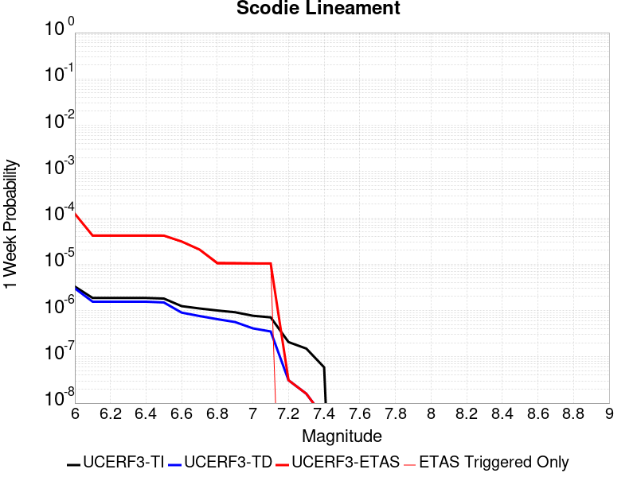 |  |  |  |

| Magnitude | 1 wk TI Prob | 1 wk TD Prob | 1 wk ETAS Prob | 1 wk ETAS/TD Gain | 1 wk ETAS Triggered Only | 1 mo TI Prob | 1 mo TD Prob | 1 mo ETAS Prob | 1 mo ETAS/TD Gain | 1 mo ETAS Triggered Only | 1 yr TI Prob | 1 yr TD Prob | 1 yr ETAS Prob | 1 yr ETAS/TD Gain | 1 yr ETAS Triggered Only | 10 yr TI Prob | 10 yr TD Prob | 10 yr ETAS Prob | 10 yr ETAS/TD Gain | 10 yr ETAS Triggered Only |
|-----|-----|-----|-----|-----|-----|-----|-----|-----|-----|-----|-----|-----|-----|-----|-----|-----|-----|-----|-----|-----|
| 6.0 | 3.2919327E-6 | 3.0133422E-6 | 1.8193568E-4 | 60.37671 | 1.7892288E-4 | 1.4108206E-5 | 1.2914278E-5 | 1.9183486E-4 | 14.854478 | 1.7892288E-4 | 1.7175387E-4 | 1.5722317E-4 | 3.3611793E-4 | 2.1378396 | 1.7892288E-4 | 0.0017162118 | 0.0015714309 | 0.0017500726 | 1.113681 | 1.7892288E-4 |
| 6.1 | 1.8663811E-6 | 1.5490499E-6 | 1.5490499E-6 | 1.0 | 0.0 | 7.998751E-6 | 6.6387715E-6 | 6.6387715E-6 | 1.0 | 0.0 | 9.738045E-5 | 8.082454E-5 | 8.082454E-5 | 1.0 | 0.0 | 9.7337784E-4 | 8.080003E-4 | 8.080003E-4 | 1.0 | 0.0 |
| 6.2 | 1.8663811E-6 | 1.5490499E-6 | 1.5490499E-6 | 1.0 | 0.0 | 7.998751E-6 | 6.6387715E-6 | 6.6387715E-6 | 1.0 | 0.0 | 9.738045E-5 | 8.082454E-5 | 8.082454E-5 | 1.0 | 0.0 | 9.7337784E-4 | 8.080003E-4 | 8.080003E-4 | 1.0 | 0.0 |
| 6.3 | 1.8663811E-6 | 1.5490499E-6 | 1.5490499E-6 | 1.0 | 0.0 | 7.998751E-6 | 6.6387715E-6 | 6.6387715E-6 | 1.0 | 0.0 | 9.738045E-5 | 8.082454E-5 | 8.082454E-5 | 1.0 | 0.0 | 9.7337784E-4 | 8.080003E-4 | 8.080003E-4 | 1.0 | 0.0 |
| 6.4 | 1.8663811E-6 | 1.5490499E-6 | 1.5490499E-6 | 1.0 | 0.0 | 7.998751E-6 | 6.6387715E-6 | 6.6387715E-6 | 1.0 | 0.0 | 9.738045E-5 | 8.082454E-5 | 8.082454E-5 | 1.0 | 0.0 | 9.7337784E-4 | 8.080003E-4 | 8.080003E-4 | 1.0 | 0.0 |
| 6.5 | 1.8106311E-6 | 1.4909839E-6 | 1.4909839E-6 | 1.0 | 0.0 | 7.759824E-6 | 6.3899183E-6 | 6.3899183E-6 | 1.0 | 0.0 | 9.447177E-5 | 7.7794975E-5 | 7.7794975E-5 | 1.0 | 0.0 | 9.4431615E-4 | 7.7772606E-4 | 7.7772606E-4 | 1.0 | 0.0 |
| 6.6 | 1.2414679E-6 | 8.997558E-7 | 8.997558E-7 | 1.0 | 0.0 | 5.320566E-6 | 3.856091E-6 | 3.856091E-6 | 1.0 | 0.0 | 6.477596E-5 | 4.6946985E-5 | 4.6946985E-5 | 1.0 | 0.0 | 6.475708E-4 | 4.693793E-4 | 4.693793E-4 | 1.0 | 0.0 |
| 6.7 | 1.1062215E-6 | 7.594311E-7 | 7.594311E-7 | 1.0 | 0.0 | 4.7409408E-6 | 3.2547011E-6 | 3.2547011E-6 | 1.0 | 0.0 | 5.7719422E-5 | 3.9625334E-5 | 3.9625334E-5 | 1.0 | 0.0 | 5.770443E-4 | 3.961897E-4 | 3.961897E-4 | 1.0 | 0.0 |
| 6.8 | 1.0006736E-6 | 6.500397E-7 | 6.500397E-7 | 1.0 | 0.0 | 4.288594E-6 | 2.7858816E-6 | 2.7858816E-6 | 1.0 | 0.0 | 5.221238E-5 | 3.3917644E-5 | 3.3917644E-5 | 1.0 | 0.0 | 5.220012E-4 | 3.3913075E-4 | 3.3913075E-4 | 1.0 | 0.0 |
| 6.9 | 9.167364E-7 | 5.631625E-7 | 5.631625E-7 | 1.0 | 0.0 | 3.9288643E-6 | 2.4135516E-6 | 2.4135516E-6 | 1.0 | 0.0 | 4.7832873E-5 | 2.9384651E-5 | 2.9384651E-5 | 1.0 | 0.0 | 4.782258E-4 | 2.9381333E-4 | 2.9381333E-4 | 1.0 | 0.0 |
| 7.0 | 7.6987664E-7 | 4.113383E-7 | 4.113383E-7 | 1.0 | 0.0 | 3.2994672E-6 | 1.7628774E-6 | 1.7628774E-6 | 1.0 | 0.0 | 4.0170275E-5 | 2.1462862E-5 | 2.1462862E-5 | 1.0 | 0.0 | 4.0163012E-4 | 2.1461173E-4 | 2.1461173E-4 | 1.0 | 0.0 |
| 7.1 | 7.1038727E-7 | 3.5211494E-7 | 3.5211494E-7 | 1.0 | 0.0 | 3.0445133E-6 | 1.5090633E-6 | 1.5090633E-6 | 1.0 | 0.0 | 3.706632E-5 | 1.8372726E-5 | 1.8372726E-5 | 1.0 | 0.0 | 3.7060137E-4 | 1.8371557E-4 | 1.8371557E-4 | 1.0 | 0.0 |
| 7.2 | 2.0799602E-7 | 3.1186854E-8 | 3.1186854E-8 | 1.0 | 0.0 | 8.914113E-7 | 1.3365793E-7 | 1.3365793E-7 | 1.0 | 0.0 | 1.0852878E-5 | 1.6272843E-6 | 1.6272843E-6 | 1.0 | 0.0 | 1.08523476E-4 | 1.627273E-5 | 1.627273E-5 | 1.0 | 0.0 |
| 7.3 | 1.5048182E-7 | 1.5945696E-8 | 1.5945696E-8 | 1.0 | 0.0 | 6.449219E-7 | 6.83387E-8 | 6.83387E-8 | 1.0 | 0.0 | 7.851896E-6 | 8.320234E-7 | 8.320234E-7 | 1.0 | 0.0 | 7.851618E-5 | 8.320206E-6 | 8.320206E-6 | 1.0 | 0.0 |
| 7.4 | 5.9334678E-8 | 4.8683537E-9 | 4.8683537E-9 | 1.0 | 0.0 | 2.5429145E-7 | 2.0864372E-8 | 2.0864372E-8 | 1.0 | 0.0 | 3.095994E-6 | 2.5402372E-7 | 2.5402372E-7 | 1.0 | 0.0 | 3.095951E-5 | 2.5402353E-6 | 2.5402353E-6 | 1.0 | 0.0 |

## Carlsbad
*[(top)](#table-of-contents)*

| 1 Week | 1 Month | 1 Year | 10 Year |
|-----|-----|-----|-----|
|  |  |  |  |

| Magnitude | 1 wk TI Prob | 1 wk TD Prob | 1 wk ETAS Prob | 1 wk ETAS/TD Gain | 1 wk ETAS Triggered Only | 1 mo TI Prob | 1 mo TD Prob | 1 mo ETAS Prob | 1 mo ETAS/TD Gain | 1 mo ETAS Triggered Only | 1 yr TI Prob | 1 yr TD Prob | 1 yr ETAS Prob | 1 yr ETAS/TD Gain | 1 yr ETAS Triggered Only | 10 yr TI Prob | 10 yr TD Prob | 10 yr ETAS Prob | 10 yr ETAS/TD Gain | 10 yr ETAS Triggered Only |
|-----|-----|-----|-----|-----|-----|-----|-----|-----|-----|-----|-----|-----|-----|-----|-----|-----|-----|-----|-----|-----|
| 6.0 | 4.9038536E-6 | 4.9872565E-6 | 1.8390924E-4 | 36.875835 | 1.7892288E-4 | 2.1016345E-5 | 2.1373784E-5 | 2.0029284E-4 | 9.370959 | 1.7892288E-4 | 2.5584397E-4 | 2.601952E-4 | 4.3907153E-4 | 1.6874697 | 1.7892288E-4 | 0.002555496 | 0.0025989525 | 0.0027774104 | 1.0686653 | 1.7892288E-4 |
| 6.1 | 4.9038536E-6 | 4.9872565E-6 | 1.8390924E-4 | 36.875835 | 1.7892288E-4 | 2.1016345E-5 | 2.1373784E-5 | 2.0029284E-4 | 9.370959 | 1.7892288E-4 | 2.5584397E-4 | 2.601952E-4 | 4.3907153E-4 | 1.6874697 | 1.7892288E-4 | 0.002555496 | 0.0025989525 | 0.0027774104 | 1.0686653 | 1.7892288E-4 |
| 6.2 | 4.3820614E-6 | 4.4547687E-6 | 4.4547687E-6 | 1.0 | 0.0 | 1.8780129E-5 | 1.9091729E-5 | 1.9091729E-5 | 1.0 | 0.0 | 2.2862408E-4 | 2.3241735E-4 | 2.3241735E-4 | 1.0 | 0.0 | 0.00228389 | 0.0023217786 | 0.0023217786 | 1.0 | 0.0 |
| 6.3 | 4.302872E-6 | 4.373006E-6 | 4.373006E-6 | 1.0 | 0.0 | 1.8440749E-5 | 1.8741322E-5 | 1.8741322E-5 | 1.0 | 0.0 | 2.24493E-4 | 2.2815206E-4 | 2.2815206E-4 | 1.0 | 0.0 | 0.0022426634 | 0.0022792136 | 0.0022792136 | 1.0 | 0.0 |
| 6.4 | 4.0835243E-6 | 4.1476546E-6 | 4.1476546E-6 | 1.0 | 0.0 | 1.75007E-5 | 1.7775543E-5 | 1.7775543E-5 | 1.0 | 0.0 | 2.1305021E-4 | 2.1639607E-4 | 2.1639607E-4 | 1.0 | 0.0 | 0.0021284607 | 0.0021618877 | 0.0021618877 | 1.0 | 0.0 |
| 6.5 | 3.987806E-6 | 4.0488867E-6 | 4.0488867E-6 | 1.0 | 0.0 | 1.7090486E-5 | 1.7352257E-5 | 1.7352257E-5 | 1.0 | 0.0 | 2.080568E-4 | 2.1124359E-4 | 2.1124359E-4 | 1.0 | 0.0 | 0.002078621 | 0.0021104617 | 0.0021104617 | 1.0 | 0.0 |
| 6.6 | 3.8707576E-6 | 3.927488E-6 | 3.927488E-6 | 1.0 | 0.0 | 1.6588854E-5 | 1.6831984E-5 | 1.6831984E-5 | 1.0 | 0.0 | 2.0195059E-4 | 2.0491047E-4 | 2.0491047E-4 | 1.0 | 0.0 | 0.0020176715 | 0.0020472489 | 0.0020472489 | 1.0 | 0.0 |
| 6.7 | 3.3093434E-6 | 3.3423917E-6 | 3.3423917E-6 | 1.0 | 0.0 | 1.4182823E-5 | 1.4324457E-5 | 1.4324457E-5 | 1.0 | 0.0 | 1.7266218E-4 | 1.7438637E-4 | 1.7438637E-4 | 1.0 | 0.0 | 0.001725281 | 0.0017425013 | 0.0017425013 | 1.0 | 0.0 |
| 6.8 | 3.136983E-6 | 3.1664536E-6 | 3.1664536E-6 | 1.0 | 0.0 | 1.3444143E-5 | 1.3570445E-5 | 1.3570445E-5 | 1.0 | 0.0 | 1.6367015E-4 | 1.6520769E-4 | 1.6520769E-4 | 1.0 | 0.0 | 0.0016354966 | 0.0016508545 | 0.0016508545 | 1.0 | 0.0 |
| 6.9 | 2.9056644E-6 | 2.9267585E-6 | 2.9267585E-6 | 1.0 | 0.0 | 1.2452788E-5 | 1.2543191E-5 | 1.2543191E-5 | 1.0 | 0.0 | 1.5160214E-4 | 1.5270269E-4 | 1.5270269E-4 | 1.0 | 0.0 | 0.0015149876 | 0.001525983 | 0.001525983 | 1.0 | 0.0 |
| 7.0 | 2.5071035E-6 | 2.5113977E-6 | 2.5113977E-6 | 1.0 | 0.0 | 1.0744685E-5 | 1.07630885E-5 | 1.07630885E-5 | 1.0 | 0.0 | 1.308087E-4 | 1.3103275E-4 | 1.3103275E-4 | 1.0 | 0.0 | 0.0013073172 | 0.0013095582 | 0.0013095582 | 1.0 | 0.0 |
| 7.1 | 2.1786877E-6 | 2.1678832E-6 | 2.1678832E-6 | 1.0 | 0.0 | 9.3372E-6 | 9.290896E-6 | 9.290896E-6 | 1.0 | 0.0 | 1.13674476E-4 | 1.1311081E-4 | 1.1311081E-4 | 1.0 | 0.0 | 0.0011361635 | 0.0011305353 | 0.0011305353 | 1.0 | 0.0 |
| 7.2 | 1.6628418E-6 | 1.6213872E-6 | 1.6213872E-6 | 1.0 | 0.0 | 7.1264453E-6 | 6.948784E-6 | 6.948784E-6 | 1.0 | 0.0 | 8.676102E-5 | 8.4598185E-5 | 8.4598185E-5 | 1.0 | 0.0 | 8.672715E-4 | 8.45662E-4 | 8.45662E-4 | 1.0 | 0.0 |
| 7.3 | 1.0595926E-6 | 9.816804E-7 | 9.816804E-7 | 1.0 | 0.0 | 4.541103E-6 | 4.2071947E-6 | 4.2071947E-6 | 1.0 | 0.0 | 5.5286528E-5 | 5.1221403E-5 | 5.1221403E-5 | 1.0 | 0.0 | 5.527277E-4 | 5.1209686E-4 | 5.1209686E-4 | 1.0 | 0.0 |
| 7.4 | 7.956623E-7 | 7.1737975E-7 | 7.1737975E-7 | 1.0 | 0.0 | 3.4099767E-6 | 3.074481E-6 | 3.074481E-6 | 1.0 | 0.0 | 4.1515676E-5 | 3.743117E-5 | 3.743117E-5 | 1.0 | 0.0 | 4.150792E-4 | 3.7424936E-4 | 3.7424936E-4 | 1.0 | 0.0 |
| 7.5 | 5.1043804E-7 | 4.4483627E-7 | 4.4483627E-7 | 1.0 | 0.0 | 2.1875896E-6 | 1.9064398E-6 | 1.9064398E-6 | 1.0 | 0.0 | 2.663358E-5 | 2.3210663E-5 | 2.3210663E-5 | 1.0 | 0.0 | 2.6630386E-4 | 2.3208297E-4 | 2.3208297E-4 | 1.0 | 0.0 |
| 7.6 | 2.3723294E-7 | 1.989569E-7 | 1.989569E-7 | 1.0 | 0.0 | 1.0167122E-6 | 8.5267214E-7 | 8.5267214E-7 | 1.0 | 0.0 | 1.2378401E-5 | 1.0381237E-5 | 1.0381237E-5 | 1.0 | 0.0 | 1.237771E-4 | 1.038078E-4 | 1.038078E-4 | 1.0 | 0.0 |
| 7.7 | 1.9992152E-8 | 9.8601785E-9 | 9.8601785E-9 | 1.0 | 0.0 | 8.568065E-8 | 4.225791E-8 | 4.225791E-8 | 1.0 | 0.0 | 1.0431614E-6 | 5.1449E-7 | 5.1449E-7 | 1.0 | 0.0 | 1.0431565E-5 | 5.1449E-6 | 5.1449E-6 | 1.0 | 0.0 |

## Shoreline
*[(top)](#table-of-contents)*

| 1 Week | 1 Month | 1 Year | 10 Year |
|-----|-----|-----|-----|
|  |  |  |  |

| Magnitude | 1 wk TI Prob | 1 wk TD Prob | 1 wk ETAS Prob | 1 wk ETAS/TD Gain | 1 wk ETAS Triggered Only | 1 mo TI Prob | 1 mo TD Prob | 1 mo ETAS Prob | 1 mo ETAS/TD Gain | 1 mo ETAS Triggered Only | 1 yr TI Prob | 1 yr TD Prob | 1 yr ETAS Prob | 1 yr ETAS/TD Gain | 1 yr ETAS Triggered Only | 10 yr TI Prob | 10 yr TD Prob | 10 yr ETAS Prob | 10 yr ETAS/TD Gain | 10 yr ETAS Triggered Only |
|-----|-----|-----|-----|-----|-----|-----|-----|-----|-----|-----|-----|-----|-----|-----|-----|-----|-----|-----|-----|-----|
| 6.0 | 3.9888673E-6 | 4.047929E-6 | 4.047929E-6 | 1.0 | 0.0 | 1.7095033E-5 | 1.7348184E-5 | 1.7348184E-5 | 1.0 | 0.0 | 2.0811215E-4 | 2.1119925E-4 | 3.9008434E-4 | 1.8469968 | 1.7892288E-4 | 0.0020791737 | 0.002110534 | 0.0022890794 | 1.0845972 | 1.7892288E-4 |
| 6.1 | 3.9888673E-6 | 4.047929E-6 | 4.047929E-6 | 1.0 | 0.0 | 1.7095033E-5 | 1.7348184E-5 | 1.7348184E-5 | 1.0 | 0.0 | 2.0811215E-4 | 2.1119925E-4 | 3.9008434E-4 | 1.8469968 | 1.7892288E-4 | 0.0020791737 | 0.002110534 | 0.0022890794 | 1.0845972 | 1.7892288E-4 |
| 6.2 | 1.4039653E-6 | 1.4100891E-6 | 1.4100891E-6 | 1.0 | 0.0 | 6.0169805E-6 | 6.0432253E-6 | 6.0432253E-6 | 1.0 | 0.0 | 7.325427E-5 | 7.357384E-5 | 7.357384E-5 | 1.0 | 0.0 | 7.3230127E-4 | 7.355009E-4 | 7.355009E-4 | 1.0 | 0.0 |
| 6.3 | 1.4039653E-6 | 1.4100891E-6 | 1.4100891E-6 | 1.0 | 0.0 | 6.0169805E-6 | 6.0432253E-6 | 6.0432253E-6 | 1.0 | 0.0 | 7.325427E-5 | 7.357384E-5 | 7.357384E-5 | 1.0 | 0.0 | 7.3230127E-4 | 7.355009E-4 | 7.355009E-4 | 1.0 | 0.0 |
| 6.4 | 1.3314152E-6 | 1.3361605E-6 | 1.3361605E-6 | 1.0 | 0.0 | 5.7060524E-6 | 5.7263896E-6 | 5.7263896E-6 | 1.0 | 0.0 | 6.946897E-5 | 6.971662E-5 | 6.971662E-5 | 1.0 | 0.0 | 6.9447263E-4 | 6.9695286E-4 | 6.9695286E-4 | 1.0 | 0.0 |
| 6.5 | 1.1187026E-6 | 1.120364E-6 | 1.120364E-6 | 1.0 | 0.0 | 4.794431E-6 | 4.8015513E-6 | 4.8015513E-6 | 1.0 | 0.0 | 5.8370628E-5 | 5.8457343E-5 | 5.8457343E-5 | 1.0 | 0.0 | 5.83553E-4 | 5.844222E-4 | 5.844222E-4 | 1.0 | 0.0 |
| 6.6 | 9.793089E-7 | 9.784919E-7 | 9.784919E-7 | 1.0 | 0.0 | 4.1970316E-6 | 4.1935305E-6 | 4.1935305E-6 | 1.0 | 0.0 | 5.1097657E-5 | 5.105505E-5 | 5.105505E-5 | 1.0 | 0.0 | 5.108591E-4 | 5.1043445E-4 | 5.1043445E-4 | 1.0 | 0.0 |
| 6.7 | 8.995986E-7 | 8.9728E-7 | 8.9728E-7 | 1.0 | 0.0 | 3.8554167E-6 | 3.84548E-6 | 3.84548E-6 | 1.0 | 0.0 | 4.693869E-5 | 4.6817724E-5 | 4.6817724E-5 | 1.0 | 0.0 | 4.6928777E-4 | 4.6807955E-4 | 4.6807955E-4 | 1.0 | 0.0 |
| 6.8 | 7.931612E-7 | 7.8804027E-7 | 7.8804027E-7 | 1.0 | 0.0 | 3.3992578E-6 | 3.377311E-6 | 3.377311E-6 | 1.0 | 0.0 | 4.1385178E-5 | 4.1117994E-5 | 4.1117994E-5 | 1.0 | 0.0 | 4.1377472E-4 | 4.1110438E-4 | 4.1110438E-4 | 1.0 | 0.0 |
| 6.9 | 7.1465956E-7 | 7.078006E-7 | 7.078006E-7 | 1.0 | 0.0 | 3.062823E-6 | 3.0334277E-6 | 3.0334277E-6 | 1.0 | 0.0 | 3.7289232E-5 | 3.6931357E-5 | 3.6931357E-5 | 1.0 | 0.0 | 3.7282976E-4 | 3.6925258E-4 | 3.6925258E-4 | 1.0 | 0.0 |
| 7.0 | 6.389046E-7 | 6.299458E-7 | 6.299458E-7 | 1.0 | 0.0 | 2.7381598E-6 | 2.699765E-6 | 2.699765E-6 | 1.0 | 0.0 | 3.3336586E-5 | 3.2869146E-5 | 3.2869146E-5 | 1.0 | 0.0 | 3.3331584E-4 | 3.2864307E-4 | 3.2864307E-4 | 1.0 | 0.0 |
| 7.1 | 5.4300875E-7 | 5.3111313E-7 | 5.3111313E-7 | 1.0 | 0.0 | 2.3271782E-6 | 2.276197E-6 | 2.276197E-6 | 1.0 | 0.0 | 2.8333026E-5 | 2.7712347E-5 | 2.7712347E-5 | 1.0 | 0.0 | 2.8329415E-4 | 2.77089E-4 | 2.77089E-4 | 1.0 | 0.0 |
| 7.2 | 4.6768855E-7 | 4.5348952E-7 | 4.5348952E-7 | 1.0 | 0.0 | 2.0043778E-6 | 1.9435251E-6 | 1.9435251E-6 | 1.0 | 0.0 | 2.4403027E-5 | 2.3662162E-5 | 2.3662162E-5 | 1.0 | 0.0 | 2.4400349E-4 | 2.3659648E-4 | 2.3659648E-4 | 1.0 | 0.0 |
| 7.3 | 4.0966103E-7 | 3.9385662E-7 | 3.9385662E-7 | 1.0 | 0.0 | 1.7556889E-6 | 1.6879559E-6 | 1.6879559E-6 | 1.0 | 0.0 | 2.1375303E-5 | 2.055067E-5 | 2.055067E-5 | 1.0 | 0.0 | 2.1373246E-4 | 2.0548773E-4 | 2.0548773E-4 | 1.0 | 0.0 |
| 7.4 | 3.5105785E-7 | 3.3363975E-7 | 3.3363975E-7 | 1.0 | 0.0 | 1.5045327E-6 | 1.4298838E-6 | 1.4298838E-6 | 1.0 | 0.0 | 1.8317533E-5 | 1.7408696E-5 | 1.7408696E-5 | 1.0 | 0.0 | 1.8316023E-4 | 1.7407336E-4 | 1.7407336E-4 | 1.0 | 0.0 |
| 7.5 | 2.8737534E-7 | 2.6820038E-7 | 2.6820038E-7 | 1.0 | 0.0 | 1.2316079E-6 | 1.1494297E-6 | 1.1494297E-6 | 1.0 | 0.0 | 1.4994724E-5 | 1.3994217E-5 | 1.3994217E-5 | 1.0 | 0.0 | 1.4993713E-4 | 1.3993339E-4 | 1.3993339E-4 | 1.0 | 0.0 |
| 7.6 | 2.0924051E-7 | 1.8778988E-7 | 1.8778988E-7 | 1.0 | 0.0 | 8.967448E-7 | 8.048135E-7 | 8.048135E-7 | 1.0 | 0.0 | 1.0917813E-5 | 9.79856E-6 | 9.79856E-6 | 1.0 | 0.0 | 1.0917276E-4 | 9.798129E-5 | 9.798129E-5 | 1.0 | 0.0 |
| 7.7 | 1.392265E-7 | 1.15433906E-7 | 1.15433906E-7 | 1.0 | 0.0 | 5.9668486E-7 | 4.9471663E-7 | 4.9471663E-7 | 1.0 | 0.0 | 7.2646135E-6 | 6.023158E-6 | 6.023158E-6 | 1.0 | 0.0 | 7.2643765E-5 | 6.0229955E-5 | 6.0229955E-5 | 1.0 | 0.0 |
| 7.8 | 8.1080074E-8 | 5.586722E-8 | 5.586722E-8 | 1.0 | 0.0 | 3.4748598E-7 | 2.394309E-7 | 2.394309E-7 | 1.0 | 0.0 | 4.2306337E-6 | 2.9150672E-6 | 2.9150672E-6 | 1.0 | 0.0 | 4.230553E-5 | 2.9150291E-5 | 2.9150291E-5 | 1.0 | 0.0 |
| 7.9 | 5.0859036E-8 | 2.7244445E-8 | 2.7244445E-8 | 1.0 | 0.0 | 2.1796728E-7 | 1.16761896E-7 | 1.16761896E-7 | 1.0 | 0.0 | 2.6537484E-6 | 1.4215751E-6 | 1.4215751E-6 | 1.0 | 0.0 | 2.6537167E-5 | 1.4215661E-5 | 1.4215661E-5 | 1.0 | 0.0 |
| 8.0 | 3.1760536E-8 | 1.3577206E-8 | 1.3577206E-8 | 1.0 | 0.0 | 1.3611657E-7 | 5.8188025E-8 | 5.8188025E-8 | 1.0 | 0.0 | 1.6572179E-6 | 7.0843896E-7 | 7.0843896E-7 | 1.0 | 0.0 | 1.6572056E-5 | 7.084367E-6 | 7.084367E-6 | 1.0 | 0.0 |
| 8.1 | 1.2947896E-8 | 5.6628693E-9 | 5.6628693E-9 | 1.0 | 0.0 | 5.5490982E-8 | 2.426944E-8 | 2.426944E-8 | 1.0 | 0.0 | 6.756025E-7 | 2.954804E-7 | 2.954804E-7 | 1.0 | 0.0 | 6.7560045E-6 | 2.9548003E-6 | 2.9548003E-6 | 1.0 | 0.0 |

## Coyote Lake
*[(top)](#table-of-contents)*

| 1 Week | 1 Month | 1 Year | 10 Year |
|-----|-----|-----|-----|
|  |  |  |  |

| Magnitude | 1 wk TI Prob | 1 wk TD Prob | 1 wk ETAS Prob | 1 wk ETAS/TD Gain | 1 wk ETAS Triggered Only | 1 mo TI Prob | 1 mo TD Prob | 1 mo ETAS Prob | 1 mo ETAS/TD Gain | 1 mo ETAS Triggered Only | 1 yr TI Prob | 1 yr TD Prob | 1 yr ETAS Prob | 1 yr ETAS/TD Gain | 1 yr ETAS Triggered Only | 10 yr TI Prob | 10 yr TD Prob | 10 yr ETAS Prob | 10 yr ETAS/TD Gain | 10 yr ETAS Triggered Only |
|-----|-----|-----|-----|-----|-----|-----|-----|-----|-----|-----|-----|-----|-----|-----|-----|-----|-----|-----|-----|-----|
| 6.0 | 1.980352E-5 | 2.1706745E-5 | 2.0062574E-4 | 9.242554 | 1.7892288E-4 | 8.486947E-5 | 9.302599E-5 | 2.7193222E-4 | 2.9231853 | 1.7892288E-4 | 0.0010327959 | 0.0011320751 | 0.0013107954 | 1.1578697 | 1.7892288E-4 | 0.010280091 | 0.011270258 | 0.011447164 | 1.0156968 | 1.7892288E-4 |
| 6.1 | 1.980352E-5 | 2.1706745E-5 | 2.0062574E-4 | 9.242554 | 1.7892288E-4 | 8.486947E-5 | 9.302599E-5 | 2.7193222E-4 | 2.9231853 | 1.7892288E-4 | 0.0010327959 | 0.0011320751 | 0.0013107954 | 1.1578697 | 1.7892288E-4 | 0.010280091 | 0.011270258 | 0.011447164 | 1.0156968 | 1.7892288E-4 |
| 6.2 | 1.980352E-5 | 2.1706745E-5 | 2.0062574E-4 | 9.242554 | 1.7892288E-4 | 8.486947E-5 | 9.302599E-5 | 2.7193222E-4 | 2.9231853 | 1.7892288E-4 | 0.0010327959 | 0.0011320751 | 0.0013107954 | 1.1578697 | 1.7892288E-4 | 0.010280091 | 0.011270258 | 0.011447164 | 1.0156968 | 1.7892288E-4 |
| 6.3 | 1.5344787E-5 | 1.682067E-5 | 1.9574055E-4 | 11.636906 | 1.7892288E-4 | 6.576172E-5 | 7.2086936E-5 | 2.5099693E-4 | 3.4818642 | 1.7892288E-4 | 8.003548E-4 | 8.773662E-4 | 0.0010561321 | 1.2037529 | 1.7892288E-4 | 0.007974784 | 0.00874507 | 0.008922427 | 1.020281 | 1.7892288E-4 |
| 6.4 | 1.5344787E-5 | 1.682067E-5 | 1.9574055E-4 | 11.636906 | 1.7892288E-4 | 6.576172E-5 | 7.2086936E-5 | 2.5099693E-4 | 3.4818642 | 1.7892288E-4 | 8.003548E-4 | 8.773662E-4 | 0.0010561321 | 1.2037529 | 1.7892288E-4 | 0.007974784 | 0.00874507 | 0.008922427 | 1.020281 | 1.7892288E-4 |
| 6.5 | 1.4189697E-5 | 1.5557987E-5 | 1.9447808E-4 | 12.500209 | 1.7892288E-4 | 6.081157E-5 | 6.6675726E-5 | 2.4558668E-4 | 3.6832998 | 1.7892288E-4 | 7.401293E-4 | 8.115349E-4 | 9.903125E-4 | 1.2202958 | 1.7892288E-4 | 0.0073766913 | 0.008091656 | 0.008269131 | 1.0219331 | 1.7892288E-4 |
| 6.6 | 1.3469301E-5 | 1.4771577E-5 | 1.9369181E-4 | 13.112467 | 1.7892288E-4 | 5.7724297E-5 | 6.330556E-5 | 2.4221712E-4 | 3.8261585 | 1.7892288E-4 | 7.025667E-4 | 7.7053264E-4 | 9.4931765E-4 | 1.2320279 | 1.7892288E-4 | 0.0070034964 | 0.0076845144 | 0.007862062 | 1.0231047 | 1.7892288E-4 |
| 6.7 | 1.3027966E-5 | 1.4281745E-5 | 1.9320207E-4 | 13.527904 | 1.7892288E-4 | 5.5832945E-5 | 6.120638E-5 | 2.4011832E-4 | 3.9230928 | 1.7892288E-4 | 6.7955407E-4 | 7.4499263E-4 | 9.2378224E-4 | 1.2399884 | 1.7892288E-4 | 0.006774798 | 0.0074308286 | 0.007608422 | 1.0238996 | 1.7892288E-4 |
| 6.8 | 5.695434E-6 | 6.2244176E-6 | 1.8514619E-4 | 29.745142 | 1.7892288E-4 | 2.4408775E-5 | 2.6675973E-5 | 2.0559409E-4 | 7.7070885 | 1.7892288E-4 | 2.971363E-4 | 3.2476155E-4 | 5.036263E-4 | 1.5507573 | 1.7892288E-4 | 0.0029673933 | 0.0032458105 | 0.0034241525 | 1.0549453 | 1.7892288E-4 |
| 6.9 | 4.385688E-6 | 4.7930553E-6 | 1.8371508E-4 | 38.32943 | 1.7892288E-4 | 1.879567E-5 | 2.0541665E-5 | 1.9946088E-4 | 9.710063 | 1.7892288E-4 | 2.2881327E-4 | 2.5009477E-4 | 4.289729E-4 | 1.7152414 | 1.7892288E-4 | 0.002285778 | 0.0025009478 | 0.0026794232 | 1.0713631 | 1.7892288E-4 |

## Rinconada 2011 CFM
*[(top)](#table-of-contents)*

| 1 Week | 1 Month | 1 Year | 10 Year |
|-----|-----|-----|-----|
|  |  |  |  |

| Magnitude | 1 wk TI Prob | 1 wk TD Prob | 1 wk ETAS Prob | 1 wk ETAS/TD Gain | 1 wk ETAS Triggered Only | 1 mo TI Prob | 1 mo TD Prob | 1 mo ETAS Prob | 1 mo ETAS/TD Gain | 1 mo ETAS Triggered Only | 1 yr TI Prob | 1 yr TD Prob | 1 yr ETAS Prob | 1 yr ETAS/TD Gain | 1 yr ETAS Triggered Only | 10 yr TI Prob | 10 yr TD Prob | 10 yr ETAS Prob | 10 yr ETAS/TD Gain | 10 yr ETAS Triggered Only |
|-----|-----|-----|-----|-----|-----|-----|-----|-----|-----|-----|-----|-----|-----|-----|-----|-----|-----|-----|-----|-----|
| 6.0 | 1.5752368E-5 | 1.6274716E-5 | 1.6274716E-5 | 1.0 | 0.0 | 6.75084E-5 | 6.974694E-5 | 6.974694E-5 | 1.0 | 0.0 | 8.2160486E-4 | 8.488412E-4 | 0.0010276122 | 1.210606 | 1.7892288E-4 | 0.008185739 | 0.00845637 | 0.008633779 | 1.0209794 | 1.7892288E-4 |
| 6.1 | 1.0966133E-5 | 1.1323029E-5 | 1.1323029E-5 | 1.0 | 0.0 | 4.6996865E-5 | 4.852637E-5 | 4.852637E-5 | 1.0 | 0.0 | 5.720366E-4 | 5.906491E-4 | 5.906491E-4 | 1.0 | 0.0 | 0.0057056635 | 0.0058908886 | 0.0058908886 | 1.0 | 0.0 |
| 6.2 | 1.0966133E-5 | 1.1323029E-5 | 1.1323029E-5 | 1.0 | 0.0 | 4.6996865E-5 | 4.852637E-5 | 4.852637E-5 | 1.0 | 0.0 | 5.720366E-4 | 5.906491E-4 | 5.906491E-4 | 1.0 | 0.0 | 0.0057056635 | 0.0058908886 | 0.0058908886 | 1.0 | 0.0 |
| 6.3 | 8.926149E-6 | 9.212771E-6 | 9.212771E-6 | 1.0 | 0.0 | 3.8254362E-5 | 3.948271E-5 | 3.948271E-5 | 1.0 | 0.0 | 4.6564735E-4 | 4.805963E-4 | 4.805963E-4 | 1.0 | 0.0 | 0.0046467283 | 0.0047956146 | 0.0047956146 | 1.0 | 0.0 |
| 6.4 | 7.676955E-6 | 7.920191E-6 | 7.920191E-6 | 1.0 | 0.0 | 3.290082E-5 | 3.3943234E-5 | 3.3943234E-5 | 1.0 | 0.0 | 4.0049385E-4 | 4.1318068E-4 | 4.1318068E-4 | 1.0 | 0.0 | 0.0039977287 | 0.004124151 | 0.004124151 | 1.0 | 0.0 |
| 6.5 | 6.1671026E-6 | 6.3589546E-6 | 6.3589546E-6 | 1.0 | 0.0 | 2.6430173E-5 | 2.725238E-5 | 2.725238E-5 | 1.0 | 0.0 | 3.2173982E-4 | 3.317473E-4 | 3.317473E-4 | 1.0 | 0.0 | 0.003212744 | 0.0033125326 | 0.0033125326 | 1.0 | 0.0 |
| 6.6 | 5.553456E-6 | 5.7248126E-6 | 5.7248126E-6 | 1.0 | 0.0 | 2.3800309E-5 | 2.453468E-5 | 2.453468E-5 | 1.0 | 0.0 | 2.897302E-4 | 2.9866883E-4 | 2.9866883E-4 | 1.0 | 0.0 | 0.0028935277 | 0.002982683 | 0.002982683 | 1.0 | 0.0 |
| 6.7 | 4.787857E-6 | 4.9333094E-6 | 4.9333094E-6 | 1.0 | 0.0 | 2.0519226E-5 | 2.1142583E-5 | 2.1142583E-5 | 1.0 | 0.0 | 2.4979294E-4 | 2.573806E-4 | 2.573806E-4 | 1.0 | 0.0 | 0.0024951235 | 0.0025708308 | 0.0025708308 | 1.0 | 0.0 |
| 6.8 | 3.9955166E-6 | 4.1134763E-6 | 4.1134763E-6 | 1.0 | 0.0 | 1.7123532E-5 | 1.7629065E-5 | 1.7629065E-5 | 1.0 | 0.0 | 2.0845905E-4 | 2.1461274E-4 | 2.1461274E-4 | 1.0 | 0.0 | 0.002082636 | 0.0021440585 | 0.0021440585 | 1.0 | 0.0 |
| 6.9 | 3.4250072E-6 | 3.5224464E-6 | 3.5224464E-6 | 1.0 | 0.0 | 1.46785205E-5 | 1.5096111E-5 | 1.5096111E-5 | 1.0 | 0.0 | 1.7869633E-4 | 1.8377967E-4 | 1.8377967E-4 | 1.0 | 0.0 | 0.001785527 | 0.0018362794 | 0.0018362794 | 1.0 | 0.0 |
| 7.0 | 2.7712713E-6 | 2.8467E-6 | 2.8467E-6 | 1.0 | 0.0 | 1.1876823E-5 | 1.2200086E-5 | 1.2200086E-5 | 1.0 | 0.0 | 1.4459073E-4 | 1.4852593E-4 | 1.4852593E-4 | 1.0 | 0.0 | 0.0014449668 | 0.0014842682 | 0.0014842682 | 1.0 | 0.0 |
| 7.1 | 2.227358E-6 | 2.2856984E-6 | 2.2856984E-6 | 1.0 | 0.0 | 9.545785E-6 | 9.795814E-6 | 9.795814E-6 | 1.0 | 0.0 | 1.16213734E-4 | 1.19257515E-4 | 1.19257515E-4 | 1.0 | 0.0 | 0.0011615298 | 0.0011919362 | 0.0011919362 | 1.0 | 0.0 |
| 7.2 | 1.581796E-6 | 1.6209011E-6 | 1.6209011E-6 | 1.0 | 0.0 | 6.779108E-6 | 6.9467005E-6 | 6.9467005E-6 | 1.0 | 0.0 | 8.253252E-5 | 8.457281E-5 | 8.457281E-5 | 1.0 | 0.0 | 8.250187E-4 | 8.454067E-4 | 8.454067E-4 | 1.0 | 0.0 |
| 7.3 | 1.0306567E-6 | 1.0546477E-6 | 1.0546477E-6 | 1.0 | 0.0 | 4.4170924E-6 | 4.519911E-6 | 4.519911E-6 | 1.0 | 0.0 | 5.3776774E-5 | 5.5028526E-5 | 5.5028526E-5 | 1.0 | 0.0 | 5.376376E-4 | 5.5014924E-4 | 5.5014924E-4 | 1.0 | 0.0 |
| 7.4 | 6.535541E-7 | 6.682742E-7 | 6.682742E-7 | 1.0 | 0.0 | 2.800943E-6 | 2.864029E-6 | 2.864029E-6 | 1.0 | 0.0 | 3.4100947E-5 | 3.4868997E-5 | 3.4868997E-5 | 1.0 | 0.0 | 3.4095717E-4 | 3.4863537E-4 | 3.4863537E-4 | 1.0 | 0.0 |
| 7.5 | 3.2656962E-7 | 3.3316687E-7 | 3.3316687E-7 | 1.0 | 0.0 | 1.3995833E-6 | 1.4278572E-6 | 1.4278572E-6 | 1.0 | 0.0 | 1.7039794E-5 | 1.7384024E-5 | 1.7384024E-5 | 1.0 | 0.0 | 1.7038487E-4 | 1.7382667E-4 | 1.7382667E-4 | 1.0 | 0.0 |
| 7.6 | 9.754343E-8 | 9.82099E-8 | 9.82099E-8 | 1.0 | 0.0 | 4.180432E-7 | 4.208995E-7 | 4.208995E-7 | 1.0 | 0.0 | 5.089664E-6 | 5.1244397E-6 | 5.1244397E-6 | 1.0 | 0.0 | 5.0895473E-5 | 5.1243223E-5 | 5.1243223E-5 | 1.0 | 0.0 |
| 7.7 | 6.0001453E-9 | 5.8490435E-9 | 5.8490435E-9 | 1.0 | 0.0 | 2.5714908E-8 | 2.506733E-8 | 2.506733E-8 | 1.0 | 0.0 | 3.1307894E-7 | 3.051947E-7 | 3.051947E-7 | 1.0 | 0.0 | 3.1307852E-6 | 3.051943E-6 | 3.051943E-6 | 1.0 | 0.0 |
| 7.8 | 7.400003E-11 | 7.4654505E-11 | 7.4654505E-11 | 1.0 | 0.0 | 3.171432E-10 | 3.1994773E-10 | 3.1994773E-10 | 1.0 | 0.0 | 3.861218E-9 | 3.895363E-9 | 3.895363E-9 | 1.0 | 0.0 | 3.861218E-8 | 3.895363E-8 | 3.895363E-8 | 1.0 | 0.0 |

## San Andreas (Coachella) rev
*[(top)](#table-of-contents)*

| 1 Week | 1 Month | 1 Year | 10 Year |
|-----|-----|-----|-----|
| 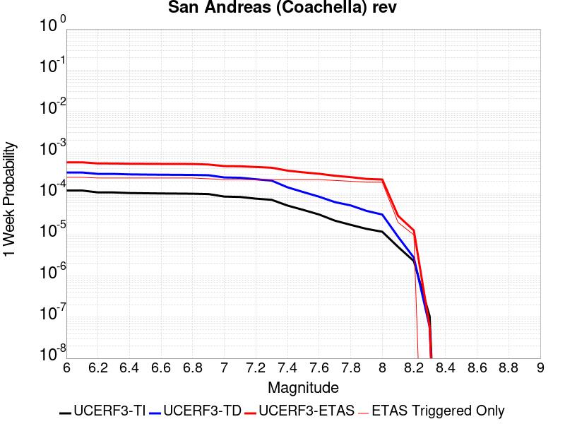 |  | 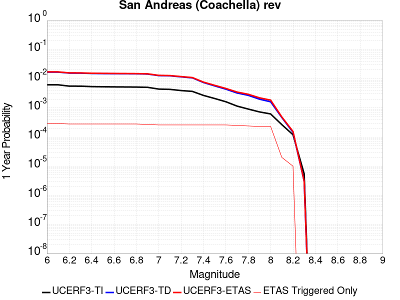 | 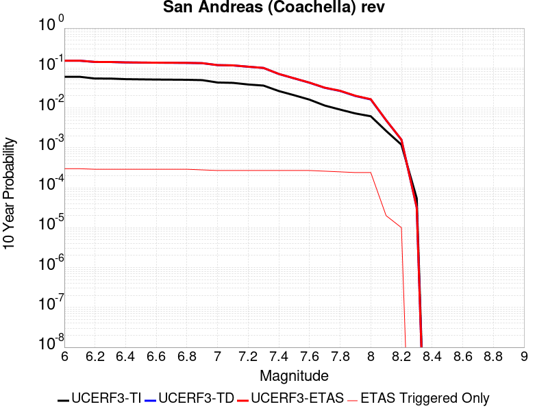 |

| Magnitude | 1 wk TI Prob | 1 wk TD Prob | 1 wk ETAS Prob | 1 wk ETAS/TD Gain | 1 wk ETAS Triggered Only | 1 mo TI Prob | 1 mo TD Prob | 1 mo ETAS Prob | 1 mo ETAS/TD Gain | 1 mo ETAS Triggered Only | 1 yr TI Prob | 1 yr TD Prob | 1 yr ETAS Prob | 1 yr ETAS/TD Gain | 1 yr ETAS Triggered Only | 10 yr TI Prob | 10 yr TD Prob | 10 yr ETAS Prob | 10 yr ETAS/TD Gain | 10 yr ETAS Triggered Only |
|-----|-----|-----|-----|-----|-----|-----|-----|-----|-----|-----|-----|-----|-----|-----|-----|-----|-----|-----|-----|-----|
| 6.0 | 1.1925945E-4 | 3.2729402E-4 | 3.2729402E-4 | 1.0 | 0.0 | 5.110118E-4 | 0.0014019393 | 0.0015806113 | 1.1274463 | 1.7892288E-4 | 0.0062038354 | 0.016936364 | 0.017112257 | 1.0103855 | 1.7892288E-4 | 0.060334753 | 0.15265316 | 0.15280476 | 1.0009931 | 1.7892288E-4 |
| 6.1 | 1.1925945E-4 | 3.2729402E-4 | 3.2729402E-4 | 1.0 | 0.0 | 5.110118E-4 | 0.0014019393 | 0.0015806113 | 1.1274463 | 1.7892288E-4 | 0.0062038354 | 0.016936364 | 0.017112257 | 1.0103855 | 1.7892288E-4 | 0.060334753 | 0.15265316 | 0.15280476 | 1.0009931 | 1.7892288E-4 |
| 6.2 | 1.07432395E-4 | 3.0230157E-4 | 3.0230157E-4 | 1.0 | 0.0 | 4.603433E-4 | 0.0012949388 | 0.0014736301 | 1.137992 | 1.7892288E-4 | 0.005590286 | 0.015653009 | 0.015829131 | 1.0112517 | 1.7892288E-4 | 0.05451731 | 0.14182423 | 0.14197779 | 1.0010827 | 1.7892288E-4 |
| 6.3 | 1.0718766E-4 | 3.0175463E-4 | 3.0175463E-4 | 1.0 | 0.0 | 4.592948E-4 | 0.0012925972 | 0.0014712887 | 1.1382424 | 1.7892288E-4 | 0.005577586 | 0.015624908 | 0.015801035 | 1.0112722 | 1.7892288E-4 | 0.054396555 | 0.14159249 | 0.14174609 | 1.0010847 | 1.7892288E-4 |
| 6.4 | 1.0355944E-4 | 2.9383553E-4 | 2.9383553E-4 | 1.0 | 0.0 | 4.4375064E-4 | 0.0012586913 | 0.001437389 | 1.141971 | 1.7892288E-4 | 0.0053892885 | 0.015217941 | 0.015394142 | 1.0115784 | 1.7892288E-4 | 0.052604496 | 0.13815255 | 0.13830677 | 1.0011162 | 1.7892288E-4 |
| 6.5 | 1.0227914E-4 | 2.9102986E-4 | 2.9102986E-4 | 1.0 | 0.0 | 4.382655E-4 | 0.0012466786 | 0.0014253785 | 1.1433407 | 1.7892288E-4 | 0.0053228354 | 0.01507372 | 0.015249946 | 1.011691 | 1.7892288E-4 | 0.051971316 | 0.13693172 | 0.13708614 | 1.0011277 | 1.7892288E-4 |
| 6.6 | 1.0116757E-4 | 2.8868738E-4 | 2.8868738E-4 | 1.0 | 0.0 | 4.3350324E-4 | 0.0012366489 | 0.0014153506 | 1.1445048 | 1.7892288E-4 | 0.0052651367 | 0.01495329 | 0.015129538 | 1.0117866 | 1.7892288E-4 | 0.051421247 | 0.1359099 | 0.1360645 | 1.0011376 | 1.7892288E-4 |
| 6.7 | 1.0050676E-4 | 2.8727303E-4 | 2.8727303E-4 | 1.0 | 0.0 | 4.3067214E-4 | 0.0012305931 | 0.0014092958 | 1.1452167 | 1.7892288E-4 | 0.005230834 | 0.014880571 | 0.015056831 | 1.011845 | 1.7892288E-4 | 0.051094085 | 0.13529462 | 0.13544933 | 1.0011436 | 1.7892288E-4 |
| 6.8 | 9.976819E-5 | 2.853096E-4 | 2.853096E-4 | 1.0 | 0.0 | 4.2750788E-4 | 0.0012221863 | 0.0014008905 | 1.1462169 | 1.7892288E-4 | 0.0051924936 | 0.0147796115 | 0.014955889 | 1.0119271 | 1.7892288E-4 | 0.050728295 | 0.13444631 | 0.13460118 | 1.0011519 | 1.7892288E-4 |
| 6.9 | 9.77719E-5 | 2.8027873E-4 | 2.8027873E-4 | 1.0 | 0.0 | 4.1895514E-4 | 0.0012006456 | 0.0013793536 | 1.1488433 | 1.7892288E-4 | 0.0050888555 | 0.014520878 | 0.0146972025 | 1.0121429 | 1.7892288E-4 | 0.049738888 | 0.1322748 | 0.13243006 | 1.0011737 | 1.7892288E-4 |
| 7.0 | 8.500761E-5 | 2.4762485E-4 | 2.4762485E-4 | 1.0 | 0.0 | 3.6426744E-4 | 0.001060821 | 0.001239554 | 1.1684856 | 1.7892288E-4 | 0.0044259406 | 0.012839786 | 0.013016411 | 1.0137562 | 1.7892288E-4 | 0.04338823 | 0.11813272 | 0.11829051 | 1.0013356 | 1.7892288E-4 |
| 7.1 | 8.319876E-5 | 2.4365232E-4 | 2.4365232E-4 | 1.0 | 0.0 | 3.5651738E-4 | 0.0010438096 | 0.0012225457 | 1.1712344 | 1.7892288E-4 | 0.004331963 | 0.012635092 | 0.012811755 | 1.0139818 | 1.7892288E-4 | 0.042484846 | 0.116353 | 0.11651111 | 1.0013589 | 1.7892288E-4 |
| 7.2 | 7.563917E-5 | 2.2413683E-4 | 2.2413683E-4 | 1.0 | 0.0 | 3.2412758E-4 | 9.602359E-4 | 0.0011389869 | 1.1861533 | 1.7892288E-4 | 0.0039391145 | 0.011628893 | 0.0118057355 | 1.0152072 | 1.7892288E-4 | 0.03870018 | 0.10775925 | 0.10791889 | 1.0014814 | 1.7892288E-4 |
| 7.3 | 7.082985E-5 | 2.0729867E-4 | 2.0729867E-4 | 1.0 | 0.0 | 3.0352117E-4 | 8.881233E-4 | 0.0010668873 | 1.2012829 | 1.7892288E-4 | 0.0036891096 | 0.010759917 | 0.010936915 | 1.0164497 | 1.7892288E-4 | 0.03628465 | 0.100282 | 0.10044298 | 1.0016053 | 1.7892288E-4 |
| 7.4 | 5.146215E-5 | 1.4273795E-4 | 1.4273795E-4 | 1.0 | 0.0 | 2.2053342E-4 | 6.115915E-4 | 7.9040497E-4 | 1.292374 | 1.7892288E-4 | 0.0026816884 | 0.0074208933 | 0.0075984886 | 1.0239317 | 1.7892288E-4 | 0.02649557 | 0.070849575 | 0.07101582 | 1.0023465 | 1.7892288E-4 |
| 7.5 | 4.0285166E-5 | 1.09416E-4 | 1.09416E-4 | 1.0 | 0.0 | 1.7263928E-4 | 4.6884175E-4 | 6.476808E-4 | 1.3814485 | 1.7892288E-4 | 0.002099857 | 0.0056932783 | 0.0058711823 | 1.0312481 | 1.7892288E-4 | 0.020801254 | 0.055011146 | 0.055180226 | 1.0030736 | 1.7892288E-4 |
| 7.6 | 3.1168736E-5 | 8.4389096E-5 | 8.4389096E-5 | 1.0 | 0.0 | 1.3357346E-4 | 3.6161754E-4 | 5.404757E-4 | 1.4946059 | 1.7892288E-4 | 0.0016250437 | 0.0043938323 | 0.004571969 | 1.0405425 | 1.7892288E-4 | 0.016132116 | 0.04281005 | 0.04298131 | 1.0040005 | 1.7892288E-4 |
| 7.7 | 2.2100989E-5 | 6.238755E-5 | 6.238755E-5 | 1.0 | 0.0 | 9.4715084E-5 | 2.6734784E-4 | 4.462229E-4 | 1.6690723 | 1.7892288E-4 | 0.001152546 | 0.0032501083 | 0.0034284496 | 1.0548724 | 1.7892288E-4 | 0.011465867 | 0.0319002 | 0.032073416 | 1.0054299 | 1.7892288E-4 |
| 7.8 | 1.7484861E-5 | 5.179572E-5 | 5.179572E-5 | 1.0 | 0.0 | 7.493296E-5 | 2.2196278E-4 | 4.0084595E-4 | 1.8059151 | 1.7892288E-4 | 9.1192697E-4 | 0.0026990508 | 0.0028774906 | 1.0661122 | 1.7892288E-4 | 0.009081938 | 0.026640115 | 0.026814273 | 1.0065373 | 1.7892288E-4 |
| 7.9 | 1.3967285E-5 | 3.822255E-5 | 3.822255E-5 | 1.0 | 0.0 | 5.985842E-5 | 1.6380067E-4 | 3.4269423E-4 | 2.0921419 | 1.7892288E-4 | 7.2853256E-4 | 0.00199245 | 0.0021710165 | 1.0896215 | 1.7892288E-4 | 0.0072614877 | 0.019909438 | 0.020084798 | 1.0088079 | 1.7892288E-4 |
| 8.0 | 1.1887396E-5 | 3.106521E-5 | 3.106521E-5 | 1.0 | 0.0 | 5.094499E-5 | 1.3312983E-4 | 3.120289E-4 | 2.343794 | 1.7892288E-4 | 6.200787E-4 | 0.0016196516 | 0.0017982846 | 1.110291 | 1.7892288E-4 | 0.006183513 | 0.016279267 | 0.016455278 | 1.0108119 | 1.7892288E-4 |
| 8.1 | 5.100864E-6 | 8.973418E-6 | 8.973418E-6 | 1.0 | 0.0 | 2.1860664E-5 | 3.8456936E-5 | 3.8456936E-5 | 1.0 | 0.0 | 2.6612106E-4 | 4.6811273E-4 | 4.6811273E-4 | 1.0 | 0.0 | 0.002658026 | 0.004917731 | 0.004917731 | 1.0 | 0.0 |
| 8.2 | 2.3004484E-6 | 2.7864487E-6 | 2.7864487E-6 | 1.0 | 0.0 | 9.859027E-6 | 1.1941868E-5 | 1.1941868E-5 | 1.0 | 0.0 | 1.2002704E-4 | 1.4538258E-4 | 1.4538258E-4 | 1.0 | 0.0 | 0.0011996223 | 0.0015973912 | 0.0015973912 | 1.0 | 0.0 |
| 8.3 | 1.0424446E-7 | 5.8161504E-8 | 5.8161504E-8 | 1.0 | 0.0 | 4.4676187E-7 | 2.4926356E-7 | 2.4926356E-7 | 1.0 | 0.0 | 5.439312E-6 | 3.03478E-6 | 3.03478E-6 | 1.0 | 0.0 | 5.4391792E-5 | 3.190716E-5 | 3.190716E-5 | 1.0 | 0.0 |

## Manix-Afton Hills
*[(top)](#table-of-contents)*

| 1 Week | 1 Month | 1 Year | 10 Year |
|-----|-----|-----|-----|
|  |  | 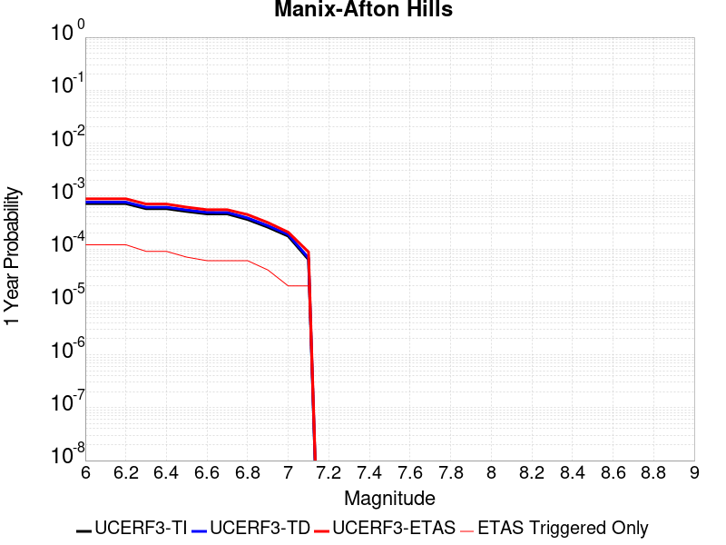 |  |

| Magnitude | 1 wk TI Prob | 1 wk TD Prob | 1 wk ETAS Prob | 1 wk ETAS/TD Gain | 1 wk ETAS Triggered Only | 1 mo TI Prob | 1 mo TD Prob | 1 mo ETAS Prob | 1 mo ETAS/TD Gain | 1 mo ETAS Triggered Only | 1 yr TI Prob | 1 yr TD Prob | 1 yr ETAS Prob | 1 yr ETAS/TD Gain | 1 yr ETAS Triggered Only | 10 yr TI Prob | 10 yr TD Prob | 10 yr ETAS Prob | 10 yr ETAS/TD Gain | 10 yr ETAS Triggered Only |
|-----|-----|-----|-----|-----|-----|-----|-----|-----|-----|-----|-----|-----|-----|-----|-----|-----|-----|-----|-----|-----|
| 6.0 | 1.3783202E-5 | 1.47110895E-5 | 1.9363135E-4 | 13.162271 | 1.7892288E-4 | 5.906953E-5 | 6.30461E-5 | 2.419577E-4 | 3.83779 | 1.7892288E-4 | 7.189342E-4 | 7.6733343E-4 | 9.46119E-4 | 1.232996 | 1.7892288E-4 | 0.0071661277 | 0.007648596 | 0.00782615 | 1.023214 | 1.7892288E-4 |
| 6.1 | 1.3783202E-5 | 1.47110895E-5 | 1.9363135E-4 | 13.162271 | 1.7892288E-4 | 5.906953E-5 | 6.30461E-5 | 2.419577E-4 | 3.83779 | 1.7892288E-4 | 7.189342E-4 | 7.6733343E-4 | 9.46119E-4 | 1.232996 | 1.7892288E-4 | 0.0071661277 | 0.007648596 | 0.00782615 | 1.023214 | 1.7892288E-4 |
| 6.2 | 1.3783202E-5 | 1.47110895E-5 | 1.9363135E-4 | 13.162271 | 1.7892288E-4 | 5.906953E-5 | 6.30461E-5 | 2.419577E-4 | 3.83779 | 1.7892288E-4 | 7.189342E-4 | 7.6733343E-4 | 9.46119E-4 | 1.232996 | 1.7892288E-4 | 0.0071661277 | 0.007648596 | 0.00782615 | 1.023214 | 1.7892288E-4 |
| 6.3 | 1.10494875E-5 | 1.1793136E-5 | 1.9071391E-4 | 16.171602 | 1.7892288E-4 | 4.7354086E-5 | 5.054109E-5 | 2.2945493E-4 | 4.539968 | 1.7892288E-4 | 5.763835E-4 | 6.151744E-4 | 7.9398724E-4 | 1.2906702 | 1.7892288E-4 | 0.005748908 | 0.0061357557 | 0.0063135806 | 1.0289818 | 1.7892288E-4 |
| 6.4 | 1.10494875E-5 | 1.1793136E-5 | 1.9071391E-4 | 16.171602 | 1.7892288E-4 | 4.7354086E-5 | 5.054109E-5 | 2.2945493E-4 | 4.539968 | 1.7892288E-4 | 5.763835E-4 | 6.151744E-4 | 7.9398724E-4 | 1.2906702 | 1.7892288E-4 | 0.005748908 | 0.0061357557 | 0.0063135806 | 1.0289818 | 1.7892288E-4 |
| 6.5 | 9.788949E-6 | 1.045432E-5 | 1.8937534E-4 | 18.114553 | 1.7892288E-4 | 4.1951964E-5 | 4.480351E-5 | 2.2371838E-4 | 4.9933224 | 1.7892288E-4 | 5.1064545E-4 | 5.453555E-4 | 7.241808E-4 | 1.3279059 | 1.7892288E-4 | 0.0050947363 | 0.0054410985 | 0.005619048 | 1.0327047 | 1.7892288E-4 |
| 6.6 | 8.810006E-6 | 9.4136285E-6 | 9.4136285E-6 | 1.0 | 0.0 | 3.775662E-5 | 4.0343548E-5 | 4.0343548E-5 | 1.0 | 0.0 | 4.5958988E-4 | 4.9108086E-4 | 4.9108086E-4 | 1.0 | 0.0 | 0.0045864056 | 0.004900839 | 0.004900839 | 1.0 | 0.0 |
| 6.7 | 8.80128E-6 | 9.404108E-6 | 9.404108E-6 | 1.0 | 0.0 | 3.7719226E-5 | 4.0302748E-5 | 4.0302748E-5 | 1.0 | 0.0 | 4.591348E-4 | 4.9058435E-4 | 4.9058435E-4 | 1.0 | 0.0 | 0.004581874 | 0.0048958957 | 0.0048958957 | 1.0 | 0.0 |
| 6.8 | 6.8994877E-6 | 7.380076E-6 | 7.380076E-6 | 1.0 | 0.0 | 2.9568899E-5 | 3.162856E-5 | 3.162856E-5 | 1.0 | 0.0 | 3.5994186E-4 | 3.8501783E-4 | 3.8501783E-4 | 1.0 | 0.0 | 0.003593594 | 0.0038443129 | 0.0038443129 | 1.0 | 0.0 |
| 6.9 | 4.9328037E-6 | 5.2709615E-6 | 5.2709615E-6 | 1.0 | 0.0 | 2.1140417E-5 | 2.2589675E-5 | 2.2589675E-5 | 1.0 | 0.0 | 2.5735417E-4 | 2.7500073E-4 | 2.7500073E-4 | 1.0 | 0.0 | 0.0025705635 | 0.0027472095 | 0.0027472095 | 1.0 | 0.0 |
| 7.0 | 3.347973E-6 | 3.59003E-6 | 3.59003E-6 | 1.0 | 0.0 | 1.4348378E-5 | 1.5385775E-5 | 1.5385775E-5 | 1.0 | 0.0 | 1.746775E-4 | 1.8730981E-4 | 1.8730981E-4 | 1.0 | 0.0 | 0.0017454025 | 0.0018719219 | 0.0018719219 | 1.0 | 0.0 |
| 7.1 | 1.2073567E-6 | 1.293482E-6 | 1.293482E-6 | 1.0 | 0.0 | 5.1743755E-6 | 5.543492E-6 | 5.543492E-6 | 1.0 | 0.0 | 6.29962E-5 | 6.749156E-5 | 6.749156E-5 | 1.0 | 0.0 | 6.297835E-4 | 6.7487074E-4 | 6.7487074E-4 | 1.0 | 0.0 |

