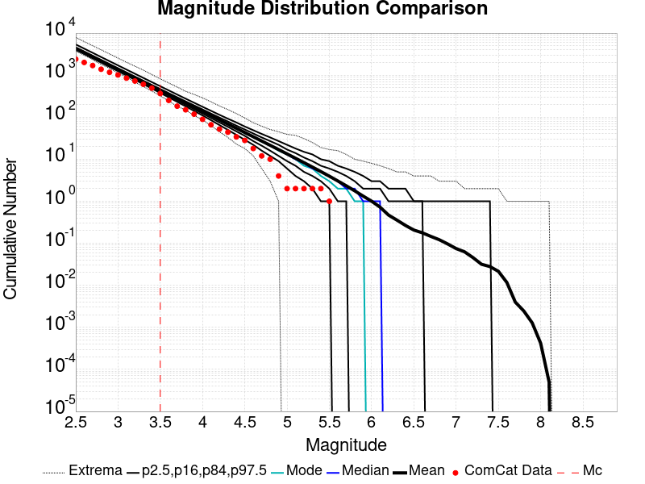
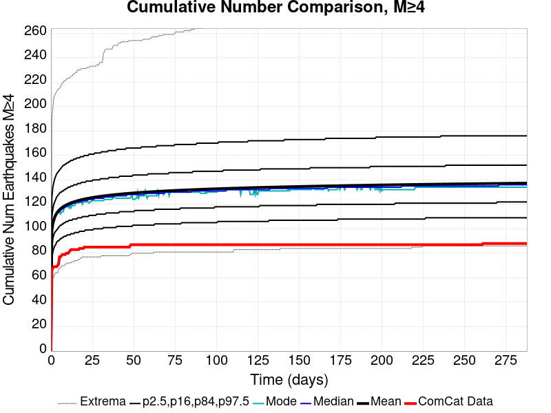
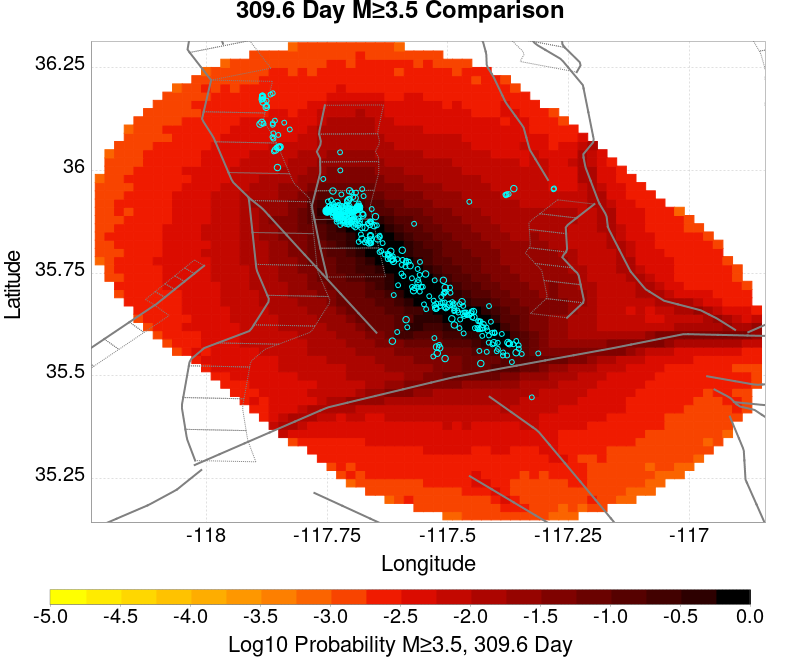
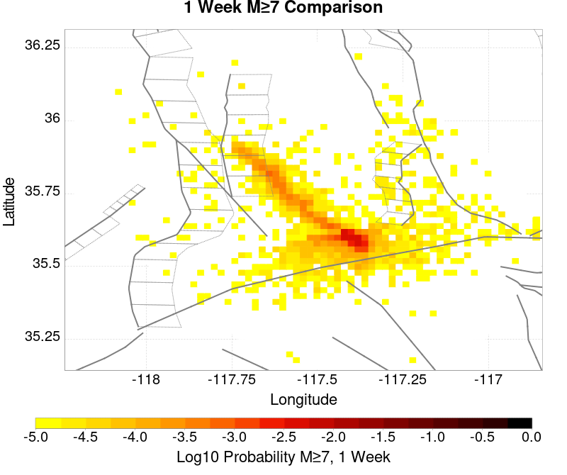
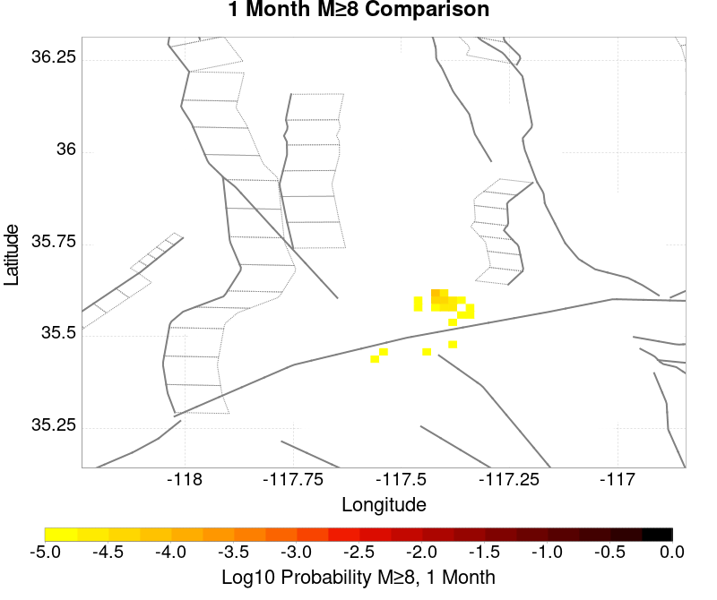
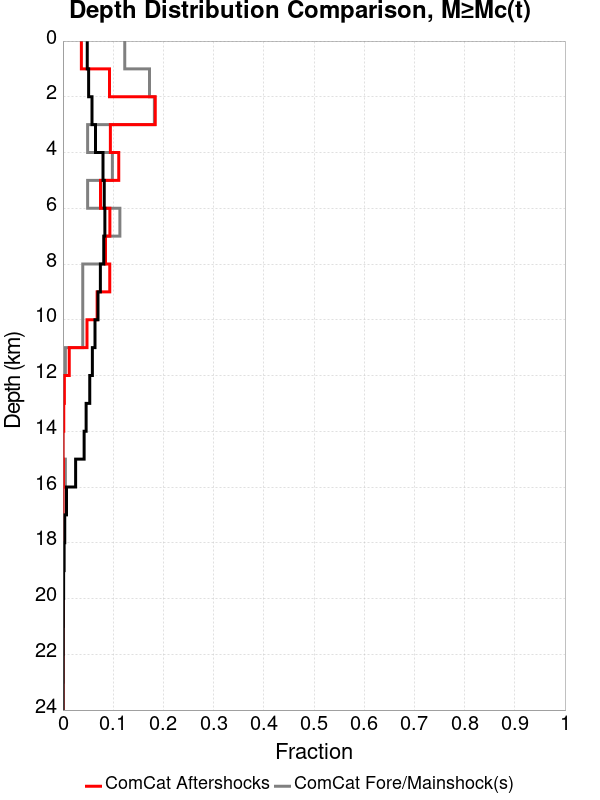
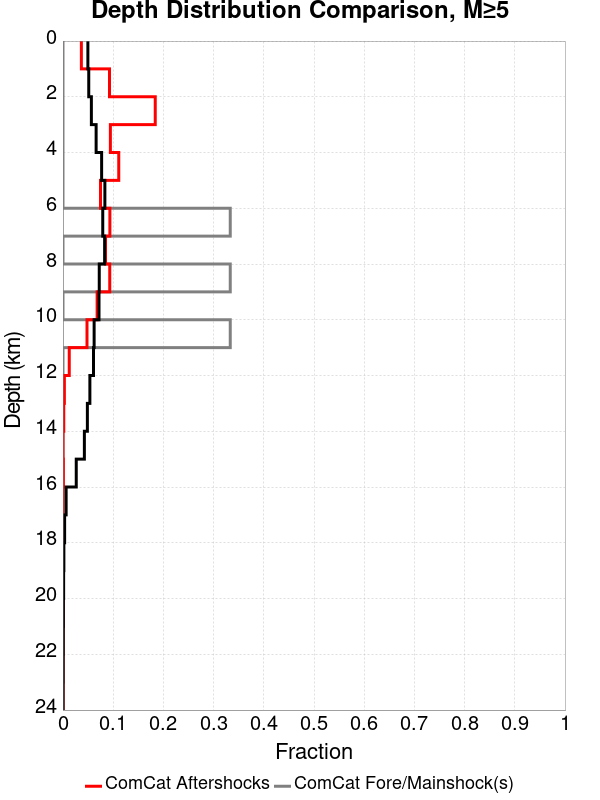
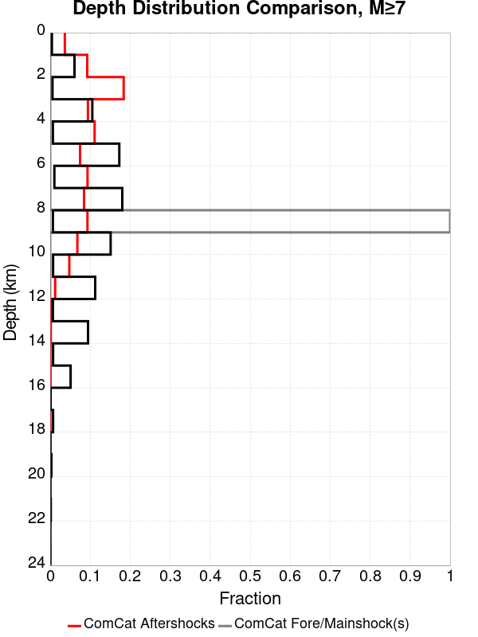
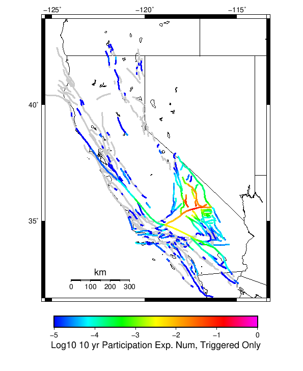

# ComCat M7.1 (ci38457511), Mainshock Log10(k)=-2.3, ShakeMap Surfaces, Log10(k)=-3.03, p=1.15, c=4.6773514E-4 Results

|   | ComCat M7.1 (ci38457511), Mainshock Log10(k)=-2.3, ShakeMap Surfaces, Log10(k)=-3.03, p=1.15, c=4.6773514E-4 |
|-----|-----|
| Num Simulations | 100000 |
| Start Time | 2019/07/06 03:19:54 UTC |
| Start Time Epoch Milliseconds | 1562383194040 |
| Duration | 10 Years |
| Includes Spontaneous? | false |
| Trigger Ruptures | 268 Trigger Ruptures |
|   | First: M3.98 at 2019/07/04 17:02:55 UTC |
|   | Last: M7.1 at 2019/07/06 03:19:53 UTC |
|   | Largest: M7.1 at 2019/07/06 03:19:53 UTC |
| Trigger Ruptures | *(none)* |
| Config Generated With | u3etas_comcat_event_config_builder.sh --event-id ci38457511 --num-simulations 100000 --days-before 7 --etas-k -3.03 --etas-p 1.15 --etas-c 4.6773514E-4 --mainshock-etas-k -2.3 --finite-surf-shakemap --finite-surf-shakemap-min-mag 5 --hpc-site USC_HPC --nodes 36 --hours 24 --queue scec |

## Table Of Contents

* [Probabilities Summary Table](#probabilities-summary-table)
* [Magnitude Number Distribution](#magnitude-number-distribution)
  * [10 Year Magnitude Number Distribution](#10-year-magnitude-number-distribution)
  * [1 Year Magnitude Number Distribution](#1-year-magnitude-number-distribution)
  * [1 Month Magnitude Number Distribution](#1-month-magnitude-number-distribution)
  * [1 Week Magnitude Number Distribution](#1-week-magnitude-number-distribution)
  * [1 Day Magnitude Number Distribution](#1-day-magnitude-number-distribution)
  * [1 Hour Magnitude Number Distribution](#1-hour-magnitude-number-distribution)
* [Hazard Change Over Time](#hazard-change-over-time)
  * [M&ge;5.0 Hazard Change Over Time](#m50-hazard-change-over-time)
  * [M&ge;6.0 Hazard Change Over Time](#m60-hazard-change-over-time)
  * [M&ge;7.0 Hazard Change Over Time](#m70-hazard-change-over-time)
  * [M&ge;8.0 Hazard Change Over Time](#m80-hazard-change-over-time)
* [Trigger Rupture Fault Map](#trigger-rupture-fault-map)
* [Trigger Rupture Depth Map](#trigger-rupture-depth-map)
* [Fault Distances To Triggers](#fault-distances-to-triggers)
* [Individual Simulated Catalog Maps](#individual-simulated-catalog-maps)
* [ComCat Data Comparisons](#comcat-data-comparisons)
  * [ComCat Magnitude-Number Distributions](#comcat-magnitude-number-distributions)
  * [ComCat Time-Dependent Mc](#comcat-time-dependent-mc)
  * [ComCat Cumulative Number Vs Time](#comcat-cumulative-number-vs-time)
  * [ComCat Cumulative Number Simulation Percentiles](#comcat-cumulative-number-simulation-percentiles)
  * [ComCat Probability Spatial Distribution](#comcat-probability-spatial-distribution)
  * [ComCat Mean Expectation Spatial Distribution](#comcat-mean-expectation-spatial-distribution)
  * [ComCat Depth Distribution](#comcat-depth-distribution)
* [Section Participation](#section-participation)
  * [Section Participation Plots](#section-participation-plots)
  * [Supra-Seismogenic Parent Sections Table](#supra-seismogenic-parent-sections-table)
  * [M≥6.5 Parent Sections Table](#m65-parent-sections-table)
  * [M≥7 Parent Sections Table](#m7-parent-sections-table)
  * [M≥7.5 Parent Sections Table](#m75-parent-sections-table)
  * [M≥8 Parent Sections Table](#m8-parent-sections-table)
  * [Fault Magnitude-Probability Distributions](#fault-magnitude-probability-distributions)
* [Gridded Nucleation](#gridded-nucleation)
* [JSON Input File](#json-input-file)

## Probabilities Summary Table
*[(top)](#table-of-contents)*

| Magnitude | 1 Hour Prob | 1 Day Prob | 1 Week Prob | 1 Month Prob | 1 Year Prob | 10 Year Prob |
|-----|-----|-----|-----|-----|-----|-----|
| **M&ge;4** | 1.000 (100.00%) | 1.000 (100.00%) | 1.000 (100.00%) | 1.000 (100.00%) | 1.000 (100.00%) | 1.000 (100.00%) |
| **M&ge;4.5** | 1.000 (100.00%) | 1.000 (100.00%) | 1.000 (100.00%) | 1.000 (100.00%) | 1.000 (100.00%) | 1.000 (100.00%) |
| **M&ge;5** | 0.999 (99.87%) | 1.000 (99.99%) | 1.000 (100.00%) | 1.000 (100.00%) | 1.000 (100.00%) | 1.000 (100.00%) |
| **M&ge;5.5** | 0.863 (86.34%) | 0.944 (94.39%) | 0.962 (96.17%) | 0.970 (96.96%) | 0.978 (97.78%) | 0.982 (98.19%) |
| **M&ge;6** | 0.407 (40.68%) | 0.531 (53.13%) | 0.577 (57.72%) | 0.603 (60.31%) | 0.635 (63.51%) | 0.655 (65.45%) |
| **M&ge;6.5** | 0.105 (10.50%) | 0.150 (14.97%) | 0.168 (16.83%) | 0.179 (17.94%) | 0.194 (19.42%) | 0.203 (20.35%) |
| **M&ge;7** | 0.041 (4.06%) | 0.058 (5.81%) | 0.065 (6.53%) | 0.070 (6.97%) | 0.076 (7.55%) | 0.079 (7.93%) |
| **M&ge;7.1** | 0.034 (3.42%) | 0.049 (4.89%) | 0.055 (5.50%) | 0.059 (5.87%) | 0.064 (6.36%) | 0.067 (6.67%) |
| **M&ge;7.5** | 0.012 (1.20%) | 0.017 (1.72%) | 0.019 (1.94%) | 0.021 (2.06%) | 0.022 (2.23%) | 0.024 (2.36%) |
| **M&ge;8** | 2.70E-4 (0.03%) | 4.00E-4 (0.04%) | 4.10E-4 (0.04%) | 4.20E-4 (0.04%) | 4.70E-4 (0.05%) | 4.90E-4 (0.05%) |

## Magnitude Number Distribution
*[(top)](#table-of-contents)*

### 10 Year Magnitude Number Distribution
*[(top)](#table-of-contents)*

**Legend**
* **Mean** (thick black line): mean expected number across all 100000 catalogs
* **2.5%,97.5%** (thin black lines): expected number percentiles across all 100000 catalogs
* **Median** (thin blue line): median expected number across all 100000 catalogs
* **Mode** (thin cyan line): modal expected number across all 100000 catalogs
* **10 yr Probability** (thin red line): 10 year probability calculated as the fraction of catalogs with at least 1 occurrence
* **10 yr Supraseismogenic Probability** (thin dashed red line): same as above, but only for supraseismogenic ruptures on explicitly modeled UCERF3 faults
* **95% Conf** (light red shaded region): binomial 95% confidence bounds on probability
* **Primary** (thin green line): mean expected number from primary triggered aftershocks only (no secondary, tertiary, etc...) across all 100000 catalogs


| Mag | Mean | 2.5 %ile | 97.5 %ile | Median | Mode | 10 yr Probability | 10 yr Supra-Seis Prob | Primary Aftershocks Mean |
|-----|-----|-----|-----|-----|-----|-----|-----|-----|
| **M&ge;2.5** | 4765.174 | 4321.000 | 6733.000 | 4605.000 | 4507.000 | 1.000 (100.00%) | 0.311 (31.14%) | 3840.390 |
| **M&ge;2.6** | 3785.003 | 3424.000 | 5347.000 | 3659.000 | 3587.000 | 1.000 (100.00%) | 0.311 (31.14%) | 3050.406 |
| **M&ge;2.7** | 3006.406 | 2710.000 | 4246.000 | 2908.000 | 2844.000 | 1.000 (100.00%) | 0.311 (31.14%) | 2422.917 |
| **M&ge;2.8** | 2387.999 | 2145.000 | 3372.000 | 2311.000 | 2281.000 | 1.000 (100.00%) | 0.311 (31.14%) | 1924.575 |
| **M&ge;2.9** | 1896.802 | 1696.000 | 2680.000 | 1837.000 | 1820.000 | 1.000 (100.00%) | 0.311 (31.14%) | 1528.720 |
| **M&ge;3** | 1506.662 | 1341.000 | 2130.000 | 1460.000 | 1433.000 | 1.000 (100.00%) | 0.311 (31.14%) | 1214.275 |
| **M&ge;3.1** | 1196.693 | 1059.000 | 1691.000 | 1160.000 | 1143.000 | 1.000 (100.00%) | 0.311 (31.14%) | 964.456 |
| **M&ge;3.2** | 950.542 | 836.000 | 1343.000 | 922.000 | 904.000 | 1.000 (100.00%) | 0.311 (31.14%) | 766.112 |
| **M&ge;3.3** | 755.022 | 659.000 | 1066.000 | 733.000 | 725.000 | 1.000 (100.00%) | 0.311 (31.14%) | 608.518 |
| **M&ge;3.4** | 599.661 | 518.000 | 846.000 | 583.000 | 572.000 | 1.000 (100.00%) | 0.311 (31.14%) | 483.282 |
| **M&ge;3.5** | 476.273 | 407.000 | 672.000 | 463.000 | 458.000 | 1.000 (100.00%) | 0.311 (31.14%) | 383.831 |
| **M&ge;3.6** | 378.225 | 320.000 | 534.000 | 368.000 | 362.000 | 1.000 (100.00%) | 0.311 (31.14%) | 304.809 |
| **M&ge;3.7** | 300.330 | 250.000 | 424.000 | 293.000 | 286.000 | 1.000 (100.00%) | 0.311 (31.14%) | 242.023 |
| **M&ge;3.8** | 238.435 | 196.000 | 337.000 | 233.000 | 234.000 | 1.000 (100.00%) | 0.311 (31.14%) | 192.143 |
| **M&ge;3.9** | 189.293 | 153.000 | 268.000 | 185.000 | 182.000 | 1.000 (100.00%) | 0.311 (31.14%) | 152.547 |
| **M&ge;4** | 150.257 | 119.000 | 213.000 | 147.000 | 145.000 | 1.000 (100.00%) | 0.311 (31.14%) | 121.089 |
| **M&ge;4.1** | 119.254 | 92.000 | 169.000 | 117.000 | 115.000 | 1.000 (100.00%) | 0.311 (31.14%) | 96.101 |
| **M&ge;4.2** | 94.616 | 71.000 | 135.000 | 93.000 | 91.000 | 1.000 (100.00%) | 0.311 (31.14%) | 76.243 |
| **M&ge;4.3** | 75.070 | 55.000 | 108.000 | 73.000 | 72.000 | 1.000 (100.00%) | 0.311 (31.14%) | 60.500 |
| **M&ge;4.4** | 59.539 | 42.000 | 87.000 | 58.000 | 57.000 | 1.000 (100.00%) | 0.311 (31.14%) | 47.985 |
| **M&ge;4.5** | 47.205 | 32.000 | 70.000 | 46.000 | 45.000 | 1.000 (100.00%) | 0.311 (31.14%) | 38.051 |
| **M&ge;4.6** | 37.402 | 24.000 | 56.000 | 37.000 | 36.000 | 1.000 (100.00%) | 0.311 (31.14%) | 30.150 |
| **M&ge;4.7** | 29.627 | 18.000 | 46.000 | 29.000 | 28.000 | 1.000 (100.00%) | 0.311 (31.14%) | 23.891 |
| **M&ge;4.8** | 23.447 | 13.000 | 37.000 | 23.000 | 22.000 | 1.000 (100.00%) | 0.311 (31.14%) | 18.907 |
| **M&ge;4.9** | 18.537 | 10.000 | 30.000 | 18.000 | 17.000 | 1.000 (100.00%) | 0.311 (31.14%) | 14.943 |
| **M&ge;5** | 14.639 | 7.000 | 25.000 | 14.000 | 14.000 | 1.000 (100.00%) | 0.311 (31.14%) | 11.800 |
| **M&ge;5.1** | 11.540 | 5.000 | 20.000 | 11.000 | 11.000 | 1.000 (100.00%) | 0.311 (31.14%) | 9.303 |
| **M&ge;5.2** | 9.080 | 3.000 | 17.000 | 9.000 | 8.000 | 1.000 (99.97%) | 0.311 (31.14%) | 7.320 |
| **M&ge;5.3** | 7.125 | 2.000 | 14.000 | 7.000 | 6.000 | 0.998 (99.84%) | 0.311 (31.14%) | 5.742 |
| **M&ge;5.4** | 5.572 | 1.000 | 11.000 | 5.000 | 5.000 | 0.994 (99.39%) | 0.311 (31.14%) | 4.487 |
| **M&ge;5.5** | 4.334 | 1.000 | 9.000 | 4.000 | 4.000 | 0.982 (98.19%) | 0.311 (31.14%) | 3.489 |
| **M&ge;5.6** | 3.346 | 0.000 | 8.000 | 3.000 | 3.000 | 0.956 (95.60%) | 0.311 (31.14%) | 2.695 |
| **M&ge;5.7** | 2.569 | 0.000 | 7.000 | 2.000 | 2.000 | 0.911 (91.13%) | 0.311 (31.14%) | 2.070 |
| **M&ge;5.8** | 1.954 | 0.000 | 5.000 | 2.000 | 1.000 | 0.842 (84.16%) | 0.311 (31.14%) | 1.575 |
| **M&ge;5.9** | 1.468 | 0.000 | 4.000 | 1.000 | 1.000 | 0.751 (75.13%) | 0.311 (31.13%) | 1.183 |
| **M&ge;6** | 1.115 | 0.000 | 4.000 | 1.000 | 1.000 | 0.655 (65.45%) | 0.311 (31.12%) | 0.896 |
| **M&ge;6.1** | 0.813 | 0.000 | 3.000 | 1.000 | 0.000 | 0.543 (54.27%) | 0.277 (27.70%) | 0.657 |
| **M&ge;6.2** | 0.528 | 0.000 | 2.000 | 0.000 | 0.000 | 0.401 (40.07%) | 0.217 (21.71%) | 0.426 |
| **M&ge;6.3** | 0.400 | 0.000 | 2.000 | 0.000 | 0.000 | 0.323 (32.35%) | 0.189 (18.88%) | 0.325 |
| **M&ge;6.4** | 0.302 | 0.000 | 2.000 | 0.000 | 0.000 | 0.255 (25.51%) | 0.164 (16.45%) | 0.244 |
| **M&ge;6.5** | 0.233 | 0.000 | 2.000 | 0.000 | 0.000 | 0.203 (20.35%) | 0.146 (14.61%) | 0.189 |
| **M&ge;6.6** | 0.198 | 0.000 | 1.000 | 0.000 | 0.000 | 0.178 (17.83%) | 0.137 (13.66%) | 0.163 |
| **M&ge;6.7** | 0.163 | 0.000 | 1.000 | 0.000 | 0.000 | 0.149 (14.92%) | 0.120 (12.01%) | 0.134 |
| **M&ge;6.8** | 0.134 | 0.000 | 1.000 | 0.000 | 0.000 | 0.125 (12.53%) | 0.105 (10.54%) | 0.111 |
| **M&ge;6.9** | 0.105 | 0.000 | 1.000 | 0.000 | 0.000 | 0.100 (10.04%) | 0.088 (8.77%) | 0.089 |
| **M&ge;7** | 0.082 | 0.000 | 1.000 | 0.000 | 0.000 | 0.079 (7.93%) | 0.071 (7.11%) | 0.069 |
| **M&ge;7.1** | 0.068 | 0.000 | 1.000 | 0.000 | 0.000 | 0.067 (6.67%) | 0.062 (6.19%) | 0.058 |
| **M&ge;7.2** | 0.050 | 0.000 | 1.000 | 0.000 | 0.000 | 0.049 (4.93%) | 0.047 (4.68%) | 0.042 |
| **M&ge;7.3** | 0.035 | 0.000 | 1.000 | 0.000 | 0.000 | 0.035 (3.46%) | 0.033 (3.32%) | 0.029 |
| **M&ge;7.4** | 0.031 | 0.000 | 1.000 | 0.000 | 0.000 | 0.030 (3.04%) | 0.030 (2.98%) | 0.026 |
| **M&ge;7.5** | 0.024 | 0.000 | 0.000 | 0.000 | 0.000 | 0.024 (2.36%) | 0.023 (2.33%) | 0.020 |
| **M&ge;7.6** | 0.013 | 0.000 | 0.000 | 0.000 | 0.000 | 0.013 (1.29%) | 0.013 (1.28%) | 0.011 |
| **M&ge;7.7** | 4.64E-3 | 0.000 | 0.000 | 0.000 | 0.000 | 4.63E-3 (0.46%) | 4.59E-3 (0.46%) | 3.89E-3 |
| **M&ge;7.8** | 2.79E-3 | 0.000 | 0.000 | 0.000 | 0.000 | 2.78E-3 (0.28%) | 2.78E-3 (0.28%) | 2.37E-3 |
| **M&ge;7.9** | 1.51E-3 | 0.000 | 0.000 | 0.000 | 0.000 | 1.51E-3 (0.15%) | 1.51E-3 (0.15%) | 1.28E-3 |
| **M&ge;8** | 4.90E-4 | 0.000 | 0.000 | 0.000 | 0.000 | 4.90E-4 (0.05%) | 4.90E-4 (0.05%) | 4.20E-4 |
| **M&ge;8.1** | 7.00E-5 | 0.000 | 0.000 | 0.000 | 0.000 | 7.00E-5 (0.01%) | 7.00E-5 (0.01%) | 6.00E-5 |
| **M&ge;8.2** | 1.00E-5 | 0.000 | 0.000 | 0.000 | 0.000 | 1.00E-5 (0.00%) | 1.00E-5 (0.00%) | 0.000 |
| **M&ge;8.3** | 0.000 | 0.000 | 0.000 | 0.000 | 0.000 | 0.000 (0.00%) | 0.000 (0.00%) | 0.000 |
| **M&ge;8.4** | 0.000 | 0.000 | 0.000 | 0.000 | 0.000 | 0.000 (0.00%) | 0.000 (0.00%) | 0.000 |
| **M&ge;8.5** | 0.000 | 0.000 | 0.000 | 0.000 | 0.000 | 0.000 (0.00%) | 0.000 (0.00%) | 0.000 |
| **M&ge;8.6** | 0.000 | 0.000 | 0.000 | 0.000 | 0.000 | 0.000 (0.00%) | 0.000 (0.00%) | 0.000 |
| **M&ge;8.7** | 0.000 | 0.000 | 0.000 | 0.000 | 0.000 | 0.000 (0.00%) | 0.000 (0.00%) | 0.000 |
| **M&ge;8.8** | 0.000 | 0.000 | 0.000 | 0.000 | 0.000 | 0.000 (0.00%) | 0.000 (0.00%) | 0.000 |
| **M&ge;8.9** | 0.000 | 0.000 | 0.000 | 0.000 | 0.000 | 0.000 (0.00%) | 0.000 (0.00%) | 0.000 |
| **M&ge;9** | 0.000 | 0.000 | 0.000 | 0.000 | 0.000 | 0.000 (0.00%) | 0.000 (0.00%) | 0.000 |

### 1 Year Magnitude Number Distribution
*[(top)](#table-of-contents)*

**Legend**
* **Mean** (thick black line): mean expected number across all 100000 catalogs
* **2.5%,97.5%** (thin black lines): expected number percentiles across all 100000 catalogs
* **Median** (thin blue line): median expected number across all 100000 catalogs
* **Mode** (thin cyan line): modal expected number across all 100000 catalogs
* **1 yr Probability** (thin red line): 1 year probability calculated as the fraction of catalogs with at least 1 occurrence
* **1 yr Supraseismogenic Probability** (thin dashed red line): same as above, but only for supraseismogenic ruptures on explicitly modeled UCERF3 faults
* **95% Conf** (light red shaded region): binomial 95% confidence bounds on probability
* **Primary** (thin green line): mean expected number from primary triggered aftershocks only (no secondary, tertiary, etc...) across all 100000 catalogs


| Mag | Mean | 2.5 %ile | 97.5 %ile | Median | Mode | 1 yr Probability | 1 yr Supra-Seis Prob | Primary Aftershocks Mean |
|-----|-----|-----|-----|-----|-----|-----|-----|-----|
| **M&ge;2.5** | 4510.067 | 4100.000 | 6298.000 | 4365.000 | 4323.000 | 1.000 (100.00%) | 0.298 (29.78%) | 3671.886 |
| **M&ge;2.6** | 3582.378 | 3248.000 | 5002.000 | 3468.000 | 3402.000 | 1.000 (100.00%) | 0.298 (29.78%) | 2916.566 |
| **M&ge;2.7** | 2845.482 | 2571.000 | 3972.000 | 2756.000 | 2731.000 | 1.000 (100.00%) | 0.298 (29.78%) | 2316.625 |
| **M&ge;2.8** | 2260.167 | 2034.000 | 3156.000 | 2190.000 | 2153.000 | 1.000 (100.00%) | 0.298 (29.78%) | 1840.135 |
| **M&ge;2.9** | 1795.277 | 1608.000 | 2511.000 | 1741.000 | 1724.000 | 1.000 (100.00%) | 0.298 (29.78%) | 1461.662 |
| **M&ge;3** | 1426.018 | 1271.000 | 1993.000 | 1384.000 | 1350.000 | 1.000 (100.00%) | 0.298 (29.78%) | 1160.993 |
| **M&ge;3.1** | 1132.647 | 1004.000 | 1585.000 | 1100.000 | 1074.000 | 1.000 (100.00%) | 0.298 (29.78%) | 922.142 |
| **M&ge;3.2** | 899.657 | 792.000 | 1259.000 | 874.000 | 861.000 | 1.000 (100.00%) | 0.298 (29.78%) | 732.497 |
| **M&ge;3.3** | 714.616 | 624.000 | 1000.000 | 695.000 | 681.000 | 1.000 (100.00%) | 0.298 (29.78%) | 581.827 |
| **M&ge;3.4** | 567.567 | 491.000 | 795.000 | 552.000 | 550.000 | 1.000 (100.00%) | 0.298 (29.78%) | 462.083 |
| **M&ge;3.5** | 450.773 | 386.000 | 631.000 | 439.000 | 433.000 | 1.000 (100.00%) | 0.298 (29.78%) | 366.988 |
| **M&ge;3.6** | 357.976 | 303.000 | 501.000 | 349.000 | 348.000 | 1.000 (100.00%) | 0.298 (29.78%) | 291.436 |
| **M&ge;3.7** | 284.258 | 237.000 | 397.000 | 277.000 | 272.000 | 1.000 (100.00%) | 0.298 (29.78%) | 231.411 |
| **M&ge;3.8** | 225.672 | 185.000 | 316.000 | 220.000 | 219.000 | 1.000 (100.00%) | 0.298 (29.78%) | 183.718 |
| **M&ge;3.9** | 179.167 | 144.000 | 251.000 | 175.000 | 174.000 | 1.000 (100.00%) | 0.298 (29.78%) | 145.864 |
| **M&ge;4** | 142.223 | 112.000 | 200.000 | 139.000 | 138.000 | 1.000 (100.00%) | 0.298 (29.78%) | 115.788 |
| **M&ge;4.1** | 112.880 | 87.000 | 159.000 | 110.000 | 109.000 | 1.000 (100.00%) | 0.298 (29.78%) | 91.896 |
| **M&ge;4.2** | 89.552 | 67.000 | 127.000 | 88.000 | 86.000 | 1.000 (100.00%) | 0.298 (29.78%) | 72.901 |
| **M&ge;4.3** | 71.051 | 51.000 | 102.000 | 70.000 | 68.000 | 1.000 (100.00%) | 0.298 (29.78%) | 57.846 |
| **M&ge;4.4** | 56.350 | 39.000 | 82.000 | 55.000 | 55.000 | 1.000 (100.00%) | 0.298 (29.78%) | 45.880 |
| **M&ge;4.5** | 44.680 | 30.000 | 66.000 | 44.000 | 43.000 | 1.000 (100.00%) | 0.298 (29.78%) | 36.384 |
| **M&ge;4.6** | 35.397 | 22.000 | 53.000 | 35.000 | 34.000 | 1.000 (100.00%) | 0.298 (29.78%) | 28.826 |
| **M&ge;4.7** | 28.038 | 17.000 | 43.000 | 27.000 | 27.000 | 1.000 (100.00%) | 0.298 (29.78%) | 22.841 |
| **M&ge;4.8** | 22.190 | 12.000 | 35.000 | 22.000 | 21.000 | 1.000 (100.00%) | 0.298 (29.78%) | 18.076 |
| **M&ge;4.9** | 17.544 | 9.000 | 29.000 | 17.000 | 17.000 | 1.000 (100.00%) | 0.298 (29.78%) | 14.287 |
| **M&ge;5** | 13.852 | 6.000 | 24.000 | 13.000 | 13.000 | 1.000 (100.00%) | 0.298 (29.78%) | 11.281 |
| **M&ge;5.1** | 10.917 | 4.000 | 19.000 | 11.000 | 10.000 | 1.000 (100.00%) | 0.298 (29.78%) | 8.894 |
| **M&ge;5.2** | 8.590 | 3.000 | 16.000 | 8.000 | 8.000 | 1.000 (99.96%) | 0.298 (29.78%) | 6.998 |
| **M&ge;5.3** | 6.740 | 2.000 | 13.000 | 6.000 | 6.000 | 0.998 (99.78%) | 0.298 (29.78%) | 5.489 |
| **M&ge;5.4** | 5.270 | 1.000 | 11.000 | 5.000 | 5.000 | 0.992 (99.20%) | 0.298 (29.78%) | 4.289 |
| **M&ge;5.5** | 4.100 | 1.000 | 9.000 | 4.000 | 3.000 | 0.978 (97.78%) | 0.298 (29.78%) | 3.336 |
| **M&ge;5.6** | 3.164 | 0.000 | 8.000 | 3.000 | 2.000 | 0.948 (94.80%) | 0.298 (29.78%) | 2.576 |
| **M&ge;5.7** | 2.430 | 0.000 | 6.000 | 2.000 | 2.000 | 0.899 (89.91%) | 0.298 (29.78%) | 1.979 |
| **M&ge;5.8** | 1.850 | 0.000 | 5.000 | 2.000 | 1.000 | 0.826 (82.56%) | 0.298 (29.78%) | 1.507 |
| **M&ge;5.9** | 1.390 | 0.000 | 4.000 | 1.000 | 1.000 | 0.733 (73.31%) | 0.298 (29.78%) | 1.132 |
| **M&ge;6** | 1.055 | 0.000 | 4.000 | 1.000 | 0.000 | 0.635 (63.51%) | 0.298 (29.77%) | 0.857 |
| **M&ge;6.1** | 0.769 | 0.000 | 3.000 | 1.000 | 0.000 | 0.523 (52.33%) | 0.265 (26.47%) | 0.628 |
| **M&ge;6.2** | 0.499 | 0.000 | 2.000 | 0.000 | 0.000 | 0.384 (38.43%) | 0.207 (20.71%) | 0.407 |
| **M&ge;6.3** | 0.378 | 0.000 | 2.000 | 0.000 | 0.000 | 0.309 (30.93%) | 0.180 (18.02%) | 0.310 |
| **M&ge;6.4** | 0.285 | 0.000 | 2.000 | 0.000 | 0.000 | 0.243 (24.33%) | 0.157 (15.67%) | 0.234 |
| **M&ge;6.5** | 0.221 | 0.000 | 1.000 | 0.000 | 0.000 | 0.194 (19.42%) | 0.139 (13.92%) | 0.181 |
| **M&ge;6.6** | 0.188 | 0.000 | 1.000 | 0.000 | 0.000 | 0.170 (17.00%) | 0.130 (13.02%) | 0.156 |
| **M&ge;6.7** | 0.154 | 0.000 | 1.000 | 0.000 | 0.000 | 0.142 (14.23%) | 0.115 (11.45%) | 0.129 |
| **M&ge;6.8** | 0.127 | 0.000 | 1.000 | 0.000 | 0.000 | 0.119 (11.95%) | 0.101 (10.05%) | 0.107 |
| **M&ge;6.9** | 0.100 | 0.000 | 1.000 | 0.000 | 0.000 | 0.096 (9.58%) | 0.084 (8.36%) | 0.085 |
| **M&ge;7** | 0.078 | 0.000 | 1.000 | 0.000 | 0.000 | 0.076 (7.55%) | 0.068 (6.77%) | 0.066 |
| **M&ge;7.1** | 0.065 | 0.000 | 1.000 | 0.000 | 0.000 | 0.064 (6.36%) | 0.059 (5.90%) | 0.055 |
| **M&ge;7.2** | 0.047 | 0.000 | 1.000 | 0.000 | 0.000 | 0.047 (4.69%) | 0.045 (4.46%) | 0.040 |
| **M&ge;7.3** | 0.033 | 0.000 | 1.000 | 0.000 | 0.000 | 0.033 (3.29%) | 0.032 (3.15%) | 0.028 |
| **M&ge;7.4** | 0.029 | 0.000 | 1.000 | 0.000 | 0.000 | 0.029 (2.89%) | 0.028 (2.83%) | 0.025 |
| **M&ge;7.5** | 0.022 | 0.000 | 0.000 | 0.000 | 0.000 | 0.022 (2.23%) | 0.022 (2.21%) | 0.019 |
| **M&ge;7.6** | 0.012 | 0.000 | 0.000 | 0.000 | 0.000 | 0.012 (1.22%) | 0.012 (1.21%) | 0.011 |
| **M&ge;7.7** | 4.33E-3 | 0.000 | 0.000 | 0.000 | 0.000 | 4.32E-3 (0.43%) | 4.28E-3 (0.43%) | 3.70E-3 |
| **M&ge;7.8** | 2.65E-3 | 0.000 | 0.000 | 0.000 | 0.000 | 2.64E-3 (0.26%) | 2.64E-3 (0.26%) | 2.27E-3 |
| **M&ge;7.9** | 1.42E-3 | 0.000 | 0.000 | 0.000 | 0.000 | 1.42E-3 (0.14%) | 1.42E-3 (0.14%) | 1.23E-3 |
| **M&ge;8** | 4.70E-4 | 0.000 | 0.000 | 0.000 | 0.000 | 4.70E-4 (0.05%) | 4.70E-4 (0.05%) | 4.00E-4 |
| **M&ge;8.1** | 7.00E-5 | 0.000 | 0.000 | 0.000 | 0.000 | 7.00E-5 (0.01%) | 7.00E-5 (0.01%) | 6.00E-5 |
| **M&ge;8.2** | 1.00E-5 | 0.000 | 0.000 | 0.000 | 0.000 | 1.00E-5 (0.00%) | 1.00E-5 (0.00%) | 0.000 |
| **M&ge;8.3** | 0.000 | 0.000 | 0.000 | 0.000 | 0.000 | 0.000 (0.00%) | 0.000 (0.00%) | 0.000 |
| **M&ge;8.4** | 0.000 | 0.000 | 0.000 | 0.000 | 0.000 | 0.000 (0.00%) | 0.000 (0.00%) | 0.000 |
| **M&ge;8.5** | 0.000 | 0.000 | 0.000 | 0.000 | 0.000 | 0.000 (0.00%) | 0.000 (0.00%) | 0.000 |
| **M&ge;8.6** | 0.000 | 0.000 | 0.000 | 0.000 | 0.000 | 0.000 (0.00%) | 0.000 (0.00%) | 0.000 |
| **M&ge;8.7** | 0.000 | 0.000 | 0.000 | 0.000 | 0.000 | 0.000 (0.00%) | 0.000 (0.00%) | 0.000 |
| **M&ge;8.8** | 0.000 | 0.000 | 0.000 | 0.000 | 0.000 | 0.000 (0.00%) | 0.000 (0.00%) | 0.000 |
| **M&ge;8.9** | 0.000 | 0.000 | 0.000 | 0.000 | 0.000 | 0.000 (0.00%) | 0.000 (0.00%) | 0.000 |
| **M&ge;9** | 0.000 | 0.000 | 0.000 | 0.000 | 0.000 | 0.000 (0.00%) | 0.000 (0.00%) | 0.000 |

### 1 Month Magnitude Number Distribution
*[(top)](#table-of-contents)*

**Legend**
* **Mean** (thick black line): mean expected number across all 100000 catalogs
* **2.5%,97.5%** (thin black lines): expected number percentiles across all 100000 catalogs
* **Median** (thin blue line): median expected number across all 100000 catalogs
* **Mode** (thin cyan line): modal expected number across all 100000 catalogs
* **1 mo Probability** (thin red line): 1 month probability calculated as the fraction of catalogs with at least 1 occurrence
* **1 mo Supraseismogenic Probability** (thin dashed red line): same as above, but only for supraseismogenic ruptures on explicitly modeled UCERF3 faults
* **95% Conf** (light red shaded region): binomial 95% confidence bounds on probability
* **Primary** (thin green line): mean expected number from primary triggered aftershocks only (no secondary, tertiary, etc...) across all 100000 catalogs


| Mag | Mean | 2.5 %ile | 97.5 %ile | Median | Mode | 1 mo Probability | 1 mo Supra-Seis Prob | Primary Aftershocks Mean |
|-----|-----|-----|-----|-----|-----|-----|-----|-----|
| **M&ge;2.5** | 4122.857 | 3762.000 | 5654.000 | 3998.000 | 3936.000 | 1.000 (100.00%) | 0.277 (27.70%) | 3409.626 |
| **M&ge;2.6** | 3274.816 | 2979.000 | 4492.000 | 3178.000 | 3115.000 | 1.000 (100.00%) | 0.277 (27.70%) | 2708.247 |
| **M&ge;2.7** | 2601.187 | 2358.000 | 3568.000 | 2525.000 | 2471.000 | 1.000 (100.00%) | 0.277 (27.70%) | 2151.153 |
| **M&ge;2.8** | 2066.120 | 1865.000 | 2837.000 | 2007.000 | 1986.000 | 1.000 (100.00%) | 0.277 (27.70%) | 1708.686 |
| **M&ge;2.9** | 1641.135 | 1475.000 | 2256.000 | 1595.000 | 1582.000 | 1.000 (100.00%) | 0.277 (27.70%) | 1357.228 |
| **M&ge;3** | 1303.607 | 1165.000 | 1795.000 | 1268.000 | 1256.000 | 1.000 (100.00%) | 0.277 (27.70%) | 1078.053 |
| **M&ge;3.1** | 1035.438 | 919.000 | 1424.000 | 1007.000 | 997.000 | 1.000 (100.00%) | 0.277 (27.70%) | 856.280 |
| **M&ge;3.2** | 822.454 | 725.000 | 1131.000 | 801.000 | 786.000 | 1.000 (100.00%) | 0.277 (27.70%) | 680.185 |
| **M&ge;3.3** | 653.288 | 571.000 | 899.000 | 636.000 | 626.000 | 1.000 (100.00%) | 0.277 (27.70%) | 540.269 |
| **M&ge;3.4** | 518.871 | 449.000 | 715.000 | 506.000 | 497.000 | 1.000 (100.00%) | 0.277 (27.70%) | 429.096 |
| **M&ge;3.5** | 412.091 | 353.000 | 566.000 | 402.000 | 395.000 | 1.000 (100.00%) | 0.277 (27.70%) | 340.783 |
| **M&ge;3.6** | 327.256 | 277.000 | 450.000 | 320.000 | 317.000 | 1.000 (100.00%) | 0.277 (27.70%) | 270.623 |
| **M&ge;3.7** | 259.859 | 216.000 | 357.000 | 254.000 | 247.000 | 1.000 (100.00%) | 0.277 (27.70%) | 214.882 |
| **M&ge;3.8** | 206.296 | 169.000 | 285.000 | 202.000 | 203.000 | 1.000 (100.00%) | 0.277 (27.70%) | 170.588 |
| **M&ge;3.9** | 163.797 | 131.000 | 227.000 | 160.000 | 158.000 | 1.000 (100.00%) | 0.277 (27.70%) | 135.451 |
| **M&ge;4** | 130.018 | 102.000 | 181.000 | 127.000 | 125.000 | 1.000 (100.00%) | 0.277 (27.70%) | 107.521 |
| **M&ge;4.1** | 103.200 | 79.000 | 144.000 | 101.000 | 99.000 | 1.000 (100.00%) | 0.277 (27.70%) | 85.339 |
| **M&ge;4.2** | 81.879 | 61.000 | 115.000 | 80.000 | 78.000 | 1.000 (100.00%) | 0.277 (27.70%) | 67.706 |
| **M&ge;4.3** | 64.965 | 47.000 | 92.000 | 64.000 | 63.000 | 1.000 (100.00%) | 0.277 (27.70%) | 53.726 |
| **M&ge;4.4** | 51.524 | 36.000 | 75.000 | 51.000 | 50.000 | 1.000 (100.00%) | 0.277 (27.70%) | 42.611 |
| **M&ge;4.5** | 40.857 | 27.000 | 60.000 | 40.000 | 38.000 | 1.000 (100.00%) | 0.277 (27.70%) | 33.793 |
| **M&ge;4.6** | 32.368 | 20.000 | 49.000 | 32.000 | 30.000 | 1.000 (100.00%) | 0.277 (27.70%) | 26.775 |
| **M&ge;4.7** | 25.641 | 15.000 | 40.000 | 25.000 | 25.000 | 1.000 (100.00%) | 0.277 (27.70%) | 21.218 |
| **M&ge;4.8** | 20.293 | 11.000 | 32.000 | 20.000 | 19.000 | 1.000 (100.00%) | 0.277 (27.70%) | 16.791 |
| **M&ge;4.9** | 16.042 | 8.000 | 26.000 | 16.000 | 15.000 | 1.000 (100.00%) | 0.277 (27.70%) | 13.271 |
| **M&ge;5** | 12.667 | 6.000 | 22.000 | 12.000 | 11.000 | 1.000 (100.00%) | 0.277 (27.70%) | 10.479 |
| **M&ge;5.1** | 9.981 | 4.000 | 18.000 | 10.000 | 9.000 | 1.000 (99.99%) | 0.277 (27.70%) | 8.259 |
| **M&ge;5.2** | 7.855 | 3.000 | 15.000 | 8.000 | 7.000 | 0.999 (99.93%) | 0.277 (27.70%) | 6.500 |
| **M&ge;5.3** | 6.164 | 2.000 | 12.000 | 6.000 | 5.000 | 0.996 (99.64%) | 0.277 (27.70%) | 5.098 |
| **M&ge;5.4** | 4.820 | 1.000 | 10.000 | 5.000 | 4.000 | 0.988 (98.82%) | 0.277 (27.70%) | 3.984 |
| **M&ge;5.5** | 3.750 | 0.000 | 8.000 | 4.000 | 3.000 | 0.970 (96.96%) | 0.277 (27.70%) | 3.099 |
| **M&ge;5.6** | 2.893 | 0.000 | 7.000 | 3.000 | 2.000 | 0.934 (93.36%) | 0.277 (27.70%) | 2.393 |
| **M&ge;5.7** | 2.222 | 0.000 | 6.000 | 2.000 | 2.000 | 0.878 (87.81%) | 0.277 (27.70%) | 1.838 |
| **M&ge;5.8** | 1.691 | 0.000 | 5.000 | 1.000 | 1.000 | 0.799 (79.89%) | 0.277 (27.70%) | 1.399 |
| **M&ge;5.9** | 1.271 | 0.000 | 4.000 | 1.000 | 1.000 | 0.703 (70.28%) | 0.277 (27.70%) | 1.051 |
| **M&ge;6** | 0.965 | 0.000 | 3.000 | 1.000 | 0.000 | 0.603 (60.31%) | 0.277 (27.69%) | 0.796 |
| **M&ge;6.1** | 0.703 | 0.000 | 3.000 | 0.000 | 0.000 | 0.493 (49.31%) | 0.246 (24.61%) | 0.583 |
| **M&ge;6.2** | 0.456 | 0.000 | 2.000 | 0.000 | 0.000 | 0.359 (35.86%) | 0.192 (19.21%) | 0.378 |
| **M&ge;6.3** | 0.345 | 0.000 | 2.000 | 0.000 | 0.000 | 0.287 (28.71%) | 0.167 (16.72%) | 0.288 |
| **M&ge;6.4** | 0.261 | 0.000 | 2.000 | 0.000 | 0.000 | 0.225 (22.51%) | 0.145 (14.52%) | 0.216 |
| **M&ge;6.5** | 0.202 | 0.000 | 1.000 | 0.000 | 0.000 | 0.179 (17.94%) | 0.129 (12.90%) | 0.168 |
| **M&ge;6.6** | 0.172 | 0.000 | 1.000 | 0.000 | 0.000 | 0.157 (15.69%) | 0.121 (12.06%) | 0.145 |
| **M&ge;6.7** | 0.142 | 0.000 | 1.000 | 0.000 | 0.000 | 0.131 (13.14%) | 0.106 (10.60%) | 0.120 |
| **M&ge;6.8** | 0.117 | 0.000 | 1.000 | 0.000 | 0.000 | 0.110 (11.04%) | 0.093 (9.31%) | 0.100 |
| **M&ge;6.9** | 0.092 | 0.000 | 1.000 | 0.000 | 0.000 | 0.088 (8.84%) | 0.077 (7.73%) | 0.079 |
| **M&ge;7** | 0.072 | 0.000 | 1.000 | 0.000 | 0.000 | 0.070 (6.97%) | 0.063 (6.25%) | 0.062 |
| **M&ge;7.1** | 0.060 | 0.000 | 1.000 | 0.000 | 0.000 | 0.059 (5.87%) | 0.054 (5.45%) | 0.052 |
| **M&ge;7.2** | 0.044 | 0.000 | 1.000 | 0.000 | 0.000 | 0.043 (4.35%) | 0.041 (4.13%) | 0.038 |
| **M&ge;7.3** | 0.031 | 0.000 | 1.000 | 0.000 | 0.000 | 0.030 (3.04%) | 0.029 (2.92%) | 0.026 |
| **M&ge;7.4** | 0.027 | 0.000 | 1.000 | 0.000 | 0.000 | 0.027 (2.67%) | 0.026 (2.61%) | 0.023 |
| **M&ge;7.5** | 0.021 | 0.000 | 0.000 | 0.000 | 0.000 | 0.021 (2.06%) | 0.020 (2.04%) | 0.018 |
| **M&ge;7.6** | 0.011 | 0.000 | 0.000 | 0.000 | 0.000 | 0.011 (1.13%) | 0.011 (1.12%) | 9.90E-3 |
| **M&ge;7.7** | 3.93E-3 | 0.000 | 0.000 | 0.000 | 0.000 | 3.92E-3 (0.39%) | 3.88E-3 (0.39%) | 3.41E-3 |
| **M&ge;7.8** | 2.42E-3 | 0.000 | 0.000 | 0.000 | 0.000 | 2.41E-3 (0.24%) | 2.41E-3 (0.24%) | 2.11E-3 |
| **M&ge;7.9** | 1.31E-3 | 0.000 | 0.000 | 0.000 | 0.000 | 1.31E-3 (0.13%) | 1.31E-3 (0.13%) | 1.17E-3 |
| **M&ge;8** | 4.20E-4 | 0.000 | 0.000 | 0.000 | 0.000 | 4.20E-4 (0.04%) | 4.20E-4 (0.04%) | 3.70E-4 |
| **M&ge;8.1** | 6.00E-5 | 0.000 | 0.000 | 0.000 | 0.000 | 6.00E-5 (0.01%) | 6.00E-5 (0.01%) | 5.00E-5 |
| **M&ge;8.2** | 1.00E-5 | 0.000 | 0.000 | 0.000 | 0.000 | 1.00E-5 (0.00%) | 1.00E-5 (0.00%) | 0.000 |
| **M&ge;8.3** | 0.000 | 0.000 | 0.000 | 0.000 | 0.000 | 0.000 (0.00%) | 0.000 (0.00%) | 0.000 |
| **M&ge;8.4** | 0.000 | 0.000 | 0.000 | 0.000 | 0.000 | 0.000 (0.00%) | 0.000 (0.00%) | 0.000 |
| **M&ge;8.5** | 0.000 | 0.000 | 0.000 | 0.000 | 0.000 | 0.000 (0.00%) | 0.000 (0.00%) | 0.000 |
| **M&ge;8.6** | 0.000 | 0.000 | 0.000 | 0.000 | 0.000 | 0.000 (0.00%) | 0.000 (0.00%) | 0.000 |
| **M&ge;8.7** | 0.000 | 0.000 | 0.000 | 0.000 | 0.000 | 0.000 (0.00%) | 0.000 (0.00%) | 0.000 |
| **M&ge;8.8** | 0.000 | 0.000 | 0.000 | 0.000 | 0.000 | 0.000 (0.00%) | 0.000 (0.00%) | 0.000 |
| **M&ge;8.9** | 0.000 | 0.000 | 0.000 | 0.000 | 0.000 | 0.000 (0.00%) | 0.000 (0.00%) | 0.000 |
| **M&ge;9** | 0.000 | 0.000 | 0.000 | 0.000 | 0.000 | 0.000 (0.00%) | 0.000 (0.00%) | 0.000 |

### 1 Week Magnitude Number Distribution
*[(top)](#table-of-contents)*

**Legend**
* **Mean** (thick black line): mean expected number across all 100000 catalogs
* **2.5%,97.5%** (thin black lines): expected number percentiles across all 100000 catalogs
* **Median** (thin blue line): median expected number across all 100000 catalogs
* **Mode** (thin cyan line): modal expected number across all 100000 catalogs
* **1 wk Probability** (thin red line): 1 week probability calculated as the fraction of catalogs with at least 1 occurrence
* **1 wk Supraseismogenic Probability** (thin dashed red line): same as above, but only for supraseismogenic ruptures on explicitly modeled UCERF3 faults
* **95% Conf** (light red shaded region): binomial 95% confidence bounds on probability
* **Primary** (thin green line): mean expected number from primary triggered aftershocks only (no secondary, tertiary, etc...) across all 100000 catalogs


| Mag | Mean | 2.5 %ile | 97.5 %ile | Median | Mode | 1 wk Probability | 1 wk Supra-Seis Prob | Primary Aftershocks Mean |
|-----|-----|-----|-----|-----|-----|-----|-----|-----|
| **M&ge;2.5** | 3829.828 | 3504.000 | 5182.000 | 3721.000 | 3710.000 | 1.000 (100.00%) | 0.261 (26.08%) | 3205.908 |
| **M&ge;2.6** | 3042.060 | 2775.000 | 4117.000 | 2957.000 | 2916.000 | 1.000 (100.00%) | 0.261 (26.08%) | 2546.434 |
| **M&ge;2.7** | 2416.315 | 2196.000 | 3271.000 | 2350.000 | 2340.000 | 1.000 (100.00%) | 0.261 (26.08%) | 2022.632 |
| **M&ge;2.8** | 1919.268 | 1736.000 | 2596.000 | 1867.000 | 1838.000 | 1.000 (100.00%) | 0.261 (26.08%) | 1606.594 |
| **M&ge;2.9** | 1524.496 | 1372.000 | 2061.000 | 1484.000 | 1453.000 | 1.000 (100.00%) | 0.261 (26.08%) | 1276.140 |
| **M&ge;3** | 1210.961 | 1084.000 | 1639.000 | 1179.000 | 1170.000 | 1.000 (100.00%) | 0.261 (26.08%) | 1013.656 |
| **M&ge;3.1** | 961.858 | 855.000 | 1302.000 | 938.000 | 923.000 | 1.000 (100.00%) | 0.261 (26.08%) | 805.129 |
| **M&ge;3.2** | 764.017 | 674.000 | 1033.000 | 745.000 | 739.000 | 1.000 (100.00%) | 0.261 (26.08%) | 639.557 |
| **M&ge;3.3** | 606.880 | 530.000 | 821.000 | 592.000 | 584.000 | 1.000 (100.00%) | 0.261 (26.08%) | 508.008 |
| **M&ge;3.4** | 482.014 | 417.000 | 654.000 | 471.000 | 465.000 | 1.000 (100.00%) | 0.261 (26.08%) | 403.472 |
| **M&ge;3.5** | 382.829 | 328.000 | 519.000 | 374.000 | 367.000 | 1.000 (100.00%) | 0.261 (26.08%) | 320.444 |
| **M&ge;3.6** | 304.017 | 257.000 | 412.000 | 297.000 | 291.000 | 1.000 (100.00%) | 0.261 (26.08%) | 254.470 |
| **M&ge;3.7** | 241.418 | 201.000 | 328.000 | 236.000 | 230.000 | 1.000 (100.00%) | 0.261 (26.08%) | 202.065 |
| **M&ge;3.8** | 191.651 | 156.000 | 262.000 | 188.000 | 187.000 | 1.000 (100.00%) | 0.261 (26.08%) | 160.411 |
| **M&ge;3.9** | 152.177 | 122.000 | 208.000 | 149.000 | 147.000 | 1.000 (100.00%) | 0.261 (26.08%) | 127.374 |
| **M&ge;4** | 120.791 | 94.000 | 166.000 | 118.000 | 116.000 | 1.000 (100.00%) | 0.261 (26.08%) | 101.105 |
| **M&ge;4.1** | 95.873 | 73.000 | 133.000 | 94.000 | 94.000 | 1.000 (100.00%) | 0.261 (26.08%) | 80.246 |
| **M&ge;4.2** | 76.063 | 56.000 | 106.000 | 75.000 | 73.000 | 1.000 (100.00%) | 0.261 (26.08%) | 63.663 |
| **M&ge;4.3** | 60.345 | 43.000 | 86.000 | 59.000 | 58.000 | 1.000 (100.00%) | 0.261 (26.08%) | 50.513 |
| **M&ge;4.4** | 47.866 | 33.000 | 69.000 | 47.000 | 46.000 | 1.000 (100.00%) | 0.261 (26.08%) | 40.069 |
| **M&ge;4.5** | 37.959 | 25.000 | 56.000 | 37.000 | 37.000 | 1.000 (100.00%) | 0.261 (26.08%) | 31.779 |
| **M&ge;4.6** | 30.068 | 19.000 | 45.000 | 29.000 | 28.000 | 1.000 (100.00%) | 0.261 (26.08%) | 25.177 |
| **M&ge;4.7** | 23.818 | 14.000 | 37.000 | 23.000 | 22.000 | 1.000 (100.00%) | 0.261 (26.08%) | 19.950 |
| **M&ge;4.8** | 18.848 | 10.000 | 30.000 | 18.000 | 18.000 | 1.000 (100.00%) | 0.261 (26.08%) | 15.788 |
| **M&ge;4.9** | 14.899 | 7.000 | 25.000 | 15.000 | 14.000 | 1.000 (100.00%) | 0.261 (26.08%) | 12.478 |
| **M&ge;5** | 11.763 | 5.000 | 20.000 | 11.000 | 11.000 | 1.000 (100.00%) | 0.261 (26.08%) | 9.852 |
| **M&ge;5.1** | 9.271 | 3.000 | 17.000 | 9.000 | 9.000 | 1.000 (99.98%) | 0.261 (26.08%) | 7.766 |
| **M&ge;5.2** | 7.297 | 2.000 | 14.000 | 7.000 | 6.000 | 0.999 (99.89%) | 0.261 (26.08%) | 6.112 |
| **M&ge;5.3** | 5.727 | 1.000 | 12.000 | 5.000 | 5.000 | 0.995 (99.49%) | 0.261 (26.08%) | 4.793 |
| **M&ge;5.4** | 4.477 | 1.000 | 10.000 | 4.000 | 4.000 | 0.984 (98.43%) | 0.261 (26.08%) | 3.745 |
| **M&ge;5.5** | 3.483 | 0.000 | 8.000 | 3.000 | 3.000 | 0.962 (96.17%) | 0.261 (26.08%) | 2.913 |
| **M&ge;5.6** | 2.687 | 0.000 | 7.000 | 2.000 | 2.000 | 0.921 (92.05%) | 0.261 (26.08%) | 2.249 |
| **M&ge;5.7** | 2.065 | 0.000 | 6.000 | 2.000 | 1.000 | 0.860 (85.97%) | 0.261 (26.08%) | 1.729 |
| **M&ge;5.8** | 1.572 | 0.000 | 5.000 | 1.000 | 1.000 | 0.776 (77.60%) | 0.261 (26.08%) | 1.316 |
| **M&ge;5.9** | 1.181 | 0.000 | 4.000 | 1.000 | 1.000 | 0.677 (67.71%) | 0.261 (26.08%) | 0.989 |
| **M&ge;6** | 0.896 | 0.000 | 3.000 | 1.000 | 0.000 | 0.577 (57.72%) | 0.261 (26.07%) | 0.749 |
| **M&ge;6.1** | 0.653 | 0.000 | 3.000 | 0.000 | 0.000 | 0.469 (46.91%) | 0.232 (23.16%) | 0.548 |
| **M&ge;6.2** | 0.423 | 0.000 | 2.000 | 0.000 | 0.000 | 0.339 (33.86%) | 0.181 (18.06%) | 0.355 |
| **M&ge;6.3** | 0.321 | 0.000 | 2.000 | 0.000 | 0.000 | 0.270 (27.00%) | 0.157 (15.69%) | 0.271 |
| **M&ge;6.4** | 0.242 | 0.000 | 2.000 | 0.000 | 0.000 | 0.211 (21.14%) | 0.136 (13.61%) | 0.204 |
| **M&ge;6.5** | 0.188 | 0.000 | 1.000 | 0.000 | 0.000 | 0.168 (16.83%) | 0.121 (12.10%) | 0.158 |
| **M&ge;6.6** | 0.160 | 0.000 | 1.000 | 0.000 | 0.000 | 0.147 (14.73%) | 0.113 (11.31%) | 0.137 |
| **M&ge;6.7** | 0.132 | 0.000 | 1.000 | 0.000 | 0.000 | 0.123 (12.33%) | 0.100 (9.95%) | 0.113 |
| **M&ge;6.8** | 0.109 | 0.000 | 1.000 | 0.000 | 0.000 | 0.103 (10.35%) | 0.087 (8.73%) | 0.094 |
| **M&ge;6.9** | 0.086 | 0.000 | 1.000 | 0.000 | 0.000 | 0.083 (8.28%) | 0.072 (7.25%) | 0.075 |
| **M&ge;7** | 0.067 | 0.000 | 1.000 | 0.000 | 0.000 | 0.065 (6.53%) | 0.059 (5.87%) | 0.058 |
| **M&ge;7.1** | 0.056 | 0.000 | 1.000 | 0.000 | 0.000 | 0.055 (5.50%) | 0.051 (5.11%) | 0.049 |
| **M&ge;7.2** | 0.041 | 0.000 | 1.000 | 0.000 | 0.000 | 0.041 (4.08%) | 0.039 (3.88%) | 0.036 |
| **M&ge;7.3** | 0.029 | 0.000 | 1.000 | 0.000 | 0.000 | 0.028 (2.85%) | 0.027 (2.74%) | 0.025 |
| **M&ge;7.4** | 0.025 | 0.000 | 1.000 | 0.000 | 0.000 | 0.025 (2.51%) | 0.025 (2.46%) | 0.022 |
| **M&ge;7.5** | 0.019 | 0.000 | 0.000 | 0.000 | 0.000 | 0.019 (1.94%) | 0.019 (1.92%) | 0.017 |
| **M&ge;7.6** | 0.011 | 0.000 | 0.000 | 0.000 | 0.000 | 0.011 (1.07%) | 0.011 (1.06%) | 9.38E-3 |
| **M&ge;7.7** | 3.71E-3 | 0.000 | 0.000 | 0.000 | 0.000 | 3.70E-3 (0.37%) | 3.66E-3 (0.37%) | 3.24E-3 |
| **M&ge;7.8** | 2.26E-3 | 0.000 | 0.000 | 0.000 | 0.000 | 2.25E-3 (0.22%) | 2.25E-3 (0.22%) | 1.98E-3 |
| **M&ge;7.9** | 1.23E-3 | 0.000 | 0.000 | 0.000 | 0.000 | 1.23E-3 (0.12%) | 1.23E-3 (0.12%) | 1.11E-3 |
| **M&ge;8** | 4.10E-4 | 0.000 | 0.000 | 0.000 | 0.000 | 4.10E-4 (0.04%) | 4.10E-4 (0.04%) | 3.60E-4 |
| **M&ge;8.1** | 6.00E-5 | 0.000 | 0.000 | 0.000 | 0.000 | 6.00E-5 (0.01%) | 6.00E-5 (0.01%) | 5.00E-5 |
| **M&ge;8.2** | 1.00E-5 | 0.000 | 0.000 | 0.000 | 0.000 | 1.00E-5 (0.00%) | 1.00E-5 (0.00%) | 0.000 |
| **M&ge;8.3** | 0.000 | 0.000 | 0.000 | 0.000 | 0.000 | 0.000 (0.00%) | 0.000 (0.00%) | 0.000 |
| **M&ge;8.4** | 0.000 | 0.000 | 0.000 | 0.000 | 0.000 | 0.000 (0.00%) | 0.000 (0.00%) | 0.000 |
| **M&ge;8.5** | 0.000 | 0.000 | 0.000 | 0.000 | 0.000 | 0.000 (0.00%) | 0.000 (0.00%) | 0.000 |
| **M&ge;8.6** | 0.000 | 0.000 | 0.000 | 0.000 | 0.000 | 0.000 (0.00%) | 0.000 (0.00%) | 0.000 |
| **M&ge;8.7** | 0.000 | 0.000 | 0.000 | 0.000 | 0.000 | 0.000 (0.00%) | 0.000 (0.00%) | 0.000 |
| **M&ge;8.8** | 0.000 | 0.000 | 0.000 | 0.000 | 0.000 | 0.000 (0.00%) | 0.000 (0.00%) | 0.000 |
| **M&ge;8.9** | 0.000 | 0.000 | 0.000 | 0.000 | 0.000 | 0.000 (0.00%) | 0.000 (0.00%) | 0.000 |
| **M&ge;9** | 0.000 | 0.000 | 0.000 | 0.000 | 0.000 | 0.000 (0.00%) | 0.000 (0.00%) | 0.000 |

### 1 Day Magnitude Number Distribution
*[(top)](#table-of-contents)*

**Legend**
* **Mean** (thick black line): mean expected number across all 100000 catalogs
* **2.5%,97.5%** (thin black lines): expected number percentiles across all 100000 catalogs
* **Median** (thin blue line): median expected number across all 100000 catalogs
* **Mode** (thin cyan line): modal expected number across all 100000 catalogs
* **1 d Probability** (thin red line): 1 day probability calculated as the fraction of catalogs with at least 1 occurrence
* **1 d Supraseismogenic Probability** (thin dashed red line): same as above, but only for supraseismogenic ruptures on explicitly modeled UCERF3 faults
* **95% Conf** (light red shaded region): binomial 95% confidence bounds on probability
* **Primary** (thin green line): mean expected number from primary triggered aftershocks only (no secondary, tertiary, etc...) across all 100000 catalogs


| Mag | Mean | 2.5 %ile | 97.5 %ile | Median | Mode | 1 d Probability | 1 d Supra-Seis Prob | Primary Aftershocks Mean |
|-----|-----|-----|-----|-----|-----|-----|-----|-----|
| **M&ge;2.5** | 3344.760 | 3075.000 | 4341.000 | 3259.000 | 3234.000 | 1.000 (100.00%) | 0.234 (23.38%) | 2858.827 |
| **M&ge;2.6** | 2656.770 | 2433.000 | 3450.000 | 2590.000 | 2561.000 | 1.000 (100.00%) | 0.234 (23.38%) | 2270.753 |
| **M&ge;2.7** | 2110.265 | 1925.000 | 2745.000 | 2058.000 | 2029.000 | 1.000 (100.00%) | 0.234 (23.38%) | 1803.661 |
| **M&ge;2.8** | 1676.188 | 1522.000 | 2179.000 | 1636.000 | 1624.000 | 1.000 (100.00%) | 0.234 (23.38%) | 1432.657 |
| **M&ge;2.9** | 1331.417 | 1202.000 | 1734.000 | 1300.000 | 1276.000 | 1.000 (100.00%) | 0.234 (23.38%) | 1137.996 |
| **M&ge;3** | 1057.605 | 949.000 | 1376.000 | 1033.000 | 1023.000 | 1.000 (100.00%) | 0.234 (23.38%) | 903.942 |
| **M&ge;3.1** | 840.054 | 748.000 | 1095.000 | 821.000 | 809.000 | 1.000 (100.00%) | 0.234 (23.38%) | 718.002 |
| **M&ge;3.2** | 667.295 | 589.000 | 872.000 | 653.000 | 651.000 | 1.000 (100.00%) | 0.234 (23.38%) | 570.365 |
| **M&ge;3.3** | 530.034 | 463.000 | 692.000 | 519.000 | 518.000 | 1.000 (100.00%) | 0.234 (23.38%) | 453.023 |
| **M&ge;3.4** | 420.989 | 364.000 | 553.000 | 412.000 | 409.000 | 1.000 (100.00%) | 0.234 (23.38%) | 359.817 |
| **M&ge;3.5** | 334.378 | 285.000 | 441.000 | 328.000 | 324.000 | 1.000 (100.00%) | 0.234 (23.38%) | 285.785 |
| **M&ge;3.6** | 265.549 | 224.000 | 351.000 | 260.000 | 257.000 | 1.000 (100.00%) | 0.234 (23.38%) | 226.954 |
| **M&ge;3.7** | 210.870 | 174.000 | 279.000 | 207.000 | 205.000 | 1.000 (100.00%) | 0.234 (23.38%) | 180.215 |
| **M&ge;3.8** | 167.391 | 136.000 | 223.000 | 164.000 | 164.000 | 1.000 (100.00%) | 0.234 (23.38%) | 143.050 |
| **M&ge;3.9** | 132.910 | 105.000 | 178.000 | 131.000 | 129.000 | 1.000 (100.00%) | 0.234 (23.38%) | 113.589 |
| **M&ge;4** | 105.495 | 82.000 | 143.000 | 104.000 | 101.000 | 1.000 (100.00%) | 0.234 (23.38%) | 90.162 |
| **M&ge;4.1** | 83.738 | 63.000 | 115.000 | 82.000 | 82.000 | 1.000 (100.00%) | 0.234 (23.38%) | 71.567 |
| **M&ge;4.2** | 66.429 | 48.000 | 92.000 | 65.000 | 64.000 | 1.000 (100.00%) | 0.234 (23.38%) | 56.772 |
| **M&ge;4.3** | 52.700 | 37.000 | 74.000 | 52.000 | 52.000 | 1.000 (100.00%) | 0.234 (23.38%) | 45.045 |
| **M&ge;4.4** | 41.807 | 28.000 | 60.000 | 41.000 | 40.000 | 1.000 (100.00%) | 0.234 (23.38%) | 35.734 |
| **M&ge;4.5** | 33.157 | 21.000 | 49.000 | 33.000 | 31.000 | 1.000 (100.00%) | 0.234 (23.38%) | 28.343 |
| **M&ge;4.6** | 26.272 | 16.000 | 40.000 | 26.000 | 26.000 | 1.000 (100.00%) | 0.234 (23.38%) | 22.460 |
| **M&ge;4.7** | 20.808 | 12.000 | 33.000 | 20.000 | 20.000 | 1.000 (100.00%) | 0.234 (23.38%) | 17.794 |
| **M&ge;4.8** | 16.469 | 8.000 | 27.000 | 16.000 | 16.000 | 1.000 (100.00%) | 0.234 (23.38%) | 14.085 |
| **M&ge;4.9** | 13.021 | 6.000 | 22.000 | 13.000 | 12.000 | 1.000 (100.00%) | 0.234 (23.38%) | 11.135 |
| **M&ge;5** | 10.280 | 4.000 | 18.000 | 10.000 | 9.000 | 1.000 (99.99%) | 0.234 (23.38%) | 8.791 |
| **M&ge;5.1** | 8.099 | 3.000 | 15.000 | 8.000 | 7.000 | 0.999 (99.95%) | 0.234 (23.38%) | 6.927 |
| **M&ge;5.2** | 6.373 | 2.000 | 13.000 | 6.000 | 6.000 | 0.997 (99.71%) | 0.234 (23.38%) | 5.451 |
| **M&ge;5.3** | 5.004 | 1.000 | 10.000 | 5.000 | 4.000 | 0.991 (99.06%) | 0.234 (23.38%) | 4.277 |
| **M&ge;5.4** | 3.914 | 0.000 | 9.000 | 4.000 | 3.000 | 0.975 (97.45%) | 0.234 (23.38%) | 3.345 |
| **M&ge;5.5** | 3.045 | 0.000 | 7.000 | 3.000 | 2.000 | 0.944 (94.39%) | 0.234 (23.38%) | 2.602 |
| **M&ge;5.6** | 2.349 | 0.000 | 6.000 | 2.000 | 2.000 | 0.893 (89.26%) | 0.234 (23.38%) | 2.009 |
| **M&ge;5.7** | 1.807 | 0.000 | 5.000 | 2.000 | 1.000 | 0.823 (82.26%) | 0.234 (23.38%) | 1.545 |
| **M&ge;5.8** | 1.376 | 0.000 | 4.000 | 1.000 | 1.000 | 0.732 (73.20%) | 0.234 (23.38%) | 1.176 |
| **M&ge;5.9** | 1.034 | 0.000 | 4.000 | 1.000 | 0.000 | 0.630 (63.03%) | 0.234 (23.38%) | 0.884 |
| **M&ge;6** | 0.785 | 0.000 | 3.000 | 1.000 | 0.000 | 0.531 (53.13%) | 0.234 (23.37%) | 0.670 |
| **M&ge;6.1** | 0.573 | 0.000 | 2.000 | 0.000 | 0.000 | 0.427 (42.74%) | 0.207 (20.73%) | 0.490 |
| **M&ge;6.2** | 0.371 | 0.000 | 2.000 | 0.000 | 0.000 | 0.305 (30.48%) | 0.161 (16.12%) | 0.318 |
| **M&ge;6.3** | 0.281 | 0.000 | 2.000 | 0.000 | 0.000 | 0.242 (24.18%) | 0.140 (13.98%) | 0.242 |
| **M&ge;6.4** | 0.212 | 0.000 | 1.000 | 0.000 | 0.000 | 0.188 (18.85%) | 0.121 (12.10%) | 0.182 |
| **M&ge;6.5** | 0.165 | 0.000 | 1.000 | 0.000 | 0.000 | 0.150 (14.97%) | 0.108 (10.76%) | 0.142 |
| **M&ge;6.6** | 0.141 | 0.000 | 1.000 | 0.000 | 0.000 | 0.131 (13.09%) | 0.101 (10.07%) | 0.123 |
| **M&ge;6.7** | 0.116 | 0.000 | 1.000 | 0.000 | 0.000 | 0.110 (10.96%) | 0.089 (8.85%) | 0.101 |
| **M&ge;6.8** | 0.096 | 0.000 | 1.000 | 0.000 | 0.000 | 0.092 (9.19%) | 0.078 (7.76%) | 0.084 |
| **M&ge;6.9** | 0.076 | 0.000 | 1.000 | 0.000 | 0.000 | 0.074 (7.37%) | 0.064 (6.45%) | 0.067 |
| **M&ge;7** | 0.059 | 0.000 | 1.000 | 0.000 | 0.000 | 0.058 (5.81%) | 0.052 (5.23%) | 0.053 |
| **M&ge;7.1** | 0.050 | 0.000 | 1.000 | 0.000 | 0.000 | 0.049 (4.89%) | 0.046 (4.55%) | 0.044 |
| **M&ge;7.2** | 0.037 | 0.000 | 1.000 | 0.000 | 0.000 | 0.036 (3.63%) | 0.035 (3.46%) | 0.032 |
| **M&ge;7.3** | 0.025 | 0.000 | 1.000 | 0.000 | 0.000 | 0.025 (2.53%) | 0.024 (2.43%) | 0.022 |
| **M&ge;7.4** | 0.022 | 0.000 | 0.000 | 0.000 | 0.000 | 0.022 (2.22%) | 0.022 (2.18%) | 0.020 |
| **M&ge;7.5** | 0.017 | 0.000 | 0.000 | 0.000 | 0.000 | 0.017 (1.72%) | 0.017 (1.70%) | 0.015 |
| **M&ge;7.6** | 9.46E-3 | 0.000 | 0.000 | 0.000 | 0.000 | 9.44E-3 (0.94%) | 9.38E-3 (0.94%) | 8.42E-3 |
| **M&ge;7.7** | 3.30E-3 | 0.000 | 0.000 | 0.000 | 0.000 | 3.29E-3 (0.33%) | 3.25E-3 (0.33%) | 2.93E-3 |
| **M&ge;7.8** | 2.05E-3 | 0.000 | 0.000 | 0.000 | 0.000 | 2.04E-3 (0.20%) | 2.04E-3 (0.20%) | 1.83E-3 |
| **M&ge;7.9** | 1.13E-3 | 0.000 | 0.000 | 0.000 | 0.000 | 1.13E-3 (0.11%) | 1.13E-3 (0.11%) | 1.05E-3 |
| **M&ge;8** | 4.00E-4 | 0.000 | 0.000 | 0.000 | 0.000 | 4.00E-4 (0.04%) | 4.00E-4 (0.04%) | 3.60E-4 |
| **M&ge;8.1** | 6.00E-5 | 0.000 | 0.000 | 0.000 | 0.000 | 6.00E-5 (0.01%) | 6.00E-5 (0.01%) | 5.00E-5 |
| **M&ge;8.2** | 1.00E-5 | 0.000 | 0.000 | 0.000 | 0.000 | 1.00E-5 (0.00%) | 1.00E-5 (0.00%) | 0.000 |
| **M&ge;8.3** | 0.000 | 0.000 | 0.000 | 0.000 | 0.000 | 0.000 (0.00%) | 0.000 (0.00%) | 0.000 |
| **M&ge;8.4** | 0.000 | 0.000 | 0.000 | 0.000 | 0.000 | 0.000 (0.00%) | 0.000 (0.00%) | 0.000 |
| **M&ge;8.5** | 0.000 | 0.000 | 0.000 | 0.000 | 0.000 | 0.000 (0.00%) | 0.000 (0.00%) | 0.000 |
| **M&ge;8.6** | 0.000 | 0.000 | 0.000 | 0.000 | 0.000 | 0.000 (0.00%) | 0.000 (0.00%) | 0.000 |
| **M&ge;8.7** | 0.000 | 0.000 | 0.000 | 0.000 | 0.000 | 0.000 (0.00%) | 0.000 (0.00%) | 0.000 |
| **M&ge;8.8** | 0.000 | 0.000 | 0.000 | 0.000 | 0.000 | 0.000 (0.00%) | 0.000 (0.00%) | 0.000 |
| **M&ge;8.9** | 0.000 | 0.000 | 0.000 | 0.000 | 0.000 | 0.000 (0.00%) | 0.000 (0.00%) | 0.000 |
| **M&ge;9** | 0.000 | 0.000 | 0.000 | 0.000 | 0.000 | 0.000 (0.00%) | 0.000 (0.00%) | 0.000 |

### 1 Hour Magnitude Number Distribution
*[(top)](#table-of-contents)*

**Legend**
* **Mean** (thick black line): mean expected number across all 100000 catalogs
* **2.5%,97.5%** (thin black lines): expected number percentiles across all 100000 catalogs
* **Median** (thin blue line): median expected number across all 100000 catalogs
* **Mode** (thin cyan line): modal expected number across all 100000 catalogs
* **1 hr Probability** (thin red line): 1 hour probability calculated as the fraction of catalogs with at least 1 occurrence
* **1 hr Supraseismogenic Probability** (thin dashed red line): same as above, but only for supraseismogenic ruptures on explicitly modeled UCERF3 faults
* **95% Conf** (light red shaded region): binomial 95% confidence bounds on probability
* **Primary** (thin green line): mean expected number from primary triggered aftershocks only (no secondary, tertiary, etc...) across all 100000 catalogs


| Mag | Mean | 2.5 %ile | 97.5 %ile | Median | Mode | 1 hr Probability | 1 hr Supra-Seis Prob | Primary Aftershocks Mean |
|-----|-----|-----|-----|-----|-----|-----|-----|-----|
| **M&ge;2.5** | 2274.040 | 2110.000 | 2747.000 | 2234.000 | 2230.000 | 1.000 (100.00%) | 0.166 (16.64%) | 2045.062 |
| **M&ge;2.6** | 1806.314 | 1668.000 | 2185.000 | 1775.000 | 1766.000 | 1.000 (100.00%) | 0.166 (16.64%) | 1624.423 |
| **M&ge;2.7** | 1434.769 | 1318.000 | 1734.000 | 1411.000 | 1395.000 | 1.000 (100.00%) | 0.166 (16.64%) | 1290.304 |
| **M&ge;2.8** | 1139.652 | 1040.000 | 1380.000 | 1121.000 | 1109.000 | 1.000 (100.00%) | 0.166 (16.64%) | 1024.911 |
| **M&ge;2.9** | 905.259 | 820.000 | 1098.000 | 891.000 | 886.000 | 1.000 (100.00%) | 0.166 (16.64%) | 814.125 |
| **M&ge;3** | 719.088 | 646.000 | 874.000 | 708.000 | 702.000 | 1.000 (100.00%) | 0.166 (16.64%) | 646.690 |
| **M&ge;3.1** | 571.192 | 509.000 | 696.000 | 563.000 | 560.000 | 1.000 (100.00%) | 0.166 (16.64%) | 513.693 |
| **M&ge;3.2** | 453.695 | 400.000 | 555.000 | 447.000 | 444.000 | 1.000 (100.00%) | 0.166 (16.64%) | 408.036 |
| **M&ge;3.3** | 360.350 | 314.000 | 442.000 | 355.000 | 345.000 | 1.000 (100.00%) | 0.166 (16.64%) | 324.077 |
| **M&ge;3.4** | 286.226 | 246.000 | 353.000 | 282.000 | 276.000 | 1.000 (100.00%) | 0.166 (16.64%) | 257.420 |
| **M&ge;3.5** | 227.352 | 192.000 | 282.000 | 224.000 | 225.000 | 1.000 (100.00%) | 0.166 (16.64%) | 204.464 |
| **M&ge;3.6** | 180.548 | 150.000 | 226.000 | 178.000 | 178.000 | 1.000 (100.00%) | 0.166 (16.64%) | 162.374 |
| **M&ge;3.7** | 143.370 | 116.000 | 181.000 | 142.000 | 140.000 | 1.000 (100.00%) | 0.166 (16.64%) | 128.936 |
| **M&ge;3.8** | 113.813 | 90.000 | 146.000 | 112.000 | 112.000 | 1.000 (100.00%) | 0.166 (16.64%) | 102.351 |
| **M&ge;3.9** | 90.369 | 70.000 | 118.000 | 89.000 | 88.000 | 1.000 (100.00%) | 0.166 (16.64%) | 81.270 |
| **M&ge;4** | 71.731 | 54.000 | 95.000 | 71.000 | 70.000 | 1.000 (100.00%) | 0.166 (16.64%) | 64.510 |
| **M&ge;4.1** | 56.935 | 41.000 | 77.000 | 56.000 | 55.000 | 1.000 (100.00%) | 0.166 (16.64%) | 51.203 |
| **M&ge;4.2** | 45.165 | 31.000 | 62.000 | 45.000 | 44.000 | 1.000 (100.00%) | 0.166 (16.64%) | 40.616 |
| **M&ge;4.3** | 35.826 | 24.000 | 51.000 | 35.000 | 35.000 | 1.000 (100.00%) | 0.166 (16.64%) | 32.224 |
| **M&ge;4.4** | 28.418 | 18.000 | 42.000 | 28.000 | 27.000 | 1.000 (100.00%) | 0.166 (16.64%) | 25.559 |
| **M&ge;4.5** | 22.538 | 13.000 | 34.000 | 22.000 | 23.000 | 1.000 (100.00%) | 0.166 (16.64%) | 20.272 |
| **M&ge;4.6** | 17.860 | 10.000 | 28.000 | 18.000 | 17.000 | 1.000 (100.00%) | 0.166 (16.64%) | 16.066 |
| **M&ge;4.7** | 14.146 | 7.000 | 23.000 | 14.000 | 14.000 | 1.000 (100.00%) | 0.166 (16.64%) | 12.728 |
| **M&ge;4.8** | 11.201 | 5.000 | 19.000 | 11.000 | 10.000 | 1.000 (100.00%) | 0.166 (16.64%) | 10.080 |
| **M&ge;4.9** | 8.853 | 3.000 | 16.000 | 9.000 | 8.000 | 1.000 (99.98%) | 0.166 (16.64%) | 7.967 |
| **M&ge;5** | 6.988 | 2.000 | 13.000 | 7.000 | 6.000 | 0.999 (99.87%) | 0.166 (16.64%) | 6.290 |
| **M&ge;5.1** | 5.505 | 1.000 | 11.000 | 5.000 | 5.000 | 0.995 (99.49%) | 0.166 (16.64%) | 4.955 |
| **M&ge;5.2** | 4.334 | 1.000 | 9.000 | 4.000 | 4.000 | 0.984 (98.37%) | 0.166 (16.64%) | 3.902 |
| **M&ge;5.3** | 3.405 | 0.000 | 8.000 | 3.000 | 3.000 | 0.961 (96.09%) | 0.166 (16.64%) | 3.064 |
| **M&ge;5.4** | 2.661 | 0.000 | 7.000 | 2.000 | 2.000 | 0.922 (92.16%) | 0.166 (16.64%) | 2.395 |
| **M&ge;5.5** | 2.071 | 0.000 | 5.000 | 2.000 | 2.000 | 0.863 (86.34%) | 0.166 (16.64%) | 1.863 |
| **M&ge;5.6** | 1.598 | 0.000 | 5.000 | 1.000 | 1.000 | 0.787 (78.67%) | 0.166 (16.64%) | 1.439 |
| **M&ge;5.7** | 1.231 | 0.000 | 4.000 | 1.000 | 1.000 | 0.697 (69.73%) | 0.166 (16.64%) | 1.107 |
| **M&ge;5.8** | 0.936 | 0.000 | 3.000 | 1.000 | 0.000 | 0.598 (59.78%) | 0.166 (16.64%) | 0.843 |
| **M&ge;5.9** | 0.705 | 0.000 | 3.000 | 0.000 | 0.000 | 0.497 (49.68%) | 0.166 (16.64%) | 0.634 |
| **M&ge;6** | 0.535 | 0.000 | 2.000 | 0.000 | 0.000 | 0.407 (40.68%) | 0.166 (16.63%) | 0.481 |
| **M&ge;6.1** | 0.391 | 0.000 | 2.000 | 0.000 | 0.000 | 0.320 (31.96%) | 0.147 (14.75%) | 0.353 |
| **M&ge;6.2** | 0.253 | 0.000 | 2.000 | 0.000 | 0.000 | 0.221 (22.10%) | 0.113 (11.34%) | 0.229 |
| **M&ge;6.3** | 0.192 | 0.000 | 1.000 | 0.000 | 0.000 | 0.173 (17.32%) | 0.098 (9.80%) | 0.174 |
| **M&ge;6.4** | 0.145 | 0.000 | 1.000 | 0.000 | 0.000 | 0.133 (13.35%) | 0.084 (8.44%) | 0.131 |
| **M&ge;6.5** | 0.112 | 0.000 | 1.000 | 0.000 | 0.000 | 0.105 (10.50%) | 0.075 (7.48%) | 0.101 |
| **M&ge;6.6** | 0.096 | 0.000 | 1.000 | 0.000 | 0.000 | 0.092 (9.15%) | 0.070 (7.00%) | 0.088 |
| **M&ge;6.7** | 0.080 | 0.000 | 1.000 | 0.000 | 0.000 | 0.077 (7.66%) | 0.062 (6.17%) | 0.073 |
| **M&ge;6.8** | 0.066 | 0.000 | 1.000 | 0.000 | 0.000 | 0.064 (6.40%) | 0.054 (5.39%) | 0.060 |
| **M&ge;6.9** | 0.053 | 0.000 | 1.000 | 0.000 | 0.000 | 0.051 (5.14%) | 0.045 (4.50%) | 0.048 |
| **M&ge;7** | 0.041 | 0.000 | 1.000 | 0.000 | 0.000 | 0.041 (4.06%) | 0.037 (3.65%) | 0.038 |
| **M&ge;7.1** | 0.034 | 0.000 | 1.000 | 0.000 | 0.000 | 0.034 (3.42%) | 0.032 (3.19%) | 0.032 |
| **M&ge;7.2** | 0.025 | 0.000 | 1.000 | 0.000 | 0.000 | 0.025 (2.52%) | 0.024 (2.41%) | 0.023 |
| **M&ge;7.3** | 0.018 | 0.000 | 0.000 | 0.000 | 0.000 | 0.018 (1.77%) | 0.017 (1.71%) | 0.016 |
| **M&ge;7.4** | 0.016 | 0.000 | 0.000 | 0.000 | 0.000 | 0.016 (1.55%) | 0.015 (1.53%) | 0.014 |
| **M&ge;7.5** | 0.012 | 0.000 | 0.000 | 0.000 | 0.000 | 0.012 (1.20%) | 0.012 (1.20%) | 0.011 |
| **M&ge;7.6** | 6.75E-3 | 0.000 | 0.000 | 0.000 | 0.000 | 6.74E-3 (0.67%) | 6.71E-3 (0.67%) | 6.24E-3 |
| **M&ge;7.7** | 2.41E-3 | 0.000 | 0.000 | 0.000 | 0.000 | 2.40E-3 (0.24%) | 2.38E-3 (0.24%) | 2.23E-3 |
| **M&ge;7.8** | 1.49E-3 | 0.000 | 0.000 | 0.000 | 0.000 | 1.48E-3 (0.15%) | 1.48E-3 (0.15%) | 1.40E-3 |
| **M&ge;7.9** | 8.00E-4 | 0.000 | 0.000 | 0.000 | 0.000 | 8.00E-4 (0.08%) | 8.00E-4 (0.08%) | 7.80E-4 |
| **M&ge;8** | 2.70E-4 | 0.000 | 0.000 | 0.000 | 0.000 | 2.70E-4 (0.03%) | 2.70E-4 (0.03%) | 2.60E-4 |
| **M&ge;8.1** | 6.00E-5 | 0.000 | 0.000 | 0.000 | 0.000 | 6.00E-5 (0.01%) | 6.00E-5 (0.01%) | 5.00E-5 |
| **M&ge;8.2** | 1.00E-5 | 0.000 | 0.000 | 0.000 | 0.000 | 1.00E-5 (0.00%) | 1.00E-5 (0.00%) | 0.000 |
| **M&ge;8.3** | 0.000 | 0.000 | 0.000 | 0.000 | 0.000 | 0.000 (0.00%) | 0.000 (0.00%) | 0.000 |
| **M&ge;8.4** | 0.000 | 0.000 | 0.000 | 0.000 | 0.000 | 0.000 (0.00%) | 0.000 (0.00%) | 0.000 |
| **M&ge;8.5** | 0.000 | 0.000 | 0.000 | 0.000 | 0.000 | 0.000 (0.00%) | 0.000 (0.00%) | 0.000 |
| **M&ge;8.6** | 0.000 | 0.000 | 0.000 | 0.000 | 0.000 | 0.000 (0.00%) | 0.000 (0.00%) | 0.000 |
| **M&ge;8.7** | 0.000 | 0.000 | 0.000 | 0.000 | 0.000 | 0.000 (0.00%) | 0.000 (0.00%) | 0.000 |
| **M&ge;8.8** | 0.000 | 0.000 | 0.000 | 0.000 | 0.000 | 0.000 (0.00%) | 0.000 (0.00%) | 0.000 |
| **M&ge;8.9** | 0.000 | 0.000 | 0.000 | 0.000 | 0.000 | 0.000 (0.00%) | 0.000 (0.00%) | 0.000 |
| **M&ge;9** | 0.000 | 0.000 | 0.000 | 0.000 | 0.000 | 0.000 (0.00%) | 0.000 (0.00%) | 0.000 |


## Hazard Change Over Time
*[(top)](#table-of-contents)*

These plots show how the probability of ruptures of various magnitudes within 100km of any scenario rupture changes over time

### M&ge;5.0 Hazard Change Over Time
*[(top)](#table-of-contents)*


| Forecast Duration | UCERF3-ETAS [95% Conf] | UCERF3-ETAS Triggered Only | UCERF3-TD | UCERF3-ETAS/TD Gain | UCERF3-TI |
|-----|-----|-----|-----|-----|-----|
| 1 Hour | 0.999 [0.998 - 0.999] | 0.999 | 7.14E-5 | 13990.38 | 7.09E-5 |
| 1 Day | 1.000 [1.000 - 1.000] | 1.000 | 1.71E-3 | 584.17 | 1.70E-3 |
| 1 Week | 1.000 [1.000 - 1.000] | 1.000 | 0.012 | 83.89 | 0.012 |
| 1 Month | 1.000 [1.000 - 1.000] | 1.000 | 0.050 | 19.96 | 0.050 |
| 1 Year | 1.000 [1.000 - 1.000] | 1.000 | 0.465 | 2.15 | 0.463 |
| 10 Years | 1.000 [1.000 - 1.000] | 1.000 | 0.998 | 1 | 0.998 |
| 30 Years | 1.000 [1.000 - 1.000] \* | \* | 1.000 | 1 \* | 1.000 |
| 100 Years | 1.000 [1.000 - 1.000] \* | \* | 1.000 | 1 \* | 1.000 |

\* *forecast duration is longer than simulation length, only ETAS ruptures from the first 10 years are included*
### M&ge;6.0 Hazard Change Over Time
*[(top)](#table-of-contents)*


| Forecast Duration | UCERF3-ETAS [95% Conf] | UCERF3-ETAS Triggered Only | UCERF3-TD | UCERF3-ETAS/TD Gain | UCERF3-TI |
|-----|-----|-----|-----|-----|-----|
| 1 Hour | 0.404 [0.401 - 0.407] | 0.404 | 7.85E-6 | 51478.39 | 7.36E-6 |
| 1 Day | 0.528 [0.525 - 0.532] | 0.528 | 1.88E-4 | 2803.74 | 1.77E-4 |
| 1 Week | 0.575 [0.572 - 0.578] | 0.574 | 1.32E-3 | 435.74 | 1.23E-3 |
| 1 Month | 0.602 [0.599 - 0.605] | 0.600 | 5.64E-3 | 106.78 | 5.28E-3 |
| 1 Year | 0.656 [0.654 - 0.659] | 0.632 | 0.067 | 9.86 | 0.062 |
| 10 Years | 0.825 [0.823 - 0.826] | 0.651 | 0.498 | 1.66 | 0.475 |
| 30 Years | 0.956 [0.956 - 0.956] \* | \* | 0.874 | 1.09 \* | 0.855 |
| 100 Years | 1.000 [1.000 - 1.000] \* | \* | 0.999 | 1 \* | 0.998 |

\* *forecast duration is longer than simulation length, only ETAS ruptures from the first 10 years are included*
### M&ge;7.0 Hazard Change Over Time
*[(top)](#table-of-contents)*


| Forecast Duration | UCERF3-ETAS [95% Conf] | UCERF3-ETAS Triggered Only | UCERF3-TD | UCERF3-ETAS/TD Gain | UCERF3-TI |
|-----|-----|-----|-----|-----|-----|
| 1 Hour | 0.040 [0.039 - 0.042] | 0.040 | 7.16E-7 | 56282.4 | 6.48E-7 |
| 1 Day | 0.058 [0.056 - 0.059] | 0.058 | 1.72E-5 | 3359.37 | 1.55E-5 |
| 1 Week | 0.065 [0.063 - 0.067] | 0.065 | 1.20E-4 | 540.11 | 1.09E-4 |
| 1 Month | 0.070 [0.068 - 0.071] | 0.069 | 5.15E-4 | 135.15 | 4.66E-4 |
| 1 Year | 0.081 [0.079 - 0.082] | 0.075 | 6.26E-3 | 12.91 | 5.66E-3 |
| 10 Years | 0.135 [0.133 - 0.136] | 0.079 | 0.061 | 2.21 | 0.055 |
| 30 Years | 0.239 [0.238 - 0.240] \* | \* | 0.174 | 1.37 \* | 0.157 |
| 100 Years | 0.525 [0.524 - 0.526] \* | \* | 0.485 | 1.08 \* | 0.433 |

\* *forecast duration is longer than simulation length, only ETAS ruptures from the first 10 years are included*
### M&ge;8.0 Hazard Change Over Time
*[(top)](#table-of-contents)*


| Forecast Duration | UCERF3-ETAS [95% Conf] | UCERF3-ETAS Triggered Only | UCERF3-TD | UCERF3-ETAS/TD Gain | UCERF3-TI |
|-----|-----|-----|-----|-----|-----|
| 1 Hour | 2.40E-4 [1.57E-4 - 3.63E-4] | 2.40E-4 | 1.24E-8 | 19408.79 | 1.06E-8 |
| 1 Day | 3.50E-4 [2.48E-4 - 4.93E-4] | 3.50E-4 | 2.97E-7 | 1180.29 | 2.54E-7 |
| 1 Week | 3.62E-4 [2.58E-4 - 5.06E-4] | 3.60E-4 | 2.08E-6 | 174.28 | 1.78E-6 |
| 1 Month | 3.79E-4 [2.73E-4 - 5.25E-4] | 3.70E-4 | 8.90E-6 | 42.56 | 7.63E-6 |
| 1 Year | 5.28E-4 [4.15E-4 - 6.82E-4] | 4.20E-4 | 1.08E-4 | 4.87 | 9.29E-5 |
| 10 Years | 1.54E-3 [1.42E-3 - 1.69E-3] | 4.40E-4 | 1.10E-3 | 1.4 | 9.29E-4 |
| 30 Years | 3.94E-3 [3.83E-3 - 4.10E-3] \* | \* | 3.50E-3 | 1.13 \* | 2.78E-3 |
| 100 Years | 0.014 [0.014 - 0.014] \* | \* | 0.014 | 1.03 \* | 9.25E-3 |

\* *forecast duration is longer than simulation length, only ETAS ruptures from the first 10 years are included*

## Trigger Rupture Fault Map
*[(top)](#table-of-contents)*


## Trigger Rupture Depth Map
*[(top)](#table-of-contents)*


## Fault Distances To Triggers
*[(top)](#table-of-contents)*

| Section Name | Strike, Dip, Rake | # Hypos In Poly | Max Mag w/ Hypo In Poly | # Surfs In Poly | Max Mag w/ Surf In Poly | Min Dist To Any (km) | Min Poly Dist To Any (km) | Min Dist To Largest (km) | Min Poly Dist To Largest (km) | Min Hypo Dist To Largest (km) | Min Hypo Poly Dist To Largest (km) |
|-----|-----|-----|-----|-----|-----|-----|-----|-----|-----|-----|-----|
| Airport Lake | 359, 50, -90 | 90 | 7.1 | 90 | 7.1 | 0.036 | 0.000 | 0.036 | 0.000 | 5.612 | 0.000 |
| Little Lake | 327, 90, 180 | 16 | 3.75 | 17 | 7.1 | 2.268 | 0.000 | 11.284 | 0.000 | 13.471 | 1.469 |
| Garlock (Central) | 71, 90, 0 | 2 | 3.21 | 3 | 7.1 | 5.600 | 0.000 | 5.600 | 0.000 | 22.766 | 10.797 |
| So Sierra Nevada | 2, 50, -90 | 1 | 2.75 | 1 | 2.75 | 1.410 | 0.000 | 4.248 | 4.233 | 16.191 | 15.188 |
| Tank Canyon | 189, 50, -90 | 0 |  | 0 |  | 9.015 | 9.011 | 9.015 | 9.011 | 17.039 | 16.895 |
| Blackwater | 323, 90, 180 | 0 |  | 0 |  | 14.394 | 8.726 | 14.394 | 8.726 | 29.622 | 27.613 |
| Scodie Lineament | 221, 68, 0 | 0 |  | 0 |  | 16.722 | 15.781 | 28.750 | 27.702 | 36.559 | 32.668 |

## Individual Simulated Catalog Maps
*[(top)](#table-of-contents)*

These are map plots of individual catalogs from the simulations, selected as the closest catalog to each of the given percentiles in terms of total number of events.

| Duration | p0.0 %-ile | p25.0 %-ile | p50.0 %-ile | p75.0 %-ile | p90.0 %-ile | p95.0 %-ile | p97.5 %-ile | p98.0 %-ile | p99.0 %-ile | p99.5 %-ile | p99.9 %-ile | p100.0 %-ile |
|-----|-----|-----|-----|-----|-----|-----|-----|-----|-----|-----|-----|-----|
| **1 Week** |  |  |  |  |  |  |  |  |  |  |  |  |
| **1 Month** |  |  |  |  |  |  |  |  |  |  |  |  |
| **1 Year** |  |  |  |  |  |  |  |  |  |  |  |  |
| **10 Year** |  |  |  |  |  |  |  |  |  |  |  |  |

## ComCat Data Comparisons
*[(top)](#table-of-contents)*

These plots compare simulated sequences with data from ComCat. All plots only consider events with hypocenters inside the ComCat region defined in the JSON input file.

Last updated at 2020/03/27 12:46:44 UTC, 265.4 days after the simulation start time.

Total matching ComCat events found: 2377

### ComCat Magnitude-Number Distributions
*[(top)](#table-of-contents)*

| Incremental MND | Cumulative MND |
|-----|-----|
|  |  |

### ComCat Time-Dependent Mc
*[(top)](#table-of-contents)*

The following plots compare simulation results with ComCat data above a magnitude threshold. Plots labeled as *M&ge;Mc(t)* use the time-dependent magnitude of completeness (Mc) defined in Helmstetter et al. (2006), which is plotted below. In the case of multiple M&ge;5 ruptures, either as input to the simulation or in the comparison data, the maximum calculated time-dependent Mc is used. This time-dependent Mc function is plotted below.


### ComCat Cumulative Number Vs Time
*[(top)](#table-of-contents)*

| M&ge;Mc(t) | M&ge;3.5 | M&ge;4 | M&ge;5 | M&ge;6 | M&ge;7 |
|-----|-----|-----|-----|-----|-----|
|  |  |  |  |  |  |

### ComCat Cumulative Number Simulation Percentiles
*[(top)](#table-of-contents)*


### ComCat Probability Spatial Distribution
*[(top)](#table-of-contents)*

*Note: maps labeled 'Forecast' are for a duration that extends into the future, only forecasted values are plotted (ComCat data omitted)*

|  | 1 Day | 1 Week | 1 Month | Current (265.4 Day) | Forecast: 1 Year |
|-----|-----|-----|-----|-----|-----|
| **M&ge;Mc(t)** |  |  |  |  |  |
|  | Prob: 100.00%, Actual: 332 | Prob: 100.00%, Actual: 840 | Prob: 100.00%, Actual: 1191 | Prob: 100.00%, Actual: 1531 | Prob: 100.00% |
| **M&ge;3.5** |  |  |  |  |  |
|  | Prob: 100.00%, Actual: 246 | Prob: 100.00%, Actual: 306 | Prob: 100.00%, Actual: 334 | Prob: 100.00%, Actual: 365 | Prob: 100.00% |
| **M&ge;4** |  |  |  |  |  |
|  | Prob: 100.00%, Actual: 67 | Prob: 100.00%, Actual: 79 | Prob: 100.00%, Actual: 85 | Prob: 100.00%, Actual: 88 | Prob: 100.00% |
| **M&ge;5** |  |  |  |  |  |
|  | Prob: 99.99%, Actual: 2 | Prob: 100.00%, Actual: 2 | Prob: 100.00%, Actual: 2 | Prob: 100.00%, Actual: 2 | Prob: 100.00% |
| **M&ge;6** |  |  |  |  |  |
|  | Prob: 52.18%, Actual: 0 | Prob: 56.70%, Actual: 0 | Prob: 59.30%, Actual: 0 | Prob: 62.12%, Actual: 0 | Prob: 62.48% |
| **M&ge;7** |  |  |  |  |  |
|  | Prob: 5.67%, Actual: 0 | Prob: 6.37%, Actual: 0 | Prob: 6.79%, Actual: 0 | Prob: 7.30%, Actual: 0 | Prob: 7.36% |
| **M&ge;8** |  |  |  |  |  |
|  | Prob: 0.04%, Actual: 0 | Prob: 0.04%, Actual: 0 | Prob: 0.04%, Actual: 0 | Prob: 0.04%, Actual: 0 | Prob: 0.04% |

### ComCat Mean Expectation Spatial Distribution
*[(top)](#table-of-contents)*

*Note: maps labeled 'Forecast' are for a duration that extends into the future, only forecasted values are plotted (ComCat data omitted)*

|  | 1 Day | 1 Week | 1 Month | Current (265.4 Day) | Forecast: 1 Year |
|-----|-----|-----|-----|-----|-----|
| **M&ge;Mc(t)** |  |  |  |  |  |
|  | Mean: 333.743, Actual: 332 | Mean: 793.225, Actual: 840 | Mean: 1075.435, Actual: 1191 | Mean: 1406.719, Actual: 1531 | Mean: 1447.395 |
| **M&ge;3.5** |  |  |  |  |  |
|  | Mean: 326.268, Actual: 246 | Mean: 373.006, Actual: 306 | Mean: 401.185, Actual: 334 | Mean: 434.293, Actual: 365 | Mean: 438.347 |
| **M&ge;4** |  |  |  |  |  |
|  | Mean: 102.927, Actual: 67 | Mean: 117.685, Actual: 79 | Mean: 126.573, Actual: 85 | Mean: 137.018, Actual: 88 | Mean: 138.302 |
| **M&ge;5** |  |  |  |  |  |
|  | Mean: 10.018, Actual: 2 | Mean: 11.448, Actual: 2 | Mean: 12.318, Actual: 2 | Mean: 13.331, Actual: 2 | Mean: 13.454 |
| **M&ge;6** |  |  |  |  |  |
|  | Mean: 0.754, Actual: 0 | Mean: 0.860, Actual: 0 | Mean: 0.924, Actual: 0 | Mean: 0.999, Actual: 0 | Mean: 1.009 |
| **M&ge;7** |  |  |  |  |  |
|  | Mean: 0.057, Actual: 0 | Mean: 0.065, Actual: 0 | Mean: 0.069, Actual: 0 | Mean: 0.075, Actual: 0 | Mean: 0.075 |
| **M&ge;8** |  |  |  |  |  |
|  | Mean: 3.50E-4, Actual: 0 | Mean: 3.60E-4, Actual: 0 | Mean: 3.70E-4, Actual: 0 | Mean: 4.20E-4, Actual: 0 | Mean: 4.20E-4 |

### ComCat Depth Distribution
*[(top)](#table-of-contents)*

| M&ge;Mc(t) | M&ge;3.5 | M&ge;4 | M&ge;5 | M&ge;6 | M&ge;7 | M&ge;8 |
|-----|-----|-----|-----|-----|-----|-----|
|  |  |  |  |  |  |  |

## Section Participation
*[(top)](#table-of-contents)*

### Section Participation Plots
*[(top)](#table-of-contents)*

| Min Mag | 1 yr Triggered Ruptures (no spontaneous) | 10 yr Triggered Ruptures (no spontaneous) | 10 yr Triggered Ruptures (primary aftershocks only) |
|-----|-----|-----|-----|
| **All Supra. Seis.** |  |  |  |
| **M&ge;6.5** |  |  |  |
| **M&ge;7** |  |  |  |
| **M&ge;7.5** |  |  |  |
| **M&ge;8** |  |  |  |

### Supra-Seismogenic Parent Sections Table
*[(top)](#table-of-contents)*

*First 10 of 179 with matching ruptures shown*

| Parent Name | Triggered 10 Year Mean Count | Triggered 1 Day Prob | Triggered 1 Week Prob | Triggered 1 Month Prob | Triggered 1 Year Prob | Triggered 10 Year Prob | Triggered 10 Year Primary Mean Count |
|-----|-----|-----|-----|-----|-----|-----|-----|
| Garlock (Central) | 0.15639 | 0.11252 | 0.1264 | 0.13473 | 0.1457 | 0.15278 | 0.13428 |
| Little Lake | 0.07542 | 0.05379 | 0.06062 | 0.06477 | 0.07014 | 0.07368 | 0.06441 |
| Tank Canyon | 0.07423 | 0.0486 | 0.05584 | 0.06037 | 0.06659 | 0.07074 | 0.05121 |
| Airport Lake | 0.07099 | 0.05199 | 0.05845 | 0.06245 | 0.06752 | 0.07085 | 0.06288 |
| Owl Lake | 0.03145 | 0.02116 | 0.02425 | 0.02639 | 0.02903 | 0.03076 | 0.02052 |
| Panamint Valley | 0.02553 | 0.01821 | 0.02048 | 0.02202 | 0.0239 | 0.0253 | 0.02006 |
| Garlock (East) | 0.02019 | 0.01368 | 0.0157 | 0.01684 | 0.01861 | 0.01978 | 0.01362 |
| Hunter Mountain-Saline Valley | 0.01415 | 0.01035 | 0.01159 | 0.0124 | 0.01344 | 0.01412 | 0.01186 |
| Garlock (West) | 0.01054 | 0.00764 | 0.00864 | 0.00914 | 0.00993 | 0.01054 | 0.00897 |
| Blackwater | 0.00721 | 0.00503 | 0.00581 | 0.00614 | 0.00676 | 0.00712 | 0.00475 |

### M≥6.5 Parent Sections Table
*[(top)](#table-of-contents)*

*First 10 of 141 with matching ruptures shown*

| Parent Name | Triggered 10 Year Mean Count | Triggered 1 Day Prob | Triggered 1 Week Prob | Triggered 1 Month Prob | Triggered 1 Year Prob | Triggered 10 Year Prob | Triggered 10 Year Primary Mean Count |
|-----|-----|-----|-----|-----|-----|-----|-----|
| Garlock (Central) | 0.06443 | 0.04688 | 0.05276 | 0.0563 | 0.06111 | 0.06407 | 0.05506 |
| Airport Lake | 0.05372 | 0.03939 | 0.04434 | 0.04734 | 0.05111 | 0.05367 | 0.04747 |
| Little Lake | 0.04857 | 0.03534 | 0.0397 | 0.0424 | 0.04586 | 0.04808 | 0.04208 |
| Panamint Valley | 0.02471 | 0.01772 | 0.01993 | 0.02144 | 0.02324 | 0.02451 | 0.01971 |
| Owl Lake | 0.02371 | 0.01687 | 0.01917 | 0.02068 | 0.02252 | 0.02369 | 0.01869 |
| Garlock (East) | 0.01668 | 0.01176 | 0.0134 | 0.01427 | 0.01557 | 0.01645 | 0.01285 |
| Hunter Mountain-Saline Valley | 0.01404 | 0.01028 | 0.01151 | 0.01232 | 0.01335 | 0.01401 | 0.01179 |
| Garlock (West) | 0.01048 | 0.0076 | 0.00859 | 0.00909 | 0.00987 | 0.01048 | 0.00893 |
| Tank Canyon | 0.00817 | 0.00529 | 0.00619 | 0.00682 | 0.00754 | 0.00817 | 0.00575 |
| San Andreas (Mojave N) | 0.00474 | 0.0034 | 0.00379 | 0.00404 | 0.00444 | 0.00473 | 0.004 |

### M≥7 Parent Sections Table
*[(top)](#table-of-contents)*

*First 10 of 94 with matching ruptures shown*

| Parent Name | Triggered 10 Year Mean Count | Triggered 1 Day Prob | Triggered 1 Week Prob | Triggered 1 Month Prob | Triggered 1 Year Prob | Triggered 10 Year Prob | Triggered 10 Year Primary Mean Count |
|-----|-----|-----|-----|-----|-----|-----|-----|
| Garlock (Central) | 0.05721 | 0.04177 | 0.04695 | 0.05008 | 0.05427 | 0.05696 | 0.04901 |
| Owl Lake | 0.02109 | 0.01529 | 0.01727 | 0.01851 | 0.02006 | 0.02109 | 0.01807 |
| Panamint Valley | 0.01972 | 0.01455 | 0.01628 | 0.01742 | 0.01882 | 0.01969 | 0.01665 |
| Garlock (East) | 0.01472 | 0.01074 | 0.01217 | 0.01294 | 0.01398 | 0.01471 | 0.01235 |
| Hunter Mountain-Saline Valley | 0.0138 | 0.01016 | 0.01132 | 0.01212 | 0.01312 | 0.01378 | 0.0116 |
| Little Lake | 0.01198 | 0.00886 | 0.00998 | 0.01056 | 0.01144 | 0.01198 | 0.01059 |
| Airport Lake | 0.01143 | 0.00841 | 0.00949 | 0.01003 | 0.0109 | 0.01143 | 0.01015 |
| Garlock (West) | 0.0104 | 0.00752 | 0.00851 | 0.00901 | 0.00979 | 0.0104 | 0.00887 |
| San Andreas (Mojave N) | 0.00473 | 0.00339 | 0.00378 | 0.00403 | 0.00443 | 0.00472 | 0.00399 |
| San Andreas (Mojave S) | 0.00347 | 0.0025 | 0.0028 | 0.003 | 0.00328 | 0.00345 | 0.00292 |

### M≥7.5 Parent Sections Table
*[(top)](#table-of-contents)*

*First 10 of 50 with matching ruptures shown*

| Parent Name | Triggered 10 Year Mean Count | Triggered 1 Day Prob | Triggered 1 Week Prob | Triggered 1 Month Prob | Triggered 1 Year Prob | Triggered 10 Year Prob | Triggered 10 Year Primary Mean Count |
|-----|-----|-----|-----|-----|-----|-----|-----|
| Garlock (Central) | 0.02232 | 0.01639 | 0.0184 | 0.01959 | 0.02114 | 0.02229 | 0.01916 |
| Panamint Valley | 0.01355 | 0.01 | 0.01114 | 0.01195 | 0.01291 | 0.01355 | 0.01146 |
| Hunter Mountain-Saline Valley | 0.01347 | 0.00994 | 0.01107 | 0.01187 | 0.01283 | 0.01347 | 0.01138 |
| Garlock (West) | 0.00943 | 0.00679 | 0.00773 | 0.00817 | 0.00884 | 0.00943 | 0.00805 |
| Garlock (East) | 0.00581 | 0.00427 | 0.00481 | 0.00509 | 0.00547 | 0.00581 | 0.00499 |
| San Andreas (Mojave N) | 0.00473 | 0.00339 | 0.00378 | 0.00403 | 0.00443 | 0.00472 | 0.00399 |
| San Andreas (Mojave S) | 0.00344 | 0.00249 | 0.00279 | 0.00298 | 0.00326 | 0.00343 | 0.00292 |
| San Andreas (San Bernardino N) | 0.00197 | 0.00149 | 0.00163 | 0.00173 | 0.00186 | 0.00197 | 0.00168 |
| Owl Lake | 0.00183 | 0.00125 | 0.00146 | 0.00155 | 0.00167 | 0.00183 | 0.00152 |
| San Andreas (San Bernardino S) | 8.3E-4 | 6.2E-4 | 6.8E-4 | 7.2E-4 | 7.7E-4 | 8.3E-4 | 6.9E-4 |

### M≥8 Parent Sections Table
*[(top)](#table-of-contents)*

*First 10 of 30 with matching ruptures shown*

| Parent Name | Triggered 10 Year Mean Count | Triggered 1 Day Prob | Triggered 1 Week Prob | Triggered 1 Month Prob | Triggered 1 Year Prob | Triggered 10 Year Prob | Triggered 10 Year Primary Mean Count |
|-----|-----|-----|-----|-----|-----|-----|-----|
| San Andreas (Mojave N) | 4.9E-4 | 4.0E-4 | 4.1E-4 | 4.2E-4 | 4.7E-4 | 4.9E-4 | 4.2E-4 |
| San Andreas (Mojave S) | 4.9E-4 | 4.0E-4 | 4.1E-4 | 4.2E-4 | 4.7E-4 | 4.9E-4 | 4.2E-4 |
| San Andreas (San Bernardino N) | 4.9E-4 | 4.0E-4 | 4.1E-4 | 4.2E-4 | 4.7E-4 | 4.9E-4 | 4.2E-4 |
| Garlock (Central) | 4.4E-4 | 3.5E-4 | 3.6E-4 | 3.7E-4 | 4.2E-4 | 4.4E-4 | 3.8E-4 |
| Garlock (West) | 4.4E-4 | 3.5E-4 | 3.6E-4 | 3.7E-4 | 4.2E-4 | 4.4E-4 | 3.8E-4 |
| Garlock (East) | 4.0E-4 | 3.1E-4 | 3.2E-4 | 3.3E-4 | 3.8E-4 | 4.0E-4 | 3.4E-4 |
| San Andreas (San Bernardino S) | 2.6E-4 | 2.0E-4 | 2.1E-4 | 2.2E-4 | 2.4E-4 | 2.6E-4 | 2.3E-4 |
| San Andreas (San Gorgonio Pass-Garnet HIll) | 2.6E-4 | 2.0E-4 | 2.1E-4 | 2.2E-4 | 2.4E-4 | 2.6E-4 | 2.3E-4 |
| San Andreas (Coachella) rev | 2.4E-4 | 1.8E-4 | 1.9E-4 | 2.0E-4 | 2.3E-4 | 2.4E-4 | 2.0E-4 |
| San Andreas (North Branch Mill Creek) | 1.1E-4 | 9.0E-5 | 9.0E-5 | 9.0E-5 | 1.1E-4 | 1.1E-4 | 8.0E-5 |

### Fault Magnitude-Probability Distributions
*[(top)](#table-of-contents)*

The first 5 sections (sorted by trigger rate) are plotted below. All fault MPDs are available [here](plots/parent_sect_mpds/README.md)

| 1 Week | 1 Month | 1 Year | 10 Year |
|-----|-----|-----|-----|
|  |  |  |  |
|  |  |  |  |
|  |  |  |  |
|  |  |  |  |
|  |  |  |  |

## Gridded Nucleation
*[(top)](#table-of-contents)*

| Min Mag | Triggered Ruptures (no spontaneous) | Triggered Ruptures (primary aftershocks only) |
|-----|-----|-----|
| **M&ge;2.5** |  |  |
| **M&ge;5** |  |  |
| **M&ge;6** |  |  |
| **M&ge;7** |  |  |


## JSON Input File
*[(top)](#table-of-contents)*

```
{
  "numSimulations": 100000,
  "duration": 10.0,
  "startTimeMillis": 1562383194040,
  "includeSpontaneous": false,
  "randomSeed": 1567035173906,
  "binaryOutput": true,
  "binaryOutputFilters": [
    {
      "prefix": "results_complete",
      "descendantsOnly": false
    },
    {
      "prefix": "results_m5_preserve_chain",
      "minMag": 5.0,
      "preserveChainBelowMag": true,
      "descendantsOnly": false
    }
  ],
  "forceRecalc": false,
  "simulationName": "ComCat M7.1 (ci38457511), Mainshock Log10(k)\u003d-2.3, ShakeMap Surfaces, Log10(k)\u003d-3.03, p\u003d1.15, c\u003d4.6773514E-4",
  "numRetries": 3,
  "outputDir": "/home/scec-02/kmilner/ucerf3/etas_sim/2019_08_28-ComCatM7p1_ci38457511_MainshockLog10_k_2p3_ShakeMapSurfaces_Log10_k_3p03_p1p15_c4p6773514E4",
  "triggerRuptures": [
    "omitted due to length, see original input file"
  ],
  "cacheDir": "/home/scec-02/kmilner/ucerf3/ucerf3-etas-launcher/inputs/cache_fm3p1_ba",
  "fssFile": "/home/scec-02/kmilner/ucerf3/ucerf3-etas-launcher/inputs/2013_05_10-ucerf3p3-production-10runs_COMPOUND_SOL_FM3_1_SpatSeisU3_MEAN_BRANCH_AVG_SOL.zip",
  "probModel": "FULL_TD",
  "applySubSeisForSupraNucl": true,
  "totRateScaleFactor": 1.14,
  "gridSeisCorr": true,
  "timeIndependentERF": false,
  "griddedOnly": false,
  "imposeGR": false,
  "includeIndirectTriggering": true,
  "gridSeisDiscr": 0.1,
  "catalogCompletenessModel": "RELAXED",
  "etas_p": 1.15,
  "etas_c": 4.6773514E-4,
  "etas_log10_k": -3.03,
  "configCommand": "u3etas_comcat_event_config_builder.sh --event-id ci38457511 --num-simulations 100000 --days-before 7 --etas-k -3.03 --etas-p 1.15 --etas-c 4.6773514E-4 --mainshock-etas-k -2.3 --finite-surf-shakemap --finite-surf-shakemap-min-mag 5 --hpc-site USC_HPC --nodes 36 --hours 24 --queue scec",
  "configTime": 1567035173906,
  "comcatMetadata": {
    "region": {
      "border": [
        {
          "latitude": 35.15123745324938,
          "longitude": -117.46198765392752
        },
        {
          "latitude": 35.170513097218205,
          "longitude": -117.55046477274733
        },
        {
          "latitude": 35.201997575622634,
          "longitude": -117.63356287896195
        },
        {
          "latitude": 35.24474776584818,
          "longitude": -117.70878534540662
        },
        {
          "latitude": 35.29030244291857,
          "longitude": -117.7650027179687
        },
        {
          "latitude": 35.28979894832488,
          "longitude": -117.7657059692625
        },
        {
          "latitude": 35.599352334844,
          "longitude": -118.10406638799292
        },
        {
          "latitude": 35.59991798729306,
          "longitude": -118.1032787187642
        },
        {
          "latitude": 35.59991798729306,
          "longitude": -118.10327871876426
        },
        {
          "latitude": 35.6081394160588,
          "longitude": -118.11346457171017
        },
        {
          "latitude": 35.66926981044508,
          "longitude": -118.1666275188854
        },
        {
          "latitude": 35.73695892585081,
          "longitude": -118.20599267135113
        },
        {
          "latitude": 35.80916411728616,
          "longitude": -118.23033589945786
        },
        {
          "latitude": 35.8837008101987,
          "longitude": -118.23887921717626
        },
        {
          "latitude": 35.95830771861983,
          "longitude": -118.2313189434723
        },
        {
          "latitude": 36.030715089420035,
          "longitude": -118.20784020820832
        },
        {
          "latitude": 36.09871396695588,
          "longitude": -118.16911673663371
        },
        {
          "latitude": 36.16022434972565,
          "longitude": -118.11629525880562
        },
        {
          "latitude": 36.21336005220017,
          "longitude": -118.05096440373305
        },
        {
          "latitude": 36.25648810437343,
          "longitude": -117.97510853634732
        },
        {
          "latitude": 36.28828062939993,
          "longitude": -117.8910476483114
        },
        {
          "latitude": 36.307757341513756,
          "longitude": -117.8013650783672
        },
        {
          "latitude": 36.31431710102649,
          "longitude": -117.70882546279998
        },
        {
          "latitude": 36.307757341513756,
          "longitude": -117.61628584723277
        },
        {
          "latitude": 36.28828062939993,
          "longitude": -117.52660327728856
        },
        {
          "latitude": 36.25648810437343,
          "longitude": -117.44254238925264
        },
        {
          "latitude": 36.21336005220017,
          "longitude": -117.36668652186691
        },
        {
          "latitude": 36.16849978031224,
          "longitude": -117.31153038795429
        },
        {
          "latitude": 36.1690738860583,
          "longitude": -117.3107309475365
        },
        {
          "latitude": 35.857302712860964,
          "longitude": -116.9730504737608
        },
        {
          "latitude": 35.85679179423907,
          "longitude": -116.9737640944955
        },
        {
          "latitude": 35.849566414597014,
          "longitude": -116.96491461360324
        },
        {
          "latitude": 35.78805819220281,
          "longitude": -116.9122967694479
        },
        {
          "latitude": 35.72006106557635,
          "longitude": -116.87372034968973
        },
        {
          "latitude": 35.64765482528862,
          "longitude": -116.85032807444419
        },
        {
          "latitude": 35.57304829206068,
          "longitude": -116.8427916482061
        },
        {
          "latitude": 35.49851117585832,
          "longitude": -116.8512961557198
        },
        {
          "latitude": 35.42630481575459,
          "longitude": -116.87553976530553
        },
        {
          "latitude": 35.35861392859174,
          "longitude": -116.91474809853695
        },
        {
          "latitude": 35.29748137319737,
          "longitude": -116.96770221389164
        },
        {
          "latitude": 35.24474776584818,
          "longitude": -117.03277884359336
        },
        {
          "latitude": 35.201997575622634,
          "longitude": -117.10800131003803
        },
        {
          "latitude": 35.170513097218205,
          "longitude": -117.19109941625265
        },
        {
          "latitude": 35.15123745324938,
          "longitude": -117.27957653507247
        },
        {
          "latitude": 35.14474752487352,
          "longitude": -117.3707820945
        }
      ]
    },
    "eventID": "ci38457511",
    "minDepth": -10.0,
    "maxDepth": 24.0,
    "minMag": 2.5,
    "startTime": 1561778393040,
    "endTime": 1562383193041,
    "magComplete": 3.5
  }
}
```

