# Parent Section Magnitude-Probability Distributions

Only fault sections with at least one triggered aftershock are plotted. Sections are sorted by total supraseismogenic trigger rate (decreasing)

## Table Of Contents

* [Garlock (Central)](#garlock-central)
* [Little Lake](#little-lake)
* [Tank Canyon](#tank-canyon)
* [Airport Lake](#airport-lake)
* [Owl Lake](#owl-lake)
* [Panamint Valley](#panamint-valley)
* [Garlock (East)](#garlock-east)
* [Hunter Mountain-Saline Valley](#hunter-mountain-saline-valley)
* [Garlock (West)](#garlock-west)
* [Blackwater](#blackwater)
* [Ash Hill](#ash-hill)
* [San Andreas (Mojave N)](#san-andreas-mojave-n)
* [San Andreas (Mojave S)](#san-andreas-mojave-s)
* [Gravel Hills-Harper Lk](#gravel-hills-harper-lk)
* [So Sierra Nevada](#so-sierra-nevada)
* [McLean Lake](#mclean-lake)
* [San Andreas (San Bernardino N)](#san-andreas-san-bernardino-n)
* [Goldstone Lake](#goldstone-lake)
* [Lenwood-Lockhart-Old Woman Springs](#lenwood-lockhart-old-woman-springs)
* [Coyote Canyon](#coyote-canyon)
* [Death Valley (So)](#death-valley-so)
* [Towne Pass](#towne-pass)
* [San Andreas (San Bernardino S)](#san-andreas-san-bernardino-s)
* [Nelson Lake](#nelson-lake)
* [Paradise](#paradise)
* [Bicycle Lake](#bicycle-lake)
* [Garlic Springs](#garlic-springs)
* [Death Valley (Black Mtns Frontal)](#death-valley-black-mtns-frontal)
* [San Andreas (San Gorgonio Pass-Garnet HIll)](#san-andreas-san-gorgonio-pass-garnet-hill)
* [Helendale-So Lockhart](#helendale-so-lockhart)
* [San Andreas (Parkfield)](#san-andreas-parkfield)
* [Sierra Nevada  (No Extension)](#sierra-nevada--no-extension)
* [San Andreas (Coachella) rev](#san-andreas-coachella-rev)
* [San Andreas (Big Bend)](#san-andreas-big-bend)
* [San Jacinto (San Bernardino)](#san-jacinto-san-bernardino)
* [Death Valley (No)](#death-valley-no)
* [San Andreas (North Branch Mill Creek)](#san-andreas-north-branch-mill-creek)
* [San Andreas (Cholame) rev](#san-andreas-cholame-rev)
* [Elsinore (Glen Ivy) rev](#elsinore-glen-ivy-rev)
* [San Andreas (Carrizo) rev](#san-andreas-carrizo-rev)
* [Ludlow](#ludlow)
* [Calico-Hidalgo](#calico-hidalgo)
* [Scodie Lineament](#scodie-lineament)
* [Cady](#cady)
* [Red Pass](#red-pass)
* [San Jacinto (San Jacinto Valley) rev](#san-jacinto-san-jacinto-valley-rev)
* [Coyote Lake](#coyote-lake)
* [San Andreas (Creeping Section) 2011 CFM](#san-andreas-creeping-section-2011-cfm)
* [White Wolf (Extension)](#white-wolf-extension)
* [San Jacinto (Lytle Creek connector)](#san-jacinto-lytle-creek-connector)
* [Owens Valley](#owens-valley)
* [San Jacinto (Stepovers Combined)](#san-jacinto-stepovers-combined)
* [Death Valley (Fish Lake Valley)](#death-valley-fish-lake-valley)
* [Manix-Afton Hills](#manix-afton-hills)
* [Lake Isabella (Seismicity)](#lake-isabella-seismicity)
* [San Jacinto (Anza) rev](#san-jacinto-anza-rev)
* [Baker](#baker)
* [Cleghorn Lake](#cleghorn-lake)
* [Santa Rosa Island](#santa-rosa-island)
* [Mission Creek](#mission-creek)
* [Independence rev 2011](#independence-rev-2011)
* [Pisgah-Bullion Mtn-Mesquite Lk](#pisgah-bullion-mtn-mesquite-lk)
* [Kern Canyon (North Kern) 2011](#kern-canyon-north-kern-2011)
* [Mission Ridge-Arroyo Parida-Santa Ana](#mission-ridge-arroyo-parida-santa-ana)
* [San Jacinto (Coyote Creek)](#san-jacinto-coyote-creek)
* [Cleghorn Pass](#cleghorn-pass)
* [Imperial](#imperial)
* [Brawley (Seismic Zone) alt 1](#brawley-seismic-zone-alt-1)
* [Kern Canyon (South Kern) 2011](#kern-canyon-south-kern-2011)
* [Santa Ynez (East)](#santa-ynez-east)
* [San Pedro Basin](#san-pedro-basin)
* [Ortigalita (North)](#ortigalita-north)
* [Palos Verdes](#palos-verdes)
* [Santa Ynez (West)](#santa-ynez-west)
* [Lost Hills](#lost-hills)
* [Deep Springs](#deep-springs)
* [Red Mountain](#red-mountain)
* [Coronado Bank alt1](#coronado-bank-alt1)
* [Rose Canyon](#rose-canyon)
* [San Juan](#san-juan)
* [Gillem - Big Crack 2011 CFM](#gillem---big-crack-2011-cfm)
* [Kern Canyon (Lake Isabella) 2011](#kern-canyon-lake-isabella-2011)
* [Pinto Mtn](#pinto-mtn)
* [White Mountains](#white-mountains)
* [Blue Cut](#blue-cut)
* [San Diego Trough north alt1](#san-diego-trough-north-alt1)
* [Bullion Mountains](#bullion-mountains)
* [Big Pine (Central)](#big-pine-central)
* [San Clemente](#san-clemente)
* [Big Pine (East)](#big-pine-east)
* [Pine Mtn](#pine-mtn)
* [San Jacinto (Clark) rev](#san-jacinto-clark-rev)
* [Chino alt 1](#chino-alt-1)
* [Ventura-Pitas Point](#ventura-pitas-point)
* [Simi-Santa Rosa](#simi-santa-rosa)
* [Sheephole](#sheephole)
* [Whittier alt 1](#whittier-alt-1)
* [Ortigalita (South)](#ortigalita-south)
* [Dry Mountain](#dry-mountain)
* [Hector Mine](#hector-mine)
* [Swain Ravine - Spenceville](#swain-ravine---spenceville)
* [San Jacinto (Borrego)](#san-jacinto-borrego)
* [Elysian Park (Upper)](#elysian-park-upper)
* [Santa Ynez River](#santa-ynez-river)
* [Hunting Creek - Berryessa 2011 CFM](#hunting-creek---berryessa-2011-cfm)
* [San Andreas (Peninsula) 2011 CFM](#san-andreas-peninsula-2011-cfm)
* [San Andreas (North Coast) 2011 CFM](#san-andreas-north-coast-2011-cfm)
* [Calaveras (So) 2011 CFM](#calaveras-so-2011-cfm)
* [San Andreas (Santa Cruz Mts) 2011 CFM](#san-andreas-santa-cruz-mts-2011-cfm)
* [Cedar Mtn-Mahogany Mtn](#cedar-mtn-mahogany-mtn)
* [Channel Islands Thrust](#channel-islands-thrust)
* [Camp Rock 2011](#camp-rock-2011)
* [Great Valley 09 (Laguna Seca)](#great-valley-09-laguna-seca)
* [Calaveras (Central) 2011 CFM](#calaveras-central-2011-cfm)
* [Newport-Inglewood (Offshore)](#newport-inglewood-offshore)
* [Santa Cruz Island](#santa-cruz-island)
* [Tin Mountain](#tin-mountain)
* [Hosgri (Extension)](#hosgri-extension)
* [San Gorgonio Pass](#san-gorgonio-pass)
* [White Wolf](#white-wolf)
* [La Panza 2011](#la-panza-2011)
* [Cerro Prieto](#cerro-prieto)
* [Santa Susana East (connector)](#santa-susana-east-connector)
* [South Klamath Lake West](#south-klamath-lake-west)
* [Mono Lake 2011 CFM](#mono-lake-2011-cfm)
* [Fitzhugh Creek](#fitzhugh-creek)
* [Santa Cruz Catalina Ridge alt1](#santa-cruz-catalina-ridge-alt1)
* [Hosgri](#hosgri)
* [Johnson Valley (No) 2011 rev](#johnson-valley-no-2011-rev)
* [Great Valley 08 (Quinto)](#great-valley-08-quinto)
* [Newport-Inglewood alt 1](#newport-inglewood-alt-1)
* [Great Valley 03a Dunnigan Hills](#great-valley-03a-dunnigan-hills)
* [San Diego Trough south](#san-diego-trough-south)
* [Shoreline](#shoreline)
* [Rinconada 2011 CFM](#rinconada-2011-cfm)
* [Carlsbad](#carlsbad)
* [Pleito](#pleito)
* [Quien Sabe 2011 CFM](#quien-sabe-2011-cfm)
* [Bartlett Springs 2011 CFM](#bartlett-springs-2011-cfm)
* [Laguna Salada](#laguna-salada)
* [Great Valley 14 (Kettleman Hills)](#great-valley-14-kettleman-hills)
* [San Andreas (Offshore) 2011 CFM](#san-andreas-offshore-2011-cfm)
* [San Luis Range 2011 CFM](#san-luis-range-2011-cfm)
* [Santa Susana alt 1](#santa-susana-alt-1)
* [Clamshell-Sawpit](#clamshell-sawpit)
* [Maacama 2011 CFM](#maacama-2011-cfm)
* [Silver Creek 2011 CFM](#silver-creek-2011-cfm)
* [Eaton Roughs 2011 CFM](#eaton-roughs-2011-cfm)
* [Calaveras (So) - Paicines extension 2011 CFM](#calaveras-so---paicines-extension-2011-cfm)
* [San Gabriel](#san-gabriel)
* [Hayward (So) 2011 CFM](#hayward-so-2011-cfm)
* [Verdugo](#verdugo)
* [Owens Valley Keough Hot Springs](#owens-valley-keough-hot-springs)
* [West Napa 2011 CFM](#west-napa-2011-cfm)
* [San Jacinto (Superstition Mtn)](#san-jacinto-superstition-mtn)
* [Malibu Coast alt 1](#malibu-coast-alt-1)
* [Hayward (So) extension 2011 CFM](#hayward-so-extension-2011-cfm)
* [San Gabriel (Extension)](#san-gabriel-extension)
* [Breckenridge 2011](#breckenridge-2011)
* [Hunting Creek - Bartlett Springs connector 2011](#hunting-creek---bartlett-springs-connector-2011)
* [Great Valley 07 (Orestimba)](#great-valley-07-orestimba)
* [Calaveras (No) 2011 CFM](#calaveras-no-2011-cfm)
* [Elmore Ranch](#elmore-ranch)
* [Robinson Creek](#robinson-creek)
* [Monterey Bay-Tularcitos](#monterey-bay-tularcitos)
* [Superstition Hills](#superstition-hills)
* [Oceanic - West Huasna](#oceanic---west-huasna)
* [Hat Creek-McArthur-Mayfield](#hat-creek-mcarthur-mayfield)
* [Oak Ridge (Onshore)](#oak-ridge-onshore)
* [Walker Spring 2011 CFM](#walker-spring-2011-cfm)
* [Surprise Valley 2011 CFM](#surprise-valley-2011-cfm)
* [South Klamath Lake East](#south-klamath-lake-east)
* [Peralta Hills](#peralta-hills)
* [Channel Islands Western Deep Ramp](#channel-islands-western-deep-ramp)
* [North Frontal  (West)](#north-frontal--west)
* [Sierra Madre](#sierra-madre)
* [Davis Creek](#davis-creek)
* [Earthquake Valley (No  Extension)](#earthquake-valley-no--extension)
* [Great Valley 11](#great-valley-11)

## Garlock (Central)
*[(top)](#table-of-contents)*

| 1 Week | 1 Month | 1 Year | 10 Year |
|-----|-----|-----|-----|
|  |  |  |  |

| Magnitude | 1 wk TI Prob | 1 wk TD Prob | 1 wk ETAS Prob | 1 wk ETAS/TD Gain | 1 wk ETAS Triggered Only | 1 mo TI Prob | 1 mo TD Prob | 1 mo ETAS Prob | 1 mo ETAS/TD Gain | 1 mo ETAS Triggered Only | 1 yr TI Prob | 1 yr TD Prob | 1 yr ETAS Prob | 1 yr ETAS/TD Gain | 1 yr ETAS Triggered Only | 10 yr TI Prob | 10 yr TD Prob | 10 yr ETAS Prob | 10 yr ETAS/TD Gain | 10 yr ETAS Triggered Only |
|-----|-----|-----|-----|-----|-----|-----|-----|-----|-----|-----|-----|-----|-----|-----|-----|-----|-----|-----|-----|-----|
| 6.0 | 5.5131142E-5 | 7.02476E-5 | 0.12646137 | 1800.2233 | 0.1264 | 2.3625491E-4 | 3.0102677E-4 | 0.13499047 | 448.43344 | 0.13473 | 0.0028726095 | 0.003658906 | 0.14882581 | 40.674946 | 0.1457 | 0.028357591 | 0.036136657 | 0.1833957 | 5.07506 | 0.15278 |
| 6.1 | 5.5131142E-5 | 7.02476E-5 | 0.12646137 | 1800.2233 | 0.1264 | 2.3625491E-4 | 3.0102677E-4 | 0.13499047 | 448.43344 | 0.13473 | 0.0028726095 | 0.003658906 | 0.14882581 | 40.674946 | 0.1457 | 0.028357591 | 0.036136657 | 0.1833957 | 5.07506 | 0.15278 |
| 6.2 | 4.216245E-5 | 5.1661802E-5 | 0.07652771 | 1481.321 | 0.07648 | 1.806837E-4 | 2.213891E-4 | 0.08169335 | 369.00348 | 0.08149 | 0.0021976046 | 0.002692112 | 0.09057488 | 33.644547 | 0.08812 | 0.021759989 | 0.026701318 | 0.11657572 | 4.3659163 | 0.09234 |
| 6.3 | 4.216245E-5 | 5.1661802E-5 | 0.07652771 | 1481.321 | 0.07648 | 1.806837E-4 | 2.213891E-4 | 0.08169335 | 369.00348 | 0.08149 | 0.0021976046 | 0.002692112 | 0.09057488 | 33.644547 | 0.08812 | 0.021759989 | 0.026701318 | 0.11657572 | 4.3659163 | 0.09234 |
| 6.4 | 3.6858168E-5 | 4.411026E-5 | 0.058701523 | 1330.7906 | 0.05866 | 1.5795401E-4 | 1.8903041E-4 | 0.062827185 | 332.36548 | 0.06265 | 0.0019213937 | 0.0022990413 | 0.07004294 | 30.466148 | 0.0679 | 0.019048655 | 0.022866098 | 0.09240872 | 4.041298 | 0.07117 |
| 6.5 | 3.39199E-5 | 4.0018425E-5 | 0.052797906 | 1319.34 | 0.05276 | 1.453629E-4 | 1.7149639E-4 | 0.05646184 | 329.2305 | 0.0563 | 0.0017683565 | 0.0020859907 | 0.06306852 | 30.234322 | 0.06111 | 0.017543508 | 0.020758783 | 0.08349877 | 4.0223346 | 0.06407 |
| 6.6 | 3.3571985E-5 | 3.947258E-5 | 0.05277739 | 1337.0646 | 0.05274 | 1.4387199E-4 | 1.6915736E-4 | 0.05642964 | 333.5926 | 0.05627 | 0.0017502342 | 0.0020575672 | 0.06301189 | 30.624464 | 0.06108 | 0.017365133 | 0.020480042 | 0.0832085 | 4.0629067 | 0.06404 |
| 6.7 | 3.2580007E-5 | 3.808902E-5 | 0.050836153 | 1334.6669 | 0.0508 | 1.3962112E-4 | 1.6322857E-4 | 0.054394376 | 333.24054 | 0.05424 | 0.0016985617 | 0.0019855178 | 0.06072865 | 30.5858 | 0.05886 | 0.016856372 | 0.019770874 | 0.08025101 | 4.0590525 | 0.0617 |
| 6.8 | 3.2185937E-5 | 3.7516216E-5 | 0.04980565 | 1327.5765 | 0.04977 | 1.3793244E-4 | 1.60774E-4 | 0.053312227 | 331.59735 | 0.05316 | 0.0016780337 | 0.0019556875 | 0.059482962 | 30.415373 | 0.05764 | 0.016654192 | 0.019477878 | 0.078721024 | 4.0415606 | 0.06042 |
| 6.9 | 3.165394E-5 | 3.672075E-5 | 0.04847494 | 1320.0967 | 0.04844 | 1.3565269E-4 | 1.5736527E-4 | 0.05184923 | 329.4833 | 0.0517 | 0.0016503202 | 0.00191426 | 0.05788691 | 30.239836 | 0.05608 | 0.01638118 | 0.019071518 | 0.076779544 | 4.0258746 | 0.05883 |
| 7.0 | 3.0903822E-5 | 3.562591E-5 | 0.046983954 | 1318.8141 | 0.04695 | 1.3243823E-4 | 1.5267366E-4 | 0.050225027 | 328.96985 | 0.05008 | 0.0016112428 | 0.0018572382 | 0.056026448 | 30.166538 | 0.05427 | 0.015996104 | 0.018513493 | 0.07441896 | 4.019715 | 0.05696 |
| 7.1 | 3.0069863E-5 | 3.4392175E-5 | 0.04497285 | 1307.6477 | 0.04494 | 1.2886449E-4 | 1.4738683E-4 | 0.04802033 | 325.81155 | 0.04788 | 0.0015677959 | 0.0017929787 | 0.053510085 | 29.844238 | 0.05181 | 0.01556781 | 0.01788099 | 0.07121987 | 3.982994 | 0.05431 |
| 7.2 | 2.7957109E-5 | 3.128141E-5 | 0.03714012 | 1187.2904 | 0.03711 | 1.1981068E-4 | 1.3405642E-4 | 0.039608765 | 295.46338 | 0.03948 | 0.0014577188 | 0.0016309345 | 0.044161458 | 27.077394 | 0.0426 | 0.014481937 | 0.016284352 | 0.060236767 | 3.6990583 | 0.04468 |
| 7.3 | 2.4519275E-5 | 2.6714602E-5 | 0.026046019 | 974.97314 | 0.02602 | 1.0507837E-4 | 1.1448621E-4 | 0.027841311 | 243.18484 | 0.02773 | 0.0012785783 | 0.001392993 | 0.03131126 | 22.477686 | 0.02996 | 0.012712469 | 0.01392861 | 0.044970136 | 3.2286162 | 0.03148 |
| 7.4 | 2.3225532E-5 | 2.5199166E-5 | 0.023474608 | 931.56287 | 0.02345 | 9.95342E-5 | 1.0799204E-4 | 0.025045298 | 231.918 | 0.02494 | 0.0012111551 | 0.0013140244 | 0.028268559 | 21.512962 | 0.02699 | 0.012045753 | 0.013146196 | 0.04113337 | 3.1289182 | 0.02836 |
| 7.5 | 2.097765E-5 | 2.2483406E-5 | 0.018422069 | 819.3629 | 0.0184 | 8.9901114E-5 | 9.6353964E-5 | 0.019684466 | 204.29327 | 0.01959 | 0.0010939965 | 0.00117249 | 0.022287704 | 19.008865 | 0.02114 | 0.010886264 | 0.0117406575 | 0.03376896 | 2.8762407 | 0.02229 |
| 7.6 | 1.511254E-5 | 1.5990969E-5 | 0.010285826 | 643.22723 | 0.01027 | 6.476642E-5 | 6.8530964E-5 | 0.010957785 | 159.89537 | 0.01089 | 7.882459E-4 | 8.34053E-4 | 0.012624211 | 15.1359825 | 0.0118 | 0.007854558 | 0.008383867 | 0.020739404 | 2.4737277 | 0.01246 |
| 7.7 | 9.934069E-6 | 1.0678523E-5 | 0.003430642 | 321.2656 | 0.00342 | 4.2573887E-5 | 4.5764296E-5 | 0.0036855978 | 80.53434 | 0.00364 | 5.182138E-4 | 5.570383E-4 | 0.0045648045 | 8.1947775 | 0.00401 | 0.00517007 | 0.005627419 | 0.009903221 | 1.7598158 | 0.0043 |
| 7.8 | 6.7562896E-6 | 8.42837E-6 | 0.0021384105 | 253.71577 | 0.00213 | 2.8955206E-5 | 3.6121084E-5 | 0.0023260384 | 64.395584 | 0.00229 | 3.5247262E-4 | 4.3968562E-4 | 0.0029385865 | 6.6833806 | 0.0025 | 0.0035191406 | 0.004446416 | 0.007074678 | 1.5910966 | 0.00264 |
| 7.9 | 3.975453E-6 | 5.3710532E-6 | 0.001125365 | 209.5241 | 0.00112 | 1.7037546E-5 | 2.3018596E-5 | 0.0012229909 | 53.13056 | 0.0012 | 2.0741238E-4 | 2.8021546E-4 | 0.0015798511 | 5.637987 | 0.0013 | 0.002072189 | 0.0028335669 | 0.004219628 | 1.4891578 | 0.00139 |
| 8.0 | 1.6729537E-6 | 2.0775192E-6 | 3.6207677E-4 | 174.28323 | 3.6E-4 | 7.169782E-6 | 8.903624E-6 | 3.7890032E-4 | 42.555744 | 3.7E-4 | 8.7288594E-5 | 1.0839626E-4 | 5.283507E-4 | 4.8742523 | 4.2E-4 | 8.7254314E-4 | 0.001096854 | 0.0015363714 | 1.4007072 | 4.4E-4 |
| 8.1 | 3.6733252E-7 | 3.1489736E-7 | 4.0314884E-5 | 128.02547 | 4.0E-5 | 1.5742813E-6 | 1.3495595E-6 | 4.1349507E-5 | 30.63926 | 4.0E-5 | 1.9166706E-5 | 1.643078E-5 | 6.642996E-5 | 4.0430193 | 5.0E-5 | 1.9165053E-4 | 1.662928E-4 | 2.1628448E-4 | 1.3006245 | 5.0E-5 |

## Little Lake
*[(top)](#table-of-contents)*

| 1 Week | 1 Month | 1 Year | 10 Year |
|-----|-----|-----|-----|
|  |  |  |  |

| Magnitude | 1 wk TI Prob | 1 wk TD Prob | 1 wk ETAS Prob | 1 wk ETAS/TD Gain | 1 wk ETAS Triggered Only | 1 mo TI Prob | 1 mo TD Prob | 1 mo ETAS Prob | 1 mo ETAS/TD Gain | 1 mo ETAS Triggered Only | 1 yr TI Prob | 1 yr TD Prob | 1 yr ETAS Prob | 1 yr ETAS/TD Gain | 1 yr ETAS Triggered Only | 10 yr TI Prob | 10 yr TD Prob | 10 yr ETAS Prob | 10 yr ETAS/TD Gain | 10 yr ETAS Triggered Only |
|-----|-----|-----|-----|-----|-----|-----|-----|-----|-----|-----|-----|-----|-----|-----|-----|-----|-----|-----|-----|-----|
| 6.0 | 2.8424427E-5 | 3.1205716E-5 | 0.060649313 | 1943.5322 | 0.06062 | 1.2181328E-4 | 1.3373268E-4 | 0.06489507 | 485.25964 | 0.06477 | 0.0014820677 | 0.0016271125 | 0.071652986 | 44.0369 | 0.07014 | 0.014722223 | 0.016165398 | 0.08865433 | 5.4842033 | 0.07368 |
| 6.1 | 2.8424427E-5 | 3.1205716E-5 | 0.060649313 | 1943.5322 | 0.06062 | 1.2181328E-4 | 1.3373268E-4 | 0.06489507 | 485.25964 | 0.06477 | 0.0014820677 | 0.0016271125 | 0.071652986 | 44.0369 | 0.07014 | 0.014722223 | 0.016165398 | 0.08865433 | 5.4842033 | 0.07368 |
| 6.2 | 2.8424427E-5 | 3.1205716E-5 | 0.060649313 | 1943.5322 | 0.06062 | 1.2181328E-4 | 1.3373268E-4 | 0.06489507 | 485.25964 | 0.06477 | 0.0014820677 | 0.0016271125 | 0.071652986 | 44.0369 | 0.07014 | 0.014722223 | 0.016165398 | 0.08865433 | 5.4842033 | 0.07368 |
| 6.3 | 1.48860645E-5 | 1.6081383E-5 | 0.0424154 | 2637.5466 | 0.0424 | 6.379586E-5 | 6.8918554E-5 | 0.045385797 | 658.5425 | 0.04532 | 7.7643775E-4 | 8.387886E-4 | 0.049757723 | 59.32093 | 0.04896 | 0.007737305 | 0.008359045 | 0.05929964 | 7.094069 | 0.05137 |
| 6.4 | 1.48860645E-5 | 1.6081383E-5 | 0.0424154 | 2637.5466 | 0.0424 | 6.379586E-5 | 6.8918554E-5 | 0.045385797 | 658.5425 | 0.04532 | 7.7643775E-4 | 8.387886E-4 | 0.049757723 | 59.32093 | 0.04896 | 0.007737305 | 0.008359045 | 0.05929964 | 7.094069 | 0.05137 |
| 6.5 | 1.2797581E-5 | 1.376556E-5 | 0.03971322 | 2884.9695 | 0.0397 | 5.4845623E-5 | 5.8994065E-5 | 0.042456493 | 719.67395 | 0.0424 | 6.675408E-4 | 7.1804173E-4 | 0.04654511 | 64.822296 | 0.04586 | 0.006655392 | 0.007159767 | 0.054895524 | 7.667222 | 0.04808 |
| 6.6 | 9.661896E-6 | 1.0289033E-5 | 0.03488993 | 3390.9827 | 0.03488 | 4.1407468E-5 | 4.40952E-5 | 0.03731245 | 846.17944 | 0.03727 | 5.040193E-4 | 5.36743E-4 | 0.04089507 | 76.19115 | 0.04038 | 0.005028777 | 0.0053560715 | 0.04750908 | 8.870135 | 0.04238 |
| 6.7 | 7.767871E-6 | 8.199681E-6 | 0.030967945 | 3776.7256 | 0.03096 | 3.329045E-5 | 3.5141096E-5 | 0.033133976 | 942.88403 | 0.0331 | 4.0523586E-4 | 4.2777258E-4 | 0.036262438 | 84.77036 | 0.03585 | 0.004044977 | 0.004270843 | 0.04168039 | 9.759288 | 0.03757 |
| 6.8 | 6.4235196E-6 | 6.735739E-6 | 0.024476571 | 3633.836 | 0.02447 | 2.752908E-5 | 2.8867207E-5 | 0.026198111 | 907.5389 | 0.02617 | 3.35115E-4 | 3.5141438E-4 | 0.028701449 | 81.67409 | 0.02836 | 0.003346101 | 0.0035098472 | 0.033065744 | 9.42085 | 0.02966 |
| 6.9 | 3.1283696E-6 | 3.1121751E-6 | 0.015733063 | 5055.327 | 0.01573 | 1.3407229E-5 | 1.33378335E-5 | 0.016813114 | 1260.5581 | 0.0168 | 1.6322079E-4 | 1.6237753E-4 | 0.018409414 | 113.374146 | 0.01825 | 0.0016310095 | 0.0016227372 | 0.020701727 | 12.757289 | 0.01911 |
| 7.0 | 2.290603E-6 | 2.2286763E-6 | 0.009982207 | 4478.985 | 0.00998 | 9.816834E-6 | 9.551441E-6 | 0.01056945 | 1106.5819 | 0.01056 | 1.19513395E-4 | 1.1628362E-4 | 0.011554954 | 99.36871 | 0.01144 | 0.0011944914 | 0.0011623299 | 0.013128405 | 11.294905 | 0.01198 |
| 7.1 | 1.293693E-6 | 1.1776774E-6 | 0.004711172 | 4000.3928 | 0.00471 | 5.5443866E-6 | 5.047183E-6 | 0.0050650216 | 1003.53436 | 0.00506 | 6.750081E-5 | 6.1448416E-5 | 0.005541112 | 90.17501 | 0.00548 | 6.7480316E-4 | 6.1438273E-4 | 0.0063508563 | 10.33697 | 0.00574 |
| 7.2 | 4.715842E-7 | 3.091732E-7 | 2.003091E-4 | 647.8864 | 2.0E-4 | 2.0210737E-6 | 1.3250274E-6 | 2.2132474E-4 | 167.03409 | 2.2E-4 | 2.4606294E-5 | 1.6132095E-5 | 2.3612854E-4 | 14.637191 | 2.2E-4 | 2.460357E-4 | 1.6130977E-4 | 3.9127268E-4 | 2.4255981 | 2.3E-4 |
| 7.3 | 3.9430947E-7 | 2.3096938E-7 | 1.4023094E-4 | 607.1408 | 1.4E-4 | 1.6898966E-6 | 9.898685E-7 | 1.5098973E-4 | 152.53514 | 1.5E-4 | 2.0574296E-5 | 1.2051582E-5 | 1.6204978E-4 | 13.446348 | 1.5E-4 | 2.0572392E-4 | 1.2050936E-4 | 2.804901E-4 | 2.3275378 | 1.6E-4 |
| 7.4 | 3.547123E-7 | 1.9678579E-7 | 1.3019676E-4 | 661.6167 | 1.3E-4 | 1.5201948E-6 | 8.433674E-7 | 1.4084324E-4 | 167.00105 | 1.4E-4 | 1.8508214E-5 | 1.02679505E-5 | 1.5026651E-4 | 14.634519 | 1.4E-4 | 1.8506673E-4 | 1.0267482E-4 | 2.5265943E-4 | 2.460773 | 1.5E-4 |
| 7.5 | 2.6354266E-7 | 1.4422719E-7 | 7.014422E-5 | 486.3453 | 7.0E-5 | 1.129468E-6 | 6.1811636E-7 | 8.061807E-5 | 130.42538 | 8.0E-5 | 1.3751187E-5 | 7.525541E-6 | 8.752494E-5 | 11.630384 | 8.0E-5 | 1.3750336E-4 | 7.5252916E-5 | 1.552469E-4 | 2.0630016 | 8.0E-5 |
| 7.6 | 1.269913E-7 | 7.572344E-8 | 4.007572E-5 | 529.238 | 4.0E-5 | 5.4424834E-7 | 3.24529E-7 | 5.0324514E-5 | 155.06938 | 5.0E-5 | 6.6262032E-6 | 3.9511337E-6 | 5.3950935E-5 | 13.654546 | 5.0E-5 | 6.626006E-5 | 3.9510673E-5 | 8.950869E-5 | 2.265431 | 5.0E-5 |

## Tank Canyon
*[(top)](#table-of-contents)*

| 1 Week | 1 Month | 1 Year | 10 Year |
|-----|-----|-----|-----|
|  |  |  |  |

| Magnitude | 1 wk TI Prob | 1 wk TD Prob | 1 wk ETAS Prob | 1 wk ETAS/TD Gain | 1 wk ETAS Triggered Only | 1 mo TI Prob | 1 mo TD Prob | 1 mo ETAS Prob | 1 mo ETAS/TD Gain | 1 mo ETAS Triggered Only | 1 yr TI Prob | 1 yr TD Prob | 1 yr ETAS Prob | 1 yr ETAS/TD Gain | 1 yr ETAS Triggered Only | 10 yr TI Prob | 10 yr TD Prob | 10 yr ETAS Prob | 10 yr ETAS/TD Gain | 10 yr ETAS Triggered Only |
|-----|-----|-----|-----|-----|-----|-----|-----|-----|-----|-----|-----|-----|-----|-----|-----|-----|-----|-----|-----|-----|
| 6.0 | 4.8284557E-5 | 5.796445E-5 | 0.05589473 | 964.2932 | 0.05584 | 2.0691741E-4 | 2.4839927E-4 | 0.060603403 | 243.97578 | 0.06037 | 0.0025163088 | 0.0030207336 | 0.06940959 | 22.977724 | 0.06659 | 0.02488006 | 0.029863616 | 0.098491065 | 3.2980287 | 0.07074 |
| 6.1 | 1.7796336E-5 | 2.0873378E-5 | 0.018130496 | 868.59424 | 0.01811 | 7.626778E-5 | 8.945448E-5 | 0.019827688 | 221.65115 | 0.01974 | 9.281647E-4 | 0.0010886024 | 0.022934794 | 21.068111 | 0.02187 | 0.009242975 | 0.010836642 | 0.034052305 | 3.14233 | 0.02347 |
| 6.2 | 1.7796336E-5 | 2.0873378E-5 | 0.018130496 | 868.59424 | 0.01811 | 7.626778E-5 | 8.945448E-5 | 0.019827688 | 221.65115 | 0.01974 | 9.281647E-4 | 0.0010886024 | 0.022934794 | 21.068111 | 0.02187 | 0.009242975 | 0.010836642 | 0.034052305 | 3.14233 | 0.02347 |
| 6.3 | 1.3515912E-5 | 1.5759651E-5 | 0.012895557 | 818.26404 | 0.01288 | 5.792405E-5 | 6.7539746E-5 | 0.014236582 | 210.78821 | 0.01417 | 7.049971E-4 | 8.2200987E-4 | 0.01653908 | 20.120293 | 0.01573 | 0.007027647 | 0.008192157 | 0.024983464 | 3.0496807 | 0.01693 |
| 6.4 | 1.0870146E-5 | 1.2618114E-5 | 0.0093625 | 741.9889 | 0.00935 | 4.658551E-5 | 5.4076605E-5 | 0.01033352 | 191.09041 | 0.01028 | 5.67031E-4 | 6.582015E-4 | 0.012080679 | 18.354073 | 0.01143 | 0.005655863 | 0.006564382 | 0.018803509 | 2.864475 | 0.01232 |
| 6.5 | 7.964826E-6 | 9.196184E-6 | 0.006199139 | 674.0991 | 0.00619 | 3.4134522E-5 | 3.941168E-5 | 0.006859143 | 174.03833 | 0.00682 | 4.1550855E-4 | 4.797421E-4 | 0.008016125 | 16.709238 | 0.00754 | 0.0041473247 | 0.004788209 | 0.01291909 | 2.6981046 | 0.00817 |
| 6.6 | 6.6317E-6 | 7.612378E-6 | 0.0046175774 | 606.588 | 0.00461 | 2.8421264E-5 | 3.262412E-5 | 0.0051124585 | 156.70793 | 0.00508 | 3.4597394E-4 | 3.9713533E-4 | 0.0059849154 | 15.070216 | 0.00559 | 0.0034543579 | 0.0039652516 | 0.010041064 | 2.532264 | 0.0061 |
| 6.7 | 4.793663E-6 | 5.4308593E-6 | 0.002545417 | 468.6951 | 0.00254 | 2.0544108E-5 | 2.3274928E-5 | 0.0028532092 | 122.587234 | 0.00283 | 2.500958E-4 | 2.833398E-4 | 0.003362467 | 11.867261 | 0.00308 | 0.0024981452 | 0.0028303189 | 0.0061907806 | 2.1873085 | 0.00337 |
| 6.8 | 4.382823E-6 | 4.969325E-6 | 0.0023149578 | 465.84955 | 0.00231 | 1.8783392E-5 | 2.1296957E-5 | 0.0026112418 | 122.61103 | 0.00259 | 2.286638E-4 | 2.5926388E-4 | 0.0030685354 | 11.835568 | 0.00281 | 0.0022842865 | 0.0025901233 | 0.005682094 | 2.1937542 | 0.0031 |
| 6.9 | 2.729601E-6 | 3.0735862E-6 | 0.0010230704 | 332.8589 | 0.00102 | 1.1698237E-5 | 1.3172453E-5 | 0.0012131566 | 92.09801 | 0.0012 | 1.4241673E-4 | 1.6036403E-4 | 0.0014301604 | 8.918212 | 0.00127 | 0.001423255 | 0.0016024808 | 0.0029902533 | 1.8660151 | 0.00139 |
| 7.0 | 1.8987357E-6 | 2.126971E-6 | 4.921259E-4 | 231.37407 | 4.9E-4 | 8.137413E-6 | 9.115562E-6 | 5.991102E-4 | 65.72389 | 5.9E-4 | 9.90685E-5 | 1.1097702E-4 | 7.109104E-4 | 6.405925 | 6.0E-4 | 9.902435E-4 | 0.0011092846 | 0.0017585636 | 1.5853132 | 6.5E-4 |
| 7.1 | 1.4928986E-6 | 1.6641525E-6 | 2.816637E-4 | 169.25352 | 2.8E-4 | 6.398121E-6 | 7.132066E-6 | 3.5712958E-4 | 50.073788 | 3.5E-4 | 7.789434E-5 | 8.6830034E-5 | 4.4679877E-4 | 5.145671 | 3.6E-4 | 7.786704E-4 | 8.6801895E-4 | 0.0012576805 | 1.4489089 | 3.9E-4 |
| 7.2 | 1.069082E-6 | 1.1828765E-6 | 1.7118268E-4 | 144.71727 | 1.7E-4 | 4.581772E-6 | 5.0694644E-6 | 2.0506846E-4 | 40.451702 | 2.0E-4 | 5.5781646E-5 | 6.171951E-5 | 2.7170655E-4 | 4.40228 | 2.1E-4 | 5.576765E-4 | 6.1707594E-4 | 8.4693404E-4 | 1.3724955 | 2.3E-4 |
| 7.3 | 8.776551E-7 | 9.770151E-7 | 1.20976896E-4 | 123.82295 | 1.2E-4 | 3.7613736E-6 | 4.187204E-6 | 1.3418666E-4 | 32.04684 | 1.3E-4 | 4.579376E-5 | 5.0978535E-5 | 1.8097191E-4 | 3.5499628 | 1.3E-4 | 4.5784327E-4 | 5.097194E-4 | 6.59643E-4 | 1.2941295 | 1.5E-4 |
| 7.4 | 7.55721E-7 | 8.5103835E-7 | 8.085097E-5 | 95.00273 | 8.0E-5 | 3.2388E-6 | 3.6473052E-6 | 8.364701E-5 | 22.933922 | 8.0E-5 | 3.9431678E-5 | 4.4405555E-5 | 1.24402E-4 | 2.8014965 | 8.0E-5 | 3.942468E-4 | 4.4401767E-4 | 5.4397323E-4 | 1.2251163 | 1.0E-4 |
| 7.5 | 5.587665E-7 | 6.305732E-7 | 6.0630537E-5 | 96.15147 | 6.0E-5 | 2.3947114E-6 | 2.7024564E-6 | 6.27023E-5 | 23.201963 | 6.0E-5 | 2.915522E-5 | 3.2902408E-5 | 9.290043E-5 | 2.8235147 | 6.0E-5 | 2.9151395E-4 | 3.2902407E-4 | 4.0899776E-4 | 1.2430633 | 8.0E-5 |

## Airport Lake
*[(top)](#table-of-contents)*

| 1 Week | 1 Month | 1 Year | 10 Year |
|-----|-----|-----|-----|
|  |  |  |  |

| Magnitude | 1 wk TI Prob | 1 wk TD Prob | 1 wk ETAS Prob | 1 wk ETAS/TD Gain | 1 wk ETAS Triggered Only | 1 mo TI Prob | 1 mo TD Prob | 1 mo ETAS Prob | 1 mo ETAS/TD Gain | 1 mo ETAS Triggered Only | 1 yr TI Prob | 1 yr TD Prob | 1 yr ETAS Prob | 1 yr ETAS/TD Gain | 1 yr ETAS Triggered Only | 10 yr TI Prob | 10 yr TD Prob | 10 yr ETAS Prob | 10 yr ETAS/TD Gain | 10 yr ETAS Triggered Only |
|-----|-----|-----|-----|-----|-----|-----|-----|-----|-----|-----|-----|-----|-----|-----|-----|-----|-----|-----|-----|-----|
| 6.0 | 1.2387061E-5 | 1.3103157E-5 | 0.058462337 | 4461.6987 | 0.05845 | 5.3086325E-5 | 5.615534E-5 | 0.062502645 | 1113.0312 | 0.06245 | 6.461343E-4 | 6.8350515E-4 | 0.06815735 | 99.71739 | 0.06752 | 0.0064425888 | 0.0068168393 | 0.077183865 | 11.32253 | 0.07085 |
| 6.1 | 1.2387061E-5 | 1.3103157E-5 | 0.058462337 | 4461.6987 | 0.05845 | 5.3086325E-5 | 5.615534E-5 | 0.062502645 | 1113.0312 | 0.06245 | 6.461343E-4 | 6.8350515E-4 | 0.06815735 | 99.71739 | 0.06752 | 0.0064425888 | 0.0068168393 | 0.077183865 | 11.32253 | 0.07085 |
| 6.2 | 1.2387061E-5 | 1.3103157E-5 | 0.058462337 | 4461.6987 | 0.05845 | 5.3086325E-5 | 5.615534E-5 | 0.062502645 | 1113.0312 | 0.06245 | 6.461343E-4 | 6.8350515E-4 | 0.06815735 | 99.71739 | 0.06752 | 0.0064425888 | 0.0068168393 | 0.077183865 | 11.32253 | 0.07085 |
| 6.3 | 1.2387061E-5 | 1.3103157E-5 | 0.058462337 | 4461.6987 | 0.05845 | 5.3086325E-5 | 5.615534E-5 | 0.062502645 | 1113.0312 | 0.06245 | 6.461343E-4 | 6.8350515E-4 | 0.06815735 | 99.71739 | 0.06752 | 0.0064425888 | 0.0068168393 | 0.077183865 | 11.32253 | 0.07085 |
| 6.4 | 1.2387061E-5 | 1.3103157E-5 | 0.058462337 | 4461.6987 | 0.05845 | 5.3086325E-5 | 5.615534E-5 | 0.062502645 | 1113.0312 | 0.06245 | 6.461343E-4 | 6.8350515E-4 | 0.06815735 | 99.71739 | 0.06752 | 0.0064425888 | 0.0068168393 | 0.077183865 | 11.32253 | 0.07085 |
| 6.5 | 6.9922594E-6 | 7.384925E-6 | 0.04434706 | 6005.0786 | 0.04434 | 2.996648E-5 | 3.1649324E-5 | 0.04737015 | 1496.7191 | 0.04734 | 3.6478083E-4 | 3.8526783E-4 | 0.051475577 | 133.60985 | 0.05111 | 0.003641826 | 0.0038465366 | 0.057310093 | 14.899141 | 0.05367 |
| 6.6 | 6.9922594E-6 | 7.384925E-6 | 0.04434706 | 6005.0786 | 0.04434 | 2.996648E-5 | 3.1649324E-5 | 0.04737015 | 1496.7191 | 0.04734 | 3.6478083E-4 | 3.8526783E-4 | 0.051475577 | 133.60985 | 0.05111 | 0.003641826 | 0.0038465366 | 0.057310093 | 14.899141 | 0.05367 |
| 6.7 | 5.477277E-6 | 5.7860684E-6 | 0.03771557 | 6518.3413 | 0.03771 | 2.3473833E-5 | 2.4797222E-5 | 0.0401938 | 1620.8993 | 0.04017 | 2.8575645E-4 | 3.0186825E-4 | 0.04370876 | 144.79416 | 0.04342 | 0.0028538927 | 0.003014966 | 0.048507392 | 16.08887 | 0.04563 |
| 6.8 | 3.9950432E-6 | 4.2190873E-6 | 0.028954096 | 6862.645 | 0.02895 | 1.7121502E-5 | 1.8081691E-5 | 0.030887524 | 1708.2208 | 0.03087 | 2.0843433E-4 | 2.2012512E-4 | 0.033512793 | 152.24431 | 0.0333 | 0.0020823893 | 0.0021993418 | 0.037072476 | 16.856169 | 0.03495 |
| 6.9 | 2.95695E-6 | 3.1230243E-6 | 0.020913057 | 6696.412 | 0.02091 | 1.2672582E-5 | 1.3384334E-5 | 0.022283087 | 1664.8633 | 0.02227 | 1.5427776E-4 | 1.6294434E-4 | 0.02423902 | 148.75644 | 0.02408 | 0.001541707 | 0.0016284712 | 0.026927205 | 16.535267 | 0.02534 |
| 7.0 | 1.456072E-6 | 1.540812E-6 | 0.0094915265 | 6160.0806 | 0.00949 | 6.2402937E-6 | 6.603469E-6 | 0.010036537 | 1519.8885 | 0.01003 | 7.597293E-5 | 8.039528E-5 | 0.010979519 | 136.5692 | 0.0109 | 7.594696E-4 | 8.0376083E-4 | 0.012224574 | 15.209218 | 0.01143 |
| 7.1 | 6.995192E-7 | 7.4089746E-7 | 0.0043807374 | 5912.745 | 0.00438 | 2.997936E-6 | 3.1752747E-6 | 0.0046931603 | 1478.0328 | 0.00469 | 3.649926E-5 | 3.865897E-5 | 0.005138462 | 132.91771 | 0.0051 | 3.6493264E-4 | 3.865897E-4 | 0.0057345214 | 14.8336115 | 0.00535 |

## Owl Lake
*[(top)](#table-of-contents)*

| 1 Week | 1 Month | 1 Year | 10 Year |
|-----|-----|-----|-----|
|  |  |  |  |

| Magnitude | 1 wk TI Prob | 1 wk TD Prob | 1 wk ETAS Prob | 1 wk ETAS/TD Gain | 1 wk ETAS Triggered Only | 1 mo TI Prob | 1 mo TD Prob | 1 mo ETAS Prob | 1 mo ETAS/TD Gain | 1 mo ETAS Triggered Only | 1 yr TI Prob | 1 yr TD Prob | 1 yr ETAS Prob | 1 yr ETAS/TD Gain | 1 yr ETAS Triggered Only | 10 yr TI Prob | 10 yr TD Prob | 10 yr ETAS Prob | 10 yr ETAS/TD Gain | 10 yr ETAS Triggered Only |
|-----|-----|-----|-----|-----|-----|-----|-----|-----|-----|-----|-----|-----|-----|-----|-----|-----|-----|-----|-----|-----|
| 6.0 | 5.0320643E-5 | 6.6358676E-5 | 0.02431475 | 366.41403 | 0.02425 | 2.1564208E-4 | 2.843643E-4 | 0.02666686 | 93.7771 | 0.02639 | 0.0026222812 | 0.003457547 | 0.032387175 | 9.367096 | 0.02903 | 0.02591553 | 0.034141295 | 0.06385111 | 1.8702017 | 0.03076 |
| 6.1 | 5.0320643E-5 | 6.6358676E-5 | 0.02431475 | 366.41403 | 0.02425 | 2.1564208E-4 | 2.843643E-4 | 0.02666686 | 93.7771 | 0.02639 | 0.0026222812 | 0.003457547 | 0.032387175 | 9.367096 | 0.02903 | 0.02591553 | 0.034141295 | 0.06385111 | 1.8702017 | 0.03076 |
| 6.2 | 2.4125871E-5 | 3.0980515E-5 | 0.02074034 | 669.464 | 0.02071 | 1.0339249E-4 | 1.3276804E-4 | 0.022569789 | 169.99414 | 0.02244 | 0.0012580766 | 0.0016154252 | 0.026105799 | 16.160326 | 0.02453 | 0.012509781 | 0.016070755 | 0.041534845 | 2.5844986 | 0.02588 |
| 6.3 | 1.7433485E-5 | 2.2355545E-5 | 0.019531919 | 873.69464 | 0.01951 | 7.471279E-5 | 9.580685E-5 | 0.021183787 | 221.10931 | 0.02109 | 9.0924866E-4 | 0.001165962 | 0.024139145 | 20.703201 | 0.023 | 0.009055373 | 0.0116291465 | 0.035557605 | 3.0576282 | 0.02421 |
| 6.4 | 1.7433485E-5 | 2.2355545E-5 | 0.019531919 | 873.69464 | 0.01951 | 7.471279E-5 | 9.580685E-5 | 0.021183787 | 221.10931 | 0.02109 | 9.0924866E-4 | 0.001165962 | 0.024139145 | 20.703201 | 0.023 | 0.009055373 | 0.0116291465 | 0.035557605 | 3.0576282 | 0.02421 |
| 6.5 | 1.5182742E-5 | 1.9429277E-5 | 0.019189056 | 987.63617 | 0.01917 | 6.506727E-5 | 8.3266525E-5 | 0.020761544 | 249.33844 | 0.02068 | 7.919061E-4 | 0.0010134344 | 0.023510613 | 23.19895 | 0.02252 | 0.0078909 | 0.010118678 | 0.033568967 | 3.317525 | 0.02369 |
| 6.6 | 6.7271576E-6 | 8.547518E-6 | 0.017438399 | 2040.171 | 0.01743 | 2.8830356E-5 | 3.6631736E-5 | 0.018735947 | 511.46762 | 0.0187 | 3.5095305E-4 | 4.4590578E-4 | 0.020706868 | 46.437763 | 0.02027 | 0.0035039932 | 0.0044680187 | 0.025692761 | 5.75037 | 0.02132 |
| 6.7 | 6.682835E-6 | 8.479961E-6 | 0.017438332 | 2056.4165 | 0.01743 | 2.8640408E-5 | 3.6342215E-5 | 0.018735662 | 515.5344 | 0.0187 | 3.4864116E-4 | 4.423823E-4 | 0.02069342 | 46.777233 | 0.02026 | 0.003480947 | 0.0044329325 | 0.025648467 | 5.7858915 | 0.02131 |
| 6.8 | 6.5774975E-6 | 8.326427E-6 | 0.017428182 | 2093.1165 | 0.01742 | 2.8188972E-5 | 3.5684232E-5 | 0.018725017 | 524.74207 | 0.01869 | 3.4314668E-4 | 4.3437455E-4 | 0.02067558 | 47.598503 | 0.02025 | 0.0034261728 | 0.0043531056 | 0.025560385 | 5.8717585 | 0.0213 |
| 6.9 | 6.363419E-6 | 7.999591E-6 | 0.017387861 | 2173.5938 | 0.01738 | 2.727151E-5 | 3.428354E-5 | 0.018683644 | 544.9742 | 0.01865 | 3.3198006E-4 | 4.1732774E-4 | 0.020608898 | 49.383003 | 0.0202 | 0.0033148455 | 0.0041830647 | 0.025344174 | 6.0587573 | 0.02125 |
| 7.0 | 6.1342453E-6 | 7.631779E-6 | 0.0172775 | 2263.889 | 0.01727 | 2.6289357E-5 | 3.2707245E-5 | 0.018542102 | 566.91113 | 0.01851 | 3.2002592E-4 | 3.9814346E-4 | 0.020450156 | 51.36379 | 0.02006 | 0.0031956544 | 0.003991739 | 0.024997553 | 6.2623215 | 0.02109 |
| 7.1 | 5.842926E-6 | 7.142312E-6 | 0.016417025 | 2298.5588 | 0.01641 | 2.504087E-5 | 3.060958E-5 | 0.017560072 | 573.67896 | 0.01753 | 3.0482994E-4 | 3.7261334E-4 | 0.019335546 | 51.891716 | 0.01897 | 0.0030441214 | 0.0037371595 | 0.02356279 | 6.305 | 0.0199 |
| 7.2 | 4.77173E-6 | 5.358478E-6 | 0.010355303 | 1932.5082 | 0.01035 | 2.045011E-5 | 2.2964727E-5 | 0.011082711 | 482.5971 | 0.01106 | 2.4895166E-4 | 2.7956374E-4 | 0.012146246 | 43.44714 | 0.01187 | 0.0024867293 | 0.0028086212 | 0.015243597 | 5.427431 | 0.01247 |
| 7.3 | 3.0494948E-6 | 2.710356E-6 | 0.0025927033 | 956.5914 | 0.00259 | 1.3069198E-5 | 1.1615762E-5 | 0.0028015834 | 241.1881 | 0.00279 | 1.5910587E-4 | 1.4141288E-4 | 0.0031409885 | 22.211475 | 0.003 | 0.0015899199 | 0.0014231089 | 0.0046385266 | 3.2594318 | 0.00322 |
| 7.4 | 2.7263884E-6 | 2.3055634E-6 | 0.0017023017 | 738.3452 | 0.0017 | 1.1684469E-5 | 9.880949E-6 | 0.0018198631 | 184.17899 | 0.00181 | 1.4224913E-4 | 1.2029401E-4 | 0.0020700595 | 17.208334 | 0.00195 | 0.0014215811 | 0.0012110578 | 0.0033284903 | 2.748416 | 0.00212 |
| 7.5 | 2.6090431E-6 | 2.1655019E-6 | 0.0014621624 | 675.20715 | 0.00146 | 1.1181565E-5 | 9.2806895E-6 | 0.0015592664 | 168.0119 | 0.00155 | 1.3612706E-4 | 1.1298663E-4 | 0.001782798 | 15.77884 | 0.00167 | 0.001360437 | 0.0011378126 | 0.0029657304 | 2.6065192 | 0.00183 |
| 7.6 | 2.3008756E-6 | 1.8726826E-6 | 9.918709E-4 | 529.6524 | 9.9E-4 | 9.860858E-6 | 8.025758E-6 | 0.0010580174 | 131.82771 | 0.00105 | 1.20049335E-4 | 9.770931E-5 | 0.0012375979 | 12.6661215 | 0.00114 | 0.001199845 | 9.848307E-4 | 0.00225358 | 2.288292 | 0.00127 |
| 7.7 | 1.7184348E-6 | 1.341808E-6 | 6.6134095E-4 | 492.873 | 6.6E-4 | 7.3646997E-6 | 5.750593E-6 | 7.157465E-4 | 124.46481 | 7.1E-4 | 8.966153E-5 | 7.0011265E-5 | 8.5995597E-4 | 12.283109 | 7.9E-4 | 8.962536E-4 | 7.0769014E-4 | 0.0015970604 | 2.2567225 | 8.9E-4 |
| 7.8 | 8.4612907E-7 | 8.4054994E-7 | 2.3084036E-4 | 274.63016 | 2.3E-4 | 3.6262625E-6 | 3.602352E-6 | 2.6360143E-4 | 73.174805 | 2.6E-4 | 4.4148852E-5 | 4.3857777E-5 | 3.4384461E-4 | 7.839992 | 3.0E-4 | 4.414008E-4 | 4.4386165E-4 | 7.637196E-4 | 1.7206254 | 3.2E-4 |
| 7.9 | 2.716738E-7 | 3.7681625E-7 | 5.03768E-5 | 133.69061 | 5.0E-5 | 1.1643157E-6 | 1.6149258E-6 | 6.161483E-5 | 38.15335 | 6.0E-5 | 1.4175452E-5 | 1.9661555E-5 | 7.966038E-5 | 4.0515804 | 6.0E-5 | 1.4174548E-4 | 1.9829652E-4 | 2.5828462E-4 | 1.3025172 | 6.0E-5 |
| 8.0 | 2.1995428E-8 | 3.3853325E-8 | 3.3853325E-8 | 1.0 | 0.0 | 9.426611E-8 | 1.4508568E-7 | 1.4508568E-7 | 1.0 | 0.0 | 1.1476893E-6 | 1.7664173E-6 | 1.7664173E-6 | 1.0 | 0.0 | 1.14768345E-5 | 1.7869768E-5 | 1.7869768E-5 | 1.0 | 0.0 |

## Panamint Valley
*[(top)](#table-of-contents)*

| 1 Week | 1 Month | 1 Year | 10 Year |
|-----|-----|-----|-----|
| 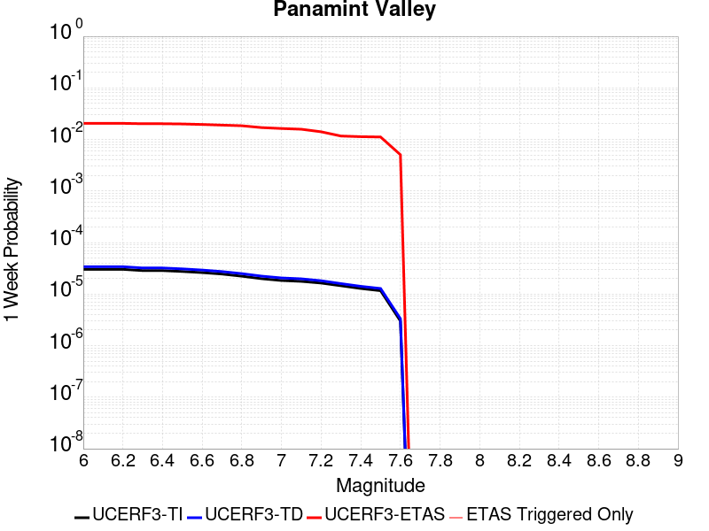 | 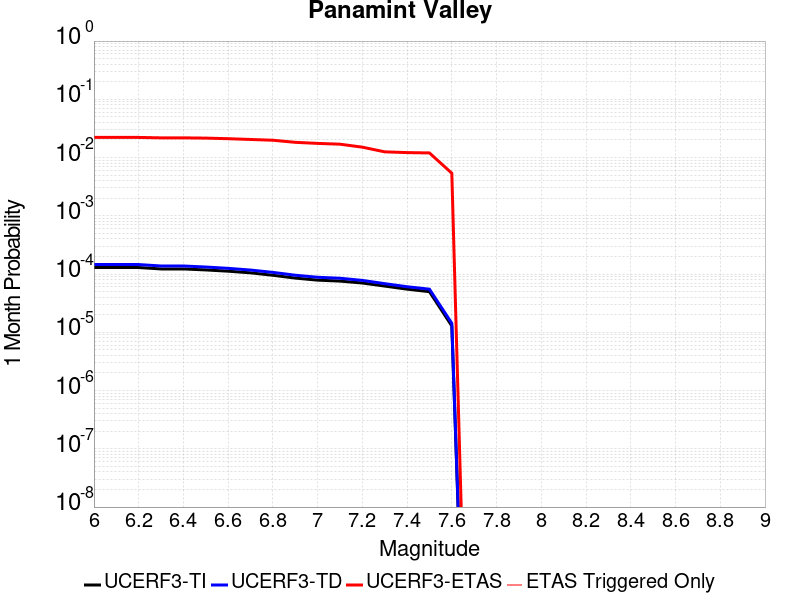 | 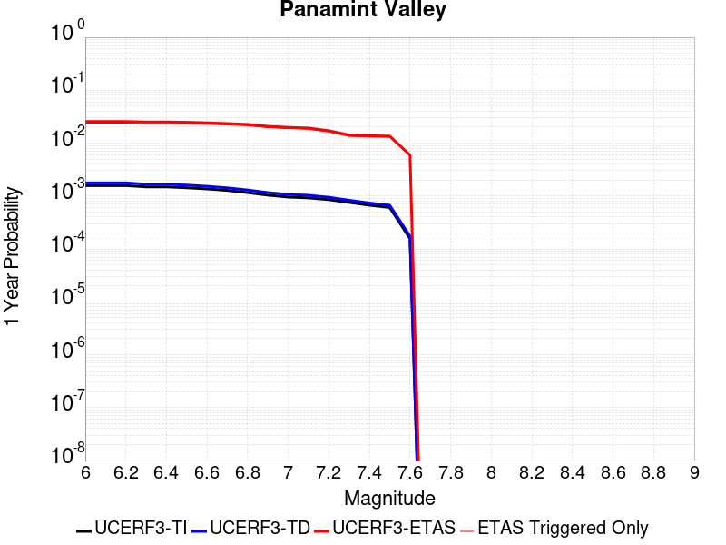 | 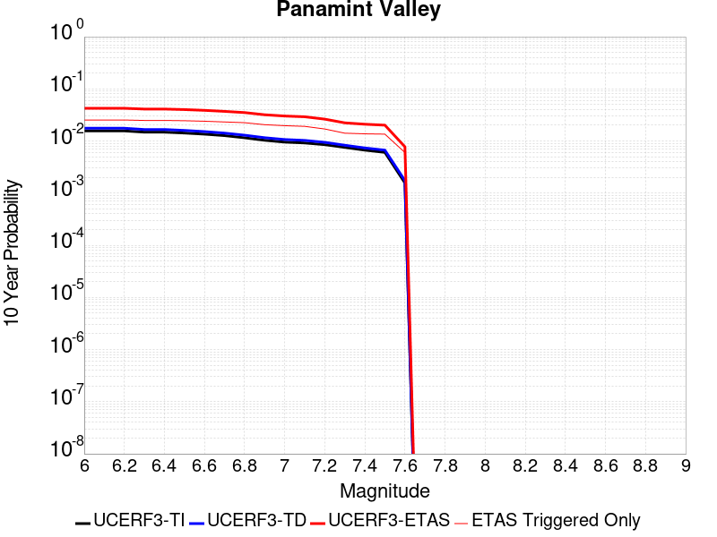 |

| Magnitude | 1 wk TI Prob | 1 wk TD Prob | 1 wk ETAS Prob | 1 wk ETAS/TD Gain | 1 wk ETAS Triggered Only | 1 mo TI Prob | 1 mo TD Prob | 1 mo ETAS Prob | 1 mo ETAS/TD Gain | 1 mo ETAS Triggered Only | 1 yr TI Prob | 1 yr TD Prob | 1 yr ETAS Prob | 1 yr ETAS/TD Gain | 1 yr ETAS Triggered Only | 10 yr TI Prob | 10 yr TD Prob | 10 yr ETAS Prob | 10 yr ETAS/TD Gain | 10 yr ETAS Triggered Only |
|-----|-----|-----|-----|-----|-----|-----|-----|-----|-----|-----|-----|-----|-----|-----|-----|-----|-----|-----|-----|-----|
| 6.0 | 3.0211835E-5 | 3.3984263E-5 | 0.020513289 | 603.6114 | 0.02048 | 1.2947287E-4 | 1.4563887E-4 | 0.022162432 | 152.17387 | 0.02202 | 0.0015751923 | 0.0017717406 | 0.025629396 | 14.465659 | 0.0239 | 0.015640736 | 0.017583003 | 0.042438153 | 2.4135895 | 0.0253 |
| 6.1 | 3.0211835E-5 | 3.3984263E-5 | 0.020513289 | 603.6114 | 0.02048 | 1.2947287E-4 | 1.4563887E-4 | 0.022162432 | 152.17387 | 0.02202 | 0.0015751923 | 0.0017717406 | 0.025629396 | 14.465659 | 0.0239 | 0.015640736 | 0.017583003 | 0.042438153 | 2.4135895 | 0.0253 |
| 6.2 | 3.0211835E-5 | 3.3984263E-5 | 0.020513289 | 603.6114 | 0.02048 | 1.2947287E-4 | 1.4563887E-4 | 0.022162432 | 152.17387 | 0.02202 | 0.0015751923 | 0.0017717406 | 0.025629396 | 14.465659 | 0.0239 | 0.015640736 | 0.017583003 | 0.042438153 | 2.4135895 | 0.0253 |
| 6.3 | 2.8573924E-5 | 3.2102445E-5 | 0.020171456 | 628.34644 | 0.02014 | 1.2245393E-4 | 1.375748E-4 | 0.021794595 | 158.41997 | 0.02166 | 0.001489857 | 0.0016737141 | 0.025124399 | 15.011165 | 0.02349 | 0.01479908 | 0.016618038 | 0.041015744 | 2.468146 | 0.02481 |
| 6.4 | 2.8573924E-5 | 3.2102445E-5 | 0.020171456 | 628.34644 | 0.02014 | 1.2245393E-4 | 1.375748E-4 | 0.021794595 | 158.41997 | 0.02166 | 0.001489857 | 0.0016737141 | 0.025124399 | 15.011165 | 0.02349 | 0.01479908 | 0.016618038 | 0.041015744 | 2.468146 | 0.02481 |
| 6.5 | 2.7468774E-5 | 3.0828138E-5 | 0.019960213 | 647.46735 | 0.01993 | 1.1771801E-4 | 1.3211406E-4 | 0.021569282 | 163.26257 | 0.02144 | 0.0014322745 | 0.0016073292 | 0.024809975 | 15.435527 | 0.02324 | 0.014230782 | 0.015963882 | 0.040082607 | 2.5108309 | 0.02451 |
| 6.6 | 2.6135967E-5 | 2.9252153E-5 | 0.019518683 | 667.2563 | 0.01949 | 1.1200648E-4 | 1.2536049E-4 | 0.021082733 | 168.17685 | 0.02096 | 0.0013628257 | 0.0015252219 | 0.024220554 | 15.880019 | 0.02273 | 0.013544982 | 0.015154343 | 0.038751245 | 2.5571048 | 0.02396 |
| 6.7 | 2.4498746E-5 | 2.7341044E-5 | 0.018966824 | 693.71246 | 0.01894 | 1.04990395E-4 | 1.17170785E-4 | 0.020444788 | 174.48709 | 0.02033 | 0.0012775084 | 0.0014256459 | 0.023444211 | 16.444624 | 0.02205 | 0.012701893 | 0.014171593 | 0.03704281 | 2.6138778 | 0.0232 |
| 6.8 | 2.2244329E-5 | 2.4935374E-5 | 0.018434476 | 739.29016 | 0.01841 | 9.532935E-5 | 1.0686163E-4 | 0.019834753 | 185.61154 | 0.01973 | 0.0011600169 | 0.0013002857 | 0.022642499 | 17.413479 | 0.02137 | 0.011539802 | 0.012932955 | 0.035122223 | 2.7157152 | 0.02248 |
| 6.9 | 1.9902658E-5 | 2.2290182E-5 | 0.016971912 | 761.40753 | 0.01695 | 8.529431E-5 | 9.552596E-5 | 0.01826379 | 191.19191 | 0.01817 | 0.0010379635 | 0.0011624265 | 0.020779597 | 17.87605 | 0.01964 | 0.010331288 | 0.011569021 | 0.031901047 | 2.7574542 | 0.02057 |
| 7.0 | 1.8353881E-5 | 2.056605E-5 | 0.016300231 | 792.5795 | 0.01628 | 7.865712E-5 | 8.813734E-5 | 0.017506601 | 198.62866 | 0.01742 | 9.5722964E-4 | 0.0010725616 | 0.019872377 | 18.527958 | 0.01882 | 0.009531168 | 0.01067939 | 0.030159112 | 2.8240483 | 0.01969 |
| 7.1 | 1.7667631E-5 | 1.9772435E-5 | 0.015779462 | 798.05347 | 0.01576 | 7.571623E-5 | 8.4736355E-5 | 0.016963307 | 200.18924 | 0.01688 | 9.2145515E-4 | 0.0010311945 | 0.019272365 | 18.689362 | 0.01826 | 0.009176437 | 0.0102695925 | 0.029183341 | 2.8417232 | 0.01911 |
| 7.2 | 1.6381597E-5 | 1.8158042E-5 | 0.014077903 | 775.2985 | 0.01406 | 7.020495E-5 | 7.781795E-5 | 0.01508665 | 193.87106 | 0.01501 | 8.544101E-4 | 9.470391E-4 | 0.017171659 | 18.131943 | 0.01624 | 0.008511325 | 0.009435269 | 0.026284775 | 2.7858002 | 0.01701 |
| 7.3 | 1.4520491E-5 | 1.596657E-5 | 0.011645781 | 729.38525 | 0.01163 | 6.222919E-5 | 6.842646E-5 | 0.012537573 | 183.22697 | 0.01247 | 7.57377E-4 | 8.327899E-4 | 0.014271589 | 17.137081 | 0.01345 | 0.0075480095 | 0.008300399 | 0.022313116 | 2.6881976 | 0.01413 |
| 7.4 | 1.2852287E-5 | 1.41454875E-5 | 0.011313986 | 799.83 | 0.0113 | 5.5080065E-5 | 6.06222E-5 | 0.012169888 | 200.7497 | 0.01211 | 6.7039346E-4 | 7.378411E-4 | 0.01380819 | 18.714314 | 0.01308 | 0.0066837464 | 0.007357429 | 0.020996338 | 2.8537602 | 0.01374 |
| 7.5 | 1.1637851E-5 | 1.2836868E-5 | 0.011152694 | 868.80176 | 0.01114 | 4.987555E-5 | 5.5014076E-5 | 0.012004357 | 218.20518 | 0.01195 | 6.070656E-4 | 6.696062E-4 | 0.013570962 | 20.267078 | 0.01291 | 0.006054099 | 0.0066793845 | 0.020138878 | 3.01508 | 0.01355 |
| 7.6 | 3.0068115E-6 | 3.3330623E-6 | 0.0050533162 | 1516.1182 | 0.00505 | 1.2886271E-5 | 1.4284516E-5 | 0.0053842077 | 376.92618 | 0.00537 | 1.5687906E-4 | 1.7390738E-4 | 0.005952902 | 34.2303 | 0.00578 | 0.0015676835 | 0.0017397973 | 0.0077493237 | 4.454153 | 0.00602 |

## Garlock (East)
*[(top)](#table-of-contents)*

| 1 Week | 1 Month | 1 Year | 10 Year |
|-----|-----|-----|-----|
| 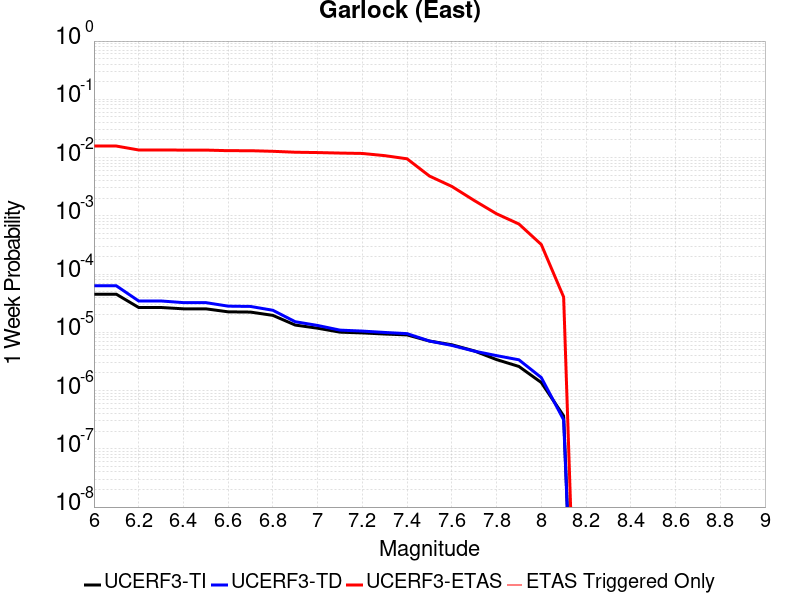 | 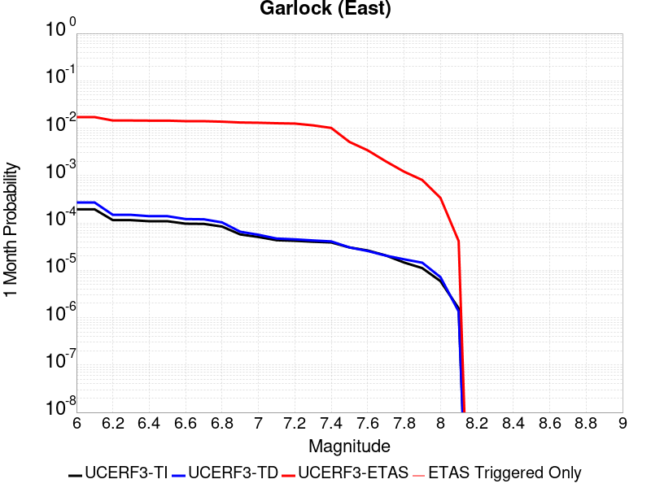 | 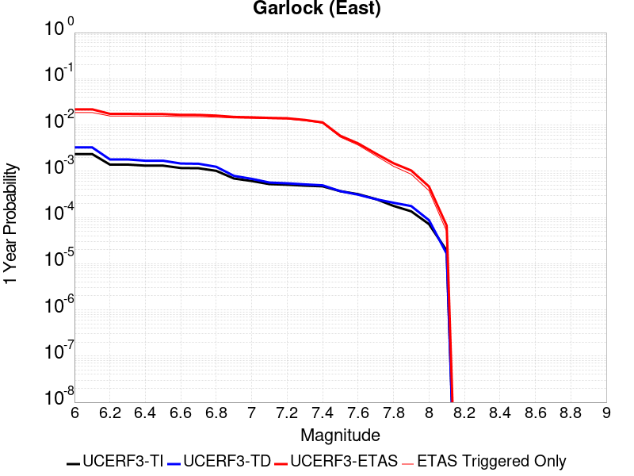 | 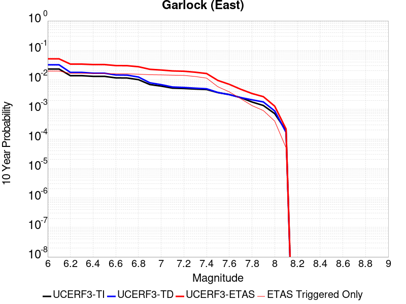 |

| Magnitude | 1 wk TI Prob | 1 wk TD Prob | 1 wk ETAS Prob | 1 wk ETAS/TD Gain | 1 wk ETAS Triggered Only | 1 mo TI Prob | 1 mo TD Prob | 1 mo ETAS Prob | 1 mo ETAS/TD Gain | 1 mo ETAS Triggered Only | 1 yr TI Prob | 1 yr TD Prob | 1 yr ETAS Prob | 1 yr ETAS/TD Gain | 1 yr ETAS Triggered Only | 10 yr TI Prob | 10 yr TD Prob | 10 yr ETAS Prob | 10 yr ETAS/TD Gain | 10 yr ETAS Triggered Only |
|-----|-----|-----|-----|-----|-----|-----|-----|-----|-----|-----|-----|-----|-----|-----|-----|-----|-----|-----|-----|-----|
| 6.0 | 4.5092507E-5 | 6.2904815E-5 | 0.015761917 | 250.56773 | 0.0157 | 1.9323928E-4 | 2.6956675E-4 | 0.017105028 | 63.453777 | 0.01684 | 0.0023501497 | 0.003277482 | 0.021826489 | 6.6595297 | 0.01861 | 0.023254504 | 0.03235377 | 0.051493812 | 1.5915861 | 0.01978 |
| 6.1 | 4.5092507E-5 | 6.2904815E-5 | 0.015761917 | 250.56773 | 0.0157 | 1.9323928E-4 | 2.6956675E-4 | 0.017105028 | 63.453777 | 0.01684 | 0.0023501497 | 0.003277482 | 0.021826489 | 6.6595297 | 0.01861 | 0.023254504 | 0.03235377 | 0.051493812 | 1.5915861 | 0.01978 |
| 6.2 | 2.6674514E-5 | 3.4511588E-5 | 0.013494047 | 391.0005 | 0.01346 | 1.1431433E-4 | 1.4789861E-4 | 0.014495776 | 98.01158 | 0.01435 | 0.0013908884 | 0.0017992114 | 0.017441018 | 9.693702 | 0.01567 | 0.01382215 | 0.017872788 | 0.034136813 | 1.9099882 | 0.01656 |
| 6.3 | 2.6674514E-5 | 3.4511588E-5 | 0.013494047 | 391.0005 | 0.01346 | 1.1431433E-4 | 1.4789861E-4 | 0.014495776 | 98.01158 | 0.01435 | 0.0013908884 | 0.0017992114 | 0.017441018 | 9.693702 | 0.01567 | 0.01382215 | 0.017872788 | 0.034136813 | 1.9099882 | 0.01656 |
| 6.4 | 2.5312667E-5 | 3.2340467E-5 | 0.013431907 | 415.32816 | 0.0134 | 1.0847834E-4 | 1.3859481E-4 | 0.014406617 | 103.94774 | 0.01427 | 0.0013199237 | 0.0016861152 | 0.017229863 | 10.218675 | 0.01557 | 0.013121112 | 0.016772287 | 0.03294638 | 1.9643346 | 0.01645 |
| 6.5 | 2.5312667E-5 | 3.2340467E-5 | 0.013431907 | 415.32816 | 0.0134 | 1.0847834E-4 | 1.3859481E-4 | 0.014406617 | 103.94774 | 0.01427 | 0.0013199237 | 0.0016861152 | 0.017229863 | 10.218675 | 0.01557 | 0.013121112 | 0.016772287 | 0.03294638 | 1.9643346 | 0.01645 |
| 6.6 | 2.246556E-5 | 2.8134691E-5 | 0.013127767 | 466.60425 | 0.0131 | 9.627742E-5 | 1.2057181E-4 | 0.014038893 | 116.43595 | 0.01392 | 0.0011715472 | 0.0014669969 | 0.016584786 | 11.305264 | 0.01514 | 0.011653901 | 0.014613169 | 0.03035965 | 2.0775542 | 0.01598 |
| 6.7 | 2.2241198E-5 | 2.7804432E-5 | 0.01311744 | 471.77518 | 0.01309 | 9.531594E-5 | 1.1915654E-4 | 0.014027499 | 117.72329 | 0.01391 | 0.0011598538 | 0.0014497889 | 0.016547868 | 11.413984 | 0.01512 | 0.011538187 | 0.014442829 | 0.030162467 | 2.0884042 | 0.01595 |
| 6.8 | 1.9528685E-5 | 2.3898969E-5 | 0.012803594 | 535.73834 | 0.01278 | 8.369167E-5 | 1.0242024E-4 | 0.013691029 | 133.67503 | 0.01359 | 0.0010184698 | 0.0012462728 | 0.015967902 | 12.812527 | 0.01474 | 0.010138147 | 0.012436723 | 0.027783457 | 2.2339852 | 0.01554 |
| 6.9 | 1.3318621E-5 | 1.5198818E-5 | 0.012345011 | 812.2349 | 0.01233 | 5.7078556E-5 | 6.51362E-5 | 0.013164283 | 202.10394 | 0.0131 | 6.9470983E-4 | 7.927504E-4 | 0.014951517 | 18.86031 | 0.01417 | 0.0069254204 | 0.007940721 | 0.022732325 | 2.8627534 | 0.01491 |
| 7.0 | 1.1760853E-5 | 1.3107653E-5 | 0.012182948 | 929.45306 | 0.01217 | 5.0402683E-5 | 5.6174475E-5 | 0.012995448 | 231.3408 | 0.01294 | 6.134799E-4 | 6.8371464E-4 | 0.014654157 | 21.433147 | 0.01398 | 0.0061178906 | 0.006857401 | 0.021466529 | 3.1304176 | 0.01471 |
| 7.1 | 1.0064758E-5 | 1.0902761E-5 | 0.011940773 | 1095.2064 | 0.01193 | 4.3133965E-5 | 4.67253E-5 | 0.012696134 | 271.71863 | 0.01265 | 5.2502943E-4 | 5.6873553E-4 | 0.014240955 | 25.039679 | 0.01368 | 0.005237907 | 0.0057133473 | 0.020021133 | 3.5042737 | 0.01439 |
| 7.2 | 9.768808E-6 | 1.0498628E-5 | 0.011760375 | 1120.182 | 0.01175 | 4.186565E-5 | 4.499337E-5 | 0.012494433 | 277.695 | 0.01245 | 5.095951E-4 | 5.4766005E-4 | 0.013990294 | 25.54558 | 0.01345 | 0.0050842804 | 0.005503584 | 0.019565763 | 3.555095 | 0.01414 |
| 7.3 | 9.344516E-6 | 9.9442705E-6 | 0.010789837 | 1085.0305 | 0.01078 | 4.004731E-5 | 4.2617627E-5 | 0.011452131 | 268.7182 | 0.01141 | 4.8746695E-4 | 5.187495E-4 | 0.012862343 | 24.7949 | 0.01235 | 0.0048639905 | 0.005215269 | 0.018107679 | 3.4720507 | 0.01296 |
| 7.4 | 9.023491E-6 | 9.490441E-6 | 0.0095194 | 1003.0514 | 0.00951 | 3.867153E-5 | 4.0672705E-5 | 0.010100263 | 248.33026 | 0.01006 | 4.7072413E-4 | 4.95081E-4 | 0.011389685 | 23.0057 | 0.0109 | 0.004697283 | 0.0049787266 | 0.016351819 | 3.2843378 | 0.01143 |
| 7.5 | 7.081253E-6 | 7.0873994E-6 | 0.004817053 | 679.6644 | 0.00481 | 3.0347876E-5 | 3.0374218E-5 | 0.0051202197 | 168.57124 | 0.00509 | 3.6942272E-4 | 3.697441E-4 | 0.0058377218 | 15.788546 | 0.00547 | 0.003688092 | 0.0037244745 | 0.009512835 | 2.5541415 | 0.00581 |
| 7.6 | 6.116396E-6 | 5.9589424E-6 | 0.0031959398 | 536.3267 | 0.00319 | 2.6212863E-5 | 2.5538076E-5 | 0.0034054518 | 133.348 | 0.00338 | 3.1909486E-4 | 3.1088197E-4 | 0.0039997348 | 12.865767 | 0.00369 | 0.0031863707 | 0.0031359126 | 0.0070436196 | 2.2461147 | 0.00392 |
| 7.7 | 4.797145E-6 | 4.7571157E-6 | 0.0018347484 | 385.68506 | 0.00183 | 2.055903E-5 | 2.0387479E-5 | 0.0019903474 | 97.62596 | 0.00197 | 2.5027743E-4 | 2.481894E-4 | 0.0024176508 | 9.741152 | 0.00217 | 0.0024999576 | 0.0025094065 | 0.004803635 | 1.9142513 | 0.0023 |
| 7.8 | 3.4028885E-6 | 3.978375E-6 | 0.001083974 | 272.46655 | 0.00108 | 1.4583726E-5 | 1.7050066E-5 | 0.0012070298 | 70.79326 | 0.00119 | 1.775424E-4 | 2.0756487E-4 | 0.0014872992 | 7.1654673 | 0.00128 | 0.0017740062 | 0.0021012141 | 0.0034383985 | 1.6363865 | 0.00134 |
| 7.9 | 2.5928412E-6 | 3.372436E-6 | 7.2337E-4 | 214.49481 | 7.2E-4 | 1.1112129E-5 | 1.4453217E-5 | 8.044418E-4 | 55.65832 | 7.9E-4 | 1.3528178E-4 | 1.7595377E-4 | 0.0010358024 | 5.8867874 | 8.6E-4 | 0.0013519945 | 0.0017812426 | 0.0026896216 | 1.5099694 | 9.1E-4 |
| 8.0 | 1.3743648E-6 | 1.6734741E-6 | 3.2167294E-4 | 192.21866 | 3.2E-4 | 5.8901214E-6 | 7.1720124E-6 | 3.3716965E-4 | 47.011864 | 3.3E-4 | 7.1709874E-5 | 8.731578E-5 | 4.672826E-4 | 5.3516397 | 3.8E-4 | 7.1686733E-4 | 8.837377E-4 | 0.0012833843 | 1.452223 | 4.0E-4 |
| 8.1 | 3.6733252E-7 | 3.1489736E-7 | 4.0314884E-5 | 128.02547 | 4.0E-5 | 1.5742813E-6 | 1.3495595E-6 | 4.1349507E-5 | 30.63926 | 4.0E-5 | 1.9166706E-5 | 1.643078E-5 | 6.642996E-5 | 4.0430193 | 5.0E-5 | 1.9165053E-4 | 1.662928E-4 | 2.1628448E-4 | 1.3006245 | 5.0E-5 |

## Hunter Mountain-Saline Valley
*[(top)](#table-of-contents)*

| 1 Week | 1 Month | 1 Year | 10 Year |
|-----|-----|-----|-----|
| 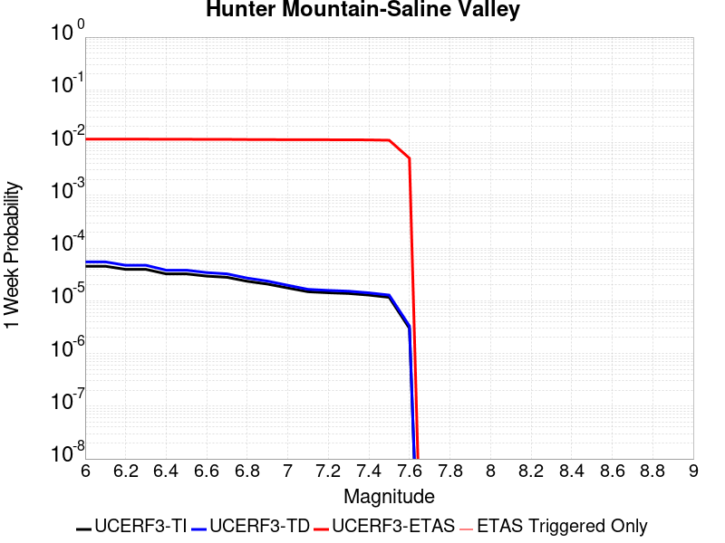 | 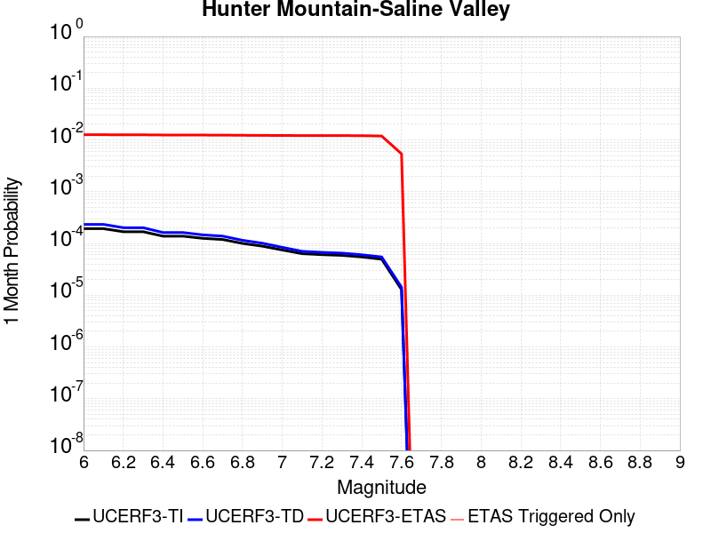 | 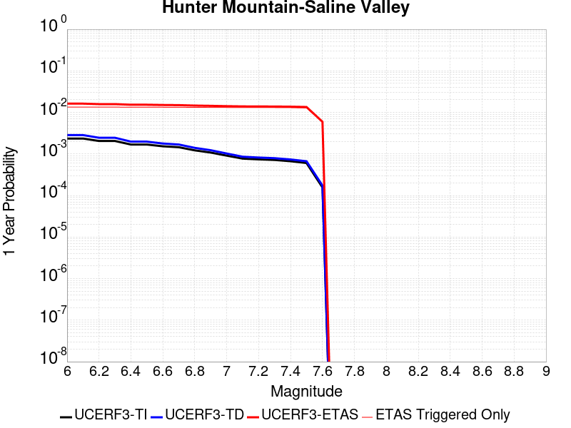 | 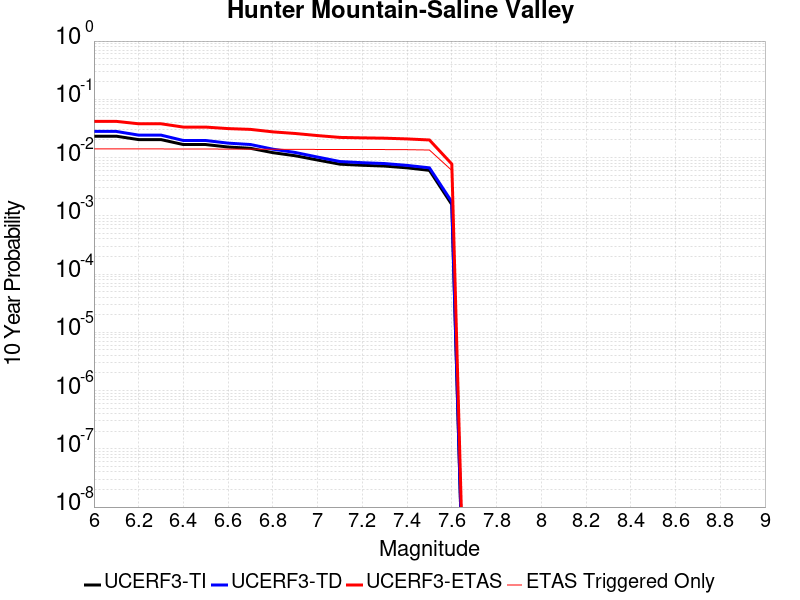 |

| Magnitude | 1 wk TI Prob | 1 wk TD Prob | 1 wk ETAS Prob | 1 wk ETAS/TD Gain | 1 wk ETAS Triggered Only | 1 mo TI Prob | 1 mo TD Prob | 1 mo ETAS Prob | 1 mo ETAS/TD Gain | 1 mo ETAS Triggered Only | 1 yr TI Prob | 1 yr TD Prob | 1 yr ETAS Prob | 1 yr ETAS/TD Gain | 1 yr ETAS Triggered Only | 10 yr TI Prob | 10 yr TD Prob | 10 yr ETAS Prob | 10 yr ETAS/TD Gain | 10 yr ETAS Triggered Only |
|-----|-----|-----|-----|-----|-----|-----|-----|-----|-----|-----|-----|-----|-----|-----|-----|-----|-----|-----|-----|-----|
| 6.0 | 4.5103672E-5 | 5.456906E-5 | 0.011643937 | 213.37982 | 0.01159 | 1.9328714E-4 | 2.3384714E-4 | 0.012630948 | 54.013695 | 0.0124 | 0.002350731 | 0.0028435462 | 0.01624533 | 5.7130527 | 0.01344 | 0.023260195 | 0.028092625 | 0.041815955 | 1.488503 | 0.01412 |
| 6.1 | 4.5103672E-5 | 5.456906E-5 | 0.011643937 | 213.37982 | 0.01159 | 1.9328714E-4 | 2.3384714E-4 | 0.012630948 | 54.013695 | 0.0124 | 0.002350731 | 0.0028435462 | 0.01624533 | 5.7130527 | 0.01344 | 0.023260195 | 0.028092625 | 0.041815955 | 1.488503 | 0.01412 |
| 6.2 | 3.9363465E-5 | 4.706271E-5 | 0.011606519 | 246.61815 | 0.01156 | 1.6868966E-4 | 2.016826E-4 | 0.012569188 | 62.321625 | 0.01237 | 0.002051862 | 0.0024528534 | 0.015819985 | 6.4496255 | 0.0134 | 0.020330196 | 0.024274187 | 0.03800265 | 1.5655581 | 0.01407 |
| 6.3 | 3.9363465E-5 | 4.706271E-5 | 0.011606519 | 246.61815 | 0.01156 | 1.6868966E-4 | 2.016826E-4 | 0.012569188 | 62.321625 | 0.01237 | 0.002051862 | 0.0024528534 | 0.015819985 | 6.4496255 | 0.0134 | 0.020330196 | 0.024274187 | 0.03800265 | 1.5655581 | 0.01407 |
| 6.4 | 3.2311684E-5 | 3.795112E-5 | 0.011547514 | 304.27338 | 0.01151 | 1.384713E-4 | 1.6263791E-4 | 0.012480634 | 76.73878 | 0.01232 | 0.0016845843 | 0.001978387 | 0.015301975 | 7.7345715 | 0.01335 | 0.016718714 | 0.019617118 | 0.033352282 | 1.7001622 | 0.01401 |
| 6.5 | 3.2311684E-5 | 3.795112E-5 | 0.011547514 | 304.27338 | 0.01151 | 1.384713E-4 | 1.6263791E-4 | 0.012480634 | 76.73878 | 0.01232 | 0.0016845843 | 0.001978387 | 0.015301975 | 7.7345715 | 0.01335 | 0.016718714 | 0.019617118 | 0.033352282 | 1.7001622 | 0.01401 |
| 6.6 | 2.9305844E-5 | 3.418196E-5 | 0.011523789 | 337.1307 | 0.01149 | 1.2559042E-4 | 1.4648624E-4 | 0.012434686 | 84.88637 | 0.01229 | 0.0015279909 | 0.0017820727 | 0.015078335 | 8.4611225 | 0.01332 | 0.015175272 | 0.017686324 | 0.03141907 | 1.7764612 | 0.01398 |
| 6.7 | 2.7826512E-5 | 3.2344353E-5 | 0.0115019735 | 355.60992 | 0.01147 | 1.19251024E-4 | 1.3861163E-4 | 0.012406911 | 89.50844 | 0.01227 | 0.0014509142 | 0.0016863506 | 0.014953939 | 8.867634 | 0.01329 | 0.014414776 | 0.016743818 | 0.030460242 | 1.8191934 | 0.01395 |
| 6.8 | 2.3389874E-5 | 2.6866792E-5 | 0.011426561 | 425.30426 | 0.0114 | 1.0023846E-4 | 1.1513857E-4 | 0.012313734 | 106.947075 | 0.0122 | 0.00121972 | 0.001400958 | 0.014592451 | 10.416052 | 0.01321 | 0.01213047 | 0.013928067 | 0.027604885 | 1.9819609 | 0.01387 |
| 6.9 | 2.069209E-5 | 2.357011E-5 | 0.011393302 | 483.37927 | 0.01137 | 8.867737E-5 | 1.0101105E-4 | 0.012269782 | 121.4697 | 0.01217 | 0.0010791123 | 0.0012291519 | 0.0143929515 | 11.7096615 | 0.01318 | 0.010738871 | 0.012229158 | 0.025899906 | 2.1178815 | 0.01384 |
| 7.0 | 1.7462342E-5 | 1.9633622E-5 | 0.011339411 | 577.55066 | 0.01132 | 7.483646E-5 | 8.414151E-5 | 0.012203122 | 145.03093 | 0.01212 | 9.1075303E-4 | 0.0010239641 | 0.01413053 | 13.7998295 | 0.01312 | 0.009070295 | 0.010196688 | 0.023836177 | 2.3376393 | 0.01378 |
| 7.1 | 1.4807709E-5 | 1.6441827E-5 | 0.011316256 | 688.26025 | 0.0113 | 6.3460066E-5 | 7.046316E-5 | 0.012169611 | 172.70883 | 0.0121 | 7.723524E-4 | 8.575678E-4 | 0.013936343 | 16.251009 | 0.01309 | 0.007696735 | 0.008546168 | 0.022178657 | 2.5951583 | 0.01375 |
| 7.2 | 1.4180048E-5 | 1.5698413E-5 | 0.011315521 | 720.8067 | 0.0113 | 6.077022E-5 | 6.727727E-5 | 0.012166463 | 180.84062 | 0.0121 | 7.396263E-4 | 8.1880915E-4 | 0.013878107 | 16.949135 | 0.01307 | 0.0073716943 | 0.008161469 | 0.021779412 | 2.668565 | 0.01373 |
| 7.3 | 1.3730402E-5 | 1.5172151E-5 | 0.011305001 | 745.11523 | 0.01129 | 5.8843252E-5 | 6.502197E-5 | 0.0121542355 | 186.92506 | 0.01209 | 7.161811E-4 | 7.9137104E-4 | 0.013841036 | 17.489944 | 0.01306 | 0.007138774 | 0.007889058 | 0.02150082 | 2.7253976 | 0.01372 |
| 7.4 | 1.2810095E-5 | 1.4109353E-5 | 0.011243951 | 796.9147 | 0.01123 | 5.489925E-5 | 6.0467344E-5 | 0.01208974 | 199.93834 | 0.01203 | 6.681934E-4 | 7.3595706E-4 | 0.01372639 | 18.651073 | 0.013 | 0.006661878 | 0.0073386896 | 0.020898443 | 2.8477077 | 0.01366 |
| 7.5 | 1.1595659E-5 | 1.2800734E-5 | 0.0110826595 | 865.7831 | 0.01107 | 4.9694736E-5 | 5.485922E-5 | 0.011924208 | 217.36014 | 0.01187 | 6.0486543E-4 | 6.67722E-4 | 0.013489155 | 20.201754 | 0.01283 | 0.006032217 | 0.006660632 | 0.020040913 | 3.0088606 | 0.01347 |
| 7.6 | 2.997694E-6 | 3.3251877E-6 | 0.0050533083 | 1519.7063 | 0.00505 | 1.28471975E-5 | 1.4250767E-5 | 0.005384174 | 377.81644 | 0.00537 | 1.564034E-4 | 1.7349655E-4 | 0.0059524938 | 34.309002 | 0.00578 | 0.0015629337 | 0.0017356955 | 0.0077452464 | 4.4623303 | 0.00602 |

## Garlock (West)
*[(top)](#table-of-contents)*

| 1 Week | 1 Month | 1 Year | 10 Year |
|-----|-----|-----|-----|
| 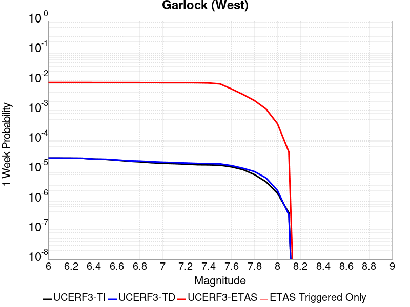 | 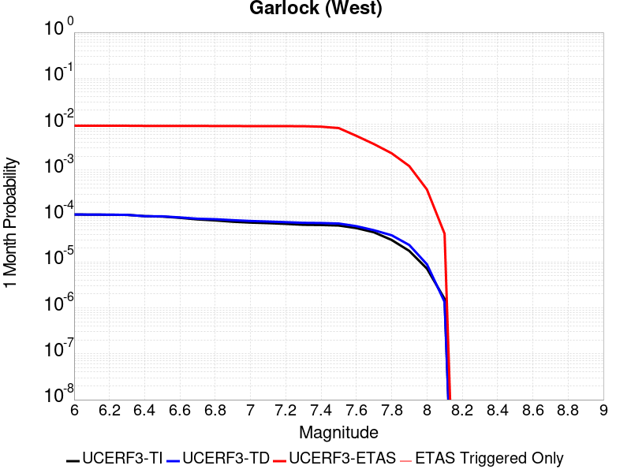 | 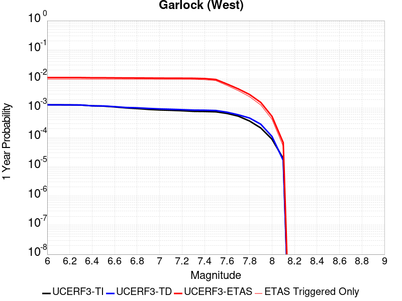 | 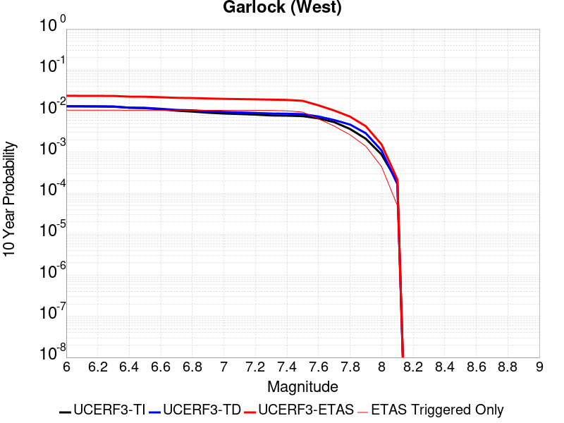 |

| Magnitude | 1 wk TI Prob | 1 wk TD Prob | 1 wk ETAS Prob | 1 wk ETAS/TD Gain | 1 wk ETAS Triggered Only | 1 mo TI Prob | 1 mo TD Prob | 1 mo ETAS Prob | 1 mo ETAS/TD Gain | 1 mo ETAS Triggered Only | 1 yr TI Prob | 1 yr TD Prob | 1 yr ETAS Prob | 1 yr ETAS/TD Gain | 1 yr ETAS Triggered Only | 10 yr TI Prob | 10 yr TD Prob | 10 yr ETAS Prob | 10 yr ETAS/TD Gain | 10 yr ETAS Triggered Only |
|-----|-----|-----|-----|-----|-----|-----|-----|-----|-----|-----|-----|-----|-----|-----|-----|-----|-----|-----|-----|-----|
| 6.0 | 2.5181727E-5 | 2.5197181E-5 | 0.00866498 | 343.88684 | 0.00864 | 1.0791722E-4 | 1.0798347E-4 | 0.009246997 | 85.633446 | 0.00914 | 0.0013131002 | 0.0013139093 | 0.011230862 | 8.547669 | 0.00993 | 0.013053683 | 0.013141794 | 0.02354328 | 1.7914814 | 0.01054 |
| 6.1 | 2.5077732E-5 | 2.5098223E-5 | 0.008664882 | 345.23883 | 0.00864 | 1.0747157E-4 | 1.075594E-4 | 0.009246577 | 85.96716 | 0.00914 | 0.001307681 | 0.0013087525 | 0.011225756 | 8.577448 | 0.00993 | 0.013000126 | 0.013090835 | 0.023492858 | 1.7946035 | 0.01054 |
| 6.2 | 2.494612E-5 | 2.4979914E-5 | 0.008664764 | 346.86923 | 0.00864 | 1.0690756E-4 | 1.070524E-4 | 0.009246074 | 86.369606 | 0.00914 | 0.0013008224 | 0.0013025872 | 0.011219652 | 8.61336 | 0.00993 | 0.012932341 | 0.013029906 | 0.023432571 | 1.7983683 | 0.01054 |
| 6.3 | 2.4733758E-5 | 2.4799276E-5 | 0.008664585 | 349.3886 | 0.00864 | 1.0599751E-4 | 1.06278305E-4 | 0.009245307 | 86.99148 | 0.00914 | 0.0012897556 | 0.0012931736 | 0.011210333 | 8.668853 | 0.00993 | 0.012822957 | 0.0129368715 | 0.023340518 | 1.8041855 | 0.01054 |
| 6.4 | 2.3237335E-5 | 2.3178607E-5 | 0.008612979 | 371.59177 | 0.00859 | 9.958477E-5 | 9.933313E-5 | 0.00918843 | 92.50117 | 0.00909 | 0.0012117702 | 0.0012087126 | 0.011066782 | 9.155843 | 0.00987 | 0.012051838 | 0.012101731 | 0.022454906 | 1.8555118 | 0.01048 |
| 6.5 | 2.2732203E-5 | 2.2992977E-5 | 0.008612796 | 374.58374 | 0.00859 | 9.742009E-5 | 9.8537625E-5 | 0.009187642 | 93.23994 | 0.00909 | 0.0011854442 | 0.0011990381 | 0.011057204 | 9.221728 | 0.00987 | 0.011791403 | 0.012006035 | 0.022360213 | 1.8624144 | 0.01048 |
| 6.6 | 2.1319436E-5 | 2.1773201E-5 | 0.008601586 | 395.0538 | 0.00858 | 9.136581E-5 | 9.3310395E-5 | 0.009172463 | 98.300545 | 0.00908 | 0.001111811 | 0.0011354643 | 0.010984269 | 9.673812 | 0.00986 | 0.011062649 | 0.011376952 | 0.021727836 | 1.9098116 | 0.01047 |
| 6.7 | 1.970802E-5 | 2.0393094E-5 | 0.008590219 | 421.23172 | 0.00857 | 8.446021E-5 | 8.739606E-5 | 0.009156603 | 104.771355 | 0.00907 | 0.001027818 | 0.0010635294 | 0.010903054 | 10.251765 | 0.00985 | 0.010230771 | 0.0106646875 | 0.021013135 | 1.9703469 | 0.01046 |
| 6.8 | 1.8744462E-5 | 1.9900775E-5 | 0.00857973 | 431.12546 | 0.00856 | 8.033094E-5 | 8.528626E-5 | 0.009144514 | 107.22142 | 0.00906 | 9.775903E-4 | 0.0010378672 | 0.010867654 | 10.471142 | 0.00984 | 0.009733009 | 0.010410495 | 0.020751705 | 1.9933448 | 0.01045 |
| 6.9 | 1.7559682E-5 | 1.8953151E-5 | 0.008558791 | 451.57617 | 0.00854 | 7.5253614E-5 | 8.122527E-5 | 0.009120491 | 112.28638 | 0.00904 | 9.158276E-4 | 9.884704E-4 | 0.0107987635 | 10.924721 | 0.00982 | 0.0091206245 | 0.009921073 | 0.020247595 | 2.0408676 | 0.01043 |
| 7.0 | 1.6794445E-5 | 1.8215967E-5 | 0.008528061 | 468.16403 | 0.00851 | 7.197421E-5 | 7.806611E-5 | 0.009087362 | 116.406 | 0.00901 | 8.759337E-4 | 9.5004175E-4 | 0.010730741 | 11.29502 | 0.00979 | 0.008724891 | 0.009539958 | 0.019840742 | 2.0797515 | 0.0104 |
| 7.1 | 1.6337795E-5 | 1.771677E-5 | 0.008517566 | 480.76294 | 0.0085 | 7.0017246E-5 | 7.592681E-5 | 0.009075243 | 119.52621 | 0.009 | 8.521265E-4 | 9.2401815E-4 | 0.010694982 | 11.574428 | 0.00978 | 0.008488664 | 0.009281721 | 0.019575285 | 2.1090145 | 0.01039 |
| 7.2 | 1.5780008E-5 | 1.71654E-5 | 0.008517019 | 496.1737 | 0.0085 | 6.762685E-5 | 7.3563926E-5 | 0.009072902 | 123.33357 | 0.009 | 8.2304585E-4 | 8.952741E-4 | 0.0106665185 | 11.914248 | 0.00978 | 0.008200042 | 0.008996559 | 0.019293085 | 2.144496 | 0.01039 |
| 7.3 | 1.5058865E-5 | 1.6618484E-5 | 0.008486478 | 510.665 | 0.00847 | 6.45364E-5 | 7.122013E-5 | 0.009040581 | 126.93857 | 0.00897 | 7.854473E-4 | 8.667614E-4 | 0.010608311 | 12.239021 | 0.00975 | 0.00782677 | 0.008713263 | 0.018982993 | 2.178632 | 0.01036 |
| 7.4 | 1.4887923E-5 | 1.6454453E-5 | 0.008316318 | 505.41443 | 0.0083 | 6.380382E-5 | 7.0517184E-5 | 0.008839899 | 125.35808 | 0.00877 | 7.7653467E-4 | 8.5820974E-4 | 0.010380031 | 12.094982 | 0.00953 | 0.0077382675 | 0.008628101 | 0.018680612 | 2.1650896 | 0.01014 |
| 7.5 | 1.4509299E-5 | 1.6046468E-5 | 0.0077459225 | 482.7182 | 0.00773 | 6.218123E-5 | 6.876877E-5 | 0.008238207 | 119.79575 | 0.00817 | 7.567935E-4 | 8.369394E-4 | 0.00966954 | 11.553454 | 0.00884 | 0.0075422134 | 0.008416411 | 0.017767044 | 2.111 | 0.00943 |
| 7.6 | 1.2756717E-5 | 1.4050529E-5 | 0.005233977 | 372.51105 | 0.00522 | 5.4670498E-5 | 6.0215163E-5 | 0.0055798828 | 92.66574 | 0.00552 | 6.6541E-4 | 7.328737E-4 | 0.0067484616 | 9.20822 | 0.00602 | 0.006634211 | 0.007381374 | 0.013773838 | 1.8660263 | 0.00644 |
| 7.7 | 1.0328985E-5 | 1.146033E-5 | 0.0034314212 | 299.4173 | 0.00342 | 4.4266326E-5 | 4.9114777E-5 | 0.003688936 | 75.108475 | 0.00364 | 5.388092E-4 | 5.9780874E-4 | 0.0046054116 | 7.7038207 | 0.00401 | 0.0053750467 | 0.006038286 | 0.010312321 | 1.7078227 | 0.0043 |
| 7.8 | 7.0306583E-6 | 8.899537E-6 | 0.0021388805 | 240.33618 | 0.00213 | 3.0131043E-5 | 3.8140315E-5 | 0.002328053 | 61.039165 | 0.00229 | 3.667837E-4 | 4.6425956E-4 | 0.002963099 | 6.3824186 | 0.0025 | 0.003661789 | 0.0046950667 | 0.007322672 | 1.5596523 | 0.00264 |
| 7.9 | 4.060633E-6 | 5.465412E-6 | 0.0011254593 | 205.92397 | 0.00112 | 1.7402595E-5 | 2.3422985E-5 | 0.0012233949 | 52.23053 | 0.0012 | 2.11856E-4 | 2.8513762E-4 | 0.0015847669 | 5.557902 | 0.0013 | 0.0021165414 | 0.002884143 | 0.004270134 | 1.4805555 | 0.00139 |
| 8.0 | 1.6729537E-6 | 2.0775192E-6 | 3.6207677E-4 | 174.28323 | 3.6E-4 | 7.169782E-6 | 8.903624E-6 | 3.7890032E-4 | 42.555744 | 3.7E-4 | 8.7288594E-5 | 1.0839626E-4 | 5.283507E-4 | 4.8742523 | 4.2E-4 | 8.7254314E-4 | 0.001096854 | 0.0015363714 | 1.4007072 | 4.4E-4 |
| 8.1 | 3.6733252E-7 | 3.1489736E-7 | 4.0314884E-5 | 128.02547 | 4.0E-5 | 1.5742813E-6 | 1.3495595E-6 | 4.1349507E-5 | 30.63926 | 4.0E-5 | 1.9166706E-5 | 1.643078E-5 | 6.642996E-5 | 4.0430193 | 5.0E-5 | 1.9165053E-4 | 1.662928E-4 | 2.1628448E-4 | 1.3006245 | 5.0E-5 |

## Blackwater
*[(top)](#table-of-contents)*

| 1 Week | 1 Month | 1 Year | 10 Year |
|-----|-----|-----|-----|
| 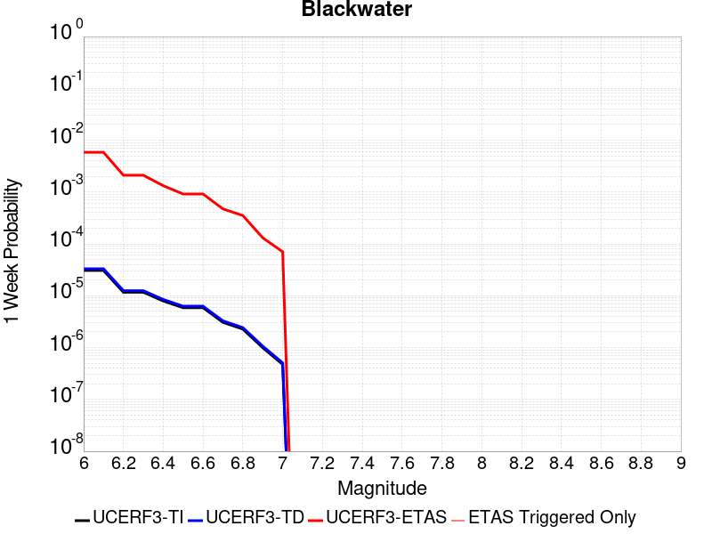 | 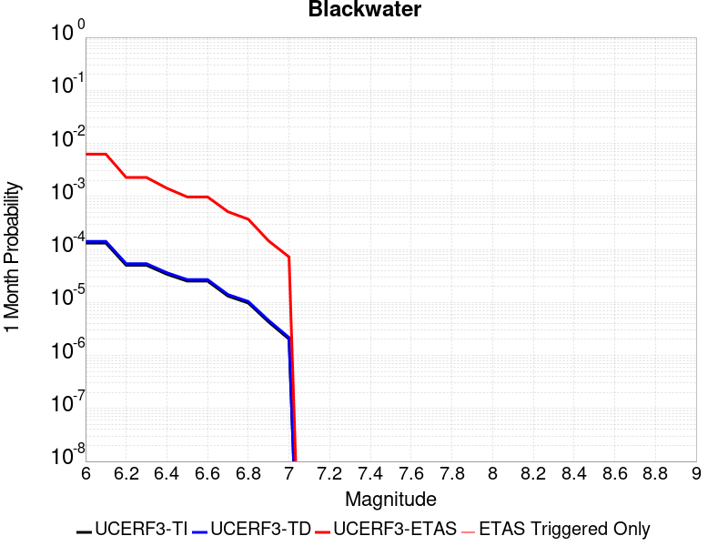 | 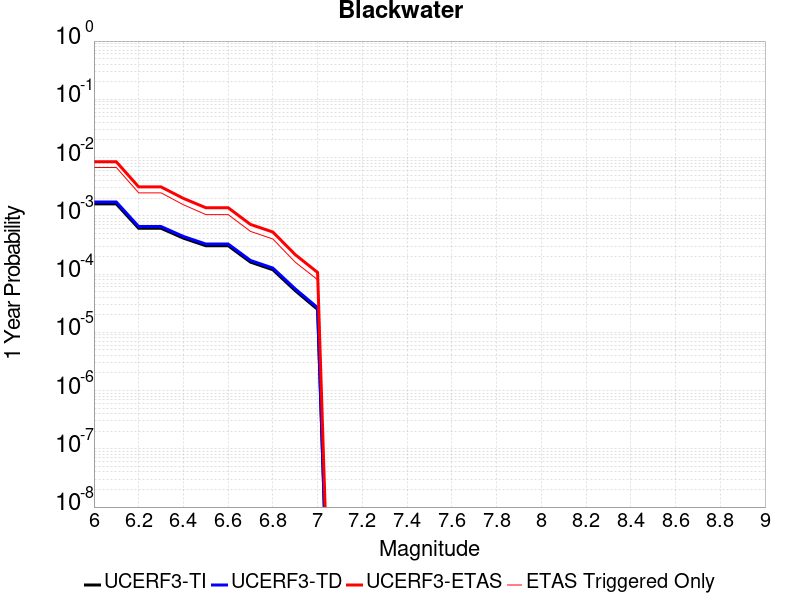 | 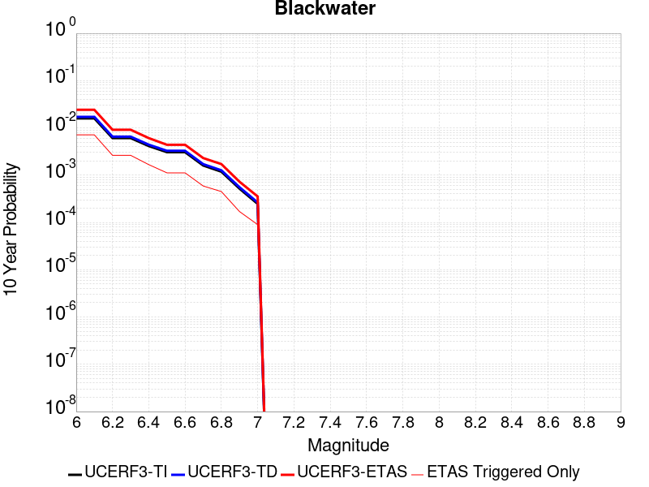 |

| Magnitude | 1 wk TI Prob | 1 wk TD Prob | 1 wk ETAS Prob | 1 wk ETAS/TD Gain | 1 wk ETAS Triggered Only | 1 mo TI Prob | 1 mo TD Prob | 1 mo ETAS Prob | 1 mo ETAS/TD Gain | 1 mo ETAS Triggered Only | 1 yr TI Prob | 1 yr TD Prob | 1 yr ETAS Prob | 1 yr ETAS/TD Gain | 1 yr ETAS Triggered Only | 10 yr TI Prob | 10 yr TD Prob | 10 yr ETAS Prob | 10 yr ETAS/TD Gain | 10 yr ETAS Triggered Only |
|-----|-----|-----|-----|-----|-----|-----|-----|-----|-----|-----|-----|-----|-----|-----|-----|-----|-----|-----|-----|-----|
| 6.0 | 3.0708583E-5 | 3.3095846E-5 | 0.0058429036 | 176.5449 | 0.00581 | 1.3160157E-4 | 1.4183241E-4 | 0.0062809614 | 44.28439 | 0.00614 | 0.0016010714 | 0.0017255784 | 0.008473913 | 4.910767 | 0.00676 | 0.015895851 | 0.017135633 | 0.024133628 | 1.4083884 | 0.00712 |
| 6.1 | 3.0708583E-5 | 3.3095846E-5 | 0.0058429036 | 176.5449 | 0.00581 | 1.3160157E-4 | 1.4183241E-4 | 0.0062809614 | 44.28439 | 0.00614 | 0.0016010714 | 0.0017255784 | 0.008473913 | 4.910767 | 0.00676 | 0.015895851 | 0.017135633 | 0.024133628 | 1.4083884 | 0.00712 |
| 6.2 | 1.1707779E-5 | 1.2545122E-5 | 0.0021125188 | 168.39363 | 0.0021 | 5.017523E-5 | 5.3763757E-5 | 0.0022736443 | 42.28954 | 0.00222 | 6.107122E-4 | 6.5438676E-4 | 0.0031327638 | 4.787328 | 0.00248 | 0.006090366 | 0.0065255696 | 0.009138407 | 1.4003999 | 0.00263 |
| 6.3 | 1.1707779E-5 | 1.2545122E-5 | 0.0021125188 | 168.39363 | 0.0021 | 5.017523E-5 | 5.3763757E-5 | 0.0022736443 | 42.28954 | 0.00222 | 6.107122E-4 | 6.5438676E-4 | 0.0031327638 | 4.787328 | 0.00248 | 0.006090366 | 0.0065255696 | 0.009138407 | 1.4003999 | 0.00263 |
| 6.4 | 7.929244E-6 | 8.480098E-6 | 0.0013284689 | 156.65726 | 0.00132 | 3.3982033E-5 | 3.6342793E-5 | 0.0014262922 | 39.245533 | 0.00139 | 4.136527E-4 | 4.423877E-4 | 0.001991702 | 4.502164 | 0.00155 | 0.0041288356 | 0.0044154758 | 0.006078102 | 1.3765452 | 0.00167 |
| 6.5 | 5.8832115E-6 | 6.285991E-6 | 9.1628026E-4 | 145.76544 | 9.1E-4 | 2.521352E-5 | 2.6939697E-5 | 9.769141E-4 | 36.262997 | 9.5E-4 | 3.0693135E-4 | 3.27944E-4 | 0.0013775997 | 4.200716 | 0.00105 | 0.0030650778 | 0.0032748538 | 0.004391186 | 1.34088 | 0.00112 |
| 6.6 | 5.8832115E-6 | 6.285991E-6 | 9.1628026E-4 | 145.76544 | 9.1E-4 | 2.521352E-5 | 2.6939697E-5 | 9.769141E-4 | 36.262997 | 9.5E-4 | 3.0693135E-4 | 3.27944E-4 | 0.0013775997 | 4.200716 | 0.00105 | 0.0030650778 | 0.0032748538 | 0.004391186 | 1.34088 | 0.00112 |
| 6.7 | 3.0715053E-6 | 3.2814662E-6 | 4.732799E-4 | 144.2282 | 4.7E-4 | 1.3163528E-5 | 1.4063357E-5 | 5.140563E-4 | 36.552887 | 5.0E-4 | 1.6025416E-4 | 1.7120909E-4 | 7.1111665E-4 | 4.153498 | 5.4E-4 | 0.0016013865 | 0.0017108864 | 0.002299877 | 1.3442605 | 5.9E-4 |
| 6.8 | 2.2722281E-6 | 2.4287538E-6 | 3.5242792E-4 | 145.10649 | 3.5E-4 | 9.738084E-6 | 1.0408908E-5 | 3.7040515E-4 | 35.5854 | 3.6E-4 | 1.1855473E-4 | 1.26722E-4 | 5.266713E-4 | 4.156116 | 4.0E-4 | 0.001184915 | 0.0012665876 | 0.0017160176 | 1.3548354 | 4.5E-4 |
| 6.9 | 9.952399E-7 | 1.0653489E-6 | 1.3106522E-4 | 123.02563 | 1.3E-4 | 4.265307E-6 | 4.5657757E-6 | 1.4456514E-4 | 31.662777 | 1.4E-4 | 5.1928873E-5 | 5.5587418E-5 | 2.1557852E-4 | 3.878189 | 1.6E-4 | 5.191674E-4 | 5.557858E-4 | 7.2569126E-4 | 1.3057033 | 1.7E-4 |
| 7.0 | 4.7385504E-7 | 5.0755597E-7 | 7.050752E-5 | 138.91576 | 7.0E-5 | 2.0308057E-6 | 2.1752398E-6 | 7.2175084E-5 | 33.18029 | 7.0E-5 | 2.4724779E-5 | 2.6483543E-5 | 1.0648143E-4 | 4.0206637 | 8.0E-5 | 2.4722028E-4 | 2.6483546E-4 | 3.548116E-4 | 1.3397436 | 9.0E-5 |

## Ash Hill
*[(top)](#table-of-contents)*

| 1 Week | 1 Month | 1 Year | 10 Year |
|-----|-----|-----|-----|
| 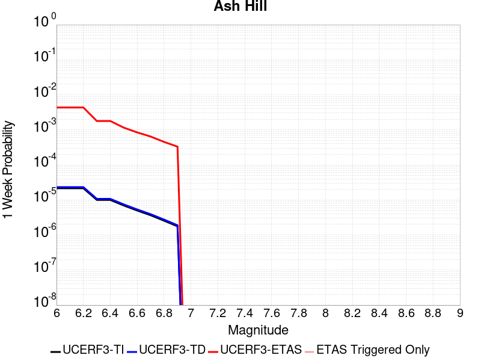 | 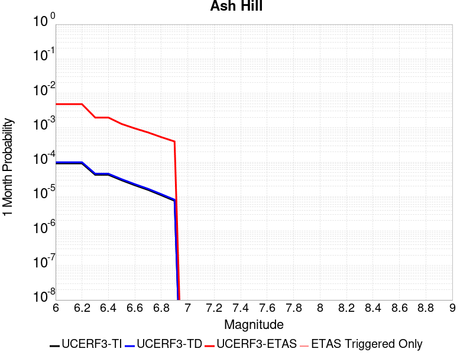 | 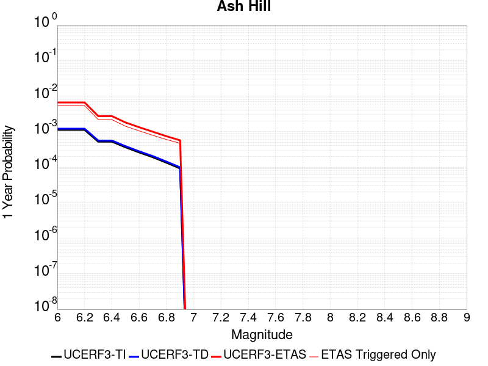 |  |

| Magnitude | 1 wk TI Prob | 1 wk TD Prob | 1 wk ETAS Prob | 1 wk ETAS/TD Gain | 1 wk ETAS Triggered Only | 1 mo TI Prob | 1 mo TD Prob | 1 mo ETAS Prob | 1 mo ETAS/TD Gain | 1 mo ETAS Triggered Only | 1 yr TI Prob | 1 yr TD Prob | 1 yr ETAS Prob | 1 yr ETAS/TD Gain | 1 yr ETAS Triggered Only | 10 yr TI Prob | 10 yr TD Prob | 10 yr ETAS Prob | 10 yr ETAS/TD Gain | 10 yr ETAS Triggered Only |
|-----|-----|-----|-----|-----|-----|-----|-----|-----|-----|-----|-----|-----|-----|-----|-----|-----|-----|-----|-----|-----|
| 6.0 | 2.1545662E-5 | 2.3194447E-5 | 0.0043430943 | 187.24716 | 0.00432 | 9.2335285E-5 | 9.940143E-5 | 0.004818932 | 48.479504 | 0.00472 | 0.0011236023 | 0.0012096206 | 0.006633052 | 5.483581 | 0.00543 | 0.011179381 | 0.012038348 | 0.017837683 | 1.4817384 | 0.00587 |
| 6.1 | 2.1545662E-5 | 2.3194447E-5 | 0.0043430943 | 187.24716 | 0.00432 | 9.2335285E-5 | 9.940143E-5 | 0.004818932 | 48.479504 | 0.00472 | 0.0011236023 | 0.0012096206 | 0.006633052 | 5.483581 | 0.00543 | 0.011179381 | 0.012038348 | 0.017837683 | 1.4817384 | 0.00587 |
| 6.2 | 2.1545662E-5 | 2.3194447E-5 | 0.0043430943 | 187.24716 | 0.00432 | 9.2335285E-5 | 9.940143E-5 | 0.004818932 | 48.479504 | 0.00472 | 0.0011236023 | 0.0012096206 | 0.006633052 | 5.483581 | 0.00543 | 0.011179381 | 0.012038348 | 0.017837683 | 1.4817384 | 0.00587 |
| 6.3 | 1.0025529E-5 | 1.0746934E-5 | 0.0017907278 | 166.62685 | 0.00178 | 4.2965847E-5 | 4.605755E-5 | 0.001965969 | 42.685055 | 0.00192 | 5.229836E-4 | 5.6061964E-4 | 0.0027393976 | 4.8863745 | 0.00218 | 0.005217545 | 0.0055933665 | 0.007920278 | 1.4160128 | 0.00234 |
| 6.4 | 1.0025529E-5 | 1.0746934E-5 | 0.0017907278 | 166.62685 | 0.00178 | 4.2965847E-5 | 4.605755E-5 | 0.001965969 | 42.685055 | 0.00192 | 5.229836E-4 | 5.6061964E-4 | 0.0027393976 | 4.8863745 | 0.00218 | 0.005217545 | 0.0055933665 | 0.007920278 | 1.4160128 | 0.00234 |
| 6.5 | 6.9617327E-6 | 7.456634E-6 | 0.001157448 | 155.22394 | 0.00115 | 2.9835655E-5 | 3.195666E-5 | 0.0012819167 | 40.114227 | 0.00125 | 3.6318856E-4 | 3.8901155E-4 | 0.0018084592 | 4.648857 | 0.00142 | 0.0036259557 | 0.0038841602 | 0.0054181786 | 1.394942 | 0.00154 |
| 6.6 | 4.9919777E-6 | 5.3466883E-6 | 8.453422E-4 | 158.10576 | 8.4E-4 | 2.1394015E-5 | 2.2914215E-5 | 9.528929E-4 | 41.58523 | 9.3E-4 | 2.60441E-4 | 2.7895154E-4 | 0.0013286587 | 4.7630444 | 0.00105 | 0.0026013597 | 0.0027866727 | 0.0039135236 | 1.4043715 | 0.00113 |
| 6.7 | 3.6630722E-6 | 3.924624E-6 | 6.4392213E-4 | 164.07233 | 6.4E-4 | 1.5698786E-5 | 1.681974E-5 | 7.268078E-4 | 43.211597 | 7.1E-4 | 1.9111596E-4 | 2.0476682E-4 | 9.94605E-4 | 4.857257 | 7.9E-4 | 0.0019095168 | 0.0020463446 | 0.002894605 | 1.4145248 | 8.5E-4 |
| 6.8 | 2.5599613E-6 | 2.744925E-6 | 4.527437E-4 | 164.93845 | 4.5E-4 | 1.0971216E-5 | 1.1763939E-5 | 5.3175783E-4 | 45.20236 | 5.2E-4 | 1.3356637E-4 | 1.4322149E-4 | 7.431356E-4 | 5.1887155 | 6.0E-4 | 0.0013348613 | 0.0014317769 | 0.002090832 | 1.4603057 | 6.6E-4 |
| 6.9 | 1.7684905E-6 | 1.8968707E-6 | 3.3189624E-4 | 174.97041 | 3.3E-4 | 7.579223E-6 | 8.129446E-6 | 3.9812629E-4 | 48.97336 | 3.9E-4 | 9.2273134E-5 | 9.8976E-5 | 5.689295E-4 | 5.7481556 | 4.7E-4 | 9.223483E-4 | 9.8976E-4 | 0.0014992553 | 1.5147665 | 5.1E-4 |

## San Andreas (Mojave N)
*[(top)](#table-of-contents)*

| 1 Week | 1 Month | 1 Year | 10 Year |
|-----|-----|-----|-----|
| 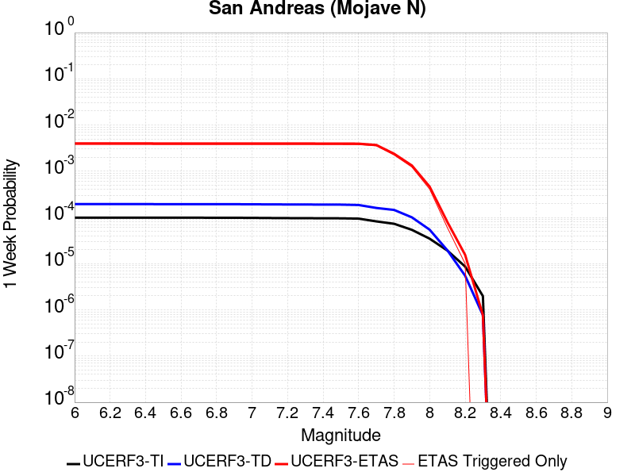 | 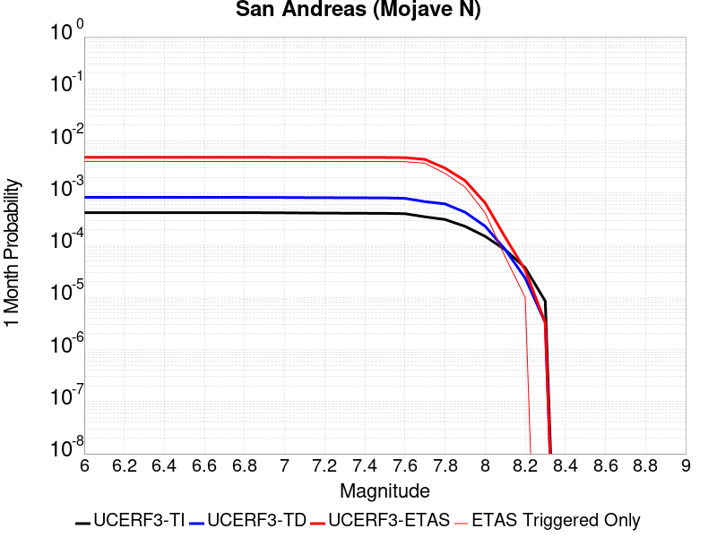 | 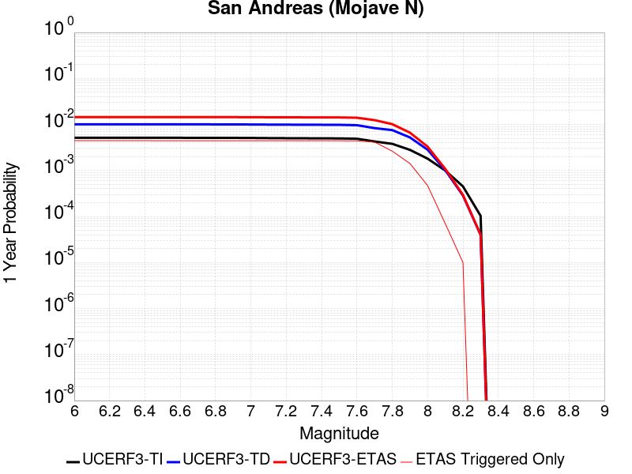 | 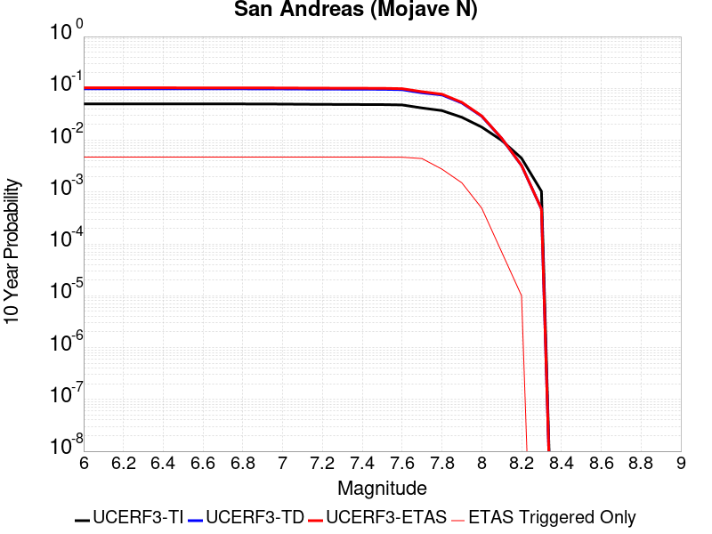 |

| Magnitude | 1 wk TI Prob | 1 wk TD Prob | 1 wk ETAS Prob | 1 wk ETAS/TD Gain | 1 wk ETAS Triggered Only | 1 mo TI Prob | 1 mo TD Prob | 1 mo ETAS Prob | 1 mo ETAS/TD Gain | 1 mo ETAS Triggered Only | 1 yr TI Prob | 1 yr TD Prob | 1 yr ETAS Prob | 1 yr ETAS/TD Gain | 1 yr ETAS Triggered Only | 10 yr TI Prob | 10 yr TD Prob | 10 yr ETAS Prob | 10 yr ETAS/TD Gain | 10 yr ETAS Triggered Only |
|-----|-----|-----|-----|-----|-----|-----|-----|-----|-----|-----|-----|-----|-----|-----|-----|-----|-----|-----|-----|-----|
| 6.0 | 9.877682E-5 | 1.9402112E-4 | 0.003993284 | 20.581697 | 0.0038 | 4.2326056E-4 | 8.312543E-4 | 0.0048778877 | 5.8681054 | 0.00405 | 0.0051410277 | 0.010073684 | 0.014478857 | 1.4372951 | 0.00445 | 0.05023708 | 0.09832245 | 0.1025964 | 1.0434687 | 0.00474 |
| 6.1 | 9.877682E-5 | 1.9402112E-4 | 0.003993284 | 20.581697 | 0.0038 | 4.2326056E-4 | 8.312543E-4 | 0.0048778877 | 5.8681054 | 0.00405 | 0.0051410277 | 0.010073684 | 0.014478857 | 1.4372951 | 0.00445 | 0.05023708 | 0.09832245 | 0.1025964 | 1.0434687 | 0.00474 |
| 6.2 | 9.877682E-5 | 1.9402112E-4 | 0.003993284 | 20.581697 | 0.0038 | 4.2326056E-4 | 8.312543E-4 | 0.0048778877 | 5.8681054 | 0.00405 | 0.0051410277 | 0.010073684 | 0.014478857 | 1.4372951 | 0.00445 | 0.05023708 | 0.09832245 | 0.1025964 | 1.0434687 | 0.00474 |
| 6.3 | 9.877682E-5 | 1.9402112E-4 | 0.003993284 | 20.581697 | 0.0038 | 4.2326056E-4 | 8.312543E-4 | 0.0048778877 | 5.8681054 | 0.00405 | 0.0051410277 | 0.010073684 | 0.014478857 | 1.4372951 | 0.00445 | 0.05023708 | 0.09832245 | 0.1025964 | 1.0434687 | 0.00474 |
| 6.4 | 9.877682E-5 | 1.9402112E-4 | 0.003993284 | 20.581697 | 0.0038 | 4.2326056E-4 | 8.312543E-4 | 0.0048778877 | 5.8681054 | 0.00405 | 0.0051410277 | 0.010073684 | 0.014478857 | 1.4372951 | 0.00445 | 0.05023708 | 0.09832245 | 0.1025964 | 1.0434687 | 0.00474 |
| 6.5 | 9.861474E-5 | 1.937588E-4 | 0.0039830245 | 20.556612 | 0.00379 | 4.2256617E-4 | 8.3013077E-4 | 0.004866777 | 5.862663 | 0.00404 | 0.0051326132 | 0.0100601325 | 0.014455466 | 1.4369061 | 0.00444 | 0.050156746 | 0.09820035 | 0.10246586 | 1.0434369 | 0.00473 |
| 6.6 | 9.861474E-5 | 1.937588E-4 | 0.0039830245 | 20.556612 | 0.00379 | 4.2256617E-4 | 8.3013077E-4 | 0.004866777 | 5.862663 | 0.00404 | 0.0051326132 | 0.0100601325 | 0.014455466 | 1.4369061 | 0.00444 | 0.050156746 | 0.09820035 | 0.10246586 | 1.0434369 | 0.00473 |
| 6.7 | 9.8552715E-5 | 1.9365833E-4 | 0.0039829244 | 20.566761 | 0.00379 | 4.223004E-4 | 8.2970044E-4 | 0.0048663486 | 5.865187 | 0.00404 | 0.0051293927 | 0.010054941 | 0.014450298 | 1.4371339 | 0.00444 | 0.050125998 | 0.09815356 | 0.102419294 | 1.0434598 | 0.00473 |
| 6.8 | 9.8464974E-5 | 1.9350994E-4 | 0.0039827763 | 20.581766 | 0.00379 | 4.219245E-4 | 8.290649E-4 | 0.0048657153 | 5.86892 | 0.00404 | 0.0051248376 | 0.010047276 | 0.0144426655 | 1.4374709 | 0.00444 | 0.05008251 | 0.09808378 | 0.10234984 | 1.0434941 | 0.00473 |
| 6.9 | 9.825824E-5 | 1.9319002E-4 | 0.003982458 | 20.6142 | 0.00379 | 4.2103877E-4 | 8.276947E-4 | 0.004864351 | 5.876987 | 0.00404 | 0.0051141046 | 0.010030746 | 0.01442621 | 1.438199 | 0.00444 | 0.049980022 | 0.097932965 | 0.10219974 | 1.0435684 | 0.00473 |
| 7.0 | 9.781462E-5 | 1.9250368E-4 | 0.003971776 | 20.632208 | 0.00378 | 4.1913814E-4 | 8.247551E-4 | 0.004851431 | 5.882269 | 0.00403 | 0.005091073 | 0.009995285 | 0.014381006 | 1.438779 | 0.00443 | 0.04976007 | 0.09760912 | 0.101868406 | 1.0436361 | 0.00472 |
| 7.1 | 9.7121134E-5 | 1.9152075E-4 | 0.0039707967 | 20.732985 | 0.00378 | 4.1616702E-4 | 8.205452E-4 | 0.0048472383 | 5.9073386 | 0.00403 | 0.005055068 | 0.0099444995 | 0.014330445 | 1.4410424 | 0.00443 | 0.04941613 | 0.09714571 | 0.10140718 | 1.0438668 | 0.00472 |
| 7.2 | 9.663819E-5 | 1.9082859E-4 | 0.003970107 | 20.804573 | 0.00378 | 4.1409794E-4 | 8.175807E-4 | 0.004844286 | 5.925147 | 0.00403 | 0.0050299936 | 0.009908735 | 0.014294839 | 1.4426503 | 0.00443 | 0.049176537 | 0.09681883 | 0.10108184 | 1.0440309 | 0.00472 |
| 7.3 | 9.6277574E-5 | 1.9035369E-4 | 0.003969634 | 20.85399 | 0.00378 | 4.125529E-4 | 8.1554666E-4 | 0.00484226 | 5.937441 | 0.00403 | 0.0050112694 | 0.009884195 | 0.014270409 | 1.4437603 | 0.00443 | 0.04899759 | 0.09659228 | 0.100856364 | 1.0441452 | 0.00472 |
| 7.4 | 9.593308E-5 | 1.8975153E-4 | 0.003969034 | 20.917007 | 0.00378 | 4.1107697E-4 | 8.129676E-4 | 0.0048396913 | 5.9531174 | 0.00403 | 0.0049933824 | 0.009853081 | 0.014239431 | 1.4451755 | 0.00443 | 0.04882661 | 0.09630986 | 0.100575276 | 1.0442885 | 0.00472 |
| 7.5 | 9.561707E-5 | 1.8921228E-4 | 0.0039684973 | 20.973782 | 0.00378 | 4.0972308E-4 | 8.106579E-4 | 0.004837391 | 5.967241 | 0.00403 | 0.0049769743 | 0.009825215 | 0.014211688 | 1.4464507 | 0.00443 | 0.048669744 | 0.096056245 | 0.10032286 | 1.0444179 | 0.00472 |
| 7.6 | 9.418194E-5 | 1.8573487E-4 | 0.0039450363 | 21.240149 | 0.00376 | 4.0357444E-4 | 7.95764E-4 | 0.004802573 | 6.035173 | 0.00401 | 0.004902454 | 0.009645499 | 0.014012963 | 1.4527981 | 0.00441 | 0.047957025 | 0.094437465 | 0.09869361 | 1.0450684 | 0.0047 |
| 7.7 | 8.202141E-5 | 1.6022482E-4 | 0.0036896593 | 23.028013 | 0.00353 | 3.51473E-4 | 6.8649714E-4 | 0.004433923 | 6.4587636 | 0.00375 | 0.00427079 | 0.008326128 | 0.012431658 | 1.4930899 | 0.00414 | 0.04189639 | 0.082237914 | 0.0863036 | 1.0494381 | 0.00443 |
| 7.8 | 7.2859846E-5 | 1.4517571E-4 | 0.0023848505 | 16.42734 | 0.00224 | 3.1221908E-4 | 6.2203326E-4 | 0.0030205403 | 4.8559146 | 0.0024 | 0.003794643 | 0.0075469986 | 0.01015715 | 1.3458529 | 0.00263 | 0.037304975 | 0.07472766 | 0.07729067 | 1.034298 | 0.00277 |
| 7.9 | 5.3874453E-5 | 1.00462625E-4 | 0.0013303391 | 13.242128 | 0.00123 | 2.3087008E-4 | 4.3048308E-4 | 0.0017399192 | 4.041783 | 0.00131 | 0.0028072202 | 0.0052285474 | 0.006641123 | 1.2701659 | 0.00142 | 0.02772022 | 0.052425884 | 0.05385672 | 1.0272926 | 0.00151 |
| 8.0 | 3.468538E-5 | 5.4261534E-5 | 4.642393E-4 | 8.555587 | 4.1E-4 | 1.4864317E-4 | 2.3252872E-4 | 6.5243104E-4 | 2.8058085 | 4.2E-4 | 0.0018082283 | 0.0028273636 | 0.0032960349 | 1.1657625 | 4.7E-4 | 0.017935853 | 0.028948462 | 0.029424276 | 1.0164366 | 4.9E-4 |
| 8.1 | 1.9152367E-5 | 1.9401303E-5 | 7.940014E-5 | 4.092516 | 6.0E-5 | 8.207899E-5 | 8.3145795E-5 | 1.431408E-4 | 1.721564 | 6.0E-5 | 9.988535E-4 | 0.0010118305 | 0.0010817597 | 1.0691116 | 7.0E-5 | 0.009943757 | 0.01085595 | 0.0109251905 | 1.006378 | 7.0E-5 |
| 8.2 | 8.643924E-6 | 5.473668E-6 | 1.5473614E-5 | 2.8269184 | 1.0E-5 | 3.704486E-5 | 2.3458366E-5 | 3.345813E-5 | 1.4262772 | 1.0E-5 | 4.5092785E-4 | 2.8556827E-4 | 2.955654E-4 | 1.035008 | 1.0E-5 | 0.0045001395 | 0.0032481793 | 0.003258147 | 1.0030687 | 1.0E-5 |
| 8.3 | 1.983087E-6 | 7.6564595E-7 | 7.6564595E-7 | 1.0 | 0.0 | 8.498917E-6 | 3.281336E-6 | 3.281336E-6 | 1.0 | 0.0 | 1.034694E-4 | 3.9949547E-5 | 3.9949547E-5 | 1.0 | 0.0 | 0.0010342124 | 4.717979E-4 | 4.717979E-4 | 1.0 | 0.0 |

## San Andreas (Mojave S)
*[(top)](#table-of-contents)*

| 1 Week | 1 Month | 1 Year | 10 Year |
|-----|-----|-----|-----|
| 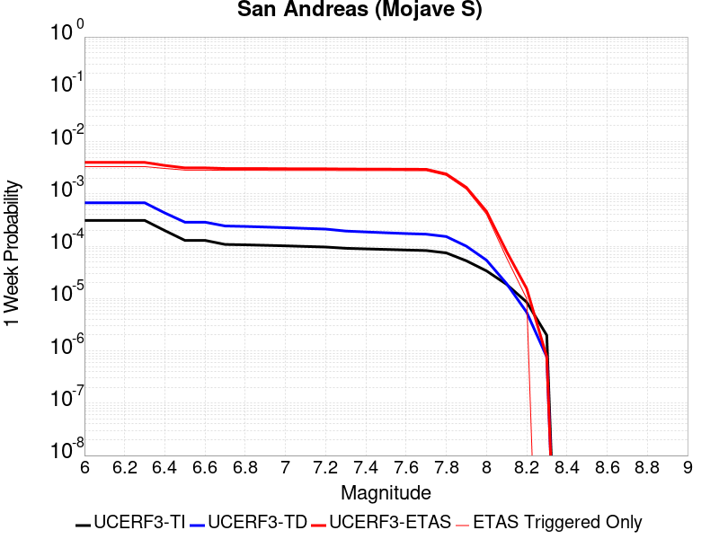 | 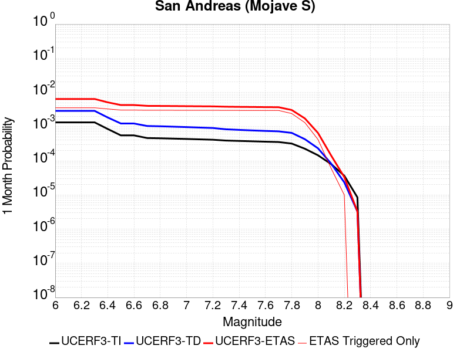 | 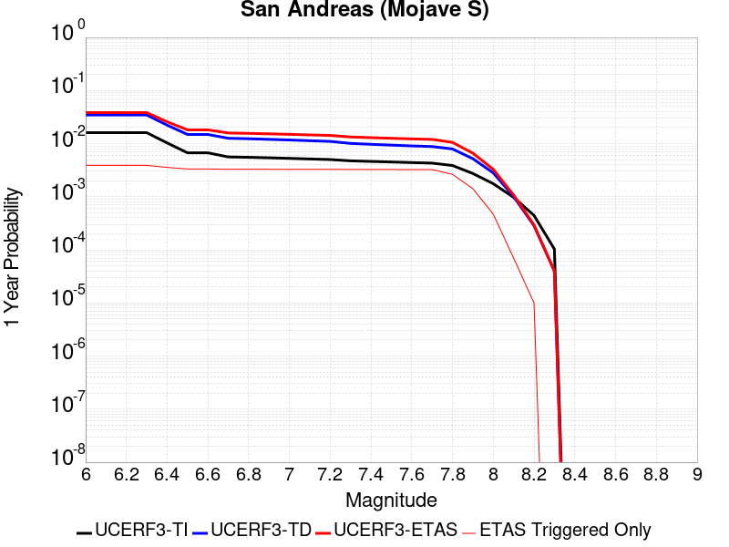 | 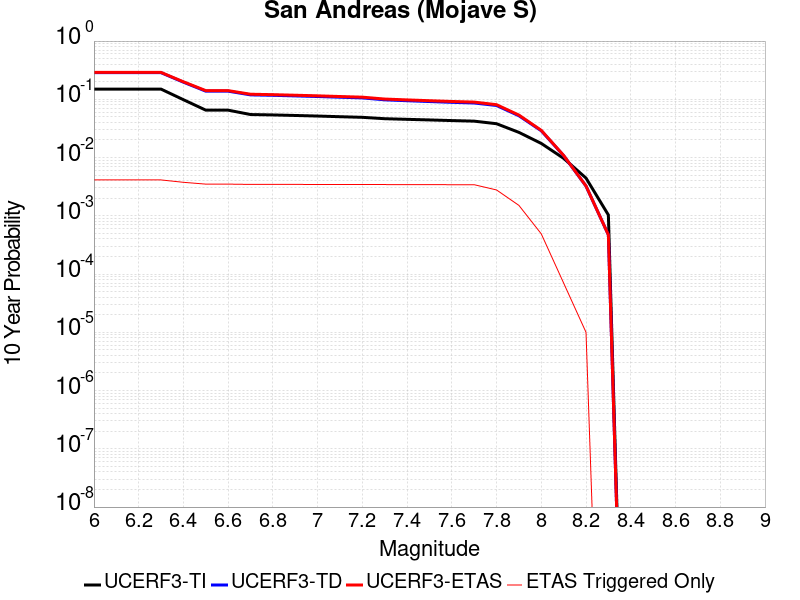 |

| Magnitude | 1 wk TI Prob | 1 wk TD Prob | 1 wk ETAS Prob | 1 wk ETAS/TD Gain | 1 wk ETAS Triggered Only | 1 mo TI Prob | 1 mo TD Prob | 1 mo ETAS Prob | 1 mo ETAS/TD Gain | 1 mo ETAS Triggered Only | 1 yr TI Prob | 1 yr TD Prob | 1 yr ETAS Prob | 1 yr ETAS/TD Gain | 1 yr ETAS Triggered Only | 10 yr TI Prob | 10 yr TD Prob | 10 yr ETAS Prob | 10 yr ETAS/TD Gain | 10 yr ETAS Triggered Only |
|-----|-----|-----|-----|-----|-----|-----|-----|-----|-----|-----|-----|-----|-----|-----|-----|-----|-----|-----|-----|-----|
| 6.0 | 3.1064058E-4 | 6.7462435E-4 | 0.0039923848 | 5.9179373 | 0.00332 | 0.0013306376 | 0.002888172 | 0.00643789 | 2.2290535 | 0.00356 | 0.016080605 | 0.034565594 | 0.03833079 | 1.1089289 | 0.0039 | 0.1496549 | 0.28654557 | 0.28949216 | 1.0102831 | 0.00413 |
| 6.1 | 3.1064058E-4 | 6.7462435E-4 | 0.0039923848 | 5.9179373 | 0.00332 | 0.0013306376 | 0.002888172 | 0.00643789 | 2.2290535 | 0.00356 | 0.016080605 | 0.034565594 | 0.03833079 | 1.1089289 | 0.0039 | 0.1496549 | 0.28654557 | 0.28949216 | 1.0102831 | 0.00413 |
| 6.2 | 3.1064058E-4 | 6.7462435E-4 | 0.0039923848 | 5.9179373 | 0.00332 | 0.0013306376 | 0.002888172 | 0.00643789 | 2.2290535 | 0.00356 | 0.016080605 | 0.034565594 | 0.03833079 | 1.1089289 | 0.0039 | 0.1496549 | 0.28654557 | 0.28949216 | 1.0102831 | 0.00413 |
| 6.3 | 3.1064058E-4 | 6.7462435E-4 | 0.0039923848 | 5.9179373 | 0.00332 | 0.0013306376 | 0.002888172 | 0.00643789 | 2.2290535 | 0.00356 | 0.016080605 | 0.034565594 | 0.03833079 | 1.1089289 | 0.0039 | 0.1496549 | 0.28654557 | 0.28949216 | 1.0102831 | 0.00413 |
| 6.4 | 1.9872203E-4 | 4.3181062E-4 | 0.0034904892 | 8.08338 | 0.00306 | 8.5138786E-4 | 0.0018493326 | 0.0051332484 | 2.7757301 | 0.00329 | 0.010316478 | 0.02228931 | 0.025779737 | 1.1565964 | 0.00357 | 0.098504856 | 0.19686839 | 0.19988817 | 1.015339 | 0.00376 |
| 6.5 | 1.291105E-4 | 2.8754136E-4 | 0.003136722 | 10.908767 | 0.00285 | 5.5321335E-4 | 0.0012317409 | 0.004277984 | 3.47312 | 0.00305 | 0.006714592 | 0.014894155 | 0.018174557 | 1.2202476 | 0.00333 | 0.065152965 | 0.13800792 | 0.1410249 | 1.0218608 | 0.0035 |
| 6.6 | 1.291105E-4 | 2.8754136E-4 | 0.003136722 | 10.908767 | 0.00285 | 5.5321335E-4 | 0.0012317409 | 0.004277984 | 3.47312 | 0.00305 | 0.006714592 | 0.014894155 | 0.018174557 | 1.2202476 | 0.00333 | 0.065152965 | 0.13800792 | 0.1410249 | 1.0218608 | 0.0035 |
| 6.7 | 1.08001186E-4 | 2.4335351E-4 | 0.0030526696 | 12.544178 | 0.00281 | 4.6278012E-4 | 0.0010425274 | 0.004049389 | 3.8842044 | 0.00301 | 0.0056198016 | 0.0126192 | 0.015867682 | 1.2574239 | 0.00329 | 0.054797906 | 0.11918431 | 0.12223193 | 1.0255706 | 0.00346 |
| 6.8 | 1.0624356E-4 | 2.3853009E-4 | 0.0030478598 | 12.777675 | 0.00281 | 4.5525006E-4 | 0.0010218718 | 0.004028796 | 3.942565 | 0.00301 | 0.0055285925 | 0.012370593 | 0.015619894 | 1.2626632 | 0.00329 | 0.053930566 | 0.11713308 | 0.1201878 | 1.026079 | 0.00346 |
| 6.9 | 1.0393785E-4 | 2.3223337E-4 | 0.0030415808 | 13.097087 | 0.00281 | 4.4537184E-4 | 9.949068E-4 | 0.004001912 | 4.0223994 | 0.00301 | 0.0054089287 | 0.012045963 | 0.015296332 | 1.2698306 | 0.00329 | 0.05279156 | 0.114433445 | 0.11749751 | 1.026776 | 0.00346 |
| 7.0 | 1.0155622E-4 | 2.2592908E-4 | 0.0030252964 | 13.3904705 | 0.0028 | 4.3516833E-4 | 9.6790853E-4 | 0.003965005 | 4.0964665 | 0.003 | 0.005285311 | 0.011720838 | 0.014962394 | 1.2765635 | 0.00328 | 0.05161361 | 0.11169745 | 0.1147621 | 1.027437 | 0.00345 |
| 7.1 | 9.885595E-5 | 2.188132E-4 | 0.0030182006 | 13.793503 | 0.0028 | 4.2359953E-4 | 9.374342E-4 | 0.003934622 | 4.1972246 | 0.003 | 0.0051451353 | 0.011353733 | 0.014596493 | 1.2856117 | 0.00328 | 0.05027629 | 0.10857607 | 0.11165148 | 1.028325 | 0.00345 |
| 7.2 | 9.6411415E-5 | 2.1244297E-4 | 0.003011848 | 14.177208 | 0.0028 | 4.1312634E-4 | 9.101525E-4 | 0.003907422 | 4.293151 | 0.003 | 0.005018219 | 0.011024987 | 0.014268825 | 1.294226 | 0.00328 | 0.049064007 | 0.1057697 | 0.1088548 | 1.029168 | 0.00345 |
| 7.3 | 9.1180635E-5 | 1.9472656E-4 | 0.0029841834 | 15.324993 | 0.00279 | 3.907156E-4 | 8.342756E-4 | 0.0038217811 | 4.5809574 | 0.00299 | 0.004746591 | 0.010110112 | 0.013347052 | 1.3201685 | 0.00327 | 0.046464786 | 0.09796176 | 0.10106477 | 1.0316757 | 0.00344 |
| 7.4 | 8.887388E-5 | 1.872126E-4 | 0.0029766902 | 15.900052 | 0.00279 | 3.8083247E-4 | 8.020931E-4 | 0.0037797028 | 4.7122993 | 0.00298 | 0.0046267817 | 0.009721855 | 0.0129501615 | 1.332067 | 0.00326 | 0.045316286 | 0.094593845 | 0.09769939 | 1.0328302 | 0.00343 |
| 7.5 | 8.6750515E-5 | 1.80528E-4 | 0.0029700242 | 16.451876 | 0.00279 | 3.7173493E-4 | 7.734621E-4 | 0.003751157 | 4.849827 | 0.00298 | 0.004516484 | 0.009376327 | 0.012605759 | 1.3444241 | 0.00326 | 0.04425787 | 0.09155606 | 0.09467202 | 1.0340334 | 0.00343 |
| 7.6 | 8.453092E-5 | 1.7440386E-4 | 0.002953919 | 16.937233 | 0.00278 | 3.6222505E-4 | 7.4723107E-4 | 0.0037150118 | 4.971704 | 0.00297 | 0.0044011753 | 0.009059664 | 0.01228022 | 1.3554829 | 0.00325 | 0.04315024 | 0.08871447 | 0.09183107 | 1.0351306 | 0.00342 |
| 7.7 | 8.259102E-5 | 1.6962511E-4 | 0.0029491535 | 17.386303 | 0.00278 | 3.539135E-4 | 7.267622E-4 | 0.0036946037 | 5.083648 | 0.00297 | 0.004300386 | 0.0088125 | 0.01203386 | 1.3655443 | 0.00325 | 0.042181134 | 0.086465426 | 0.089589715 | 1.0361334 | 0.00342 |
| 7.8 | 7.444844E-5 | 1.528469E-4 | 0.002402503 | 15.718362 | 0.00225 | 3.1902574E-4 | 6.5489375E-4 | 0.0030633155 | 4.677576 | 0.00241 | 0.0038772223 | 0.007944231 | 0.010563258 | 1.3296766 | 0.00264 | 0.03810269 | 0.078293875 | 0.08085622 | 1.0327272 | 0.00278 |
| 7.9 | 5.2586525E-5 | 1.0007023E-4 | 0.0013299471 | 13.290137 | 0.00123 | 2.2535135E-4 | 4.2880196E-4 | 0.0017382402 | 4.0537133 | 0.00131 | 0.0027402006 | 0.005208178 | 0.006620782 | 1.2712282 | 0.00142 | 0.027066574 | 0.052201588 | 0.053632766 | 1.0274163 | 0.00151 |
| 8.0 | 3.379877E-5 | 5.4075565E-5 | 4.640534E-4 | 8.581573 | 4.1E-4 | 1.4484383E-4 | 2.3173184E-4 | 6.5163453E-4 | 2.8120198 | 4.2E-4 | 0.0017620471 | 0.0028176866 | 0.0032863624 | 1.1663336 | 4.7E-4 | 0.017481409 | 0.028835917 | 0.029311787 | 1.0165027 | 4.9E-4 |
| 8.1 | 1.8668277E-5 | 1.9308145E-5 | 7.9306985E-5 | 4.107437 | 6.0E-5 | 8.000444E-5 | 8.274657E-5 | 1.427416E-4 | 1.7250456 | 6.0E-5 | 9.736188E-4 | 0.0010069745 | 0.001076904 | 1.0694451 | 7.0E-5 | 0.009693642 | 0.010798624 | 0.010867868 | 1.0064123 | 7.0E-5 |
| 8.2 | 8.541571E-6 | 5.4596358E-6 | 1.5459582E-5 | 2.831614 | 1.0E-5 | 3.660622E-5 | 2.339823E-5 | 3.3397995E-5 | 1.4273728 | 1.0E-5 | 4.455896E-4 | 2.848363E-4 | 2.9483344E-4 | 1.0350978 | 1.0E-5 | 0.0044469717 | 0.003240283 | 0.0032502508 | 1.0030762 | 1.0E-5 |
| 8.3 | 1.983087E-6 | 7.6564595E-7 | 7.6564595E-7 | 1.0 | 0.0 | 8.498917E-6 | 3.281336E-6 | 3.281336E-6 | 1.0 | 0.0 | 1.034694E-4 | 3.9949547E-5 | 3.9949547E-5 | 1.0 | 0.0 | 0.0010342124 | 4.717979E-4 | 4.717979E-4 | 1.0 | 0.0 |

## Gravel Hills-Harper Lk
*[(top)](#table-of-contents)*

| 1 Week | 1 Month | 1 Year | 10 Year |
|-----|-----|-----|-----|
| 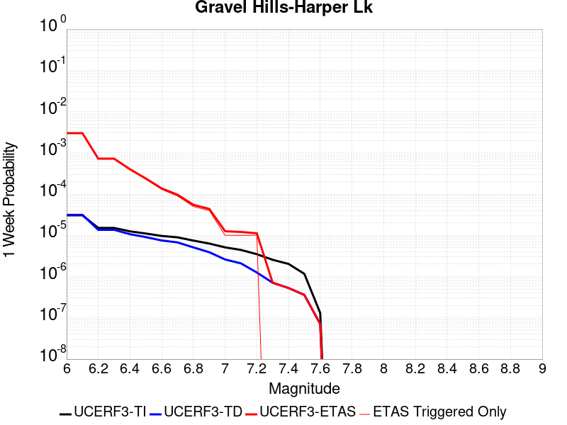 |  | 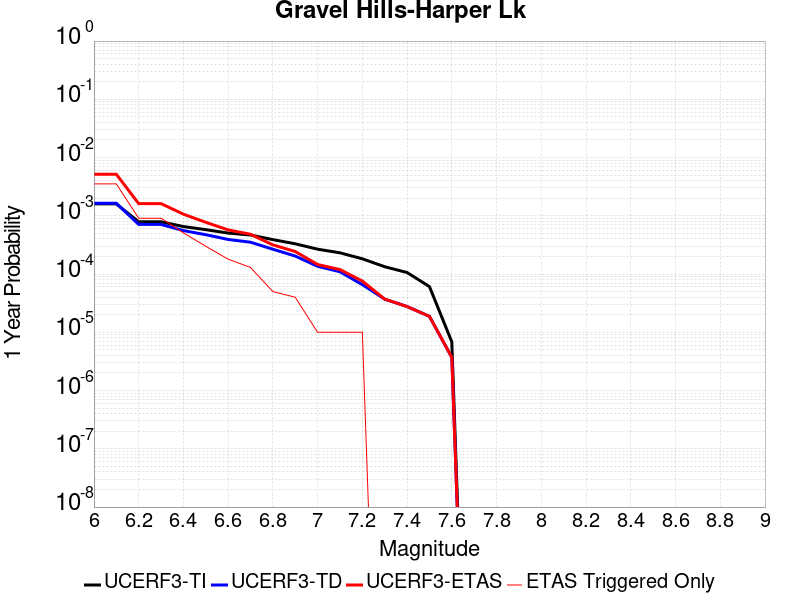 | 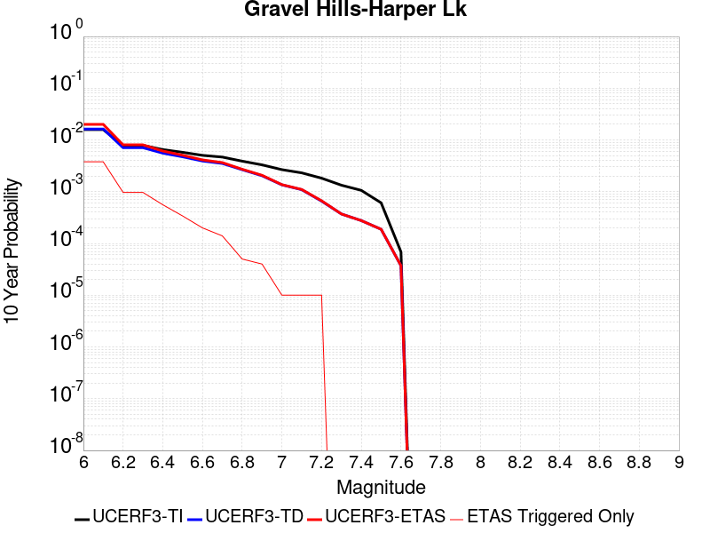 |

| Magnitude | 1 wk TI Prob | 1 wk TD Prob | 1 wk ETAS Prob | 1 wk ETAS/TD Gain | 1 wk ETAS Triggered Only | 1 mo TI Prob | 1 mo TD Prob | 1 mo ETAS Prob | 1 mo ETAS/TD Gain | 1 mo ETAS Triggered Only | 1 yr TI Prob | 1 yr TD Prob | 1 yr ETAS Prob | 1 yr ETAS/TD Gain | 1 yr ETAS Triggered Only | 10 yr TI Prob | 10 yr TD Prob | 10 yr ETAS Prob | 10 yr ETAS/TD Gain | 10 yr ETAS Triggered Only |
|-----|-----|-----|-----|-----|-----|-----|-----|-----|-----|-----|-----|-----|-----|-----|-----|-----|-----|-----|-----|-----|
| 6.0 | 3.0679566E-5 | 3.1464628E-5 | 0.0030013712 | 95.38875 | 0.00297 | 1.3147724E-4 | 1.3484266E-4 | 0.0033344112 | 24.728163 | 0.0032 | 0.0015995599 | 0.00164069 | 0.0051648985 | 3.1480038 | 0.00353 | 0.015880952 | 0.016307337 | 0.020025697 | 1.2280174 | 0.00378 |
| 6.1 | 3.0679566E-5 | 3.1464628E-5 | 0.0030013712 | 95.38875 | 0.00297 | 1.3147724E-4 | 1.3484266E-4 | 0.0033344112 | 24.728163 | 0.0032 | 0.0015995599 | 0.00164069 | 0.0051648985 | 3.1480038 | 0.00353 | 0.015880952 | 0.016307337 | 0.020025697 | 1.2280174 | 0.00378 |
| 6.2 | 1.514536E-5 | 1.36352E-5 | 7.2362553E-4 | 53.0704 | 7.1E-4 | 6.490707E-5 | 5.843533E-5 | 8.2839036E-4 | 14.176189 | 7.7E-4 | 7.8995706E-4 | 7.112298E-4 | 0.0016205825 | 2.278564 | 9.1E-4 | 0.007871548 | 0.007090737 | 0.008053859 | 1.1358281 | 9.7E-4 |
| 6.3 | 1.514536E-5 | 1.36352E-5 | 7.2362553E-4 | 53.0704 | 7.1E-4 | 6.490707E-5 | 5.843533E-5 | 8.2839036E-4 | 14.176189 | 7.7E-4 | 7.8995706E-4 | 7.112298E-4 | 0.0016205825 | 2.278564 | 9.1E-4 | 0.007871548 | 0.007090737 | 0.008053859 | 1.1358281 | 9.7E-4 |
| 6.4 | 1.2532521E-5 | 1.0689684E-5 | 4.006855E-4 | 37.483383 | 3.9E-4 | 5.37097E-5 | 4.581216E-5 | 4.7579245E-4 | 10.385724 | 4.3E-4 | 6.537194E-4 | 5.5762613E-4 | 0.0010673418 | 1.9140813 | 5.1E-4 | 0.0065179965 | 0.005562859 | 0.006119744 | 1.1001077 | 5.6E-4 |
| 6.5 | 1.1094058E-5 | 9.083657E-6 | 2.3908156E-4 | 26.31997 | 2.3E-4 | 4.7545094E-5 | 3.89294E-5 | 2.7892005E-4 | 7.164767 | 2.4E-4 | 5.787078E-4 | 4.7386638E-4 | 7.737242E-4 | 1.6327899 | 3.0E-4 | 0.0057720304 | 0.004728967 | 0.005067359 | 1.0715573 | 3.4E-4 |
| 6.6 | 9.688328E-6 | 7.531688E-6 | 1.375307E-4 | 18.260277 | 1.3E-4 | 4.1520743E-5 | 3.227828E-5 | 1.7227377E-4 | 5.337142 | 1.4E-4 | 5.053978E-4 | 3.9291973E-4 | 5.72849E-4 | 1.4579289 | 1.8E-4 | 0.0050424994 | 0.0039225067 | 0.004121722 | 1.0507878 | 2.0E-4 |
| 6.7 | 8.974824E-6 | 6.749406E-6 | 9.67488E-5 | 14.334416 | 9.0E-5 | 3.8462964E-5 | 2.8925719E-5 | 1.2892282E-4 | 4.4570312 | 1.0E-4 | 4.6818596E-4 | 3.5211592E-4 | 4.8207014E-4 | 1.3690666 | 1.3E-4 | 0.004672008 | 0.003515801 | 0.0036553086 | 1.0396802 | 1.4E-4 |
| 6.8 | 7.4780046E-6 | 5.1161865E-6 | 5.5115932E-5 | 10.772855 | 5.0E-5 | 3.20482E-5 | 2.1926337E-5 | 7.192524E-5 | 3.2803128 | 5.0E-5 | 3.9011694E-4 | 2.6692182E-4 | 3.169085E-4 | 1.1872708 | 5.0E-5 | 0.0038943281 | 0.0026661505 | 0.0027160172 | 1.0187036 | 5.0E-5 |
| 6.9 | 6.3409307E-6 | 3.907489E-6 | 4.3907334E-5 | 11.236713 | 4.0E-5 | 2.7175134E-5 | 1.674628E-5 | 5.6745608E-5 | 3.3885503 | 4.0E-5 | 3.3080703E-4 | 2.0386786E-4 | 2.4385971E-4 | 1.1961656 | 4.0E-5 | 0.0033031502 | 0.0020369065 | 0.0020768251 | 1.0195976 | 4.0E-5 |
| 7.0 | 5.1239335E-6 | 2.6058492E-6 | 1.2605823E-5 | 4.8375106 | 1.0E-5 | 2.195953E-5 | 1.1167879E-5 | 2.1167767E-5 | 1.8954152 | 1.0E-5 | 2.6732447E-4 | 1.359607E-4 | 1.4595933E-4 | 1.0735407 | 1.0E-5 | 0.0026700313 | 0.0013588005 | 0.0013687868 | 1.0073495 | 1.0E-5 |
| 7.1 | 4.438899E-6 | 2.0984692E-6 | 1.2098449E-5 | 5.7653685 | 1.0E-5 | 1.9023713E-5 | 8.99341E-6 | 1.899332E-5 | 2.1119153 | 1.0E-5 | 2.315891E-4 | 1.0948948E-4 | 1.1948839E-4 | 1.091323 | 1.0E-5 | 0.002313479 | 0.0010943774 | 0.0011043664 | 1.0091276 | 1.0E-5 |
| 7.2 | 3.50367E-6 | 1.2615715E-6 | 1.1261559E-5 | 8.926612 | 1.0E-5 | 1.5015643E-5 | 5.406724E-6 | 1.540667E-5 | 2.8495388 | 1.0E-5 | 1.8280011E-4 | 6.5824956E-5 | 7.5824304E-5 | 1.151908 | 1.0E-5 | 0.0018264982 | 6.580628E-4 | 6.6805625E-4 | 1.0151861 | 1.0E-5 |
| 7.3 | 2.561638E-6 | 7.118686E-7 | 7.118686E-7 | 1.0 | 0.0 | 1.0978401E-5 | 3.050862E-6 | 3.050862E-6 | 1.0 | 0.0 | 1.3365384E-4 | 3.7143633E-5 | 3.7143633E-5 | 1.0 | 0.0 | 0.0013357349 | 3.7137623E-4 | 3.7137623E-4 | 1.0 | 0.0 |
| 7.4 | 2.0368864E-6 | 5.304471E-7 | 5.304471E-7 | 1.0 | 0.0 | 8.729483E-6 | 2.2733427E-6 | 2.2733427E-6 | 1.0 | 0.0 | 1.06276275E-4 | 2.76776E-5 | 2.76776E-5 | 1.0 | 0.0 | 0.0010622547 | 2.767421E-4 | 2.767421E-4 | 1.0 | 0.0 |
| 7.5 | 1.1681728E-6 | 3.6028484E-7 | 3.6028484E-7 | 1.0 | 0.0 | 5.0064455E-6 | 1.544077E-6 | 1.544077E-6 | 1.0 | 0.0 | 6.0951766E-5 | 1.879898E-5 | 1.879898E-5 | 1.0 | 0.0 | 6.093505E-4 | 1.8797436E-4 | 1.8797436E-4 | 1.0 | 0.0 |
| 7.6 | 1.3154387E-7 | 7.1196716E-8 | 7.1196716E-8 | 1.0 | 0.0 | 5.6375933E-7 | 3.0512876E-7 | 3.0512876E-7 | 1.0 | 0.0 | 6.863748E-6 | 3.714938E-6 | 3.714938E-6 | 1.0 | 0.0 | 6.863536E-5 | 3.7148915E-5 | 3.7148915E-5 | 1.0 | 0.0 |

## So Sierra Nevada
*[(top)](#table-of-contents)*

| 1 Week | 1 Month | 1 Year | 10 Year |
|-----|-----|-----|-----|
| 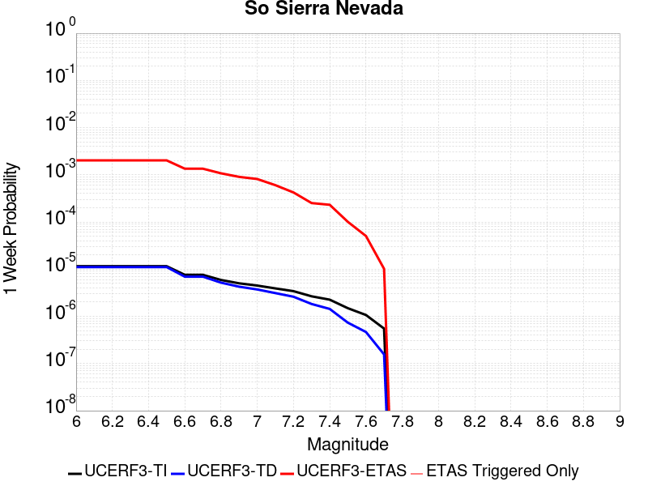 | 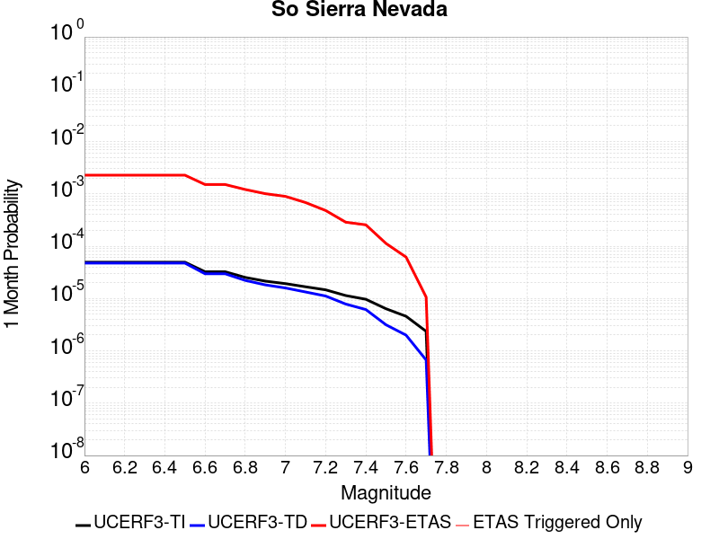 | 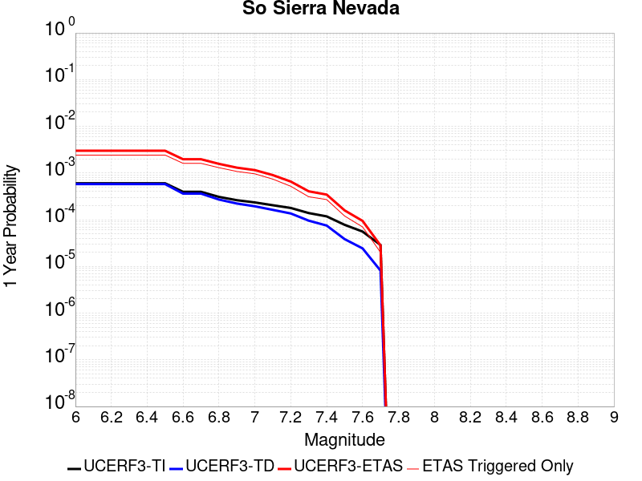 | 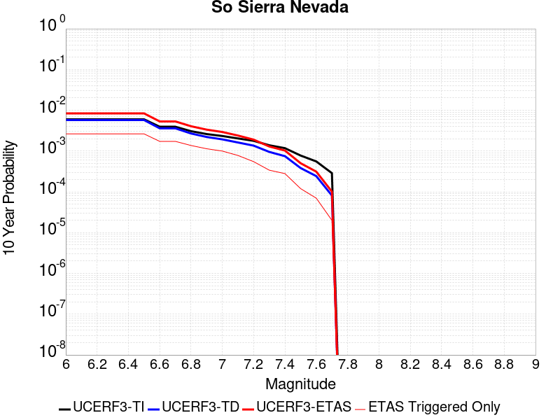 |

| Magnitude | 1 wk TI Prob | 1 wk TD Prob | 1 wk ETAS Prob | 1 wk ETAS/TD Gain | 1 wk ETAS Triggered Only | 1 mo TI Prob | 1 mo TD Prob | 1 mo ETAS Prob | 1 mo ETAS/TD Gain | 1 mo ETAS Triggered Only | 1 yr TI Prob | 1 yr TD Prob | 1 yr ETAS Prob | 1 yr ETAS/TD Gain | 1 yr ETAS Triggered Only | 10 yr TI Prob | 10 yr TD Prob | 10 yr ETAS Prob | 10 yr ETAS/TD Gain | 10 yr ETAS Triggered Only |
|-----|-----|-----|-----|-----|-----|-----|-----|-----|-----|-----|-----|-----|-----|-----|-----|-----|-----|-----|-----|-----|
| 6.0 | 1.15488665E-5 | 1.1079612E-5 | 0.0020210573 | 182.4123 | 0.00201 | 4.9494203E-5 | 4.7483256E-5 | 0.0022773773 | 47.961693 | 0.00223 | 6.024253E-4 | 5.779681E-4 | 0.0029965693 | 5.1846623 | 0.00242 | 0.006007948 | 0.005765918 | 0.008390696 | 1.455223 | 0.00264 |
| 6.1 | 1.15488665E-5 | 1.1079612E-5 | 0.0020210573 | 182.4123 | 0.00201 | 4.9494203E-5 | 4.7483256E-5 | 0.0022773773 | 47.961693 | 0.00223 | 6.024253E-4 | 5.779681E-4 | 0.0029965693 | 5.1846623 | 0.00242 | 0.006007948 | 0.005765918 | 0.008390696 | 1.455223 | 0.00264 |
| 6.2 | 1.15488665E-5 | 1.1079612E-5 | 0.0020210573 | 182.4123 | 0.00201 | 4.9494203E-5 | 4.7483256E-5 | 0.0022773773 | 47.961693 | 0.00223 | 6.024253E-4 | 5.779681E-4 | 0.0029965693 | 5.1846623 | 0.00242 | 0.006007948 | 0.005765918 | 0.008390696 | 1.455223 | 0.00264 |
| 6.3 | 1.15488665E-5 | 1.1079612E-5 | 0.0020210573 | 182.4123 | 0.00201 | 4.9494203E-5 | 4.7483256E-5 | 0.0022773773 | 47.961693 | 0.00223 | 6.024253E-4 | 5.779681E-4 | 0.0029965693 | 5.1846623 | 0.00242 | 0.006007948 | 0.005765918 | 0.008390696 | 1.455223 | 0.00264 |
| 6.4 | 1.15488665E-5 | 1.1079612E-5 | 0.0020210573 | 182.4123 | 0.00201 | 4.9494203E-5 | 4.7483256E-5 | 0.0022773773 | 47.961693 | 0.00223 | 6.024253E-4 | 5.779681E-4 | 0.0029965693 | 5.1846623 | 0.00242 | 0.006007948 | 0.005765918 | 0.008390696 | 1.455223 | 0.00264 |
| 6.5 | 1.15488665E-5 | 1.1079612E-5 | 0.0020210573 | 182.4123 | 0.00201 | 4.9494203E-5 | 4.7483256E-5 | 0.0022773773 | 47.961693 | 0.00223 | 6.024253E-4 | 5.779681E-4 | 0.0029965693 | 5.1846623 | 0.00242 | 0.006007948 | 0.005765918 | 0.008390696 | 1.455223 | 0.00264 |
| 6.6 | 7.587044E-6 | 6.9356042E-6 | 0.0013469263 | 194.2046 | 0.00134 | 3.2515498E-5 | 2.9723697E-5 | 0.0015096797 | 50.790443 | 0.00148 | 3.9580427E-4 | 3.6182883E-4 | 0.0019712462 | 5.4480076 | 0.00161 | 0.003951 | 0.0036126887 | 0.005336439 | 1.4771377 | 0.00173 |
| 6.7 | 7.587044E-6 | 6.9356042E-6 | 0.0013469263 | 194.2046 | 0.00134 | 3.2515498E-5 | 2.9723697E-5 | 0.0015096797 | 50.790443 | 0.00148 | 3.9580427E-4 | 3.6182883E-4 | 0.0019712462 | 5.4480076 | 0.00161 | 0.003951 | 0.0036126887 | 0.005336439 | 1.4771377 | 0.00173 |
| 6.8 | 5.9026956E-6 | 5.179362E-6 | 0.0010751738 | 207.58809 | 0.00107 | 2.5297022E-5 | 2.2197082E-5 | 0.0012121707 | 54.60946 | 0.00119 | 3.0794772E-4 | 2.7021713E-4 | 0.0015698659 | 5.8096457 | 0.0013 | 0.0030752132 | 0.002699002 | 0.004065304 | 1.506225 | 0.00137 |
| 6.9 | 5.0118915E-6 | 4.2523943E-6 | 9.0424856E-4 | 212.64456 | 9.0E-4 | 2.1479358E-5 | 1.8224424E-5 | 0.0010082064 | 55.321712 | 9.9E-4 | 2.614798E-4 | 2.2186051E-4 | 0.0013016209 | 5.8668437 | 0.00108 | 0.0026117235 | 0.0022164627 | 0.003353936 | 1.513193 | 0.00114 |
| 7.0 | 4.4924795E-6 | 3.7138868E-6 | 8.1371085E-4 | 219.09953 | 8.1E-4 | 1.925334E-5 | 1.5916565E-5 | 8.959026E-4 | 56.287434 | 8.8E-4 | 2.3438422E-4 | 1.9376757E-4 | 0.0011535815 | 5.953429 | 9.6E-4 | 0.0023413717 | 0.0019360491 | 0.0029341131 | 1.5155158 | 0.001 |
| 7.1 | 3.9118436E-6 | 3.1119469E-6 | 6.0311006E-4 | 193.80475 | 6.0E-4 | 1.6764936E-5 | 1.333685E-5 | 6.833279E-4 | 51.23608 | 6.7E-4 | 2.0409399E-4 | 1.6236462E-4 | 9.022445E-4 | 5.556903 | 7.4E-4 | 0.0020390663 | 0.0016225161 | 0.0024012504 | 1.4799548 | 7.8E-4 |
| 7.2 | 3.4200818E-6 | 2.6054236E-6 | 4.2260432E-4 | 162.20177 | 4.2E-4 | 1.4657411E-5 | 1.11660565E-5 | 4.811608E-4 | 43.09138 | 4.7E-4 | 1.7843937E-4 | 1.3593875E-4 | 6.558681E-4 | 4.824732 | 5.2E-4 | 0.0017829615 | 0.0013586058 | 0.0019078585 | 1.4042767 | 5.5E-4 |
| 7.3 | 2.6593618E-6 | 1.8283897E-6 | 2.5182794E-4 | 137.73209 | 2.5E-4 | 1.13972155E-5 | 7.8359335E-6 | 2.8783374E-4 | 36.732536 | 2.8E-4 | 1.3875226E-4 | 9.539862E-5 | 4.0536904E-4 | 4.249213 | 3.1E-4 | 0.0013866565 | 9.536055E-4 | 0.0012932813 | 1.3562015 | 3.4E-4 |
| 7.4 | 2.2577992E-6 | 1.4364078E-6 | 2.3143608E-4 | 161.12143 | 2.3E-4 | 9.676246E-6 | 6.1560204E-6 | 2.5615448E-4 | 41.6104 | 2.5E-4 | 1.1780193E-4 | 7.4947224E-5 | 3.44927E-4 | 4.602265 | 2.7E-4 | 0.001177395 | 7.4924453E-4 | 0.0010290347 | 1.3734298 | 2.8E-4 |
| 7.5 | 1.489319E-6 | 7.353661E-7 | 1.0073529E-4 | 136.98659 | 1.0E-4 | 6.3827797E-6 | 3.1515651E-6 | 1.1315122E-4 | 35.903183 | 1.1E-4 | 7.770758E-5 | 3.8369635E-5 | 1.5836503E-4 | 4.127353 | 1.2E-4 | 7.7680405E-4 | 3.8363054E-4 | 5.035845E-4 | 1.312681 | 1.2E-4 |
| 7.6 | 1.0680322E-6 | 4.65941E-7 | 5.046592E-5 | 108.30967 | 5.0E-5 | 4.577273E-6 | 1.9968884E-6 | 6.199677E-5 | 31.046686 | 6.0E-5 | 5.5726876E-5 | 2.4311848E-5 | 9.431015E-5 | 3.8791845 | 7.0E-5 | 5.5712904E-4 | 2.4309216E-4 | 3.1307514E-4 | 1.2878866 | 7.0E-5 |
| 7.7 | 5.509146E-7 | 1.5578539E-7 | 1.01557835E-5 | 65.190865 | 1.0E-5 | 2.3610605E-6 | 6.676515E-7 | 1.0667645E-5 | 15.977864 | 1.0E-5 | 2.8745531E-5 | 8.128628E-6 | 2.8128465E-5 | 3.46042 | 2.0E-5 | 2.8741814E-4 | 8.128342E-5 | 1.01281796E-4 | 1.2460326 | 2.0E-5 |

## McLean Lake
*[(top)](#table-of-contents)*

| 1 Week | 1 Month | 1 Year | 10 Year |
|-----|-----|-----|-----|
| 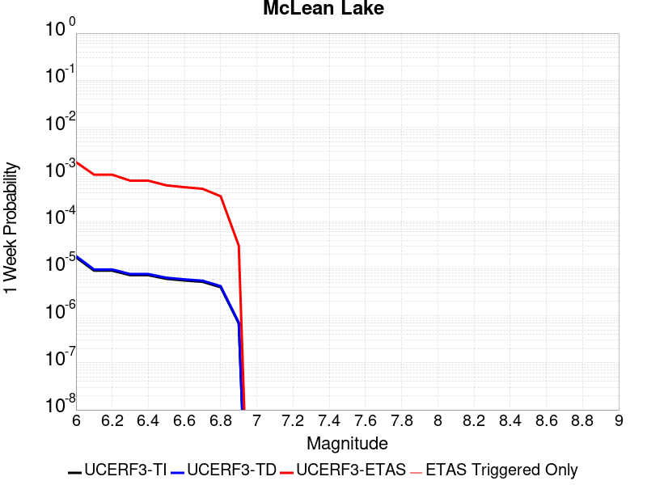 | 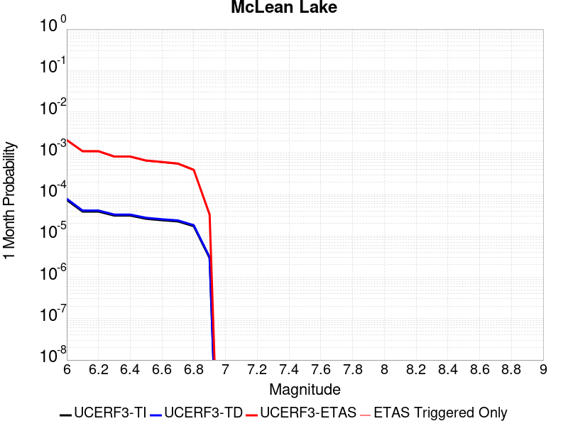 | 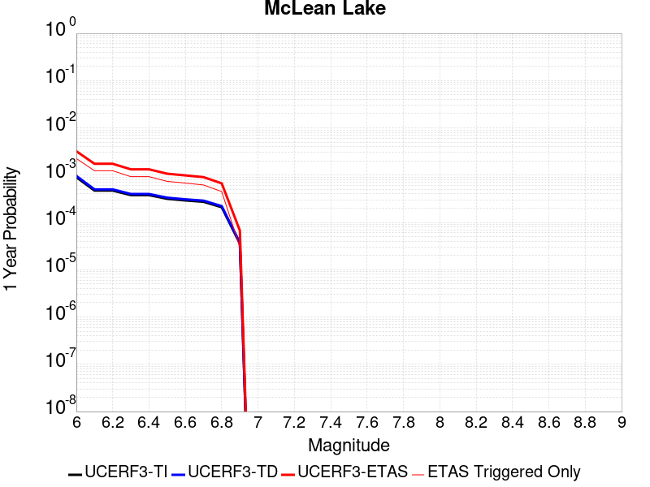 | 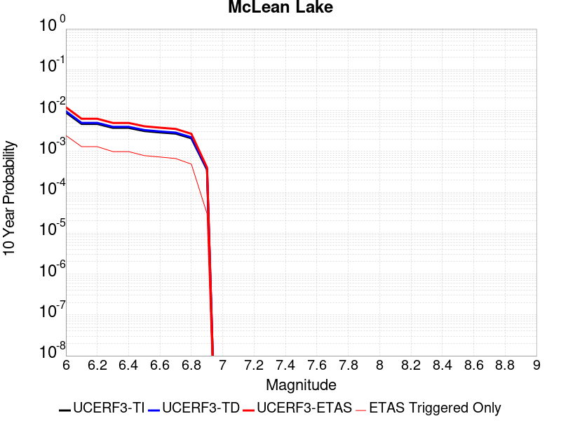 |

| Magnitude | 1 wk TI Prob | 1 wk TD Prob | 1 wk ETAS Prob | 1 wk ETAS/TD Gain | 1 wk ETAS Triggered Only | 1 mo TI Prob | 1 mo TD Prob | 1 mo ETAS Prob | 1 mo ETAS/TD Gain | 1 mo ETAS Triggered Only | 1 yr TI Prob | 1 yr TD Prob | 1 yr ETAS Prob | 1 yr ETAS/TD Gain | 1 yr ETAS Triggered Only | 10 yr TI Prob | 10 yr TD Prob | 10 yr ETAS Prob | 10 yr ETAS/TD Gain | 10 yr ETAS Triggered Only |
|-----|-----|-----|-----|-----|-----|-----|-----|-----|-----|-----|-----|-----|-----|-----|-----|-----|-----|-----|-----|-----|
| 6.0 | 1.7360222E-5 | 1.8501627E-5 | 0.0018284682 | 98.82742 | 0.00181 | 7.439883E-5 | 7.9290556E-5 | 0.0020891312 | 26.347794 | 0.00201 | 9.0542925E-4 | 9.6498354E-4 | 0.0032128124 | 3.329396 | 0.00225 | 0.009017491 | 0.0096127745 | 0.012049127 | 1.2534494 | 0.00246 |
| 6.1 | 9.062689E-6 | 9.592193E-6 | 9.895827E-4 | 103.165436 | 9.8E-4 | 3.8839516E-5 | 4.1108804E-5 | 0.0011210644 | 27.270666 | 0.00108 | 4.727685E-4 | 5.003936E-4 | 0.0017397731 | 3.4768093 | 0.00124 | 0.0047176396 | 0.004993552 | 0.00629701 | 1.2610283 | 0.00131 |
| 6.2 | 9.062689E-6 | 9.592193E-6 | 9.895827E-4 | 103.165436 | 9.8E-4 | 3.8839516E-5 | 4.1108804E-5 | 0.0011210644 | 27.270666 | 0.00108 | 4.727685E-4 | 5.003936E-4 | 0.0017397731 | 3.4768093 | 0.00124 | 0.0047176396 | 0.004993552 | 0.00629701 | 1.2610283 | 0.00131 |
| 6.3 | 7.2575485E-6 | 7.66771E-6 | 7.3766214E-4 | 96.20371 | 7.3E-4 | 3.110341E-5 | 3.2861237E-5 | 8.328349E-4 | 25.343992 | 8.0E-4 | 3.786182E-4 | 4.0001926E-4 | 0.0013296473 | 3.3239582 | 9.3E-4 | 0.0037797375 | 0.0039936965 | 0.004979743 | 1.2469007 | 9.9E-4 |
| 6.4 | 7.2575485E-6 | 7.66771E-6 | 7.3766214E-4 | 96.20371 | 7.3E-4 | 3.110341E-5 | 3.2861237E-5 | 8.328349E-4 | 25.343992 | 8.0E-4 | 3.786182E-4 | 4.0001926E-4 | 0.0013296473 | 3.3239582 | 9.3E-4 | 0.0037797375 | 0.0039936965 | 0.004979743 | 1.2469007 | 9.9E-4 |
| 6.5 | 6.06582E-6 | 6.4038773E-6 | 5.8640016E-4 | 91.56955 | 5.8E-4 | 2.5996113E-5 | 2.7444936E-5 | 6.674274E-4 | 24.31878 | 6.4E-4 | 3.164567E-4 | 3.3409733E-4 | 0.0010738501 | 3.2141833 | 7.4E-4 | 0.0031600643 | 0.0033365893 | 0.004123953 | 1.2359787 | 7.9E-4 |
| 6.6 | 5.598744E-6 | 5.910262E-6 | 5.359071E-4 | 90.674 | 5.3E-4 | 2.3994397E-5 | 2.5329486E-5 | 6.153145E-4 | 24.292421 | 5.9E-4 | 2.9209262E-4 | 3.0834923E-4 | 9.881395E-4 | 3.2046115 | 6.8E-4 | 0.0029170897 | 0.003079843 | 0.0038075948 | 1.2362951 | 7.3E-4 |
| 6.7 | 5.246996E-6 | 5.539162E-6 | 4.955364E-4 | 89.46054 | 4.9E-4 | 2.2486933E-5 | 2.3739085E-5 | 5.637263E-4 | 23.746756 | 5.4E-4 | 2.73744E-4 | 2.8899137E-4 | 9.088122E-4 | 3.1447728 | 6.2E-4 | 0.0027340704 | 0.0028867796 | 0.0035548455 | 1.2314225 | 6.7E-4 |
| 6.8 | 4.02324E-6 | 4.2469046E-6 | 3.4424546E-4 | 81.05797 | 3.4E-4 | 1.7242342E-5 | 1.8200926E-5 | 3.98194E-4 | 21.87768 | 3.8E-4 | 2.099053E-4 | 2.2157968E-4 | 6.7147997E-4 | 3.030422 | 4.5E-4 | 0.0020970714 | 0.002214172 | 0.002703087 | 1.2208117 | 4.9E-4 |
| 6.9 | 6.835972E-7 | 7.1399285E-7 | 3.071397E-5 | 43.0172 | 3.0E-5 | 2.9296991E-6 | 3.0599674E-6 | 3.3059874E-5 | 10.803996 | 3.0E-5 | 3.56685E-5 | 3.7254784E-5 | 6.725367E-5 | 1.8052356 | 3.0E-5 | 3.5662777E-4 | 3.7251666E-4 | 4.0250548E-4 | 1.0805033 | 3.0E-5 |

## San Andreas (San Bernardino N)
*[(top)](#table-of-contents)*

| 1 Week | 1 Month | 1 Year | 10 Year |
|-----|-----|-----|-----|
| 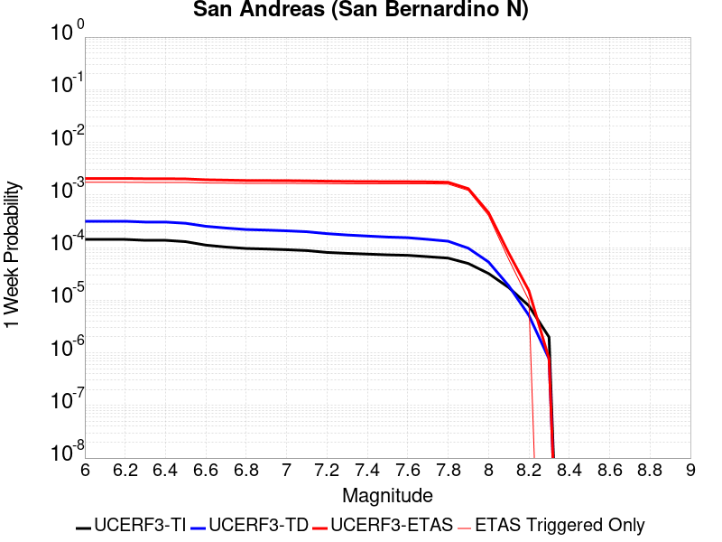 | 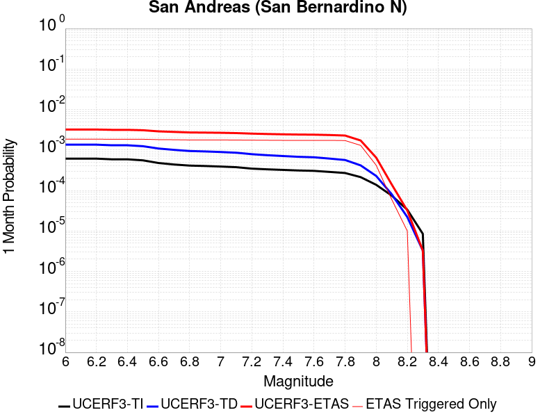 | 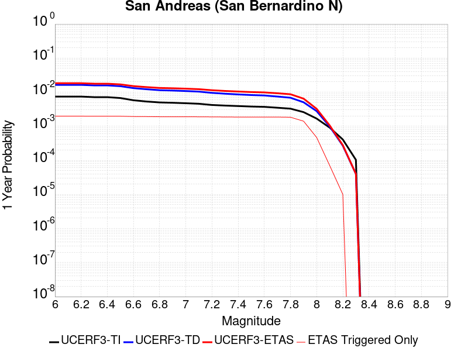 | 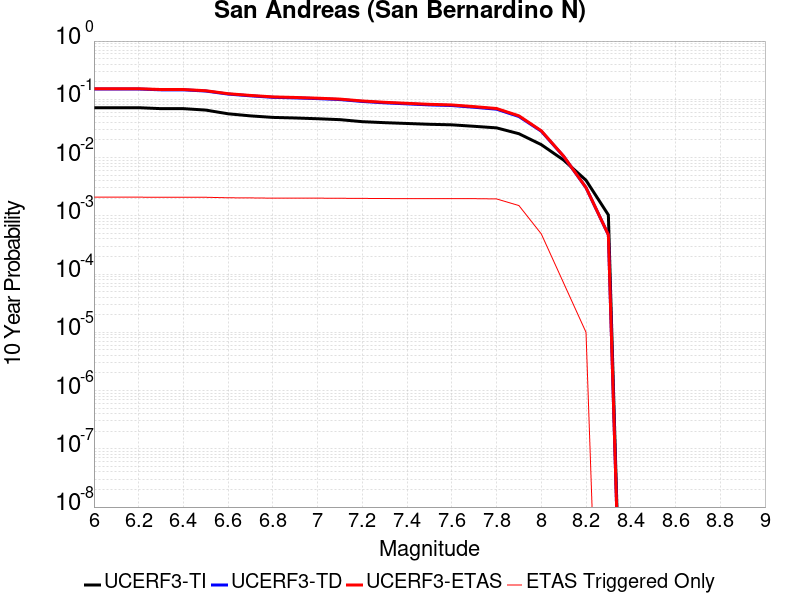 |

| Magnitude | 1 wk TI Prob | 1 wk TD Prob | 1 wk ETAS Prob | 1 wk ETAS/TD Gain | 1 wk ETAS Triggered Only | 1 mo TI Prob | 1 mo TD Prob | 1 mo ETAS Prob | 1 mo ETAS/TD Gain | 1 mo ETAS Triggered Only | 1 yr TI Prob | 1 yr TD Prob | 1 yr ETAS Prob | 1 yr ETAS/TD Gain | 1 yr ETAS Triggered Only | 10 yr TI Prob | 10 yr TD Prob | 10 yr ETAS Prob | 10 yr ETAS/TD Gain | 10 yr ETAS Triggered Only |
|-----|-----|-----|-----|-----|-----|-----|-----|-----|-----|-----|-----|-----|-----|-----|-----|-----|-----|-----|-----|-----|
| 6.0 | 1.4273766E-4 | 3.160784E-4 | 0.0020555283 | 6.503223 | 0.00174 | 6.115894E-4 | 0.0013539245 | 0.0032014197 | 2.3645482 | 0.00185 | 0.0074207084 | 0.016360939 | 0.018308545 | 1.1190399 | 0.00198 | 0.07177748 | 0.15021163 | 0.15198769 | 1.0118237 | 0.00209 |
| 6.1 | 1.4273766E-4 | 3.160784E-4 | 0.0020555283 | 6.503223 | 0.00174 | 6.115894E-4 | 0.0013539245 | 0.0032014197 | 2.3645482 | 0.00185 | 0.0074207084 | 0.016360939 | 0.018308545 | 1.1190399 | 0.00198 | 0.07177748 | 0.15021163 | 0.15198769 | 1.0118237 | 0.00209 |
| 6.2 | 1.4273766E-4 | 3.160784E-4 | 0.0020555283 | 6.503223 | 0.00174 | 6.115894E-4 | 0.0013539245 | 0.0032014197 | 2.3645482 | 0.00185 | 0.0074207084 | 0.016360939 | 0.018308545 | 1.1190399 | 0.00198 | 0.07177748 | 0.15021163 | 0.15198769 | 1.0118237 | 0.00209 |
| 6.3 | 1.3730655E-4 | 3.0512668E-4 | 0.0020345987 | 6.6680465 | 0.00173 | 5.883239E-4 | 0.001307036 | 0.0031446312 | 2.4059253 | 0.00184 | 0.0071393442 | 0.015798455 | 0.017737333 | 1.1227257 | 0.00197 | 0.06914291 | 0.1455135 | 0.14729084 | 1.0122142 | 0.00208 |
| 6.4 | 1.3730655E-4 | 3.0512668E-4 | 0.0020345987 | 6.6680465 | 0.00173 | 5.883239E-4 | 0.001307036 | 0.0031446312 | 2.4059253 | 0.00184 | 0.0071393442 | 0.015798455 | 0.017737333 | 1.1227257 | 0.00197 | 0.06914291 | 0.1455135 | 0.14729084 | 1.0122142 | 0.00208 |
| 6.5 | 1.2942807E-4 | 2.8927144E-4 | 0.002018771 | 6.9788117 | 0.00173 | 5.545738E-4 | 0.0012391509 | 0.003076871 | 2.4830477 | 0.00184 | 0.0067310524 | 0.014983548 | 0.01692403 | 1.1295075 | 0.00197 | 0.06530788 | 0.13865088 | 0.14044249 | 1.0129217 | 0.00208 |
| 6.6 | 1.1125901E-4 | 2.5365927E-4 | 0.0019432306 | 7.660791 | 0.00169 | 4.767372E-4 | 0.0010866605 | 0.0028847046 | 2.6546512 | 0.0018 | 0.005788839 | 0.0131504685 | 0.015055087 | 1.1448328 | 0.00193 | 0.056403454 | 0.12300496 | 0.12479403 | 1.0145447 | 0.00204 |
| 6.7 | 1.02209575E-4 | 2.3500937E-4 | 0.0019146146 | 8.146971 | 0.00168 | 4.3796748E-4 | 0.0010067957 | 0.0027949936 | 2.7761278 | 0.00179 | 0.0053192247 | 0.012189267 | 0.014085864 | 1.1555957 | 0.00192 | 0.051936906 | 0.114792764 | 0.11658974 | 1.0156541 | 0.00203 |
| 6.8 | 9.610582E-5 | 2.2026796E-4 | 0.0018799023 | 8.5346155 | 0.00166 | 4.1181705E-4 | 9.436647E-4 | 0.0027119943 | 2.8738961 | 0.00177 | 0.0050023515 | 0.011428859 | 0.013307145 | 1.1643459 | 0.0019 | 0.048912346 | 0.10820469 | 0.1099972 | 1.0165659 | 0.00201 |
| 6.9 | 9.3877505E-5 | 2.1482339E-4 | 0.0018744668 | 8.725617 | 0.00166 | 4.0227012E-4 | 9.203475E-4 | 0.0026887185 | 2.9214165 | 0.00177 | 0.0048866454 | 0.011147907 | 0.0130267255 | 1.1685356 | 0.0019 | 0.04780577 | 0.105798274 | 0.107595615 | 1.0169884 | 0.00201 |
| 7.0 | 9.1019785E-5 | 2.0809306E-4 | 0.0018677476 | 8.97554 | 0.00166 | 3.900265E-4 | 8.915232E-4 | 0.0026599453 | 2.983596 | 0.00177 | 0.0047382377 | 0.0108004995 | 0.012679978 | 1.1740178 | 0.0019 | 0.046384744 | 0.10276815 | 0.10457159 | 1.0175486 | 0.00201 |
| 7.1 | 8.771155E-5 | 1.9983841E-4 | 0.0018495087 | 9.255021 | 0.00165 | 3.758525E-4 | 8.5616973E-4 | 0.002614663 | 3.0539072 | 0.00176 | 0.0045664064 | 0.010374243 | 0.012244635 | 1.180292 | 0.00189 | 0.044737056 | 0.09907644 | 0.10087828 | 1.0181865 | 0.002 |
| 7.2 | 8.0830236E-5 | 1.8389444E-4 | 0.0018235928 | 9.91652 | 0.00164 | 3.4636928E-4 | 7.8788114E-4 | 0.0025365024 | 3.2193973 | 0.00175 | 0.0042088944 | 0.009550368 | 0.011412414 | 1.1949711 | 0.00188 | 0.041300658 | 0.09180518 | 0.09361249 | 1.0196863 | 0.00199 |
| 7.3 | 7.7668235E-5 | 1.7333007E-4 | 0.0018030476 | 10.402392 | 0.00163 | 3.328214E-4 | 7.426318E-4 | 0.0024813397 | 3.3412786 | 0.00174 | 0.0040445733 | 0.009004138 | 0.010857301 | 1.2058123 | 0.00187 | 0.03971748 | 0.08706761 | 0.08887522 | 1.0207609 | 0.00198 |
| 7.4 | 7.520177E-5 | 1.655312E-4 | 0.0017952614 | 10.845457 | 0.00163 | 3.2225347E-4 | 7.092266E-4 | 0.0024379997 | 3.437547 | 0.00173 | 0.0039163795 | 0.008600714 | 0.010444716 | 1.2144011 | 0.00186 | 0.038480744 | 0.08352157 | 0.08532703 | 1.0216167 | 0.00197 |
| 7.5 | 7.274697E-5 | 1.584075E-4 | 0.0017881494 | 11.288286 | 0.00163 | 3.1173544E-4 | 6.7871273E-4 | 0.0024075385 | 3.5472128 | 0.00173 | 0.003788775 | 0.008232076 | 0.010076764 | 1.2240855 | 0.00186 | 0.03724827 | 0.08023654 | 0.082048476 | 1.0225824 | 0.00197 |
| 7.6 | 7.1185845E-5 | 1.5410586E-4 | 0.0017838547 | 11.575515 | 0.00163 | 3.0504653E-4 | 6.602866E-4 | 0.0023891442 | 3.6183445 | 0.00173 | 0.0037076178 | 0.0080094095 | 0.009854512 | 1.2303668 | 0.00186 | 0.036463667 | 0.07822661 | 0.080042504 | 1.0232133 | 0.00197 |
| 7.7 | 6.709961E-5 | 1.4319421E-4 | 0.0017729608 | 12.381512 | 0.00163 | 2.8753807E-4 | 6.135452E-4 | 0.0023424837 | 3.8179483 | 0.00173 | 0.003495157 | 0.0074443663 | 0.00929052 | 1.2479934 | 0.00186 | 0.034406938 | 0.07305558 | 0.07488166 | 1.0249958 | 0.00197 |
| 7.8 | 6.300812E-5 | 1.320343E-4 | 0.0017418218 | 13.192191 | 0.00161 | 2.7000686E-4 | 5.657386E-4 | 0.0022747712 | 4.0208874 | 0.00171 | 0.0032823787 | 0.006866143 | 0.00869351 | 1.2661415 | 0.00184 | 0.032343175 | 0.06771385 | 0.069531806 | 1.0268476 | 0.00195 |
| 7.9 | 4.983037E-5 | 9.7241085E-5 | 0.0013171225 | 13.544917 | 0.00122 | 2.1354125E-4 | 4.1668097E-4 | 0.0017161393 | 4.118593 | 0.0013 | 0.0025967648 | 0.0050613005 | 0.006464164 | 1.2771746 | 0.00141 | 0.025666296 | 0.050650507 | 0.052074533 | 1.0281147 | 0.0015 |
| 8.0 | 3.2211527E-5 | 5.3306234E-5 | 4.6328438E-4 | 8.690998 | 4.1E-4 | 1.380421E-4 | 2.2843528E-4 | 6.4833934E-4 | 2.838175 | 4.2E-4 | 0.0016793669 | 0.0027776542 | 0.0032463488 | 1.1687375 | 4.7E-4 | 0.016667323 | 0.028362568 | 0.028838672 | 1.0167863 | 4.9E-4 |
| 8.1 | 1.743376E-5 | 1.8823403E-5 | 7.8822275E-5 | 4.1874614 | 6.0E-5 | 7.471398E-5 | 8.066923E-5 | 1.4066439E-4 | 1.743718 | 6.0E-5 | 9.0926304E-4 | 9.81706E-4 | 0.0010516372 | 1.0712345 | 7.0E-5 | 0.009055517 | 0.010483979 | 0.010553245 | 1.0066068 | 7.0E-5 |
| 8.2 | 7.831616E-6 | 5.1540533E-6 | 1.5154002E-5 | 2.9402106 | 1.0E-5 | 3.3563636E-5 | 2.2088612E-5 | 3.2088392E-5 | 1.4527119 | 1.0E-5 | 4.0856065E-4 | 2.6889573E-4 | 2.7889304E-4 | 1.0371791 | 1.0E-5 | 0.004078103 | 0.0030413668 | 0.0030513364 | 1.003278 | 1.0E-5 |
| 8.3 | 1.983087E-6 | 7.6564595E-7 | 7.6564595E-7 | 1.0 | 0.0 | 8.498917E-6 | 3.281336E-6 | 3.281336E-6 | 1.0 | 0.0 | 1.034694E-4 | 3.9949547E-5 | 3.9949547E-5 | 1.0 | 0.0 | 0.0010342124 | 4.717979E-4 | 4.717979E-4 | 1.0 | 0.0 |

## Goldstone Lake
*[(top)](#table-of-contents)*

| 1 Week | 1 Month | 1 Year | 10 Year |
|-----|-----|-----|-----|
| 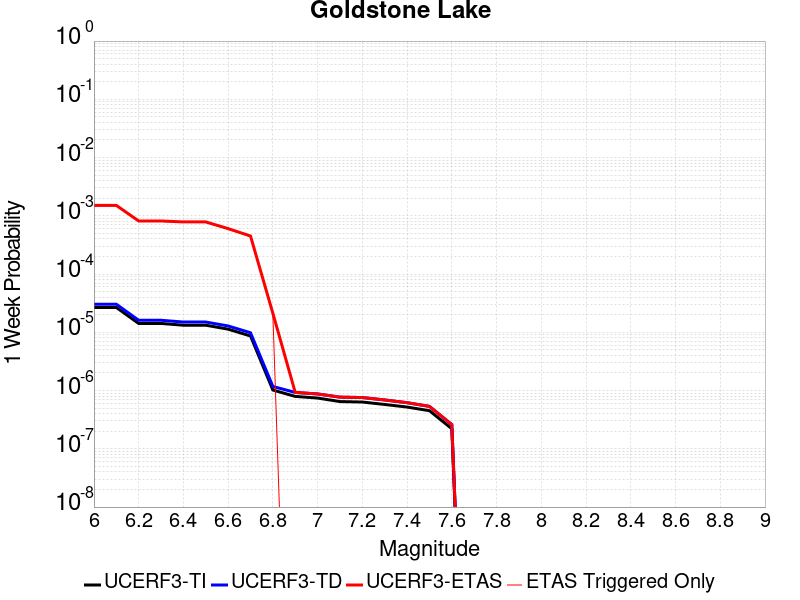 | 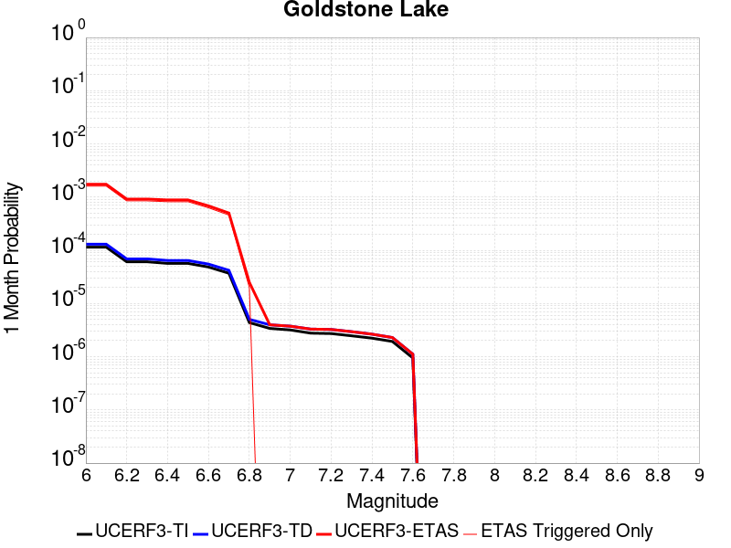 | 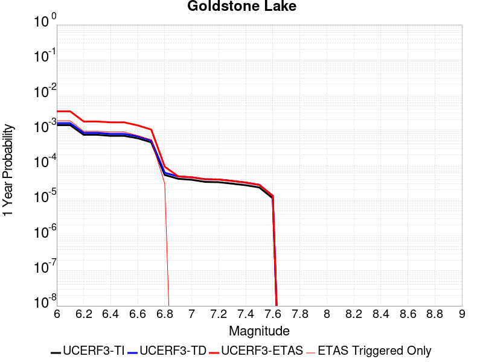 | 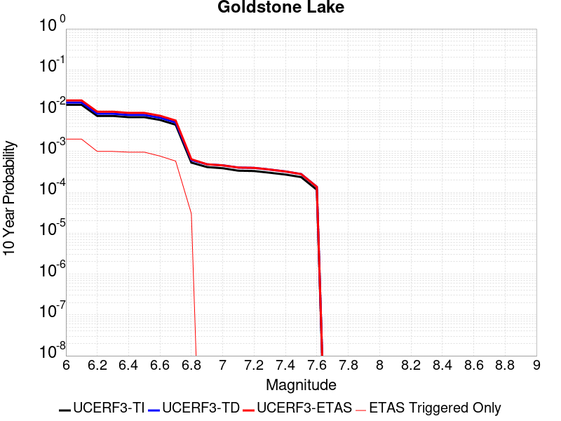 |

| Magnitude | 1 wk TI Prob | 1 wk TD Prob | 1 wk ETAS Prob | 1 wk ETAS/TD Gain | 1 wk ETAS Triggered Only | 1 mo TI Prob | 1 mo TD Prob | 1 mo ETAS Prob | 1 mo ETAS/TD Gain | 1 mo ETAS Triggered Only | 1 yr TI Prob | 1 yr TD Prob | 1 yr ETAS Prob | 1 yr ETAS/TD Gain | 1 yr ETAS Triggered Only | 10 yr TI Prob | 10 yr TD Prob | 10 yr ETAS Prob | 10 yr ETAS/TD Gain | 10 yr ETAS Triggered Only |
|-----|-----|-----|-----|-----|-----|-----|-----|-----|-----|-----|-----|-----|-----|-----|-----|-----|-----|-----|-----|-----|
| 6.0 | 2.671352E-5 | 3.0376103E-5 | 0.0015103312 | 49.72103 | 0.00148 | 1.1448149E-4 | 1.3017791E-4 | 0.0017399683 | 13.366079 | 0.00161 | 0.001392921 | 0.0015839601 | 0.0034310299 | 2.1661086 | 0.00185 | 0.013842222 | 0.015746202 | 0.017714709 | 1.1250148 | 0.002 |
| 6.1 | 2.671352E-5 | 3.0376103E-5 | 0.0015103312 | 49.72103 | 0.00148 | 1.1448149E-4 | 1.3017791E-4 | 0.0017399683 | 13.366079 | 0.00161 | 0.001392921 | 0.0015839601 | 0.0034310299 | 2.1661086 | 0.00185 | 0.013842222 | 0.015746202 | 0.017714709 | 1.1250148 | 0.002 |
| 6.2 | 1.4197047E-5 | 1.6096254E-5 | 8.160834E-4 | 50.700203 | 8.0E-4 | 6.0843064E-5 | 6.898268E-5 | 9.1892405E-4 | 13.321084 | 8.5E-4 | 7.4051257E-4 | 8.3963916E-4 | 0.0017688583 | 2.1066887 | 9.3E-4 | 0.007380498 | 0.008374364 | 0.00936599 | 1.118412 | 0.001 |
| 6.3 | 1.4197047E-5 | 1.6096254E-5 | 8.160834E-4 | 50.700203 | 8.0E-4 | 6.0843064E-5 | 6.898268E-5 | 9.1892405E-4 | 13.321084 | 8.5E-4 | 7.4051257E-4 | 8.3963916E-4 | 0.0017688583 | 2.1066887 | 9.3E-4 | 0.007380498 | 0.008374364 | 0.00936599 | 1.118412 | 0.001 |
| 6.4 | 1.3238931E-5 | 1.500847E-5 | 7.849969E-4 | 52.303596 | 7.7E-4 | 5.6737044E-5 | 6.432098E-5 | 8.8426826E-4 | 13.747743 | 8.2E-4 | 6.9055456E-4 | 7.8292453E-4 | 0.0016722278 | 2.1358736 | 8.9E-4 | 0.006884126 | 0.007811289 | 0.00876379 | 1.1219391 | 9.6E-4 |
| 6.5 | 1.3238931E-5 | 1.500847E-5 | 7.849969E-4 | 52.303596 | 7.7E-4 | 5.6737044E-5 | 6.432098E-5 | 8.8426826E-4 | 13.747743 | 8.2E-4 | 6.9055456E-4 | 7.8292453E-4 | 0.0016722278 | 2.1358736 | 8.9E-4 | 0.006884126 | 0.007811289 | 0.00876379 | 1.1219391 | 9.6E-4 |
| 6.6 | 1.1328278E-5 | 1.2855176E-5 | 6.028476E-4 | 46.89532 | 5.9E-4 | 4.8548856E-5 | 5.5092984E-5 | 6.850583E-4 | 12.434583 | 6.3E-4 | 5.90922E-4 | 6.706464E-4 | 0.0013701769 | 2.0430691 | 7.0E-4 | 0.0058935313 | 0.0066956137 | 0.007460458 | 1.1142306 | 7.7E-4 |
| 6.7 | 8.651175E-6 | 9.824575E-6 | 4.4982025E-4 | 45.785213 | 4.4E-4 | 3.707594E-5 | 4.2105148E-5 | 5.020858E-4 | 11.924569 | 4.6E-4 | 4.5130608E-4 | 5.126002E-4 | 0.0010423284 | 2.0334144 | 5.3E-4 | 0.0045039062 | 0.0051230565 | 0.005700085 | 1.1126337 | 5.8E-4 |
| 6.8 | 1.0215377E-6 | 1.1754802E-6 | 2.1175456E-5 | 18.014303 | 2.0E-5 | 4.378012E-6 | 5.037763E-6 | 2.5037662E-5 | 4.969996 | 2.0E-5 | 5.3300988E-5 | 6.133315E-5 | 9.133131E-5 | 1.4891019 | 3.0E-5 | 5.3288206E-4 | 6.131735E-4 | 6.4315513E-4 | 1.0488958 | 3.0E-5 |
| 6.9 | 7.9360774E-7 | 9.283496E-7 | 9.283496E-7 | 1.0 | 0.0 | 3.4011714E-6 | 3.9786355E-6 | 3.9786355E-6 | 1.0 | 0.0 | 4.1408475E-5 | 4.843888E-5 | 4.843888E-5 | 1.0 | 0.0 | 4.140076E-4 | 4.842902E-4 | 4.842902E-4 | 1.0 | 0.0 |
| 7.0 | 7.4382757E-7 | 8.747428E-7 | 8.747428E-7 | 1.0 | 0.0 | 3.1878285E-6 | 3.7488926E-6 | 3.7488926E-6 | 1.0 | 0.0 | 3.8811122E-5 | 4.564188E-5 | 4.564188E-5 | 1.0 | 0.0 | 3.8804344E-4 | 4.563317E-4 | 4.563317E-4 | 1.0 | 0.0 |
| 7.1 | 6.4709513E-7 | 7.711399E-7 | 7.711399E-7 | 1.0 | 0.0 | 2.773262E-6 | 3.3048816E-6 | 3.3048816E-6 | 1.0 | 0.0 | 3.376394E-5 | 4.023625E-5 | 4.023625E-5 | 1.0 | 0.0 | 3.375881E-4 | 4.022956E-4 | 4.022956E-4 | 1.0 | 0.0 |
| 7.2 | 6.356704E-7 | 7.588459E-7 | 7.588459E-7 | 1.0 | 0.0 | 2.7242988E-6 | 3.252193E-6 | 3.252193E-6 | 1.0 | 0.0 | 3.3167835E-5 | 3.959479E-5 | 3.959479E-5 | 1.0 | 0.0 | 3.3162883E-4 | 3.9588328E-4 | 3.9588328E-4 | 1.0 | 0.0 |
| 7.3 | 5.7695723E-7 | 6.896648E-7 | 6.896648E-7 | 1.0 | 0.0 | 2.4726714E-6 | 2.9557032E-6 | 2.9557032E-6 | 1.0 | 0.0 | 3.0104358E-5 | 3.598515E-5 | 3.598515E-5 | 1.0 | 0.0 | 3.0100282E-4 | 3.5979896E-4 | 3.5979896E-4 | 1.0 | 0.0 |
| 7.4 | 5.209647E-7 | 6.193583E-7 | 6.193583E-7 | 1.0 | 0.0 | 2.232704E-6 | 2.6543903E-6 | 2.6543903E-6 | 1.0 | 0.0 | 2.718283E-5 | 3.2316777E-5 | 3.2316777E-5 | 1.0 | 0.0 | 2.7179506E-4 | 3.2312635E-4 | 3.2312635E-4 | 1.0 | 0.0 |
| 7.5 | 4.512955E-7 | 5.3489487E-7 | 5.3489487E-7 | 1.0 | 0.0 | 1.934122E-6 | 2.2924048E-6 | 2.2924048E-6 | 1.0 | 0.0 | 2.3547682E-5 | 2.7909726E-5 | 2.7909726E-5 | 1.0 | 0.0 | 2.3545188E-4 | 2.7906752E-4 | 2.7906752E-4 | 1.0 | 0.0 |
| 7.6 | 2.21172E-7 | 2.6040198E-7 | 2.6040198E-7 | 1.0 | 0.0 | 9.478797E-7 | 1.1160082E-6 | 1.1160082E-6 | 1.0 | 0.0 | 1.1540374E-5 | 1.3587343E-5 | 1.3587343E-5 | 1.0 | 0.0 | 1.1539775E-4 | 1.3586794E-4 | 1.3586794E-4 | 1.0 | 0.0 |

## Lenwood-Lockhart-Old Woman Springs
*[(top)](#table-of-contents)*

| 1 Week | 1 Month | 1 Year | 10 Year |
|-----|-----|-----|-----|
| 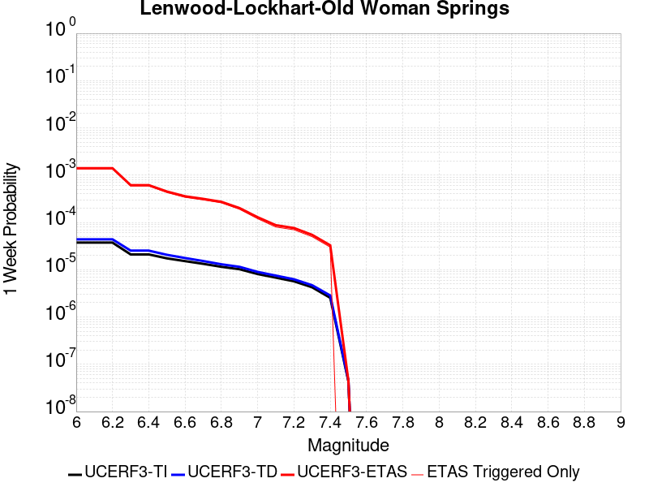 | 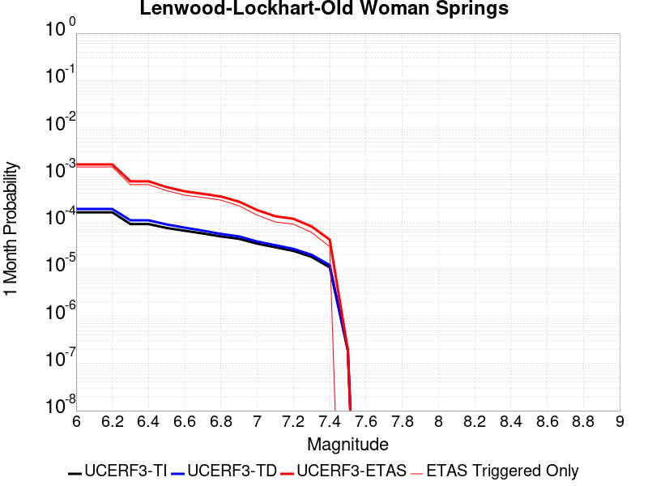 | 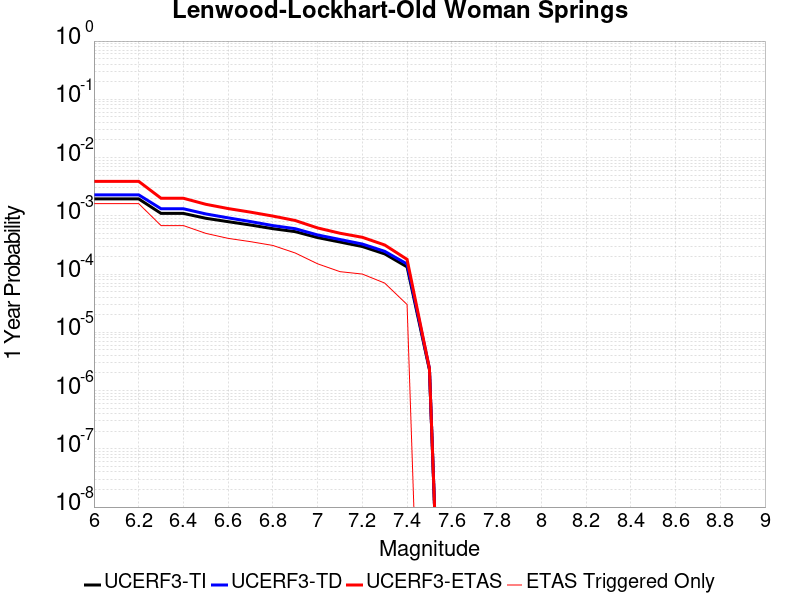 | 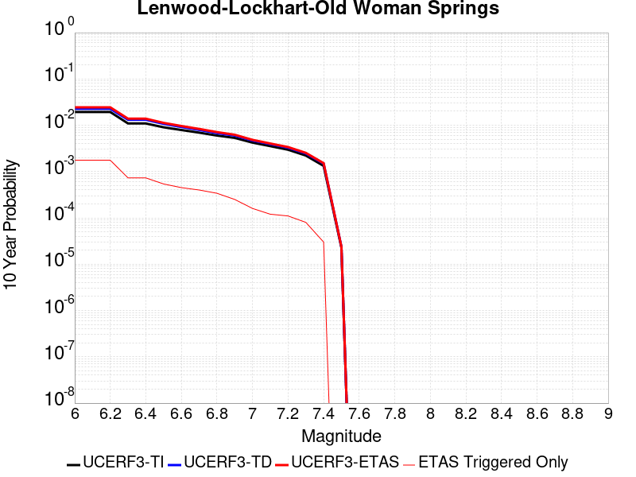 |

| Magnitude | 1 wk TI Prob | 1 wk TD Prob | 1 wk ETAS Prob | 1 wk ETAS/TD Gain | 1 wk ETAS Triggered Only | 1 mo TI Prob | 1 mo TD Prob | 1 mo ETAS Prob | 1 mo ETAS/TD Gain | 1 mo ETAS Triggered Only | 1 yr TI Prob | 1 yr TD Prob | 1 yr ETAS Prob | 1 yr ETAS/TD Gain | 1 yr ETAS Triggered Only | 10 yr TI Prob | 10 yr TD Prob | 10 yr ETAS Prob | 10 yr ETAS/TD Gain | 10 yr ETAS Triggered Only |
|-----|-----|-----|-----|-----|-----|-----|-----|-----|-----|-----|-----|-----|-----|-----|-----|-----|-----|-----|-----|-----|
| 6.0 | 3.744542E-5 | 4.396349E-5 | 0.0014039037 | 31.933401 | 0.00136 | 1.604705E-4 | 1.8840231E-4 | 0.0016581253 | 8.8009815 | 0.00147 | 0.0019519776 | 0.0022915571 | 0.003907845 | 1.7053229 | 0.00162 | 0.019349206 | 0.022697281 | 0.024417335 | 1.0757823 | 0.00176 |
| 6.1 | 3.744542E-5 | 4.396349E-5 | 0.0014039037 | 31.933401 | 0.00136 | 1.604705E-4 | 1.8840231E-4 | 0.0016581253 | 8.8009815 | 0.00147 | 0.0019519776 | 0.0022915571 | 0.003907845 | 1.7053229 | 0.00162 | 0.019349206 | 0.022697281 | 0.024417335 | 1.0757823 | 0.00176 |
| 6.2 | 3.744542E-5 | 4.396349E-5 | 0.0014039037 | 31.933401 | 0.00136 | 1.604705E-4 | 1.8840231E-4 | 0.0016581253 | 8.8009815 | 0.00147 | 0.0019519776 | 0.0022915571 | 0.003907845 | 1.7053229 | 0.00162 | 0.019349206 | 0.022697281 | 0.024417335 | 1.0757823 | 0.00176 |
| 6.3 | 2.1079984E-5 | 2.5354384E-5 | 6.1533944E-4 | 24.269547 | 5.9E-4 | 9.0339665E-5 | 1.0865723E-4 | 7.285899E-4 | 6.7053967 | 6.2E-4 | 0.0010993304 | 0.0013221189 | 0.00200122 | 1.5136459 | 6.8E-4 | 0.010939079 | 0.013144747 | 0.013865151 | 1.0548055 | 7.3E-4 |
| 6.4 | 2.1079984E-5 | 2.5354384E-5 | 6.1533944E-4 | 24.269547 | 5.9E-4 | 9.0339665E-5 | 1.0865723E-4 | 7.285899E-4 | 6.7053967 | 6.2E-4 | 0.0010993304 | 0.0013221189 | 0.00200122 | 1.5136459 | 6.8E-4 | 0.010939079 | 0.013144747 | 0.013865151 | 1.0548055 | 7.3E-4 |
| 6.5 | 1.7397282E-5 | 2.0663285E-5 | 4.506544E-4 | 21.809427 | 4.3E-4 | 7.455765E-5 | 8.8554E-5 | 5.4851326E-4 | 6.194111 | 4.6E-4 | 9.073613E-4 | 0.0010776235 | 0.0015770847 | 1.4634839 | 5.0E-4 | 0.009036654 | 0.010725273 | 0.011259481 | 1.0498084 | 5.4E-4 |
| 6.6 | 1.52050325E-5 | 1.7680086E-5 | 3.576741E-4 | 20.230337 | 3.4E-4 | 6.51628E-5 | 7.576964E-5 | 4.457416E-4 | 5.8828526 | 3.7E-4 | 7.9306826E-4 | 9.221128E-4 | 0.0013317347 | 1.444221 | 4.1E-4 | 0.007902439 | 0.009183729 | 0.009629596 | 1.0485497 | 4.5E-4 |
| 6.7 | 1.332523E-5 | 1.5264379E-5 | 3.152598E-4 | 20.6533 | 3.0E-4 | 5.7106878E-5 | 6.541716E-5 | 3.953956E-4 | 6.0442176 | 3.3E-4 | 6.950544E-4 | 7.9616875E-4 | 0.0011558821 | 1.4518055 | 3.6E-4 | 0.006928845 | 0.0079337945 | 0.008330621 | 1.0500172 | 4.0E-4 |
| 6.8 | 1.1525329E-5 | 1.3031365E-5 | 2.7302798E-4 | 20.951603 | 2.6E-4 | 4.9393333E-5 | 5.5847537E-5 | 3.4583133E-4 | 6.192419 | 2.9E-4 | 6.011979E-4 | 6.7973585E-4 | 9.895251E-4 | 1.4557495 | 3.1E-4 | 0.00599574 | 0.0067770192 | 0.007114715 | 1.0498296 | 3.4E-4 |
| 6.9 | 1.0253909E-5 | 1.1514835E-5 | 2.0151265E-4 | 17.500263 | 1.9E-4 | 4.3944583E-5 | 4.934838E-5 | 2.6933753E-4 | 5.45788 | 2.2E-4 | 5.3489394E-4 | 6.006545E-4 | 8.3051634E-4 | 1.3826857 | 2.3E-4 | 0.0053360825 | 0.0059906896 | 0.006239192 | 1.0414814 | 2.5E-4 |
| 7.0 | 8.104563E-6 | 8.99143E-6 | 1.2899034E-4 | 14.345921 | 1.2E-4 | 3.4733377E-5 | 3.853415E-5 | 1.7852875E-4 | 4.6330013 | 1.4E-4 | 4.2279682E-4 | 4.6905465E-4 | 6.189843E-4 | 1.3196422 | 1.5E-4 | 0.0042199334 | 0.0046808943 | 0.0048401454 | 1.0340215 | 1.6E-4 |
| 7.1 | 6.7986157E-6 | 7.5159796E-6 | 8.751538E-5 | 11.6439085 | 8.0E-5 | 2.91366E-5 | 3.2210955E-5 | 1.3220773E-4 | 4.1044335 | 1.0E-4 | 3.5468035E-4 | 3.9209996E-4 | 5.0205685E-4 | 1.2804307 | 1.1E-4 | 0.003541148 | 0.003914298 | 0.004033828 | 1.0305369 | 1.2E-4 |
| 7.2 | 5.6893327E-6 | 6.280132E-6 | 7.627969E-5 | 12.146193 | 7.0E-5 | 2.4382627E-5 | 2.6914584E-5 | 1.1691216E-4 | 4.343822 | 9.0E-5 | 2.9681803E-4 | 3.276378E-4 | 4.2760503E-4 | 1.3051151 | 1.0E-4 | 0.002964219 | 0.003271746 | 0.0033813862 | 1.0335112 | 1.1E-4 |
| 7.3 | 4.253348E-6 | 4.707075E-6 | 5.4706838E-5 | 11.622258 | 5.0E-5 | 1.8228506E-5 | 2.017303E-5 | 8.017182E-5 | 3.9742079 | 6.0E-5 | 2.2190946E-4 | 2.455808E-4 | 3.155636E-4 | 1.2849686 | 7.0E-5 | 0.00221688 | 0.0024532753 | 0.002533079 | 1.0325295 | 8.0E-5 |
| 7.4 | 2.5448119E-6 | 2.8520594E-6 | 3.2851975E-5 | 11.518684 | 3.0E-5 | 1.0906291E-5 | 1.2223064E-5 | 4.22227E-5 | 3.4543464 | 3.0E-5 | 1.3277601E-4 | 1.4880729E-4 | 1.7880283E-4 | 1.201573 | 3.0E-5 | 0.001326967 | 0.0014872387 | 0.0015171941 | 1.0201416 | 3.0E-5 |
| 7.5 | 4.3706837E-8 | 4.562909E-8 | 4.562909E-8 | 1.0 | 0.0 | 1.8731501E-7 | 1.9555324E-7 | 1.9555324E-7 | 1.0 | 0.0 | 2.2805577E-6 | 2.3808586E-6 | 2.3808586E-6 | 1.0 | 0.0 | 2.2805343E-5 | 2.3808387E-5 | 2.3808387E-5 | 1.0 | 0.0 |

## Coyote Canyon
*[(top)](#table-of-contents)*

| 1 Week | 1 Month | 1 Year | 10 Year |
|-----|-----|-----|-----|
| 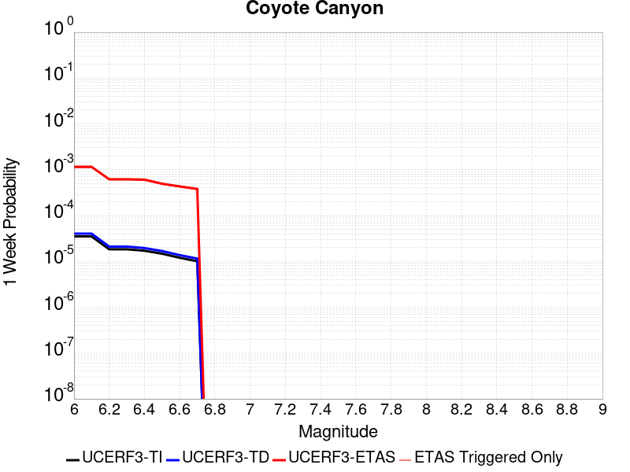 | 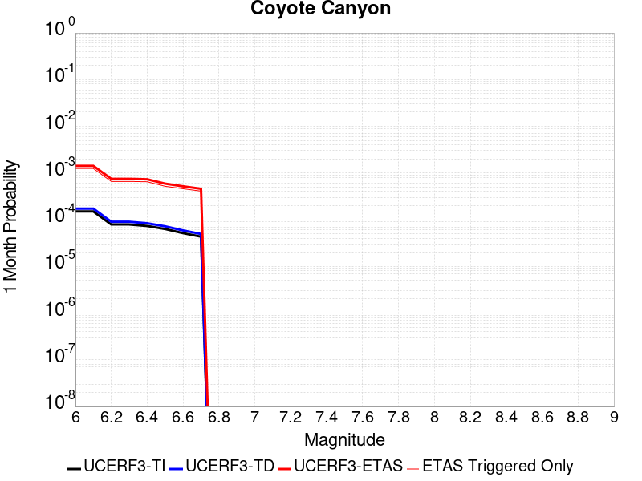 | 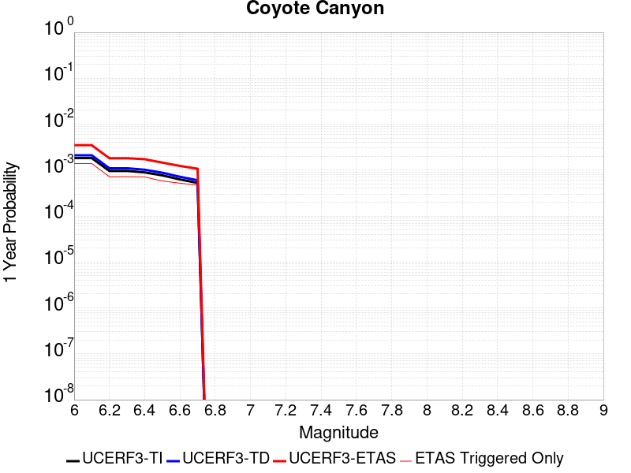 | 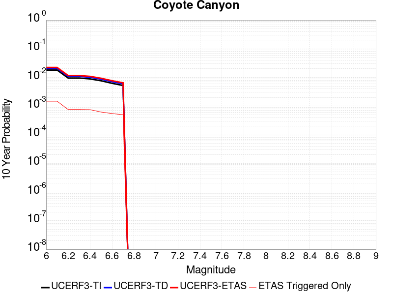 |

| Magnitude | 1 wk TI Prob | 1 wk TD Prob | 1 wk ETAS Prob | 1 wk ETAS/TD Gain | 1 wk ETAS Triggered Only | 1 mo TI Prob | 1 mo TD Prob | 1 mo ETAS Prob | 1 mo ETAS/TD Gain | 1 mo ETAS Triggered Only | 1 yr TI Prob | 1 yr TD Prob | 1 yr ETAS Prob | 1 yr ETAS/TD Gain | 1 yr ETAS Triggered Only | 10 yr TI Prob | 10 yr TD Prob | 10 yr ETAS Prob | 10 yr ETAS/TD Gain | 10 yr ETAS Triggered Only |
|-----|-----|-----|-----|-----|-----|-----|-----|-----|-----|-----|-----|-----|-----|-----|-----|-----|-----|-----|-----|-----|
| 6.0 | 3.5090034E-5 | 4.0364317E-5 | 0.0011603191 | 28.74616 | 0.00112 | 1.503772E-4 | 1.7297991E-4 | 0.0014227637 | 8.225022 | 0.00125 | 0.0018293047 | 0.0021042533 | 0.0034913286 | 1.6591768 | 0.00139 | 0.018143194 | 0.020869205 | 0.022318318 | 1.0694379 | 0.00148 |
| 6.1 | 3.5090034E-5 | 4.0364317E-5 | 0.0011603191 | 28.74616 | 0.00112 | 1.503772E-4 | 1.7297991E-4 | 0.0014227637 | 8.225022 | 0.00125 | 0.0018293047 | 0.0021042533 | 0.0034913286 | 1.6591768 | 0.00139 | 0.018143194 | 0.020869205 | 0.022318318 | 1.0694379 | 0.00148 |
| 6.2 | 1.841879E-5 | 2.1059794E-5 | 6.2104716E-4 | 29.489708 | 6.0E-4 | 7.8935285E-5 | 9.025371E-5 | 7.501941E-4 | 8.312058 | 6.6E-4 | 9.606133E-4 | 0.0010983871 | 0.0018175961 | 1.6547867 | 7.2E-4 | 0.0095647145 | 0.010939668 | 0.011691353 | 1.068712 | 7.6E-4 |
| 6.3 | 1.841879E-5 | 2.1059794E-5 | 6.2104716E-4 | 29.489708 | 6.0E-4 | 7.8935285E-5 | 9.025371E-5 | 7.501941E-4 | 8.312058 | 6.6E-4 | 9.606133E-4 | 0.0010983871 | 0.0018175961 | 1.6547867 | 7.2E-4 | 0.0095647145 | 0.010939668 | 0.011691353 | 1.068712 | 7.6E-4 |
| 6.4 | 1.712201E-5 | 1.9565212E-5 | 6.0955365E-4 | 31.154974 | 5.9E-4 | 7.337798E-5 | 8.3848776E-5 | 7.337943E-4 | 8.751401 | 6.5E-4 | 8.930107E-4 | 0.0010204813 | 0.0017297568 | 1.6950401 | 7.1E-4 | 0.008894307 | 0.010167871 | 0.010910245 | 1.0730118 | 7.5E-4 |
| 6.5 | 1.4744935E-5 | 1.6836972E-5 | 4.9682887E-4 | 29.50821 | 4.8E-4 | 6.3191044E-5 | 7.215698E-5 | 5.9211947E-4 | 8.20599 | 5.2E-4 | 7.6907943E-4 | 8.782507E-4 | 0.0014577413 | 1.6598237 | 5.8E-4 | 0.007664232 | 0.008756994 | 0.009371566 | 1.0701805 | 6.2E-4 |
| 6.6 | 1.2017839E-5 | 1.3724089E-5 | 4.3371832E-4 | 31.602705 | 4.2E-4 | 5.150401E-5 | 5.88167E-5 | 5.1878963E-4 | 8.820448 | 4.6E-4 | 6.268809E-4 | 7.159466E-4 | 0.0012355744 | 1.7257911 | 5.2E-4 | 0.0062511545 | 0.0071450938 | 0.007691164 | 1.0764259 | 5.5E-4 |
| 6.7 | 1.00956095E-5 | 1.1533517E-5 | 3.8152924E-4 | 33.080044 | 3.7E-4 | 4.326618E-5 | 4.942891E-5 | 4.5940865E-4 | 9.294331 | 4.1E-4 | 5.266384E-4 | 6.017178E-4 | 0.0010714349 | 1.780627 | 4.7E-4 | 0.005253921 | 0.0060094125 | 0.0065064076 | 1.0827028 | 5.0E-4 |

## Death Valley (So)
*[(top)](#table-of-contents)*

| 1 Week | 1 Month | 1 Year | 10 Year |
|-----|-----|-----|-----|
| 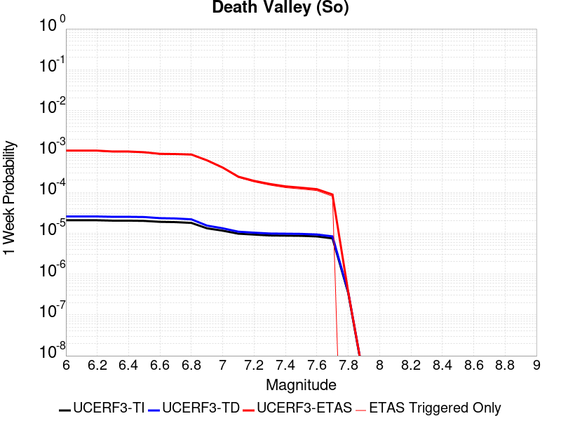 |  | 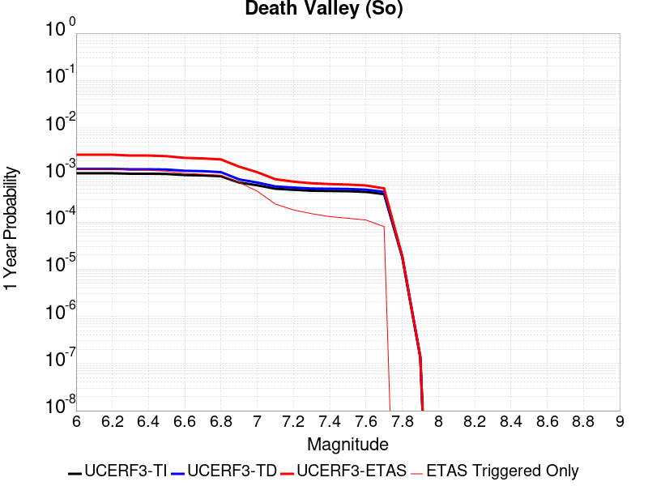 | 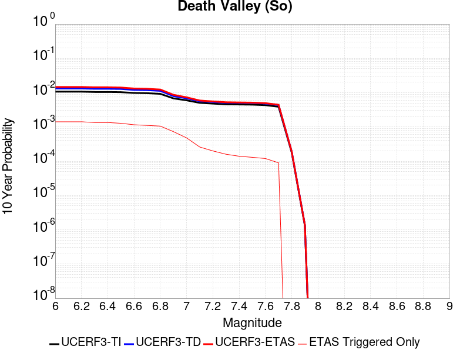 |

| Magnitude | 1 wk TI Prob | 1 wk TD Prob | 1 wk ETAS Prob | 1 wk ETAS/TD Gain | 1 wk ETAS Triggered Only | 1 mo TI Prob | 1 mo TD Prob | 1 mo ETAS Prob | 1 mo ETAS/TD Gain | 1 mo ETAS Triggered Only | 1 yr TI Prob | 1 yr TD Prob | 1 yr ETAS Prob | 1 yr ETAS/TD Gain | 1 yr ETAS Triggered Only | 10 yr TI Prob | 10 yr TD Prob | 10 yr ETAS Prob | 10 yr ETAS/TD Gain | 10 yr ETAS Triggered Only |
|-----|-----|-----|-----|-----|-----|-----|-----|-----|-----|-----|-----|-----|-----|-----|-----|-----|-----|-----|-----|-----|
| 6.0 | 2.0684236E-5 | 2.5618314E-5 | 0.0010455921 | 40.814247 | 0.00102 | 8.864371E-5 | 1.0978825E-4 | 0.0012496631 | 11.382484 | 0.00114 | 0.0010787029 | 0.0013358692 | 0.0026640925 | 1.9942764 | 0.00133 | 0.010734817 | 0.013279985 | 0.014681127 | 1.1055079 | 0.00142 |
| 6.1 | 2.0684236E-5 | 2.5618314E-5 | 0.0010455921 | 40.814247 | 0.00102 | 8.864371E-5 | 1.0978825E-4 | 0.0012496631 | 11.382484 | 0.00114 | 0.0010787029 | 0.0013358692 | 0.0026640925 | 1.9942764 | 0.00133 | 0.010734817 | 0.013279985 | 0.014681127 | 1.1055079 | 0.00142 |
| 6.2 | 2.0684236E-5 | 2.5618314E-5 | 0.0010455921 | 40.814247 | 0.00102 | 8.864371E-5 | 1.0978825E-4 | 0.0012496631 | 11.382484 | 0.00114 | 0.0010787029 | 0.0013358692 | 0.0026640925 | 1.9942764 | 0.00133 | 0.010734817 | 0.013279985 | 0.014681127 | 1.1055079 | 0.00142 |
| 6.3 | 2.0240292E-5 | 2.51184E-5 | 9.950941E-4 | 39.616142 | 9.7E-4 | 8.6741224E-5 | 1.0764593E-4 | 0.0011775307 | 10.938925 | 0.00107 | 0.0010555626 | 0.001309818 | 0.0025581808 | 1.953081 | 0.00125 | 0.010505628 | 0.013022543 | 0.014354963 | 1.1023164 | 0.00135 |
| 6.4 | 2.0240292E-5 | 2.51184E-5 | 9.950941E-4 | 39.616142 | 9.7E-4 | 8.6741224E-5 | 1.0764593E-4 | 0.0011775307 | 10.938925 | 0.00107 | 0.0010555626 | 0.001309818 | 0.0025581808 | 1.953081 | 0.00125 | 0.010505628 | 0.013022543 | 0.014354963 | 1.1023164 | 0.00135 |
| 6.5 | 1.9962767E-5 | 2.4807652E-5 | 9.5478457E-4 | 38.487503 | 9.3E-4 | 8.55519E-5 | 1.0631427E-4 | 0.0011162069 | 10.4991255 | 0.00101 | 0.0010410968 | 0.0012936244 | 0.002482085 | 1.918706 | 0.00119 | 0.010362327 | 0.01286249 | 0.014126025 | 1.0982342 | 0.00128 |
| 6.6 | 1.8937297E-5 | 2.3311462E-5 | 8.7329163E-4 | 37.4619 | 8.5E-4 | 8.115732E-5 | 9.990252E-5 | 0.0010298096 | 10.308145 | 9.3E-4 | 9.876423E-4 | 0.0012156491 | 0.0022843482 | 1.8791182 | 0.00107 | 0.009832645 | 0.0120915035 | 0.013237477 | 1.0947751 | 0.00116 |
| 6.7 | 1.8621096E-5 | 2.2912098E-5 | 8.6289283E-4 | 37.661015 | 8.4E-4 | 7.980225E-5 | 9.8191085E-5 | 9.981027E-4 | 10.164901 | 9.0E-4 | 9.711593E-4 | 0.0011948354 | 0.0022236046 | 1.8610134 | 0.00103 | 0.009669261 | 0.011885625 | 0.012982432 | 1.0922801 | 0.00111 |
| 6.8 | 1.7830353E-5 | 2.1806083E-5 | 8.417882E-4 | 38.603363 | 8.2E-4 | 7.641356E-5 | 9.3451374E-5 | 9.733691E-4 | 10.415782 | 8.8E-4 | 9.29938E-4 | 0.0011371907 | 0.0021160762 | 1.8607928 | 9.8E-4 | 0.009260561 | 0.01131609 | 0.012364094 | 1.0926119 | 0.00106 |
| 6.9 | 1.3135183E-5 | 1.5304031E-5 | 6.05295E-4 | 39.551346 | 5.9E-4 | 5.6292425E-5 | 6.558709E-5 | 6.9554575E-4 | 10.604919 | 6.3E-4 | 6.8514474E-4 | 7.982367E-4 | 0.001487686 | 1.8637153 | 6.9E-4 | 0.006830362 | 0.007955158 | 0.008679351 | 1.0910344 | 7.3E-4 |
| 7.0 | 1.1507512E-5 | 1.3154237E-5 | 4.031491E-4 | 30.64785 | 3.9E-4 | 4.9316975E-5 | 5.637412E-5 | 4.863499E-4 | 8.627184 | 4.3E-4 | 6.002687E-4 | 6.861445E-4 | 0.0011358358 | 1.6553885 | 4.5E-4 | 0.0059864987 | 0.0068414924 | 0.0073182085 | 1.0696801 | 4.8E-4 |
| 7.1 | 9.715903E-6 | 1.0865287E-5 | 2.4086279E-4 | 22.168102 | 2.3E-4 | 4.1638916E-5 | 4.6564706E-5 | 2.76554E-4 | 5.939133 | 2.3E-4 | 5.068359E-4 | 5.667821E-4 | 8.066461E-4 | 1.4232031 | 2.4E-4 | 0.0050568148 | 0.005653834 | 0.005912364 | 1.0457265 | 2.6E-4 |
| 7.2 | 9.233269E-6 | 1.0286314E-5 | 1.9028447E-4 | 18.4988 | 1.8E-4 | 3.9570554E-5 | 4.408348E-5 | 2.2407554E-4 | 5.082982 | 1.8E-4 | 4.81665E-4 | 5.365884E-4 | 7.1649184E-4 | 1.3352727 | 1.8E-4 | 0.0048062233 | 0.0053533595 | 0.0055522886 | 1.0371597 | 2.0E-4 |
| 7.3 | 8.8041315E-6 | 9.808164E-6 | 1.5980669E-4 | 16.293232 | 1.5E-4 | 3.7731446E-5 | 4.2034335E-5 | 1.9202803E-4 | 4.5683613 | 1.5E-4 | 4.592835E-4 | 5.1165203E-4 | 6.615753E-4 | 1.293018 | 1.5E-4 | 0.0045833546 | 0.005105167 | 0.00526435 | 1.0311807 | 1.6E-4 |
| 7.4 | 8.708749E-6 | 9.707175E-6 | 1.3970591E-4 | 14.392026 | 1.3E-4 | 3.7322676E-5 | 4.160154E-5 | 1.7159613E-4 | 4.1247544 | 1.3E-4 | 4.5430884E-4 | 5.0638523E-4 | 6.363194E-4 | 1.2565916 | 1.3E-4 | 0.004533812 | 0.0050527398 | 0.005192032 | 1.0275677 | 1.4E-4 |
| 7.5 | 8.612678E-6 | 9.604817E-6 | 1.2960366E-4 | 13.49361 | 1.2E-4 | 3.6910955E-5 | 4.1162875E-5 | 1.6115794E-4 | 3.9151282 | 1.2E-4 | 4.492982E-4 | 5.01047E-4 | 6.2098686E-4 | 1.2393785 | 1.2E-4 | 0.004483909 | 0.0049995985 | 0.005128949 | 1.0258721 | 1.3E-4 |
| 7.6 | 8.319024E-6 | 9.283916E-6 | 1.1928289E-4 | 12.848338 | 1.1E-4 | 3.5652476E-5 | 3.978763E-5 | 1.4978326E-4 | 3.7645683 | 1.1E-4 | 4.3398244E-4 | 4.8431093E-4 | 5.9425767E-4 | 1.2270168 | 1.1E-4 | 0.0043313587 | 0.0048329784 | 0.004952398 | 1.0247095 | 1.2E-4 |
| 7.7 | 7.4718328E-6 | 8.34517E-6 | 8.83445E-5 | 10.586304 | 8.0E-5 | 3.2021748E-5 | 3.5764548E-5 | 1.15761686E-4 | 3.236772 | 8.0E-5 | 3.8979502E-4 | 4.353504E-4 | 5.1531557E-4 | 1.18368 | 8.0E-5 | 0.00389112 | 0.0043453807 | 0.0044349893 | 1.0206217 | 9.0E-5 |
| 7.8 | 3.4586725E-7 | 3.6482615E-7 | 3.6482615E-7 | 1.0 | 0.0 | 1.4822873E-6 | 1.5635396E-6 | 1.5635396E-6 | 1.0 | 0.0 | 1.80467E-5 | 1.9035933E-5 | 1.9035933E-5 | 1.0 | 0.0 | 1.8045233E-4 | 1.9034347E-4 | 1.9034347E-4 | 1.0 | 0.0 |
| 7.9 | 2.5591178E-9 | 2.6696718E-9 | 2.6696718E-9 | 1.0 | 0.0 | 1.0967647E-8 | 1.14414505E-8 | 1.14414505E-8 | 1.0 | 0.0 | 1.335311E-7 | 1.3929966E-7 | 1.3929966E-7 | 1.0 | 0.0 | 1.3353102E-6 | 1.3929966E-6 | 1.3929966E-6 | 1.0 | 0.0 |

## Towne Pass
*[(top)](#table-of-contents)*

| 1 Week | 1 Month | 1 Year | 10 Year |
|-----|-----|-----|-----|
| 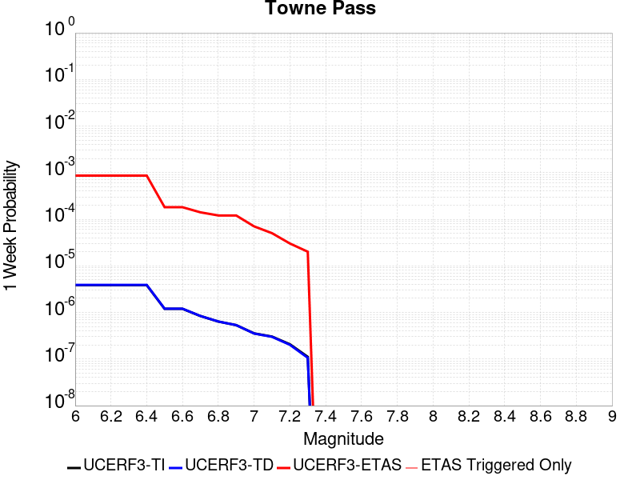 | 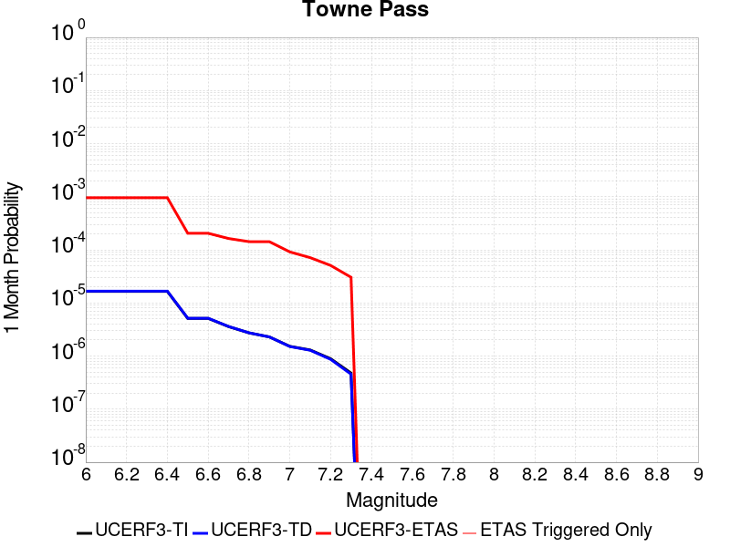 | 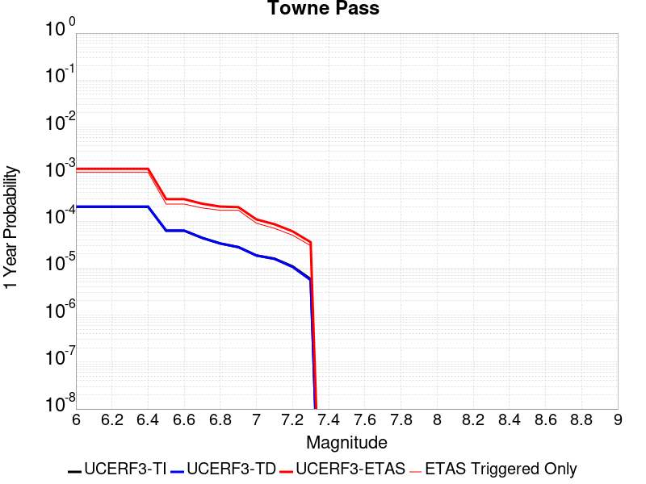 | 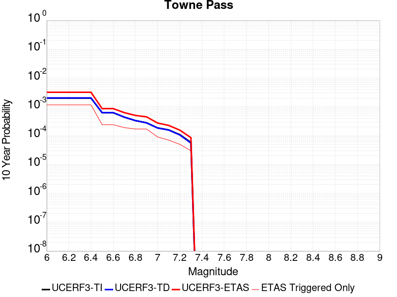 |

| Magnitude | 1 wk TI Prob | 1 wk TD Prob | 1 wk ETAS Prob | 1 wk ETAS/TD Gain | 1 wk ETAS Triggered Only | 1 mo TI Prob | 1 mo TD Prob | 1 mo ETAS Prob | 1 mo ETAS/TD Gain | 1 mo ETAS Triggered Only | 1 yr TI Prob | 1 yr TD Prob | 1 yr ETAS Prob | 1 yr ETAS/TD Gain | 1 yr ETAS Triggered Only | 10 yr TI Prob | 10 yr TD Prob | 10 yr ETAS Prob | 10 yr ETAS/TD Gain | 10 yr ETAS Triggered Only |
|-----|-----|-----|-----|-----|-----|-----|-----|-----|-----|-----|-----|-----|-----|-----|-----|-----|-----|-----|-----|-----|
| 6.0 | 3.849728E-6 | 3.894542E-6 | 8.638912E-4 | 221.821 | 8.6E-4 | 1.649873E-5 | 1.6690812E-5 | 9.566751E-4 | 57.31747 | 9.4E-4 | 2.0085352E-4 | 2.0319606E-4 | 0.0012929746 | 6.3631873 | 0.00109 | 0.0020067208 | 0.0020305319 | 0.0031981561 | 1.5750338 | 0.00117 |
| 6.1 | 3.849728E-6 | 3.894542E-6 | 8.638912E-4 | 221.821 | 8.6E-4 | 1.649873E-5 | 1.6690812E-5 | 9.566751E-4 | 57.31747 | 9.4E-4 | 2.0085352E-4 | 2.0319606E-4 | 0.0012929746 | 6.3631873 | 0.00109 | 0.0020067208 | 0.0020305319 | 0.0031981561 | 1.5750338 | 0.00117 |
| 6.2 | 3.849728E-6 | 3.894542E-6 | 8.638912E-4 | 221.821 | 8.6E-4 | 1.649873E-5 | 1.6690812E-5 | 9.566751E-4 | 57.31747 | 9.4E-4 | 2.0085352E-4 | 2.0319606E-4 | 0.0012929746 | 6.3631873 | 0.00109 | 0.0020067208 | 0.0020305319 | 0.0031981561 | 1.5750338 | 0.00117 |
| 6.3 | 3.849728E-6 | 3.894542E-6 | 8.638912E-4 | 221.821 | 8.6E-4 | 1.649873E-5 | 1.6690812E-5 | 9.566751E-4 | 57.31747 | 9.4E-4 | 2.0085352E-4 | 2.0319606E-4 | 0.0012929746 | 6.3631873 | 0.00109 | 0.0020067208 | 0.0020305319 | 0.0031981561 | 1.5750338 | 0.00117 |
| 6.4 | 3.849728E-6 | 3.894542E-6 | 8.638912E-4 | 221.821 | 8.6E-4 | 1.649873E-5 | 1.6690812E-5 | 9.566751E-4 | 57.31747 | 9.4E-4 | 2.0085352E-4 | 2.0319606E-4 | 0.0012929746 | 6.3631873 | 0.00109 | 0.0020067208 | 0.0020305319 | 0.0031981561 | 1.5750338 | 0.00117 |
| 6.5 | 1.1953545E-6 | 1.2030526E-6 | 1.8120283E-4 | 150.61922 | 1.8E-4 | 5.1229376E-6 | 5.15593E-6 | 2.051549E-4 | 39.790085 | 2.0E-4 | 6.236998E-5 | 6.277176E-5 | 2.9275732E-4 | 4.663838 | 2.3E-4 | 6.235248E-4 | 6.2755204E-4 | 8.674014E-4 | 1.3821985 | 2.4E-4 |
| 6.6 | 1.1953545E-6 | 1.2030526E-6 | 1.8120283E-4 | 150.61922 | 1.8E-4 | 5.1229376E-6 | 5.15593E-6 | 2.051549E-4 | 39.790085 | 2.0E-4 | 6.236998E-5 | 6.277176E-5 | 2.9275732E-4 | 4.663838 | 2.3E-4 | 6.235248E-4 | 6.2755204E-4 | 8.674014E-4 | 1.3821985 | 2.4E-4 |
| 6.7 | 8.375951E-7 | 8.410676E-7 | 1.4084094E-4 | 167.45497 | 1.4E-4 | 3.5896885E-6 | 3.6045708E-6 | 1.63604E-4 | 45.387924 | 1.6E-4 | 4.370358E-5 | 4.3884826E-5 | 2.3387649E-4 | 5.3293247 | 1.9E-4 | 4.3694986E-4 | 4.3876728E-4 | 6.2868395E-4 | 1.4328414 | 1.9E-4 |
| 6.8 | 6.38041E-7 | 6.3921624E-7 | 1.2063914E-4 | 188.72978 | 1.2E-4 | 2.7344586E-6 | 2.7394954E-6 | 1.4273911E-4 | 52.10416 | 1.4E-4 | 3.3291526E-5 | 3.3352884E-5 | 2.0334721E-4 | 6.0968404 | 1.7E-4 | 3.3286537E-4 | 3.334826E-4 | 5.034259E-4 | 1.5096017 | 1.7E-4 |
| 6.9 | 5.3460053E-7 | 5.345339E-7 | 1.2053447E-4 | 225.49454 | 1.2E-4 | 2.2911431E-6 | 2.2908578E-6 | 1.4229053E-4 | 62.112343 | 1.4E-4 | 2.789431E-5 | 2.7890868E-5 | 1.9788613E-4 | 7.0950146 | 1.7E-4 | 2.789081E-4 | 2.78877E-4 | 4.488296E-4 | 1.6094177 | 1.7E-4 |
| 7.0 | 3.557783E-7 | 3.5324283E-7 | 7.035322E-5 | 199.1639 | 7.0E-5 | 1.5247632E-6 | 1.513897E-6 | 9.1513764E-5 | 60.44913 | 9.0E-5 | 1.8563835E-5 | 1.8431549E-5 | 1.0842989E-4 | 5.882842 | 9.0E-5 | 1.8562283E-4 | 1.8430105E-4 | 2.7428445E-4 | 1.4882414 | 9.0E-5 |
| 7.1 | 3.037942E-7 | 3.0002275E-7 | 5.030001E-5 | 167.65398 | 5.0E-5 | 1.3019744E-6 | 1.2858112E-6 | 7.128572E-5 | 55.44027 | 7.0E-5 | 1.5851423E-5 | 1.5654647E-5 | 8.565355E-5 | 5.4714456 | 7.0E-5 | 1.5850292E-4 | 1.5653619E-4 | 2.2652523E-4 | 1.4471109 | 7.0E-5 |
| 7.2 | 2.0808248E-7 | 2.0217735E-7 | 3.020217E-5 | 149.38455 | 3.0E-5 | 8.917818E-7 | 8.6647407E-7 | 5.086643E-5 | 58.705082 | 5.0E-5 | 1.0857389E-5 | 1.0549275E-5 | 6.0548748E-5 | 5.739612 | 5.0E-5 | 1.0856859E-4 | 1.0548821E-4 | 1.5548294E-4 | 1.4739367 | 5.0E-5 |
| 7.3 | 1.1162073E-7 | 1.0636902E-7 | 2.0106367E-5 | 189.02464 | 2.0E-5 | 4.7837443E-7 | 4.5586717E-7 | 3.0455854E-5 | 66.80862 | 3.0E-5 | 5.8241935E-6 | 5.5501705E-6 | 3.5550005E-5 | 6.405209 | 3.0E-5 | 5.8240406E-5 | 5.550052E-5 | 8.5498854E-5 | 1.5405054 | 3.0E-5 |

## San Andreas (San Bernardino S)
*[(top)](#table-of-contents)*

| 1 Week | 1 Month | 1 Year | 10 Year |
|-----|-----|-----|-----|
| 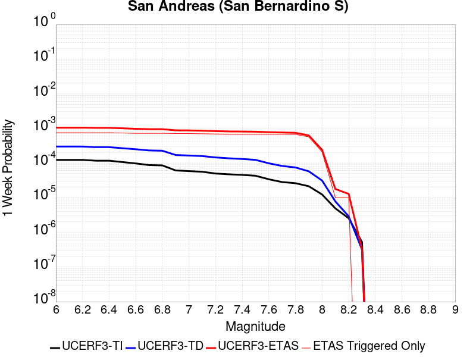 | 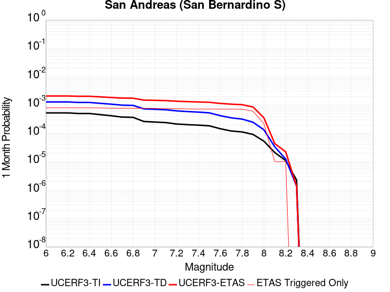 | 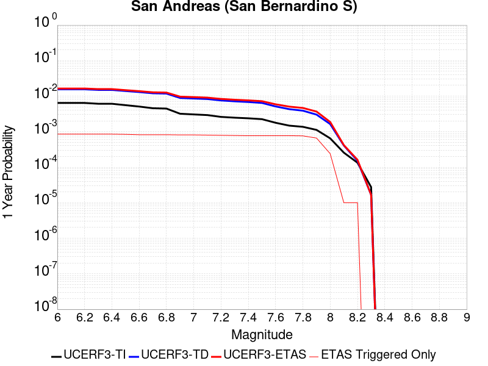 | 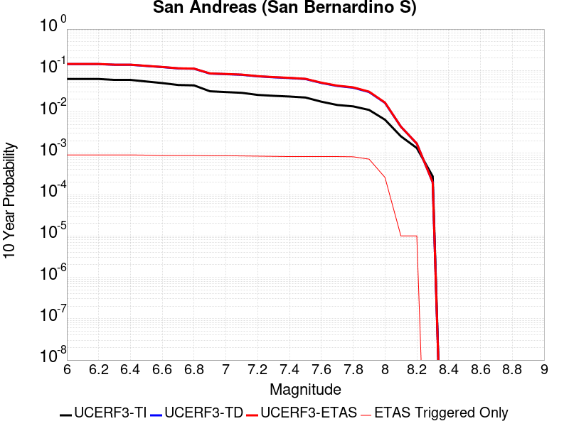 |

| Magnitude | 1 wk TI Prob | 1 wk TD Prob | 1 wk ETAS Prob | 1 wk ETAS/TD Gain | 1 wk ETAS Triggered Only | 1 mo TI Prob | 1 mo TD Prob | 1 mo ETAS Prob | 1 mo ETAS/TD Gain | 1 mo ETAS Triggered Only | 1 yr TI Prob | 1 yr TD Prob | 1 yr ETAS Prob | 1 yr ETAS/TD Gain | 1 yr ETAS Triggered Only | 10 yr TI Prob | 10 yr TD Prob | 10 yr ETAS Prob | 10 yr ETAS/TD Gain | 10 yr ETAS Triggered Only |
|-----|-----|-----|-----|-----|-----|-----|-----|-----|-----|-----|-----|-----|-----|-----|-----|-----|-----|-----|-----|-----|
| 6.0 | 1.2336002E-4 | 3.0005194E-4 | 0.0010498269 | 3.4988172 | 7.5E-4 | 5.2857865E-4 | 0.0012853292 | 0.0020843009 | 1.6216086 | 8.0E-4 | 0.006416472 | 0.015541554 | 0.016378345 | 1.0538421 | 8.5E-4 | 0.06234337 | 0.14294699 | 0.14372692 | 1.005456 | 9.1E-4 |
| 6.1 | 1.2336002E-4 | 3.0005194E-4 | 0.0010498269 | 3.4988172 | 7.5E-4 | 5.2857865E-4 | 0.0012853292 | 0.0020843009 | 1.6216086 | 8.0E-4 | 0.006416472 | 0.015541554 | 0.016378345 | 1.0538421 | 8.5E-4 | 0.06234337 | 0.14294699 | 0.14372692 | 1.005456 | 9.1E-4 |
| 6.2 | 1.2336002E-4 | 3.0005194E-4 | 0.0010498269 | 3.4988172 | 7.5E-4 | 5.2857865E-4 | 0.0012853292 | 0.0020843009 | 1.6216086 | 8.0E-4 | 0.006416472 | 0.015541554 | 0.016378345 | 1.0538421 | 8.5E-4 | 0.06234337 | 0.14294699 | 0.14372692 | 1.005456 | 9.1E-4 |
| 6.3 | 1.1712257E-4 | 2.8793467E-4 | 0.0010377187 | 3.6040077 | 7.5E-4 | 5.018573E-4 | 0.0012334478 | 0.002032461 | 1.6477885 | 8.0E-4 | 0.006093008 | 0.014918666 | 0.015755985 | 1.0561256 | 8.5E-4 | 0.059286322 | 0.13765779 | 0.13844252 | 1.0057006 | 9.1E-4 |
| 6.4 | 1.1712257E-4 | 2.8793467E-4 | 0.0010377187 | 3.6040077 | 7.5E-4 | 5.018573E-4 | 0.0012334478 | 0.002032461 | 1.6477885 | 8.0E-4 | 0.006093008 | 0.014918666 | 0.015755985 | 1.0561256 | 8.5E-4 | 0.059286322 | 0.13765779 | 0.13844252 | 1.0057006 | 9.1E-4 |
| 6.5 | 1.0689076E-4 | 2.6806415E-4 | 0.0010078658 | 3.7597933 | 7.4E-4 | 4.5802278E-4 | 0.0011483653 | 0.0019374582 | 1.6871444 | 7.9E-4 | 0.0055621783 | 0.013896335 | 0.0147246625 | 1.0596076 | 8.4E-4 | 0.05425003 | 0.1288989 | 0.1296829 | 1.0060822 | 9.0E-4 |
| 6.6 | 9.7648895E-5 | 2.505129E-4 | 9.7033253E-4 | 3.8733833 | 7.2E-4 | 4.1842813E-4 | 0.0010732086 | 0.0018423822 | 1.7167046 | 7.7E-4 | 0.005082469 | 0.012992399 | 0.013801745 | 1.0622938 | 8.2E-4 | 0.049677886 | 0.121077746 | 0.1218512 | 1.0063881 | 8.8E-4 |
| 6.7 | 8.757013E-5 | 2.3122175E-4 | 9.5105526E-4 | 4.113174 | 7.2E-4 | 3.7524657E-4 | 9.905964E-4 | 0.0017598335 | 1.7765396 | 7.7E-4 | 0.00455906 | 0.011997902 | 0.012808064 | 1.0675253 | 8.2E-4 | 0.04466656 | 0.112373024 | 0.113154136 | 1.0069511 | 8.8E-4 |
| 6.8 | 8.562978E-5 | 2.2682057E-4 | 9.4665727E-4 | 4.1735954 | 7.2E-4 | 3.6693315E-4 | 9.7174826E-4 | 0.001741 | 1.7916163 | 7.7E-4 | 0.004458263 | 0.011770921 | 0.012581269 | 1.0688432 | 8.2E-4 | 0.043698758 | 0.11037863 | 0.1111615 | 1.0070926 | 8.8E-4 |
| 6.9 | 6.124075E-5 | 1.7066885E-4 | 8.805477E-4 | 5.1593933 | 7.1E-4 | 2.6243398E-4 | 7.312337E-4 | 0.0014906779 | 2.0385795 | 7.6E-4 | 0.0031904527 | 0.008866636 | 0.009669455 | 1.0905437 | 8.1E-4 | 0.031450346 | 0.08420262 | 0.08499936 | 1.0094622 | 8.7E-4 |
| 7.0 | 5.8598747E-5 | 1.6495936E-4 | 8.748422E-4 | 5.3033805 | 7.1E-4 | 2.5111332E-4 | 7.067779E-4 | 0.0014662407 | 2.0745425 | 7.6E-4 | 0.0030530186 | 0.008571265 | 0.009374322 | 1.0936918 | 8.1E-4 | 0.03011414 | 0.08151562 | 0.0823147 | 1.0098028 | 8.7E-4 |
| 7.1 | 5.613814E-5 | 1.5914452E-4 | 8.5903314E-4 | 5.397818 | 7.0E-4 | 2.4056983E-4 | 6.818704E-4 | 0.001431359 | 2.0991657 | 7.5E-4 | 0.0029250039 | 0.008270353 | 0.009063737 | 1.095931 | 8.0E-4 | 0.028868021 | 0.07881268 | 0.0796049 | 1.010052 | 8.6E-4 |
| 7.2 | 4.991222E-5 | 1.4520933E-4 | 8.3510915E-4 | 5.751071 | 6.9E-4 | 2.1389198E-4 | 6.221777E-4 | 0.0013617172 | 2.1886308 | 7.4E-4 | 0.002601025 | 0.0075488063 | 0.008332843 | 1.1038623 | 7.9E-4 | 0.025707912 | 0.07226191 | 0.073050484 | 1.0109128 | 8.5E-4 |
| 7.3 | 4.7410045E-5 | 1.371513E-4 | 8.17058E-4 | 5.957348 | 6.8E-4 | 2.0317009E-4 | 5.8765925E-4 | 0.0013172303 | 2.2414865 | 7.3E-4 | 0.0024707897 | 0.0071313656 | 0.007905803 | 1.108596 | 7.8E-4 | 0.024434982 | 0.068541944 | 0.06932437 | 1.0114152 | 8.4E-4 |
| 7.4 | 4.5556746E-5 | 1.3123035E-4 | 8.111411E-4 | 6.1810484 | 6.8E-4 | 1.952286E-4 | 5.6229485E-4 | 0.00128189 | 2.279747 | 7.2E-4 | 0.002374317 | 0.0068245293 | 0.0075892746 | 1.1120583 | 7.7E-4 | 0.023491086 | 0.06579143 | 0.066566825 | 1.0117856 | 8.3E-4 |
| 7.5 | 4.3084514E-5 | 1.2358342E-4 | 8.0349937E-4 | 6.501676 | 6.8E-4 | 1.8463485E-4 | 5.2953605E-4 | 0.0012491548 | 2.3589609 | 7.2E-4 | 0.0022456115 | 0.0064281146 | 0.007193165 | 1.1190163 | 7.7E-4 | 0.022230545 | 0.062190283 | 0.062968664 | 1.0125161 | 8.3E-4 |
| 7.6 | 3.408608E-5 | 9.836477E-5 | 7.782979E-4 | 7.9123645 | 6.8E-4 | 1.4607502E-4 | 4.214953E-4 | 0.0011411918 | 2.7074842 | 7.2E-4 | 0.0017770125 | 0.005119656 | 0.0058857137 | 1.1496308 | 7.7E-4 | 0.017628696 | 0.05002244 | 0.05081092 | 1.0157626 | 8.3E-4 |
| 7.7 | 2.8315713E-5 | 8.2495724E-5 | 7.624396E-4 | 9.242171 | 6.8E-4 | 1.2134742E-4 | 3.5350522E-4 | 0.0010732507 | 3.036025 | 7.2E-4 | 0.0014764034 | 0.004295442 | 0.005062134 | 1.1784898 | 7.7E-4 | 0.01466633 | 0.042272415 | 0.04306733 | 1.0188046 | 8.3E-4 |
| 7.8 | 2.6222975E-5 | 7.463898E-5 | 7.4458896E-4 | 9.975873 | 6.7E-4 | 1.1237934E-4 | 3.1984213E-4 | 0.001029615 | 3.219135 | 7.1E-4 | 0.0013673597 | 0.003887131 | 0.004644177 | 1.194757 | 7.6E-4 | 0.013589768 | 0.038437475 | 0.039225955 | 1.0205133 | 8.2E-4 |
| 7.9 | 2.1469694E-5 | 5.7884805E-5 | 6.278518E-4 | 10.846574 | 5.7E-4 | 9.200973E-5 | 2.4805416E-4 | 8.5790287E-4 | 3.4585304 | 6.1E-4 | 0.0011196428 | 0.00301588 | 0.0036738897 | 1.2181816 | 6.6E-4 | 0.011140184 | 0.030153265 | 0.030851554 | 1.023158 | 7.2E-4 |
| 8.0 | 1.2420249E-5 | 3.1321662E-5 | 2.4131508E-4 | 7.704415 | 2.1E-4 | 5.322855E-5 | 1.342288E-4 | 3.5419926E-4 | 2.6387725 | 2.2E-4 | 6.478649E-4 | 0.0016330116 | 0.0018726196 | 1.1467277 | 2.4E-4 | 0.0064597935 | 0.01652369 | 0.016779395 | 1.015475 | 2.6E-4 |
| 8.1 | 4.9197724E-6 | 7.822525E-6 | 1.7822445E-5 | 2.2783496 | 1.0E-5 | 2.1084568E-5 | 3.3524673E-5 | 4.352434E-5 | 1.2982777 | 1.0E-5 | 2.566744E-4 | 4.080866E-4 | 4.1808252E-4 | 1.0244946 | 1.0E-5 | 0.002563781 | 0.004384557 | 0.004394513 | 1.0022707 | 1.0E-5 |
| 8.2 | 2.5634774E-6 | 2.9065757E-6 | 1.29065465E-5 | 4.4404645 | 1.0E-5 | 1.0986286E-5 | 1.2456694E-5 | 2.245657E-5 | 1.8027712 | 1.0E-5 | 1.3374983E-4 | 1.5164974E-4 | 1.6164822E-4 | 1.0659314 | 1.0E-5 | 0.0013366934 | 0.001704941 | 0.001714924 | 1.0058553 | 1.0E-5 |
| 8.3 | 5.2850464E-7 | 3.2080476E-7 | 3.2080476E-7 | 1.0 | 0.0 | 2.2650179E-6 | 1.3748769E-6 | 1.3748769E-6 | 1.0 | 0.0 | 2.7576245E-5 | 1.673901E-5 | 1.673901E-5 | 1.0 | 0.0 | 2.7572823E-4 | 1.986671E-4 | 1.986671E-4 | 1.0 | 0.0 |

## Nelson Lake
*[(top)](#table-of-contents)*

| 1 Week | 1 Month | 1 Year | 10 Year |
|-----|-----|-----|-----|
| 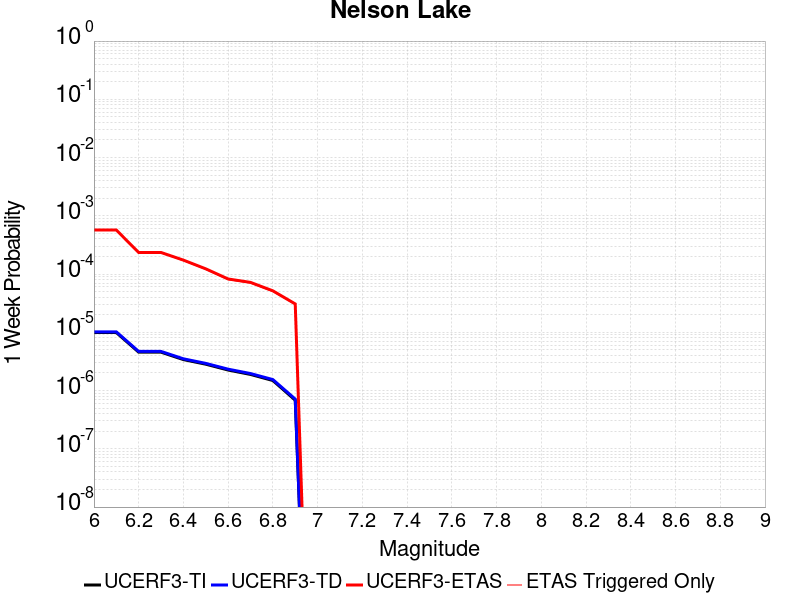 | 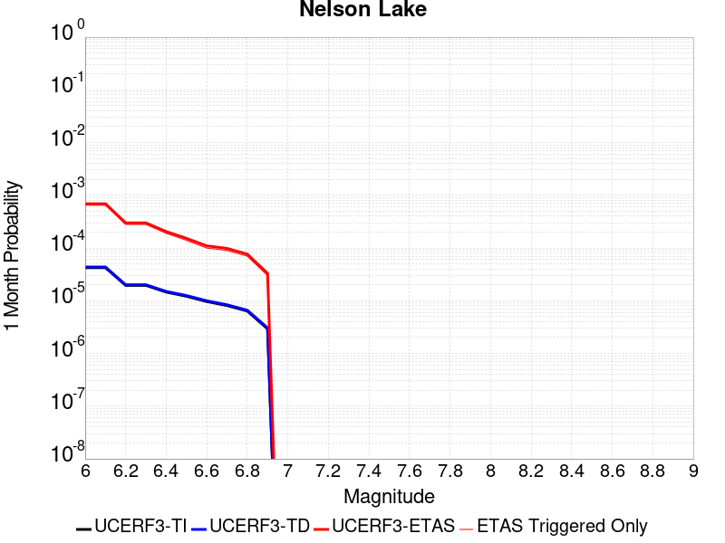 | 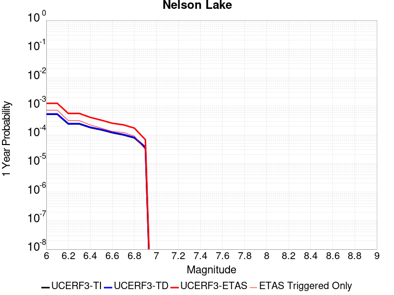 | 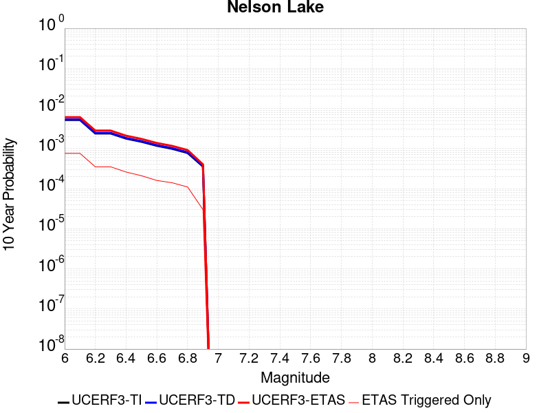 |

| Magnitude | 1 wk TI Prob | 1 wk TD Prob | 1 wk ETAS Prob | 1 wk ETAS/TD Gain | 1 wk ETAS Triggered Only | 1 mo TI Prob | 1 mo TD Prob | 1 mo ETAS Prob | 1 mo ETAS/TD Gain | 1 mo ETAS Triggered Only | 1 yr TI Prob | 1 yr TD Prob | 1 yr ETAS Prob | 1 yr ETAS/TD Gain | 1 yr ETAS Triggered Only | 10 yr TI Prob | 10 yr TD Prob | 10 yr ETAS Prob | 10 yr ETAS/TD Gain | 10 yr ETAS Triggered Only |
|-----|-----|-----|-----|-----|-----|-----|-----|-----|-----|-----|-----|-----|-----|-----|-----|-----|-----|-----|-----|-----|
| 6.0 | 9.913453E-6 | 1.0192255E-5 | 5.7018653E-4 | 55.94312 | 5.6E-4 | 4.2485535E-5 | 4.3680422E-5 | 6.93652E-4 | 15.880158 | 6.5E-4 | 5.1713863E-4 | 5.316897E-4 | 0.0012513069 | 2.3534534 | 7.2E-4 | 0.0051593683 | 0.005305204 | 0.006061172 | 1.1424955 | 7.6E-4 |
| 6.1 | 9.913453E-6 | 1.0192255E-5 | 5.7018653E-4 | 55.94312 | 5.6E-4 | 4.2485535E-5 | 4.3680422E-5 | 6.93652E-4 | 15.880158 | 6.5E-4 | 5.1713863E-4 | 5.316897E-4 | 0.0012513069 | 2.3534534 | 7.2E-4 | 0.0051593683 | 0.005305204 | 0.006061172 | 1.1424955 | 7.6E-4 |
| 6.2 | 4.5596407E-6 | 4.696313E-6 | 2.3469524E-4 | 49.974358 | 2.3E-4 | 1.954117E-5 | 2.0126909E-5 | 3.0012126E-4 | 14.911445 | 2.8E-4 | 2.3788778E-4 | 2.4501883E-4 | 5.549429E-4 | 2.264899 | 3.1E-4 | 0.0023763329 | 0.0024476128 | 0.002796756 | 1.1426464 | 3.5E-4 |
| 6.3 | 4.5596407E-6 | 4.696313E-6 | 2.3469524E-4 | 49.974358 | 2.3E-4 | 1.954117E-5 | 2.0126909E-5 | 3.0012126E-4 | 14.911445 | 2.8E-4 | 2.3788778E-4 | 2.4501883E-4 | 5.549429E-4 | 2.264899 | 3.1E-4 | 0.0023763329 | 0.0024476128 | 0.002796756 | 1.1426464 | 3.5E-4 |
| 6.4 | 3.4025713E-6 | 3.5098972E-6 | 1.735093E-4 | 49.434296 | 1.7E-4 | 1.4582367E-5 | 1.5042335E-5 | 2.0503948E-4 | 13.630828 | 1.9E-4 | 1.7752586E-4 | 1.8312587E-4 | 4.0308558E-4 | 2.2011395 | 2.2E-4 | 0.001773841 | 0.0018298327 | 0.002089357 | 1.1418295 | 2.6E-4 |
| 6.5 | 2.8352947E-6 | 2.927856E-6 | 1.2292751E-4 | 41.9855 | 1.2E-4 | 1.2151207E-5 | 1.2547898E-5 | 1.5254614E-4 | 12.157106 | 1.4E-4 | 1.479309E-4 | 1.5276071E-4 | 3.2273473E-4 | 2.1126816 | 1.7E-4 | 0.0014783246 | 0.0015266308 | 0.0017363102 | 1.1373478 | 2.1E-4 |
| 6.6 | 2.251518E-6 | 2.3290677E-6 | 8.232888E-5 | 35.34843 | 8.0E-5 | 9.649328E-6 | 9.981683E-6 | 1.0998068E-4 | 11.01825 | 1.0E-4 | 1.1747423E-4 | 1.2152085E-4 | 2.5150506E-4 | 2.0696454 | 1.3E-4 | 0.0011741214 | 0.0012146058 | 0.0013744114 | 1.13157 | 1.6E-4 |
| 6.7 | 1.8911853E-6 | 1.9591396E-6 | 7.1959E-5 | 36.7299 | 7.0E-5 | 8.105055E-6 | 8.39629E-6 | 9.839553E-5 | 11.718931 | 9.0E-5 | 9.867457E-5 | 1.0222061E-4 | 2.2220834E-4 | 2.1738114 | 1.2E-4 | 9.863076E-4 | 0.0010217935 | 0.0011616504 | 1.136874 | 1.4E-4 |
| 6.8 | 1.4874814E-6 | 1.5438305E-6 | 5.1543753E-5 | 33.386925 | 5.0E-5 | 6.374905E-6 | 6.6164025E-6 | 7.661594E-5 | 11.579698 | 7.0E-5 | 7.76117E-5 | 8.055224E-5 | 1.70545E-4 | 2.1171973 | 9.0E-5 | 7.75846E-4 | 8.0528157E-4 | 9.1519294E-4 | 1.1364882 | 1.1E-4 |
| 6.9 | 6.835972E-7 | 7.1399285E-7 | 3.071397E-5 | 43.0172 | 3.0E-5 | 2.9296991E-6 | 3.0599674E-6 | 3.3059874E-5 | 10.803996 | 3.0E-5 | 3.56685E-5 | 3.7254784E-5 | 6.725367E-5 | 1.8052356 | 3.0E-5 | 3.5662777E-4 | 3.7251666E-4 | 4.0250548E-4 | 1.0805033 | 3.0E-5 |

## Paradise
*[(top)](#table-of-contents)*

| 1 Week | 1 Month | 1 Year | 10 Year |
|-----|-----|-----|-----|
| 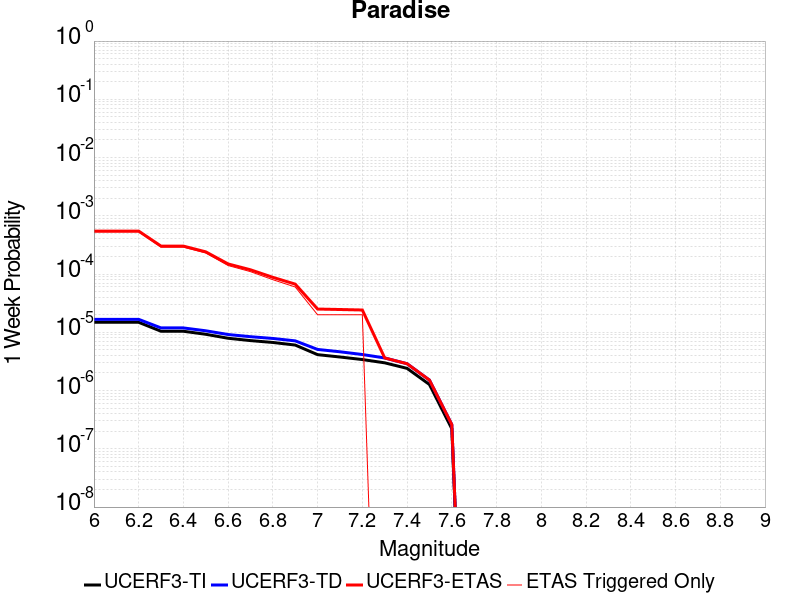 | 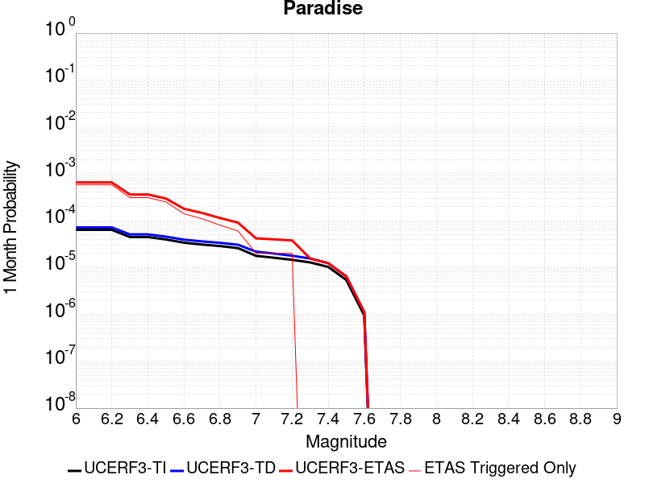 | 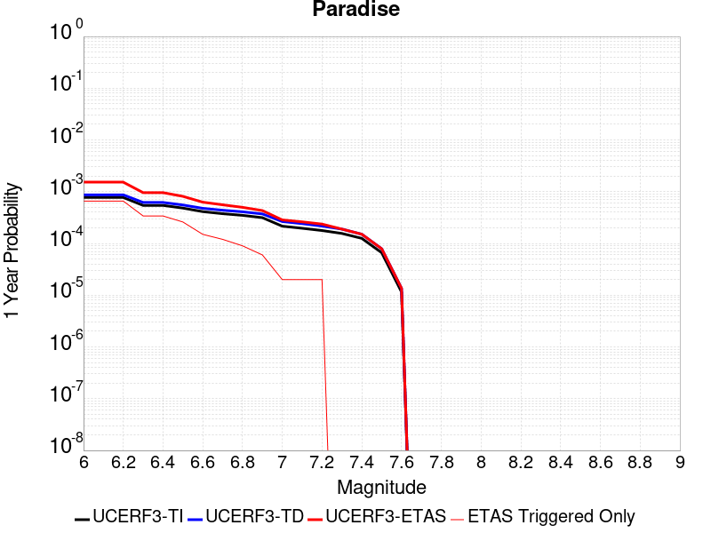 | 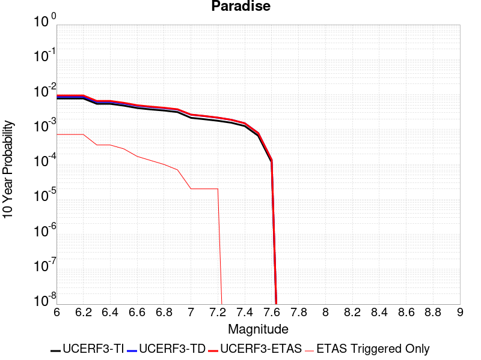 |

| Magnitude | 1 wk TI Prob | 1 wk TD Prob | 1 wk ETAS Prob | 1 wk ETAS/TD Gain | 1 wk ETAS Triggered Only | 1 mo TI Prob | 1 mo TD Prob | 1 mo ETAS Prob | 1 mo ETAS/TD Gain | 1 mo ETAS Triggered Only | 1 yr TI Prob | 1 yr TD Prob | 1 yr ETAS Prob | 1 yr ETAS/TD Gain | 1 yr ETAS Triggered Only | 10 yr TI Prob | 10 yr TD Prob | 10 yr ETAS Prob | 10 yr ETAS/TD Gain | 10 yr ETAS Triggered Only |
|-----|-----|-----|-----|-----|-----|-----|-----|-----|-----|-----|-----|-----|-----|-----|-----|-----|-----|-----|-----|-----|
| 6.0 | 1.4851273E-5 | 1.6694768E-5 | 5.4668594E-4 | 32.74594 | 5.3E-4 | 6.364676E-5 | 7.154718E-5 | 6.5150566E-4 | 9.105959 | 5.8E-4 | 7.7462377E-4 | 8.707624E-4 | 0.0015301877 | 1.7572964 | 6.6E-4 | 0.0077192914 | 0.008675884 | 0.009389638 | 1.0822687 | 7.2E-4 |
| 6.1 | 1.4851273E-5 | 1.6694768E-5 | 5.4668594E-4 | 32.74594 | 5.3E-4 | 6.364676E-5 | 7.154718E-5 | 6.5150566E-4 | 9.105959 | 5.8E-4 | 7.7462377E-4 | 8.707624E-4 | 0.0015301877 | 1.7572964 | 6.6E-4 | 0.0077192914 | 0.008675884 | 0.009389638 | 1.0822687 | 7.2E-4 |
| 6.2 | 1.4851273E-5 | 1.6694768E-5 | 5.4668594E-4 | 32.74594 | 5.3E-4 | 6.364676E-5 | 7.154718E-5 | 6.5150566E-4 | 9.105959 | 5.8E-4 | 7.7462377E-4 | 8.707624E-4 | 0.0015301877 | 1.7572964 | 6.6E-4 | 0.0077192914 | 0.008675884 | 0.009389638 | 1.0822687 | 7.2E-4 |
| 6.3 | 1.0426831E-5 | 1.1888697E-5 | 3.0188524E-4 | 25.392626 | 2.9E-4 | 4.4685654E-5 | 5.09506E-5 | 3.609348E-4 | 7.084015 | 3.1E-4 | 5.43912E-4 | 6.201529E-4 | 9.599421E-4 | 1.5479119 | 3.4E-4 | 0.0054258266 | 0.0061848317 | 0.0065426053 | 1.0578469 | 3.6E-4 |
| 6.4 | 1.0426831E-5 | 1.1888697E-5 | 3.0188524E-4 | 25.392626 | 2.9E-4 | 4.4685654E-5 | 5.09506E-5 | 3.609348E-4 | 7.084015 | 3.1E-4 | 5.43912E-4 | 6.201529E-4 | 9.599421E-4 | 1.5479119 | 3.4E-4 | 0.0054258266 | 0.0061848317 | 0.0065426053 | 1.0578469 | 3.6E-4 |
| 6.5 | 9.25027E-6 | 1.0620037E-5 | 2.4061759E-4 | 22.656944 | 2.3E-4 | 3.964341E-5 | 4.551368E-5 | 2.955023E-4 | 6.4926043 | 2.5E-4 | 4.8255164E-4 | 5.5399304E-4 | 8.1384904E-4 | 1.46906 | 2.6E-4 | 0.0048150513 | 0.0055266195 | 0.005805072 | 1.0503839 | 2.8E-4 |
| 6.6 | 7.904275E-6 | 9.159602E-6 | 1.4915832E-4 | 16.284367 | 1.4E-4 | 3.3875025E-5 | 3.925487E-5 | 1.7924937E-4 | 4.5662966 | 1.4E-4 | 4.1235037E-4 | 4.7782718E-4 | 6.277555E-4 | 1.313771 | 1.5E-4 | 0.0041158604 | 0.004768395 | 0.004937584 | 1.0354815 | 1.7E-4 |
| 6.7 | 7.2061953E-6 | 8.407326E-6 | 1.184064E-4 | 14.083717 | 1.1E-4 | 3.088333E-5 | 3.603092E-5 | 1.4602696E-4 | 4.0528235 | 1.1E-4 | 3.7593965E-4 | 4.3859181E-4 | 5.585392E-4 | 1.2734829 | 1.2E-4 | 0.003753043 | 0.004377631 | 0.004507062 | 1.0295664 | 1.3E-4 |
| 6.8 | 6.6948724E-6 | 7.842242E-6 | 8.784162E-5 | 11.201084 | 8.0E-5 | 2.8691995E-5 | 3.3609194E-5 | 1.13606504E-4 | 3.380221 | 8.0E-5 | 3.4926904E-4 | 4.091187E-4 | 4.9908186E-4 | 1.219895 | 9.0E-5 | 0.003487206 | 0.0040840125 | 0.0041836044 | 1.0243857 | 1.0E-4 |
| 6.9 | 6.0421025E-6 | 7.1306963E-6 | 6.713027E-5 | 9.414266 | 6.0E-5 | 2.5894467E-5 | 3.0559786E-5 | 9.055795E-5 | 2.9633045 | 6.0E-5 | 3.1521954E-4 | 3.7200528E-4 | 4.3198297E-4 | 1.1612281 | 6.0E-5 | 0.0031477278 | 0.0037141638 | 0.0037839038 | 1.0187768 | 7.0E-5 |
| 7.0 | 4.134091E-6 | 5.0803824E-6 | 2.508028E-5 | 4.9366913 | 2.0E-5 | 1.7717413E-5 | 2.1772896E-5 | 4.177246E-5 | 1.9185534 | 2.0E-5 | 2.1568815E-4 | 2.650543E-4 | 2.85049E-4 | 1.0754362 | 2.0E-5 | 0.0021547892 | 0.0026475347 | 0.0026674818 | 1.0075341 | 2.0E-5 |
| 7.1 | 3.7674888E-6 | 4.631936E-6 | 2.4631843E-5 | 5.317829 | 2.0E-5 | 1.6146281E-5 | 1.9851012E-5 | 3.9850616E-5 | 2.0074854 | 2.0E-5 | 1.9656324E-4 | 2.4166079E-4 | 2.6165595E-4 | 1.0827407 | 2.0E-5 | 0.0019638946 | 0.0024141306 | 0.0024340823 | 1.0082645 | 2.0E-5 |
| 7.2 | 3.4065345E-6 | 4.156782E-6 | 2.41567E-5 | 5.811394 | 2.0E-5 | 1.4599351E-5 | 1.7814667E-5 | 3.7814312E-5 | 2.1226504 | 2.0E-5 | 1.777326E-4 | 2.168735E-4 | 2.3686915E-4 | 1.0921997 | 2.0E-5 | 0.0017759053 | 0.0021667667 | 0.0021867233 | 1.0092103 | 2.0E-5 |
| 7.3 | 2.9934936E-6 | 3.6293673E-6 | 3.6293673E-6 | 1.0 | 0.0 | 1.2829195E-5 | 1.5554348E-5 | 1.5554348E-5 | 1.0 | 0.0 | 1.5618425E-4 | 1.8935918E-4 | 1.8935918E-4 | 1.0 | 0.0 | 0.0015607453 | 0.0018921237 | 0.0018921237 | 1.0 | 0.0 |
| 7.4 | 2.4049796E-6 | 2.8890186E-6 | 2.8890186E-6 | 1.0 | 0.0 | 1.0307015E-5 | 1.2381457E-5 | 1.2381457E-5 | 1.0 | 0.0 | 1.2548068E-4 | 1.5073526E-4 | 1.5073526E-4 | 1.0 | 0.0 | 0.0012540985 | 0.0015064715 | 0.0015064715 | 1.0 | 0.0 |
| 7.5 | 1.2710091E-6 | 1.5134859E-6 | 1.5134859E-6 | 1.0 | 0.0 | 5.44717E-6 | 6.4863593E-6 | 6.4863593E-6 | 1.0 | 0.0 | 6.631728E-5 | 7.896981E-5 | 7.896981E-5 | 1.0 | 0.0 | 6.6297496E-4 | 7.895401E-4 | 7.895401E-4 | 1.0 | 0.0 |
| 7.6 | 2.21172E-7 | 2.6040198E-7 | 2.6040198E-7 | 1.0 | 0.0 | 9.478797E-7 | 1.1160082E-6 | 1.1160082E-6 | 1.0 | 0.0 | 1.1540374E-5 | 1.3587343E-5 | 1.3587343E-5 | 1.0 | 0.0 | 1.1539775E-4 | 1.3586794E-4 | 1.3586794E-4 | 1.0 | 0.0 |

## Bicycle Lake
*[(top)](#table-of-contents)*

| 1 Week | 1 Month | 1 Year | 10 Year |
|-----|-----|-----|-----|
| 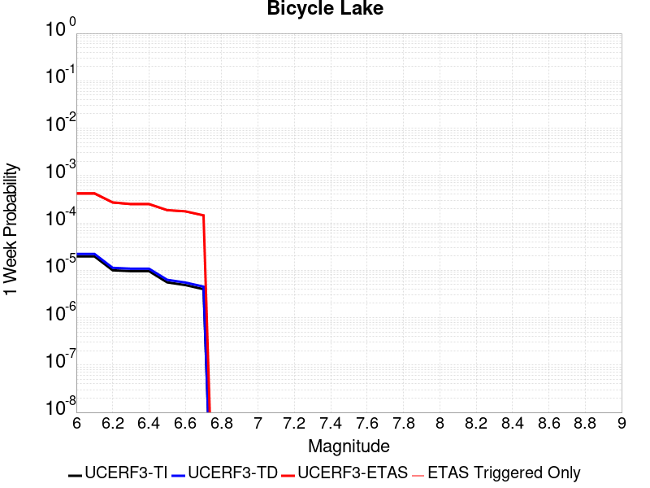 | 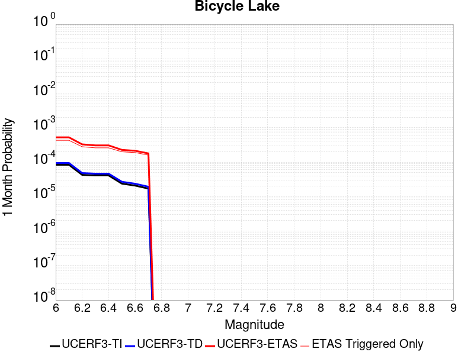 | 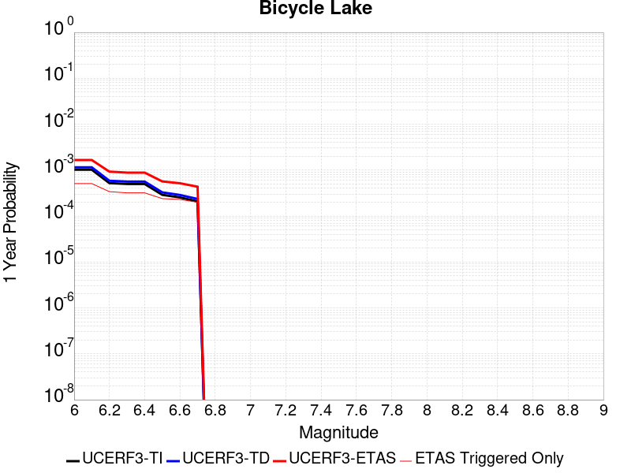 | 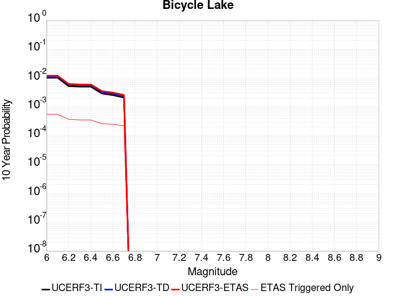 |

| Magnitude | 1 wk TI Prob | 1 wk TD Prob | 1 wk ETAS Prob | 1 wk ETAS/TD Gain | 1 wk ETAS Triggered Only | 1 mo TI Prob | 1 mo TD Prob | 1 mo ETAS Prob | 1 mo ETAS/TD Gain | 1 mo ETAS Triggered Only | 1 yr TI Prob | 1 yr TD Prob | 1 yr ETAS Prob | 1 yr ETAS/TD Gain | 1 yr ETAS Triggered Only | 10 yr TI Prob | 10 yr TD Prob | 10 yr ETAS Prob | 10 yr ETAS/TD Gain | 10 yr ETAS Triggered Only |
|-----|-----|-----|-----|-----|-----|-----|-----|-----|-----|-----|-----|-----|-----|-----|-----|-----|-----|-----|-----|-----|
| 6.0 | 1.9621975E-5 | 2.2097078E-5 | 4.2208823E-4 | 19.101542 | 4.0E-4 | 8.4091465E-5 | 9.4699084E-5 | 5.2465836E-4 | 5.5402684 | 4.3E-4 | 0.0010233327 | 0.0011524865 | 0.0016618988 | 1.4420115 | 5.1E-4 | 0.01018633 | 0.011478408 | 0.012022095 | 1.047366 | 5.5E-4 |
| 6.1 | 1.9621975E-5 | 2.2097078E-5 | 4.2208823E-4 | 19.101542 | 4.0E-4 | 8.4091465E-5 | 9.4699084E-5 | 5.2465836E-4 | 5.5402684 | 4.3E-4 | 0.0010233327 | 0.0011524865 | 0.0016618988 | 1.4420115 | 5.1E-4 | 0.01018633 | 0.011478408 | 0.012022095 | 1.047366 | 5.5E-4 |
| 6.2 | 9.9971285E-6 | 1.125564E-5 | 2.712527E-4 | 24.099272 | 2.6E-4 | 4.2844134E-5 | 4.8237856E-5 | 3.2822436E-4 | 6.80429 | 2.8E-4 | 5.2150246E-4 | 5.871897E-4 | 9.2699E-4 | 1.5786892 | 3.4E-4 | 0.0052028033 | 0.005861487 | 0.0062293177 | 1.0627539 | 3.7E-4 |
| 6.3 | 9.589428E-6 | 1.0798346E-5 | 2.5079577E-4 | 23.225386 | 2.4E-4 | 4.10969E-5 | 4.62781E-5 | 3.0626607E-4 | 6.6179485 | 2.6E-4 | 5.002399E-4 | 5.6334207E-4 | 8.831618E-4 | 1.5677185 | 3.2E-4 | 0.0049911533 | 0.0056242296 | 0.005972261 | 1.0618807 | 3.5E-4 |
| 6.4 | 9.589428E-6 | 1.0798346E-5 | 2.5079577E-4 | 23.225386 | 2.4E-4 | 4.10969E-5 | 4.62781E-5 | 3.0626607E-4 | 6.6179485 | 2.6E-4 | 5.002399E-4 | 5.6334207E-4 | 8.831618E-4 | 1.5677185 | 3.2E-4 | 0.0049911533 | 0.0056242296 | 0.005972261 | 1.0618807 | 3.5E-4 |
| 6.5 | 5.557707E-6 | 6.2856016E-6 | 1.8628447E-4 | 29.636698 | 1.8E-4 | 2.3818526E-5 | 2.6938165E-5 | 2.2693278E-4 | 8.424211 | 2.0E-4 | 2.8995197E-4 | 3.279497E-4 | 5.67871E-4 | 1.7315795 | 2.4E-4 | 0.0028957394 | 0.0032772934 | 0.0035364414 | 1.0790738 | 2.6E-4 |
| 6.6 | 4.8742945E-6 | 5.5132896E-6 | 1.7551235E-4 | 31.834415 | 1.7E-4 | 2.0889667E-5 | 2.3628318E-5 | 2.1362383E-4 | 9.041009 | 1.9E-4 | 2.54302E-4 | 2.87663E-4 | 5.1759684E-4 | 1.7993166 | 2.3E-4 | 0.002540112 | 0.0028754752 | 0.0031247563 | 1.0866921 | 2.5E-4 |
| 6.7 | 3.991108E-6 | 4.5159104E-6 | 1.4451527E-4 | 32.00136 | 1.4E-4 | 1.7104636E-5 | 1.9353902E-5 | 1.793508E-4 | 9.266907 | 1.6E-4 | 2.0822904E-4 | 2.3563375E-4 | 4.355866E-4 | 1.8485749 | 2.0E-4 | 0.0020803404 | 0.0023563374 | 0.0025758191 | 1.0931453 | 2.2E-4 |

## Garlic Springs
*[(top)](#table-of-contents)*

| 1 Week | 1 Month | 1 Year | 10 Year |
|-----|-----|-----|-----|
| 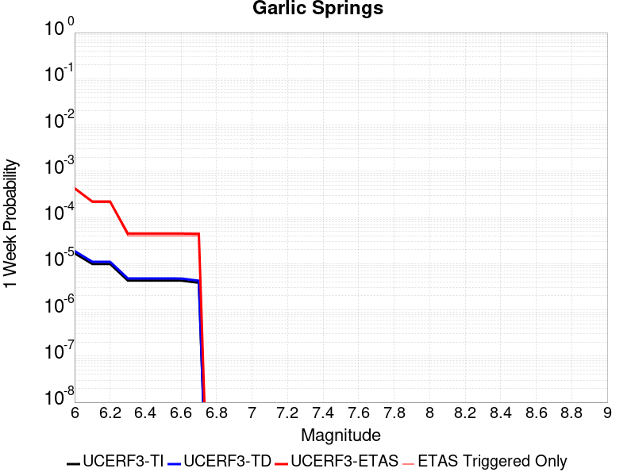 | 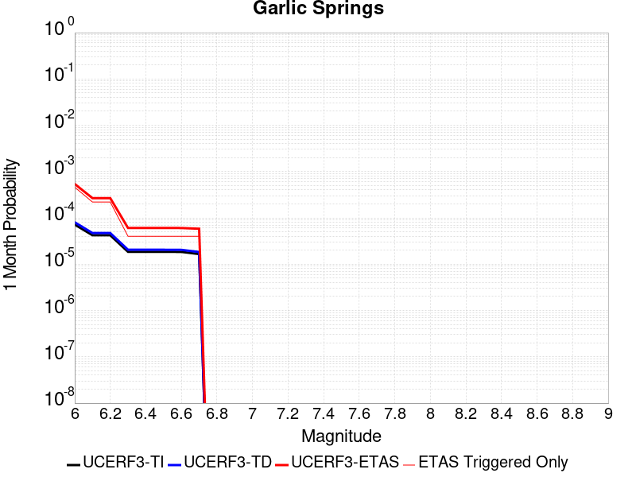 | 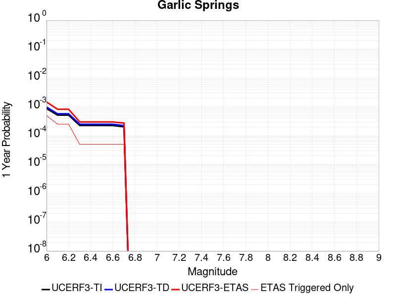 | 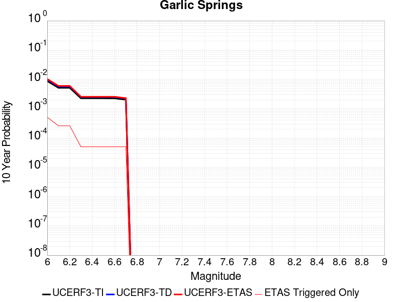 |

| Magnitude | 1 wk TI Prob | 1 wk TD Prob | 1 wk ETAS Prob | 1 wk ETAS/TD Gain | 1 wk ETAS Triggered Only | 1 mo TI Prob | 1 mo TD Prob | 1 mo ETAS Prob | 1 mo ETAS/TD Gain | 1 mo ETAS Triggered Only | 1 yr TI Prob | 1 yr TD Prob | 1 yr ETAS Prob | 1 yr ETAS/TD Gain | 1 yr ETAS Triggered Only | 10 yr TI Prob | 10 yr TD Prob | 10 yr ETAS Prob | 10 yr ETAS/TD Gain | 10 yr ETAS Triggered Only |
|-----|-----|-----|-----|-----|-----|-----|-----|-----|-----|-----|-----|-----|-----|-----|-----|-----|-----|-----|-----|-----|
| 6.0 | 1.6760017E-5 | 1.8776833E-5 | 4.2876913E-4 | 22.835009 | 4.1E-4 | 7.182667E-5 | 8.0470316E-5 | 5.404333E-4 | 6.7159333 | 4.6E-4 | 8.7413884E-4 | 9.794032E-4 | 0.0014789135 | 1.510015 | 5.0E-4 | 0.008707083 | 0.009762413 | 0.010267435 | 1.0517312 | 5.1E-4 |
| 6.1 | 9.852767E-6 | 1.0973587E-5 | 2.2097128E-4 | 20.13665 | 2.1E-4 | 4.222546E-5 | 4.702921E-5 | 2.6701886E-4 | 5.677724 | 2.2E-4 | 5.139737E-4 | 5.7250116E-4 | 8.2235807E-4 | 1.4364303 | 2.5E-4 | 0.005127866 | 0.005717221 | 0.005975735 | 1.0452167 | 2.6E-4 |
| 6.2 | 9.852767E-6 | 1.0973587E-5 | 2.2097128E-4 | 20.13665 | 2.1E-4 | 4.222546E-5 | 4.702921E-5 | 2.6701886E-4 | 5.677724 | 2.2E-4 | 5.139737E-4 | 5.7250116E-4 | 8.2235807E-4 | 1.4364303 | 2.5E-4 | 0.005127866 | 0.005717221 | 0.005975735 | 1.0452167 | 2.6E-4 |
| 6.3 | 4.3167724E-6 | 4.7780286E-6 | 4.4777837E-5 | 9.3716135 | 4.0E-5 | 1.8500323E-5 | 2.0477235E-5 | 6.0476414E-5 | 2.9533489 | 4.0E-5 | 2.2521814E-4 | 2.4930484E-4 | 2.9929238E-4 | 1.2005076 | 5.0E-5 | 0.0022499003 | 0.00249251 | 0.0025423854 | 1.0200101 | 5.0E-5 |
| 6.4 | 4.3167724E-6 | 4.7780286E-6 | 4.4777837E-5 | 9.3716135 | 4.0E-5 | 1.8500323E-5 | 2.0477235E-5 | 6.0476414E-5 | 2.9533489 | 4.0E-5 | 2.2521814E-4 | 2.4930484E-4 | 2.9929238E-4 | 1.2005076 | 5.0E-5 | 0.0022499003 | 0.00249251 | 0.0025423854 | 1.0200101 | 5.0E-5 |
| 6.5 | 4.3167724E-6 | 4.7780286E-6 | 4.4777837E-5 | 9.3716135 | 4.0E-5 | 1.8500323E-5 | 2.0477235E-5 | 6.0476414E-5 | 2.9533489 | 4.0E-5 | 2.2521814E-4 | 2.4930484E-4 | 2.9929238E-4 | 1.2005076 | 5.0E-5 | 0.0022499003 | 0.00249251 | 0.0025423854 | 1.0200101 | 5.0E-5 |
| 6.6 | 4.301311E-6 | 4.760897E-6 | 4.4760705E-5 | 9.401738 | 4.0E-5 | 1.8434059E-5 | 2.0403815E-5 | 6.0403E-5 | 2.9603777 | 4.0E-5 | 2.2441156E-4 | 2.4841115E-4 | 2.9839872E-4 | 1.2012292 | 5.0E-5 | 0.0022418506 | 0.002483593 | 0.0025334689 | 1.0200821 | 5.0E-5 |
| 6.7 | 3.8599724E-6 | 4.27106E-6 | 4.4270888E-5 | 10.365317 | 4.0E-5 | 1.6542634E-5 | 1.8304541E-5 | 5.830381E-5 | 3.18521 | 4.0E-5 | 2.0138794E-4 | 2.228578E-4 | 2.7284666E-4 | 1.2243083 | 5.0E-5 | 0.0020120554 | 0.002228578 | 0.0022784665 | 1.0223858 | 5.0E-5 |

## Death Valley (Black Mtns Frontal)
*[(top)](#table-of-contents)*

| 1 Week | 1 Month | 1 Year | 10 Year |
|-----|-----|-----|-----|
| 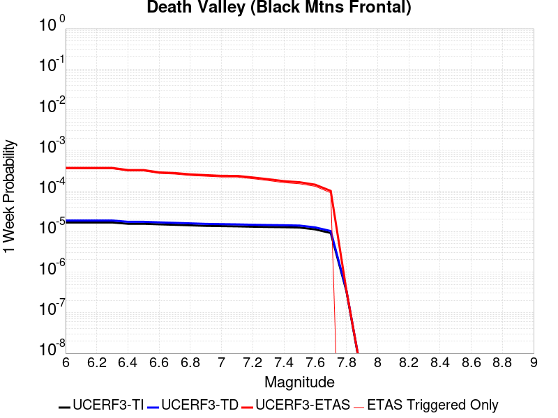 | 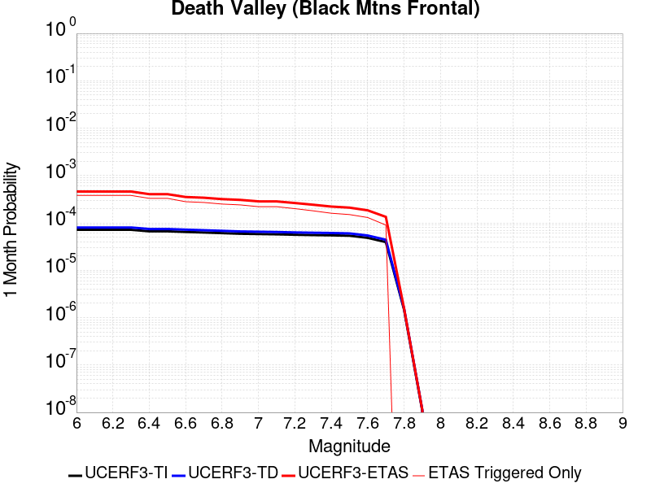 | 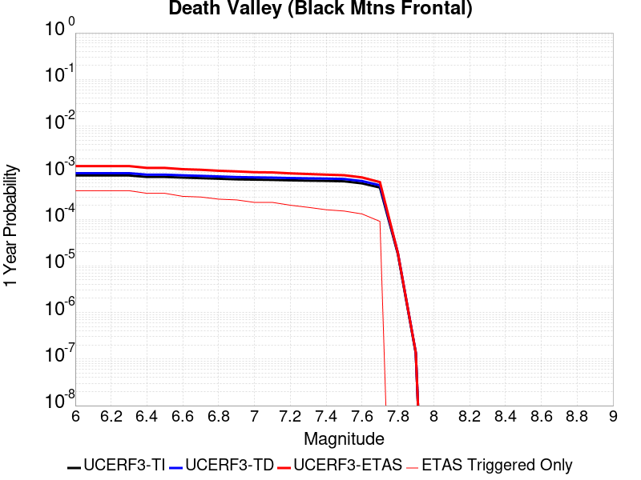 | 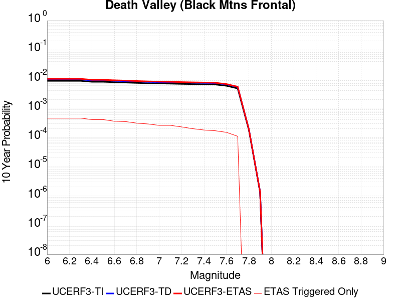 |

| Magnitude | 1 wk TI Prob | 1 wk TD Prob | 1 wk ETAS Prob | 1 wk ETAS/TD Gain | 1 wk ETAS Triggered Only | 1 mo TI Prob | 1 mo TD Prob | 1 mo ETAS Prob | 1 mo ETAS/TD Gain | 1 mo ETAS Triggered Only | 1 yr TI Prob | 1 yr TD Prob | 1 yr ETAS Prob | 1 yr ETAS/TD Gain | 1 yr ETAS Triggered Only | 10 yr TI Prob | 10 yr TD Prob | 10 yr ETAS Prob | 10 yr ETAS/TD Gain | 10 yr ETAS Triggered Only |
|-----|-----|-----|-----|-----|-----|-----|-----|-----|-----|-----|-----|-----|-----|-----|-----|-----|-----|-----|-----|-----|
| 6.0 | 1.6707214E-5 | 1.867027E-5 | 3.6866372E-4 | 19.746033 | 3.5E-4 | 7.160038E-5 | 8.001303E-5 | 4.5998264E-4 | 5.7488465 | 3.8E-4 | 8.71386E-4 | 9.737309E-4 | 0.0013833316 | 1.420651 | 4.1E-4 | 0.00867977 | 0.009695496 | 0.010151037 | 1.0469847 | 4.6E-4 |
| 6.1 | 1.6707214E-5 | 1.867027E-5 | 3.6866372E-4 | 19.746033 | 3.5E-4 | 7.160038E-5 | 8.001303E-5 | 4.5998264E-4 | 5.7488465 | 3.8E-4 | 8.71386E-4 | 9.737309E-4 | 0.0013833316 | 1.420651 | 4.1E-4 | 0.00867977 | 0.009695496 | 0.010151037 | 1.0469847 | 4.6E-4 |
| 6.2 | 1.6707214E-5 | 1.867027E-5 | 3.6866372E-4 | 19.746033 | 3.5E-4 | 7.160038E-5 | 8.001303E-5 | 4.5998264E-4 | 5.7488465 | 3.8E-4 | 8.71386E-4 | 9.737309E-4 | 0.0013833316 | 1.420651 | 4.1E-4 | 0.00867977 | 0.009695496 | 0.010151037 | 1.0469847 | 4.6E-4 |
| 6.3 | 1.6707214E-5 | 1.867027E-5 | 3.6866372E-4 | 19.746033 | 3.5E-4 | 7.160038E-5 | 8.001303E-5 | 4.5998264E-4 | 5.7488465 | 3.8E-4 | 8.71386E-4 | 9.737309E-4 | 0.0013833316 | 1.420651 | 4.1E-4 | 0.00867977 | 0.009695496 | 0.010151037 | 1.0469847 | 4.6E-4 |
| 6.4 | 1.5515609E-5 | 1.7338214E-5 | 3.2733285E-4 | 18.879272 | 3.1E-4 | 6.649377E-5 | 7.4304546E-5 | 4.0428003E-4 | 5.4408517 | 3.3E-4 | 8.0926094E-4 | 9.042885E-4 | 0.001263963 | 1.397743 | 3.6E-4 | 0.008063202 | 0.009006773 | 0.00941308 | 1.0451113 | 4.1E-4 |
| 6.5 | 1.5515609E-5 | 1.7338214E-5 | 3.2733285E-4 | 18.879272 | 3.1E-4 | 6.649377E-5 | 7.4304546E-5 | 4.0428003E-4 | 5.4408517 | 3.3E-4 | 8.0926094E-4 | 9.042885E-4 | 0.001263963 | 1.397743 | 3.6E-4 | 0.008063202 | 0.009006773 | 0.00941308 | 1.0451113 | 4.1E-4 |
| 6.6 | 1.5041828E-5 | 1.6809145E-5 | 2.868046E-4 | 17.062416 | 2.7E-4 | 6.4463384E-5 | 7.203723E-5 | 3.5201706E-4 | 4.8865986 | 2.8E-4 | 7.8455906E-4 | 8.767063E-4 | 0.0011864345 | 1.3532861 | 3.1E-4 | 0.00781795 | 0.008733132 | 0.009089989 | 1.0408623 | 3.6E-4 |
| 6.7 | 1.4634985E-5 | 1.6356016E-5 | 2.7635176E-4 | 16.89603 | 2.6E-4 | 6.271985E-5 | 7.009536E-5 | 3.4007643E-4 | 4.8516254 | 2.7E-4 | 7.6334673E-4 | 8.5308263E-4 | 0.0011528267 | 1.3513658 | 3.0E-4 | 0.007607299 | 0.008498715 | 0.008845741 | 1.0408326 | 3.5E-4 |
| 6.8 | 1.4209158E-5 | 1.5882048E-5 | 2.5587823E-4 | 16.111162 | 2.4E-4 | 6.089497E-5 | 6.8064175E-5 | 3.1804715E-4 | 4.6727543 | 2.5E-4 | 7.4114406E-4 | 8.2837185E-4 | 0.0010981482 | 1.3256706 | 2.7E-4 | 0.007386771 | 0.008253456 | 0.008560898 | 1.03725 | 3.1E-4 |
| 6.9 | 1.3780098E-5 | 1.5404594E-5 | 2.4540105E-4 | 15.930382 | 2.3E-4 | 5.9056227E-5 | 6.6018045E-5 | 3.060022E-4 | 4.63513 | 2.4E-4 | 7.1877235E-4 | 8.0347876E-4 | 0.0010632698 | 1.3233329 | 2.6E-4 | 0.0071645193 | 0.008006332 | 0.008294011 | 1.0359313 | 2.9E-4 |
| 7.0 | 1.3585064E-5 | 1.5188155E-5 | 2.3518481E-4 | 15.484752 | 2.2E-4 | 5.8220405E-5 | 6.50905E-5 | 2.8507618E-4 | 4.3796897 | 2.2E-4 | 7.086029E-4 | 7.9219416E-4 | 0.001022012 | 1.2901028 | 2.3E-4 | 0.007063476 | 0.007894293 | 0.008152241 | 1.0326751 | 2.6E-4 |
| 7.1 | 1.3398601E-5 | 1.49813395E-5 | 2.3497804E-4 | 15.684715 | 2.2E-4 | 5.742131E-5 | 6.420419E-5 | 2.8419006E-4 | 4.4263477 | 2.2E-4 | 6.9888023E-4 | 7.8141113E-4 | 0.0010112314 | 1.2941093 | 2.3E-4 | 0.0069668638 | 0.007787224 | 0.008045199 | 1.033128 | 2.6E-4 |
| 7.2 | 1.3126312E-5 | 1.4679561E-5 | 2.1467662E-4 | 14.624186 | 2.0E-4 | 5.6254412E-5 | 6.291092E-5 | 2.6289833E-4 | 4.1788983 | 2.0E-4 | 6.846822E-4 | 7.6567667E-4 | 9.6552353E-4 | 1.2610068 | 2.0E-4 | 0.006825765 | 0.00763097 | 0.007859215 | 1.0299103 | 2.3E-4 |
| 7.3 | 1.2922429E-5 | 1.4453788E-5 | 1.9445119E-4 | 13.453302 | 1.8E-4 | 5.5380664E-5 | 6.194336E-5 | 2.4193221E-4 | 3.9057002 | 1.8E-4 | 6.74051E-4 | 7.53905E-4 | 9.337693E-4 | 1.2385769 | 1.8E-4 | 0.006720101 | 0.007514055 | 0.007712552 | 1.0264168 | 2.0E-4 |
| 7.4 | 1.2768878E-5 | 1.4283772E-5 | 1.742815E-4 | 12.201364 | 1.6E-4 | 5.4722615E-5 | 6.1214756E-5 | 2.2120496E-4 | 3.6135888 | 1.6E-4 | 6.660441E-4 | 7.4504025E-4 | 9.0492103E-4 | 1.2145935 | 1.6E-4 | 0.0066405144 | 0.0074260035 | 0.007604667 | 1.0240592 | 1.8E-4 |
| 7.5 | 1.2521929E-5 | 1.40120155E-5 | 1.640099E-4 | 11.704948 | 1.5E-4 | 5.366431E-5 | 6.005014E-5 | 2.1004114E-4 | 3.4977624 | 1.5E-4 | 6.531671E-4 | 7.3087064E-4 | 8.80761E-4 | 1.2050847 | 1.5E-4 | 0.006512506 | 0.0072852457 | 0.0074540074 | 1.0231649 | 1.7E-4 |
| 7.6 | 1.1301089E-5 | 1.2648149E-5 | 1.426465E-4 | 11.278054 | 1.3E-4 | 4.8432343E-5 | 5.4205255E-5 | 1.8419822E-4 | 3.3981614 | 1.3E-4 | 5.895042E-4 | 6.5975444E-4 | 7.896687E-4 | 1.196913 | 1.3E-4 | 0.0058794282 | 0.00657851 | 0.0067275236 | 1.0226516 | 1.5E-4 |
| 7.7 | 9.189108E-6 | 1.0283358E-5 | 1.00282436E-4 | 9.751915 | 9.0E-5 | 3.93813E-5 | 4.407082E-5 | 1.3406685E-4 | 3.0420775 | 9.0E-5 | 4.7936183E-4 | 5.3643517E-4 | 6.263869E-4 | 1.1676842 | 9.0E-5 | 0.004783291 | 0.005351914 | 0.0054613254 | 1.0204434 | 1.1E-4 |
| 7.8 | 3.4586725E-7 | 3.6482615E-7 | 3.6482615E-7 | 1.0 | 0.0 | 1.4822873E-6 | 1.5635396E-6 | 1.5635396E-6 | 1.0 | 0.0 | 1.80467E-5 | 1.9035933E-5 | 1.9035933E-5 | 1.0 | 0.0 | 1.8045233E-4 | 1.9034347E-4 | 1.9034347E-4 | 1.0 | 0.0 |
| 7.9 | 2.5591178E-9 | 2.6696718E-9 | 2.6696718E-9 | 1.0 | 0.0 | 1.0967647E-8 | 1.14414505E-8 | 1.14414505E-8 | 1.0 | 0.0 | 1.335311E-7 | 1.3929966E-7 | 1.3929966E-7 | 1.0 | 0.0 | 1.3353102E-6 | 1.3929966E-6 | 1.3929966E-6 | 1.0 | 0.0 |

## San Andreas (San Gorgonio Pass-Garnet HIll)
*[(top)](#table-of-contents)*

| 1 Week | 1 Month | 1 Year | 10 Year |
|-----|-----|-----|-----|
| 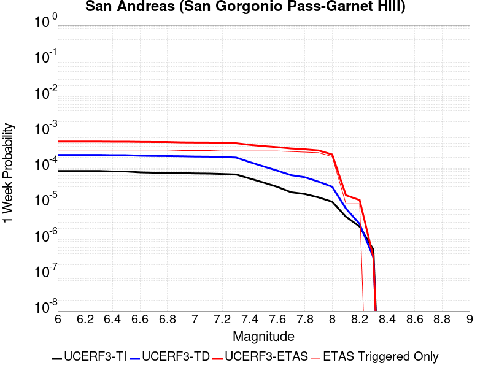 | 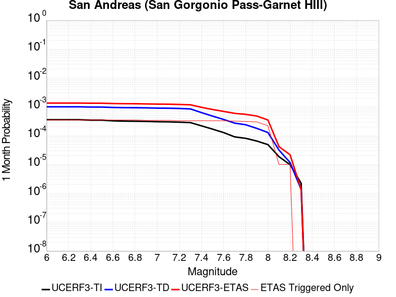 | 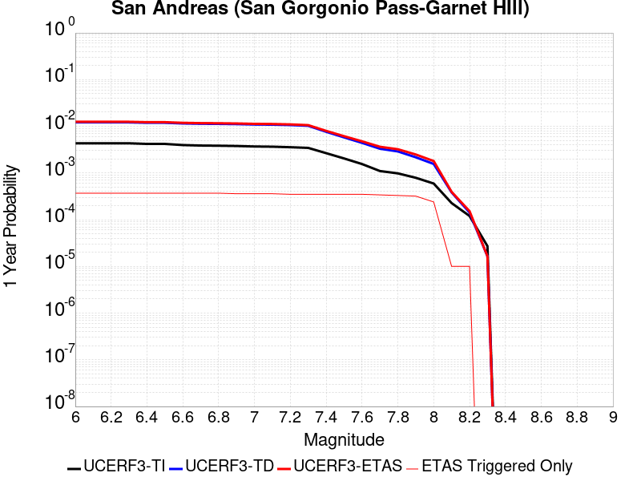 | 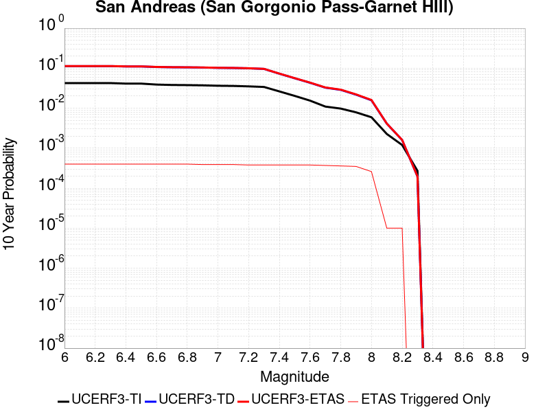 |

| Magnitude | 1 wk TI Prob | 1 wk TD Prob | 1 wk ETAS Prob | 1 wk ETAS/TD Gain | 1 wk ETAS Triggered Only | 1 mo TI Prob | 1 mo TD Prob | 1 mo ETAS Prob | 1 mo ETAS/TD Gain | 1 mo ETAS Triggered Only | 1 yr TI Prob | 1 yr TD Prob | 1 yr ETAS Prob | 1 yr ETAS/TD Gain | 1 yr ETAS Triggered Only | 10 yr TI Prob | 10 yr TD Prob | 10 yr ETAS Prob | 10 yr ETAS/TD Gain | 10 yr ETAS Triggered Only |
|-----|-----|-----|-----|-----|-----|-----|-----|-----|-----|-----|-----|-----|-----|-----|-----|-----|-----|-----|-----|-----|
| 6.0 | 8.31567E-5 | 2.3384395E-4 | 5.537691E-4 | 2.368114 | 3.2E-4 | 3.5633717E-4 | 0.0010018025 | 0.0013514519 | 1.3490202 | 3.5E-4 | 0.004329778 | 0.012128622 | 0.012494135 | 1.0301363 | 3.7E-4 | 0.042463828 | 0.11258187 | 0.11293684 | 1.003153 | 4.0E-4 |
| 6.1 | 8.31567E-5 | 2.3384395E-4 | 5.537691E-4 | 2.368114 | 3.2E-4 | 3.5633717E-4 | 0.0010018025 | 0.0013514519 | 1.3490202 | 3.5E-4 | 0.004329778 | 0.012128622 | 0.012494135 | 1.0301363 | 3.7E-4 | 0.042463828 | 0.11258187 | 0.11293684 | 1.003153 | 4.0E-4 |
| 6.2 | 8.31567E-5 | 2.3384395E-4 | 5.537691E-4 | 2.368114 | 3.2E-4 | 3.5633717E-4 | 0.0010018025 | 0.0013514519 | 1.3490202 | 3.5E-4 | 0.004329778 | 0.012128622 | 0.012494135 | 1.0301363 | 3.7E-4 | 0.042463828 | 0.11258187 | 0.11293684 | 1.003153 | 4.0E-4 |
| 6.3 | 8.31567E-5 | 2.3384395E-4 | 5.537691E-4 | 2.368114 | 3.2E-4 | 3.5633717E-4 | 0.0010018025 | 0.0013514519 | 1.3490202 | 3.5E-4 | 0.004329778 | 0.012128622 | 0.012494135 | 1.0301363 | 3.7E-4 | 0.042463828 | 0.11258187 | 0.11293684 | 1.003153 | 4.0E-4 |
| 6.4 | 8.059055E-5 | 2.2941893E-4 | 5.493455E-4 | 2.3945084 | 3.2E-4 | 3.4534236E-4 | 9.828559E-4 | 0.001332512 | 1.3557551 | 3.5E-4 | 0.0041964394 | 0.011900819 | 0.012266416 | 1.0307204 | 3.7E-4 | 0.041180745 | 0.110562965 | 0.11091874 | 1.0032178 | 4.0E-4 |
| 6.5 | 8.059055E-5 | 2.2941893E-4 | 5.493455E-4 | 2.3945084 | 3.2E-4 | 3.4534236E-4 | 9.828559E-4 | 0.001332512 | 1.3557551 | 3.5E-4 | 0.0041964394 | 0.011900819 | 0.012266416 | 1.0307204 | 3.7E-4 | 0.041180745 | 0.110562965 | 0.11091874 | 1.0032178 | 4.0E-4 |
| 6.6 | 7.619237E-5 | 2.2186468E-4 | 5.417937E-4 | 2.4420006 | 3.2E-4 | 3.2649786E-4 | 9.5050444E-4 | 0.0013001717 | 1.3678756 | 3.5E-4 | 0.0039678677 | 0.0115115335 | 0.011877274 | 1.0317717 | 3.7E-4 | 0.03897764 | 0.10709954 | 0.1074567 | 1.0033349 | 4.0E-4 |
| 6.7 | 7.440636E-5 | 2.1862281E-4 | 5.385529E-4 | 2.4633882 | 3.2E-4 | 3.188454E-4 | 9.3662075E-4 | 0.0012862929 | 1.3733338 | 3.5E-4 | 0.0038750346 | 0.011344268 | 0.011710071 | 1.0322456 | 3.7E-4 | 0.038081564 | 0.1056081 | 0.10596586 | 1.0033876 | 4.0E-4 |
| 6.8 | 7.3735864E-5 | 2.1709445E-4 | 5.37025E-4 | 2.473693 | 3.2E-4 | 3.1597257E-4 | 9.300753E-4 | 0.0012797498 | 1.3759636 | 3.5E-4 | 0.0038401815 | 0.011265406 | 0.011631238 | 1.0324739 | 3.7E-4 | 0.03774495 | 0.104909696 | 0.10526773 | 1.0034128 | 4.0E-4 |
| 6.9 | 7.27575E-5 | 2.1478413E-4 | 5.2471756E-4 | 2.4429996 | 3.1E-4 | 3.117806E-4 | 9.20181E-4 | 0.0012598681 | 1.3691525 | 3.4E-4 | 0.003789323 | 0.011146182 | 0.011502169 | 1.0319381 | 3.6E-4 | 0.037253562 | 0.10385753 | 0.104207024 | 1.0033652 | 3.9E-4 |
| 7.0 | 7.102591E-5 | 2.1062451E-4 | 5.205592E-4 | 2.4715035 | 3.1E-4 | 3.0436125E-4 | 9.023664E-4 | 0.0012420596 | 1.3764471 | 3.4E-4 | 0.003699303 | 0.010931484 | 0.011287549 | 1.0325724 | 3.6E-4 | 0.03638325 | 0.101959534 | 0.10230977 | 1.003435 | 3.9E-4 |
| 7.1 | 7.028513E-5 | 2.0898094E-4 | 5.189162E-4 | 2.483079 | 3.1E-4 | 3.0118722E-4 | 8.953274E-4 | 0.001235023 | 1.3794093 | 3.4E-4 | 0.0036607897 | 0.010846641 | 0.011202736 | 1.03283 | 3.6E-4 | 0.036010686 | 0.10120243 | 0.10155296 | 1.0034636 | 3.9E-4 |
| 7.2 | 6.8498244E-5 | 2.050596E-4 | 5.049981E-4 | 2.4626894 | 3.0E-4 | 2.9353087E-4 | 8.7853306E-4 | 0.0012082432 | 1.3752961 | 3.3E-4 | 0.003567883 | 0.0106441835 | 0.010990458 | 1.0325319 | 3.5E-4 | 0.035111405 | 0.09939449 | 0.09973672 | 1.0034431 | 3.8E-4 |
| 7.3 | 6.622592E-5 | 1.9733235E-4 | 4.9727317E-4 | 2.5199778 | 3.0E-4 | 2.8379448E-4 | 8.4543816E-4 | 0.0011751591 | 1.3900001 | 3.3E-4 | 0.0034497243 | 0.010245111 | 0.010591525 | 1.0338126 | 3.5E-4 | 0.033966612 | 0.095891245 | 0.096234806 | 1.0035828 | 3.8E-4 |
| 7.4 | 5.1050705E-5 | 1.4690042E-4 | 4.4685634E-4 | 3.0418997 | 3.0E-4 | 2.1877038E-4 | 6.294222E-4 | 9.592145E-4 | 1.5239604 | 3.3E-4 | 0.002660276 | 0.007636482 | 0.007983809 | 1.0454826 | 3.5E-4 | 0.02628654 | 0.07286554 | 0.07321785 | 1.0048351 | 3.8E-4 |
| 7.5 | 3.9302922E-5 | 1.11307076E-4 | 4.1127368E-4 | 3.6949465 | 3.0E-4 | 1.6843023E-4 | 4.7694342E-4 | 8.0678606E-4 | 1.691576 | 3.3E-4 | 0.0020487092 | 0.0057913954 | 0.0061393683 | 1.0600845 | 3.5E-4 | 0.020299247 | 0.05601151 | 0.056370225 | 1.0064043 | 3.8E-4 |
| 7.6 | 2.9851626E-5 | 8.4956984E-5 | 3.849315E-4 | 4.5308986 | 3.0E-4 | 1.2792926E-4 | 3.6405068E-4 | 6.9393055E-4 | 1.9061372 | 3.3E-4 | 0.0015564259 | 0.0044233347 | 0.0047717867 | 1.0787758 | 3.5E-4 | 0.0154556995 | 0.043196145 | 0.043559734 | 1.0084171 | 3.8E-4 |
| 7.7 | 2.1135214E-5 | 6.353527E-5 | 3.5351684E-4 | 5.564104 | 2.9E-4 | 9.0576345E-5 | 2.722656E-4 | 5.921785E-4 | 2.1750028 | 3.2E-4 | 0.0011022091 | 0.0033098008 | 0.0036486755 | 1.1023852 | 3.4E-4 | 0.010967582 | 0.03258456 | 0.032942504 | 1.010985 | 3.7E-4 |
| 7.8 | 1.883379E-5 | 5.564576E-5 | 3.3563017E-4 | 6.03155 | 2.8E-4 | 8.0713755E-5 | 2.3846005E-4 | 5.4838613E-4 | 2.299698 | 3.1E-4 | 9.822468E-4 | 0.002899389 | 0.0032284323 | 1.1134871 | 3.3E-4 | 0.0097791655 | 0.028696978 | 0.029046647 | 1.0121849 | 3.6E-4 |
| 7.9 | 1.5156185E-5 | 4.1662403E-5 | 3.1165115E-4 | 7.480393 | 2.7E-4 | 6.495346E-5 | 1.7854095E-4 | 4.7848737E-4 | 2.6799867 | 3.0E-4 | 7.9052144E-4 | 0.0021715704 | 0.0024908755 | 1.1470388 | 3.2E-4 | 0.007877152 | 0.021760946 | 0.022103328 | 1.0157338 | 3.5E-4 |
| 8.0 | 1.1405907E-5 | 2.9976925E-5 | 2.3997063E-4 | 8.005178 | 2.1E-4 | 4.8881542E-5 | 1.2846621E-4 | 3.4843796E-4 | 2.7122924 | 2.2E-4 | 5.9497025E-4 | 0.0015629551 | 0.00180258 | 1.1533153 | 2.4E-4 | 0.005933798 | 0.015774013 | 0.016029911 | 1.0162228 | 2.6E-4 |
| 8.1 | 4.3511436E-6 | 7.369465E-6 | 1.7369392E-5 | 2.3569405 | 1.0E-5 | 1.8647626E-5 | 3.158304E-5 | 4.1582723E-5 | 1.3166156 | 1.0E-5 | 2.2701119E-4 | 3.844558E-4 | 3.9445196E-4 | 1.0260007 | 1.0E-5 | 0.0022677942 | 0.0041165445 | 0.004126503 | 1.0024192 | 1.0E-5 |
| 8.2 | 2.3042528E-6 | 2.7328301E-6 | 1.2732803E-5 | 4.6592 | 1.0E-5 | 9.875332E-6 | 1.1712076E-5 | 2.171196E-5 | 1.8538096 | 1.0E-5 | 1.2022553E-4 | 1.4258524E-4 | 1.5258382E-4 | 1.0701234 | 1.0E-5 | 0.0012016051 | 0.0015979637 | 0.0016079478 | 1.006248 | 1.0E-5 |
| 8.3 | 5.202968E-7 | 3.1590292E-7 | 3.1590292E-7 | 1.0 | 0.0 | 2.2298414E-6 | 1.353869E-6 | 1.353869E-6 | 1.0 | 0.0 | 2.714798E-5 | 1.6483244E-5 | 1.6483244E-5 | 1.0 | 0.0 | 2.7144665E-4 | 1.955901E-4 | 1.955901E-4 | 1.0 | 0.0 |

## Helendale-So Lockhart
*[(top)](#table-of-contents)*

| 1 Week | 1 Month | 1 Year | 10 Year |
|-----|-----|-----|-----|
| 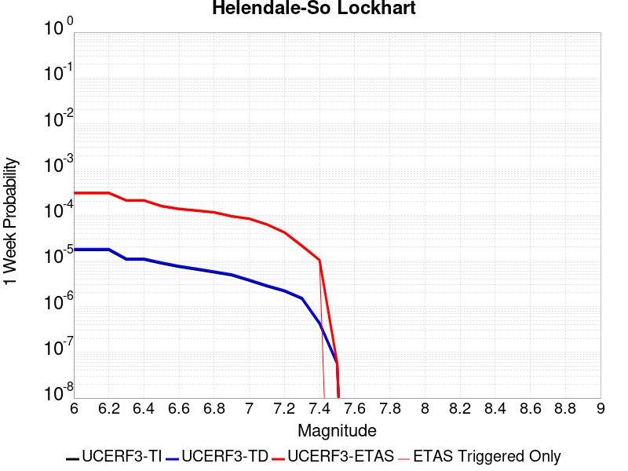 | 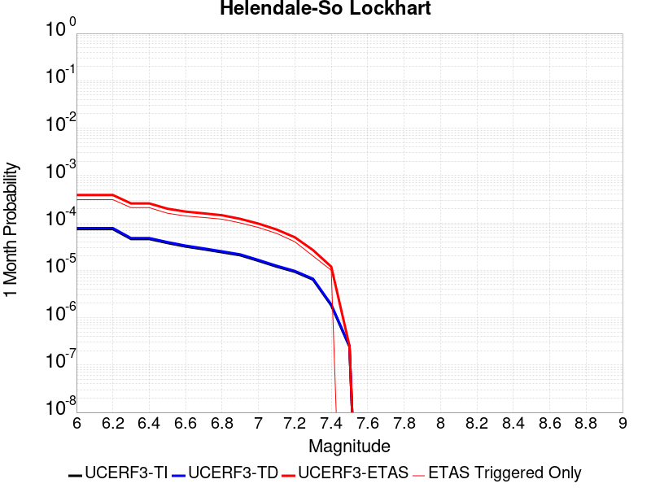 | 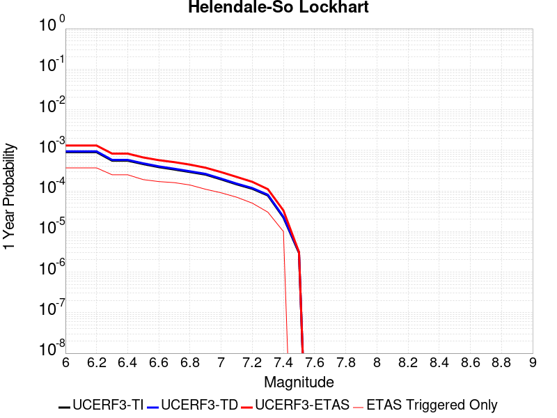 | 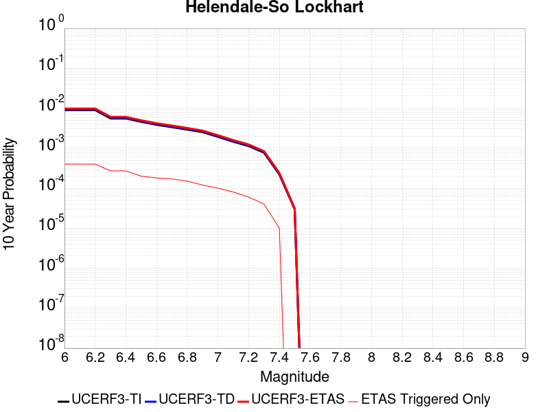 |

| Magnitude | 1 wk TI Prob | 1 wk TD Prob | 1 wk ETAS Prob | 1 wk ETAS/TD Gain | 1 wk ETAS Triggered Only | 1 mo TI Prob | 1 mo TD Prob | 1 mo ETAS Prob | 1 mo ETAS/TD Gain | 1 mo ETAS Triggered Only | 1 yr TI Prob | 1 yr TD Prob | 1 yr ETAS Prob | 1 yr ETAS/TD Gain | 1 yr ETAS Triggered Only | 10 yr TI Prob | 10 yr TD Prob | 10 yr ETAS Prob | 10 yr ETAS/TD Gain | 10 yr ETAS Triggered Only |
|-----|-----|-----|-----|-----|-----|-----|-----|-----|-----|-----|-----|-----|-----|-----|-----|-----|-----|-----|-----|-----|
| 6.0 | 1.7296055E-5 | 1.8103729E-5 | 3.0809848E-4 | 17.018509 | 2.9E-4 | 7.412385E-5 | 7.7585224E-5 | 3.8756116E-4 | 4.9952965 | 3.1E-4 | 9.0208417E-4 | 9.4421144E-4 | 0.001313862 | 1.3914914 | 3.7E-4 | 0.008984311 | 0.009404116 | 0.009800355 | 1.0421345 | 4.0E-4 |
| 6.1 | 1.7296055E-5 | 1.8103729E-5 | 3.0809848E-4 | 17.018509 | 2.9E-4 | 7.412385E-5 | 7.7585224E-5 | 3.8756116E-4 | 4.9952965 | 3.1E-4 | 9.0208417E-4 | 9.4421144E-4 | 0.001313862 | 1.3914914 | 3.7E-4 | 0.008984311 | 0.009404116 | 0.009800355 | 1.0421345 | 4.0E-4 |
| 6.2 | 1.7296055E-5 | 1.8103729E-5 | 3.0809848E-4 | 17.018509 | 2.9E-4 | 7.412385E-5 | 7.7585224E-5 | 3.8756116E-4 | 4.9952965 | 3.1E-4 | 9.0208417E-4 | 9.4421144E-4 | 0.001313862 | 1.3914914 | 3.7E-4 | 0.008984311 | 0.009404116 | 0.009800355 | 1.0421345 | 4.0E-4 |
| 6.3 | 1.0669118E-5 | 1.1135425E-5 | 2.111332E-4 | 18.960499 | 2.0E-4 | 4.5723988E-5 | 4.772239E-5 | 2.5771238E-4 | 5.40024 | 2.1E-4 | 5.5654737E-4 | 5.80868E-4 | 8.307228E-4 | 1.4301404 | 2.5E-4 | 0.0055515557 | 0.0057937936 | 0.006062229 | 1.0463316 | 2.7E-4 |
| 6.4 | 1.0669118E-5 | 1.1135425E-5 | 2.111332E-4 | 18.960499 | 2.0E-4 | 4.5723988E-5 | 4.772239E-5 | 2.5771238E-4 | 5.40024 | 2.1E-4 | 5.5654737E-4 | 5.80868E-4 | 8.307228E-4 | 1.4301404 | 2.5E-4 | 0.0055515557 | 0.0057937936 | 0.006062229 | 1.0463316 | 2.7E-4 |
| 6.5 | 8.790038E-6 | 9.170197E-6 | 1.5916882E-4 | 17.357187 | 1.5E-4 | 3.767105E-5 | 3.930026E-5 | 1.9929397E-4 | 5.0710597 | 1.6E-4 | 4.585485E-4 | 4.7837716E-4 | 6.682863E-4 | 1.3969861 | 1.9E-4 | 0.0045760344 | 0.004773638 | 0.0049726837 | 1.0416968 | 2.0E-4 |
| 6.6 | 7.396949E-6 | 7.715537E-6 | 1.3771454E-4 | 17.84899 | 1.3E-4 | 3.1700827E-5 | 3.3066175E-5 | 1.7306155E-4 | 5.233794 | 1.4E-4 | 3.858892E-4 | 4.025073E-4 | 5.724389E-4 | 1.4221826 | 1.7E-4 | 0.003852198 | 0.00401789 | 0.0041971668 | 1.0446197 | 1.8E-4 |
| 6.7 | 6.4600285E-6 | 6.738031E-6 | 1.2673723E-4 | 18.809237 | 1.2E-4 | 2.7685543E-5 | 2.887696E-5 | 1.5887321E-4 | 5.501729 | 1.3E-4 | 3.3701936E-4 | 3.5152107E-4 | 5.1146484E-4 | 1.4550048 | 1.6E-4 | 0.0033650869 | 0.003509732 | 0.0036791353 | 1.0482668 | 1.7E-4 |
| 6.8 | 5.600104E-6 | 5.836009E-6 | 1.1583537E-4 | 19.848387 | 1.1E-4 | 2.4000226E-5 | 2.5011232E-5 | 1.4500823E-4 | 5.7977242 | 1.2E-4 | 2.9216358E-4 | 3.044698E-4 | 4.4442716E-4 | 1.4596757 | 1.4E-4 | 0.0029177975 | 0.003040588 | 0.0031901319 | 1.0491825 | 1.5E-4 |
| 6.9 | 4.839122E-6 | 5.0395092E-6 | 9.503905E-5 | 18.858791 | 9.0E-5 | 2.0738931E-5 | 2.159772E-5 | 1.2159556E-4 | 5.630018 | 1.0E-4 | 2.5246723E-4 | 2.6292098E-4 | 3.7289207E-4 | 1.4182667 | 1.1E-4 | 0.002521806 | 0.002626147 | 0.0027458316 | 1.0455743 | 1.2E-4 |
| 7.0 | 3.6937633E-6 | 3.845208E-6 | 8.38449E-5 | 21.805037 | 8.0E-5 | 1.5830317E-5 | 1.647936E-5 | 9.647804E-5 | 5.8544774 | 8.0E-5 | 1.9271708E-4 | 2.0061806E-4 | 2.906E-4 | 1.4485236 | 9.0E-5 | 0.0019255003 | 0.002004401 | 0.0021042004 | 1.0497903 | 1.0E-4 |
| 7.1 | 2.7858857E-6 | 2.8978538E-6 | 6.289768E-5 | 21.704918 | 6.0E-5 | 1.1939455E-5 | 1.2419316E-5 | 7.2418574E-5 | 5.8311243 | 6.0E-5 | 1.4535317E-4 | 1.511949E-4 | 2.2118431E-4 | 1.4629086 | 7.0E-5 | 0.0014525814 | 0.0015109418 | 0.0015908208 | 1.052867 | 8.0E-5 |
| 7.2 | 2.1672065E-6 | 2.2540128E-6 | 4.2253923E-5 | 18.746088 | 4.0E-5 | 9.2879945E-6 | 9.66002E-6 | 4.9659633E-5 | 5.140738 | 4.0E-5 | 1.1307546E-4 | 1.1760458E-4 | 1.675987E-4 | 1.4251035 | 5.0E-5 | 0.0011301794 | 0.0011754417 | 0.0012353711 | 1.0509846 | 6.0E-5 |
| 7.3 | 1.4823496E-6 | 1.5422102E-6 | 2.1542179E-5 | 13.968381 | 2.0E-5 | 6.3529114E-6 | 6.6094562E-6 | 2.6609325E-5 | 4.0259476 | 2.0E-5 | 7.734395E-5 | 8.046731E-5 | 1.104649E-4 | 1.3727922 | 3.0E-5 | 7.731704E-4 | 8.0439687E-4 | 8.443647E-4 | 1.0496867 | 4.0E-5 |
| 7.4 | 4.2321457E-7 | 4.4108765E-7 | 1.0441083E-5 | 23.67122 | 1.0E-5 | 1.8137755E-6 | 1.8903745E-6 | 1.1890355E-5 | 6.289947 | 1.0E-5 | 2.2082493E-5 | 2.3015113E-5 | 3.3014883E-5 | 1.4344871 | 1.0E-5 | 2.2080299E-4 | 2.3013182E-4 | 2.4012952E-4 | 1.0434433 | 1.0E-5 |
| 7.5 | 5.6942316E-8 | 5.9415648E-8 | 5.9415648E-8 | 1.0 | 0.0 | 2.440385E-7 | 2.5463845E-7 | 2.5463845E-7 | 1.0 | 0.0 | 2.9711643E-6 | 3.1002196E-6 | 3.1002196E-6 | 1.0 | 0.0 | 2.9711247E-5 | 3.1001844E-5 | 3.1001844E-5 | 1.0 | 0.0 |

## San Andreas (Parkfield)
*[(top)](#table-of-contents)*

| 1 Week | 1 Month | 1 Year | 10 Year |
|-----|-----|-----|-----|
| 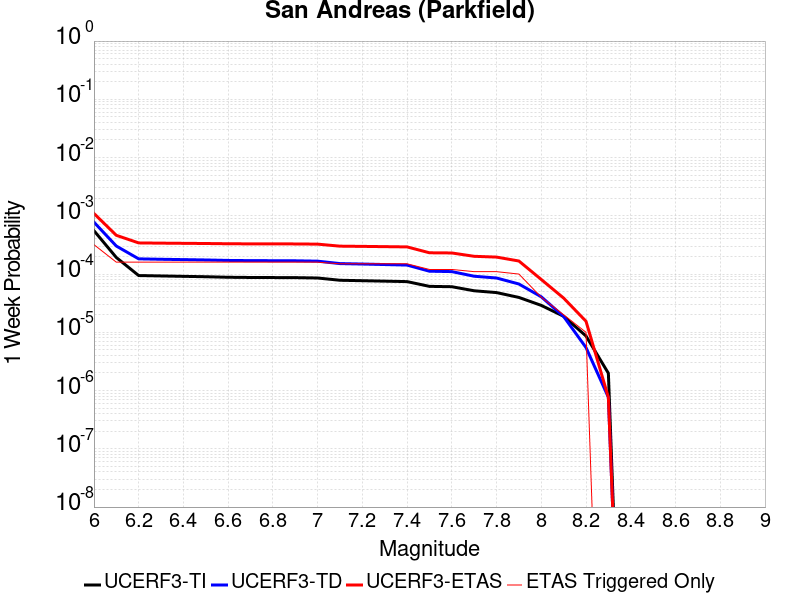 | 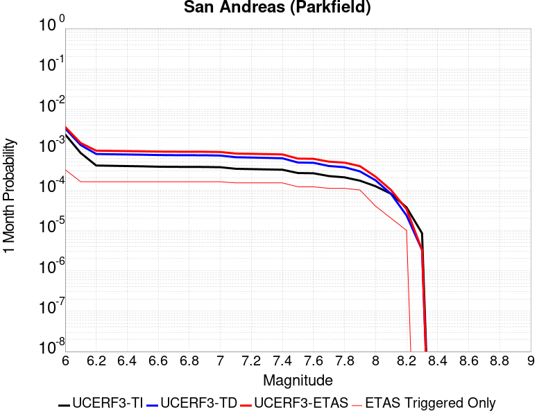 | 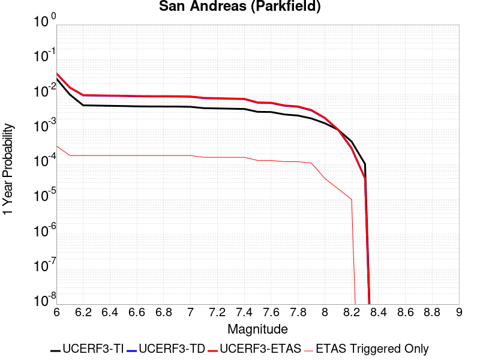 | 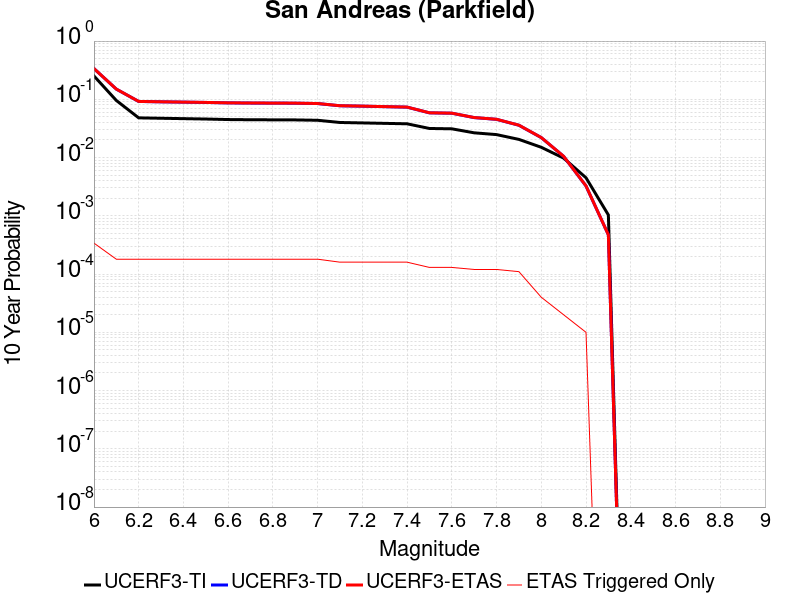 |

| Magnitude | 1 wk TI Prob | 1 wk TD Prob | 1 wk ETAS Prob | 1 wk ETAS/TD Gain | 1 wk ETAS Triggered Only | 1 mo TI Prob | 1 mo TD Prob | 1 mo ETAS Prob | 1 mo ETAS/TD Gain | 1 mo ETAS Triggered Only | 1 yr TI Prob | 1 yr TD Prob | 1 yr ETAS Prob | 1 yr ETAS/TD Gain | 1 yr ETAS Triggered Only | 10 yr TI Prob | 10 yr TD Prob | 10 yr ETAS Prob | 10 yr ETAS/TD Gain | 10 yr ETAS Triggered Only |
|-----|-----|-----|-----|-----|-----|-----|-----|-----|-----|-----|-----|-----|-----|-----|-----|-----|-----|-----|-----|-----|
| 6.0 | 5.556969E-4 | 7.778562E-4 | 0.0010976073 | 1.4110671 | 3.2E-4 | 0.0023793848 | 0.0033299583 | 0.0036488925 | 1.0957773 | 3.2E-4 | 0.028586963 | 0.040235043 | 0.040561363 | 1.0081104 | 3.4E-4 | 0.25176284 | 0.3371973 | 0.33742264 | 1.0006683 | 3.4E-4 |
| 6.1 | 1.925858E-4 | 3.0278185E-4 | 4.627334E-4 | 1.5282732 | 1.6E-4 | 8.2510663E-4 | 0.001297085 | 0.0014568774 | 1.1231935 | 1.6E-4 | 0.0099994885 | 0.01577393 | 0.01595109 | 1.0112312 | 1.8E-4 | 0.095613256 | 0.14975825 | 0.14991128 | 1.001022 | 1.8E-4 |
| 6.2 | 9.4306815E-5 | 1.8243887E-4 | 3.4240968E-4 | 1.8768461 | 1.6E-4 | 4.0410945E-4 | 7.8164786E-4 | 9.4152277E-4 | 1.2045357 | 1.6E-4 | 0.0049089384 | 0.009475246 | 0.009653541 | 1.0188168 | 1.8E-4 | 0.048019063 | 0.0918565 | 0.09201997 | 1.0017796 | 1.8E-4 |
| 6.3 | 9.283051E-5 | 1.794041E-4 | 3.393754E-4 | 1.8916813 | 1.6E-4 | 3.9778434E-4 | 7.686494E-4 | 9.285264E-4 | 1.2079973 | 1.6E-4 | 0.0048322747 | 0.009318355 | 0.009496677 | 1.0191367 | 1.8E-4 | 0.047285385 | 0.090509474 | 0.09067318 | 1.0018088 | 1.8E-4 |
| 6.4 | 9.138826E-5 | 1.7702584E-4 | 3.369975E-4 | 1.9036629 | 1.6E-4 | 3.916052E-4 | 7.5846276E-4 | 9.183414E-4 | 1.210793 | 1.6E-4 | 0.0047573745 | 0.009195387 | 0.009373732 | 1.019395 | 1.8E-4 | 0.046568092 | 0.0894136 | 0.0895775 | 1.0018331 | 1.8E-4 |
| 6.5 | 9.000255E-5 | 1.746064E-4 | 3.3457845E-4 | 1.9161868 | 1.6E-4 | 3.8566816E-4 | 7.4809964E-4 | 9.0797996E-4 | 1.2137152 | 1.6E-4 | 0.0046854047 | 0.009070284 | 0.009248652 | 1.019665 | 1.8E-4 | 0.045878403 | 0.08829608 | 0.088460185 | 1.0018586 | 1.8E-4 |
| 6.6 | 8.8109264E-5 | 1.7141816E-4 | 3.3139074E-4 | 1.93323 | 1.6E-4 | 3.7755648E-4 | 7.3444354E-4 | 8.94326E-4 | 1.217692 | 1.6E-4 | 0.0045870654 | 0.008905404 | 0.009083801 | 1.0200324 | 1.8E-4 | 0.04493529 | 0.08682707 | 0.086991444 | 1.001893 | 1.8E-4 |
| 6.7 | 8.738073E-5 | 1.7008898E-4 | 3.3006177E-4 | 1.9405241 | 1.6E-4 | 3.7443507E-4 | 7.287503E-4 | 8.886337E-4 | 1.219394 | 1.6E-4 | 0.0045492216 | 0.008836695 | 0.009015104 | 1.0201896 | 1.8E-4 | 0.04457213 | 0.0862268 | 0.08639128 | 1.0019075 | 1.8E-4 |
| 6.8 | 8.710195E-5 | 1.6954402E-4 | 3.295169E-4 | 1.9435477 | 1.6E-4 | 3.7324068E-4 | 7.26416E-4 | 8.8629976E-4 | 1.2200994 | 1.6E-4 | 0.0045347405 | 0.008808513 | 0.008986928 | 1.0202547 | 1.8E-4 | 0.04443313 | 0.08597436 | 0.08613888 | 1.0019137 | 1.8E-4 |
| 6.9 | 8.6801556E-5 | 1.6895356E-4 | 3.2892652E-4 | 1.9468458 | 1.6E-4 | 3.7195362E-4 | 7.238869E-4 | 8.8377105E-4 | 1.2208691 | 1.6E-4 | 0.0045191357 | 0.0087779695 | 0.0089563895 | 1.0203259 | 1.8E-4 | 0.044283327 | 0.08570042 | 0.08586499 | 1.0019203 | 1.8E-4 |
| 7.0 | 8.5571606E-5 | 1.664819E-4 | 3.2645525E-4 | 1.9609054 | 1.6E-4 | 3.6668387E-4 | 7.132999E-4 | 8.7318575E-4 | 1.2241496 | 1.6E-4 | 0.004455241 | 0.008650103 | 0.008828546 | 1.020629 | 1.8E-4 | 0.043669727 | 0.08454836 | 0.084713146 | 1.001949 | 1.8E-4 |
| 7.1 | 7.82589E-5 | 1.5128969E-4 | 3.01267E-4 | 1.9913255 | 1.5E-4 | 3.3535215E-4 | 6.4822397E-4 | 7.9812674E-4 | 1.2312515 | 1.5E-4 | 0.0040752706 | 0.007863738 | 0.00802248 | 1.0201865 | 1.6E-4 | 0.040013418 | 0.077460445 | 0.07760805 | 1.0019056 | 1.6E-4 |
| 7.2 | 7.690929E-5 | 1.4866212E-4 | 2.9863982E-4 | 2.0088496 | 1.5E-4 | 3.2956956E-4 | 6.369685E-4 | 7.86873E-4 | 1.2353405 | 1.5E-4 | 0.004005129 | 0.0077276826 | 0.007886446 | 1.0205448 | 1.6E-4 | 0.0393371 | 0.07623341 | 0.076381214 | 1.0019388 | 1.6E-4 |
| 7.3 | 7.5543794E-5 | 1.4562748E-4 | 2.9560563E-4 | 2.0298755 | 1.5E-4 | 3.2371894E-4 | 6.239692E-4 | 7.738756E-4 | 1.2402465 | 1.5E-4 | 0.003934157 | 0.0075705256 | 0.0077293147 | 1.0209746 | 1.6E-4 | 0.038652334 | 0.07479777 | 0.07494581 | 1.0019791 | 1.6E-4 |
| 7.4 | 7.4214564E-5 | 1.4263717E-4 | 2.926158E-4 | 2.0514693 | 1.5E-4 | 3.1802364E-4 | 6.1115966E-4 | 7.61068E-4 | 1.245285 | 1.5E-4 | 0.003865065 | 0.0074156416 | 0.007574455 | 1.0214161 | 1.6E-4 | 0.03798529 | 0.07337152 | 0.07351979 | 1.0020207 | 1.6E-4 |
| 7.5 | 6.149578E-5 | 1.1191443E-4 | 2.31901E-4 | 2.0721278 | 1.2E-4 | 2.6352672E-4 | 4.795452E-4 | 5.994877E-4 | 1.2501171 | 1.2E-4 | 0.0032037178 | 0.005822865 | 0.005952108 | 1.0221958 | 1.3E-4 | 0.03157923 | 0.058559462 | 0.05868185 | 1.00209 | 1.3E-4 |
| 7.6 | 6.0643448E-5 | 1.102009E-4 | 2.3018767E-4 | 2.0888004 | 1.2E-4 | 2.598746E-4 | 4.7220418E-4 | 5.921475E-4 | 1.2540073 | 1.2E-4 | 0.0031593828 | 0.005733962 | 0.0058632167 | 1.0225419 | 1.3E-4 | 0.031148417 | 0.05772042 | 0.057842914 | 1.0021223 | 1.3E-4 |
| 7.7 | 5.1652263E-5 | 9.175265E-5 | 2.0174256E-4 | 2.1987655 | 1.1E-4 | 2.2134806E-4 | 3.9316638E-4 | 5.0312316E-4 | 1.2796698 | 1.1E-4 | 0.002691582 | 0.0047763046 | 0.0048957313 | 1.025004 | 1.2E-4 | 0.026592141 | 0.04853641 | 0.04865058 | 1.0023524 | 1.2E-4 |
| 7.8 | 4.8090482E-5 | 8.560165E-5 | 1.9559223E-4 | 2.2849119 | 1.1E-4 | 2.060858E-4 | 3.6681266E-4 | 4.7677231E-4 | 1.2997706 | 1.1E-4 | 0.0025062072 | 0.004456807 | 0.0045762723 | 1.0268052 | 1.2E-4 | 0.024781305 | 0.045302264 | 0.04541683 | 1.0025289 | 1.2E-4 |
| 7.9 | 3.970278E-5 | 6.7507375E-5 | 1.6750062E-4 | 2.4812198 | 1.0E-4 | 1.7014367E-4 | 2.8928524E-4 | 3.892563E-4 | 1.3455796 | 1.0E-4 | 0.002069531 | 0.0035163634 | 0.0036259766 | 1.0311723 | 1.1E-4 | 0.020503636 | 0.03588176 | 0.035987813 | 1.0029557 | 1.1E-4 |
| 8.0 | 2.8982335E-5 | 4.0698153E-5 | 8.0696525E-5 | 1.9828056 | 4.0E-5 | 1.2420409E-4 | 1.7440901E-4 | 2.1440203E-4 | 1.229306 | 4.0E-5 | 0.0015111357 | 0.0021213628 | 0.002161278 | 1.0188158 | 4.0E-5 | 0.015009012 | 0.02201118 | 0.0220503 | 1.0017773 | 4.0E-5 |
| 8.1 | 1.8836186E-5 | 1.867974E-5 | 3.8679365E-5 | 2.0706587 | 2.0E-5 | 8.0724014E-5 | 8.005358E-5 | 1.0005198E-4 | 1.2498127 | 2.0E-5 | 9.823717E-4 | 9.742171E-4 | 9.941976E-4 | 1.0205094 | 2.0E-5 | 0.009780403 | 0.010487711 | 0.010507501 | 1.001887 | 2.0E-5 |
| 8.2 | 8.643924E-6 | 5.473668E-6 | 1.5473614E-5 | 2.8269184 | 1.0E-5 | 3.704486E-5 | 2.3458366E-5 | 3.345813E-5 | 1.4262772 | 1.0E-5 | 4.5092785E-4 | 2.8556827E-4 | 2.955654E-4 | 1.035008 | 1.0E-5 | 0.0045001395 | 0.0032481793 | 0.003258147 | 1.0030687 | 1.0E-5 |
| 8.3 | 1.983087E-6 | 7.6564595E-7 | 7.6564595E-7 | 1.0 | 0.0 | 8.498917E-6 | 3.281336E-6 | 3.281336E-6 | 1.0 | 0.0 | 1.034694E-4 | 3.9949547E-5 | 3.9949547E-5 | 1.0 | 0.0 | 0.0010342124 | 4.717979E-4 | 4.717979E-4 | 1.0 | 0.0 |

## Sierra Nevada  (No Extension)
*[(top)](#table-of-contents)*

| 1 Week | 1 Month | 1 Year | 10 Year |
|-----|-----|-----|-----|
|  | 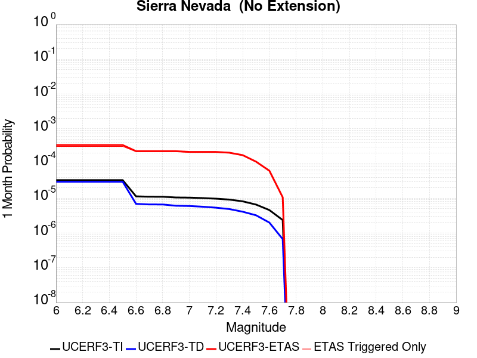 | 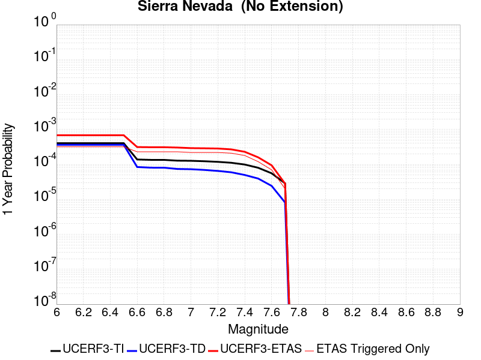 | 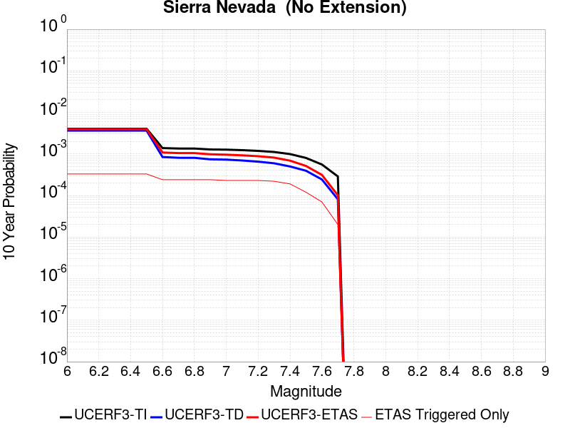 |

| Magnitude | 1 wk TI Prob | 1 wk TD Prob | 1 wk ETAS Prob | 1 wk ETAS/TD Gain | 1 wk ETAS Triggered Only | 1 mo TI Prob | 1 mo TD Prob | 1 mo ETAS Prob | 1 mo ETAS/TD Gain | 1 mo ETAS Triggered Only | 1 yr TI Prob | 1 yr TD Prob | 1 yr ETAS Prob | 1 yr ETAS/TD Gain | 1 yr ETAS Triggered Only | 10 yr TI Prob | 10 yr TD Prob | 10 yr ETAS Prob | 10 yr ETAS/TD Gain | 10 yr ETAS Triggered Only |
|-----|-----|-----|-----|-----|-----|-----|-----|-----|-----|-----|-----|-----|-----|-----|-----|-----|-----|-----|-----|-----|
| 6.0 | 7.7690465E-6 | 6.9762887E-6 | 3.069742E-4 | 44.002506 | 3.0E-4 | 3.329549E-5 | 2.989824E-5 | 3.3988897E-4 | 11.368194 | 3.1E-4 | 4.0529718E-4 | 3.6398612E-4 | 6.8386964E-4 | 1.8788345 | 3.2E-4 | 0.004045588 | 0.0036374154 | 0.003966215 | 1.0903938 | 3.3E-4 |
| 6.1 | 7.7690465E-6 | 6.9762887E-6 | 3.069742E-4 | 44.002506 | 3.0E-4 | 3.329549E-5 | 2.989824E-5 | 3.3988897E-4 | 11.368194 | 3.1E-4 | 4.0529718E-4 | 3.6398612E-4 | 6.8386964E-4 | 1.8788345 | 3.2E-4 | 0.004045588 | 0.0036374154 | 0.003966215 | 1.0903938 | 3.3E-4 |
| 6.2 | 7.7690465E-6 | 6.9762887E-6 | 3.069742E-4 | 44.002506 | 3.0E-4 | 3.329549E-5 | 2.989824E-5 | 3.3988897E-4 | 11.368194 | 3.1E-4 | 4.0529718E-4 | 3.6398612E-4 | 6.8386964E-4 | 1.8788345 | 3.2E-4 | 0.004045588 | 0.0036374154 | 0.003966215 | 1.0903938 | 3.3E-4 |
| 6.3 | 7.7690465E-6 | 6.9762887E-6 | 3.069742E-4 | 44.002506 | 3.0E-4 | 3.329549E-5 | 2.989824E-5 | 3.3988897E-4 | 11.368194 | 3.1E-4 | 4.0529718E-4 | 3.6398612E-4 | 6.8386964E-4 | 1.8788345 | 3.2E-4 | 0.004045588 | 0.0036374154 | 0.003966215 | 1.0903938 | 3.3E-4 |
| 6.4 | 7.7690465E-6 | 6.9762887E-6 | 3.069742E-4 | 44.002506 | 3.0E-4 | 3.329549E-5 | 2.989824E-5 | 3.3988897E-4 | 11.368194 | 3.1E-4 | 4.0529718E-4 | 3.6398612E-4 | 6.8386964E-4 | 1.8788345 | 3.2E-4 | 0.004045588 | 0.0036374154 | 0.003966215 | 1.0903938 | 3.3E-4 |
| 6.5 | 7.7690465E-6 | 6.9762887E-6 | 3.069742E-4 | 44.002506 | 3.0E-4 | 3.329549E-5 | 2.989824E-5 | 3.3988897E-4 | 11.368194 | 3.1E-4 | 4.0529718E-4 | 3.6398612E-4 | 6.8386964E-4 | 1.8788345 | 3.2E-4 | 0.004045588 | 0.0036374154 | 0.003966215 | 1.0903938 | 3.3E-4 |
| 6.6 | 2.653E-6 | 1.6148208E-6 | 2.1161448E-4 | 131.04518 | 2.1E-4 | 1.136995E-5 | 6.9206426E-6 | 2.2691912E-4 | 32.788734 | 2.2E-4 | 1.3842035E-4 | 8.42556E-5 | 3.142362E-4 | 3.729559 | 2.3E-4 | 0.0013833415 | 8.4224E-4 | 0.0010820378 | 1.2847145 | 2.4E-4 |
| 6.7 | 2.5902466E-6 | 1.5501544E-6 | 2.1154984E-4 | 136.47017 | 2.1E-4 | 1.11010095E-5 | 6.643502E-6 | 2.2664203E-4 | 34.114845 | 2.2E-4 | 1.351464E-4 | 8.088166E-5 | 3.1086305E-4 | 3.8434305 | 2.3E-4 | 0.0013506424 | 8.0852525E-4 | 0.0010483313 | 1.2965968 | 2.4E-4 |
| 6.8 | 2.5853892E-6 | 1.5469546E-6 | 2.1154663E-4 | 136.75038 | 2.1E-4 | 1.1080193E-5 | 6.629789E-6 | 2.2662833E-4 | 34.183342 | 2.2E-4 | 1.34893E-4 | 8.071472E-5 | 3.1069617E-4 | 3.849312 | 2.3E-4 | 0.0013481114 | 8.06857E-4 | 0.0010466634 | 1.2972105 | 2.4E-4 |
| 6.9 | 2.458257E-6 | 1.422029E-6 | 2.1142174E-4 | 148.67612 | 2.1E-4 | 1.0535345E-5 | 6.0943958E-6 | 2.2609305E-4 | 37.09852 | 2.2E-4 | 1.2826028E-4 | 7.419676E-5 | 3.041797E-4 | 4.099636 | 2.3E-4 | 0.0012818627 | 7.4172183E-4 | 9.815438E-4 | 1.3233315 | 2.4E-4 |
| 7.0 | 2.4341468E-6 | 1.3989927E-6 | 2.0139871E-4 | 143.9598 | 2.0E-4 | 1.0432016E-5 | 5.9956697E-6 | 2.1599441E-4 | 36.02507 | 2.1E-4 | 1.270024E-4 | 7.299485E-5 | 2.929788E-4 | 4.0136914 | 2.2E-4 | 0.0012692984 | 7.297107E-4 | 9.595428E-4 | 1.3149635 | 2.3E-4 |
| 7.1 | 2.3652476E-6 | 1.3339427E-6 | 2.0133368E-4 | 150.93127 | 2.0E-4 | 1.0136736E-5 | 5.716885E-6 | 2.1571569E-4 | 37.73308 | 2.1E-4 | 1.2340778E-4 | 6.9600865E-5 | 2.8958556E-4 | 4.1606603 | 2.2E-4 | 0.0012333926 | 6.957924E-4 | 9.2563237E-4 | 1.3303283 | 2.3E-4 |
| 7.2 | 2.272158E-6 | 1.2502497E-6 | 2.0125E-4 | 160.96785 | 2.0E-4 | 9.737784E-6 | 5.358202E-6 | 2.1535708E-4 | 40.19204 | 2.1E-4 | 1.1855107E-4 | 6.523417E-5 | 2.852198E-4 | 4.372246 | 2.2E-4 | 0.0011848784 | 6.5215176E-4 | 8.8200177E-4 | 1.3524487 | 2.3E-4 |
| 7.3 | 2.1382127E-6 | 1.1419382E-6 | 1.9114172E-4 | 167.38359 | 1.9E-4 | 9.163737E-6 | 4.894012E-6 | 2.0489303E-4 | 41.866066 | 2.0E-4 | 1.1156279E-4 | 5.9582977E-5 | 2.6957048E-4 | 4.5242867 | 2.1E-4 | 0.001115068 | 5.956712E-4 | 8.1554014E-4 | 1.3691113 | 2.2E-4 |
| 7.4 | 1.9048055E-6 | 9.574928E-7 | 1.6095734E-4 | 168.10292 | 1.6E-4 | 8.163426E-6 | 4.103534E-6 | 1.7410284E-4 | 42.427532 | 1.7E-4 | 9.9385186E-5 | 4.995939E-5 | 2.299504E-4 | 4.602746 | 1.8E-4 | 9.934074E-4 | 4.9948227E-4 | 6.893874E-4 | 1.3802038 | 1.9E-4 |
| 7.5 | 1.5373403E-6 | 7.559763E-7 | 1.00755904E-4 | 133.27917 | 1.0E-4 | 6.5885843E-6 | 3.2398946E-6 | 1.1323954E-4 | 34.951614 | 1.1E-4 | 8.021306E-5 | 3.9445007E-5 | 1.5944027E-4 | 4.0420904 | 1.2E-4 | 8.0184115E-4 | 3.9438053E-4 | 5.143332E-4 | 1.3041546 | 1.2E-4 |
| 7.6 | 1.0680322E-6 | 4.65941E-7 | 5.046592E-5 | 108.30967 | 5.0E-5 | 4.577273E-6 | 1.9968884E-6 | 6.199677E-5 | 31.046686 | 6.0E-5 | 5.5726876E-5 | 2.4311848E-5 | 9.431015E-5 | 3.8791845 | 7.0E-5 | 5.5712904E-4 | 2.4309216E-4 | 3.1307514E-4 | 1.2878866 | 7.0E-5 |
| 7.7 | 5.509146E-7 | 1.5578539E-7 | 1.01557835E-5 | 65.190865 | 1.0E-5 | 2.3610605E-6 | 6.676515E-7 | 1.0667645E-5 | 15.977864 | 1.0E-5 | 2.8745531E-5 | 8.128628E-6 | 2.8128465E-5 | 3.46042 | 2.0E-5 | 2.8741814E-4 | 8.128342E-5 | 1.01281796E-4 | 1.2460326 | 2.0E-5 |

## San Andreas (Coachella) rev
*[(top)](#table-of-contents)*

| 1 Week | 1 Month | 1 Year | 10 Year |
|-----|-----|-----|-----|
| 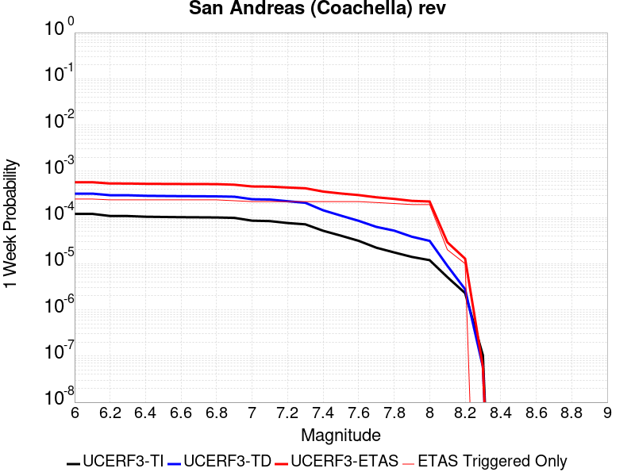 | 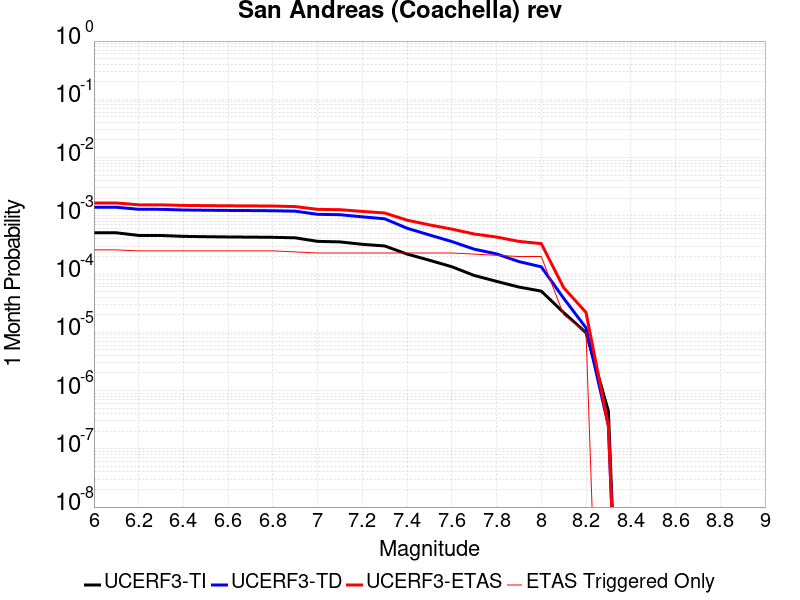 | 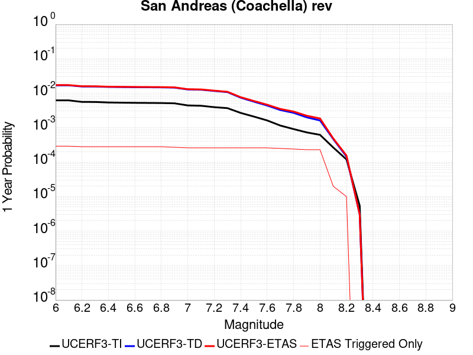 | 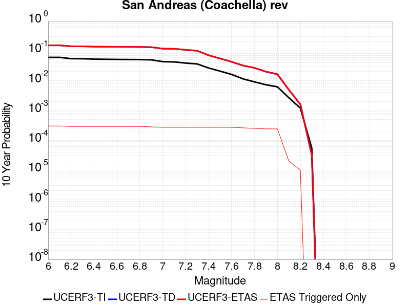 |

| Magnitude | 1 wk TI Prob | 1 wk TD Prob | 1 wk ETAS Prob | 1 wk ETAS/TD Gain | 1 wk ETAS Triggered Only | 1 mo TI Prob | 1 mo TD Prob | 1 mo ETAS Prob | 1 mo ETAS/TD Gain | 1 mo ETAS Triggered Only | 1 yr TI Prob | 1 yr TD Prob | 1 yr ETAS Prob | 1 yr ETAS/TD Gain | 1 yr ETAS Triggered Only | 10 yr TI Prob | 10 yr TD Prob | 10 yr ETAS Prob | 10 yr ETAS/TD Gain | 10 yr ETAS Triggered Only |
|-----|-----|-----|-----|-----|-----|-----|-----|-----|-----|-----|-----|-----|-----|-----|-----|-----|-----|-----|-----|-----|
| 6.0 | 1.1925945E-4 | 3.273077E-4 | 5.772259E-4 | 1.7635572 | 2.5E-4 | 5.110118E-4 | 0.001401998 | 0.0016616335 | 1.1851896 | 2.6E-4 | 0.0062038354 | 0.016937068 | 0.017222155 | 1.0168322 | 2.9E-4 | 0.060334753 | 0.15267672 | 0.15293092 | 1.0016649 | 3.0E-4 |
| 6.1 | 1.1925945E-4 | 3.273077E-4 | 5.772259E-4 | 1.7635572 | 2.5E-4 | 5.110118E-4 | 0.001401998 | 0.0016616335 | 1.1851896 | 2.6E-4 | 0.0062038354 | 0.016937068 | 0.017222155 | 1.0168322 | 2.9E-4 | 0.060334753 | 0.15267672 | 0.15293092 | 1.0016649 | 3.0E-4 |
| 6.2 | 1.07432395E-4 | 3.0231563E-4 | 5.4224307E-4 | 1.7936323 | 2.4E-4 | 4.603433E-4 | 0.001294999 | 0.0015446753 | 1.1928003 | 2.5E-4 | 0.005590286 | 0.015653731 | 0.015929349 | 1.0176071 | 2.8E-4 | 0.05451731 | 0.14182784 | 0.1420767 | 1.0017548 | 2.9E-4 |
| 6.3 | 1.0718766E-4 | 3.0176868E-4 | 5.4169627E-4 | 1.7950711 | 2.4E-4 | 4.592948E-4 | 0.0012926573 | 0.0015423342 | 1.19315 | 2.5E-4 | 0.005577586 | 0.01562563 | 0.015901254 | 1.0176393 | 2.8E-4 | 0.054396555 | 0.14159605 | 0.14184499 | 1.0017581 | 2.9E-4 |
| 6.4 | 1.0355944E-4 | 2.9384956E-4 | 5.3377904E-4 | 1.8165045 | 2.4E-4 | 4.4375064E-4 | 0.0012587514 | 0.0015084366 | 1.1983595 | 2.5E-4 | 0.0053892885 | 0.015218662 | 0.015494401 | 1.0181185 | 2.8E-4 | 0.052604496 | 0.13815795 | 0.13840789 | 1.001809 | 2.9E-4 |
| 6.5 | 1.0227914E-4 | 2.9104383E-4 | 5.30974E-4 | 1.824378 | 2.4E-4 | 4.382655E-4 | 0.0012467385 | 0.0014964268 | 1.2002732 | 2.5E-4 | 0.0053228354 | 0.015074439 | 0.015350218 | 1.0182945 | 2.8E-4 | 0.051971316 | 0.13694239 | 0.13719267 | 1.0018277 | 2.9E-4 |
| 6.6 | 1.0116757E-4 | 2.8870135E-4 | 5.286321E-4 | 1.8310689 | 2.4E-4 | 4.3350324E-4 | 0.0012367087 | 0.0014863996 | 1.2018994 | 2.5E-4 | 0.0052651367 | 0.014954008 | 0.015229821 | 1.0184441 | 2.8E-4 | 0.051421247 | 0.13591973 | 0.13617033 | 1.0018436 | 2.9E-4 |
| 6.7 | 1.0050676E-4 | 2.8728697E-4 | 5.2721804E-4 | 1.8351616 | 2.4E-4 | 4.3067214E-4 | 0.0012306528 | 0.0014803451 | 1.2028942 | 2.5E-4 | 0.005230834 | 0.014881288 | 0.015157121 | 1.0185356 | 2.8E-4 | 0.051094085 | 0.13530464 | 0.13555542 | 1.0018533 | 2.9E-4 |
| 6.8 | 9.976819E-5 | 2.8532353E-4 | 5.2525505E-4 | 1.8409104 | 2.4E-4 | 4.2750788E-4 | 0.001222246 | 0.0014719404 | 1.2042915 | 2.5E-4 | 0.0051924936 | 0.014780328 | 0.015056189 | 1.0186641 | 2.8E-4 | 0.050728295 | 0.13445628 | 0.13470729 | 1.0018668 | 2.9E-4 |
| 6.9 | 9.77719E-5 | 2.802926E-4 | 5.102281E-4 | 1.8203411 | 2.3E-4 | 4.1895514E-4 | 0.0012007048 | 0.0014404167 | 1.1996427 | 2.4E-4 | 0.0050888555 | 0.0145215895 | 0.014787669 | 1.0183231 | 2.7E-4 | 0.049738888 | 0.13228476 | 0.13252772 | 1.0018367 | 2.8E-4 |
| 7.0 | 8.500761E-5 | 2.4763815E-4 | 4.6758365E-4 | 1.888173 | 2.2E-4 | 3.6426744E-4 | 0.0010608779 | 0.0012906339 | 1.2165716 | 2.3E-4 | 0.0044259406 | 0.01284047 | 0.013097132 | 1.0199885 | 2.6E-4 | 0.04338823 | 0.11813616 | 0.11837426 | 1.0020155 | 2.7E-4 |
| 7.1 | 8.319876E-5 | 2.4366553E-4 | 4.636119E-4 | 1.902657 | 2.2E-4 | 3.5651738E-4 | 0.0010438662 | 0.001273626 | 1.2201048 | 2.3E-4 | 0.004331963 | 0.012635773 | 0.012892487 | 1.0203165 | 2.6E-4 | 0.042484846 | 0.11635632 | 0.1165949 | 1.0020504 | 2.7E-4 |
| 7.2 | 7.563917E-5 | 2.2414974E-4 | 4.4410044E-4 | 1.9812667 | 2.2E-4 | 3.2412758E-4 | 9.602912E-4 | 0.0011900703 | 1.2392807 | 2.3E-4 | 0.0039391145 | 0.011629559 | 0.011886536 | 1.0220969 | 2.6E-4 | 0.03870018 | 0.10776202 | 0.108002916 | 1.0022355 | 2.7E-4 |
| 7.3 | 7.082985E-5 | 2.07311E-4 | 4.272654E-4 | 2.0609875 | 2.2E-4 | 3.0352117E-4 | 8.881761E-4 | 0.0011179718 | 1.2587277 | 2.3E-4 | 0.0036891096 | 0.010760553 | 0.011017756 | 1.0239023 | 2.6E-4 | 0.03628465 | 0.10028403 | 0.10052696 | 1.0024223 | 2.7E-4 |
| 7.4 | 5.146215E-5 | 1.4274761E-4 | 3.627162E-4 | 2.5409617 | 2.2E-4 | 2.2053342E-4 | 6.1163295E-4 | 8.4149226E-4 | 1.3758125 | 2.3E-4 | 0.0026816884 | 0.0074213943 | 0.0076794648 | 1.0347738 | 2.6E-4 | 0.02649557 | 0.07085049 | 0.07110136 | 1.0035409 | 2.7E-4 |
| 7.5 | 4.0285166E-5 | 1.0942422E-4 | 3.2940015E-4 | 3.010304 | 2.2E-4 | 1.7263928E-4 | 4.6887697E-4 | 6.987691E-4 | 1.4903038 | 2.3E-4 | 0.002099857 | 0.0056937044 | 0.005952224 | 1.0454044 | 2.6E-4 | 0.020801254 | 0.055013083 | 0.055268228 | 1.004638 | 2.7E-4 |
| 7.6 | 3.1168736E-5 | 8.439599E-5 | 3.0437743E-4 | 3.6065388 | 2.2E-4 | 1.3357346E-4 | 3.616471E-4 | 5.9156393E-4 | 1.6357491 | 2.3E-4 | 0.0016250437 | 0.004394191 | 0.0046530482 | 1.058909 | 2.6E-4 | 0.016132116 | 0.042812478 | 0.043070916 | 1.0060365 | 2.7E-4 |
| 7.7 | 2.2100989E-5 | 6.239345E-5 | 2.7238033E-4 | 4.365528 | 2.1E-4 | 9.4715084E-5 | 2.6737314E-4 | 4.873143E-4 | 1.8226001 | 2.2E-4 | 0.001152546 | 0.0032504152 | 0.0034996024 | 1.0766633 | 2.5E-4 | 0.011465867 | 0.031902168 | 0.032153875 | 1.0078899 | 2.6E-4 |
| 7.8 | 1.7484861E-5 | 5.180078E-5 | 2.5179042E-4 | 4.8607454 | 2.0E-4 | 7.493296E-5 | 2.2198448E-4 | 4.3193786E-4 | 1.9458021 | 2.1E-4 | 9.1192697E-4 | 0.0026993142 | 0.0029386664 | 1.0886714 | 2.4E-4 | 0.009081938 | 0.026641788 | 0.026885128 | 1.0091337 | 2.5E-4 |
| 7.9 | 1.3967285E-5 | 3.8226146E-5 | 2.2821888E-4 | 5.9702296 | 1.9E-4 | 5.985842E-5 | 1.6381606E-4 | 3.637833E-4 | 2.2206814 | 2.0E-4 | 7.2853256E-4 | 0.0019926373 | 0.002222179 | 1.1151949 | 2.3E-4 | 0.0072614877 | 0.019911002 | 0.020146225 | 1.0118136 | 2.4E-4 |
| 8.0 | 1.1887396E-5 | 3.106798E-5 | 2.2106207E-4 | 7.1154313 | 1.9E-4 | 5.094499E-5 | 1.331417E-4 | 3.3311508E-4 | 2.501959 | 2.0E-4 | 6.200787E-4 | 0.0016197958 | 0.0018494233 | 1.1417632 | 2.3E-4 | 0.006183513 | 0.016280567 | 0.01651666 | 1.0145015 | 2.4E-4 |
| 8.1 | 5.100864E-6 | 8.973766E-6 | 2.8973585E-5 | 3.2286987 | 2.0E-5 | 2.1860664E-5 | 3.845843E-5 | 5.845766E-5 | 1.520022 | 2.0E-5 | 2.6612106E-4 | 4.6813092E-4 | 4.8812156E-4 | 1.042703 | 2.0E-5 | 0.002658026 | 0.004918092 | 0.0049379934 | 1.0040466 | 2.0E-5 |
| 8.2 | 2.3004484E-6 | 2.7863473E-6 | 1.27863195E-5 | 4.588918 | 1.0E-5 | 9.859027E-6 | 1.19414335E-5 | 2.1941314E-5 | 1.8374104 | 1.0E-5 | 1.2002704E-4 | 1.4537729E-4 | 1.5537583E-4 | 1.0687765 | 1.0E-5 | 0.0011996223 | 0.0015973782 | 0.0016073622 | 1.0062503 | 1.0E-5 |
| 8.3 | 1.0424446E-7 | 5.814421E-8 | 5.814421E-8 | 1.0 | 0.0 | 4.4676187E-7 | 2.4918944E-7 | 2.4918944E-7 | 1.0 | 0.0 | 5.439312E-6 | 3.0338776E-6 | 3.0338776E-6 | 1.0 | 0.0 | 5.4391792E-5 | 3.189592E-5 | 3.189592E-5 | 1.0 | 0.0 |

## San Andreas (Big Bend)
*[(top)](#table-of-contents)*

| 1 Week | 1 Month | 1 Year | 10 Year |
|-----|-----|-----|-----|
| 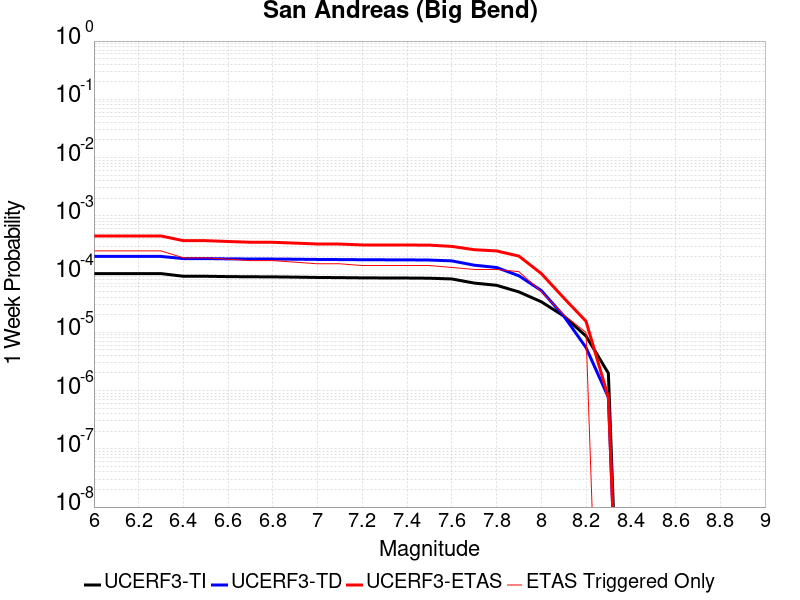 | 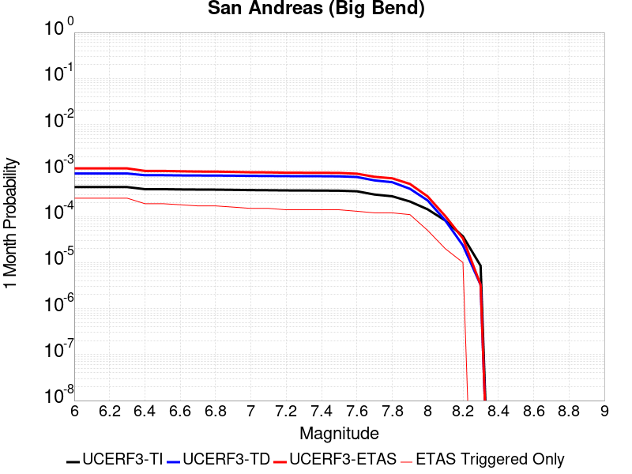 | 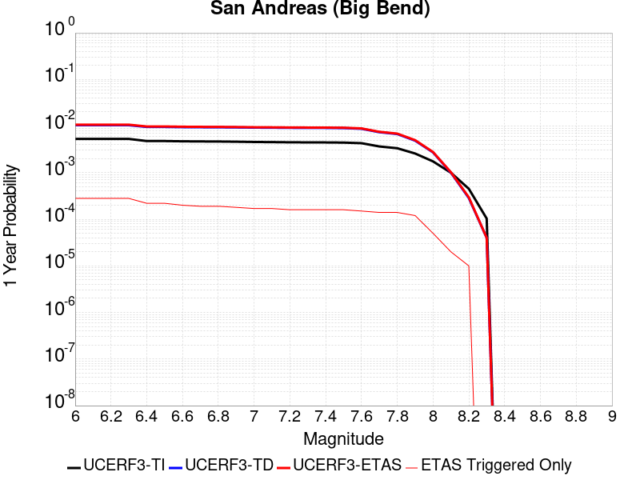 | 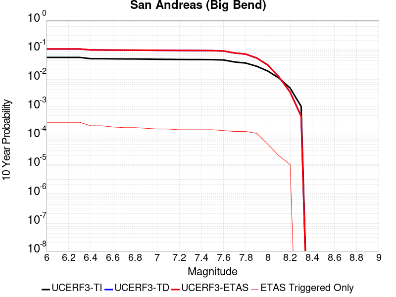 |

| Magnitude | 1 wk TI Prob | 1 wk TD Prob | 1 wk ETAS Prob | 1 wk ETAS/TD Gain | 1 wk ETAS Triggered Only | 1 mo TI Prob | 1 mo TD Prob | 1 mo ETAS Prob | 1 mo ETAS/TD Gain | 1 mo ETAS Triggered Only | 1 yr TI Prob | 1 yr TD Prob | 1 yr ETAS Prob | 1 yr ETAS/TD Gain | 1 yr ETAS Triggered Only | 10 yr TI Prob | 10 yr TD Prob | 10 yr ETAS Prob | 10 yr ETAS/TD Gain | 10 yr ETAS Triggered Only |
|-----|-----|-----|-----|-----|-----|-----|-----|-----|-----|-----|-----|-----|-----|-----|-----|-----|-----|-----|-----|-----|
| 6.0 | 1.0179969E-4 | 2.0073925E-4 | 4.5068905E-4 | 2.2451468 | 2.5E-4 | 4.362114E-4 | 8.6002843E-4 | 0.0011098135 | 1.290438 | 2.5E-4 | 0.0052979486 | 0.010420859 | 0.010697941 | 1.0265892 | 2.8E-4 | 0.051734097 | 0.101455905 | 0.10171649 | 1.0025684 | 2.9E-4 |
| 6.1 | 1.0179969E-4 | 2.0073925E-4 | 4.5068905E-4 | 2.2451468 | 2.5E-4 | 4.362114E-4 | 8.6002843E-4 | 0.0011098135 | 1.290438 | 2.5E-4 | 0.0052979486 | 0.010420859 | 0.010697941 | 1.0265892 | 2.8E-4 | 0.051734097 | 0.101455905 | 0.10171649 | 1.0025684 | 2.9E-4 |
| 6.2 | 1.0179969E-4 | 2.0073925E-4 | 4.5068905E-4 | 2.2451468 | 2.5E-4 | 4.362114E-4 | 8.6002843E-4 | 0.0011098135 | 1.290438 | 2.5E-4 | 0.0052979486 | 0.010420859 | 0.010697941 | 1.0265892 | 2.8E-4 | 0.051734097 | 0.101455905 | 0.10171649 | 1.0025684 | 2.9E-4 |
| 6.3 | 1.0179969E-4 | 2.0073925E-4 | 4.5068905E-4 | 2.2451468 | 2.5E-4 | 4.362114E-4 | 8.6002843E-4 | 0.0011098135 | 1.290438 | 2.5E-4 | 0.0052979486 | 0.010420859 | 0.010697941 | 1.0265892 | 2.8E-4 | 0.051734097 | 0.101455905 | 0.10171649 | 1.0025684 | 2.9E-4 |
| 6.4 | 9.1639464E-5 | 1.8430917E-4 | 3.7427415E-4 | 2.0306866 | 1.9E-4 | 3.9268145E-4 | 7.896575E-4 | 9.795076E-4 | 1.2404206 | 1.9E-4 | 0.0047704205 | 0.009571818 | 0.009789712 | 1.0227641 | 2.2E-4 | 0.046693064 | 0.09378695 | 0.09398632 | 1.0021257 | 2.2E-4 |
| 6.5 | 9.1639464E-5 | 1.8430917E-4 | 3.7427415E-4 | 2.0306866 | 1.9E-4 | 3.9268145E-4 | 7.896575E-4 | 9.795076E-4 | 1.2404206 | 1.9E-4 | 0.0047704205 | 0.009571818 | 0.009789712 | 1.0227641 | 2.2E-4 | 0.046693064 | 0.09378695 | 0.09398632 | 1.0021257 | 2.2E-4 |
| 6.6 | 9.042622E-5 | 1.8238011E-4 | 3.623473E-4 | 1.9867697 | 1.8E-4 | 3.8748336E-4 | 7.813951E-4 | 9.6125447E-4 | 1.2301772 | 1.8E-4 | 0.0047074095 | 0.0094721 | 0.009670205 | 1.0209147 | 2.0E-4 | 0.046089325 | 0.09287721 | 0.09305864 | 1.0019534 | 2.0E-4 |
| 6.7 | 8.9836685E-5 | 1.8152347E-4 | 3.514926E-4 | 1.9363481 | 1.7E-4 | 3.8495753E-4 | 7.7772595E-4 | 9.4759377E-4 | 1.218416 | 1.7E-4 | 0.00467679 | 0.009427815 | 0.009616023 | 1.0199631 | 1.9E-4 | 0.045795817 | 0.09247148 | 0.09264392 | 1.0018647 | 1.9E-4 |
| 6.8 | 8.9471854E-5 | 1.8099119E-4 | 3.509604E-4 | 1.9391022 | 1.7E-4 | 3.8339442E-4 | 7.754462E-4 | 9.4531436E-4 | 1.2190586 | 1.7E-4 | 0.004657841 | 0.009400298 | 0.009588512 | 1.0200222 | 1.9E-4 | 0.04561414 | 0.0922192 | 0.092391685 | 1.0018703 | 1.9E-4 |
| 6.9 | 8.858234E-5 | 1.7981093E-4 | 3.3978216E-4 | 1.8896636 | 1.6E-4 | 3.7958333E-4 | 7.7039085E-4 | 9.3026756E-4 | 1.2075268 | 1.6E-4 | 0.004611638 | 0.009339278 | 0.009517597 | 1.0190934 | 1.8E-4 | 0.04517103 | 0.09165911 | 0.09182261 | 1.0017838 | 1.8E-4 |
| 7.0 | 8.7433385E-5 | 1.7819891E-4 | 3.2817217E-4 | 1.841606 | 1.5E-4 | 3.746607E-4 | 7.6348626E-4 | 9.1337174E-4 | 1.1963172 | 1.5E-4 | 0.004551957 | 0.009255932 | 0.009424359 | 1.0181966 | 1.7E-4 | 0.044598386 | 0.09089323 | 0.09104778 | 1.0017003 | 1.7E-4 |
| 7.1 | 8.684964E-5 | 1.7731842E-4 | 3.272918E-4 | 1.8457859 | 1.5E-4 | 3.7215967E-4 | 7.597149E-4 | 9.09601E-4 | 1.1972924 | 1.5E-4 | 0.0045216335 | 0.009210405 | 0.009378839 | 1.0182874 | 1.7E-4 | 0.04430731 | 0.09047475 | 0.09062937 | 1.001709 | 1.7E-4 |
| 7.2 | 8.606521E-5 | 1.7622454E-4 | 3.1619988E-4 | 1.794301 | 1.4E-4 | 3.6879873E-4 | 7.550296E-4 | 8.9492387E-4 | 1.1852832 | 1.4E-4 | 0.0044808835 | 0.009153842 | 0.009312377 | 1.017319 | 1.6E-4 | 0.043916024 | 0.08995518 | 0.09010079 | 1.0016186 | 1.6E-4 |
| 7.3 | 8.568266E-5 | 1.7564454E-4 | 3.1561995E-4 | 1.7969244 | 1.4E-4 | 3.6715972E-4 | 7.5254537E-4 | 8.9244003E-4 | 1.1858953 | 1.4E-4 | 0.0044610105 | 0.00912385 | 0.009282391 | 1.0173764 | 1.6E-4 | 0.043725148 | 0.08967623 | 0.08982188 | 1.0016242 | 1.6E-4 |
| 7.4 | 8.5432206E-5 | 1.752704E-4 | 3.1524585E-4 | 1.7986258 | 1.4E-4 | 3.6608664E-4 | 7.509428E-4 | 8.9083763E-4 | 1.1862923 | 1.4E-4 | 0.004447999 | 0.009104501 | 0.009263045 | 1.0174137 | 1.6E-4 | 0.043600157 | 0.08949642 | 0.0896421 | 1.0016278 | 1.6E-4 |
| 7.5 | 8.4791965E-5 | 1.7396381E-4 | 3.1393947E-4 | 1.804625 | 1.4E-4 | 3.633435E-4 | 7.4534636E-4 | 8.85242E-4 | 1.1876922 | 1.4E-4 | 0.0044147377 | 0.009036932 | 0.009195487 | 1.0175451 | 1.6E-4 | 0.043280575 | 0.08887209 | 0.08901787 | 1.0016403 | 1.6E-4 |
| 7.6 | 8.241105E-5 | 1.6841735E-4 | 2.9839543E-4 | 1.771762 | 1.3E-4 | 3.531424E-4 | 7.2158914E-4 | 8.514953E-4 | 1.180028 | 1.3E-4 | 0.0042910352 | 0.008750047 | 0.008898734 | 1.0169928 | 1.5E-4 | 0.042091176 | 0.08625032 | 0.08638738 | 1.0015892 | 1.5E-4 |
| 7.7 | 7.00432E-5 | 1.4205615E-4 | 2.620391E-4 | 1.8446164 | 1.2E-4 | 3.001506E-4 | 6.0867006E-4 | 7.28597E-4 | 1.1970311 | 1.2E-4 | 0.0036482112 | 0.0073854174 | 0.0075243837 | 1.0188162 | 1.4E-4 | 0.035888977 | 0.07352299 | 0.0736527 | 1.0017642 | 1.4E-4 |
| 7.8 | 6.415362E-5 | 1.2969968E-4 | 2.4968412E-4 | 1.9250944 | 1.2E-4 | 2.749151E-4 | 5.557374E-4 | 6.756707E-4 | 1.2158093 | 1.2E-4 | 0.0033419547 | 0.0067451415 | 0.0068841972 | 1.0206157 | 1.4E-4 | 0.03292141 | 0.06725514 | 0.067385726 | 1.0019417 | 1.4E-4 |
| 7.9 | 4.939911E-5 | 9.341721E-5 | 2.0340693E-4 | 2.1774032 | 1.1E-4 | 2.116933E-4 | 4.0029807E-4 | 5.1025406E-4 | 1.2746853 | 1.1E-4 | 0.0025743195 | 0.004862747 | 0.0049821637 | 1.0245574 | 1.2E-4 | 0.025447013 | 0.048915803 | 0.04902993 | 1.0023332 | 1.2E-4 |
| 8.0 | 3.344983E-5 | 5.2228E-5 | 1.02225385E-4 | 1.9572909 | 5.0E-5 | 1.4334853E-4 | 2.2381509E-4 | 2.738039E-4 | 1.2233487 | 5.0E-5 | 0.0017438711 | 0.0027215453 | 0.0027714092 | 1.0183219 | 5.0E-5 | 0.017302496 | 0.027923161 | 0.027971765 | 1.0017406 | 5.0E-5 |
| 8.1 | 1.9104898E-5 | 1.9171663E-5 | 3.917128E-5 | 2.0431864 | 2.0E-5 | 8.1875565E-5 | 8.2161685E-5 | 1.0216004E-4 | 1.2434025 | 2.0E-5 | 9.963791E-4 | 9.9986E-4 | 0.00101984 | 1.0199828 | 2.0E-5 | 0.009919235 | 0.010749552 | 0.010769337 | 1.0018406 | 2.0E-5 |
| 8.2 | 8.643924E-6 | 5.473668E-6 | 1.5473614E-5 | 2.8269184 | 1.0E-5 | 3.704486E-5 | 2.3458366E-5 | 3.345813E-5 | 1.4262772 | 1.0E-5 | 4.5092785E-4 | 2.8556827E-4 | 2.955654E-4 | 1.035008 | 1.0E-5 | 0.0045001395 | 0.0032481793 | 0.003258147 | 1.0030687 | 1.0E-5 |
| 8.3 | 1.983087E-6 | 7.6564595E-7 | 7.6564595E-7 | 1.0 | 0.0 | 8.498917E-6 | 3.281336E-6 | 3.281336E-6 | 1.0 | 0.0 | 1.034694E-4 | 3.9949547E-5 | 3.9949547E-5 | 1.0 | 0.0 | 0.0010342124 | 4.717979E-4 | 4.717979E-4 | 1.0 | 0.0 |

## San Jacinto (San Bernardino)
*[(top)](#table-of-contents)*

| 1 Week | 1 Month | 1 Year | 10 Year |
|-----|-----|-----|-----|
| 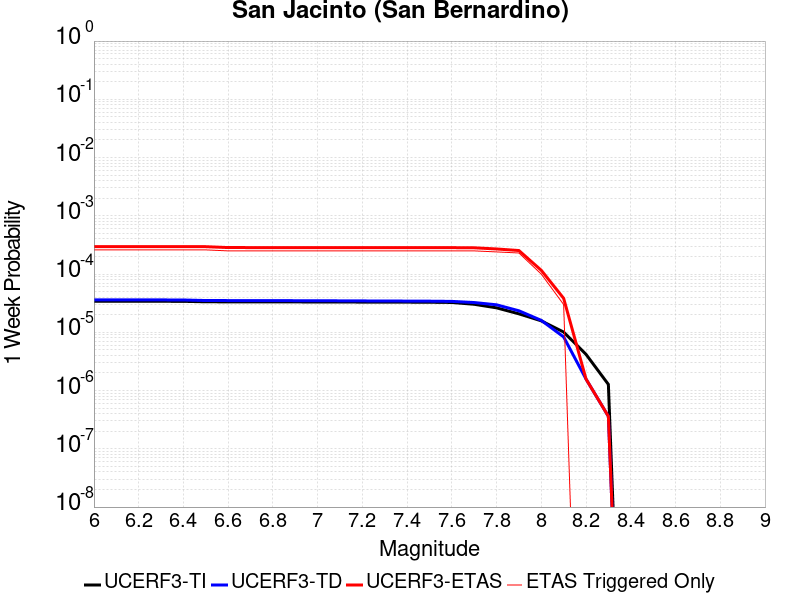 | 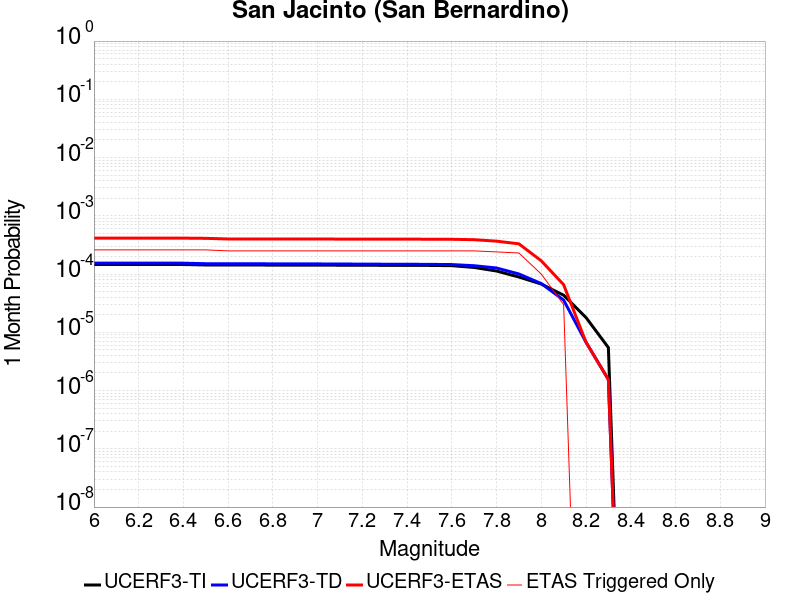 | 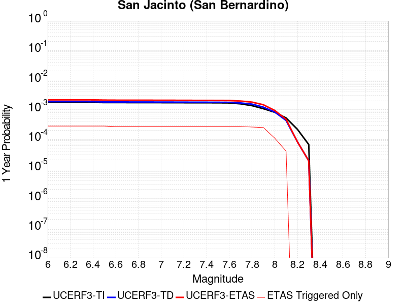 | 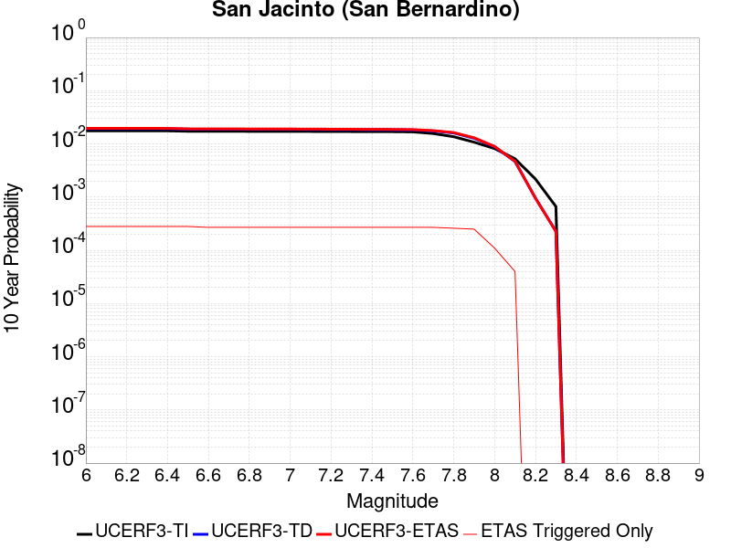 |

| Magnitude | 1 wk TI Prob | 1 wk TD Prob | 1 wk ETAS Prob | 1 wk ETAS/TD Gain | 1 wk ETAS Triggered Only | 1 mo TI Prob | 1 mo TD Prob | 1 mo ETAS Prob | 1 mo ETAS/TD Gain | 1 mo ETAS Triggered Only | 1 yr TI Prob | 1 yr TD Prob | 1 yr ETAS Prob | 1 yr ETAS/TD Gain | 1 yr ETAS Triggered Only | 10 yr TI Prob | 10 yr TD Prob | 10 yr ETAS Prob | 10 yr ETAS/TD Gain | 10 yr ETAS Triggered Only |
|-----|-----|-----|-----|-----|-----|-----|-----|-----|-----|-----|-----|-----|-----|-----|-----|-----|-----|-----|-----|-----|
| 6.0 | 3.409352E-5 | 3.598562E-5 | 2.9597626E-4 | 8.224849 | 2.6E-4 | 1.461069E-4 | 1.5421498E-4 | 4.141749E-4 | 2.6856983 | 2.6E-4 | 0.0017774 | 0.0018759521 | 0.002155427 | 1.1489775 | 2.8E-4 | 0.01763251 | 0.019349992 | 0.019624574 | 1.0141903 | 2.8E-4 |
| 6.1 | 3.409352E-5 | 3.598562E-5 | 2.9597626E-4 | 8.224849 | 2.6E-4 | 1.461069E-4 | 1.5421498E-4 | 4.141749E-4 | 2.6856983 | 2.6E-4 | 0.0017774 | 0.0018759521 | 0.002155427 | 1.1489775 | 2.8E-4 | 0.01763251 | 0.019349992 | 0.019624574 | 1.0141903 | 2.8E-4 |
| 6.2 | 3.409352E-5 | 3.598562E-5 | 2.9597626E-4 | 8.224849 | 2.6E-4 | 1.461069E-4 | 1.5421498E-4 | 4.141749E-4 | 2.6856983 | 2.6E-4 | 0.0017774 | 0.0018759521 | 0.002155427 | 1.1489775 | 2.8E-4 | 0.01763251 | 0.019349992 | 0.019624574 | 1.0141903 | 2.8E-4 |
| 6.3 | 3.409352E-5 | 3.598562E-5 | 2.9597626E-4 | 8.224849 | 2.6E-4 | 1.461069E-4 | 1.5421498E-4 | 4.141749E-4 | 2.6856983 | 2.6E-4 | 0.0017774 | 0.0018759521 | 0.002155427 | 1.1489775 | 2.8E-4 | 0.01763251 | 0.019349992 | 0.019624574 | 1.0141903 | 2.8E-4 |
| 6.4 | 3.400795E-5 | 3.5878285E-5 | 2.9586896E-4 | 8.246464 | 2.6E-4 | 1.4574021E-4 | 1.5375503E-4 | 4.1371505E-4 | 2.6907415 | 2.6E-4 | 0.0017729428 | 0.0018703619 | 0.0021498383 | 1.1494236 | 2.8E-4 | 0.017588645 | 0.019295074 | 0.019569673 | 1.0142314 | 2.8E-4 |
| 6.5 | 3.341482E-5 | 3.5138914E-5 | 2.9512978E-4 | 8.398944 | 2.6E-4 | 1.4319851E-4 | 1.5058667E-4 | 4.105475E-4 | 2.7263205 | 2.6E-4 | 0.0017420477 | 0.0018318522 | 0.0021113392 | 1.1525707 | 2.8E-4 | 0.017284546 | 0.018916616 | 0.01919132 | 1.0145218 | 2.8E-4 |
| 6.6 | 3.3364955E-5 | 3.5076133E-5 | 2.8506736E-4 | 8.127104 | 2.5E-4 | 1.4298483E-4 | 1.5031763E-4 | 4.0028006E-4 | 2.662895 | 2.5E-4 | 0.0017394501 | 0.0018285823 | 0.0020980886 | 1.1473854 | 2.7E-4 | 0.017258976 | 0.01888448 | 0.019149382 | 1.0140275 | 2.7E-4 |
| 6.7 | 3.335922E-5 | 3.5065907E-5 | 2.8505715E-4 | 8.129182 | 2.5E-4 | 1.4296026E-4 | 1.5027382E-4 | 4.0023625E-4 | 2.66338 | 2.5E-4 | 0.0017391514 | 0.0018280497 | 0.0020975561 | 1.1474284 | 2.7E-4 | 0.017256035 | 0.018879272 | 0.019144174 | 1.0140314 | 2.7E-4 |
| 6.8 | 3.327683E-5 | 3.4959972E-5 | 2.8495124E-4 | 8.150785 | 2.5E-4 | 1.4260718E-4 | 1.4981985E-4 | 3.997824E-4 | 2.6684206 | 2.5E-4 | 0.0017348597 | 0.001822532 | 0.00209204 | 1.1478755 | 2.7E-4 | 0.017213784 | 0.018825045 | 0.019089961 | 1.0140725 | 2.7E-4 |
| 6.9 | 3.3235785E-5 | 3.4900928E-5 | 2.848922E-4 | 8.162884 | 2.5E-4 | 1.4243131E-4 | 1.4956683E-4 | 3.9952944E-4 | 2.6712437 | 2.5E-4 | 0.0017327217 | 0.0018194567 | 0.0020889654 | 1.148126 | 2.7E-4 | 0.017192734 | 0.018794911 | 0.019059837 | 1.0140955 | 2.7E-4 |
| 7.0 | 3.3197095E-5 | 3.4840854E-5 | 2.8483215E-4 | 8.175234 | 2.5E-4 | 1.422655E-4 | 1.4930942E-4 | 3.9927207E-4 | 2.6741254 | 2.5E-4 | 0.0017307063 | 0.0018163278 | 0.0020858375 | 1.1483816 | 2.7E-4 | 0.017172894 | 0.01876429 | 0.019029222 | 1.014119 | 2.7E-4 |
| 7.1 | 3.3129716E-5 | 3.4721066E-5 | 2.8471238E-4 | 8.19999 | 2.5E-4 | 1.4197677E-4 | 1.4879608E-4 | 3.987589E-4 | 2.6799018 | 2.5E-4 | 0.0017271966 | 0.0018100884 | 0.0020795998 | 1.148894 | 2.7E-4 | 0.017138338 | 0.018703366 | 0.018968316 | 1.0141659 | 2.7E-4 |
| 7.2 | 3.3034008E-5 | 3.4588513E-5 | 2.8457987E-4 | 8.227584 | 2.5E-4 | 1.4156665E-4 | 1.4822806E-4 | 3.98191E-4 | 2.6863403 | 2.5E-4 | 0.0017222111 | 0.0018031843 | 0.0020726975 | 1.1494651 | 2.7E-4 | 0.017089253 | 0.01863575 | 0.018900719 | 1.0142183 | 2.7E-4 |
| 7.3 | 3.2956614E-5 | 3.4456265E-5 | 2.8444765E-4 | 8.255324 | 2.5E-4 | 1.4123498E-4 | 1.4766137E-4 | 3.9762445E-4 | 2.6928132 | 2.5E-4 | 0.0017181796 | 0.0017962961 | 0.002065811 | 1.1500393 | 2.7E-4 | 0.017049557 | 0.018568495 | 0.018833483 | 1.0142708 | 2.7E-4 |
| 7.4 | 3.2915937E-5 | 3.4377957E-5 | 2.8436937E-4 | 8.271852 | 2.5E-4 | 1.4106068E-4 | 1.473258E-4 | 3.9728897E-4 | 2.6966693 | 2.5E-4 | 0.0017160608 | 0.0017922173 | 0.0020617335 | 1.1503813 | 2.7E-4 | 0.017028693 | 0.018528769 | 0.018793765 | 1.0143019 | 2.7E-4 |
| 7.5 | 3.281791E-5 | 3.424287E-5 | 2.8423432E-4 | 8.30054 | 2.5E-4 | 1.406406E-4 | 1.4674691E-4 | 3.967102E-4 | 2.7033634 | 2.5E-4 | 0.0017109542 | 0.0017851809 | 0.002054699 | 1.1509752 | 2.7E-4 | 0.016978411 | 0.018459652 | 0.018724669 | 1.0143565 | 2.7E-4 |
| 7.6 | 3.2521442E-5 | 3.396782E-5 | 2.8395932E-4 | 8.359657 | 2.5E-4 | 1.3937015E-4 | 1.4556825E-4 | 3.9553185E-4 | 2.7171574 | 2.5E-4 | 0.0016955109 | 0.0017708542 | 0.002040376 | 1.1521988 | 2.7E-4 | 0.016826328 | 0.018317295 | 0.01858235 | 1.0144702 | 2.7E-4 |
| 7.7 | 3.0287873E-5 | 3.245191E-5 | 2.824438E-4 | 8.703457 | 2.5E-4 | 1.297987E-4 | 1.3907222E-4 | 3.8903745E-4 | 2.7973773 | 2.5E-4 | 0.0015791537 | 0.0016918903 | 0.0019614336 | 1.1593149 | 2.7E-4 | 0.01567979 | 0.017528199 | 0.017793467 | 1.0151337 | 2.7E-4 |
| 7.8 | 2.6316151E-5 | 2.9662837E-5 | 2.6965572E-4 | 9.0906925 | 2.4E-4 | 1.1277862E-4 | 1.2712025E-4 | 3.6708976E-4 | 2.887736 | 2.4E-4 | 0.0013722149 | 0.0015465913 | 0.0018061892 | 1.1678517 | 2.6E-4 | 0.013637724 | 0.016069878 | 0.0163257 | 1.0159193 | 2.6E-4 |
| 7.9 | 2.0761147E-5 | 2.3417291E-5 | 2.534119E-4 | 10.821572 | 2.3E-4 | 8.897331E-5 | 1.0035596E-4 | 3.3033287E-4 | 3.291612 | 2.3E-4 | 0.0010827117 | 0.0012211498 | 0.0014708445 | 1.204475 | 2.5E-4 | 0.010774517 | 0.012793272 | 0.013040073 | 1.0192915 | 2.5E-4 |
| 8.0 | 1.5738568E-5 | 1.6032505E-5 | 1.16030904E-4 | 7.2372284 | 1.0E-4 | 6.744926E-5 | 6.8708934E-5 | 1.6870206E-4 | 2.4553149 | 1.0E-4 | 8.2088535E-4 | 8.3621085E-4 | 9.461189E-4 | 1.1314358 | 1.1E-4 | 0.008178596 | 0.008865741 | 0.008974765 | 1.0122973 | 1.1E-4 |
| 8.1 | 1.0105832E-5 | 8.329479E-6 | 3.8329228E-5 | 4.601636 | 3.0E-5 | 4.3309992E-5 | 3.569728E-5 | 6.569621E-5 | 1.8403702 | 3.0E-5 | 5.2717153E-4 | 4.3452822E-4 | 4.7451083E-4 | 1.0920138 | 4.0E-5 | 0.005259227 | 0.0046768794 | 0.004716692 | 1.0085127 | 4.0E-5 |
| 8.2 | 4.189207E-6 | 1.577699E-6 | 1.577699E-6 | 1.0 | 0.0 | 1.7953622E-5 | 6.7615497E-6 | 6.7615497E-6 | 1.0 | 0.0 | 2.1856341E-4 | 8.231879E-5 | 8.231879E-5 | 1.0 | 0.0 | 0.0021834858 | 9.562628E-4 | 9.562628E-4 | 1.0 | 0.0 |
| 8.3 | 1.2758221E-6 | 3.612677E-7 | 3.612677E-7 | 1.0 | 0.0 | 5.4677976E-6 | 1.5482892E-6 | 1.5482892E-6 | 1.0 | 0.0 | 6.65684E-5 | 1.8850264E-5 | 1.8850264E-5 | 1.0 | 0.0 | 6.6548464E-4 | 2.2739546E-4 | 2.2739546E-4 | 1.0 | 0.0 |

## Death Valley (No)
*[(top)](#table-of-contents)*

| 1 Week | 1 Month | 1 Year | 10 Year |
|-----|-----|-----|-----|
| 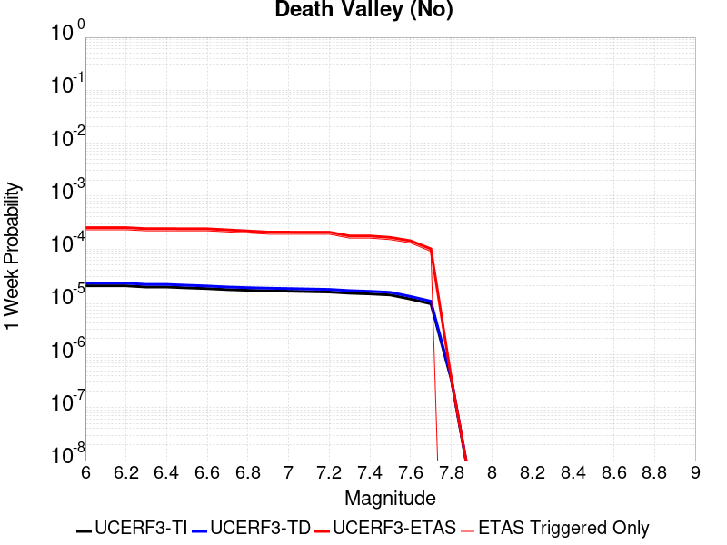 | 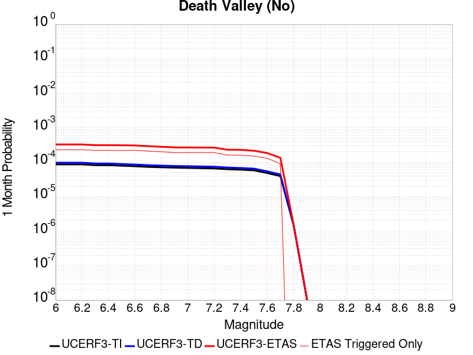 | 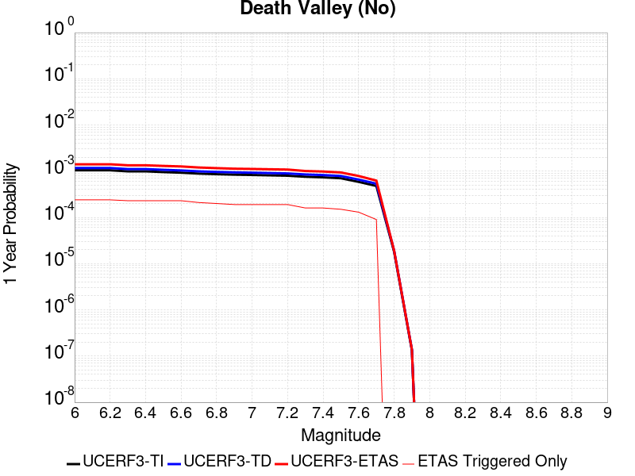 | 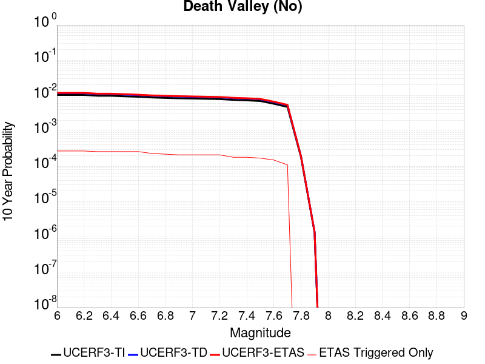 |

| Magnitude | 1 wk TI Prob | 1 wk TD Prob | 1 wk ETAS Prob | 1 wk ETAS/TD Gain | 1 wk ETAS Triggered Only | 1 mo TI Prob | 1 mo TD Prob | 1 mo ETAS Prob | 1 mo ETAS/TD Gain | 1 mo ETAS Triggered Only | 1 yr TI Prob | 1 yr TD Prob | 1 yr ETAS Prob | 1 yr ETAS/TD Gain | 1 yr ETAS Triggered Only | 10 yr TI Prob | 10 yr TD Prob | 10 yr ETAS Prob | 10 yr ETAS/TD Gain | 10 yr ETAS Triggered Only |
|-----|-----|-----|-----|-----|-----|-----|-----|-----|-----|-----|-----|-----|-----|-----|-----|-----|-----|-----|-----|-----|
| 6.0 | 2.0074807E-5 | 2.2500084E-5 | 2.524949E-4 | 11.221954 | 2.3E-4 | 8.603206E-5 | 9.642541E-5 | 3.2640324E-4 | 3.3850334 | 2.3E-4 | 0.001046937 | 0.0011733545 | 0.0014130729 | 1.2043017 | 2.4E-4 | 0.010420183 | 0.011672506 | 0.011939355 | 1.0228612 | 2.7E-4 |
| 6.1 | 2.0074807E-5 | 2.2500084E-5 | 2.524949E-4 | 11.221954 | 2.3E-4 | 8.603206E-5 | 9.642541E-5 | 3.2640324E-4 | 3.3850334 | 2.3E-4 | 0.001046937 | 0.0011733545 | 0.0014130729 | 1.2043017 | 2.4E-4 | 0.010420183 | 0.011672506 | 0.011939355 | 1.0228612 | 2.7E-4 |
| 6.2 | 2.0074807E-5 | 2.2500084E-5 | 2.524949E-4 | 11.221954 | 2.3E-4 | 8.603206E-5 | 9.642541E-5 | 3.2640324E-4 | 3.3850334 | 2.3E-4 | 0.001046937 | 0.0011733545 | 0.0014130729 | 1.2043017 | 2.4E-4 | 0.010420183 | 0.011672506 | 0.011939355 | 1.0228612 | 2.7E-4 |
| 6.3 | 1.9050609E-5 | 2.1336948E-5 | 2.4133225E-4 | 11.310534 | 2.2E-4 | 8.164292E-5 | 9.1440896E-5 | 3.1142076E-4 | 3.4057057 | 2.2E-4 | 9.935491E-4 | 0.001112731 | 0.0013424751 | 1.2064687 | 2.3E-4 | 0.009891188 | 0.011072419 | 0.01132954 | 1.0232217 | 2.6E-4 |
| 6.4 | 1.9050609E-5 | 2.1336948E-5 | 2.4133225E-4 | 11.310534 | 2.2E-4 | 8.164292E-5 | 9.1440896E-5 | 3.1142076E-4 | 3.4057057 | 2.2E-4 | 9.935491E-4 | 0.001112731 | 0.0013424751 | 1.2064687 | 2.3E-4 | 0.009891188 | 0.011072419 | 0.01132954 | 1.0232217 | 2.6E-4 |
| 6.5 | 1.8367004E-5 | 2.0561009E-5 | 2.4055649E-4 | 11.699644 | 2.2E-4 | 7.8713354E-5 | 8.811567E-5 | 3.080963E-4 | 3.4964983 | 2.2E-4 | 9.5791375E-4 | 0.0010722869 | 0.0013020402 | 1.2142649 | 2.3E-4 | 0.009537951 | 0.0106719155 | 0.010929141 | 1.024103 | 2.6E-4 |
| 6.6 | 1.779439E-5 | 1.9910927E-5 | 2.3990654E-4 | 12.048988 | 2.2E-4 | 7.625944E-5 | 8.53298E-5 | 3.0531103E-4 | 3.578012 | 2.2E-4 | 9.280632E-4 | 0.0010384015 | 0.0012681626 | 1.2212642 | 2.3E-4 | 0.009241969 | 0.010336253 | 0.010593565 | 1.0248942 | 2.6E-4 |
| 6.7 | 1.7025437E-5 | 1.9043426E-5 | 2.2903943E-4 | 12.027218 | 2.1E-4 | 7.296412E-5 | 8.161216E-5 | 2.9159503E-4 | 3.5729358 | 2.1E-4 | 8.87976E-4 | 9.931813E-4 | 0.0012029727 | 1.2112317 | 2.1E-4 | 0.008844362 | 0.009888145 | 0.010115871 | 1.0230302 | 2.3E-4 |
| 6.8 | 1.6545107E-5 | 1.8512545E-5 | 2.1850884E-4 | 11.803285 | 2.0E-4 | 7.090568E-5 | 7.93371E-5 | 2.7932125E-4 | 3.5206885 | 2.0E-4 | 8.629347E-4 | 9.655073E-4 | 0.0011653142 | 1.206945 | 2.0E-4 | 0.008595915 | 0.009613829 | 0.0098317135 | 1.0226637 | 2.2E-4 |
| 6.9 | 1.615478E-5 | 1.8087594E-5 | 2.0808415E-4 | 11.504248 | 1.9E-4 | 6.9232934E-5 | 7.751599E-5 | 2.6750125E-4 | 3.4509172 | 1.9E-4 | 8.4258494E-4 | 9.433546E-4 | 0.0011331755 | 1.2012188 | 1.9E-4 | 0.008393973 | 0.009394196 | 0.009602223 | 1.0221442 | 2.1E-4 |
| 7.0 | 1.5894311E-5 | 1.780555E-5 | 2.0780216E-4 | 11.67064 | 1.9E-4 | 6.81167E-5 | 7.6307304E-5 | 2.662928E-4 | 3.489742 | 1.9E-4 | 8.2900526E-4 | 9.286515E-4 | 0.0011184751 | 1.2044077 | 1.9E-4 | 0.008259195 | 0.009248397 | 0.009456456 | 1.0224966 | 2.1E-4 |
| 7.1 | 1.5602263E-5 | 1.7483504E-5 | 2.0748017E-4 | 11.867197 | 1.9E-4 | 6.6865134E-5 | 7.492718E-5 | 2.6491293E-4 | 3.5356054 | 1.9E-4 | 8.137789E-4 | 9.118627E-4 | 0.0011016894 | 1.2081747 | 1.9E-4 | 0.008108052 | 0.009081894 | 0.009289986 | 1.022913 | 2.1E-4 |
| 7.2 | 1.5323829E-5 | 1.717063E-5 | 2.0716737E-4 | 12.065216 | 1.9E-4 | 6.56719E-5 | 7.358637E-5 | 2.6357238E-4 | 3.5818098 | 1.9E-4 | 7.99262E-4 | 8.9555193E-4 | 0.0010853817 | 1.2119696 | 1.9E-4 | 0.007963934 | 0.008920107 | 0.009128233 | 1.0233324 | 2.1E-4 |
| 7.3 | 1.4556212E-5 | 1.6302456E-5 | 1.7629984E-4 | 10.814313 | 1.6E-4 | 6.238227E-5 | 6.9865826E-5 | 2.2985465E-4 | 3.289944 | 1.6E-4 | 7.592395E-4 | 8.5029035E-4 | 0.0010101543 | 1.188011 | 1.6E-4 | 0.0075665074 | 0.008471014 | 0.00864949 | 1.0210689 | 1.8E-4 |
| 7.4 | 1.411725E-5 | 1.580796E-5 | 1.7580543E-4 | 11.121323 | 1.6E-4 | 6.0501097E-5 | 6.7746674E-5 | 2.2773583E-4 | 3.3615797 | 1.6E-4 | 7.363519E-4 | 8.245094E-4 | 9.843775E-4 | 1.1938947 | 1.6E-4 | 0.0073391674 | 0.008215138 | 0.008393659 | 1.0217308 | 1.8E-4 |
| 7.5 | 1.3503312E-5 | 1.5126289E-5 | 1.6512402E-4 | 10.91636 | 1.5E-4 | 5.7870053E-5 | 6.482538E-5 | 2.1481565E-4 | 3.3137586 | 1.5E-4 | 7.043401E-4 | 7.8896893E-4 | 9.3885063E-4 | 1.1899716 | 1.5E-4 | 0.007021119 | 0.007862304 | 0.008030968 | 1.0214522 | 1.7E-4 |
| 7.6 | 1.1279839E-5 | 1.2626327E-5 | 1.4262469E-4 | 11.295817 | 1.3E-4 | 4.834127E-5 | 5.4111737E-5 | 1.841047E-4 | 3.4023063 | 1.3E-4 | 5.88396E-4 | 6.5861654E-4 | 7.885309E-4 | 1.1972535 | 1.3E-4 | 0.005868405 | 0.006567199 | 0.0067162137 | 1.0226908 | 1.5E-4 |
| 7.7 | 9.189108E-6 | 1.0283358E-5 | 1.00282436E-4 | 9.751915 | 9.0E-5 | 3.93813E-5 | 4.407082E-5 | 1.3406685E-4 | 3.0420775 | 9.0E-5 | 4.7936183E-4 | 5.3643517E-4 | 6.263869E-4 | 1.1676842 | 9.0E-5 | 0.004783291 | 0.005351914 | 0.0054613254 | 1.0204434 | 1.1E-4 |
| 7.8 | 3.4586725E-7 | 3.6482615E-7 | 3.6482615E-7 | 1.0 | 0.0 | 1.4822873E-6 | 1.5635396E-6 | 1.5635396E-6 | 1.0 | 0.0 | 1.80467E-5 | 1.9035933E-5 | 1.9035933E-5 | 1.0 | 0.0 | 1.8045233E-4 | 1.9034347E-4 | 1.9034347E-4 | 1.0 | 0.0 |
| 7.9 | 2.5591178E-9 | 2.6696718E-9 | 2.6696718E-9 | 1.0 | 0.0 | 1.0967647E-8 | 1.14414505E-8 | 1.14414505E-8 | 1.0 | 0.0 | 1.335311E-7 | 1.3929966E-7 | 1.3929966E-7 | 1.0 | 0.0 | 1.3353102E-6 | 1.3929966E-6 | 1.3929966E-6 | 1.0 | 0.0 |

## San Andreas (North Branch Mill Creek)
*[(top)](#table-of-contents)*

| 1 Week | 1 Month | 1 Year | 10 Year |
|-----|-----|-----|-----|
| 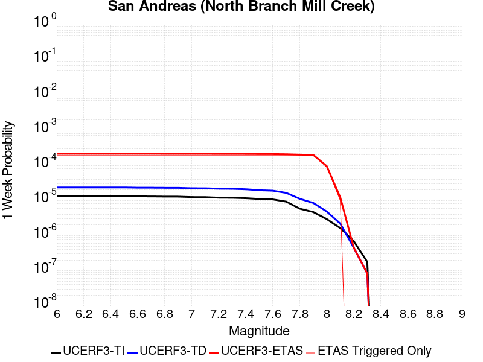 | 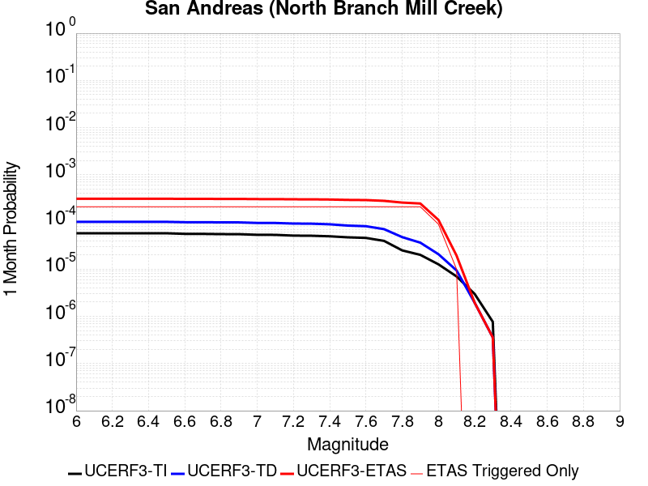 | 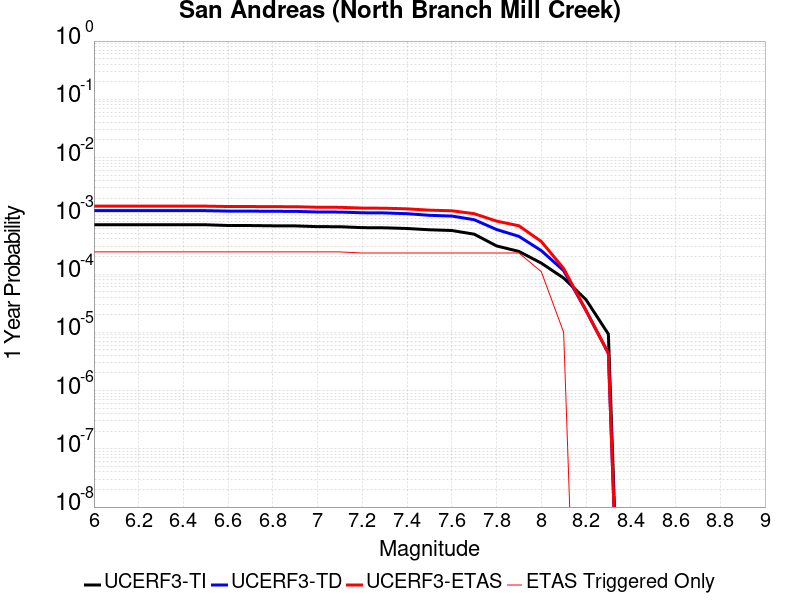 | 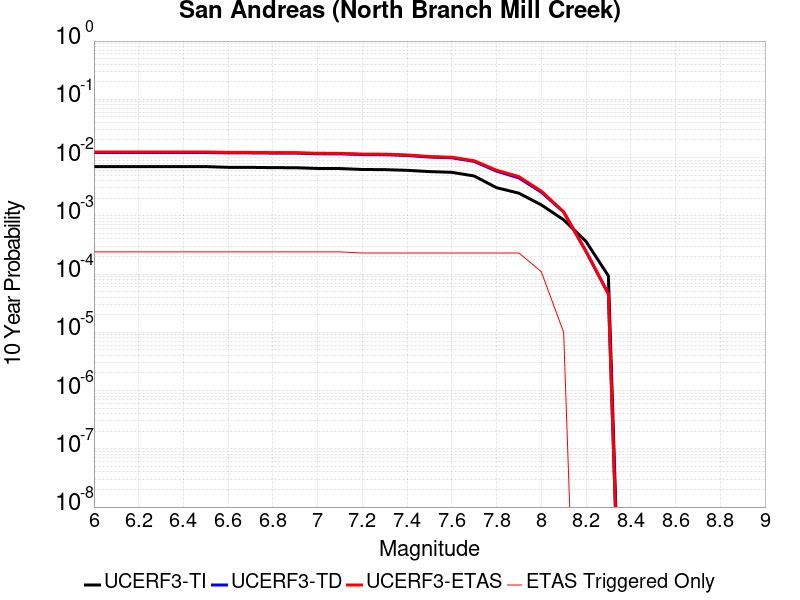 |

| Magnitude | 1 wk TI Prob | 1 wk TD Prob | 1 wk ETAS Prob | 1 wk ETAS/TD Gain | 1 wk ETAS Triggered Only | 1 mo TI Prob | 1 mo TD Prob | 1 mo ETAS Prob | 1 mo ETAS/TD Gain | 1 mo ETAS Triggered Only | 1 yr TI Prob | 1 yr TD Prob | 1 yr ETAS Prob | 1 yr ETAS/TD Gain | 1 yr ETAS Triggered Only | 10 yr TI Prob | 10 yr TD Prob | 10 yr ETAS Prob | 10 yr ETAS/TD Gain | 10 yr ETAS Triggered Only |
|-----|-----|-----|-----|-----|-----|-----|-----|-----|-----|-----|-----|-----|-----|-----|-----|-----|-----|-----|-----|-----|
| 6.0 | 1.3461156E-5 | 2.3500992E-5 | 2.1349653E-4 | 9.084576 | 1.9E-4 | 5.7689394E-5 | 1.00714664E-4 | 3.1069352E-4 | 3.0848885 | 2.1E-4 | 7.02142E-4 | 0.0012255146 | 0.0014652205 | 1.1955961 | 2.4E-4 | 0.0069992766 | 0.012228744 | 0.0124658095 | 1.0193859 | 2.4E-4 |
| 6.1 | 1.3461156E-5 | 2.3500992E-5 | 2.1349653E-4 | 9.084576 | 1.9E-4 | 5.7689394E-5 | 1.00714664E-4 | 3.1069352E-4 | 3.0848885 | 2.1E-4 | 7.02142E-4 | 0.0012255146 | 0.0014652205 | 1.1955961 | 2.4E-4 | 0.0069992766 | 0.012228744 | 0.0124658095 | 1.0193859 | 2.4E-4 |
| 6.2 | 1.3461156E-5 | 2.3500992E-5 | 2.1349653E-4 | 9.084576 | 1.9E-4 | 5.7689394E-5 | 1.00714664E-4 | 3.1069352E-4 | 3.0848885 | 2.1E-4 | 7.02142E-4 | 0.0012255146 | 0.0014652205 | 1.1955961 | 2.4E-4 | 0.0069992766 | 0.012228744 | 0.0124658095 | 1.0193859 | 2.4E-4 |
| 6.3 | 1.3461156E-5 | 2.3500992E-5 | 2.1349653E-4 | 9.084576 | 1.9E-4 | 5.7689394E-5 | 1.00714664E-4 | 3.1069352E-4 | 3.0848885 | 2.1E-4 | 7.02142E-4 | 0.0012255146 | 0.0014652205 | 1.1955961 | 2.4E-4 | 0.0069992766 | 0.012228744 | 0.0124658095 | 1.0193859 | 2.4E-4 |
| 6.4 | 1.3461156E-5 | 2.3500992E-5 | 2.1349653E-4 | 9.084576 | 1.9E-4 | 5.7689394E-5 | 1.00714664E-4 | 3.1069352E-4 | 3.0848885 | 2.1E-4 | 7.02142E-4 | 0.0012255146 | 0.0014652205 | 1.1955961 | 2.4E-4 | 0.0069992766 | 0.012228744 | 0.0124658095 | 1.0193859 | 2.4E-4 |
| 6.5 | 1.3450706E-5 | 2.348995E-5 | 2.1348549E-4 | 9.088375 | 1.9E-4 | 5.764461E-5 | 1.00667356E-4 | 3.1064622E-4 | 3.0858684 | 2.1E-4 | 7.0159714E-4 | 0.0012249392 | 0.0014646453 | 1.1956881 | 2.4E-4 | 0.006993862 | 0.012223054 | 0.01246012 | 1.019395 | 2.4E-4 |
| 6.6 | 1.3074523E-5 | 2.3104236E-5 | 2.1309985E-4 | 9.223411 | 1.9E-4 | 5.6032466E-5 | 9.901441E-5 | 3.0899362E-4 | 3.1206934 | 2.1E-4 | 6.8198174E-4 | 0.001204837 | 0.0014445479 | 1.1989571 | 2.4E-4 | 0.006798926 | 0.012024219 | 0.012261333 | 1.0197197 | 2.4E-4 |
| 6.7 | 1.3050216E-5 | 2.3079532E-5 | 2.1307515E-4 | 9.232212 | 1.9E-4 | 5.59283E-5 | 9.890855E-5 | 3.0888777E-4 | 3.1229634 | 2.1E-4 | 6.8071426E-4 | 0.0012035496 | 0.0014432607 | 1.1991701 | 2.4E-4 | 0.0067863287 | 0.012011484 | 0.012248602 | 1.0197408 | 2.4E-4 |
| 6.8 | 1.29049395E-5 | 2.2927941E-5 | 2.1292358E-4 | 9.286642 | 1.9E-4 | 5.530571E-5 | 9.825892E-5 | 3.082383E-4 | 3.1370006 | 2.1E-4 | 6.73139E-4 | 0.001195649 | 0.001435362 | 1.2004879 | 2.4E-4 | 0.0067110364 | 0.011933329 | 0.012170465 | 1.0198717 | 2.4E-4 |
| 6.9 | 1.2867369E-5 | 2.2887343E-5 | 2.12883E-4 | 9.301341 | 1.9E-4 | 5.51447E-5 | 9.808494E-5 | 3.0806434E-4 | 3.1407914 | 2.1E-4 | 6.711799E-4 | 0.0011935332 | 0.0014332468 | 1.2008437 | 2.4E-4 | 0.006691564 | 0.011912397 | 0.012149539 | 1.0199071 | 2.4E-4 |
| 7.0 | 1.2495996E-5 | 2.2287419E-5 | 2.1228318E-4 | 9.524798 | 1.9E-4 | 5.3553173E-5 | 9.551403E-5 | 3.0549397E-4 | 3.1984198 | 2.1E-4 | 6.518148E-4 | 0.0011622658 | 0.0014019868 | 1.2062532 | 2.4E-4 | 0.0064990623 | 0.011603 | 0.011840215 | 1.0204443 | 2.4E-4 |
| 7.1 | 1.2452067E-5 | 2.2232492E-5 | 2.1222826E-4 | 9.54586 | 1.9E-4 | 5.3364907E-5 | 9.527864E-5 | 3.0525864E-4 | 3.2038517 | 2.1E-4 | 6.4952404E-4 | 0.001159403 | 0.0013991247 | 1.206763 | 2.4E-4 | 0.0064762887 | 0.011574671 | 0.0118118925 | 1.0204949 | 2.4E-4 |
| 7.2 | 1.2002777E-5 | 2.1611015E-5 | 2.1160691E-4 | 9.791623 | 1.9E-4 | 5.143946E-5 | 9.261536E-5 | 3.025959E-4 | 3.2672324 | 2.1E-4 | 6.2609545E-4 | 0.0011270114 | 0.0013567521 | 1.2038496 | 2.3E-4 | 0.006243344 | 0.011254058 | 0.0114814695 | 1.020207 | 2.3E-4 |
| 7.3 | 1.1923425E-5 | 2.1480853E-5 | 2.1147677E-4 | 9.844896 | 1.9E-4 | 5.109939E-5 | 9.205757E-5 | 3.0203824E-4 | 3.2809713 | 2.1E-4 | 6.219575E-4 | 0.0011202273 | 0.0013499697 | 1.2050855 | 2.3E-4 | 0.0062021962 | 0.011186945 | 0.011414372 | 1.0203297 | 2.3E-4 |
| 7.4 | 1.16105175E-5 | 2.0854808E-5 | 2.1085085E-4 | 10.110419 | 1.9E-4 | 4.975841E-5 | 8.93747E-5 | 2.9935592E-4 | 3.3494482 | 2.1E-4 | 6.0564023E-4 | 0.0010875963 | 0.0013173462 | 1.2112455 | 2.3E-4 | 0.006039923 | 0.010864409 | 0.01109191 | 1.0209401 | 2.3E-4 |
| 7.5 | 1.1037265E-5 | 1.9554842E-5 | 2.0955113E-4 | 10.716073 | 1.9E-4 | 4.7301706E-5 | 8.380379E-5 | 2.937862E-4 | 3.5056434 | 2.1E-4 | 5.757461E-4 | 0.0010198357 | 0.0012496011 | 1.2252965 | 2.3E-4 | 0.005742567 | 0.010195527 | 0.0104231825 | 1.0223289 | 2.3E-4 |
| 7.6 | 1.0720915E-5 | 1.8996727E-5 | 2.0899312E-4 | 11.001533 | 1.9E-4 | 4.5945973E-5 | 8.141202E-5 | 2.913949E-4 | 3.5792618 | 2.1E-4 | 5.592486E-4 | 9.907428E-4 | 0.0012205149 | 1.231919 | 2.3E-4 | 0.005578433 | 0.009907238 | 0.01013496 | 1.0229853 | 2.3E-4 |
| 7.7 | 9.276279E-6 | 1.6442464E-5 | 2.0643933E-4 | 12.555256 | 1.9E-4 | 3.9754876E-5 | 7.046581E-5 | 2.80451E-4 | 3.9799588 | 2.1E-4 | 4.839081E-4 | 8.5758517E-4 | 0.0010873879 | 1.267965 | 2.3E-4 | 0.0048285574 | 0.008586576 | 0.008814601 | 1.026556 | 2.3E-4 |
| 7.8 | 5.8346777E-6 | 1.11555855E-5 | 2.0115347E-4 | 18.031637 | 1.9E-4 | 2.5005522E-5 | 4.7808775E-5 | 2.5779873E-4 | 5.392289 | 2.1E-4 | 3.043997E-4 | 5.819165E-4 | 8.1178267E-4 | 1.3950157 | 2.3E-4 | 0.0030398308 | 0.0058473335 | 0.0060759885 | 1.0391042 | 2.3E-4 |
| 7.9 | 4.690204E-6 | 8.509473E-6 | 1.9850786E-4 | 23.327866 | 1.9E-4 | 2.0100719E-5 | 3.6468664E-5 | 2.4646102E-4 | 6.758158 | 2.1E-4 | 2.4469878E-4 | 4.439156E-4 | 6.738135E-4 | 1.5178865 | 2.3E-4 | 0.002444295 | 0.004471165 | 0.0047001364 | 1.0512108 | 2.3E-4 |
| 8.0 | 2.9570454E-6 | 4.8470656E-6 | 9.4846626E-5 | 19.567844 | 9.0E-5 | 1.267299E-5 | 2.0772974E-5 | 1.1077111E-4 | 5.332463 | 9.0E-5 | 1.5428272E-4 | 2.5288164E-4 | 3.628538E-4 | 1.4348761 | 1.1E-4 | 0.0015417566 | 0.002549932 | 0.0026596517 | 1.0430284 | 1.1E-4 |
| 8.1 | 1.6376824E-6 | 2.1968672E-6 | 1.2196845E-5 | 5.5519266 | 1.0E-5 | 7.01862E-6 | 9.415111E-6 | 1.9415018E-5 | 2.0621123 | 1.0E-5 | 8.544835E-5 | 1.1462297E-4 | 1.2462182E-4 | 1.0872326 | 1.0E-5 | 8.54155E-4 | 0.0011607445 | 0.0011707328 | 1.0086051 | 1.0E-5 |
| 8.2 | 6.9631557E-7 | 4.535001E-7 | 4.535001E-7 | 1.0 | 0.0 | 2.984206E-6 | 1.9435704E-6 | 1.9435704E-6 | 1.0 | 0.0 | 3.63321E-5 | 2.3662713E-5 | 2.3662713E-5 | 1.0 | 0.0 | 3.6326164E-4 | 2.4510184E-4 | 2.4510184E-4 | 1.0 | 0.0 |
| 8.3 | 1.7876137E-7 | 8.357368E-8 | 8.357368E-8 | 1.0 | 0.0 | 7.661199E-7 | 3.5817288E-7 | 3.5817288E-7 | 1.0 | 0.0 | 9.32747E-6 | 4.3607465E-6 | 4.3607465E-6 | 1.0 | 0.0 | 9.3270784E-5 | 4.5800018E-5 | 4.5800018E-5 | 1.0 | 0.0 |

## San Andreas (Cholame) rev
*[(top)](#table-of-contents)*

| 1 Week | 1 Month | 1 Year | 10 Year |
|-----|-----|-----|-----|
|  |  | 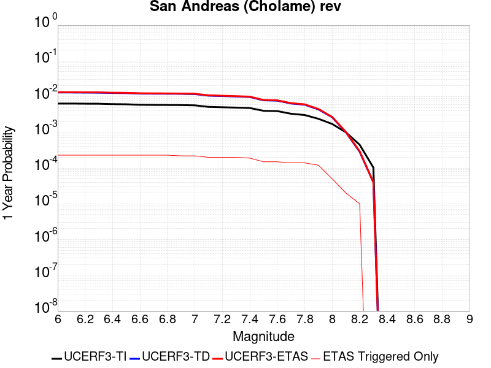 | 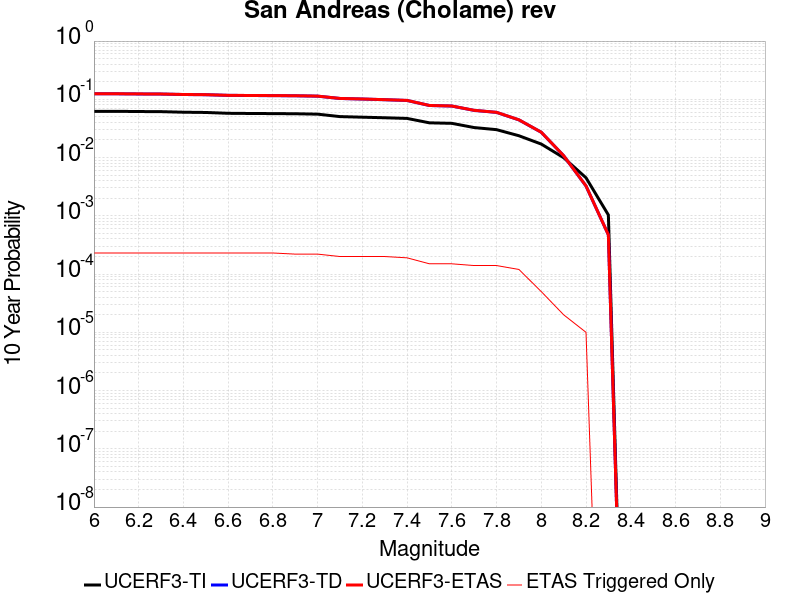 |

| Magnitude | 1 wk TI Prob | 1 wk TD Prob | 1 wk ETAS Prob | 1 wk ETAS/TD Gain | 1 wk ETAS Triggered Only | 1 mo TI Prob | 1 mo TD Prob | 1 mo ETAS Prob | 1 mo ETAS/TD Gain | 1 mo ETAS Triggered Only | 1 yr TI Prob | 1 yr TD Prob | 1 yr ETAS Prob | 1 yr ETAS/TD Gain | 1 yr ETAS Triggered Only | 10 yr TI Prob | 10 yr TD Prob | 10 yr ETAS Prob | 10 yr ETAS/TD Gain | 10 yr ETAS Triggered Only |
|-----|-----|-----|-----|-----|-----|-----|-----|-----|-----|-----|-----|-----|-----|-----|-----|-----|-----|-----|-----|-----|
| 6.0 | 1.2302514E-4 | 2.5205986E-4 | 4.4201198E-4 | 1.7535992 | 1.9E-4 | 5.27144E-4 | 0.0010798109 | 0.001279595 | 1.1850176 | 2.0E-4 | 0.0063991086 | 0.013067958 | 0.013294952 | 1.0173703 | 2.3E-4 | 0.06217949 | 0.12438412 | 0.12458551 | 1.0016191 | 2.3E-4 |
| 6.1 | 1.2302514E-4 | 2.5205986E-4 | 4.4201198E-4 | 1.7535992 | 1.9E-4 | 5.27144E-4 | 0.0010798109 | 0.001279595 | 1.1850176 | 2.0E-4 | 0.0063991086 | 0.013067958 | 0.013294952 | 1.0173703 | 2.3E-4 | 0.06217949 | 0.12438412 | 0.12458551 | 1.0016191 | 2.3E-4 |
| 6.2 | 1.2203569E-4 | 2.502277E-4 | 4.4018016E-4 | 1.7591184 | 1.9E-4 | 5.2290526E-4 | 0.0010719653 | 0.0012717509 | 1.1863732 | 2.0E-4 | 0.006347804 | 0.012973578 | 0.013200594 | 1.0174984 | 2.3E-4 | 0.061695136 | 0.123571314 | 0.12377289 | 1.0016313 | 2.3E-4 |
| 6.3 | 1.2142645E-4 | 2.4908737E-4 | 4.3904004E-4 | 1.7625946 | 1.9E-4 | 5.202953E-4 | 0.0010670823 | 0.0012668688 | 1.187227 | 2.0E-4 | 0.006316212 | 0.012914834 | 0.013141863 | 1.017579 | 2.3E-4 | 0.06139677 | 0.12306532 | 0.12326702 | 1.0016389 | 2.3E-4 |
| 6.4 | 1.1865206E-4 | 2.4414246E-4 | 4.3409606E-4 | 1.7780441 | 1.9E-4 | 5.0840975E-4 | 0.0010459068 | 0.0012456976 | 1.1910216 | 2.0E-4 | 0.006172335 | 0.012660044 | 0.012887132 | 1.0179374 | 2.3E-4 | 0.060036868 | 0.12085904 | 0.12106124 | 1.0016731 | 2.3E-4 |
| 6.5 | 1.17443946E-4 | 2.4207575E-4 | 4.3202977E-4 | 1.7846882 | 1.9E-4 | 5.032341E-4 | 0.0010370566 | 0.0012368491 | 1.1926535 | 2.0E-4 | 0.006109677 | 0.012553536 | 0.012780649 | 1.0180916 | 2.3E-4 | 0.059444077 | 0.11993008 | 0.1201325 | 1.0016878 | 2.3E-4 |
| 6.6 | 1.13579066E-4 | 2.3516564E-4 | 4.2512096E-4 | 1.8077512 | 1.9E-4 | 4.866766E-4 | 0.001007465 | 0.0012072634 | 1.1983181 | 2.0E-4 | 0.0059092017 | 0.012197345 | 0.012424539 | 1.0186266 | 2.3E-4 | 0.057545185 | 0.1168492 | 0.117052324 | 1.0017383 | 2.3E-4 |
| 6.7 | 1.1271412E-4 | 2.336088E-4 | 4.235644E-4 | 1.8131355 | 1.9E-4 | 4.829711E-4 | 0.001000798 | 0.0012005977 | 1.1996405 | 2.0E-4 | 0.005864331 | 0.012117079 | 0.012344292 | 1.0187515 | 2.3E-4 | 0.057119697 | 0.11615275 | 0.11635604 | 1.0017501 | 2.3E-4 |
| 6.8 | 1.1217975E-4 | 2.3249313E-4 | 4.2244894E-4 | 1.8170384 | 1.9E-4 | 4.8068175E-4 | 9.960202E-4 | 0.001195821 | 1.2005992 | 2.0E-4 | 0.005836608 | 0.012059555 | 0.012286781 | 1.018842 | 2.3E-4 | 0.056856725 | 0.11565061 | 0.11585401 | 1.0017587 | 2.3E-4 |
| 6.9 | 1.1146753E-4 | 2.3098059E-4 | 4.209367E-4 | 1.82239 | 1.9E-4 | 4.7763053E-4 | 9.895428E-4 | 0.0011793547 | 1.1918179 | 1.9E-4 | 0.0057996577 | 0.011981564 | 0.012198928 | 1.0181415 | 2.2E-4 | 0.056506127 | 0.11497027 | 0.11516497 | 1.0016935 | 2.2E-4 |
| 7.0 | 1.0965793E-4 | 2.2721413E-4 | 4.1717096E-4 | 1.8360256 | 1.9E-4 | 4.698779E-4 | 9.734129E-4 | 0.001163228 | 1.1949996 | 1.9E-4 | 0.005705768 | 0.011787324 | 0.012004731 | 1.0184441 | 2.2E-4 | 0.055614736 | 0.11327011 | 0.1134652 | 1.0017222 | 2.2E-4 |
| 7.1 | 9.927982E-5 | 2.0540332E-4 | 3.8536635E-4 | 1.8761446 | 1.8E-4 | 4.2541555E-4 | 8.8000396E-4 | 0.0010598456 | 1.2043645 | 1.8E-4 | 0.0051671406 | 0.010661708 | 0.010859576 | 1.0185587 | 2.0E-4 | 0.05048634 | 0.10336573 | 0.103545055 | 1.0017349 | 2.0E-4 |
| 7.2 | 9.696786E-5 | 2.0044584E-4 | 3.8040977E-4 | 1.8978182 | 1.8E-4 | 4.1551032E-4 | 8.587718E-4 | 0.0010386172 | 1.2094216 | 1.8E-4 | 0.00504711 | 0.010405703 | 0.0106036225 | 1.0190202 | 2.0E-4 | 0.04934009 | 0.10110233 | 0.10128211 | 1.0017782 | 2.0E-4 |
| 7.3 | 9.4727984E-5 | 1.9473763E-4 | 3.7470256E-4 | 1.9241406 | 1.8E-4 | 4.0591392E-4 | 8.343239E-4 | 0.0010141737 | 1.2155635 | 1.8E-4 | 0.0049308087 | 0.010110851 | 0.010308829 | 1.0195807 | 2.0E-4 | 0.048228268 | 0.09847412 | 0.09865443 | 1.0018309 | 2.0E-4 |
| 7.4 | 9.220358E-5 | 1.8844259E-4 | 3.5841056E-4 | 1.9019616 | 1.7E-4 | 3.9509835E-4 | 8.07362E-4 | 9.772248E-4 | 1.2103922 | 1.7E-4 | 0.004799717 | 0.009785578 | 0.009973719 | 1.0192263 | 1.9E-4 | 0.046973653 | 0.09555831 | 0.09573015 | 1.0017983 | 1.9E-4 |
| 7.5 | 7.71631E-5 | 1.5179155E-4 | 2.8177182E-4 | 1.8563076 | 1.3E-4 | 3.306571E-4 | 6.5037323E-4 | 7.8028865E-4 | 1.1997552 | 1.3E-4 | 0.0040183207 | 0.007889617 | 0.008038433 | 1.0188624 | 1.5E-4 | 0.03946433 | 0.078289196 | 0.07842746 | 1.001766 | 1.5E-4 |
| 7.6 | 7.5634416E-5 | 1.4838556E-4 | 2.7836626E-4 | 1.8759661 | 1.3E-4 | 3.241072E-4 | 6.357833E-4 | 7.6570065E-4 | 1.2043421 | 1.3E-4 | 0.0039388672 | 0.007713256 | 0.0078620985 | 1.019297 | 1.5E-4 | 0.038697794 | 0.076654874 | 0.07679338 | 1.0018069 | 1.5E-4 |
| 7.7 | 6.3783E-5 | 1.2359623E-4 | 2.435814E-4 | 1.9707834 | 1.2E-4 | 2.7332708E-4 | 5.2959064E-4 | 6.4952706E-4 | 1.2264701 | 1.2E-4 | 0.0033226798 | 0.0064287307 | 0.0065678307 | 1.0216372 | 1.4E-4 | 0.032734364 | 0.06454488 | 0.06467584 | 1.0020291 | 1.4E-4 |
| 7.8 | 5.863422E-5 | 1.14169685E-4 | 2.3415599E-4 | 2.0509472 | 1.2E-4 | 2.512653E-4 | 4.892069E-4 | 6.0914824E-4 | 1.245175 | 1.2E-4 | 0.003054864 | 0.0059398497 | 0.006079018 | 1.0234296 | 1.4E-4 | 0.030132094 | 0.05966162 | 0.059793267 | 1.0022066 | 1.4E-4 |
| 7.9 | 4.595283E-5 | 8.426815E-5 | 1.9425889E-4 | 2.3052468 | 1.1E-4 | 1.9692584E-4 | 3.6109926E-4 | 4.7105952E-4 | 1.3045154 | 1.1E-4 | 0.0023949358 | 0.0043875277 | 0.004507001 | 1.0272303 | 1.2E-4 | 0.023692891 | 0.044363137 | 0.044477817 | 1.0025849 | 1.2E-4 |
| 8.0 | 3.2950178E-5 | 5.077396E-5 | 1.0077142E-4 | 1.9847068 | 5.0E-5 | 1.412074E-4 | 2.1758456E-4 | 2.6757366E-4 | 1.2297457 | 5.0E-5 | 0.0017178444 | 0.0026458753 | 0.002695743 | 1.0188473 | 5.0E-5 | 0.017046256 | 0.027181072 | 0.027229713 | 1.0017896 | 5.0E-5 |
| 8.1 | 1.9177472E-5 | 1.9183733E-5 | 3.918335E-5 | 2.0425298 | 2.0E-5 | 8.218658E-5 | 8.221342E-5 | 1.0221177E-4 | 1.2432493 | 2.0E-5 | 0.0010001622 | 0.0010004893 | 0.0010204694 | 1.0199702 | 2.0E-5 | 0.009956728 | 0.010757887 | 0.010777672 | 1.001839 | 2.0E-5 |
| 8.2 | 8.643924E-6 | 5.473668E-6 | 1.5473614E-5 | 2.8269184 | 1.0E-5 | 3.704486E-5 | 2.3458366E-5 | 3.345813E-5 | 1.4262772 | 1.0E-5 | 4.5092785E-4 | 2.8556827E-4 | 2.955654E-4 | 1.035008 | 1.0E-5 | 0.0045001395 | 0.0032481793 | 0.003258147 | 1.0030687 | 1.0E-5 |
| 8.3 | 1.983087E-6 | 7.6564595E-7 | 7.6564595E-7 | 1.0 | 0.0 | 8.498917E-6 | 3.281336E-6 | 3.281336E-6 | 1.0 | 0.0 | 1.034694E-4 | 3.9949547E-5 | 3.9949547E-5 | 1.0 | 0.0 | 0.0010342124 | 4.717979E-4 | 4.717979E-4 | 1.0 | 0.0 |

## Elsinore (Glen Ivy) rev
*[(top)](#table-of-contents)*

| 1 Week | 1 Month | 1 Year | 10 Year |
|-----|-----|-----|-----|
| 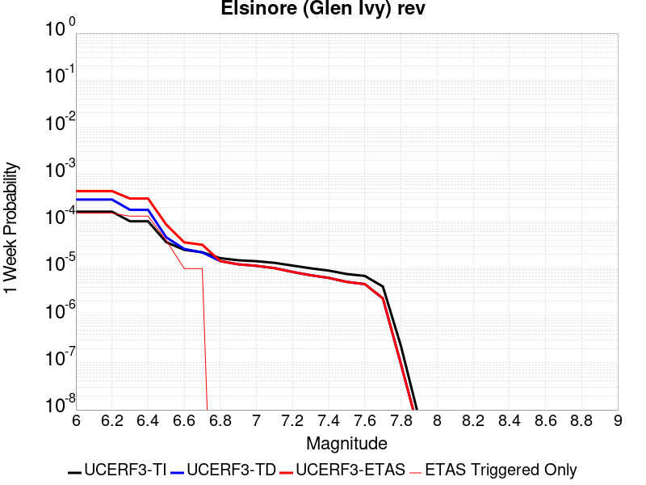 | 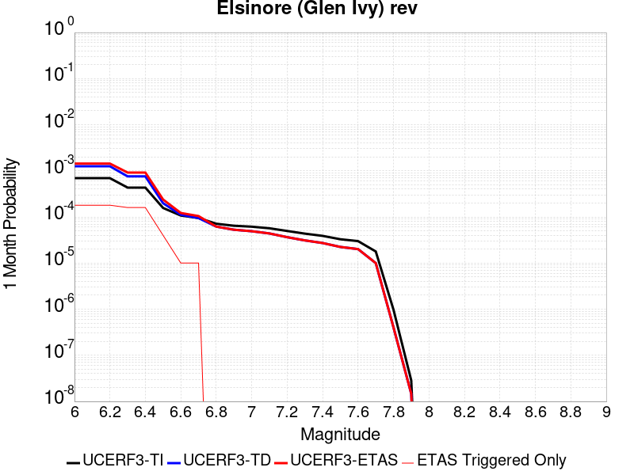 | 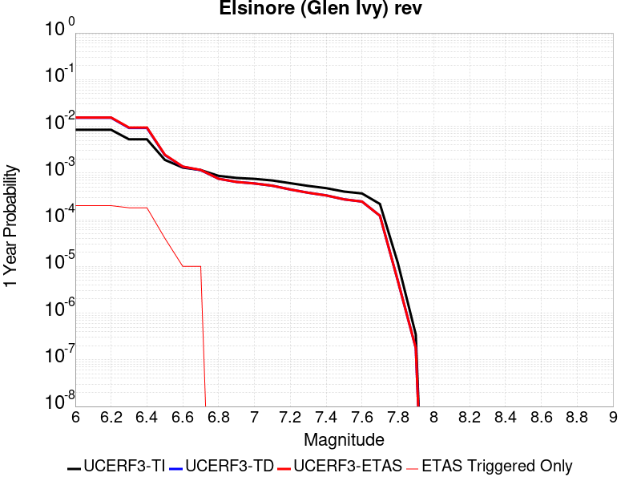 | 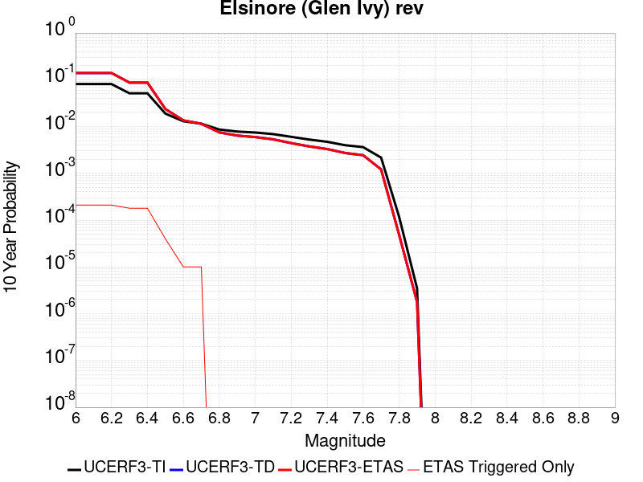 |

| Magnitude | 1 wk TI Prob | 1 wk TD Prob | 1 wk ETAS Prob | 1 wk ETAS/TD Gain | 1 wk ETAS Triggered Only | 1 mo TI Prob | 1 mo TD Prob | 1 mo ETAS Prob | 1 mo ETAS/TD Gain | 1 mo ETAS Triggered Only | 1 yr TI Prob | 1 yr TD Prob | 1 yr ETAS Prob | 1 yr ETAS/TD Gain | 1 yr ETAS Triggered Only | 10 yr TI Prob | 10 yr TD Prob | 10 yr ETAS Prob | 10 yr ETAS/TD Gain | 10 yr ETAS Triggered Only |
|-----|-----|-----|-----|-----|-----|-----|-----|-----|-----|-----|-----|-----|-----|-----|-----|-----|-----|-----|-----|-----|
| 6.0 | 1.6204086E-4 | 2.937271E-4 | 4.4368303E-4 | 1.5105281 | 1.5E-4 | 6.94276E-4 | 0.0012583778 | 0.0014381513 | 1.1428612 | 1.8E-4 | 0.008420097 | 0.0152346175 | 0.015431571 | 1.012928 | 2.0E-4 | 0.081081145 | 0.13962454 | 0.13980521 | 1.001294 | 2.1E-4 |
| 6.1 | 1.6204086E-4 | 2.937271E-4 | 4.4368303E-4 | 1.5105281 | 1.5E-4 | 6.94276E-4 | 0.0012583778 | 0.0014381513 | 1.1428612 | 1.8E-4 | 0.008420097 | 0.0152346175 | 0.015431571 | 1.012928 | 2.0E-4 | 0.081081145 | 0.13962454 | 0.13980521 | 1.001294 | 2.1E-4 |
| 6.2 | 1.6204086E-4 | 2.937271E-4 | 4.4368303E-4 | 1.5105281 | 1.5E-4 | 6.94276E-4 | 0.0012583778 | 0.0014381513 | 1.1428612 | 1.8E-4 | 0.008420097 | 0.0152346175 | 0.015431571 | 1.012928 | 2.0E-4 | 0.081081145 | 0.13962454 | 0.13980521 | 1.001294 | 2.1E-4 |
| 6.3 | 1.0111737E-4 | 1.7703463E-4 | 3.0701162E-4 | 1.7341896 | 1.3E-4 | 4.332882E-4 | 7.5861585E-4 | 9.184945E-4 | 1.2107505 | 1.6E-4 | 0.005262531 | 0.0092177205 | 0.009396061 | 1.0193475 | 1.8E-4 | 0.0513964 | 0.08707393 | 0.08723826 | 1.0018872 | 1.8E-4 |
| 6.4 | 1.0111737E-4 | 1.7703463E-4 | 3.0701162E-4 | 1.7341896 | 1.3E-4 | 4.332882E-4 | 7.5861585E-4 | 9.184945E-4 | 1.2107505 | 1.6E-4 | 0.005262531 | 0.0092177205 | 0.009396061 | 1.0193475 | 1.8E-4 | 0.0513964 | 0.08707393 | 0.08723826 | 1.0018872 | 1.8E-4 |
| 6.5 | 3.6624708E-5 | 4.6391986E-5 | 8.639013E-5 | 1.862178 | 4.0E-5 | 1.569536E-4 | 1.9880968E-4 | 2.3880172E-4 | 1.2011575 | 4.0E-5 | 0.001909235 | 0.0024181814 | 0.0024580846 | 1.0165013 | 4.0E-5 | 0.01892915 | 0.023697061 | 0.023736114 | 1.001648 | 4.0E-5 |
| 6.6 | 2.5051324E-5 | 2.6147465E-5 | 3.61472E-5 | 1.3824363 | 1.0E-5 | 1.073584E-4 | 1.12056E-4 | 1.2205488E-4 | 1.0892311 | 1.0E-5 | 0.0013063047 | 0.0013634725 | 0.0013734589 | 1.0073242 | 1.0E-5 | 0.012986525 | 0.013565759 | 0.013575624 | 1.0007272 | 1.0E-5 |
| 6.7 | 2.2189772E-5 | 2.2072489E-5 | 3.207227E-5 | 1.4530426 | 1.0E-5 | 9.509556E-5 | 9.459316E-5 | 1.0459221E-4 | 1.1057059 | 1.0E-5 | 0.0011571734 | 0.0011510996 | 0.0011610881 | 1.0086774 | 1.0E-5 | 0.011511663 | 0.0114663225 | 0.011476208 | 1.0008621 | 1.0E-5 |
| 6.8 | 1.6654378E-5 | 1.44376E-5 | 1.44376E-5 | 1.0 | 0.0 | 7.137396E-5 | 6.187399E-5 | 6.187399E-5 | 1.0 | 0.0 | 8.686314E-4 | 7.5306057E-4 | 7.5306057E-4 | 1.0 | 0.0 | 0.008652439 | 0.0075100763 | 0.0075100763 | 1.0 | 0.0 |
| 6.9 | 1.5042909E-5 | 1.2331886E-5 | 1.2331886E-5 | 1.0 | 0.0 | 6.446802E-5 | 5.2849886E-5 | 5.2849886E-5 | 1.0 | 0.0 | 7.8461546E-4 | 6.4326054E-4 | 6.4326054E-4 | 1.0 | 0.0 | 0.007818509 | 0.006417925 | 0.006417925 | 1.0 | 0.0 |
| 7.0 | 1.4361385E-5 | 1.1451172E-5 | 1.1451172E-5 | 1.0 | 0.0 | 6.154734E-5 | 4.9075545E-5 | 4.9075545E-5 | 1.0 | 0.0 | 7.490812E-4 | 5.973339E-4 | 5.973339E-4 | 1.0 | 0.0 | 0.007465612 | 0.005960982 | 0.005960982 | 1.0 | 0.0 |
| 7.1 | 1.3265571E-5 | 1.0244736E-5 | 1.0244736E-5 | 1.0 | 0.0 | 5.6851208E-5 | 4.3905282E-5 | 4.3905282E-5 | 1.0 | 0.0 | 6.919436E-4 | 5.344183E-4 | 5.344183E-4 | 1.0 | 0.0 | 0.006897931 | 0.0053346003 | 0.0053346003 | 1.0 | 0.0 |
| 7.2 | 1.1596403E-5 | 8.504847E-6 | 8.504847E-6 | 1.0 | 0.0 | 4.9697923E-5 | 3.6448844E-5 | 3.6448844E-5 | 1.0 | 0.0 | 6.049042E-4 | 4.4367602E-4 | 4.4367602E-4 | 1.0 | 0.0 | 0.006032603 | 0.004429357 | 0.004429357 | 1.0 | 0.0 |
| 7.3 | 1.0150827E-5 | 7.238537E-6 | 7.238537E-6 | 1.0 | 0.0 | 4.3502816E-5 | 3.102194E-5 | 3.102194E-5 | 1.0 | 0.0 | 5.2951806E-4 | 3.776281E-4 | 3.776281E-4 | 1.0 | 0.0 | 0.005282581 | 0.003770271 | 0.003770271 | 1.0 | 0.0 |
| 7.4 | 9.080705E-6 | 6.352307E-6 | 6.352307E-6 | 1.0 | 0.0 | 3.8916725E-5 | 2.7223898E-5 | 2.7223898E-5 | 1.0 | 0.0 | 4.7370812E-4 | 3.314019E-4 | 3.314019E-4 | 1.0 | 0.0 | 0.004726996 | 0.0033092257 | 0.0033092257 | 1.0 | 0.0 |
| 7.5 | 7.671649E-6 | 5.225419E-6 | 5.225419E-6 | 1.0 | 0.0 | 3.287808E-5 | 2.2394468E-5 | 2.2394468E-5 | 1.0 | 0.0 | 4.0021708E-4 | 2.7261977E-4 | 2.7261977E-4 | 1.0 | 0.0 | 0.0039949706 | 0.0027229784 | 0.0027229784 | 1.0 | 0.0 |
| 7.6 | 6.990086E-6 | 4.687336E-6 | 4.687336E-6 | 1.0 | 0.0 | 2.9957167E-5 | 2.0088435E-5 | 2.0088435E-5 | 1.0 | 0.0 | 3.6466747E-4 | 2.445504E-4 | 2.445504E-4 | 1.0 | 0.0 | 0.0036406964 | 0.0024429292 | 0.0024429292 | 1.0 | 0.0 |
| 7.7 | 4.163505E-6 | 2.329331E-6 | 2.329331E-6 | 1.0 | 0.0 | 1.7843471E-5 | 9.982813E-6 | 9.982813E-6 | 1.0 | 0.0 | 2.172226E-4 | 1.2153471E-4 | 1.2153471E-4 | 1.0 | 0.0 | 0.0021701038 | 0.0012147555 | 0.0012147555 | 1.0 | 0.0 |
| 7.8 | 2.2692414E-7 | 9.384417E-8 | 9.384417E-8 | 1.0 | 0.0 | 9.725317E-7 | 4.0218927E-7 | 4.0218927E-7 | 1.0 | 0.0 | 1.1840509E-5 | 4.8966467E-6 | 4.8966467E-6 | 1.0 | 0.0 | 1.1839878E-4 | 4.8965718E-5 | 4.8965718E-5 | 1.0 | 0.0 |
| 7.9 | 6.676829E-9 | 3.4397174E-9 | 3.4397174E-9 | 1.0 | 0.0 | 2.861498E-8 | 1.4741646E-8 | 1.4741646E-8 | 1.0 | 0.0 | 3.4838732E-7 | 1.7947953E-7 | 1.7947953E-7 | 1.0 | 0.0 | 3.4838679E-6 | 1.794794E-6 | 1.794794E-6 | 1.0 | 0.0 |

## San Andreas (Carrizo) rev
*[(top)](#table-of-contents)*

| 1 Week | 1 Month | 1 Year | 10 Year |
|-----|-----|-----|-----|
| 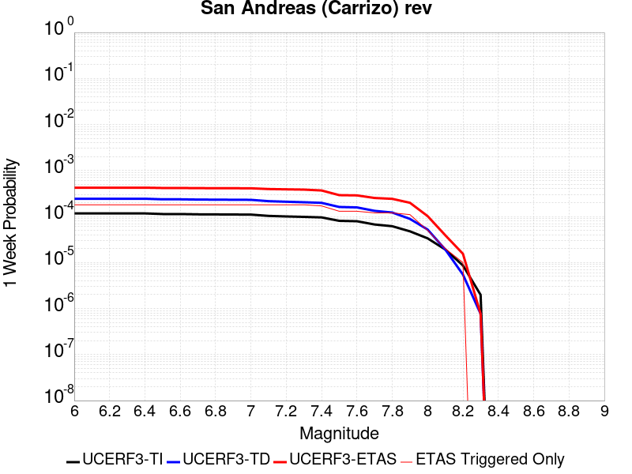 |  | 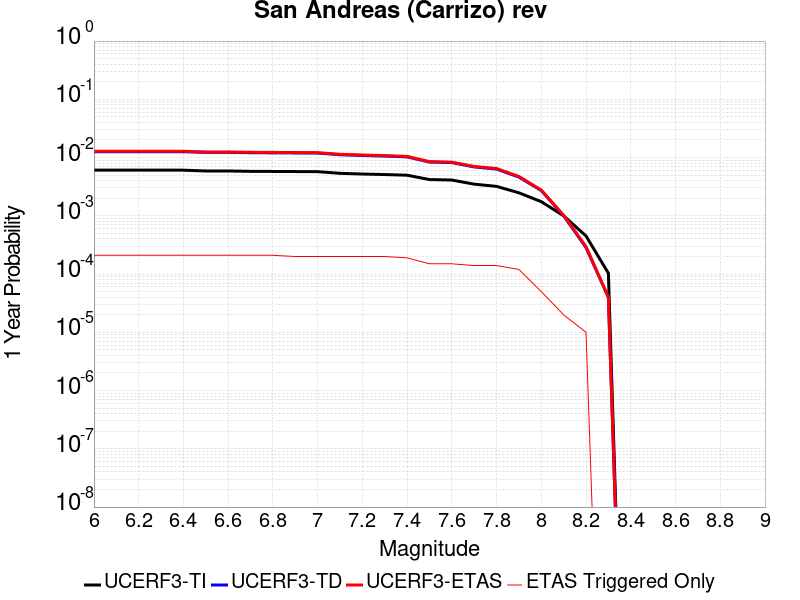 | 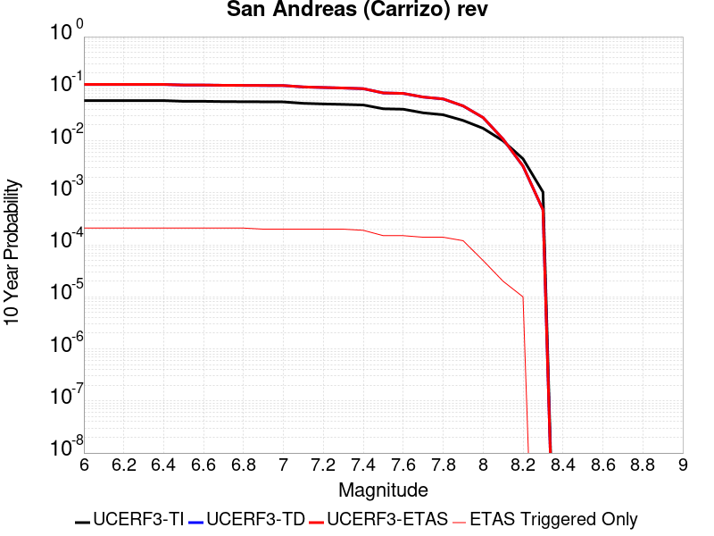 |

| Magnitude | 1 wk TI Prob | 1 wk TD Prob | 1 wk ETAS Prob | 1 wk ETAS/TD Gain | 1 wk ETAS Triggered Only | 1 mo TI Prob | 1 mo TD Prob | 1 mo ETAS Prob | 1 mo ETAS/TD Gain | 1 mo ETAS Triggered Only | 1 yr TI Prob | 1 yr TD Prob | 1 yr ETAS Prob | 1 yr ETAS/TD Gain | 1 yr ETAS Triggered Only | 10 yr TI Prob | 10 yr TD Prob | 10 yr ETAS Prob | 10 yr ETAS/TD Gain | 10 yr ETAS Triggered Only |
|-----|-----|-----|-----|-----|-----|-----|-----|-----|-----|-----|-----|-----|-----|-----|-----|-----|-----|-----|-----|-----|
| 6.0 | 1.1674632E-4 | 2.4324407E-4 | 4.2320028E-4 | 1.7398175 | 1.8E-4 | 5.002454E-4 | 0.0010420597 | 0.0012318618 | 1.1821412 | 1.9E-4 | 0.006073493 | 0.012613757 | 0.012821108 | 1.0164385 | 2.1E-4 | 0.0591016 | 0.120640226 | 0.12082489 | 1.0015308 | 2.1E-4 |
| 6.1 | 1.1674632E-4 | 2.4324407E-4 | 4.2320028E-4 | 1.7398175 | 1.8E-4 | 5.002454E-4 | 0.0010420597 | 0.0012318618 | 1.1821412 | 1.9E-4 | 0.006073493 | 0.012613757 | 0.012821108 | 1.0164385 | 2.1E-4 | 0.0591016 | 0.120640226 | 0.12082489 | 1.0015308 | 2.1E-4 |
| 6.2 | 1.1674632E-4 | 2.4324407E-4 | 4.2320028E-4 | 1.7398175 | 1.8E-4 | 5.002454E-4 | 0.0010420597 | 0.0012318618 | 1.1821412 | 1.9E-4 | 0.006073493 | 0.012613757 | 0.012821108 | 1.0164385 | 2.1E-4 | 0.0591016 | 0.120640226 | 0.12082489 | 1.0015308 | 2.1E-4 |
| 6.3 | 1.1674632E-4 | 2.4324407E-4 | 4.2320028E-4 | 1.7398175 | 1.8E-4 | 5.002454E-4 | 0.0010420597 | 0.0012318618 | 1.1821412 | 1.9E-4 | 0.006073493 | 0.012613757 | 0.012821108 | 1.0164385 | 2.1E-4 | 0.0591016 | 0.120640226 | 0.12082489 | 1.0015308 | 2.1E-4 |
| 6.4 | 1.1674632E-4 | 2.4324407E-4 | 4.2320028E-4 | 1.7398175 | 1.8E-4 | 5.002454E-4 | 0.0010420597 | 0.0012318618 | 1.1821412 | 1.9E-4 | 0.006073493 | 0.012613757 | 0.012821108 | 1.0164385 | 2.1E-4 | 0.0591016 | 0.120640226 | 0.12082489 | 1.0015308 | 2.1E-4 |
| 6.5 | 1.13136164E-4 | 2.3644442E-4 | 4.1640186E-4 | 1.7610983 | 1.8E-4 | 4.847792E-4 | 0.0010129412 | 0.0012027487 | 1.1873826 | 1.9E-4 | 0.0058862255 | 0.012263271 | 0.012470695 | 1.0169142 | 2.1E-4 | 0.057327334 | 0.11761008 | 0.117795385 | 1.0015756 | 2.1E-4 |
| 6.6 | 1.13136164E-4 | 2.3644442E-4 | 4.1640186E-4 | 1.7610983 | 1.8E-4 | 4.847792E-4 | 0.0010129412 | 0.0012027487 | 1.1873826 | 1.9E-4 | 0.0058862255 | 0.012263271 | 0.012470695 | 1.0169142 | 2.1E-4 | 0.057327334 | 0.11761008 | 0.117795385 | 1.0015756 | 2.1E-4 |
| 6.7 | 1.1149675E-4 | 2.3335687E-4 | 4.1331488E-4 | 1.7711707 | 1.8E-4 | 4.777557E-4 | 9.997191E-4 | 0.0011895291 | 1.1898634 | 1.9E-4 | 0.0058011734 | 0.012104088 | 0.012311546 | 1.0171396 | 2.1E-4 | 0.05652051 | 0.1162291 | 0.116414696 | 1.0015968 | 2.1E-4 |
| 6.8 | 1.1103589E-4 | 2.3237852E-4 | 4.123367E-4 | 1.7744184 | 1.8E-4 | 4.7578133E-4 | 9.955293E-4 | 0.0011853401 | 1.1906632 | 1.9E-4 | 0.005777263 | 0.012053643 | 0.012261112 | 1.0172122 | 2.1E-4 | 0.056293584 | 0.11578894 | 0.11597462 | 1.0016036 | 2.1E-4 |
| 6.9 | 1.1053259E-4 | 2.3130233E-4 | 4.112607E-4 | 1.7780223 | 1.8E-4 | 4.7362508E-4 | 9.909206E-4 | 0.0011707422 | 1.1814693 | 1.8E-4 | 0.0057511497 | 0.011998152 | 0.012195752 | 1.0164692 | 2.0E-4 | 0.05604569 | 0.11530445 | 0.115481384 | 1.0015346 | 2.0E-4 |
| 7.0 | 1.1005377E-4 | 2.3031076E-4 | 4.102693E-4 | 1.7813727 | 1.8E-4 | 4.7157376E-4 | 9.866742E-4 | 0.0011664967 | 1.182251 | 1.8E-4 | 0.0057263062 | 0.011947021 | 0.012144632 | 1.0165405 | 2.0E-4 | 0.055809796 | 0.11485658 | 0.11503361 | 1.0015413 | 2.0E-4 |
| 7.1 | 1.0308142E-4 | 2.1540876E-4 | 3.9536998E-4 | 1.8354406 | 1.8E-4 | 4.417027E-4 | 9.228548E-4 | 0.0011026887 | 1.1948669 | 1.8E-4 | 0.0053644776 | 0.011178188 | 0.0113759525 | 1.017692 | 2.0E-4 | 0.052368138 | 0.10809042 | 0.108268805 | 1.0016503 | 2.0E-4 |
| 7.2 | 1.0027479E-4 | 2.094876E-4 | 3.8944988E-4 | 1.8590595 | 1.8E-4 | 4.296783E-4 | 8.9749607E-4 | 0.0010773345 | 1.200378 | 1.8E-4 | 0.0052187922 | 0.010872566 | 0.011070392 | 1.0181949 | 2.0E-4 | 0.050979212 | 0.10539086 | 0.10556978 | 1.0016977 | 2.0E-4 |
| 7.3 | 9.816942E-5 | 2.0423878E-4 | 3.8420202E-4 | 1.8811414 | 1.8E-4 | 4.2065824E-4 | 8.7501644E-4 | 0.0010548589 | 1.2055304 | 1.8E-4 | 0.005109493 | 0.010601572 | 0.010799452 | 1.0186651 | 2.0E-4 | 0.049935985 | 0.10297546 | 0.10315486 | 1.0017422 | 2.0E-4 |
| 7.4 | 9.5634205E-5 | 1.9793298E-4 | 3.6789934E-4 | 1.8587066 | 1.7E-4 | 4.0979648E-4 | 8.4800937E-4 | 0.0010178653 | 1.2002995 | 1.7E-4 | 0.0049778637 | 0.010275901 | 0.010463949 | 1.0182998 | 1.9E-4 | 0.048678253 | 0.100067884 | 0.100238875 | 1.0017087 | 1.9E-4 |
| 7.5 | 8.052417E-5 | 1.6113915E-4 | 2.911182E-4 | 1.8066261 | 1.3E-4 | 3.4505792E-4 | 6.9041376E-4 | 8.20324E-4 | 1.1881629 | 1.3E-4 | 0.0041929903 | 0.008373471 | 0.008522215 | 1.0177637 | 1.5E-4 | 0.04114753 | 0.082815245 | 0.08295282 | 1.0016613 | 1.5E-4 |
| 7.6 | 7.897024E-5 | 1.5767086E-4 | 2.8765036E-4 | 1.8243724 | 1.3E-4 | 3.384E-4 | 6.755574E-4 | 8.0546964E-4 | 1.1923037 | 1.3E-4 | 0.0041122385 | 0.00819397 | 0.008342741 | 1.0181562 | 1.5E-4 | 0.040369697 | 0.08115866 | 0.08129649 | 1.0016983 | 1.5E-4 |
| 7.7 | 6.707427E-5 | 1.3277122E-4 | 2.527553E-4 | 1.9036903 | 1.2E-4 | 2.8742946E-4 | 5.688955E-4 | 6.8882725E-4 | 1.2108151 | 1.2E-4 | 0.003493839 | 0.0069043385 | 0.007043372 | 1.0201371 | 1.4E-4 | 0.034394164 | 0.06905339 | 0.06918372 | 1.0018874 | 1.4E-4 |
| 7.8 | 6.147705E-5 | 1.2198445E-4 | 2.4196981E-4 | 1.983612 | 1.2E-4 | 2.6344648E-4 | 5.226858E-4 | 6.4262305E-4 | 1.2294635 | 1.2E-4 | 0.0032027436 | 0.006345156 | 0.006484268 | 1.021924 | 1.4E-4 | 0.031569764 | 0.0635172 | 0.063648306 | 1.0020641 | 1.4E-4 |
| 7.9 | 4.7636717E-5 | 8.8802946E-5 | 1.9879318E-4 | 2.2385876 | 1.1E-4 | 2.0414138E-4 | 3.8052857E-4 | 4.904867E-4 | 1.2889616 | 1.1E-4 | 0.0024825884 | 0.004623101 | 0.0047425465 | 1.0258366 | 1.2E-4 | 0.024550365 | 0.046629366 | 0.04674377 | 1.0024534 | 1.2E-4 |
| 8.0 | 3.3554235E-5 | 5.2138024E-5 | 1.0213542E-4 | 1.958943 | 5.0E-5 | 1.4379594E-4 | 2.2342955E-4 | 2.7341838E-4 | 1.2237341 | 5.0E-5 | 0.0017493097 | 0.002716863 | 0.0027667272 | 1.0183536 | 5.0E-5 | 0.017356034 | 0.027881905 | 0.027930511 | 1.0017433 | 5.0E-5 |
| 8.1 | 1.9175432E-5 | 1.9183564E-5 | 3.918318E-5 | 2.0425391 | 2.0E-5 | 8.217783E-5 | 8.221269E-5 | 1.02211045E-4 | 1.2432514 | 2.0E-5 | 0.0010000558 | 0.0010004805 | 0.0010204605 | 1.0199704 | 2.0E-5 | 0.009955673 | 0.010757771 | 0.010777556 | 1.0018392 | 2.0E-5 |
| 8.2 | 8.643924E-6 | 5.473668E-6 | 1.5473614E-5 | 2.8269184 | 1.0E-5 | 3.704486E-5 | 2.3458366E-5 | 3.345813E-5 | 1.4262772 | 1.0E-5 | 4.5092785E-4 | 2.8556827E-4 | 2.955654E-4 | 1.035008 | 1.0E-5 | 0.0045001395 | 0.0032481793 | 0.003258147 | 1.0030687 | 1.0E-5 |
| 8.3 | 1.983087E-6 | 7.6564595E-7 | 7.6564595E-7 | 1.0 | 0.0 | 8.498917E-6 | 3.281336E-6 | 3.281336E-6 | 1.0 | 0.0 | 1.034694E-4 | 3.9949547E-5 | 3.9949547E-5 | 1.0 | 0.0 | 0.0010342124 | 4.717979E-4 | 4.717979E-4 | 1.0 | 0.0 |

## Ludlow
*[(top)](#table-of-contents)*

| 1 Week | 1 Month | 1 Year | 10 Year |
|-----|-----|-----|-----|
| 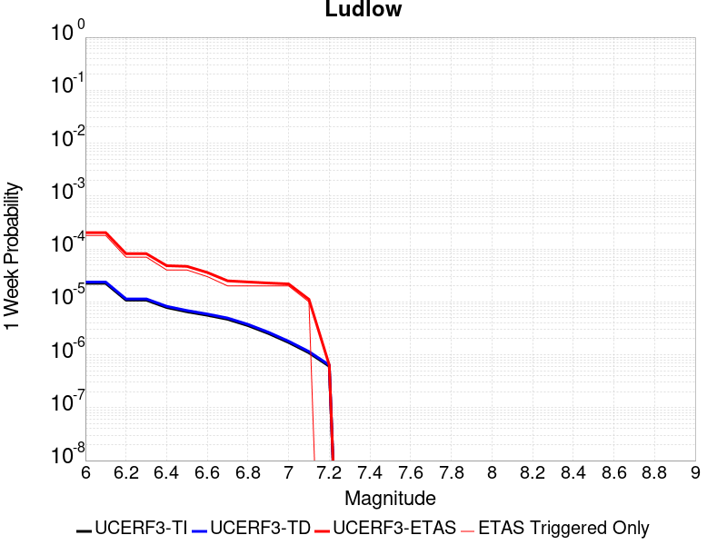 | 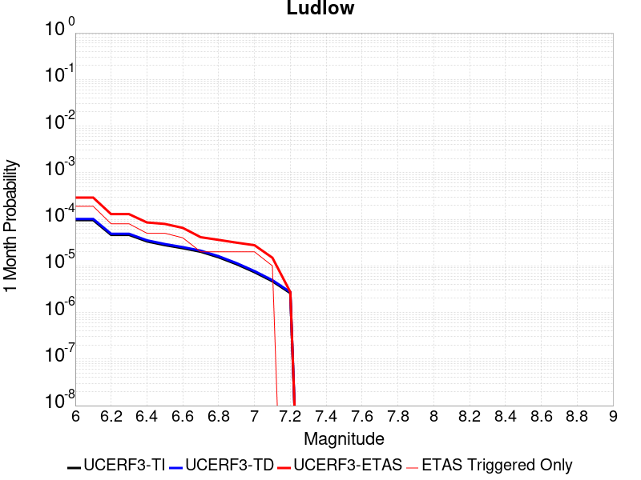 | 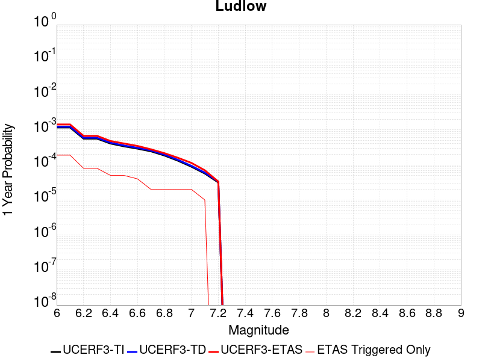 | 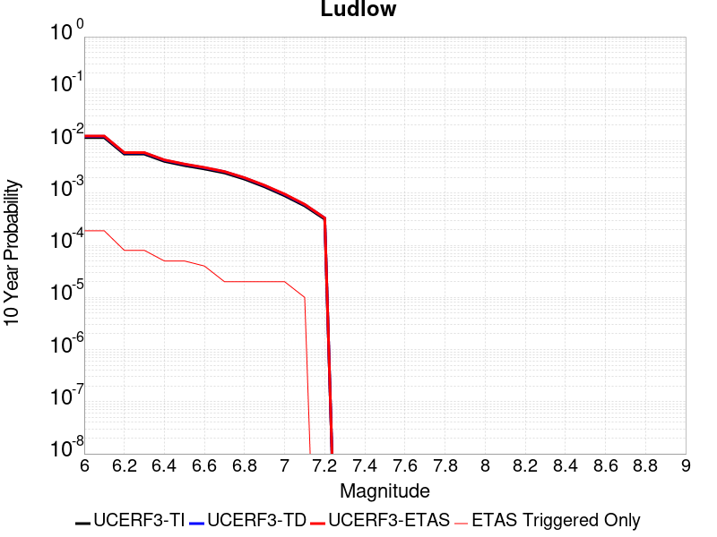 |

| Magnitude | 1 wk TI Prob | 1 wk TD Prob | 1 wk ETAS Prob | 1 wk ETAS/TD Gain | 1 wk ETAS Triggered Only | 1 mo TI Prob | 1 mo TD Prob | 1 mo ETAS Prob | 1 mo ETAS/TD Gain | 1 mo ETAS Triggered Only | 1 yr TI Prob | 1 yr TD Prob | 1 yr ETAS Prob | 1 yr ETAS/TD Gain | 1 yr ETAS Triggered Only | 10 yr TI Prob | 10 yr TD Prob | 10 yr ETAS Prob | 10 yr ETAS/TD Gain | 10 yr ETAS Triggered Only |
|-----|-----|-----|-----|-----|-----|-----|-----|-----|-----|-----|-----|-----|-----|-----|-----|-----|-----|-----|-----|-----|
| 6.0 | 2.2407607E-5 | 2.3657254E-5 | 2.0365299E-4 | 8.60848 | 1.8E-4 | 9.602906E-5 | 1.0138454E-4 | 2.913653E-4 | 2.873863 | 1.9E-4 | 0.0011685267 | 0.001233702 | 0.0014234675 | 1.153818 | 1.9E-4 | 0.011624013 | 0.012273042 | 0.0124607105 | 1.0152911 | 1.9E-4 |
| 6.1 | 2.2407607E-5 | 2.3657254E-5 | 2.0365299E-4 | 8.60848 | 1.8E-4 | 9.602906E-5 | 1.0138454E-4 | 2.913653E-4 | 2.873863 | 1.9E-4 | 0.0011685267 | 0.001233702 | 0.0014234675 | 1.153818 | 1.9E-4 | 0.011624013 | 0.012273042 | 0.0124607105 | 1.0152911 | 1.9E-4 |
| 6.2 | 1.0781252E-5 | 1.1365663E-5 | 8.1364866E-5 | 7.158831 | 7.0E-5 | 4.620455E-5 | 4.8709102E-5 | 1.287052E-4 | 2.6423235 | 8.0E-5 | 5.623952E-4 | 5.9287593E-4 | 6.728285E-4 | 1.1348555 | 8.0E-5 | 0.00560974 | 0.0059133614 | 0.005992888 | 1.0134487 | 8.0E-5 |
| 6.3 | 1.0781252E-5 | 1.1365663E-5 | 8.1364866E-5 | 7.158831 | 7.0E-5 | 4.620455E-5 | 4.8709102E-5 | 1.287052E-4 | 2.6423235 | 8.0E-5 | 5.623952E-4 | 5.9287593E-4 | 6.728285E-4 | 1.1348555 | 8.0E-5 | 0.00560974 | 0.0059133614 | 0.005992888 | 1.0134487 | 8.0E-5 |
| 6.4 | 7.814439E-6 | 8.237729E-6 | 4.8237398E-5 | 5.855667 | 4.0E-5 | 3.3490025E-5 | 3.530408E-5 | 8.5302316E-5 | 2.4162169 | 5.0E-5 | 4.0766477E-4 | 4.2974384E-4 | 4.7972234E-4 | 1.1162984 | 5.0E-5 | 0.0040691774 | 0.0042892746 | 0.0043390603 | 1.0116069 | 5.0E-5 |
| 6.5 | 6.4986366E-6 | 6.85092E-6 | 4.6850644E-5 | 6.838592 | 4.0E-5 | 2.7851002E-5 | 2.9360759E-5 | 7.935929E-5 | 2.7029033 | 5.0E-5 | 3.390332E-4 | 3.5740953E-4 | 4.0739166E-4 | 1.1398455 | 5.0E-5 | 0.003385164 | 0.0035684432 | 0.0036182648 | 1.0139617 | 5.0E-5 |
| 6.6 | 5.582177E-6 | 5.8860055E-6 | 3.588583E-5 | 6.096805 | 3.0E-5 | 2.3923398E-5 | 2.5225498E-5 | 6.522449E-5 | 2.5856571 | 4.0E-5 | 2.9122844E-4 | 3.0707786E-4 | 3.470656E-4 | 1.1302202 | 4.0E-5 | 0.0029084706 | 0.003066609 | 0.0031064863 | 1.0130037 | 4.0E-5 |
| 6.7 | 4.6858763E-6 | 4.940427E-6 | 2.494033E-5 | 5.048213 | 2.0E-5 | 2.0082172E-5 | 2.1173091E-5 | 4.117267E-5 | 1.9445752 | 2.0E-5 | 2.4447302E-4 | 2.5775246E-4 | 2.7774728E-4 | 1.0775738 | 2.0E-5 | 0.0024420423 | 0.0025745912 | 0.00259454 | 1.0077482 | 2.0E-5 |
| 6.8 | 3.5584908E-6 | 3.7520183E-6 | 2.3751943E-5 | 6.3304443 | 2.0E-5 | 1.5250586E-5 | 1.6079981E-5 | 3.607966E-5 | 2.2437625 | 2.0E-5 | 1.8566006E-4 | 1.957566E-4 | 2.1575269E-4 | 1.1021477 | 2.0E-5 | 0.0018550502 | 0.0019558826 | 0.0019758437 | 1.0102055 | 2.0E-5 |
| 6.9 | 2.532834E-6 | 2.6710034E-6 | 2.267095E-5 | 8.4878025 | 2.0E-5 | 1.0854958E-5 | 1.1447109E-5 | 3.144688E-5 | 2.7471461 | 2.0E-5 | 1.3215111E-4 | 1.3935992E-4 | 1.5935714E-4 | 1.1434933 | 2.0E-5 | 0.0013207254 | 0.0013927529 | 0.001412725 | 1.01434 | 2.0E-5 |
| 7.0 | 1.7083285E-6 | 1.8019439E-6 | 2.1801909E-5 | 12.099105 | 2.0E-5 | 7.3213873E-6 | 7.722595E-6 | 2.772244E-5 | 3.5897832 | 2.0E-5 | 8.913424E-5 | 9.40187E-5 | 1.1401682E-4 | 1.2127036 | 2.0E-5 | 8.9098496E-4 | 9.3980576E-4 | 9.5978694E-4 | 1.021261 | 2.0E-5 |
| 7.1 | 1.0905424E-6 | 1.1497619E-6 | 1.114975E-5 | 9.697442 | 1.0E-5 | 4.6737446E-6 | 4.9275427E-6 | 1.4927493E-5 | 3.0293992 | 1.0E-5 | 5.6901354E-5 | 5.999128E-5 | 6.999068E-5 | 1.1666809 | 1.0E-5 | 5.6886784E-4 | 5.997606E-4 | 6.0975464E-4 | 1.0166633 | 1.0E-5 |
| 7.2 | 6.06668E-7 | 6.387277E-7 | 6.387277E-7 | 1.0 | 0.0 | 2.600003E-6 | 2.7374022E-6 | 2.7374022E-6 | 1.0 | 0.0 | 3.1654577E-5 | 3.3327433E-5 | 3.3327433E-5 | 1.0 | 0.0 | 3.1650066E-4 | 3.3323118E-4 | 3.3323118E-4 | 1.0 | 0.0 |

## Calico-Hidalgo
*[(top)](#table-of-contents)*

| 1 Week | 1 Month | 1 Year | 10 Year |
|-----|-----|-----|-----|
| 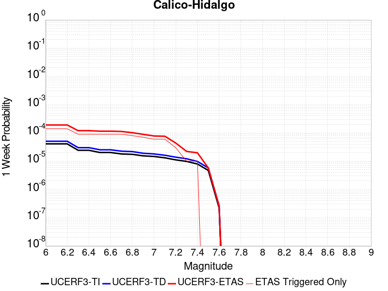 | 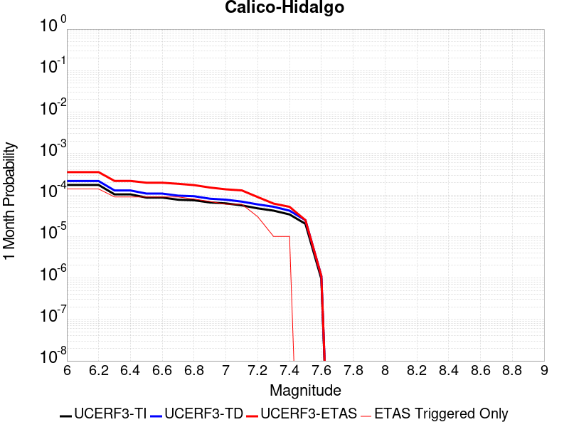 | 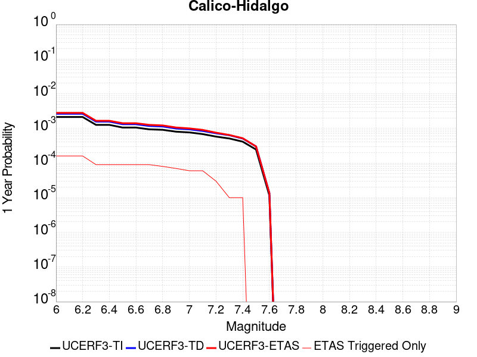 | 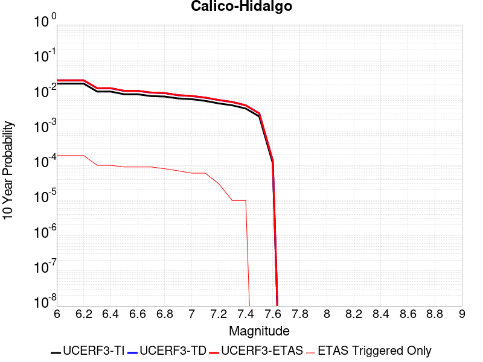 |

| Magnitude | 1 wk TI Prob | 1 wk TD Prob | 1 wk ETAS Prob | 1 wk ETAS/TD Gain | 1 wk ETAS Triggered Only | 1 mo TI Prob | 1 mo TD Prob | 1 mo ETAS Prob | 1 mo ETAS/TD Gain | 1 mo ETAS Triggered Only | 1 yr TI Prob | 1 yr TD Prob | 1 yr ETAS Prob | 1 yr ETAS/TD Gain | 1 yr ETAS Triggered Only | 10 yr TI Prob | 10 yr TD Prob | 10 yr ETAS Prob | 10 yr ETAS/TD Gain | 10 yr ETAS Triggered Only |
|-----|-----|-----|-----|-----|-----|-----|-----|-----|-----|-----|-----|-----|-----|-----|-----|-----|-----|-----|-----|-----|
| 6.0 | 4.0906612E-5 | 5.0704355E-5 | 1.9069726E-4 | 3.760964 | 1.4E-4 | 1.7530227E-4 | 2.1728857E-4 | 3.5725816E-4 | 1.6441644 | 1.4E-4 | 0.0021322158 | 0.002642678 | 0.0028022553 | 1.0603846 | 1.6E-4 | 0.02111873 | 0.026152814 | 0.026337845 | 1.007075 | 1.9E-4 |
| 6.1 | 4.0906612E-5 | 5.0704355E-5 | 1.9069726E-4 | 3.760964 | 1.4E-4 | 1.7530227E-4 | 2.1728857E-4 | 3.5725816E-4 | 1.6441644 | 1.4E-4 | 0.0021322158 | 0.002642678 | 0.0028022553 | 1.0603846 | 1.6E-4 | 0.02111873 | 0.026152814 | 0.026337845 | 1.007075 | 1.9E-4 |
| 6.2 | 4.0906612E-5 | 5.0704355E-5 | 1.9069726E-4 | 3.760964 | 1.4E-4 | 1.7530227E-4 | 2.1728857E-4 | 3.5725816E-4 | 1.6441644 | 1.4E-4 | 0.0021322158 | 0.002642678 | 0.0028022553 | 1.0603846 | 1.6E-4 | 0.02111873 | 0.026152814 | 0.026337845 | 1.007075 | 1.9E-4 |
| 6.3 | 2.4242801E-5 | 3.0090967E-5 | 1.2008826E-4 | 3.9908407 | 9.0E-5 | 1.0389358E-4 | 1.289551E-4 | 2.189435E-4 | 1.6978273 | 9.0E-5 | 0.0012641704 | 0.0015689312 | 0.0016587899 | 1.0572739 | 9.0E-5 | 0.01257003 | 0.015582229 | 0.01568067 | 1.0063176 | 1.0E-4 |
| 6.4 | 2.4242801E-5 | 3.0090967E-5 | 1.2008826E-4 | 3.9908407 | 9.0E-5 | 1.0389358E-4 | 1.289551E-4 | 2.189435E-4 | 1.6978273 | 9.0E-5 | 0.0012641704 | 0.0015689312 | 0.0016587899 | 1.0572739 | 9.0E-5 | 0.01257003 | 0.015582229 | 0.01568067 | 1.0063176 | 1.0E-4 |
| 6.5 | 2.0286952E-5 | 2.5316054E-5 | 1.1531378E-4 | 4.5549664 | 9.0E-5 | 8.694118E-5 | 1.0849296E-4 | 1.9848319E-4 | 1.8294569 | 9.0E-5 | 0.0010579949 | 0.0013201186 | 0.0014099997 | 1.0680857 | 9.0E-5 | 0.010529719 | 0.013124701 | 0.013213519 | 1.0067673 | 9.0E-5 |
| 6.6 | 2.0269223E-5 | 2.5297004E-5 | 1.1529473E-4 | 4.5576434 | 9.0E-5 | 8.6865206E-5 | 1.08411325E-4 | 1.9840157E-4 | 1.8300816 | 9.0E-5 | 0.0010570707 | 0.0013191258 | 0.001409007 | 1.068137 | 9.0E-5 | 0.010520565 | 0.01311489 | 0.01320371 | 1.0067724 | 9.0E-5 |
| 6.7 | 1.799852E-5 | 2.2540933E-5 | 1.125389E-4 | 4.992646 | 9.0E-5 | 7.713423E-5 | 9.660051E-5 | 1.8659182E-4 | 1.9315821 | 9.0E-5 | 9.3870464E-4 | 0.0011754911 | 0.0012653854 | 1.0764737 | 9.0E-5 | 0.009347493 | 0.011694346 | 0.011783293 | 1.007606 | 9.0E-5 |
| 6.8 | 1.7458793E-5 | 2.184258E-5 | 1.0184083E-4 | 4.662491 | 8.0E-5 | 7.4821255E-5 | 9.360778E-5 | 1.7360029E-4 | 1.8545498 | 8.0E-5 | 9.10568E-4 | 0.0011390933 | 0.0012190022 | 1.0701513 | 8.0E-5 | 0.009068459 | 0.011334131 | 0.011413224 | 1.0069783 | 8.0E-5 |
| 6.9 | 1.542884E-5 | 1.9026285E-5 | 8.902495E-5 | 4.679051 | 7.0E-5 | 6.612192E-5 | 8.153875E-5 | 1.5153304E-4 | 1.8584175 | 7.0E-5 | 8.04737E-4 | 9.922953E-4 | 0.0010622258 | 1.0704736 | 7.0E-5 | 0.008018291 | 0.009880043 | 0.009949352 | 1.007015 | 7.0E-5 |
| 7.0 | 1.468253E-5 | 1.803109E-5 | 7.803001E-5 | 4.3275256 | 6.0E-5 | 6.292361E-5 | 7.727389E-5 | 1.3726925E-4 | 1.7763989 | 6.0E-5 | 7.658257E-4 | 9.4041653E-4 | 0.0010003601 | 1.0637416 | 6.0E-5 | 0.0076319184 | 0.009365736 | 0.009425174 | 1.0063463 | 6.0E-5 |
| 7.1 | 1.3139281E-5 | 1.620139E-5 | 7.620042E-5 | 4.703326 | 6.0E-5 | 5.6309986E-5 | 6.943275E-5 | 1.2942858E-4 | 1.8640856 | 6.0E-5 | 6.853584E-4 | 8.4502844E-4 | 9.049777E-4 | 1.0709435 | 6.0E-5 | 0.0068324856 | 0.008419449 | 0.008478944 | 1.0070664 | 6.0E-5 |
| 7.2 | 1.1127404E-5 | 1.3867038E-5 | 4.386662E-5 | 3.1633735 | 3.0E-5 | 4.7688E-5 | 5.9428872E-5 | 8.942709E-5 | 1.5047752 | 3.0E-5 | 5.8044674E-4 | 7.233172E-4 | 7.5329555E-4 | 1.0414456 | 3.0E-5 | 0.0057893298 | 0.007210737 | 0.007240521 | 1.0041305 | 3.0E-5 |
| 7.3 | 9.808154E-6 | 1.2176586E-5 | 2.2176464E-5 | 1.8212383 | 1.0E-5 | 4.2034266E-5 | 5.2184383E-5 | 6.218386E-5 | 1.1916182 | 1.0E-5 | 5.11647E-4 | 6.351704E-4 | 6.4516405E-4 | 1.0157338 | 1.0E-5 | 0.0051047057 | 0.006334625 | 0.006344562 | 1.0015687 | 1.0E-5 |
| 7.4 | 7.942452E-6 | 9.792348E-6 | 1.979225E-5 | 2.0211957 | 1.0E-5 | 3.4038632E-5 | 4.1966585E-5 | 5.1966163E-5 | 1.2382748 | 1.0E-5 | 4.1434157E-4 | 5.108328E-4 | 5.208277E-4 | 1.0195658 | 1.0E-5 | 0.0041356985 | 0.005097527 | 0.0051074764 | 1.0019517 | 1.0E-5 |
| 7.5 | 4.7121216E-6 | 5.7729717E-6 | 5.7729717E-6 | 1.0 | 0.0 | 2.019465E-5 | 2.4741115E-5 | 2.4741115E-5 | 1.0 | 0.0 | 2.4584212E-4 | 3.011891E-4 | 3.011891E-4 | 1.0 | 0.0 | 0.0024557032 | 0.0030085614 | 0.0030085614 | 1.0 | 0.0 |
| 7.6 | 2.21172E-7 | 2.6040198E-7 | 2.6040198E-7 | 1.0 | 0.0 | 9.478797E-7 | 1.1160082E-6 | 1.1160082E-6 | 1.0 | 0.0 | 1.1540374E-5 | 1.3587343E-5 | 1.3587343E-5 | 1.0 | 0.0 | 1.1539775E-4 | 1.3586794E-4 | 1.3586794E-4 | 1.0 | 0.0 |

## Scodie Lineament
*[(top)](#table-of-contents)*

| 1 Week | 1 Month | 1 Year | 10 Year |
|-----|-----|-----|-----|
| 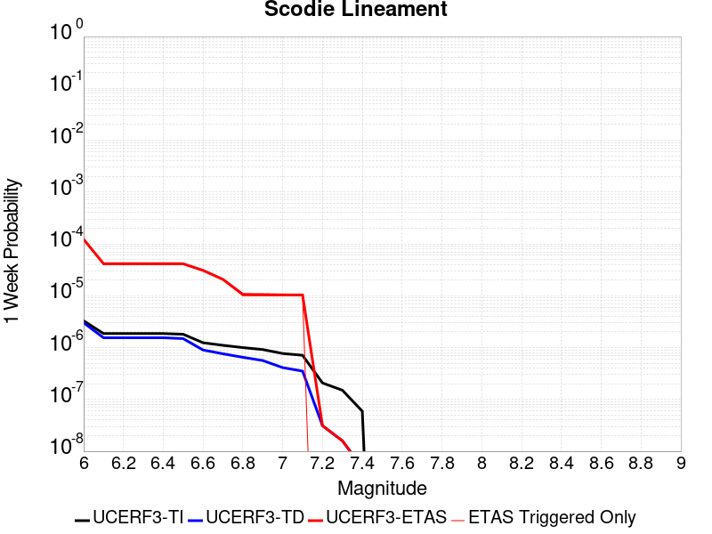 | 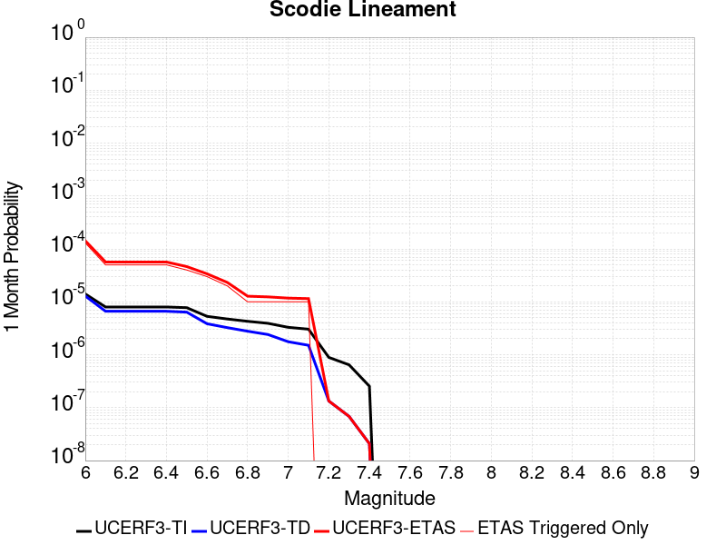 | 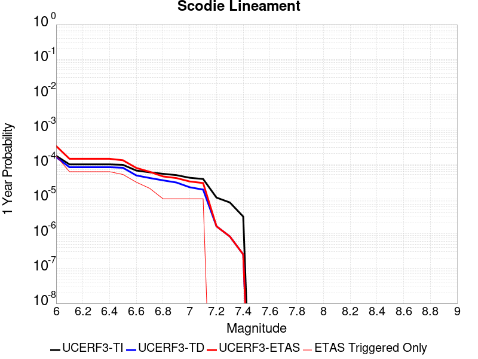 | 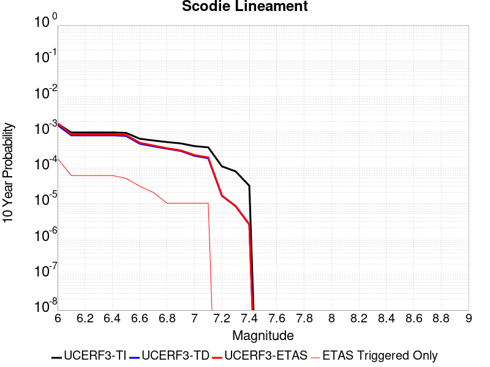 |

| Magnitude | 1 wk TI Prob | 1 wk TD Prob | 1 wk ETAS Prob | 1 wk ETAS/TD Gain | 1 wk ETAS Triggered Only | 1 mo TI Prob | 1 mo TD Prob | 1 mo ETAS Prob | 1 mo ETAS/TD Gain | 1 mo ETAS Triggered Only | 1 yr TI Prob | 1 yr TD Prob | 1 yr ETAS Prob | 1 yr ETAS/TD Gain | 1 yr ETAS Triggered Only | 10 yr TI Prob | 10 yr TD Prob | 10 yr ETAS Prob | 10 yr ETAS/TD Gain | 10 yr ETAS Triggered Only |
|-----|-----|-----|-----|-----|-----|-----|-----|-----|-----|-----|-----|-----|-----|-----|-----|-----|-----|-----|-----|-----|
| 6.0 | 3.2919327E-6 | 3.0133303E-6 | 1.2301297E-4 | 40.822926 | 1.2E-4 | 1.4108206E-5 | 1.2914227E-5 | 1.4291256E-4 | 11.066287 | 1.3E-4 | 1.7175387E-4 | 1.5722254E-4 | 3.2719583E-4 | 2.0810997 | 1.7E-4 | 0.0017162118 | 0.0015714248 | 0.0017511419 | 1.1143657 | 1.8E-4 |
| 6.1 | 1.8663811E-6 | 1.5490382E-6 | 4.1548978E-5 | 26.822435 | 4.0E-5 | 7.998751E-6 | 6.6387206E-6 | 5.663839E-5 | 8.531522 | 5.0E-5 | 9.738045E-5 | 8.082393E-5 | 1.4081907E-4 | 1.7422944 | 6.0E-5 | 9.7337784E-4 | 8.079941E-4 | 8.679456E-4 | 1.074198 | 6.0E-5 |
| 6.2 | 1.8663811E-6 | 1.5490382E-6 | 4.1548978E-5 | 26.822435 | 4.0E-5 | 7.998751E-6 | 6.6387206E-6 | 5.663839E-5 | 8.531522 | 5.0E-5 | 9.738045E-5 | 8.082393E-5 | 1.4081907E-4 | 1.7422944 | 6.0E-5 | 9.7337784E-4 | 8.079941E-4 | 8.679456E-4 | 1.074198 | 6.0E-5 |
| 6.3 | 1.8663811E-6 | 1.5490382E-6 | 4.1548978E-5 | 26.822435 | 4.0E-5 | 7.998751E-6 | 6.6387206E-6 | 5.663839E-5 | 8.531522 | 5.0E-5 | 9.738045E-5 | 8.082393E-5 | 1.4081907E-4 | 1.7422944 | 6.0E-5 | 9.7337784E-4 | 8.079941E-4 | 8.679456E-4 | 1.074198 | 6.0E-5 |
| 6.4 | 1.8663811E-6 | 1.5490382E-6 | 4.1548978E-5 | 26.822435 | 4.0E-5 | 7.998751E-6 | 6.6387206E-6 | 5.663839E-5 | 8.531522 | 5.0E-5 | 9.738045E-5 | 8.082393E-5 | 1.4081907E-4 | 1.7422944 | 6.0E-5 | 9.7337784E-4 | 8.079941E-4 | 8.679456E-4 | 1.074198 | 6.0E-5 |
| 6.5 | 1.8106311E-6 | 1.4909722E-6 | 4.1490912E-5 | 27.828094 | 4.0E-5 | 7.759824E-6 | 6.389868E-6 | 4.6389614E-5 | 7.2598705 | 4.0E-5 | 9.447177E-5 | 7.779436E-5 | 1.2779047E-4 | 1.6426702 | 5.0E-5 | 9.4431615E-4 | 7.7771995E-4 | 8.2768104E-4 | 1.0642405 | 5.0E-5 |
| 6.6 | 1.2414679E-6 | 8.9974395E-7 | 3.089972E-5 | 34.34279 | 3.0E-5 | 5.320566E-6 | 3.85604E-6 | 3.3855926E-5 | 8.779971 | 3.0E-5 | 6.477596E-5 | 4.6946367E-5 | 7.694496E-5 | 1.6389971 | 3.0E-5 | 6.475708E-4 | 4.6937316E-4 | 4.993591E-4 | 1.063885 | 3.0E-5 |
| 6.7 | 1.1062215E-6 | 7.594193E-7 | 2.0759404E-5 | 27.335892 | 2.0E-5 | 4.7409408E-6 | 3.2546504E-6 | 2.3254586E-5 | 7.145033 | 2.0E-5 | 5.7719422E-5 | 3.962472E-5 | 5.962393E-5 | 1.5047154 | 2.0E-5 | 5.770443E-4 | 3.9618355E-4 | 4.161756E-4 | 1.0504616 | 2.0E-5 |
| 6.8 | 1.0006736E-6 | 6.5002786E-7 | 1.0650021E-5 | 16.383945 | 1.0E-5 | 4.288594E-6 | 2.7858312E-6 | 1.2785803E-5 | 4.589583 | 1.0E-5 | 5.221238E-5 | 3.391703E-5 | 4.3916687E-5 | 1.2948271 | 1.0E-5 | 5.220012E-4 | 3.3912458E-4 | 3.491212E-4 | 1.0294777 | 1.0E-5 |
| 6.9 | 9.167364E-7 | 5.6315065E-7 | 1.0563145E-5 | 18.757227 | 1.0E-5 | 3.9288643E-6 | 2.413501E-6 | 1.2413477E-5 | 5.1433487 | 1.0E-5 | 4.7832873E-5 | 2.9384037E-5 | 3.9383744E-5 | 1.3403108 | 1.0E-5 | 4.782258E-4 | 2.9380718E-4 | 3.0380423E-4 | 1.0340259 | 1.0E-5 |
| 7.0 | 7.6987664E-7 | 4.113265E-7 | 1.0411322E-5 | 25.311577 | 1.0E-5 | 3.2994672E-6 | 1.7628269E-6 | 1.176281E-5 | 6.6726966 | 1.0E-5 | 4.0170275E-5 | 2.1462245E-5 | 3.146203E-5 | 1.4659245 | 1.0E-5 | 4.0163012E-4 | 2.1460558E-4 | 2.2460344E-4 | 1.0465871 | 1.0E-5 |
| 7.1 | 7.1038727E-7 | 3.5210306E-7 | 1.03521E-5 | 29.400766 | 1.0E-5 | 3.0445133E-6 | 1.5090123E-6 | 1.1508997E-5 | 7.626841 | 1.0E-5 | 3.706632E-5 | 1.8372106E-5 | 2.8371922E-5 | 1.5442934 | 1.0E-5 | 3.7060137E-4 | 1.8370937E-4 | 1.9370753E-4 | 1.0544238 | 1.0E-5 |
| 7.2 | 2.0799602E-7 | 3.1178534E-8 | 3.1178534E-8 | 1.0 | 0.0 | 8.914113E-7 | 1.3362228E-7 | 1.3362228E-7 | 1.0 | 0.0 | 1.0852878E-5 | 1.6268501E-6 | 1.6268501E-6 | 1.0 | 0.0 | 1.08523476E-4 | 1.626839E-5 | 1.626839E-5 | 1.0 | 0.0 |
| 7.3 | 1.5048182E-7 | 1.5939106E-8 | 1.5939106E-8 | 1.0 | 0.0 | 6.449219E-7 | 6.8310456E-8 | 6.8310456E-8 | 1.0 | 0.0 | 7.851896E-6 | 8.316795E-7 | 8.316795E-7 | 1.0 | 0.0 | 7.851618E-5 | 8.316767E-6 | 8.316767E-6 | 1.0 | 0.0 |
| 7.4 | 5.9334678E-8 | 4.8638475E-9 | 4.8638475E-9 | 1.0 | 0.0 | 2.5429145E-7 | 2.084506E-8 | 2.084506E-8 | 1.0 | 0.0 | 3.095994E-6 | 2.5378858E-7 | 2.5378858E-7 | 1.0 | 0.0 | 3.095951E-5 | 2.5378843E-6 | 2.5378843E-6 | 1.0 | 0.0 |

## Cady
*[(top)](#table-of-contents)*

| 1 Week | 1 Month | 1 Year | 10 Year |
|-----|-----|-----|-----|
| 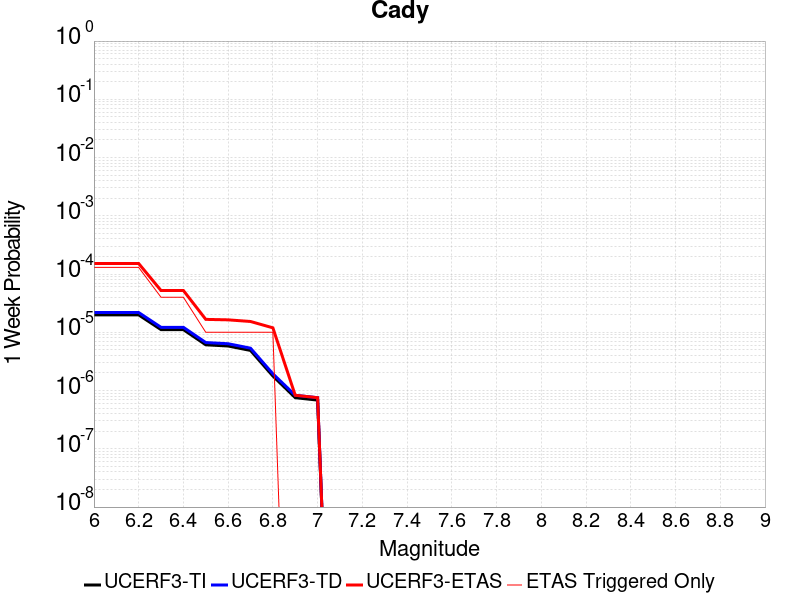 | 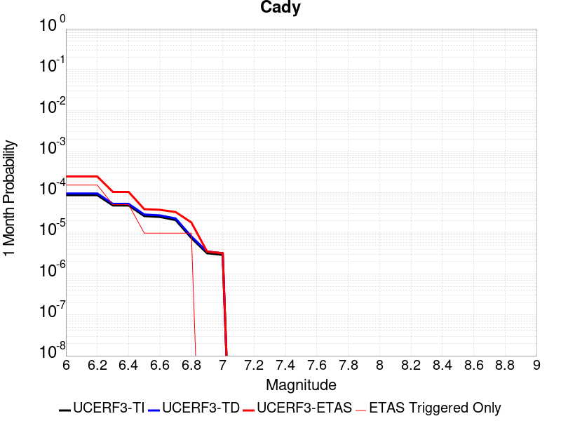 | 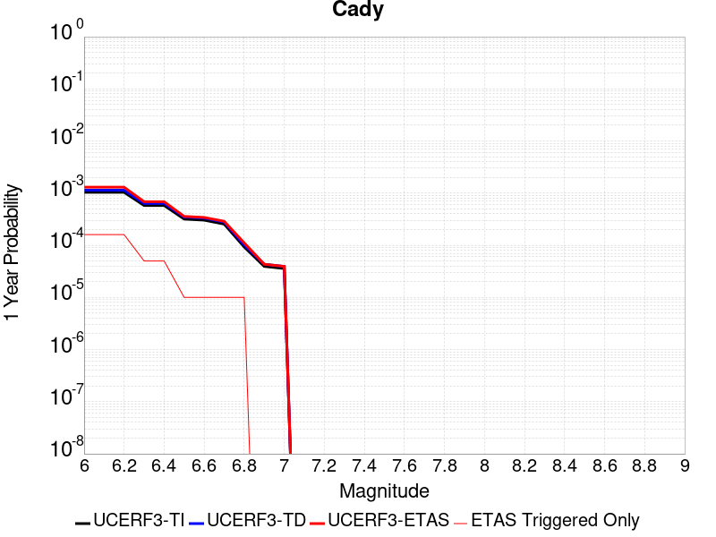 | 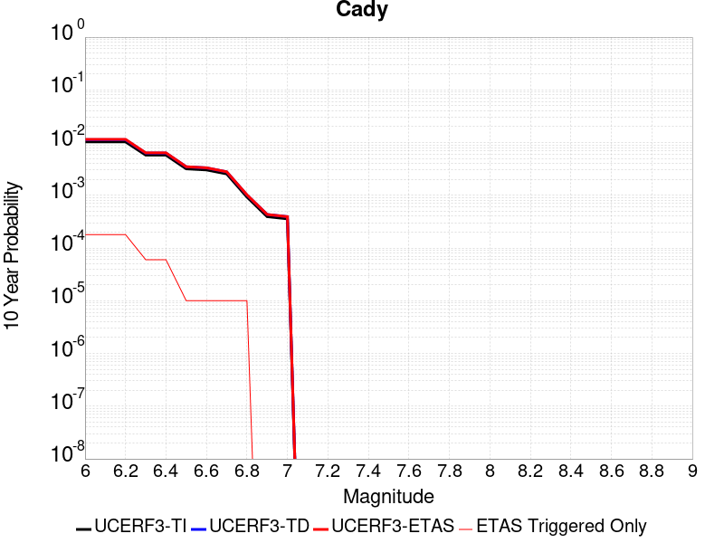 |

| Magnitude | 1 wk TI Prob | 1 wk TD Prob | 1 wk ETAS Prob | 1 wk ETAS/TD Gain | 1 wk ETAS Triggered Only | 1 mo TI Prob | 1 mo TD Prob | 1 mo ETAS Prob | 1 mo ETAS/TD Gain | 1 mo ETAS Triggered Only | 1 yr TI Prob | 1 yr TD Prob | 1 yr ETAS Prob | 1 yr ETAS/TD Gain | 1 yr ETAS Triggered Only | 10 yr TI Prob | 10 yr TD Prob | 10 yr ETAS Prob | 10 yr ETAS/TD Gain | 10 yr ETAS Triggered Only |
|-----|-----|-----|-----|-----|-----|-----|-----|-----|-----|-----|-----|-----|-----|-----|-----|-----|-----|-----|-----|-----|
| 6.0 | 1.9892565E-5 | 2.1858728E-5 | 1.5185589E-4 | 6.9471507 | 1.3E-4 | 8.525106E-5 | 9.3677416E-5 | 2.4366337E-4 | 2.6010897 | 1.5E-4 | 0.0010374374 | 0.0011400167 | 0.0012998343 | 1.1401888 | 1.6E-4 | 0.010326075 | 0.011350701 | 0.011528658 | 1.015678 | 1.8E-4 |
| 6.1 | 1.9892565E-5 | 2.1858728E-5 | 1.5185589E-4 | 6.9471507 | 1.3E-4 | 8.525106E-5 | 9.3677416E-5 | 2.4366337E-4 | 2.6010897 | 1.5E-4 | 0.0010374374 | 0.0011400167 | 0.0012998343 | 1.1401888 | 1.6E-4 | 0.010326075 | 0.011350701 | 0.011528658 | 1.015678 | 1.8E-4 |
| 6.2 | 1.9892565E-5 | 2.1858728E-5 | 1.5185589E-4 | 6.9471507 | 1.3E-4 | 8.525106E-5 | 9.3677416E-5 | 2.4366337E-4 | 2.6010897 | 1.5E-4 | 0.0010374374 | 0.0011400167 | 0.0012998343 | 1.1401888 | 1.6E-4 | 0.010326075 | 0.011350701 | 0.011528658 | 1.015678 | 1.8E-4 |
| 6.3 | 1.1117327E-5 | 1.2176583E-5 | 5.2176096E-5 | 4.2849536 | 4.0E-5 | 4.764482E-5 | 5.2184492E-5 | 1.0218188E-4 | 1.9580891 | 5.0E-5 | 5.7992124E-4 | 6.351925E-4 | 6.8516075E-4 | 1.0786663 | 5.0E-5 | 0.0057841022 | 0.0063368753 | 0.0063964953 | 1.0094084 | 6.0E-5 |
| 6.4 | 1.1117327E-5 | 1.2176583E-5 | 5.2176096E-5 | 4.2849536 | 4.0E-5 | 4.764482E-5 | 5.2184492E-5 | 1.0218188E-4 | 1.9580891 | 5.0E-5 | 5.7992124E-4 | 6.351925E-4 | 6.8516075E-4 | 1.0786663 | 5.0E-5 | 0.0057841022 | 0.0063368753 | 0.0063964953 | 1.0094084 | 6.0E-5 |
| 6.5 | 6.103093E-6 | 6.672021E-6 | 1.6671955E-5 | 2.4987862 | 1.0E-5 | 2.615585E-5 | 2.8594131E-5 | 3.8593847E-5 | 1.3497121 | 1.0E-5 | 3.1840094E-4 | 3.480905E-4 | 3.58087E-4 | 1.0287181 | 1.0E-5 | 0.0031794512 | 0.0034766865 | 0.003486652 | 1.0028663 | 1.0E-5 |
| 6.6 | 5.817237E-6 | 6.3656585E-6 | 1.6365595E-5 | 2.5709193 | 1.0E-5 | 2.4930776E-5 | 2.728118E-5 | 3.7280905E-5 | 1.366543 | 1.0E-5 | 3.034899E-4 | 3.3211018E-4 | 3.4210685E-4 | 1.0301005 | 1.0E-5 | 0.0030307577 | 0.0033173605 | 0.0033273273 | 1.0030044 | 1.0E-5 |
| 6.7 | 4.8846314E-6 | 5.3405684E-6 | 1.5340514E-5 | 2.8724499 | 1.0E-5 | 2.0933967E-5 | 2.2888014E-5 | 3.2887787E-5 | 1.4368999 | 1.0E-5 | 2.5484123E-4 | 2.7863772E-4 | 2.8863494E-4 | 1.0358789 | 1.0E-5 | 0.0025454918 | 0.0027840391 | 0.0027940113 | 1.0035819 | 1.0E-5 |
| 6.8 | 1.7788773E-6 | 1.9399079E-6 | 1.1939888E-5 | 6.154874 | 1.0E-5 | 7.6237375E-6 | 8.313874E-6 | 1.831379E-5 | 2.2027988 | 1.0E-5 | 9.281505E-5 | 1.01218284E-4 | 1.11217276E-4 | 1.0987864 | 1.0E-5 | 9.2776294E-4 | 0.0010118765 | 0.0010218663 | 1.0098727 | 1.0E-5 |
| 6.9 | 7.5455404E-7 | 8.297092E-7 | 8.297092E-7 | 1.0 | 0.0 | 3.233799E-6 | 3.5558937E-6 | 3.5558937E-6 | 1.0 | 0.0 | 3.937079E-5 | 4.3292483E-5 | 4.3292483E-5 | 1.0 | 0.0 | 3.9363815E-4 | 4.3287344E-4 | 4.3287344E-4 | 1.0 | 0.0 |
| 7.0 | 6.8578805E-7 | 7.541816E-7 | 7.541816E-7 | 1.0 | 0.0 | 2.9390883E-6 | 3.2322048E-6 | 3.2322048E-6 | 1.0 | 0.0 | 3.578281E-5 | 3.9351715E-5 | 3.9351715E-5 | 1.0 | 0.0 | 3.577705E-4 | 3.9347992E-4 | 3.9347992E-4 | 1.0 | 0.0 |

## Red Pass
*[(top)](#table-of-contents)*

| 1 Week | 1 Month | 1 Year | 10 Year |
|-----|-----|-----|-----|
| 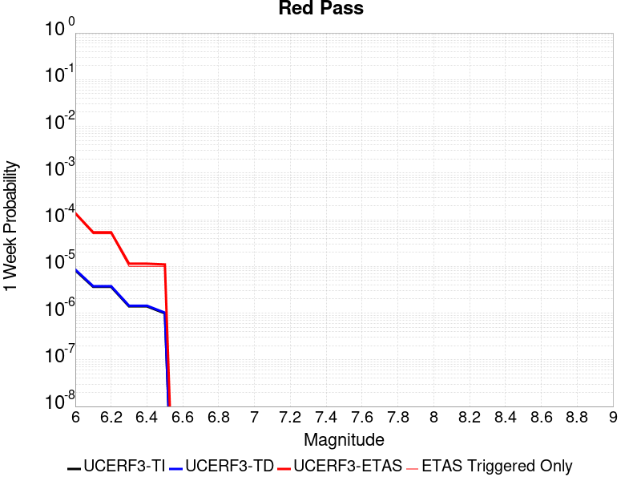 | 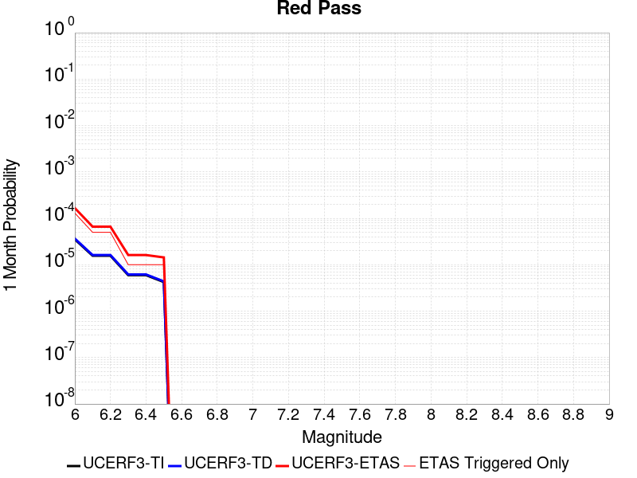 | 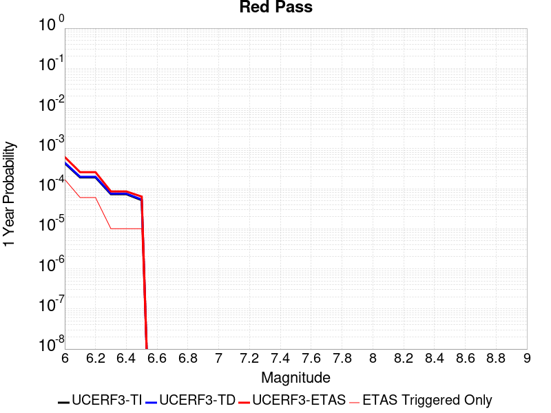 | 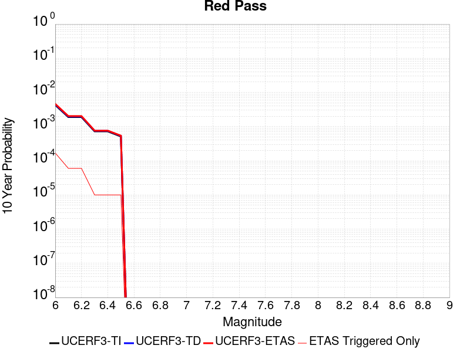 |

| Magnitude | 1 wk TI Prob | 1 wk TD Prob | 1 wk ETAS Prob | 1 wk ETAS/TD Gain | 1 wk ETAS Triggered Only | 1 mo TI Prob | 1 mo TD Prob | 1 mo ETAS Prob | 1 mo ETAS/TD Gain | 1 mo ETAS Triggered Only | 1 yr TI Prob | 1 yr TD Prob | 1 yr ETAS Prob | 1 yr ETAS/TD Gain | 1 yr ETAS Triggered Only | 10 yr TI Prob | 10 yr TD Prob | 10 yr ETAS Prob | 10 yr ETAS/TD Gain | 10 yr ETAS Triggered Only |
|-----|-----|-----|-----|-----|-----|-----|-----|-----|-----|-----|-----|-----|-----|-----|-----|-----|-----|-----|-----|-----|
| 6.0 | 8.258278E-6 | 8.551265E-6 | 1.3855015E-4 | 16.2023 | 1.3E-4 | 3.539214E-5 | 3.6647863E-5 | 1.666431E-4 | 4.5471435 | 1.3E-4 | 4.308141E-4 | 4.4611428E-4 | 6.1603845E-4 | 1.3808982 | 1.7E-4 | 0.0042997985 | 0.004453945 | 0.0046231877 | 1.0379984 | 1.7E-4 |
| 6.1 | 3.649988E-6 | 3.7753161E-6 | 5.3775126E-5 | 14.243875 | 5.0E-5 | 1.5642712E-5 | 1.6179853E-5 | 6.617904E-5 | 4.090213 | 5.0E-5 | 1.9043336E-4 | 1.9697666E-4 | 2.5696485E-4 | 1.3045446 | 6.0E-5 | 0.0019027026 | 0.001968488 | 0.0020283698 | 1.0304203 | 6.0E-5 |
| 6.2 | 3.649988E-6 | 3.7753161E-6 | 5.3775126E-5 | 14.243875 | 5.0E-5 | 1.5642712E-5 | 1.6179853E-5 | 6.617904E-5 | 4.090213 | 5.0E-5 | 1.9043336E-4 | 1.9697666E-4 | 2.5696485E-4 | 1.3045446 | 6.0E-5 | 0.0019027026 | 0.001968488 | 0.0020283698 | 1.0304203 | 6.0E-5 |
| 6.3 | 1.3924937E-6 | 1.4411166E-6 | 1.1441102E-5 | 7.9390535 | 1.0E-5 | 5.9678164E-6 | 6.1762075E-6 | 1.6176145E-5 | 2.6191065 | 1.0E-5 | 7.265574E-5 | 7.519415E-5 | 8.5193395E-5 | 1.132979 | 1.0E-5 | 7.263199E-4 | 7.518258E-4 | 7.6181826E-4 | 1.013291 | 1.0E-5 |
| 6.4 | 1.3924937E-6 | 1.4411166E-6 | 1.1441102E-5 | 7.9390535 | 1.0E-5 | 5.9678164E-6 | 6.1762075E-6 | 1.6176145E-5 | 2.6191065 | 1.0E-5 | 7.265574E-5 | 7.519415E-5 | 8.5193395E-5 | 1.132979 | 1.0E-5 | 7.263199E-4 | 7.518258E-4 | 7.6181826E-4 | 1.013291 | 1.0E-5 |
| 6.5 | 9.876812E-7 | 1.0221912E-6 | 1.1022181E-5 | 10.782895 | 1.0E-5 | 4.2329125E-6 | 4.3808195E-6 | 1.4380776E-5 | 3.2826679 | 1.0E-5 | 5.153449E-5 | 5.3336476E-5 | 6.3335945E-5 | 1.1874789 | 1.0E-5 | 5.1522546E-4 | 5.333648E-4 | 5.4335943E-4 | 1.0187389 | 1.0E-5 |

## San Jacinto (San Jacinto Valley) rev
*[(top)](#table-of-contents)*

| 1 Week | 1 Month | 1 Year | 10 Year |
|-----|-----|-----|-----|
| 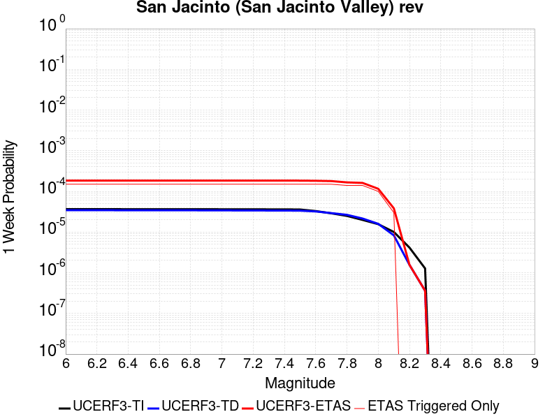 | 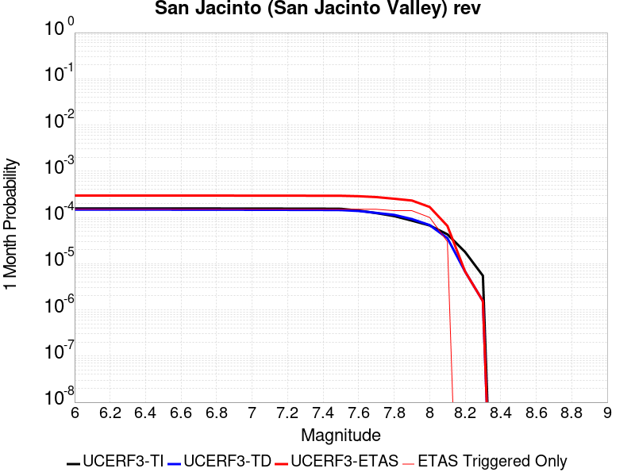 |  | 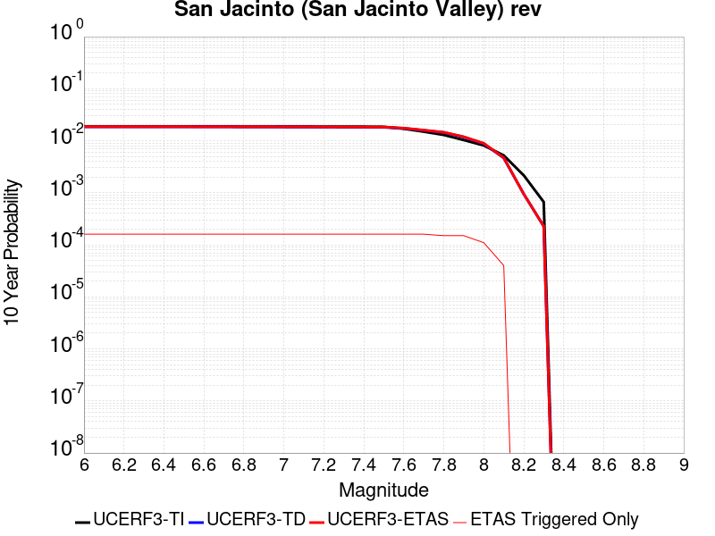 |

| Magnitude | 1 wk TI Prob | 1 wk TD Prob | 1 wk ETAS Prob | 1 wk ETAS/TD Gain | 1 wk ETAS Triggered Only | 1 mo TI Prob | 1 mo TD Prob | 1 mo ETAS Prob | 1 mo ETAS/TD Gain | 1 mo ETAS Triggered Only | 1 yr TI Prob | 1 yr TD Prob | 1 yr ETAS Prob | 1 yr ETAS/TD Gain | 1 yr ETAS Triggered Only | 10 yr TI Prob | 10 yr TD Prob | 10 yr ETAS Prob | 10 yr ETAS/TD Gain | 10 yr ETAS Triggered Only |
|-----|-----|-----|-----|-----|-----|-----|-----|-----|-----|-----|-----|-----|-----|-----|-----|-----|-----|-----|-----|-----|
| 6.0 | 3.652694E-5 | 3.4401106E-5 | 1.8439595E-4 | 5.360175 | 1.5E-4 | 1.5653463E-4 | 1.4742499E-4 | 2.9740288E-4 | 2.0173166 | 1.5E-4 | 0.0019041431 | 0.0017934233 | 0.0019531364 | 1.0890548 | 1.6E-4 | 0.018879099 | 0.018526303 | 0.018683337 | 1.0084764 | 1.6E-4 |
| 6.1 | 3.652694E-5 | 3.4401106E-5 | 1.8439595E-4 | 5.360175 | 1.5E-4 | 1.5653463E-4 | 1.4742499E-4 | 2.9740288E-4 | 2.0173166 | 1.5E-4 | 0.0019041431 | 0.0017934233 | 0.0019531364 | 1.0890548 | 1.6E-4 | 0.018879099 | 0.018526303 | 0.018683337 | 1.0084764 | 1.6E-4 |
| 6.2 | 3.652694E-5 | 3.4401106E-5 | 1.8439595E-4 | 5.360175 | 1.5E-4 | 1.5653463E-4 | 1.4742499E-4 | 2.9740288E-4 | 2.0173166 | 1.5E-4 | 0.0019041431 | 0.0017934233 | 0.0019531364 | 1.0890548 | 1.6E-4 | 0.018879099 | 0.018526303 | 0.018683337 | 1.0084764 | 1.6E-4 |
| 6.3 | 3.652694E-5 | 3.4401106E-5 | 1.8439595E-4 | 5.360175 | 1.5E-4 | 1.5653463E-4 | 1.4742499E-4 | 2.9740288E-4 | 2.0173166 | 1.5E-4 | 0.0019041431 | 0.0017934233 | 0.0019531364 | 1.0890548 | 1.6E-4 | 0.018879099 | 0.018526303 | 0.018683337 | 1.0084764 | 1.6E-4 |
| 6.4 | 3.646941E-5 | 3.432268E-5 | 1.8431753E-4 | 5.370138 | 1.5E-4 | 1.5628811E-4 | 1.4708891E-4 | 2.9706684E-4 | 2.0196414 | 1.5E-4 | 0.0019011468 | 0.0017893389 | 0.0019490526 | 1.0892586 | 1.6E-4 | 0.018849645 | 0.018486181 | 0.018643225 | 1.0084951 | 1.6E-4 |
| 6.5 | 3.646941E-5 | 3.432268E-5 | 1.8431753E-4 | 5.370138 | 1.5E-4 | 1.5628811E-4 | 1.4708891E-4 | 2.9706684E-4 | 2.0196414 | 1.5E-4 | 0.0019011468 | 0.0017893389 | 0.0019490526 | 1.0892586 | 1.6E-4 | 0.018849645 | 0.018486181 | 0.018643225 | 1.0084951 | 1.6E-4 |
| 6.6 | 3.6442503E-5 | 3.4286066E-5 | 1.8428093E-4 | 5.374805 | 1.5E-4 | 1.561728E-4 | 1.4693203E-4 | 2.9690997E-4 | 2.0207303 | 1.5E-4 | 0.0018997455 | 0.001787432 | 0.0019471459 | 1.0893539 | 1.6E-4 | 0.018835869 | 0.01846745 | 0.018624496 | 1.0085039 | 1.6E-4 |
| 6.7 | 3.6432113E-5 | 3.427164E-5 | 1.8426651E-4 | 5.3766465 | 1.5E-4 | 1.5612828E-4 | 1.4687021E-4 | 2.968482E-4 | 2.02116 | 1.5E-4 | 0.0018992044 | 0.0017866807 | 0.0019463948 | 1.0893916 | 1.6E-4 | 0.018830549 | 0.018460074 | 0.018617122 | 1.0085074 | 1.6E-4 |
| 6.8 | 3.6409598E-5 | 3.4240697E-5 | 1.8423556E-4 | 5.380602 | 1.5E-4 | 1.560318E-4 | 1.4673761E-4 | 2.967156E-4 | 2.0220828 | 1.5E-4 | 0.0018980318 | 0.0017850689 | 0.0019447833 | 1.0894724 | 1.6E-4 | 0.018819023 | 0.018444229 | 0.018601278 | 1.0085148 | 1.6E-4 |
| 6.9 | 3.638078E-5 | 3.4201123E-5 | 1.8419599E-4 | 5.385671 | 1.5E-4 | 1.5590832E-4 | 1.4656801E-4 | 2.9654603E-4 | 2.0232656 | 1.5E-4 | 0.0018965311 | 0.0017830075 | 0.0019427222 | 1.089576 | 1.6E-4 | 0.018804269 | 0.018423963 | 0.018581014 | 1.0085243 | 1.6E-4 |
| 7.0 | 3.6294874E-5 | 3.408314E-5 | 1.8407803E-4 | 5.400853 | 1.5E-4 | 1.5554018E-4 | 1.4606243E-4 | 2.9604053E-4 | 2.026808 | 1.5E-4 | 0.0018920569 | 0.0017768623 | 0.001936578 | 1.0898864 | 1.6E-4 | 0.018760284 | 0.018363545 | 0.018520607 | 1.0085529 | 1.6E-4 |
| 7.1 | 3.6260717E-5 | 3.403942E-5 | 1.8403432E-4 | 5.406505 | 1.5E-4 | 1.5539382E-4 | 1.4587509E-4 | 2.958532E-4 | 2.028127 | 1.5E-4 | 0.001890278 | 0.0017745851 | 0.0019343012 | 1.090002 | 1.6E-4 | 0.018742796 | 0.018341139 | 0.018498205 | 1.0085635 | 1.6E-4 |
| 7.2 | 3.6210204E-5 | 3.397364E-5 | 1.8396854E-4 | 5.4150376 | 1.5E-4 | 1.5517735E-4 | 1.455932E-4 | 2.9557137E-4 | 2.0301178 | 1.5E-4 | 0.001887647 | 0.0017711588 | 0.0019308754 | 1.0901763 | 1.6E-4 | 0.01871693 | 0.018307408 | 0.01846448 | 1.0085796 | 1.6E-4 |
| 7.3 | 3.6119454E-5 | 3.386193E-5 | 1.8385684E-4 | 5.4296036 | 1.5E-4 | 1.5478847E-4 | 1.4511449E-4 | 2.9509273E-4 | 2.0335166 | 1.5E-4 | 0.0018829206 | 0.0017653398 | 0.0019250574 | 1.0904741 | 1.6E-4 | 0.018670462 | 0.01824996 | 0.018407041 | 1.0086071 | 1.6E-4 |
| 7.4 | 3.607848E-5 | 3.380943E-5 | 1.8380435E-4 | 5.4364824 | 1.5E-4 | 1.5461289E-4 | 1.4488952E-4 | 2.948678E-4 | 2.0351217 | 1.5E-4 | 0.0018807866 | 0.0017626052 | 0.0019223231 | 1.0906147 | 1.6E-4 | 0.018649481 | 0.018222956 | 0.01838004 | 1.0086201 | 1.6E-4 |
| 7.5 | 3.5856774E-5 | 3.3619202E-5 | 1.8361416E-4 | 5.4615855 | 1.5E-4 | 1.5366284E-4 | 1.4407437E-4 | 2.9405273E-4 | 2.0409791 | 1.5E-4 | 0.0018692396 | 0.0017526967 | 0.0019124163 | 1.0911279 | 1.6E-4 | 0.018535944 | 0.018124057 | 0.018281156 | 1.0086681 | 1.6E-4 |
| 7.6 | 3.286655E-5 | 3.2142278E-5 | 1.8213746E-4 | 5.6666007 | 1.5E-4 | 1.4084904E-4 | 1.3774536E-4 | 2.877247E-4 | 2.088816 | 1.5E-4 | 0.001713488 | 0.0016757617 | 0.0018354936 | 1.0953189 | 1.6E-4 | 0.017003361 | 0.017343804 | 0.017501028 | 1.0090652 | 1.6E-4 |
| 7.7 | 2.8882527E-5 | 2.9235205E-5 | 1.7923082E-4 | 6.1306505 | 1.5E-4 | 1.237764E-4 | 1.2528773E-4 | 2.7526892E-4 | 2.1970942 | 1.5E-4 | 0.0015059357 | 0.0015243118 | 0.0016840679 | 1.1048054 | 1.6E-4 | 0.014957713 | 0.015830338 | 0.015987804 | 1.0099472 | 1.6E-4 |
| 7.8 | 2.4950225E-5 | 2.6526219E-5 | 1.665225E-4 | 6.277657 | 1.4E-4 | 1.0692515E-4 | 1.1367885E-4 | 2.5366293E-4 | 2.2313995 | 1.4E-4 | 0.0013010362 | 0.0013831621 | 0.0015329546 | 1.1082971 | 1.5E-4 | 0.012934455 | 0.01441176 | 0.014559598 | 1.0102582 | 1.5E-4 |
| 7.9 | 1.9881603E-5 | 2.150649E-5 | 1.6150349E-4 | 7.509523 | 1.4E-4 | 8.520408E-5 | 9.216742E-5 | 2.3215452E-4 | 2.5188348 | 1.4E-4 | 0.001036866 | 0.0011215615 | 0.0012713933 | 1.1335921 | 1.5E-4 | 0.010320415 | 0.011776998 | 0.011925232 | 1.0125867 | 1.5E-4 |
| 8.0 | 1.563292E-5 | 1.5936288E-5 | 1.15934694E-4 | 7.274887 | 1.0E-4 | 6.6996516E-5 | 6.829659E-5 | 1.6828976E-4 | 2.464102 | 1.0E-4 | 8.153773E-4 | 8.3119445E-4 | 9.4110303E-4 | 1.1322297 | 1.1E-4 | 0.00812392 | 0.008810331 | 0.008919362 | 1.0123754 | 1.1E-4 |
| 8.1 | 1.0045313E-5 | 8.300794E-6 | 3.8300546E-5 | 4.614082 | 3.0E-5 | 4.305063E-5 | 3.557435E-5 | 6.557328E-5 | 1.8432742 | 3.0E-5 | 5.2401534E-4 | 4.3303217E-4 | 4.7301484E-4 | 1.0923319 | 4.0E-5 | 0.0052278144 | 0.0046587666 | 0.0046985806 | 1.008546 | 4.0E-5 |
| 8.2 | 4.1554413E-6 | 1.5648296E-6 | 1.5648296E-6 | 1.0 | 0.0 | 1.7808914E-5 | 6.7063957E-6 | 6.7063957E-6 | 1.0 | 0.0 | 2.1680194E-4 | 8.164734E-5 | 8.164734E-5 | 1.0 | 0.0 | 0.0021659054 | 9.479703E-4 | 9.479703E-4 | 1.0 | 0.0 |
| 8.3 | 1.2758221E-6 | 3.612677E-7 | 3.612677E-7 | 1.0 | 0.0 | 5.4677976E-6 | 1.5482892E-6 | 1.5482892E-6 | 1.0 | 0.0 | 6.65684E-5 | 1.8850264E-5 | 1.8850264E-5 | 1.0 | 0.0 | 6.6548464E-4 | 2.2739546E-4 | 2.2739546E-4 | 1.0 | 0.0 |

## Coyote Lake
*[(top)](#table-of-contents)*

| 1 Week | 1 Month | 1 Year | 10 Year |
|-----|-----|-----|-----|
| 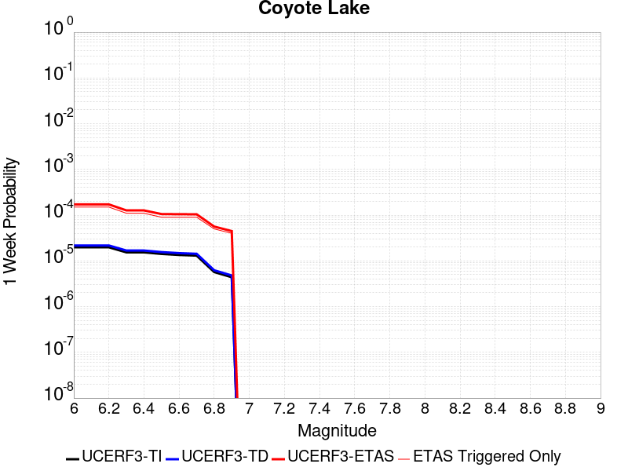 | 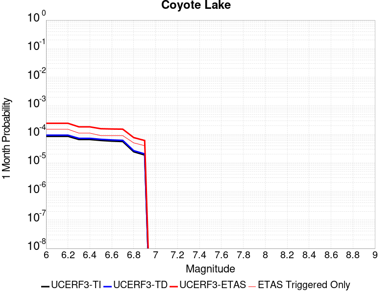 | 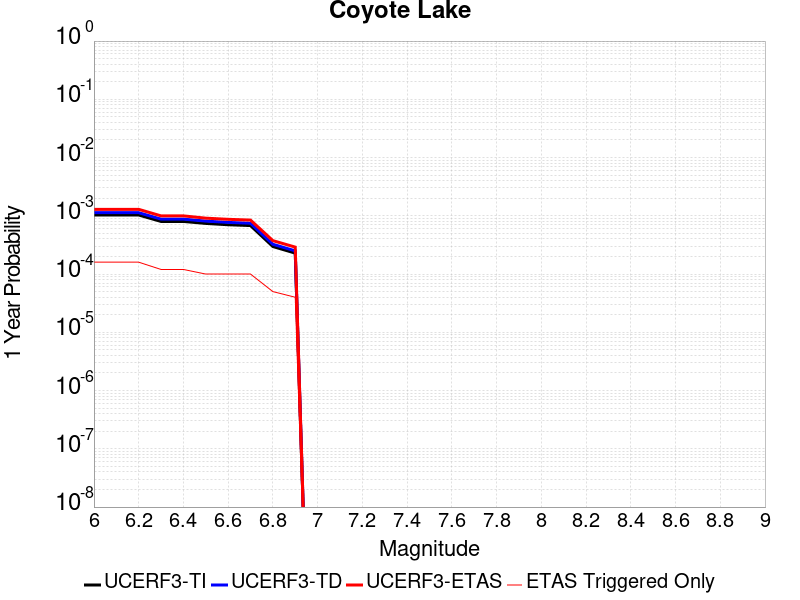 | 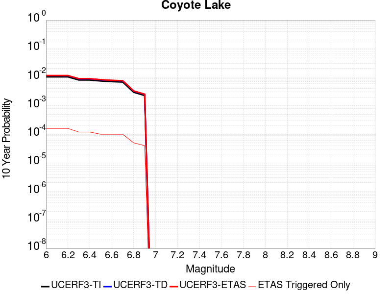 |

| Magnitude | 1 wk TI Prob | 1 wk TD Prob | 1 wk ETAS Prob | 1 wk ETAS/TD Gain | 1 wk ETAS Triggered Only | 1 mo TI Prob | 1 mo TD Prob | 1 mo ETAS Prob | 1 mo ETAS/TD Gain | 1 mo ETAS Triggered Only | 1 yr TI Prob | 1 yr TD Prob | 1 yr ETAS Prob | 1 yr ETAS/TD Gain | 1 yr ETAS Triggered Only | 10 yr TI Prob | 10 yr TD Prob | 10 yr ETAS Prob | 10 yr ETAS/TD Gain | 10 yr ETAS Triggered Only |
|-----|-----|-----|-----|-----|-----|-----|-----|-----|-----|-----|-----|-----|-----|-----|-----|-----|-----|-----|-----|-----|
| 6.0 | 1.980352E-5 | 2.1706745E-5 | 1.7170349E-4 | 7.9101443 | 1.5E-4 | 8.486947E-5 | 9.302599E-5 | 2.4301204E-4 | 2.6123025 | 1.5E-4 | 0.0010327959 | 0.0011320751 | 0.0012918939 | 1.1411734 | 1.6E-4 | 0.010280091 | 0.011270258 | 0.011428455 | 1.0140367 | 1.6E-4 |
| 6.1 | 1.980352E-5 | 2.1706745E-5 | 1.7170349E-4 | 7.9101443 | 1.5E-4 | 8.486947E-5 | 9.302599E-5 | 2.4301204E-4 | 2.6123025 | 1.5E-4 | 0.0010327959 | 0.0011320751 | 0.0012918939 | 1.1411734 | 1.6E-4 | 0.010280091 | 0.011270258 | 0.011428455 | 1.0140367 | 1.6E-4 |
| 6.2 | 1.980352E-5 | 2.1706745E-5 | 1.7170349E-4 | 7.9101443 | 1.5E-4 | 8.486947E-5 | 9.302599E-5 | 2.4301204E-4 | 2.6123025 | 1.5E-4 | 0.0010327959 | 0.0011320751 | 0.0012918939 | 1.1411734 | 1.6E-4 | 0.010280091 | 0.011270258 | 0.011428455 | 1.0140367 | 1.6E-4 |
| 6.3 | 1.5344787E-5 | 1.682067E-5 | 1.2681882E-4 | 7.5394635 | 1.1E-4 | 6.576172E-5 | 7.2086936E-5 | 1.82079E-4 | 2.5258253 | 1.1E-4 | 8.003548E-4 | 8.773662E-4 | 9.972609E-4 | 1.136653 | 1.2E-4 | 0.007974784 | 0.00874507 | 0.00886402 | 1.013602 | 1.2E-4 |
| 6.4 | 1.5344787E-5 | 1.682067E-5 | 1.2681882E-4 | 7.5394635 | 1.1E-4 | 6.576172E-5 | 7.2086936E-5 | 1.82079E-4 | 2.5258253 | 1.1E-4 | 8.003548E-4 | 8.773662E-4 | 9.972609E-4 | 1.136653 | 1.2E-4 | 0.007974784 | 0.00874507 | 0.00886402 | 1.013602 | 1.2E-4 |
| 6.5 | 1.4189697E-5 | 1.5557987E-5 | 1.0555659E-4 | 6.78472 | 9.0E-5 | 6.081157E-5 | 6.6675726E-5 | 1.5666972E-4 | 2.3497267 | 9.0E-5 | 7.401293E-4 | 8.115349E-4 | 9.1145374E-4 | 1.1231233 | 1.0E-4 | 0.0073766913 | 0.008091656 | 0.008190847 | 1.0122584 | 1.0E-4 |
| 6.6 | 1.3469301E-5 | 1.4771577E-5 | 1.04770246E-4 | 7.092692 | 9.0E-5 | 5.7724297E-5 | 6.330556E-5 | 1.5329986E-4 | 2.421586 | 9.0E-5 | 7.025667E-4 | 7.7053264E-4 | 8.704556E-4 | 1.1296804 | 1.0E-4 | 0.0070034964 | 0.0076845144 | 0.007783746 | 1.0129132 | 1.0E-4 |
| 6.7 | 1.3027966E-5 | 1.4281745E-5 | 1.0428046E-4 | 7.301661 | 9.0E-5 | 5.5832945E-5 | 6.120638E-5 | 1.5120087E-4 | 2.470345 | 9.0E-5 | 6.7955407E-4 | 7.4499263E-4 | 8.4491813E-4 | 1.1341295 | 1.0E-4 | 0.006774798 | 0.0074308286 | 0.0075300857 | 1.0133574 | 1.0E-4 |
| 6.8 | 5.695434E-6 | 6.2244176E-6 | 5.6224108E-5 | 9.03283 | 5.0E-5 | 2.4408775E-5 | 2.6675973E-5 | 7.667464E-5 | 2.874296 | 5.0E-5 | 2.971363E-4 | 3.2476155E-4 | 3.7474532E-4 | 1.1539091 | 5.0E-5 | 0.0029673933 | 0.0032458105 | 0.0032956481 | 1.0153545 | 5.0E-5 |
| 6.9 | 4.385688E-6 | 4.7930553E-6 | 4.4792865E-5 | 9.345367 | 4.0E-5 | 1.879567E-5 | 2.0541665E-5 | 6.0540846E-5 | 2.9472218 | 4.0E-5 | 2.2881327E-4 | 2.5009477E-4 | 2.9008478E-4 | 1.1598994 | 4.0E-5 | 0.002285778 | 0.0025009478 | 0.0025408478 | 1.0159539 | 4.0E-5 |

## San Andreas (Creeping Section) 2011 CFM
*[(top)](#table-of-contents)*

| 1 Week | 1 Month | 1 Year | 10 Year |
|-----|-----|-----|-----|
| 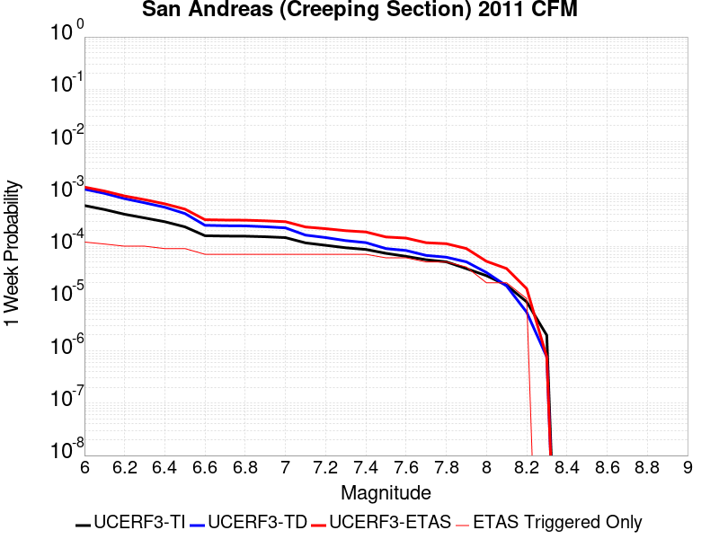 | 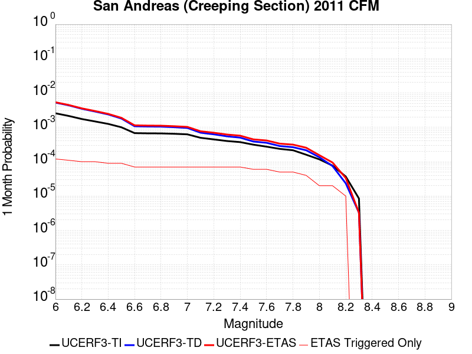 | 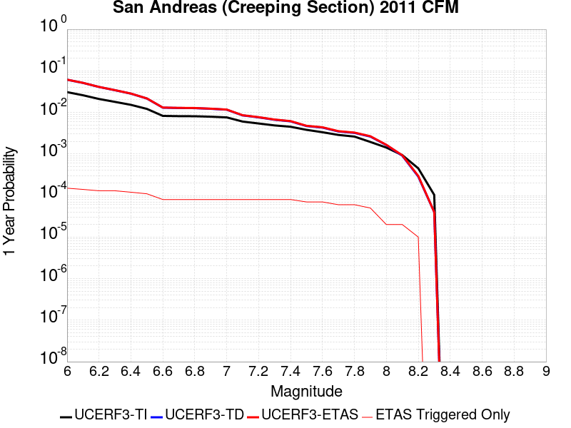 | 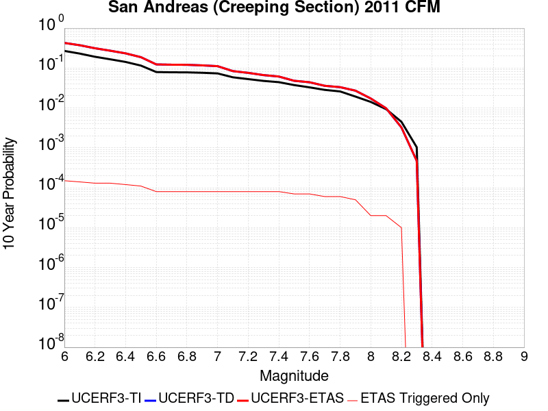 |

| Magnitude | 1 wk TI Prob | 1 wk TD Prob | 1 wk ETAS Prob | 1 wk ETAS/TD Gain | 1 wk ETAS Triggered Only | 1 mo TI Prob | 1 mo TD Prob | 1 mo ETAS Prob | 1 mo ETAS/TD Gain | 1 mo ETAS Triggered Only | 1 yr TI Prob | 1 yr TD Prob | 1 yr ETAS Prob | 1 yr ETAS/TD Gain | 1 yr ETAS Triggered Only | 10 yr TI Prob | 10 yr TD Prob | 10 yr ETAS Prob | 10 yr ETAS/TD Gain | 10 yr ETAS Triggered Only |
|-----|-----|-----|-----|-----|-----|-----|-----|-----|-----|-----|-----|-----|-----|-----|-----|-----|-----|-----|-----|-----|
| 6.0 | 5.986481E-4 | 0.0012275929 | 0.0013474455 | 1.0976323 | 1.2E-4 | 0.0025631124 | 0.005245547 | 0.005364917 | 1.0227566 | 1.2E-4 | 0.030762846 | 0.06120491 | 0.06134573 | 1.0023007 | 1.5E-4 | 0.26835477 | 0.42593494 | 0.42602104 | 1.0002022 | 1.5E-4 |
| 6.1 | 5.015945E-4 | 0.0010217986 | 0.0011316861 | 1.1075433 | 1.1E-4 | 0.00214792 | 0.0043678596 | 0.004477379 | 1.025074 | 1.1E-4 | 0.025839351 | 0.05124837 | 0.051381197 | 1.0025918 | 1.4E-4 | 0.23032776 | 0.37285668 | 0.37294447 | 1.0002354 | 1.4E-4 |
| 6.2 | 4.073338E-4 | 8.1073755E-4 | 9.1065647E-4 | 1.1232445 | 1.0E-4 | 0.0017445484 | 0.0034671477 | 0.0035668008 | 1.0287422 | 1.0E-4 | 0.021034058 | 0.04093317 | 0.041057847 | 1.0030459 | 1.3E-4 | 0.19150782 | 0.31303346 | 0.31312278 | 1.0002853 | 1.3E-4 |
| 6.3 | 3.464099E-4 | 6.7391695E-4 | 7.7384955E-4 | 1.1482862 | 1.0E-4 | 0.0014837692 | 0.0028829593 | 0.0029826711 | 1.0345865 | 1.0E-4 | 0.017915873 | 0.034189582 | 0.034315135 | 1.0036724 | 1.3E-4 | 0.16538359 | 0.2713166 | 0.2714113 | 1.0003492 | 1.3E-4 |
| 6.4 | 2.935057E-4 | 5.5442745E-4 | 6.4437755E-4 | 1.1622397 | 9.0E-5 | 0.0012572751 | 0.0023725363 | 0.0024623228 | 1.0378441 | 9.0E-5 | 0.015200248 | 0.02826451 | 0.028381119 | 1.0041256 | 1.2E-4 | 0.14201577 | 0.23298529 | 0.23307733 | 1.000395 | 1.2E-4 |
| 6.5 | 2.3409708E-4 | 4.2093755E-4 | 5.108997E-4 | 1.2137184 | 9.0E-5 | 0.0010028875 | 0.0018019684 | 0.0018918063 | 1.0498554 | 9.0E-5 | 0.012141965 | 0.021587461 | 0.021695087 | 1.0049856 | 1.1E-4 | 0.11499573 | 0.18682368 | 0.18691313 | 1.0004787 | 1.1E-4 |
| 6.6 | 1.5842178E-4 | 2.506933E-4 | 3.2067575E-4 | 1.2791556 | 7.0E-5 | 6.7877385E-4 | 0.0010739497 | 0.0011438746 | 1.06511 | 7.0E-5 | 0.0082328 | 0.012995575 | 0.013074535 | 1.006076 | 8.0E-5 | 0.07934396 | 0.12314638 | 0.123216525 | 1.0005696 | 8.0E-5 |
| 6.7 | 1.5616413E-4 | 2.4605883E-4 | 3.160416E-4 | 1.2844148 | 7.0E-5 | 6.691031E-4 | 0.0010541069 | 0.001124033 | 1.066337 | 7.0E-5 | 0.0081159435 | 0.01275744 | 0.01283642 | 1.0061909 | 8.0E-5 | 0.0782586 | 0.12117351 | 0.12124382 | 1.0005802 | 8.0E-5 |
| 6.8 | 1.5538467E-4 | 2.4429744E-4 | 3.1428036E-4 | 1.286466 | 7.0E-5 | 6.6576427E-4 | 0.0010465645 | 0.0011164913 | 1.0668155 | 7.0E-5 | 0.008075596 | 0.012666838 | 0.012745826 | 1.0062357 | 8.0E-5 | 0.07788358 | 0.120404355 | 0.12047472 | 1.0005845 | 8.0E-5 |
| 6.9 | 1.5153569E-4 | 2.3539034E-4 | 3.0537386E-4 | 1.2973084 | 7.0E-5 | 6.49277E-4 | 0.0010084276 | 0.001078357 | 1.069345 | 7.0E-5 | 0.007876333 | 0.01220901 | 0.012288034 | 1.0064726 | 8.0E-5 | 0.07602952 | 0.11647445 | 0.116545126 | 1.0006069 | 8.0E-5 |
| 7.0 | 1.4588932E-4 | 2.2396253E-4 | 2.9394685E-4 | 1.3124822 | 7.0E-5 | 6.250901E-4 | 9.5948833E-4 | 0.0010294212 | 1.0728855 | 7.0E-5 | 0.0075839474 | 0.011619697 | 0.011698768 | 1.0068048 | 8.0E-5 | 0.073302895 | 0.11132046 | 0.11139155 | 1.0006386 | 8.0E-5 |
| 7.1 | 1.1565079E-4 | 1.6281738E-4 | 2.3280598E-4 | 1.4298595 | 7.0E-5 | 4.955521E-4 | 6.9760304E-4 | 7.675542E-4 | 1.1002736 | 7.0E-5 | 0.006016669 | 0.0084604435 | 0.008539766 | 1.0093758 | 8.0E-5 | 0.058563538 | 0.08367046 | 0.083743766 | 1.0008762 | 8.0E-5 |
| 7.2 | 1.0393792E-4 | 1.4615769E-4 | 2.1614745E-4 | 1.4788648 | 7.0E-5 | 4.4537216E-4 | 6.2624045E-4 | 6.961966E-4 | 1.1117082 | 7.0E-5 | 0.005408933 | 0.0075979927 | 0.0076773847 | 1.010449 | 8.0E-5 | 0.052791595 | 0.07561969 | 0.075693645 | 1.0009779 | 8.0E-5 |
| 7.3 | 9.332884E-5 | 1.2780898E-4 | 1.9780004E-4 | 1.5476223 | 7.0E-5 | 3.999194E-4 | 5.4763845E-4 | 6.176001E-4 | 1.1277516 | 7.0E-5 | 0.0048581534 | 0.006647249 | 0.006726717 | 1.011955 | 8.0E-5 | 0.047533102 | 0.06648326 | 0.06655794 | 1.0011233 | 8.0E-5 |
| 7.4 | 8.670252E-5 | 1.17032345E-4 | 1.8702415E-4 | 1.5980552 | 7.0E-5 | 3.715293E-4 | 5.0147134E-4 | 5.7143625E-4 | 1.1395192 | 7.0E-5 | 0.004513991 | 0.006088443 | 0.0061679557 | 1.0130596 | 8.0E-5 | 0.044233937 | 0.061151642 | 0.06122675 | 1.0012282 | 8.0E-5 |
| 7.5 | 7.3036405E-5 | 9.005856E-5 | 1.5005315E-4 | 1.6661732 | 6.0E-5 | 3.129756E-4 | 3.8590826E-4 | 4.4588512E-4 | 1.1554173 | 6.0E-5 | 0.0038038217 | 0.0046883323 | 0.004758004 | 1.0148606 | 7.0E-5 | 0.03739367 | 0.047877792 | 0.04794444 | 1.001392 | 7.0E-5 |
| 7.6 | 6.3935775E-5 | 8.280385E-5 | 1.4279888E-4 | 1.724544 | 6.0E-5 | 2.7398168E-4 | 3.5482543E-4 | 4.1480415E-4 | 1.1690372 | 6.0E-5 | 0.0033306254 | 0.004311461 | 0.0043811593 | 1.0161659 | 7.0E-5 | 0.032811474 | 0.04399201 | 0.04405893 | 1.0015212 | 7.0E-5 |
| 7.7 | 5.5050095E-5 | 6.6618326E-5 | 1.16614996E-4 | 1.7504942 | 5.0E-5 | 2.3590765E-4 | 2.854759E-4 | 3.3546163E-4 | 1.1750962 | 5.0E-5 | 0.0028683927 | 0.003470134 | 0.0035299256 | 1.0172304 | 6.0E-5 | 0.0283165 | 0.035796214 | 0.035854064 | 1.0016161 | 6.0E-5 |
| 7.8 | 5.027131E-5 | 6.162871E-5 | 1.11625624E-4 | 1.8112602 | 5.0E-5 | 2.1543067E-4 | 2.640963E-4 | 3.140831E-4 | 1.1892749 | 5.0E-5 | 0.0026197135 | 0.003210635 | 0.0032704424 | 1.0186279 | 6.0E-5 | 0.025890453 | 0.03312666 | 0.033184674 | 1.0017512 | 6.0E-5 |
| 7.9 | 3.7271806E-5 | 5.022507E-5 | 9.022306E-5 | 1.796375 | 4.0E-5 | 1.5972654E-4 | 2.1523255E-4 | 2.5522395E-4 | 1.1858056 | 4.0E-5 | 0.0019429359 | 0.002617309 | 0.0026671784 | 1.0190536 | 5.0E-5 | 0.019260362 | 0.027067466 | 0.027116112 | 1.0017972 | 5.0E-5 |
| 8.0 | 2.7310243E-5 | 3.1427757E-5 | 5.142713E-5 | 1.6363602 | 2.0E-5 | 1.17038646E-4 | 1.3468343E-4 | 1.5468075E-4 | 1.1484764 | 2.0E-5 | 0.0014240141 | 0.0016385383 | 0.0016585055 | 1.012186 | 2.0E-5 | 0.014149235 | 0.01721386 | 0.017233515 | 1.0011419 | 2.0E-5 |
| 8.1 | 1.7940547E-5 | 1.7399378E-5 | 3.739903E-5 | 2.1494465 | 2.0E-5 | 7.688579E-5 | 7.456663E-5 | 9.456514E-5 | 1.2681965 | 2.0E-5 | 9.3568244E-4 | 9.074711E-4 | 9.27453E-4 | 1.0220193 | 2.0E-5 | 0.009317525 | 0.009798636 | 0.009818439 | 1.0020211 | 2.0E-5 |
| 8.2 | 8.643924E-6 | 5.473668E-6 | 1.5473614E-5 | 2.8269184 | 1.0E-5 | 3.704486E-5 | 2.3458366E-5 | 3.345813E-5 | 1.4262772 | 1.0E-5 | 4.5092785E-4 | 2.8556827E-4 | 2.955654E-4 | 1.035008 | 1.0E-5 | 0.0045001395 | 0.0032481793 | 0.003258147 | 1.0030687 | 1.0E-5 |
| 8.3 | 1.983087E-6 | 7.6564595E-7 | 7.6564595E-7 | 1.0 | 0.0 | 8.498917E-6 | 3.281336E-6 | 3.281336E-6 | 1.0 | 0.0 | 1.034694E-4 | 3.9949547E-5 | 3.9949547E-5 | 1.0 | 0.0 | 0.0010342124 | 4.717979E-4 | 4.717979E-4 | 1.0 | 0.0 |

## White Wolf (Extension)
*[(top)](#table-of-contents)*

| 1 Week | 1 Month | 1 Year | 10 Year |
|-----|-----|-----|-----|
| 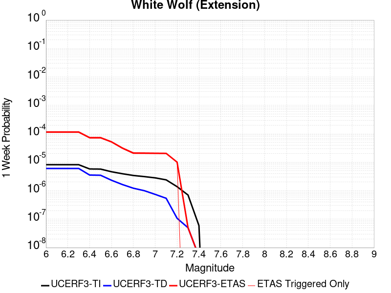 | 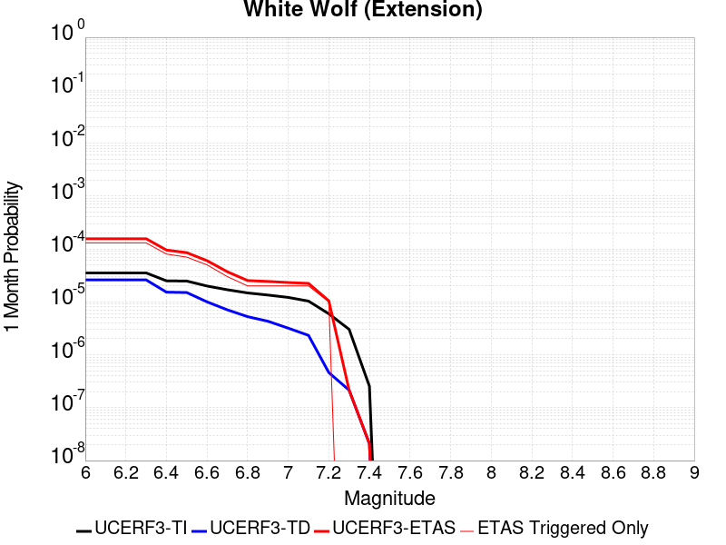 | 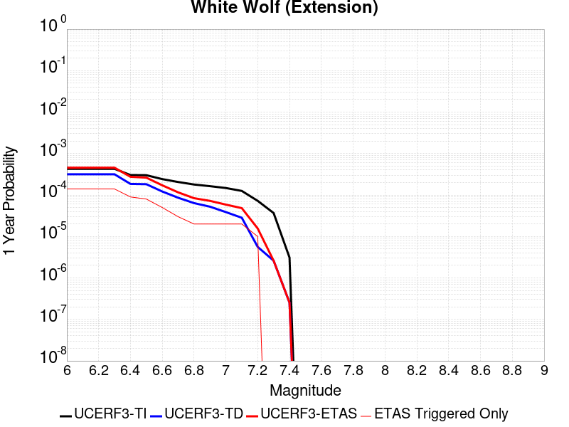 | 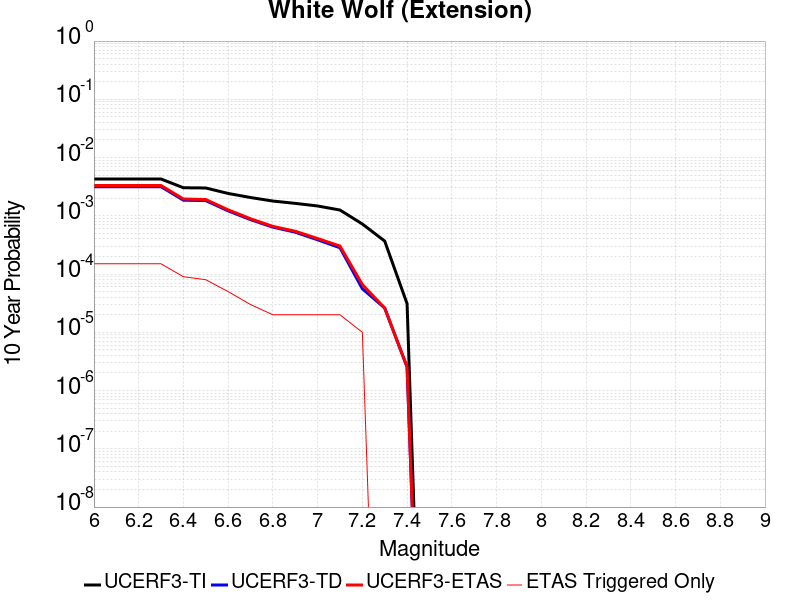 |

| Magnitude | 1 wk TI Prob | 1 wk TD Prob | 1 wk ETAS Prob | 1 wk ETAS/TD Gain | 1 wk ETAS Triggered Only | 1 mo TI Prob | 1 mo TD Prob | 1 mo ETAS Prob | 1 mo ETAS/TD Gain | 1 mo ETAS Triggered Only | 1 yr TI Prob | 1 yr TD Prob | 1 yr ETAS Prob | 1 yr ETAS/TD Gain | 1 yr ETAS Triggered Only | 10 yr TI Prob | 10 yr TD Prob | 10 yr ETAS Prob | 10 yr ETAS/TD Gain | 10 yr ETAS Triggered Only |
|-----|-----|-----|-----|-----|-----|-----|-----|-----|-----|-----|-----|-----|-----|-----|-----|-----|-----|-----|-----|-----|
| 6.0 | 8.222555E-6 | 6.066615E-6 | 1.16065945E-4 | 19.131912 | 1.1E-4 | 3.5239045E-5 | 2.5999556E-5 | 1.5599618E-4 | 5.999955 | 1.3E-4 | 4.289509E-4 | 3.1650523E-4 | 4.5646093E-4 | 1.4421908 | 1.4E-4 | 0.0042812387 | 0.0031611966 | 0.0033107223 | 1.0473003 | 1.5E-4 |
| 6.1 | 8.222555E-6 | 6.066615E-6 | 1.16065945E-4 | 19.131912 | 1.1E-4 | 3.5239045E-5 | 2.5999556E-5 | 1.5599618E-4 | 5.999955 | 1.3E-4 | 4.289509E-4 | 3.1650523E-4 | 4.5646093E-4 | 1.4421908 | 1.4E-4 | 0.0042812387 | 0.0031611966 | 0.0033107223 | 1.0473003 | 1.5E-4 |
| 6.2 | 8.222555E-6 | 6.066615E-6 | 1.16065945E-4 | 19.131912 | 1.1E-4 | 3.5239045E-5 | 2.5999556E-5 | 1.5599618E-4 | 5.999955 | 1.3E-4 | 4.289509E-4 | 3.1650523E-4 | 4.5646093E-4 | 1.4421908 | 1.4E-4 | 0.0042812387 | 0.0031611966 | 0.0033107223 | 1.0473003 | 1.5E-4 |
| 6.3 | 8.222555E-6 | 6.066615E-6 | 1.16065945E-4 | 19.131912 | 1.1E-4 | 3.5239045E-5 | 2.5999556E-5 | 1.5599618E-4 | 5.999955 | 1.3E-4 | 4.289509E-4 | 3.1650523E-4 | 4.5646093E-4 | 1.4421908 | 1.4E-4 | 0.0042812387 | 0.0031611966 | 0.0033107223 | 1.0473003 | 1.5E-4 |
| 6.4 | 5.821773E-6 | 3.5571256E-6 | 7.3556876E-5 | 20.67874 | 7.0E-5 | 2.4950215E-5 | 1.5244741E-5 | 9.524352E-5 | 6.247631 | 8.0E-5 | 3.0372653E-4 | 1.8559002E-4 | 2.7557331E-4 | 1.4848499 | 9.0E-5 | 0.0030331176 | 0.0018544586 | 0.0019442918 | 1.0484416 | 9.0E-5 |
| 6.5 | 5.766023E-6 | 3.4990599E-6 | 7.349881E-5 | 21.005304 | 7.0E-5 | 2.4711293E-5 | 1.49958905E-5 | 8.499484E-5 | 5.667876 | 7.0E-5 | 3.0081844E-4 | 1.8256076E-4 | 2.6254615E-4 | 1.4381303 | 8.0E-5 | 0.0030041158 | 0.0018242161 | 0.0019040701 | 1.0437745 | 8.0E-5 |
| 6.6 | 4.643576E-6 | 2.3325733E-6 | 5.2332456E-5 | 22.435505 | 5.0E-5 | 1.9900888E-5 | 9.9967065E-6 | 5.9996208E-5 | 6.0015974 | 5.0E-5 | 2.4226638E-4 | 1.2170354E-4 | 1.7169745E-4 | 1.4107844 | 5.0E-5 | 0.0024200242 | 0.0012164112 | 0.0012663505 | 1.0410545 | 5.0E-5 |
| 6.7 | 3.9529173E-6 | 1.6482975E-6 | 3.1648247E-5 | 19.200567 | 3.0E-5 | 1.6940963E-5 | 7.064114E-6 | 3.7063903E-5 | 5.246787 | 3.0E-5 | 2.0623671E-4 | 8.600239E-5 | 1.1599981E-4 | 1.3487976 | 3.0E-5 | 0.002060454 | 8.597095E-4 | 8.896837E-4 | 1.0348655 | 3.0E-5 |
| 6.8 | 3.4377522E-6 | 1.2244764E-6 | 2.1224452E-5 | 17.333492 | 2.0E-5 | 1.473314E-5 | 5.247746E-6 | 2.524764E-5 | 4.81114 | 2.0E-5 | 1.7936122E-4 | 6.388952E-5 | 8.388825E-5 | 1.3130203 | 2.0E-5 | 0.0017921652 | 6.3872064E-4 | 6.5870787E-4 | 1.0312926 | 2.0E-5 |
| 6.9 | 3.1367306E-6 | 1.0033316E-6 | 2.1003312E-5 | 20.93357 | 2.0E-5 | 1.3443062E-5 | 4.299986E-6 | 2.42999E-5 | 5.6511583 | 2.0E-5 | 1.63657E-4 | 5.2351144E-5 | 7.23501E-5 | 1.3820156 | 2.0E-5 | 0.0016353652 | 5.233958E-4 | 5.433853E-4 | 1.038192 | 2.0E-5 |
| 7.0 | 2.8298145E-6 | 7.4282326E-7 | 2.074281E-5 | 27.924284 | 2.0E-5 | 1.2127721E-5 | 3.1835248E-6 | 2.318346E-5 | 7.282325 | 2.0E-5 | 1.47645E-4 | 3.8758775E-5 | 5.8758E-5 | 1.5159922 | 2.0E-5 | 0.0014754693 | 3.8752513E-4 | 4.075174E-4 | 1.0515896 | 2.0E-5 |
| 7.1 | 2.4091064E-6 | 5.4223835E-7 | 2.0542228E-5 | 37.88413 | 2.0E-5 | 1.03247E-5 | 2.3238767E-6 | 2.2323831E-5 | 9.606288 | 2.0E-5 | 1.2569598E-4 | 2.8292874E-5 | 4.829231E-5 | 1.7068717 | 2.0E-5 | 0.001256249 | 2.8289677E-4 | 3.028911E-4 | 1.0706772 | 2.0E-5 |
| 7.2 | 1.3875518E-6 | 1.0740268E-7 | 1.0107402E-5 | 94.10754 | 1.0E-5 | 5.9466374E-6 | 4.6029712E-7 | 1.0460292E-5 | 22.725088 | 1.0E-5 | 7.23979E-5 | 5.604104E-6 | 1.5604048E-5 | 2.7843966 | 1.0E-5 | 7.2374323E-4 | 5.6039742E-5 | 6.603918E-5 | 1.1784348 | 1.0E-5 |
| 7.3 | 7.056077E-7 | 5.0002956E-8 | 5.0002956E-8 | 1.0 | 0.0 | 3.0240296E-6 | 2.1429837E-7 | 2.1429837E-7 | 1.0 | 0.0 | 3.681694E-5 | 2.60908E-6 | 2.60908E-6 | 1.0 | 0.0 | 3.681084E-4 | 2.609054E-5 | 2.609054E-5 | 1.0 | 0.0 |
| 7.4 | 5.9334678E-8 | 4.8638475E-9 | 4.8638475E-9 | 1.0 | 0.0 | 2.5429145E-7 | 2.084506E-8 | 2.084506E-8 | 1.0 | 0.0 | 3.095994E-6 | 2.5378858E-7 | 2.5378858E-7 | 1.0 | 0.0 | 3.095951E-5 | 2.5378843E-6 | 2.5378843E-6 | 1.0 | 0.0 |

## San Jacinto (Lytle Creek connector)
*[(top)](#table-of-contents)*

| 1 Week | 1 Month | 1 Year | 10 Year |
|-----|-----|-----|-----|
| 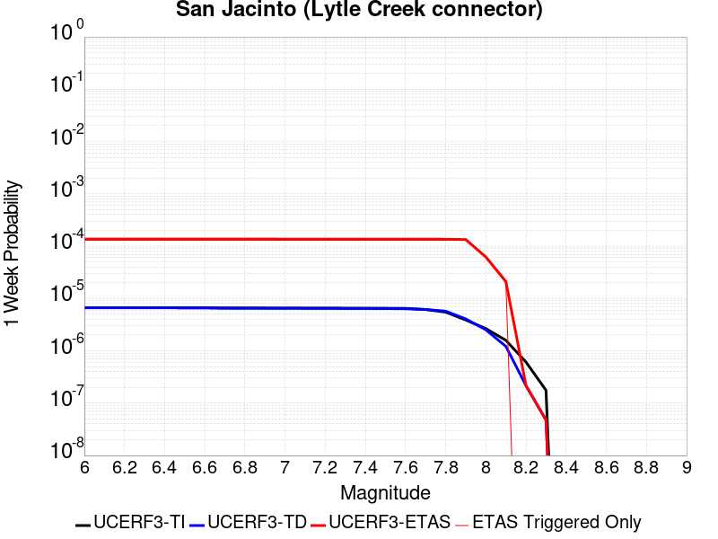 | 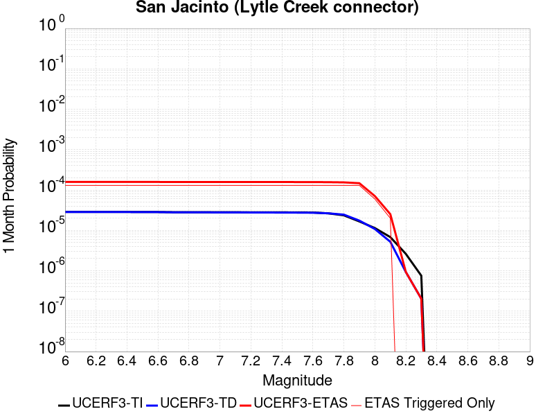 | 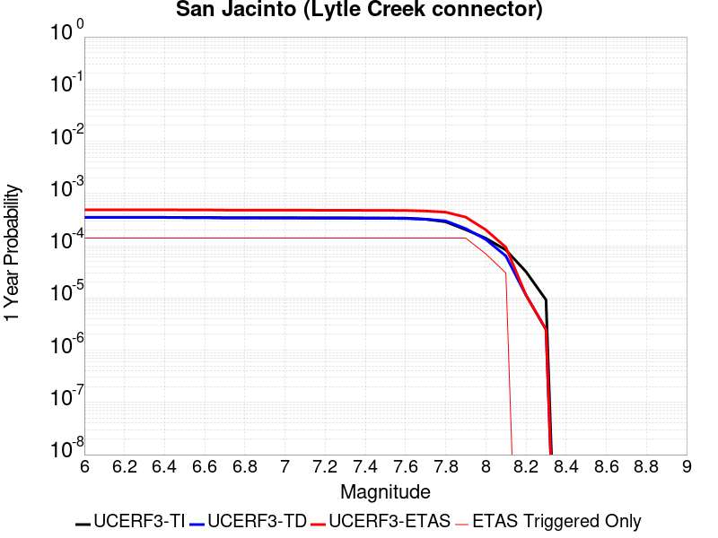 | 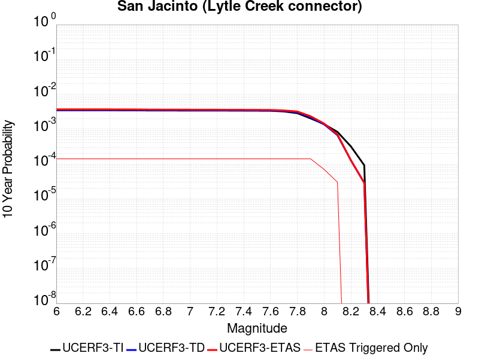 |

| Magnitude | 1 wk TI Prob | 1 wk TD Prob | 1 wk ETAS Prob | 1 wk ETAS/TD Gain | 1 wk ETAS Triggered Only | 1 mo TI Prob | 1 mo TD Prob | 1 mo ETAS Prob | 1 mo ETAS/TD Gain | 1 mo ETAS Triggered Only | 1 yr TI Prob | 1 yr TD Prob | 1 yr ETAS Prob | 1 yr ETAS/TD Gain | 1 yr ETAS Triggered Only | 10 yr TI Prob | 10 yr TD Prob | 10 yr ETAS Prob | 10 yr ETAS/TD Gain | 10 yr ETAS Triggered Only |
|-----|-----|-----|-----|-----|-----|-----|-----|-----|-----|-----|-----|-----|-----|-----|-----|-----|-----|-----|-----|-----|
| 6.0 | 6.693995E-6 | 6.660123E-6 | 1.3665926E-4 | 20.51903 | 1.3E-4 | 2.8688235E-5 | 2.8543072E-5 | 1.5853936E-4 | 5.5543904 | 1.3E-4 | 3.492233E-4 | 3.4745657E-4 | 4.8740793E-4 | 1.402788 | 1.4E-4 | 0.00348675 | 0.0035491167 | 0.0036886197 | 1.0393064 | 1.4E-4 |
| 6.1 | 6.693995E-6 | 6.660123E-6 | 1.3665926E-4 | 20.51903 | 1.3E-4 | 2.8688235E-5 | 2.8543072E-5 | 1.5853936E-4 | 5.5543904 | 1.3E-4 | 3.492233E-4 | 3.4745657E-4 | 4.8740793E-4 | 1.402788 | 1.4E-4 | 0.00348675 | 0.0035491167 | 0.0036886197 | 1.0393064 | 1.4E-4 |
| 6.2 | 6.693995E-6 | 6.660123E-6 | 1.3665926E-4 | 20.51903 | 1.3E-4 | 2.8688235E-5 | 2.8543072E-5 | 1.5853936E-4 | 5.5543904 | 1.3E-4 | 3.492233E-4 | 3.4745657E-4 | 4.8740793E-4 | 1.402788 | 1.4E-4 | 0.00348675 | 0.0035491167 | 0.0036886197 | 1.0393064 | 1.4E-4 |
| 6.3 | 6.693995E-6 | 6.660123E-6 | 1.3665926E-4 | 20.51903 | 1.3E-4 | 2.8688235E-5 | 2.8543072E-5 | 1.5853936E-4 | 5.5543904 | 1.3E-4 | 3.492233E-4 | 3.4745657E-4 | 4.8740793E-4 | 1.402788 | 1.4E-4 | 0.00348675 | 0.0035491167 | 0.0036886197 | 1.0393064 | 1.4E-4 |
| 6.4 | 6.693995E-6 | 6.660123E-6 | 1.3665926E-4 | 20.51903 | 1.3E-4 | 2.8688235E-5 | 2.8543072E-5 | 1.5853936E-4 | 5.5543904 | 1.3E-4 | 3.492233E-4 | 3.4745657E-4 | 4.8740793E-4 | 1.402788 | 1.4E-4 | 0.00348675 | 0.0035491167 | 0.0036886197 | 1.0393064 | 1.4E-4 |
| 6.5 | 6.6561875E-6 | 6.620341E-6 | 1.3661948E-4 | 20.63632 | 1.3E-4 | 2.8526205E-5 | 2.8372582E-5 | 1.5836889E-4 | 5.5817585 | 1.3E-4 | 3.472512E-4 | 3.453815E-4 | 4.8533315E-4 | 1.4052088 | 1.4E-4 | 0.0034670907 | 0.0035284322 | 0.0036679383 | 1.0395377 | 1.4E-4 |
| 6.6 | 6.6561875E-6 | 6.620341E-6 | 1.3661948E-4 | 20.63632 | 1.3E-4 | 2.8526205E-5 | 2.8372582E-5 | 1.5836889E-4 | 5.5817585 | 1.3E-4 | 3.472512E-4 | 3.453815E-4 | 4.8533315E-4 | 1.4052088 | 1.4E-4 | 0.0034670907 | 0.0035284322 | 0.0036679383 | 1.0395377 | 1.4E-4 |
| 6.7 | 6.5802237E-6 | 6.539518E-6 | 1.3653867E-4 | 20.879011 | 1.3E-4 | 2.8200653E-5 | 2.8026205E-5 | 1.5802257E-4 | 5.6383862 | 1.3E-4 | 3.4328885E-4 | 3.4116567E-4 | 4.8111792E-4 | 1.4102178 | 1.4E-4 | 0.0034275902 | 0.0034864065 | 0.0036259184 | 1.0400159 | 1.4E-4 |
| 6.8 | 6.575632E-6 | 6.5340073E-6 | 1.3653316E-4 | 20.895777 | 1.3E-4 | 2.8180975E-5 | 2.8002589E-5 | 1.5799895E-4 | 5.6422977 | 1.3E-4 | 3.4304935E-4 | 3.4087826E-4 | 4.8083052E-4 | 1.4105638 | 1.4E-4 | 0.0034252026 | 0.0034835413 | 0.0036230537 | 1.040049 | 1.4E-4 |
| 6.9 | 6.570433E-6 | 6.525401E-6 | 1.3652456E-4 | 20.922016 | 1.3E-4 | 2.8158694E-5 | 2.7965707E-5 | 1.5796207E-4 | 5.6484203 | 1.3E-4 | 3.4277816E-4 | 3.4042934E-4 | 4.8038168E-4 | 1.4111054 | 1.4E-4 | 0.0034224992 | 0.0034790665 | 0.0036185794 | 1.0401007 | 1.4E-4 |
| 7.0 | 6.5643826E-6 | 6.5155223E-6 | 1.3651467E-4 | 20.952223 | 1.3E-4 | 2.8132765E-5 | 2.7923368E-5 | 1.5791974E-4 | 5.655469 | 1.3E-4 | 3.424626E-4 | 3.3991406E-4 | 4.7986646E-4 | 1.4117289 | 1.4E-4 | 0.0034193532 | 0.0034739296 | 0.0036134433 | 1.0401602 | 1.4E-4 |
| 7.1 | 6.557402E-6 | 6.504234E-6 | 1.3650338E-4 | 20.98685 | 1.3E-4 | 2.8102848E-5 | 2.7874992E-5 | 1.5787137E-4 | 5.6635485 | 1.3E-4 | 3.4209844E-4 | 3.3932526E-4 | 4.7927775E-4 | 1.4124435 | 1.4E-4 | 0.0034157229 | 0.0034680606 | 0.003607575 | 1.0402284 | 1.4E-4 |
| 7.2 | 6.546394E-6 | 6.4862006E-6 | 1.3648535E-4 | 21.04242 | 1.3E-4 | 2.8055672E-5 | 2.7797707E-5 | 1.5779409E-4 | 5.6765146 | 1.3E-4 | 3.4152428E-4 | 3.383846E-4 | 4.7833723E-4 | 1.4135904 | 1.4E-4 | 0.0034099987 | 0.0034586883 | 0.0035982039 | 1.0403378 | 1.4E-4 |
| 7.3 | 6.5364216E-6 | 6.4669857E-6 | 1.3646614E-4 | 21.10197 | 1.3E-4 | 2.8012933E-5 | 2.771536E-5 | 1.5771175E-4 | 5.69041 | 1.3E-4 | 3.4100408E-4 | 3.373823E-4 | 4.773351E-4 | 1.4148195 | 1.4E-4 | 0.003404813 | 0.0034487103 | 0.0035882276 | 1.0404549 | 1.4E-4 |
| 7.4 | 6.5269523E-6 | 6.4480723E-6 | 1.3644724E-4 | 21.160934 | 1.3E-4 | 2.7972354E-5 | 2.7634303E-5 | 1.5763071E-4 | 5.7041683 | 1.3E-4 | 3.4051016E-4 | 3.3639578E-4 | 4.7634868E-4 | 1.4160365 | 1.4E-4 | 0.0033998888 | 0.0034388923 | 0.0035784107 | 1.0405707 | 1.4E-4 |
| 7.5 | 6.5111835E-6 | 6.424346E-6 | 1.364235E-4 | 21.235394 | 1.3E-4 | 2.7904773E-5 | 2.753262E-5 | 1.5752904E-4 | 5.721542 | 1.3E-4 | 3.3968766E-4 | 3.3515817E-4 | 4.7511124E-4 | 1.4175732 | 1.4E-4 | 0.0033916887 | 0.0034265644 | 0.0035660847 | 1.0407172 | 1.4E-4 |
| 7.6 | 6.4768806E-6 | 6.383454E-6 | 1.3638263E-4 | 21.365019 | 1.3E-4 | 2.7757764E-5 | 2.7357375E-5 | 1.5735382E-4 | 5.751788 | 1.3E-4 | 3.3789838E-4 | 3.330252E-4 | 4.7297857E-4 | 1.4202486 | 1.4E-4 | 0.0033738504 | 0.0034052972 | 0.0035448205 | 1.0409725 | 1.4E-4 |
| 7.7 | 6.1655364E-6 | 6.1759456E-6 | 1.3617515E-4 | 22.049278 | 1.3E-4 | 2.642346E-5 | 2.646807E-5 | 1.5646462E-4 | 5.9114485 | 1.3E-4 | 3.2165812E-4 | 3.2220117E-4 | 4.6215605E-4 | 1.4343711 | 1.4E-4 | 0.0032119295 | 0.0032969362 | 0.0034364746 | 1.0423237 | 1.4E-4 |
| 7.8 | 5.5043524E-6 | 5.7370175E-6 | 1.3573628E-4 | 23.659727 | 1.3E-4 | 2.3589868E-5 | 2.4586987E-5 | 1.5458379E-4 | 6.2872195 | 1.3E-4 | 2.871688E-4 | 2.993055E-4 | 4.392636E-4 | 1.4676095 | 1.4E-4 | 0.0028679797 | 0.0030670585 | 0.003206629 | 1.0455064 | 1.4E-4 |
| 7.9 | 3.889249E-6 | 4.0766436E-6 | 1.3407611E-4 | 32.888847 | 1.3E-4 | 1.6668104E-5 | 1.7471213E-5 | 1.4746895E-4 | 8.440681 | 1.3E-4 | 2.0291525E-4 | 2.126913E-4 | 3.5266153E-4 | 1.658091 | 1.4E-4 | 0.0020273007 | 0.0021941073 | 0.0023338 | 1.0636673 | 1.4E-4 |
| 8.0 | 2.668535E-6 | 2.5313454E-6 | 6.2531195E-5 | 24.702751 | 6.0E-5 | 1.1436528E-5 | 1.0848577E-5 | 7.084793E-5 | 6.5306187 | 6.0E-5 | 1.3923083E-4 | 1.3207346E-4 | 2.0206421E-4 | 1.5299381 | 7.0E-5 | 0.0013914363 | 0.0013755665 | 0.0014454703 | 1.0508181 | 7.0E-5 |
| 8.1 | 1.5911459E-6 | 1.2185134E-6 | 2.121849E-5 | 17.413424 | 2.0E-5 | 6.8191785E-6 | 5.2221894E-6 | 2.5222085E-5 | 4.829791 | 2.0E-5 | 8.3020335E-5 | 6.357832E-5 | 9.357642E-5 | 1.4718289 | 3.0E-5 | 8.298933E-4 | 6.6911156E-4 | 6.9909147E-4 | 1.0448055 | 3.0E-5 |
| 8.2 | 6.1294963E-7 | 2.1802066E-7 | 2.1802066E-7 | 1.0 | 0.0 | 2.6269242E-6 | 9.3437393E-7 | 9.3437393E-7 | 1.0 | 0.0 | 3.1982334E-5 | 1.1375943E-5 | 1.1375943E-5 | 1.0 | 0.0 | 3.1977732E-4 | 1.2778955E-4 | 1.2778955E-4 | 1.0 | 0.0 |
| 8.3 | 1.762871E-7 | 4.7516316E-8 | 4.7516316E-8 | 1.0 | 0.0 | 7.5551594E-7 | 2.0364133E-7 | 2.0364133E-7 | 1.0 | 0.0 | 9.1983675E-6 | 2.4793305E-6 | 2.4793305E-6 | 1.0 | 0.0 | 9.197987E-5 | 2.8671833E-5 | 2.8671833E-5 | 1.0 | 0.0 |

## Owens Valley
*[(top)](#table-of-contents)*

| 1 Week | 1 Month | 1 Year | 10 Year |
|-----|-----|-----|-----|
| 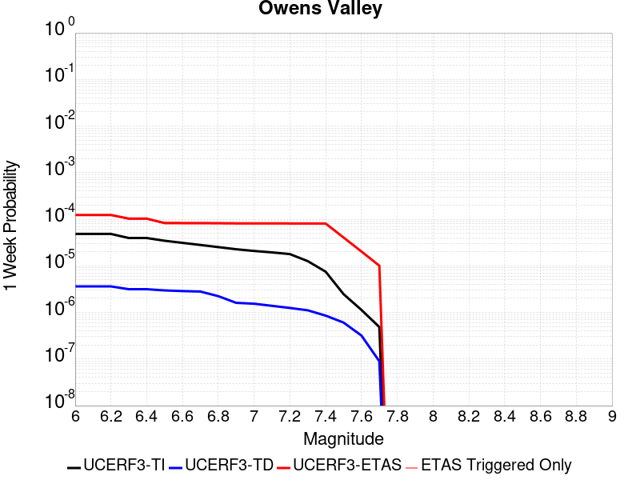 | 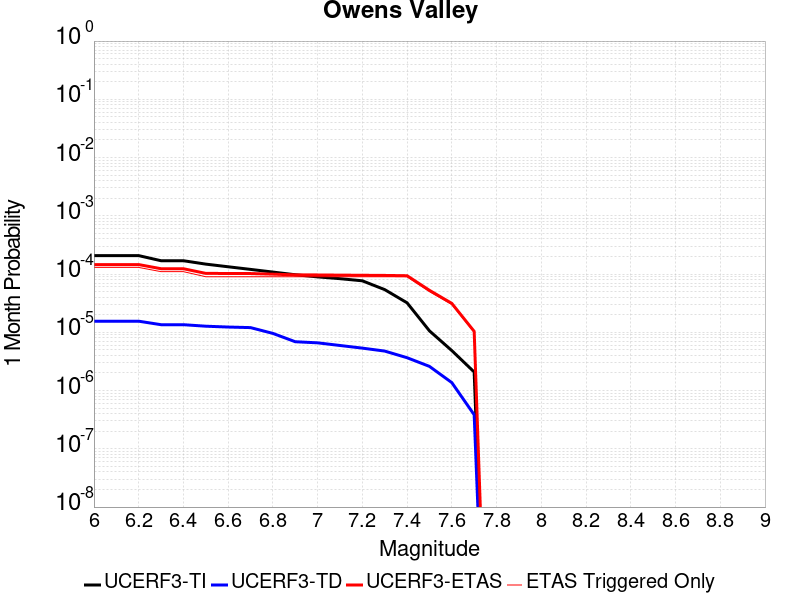 | 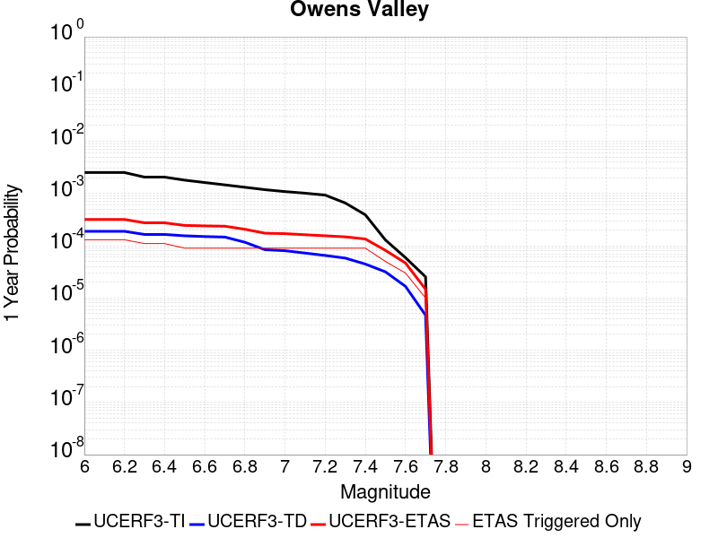 | 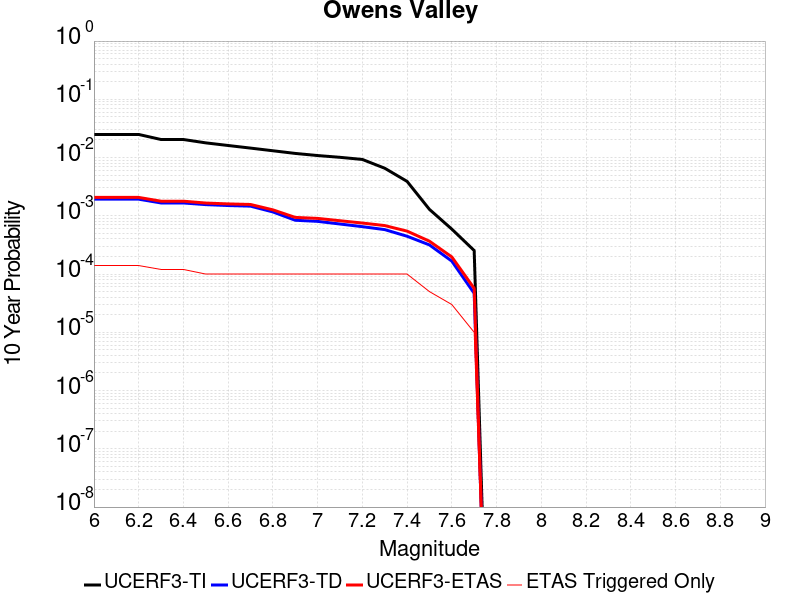 |

| Magnitude | 1 wk TI Prob | 1 wk TD Prob | 1 wk ETAS Prob | 1 wk ETAS/TD Gain | 1 wk ETAS Triggered Only | 1 mo TI Prob | 1 mo TD Prob | 1 mo ETAS Prob | 1 mo ETAS/TD Gain | 1 mo ETAS Triggered Only | 1 yr TI Prob | 1 yr TD Prob | 1 yr ETAS Prob | 1 yr ETAS/TD Gain | 1 yr ETAS Triggered Only | 10 yr TI Prob | 10 yr TD Prob | 10 yr ETAS Prob | 10 yr ETAS/TD Gain | 10 yr ETAS Triggered Only |
|-----|-----|-----|-----|-----|-----|-----|-----|-----|-----|-----|-----|-----|-----|-----|-----|-----|-----|-----|-----|-----|
| 6.0 | 4.83821E-5 | 3.6210524E-6 | 1.2362062E-4 | 34.139416 | 1.2E-4 | 2.0733538E-4 | 1.551871E-5 | 1.455167E-4 | 9.376855 | 1.3E-4 | 0.002521386 | 1.889249E-4 | 3.1890033E-4 | 1.6879741 | 1.3E-4 | 0.024929691 | 0.0019297141 | 0.002069444 | 1.0724096 | 1.4E-4 |
| 6.1 | 4.83821E-5 | 3.6210524E-6 | 1.2362062E-4 | 34.139416 | 1.2E-4 | 2.0733538E-4 | 1.551871E-5 | 1.455167E-4 | 9.376855 | 1.3E-4 | 0.002521386 | 1.889249E-4 | 3.1890033E-4 | 1.6879741 | 1.3E-4 | 0.024929691 | 0.0019297141 | 0.002069444 | 1.0724096 | 1.4E-4 |
| 6.2 | 4.83821E-5 | 3.6210524E-6 | 1.2362062E-4 | 34.139416 | 1.2E-4 | 2.0733538E-4 | 1.551871E-5 | 1.455167E-4 | 9.376855 | 1.3E-4 | 0.002521386 | 1.889249E-4 | 3.1890033E-4 | 1.6879741 | 1.3E-4 | 0.024929691 | 0.0019297141 | 0.002069444 | 1.0724096 | 1.4E-4 |
| 6.3 | 3.953008E-5 | 3.1530958E-6 | 1.0315278E-4 | 32.71476 | 1.0E-4 | 1.6940363E-4 | 1.3513202E-5 | 1.2351171E-4 | 9.140078 | 1.1E-4 | 0.002060538 | 1.6451156E-4 | 2.7449345E-4 | 1.6685361 | 1.1E-4 | 0.020415364 | 0.0016621627 | 0.0017819633 | 1.0720751 | 1.2E-4 |
| 6.4 | 3.953008E-5 | 3.1530958E-6 | 1.0315278E-4 | 32.71476 | 1.0E-4 | 1.6940363E-4 | 1.3513202E-5 | 1.2351171E-4 | 9.140078 | 1.1E-4 | 0.002060538 | 1.6451156E-4 | 2.7449345E-4 | 1.6685361 | 1.1E-4 | 0.020415364 | 0.0016621627 | 0.0017819633 | 1.0720751 | 1.2E-4 |
| 6.5 | 3.457342E-5 | 2.9707387E-6 | 8.29705E-5 | 27.929249 | 8.0E-5 | 1.4816338E-4 | 1.273168E-5 | 1.0273053E-4 | 8.068891 | 9.0E-5 | 0.0018023965 | 1.5499788E-4 | 2.449839E-4 | 1.5805632 | 9.0E-5 | 0.017878477 | 0.0015563119 | 0.0016561561 | 1.0641545 | 1.0E-4 |
| 6.6 | 3.1127765E-5 | 2.8737306E-6 | 8.28735E-5 | 28.838299 | 8.0E-5 | 1.3339789E-4 | 1.2315934E-5 | 1.0231483E-4 | 8.307516 | 9.0E-5 | 0.0016229092 | 1.4993687E-4 | 2.3992338E-4 | 1.6001626 | 9.0E-5 | 0.016111081 | 0.0015013438 | 0.0016011937 | 1.066507 | 1.0E-4 |
| 6.7 | 2.806885E-5 | 2.8101606E-6 | 8.280994E-5 | 29.468044 | 8.0E-5 | 1.2028952E-4 | 1.2043493E-5 | 1.0204241E-4 | 8.472825 | 9.0E-5 | 0.001463541 | 1.4662035E-4 | 2.3660716E-4 | 1.6137402 | 9.0E-5 | 0.014539397 | 0.0014656087 | 0.0015654622 | 1.0681311 | 1.0E-4 |
| 6.8 | 2.524524E-5 | 2.2351392E-6 | 8.223496E-5 | 36.791874 | 8.0E-5 | 1.0818939E-4 | 9.579134E-6 | 9.957827E-5 | 10.395331 | 9.0E-5 | 0.0013164099 | 1.16620016E-4 | 2.0660952E-4 | 1.7716471 | 9.0E-5 | 0.01308639 | 0.001165827 | 0.0012657105 | 1.0856761 | 1.0E-4 |
| 6.9 | 2.2704568E-5 | 1.6079711E-6 | 8.160784E-5 | 50.75206 | 8.0E-5 | 9.730166E-5 | 6.8912864E-6 | 9.689067E-5 | 14.059881 | 9.0E-5 | 0.0011840039 | 8.38982E-5 | 1.7389064E-4 | 2.0726385 | 9.0E-5 | 0.011777153 | 8.38853E-4 | 9.3876914E-4 | 1.1191103 | 1.0E-4 |
| 7.0 | 2.0871712E-5 | 1.5393621E-6 | 8.153924E-5 | 52.969498 | 8.0E-5 | 8.944713E-5 | 6.5972495E-6 | 9.6596654E-5 | 14.641959 | 9.0E-5 | 0.0010884746 | 8.031857E-5 | 1.7031134E-4 | 2.1204479 | 9.0E-5 | 0.010831586 | 8.030395E-4 | 9.029592E-4 | 1.1244268 | 1.0E-4 |
| 7.1 | 1.944928E-5 | 1.3862556E-6 | 8.138615E-5 | 58.70934 | 8.0E-5 | 8.335139E-5 | 5.941082E-6 | 9.5940544E-5 | 16.148666 | 9.0E-5 | 0.0010143308 | 7.233028E-5 | 1.6232378E-4 | 2.2442021 | 9.0E-5 | 0.010097133 | 7.2319806E-4 | 8.231257E-4 | 1.1381747 | 1.0E-4 |
| 7.2 | 1.7876306E-5 | 1.2487686E-6 | 8.124867E-5 | 65.063034 | 8.0E-5 | 7.6610486E-5 | 5.3518543E-6 | 9.535137E-5 | 17.816511 | 9.0E-5 | 9.3233347E-4 | 6.515689E-5 | 1.5515102E-4 | 2.3811915 | 9.0E-5 | 0.009284316 | 6.5148395E-4 | 7.514188E-4 | 1.1533958 | 1.0E-4 |
| 7.3 | 1.2618672E-5 | 1.1113839E-6 | 8.111129E-5 | 72.98225 | 8.0E-5 | 5.40789E-5 | 4.763065E-6 | 9.476264E-5 | 19.895306 | 9.0E-5 | 6.582117E-4 | 5.7988782E-5 | 1.4798356E-4 | 2.5519342 | 9.0E-5 | 0.0065626553 | 5.7983754E-4 | 6.7977956E-4 | 1.1723621 | 1.0E-4 |
| 7.4 | 7.4874442E-6 | 8.547518E-7 | 8.085468E-5 | 94.594345 | 8.0E-5 | 3.208865E-5 | 3.6632168E-6 | 9.3662886E-5 | 25.56848 | 9.0E-5 | 3.906093E-4 | 4.4598757E-5 | 1.3459474E-4 | 3.0179036 | 9.0E-5 | 0.003899234 | 4.459579E-4 | 5.459133E-4 | 1.2241364 | 1.0E-4 |
| 7.5 | 2.4734156E-6 | 6.0679935E-7 | 4.0606774E-5 | 66.91961 | 4.0E-5 | 1.060031E-5 | 2.6005662E-6 | 5.2600437E-5 | 20.226532 | 5.0E-5 | 1.2905113E-4 | 3.1661435E-5 | 8.1659855E-5 | 2.5791583 | 5.0E-5 | 0.0012897621 | 3.1656958E-4 | 3.6655375E-4 | 1.1578932 | 5.0E-5 |
| 7.6 | 1.1328841E-6 | 3.1961991E-7 | 2.0319614E-5 | 63.574303 | 2.0E-5 | 4.8552088E-6 | 1.369799E-6 | 3.1369756E-5 | 22.900993 | 3.0E-5 | 5.9110564E-5 | 1.6677177E-5 | 4.6676676E-5 | 2.7988355 | 3.0E-5 | 5.9094845E-4 | 1.6675945E-4 | 1.9675444E-4 | 1.1798699 | 3.0E-5 |
| 7.7 | 4.8613185E-7 | 8.962742E-8 | 1.0089627E-5 | 112.57299 | 1.0E-5 | 2.0834207E-6 | 3.8411747E-7 | 1.0384114E-5 | 27.033693 | 1.0E-5 | 2.536535E-5 | 4.676621E-6 | 1.4676574E-5 | 3.138286 | 1.0E-5 | 2.5362454E-4 | 4.676529E-5 | 5.6764824E-5 | 1.2138238 | 1.0E-5 |

## San Jacinto (Stepovers Combined)
*[(top)](#table-of-contents)*

| 1 Week | 1 Month | 1 Year | 10 Year |
|-----|-----|-----|-----|
| 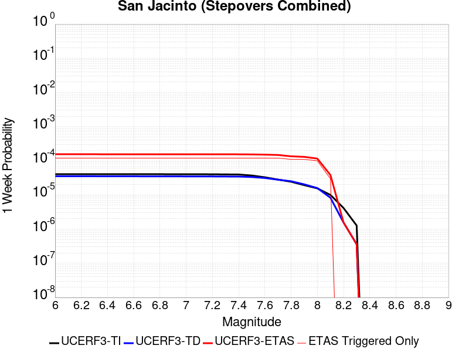 | 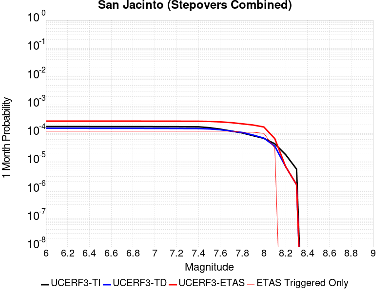 | 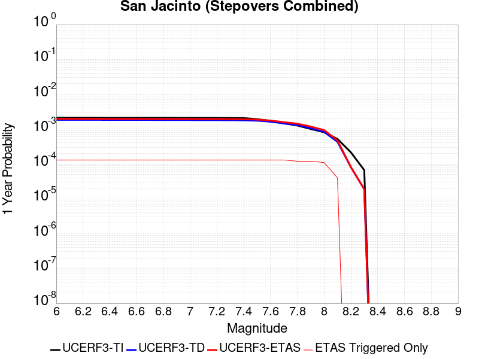 | 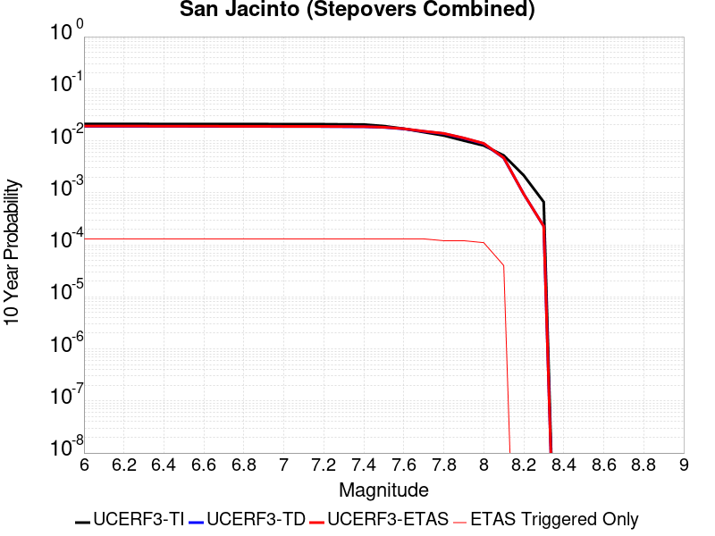 |

| Magnitude | 1 wk TI Prob | 1 wk TD Prob | 1 wk ETAS Prob | 1 wk ETAS/TD Gain | 1 wk ETAS Triggered Only | 1 mo TI Prob | 1 mo TD Prob | 1 mo ETAS Prob | 1 mo ETAS/TD Gain | 1 mo ETAS Triggered Only | 1 yr TI Prob | 1 yr TD Prob | 1 yr ETAS Prob | 1 yr ETAS/TD Gain | 1 yr ETAS Triggered Only | 10 yr TI Prob | 10 yr TD Prob | 10 yr ETAS Prob | 10 yr ETAS/TD Gain | 10 yr ETAS Triggered Only |
|-----|-----|-----|-----|-----|-----|-----|-----|-----|-----|-----|-----|-----|-----|-----|-----|-----|-----|-----|-----|-----|
| 6.0 | 4.0667746E-5 | 3.5271103E-5 | 1.5526687E-4 | 4.4020987 | 1.2E-4 | 1.742787E-4 | 1.5115313E-4 | 2.7113498E-4 | 1.7937769 | 1.2E-4 | 0.0021197782 | 0.0018387372 | 0.001968498 | 1.0705707 | 1.3E-4 | 0.020996714 | 0.018986495 | 0.019114027 | 1.006717 | 1.3E-4 |
| 6.1 | 4.0667746E-5 | 3.5271103E-5 | 1.5526687E-4 | 4.4020987 | 1.2E-4 | 1.742787E-4 | 1.5115313E-4 | 2.7113498E-4 | 1.7937769 | 1.2E-4 | 0.0021197782 | 0.0018387372 | 0.001968498 | 1.0705707 | 1.3E-4 | 0.020996714 | 0.018986495 | 0.019114027 | 1.006717 | 1.3E-4 |
| 6.2 | 4.0667746E-5 | 3.5271103E-5 | 1.5526687E-4 | 4.4020987 | 1.2E-4 | 1.742787E-4 | 1.5115313E-4 | 2.7113498E-4 | 1.7937769 | 1.2E-4 | 0.0021197782 | 0.0018387372 | 0.001968498 | 1.0705707 | 1.3E-4 | 0.020996714 | 0.018986495 | 0.019114027 | 1.006717 | 1.3E-4 |
| 6.3 | 4.0667746E-5 | 3.5271103E-5 | 1.5526687E-4 | 4.4020987 | 1.2E-4 | 1.742787E-4 | 1.5115313E-4 | 2.7113498E-4 | 1.7937769 | 1.2E-4 | 0.0021197782 | 0.0018387372 | 0.001968498 | 1.0705707 | 1.3E-4 | 0.020996714 | 0.018986495 | 0.019114027 | 1.006717 | 1.3E-4 |
| 6.4 | 4.0577226E-5 | 3.5143014E-5 | 1.551388E-4 | 4.414499 | 1.2E-4 | 1.738908E-4 | 1.5060425E-4 | 2.7058617E-4 | 1.7966703 | 1.2E-4 | 0.0021150648 | 0.0018320669 | 0.0019618287 | 1.0708281 | 1.3E-4 | 0.020950472 | 0.018921062 | 0.019048603 | 1.0067407 | 1.3E-4 |
| 6.5 | 4.0577226E-5 | 3.5143014E-5 | 1.551388E-4 | 4.414499 | 1.2E-4 | 1.738908E-4 | 1.5060425E-4 | 2.7058617E-4 | 1.7966703 | 1.2E-4 | 0.0021150648 | 0.0018320669 | 0.0019618287 | 1.0708281 | 1.3E-4 | 0.020950472 | 0.018921062 | 0.019048603 | 1.0067407 | 1.3E-4 |
| 6.6 | 4.053861E-5 | 3.5088357E-5 | 1.5508414E-4 | 4.419818 | 1.2E-4 | 1.7372532E-4 | 1.5037002E-4 | 2.7035197E-4 | 1.7979114 | 1.2E-4 | 0.0021130538 | 0.0018292206 | 0.0019589828 | 1.0709385 | 1.3E-4 | 0.020930743 | 0.01889314 | 0.019020684 | 1.0067508 | 1.3E-4 |
| 6.7 | 4.0516545E-5 | 3.505743E-5 | 1.5505322E-4 | 4.422835 | 1.2E-4 | 1.7363077E-4 | 1.502375E-4 | 2.7021946E-4 | 1.7986153 | 1.2E-4 | 0.002111905 | 0.0018276101 | 0.0019573725 | 1.0710012 | 1.3E-4 | 0.020919468 | 0.018877337 | 0.019004883 | 1.0067565 | 1.3E-4 |
| 6.8 | 4.049434E-5 | 3.5028992E-5 | 1.5502478E-4 | 4.4256134 | 1.2E-4 | 1.7353562E-4 | 1.5011564E-4 | 2.7009763E-4 | 1.7992637 | 1.2E-4 | 0.0021107488 | 0.0018261289 | 0.0019558915 | 1.0710589 | 1.3E-4 | 0.020908125 | 0.018862749 | 0.018990297 | 1.0067619 | 1.3E-4 |
| 6.9 | 4.046386E-5 | 3.4991554E-5 | 1.5498736E-4 | 4.429279 | 1.2E-4 | 1.73405E-4 | 1.499552E-4 | 2.699372E-4 | 1.800119 | 1.2E-4 | 0.0021091616 | 0.0018241788 | 0.0019539418 | 1.0711349 | 1.3E-4 | 0.020892553 | 0.018843522 | 0.018971073 | 1.006769 | 1.3E-4 |
| 7.0 | 4.036382E-5 | 3.4872126E-5 | 1.5486794E-4 | 4.441024 | 1.2E-4 | 1.7297632E-4 | 1.4944343E-4 | 2.6942548E-4 | 1.8028595 | 1.2E-4 | 0.0021039525 | 0.0018179584 | 0.0019477222 | 1.0713788 | 1.3E-4 | 0.02084144 | 0.018782137 | 0.018909695 | 1.0067915 | 1.3E-4 |
| 7.1 | 4.0343282E-5 | 3.485059E-5 | 1.548464E-4 | 4.4431505 | 1.2E-4 | 1.7288832E-4 | 1.4935112E-4 | 2.6933322E-4 | 1.8033557 | 1.2E-4 | 0.002102883 | 0.0018168368 | 0.0019466005 | 1.0714229 | 1.3E-4 | 0.020830948 | 0.018771008 | 0.018898567 | 1.0067955 | 1.3E-4 |
| 7.2 | 4.0257353E-5 | 3.475509E-5 | 1.5475092E-4 | 4.452612 | 1.2E-4 | 1.725201E-4 | 1.489419E-4 | 2.6892402E-4 | 1.8055633 | 1.2E-4 | 0.0020984085 | 0.0018118626 | 0.001941627 | 1.0716194 | 1.3E-4 | 0.020787042 | 0.018721746 | 0.018849313 | 1.0068138 | 1.3E-4 |
| 7.3 | 3.9940667E-5 | 3.458276E-5 | 1.545786E-4 | 4.469817 | 1.2E-4 | 1.7116306E-4 | 1.4820343E-4 | 2.6818563E-4 | 1.8095778 | 1.2E-4 | 0.0020819185 | 0.0018028866 | 0.0019326523 | 1.0719765 | 1.3E-4 | 0.020625217 | 0.018630387 | 0.018757965 | 1.0068479 | 1.3E-4 |
| 7.4 | 3.9721202E-5 | 3.4468165E-5 | 1.5446403E-4 | 4.4813533 | 1.2E-4 | 1.7022261E-4 | 1.4771236E-4 | 2.6769465E-4 | 1.8122697 | 1.2E-4 | 0.0020704903 | 0.0017969179 | 0.0019266843 | 1.0722162 | 1.3E-4 | 0.020513052 | 0.018569522 | 0.018697107 | 1.0068707 | 1.3E-4 |
| 7.5 | 3.7036873E-5 | 3.3535776E-5 | 1.5353176E-4 | 4.5781484 | 1.2E-4 | 1.5871979E-4 | 1.4371685E-4 | 2.636996E-4 | 1.8348552 | 1.2E-4 | 0.0019307006 | 0.0017483513 | 0.001878124 | 1.0742258 | 1.3E-4 | 0.019140124 | 0.018071128 | 0.018198779 | 1.0070637 | 1.3E-4 |
| 7.6 | 3.2940967E-5 | 3.13167E-5 | 1.5131294E-4 | 4.8317013 | 1.2E-4 | 1.4116794E-4 | 1.3420754E-4 | 2.5419143E-4 | 1.8940176 | 1.2E-4 | 0.0017173645 | 0.0016327545 | 0.0017625422 | 1.0794901 | 1.3E-4 | 0.01704153 | 0.016904091 | 0.017031893 | 1.0075605 | 1.3E-4 |
| 7.7 | 2.8236149E-5 | 2.7882697E-5 | 1.4787936E-4 | 5.303624 | 1.2E-4 | 1.2100645E-4 | 1.1949181E-4 | 2.3947746E-4 | 2.004133 | 1.2E-4 | 0.0014722579 | 0.0014538429 | 0.0015836539 | 1.0892882 | 1.3E-4 | 0.014625421 | 0.015114912 | 0.015242946 | 1.0084708 | 1.3E-4 |
| 7.8 | 2.4329287E-5 | 2.5206451E-5 | 1.3520368E-4 | 5.3638525 | 1.1E-4 | 1.042642E-4 | 1.08023174E-4 | 2.180113E-4 | 2.01819 | 1.1E-4 | 0.0012686774 | 0.0013143895 | 0.0014342319 | 1.0911771 | 1.2E-4 | 0.012614589 | 0.013712341 | 0.013830695 | 1.0086312 | 1.2E-4 |
| 7.9 | 1.9370926E-5 | 2.0420413E-5 | 1.3041816E-4 | 6.3866568 | 1.1E-4 | 8.301561E-5 | 8.751312E-5 | 1.975035E-4 | 2.2568443 | 1.1E-4 | 0.0010102465 | 0.0010649522 | 0.0011848245 | 1.1125611 | 1.2E-4 | 0.0100566605 | 0.011199402 | 0.011318058 | 1.0105948 | 1.2E-4 |
| 8.0 | 1.5583017E-5 | 1.5885415E-5 | 1.1588383E-4 | 7.2949824 | 1.0E-4 | 6.6782646E-5 | 6.807858E-5 | 1.6807177E-4 | 2.4687908 | 1.0E-4 | 8.127754E-4 | 8.2854216E-4 | 9.3845103E-4 | 1.1326534 | 1.1E-4 | 0.008098091 | 0.008781636 | 0.008890671 | 1.0124161 | 1.1E-4 |
| 8.1 | 1.0024873E-5 | 8.291399E-6 | 3.829115E-5 | 4.618177 | 3.0E-5 | 4.2963035E-5 | 3.553409E-5 | 6.553302E-5 | 1.8442297 | 3.0E-5 | 5.229494E-4 | 4.3254215E-4 | 4.7252484E-4 | 1.0924366 | 4.0E-5 | 0.0052172043 | 0.0046530655 | 0.0046928795 | 1.0085565 | 4.0E-5 |
| 8.2 | 4.142796E-6 | 1.5602761E-6 | 1.5602761E-6 | 1.0 | 0.0 | 1.775472E-5 | 6.6868806E-6 | 6.6868806E-6 | 1.0 | 0.0 | 2.1614227E-4 | 8.140976E-5 | 8.140976E-5 | 1.0 | 0.0 | 0.0021593217 | 9.4514614E-4 | 9.4514614E-4 | 1.0 | 0.0 |
| 8.3 | 1.2750878E-6 | 3.609817E-7 | 3.609817E-7 | 1.0 | 0.0 | 5.4646503E-6 | 1.5470634E-6 | 1.5470634E-6 | 1.0 | 0.0 | 6.653009E-5 | 1.8835339E-5 | 1.8835339E-5 | 1.0 | 0.0 | 6.6510175E-4 | 2.272251E-4 | 2.272251E-4 | 1.0 | 0.0 |

## Death Valley (Fish Lake Valley)
*[(top)](#table-of-contents)*

| 1 Week | 1 Month | 1 Year | 10 Year |
|-----|-----|-----|-----|
| 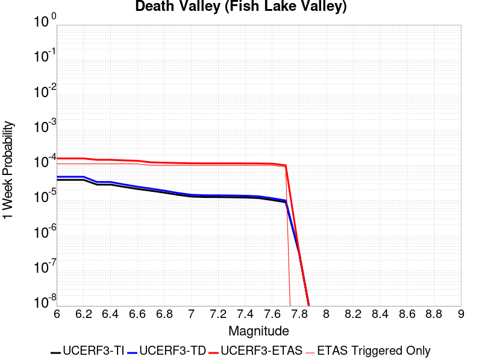 | 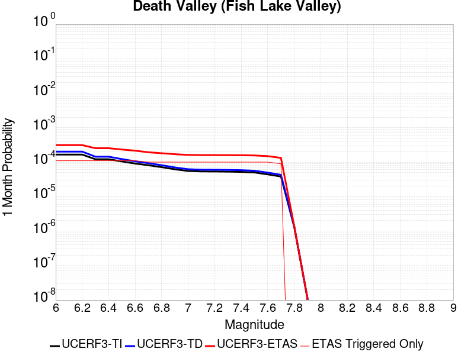 | 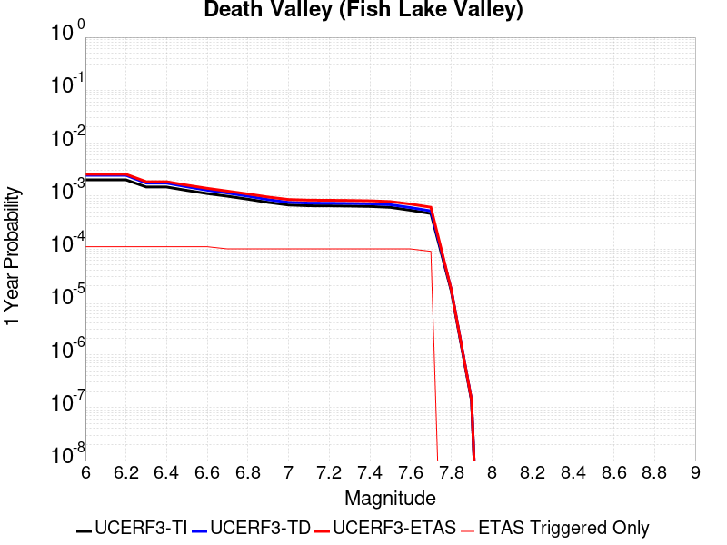 | 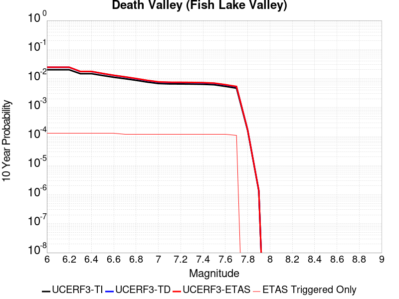 |

| Magnitude | 1 wk TI Prob | 1 wk TD Prob | 1 wk ETAS Prob | 1 wk ETAS/TD Gain | 1 wk ETAS Triggered Only | 1 mo TI Prob | 1 mo TD Prob | 1 mo ETAS Prob | 1 mo ETAS/TD Gain | 1 mo ETAS Triggered Only | 1 yr TI Prob | 1 yr TD Prob | 1 yr ETAS Prob | 1 yr ETAS/TD Gain | 1 yr ETAS Triggered Only | 10 yr TI Prob | 10 yr TD Prob | 10 yr ETAS Prob | 10 yr ETAS/TD Gain | 10 yr ETAS Triggered Only |
|-----|-----|-----|-----|-----|-----|-----|-----|-----|-----|-----|-----|-----|-----|-----|-----|-----|-----|-----|-----|-----|
| 6.0 | 3.872328E-5 | 4.7265705E-5 | 1.5726051E-4 | 3.327159 | 1.1E-4 | 1.6594635E-4 | 2.0255324E-4 | 3.1253096E-4 | 1.5429571 | 1.1E-4 | 0.0020185246 | 0.0024635606 | 0.0025732897 | 1.0445408 | 1.1E-4 | 0.02000288 | 0.024388338 | 0.024515167 | 1.0052004 | 1.3E-4 |
| 6.1 | 3.872328E-5 | 4.7265705E-5 | 1.5726051E-4 | 3.327159 | 1.1E-4 | 1.6594635E-4 | 2.0255324E-4 | 3.1253096E-4 | 1.5429571 | 1.1E-4 | 0.0020185246 | 0.0024635606 | 0.0025732897 | 1.0445408 | 1.1E-4 | 0.02000288 | 0.024388338 | 0.024515167 | 1.0052004 | 1.3E-4 |
| 6.2 | 3.872328E-5 | 4.7265705E-5 | 1.5726051E-4 | 3.327159 | 1.1E-4 | 1.6594635E-4 | 2.0255324E-4 | 3.1253096E-4 | 1.5429571 | 1.1E-4 | 0.0020185246 | 0.0024635606 | 0.0025732897 | 1.0445408 | 1.1E-4 | 0.02000288 | 0.024388338 | 0.024515167 | 1.0052004 | 1.3E-4 |
| 6.3 | 2.8356371E-5 | 3.360979E-5 | 1.436061E-4 | 4.272746 | 1.1E-4 | 1.2152165E-4 | 1.4403443E-4 | 2.5401858E-4 | 1.7635963 | 1.1E-4 | 0.0014785219 | 0.0017522788 | 0.001862086 | 1.0626653 | 1.1E-4 | 0.014687235 | 0.017391816 | 0.017519556 | 1.0073447 | 1.3E-4 |
| 6.4 | 2.8356371E-5 | 3.360979E-5 | 1.436061E-4 | 4.272746 | 1.1E-4 | 1.2152165E-4 | 1.4403443E-4 | 2.5401858E-4 | 1.7635963 | 1.1E-4 | 0.0014785219 | 0.0017522788 | 0.001862086 | 1.0626653 | 1.1E-4 | 0.014687235 | 0.017391816 | 0.017519556 | 1.0073447 | 1.3E-4 |
| 6.5 | 2.4448687E-5 | 2.8607585E-5 | 1.3860443E-4 | 4.845024 | 1.1E-4 | 1.0477588E-4 | 1.2259845E-4 | 2.3258496E-4 | 1.8971281 | 1.1E-4 | 0.0012748998 | 0.0014916616 | 0.0016014976 | 1.0736333 | 1.1E-4 | 0.012676105 | 0.014821392 | 0.014949464 | 1.0086411 | 1.3E-4 |
| 6.6 | 2.1298161E-5 | 2.4660083E-5 | 1.3465737E-4 | 5.46054 | 1.1E-4 | 9.127464E-5 | 1.0568197E-4 | 2.1567034E-4 | 2.0407488 | 1.1E-4 | 0.0011107022 | 0.0012859512 | 0.0013958098 | 1.0854298 | 1.1E-4 | 0.011051672 | 0.01278853 | 0.012916868 | 1.0100354 | 1.3E-4 |
| 6.7 | 1.8959729E-5 | 2.1781027E-5 | 1.21778845E-4 | 5.591052 | 1.0E-4 | 8.125345E-5 | 9.334406E-5 | 1.9333472E-4 | 2.0712054 | 1.0E-4 | 9.888117E-4 | 0.001135897 | 0.0012357833 | 1.0879362 | 1.0E-4 | 0.009844234 | 0.01130357 | 0.011422214 | 1.0104961 | 1.2E-4 |
| 6.8 | 1.6691629E-5 | 1.9018351E-5 | 1.1901645E-4 | 6.2579794 | 1.0E-4 | 7.153359E-5 | 8.150477E-5 | 1.8149662E-4 | 2.2268221 | 1.0E-4 | 8.7057345E-4 | 9.918857E-4 | 0.0010917865 | 1.100718 | 1.0E-4 | 0.008671708 | 0.009876343 | 0.009995159 | 1.0120302 | 1.2E-4 |
| 6.9 | 1.450505E-5 | 1.638954E-5 | 1.163879E-4 | 7.1013527 | 1.0E-4 | 6.216302E-5 | 7.0239046E-5 | 1.7023202E-4 | 2.4236095 | 1.0E-4 | 7.5657194E-4 | 8.5483363E-4 | 9.5474813E-4 | 1.1168818 | 1.0E-4 | 0.007540013 | 0.008516386 | 0.008635364 | 1.0139705 | 1.2E-4 |
| 7.0 | 1.2940855E-5 | 1.4537972E-5 | 1.1453652E-4 | 7.8784385 | 1.0E-4 | 5.545963E-5 | 6.230414E-5 | 1.622979E-4 | 2.60493 | 1.0E-4 | 6.750118E-4 | 7.5829466E-4 | 8.582189E-4 | 1.1317749 | 1.0E-4 | 0.006729651 | 0.0075576897 | 0.007676783 | 1.0157579 | 1.2E-4 |
| 7.1 | 1.2544658E-5 | 1.4078208E-5 | 1.140768E-4 | 8.103077 | 1.0E-4 | 5.3761712E-5 | 6.0333812E-5 | 1.6032778E-4 | 2.6573455 | 1.0E-4 | 6.5435225E-4 | 7.343222E-4 | 8.342488E-4 | 1.13608 | 1.0E-4 | 0.006524288 | 0.007319551 | 0.0074386727 | 1.0162745 | 1.2E-4 |
| 7.2 | 1.2489416E-5 | 1.4015674E-5 | 1.1401427E-4 | 8.134769 | 1.0E-4 | 5.3524967E-5 | 6.0065824E-5 | 1.6005982E-4 | 2.6647403 | 1.0E-4 | 6.514716E-4 | 7.310616E-4 | 8.309885E-4 | 1.1366874 | 1.0E-4 | 0.006495651 | 0.0072871596 | 0.007406285 | 1.0163473 | 1.2E-4 |
| 7.3 | 1.2368307E-5 | 1.3879812E-5 | 1.1387842E-4 | 8.204608 | 1.0E-4 | 5.3005948E-5 | 5.9483587E-5 | 1.5947764E-4 | 2.681036 | 1.0E-4 | 6.451563E-4 | 7.2397763E-4 | 8.239052E-4 | 1.1380258 | 1.0E-4 | 0.0064328653 | 0.007216782 | 0.0073359157 | 1.0165079 | 1.2E-4 |
| 7.4 | 1.2161707E-5 | 1.36478675E-5 | 1.136465E-4 | 8.327052 | 1.0E-4 | 5.212056E-5 | 5.8489582E-5 | 1.5848373E-4 | 2.7096062 | 1.0E-4 | 6.3438306E-4 | 7.118836E-4 | 8.118124E-4 | 1.1403724 | 1.0E-4 | 0.006325751 | 0.0070966207 | 0.007215769 | 1.0167894 | 1.2E-4 |
| 7.5 | 1.1707948E-5 | 1.3145515E-5 | 1.13144204E-4 | 8.607058 | 1.0E-4 | 5.0175953E-5 | 5.6336736E-5 | 1.5633111E-4 | 2.7749407 | 1.0E-4 | 6.10721E-4 | 6.856895E-4 | 7.8562094E-4 | 1.1457386 | 1.0E-4 | 0.0060904534 | 0.006836321 | 0.0069555007 | 1.0174333 | 1.2E-4 |
| 7.6 | 1.0319538E-5 | 1.1579622E-5 | 1.1157846E-4 | 9.63576 | 1.0E-4 | 4.4225842E-5 | 4.9626036E-5 | 1.4962108E-4 | 3.0149713 | 1.0E-4 | 5.383166E-4 | 6.040347E-4 | 7.039743E-4 | 1.1654534 | 1.0E-4 | 0.0053701443 | 0.0060244603 | 0.0061437376 | 1.0197988 | 1.2E-4 |
| 7.7 | 8.937764E-6 | 1.0022779E-5 | 1.00021876E-4 | 9.979455 | 9.0E-5 | 3.830414E-5 | 4.295409E-5 | 1.3295023E-4 | 3.0951703 | 9.0E-5 | 4.6625308E-4 | 5.228456E-4 | 6.1279855E-4 | 1.172045 | 9.0E-5 | 0.0046527605 | 0.005216664 | 0.0053260904 | 1.0209763 | 1.1E-4 |
| 7.8 | 3.108007E-7 | 3.284654E-7 | 3.284654E-7 | 1.0 | 0.0 | 1.3320023E-6 | 1.407708E-6 | 1.407708E-6 | 1.0 | 0.0 | 1.6217007E-5 | 1.7138715E-5 | 1.7138715E-5 | 1.0 | 0.0 | 1.6215823E-4 | 1.7137431E-4 | 1.7137431E-4 | 1.0 | 0.0 |
| 7.9 | 2.5591178E-9 | 2.6696718E-9 | 2.6696718E-9 | 1.0 | 0.0 | 1.0967647E-8 | 1.14414505E-8 | 1.14414505E-8 | 1.0 | 0.0 | 1.335311E-7 | 1.3929966E-7 | 1.3929966E-7 | 1.0 | 0.0 | 1.3353102E-6 | 1.3929966E-6 | 1.3929966E-6 | 1.0 | 0.0 |

## Manix-Afton Hills
*[(top)](#table-of-contents)*

| 1 Week | 1 Month | 1 Year | 10 Year |
|-----|-----|-----|-----|
| 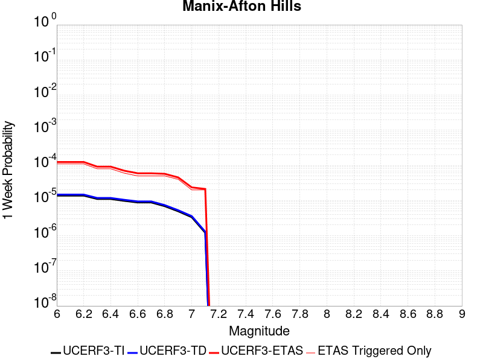 | 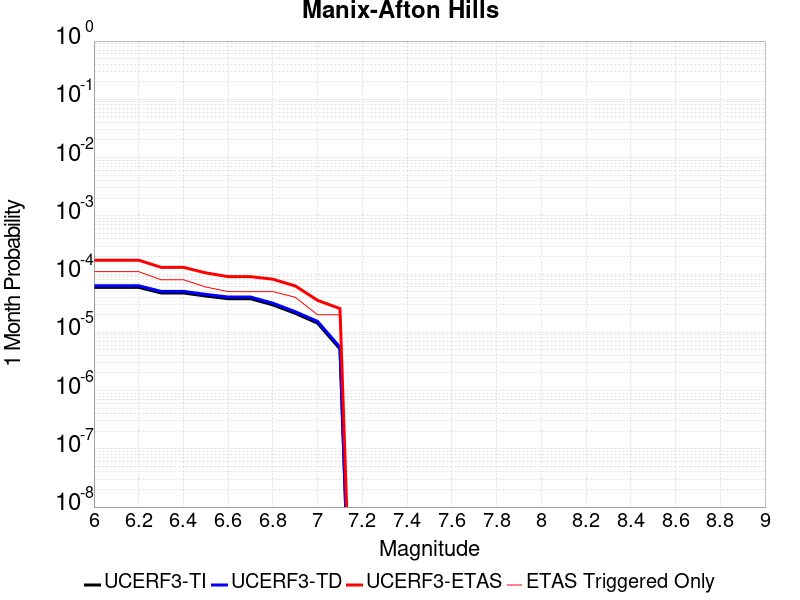 | 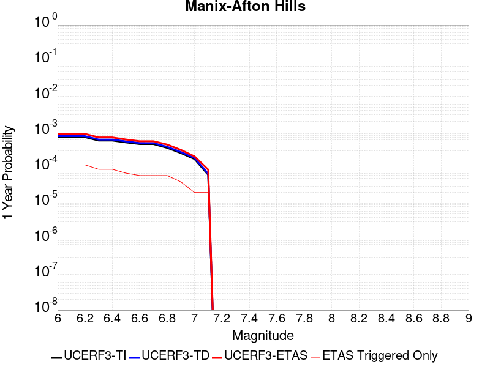 | 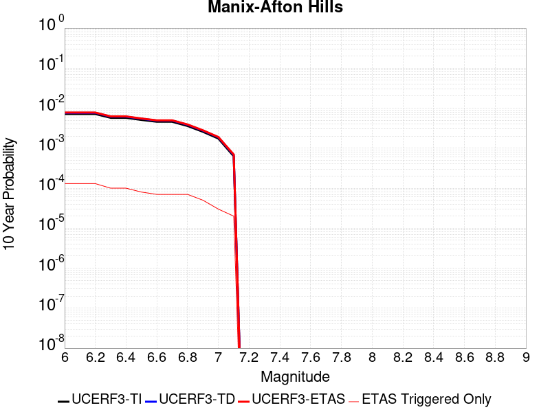 |

| Magnitude | 1 wk TI Prob | 1 wk TD Prob | 1 wk ETAS Prob | 1 wk ETAS/TD Gain | 1 wk ETAS Triggered Only | 1 mo TI Prob | 1 mo TD Prob | 1 mo ETAS Prob | 1 mo ETAS/TD Gain | 1 mo ETAS Triggered Only | 1 yr TI Prob | 1 yr TD Prob | 1 yr ETAS Prob | 1 yr ETAS/TD Gain | 1 yr ETAS Triggered Only | 10 yr TI Prob | 10 yr TD Prob | 10 yr ETAS Prob | 10 yr ETAS/TD Gain | 10 yr ETAS Triggered Only |
|-----|-----|-----|-----|-----|-----|-----|-----|-----|-----|-----|-----|-----|-----|-----|-----|-----|-----|-----|-----|-----|
| 6.0 | 1.3783202E-5 | 1.47110895E-5 | 1.2470948E-4 | 8.477242 | 1.1E-4 | 5.906953E-5 | 6.30461E-5 | 1.7303917E-4 | 2.7446449 | 1.1E-4 | 7.189342E-4 | 7.6733343E-4 | 8.872414E-4 | 1.1562657 | 1.2E-4 | 0.0071661277 | 0.007648596 | 0.0077776015 | 1.0168666 | 1.3E-4 |
| 6.1 | 1.3783202E-5 | 1.47110895E-5 | 1.2470948E-4 | 8.477242 | 1.1E-4 | 5.906953E-5 | 6.30461E-5 | 1.7303917E-4 | 2.7446449 | 1.1E-4 | 7.189342E-4 | 7.6733343E-4 | 8.872414E-4 | 1.1562657 | 1.2E-4 | 0.0071661277 | 0.007648596 | 0.0077776015 | 1.0168666 | 1.3E-4 |
| 6.2 | 1.3783202E-5 | 1.47110895E-5 | 1.2470948E-4 | 8.477242 | 1.1E-4 | 5.906953E-5 | 6.30461E-5 | 1.7303917E-4 | 2.7446449 | 1.1E-4 | 7.189342E-4 | 7.6733343E-4 | 8.872414E-4 | 1.1562657 | 1.2E-4 | 0.0071661277 | 0.007648596 | 0.0077776015 | 1.0168666 | 1.3E-4 |
| 6.3 | 1.10494875E-5 | 1.1793136E-5 | 9.179219E-5 | 7.7835274 | 8.0E-5 | 4.7354086E-5 | 5.054109E-5 | 1.3053704E-4 | 2.5827906 | 8.0E-5 | 5.763835E-4 | 6.151744E-4 | 7.0511905E-4 | 1.14621 | 9.0E-5 | 0.005748908 | 0.0061357557 | 0.006235142 | 1.0161979 | 1.0E-4 |
| 6.4 | 1.10494875E-5 | 1.1793136E-5 | 9.179219E-5 | 7.7835274 | 8.0E-5 | 4.7354086E-5 | 5.054109E-5 | 1.3053704E-4 | 2.5827906 | 8.0E-5 | 5.763835E-4 | 6.151744E-4 | 7.0511905E-4 | 1.14621 | 9.0E-5 | 0.005748908 | 0.0061357557 | 0.006235142 | 1.0161979 | 1.0E-4 |
| 6.5 | 9.788949E-6 | 1.045432E-5 | 7.0453694E-5 | 6.7391944 | 6.0E-5 | 4.1951964E-5 | 4.480351E-5 | 1.0480082E-4 | 2.3391209 | 6.0E-5 | 5.1064545E-4 | 5.453555E-4 | 6.153173E-4 | 1.1282866 | 7.0E-5 | 0.0050947363 | 0.0054410985 | 0.005520663 | 1.0146229 | 8.0E-5 |
| 6.6 | 8.810006E-6 | 9.4136285E-6 | 5.9413156E-5 | 6.3113985 | 5.0E-5 | 3.775662E-5 | 4.0343548E-5 | 9.034153E-5 | 2.2393055 | 5.0E-5 | 4.5958988E-4 | 4.9108086E-4 | 5.510514E-4 | 1.1221194 | 6.0E-5 | 0.0045864056 | 0.004900839 | 0.004970496 | 1.0142133 | 7.0E-5 |
| 6.7 | 8.80128E-6 | 9.404108E-6 | 5.940364E-5 | 6.3167753 | 5.0E-5 | 3.7719226E-5 | 4.0302748E-5 | 9.030073E-5 | 2.2405603 | 5.0E-5 | 4.591348E-4 | 4.9058435E-4 | 5.5055495E-4 | 1.1222432 | 6.0E-5 | 0.004581874 | 0.0048958957 | 0.004965553 | 1.0142277 | 7.0E-5 |
| 6.8 | 6.8994877E-6 | 7.380076E-6 | 5.7379708E-5 | 7.774948 | 5.0E-5 | 2.9568899E-5 | 3.162856E-5 | 8.1626975E-5 | 2.5807998 | 5.0E-5 | 3.5994186E-4 | 3.8501783E-4 | 4.4499474E-4 | 1.155777 | 6.0E-5 | 0.003593594 | 0.0038443129 | 0.003914044 | 1.0181388 | 7.0E-5 |
| 6.9 | 4.9328037E-6 | 5.2709615E-6 | 4.527075E-5 | 8.588708 | 4.0E-5 | 2.1140417E-5 | 2.2589675E-5 | 6.258877E-5 | 2.7706807 | 4.0E-5 | 2.5735417E-4 | 2.7500073E-4 | 3.1498974E-4 | 1.1454141 | 4.0E-5 | 0.0025705635 | 0.0027472095 | 0.002797072 | 1.0181503 | 5.0E-5 |
| 7.0 | 3.347973E-6 | 3.59003E-6 | 2.3589959E-5 | 6.5709643 | 2.0E-5 | 1.4348378E-5 | 1.5385775E-5 | 3.5385467E-5 | 2.299882 | 2.0E-5 | 1.746775E-4 | 1.8730981E-4 | 2.0730606E-4 | 1.106755 | 2.0E-5 | 0.0017454025 | 0.0018719219 | 0.0019018658 | 1.0159963 | 3.0E-5 |
| 7.1 | 1.2073567E-6 | 1.293482E-6 | 2.1293456E-5 | 16.46212 | 2.0E-5 | 5.1743755E-6 | 5.543492E-6 | 2.554338E-5 | 4.6078143 | 2.0E-5 | 6.29962E-5 | 6.749156E-5 | 8.749021E-5 | 1.2963134 | 2.0E-5 | 6.297835E-4 | 6.7487074E-4 | 6.9485727E-4 | 1.0296153 | 2.0E-5 |

## Lake Isabella (Seismicity)
*[(top)](#table-of-contents)*

| 1 Week | 1 Month | 1 Year | 10 Year |
|-----|-----|-----|-----|
| 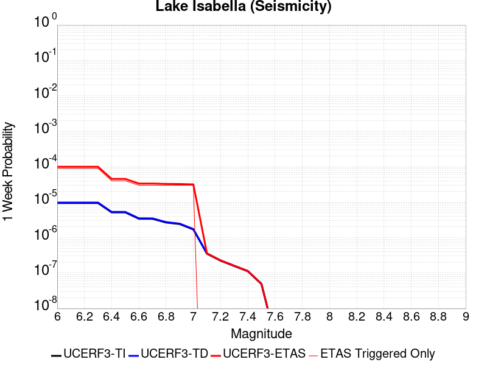 | 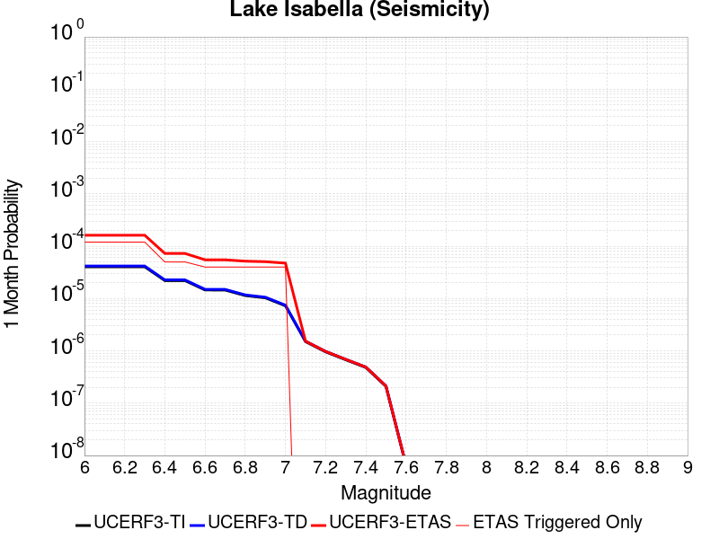 | 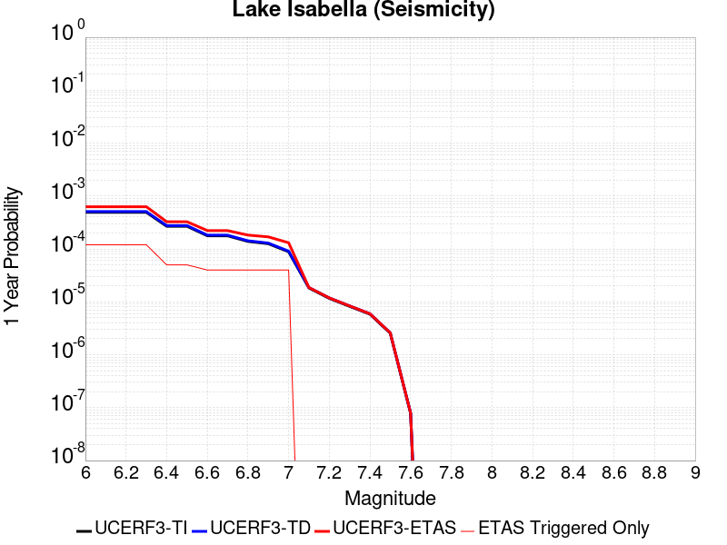 | 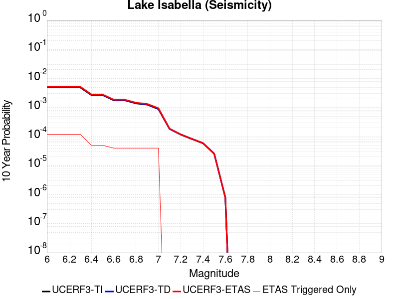 |

| Magnitude | 1 wk TI Prob | 1 wk TD Prob | 1 wk ETAS Prob | 1 wk ETAS/TD Gain | 1 wk ETAS Triggered Only | 1 mo TI Prob | 1 mo TD Prob | 1 mo ETAS Prob | 1 mo ETAS/TD Gain | 1 mo ETAS Triggered Only | 1 yr TI Prob | 1 yr TD Prob | 1 yr ETAS Prob | 1 yr ETAS/TD Gain | 1 yr ETAS Triggered Only | 10 yr TI Prob | 10 yr TD Prob | 10 yr ETAS Prob | 10 yr ETAS/TD Gain | 10 yr ETAS Triggered Only |
|-----|-----|-----|-----|-----|-----|-----|-----|-----|-----|-----|-----|-----|-----|-----|-----|-----|-----|-----|-----|-----|
| 6.0 | 9.431637E-6 | 9.741651E-6 | 9.974078E-5 | 10.238589 | 9.0E-5 | 4.0420677E-5 | 4.1749343E-5 | 1.6174433E-4 | 3.8741767 | 1.2E-4 | 4.920106E-4 | 5.0819275E-4 | 6.281318E-4 | 1.2360109 | 1.2E-4 | 0.004909227 | 0.005071599 | 0.0051909904 | 1.0235412 | 1.2E-4 |
| 6.1 | 9.431637E-6 | 9.741651E-6 | 9.974078E-5 | 10.238589 | 9.0E-5 | 4.0420677E-5 | 4.1749343E-5 | 1.6174433E-4 | 3.8741767 | 1.2E-4 | 4.920106E-4 | 5.0819275E-4 | 6.281318E-4 | 1.2360109 | 1.2E-4 | 0.004909227 | 0.005071599 | 0.0051909904 | 1.0235412 | 1.2E-4 |
| 6.2 | 9.431637E-6 | 9.741651E-6 | 9.974078E-5 | 10.238589 | 9.0E-5 | 4.0420677E-5 | 4.1749343E-5 | 1.6174433E-4 | 3.8741767 | 1.2E-4 | 4.920106E-4 | 5.0819275E-4 | 6.281318E-4 | 1.2360109 | 1.2E-4 | 0.004909227 | 0.005071599 | 0.0051909904 | 1.0235412 | 1.2E-4 |
| 6.3 | 9.431637E-6 | 9.741651E-6 | 9.974078E-5 | 10.238589 | 9.0E-5 | 4.0420677E-5 | 4.1749343E-5 | 1.6174433E-4 | 3.8741767 | 1.2E-4 | 4.920106E-4 | 5.0819275E-4 | 6.281318E-4 | 1.2360109 | 1.2E-4 | 0.004909227 | 0.005071599 | 0.0051909904 | 1.0235412 | 1.2E-4 |
| 6.4 | 5.144063E-6 | 5.3000763E-6 | 4.5299865E-5 | 8.547022 | 4.0E-5 | 2.2045799E-5 | 2.2714434E-5 | 7.27133E-5 | 3.2011936 | 5.0E-5 | 2.6837454E-4 | 2.765166E-4 | 3.2650278E-4 | 1.180771 | 5.0E-5 | 0.0026805066 | 0.0027620657 | 0.0028119276 | 1.0180523 | 5.0E-5 |
| 6.5 | 5.144063E-6 | 5.3000763E-6 | 4.5299865E-5 | 8.547022 | 4.0E-5 | 2.2045799E-5 | 2.2714434E-5 | 7.27133E-5 | 3.2011936 | 5.0E-5 | 2.6837454E-4 | 2.765166E-4 | 3.2650278E-4 | 1.180771 | 5.0E-5 | 0.0026805066 | 0.0027620657 | 0.0028119276 | 1.0180523 | 5.0E-5 |
| 6.6 | 3.4009804E-6 | 3.498786E-6 | 3.349868E-5 | 9.574372 | 3.0E-5 | 1.4575549E-5 | 1.4994721E-5 | 5.499412E-5 | 3.6675656 | 4.0E-5 | 1.7744285E-4 | 1.8254704E-4 | 2.2253973E-4 | 1.2190816 | 4.0E-5 | 0.0017730123 | 0.0018241286 | 0.0018640556 | 1.0218883 | 4.0E-5 |
| 6.7 | 3.3880428E-6 | 3.4856528E-6 | 3.3485547E-5 | 9.606679 | 3.0E-5 | 1.4520103E-5 | 1.4938435E-5 | 5.493784E-5 | 3.6776166 | 4.0E-5 | 1.767679E-4 | 1.8186188E-4 | 2.218546E-4 | 1.2199072 | 4.0E-5 | 0.0017662736 | 0.0018172882 | 0.0018572155 | 1.0219709 | 4.0E-5 |
| 6.8 | 2.6582E-6 | 2.7337003E-6 | 3.2733617E-5 | 11.974107 | 3.0E-5 | 1.1392236E-5 | 1.1715813E-5 | 5.1715346E-5 | 4.414149 | 4.0E-5 | 1.3869164E-4 | 1.4263204E-4 | 1.8262633E-4 | 1.280402 | 4.0E-5 | 0.0013860512 | 0.0014255369 | 0.00146548 | 1.0280195 | 4.0E-5 |
| 6.9 | 2.406011E-6 | 2.4743288E-6 | 3.2474254E-5 | 13.12447 | 3.0E-5 | 1.0311434E-5 | 1.0604231E-5 | 5.0603805E-5 | 4.7720394 | 4.0E-5 | 1.2553448E-4 | 1.2910018E-4 | 1.6909502E-4 | 1.3097969 | 4.0E-5 | 0.0012546359 | 0.0012903814 | 0.0013303298 | 1.0309585 | 4.0E-5 |
| 7.0 | 1.6953097E-6 | 1.7429371E-6 | 3.1742886E-5 | 18.212294 | 3.0E-5 | 7.265593E-6 | 7.469715E-6 | 4.7469417E-5 | 6.3549166 | 4.0E-5 | 8.8455E-5 | 9.094104E-5 | 1.3093739E-4 | 1.4398054 | 4.0E-5 | 8.84198E-4 | 9.09141E-4 | 9.491046E-4 | 1.0439576 | 4.0E-5 |
| 7.1 | 3.5013824E-7 | 3.5714822E-7 | 3.5714822E-7 | 1.0 | 0.0 | 1.5005916E-6 | 1.5306344E-6 | 1.5306344E-6 | 1.0 | 0.0 | 1.826955E-5 | 1.8635317E-5 | 1.8635317E-5 | 1.0 | 0.0 | 1.8268047E-4 | 1.863378E-4 | 1.863378E-4 | 1.0 | 0.0 |
| 7.2 | 2.2321095E-7 | 2.2750574E-7 | 2.2750574E-7 | 1.0 | 0.0 | 9.56618E-7 | 9.750242E-7 | 9.750242E-7 | 1.0 | 0.0 | 1.1646762E-5 | 1.1870856E-5 | 1.1870856E-5 | 1.0 | 0.0 | 1.1646151E-4 | 1.1870232E-4 | 1.1870232E-4 | 1.0 | 0.0 |
| 7.3 | 1.5760406E-7 | 1.6060922E-7 | 1.6060922E-7 | 1.0 | 0.0 | 6.7544585E-7 | 6.8832503E-7 | 6.8832503E-7 | 1.0 | 0.0 | 8.223522E-6 | 8.380326E-6 | 8.380326E-6 | 1.0 | 0.0 | 8.2232174E-5 | 8.3800165E-5 | 8.3800165E-5 | 1.0 | 0.0 |
| 7.4 | 1.1216497E-7 | 1.1431706E-7 | 1.1431706E-7 | 1.0 | 0.0 | 4.8070694E-7 | 4.899302E-7 | 4.899302E-7 | 1.0 | 0.0 | 5.852591E-6 | 5.964884E-6 | 5.964884E-6 | 1.0 | 0.0 | 5.8524372E-5 | 5.9647282E-5 | 5.9647282E-5 | 1.0 | 0.0 |
| 7.5 | 4.885185E-8 | 4.9787737E-8 | 4.9787737E-8 | 1.0 | 0.0 | 2.0936506E-7 | 2.13376E-7 | 2.13376E-7 | 1.0 | 0.0 | 2.5490165E-6 | 2.59785E-6 | 2.59785E-6 | 1.0 | 0.0 | 2.5489873E-5 | 2.5978214E-5 | 2.5978214E-5 | 1.0 | 0.0 |
| 7.6 | 1.504641E-9 | 1.5317903E-9 | 1.5317903E-9 | 1.0 | 0.0 | 6.4484613E-9 | 6.5648154E-9 | 6.5648154E-9 | 1.0 | 0.0 | 7.851001E-8 | 7.992663E-8 | 7.992663E-8 | 1.0 | 0.0 | 7.8509987E-7 | 7.992663E-7 | 7.992663E-7 | 1.0 | 0.0 |

## San Jacinto (Anza) rev
*[(top)](#table-of-contents)*

| 1 Week | 1 Month | 1 Year | 10 Year |
|-----|-----|-----|-----|
| 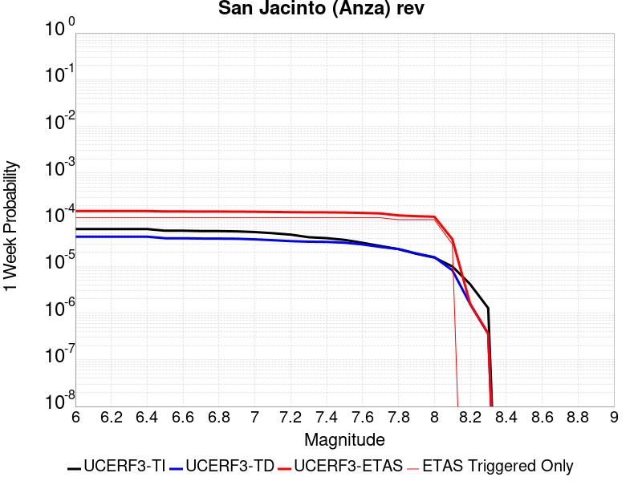 | 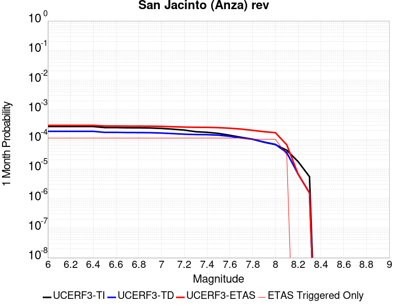 | 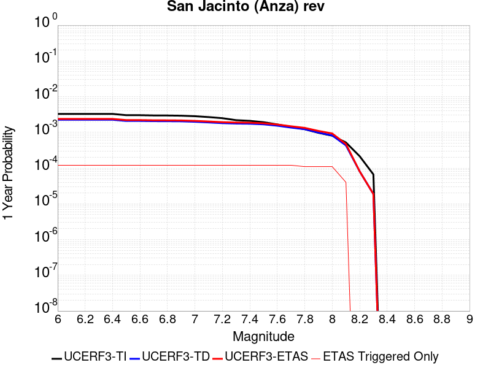 | 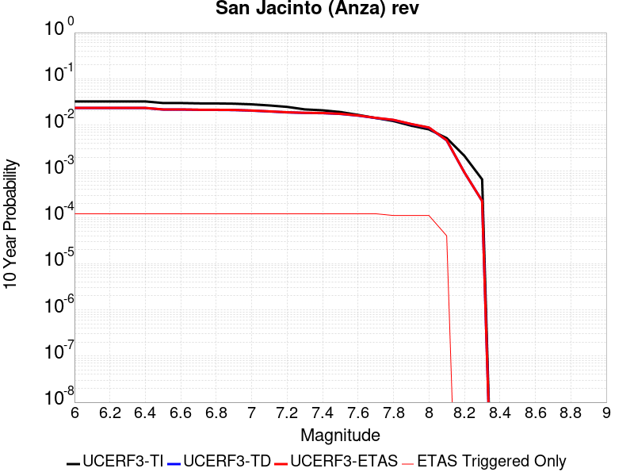 |

| Magnitude | 1 wk TI Prob | 1 wk TD Prob | 1 wk ETAS Prob | 1 wk ETAS/TD Gain | 1 wk ETAS Triggered Only | 1 mo TI Prob | 1 mo TD Prob | 1 mo ETAS Prob | 1 mo ETAS/TD Gain | 1 mo ETAS Triggered Only | 1 yr TI Prob | 1 yr TD Prob | 1 yr ETAS Prob | 1 yr ETAS/TD Gain | 1 yr ETAS Triggered Only | 10 yr TI Prob | 10 yr TD Prob | 10 yr ETAS Prob | 10 yr ETAS/TD Gain | 10 yr ETAS Triggered Only |
|-----|-----|-----|-----|-----|-----|-----|-----|-----|-----|-----|-----|-----|-----|-----|-----|-----|-----|-----|-----|-----|
| 6.0 | 6.3015636E-5 | 4.3298347E-5 | 1.5329359E-4 | 3.5404027 | 1.1E-4 | 2.7003905E-4 | 1.8555121E-4 | 2.955308E-4 | 1.5927182 | 1.1E-4 | 0.0032827691 | 0.0022567573 | 0.0023764865 | 1.0530536 | 1.2E-4 | 0.032346968 | 0.02329361 | 0.023410816 | 1.0050316 | 1.2E-4 |
| 6.1 | 6.3015636E-5 | 4.3298347E-5 | 1.5329359E-4 | 3.5404027 | 1.1E-4 | 2.7003905E-4 | 1.8555121E-4 | 2.955308E-4 | 1.5927182 | 1.1E-4 | 0.0032827691 | 0.0022567573 | 0.0023764865 | 1.0530536 | 1.2E-4 | 0.032346968 | 0.02329361 | 0.023410816 | 1.0050316 | 1.2E-4 |
| 6.2 | 6.3015636E-5 | 4.3298347E-5 | 1.5329359E-4 | 3.5404027 | 1.1E-4 | 2.7003905E-4 | 1.8555121E-4 | 2.955308E-4 | 1.5927182 | 1.1E-4 | 0.0032827691 | 0.0022567573 | 0.0023764865 | 1.0530536 | 1.2E-4 | 0.032346968 | 0.02329361 | 0.023410816 | 1.0050316 | 1.2E-4 |
| 6.3 | 6.3015636E-5 | 4.3298347E-5 | 1.5329359E-4 | 3.5404027 | 1.1E-4 | 2.7003905E-4 | 1.8555121E-4 | 2.955308E-4 | 1.5927182 | 1.1E-4 | 0.0032827691 | 0.0022567573 | 0.0023764865 | 1.0530536 | 1.2E-4 | 0.032346968 | 0.02329361 | 0.023410816 | 1.0050316 | 1.2E-4 |
| 6.4 | 6.3015636E-5 | 4.3298347E-5 | 1.5329359E-4 | 3.5404027 | 1.1E-4 | 2.7003905E-4 | 1.8555121E-4 | 2.955308E-4 | 1.5927182 | 1.1E-4 | 0.0032827691 | 0.0022567573 | 0.0023764865 | 1.0530536 | 1.2E-4 | 0.032346968 | 0.02329361 | 0.023410816 | 1.0050316 | 1.2E-4 |
| 6.5 | 5.811017E-5 | 4.0080286E-5 | 1.5007588E-4 | 3.7443814 | 1.1E-4 | 2.4901982E-4 | 1.7176138E-4 | 2.8174248E-4 | 1.6403134 | 1.1E-4 | 0.0030276014 | 0.0020891947 | 0.002208944 | 1.0573184 | 1.2E-4 | 0.02986684 | 0.021590833 | 0.021708243 | 1.005438 | 1.2E-4 |
| 6.6 | 5.811017E-5 | 4.0080286E-5 | 1.5007588E-4 | 3.7443814 | 1.1E-4 | 2.4901982E-4 | 1.7176138E-4 | 2.8174248E-4 | 1.6403134 | 1.1E-4 | 0.0030276014 | 0.0020891947 | 0.002208944 | 1.0573184 | 1.2E-4 | 0.02986684 | 0.021590833 | 0.021708243 | 1.005438 | 1.2E-4 |
| 6.7 | 5.712442E-5 | 3.950301E-5 | 1.4949866E-4 | 3.7844877 | 1.1E-4 | 2.4479596E-4 | 1.6928767E-4 | 2.7926904E-4 | 1.6496716 | 1.1E-4 | 0.0029763177 | 0.0020591344 | 0.0021788874 | 1.058157 | 1.2E-4 | 0.029367693 | 0.021282919 | 0.021400364 | 1.0055183 | 1.2E-4 |
| 6.8 | 5.6967532E-5 | 3.93593E-5 | 1.4935496E-4 | 3.7946553 | 1.1E-4 | 2.4412372E-4 | 1.6867183E-4 | 2.786533E-4 | 1.6520439 | 1.1E-4 | 0.0029681553 | 0.0020516508 | 0.0021714047 | 1.0583695 | 1.2E-4 | 0.029288229 | 0.02120852 | 0.021325974 | 1.0055381 | 1.2E-4 |
| 6.9 | 5.6211324E-5 | 3.9064216E-5 | 1.4905992E-4 | 3.8157663 | 1.1E-4 | 2.4088343E-4 | 1.6740736E-4 | 2.7738893E-4 | 1.6569698 | 1.1E-4 | 0.0029288116 | 0.0020362847 | 0.0021560404 | 1.0588108 | 1.2E-4 | 0.028905109 | 0.021047527 | 0.021165002 | 1.0055814 | 1.2E-4 |
| 7.0 | 5.4383527E-5 | 3.7925012E-5 | 1.4792084E-4 | 3.9003506 | 1.1E-4 | 2.3305144E-4 | 1.6252567E-4 | 2.7250778E-4 | 1.6767062 | 1.1E-4 | 0.0028337094 | 0.001976959 | 0.0020967217 | 1.0605793 | 1.2E-4 | 0.027978465 | 0.02044095 | 0.020558497 | 1.0057505 | 1.2E-4 |
| 7.1 | 5.1393665E-5 | 3.638787E-5 | 1.4638387E-4 | 4.0228753 | 1.1E-4 | 2.2023996E-4 | 1.5593872E-4 | 2.6592155E-4 | 1.7052953 | 1.1E-4 | 0.0026781242 | 0.0018969048 | 0.0020166773 | 1.063141 | 1.2E-4 | 0.026460782 | 0.019616077 | 0.019733723 | 1.0059974 | 1.2E-4 |
| 7.2 | 4.785222E-5 | 3.4738845E-5 | 1.4473502E-4 | 4.166374 | 1.1E-4 | 2.0506482E-4 | 1.4887229E-4 | 2.588559E-4 | 1.7387784 | 1.1E-4 | 0.0024938055 | 0.0018110167 | 0.0019307995 | 1.0661411 | 1.2E-4 | 0.024660049 | 0.018728783 | 0.018846536 | 1.0062872 | 1.2E-4 |
| 7.3 | 4.2143256E-5 | 3.3834414E-5 | 1.438307E-4 | 4.2510176 | 1.1E-4 | 1.8060145E-4 | 1.449966E-4 | 2.5498064E-4 | 1.7585286 | 1.1E-4 | 0.002196605 | 0.0017639075 | 0.0018836958 | 1.0679108 | 1.2E-4 | 0.02175019 | 0.018236695 | 0.018354507 | 1.0064602 | 1.2E-4 |
| 7.4 | 4.0264713E-5 | 3.3472694E-5 | 1.43469E-4 | 4.286151 | 1.1E-4 | 1.7255165E-4 | 1.4344654E-4 | 2.5343074E-4 | 1.7667263 | 1.1E-4 | 0.002098792 | 0.0017450659 | 0.0018648566 | 1.0686454 | 1.2E-4 | 0.020790804 | 0.018041389 | 0.018159224 | 1.0065314 | 1.2E-4 |
| 7.5 | 3.694492E-5 | 3.2186905E-5 | 1.4218336E-4 | 4.417429 | 1.1E-4 | 1.5832575E-4 | 1.379366E-4 | 2.4792145E-4 | 1.7973578 | 1.1E-4 | 0.0019259118 | 0.0016780876 | 0.0017978862 | 1.0713899 | 1.2E-4 | 0.01909306 | 0.017357888 | 0.017475804 | 1.0067933 | 1.2E-4 |
| 7.6 | 3.200565E-5 | 2.9502702E-5 | 1.3949946E-4 | 4.728362 | 1.1E-4 | 1.3715986E-4 | 1.2643404E-4 | 2.3642014E-4 | 1.8699089 | 1.1E-4 | 0.001668642 | 0.0015382497 | 0.0016580651 | 1.0778908 | 1.2E-4 | 0.01656168 | 0.015946016 | 0.016064104 | 1.0074054 | 1.2E-4 |
| 7.7 | 2.731642E-5 | 2.6091477E-5 | 1.3608861E-4 | 5.2158265 | 1.1E-4 | 1.1706512E-4 | 1.11815825E-4 | 2.2180352E-4 | 1.9836506 | 1.1E-4 | 0.001424336 | 0.0013605085 | 0.0014803453 | 1.0880823 | 1.2E-4 | 0.014152412 | 0.0141668 | 0.0142851 | 1.0083505 | 1.2E-4 |
| 7.8 | 2.3466424E-5 | 2.3503619E-5 | 1.2350128E-4 | 5.254564 | 1.0E-4 | 1.0056651E-4 | 1.0072591E-4 | 2.0071583E-4 | 1.9926932 | 1.0E-4 | 0.0012237094 | 0.0012256489 | 0.001335514 | 1.0896384 | 1.1E-4 | 0.012169928 | 0.012808796 | 0.012917387 | 1.0084778 | 1.1E-4 |
| 7.9 | 1.8611925E-5 | 1.890698E-5 | 1.1890509E-4 | 6.288952 | 1.0E-4 | 7.9762955E-5 | 8.10274E-5 | 1.8101929E-4 | 2.2340505 | 1.0E-4 | 9.7068126E-4 | 9.860628E-4 | 0.0010959544 | 1.1114447 | 1.1E-4 | 0.0096645225 | 0.010393705 | 0.010502562 | 1.0104734 | 1.1E-4 |
| 8.0 | 1.5460775E-5 | 1.5739915E-5 | 1.15738345E-4 | 7.353174 | 1.0E-4 | 6.6258784E-5 | 6.745504E-5 | 1.6744829E-4 | 2.482369 | 1.0E-4 | 8.0640207E-4 | 8.2095637E-4 | 9.3086605E-4 | 1.13388 | 1.1E-4 | 0.008034821 | 0.008702706 | 0.008811749 | 1.0125297 | 1.1E-4 |
| 8.1 | 9.983884E-6 | 8.268954E-6 | 3.8268707E-5 | 4.6279984 | 3.0E-5 | 4.2787375E-5 | 3.5437897E-5 | 6.5436834E-5 | 1.8465214 | 3.0E-5 | 5.2081177E-4 | 4.313715E-4 | 4.7135423E-4 | 1.0926875 | 4.0E-5 | 0.0051959283 | 0.00463968 | 0.0046794945 | 1.0085813 | 4.0E-5 |
| 8.2 | 4.1226E-6 | 1.5522551E-6 | 1.5522551E-6 | 1.0 | 0.0 | 1.7668166E-5 | 6.6525045E-6 | 6.6525045E-6 | 1.0 | 0.0 | 2.1508869E-4 | 8.099126E-5 | 8.099126E-5 | 1.0 | 0.0 | 0.0021488064 | 9.401847E-4 | 9.401847E-4 | 1.0 | 0.0 |
| 8.3 | 1.2750878E-6 | 3.609817E-7 | 3.609817E-7 | 1.0 | 0.0 | 5.4646503E-6 | 1.5470634E-6 | 1.5470634E-6 | 1.0 | 0.0 | 6.653009E-5 | 1.8835339E-5 | 1.8835339E-5 | 1.0 | 0.0 | 6.6510175E-4 | 2.272251E-4 | 2.272251E-4 | 1.0 | 0.0 |

## Baker
*[(top)](#table-of-contents)*

| 1 Week | 1 Month | 1 Year | 10 Year |
|-----|-----|-----|-----|
| 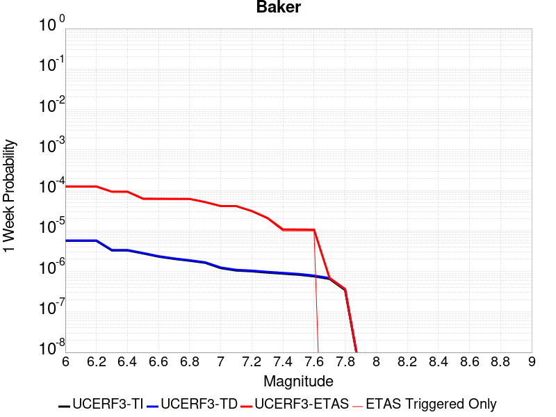 | 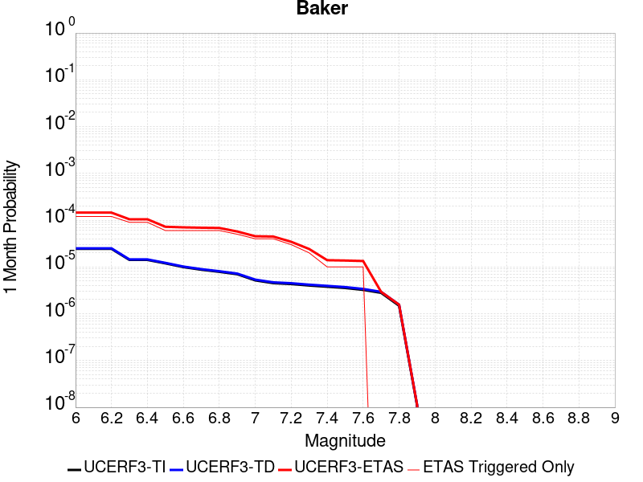 | 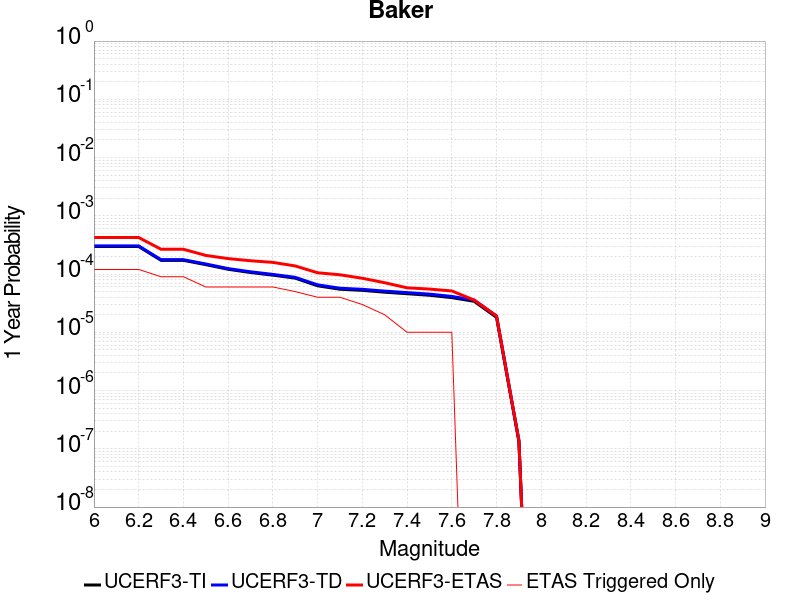 | 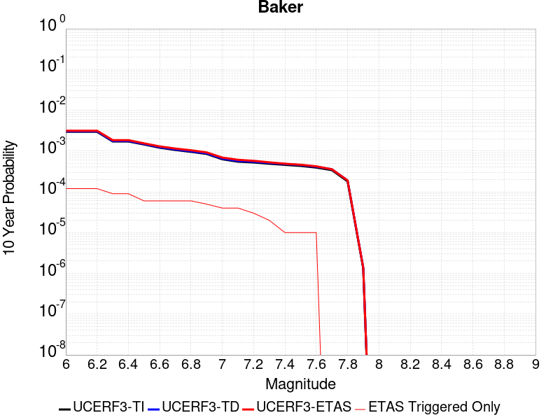 |

| Magnitude | 1 wk TI Prob | 1 wk TD Prob | 1 wk ETAS Prob | 1 wk ETAS/TD Gain | 1 wk ETAS Triggered Only | 1 mo TI Prob | 1 mo TD Prob | 1 mo ETAS Prob | 1 mo ETAS/TD Gain | 1 mo ETAS Triggered Only | 1 yr TI Prob | 1 yr TD Prob | 1 yr ETAS Prob | 1 yr ETAS/TD Gain | 1 yr ETAS Triggered Only | 10 yr TI Prob | 10 yr TD Prob | 10 yr ETAS Prob | 10 yr ETAS/TD Gain | 10 yr ETAS Triggered Only |
|-----|-----|-----|-----|-----|-----|-----|-----|-----|-----|-----|-----|-----|-----|-----|-----|-----|-----|-----|-----|-----|
| 6.0 | 5.695525E-6 | 5.8348373E-6 | 1.2583414E-4 | 21.566008 | 1.2E-4 | 2.4409164E-5 | 2.5006228E-5 | 1.4500323E-4 | 5.7986846 | 1.2E-4 | 2.9714106E-4 | 3.044123E-4 | 4.2437576E-4 | 1.3940822 | 1.2E-4 | 0.0029674405 | 0.0030403486 | 0.0031599838 | 1.0393492 | 1.2E-4 |
| 6.1 | 5.695525E-6 | 5.8348373E-6 | 1.2583414E-4 | 21.566008 | 1.2E-4 | 2.4409164E-5 | 2.5006228E-5 | 1.4500323E-4 | 5.7986846 | 1.2E-4 | 2.9714106E-4 | 3.044123E-4 | 4.2437576E-4 | 1.3940822 | 1.2E-4 | 0.0029674405 | 0.0030403486 | 0.0031599838 | 1.0393492 | 1.2E-4 |
| 6.2 | 5.695525E-6 | 5.8348373E-6 | 1.2583414E-4 | 21.566008 | 1.2E-4 | 2.4409164E-5 | 2.5006228E-5 | 1.4500323E-4 | 5.7986846 | 1.2E-4 | 2.9714106E-4 | 3.044123E-4 | 4.2437576E-4 | 1.3940822 | 1.2E-4 | 0.0029674405 | 0.0030403486 | 0.0031599838 | 1.0393492 | 1.2E-4 |
| 6.3 | 3.2995713E-6 | 3.383667E-6 | 9.3383365E-5 | 27.59827 | 9.0E-5 | 1.4140943E-5 | 1.4501353E-5 | 1.04500046E-4 | 7.206228 | 9.0E-5 | 1.7215237E-4 | 1.7654014E-4 | 2.6652424E-4 | 1.5097091 | 9.0E-5 | 0.0017201907 | 0.001764046 | 0.0018538872 | 1.0509291 | 9.0E-5 |
| 6.4 | 3.2995713E-6 | 3.383667E-6 | 9.3383365E-5 | 27.59827 | 9.0E-5 | 1.4140943E-5 | 1.4501353E-5 | 1.04500046E-4 | 7.206228 | 9.0E-5 | 1.7215237E-4 | 1.7654014E-4 | 2.6652424E-4 | 1.5097091 | 9.0E-5 | 0.0017201907 | 0.001764046 | 0.0018538872 | 1.0509291 | 9.0E-5 |
| 6.5 | 2.782202E-6 | 2.8558404E-6 | 6.2855666E-5 | 22.009518 | 6.0E-5 | 1.1923668E-5 | 1.223926E-5 | 7.223852E-5 | 5.902197 | 6.0E-5 | 1.4516099E-4 | 1.4900314E-4 | 2.089942E-4 | 1.4026161 | 6.0E-5 | 0.001450662 | 0.0014890651 | 0.0015489757 | 1.0402337 | 6.0E-5 |
| 6.6 | 2.3163404E-6 | 2.38092E-6 | 6.238078E-5 | 26.200283 | 6.0E-5 | 9.927136E-6 | 1.0203904E-5 | 7.020329E-5 | 6.8800426 | 6.0E-5 | 1.20856166E-4 | 1.2422565E-4 | 1.842182E-4 | 1.482932 | 6.0E-5 | 0.0012079047 | 0.0012415823 | 0.0013015078 | 1.0482655 | 6.0E-5 |
| 6.7 | 2.037056E-6 | 2.0965003E-6 | 6.209638E-5 | 29.61906 | 6.0E-5 | 8.7302105E-6 | 8.984972E-6 | 6.898443E-5 | 7.6777573 | 6.0E-5 | 1.0628513E-4 | 1.093867E-4 | 1.6938015E-4 | 1.5484527 | 6.0E-5 | 0.0010623431 | 0.0010933448 | 0.0011532791 | 1.0548174 | 6.0E-5 |
| 6.8 | 1.8356744E-6 | 1.8915287E-6 | 6.189141E-5 | 32.720314 | 6.0E-5 | 7.867153E-6 | 8.106527E-6 | 6.810604E-5 | 8.401383 | 6.0E-5 | 9.577837E-5 | 9.869264E-5 | 1.5868671E-4 | 1.6078881 | 6.0E-5 | 9.57371E-4 | 9.86502E-4 | 0.0010464429 | 1.060761 | 6.0E-5 |
| 6.9 | 1.6310546E-6 | 1.6832072E-6 | 5.1683124E-5 | 30.705147 | 5.0E-5 | 6.9902153E-6 | 7.213726E-6 | 5.7213365E-5 | 7.931181 | 5.0E-5 | 8.510255E-5 | 8.782368E-5 | 1.378193E-4 | 1.5692725 | 5.0E-5 | 8.5069967E-4 | 8.7790104E-4 | 9.278572E-4 | 1.0569041 | 5.0E-5 |
| 7.0 | 1.2058036E-6 | 1.2508665E-6 | 4.1250816E-5 | 32.97779 | 4.0E-5 | 5.1677193E-6 | 5.3608455E-6 | 4.536063E-5 | 8.46147 | 4.0E-5 | 6.291517E-5 | 6.5266366E-5 | 1.0526375E-4 | 1.6128331 | 4.0E-5 | 6.289736E-4 | 6.524743E-4 | 6.924482E-4 | 1.0612651 | 4.0E-5 |
| 7.1 | 1.052382E-6 | 1.0951609E-6 | 4.1095118E-5 | 37.524277 | 4.0E-5 | 4.5102006E-6 | 4.693538E-6 | 4.469335E-5 | 9.522315 | 4.0E-5 | 5.491031E-5 | 5.7142337E-5 | 9.714005E-5 | 1.6999664 | 4.0E-5 | 5.4896745E-4 | 5.7127734E-4 | 6.112545E-4 | 1.0699785 | 4.0E-5 |
| 7.2 | 1.0067454E-6 | 1.0487711E-6 | 3.104874E-5 | 29.604877 | 3.0E-5 | 4.3146156E-6 | 4.4947255E-6 | 3.449459E-5 | 7.67446 | 3.0E-5 | 5.252918E-5 | 5.4721917E-5 | 8.4720275E-5 | 1.5481964 | 3.0E-5 | 5.251676E-4 | 5.470853E-4 | 5.770689E-4 | 1.0548061 | 3.0E-5 |
| 7.3 | 9.3596316E-7 | 9.767723E-7 | 2.0976753E-5 | 21.47558 | 2.0E-5 | 4.0112645E-6 | 4.1861604E-6 | 2.4186076E-5 | 5.7776275 | 2.0E-5 | 4.8836053E-5 | 5.096532E-5 | 7.09643E-5 | 1.3924037 | 2.0E-5 | 4.8825322E-4 | 5.095371E-4 | 5.295269E-4 | 1.0392313 | 2.0E-5 |
| 7.4 | 8.8117395E-7 | 9.2076635E-7 | 1.0920757E-5 | 11.860509 | 1.0E-5 | 3.7764542E-6 | 3.9461356E-6 | 1.3946096E-5 | 3.5341148 | 1.0E-5 | 4.5977362E-5 | 4.8043148E-5 | 5.8042668E-5 | 1.2081362 | 1.0E-5 | 4.596785E-4 | 4.8032837E-4 | 4.903236E-4 | 1.020809 | 1.0E-5 |
| 7.5 | 8.292386E-7 | 8.6745956E-7 | 1.0867451E-5 | 12.5279045 | 1.0E-5 | 3.5538749E-6 | 3.7176785E-6 | 1.3717641E-5 | 3.6898406 | 1.0E-5 | 4.326757E-5 | 4.5261804E-5 | 5.5261353E-5 | 1.2209269 | 1.0E-5 | 4.3259145E-4 | 4.5252658E-4 | 4.6252206E-4 | 1.0220882 | 1.0E-5 |
| 7.6 | 7.553842E-7 | 7.9144706E-7 | 1.0791439E-5 | 13.635074 | 1.0E-5 | 3.2373566E-6 | 3.3919116E-6 | 1.33918775E-5 | 3.94818 | 1.0E-5 | 3.9414106E-5 | 4.129575E-5 | 5.1295334E-5 | 1.2421457 | 1.0E-5 | 3.9407116E-4 | 4.1288146E-4 | 4.2287732E-4 | 1.02421 | 1.0E-5 |
| 7.7 | 6.5285366E-7 | 6.852797E-7 | 6.852797E-7 | 1.0 | 0.0 | 2.797941E-6 | 2.9369096E-6 | 2.9369096E-6 | 1.0 | 0.0 | 3.40644E-5 | 3.5756293E-5 | 3.5756293E-5 | 1.0 | 0.0 | 3.405918E-4 | 3.5750607E-4 | 3.5750607E-4 | 1.0 | 0.0 |
| 7.8 | 3.4586725E-7 | 3.6482615E-7 | 3.6482615E-7 | 1.0 | 0.0 | 1.4822873E-6 | 1.5635396E-6 | 1.5635396E-6 | 1.0 | 0.0 | 1.80467E-5 | 1.9035933E-5 | 1.9035933E-5 | 1.0 | 0.0 | 1.8045233E-4 | 1.9034347E-4 | 1.9034347E-4 | 1.0 | 0.0 |
| 7.9 | 2.5591178E-9 | 2.6696718E-9 | 2.6696718E-9 | 1.0 | 0.0 | 1.0967647E-8 | 1.14414505E-8 | 1.14414505E-8 | 1.0 | 0.0 | 1.335311E-7 | 1.3929966E-7 | 1.3929966E-7 | 1.0 | 0.0 | 1.3353102E-6 | 1.3929966E-6 | 1.3929966E-6 | 1.0 | 0.0 |

## Cleghorn Lake
*[(top)](#table-of-contents)*

| 1 Week | 1 Month | 1 Year | 10 Year |
|-----|-----|-----|-----|
| 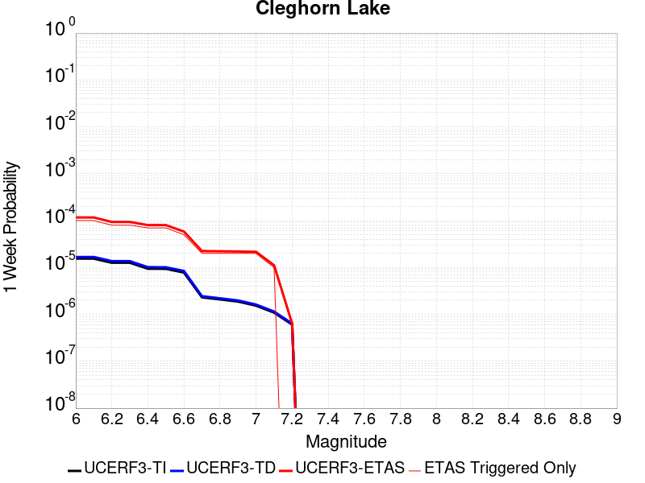 | 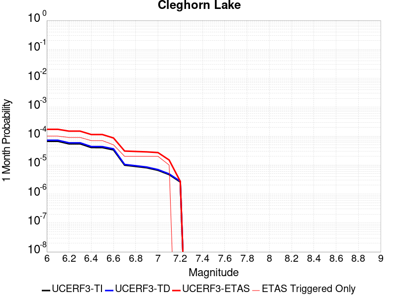 | 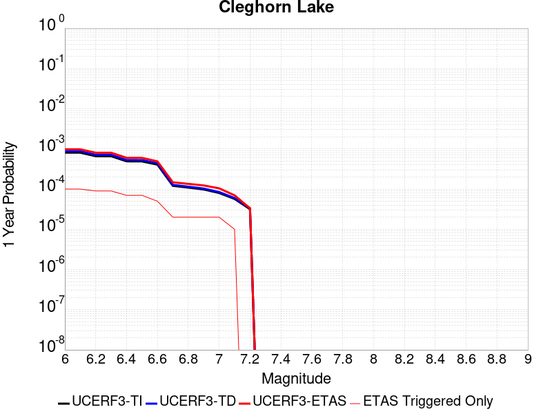 | 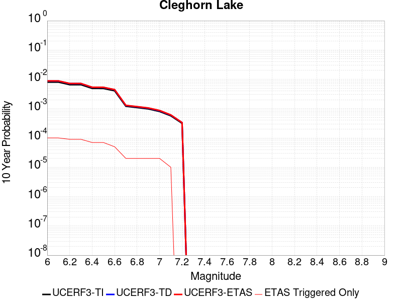 |

| Magnitude | 1 wk TI Prob | 1 wk TD Prob | 1 wk ETAS Prob | 1 wk ETAS/TD Gain | 1 wk ETAS Triggered Only | 1 mo TI Prob | 1 mo TD Prob | 1 mo ETAS Prob | 1 mo ETAS/TD Gain | 1 mo ETAS Triggered Only | 1 yr TI Prob | 1 yr TD Prob | 1 yr ETAS Prob | 1 yr ETAS/TD Gain | 1 yr ETAS Triggered Only | 10 yr TI Prob | 10 yr TD Prob | 10 yr ETAS Prob | 10 yr ETAS/TD Gain | 10 yr ETAS Triggered Only |
|-----|-----|-----|-----|-----|-----|-----|-----|-----|-----|-----|-----|-----|-----|-----|-----|-----|-----|-----|-----|-----|
| 6.0 | 1.5467183E-5 | 1.6794203E-5 | 1.1679252E-4 | 6.954335 | 1.0E-4 | 6.6286244E-5 | 7.197348E-5 | 1.7196628E-4 | 2.3893006 | 1.0E-4 | 8.067362E-4 | 8.759797E-4 | 9.758921E-4 | 1.1140579 | 1.0E-4 | 0.008038137 | 0.008730696 | 0.008829823 | 1.0113539 | 1.0E-4 |
| 6.1 | 1.5467183E-5 | 1.6794203E-5 | 1.1679252E-4 | 6.954335 | 1.0E-4 | 6.6286244E-5 | 7.197348E-5 | 1.7196628E-4 | 2.3893006 | 1.0E-4 | 8.067362E-4 | 8.759797E-4 | 9.758921E-4 | 1.1140579 | 1.0E-4 | 0.008038137 | 0.008730696 | 0.008829823 | 1.0113539 | 1.0E-4 |
| 6.2 | 1.2624631E-5 | 1.3681544E-5 | 9.368045E-5 | 6.847213 | 8.0E-5 | 5.410444E-5 | 5.863415E-5 | 1.4862887E-4 | 2.5348518 | 9.0E-5 | 6.585225E-4 | 7.1368564E-4 | 8.0362137E-4 | 1.1260159 | 9.0E-5 | 0.0065657445 | 0.0071187317 | 0.007208091 | 1.0125527 | 9.0E-5 |
| 6.3 | 1.2624631E-5 | 1.3681544E-5 | 9.368045E-5 | 6.847213 | 8.0E-5 | 5.410444E-5 | 5.863415E-5 | 1.4862887E-4 | 2.5348518 | 9.0E-5 | 6.585225E-4 | 7.1368564E-4 | 8.0362137E-4 | 1.1260159 | 9.0E-5 | 0.0065657445 | 0.0071187317 | 0.007208091 | 1.0125527 | 9.0E-5 |
| 6.4 | 9.417684E-6 | 1.0170118E-5 | 8.0169404E-5 | 7.8828397 | 7.0E-5 | 4.036088E-5 | 4.3585722E-5 | 1.1358267E-4 | 2.6059606 | 7.0E-5 | 4.912829E-4 | 5.3056807E-4 | 6.005309E-4 | 1.1318641 | 7.0E-5 | 0.004901982 | 0.005297049 | 0.0053666783 | 1.0131449 | 7.0E-5 |
| 6.5 | 9.368219E-6 | 1.0117545E-5 | 8.0116835E-5 | 7.918605 | 7.0E-5 | 4.014889E-5 | 4.3360415E-5 | 1.1335738E-4 | 2.6143057 | 7.0E-5 | 4.8870314E-4 | 5.2782625E-4 | 5.977893E-4 | 1.1325494 | 7.0E-5 | 0.004876298 | 0.0052697617 | 0.0053393925 | 1.0132133 | 7.0E-5 |
| 6.6 | 7.803798E-6 | 8.441831E-6 | 5.844141E-5 | 6.922836 | 5.0E-5 | 3.3444423E-5 | 3.6179E-5 | 8.617719E-5 | 2.3819673 | 5.0E-5 | 4.0710976E-4 | 4.4043022E-4 | 4.904082E-4 | 1.1134753 | 5.0E-5 | 0.0040636472 | 0.0043994905 | 0.00444927 | 1.011315 | 5.0E-5 |
| 6.7 | 2.3108669E-6 | 2.4438336E-6 | 2.2443784E-5 | 9.183843 | 2.0E-5 | 9.903678E-6 | 1.0473532E-5 | 3.0473322E-5 | 2.9095554 | 2.0E-5 | 1.205706E-4 | 1.2750797E-4 | 1.4750543E-4 | 1.1568329 | 2.0E-5 | 0.001205052 | 0.0012743667 | 0.0012943413 | 1.0156741 | 2.0E-5 |
| 6.8 | 2.0882828E-6 | 2.2062823E-6 | 2.2206237E-5 | 10.065003 | 2.0E-5 | 8.949753E-6 | 9.455462E-6 | 2.9455272E-5 | 3.1151595 | 2.0E-5 | 1.08957785E-4 | 1.1511434E-4 | 1.3511203E-4 | 1.1737204 | 2.0E-5 | 0.0010890438 | 0.0011505639 | 0.0011705409 | 1.0173628 | 2.0E-5 |
| 6.9 | 1.876935E-6 | 1.981051E-6 | 2.1981012E-5 | 11.095632 | 2.0E-5 | 8.043982E-6 | 8.490192E-6 | 2.8490022E-5 | 3.3556395 | 2.0E-5 | 9.7931086E-5 | 1.03363345E-4 | 1.2336127E-4 | 1.1934721 | 2.0E-5 | 9.788794E-4 | 0.0010331686 | 0.001053148 | 1.0193379 | 2.0E-5 |
| 7.0 | 1.5357559E-6 | 1.6202807E-6 | 2.1620248E-5 | 13.34352 | 2.0E-5 | 6.5817944E-6 | 6.9440425E-6 | 2.6943904E-5 | 3.8801467 | 2.0E-5 | 8.01304E-5 | 8.454057E-5 | 1.0453887E-4 | 1.2365528 | 2.0E-5 | 8.010151E-4 | 8.450965E-4 | 8.650796E-4 | 1.0236459 | 2.0E-5 |
| 7.1 | 1.0905424E-6 | 1.1497619E-6 | 1.114975E-5 | 9.697442 | 1.0E-5 | 4.6737446E-6 | 4.9275427E-6 | 1.4927493E-5 | 3.0293992 | 1.0E-5 | 5.6901354E-5 | 5.999128E-5 | 6.999068E-5 | 1.1666809 | 1.0E-5 | 5.6886784E-4 | 5.997606E-4 | 6.0975464E-4 | 1.0166633 | 1.0E-5 |
| 7.2 | 6.06668E-7 | 6.387277E-7 | 6.387277E-7 | 1.0 | 0.0 | 2.600003E-6 | 2.7374022E-6 | 2.7374022E-6 | 1.0 | 0.0 | 3.1654577E-5 | 3.3327433E-5 | 3.3327433E-5 | 1.0 | 0.0 | 3.1650066E-4 | 3.3323118E-4 | 3.3323118E-4 | 1.0 | 0.0 |

## Santa Rosa Island
*[(top)](#table-of-contents)*

| 1 Week | 1 Month | 1 Year | 10 Year |
|-----|-----|-----|-----|
| 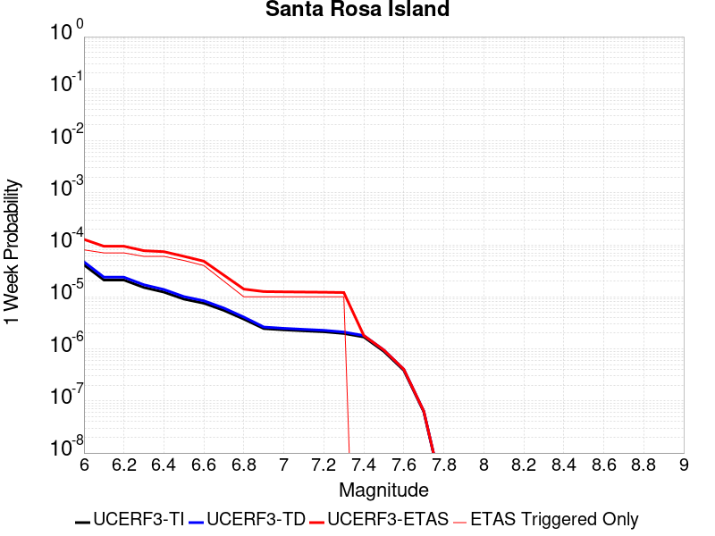 | 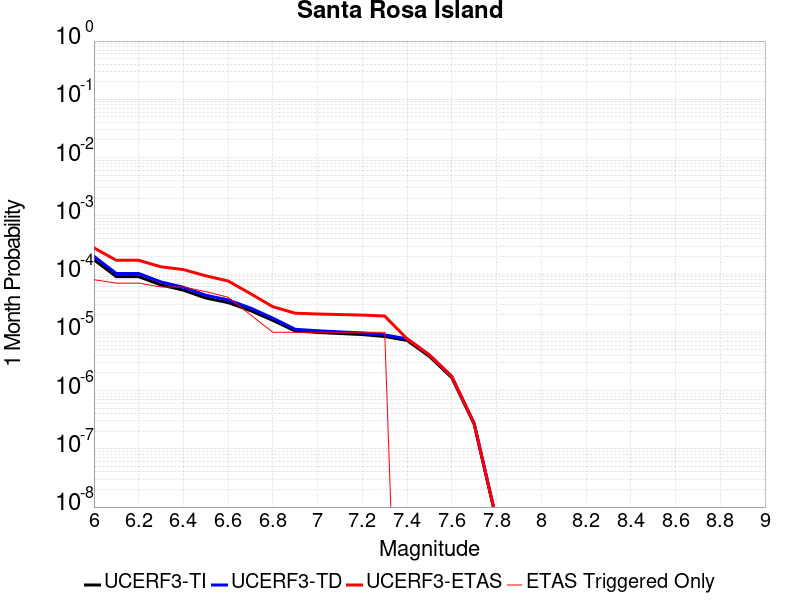 | 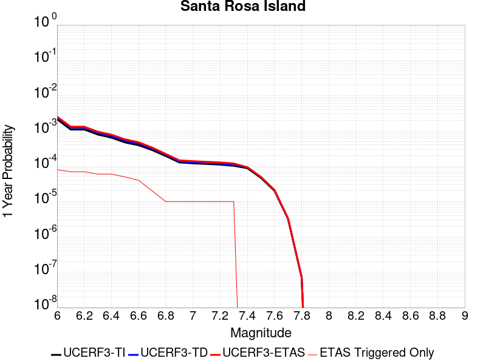 | 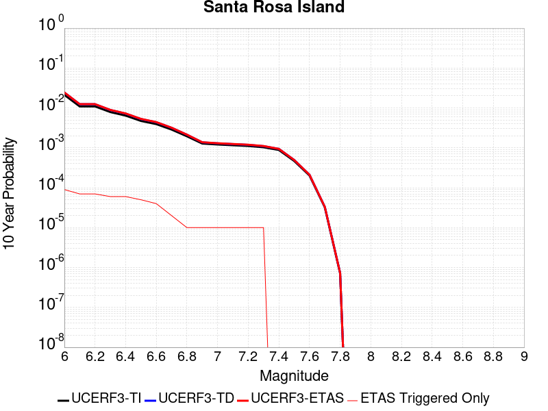 |

| Magnitude | 1 wk TI Prob | 1 wk TD Prob | 1 wk ETAS Prob | 1 wk ETAS/TD Gain | 1 wk ETAS Triggered Only | 1 mo TI Prob | 1 mo TD Prob | 1 mo ETAS Prob | 1 mo ETAS/TD Gain | 1 mo ETAS Triggered Only | 1 yr TI Prob | 1 yr TD Prob | 1 yr ETAS Prob | 1 yr ETAS/TD Gain | 1 yr ETAS Triggered Only | 10 yr TI Prob | 10 yr TD Prob | 10 yr ETAS Prob | 10 yr ETAS/TD Gain | 10 yr ETAS Triggered Only |
|-----|-----|-----|-----|-----|-----|-----|-----|-----|-----|-----|-----|-----|-----|-----|-----|-----|-----|-----|-----|-----|
| 6.0 | 4.1143165E-5 | 4.709113E-5 | 1.2708736E-4 | 2.6987538 | 8.0E-5 | 1.7631594E-4 | 2.0180462E-4 | 2.8178847E-4 | 1.396343 | 8.0E-5 | 0.002144533 | 0.0024543991 | 0.0025342028 | 1.0325146 | 8.0E-5 | 0.021239553 | 0.024293557 | 0.02438137 | 1.0036147 | 9.0E-5 |
| 6.1 | 2.1061249E-5 | 2.3864959E-5 | 9.386329E-5 | 3.9331007 | 7.0E-5 | 9.0259375E-5 | 1.0227455E-4 | 1.7226739E-4 | 1.6843623 | 7.0E-5 | 0.0010983539 | 0.0012445103 | 0.0013144232 | 1.056177 | 7.0E-5 | 0.01092941 | 0.01237845 | 0.0124475835 | 1.005585 | 7.0E-5 |
| 6.2 | 2.1061249E-5 | 2.3864959E-5 | 9.386329E-5 | 3.9331007 | 7.0E-5 | 9.0259375E-5 | 1.0227455E-4 | 1.7226739E-4 | 1.6843623 | 7.0E-5 | 0.0010983539 | 0.0012445103 | 0.0013144232 | 1.056177 | 7.0E-5 | 0.01092941 | 0.01237845 | 0.0124475835 | 1.005585 | 7.0E-5 |
| 6.3 | 1.5158236E-5 | 1.7074419E-5 | 7.70734E-5 | 4.513969 | 6.0E-5 | 6.496225E-5 | 7.3174095E-5 | 1.331697E-4 | 1.8199023 | 6.0E-5 | 7.906284E-4 | 8.9054246E-4 | 9.50489E-4 | 1.0673146 | 6.0E-5 | 0.007878214 | 0.00887099 | 0.008930458 | 1.0067036 | 6.0E-5 |
| 6.4 | 1.2341918E-5 | 1.3852917E-5 | 7.385208E-5 | 5.3311577 | 6.0E-5 | 5.2892858E-5 | 5.9368336E-5 | 1.1936478E-4 | 2.0105798 | 6.0E-5 | 6.437803E-4 | 7.225779E-4 | 7.825346E-4 | 1.082976 | 6.0E-5 | 0.006419184 | 0.0072031217 | 0.0072626895 | 1.0082697 | 6.0E-5 |
| 6.5 | 9.061158E-6 | 1.0117032E-5 | 6.0116527E-5 | 5.942111 | 5.0E-5 | 3.883296E-5 | 4.3358017E-5 | 9.335585E-5 | 2.1531394 | 5.0E-5 | 4.726887E-4 | 5.277613E-4 | 5.777349E-4 | 1.0946898 | 5.0E-5 | 0.004716845 | 0.0052656177 | 0.005315354 | 1.0094455 | 5.0E-5 |
| 6.6 | 7.5461685E-6 | 8.400734E-6 | 4.8400398E-5 | 5.761449 | 4.0E-5 | 3.2340322E-5 | 3.600267E-5 | 7.600123E-5 | 2.1109886 | 4.0E-5 | 3.936723E-4 | 4.3824868E-4 | 4.7823114E-4 | 1.0912324 | 4.0E-5 | 0.003929756 | 0.0043742736 | 0.004414099 | 1.0091044 | 4.0E-5 |
| 6.7 | 5.5023775E-6 | 6.087381E-6 | 2.6087258E-5 | 4.2854652 | 2.0E-5 | 2.3581404E-5 | 2.6088532E-5 | 4.608801E-5 | 1.7666004 | 2.0E-5 | 2.8706578E-4 | 3.1758484E-4 | 3.3757847E-4 | 1.0629553 | 2.0E-5 | 0.0028669522 | 0.0031716316 | 0.0031915682 | 1.0062859 | 2.0E-5 |
| 6.8 | 3.7351679E-6 | 4.0831405E-6 | 1.40831E-5 | 3.4490852 | 1.0E-5 | 1.6007763E-5 | 1.7499071E-5 | 2.7498896E-5 | 1.5714489 | 1.0E-5 | 1.948771E-4 | 2.1303285E-4 | 2.2303071E-4 | 1.0469311 | 1.0E-5 | 0.0019470629 | 0.0021285315 | 0.00213851 | 1.004688 | 1.0E-5 |
| 6.9 | 2.456366E-6 | 2.6292707E-6 | 1.2629244E-5 | 4.803326 | 1.0E-5 | 1.0527241E-5 | 1.1268255E-5 | 2.1268143E-5 | 1.8874389 | 1.0E-5 | 1.2816161E-4 | 1.3718239E-4 | 1.4718101E-4 | 1.0728856 | 1.0E-5 | 0.0012808773 | 0.0013709799 | 0.0013809663 | 1.007284 | 1.0E-5 |
| 7.0 | 2.3245157E-6 | 2.4827784E-6 | 1.2482754E-5 | 5.0277357 | 1.0E-5 | 9.962172E-6 | 1.0640436E-5 | 2.064033E-5 | 1.9398011 | 1.0E-5 | 1.2128269E-4 | 1.2953962E-4 | 1.3953833E-4 | 1.0771865 | 1.0E-5 | 0.0012121652 | 0.0012946434 | 0.0013046304 | 1.0077142 | 1.0E-5 |
| 7.1 | 2.2248344E-6 | 2.37325E-6 | 1.2373226E-5 | 5.213621 | 1.0E-5 | 9.53497E-6 | 1.0171032E-5 | 2.017093E-5 | 1.9831743 | 1.0E-5 | 1.1608207E-4 | 1.238253E-4 | 1.3382405E-4 | 1.0807489 | 1.0E-5 | 0.0011602144 | 0.0012375651 | 0.0012475527 | 1.0080703 | 1.0E-5 |
| 7.2 | 2.1350402E-6 | 2.2761542E-6 | 1.2276131E-5 | 5.393366 | 1.0E-5 | 9.150141E-6 | 9.75491E-6 | 1.9754812E-5 | 2.0251148 | 1.0E-5 | 1.1139726E-4 | 1.1875957E-4 | 1.2875839E-4 | 1.0841937 | 1.0E-5 | 0.0011134144 | 0.0011869629 | 0.0011969511 | 1.0084149 | 1.0E-5 |
| 7.3 | 1.9793572E-6 | 2.1087192E-6 | 1.2108698E-5 | 5.742205 | 1.0E-5 | 8.482932E-6 | 9.037337E-6 | 1.9037247E-5 | 2.1065106 | 1.0E-5 | 1.032748E-4 | 1.1002403E-4 | 1.2002294E-4 | 1.0908792 | 1.0E-5 | 0.0010322682 | 0.0010996974 | 0.0011096864 | 1.0090834 | 1.0E-5 |
| 7.4 | 1.6951194E-6 | 1.8045735E-6 | 1.8045735E-6 | 1.0 | 0.0 | 7.264777E-6 | 7.733864E-6 | 7.733864E-6 | 1.0 | 0.0 | 8.844508E-5 | 9.415574E-5 | 9.415574E-5 | 1.0 | 0.0 | 8.840988E-4 | 9.411601E-4 | 9.411601E-4 | 1.0 | 0.0 |
| 7.5 | 8.987207E-7 | 9.512216E-7 | 9.512216E-7 | 1.0 | 0.0 | 3.8516546E-6 | 4.0766577E-6 | 4.0766577E-6 | 1.0 | 0.0 | 4.6892885E-5 | 4.9632188E-5 | 4.9632188E-5 | 1.0 | 0.0 | 4.688299E-4 | 4.962122E-4 | 4.962122E-4 | 1.0 | 0.0 |
| 7.6 | 3.8783037E-7 | 4.0529335E-7 | 4.0529335E-7 | 1.0 | 0.0 | 1.6621291E-6 | 1.7369704E-6 | 1.7369704E-6 | 1.0 | 0.0 | 2.0236233E-5 | 2.1147416E-5 | 2.1147416E-5 | 1.0 | 0.0 | 2.023439E-4 | 2.114547E-4 | 2.114547E-4 | 1.0 | 0.0 |
| 7.7 | 6.181804E-8 | 6.339047E-8 | 6.339047E-8 | 1.0 | 0.0 | 2.6493444E-7 | 2.7167343E-7 | 2.7167343E-7 | 1.0 | 0.0 | 3.225572E-6 | 3.307619E-6 | 3.307619E-6 | 1.0 | 0.0 | 3.225525E-5 | 3.3075703E-5 | 3.3075703E-5 | 1.0 | 0.0 |
| 7.8 | 1.3704449E-9 | 1.3964153E-9 | 1.3964153E-9 | 1.0 | 0.0 | 5.873335E-9 | 5.984637E-9 | 5.984637E-9 | 1.0 | 0.0 | 7.1507856E-8 | 7.286295E-8 | 7.286295E-8 | 1.0 | 0.0 | 7.1507833E-7 | 7.286294E-7 | 7.286294E-7 | 1.0 | 0.0 |

## Mission Creek
*[(top)](#table-of-contents)*

| 1 Week | 1 Month | 1 Year | 10 Year |
|-----|-----|-----|-----|
| 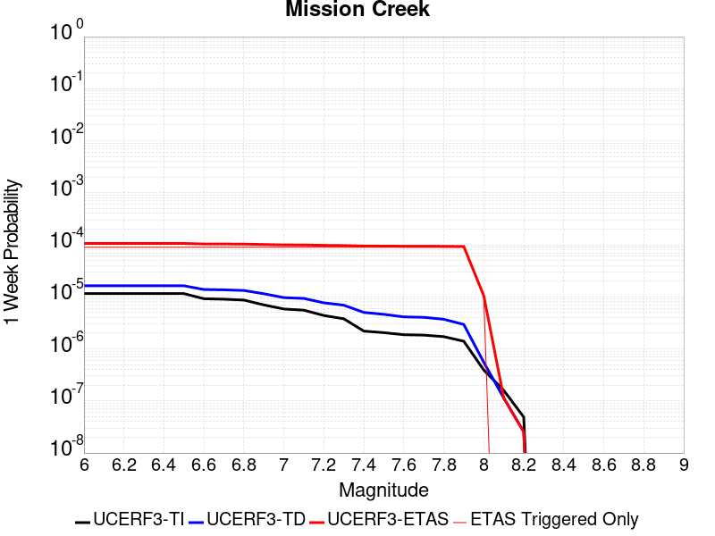 | 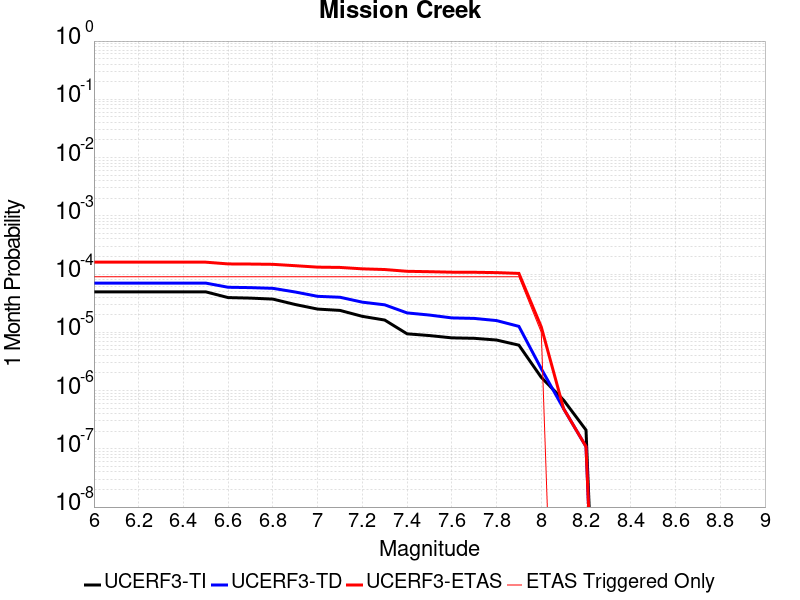 | 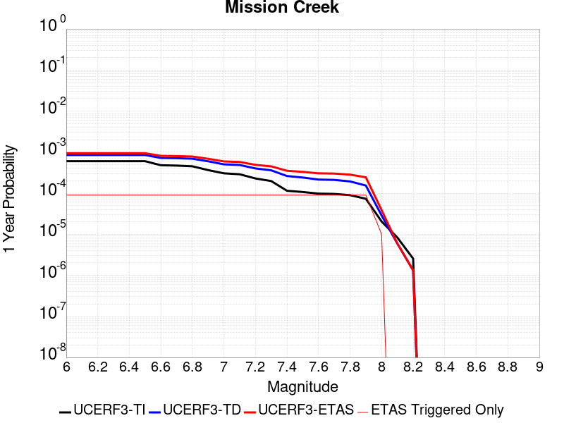 | 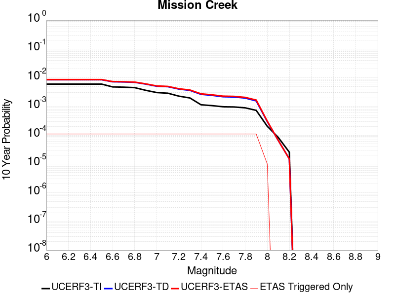 |

| Magnitude | 1 wk TI Prob | 1 wk TD Prob | 1 wk ETAS Prob | 1 wk ETAS/TD Gain | 1 wk ETAS Triggered Only | 1 mo TI Prob | 1 mo TD Prob | 1 mo ETAS Prob | 1 mo ETAS/TD Gain | 1 mo ETAS Triggered Only | 1 yr TI Prob | 1 yr TD Prob | 1 yr ETAS Prob | 1 yr ETAS/TD Gain | 1 yr ETAS Triggered Only | 10 yr TI Prob | 10 yr TD Prob | 10 yr ETAS Prob | 10 yr ETAS/TD Gain | 10 yr ETAS Triggered Only |
|-----|-----|-----|-----|-----|-----|-----|-----|-----|-----|-----|-----|-----|-----|-----|-----|-----|-----|-----|-----|-----|
| 6.0 | 1.1549387E-5 | 1.6322783E-5 | 1.0632131E-4 | 6.5136757 | 9.0E-5 | 4.9496433E-5 | 6.995299E-5 | 1.5994669E-4 | 2.2864883 | 9.0E-5 | 6.0245243E-4 | 8.5135986E-4 | 9.4128324E-4 | 1.1056232 | 9.0E-5 | 0.006008218 | 0.008510157 | 0.00861922 | 1.0128157 | 1.1E-4 |
| 6.1 | 1.1549387E-5 | 1.6322783E-5 | 1.0632131E-4 | 6.5136757 | 9.0E-5 | 4.9496433E-5 | 6.995299E-5 | 1.5994669E-4 | 2.2864883 | 9.0E-5 | 6.0245243E-4 | 8.5135986E-4 | 9.4128324E-4 | 1.1056232 | 9.0E-5 | 0.006008218 | 0.008510157 | 0.00861922 | 1.0128157 | 1.1E-4 |
| 6.2 | 1.1549387E-5 | 1.6322783E-5 | 1.0632131E-4 | 6.5136757 | 9.0E-5 | 4.9496433E-5 | 6.995299E-5 | 1.5994669E-4 | 2.2864883 | 9.0E-5 | 6.0245243E-4 | 8.5135986E-4 | 9.4128324E-4 | 1.1056232 | 9.0E-5 | 0.006008218 | 0.008510157 | 0.00861922 | 1.0128157 | 1.1E-4 |
| 6.3 | 1.1549387E-5 | 1.6322783E-5 | 1.0632131E-4 | 6.5136757 | 9.0E-5 | 4.9496433E-5 | 6.995299E-5 | 1.5994669E-4 | 2.2864883 | 9.0E-5 | 6.0245243E-4 | 8.5135986E-4 | 9.4128324E-4 | 1.1056232 | 9.0E-5 | 0.006008218 | 0.008510157 | 0.00861922 | 1.0128157 | 1.1E-4 |
| 6.4 | 1.1549387E-5 | 1.6322783E-5 | 1.0632131E-4 | 6.5136757 | 9.0E-5 | 4.9496433E-5 | 6.995299E-5 | 1.5994669E-4 | 2.2864883 | 9.0E-5 | 6.0245243E-4 | 8.5135986E-4 | 9.4128324E-4 | 1.1056232 | 9.0E-5 | 0.006008218 | 0.008510157 | 0.00861922 | 1.0128157 | 1.1E-4 |
| 6.5 | 1.1549387E-5 | 1.6322783E-5 | 1.0632131E-4 | 6.5136757 | 9.0E-5 | 4.9496433E-5 | 6.995299E-5 | 1.5994669E-4 | 2.2864883 | 9.0E-5 | 6.0245243E-4 | 8.5135986E-4 | 9.4128324E-4 | 1.1056232 | 9.0E-5 | 0.006008218 | 0.008510157 | 0.00861922 | 1.0128157 | 1.1E-4 |
| 6.6 | 9.202681E-6 | 1.3846059E-5 | 1.0384481E-4 | 7.4999547 | 9.0E-5 | 3.9439463E-5 | 5.9338956E-5 | 1.4933362E-4 | 2.5166202 | 9.0E-5 | 4.800697E-4 | 7.2222133E-4 | 8.121563E-4 | 1.1245255 | 9.0E-5 | 0.004790339 | 0.0072273402 | 0.0073365453 | 1.01511 | 1.1E-4 |
| 6.7 | 9.019164E-6 | 1.3651728E-5 | 1.036505E-4 | 7.5924816 | 9.0E-5 | 3.8652986E-5 | 5.8506146E-5 | 1.4850088E-4 | 2.53821 | 9.0E-5 | 4.7049852E-4 | 7.1208854E-4 | 8.0202444E-4 | 1.1262988 | 9.0E-5 | 0.004695036 | 0.0071266647 | 0.0072358805 | 1.015325 | 1.1E-4 |
| 6.8 | 8.673558E-6 | 1.3273839E-5 | 1.0327264E-4 | 7.7801642 | 9.0E-5 | 3.717186E-5 | 5.688669E-5 | 1.4688158E-4 | 2.5820024 | 9.0E-5 | 4.524734E-4 | 6.923842E-4 | 7.823219E-4 | 1.1298957 | 9.0E-5 | 0.0045155324 | 0.0069308523 | 0.00704009 | 1.015761 | 1.1E-4 |
| 6.9 | 7.002255E-6 | 1.1478069E-5 | 1.0147704E-4 | 8.840951 | 9.0E-5 | 3.000932E-5 | 4.9190832E-5 | 1.391864E-4 | 2.8295193 | 9.0E-5 | 3.653022E-4 | 5.9874065E-4 | 6.886868E-4 | 1.1502255 | 9.0E-5 | 0.0036470229 | 0.005999676 | 0.0061090156 | 1.0182244 | 1.1E-4 |
| 7.0 | 5.84644E-6 | 9.675359E-6 | 9.9674486E-5 | 10.30189 | 9.0E-5 | 2.5055931E-5 | 4.146519E-5 | 1.3146146E-4 | 3.1704051 | 9.0E-5 | 3.0501327E-4 | 5.047263E-4 | 5.946809E-4 | 1.1782244 | 9.0E-5 | 0.0030459496 | 0.005063994 | 0.005173437 | 1.0216119 | 1.1E-4 |
| 7.1 | 5.54703E-6 | 9.329834E-6 | 9.9328994E-5 | 10.646384 | 9.0E-5 | 2.377277E-5 | 3.9984414E-5 | 1.2998082E-4 | 3.250787 | 9.0E-5 | 2.8939504E-4 | 4.8670598E-4 | 5.766622E-4 | 1.1848266 | 9.0E-5 | 0.0028901845 | 0.0048845876 | 0.00499405 | 1.0224098 | 1.1E-4 |
| 7.2 | 4.384709E-6 | 7.681918E-6 | 9.768123E-5 | 12.7157345 | 9.0E-5 | 1.8791474E-5 | 3.292211E-5 | 1.2291914E-4 | 3.7336352 | 9.0E-5 | 2.2876218E-4 | 4.0075663E-4 | 4.9072056E-4 | 1.2244852 | 9.0E-5 | 0.0022852682 | 0.004028542 | 0.0041380986 | 1.0271952 | 1.1E-4 |
| 7.3 | 3.7888456E-6 | 6.915788E-6 | 9.6915166E-5 | 14.013611 | 9.0E-5 | 1.623781E-5 | 2.9638775E-5 | 1.19636105E-4 | 4.036473 | 9.0E-5 | 1.9767738E-4 | 3.6079568E-4 | 4.507632E-4 | 1.2493587 | 9.0E-5 | 0.0019750162 | 0.00363027 | 0.0037398706 | 1.0301908 | 1.1E-4 |
| 7.4 | 2.1982462E-6 | 5.0241033E-6 | 9.502365E-5 | 18.913555 | 9.0E-5 | 9.421021E-6 | 2.1531694E-5 | 1.1152976E-4 | 5.179795 | 9.0E-5 | 1.1469489E-4 | 2.6211704E-4 | 3.5209343E-4 | 1.343268 | 9.0E-5 | 0.0011463572 | 0.0026460327 | 0.0027557416 | 1.0414617 | 1.1E-4 |
| 7.5 | 2.051923E-6 | 4.6153277E-6 | 9.4614916E-5 | 20.50015 | 9.0E-5 | 8.793926E-6 | 1.9779825E-5 | 1.0977805E-4 | 5.5500007 | 9.0E-5 | 1.0706078E-4 | 2.4079291E-4 | 3.3077123E-4 | 1.3736751 | 9.0E-5 | 0.0010700922 | 0.0024335932 | 0.0025433253 | 1.0450907 | 1.1E-4 |
| 7.6 | 1.8733427E-6 | 4.1236603E-6 | 9.412329E-5 | 22.825178 | 9.0E-5 | 8.028587E-6 | 1.7672712E-5 | 1.0767112E-4 | 6.092507 | 9.0E-5 | 9.774366E-5 | 2.151441E-4 | 3.0512473E-4 | 1.4182342 | 9.0E-5 | 9.770069E-4 | 0.0021782513 | 0.0022880116 | 1.0503892 | 1.1E-4 |
| 7.7 | 1.8411953E-6 | 4.0433315E-6 | 9.404297E-5 | 23.258781 | 9.0E-5 | 7.890813E-6 | 1.732845E-5 | 1.0732689E-4 | 6.1936812 | 9.0E-5 | 9.606641E-5 | 2.1095353E-4 | 3.0093454E-4 | 1.4265442 | 9.0E-5 | 9.6024893E-4 | 0.0021365292 | 0.0022462942 | 1.0513754 | 1.1E-4 |
| 7.8 | 1.7194251E-6 | 3.71068E-6 | 9.371035E-5 | 25.254225 | 9.0E-5 | 7.368944E-6 | 1.5902819E-5 | 1.0590139E-4 | 6.6592846 | 9.0E-5 | 8.97132E-5 | 1.9359968E-4 | 2.8358225E-4 | 1.4647868 | 9.0E-5 | 8.967699E-4 | 0.0019624757 | 0.0020722598 | 1.0559417 | 1.1E-4 |
| 7.9 | 1.4035052E-6 | 2.9502596E-6 | 9.2949995E-5 | 31.5057 | 9.0E-5 | 6.0150082E-6 | 1.2643909E-5 | 1.0264277E-4 | 8.117962 | 9.0E-5 | 7.3230265E-5 | 1.5392878E-4 | 2.4391492E-4 | 1.584596 | 9.0E-5 | 7.3206134E-4 | 0.0015631174 | 0.0016729455 | 1.0702622 | 1.1E-4 |
| 8.0 | 3.9318823E-7 | 5.528477E-7 | 1.05528425E-5 | 19.088152 | 1.0E-5 | 1.6850913E-6 | 2.3693453E-6 | 1.2369322E-5 | 5.220565 | 1.0E-5 | 2.0515794E-5 | 2.8846403E-5 | 3.8846116E-5 | 1.3466537 | 1.0E-5 | 2.0513899E-4 | 2.990952E-4 | 3.0909223E-4 | 1.0334241 | 1.0E-5 |
| 8.1 | 1.596793E-7 | 1.13775044E-7 | 1.13775044E-7 | 1.0 | 0.0 | 6.8433974E-7 | 4.876072E-7 | 4.876072E-7 | 1.0 | 0.0 | 8.331805E-6 | 5.936602E-6 | 5.936602E-6 | 1.0 | 0.0 | 8.331492E-5 | 6.5494125E-5 | 6.5494125E-5 | 1.0 | 0.0 |
| 8.2 | 4.9003038E-8 | 2.5435753E-8 | 2.5435753E-8 | 1.0 | 0.0 | 2.10013E-7 | 1.09010365E-7 | 1.09010365E-7 | 1.0 | 0.0 | 2.5569052E-6 | 1.3272004E-6 | 1.3272004E-6 | 1.0 | 0.0 | 2.556876E-5 | 1.4952613E-5 | 1.4952613E-5 | 1.0 | 0.0 |

## Independence rev 2011
*[(top)](#table-of-contents)*

| 1 Week | 1 Month | 1 Year | 10 Year |
|-----|-----|-----|-----|
| 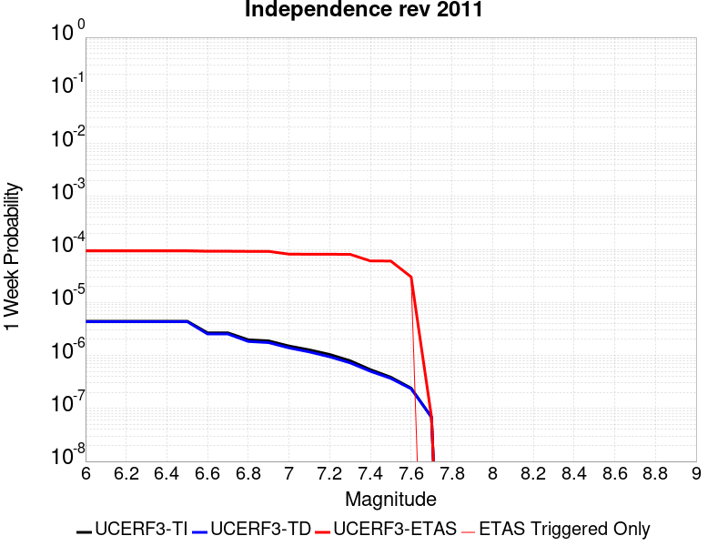 | 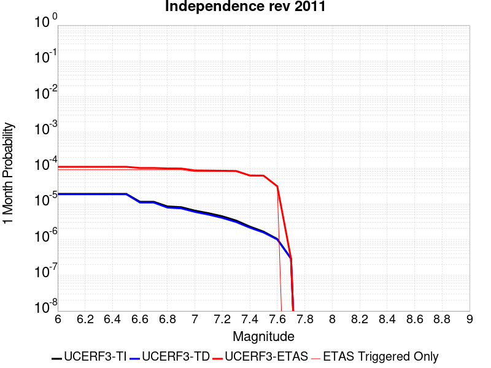 | 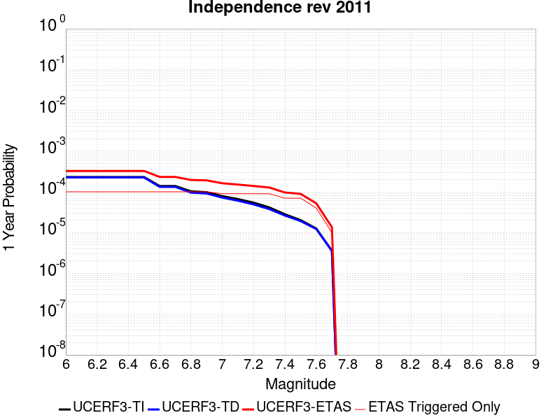 | 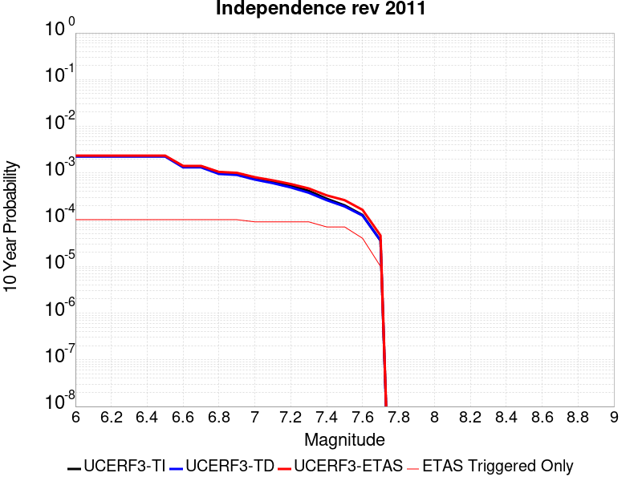 |

| Magnitude | 1 wk TI Prob | 1 wk TD Prob | 1 wk ETAS Prob | 1 wk ETAS/TD Gain | 1 wk ETAS Triggered Only | 1 mo TI Prob | 1 mo TD Prob | 1 mo ETAS Prob | 1 mo ETAS/TD Gain | 1 mo ETAS Triggered Only | 1 yr TI Prob | 1 yr TD Prob | 1 yr ETAS Prob | 1 yr ETAS/TD Gain | 1 yr ETAS Triggered Only | 10 yr TI Prob | 10 yr TD Prob | 10 yr ETAS Prob | 10 yr ETAS/TD Gain | 10 yr ETAS Triggered Only |
|-----|-----|-----|-----|-----|-----|-----|-----|-----|-----|-----|-----|-----|-----|-----|-----|-----|-----|-----|-----|-----|
| 6.0 | 4.422171E-6 | 4.3262253E-6 | 9.4325835E-5 | 21.803265 | 9.0E-5 | 1.8952025E-5 | 1.8540852E-5 | 1.08539185E-4 | 5.8540564 | 9.0E-5 | 2.3071647E-4 | 2.2571447E-4 | 3.256919E-4 | 1.4429376 | 1.0E-4 | 0.0023047708 | 0.0022551457 | 0.0023549201 | 1.044243 | 1.0E-4 |
| 6.1 | 4.422171E-6 | 4.3262253E-6 | 9.4325835E-5 | 21.803265 | 9.0E-5 | 1.8952025E-5 | 1.8540852E-5 | 1.08539185E-4 | 5.8540564 | 9.0E-5 | 2.3071647E-4 | 2.2571447E-4 | 3.256919E-4 | 1.4429376 | 1.0E-4 | 0.0023047708 | 0.0022551457 | 0.0023549201 | 1.044243 | 1.0E-4 |
| 6.2 | 4.422171E-6 | 4.3262253E-6 | 9.4325835E-5 | 21.803265 | 9.0E-5 | 1.8952025E-5 | 1.8540852E-5 | 1.08539185E-4 | 5.8540564 | 9.0E-5 | 2.3071647E-4 | 2.2571447E-4 | 3.256919E-4 | 1.4429376 | 1.0E-4 | 0.0023047708 | 0.0022551457 | 0.0023549201 | 1.044243 | 1.0E-4 |
| 6.3 | 4.422171E-6 | 4.3262253E-6 | 9.4325835E-5 | 21.803265 | 9.0E-5 | 1.8952025E-5 | 1.8540852E-5 | 1.08539185E-4 | 5.8540564 | 9.0E-5 | 2.3071647E-4 | 2.2571447E-4 | 3.256919E-4 | 1.4429376 | 1.0E-4 | 0.0023047708 | 0.0022551457 | 0.0023549201 | 1.044243 | 1.0E-4 |
| 6.4 | 4.422171E-6 | 4.3262253E-6 | 9.4325835E-5 | 21.803265 | 9.0E-5 | 1.8952025E-5 | 1.8540852E-5 | 1.08539185E-4 | 5.8540564 | 9.0E-5 | 2.3071647E-4 | 2.2571447E-4 | 3.256919E-4 | 1.4429376 | 1.0E-4 | 0.0023047708 | 0.0022551457 | 0.0023549201 | 1.044243 | 1.0E-4 |
| 6.5 | 4.422171E-6 | 4.3262253E-6 | 9.4325835E-5 | 21.803265 | 9.0E-5 | 1.8952025E-5 | 1.8540852E-5 | 1.08539185E-4 | 5.8540564 | 9.0E-5 | 2.3071647E-4 | 2.2571447E-4 | 3.256919E-4 | 1.4429376 | 1.0E-4 | 0.0023047708 | 0.0022551457 | 0.0023549201 | 1.044243 | 1.0E-4 |
| 6.6 | 2.663744E-6 | 2.5319846E-6 | 9.253176E-5 | 36.54515 | 9.0E-5 | 1.1415996E-5 | 1.08513195E-5 | 1.00850346E-4 | 9.293832 | 9.0E-5 | 1.3898089E-4 | 1.321073E-4 | 2.3209408E-4 | 1.7568605 | 1.0E-4 | 0.0013889399 | 0.0013203359 | 0.0014202038 | 1.0756383 | 1.0E-4 |
| 6.7 | 2.663744E-6 | 2.5319846E-6 | 9.253176E-5 | 36.54515 | 9.0E-5 | 1.1415996E-5 | 1.08513195E-5 | 1.00850346E-4 | 9.293832 | 9.0E-5 | 1.3898089E-4 | 1.321073E-4 | 2.3209408E-4 | 1.7568605 | 1.0E-4 | 0.0013889399 | 0.0013203359 | 0.0014202038 | 1.0756383 | 1.0E-4 |
| 6.8 | 1.9716529E-6 | 1.8322567E-6 | 9.1832095E-5 | 50.119667 | 9.0E-5 | 8.449913E-6 | 7.852505E-6 | 9.78518E-5 | 12.46122 | 9.0E-5 | 1.0287284E-4 | 9.560019E-5 | 1.9559063E-4 | 2.045923 | 1.0E-4 | 0.0010282523 | 9.5560355E-4 | 0.0010555079 | 1.104546 | 1.0E-4 |
| 6.9 | 1.8788617E-6 | 1.7429976E-6 | 9.174284E-5 | 52.635094 | 9.0E-5 | 8.0522395E-6 | 7.4699688E-6 | 9.7469296E-5 | 13.048153 | 9.0E-5 | 9.80316E-5 | 9.09432E-5 | 1.9093411E-4 | 2.0994875 | 1.0E-4 | 9.798837E-4 | 9.090718E-4 | 0.0010089809 | 1.1099023 | 1.0E-4 |
| 7.0 | 1.5045488E-6 | 1.3849498E-6 | 8.138484E-5 | 58.76375 | 8.0E-5 | 6.44805E-6 | 5.9354857E-6 | 8.593501E-5 | 14.478177 | 8.0E-5 | 7.8502184E-5 | 7.226219E-5 | 1.6225569E-4 | 2.2453747 | 9.0E-5 | 7.8474457E-4 | 7.223921E-4 | 8.123271E-4 | 1.1244961 | 9.0E-5 |
| 7.1 | 1.272341E-6 | 1.1625089E-6 | 8.116241E-5 | 69.8166 | 8.0E-5 | 5.4528787E-6 | 4.9821715E-6 | 8.498177E-5 | 17.057175 | 8.0E-5 | 6.6386776E-5 | 6.0656283E-5 | 1.5065083E-4 | 2.4836805 | 9.0E-5 | 6.636695E-4 | 6.064005E-4 | 6.963459E-4 | 1.1483268 | 9.0E-5 |
| 7.2 | 1.0416892E-6 | 9.409871E-7 | 8.094091E-5 | 86.01703 | 8.0E-5 | 4.464375E-6 | 4.032796E-6 | 8.403247E-5 | 20.837275 | 8.0E-5 | 5.4352407E-5 | 4.9098202E-5 | 1.3909378E-4 | 2.832971 | 9.0E-5 | 5.4339116E-4 | 4.908754E-4 | 5.808312E-4 | 1.1832559 | 9.0E-5 |
| 7.3 | 7.9450155E-7 | 7.2350036E-7 | 8.072344E-5 | 111.57346 | 8.0E-5 | 3.4050022E-6 | 3.1007123E-6 | 8.3100465E-5 | 26.800444 | 8.0E-5 | 4.1455114E-5 | 3.7750528E-5 | 1.2774713E-4 | 3.3839827 | 9.0E-5 | 4.144738E-4 | 3.7744228E-4 | 4.674083E-4 | 1.2383571 | 9.0E-5 |
| 7.4 | 5.3893444E-7 | 5.0195166E-7 | 6.0501923E-5 | 120.53336 | 6.0E-5 | 2.309717E-6 | 2.1512196E-6 | 6.215109E-5 | 28.891096 | 6.0E-5 | 2.8120441E-5 | 2.6190788E-5 | 9.618895E-5 | 3.6726253 | 7.0E-5 | 2.8116882E-4 | 2.6187746E-4 | 3.3185913E-4 | 1.2672306 | 7.0E-5 |
| 7.5 | 3.8852085E-7 | 3.6825622E-7 | 6.0368235E-5 | 163.92998 | 6.0E-5 | 1.6650882E-6 | 1.57824E-6 | 6.157815E-5 | 39.01697 | 6.0E-5 | 2.027226E-5 | 1.9214905E-5 | 8.921356E-5 | 4.6429353 | 7.0E-5 | 2.0270412E-4 | 1.9213265E-4 | 2.621192E-4 | 1.3642616 | 7.0E-5 |
| 7.6 | 2.414929E-7 | 2.3457605E-7 | 3.0234569E-5 | 128.89026 | 3.0E-5 | 1.0349692E-6 | 1.0053255E-6 | 3.1005296E-5 | 30.84105 | 3.0E-5 | 1.2600677E-5 | 1.2239771E-5 | 5.223928E-5 | 4.267995 | 4.0E-5 | 1.2599962E-4 | 1.223911E-4 | 1.6238619E-4 | 1.3267812 | 4.0E-5 |
| 7.7 | 6.8298014E-8 | 6.8589785E-8 | 6.8589785E-8 | 1.0 | 0.0 | 2.9270575E-7 | 2.939562E-7 | 2.939562E-7 | 1.0 | 0.0 | 3.5636867E-6 | 3.5789112E-6 | 1.3578875E-5 | 3.7941358 | 1.0E-5 | 3.5636294E-5 | 3.5788584E-5 | 4.5788227E-5 | 1.2794087 | 1.0E-5 |

## Pisgah-Bullion Mtn-Mesquite Lk
*[(top)](#table-of-contents)*

| 1 Week | 1 Month | 1 Year | 10 Year |
|-----|-----|-----|-----|
| 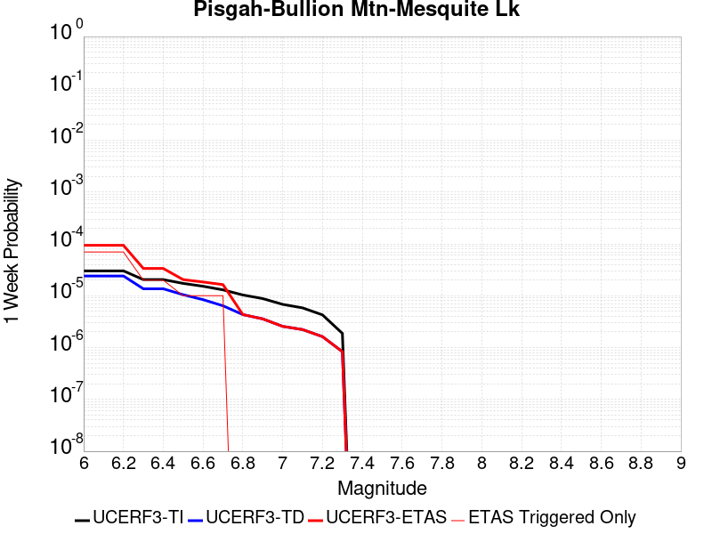 | 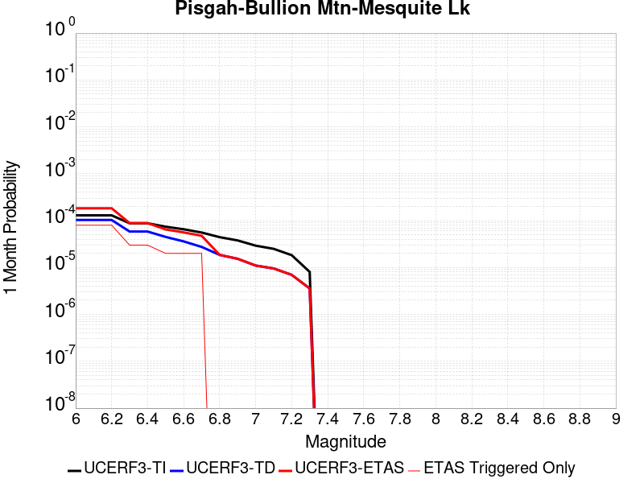 | 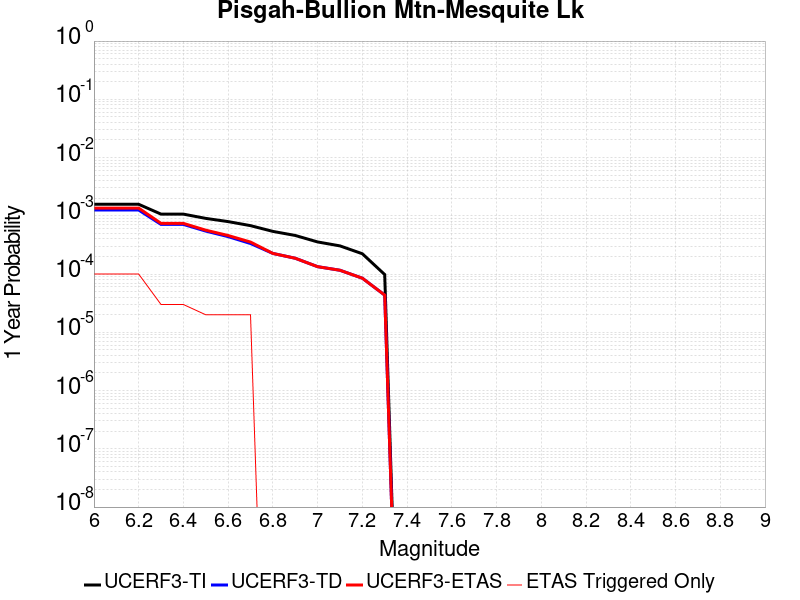 | 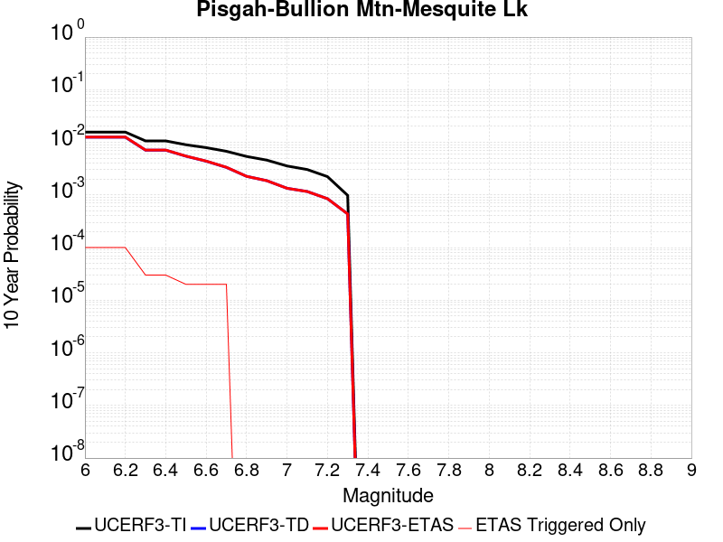 |

| Magnitude | 1 wk TI Prob | 1 wk TD Prob | 1 wk ETAS Prob | 1 wk ETAS/TD Gain | 1 wk ETAS Triggered Only | 1 mo TI Prob | 1 mo TD Prob | 1 mo ETAS Prob | 1 mo ETAS/TD Gain | 1 mo ETAS Triggered Only | 1 yr TI Prob | 1 yr TD Prob | 1 yr ETAS Prob | 1 yr ETAS/TD Gain | 1 yr ETAS Triggered Only | 10 yr TI Prob | 10 yr TD Prob | 10 yr ETAS Prob | 10 yr ETAS/TD Gain | 10 yr ETAS Triggered Only |
|-----|-----|-----|-----|-----|-----|-----|-----|-----|-----|-----|-----|-----|-----|-----|-----|-----|-----|-----|-----|-----|
| 6.0 | 3.0240792E-5 | 2.40909E-5 | 9.408921E-5 | 3.9055915 | 7.0E-5 | 1.2959696E-4 | 1.032432E-4 | 1.8323494E-4 | 1.7747895 | 8.0E-5 | 0.0015767008 | 0.0012563618 | 0.0013562362 | 1.079495 | 1.0E-4 | 0.015655609 | 0.012502613 | 0.012601363 | 1.0078983 | 1.0E-4 |
| 6.1 | 3.0240792E-5 | 2.40909E-5 | 9.408921E-5 | 3.9055915 | 7.0E-5 | 1.2959696E-4 | 1.032432E-4 | 1.8323494E-4 | 1.7747895 | 8.0E-5 | 0.0015767008 | 0.0012563618 | 0.0013562362 | 1.079495 | 1.0E-4 | 0.015655609 | 0.012502613 | 0.012601363 | 1.0078983 | 1.0E-4 |
| 6.2 | 3.0240792E-5 | 2.40909E-5 | 9.408921E-5 | 3.9055915 | 7.0E-5 | 1.2959696E-4 | 1.032432E-4 | 1.8323494E-4 | 1.7747895 | 8.0E-5 | 0.0015767008 | 0.0012563618 | 0.0013562362 | 1.079495 | 1.0E-4 | 0.015655609 | 0.012502613 | 0.012601363 | 1.0078983 | 1.0E-4 |
| 6.3 | 2.0498217E-5 | 1.3638054E-5 | 3.363778E-5 | 2.4664648 | 2.0E-5 | 8.784654E-5 | 5.8447586E-5 | 8.8445835E-5 | 1.5132504 | 3.0E-5 | 0.0010690069 | 7.1138324E-4 | 7.4136193E-4 | 1.0421413 | 3.0E-5 | 0.01063879 | 0.0070926864 | 0.007122474 | 1.0041997 | 3.0E-5 |
| 6.4 | 2.0498217E-5 | 1.3638054E-5 | 3.363778E-5 | 2.4664648 | 2.0E-5 | 8.784654E-5 | 5.8447586E-5 | 8.8445835E-5 | 1.5132504 | 3.0E-5 | 0.0010690069 | 7.1138324E-4 | 7.4136193E-4 | 1.0421413 | 3.0E-5 | 0.01063879 | 0.0070926864 | 0.007122474 | 1.0041997 | 3.0E-5 |
| 6.5 | 1.7316182E-5 | 1.04769715E-5 | 2.0476868E-5 | 1.9544643 | 1.0E-5 | 7.42101E-5 | 4.490059E-5 | 6.4899694E-5 | 1.4454085 | 2.0E-5 | 9.0313336E-4 | 5.465376E-4 | 5.665266E-4 | 1.036574 | 2.0E-5 | 0.008994718 | 0.00545293 | 0.005472821 | 1.0036478 | 2.0E-5 |
| 6.6 | 1.5251077E-5 | 8.414133E-6 | 1.8414048E-5 | 2.1884665 | 1.0E-5 | 6.536012E-5 | 3.606011E-5 | 5.605939E-5 | 1.5546094 | 2.0E-5 | 7.9546886E-4 | 4.3895066E-4 | 4.5894188E-4 | 1.0455432 | 2.0E-5 | 0.007926274 | 0.0043815537 | 0.004401466 | 1.0045446 | 2.0E-5 |
| 6.7 | 1.2997425E-5 | 6.4112146E-6 | 1.641115E-5 | 2.5597568 | 1.0E-5 | 5.570206E-5 | 2.7476372E-5 | 4.747582E-5 | 1.7278782 | 2.0E-5 | 6.7796157E-4 | 3.3447813E-4 | 3.5447144E-4 | 1.0597746 | 2.0E-5 | 0.0067589693 | 0.003340207 | 0.0033601404 | 1.0059676 | 2.0E-5 |
| 6.8 | 1.035386E-5 | 4.333145E-6 | 4.333145E-6 | 1.0 | 0.0 | 4.437293E-5 | 1.8570496E-5 | 1.8570496E-5 | 1.0 | 0.0 | 5.401065E-4 | 2.260732E-4 | 2.260732E-4 | 1.0 | 0.0 | 0.0053879567 | 0.002258519 | 0.002258519 | 1.0 | 0.0 |
| 6.9 | 8.816252E-6 | 3.5805879E-6 | 3.5805879E-6 | 1.0 | 0.0 | 3.778339E-5 | 1.534529E-5 | 1.534529E-5 | 1.0 | 0.0 | 4.5991567E-4 | 1.8681347E-4 | 1.8681347E-4 | 1.0 | 0.0 | 0.00458965 | 0.0018666228 | 0.0018666228 | 1.0 | 0.0 |
| 7.0 | 6.8232207E-6 | 2.5674399E-6 | 2.5674399E-6 | 1.0 | 0.0 | 2.9242048E-5 | 1.100327E-5 | 1.100327E-5 | 1.0 | 0.0 | 3.5596377E-4 | 1.3395688E-4 | 1.3395688E-4 | 1.0 | 0.0 | 0.0035539411 | 0.0013387925 | 0.0013387925 | 1.0 | 0.0 |
| 7.1 | 5.837013E-6 | 2.2273143E-6 | 2.2273143E-6 | 1.0 | 0.0 | 2.501553E-5 | 9.5456E-6 | 9.5456E-6 | 1.0 | 0.0 | 3.045215E-4 | 1.1621177E-4 | 1.1621177E-4 | 1.0 | 0.0 | 0.0030410455 | 0.001161539 | 0.001161539 | 1.0 | 0.0 |
| 7.2 | 4.278052E-6 | 1.6275065E-6 | 1.6275065E-6 | 1.0 | 0.0 | 1.833438E-5 | 6.975011E-6 | 6.975011E-6 | 1.0 | 0.0 | 2.231982E-4 | 8.491768E-5 | 8.491768E-5 | 1.0 | 0.0 | 0.0022297418 | 8.4887556E-4 | 8.4887556E-4 | 1.0 | 0.0 |
| 7.3 | 1.8803692E-6 | 8.344788E-7 | 8.344788E-7 | 1.0 | 0.0 | 8.0587E-6 | 3.5763337E-6 | 3.5763337E-6 | 1.0 | 0.0 | 9.811026E-5 | 4.354114E-5 | 4.354114E-5 | 1.0 | 0.0 | 9.806695E-4 | 4.3534054E-4 | 4.3534054E-4 | 1.0 | 0.0 |

## Kern Canyon (North Kern) 2011
*[(top)](#table-of-contents)*

| 1 Week | 1 Month | 1 Year | 10 Year |
|-----|-----|-----|-----|
| 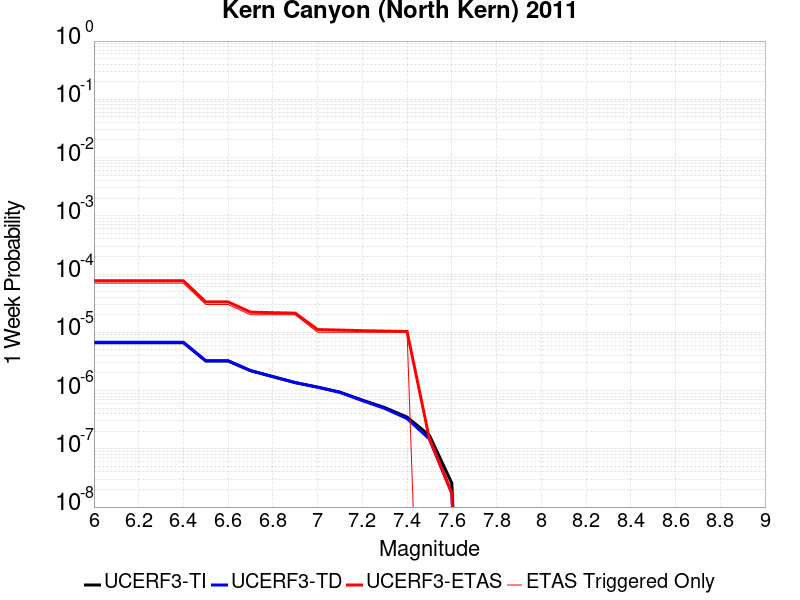 | 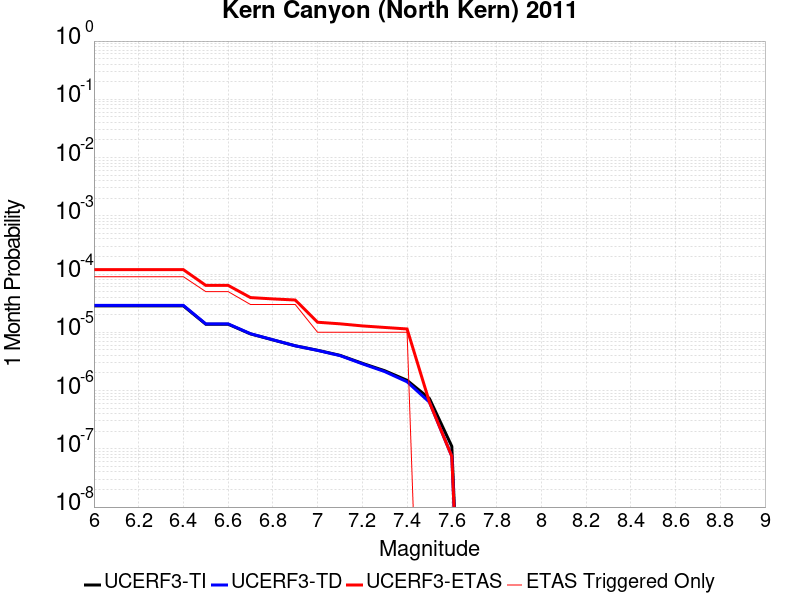 | 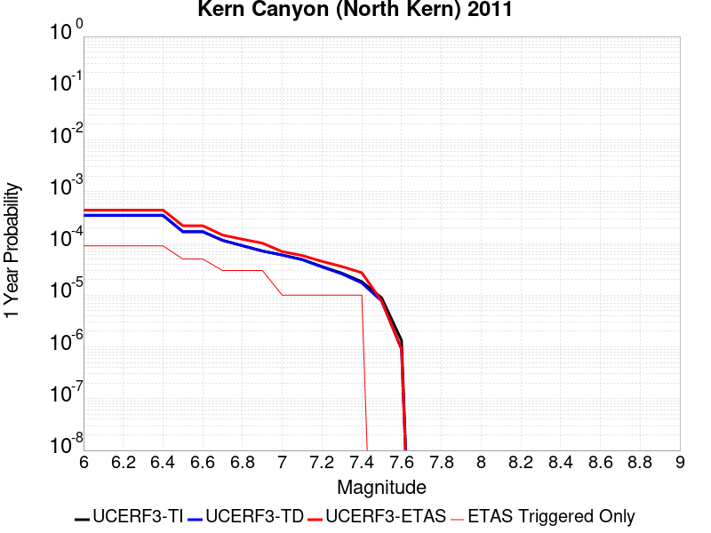 |  |

| Magnitude | 1 wk TI Prob | 1 wk TD Prob | 1 wk ETAS Prob | 1 wk ETAS/TD Gain | 1 wk ETAS Triggered Only | 1 mo TI Prob | 1 mo TD Prob | 1 mo ETAS Prob | 1 mo ETAS/TD Gain | 1 mo ETAS Triggered Only | 1 yr TI Prob | 1 yr TD Prob | 1 yr ETAS Prob | 1 yr ETAS/TD Gain | 1 yr ETAS Triggered Only | 10 yr TI Prob | 10 yr TD Prob | 10 yr ETAS Prob | 10 yr ETAS/TD Gain | 10 yr ETAS Triggered Only |
|-----|-----|-----|-----|-----|-----|-----|-----|-----|-----|-----|-----|-----|-----|-----|-----|-----|-----|-----|-----|-----|
| 6.0 | 6.6264497E-6 | 6.75733E-6 | 7.6756856E-5 | 11.359051 | 7.0E-5 | 2.8398761E-5 | 2.895971E-5 | 1.18957105E-4 | 4.107676 | 9.0E-5 | 3.4570007E-4 | 3.5253543E-4 | 4.425037E-4 | 1.2552035 | 9.0E-5 | 0.0034516277 | 0.0035205502 | 0.0036201982 | 1.0283047 | 1.0E-4 |
| 6.1 | 6.6264497E-6 | 6.75733E-6 | 7.6756856E-5 | 11.359051 | 7.0E-5 | 2.8398761E-5 | 2.895971E-5 | 1.18957105E-4 | 4.107676 | 9.0E-5 | 3.4570007E-4 | 3.5253543E-4 | 4.425037E-4 | 1.2552035 | 9.0E-5 | 0.0034516277 | 0.0035205502 | 0.0036201982 | 1.0283047 | 1.0E-4 |
| 6.2 | 6.6264497E-6 | 6.75733E-6 | 7.6756856E-5 | 11.359051 | 7.0E-5 | 2.8398761E-5 | 2.895971E-5 | 1.18957105E-4 | 4.107676 | 9.0E-5 | 3.4570007E-4 | 3.5253543E-4 | 4.425037E-4 | 1.2552035 | 9.0E-5 | 0.0034516277 | 0.0035205502 | 0.0036201982 | 1.0283047 | 1.0E-4 |
| 6.3 | 6.6264497E-6 | 6.75733E-6 | 7.6756856E-5 | 11.359051 | 7.0E-5 | 2.8398761E-5 | 2.895971E-5 | 1.18957105E-4 | 4.107676 | 9.0E-5 | 3.4570007E-4 | 3.5253543E-4 | 4.425037E-4 | 1.2552035 | 9.0E-5 | 0.0034516277 | 0.0035205502 | 0.0036201982 | 1.0283047 | 1.0E-4 |
| 6.4 | 6.6264497E-6 | 6.75733E-6 | 7.6756856E-5 | 11.359051 | 7.0E-5 | 2.8398761E-5 | 2.895971E-5 | 1.18957105E-4 | 4.107676 | 9.0E-5 | 3.4570007E-4 | 3.5253543E-4 | 4.425037E-4 | 1.2552035 | 9.0E-5 | 0.0034516277 | 0.0035205502 | 0.0036201982 | 1.0283047 | 1.0E-4 |
| 6.5 | 3.2162225E-6 | 3.2570915E-6 | 3.3256994E-5 | 10.210642 | 3.0E-5 | 1.3783738E-5 | 1.3958894E-5 | 6.395819E-5 | 4.581896 | 5.0E-5 | 1.6780409E-4 | 1.6993708E-4 | 2.1992858E-4 | 1.2941766 | 5.0E-5 | 0.0016767744 | 0.001698151 | 0.0017580491 | 1.0352726 | 6.0E-5 |
| 6.6 | 3.2162225E-6 | 3.2570915E-6 | 3.3256994E-5 | 10.210642 | 3.0E-5 | 1.3783738E-5 | 1.3958894E-5 | 6.395819E-5 | 4.581896 | 5.0E-5 | 1.6780409E-4 | 1.6993708E-4 | 2.1992858E-4 | 1.2941766 | 5.0E-5 | 0.0016767744 | 0.001698151 | 0.0017580491 | 1.0352726 | 6.0E-5 |
| 6.7 | 2.1908265E-6 | 2.2071222E-6 | 2.2207078E-5 | 10.061553 | 2.0E-5 | 9.389223E-6 | 9.459062E-6 | 3.9458777E-5 | 4.1715317 | 3.0E-5 | 1.1430779E-4 | 1.1515819E-4 | 1.4515474E-4 | 1.2604812 | 3.0E-5 | 0.0011424901 | 0.0011510046 | 0.0011909585 | 1.0347122 | 4.0E-5 |
| 6.8 | 1.7303895E-6 | 1.736553E-6 | 2.1736518E-5 | 12.517049 | 2.0E-5 | 7.415934E-6 | 7.442349E-6 | 3.7442125E-5 | 5.0309553 | 3.0E-5 | 9.028525E-5 | 9.060693E-5 | 1.20604214E-4 | 1.3310705 | 3.0E-5 | 9.024858E-4 | 9.0570963E-4 | 9.456734E-4 | 1.0441242 | 4.0E-5 |
| 6.9 | 1.3700314E-6 | 1.3688623E-6 | 2.1368834E-5 | 15.610653 | 2.0E-5 | 5.87155E-6 | 5.86654E-6 | 3.5866364E-5 | 6.113717 | 3.0E-5 | 7.148377E-5 | 7.142283E-5 | 1.0142069E-4 | 1.4200038 | 3.0E-5 | 7.146078E-4 | 7.140033E-4 | 7.539747E-4 | 1.0559821 | 4.0E-5 |
| 7.0 | 1.1467797E-6 | 1.1413805E-6 | 1.1141369E-5 | 9.76131 | 1.0E-5 | 4.9147607E-6 | 4.8916218E-6 | 1.4891573E-5 | 3.0443017 | 1.0E-5 | 5.983557E-5 | 5.95539E-5 | 6.95533E-5 | 1.1679051 | 1.0E-5 | 5.981946E-4 | 5.9538253E-4 | 6.1537063E-4 | 1.0335718 | 2.0E-5 |
| 7.1 | 9.3952065E-7 | 9.3026915E-7 | 1.093026E-5 | 11.749567 | 1.0E-5 | 4.026511E-6 | 3.986862E-6 | 1.3986822E-5 | 3.5082285 | 1.0E-5 | 4.9021666E-5 | 4.853898E-5 | 5.853849E-5 | 1.20601 | 1.0E-5 | 4.901085E-4 | 4.8528553E-4 | 5.0527585E-4 | 1.0411929 | 2.0E-5 |
| 7.2 | 6.858055E-7 | 6.7193014E-7 | 1.06719235E-5 | 15.882489 | 1.0E-5 | 2.939163E-6 | 2.8796974E-6 | 1.2879668E-5 | 4.472577 | 1.0E-5 | 3.5783723E-5 | 3.5059762E-5 | 4.5059413E-5 | 1.2852173 | 1.0E-5 | 3.5777962E-4 | 3.5054318E-4 | 3.6053968E-4 | 1.0285171 | 1.0E-5 |
| 7.3 | 5.1101983E-7 | 4.939301E-7 | 1.0493925E-5 | 21.245771 | 1.0E-5 | 2.1900833E-6 | 2.1168414E-6 | 1.21168205E-5 | 5.7240095 | 1.0E-5 | 2.6663936E-5 | 2.5772246E-5 | 3.5771987E-5 | 1.3880043 | 1.0E-5 | 2.6660739E-4 | 2.5769303E-4 | 2.6769046E-4 | 1.0387958 | 1.0E-5 |
| 7.4 | 3.4999414E-7 | 3.2995916E-7 | 1.0329956E-5 | 31.306772 | 1.0E-5 | 1.499974E-6 | 1.4141099E-6 | 1.1414096E-5 | 8.071576 | 1.0E-5 | 1.8262032E-5 | 1.7216655E-5 | 2.7216482E-5 | 1.580823 | 1.0E-5 | 1.826053E-4 | 1.7215345E-4 | 1.8215172E-4 | 1.0580777 | 1.0E-5 |
| 7.5 | 1.7021522E-7 | 1.4750053E-7 | 1.4750053E-7 | 1.0 | 0.0 | 7.2949354E-7 | 6.32145E-7 | 6.32145E-7 | 1.0 | 0.0 | 8.881548E-6 | 7.696339E-6 | 7.696339E-6 | 1.0 | 0.0 | 8.8811925E-5 | 7.696081E-5 | 7.696081E-5 | 1.0 | 0.0 |
| 7.6 | 2.572245E-8 | 1.735264E-8 | 1.735264E-8 | 1.0 | 0.0 | 1.10239064E-7 | 7.436845E-8 | 7.436845E-8 | 1.0 | 0.0 | 1.3421597E-6 | 9.0543557E-7 | 9.0543557E-7 | 1.0 | 0.0 | 1.3421517E-5 | 9.054324E-6 | 9.054324E-6 | 1.0 | 0.0 |

## Mission Ridge-Arroyo Parida-Santa Ana
*[(top)](#table-of-contents)*

| 1 Week | 1 Month | 1 Year | 10 Year |
|-----|-----|-----|-----|
| 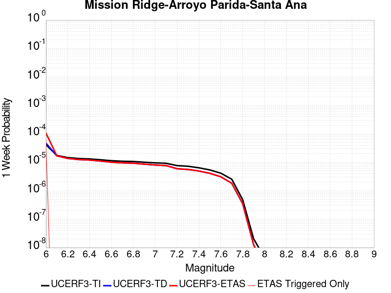 | 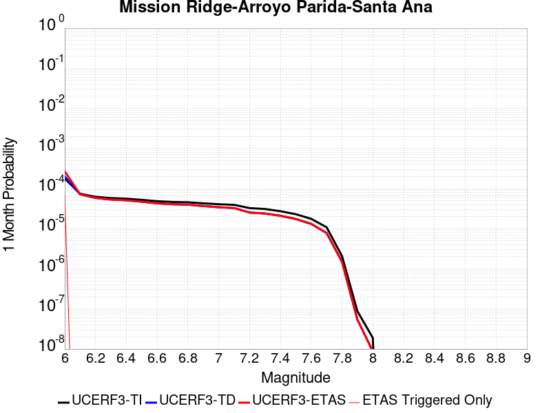 | 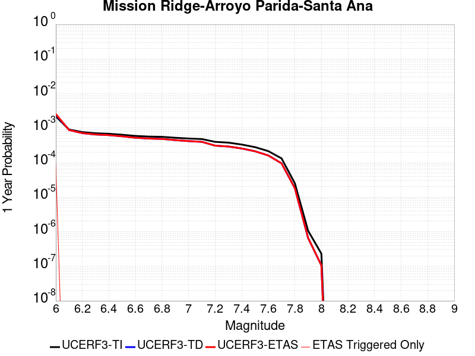 | 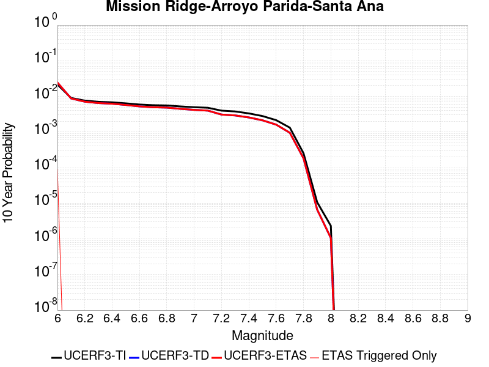 |

| Magnitude | 1 wk TI Prob | 1 wk TD Prob | 1 wk ETAS Prob | 1 wk ETAS/TD Gain | 1 wk ETAS Triggered Only | 1 mo TI Prob | 1 mo TD Prob | 1 mo ETAS Prob | 1 mo ETAS/TD Gain | 1 mo ETAS Triggered Only | 1 yr TI Prob | 1 yr TD Prob | 1 yr ETAS Prob | 1 yr ETAS/TD Gain | 1 yr ETAS Triggered Only | 10 yr TI Prob | 10 yr TD Prob | 10 yr ETAS Prob | 10 yr ETAS/TD Gain | 10 yr ETAS Triggered Only |
|-----|-----|-----|-----|-----|-----|-----|-----|-----|-----|-----|-----|-----|-----|-----|-----|-----|-----|-----|-----|-----|
| 6.0 | 4.169034E-5 | 4.7137048E-5 | 1.0713422E-4 | 2.272824 | 6.0E-5 | 1.7866064E-4 | 2.0200513E-4 | 2.7199098E-4 | 1.3464558 | 7.0E-5 | 0.0021730233 | 0.0024574657 | 0.0025472445 | 1.0365331 | 9.0E-5 | 0.021518968 | 0.02438483 | 0.024472635 | 1.0036008 | 9.0E-5 |
| 6.1 | 1.73813E-5 | 1.6854203E-5 | 1.6854203E-5 | 1.0 | 0.0 | 7.4489166E-5 | 7.223036E-5 | 7.223036E-5 | 1.0 | 0.0 | 9.065282E-4 | 8.790605E-4 | 8.790605E-4 | 1.0 | 0.0 | 0.009028391 | 0.008757128 | 0.008757128 | 1.0 | 0.0 |
| 6.2 | 1.4622182E-5 | 1.3673262E-5 | 1.3673262E-5 | 1.0 | 0.0 | 6.2664985E-5 | 5.85984E-5 | 5.85984E-5 | 1.0 | 0.0 | 7.6267915E-4 | 7.132059E-4 | 7.132059E-4 | 1.0 | 0.0 | 0.007600669 | 0.007109767 | 0.007109767 | 1.0 | 0.0 |
| 6.3 | 1.3552434E-5 | 1.2482174E-5 | 1.2482174E-5 | 1.0 | 0.0 | 5.8080568E-5 | 5.349395E-5 | 5.349395E-5 | 1.0 | 0.0 | 7.069015E-4 | 6.510974E-4 | 6.510974E-4 | 1.0 | 0.0 | 0.00704657 | 0.006492415 | 0.006492415 | 1.0 | 0.0 |
| 6.4 | 1.30977305E-5 | 1.1979128E-5 | 1.1979128E-5 | 1.0 | 0.0 | 5.613192E-5 | 5.133813E-5 | 5.133813E-5 | 1.0 | 0.0 | 6.831918E-4 | 6.2486547E-4 | 6.2486547E-4 | 1.0 | 0.0 | 0.006810953 | 0.006231584 | 0.006231584 | 1.0 | 0.0 |
| 6.5 | 1.225205E-5 | 1.1048776E-5 | 1.1048776E-5 | 1.0 | 0.0 | 5.2507727E-5 | 4.735105E-5 | 4.735105E-5 | 1.0 | 0.0 | 6.3909404E-4 | 5.7634927E-4 | 5.7634927E-4 | 1.0 | 0.0 | 0.006372592 | 0.005749009 | 0.005749009 | 1.0 | 0.0 |
| 6.6 | 1.1352241E-5 | 1.0063508E-5 | 1.0063508E-5 | 1.0 | 0.0 | 4.8651553E-5 | 4.3128617E-5 | 4.3128617E-5 | 1.0 | 0.0 | 5.921717E-4 | 5.249665E-4 | 5.249665E-4 | 1.0 | 0.0 | 0.0059059616 | 0.0052376646 | 0.0052376646 | 1.0 | 0.0 |
| 6.7 | 1.0864116E-5 | 9.517E-6 | 9.517E-6 | 1.0 | 0.0 | 4.6559664E-5 | 4.0786515E-5 | 4.0786515E-5 | 1.0 | 0.0 | 5.667165E-4 | 4.964647E-4 | 4.964647E-4 | 1.0 | 0.0 | 0.005652734 | 0.0049539437 | 0.0049539437 | 1.0 | 0.0 |
| 6.8 | 1.0666365E-5 | 9.299752E-6 | 9.299752E-6 | 1.0 | 0.0 | 4.571219E-5 | 3.985548E-5 | 3.985548E-5 | 1.0 | 0.0 | 5.564038E-4 | 4.8513446E-4 | 4.8513446E-4 | 1.0 | 0.0 | 0.005550127 | 0.00484114 | 0.00484114 | 1.0 | 0.0 |
| 6.9 | 1.0038665E-5 | 8.592018E-6 | 8.592018E-6 | 1.0 | 0.0 | 4.302214E-5 | 3.682243E-5 | 3.682243E-5 | 1.0 | 0.0 | 5.236687E-4 | 4.4822265E-4 | 4.4822265E-4 | 1.0 | 0.0 | 0.005224364 | 0.0044735507 | 0.0044735507 | 1.0 | 0.0 |
| 7.0 | 9.5379955E-6 | 8.025047E-6 | 8.025047E-6 | 1.0 | 0.0 | 4.0876483E-5 | 3.439261E-5 | 3.439261E-5 | 1.0 | 0.0 | 4.975576E-4 | 4.1865133E-4 | 4.1865133E-4 | 1.0 | 0.0 | 0.00496445 | 0.00417898 | 0.00417898 | 1.0 | 0.0 |
| 7.1 | 9.207389E-6 | 7.652347E-6 | 7.652347E-6 | 1.0 | 0.0 | 3.945964E-5 | 3.2795375E-5 | 3.2795375E-5 | 1.0 | 0.0 | 4.803152E-4 | 3.992122E-4 | 3.992122E-4 | 1.0 | 0.0 | 0.004792784 | 0.003985301 | 0.003985301 | 1.0 | 0.0 |
| 7.2 | 7.638091E-6 | 5.9310923E-6 | 5.9310923E-6 | 1.0 | 0.0 | 3.2734264E-5 | 2.5418722E-5 | 2.5418722E-5 | 1.0 | 0.0 | 3.984668E-4 | 3.094293E-4 | 3.094293E-4 | 1.0 | 0.0 | 0.0039775306 | 0.0030901956 | 0.0030901956 | 1.0 | 0.0 |
| 7.3 | 7.2500147E-6 | 5.596131E-6 | 5.596131E-6 | 1.0 | 0.0 | 3.1071122E-5 | 2.3983199E-5 | 2.3983199E-5 | 1.0 | 0.0 | 3.7822526E-4 | 2.9195662E-4 | 2.9195662E-4 | 1.0 | 0.0 | 0.0037758215 | 0.0029159402 | 0.0029159402 | 1.0 | 0.0 |
| 7.4 | 6.3899715E-6 | 4.9184864E-6 | 4.9184864E-6 | 1.0 | 0.0 | 2.7385306E-5 | 2.1079059E-5 | 2.1079059E-5 | 1.0 | 0.0 | 3.3336508E-4 | 2.566075E-4 | 2.566075E-4 | 1.0 | 0.0 | 0.0033286542 | 0.002563311 | 0.002563311 | 1.0 | 0.0 |
| 7.5 | 5.379025E-6 | 4.0838477E-6 | 4.0838477E-6 | 1.0 | 0.0 | 2.305276E-5 | 1.7502087E-5 | 1.7502087E-5 | 1.0 | 0.0 | 2.806312E-4 | 2.1306718E-4 | 2.1306718E-4 | 1.0 | 0.0 | 0.0028027708 | 0.0021286402 | 0.0021286402 | 1.0 | 0.0 |
| 7.6 | 4.1270696E-6 | 3.0883373E-6 | 3.0883373E-6 | 1.0 | 0.0 | 1.768732E-5 | 1.32356645E-5 | 1.32356645E-5 | 1.0 | 0.0 | 2.1532185E-4 | 1.6113237E-4 | 1.6113237E-4 | 1.0 | 0.0 | 0.0021511333 | 0.0016101635 | 0.0016101635 | 1.0 | 0.0 |
| 7.7 | 2.5406805E-6 | 1.8282044E-6 | 1.8282044E-6 | 1.0 | 0.0 | 1.0888585E-5 | 7.835139E-6 | 7.835139E-6 | 1.0 | 0.0 | 1.3256045E-4 | 9.53887E-5 | 9.53887E-5 | 1.0 | 0.0 | 0.0013248142 | 9.534837E-4 | 9.534837E-4 | 1.0 | 0.0 |
| 7.8 | 4.8608285E-7 | 3.509864E-7 | 3.509864E-7 | 1.0 | 0.0 | 2.0832106E-6 | 1.5042266E-6 | 1.5042266E-6 | 1.0 | 0.0 | 2.5362791E-5 | 1.8313805E-5 | 1.8313805E-5 | 1.0 | 0.0 | 2.5359896E-4 | 1.8312308E-4 | 1.8312308E-4 | 1.0 | 0.0 |
| 7.9 | 2.0472514E-8 | 1.2688718E-8 | 1.2688718E-8 | 1.0 | 0.0 | 8.7739345E-8 | 5.438022E-8 | 5.438022E-8 | 1.0 | 0.0 | 1.068226E-6 | 6.6207895E-7 | 6.6207895E-7 | 1.0 | 0.0 | 1.0682209E-5 | 6.620771E-6 | 6.620771E-6 | 1.0 | 0.0 |
| 8.0 | 4.443582E-9 | 2.032067E-9 | 2.032067E-9 | 1.0 | 0.0 | 1.9043922E-8 | 8.7088585E-9 | 8.7088585E-9 | 1.0 | 0.0 | 2.3185973E-7 | 1.0603035E-7 | 1.0603035E-7 | 1.0 | 0.0 | 2.3185949E-6 | 1.0603031E-6 | 1.0603031E-6 | 1.0 | 0.0 |

## San Jacinto (Coyote Creek)
*[(top)](#table-of-contents)*

| 1 Week | 1 Month | 1 Year | 10 Year |
|-----|-----|-----|-----|
| 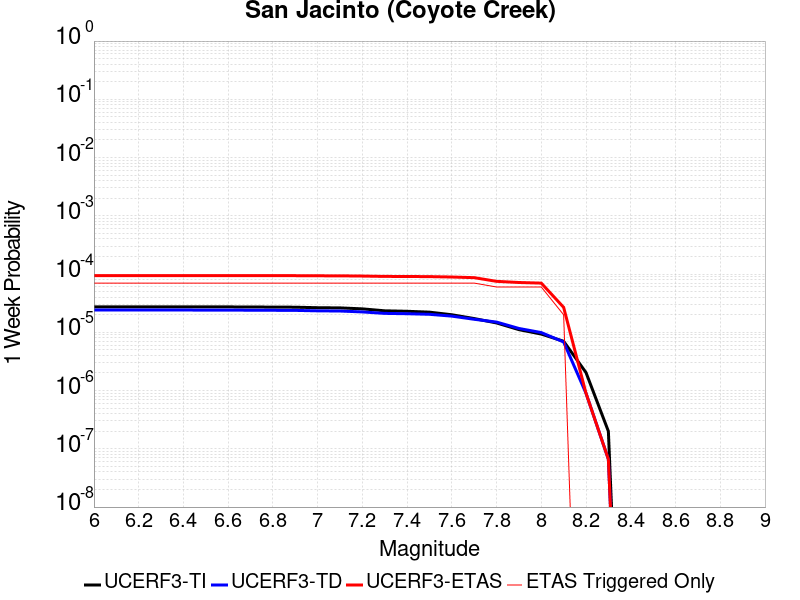 | 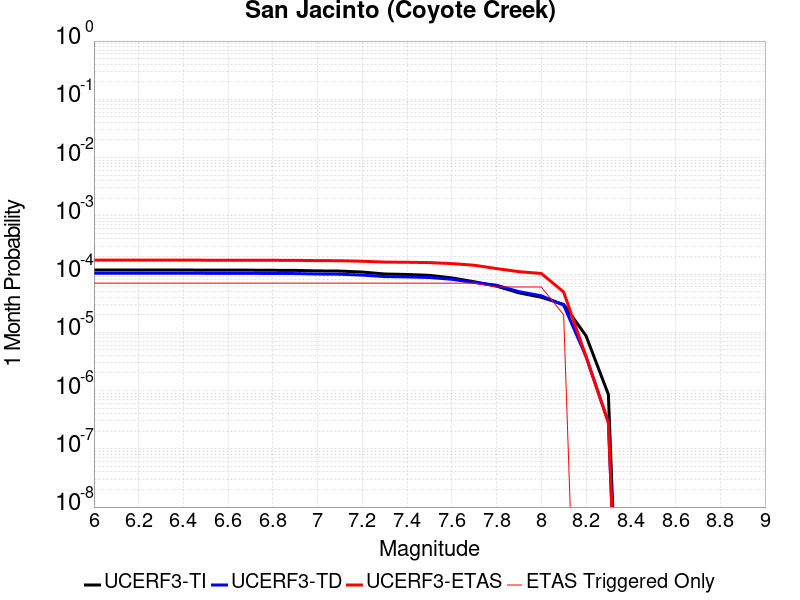 |  | 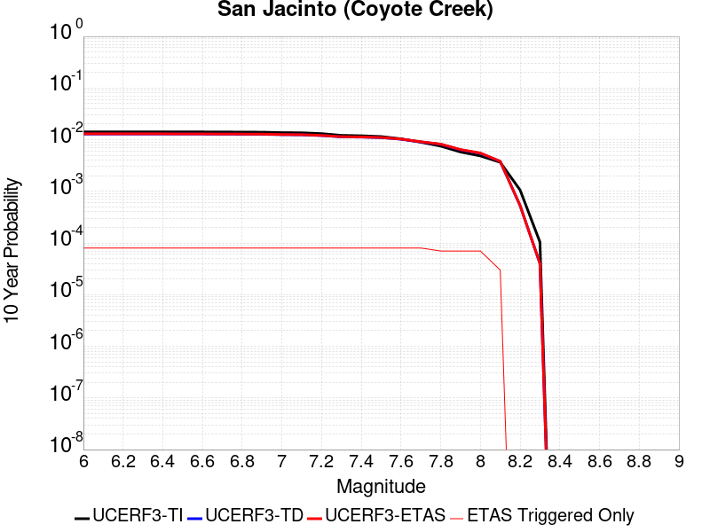 |

| Magnitude | 1 wk TI Prob | 1 wk TD Prob | 1 wk ETAS Prob | 1 wk ETAS/TD Gain | 1 wk ETAS Triggered Only | 1 mo TI Prob | 1 mo TD Prob | 1 mo ETAS Prob | 1 mo ETAS/TD Gain | 1 mo ETAS Triggered Only | 1 yr TI Prob | 1 yr TD Prob | 1 yr ETAS Prob | 1 yr ETAS/TD Gain | 1 yr ETAS Triggered Only | 10 yr TI Prob | 10 yr TD Prob | 10 yr ETAS Prob | 10 yr ETAS/TD Gain | 10 yr ETAS Triggered Only |
|-----|-----|-----|-----|-----|-----|-----|-----|-----|-----|-----|-----|-----|-----|-----|-----|-----|-----|-----|-----|-----|
| 6.0 | 2.7374346E-5 | 2.41444E-5 | 9.4142706E-5 | 3.8991532 | 7.0E-5 | 1.1731335E-4 | 1.034719E-4 | 1.7346466E-4 | 1.6764421 | 7.0E-5 | 0.0014273542 | 0.001259045 | 0.0013389443 | 1.0634602 | 8.0E-5 | 0.01418221 | 0.012928195 | 0.01300716 | 1.006108 | 8.0E-5 |
| 6.1 | 2.7374346E-5 | 2.41444E-5 | 9.4142706E-5 | 3.8991532 | 7.0E-5 | 1.1731335E-4 | 1.034719E-4 | 1.7346466E-4 | 1.6764421 | 7.0E-5 | 0.0014273542 | 0.001259045 | 0.0013389443 | 1.0634602 | 8.0E-5 | 0.01418221 | 0.012928195 | 0.01300716 | 1.006108 | 8.0E-5 |
| 6.2 | 2.7374346E-5 | 2.41444E-5 | 9.4142706E-5 | 3.8991532 | 7.0E-5 | 1.1731335E-4 | 1.034719E-4 | 1.7346466E-4 | 1.6764421 | 7.0E-5 | 0.0014273542 | 0.001259045 | 0.0013389443 | 1.0634602 | 8.0E-5 | 0.01418221 | 0.012928195 | 0.01300716 | 1.006108 | 8.0E-5 |
| 6.3 | 2.7374346E-5 | 2.41444E-5 | 9.4142706E-5 | 3.8991532 | 7.0E-5 | 1.1731335E-4 | 1.034719E-4 | 1.7346466E-4 | 1.6764421 | 7.0E-5 | 0.0014273542 | 0.001259045 | 0.0013389443 | 1.0634602 | 8.0E-5 | 0.01418221 | 0.012928195 | 0.01300716 | 1.006108 | 8.0E-5 |
| 6.4 | 2.7374346E-5 | 2.41444E-5 | 9.4142706E-5 | 3.8991532 | 7.0E-5 | 1.1731335E-4 | 1.034719E-4 | 1.7346466E-4 | 1.6764421 | 7.0E-5 | 0.0014273542 | 0.001259045 | 0.0013389443 | 1.0634602 | 8.0E-5 | 0.01418221 | 0.012928195 | 0.01300716 | 1.006108 | 8.0E-5 |
| 6.5 | 2.7282445E-5 | 2.4030476E-5 | 9.4028794E-5 | 3.9128976 | 7.0E-5 | 1.16919524E-4 | 1.0298371E-4 | 1.7297649E-4 | 1.6796492 | 7.0E-5 | 0.0014225657 | 0.001253108 | 0.0013330078 | 1.0637612 | 8.0E-5 | 0.014134934 | 0.012869522 | 0.012948493 | 1.0061362 | 8.0E-5 |
| 6.6 | 2.7282445E-5 | 2.4030476E-5 | 9.4028794E-5 | 3.9128976 | 7.0E-5 | 1.16919524E-4 | 1.0298371E-4 | 1.7297649E-4 | 1.6796492 | 7.0E-5 | 0.0014225657 | 0.001253108 | 0.0013330078 | 1.0637612 | 8.0E-5 | 0.014134934 | 0.012869522 | 0.012948493 | 1.0061362 | 8.0E-5 |
| 6.7 | 2.7216198E-5 | 2.3955597E-5 | 9.395392E-5 | 3.9220028 | 7.0E-5 | 1.1663563E-4 | 1.02662816E-4 | 1.7265564E-4 | 1.6817738 | 7.0E-5 | 0.0014191137 | 0.0012492058 | 0.0013291058 | 1.0639607 | 8.0E-5 | 0.014100855 | 0.012830934 | 0.012909908 | 1.0061549 | 8.0E-5 |
| 6.8 | 2.7078617E-5 | 2.3872815E-5 | 9.3871146E-5 | 3.9321353 | 7.0E-5 | 1.1604605E-4 | 1.0230807E-4 | 1.723009E-4 | 1.6841381 | 7.0E-5 | 0.001411945 | 0.0012448917 | 0.001324792 | 1.0641826 | 8.0E-5 | 0.014030075 | 0.0127880825 | 0.01286706 | 1.0061759 | 8.0E-5 |
| 6.9 | 2.6982952E-5 | 2.3792329E-5 | 9.3790666E-5 | 3.9420547 | 7.0E-5 | 1.15636096E-4 | 1.0196315E-4 | 1.7195602E-4 | 1.6864525 | 7.0E-5 | 0.0014069602 | 0.0012406971 | 0.0013205978 | 1.0643998 | 8.0E-5 | 0.013980856 | 0.012746378 | 0.012825359 | 1.0061963 | 8.0E-5 |
| 7.0 | 2.6449972E-5 | 2.3369357E-5 | 9.336772E-5 | 3.9953055 | 7.0E-5 | 1.1335209E-4 | 1.0015055E-4 | 1.7014354E-4 | 1.6988777 | 7.0E-5 | 0.001379188 | 0.0012186535 | 0.0012985561 | 1.0655662 | 8.0E-5 | 0.0137065975 | 0.012527733 | 0.012606731 | 1.0063058 | 8.0E-5 |
| 7.1 | 2.6257849E-5 | 2.3195396E-5 | 9.3193776E-5 | 4.0177703 | 7.0E-5 | 1.1252879E-4 | 9.940507E-5 | 1.693981E-4 | 1.7041194 | 7.0E-5 | 0.0013691769 | 0.0012095873 | 0.0012894906 | 1.0660583 | 8.0E-5 | 0.013607717 | 0.012437661 | 0.012516665 | 1.0063521 | 8.0E-5 |
| 7.2 | 2.5270041E-5 | 2.2390155E-5 | 9.238859E-5 | 4.126304 | 7.0E-5 | 1.0829568E-4 | 9.5954296E-5 | 1.6594758E-4 | 1.729444 | 7.0E-5 | 0.0013177024 | 0.0011676198 | 0.0012475264 | 1.0684354 | 8.0E-5 | 0.013099162 | 0.0120187905 | 0.012097829 | 1.0065763 | 8.0E-5 |
| 7.3 | 2.339701E-5 | 2.1122027E-5 | 9.112055E-5 | 4.314006 | 7.0E-5 | 1.0026905E-4 | 9.051985E-5 | 1.605135E-4 | 1.7732412 | 7.0E-5 | 0.001220092 | 0.001101524 | 0.0011814359 | 1.0725466 | 8.0E-5 | 0.012134149 | 0.011357642 | 0.011436733 | 1.0069637 | 8.0E-5 |
| 7.4 | 2.296333E-5 | 2.0852396E-5 | 9.085094E-5 | 4.3568583 | 7.0E-5 | 9.841056E-5 | 8.936436E-5 | 1.593581E-4 | 1.7832401 | 7.0E-5 | 0.0011974899 | 0.0010874701 | 0.001167383 | 1.0734853 | 8.0E-5 | 0.011910575 | 0.011216754 | 0.011295856 | 1.0070522 | 8.0E-5 |
| 7.5 | 2.2188895E-5 | 2.037534E-5 | 9.037391E-5 | 4.4354553 | 7.0E-5 | 9.50918E-5 | 8.731998E-5 | 1.5731387E-4 | 1.8015792 | 7.0E-5 | 0.0011571277 | 0.0010626042 | 0.0011425193 | 1.0752068 | 8.0E-5 | 0.011511209 | 0.010966369 | 0.011045492 | 1.007215 | 8.0E-5 |
| 7.6 | 2.0013189E-5 | 1.8961666E-5 | 8.896034E-5 | 4.691589 | 7.0E-5 | 8.5767984E-5 | 8.126176E-5 | 1.5125607E-4 | 1.8613437 | 7.0E-5 | 0.001043725 | 9.889146E-4 | 0.0010688355 | 1.0808167 | 8.0E-5 | 0.010388365 | 0.010224371 | 0.010303553 | 1.0077444 | 8.0E-5 |
| 7.7 | 1.7230794E-5 | 1.6743043E-5 | 8.674187E-5 | 5.180771 | 7.0E-5 | 7.384417E-5 | 7.175393E-5 | 1.4174891E-4 | 1.9754864 | 7.0E-5 | 8.986819E-4 | 8.732547E-4 | 9.531849E-4 | 1.0915313 | 8.0E-5 | 0.008950562 | 0.00906292 | 0.009142195 | 1.0087472 | 8.0E-5 |
| 7.8 | 1.4478809E-5 | 1.499039E-5 | 7.498949E-5 | 5.0025043 | 6.0E-5 | 6.205057E-5 | 6.424295E-5 | 1.242391E-4 | 1.9338946 | 6.0E-5 | 7.552038E-4 | 7.8187784E-4 | 8.5182313E-4 | 1.0894581 | 7.0E-5 | 0.0075264242 | 0.008141388 | 0.008210818 | 1.008528 | 7.0E-5 |
| 7.9 | 1.1114467E-5 | 1.1644517E-5 | 7.1643815E-5 | 6.15258 | 6.0E-5 | 4.7632562E-5 | 4.990412E-5 | 1.0990113E-4 | 2.2022455 | 6.0E-5 | 5.797721E-4 | 6.074139E-4 | 6.7737134E-4 | 1.1151726 | 7.0E-5 | 0.0057826187 | 0.0063803545 | 0.006449908 | 1.0109012 | 7.0E-5 |
| 8.0 | 9.327402E-6 | 9.8986575E-6 | 6.9898066E-5 | 7.061368 | 6.0E-5 | 3.9973966E-5 | 4.2422133E-5 | 1.0241959E-4 | 2.4142962 | 6.0E-5 | 4.8657437E-4 | 5.163676E-4 | 5.863315E-4 | 1.1354923 | 7.0E-5 | 0.0048551033 | 0.00544994 | 0.0055195587 | 1.0127742 | 7.0E-5 |
| 8.1 | 7.0235833E-6 | 6.826985E-6 | 2.6826849E-5 | 3.9295309 | 2.0E-5 | 3.0100724E-5 | 2.9258183E-5 | 4.9257596E-5 | 1.6835495 | 2.0E-5 | 3.664147E-4 | 3.5616063E-4 | 3.8614997E-4 | 1.0842017 | 3.0E-5 | 0.003658111 | 0.0037874572 | 0.0038173436 | 1.0078909 | 3.0E-5 |
| 8.2 | 2.0358202E-6 | 8.9912584E-7 | 8.9912584E-7 | 1.0 | 0.0 | 8.724915E-6 | 3.853391E-6 | 3.853391E-6 | 1.0 | 0.0 | 1.06220665E-4 | 4.6914047E-5 | 4.6914047E-5 | 1.0 | 0.0 | 0.001061699 | 5.3239096E-4 | 5.3239096E-4 | 1.0 | 0.0 |
| 8.3 | 2.0051264E-7 | 6.61379E-8 | 6.61379E-8 | 1.0 | 0.0 | 8.5933965E-7 | 2.8344812E-7 | 2.8344812E-7 | 1.0 | 0.0 | 1.046241E-5 | 3.450976E-6 | 3.450976E-6 | 1.0 | 0.0 | 1.0461917E-4 | 4.0120205E-5 | 4.0120205E-5 | 1.0 | 0.0 |

## Cleghorn Pass
*[(top)](#table-of-contents)*

| 1 Week | 1 Month | 1 Year | 10 Year |
|-----|-----|-----|-----|
| 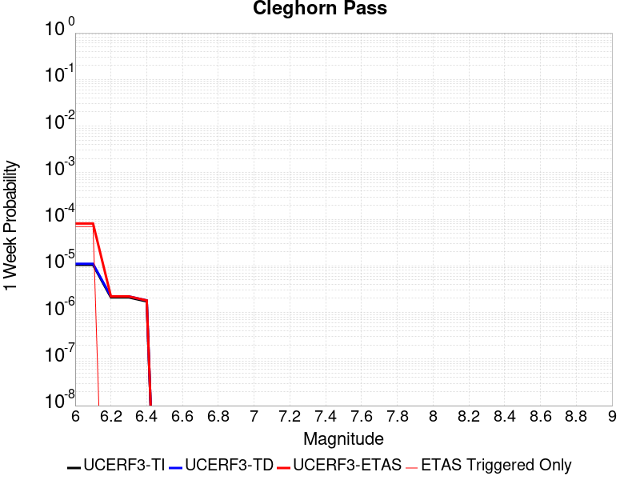 | 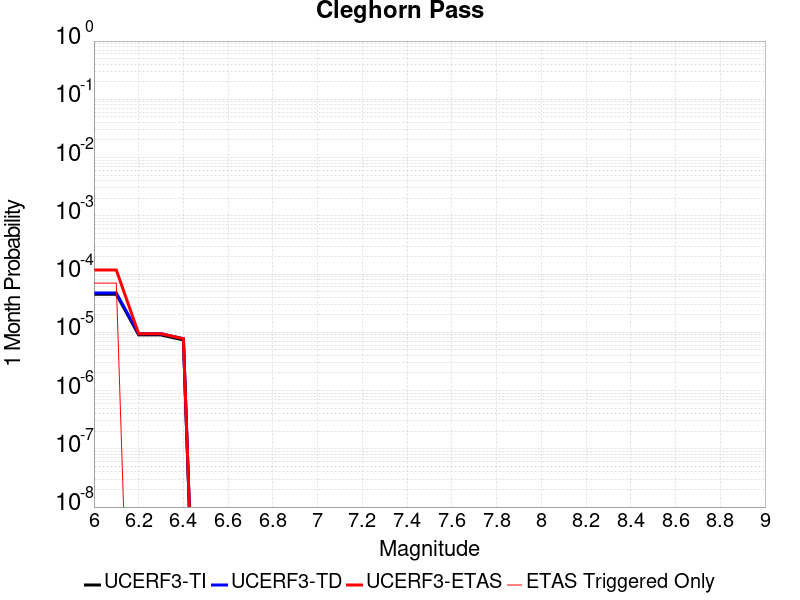 | 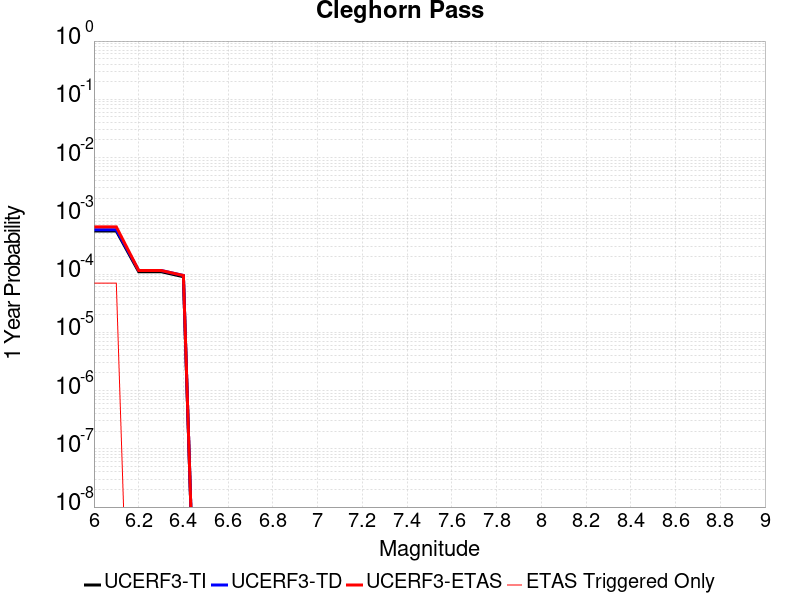 | 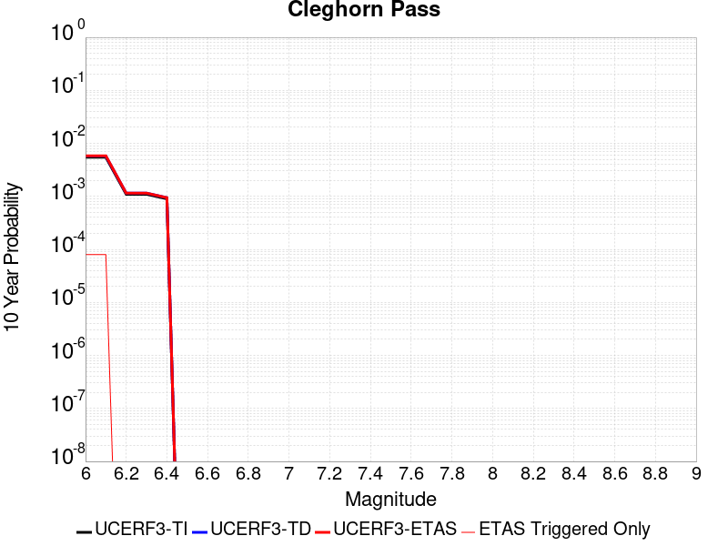 |

| Magnitude | 1 wk TI Prob | 1 wk TD Prob | 1 wk ETAS Prob | 1 wk ETAS/TD Gain | 1 wk ETAS Triggered Only | 1 mo TI Prob | 1 mo TD Prob | 1 mo ETAS Prob | 1 mo ETAS/TD Gain | 1 mo ETAS Triggered Only | 1 yr TI Prob | 1 yr TD Prob | 1 yr ETAS Prob | 1 yr ETAS/TD Gain | 1 yr ETAS Triggered Only | 10 yr TI Prob | 10 yr TD Prob | 10 yr ETAS Prob | 10 yr ETAS/TD Gain | 10 yr ETAS Triggered Only |
|-----|-----|-----|-----|-----|-----|-----|-----|-----|-----|-----|-----|-----|-----|-----|-----|-----|-----|-----|-----|-----|
| 6.0 | 1.0522846E-5 | 1.1040642E-5 | 8.103987E-5 | 7.3401413 | 7.0E-5 | 4.509713E-5 | 4.7316473E-5 | 1.1731316E-4 | 2.47933 | 7.0E-5 | 5.4891926E-4 | 5.759784E-4 | 6.4593815E-4 | 1.1214623 | 7.0E-5 | 0.0054756533 | 0.005750022 | 0.005829562 | 1.013833 | 8.0E-5 |
| 6.1 | 1.0522846E-5 | 1.1040642E-5 | 8.103987E-5 | 7.3401413 | 7.0E-5 | 4.509713E-5 | 4.7316473E-5 | 1.1731316E-4 | 2.47933 | 7.0E-5 | 5.4891926E-4 | 5.759784E-4 | 6.4593815E-4 | 1.1214623 | 7.0E-5 | 0.0054756533 | 0.005750022 | 0.005829562 | 1.013833 | 8.0E-5 |
| 6.2 | 2.1045846E-6 | 2.2082024E-6 | 2.2082024E-6 | 1.0 | 0.0 | 9.019617E-6 | 9.463714E-6 | 9.463714E-6 | 1.0 | 0.0 | 1.098083E-4 | 1.1521882E-4 | 1.1521882E-4 | 1.0 | 0.0 | 0.0010975406 | 0.0011520023 | 0.0011520023 | 1.0 | 0.0 |
| 6.3 | 2.1045846E-6 | 2.2082024E-6 | 2.2082024E-6 | 1.0 | 0.0 | 9.019617E-6 | 9.463714E-6 | 9.463714E-6 | 1.0 | 0.0 | 1.098083E-4 | 1.1521882E-4 | 1.1521882E-4 | 1.0 | 0.0 | 0.0010975406 | 0.0011520023 | 0.0011520023 | 1.0 | 0.0 |
| 6.4 | 1.7259927E-6 | 1.810877E-6 | 1.810877E-6 | 1.0 | 0.0 | 7.3970905E-6 | 7.760902E-6 | 7.760902E-6 | 1.0 | 0.0 | 9.005586E-5 | 9.4488976E-5 | 9.4488976E-5 | 1.0 | 0.0 | 9.001937E-4 | 9.448898E-4 | 9.448898E-4 | 1.0 | 0.0 |

## Imperial
*[(top)](#table-of-contents)*

| 1 Week | 1 Month | 1 Year | 10 Year |
|-----|-----|-----|-----|
| 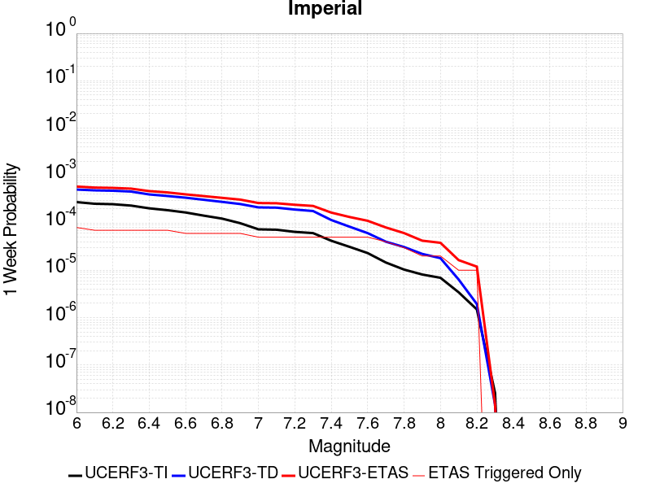 |  | 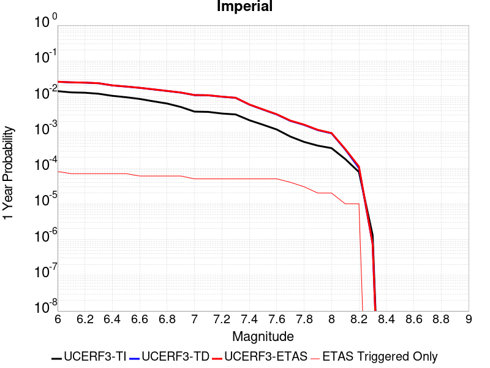 | 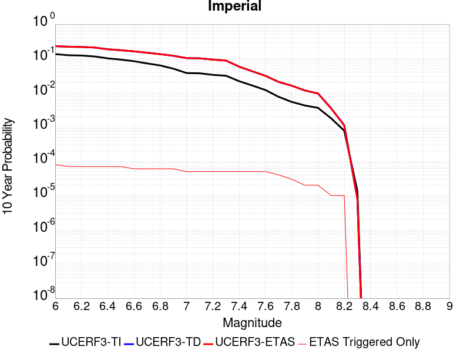 |

| Magnitude | 1 wk TI Prob | 1 wk TD Prob | 1 wk ETAS Prob | 1 wk ETAS/TD Gain | 1 wk ETAS Triggered Only | 1 mo TI Prob | 1 mo TD Prob | 1 mo ETAS Prob | 1 mo ETAS/TD Gain | 1 mo ETAS Triggered Only | 1 yr TI Prob | 1 yr TD Prob | 1 yr ETAS Prob | 1 yr ETAS/TD Gain | 1 yr ETAS Triggered Only | 10 yr TI Prob | 10 yr TD Prob | 10 yr ETAS Prob | 10 yr ETAS/TD Gain | 10 yr ETAS Triggered Only |
|-----|-----|-----|-----|-----|-----|-----|-----|-----|-----|-----|-----|-----|-----|-----|-----|-----|-----|-----|-----|-----|
| 6.0 | 2.7496446E-4 | 5.055345E-4 | 5.854941E-4 | 1.1581683 | 8.0E-5 | 0.0011778869 | 0.002164817 | 0.0022446439 | 1.0368747 | 8.0E-5 | 0.0142467655 | 0.026048409 | 0.026126325 | 1.0029912 | 8.0E-5 | 0.13367249 | 0.22807029 | 0.22813204 | 1.0002707 | 8.0E-5 |
| 6.1 | 2.5356023E-4 | 4.8657708E-4 | 5.56543E-4 | 1.1437922 | 7.0E-5 | 0.001086234 | 0.002083702 | 0.002153556 | 1.033524 | 7.0E-5 | 0.013144928 | 0.02507094 | 0.025139183 | 1.002722 | 7.0E-5 | 0.123940155 | 0.21949561 | 0.21955025 | 1.0002489 | 7.0E-5 |
| 6.2 | 2.4820742E-4 | 4.775311E-4 | 5.474977E-4 | 1.1465173 | 7.0E-5 | 0.0010633124 | 0.0020449946 | 0.0021148515 | 1.0341599 | 7.0E-5 | 0.01286919 | 0.024610676 | 0.024678953 | 1.0027742 | 7.0E-5 | 0.12148927 | 0.21600136 | 0.21605624 | 1.000254 | 7.0E-5 |
| 6.3 | 2.3205351E-4 | 4.5892023E-4 | 5.2888814E-4 | 1.152462 | 7.0E-5 | 9.94136E-4 | 0.0019653554 | 0.0020352178 | 1.035547 | 7.0E-5 | 0.012036599 | 0.023661187 | 0.02372953 | 1.0028884 | 7.0E-5 | 0.11405133 | 0.20793827 | 0.20799372 | 1.0002667 | 7.0E-5 |
| 6.4 | 2.0304754E-4 | 3.9878016E-4 | 4.6875223E-4 | 1.1754653 | 7.0E-5 | 8.6991355E-4 | 0.0017079529 | 0.0017778334 | 1.0409148 | 7.0E-5 | 0.010539869 | 0.020595418 | 0.020663977 | 1.0033288 | 7.0E-5 | 0.100537635 | 0.18507113 | 0.18512817 | 1.0003083 | 7.0E-5 |
| 6.5 | 1.854992E-4 | 3.6990462E-4 | 4.3987873E-4 | 1.189168 | 7.0E-5 | 7.9475436E-4 | 0.0015843548 | 0.0016542438 | 1.044112 | 7.0E-5 | 0.009633281 | 0.01911443 | 0.01918309 | 1.0035921 | 7.0E-5 | 0.0922623 | 0.1733039 | 0.17336176 | 1.0003339 | 7.0E-5 |
| 6.6 | 1.6586106E-4 | 3.4036173E-4 | 4.0034132E-4 | 1.176223 | 6.0E-5 | 7.106394E-4 | 0.0014578878 | 0.0015178004 | 1.0410954 | 6.0E-5 | 0.008617763 | 0.017607626 | 0.017666569 | 1.0033476 | 6.0E-5 | 0.08291132 | 0.16078055 | 0.1608309 | 1.0003132 | 6.0E-5 |
| 6.7 | 1.4224656E-4 | 3.076812E-4 | 3.6766275E-4 | 1.194947 | 6.0E-5 | 6.094856E-4 | 0.0013179756 | 0.0013778964 | 1.0454644 | 6.0E-5 | 0.0073952693 | 0.015928522 | 0.015987566 | 1.0037068 | 6.0E-5 | 0.07153955 | 0.14648798 | 0.1465392 | 1.0003496 | 6.0E-5 |
| 6.8 | 1.2317259E-4 | 2.779231E-4 | 3.3790641E-4 | 1.2158271 | 6.0E-5 | 5.2777573E-4 | 0.0011905615 | 0.00125049 | 1.0503364 | 6.0E-5 | 0.0064067547 | 0.014400131 | 0.014459267 | 1.0041066 | 6.0E-5 | 0.06225166 | 0.13294089 | 0.13299291 | 1.0003914 | 6.0E-5 |
| 6.9 | 9.859898E-5 | 2.5015484E-4 | 3.1013982E-4 | 1.2397915 | 6.0E-5 | 4.2249862E-4 | 0.0010716559 | 0.0011315916 | 1.0559281 | 6.0E-5 | 0.0051317946 | 0.012970319 | 0.01302954 | 1.004566 | 6.0E-5 | 0.05014893 | 0.119408876 | 0.11946171 | 1.0004425 | 6.0E-5 |
| 7.0 | 7.3191884E-5 | 2.1267848E-4 | 2.6266786E-4 | 1.2350466 | 5.0E-5 | 3.136418E-4 | 9.11164E-4 | 9.6111844E-4 | 1.0548248 | 5.0E-5 | 0.003811904 | 0.011037681 | 0.011087129 | 1.0044799 | 5.0E-5 | 0.037471764 | 0.10206756 | 0.10211246 | 1.0004399 | 5.0E-5 |
| 7.1 | 7.1760296E-5 | 2.0969207E-4 | 2.5968158E-4 | 1.2383949 | 5.0E-5 | 3.0750787E-4 | 8.9837395E-4 | 9.4832905E-4 | 1.0556061 | 5.0E-5 | 0.003737482 | 0.010883528 | 0.010932984 | 1.0045441 | 5.0E-5 | 0.03675245 | 0.10070406 | 0.10074902 | 1.0004466 | 5.0E-5 |
| 7.2 | 6.46614E-5 | 1.9137723E-4 | 2.4136766E-4 | 1.2612141 | 5.0E-5 | 2.7709085E-4 | 8.199333E-4 | 8.6989236E-4 | 1.0609306 | 5.0E-5 | 0.0033683628 | 0.009937617 | 0.0099871205 | 1.0049814 | 5.0E-5 | 0.033177625 | 0.092511006 | 0.09255638 | 1.0004904 | 5.0E-5 |
| 7.3 | 6.088115E-5 | 1.780939E-4 | 2.28085E-4 | 1.2807008 | 5.0E-5 | 2.6089314E-4 | 7.6303916E-4 | 8.13001E-4 | 1.0654775 | 5.0E-5 | 0.0031717476 | 0.009251006 | 0.009300543 | 1.0053548 | 5.0E-5 | 0.031268585 | 0.08656135 | 0.086607024 | 1.0005276 | 5.0E-5 |
| 7.4 | 4.199346E-5 | 1.1511097E-4 | 1.6510522E-4 | 1.4343134 | 5.0E-5 | 1.7995955E-4 | 4.932403E-4 | 5.4321566E-4 | 1.1013205 | 5.0E-5 | 0.0021888057 | 0.005988835 | 0.006038536 | 1.0082989 | 5.0E-5 | 0.02167372 | 0.05744024 | 0.05748737 | 1.0008205 | 5.0E-5 |
| 7.5 | 3.130448E-5 | 8.333871E-5 | 1.3333454E-4 | 1.5999113 | 5.0E-5 | 1.3415517E-4 | 3.5711733E-4 | 4.070995E-4 | 1.13996 | 5.0E-5 | 0.0016321153 | 0.0043392954 | 0.0043890784 | 1.0114726 | 5.0E-5 | 0.016201803 | 0.042133506 | 0.0421814 | 1.0011367 | 5.0E-5 |
| 7.6 | 2.3074248E-5 | 6.0849357E-5 | 1.1084631E-4 | 1.8216513 | 5.0E-5 | 9.888588E-5 | 2.6075702E-4 | 3.1074398E-4 | 1.1916994 | 5.0E-5 | 0.0012032706 | 0.0031701182 | 0.0032199598 | 1.0157223 | 5.0E-5 | 0.011967761 | 0.03102816 | 0.03107661 | 1.0015614 | 5.0E-5 |
| 7.7 | 1.45864815E-5 | 4.0128452E-5 | 8.012685E-5 | 1.9967589 | 4.0E-5 | 6.2511994E-5 | 1.7196777E-4 | 2.119609E-4 | 1.2325617 | 4.0E-5 | 7.608177E-4 | 0.0020917025 | 0.0021316188 | 1.0190831 | 4.0E-5 | 0.007582182 | 0.02062909 | 0.020668264 | 1.001899 | 4.0E-5 |
| 7.8 | 1.0352979E-5 | 3.096395E-5 | 6.0963022E-5 | 1.9688387 | 3.0E-5 | 4.4369157E-5 | 1.326959E-4 | 1.6269193E-4 | 1.2260509 | 3.0E-5 | 5.400606E-4 | 0.0016143778 | 0.0016443294 | 1.018553 | 3.0E-5 | 0.0053875 | 0.016017893 | 0.016047413 | 1.0018429 | 3.0E-5 |
| 7.9 | 8.137906E-6 | 2.2151205E-5 | 4.215076E-5 | 1.9028654 | 2.0E-5 | 3.4876273E-5 | 9.493029E-5 | 1.1492839E-4 | 1.2106609 | 2.0E-5 | 4.2453592E-4 | 0.0011551644 | 0.0011751413 | 1.0172936 | 2.0E-5 | 0.004237258 | 0.011618842 | 0.01163861 | 1.0017014 | 2.0E-5 |
| 8.0 | 6.93792E-6 | 1.8010365E-5 | 3.8010006E-5 | 2.1104517 | 2.0E-5 | 2.9733603E-5 | 7.7185E-5 | 9.718346E-5 | 1.2590977 | 2.0E-5 | 3.6194647E-4 | 9.3932304E-4 | 9.593042E-4 | 1.021272 | 2.0E-5 | 0.0036135751 | 0.009502415 | 0.009522225 | 1.0020847 | 2.0E-5 |
| 8.1 | 3.4286315E-6 | 6.380179E-6 | 1.6380116E-5 | 2.5673442 | 1.0E-5 | 1.4694053E-5 | 2.734334E-5 | 3.7343067E-5 | 1.3657098 | 1.0E-5 | 1.7888541E-4 | 3.3285443E-4 | 3.428511E-4 | 1.0300331 | 1.0E-5 | 0.0017874148 | 0.0034863674 | 0.0034963326 | 1.0028583 | 1.0E-5 |
| 8.2 | 1.4906886E-6 | 1.936633E-6 | 1.1936613E-5 | 6.163591 | 1.0E-5 | 6.3886496E-6 | 8.2998295E-6 | 1.8299746E-5 | 2.204834 | 1.0E-5 | 7.7779034E-5 | 1.0104576E-4 | 1.11044756E-4 | 1.098955 | 1.0E-5 | 7.775182E-4 | 0.0011075423 | 0.0011175312 | 1.009019 | 1.0E-5 |
| 8.3 | 2.5758007E-8 | 1.4495866E-8 | 1.4495866E-8 | 1.0 | 0.0 | 1.10391454E-7 | 6.212514E-8 | 6.212514E-8 | 1.0 | 0.0 | 1.3440151E-6 | 7.563736E-7 | 7.563736E-7 | 1.0 | 0.0 | 1.344007E-5 | 7.884359E-6 | 7.884359E-6 | 1.0 | 0.0 |

## Brawley (Seismic Zone) alt 1
*[(top)](#table-of-contents)*

| 1 Week | 1 Month | 1 Year | 10 Year |
|-----|-----|-----|-----|
| 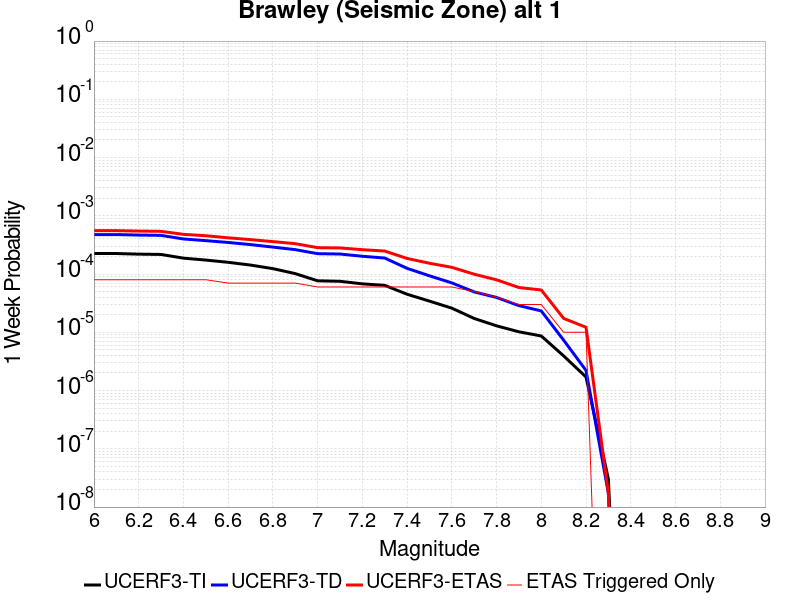 | 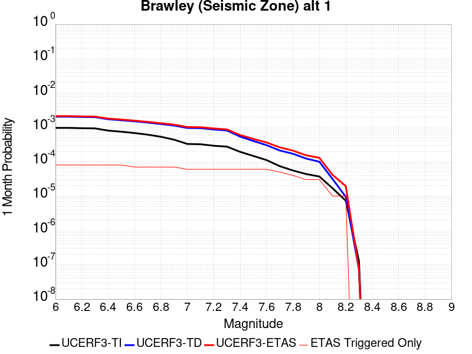 | 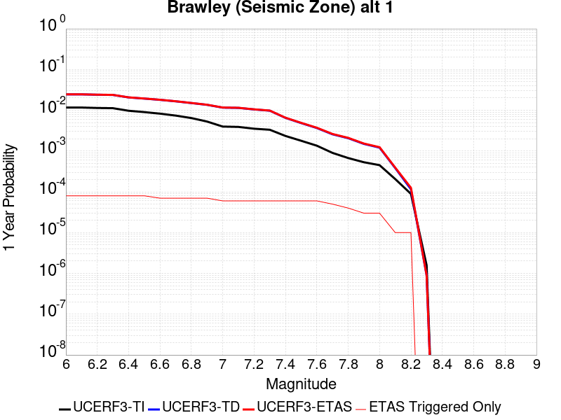 | 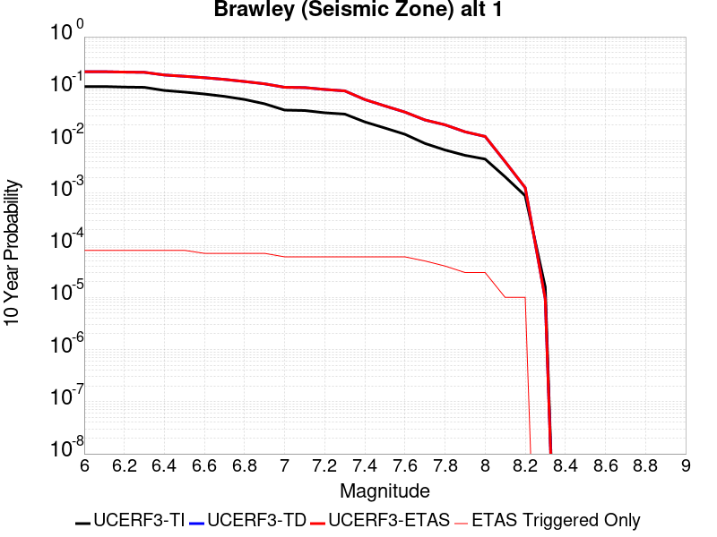 |

| Magnitude | 1 wk TI Prob | 1 wk TD Prob | 1 wk ETAS Prob | 1 wk ETAS/TD Gain | 1 wk ETAS Triggered Only | 1 mo TI Prob | 1 mo TD Prob | 1 mo ETAS Prob | 1 mo ETAS/TD Gain | 1 mo ETAS Triggered Only | 1 yr TI Prob | 1 yr TD Prob | 1 yr ETAS Prob | 1 yr ETAS/TD Gain | 1 yr ETAS Triggered Only | 10 yr TI Prob | 10 yr TD Prob | 10 yr ETAS Prob | 10 yr ETAS/TD Gain | 10 yr ETAS Triggered Only |
|-----|-----|-----|-----|-----|-----|-----|-----|-----|-----|-----|-----|-----|-----|-----|-----|-----|-----|-----|-----|-----|
| 6.0 | 2.2521618E-4 | 4.763429E-4 | 5.5630476E-4 | 1.1678662 | 8.0E-5 | 9.6485513E-4 | 0.0020399094 | 0.0021197463 | 1.0391375 | 8.0E-5 | 0.011683988 | 0.024544531 | 0.024622569 | 1.0031794 | 8.0E-5 | 0.11088423 | 0.21349923 | 0.21356215 | 1.0002947 | 8.0E-5 |
| 6.1 | 2.2521618E-4 | 4.763429E-4 | 5.5630476E-4 | 1.1678662 | 8.0E-5 | 9.6485513E-4 | 0.0020399094 | 0.0021197463 | 1.0391375 | 8.0E-5 | 0.011683988 | 0.024544531 | 0.024622569 | 1.0031794 | 8.0E-5 | 0.11088423 | 0.21349923 | 0.21356215 | 1.0002947 | 8.0E-5 |
| 6.2 | 2.198148E-4 | 4.6718874E-4 | 5.471514E-4 | 1.171157 | 8.0E-5 | 9.417233E-4 | 0.0020007377 | 0.0020805777 | 1.0399053 | 8.0E-5 | 0.011405343 | 0.024078513 | 0.024156587 | 1.0032425 | 8.0E-5 | 0.10837428 | 0.20993572 | 0.20999894 | 1.0003011 | 8.0E-5 |
| 6.3 | 2.1704129E-4 | 4.615455E-4 | 5.415086E-4 | 1.1732507 | 8.0E-5 | 9.298453E-4 | 0.0019765892 | 0.0020564313 | 1.0403937 | 8.0E-5 | 0.011262234 | 0.023792034 | 0.023870131 | 1.0032824 | 8.0E-5 | 0.107082725 | 0.20782684 | 0.20789021 | 1.0003049 | 8.0E-5 |
| 6.4 | 1.876142E-4 | 4.004663E-4 | 4.8043425E-4 | 1.1996871 | 8.0E-5 | 8.038131E-4 | 0.0017151695 | 0.0017950323 | 1.0465627 | 8.0E-5 | 0.00974259 | 0.020678662 | 0.020757006 | 1.0037887 | 8.0E-5 | 0.093263686 | 0.18457787 | 0.1846431 | 1.0003535 | 8.0E-5 |
| 6.5 | 1.7390939E-4 | 3.7478763E-4 | 4.5475765E-4 | 1.2133743 | 8.0E-5 | 7.45113E-4 | 0.0016052561 | 0.0016851277 | 1.0497563 | 8.0E-5 | 0.009034078 | 0.019367293 | 0.019445743 | 1.0040507 | 8.0E-5 | 0.086755216 | 0.17440015 | 0.1744662 | 1.0003787 | 8.0E-5 |
| 6.6 | 1.591791E-4 | 3.4893592E-4 | 4.1891148E-4 | 1.20054 | 7.0E-5 | 6.8201777E-4 | 0.0014945926 | 0.001564488 | 1.0467654 | 7.0E-5 | 0.008271996 | 0.018045008 | 0.018113745 | 1.0038092 | 7.0E-5 | 0.07970774 | 0.16380787 | 0.1638664 | 1.0003574 | 7.0E-5 |
| 6.7 | 1.4268003E-4 | 3.2059717E-4 | 3.9057474E-4 | 1.2182726 | 7.0E-5 | 6.1134255E-4 | 0.0013732726 | 0.0014431765 | 1.0509031 | 7.0E-5 | 0.007417723 | 0.01659171 | 0.016660547 | 1.004149 | 7.0E-5 | 0.07174956 | 0.15193594 | 0.15199529 | 1.0003908 | 7.0E-5 |
| 6.8 | 1.239713E-4 | 2.9055026E-4 | 3.6052993E-4 | 1.2408521 | 7.0E-5 | 5.3119735E-4 | 0.0012446274 | 0.0013145403 | 1.0561718 | 7.0E-5 | 0.0064481674 | 0.015049482 | 0.0151184285 | 1.0045813 | 7.0E-5 | 0.06264243 | 0.13838051 | 0.13844082 | 1.0004358 | 7.0E-5 |
| 6.9 | 1.0180238E-4 | 2.6255674E-4 | 3.325384E-4 | 1.266539 | 7.0E-5 | 4.3622297E-4 | 0.0011247622 | 0.0011946835 | 1.0621654 | 7.0E-5 | 0.005298089 | 0.013608998 | 0.013678045 | 1.0050737 | 7.0E-5 | 0.05173543 | 0.12496473 | 0.12502597 | 1.0004902 | 7.0E-5 |
| 7.0 | 7.6619996E-5 | 2.2400476E-4 | 2.8399134E-4 | 1.2677914 | 6.0E-5 | 3.283301E-4 | 9.596704E-4 | 0.0010196128 | 1.0624615 | 6.0E-5 | 0.0039900932 | 0.011622103 | 0.011681405 | 1.0051026 | 6.0E-5 | 0.039192066 | 0.10726982 | 0.107323386 | 1.0004994 | 6.0E-5 |
| 7.1 | 7.5127435E-5 | 2.2083633E-4 | 2.808231E-4 | 1.2716345 | 6.0E-5 | 3.2193496E-4 | 9.461013E-4 | 0.0010060446 | 1.0633582 | 6.0E-5 | 0.0039125155 | 0.011458648 | 0.011517961 | 1.0051762 | 6.0E-5 | 0.038443442 | 0.10583378 | 0.10588743 | 1.0005069 | 6.0E-5 |
| 7.2 | 6.788582E-5 | 2.0211334E-4 | 2.621012E-4 | 1.2968031 | 6.0E-5 | 2.9090676E-4 | 8.6591556E-4 | 9.2586357E-4 | 1.0692308 | 6.0E-5 | 0.0035360386 | 0.0104922 | 0.01055157 | 1.0056585 | 6.0E-5 | 0.034803 | 0.097503684 | 0.097557835 | 1.0005554 | 6.0E-5 |
| 7.3 | 6.399602E-5 | 1.8842232E-4 | 2.48411E-4 | 1.3183737 | 6.0E-5 | 2.7423984E-4 | 8.0727716E-4 | 8.672287E-4 | 1.0742639 | 6.0E-5 | 0.0033337586 | 0.009784897 | 0.00984431 | 1.0060719 | 6.0E-5 | 0.03284188 | 0.091397986 | 0.0914525 | 1.0005965 | 6.0E-5 |
| 7.4 | 4.506759E-5 | 1.2530042E-4 | 1.852929E-4 | 1.4787892 | 6.0E-5 | 1.9313251E-4 | 5.3689216E-4 | 5.968599E-4 | 1.1116943 | 6.0E-5 | 0.0023488526 | 0.006517245 | 0.0065768543 | 1.0091463 | 6.0E-5 | 0.023241805 | 0.062364522 | 0.062420778 | 1.000902 | 6.0E-5 |
| 7.5 | 3.43289E-5 | 9.336103E-5 | 1.5335543E-4 | 1.6426064 | 6.0E-5 | 1.4711556E-4 | 4.0005764E-4 | 4.6003365E-4 | 1.1499184 | 6.0E-5 | 0.0017896603 | 0.004859886 | 0.0049195946 | 1.012286 | 6.0E-5 | 0.01775316 | 0.047057066 | 0.047114242 | 1.0012151 | 6.0E-5 |
| 7.6 | 2.5980507E-5 | 7.053672E-5 | 1.3053248E-4 | 1.8505608 | 6.0E-5 | 1.1134028E-4 | 3.0226534E-4 | 3.622472E-4 | 1.1984411 | 6.0E-5 | 0.001354725 | 0.0036738948 | 0.0037336745 | 1.0162715 | 6.0E-5 | 0.013464959 | 0.03584298 | 0.03590083 | 1.001614 | 6.0E-5 |
| 7.7 | 1.7292105E-5 | 4.9412036E-5 | 9.940957E-5 | 2.0118492 | 5.0E-5 | 7.4106916E-5 | 2.1174872E-4 | 2.6173814E-4 | 1.236079 | 5.0E-5 | 9.018782E-4 | 0.0025749984 | 0.0026248696 | 1.0193675 | 5.0E-5 | 0.008982267 | 0.025292097 | 0.02534083 | 1.0019269 | 5.0E-5 |
| 7.8 | 1.2927471E-5 | 3.9697254E-5 | 7.969567E-5 | 2.0075862 | 4.0E-5 | 5.5402274E-5 | 1.7012001E-4 | 2.1011321E-4 | 1.2350881 | 4.0E-5 | 6.743139E-4 | 0.0020692463 | 0.0021091634 | 1.0192907 | 4.0E-5 | 0.0067227143 | 0.020433145 | 0.020472327 | 1.0019176 | 4.0E-5 |
| 7.9 | 1.0200774E-5 | 2.8748475E-5 | 5.8747613E-5 | 2.0435035 | 3.0E-5 | 4.371687E-5 | 1.2320194E-4 | 1.5319824E-4 | 1.2434727 | 3.0E-5 | 5.321229E-4 | 0.0014989526 | 0.0015289077 | 1.019984 | 3.0E-5 | 0.005308505 | 0.014992895 | 0.015022445 | 1.001971 | 3.0E-5 |
| 8.0 | 8.650396E-6 | 2.3279512E-5 | 5.3278814E-5 | 2.288657 | 3.0E-5 | 3.70726E-5 | 9.976552E-5 | 1.2976253E-4 | 1.300675 | 3.0E-5 | 4.5126543E-4 | 0.0012139693 | 0.0012439329 | 1.0246823 | 3.0E-5 | 0.0045035016 | 0.012212164 | 0.0122417975 | 1.0024266 | 3.0E-5 |
| 8.1 | 3.9368224E-6 | 7.3283345E-6 | 1.732826E-5 | 2.3645566 | 1.0E-5 | 1.6871985E-5 | 3.1406773E-5 | 4.1406456E-5 | 1.3183926 | 1.0E-5 | 2.0539707E-4 | 3.8231048E-4 | 3.9230665E-4 | 1.0261468 | 1.0E-5 | 0.0020520731 | 0.0040015313 | 0.0040114913 | 1.0024891 | 1.0E-5 |
| 8.2 | 1.7101195E-6 | 2.2178374E-6 | 1.2217815E-5 | 5.508887 | 1.0E-5 | 7.329063E-6 | 9.504983E-6 | 1.9504889E-5 | 2.0520697 | 1.0E-5 | 8.922769E-5 | 1.15717055E-4 | 1.257159E-4 | 1.0864077 | 1.0E-5 | 8.9191867E-4 | 0.00126669 | 0.0012766774 | 1.0078846 | 1.0E-5 |
| 8.3 | 3.0346666E-8 | 1.721086E-8 | 1.721086E-8 | 1.0 | 0.0 | 1.3005713E-7 | 7.376083E-8 | 7.376083E-8 | 1.0 | 0.0 | 1.5834444E-6 | 8.98038E-7 | 8.98038E-7 | 1.0 | 0.0 | 1.5834332E-5 | 9.36379E-6 | 9.36379E-6 | 1.0 | 0.0 |

## Kern Canyon (South Kern) 2011
*[(top)](#table-of-contents)*

| 1 Week | 1 Month | 1 Year | 10 Year |
|-----|-----|-----|-----|
|  | 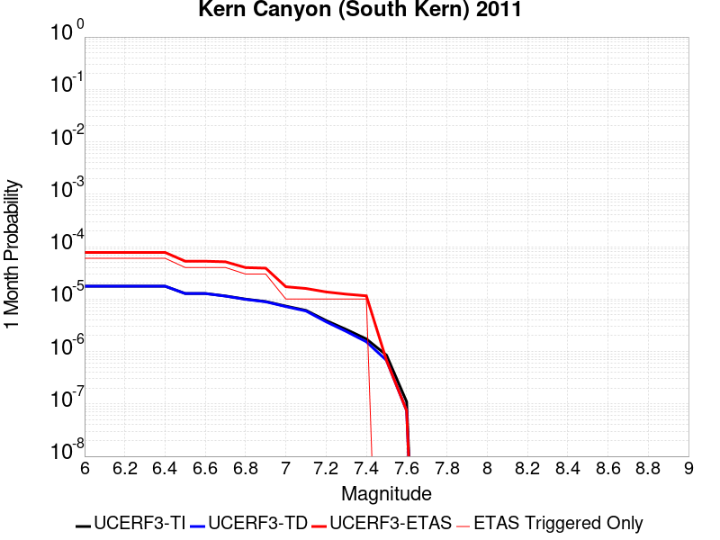 | 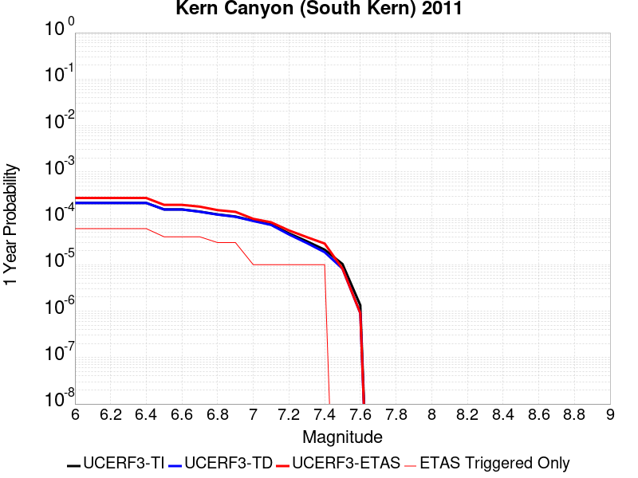 | 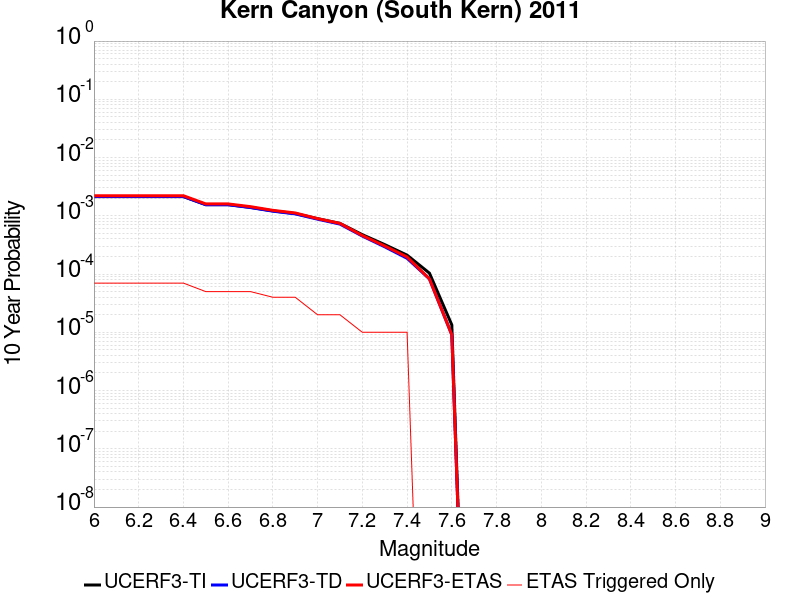 |

| Magnitude | 1 wk TI Prob | 1 wk TD Prob | 1 wk ETAS Prob | 1 wk ETAS/TD Gain | 1 wk ETAS Triggered Only | 1 mo TI Prob | 1 mo TD Prob | 1 mo ETAS Prob | 1 mo ETAS/TD Gain | 1 mo ETAS Triggered Only | 1 yr TI Prob | 1 yr TD Prob | 1 yr ETAS Prob | 1 yr ETAS/TD Gain | 1 yr ETAS Triggered Only | 10 yr TI Prob | 10 yr TD Prob | 10 yr ETAS Prob | 10 yr ETAS/TD Gain | 10 yr ETAS Triggered Only |
|-----|-----|-----|-----|-----|-----|-----|-----|-----|-----|-----|-----|-----|-----|-----|-----|-----|-----|-----|-----|-----|
| 6.0 | 4.105075E-6 | 4.113726E-6 | 5.411352E-5 | 13.154382 | 5.0E-5 | 1.7593058E-5 | 1.7630138E-5 | 7.762908E-5 | 4.403203 | 6.0E-5 | 2.1417443E-4 | 2.1462643E-4 | 2.7461356E-4 | 1.2794955 | 6.0E-5 | 0.0021396813 | 0.0021442554 | 0.0022141053 | 1.0325754 | 7.0E-5 |
| 6.1 | 4.105075E-6 | 4.113726E-6 | 5.411352E-5 | 13.154382 | 5.0E-5 | 1.7593058E-5 | 1.7630138E-5 | 7.762908E-5 | 4.403203 | 6.0E-5 | 2.1417443E-4 | 2.1462643E-4 | 2.7461356E-4 | 1.2794955 | 6.0E-5 | 0.0021396813 | 0.0021442554 | 0.0022141053 | 1.0325754 | 7.0E-5 |
| 6.2 | 4.105075E-6 | 4.113726E-6 | 5.411352E-5 | 13.154382 | 5.0E-5 | 1.7593058E-5 | 1.7630138E-5 | 7.762908E-5 | 4.403203 | 6.0E-5 | 2.1417443E-4 | 2.1462643E-4 | 2.7461356E-4 | 1.2794955 | 6.0E-5 | 0.0021396813 | 0.0021442554 | 0.0022141053 | 1.0325754 | 7.0E-5 |
| 6.3 | 4.105075E-6 | 4.113726E-6 | 5.411352E-5 | 13.154382 | 5.0E-5 | 1.7593058E-5 | 1.7630138E-5 | 7.762908E-5 | 4.403203 | 6.0E-5 | 2.1417443E-4 | 2.1462643E-4 | 2.7461356E-4 | 1.2794955 | 6.0E-5 | 0.0021396813 | 0.0021442554 | 0.0022141053 | 1.0325754 | 7.0E-5 |
| 6.4 | 4.105075E-6 | 4.113726E-6 | 5.411352E-5 | 13.154382 | 5.0E-5 | 1.7593058E-5 | 1.7630138E-5 | 7.762908E-5 | 4.403203 | 6.0E-5 | 2.1417443E-4 | 2.1462643E-4 | 2.7461356E-4 | 1.2794955 | 6.0E-5 | 0.0021396813 | 0.0021442554 | 0.0022141053 | 1.0325754 | 7.0E-5 |
| 6.5 | 2.9849807E-6 | 2.973154E-6 | 3.2973065E-5 | 11.090264 | 3.0E-5 | 1.2792712E-5 | 1.2742028E-5 | 5.2741518E-5 | 4.139178 | 4.0E-5 | 1.5574014E-4 | 1.551233E-4 | 1.9511709E-4 | 1.2578194 | 4.0E-5 | 0.0015563103 | 0.0015501654 | 0.0016000879 | 1.0322046 | 5.0E-5 |
| 6.6 | 2.9849807E-6 | 2.973154E-6 | 3.2973065E-5 | 11.090264 | 3.0E-5 | 1.2792712E-5 | 1.2742028E-5 | 5.2741518E-5 | 4.139178 | 4.0E-5 | 1.5574014E-4 | 1.551233E-4 | 1.9511709E-4 | 1.2578194 | 4.0E-5 | 0.0015563103 | 0.0015501654 | 0.0016000879 | 1.0322046 | 5.0E-5 |
| 6.7 | 2.6756725E-6 | 2.6582202E-6 | 3.265814E-5 | 12.285717 | 3.0E-5 | 1.1467117E-5 | 1.1392323E-5 | 5.1391868E-5 | 4.5110965 | 4.0E-5 | 1.396032E-4 | 1.386928E-4 | 1.7868726E-4 | 1.2883672 | 4.0E-5 | 0.0013951553 | 0.0013860734 | 0.0014360042 | 1.0360231 | 5.0E-5 |
| 6.8 | 2.3283721E-6 | 2.3047783E-6 | 2.2304732E-5 | 9.677605 | 2.0E-5 | 9.9787E-6 | 9.877584E-6 | 3.9877286E-5 | 4.03715 | 3.0E-5 | 1.214839E-4 | 1.2025302E-4 | 1.5024941E-4 | 1.249444 | 3.0E-5 | 0.001214175 | 0.001201887 | 0.0012418389 | 1.033241 | 4.0E-5 |
| 6.9 | 2.0972677E-6 | 2.0696405E-6 | 2.2069598E-5 | 10.663494 | 2.0E-5 | 8.988259E-6 | 8.869858E-6 | 3.886959E-5 | 4.382211 | 3.0E-5 | 1.0942656E-4 | 1.0798523E-4 | 1.3798199E-4 | 1.2777858 | 3.0E-5 | 0.0010937268 | 0.0010793334 | 0.0011192902 | 1.03702 | 4.0E-5 |
| 7.0 | 1.7132242E-6 | 1.6787029E-6 | 1.1678686E-5 | 6.95697 | 1.0E-5 | 7.3423685E-6 | 7.1944214E-6 | 1.719435E-5 | 2.3899558 | 1.0E-5 | 8.938967E-5 | 8.75886E-5 | 9.758773E-5 | 1.1141601 | 1.0E-5 | 8.935372E-4 | 8.755446E-4 | 8.9552713E-4 | 1.022823 | 2.0E-5 |
| 7.1 | 1.4215541E-6 | 1.3815746E-6 | 1.138156E-5 | 8.238108 | 1.0E-5 | 6.0923603E-6 | 5.9210206E-6 | 1.5920961E-5 | 2.688888 | 1.0E-5 | 7.417196E-5 | 7.208607E-5 | 8.2085346E-5 | 1.138713 | 1.0E-5 | 7.414721E-4 | 7.206296E-4 | 7.406151E-4 | 1.0277336 | 2.0E-5 |
| 7.2 | 9.097853E-7 | 8.60377E-7 | 1.0860368E-5 | 12.622803 | 1.0E-5 | 3.899074E-6 | 3.6873246E-6 | 1.3687288E-5 | 3.7119834 | 1.0E-5 | 4.7470192E-5 | 4.4892266E-5 | 5.4891814E-5 | 1.2227455 | 1.0E-5 | 4.7460053E-4 | 4.4883305E-4 | 4.5882855E-4 | 1.02227 | 1.0E-5 |
| 7.3 | 6.144169E-7 | 5.628199E-7 | 1.0562814E-5 | 18.767664 | 1.0E-5 | 2.6332125E-6 | 2.4120832E-6 | 1.2412059E-5 | 5.1457844 | 1.0E-5 | 3.205889E-5 | 2.9366722E-5 | 3.9366427E-5 | 1.3405116 | 1.0E-5 | 3.2054266E-4 | 2.9362892E-4 | 3.0362597E-4 | 1.0340466 | 1.0E-5 |
| 7.4 | 4.049844E-7 | 3.5728252E-7 | 1.0357279E-5 | 28.989046 | 1.0E-5 | 1.7356463E-6 | 1.5312098E-6 | 1.1531194E-5 | 7.5307736 | 1.0E-5 | 2.1131287E-5 | 1.8642324E-5 | 2.8642136E-5 | 1.5364038 | 1.0E-5 | 2.1129279E-4 | 1.8640784E-4 | 1.9640598E-4 | 1.0536358 | 1.0E-5 |
| 7.5 | 1.9871162E-7 | 1.5830383E-7 | 1.5830383E-7 | 1.0 | 0.0 | 8.5162094E-7 | 6.784448E-7 | 6.784448E-7 | 1.0 | 0.0 | 1.0368436E-5 | 8.260035E-6 | 8.260035E-6 | 1.0 | 0.0 | 1.0367952E-4 | 8.259736E-5 | 8.259736E-5 | 1.0 | 0.0 |
| 7.6 | 2.572245E-8 | 1.735264E-8 | 1.735264E-8 | 1.0 | 0.0 | 1.10239064E-7 | 7.436845E-8 | 7.436845E-8 | 1.0 | 0.0 | 1.3421597E-6 | 9.0543557E-7 | 9.0543557E-7 | 1.0 | 0.0 | 1.3421517E-5 | 9.054324E-6 | 9.054324E-6 | 1.0 | 0.0 |

## Santa Ynez (East)
*[(top)](#table-of-contents)*

| 1 Week | 1 Month | 1 Year | 10 Year |
|-----|-----|-----|-----|
| 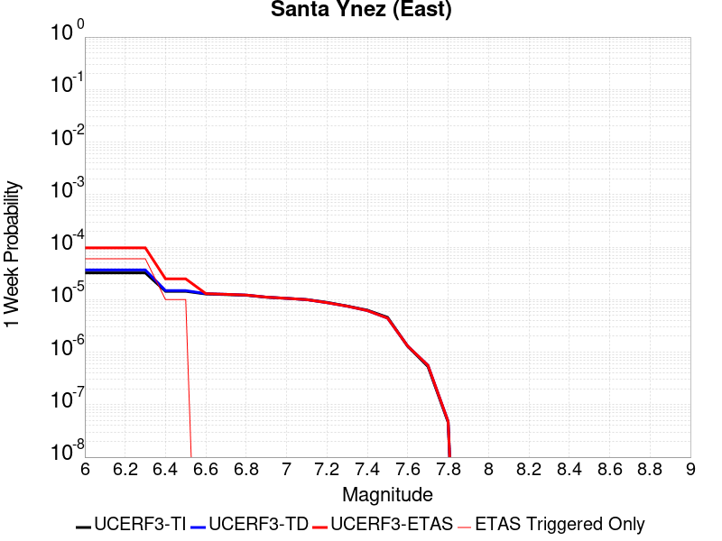 | 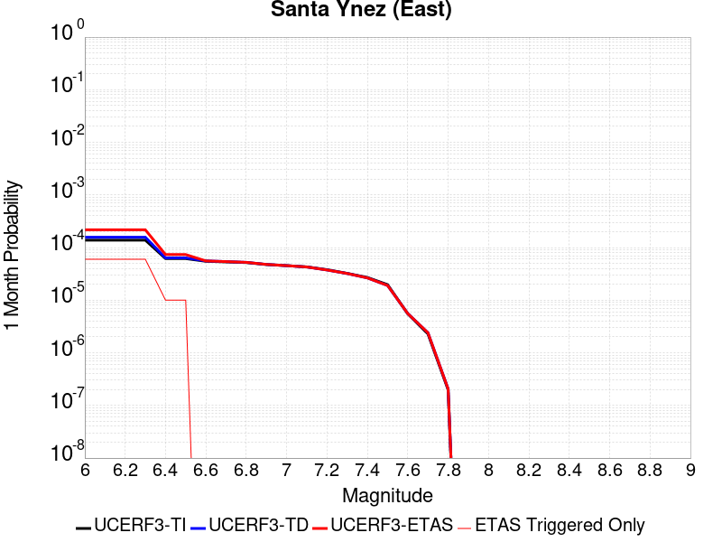 | 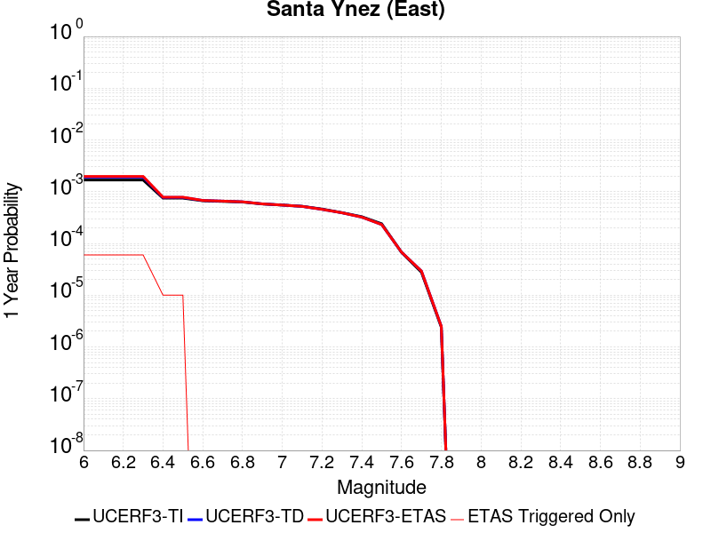 | 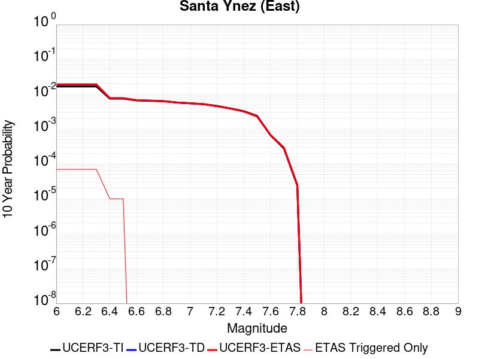 |

| Magnitude | 1 wk TI Prob | 1 wk TD Prob | 1 wk ETAS Prob | 1 wk ETAS/TD Gain | 1 wk ETAS Triggered Only | 1 mo TI Prob | 1 mo TD Prob | 1 mo ETAS Prob | 1 mo ETAS/TD Gain | 1 mo ETAS Triggered Only | 1 yr TI Prob | 1 yr TD Prob | 1 yr ETAS Prob | 1 yr ETAS/TD Gain | 1 yr ETAS Triggered Only | 10 yr TI Prob | 10 yr TD Prob | 10 yr ETAS Prob | 10 yr ETAS/TD Gain | 10 yr ETAS Triggered Only |
|-----|-----|-----|-----|-----|-----|-----|-----|-----|-----|-----|-----|-----|-----|-----|-----|-----|-----|-----|-----|-----|
| 6.0 | 3.2269712E-5 | 3.6750775E-5 | 9.674857E-5 | 2.6325586 | 6.0E-5 | 1.3829143E-4 | 1.5749714E-4 | 2.1748769E-4 | 1.3808993 | 6.0E-5 | 0.0016823979 | 0.0019164253 | 0.0019763103 | 1.0312483 | 6.0E-5 | 0.016697178 | 0.019056438 | 0.019125104 | 1.0036033 | 7.0E-5 |
| 6.1 | 3.2269712E-5 | 3.6750775E-5 | 9.674857E-5 | 2.6325586 | 6.0E-5 | 1.3829143E-4 | 1.5749714E-4 | 2.1748769E-4 | 1.3808993 | 6.0E-5 | 0.0016823979 | 0.0019164253 | 0.0019763103 | 1.0312483 | 6.0E-5 | 0.016697178 | 0.019056438 | 0.019125104 | 1.0036033 | 7.0E-5 |
| 6.2 | 3.2269712E-5 | 3.6750775E-5 | 9.674857E-5 | 2.6325586 | 6.0E-5 | 1.3829143E-4 | 1.5749714E-4 | 2.1748769E-4 | 1.3808993 | 6.0E-5 | 0.0016823979 | 0.0019164253 | 0.0019763103 | 1.0312483 | 6.0E-5 | 0.016697178 | 0.019056438 | 0.019125104 | 1.0036033 | 7.0E-5 |
| 6.3 | 3.2269712E-5 | 3.6750775E-5 | 9.674857E-5 | 2.6325586 | 6.0E-5 | 1.3829143E-4 | 1.5749714E-4 | 2.1748769E-4 | 1.3808993 | 6.0E-5 | 0.0016823979 | 0.0019164253 | 0.0019763103 | 1.0312483 | 6.0E-5 | 0.016697178 | 0.019056438 | 0.019125104 | 1.0036033 | 7.0E-5 |
| 6.4 | 1.4404779E-5 | 1.48492945E-5 | 2.4849145E-5 | 1.6734227 | 1.0E-5 | 6.1733306E-5 | 6.363831E-5 | 7.3637675E-5 | 1.1571281 | 1.0E-5 | 7.513438E-4 | 7.7452604E-4 | 7.845183E-4 | 1.0129011 | 1.0E-5 | 0.0074880854 | 0.007718817 | 0.0077287396 | 1.0012856 | 1.0E-5 |
| 6.5 | 1.4404779E-5 | 1.48492945E-5 | 2.4849145E-5 | 1.6734227 | 1.0E-5 | 6.1733306E-5 | 6.363831E-5 | 7.3637675E-5 | 1.1571281 | 1.0E-5 | 7.513438E-4 | 7.7452604E-4 | 7.845183E-4 | 1.0129011 | 1.0E-5 | 0.0074880854 | 0.007718817 | 0.0077287396 | 1.0012856 | 1.0E-5 |
| 6.6 | 1.280208E-5 | 1.301186E-5 | 1.301186E-5 | 1.0 | 0.0 | 5.4864904E-5 | 5.5763932E-5 | 5.5763932E-5 | 1.0 | 0.0 | 6.6777546E-4 | 6.7871617E-4 | 6.7871617E-4 | 1.0 | 0.0 | 0.006657724 | 0.0067666434 | 0.0067666434 | 1.0 | 0.0 |
| 6.7 | 1.2457027E-5 | 1.262838E-5 | 1.262838E-5 | 1.0 | 0.0 | 5.3386164E-5 | 5.4120515E-5 | 5.4120515E-5 | 1.0 | 0.0 | 6.497827E-4 | 6.5871974E-4 | 6.5871974E-4 | 1.0 | 0.0 | 0.00647886 | 0.00656787 | 0.00656787 | 1.0 | 0.0 |
| 6.8 | 1.2095134E-5 | 1.2230827E-5 | 1.2230827E-5 | 1.0 | 0.0 | 5.1835254E-5 | 5.2416784E-5 | 5.2416784E-5 | 1.0 | 0.0 | 6.309115E-4 | 6.3798914E-4 | 6.3798914E-4 | 1.0 | 0.0 | 0.0062912325 | 0.006361764 | 0.006361764 | 1.0 | 0.0 |
| 6.9 | 1.1104036E-5 | 1.115726E-5 | 1.115726E-5 | 1.0 | 0.0 | 4.758786E-5 | 4.781596E-5 | 4.781596E-5 | 1.0 | 0.0 | 5.7922816E-4 | 5.82005E-4 | 5.82005E-4 | 1.0 | 0.0 | 0.005777207 | 0.0058049536 | 0.0058049536 | 1.0 | 0.0 |
| 7.0 | 1.0577444E-5 | 1.05815925E-5 | 1.05815925E-5 | 1.0 | 0.0 | 4.5331115E-5 | 4.53489E-5 | 4.53489E-5 | 1.0 | 0.0 | 5.5176654E-4 | 5.5198424E-4 | 5.5198424E-4 | 1.0 | 0.0 | 0.0055039856 | 0.00550627 | 0.00550627 | 1.0 | 0.0 |
| 7.1 | 1.0021775E-5 | 9.9809E-6 | 9.9809E-6 | 1.0 | 0.0 | 4.294976E-5 | 4.277459E-5 | 4.277459E-5 | 1.0 | 0.0 | 5.2278786E-4 | 5.206574E-4 | 5.206574E-4 | 1.0 | 0.0 | 0.0052155964 | 0.005194508 | 0.005194508 | 1.0 | 0.0 |
| 7.2 | 8.874109E-6 | 8.748706E-6 | 8.748706E-6 | 1.0 | 0.0 | 3.8031343E-5 | 3.7493923E-5 | 3.7493923E-5 | 1.0 | 0.0 | 4.629332E-4 | 4.56394E-4 | 4.56394E-4 | 1.0 | 0.0 | 0.0046197 | 0.0045546847 | 0.0045546847 | 1.0 | 0.0 |
| 7.3 | 7.5504267E-6 | 7.5050243E-6 | 7.5050243E-6 | 1.0 | 0.0 | 3.235857E-5 | 3.2164E-5 | 3.2164E-5 | 1.0 | 0.0 | 3.9389438E-4 | 3.9152734E-4 | 3.9152734E-4 | 1.0 | 0.0 | 0.0039319694 | 0.0039084824 | 0.0039084824 | 1.0 | 0.0 |
| 7.4 | 6.309394E-6 | 6.183062E-6 | 6.183062E-6 | 1.0 | 0.0 | 2.703998E-5 | 2.6498574E-5 | 2.6498574E-5 | 1.0 | 0.0 | 3.2916202E-4 | 3.2257332E-4 | 3.2257332E-4 | 1.0 | 0.0 | 0.003286749 | 0.0032211484 | 0.0032211484 | 1.0 | 0.0 |
| 7.5 | 4.6103073E-6 | 4.4408016E-6 | 4.4408016E-6 | 1.0 | 0.0 | 1.975831E-5 | 1.9031871E-5 | 1.9031871E-5 | 1.0 | 0.0 | 2.4053088E-4 | 2.316891E-4 | 2.316891E-4 | 1.0 | 0.0 | 0.002402707 | 0.002314545 | 0.002314545 | 1.0 | 0.0 |
| 7.6 | 1.2858658E-6 | 1.3008196E-6 | 1.3008196E-6 | 1.0 | 0.0 | 5.5108417E-6 | 5.574929E-6 | 5.574929E-6 | 1.0 | 0.0 | 6.7092435E-5 | 6.787272E-5 | 6.787272E-5 | 1.0 | 0.0 | 6.707218E-4 | 6.7852676E-4 | 6.7852676E-4 | 1.0 | 0.0 |
| 7.7 | 5.3302307E-7 | 5.612138E-7 | 5.612138E-7 | 1.0 | 0.0 | 2.2843826E-6 | 2.4052001E-6 | 2.4052001E-6 | 1.0 | 0.0 | 2.7812002E-5 | 2.9282955E-5 | 2.9282955E-5 | 1.0 | 0.0 | 2.7808524E-4 | 2.9279455E-4 | 2.9279455E-4 | 1.0 | 0.0 |
| 7.8 | 4.613933E-8 | 4.80301E-8 | 4.80301E-8 | 1.0 | 0.0 | 1.9773998E-7 | 2.0584326E-7 | 2.0584326E-7 | 1.0 | 0.0 | 2.4074816E-6 | 2.5061388E-6 | 2.5061388E-6 | 1.0 | 0.0 | 2.4074554E-5 | 2.5061116E-5 | 2.5061116E-5 | 1.0 | 0.0 |

## San Pedro Basin
*[(top)](#table-of-contents)*

| 1 Week | 1 Month | 1 Year | 10 Year |
|-----|-----|-----|-----|
| 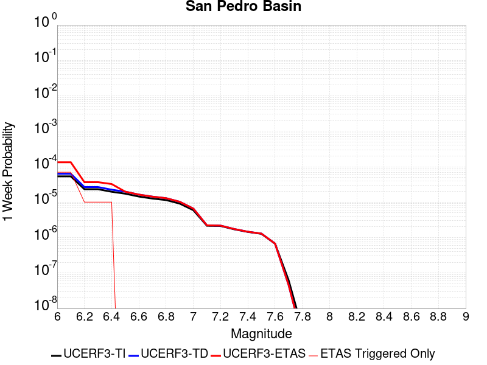 | 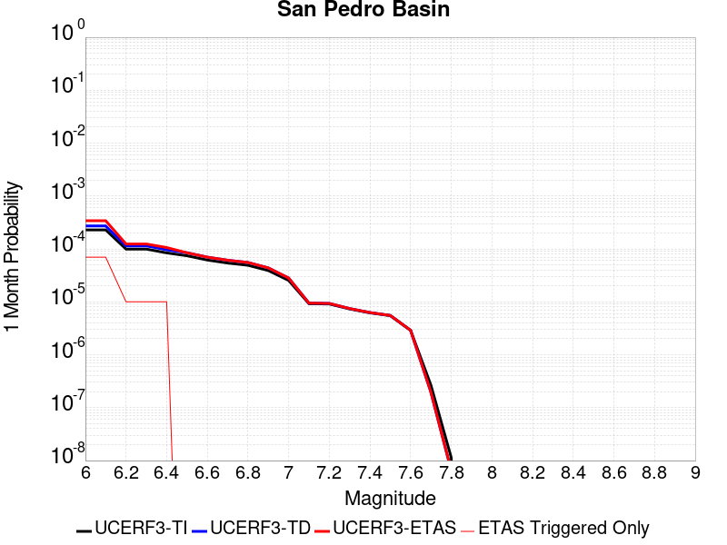 | 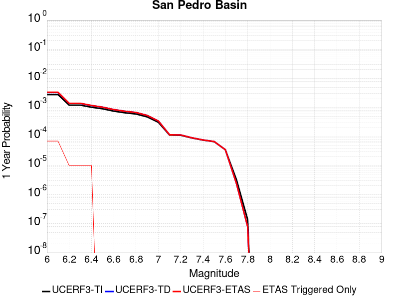 |  |

| Magnitude | 1 wk TI Prob | 1 wk TD Prob | 1 wk ETAS Prob | 1 wk ETAS/TD Gain | 1 wk ETAS Triggered Only | 1 mo TI Prob | 1 mo TD Prob | 1 mo ETAS Prob | 1 mo ETAS/TD Gain | 1 mo ETAS Triggered Only | 1 yr TI Prob | 1 yr TD Prob | 1 yr ETAS Prob | 1 yr ETAS/TD Gain | 1 yr ETAS Triggered Only | 10 yr TI Prob | 10 yr TD Prob | 10 yr ETAS Prob | 10 yr ETAS/TD Gain | 10 yr ETAS Triggered Only |
|-----|-----|-----|-----|-----|-----|-----|-----|-----|-----|-----|-----|-----|-----|-----|-----|-----|-----|-----|-----|-----|
| 6.0 | 5.3449043E-5 | 6.337018E-5 | 1.3336574E-4 | 2.1045504 | 7.0E-5 | 2.2904722E-4 | 2.7156167E-4 | 3.4154268E-4 | 1.2576983 | 7.0E-5 | 0.0027850836 | 0.0033018515 | 0.0033716203 | 1.0211302 | 7.0E-5 | 0.027504366 | 0.03258948 | 0.0326572 | 1.0020779 | 7.0E-5 |
| 6.1 | 5.3449043E-5 | 6.337018E-5 | 1.3336574E-4 | 2.1045504 | 7.0E-5 | 2.2904722E-4 | 2.7156167E-4 | 3.4154268E-4 | 1.2576983 | 7.0E-5 | 0.0027850836 | 0.0033018515 | 0.0033716203 | 1.0211302 | 7.0E-5 | 0.027504366 | 0.03258948 | 0.0326572 | 1.0020779 | 7.0E-5 |
| 6.2 | 2.3189454E-5 | 2.6642829E-5 | 3.6642563E-5 | 1.3753256 | 1.0E-5 | 9.9379584E-5 | 1.1417881E-4 | 1.2417766E-4 | 1.087572 | 1.0E-5 | 0.0012092749 | 0.0013892875 | 0.0013992736 | 1.007188 | 1.0E-5 | 0.012027155 | 0.01381089 | 0.013820752 | 1.0007141 | 1.0E-5 |
| 6.3 | 2.3189454E-5 | 2.6642829E-5 | 3.6642563E-5 | 1.3753256 | 1.0E-5 | 9.9379584E-5 | 1.1417881E-4 | 1.2417766E-4 | 1.087572 | 1.0E-5 | 0.0012092749 | 0.0013892875 | 0.0013992736 | 1.007188 | 1.0E-5 | 0.012027155 | 0.01381089 | 0.013820752 | 1.0007141 | 1.0E-5 |
| 6.4 | 1.966056E-5 | 2.246342E-5 | 3.2463195E-5 | 1.4451581 | 1.0E-5 | 8.425682E-5 | 9.626848E-5 | 1.06267515E-4 | 1.1038662 | 1.0E-5 | 0.001025344 | 0.0011714787 | 0.001181467 | 1.0085262 | 1.0E-5 | 0.010206259 | 0.011657119 | 0.011667003 | 1.0008478 | 1.0E-5 |
| 6.5 | 1.7342953E-5 | 1.9745152E-5 | 1.9745152E-5 | 1.0 | 0.0 | 7.4324824E-5 | 8.461954E-5 | 8.461954E-5 | 1.0 | 0.0 | 9.04529E-4 | 0.0010297929 | 0.0010297929 | 1.0 | 0.0 | 0.009008561 | 0.010253932 | 0.010253932 | 1.0 | 0.0 |
| 6.6 | 1.439804E-5 | 1.6322716E-5 | 1.6322716E-5 | 1.0 | 0.0 | 6.170443E-5 | 6.99528E-5 | 6.99528E-5 | 1.0 | 0.0 | 7.509924E-4 | 8.513747E-4 | 8.513747E-4 | 1.0 | 0.0 | 0.0074845953 | 0.008484333 | 0.008484333 | 1.0 | 0.0 |
| 6.7 | 1.2634884E-5 | 1.4285298E-5 | 1.4285298E-5 | 1.0 | 0.0 | 5.414838E-5 | 6.122144E-5 | 6.122144E-5 | 1.0 | 0.0 | 6.590571E-4 | 7.451466E-4 | 7.451466E-4 | 1.0 | 0.0 | 0.006571059 | 0.007429502 | 0.007429502 | 1.0 | 0.0 |
| 6.8 | 1.146091E-5 | 1.2933193E-5 | 1.2933193E-5 | 1.0 | 0.0 | 4.911726E-5 | 5.542696E-5 | 5.542696E-5 | 1.0 | 0.0 | 5.9783855E-4 | 6.74644E-4 | 6.74644E-4 | 1.0 | 0.0 | 0.0059623276 | 0.0067288997 | 0.0067288997 | 1.0 | 0.0 |
| 6.9 | 9.109035E-6 | 1.0235013E-5 | 1.0235013E-5 | 1.0 | 0.0 | 3.9038136E-5 | 4.386376E-5 | 4.386376E-5 | 1.0 | 0.0 | 4.7518566E-4 | 5.339384E-4 | 5.339384E-4 | 1.0 | 0.0 | 0.0047417083 | 0.0053293095 | 0.0053293095 | 1.0 | 0.0 |
| 7.0 | 5.9351028E-6 | 6.583965E-6 | 6.583965E-6 | 1.0 | 0.0 | 2.5435906E-5 | 2.821682E-5 | 2.821682E-5 | 1.0 | 0.0 | 3.0963816E-4 | 3.4350925E-4 | 3.4350925E-4 | 1.0 | 0.0 | 0.0030920706 | 0.0034320997 | 0.0034320997 | 1.0 | 0.0 |
| 7.1 | 2.1557585E-6 | 2.2096492E-6 | 2.2096492E-6 | 1.0 | 0.0 | 9.238933E-6 | 9.469892E-6 | 9.469892E-6 | 1.0 | 0.0 | 1.1247819E-4 | 1.15289986E-4 | 1.15289986E-4 | 1.0 | 0.0 | 0.0011242128 | 0.0011523172 | 0.0011523172 | 1.0 | 0.0 |
| 7.2 | 2.1251979E-6 | 2.1779954E-6 | 2.1779954E-6 | 1.0 | 0.0 | 9.107958E-6 | 9.334234E-6 | 9.334234E-6 | 1.0 | 0.0 | 1.1088375E-4 | 1.13638525E-4 | 1.13638525E-4 | 1.0 | 0.0 | 0.0011082845 | 0.0011358195 | 0.0011358195 | 1.0 | 0.0 |
| 7.3 | 1.7145798E-6 | 1.7442885E-6 | 1.7442885E-6 | 1.0 | 0.0 | 7.3481783E-6 | 7.475501E-6 | 7.475501E-6 | 1.0 | 0.0 | 8.94604E-5 | 9.1010515E-5 | 9.1010515E-5 | 1.0 | 0.0 | 8.9424395E-4 | 9.0974156E-4 | 9.0974156E-4 | 1.0 | 0.0 |
| 7.4 | 1.4467993E-6 | 1.4641878E-6 | 1.4641878E-6 | 1.0 | 0.0 | 6.200554E-6 | 6.275076E-6 | 6.275076E-6 | 1.0 | 0.0 | 7.548913E-5 | 7.639644E-5 | 7.639644E-5 | 1.0 | 0.0 | 7.546349E-4 | 7.6370913E-4 | 7.6370913E-4 | 1.0 | 0.0 |
| 7.5 | 1.2803735E-6 | 1.2931506E-6 | 1.2931506E-6 | 1.0 | 0.0 | 5.487303E-6 | 5.5420624E-6 | 5.5420624E-6 | 1.0 | 0.0 | 6.680587E-5 | 6.747259E-5 | 6.747259E-5 | 1.0 | 0.0 | 6.678579E-4 | 6.745281E-4 | 6.745281E-4 | 1.0 | 0.0 |
| 7.6 | 6.755009E-7 | 6.76947E-7 | 6.76947E-7 | 1.0 | 0.0 | 2.8950008E-6 | 2.9011985E-6 | 2.9011985E-6 | 1.0 | 0.0 | 3.5246063E-5 | 3.532158E-5 | 3.532158E-5 | 1.0 | 0.0 | 3.5240475E-4 | 3.5316538E-4 | 3.5316538E-4 | 1.0 | 0.0 |
| 7.7 | 6.211885E-8 | 4.5699714E-8 | 4.5699714E-8 | 1.0 | 0.0 | 2.6622362E-7 | 1.9585592E-7 | 1.9585592E-7 | 1.0 | 0.0 | 3.2412677E-6 | 2.3845432E-6 | 2.3845432E-6 | 1.0 | 0.0 | 3.2412205E-5 | 2.3845198E-5 | 2.3845198E-5 | 1.0 | 0.0 |
| 7.8 | 2.6580573E-9 | 1.5138054E-9 | 1.5138054E-9 | 1.0 | 0.0 | 1.1391674E-8 | 6.4877375E-9 | 6.4877375E-9 | 1.0 | 0.0 | 1.3869362E-7 | 7.89882E-8 | 7.89882E-8 | 1.0 | 0.0 | 1.3869354E-6 | 7.89882E-7 | 7.89882E-7 | 1.0 | 0.0 |

## Ortigalita (North)
*[(top)](#table-of-contents)*

| 1 Week | 1 Month | 1 Year | 10 Year |
|-----|-----|-----|-----|
| 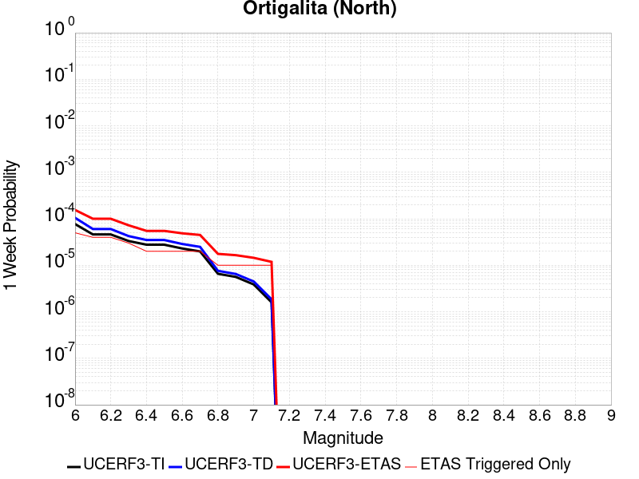 | 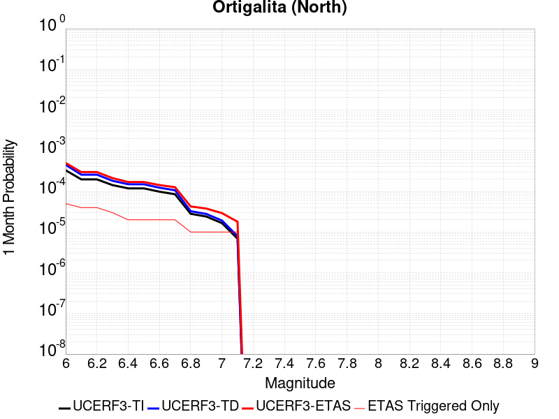 | 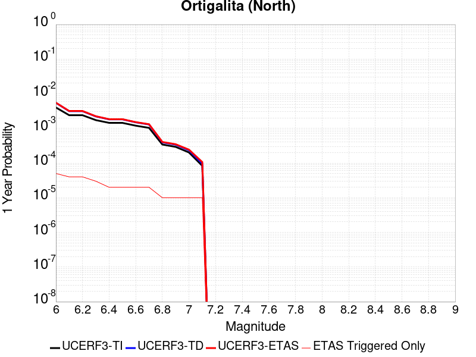 | 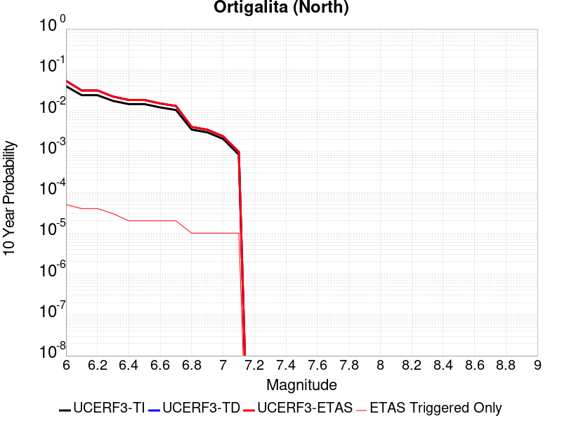 |

| Magnitude | 1 wk TI Prob | 1 wk TD Prob | 1 wk ETAS Prob | 1 wk ETAS/TD Gain | 1 wk ETAS Triggered Only | 1 mo TI Prob | 1 mo TD Prob | 1 mo ETAS Prob | 1 mo ETAS/TD Gain | 1 mo ETAS Triggered Only | 1 yr TI Prob | 1 yr TD Prob | 1 yr ETAS Prob | 1 yr ETAS/TD Gain | 1 yr ETAS Triggered Only | 10 yr TI Prob | 10 yr TD Prob | 10 yr ETAS Prob | 10 yr ETAS/TD Gain | 10 yr ETAS Triggered Only |
|-----|-----|-----|-----|-----|-----|-----|-----|-----|-----|-----|-----|-----|-----|-----|-----|-----|-----|-----|-----|-----|
| 6.0 | 7.711876E-5 | 1.0505308E-4 | 1.5504782E-4 | 1.4758999 | 5.0E-5 | 3.3046713E-4 | 4.501601E-4 | 5.0013757E-4 | 1.1110216 | 5.0E-5 | 0.004016016 | 0.0054680547 | 0.0055177812 | 1.009094 | 5.0E-5 | 0.039442103 | 0.053455614 | 0.05350294 | 1.0008854 | 5.0E-5 |
| 6.1 | 4.607858E-5 | 6.0239887E-5 | 1.0023748E-4 | 1.6639719 | 4.0E-5 | 1.9746469E-4 | 2.5814763E-4 | 2.981373E-4 | 1.1549101 | 4.0E-5 | 0.0024014818 | 0.0031387366 | 0.0031786112 | 1.012704 | 4.0E-5 | 0.023756953 | 0.030975312 | 0.031014072 | 1.0012513 | 4.0E-5 |
| 6.2 | 4.607858E-5 | 6.0239887E-5 | 1.0023748E-4 | 1.6639719 | 4.0E-5 | 1.9746469E-4 | 2.5814763E-4 | 2.981373E-4 | 1.1549101 | 4.0E-5 | 0.0024014818 | 0.0031387366 | 0.0031786112 | 1.012704 | 4.0E-5 | 0.023756953 | 0.030975312 | 0.031014072 | 1.0012513 | 4.0E-5 |
| 6.3 | 3.327423E-5 | 4.2476124E-5 | 7.2474846E-5 | 1.7062491 | 3.0E-5 | 1.4259605E-4 | 1.8202956E-4 | 2.120241E-4 | 1.1647784 | 3.0E-5 | 0.0017347244 | 0.002214206 | 0.0022441396 | 1.0135189 | 3.0E-5 | 0.017212452 | 0.02194574 | 0.021975081 | 1.001337 | 3.0E-5 |
| 6.4 | 2.7732503E-5 | 3.4999008E-5 | 5.4998305E-5 | 1.5714248 | 2.0E-5 | 1.1884817E-4 | 1.499886E-4 | 1.699856E-4 | 1.1333234 | 2.0E-5 | 0.001446016 | 0.0018248158 | 0.0018447792 | 1.01094 | 2.0E-5 | 0.014366428 | 0.018121297 | 0.018140934 | 1.0010837 | 2.0E-5 |
| 6.5 | 2.7689714E-5 | 3.4948822E-5 | 5.4948123E-5 | 1.5722454 | 2.0E-5 | 1.186648E-4 | 1.4977354E-4 | 1.6977054E-4 | 1.1335149 | 2.0E-5 | 0.0014437864 | 0.0018222018 | 0.0018421654 | 1.0109557 | 2.0E-5 | 0.014344421 | 0.018095585 | 0.018115222 | 1.0010853 | 2.0E-5 |
| 6.6 | 2.2976905E-5 | 2.871829E-5 | 4.8717717E-5 | 1.6964003 | 2.0E-5 | 9.846873E-5 | 1.23074E-4 | 1.4307155E-4 | 1.1624838 | 2.0E-5 | 0.0011981975 | 0.0014976348 | 0.0015176049 | 1.0133344 | 2.0E-5 | 0.011917574 | 0.014898733 | 0.014918435 | 1.0013224 | 2.0E-5 |
| 6.7 | 1.9871539E-5 | 2.4904637E-5 | 4.490414E-5 | 1.8030432 | 2.0E-5 | 8.516096E-5 | 1.067312E-4 | 1.2672906E-4 | 1.1873666 | 2.0E-5 | 0.0010363415 | 0.0012989199 | 0.001318894 | 1.0153774 | 2.0E-5 | 0.010315218 | 0.012936938 | 0.012956679 | 1.001526 | 2.0E-5 |
| 6.8 | 6.5640475E-6 | 7.6054926E-6 | 1.7605416E-5 | 2.3148293 | 1.0E-5 | 2.813133E-5 | 3.2594577E-5 | 4.259425E-5 | 1.3067895 | 1.0E-5 | 3.424451E-4 | 3.9676955E-4 | 4.0676558E-4 | 1.0251936 | 1.0E-5 | 0.0034191788 | 0.003960899 | 0.003970859 | 1.0025147 | 1.0E-5 |
| 6.9 | 5.6219683E-6 | 6.5018376E-6 | 1.6501772E-5 | 2.5380168 | 1.0E-5 | 2.4093928E-5 | 2.7864735E-5 | 3.7864458E-5 | 1.3588666 | 1.0E-5 | 2.933041E-4 | 3.3920293E-4 | 3.4919954E-4 | 1.0294709 | 1.0E-5 | 0.0029291727 | 0.003387109 | 0.003397075 | 1.0029423 | 1.0E-5 |
| 7.0 | 3.875591E-6 | 4.4847548E-6 | 1.448471E-5 | 3.2297661 | 1.0E-5 | 1.6609569E-5 | 1.9220248E-5 | 2.9220057E-5 | 1.5202746 | 1.0E-5 | 2.0220275E-4 | 2.339835E-4 | 2.4398117E-4 | 1.0427281 | 1.0E-5 | 0.0020201886 | 0.0023375798 | 0.0023475564 | 1.0042679 | 1.0E-5 |
| 7.1 | 1.6017933E-6 | 1.8570418E-6 | 1.1857023E-5 | 6.3848987 | 1.0E-5 | 6.8648105E-6 | 7.958732E-6 | 1.7958653E-5 | 2.2564716 | 1.0E-5 | 8.357586E-5 | 9.689432E-5 | 1.06893356E-4 | 1.1031952 | 1.0E-5 | 8.3544437E-4 | 9.686254E-4 | 9.786157E-4 | 1.0103139 | 1.0E-5 |

## Palos Verdes
*[(top)](#table-of-contents)*

| 1 Week | 1 Month | 1 Year | 10 Year |
|-----|-----|-----|-----|
| 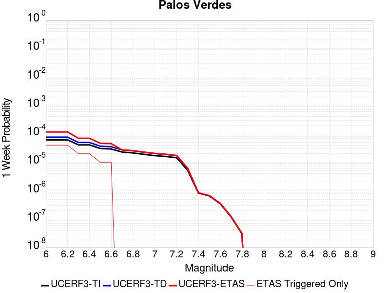 | 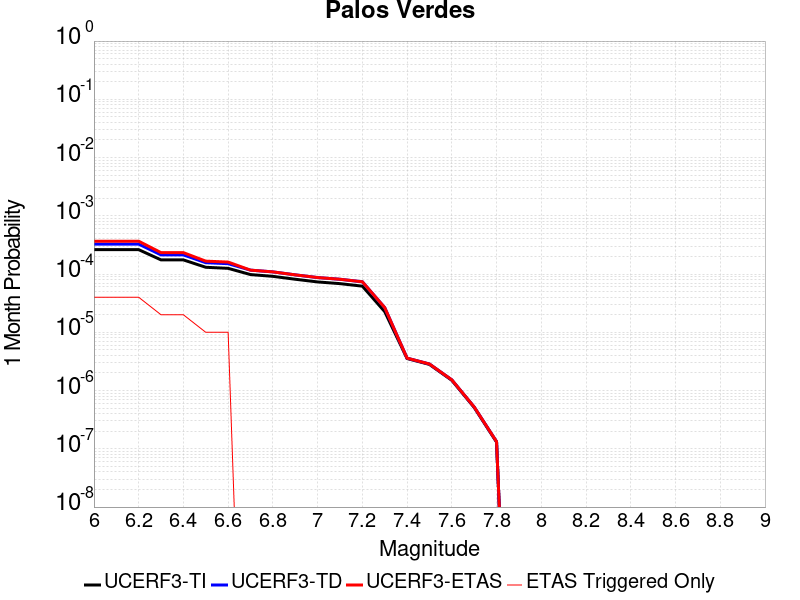 | 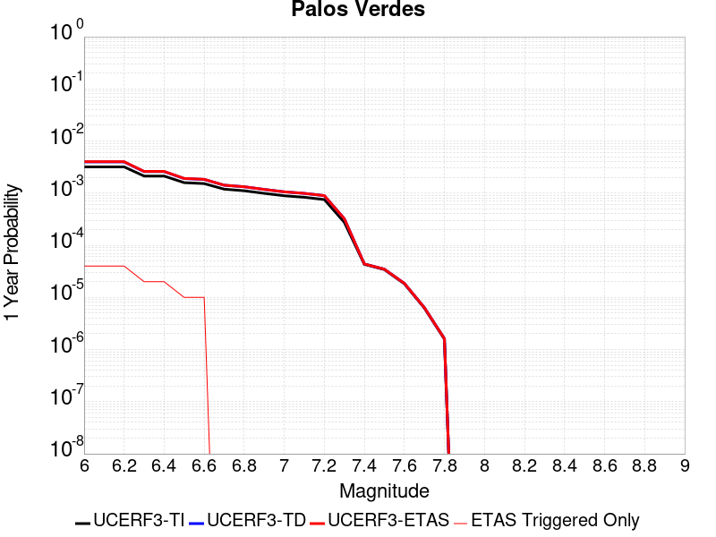 | 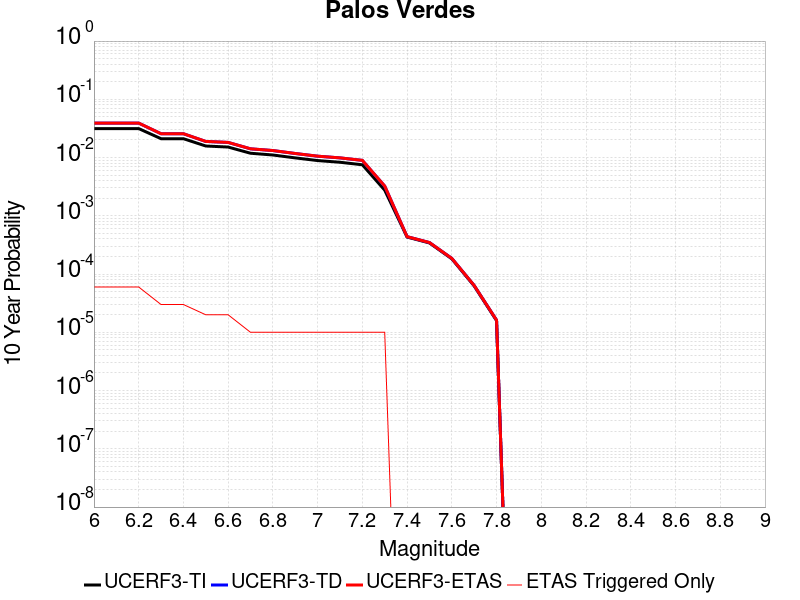 |

| Magnitude | 1 wk TI Prob | 1 wk TD Prob | 1 wk ETAS Prob | 1 wk ETAS/TD Gain | 1 wk ETAS Triggered Only | 1 mo TI Prob | 1 mo TD Prob | 1 mo ETAS Prob | 1 mo ETAS/TD Gain | 1 mo ETAS Triggered Only | 1 yr TI Prob | 1 yr TD Prob | 1 yr ETAS Prob | 1 yr ETAS/TD Gain | 1 yr ETAS Triggered Only | 10 yr TI Prob | 10 yr TD Prob | 10 yr ETAS Prob | 10 yr ETAS/TD Gain | 10 yr ETAS Triggered Only |
|-----|-----|-----|-----|-----|-----|-----|-----|-----|-----|-----|-----|-----|-----|-----|-----|-----|-----|-----|-----|-----|
| 6.0 | 6.126063E-5 | 7.622572E-5 | 1.16222676E-4 | 1.5247172 | 4.0E-5 | 2.6251914E-4 | 3.266441E-4 | 3.6663105E-4 | 1.1224174 | 4.0E-5 | 0.0031914865 | 0.0039701737 | 0.004010015 | 1.0100352 | 4.0E-5 | 0.031460393 | 0.03904909 | 0.039106745 | 1.0014765 | 6.0E-5 |
| 6.1 | 6.126063E-5 | 7.622572E-5 | 1.16222676E-4 | 1.5247172 | 4.0E-5 | 2.6251914E-4 | 3.266441E-4 | 3.6663105E-4 | 1.1224174 | 4.0E-5 | 0.0031914865 | 0.0039701737 | 0.004010015 | 1.0100352 | 4.0E-5 | 0.031460393 | 0.03904909 | 0.039106745 | 1.0014765 | 6.0E-5 |
| 6.2 | 6.126063E-5 | 7.622572E-5 | 1.16222676E-4 | 1.5247172 | 4.0E-5 | 2.6251914E-4 | 3.266441E-4 | 3.6663105E-4 | 1.1224174 | 4.0E-5 | 0.0031914865 | 0.0039701737 | 0.004010015 | 1.0100352 | 4.0E-5 | 0.031460393 | 0.03904909 | 0.039106745 | 1.0014765 | 6.0E-5 |
| 6.3 | 4.0838047E-5 | 4.9749007E-5 | 6.974801E-5 | 1.401998 | 2.0E-5 | 1.7500846E-4 | 2.1319388E-4 | 2.3318961E-4 | 1.0937914 | 2.0E-5 | 0.0021286458 | 0.002592754 | 0.0026127023 | 1.0076938 | 2.0E-5 | 0.021083709 | 0.025646746 | 0.025675977 | 1.0011398 | 3.0E-5 |
| 6.4 | 4.0838047E-5 | 4.9749007E-5 | 6.974801E-5 | 1.401998 | 2.0E-5 | 1.7500846E-4 | 2.1319388E-4 | 2.3318961E-4 | 1.0937914 | 2.0E-5 | 0.0021286458 | 0.002592754 | 0.0026127023 | 1.0076938 | 2.0E-5 | 0.021083709 | 0.025646746 | 0.025675977 | 1.0011398 | 3.0E-5 |
| 6.5 | 3.0512005E-5 | 3.6561592E-5 | 4.656123E-5 | 1.273501 | 1.0E-5 | 1.3075917E-4 | 1.566838E-4 | 1.6668225E-4 | 1.0638129 | 1.0E-5 | 0.0015908304 | 0.001906072 | 0.001916053 | 1.0052364 | 1.0E-5 | 0.015794903 | 0.018909173 | 0.018928794 | 1.0010377 | 2.0E-5 |
| 6.6 | 2.9255087E-5 | 3.5154393E-5 | 4.515404E-5 | 1.2844495 | 1.0E-5 | 1.2537291E-4 | 1.5065364E-4 | 1.6065213E-4 | 1.0663674 | 1.0E-5 | 0.0015253464 | 0.0018327782 | 0.0018427599 | 1.0054462 | 1.0E-5 | 0.015149189 | 0.018188244 | 0.01820788 | 1.0010796 | 2.0E-5 |
| 6.7 | 2.287198E-5 | 2.724828E-5 | 2.724828E-5 | 1.0 | 0.0 | 9.801909E-5 | 1.16773626E-4 | 1.16773626E-4 | 1.0 | 0.0 | 0.001192729 | 0.0014208833 | 0.0014208833 | 1.0 | 0.0 | 0.011863477 | 0.014127217 | 0.014137076 | 1.0006979 | 1.0E-5 |
| 6.8 | 2.1325764E-5 | 2.5431878E-5 | 2.5431878E-5 | 1.0 | 0.0 | 9.139293E-5 | 1.0898972E-4 | 1.0898972E-4 | 1.0 | 0.0 | 0.001112141 | 0.0013262323 | 0.0013262323 | 1.0 | 0.0 | 0.011065915 | 0.013192211 | 0.01320208 | 1.000748 | 1.0E-5 |
| 6.9 | 1.9009392E-5 | 2.2613547E-5 | 2.2613547E-5 | 1.0 | 0.0 | 8.1466285E-5 | 9.6912096E-5 | 9.6912096E-5 | 1.0 | 0.0 | 9.914007E-4 | 0.0011793535 | 0.0011793535 | 1.0 | 0.0 | 0.009869894 | 0.011739633 | 0.011749515 | 1.0008419 | 1.0E-5 |
| 7.0 | 1.7098473E-5 | 2.0319356E-5 | 2.0319356E-5 | 1.0 | 0.0 | 7.3277115E-5 | 8.708052E-5 | 8.708052E-5 | 1.0 | 0.0 | 8.917837E-4 | 0.001059775 | 0.001059775 | 1.0 | 0.0 | 0.008882134 | 0.010555646 | 0.010565541 | 1.0009373 | 1.0E-5 |
| 7.1 | 1.5982785E-5 | 1.899476E-5 | 1.899476E-5 | 1.0 | 0.0 | 6.849585E-5 | 8.1404054E-5 | 8.1404054E-5 | 1.0 | 0.0 | 8.336179E-4 | 9.907284E-4 | 9.907284E-4 | 1.0 | 0.0 | 0.008304977 | 0.009871479 | 0.009881381 | 1.001003 | 1.0E-5 |
| 7.2 | 1.4468002E-5 | 1.7197237E-5 | 1.7197237E-5 | 1.0 | 0.0 | 6.200425E-5 | 7.370083E-5 | 7.370083E-5 | 1.0 | 0.0 | 7.546402E-4 | 8.970222E-4 | 8.970222E-4 | 1.0 | 0.0 | 0.007520827 | 0.008942284 | 0.008952194 | 1.0011083 | 1.0E-5 |
| 7.3 | 5.288233E-6 | 6.2036747E-6 | 6.2036747E-6 | 1.0 | 0.0 | 2.2663658E-5 | 2.6587102E-5 | 2.6587102E-5 | 1.0 | 0.0 | 2.7589512E-4 | 3.236848E-4 | 3.236848E-4 | 1.0 | 0.0 | 0.0027555283 | 0.0032355562 | 0.003245524 | 1.0030806 | 1.0E-5 |
| 7.4 | 8.279556E-7 | 8.408347E-7 | 8.408347E-7 | 1.0 | 0.0 | 3.5483763E-6 | 3.6035726E-6 | 3.6035726E-6 | 1.0 | 0.0 | 4.3200624E-5 | 4.3872686E-5 | 4.3872686E-5 | 1.0 | 0.0 | 4.3192226E-4 | 4.3864746E-4 | 4.3864746E-4 | 1.0 | 0.0 |
| 7.5 | 6.559831E-7 | 6.667229E-7 | 6.667229E-7 | 1.0 | 0.0 | 2.8113532E-6 | 2.857381E-6 | 2.857381E-6 | 1.0 | 0.0 | 3.4227687E-5 | 3.4788125E-5 | 3.4788125E-5 | 1.0 | 0.0 | 3.4222414E-4 | 3.4783344E-4 | 3.4783344E-4 | 1.0 | 0.0 |
| 7.6 | 3.5018968E-7 | 3.5620027E-7 | 3.5620027E-7 | 1.0 | 0.0 | 1.500812E-6 | 1.526572E-6 | 1.526572E-6 | 1.0 | 0.0 | 1.8272232E-5 | 1.8585903E-5 | 1.8585903E-5 | 1.0 | 0.0 | 1.8270731E-4 | 1.8584808E-4 | 1.8584808E-4 | 1.0 | 0.0 |
| 7.7 | 1.1986104E-7 | 1.2198376E-7 | 1.2198376E-7 | 1.0 | 0.0 | 5.1369005E-7 | 5.2278745E-7 | 5.2278745E-7 | 1.0 | 0.0 | 6.2541585E-6 | 6.364919E-6 | 6.364919E-6 | 1.0 | 0.0 | 6.2539824E-5 | 6.364741E-5 | 6.364741E-5 | 1.0 | 0.0 |
| 7.8 | 3.0445005E-8 | 3.1027582E-8 | 3.1027582E-8 | 1.0 | 0.0 | 1.3047858E-7 | 1.3297536E-7 | 1.3297536E-7 | 1.0 | 0.0 | 1.5885756E-6 | 1.6189739E-6 | 1.6189739E-6 | 1.0 | 0.0 | 1.5885644E-5 | 1.6189642E-5 | 1.6189642E-5 | 1.0 | 0.0 |

## Santa Ynez (West)
*[(top)](#table-of-contents)*

| 1 Week | 1 Month | 1 Year | 10 Year |
|-----|-----|-----|-----|
| 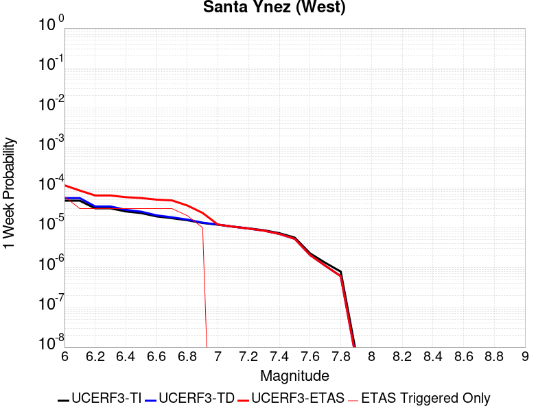 | 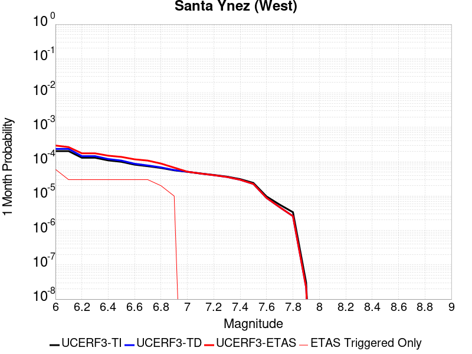 | 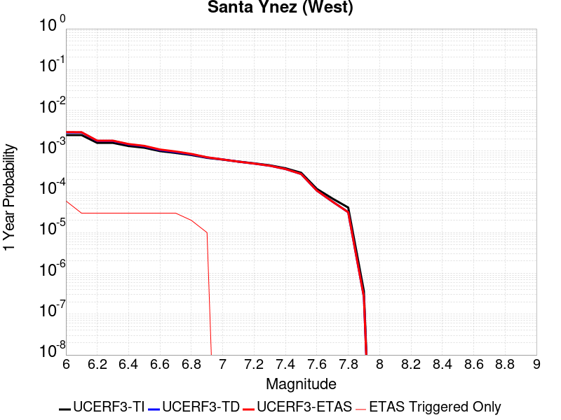 | 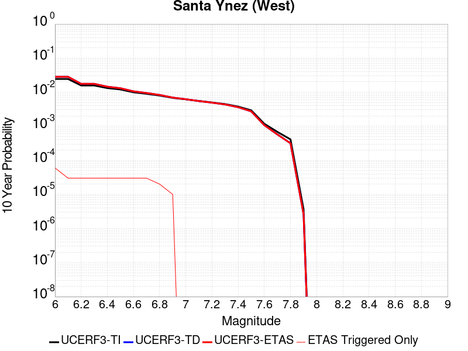 |

| Magnitude | 1 wk TI Prob | 1 wk TD Prob | 1 wk ETAS Prob | 1 wk ETAS/TD Gain | 1 wk ETAS Triggered Only | 1 mo TI Prob | 1 mo TD Prob | 1 mo ETAS Prob | 1 mo ETAS/TD Gain | 1 mo ETAS Triggered Only | 1 yr TI Prob | 1 yr TD Prob | 1 yr ETAS Prob | 1 yr ETAS/TD Gain | 1 yr ETAS Triggered Only | 10 yr TI Prob | 10 yr TD Prob | 10 yr ETAS Prob | 10 yr ETAS/TD Gain | 10 yr ETAS Triggered Only |
|-----|-----|-----|-----|-----|-----|-----|-----|-----|-----|-----|-----|-----|-----|-----|-----|-----|-----|-----|-----|-----|
| 6.0 | 4.7352758E-5 | 5.497084E-5 | 1.14967545E-4 | 2.0914278 | 6.0E-5 | 2.0292461E-4 | 2.3556968E-4 | 2.9555554E-4 | 1.2546418 | 6.0E-5 | 0.0024678076 | 0.002864558 | 0.0029243862 | 1.0208856 | 6.0E-5 | 0.024405818 | 0.028304456 | 0.028362757 | 1.0020598 | 6.0E-5 |
| 6.1 | 4.7352758E-5 | 5.497084E-5 | 8.496919E-5 | 1.5457139 | 3.0E-5 | 2.0292461E-4 | 2.3556968E-4 | 2.6556262E-4 | 1.1273209 | 3.0E-5 | 0.0024678076 | 0.002864558 | 0.002894472 | 1.0104429 | 3.0E-5 | 0.024405818 | 0.028304456 | 0.028333606 | 1.0010298 | 3.0E-5 |
| 6.2 | 3.0415853E-5 | 3.3925004E-5 | 6.392399E-5 | 1.8842735 | 3.0E-5 | 1.3034715E-4 | 1.4538495E-4 | 1.753806E-4 | 1.2063187 | 3.0E-5 | 0.0015858212 | 0.0017686592 | 0.0017986061 | 1.016932 | 3.0E-5 | 0.015745522 | 0.01754978 | 0.017579252 | 1.0016794 | 3.0E-5 |
| 6.3 | 3.0415853E-5 | 3.3925004E-5 | 6.392399E-5 | 1.8842735 | 3.0E-5 | 1.3034715E-4 | 1.4538495E-4 | 1.753806E-4 | 1.2063187 | 3.0E-5 | 0.0015858212 | 0.0017686592 | 0.0017986061 | 1.016932 | 3.0E-5 | 0.015745522 | 0.01754978 | 0.017579252 | 1.0016794 | 3.0E-5 |
| 6.4 | 2.5452082E-5 | 2.7912318E-5 | 5.7911482E-5 | 2.0747643 | 3.0E-5 | 1.09075794E-4 | 1.1961885E-4 | 1.4961527E-4 | 1.2507666 | 3.0E-5 | 0.0013271887 | 0.0014554056 | 0.001485362 | 1.0205828 | 3.0E-5 | 0.013192902 | 0.01446091 | 0.014490476 | 1.0020446 | 3.0E-5 |
| 6.5 | 2.3143784E-5 | 2.5128133E-5 | 5.5127377E-5 | 2.193851 | 3.0E-5 | 9.9183875E-5 | 1.07687636E-4 | 1.376844E-4 | 1.2785535 | 3.0E-5 | 0.0012068948 | 0.001310323 | 0.0013402837 | 1.0228652 | 3.0E-5 | 0.012003611 | 0.013027638 | 0.013057247 | 1.0022728 | 3.0E-5 |
| 6.6 | 1.9118515E-5 | 2.0354244E-5 | 5.0353636E-5 | 2.473864 | 3.0E-5 | 8.193392E-5 | 8.722961E-5 | 1.1722699E-4 | 1.34389 | 3.0E-5 | 9.97089E-4 | 0.001061511 | 0.0010914791 | 1.0282316 | 3.0E-5 | 0.00992627 | 0.010565317 | 0.010595 | 1.0028095 | 3.0E-5 |
| 6.7 | 1.722807E-5 | 1.8146253E-5 | 4.814571E-5 | 2.653204 | 3.0E-5 | 7.3832496E-5 | 7.776737E-5 | 1.0776504E-4 | 1.3857359 | 3.0E-5 | 8.985399E-4 | 9.4641204E-4 | 9.763836E-4 | 1.0316687 | 3.0E-5 | 0.008949154 | 0.009424461 | 0.009454179 | 1.0031532 | 3.0E-5 |
| 6.8 | 1.5317364E-5 | 1.5926391E-5 | 3.5926074E-5 | 2.2557573 | 2.0E-5 | 6.56442E-5 | 6.82542E-5 | 8.825283E-5 | 1.2930022 | 2.0E-5 | 7.98925E-4 | 8.3068234E-4 | 8.5066573E-4 | 1.0240566 | 2.0E-5 | 0.007960589 | 0.008276261 | 0.008296096 | 1.0023966 | 2.0E-5 |
| 6.9 | 1.3071226E-5 | 1.332953E-5 | 2.3329396E-5 | 1.750204 | 1.0E-5 | 5.6018336E-5 | 5.712532E-5 | 6.712475E-5 | 1.1750437 | 1.0E-5 | 6.8180985E-4 | 6.952811E-4 | 7.052741E-4 | 1.0143727 | 1.0E-5 | 0.0067972173 | 0.0069313184 | 0.006941249 | 1.0014328 | 1.0E-5 |
| 7.0 | 1.1836986E-5 | 1.1932688E-5 | 1.1932688E-5 | 1.0 | 0.0 | 5.0728955E-5 | 5.1139097E-5 | 5.1139097E-5 | 1.0 | 0.0 | 6.1745E-4 | 6.2244234E-4 | 6.2244234E-4 | 1.0 | 0.0 | 0.006157372 | 0.0062071825 | 0.0062071825 | 1.0 | 0.0 |
| 7.1 | 1.0597169E-5 | 1.0542107E-5 | 1.0542107E-5 | 1.0 | 0.0 | 4.541565E-5 | 4.5179684E-5 | 4.5179684E-5 | 1.0 | 0.0 | 5.5279525E-4 | 5.4992497E-4 | 5.4992497E-4 | 1.0 | 0.0 | 0.0055142213 | 0.005485772 | 0.005485772 | 1.0 | 0.0 |
| 7.2 | 9.59113E-6 | 9.45905E-6 | 9.45905E-6 | 1.0 | 0.0 | 4.11042E-5 | 4.053816E-5 | 4.053816E-5 | 1.0 | 0.0 | 5.0032866E-4 | 4.934414E-4 | 4.934414E-4 | 1.0 | 0.0 | 0.004992037 | 0.0049235765 | 0.0049235765 | 1.0 | 0.0 |
| 7.3 | 8.586084E-6 | 8.379489E-6 | 8.379489E-6 | 1.0 | 0.0 | 3.679698E-5 | 3.591161E-5 | 3.591161E-5 | 1.0 | 0.0 | 4.4791115E-4 | 4.3713715E-4 | 4.3713715E-4 | 1.0 | 0.0 | 0.004470094 | 0.004362884 | 0.004362884 | 1.0 | 0.0 |
| 7.4 | 7.2622997E-6 | 6.9514485E-6 | 6.9514485E-6 | 1.0 | 0.0 | 3.112377E-5 | 2.9791589E-5 | 2.9791589E-5 | 1.0 | 0.0 | 3.78866E-4 | 3.6265317E-4 | 3.6265317E-4 | 1.0 | 0.0 | 0.0037822074 | 0.003620714 | 0.003620714 | 1.0 | 0.0 |
| 7.5 | 5.627296E-6 | 5.2514984E-6 | 5.2514984E-6 | 1.0 | 0.0 | 2.411676E-5 | 2.2506232E-5 | 2.2506232E-5 | 1.0 | 0.0 | 2.9358198E-4 | 2.7397962E-4 | 2.7397962E-4 | 1.0 | 0.0 | 0.0029319443 | 0.0027364905 | 0.0027364905 | 1.0 | 0.0 |
| 7.6 | 2.265244E-6 | 2.0608632E-6 | 2.0608632E-6 | 1.0 | 0.0 | 9.708152E-6 | 8.832241E-6 | 8.832241E-6 | 1.0 | 0.0 | 1.18190335E-4 | 1.0752732E-4 | 1.0752732E-4 | 1.0 | 0.0 | 0.001181275 | 0.0010747615 | 0.0010747615 | 1.0 | 0.0 |
| 7.7 | 1.3099874E-6 | 1.1016228E-6 | 1.1016228E-6 | 1.0 | 0.0 | 5.61422E-6 | 4.7212325E-6 | 4.7212325E-6 | 1.0 | 0.0 | 6.8350986E-5 | 5.7479516E-5 | 5.7479516E-5 | 1.0 | 0.0 | 6.832996E-4 | 5.7464885E-4 | 5.7464885E-4 | 1.0 | 0.0 |
| 7.8 | 7.903951E-7 | 6.0710704E-7 | 6.0710704E-7 | 1.0 | 0.0 | 3.3874032E-6 | 2.601885E-6 | 2.601885E-6 | 1.0 | 0.0 | 4.1240855E-5 | 3.16775E-5 | 3.16775E-5 | 1.0 | 0.0 | 4.12332E-4 | 3.167312E-4 | 3.167312E-4 | 1.0 | 0.0 |
| 7.9 | 7.0753297E-9 | 5.090092E-9 | 5.090092E-9 | 1.0 | 0.0 | 3.032284E-8 | 2.181468E-8 | 2.181468E-8 | 1.0 | 0.0 | 3.6918053E-7 | 2.655937E-7 | 2.655937E-7 | 1.0 | 0.0 | 3.691799E-6 | 2.6559348E-6 | 2.6559348E-6 | 1.0 | 0.0 |

## Lost Hills
*[(top)](#table-of-contents)*

| 1 Week | 1 Month | 1 Year | 10 Year |
|-----|-----|-----|-----|
| 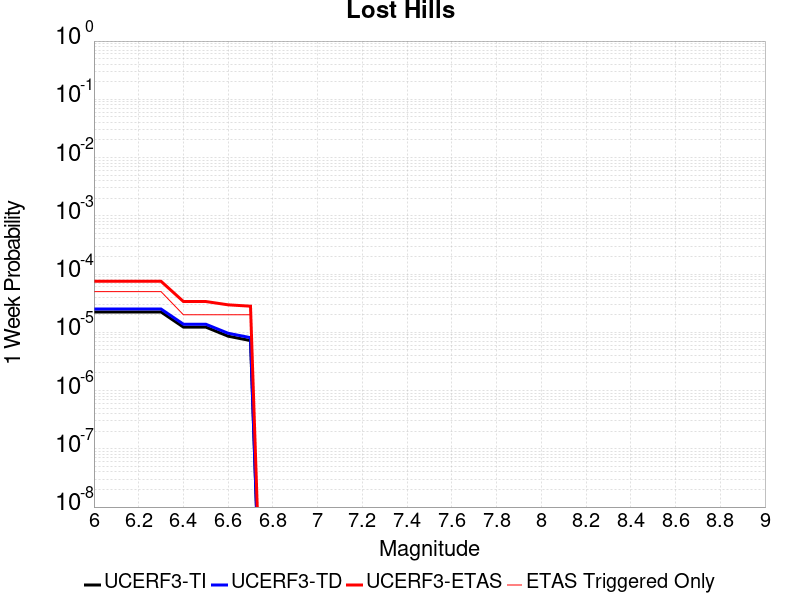 | 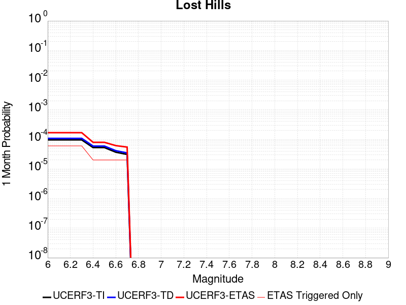 | 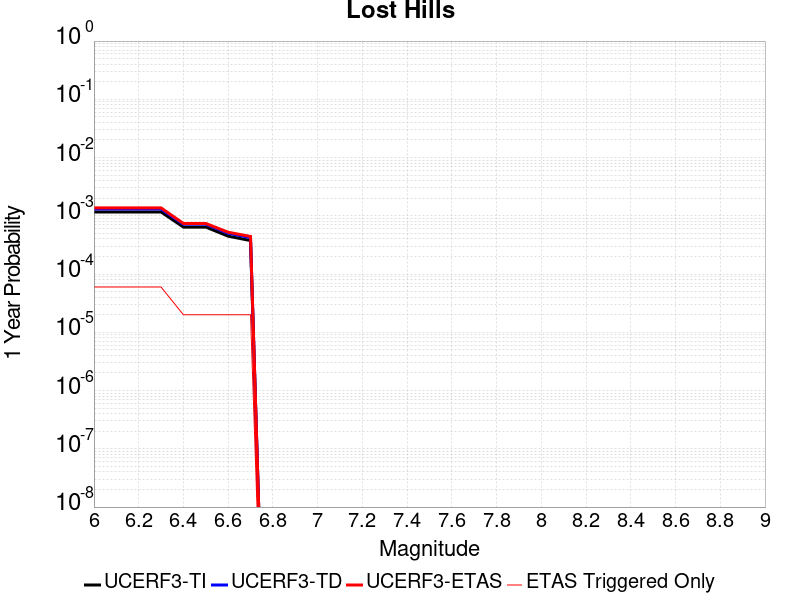 | 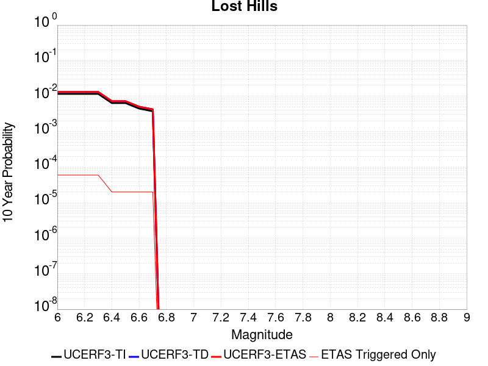 |

| Magnitude | 1 wk TI Prob | 1 wk TD Prob | 1 wk ETAS Prob | 1 wk ETAS/TD Gain | 1 wk ETAS Triggered Only | 1 mo TI Prob | 1 mo TD Prob | 1 mo ETAS Prob | 1 mo ETAS/TD Gain | 1 mo ETAS Triggered Only | 1 yr TI Prob | 1 yr TD Prob | 1 yr ETAS Prob | 1 yr ETAS/TD Gain | 1 yr ETAS Triggered Only | 10 yr TI Prob | 10 yr TD Prob | 10 yr ETAS Prob | 10 yr ETAS/TD Gain | 10 yr ETAS Triggered Only |
|-----|-----|-----|-----|-----|-----|-----|-----|-----|-----|-----|-----|-----|-----|-----|-----|-----|-----|-----|-----|-----|
| 6.0 | 2.233523E-5 | 2.5106583E-5 | 7.510533E-5 | 2.9914596 | 5.0E-5 | 9.571891E-5 | 1.0759615E-4 | 1.675897E-4 | 1.5575808 | 6.0E-5 | 0.0011647546 | 0.001309364 | 0.0013692854 | 1.0457637 | 6.0E-5 | 0.011586686 | 0.013033091 | 0.013092309 | 1.0045437 | 6.0E-5 |
| 6.1 | 2.233523E-5 | 2.5106583E-5 | 7.510533E-5 | 2.9914596 | 5.0E-5 | 9.571891E-5 | 1.0759615E-4 | 1.675897E-4 | 1.5575808 | 6.0E-5 | 0.0011647546 | 0.001309364 | 0.0013692854 | 1.0457637 | 6.0E-5 | 0.011586686 | 0.013033091 | 0.013092309 | 1.0045437 | 6.0E-5 |
| 6.2 | 2.233523E-5 | 2.5106583E-5 | 7.510533E-5 | 2.9914596 | 5.0E-5 | 9.571891E-5 | 1.0759615E-4 | 1.675897E-4 | 1.5575808 | 6.0E-5 | 0.0011647546 | 0.001309364 | 0.0013692854 | 1.0457637 | 6.0E-5 | 0.011586686 | 0.013033091 | 0.013092309 | 1.0045437 | 6.0E-5 |
| 6.3 | 2.233523E-5 | 2.5106583E-5 | 7.510533E-5 | 2.9914596 | 5.0E-5 | 9.571891E-5 | 1.0759615E-4 | 1.675897E-4 | 1.5575808 | 6.0E-5 | 0.0011647546 | 0.001309364 | 0.0013692854 | 1.0457637 | 6.0E-5 | 0.011586686 | 0.013033091 | 0.013092309 | 1.0045437 | 6.0E-5 |
| 6.4 | 1.2288092E-5 | 1.3781108E-5 | 3.378083E-5 | 2.4512422 | 2.0E-5 | 5.2662188E-5 | 5.906108E-5 | 7.90599E-5 | 1.3386124 | 2.0E-5 | 6.409735E-4 | 7.189252E-4 | 7.3891087E-4 | 1.0277992 | 2.0E-5 | 0.006391279 | 0.0071752006 | 0.0071950573 | 1.0027673 | 2.0E-5 |
| 6.5 | 1.2288092E-5 | 1.3781108E-5 | 3.378083E-5 | 2.4512422 | 2.0E-5 | 5.2662188E-5 | 5.906108E-5 | 7.90599E-5 | 1.3386124 | 2.0E-5 | 6.409735E-4 | 7.189252E-4 | 7.3891087E-4 | 1.0277992 | 2.0E-5 | 0.006391279 | 0.0071752006 | 0.0071950573 | 1.0027673 | 2.0E-5 |
| 6.6 | 8.58281E-6 | 9.63377E-6 | 2.9633577E-5 | 3.0760105 | 2.0E-5 | 3.6782953E-5 | 4.12874E-5 | 6.128658E-5 | 1.4843893 | 2.0E-5 | 4.4774043E-4 | 5.026414E-4 | 5.2263134E-4 | 1.0397698 | 2.0E-5 | 0.0044683935 | 0.005023205 | 0.0050431048 | 1.0039616 | 2.0E-5 |
| 6.7 | 7.205685E-6 | 8.088302E-6 | 2.808814E-5 | 3.472687 | 2.0E-5 | 3.088114E-5 | 3.466415E-5 | 5.466346E-5 | 1.576945 | 2.0E-5 | 3.7591302E-4 | 4.2203604E-4 | 4.4202758E-4 | 1.0473694 | 2.0E-5 | 0.0037527776 | 0.0042203604 | 0.004240276 | 1.0047189 | 2.0E-5 |

## Deep Springs
*[(top)](#table-of-contents)*

| 1 Week | 1 Month | 1 Year | 10 Year |
|-----|-----|-----|-----|
|  |  | 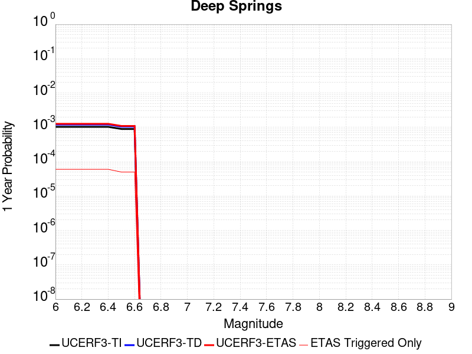 | 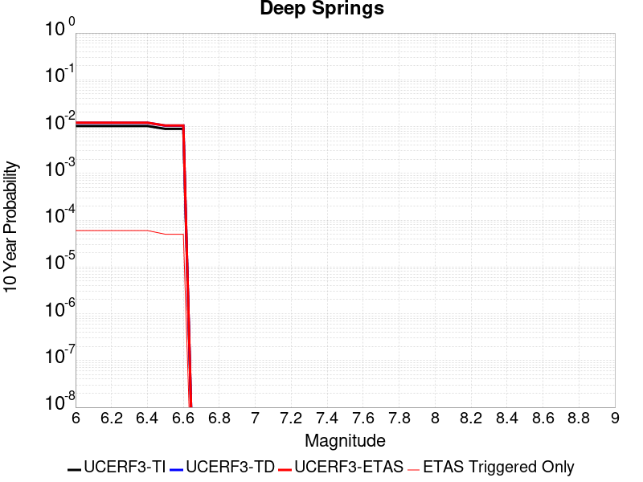 |

| Magnitude | 1 wk TI Prob | 1 wk TD Prob | 1 wk ETAS Prob | 1 wk ETAS/TD Gain | 1 wk ETAS Triggered Only | 1 mo TI Prob | 1 mo TD Prob | 1 mo ETAS Prob | 1 mo ETAS/TD Gain | 1 mo ETAS Triggered Only | 1 yr TI Prob | 1 yr TD Prob | 1 yr ETAS Prob | 1 yr ETAS/TD Gain | 1 yr ETAS Triggered Only | 10 yr TI Prob | 10 yr TD Prob | 10 yr ETAS Prob | 10 yr ETAS/TD Gain | 10 yr ETAS Triggered Only |
|-----|-----|-----|-----|-----|-----|-----|-----|-----|-----|-----|-----|-----|-----|-----|-----|-----|-----|-----|-----|-----|
| 6.0 | 1.9810619E-5 | 2.311252E-5 | 6.31116E-5 | 2.7306237 | 4.0E-5 | 8.489989E-5 | 9.9052755E-5 | 1.490478E-4 | 1.5047315 | 5.0E-5 | 0.001033166 | 0.0012058078 | 0.0012657355 | 1.0496992 | 6.0E-5 | 0.010283757 | 0.01204243 | 0.012101708 | 1.0049224 | 6.0E-5 |
| 6.1 | 1.9810619E-5 | 2.311252E-5 | 6.31116E-5 | 2.7306237 | 4.0E-5 | 8.489989E-5 | 9.9052755E-5 | 1.490478E-4 | 1.5047315 | 5.0E-5 | 0.001033166 | 0.0012058078 | 0.0012657355 | 1.0496992 | 6.0E-5 | 0.010283757 | 0.01204243 | 0.012101708 | 1.0049224 | 6.0E-5 |
| 6.2 | 1.9810619E-5 | 2.311252E-5 | 6.31116E-5 | 2.7306237 | 4.0E-5 | 8.489989E-5 | 9.9052755E-5 | 1.490478E-4 | 1.5047315 | 5.0E-5 | 0.001033166 | 0.0012058078 | 0.0012657355 | 1.0496992 | 6.0E-5 | 0.010283757 | 0.01204243 | 0.012101708 | 1.0049224 | 6.0E-5 |
| 6.3 | 1.9810619E-5 | 2.311252E-5 | 6.31116E-5 | 2.7306237 | 4.0E-5 | 8.489989E-5 | 9.9052755E-5 | 1.490478E-4 | 1.5047315 | 5.0E-5 | 0.001033166 | 0.0012058078 | 0.0012657355 | 1.0496992 | 6.0E-5 | 0.010283757 | 0.01204243 | 0.012101708 | 1.0049224 | 6.0E-5 |
| 6.4 | 1.9810619E-5 | 2.311252E-5 | 6.31116E-5 | 2.7306237 | 4.0E-5 | 8.489989E-5 | 9.9052755E-5 | 1.490478E-4 | 1.5047315 | 5.0E-5 | 0.001033166 | 0.0012058078 | 0.0012657355 | 1.0496992 | 6.0E-5 | 0.010283757 | 0.01204243 | 0.012101708 | 1.0049224 | 6.0E-5 |
| 6.5 | 1.7190405E-5 | 2.0050558E-5 | 6.0049755E-5 | 2.994917 | 4.0E-5 | 7.367108E-5 | 8.593096E-5 | 1.3592666E-4 | 1.5818125 | 5.0E-5 | 8.9657627E-4 | 0.0010462092 | 0.0010961569 | 1.0477415 | 5.0E-5 | 0.008929676 | 0.010462061 | 0.010511538 | 1.0047292 | 5.0E-5 |
| 6.6 | 1.7190405E-5 | 2.0050558E-5 | 6.0049755E-5 | 2.994917 | 4.0E-5 | 7.367108E-5 | 8.593096E-5 | 1.3592666E-4 | 1.5818125 | 5.0E-5 | 8.9657627E-4 | 0.0010462092 | 0.0010961569 | 1.0477415 | 5.0E-5 | 0.008929676 | 0.010462061 | 0.010511538 | 1.0047292 | 5.0E-5 |

## Red Mountain
*[(top)](#table-of-contents)*

| 1 Week | 1 Month | 1 Year | 10 Year |
|-----|-----|-----|-----|
| 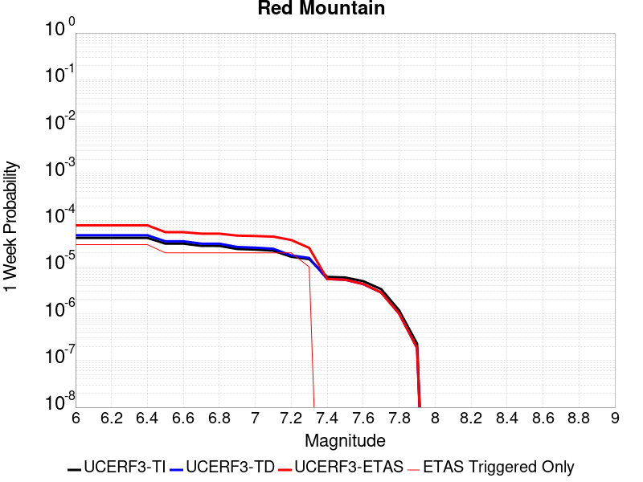 | 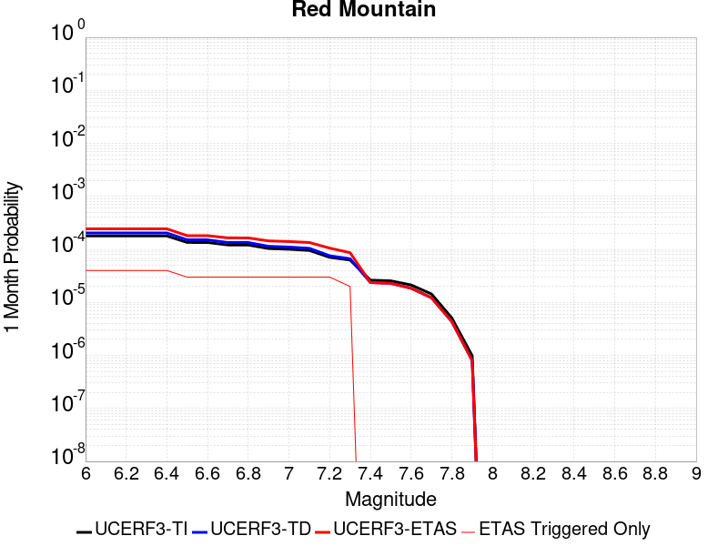 | 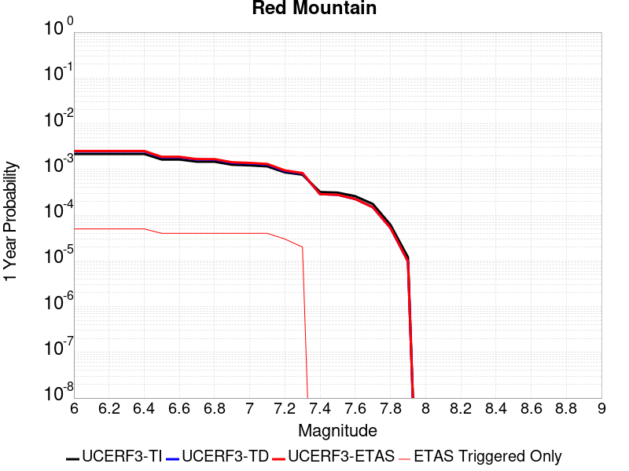 | 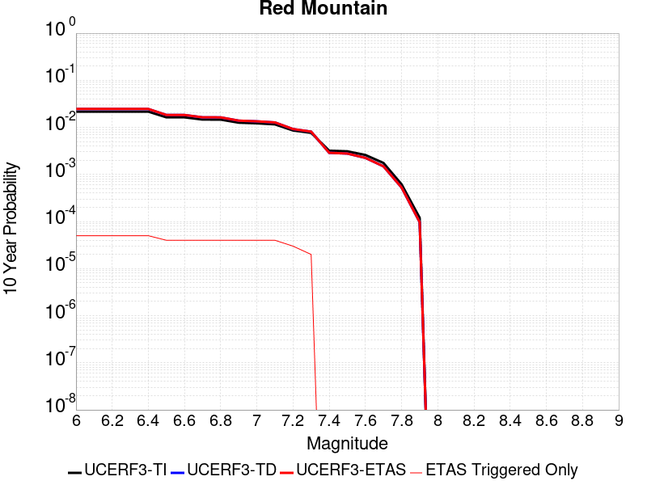 |

| Magnitude | 1 wk TI Prob | 1 wk TD Prob | 1 wk ETAS Prob | 1 wk ETAS/TD Gain | 1 wk ETAS Triggered Only | 1 mo TI Prob | 1 mo TD Prob | 1 mo ETAS Prob | 1 mo ETAS/TD Gain | 1 mo ETAS Triggered Only | 1 yr TI Prob | 1 yr TD Prob | 1 yr ETAS Prob | 1 yr ETAS/TD Gain | 1 yr ETAS Triggered Only | 10 yr TI Prob | 10 yr TD Prob | 10 yr ETAS Prob | 10 yr ETAS/TD Gain | 10 yr ETAS Triggered Only |
|-----|-----|-----|-----|-----|-----|-----|-----|-----|-----|-----|-----|-----|-----|-----|-----|-----|-----|-----|-----|-----|
| 6.0 | 4.1810763E-5 | 4.7590016E-5 | 7.7588586E-5 | 1.6303543 | 3.0E-5 | 1.7917668E-4 | 2.039422E-4 | 2.4393405E-4 | 1.196094 | 4.0E-5 | 0.0021792934 | 0.0024803334 | 0.0025302093 | 1.0201086 | 5.0E-5 | 0.021580452 | 0.02454411 | 0.024592884 | 1.0019871 | 5.0E-5 |
| 6.1 | 4.1810763E-5 | 4.7590016E-5 | 7.7588586E-5 | 1.6303543 | 3.0E-5 | 1.7917668E-4 | 2.039422E-4 | 2.4393405E-4 | 1.196094 | 4.0E-5 | 0.0021792934 | 0.0024803334 | 0.0025302093 | 1.0201086 | 5.0E-5 | 0.021580452 | 0.02454411 | 0.024592884 | 1.0019871 | 5.0E-5 |
| 6.2 | 4.1810763E-5 | 4.7590016E-5 | 7.7588586E-5 | 1.6303543 | 3.0E-5 | 1.7917668E-4 | 2.039422E-4 | 2.4393405E-4 | 1.196094 | 4.0E-5 | 0.0021792934 | 0.0024803334 | 0.0025302093 | 1.0201086 | 5.0E-5 | 0.021580452 | 0.02454411 | 0.024592884 | 1.0019871 | 5.0E-5 |
| 6.3 | 4.1810763E-5 | 4.7590016E-5 | 7.7588586E-5 | 1.6303543 | 3.0E-5 | 1.7917668E-4 | 2.039422E-4 | 2.4393405E-4 | 1.196094 | 4.0E-5 | 0.0021792934 | 0.0024803334 | 0.0025302093 | 1.0201086 | 5.0E-5 | 0.021580452 | 0.02454411 | 0.024592884 | 1.0019871 | 5.0E-5 |
| 6.4 | 4.1810763E-5 | 4.7590016E-5 | 7.7588586E-5 | 1.6303543 | 3.0E-5 | 1.7917668E-4 | 2.039422E-4 | 2.4393405E-4 | 1.196094 | 4.0E-5 | 0.0021792934 | 0.0024803334 | 0.0025302093 | 1.0201086 | 5.0E-5 | 0.021580452 | 0.02454411 | 0.024592884 | 1.0019871 | 5.0E-5 |
| 6.5 | 3.154503E-5 | 3.5359757E-5 | 5.535905E-5 | 1.5655948 | 2.0E-5 | 1.3518598E-4 | 1.5153353E-4 | 1.8152899E-4 | 1.197946 | 3.0E-5 | 0.0016446467 | 0.0018434518 | 0.001883378 | 1.0216584 | 4.0E-5 | 0.01632528 | 0.018291244 | 0.018330513 | 1.0021468 | 4.0E-5 |
| 6.6 | 3.1535834E-5 | 3.5349138E-5 | 5.534843E-5 | 1.5657647 | 2.0E-5 | 1.3514658E-4 | 1.5148803E-4 | 1.8148348E-4 | 1.1980054 | 3.0E-5 | 0.0016441676 | 0.0018428987 | 0.0018828249 | 1.021665 | 4.0E-5 | 0.01632056 | 0.018285805 | 0.018325074 | 1.0021474 | 4.0E-5 |
| 6.7 | 2.8267326E-5 | 3.1469353E-5 | 5.1468727E-5 | 1.6355189 | 2.0E-5 | 1.2114006E-4 | 1.3486217E-4 | 1.6485812E-4 | 1.2224194 | 3.0E-5 | 0.0014738824 | 0.0016407954 | 0.0016807297 | 1.0243384 | 4.0E-5 | 0.014641452 | 0.01629557 | 0.01633492 | 1.0024147 | 4.0E-5 |
| 6.8 | 2.8212884E-5 | 3.1407242E-5 | 5.1406612E-5 | 1.6367759 | 2.0E-5 | 1.20906756E-4 | 1.3459599E-4 | 1.6459195E-4 | 1.2228593 | 3.0E-5 | 0.0014710457 | 0.0016375595 | 0.001677494 | 1.0243866 | 4.0E-5 | 0.014613459 | 0.016263688 | 0.016303036 | 1.0024195 | 4.0E-5 |
| 6.9 | 2.4227871E-5 | 2.6706994E-5 | 4.670646E-5 | 1.7488475 | 2.0E-5 | 1.03829596E-4 | 1.1445395E-4 | 1.4445052E-4 | 1.2620841 | 3.0E-5 | 0.0012633923 | 0.0013926621 | 0.0014326064 | 1.028682 | 4.0E-5 | 0.012562336 | 0.0138470335 | 0.01388648 | 1.0028487 | 4.0E-5 |
| 7.0 | 2.348524E-5 | 2.5835778E-5 | 4.5835262E-5 | 1.7741003 | 2.0E-5 | 1.0064714E-4 | 1.10720495E-4 | 1.4071717E-4 | 1.2709225 | 3.0E-5 | 0.0012246901 | 0.001347264 | 0.0013872101 | 1.0296499 | 4.0E-5 | 0.012179627 | 0.013398598 | 0.013438062 | 1.0029454 | 4.0E-5 |
| 7.1 | 2.2311642E-5 | 2.4462845E-5 | 4.4462355E-5 | 1.8175464 | 2.0E-5 | 9.561782E-5 | 1.04836974E-4 | 1.3483383E-4 | 1.2861286 | 3.0E-5 | 0.0011635252 | 0.0012757176 | 0.0013156666 | 1.0313148 | 4.0E-5 | 0.01157452 | 0.01269146 | 0.012730951 | 1.0031117 | 4.0E-5 |
| 7.2 | 1.6533986E-5 | 1.7670362E-5 | 3.7670008E-5 | 2.1318188 | 2.0E-5 | 7.085802E-5 | 7.572828E-5 | 1.0572601E-4 | 1.3961232 | 3.0E-5 | 8.623549E-4 | 9.2166534E-4 | 9.516377E-4 | 1.0325198 | 3.0E-5 | 0.008590161 | 0.009184707 | 0.009214431 | 1.0032363 | 3.0E-5 |
| 7.3 | 1.4703092E-5 | 1.5559537E-5 | 2.555938E-5 | 1.6426827 | 1.0E-5 | 6.301173E-5 | 6.668237E-5 | 8.668104E-5 | 1.2999094 | 2.0E-5 | 7.668978E-4 | 8.1161706E-4 | 8.3160086E-4 | 1.0246222 | 2.0E-5 | 0.0076425658 | 0.008092604 | 0.008112442 | 1.0024514 | 2.0E-5 |
| 7.4 | 6.1331984E-6 | 5.5288874E-6 | 5.5288874E-6 | 1.0 | 0.0 | 2.6284872E-5 | 2.3695018E-5 | 2.3695018E-5 | 1.0 | 0.0 | 3.199713E-4 | 2.884492E-4 | 2.884492E-4 | 1.0 | 0.0 | 0.0031951098 | 0.0028808024 | 0.0028808024 | 1.0 | 0.0 |
| 7.5 | 5.954766E-6 | 5.338517E-6 | 5.338517E-6 | 1.0 | 0.0 | 2.5520176E-5 | 2.2879161E-5 | 2.2879161E-5 | 1.0 | 0.0 | 3.1066386E-4 | 2.785187E-4 | 2.785187E-4 | 1.0 | 0.0 | 0.003102299 | 0.0027817504 | 0.0027817504 | 1.0 | 0.0 |
| 7.6 | 4.9726646E-6 | 4.315309E-6 | 4.315309E-6 | 1.0 | 0.0 | 2.1311245E-5 | 1.8494053E-5 | 1.8494053E-5 | 1.0 | 0.0 | 2.5943352E-4 | 2.2514217E-4 | 2.2514217E-4 | 1.0 | 0.0 | 0.0025913084 | 0.0022491754 | 0.0022491754 | 1.0 | 0.0 |
| 7.7 | 3.3613894E-6 | 2.8526886E-6 | 2.8526886E-6 | 1.0 | 0.0 | 1.4405875E-5 | 1.22257525E-5 | 1.22257525E-5 | 1.0 | 0.0 | 1.7537741E-4 | 1.4883863E-4 | 1.4883863E-4 | 1.0 | 0.0 | 0.0017523908 | 0.0014874157 | 0.0014874157 | 1.0 | 0.0 |
| 7.8 | 1.1828961E-6 | 1.0122935E-6 | 1.0122935E-6 | 1.0 | 0.0 | 5.069545E-6 | 4.338394E-6 | 4.338394E-6 | 1.0 | 0.0 | 6.171996E-5 | 5.281869E-5 | 5.281869E-5 | 1.0 | 0.0 | 6.170282E-4 | 5.280643E-4 | 5.280643E-4 | 1.0 | 0.0 |
| 7.9 | 2.2967266E-7 | 1.861919E-7 | 1.861919E-7 | 1.0 | 0.0 | 9.843111E-7 | 7.97965E-7 | 7.97965E-7 | 1.0 | 0.0 | 1.19839215E-5 | 9.715184E-6 | 9.715184E-6 | 1.0 | 0.0 | 1.1983275E-4 | 9.714788E-5 | 9.714788E-5 | 1.0 | 0.0 |

## Coronado Bank alt1
*[(top)](#table-of-contents)*

| 1 Week | 1 Month | 1 Year | 10 Year |
|-----|-----|-----|-----|
| 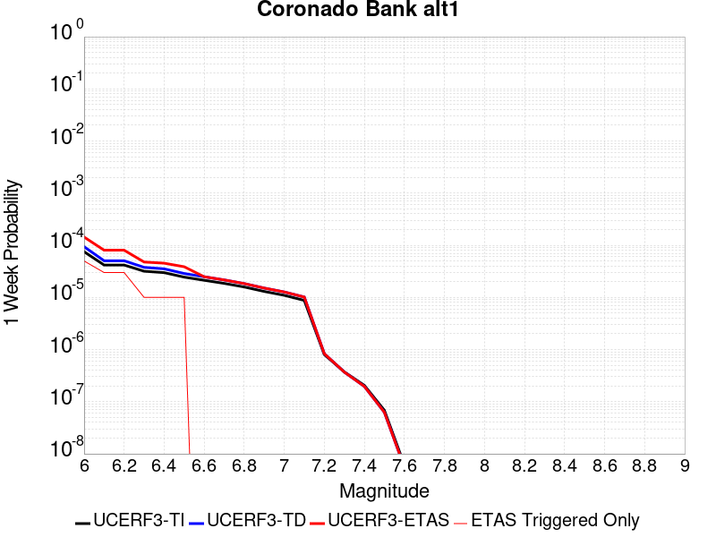 | 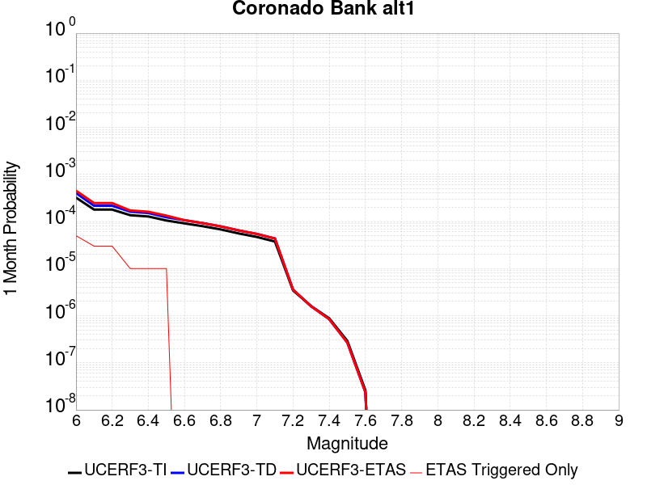 | 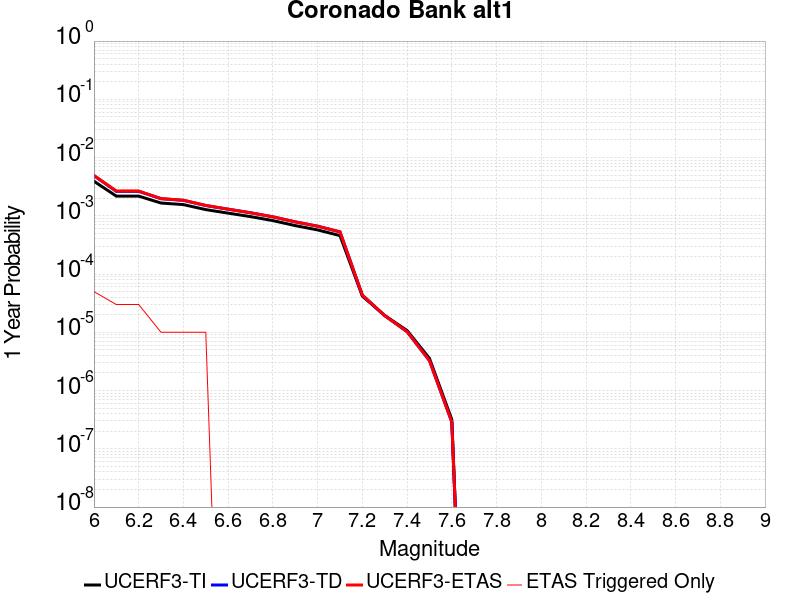 | 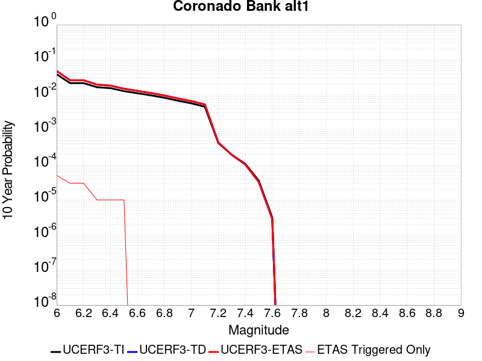 |

| Magnitude | 1 wk TI Prob | 1 wk TD Prob | 1 wk ETAS Prob | 1 wk ETAS/TD Gain | 1 wk ETAS Triggered Only | 1 mo TI Prob | 1 mo TD Prob | 1 mo ETAS Prob | 1 mo ETAS/TD Gain | 1 mo ETAS Triggered Only | 1 yr TI Prob | 1 yr TD Prob | 1 yr ETAS Prob | 1 yr ETAS/TD Gain | 1 yr ETAS Triggered Only | 10 yr TI Prob | 10 yr TD Prob | 10 yr ETAS Prob | 10 yr ETAS/TD Gain | 10 yr ETAS Triggered Only |
|-----|-----|-----|-----|-----|-----|-----|-----|-----|-----|-----|-----|-----|-----|-----|-----|-----|-----|-----|-----|-----|
| 6.0 | 7.533492E-5 | 9.3951705E-5 | 1.43947E-4 | 1.5321383 | 5.0E-5 | 3.22824E-4 | 4.025903E-4 | 4.5257015E-4 | 1.1241457 | 5.0E-5 | 0.0039233007 | 0.004891121 | 0.0049408763 | 1.0101726 | 5.0E-5 | 0.03854755 | 0.047904 | 0.047951605 | 1.0009937 | 5.0E-5 |
| 6.1 | 4.1807285E-5 | 5.0493105E-5 | 8.049159E-5 | 1.5941105 | 3.0E-5 | 1.7916178E-4 | 2.1638138E-4 | 2.463749E-4 | 1.138614 | 3.0E-5 | 0.0021791123 | 0.0026313365 | 0.0026612575 | 1.011371 | 3.0E-5 | 0.021578677 | 0.026011124 | 0.026040344 | 1.0011233 | 3.0E-5 |
| 6.2 | 4.1807285E-5 | 5.0493105E-5 | 8.049159E-5 | 1.5941105 | 3.0E-5 | 1.7916178E-4 | 2.1638138E-4 | 2.463749E-4 | 1.138614 | 3.0E-5 | 0.0021791123 | 0.0026313365 | 0.0026612575 | 1.011371 | 3.0E-5 | 0.021578677 | 0.026011124 | 0.026040344 | 1.0011233 | 3.0E-5 |
| 6.3 | 3.1793104E-5 | 3.7711125E-5 | 4.771075E-5 | 1.2651638 | 1.0E-5 | 1.3624904E-4 | 1.6160926E-4 | 1.7160765E-4 | 1.0618676 | 1.0E-5 | 0.0016575698 | 0.001965849 | 0.0019758292 | 1.0050769 | 1.0E-5 | 0.016452603 | 0.019488495 | 0.0194983 | 1.0005032 | 1.0E-5 |
| 6.4 | 2.9878007E-5 | 3.5335797E-5 | 4.5335444E-5 | 1.2829891 | 1.0E-5 | 1.2804232E-4 | 1.5143053E-4 | 1.6142902E-4 | 1.0660269 | 1.0E-5 | 0.0015578003 | 0.0018421395 | 0.0018521211 | 1.0054184 | 1.0E-5 | 0.015469253 | 0.018272463 | 0.018282281 | 1.0005373 | 1.0E-5 |
| 6.5 | 2.4512565E-5 | 2.8764101E-5 | 3.8763814E-5 | 1.3476455 | 1.0E-5 | 1.0504962E-4 | 1.2326906E-4 | 1.3326782E-4 | 1.0811133 | 1.0E-5 | 0.0012782287 | 0.0014997943 | 0.0015097794 | 1.0066576 | 1.0E-5 | 0.012709012 | 0.0148996925 | 0.014909544 | 1.0006611 | 1.0E-5 |
| 6.6 | 2.1317413E-5 | 2.490667E-5 | 2.490667E-5 | 1.0 | 0.0 | 9.135714E-5 | 1.0673863E-4 | 1.0673863E-4 | 1.0 | 0.0 | 0.0011117056 | 0.0012987903 | 0.0012987903 | 1.0 | 0.0 | 0.011061605 | 0.012914407 | 0.012914407 | 1.0 | 0.0 |
| 6.7 | 1.8585655E-5 | 2.1634882E-5 | 2.1634882E-5 | 1.0 | 0.0 | 7.9650374E-5 | 9.271774E-5 | 9.271774E-5 | 1.0 | 0.0 | 9.6931186E-4 | 0.0011282744 | 0.0011282744 | 1.0 | 0.0 | 0.0096509475 | 0.011227623 | 0.011227623 | 1.0 | 0.0 |
| 6.8 | 1.5862879E-5 | 1.8419476E-5 | 1.8419476E-5 | 1.0 | 0.0 | 6.798199E-5 | 7.8938334E-5 | 7.8938334E-5 | 1.0 | 0.0 | 8.273665E-4 | 9.606697E-4 | 9.606697E-4 | 1.0 | 0.0 | 0.008242928 | 0.009567151 | 0.009567151 | 1.0 | 0.0 |
| 6.9 | 1.3021509E-5 | 1.5095266E-5 | 1.5095266E-5 | 1.0 | 0.0 | 5.5805274E-5 | 6.46925E-5 | 6.46925E-5 | 1.0 | 0.0 | 6.792174E-4 | 7.873646E-4 | 7.873646E-4 | 1.0 | 0.0 | 0.006771452 | 0.007847573 | 0.007847573 | 1.0 | 0.0 |
| 7.0 | 1.0974371E-5 | 1.2720105E-5 | 1.2720105E-5 | 1.0 | 0.0 | 4.7032172E-5 | 5.4513697E-5 | 5.4513697E-5 | 1.0 | 0.0 | 5.7246623E-4 | 6.635197E-4 | 6.635197E-4 | 1.0 | 0.0 | 0.0057099373 | 0.0066171354 | 0.0066171354 | 1.0 | 0.0 |
| 7.1 | 8.766221E-6 | 1.0163833E-5 | 1.0163833E-5 | 1.0 | 0.0 | 3.7568978E-5 | 4.3558655E-5 | 4.3558655E-5 | 1.0 | 0.0 | 4.573063E-4 | 5.302148E-4 | 5.302148E-4 | 1.0 | 0.0 | 0.0045636636 | 0.005291197 | 0.005291197 | 1.0 | 0.0 |
| 7.2 | 8.026024E-7 | 8.331776E-7 | 8.331776E-7 | 1.0 | 0.0 | 3.43972E-6 | 3.5707562E-6 | 3.5707562E-6 | 1.0 | 0.0 | 4.1877785E-5 | 4.34731E-5 | 4.34731E-5 | 1.0 | 0.0 | 4.1869894E-4 | 4.3464705E-4 | 4.3464705E-4 | 1.0 | 0.0 |
| 7.3 | 3.7293114E-7 | 3.700106E-7 | 3.700106E-7 | 1.0 | 0.0 | 1.5982754E-6 | 1.5857588E-6 | 1.5857588E-6 | 1.0 | 0.0 | 1.9458828E-5 | 1.9306442E-5 | 1.9306442E-5 | 1.0 | 0.0 | 1.9457124E-4 | 1.9304773E-4 | 1.9304773E-4 | 1.0 | 0.0 |
| 7.4 | 2.0557036E-7 | 1.9674441E-7 | 1.9674441E-7 | 1.0 | 0.0 | 8.810155E-7 | 8.4319004E-7 | 8.4319004E-7 | 1.0 | 0.0 | 1.0726311E-5 | 1.02657905E-5 | 1.02657905E-5 | 1.0 | 0.0 | 1.0725793E-4 | 1.026532E-4 | 1.026532E-4 | 1.0 | 0.0 |
| 7.5 | 6.845446E-8 | 6.2794086E-8 | 6.2794086E-8 | 1.0 | 0.0 | 2.9337625E-7 | 2.6911746E-7 | 2.6911746E-7 | 1.0 | 0.0 | 3.5718497E-6 | 3.2765004E-6 | 3.2765004E-6 | 1.0 | 0.0 | 3.5717923E-5 | 3.276453E-5 | 3.276453E-5 | 1.0 | 0.0 |
| 7.6 | 6.0975145E-9 | 5.531901E-9 | 5.531901E-9 | 1.0 | 0.0 | 2.6132206E-8 | 2.3708148E-8 | 2.3708148E-8 | 1.0 | 0.0 | 3.1815955E-7 | 2.8864667E-7 | 2.8864667E-7 | 1.0 | 0.0 | 3.181591E-6 | 2.886464E-6 | 2.886464E-6 | 1.0 | 0.0 |

## Rose Canyon
*[(top)](#table-of-contents)*

| 1 Week | 1 Month | 1 Year | 10 Year |
|-----|-----|-----|-----|
| 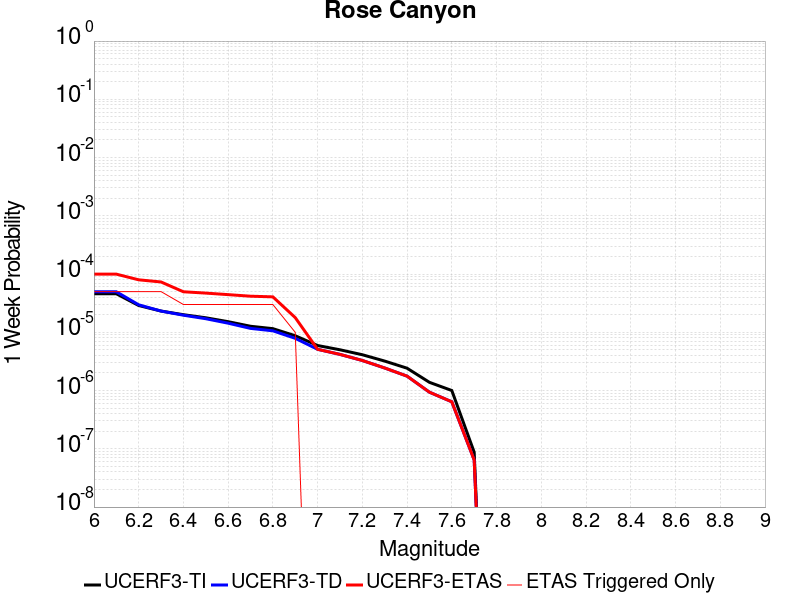 | 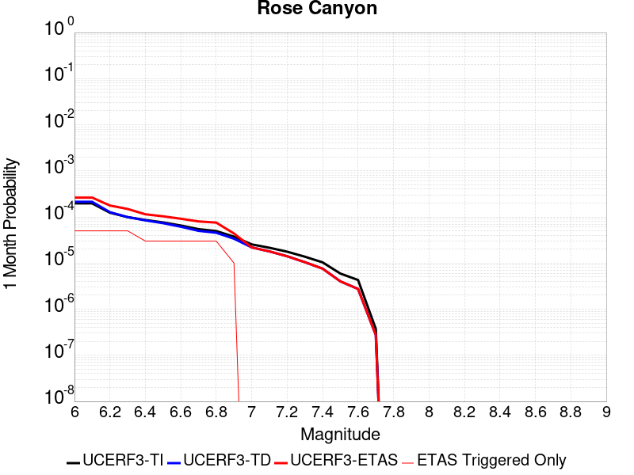 | 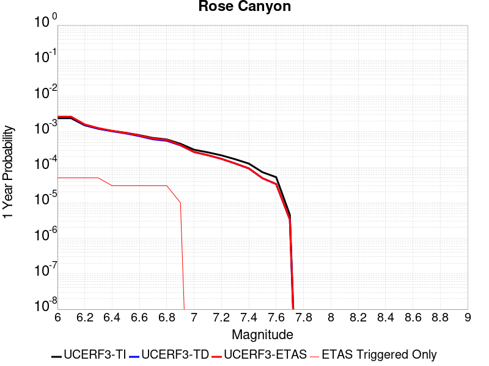 | 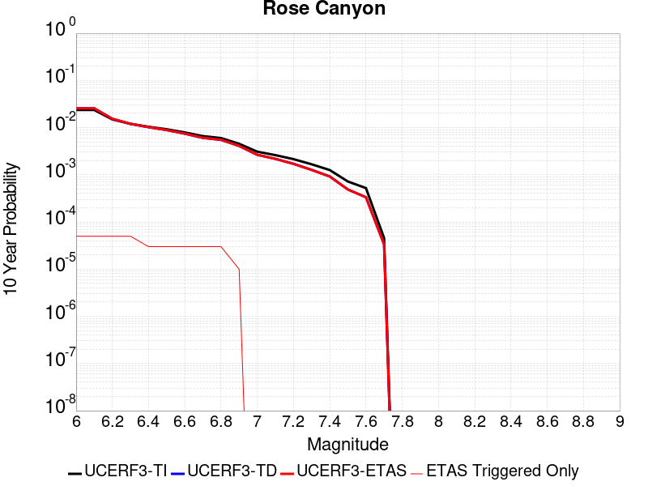 |

| Magnitude | 1 wk TI Prob | 1 wk TD Prob | 1 wk ETAS Prob | 1 wk ETAS/TD Gain | 1 wk ETAS Triggered Only | 1 mo TI Prob | 1 mo TD Prob | 1 mo ETAS Prob | 1 mo ETAS/TD Gain | 1 mo ETAS Triggered Only | 1 yr TI Prob | 1 yr TD Prob | 1 yr ETAS Prob | 1 yr ETAS/TD Gain | 1 yr ETAS Triggered Only | 10 yr TI Prob | 10 yr TD Prob | 10 yr ETAS Prob | 10 yr ETAS/TD Gain | 10 yr ETAS Triggered Only |
|-----|-----|-----|-----|-----|-----|-----|-----|-----|-----|-----|-----|-----|-----|-----|-----|-----|-----|-----|-----|-----|
| 6.0 | 4.5923203E-5 | 4.9714607E-5 | 9.9712124E-5 | 2.0056906 | 5.0E-5 | 1.9679888E-4 | 2.1304654E-4 | 2.630359E-4 | 1.2346405 | 5.0E-5 | 0.0023933933 | 0.0025909478 | 0.0026408182 | 1.019248 | 5.0E-5 | 0.023677798 | 0.025618518 | 0.025667237 | 1.0019017 | 5.0E-5 |
| 6.1 | 4.5923203E-5 | 4.9714607E-5 | 9.9712124E-5 | 2.0056906 | 5.0E-5 | 1.9679888E-4 | 2.1304654E-4 | 2.630359E-4 | 1.2346405 | 5.0E-5 | 0.0023933933 | 0.0025909478 | 0.0026408182 | 1.019248 | 5.0E-5 | 0.023677798 | 0.025618518 | 0.025667237 | 1.0019017 | 5.0E-5 |
| 6.2 | 2.8844734E-5 | 2.9669678E-5 | 7.966819E-5 | 2.685172 | 5.0E-5 | 1.2361443E-4 | 1.2714976E-4 | 1.771434E-4 | 1.393187 | 5.0E-5 | 0.0015039665 | 0.001546976 | 0.0015968988 | 1.0322711 | 5.0E-5 | 0.0149382865 | 0.015364873 | 0.015414105 | 1.0032042 | 5.0E-5 |
| 6.3 | 2.3171577E-5 | 2.3162425E-5 | 7.316127E-5 | 3.1586187 | 5.0E-5 | 9.9302975E-5 | 9.926383E-5 | 1.4925886E-4 | 1.5036582 | 5.0E-5 | 0.0012083431 | 0.0012078804 | 0.00125782 | 1.0413449 | 5.0E-5 | 0.012017938 | 0.012012152 | 0.012061551 | 1.0041125 | 5.0E-5 |
| 6.4 | 2.0066604E-5 | 1.9668067E-5 | 4.9667477E-5 | 2.5252852 | 3.0E-5 | 8.599689E-5 | 8.428905E-5 | 1.1428652E-4 | 1.3558881 | 3.0E-5 | 0.0010465092 | 0.001025746 | 0.0010557153 | 1.029217 | 3.0E-5 | 0.010415946 | 0.010211479 | 0.010241172 | 1.0029079 | 3.0E-5 |
| 6.5 | 1.776989E-5 | 1.7115402E-5 | 4.711489E-5 | 2.7527773 | 3.0E-5 | 7.615444E-5 | 7.33497E-5 | 1.033475E-4 | 1.4089696 | 3.0E-5 | 9.267859E-4 | 8.926737E-4 | 9.226469E-4 | 1.033577 | 3.0E-5 | 0.009229303 | 0.008874663 | 0.0089043975 | 1.0033504 | 3.0E-5 |
| 6.6 | 1.5227364E-5 | 1.4340872E-5 | 4.4340442E-5 | 3.091893 | 3.0E-5 | 6.52585E-5 | 6.145947E-5 | 9.145762E-5 | 1.4880966 | 3.0E-5 | 7.942326E-4 | 7.480173E-4 | 7.7799486E-4 | 1.040076 | 3.0E-5 | 0.007914 | 0.0074410336 | 0.0074708103 | 1.0040017 | 3.0E-5 |
| 6.7 | 1.2703898E-5 | 1.1674277E-5 | 4.1673928E-5 | 3.5697222 | 3.0E-5 | 5.4444143E-5 | 5.0031682E-5 | 8.003018E-5 | 1.5995901 | 3.0E-5 | 6.626558E-4 | 6.089697E-4 | 6.3895143E-4 | 1.0492336 | 3.0E-5 | 0.006606833 | 0.0060623093 | 0.0060921274 | 1.0049186 | 3.0E-5 |
| 6.8 | 1.1554917E-5 | 1.0610384E-5 | 4.0610066E-5 | 3.8273888 | 3.0E-5 | 4.9520135E-5 | 4.547231E-5 | 7.547094E-5 | 1.6597122 | 3.0E-5 | 6.0274085E-4 | 5.5348873E-4 | 5.8347214E-4 | 1.0541717 | 3.0E-5 | 0.0060110865 | 0.005504414 | 0.005534249 | 1.0054202 | 3.0E-5 |
| 6.9 | 8.732078E-6 | 7.882285E-6 | 1.7882207E-5 | 2.2686577 | 1.0E-5 | 3.7422655E-5 | 3.37808E-5 | 4.3780463E-5 | 1.2960161 | 1.0E-5 | 4.5552556E-4 | 4.112066E-4 | 4.2120248E-4 | 1.0243087 | 1.0E-5 | 0.0045459294 | 0.004089515 | 0.0040994743 | 1.0024353 | 1.0E-5 |
| 7.0 | 5.9337494E-6 | 5.107436E-6 | 5.107436E-6 | 1.0 | 0.0 | 2.5430107E-5 | 2.1888829E-5 | 2.1888829E-5 | 1.0 | 0.0 | 3.0956755E-4 | 2.6646405E-4 | 2.6646405E-4 | 1.0 | 0.0 | 0.0030913667 | 0.002661461 | 0.002661461 | 1.0 | 0.0 |
| 7.1 | 5.013409E-6 | 4.17734E-6 | 4.17734E-6 | 1.0 | 0.0 | 2.1485863E-5 | 1.7902763E-5 | 1.7902763E-5 | 1.0 | 0.0 | 2.6155898E-4 | 2.1794444E-4 | 2.1794444E-4 | 1.0 | 0.0 | 0.0026125133 | 0.0021773188 | 0.0021773188 | 1.0 | 0.0 |
| 7.2 | 4.120763E-6 | 3.2820917E-6 | 3.2820917E-6 | 1.0 | 0.0 | 1.7660293E-5 | 1.4066032E-5 | 1.4066032E-5 | 1.0 | 0.0 | 2.1499286E-4 | 1.7124058E-4 | 1.7124058E-4 | 1.0 | 0.0 | 0.0021478499 | 0.0017110958 | 0.0017110958 | 1.0 | 0.0 |
| 7.3 | 3.2081239E-6 | 2.4404965E-6 | 2.4404965E-6 | 1.0 | 0.0 | 1.374903E-5 | 1.0459229E-5 | 1.0459229E-5 | 1.0 | 0.0 | 1.6738157E-4 | 1.2733374E-4 | 1.2733374E-4 | 1.0 | 0.0 | 0.0016725556 | 0.0012726148 | 0.0012726148 | 1.0 | 0.0 |
| 7.4 | 2.4194755E-6 | 1.7680321E-6 | 1.7680321E-6 | 1.0 | 0.0 | 1.0369139E-5 | 7.5772587E-6 | 7.5772587E-6 | 1.0 | 0.0 | 1.2623696E-4 | 9.224927E-5 | 9.224927E-5 | 1.0 | 0.0 | 0.0012616527 | 9.221151E-4 | 9.221151E-4 | 1.0 | 0.0 |
| 7.5 | 1.3842889E-6 | 9.3782967E-7 | 9.3782967E-7 | 1.0 | 0.0 | 5.9326535E-6 | 4.019264E-6 | 4.019264E-6 | 1.0 | 0.0 | 7.222766E-5 | 4.8933474E-5 | 4.8933474E-5 | 1.0 | 0.0 | 7.220419E-4 | 4.8923056E-4 | 4.8923056E-4 | 1.0 | 0.0 |
| 7.6 | 1.0021575E-6 | 6.4113493E-7 | 6.4113493E-7 | 1.0 | 0.0 | 4.2949537E-6 | 2.7477186E-6 | 2.7477186E-6 | 1.0 | 0.0 | 5.2289808E-5 | 3.345298E-5 | 3.345298E-5 | 1.0 | 0.0 | 5.2277505E-4 | 3.344816E-4 | 3.344816E-4 | 1.0 | 0.0 |
| 7.7 | 8.7620116E-8 | 6.449304E-8 | 6.449304E-8 | 1.0 | 0.0 | 3.7551473E-7 | 2.763987E-7 | 2.763987E-7 | 1.0 | 0.0 | 4.5718825E-6 | 3.3651493E-6 | 3.3651493E-6 | 1.0 | 0.0 | 4.5717883E-5 | 3.3651013E-5 | 3.3651013E-5 | 1.0 | 0.0 |

## San Juan
*[(top)](#table-of-contents)*

| 1 Week | 1 Month | 1 Year | 10 Year |
|-----|-----|-----|-----|
| 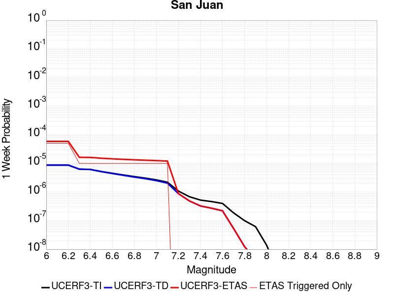 | 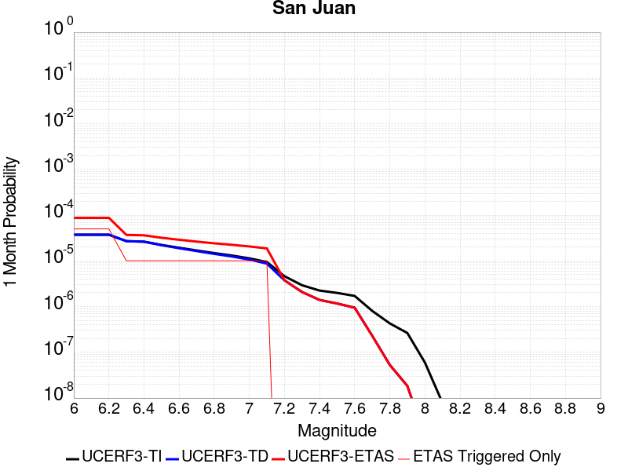 | 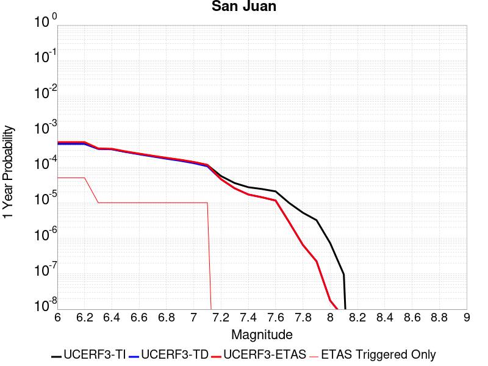 | 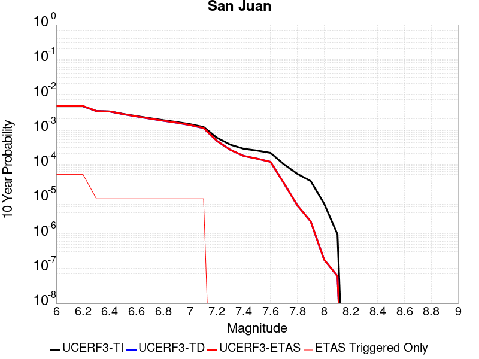 |

| Magnitude | 1 wk TI Prob | 1 wk TD Prob | 1 wk ETAS Prob | 1 wk ETAS/TD Gain | 1 wk ETAS Triggered Only | 1 mo TI Prob | 1 mo TD Prob | 1 mo ETAS Prob | 1 mo ETAS/TD Gain | 1 mo ETAS Triggered Only | 1 yr TI Prob | 1 yr TD Prob | 1 yr ETAS Prob | 1 yr ETAS/TD Gain | 1 yr ETAS Triggered Only | 10 yr TI Prob | 10 yr TD Prob | 10 yr ETAS Prob | 10 yr ETAS/TD Gain | 10 yr ETAS Triggered Only |
|-----|-----|-----|-----|-----|-----|-----|-----|-----|-----|-----|-----|-----|-----|-----|-----|-----|-----|-----|-----|-----|
| 6.0 | 8.682808E-6 | 8.74917E-6 | 5.8748734E-5 | 6.714778 | 5.0E-5 | 3.72115E-5 | 3.749593E-5 | 8.749405E-5 | 2.3334281 | 5.0E-5 | 4.5295584E-4 | 4.5642213E-4 | 5.063993E-4 | 1.1094977 | 5.0E-5 | 0.004520337 | 0.004555389 | 0.004605161 | 1.010926 | 5.0E-5 |
| 6.1 | 8.682808E-6 | 8.74917E-6 | 5.8748734E-5 | 6.714778 | 5.0E-5 | 3.72115E-5 | 3.749593E-5 | 8.749405E-5 | 2.3334281 | 5.0E-5 | 4.5295584E-4 | 4.5642213E-4 | 5.063993E-4 | 1.1094977 | 5.0E-5 | 0.004520337 | 0.004555389 | 0.004605161 | 1.010926 | 5.0E-5 |
| 6.2 | 8.682808E-6 | 8.74917E-6 | 5.8748734E-5 | 6.714778 | 5.0E-5 | 3.72115E-5 | 3.749593E-5 | 8.749405E-5 | 2.3334281 | 5.0E-5 | 4.5295584E-4 | 4.5642213E-4 | 5.063993E-4 | 1.1094977 | 5.0E-5 | 0.004520337 | 0.004555389 | 0.004605161 | 1.010926 | 5.0E-5 |
| 6.3 | 6.3054235E-6 | 6.282591E-6 | 1.6282529E-5 | 2.59169 | 1.0E-5 | 2.7022963E-5 | 2.692512E-5 | 3.6924852E-5 | 1.3713903 | 1.0E-5 | 3.2895492E-4 | 3.2776545E-4 | 3.3776215E-4 | 1.0304996 | 1.0E-5 | 0.003284684 | 0.0032730205 | 0.0032829877 | 1.0030453 | 1.0E-5 |
| 6.4 | 6.1490473E-6 | 6.1144706E-6 | 1.6114409E-5 | 2.6354547 | 1.0E-5 | 2.6352795E-5 | 2.6204618E-5 | 3.6204357E-5 | 1.3816022 | 1.0E-5 | 3.2079802E-4 | 3.189959E-4 | 3.289927E-4 | 1.0313383 | 1.0E-5 | 0.0032033534 | 0.0031855768 | 0.003195545 | 1.0031291 | 1.0E-5 |
| 6.5 | 5.204848E-6 | 5.137238E-6 | 1.5137187E-5 | 2.9465613 | 1.0E-5 | 2.23063E-5 | 2.2016555E-5 | 3.2016334E-5 | 1.4541937 | 1.0E-5 | 2.7154534E-4 | 2.6801953E-4 | 2.7801684E-4 | 1.0373007 | 1.0E-5 | 0.0027121378 | 0.0026771172 | 0.0026870905 | 1.0037254 | 1.0E-5 |
| 6.6 | 4.5179986E-6 | 4.415036E-6 | 1.4414992E-5 | 3.2649772 | 1.0E-5 | 1.9362706E-5 | 1.892145E-5 | 2.8921262E-5 | 1.5284907 | 1.0E-5 | 2.3571544E-4 | 2.303451E-4 | 2.403428E-4 | 1.0434031 | 1.0E-5 | 0.0023546559 | 0.0023012008 | 0.0023111778 | 1.0043355 | 1.0E-5 |
| 6.7 | 3.9442616E-6 | 3.8198336E-6 | 1.3819796E-5 | 3.6179051 | 1.0E-5 | 1.6903869E-5 | 1.6370615E-5 | 2.6370451E-5 | 1.6108406 | 1.0E-5 | 2.0578515E-4 | 1.9929469E-4 | 2.092927E-4 | 1.050167 | 1.0E-5 | 0.002055947 | 0.001991285 | 0.002001265 | 1.0050119 | 1.0E-5 |
| 6.8 | 3.4536245E-6 | 3.3163408E-6 | 1.3316308E-5 | 4.015362 | 1.0E-5 | 1.4801163E-5 | 1.4212815E-5 | 2.4212673E-5 | 1.7035804 | 1.0E-5 | 1.8018926E-4 | 1.7302789E-4 | 1.8302616E-4 | 1.0577842 | 1.0E-5 | 0.0018004322 | 0.001729051 | 0.0017390337 | 1.0057735 | 1.0E-5 |
| 6.9 | 3.059865E-6 | 2.9120363E-6 | 1.2912007E-5 | 4.434013 | 1.0E-5 | 1.3113641E-5 | 1.2480099E-5 | 2.2479975E-5 | 1.8012657 | 1.0E-5 | 1.596469E-4 | 1.5193518E-4 | 1.6193367E-4 | 1.0658076 | 1.0E-5 | 0.0015953224 | 0.0015184281 | 0.0015284129 | 1.0065757 | 1.0E-5 |
| 7.0 | 2.6504351E-6 | 2.492005E-6 | 1.249198E-5 | 5.012823 | 1.0E-5 | 1.1358958E-5 | 1.0679981E-5 | 2.0679874E-5 | 1.9363213 | 1.0E-5 | 1.3828653E-4 | 1.3002155E-4 | 1.4002025E-4 | 1.0769004 | 1.0E-5 | 0.0013820052 | 0.001299567 | 0.0013095541 | 1.0076848 | 1.0E-5 |
| 7.1 | 2.2039317E-6 | 2.0338366E-6 | 1.2033816E-5 | 5.9168057 | 1.0E-5 | 9.445387E-6 | 8.716416E-6 | 1.871633E-5 | 2.1472504 | 1.0E-5 | 1.1499152E-4 | 1.0611773E-4 | 1.1611667E-4 | 1.0942249 | 1.0E-5 | 0.0011493203 | 0.0010607811 | 0.0010707704 | 1.009417 | 1.0E-5 |
| 7.2 | 1.0786707E-6 | 8.770239E-7 | 8.770239E-7 | 1.0 | 0.0 | 4.622866E-6 | 3.7586685E-6 | 3.7586685E-6 | 1.0 | 0.0 | 5.628194E-5 | 4.576084E-5 | 4.576084E-5 | 1.0 | 0.0 | 5.6267687E-4 | 4.5757365E-4 | 4.5757365E-4 | 1.0 | 0.0 |
| 7.3 | 6.846433E-7 | 4.868812E-7 | 4.868812E-7 | 1.0 | 0.0 | 2.9341822E-6 | 2.086632E-6 | 2.086632E-6 | 1.0 | 0.0 | 3.5723086E-5 | 2.5404452E-5 | 2.5404452E-5 | 1.0 | 0.0 | 3.571734E-4 | 2.5405022E-4 | 2.5405022E-4 | 1.0 | 0.0 |
| 7.4 | 5.23043E-7 | 3.2627884E-7 | 3.2627884E-7 | 1.0 | 0.0 | 2.2416111E-6 | 1.3983371E-6 | 1.3983371E-6 | 1.0 | 0.0 | 2.7291273E-5 | 1.7024622E-5 | 1.7024622E-5 | 1.0 | 0.0 | 2.7287923E-4 | 1.7026608E-4 | 1.7026608E-4 | 1.0 | 0.0 |
| 7.5 | 4.648444E-7 | 2.723464E-7 | 2.723464E-7 | 1.0 | 0.0 | 1.9921886E-6 | 1.1671983E-6 | 1.1671983E-6 | 1.0 | 0.0 | 2.4254627E-5 | 1.4210547E-5 | 1.4210547E-5 | 1.0 | 0.0 | 2.425198E-4 | 1.4212691E-4 | 1.4212691E-4 | 1.0 | 0.0 |
| 7.6 | 3.9906567E-7 | 2.2083036E-7 | 2.2083036E-7 | 1.0 | 0.0 | 1.7102802E-6 | 9.4641547E-7 | 9.4641547E-7 | 1.0 | 0.0 | 2.0822463E-5 | 1.1522548E-5 | 1.1522548E-5 | 1.0 | 0.0 | 2.0820512E-4 | 1.15244526E-4 | 1.15244526E-4 | 1.0 | 0.0 |
| 7.7 | 1.8784601E-7 | 5.366277E-8 | 5.366277E-8 | 1.0 | 0.0 | 8.0505407E-7 | 2.2998329E-7 | 2.2998329E-7 | 1.0 | 0.0 | 9.80149E-6 | 2.800043E-6 | 2.800043E-6 | 1.0 | 0.0 | 9.801057E-5 | 2.8008939E-5 | 2.8008939E-5 | 1.0 | 0.0 |
| 7.8 | 1.00154914E-7 | 1.2412917E-8 | 1.2412917E-8 | 1.0 | 0.0 | 4.2923529E-7 | 5.3198217E-8 | 5.3198217E-8 | 1.0 | 0.0 | 5.225927E-6 | 6.476881E-7 | 6.476881E-7 | 1.0 | 0.0 | 5.225804E-5 | 6.4827886E-6 | 6.4827886E-6 | 1.0 | 0.0 |
| 7.9 | 6.171429E-8 | 4.2946513E-9 | 4.2946513E-9 | 1.0 | 0.0 | 2.6448978E-7 | 1.8405647E-8 | 1.8405647E-8 | 1.0 | 0.0 | 3.2201583E-6 | 2.2408874E-7 | 2.2408874E-7 | 1.0 | 0.0 | 3.2201115E-5 | 2.2462114E-6 | 2.2462114E-6 | 1.0 | 0.0 |
| 8.0 | 1.3974572E-8 | 3.3737857E-10 | 3.3737857E-10 | 1.0 | 0.0 | 5.989102E-8 | 1.4459075E-9 | 1.4459075E-9 | 1.0 | 0.0 | 7.2917294E-7 | 1.760392E-8 | 1.760392E-8 | 1.0 | 0.0 | 7.2917055E-6 | 1.8038004E-7 | 1.8038004E-7 | 1.0 | 0.0 |
| 8.1 | 1.8403477E-9 | 1.1291601E-10 | 1.1291601E-10 | 1.0 | 0.0 | 7.887204E-9 | 4.839261E-10 | 4.839261E-10 | 1.0 | 0.0 | 9.602671E-8 | 5.8917977E-9 | 5.8917977E-9 | 1.0 | 0.0 | 9.602667E-7 | 6.0206084E-8 | 6.0206084E-8 | 1.0 | 0.0 |

## Gillem - Big Crack 2011 CFM
*[(top)](#table-of-contents)*

| 1 Week | 1 Month | 1 Year | 10 Year |
|-----|-----|-----|-----|
| 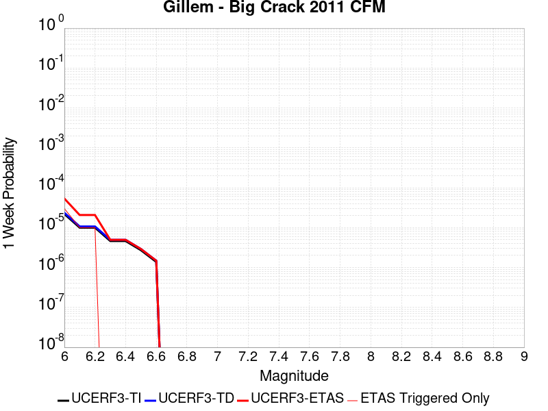 | 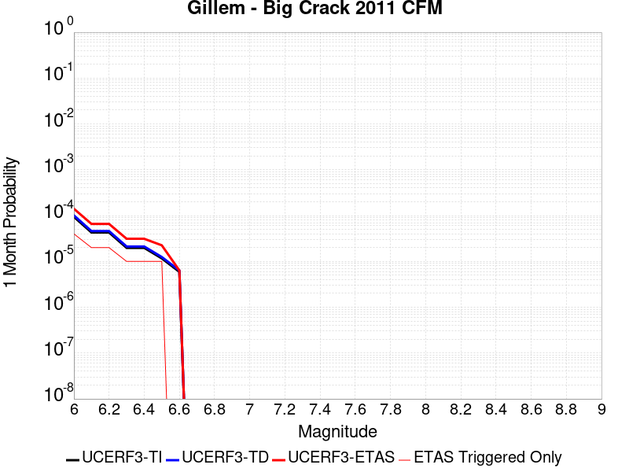 | 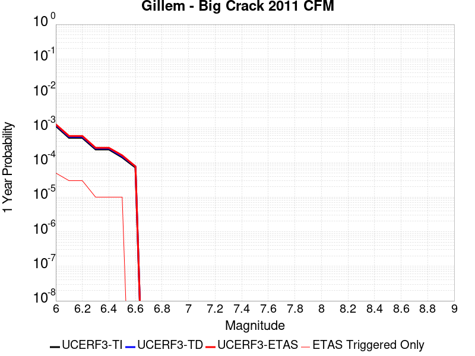 | 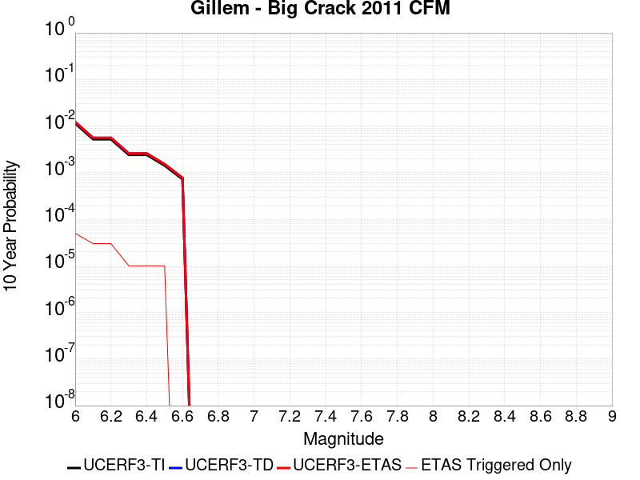 |

| Magnitude | 1 wk TI Prob | 1 wk TD Prob | 1 wk ETAS Prob | 1 wk ETAS/TD Gain | 1 wk ETAS Triggered Only | 1 mo TI Prob | 1 mo TD Prob | 1 mo ETAS Prob | 1 mo ETAS/TD Gain | 1 mo ETAS Triggered Only | 1 yr TI Prob | 1 yr TD Prob | 1 yr ETAS Prob | 1 yr ETAS/TD Gain | 1 yr ETAS Triggered Only | 10 yr TI Prob | 10 yr TD Prob | 10 yr ETAS Prob | 10 yr ETAS/TD Gain | 10 yr ETAS Triggered Only |
|-----|-----|-----|-----|-----|-----|-----|-----|-----|-----|-----|-----|-----|-----|-----|-----|-----|-----|-----|-----|-----|
| 6.0 | 2.196852E-5 | 2.3604485E-5 | 5.3603777E-5 | 2.2709148 | 3.0E-5 | 9.4147406E-5 | 1.01158665E-4 | 1.4115461E-4 | 1.3953785 | 4.0E-5 | 0.0011456419 | 0.0012309998 | 0.0012809383 | 1.0405674 | 5.0E-5 | 0.011397537 | 0.012250669 | 0.012300057 | 1.0040314 | 5.0E-5 |
| 6.1 | 9.992795E-6 | 1.071189E-5 | 2.0711783E-5 | 1.9335321 | 1.0E-5 | 4.2825563E-5 | 4.5907396E-5 | 6.5906475E-5 | 1.4356396 | 2.0E-5 | 5.2127644E-4 | 5.587975E-4 | 5.8878073E-4 | 1.0536567 | 3.0E-5 | 0.0052005537 | 0.0055757347 | 0.0056055672 | 1.0053505 | 3.0E-5 |
| 6.2 | 9.992795E-6 | 1.071189E-5 | 2.0711783E-5 | 1.9335321 | 1.0E-5 | 4.2825563E-5 | 4.5907396E-5 | 6.5906475E-5 | 1.4356396 | 2.0E-5 | 5.2127644E-4 | 5.587975E-4 | 5.8878073E-4 | 1.0536567 | 3.0E-5 | 0.0052005537 | 0.0055757347 | 0.0056055672 | 1.0053505 | 3.0E-5 |
| 6.3 | 4.6127884E-6 | 4.942657E-6 | 4.942657E-6 | 1.0 | 0.0 | 1.9768944E-5 | 2.1182668E-5 | 3.118246E-5 | 1.472074 | 1.0E-5 | 2.406603E-4 | 2.5787292E-4 | 2.6787035E-4 | 1.0387688 | 1.0E-5 | 0.0024039985 | 0.0025761751 | 0.0025861494 | 1.0038717 | 1.0E-5 |
| 6.4 | 4.6127884E-6 | 4.942657E-6 | 4.942657E-6 | 1.0 | 0.0 | 1.9768944E-5 | 2.1182668E-5 | 3.118246E-5 | 1.472074 | 1.0E-5 | 2.406603E-4 | 2.5787292E-4 | 2.6787035E-4 | 1.0387688 | 1.0E-5 | 0.0024039985 | 0.0025761751 | 0.0025861494 | 1.0038717 | 1.0E-5 |
| 6.5 | 2.716712E-6 | 2.9111113E-6 | 2.9111113E-6 | 1.0 | 0.0 | 1.1643E-5 | 1.24761455E-5 | 2.247602E-5 | 1.8015196 | 1.0E-5 | 1.417443E-4 | 1.5188892E-4 | 1.618874E-4 | 1.0658276 | 1.0E-5 | 0.0014165393 | 0.001518089 | 0.0015280738 | 1.0065773 | 1.0E-5 |
| 6.6 | 1.3818255E-6 | 1.4820689E-6 | 1.4820689E-6 | 1.0 | 0.0 | 5.922096E-6 | 6.3517155E-6 | 6.3517155E-6 | 1.0 | 0.0 | 7.209913E-5 | 7.7330624E-5 | 7.7330624E-5 | 1.0 | 0.0 | 7.2075747E-4 | 7.7315804E-4 | 7.7315804E-4 | 1.0 | 0.0 |

## Kern Canyon (Lake Isabella) 2011
*[(top)](#table-of-contents)*

| 1 Week | 1 Month | 1 Year | 10 Year |
|-----|-----|-----|-----|
| 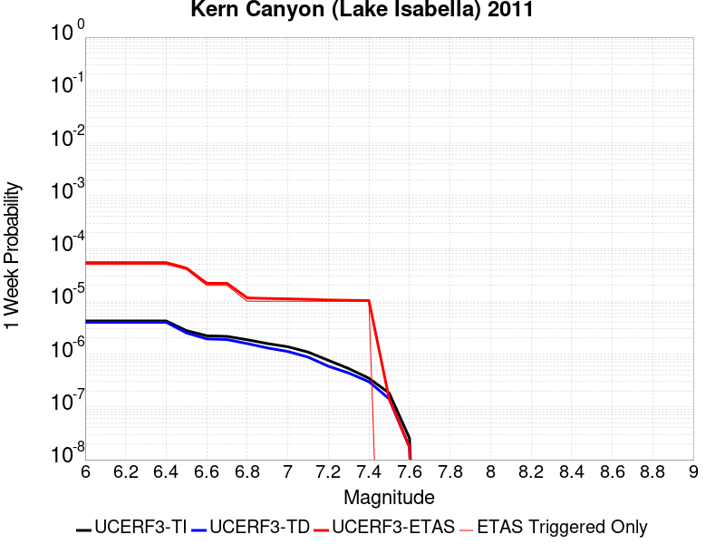 | 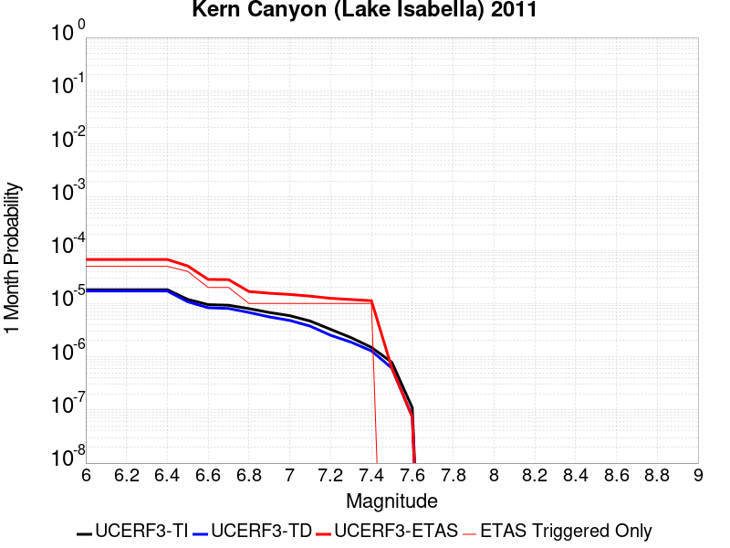 | 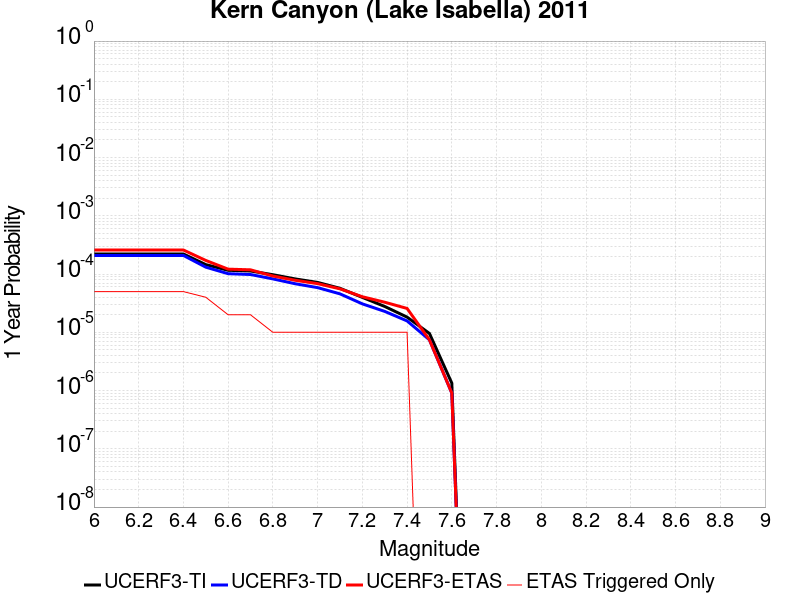 | 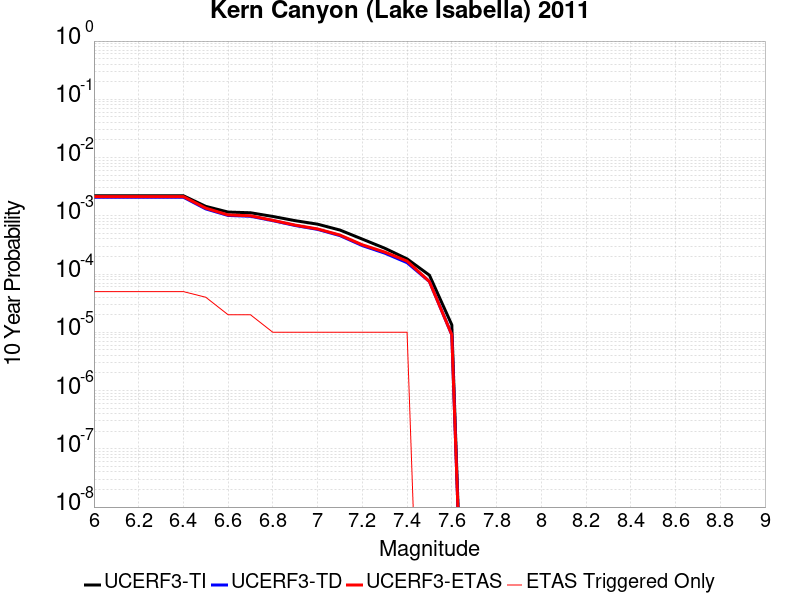 |

| Magnitude | 1 wk TI Prob | 1 wk TD Prob | 1 wk ETAS Prob | 1 wk ETAS/TD Gain | 1 wk ETAS Triggered Only | 1 mo TI Prob | 1 mo TD Prob | 1 mo ETAS Prob | 1 mo ETAS/TD Gain | 1 mo ETAS Triggered Only | 1 yr TI Prob | 1 yr TD Prob | 1 yr ETAS Prob | 1 yr ETAS/TD Gain | 1 yr ETAS Triggered Only | 10 yr TI Prob | 10 yr TD Prob | 10 yr ETAS Prob | 10 yr ETAS/TD Gain | 10 yr ETAS Triggered Only |
|-----|-----|-----|-----|-----|-----|-----|-----|-----|-----|-----|-----|-----|-----|-----|-----|-----|-----|-----|-----|-----|
| 6.0 | 4.2387383E-6 | 4.0016344E-6 | 5.4001433E-5 | 13.494845 | 5.0E-5 | 1.8165894E-5 | 1.7149758E-5 | 6.71489E-5 | 3.915443 | 5.0E-5 | 2.2114732E-4 | 2.0878017E-4 | 2.5876972E-4 | 1.2394364 | 5.0E-5 | 0.0022092736 | 0.002086024 | 0.0021359199 | 1.023919 | 5.0E-5 |
| 6.1 | 4.2387383E-6 | 4.0016344E-6 | 5.4001433E-5 | 13.494845 | 5.0E-5 | 1.8165894E-5 | 1.7149758E-5 | 6.71489E-5 | 3.915443 | 5.0E-5 | 2.2114732E-4 | 2.0878017E-4 | 2.5876972E-4 | 1.2394364 | 5.0E-5 | 0.0022092736 | 0.002086024 | 0.0021359199 | 1.023919 | 5.0E-5 |
| 6.2 | 4.2387383E-6 | 4.0016344E-6 | 5.4001433E-5 | 13.494845 | 5.0E-5 | 1.8165894E-5 | 1.7149758E-5 | 6.71489E-5 | 3.915443 | 5.0E-5 | 2.2114732E-4 | 2.0878017E-4 | 2.5876972E-4 | 1.2394364 | 5.0E-5 | 0.0022092736 | 0.002086024 | 0.0021359199 | 1.023919 | 5.0E-5 |
| 6.3 | 4.2387383E-6 | 4.0016344E-6 | 5.4001433E-5 | 13.494845 | 5.0E-5 | 1.8165894E-5 | 1.7149758E-5 | 6.71489E-5 | 3.915443 | 5.0E-5 | 2.2114732E-4 | 2.0878017E-4 | 2.5876972E-4 | 1.2394364 | 5.0E-5 | 0.0022092736 | 0.002086024 | 0.0021359199 | 1.023919 | 5.0E-5 |
| 6.4 | 4.2387383E-6 | 4.0016344E-6 | 5.4001433E-5 | 13.494845 | 5.0E-5 | 1.8165894E-5 | 1.7149758E-5 | 6.71489E-5 | 3.915443 | 5.0E-5 | 2.2114732E-4 | 2.0878017E-4 | 2.5876972E-4 | 1.2394364 | 5.0E-5 | 0.0022092736 | 0.002086024 | 0.0021359199 | 1.023919 | 5.0E-5 |
| 6.5 | 2.7857532E-6 | 2.5178624E-6 | 4.251776E-5 | 16.886452 | 4.0E-5 | 1.1938888E-5 | 1.0790796E-5 | 5.0790364E-5 | 4.706823 | 4.0E-5 | 1.4534626E-4 | 1.3137035E-4 | 1.713651E-4 | 1.3044428 | 4.0E-5 | 0.0014525123 | 0.0013129596 | 0.0013529072 | 1.0304255 | 4.0E-5 |
| 6.6 | 2.2233348E-6 | 1.944119E-6 | 2.194408E-5 | 11.2874155 | 2.0E-5 | 9.528543E-6 | 8.331913E-6 | 2.8331746E-5 | 3.4003892 | 2.0E-5 | 1.1600384E-4 | 1.014364E-4 | 1.2143437E-4 | 1.1971478 | 2.0E-5 | 0.001159433 | 0.0010139096 | 0.0010338894 | 1.0197057 | 2.0E-5 |
| 6.7 | 2.1635126E-6 | 1.8834991E-6 | 2.1883461E-5 | 11.618515 | 2.0E-5 | 9.272164E-6 | 8.072114E-6 | 2.8071952E-5 | 3.4776456 | 2.0E-5 | 1.1288274E-4 | 9.827364E-5 | 1.1827167E-4 | 1.2034934 | 2.0E-5 | 0.0011282542 | 9.8231E-4 | 0.0010022903 | 1.0203402 | 2.0E-5 |
| 6.8 | 1.8685711E-6 | 1.583138E-6 | 1.1583122E-5 | 7.316559 | 1.0E-5 | 8.008137E-6 | 6.7848596E-6 | 1.6784792E-5 | 2.4738598 | 1.0E-5 | 9.74947E-5 | 8.2602586E-5 | 9.260176E-5 | 1.1210515 | 1.0E-5 | 9.745194E-4 | 8.2572375E-4 | 8.357155E-4 | 1.0121006 | 1.0E-5 |
| 6.9 | 1.5815071E-6 | 1.3064887E-6 | 1.1306475E-5 | 8.654094 | 1.0E-5 | 6.77787E-6 | 5.5992255E-6 | 1.559917E-5 | 2.7859514 | 1.0E-5 | 8.251744E-5 | 6.816846E-5 | 7.816778E-5 | 1.1466854 | 1.0E-5 | 8.248681E-4 | 6.8147824E-4 | 6.914714E-4 | 1.0146639 | 1.0E-5 |
| 7.0 | 1.3772564E-6 | 1.1210681E-6 | 1.1121057E-5 | 9.920054 | 1.0E-5 | 5.9025137E-6 | 4.8045686E-6 | 1.4804521E-5 | 3.0813422 | 1.0E-5 | 7.186073E-5 | 5.8494075E-5 | 6.849349E-5 | 1.1709474 | 1.0E-5 | 7.18375E-4 | 5.8478885E-4 | 5.94783E-4 | 1.0170902 | 1.0E-5 |
| 7.1 | 1.0916998E-6 | 8.7637505E-7 | 1.0876366E-5 | 12.41063 | 1.0E-5 | 4.678705E-6 | 3.7558877E-6 | 1.375585E-5 | 3.6624763 | 1.0E-5 | 5.6961744E-5 | 4.5726985E-5 | 5.572653E-5 | 1.2186792 | 1.0E-5 | 5.6947145E-4 | 4.571771E-4 | 4.6717256E-4 | 1.0218633 | 1.0E-5 |
| 7.2 | 7.6277024E-7 | 5.901439E-7 | 1.0590138E-5 | 17.945011 | 1.0E-5 | 3.2690114E-6 | 2.5291856E-6 | 1.252916E-5 | 4.9538317 | 1.0E-5 | 3.9799485E-5 | 3.0792406E-5 | 4.07921E-5 | 1.3247454 | 1.0E-5 | 3.9792358E-4 | 3.07882E-4 | 3.1787893E-4 | 1.03247 | 1.0E-5 |
| 7.3 | 5.3265916E-7 | 4.3824264E-7 | 1.0438238E-5 | 23.8184 | 1.0E-5 | 2.282823E-6 | 1.8781814E-6 | 1.1878163E-5 | 6.3242893 | 1.0E-5 | 2.7793016E-5 | 2.2866623E-5 | 3.2866392E-5 | 1.4373087 | 1.0E-5 | 2.778954E-4 | 2.2864307E-4 | 2.3864079E-4 | 1.0437263 | 1.0E-5 |
| 7.4 | 3.4946007E-7 | 3.0065647E-7 | 1.0300653E-5 | 34.260544 | 1.0E-5 | 1.497685E-6 | 1.2885271E-6 | 1.12885145E-5 | 8.760789 | 1.0E-5 | 1.8234163E-5 | 1.5687707E-5 | 2.568755E-5 | 1.6374319 | 1.0E-5 | 1.8232666E-4 | 1.5686621E-4 | 1.6686464E-4 | 1.0637386 | 1.0E-5 |
| 7.5 | 1.8317026E-7 | 1.4244755E-7 | 1.4244755E-7 | 1.0 | 0.0 | 7.850152E-7 | 6.1048934E-7 | 6.1048934E-7 | 1.0 | 0.0 | 9.557518E-6 | 7.432683E-6 | 7.432683E-6 | 1.0 | 0.0 | 9.5571064E-5 | 7.432442E-5 | 7.432442E-5 | 1.0 | 0.0 |
| 7.6 | 2.572245E-8 | 1.735264E-8 | 1.735264E-8 | 1.0 | 0.0 | 1.10239064E-7 | 7.436845E-8 | 7.436845E-8 | 1.0 | 0.0 | 1.3421597E-6 | 9.0543557E-7 | 9.0543557E-7 | 1.0 | 0.0 | 1.3421517E-5 | 9.054324E-6 | 9.054324E-6 | 1.0 | 0.0 |

## Pinto Mtn
*[(top)](#table-of-contents)*

| 1 Week | 1 Month | 1 Year | 10 Year |
|-----|-----|-----|-----|
| 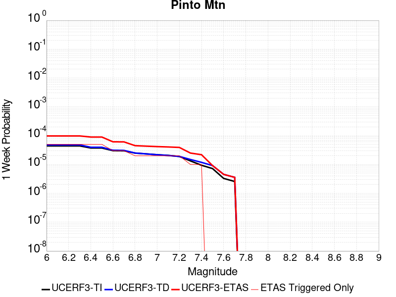 | 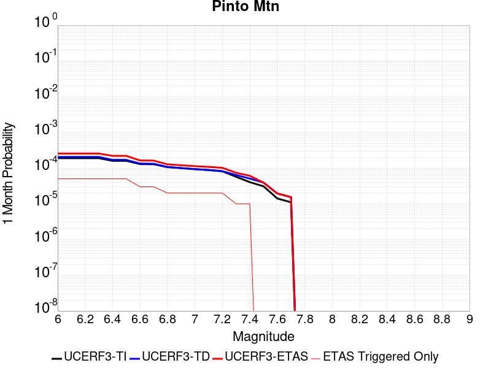 |  | 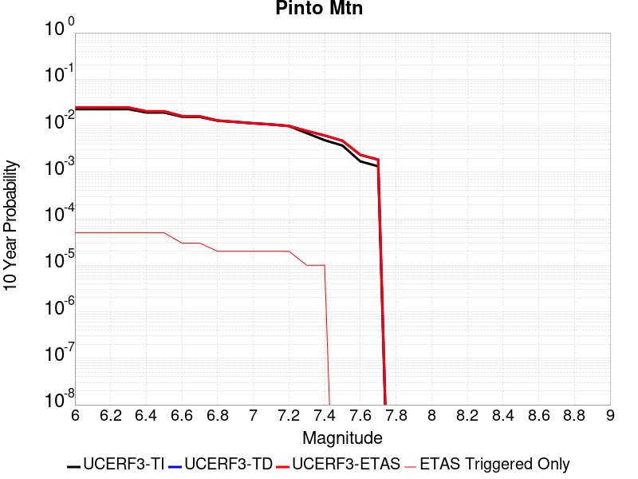 |

| Magnitude | 1 wk TI Prob | 1 wk TD Prob | 1 wk ETAS Prob | 1 wk ETAS/TD Gain | 1 wk ETAS Triggered Only | 1 mo TI Prob | 1 mo TD Prob | 1 mo ETAS Prob | 1 mo ETAS/TD Gain | 1 mo ETAS Triggered Only | 1 yr TI Prob | 1 yr TD Prob | 1 yr ETAS Prob | 1 yr ETAS/TD Gain | 1 yr ETAS Triggered Only | 10 yr TI Prob | 10 yr TD Prob | 10 yr ETAS Prob | 10 yr ETAS/TD Gain | 10 yr ETAS Triggered Only |
|-----|-----|-----|-----|-----|-----|-----|-----|-----|-----|-----|-----|-----|-----|-----|-----|-----|-----|-----|-----|-----|
| 6.0 | 4.4194956E-5 | 4.7853926E-5 | 9.785153E-5 | 2.0447965 | 5.0E-5 | 1.893932E-4 | 2.0507304E-4 | 2.550628E-4 | 1.2437656 | 5.0E-5 | 0.0023034236 | 0.0024940688 | 0.002543944 | 1.0199976 | 5.0E-5 | 0.022796938 | 0.024678305 | 0.02472707 | 1.001976 | 5.0E-5 |
| 6.1 | 4.4194956E-5 | 4.7853926E-5 | 9.785153E-5 | 2.0447965 | 5.0E-5 | 1.893932E-4 | 2.0507304E-4 | 2.550628E-4 | 1.2437656 | 5.0E-5 | 0.0023034236 | 0.0024940688 | 0.002543944 | 1.0199976 | 5.0E-5 | 0.022796938 | 0.024678305 | 0.02472707 | 1.001976 | 5.0E-5 |
| 6.2 | 4.4194956E-5 | 4.7853926E-5 | 9.785153E-5 | 2.0447965 | 5.0E-5 | 1.893932E-4 | 2.0507304E-4 | 2.550628E-4 | 1.2437656 | 5.0E-5 | 0.0023034236 | 0.0024940688 | 0.002543944 | 1.0199976 | 5.0E-5 | 0.022796938 | 0.024678305 | 0.02472707 | 1.001976 | 5.0E-5 |
| 6.3 | 4.4194956E-5 | 4.7853926E-5 | 9.785153E-5 | 2.0447965 | 5.0E-5 | 1.893932E-4 | 2.0507304E-4 | 2.550628E-4 | 1.2437656 | 5.0E-5 | 0.0023034236 | 0.0024940688 | 0.002543944 | 1.0199976 | 5.0E-5 | 0.022796938 | 0.024678305 | 0.02472707 | 1.001976 | 5.0E-5 |
| 6.4 | 3.729929E-5 | 3.960349E-5 | 8.960151E-5 | 2.262465 | 5.0E-5 | 1.5984432E-4 | 1.6971873E-4 | 2.1971024E-4 | 1.2945551 | 5.0E-5 | 0.0019443673 | 0.0020644604 | 0.0021143572 | 1.0241694 | 5.0E-5 | 0.019274427 | 0.020462848 | 0.020511825 | 1.0023935 | 5.0E-5 |
| 6.5 | 3.729929E-5 | 3.960349E-5 | 8.960151E-5 | 2.262465 | 5.0E-5 | 1.5984432E-4 | 1.6971873E-4 | 2.1971024E-4 | 1.2945551 | 5.0E-5 | 0.0019443673 | 0.0020644604 | 0.0021143572 | 1.0241694 | 5.0E-5 | 0.019274427 | 0.020462848 | 0.020511825 | 1.0023935 | 5.0E-5 |
| 6.6 | 3.0204548E-5 | 3.12056E-5 | 6.1204664E-5 | 1.9613359 | 3.0E-5 | 1.2944164E-4 | 1.3373162E-4 | 1.6372761E-4 | 1.2242999 | 3.0E-5 | 0.0015748127 | 0.0016270012 | 0.0016569524 | 1.0184088 | 3.0E-5 | 0.015636992 | 0.016154764 | 0.01618428 | 1.001827 | 3.0E-5 |
| 6.7 | 2.9857754E-5 | 3.0814987E-5 | 6.081406E-5 | 1.9735223 | 3.0E-5 | 1.2795553E-4 | 1.3205773E-4 | 1.6205377E-4 | 1.2271434 | 3.0E-5 | 0.0015567453 | 0.0016066517 | 0.0016366035 | 1.0186424 | 3.0E-5 | 0.015458848 | 0.015954204 | 0.015983725 | 1.0018504 | 3.0E-5 |
| 6.8 | 2.4819734E-5 | 2.5009665E-5 | 4.5009165E-5 | 1.7996708 | 2.0E-5 | 1.0636595E-4 | 1.0718E-4 | 1.2717786E-4 | 1.186582 | 2.0E-5 | 0.0012942362 | 0.001304157 | 0.0013241309 | 1.0153155 | 2.0E-5 | 0.012867244 | 0.012967403 | 0.012987143 | 1.0015223 | 2.0E-5 |
| 6.9 | 2.331124E-5 | 2.3337945E-5 | 4.3337477E-5 | 1.8569535 | 2.0E-5 | 9.990149E-5 | 1.0001605E-4 | 1.2001405E-4 | 1.199948 | 2.0E-5 | 0.001215622 | 0.0012170355 | 0.0012370112 | 1.0164133 | 2.0E-5 | 0.012089936 | 0.012105897 | 0.012125655 | 1.0016321 | 2.0E-5 |
| 7.0 | 2.1818534E-5 | 2.1761074E-5 | 4.176064E-5 | 1.9190522 | 2.0E-5 | 9.3504656E-5 | 9.3258524E-5 | 1.13256654E-4 | 1.2144376 | 2.0E-5 | 0.0011378246 | 0.0011348509 | 0.0011548282 | 1.0176035 | 2.0E-5 | 0.011320163 | 0.01129266 | 0.0113124335 | 1.0017511 | 2.0E-5 |
| 7.1 | 2.066081E-5 | 2.0540718E-5 | 4.0540308E-5 | 1.9736558 | 2.0E-5 | 8.854332E-5 | 8.8028784E-5 | 1.0802703E-4 | 1.2271785 | 2.0E-5 | 0.0010774818 | 0.0010712431 | 0.0010912217 | 1.0186499 | 2.0E-5 | 0.010722724 | 0.0106628435 | 0.01068263 | 1.0018557 | 2.0E-5 |
| 7.2 | 1.8990233E-5 | 1.9054001E-5 | 3.9053622E-5 | 2.0496283 | 2.0E-5 | 8.138417E-5 | 8.165756E-5 | 1.01655925E-4 | 1.2449052 | 2.0E-5 | 9.904018E-4 | 9.937467E-4 | 0.0010137268 | 1.0201058 | 2.0E-5 | 0.009859995 | 0.009895029 | 0.009914831 | 1.0020012 | 2.0E-5 |
| 7.3 | 1.3335872E-5 | 1.4906713E-5 | 2.4906563E-5 | 1.6708287 | 1.0E-5 | 5.7152483E-5 | 6.388442E-5 | 7.388378E-5 | 1.1565228 | 1.0E-5 | 6.956093E-4 | 7.77528E-4 | 7.875202E-4 | 1.0128512 | 1.0E-5 | 0.006934359 | 0.007749376 | 0.007759298 | 1.0012804 | 1.0E-5 |
| 7.4 | 9.414066E-6 | 1.186096E-5 | 2.1860842E-5 | 1.8430921 | 1.0E-5 | 4.0345374E-5 | 5.083175E-5 | 6.083124E-5 | 1.1967175 | 1.0E-5 | 4.910942E-4 | 6.1871024E-4 | 6.2870403E-4 | 1.0161526 | 1.0E-5 | 0.0049001034 | 0.0061708256 | 0.0061807637 | 1.0016105 | 1.0E-5 |
| 7.5 | 7.2101157E-6 | 9.158192E-6 | 9.158192E-6 | 1.0 | 0.0 | 3.090013E-5 | 3.9248847E-5 | 3.9248847E-5 | 1.0 | 0.0 | 3.7614413E-4 | 4.7775774E-4 | 4.7775774E-4 | 1.0 | 0.0 | 0.0037550807 | 0.004768082 | 0.004768082 | 1.0 | 0.0 |
| 7.6 | 3.296375E-6 | 4.5455017E-6 | 4.5455017E-6 | 1.0 | 0.0 | 1.4127245E-5 | 1.9480583E-5 | 1.9480583E-5 | 1.0 | 0.0 | 1.7198564E-4 | 2.3715167E-4 | 2.3715167E-4 | 1.0 | 0.0 | 0.0017185259 | 0.0023691233 | 0.0023691233 | 1.0 | 0.0 |
| 7.7 | 2.5741092E-6 | 3.5844084E-6 | 3.5844084E-6 | 1.0 | 0.0 | 1.103185E-5 | 1.5361667E-5 | 1.5361667E-5 | 1.0 | 0.0 | 1.3430449E-4 | 1.8701357E-4 | 1.8701357E-4 | 1.0 | 0.0 | 0.0013422335 | 0.0018686918 | 0.0018686918 | 1.0 | 0.0 |

## White Mountains
*[(top)](#table-of-contents)*

| 1 Week | 1 Month | 1 Year | 10 Year |
|-----|-----|-----|-----|
| 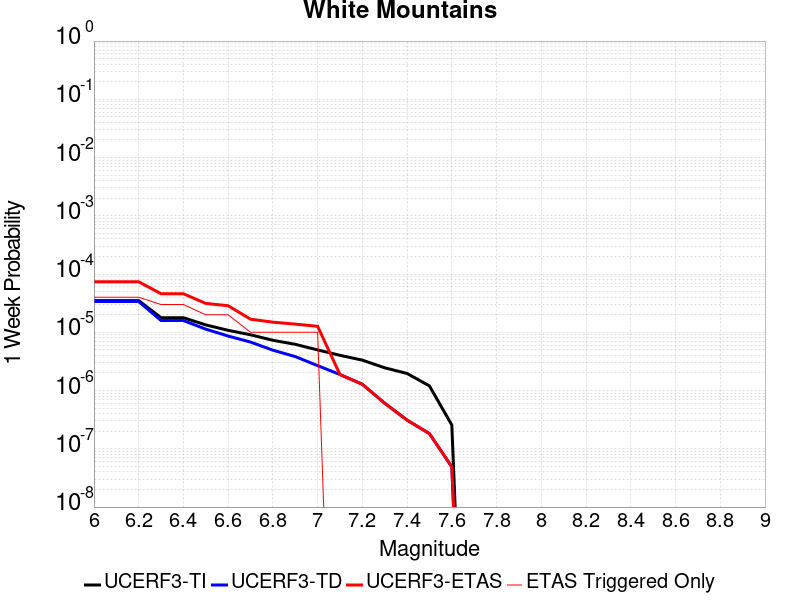 | 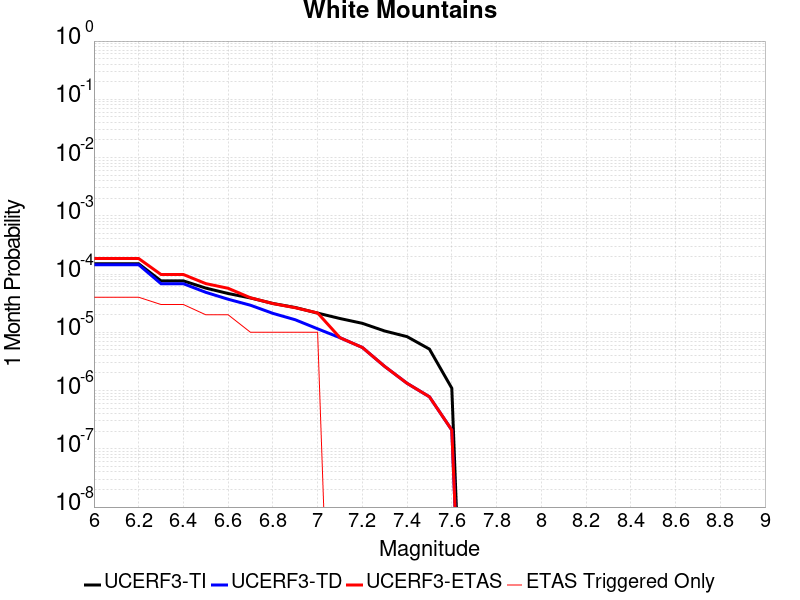 | 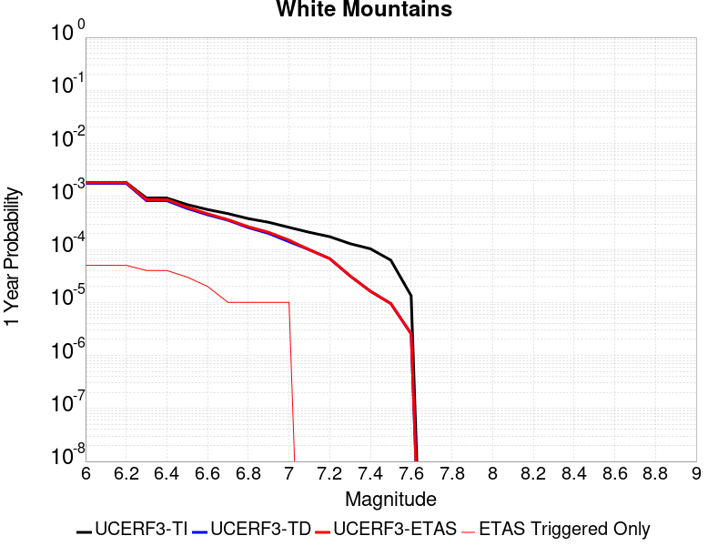 |  |

| Magnitude | 1 wk TI Prob | 1 wk TD Prob | 1 wk ETAS Prob | 1 wk ETAS/TD Gain | 1 wk ETAS Triggered Only | 1 mo TI Prob | 1 mo TD Prob | 1 mo ETAS Prob | 1 mo ETAS/TD Gain | 1 mo ETAS Triggered Only | 1 yr TI Prob | 1 yr TD Prob | 1 yr ETAS Prob | 1 yr ETAS/TD Gain | 1 yr ETAS Triggered Only | 10 yr TI Prob | 10 yr TD Prob | 10 yr ETAS Prob | 10 yr ETAS/TD Gain | 10 yr ETAS Triggered Only |
|-----|-----|-----|-----|-----|-----|-----|-----|-----|-----|-----|-----|-----|-----|-----|-----|-----|-----|-----|-----|-----|
| 6.0 | 3.503579E-5 | 3.3784127E-5 | 7.378277E-5 | 2.183948 | 4.0E-5 | 1.5014476E-4 | 1.4478175E-4 | 1.8477596E-4 | 1.276238 | 4.0E-5 | 0.0018264796 | 0.0017614134 | 0.0018113253 | 1.0283363 | 5.0E-5 | 0.018115403 | 0.017486857 | 0.017535983 | 1.0028093 | 5.0E-5 |
| 6.1 | 3.503579E-5 | 3.3784127E-5 | 7.378277E-5 | 2.183948 | 4.0E-5 | 1.5014476E-4 | 1.4478175E-4 | 1.8477596E-4 | 1.276238 | 4.0E-5 | 0.0018264796 | 0.0017614134 | 0.0018113253 | 1.0283363 | 5.0E-5 | 0.018115403 | 0.017486857 | 0.017535983 | 1.0028093 | 5.0E-5 |
| 6.2 | 3.503579E-5 | 3.3784127E-5 | 7.378277E-5 | 2.183948 | 4.0E-5 | 1.5014476E-4 | 1.4478175E-4 | 1.8477596E-4 | 1.276238 | 4.0E-5 | 0.0018264796 | 0.0017614134 | 0.0018113253 | 1.0283363 | 5.0E-5 | 0.018115403 | 0.017486857 | 0.017535983 | 1.0028093 | 5.0E-5 |
| 6.3 | 1.7818425E-5 | 1.591616E-5 | 4.591568E-5 | 2.884847 | 3.0E-5 | 7.636245E-5 | 6.821041E-5 | 9.820836E-5 | 1.4397856 | 3.0E-5 | 9.293162E-4 | 8.301596E-4 | 8.7012636E-4 | 1.0481435 | 4.0E-5 | 0.009254395 | 0.0082720425 | 0.008311712 | 1.0047956 | 4.0E-5 |
| 6.4 | 1.7818425E-5 | 1.591616E-5 | 4.591568E-5 | 2.884847 | 3.0E-5 | 7.636245E-5 | 6.821041E-5 | 9.820836E-5 | 1.4397856 | 3.0E-5 | 9.293162E-4 | 8.301596E-4 | 8.7012636E-4 | 1.0481435 | 4.0E-5 | 0.009254395 | 0.0082720425 | 0.008311712 | 1.0047956 | 4.0E-5 |
| 6.5 | 1.3397557E-5 | 1.1336374E-5 | 3.133615E-5 | 2.7642126 | 2.0E-5 | 5.741684E-5 | 4.8583595E-5 | 6.858262E-5 | 1.4116416 | 2.0E-5 | 6.988258E-4 | 5.913517E-4 | 6.2133395E-4 | 1.0507013 | 3.0E-5 | 0.006966323 | 0.005898487 | 0.0059283096 | 1.005056 | 3.0E-5 |
| 6.6 | 1.0818695E-5 | 8.625434E-6 | 2.8625262E-5 | 3.318704 | 2.0E-5 | 4.6365014E-5 | 3.6965648E-5 | 5.696491E-5 | 1.5410229 | 2.0E-5 | 5.6434784E-4 | 4.4996818E-4 | 4.6995917E-4 | 1.0444276 | 2.0E-5 | 0.005629168 | 0.0044910074 | 0.0045109177 | 1.0044334 | 2.0E-5 |
| 6.7 | 9.067908E-6 | 6.802476E-6 | 1.6802407E-5 | 2.470043 | 1.0E-5 | 3.8861883E-5 | 2.915316E-5 | 3.915287E-5 | 1.343006 | 1.0E-5 | 4.7304068E-4 | 3.548851E-4 | 3.6488156E-4 | 1.0281681 | 1.0E-5 | 0.00472035 | 0.003543501 | 0.0035534655 | 1.002812 | 1.0E-5 |
| 6.8 | 7.295947E-6 | 4.9364285E-6 | 1.4936379E-5 | 3.025746 | 1.0E-5 | 3.126797E-5 | 2.1155956E-5 | 3.1155745E-5 | 1.4726701 | 1.0E-5 | 3.8062103E-4 | 2.5754445E-4 | 2.6754188E-4 | 1.0388182 | 1.0E-5 | 0.0037996976 | 0.0025725728 | 0.002582547 | 1.0038772 | 1.0E-5 |
| 6.9 | 6.2243444E-6 | 3.8322546E-6 | 1.3832216E-5 | 3.60942 | 1.0E-5 | 2.6675489E-5 | 1.6423846E-5 | 2.6423682E-5 | 1.6088607 | 1.0E-5 | 3.2472567E-4 | 1.9994251E-4 | 2.0994052E-4 | 1.0500044 | 1.0E-5 | 0.0032425157 | 0.001997679 | 0.002007659 | 1.0049958 | 1.0E-5 |
| 7.0 | 4.9878413E-6 | 2.679564E-6 | 1.2679538E-5 | 4.7319403 | 1.0E-5 | 2.1376287E-5 | 1.1483797E-5 | 2.1483682E-5 | 1.8707821 | 1.0E-5 | 2.602252E-4 | 1.3980652E-4 | 1.4980511E-4 | 1.0715175 | 1.0E-5 | 0.002599207 | 0.0013972119 | 0.0014071979 | 1.0071471 | 1.0E-5 |
| 7.1 | 4.0252844E-6 | 1.885702E-6 | 1.885702E-6 | 1.0 | 0.0 | 1.7251105E-5 | 8.081555E-6 | 8.081555E-6 | 1.0 | 0.0 | 2.1001195E-4 | 9.838863E-5 | 9.838863E-5 | 1.0 | 0.0 | 0.0020981359 | 9.834635E-4 | 9.834635E-4 | 1.0 | 0.0 |
| 7.2 | 3.3284066E-6 | 1.2818929E-6 | 1.2818929E-6 | 1.0 | 0.0 | 1.4264522E-5 | 5.4938155E-6 | 5.4938155E-6 | 1.0 | 0.0 | 1.736567E-4 | 6.688525E-5 | 6.688525E-5 | 1.0 | 0.0 | 0.0017352107 | 6.6866126E-4 | 6.6866126E-4 | 1.0 | 0.0 |
| 7.3 | 2.458226E-6 | 6.056684E-7 | 6.056684E-7 | 1.0 | 0.0 | 1.0535211E-5 | 2.5957193E-6 | 2.5957193E-6 | 1.0 | 0.0 | 1.2825865E-4 | 3.160246E-5 | 3.160246E-5 | 1.0 | 0.0 | 0.0012818464 | 3.1598343E-4 | 3.1598343E-4 | 1.0 | 0.0 |
| 7.4 | 1.965953E-6 | 3.1084684E-7 | 3.1084684E-7 | 1.0 | 0.0 | 8.425486E-6 | 1.3322001E-6 | 1.3322001E-6 | 1.0 | 0.0 | 1.0257547E-4 | 1.6219417E-5 | 1.6219417E-5 | 1.0 | 0.0 | 0.0010252813 | 1.6218246E-4 | 1.6218246E-4 | 1.0 | 0.0 |
| 7.5 | 1.2014192E-6 | 1.8241002E-7 | 1.8241002E-7 | 1.0 | 0.0 | 5.148929E-6 | 7.8175697E-7 | 7.8175697E-7 | 1.0 | 0.0 | 6.2686406E-5 | 9.51785E-6 | 9.51785E-6 | 1.0 | 0.0 | 6.266873E-4 | 9.517451E-5 | 9.517451E-5 | 1.0 | 0.0 |
| 7.6 | 2.5612175E-7 | 4.893784E-8 | 4.893784E-8 | 1.0 | 0.0 | 1.0976642E-6 | 2.0973359E-7 | 2.0973359E-7 | 1.0 | 0.0 | 1.3363979E-5 | 2.5535037E-6 | 2.5535037E-6 | 1.0 | 0.0 | 1.3363175E-4 | 2.553478E-5 | 2.553478E-5 | 1.0 | 0.0 |

## Blue Cut
*[(top)](#table-of-contents)*

| 1 Week | 1 Month | 1 Year | 10 Year |
|-----|-----|-----|-----|
| 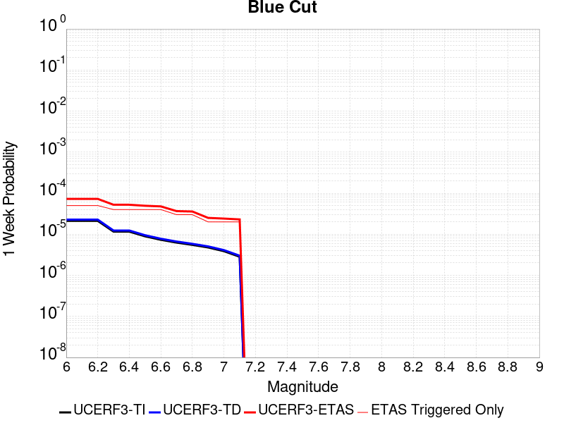 | 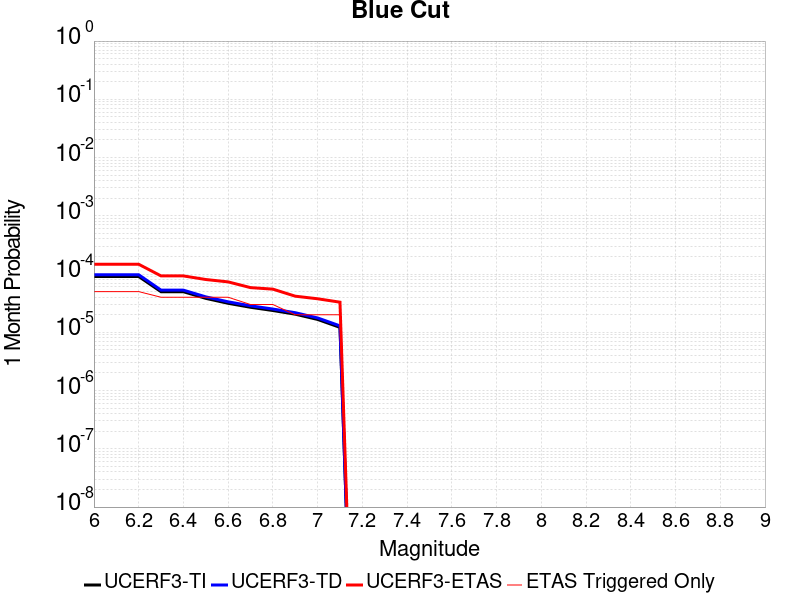 | 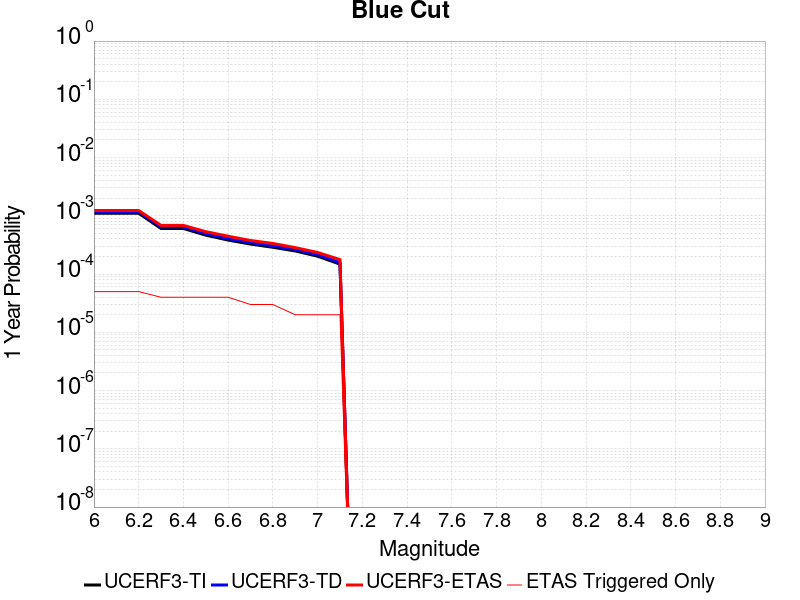 | 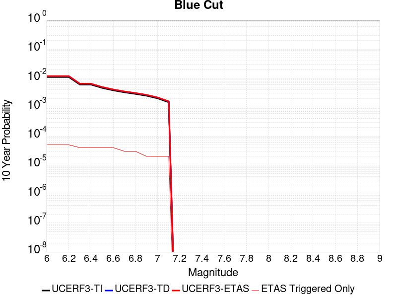 |

| Magnitude | 1 wk TI Prob | 1 wk TD Prob | 1 wk ETAS Prob | 1 wk ETAS/TD Gain | 1 wk ETAS Triggered Only | 1 mo TI Prob | 1 mo TD Prob | 1 mo ETAS Prob | 1 mo ETAS/TD Gain | 1 mo ETAS Triggered Only | 1 yr TI Prob | 1 yr TD Prob | 1 yr ETAS Prob | 1 yr ETAS/TD Gain | 1 yr ETAS Triggered Only | 10 yr TI Prob | 10 yr TD Prob | 10 yr ETAS Prob | 10 yr ETAS/TD Gain | 10 yr ETAS Triggered Only |
|-----|-----|-----|-----|-----|-----|-----|-----|-----|-----|-----|-----|-----|-----|-----|-----|-----|-----|-----|-----|-----|
| 6.0 | 2.1227985E-5 | 2.2719574E-5 | 7.271844E-5 | 3.2006955 | 5.0E-5 | 9.097391E-5 | 9.73663E-5 | 1.4736142E-4 | 1.5134747 | 5.0E-5 | 0.0011070445 | 0.0011848481 | 0.0012347889 | 1.0421495 | 5.0E-5 | 0.011015458 | 0.011791152 | 0.011840562 | 1.0041904 | 5.0E-5 |
| 6.1 | 2.1227985E-5 | 2.2719574E-5 | 7.271844E-5 | 3.2006955 | 5.0E-5 | 9.097391E-5 | 9.73663E-5 | 1.4736142E-4 | 1.5134747 | 5.0E-5 | 0.0011070445 | 0.0011848481 | 0.0012347889 | 1.0421495 | 5.0E-5 | 0.011015458 | 0.011791152 | 0.011840562 | 1.0041904 | 5.0E-5 |
| 6.2 | 2.1227985E-5 | 2.2719574E-5 | 7.271844E-5 | 3.2006955 | 5.0E-5 | 9.097391E-5 | 9.73663E-5 | 1.4736142E-4 | 1.5134747 | 5.0E-5 | 0.0011070445 | 0.0011848481 | 0.0012347889 | 1.0421495 | 5.0E-5 | 0.011015458 | 0.011791152 | 0.011840562 | 1.0041904 | 5.0E-5 |
| 6.3 | 1.1613981E-5 | 1.2353542E-5 | 5.2353047E-5 | 4.237898 | 4.0E-5 | 4.9773254E-5 | 5.2942745E-5 | 9.294063E-5 | 1.7554932 | 4.0E-5 | 6.0582085E-4 | 6.443998E-4 | 6.84374E-4 | 1.0620333 | 4.0E-5 | 0.0060417196 | 0.0064265593 | 0.006466302 | 1.0061842 | 4.0E-5 |
| 6.4 | 1.1613981E-5 | 1.2353542E-5 | 5.2353047E-5 | 4.237898 | 4.0E-5 | 4.9773254E-5 | 5.2942745E-5 | 9.294063E-5 | 1.7554932 | 4.0E-5 | 6.0582085E-4 | 6.443998E-4 | 6.84374E-4 | 1.0620333 | 4.0E-5 | 0.0060417196 | 0.0064265593 | 0.006466302 | 1.0061842 | 4.0E-5 |
| 6.5 | 8.931326E-6 | 9.4816E-6 | 4.948122E-5 | 5.2186575 | 4.0E-5 | 3.8276554E-5 | 4.0634844E-5 | 8.063322E-5 | 1.9843369 | 4.0E-5 | 4.6591737E-4 | 4.946261E-4 | 5.3460634E-4 | 1.0808291 | 4.0E-5 | 0.0046494175 | 0.004936161 | 0.004975964 | 1.0080634 | 4.0E-5 |
| 6.6 | 7.345353E-6 | 7.79028E-6 | 4.7789967E-5 | 6.1345644 | 4.0E-5 | 3.1479703E-5 | 3.338653E-5 | 7.338519E-5 | 2.198048 | 4.0E-5 | 3.83198E-4 | 4.064132E-4 | 4.4639694E-4 | 1.098382 | 4.0E-5 | 0.0038253788 | 0.0040574907 | 0.0040973285 | 1.0098183 | 4.0E-5 |
| 6.7 | 6.2775666E-6 | 6.655149E-6 | 3.665495E-5 | 5.5077577 | 3.0E-5 | 2.690358E-5 | 2.8521798E-5 | 5.8520942E-5 | 2.0517972 | 3.0E-5 | 3.2750185E-4 | 3.472051E-4 | 3.7719466E-4 | 1.0863743 | 3.0E-5 | 0.0032701963 | 0.003467367 | 0.0034972632 | 1.008622 | 3.0E-5 |
| 6.8 | 5.5234095E-6 | 5.8551113E-6 | 3.5854937E-5 | 6.123698 | 3.0E-5 | 2.367154E-5 | 2.5093133E-5 | 5.509238E-5 | 2.195516 | 3.0E-5 | 2.8816288E-4 | 3.0547334E-4 | 3.354642E-4 | 1.0981783 | 3.0E-5 | 0.002877895 | 0.0030512505 | 0.003081159 | 1.009802 | 3.0E-5 |
| 6.9 | 4.7780054E-6 | 5.0654203E-6 | 2.506532E-5 | 4.9483194 | 2.0E-5 | 2.0477004E-5 | 2.1708804E-5 | 4.170837E-5 | 1.9212652 | 2.0E-5 | 2.4927902E-4 | 2.642797E-4 | 2.842744E-4 | 1.0756574 | 2.0E-5 | 0.0024899957 | 0.002640346 | 0.0026602934 | 1.0075548 | 2.0E-5 |
| 7.0 | 3.883171E-6 | 4.118487E-6 | 2.4118404E-5 | 5.856132 | 2.0E-5 | 1.6642054E-5 | 1.7650578E-5 | 3.7650225E-5 | 2.1330874 | 2.0E-5 | 2.0259817E-4 | 2.1488148E-4 | 2.348772E-4 | 1.0930545 | 2.0E-5 | 0.0020241356 | 0.0021474129 | 0.00216737 | 1.0092936 | 2.0E-5 |
| 7.1 | 2.8358215E-6 | 3.0097158E-6 | 2.3009656E-5 | 7.6451254 | 2.0E-5 | 1.2153464E-5 | 1.2898756E-5 | 3.2898497E-5 | 2.550517 | 2.0E-5 | 1.4795837E-4 | 1.5703762E-4 | 1.7703447E-4 | 1.127338 | 2.0E-5 | 0.001478599 | 0.0015699116 | 0.0015898802 | 1.0127195 | 2.0E-5 |

## San Diego Trough north alt1
*[(top)](#table-of-contents)*

| 1 Week | 1 Month | 1 Year | 10 Year |
|-----|-----|-----|-----|
| 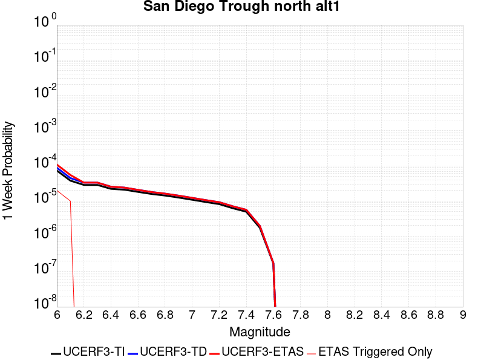 | 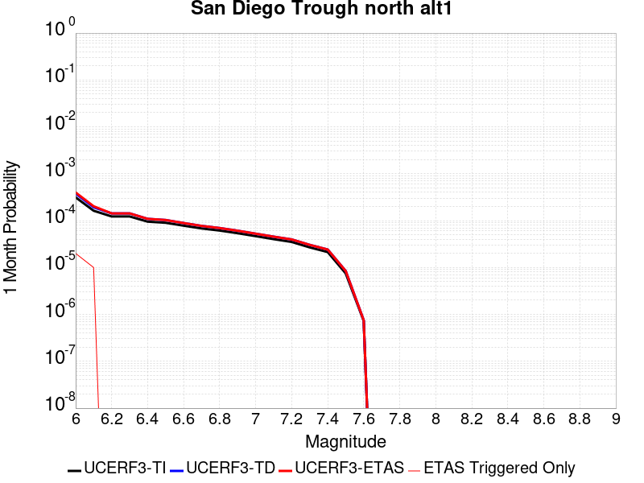 | 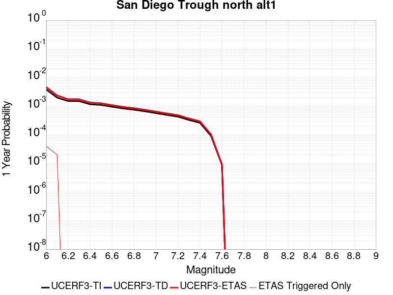 | 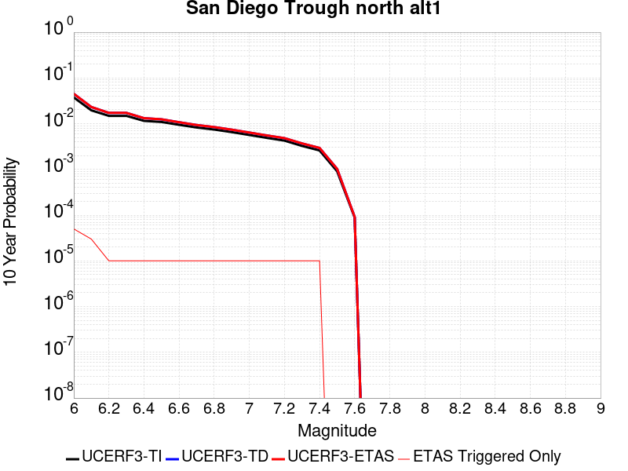 |

| Magnitude | 1 wk TI Prob | 1 wk TD Prob | 1 wk ETAS Prob | 1 wk ETAS/TD Gain | 1 wk ETAS Triggered Only | 1 mo TI Prob | 1 mo TD Prob | 1 mo ETAS Prob | 1 mo ETAS/TD Gain | 1 mo ETAS Triggered Only | 1 yr TI Prob | 1 yr TD Prob | 1 yr ETAS Prob | 1 yr ETAS/TD Gain | 1 yr ETAS Triggered Only | 10 yr TI Prob | 10 yr TD Prob | 10 yr ETAS Prob | 10 yr ETAS/TD Gain | 10 yr ETAS Triggered Only |
|-----|-----|-----|-----|-----|-----|-----|-----|-----|-----|-----|-----|-----|-----|-----|-----|-----|-----|-----|-----|-----|
| 6.0 | 7.329252E-5 | 8.821269E-5 | 1.0821093E-4 | 1.2267047 | 2.0E-5 | 3.14073E-4 | 3.7800326E-4 | 3.979957E-4 | 1.0528896 | 2.0E-5 | 0.0038171355 | 0.0045930487 | 0.004632865 | 1.0086688 | 4.0E-5 | 0.03752231 | 0.045045137 | 0.045092884 | 1.00106 | 5.0E-5 |
| 6.1 | 3.7940346E-5 | 4.4884906E-5 | 5.488446E-5 | 1.222782 | 1.0E-5 | 1.6259136E-4 | 1.9235026E-4 | 2.0234832E-4 | 1.0519785 | 1.0E-5 | 0.0019777524 | 0.002339431 | 0.0023593842 | 1.0085291 | 2.0E-5 | 0.019602431 | 0.023156732 | 0.023186037 | 1.0012655 | 3.0E-5 |
| 6.2 | 2.8645263E-5 | 3.329672E-5 | 3.329672E-5 | 1.0 | 0.0 | 1.2275964E-4 | 1.4269259E-4 | 1.4269259E-4 | 1.0 | 0.0 | 0.0014935739 | 0.0017359206 | 0.0017359206 | 1.0 | 0.0 | 0.0148357535 | 0.017226268 | 0.017236095 | 1.0005705 | 1.0E-5 |
| 6.3 | 2.8645263E-5 | 3.329672E-5 | 3.329672E-5 | 1.0 | 0.0 | 1.2275964E-4 | 1.4269259E-4 | 1.4269259E-4 | 1.0 | 0.0 | 0.0014935739 | 0.0017359206 | 0.0017359206 | 1.0 | 0.0 | 0.0148357535 | 0.017226268 | 0.017236095 | 1.0005705 | 1.0E-5 |
| 6.4 | 2.2204576E-5 | 2.544832E-5 | 2.544832E-5 | 1.0 | 0.0 | 9.5159E-5 | 1.0905972E-4 | 1.0905972E-4 | 1.0 | 0.0 | 0.001157945 | 0.0013270028 | 0.0013270028 | 1.0 | 0.0 | 0.011519298 | 0.013191959 | 0.013201827 | 1.000748 | 1.0E-5 |
| 6.5 | 2.1004838E-5 | 2.4024695E-5 | 2.4024695E-5 | 1.0 | 0.0 | 9.0017624E-5 | 1.0295897E-4 | 1.0295897E-4 | 1.0 | 0.0 | 0.0010954136 | 0.0012528135 | 0.0012528135 | 1.0 | 0.0 | 0.010900296 | 0.012458592 | 0.0124684675 | 1.0007926 | 1.0E-5 |
| 6.6 | 1.820557E-5 | 2.070479E-5 | 2.070479E-5 | 1.0 | 0.0 | 7.802154E-5 | 8.8731824E-5 | 8.8731824E-5 | 1.0 | 0.0 | 9.4949827E-4 | 0.0010797799 | 0.0010797799 | 1.0 | 0.0 | 0.009454516 | 0.010746005 | 0.0107558975 | 1.0009205 | 1.0E-5 |
| 6.7 | 1.5884485E-5 | 1.7983646E-5 | 1.7983646E-5 | 1.0 | 0.0 | 6.807459E-5 | 7.707051E-5 | 7.707051E-5 | 1.0 | 0.0 | 8.284929E-4 | 9.3793223E-4 | 9.3793223E-4 | 1.0 | 0.0 | 0.008254109 | 0.009340104 | 0.00935001 | 1.0010606 | 1.0E-5 |
| 6.8 | 1.4331171E-5 | 1.6201066E-5 | 1.6201066E-5 | 1.0 | 0.0 | 6.141786E-5 | 6.94313E-5 | 6.94313E-5 | 1.0 | 0.0 | 7.4750587E-4 | 8.450002E-4 | 8.450002E-4 | 1.0 | 0.0 | 0.0074499645 | 0.008418139 | 0.008428055 | 1.0011779 | 1.0E-5 |
| 6.9 | 1.2574203E-5 | 1.4205835E-5 | 1.4205835E-5 | 1.0 | 0.0 | 5.3888325E-5 | 6.0880735E-5 | 6.0880735E-5 | 1.0 | 0.0 | 6.558929E-4 | 7.409723E-4 | 7.409723E-4 | 1.0 | 0.0 | 0.0065396037 | 0.007385203 | 0.0073951297 | 1.0013441 | 1.0E-5 |
| 7.0 | 1.0883844E-5 | 1.2289262E-5 | 1.2289262E-5 | 1.0 | 0.0 | 4.664421E-5 | 5.2667205E-5 | 5.2667205E-5 | 1.0 | 0.0 | 5.677453E-4 | 6.4103556E-4 | 6.4103556E-4 | 1.0 | 0.0 | 0.00566297 | 0.006391993 | 0.0064019286 | 1.0015545 | 1.0E-5 |
| 7.1 | 9.393088E-6 | 1.060702E-5 | 1.060702E-5 | 1.0 | 0.0 | 4.025547E-5 | 4.545787E-5 | 4.545787E-5 | 1.0 | 0.0 | 4.900001E-4 | 5.533098E-4 | 5.533098E-4 | 1.0 | 0.0 | 0.0048892107 | 0.005519418 | 0.0055293627 | 1.0018017 | 1.0E-5 |
| 7.2 | 8.190791E-6 | 9.258625E-6 | 9.258625E-6 | 1.0 | 0.0 | 3.510292E-5 | 3.9679224E-5 | 3.9679224E-5 | 1.0 | 0.0 | 4.2729423E-4 | 4.8298817E-4 | 4.8298817E-4 | 1.0 | 0.0 | 0.0042647356 | 0.004819465 | 0.0048294165 | 1.002065 | 1.0E-5 |
| 7.3 | 6.268162E-6 | 7.089716E-6 | 7.089716E-6 | 1.0 | 0.0 | 2.6863276E-5 | 3.0384144E-5 | 3.0384144E-5 | 1.0 | 0.0 | 3.2701128E-4 | 3.6986457E-4 | 3.6986457E-4 | 1.0 | 0.0 | 0.003265305 | 0.003692536 | 0.003702499 | 1.0026982 | 1.0E-5 |
| 7.4 | 4.985186E-6 | 5.6426816E-6 | 5.6426816E-6 | 1.0 | 0.0 | 2.1364907E-5 | 2.4182698E-5 | 2.4182698E-5 | 1.0 | 0.0 | 2.600867E-4 | 2.9438498E-4 | 2.9438498E-4 | 1.0 | 0.0 | 0.002597825 | 0.0029399914 | 0.002949962 | 1.0033914 | 1.0E-5 |
| 7.5 | 1.7489613E-6 | 1.969678E-6 | 1.969678E-6 | 1.0 | 0.0 | 7.495527E-6 | 8.4414505E-6 | 8.4414505E-6 | 1.0 | 0.0 | 9.125422E-5 | 1.02770035E-4 | 1.02770035E-4 | 1.0 | 0.0 | 9.1216754E-4 | 0.0010272472 | 0.0010272472 | 1.0 | 0.0 |
| 7.6 | 1.6988751E-7 | 1.7533823E-7 | 1.7533823E-7 | 1.0 | 0.0 | 7.2808916E-7 | 7.5144936E-7 | 7.5144936E-7 | 1.0 | 0.0 | 8.864449E-6 | 9.14886E-6 | 9.14886E-6 | 1.0 | 0.0 | 8.8640954E-5 | 9.1485024E-5 | 9.1485024E-5 | 1.0 | 0.0 |

## Bullion Mountains
*[(top)](#table-of-contents)*

| 1 Week | 1 Month | 1 Year | 10 Year |
|-----|-----|-----|-----|
| 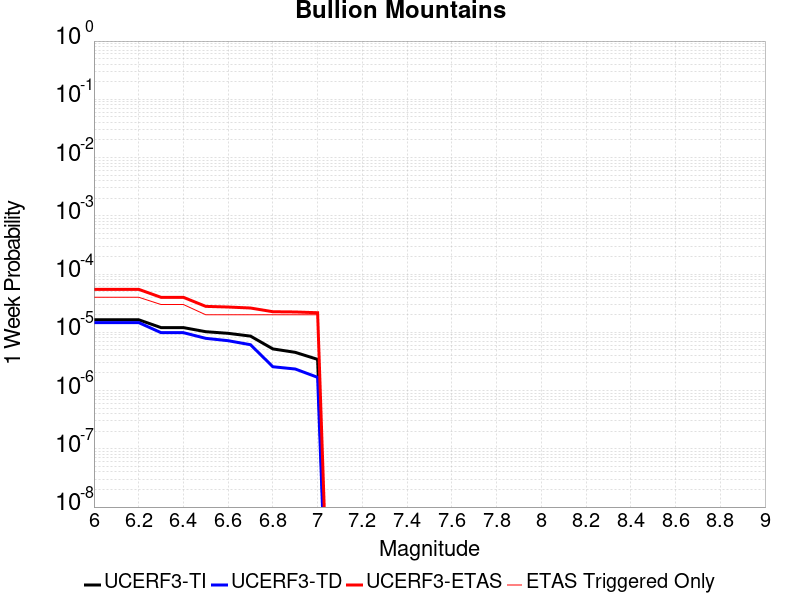 | 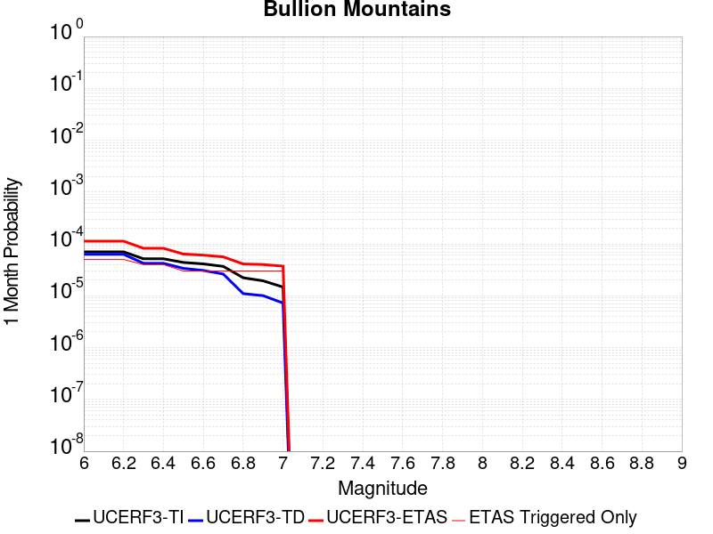 | 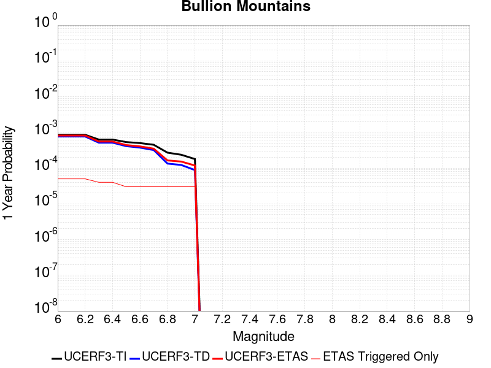 | 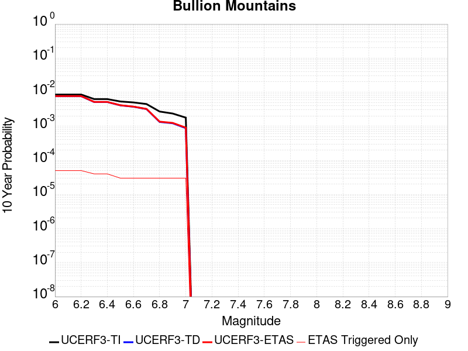 |

| Magnitude | 1 wk TI Prob | 1 wk TD Prob | 1 wk ETAS Prob | 1 wk ETAS/TD Gain | 1 wk ETAS Triggered Only | 1 mo TI Prob | 1 mo TD Prob | 1 mo ETAS Prob | 1 mo ETAS/TD Gain | 1 mo ETAS Triggered Only | 1 yr TI Prob | 1 yr TD Prob | 1 yr ETAS Prob | 1 yr ETAS/TD Gain | 1 yr ETAS Triggered Only | 10 yr TI Prob | 10 yr TD Prob | 10 yr ETAS Prob | 10 yr ETAS/TD Gain | 10 yr ETAS Triggered Only |
|-----|-----|-----|-----|-----|-----|-----|-----|-----|-----|-----|-----|-----|-----|-----|-----|-----|-----|-----|-----|-----|
| 6.0 | 1.6420427E-5 | 1.4692009E-5 | 5.4691423E-5 | 3.7225282 | 4.0E-5 | 7.037136E-5 | 6.296445E-5 | 1.129613E-4 | 1.7940489 | 5.0E-5 | 8.5643446E-4 | 7.6636096E-4 | 8.1632263E-4 | 1.0651934 | 5.0E-5 | 0.008531413 | 0.0076409746 | 0.0076905927 | 1.0064937 | 5.0E-5 |
| 6.1 | 1.6420427E-5 | 1.4692009E-5 | 5.4691423E-5 | 3.7225282 | 4.0E-5 | 7.037136E-5 | 6.296445E-5 | 1.129613E-4 | 1.7940489 | 5.0E-5 | 8.5643446E-4 | 7.6636096E-4 | 8.1632263E-4 | 1.0651934 | 5.0E-5 | 0.008531413 | 0.0076409746 | 0.0076905927 | 1.0064937 | 5.0E-5 |
| 6.2 | 1.6420427E-5 | 1.4692009E-5 | 5.4691423E-5 | 3.7225282 | 4.0E-5 | 7.037136E-5 | 6.296445E-5 | 1.129613E-4 | 1.7940489 | 5.0E-5 | 8.5643446E-4 | 7.6636096E-4 | 8.1632263E-4 | 1.0651934 | 5.0E-5 | 0.008531413 | 0.0076409746 | 0.0076905927 | 1.0064937 | 5.0E-5 |
| 6.3 | 1.2046778E-5 | 9.862255E-6 | 3.986196E-5 | 4.0418706 | 3.0E-5 | 5.1628023E-5 | 4.2266256E-5 | 8.226457E-5 | 1.9463415 | 4.0E-5 | 6.283899E-4 | 5.144933E-4 | 5.5447273E-4 | 1.0777063 | 4.0E-5 | 0.0062661595 | 0.0051353034 | 0.0051750983 | 1.0077492 | 4.0E-5 |
| 6.4 | 1.2046778E-5 | 9.862255E-6 | 3.986196E-5 | 4.0418706 | 3.0E-5 | 5.1628023E-5 | 4.2266256E-5 | 8.226457E-5 | 1.9463415 | 4.0E-5 | 6.283899E-4 | 5.144933E-4 | 5.5447273E-4 | 1.0777063 | 4.0E-5 | 0.0062661595 | 0.0051353034 | 0.0051750983 | 1.0077492 | 4.0E-5 |
| 6.5 | 1.0244343E-5 | 7.879378E-6 | 2.7879221E-5 | 3.5382512 | 2.0E-5 | 4.390359E-5 | 3.3768443E-5 | 6.376743E-5 | 1.8883734 | 3.0E-5 | 5.343951E-4 | 4.1107394E-4 | 4.410616E-4 | 1.0729495 | 3.0E-5 | 0.005331118 | 0.0041051665 | 0.0041350434 | 1.0072778 | 3.0E-5 |
| 6.6 | 9.605408E-6 | 7.1774166E-6 | 2.7177273E-5 | 3.7864978 | 2.0E-5 | 4.1165385E-5 | 3.0760108E-5 | 6.0759186E-5 | 1.9752591 | 3.0E-5 | 5.010733E-4 | 3.7446033E-4 | 4.044491E-4 | 1.0800853 | 3.0E-5 | 0.00499945 | 0.0037402906 | 0.0037701784 | 1.0079907 | 3.0E-5 |
| 6.7 | 8.60418E-6 | 6.123926E-6 | 2.6123804E-5 | 4.2658587 | 2.0E-5 | 3.687454E-5 | 2.6245243E-5 | 5.6244455E-5 | 2.1430342 | 3.0E-5 | 4.48855E-4 | 3.195085E-4 | 3.494989E-4 | 1.0938642 | 3.0E-5 | 0.004479495 | 0.0031924031 | 0.0032223072 | 1.0093673 | 3.0E-5 |
| 6.8 | 5.187994E-6 | 2.563117E-6 | 2.2563067E-5 | 8.802979 | 2.0E-5 | 2.223407E-5 | 1.0984763E-5 | 4.0984432E-5 | 3.7310255 | 3.0E-5 | 2.7066618E-4 | 1.3373529E-4 | 1.6373127E-4 | 1.2242937 | 3.0E-5 | 0.0027033675 | 0.0013369396 | 0.0013668995 | 1.0224093 | 3.0E-5 |
| 6.9 | 4.5302368E-6 | 2.3442778E-6 | 2.2344231E-5 | 9.531392 | 2.0E-5 | 1.9415156E-5 | 1.0046889E-5 | 4.0046587E-5 | 3.985969 | 3.0E-5 | 2.3635388E-4 | 1.2231797E-4 | 1.523143E-4 | 1.2452323 | 3.0E-5 | 0.0023610266 | 0.0012228956 | 0.0012528589 | 1.0245019 | 3.0E-5 |
| 7.0 | 3.431668E-6 | 1.6882177E-6 | 2.1688184E-5 | 12.846793 | 2.0E-5 | 1.4707065E-5 | 7.2352186E-6 | 3.7235E-5 | 5.1463547 | 3.0E-5 | 1.7904381E-4 | 8.808879E-5 | 1.1808614E-4 | 1.3405355 | 3.0E-5 | 0.0017889962 | 8.8088785E-4 | 9.108614E-4 | 1.0340265 | 3.0E-5 |

## Big Pine (Central)
*[(top)](#table-of-contents)*

| 1 Week | 1 Month | 1 Year | 10 Year |
|-----|-----|-----|-----|
| 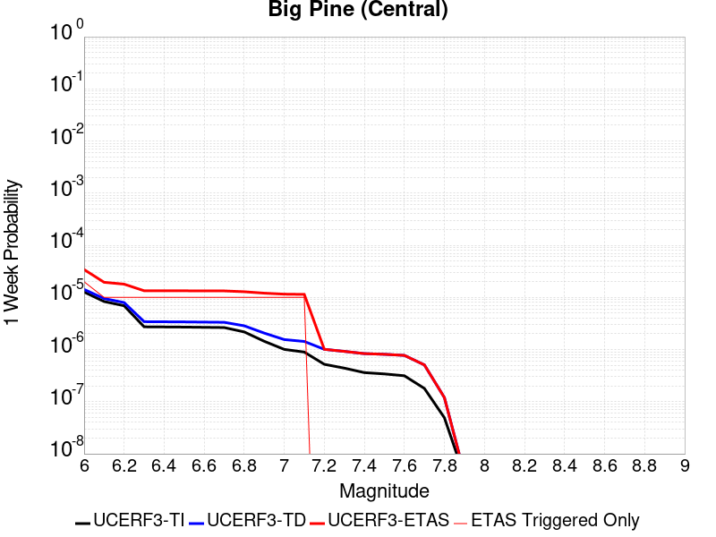 | 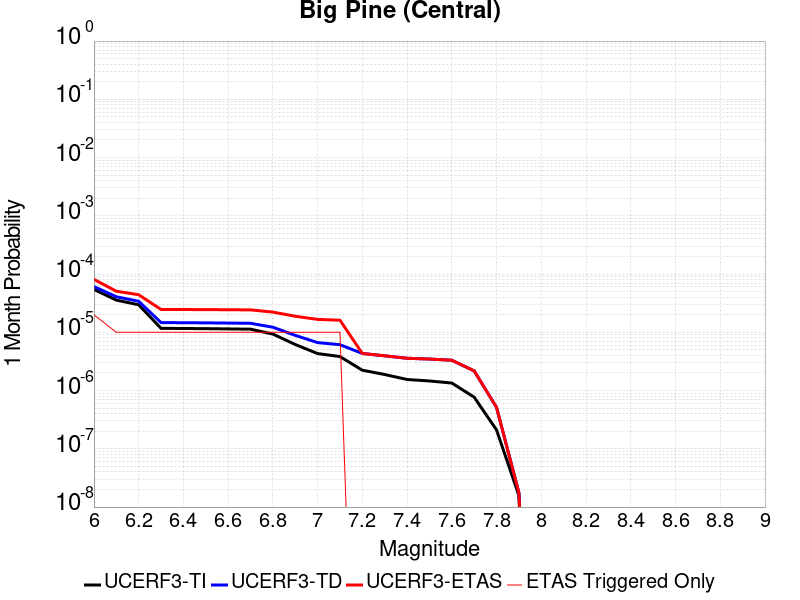 | 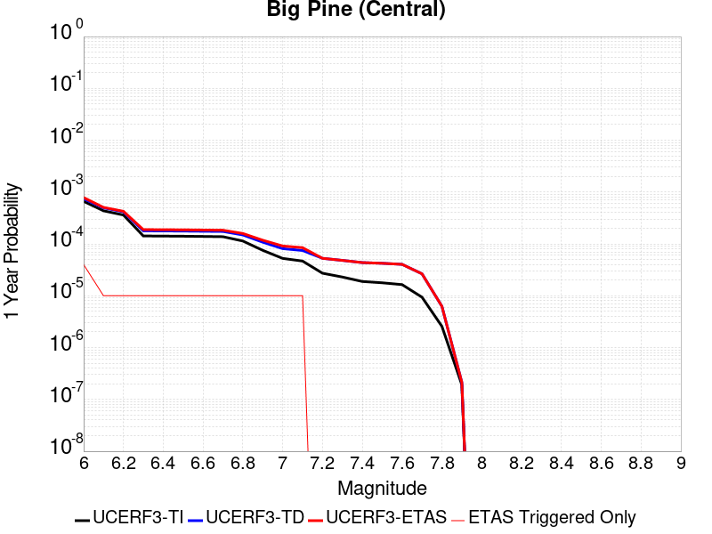 | 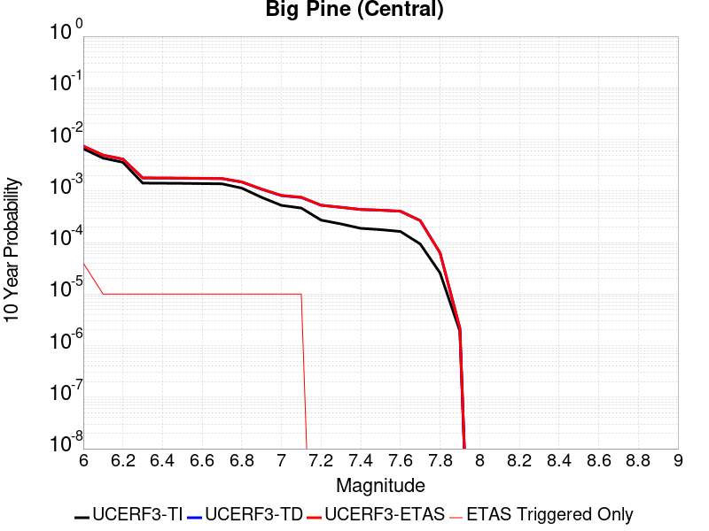 |

| Magnitude | 1 wk TI Prob | 1 wk TD Prob | 1 wk ETAS Prob | 1 wk ETAS/TD Gain | 1 wk ETAS Triggered Only | 1 mo TI Prob | 1 mo TD Prob | 1 mo ETAS Prob | 1 mo ETAS/TD Gain | 1 mo ETAS Triggered Only | 1 yr TI Prob | 1 yr TD Prob | 1 yr ETAS Prob | 1 yr ETAS/TD Gain | 1 yr ETAS Triggered Only | 10 yr TI Prob | 10 yr TD Prob | 10 yr ETAS Prob | 10 yr ETAS/TD Gain | 10 yr ETAS Triggered Only |
|-----|-----|-----|-----|-----|-----|-----|-----|-----|-----|-----|-----|-----|-----|-----|-----|-----|-----|-----|-----|-----|
| 6.0 | 1.2706755E-5 | 1.4250602E-5 | 3.425032E-5 | 2.4034295 | 2.0E-5 | 5.4456385E-5 | 6.107279E-5 | 8.1071565E-5 | 1.3274581 | 2.0E-5 | 6.628048E-4 | 7.433441E-4 | 7.8331435E-4 | 1.0537709 | 4.0E-5 | 0.006608314 | 0.007413639 | 0.007453343 | 1.0053555 | 4.0E-5 |
| 6.1 | 8.342579E-6 | 9.510835E-6 | 1.951074E-5 | 2.0514224 | 1.0E-5 | 3.5753423E-5 | 4.076021E-5 | 5.07598E-5 | 1.2453274 | 1.0E-5 | 4.3521097E-4 | 4.9616426E-4 | 5.061593E-4 | 1.0201446 | 1.0E-5 | 0.0043435963 | 0.004954155 | 0.0049641053 | 1.0020086 | 1.0E-5 |
| 6.2 | 6.923899E-6 | 7.967221E-6 | 1.7967142E-5 | 2.2551327 | 1.0E-5 | 2.9673516E-5 | 3.4144894E-5 | 4.4144555E-5 | 1.2928596 | 1.0E-5 | 3.6121515E-4 | 4.1565404E-4 | 4.256499E-4 | 1.0240484 | 1.0E-5 | 0.003606286 | 0.0041521094 | 0.004162068 | 1.0023984 | 1.0E-5 |
| 6.3 | 2.728396E-6 | 3.4243646E-6 | 1.342433E-5 | 3.9202397 | 1.0E-5 | 1.1693074E-5 | 1.4675771E-5 | 2.4675624E-5 | 1.6813852 | 1.0E-5 | 1.4235388E-4 | 1.7866373E-4 | 1.8866194E-4 | 1.055961 | 1.0E-5 | 0.0014226272 | 0.0017867433 | 0.0017967254 | 1.0055867 | 1.0E-5 |
| 6.4 | 2.7136944E-6 | 3.4086581E-6 | 1.3408624E-5 | 3.9336958 | 1.0E-5 | 1.1630066E-5 | 1.4608458E-5 | 2.4608311E-5 | 1.6845249 | 1.0E-5 | 1.4158686E-4 | 1.7784433E-4 | 1.8784255E-4 | 1.056219 | 1.0E-5 | 0.0014149669 | 0.0017785623 | 0.0017885446 | 1.0056125 | 1.0E-5 |
| 6.5 | 2.6971882E-6 | 3.3910032E-6 | 1.3390969E-5 | 3.9489698 | 1.0E-5 | 1.1559327E-5 | 1.4532795E-5 | 2.453265E-5 | 1.6880889 | 1.0E-5 | 1.4072572E-4 | 1.7692328E-4 | 1.869215E-4 | 1.0565116 | 1.0E-5 | 0.0014063664 | 0.0017693666 | 0.0017793488 | 1.0056417 | 1.0E-5 |
| 6.6 | 2.669092E-6 | 3.3610236E-6 | 1.336099E-5 | 3.975274 | 1.0E-5 | 1.1438916E-5 | 1.4404312E-5 | 2.4404168E-5 | 1.6942265 | 1.0E-5 | 1.3925991E-4 | 1.7535927E-4 | 1.8535751E-4 | 1.0570158 | 1.0E-5 | 0.0013917267 | 0.0017537511 | 0.0017637336 | 1.005692 | 1.0E-5 |
| 6.7 | 2.6408059E-6 | 3.3310494E-6 | 1.3331016E-5 | 4.002047 | 1.0E-5 | 1.1317691E-5 | 1.4275853E-5 | 2.4275709E-5 | 1.7004735 | 1.0E-5 | 1.3778417E-4 | 1.737955E-4 | 1.8379377E-4 | 1.0575289 | 1.0E-5 | 0.0013769877 | 0.0017381381 | 0.0017481208 | 1.0057433 | 1.0E-5 |
| 6.8 | 2.1786943E-6 | 2.8545066E-6 | 1.2854478E-5 | 4.5032225 | 1.0E-5 | 9.337228E-6 | 1.2233547E-5 | 2.2233424E-5 | 1.8174144 | 1.0E-5 | 1.1367482E-4 | 1.4893398E-4 | 1.5893248E-4 | 1.0671339 | 1.0E-5 | 0.0011361669 | 0.0014898704 | 0.0014998555 | 1.006702 | 1.0E-5 |
| 6.9 | 1.4411696E-6 | 2.0685677E-6 | 1.2068547E-5 | 5.834253 | 1.0E-5 | 6.1764263E-6 | 8.865261E-6 | 1.8865174E-5 | 2.1279883 | 1.0E-5 | 7.51954E-5 | 1.0792949E-4 | 1.1792841E-4 | 1.0926431 | 1.0E-5 | 7.5169955E-4 | 0.0010802548 | 0.001090244 | 1.0092471 | 1.0E-5 |
| 7.0 | 1.0073411E-6 | 1.5543274E-6 | 1.1554312E-5 | 7.433641 | 1.0E-5 | 4.317169E-6 | 6.661387E-6 | 1.666132E-5 | 2.501179 | 1.0E-5 | 5.2560266E-5 | 8.109952E-5 | 9.109871E-5 | 1.1232953 | 1.0E-5 | 5.2547833E-4 | 8.1217213E-4 | 8.2216406E-4 | 1.0123026 | 1.0E-5 |
| 7.1 | 8.947104E-7 | 1.430316E-6 | 1.1430302E-5 | 7.9914517 | 1.0E-5 | 3.834468E-6 | 6.1299124E-6 | 1.612985E-5 | 2.6313348 | 1.0E-5 | 4.6683643E-5 | 7.462928E-5 | 8.462853E-5 | 1.1339856 | 1.0E-5 | 4.6673836E-4 | 7.4751483E-4 | 7.5750734E-4 | 1.0133677 | 1.0E-5 |
| 7.2 | 5.215166E-7 | 1.0112277E-6 | 1.0112277E-6 | 1.0 | 0.0 | 2.2350691E-6 | 4.333826E-6 | 4.333826E-6 | 1.0 | 0.0 | 2.7211627E-5 | 5.27631E-5 | 5.27631E-5 | 1.0 | 0.0 | 2.7208295E-4 | 5.289683E-4 | 5.289683E-4 | 1.0 | 0.0 |
| 7.3 | 4.4024807E-7 | 9.220183E-7 | 9.220183E-7 | 1.0 | 0.0 | 1.8867761E-6 | 3.951501E-6 | 3.951501E-6 | 1.0 | 0.0 | 2.2971257E-5 | 4.8108504E-5 | 4.8108504E-5 | 1.0 | 0.0 | 2.2968883E-4 | 4.824433E-4 | 4.824433E-4 | 1.0 | 0.0 |
| 7.4 | 3.6130905E-7 | 8.359109E-7 | 8.359109E-7 | 1.0 | 0.0 | 1.5484665E-6 | 3.5824705E-6 | 3.5824705E-6 | 1.0 | 0.0 | 1.8852415E-5 | 4.3615746E-5 | 4.3615746E-5 | 1.0 | 0.0 | 1.8850817E-4 | 4.3752496E-4 | 4.3752496E-4 | 1.0 | 0.0 |
| 7.5 | 3.408184E-7 | 8.1087245E-7 | 8.1087245E-7 | 1.0 | 0.0 | 1.4606494E-6 | 3.475163E-6 | 3.475163E-6 | 1.0 | 0.0 | 1.7783263E-5 | 4.230933E-5 | 4.230933E-5 | 1.0 | 0.0 | 1.778184E-4 | 4.2444657E-4 | 4.2444657E-4 | 1.0 | 0.0 |
| 7.6 | 3.1428627E-7 | 7.732167E-7 | 7.732167E-7 | 1.0 | 0.0 | 1.3469405E-6 | 3.313782E-6 | 3.313782E-6 | 1.0 | 0.0 | 1.6398877E-5 | 4.0344585E-5 | 4.0344585E-5 | 1.0 | 0.0 | 1.6397667E-4 | 4.0477706E-4 | 4.0477706E-4 | 1.0 | 0.0 |
| 7.7 | 1.7972785E-7 | 5.0782415E-7 | 5.0782415E-7 | 1.0 | 0.0 | 7.70262E-7 | 2.1763874E-6 | 2.1763874E-6 | 1.0 | 0.0 | 9.377899E-6 | 2.6497206E-5 | 2.6497206E-5 | 1.0 | 0.0 | 9.377503E-5 | 2.6633305E-4 | 2.6633305E-4 | 1.0 | 0.0 |
| 7.8 | 4.9230927E-8 | 1.1981747E-7 | 1.1981747E-7 | 1.0 | 0.0 | 2.1098968E-7 | 5.135033E-7 | 5.135033E-7 | 1.0 | 0.0 | 2.5687964E-6 | 6.2518866E-6 | 6.2518866E-6 | 1.0 | 0.0 | 2.5687666E-5 | 6.2971965E-5 | 6.2971965E-5 | 1.0 | 0.0 |
| 7.9 | 3.6805972E-9 | 4.1051638E-9 | 4.1051638E-9 | 1.0 | 0.0 | 1.5773987E-8 | 1.7593557E-8 | 1.7593557E-8 | 1.0 | 0.0 | 1.9204828E-7 | 2.1420155E-7 | 2.1420155E-7 | 1.0 | 0.0 | 1.920481E-6 | 2.1898923E-6 | 2.1898923E-6 | 1.0 | 0.0 |

## San Clemente
*[(top)](#table-of-contents)*

| 1 Week | 1 Month | 1 Year | 10 Year |
|-----|-----|-----|-----|
| 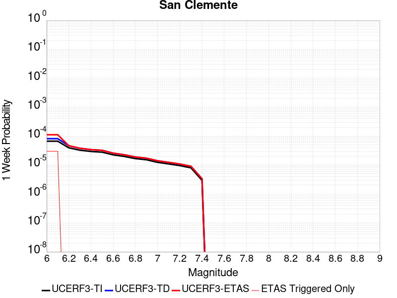 | 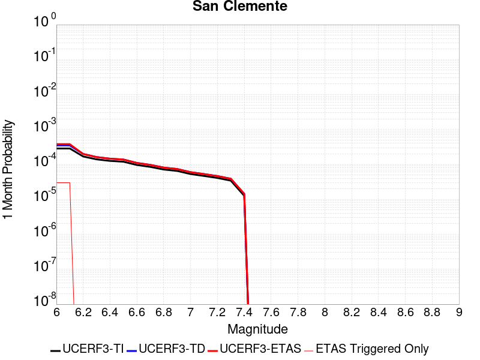 | 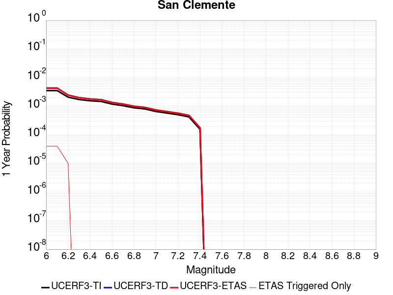 | 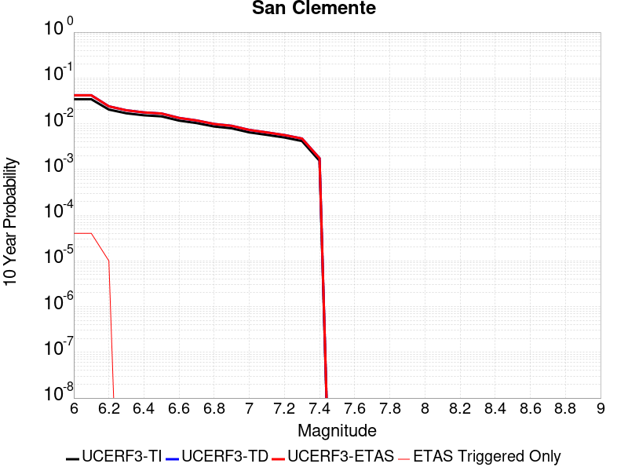 |

| Magnitude | 1 wk TI Prob | 1 wk TD Prob | 1 wk ETAS Prob | 1 wk ETAS/TD Gain | 1 wk ETAS Triggered Only | 1 mo TI Prob | 1 mo TD Prob | 1 mo ETAS Prob | 1 mo ETAS/TD Gain | 1 mo ETAS Triggered Only | 1 yr TI Prob | 1 yr TD Prob | 1 yr ETAS Prob | 1 yr ETAS/TD Gain | 1 yr ETAS Triggered Only | 10 yr TI Prob | 10 yr TD Prob | 10 yr ETAS Prob | 10 yr ETAS/TD Gain | 10 yr ETAS Triggered Only |
|-----|-----|-----|-----|-----|-----|-----|-----|-----|-----|-----|-----|-----|-----|-----|-----|-----|-----|-----|-----|-----|
| 6.0 | 6.681379E-5 | 8.163834E-5 | 1.1163589E-4 | 1.3674444 | 3.0E-5 | 2.8631336E-4 | 3.4983488E-4 | 3.798244E-4 | 1.0857247 | 3.0E-5 | 0.003480294 | 0.00425141 | 0.00429124 | 1.0093687 | 4.0E-5 | 0.03426291 | 0.04175603 | 0.04179436 | 1.0009179 | 4.0E-5 |
| 6.1 | 6.681379E-5 | 8.163834E-5 | 1.1163589E-4 | 1.3674444 | 3.0E-5 | 2.8631336E-4 | 3.4983488E-4 | 3.798244E-4 | 1.0857247 | 3.0E-5 | 0.003480294 | 0.00425141 | 0.00429124 | 1.0093687 | 4.0E-5 | 0.03426291 | 0.04175603 | 0.04179436 | 1.0009179 | 4.0E-5 |
| 6.2 | 3.9400576E-5 | 4.6452373E-5 | 4.6452373E-5 | 1.0 | 0.0 | 1.6884868E-4 | 1.9906677E-4 | 1.9906677E-4 | 1.0 | 0.0 | 0.0020537945 | 0.0024209984 | 0.0024309743 | 1.0041205 | 1.0E-5 | 0.020349167 | 0.023952903 | 0.023962663 | 1.0004075 | 1.0E-5 |
| 6.3 | 3.2590255E-5 | 3.792912E-5 | 3.792912E-5 | 1.0 | 0.0 | 1.3966505E-4 | 1.6254342E-4 | 1.6254342E-4 | 1.0 | 0.0 | 0.0016990956 | 0.0019772002 | 0.0019772002 | 1.0 | 0.0 | 0.01686163 | 0.019599883 | 0.019599883 | 1.0 | 0.0 |
| 6.4 | 2.9454652E-5 | 3.4097764E-5 | 3.4097764E-5 | 1.0 | 0.0 | 1.2622811E-4 | 1.4612524E-4 | 1.4612524E-4 | 1.0 | 0.0 | 0.0015357438 | 0.0017776493 | 0.0017776493 | 1.0 | 0.0 | 0.015251739 | 0.01763747 | 0.01763747 | 1.0 | 0.0 |
| 6.5 | 2.790836E-5 | 3.2247463E-5 | 3.2247463E-5 | 1.0 | 0.0 | 1.1960178E-4 | 1.3819624E-4 | 1.3819624E-4 | 1.0 | 0.0 | 0.001455179 | 0.0016812662 | 0.0016812662 | 1.0 | 0.0 | 0.014456868 | 0.016688485 | 0.016688485 | 1.0 | 0.0 |
| 6.6 | 2.2492153E-5 | 2.5762702E-5 | 2.5762702E-5 | 1.0 | 0.0 | 9.639138E-5 | 1.1040699E-4 | 1.1040699E-4 | 1.0 | 0.0 | 0.0011729331 | 0.0013433909 | 0.0013433909 | 1.0 | 0.0 | 0.011667615 | 0.013354417 | 0.013354417 | 1.0 | 0.0 |
| 6.7 | 1.9862755E-5 | 2.2666423E-5 | 2.2666423E-5 | 1.0 | 0.0 | 8.512331E-5 | 9.713826E-5 | 9.713826E-5 | 1.0 | 0.0 | 0.0010358836 | 0.0011820279 | 0.0011820279 | 1.0 | 0.0 | 0.010310682 | 0.011758701 | 0.011758701 | 1.0 | 0.0 |
| 6.8 | 1.6697575E-5 | 1.897771E-5 | 1.897771E-5 | 1.0 | 0.0 | 7.155907E-5 | 8.133056E-5 | 8.133056E-5 | 1.0 | 0.0 | 8.7088346E-4 | 9.897591E-4 | 9.897591E-4 | 1.0 | 0.0 | 0.008674784 | 0.0098545365 | 0.0098545365 | 1.0 | 0.0 |
| 6.9 | 1.5218415E-5 | 1.72694E-5 | 1.72694E-5 | 1.0 | 0.0 | 6.522015E-5 | 7.4009666E-5 | 7.4009666E-5 | 1.0 | 0.0 | 7.93766E-4 | 9.00704E-4 | 9.00704E-4 | 1.0 | 0.0 | 0.007909367 | 0.008971481 | 0.008971481 | 1.0 | 0.0 |
| 7.0 | 1.2392958E-5 | 1.4033016E-5 | 1.4033016E-5 | 1.0 | 0.0 | 5.3111595E-5 | 6.014015E-5 | 6.014015E-5 | 1.0 | 0.0 | 6.4644177E-4 | 7.319679E-4 | 7.319679E-4 | 1.0 | 0.0 | 0.0064456454 | 0.0072963564 | 0.0072963564 | 1.0 | 0.0 |
| 7.1 | 1.0934128E-5 | 1.2375138E-5 | 1.2375138E-5 | 1.0 | 0.0 | 4.6859706E-5 | 5.303527E-5 | 5.303527E-5 | 1.0 | 0.0 | 5.7036756E-4 | 6.455204E-4 | 6.455204E-4 | 1.0 | 0.0 | 0.0056890585 | 0.0064371997 | 0.0064371997 | 1.0 | 0.0 |
| 7.2 | 9.5798805E-6 | 1.0844935E-5 | 1.0844935E-5 | 1.0 | 0.0 | 4.1055984E-5 | 4.6477508E-5 | 4.6477508E-5 | 1.0 | 0.0 | 4.9974193E-4 | 5.657239E-4 | 5.657239E-4 | 1.0 | 0.0 | 0.0049861963 | 0.0056435615 | 0.0056435615 | 1.0 | 0.0 |
| 7.3 | 8.0167365E-6 | 9.083918E-6 | 9.083918E-6 | 1.0 | 0.0 | 3.4356988E-5 | 3.8930535E-5 | 3.8930535E-5 | 1.0 | 0.0 | 4.1821605E-4 | 4.7388324E-4 | 4.7388324E-4 | 1.0 | 0.0 | 0.0041742986 | 0.0047294297 | 0.0047294297 | 1.0 | 0.0 |
| 7.4 | 2.9581017E-6 | 3.3623792E-6 | 3.3623792E-6 | 1.0 | 0.0 | 1.2677518E-5 | 1.4410146E-5 | 1.4410146E-5 | 1.0 | 0.0 | 1.5433785E-4 | 1.7543444E-4 | 1.7543444E-4 | 1.0 | 0.0 | 0.001542307 | 0.0017534546 | 0.0017534546 | 1.0 | 0.0 |

## Big Pine (East)
*[(top)](#table-of-contents)*

| 1 Week | 1 Month | 1 Year | 10 Year |
|-----|-----|-----|-----|
| 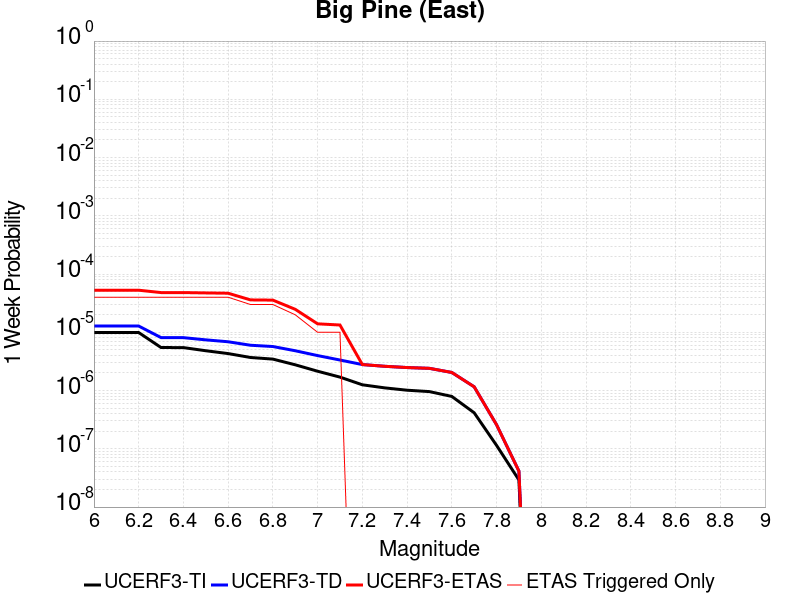 |  | 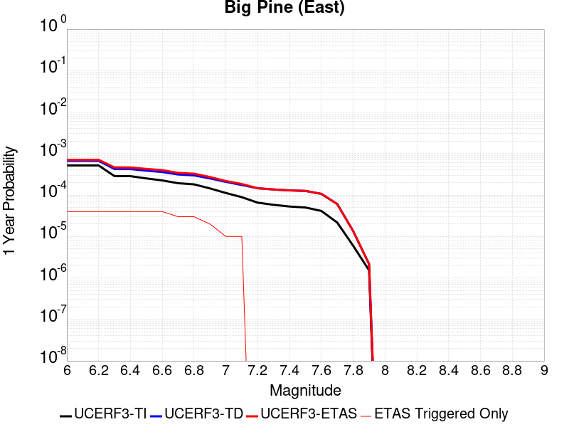 | 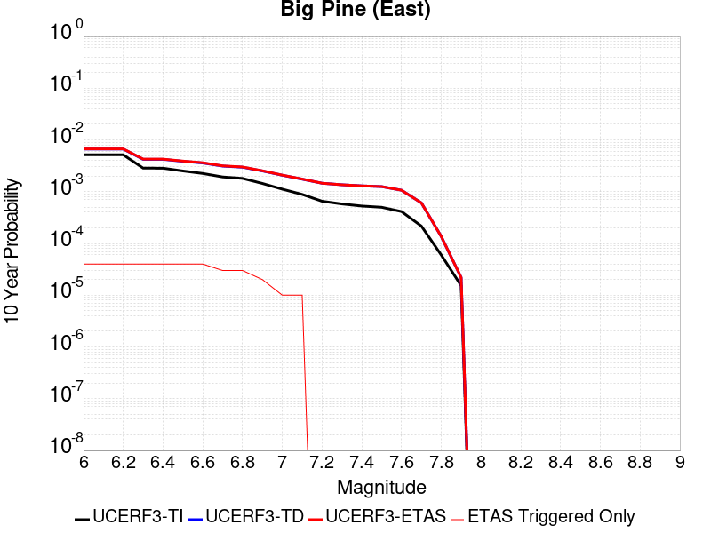 |

| Magnitude | 1 wk TI Prob | 1 wk TD Prob | 1 wk ETAS Prob | 1 wk ETAS/TD Gain | 1 wk ETAS Triggered Only | 1 mo TI Prob | 1 mo TD Prob | 1 mo ETAS Prob | 1 mo ETAS/TD Gain | 1 mo ETAS Triggered Only | 1 yr TI Prob | 1 yr TD Prob | 1 yr ETAS Prob | 1 yr ETAS/TD Gain | 1 yr ETAS Triggered Only | 10 yr TI Prob | 10 yr TD Prob | 10 yr ETAS Prob | 10 yr ETAS/TD Gain | 10 yr ETAS Triggered Only |
|-----|-----|-----|-----|-----|-----|-----|-----|-----|-----|-----|-----|-----|-----|-----|-----|-----|-----|-----|-----|-----|
| 6.0 | 9.916913E-6 | 1.28172705E-5 | 5.281676E-5 | 4.120749 | 4.0E-5 | 4.250036E-5 | 5.493013E-5 | 9.4927935E-5 | 1.7281579 | 4.0E-5 | 5.173191E-4 | 6.685912E-4 | 7.085645E-4 | 1.0597873 | 4.0E-5 | 0.0051611643 | 0.006670449 | 0.006710182 | 1.0059566 | 4.0E-5 |
| 6.1 | 9.916913E-6 | 1.28172705E-5 | 5.281676E-5 | 4.120749 | 4.0E-5 | 4.250036E-5 | 5.493013E-5 | 9.4927935E-5 | 1.7281579 | 4.0E-5 | 5.173191E-4 | 6.685912E-4 | 7.085645E-4 | 1.0597873 | 4.0E-5 | 0.0051611643 | 0.006670449 | 0.006710182 | 1.0059566 | 4.0E-5 |
| 6.2 | 9.916913E-6 | 1.28172705E-5 | 5.281676E-5 | 4.120749 | 4.0E-5 | 4.250036E-5 | 5.493013E-5 | 9.4927935E-5 | 1.7281579 | 4.0E-5 | 5.173191E-4 | 6.685912E-4 | 7.085645E-4 | 1.0597873 | 4.0E-5 | 0.0051611643 | 0.006670449 | 0.006710182 | 1.0059566 | 4.0E-5 |
| 6.3 | 5.479711E-6 | 8.1132375E-6 | 4.8112914E-5 | 5.9301744 | 4.0E-5 | 2.3484265E-5 | 3.4770575E-5 | 7.476918E-5 | 2.150358 | 4.0E-5 | 2.858834E-4 | 4.232527E-4 | 4.6323577E-4 | 1.0944662 | 4.0E-5 | 0.0028551589 | 0.0042272513 | 0.004267082 | 1.0094224 | 4.0E-5 |
| 6.4 | 5.465009E-6 | 8.0975315E-6 | 4.809721E-5 | 5.9397373 | 4.0E-5 | 2.3421257E-5 | 3.4703262E-5 | 7.470187E-5 | 2.1525893 | 4.0E-5 | 2.851165E-4 | 4.2243348E-4 | 4.624166E-4 | 1.0946494 | 4.0E-5 | 0.0028475097 | 0.00421909 | 0.0042589214 | 1.0094407 | 4.0E-5 |
| 6.5 | 4.826767E-6 | 7.4225877E-6 | 4.742229E-5 | 6.3889165 | 4.0E-5 | 2.068598E-5 | 3.1810716E-5 | 7.1809445E-5 | 2.257398 | 4.0E-5 | 2.518227E-4 | 3.8722943E-4 | 4.2721393E-4 | 1.1032579 | 4.0E-5 | 0.0025153751 | 0.0038682907 | 0.003908136 | 1.0103005 | 4.0E-5 |
| 6.6 | 4.3146847E-6 | 6.8825234E-6 | 4.6882247E-5 | 6.811782 | 4.0E-5 | 1.8491375E-5 | 2.949621E-5 | 6.949503E-5 | 2.3560665 | 4.0E-5 | 2.2510924E-4 | 3.5905963E-4 | 3.9904527E-4 | 1.1113621 | 4.0E-5 | 0.0022488134 | 0.0035875062 | 0.0036273627 | 1.0111098 | 4.0E-5 |
| 6.7 | 3.6968106E-6 | 5.9957474E-6 | 3.5995567E-5 | 6.003516 | 3.0E-5 | 1.5843378E-5 | 2.5695816E-5 | 5.5695047E-5 | 2.1674752 | 3.0E-5 | 1.9287605E-4 | 3.128032E-4 | 3.427938E-4 | 1.0958769 | 3.0E-5 | 0.0019270873 | 0.0031262499 | 0.003156156 | 1.0095662 | 3.0E-5 |
| 6.8 | 3.4671132E-6 | 5.7024477E-6 | 3.5702276E-5 | 6.2608685 | 3.0E-5 | 1.4858972E-5 | 2.4438841E-5 | 5.4438107E-5 | 2.227524 | 3.0E-5 | 1.8089297E-4 | 2.9750372E-4 | 3.2749478E-4 | 1.1008091 | 3.0E-5 | 0.0018074579 | 0.0029736666 | 0.0030035775 | 1.0100585 | 3.0E-5 |
| 6.9 | 2.7686972E-6 | 4.8254797E-6 | 2.4825384E-5 | 5.1446457 | 2.0E-5 | 1.1865792E-5 | 2.0680467E-5 | 4.0680054E-5 | 1.9670762 | 2.0E-5 | 1.4445644E-4 | 2.5175634E-4 | 2.717513E-4 | 1.0794219 | 2.0E-5 | 0.0014436257 | 0.002517256 | 0.0025372056 | 1.0079252 | 2.0E-5 |
| 7.0 | 2.1472624E-6 | 3.985277E-6 | 1.3985237E-5 | 3.5092258 | 1.0E-5 | 9.20252E-6 | 1.707965E-5 | 2.7079479E-5 | 1.5854821 | 1.0E-5 | 1.12034926E-4 | 2.0792543E-4 | 2.1792336E-4 | 1.0480841 | 1.0E-5 | 0.0011197845 | 0.0020798238 | 0.002089803 | 1.004798 | 1.0E-5 |
| 7.1 | 1.7018335E-6 | 3.3450835E-6 | 1.334505E-5 | 3.989452 | 1.0E-5 | 7.293552E-6 | 1.4335996E-5 | 2.4335852E-5 | 1.6975348 | 1.0E-5 | 8.879537E-5 | 1.7452713E-4 | 1.8452539E-4 | 1.0572877 | 1.0E-5 | 8.87599E-4 | 0.0017463792 | 0.0017563617 | 1.0057161 | 1.0E-5 |
| 7.2 | 1.25603E-6 | 2.794679E-6 | 2.794679E-6 | 1.0 | 0.0 | 5.3829745E-6 | 1.1977142E-5 | 1.1977142E-5 | 1.0 | 0.0 | 6.553574E-5 | 1.4581217E-4 | 1.4581217E-4 | 1.0 | 0.0 | 6.551642E-4 | 0.0014596173 | 0.0014596173 | 1.0 | 0.0 |
| 7.3 | 1.112297E-6 | 2.610519E-6 | 2.610519E-6 | 1.0 | 0.0 | 4.7669787E-6 | 1.1187892E-5 | 1.1187892E-5 | 1.0 | 0.0 | 5.803642E-5 | 1.3620428E-4 | 1.3620428E-4 | 1.0 | 0.0 | 5.802127E-4 | 0.001363502 | 0.001363502 | 1.0 | 0.0 |
| 7.4 | 1.0137181E-6 | 2.4836752E-6 | 2.4836752E-6 | 1.0 | 0.0 | 4.3444993E-6 | 1.064428E-5 | 1.064428E-5 | 1.0 | 0.0 | 5.2892992E-5 | 1.2958662E-4 | 1.2958662E-4 | 1.0 | 0.0 | 5.288041E-4 | 0.0012971918 | 0.0012971918 | 1.0 | 0.0 |
| 7.5 | 9.598608E-7 | 2.407328E-6 | 2.407328E-6 | 1.0 | 0.0 | 4.1136827E-6 | 1.03170805E-5 | 1.03170805E-5 | 1.0 | 0.0 | 5.0082934E-5 | 1.2560343E-4 | 1.2560343E-4 | 1.0 | 0.0 | 5.007165E-4 | 0.0012572132 | 0.0012572132 | 1.0 | 0.0 |
| 7.6 | 7.929459E-7 | 2.0450152E-6 | 2.0450152E-6 | 1.0 | 0.0 | 3.3983351E-6 | 8.764322E-6 | 8.764322E-6 | 1.0 | 0.0 | 4.1373947E-5 | 1.0670057E-4 | 1.0670057E-4 | 1.0 | 0.0 | 4.1366243E-4 | 0.0010685825 | 0.0010685825 | 1.0 | 0.0 |
| 7.7 | 4.155788E-7 | 1.1606729E-6 | 1.1606729E-6 | 1.0 | 0.0 | 1.7810507E-6 | 4.974303E-6 | 4.974303E-6 | 1.0 | 0.0 | 2.1684076E-5 | 6.05605E-5 | 6.05605E-5 | 1.0 | 0.0 | 2.1681961E-4 | 6.085995E-4 | 6.085995E-4 | 1.0 | 0.0 |
| 7.8 | 1.14666925E-7 | 2.592197E-7 | 2.592197E-7 | 1.0 | 0.0 | 4.914296E-7 | 1.1109411E-6 | 1.1109411E-6 | 1.0 | 0.0 | 5.9831386E-6 | 1.3525627E-5 | 1.3525627E-5 | 1.0 | 0.0 | 5.9829777E-5 | 1.3636416E-4 | 1.3636416E-4 | 1.0 | 0.0 |
| 7.9 | 2.9231824E-8 | 4.1462318E-8 | 4.1462318E-8 | 1.0 | 0.0 | 1.2527924E-7 | 1.7769564E-7 | 1.7769564E-7 | 1.0 | 0.0 | 1.5252737E-6 | 2.1634426E-6 | 2.1634426E-6 | 1.0 | 0.0 | 1.5252632E-5 | 2.197062E-5 | 2.197062E-5 | 1.0 | 0.0 |

## Pine Mtn
*[(top)](#table-of-contents)*

| 1 Week | 1 Month | 1 Year | 10 Year |
|-----|-----|-----|-----|
| 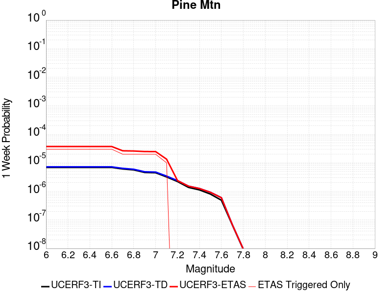 | 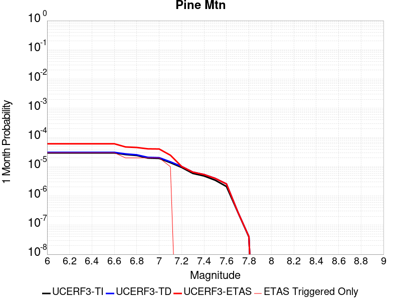 | 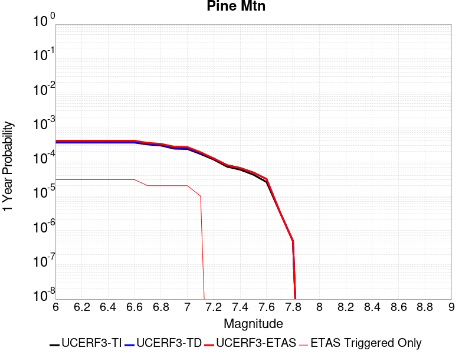 | 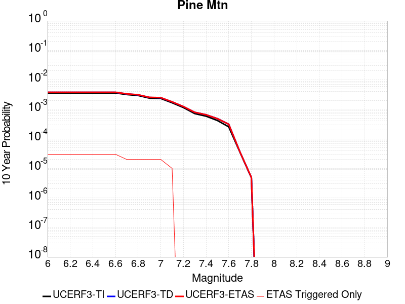 |

| Magnitude | 1 wk TI Prob | 1 wk TD Prob | 1 wk ETAS Prob | 1 wk ETAS/TD Gain | 1 wk ETAS Triggered Only | 1 mo TI Prob | 1 mo TD Prob | 1 mo ETAS Prob | 1 mo ETAS/TD Gain | 1 mo ETAS Triggered Only | 1 yr TI Prob | 1 yr TD Prob | 1 yr ETAS Prob | 1 yr ETAS/TD Gain | 1 yr ETAS Triggered Only | 10 yr TI Prob | 10 yr TD Prob | 10 yr ETAS Prob | 10 yr ETAS/TD Gain | 10 yr ETAS Triggered Only |
|-----|-----|-----|-----|-----|-----|-----|-----|-----|-----|-----|-----|-----|-----|-----|-----|-----|-----|-----|-----|-----|
| 6.0 | 6.894797E-6 | 7.2254716E-6 | 3.7225254E-5 | 5.151948 | 3.0E-5 | 2.9548795E-5 | 3.0965955E-5 | 6.0965027E-5 | 1.9687759 | 3.0E-5 | 3.596972E-4 | 3.7694827E-4 | 4.0693698E-4 | 1.0795565 | 3.0E-5 | 0.0035911554 | 0.0037633865 | 0.0037932736 | 1.0079415 | 3.0E-5 |
| 6.1 | 6.894797E-6 | 7.2254716E-6 | 3.7225254E-5 | 5.151948 | 3.0E-5 | 2.9548795E-5 | 3.0965955E-5 | 6.0965027E-5 | 1.9687759 | 3.0E-5 | 3.596972E-4 | 3.7694827E-4 | 4.0693698E-4 | 1.0795565 | 3.0E-5 | 0.0035911554 | 0.0037633865 | 0.0037932736 | 1.0079415 | 3.0E-5 |
| 6.2 | 6.894797E-6 | 7.2254716E-6 | 3.7225254E-5 | 5.151948 | 3.0E-5 | 2.9548795E-5 | 3.0965955E-5 | 6.0965027E-5 | 1.9687759 | 3.0E-5 | 3.596972E-4 | 3.7694827E-4 | 4.0693698E-4 | 1.0795565 | 3.0E-5 | 0.0035911554 | 0.0037633865 | 0.0037932736 | 1.0079415 | 3.0E-5 |
| 6.3 | 6.894797E-6 | 7.2254716E-6 | 3.7225254E-5 | 5.151948 | 3.0E-5 | 2.9548795E-5 | 3.0965955E-5 | 6.0965027E-5 | 1.9687759 | 3.0E-5 | 3.596972E-4 | 3.7694827E-4 | 4.0693698E-4 | 1.0795565 | 3.0E-5 | 0.0035911554 | 0.0037633865 | 0.0037932736 | 1.0079415 | 3.0E-5 |
| 6.4 | 6.894797E-6 | 7.2254716E-6 | 3.7225254E-5 | 5.151948 | 3.0E-5 | 2.9548795E-5 | 3.0965955E-5 | 6.0965027E-5 | 1.9687759 | 3.0E-5 | 3.596972E-4 | 3.7694827E-4 | 4.0693698E-4 | 1.0795565 | 3.0E-5 | 0.0035911554 | 0.0037633865 | 0.0037932736 | 1.0079415 | 3.0E-5 |
| 6.5 | 6.894797E-6 | 7.2254716E-6 | 3.7225254E-5 | 5.151948 | 3.0E-5 | 2.9548795E-5 | 3.0965955E-5 | 6.0965027E-5 | 1.9687759 | 3.0E-5 | 3.596972E-4 | 3.7694827E-4 | 4.0693698E-4 | 1.0795565 | 3.0E-5 | 0.0035911554 | 0.0037633865 | 0.0037932736 | 1.0079415 | 3.0E-5 |
| 6.6 | 6.894797E-6 | 7.2254716E-6 | 3.7225254E-5 | 5.151948 | 3.0E-5 | 2.9548795E-5 | 3.0965955E-5 | 6.0965027E-5 | 1.9687759 | 3.0E-5 | 3.596972E-4 | 3.7694827E-4 | 4.0693698E-4 | 1.0795565 | 3.0E-5 | 0.0035911554 | 0.0037633865 | 0.0037932736 | 1.0079415 | 3.0E-5 |
| 6.7 | 6.0867933E-6 | 6.397124E-6 | 2.6396996E-5 | 4.126385 | 2.0E-5 | 2.6085996E-5 | 2.7415968E-5 | 4.741542E-5 | 1.7294818 | 2.0E-5 | 3.1755073E-4 | 3.337405E-4 | 3.537338E-4 | 1.0599068 | 2.0E-5 | 0.0031709734 | 0.0033326119 | 0.0033525452 | 1.0059813 | 2.0E-5 |
| 6.8 | 5.6530425E-6 | 5.950606E-6 | 2.5950487E-5 | 4.3609824 | 2.0E-5 | 2.42271E-5 | 2.5502359E-5 | 4.550185E-5 | 1.7842212 | 2.0E-5 | 2.94925E-4 | 3.1044905E-4 | 3.3044282E-4 | 1.0644028 | 2.0E-5 | 0.002945339 | 0.0031003582 | 0.0031202962 | 1.0064309 | 2.0E-5 |
| 6.9 | 4.6015225E-6 | 4.8638444E-6 | 2.4863748E-5 | 5.1119537 | 2.0E-5 | 1.9720663E-5 | 2.084489E-5 | 4.0844472E-5 | 1.9594477 | 2.0E-5 | 2.4007261E-4 | 2.5375842E-4 | 2.7375337E-4 | 1.0787951 | 2.0E-5 | 0.0023981342 | 0.002534831 | 0.00255478 | 1.0078701 | 2.0E-5 |
| 7.0 | 4.4875965E-6 | 4.7474837E-6 | 2.4747389E-5 | 5.212738 | 2.0E-5 | 1.9232413E-5 | 2.0346208E-5 | 4.03458E-5 | 1.9829642 | 2.0E-5 | 2.3412947E-4 | 2.4768838E-4 | 2.676834E-4 | 1.0807266 | 2.0E-5 | 0.0023388295 | 0.0024742668 | 0.0024942174 | 1.0080632 | 2.0E-5 |
| 7.1 | 3.203907E-6 | 3.42942E-6 | 1.3429386E-5 | 3.915935 | 1.0E-5 | 1.3730958E-5 | 1.4697435E-5 | 2.4697289E-5 | 1.6803808 | 1.0E-5 | 1.6716159E-4 | 1.7892725E-4 | 1.8892546E-4 | 1.0558786 | 1.0E-5 | 0.0016703589 | 0.001787898 | 0.0017978802 | 1.0055832 | 1.0E-5 |
| 7.2 | 2.2060601E-6 | 2.3784874E-6 | 2.3784874E-6 | 1.0 | 0.0 | 9.4545085E-6 | 1.019348E-5 | 1.019348E-5 | 1.0 | 0.0 | 1.15102564E-4 | 1.2409901E-4 | 1.2409901E-4 | 1.0 | 0.0 | 0.0011504296 | 0.0012403419 | 0.0012403419 | 1.0 | 0.0 |
| 7.3 | 1.3765207E-6 | 1.5216535E-6 | 1.5216535E-6 | 1.0 | 0.0 | 5.899361E-6 | 6.5213567E-6 | 6.5213567E-6 | 1.0 | 0.0 | 7.182235E-5 | 7.939472E-5 | 7.939472E-5 | 1.0 | 0.0 | 7.1799144E-4 | 7.9367263E-4 | 7.9367263E-4 | 1.0 | 0.0 |
| 7.4 | 1.1245983E-6 | 1.2587126E-6 | 1.2587126E-6 | 1.0 | 0.0 | 4.819698E-6 | 5.394472E-6 | 5.394472E-6 | 1.0 | 0.0 | 5.8678244E-5 | 6.56758E-5 | 6.56758E-5 | 1.0 | 0.0 | 5.866275E-4 | 6.565722E-4 | 6.565722E-4 | 1.0 | 0.0 |
| 7.5 | 8.031682E-7 | 9.276999E-7 | 9.276999E-7 | 1.0 | 0.0 | 3.4421448E-6 | 3.975851E-6 | 3.975851E-6 | 1.0 | 0.0 | 4.1907308E-5 | 4.840498E-5 | 4.840498E-5 | 1.0 | 0.0 | 4.1899405E-4 | 4.8395112E-4 | 4.8395112E-4 | 1.0 | 0.0 |
| 7.6 | 4.8953444E-7 | 6.0030544E-7 | 6.0030544E-7 | 1.0 | 0.0 | 2.098003E-6 | 2.5727354E-6 | 2.5727354E-6 | 1.0 | 0.0 | 2.5542888E-5 | 3.1322652E-5 | 3.1322652E-5 | 1.0 | 0.0 | 2.5539953E-4 | 3.1318725E-4 | 3.1318725E-4 | 1.0 | 0.0 |
| 7.7 | 6.634529E-8 | 6.788826E-8 | 6.788826E-8 | 1.0 | 0.0 | 2.843369E-7 | 2.9094966E-7 | 2.9094966E-7 | 1.0 | 0.0 | 3.4617963E-6 | 3.5423066E-6 | 3.5423066E-6 | 1.0 | 0.0 | 3.4617424E-5 | 3.542255E-5 | 3.542255E-5 | 1.0 | 0.0 |
| 7.8 | 9.235578E-9 | 9.488566E-9 | 9.488566E-9 | 1.0 | 0.0 | 3.9581046E-8 | 4.0665284E-8 | 4.0665284E-8 | 1.0 | 0.0 | 4.818991E-7 | 4.950997E-7 | 4.950997E-7 | 1.0 | 0.0 | 4.8189804E-6 | 4.950988E-6 | 4.950988E-6 | 1.0 | 0.0 |

## San Jacinto (Clark) rev
*[(top)](#table-of-contents)*

| 1 Week | 1 Month | 1 Year | 10 Year |
|-----|-----|-----|-----|
| 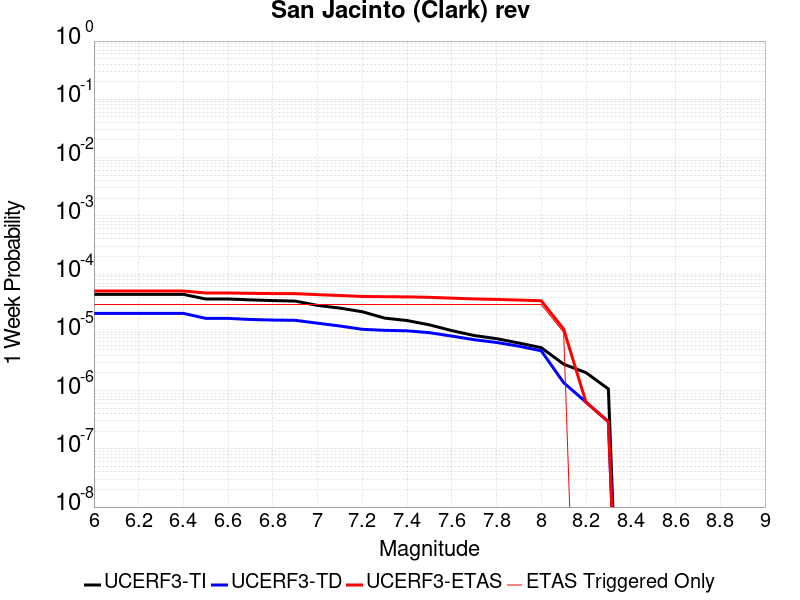 | 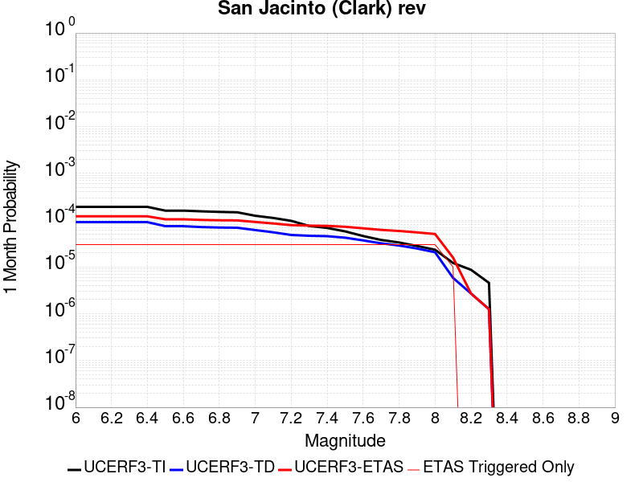 | 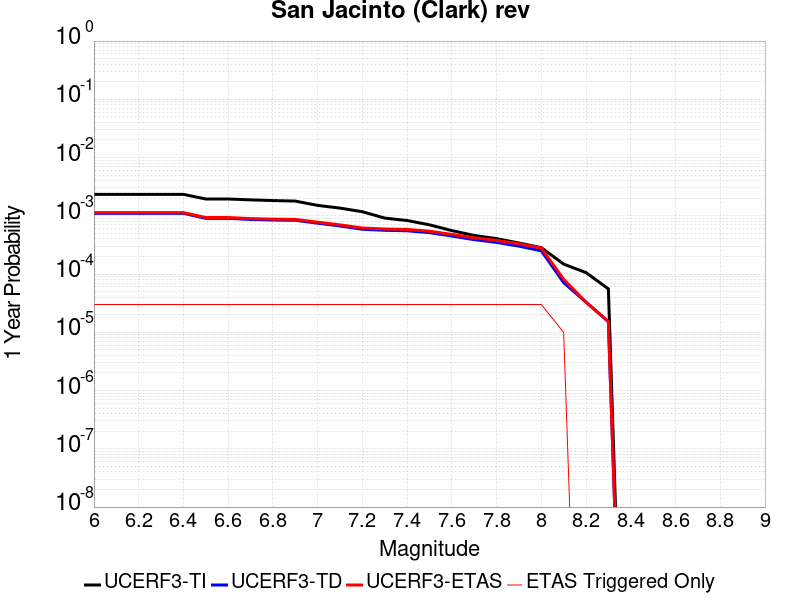 |  |

| Magnitude | 1 wk TI Prob | 1 wk TD Prob | 1 wk ETAS Prob | 1 wk ETAS/TD Gain | 1 wk ETAS Triggered Only | 1 mo TI Prob | 1 mo TD Prob | 1 mo ETAS Prob | 1 mo ETAS/TD Gain | 1 mo ETAS Triggered Only | 1 yr TI Prob | 1 yr TD Prob | 1 yr ETAS Prob | 1 yr ETAS/TD Gain | 1 yr ETAS Triggered Only | 10 yr TI Prob | 10 yr TD Prob | 10 yr ETAS Prob | 10 yr ETAS/TD Gain | 10 yr ETAS Triggered Only |
|-----|-----|-----|-----|-----|-----|-----|-----|-----|-----|-----|-----|-----|-----|-----|-----|-----|-----|-----|-----|-----|
| 6.0 | 4.482615E-5 | 2.1153059E-5 | 5.1152423E-5 | 2.4182045 | 3.0E-5 | 1.9209793E-4 | 9.065287E-5 | 1.2065015E-4 | 1.3309027 | 3.0E-5 | 0.0023362834 | 0.0011031491 | 0.001133116 | 1.0271648 | 3.0E-5 | 0.02311874 | 0.011485709 | 0.011515364 | 1.002582 | 3.0E-5 |
| 6.1 | 4.482615E-5 | 2.1153059E-5 | 5.1152423E-5 | 2.4182045 | 3.0E-5 | 1.9209793E-4 | 9.065287E-5 | 1.2065015E-4 | 1.3309027 | 3.0E-5 | 0.0023362834 | 0.0011031491 | 0.001133116 | 1.0271648 | 3.0E-5 | 0.02311874 | 0.011485709 | 0.011515364 | 1.002582 | 3.0E-5 |
| 6.2 | 4.482615E-5 | 2.1153059E-5 | 5.1152423E-5 | 2.4182045 | 3.0E-5 | 1.9209793E-4 | 9.065287E-5 | 1.2065015E-4 | 1.3309027 | 3.0E-5 | 0.0023362834 | 0.0011031491 | 0.001133116 | 1.0271648 | 3.0E-5 | 0.02311874 | 0.011485709 | 0.011515364 | 1.002582 | 3.0E-5 |
| 6.3 | 4.482615E-5 | 2.1153059E-5 | 5.1152423E-5 | 2.4182045 | 3.0E-5 | 1.9209793E-4 | 9.065287E-5 | 1.2065015E-4 | 1.3309027 | 3.0E-5 | 0.0023362834 | 0.0011031491 | 0.001133116 | 1.0271648 | 3.0E-5 | 0.02311874 | 0.011485709 | 0.011515364 | 1.002582 | 3.0E-5 |
| 6.4 | 4.482615E-5 | 2.1153059E-5 | 5.1152423E-5 | 2.4182045 | 3.0E-5 | 1.9209793E-4 | 9.065287E-5 | 1.2065015E-4 | 1.3309027 | 3.0E-5 | 0.0023362834 | 0.0011031491 | 0.001133116 | 1.0271648 | 3.0E-5 | 0.02311874 | 0.011485709 | 0.011515364 | 1.002582 | 3.0E-5 |
| 6.5 | 3.7294863E-5 | 1.7354667E-5 | 4.7354144E-5 | 2.7286117 | 3.0E-5 | 1.5982533E-4 | 7.437504E-5 | 1.0437281E-4 | 1.403331 | 3.0E-5 | 0.0019441366 | 9.051445E-4 | 9.351173E-4 | 1.0331138 | 3.0E-5 | 0.01927216 | 0.009485902 | 0.009515618 | 1.0031326 | 3.0E-5 |
| 6.6 | 3.7294863E-5 | 1.7354667E-5 | 4.7354144E-5 | 2.7286117 | 3.0E-5 | 1.5982533E-4 | 7.437504E-5 | 1.0437281E-4 | 1.403331 | 3.0E-5 | 0.0019441366 | 9.051445E-4 | 9.351173E-4 | 1.0331138 | 3.0E-5 | 0.01927216 | 0.009485902 | 0.009515618 | 1.0031326 | 3.0E-5 |
| 6.7 | 3.6039248E-5 | 1.6602684E-5 | 4.6602185E-5 | 2.8069067 | 3.0E-5 | 1.5444479E-4 | 7.115244E-5 | 1.01150305E-4 | 1.4216 | 3.0E-5 | 0.0018787434 | 8.659408E-4 | 8.9591485E-4 | 1.0346144 | 3.0E-5 | 0.01862939 | 0.009088189 | 0.009117916 | 1.003271 | 3.0E-5 |
| 6.8 | 3.5031844E-5 | 1.6231123E-5 | 4.6230634E-5 | 2.848271 | 3.0E-5 | 1.5012783E-4 | 6.956012E-5 | 9.9558034E-5 | 1.4312515 | 3.0E-5 | 0.0018262739 | 8.4656954E-4 | 8.765441E-4 | 1.0354072 | 3.0E-5 | 0.01811338 | 0.008888788 | 0.008918521 | 1.003345 | 3.0E-5 |
| 6.9 | 3.435112E-5 | 1.6061658E-5 | 4.6061177E-5 | 2.867772 | 3.0E-5 | 1.4721078E-4 | 6.8833884E-5 | 9.883182E-5 | 1.4358019 | 3.0E-5 | 0.0017908178 | 8.377344E-4 | 8.677093E-4 | 1.0357809 | 3.0E-5 | 0.017764548 | 0.008796512 | 0.008826248 | 1.0033804 | 3.0E-5 |
| 7.0 | 2.8959772E-5 | 1.43355255E-5 | 4.4335095E-5 | 3.0926733 | 3.0E-5 | 1.241074E-4 | 6.1436534E-5 | 9.143469E-5 | 1.4882787 | 3.0E-5 | 0.0015099603 | 7.477359E-4 | 7.7771343E-4 | 1.0400912 | 3.0E-5 | 0.014997416 | 0.007868331 | 0.007898095 | 1.0037827 | 3.0E-5 |
| 7.1 | 2.6002877E-5 | 1.2827699E-5 | 4.2827312E-5 | 3.338659 | 3.0E-5 | 1.11436144E-4 | 5.4974706E-5 | 8.497306E-5 | 1.5456755 | 3.0E-5 | 0.0013558907 | 6.6911365E-4 | 6.9909357E-4 | 1.0448054 | 3.0E-5 | 0.013476475 | 0.0070483433 | 0.007078132 | 1.0042263 | 3.0E-5 |
| 7.2 | 2.2544838E-5 | 1.1260331E-5 | 4.1259995E-5 | 3.66419 | 3.0E-5 | 9.661716E-5 | 4.825768E-5 | 7.8256235E-5 | 1.6216327 | 3.0E-5 | 0.001175679 | 5.873803E-4 | 6.173627E-4 | 1.0510442 | 3.0E-5 | 0.011694785 | 0.00619256 | 0.0062223743 | 1.0048145 | 3.0E-5 |
| 7.3 | 1.75334E-5 | 1.0810585E-5 | 4.081026E-5 | 3.775028 | 3.0E-5 | 7.514098E-5 | 4.6330264E-5 | 7.632888E-5 | 1.6474949 | 3.0E-5 | 9.144575E-4 | 5.6392635E-4 | 5.9390947E-4 | 1.0531684 | 3.0E-5 | 0.009107036 | 0.0059332196 | 0.0059630414 | 1.0050262 | 3.0E-5 |
| 7.4 | 1.5924552E-5 | 1.0610475E-5 | 4.0610157E-5 | 3.8273647 | 3.0E-5 | 6.82463E-5 | 4.547268E-5 | 7.547132E-5 | 1.6597068 | 3.0E-5 | 8.305819E-4 | 5.534906E-4 | 5.83474E-4 | 1.0541714 | 3.0E-5 | 0.008274844 | 0.0058205863 | 0.0058504115 | 1.0051241 | 3.0E-5 |
| 7.5 | 1.3428931E-5 | 9.851045E-6 | 3.985075E-5 | 4.045332 | 3.0E-5 | 5.7551293E-5 | 4.221809E-5 | 7.221682E-5 | 1.7105659 | 3.0E-5 | 7.004617E-4 | 5.1388505E-4 | 5.438697E-4 | 1.0583488 | 3.0E-5 | 0.006982579 | 0.005406209 | 0.0054360465 | 1.0055192 | 3.0E-5 |
| 7.6 | 1.0688787E-5 | 8.614091E-6 | 3.861383E-5 | 4.482636 | 3.0E-5 | 4.5808283E-5 | 3.6917012E-5 | 6.6915905E-5 | 1.8126035 | 3.0E-5 | 5.5757316E-4 | 4.4937237E-4 | 4.793589E-4 | 1.0667298 | 3.0E-5 | 0.005561762 | 0.0047413614 | 0.004771219 | 1.0062973 | 3.0E-5 |
| 7.7 | 8.81236E-6 | 7.4673385E-6 | 3.7467114E-5 | 5.0174656 | 3.0E-5 | 3.776671E-5 | 3.200249E-5 | 6.200153E-5 | 1.9373971 | 3.0E-5 | 4.597127E-4 | 3.8956082E-4 | 4.1954915E-4 | 1.0769798 | 3.0E-5 | 0.0045876284 | 0.0041344194 | 0.0041642953 | 1.0072261 | 3.0E-5 |
| 7.8 | 7.780431E-6 | 6.695928E-6 | 3.669573E-5 | 5.480305 | 3.0E-5 | 3.3344273E-5 | 2.8696519E-5 | 5.8695656E-5 | 2.045393 | 3.0E-5 | 4.0589093E-4 | 3.4932428E-4 | 3.793138E-4 | 1.0858501 | 3.0E-5 | 0.0040515037 | 0.0037226272 | 0.0037525154 | 1.0080289 | 3.0E-5 |
| 7.9 | 6.5437994E-6 | 5.7797783E-6 | 3.5779605E-5 | 6.1904807 | 3.0E-5 | 2.8044553E-5 | 2.4770245E-5 | 5.47695E-5 | 2.2111006 | 3.0E-5 | 3.4138895E-4 | 3.0153614E-4 | 3.3152712E-4 | 1.0994606 | 3.0E-5 | 0.0034086495 | 0.0032343294 | 0.0032642323 | 1.0092455 | 3.0E-5 |
| 8.0 | 5.4488164E-6 | 4.812793E-6 | 3.481265E-5 | 7.2333565 | 3.0E-5 | 2.3351862E-5 | 2.0626094E-5 | 5.0625476E-5 | 2.4544384 | 3.0E-5 | 2.8427184E-4 | 2.510939E-4 | 2.8108637E-4 | 1.1194472 | 3.0E-5 | 0.0028390845 | 0.0027107038 | 0.0027406223 | 1.0110372 | 3.0E-5 |
| 8.1 | 2.8397242E-6 | 1.3665673E-6 | 1.1366554E-5 | 8.3175955 | 1.0E-5 | 1.217019E-5 | 5.856704E-6 | 1.5856645E-5 | 2.7074351 | 1.0E-5 | 1.4816198E-4 | 7.1303046E-5 | 8.1302336E-5 | 1.1402365 | 1.0E-5 | 0.0014806325 | 8.113543E-4 | 8.213462E-4 | 1.012315 | 1.0E-5 |
| 8.2 | 2.030244E-6 | 6.3151083E-7 | 6.3151083E-7 | 1.0 | 0.0 | 8.701017E-6 | 2.7064723E-6 | 2.7064723E-6 | 1.0 | 0.0 | 1.05929736E-4 | 3.2950808E-5 | 3.2950808E-5 | 1.0 | 0.0 | 0.0010587925 | 3.9470522E-4 | 3.9470522E-4 | 1.0 | 0.0 |
| 8.3 | 1.0659804E-6 | 2.9230563E-7 | 2.9230563E-7 | 1.0 | 0.0 | 4.568479E-6 | 1.2527379E-6 | 1.2527379E-6 | 1.0 | 0.0 | 5.5619817E-5 | 1.5251981E-5 | 1.5251981E-5 | 1.0 | 0.0 | 5.5605895E-4 | 1.8556409E-4 | 1.8556409E-4 | 1.0 | 0.0 |

## Chino alt 1
*[(top)](#table-of-contents)*

| 1 Week | 1 Month | 1 Year | 10 Year |
|-----|-----|-----|-----|
|  | 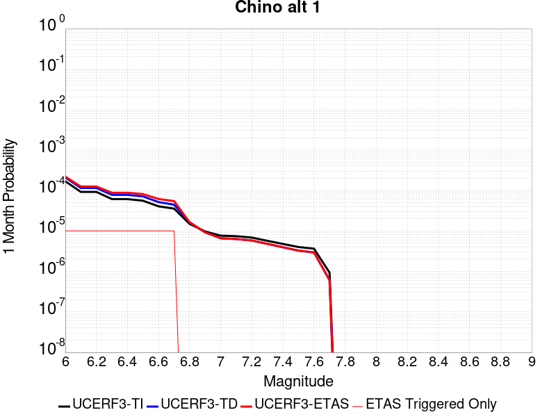 | 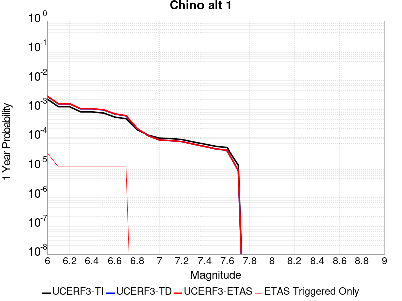 | 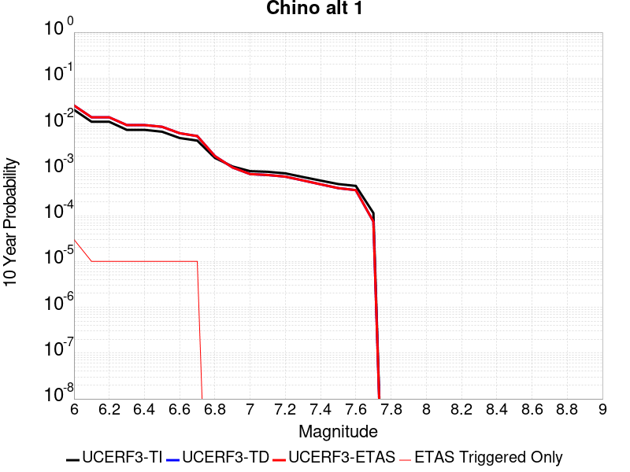 |

| Magnitude | 1 wk TI Prob | 1 wk TD Prob | 1 wk ETAS Prob | 1 wk ETAS/TD Gain | 1 wk ETAS Triggered Only | 1 mo TI Prob | 1 mo TD Prob | 1 mo ETAS Prob | 1 mo ETAS/TD Gain | 1 mo ETAS Triggered Only | 1 yr TI Prob | 1 yr TD Prob | 1 yr ETAS Prob | 1 yr ETAS/TD Gain | 1 yr ETAS Triggered Only | 10 yr TI Prob | 10 yr TD Prob | 10 yr ETAS Prob | 10 yr ETAS/TD Gain | 10 yr ETAS Triggered Only |
|-----|-----|-----|-----|-----|-----|-----|-----|-----|-----|-----|-----|-----|-----|-----|-----|-----|-----|-----|-----|-----|
| 6.0 | 3.939946E-5 | 4.894798E-5 | 5.894749E-5 | 1.2042885 | 1.0E-5 | 1.6884391E-4 | 2.0976314E-4 | 2.1976103E-4 | 1.0476629 | 1.0E-5 | 0.0020537362 | 0.002551385 | 0.0025813086 | 1.0117283 | 3.0E-5 | 0.020348595 | 0.025280168 | 0.02530941 | 1.0011567 | 3.0E-5 |
| 6.1 | 2.1505624E-5 | 2.6878823E-5 | 3.6878555E-5 | 1.3720301 | 1.0E-5 | 9.2163704E-5 | 1.15190494E-4 | 1.2518934E-4 | 1.0868027 | 1.0E-5 | 0.0011215154 | 0.0014016517 | 0.0014116376 | 1.0071244 | 1.0E-5 | 0.011158722 | 0.013947425 | 0.013957285 | 1.000707 | 1.0E-5 |
| 6.2 | 2.1505624E-5 | 2.6878823E-5 | 3.6878555E-5 | 1.3720301 | 1.0E-5 | 9.2163704E-5 | 1.15190494E-4 | 1.2518934E-4 | 1.0868027 | 1.0E-5 | 0.0011215154 | 0.0014016517 | 0.0014116376 | 1.0071244 | 1.0E-5 | 0.011158722 | 0.013947425 | 0.013957285 | 1.000707 | 1.0E-5 |
| 6.3 | 1.4290785E-5 | 1.8164832E-5 | 2.816465E-5 | 1.5505043 | 1.0E-5 | 6.1244784E-5 | 7.784722E-5 | 8.7846434E-5 | 1.1284467 | 1.0E-5 | 7.454001E-4 | 9.4742293E-4 | 9.5741346E-4 | 1.0105449 | 1.0E-5 | 0.007429048 | 0.00944674 | 0.009456646 | 1.0010486 | 1.0E-5 |
| 6.4 | 1.4290785E-5 | 1.8164832E-5 | 2.816465E-5 | 1.5505043 | 1.0E-5 | 6.1244784E-5 | 7.784722E-5 | 8.7846434E-5 | 1.1284467 | 1.0E-5 | 7.454001E-4 | 9.4742293E-4 | 9.5741346E-4 | 1.0105449 | 1.0E-5 | 0.007429048 | 0.00944674 | 0.009456646 | 1.0010486 | 1.0E-5 |
| 6.5 | 1.3017944E-5 | 1.6651793E-5 | 2.6651625E-5 | 1.600526 | 1.0E-5 | 5.5789995E-5 | 7.1363116E-5 | 8.136241E-5 | 1.1401184 | 1.0E-5 | 6.790315E-4 | 8.6854334E-4 | 8.785347E-4 | 1.0115036 | 1.0E-5 | 0.0067696036 | 0.008664233 | 0.008674146 | 1.0011442 | 1.0E-5 |
| 6.6 | 9.470016E-6 | 1.2039209E-5 | 2.2039088E-5 | 1.8306093 | 1.0E-5 | 4.058515E-5 | 5.159578E-5 | 6.159527E-5 | 1.1938043 | 1.0E-5 | 4.940122E-4 | 6.280315E-4 | 6.3802523E-4 | 1.0159128 | 1.0E-5 | 0.004929154 | 0.006273248 | 0.006283185 | 1.001584 | 1.0E-5 |
| 6.7 | 8.314155E-6 | 1.040749E-5 | 2.0407386E-5 | 1.9608364 | 1.0E-5 | 3.5631605E-5 | 4.4602948E-5 | 5.4602504E-5 | 1.2241905 | 1.0E-5 | 4.3372845E-4 | 5.4293784E-4 | 5.529324E-4 | 1.0184083 | 1.0E-5 | 0.004328829 | 0.0054270807 | 0.0054370263 | 1.0018326 | 1.0E-5 |
| 6.8 | 3.4856364E-6 | 3.8134033E-6 | 3.8134033E-6 | 1.0 | 0.0 | 1.4938357E-5 | 1.6343065E-5 | 1.6343065E-5 | 1.0 | 0.0 | 1.8185932E-4 | 1.9896074E-4 | 1.9896074E-4 | 1.0 | 0.0 | 0.0018171056 | 0.0019894529 | 0.0019894529 | 1.0 | 0.0 |
| 6.9 | 2.2645952E-6 | 2.152909E-6 | 2.152909E-6 | 1.0 | 0.0 | 9.705372E-6 | 9.226722E-6 | 9.226722E-6 | 1.0 | 0.0 | 1.18156495E-4 | 1.12329755E-4 | 1.12329755E-4 | 1.0 | 0.0 | 0.0011809369 | 0.0011233138 | 0.0011233138 | 1.0 | 0.0 |
| 7.0 | 1.7864003E-6 | 1.5430741E-6 | 1.5430741E-6 | 1.0 | 0.0 | 7.655979E-6 | 6.613158E-6 | 6.613158E-6 | 1.0 | 0.0 | 9.3207556E-5 | 8.051228E-5 | 8.051228E-5 | 1.0 | 0.0 | 9.316847E-4 | 8.052856E-4 | 8.052856E-4 | 1.0 | 0.0 |
| 7.1 | 1.7315456E-6 | 1.4733466E-6 | 1.4733466E-6 | 1.0 | 0.0 | 7.420889E-6 | 6.314328E-6 | 6.314328E-6 | 1.0 | 0.0 | 9.034557E-5 | 7.687428E-5 | 7.687428E-5 | 1.0 | 0.0 | 9.0308854E-4 | 7.68921E-4 | 7.68921E-4 | 1.0 | 0.0 |
| 7.2 | 1.6008337E-6 | 1.3574178E-6 | 1.3574178E-6 | 1.0 | 0.0 | 6.860698E-6 | 5.817492E-6 | 5.817492E-6 | 1.0 | 0.0 | 8.352579E-5 | 7.082572E-5 | 7.082572E-5 | 1.0 | 0.0 | 8.34944E-4 | 7.0846075E-4 | 7.0846075E-4 | 1.0 | 0.0 |
| 7.3 | 1.3320939E-6 | 1.1217794E-6 | 1.1217794E-6 | 1.0 | 0.0 | 5.7089615E-6 | 4.8076176E-6 | 4.8076176E-6 | 1.0 | 0.0 | 6.9504385E-5 | 5.853122E-5 | 5.853122E-5 | 1.0 | 0.0 | 6.9482654E-4 | 5.8530655E-4 | 5.8530655E-4 | 1.0 | 0.0 |
| 7.4 | 1.114294E-6 | 9.237087E-7 | 9.237087E-7 | 1.0 | 0.0 | 4.775537E-6 | 3.9587458E-6 | 3.9587458E-6 | 1.0 | 0.0 | 5.8140613E-5 | 4.81967E-5 | 4.81967E-5 | 1.0 | 0.0 | 5.81254E-4 | 4.8187698E-4 | 4.8187698E-4 | 1.0 | 0.0 |
| 7.5 | 9.354081E-7 | 7.6233886E-7 | 7.6233886E-7 | 1.0 | 0.0 | 4.0088858E-6 | 3.2671626E-6 | 3.2671626E-6 | 1.0 | 0.0 | 4.8807087E-5 | 3.9777013E-5 | 3.9777013E-5 | 1.0 | 0.0 | 4.879637E-4 | 3.9770233E-4 | 3.9770233E-4 | 1.0 | 0.0 |
| 7.6 | 8.521771E-7 | 6.880688E-7 | 6.880688E-7 | 1.0 | 0.0 | 3.6521824E-6 | 2.948863E-6 | 2.948863E-6 | 1.0 | 0.0 | 4.4464414E-5 | 3.590185E-5 | 3.590185E-5 | 1.0 | 0.0 | 4.4455516E-4 | 3.5896365E-4 | 3.5896365E-4 | 1.0 | 0.0 |
| 7.7 | 2.1803626E-7 | 1.4186368E-7 | 1.4186368E-7 | 1.0 | 0.0 | 9.344408E-7 | 6.0798715E-7 | 6.0798715E-7 | 1.0 | 0.0 | 1.1376757E-5 | 7.4022278E-6 | 7.4022278E-6 | 1.0 | 0.0 | 1.13761744E-4 | 7.402077E-5 | 7.402077E-5 | 1.0 | 0.0 |

## Ventura-Pitas Point
*[(top)](#table-of-contents)*

| 1 Week | 1 Month | 1 Year | 10 Year |
|-----|-----|-----|-----|
| 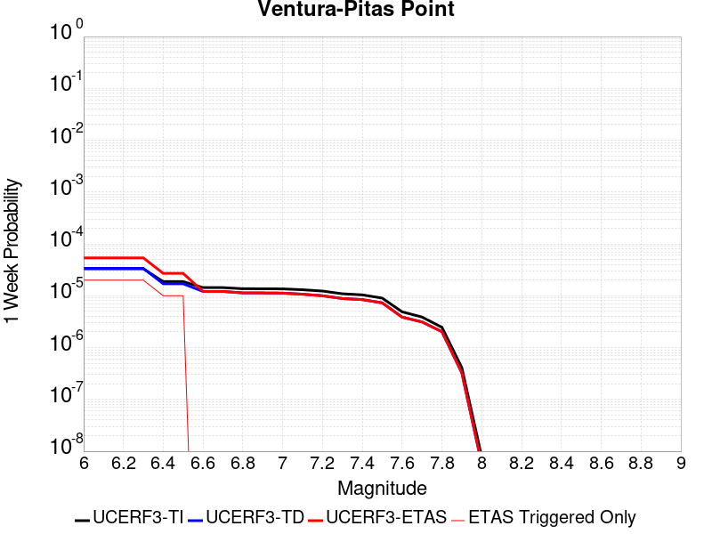 | 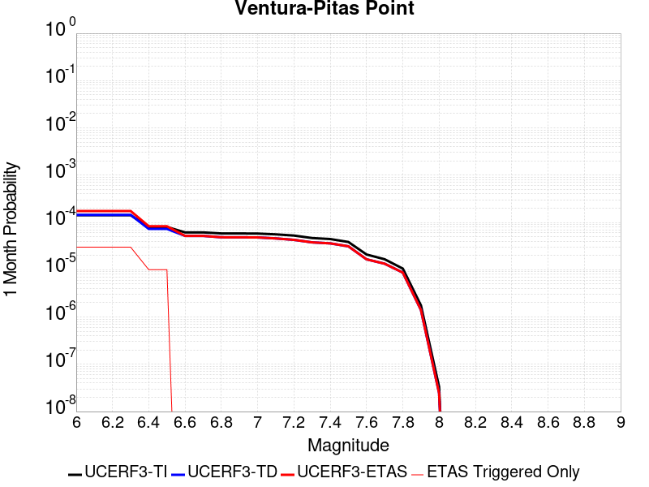 | 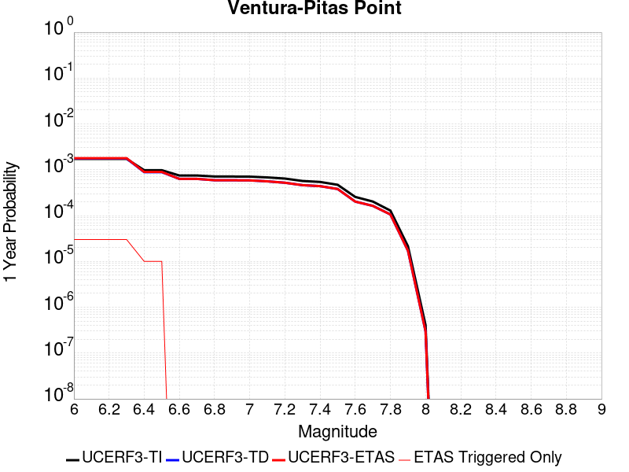 | 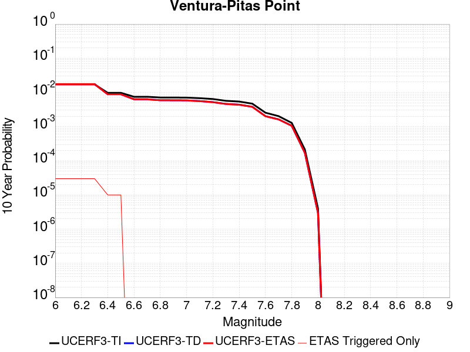 |

| Magnitude | 1 wk TI Prob | 1 wk TD Prob | 1 wk ETAS Prob | 1 wk ETAS/TD Gain | 1 wk ETAS Triggered Only | 1 mo TI Prob | 1 mo TD Prob | 1 mo ETAS Prob | 1 mo ETAS/TD Gain | 1 mo ETAS Triggered Only | 1 yr TI Prob | 1 yr TD Prob | 1 yr ETAS Prob | 1 yr ETAS/TD Gain | 1 yr ETAS Triggered Only | 10 yr TI Prob | 10 yr TD Prob | 10 yr ETAS Prob | 10 yr ETAS/TD Gain | 10 yr ETAS Triggered Only |
|-----|-----|-----|-----|-----|-----|-----|-----|-----|-----|-----|-----|-----|-----|-----|-----|-----|-----|-----|-----|-----|
| 6.0 | 3.3179622E-5 | 3.373519E-5 | 5.373451E-5 | 1.5928328 | 2.0E-5 | 1.4219063E-4 | 1.4457281E-4 | 1.7456847E-4 | 1.2074779 | 3.0E-5 | 0.0017297962 | 0.0017590097 | 0.0017889569 | 1.017025 | 3.0E-5 | 0.017163932 | 0.017476497 | 0.017505974 | 1.0016866 | 3.0E-5 |
| 6.1 | 3.3179622E-5 | 3.373519E-5 | 5.373451E-5 | 1.5928328 | 2.0E-5 | 1.4219063E-4 | 1.4457281E-4 | 1.7456847E-4 | 1.2074779 | 3.0E-5 | 0.0017297962 | 0.0017590097 | 0.0017889569 | 1.017025 | 3.0E-5 | 0.017163932 | 0.017476497 | 0.017505974 | 1.0016866 | 3.0E-5 |
| 6.2 | 3.3179622E-5 | 3.373519E-5 | 5.373451E-5 | 1.5928328 | 2.0E-5 | 1.4219063E-4 | 1.4457281E-4 | 1.7456847E-4 | 1.2074779 | 3.0E-5 | 0.0017297962 | 0.0017590097 | 0.0017889569 | 1.017025 | 3.0E-5 | 0.017163932 | 0.017476497 | 0.017505974 | 1.0016866 | 3.0E-5 |
| 6.3 | 3.3179622E-5 | 3.373519E-5 | 5.373451E-5 | 1.5928328 | 2.0E-5 | 1.4219063E-4 | 1.4457281E-4 | 1.7456847E-4 | 1.2074779 | 3.0E-5 | 0.0017297962 | 0.0017590097 | 0.0017889569 | 1.017025 | 3.0E-5 | 0.017163932 | 0.017476497 | 0.017505974 | 1.0016866 | 3.0E-5 |
| 6.4 | 1.8754668E-5 | 1.7019594E-5 | 2.7019423E-5 | 1.5875481 | 1.0E-5 | 8.037467E-5 | 7.2939205E-5 | 8.293848E-5 | 1.1370904 | 1.0E-5 | 9.781223E-4 | 8.8769617E-4 | 8.976873E-4 | 1.0112551 | 1.0E-5 | 0.009738282 | 0.008843943 | 0.008853854 | 1.0011207 | 1.0E-5 |
| 6.5 | 1.8754668E-5 | 1.7019594E-5 | 2.7019423E-5 | 1.5875481 | 1.0E-5 | 8.037467E-5 | 7.2939205E-5 | 8.293848E-5 | 1.1370904 | 1.0E-5 | 9.781223E-4 | 8.8769617E-4 | 8.976873E-4 | 1.0112551 | 1.0E-5 | 0.009738282 | 0.008843943 | 0.008853854 | 1.0011207 | 1.0E-5 |
| 6.6 | 1.4361558E-5 | 1.2122258E-5 | 1.2122258E-5 | 1.0 | 0.0 | 6.154808E-5 | 5.1951512E-5 | 5.1951512E-5 | 1.0 | 0.0 | 7.490902E-4 | 6.323284E-4 | 6.323284E-4 | 1.0 | 0.0 | 0.0074657016 | 0.006305652 | 0.006305652 | 1.0 | 0.0 |
| 6.7 | 1.4361558E-5 | 1.2122258E-5 | 1.2122258E-5 | 1.0 | 0.0 | 6.154808E-5 | 5.1951512E-5 | 5.1951512E-5 | 1.0 | 0.0 | 7.490902E-4 | 6.323284E-4 | 6.323284E-4 | 1.0 | 0.0 | 0.0074657016 | 0.006305652 | 0.006305652 | 1.0 | 0.0 |
| 6.8 | 1.3663846E-5 | 1.1344401E-5 | 1.1344401E-5 | 1.0 | 0.0 | 5.8558027E-5 | 4.8617967E-5 | 4.8617967E-5 | 1.0 | 0.0 | 7.127108E-4 | 5.917649E-4 | 5.917649E-4 | 1.0 | 0.0 | 0.007104293 | 0.0059022107 | 0.0059022107 | 1.0 | 0.0 |
| 6.9 | 1.3644157E-5 | 1.1322501E-5 | 1.1322501E-5 | 1.0 | 0.0 | 5.8473648E-5 | 4.8524114E-5 | 4.8524114E-5 | 1.0 | 0.0 | 7.116841E-4 | 5.906229E-4 | 5.906229E-4 | 1.0 | 0.0 | 0.007094092 | 0.0058908514 | 0.0058908514 | 1.0 | 0.0 |
| 7.0 | 1.3568845E-5 | 1.12420685E-5 | 1.12420685E-5 | 1.0 | 0.0 | 5.8150898E-5 | 4.8179416E-5 | 4.8179416E-5 | 1.0 | 0.0 | 7.077572E-4 | 5.8642845E-4 | 5.8642845E-4 | 1.0 | 0.0 | 0.007055073 | 0.005849128 | 0.005849128 | 1.0 | 0.0 |
| 7.1 | 1.306572E-5 | 1.0720521E-5 | 1.0720521E-5 | 1.0 | 0.0 | 5.599474E-5 | 4.594429E-5 | 4.594429E-5 | 1.0 | 0.0 | 6.815227E-4 | 5.5923004E-4 | 5.5923004E-4 | 1.0 | 0.0 | 0.0067943637 | 0.005578536 | 0.005578536 | 1.0 | 0.0 |
| 7.2 | 1.232604E-5 | 9.995121E-6 | 9.995121E-6 | 1.0 | 0.0 | 5.2824813E-5 | 4.283554E-5 | 4.283554E-5 | 1.0 | 0.0 | 6.429523E-4 | 5.2139966E-4 | 5.2139966E-4 | 1.0 | 0.0 | 0.0064109527 | 0.005202059 | 0.005202059 | 1.0 | 0.0 |
| 7.3 | 1.0917261E-5 | 8.843812E-6 | 8.843812E-6 | 1.0 | 0.0 | 4.678742E-5 | 3.7901507E-5 | 3.7901507E-5 | 1.0 | 0.0 | 5.69488E-4 | 4.6135474E-4 | 4.6135474E-4 | 1.0 | 0.0 | 0.0056803077 | 0.004604239 | 0.004604239 | 1.0 | 0.0 |
| 7.4 | 1.039959E-5 | 8.42354E-6 | 8.42354E-6 | 1.0 | 0.0 | 4.456891E-5 | 3.6100395E-5 | 3.6100395E-5 | 1.0 | 0.0 | 5.424914E-4 | 4.394352E-4 | 4.394352E-4 | 1.0 | 0.0 | 0.0054116896 | 0.0043859277 | 0.0043859277 | 1.0 | 0.0 |
| 7.5 | 9.015877E-6 | 7.29752E-6 | 7.29752E-6 | 1.0 | 0.0 | 3.86389E-5 | 3.1274718E-5 | 3.1274718E-5 | 1.0 | 0.0 | 4.7032707E-4 | 3.8070456E-4 | 3.8070456E-4 | 1.0 | 0.0 | 0.004693329 | 0.003800772 | 0.003800772 | 1.0 | 0.0 |
| 7.6 | 4.900162E-6 | 3.874119E-6 | 3.874119E-6 | 1.0 | 0.0 | 2.1000526E-5 | 1.6603262E-5 | 1.6603262E-5 | 1.0 | 0.0 | 2.556514E-4 | 2.0212609E-4 | 2.0212609E-4 | 1.0 | 0.0 | 0.0025535747 | 0.002019436 | 0.002019436 | 1.0 | 0.0 |
| 7.7 | 3.8850626E-6 | 3.12676E-6 | 3.12676E-6 | 1.0 | 0.0 | 1.6650163E-5 | 1.3400332E-5 | 1.3400332E-5 | 1.0 | 0.0 | 2.0269687E-4 | 1.6313691E-4 | 1.6313691E-4 | 1.0 | 0.0 | 0.002025121 | 0.0016301809 | 0.0016301809 | 1.0 | 0.0 |
| 7.8 | 2.4654719E-6 | 2.029902E-6 | 2.029902E-6 | 1.0 | 0.0 | 1.0566265E-5 | 8.699551E-6 | 8.699551E-6 | 1.0 | 0.0 | 1.2863669E-4 | 1.0591193E-4 | 1.0591193E-4 | 1.0 | 0.0 | 0.0012856225 | 0.0010586192 | 0.0010586192 | 1.0 | 0.0 |
| 7.9 | 4.095894E-7 | 3.2765078E-7 | 3.2765078E-7 | 1.0 | 0.0 | 1.7553821E-6 | 1.4042168E-6 | 1.4042168E-6 | 1.0 | 0.0 | 2.1371567E-5 | 1.709621E-5 | 1.709621E-5 | 1.0 | 0.0 | 2.1369511E-4 | 1.7094925E-4 | 1.7094925E-4 | 1.0 | 0.0 |
| 8.0 | 7.791402E-9 | 5.6836056E-9 | 5.6836056E-9 | 1.0 | 0.0 | 3.3391725E-8 | 2.4358311E-8 | 2.4358311E-8 | 1.0 | 0.0 | 4.0654416E-7 | 2.965624E-7 | 2.965624E-7 | 1.0 | 0.0 | 4.065434E-6 | 2.9656223E-6 | 2.9656223E-6 | 1.0 | 0.0 |

## Simi-Santa Rosa
*[(top)](#table-of-contents)*

| 1 Week | 1 Month | 1 Year | 10 Year |
|-----|-----|-----|-----|
| 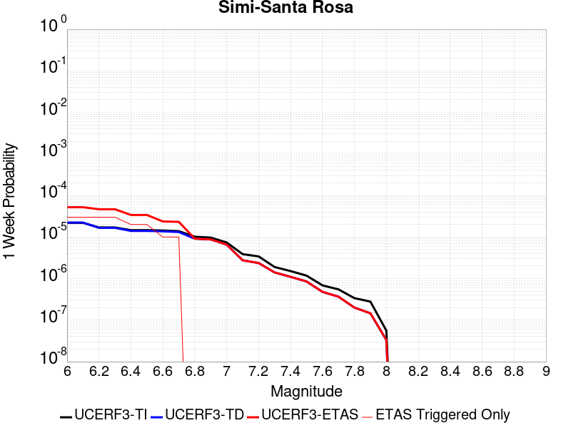 |  | 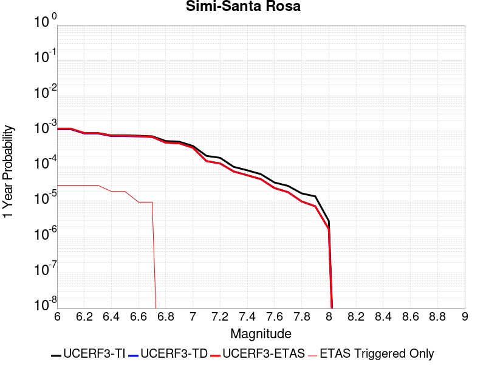 |  |

| Magnitude | 1 wk TI Prob | 1 wk TD Prob | 1 wk ETAS Prob | 1 wk ETAS/TD Gain | 1 wk ETAS Triggered Only | 1 mo TI Prob | 1 mo TD Prob | 1 mo ETAS Prob | 1 mo ETAS/TD Gain | 1 mo ETAS Triggered Only | 1 yr TI Prob | 1 yr TD Prob | 1 yr ETAS Prob | 1 yr ETAS/TD Gain | 1 yr ETAS Triggered Only | 10 yr TI Prob | 10 yr TD Prob | 10 yr ETAS Prob | 10 yr ETAS/TD Gain | 10 yr ETAS Triggered Only |
|-----|-----|-----|-----|-----|-----|-----|-----|-----|-----|-----|-----|-----|-----|-----|-----|-----|-----|-----|-----|-----|
| 6.0 | 2.198912E-5 | 2.2275388E-5 | 5.227472E-5 | 2.3467479 | 3.0E-5 | 9.4235686E-5 | 9.54627E-5 | 1.2545985E-4 | 1.3142289 | 3.0E-5 | 0.0011467156 | 0.0011616825 | 0.0011916477 | 1.0257946 | 3.0E-5 | 0.011408163 | 0.011560547 | 0.0115902005 | 1.002565 | 3.0E-5 |
| 6.1 | 2.198912E-5 | 2.2275388E-5 | 5.227472E-5 | 2.3467479 | 3.0E-5 | 9.4235686E-5 | 9.54627E-5 | 1.2545985E-4 | 1.3142289 | 3.0E-5 | 0.0011467156 | 0.0011616825 | 0.0011916477 | 1.0257946 | 3.0E-5 | 0.011408163 | 0.011560547 | 0.0115902005 | 1.002565 | 3.0E-5 |
| 6.2 | 1.69983E-5 | 1.6668506E-5 | 4.6668007E-5 | 2.7997713 | 3.0E-5 | 7.284782E-5 | 7.143466E-5 | 1.0143252E-4 | 1.4199342 | 3.0E-5 | 8.865613E-4 | 8.6939917E-4 | 8.993731E-4 | 1.0344766 | 3.0E-5 | 0.008830327 | 0.0086629 | 0.00869264 | 1.003433 | 3.0E-5 |
| 6.3 | 1.69983E-5 | 1.6668506E-5 | 4.6668007E-5 | 2.7997713 | 3.0E-5 | 7.284782E-5 | 7.143466E-5 | 1.0143252E-4 | 1.4199342 | 3.0E-5 | 8.865613E-4 | 8.6939917E-4 | 8.993731E-4 | 1.0344766 | 3.0E-5 | 0.008830327 | 0.0086629 | 0.00869264 | 1.003433 | 3.0E-5 |
| 6.4 | 1.4666188E-5 | 1.4052489E-5 | 3.405221E-5 | 2.4232154 | 2.0E-5 | 6.285358E-5 | 6.0223705E-5 | 8.02225E-5 | 1.3320751 | 2.0E-5 | 7.6497364E-4 | 7.330018E-4 | 7.5298717E-4 | 1.0272651 | 2.0E-5 | 0.0076234564 | 0.0073083164 | 0.00732817 | 1.0027167 | 2.0E-5 |
| 6.5 | 1.4666188E-5 | 1.4052489E-5 | 3.405221E-5 | 2.4232154 | 2.0E-5 | 6.285358E-5 | 6.0223705E-5 | 8.02225E-5 | 1.3320751 | 2.0E-5 | 7.6497364E-4 | 7.330018E-4 | 7.5298717E-4 | 1.0272651 | 2.0E-5 | 0.0076234564 | 0.0073083164 | 0.00732817 | 1.0027167 | 2.0E-5 |
| 6.6 | 1.4377586E-5 | 1.3729529E-5 | 2.3729392E-5 | 1.7283471 | 1.0E-5 | 6.1616774E-5 | 5.883965E-5 | 6.8839065E-5 | 1.1699435 | 1.0E-5 | 7.4992597E-4 | 7.1616215E-4 | 7.26155E-4 | 1.0139533 | 1.0E-5 | 0.007474003 | 0.0071410104 | 0.007150939 | 1.0013903 | 1.0E-5 |
| 6.7 | 1.3881404E-5 | 1.3207497E-5 | 2.3207365E-5 | 1.7571357 | 1.0E-5 | 5.9490372E-5 | 5.6602472E-5 | 6.6601904E-5 | 1.1766608 | 1.0E-5 | 7.240546E-4 | 6.889419E-4 | 6.98935E-4 | 1.014505 | 1.0E-5 | 0.007217 | 0.0068705105 | 0.006880442 | 1.0014455 | 1.0E-5 |
| 6.8 | 1.0176516E-5 | 9.1541E-6 | 9.1541E-6 | 1.0 | 0.0 | 4.3612912E-5 | 3.923136E-5 | 3.923136E-5 | 1.0 | 0.0 | 5.308578E-4 | 4.775537E-4 | 4.775537E-4 | 1.0 | 0.0 | 0.0052959146 | 0.004766908 | 0.004766908 | 1.0 | 0.0 |
| 6.9 | 9.699797E-6 | 8.774672E-6 | 8.774672E-6 | 1.0 | 0.0 | 4.15699E-5 | 3.760529E-5 | 3.760529E-5 | 1.0 | 0.0 | 5.05996E-4 | 4.5776463E-4 | 4.5776463E-4 | 1.0 | 0.0 | 0.005048454 | 0.0045698346 | 0.0045698346 | 1.0 | 0.0 |
| 7.0 | 7.4049476E-6 | 6.559291E-6 | 6.559291E-6 | 1.0 | 0.0 | 3.1735104E-5 | 2.8111013E-5 | 2.8111013E-5 | 1.0 | 0.0 | 3.8630638E-4 | 3.422105E-4 | 3.422105E-4 | 1.0 | 0.0 | 0.0038563553 | 0.0034180775 | 0.0034180775 | 1.0 | 0.0 |
| 7.1 | 3.873439E-6 | 2.759473E-6 | 2.759473E-6 | 1.0 | 0.0 | 1.6600346E-5 | 1.1826261E-5 | 1.1826261E-5 | 1.0 | 0.0 | 2.0209046E-4 | 1.4397544E-4 | 1.4397544E-4 | 1.0 | 0.0 | 0.0020190678 | 0.0014388453 | 0.0014388453 | 1.0 | 0.0 |
| 7.2 | 3.417706E-6 | 2.367616E-6 | 2.367616E-6 | 1.0 | 0.0 | 1.4647229E-5 | 1.0146887E-5 | 1.0146887E-5 | 1.0 | 0.0 | 1.7831543E-4 | 1.2353157E-4 | 1.2353157E-4 | 1.0 | 0.0 | 0.0017817242 | 0.0012346513 | 0.0012346513 | 1.0 | 0.0 |
| 7.3 | 1.90225E-6 | 1.4073756E-6 | 1.4073756E-6 | 1.0 | 0.0 | 8.152474E-6 | 6.031596E-6 | 6.031596E-6 | 1.0 | 0.0 | 9.9251854E-5 | 7.343223E-5 | 7.343223E-5 | 1.0 | 0.0 | 9.920754E-4 | 7.340819E-4 | 7.340819E-4 | 1.0 | 0.0 |
| 7.4 | 1.5170556E-6 | 1.1024792E-6 | 1.1024792E-6 | 1.0 | 0.0 | 6.5016507E-6 | 4.7249023E-6 | 4.7249023E-6 | 1.0 | 0.0 | 7.915472E-5 | 5.752418E-5 | 5.752418E-5 | 1.0 | 0.0 | 7.9126534E-4 | 5.75094E-4 | 5.75094E-4 | 1.0 | 0.0 |
| 7.5 | 1.178732E-6 | 8.5351127E-7 | 8.5351127E-7 | 1.0 | 0.0 | 5.0516987E-6 | 3.6579004E-6 | 3.6579004E-6 | 1.0 | 0.0 | 6.1502695E-5 | 4.4534037E-5 | 4.4534037E-5 | 1.0 | 0.0 | 6.148568E-4 | 4.4525208E-4 | 4.4525208E-4 | 1.0 | 0.0 |
| 7.6 | 6.8722386E-7 | 4.793211E-7 | 4.793211E-7 | 1.0 | 0.0 | 2.9452417E-6 | 2.0542318E-6 | 2.0542318E-6 | 1.0 | 0.0 | 3.5857727E-5 | 2.5009986E-5 | 2.5009986E-5 | 1.0 | 0.0 | 3.5851944E-4 | 2.5007184E-4 | 2.5007184E-4 | 1.0 | 0.0 |
| 7.7 | 5.5126515E-7 | 3.6731117E-7 | 3.6731117E-7 | 1.0 | 0.0 | 2.3625628E-6 | 1.5741898E-6 | 1.5741898E-6 | 1.0 | 0.0 | 2.8763823E-5 | 1.9165593E-5 | 1.9165593E-5 | 1.0 | 0.0 | 2.87601E-4 | 1.9163951E-4 | 1.9163951E-4 | 1.0 | 0.0 |
| 7.8 | 3.3860243E-7 | 2.0075514E-7 | 2.0075514E-7 | 1.0 | 0.0 | 1.4511525E-6 | 8.6037886E-7 | 8.6037886E-7 | 1.0 | 0.0 | 1.7667637E-5 | 1.0475063E-5 | 1.0475063E-5 | 1.0 | 0.0 | 1.7666233E-4 | 1.0474575E-4 | 1.0474575E-4 | 1.0 | 0.0 |
| 7.9 | 2.7955386E-7 | 1.4648724E-7 | 1.4648724E-7 | 1.0 | 0.0 | 1.1980875E-6 | 6.278023E-7 | 6.278023E-7 | 1.0 | 0.0 | 1.4586617E-5 | 7.643467E-6 | 7.643467E-6 | 1.0 | 0.0 | 1.458566E-4 | 7.643208E-5 | 7.643208E-5 | 1.0 | 0.0 |
| 8.0 | 5.6259015E-8 | 3.335318E-8 | 3.335318E-8 | 1.0 | 0.0 | 2.4111003E-7 | 1.429422E-7 | 1.429422E-7 | 1.0 | 0.0 | 2.9355108E-6 | 1.7403199E-6 | 1.7403199E-6 | 1.0 | 0.0 | 2.935472E-5 | 1.7403077E-5 | 1.7403077E-5 | 1.0 | 0.0 |

## Sheephole
*[(top)](#table-of-contents)*

| 1 Week | 1 Month | 1 Year | 10 Year |
|-----|-----|-----|-----|
| 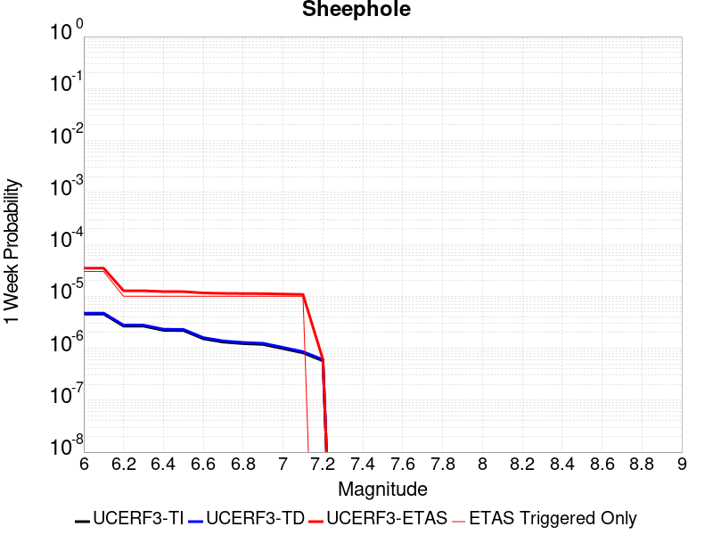 | 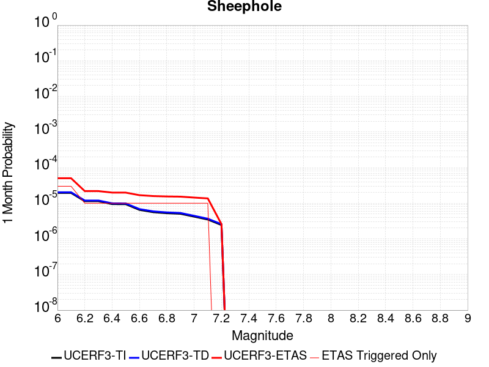 | 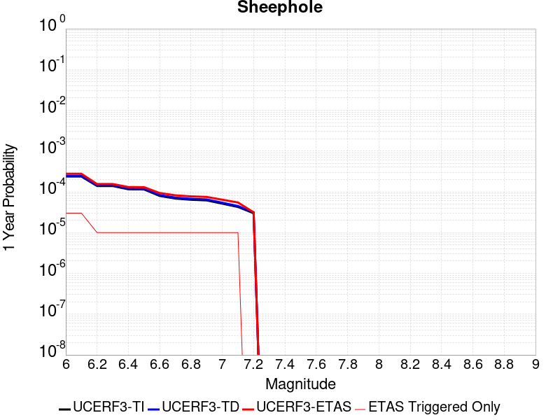 | 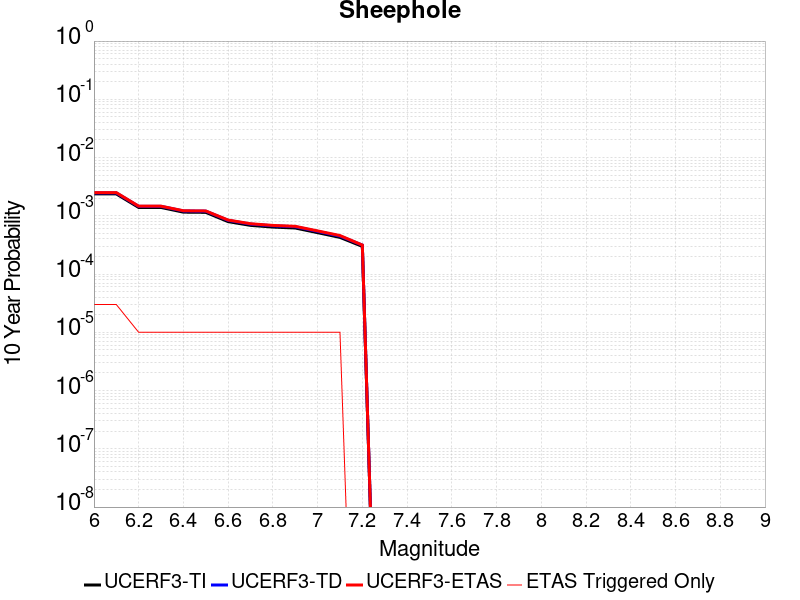 |

| Magnitude | 1 wk TI Prob | 1 wk TD Prob | 1 wk ETAS Prob | 1 wk ETAS/TD Gain | 1 wk ETAS Triggered Only | 1 mo TI Prob | 1 mo TD Prob | 1 mo ETAS Prob | 1 mo ETAS/TD Gain | 1 mo ETAS Triggered Only | 1 yr TI Prob | 1 yr TD Prob | 1 yr ETAS Prob | 1 yr ETAS/TD Gain | 1 yr ETAS Triggered Only | 10 yr TI Prob | 10 yr TD Prob | 10 yr ETAS Prob | 10 yr ETAS/TD Gain | 10 yr ETAS Triggered Only |
|-----|-----|-----|-----|-----|-----|-----|-----|-----|-----|-----|-----|-----|-----|-----|-----|-----|-----|-----|-----|-----|
| 6.0 | 4.5579695E-6 | 4.7412627E-6 | 3.474112E-5 | 7.3273983 | 3.0E-5 | 1.9534009E-5 | 2.031957E-5 | 5.031896E-5 | 2.4763792 | 3.0E-5 | 2.3780059E-4 | 2.473682E-4 | 2.7736078E-4 | 1.1212467 | 3.0E-5 | 0.0023754628 | 0.002471473 | 0.002501399 | 1.0121086 | 3.0E-5 |
| 6.1 | 4.5579695E-6 | 4.7412627E-6 | 3.474112E-5 | 7.3273983 | 3.0E-5 | 1.9534009E-5 | 2.031957E-5 | 5.031896E-5 | 2.4763792 | 3.0E-5 | 2.3780059E-4 | 2.473682E-4 | 2.7736078E-4 | 1.1212467 | 3.0E-5 | 0.0023754628 | 0.002471473 | 0.002501399 | 1.0121086 | 3.0E-5 |
| 6.2 | 2.6677674E-6 | 2.7873941E-6 | 1.2787366E-5 | 4.58757 | 1.0E-5 | 1.1433239E-5 | 1.1945926E-5 | 2.1945807E-5 | 1.8370954 | 1.0E-5 | 1.3919079E-4 | 1.4543302E-4 | 1.5543157E-4 | 1.0687501 | 1.0E-5 | 0.0013910364 | 0.0014534844 | 0.0014634698 | 1.00687 | 1.0E-5 |
| 6.3 | 2.6677674E-6 | 2.7873941E-6 | 1.2787366E-5 | 4.58757 | 1.0E-5 | 1.1433239E-5 | 1.1945926E-5 | 2.1945807E-5 | 1.8370954 | 1.0E-5 | 1.3919079E-4 | 1.4543302E-4 | 1.5543157E-4 | 1.0687501 | 1.0E-5 | 0.0013910364 | 0.0014534844 | 0.0014634698 | 1.00687 | 1.0E-5 |
| 6.4 | 2.2159759E-6 | 2.3228788E-6 | 1.2322856E-5 | 5.304993 | 1.0E-5 | 9.497005E-6 | 9.955161E-6 | 1.9955061E-5 | 2.0044942 | 1.0E-5 | 1.156199E-4 | 1.2119815E-4 | 1.3119694E-4 | 1.0824995 | 1.0E-5 | 0.0011555976 | 0.0012113999 | 0.0012213878 | 1.0082449 | 1.0E-5 |
| 6.5 | 2.1986082E-6 | 2.304759E-6 | 1.2304736E-5 | 5.3388386 | 1.0E-5 | 9.4225725E-6 | 9.877506E-6 | 1.9877407E-5 | 2.0123913 | 1.0E-5 | 1.1471378E-4 | 1.2025281E-4 | 1.302516E-4 | 1.0831481 | 1.0E-5 | 0.0011465458 | 0.0012019566 | 0.0012119446 | 1.0083097 | 1.0E-5 |
| 6.6 | 1.5232331E-6 | 1.6018919E-6 | 1.16018755E-5 | 7.2426085 | 1.0E-5 | 6.5281256E-6 | 6.865234E-6 | 1.6865166E-5 | 2.4566047 | 1.0E-5 | 7.947703E-5 | 8.35812E-5 | 9.358037E-5 | 1.1196342 | 1.0E-5 | 7.9448614E-4 | 8.3551643E-4 | 8.4550807E-4 | 1.0119586 | 1.0E-5 |
| 6.7 | 1.3137362E-6 | 1.382819E-6 | 1.13828055E-5 | 8.231594 | 1.0E-5 | 5.6302856E-6 | 5.926355E-6 | 1.5926295E-5 | 2.687368 | 1.0E-5 | 6.854657E-5 | 7.215112E-5 | 8.21504E-5 | 1.138588 | 1.0E-5 | 6.8525434E-4 | 7.212908E-4 | 7.312836E-4 | 1.013854 | 1.0E-5 |
| 6.8 | 1.2275751E-6 | 1.2922847E-6 | 1.1292272E-5 | 8.738223 | 1.0E-5 | 5.2610258E-6 | 5.5383516E-6 | 1.5538297E-5 | 2.8055813 | 1.0E-5 | 6.4051106E-5 | 6.7427485E-5 | 7.7426805E-5 | 1.1482974 | 1.0E-5 | 6.4032647E-4 | 6.740836E-4 | 6.8407686E-4 | 1.014825 | 1.0E-5 |
| 6.9 | 1.1837088E-6 | 1.246102E-6 | 1.1246089E-5 | 9.025015 | 1.0E-5 | 5.0730278E-6 | 5.340427E-6 | 1.5340374E-5 | 2.8724995 | 1.0E-5 | 6.176237E-5 | 6.501789E-5 | 7.501724E-5 | 1.1537938 | 1.0E-5 | 6.17452E-4 | 6.5000186E-4 | 6.5999536E-4 | 1.0153745 | 1.0E-5 |
| 7.0 | 9.849371E-7 | 1.0366288E-6 | 1.1036618E-5 | 10.646645 | 1.0E-5 | 4.2211523E-6 | 4.442688E-6 | 1.4442643E-5 | 3.2508795 | 1.0E-5 | 5.1391315E-5 | 5.4088487E-5 | 6.4087944E-5 | 1.1848723 | 1.0E-5 | 5.137943E-4 | 5.407633E-4 | 5.5075786E-4 | 1.0184823 | 1.0E-5 |
| 7.1 | 8.1643645E-7 | 8.591669E-7 | 1.08591585E-5 | 12.639173 | 1.0E-5 | 3.4990085E-6 | 3.682139E-6 | 1.3682103E-5 | 3.7158027 | 1.0E-5 | 4.2599597E-5 | 4.482921E-5 | 5.482876E-5 | 1.2230588 | 1.0E-5 | 4.259143E-4 | 4.4821028E-4 | 4.5820582E-4 | 1.022301 | 1.0E-5 |
| 7.2 | 5.7295756E-7 | 6.029502E-7 | 6.029502E-7 | 1.0 | 0.0 | 2.45553E-6 | 2.58407E-6 | 2.58407E-6 | 1.0 | 0.0 | 2.9895667E-5 | 3.1460666E-5 | 3.1460666E-5 | 1.0 | 0.0 | 2.9891645E-4 | 3.145688E-4 | 3.145688E-4 | 1.0 | 0.0 |

## Whittier alt 1
*[(top)](#table-of-contents)*

| 1 Week | 1 Month | 1 Year | 10 Year |
|-----|-----|-----|-----|
|  | 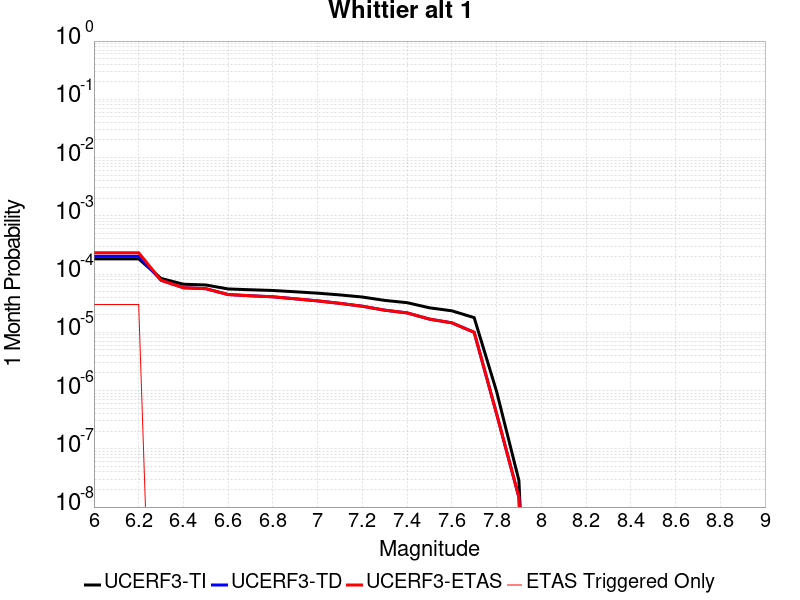 | 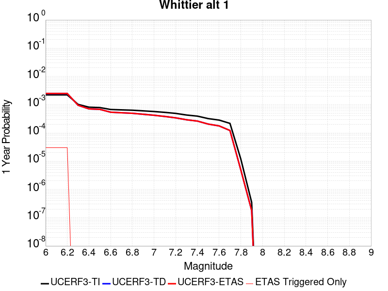 | 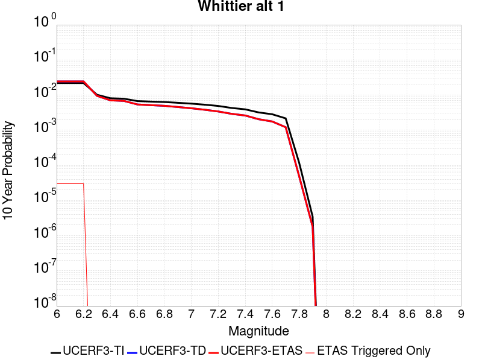 |

| Magnitude | 1 wk TI Prob | 1 wk TD Prob | 1 wk ETAS Prob | 1 wk ETAS/TD Gain | 1 wk ETAS Triggered Only | 1 mo TI Prob | 1 mo TD Prob | 1 mo ETAS Prob | 1 mo ETAS/TD Gain | 1 mo ETAS Triggered Only | 1 yr TI Prob | 1 yr TD Prob | 1 yr ETAS Prob | 1 yr ETAS/TD Gain | 1 yr ETAS Triggered Only | 10 yr TI Prob | 10 yr TD Prob | 10 yr ETAS Prob | 10 yr ETAS/TD Gain | 10 yr ETAS Triggered Only |
|-----|-----|-----|-----|-----|-----|-----|-----|-----|-----|-----|-----|-----|-----|-----|-----|-----|-----|-----|-----|-----|
| 6.0 | 4.2554693E-5 | 4.7252182E-5 | 7.725076E-5 | 1.6348614 | 3.0E-5 | 1.8236451E-4 | 2.0249544E-4 | 2.3248937E-4 | 1.1481215 | 3.0E-5 | 0.002218027 | 0.0024629163 | 0.0024928425 | 1.0121506 | 3.0E-5 | 0.02196019 | 0.024390263 | 0.024419531 | 1.0012 | 3.0E-5 |
| 6.1 | 4.2554693E-5 | 4.7252182E-5 | 7.725076E-5 | 1.6348614 | 3.0E-5 | 1.8236451E-4 | 2.0249544E-4 | 2.3248937E-4 | 1.1481215 | 3.0E-5 | 0.002218027 | 0.0024629163 | 0.0024928425 | 1.0121506 | 3.0E-5 | 0.02196019 | 0.024390263 | 0.024419531 | 1.0012 | 3.0E-5 |
| 6.2 | 4.2554693E-5 | 4.7252182E-5 | 7.725076E-5 | 1.6348614 | 3.0E-5 | 1.8236451E-4 | 2.0249544E-4 | 2.3248937E-4 | 1.1481215 | 3.0E-5 | 0.002218027 | 0.0024629163 | 0.0024928425 | 1.0121506 | 3.0E-5 | 0.02196019 | 0.024390263 | 0.024419531 | 1.0012 | 3.0E-5 |
| 6.3 | 1.9617712E-5 | 1.826841E-5 | 1.826841E-5 | 1.0 | 0.0 | 8.40732E-5 | 7.829095E-5 | 7.829095E-5 | 1.0 | 0.0 | 0.0010231105 | 9.527944E-4 | 9.527944E-4 | 1.0 | 0.0 | 0.01018413 | 0.0094904 | 0.0094904 | 1.0 | 0.0 |
| 6.4 | 1.5611336E-5 | 1.3604089E-5 | 1.3604089E-5 | 1.0 | 0.0 | 6.690401E-5 | 5.8301972E-5 | 5.8301972E-5 | 1.0 | 0.0 | 8.142519E-4 | 7.096013E-4 | 7.096013E-4 | 1.0 | 0.0 | 0.008112748 | 0.0070753377 | 0.0070753377 | 1.0 | 0.0 |
| 6.5 | 1.5150166E-5 | 1.3100744E-5 | 1.3100744E-5 | 1.0 | 0.0 | 6.492767E-5 | 5.614487E-5 | 5.614487E-5 | 1.0 | 0.0 | 7.9020765E-4 | 6.8335526E-4 | 6.8335526E-4 | 1.0 | 0.0 | 0.007874036 | 0.006814508 | 0.006814508 | 1.0 | 0.0 |
| 6.6 | 1.295588E-5 | 1.0380544E-5 | 1.0380544E-5 | 1.0 | 0.0 | 5.552402E-5 | 4.44873E-5 | 4.44873E-5 | 1.0 | 0.0 | 6.7579525E-4 | 5.415002E-4 | 5.415002E-4 | 1.0 | 0.0 | 0.006737438 | 0.005403343 | 0.005403343 | 1.0 | 0.0 |
| 6.7 | 1.2542085E-5 | 9.899189E-6 | 9.899189E-6 | 1.0 | 0.0 | 5.3750682E-5 | 4.2424414E-5 | 4.2424414E-5 | 1.0 | 0.0 | 6.542181E-4 | 5.163967E-4 | 5.163967E-4 | 1.0 | 0.0 | 0.006522954 | 0.005153464 | 0.005153464 | 1.0 | 0.0 |
| 6.8 | 1.2195878E-5 | 9.49523E-6 | 9.49523E-6 | 1.0 | 0.0 | 5.2267E-5 | 4.069322E-5 | 4.069322E-5 | 1.0 | 0.0 | 6.36165E-4 | 4.9532915E-4 | 4.9532915E-4 | 1.0 | 0.0 | 0.0063434686 | 0.0049436963 | 0.0049436963 | 1.0 | 0.0 |
| 6.9 | 1.1580298E-5 | 8.772739E-6 | 8.772739E-6 | 1.0 | 0.0 | 4.9628903E-5 | 3.759692E-5 | 3.759692E-5 | 1.0 | 0.0 | 6.040644E-4 | 4.5764804E-4 | 4.5764804E-4 | 1.0 | 0.0 | 0.00602425 | 0.0045684646 | 0.0045684646 | 1.0 | 0.0 |
| 7.0 | 1.0964795E-5 | 8.083794E-6 | 8.083794E-6 | 1.0 | 0.0 | 4.6991136E-5 | 3.4644378E-5 | 3.4644378E-5 | 1.0 | 0.0 | 5.7196687E-4 | 4.217152E-4 | 4.217152E-4 | 1.0 | 0.0 | 0.0057049696 | 0.004210459 | 0.004210459 | 1.0 | 0.0 |
| 7.1 | 1.0230601E-5 | 7.32646E-6 | 7.32646E-6 | 1.0 | 0.0 | 4.3844695E-5 | 3.1398744E-5 | 3.1398744E-5 | 1.0 | 0.0 | 5.336784E-4 | 3.8221394E-4 | 3.8221394E-4 | 1.0 | 0.0 | 0.005323986 | 0.0038167592 | 0.0038167592 | 1.0 | 0.0 |
| 7.2 | 9.40865E-6 | 6.5430822E-6 | 6.5430822E-6 | 1.0 | 0.0 | 4.032216E-5 | 2.8041486E-5 | 2.8041486E-5 | 1.0 | 0.0 | 4.908117E-4 | 3.4135283E-4 | 3.4135283E-4 | 1.0 | 0.0 | 0.0048972913 | 0.0034094024 | 0.0034094024 | 1.0 | 0.0 |
| 7.3 | 8.237384E-6 | 5.5975433E-6 | 5.5975433E-6 | 1.0 | 0.0 | 3.5302593E-5 | 2.3989258E-5 | 2.3989258E-5 | 1.0 | 0.0 | 4.2972428E-4 | 2.920311E-4 | 2.920311E-4 | 1.0 | 0.0 | 0.0042889426 | 0.0029167992 | 0.0029167992 | 1.0 | 0.0 |
| 7.4 | 7.5316966E-6 | 5.0276153E-6 | 5.0276153E-6 | 1.0 | 0.0 | 3.2278298E-5 | 2.154675E-5 | 2.154675E-5 | 1.0 | 0.0 | 3.9291743E-4 | 2.623011E-4 | 2.623011E-4 | 1.0 | 0.0 | 0.0039222343 | 0.0026200267 | 0.0026200267 | 1.0 | 0.0 |
| 7.5 | 6.149649E-6 | 3.9336355E-6 | 3.9336355E-6 | 1.0 | 0.0 | 2.6355372E-5 | 1.6858336E-5 | 1.6858336E-5 | 1.0 | 0.0 | 3.208294E-4 | 2.052318E-4 | 2.052318E-4 | 1.0 | 0.0 | 0.003203666 | 0.0020505118 | 0.0020505118 | 1.0 | 0.0 |
| 7.6 | 5.457711E-6 | 3.3951796E-6 | 3.3951796E-6 | 1.0 | 0.0 | 2.338998E-5 | 1.4550694E-5 | 1.4550694E-5 | 1.0 | 0.0 | 2.8473578E-4 | 1.771411E-4 | 1.771411E-4 | 1.0 | 0.0 | 0.0028437122 | 0.0017700798 | 0.0017700798 | 1.0 | 0.0 |
| 7.7 | 4.1676276E-6 | 2.3329922E-6 | 2.3329922E-6 | 1.0 | 0.0 | 1.7861139E-5 | 9.998504E-6 | 9.998504E-6 | 1.0 | 0.0 | 2.1743766E-4 | 1.2172572E-4 | 1.2172572E-4 | 1.0 | 0.0 | 0.0021722503 | 0.0012166635 | 0.0012166635 | 1.0 | 0.0 |
| 7.8 | 2.2692414E-7 | 9.384417E-8 | 9.384417E-8 | 1.0 | 0.0 | 9.725317E-7 | 4.0218927E-7 | 4.0218927E-7 | 1.0 | 0.0 | 1.1840509E-5 | 4.8966467E-6 | 4.8966467E-6 | 1.0 | 0.0 | 1.1839878E-4 | 4.8965718E-5 | 4.8965718E-5 | 1.0 | 0.0 |
| 7.9 | 6.676829E-9 | 3.4397174E-9 | 3.4397174E-9 | 1.0 | 0.0 | 2.861498E-8 | 1.4741646E-8 | 1.4741646E-8 | 1.0 | 0.0 | 3.4838732E-7 | 1.7947953E-7 | 1.7947953E-7 | 1.0 | 0.0 | 3.4838679E-6 | 1.794794E-6 | 1.794794E-6 | 1.0 | 0.0 |

## Ortigalita (South)
*[(top)](#table-of-contents)*

| 1 Week | 1 Month | 1 Year | 10 Year |
|-----|-----|-----|-----|
| 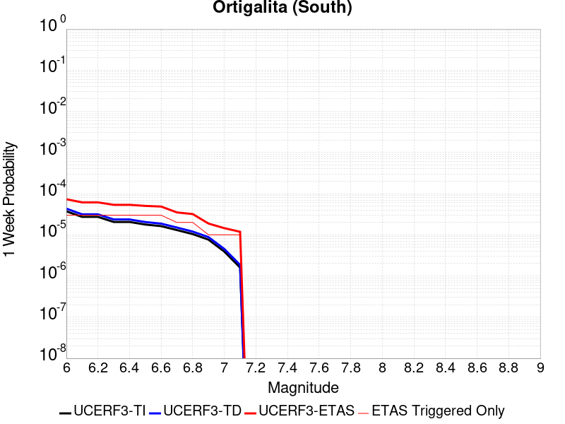 | 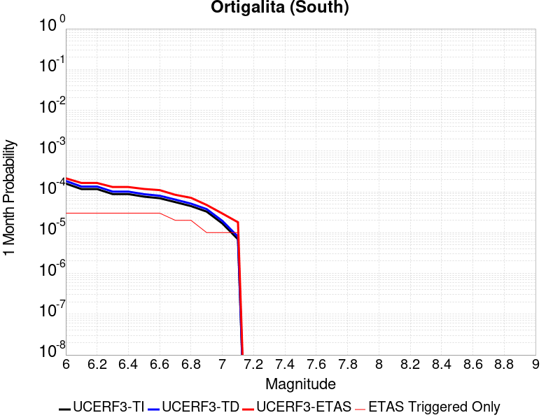 | 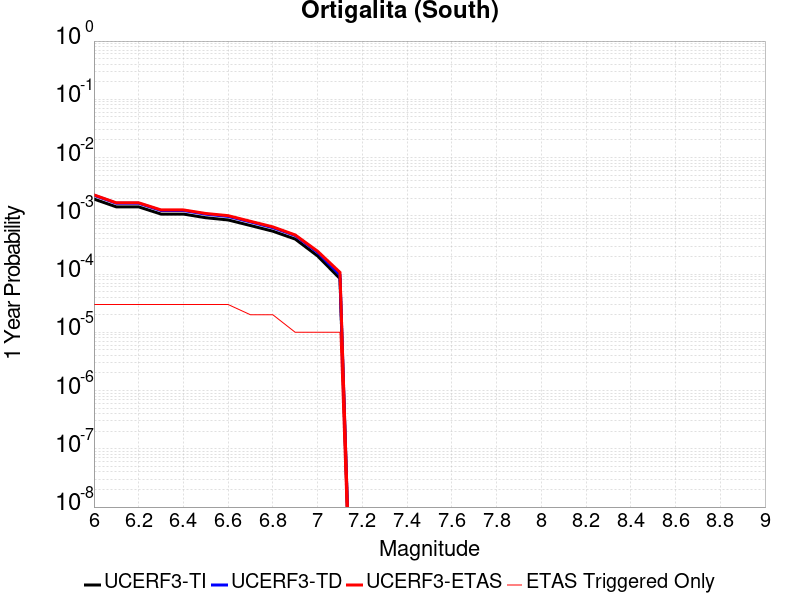 | 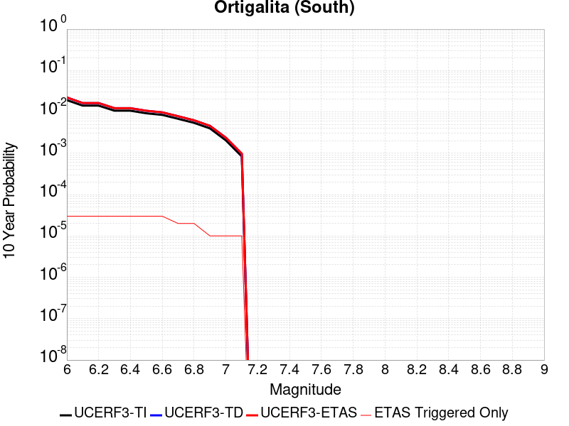 |

| Magnitude | 1 wk TI Prob | 1 wk TD Prob | 1 wk ETAS Prob | 1 wk ETAS/TD Gain | 1 wk ETAS Triggered Only | 1 mo TI Prob | 1 mo TD Prob | 1 mo ETAS Prob | 1 mo ETAS/TD Gain | 1 mo ETAS Triggered Only | 1 yr TI Prob | 1 yr TD Prob | 1 yr ETAS Prob | 1 yr ETAS/TD Gain | 1 yr ETAS Triggered Only | 10 yr TI Prob | 10 yr TD Prob | 10 yr ETAS Prob | 10 yr ETAS/TD Gain | 10 yr ETAS Triggered Only |
|-----|-----|-----|-----|-----|-----|-----|-----|-----|-----|-----|-----|-----|-----|-----|-----|-----|-----|-----|-----|-----|
| 6.0 | 3.72394E-5 | 4.32556E-5 | 7.3254305E-5 | 1.6935219 | 3.0E-5 | 1.5958765E-4 | 1.8536886E-4 | 2.153633E-4 | 1.1618094 | 3.0E-5 | 0.0019412481 | 0.0022546863 | 0.0022846186 | 1.0132756 | 3.0E-5 | 0.019243775 | 0.022334501 | 0.022363832 | 1.0013132 | 3.0E-5 |
| 6.1 | 2.7299884E-5 | 3.1492036E-5 | 6.149109E-5 | 1.9525918 | 3.0E-5 | 1.16994255E-4 | 1.349592E-4 | 1.6495516E-4 | 1.2222594 | 3.0E-5 | 0.0014234743 | 0.0016419457 | 0.0016718964 | 1.018241 | 3.0E-5 | 0.014143906 | 0.016304072 | 0.016333584 | 1.0018101 | 3.0E-5 |
| 6.2 | 2.7299884E-5 | 3.1492036E-5 | 6.149109E-5 | 1.9525918 | 3.0E-5 | 1.16994255E-4 | 1.349592E-4 | 1.6495516E-4 | 1.2222594 | 3.0E-5 | 0.0014234743 | 0.0016419457 | 0.0016718964 | 1.018241 | 3.0E-5 | 0.014143906 | 0.016304072 | 0.016333584 | 1.0018101 | 3.0E-5 |
| 6.3 | 2.0546433E-5 | 2.3631454E-5 | 5.3630745E-5 | 2.2694645 | 3.0E-5 | 8.805317E-5 | 1.0127383E-4 | 1.3127079E-4 | 1.2961966 | 3.0E-5 | 0.00107152 | 0.0012323305 | 0.0012622934 | 1.0243142 | 3.0E-5 | 0.010663681 | 0.012257031 | 0.012286663 | 1.0024176 | 3.0E-5 |
| 6.4 | 2.0546433E-5 | 2.3631454E-5 | 5.3630745E-5 | 2.2694645 | 3.0E-5 | 8.805317E-5 | 1.0127383E-4 | 1.3127079E-4 | 1.2961966 | 3.0E-5 | 0.00107152 | 0.0012323305 | 0.0012622934 | 1.0243142 | 3.0E-5 | 0.010663681 | 0.012257031 | 0.012286663 | 1.0024176 | 3.0E-5 |
| 6.5 | 1.7779594E-5 | 2.0446974E-5 | 5.044636E-5 | 2.4671798 | 3.0E-5 | 7.619603E-5 | 8.762703E-5 | 1.176244E-4 | 1.3423301 | 3.0E-5 | 9.272918E-4 | 0.0010663505 | 0.0010963185 | 1.0281034 | 3.0E-5 | 0.009234319 | 0.010613804 | 0.010643485 | 1.0027965 | 3.0E-5 |
| 6.6 | 1.6272212E-5 | 1.8714967E-5 | 4.8714406E-5 | 2.602965 | 3.0E-5 | 6.973618E-5 | 8.0204605E-5 | 1.102022E-4 | 1.3740133 | 3.0E-5 | 8.487073E-4 | 9.760659E-4 | 0.0010060365 | 1.0307056 | 3.0E-5 | 0.008454733 | 0.009719091 | 0.009748799 | 1.0030568 | 3.0E-5 |
| 6.7 | 1.3051484E-5 | 1.5038758E-5 | 3.5038458E-5 | 2.3298771 | 2.0E-5 | 5.593373E-5 | 6.445028E-5 | 8.444899E-5 | 1.3102968 | 2.0E-5 | 6.807804E-4 | 7.844092E-4 | 8.043935E-4 | 1.0254769 | 2.0E-5 | 0.006786986 | 0.007817388 | 0.007837231 | 1.0025384 | 2.0E-5 |
| 6.8 | 1.04277415E-5 | 1.1987235E-5 | 3.1986994E-5 | 2.6684215 | 2.0E-5 | 4.4689557E-5 | 5.1372896E-5 | 7.137187E-5 | 1.3892903 | 2.0E-5 | 5.439595E-4 | 6.2529295E-4 | 6.452804E-4 | 1.031965 | 2.0E-5 | 0.0054262993 | 0.00623609 | 0.006255965 | 1.0031872 | 2.0E-5 |
| 6.9 | 7.639968E-6 | 8.791503E-6 | 1.8791416E-5 | 2.137452 | 1.0E-5 | 3.274231E-5 | 3.767736E-5 | 4.7676982E-5 | 1.2654014 | 1.0E-5 | 3.9856473E-4 | 4.586312E-4 | 4.686266E-4 | 1.021794 | 1.0E-5 | 0.003978506 | 0.004577433 | 0.004587387 | 1.0021746 | 1.0E-5 |
| 7.0 | 3.919831E-6 | 4.5334014E-6 | 1.4533356E-5 | 3.2058394 | 1.0E-5 | 1.679917E-5 | 1.942873E-5 | 2.9428536E-5 | 1.5146917 | 1.0E-5 | 2.045107E-4 | 2.3652123E-4 | 2.4651887E-4 | 1.0422695 | 1.0E-5 | 0.0020432258 | 0.0023629034 | 0.0023728798 | 1.004222 | 1.0E-5 |
| 7.1 | 1.6017933E-6 | 1.8570418E-6 | 1.1857023E-5 | 6.3848987 | 1.0E-5 | 6.8648105E-6 | 7.958732E-6 | 1.7958653E-5 | 2.2564716 | 1.0E-5 | 8.357586E-5 | 9.689432E-5 | 1.06893356E-4 | 1.1031952 | 1.0E-5 | 8.3544437E-4 | 9.686254E-4 | 9.786157E-4 | 1.0103139 | 1.0E-5 |

## Dry Mountain
*[(top)](#table-of-contents)*

| 1 Week | 1 Month | 1 Year | 10 Year |
|-----|-----|-----|-----|
|  | 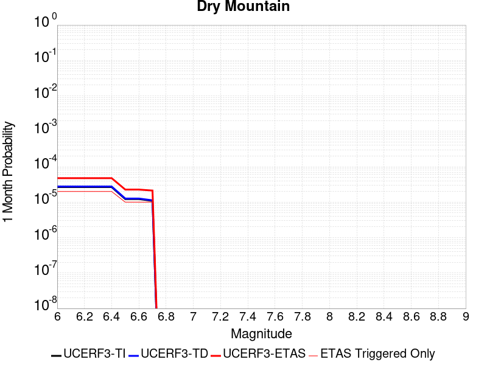 | 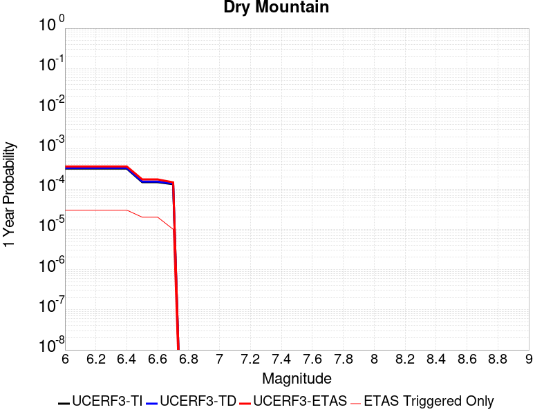 | 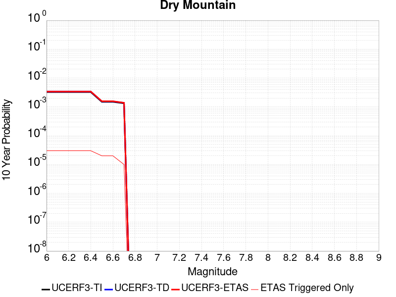 |

| Magnitude | 1 wk TI Prob | 1 wk TD Prob | 1 wk ETAS Prob | 1 wk ETAS/TD Gain | 1 wk ETAS Triggered Only | 1 mo TI Prob | 1 mo TD Prob | 1 mo ETAS Prob | 1 mo ETAS/TD Gain | 1 mo ETAS Triggered Only | 1 yr TI Prob | 1 yr TD Prob | 1 yr ETAS Prob | 1 yr ETAS/TD Gain | 1 yr ETAS Triggered Only | 10 yr TI Prob | 10 yr TD Prob | 10 yr ETAS Prob | 10 yr ETAS/TD Gain | 10 yr ETAS Triggered Only |
|-----|-----|-----|-----|-----|-----|-----|-----|-----|-----|-----|-----|-----|-----|-----|-----|-----|-----|-----|-----|-----|
| 6.0 | 6.222801E-6 | 6.439381E-6 | 2.6439253E-5 | 4.1058683 | 2.0E-5 | 2.6668875E-5 | 2.7597147E-5 | 4.7596594E-5 | 1.7246926 | 2.0E-5 | 3.2464517E-4 | 3.3595937E-4 | 3.659493E-4 | 1.0892665 | 3.0E-5 | 0.0032417132 | 0.0033560768 | 0.0033859762 | 1.008909 | 3.0E-5 |
| 6.1 | 6.222801E-6 | 6.439381E-6 | 2.6439253E-5 | 4.1058683 | 2.0E-5 | 2.6668875E-5 | 2.7597147E-5 | 4.7596594E-5 | 1.7246926 | 2.0E-5 | 3.2464517E-4 | 3.3595937E-4 | 3.659493E-4 | 1.0892665 | 3.0E-5 | 0.0032417132 | 0.0033560768 | 0.0033859762 | 1.008909 | 3.0E-5 |
| 6.2 | 6.222801E-6 | 6.439381E-6 | 2.6439253E-5 | 4.1058683 | 2.0E-5 | 2.6668875E-5 | 2.7597147E-5 | 4.7596594E-5 | 1.7246926 | 2.0E-5 | 3.2464517E-4 | 3.3595937E-4 | 3.659493E-4 | 1.0892665 | 3.0E-5 | 0.0032417132 | 0.0033560768 | 0.0033859762 | 1.008909 | 3.0E-5 |
| 6.3 | 6.222801E-6 | 6.439381E-6 | 2.6439253E-5 | 4.1058683 | 2.0E-5 | 2.6668875E-5 | 2.7597147E-5 | 4.7596594E-5 | 1.7246926 | 2.0E-5 | 3.2464517E-4 | 3.3595937E-4 | 3.659493E-4 | 1.0892665 | 3.0E-5 | 0.0032417132 | 0.0033560768 | 0.0033859762 | 1.008909 | 3.0E-5 |
| 6.4 | 6.222801E-6 | 6.439381E-6 | 2.6439253E-5 | 4.1058683 | 2.0E-5 | 2.6668875E-5 | 2.7597147E-5 | 4.7596594E-5 | 1.7246926 | 2.0E-5 | 3.2464517E-4 | 3.3595937E-4 | 3.659493E-4 | 1.0892665 | 3.0E-5 | 0.0032417132 | 0.0033560768 | 0.0033859762 | 1.008909 | 3.0E-5 |
| 6.5 | 2.8528623E-6 | 2.9521684E-6 | 1.2952139E-5 | 4.3873305 | 1.0E-5 | 1.22264955E-5 | 1.2652138E-5 | 2.2652011E-5 | 1.7903702 | 1.0E-5 | 1.4884741E-4 | 1.540376E-4 | 1.7403452E-4 | 1.1298184 | 2.0E-5 | 0.0014874774 | 0.0015401616 | 0.0015601309 | 1.0129657 | 2.0E-5 |
| 6.6 | 2.8528623E-6 | 2.9521684E-6 | 1.2952139E-5 | 4.3873305 | 1.0E-5 | 1.22264955E-5 | 1.2652138E-5 | 2.2652011E-5 | 1.7903702 | 1.0E-5 | 1.4884741E-4 | 1.540376E-4 | 1.7403452E-4 | 1.1298184 | 2.0E-5 | 0.0014874774 | 0.0015401616 | 0.0015601309 | 1.0129657 | 2.0E-5 |
| 6.7 | 2.541E-6 | 2.6293578E-6 | 1.2629332E-5 | 4.8032 | 1.0E-5 | 1.0889954E-5 | 1.1268677E-5 | 2.1268565E-5 | 1.8874056 | 1.0E-5 | 1.3257713E-4 | 1.3719614E-4 | 1.4719476E-4 | 1.0728784 | 1.0E-5 | 0.0013249806 | 0.0013719613 | 0.0013819477 | 1.0072788 | 1.0E-5 |

## Hector Mine
*[(top)](#table-of-contents)*

| 1 Week | 1 Month | 1 Year | 10 Year |
|-----|-----|-----|-----|
| 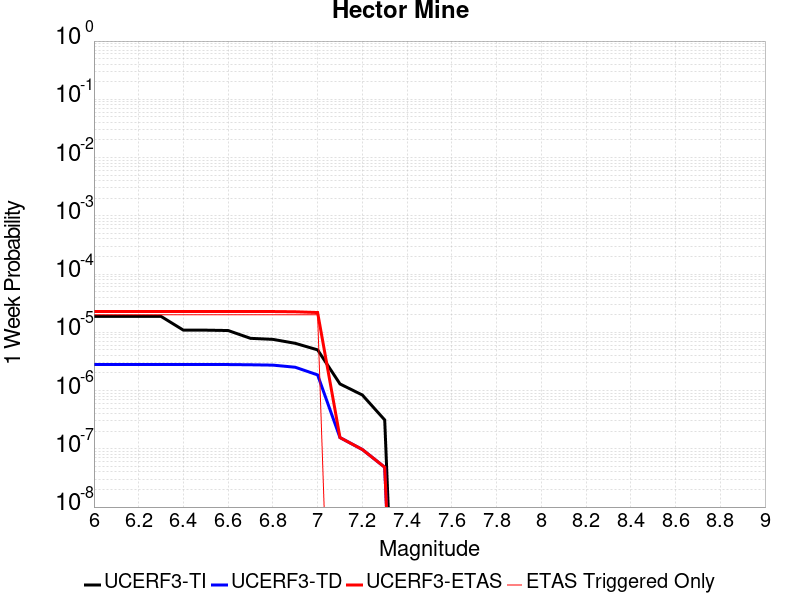 | 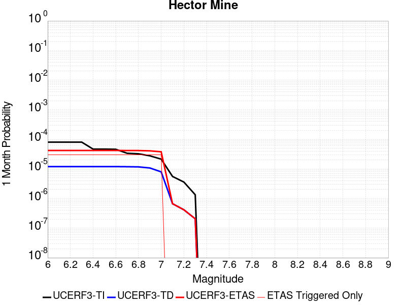 | 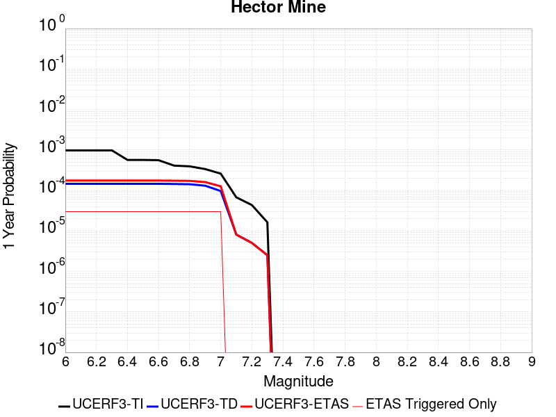 | 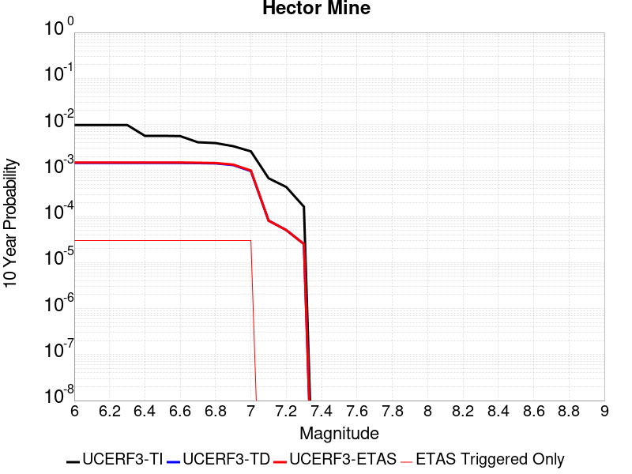 |

| Magnitude | 1 wk TI Prob | 1 wk TD Prob | 1 wk ETAS Prob | 1 wk ETAS/TD Gain | 1 wk ETAS Triggered Only | 1 mo TI Prob | 1 mo TD Prob | 1 mo ETAS Prob | 1 mo ETAS/TD Gain | 1 mo ETAS Triggered Only | 1 yr TI Prob | 1 yr TD Prob | 1 yr ETAS Prob | 1 yr ETAS/TD Gain | 1 yr ETAS Triggered Only | 10 yr TI Prob | 10 yr TD Prob | 10 yr ETAS Prob | 10 yr ETAS/TD Gain | 10 yr ETAS Triggered Only |
|-----|-----|-----|-----|-----|-----|-----|-----|-----|-----|-----|-----|-----|-----|-----|-----|-----|-----|-----|-----|-----|
| 6.0 | 1.8760093E-5 | 2.7962699E-6 | 2.2796214E-5 | 8.152366 | 2.0E-5 | 8.039792E-5 | 1.19839815E-5 | 4.198362E-5 | 3.5033116 | 3.0E-5 | 9.78405E-4 | 1.458992E-4 | 1.7589482E-4 | 1.2055914 | 3.0E-5 | 0.009741086 | 0.0014584264 | 0.0014883826 | 1.0205401 | 3.0E-5 |
| 6.1 | 1.8760093E-5 | 2.7962699E-6 | 2.2796214E-5 | 8.152366 | 2.0E-5 | 8.039792E-5 | 1.19839815E-5 | 4.198362E-5 | 3.5033116 | 3.0E-5 | 9.78405E-4 | 1.458992E-4 | 1.7589482E-4 | 1.2055914 | 3.0E-5 | 0.009741086 | 0.0014584264 | 0.0014883826 | 1.0205401 | 3.0E-5 |
| 6.2 | 1.8760093E-5 | 2.7962699E-6 | 2.2796214E-5 | 8.152366 | 2.0E-5 | 8.039792E-5 | 1.19839815E-5 | 4.198362E-5 | 3.5033116 | 3.0E-5 | 9.78405E-4 | 1.458992E-4 | 1.7589482E-4 | 1.2055914 | 3.0E-5 | 0.009741086 | 0.0014584264 | 0.0014883826 | 1.0205401 | 3.0E-5 |
| 6.3 | 1.8760093E-5 | 2.7962699E-6 | 2.2796214E-5 | 8.152366 | 2.0E-5 | 8.039792E-5 | 1.19839815E-5 | 4.198362E-5 | 3.5033116 | 3.0E-5 | 9.78405E-4 | 1.458992E-4 | 1.7589482E-4 | 1.2055914 | 3.0E-5 | 0.009741086 | 0.0014584264 | 0.0014883826 | 1.0205401 | 3.0E-5 |
| 6.4 | 1.0888055E-5 | 2.7962699E-6 | 2.2796214E-5 | 8.152366 | 2.0E-5 | 4.666226E-5 | 1.19839815E-5 | 4.198362E-5 | 3.5033116 | 3.0E-5 | 5.679649E-4 | 1.458992E-4 | 1.7589482E-4 | 1.2055914 | 3.0E-5 | 0.0056651547 | 0.0014584264 | 0.0014883826 | 1.0205401 | 3.0E-5 |
| 6.5 | 1.0888055E-5 | 2.7962699E-6 | 2.2796214E-5 | 8.152366 | 2.0E-5 | 4.666226E-5 | 1.19839815E-5 | 4.198362E-5 | 3.5033116 | 3.0E-5 | 5.679649E-4 | 1.458992E-4 | 1.7589482E-4 | 1.2055914 | 3.0E-5 | 0.0056651547 | 0.0014584264 | 0.0014883826 | 1.0205401 | 3.0E-5 |
| 6.6 | 1.0730738E-5 | 2.7962699E-6 | 2.2796214E-5 | 8.152366 | 2.0E-5 | 4.5988065E-5 | 1.19839815E-5 | 4.198362E-5 | 3.5033116 | 3.0E-5 | 5.5976084E-4 | 1.458992E-4 | 1.7589482E-4 | 1.2055914 | 3.0E-5 | 0.0055835294 | 0.0014584264 | 0.0014883826 | 1.0205401 | 3.0E-5 |
| 6.7 | 7.881326E-6 | 2.770952E-6 | 2.2770897E-5 | 8.217715 | 2.0E-5 | 3.3776672E-5 | 1.1875478E-5 | 4.1875122E-5 | 3.526184 | 3.0E-5 | 4.111534E-4 | 1.4457834E-4 | 1.74574E-4 | 1.2074699 | 3.0E-5 | 0.0041039353 | 0.001445235 | 0.0014751916 | 1.0207279 | 3.0E-5 |
| 6.8 | 7.5683483E-6 | 2.7327321E-6 | 2.2732678E-5 | 8.318663 | 2.0E-5 | 3.2435375E-5 | 1.1711679E-5 | 4.1711326E-5 | 3.5615156 | 3.0E-5 | 3.9482914E-4 | 1.4258435E-4 | 1.7258008E-4 | 1.2103717 | 3.0E-5 | 0.0039412836 | 0.0014253207 | 0.001455278 | 1.0210179 | 3.0E-5 |
| 6.9 | 6.473048E-6 | 2.513824E-6 | 2.2513774E-5 | 8.955986 | 2.0E-5 | 2.7741338E-5 | 1.07735095E-5 | 4.0773186E-5 | 3.7845778 | 3.0E-5 | 3.3769844E-4 | 1.3116356E-4 | 1.6115962E-4 | 1.228692 | 3.0E-5 | 0.0033718573 | 0.001311251 | 0.0013412116 | 1.022849 | 3.0E-5 |
| 7.0 | 4.9959954E-6 | 1.8564588E-6 | 2.1856422E-5 | 11.773179 | 2.0E-5 | 2.1411232E-5 | 7.956248E-6 | 3.7956008E-5 | 4.7705917 | 3.0E-5 | 2.6065056E-4 | 9.686658E-5 | 1.2686367E-4 | 1.3096744 | 3.0E-5 | 0.0026034506 | 9.685931E-4 | 9.985641E-4 | 1.0309428 | 3.0E-5 |
| 7.1 | 1.2997541E-6 | 1.5599346E-7 | 1.5599346E-7 | 1.0 | 0.0 | 5.5703626E-6 | 6.685433E-7 | 6.685433E-7 | 1.0 | 0.0 | 6.7817055E-5 | 8.139488E-6 | 8.139488E-6 | 1.0 | 0.0 | 6.779636E-4 | 8.1392296E-5 | 8.1392296E-5 | 1.0 | 0.0 |
| 7.2 | 8.392699E-7 | 9.725453E-8 | 9.725453E-8 | 1.0 | 0.0 | 3.596866E-6 | 4.1680505E-7 | 4.1680505E-7 | 1.0 | 0.0 | 4.3790962E-5 | 5.0745916E-6 | 5.0745916E-6 | 1.0 | 0.0 | 4.3782333E-4 | 5.074495E-5 | 5.074495E-5 | 1.0 | 0.0 |
| 7.3 | 3.13015E-7 | 4.8283802E-8 | 4.8283802E-8 | 1.0 | 0.0 | 1.3414921E-6 | 2.0693057E-7 | 2.0693057E-7 | 1.0 | 0.0 | 1.6332544E-5 | 2.5193776E-6 | 2.5193776E-6 | 1.0 | 0.0 | 1.6331344E-4 | 2.5193574E-5 | 2.5193574E-5 | 1.0 | 0.0 |

## Swain Ravine - Spenceville
*[(top)](#table-of-contents)*

| 1 Week | 1 Month | 1 Year | 10 Year |
|-----|-----|-----|-----|
| 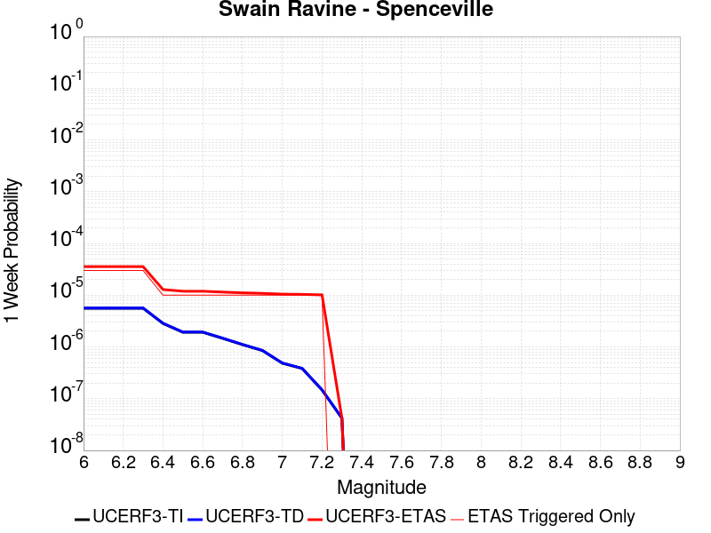 | 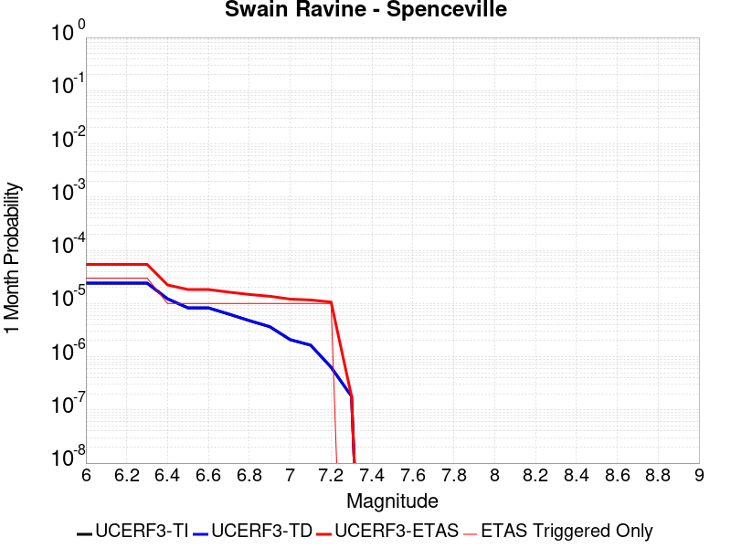 | 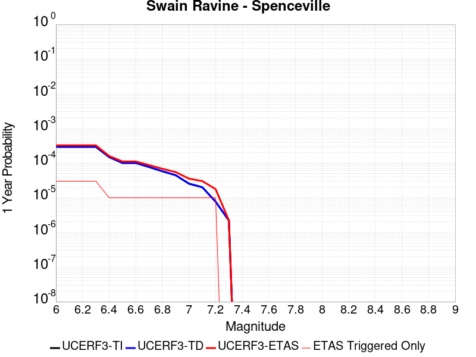 | 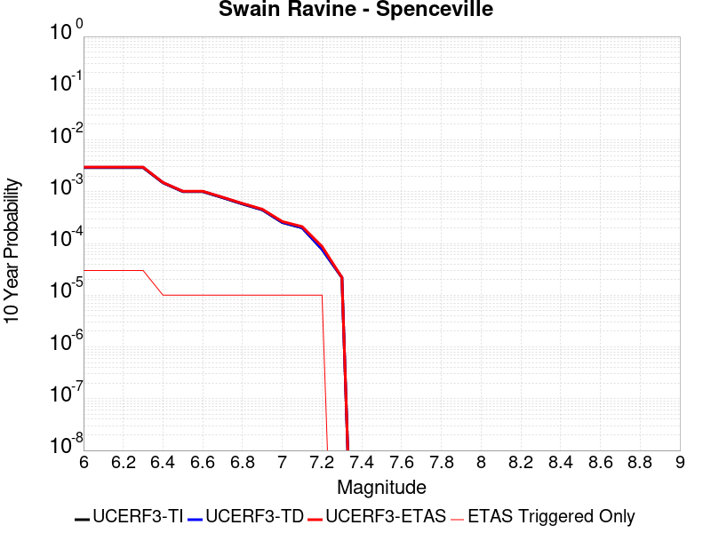 |

| Magnitude | 1 wk TI Prob | 1 wk TD Prob | 1 wk ETAS Prob | 1 wk ETAS/TD Gain | 1 wk ETAS Triggered Only | 1 mo TI Prob | 1 mo TD Prob | 1 mo ETAS Prob | 1 mo ETAS/TD Gain | 1 mo ETAS Triggered Only | 1 yr TI Prob | 1 yr TD Prob | 1 yr ETAS Prob | 1 yr ETAS/TD Gain | 1 yr ETAS Triggered Only | 10 yr TI Prob | 10 yr TD Prob | 10 yr ETAS Prob | 10 yr ETAS/TD Gain | 10 yr ETAS Triggered Only |
|-----|-----|-----|-----|-----|-----|-----|-----|-----|-----|-----|-----|-----|-----|-----|-----|-----|-----|-----|-----|-----|
| 6.0 | 5.596169E-6 | 5.663794E-6 | 3.5663623E-5 | 6.2967725 | 3.0E-5 | 2.398336E-5 | 2.4273193E-5 | 5.4272467E-5 | 2.2359014 | 3.0E-5 | 2.9195828E-4 | 2.9548878E-4 | 3.2547992E-4 | 1.1014967 | 3.0E-5 | 0.00291575 | 0.002951228 | 0.0029811396 | 1.0101353 | 3.0E-5 |
| 6.1 | 5.596169E-6 | 5.663794E-6 | 3.5663623E-5 | 6.2967725 | 3.0E-5 | 2.398336E-5 | 2.4273193E-5 | 5.4272467E-5 | 2.2359014 | 3.0E-5 | 2.9195828E-4 | 2.9548878E-4 | 3.2547992E-4 | 1.1014967 | 3.0E-5 | 0.00291575 | 0.002951228 | 0.0029811396 | 1.0101353 | 3.0E-5 |
| 6.2 | 5.596169E-6 | 5.663794E-6 | 3.5663623E-5 | 6.2967725 | 3.0E-5 | 2.398336E-5 | 2.4273193E-5 | 5.4272467E-5 | 2.2359014 | 3.0E-5 | 2.9195828E-4 | 2.9548878E-4 | 3.2547992E-4 | 1.1014967 | 3.0E-5 | 0.00291575 | 0.002951228 | 0.0029811396 | 1.0101353 | 3.0E-5 |
| 6.3 | 5.596169E-6 | 5.663794E-6 | 3.5663623E-5 | 6.2967725 | 3.0E-5 | 2.398336E-5 | 2.4273193E-5 | 5.4272467E-5 | 2.2359014 | 3.0E-5 | 2.9195828E-4 | 2.9548878E-4 | 3.2547992E-4 | 1.1014967 | 3.0E-5 | 0.00291575 | 0.002951228 | 0.0029811396 | 1.0101353 | 3.0E-5 |
| 6.4 | 2.8426775E-6 | 2.874144E-6 | 1.2874115E-5 | 4.4792867 | 1.0E-5 | 1.2182847E-5 | 1.2317704E-5 | 2.2317581E-5 | 1.8118296 | 1.0E-5 | 1.4831607E-4 | 1.4995811E-4 | 1.5995662E-4 | 1.0666753 | 1.0E-5 | 0.0014821711 | 0.0014986077 | 0.0015085926 | 1.0066628 | 1.0E-5 |
| 6.5 | 1.9210793E-6 | 1.9414147E-6 | 1.1941395E-5 | 6.150873 | 1.0E-5 | 8.233172E-6 | 8.320323E-6 | 1.832024E-5 | 2.2018664 | 1.0E-5 | 1.0023425E-4 | 1.0129536E-4 | 1.1129434E-4 | 1.0987113 | 1.0E-5 | 0.0010018905 | 0.0010125053 | 0.0010224952 | 1.0098665 | 1.0E-5 |
| 6.6 | 1.9210793E-6 | 1.9414147E-6 | 1.1941395E-5 | 6.150873 | 1.0E-5 | 8.233172E-6 | 8.320323E-6 | 1.832024E-5 | 2.2018664 | 1.0E-5 | 1.0023425E-4 | 1.0129536E-4 | 1.1129434E-4 | 1.0987113 | 1.0E-5 | 0.0010018905 | 0.0010125053 | 0.0010224952 | 1.0098665 | 1.0E-5 |
| 6.7 | 1.4667394E-6 | 1.4818934E-6 | 1.1481879E-5 | 7.748114 | 1.0E-5 | 6.286011E-6 | 6.3509565E-6 | 1.6350892E-5 | 2.5745559 | 1.0E-5 | 7.65295E-5 | 7.732023E-5 | 8.731946E-5 | 1.1293223 | 1.0E-5 | 7.6503144E-4 | 7.72941E-4 | 7.8293326E-4 | 1.0129277 | 1.0E-5 |
| 6.8 | 1.1076943E-6 | 1.1189535E-6 | 1.1118942E-5 | 9.936913 | 1.0E-5 | 4.747252E-6 | 4.7955064E-6 | 1.4795458E-5 | 3.0852757 | 1.0E-5 | 5.7796264E-5 | 5.838377E-5 | 6.838319E-5 | 1.1712705 | 1.0E-5 | 5.778124E-4 | 5.836887E-4 | 5.936829E-4 | 1.0171224 | 1.0E-5 |
| 6.9 | 8.514296E-7 | 8.600095E-7 | 1.0860001E-5 | 12.6277685 | 1.0E-5 | 3.648979E-6 | 3.6857498E-6 | 1.3685713E-5 | 3.7131422 | 1.0E-5 | 4.442541E-5 | 4.4873108E-5 | 5.487266E-5 | 1.2228407 | 1.0E-5 | 4.441653E-4 | 4.4864335E-4 | 4.5863885E-4 | 1.0222794 | 1.0E-5 |
| 7.0 | 4.8544706E-7 | 4.9033E-7 | 1.0490325E-5 | 21.394417 | 1.0E-5 | 2.0804857E-6 | 2.1014127E-6 | 1.2101392E-5 | 5.758693 | 1.0E-5 | 2.532962E-5 | 2.5584413E-5 | 3.558416E-5 | 1.3908529 | 1.0E-5 | 2.5326732E-4 | 2.5581598E-4 | 2.6581343E-4 | 1.0390806 | 1.0E-5 |
| 7.1 | 3.829186E-7 | 3.8678783E-7 | 1.0386784E-5 | 26.853958 | 1.0E-5 | 1.6410787E-6 | 1.6576612E-6 | 1.1657645E-5 | 7.032586 | 1.0E-5 | 1.997995E-5 | 2.0181848E-5 | 3.0181647E-5 | 1.4954847 | 1.0E-5 | 1.9978154E-4 | 2.0180122E-4 | 2.117992E-4 | 1.0495437 | 1.0E-5 |
| 7.2 | 1.4726595E-7 | 1.4879437E-7 | 1.0148793E-5 | 68.20683 | 1.0E-5 | 6.3113964E-7 | 6.3769005E-7 | 1.0637684E-5 | 16.68159 | 1.0E-5 | 7.684098E-6 | 7.763854E-6 | 1.7763776E-5 | 2.2880101 | 1.0E-5 | 7.6838325E-5 | 7.763636E-5 | 8.7635584E-5 | 1.1287956 | 1.0E-5 |
| 7.3 | 4.1880604E-8 | 4.2324306E-8 | 4.2324306E-8 | 1.0 | 0.0 | 1.7948828E-7 | 1.8138988E-7 | 1.8138988E-7 | 1.0 | 0.0 | 2.1852677E-6 | 2.2084218E-6 | 2.2084218E-6 | 1.0 | 0.0 | 2.1852462E-5 | 2.2084218E-5 | 2.2084218E-5 | 1.0 | 0.0 |

## San Jacinto (Borrego)
*[(top)](#table-of-contents)*

| 1 Week | 1 Month | 1 Year | 10 Year |
|-----|-----|-----|-----|
| 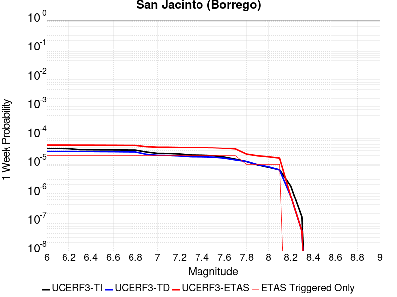 | 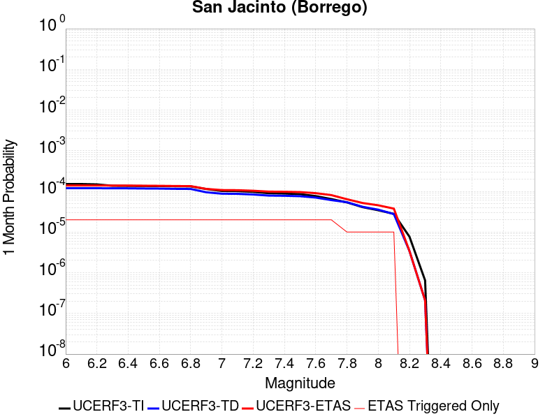 | 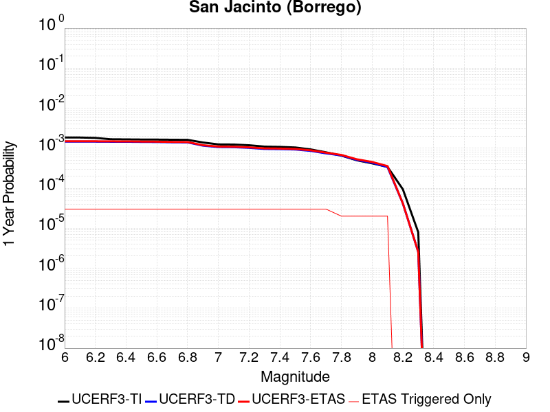 | 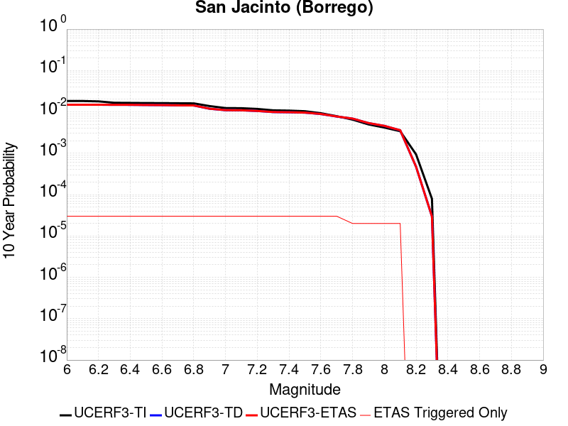 |

| Magnitude | 1 wk TI Prob | 1 wk TD Prob | 1 wk ETAS Prob | 1 wk ETAS/TD Gain | 1 wk ETAS Triggered Only | 1 mo TI Prob | 1 mo TD Prob | 1 mo ETAS Prob | 1 mo ETAS/TD Gain | 1 mo ETAS Triggered Only | 1 yr TI Prob | 1 yr TD Prob | 1 yr ETAS Prob | 1 yr ETAS/TD Gain | 1 yr ETAS Triggered Only | 10 yr TI Prob | 10 yr TD Prob | 10 yr ETAS Prob | 10 yr ETAS/TD Gain | 10 yr ETAS Triggered Only |
|-----|-----|-----|-----|-----|-----|-----|-----|-----|-----|-----|-----|-----|-----|-----|-----|-----|-----|-----|-----|-----|
| 6.0 | 3.543992E-5 | 2.7925962E-5 | 4.7925405E-5 | 1.7161595 | 2.0E-5 | 1.5187653E-4 | 1.1967727E-4 | 1.3967488E-4 | 1.1670961 | 2.0E-5 | 0.0018475284 | 0.0014561092 | 0.0014860654 | 1.0205729 | 3.0E-5 | 0.018322436 | 0.01486815 | 0.014897705 | 1.0019877 | 3.0E-5 |
| 6.1 | 3.542281E-5 | 2.7925962E-5 | 4.7925405E-5 | 1.7161595 | 2.0E-5 | 1.5180321E-4 | 1.1967727E-4 | 1.3967488E-4 | 1.1670961 | 2.0E-5 | 0.0018466372 | 0.0014561092 | 0.0014860654 | 1.0205729 | 3.0E-5 | 0.018313672 | 0.01486815 | 0.014897705 | 1.0019877 | 3.0E-5 |
| 6.2 | 3.4688688E-5 | 2.7925962E-5 | 4.7925405E-5 | 1.7161595 | 2.0E-5 | 1.4865733E-4 | 1.1967727E-4 | 1.3967488E-4 | 1.1670961 | 2.0E-5 | 0.0018084005 | 0.0014561091 | 0.0014860654 | 1.0205729 | 3.0E-5 | 0.017937548 | 0.01486815 | 0.014897704 | 1.0019877 | 3.0E-5 |
| 6.3 | 3.2087122E-5 | 2.7771312E-5 | 4.7770758E-5 | 1.7201476 | 2.0E-5 | 1.3750899E-4 | 1.1901455E-4 | 1.3901216E-4 | 1.1680267 | 2.0E-5 | 0.0016728862 | 0.0014480512 | 0.0014780078 | 1.0206875 | 3.0E-5 | 0.016603488 | 0.014789308 | 0.014818865 | 1.0019985 | 3.0E-5 |
| 6.4 | 3.1828724E-5 | 2.773829E-5 | 4.7737733E-5 | 1.721005 | 2.0E-5 | 1.364017E-4 | 1.1887303E-4 | 1.3887066E-4 | 1.1682267 | 2.0E-5 | 0.0016594254 | 0.0014463306 | 0.0014762871 | 1.0207121 | 3.0E-5 | 0.016470885 | 0.014772502 | 0.014802058 | 1.0020008 | 3.0E-5 |
| 6.5 | 3.1563577E-5 | 2.7477974E-5 | 4.7477424E-5 | 1.7278357 | 2.0E-5 | 1.3526545E-4 | 1.17757496E-4 | 1.3775514E-4 | 1.1698205 | 2.0E-5 | 0.0016456128 | 0.0014327668 | 0.0014627238 | 1.0209085 | 3.0E-5 | 0.0163348 | 0.01463991 | 0.0146694705 | 1.0020192 | 3.0E-5 |
| 6.6 | 3.1467625E-5 | 2.7322194E-5 | 4.7321646E-5 | 1.7319857 | 2.0E-5 | 1.3485427E-4 | 1.17089934E-4 | 1.3708758E-4 | 1.1707889 | 2.0E-5 | 0.0016406142 | 0.0014246498 | 0.0014546071 | 1.0210278 | 3.0E-5 | 0.016285548 | 0.014560228 | 0.014589791 | 1.0020304 | 3.0E-5 |
| 6.7 | 3.1223695E-5 | 2.6940217E-5 | 4.693968E-5 | 1.7423645 | 2.0E-5 | 1.3380898E-4 | 1.1545303E-4 | 1.3545073E-4 | 1.1732106 | 2.0E-5 | 0.0016279068 | 0.0014047464 | 0.0014347043 | 1.0213262 | 3.0E-5 | 0.01616033 | 0.01436451 | 0.014394078 | 1.0020585 | 3.0E-5 |
| 6.8 | 3.1015585E-5 | 2.6761221E-5 | 4.6760684E-5 | 1.7473301 | 2.0E-5 | 1.3291716E-4 | 1.1468597E-4 | 1.3468368E-4 | 1.1743692 | 2.0E-5 | 0.001617065 | 0.0013954195 | 0.0014253776 | 1.0214689 | 3.0E-5 | 0.016053487 | 0.014271772 | 0.014301344 | 1.0020721 | 3.0E-5 |
| 6.9 | 2.6641965E-5 | 2.2183434E-5 | 4.218299E-5 | 1.9015536 | 2.0E-5 | 1.1417485E-4 | 9.506842E-5 | 1.1506652E-4 | 1.2103548 | 2.0E-5 | 0.0013891924 | 0.0011568473 | 0.0011868126 | 1.0259025 | 3.0E-5 | 0.0138054015 | 0.011882191 | 0.011911835 | 1.0024948 | 3.0E-5 |
| 7.0 | 2.3854353E-5 | 2.047825E-5 | 4.047784E-5 | 1.9766259 | 2.0E-5 | 1.02228936E-4 | 8.776099E-5 | 1.0775924E-4 | 1.2278717 | 2.0E-5 | 0.0012439266 | 0.0010679689 | 0.0010979369 | 1.0280607 | 3.0E-5 | 0.012369866 | 0.0109826205 | 0.011012291 | 1.0027016 | 3.0E-5 |
| 7.1 | 2.3672901E-5 | 2.0314741E-5 | 4.0314335E-5 | 1.9844868 | 2.0E-5 | 1.0145135E-4 | 8.706028E-5 | 1.0705854E-4 | 1.2297059 | 2.0E-5 | 0.0012344702 | 0.0010594461 | 0.0010894143 | 1.0282867 | 3.0E-5 | 0.0122763505 | 0.010897858 | 0.010927532 | 1.0027229 | 3.0E-5 |
| 7.2 | 2.2717244E-5 | 1.9542116E-5 | 3.9541726E-5 | 2.0234106 | 2.0E-5 | 9.735599E-5 | 8.3749255E-5 | 1.03747574E-4 | 1.2387881 | 2.0E-5 | 0.0011846646 | 0.0010191725 | 0.001049142 | 1.0294056 | 3.0E-5 | 0.01178369 | 0.010495322 | 0.010525007 | 1.0028284 | 3.0E-5 |
| 7.3 | 2.1016205E-5 | 1.8383771E-5 | 3.8383405E-5 | 2.087896 | 2.0E-5 | 9.006634E-5 | 7.878522E-5 | 9.878365E-5 | 1.2538347 | 2.0E-5 | 0.001096006 | 9.5879E-4 | 9.887613E-4 | 1.0312594 | 3.0E-5 | 0.010906163 | 0.009890901 | 0.0099206045 | 1.0030031 | 3.0E-5 |
| 7.4 | 2.0683625E-5 | 1.8186302E-5 | 3.818594E-5 | 2.0997088 | 2.0E-5 | 8.86411E-5 | 7.7938974E-5 | 9.7937416E-5 | 1.256591 | 2.0E-5 | 0.001078671 | 9.48496E-4 | 9.784675E-4 | 1.031599 | 3.0E-5 | 0.010734501 | 0.0097876275 | 0.009817334 | 1.0030351 | 3.0E-5 |
| 7.5 | 1.9993966E-5 | 1.7781347E-5 | 3.7780992E-5 | 2.1247542 | 2.0E-5 | 8.568561E-5 | 7.6203556E-5 | 9.6202035E-5 | 1.262435 | 2.0E-5 | 0.001042723 | 9.2738547E-4 | 9.5735764E-4 | 1.032319 | 3.0E-5 | 0.010378438 | 0.009574548 | 0.009604261 | 1.0031033 | 3.0E-5 |
| 7.6 | 1.788966E-5 | 1.6434618E-5 | 3.643429E-5 | 2.2169235 | 2.0E-5 | 7.666772E-5 | 7.043219E-5 | 9.0430774E-5 | 1.283941 | 2.0E-5 | 9.3302975E-4 | 8.5717626E-4 | 8.871505E-4 | 1.0349686 | 3.0E-5 | 0.00929122 | 0.008866415 | 0.00889615 | 1.0033536 | 3.0E-5 |
| 7.7 | 1.5125781E-5 | 1.4236738E-5 | 3.4236455E-5 | 2.4047961 | 2.0E-5 | 6.4823165E-5 | 6.101317E-5 | 8.1011945E-5 | 1.3277781 | 2.0E-5 | 7.889362E-4 | 7.4258295E-4 | 7.725607E-4 | 1.0403695 | 3.0E-5 | 0.007861412 | 0.007714161 | 0.0077439295 | 1.0038589 | 3.0E-5 |
| 7.8 | 1.250089E-5 | 1.262994E-5 | 2.2629814E-5 | 1.7917594 | 1.0E-5 | 5.3574146E-5 | 5.4127195E-5 | 6.412665E-5 | 1.1847401 | 1.0E-5 | 6.5207E-4 | 6.588E-4 | 6.7878683E-4 | 1.0303383 | 2.0E-5 | 0.006501599 | 0.006867759 | 0.0068876217 | 1.0028921 | 2.0E-5 |
| 7.9 | 9.561E-6 | 9.754065E-6 | 1.9753967E-5 | 2.0252037 | 1.0E-5 | 4.0975072E-5 | 4.180247E-5 | 5.180205E-5 | 1.2392104 | 1.0E-5 | 4.987573E-4 | 5.0882675E-4 | 5.288166E-4 | 1.0392861 | 2.0E-5 | 0.0049763937 | 0.0053523607 | 0.0053722532 | 1.0037167 | 2.0E-5 |
| 8.0 | 8.01699E-6 | 8.292994E-6 | 1.829291E-5 | 2.2058272 | 1.0E-5 | 3.4358076E-5 | 3.554092E-5 | 4.5540564E-5 | 1.2813559 | 1.0E-5 | 4.1822926E-4 | 4.3262533E-4 | 4.5261666E-4 | 1.0462093 | 2.0E-5 | 0.0041744304 | 0.0045733186 | 0.0045932275 | 1.0043532 | 2.0E-5 |
| 8.1 | 6.541947E-6 | 6.461784E-6 | 1.646172E-5 | 2.5475502 | 1.0E-5 | 2.8036617E-5 | 2.7693068E-5 | 3.7692793E-5 | 1.3610911 | 1.0E-5 | 3.4129233E-4 | 3.3711144E-4 | 3.571047E-4 | 1.0593076 | 2.0E-5 | 0.0034076865 | 0.0035805756 | 0.0036005038 | 1.0055656 | 2.0E-5 |
| 8.2 | 1.7968189E-6 | 7.9684827E-7 | 7.9684827E-7 | 1.0 | 0.0 | 7.70063E-6 | 3.4150596E-6 | 3.4150596E-6 | 1.0 | 0.0 | 9.3751136E-5 | 4.157758E-5 | 4.157758E-5 | 1.0 | 0.0 | 9.371159E-4 | 4.7107413E-4 | 4.7107413E-4 | 1.0 | 0.0 |
| 8.3 | 1.5167889E-7 | 4.8951257E-8 | 4.8951257E-8 | 1.0 | 0.0 | 6.500522E-7 | 2.0979108E-7 | 2.0979108E-7 | 1.0 | 0.0 | 7.9143565E-6 | 2.5542038E-6 | 2.5542038E-6 | 1.0 | 0.0 | 7.914075E-5 | 2.9679897E-5 | 2.9679897E-5 | 1.0 | 0.0 |

## Elysian Park (Upper)
*[(top)](#table-of-contents)*

| 1 Week | 1 Month | 1 Year | 10 Year |
|-----|-----|-----|-----|
| 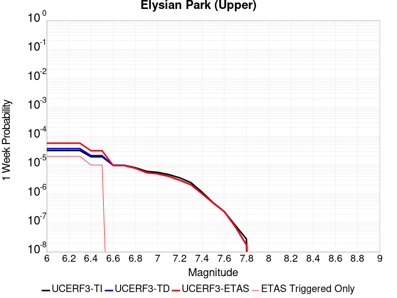 |  | 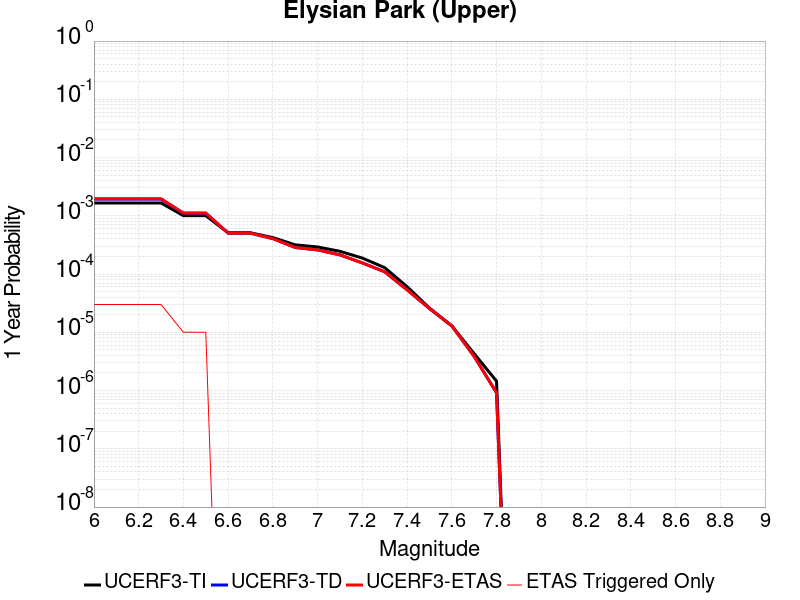 | 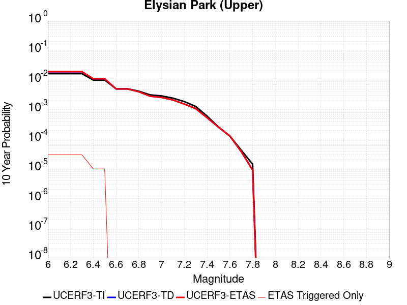 |

| Magnitude | 1 wk TI Prob | 1 wk TD Prob | 1 wk ETAS Prob | 1 wk ETAS/TD Gain | 1 wk ETAS Triggered Only | 1 mo TI Prob | 1 mo TD Prob | 1 mo ETAS Prob | 1 mo ETAS/TD Gain | 1 mo ETAS Triggered Only | 1 yr TI Prob | 1 yr TD Prob | 1 yr ETAS Prob | 1 yr ETAS/TD Gain | 1 yr ETAS Triggered Only | 10 yr TI Prob | 10 yr TD Prob | 10 yr ETAS Prob | 10 yr ETAS/TD Gain | 10 yr ETAS Triggered Only |
|-----|-----|-----|-----|-----|-----|-----|-----|-----|-----|-----|-----|-----|-----|-----|-----|-----|-----|-----|-----|-----|
| 6.0 | 3.1876025E-5 | 3.7035275E-5 | 5.7034536E-5 | 1.5400057 | 2.0E-5 | 1.3660437E-4 | 1.5871569E-4 | 1.7871251E-4 | 1.1259915 | 2.0E-5 | 0.0016618895 | 0.001931122 | 0.001961064 | 1.015505 | 3.0E-5 | 0.016495159 | 0.019189863 | 0.019219287 | 1.0015333 | 3.0E-5 |
| 6.1 | 3.1876025E-5 | 3.7035275E-5 | 5.7034536E-5 | 1.5400057 | 2.0E-5 | 1.3660437E-4 | 1.5871569E-4 | 1.7871251E-4 | 1.1259915 | 2.0E-5 | 0.0016618895 | 0.001931122 | 0.001961064 | 1.015505 | 3.0E-5 | 0.016495159 | 0.019189863 | 0.019219287 | 1.0015333 | 3.0E-5 |
| 6.2 | 3.1876025E-5 | 3.7035275E-5 | 5.7034536E-5 | 1.5400057 | 2.0E-5 | 1.3660437E-4 | 1.5871569E-4 | 1.7871251E-4 | 1.1259915 | 2.0E-5 | 0.0016618895 | 0.001931122 | 0.001961064 | 1.015505 | 3.0E-5 | 0.016495159 | 0.019189863 | 0.019219287 | 1.0015333 | 3.0E-5 |
| 6.3 | 3.1876025E-5 | 3.7035275E-5 | 5.7034536E-5 | 1.5400057 | 2.0E-5 | 1.3660437E-4 | 1.5871569E-4 | 1.7871251E-4 | 1.1259915 | 2.0E-5 | 0.0016618895 | 0.001931122 | 0.001961064 | 1.015505 | 3.0E-5 | 0.016495159 | 0.019189863 | 0.019219287 | 1.0015333 | 3.0E-5 |
| 6.4 | 1.9273462E-5 | 2.120244E-5 | 3.1202228E-5 | 1.4716338 | 1.0E-5 | 8.259794E-5 | 9.086542E-5 | 1.0086451E-4 | 1.1100428 | 1.0E-5 | 0.001005166 | 0.0011058967 | 0.0011158857 | 1.0090325 | 1.0E-5 | 0.010006315 | 0.011020744 | 0.011030634 | 1.0008974 | 1.0E-5 |
| 6.5 | 1.9273462E-5 | 2.120244E-5 | 3.1202228E-5 | 1.4716338 | 1.0E-5 | 8.259794E-5 | 9.086542E-5 | 1.0086451E-4 | 1.1100428 | 1.0E-5 | 0.001005166 | 0.0011058967 | 0.0011158857 | 1.0090325 | 1.0E-5 | 0.010006315 | 0.011020744 | 0.011030634 | 1.0008974 | 1.0E-5 |
| 6.6 | 9.813258E-6 | 9.665589E-6 | 9.665589E-6 | 1.0 | 0.0 | 4.205614E-5 | 4.1423333E-5 | 4.1423333E-5 | 1.0 | 0.0 | 5.119132E-4 | 5.042196E-4 | 5.042196E-4 | 1.0 | 0.0 | 0.005107356 | 0.0050314795 | 0.0050314795 | 1.0 | 0.0 |
| 6.7 | 9.801478E-6 | 9.653158E-6 | 9.653158E-6 | 1.0 | 0.0 | 4.2005657E-5 | 4.137006E-5 | 4.137006E-5 | 1.0 | 0.0 | 5.112989E-4 | 5.0357135E-4 | 5.0357135E-4 | 1.0 | 0.0 | 0.0051012407 | 0.005025026 | 0.005025026 | 1.0 | 0.0 |
| 6.8 | 8.102489E-6 | 7.772994E-6 | 7.772994E-6 | 1.0 | 0.0 | 3.4724493E-5 | 3.3312434E-5 | 3.3312434E-5 | 1.0 | 0.0 | 4.2268867E-4 | 4.0550836E-4 | 4.0550836E-4 | 1.0 | 0.0 | 0.004218856 | 0.0040481784 | 0.0040481784 | 1.0 | 0.0 |
| 6.9 | 6.08275E-6 | 5.481441E-6 | 5.481441E-6 | 1.0 | 0.0 | 2.6068668E-5 | 2.3491682E-5 | 2.3491682E-5 | 1.0 | 0.0 | 3.173398E-4 | 2.8597447E-4 | 2.8597447E-4 | 1.0 | 0.0 | 0.0031688702 | 0.0028561424 | 0.0028561424 | 1.0 | 0.0 |
| 7.0 | 5.5995934E-6 | 4.9827686E-6 | 4.9827686E-6 | 1.0 | 0.0 | 2.3998036E-5 | 2.1354552E-5 | 2.1354552E-5 | 1.0 | 0.0 | 2.9213692E-4 | 2.5996132E-4 | 2.5996132E-4 | 1.0 | 0.0 | 0.0029175316 | 0.0025966396 | 0.0025966396 | 1.0 | 0.0 |
| 7.1 | 4.709881E-6 | 4.0873906E-6 | 4.0873906E-6 | 1.0 | 0.0 | 2.0185047E-5 | 1.7517272E-5 | 1.7517272E-5 | 1.0 | 0.0 | 2.4572524E-4 | 2.1325232E-4 | 2.1325232E-4 | 1.0 | 0.0 | 0.002454537 | 0.0021305184 | 0.0021305184 | 1.0 | 0.0 |
| 7.2 | 3.6063436E-6 | 2.9779412E-6 | 2.9779412E-6 | 1.0 | 0.0 | 1.5455667E-5 | 1.27625435E-5 | 1.27625435E-5 | 1.0 | 0.0 | 1.881565E-4 | 1.55373E-4 | 1.55373E-4 | 1.0 | 0.0 | 0.0018799726 | 0.0015526549 | 0.0015526549 | 1.0 | 0.0 |
| 7.3 | 2.471135E-6 | 2.0954562E-6 | 2.0954562E-6 | 1.0 | 0.0 | 1.0590536E-5 | 8.980496E-6 | 8.980496E-6 | 1.0 | 0.0 | 1.2893214E-4 | 1.0933213E-4 | 1.0933213E-4 | 1.0 | 0.0 | 0.0012885736 | 0.0010927906 | 0.0010927906 | 1.0 | 0.0 |
| 7.4 | 1.163943E-6 | 1.0275061E-6 | 1.0275061E-6 | 1.0 | 0.0 | 4.988318E-6 | 4.40359E-6 | 4.40359E-6 | 1.0 | 0.0 | 6.0731076E-5 | 5.361242E-5 | 5.361242E-5 | 1.0 | 0.0 | 6.071448E-4 | 5.3599785E-4 | 5.3599785E-4 | 1.0 | 0.0 |
| 7.5 | 4.99459E-7 | 4.917601E-7 | 4.917601E-7 | 1.0 | 0.0 | 2.140537E-6 | 2.1075416E-6 | 2.1075416E-6 | 1.0 | 0.0 | 2.6060725E-5 | 2.5659032E-5 | 2.5659032E-5 | 1.0 | 0.0 | 2.605767E-4 | 2.5656226E-4 | 2.5656226E-4 | 1.0 | 0.0 |
| 7.6 | 2.4667852E-7 | 2.4778313E-7 | 2.4778313E-7 | 1.0 | 0.0 | 1.0571932E-6 | 1.0619274E-6 | 1.0619274E-6 | 1.0 | 0.0 | 1.2871251E-5 | 1.2928893E-5 | 1.2928893E-5 | 1.0 | 0.0 | 1.2870505E-4 | 1.2928178E-4 | 1.2928178E-4 | 1.0 | 0.0 |
| 7.7 | 8.2312795E-8 | 7.3864214E-8 | 7.3864214E-8 | 1.0 | 0.0 | 3.527691E-7 | 3.165609E-7 | 3.165609E-7 | 1.0 | 0.0 | 4.294955E-6 | 3.854123E-6 | 3.854123E-6 | 1.0 | 0.0 | 4.2948723E-5 | 3.854068E-5 | 3.854068E-5 | 1.0 | 0.0 |
| 7.8 | 2.7819295E-8 | 1.7565618E-8 | 1.7565618E-8 | 1.0 | 0.0 | 1.1922555E-7 | 7.528122E-8 | 7.528122E-8 | 1.0 | 0.0 | 1.45157E-6 | 9.1654863E-7 | 9.1654863E-7 | 1.0 | 0.0 | 1.45156055E-5 | 9.165463E-6 | 9.165463E-6 | 1.0 | 0.0 |

## Santa Ynez River
*[(top)](#table-of-contents)*

| 1 Week | 1 Month | 1 Year | 10 Year |
|-----|-----|-----|-----|
| 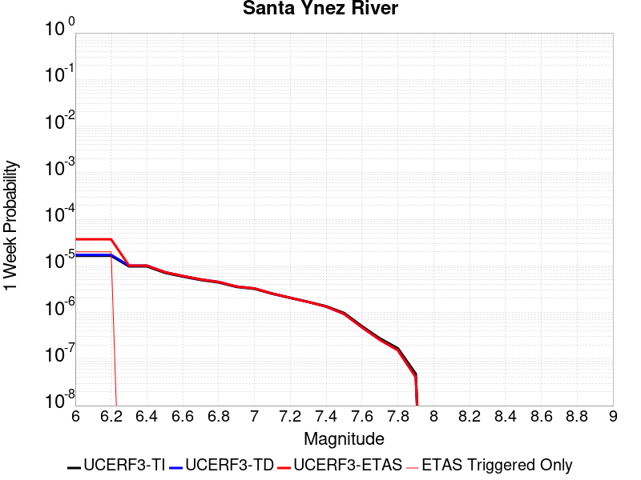 | 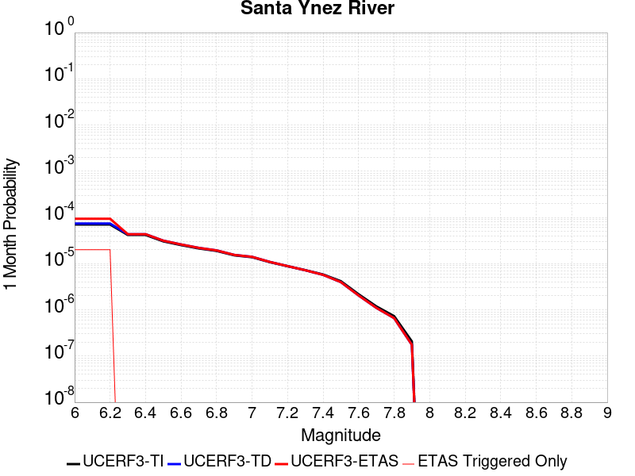 | 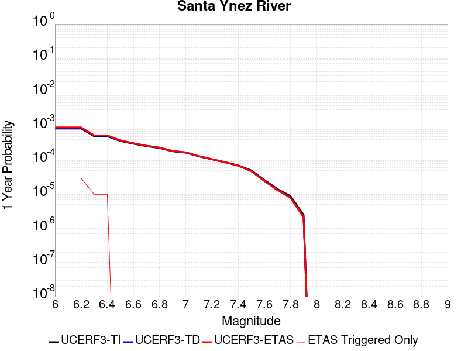 | 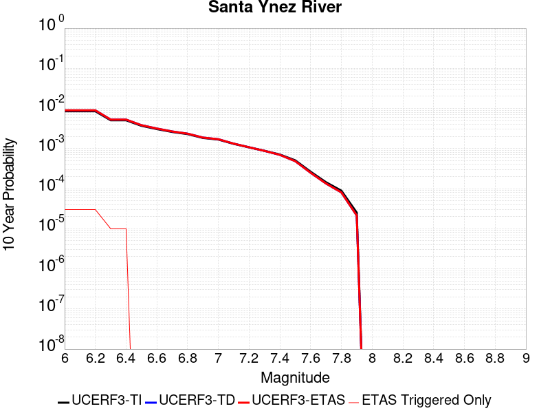 |

| Magnitude | 1 wk TI Prob | 1 wk TD Prob | 1 wk ETAS Prob | 1 wk ETAS/TD Gain | 1 wk ETAS Triggered Only | 1 mo TI Prob | 1 mo TD Prob | 1 mo ETAS Prob | 1 mo ETAS/TD Gain | 1 mo ETAS Triggered Only | 1 yr TI Prob | 1 yr TD Prob | 1 yr ETAS Prob | 1 yr ETAS/TD Gain | 1 yr ETAS Triggered Only | 10 yr TI Prob | 10 yr TD Prob | 10 yr ETAS Prob | 10 yr ETAS/TD Gain | 10 yr ETAS Triggered Only |
|-----|-----|-----|-----|-----|-----|-----|-----|-----|-----|-----|-----|-----|-----|-----|-----|-----|-----|-----|-----|-----|
| 6.0 | 1.6396456E-5 | 1.7209444E-5 | 3.72091E-5 | 2.1621325 | 2.0E-5 | 7.026863E-5 | 7.3752875E-5 | 9.3751405E-5 | 1.2711558 | 2.0E-5 | 8.551848E-4 | 8.976069E-4 | 9.2758E-4 | 1.0333922 | 3.0E-5 | 0.0085190125 | 0.008943363 | 0.008973095 | 1.0033244 | 3.0E-5 |
| 6.1 | 1.6396456E-5 | 1.7209444E-5 | 3.72091E-5 | 2.1621325 | 2.0E-5 | 7.026863E-5 | 7.3752875E-5 | 9.3751405E-5 | 1.2711558 | 2.0E-5 | 8.551848E-4 | 8.976069E-4 | 9.2758E-4 | 1.0333922 | 3.0E-5 | 0.0085190125 | 0.008943363 | 0.008973095 | 1.0033244 | 3.0E-5 |
| 6.2 | 1.6396456E-5 | 1.7209444E-5 | 3.72091E-5 | 2.1621325 | 2.0E-5 | 7.026863E-5 | 7.3752875E-5 | 9.3751405E-5 | 1.2711558 | 2.0E-5 | 8.551848E-4 | 8.976069E-4 | 9.2758E-4 | 1.0333922 | 3.0E-5 | 0.0085190125 | 0.008943363 | 0.008973095 | 1.0033244 | 3.0E-5 |
| 6.3 | 9.736976E-6 | 1.01223395E-5 | 1.01223395E-5 | 1.0 | 0.0 | 4.172923E-5 | 4.338076E-5 | 4.338076E-5 | 1.0 | 0.0 | 5.0793495E-4 | 5.280378E-4 | 5.380325E-4 | 1.018928 | 1.0E-5 | 0.005067755 | 0.0052683367 | 0.005278284 | 1.0018882 | 1.0E-5 |
| 6.4 | 9.736976E-6 | 1.01223395E-5 | 1.01223395E-5 | 1.0 | 0.0 | 4.172923E-5 | 4.338076E-5 | 4.338076E-5 | 1.0 | 0.0 | 5.0793495E-4 | 5.280378E-4 | 5.380325E-4 | 1.018928 | 1.0E-5 | 0.005067755 | 0.0052683367 | 0.005278284 | 1.0018882 | 1.0E-5 |
| 6.5 | 7.081964E-6 | 7.329905E-6 | 7.329905E-6 | 1.0 | 0.0 | 3.035092E-5 | 3.141351E-5 | 3.141351E-5 | 1.0 | 0.0 | 3.694598E-4 | 3.8239395E-4 | 3.8239395E-4 | 1.0 | 0.0 | 0.0036884616 | 0.0038175215 | 0.0038175215 | 1.0 | 0.0 |
| 6.6 | 5.873247E-6 | 6.0597517E-6 | 6.0597517E-6 | 1.0 | 0.0 | 2.5170815E-5 | 2.5970112E-5 | 2.5970112E-5 | 1.0 | 0.0 | 3.064116E-4 | 3.161411E-4 | 3.161411E-4 | 1.0 | 0.0 | 0.0030598943 | 0.003157001 | 0.003157001 | 1.0 | 0.0 |
| 6.7 | 4.973277E-6 | 5.11591E-6 | 5.11591E-6 | 1.0 | 0.0 | 2.1313872E-5 | 2.1925147E-5 | 2.1925147E-5 | 1.0 | 0.0 | 2.5946548E-4 | 2.6690646E-4 | 2.6690646E-4 | 1.0 | 0.0 | 0.0025916274 | 0.0026659078 | 0.0026659078 | 1.0 | 0.0 |
| 6.8 | 4.396492E-6 | 4.510987E-6 | 4.510987E-6 | 1.0 | 0.0 | 1.884197E-5 | 1.933266E-5 | 1.933266E-5 | 1.0 | 0.0 | 2.2937685E-4 | 2.3535005E-4 | 2.3535005E-4 | 1.0 | 0.0 | 0.0022914023 | 0.0023510433 | 0.0023510433 | 1.0 | 0.0 |
| 6.9 | 3.5255632E-6 | 3.6013423E-6 | 3.6013423E-6 | 1.0 | 0.0 | 1.5109469E-5 | 1.5434234E-5 | 1.5434234E-5 | 1.0 | 0.0 | 1.8394225E-4 | 1.8789574E-4 | 1.8789574E-4 | 1.0 | 0.0 | 0.0018379007 | 0.001877385 | 0.001877385 | 1.0 | 0.0 |
| 7.0 | 3.211603E-6 | 3.273663E-6 | 3.273663E-6 | 1.0 | 0.0 | 1.376394E-5 | 1.402991E-5 | 1.402991E-5 | 1.0 | 0.0 | 1.6756308E-4 | 1.708009E-4 | 1.708009E-4 | 1.0 | 0.0 | 0.0016743679 | 0.0017067104 | 0.0017067104 | 1.0 | 0.0 |
| 7.1 | 2.5094619E-6 | 2.5409295E-6 | 2.5409295E-6 | 1.0 | 0.0 | 1.0754793E-5 | 1.0889652E-5 | 1.0889652E-5 | 1.0 | 0.0 | 1.3093173E-4 | 1.325735E-4 | 1.325735E-4 | 1.0 | 0.0 | 0.0013085462 | 0.0013249503 | 0.0013249503 | 1.0 | 0.0 |
| 7.2 | 2.0515774E-6 | 2.0619466E-6 | 2.0619466E-6 | 1.0 | 0.0 | 8.792445E-6 | 8.836884E-6 | 8.836884E-6 | 1.0 | 0.0 | 1.0704277E-4 | 1.0758379E-4 | 1.0758379E-4 | 1.0 | 0.0 | 0.0010699122 | 0.0010753215 | 0.0010753215 | 1.0 | 0.0 |
| 7.3 | 1.6845745E-6 | 1.6773996E-6 | 1.6773996E-6 | 1.0 | 0.0 | 7.219585E-6 | 7.1888358E-6 | 7.1888358E-6 | 1.0 | 0.0 | 8.78949E-5 | 8.752059E-5 | 8.752059E-5 | 1.0 | 0.0 | 8.7860145E-4 | 8.7486405E-4 | 8.7486405E-4 | 1.0 | 0.0 |
| 7.4 | 1.3600285E-6 | 1.3333447E-6 | 1.3333447E-6 | 1.0 | 0.0 | 5.82868E-6 | 5.714322E-6 | 5.714322E-6 | 1.0 | 0.0 | 7.096187E-5 | 6.956967E-5 | 6.956967E-5 | 1.0 | 0.0 | 7.0939213E-4 | 6.9548114E-4 | 6.9548114E-4 | 1.0 | 0.0 |
| 7.5 | 9.735342E-7 | 9.2901894E-7 | 9.2901894E-7 | 1.0 | 0.0 | 4.172283E-6 | 3.9815036E-6 | 3.9815036E-6 | 1.0 | 0.0 | 5.079636E-5 | 4.8473747E-5 | 4.8473747E-5 | 1.0 | 0.0 | 5.0784746E-4 | 4.8463346E-4 | 4.8463346E-4 | 1.0 | 0.0 |
| 7.6 | 5.067187E-7 | 4.778609E-7 | 4.778609E-7 | 1.0 | 0.0 | 2.1716498E-6 | 2.0479738E-6 | 2.0479738E-6 | 1.0 | 0.0 | 2.6439517E-5 | 2.4933803E-5 | 2.4933803E-5 | 1.0 | 0.0 | 2.643637E-4 | 2.493108E-4 | 2.493108E-4 | 1.0 | 0.0 |
| 7.7 | 2.769089E-7 | 2.5759346E-7 | 2.5759346E-7 | 1.0 | 0.0 | 1.1867519E-6 | 1.1039714E-6 | 1.1039714E-6 | 1.0 | 0.0 | 1.4448608E-5 | 1.344077E-5 | 1.344077E-5 | 1.0 | 0.0 | 1.444767E-4 | 1.343996E-4 | 1.343996E-4 | 1.0 | 0.0 |
| 7.8 | 1.7044663E-7 | 1.5449208E-7 | 1.5449208E-7 | 1.0 | 0.0 | 7.3048534E-7 | 6.6210873E-7 | 6.6210873E-7 | 1.0 | 0.0 | 8.893623E-6 | 8.061144E-6 | 8.061144E-6 | 1.0 | 0.0 | 8.893267E-5 | 8.060854E-5 | 8.060854E-5 | 1.0 | 0.0 |
| 7.9 | 4.8344287E-8 | 4.0911143E-8 | 4.0911143E-8 | 1.0 | 0.0 | 2.0718979E-7 | 1.7533345E-7 | 1.7533345E-7 | 1.0 | 0.0 | 2.5225327E-6 | 2.1346827E-6 | 2.1346827E-6 | 1.0 | 0.0 | 2.5225041E-5 | 2.1346626E-5 | 2.1346626E-5 | 1.0 | 0.0 |

## Hunting Creek - Berryessa 2011 CFM
*[(top)](#table-of-contents)*

| 1 Week | 1 Month | 1 Year | 10 Year |
|-----|-----|-----|-----|
| 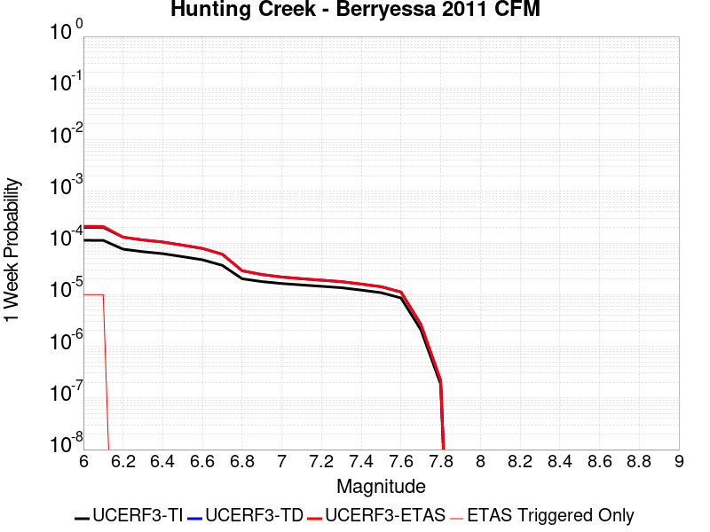 | 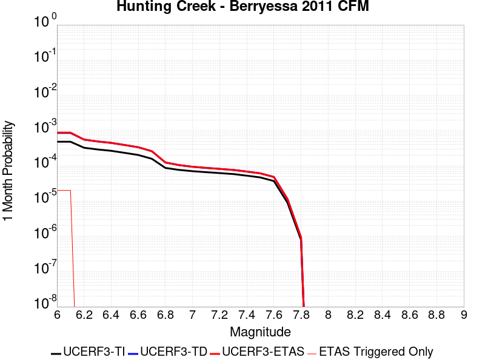 | 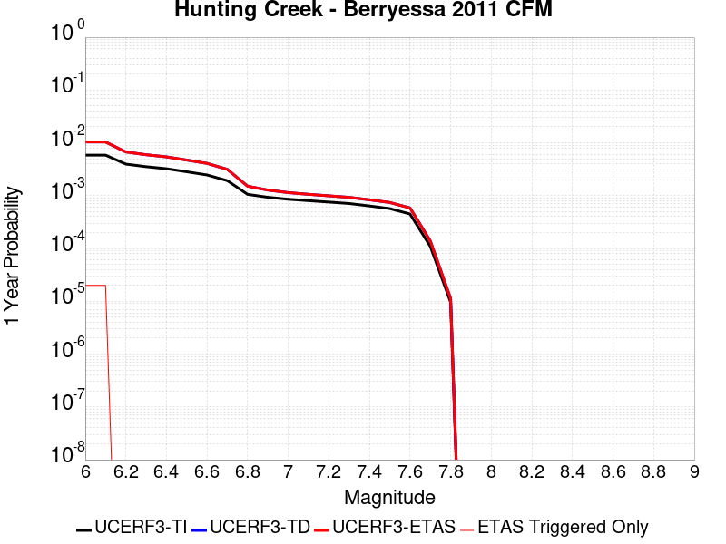 | 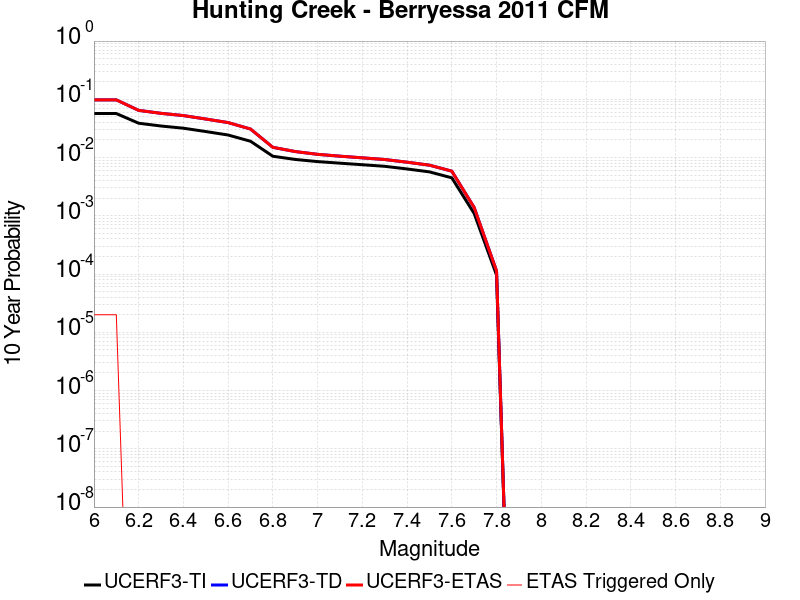 |

| Magnitude | 1 wk TI Prob | 1 wk TD Prob | 1 wk ETAS Prob | 1 wk ETAS/TD Gain | 1 wk ETAS Triggered Only | 1 mo TI Prob | 1 mo TD Prob | 1 mo ETAS Prob | 1 mo ETAS/TD Gain | 1 mo ETAS Triggered Only | 1 yr TI Prob | 1 yr TD Prob | 1 yr ETAS Prob | 1 yr ETAS/TD Gain | 1 yr ETAS Triggered Only | 10 yr TI Prob | 10 yr TD Prob | 10 yr ETAS Prob | 10 yr ETAS/TD Gain | 10 yr ETAS Triggered Only |
|-----|-----|-----|-----|-----|-----|-----|-----|-----|-----|-----|-----|-----|-----|-----|-----|-----|-----|-----|-----|-----|
| 6.0 | 1.1270982E-4 | 2.0028367E-4 | 2.1028167E-4 | 1.0499191 | 1.0E-5 | 4.8295266E-4 | 8.579912E-4 | 8.779741E-4 | 1.0232903 | 2.0E-5 | 0.0058641075 | 0.010386173 | 0.010405965 | 1.0019057 | 2.0E-5 | 0.057117578 | 0.09804048 | 0.098058514 | 1.0001839 | 2.0E-5 |
| 6.1 | 1.1239393E-4 | 1.9976508E-4 | 2.097631E-4 | 1.0500488 | 1.0E-5 | 4.8159933E-4 | 8.557703E-4 | 8.757532E-4 | 1.0233507 | 2.0E-5 | 0.0058477195 | 0.010359417 | 0.010379209 | 1.0019106 | 2.0E-5 | 0.056962132 | 0.09779895 | 0.097817 | 1.0001845 | 2.0E-5 |
| 6.2 | 7.596265E-5 | 1.2933646E-4 | 1.2933646E-4 | 1.0 | 0.0 | 3.2551357E-4 | 5.5415573E-4 | 5.5415573E-4 | 1.0 | 0.0 | 0.0039559277 | 0.0067213587 | 0.0067213587 | 1.0 | 0.0 | 0.038862433 | 0.06459229 | 0.06459229 | 1.0 | 0.0 |
| 6.3 | 6.78794E-5 | 1.1448377E-4 | 1.1448377E-4 | 1.0 | 0.0 | 2.9087928E-4 | 4.9052597E-4 | 4.9052597E-4 | 1.0 | 0.0 | 0.003535705 | 0.005952661 | 0.005952661 | 1.0 | 0.0 | 0.034799766 | 0.057466213 | 0.057466213 | 1.0 | 0.0 |
| 6.4 | 6.2165134E-5 | 1.0434825E-4 | 1.0434825E-4 | 1.0 | 0.0 | 2.6639478E-4 | 4.4711027E-4 | 4.4711027E-4 | 1.0 | 0.0 | 0.0032385332 | 0.0054274183 | 0.0054274183 | 1.0 | 0.0 | 0.03191742 | 0.05255138 | 0.05255138 | 1.0 | 0.0 |
| 6.5 | 5.4368087E-5 | 9.070258E-5 | 9.070258E-5 | 1.0 | 0.0 | 2.3298527E-4 | 3.886537E-4 | 3.886537E-4 | 1.0 | 0.0 | 0.0028329059 | 0.0047197016 | 0.0047197016 | 1.0 | 0.0 | 0.027970633 | 0.045881182 | 0.045881182 | 1.0 | 0.0 |
| 6.6 | 4.729947E-5 | 7.847101E-5 | 7.847101E-5 | 1.0 | 0.0 | 2.0269625E-4 | 3.3624718E-4 | 3.3624718E-4 | 1.0 | 0.0 | 0.002465034 | 0.004084746 | 0.004084746 | 1.0 | 0.0 | 0.02437869 | 0.03985269 | 0.03985269 | 1.0 | 0.0 |
| 6.7 | 3.6875328E-5 | 6.0443555E-5 | 6.0443555E-5 | 1.0 | 0.0 | 1.5802756E-4 | 2.5900968E-4 | 2.5900968E-4 | 1.0 | 0.0 | 0.0019222875 | 0.0031482724 | 0.0031482724 | 1.0 | 0.0 | 0.019057442 | 0.03089371 | 0.03089371 | 1.0 | 0.0 |
| 6.8 | 2.0292036E-5 | 2.8976721E-5 | 2.8976721E-5 | 1.0 | 0.0 | 8.6962966E-5 | 1.2417998E-4 | 1.2417998E-4 | 1.0 | 0.0 | 0.0010582599 | 0.0015108302 | 0.0015108302 | 1.0 | 0.0 | 0.010532344 | 0.0149790775 | 0.0149790775 | 1.0 | 0.0 |
| 6.9 | 1.7871042E-5 | 2.4472653E-5 | 2.4472653E-5 | 1.0 | 0.0 | 7.658793E-5 | 1.04878585E-4 | 1.04878585E-4 | 1.0 | 0.0 | 9.320591E-4 | 0.0012761486 | 0.0012761486 | 1.0 | 0.0 | 0.009281595 | 0.012680395 | 0.012680395 | 1.0 | 0.0 |
| 7.0 | 1.6415532E-5 | 2.1906566E-5 | 2.1906566E-5 | 1.0 | 0.0 | 7.035038E-5 | 9.388191E-5 | 9.388191E-5 | 1.0 | 0.0 | 8.561793E-4 | 0.0011424144 | 0.0011424144 | 1.0 | 0.0 | 0.008528882 | 0.011365017 | 0.011365017 | 1.0 | 0.0 |
| 7.1 | 1.5409885E-5 | 2.0346588E-5 | 2.0346588E-5 | 1.0 | 0.0 | 6.6040695E-5 | 8.719676E-5 | 8.719676E-5 | 1.0 | 0.0 | 8.0374884E-4 | 0.0010611062 | 0.0010611062 | 1.0 | 0.0 | 0.00800848 | 0.010560924 | 0.010560924 | 1.0 | 0.0 |
| 7.2 | 1.4497423E-5 | 1.905519E-5 | 1.905519E-5 | 1.0 | 0.0 | 6.213033E-5 | 8.166256E-5 | 8.166256E-5 | 1.0 | 0.0 | 7.5617427E-4 | 9.937913E-4 | 9.937913E-4 | 1.0 | 0.0 | 0.0075360634 | 0.00989425 | 0.00989425 | 1.0 | 0.0 |
| 7.3 | 1.3615175E-5 | 1.7826347E-5 | 1.7826347E-5 | 1.0 | 0.0 | 5.8349444E-5 | 7.6396405E-5 | 7.6396405E-5 | 1.0 | 0.0 | 7.101729E-4 | 9.297323E-4 | 9.297323E-4 | 1.0 | 0.0 | 0.0070790765 | 0.009259124 | 0.009259124 | 1.0 | 0.0 |
| 7.4 | 1.2252825E-5 | 1.6026455E-5 | 1.6026455E-5 | 1.0 | 0.0 | 5.251105E-5 | 6.868302E-5 | 6.868302E-5 | 1.0 | 0.0 | 6.391345E-4 | 8.3589775E-4 | 8.3589775E-4 | 1.0 | 0.0 | 0.0063729943 | 0.008328172 | 0.008328172 | 1.0 | 0.0 |
| 7.5 | 1.0913301E-5 | 1.4241286E-5 | 1.4241286E-5 | 1.0 | 0.0 | 4.6770452E-5 | 6.103267E-5 | 6.103267E-5 | 1.0 | 0.0 | 5.6928146E-4 | 7.428222E-4 | 7.428222E-4 | 1.0 | 0.0 | 0.0056782532 | 0.0074039865 | 0.0074039865 | 1.0 | 0.0 |
| 7.6 | 8.623192E-6 | 1.12347825E-5 | 1.12347825E-5 | 1.0 | 0.0 | 3.6956015E-5 | 4.8148195E-5 | 4.8148195E-5 | 1.0 | 0.0 | 4.4984656E-4 | 5.8604917E-4 | 5.8604917E-4 | 1.0 | 0.0 | 0.00448937 | 0.005845504 | 0.005845504 | 1.0 | 0.0 |
| 7.7 | 2.0993634E-6 | 2.66264E-6 | 2.66264E-6 | 1.0 | 0.0 | 8.997241E-6 | 1.1411265E-5 | 1.1411265E-5 | 1.0 | 0.0 | 1.09535904E-4 | 1.3892337E-4 | 1.3892337E-4 | 1.0 | 0.0 | 0.0010948193 | 0.0013883994 | 0.0013883994 | 1.0 | 0.0 |
| 7.8 | 1.8428308E-7 | 2.1674624E-7 | 2.1674624E-7 | 1.0 | 0.0 | 7.897844E-7 | 9.289122E-7 | 9.289122E-7 | 1.0 | 0.0 | 9.615583E-6 | 1.130945E-5 | 1.130945E-5 | 1.0 | 0.0 | 9.615166E-5 | 1.1308173E-4 | 1.1308173E-4 | 1.0 | 0.0 |

## San Andreas (Peninsula) 2011 CFM
*[(top)](#table-of-contents)*

| 1 Week | 1 Month | 1 Year | 10 Year |
|-----|-----|-----|-----|
| 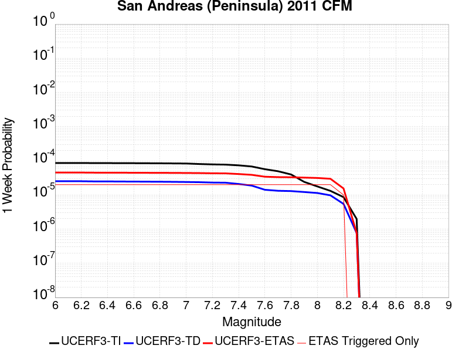 | 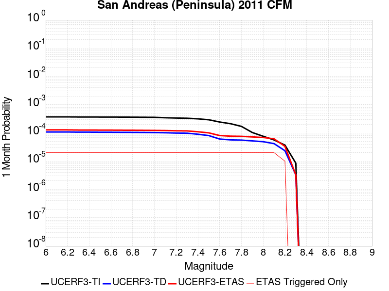 | 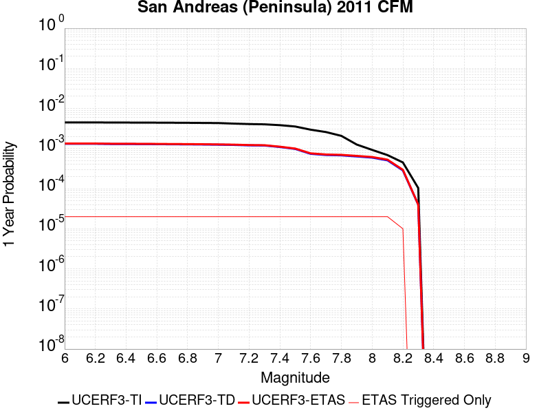 | 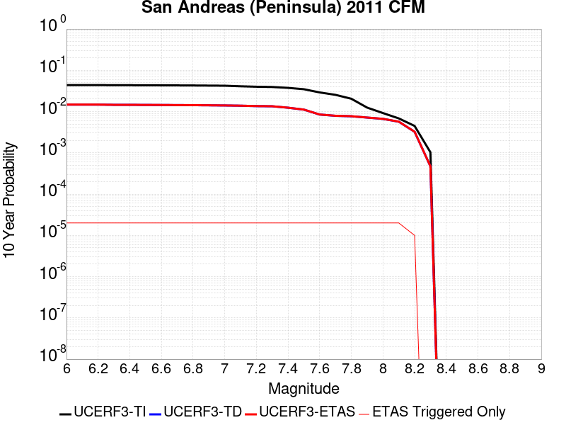 |

| Magnitude | 1 wk TI Prob | 1 wk TD Prob | 1 wk ETAS Prob | 1 wk ETAS/TD Gain | 1 wk ETAS Triggered Only | 1 mo TI Prob | 1 mo TD Prob | 1 mo ETAS Prob | 1 mo ETAS/TD Gain | 1 mo ETAS Triggered Only | 1 yr TI Prob | 1 yr TD Prob | 1 yr ETAS Prob | 1 yr ETAS/TD Gain | 1 yr ETAS Triggered Only | 10 yr TI Prob | 10 yr TD Prob | 10 yr ETAS Prob | 10 yr ETAS/TD Gain | 10 yr ETAS Triggered Only |
|-----|-----|-----|-----|-----|-----|-----|-----|-----|-----|-----|-----|-----|-----|-----|-----|-----|-----|-----|-----|-----|
| 6.0 | 8.6200685E-5 | 2.5207937E-5 | 4.5207435E-5 | 1.7933809 | 2.0E-5 | 3.6937918E-4 | 1.0802955E-4 | 1.2802739E-4 | 1.1851145 | 2.0E-5 | 0.0044879215 | 0.0013144679 | 0.0013344416 | 1.0151953 | 2.0E-5 | 0.043983612 | 0.01477218 | 0.0147918835 | 1.001334 | 2.0E-5 |
| 6.1 | 8.6200685E-5 | 2.5207937E-5 | 4.5207435E-5 | 1.7933809 | 2.0E-5 | 3.6937918E-4 | 1.0802955E-4 | 1.2802739E-4 | 1.1851145 | 2.0E-5 | 0.0044879215 | 0.0013144679 | 0.0013344416 | 1.0151953 | 2.0E-5 | 0.043983612 | 0.01477218 | 0.0147918835 | 1.001334 | 2.0E-5 |
| 6.2 | 8.6200685E-5 | 2.5207937E-5 | 4.5207435E-5 | 1.7933809 | 2.0E-5 | 3.6937918E-4 | 1.0802955E-4 | 1.2802739E-4 | 1.1851145 | 2.0E-5 | 0.0044879215 | 0.0013144679 | 0.0013344416 | 1.0151953 | 2.0E-5 | 0.043983612 | 0.01477218 | 0.0147918835 | 1.001334 | 2.0E-5 |
| 6.3 | 8.551163E-5 | 2.4899866E-5 | 4.4899367E-5 | 1.8031971 | 2.0E-5 | 3.6642692E-4 | 1.06709354E-4 | 1.2670722E-4 | 1.187405 | 2.0E-5 | 0.004452125 | 0.0012984137 | 0.0013183877 | 1.0153834 | 2.0E-5 | 0.043639794 | 0.01459892 | 0.014618629 | 1.0013499 | 2.0E-5 |
| 6.4 | 8.551163E-5 | 2.4899866E-5 | 4.4899367E-5 | 1.8031971 | 2.0E-5 | 3.6642692E-4 | 1.06709354E-4 | 1.2670722E-4 | 1.187405 | 2.0E-5 | 0.004452125 | 0.0012984137 | 0.0013183877 | 1.0153834 | 2.0E-5 | 0.043639794 | 0.01459892 | 0.014618629 | 1.0013499 | 2.0E-5 |
| 6.5 | 8.511146E-5 | 2.4721267E-5 | 4.472077E-5 | 1.809 | 2.0E-5 | 3.647124E-4 | 1.0594399E-4 | 1.2594186E-4 | 1.188759 | 2.0E-5 | 0.004431336 | 0.0012891064 | 0.0013090806 | 1.0154946 | 2.0E-5 | 0.04344007 | 0.014498963 | 0.0145186735 | 1.0013595 | 2.0E-5 |
| 6.6 | 8.4985084E-5 | 2.4651948E-5 | 4.4651457E-5 | 1.8112749 | 2.0E-5 | 3.6417096E-4 | 1.0564694E-4 | 1.2564483E-4 | 1.1892898 | 2.0E-5 | 0.0044247704 | 0.0012854942 | 0.0013054684 | 1.0155382 | 2.0E-5 | 0.043376986 | 0.0144609315 | 0.014480643 | 1.001363 | 2.0E-5 |
| 6.7 | 8.462618E-5 | 2.4480485E-5 | 4.4479995E-5 | 1.8169572 | 2.0E-5 | 3.6263323E-4 | 1.0491216E-4 | 1.2491006E-4 | 1.1906157 | 2.0E-5 | 0.004406125 | 0.0012765586 | 0.0012965332 | 1.0156472 | 2.0E-5 | 0.043197807 | 0.014365727 | 0.014385439 | 1.0013722 | 2.0E-5 |
| 6.8 | 8.42337E-5 | 2.4376272E-5 | 4.4375785E-5 | 1.82045 | 2.0E-5 | 3.6095164E-4 | 1.04465566E-4 | 1.2446348E-4 | 1.1914307 | 2.0E-5 | 0.004385734 | 0.0012711277 | 0.0012911024 | 1.015714 | 2.0E-5 | 0.043001823 | 0.014306363 | 0.014326077 | 1.0013779 | 2.0E-5 |
| 6.9 | 8.365989E-5 | 2.4180892E-5 | 4.4180408E-5 | 1.8270793 | 2.0E-5 | 3.5849313E-4 | 1.0362829E-4 | 1.2362622E-4 | 1.1929775 | 2.0E-5 | 0.004355922 | 0.0012609458 | 0.0012809206 | 1.0158411 | 2.0E-5 | 0.04271523 | 0.014198911 | 0.014218627 | 1.0013885 | 2.0E-5 |
| 7.0 | 8.30936E-5 | 2.3942457E-5 | 4.394198E-5 | 1.8353162 | 2.0E-5 | 3.560668E-4 | 1.026065E-4 | 1.2260446E-4 | 1.1948994 | 2.0E-5 | 0.004326499 | 0.0012485199 | 0.0012684949 | 1.015999 | 2.0E-5 | 0.042432297 | 0.014069902 | 0.014089621 | 1.0014014 | 2.0E-5 |
| 7.1 | 8.041264E-5 | 2.3628894E-5 | 4.362842E-5 | 1.8464013 | 2.0E-5 | 3.4458007E-4 | 1.0126277E-4 | 1.21260746E-4 | 1.1974859 | 2.0E-5 | 0.0041871946 | 0.0012321785 | 0.0012521539 | 1.0162114 | 2.0E-5 | 0.041091725 | 0.013892905 | 0.0139126275 | 1.0014195 | 2.0E-5 |
| 7.2 | 7.8427016E-5 | 2.3052688E-5 | 4.3052227E-5 | 1.8675579 | 2.0E-5 | 3.3607247E-4 | 9.87935E-5 | 1.1879152E-4 | 1.2024225 | 2.0E-5 | 0.004084008 | 0.0012021487 | 0.0012221247 | 1.0166168 | 2.0E-5 | 0.040097635 | 0.013576745 | 0.013596474 | 1.0014532 | 2.0E-5 |
| 7.3 | 7.721087E-5 | 2.2837554E-5 | 4.28371E-5 | 1.8757305 | 2.0E-5 | 3.3086175E-4 | 9.787157E-5 | 1.1786961E-4 | 1.2043295 | 2.0E-5 | 0.004020803 | 0.0011909365 | 0.0012109127 | 1.0167735 | 2.0E-5 | 0.03948827 | 0.013460464 | 0.013480195 | 1.0014658 | 2.0E-5 |
| 7.4 | 7.3536525E-5 | 2.095521E-5 | 4.095479E-5 | 1.9543966 | 2.0E-5 | 3.1511846E-4 | 8.980496E-5 | 1.09803164E-4 | 1.2226849 | 2.0E-5 | 0.0038298194 | 0.0010928282 | 0.0011128064 | 1.0182811 | 2.0E-5 | 0.037644852 | 0.0124172745 | 0.012437026 | 1.0015906 | 2.0E-5 |
| 7.5 | 6.806207E-5 | 1.876151E-5 | 3.8761136E-5 | 2.0659924 | 2.0E-5 | 2.9166197E-4 | 8.0404E-5 | 1.00402394E-4 | 1.2487239 | 2.0E-5 | 0.0035452035 | 9.784801E-4 | 9.984606E-4 | 1.0204198 | 2.0E-5 | 0.034891766 | 0.011170478 | 0.011190254 | 1.0017704 | 2.0E-5 |
| 7.6 | 5.6731416E-5 | 1.4173155E-5 | 3.4172874E-5 | 2.4110985 | 2.0E-5 | 2.43112E-4 | 6.074068E-5 | 8.073947E-5 | 1.3292487 | 2.0E-5 | 0.0029558712 | 7.3926704E-4 | 7.5925223E-4 | 1.0270338 | 2.0E-5 | 0.02916862 | 0.00848332 | 0.008503149 | 1.0023376 | 2.0E-5 |
| 7.7 | 4.946994E-5 | 1.3242368E-5 | 3.3242104E-5 | 2.510284 | 2.0E-5 | 2.1199681E-4 | 5.675177E-5 | 7.6750635E-5 | 1.352392 | 2.0E-5 | 0.002578006 | 6.907339E-4 | 7.107201E-4 | 1.0289347 | 2.0E-5 | 0.02548303 | 0.007905742 | 0.007925584 | 1.0025098 | 2.0E-5 |
| 7.8 | 3.9718198E-5 | 1.2979126E-5 | 3.2978867E-5 | 2.5409157 | 2.0E-5 | 1.7020974E-4 | 5.562364E-5 | 7.562253E-5 | 1.3595394 | 2.0E-5 | 0.0020703338 | 6.7700754E-4 | 6.96994E-4 | 1.0295218 | 2.0E-5 | 0.020511515 | 0.007716547 | 0.007736393 | 1.0025718 | 2.0E-5 |
| 7.9 | 2.4115114E-5 | 1.2183215E-5 | 3.2182972E-5 | 2.6415827 | 2.0E-5 | 1.0334639E-4 | 5.2212738E-5 | 7.221169E-5 | 1.3830283 | 2.0E-5 | 0.001257516 | 6.355048E-4 | 6.5549207E-4 | 1.031451 | 2.0E-5 | 0.012504238 | 0.0071578487 | 0.0071777054 | 1.0027741 | 2.0E-5 |
| 8.0 | 1.7756569E-5 | 1.1408184E-5 | 3.1407955E-5 | 2.7531073 | 2.0E-5 | 7.6097356E-5 | 4.8891303E-5 | 6.8890324E-5 | 1.4090507 | 2.0E-5 | 9.260915E-4 | 5.9508916E-4 | 6.1507727E-4 | 1.0335884 | 2.0E-5 | 0.009222416 | 0.006658535 | 0.0066784015 | 1.0029837 | 2.0E-5 |
| 8.1 | 1.3159258E-5 | 9.744603E-6 | 2.9744408E-5 | 3.0523982 | 2.0E-5 | 5.6395602E-5 | 4.1761916E-5 | 6.176108E-5 | 1.4788853 | 2.0E-5 | 6.864001E-4 | 5.083328E-4 | 5.2832265E-4 | 1.0393243 | 2.0E-5 | 0.0068428386 | 0.005688865 | 0.0057087517 | 1.0034957 | 2.0E-5 |
| 8.2 | 8.635426E-6 | 5.465718E-6 | 1.5465663E-5 | 2.8295758 | 1.0E-5 | 3.700844E-5 | 2.3424296E-5 | 3.342406E-5 | 1.4268972 | 1.0E-5 | 4.5048463E-4 | 2.8515357E-4 | 2.951507E-4 | 1.0350589 | 1.0E-5 | 0.004495725 | 0.0032439749 | 0.0032539424 | 1.0030726 | 1.0E-5 |
| 8.3 | 1.983087E-6 | 7.6564595E-7 | 7.6564595E-7 | 1.0 | 0.0 | 8.498917E-6 | 3.281336E-6 | 3.281336E-6 | 1.0 | 0.0 | 1.034694E-4 | 3.9949547E-5 | 3.9949547E-5 | 1.0 | 0.0 | 0.0010342124 | 4.717979E-4 | 4.717979E-4 | 1.0 | 0.0 |

## San Andreas (North Coast) 2011 CFM
*[(top)](#table-of-contents)*

| 1 Week | 1 Month | 1 Year | 10 Year |
|-----|-----|-----|-----|
| 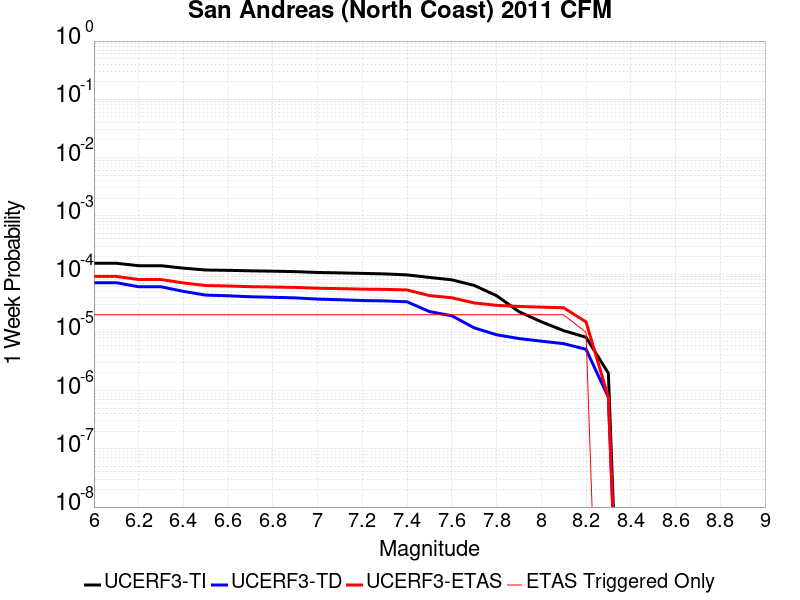 | 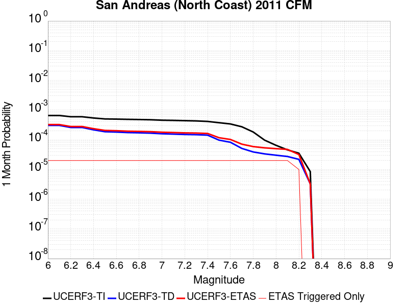 |  | 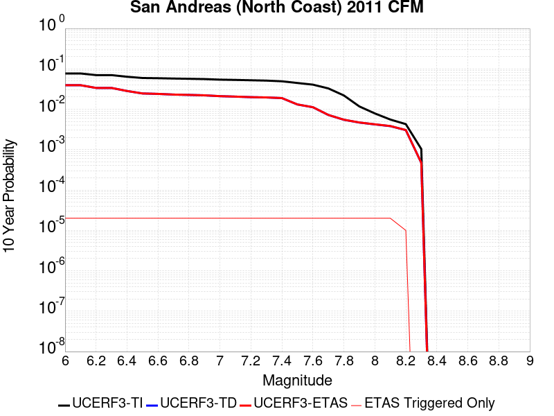 |

| Magnitude | 1 wk TI Prob | 1 wk TD Prob | 1 wk ETAS Prob | 1 wk ETAS/TD Gain | 1 wk ETAS Triggered Only | 1 mo TI Prob | 1 mo TD Prob | 1 mo ETAS Prob | 1 mo ETAS/TD Gain | 1 mo ETAS Triggered Only | 1 yr TI Prob | 1 yr TD Prob | 1 yr ETAS Prob | 1 yr ETAS/TD Gain | 1 yr ETAS Triggered Only | 10 yr TI Prob | 10 yr TD Prob | 10 yr ETAS Prob | 10 yr ETAS/TD Gain | 10 yr ETAS Triggered Only |
|-----|-----|-----|-----|-----|-----|-----|-----|-----|-----|-----|-----|-----|-----|-----|-----|-----|-----|-----|-----|-----|
| 6.0 | 1.5333705E-4 | 7.109695E-5 | 9.109552E-5 | 1.281286 | 2.0E-5 | 6.5699324E-4 | 3.046658E-4 | 3.246597E-4 | 1.0656257 | 2.0E-5 | 0.007969595 | 0.0037030308 | 0.0037229569 | 1.005381 | 2.0E-5 | 0.0768977 | 0.039364267 | 0.039383482 | 1.000488 | 2.0E-5 |
| 6.1 | 1.5333705E-4 | 7.109695E-5 | 9.109552E-5 | 1.281286 | 2.0E-5 | 6.5699324E-4 | 3.046658E-4 | 3.246597E-4 | 1.0656257 | 2.0E-5 | 0.007969595 | 0.0037030308 | 0.0037229569 | 1.005381 | 2.0E-5 | 0.0768977 | 0.039364267 | 0.039383482 | 1.000488 | 2.0E-5 |
| 6.2 | 1.3912938E-4 | 6.049243E-5 | 8.049122E-5 | 1.3305999 | 2.0E-5 | 5.961325E-4 | 2.5922767E-4 | 2.7922247E-4 | 1.0771322 | 2.0E-5 | 0.007233787 | 0.0031515562 | 0.0031714933 | 1.0063261 | 2.0E-5 | 0.07002798 | 0.03369792 | 0.03371725 | 1.0005735 | 2.0E-5 |
| 6.3 | 1.3912938E-4 | 6.049243E-5 | 8.049122E-5 | 1.3305999 | 2.0E-5 | 5.961325E-4 | 2.5922767E-4 | 2.7922247E-4 | 1.0771322 | 2.0E-5 | 0.007233787 | 0.0031515562 | 0.0031714933 | 1.0063261 | 2.0E-5 | 0.07002798 | 0.03369792 | 0.03371725 | 1.0005735 | 2.0E-5 |
| 6.4 | 1.2623647E-4 | 5.0433562E-5 | 7.043256E-5 | 1.3965414 | 2.0E-5 | 5.4090127E-4 | 2.1612605E-4 | 2.3612172E-4 | 1.0925186 | 2.0E-5 | 0.0065656058 | 0.0026281793 | 0.0026481268 | 1.0075898 | 2.0E-5 | 0.06374981 | 0.02830552 | 0.028324952 | 1.0006865 | 2.0E-5 |
| 6.5 | 1.1736096E-4 | 4.3516375E-5 | 6.351551E-5 | 1.4595771 | 2.0E-5 | 5.028786E-4 | 1.8648551E-4 | 2.0648178E-4 | 1.107227 | 2.0E-5 | 0.006105373 | 0.0022681132 | 0.0022880677 | 1.0087979 | 2.0E-5 | 0.05940335 | 0.024576947 | 0.024596455 | 1.0007938 | 2.0E-5 |
| 6.6 | 1.1586959E-4 | 4.2416294E-5 | 6.241544E-5 | 1.4714969 | 2.0E-5 | 4.964894E-4 | 1.8177154E-4 | 2.017679E-4 | 1.1100082 | 2.0E-5 | 0.006028018 | 0.0022108385 | 0.0022307942 | 1.0090263 | 2.0E-5 | 0.058671024 | 0.023982164 | 0.024001684 | 1.000814 | 2.0E-5 |
| 6.7 | 1.13693764E-4 | 4.0728228E-5 | 6.0727412E-5 | 1.4910399 | 2.0E-5 | 4.87168E-4 | 1.7453796E-4 | 1.9453447E-4 | 1.1145682 | 2.0E-5 | 0.005915152 | 0.0021229447 | 0.0021429022 | 1.0094008 | 2.0E-5 | 0.057601593 | 0.023075242 | 0.02309478 | 1.0008467 | 2.0E-5 |
| 6.8 | 1.1204889E-4 | 3.9945848E-5 | 5.994505E-5 | 1.5006578 | 2.0E-5 | 4.8012115E-4 | 1.7118535E-4 | 1.9118193E-4 | 1.1168125 | 2.0E-5 | 0.005829819 | 0.0020822054 | 0.0021021636 | 1.0095851 | 2.0E-5 | 0.05679232 | 0.022635331 | 0.02265488 | 1.0008636 | 2.0E-5 |
| 6.9 | 1.1005794E-4 | 3.9001738E-5 | 5.9000955E-5 | 1.5127777 | 2.0E-5 | 4.7159163E-4 | 1.6713967E-4 | 1.8713633E-4 | 1.1196404 | 2.0E-5 | 0.0057265228 | 0.0020330423 | 0.0020530017 | 1.0098175 | 2.0E-5 | 0.055811852 | 0.02210134 | 0.022120899 | 1.0008849 | 2.0E-5 |
| 7.0 | 1.0647948E-4 | 3.7159174E-5 | 5.715843E-5 | 1.5382051 | 2.0E-5 | 4.562608E-4 | 1.5924397E-4 | 1.7924079E-4 | 1.1255735 | 2.0E-5 | 0.0055408357 | 0.0019370868 | 0.001957048 | 1.0103048 | 2.0E-5 | 0.054047033 | 0.02105931 | 0.02107889 | 1.0009297 | 2.0E-5 |
| 7.1 | 1.04795035E-4 | 3.620866E-5 | 5.6207937E-5 | 1.5523341 | 2.0E-5 | 4.4904428E-4 | 1.5517084E-4 | 1.7516773E-4 | 1.1288702 | 2.0E-5 | 0.0054534175 | 0.0018875834 | 0.0019075456 | 1.0105755 | 2.0E-5 | 0.053215165 | 0.02052821 | 0.0205478 | 1.0009543 | 2.0E-5 |
| 7.2 | 1.02724036E-4 | 3.5117457E-5 | 5.5116754E-5 | 1.5694973 | 2.0E-5 | 4.401716E-4 | 1.5049479E-4 | 1.7049178E-4 | 1.132875 | 2.0E-5 | 0.0053459285 | 0.0018307496 | 0.0018507129 | 1.0109044 | 2.0E-5 | 0.052191395 | 0.01991573 | 0.01993533 | 1.0009842 | 2.0E-5 |
| 7.3 | 1.00650694E-4 | 3.45853E-5 | 5.458461E-5 | 1.5782604 | 2.0E-5 | 4.312888E-4 | 1.4821437E-4 | 1.6821141E-4 | 1.1349196 | 2.0E-5 | 0.005238306 | 0.0018030318 | 0.0018229957 | 1.0110724 | 2.0E-5 | 0.051165357 | 0.01959264 | 0.019612249 | 1.0010008 | 2.0E-5 |
| 7.4 | 9.672919E-5 | 3.3374814E-5 | 5.3374148E-5 | 1.5992343 | 2.0E-5 | 4.144878E-4 | 1.4302715E-4 | 1.6302429E-4 | 1.1398135 | 2.0E-5 | 0.005034718 | 0.00173998 | 0.0017599452 | 1.0114744 | 2.0E-5 | 0.049221683 | 0.01886682 | 0.018886443 | 1.0010401 | 2.0E-5 |
| 7.5 | 8.7600405E-5 | 2.2694192E-5 | 4.269374E-5 | 1.8812627 | 2.0E-5 | 3.753763E-4 | 9.725721E-5 | 1.17255266E-4 | 1.2056203 | 2.0E-5 | 0.0045606326 | 0.0011834651 | 0.0012034414 | 1.0168796 | 2.0E-5 | 0.04468165 | 0.013127938 | 0.0131476745 | 1.0015035 | 2.0E-5 |
| 7.6 | 7.9562284E-5 | 1.922004E-5 | 3.9219656E-5 | 2.0405605 | 2.0E-5 | 3.4093665E-4 | 8.236901E-5 | 1.0236736E-4 | 1.2427897 | 2.0E-5 | 0.0041430052 | 0.0010023828 | 0.0010223628 | 1.0199325 | 2.0E-5 | 0.040666126 | 0.0112194 | 0.011239175 | 1.0017626 | 2.0E-5 |
| 7.7 | 6.3866544E-5 | 1.1936281E-5 | 3.193604E-5 | 2.6755438 | 2.0E-5 | 2.7368503E-4 | 5.115449E-5 | 7.115347E-5 | 1.3909526 | 2.0E-5 | 0.0033270244 | 6.226282E-4 | 6.426157E-4 | 1.0321019 | 2.0E-5 | 0.032776527 | 0.0072073294 | 0.007227185 | 1.0027549 | 2.0E-5 |
| 7.8 | 4.2543215E-5 | 9.0726735E-6 | 2.9072493E-5 | 3.2044017 | 2.0E-5 | 1.8231533E-4 | 3.888231E-5 | 5.888153E-5 | 1.5143528 | 2.0E-5 | 0.0022174292 | 4.7328937E-4 | 4.932799E-4 | 1.0422374 | 2.0E-5 | 0.021954332 | 0.0054884683 | 0.0055083586 | 1.003624 | 2.0E-5 |
| 7.9 | 2.2636612E-5 | 7.811842E-6 | 2.7811686E-5 | 3.5601954 | 2.0E-5 | 9.7010445E-5 | 3.3478893E-5 | 5.3478223E-5 | 1.5973713 | 2.0E-5 | 0.0011804621 | 4.0752938E-4 | 4.2752124E-4 | 1.0490562 | 2.0E-5 | 0.011742111 | 0.0046821116 | 0.004702018 | 1.0042516 | 2.0E-5 |
| 8.0 | 1.5167874E-5 | 7.0475517E-6 | 2.704741E-5 | 3.837845 | 2.0E-5 | 6.500356E-5 | 3.0203442E-5 | 5.0202838E-5 | 1.6621561 | 2.0E-5 | 7.9113094E-4 | 3.6766496E-4 | 3.876576E-4 | 1.0543773 | 2.0E-5 | 0.007883203 | 0.004214701 | 0.0042346166 | 1.0047253 | 2.0E-5 |
| 8.1 | 1.0681047E-5 | 6.3854363E-6 | 2.6385309E-5 | 4.1321073 | 2.0E-5 | 4.5775112E-5 | 2.7365868E-5 | 4.736532E-5 | 1.7308174 | 2.0E-5 | 5.5716943E-4 | 3.331286E-4 | 3.5312193E-4 | 1.0600169 | 2.0E-5 | 0.0055577457 | 0.003816698 | 0.0038366215 | 1.0052202 | 2.0E-5 |
| 8.2 | 8.226114E-6 | 5.1139064E-6 | 1.5113855E-5 | 2.9554424 | 1.0E-5 | 3.52543E-5 | 2.1916558E-5 | 3.1916337E-5 | 1.456266 | 1.0E-5 | 4.2913653E-4 | 2.6680148E-4 | 2.7679882E-4 | 1.037471 | 1.0E-5 | 0.004283088 | 0.0030445685 | 0.003054538 | 1.0032746 | 1.0E-5 |
| 8.3 | 1.983087E-6 | 7.6564595E-7 | 7.6564595E-7 | 1.0 | 0.0 | 8.498917E-6 | 3.281336E-6 | 3.281336E-6 | 1.0 | 0.0 | 1.034694E-4 | 3.9949547E-5 | 3.9949547E-5 | 1.0 | 0.0 | 0.0010342124 | 4.717979E-4 | 4.717979E-4 | 1.0 | 0.0 |

## Calaveras (So) 2011 CFM
*[(top)](#table-of-contents)*

| 1 Week | 1 Month | 1 Year | 10 Year |
|-----|-----|-----|-----|
|  | 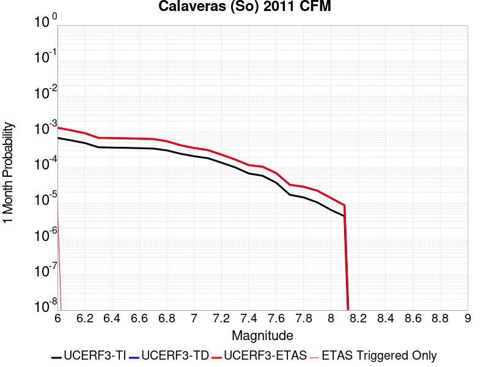 | 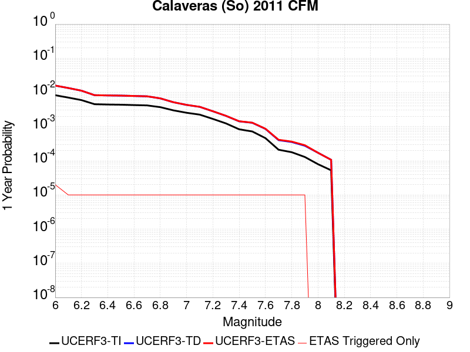 | 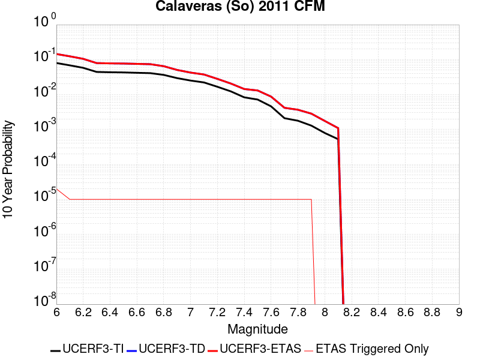 |

| Magnitude | 1 wk TI Prob | 1 wk TD Prob | 1 wk ETAS Prob | 1 wk ETAS/TD Gain | 1 wk ETAS Triggered Only | 1 mo TI Prob | 1 mo TD Prob | 1 mo ETAS Prob | 1 mo ETAS/TD Gain | 1 mo ETAS Triggered Only | 1 yr TI Prob | 1 yr TD Prob | 1 yr ETAS Prob | 1 yr ETAS/TD Gain | 1 yr ETAS Triggered Only | 10 yr TI Prob | 10 yr TD Prob | 10 yr ETAS Prob | 10 yr ETAS/TD Gain | 10 yr ETAS Triggered Only |
|-----|-----|-----|-----|-----|-----|-----|-----|-----|-----|-----|-----|-----|-----|-----|-----|-----|-----|-----|-----|-----|
| 6.0 | 1.5950744E-4 | 3.0713255E-4 | 3.1712948E-4 | 1.0325493 | 1.0E-5 | 6.834242E-4 | 0.001315409 | 0.0013253958 | 1.0075922 | 1.0E-5 | 0.00828899 | 0.015858326 | 0.015878009 | 1.0012412 | 2.0E-5 | 0.079865426 | 0.14440185 | 0.14441895 | 1.0001185 | 2.0E-5 |
| 6.1 | 1.3584697E-4 | 2.603514E-4 | 2.603514E-4 | 1.0 | 0.0 | 5.8207137E-4 | 0.0011151754 | 0.0011151754 | 1.0 | 0.0 | 0.007063716 | 0.013461385 | 0.01347125 | 1.0007329 | 1.0E-5 | 0.06843361 | 0.124029994 | 0.124038756 | 1.0000706 | 1.0E-5 |
| 6.2 | 1.14676266E-4 | 2.1714384E-4 | 2.1714384E-4 | 1.0 | 0.0 | 4.9137714E-4 | 9.30223E-4 | 9.30223E-4 | 1.0 | 0.0 | 0.0059661185 | 0.011245058 | 0.011254946 | 1.0008793 | 1.0E-5 | 0.058084648 | 0.10502057 | 0.105029516 | 1.0000852 | 1.0E-5 |
| 6.3 | 8.691518E-5 | 1.5987935E-4 | 1.5987935E-4 | 1.0 | 0.0 | 3.7244044E-4 | 6.849807E-4 | 6.849807E-4 | 1.0 | 0.0 | 0.004525038 | 0.008301122 | 0.008311039 | 1.0011947 | 1.0E-5 | 0.044339992 | 0.0793365 | 0.0793457 | 1.000116 | 1.0E-5 |
| 6.4 | 8.50982E-5 | 1.5694331E-4 | 1.5694331E-4 | 1.0 | 0.0 | 3.646556E-4 | 6.724042E-4 | 6.724042E-4 | 1.0 | 0.0 | 0.0044306475 | 0.008149155 | 0.008159074 | 1.0012171 | 1.0E-5 | 0.04343345 | 0.07794268 | 0.07795189 | 1.0001183 | 1.0E-5 |
| 6.5 | 8.4062965E-5 | 1.5518743E-4 | 1.5518743E-4 | 1.0 | 0.0 | 3.602201E-4 | 6.6488347E-4 | 6.6488347E-4 | 1.0 | 0.0 | 0.004376863 | 0.008058365 | 0.008068285 | 1.001231 | 1.0E-5 | 0.042916555 | 0.07711388 | 0.07712311 | 1.0001197 | 1.0E-5 |
| 6.6 | 8.194716E-5 | 1.5154552E-4 | 1.5154552E-4 | 1.0 | 0.0 | 3.5115483E-4 | 6.492843E-4 | 6.492843E-4 | 1.0 | 0.0 | 0.0042669317 | 0.007870209 | 0.007880131 | 1.0012606 | 1.0E-5 | 0.04185927 | 0.07539919 | 0.07540844 | 1.0001227 | 1.0E-5 |
| 6.7 | 8.012326E-5 | 1.4822475E-4 | 1.4822475E-4 | 1.0 | 0.0 | 3.433402E-4 | 6.350612E-4 | 6.350612E-4 | 1.0 | 0.0 | 0.004172157 | 0.007698701 | 0.007708624 | 1.0012889 | 1.0E-5 | 0.040946912 | 0.07384132 | 0.07385058 | 1.0001254 | 1.0E-5 |
| 6.8 | 7.119773E-5 | 1.2881879E-4 | 1.2881879E-4 | 1.0 | 0.0 | 3.0509746E-4 | 5.519494E-4 | 5.519494E-4 | 1.0 | 0.0 | 0.0037082357 | 0.006696066 | 0.006705999 | 1.0014834 | 1.0E-5 | 0.036469642 | 0.06468575 | 0.0646951 | 1.0001446 | 1.0E-5 |
| 6.9 | 5.7343088E-5 | 9.919277E-5 | 9.919277E-5 | 1.0 | 0.0 | 2.4573295E-4 | 4.25043E-4 | 4.25043E-4 | 1.0 | 0.0 | 0.0029876942 | 0.005162694 | 0.0051726424 | 1.001927 | 1.0E-5 | 0.02947844 | 0.05051036 | 0.050519858 | 1.000188 | 1.0E-5 |
| 7.0 | 4.8746577E-5 | 8.2850725E-5 | 8.2850725E-5 | 1.0 | 0.0 | 2.0889717E-4 | 3.5502657E-4 | 3.5502657E-4 | 1.0 | 0.0 | 0.0025403565 | 0.004313948 | 0.004323905 | 1.002308 | 1.0E-5 | 0.025115121 | 0.042485245 | 0.04249482 | 1.0002254 | 1.0E-5 |
| 7.1 | 4.2998014E-5 | 7.265203E-5 | 7.265203E-5 | 1.0 | 0.0 | 1.8426418E-4 | 3.1132903E-4 | 3.1132903E-4 | 1.0 | 0.0 | 0.002241108 | 0.003783903 | 0.0037938652 | 1.0026327 | 1.0E-5 | 0.022186412 | 0.037423562 | 0.03743319 | 1.0002573 | 1.0E-5 |
| 7.2 | 3.221292E-5 | 5.390791E-5 | 5.390791E-5 | 1.0 | 0.0 | 1.3804805E-4 | 2.3101359E-4 | 2.3101359E-4 | 1.0 | 0.0 | 0.0016794393 | 0.0028089907 | 0.0028189626 | 1.00355 | 1.0E-5 | 0.016668037 | 0.02803602 | 0.028045742 | 1.0003467 | 1.0E-5 |
| 7.3 | 2.3756531E-5 | 3.9473416E-5 | 3.9473416E-5 | 1.0 | 0.0 | 1.0180973E-4 | 1.6916092E-4 | 1.6916092E-4 | 1.0 | 0.0 | 0.0012388286 | 0.0020576057 | 0.0020675852 | 1.00485 | 1.0E-5 | 0.012319452 | 0.020643145 | 0.020652939 | 1.0004745 | 1.0E-5 |
| 7.4 | 1.5997684E-5 | 2.7342163E-5 | 2.7342163E-5 | 1.0 | 0.0 | 6.8559704E-5 | 1.1717545E-4 | 1.1717545E-4 | 1.0 | 0.0 | 8.343947E-4 | 0.00142568 | 0.0014356658 | 1.0070041 | 1.0E-5 | 0.008312687 | 0.014376011 | 0.014385867 | 1.0006856 | 1.0E-5 |
| 7.5 | 1.3814293E-5 | 2.4783874E-5 | 2.4783874E-5 | 1.0 | 0.0 | 5.9202768E-5 | 1.062123E-4 | 1.062123E-4 | 1.0 | 0.0 | 7.205553E-4 | 0.00129237 | 0.0013023571 | 1.0077277 | 1.0E-5 | 0.007182234 | 0.013055085 | 0.013064954 | 1.000756 | 1.0E-5 |
| 7.6 | 8.817309E-6 | 1.6430757E-5 | 1.6430757E-5 | 1.0 | 0.0 | 3.7787922E-5 | 7.0415634E-5 | 7.0415634E-5 | 1.0 | 0.0 | 4.5997082E-4 | 8.569745E-4 | 8.669659E-4 | 1.0116589 | 1.0E-5 | 0.004590199 | 0.008719284 | 0.008729197 | 1.0011369 | 1.0E-5 |
| 7.7 | 4.0352206E-6 | 7.707318E-6 | 7.707318E-6 | 1.0 | 0.0 | 1.7293689E-5 | 3.3030945E-5 | 3.3030945E-5 | 1.0 | 0.0 | 2.1053031E-4 | 4.0207763E-4 | 4.1207363E-4 | 1.0248609 | 1.0E-5 | 0.0021033096 | 0.004165172 | 0.0041751307 | 1.0023909 | 1.0E-5 |
| 7.8 | 3.413169E-6 | 6.787282E-6 | 6.787282E-6 | 1.0 | 0.0 | 1.4627784E-5 | 2.9088029E-5 | 2.9088029E-5 | 1.0 | 0.0 | 1.7807873E-4 | 3.5408925E-4 | 3.6408572E-4 | 1.0282315 | 1.0E-5 | 0.0017793609 | 0.0036665166 | 0.00367648 | 1.0027174 | 1.0E-5 |
| 7.9 | 2.4740732E-6 | 5.2791843E-6 | 5.2791843E-6 | 1.0 | 0.0 | 1.06031275E-5 | 2.262488E-5 | 2.262488E-5 | 1.0 | 0.0 | 1.2908543E-4 | 2.7542314E-4 | 2.854204E-4 | 1.0362978 | 1.0E-5 | 0.0012901047 | 0.0028347955 | 0.0028447672 | 1.0035176 | 1.0E-5 |
| 8.0 | 1.5231818E-6 | 3.2889548E-6 | 3.2889548E-6 | 1.0 | 0.0 | 6.527906E-6 | 1.40954435E-5 | 1.40954435E-5 | 1.0 | 0.0 | 7.9474354E-5 | 1.7159856E-4 | 1.7159856E-4 | 1.0 | 0.0 | 7.944594E-4 | 0.0017564303 | 0.0017564303 | 1.0 | 0.0 |
| 8.1 | 1.0104524E-6 | 2.045782E-6 | 2.045782E-6 | 1.0 | 0.0 | 4.330503E-6 | 8.767608E-6 | 8.767608E-6 | 1.0 | 0.0 | 5.2722597E-5 | 1.0674043E-4 | 1.0674043E-4 | 1.0 | 0.0 | 5.271009E-4 | 0.001092934 | 0.001092934 | 1.0 | 0.0 |

## San Andreas (Santa Cruz Mts) 2011 CFM
*[(top)](#table-of-contents)*

| 1 Week | 1 Month | 1 Year | 10 Year |
|-----|-----|-----|-----|
| 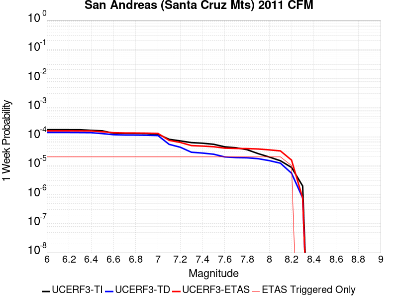 | 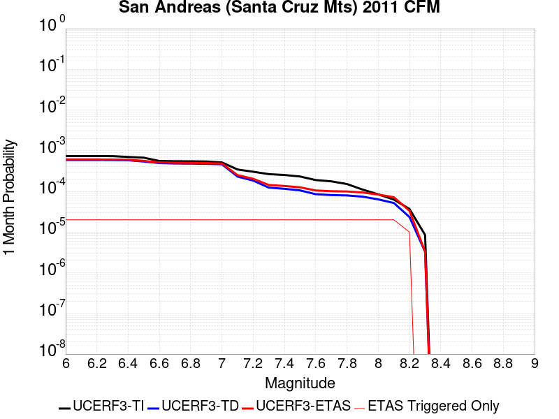 | 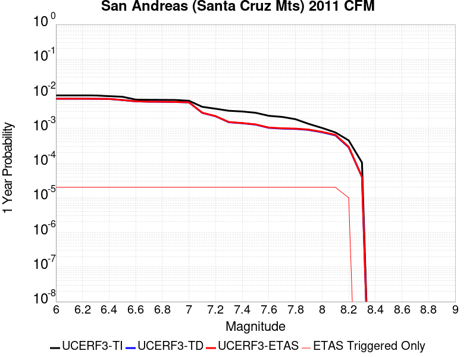 | 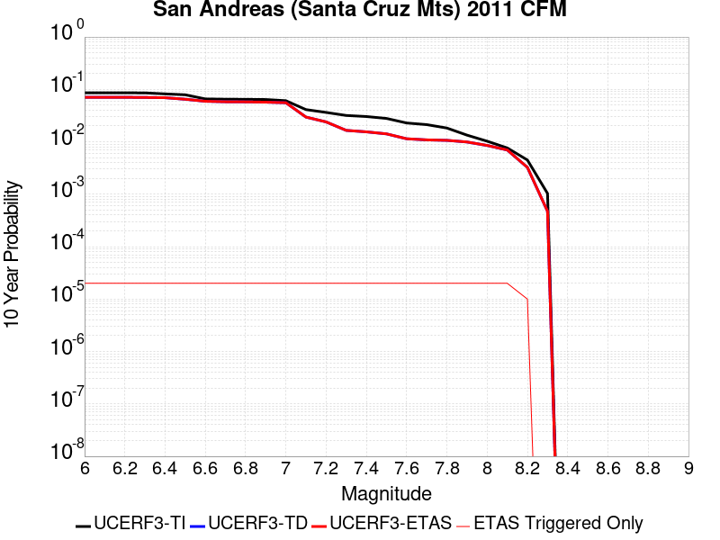 |

| Magnitude | 1 wk TI Prob | 1 wk TD Prob | 1 wk ETAS Prob | 1 wk ETAS/TD Gain | 1 wk ETAS Triggered Only | 1 mo TI Prob | 1 mo TD Prob | 1 mo ETAS Prob | 1 mo ETAS/TD Gain | 1 mo ETAS Triggered Only | 1 yr TI Prob | 1 yr TD Prob | 1 yr ETAS Prob | 1 yr ETAS/TD Gain | 1 yr ETAS Triggered Only | 10 yr TI Prob | 10 yr TD Prob | 10 yr ETAS Prob | 10 yr ETAS/TD Gain | 10 yr ETAS Triggered Only |
|-----|-----|-----|-----|-----|-----|-----|-----|-----|-----|-----|-----|-----|-----|-----|-----|-----|-----|-----|-----|-----|
| 6.0 | 1.7221631E-4 | 1.3792426E-4 | 1.579215E-4 | 1.1449871 | 2.0E-5 | 7.378611E-4 | 5.9097214E-4 | 6.109603E-4 | 1.0338225 | 2.0E-5 | 0.008946515 | 0.0071717235 | 0.0071915803 | 1.0027688 | 2.0E-5 | 0.08594794 | 0.07054796 | 0.07056655 | 1.0002635 | 2.0E-5 |
| 6.1 | 1.7221631E-4 | 1.3792426E-4 | 1.579215E-4 | 1.1449871 | 2.0E-5 | 7.378611E-4 | 5.9097214E-4 | 6.109603E-4 | 1.0338225 | 2.0E-5 | 0.008946515 | 0.0071717235 | 0.0071915803 | 1.0027688 | 2.0E-5 | 0.08594794 | 0.07054796 | 0.07056655 | 1.0002635 | 2.0E-5 |
| 6.2 | 1.7221631E-4 | 1.3792426E-4 | 1.579215E-4 | 1.1449871 | 2.0E-5 | 7.378611E-4 | 5.9097214E-4 | 6.109603E-4 | 1.0338225 | 2.0E-5 | 0.008946515 | 0.0071717235 | 0.0071915803 | 1.0027688 | 2.0E-5 | 0.08594794 | 0.07054796 | 0.07056655 | 1.0002635 | 2.0E-5 |
| 6.3 | 1.716926E-4 | 1.3711878E-4 | 1.5711605E-4 | 1.145839 | 2.0E-5 | 7.3561794E-4 | 5.8752164E-4 | 6.075099E-4 | 1.0340213 | 2.0E-5 | 0.008919428 | 0.007129989 | 0.0071498468 | 1.0027851 | 2.0E-5 | 0.08569809 | 0.07015993 | 0.07017852 | 1.0002651 | 2.0E-5 |
| 6.4 | 1.6392978E-4 | 1.3587909E-4 | 1.5587638E-4 | 1.1471697 | 2.0E-5 | 7.02367E-4 | 5.82211E-4 | 6.021994E-4 | 1.0343318 | 2.0E-5 | 0.008517839 | 0.0070657525 | 0.007085611 | 1.0028106 | 2.0E-5 | 0.08198654 | 0.069394976 | 0.06941359 | 1.0002682 | 2.0E-5 |
| 6.5 | 1.5742714E-4 | 1.2647794E-4 | 1.4647542E-4 | 1.1581104 | 2.0E-5 | 6.745133E-4 | 5.419374E-4 | 5.6192663E-4 | 1.0368847 | 2.0E-5 | 0.00818132 | 0.0065784375 | 0.006598306 | 1.0030203 | 2.0E-5 | 0.078865945 | 0.06486093 | 0.06487963 | 1.0002884 | 2.0E-5 |
| 6.6 | 1.3038084E-4 | 1.1587992E-4 | 1.358776E-4 | 1.1725725 | 2.0E-5 | 5.5865536E-4 | 4.96535E-4 | 5.1652506E-4 | 1.0402591 | 2.0E-5 | 0.006780438 | 0.006028784 | 0.0060486635 | 1.0032974 | 2.0E-5 | 0.0657725 | 0.059330538 | 0.05934935 | 1.0003171 | 2.0E-5 |
| 6.7 | 1.2867592E-4 | 1.1314491E-4 | 1.3314265E-4 | 1.1767445 | 2.0E-5 | 5.5135164E-4 | 4.8481792E-4 | 5.048082E-4 | 1.0412326 | 2.0E-5 | 0.0066920654 | 0.005886907 | 0.0059067896 | 1.0033773 | 2.0E-5 | 0.06494093 | 0.058041416 | 0.058060255 | 1.0003246 | 2.0E-5 |
| 6.8 | 1.2801298E-4 | 1.12520516E-4 | 1.3251827E-4 | 1.1777253 | 2.0E-5 | 5.485117E-4 | 4.8214293E-4 | 5.021333E-4 | 1.0414615 | 2.0E-5 | 0.0066577005 | 0.0058545293 | 0.0058744126 | 1.0033962 | 2.0E-5 | 0.06461738 | 0.05775524 | 0.057774086 | 1.0003263 | 2.0E-5 |
| 6.9 | 1.269149E-4 | 1.1094256E-4 | 1.3094033E-4 | 1.1802535 | 2.0E-5 | 5.4380763E-4 | 4.7538272E-4 | 4.953732E-4 | 1.0420513 | 2.0E-5 | 0.006600777 | 0.005772663 | 0.0057925475 | 1.0034446 | 2.0E-5 | 0.06408122 | 0.057027116 | 0.057045978 | 1.0003307 | 2.0E-5 |
| 7.0 | 1.2030331E-4 | 1.0824356E-4 | 1.282414E-4 | 1.1847485 | 2.0E-5 | 5.154837E-4 | 4.638198E-4 | 4.8381052E-4 | 1.0431002 | 2.0E-5 | 0.006257969 | 0.0056326203 | 0.0056525073 | 1.0035307 | 2.0E-5 | 0.06084648 | 0.055699922 | 0.05571881 | 1.000339 | 2.0E-5 |
| 7.1 | 8.049617E-5 | 5.392429E-5 | 7.392321E-5 | 1.3708704 | 2.0E-5 | 3.4493793E-4 | 2.3108382E-4 | 2.510792E-4 | 1.0865287 | 2.0E-5 | 0.0041915346 | 0.0028098505 | 0.0028297943 | 1.0070978 | 2.0E-5 | 0.041133516 | 0.029618833 | 0.02963824 | 1.0006553 | 2.0E-5 |
| 7.2 | 7.093979E-5 | 4.2935415E-5 | 6.293456E-5 | 1.4657959 | 2.0E-5 | 3.0399222E-4 | 1.8399608E-4 | 2.0399239E-4 | 1.108678 | 2.0E-5 | 0.0036948253 | 0.0022378736 | 0.0022578288 | 1.0089171 | 2.0E-5 | 0.03633994 | 0.023941126 | 0.023960648 | 1.0008154 | 2.0E-5 |
| 7.3 | 6.193693E-5 | 2.8891074E-5 | 4.8890495E-5 | 1.6922354 | 2.0E-5 | 2.6541698E-4 | 1.2381302E-4 | 1.4381054E-4 | 1.1615139 | 2.0E-5 | 0.0032266637 | 0.001506383 | 0.0015263528 | 1.0132568 | 2.0E-5 | 0.031802133 | 0.016497677 | 0.016517347 | 1.0011923 | 2.0E-5 |
| 7.4 | 5.906492E-5 | 2.7020369E-5 | 4.701983E-5 | 1.7401624 | 2.0E-5 | 2.5311083E-4 | 1.1579645E-4 | 1.3579414E-4 | 1.1726968 | 2.0E-5 | 0.0030772698 | 0.0014089114 | 0.0014288833 | 1.0141754 | 2.0E-5 | 0.030350044 | 0.0154695045 | 0.0154891955 | 1.0012729 | 2.0E-5 |
| 7.5 | 5.424296E-5 | 2.4675093E-5 | 4.46746E-5 | 1.8105139 | 2.0E-5 | 2.324491E-4 | 1.0574612E-4 | 1.25744E-4 | 1.1891122 | 2.0E-5 | 0.002826395 | 0.0012866998 | 0.0013066741 | 1.0155237 | 2.0E-5 | 0.027907165 | 0.014161854 | 0.014181571 | 1.0013922 | 2.0E-5 |
| 7.6 | 4.43084E-5 | 1.990151E-5 | 3.990111E-5 | 2.0049288 | 2.0E-5 | 1.8987931E-4 | 8.528939E-5 | 1.0528769E-4 | 1.2344757 | 2.0E-5 | 0.0023093296 | 0.001037904 | 0.0010578833 | 1.0192496 | 2.0E-5 | 0.022854783 | 0.011411123 | 0.011430895 | 1.0017327 | 2.0E-5 |
| 7.7 | 4.118098E-5 | 1.8933848E-5 | 3.8933467E-5 | 2.0562894 | 2.0E-5 | 1.7647797E-4 | 8.1142534E-5 | 1.0114091E-4 | 1.2464598 | 2.0E-5 | 0.002146502 | 9.874629E-4 | 0.0010074432 | 1.0202339 | 2.0E-5 | 0.021258866 | 0.010868995 | 0.010888778 | 1.0018201 | 2.0E-5 |
| 7.8 | 3.5408906E-5 | 1.856201E-5 | 3.856164E-5 | 2.0774496 | 2.0E-5 | 1.5174363E-4 | 7.954905E-5 | 9.9547455E-5 | 1.2513973 | 2.0E-5 | 0.0018459131 | 9.6807955E-4 | 9.880601E-4 | 1.0206394 | 2.0E-5 | 0.018306552 | 0.0106506655 | 0.010670452 | 1.0018578 | 2.0E-5 |
| 7.9 | 2.5860836E-5 | 1.7313954E-5 | 3.7313606E-5 | 2.1551175 | 2.0E-5 | 1.10827445E-4 | 7.420055E-5 | 9.4199066E-5 | 1.2695198 | 2.0E-5 | 0.001348489 | 9.030175E-4 | 9.2299946E-4 | 1.022128 | 2.0E-5 | 0.013403354 | 0.009906601 | 0.009926403 | 1.0019989 | 2.0E-5 |
| 8.0 | 1.9777332E-5 | 1.4837888E-5 | 3.483759E-5 | 2.3478808 | 2.0E-5 | 8.4757245E-5 | 6.3589396E-5 | 8.358812E-5 | 1.3144978 | 2.0E-5 | 0.0010314309 | 7.739261E-4 | 7.939106E-4 | 1.0258223 | 2.0E-5 | 0.010266567 | 0.008508087 | 0.008527917 | 1.0023307 | 2.0E-5 |
| 8.1 | 1.468494E-5 | 1.2105831E-5 | 3.210559E-5 | 2.6520765 | 2.0E-5 | 6.293394E-5 | 5.1881103E-5 | 7.1880066E-5 | 1.3854768 | 2.0E-5 | 7.6595135E-4 | 6.3146953E-4 | 6.5145694E-4 | 1.0316522 | 2.0E-5 | 0.0076331664 | 0.0069684954 | 0.0069883564 | 1.00285 | 2.0E-5 |
| 8.2 | 8.63836E-6 | 5.4678667E-6 | 1.5467813E-5 | 2.8288567 | 1.0E-5 | 3.7021015E-5 | 2.3433504E-5 | 3.343327E-5 | 1.4267294 | 1.0E-5 | 4.5063766E-4 | 2.8526565E-4 | 2.9526278E-4 | 1.035045 | 1.0E-5 | 0.004497249 | 0.003245162 | 0.0032551298 | 1.0030715 | 1.0E-5 |
| 8.3 | 1.983087E-6 | 7.6564595E-7 | 7.6564595E-7 | 1.0 | 0.0 | 8.498917E-6 | 3.281336E-6 | 3.281336E-6 | 1.0 | 0.0 | 1.034694E-4 | 3.9949547E-5 | 3.9949547E-5 | 1.0 | 0.0 | 0.0010342124 | 4.717979E-4 | 4.717979E-4 | 1.0 | 0.0 |

## Cedar Mtn-Mahogany Mtn
*[(top)](#table-of-contents)*

| 1 Week | 1 Month | 1 Year | 10 Year |
|-----|-----|-----|-----|
| 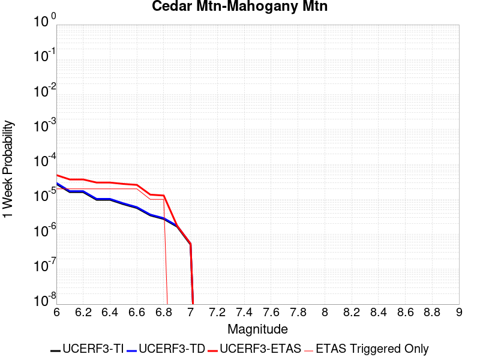 | 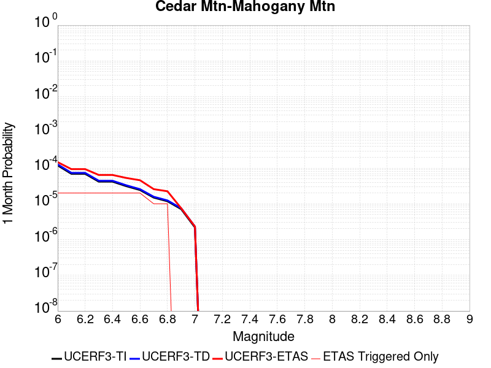 | 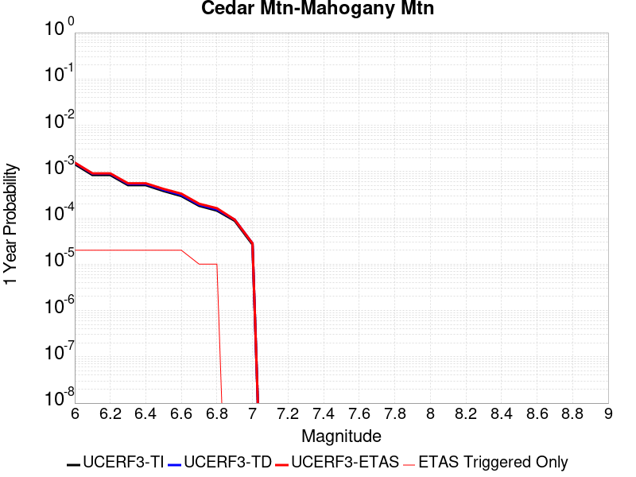 | 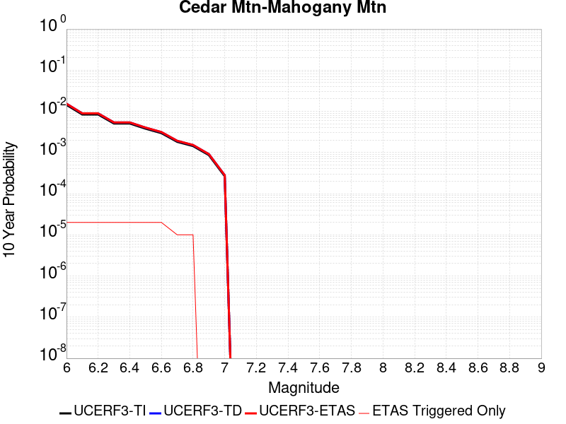 |

| Magnitude | 1 wk TI Prob | 1 wk TD Prob | 1 wk ETAS Prob | 1 wk ETAS/TD Gain | 1 wk ETAS Triggered Only | 1 mo TI Prob | 1 mo TD Prob | 1 mo ETAS Prob | 1 mo ETAS/TD Gain | 1 mo ETAS Triggered Only | 1 yr TI Prob | 1 yr TD Prob | 1 yr ETAS Prob | 1 yr ETAS/TD Gain | 1 yr ETAS Triggered Only | 10 yr TI Prob | 10 yr TD Prob | 10 yr ETAS Prob | 10 yr ETAS/TD Gain | 10 yr ETAS Triggered Only |
|-----|-----|-----|-----|-----|-----|-----|-----|-----|-----|-----|-----|-----|-----|-----|-----|-----|-----|-----|-----|-----|
| 6.0 | 2.7763876E-5 | 2.9588866E-5 | 4.9588274E-5 | 1.67591 | 2.0E-5 | 1.1898261E-4 | 1.2680366E-4 | 1.4680112E-4 | 1.1577041 | 2.0E-5 | 0.0014476506 | 0.0015428112 | 0.0015627804 | 1.0129434 | 2.0E-5 | 0.0143825635 | 0.015328225 | 0.0153479185 | 1.0012848 | 2.0E-5 |
| 6.1 | 1.6162443E-5 | 1.7142966E-5 | 3.714262E-5 | 2.1666393 | 2.0E-5 | 6.926578E-5 | 7.346788E-5 | 9.346641E-5 | 1.2722077 | 2.0E-5 | 8.4298453E-4 | 8.941221E-4 | 9.141043E-4 | 1.0223483 | 2.0E-5 | 0.008397939 | 0.008907059 | 0.008926881 | 1.0022254 | 2.0E-5 |
| 6.2 | 1.6162443E-5 | 1.7142966E-5 | 3.714262E-5 | 2.1666393 | 2.0E-5 | 6.926578E-5 | 7.346788E-5 | 9.346641E-5 | 1.2722077 | 2.0E-5 | 8.4298453E-4 | 8.941221E-4 | 9.141043E-4 | 1.0223483 | 2.0E-5 | 0.008397939 | 0.008907059 | 0.008926881 | 1.0022254 | 2.0E-5 |
| 6.3 | 9.746053E-6 | 1.0303152E-5 | 3.0302946E-5 | 2.9411335 | 2.0E-5 | 4.1768133E-5 | 4.415564E-5 | 6.415476E-5 | 1.4529233 | 2.0E-5 | 5.0840835E-4 | 5.3746643E-4 | 5.5745564E-4 | 1.0371916 | 2.0E-5 | 0.0050724675 | 0.005362084 | 0.005381977 | 1.0037099 | 2.0E-5 |
| 6.4 | 9.746053E-6 | 1.0303152E-5 | 3.0302946E-5 | 2.9411335 | 2.0E-5 | 4.1768133E-5 | 4.415564E-5 | 6.415476E-5 | 1.4529233 | 2.0E-5 | 5.0840835E-4 | 5.3746643E-4 | 5.5745564E-4 | 1.0371916 | 2.0E-5 | 0.0050724675 | 0.005362084 | 0.005381977 | 1.0037099 | 2.0E-5 |
| 6.5 | 7.290083E-6 | 7.695325E-6 | 2.769517E-5 | 3.5989606 | 2.0E-5 | 3.124284E-5 | 3.297956E-5 | 5.29789E-5 | 1.6064162 | 2.0E-5 | 3.8031515E-4 | 4.014543E-4 | 4.2144628E-4 | 1.0497988 | 2.0E-5 | 0.0037966494 | 0.004007511 | 0.004027431 | 1.0049707 | 2.0E-5 |
| 6.6 | 5.67907E-6 | 5.9891527E-6 | 2.5989033E-5 | 4.3393507 | 2.0E-5 | 2.4338644E-5 | 2.5667552E-5 | 4.566704E-5 | 1.7791739 | 2.0E-5 | 2.962827E-4 | 3.12459E-4 | 3.3245274E-4 | 1.0639884 | 2.0E-5 | 0.0029588798 | 0.003120333 | 0.0031402705 | 1.0063896 | 2.0E-5 |
| 6.7 | 3.4853963E-6 | 3.672631E-6 | 1.3672594E-5 | 3.7228336 | 1.0E-5 | 1.4937327E-5 | 1.5739755E-5 | 2.5739599E-5 | 1.6353239 | 1.0E-5 | 1.8184677E-4 | 1.916153E-4 | 2.0161338E-4 | 1.0521779 | 1.0E-5 | 0.0018169804 | 0.0019145629 | 0.0019245436 | 1.0052131 | 1.0E-5 |
| 6.8 | 2.7535168E-6 | 2.9015764E-6 | 1.2901547E-5 | 4.4463925 | 1.0E-5 | 1.1800733E-5 | 1.2435271E-5 | 2.2435146E-5 | 1.8041543 | 1.0E-5 | 1.4366445E-4 | 1.5138938E-4 | 1.6138787E-4 | 1.0660448 | 1.0E-5 | 0.0014357162 | 0.0015129098 | 0.0015228946 | 1.0065998 | 1.0E-5 |
| 6.9 | 1.6594106E-6 | 1.7496985E-6 | 1.7496985E-6 | 1.0 | 0.0 | 7.1117406E-6 | 7.4986883E-6 | 7.4986883E-6 | 1.0 | 0.0 | 8.6582E-5 | 9.129302E-5 | 9.129302E-5 | 1.0 | 0.0 | 8.654827E-4 | 9.125856E-4 | 9.125856E-4 | 1.0 | 0.0 |
| 7.0 | 5.10215E-7 | 5.389254E-7 | 5.389254E-7 | 1.0 | 0.0 | 2.186634E-6 | 2.3096788E-6 | 2.3096788E-6 | 1.0 | 0.0 | 2.6621943E-5 | 2.8120105E-5 | 2.8120105E-5 | 1.0 | 0.0 | 2.6618753E-4 | 2.81178E-4 | 2.81178E-4 | 1.0 | 0.0 |

## Channel Islands Thrust
*[(top)](#table-of-contents)*

| 1 Week | 1 Month | 1 Year | 10 Year |
|-----|-----|-----|-----|
| 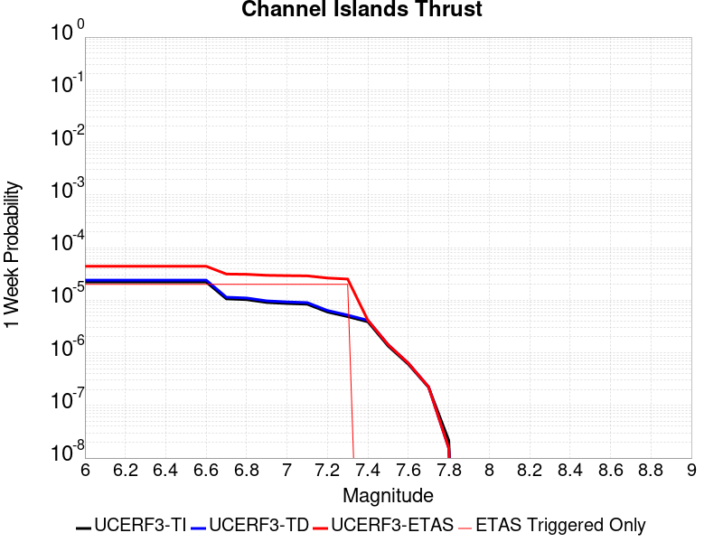 | 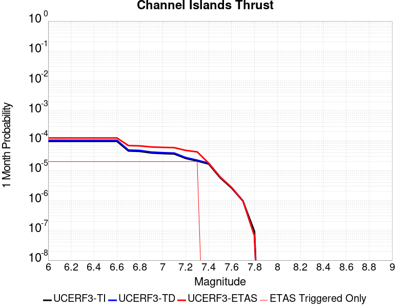 | 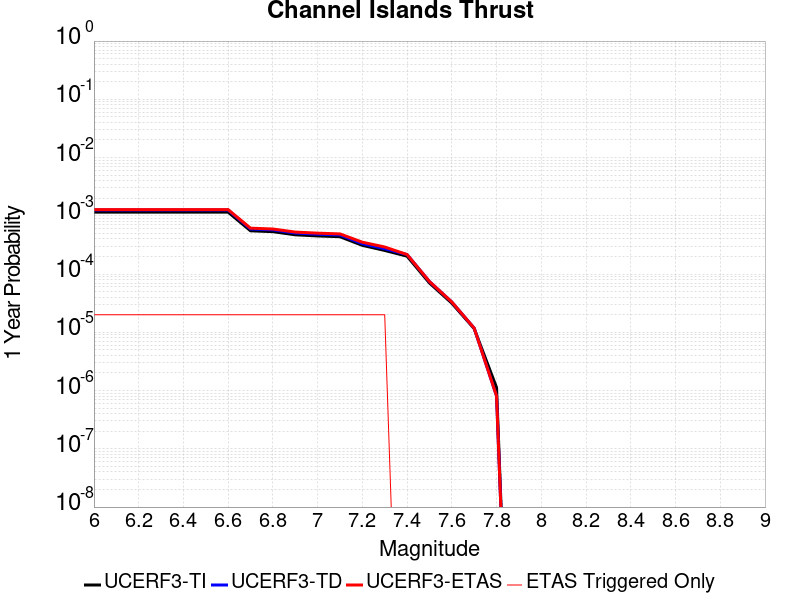 | 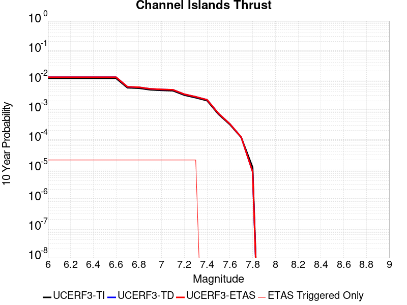 |

| Magnitude | 1 wk TI Prob | 1 wk TD Prob | 1 wk ETAS Prob | 1 wk ETAS/TD Gain | 1 wk ETAS Triggered Only | 1 mo TI Prob | 1 mo TD Prob | 1 mo ETAS Prob | 1 mo ETAS/TD Gain | 1 mo ETAS Triggered Only | 1 yr TI Prob | 1 yr TD Prob | 1 yr ETAS Prob | 1 yr ETAS/TD Gain | 1 yr ETAS Triggered Only | 10 yr TI Prob | 10 yr TD Prob | 10 yr ETAS Prob | 10 yr ETAS/TD Gain | 10 yr ETAS Triggered Only |
|-----|-----|-----|-----|-----|-----|-----|-----|-----|-----|-----|-----|-----|-----|-----|-----|-----|-----|-----|-----|-----|
| 6.0 | 2.2156251E-5 | 2.4092022E-5 | 4.409154E-5 | 1.8301303 | 2.0E-5 | 9.495191E-5 | 1.03248036E-4 | 1.2324598E-4 | 1.1936883 | 2.0E-5 | 0.0011554264 | 0.0012564266 | 0.0012764013 | 1.0158981 | 2.0E-5 | 0.011494373 | 0.0125038205 | 0.012523571 | 1.0015795 | 2.0E-5 |
| 6.1 | 2.2156251E-5 | 2.4092022E-5 | 4.409154E-5 | 1.8301303 | 2.0E-5 | 9.495191E-5 | 1.03248036E-4 | 1.2324598E-4 | 1.1936883 | 2.0E-5 | 0.0011554264 | 0.0012564266 | 0.0012764013 | 1.0158981 | 2.0E-5 | 0.011494373 | 0.0125038205 | 0.012523571 | 1.0015795 | 2.0E-5 |
| 6.2 | 2.2156251E-5 | 2.4092022E-5 | 4.409154E-5 | 1.8301303 | 2.0E-5 | 9.495191E-5 | 1.03248036E-4 | 1.2324598E-4 | 1.1936883 | 2.0E-5 | 0.0011554264 | 0.0012564266 | 0.0012764013 | 1.0158981 | 2.0E-5 | 0.011494373 | 0.0125038205 | 0.012523571 | 1.0015795 | 2.0E-5 |
| 6.3 | 2.2156251E-5 | 2.4092022E-5 | 4.409154E-5 | 1.8301303 | 2.0E-5 | 9.495191E-5 | 1.03248036E-4 | 1.2324598E-4 | 1.1936883 | 2.0E-5 | 0.0011554264 | 0.0012564266 | 0.0012764013 | 1.0158981 | 2.0E-5 | 0.011494373 | 0.0125038205 | 0.012523571 | 1.0015795 | 2.0E-5 |
| 6.4 | 2.2156251E-5 | 2.4092022E-5 | 4.409154E-5 | 1.8301303 | 2.0E-5 | 9.495191E-5 | 1.03248036E-4 | 1.2324598E-4 | 1.1936883 | 2.0E-5 | 0.0011554264 | 0.0012564266 | 0.0012764013 | 1.0158981 | 2.0E-5 | 0.011494373 | 0.0125038205 | 0.012523571 | 1.0015795 | 2.0E-5 |
| 6.5 | 2.2156251E-5 | 2.4092022E-5 | 4.409154E-5 | 1.8301303 | 2.0E-5 | 9.495191E-5 | 1.03248036E-4 | 1.2324598E-4 | 1.1936883 | 2.0E-5 | 0.0011554264 | 0.0012564266 | 0.0012764013 | 1.0158981 | 2.0E-5 | 0.011494373 | 0.0125038205 | 0.012523571 | 1.0015795 | 2.0E-5 |
| 6.6 | 2.2156251E-5 | 2.4092022E-5 | 4.409154E-5 | 1.8301303 | 2.0E-5 | 9.495191E-5 | 1.03248036E-4 | 1.2324598E-4 | 1.1936883 | 2.0E-5 | 0.0011554264 | 0.0012564266 | 0.0012764013 | 1.0158981 | 2.0E-5 | 0.011494373 | 0.0125038205 | 0.012523571 | 1.0015795 | 2.0E-5 |
| 6.7 | 1.0601296E-5 | 1.1379544E-5 | 3.1379317E-5 | 2.7575197 | 2.0E-5 | 4.5433335E-5 | 4.876859E-5 | 6.8767615E-5 | 1.4100801 | 2.0E-5 | 5.5301044E-4 | 5.936007E-4 | 6.1358884E-4 | 1.0336727 | 2.0E-5 | 0.005516363 | 0.005920653 | 0.005940535 | 1.003358 | 2.0E-5 |
| 6.8 | 1.0246747E-5 | 1.0996669E-5 | 3.099645E-5 | 2.8187125 | 2.0E-5 | 4.391389E-5 | 4.7127756E-5 | 6.712681E-5 | 1.4243584 | 2.0E-5 | 5.345204E-4 | 5.7363417E-4 | 5.936227E-4 | 1.0348455 | 2.0E-5 | 0.0053323656 | 0.005722025 | 0.0057419105 | 1.0034753 | 2.0E-5 |
| 6.9 | 9.049551E-6 | 9.699645E-6 | 2.9699451E-5 | 3.0619113 | 2.0E-5 | 3.878322E-5 | 4.1569267E-5 | 6.156843E-5 | 1.4811047 | 2.0E-5 | 4.7208337E-4 | 5.059924E-4 | 5.259823E-4 | 1.0395063 | 2.0E-5 | 0.0047108172 | 0.0050488203 | 0.0050687194 | 1.0039413 | 2.0E-5 |
| 7.0 | 8.6542195E-6 | 9.274603E-6 | 2.9274417E-5 | 3.1564064 | 2.0E-5 | 3.7088983E-5 | 3.9747716E-5 | 5.9746922E-5 | 1.5031536 | 2.0E-5 | 4.5146482E-4 | 4.8382508E-4 | 5.038154E-4 | 1.0413172 | 2.0E-5 | 0.004505487 | 0.0048281294 | 0.0048480327 | 1.0041224 | 2.0E-5 |
| 7.1 | 8.391028E-6 | 8.992925E-6 | 2.8992745E-5 | 3.2239504 | 2.0E-5 | 3.5961057E-5 | 3.8540562E-5 | 5.853979E-5 | 1.5189139 | 2.0E-5 | 4.3773788E-4 | 4.6913436E-4 | 4.8912497E-4 | 1.0426117 | 2.0E-5 | 0.004368766 | 0.0046818503 | 0.004701757 | 1.0042518 | 2.0E-5 |
| 7.2 | 5.965188E-6 | 6.3716957E-6 | 2.6371568E-5 | 4.138862 | 2.0E-5 | 2.556484E-5 | 2.7306984E-5 | 4.730644E-5 | 1.7323934 | 2.0E-5 | 3.1120746E-4 | 3.3241237E-4 | 3.524057E-4 | 1.0601462 | 2.0E-5 | 0.00310772 | 0.0033192094 | 0.003339143 | 1.0060055 | 2.0E-5 |
| 7.3 | 4.877518E-6 | 5.206007E-6 | 2.5205904E-5 | 4.8416963 | 2.0E-5 | 2.0903482E-5 | 2.231127E-5 | 4.231082E-5 | 1.896388 | 2.0E-5 | 2.5447016E-4 | 2.716063E-4 | 2.9160085E-4 | 1.073616 | 2.0E-5 | 0.0025417898 | 0.0027127897 | 0.0027327354 | 1.0073525 | 2.0E-5 |
| 7.4 | 3.8829853E-6 | 4.141863E-6 | 4.141863E-6 | 1.0 | 0.0 | 1.664126E-5 | 1.7750723E-5 | 1.7750723E-5 | 1.0 | 0.0 | 2.0258849E-4 | 2.1609403E-4 | 2.1609403E-4 | 1.0 | 0.0 | 0.002024039 | 0.002158881 | 0.002158881 | 1.0 | 0.0 |
| 7.5 | 1.3489616E-6 | 1.4277905E-6 | 1.4277905E-6 | 1.0 | 0.0 | 5.7812517E-6 | 6.119088E-6 | 6.119088E-6 | 1.0 | 0.0 | 7.038446E-5 | 7.449739E-5 | 7.449739E-5 | 1.0 | 0.0 | 7.036218E-4 | 7.4472814E-4 | 7.4472814E-4 | 1.0 | 0.0 |
| 7.6 | 6.058192E-7 | 6.35378E-7 | 6.35378E-7 | 1.0 | 0.0 | 2.5963652E-6 | 2.7230458E-6 | 2.7230458E-6 | 1.0 | 0.0 | 3.161029E-5 | 3.3152595E-5 | 3.3152595E-5 | 1.0 | 0.0 | 3.1605794E-4 | 3.314781E-4 | 3.314781E-4 | 1.0 | 0.0 |
| 7.7 | 2.2170494E-7 | 2.2607924E-7 | 2.2607924E-7 | 1.0 | 0.0 | 9.5016367E-7 | 9.689107E-7 | 9.689107E-7 | 1.0 | 0.0 | 1.1568181E-5 | 1.17964355E-5 | 1.17964355E-5 | 1.0 | 0.0 | 1.1567579E-4 | 1.179592E-4 | 1.179592E-4 | 1.0 | 0.0 |
| 7.8 | 2.1613102E-8 | 1.5466837E-8 | 1.5466837E-8 | 1.0 | 0.0 | 9.262757E-8 | 6.628645E-8 | 6.628645E-8 | 1.0 | 0.0 | 1.1277401E-6 | 8.070372E-7 | 8.070372E-7 | 1.0 | 0.0 | 1.1277344E-5 | 8.07035E-6 | 8.07035E-6 | 1.0 | 0.0 |

## Camp Rock 2011
*[(top)](#table-of-contents)*

| 1 Week | 1 Month | 1 Year | 10 Year |
|-----|-----|-----|-----|
| 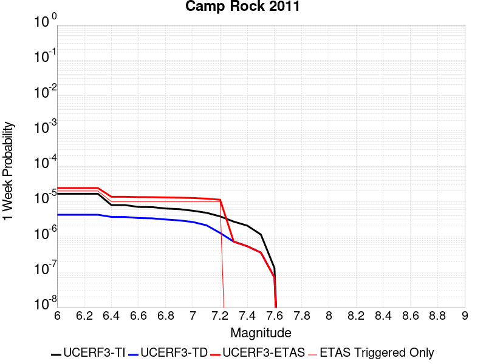 | 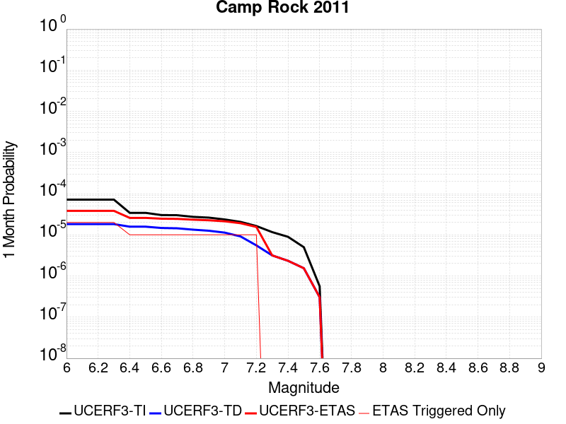 | 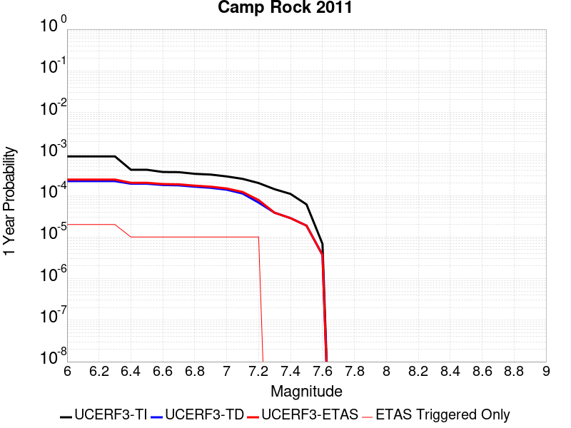 | 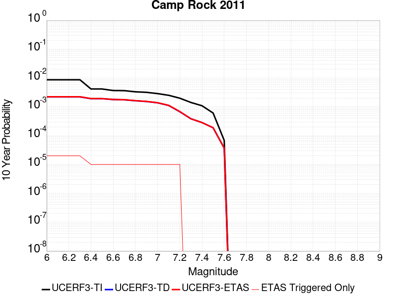 |

| Magnitude | 1 wk TI Prob | 1 wk TD Prob | 1 wk ETAS Prob | 1 wk ETAS/TD Gain | 1 wk ETAS Triggered Only | 1 mo TI Prob | 1 mo TD Prob | 1 mo ETAS Prob | 1 mo ETAS/TD Gain | 1 mo ETAS Triggered Only | 1 yr TI Prob | 1 yr TD Prob | 1 yr ETAS Prob | 1 yr ETAS/TD Gain | 1 yr ETAS Triggered Only | 10 yr TI Prob | 10 yr TD Prob | 10 yr ETAS Prob | 10 yr ETAS/TD Gain | 10 yr ETAS Triggered Only |
|-----|-----|-----|-----|-----|-----|-----|-----|-----|-----|-----|-----|-----|-----|-----|-----|-----|-----|-----|-----|-----|
| 6.0 | 1.6710783E-5 | 4.249999E-6 | 2.4249914E-5 | 5.705863 | 2.0E-5 | 7.161568E-5 | 1.8214158E-5 | 3.8213795E-5 | 2.098027 | 2.0E-5 | 8.7157206E-4 | 2.2173533E-4 | 2.417309E-4 | 1.0901777 | 2.0E-5 | 0.008681616 | 0.0022151938 | 0.0022351495 | 1.0090085 | 2.0E-5 |
| 6.1 | 1.6710783E-5 | 4.249999E-6 | 2.4249914E-5 | 5.705863 | 2.0E-5 | 7.161568E-5 | 1.8214158E-5 | 3.8213795E-5 | 2.098027 | 2.0E-5 | 8.7157206E-4 | 2.2173533E-4 | 2.417309E-4 | 1.0901777 | 2.0E-5 | 0.008681616 | 0.0022151938 | 0.0022351495 | 1.0090085 | 2.0E-5 |
| 6.2 | 1.6710783E-5 | 4.249999E-6 | 2.4249914E-5 | 5.705863 | 2.0E-5 | 7.161568E-5 | 1.8214158E-5 | 3.8213795E-5 | 2.098027 | 2.0E-5 | 8.7157206E-4 | 2.2173533E-4 | 2.417309E-4 | 1.0901777 | 2.0E-5 | 0.008681616 | 0.0022151938 | 0.0022351495 | 1.0090085 | 2.0E-5 |
| 6.3 | 1.6710783E-5 | 4.249999E-6 | 2.4249914E-5 | 5.705863 | 2.0E-5 | 7.161568E-5 | 1.8214158E-5 | 3.8213795E-5 | 2.098027 | 2.0E-5 | 8.7157206E-4 | 2.2173533E-4 | 2.417309E-4 | 1.0901777 | 2.0E-5 | 0.008681616 | 0.0022151938 | 0.0022351495 | 1.0090085 | 2.0E-5 |
| 6.4 | 7.982846E-6 | 3.6820359E-6 | 1.3681999E-5 | 3.7158787 | 1.0E-5 | 3.421175E-5 | 1.578006E-5 | 2.5779902E-5 | 1.6337011 | 1.0E-5 | 4.1644843E-4 | 1.9210564E-4 | 2.0210372E-4 | 1.0520447 | 1.0E-5 | 0.0041566887 | 0.0019194306 | 0.0019294114 | 1.0051999 | 1.0E-5 |
| 6.5 | 7.982846E-6 | 3.6820359E-6 | 1.3681999E-5 | 3.7158787 | 1.0E-5 | 3.421175E-5 | 1.578006E-5 | 2.5779902E-5 | 1.6337011 | 1.0E-5 | 4.1644843E-4 | 1.9210564E-4 | 2.0210372E-4 | 1.0520447 | 1.0E-5 | 0.0041566887 | 0.0019194306 | 0.0019294114 | 1.0051999 | 1.0E-5 |
| 6.6 | 7.048869E-6 | 3.4242998E-6 | 1.34242655E-5 | 3.920295 | 1.0E-5 | 3.0209088E-5 | 1.467549E-5 | 2.4675343E-5 | 1.6813983 | 1.0E-5 | 3.677336E-4 | 1.7865976E-4 | 1.8865797E-4 | 1.0559623 | 1.0E-5 | 0.0036712566 | 0.0017851929 | 0.001795175 | 1.0055916 | 1.0E-5 |
| 6.7 | 6.987307E-6 | 3.3622775E-6 | 1.3362243E-5 | 3.9741645 | 1.0E-5 | 2.9945259E-5 | 1.4409683E-5 | 2.4409539E-5 | 1.6939678 | 1.0E-5 | 3.6452254E-4 | 1.7542407E-4 | 1.8542232E-4 | 1.0569947 | 1.0E-5 | 0.0036392517 | 0.0017528872 | 0.0017628695 | 1.0056949 | 1.0E-5 |
| 6.8 | 6.3737602E-6 | 3.1178672E-6 | 1.3117836E-5 | 4.2073107 | 1.0E-5 | 2.731583E-5 | 1.3362222E-5 | 2.3362089E-5 | 1.7483685 | 1.0E-5 | 3.3251947E-4 | 1.6267318E-4 | 1.7267156E-4 | 1.061463 | 1.0E-5 | 0.0033202237 | 0.0016255698 | 0.0016355534 | 1.0061417 | 1.0E-5 |
| 6.9 | 6.112211E-6 | 2.933078E-6 | 1.2933048E-5 | 4.4093776 | 1.0E-5 | 2.6194928E-5 | 1.2570275E-5 | 2.257015E-5 | 1.7955176 | 1.0E-5 | 3.1887658E-4 | 1.5303263E-4 | 1.630311E-4 | 1.0653355 | 1.0E-5 | 0.003184194 | 0.0015293002 | 0.001539285 | 1.006529 | 1.0E-5 |
| 7.0 | 5.5140117E-6 | 2.64191E-6 | 1.2641884E-5 | 4.7851305 | 1.0E-5 | 2.3631264E-5 | 1.1322423E-5 | 2.132231E-5 | 1.8831931 | 1.0E-5 | 2.8767265E-4 | 1.3784204E-4 | 1.4784066E-4 | 1.0725368 | 1.0E-5 | 0.0028730053 | 0.0013775907 | 0.0013875769 | 1.007249 | 1.0E-5 |
| 7.1 | 4.8151105E-6 | 2.1342612E-6 | 1.213424E-5 | 5.6854525 | 1.0E-5 | 2.0636026E-5 | 9.146803E-6 | 1.9146712E-5 | 2.0932682 | 1.0E-5 | 2.5121463E-4 | 1.1135685E-4 | 1.2135574E-4 | 1.0897914 | 1.0E-5 | 0.0025093083 | 0.0011130325 | 0.0011230212 | 1.0089744 | 1.0E-5 |
| 7.2 | 3.818335E-6 | 1.2937372E-6 | 1.1293724E-5 | 8.729535 | 1.0E-5 | 1.6364189E-5 | 5.5445767E-6 | 1.5544521E-5 | 2.803554 | 1.0E-5 | 1.9921579E-4 | 6.750321E-5 | 7.750254E-5 | 1.1481311 | 1.0E-5 | 0.0019903728 | 6.7483535E-4 | 6.848286E-4 | 1.0148084 | 1.0E-5 |
| 7.3 | 2.7166698E-6 | 7.383078E-7 | 7.383078E-7 | 1.0 | 0.0 | 1.1642818E-5 | 3.1641725E-6 | 3.1641725E-6 | 1.0 | 0.0 | 1.4174209E-4 | 3.852314E-5 | 3.852314E-5 | 1.0 | 0.0 | 0.0014165172 | 3.8516664E-4 | 3.8516664E-4 | 1.0 | 0.0 |
| 7.4 | 2.0893426E-6 | 5.4614605E-7 | 5.4614605E-7 | 1.0 | 0.0 | 8.954295E-6 | 2.340624E-6 | 2.340624E-6 | 1.0 | 0.0 | 1.0901308E-4 | 2.8496728E-5 | 2.8496728E-5 | 1.0 | 0.0 | 0.0010895962 | 2.849313E-4 | 2.849313E-4 | 1.0 | 0.0 |
| 7.5 | 1.1681728E-6 | 3.6028484E-7 | 3.6028484E-7 | 1.0 | 0.0 | 5.0064455E-6 | 1.544077E-6 | 1.544077E-6 | 1.0 | 0.0 | 6.0951766E-5 | 1.879898E-5 | 1.879898E-5 | 1.0 | 0.0 | 6.093505E-4 | 1.8797436E-4 | 1.8797436E-4 | 1.0 | 0.0 |
| 7.6 | 1.3154387E-7 | 7.1196716E-8 | 7.1196716E-8 | 1.0 | 0.0 | 5.6375933E-7 | 3.0512876E-7 | 3.0512876E-7 | 1.0 | 0.0 | 6.863748E-6 | 3.714938E-6 | 3.714938E-6 | 1.0 | 0.0 | 6.863536E-5 | 3.7148915E-5 | 3.7148915E-5 | 1.0 | 0.0 |

## Great Valley 09 (Laguna Seca)
*[(top)](#table-of-contents)*

| 1 Week | 1 Month | 1 Year | 10 Year |
|-----|-----|-----|-----|
| 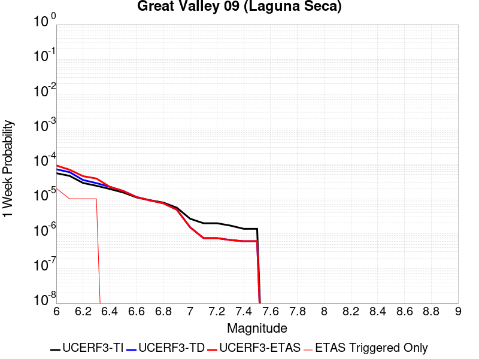 | 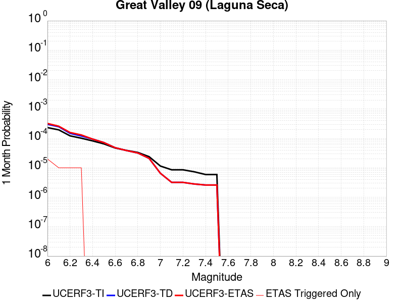 | 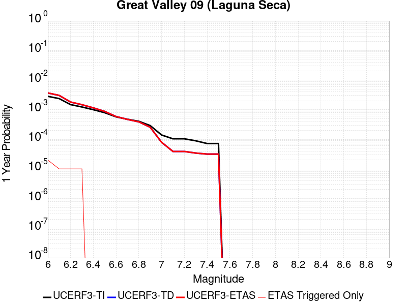 | 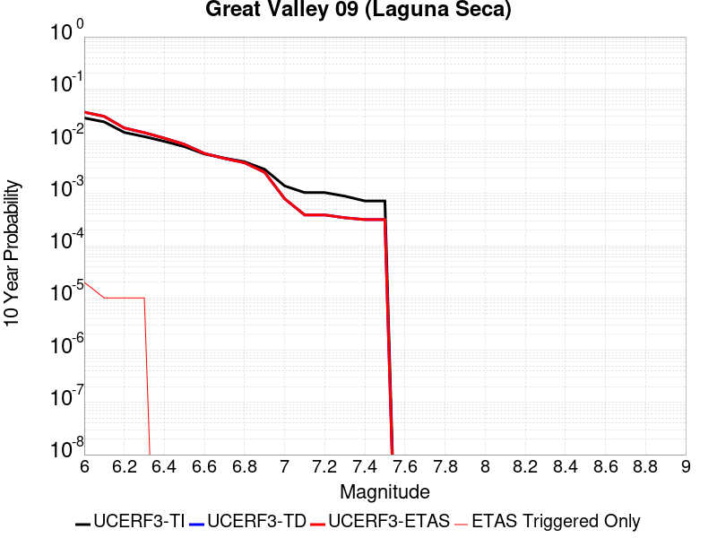 |

| Magnitude | 1 wk TI Prob | 1 wk TD Prob | 1 wk ETAS Prob | 1 wk ETAS/TD Gain | 1 wk ETAS Triggered Only | 1 mo TI Prob | 1 mo TD Prob | 1 mo ETAS Prob | 1 mo ETAS/TD Gain | 1 mo ETAS Triggered Only | 1 yr TI Prob | 1 yr TD Prob | 1 yr ETAS Prob | 1 yr ETAS/TD Gain | 1 yr ETAS Triggered Only | 10 yr TI Prob | 10 yr TD Prob | 10 yr ETAS Prob | 10 yr ETAS/TD Gain | 10 yr ETAS Triggered Only |
|-----|-----|-----|-----|-----|-----|-----|-----|-----|-----|-----|-----|-----|-----|-----|-----|-----|-----|-----|-----|-----|
| 6.0 | 5.4353277E-5 | 7.050019E-5 | 9.0498776E-5 | 1.2836672 | 2.0E-5 | 2.3292181E-4 | 3.0211007E-4 | 3.2210402E-4 | 1.0661811 | 2.0E-5 | 0.0028321352 | 0.0036720056 | 0.0036919322 | 1.0054266 | 2.0E-5 | 0.02796312 | 0.036115844 | 0.036135122 | 1.0005338 | 2.0E-5 |
| 6.1 | 4.5578287E-5 | 5.822054E-5 | 6.821996E-5 | 1.1717507 | 1.0E-5 | 1.953209E-4 | 2.4949352E-4 | 2.5949103E-4 | 1.0400712 | 1.0E-5 | 0.0023754383 | 0.0030333549 | 0.0030433247 | 1.0032867 | 1.0E-5 | 0.023502063 | 0.029919893 | 0.029929593 | 1.0003242 | 1.0E-5 |
| 6.2 | 2.8536782E-5 | 3.4736422E-5 | 4.4736073E-5 | 1.2878723 | 1.0E-5 | 1.2229476E-4 | 1.4886161E-4 | 1.5886012E-4 | 1.0671664 | 1.0E-5 | 0.0014879217 | 0.0018108576 | 0.0018208395 | 1.0055122 | 1.0E-5 | 0.014779986 | 0.017958276 | 0.017968098 | 1.0005468 | 1.0E-5 |
| 6.3 | 2.3698774E-5 | 2.8213344E-5 | 3.8213064E-5 | 1.3544322 | 1.0E-5 | 1.01562226E-4 | 1.2090833E-4 | 1.3090711E-4 | 1.0826973 | 1.0E-5 | 0.0012358186 | 0.001471051 | 0.0014810363 | 1.0067879 | 1.0E-5 | 0.012289686 | 0.014611455 | 0.014621308 | 1.0006744 | 1.0E-5 |
| 6.4 | 1.9191197E-5 | 2.212289E-5 | 2.212289E-5 | 1.0 | 0.0 | 8.2245395E-5 | 9.4808805E-5 | 9.4808805E-5 | 1.0 | 0.0 | 0.0010008777 | 0.0011536906 | 0.0011536906 | 1.0 | 0.0 | 0.009963818 | 0.011477022 | 0.011477022 | 1.0 | 0.0 |
| 6.5 | 1.5203241E-5 | 1.6801298E-5 | 1.6801298E-5 | 1.0 | 0.0 | 6.5155116E-5 | 7.200338E-5 | 7.200338E-5 | 1.0 | 0.0 | 7.9297484E-4 | 8.76301E-4 | 8.76301E-4 | 1.0 | 0.0 | 0.007901512 | 0.008729581 | 0.008729581 | 1.0 | 0.0 |
| 6.6 | 1.0984925E-5 | 1.12425605E-5 | 1.12425605E-5 | 1.0 | 0.0 | 4.70774E-5 | 4.8181533E-5 | 4.8181533E-5 | 1.0 | 0.0 | 5.730166E-4 | 5.8645604E-4 | 5.8645604E-4 | 1.0 | 0.0 | 0.005715413 | 0.0058494755 | 0.0058494755 | 1.0 | 0.0 |
| 6.7 | 9.134616E-6 | 9.019868E-6 | 9.019868E-6 | 1.0 | 0.0 | 3.9147766E-5 | 3.865602E-5 | 3.865602E-5 | 1.0 | 0.0 | 4.7651984E-4 | 4.7053778E-4 | 4.7053778E-4 | 1.0 | 0.0 | 0.004754993 | 0.00469566 | 0.00469566 | 1.0 | 0.0 |
| 6.8 | 7.785589E-6 | 7.4519185E-6 | 7.4519185E-6 | 1.0 | 0.0 | 3.3366385E-5 | 3.1936415E-5 | 3.1936415E-5 | 1.0 | 0.0 | 4.0616E-4 | 3.887585E-4 | 3.887585E-4 | 1.0 | 0.0 | 0.0040541845 | 0.003880988 | 0.003880988 | 1.0 | 0.0 |
| 6.9 | 5.579095E-6 | 4.8984666E-6 | 4.8984666E-6 | 1.0 | 0.0 | 2.3910188E-5 | 2.0993268E-5 | 2.0993268E-5 | 1.0 | 0.0 | 2.9106764E-4 | 2.5556443E-4 | 2.5556443E-4 | 1.0 | 0.0 | 0.002906867 | 0.0025528427 | 0.0025528427 | 1.0 | 0.0 |
| 7.0 | 2.6816688E-6 | 1.521587E-6 | 1.521587E-6 | 1.0 | 0.0 | 1.1492816E-5 | 6.521071E-6 | 6.521071E-6 | 1.0 | 0.0 | 1.3991605E-4 | 7.939124E-5 | 7.939124E-5 | 1.0 | 0.0 | 0.0013982799 | 7.936375E-4 | 7.936375E-4 | 1.0 | 0.0 |
| 7.1 | 1.9951021E-6 | 7.45357E-7 | 7.45357E-7 | 1.0 | 0.0 | 8.55041E-6 | 3.1943835E-6 | 3.1943835E-6 | 1.0 | 0.0 | 1.0409627E-4 | 3.889097E-5 | 3.889097E-5 | 1.0 | 0.0 | 0.0010404752 | 3.8884574E-4 | 3.8884574E-4 | 1.0 | 0.0 |
| 7.2 | 1.9951021E-6 | 7.45357E-7 | 7.45357E-7 | 1.0 | 0.0 | 8.55041E-6 | 3.1943835E-6 | 3.1943835E-6 | 1.0 | 0.0 | 1.0409627E-4 | 3.889097E-5 | 3.889097E-5 | 1.0 | 0.0 | 0.0010404752 | 3.8884574E-4 | 3.8884574E-4 | 1.0 | 0.0 |
| 7.3 | 1.7087556E-6 | 6.578663E-7 | 6.578663E-7 | 1.0 | 0.0 | 7.3232177E-6 | 2.819424E-6 | 2.819424E-6 | 1.0 | 0.0 | 8.915652E-5 | 3.432599E-5 | 3.432599E-5 | 1.0 | 0.0 | 8.9120766E-4 | 3.432109E-4 | 3.432109E-4 | 1.0 | 0.0 |
| 7.4 | 1.3804846E-6 | 6.0737113E-7 | 6.0737113E-7 | 1.0 | 0.0 | 5.916349E-6 | 2.6030168E-6 | 2.6030168E-6 | 1.0 | 0.0 | 7.2029165E-5 | 3.169131E-5 | 3.169131E-5 | 1.0 | 0.0 | 7.200583E-4 | 3.168719E-4 | 3.168719E-4 | 1.0 | 0.0 |
| 7.5 | 1.3804846E-6 | 6.0737113E-7 | 6.0737113E-7 | 1.0 | 0.0 | 5.916349E-6 | 2.6030168E-6 | 2.6030168E-6 | 1.0 | 0.0 | 7.2029165E-5 | 3.169131E-5 | 3.169131E-5 | 1.0 | 0.0 | 7.200583E-4 | 3.168719E-4 | 3.168719E-4 | 1.0 | 0.0 |

## Calaveras (Central) 2011 CFM
*[(top)](#table-of-contents)*

| 1 Week | 1 Month | 1 Year | 10 Year |
|-----|-----|-----|-----|
| 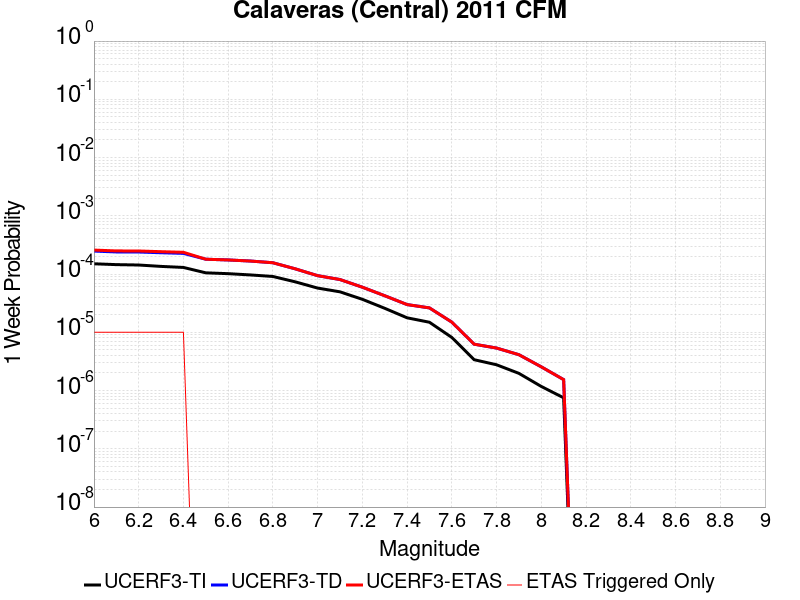 | 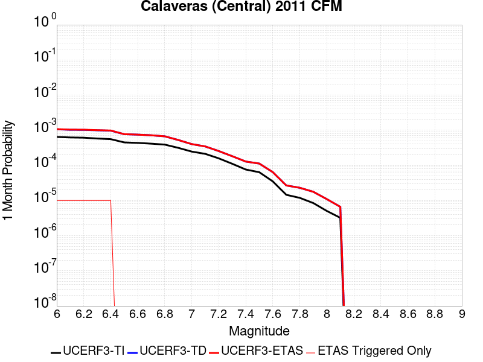 | 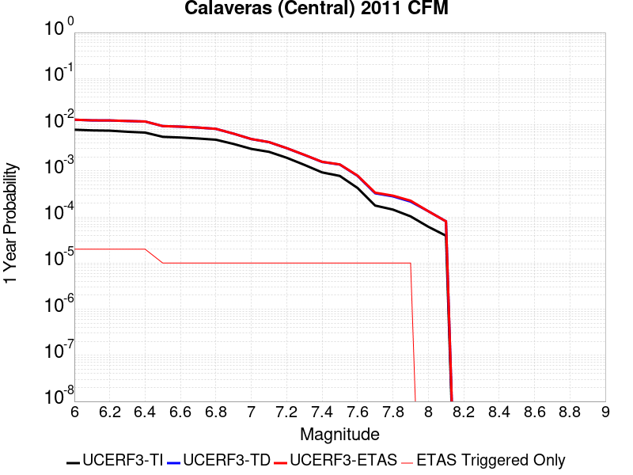 | 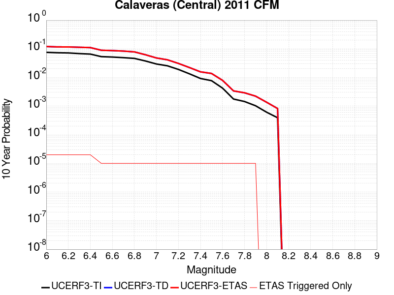 |

| Magnitude | 1 wk TI Prob | 1 wk TD Prob | 1 wk ETAS Prob | 1 wk ETAS/TD Gain | 1 wk ETAS Triggered Only | 1 mo TI Prob | 1 mo TD Prob | 1 mo ETAS Prob | 1 mo ETAS/TD Gain | 1 mo ETAS Triggered Only | 1 yr TI Prob | 1 yr TD Prob | 1 yr ETAS Prob | 1 yr ETAS/TD Gain | 1 yr ETAS Triggered Only | 10 yr TI Prob | 10 yr TD Prob | 10 yr ETAS Prob | 10 yr ETAS/TD Gain | 10 yr ETAS Triggered Only |
|-----|-----|-----|-----|-----|-----|-----|-----|-----|-----|-----|-----|-----|-----|-----|-----|-----|-----|-----|-----|-----|
| 6.0 | 1.5010907E-4 | 2.4804124E-4 | 2.5803875E-4 | 1.0403059 | 1.0E-5 | 6.4316596E-4 | 0.001062498 | 0.0010724873 | 1.0094018 | 1.0E-5 | 0.0078024664 | 0.012850443 | 0.012870186 | 1.0015364 | 2.0E-5 | 0.07534136 | 0.120411225 | 0.120428815 | 1.0001462 | 2.0E-5 |
| 6.1 | 1.4521465E-4 | 2.3965565E-4 | 2.4965324E-4 | 1.0417166 | 1.0E-5 | 6.222001E-4 | 0.0010265942 | 0.0010365839 | 1.0097309 | 1.0E-5 | 0.0075490056 | 0.012419763 | 0.0124395145 | 1.0015904 | 2.0E-5 | 0.07297657 | 0.11668273 | 0.116700396 | 1.0001514 | 2.0E-5 |
| 6.2 | 1.429998E-4 | 2.3896809E-4 | 2.489657E-4 | 1.0418366 | 1.0E-5 | 6.127123E-4 | 0.0010236499 | 0.0010336398 | 1.009759 | 1.0E-5 | 0.007434286 | 0.012384372 | 0.012404124 | 1.0015949 | 2.0E-5 | 0.07190444 | 0.11633677 | 0.11635444 | 1.0001519 | 2.0E-5 |
| 6.3 | 1.3536277E-4 | 2.3227946E-4 | 2.4227714E-4 | 1.0430416 | 1.0E-5 | 5.799972E-4 | 9.950127E-4 | 0.0010050028 | 1.0100402 | 1.0E-5 | 0.0070386264 | 0.012040534 | 0.012060293 | 1.001641 | 2.0E-5 | 0.0681982 | 0.113249525 | 0.11326726 | 1.0001566 | 2.0E-5 |
| 6.4 | 1.2993296E-4 | 2.2651516E-4 | 2.3651289E-4 | 1.0441371 | 1.0E-5 | 5.5673666E-4 | 9.703276E-4 | 9.803178E-4 | 1.0102957 | 1.0E-5 | 0.006757223 | 0.011743338 | 0.011763102 | 1.0016831 | 2.0E-5 | 0.06555412 | 0.11052752 | 0.110545315 | 1.0001609 | 2.0E-5 |
| 6.5 | 1.0498927E-4 | 1.7981966E-4 | 1.7981966E-4 | 1.0 | 0.0 | 4.498764E-4 | 7.7042676E-4 | 7.7042676E-4 | 1.0 | 0.0 | 0.005463498 | 0.00933952 | 0.009349426 | 1.0010607 | 1.0E-5 | 0.053311124 | 0.08920739 | 0.08921649 | 1.000102 | 1.0E-5 |
| 6.6 | 1.0157505E-4 | 1.7469494E-4 | 1.7469494E-4 | 1.0 | 0.0 | 4.35249E-4 | 7.4847665E-4 | 7.4847665E-4 | 1.0 | 0.0 | 0.0052862884 | 0.009074567 | 0.009084476 | 1.001092 | 1.0E-5 | 0.05162293 | 0.08678487 | 0.086794004 | 1.0001053 | 1.0E-5 |
| 6.7 | 9.660386E-5 | 1.6728783E-4 | 1.6728783E-4 | 1.0 | 0.0 | 4.1395082E-4 | 7.167497E-4 | 7.167497E-4 | 1.0 | 0.0 | 0.0050282106 | 0.008691474 | 0.008701387 | 1.0011406 | 1.0E-5 | 0.049159497 | 0.08327401 | 0.08328317 | 1.00011 | 1.0E-5 |
| 6.8 | 9.089927E-5 | 1.5643238E-4 | 1.5643238E-4 | 1.0 | 0.0 | 3.8951015E-4 | 6.702511E-4 | 6.702511E-4 | 1.0 | 0.0 | 0.0047319788 | 0.008129742 | 0.008139661 | 1.0012201 | 1.0E-5 | 0.046324775 | 0.078163 | 0.07817222 | 1.0001179 | 1.0E-5 |
| 6.9 | 7.353187E-5 | 1.2295779E-4 | 1.2295779E-4 | 1.0 | 0.0 | 3.150985E-4 | 5.2685605E-4 | 5.2685605E-4 | 1.0 | 0.0 | 0.0038295772 | 0.006395728 | 0.0064056637 | 1.0015535 | 1.0E-5 | 0.037642512 | 0.06218928 | 0.062198658 | 1.0001508 | 1.0E-5 |
| 7.0 | 5.746064E-5 | 9.3890936E-5 | 9.3890936E-5 | 1.0 | 0.0 | 2.4623662E-4 | 4.0232803E-4 | 4.0232803E-4 | 1.0 | 0.0 | 0.0029938098 | 0.0048874132 | 0.0048973644 | 1.0020361 | 1.0E-5 | 0.02953797 | 0.04798713 | 0.047996648 | 1.0001984 | 1.0E-5 |
| 7.1 | 4.9557195E-5 | 8.052768E-5 | 8.052768E-5 | 1.0 | 0.0 | 2.123707E-4 | 3.4507332E-4 | 3.4507332E-4 | 1.0 | 0.0 | 0.0025825473 | 0.004193237 | 0.004203195 | 1.0023748 | 1.0E-5 | 0.0255274 | 0.041373473 | 0.041383058 | 1.0002317 | 1.0E-5 |
| 7.2 | 3.687595E-5 | 5.952694E-5 | 5.952694E-5 | 1.0 | 0.0 | 1.5803022E-4 | 2.5509068E-4 | 2.5509068E-4 | 1.0 | 0.0 | 0.0019223199 | 0.003101335 | 0.0031113038 | 1.0032144 | 1.0E-5 | 0.01905776 | 0.030883823 | 0.030893514 | 1.0003138 | 1.0E-5 |
| 7.3 | 2.5846984E-5 | 4.2473923E-5 | 4.2473923E-5 | 1.0 | 0.0 | 1.1076809E-4 | 1.820185E-4 | 1.820185E-4 | 1.0 | 0.0 | 0.0013477671 | 0.0022138404 | 0.002223818 | 1.0045071 | 1.0E-5 | 0.013396223 | 0.022175217 | 0.022184996 | 1.000441 | 1.0E-5 |
| 7.4 | 1.7747854E-5 | 2.993759E-5 | 2.993759E-5 | 1.0 | 0.0 | 7.6060016E-5 | 1.2829766E-4 | 1.2829766E-4 | 1.0 | 0.0 | 9.2563726E-4 | 0.0015609078 | 0.0015708922 | 1.0063965 | 1.0E-5 | 0.009217911 | 0.015708687 | 0.015718529 | 1.0006266 | 1.0E-5 |
| 7.5 | 1.4883479E-5 | 2.6244672E-5 | 2.6244672E-5 | 1.0 | 0.0 | 6.378478E-5 | 1.12472335E-4 | 1.12472335E-4 | 1.0 | 0.0 | 7.76303E-4 | 0.0013684932 | 0.0013784795 | 1.0072973 | 1.0E-5 | 0.0077359667 | 0.013801667 | 0.013811529 | 1.0007145 | 1.0E-5 |
| 7.6 | 8.166975E-6 | 1.4964299E-5 | 1.4964299E-5 | 1.0 | 0.0 | 3.5000852E-5 | 6.413114E-5 | 6.413114E-5 | 1.0 | 0.0 | 4.2605202E-4 | 7.805183E-4 | 7.905105E-4 | 1.012802 | 1.0E-5 | 0.004252361 | 0.007939203 | 0.007949124 | 1.0012496 | 1.0E-5 |
| 7.7 | 3.3858064E-6 | 6.254251E-6 | 6.254251E-6 | 1.0 | 0.0 | 1.4510518E-5 | 2.6803657E-5 | 2.6803657E-5 | 1.0 | 0.0 | 1.7665124E-4 | 3.2628572E-4 | 3.3628245E-4 | 1.030638 | 1.0E-5 | 0.0017651088 | 0.003388363 | 0.003398329 | 1.0029413 | 1.0E-5 |
| 7.8 | 2.7721615E-6 | 5.366695E-6 | 5.366695E-6 | 1.0 | 0.0 | 1.1880637E-5 | 2.2999919E-5 | 2.2999919E-5 | 1.0 | 0.0 | 1.4463716E-4 | 2.7998807E-4 | 2.8998527E-4 | 1.0357058 | 1.0E-5 | 0.0014454306 | 0.002907615 | 0.0029175857 | 1.0034293 | 1.0E-5 |
| 7.9 | 1.9736292E-6 | 4.128705E-6 | 4.128705E-6 | 1.0 | 0.0 | 8.4583835E-6 | 1.769433E-5 | 1.769433E-5 | 1.0 | 0.0 | 1.0297595E-4 | 2.1540721E-4 | 2.2540505E-4 | 1.0464137 | 1.0E-5 | 0.0010292825 | 0.0022237299 | 0.0022337078 | 1.0044869 | 1.0E-5 |
| 8.0 | 1.1767289E-6 | 2.5546633E-6 | 2.5546633E-6 | 1.0 | 0.0 | 5.0431145E-6 | 1.0948511E-5 | 1.0948511E-5 | 1.0 | 0.0 | 6.139818E-5 | 1.3329E-4 | 1.3329E-4 | 1.0 | 0.0 | 6.1381224E-4 | 0.001366126 | 0.001366126 | 1.0 | 0.0 |
| 8.1 | 7.5112825E-7 | 1.541076E-6 | 1.541076E-6 | 1.0 | 0.0 | 3.2191172E-6 | 6.604595E-6 | 6.604595E-6 | 1.0 | 0.0 | 3.9192048E-5 | 8.0408E-5 | 8.0408E-5 | 1.0 | 0.0 | 3.9185135E-4 | 8.2356273E-4 | 8.2356273E-4 | 1.0 | 0.0 |

## Newport-Inglewood (Offshore)
*[(top)](#table-of-contents)*

| 1 Week | 1 Month | 1 Year | 10 Year |
|-----|-----|-----|-----|
|  | 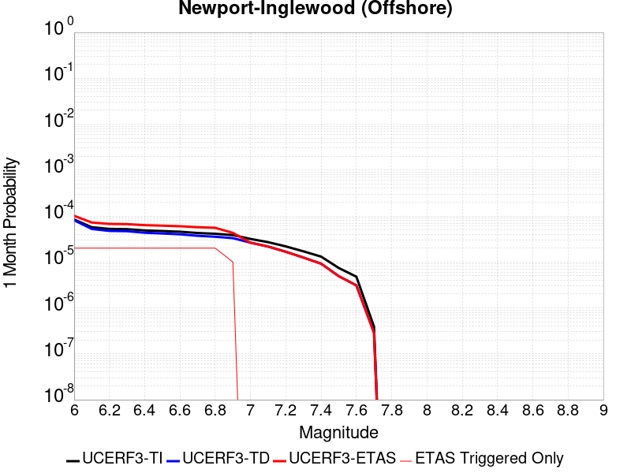 | 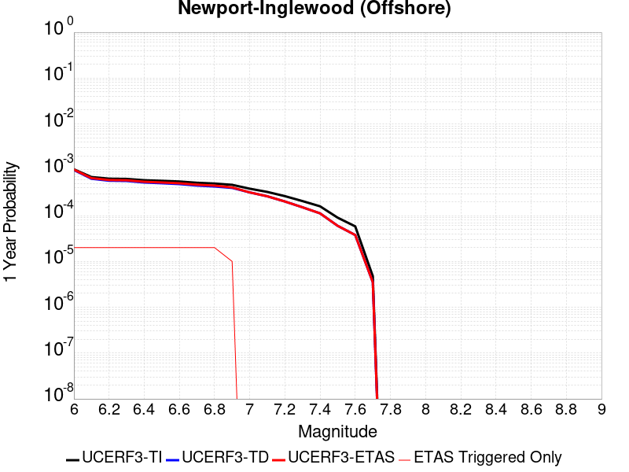 | 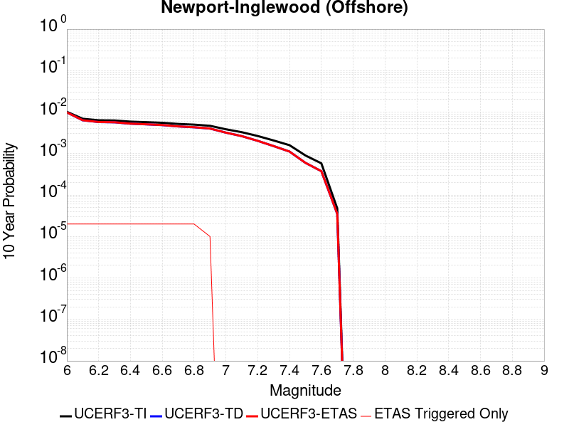 |

| Magnitude | 1 wk TI Prob | 1 wk TD Prob | 1 wk ETAS Prob | 1 wk ETAS/TD Gain | 1 wk ETAS Triggered Only | 1 mo TI Prob | 1 mo TD Prob | 1 mo ETAS Prob | 1 mo ETAS/TD Gain | 1 mo ETAS Triggered Only | 1 yr TI Prob | 1 yr TD Prob | 1 yr ETAS Prob | 1 yr ETAS/TD Gain | 1 yr ETAS Triggered Only | 10 yr TI Prob | 10 yr TD Prob | 10 yr ETAS Prob | 10 yr ETAS/TD Gain | 10 yr ETAS Triggered Only |
|-----|-----|-----|-----|-----|-----|-----|-----|-----|-----|-----|-----|-----|-----|-----|-----|-----|-----|-----|-----|-----|
| 6.0 | 1.9626508E-5 | 1.8965342E-5 | 3.8964965E-5 | 2.0545352 | 2.0E-5 | 8.411089E-5 | 8.1277576E-5 | 1.0127595E-4 | 1.2460504 | 2.0E-5 | 0.001023569 | 9.891179E-4 | 0.0010090981 | 1.0202 | 2.0E-5 | 0.010188672 | 0.009848497 | 0.0098683 | 1.0020108 | 2.0E-5 |
| 6.1 | 1.331886E-5 | 1.2218078E-5 | 3.2217835E-5 | 2.6368985 | 2.0E-5 | 5.707958E-5 | 5.2362153E-5 | 7.23611E-5 | 1.3819352 | 2.0E-5 | 6.947222E-4 | 6.3732424E-4 | 6.5731147E-4 | 1.0313612 | 2.0E-5 | 0.006925544 | 0.006355142 | 0.006375015 | 1.0031271 | 2.0E-5 |
| 6.2 | 1.2250852E-5 | 1.1076016E-5 | 3.1075793E-5 | 2.8056834 | 2.0E-5 | 5.2502597E-5 | 4.746778E-5 | 6.746683E-5 | 1.4213184 | 2.0E-5 | 6.3903164E-4 | 5.7776796E-4 | 5.977564E-4 | 1.034596 | 2.0E-5 | 0.006371971 | 0.0057627796 | 0.0057826643 | 1.0034505 | 2.0E-5 |
| 6.3 | 1.2106258E-5 | 1.0918878E-5 | 3.0918658E-5 | 2.83167 | 2.0E-5 | 5.1882926E-5 | 4.6794354E-5 | 6.679342E-5 | 1.427382 | 2.0E-5 | 6.3149154E-4 | 5.695733E-4 | 5.8956194E-4 | 1.035094 | 2.0E-5 | 0.0062970007 | 0.005681252 | 0.0057011386 | 1.0035003 | 2.0E-5 |
| 6.4 | 1.1348758E-5 | 1.0109348E-5 | 3.0109146E-5 | 2.9783468 | 2.0E-5 | 4.8636626E-5 | 4.3325064E-5 | 6.3324194E-5 | 1.4616065 | 2.0E-5 | 5.919901E-4 | 5.2735576E-4 | 5.4734526E-4 | 1.0379051 | 2.0E-5 | 0.005904155 | 0.0052611395 | 0.0052810344 | 1.0037814 | 2.0E-5 |
| 6.5 | 1.100837E-5 | 9.743376E-6 | 2.9743182E-5 | 3.0526567 | 2.0E-5 | 4.7177873E-5 | 4.175666E-5 | 6.1755825E-5 | 1.4789455 | 2.0E-5 | 5.7423924E-4 | 5.082695E-4 | 5.282594E-4 | 1.0393292 | 2.0E-5 | 0.005727576 | 0.005071162 | 0.0050910604 | 1.0039239 | 2.0E-5 |
| 6.6 | 1.0634696E-5 | 9.34553E-6 | 2.9345343E-5 | 3.1400406 | 2.0E-5 | 4.557647E-5 | 4.0051662E-5 | 6.005086E-5 | 1.499335 | 2.0E-5 | 5.5475225E-4 | 4.875206E-4 | 5.0751085E-4 | 1.041004 | 2.0E-5 | 0.0055336943 | 0.0048645977 | 0.0048845005 | 1.0040914 | 2.0E-5 |
| 6.7 | 9.9780855E-6 | 8.667898E-6 | 2.8667726E-5 | 3.3073442 | 2.0E-5 | 4.276252E-5 | 3.7147613E-5 | 5.714687E-5 | 1.5383726 | 2.0E-5 | 5.205093E-4 | 4.5217903E-4 | 4.7216998E-4 | 1.0442103 | 2.0E-5 | 0.0051929182 | 0.0045126686 | 0.0045325784 | 1.0044119 | 2.0E-5 |
| 6.8 | 9.59546E-6 | 8.272933E-6 | 2.8272767E-5 | 3.4175024 | 2.0E-5 | 4.1122752E-5 | 3.545495E-5 | 5.545424E-5 | 1.5640762 | 2.0E-5 | 5.0055445E-4 | 4.3157916E-4 | 4.5157052E-4 | 1.0463214 | 2.0E-5 | 0.004994285 | 0.004307486 | 0.0043273997 | 1.004623 | 2.0E-5 |
| 6.9 | 9.000614E-6 | 7.706823E-6 | 1.7706747E-5 | 2.2975414 | 1.0E-5 | 3.857349E-5 | 3.3028828E-5 | 4.30285E-5 | 1.3027558 | 1.0E-5 | 4.6953102E-4 | 4.0205245E-4 | 4.1204842E-4 | 1.0248624 | 1.0E-5 | 0.004685402 | 0.0040133223 | 0.004023282 | 1.0024817 | 1.0E-5 |
| 7.0 | 7.4070194E-6 | 6.148865E-6 | 6.148865E-6 | 1.0 | 0.0 | 3.1743984E-5 | 2.6352012E-5 | 2.6352012E-5 | 1.0 | 0.0 | 3.8641447E-4 | 3.2078868E-4 | 3.2078868E-4 | 1.0 | 0.0 | 0.0038574322 | 0.0032032758 | 0.0032032758 | 1.0 | 0.0 |
| 7.1 | 6.299615E-6 | 5.0565613E-6 | 5.0565613E-6 | 1.0 | 0.0 | 2.699807E-5 | 2.1670798E-5 | 2.1670798E-5 | 1.0 | 0.0 | 3.2865192E-4 | 2.6381016E-4 | 2.6381016E-4 | 1.0 | 0.0 | 0.003281663 | 0.0026349847 | 0.0026349847 | 1.0 | 0.0 |
| 7.2 | 5.096653E-6 | 3.892733E-6 | 3.892733E-6 | 1.0 | 0.0 | 2.1842614E-5 | 1.6683034E-5 | 1.6683034E-5 | 1.0 | 0.0 | 2.6590136E-4 | 2.0309711E-4 | 2.0309711E-4 | 1.0 | 0.0 | 0.0026558342 | 0.0020291263 | 0.0020291263 | 1.0 | 0.0 |
| 7.3 | 3.9753018E-6 | 2.9098787E-6 | 2.9098787E-6 | 1.0 | 0.0 | 1.7036897E-5 | 1.24708495E-5 | 1.24708495E-5 | 1.0 | 0.0 | 2.0740448E-4 | 1.518221E-4 | 1.518221E-4 | 1.0 | 0.0 | 0.00207211 | 0.0015171919 | 0.0015171919 | 1.0 | 0.0 |
| 7.4 | 3.0568392E-6 | 2.1449732E-6 | 2.1449732E-6 | 1.0 | 0.0 | 1.3100675E-5 | 9.19271E-6 | 9.19271E-6 | 1.0 | 0.0 | 1.5948903E-4 | 1.11915564E-4 | 1.11915564E-4 | 1.0 | 0.0 | 0.0015937461 | 0.0011185983 | 0.0011185983 | 1.0 | 0.0 |
| 7.5 | 1.7279019E-6 | 1.1469651E-6 | 1.1469651E-6 | 1.0 | 0.0 | 7.405273E-6 | 4.9155556E-6 | 4.9155556E-6 | 1.0 | 0.0 | 9.015547E-5 | 5.9845286E-5 | 5.9845286E-5 | 1.0 | 0.0 | 9.01189E-4 | 5.982956E-4 | 5.982956E-4 | 1.0 | 0.0 |
| 7.6 | 1.1156416E-6 | 7.222962E-7 | 7.222962E-7 | 1.0 | 0.0 | 4.7813123E-6 | 3.0955514E-6 | 3.0955514E-6 | 1.0 | 0.0 | 5.821092E-5 | 3.768771E-5 | 3.768771E-5 | 1.0 | 0.0 | 5.8195676E-4 | 3.7681553E-4 | 3.7681553E-4 | 1.0 | 0.0 |
| 7.7 | 9.117973E-8 | 6.7342256E-8 | 6.7342256E-8 | 1.0 | 0.0 | 3.907702E-7 | 2.8860964E-7 | 2.8860964E-7 | 1.0 | 0.0 | 4.757617E-6 | 3.5138169E-6 | 3.5138169E-6 | 1.0 | 0.0 | 4.7575148E-5 | 3.5137644E-5 | 3.5137644E-5 | 1.0 | 0.0 |

## Santa Cruz Island
*[(top)](#table-of-contents)*

| 1 Week | 1 Month | 1 Year | 10 Year |
|-----|-----|-----|-----|
| 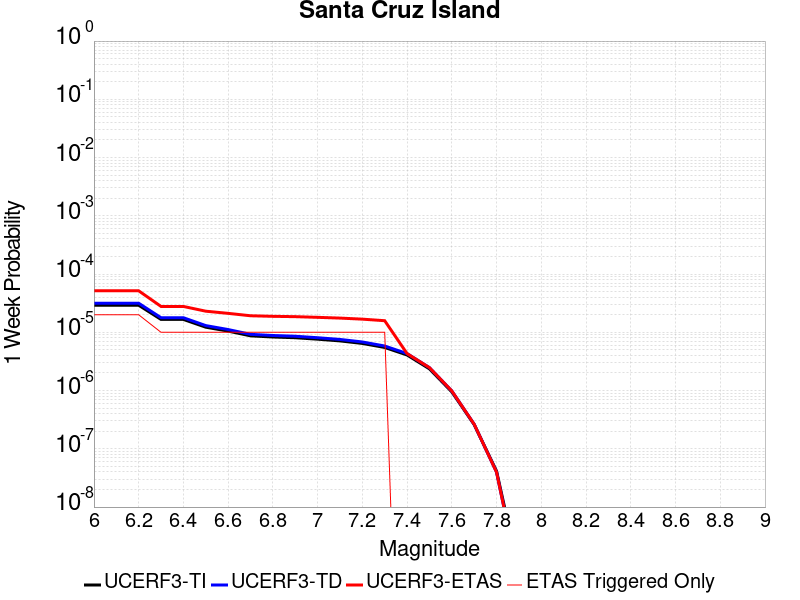 | 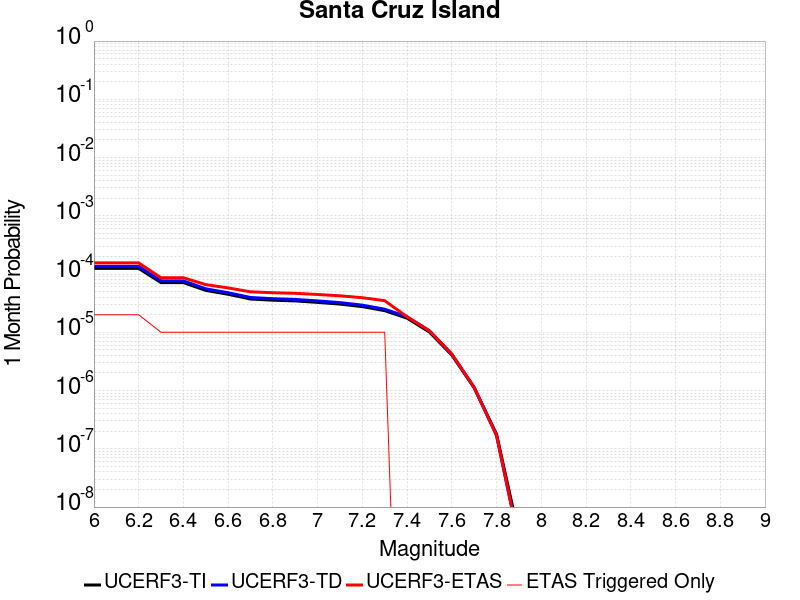 | 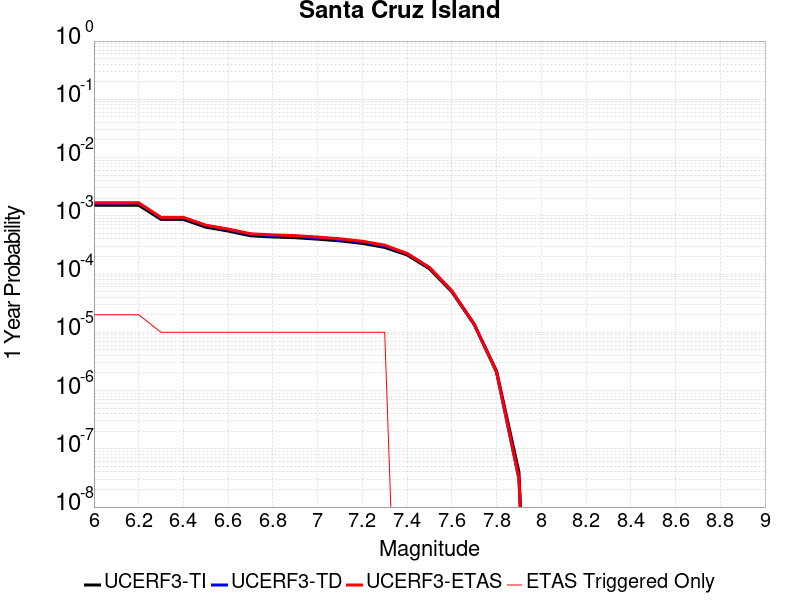 | 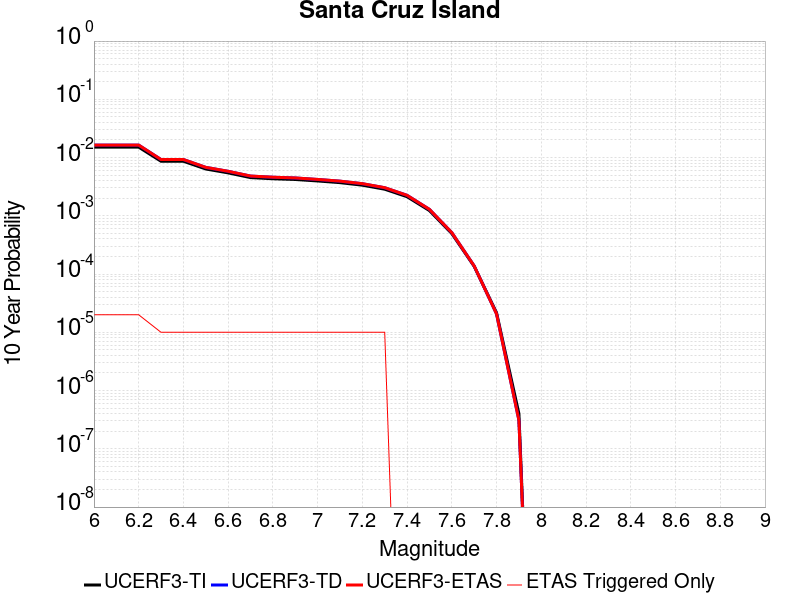 |

| Magnitude | 1 wk TI Prob | 1 wk TD Prob | 1 wk ETAS Prob | 1 wk ETAS/TD Gain | 1 wk ETAS Triggered Only | 1 mo TI Prob | 1 mo TD Prob | 1 mo ETAS Prob | 1 mo ETAS/TD Gain | 1 mo ETAS Triggered Only | 1 yr TI Prob | 1 yr TD Prob | 1 yr ETAS Prob | 1 yr ETAS/TD Gain | 1 yr ETAS Triggered Only | 10 yr TI Prob | 10 yr TD Prob | 10 yr ETAS Prob | 10 yr ETAS/TD Gain | 10 yr ETAS Triggered Only |
|-----|-----|-----|-----|-----|-----|-----|-----|-----|-----|-----|-----|-----|-----|-----|-----|-----|-----|-----|-----|-----|
| 6.0 | 2.9164563E-5 | 3.1599742E-5 | 5.1599112E-5 | 1.6328965 | 2.0E-5 | 1.2498499E-4 | 1.3542121E-4 | 1.554185E-4 | 1.1476674 | 2.0E-5 | 0.0015206301 | 0.0016476426 | 0.0016676096 | 1.0121186 | 2.0E-5 | 0.015102667 | 0.016368 | 0.016387671 | 1.0012019 | 2.0E-5 |
| 6.1 | 2.9164563E-5 | 3.1599742E-5 | 5.1599112E-5 | 1.6328965 | 2.0E-5 | 1.2498499E-4 | 1.3542121E-4 | 1.554185E-4 | 1.1476674 | 2.0E-5 | 0.0015206301 | 0.0016476426 | 0.0016676096 | 1.0121186 | 2.0E-5 | 0.015102667 | 0.016368 | 0.016387671 | 1.0012019 | 2.0E-5 |
| 6.2 | 2.9164563E-5 | 3.1599742E-5 | 5.1599112E-5 | 1.6328965 | 2.0E-5 | 1.2498499E-4 | 1.3542121E-4 | 1.554185E-4 | 1.1476674 | 2.0E-5 | 0.0015206301 | 0.0016476426 | 0.0016676096 | 1.0121186 | 2.0E-5 | 0.015102667 | 0.016368 | 0.016387671 | 1.0012019 | 2.0E-5 |
| 6.3 | 1.6635553E-5 | 1.780436E-5 | 2.780418E-5 | 1.5616502 | 1.0E-5 | 7.1293274E-5 | 7.630227E-5 | 8.63015E-5 | 1.1310477 | 1.0E-5 | 8.6765E-4 | 9.286024E-4 | 9.385931E-4 | 1.0107589 | 1.0E-5 | 0.008642701 | 0.009249094 | 0.009259001 | 1.0010712 | 1.0E-5 |
| 6.4 | 1.6635553E-5 | 1.780436E-5 | 2.780418E-5 | 1.5616502 | 1.0E-5 | 7.1293274E-5 | 7.630227E-5 | 8.63015E-5 | 1.1310477 | 1.0E-5 | 8.6765E-4 | 9.286024E-4 | 9.385931E-4 | 1.0107589 | 1.0E-5 | 0.008642701 | 0.009249094 | 0.009259001 | 1.0010712 | 1.0E-5 |
| 6.5 | 1.2238748E-5 | 1.3042996E-5 | 2.3042865E-5 | 1.766685 | 1.0E-5 | 5.2450723E-5 | 5.5897377E-5 | 6.589682E-5 | 1.1788893 | 1.0E-5 | 6.3840044E-4 | 6.8034173E-4 | 6.9033494E-4 | 1.0146885 | 1.0E-5 | 0.0063656955 | 0.006782988 | 0.00679292 | 1.0014642 | 1.0E-5 |
| 6.6 | 1.0489767E-5 | 1.1156636E-5 | 2.1156524E-5 | 1.8963175 | 1.0E-5 | 4.495537E-5 | 4.781329E-5 | 5.7812813E-5 | 1.2091368 | 1.0E-5 | 5.4719415E-4 | 5.819736E-4 | 5.919677E-4 | 1.0171729 | 1.0E-5 | 0.005458487 | 0.005804736 | 0.005814678 | 1.0017127 | 1.0E-5 |
| 6.7 | 8.699222E-6 | 9.236783E-6 | 1.923669E-5 | 2.082618 | 1.0E-5 | 3.7281847E-5 | 3.958561E-5 | 4.958522E-5 | 1.252607 | 1.0E-5 | 4.5381195E-4 | 4.818488E-4 | 4.9184397E-4 | 1.0207434 | 1.0E-5 | 0.0045288634 | 0.004808108 | 0.00481806 | 1.0020698 | 1.0E-5 |
| 6.8 | 8.307732E-6 | 8.8169045E-6 | 1.8816816E-5 | 2.1341748 | 1.0E-5 | 3.560408E-5 | 3.7786187E-5 | 4.7785812E-5 | 1.264637 | 1.0E-5 | 4.3339343E-4 | 4.5995016E-4 | 4.6994555E-4 | 1.0217315 | 1.0E-5 | 0.004325492 | 0.0045900354 | 0.0045999894 | 1.0021687 | 1.0E-5 |
| 6.9 | 8.073121E-6 | 8.564939E-6 | 1.8564853E-5 | 2.1675406 | 1.0E-5 | 3.459863E-5 | 3.670637E-5 | 4.6706E-5 | 1.2724223 | 1.0E-5 | 4.2115687E-4 | 4.4680882E-4 | 4.5680435E-4 | 1.0223709 | 1.0E-5 | 0.004203596 | 0.004459156 | 0.0044691116 | 1.0022326 | 1.0E-5 |
| 7.0 | 7.617019E-6 | 8.074665E-6 | 1.8074585E-5 | 2.2384315 | 1.0E-5 | 3.264396E-5 | 3.4605247E-5 | 4.46049E-5 | 1.2889636 | 1.0E-5 | 3.9736772E-4 | 4.2123784E-4 | 4.3123364E-4 | 1.0237296 | 1.0E-5 | 0.003966579 | 0.0042044413 | 0.0042143995 | 1.0023685 | 1.0E-5 |
| 7.1 | 7.1224836E-6 | 7.5457883E-6 | 1.7545713E-5 | 2.3252325 | 1.0E-5 | 3.052457E-5 | 3.2338692E-5 | 4.2338368E-5 | 1.3092171 | 1.0E-5 | 3.715733E-4 | 3.9365282E-4 | 4.0364888E-4 | 1.0253931 | 1.0E-5 | 0.003709526 | 0.0039295983 | 0.0039395588 | 1.0025347 | 1.0E-5 |
| 7.2 | 6.441115E-6 | 6.8273835E-6 | 1.6827315E-5 | 2.46468 | 1.0E-5 | 2.7604487E-5 | 2.9259889E-5 | 3.9259598E-5 | 1.3417548 | 1.0E-5 | 3.360328E-4 | 3.5618115E-4 | 3.6617758E-4 | 1.0280656 | 1.0E-5 | 0.0033552512 | 0.0035561312 | 0.0035660956 | 1.002802 | 1.0E-5 |
| 7.3 | 5.494274E-6 | 5.8199944E-6 | 1.5819936E-5 | 2.7182047 | 1.0E-5 | 2.3546674E-5 | 2.4942596E-5 | 3.4942346E-5 | 1.4009106 | 1.0E-5 | 2.8664304E-4 | 3.03634E-4 | 3.1363097E-4 | 1.0329244 | 1.0E-5 | 0.002862736 | 0.0030322145 | 0.0030421843 | 1.0032879 | 1.0E-5 |
| 7.4 | 4.0802624E-6 | 4.3122564E-6 | 4.3122564E-6 | 1.0 | 0.0 | 1.7486722E-5 | 1.8480969E-5 | 1.8480969E-5 | 1.0 | 0.0 | 2.1288003E-4 | 2.2498264E-4 | 2.2498264E-4 | 1.0 | 0.0 | 0.0021267622 | 0.0022475577 | 0.0022475577 | 1.0 | 0.0 |
| 7.5 | 2.3584746E-6 | 2.4753099E-6 | 2.4753099E-6 | 1.0 | 0.0 | 1.0107709E-5 | 1.0608428E-5 | 1.0608428E-5 | 1.0 | 0.0 | 1.2305441E-4 | 1.2915001E-4 | 1.2915001E-4 | 1.0 | 0.0 | 0.0012298629 | 0.0012907545 | 0.0012907545 | 1.0 | 0.0 |
| 7.6 | 9.4981914E-7 | 9.860934E-7 | 9.860934E-7 | 1.0 | 0.0 | 4.0706473E-6 | 4.2261076E-6 | 4.2261076E-6 | 1.0 | 0.0 | 4.9559E-5 | 5.1451658E-5 | 5.1451658E-5 | 1.0 | 0.0 | 4.954795E-4 | 5.1439874E-4 | 5.1439874E-4 | 1.0 | 0.0 |
| 7.7 | 2.6013532E-7 | 2.6416632E-7 | 2.6416632E-7 | 1.0 | 0.0 | 1.1148652E-6 | 1.1321408E-6 | 1.1321408E-6 | 1.0 | 0.0 | 1.3573399E-5 | 1.3783729E-5 | 1.3783729E-5 | 1.0 | 0.0 | 1.357257E-4 | 1.378288E-4 | 1.378288E-4 | 1.0 | 0.0 |
| 7.8 | 4.1522263E-8 | 3.965698E-8 | 3.965698E-8 | 1.0 | 0.0 | 1.7795254E-7 | 1.6995848E-7 | 1.6995848E-7 | 1.0 | 0.0 | 2.16657E-6 | 2.0692428E-6 | 2.0692428E-6 | 1.0 | 0.0 | 2.1665488E-5 | 2.0692256E-5 | 2.0692256E-5 | 1.0 | 0.0 |
| 7.9 | 7.7242046E-10 | 5.9475225E-10 | 5.9475225E-10 | 1.0 | 0.0 | 3.3103735E-9 | 2.5489382E-9 | 2.5489382E-9 | 1.0 | 0.0 | 4.0303796E-8 | 3.1033323E-8 | 3.1033323E-8 | 1.0 | 0.0 | 4.030379E-7 | 3.103332E-7 | 3.103332E-7 | 1.0 | 0.0 |

## Tin Mountain
*[(top)](#table-of-contents)*

| 1 Week | 1 Month | 1 Year | 10 Year |
|-----|-----|-----|-----|
|  | 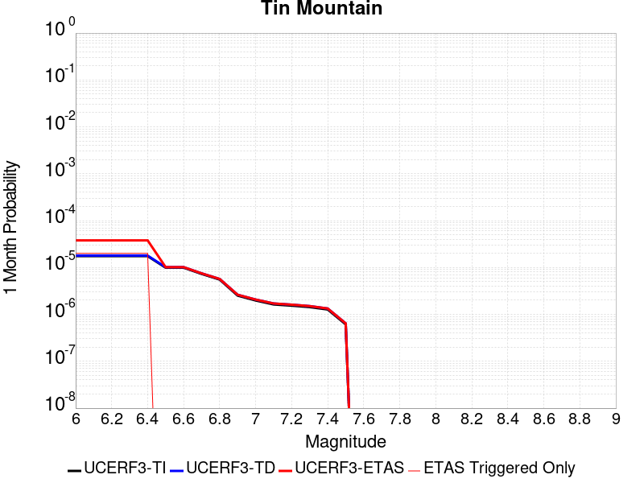 | 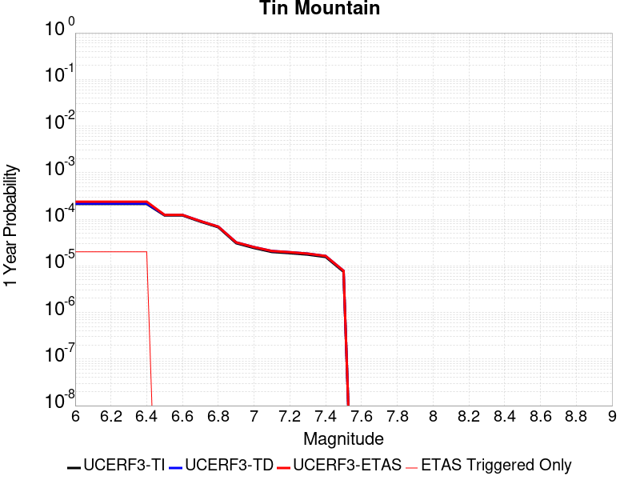 | 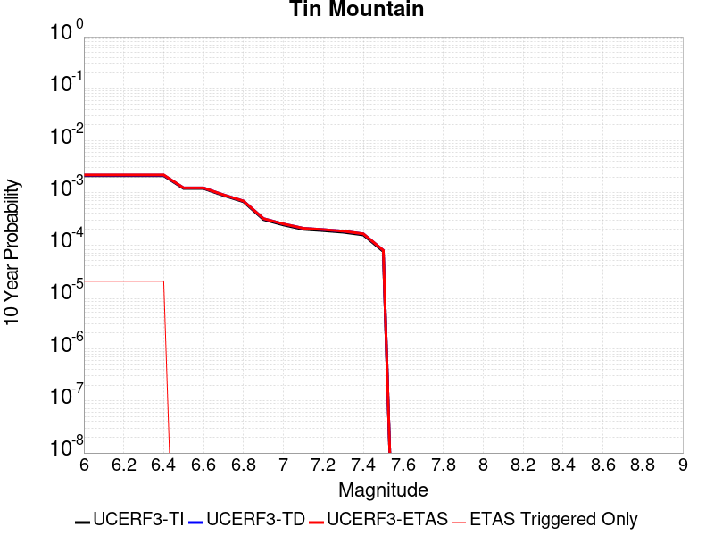 |

| Magnitude | 1 wk TI Prob | 1 wk TD Prob | 1 wk ETAS Prob | 1 wk ETAS/TD Gain | 1 wk ETAS Triggered Only | 1 mo TI Prob | 1 mo TD Prob | 1 mo ETAS Prob | 1 mo ETAS/TD Gain | 1 mo ETAS Triggered Only | 1 yr TI Prob | 1 yr TD Prob | 1 yr ETAS Prob | 1 yr ETAS/TD Gain | 1 yr ETAS Triggered Only | 10 yr TI Prob | 10 yr TD Prob | 10 yr ETAS Prob | 10 yr ETAS/TD Gain | 10 yr ETAS Triggered Only |
|-----|-----|-----|-----|-----|-----|-----|-----|-----|-----|-----|-----|-----|-----|-----|-----|-----|-----|-----|-----|-----|
| 6.0 | 4.083776E-6 | 4.1815365E-6 | 1.4181494E-5 | 3.3914554 | 1.0E-5 | 1.750178E-5 | 1.792077E-5 | 3.792041E-5 | 2.1160035 | 2.0E-5 | 2.1306332E-4 | 2.1816725E-4 | 2.3816289E-4 | 1.0916528 | 2.0E-5 | 0.0021285915 | 0.0021798965 | 0.0021998528 | 1.0091548 | 2.0E-5 |
| 6.1 | 4.083776E-6 | 4.1815365E-6 | 1.4181494E-5 | 3.3914554 | 1.0E-5 | 1.750178E-5 | 1.792077E-5 | 3.792041E-5 | 2.1160035 | 2.0E-5 | 2.1306332E-4 | 2.1816725E-4 | 2.3816289E-4 | 1.0916528 | 2.0E-5 | 0.0021285915 | 0.0021798965 | 0.0021998528 | 1.0091548 | 2.0E-5 |
| 6.2 | 4.083776E-6 | 4.1815365E-6 | 1.4181494E-5 | 3.3914554 | 1.0E-5 | 1.750178E-5 | 1.792077E-5 | 3.792041E-5 | 2.1160035 | 2.0E-5 | 2.1306332E-4 | 2.1816725E-4 | 2.3816289E-4 | 1.0916528 | 2.0E-5 | 0.0021285915 | 0.0021798965 | 0.0021998528 | 1.0091548 | 2.0E-5 |
| 6.3 | 4.083776E-6 | 4.1815365E-6 | 1.4181494E-5 | 3.3914554 | 1.0E-5 | 1.750178E-5 | 1.792077E-5 | 3.792041E-5 | 2.1160035 | 2.0E-5 | 2.1306332E-4 | 2.1816725E-4 | 2.3816289E-4 | 1.0916528 | 2.0E-5 | 0.0021285915 | 0.0021798965 | 0.0021998528 | 1.0091548 | 2.0E-5 |
| 6.4 | 4.083776E-6 | 4.1815365E-6 | 1.4181494E-5 | 3.3914554 | 1.0E-5 | 1.750178E-5 | 1.792077E-5 | 3.792041E-5 | 2.1160035 | 2.0E-5 | 2.1306332E-4 | 2.1816725E-4 | 2.3816289E-4 | 1.0916528 | 2.0E-5 | 0.0021285915 | 0.0021798965 | 0.0021998528 | 1.0091548 | 2.0E-5 |
| 6.5 | 2.3143427E-6 | 2.3731573E-6 | 2.3731573E-6 | 1.0 | 0.0 | 9.9185745E-6 | 1.0170638E-5 | 1.0170638E-5 | 1.0 | 0.0 | 1.2075195E-4 | 1.2382126E-4 | 1.2382126E-4 | 1.0 | 0.0 | 0.0012068636 | 0.0012375986 | 0.0012375986 | 1.0 | 0.0 |
| 6.6 | 2.3143427E-6 | 2.3731573E-6 | 2.3731573E-6 | 1.0 | 0.0 | 9.9185745E-6 | 1.0170638E-5 | 1.0170638E-5 | 1.0 | 0.0 | 1.2075195E-4 | 1.2382126E-4 | 1.2382126E-4 | 1.0 | 0.0 | 0.0012068636 | 0.0012375986 | 0.0012375986 | 1.0 | 0.0 |
| 6.7 | 1.7029532E-6 | 1.7497915E-6 | 1.7497915E-6 | 1.0 | 0.0 | 7.2983503E-6 | 7.499088E-6 | 7.499088E-6 | 1.0 | 0.0 | 8.885379E-5 | 9.1298105E-5 | 9.1298105E-5 | 1.0 | 0.0 | 8.881827E-4 | 9.1265864E-4 | 9.1265864E-4 | 1.0 | 0.0 |
| 6.8 | 1.2914646E-6 | 1.3299378E-6 | 1.3299378E-6 | 1.0 | 0.0 | 5.534837E-6 | 5.6997237E-6 | 5.6997237E-6 | 1.0 | 0.0 | 6.738455E-5 | 6.939237E-5 | 6.939237E-5 | 1.0 | 0.0 | 6.736412E-4 | 6.9375033E-4 | 6.9375033E-4 | 1.0 | 0.0 |
| 6.9 | 5.8708974E-7 | 6.1169936E-7 | 6.1169936E-7 | 1.0 | 0.0 | 2.5160964E-6 | 2.6215664E-6 | 2.6215664E-6 | 1.0 | 0.0 | 3.0633044E-5 | 3.1917145E-5 | 3.1917145E-5 | 1.0 | 0.0 | 3.0628822E-4 | 3.191297E-4 | 3.191297E-4 | 1.0 | 0.0 |
| 7.0 | 4.6248786E-7 | 4.832015E-7 | 4.832015E-7 | 1.0 | 0.0 | 1.9820893E-6 | 2.0708624E-6 | 2.0708624E-6 | 1.0 | 0.0 | 2.413167E-5 | 2.5212494E-5 | 2.5212494E-5 | 1.0 | 0.0 | 2.412905E-4 | 2.5210003E-4 | 2.5210003E-4 | 1.0 | 0.0 |
| 7.1 | 3.804606E-7 | 3.987147E-7 | 3.987147E-7 | 1.0 | 0.0 | 1.6305444E-6 | 1.7087764E-6 | 1.7087764E-6 | 1.0 | 0.0 | 1.9851697E-5 | 2.0804187E-5 | 2.0804187E-5 | 1.0 | 0.0 | 1.9849923E-4 | 2.0802575E-4 | 2.0802575E-4 | 1.0 | 0.0 |
| 7.2 | 3.5864858E-7 | 3.7616863E-7 | 3.7616863E-7 | 1.0 | 0.0 | 1.5370645E-6 | 1.6121504E-6 | 1.6121504E-6 | 1.0 | 0.0 | 1.87136E-5 | 1.9627789E-5 | 1.9627789E-5 | 1.0 | 0.0 | 1.8712023E-4 | 1.9626386E-4 | 1.9626386E-4 | 1.0 | 0.0 |
| 7.3 | 3.342063E-7 | 3.506347E-7 | 3.506347E-7 | 1.0 | 0.0 | 1.4323119E-6 | 1.5027196E-6 | 1.5027196E-6 | 1.0 | 0.0 | 1.7438259E-5 | 1.829549E-5 | 1.829549E-5 | 1.0 | 0.0 | 1.743689E-4 | 1.8294314E-4 | 1.8294314E-4 | 1.0 | 0.0 |
| 7.4 | 2.971242E-7 | 3.1165817E-7 | 3.1165817E-7 | 1.0 | 0.0 | 1.2733886E-6 | 1.3356774E-6 | 1.3356774E-6 | 1.0 | 0.0 | 1.5503398E-5 | 1.6261785E-5 | 1.6261785E-5 | 1.0 | 0.0 | 1.5502315E-4 | 1.6260923E-4 | 1.6260923E-4 | 1.0 | 0.0 |
| 7.5 | 1.4326713E-7 | 1.5012525E-7 | 1.5012525E-7 | 1.0 | 0.0 | 6.140018E-7 | 6.433939E-7 | 6.433939E-7 | 1.0 | 0.0 | 7.4754466E-6 | 7.8333205E-6 | 7.8333205E-6 | 1.0 | 0.0 | 7.475195E-5 | 7.833321E-5 | 7.833321E-5 | 1.0 | 0.0 |

## Hosgri (Extension)
*[(top)](#table-of-contents)*

| 1 Week | 1 Month | 1 Year | 10 Year |
|-----|-----|-----|-----|
| 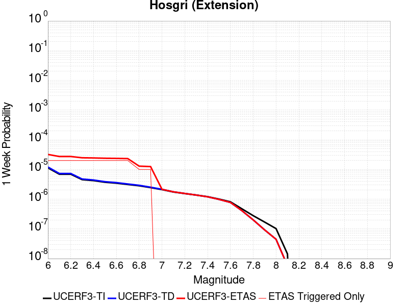 | 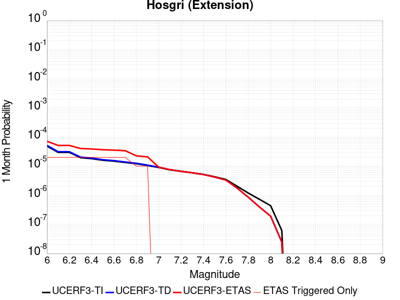 | 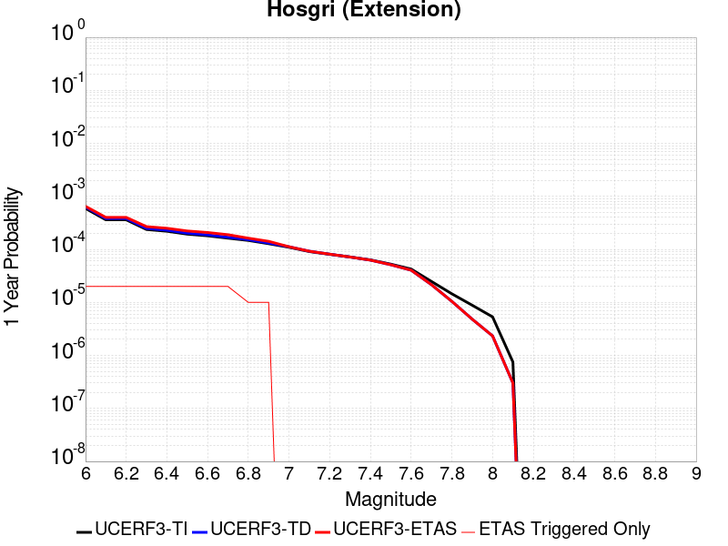 | 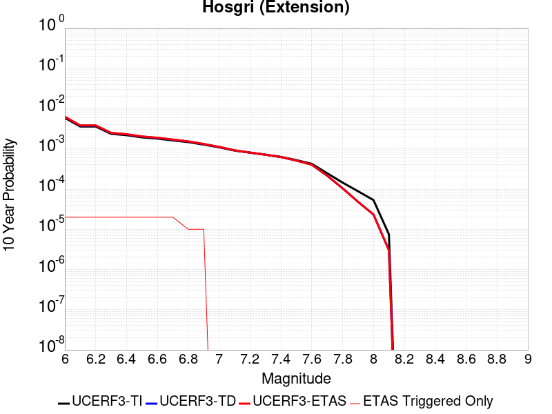 |

| Magnitude | 1 wk TI Prob | 1 wk TD Prob | 1 wk ETAS Prob | 1 wk ETAS/TD Gain | 1 wk ETAS Triggered Only | 1 mo TI Prob | 1 mo TD Prob | 1 mo ETAS Prob | 1 mo ETAS/TD Gain | 1 mo ETAS Triggered Only | 1 yr TI Prob | 1 yr TD Prob | 1 yr ETAS Prob | 1 yr ETAS/TD Gain | 1 yr ETAS Triggered Only | 10 yr TI Prob | 10 yr TD Prob | 10 yr ETAS Prob | 10 yr ETAS/TD Gain | 10 yr ETAS Triggered Only |
|-----|-----|-----|-----|-----|-----|-----|-----|-----|-----|-----|-----|-----|-----|-----|-----|-----|-----|-----|-----|-----|
| 6.0 | 1.1369135E-5 | 1.2083073E-5 | 3.2082833E-5 | 2.655188 | 2.0E-5 | 4.8723956E-5 | 5.17837E-5 | 7.178266E-5 | 1.386202 | 2.0E-5 | 5.9305265E-4 | 6.303069E-4 | 6.502943E-4 | 1.0317106 | 2.0E-5 | 0.005914725 | 0.00628744 | 0.0063073146 | 1.003161 | 2.0E-5 |
| 6.1 | 6.934979E-6 | 7.324556E-6 | 2.732441E-5 | 3.730521 | 2.0E-5 | 2.9721E-5 | 3.13906E-5 | 5.1389972E-5 | 1.6371135 | 2.0E-5 | 3.617931E-4 | 3.821177E-4 | 4.0211005E-4 | 1.0523199 | 2.0E-5 | 0.0036120464 | 0.003815019 | 0.0038349428 | 1.0052224 | 2.0E-5 |
| 6.2 | 6.934979E-6 | 7.324556E-6 | 2.732441E-5 | 3.730521 | 2.0E-5 | 2.9721E-5 | 3.13906E-5 | 5.1389972E-5 | 1.6371135 | 2.0E-5 | 3.617931E-4 | 3.821177E-4 | 4.0211005E-4 | 1.0523199 | 2.0E-5 | 0.0036120464 | 0.003815019 | 0.0038349428 | 1.0052224 | 2.0E-5 |
| 6.3 | 4.5484676E-6 | 4.769331E-6 | 2.4769235E-5 | 5.19344 | 2.0E-5 | 1.9493287E-5 | 2.0439833E-5 | 4.0439423E-5 | 1.9784615 | 2.0E-5 | 2.3730492E-4 | 2.4882698E-4 | 2.6882198E-4 | 1.0803572 | 2.0E-5 | 0.0023705168 | 0.0024855263 | 0.0025054766 | 1.0080266 | 2.0E-5 |
| 6.4 | 4.218095E-6 | 4.416863E-6 | 2.4416775E-5 | 5.528081 | 2.0E-5 | 1.8077424E-5 | 1.8929275E-5 | 3.8928898E-5 | 2.0565445 | 2.0E-5 | 2.2007042E-4 | 2.3043988E-4 | 2.504353E-4 | 1.0867705 | 2.0E-5 | 0.002198526 | 0.002302043 | 0.0023219967 | 1.008668 | 2.0E-5 |
| 6.5 | 3.717374E-6 | 3.883879E-6 | 2.38838E-5 | 6.1494713 | 2.0E-5 | 1.5931506E-5 | 1.664509E-5 | 3.6644757E-5 | 2.2015357 | 2.0E-5 | 1.9394881E-4 | 2.026353E-4 | 2.2263125E-4 | 1.0986795 | 2.0E-5 | 0.0019377962 | 0.0020245241 | 0.0020444836 | 1.0098588 | 2.0E-5 |
| 6.6 | 3.4605036E-6 | 3.6083072E-6 | 2.3608234E-5 | 6.5427456 | 2.0E-5 | 1.4830645E-5 | 1.5464082E-5 | 3.5463774E-5 | 2.2932994 | 2.0E-5 | 1.8054814E-4 | 1.8825909E-4 | 2.0825531E-4 | 1.1062165 | 2.0E-5 | 0.0018040152 | 0.0018810107 | 0.001900973 | 1.0106126 | 2.0E-5 |
| 6.7 | 3.123439E-6 | 3.2465698E-6 | 2.3246504E-5 | 7.160328 | 2.0E-5 | 1.33860985E-5 | 1.39137965E-5 | 3.391352E-5 | 2.4374022 | 2.0E-5 | 1.6296357E-4 | 1.6938741E-4 | 1.8938402E-4 | 1.1180525 | 2.0E-5 | 0.001628441 | 0.001692594 | 0.0017125601 | 1.0117962 | 2.0E-5 |
| 6.8 | 2.8290783E-6 | 2.9305413E-6 | 1.2930512E-5 | 4.4123287 | 1.0E-5 | 1.2124565E-5 | 1.2559403E-5 | 2.2559278E-5 | 1.7962061 | 1.0E-5 | 1.4760658E-4 | 1.5290009E-4 | 1.6289856E-4 | 1.0653921 | 1.0E-5 | 0.0014750857 | 0.0015279576 | 0.0015379423 | 1.0065347 | 1.0E-5 |
| 6.9 | 2.454112E-6 | 2.5283207E-6 | 1.2528295E-5 | 4.9551845 | 1.0E-5 | 1.0517581E-5 | 1.0835615E-5 | 2.0835507E-5 | 1.9228725 | 1.0E-5 | 1.2804402E-4 | 1.3191569E-4 | 1.4191437E-4 | 1.075796 | 1.0E-5 | 0.0012797028 | 0.0013183799 | 0.0013283667 | 1.007575 | 1.0E-5 |
| 7.0 | 2.1008145E-6 | 2.1498715E-6 | 2.1498715E-6 | 1.0 | 0.0 | 9.003459E-6 | 9.2137025E-6 | 9.2137025E-6 | 1.0 | 0.0 | 1.096116E-4 | 1.1217109E-4 | 1.1217109E-4 | 1.0 | 0.0 | 0.0010955755 | 0.0011211485 | 0.0011211485 | 1.0 | 0.0 |
| 7.1 | 1.744384E-6 | 1.7686364E-6 | 1.7686364E-6 | 1.0 | 0.0 | 7.47591E-6 | 7.579848E-6 | 7.579848E-6 | 1.0 | 0.0 | 9.1015405E-5 | 9.228076E-5 | 9.228076E-5 | 1.0 | 0.0 | 9.097813E-4 | 9.224261E-4 | 9.224261E-4 | 1.0 | 0.0 |
| 7.2 | 1.5456587E-6 | 1.5562894E-6 | 1.5562894E-6 | 1.0 | 0.0 | 6.6242346E-6 | 6.6697944E-6 | 6.6697944E-6 | 1.0 | 0.0 | 8.064707E-5 | 8.120173E-5 | 8.120173E-5 | 1.0 | 0.0 | 8.0617814E-4 | 8.117219E-4 | 8.117219E-4 | 1.0 | 0.0 |
| 7.3 | 1.3775123E-6 | 1.3766092E-6 | 1.3766092E-6 | 1.0 | 0.0 | 5.9036106E-6 | 5.8997407E-6 | 5.8997407E-6 | 1.0 | 0.0 | 7.187409E-5 | 7.182699E-5 | 7.182699E-5 | 1.0 | 0.0 | 7.185085E-4 | 7.180387E-4 | 7.180387E-4 | 1.0 | 0.0 |
| 7.4 | 1.214491E-6 | 1.2023471E-6 | 1.2023471E-6 | 1.0 | 0.0 | 5.2049513E-6 | 5.152906E-6 | 5.152906E-6 | 1.0 | 0.0 | 6.336844E-5 | 6.2734835E-5 | 6.2734835E-5 | 1.0 | 0.0 | 6.335037E-4 | 6.2717206E-4 | 6.2717206E-4 | 1.0 | 0.0 |
| 7.5 | 1.0101123E-6 | 9.842256E-7 | 9.842256E-7 | 1.0 | 0.0 | 4.3290456E-6 | 4.218103E-6 | 4.218103E-6 | 1.0 | 0.0 | 5.2704854E-5 | 5.13542E-5 | 5.13542E-5 | 1.0 | 0.0 | 5.2692357E-4 | 5.1342393E-4 | 5.1342393E-4 | 1.0 | 0.0 |
| 7.6 | 8.1558215E-7 | 7.765977E-7 | 7.765977E-7 | 1.0 | 0.0 | 3.4953473E-6 | 3.3282718E-6 | 3.3282718E-6 | 1.0 | 0.0 | 4.255502E-5 | 4.0520958E-5 | 4.0520958E-5 | 1.0 | 0.0 | 4.2546875E-4 | 4.0513615E-4 | 4.0513615E-4 | 1.0 | 0.0 |
| 7.7 | 4.757816E-7 | 4.1308996E-7 | 4.1308996E-7 | 1.0 | 0.0 | 2.0390623E-6 | 1.7703843E-6 | 1.7703843E-6 | 1.0 | 0.0 | 2.4825302E-5 | 2.1554217E-5 | 2.1554217E-5 | 1.0 | 0.0 | 2.482253E-4 | 2.1552139E-4 | 2.1552139E-4 | 1.0 | 0.0 |
| 7.8 | 2.782787E-7 | 2.004783E-7 | 2.004783E-7 | 1.0 | 0.0 | 1.1926223E-6 | 8.591924E-7 | 8.591924E-7 | 1.0 | 0.0 | 1.452008E-5 | 1.0460618E-5 | 1.0460618E-5 | 1.0 | 0.0 | 1.4519131E-4 | 1.04601284E-4 | 1.04601284E-4 | 1.0 | 0.0 |
| 7.9 | 1.6948086E-7 | 9.243938E-8 | 9.243938E-8 | 1.0 | 0.0 | 7.2634634E-7 | 3.961687E-7 | 3.961687E-7 | 1.0 | 0.0 | 8.843231E-6 | 4.8233433E-6 | 4.8233433E-6 | 1.0 | 0.0 | 8.842879E-5 | 4.8232392E-5 | 4.8232392E-5 | 1.0 | 0.0 |
| 8.0 | 1.0225492E-7 | 4.473497E-8 | 4.473497E-8 | 1.0 | 0.0 | 4.382353E-7 | 1.917213E-7 | 1.917213E-7 | 1.0 | 0.0 | 5.335502E-6 | 2.3342043E-6 | 2.3342043E-6 | 1.0 | 0.0 | 5.335374E-5 | 2.33418E-5 | 2.33418E-5 | 1.0 | 0.0 |
| 8.1 | 1.43711345E-8 | 5.78716E-9 | 5.78716E-9 | 1.0 | 0.0 | 6.1590576E-8 | 2.4802116E-8 | 2.4802116E-8 | 1.0 | 0.0 | 7.4986497E-7 | 3.019657E-7 | 3.019657E-7 | 1.0 | 0.0 | 7.4986247E-6 | 3.0196536E-6 | 3.0196536E-6 | 1.0 | 0.0 |

## San Gorgonio Pass
*[(top)](#table-of-contents)*

| 1 Week | 1 Month | 1 Year | 10 Year |
|-----|-----|-----|-----|
| 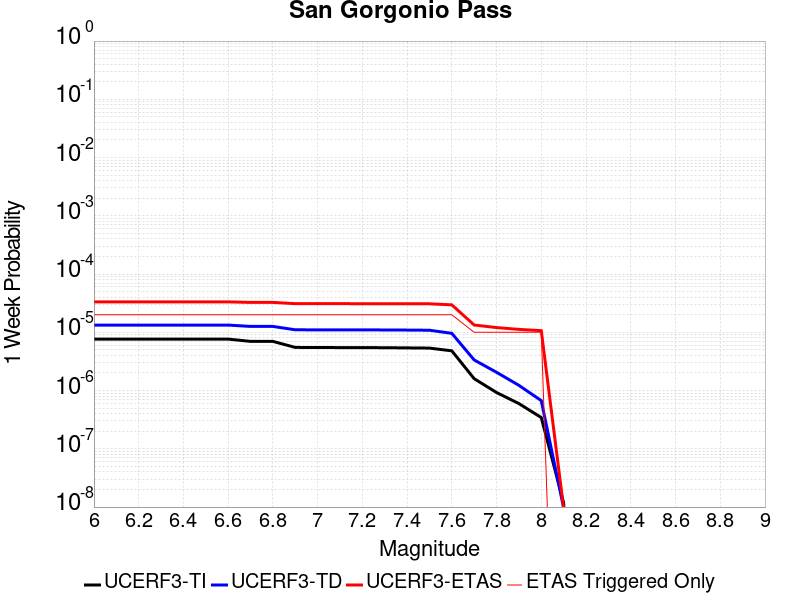 | 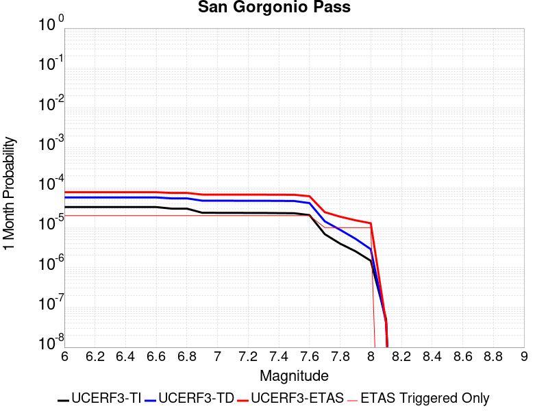 | 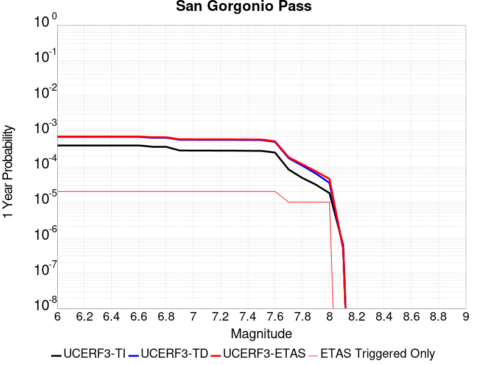 | 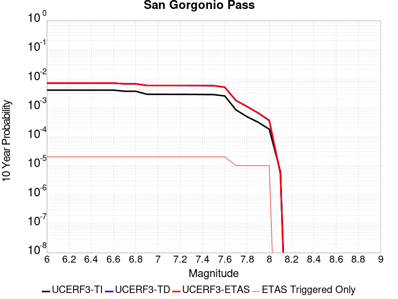 |

| Magnitude | 1 wk TI Prob | 1 wk TD Prob | 1 wk ETAS Prob | 1 wk ETAS/TD Gain | 1 wk ETAS Triggered Only | 1 mo TI Prob | 1 mo TD Prob | 1 mo ETAS Prob | 1 mo ETAS/TD Gain | 1 mo ETAS Triggered Only | 1 yr TI Prob | 1 yr TD Prob | 1 yr ETAS Prob | 1 yr ETAS/TD Gain | 1 yr ETAS Triggered Only | 10 yr TI Prob | 10 yr TD Prob | 10 yr ETAS Prob | 10 yr ETAS/TD Gain | 10 yr ETAS Triggered Only |
|-----|-----|-----|-----|-----|-----|-----|-----|-----|-----|-----|-----|-----|-----|-----|-----|-----|-----|-----|-----|-----|
| 6.0 | 7.644328E-6 | 1.331474E-5 | 3.3314474E-5 | 2.5020747 | 2.0E-5 | 3.2760996E-5 | 5.706197E-5 | 7.706083E-5 | 1.3504761 | 2.0E-5 | 3.987921E-4 | 6.945166E-4 | 7.145027E-4 | 1.028777 | 2.0E-5 | 0.003980772 | 0.006930024 | 0.0069498853 | 1.002866 | 2.0E-5 |
| 6.1 | 7.644328E-6 | 1.331474E-5 | 3.3314474E-5 | 2.5020747 | 2.0E-5 | 3.2760996E-5 | 5.706197E-5 | 7.706083E-5 | 1.3504761 | 2.0E-5 | 3.987921E-4 | 6.945166E-4 | 7.145027E-4 | 1.028777 | 2.0E-5 | 0.003980772 | 0.006930024 | 0.0069498853 | 1.002866 | 2.0E-5 |
| 6.2 | 7.644328E-6 | 1.331474E-5 | 3.3314474E-5 | 2.5020747 | 2.0E-5 | 3.2760996E-5 | 5.706197E-5 | 7.706083E-5 | 1.3504761 | 2.0E-5 | 3.987921E-4 | 6.945166E-4 | 7.145027E-4 | 1.028777 | 2.0E-5 | 0.003980772 | 0.006930024 | 0.0069498853 | 1.002866 | 2.0E-5 |
| 6.3 | 7.644328E-6 | 1.331474E-5 | 3.3314474E-5 | 2.5020747 | 2.0E-5 | 3.2760996E-5 | 5.706197E-5 | 7.706083E-5 | 1.3504761 | 2.0E-5 | 3.987921E-4 | 6.945166E-4 | 7.145027E-4 | 1.028777 | 2.0E-5 | 0.003980772 | 0.006930024 | 0.0069498853 | 1.002866 | 2.0E-5 |
| 6.4 | 7.644328E-6 | 1.331474E-5 | 3.3314474E-5 | 2.5020747 | 2.0E-5 | 3.2760996E-5 | 5.706197E-5 | 7.706083E-5 | 1.3504761 | 2.0E-5 | 3.987921E-4 | 6.945166E-4 | 7.145027E-4 | 1.028777 | 2.0E-5 | 0.003980772 | 0.006930024 | 0.0069498853 | 1.002866 | 2.0E-5 |
| 6.5 | 7.644328E-6 | 1.331474E-5 | 3.3314474E-5 | 2.5020747 | 2.0E-5 | 3.2760996E-5 | 5.706197E-5 | 7.706083E-5 | 1.3504761 | 2.0E-5 | 3.987921E-4 | 6.945166E-4 | 7.145027E-4 | 1.028777 | 2.0E-5 | 0.003980772 | 0.006930024 | 0.0069498853 | 1.002866 | 2.0E-5 |
| 6.6 | 7.644328E-6 | 1.331474E-5 | 3.3314474E-5 | 2.5020747 | 2.0E-5 | 3.2760996E-5 | 5.706197E-5 | 7.706083E-5 | 1.3504761 | 2.0E-5 | 3.987921E-4 | 6.945166E-4 | 7.145027E-4 | 1.028777 | 2.0E-5 | 0.003980772 | 0.006930024 | 0.0069498853 | 1.002866 | 2.0E-5 |
| 6.7 | 6.987586E-6 | 1.2619013E-5 | 3.2618762E-5 | 2.58489 | 2.0E-5 | 2.9946454E-5 | 5.408041E-5 | 7.4079326E-5 | 1.3697997 | 2.0E-5 | 3.645371E-4 | 6.582382E-4 | 6.78225E-4 | 1.0303642 | 2.0E-5 | 0.0036393967 | 0.0065694 | 0.006589269 | 1.0030245 | 2.0E-5 |
| 6.8 | 6.987586E-6 | 1.2619013E-5 | 3.2618762E-5 | 2.58489 | 2.0E-5 | 2.9946454E-5 | 5.408041E-5 | 7.4079326E-5 | 1.3697997 | 2.0E-5 | 3.645371E-4 | 6.582382E-4 | 6.78225E-4 | 1.0303642 | 2.0E-5 | 0.0036393967 | 0.0065694 | 0.006589269 | 1.0030245 | 2.0E-5 |
| 6.9 | 5.504702E-6 | 1.1049877E-5 | 3.1049654E-5 | 2.809955 | 2.0E-5 | 2.3591367E-5 | 4.7355785E-5 | 6.7354835E-5 | 1.4223149 | 2.0E-5 | 2.8718702E-4 | 5.764092E-4 | 5.963977E-4 | 1.0346776 | 2.0E-5 | 0.0028681618 | 0.0057553523 | 0.0057752375 | 1.003455 | 2.0E-5 |
| 7.0 | 5.4825764E-6 | 1.1026218E-5 | 3.1025997E-5 | 2.8138387 | 2.0E-5 | 2.3496545E-5 | 4.725439E-5 | 6.7253444E-5 | 1.4232211 | 2.0E-5 | 2.8603288E-4 | 5.751754E-4 | 5.951639E-4 | 1.034752 | 2.0E-5 | 0.00285665 | 0.0057430784 | 0.0057629636 | 1.0034624 | 2.0E-5 |
| 7.1 | 5.4692787E-6 | 1.1011928E-5 | 3.1011707E-5 | 2.8161924 | 2.0E-5 | 2.3439556E-5 | 4.719315E-5 | 6.719221E-5 | 1.4237703 | 2.0E-5 | 2.8533922E-4 | 5.744302E-4 | 5.944187E-4 | 1.0347971 | 2.0E-5 | 0.0028497311 | 0.0057356646 | 0.0057555498 | 1.003467 | 2.0E-5 |
| 7.2 | 5.453661E-6 | 1.0994954E-5 | 3.0994735E-5 | 2.8189962 | 2.0E-5 | 2.3372622E-5 | 4.712041E-5 | 6.7119465E-5 | 1.4244245 | 2.0E-5 | 2.8452452E-4 | 5.7354505E-4 | 5.9353356E-4 | 1.0348508 | 2.0E-5 | 0.002841605 | 0.005726859 | 0.005746744 | 1.0034723 | 2.0E-5 |
| 7.3 | 5.4422303E-6 | 1.09818775E-5 | 3.0981657E-5 | 2.8211622 | 2.0E-5 | 2.3323635E-5 | 4.7064368E-5 | 6.7063425E-5 | 1.42493 | 2.0E-5 | 2.8392827E-4 | 5.728631E-4 | 5.928516E-4 | 1.0348923 | 2.0E-5 | 0.0028356577 | 0.0057200743 | 0.00573996 | 1.0034765 | 2.0E-5 |
| 7.4 | 5.398595E-6 | 1.0929241E-5 | 3.0929023E-5 | 2.8299332 | 2.0E-5 | 2.313663E-5 | 4.6838795E-5 | 6.6837856E-5 | 1.4269764 | 2.0E-5 | 2.8165206E-4 | 5.701182E-4 | 5.9010676E-4 | 1.0350604 | 2.0E-5 | 0.0028129534 | 0.0056927665 | 0.0057126526 | 1.0034932 | 2.0E-5 |
| 7.5 | 5.3578788E-6 | 1.0855785E-5 | 3.085557E-5 | 2.8423157 | 2.0E-5 | 2.2962136E-5 | 4.6523994E-5 | 6.652306E-5 | 1.4298657 | 2.0E-5 | 2.7952815E-4 | 5.662875E-4 | 5.862761E-4 | 1.0352978 | 2.0E-5 | 0.002791768 | 0.0056546913 | 0.0056745782 | 1.0035169 | 2.0E-5 |
| 7.6 | 4.8091474E-6 | 9.604131E-6 | 2.960394E-5 | 3.082417 | 2.0E-5 | 2.0610469E-5 | 4.1159943E-5 | 6.115912E-5 | 1.4858893 | 2.0E-5 | 2.5090357E-4 | 5.010119E-4 | 5.210019E-4 | 1.0398992 | 2.0E-5 | 0.0025062046 | 0.0050054584 | 0.0050253584 | 1.0039756 | 2.0E-5 |
| 7.7 | 1.5991155E-6 | 3.353035E-6 | 1.3353001E-5 | 3.9823625 | 1.0E-5 | 6.853334E-6 | 1.4370073E-5 | 2.4369929E-5 | 1.6958807 | 1.0E-5 | 8.343615E-5 | 1.7494184E-4 | 1.8494009E-4 | 1.0571519 | 1.0E-5 | 8.340483E-4 | 0.0017535852 | 0.0017635676 | 1.0056926 | 1.0E-5 |
| 7.8 | 9.258398E-7 | 2.0581049E-6 | 1.2058084E-5 | 5.858829 | 1.0E-5 | 3.967879E-6 | 8.82042E-6 | 1.8820332E-5 | 2.1337228 | 1.0E-5 | 4.8307855E-5 | 1.0738334E-4 | 1.1738227E-4 | 1.0931143 | 1.0E-5 | 4.8297356E-4 | 0.0010788103 | 0.0010887996 | 1.0092595 | 1.0E-5 |
| 7.9 | 5.975575E-7 | 1.2292295E-6 | 1.1229217E-5 | 9.135168 | 1.0E-5 | 2.5609581E-6 | 5.2681157E-6 | 1.5268062E-5 | 2.898202 | 1.0E-5 | 3.117922E-5 | 6.413743E-5 | 7.413679E-5 | 1.1559052 | 1.0E-5 | 3.1174847E-4 | 6.464778E-4 | 6.5647135E-4 | 1.0154585 | 1.0E-5 |
| 8.0 | 3.4413725E-7 | 6.714992E-7 | 1.0671492E-5 | 15.89204 | 1.0E-5 | 1.4748731E-6 | 2.8778506E-6 | 1.2877822E-5 | 4.4748054 | 1.0E-5 | 1.7956432E-5 | 3.5037272E-5 | 4.5036923E-5 | 1.2854004 | 1.0E-5 | 1.7954981E-4 | 3.5392298E-4 | 3.6391945E-4 | 1.0282447 | 1.0E-5 |
| 8.1 | 1.1787731E-8 | 9.6332045E-9 | 9.6332045E-9 | 1.0 | 0.0 | 5.0518846E-8 | 4.1285162E-8 | 4.1285162E-8 | 1.0 | 0.0 | 6.1506677E-7 | 5.0264674E-7 | 5.0264674E-7 | 1.0 | 0.0 | 6.1506507E-6 | 5.2417968E-6 | 5.2417968E-6 | 1.0 | 0.0 |

## White Wolf
*[(top)](#table-of-contents)*

| 1 Week | 1 Month | 1 Year | 10 Year |
|-----|-----|-----|-----|
| 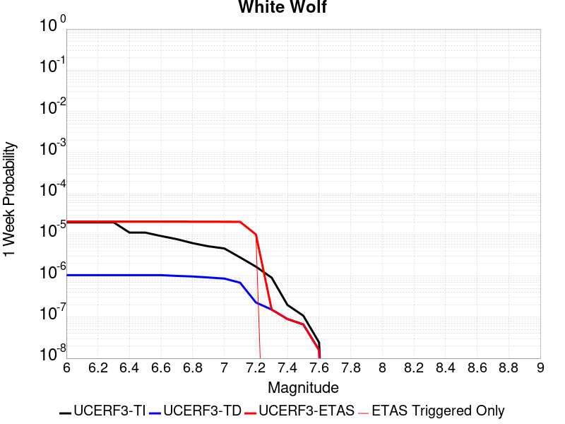 | 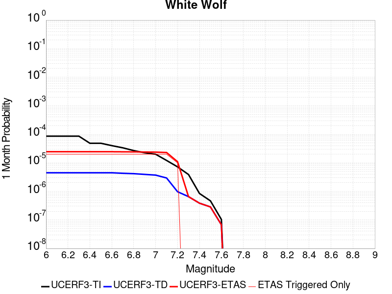 | 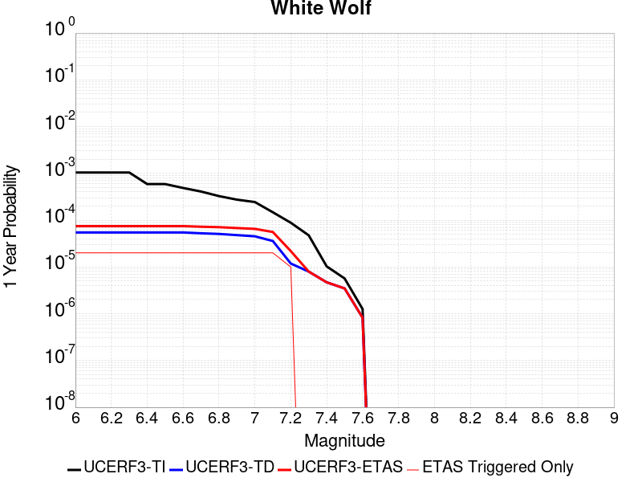 | 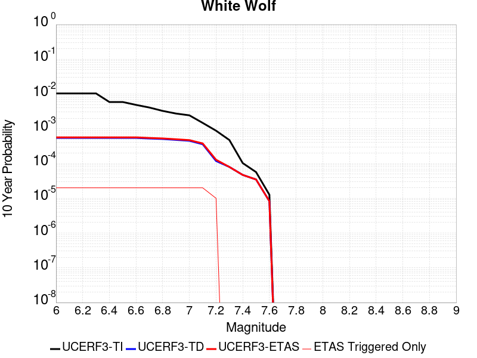 |

| Magnitude | 1 wk TI Prob | 1 wk TD Prob | 1 wk ETAS Prob | 1 wk ETAS/TD Gain | 1 wk ETAS Triggered Only | 1 mo TI Prob | 1 mo TD Prob | 1 mo ETAS Prob | 1 mo ETAS/TD Gain | 1 mo ETAS Triggered Only | 1 yr TI Prob | 1 yr TD Prob | 1 yr ETAS Prob | 1 yr ETAS/TD Gain | 1 yr ETAS Triggered Only | 10 yr TI Prob | 10 yr TD Prob | 10 yr ETAS Prob | 10 yr ETAS/TD Gain | 10 yr ETAS Triggered Only |
|-----|-----|-----|-----|-----|-----|-----|-----|-----|-----|-----|-----|-----|-----|-----|-----|-----|-----|-----|-----|-----|
| 6.0 | 2.0037822E-5 | 1.0468583E-6 | 2.1046837E-5 | 20.104763 | 2.0E-5 | 8.587355E-5 | 4.4865283E-6 | 2.4486439E-5 | 5.45777 | 2.0E-5 | 0.001045009 | 5.4622164E-5 | 7.462107E-5 | 1.3661318 | 2.0E-5 | 0.010401085 | 5.4609246E-4 | 5.660815E-4 | 1.0366038 | 2.0E-5 |
| 6.1 | 2.0037822E-5 | 1.0468583E-6 | 2.1046837E-5 | 20.104763 | 2.0E-5 | 8.587355E-5 | 4.4865283E-6 | 2.4486439E-5 | 5.45777 | 2.0E-5 | 0.001045009 | 5.4622164E-5 | 7.462107E-5 | 1.3661318 | 2.0E-5 | 0.010401085 | 5.4609246E-4 | 5.660815E-4 | 1.0366038 | 2.0E-5 |
| 6.2 | 2.0037822E-5 | 1.0468583E-6 | 2.1046837E-5 | 20.104763 | 2.0E-5 | 8.587355E-5 | 4.4865283E-6 | 2.4486439E-5 | 5.45777 | 2.0E-5 | 0.001045009 | 5.4622164E-5 | 7.462107E-5 | 1.3661318 | 2.0E-5 | 0.010401085 | 5.4609246E-4 | 5.660815E-4 | 1.0366038 | 2.0E-5 |
| 6.3 | 2.0037822E-5 | 1.0468583E-6 | 2.1046837E-5 | 20.104763 | 2.0E-5 | 8.587355E-5 | 4.4865283E-6 | 2.4486439E-5 | 5.45777 | 2.0E-5 | 0.001045009 | 5.4622164E-5 | 7.462107E-5 | 1.3661318 | 2.0E-5 | 0.010401085 | 5.4609246E-4 | 5.660815E-4 | 1.0366038 | 2.0E-5 |
| 6.4 | 1.132487E-5 | 1.0468583E-6 | 2.1046837E-5 | 20.104763 | 2.0E-5 | 4.8534253E-5 | 4.4865283E-6 | 2.4486439E-5 | 5.45777 | 2.0E-5 | 5.907443E-4 | 5.4622164E-5 | 7.462107E-5 | 1.3661318 | 2.0E-5 | 0.005891764 | 5.4609246E-4 | 5.660815E-4 | 1.0366038 | 2.0E-5 |
| 6.5 | 1.132487E-5 | 1.0468583E-6 | 2.1046837E-5 | 20.104763 | 2.0E-5 | 4.8534253E-5 | 4.4865283E-6 | 2.4486439E-5 | 5.45777 | 2.0E-5 | 5.907443E-4 | 5.4622164E-5 | 7.462107E-5 | 1.3661318 | 2.0E-5 | 0.005891764 | 5.4609246E-4 | 5.660815E-4 | 1.0366038 | 2.0E-5 |
| 6.6 | 9.347473E-6 | 1.0468583E-6 | 2.1046837E-5 | 20.104763 | 2.0E-5 | 4.0059982E-5 | 4.4865283E-6 | 2.4486439E-5 | 5.45777 | 2.0E-5 | 4.8762115E-4 | 5.4622164E-5 | 7.462107E-5 | 1.3661318 | 2.0E-5 | 0.0048655253 | 5.4609246E-4 | 5.660815E-4 | 1.0366038 | 2.0E-5 |
| 6.7 | 7.842647E-6 | 1.0047773E-6 | 2.1004756E-5 | 20.904888 | 2.0E-5 | 3.361091E-5 | 4.306182E-6 | 2.4306095E-5 | 5.644466 | 2.0E-5 | 4.0913603E-4 | 5.2426552E-5 | 7.24255E-5 | 1.381466 | 2.0E-5 | 0.004083836 | 5.241468E-4 | 5.4413633E-4 | 1.0381372 | 2.0E-5 |
| 6.8 | 6.26597E-6 | 9.734289E-7 | 2.097341E-5 | 21.54591 | 2.0E-5 | 2.685388E-5 | 4.1718313E-6 | 2.4171748E-5 | 5.7940373 | 2.0E-5 | 3.2689696E-4 | 5.0790914E-5 | 7.07899E-5 | 1.3937513 | 2.0E-5 | 0.003264165 | 5.07798E-4 | 5.2778784E-4 | 1.0393658 | 2.0E-5 |
| 6.9 | 5.258436E-6 | 9.1827343E-7 | 2.0918254E-5 | 22.779985 | 2.0E-5 | 2.2535958E-5 | 3.935452E-6 | 2.3935374E-5 | 6.0819883 | 2.0E-5 | 2.7434074E-4 | 4.7913123E-5 | 6.7912166E-5 | 1.4174021 | 2.0E-5 | 0.0027400232 | 4.7903272E-4 | 4.990231E-4 | 1.0417308 | 2.0E-5 |
| 7.0 | 4.675028E-6 | 8.660704E-7 | 2.0866053E-5 | 24.09279 | 2.0E-5 | 2.003568E-5 | 3.7117254E-6 | 2.3711651E-5 | 6.38831 | 2.0E-5 | 2.4390711E-4 | 4.518937E-5 | 6.518846E-5 | 1.442562 | 2.0E-5 | 0.0024363957 | 4.518065E-4 | 4.7179745E-4 | 1.0442468 | 2.0E-5 |
| 7.1 | 2.8270078E-6 | 6.8737717E-7 | 2.0687363E-5 | 30.096088 | 2.0E-5 | 1.2115692E-5 | 2.945899E-6 | 2.294584E-5 | 7.789079 | 2.0E-5 | 1.4749856E-4 | 3.586577E-5 | 5.5865054E-5 | 1.5576147 | 2.0E-5 | 0.001474007 | 3.5860392E-4 | 3.7859674E-4 | 1.0557518 | 2.0E-5 |
| 7.2 | 1.6881406E-6 | 2.2703432E-7 | 1.0227032E-5 | 45.046196 | 1.0E-5 | 7.2348685E-6 | 9.730038E-7 | 1.09729945E-5 | 11.277441 | 1.0E-5 | 8.808096E-5 | 1.1846259E-5 | 2.1846141E-5 | 1.8441384 | 1.0E-5 | 8.8046055E-4 | 1.1845643E-4 | 1.2845524E-4 | 1.0844092 | 1.0E-5 |
| 7.3 | 9.086107E-7 | 1.5264496E-7 | 1.5264496E-7 | 1.0 | 0.0 | 3.8940398E-6 | 6.5419255E-7 | 6.5419255E-7 | 1.0 | 0.0 | 4.7408903E-5 | 7.964766E-6 | 7.964766E-6 | 1.0 | 0.0 | 4.739879E-4 | 7.964489E-5 | 7.964489E-5 | 1.0 | 0.0 |
| 7.4 | 1.9717383E-7 | 9.003399E-8 | 9.003399E-8 | 1.0 | 0.0 | 8.450304E-7 | 3.8585992E-7 | 3.8585992E-7 | 1.0 | 0.0 | 1.0288197E-5 | 4.697835E-6 | 4.697835E-6 | 1.0 | 0.0 | 1.028772E-4 | 4.6977384E-5 | 4.6977384E-5 | 1.0 | 0.0 |
| 7.5 | 1.086975E-7 | 6.659662E-8 | 6.659662E-8 | 1.0 | 0.0 | 4.6584634E-7 | 2.8541407E-7 | 2.8541407E-7 | 1.0 | 0.0 | 5.6716644E-6 | 3.474911E-6 | 3.474911E-6 | 1.0 | 0.0 | 5.6715195E-5 | 3.474859E-5 | 3.474859E-5 | 1.0 | 0.0 |
| 7.6 | 2.4217808E-8 | 1.5820849E-8 | 1.5820849E-8 | 1.0 | 0.0 | 1.03790605E-7 | 6.780364E-8 | 6.780364E-8 | 1.0 | 0.0 | 1.2636499E-6 | 8.25509E-7 | 8.25509E-7 | 1.0 | 0.0 | 1.2636427E-5 | 8.255064E-6 | 8.255064E-6 | 1.0 | 0.0 |

## La Panza 2011
*[(top)](#table-of-contents)*

| 1 Week | 1 Month | 1 Year | 10 Year |
|-----|-----|-----|-----|
| 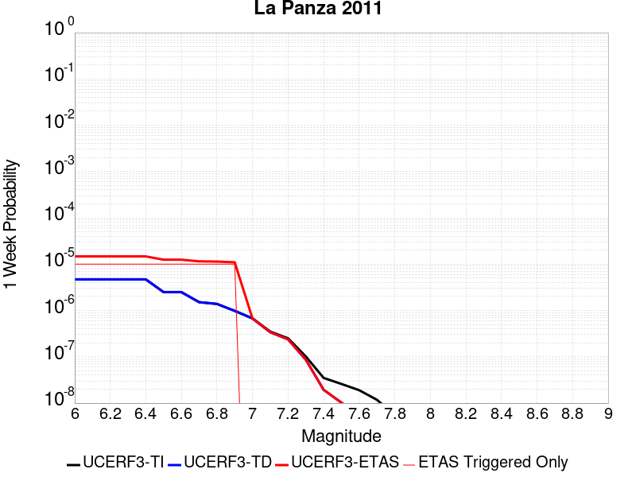 | 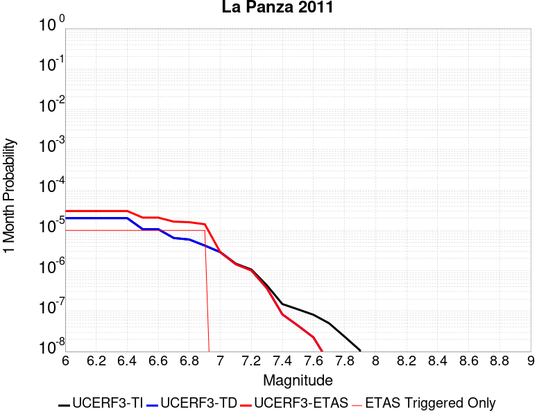 | 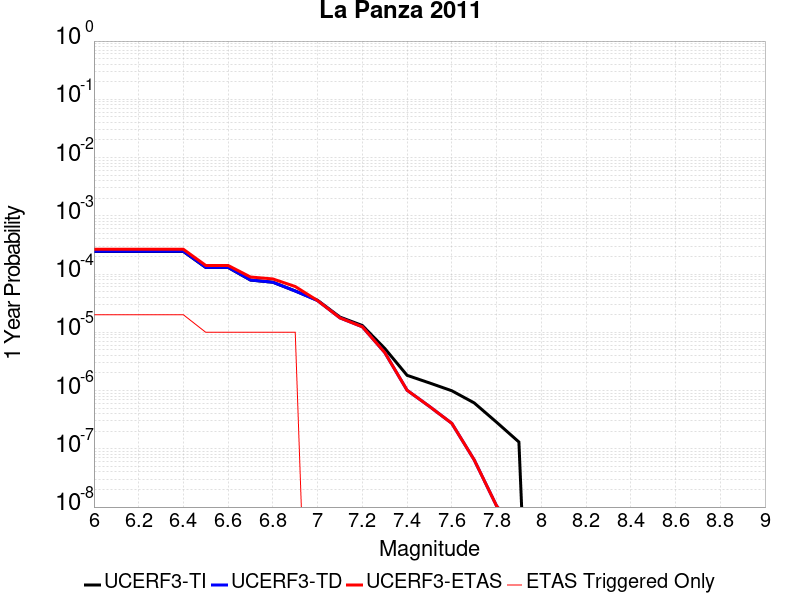 | 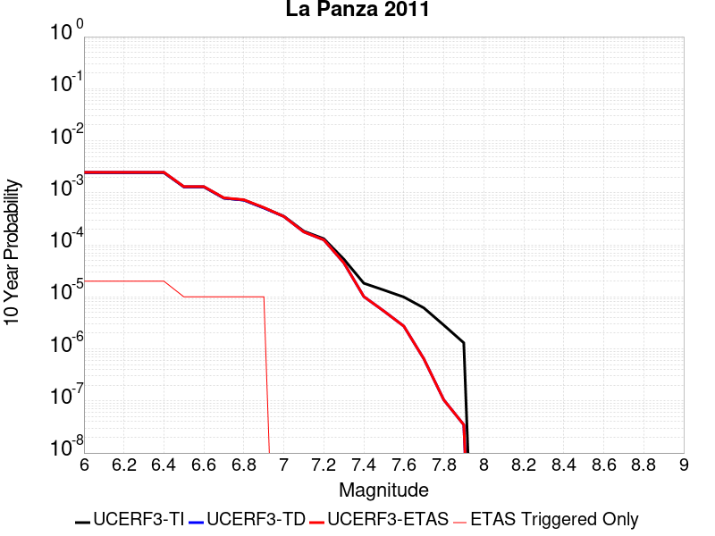 |

| Magnitude | 1 wk TI Prob | 1 wk TD Prob | 1 wk ETAS Prob | 1 wk ETAS/TD Gain | 1 wk ETAS Triggered Only | 1 mo TI Prob | 1 mo TD Prob | 1 mo ETAS Prob | 1 mo ETAS/TD Gain | 1 mo ETAS Triggered Only | 1 yr TI Prob | 1 yr TD Prob | 1 yr ETAS Prob | 1 yr ETAS/TD Gain | 1 yr ETAS Triggered Only | 10 yr TI Prob | 10 yr TD Prob | 10 yr ETAS Prob | 10 yr ETAS/TD Gain | 10 yr ETAS Triggered Only |
|-----|-----|-----|-----|-----|-----|-----|-----|-----|-----|-----|-----|-----|-----|-----|-----|-----|-----|-----|-----|-----|
| 6.0 | 4.6754544E-6 | 4.7175886E-6 | 1.47175415E-5 | 3.119717 | 1.0E-5 | 2.0037509E-5 | 2.021809E-5 | 3.0217889E-5 | 1.4945965 | 1.0E-5 | 2.4392935E-4 | 2.4612944E-4 | 2.661245E-4 | 1.081238 | 2.0E-5 | 0.0024366176 | 0.0024587628 | 0.0024787136 | 1.0081142 | 2.0E-5 |
| 6.1 | 4.6754544E-6 | 4.7175886E-6 | 1.47175415E-5 | 3.119717 | 1.0E-5 | 2.0037509E-5 | 2.021809E-5 | 3.0217889E-5 | 1.4945965 | 1.0E-5 | 2.4392935E-4 | 2.4612944E-4 | 2.661245E-4 | 1.081238 | 2.0E-5 | 0.0024366176 | 0.0024587628 | 0.0024787136 | 1.0081142 | 2.0E-5 |
| 6.2 | 4.6754544E-6 | 4.7175886E-6 | 1.47175415E-5 | 3.119717 | 1.0E-5 | 2.0037509E-5 | 2.021809E-5 | 3.0217889E-5 | 1.4945965 | 1.0E-5 | 2.4392935E-4 | 2.4612944E-4 | 2.661245E-4 | 1.081238 | 2.0E-5 | 0.0024366176 | 0.0024587628 | 0.0024787136 | 1.0081142 | 2.0E-5 |
| 6.3 | 4.6754544E-6 | 4.7175886E-6 | 1.47175415E-5 | 3.119717 | 1.0E-5 | 2.0037509E-5 | 2.021809E-5 | 3.0217889E-5 | 1.4945965 | 1.0E-5 | 2.4392935E-4 | 2.4612944E-4 | 2.661245E-4 | 1.081238 | 2.0E-5 | 0.0024366176 | 0.0024587628 | 0.0024787136 | 1.0081142 | 2.0E-5 |
| 6.4 | 4.6754544E-6 | 4.7175886E-6 | 1.47175415E-5 | 3.119717 | 1.0E-5 | 2.0037509E-5 | 2.021809E-5 | 3.0217889E-5 | 1.4945965 | 1.0E-5 | 2.4392935E-4 | 2.4612944E-4 | 2.661245E-4 | 1.081238 | 2.0E-5 | 0.0024366176 | 0.0024587628 | 0.0024787136 | 1.0081142 | 2.0E-5 |
| 6.5 | 2.485343E-6 | 2.5006007E-6 | 1.2500575E-5 | 4.999029 | 1.0E-5 | 1.0651426E-5 | 1.0716818E-5 | 2.071671E-5 | 1.9331028 | 1.0E-5 | 1.296734E-4 | 1.3046984E-4 | 1.4046853E-4 | 1.0766361 | 1.0E-5 | 0.0012959775 | 0.0013039707 | 0.0013139577 | 1.0076588 | 1.0E-5 |
| 6.6 | 2.485343E-6 | 2.5006007E-6 | 1.2500575E-5 | 4.999029 | 1.0E-5 | 1.0651426E-5 | 1.0716818E-5 | 2.071671E-5 | 1.9331028 | 1.0E-5 | 1.296734E-4 | 1.3046984E-4 | 1.4046853E-4 | 1.0766361 | 1.0E-5 | 0.0012959775 | 0.0013039707 | 0.0013139577 | 1.0076588 | 1.0E-5 |
| 6.7 | 1.5108508E-6 | 1.514639E-6 | 1.1514624E-5 | 7.602223 | 1.0E-5 | 6.4750584E-6 | 6.4912947E-6 | 1.649123E-5 | 2.5405147 | 1.0E-5 | 7.8830984E-5 | 7.902876E-5 | 8.902797E-5 | 1.1265262 | 1.0E-5 | 7.880303E-4 | 7.9001737E-4 | 8.0000947E-4 | 1.012648 | 1.0E-5 |
| 6.8 | 1.3865837E-6 | 1.3885118E-6 | 1.1388498E-5 | 8.201945 | 1.0E-5 | 5.942488E-6 | 5.950752E-6 | 1.5950693E-5 | 2.68045 | 1.0E-5 | 7.234739E-5 | 7.244809E-5 | 8.244737E-5 | 1.1380198 | 1.0E-5 | 7.232384E-4 | 7.242546E-4 | 7.342473E-4 | 1.0137973 | 1.0E-5 |
| 6.9 | 9.826583E-7 | 9.796303E-7 | 1.097962E-5 | 11.207923 | 1.0E-5 | 4.2113857E-6 | 4.198409E-6 | 1.4198367E-5 | 3.3818445 | 1.0E-5 | 5.1272415E-5 | 5.1114486E-5 | 6.111398E-5 | 1.1956292 | 1.0E-5 | 5.126059E-4 | 5.1103265E-4 | 5.2102754E-4 | 1.0195582 | 1.0E-5 |
| 7.0 | 6.7797646E-7 | 6.710231E-7 | 6.710231E-7 | 1.0 | 0.0 | 2.9056102E-6 | 2.8758104E-6 | 2.8758104E-6 | 1.0 | 0.0 | 3.537523E-5 | 3.501246E-5 | 3.501246E-5 | 1.0 | 0.0 | 3.5369597E-4 | 3.5007254E-4 | 3.5007254E-4 | 1.0 | 0.0 |
| 7.1 | 3.4979826E-7 | 3.3874045E-7 | 3.3874045E-7 | 1.0 | 0.0 | 1.4991346E-6 | 1.4517441E-6 | 1.4517441E-6 | 1.0 | 0.0 | 1.825181E-5 | 1.7674853E-5 | 1.7674853E-5 | 1.0 | 0.0 | 1.825031E-4 | 1.7673563E-4 | 1.7673563E-4 | 1.0 | 0.0 |
| 7.2 | 2.5088332E-7 | 2.3832064E-7 | 2.3832064E-7 | 1.0 | 0.0 | 1.0752137E-6 | 1.0213738E-6 | 1.0213738E-6 | 1.0 | 0.0 | 1.3090649E-5 | 1.2435164E-5 | 1.2435164E-5 | 1.0 | 0.0 | 1.3089878E-4 | 1.2434553E-4 | 1.2434553E-4 | 1.0 | 0.0 |
| 7.3 | 1.0159086E-7 | 8.644785E-8 | 8.644785E-8 | 1.0 | 0.0 | 4.3538932E-7 | 3.704907E-7 | 3.704907E-7 | 1.0 | 0.0 | 5.300852E-6 | 4.510716E-6 | 4.510716E-6 | 1.0 | 0.0 | 5.3007258E-5 | 4.510628E-5 | 4.510628E-5 | 1.0 | 0.0 |
| 7.4 | 3.5006252E-8 | 1.9403883E-8 | 1.9403883E-8 | 1.0 | 0.0 | 1.5002678E-7 | 8.315949E-8 | 8.315949E-8 | 1.0 | 0.0 | 1.8265745E-6 | 1.0124663E-6 | 1.0124663E-6 | 1.0 | 0.0 | 1.8265595E-5 | 1.012462E-5 | 1.012462E-5 | 1.0 | 0.0 |
| 7.5 | 2.592274E-8 | 1.0238468E-8 | 1.0238468E-8 | 1.0 | 0.0 | 1.1109746E-7 | 4.3879147E-8 | 4.3879147E-8 | 1.0 | 0.0 | 1.3526106E-6 | 5.342285E-7 | 5.342285E-7 | 1.0 | 0.0 | 1.3526024E-5 | 5.342273E-6 | 5.342273E-6 | 1.0 | 0.0 |
| 7.6 | 1.9016717E-8 | 5.2442264E-9 | 5.2442264E-9 | 1.0 | 0.0 | 8.150022E-8 | 2.2475257E-8 | 2.2475257E-8 | 1.0 | 0.0 | 9.922647E-7 | 2.736362E-7 | 2.736362E-7 | 1.0 | 0.0 | 9.922603E-6 | 2.736359E-6 | 2.736359E-6 | 1.0 | 0.0 |
| 7.7 | 1.17738495E-8 | 1.2393437E-9 | 1.2393437E-9 | 1.0 | 0.0 | 5.0459356E-8 | 5.3114735E-9 | 5.3114735E-9 | 1.0 | 0.0 | 6.1434247E-7 | 6.466719E-8 | 6.466719E-8 | 1.0 | 0.0 | 6.143408E-6 | 6.466717E-7 | 6.466717E-7 | 1.0 | 0.0 |
| 7.8 | 5.489079E-9 | 2.009185E-10 | 2.009185E-10 | 1.0 | 0.0 | 2.3524624E-8 | 8.61079E-10 | 8.61079E-10 | 1.0 | 0.0 | 2.8641225E-7 | 1.0483639E-8 | 1.0483639E-8 | 1.0 | 0.0 | 2.8641189E-6 | 1.0483638E-7 | 1.0483638E-7 | 1.0 | 0.0 |
| 7.9 | 2.5081048E-9 | 6.675449E-11 | 6.675449E-11 | 1.0 | 0.0 | 1.0749021E-8 | 2.8609015E-10 | 2.8609015E-10 | 1.0 | 0.0 | 1.3086932E-7 | 3.483148E-9 | 3.483148E-9 | 1.0 | 0.0 | 1.3086925E-6 | 3.483148E-8 | 3.483148E-8 | 1.0 | 0.0 |

## Cerro Prieto
*[(top)](#table-of-contents)*

| 1 Week | 1 Month | 1 Year | 10 Year |
|-----|-----|-----|-----|
| 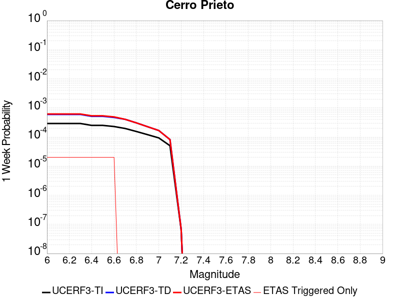 | 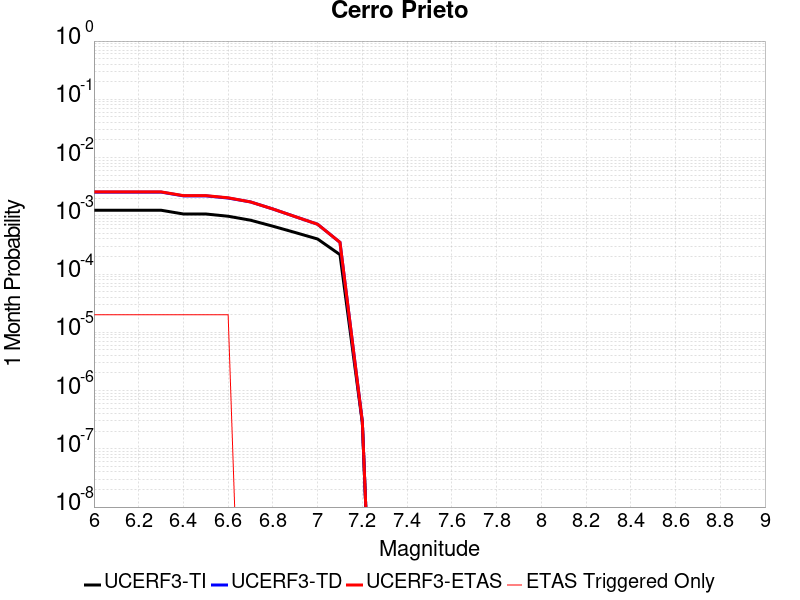 | 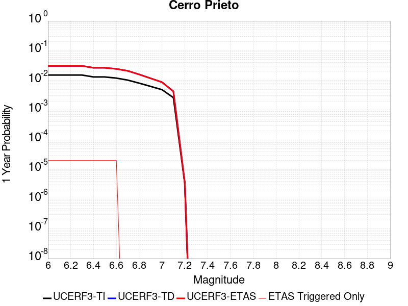 | 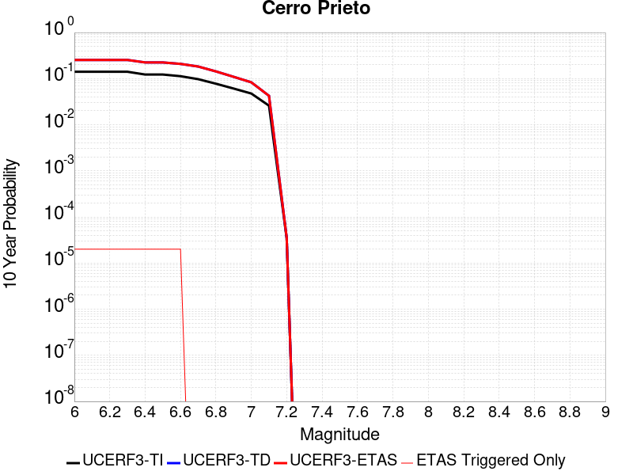 |

| Magnitude | 1 wk TI Prob | 1 wk TD Prob | 1 wk ETAS Prob | 1 wk ETAS/TD Gain | 1 wk ETAS Triggered Only | 1 mo TI Prob | 1 mo TD Prob | 1 mo ETAS Prob | 1 mo ETAS/TD Gain | 1 mo ETAS Triggered Only | 1 yr TI Prob | 1 yr TD Prob | 1 yr ETAS Prob | 1 yr ETAS/TD Gain | 1 yr ETAS Triggered Only | 10 yr TI Prob | 10 yr TD Prob | 10 yr ETAS Prob | 10 yr ETAS/TD Gain | 10 yr ETAS Triggered Only |
|-----|-----|-----|-----|-----|-----|-----|-----|-----|-----|-----|-----|-----|-----|-----|-----|-----|-----|-----|-----|-----|
| 6.0 | 2.9101528E-4 | 5.9654453E-4 | 6.1653263E-4 | 1.0335064 | 2.0E-5 | 0.0012466122 | 0.0025543566 | 0.0025743055 | 1.0078098 | 2.0E-5 | 0.015072231 | 0.030802928 | 0.030822312 | 1.0006293 | 2.0E-5 | 0.14089979 | 0.25386256 | 0.2538775 | 1.0000588 | 2.0E-5 |
| 6.1 | 2.9101528E-4 | 5.9654453E-4 | 6.1653263E-4 | 1.0335064 | 2.0E-5 | 0.0012466122 | 0.0025543566 | 0.0025743055 | 1.0078098 | 2.0E-5 | 0.015072231 | 0.030802928 | 0.030822312 | 1.0006293 | 2.0E-5 | 0.14089979 | 0.25386256 | 0.2538775 | 1.0000588 | 2.0E-5 |
| 6.2 | 2.9101528E-4 | 5.9654453E-4 | 6.1653263E-4 | 1.0335064 | 2.0E-5 | 0.0012466122 | 0.0025543566 | 0.0025743055 | 1.0078098 | 2.0E-5 | 0.015072231 | 0.030802928 | 0.030822312 | 1.0006293 | 2.0E-5 | 0.14089979 | 0.25386256 | 0.2538775 | 1.0000588 | 2.0E-5 |
| 6.3 | 2.9101528E-4 | 5.9654453E-4 | 6.1653263E-4 | 1.0335064 | 2.0E-5 | 0.0012466122 | 0.0025543566 | 0.0025743055 | 1.0078098 | 2.0E-5 | 0.015072231 | 0.030802928 | 0.030822312 | 1.0006293 | 2.0E-5 | 0.14089979 | 0.25386256 | 0.2538775 | 1.0000588 | 2.0E-5 |
| 6.4 | 2.508648E-4 | 5.140412E-4 | 5.3403096E-4 | 1.0388874 | 2.0E-5 | 0.0010746918 | 0.0022013725 | 0.0022213284 | 1.0090653 | 2.0E-5 | 0.013006088 | 0.026629416 | 0.026648883 | 1.000731 | 2.0E-5 | 0.12270685 | 0.2242222 | 0.22423771 | 1.0000691 | 2.0E-5 |
| 6.5 | 2.508648E-4 | 5.140412E-4 | 5.3403096E-4 | 1.0388874 | 2.0E-5 | 0.0010746918 | 0.0022013725 | 0.0022213284 | 1.0090653 | 2.0E-5 | 0.013006088 | 0.026629416 | 0.026648883 | 1.000731 | 2.0E-5 | 0.12270685 | 0.2242222 | 0.22423771 | 1.0000691 | 2.0E-5 |
| 6.6 | 2.294914E-4 | 4.7123645E-4 | 4.91227E-4 | 1.0424216 | 2.0E-5 | 9.831638E-4 | 0.0020182093 | 0.002038169 | 1.0098897 | 2.0E-5 | 0.011904482 | 0.024394194 | 0.024413705 | 1.0007999 | 2.0E-5 | 0.11286586 | 0.20837563 | 0.20839146 | 1.0000759 | 2.0E-5 |
| 6.7 | 1.9621674E-4 | 4.0426268E-4 | 4.0426268E-4 | 1.0 | 0.0 | 8.4065786E-4 | 0.0017315624 | 0.0017315624 | 1.0 | 0.0 | 0.010187071 | 0.020888962 | 0.020888962 | 1.0 | 0.0 | 0.09732539 | 0.18264732 | 0.18264732 | 1.0 | 0.0 |
| 6.8 | 1.5476145E-4 | 3.0572579E-4 | 3.0572579E-4 | 1.0 | 0.0 | 6.6309475E-4 | 0.0013096977 | 0.0013096977 | 1.0 | 0.0 | 0.008043335 | 0.015826825 | 0.015826825 | 1.0 | 0.0 | 0.07758363 | 0.14310057 | 0.14310057 | 1.0 | 0.0 |
| 6.9 | 1.20509176E-4 | 2.2588465E-4 | 2.2588465E-4 | 1.0 | 0.0 | 5.1636563E-4 | 9.6778123E-4 | 9.6778123E-4 | 1.0 | 0.0 | 0.006268645 | 0.011734025 | 0.011734025 | 1.0 | 0.0 | 0.060947374 | 0.10917958 | 0.10917958 | 1.0 | 0.0 |
| 7.0 | 9.3269155E-5 | 1.6721459E-4 | 1.6721459E-4 | 1.0 | 0.0 | 3.9966372E-4 | 7.1648025E-4 | 7.1648025E-4 | 1.0 | 0.0 | 0.0048550544 | 0.008695914 | 0.008695914 | 1.0 | 0.0 | 0.04750344 | 0.082943216 | 0.082943216 | 1.0 | 0.0 |
| 7.1 | 5.029709E-5 | 8.174011E-5 | 8.174011E-5 | 1.0 | 0.0 | 2.1554115E-4 | 3.50287E-4 | 3.50287E-4 | 1.0 | 0.0 | 0.0026210553 | 0.004259821 | 0.004259821 | 1.0 | 0.0 | 0.025903556 | 0.04226813 | 0.04226813 | 1.0 | 0.0 |
| 7.2 | 6.5445185E-8 | 6.824737E-8 | 6.824737E-8 | 1.0 | 0.0 | 2.8047933E-7 | 2.9248872E-7 | 2.9248872E-7 | 1.0 | 0.0 | 3.4148304E-6 | 3.56105E-6 | 3.56105E-6 | 1.0 | 0.0 | 3.414778E-5 | 3.56105E-5 | 3.56105E-5 | 1.0 | 0.0 |

## Santa Susana East (connector)
*[(top)](#table-of-contents)*

| 1 Week | 1 Month | 1 Year | 10 Year |
|-----|-----|-----|-----|
| 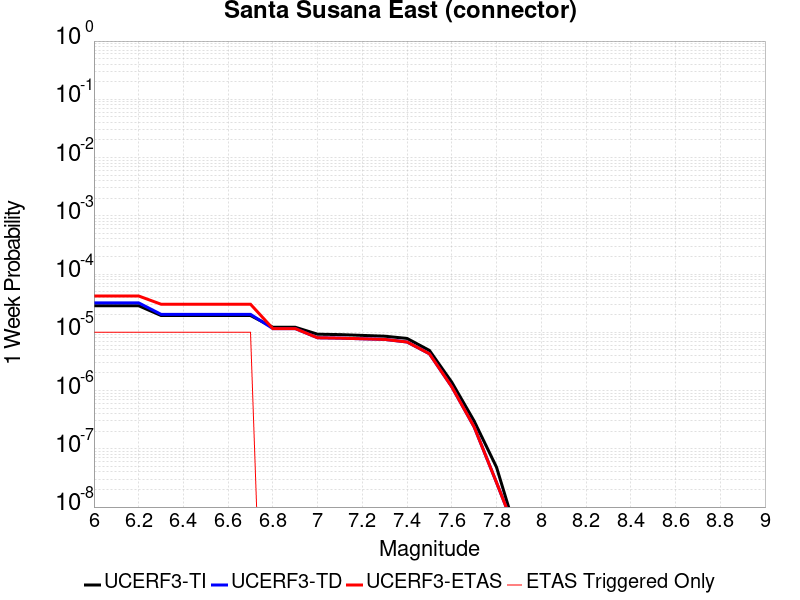 |  | 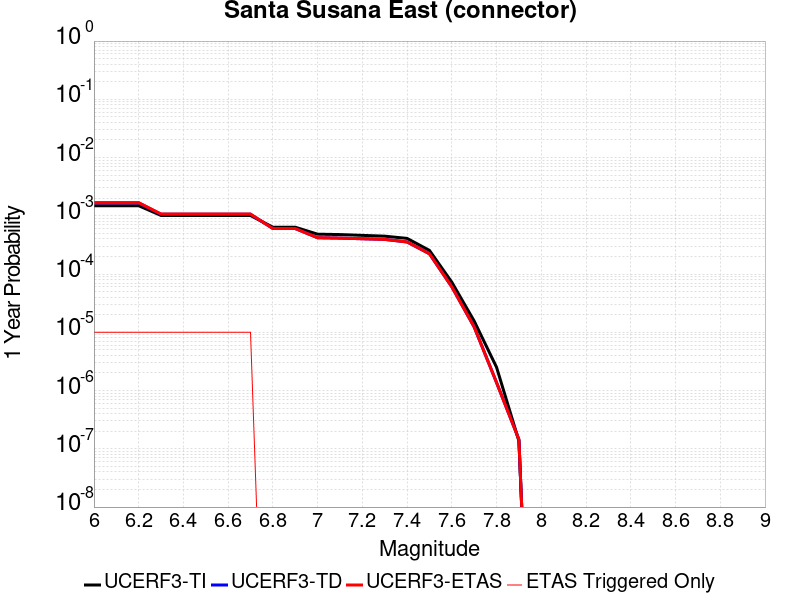 | 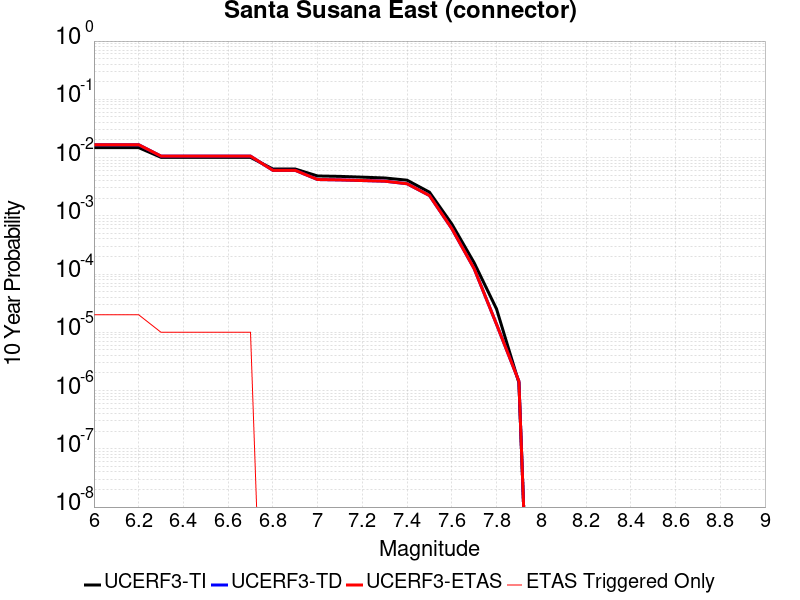 |

| Magnitude | 1 wk TI Prob | 1 wk TD Prob | 1 wk ETAS Prob | 1 wk ETAS/TD Gain | 1 wk ETAS Triggered Only | 1 mo TI Prob | 1 mo TD Prob | 1 mo ETAS Prob | 1 mo ETAS/TD Gain | 1 mo ETAS Triggered Only | 1 yr TI Prob | 1 yr TD Prob | 1 yr ETAS Prob | 1 yr ETAS/TD Gain | 1 yr ETAS Triggered Only | 10 yr TI Prob | 10 yr TD Prob | 10 yr ETAS Prob | 10 yr ETAS/TD Gain | 10 yr ETAS Triggered Only |
|-----|-----|-----|-----|-----|-----|-----|-----|-----|-----|-----|-----|-----|-----|-----|-----|-----|-----|-----|-----|-----|
| 6.0 | 2.858397E-5 | 3.2021693E-5 | 4.2021373E-5 | 1.3122783 | 1.0E-5 | 1.2249697E-4 | 1.3723019E-4 | 1.4722883E-4 | 1.0728602 | 1.0E-5 | 0.0014903803 | 0.00166977 | 0.0016797533 | 1.0059788 | 1.0E-5 | 0.014804244 | 0.016599316 | 0.016618984 | 1.0011848 | 2.0E-5 |
| 6.1 | 2.858397E-5 | 3.2021693E-5 | 4.2021373E-5 | 1.3122783 | 1.0E-5 | 1.2249697E-4 | 1.3723019E-4 | 1.4722883E-4 | 1.0728602 | 1.0E-5 | 0.0014903803 | 0.00166977 | 0.0016797533 | 1.0059788 | 1.0E-5 | 0.014804244 | 0.016599316 | 0.016618984 | 1.0011848 | 2.0E-5 |
| 6.2 | 2.858397E-5 | 3.2021693E-5 | 4.2021373E-5 | 1.3122783 | 1.0E-5 | 1.2249697E-4 | 1.3723019E-4 | 1.4722883E-4 | 1.0728602 | 1.0E-5 | 0.0014903803 | 0.00166977 | 0.0016797533 | 1.0059788 | 1.0E-5 | 0.014804244 | 0.016599316 | 0.016618984 | 1.0011848 | 2.0E-5 |
| 6.3 | 1.943582E-5 | 2.0367343E-5 | 3.0367139E-5 | 1.490972 | 1.0E-5 | 8.329371E-5 | 8.7286324E-5 | 9.7285454E-5 | 1.1145555 | 1.0E-5 | 0.001013629 | 0.001062305 | 0.0010722943 | 1.0094035 | 1.0E-5 | 0.010090181 | 0.010583852 | 0.010593747 | 1.0009348 | 1.0E-5 |
| 6.4 | 1.943582E-5 | 2.0367343E-5 | 3.0367139E-5 | 1.490972 | 1.0E-5 | 8.329371E-5 | 8.7286324E-5 | 9.7285454E-5 | 1.1145555 | 1.0E-5 | 0.001013629 | 0.001062305 | 0.0010722943 | 1.0094035 | 1.0E-5 | 0.010090181 | 0.010583852 | 0.010593747 | 1.0009348 | 1.0E-5 |
| 6.5 | 1.943582E-5 | 2.0367343E-5 | 3.0367139E-5 | 1.490972 | 1.0E-5 | 8.329371E-5 | 8.7286324E-5 | 9.7285454E-5 | 1.1145555 | 1.0E-5 | 0.001013629 | 0.001062305 | 0.0010722943 | 1.0094035 | 1.0E-5 | 0.010090181 | 0.010583852 | 0.010593747 | 1.0009348 | 1.0E-5 |
| 6.6 | 1.943582E-5 | 2.0367343E-5 | 3.0367139E-5 | 1.490972 | 1.0E-5 | 8.329371E-5 | 8.7286324E-5 | 9.7285454E-5 | 1.1145555 | 1.0E-5 | 0.001013629 | 0.001062305 | 0.0010722943 | 1.0094035 | 1.0E-5 | 0.010090181 | 0.010583852 | 0.010593747 | 1.0009348 | 1.0E-5 |
| 6.7 | 1.9404439E-5 | 2.0354766E-5 | 3.0354562E-5 | 1.4912754 | 1.0E-5 | 8.3159226E-5 | 8.723242E-5 | 9.7231554E-5 | 1.1146263 | 1.0E-5 | 0.0010119933 | 0.0010616493 | 0.0010716388 | 1.0094093 | 1.0E-5 | 0.010073971 | 0.010577358 | 0.010587253 | 1.0009354 | 1.0E-5 |
| 6.8 | 1.2217526E-5 | 1.1593157E-5 | 1.1593157E-5 | 1.0 | 0.0 | 5.2359774E-5 | 4.9684106E-5 | 4.9684106E-5 | 1.0 | 0.0 | 6.372938E-4 | 6.047529E-4 | 6.047529E-4 | 1.0 | 0.0 | 0.0063546924 | 0.006033274 | 0.006033274 | 1.0 | 0.0 |
| 6.9 | 1.2217526E-5 | 1.1593157E-5 | 1.1593157E-5 | 1.0 | 0.0 | 5.2359774E-5 | 4.9684106E-5 | 4.9684106E-5 | 1.0 | 0.0 | 6.372938E-4 | 6.047529E-4 | 6.047529E-4 | 1.0 | 0.0 | 0.0063546924 | 0.006033274 | 0.006033274 | 1.0 | 0.0 |
| 7.0 | 9.276017E-6 | 8.059273E-6 | 8.059273E-6 | 1.0 | 0.0 | 3.9753755E-5 | 3.4539302E-5 | 3.4539302E-5 | 1.0 | 0.0 | 4.8389446E-4 | 4.2043833E-4 | 4.2043833E-4 | 1.0 | 0.0 | 0.0048284214 | 0.0041973097 | 0.0041973097 | 1.0 | 0.0 |
| 7.1 | 9.130355E-6 | 7.942446E-6 | 7.942446E-6 | 1.0 | 0.0 | 3.9129503E-5 | 3.4038632E-5 | 3.4038632E-5 | 1.0 | 0.0 | 4.7629757E-4 | 4.1434498E-4 | 4.1434498E-4 | 1.0 | 0.0 | 0.00475278 | 0.0041366047 | 0.0041366047 | 1.0 | 0.0 |
| 7.2 | 8.851015E-6 | 7.741608E-6 | 7.741608E-6 | 1.0 | 0.0 | 3.7932372E-5 | 3.317792E-5 | 3.317792E-5 | 1.0 | 0.0 | 4.6172875E-4 | 4.038697E-4 | 4.038697E-4 | 1.0 | 0.0 | 0.0046077054 | 0.0040322347 | 0.0040322347 | 1.0 | 0.0 |
| 7.3 | 8.573006E-6 | 7.5503312E-6 | 7.5503312E-6 | 1.0 | 0.0 | 3.6740938E-5 | 3.235818E-5 | 3.235818E-5 | 1.0 | 0.0 | 4.472291E-4 | 3.9389305E-4 | 3.9389305E-4 | 1.0 | 0.0 | 0.004463301 | 0.003932817 | 0.003932817 | 1.0 | 0.0 |
| 7.4 | 7.852282E-6 | 6.8178556E-6 | 6.8178556E-6 | 1.0 | 0.0 | 3.36522E-5 | 2.921907E-5 | 2.921907E-5 | 1.0 | 0.0 | 4.096385E-4 | 3.5568717E-4 | 3.5568717E-4 | 1.0 | 0.0 | 0.0040888423 | 0.0035519868 | 0.0035519868 | 1.0 | 0.0 |
| 7.5 | 4.8869324E-6 | 4.2790975E-6 | 4.2790975E-6 | 1.0 | 0.0 | 2.0943828E-5 | 1.833887E-5 | 1.833887E-5 | 1.0 | 0.0 | 2.5496128E-4 | 2.2325452E-4 | 2.2325452E-4 | 1.0 | 0.0 | 0.0025466895 | 0.00223057 | 0.00223057 | 1.0 | 0.0 |
| 7.6 | 1.3894544E-6 | 1.1568394E-6 | 1.1568394E-6 | 1.0 | 0.0 | 5.954791E-6 | 4.957875E-6 | 4.957875E-6 | 1.0 | 0.0 | 7.249717E-5 | 6.036068E-5 | 6.036068E-5 | 1.0 | 0.0 | 7.247352E-4 | 6.0346466E-4 | 6.0346466E-4 | 1.0 | 0.0 |
| 7.7 | 2.9924632E-7 | 2.3719332E-7 | 2.3719332E-7 | 1.0 | 0.0 | 1.2824837E-6 | 1.0165425E-6 | 1.0165425E-6 | 1.0 | 0.0 | 1.5614127E-5 | 1.2376341E-5 | 1.2376341E-5 | 1.0 | 0.0 | 1.5613029E-4 | 1.2375724E-4 | 1.2375724E-4 | 1.0 | 0.0 |
| 7.8 | 4.8188564E-8 | 2.6321862E-8 | 2.6321862E-8 | 1.0 | 0.0 | 2.065224E-7 | 1.12807975E-7 | 1.12807975E-7 | 1.0 | 0.0 | 2.5144072E-6 | 1.3734362E-6 | 1.3734362E-6 | 1.0 | 0.0 | 2.5143789E-5 | 1.3734286E-5 | 1.3734286E-5 | 1.0 | 0.0 |
| 7.9 | 2.6127251E-9 | 2.7681102E-9 | 2.7681102E-9 | 1.0 | 0.0 | 1.1197393E-8 | 1.186333E-8 | 1.186333E-8 | 1.0 | 0.0 | 1.3632825E-7 | 1.4443603E-7 | 1.4443603E-7 | 1.0 | 0.0 | 1.3632817E-6 | 1.4443604E-6 | 1.4443604E-6 | 1.0 | 0.0 |

## South Klamath Lake West
*[(top)](#table-of-contents)*

| 1 Week | 1 Month | 1 Year | 10 Year |
|-----|-----|-----|-----|
| 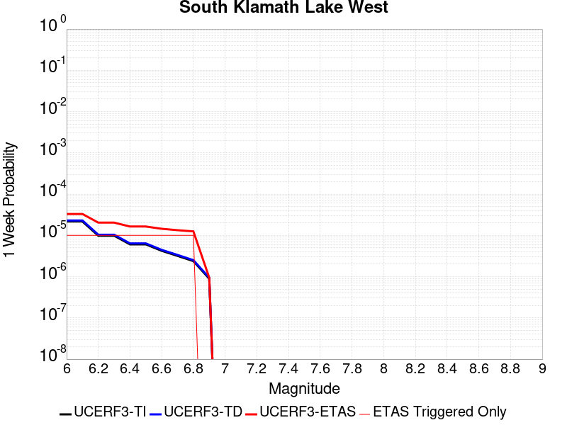 | 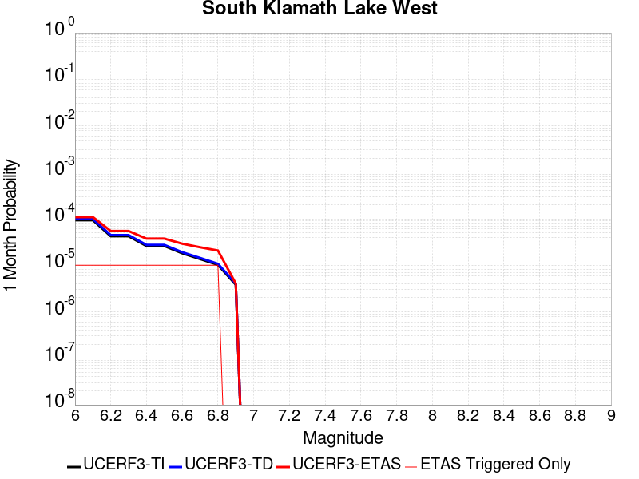 | 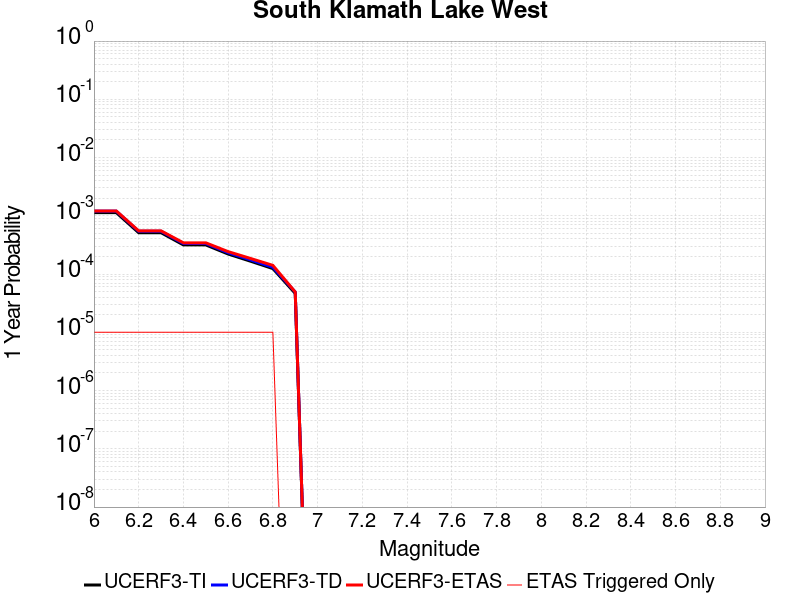 | 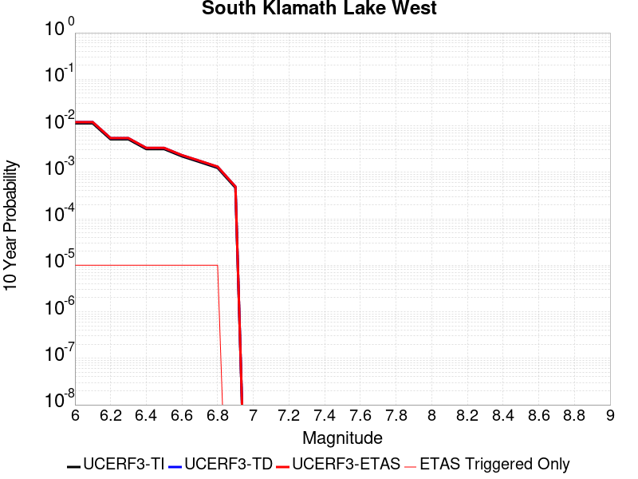 |

| Magnitude | 1 wk TI Prob | 1 wk TD Prob | 1 wk ETAS Prob | 1 wk ETAS/TD Gain | 1 wk ETAS Triggered Only | 1 mo TI Prob | 1 mo TD Prob | 1 mo ETAS Prob | 1 mo ETAS/TD Gain | 1 mo ETAS Triggered Only | 1 yr TI Prob | 1 yr TD Prob | 1 yr ETAS Prob | 1 yr ETAS/TD Gain | 1 yr ETAS Triggered Only | 10 yr TI Prob | 10 yr TD Prob | 10 yr ETAS Prob | 10 yr ETAS/TD Gain | 10 yr ETAS Triggered Only |
|-----|-----|-----|-----|-----|-----|-----|-----|-----|-----|-----|-----|-----|-----|-----|-----|-----|-----|-----|-----|-----|
| 6.0 | 2.174025E-5 | 2.3042025E-5 | 3.3041793E-5 | 1.4339796 | 1.0E-5 | 9.3169176E-5 | 9.874817E-5 | 1.0874718E-4 | 1.1012577 | 1.0E-5 | 0.0011337444 | 0.0012016617 | 0.0012116497 | 1.0083119 | 1.0E-5 | 0.011279777 | 0.0119582405 | 0.011968121 | 1.0008262 | 1.0E-5 |
| 6.1 | 2.174025E-5 | 2.3042025E-5 | 3.3041793E-5 | 1.4339796 | 1.0E-5 | 9.3169176E-5 | 9.874817E-5 | 1.0874718E-4 | 1.1012577 | 1.0E-5 | 0.0011337444 | 0.0012016617 | 0.0012116497 | 1.0083119 | 1.0E-5 | 0.011279777 | 0.0119582405 | 0.011968121 | 1.0008262 | 1.0E-5 |
| 6.2 | 9.834929E-6 | 1.0393841E-5 | 2.0393738E-5 | 1.9620982 | 1.0E-5 | 4.2149015E-5 | 4.4544326E-5 | 5.4543878E-5 | 1.2244855 | 1.0E-5 | 5.1304343E-4 | 5.422012E-4 | 5.521958E-4 | 1.0184333 | 1.0E-5 | 0.0051186057 | 0.0054096854 | 0.0054196315 | 1.0018386 | 1.0E-5 |
| 6.3 | 9.834929E-6 | 1.0393841E-5 | 2.0393738E-5 | 1.9620982 | 1.0E-5 | 4.2149015E-5 | 4.4544326E-5 | 5.4543878E-5 | 1.2244855 | 1.0E-5 | 5.1304343E-4 | 5.422012E-4 | 5.521958E-4 | 1.0184333 | 1.0E-5 | 0.0051186057 | 0.0054096854 | 0.0054196315 | 1.0018386 | 1.0E-5 |
| 6.4 | 6.066321E-6 | 6.40043E-6 | 1.6400365E-5 | 2.562385 | 1.0E-5 | 2.5998259E-5 | 2.743014E-5 | 3.7429865E-5 | 1.3645525 | 1.0E-5 | 3.1648282E-4 | 3.3391351E-4 | 3.4391016E-4 | 1.0299379 | 1.0E-5 | 0.0031603249 | 0.0033343881 | 0.0033443547 | 1.002989 | 1.0E-5 |
| 6.5 | 6.066321E-6 | 6.40043E-6 | 1.6400365E-5 | 2.562385 | 1.0E-5 | 2.5998259E-5 | 2.743014E-5 | 3.7429865E-5 | 1.3645525 | 1.0E-5 | 3.1648282E-4 | 3.3391351E-4 | 3.4391016E-4 | 1.0299379 | 1.0E-5 | 0.0031603249 | 0.0033343881 | 0.0033443547 | 1.002989 | 1.0E-5 |
| 6.6 | 4.2321803E-6 | 4.461291E-6 | 1.4461247E-5 | 3.2414935 | 1.0E-5 | 1.8137789E-5 | 1.9119685E-5 | 2.9119494E-5 | 1.5230112 | 1.0E-5 | 2.208052E-4 | 2.3275832E-4 | 2.42756E-4 | 1.042953 | 1.0E-5 | 0.0022058594 | 0.0023252473 | 0.002335224 | 1.0042906 | 1.0E-5 |
| 6.7 | 3.186646E-6 | 3.360305E-6 | 1.3360272E-5 | 3.9759102 | 1.0E-5 | 1.3656982E-5 | 1.4401232E-5 | 2.4401088E-5 | 1.694375 | 1.0E-5 | 1.6626107E-4 | 1.7532158E-4 | 1.8531982E-4 | 1.057028 | 1.0E-5 | 0.0016613674 | 0.0017518997 | 0.0017618822 | 1.0056981 | 1.0E-5 |
| 6.8 | 2.380121E-6 | 2.510907E-6 | 1.2510882E-5 | 4.9826145 | 1.0E-5 | 1.0200479E-5 | 1.07609885E-5 | 2.0760881E-5 | 1.9292727 | 1.0E-5 | 1.2418375E-4 | 1.3100762E-4 | 1.4100631E-4 | 1.0763215 | 1.0E-5 | 0.0012411437 | 0.0013093497 | 0.0013193366 | 1.0076274 | 1.0E-5 |
| 6.9 | 8.928287E-7 | 9.4302504E-7 | 9.4302504E-7 | 1.0 | 0.0 | 3.826403E-6 | 4.0415307E-6 | 4.0415307E-6 | 1.0 | 0.0 | 4.658546E-5 | 4.9204747E-5 | 4.9204747E-5 | 1.0 | 0.0 | 4.6575698E-4 | 4.9196015E-4 | 4.9196015E-4 | 1.0 | 0.0 |

## Mono Lake 2011 CFM
*[(top)](#table-of-contents)*

| 1 Week | 1 Month | 1 Year | 10 Year |
|-----|-----|-----|-----|
| 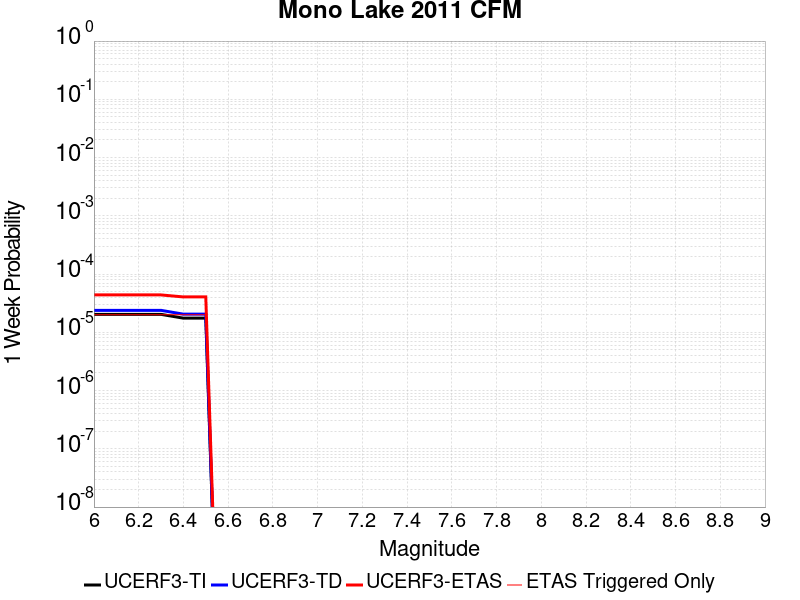 | 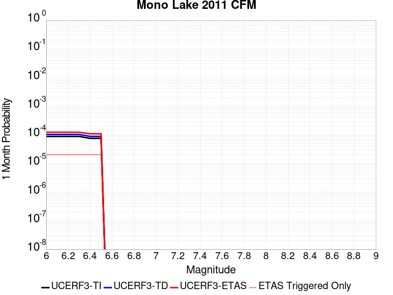 | 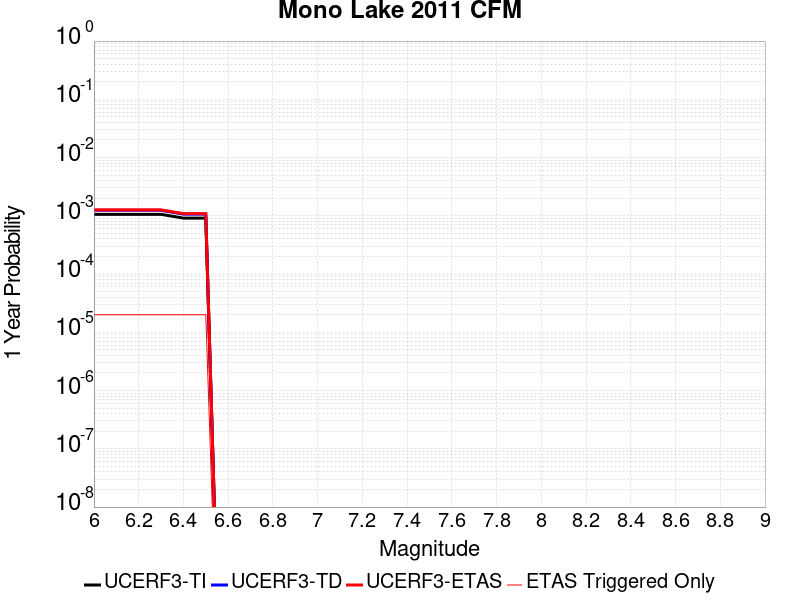 | 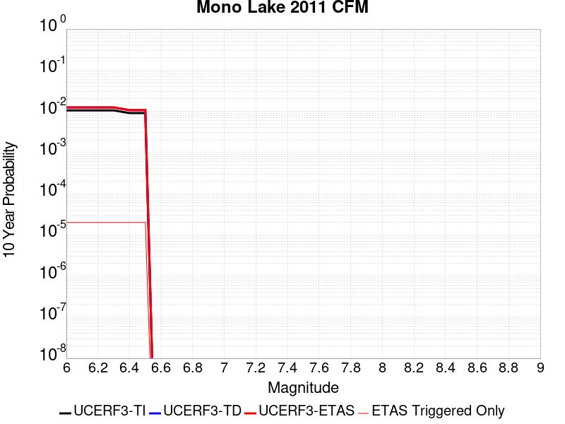 |

| Magnitude | 1 wk TI Prob | 1 wk TD Prob | 1 wk ETAS Prob | 1 wk ETAS/TD Gain | 1 wk ETAS Triggered Only | 1 mo TI Prob | 1 mo TD Prob | 1 mo ETAS Prob | 1 mo ETAS/TD Gain | 1 mo ETAS Triggered Only | 1 yr TI Prob | 1 yr TD Prob | 1 yr ETAS Prob | 1 yr ETAS/TD Gain | 1 yr ETAS Triggered Only | 10 yr TI Prob | 10 yr TD Prob | 10 yr ETAS Prob | 10 yr ETAS/TD Gain | 10 yr ETAS Triggered Only |
|-----|-----|-----|-----|-----|-----|-----|-----|-----|-----|-----|-----|-----|-----|-----|-----|-----|-----|-----|-----|-----|
| 6.0 | 2.0341662E-5 | 2.3828192E-5 | 4.3827713E-5 | 1.839322 | 2.0E-5 | 8.717564E-5 | 1.0211982E-4 | 1.2211778E-4 | 1.1958283 | 2.0E-5 | 0.0010608466 | 0.0012431308 | 0.0012631059 | 1.0160685 | 2.0E-5 | 0.010557966 | 0.012413842 | 0.012433593 | 1.0015911 | 2.0E-5 |
| 6.1 | 2.0341662E-5 | 2.3828192E-5 | 4.3827713E-5 | 1.839322 | 2.0E-5 | 8.717564E-5 | 1.0211982E-4 | 1.2211778E-4 | 1.1958283 | 2.0E-5 | 0.0010608466 | 0.0012431308 | 0.0012631059 | 1.0160685 | 2.0E-5 | 0.010557966 | 0.012413842 | 0.012433593 | 1.0015911 | 2.0E-5 |
| 6.2 | 2.0341662E-5 | 2.3828192E-5 | 4.3827713E-5 | 1.839322 | 2.0E-5 | 8.717564E-5 | 1.0211982E-4 | 1.2211778E-4 | 1.1958283 | 2.0E-5 | 0.0010608466 | 0.0012431308 | 0.0012631059 | 1.0160685 | 2.0E-5 | 0.010557966 | 0.012413842 | 0.012433593 | 1.0015911 | 2.0E-5 |
| 6.3 | 2.0341662E-5 | 2.3828192E-5 | 4.3827713E-5 | 1.839322 | 2.0E-5 | 8.717564E-5 | 1.0211982E-4 | 1.2211778E-4 | 1.1958283 | 2.0E-5 | 0.0010608466 | 0.0012431308 | 0.0012631059 | 1.0160685 | 2.0E-5 | 0.010557966 | 0.012413842 | 0.012433593 | 1.0015911 | 2.0E-5 |
| 6.4 | 1.749821E-5 | 2.049101E-5 | 4.04906E-5 | 1.9760178 | 2.0E-5 | 7.499018E-5 | 8.781861E-5 | 1.0781686E-4 | 1.2277222 | 2.0E-5 | 9.1262296E-4 | 0.0010691914 | 0.00108917 | 1.0186857 | 2.0E-5 | 0.009088841 | 0.01069187 | 0.010711657 | 1.0018506 | 2.0E-5 |
| 6.5 | 1.749821E-5 | 2.049101E-5 | 4.04906E-5 | 1.9760178 | 2.0E-5 | 7.499018E-5 | 8.781861E-5 | 1.0781686E-4 | 1.2277222 | 2.0E-5 | 9.1262296E-4 | 0.0010691914 | 0.00108917 | 1.0186857 | 2.0E-5 | 0.009088841 | 0.01069187 | 0.010711657 | 1.0018506 | 2.0E-5 |

## Fitzhugh Creek
*[(top)](#table-of-contents)*

| 1 Week | 1 Month | 1 Year | 10 Year |
|-----|-----|-----|-----|
|  | 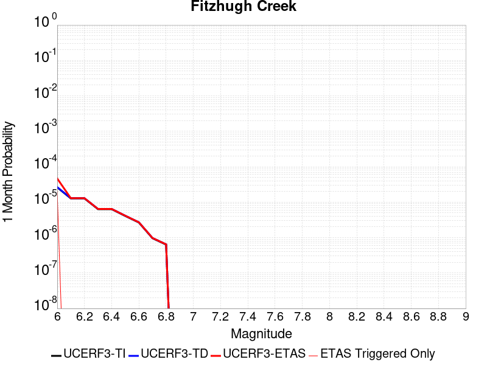 | 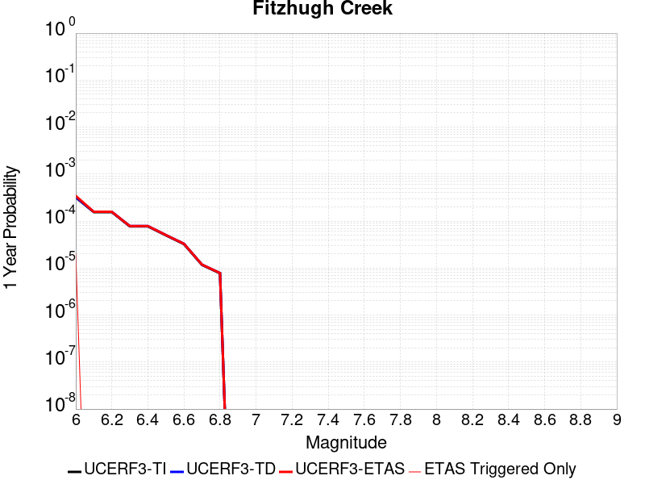 | 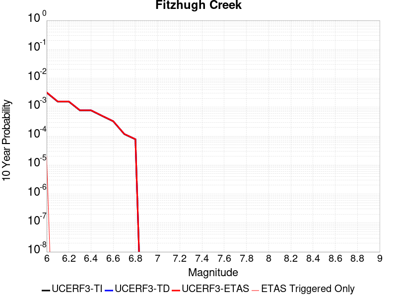 |

| Magnitude | 1 wk TI Prob | 1 wk TD Prob | 1 wk ETAS Prob | 1 wk ETAS/TD Gain | 1 wk ETAS Triggered Only | 1 mo TI Prob | 1 mo TD Prob | 1 mo ETAS Prob | 1 mo ETAS/TD Gain | 1 mo ETAS Triggered Only | 1 yr TI Prob | 1 yr TD Prob | 1 yr ETAS Prob | 1 yr ETAS/TD Gain | 1 yr ETAS Triggered Only | 10 yr TI Prob | 10 yr TD Prob | 10 yr ETAS Prob | 10 yr ETAS/TD Gain | 10 yr ETAS Triggered Only |
|-----|-----|-----|-----|-----|-----|-----|-----|-----|-----|-----|-----|-----|-----|-----|-----|-----|-----|-----|-----|-----|
| 6.0 | 6.1090436E-6 | 6.2101562E-6 | 1.6210093E-5 | 2.6102555 | 1.0E-5 | 2.6181353E-5 | 2.6614709E-5 | 4.6614176E-5 | 1.7514442 | 2.0E-5 | 3.1871133E-4 | 3.239904E-4 | 3.439839E-4 | 1.0617102 | 2.0E-5 | 0.0031825465 | 0.0032356246 | 0.0032555598 | 1.0061612 | 2.0E-5 |
| 6.1 | 2.9741811E-6 | 3.021581E-6 | 3.021581E-6 | 1.0 | 0.0 | 1.2746428E-5 | 1.2949574E-5 | 1.2949574E-5 | 1.0 | 0.0 | 1.5517672E-4 | 1.576506E-4 | 1.576506E-4 | 1.0 | 0.0 | 0.001550684 | 0.0015754806 | 0.0015754806 | 1.0 | 0.0 |
| 6.2 | 2.9741811E-6 | 3.021581E-6 | 3.021581E-6 | 1.0 | 0.0 | 1.2746428E-5 | 1.2949574E-5 | 1.2949574E-5 | 1.0 | 0.0 | 1.5517672E-4 | 1.576506E-4 | 1.576506E-4 | 1.0 | 0.0 | 0.001550684 | 0.0015754806 | 0.0015754806 | 1.0 | 0.0 |
| 6.3 | 1.4781198E-6 | 1.5012708E-6 | 1.5012708E-6 | 1.0 | 0.0 | 6.3347834E-6 | 6.4340034E-6 | 6.4340034E-6 | 1.0 | 0.0 | 7.712326E-5 | 7.833137E-5 | 7.833137E-5 | 1.0 | 0.0 | 7.70965E-4 | 7.830576E-4 | 7.830576E-4 | 1.0 | 0.0 |
| 6.4 | 1.4781198E-6 | 1.5012708E-6 | 1.5012708E-6 | 1.0 | 0.0 | 6.3347834E-6 | 6.4340034E-6 | 6.4340034E-6 | 1.0 | 0.0 | 7.712326E-5 | 7.833137E-5 | 7.833137E-5 | 1.0 | 0.0 | 7.70965E-4 | 7.830576E-4 | 7.830576E-4 | 1.0 | 0.0 |
| 6.5 | 9.5176676E-7 | 9.66606E-7 | 9.66606E-7 | 1.0 | 0.0 | 4.078994E-6 | 4.142591E-6 | 4.142591E-6 | 1.0 | 0.0 | 4.9660623E-5 | 5.0434985E-5 | 5.0434985E-5 | 1.0 | 0.0 | 4.964952E-4 | 5.042458E-4 | 5.042458E-4 | 1.0 | 0.0 |
| 6.6 | 6.21145E-7 | 6.3085855E-7 | 6.3085855E-7 | 1.0 | 0.0 | 2.662047E-6 | 2.7036772E-6 | 2.7036772E-6 | 1.0 | 0.0 | 3.2409942E-5 | 3.291684E-5 | 3.291684E-5 | 1.0 | 0.0 | 3.2405215E-4 | 3.2912623E-4 | 3.2912623E-4 | 1.0 | 0.0 |
| 6.7 | 2.2377962E-7 | 2.2734636E-7 | 2.2734636E-7 | 1.0 | 0.0 | 9.590551E-7 | 9.743413E-7 | 9.743413E-7 | 1.0 | 0.0 | 1.1676434E-5 | 1.1862574E-5 | 1.1862574E-5 | 1.0 | 0.0 | 1.1675821E-4 | 1.1862254E-4 | 1.1862254E-4 | 1.0 | 0.0 |
| 6.8 | 1.4785022E-7 | 1.5021492E-7 | 1.5021492E-7 | 1.0 | 0.0 | 6.3364365E-7 | 6.4377826E-7 | 6.4377826E-7 | 1.0 | 0.0 | 7.714584E-6 | 7.838E-6 | 7.838E-6 | 1.0 | 0.0 | 7.714316E-5 | 7.838E-5 | 7.838E-5 | 1.0 | 0.0 |

## Santa Cruz Catalina Ridge alt1
*[(top)](#table-of-contents)*

| 1 Week | 1 Month | 1 Year | 10 Year |
|-----|-----|-----|-----|
| 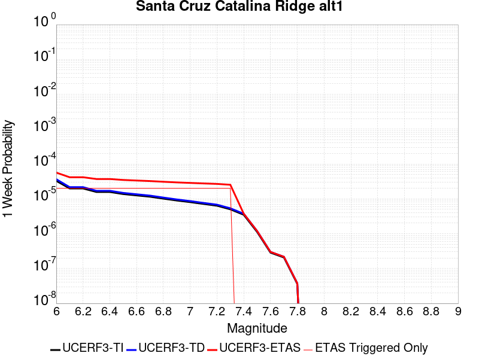 | 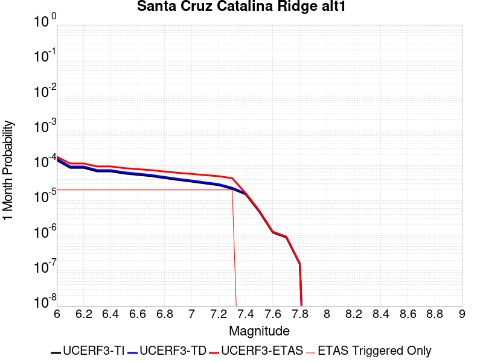 | 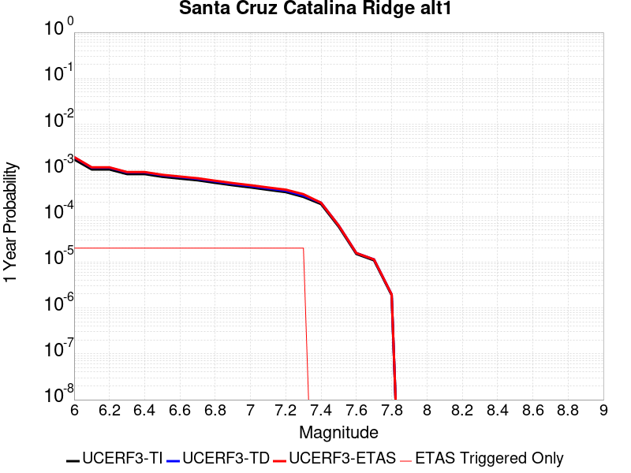 |  |

| Magnitude | 1 wk TI Prob | 1 wk TD Prob | 1 wk ETAS Prob | 1 wk ETAS/TD Gain | 1 wk ETAS Triggered Only | 1 mo TI Prob | 1 mo TD Prob | 1 mo ETAS Prob | 1 mo ETAS/TD Gain | 1 mo ETAS Triggered Only | 1 yr TI Prob | 1 yr TD Prob | 1 yr ETAS Prob | 1 yr ETAS/TD Gain | 1 yr ETAS Triggered Only | 10 yr TI Prob | 10 yr TD Prob | 10 yr ETAS Prob | 10 yr ETAS/TD Gain | 10 yr ETAS Triggered Only |
|-----|-----|-----|-----|-----|-----|-----|-----|-----|-----|-----|-----|-----|-----|-----|-----|-----|-----|-----|-----|-----|
| 6.0 | 3.2833184E-5 | 3.6558402E-5 | 5.655767E-5 | 1.5470499 | 2.0E-5 | 1.4070606E-4 | 1.5667039E-4 | 1.7666725E-4 | 1.1276366 | 2.0E-5 | 0.00171175 | 0.0019059594 | 0.0019259213 | 1.0104734 | 2.0E-5 | 0.016986247 | 0.018913032 | 0.018932655 | 1.0010375 | 2.0E-5 |
| 6.1 | 1.9835548E-5 | 2.1659505E-5 | 4.1659074E-5 | 1.9233621 | 2.0E-5 | 8.500672E-5 | 9.282326E-5 | 1.12821406E-4 | 1.2154433 | 2.0E-5 | 0.0010344655 | 0.0011295575 | 0.001149535 | 1.017686 | 2.0E-5 | 0.010296632 | 0.011240296 | 0.011260071 | 1.0017593 | 2.0E-5 |
| 6.2 | 1.9835548E-5 | 2.1659505E-5 | 4.1659074E-5 | 1.9233621 | 2.0E-5 | 8.500672E-5 | 9.282326E-5 | 1.12821406E-4 | 1.2154433 | 2.0E-5 | 0.0010344655 | 0.0011295575 | 0.001149535 | 1.017686 | 2.0E-5 | 0.010296632 | 0.011240296 | 0.011260071 | 1.0017593 | 2.0E-5 |
| 6.3 | 1.5728183E-5 | 1.703395E-5 | 3.703361E-5 | 2.174106 | 2.0E-5 | 6.7404755E-5 | 7.300063E-5 | 9.299917E-5 | 1.2739502 | 2.0E-5 | 8.2034385E-4 | 8.884264E-4 | 9.084086E-4 | 1.0224917 | 2.0E-5 | 0.008173222 | 0.008849427 | 0.00886925 | 1.0022401 | 2.0E-5 |
| 6.4 | 1.5728183E-5 | 1.703395E-5 | 3.703361E-5 | 2.174106 | 2.0E-5 | 6.7404755E-5 | 7.300063E-5 | 9.299917E-5 | 1.2739502 | 2.0E-5 | 8.2034385E-4 | 8.884264E-4 | 9.084086E-4 | 1.0224917 | 2.0E-5 | 0.008173222 | 0.008849427 | 0.00886925 | 1.0022401 | 2.0E-5 |
| 6.5 | 1.3707734E-5 | 1.4794522E-5 | 3.4794226E-5 | 2.3518317 | 2.0E-5 | 5.8746107E-5 | 6.3403575E-5 | 8.34023E-5 | 1.3154197 | 2.0E-5 | 7.1499916E-4 | 7.716686E-4 | 7.916532E-4 | 1.0258979 | 2.0E-5 | 0.0071270303 | 0.0076902895 | 0.007710136 | 1.0025806 | 2.0E-5 |
| 6.6 | 1.2539813E-5 | 1.3510219E-5 | 3.350995E-5 | 2.480341 | 2.0E-5 | 5.3740947E-5 | 5.789967E-5 | 7.789851E-5 | 1.3454051 | 2.0E-5 | 6.540996E-4 | 7.0470315E-4 | 7.2468905E-4 | 1.0283607 | 2.0E-5 | 0.0065217763 | 0.0070249885 | 0.007044848 | 1.0028269 | 2.0E-5 |
| 6.7 | 1.1504083E-5 | 1.2377375E-5 | 3.2377127E-5 | 2.6158316 | 2.0E-5 | 4.930228E-5 | 5.3044827E-5 | 7.304377E-5 | 1.3770196 | 2.0E-5 | 6.0008996E-4 | 6.456314E-4 | 6.6561846E-4 | 1.0309575 | 2.0E-5 | 0.005984721 | 0.006437786 | 0.006457657 | 1.0030867 | 2.0E-5 |
| 6.8 | 1.012739E-5 | 1.0877071E-5 | 3.0876854E-5 | 2.8387103 | 2.0E-5 | 4.340238E-5 | 4.6615194E-5 | 6.6614266E-5 | 1.4290247 | 2.0E-5 | 5.282958E-4 | 5.673937E-4 | 5.8738235E-4 | 1.0352288 | 2.0E-5 | 0.0052704164 | 0.0056596193 | 0.0056795063 | 1.0035138 | 2.0E-5 |
| 6.9 | 8.9607865E-6 | 9.609117E-6 | 2.9608926E-5 | 3.0813367 | 2.0E-5 | 3.8402806E-5 | 4.1181287E-5 | 6.1180464E-5 | 1.4856374 | 2.0E-5 | 4.6745385E-4 | 5.012679E-4 | 5.2125787E-4 | 1.0398788 | 2.0E-5 | 0.0046647177 | 0.005001492 | 0.005021392 | 1.0039788 | 2.0E-5 |
| 7.0 | 8.046829E-6 | 8.619746E-6 | 2.8619574E-5 | 3.320234 | 2.0E-5 | 3.4485955E-5 | 3.694125E-5 | 5.694051E-5 | 1.5413802 | 2.0E-5 | 4.1978562E-4 | 4.496677E-4 | 4.6965873E-4 | 1.0444573 | 2.0E-5 | 0.004189935 | 0.0044876686 | 0.004507579 | 1.0044366 | 2.0E-5 |
| 7.1 | 7.136131E-6 | 7.637656E-6 | 2.7637503E-5 | 3.6185844 | 2.0E-5 | 3.0583058E-5 | 3.2732405E-5 | 5.273175E-5 | 1.6109953 | 2.0E-5 | 3.7228514E-4 | 3.9844486E-4 | 4.184369E-4 | 1.0501752 | 2.0E-5 | 0.0037166206 | 0.003977381 | 0.0039973017 | 1.0050085 | 2.0E-5 |
| 7.2 | 6.362014E-6 | 6.8049585E-6 | 2.6804822E-5 | 3.9390132 | 2.0E-5 | 2.726549E-5 | 2.9163786E-5 | 4.91632E-5 | 1.685762 | 2.0E-5 | 3.3190678E-4 | 3.550119E-4 | 3.7500478E-4 | 1.0563161 | 2.0E-5 | 0.0033141149 | 0.003544516 | 0.003564445 | 1.0056225 | 2.0E-5 |
| 7.3 | 5.004101E-6 | 5.351715E-6 | 2.5351608E-5 | 4.7370996 | 2.0E-5 | 2.1445969E-5 | 2.2935723E-5 | 4.2935266E-5 | 1.8719822 | 2.0E-5 | 2.6107338E-4 | 2.792072E-4 | 2.9920158E-4 | 1.0716114 | 2.0E-5 | 0.002607669 | 0.0027886187 | 0.0028085627 | 1.007152 | 2.0E-5 |
| 7.4 | 3.4901443E-6 | 3.7320526E-6 | 3.7320526E-6 | 1.0 | 0.0 | 1.4957676E-5 | 1.5994416E-5 | 1.5994416E-5 | 1.0 | 0.0 | 1.8209449E-4 | 1.9471499E-4 | 1.9471499E-4 | 1.0 | 0.0 | 0.0018194534 | 0.0019454823 | 0.0019454823 | 1.0 | 0.0 |
| 7.5 | 1.1215045E-6 | 1.189387E-6 | 1.189387E-6 | 1.0 | 0.0 | 4.806439E-6 | 5.097363E-6 | 5.097363E-6 | 1.0 | 0.0 | 5.851682E-5 | 6.205866E-5 | 6.205866E-5 | 1.0 | 0.0 | 5.850142E-4 | 6.2041637E-4 | 6.2041637E-4 | 1.0 | 0.0 |
| 7.6 | 2.8599047E-7 | 2.9951994E-7 | 2.9951994E-7 | 1.0 | 0.0 | 1.2256729E-6 | 1.2836562E-6 | 1.2836562E-6 | 1.0 | 0.0 | 1.4922465E-5 | 1.5628404E-5 | 1.5628404E-5 | 1.0 | 0.0 | 1.4921463E-4 | 1.5627318E-4 | 1.5627318E-4 | 1.0 | 0.0 |
| 7.7 | 2.0781519E-7 | 2.1744323E-7 | 2.1744323E-7 | 1.0 | 0.0 | 8.906362E-7 | 9.3189925E-7 | 9.3189925E-7 | 1.0 | 0.0 | 1.08434415E-5 | 1.13458145E-5 | 1.13458145E-5 | 1.0 | 0.0 | 1.0842913E-4 | 1.1345245E-4 | 1.1345245E-4 | 1.0 | 0.0 |
| 7.8 | 3.614776E-8 | 3.764102E-8 | 3.764102E-8 | 1.0 | 0.0 | 1.5491896E-7 | 1.6131864E-7 | 1.6131864E-7 | 1.0 | 0.0 | 1.8861368E-6 | 1.9640527E-6 | 1.9640527E-6 | 1.0 | 0.0 | 1.8861208E-5 | 1.9640367E-5 | 1.9640367E-5 | 1.0 | 0.0 |

## Hosgri
*[(top)](#table-of-contents)*

| 1 Week | 1 Month | 1 Year | 10 Year |
|-----|-----|-----|-----|
| 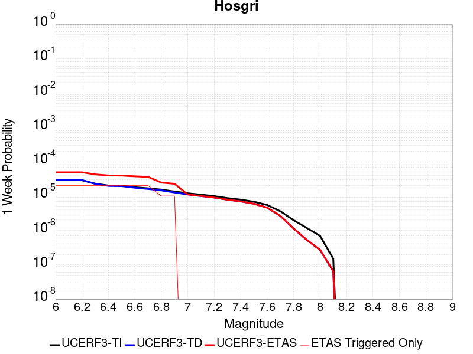 | 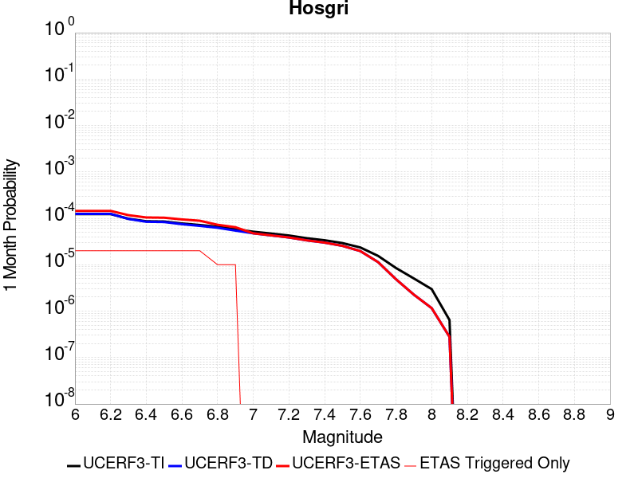 | 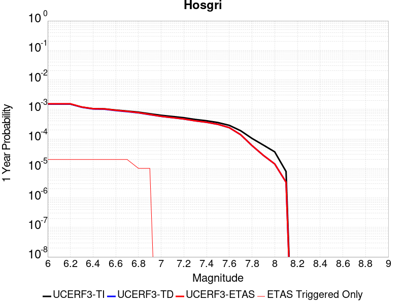 | 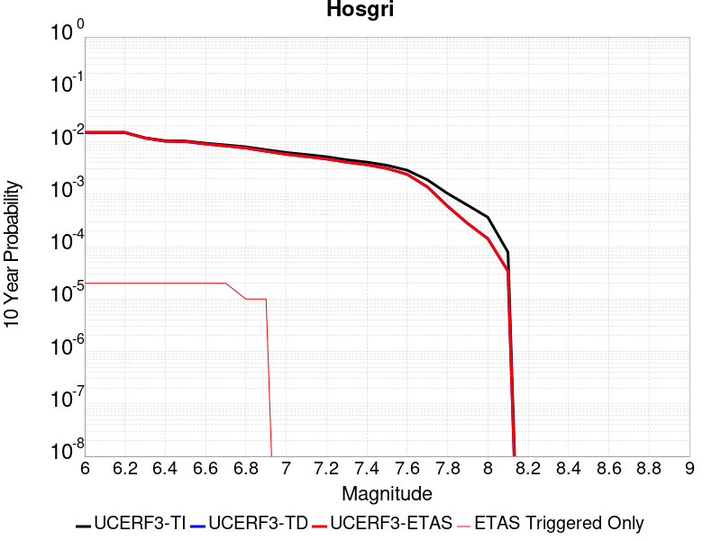 |

| Magnitude | 1 wk TI Prob | 1 wk TD Prob | 1 wk ETAS Prob | 1 wk ETAS/TD Gain | 1 wk ETAS Triggered Only | 1 mo TI Prob | 1 mo TD Prob | 1 mo ETAS Prob | 1 mo ETAS/TD Gain | 1 mo ETAS Triggered Only | 1 yr TI Prob | 1 yr TD Prob | 1 yr ETAS Prob | 1 yr ETAS/TD Gain | 1 yr ETAS Triggered Only | 10 yr TI Prob | 10 yr TD Prob | 10 yr ETAS Prob | 10 yr ETAS/TD Gain | 10 yr ETAS Triggered Only |
|-----|-----|-----|-----|-----|-----|-----|-----|-----|-----|-----|-----|-----|-----|-----|-----|-----|-----|-----|-----|-----|
| 6.0 | 2.883978E-5 | 2.9128403E-5 | 4.912782E-5 | 1.6865951 | 2.0E-5 | 1.235932E-4 | 1.248302E-4 | 1.448277E-4 | 1.1601976 | 2.0E-5 | 0.0015037085 | 0.0015187752 | 0.0015387449 | 1.0131485 | 2.0E-5 | 0.01493574 | 0.01508773 | 0.015107428 | 1.0013056 | 2.0E-5 |
| 6.1 | 2.883978E-5 | 2.9128403E-5 | 4.912782E-5 | 1.6865951 | 2.0E-5 | 1.235932E-4 | 1.248302E-4 | 1.448277E-4 | 1.1601976 | 2.0E-5 | 0.0015037085 | 0.0015187752 | 0.0015387449 | 1.0131485 | 2.0E-5 | 0.01493574 | 0.01508773 | 0.015107428 | 1.0013056 | 2.0E-5 |
| 6.2 | 2.883978E-5 | 2.9128403E-5 | 4.912782E-5 | 1.6865951 | 2.0E-5 | 1.235932E-4 | 1.248302E-4 | 1.448277E-4 | 1.1601976 | 2.0E-5 | 0.0015037085 | 0.0015187752 | 0.0015387449 | 1.0131485 | 2.0E-5 | 0.01493574 | 0.01508773 | 0.015107428 | 1.0013056 | 2.0E-5 |
| 6.3 | 2.2914428E-5 | 2.2641956E-5 | 4.2641503E-5 | 1.8832959 | 2.0E-5 | 9.8200995E-5 | 9.703337E-5 | 1.17031435E-4 | 1.2060946 | 2.0E-5 | 0.0011949413 | 0.001180746 | 0.0012007224 | 1.0169184 | 2.0E-5 | 0.011885363 | 0.011746123 | 0.011765888 | 1.0016826 | 2.0E-5 |
| 6.4 | 2.0195741E-5 | 1.9696547E-5 | 3.9696155E-5 | 2.0153863 | 2.0E-5 | 8.65503E-5 | 8.4411055E-5 | 1.04409366E-4 | 1.2369158 | 2.0E-5 | 0.0010532405 | 0.001027222 | 0.0010472015 | 1.01945 | 2.0E-5 | 0.010482626 | 0.010225783 | 0.010245578 | 1.0019358 | 2.0E-5 |
| 6.5 | 1.9924333E-5 | 1.9408968E-5 | 3.940858E-5 | 2.0304315 | 2.0E-5 | 8.53872E-5 | 8.317865E-5 | 1.03176986E-4 | 1.2404263 | 2.0E-5 | 0.0010390934 | 0.0010122315 | 0.0010322112 | 1.0197383 | 2.0E-5 | 0.010342481 | 0.010077244 | 0.010097042 | 1.0019647 | 2.0E-5 |
| 6.6 | 1.809694E-5 | 1.7458287E-5 | 3.745794E-5 | 2.1455677 | 2.0E-5 | 7.7556004E-5 | 7.4819094E-5 | 9.4817595E-5 | 1.2672914 | 2.0E-5 | 9.438353E-4 | 9.105431E-4 | 9.3052484E-4 | 1.0219449 | 2.0E-5 | 0.009398366 | 0.009069063 | 0.009088881 | 1.0021853 | 2.0E-5 |
| 6.7 | 1.675989E-5 | 1.6042752E-5 | 3.604243E-5 | 2.246649 | 2.0E-5 | 7.182612E-5 | 6.8752845E-5 | 8.875147E-5 | 1.2908771 | 2.0E-5 | 8.7413215E-4 | 8.3674554E-4 | 8.567288E-4 | 1.0238822 | 2.0E-5 | 0.008707017 | 0.008336853 | 0.008356687 | 1.002379 | 2.0E-5 |
| 6.8 | 1.5401129E-5 | 1.4614069E-5 | 2.4613923E-5 | 1.6842622 | 1.0E-5 | 6.6003166E-5 | 6.263023E-5 | 7.26296E-5 | 1.1596574 | 1.0E-5 | 8.032922E-4 | 7.6225714E-4 | 7.722495E-4 | 1.013109 | 1.0E-5 | 0.008003947 | 0.0075972863 | 0.0076072104 | 1.0013063 | 1.0E-5 |
| 6.9 | 1.356559E-5 | 1.2689955E-5 | 2.2689828E-5 | 1.7880149 | 1.0E-5 | 5.8136946E-5 | 5.438439E-5 | 6.438384E-5 | 1.1838663 | 1.0E-5 | 7.0758746E-4 | 6.6192925E-4 | 6.7192264E-4 | 1.0150974 | 1.0E-5 | 0.007053386 | 0.006600378 | 0.006610312 | 1.001505 | 1.0E-5 |
| 7.0 | 1.2030819E-5 | 1.1095949E-5 | 1.1095949E-5 | 1.0 | 0.0 | 5.155963E-5 | 4.75532E-5 | 4.75532E-5 | 1.0 | 0.0 | 6.275577E-4 | 5.788065E-4 | 5.788065E-4 | 1.0 | 0.0 | 0.006257884 | 0.0057737473 | 0.0057737473 | 1.0 | 0.0 |
| 7.1 | 1.0972698E-5 | 1.0022167E-5 | 1.0022167E-5 | 1.0 | 0.0 | 4.7025E-5 | 4.2951437E-5 | 4.2951437E-5 | 1.0 | 0.0 | 5.72379E-4 | 5.2280835E-4 | 5.2280835E-4 | 1.0 | 0.0 | 0.0057090693 | 0.005216533 | 0.005216533 | 1.0 | 0.0 |
| 7.2 | 9.961926E-6 | 9.034732E-6 | 9.034732E-6 | 1.0 | 0.0 | 4.2693267E-5 | 3.8719707E-5 | 3.8719707E-5 | 1.0 | 0.0 | 5.1966653E-4 | 4.7131052E-4 | 4.7131052E-4 | 1.0 | 0.0 | 0.00518453 | 0.0047038523 | 0.0047038523 | 1.0 | 0.0 |
| 7.3 | 8.700929E-6 | 7.828089E-6 | 7.828089E-6 | 1.0 | 0.0 | 3.7289166E-5 | 3.354852E-5 | 3.354852E-5 | 1.0 | 0.0 | 4.53901E-4 | 4.083767E-4 | 4.083767E-4 | 1.0 | 0.0 | 0.00452975 | 0.004076999 | 0.004076999 | 1.0 | 0.0 |
| 7.4 | 7.866285E-6 | 6.9987263E-6 | 6.9987263E-6 | 1.0 | 0.0 | 3.3712215E-5 | 2.9994197E-5 | 2.9994197E-5 | 1.0 | 0.0 | 4.103689E-4 | 3.6511818E-4 | 3.6511818E-4 | 1.0 | 0.0 | 0.004096119 | 0.0036459167 | 0.0036459167 | 1.0 | 0.0 |
| 7.5 | 6.8381305E-6 | 5.9596814E-6 | 5.9596814E-6 | 1.0 | 0.0 | 2.9305946E-5 | 2.5541241E-5 | 2.5541241E-5 | 1.0 | 0.0 | 3.5674145E-4 | 3.1092027E-4 | 3.1092027E-4 | 1.0 | 0.0 | 0.0035616932 | 0.003105584 | 0.003105584 | 1.0 | 0.0 |
| 7.6 | 5.503376E-6 | 4.595227E-6 | 4.595227E-6 | 1.0 | 0.0 | 2.3585684E-5 | 1.9693682E-5 | 1.9693682E-5 | 1.0 | 0.0 | 2.8711787E-4 | 2.397442E-4 | 2.397442E-4 | 1.0 | 0.0 | 0.002867472 | 0.0023955852 | 0.0023955852 | 1.0 | 0.0 |
| 7.7 | 3.6144982E-6 | 2.6521896E-6 | 2.6521896E-6 | 1.0 | 0.0 | 1.5490614E-5 | 1.1366477E-5 | 1.1366477E-5 | 1.0 | 0.0 | 1.8858191E-4 | 1.3837808E-4 | 1.3837808E-4 | 1.0 | 0.0 | 0.0018842196 | 0.001383647 | 0.001383647 | 1.0 | 0.0 |
| 7.8 | 1.9853494E-6 | 1.1360784E-6 | 1.1360784E-6 | 1.0 | 0.0 | 8.508612E-6 | 4.8688985E-6 | 4.8688985E-6 | 1.0 | 0.0 | 1.0358743E-4 | 5.9277223E-5 | 5.9277223E-5 | 1.0 | 0.0 | 0.0010353916 | 5.933389E-4 | 5.933389E-4 | 1.0 | 0.0 |
| 7.9 | 1.1818757E-6 | 5.29477E-7 | 5.29477E-7 | 1.0 | 0.0 | 5.0651715E-6 | 2.269185E-6 | 2.269185E-6 | 1.0 | 0.0 | 6.1666724E-5 | 2.7626977E-5 | 2.7626977E-5 | 1.0 | 0.0 | 6.1649614E-4 | 2.7691363E-4 | 2.7691363E-4 | 1.0 | 0.0 |
| 8.0 | 6.962958E-7 | 2.71365E-7 | 2.71365E-7 | 1.0 | 0.0 | 2.9841215E-6 | 1.1629924E-6 | 1.1629924E-6 | 1.0 | 0.0 | 3.6331072E-5 | 1.415934E-5 | 1.415934E-5 | 1.0 | 0.0 | 3.6325134E-4 | 1.4215276E-4 | 1.4215276E-4 | 1.0 | 0.0 |
| 8.1 | 1.5033264E-7 | 6.52693E-8 | 6.52693E-8 | 1.0 | 0.0 | 6.442826E-7 | 2.7972553E-7 | 2.7972553E-7 | 1.0 | 0.0 | 7.844113E-6 | 3.4056532E-6 | 3.4056532E-6 | 1.0 | 0.0 | 7.843835E-5 | 3.4072833E-5 | 3.4072833E-5 | 1.0 | 0.0 |

## Johnson Valley (No) 2011 rev
*[(top)](#table-of-contents)*

| 1 Week | 1 Month | 1 Year | 10 Year |
|-----|-----|-----|-----|
|  | 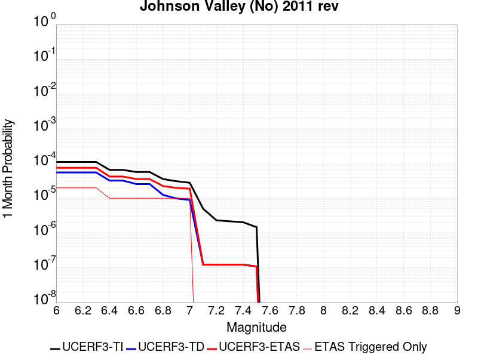 | 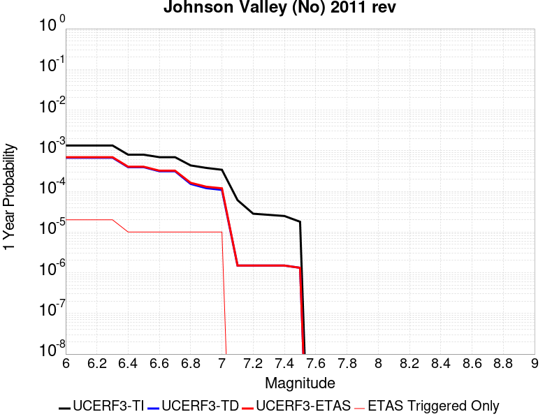 | 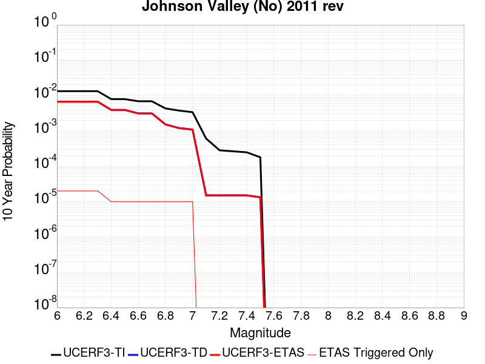 |

| Magnitude | 1 wk TI Prob | 1 wk TD Prob | 1 wk ETAS Prob | 1 wk ETAS/TD Gain | 1 wk ETAS Triggered Only | 1 mo TI Prob | 1 mo TD Prob | 1 mo ETAS Prob | 1 mo ETAS/TD Gain | 1 mo ETAS Triggered Only | 1 yr TI Prob | 1 yr TD Prob | 1 yr ETAS Prob | 1 yr ETAS/TD Gain | 1 yr ETAS Triggered Only | 10 yr TI Prob | 10 yr TD Prob | 10 yr ETAS Prob | 10 yr ETAS/TD Gain | 10 yr ETAS Triggered Only |
|-----|-----|-----|-----|-----|-----|-----|-----|-----|-----|-----|-----|-----|-----|-----|-----|-----|-----|-----|-----|-----|
| 6.0 | 2.577707E-5 | 1.2901208E-5 | 3.290095E-5 | 2.5502224 | 2.0E-5 | 1.1046848E-4 | 5.528994E-5 | 7.528884E-5 | 1.3617095 | 2.0E-5 | 0.0013441239 | 6.729868E-4 | 6.929733E-4 | 1.0296983 | 2.0E-5 | 0.013360229 | 0.006713397 | 0.0067332624 | 1.0029591 | 2.0E-5 |
| 6.1 | 2.577707E-5 | 1.2901208E-5 | 3.290095E-5 | 2.5502224 | 2.0E-5 | 1.1046848E-4 | 5.528994E-5 | 7.528884E-5 | 1.3617095 | 2.0E-5 | 0.0013441239 | 6.729868E-4 | 6.929733E-4 | 1.0296983 | 2.0E-5 | 0.013360229 | 0.006713397 | 0.0067332624 | 1.0029591 | 2.0E-5 |
| 6.2 | 2.577707E-5 | 1.2901208E-5 | 3.290095E-5 | 2.5502224 | 2.0E-5 | 1.1046848E-4 | 5.528994E-5 | 7.528884E-5 | 1.3617095 | 2.0E-5 | 0.0013441239 | 6.729868E-4 | 6.929733E-4 | 1.0296983 | 2.0E-5 | 0.013360229 | 0.006713397 | 0.0067332624 | 1.0029591 | 2.0E-5 |
| 6.3 | 2.577707E-5 | 1.2901208E-5 | 3.290095E-5 | 2.5502224 | 2.0E-5 | 1.1046848E-4 | 5.528994E-5 | 7.528884E-5 | 1.3617095 | 2.0E-5 | 0.0013441239 | 6.729868E-4 | 6.929733E-4 | 1.0296983 | 2.0E-5 | 0.013360229 | 0.006713397 | 0.0067332624 | 1.0029591 | 2.0E-5 |
| 6.4 | 1.5296591E-5 | 7.5369735E-6 | 1.7536899E-5 | 2.3267825 | 1.0E-5 | 6.555518E-5 | 3.230102E-5 | 4.2300697E-5 | 1.3095777 | 1.0E-5 | 7.97842E-4 | 3.9321271E-4 | 4.0320877E-4 | 1.0254215 | 1.0E-5 | 0.007949836 | 0.003927011 | 0.003936972 | 1.0025364 | 1.0E-5 |
| 6.5 | 1.5296591E-5 | 7.5369735E-6 | 1.7536899E-5 | 2.3267825 | 1.0E-5 | 6.555518E-5 | 3.230102E-5 | 4.2300697E-5 | 1.3095777 | 1.0E-5 | 7.97842E-4 | 3.9321271E-4 | 4.0320877E-4 | 1.0254215 | 1.0E-5 | 0.007949836 | 0.003927011 | 0.003936972 | 1.0025364 | 1.0E-5 |
| 6.6 | 1.3289383E-5 | 5.9919316E-6 | 1.599187E-5 | 2.668901 | 1.0E-5 | 5.6953253E-5 | 2.567955E-5 | 3.567929E-5 | 1.3894049 | 1.0E-5 | 6.9318525E-4 | 3.1262063E-4 | 3.226175E-4 | 1.0319777 | 1.0E-5 | 0.0069102696 | 0.0031234731 | 0.0031334418 | 1.0031916 | 1.0E-5 |
| 6.7 | 1.3289383E-5 | 5.9919316E-6 | 1.599187E-5 | 2.668901 | 1.0E-5 | 5.6953253E-5 | 2.567955E-5 | 3.567929E-5 | 1.3894049 | 1.0E-5 | 6.9318525E-4 | 3.1262063E-4 | 3.226175E-4 | 1.0319777 | 1.0E-5 | 0.0069102696 | 0.0031234731 | 0.0031334418 | 1.0031916 | 1.0E-5 |
| 6.8 | 8.330789E-6 | 2.9214577E-6 | 1.2921429E-5 | 4.422939 | 1.0E-5 | 3.570289E-5 | 1.2520505E-5 | 2.252038E-5 | 1.7986798 | 1.0E-5 | 4.34596E-4 | 1.524322E-4 | 1.6243068E-4 | 1.0655929 | 1.0E-5 | 0.0043374705 | 0.0015238364 | 0.0015338212 | 1.0065523 | 1.0E-5 |
| 6.9 | 7.2359003E-6 | 2.3014702E-6 | 1.2301447E-5 | 5.345039 | 1.0E-5 | 3.1010633E-5 | 9.863436E-6 | 1.9863337E-5 | 2.0138354 | 1.0E-5 | 3.7748902E-4 | 1.2008605E-4 | 1.3008485E-4 | 1.0832636 | 1.0E-5 | 0.0037684843 | 0.0012007345 | 0.0012107225 | 1.0083182 | 1.0E-5 |
| 7.0 | 6.5149957E-6 | 2.0886398E-6 | 1.2088619E-5 | 5.787795 | 1.0E-5 | 2.792111E-5 | 8.951313E-6 | 1.8951223E-5 | 2.1171446 | 1.0E-5 | 3.398865E-4 | 1.0898209E-4 | 1.1898099E-4 | 1.0917482 | 1.0E-5 | 0.003393671 | 0.0010898062 | 0.0010997953 | 1.009166 | 1.0E-5 |
| 7.1 | 1.1662233E-6 | 2.8793124E-8 | 2.8793124E-8 | 1.0 | 0.0 | 4.9980904E-6 | 1.2339909E-7 | 1.2339909E-7 | 1.0 | 0.0 | 6.0850052E-5 | 1.5023832E-6 | 1.5023832E-6 | 1.0 | 0.0 | 6.083339E-4 | 1.5023746E-5 | 1.5023746E-5 | 1.0 | 0.0 |
| 7.2 | 5.413881E-7 | 2.8793124E-8 | 2.8793124E-8 | 1.0 | 0.0 | 2.3202326E-6 | 1.2339909E-7 | 1.2339909E-7 | 1.0 | 0.0 | 2.8248465E-5 | 1.5023832E-6 | 1.5023832E-6 | 1.0 | 0.0 | 2.8244875E-4 | 1.5023746E-5 | 1.5023746E-5 | 1.0 | 0.0 |
| 7.3 | 5.076821E-7 | 2.8793124E-8 | 2.8793124E-8 | 1.0 | 0.0 | 2.1757785E-6 | 1.2339909E-7 | 1.2339909E-7 | 1.0 | 0.0 | 2.648978E-5 | 1.5023832E-6 | 1.5023832E-6 | 1.0 | 0.0 | 2.6486625E-4 | 1.5023746E-5 | 1.5023746E-5 | 1.0 | 0.0 |
| 7.4 | 4.7568687E-7 | 2.8775073E-8 | 2.8775073E-8 | 1.0 | 0.0 | 2.0386565E-6 | 1.2332174E-7 | 1.2332174E-7 | 1.0 | 0.0 | 2.482036E-5 | 1.5014413E-6 | 1.5014413E-6 | 1.0 | 0.0 | 2.4817587E-4 | 1.5014328E-5 | 1.5014328E-5 | 1.0 | 0.0 |
| 7.5 | 3.435626E-7 | 2.5350424E-8 | 2.5350424E-8 | 1.0 | 0.0 | 1.4724103E-6 | 1.0864467E-7 | 1.0864467E-7 | 1.0 | 0.0 | 1.7926448E-5 | 1.3227482E-6 | 1.3227482E-6 | 1.0 | 0.0 | 1.7925001E-4 | 1.3227419E-5 | 1.3227419E-5 | 1.0 | 0.0 |

## Great Valley 08 (Quinto)
*[(top)](#table-of-contents)*

| 1 Week | 1 Month | 1 Year | 10 Year |
|-----|-----|-----|-----|
|  | 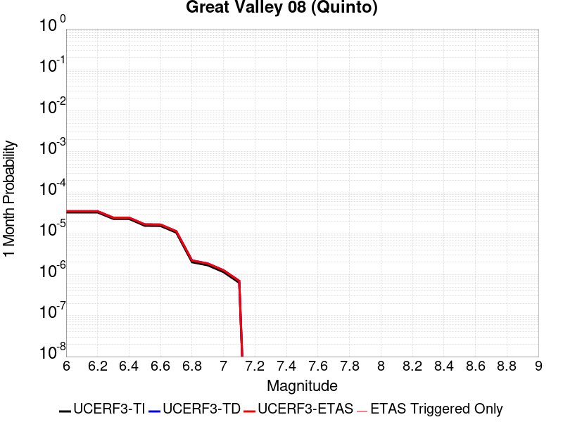 |  | 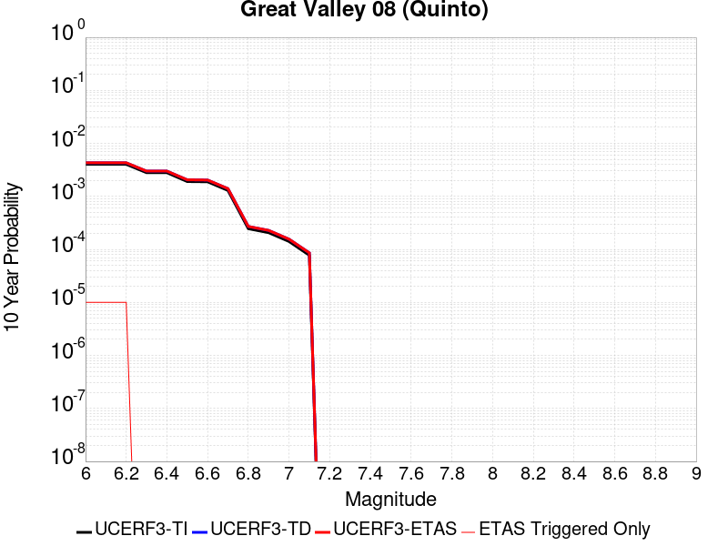 |

| Magnitude | 1 wk TI Prob | 1 wk TD Prob | 1 wk ETAS Prob | 1 wk ETAS/TD Gain | 1 wk ETAS Triggered Only | 1 mo TI Prob | 1 mo TD Prob | 1 mo ETAS Prob | 1 mo ETAS/TD Gain | 1 mo ETAS Triggered Only | 1 yr TI Prob | 1 yr TD Prob | 1 yr ETAS Prob | 1 yr ETAS/TD Gain | 1 yr ETAS Triggered Only | 10 yr TI Prob | 10 yr TD Prob | 10 yr ETAS Prob | 10 yr ETAS/TD Gain | 10 yr ETAS Triggered Only |
|-----|-----|-----|-----|-----|-----|-----|-----|-----|-----|-----|-----|-----|-----|-----|-----|-----|-----|-----|-----|-----|
| 6.0 | 7.737697E-6 | 8.253038E-6 | 8.253038E-6 | 1.0 | 0.0 | 3.3161137E-5 | 3.536979E-5 | 3.536979E-5 | 1.0 | 0.0 | 4.0366207E-4 | 4.3056096E-4 | 4.4055664E-4 | 1.0232155 | 1.0E-5 | 0.004029296 | 0.0042991205 | 0.0043090777 | 1.002316 | 1.0E-5 |
| 6.1 | 7.737697E-6 | 8.253038E-6 | 8.253038E-6 | 1.0 | 0.0 | 3.3161137E-5 | 3.536979E-5 | 3.536979E-5 | 1.0 | 0.0 | 4.0366207E-4 | 4.3056096E-4 | 4.4055664E-4 | 1.0232155 | 1.0E-5 | 0.004029296 | 0.0042991205 | 0.0043090777 | 1.002316 | 1.0E-5 |
| 6.2 | 7.737697E-6 | 8.253038E-6 | 8.253038E-6 | 1.0 | 0.0 | 3.3161137E-5 | 3.536979E-5 | 3.536979E-5 | 1.0 | 0.0 | 4.0366207E-4 | 4.3056096E-4 | 4.4055664E-4 | 1.0232155 | 1.0E-5 | 0.004029296 | 0.0042991205 | 0.0043090777 | 1.002316 | 1.0E-5 |
| 6.3 | 5.374012E-6 | 5.7505736E-6 | 5.7505736E-6 | 1.0 | 0.0 | 2.3031276E-5 | 2.4645145E-5 | 2.4645145E-5 | 1.0 | 0.0 | 2.803697E-4 | 3.0002446E-4 | 3.0002446E-4 | 1.0 | 0.0 | 0.0028001624 | 0.0029972875 | 0.0029972875 | 1.0 | 0.0 |
| 6.4 | 5.374012E-6 | 5.7505736E-6 | 5.7505736E-6 | 1.0 | 0.0 | 2.3031276E-5 | 2.4645145E-5 | 2.4645145E-5 | 1.0 | 0.0 | 2.803697E-4 | 3.0002446E-4 | 3.0002446E-4 | 1.0 | 0.0 | 0.0028001624 | 0.0029972875 | 0.0029972875 | 1.0 | 0.0 |
| 6.5 | 3.65427E-6 | 3.941324E-6 | 3.941324E-6 | 1.0 | 0.0 | 1.5661062E-5 | 1.689132E-5 | 1.689132E-5 | 1.0 | 0.0 | 1.9065675E-4 | 2.0563944E-4 | 2.0563944E-4 | 1.0 | 0.0 | 0.0019049325 | 0.0020551833 | 0.0020551833 | 1.0 | 0.0 |
| 6.6 | 3.6143538E-6 | 3.8985104E-6 | 3.8985104E-6 | 1.0 | 0.0 | 1.5489995E-5 | 1.6707834E-5 | 1.6707834E-5 | 1.0 | 0.0 | 1.8857437E-4 | 2.0340596E-4 | 2.0340596E-4 | 1.0 | 0.0 | 0.0018841444 | 0.0020328893 | 0.0020328893 | 1.0 | 0.0 |
| 6.7 | 2.4821015E-6 | 2.6857067E-6 | 2.6857067E-6 | 1.0 | 0.0 | 1.0637535E-5 | 1.1510153E-5 | 1.1510153E-5 | 1.0 | 0.0 | 1.2950429E-4 | 1.4013276E-4 | 1.4013276E-4 | 1.0 | 0.0 | 0.0012942884 | 0.0014009989 | 0.0014009989 | 1.0 | 0.0 |
| 6.8 | 4.7110538E-7 | 5.193021E-7 | 5.193021E-7 | 1.0 | 0.0 | 2.0190216E-6 | 2.2255786E-6 | 2.2255786E-6 | 1.0 | 0.0 | 2.458131E-5 | 2.70961E-5 | 2.70961E-5 | 1.0 | 0.0 | 2.457859E-4 | 2.7092977E-4 | 2.7092977E-4 | 1.0 | 0.0 |
| 6.9 | 3.958685E-7 | 4.3703452E-7 | 4.3703452E-7 | 1.0 | 0.0 | 1.6965782E-6 | 1.8730038E-6 | 1.8730038E-6 | 1.0 | 0.0 | 2.0655643E-5 | 2.28036E-5 | 2.28036E-5 | 1.0 | 0.0 | 2.0653724E-4 | 2.2801422E-4 | 2.2801422E-4 | 1.0 | 0.0 |
| 7.0 | 2.70294E-7 | 2.9920008E-7 | 2.9920008E-7 | 1.0 | 0.0 | 1.1584025E-6 | 1.2822856E-6 | 1.2822856E-6 | 1.0 | 0.0 | 1.4103458E-5 | 1.5611728E-5 | 1.5611728E-5 | 1.0 | 0.0 | 1.4102564E-4 | 1.5610759E-4 | 1.5610759E-4 | 1.0 | 0.0 |
| 7.1 | 1.4828602E-7 | 1.6469107E-7 | 1.6469107E-7 | 1.0 | 0.0 | 6.3551136E-7 | 7.058187E-7 | 7.058187E-7 | 1.0 | 0.0 | 7.737323E-6 | 8.593317E-6 | 8.593317E-6 | 1.0 | 0.0 | 7.737054E-5 | 8.593065E-5 | 8.593065E-5 | 1.0 | 0.0 |

## Newport-Inglewood alt 1
*[(top)](#table-of-contents)*

| 1 Week | 1 Month | 1 Year | 10 Year |
|-----|-----|-----|-----|
| 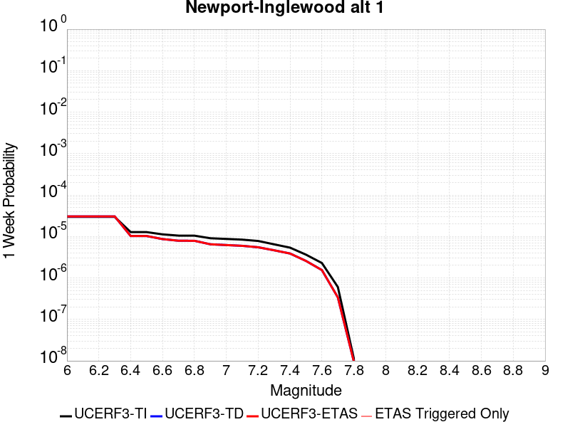 | 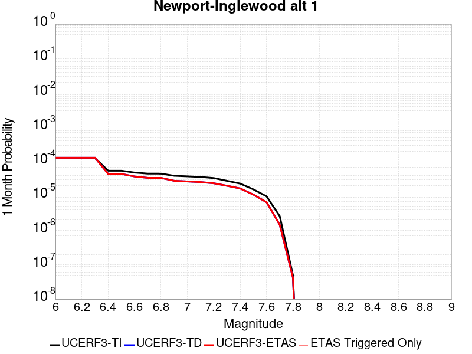 | 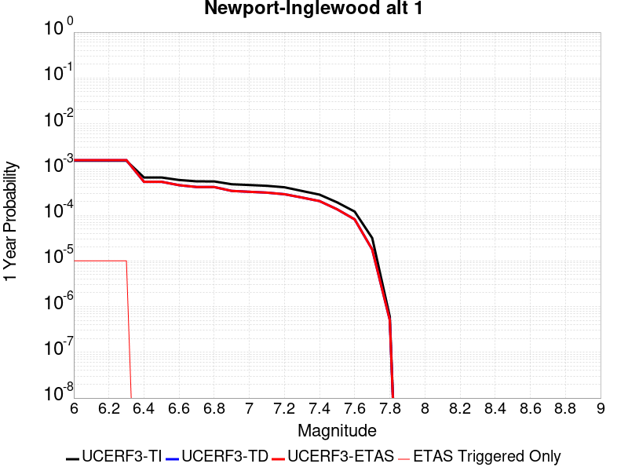 | 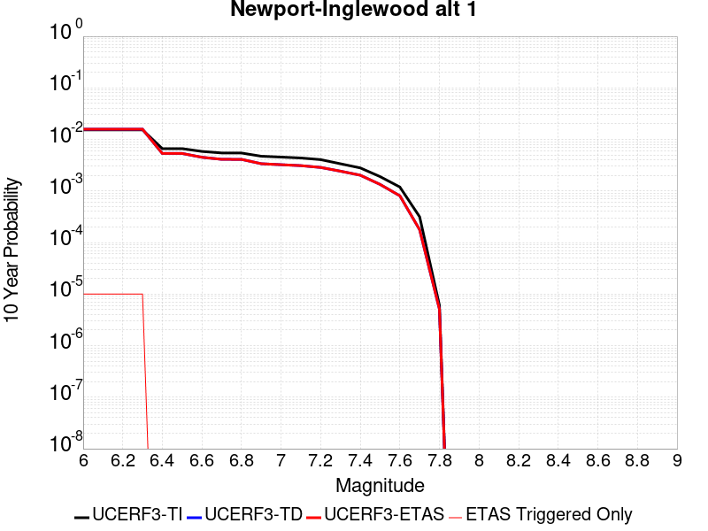 |

| Magnitude | 1 wk TI Prob | 1 wk TD Prob | 1 wk ETAS Prob | 1 wk ETAS/TD Gain | 1 wk ETAS Triggered Only | 1 mo TI Prob | 1 mo TD Prob | 1 mo ETAS Prob | 1 mo ETAS/TD Gain | 1 mo ETAS Triggered Only | 1 yr TI Prob | 1 yr TD Prob | 1 yr ETAS Prob | 1 yr ETAS/TD Gain | 1 yr ETAS Triggered Only | 10 yr TI Prob | 10 yr TD Prob | 10 yr ETAS Prob | 10 yr ETAS/TD Gain | 10 yr ETAS Triggered Only |
|-----|-----|-----|-----|-----|-----|-----|-----|-----|-----|-----|-----|-----|-----|-----|-----|-----|-----|-----|-----|-----|
| 6.0 | 2.9668912E-5 | 3.0404828E-5 | 3.0404828E-5 | 1.0 | 0.0 | 1.2714628E-4 | 1.3030265E-4 | 1.3030265E-4 | 1.0 | 0.0 | 0.0015469068 | 0.0015857654 | 0.0015957495 | 1.0062962 | 1.0E-5 | 0.015361829 | 0.01579211 | 0.015801951 | 1.0006232 | 1.0E-5 |
| 6.1 | 2.9668912E-5 | 3.0404828E-5 | 3.0404828E-5 | 1.0 | 0.0 | 1.2714628E-4 | 1.3030265E-4 | 1.3030265E-4 | 1.0 | 0.0 | 0.0015469068 | 0.0015857654 | 0.0015957495 | 1.0062962 | 1.0E-5 | 0.015361829 | 0.01579211 | 0.015801951 | 1.0006232 | 1.0E-5 |
| 6.2 | 2.9668912E-5 | 3.0404828E-5 | 3.0404828E-5 | 1.0 | 0.0 | 1.2714628E-4 | 1.3030265E-4 | 1.3030265E-4 | 1.0 | 0.0 | 0.0015469068 | 0.0015857654 | 0.0015957495 | 1.0062962 | 1.0E-5 | 0.015361829 | 0.01579211 | 0.015801951 | 1.0006232 | 1.0E-5 |
| 6.3 | 2.9668912E-5 | 3.0404828E-5 | 3.0404828E-5 | 1.0 | 0.0 | 1.2714628E-4 | 1.3030265E-4 | 1.3030265E-4 | 1.0 | 0.0 | 0.0015469068 | 0.0015857654 | 0.0015957495 | 1.0062962 | 1.0E-5 | 0.015361829 | 0.01579211 | 0.015801951 | 1.0006232 | 1.0E-5 |
| 6.4 | 1.275942E-5 | 1.02725335E-5 | 1.02725335E-5 | 1.0 | 0.0 | 5.4682085E-5 | 4.4024422E-5 | 4.4024422E-5 | 1.0 | 0.0 | 6.65551E-4 | 5.358697E-4 | 5.358697E-4 | 1.0 | 0.0 | 0.0066356123 | 0.0053462 | 0.0053462 | 1.0 | 0.0 |
| 6.5 | 1.275942E-5 | 1.02725335E-5 | 1.02725335E-5 | 1.0 | 0.0 | 5.4682085E-5 | 4.4024422E-5 | 4.4024422E-5 | 1.0 | 0.0 | 6.65551E-4 | 5.358697E-4 | 5.358697E-4 | 1.0 | 0.0 | 0.0066356123 | 0.0053462 | 0.0053462 | 1.0 | 0.0 |
| 6.6 | 1.1255358E-5 | 8.661911E-6 | 8.661911E-6 | 1.0 | 0.0 | 4.8236358E-5 | 3.7121958E-5 | 3.7121958E-5 | 1.0 | 0.0 | 5.871194E-4 | 4.5186782E-4 | 4.5186782E-4 | 1.0 | 0.0 | 0.005855706 | 0.0045096674 | 0.0045096674 | 1.0 | 0.0 |
| 6.7 | 1.0504745E-5 | 7.8998455E-6 | 7.8998455E-6 | 1.0 | 0.0 | 4.5019555E-5 | 3.385605E-5 | 3.385605E-5 | 1.0 | 0.0 | 5.4797524E-4 | 4.121207E-4 | 4.121207E-4 | 1.0 | 0.0 | 0.0054662596 | 0.004113694 | 0.004113694 | 1.0 | 0.0 |
| 6.8 | 1.0476007E-5 | 7.881227E-6 | 7.881227E-6 | 1.0 | 0.0 | 4.4896402E-5 | 3.3776258E-5 | 3.3776258E-5 | 1.0 | 0.0 | 5.464766E-4 | 4.1114958E-4 | 4.1114958E-4 | 1.0 | 0.0 | 0.005451347 | 0.004104019 | 0.004104019 | 1.0 | 0.0 |
| 6.9 | 9.076797E-6 | 6.4896567E-6 | 6.4896567E-6 | 1.0 | 0.0 | 3.889998E-5 | 2.7812519E-5 | 2.7812519E-5 | 1.0 | 0.0 | 4.7350433E-4 | 3.3856515E-4 | 3.3856515E-4 | 1.0 | 0.0 | 0.004724967 | 0.003380531 | 0.003380531 | 1.0 | 0.0 |
| 7.0 | 8.73795E-6 | 6.2120503E-6 | 6.2120503E-6 | 1.0 | 0.0 | 3.7447822E-5 | 2.6622802E-5 | 2.6622802E-5 | 1.0 | 0.0 | 4.5583185E-4 | 3.2408469E-4 | 3.2408469E-4 | 1.0 | 0.0 | 0.0045489795 | 0.0032361522 | 0.0032361522 | 1.0 | 0.0 |
| 7.1 | 8.391299E-6 | 5.9557533E-6 | 5.9557533E-6 | 1.0 | 0.0 | 3.5962214E-5 | 2.5524409E-5 | 2.5524409E-5 | 1.0 | 0.0 | 4.37752E-4 | 3.1071564E-4 | 3.1071564E-4 | 1.0 | 0.0 | 0.004368907 | 0.0031028416 | 0.0031028416 | 1.0 | 0.0 |
| 7.2 | 7.796882E-6 | 5.4964826E-6 | 5.4964826E-6 | 1.0 | 0.0 | 3.341478E-5 | 2.3556144E-5 | 2.3556144E-5 | 1.0 | 0.0 | 4.06749E-4 | 2.867585E-4 | 2.867585E-4 | 1.0 | 0.0 | 0.0040600533 | 0.002863909 | 0.002863909 | 1.0 | 0.0 |
| 7.3 | 6.4738833E-6 | 4.6477753E-6 | 4.6477753E-6 | 1.0 | 0.0 | 2.774492E-5 | 1.9918885E-5 | 1.9918885E-5 | 1.0 | 0.0 | 3.3774204E-4 | 2.424856E-4 | 2.424856E-4 | 1.0 | 0.0 | 0.0033722918 | 0.0024222268 | 0.0024222268 | 1.0 | 0.0 |
| 7.4 | 5.382145E-6 | 3.8857215E-6 | 3.8857215E-6 | 1.0 | 0.0 | 2.3066134E-5 | 1.6652988E-5 | 1.6652988E-5 | 1.0 | 0.0 | 2.8079396E-4 | 2.0273139E-4 | 2.0273139E-4 | 1.0 | 0.0 | 0.0028043943 | 0.002025479 | 0.002025479 | 1.0 | 0.0 |
| 7.5 | 3.648244E-6 | 2.5737634E-6 | 2.5737634E-6 | 1.0 | 0.0 | 1.5635238E-5 | 1.1030369E-5 | 1.1030369E-5 | 1.0 | 0.0 | 1.9034238E-4 | 1.3428657E-4 | 1.3428657E-4 | 1.0 | 0.0 | 0.0019017943 | 0.0013420646 | 0.0013420646 | 1.0 | 0.0 |
| 7.6 | 2.2906888E-6 | 1.547986E-6 | 1.547986E-6 | 1.0 | 0.0 | 9.817201E-6 | 6.634209E-6 | 6.634209E-6 | 1.0 | 0.0 | 1.1951787E-4 | 8.076857E-5 | 8.076857E-5 | 1.0 | 0.0 | 0.0011945361 | 8.073989E-4 | 8.073989E-4 | 1.0 | 0.0 |
| 7.7 | 6.0479874E-7 | 3.397468E-7 | 3.397468E-7 | 1.0 | 0.0 | 2.5919921E-6 | 1.456057E-6 | 1.456057E-6 | 1.0 | 0.0 | 3.1557047E-5 | 1.7727363E-5 | 1.7727363E-5 | 1.0 | 0.0 | 3.1552566E-4 | 1.7726087E-4 | 1.7726087E-4 | 1.0 | 0.0 |
| 7.8 | 1.16056995E-8 | 9.782997E-9 | 9.782997E-9 | 1.0 | 0.0 | 4.9738713E-8 | 4.1927127E-8 | 4.1927127E-8 | 1.0 | 0.0 | 6.0556863E-7 | 5.1046277E-7 | 5.1046277E-7 | 1.0 | 0.0 | 6.05567E-6 | 5.1046277E-6 | 5.1046277E-6 | 1.0 | 0.0 |

## Great Valley 03a Dunnigan Hills
*[(top)](#table-of-contents)*

| 1 Week | 1 Month | 1 Year | 10 Year |
|-----|-----|-----|-----|
|  | 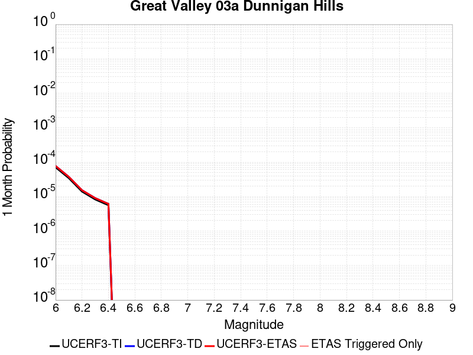 | 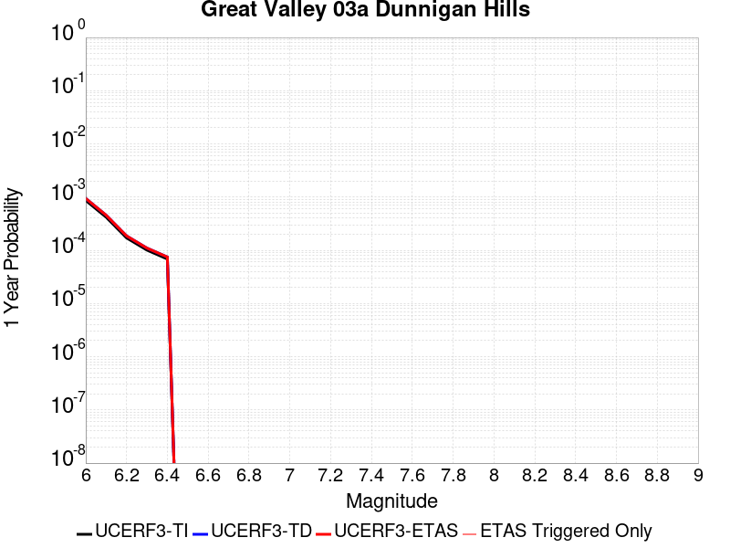 |  |

| Magnitude | 1 wk TI Prob | 1 wk TD Prob | 1 wk ETAS Prob | 1 wk ETAS/TD Gain | 1 wk ETAS Triggered Only | 1 mo TI Prob | 1 mo TD Prob | 1 mo ETAS Prob | 1 mo ETAS/TD Gain | 1 mo ETAS Triggered Only | 1 yr TI Prob | 1 yr TD Prob | 1 yr ETAS Prob | 1 yr ETAS/TD Gain | 1 yr ETAS Triggered Only | 10 yr TI Prob | 10 yr TD Prob | 10 yr ETAS Prob | 10 yr ETAS/TD Gain | 10 yr ETAS Triggered Only |
|-----|-----|-----|-----|-----|-----|-----|-----|-----|-----|-----|-----|-----|-----|-----|-----|-----|-----|-----|-----|-----|
| 6.0 | 1.6591328E-5 | 1.8107954E-5 | 1.8107954E-5 | 1.0 | 0.0 | 7.110376E-5 | 7.7603596E-5 | 7.7603596E-5 | 1.0 | 0.0 | 8.6534437E-4 | 9.444834E-4 | 9.444834E-4 | 1.0 | 0.0 | 0.008619824 | 0.009411525 | 0.0094214305 | 1.0010525 | 1.0E-5 |
| 6.1 | 8.041125E-6 | 8.769726E-6 | 8.769726E-6 | 1.0 | 0.0 | 3.4461507E-5 | 3.7584115E-5 | 3.7584115E-5 | 1.0 | 0.0 | 4.194881E-4 | 4.5751085E-4 | 4.5751085E-4 | 1.0 | 0.0 | 0.004186971 | 0.004567687 | 0.0045776414 | 1.0021793 | 1.0E-5 |
| 6.2 | 3.2807004E-6 | 3.5795688E-6 | 3.5795688E-6 | 1.0 | 0.0 | 1.4060069E-5 | 1.5340942E-5 | 1.5340942E-5 | 1.0 | 0.0 | 1.7116789E-4 | 1.8676413E-4 | 1.8676413E-4 | 1.0 | 0.0 | 0.0017103611 | 0.0018664796 | 0.0018664796 | 1.0 | 0.0 |
| 6.3 | 1.9339366E-6 | 2.1103806E-6 | 2.1103806E-6 | 1.0 | 0.0 | 8.288273E-6 | 9.044474E-6 | 9.044474E-6 | 1.0 | 0.0 | 1.00905054E-4 | 1.1011375E-4 | 1.1011375E-4 | 1.0 | 0.0 | 0.0010085925 | 0.0011008718 | 0.0011008718 | 1.0 | 0.0 |
| 6.4 | 1.3142635E-6 | 1.4339867E-6 | 1.4339867E-6 | 1.0 | 0.0 | 5.6325457E-6 | 6.145657E-6 | 6.145657E-6 | 1.0 | 0.0 | 6.857408E-5 | 7.482337E-5 | 7.482337E-5 | 1.0 | 0.0 | 6.8552926E-4 | 7.4823375E-4 | 7.4823375E-4 | 1.0 | 0.0 |

## San Diego Trough south
*[(top)](#table-of-contents)*

| 1 Week | 1 Month | 1 Year | 10 Year |
|-----|-----|-----|-----|
|  | 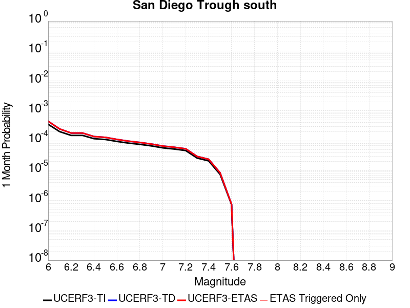 | 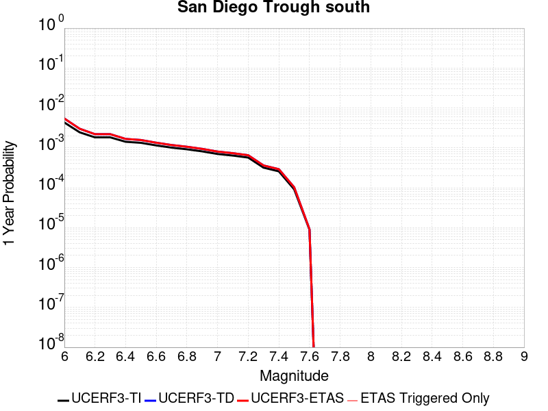 | 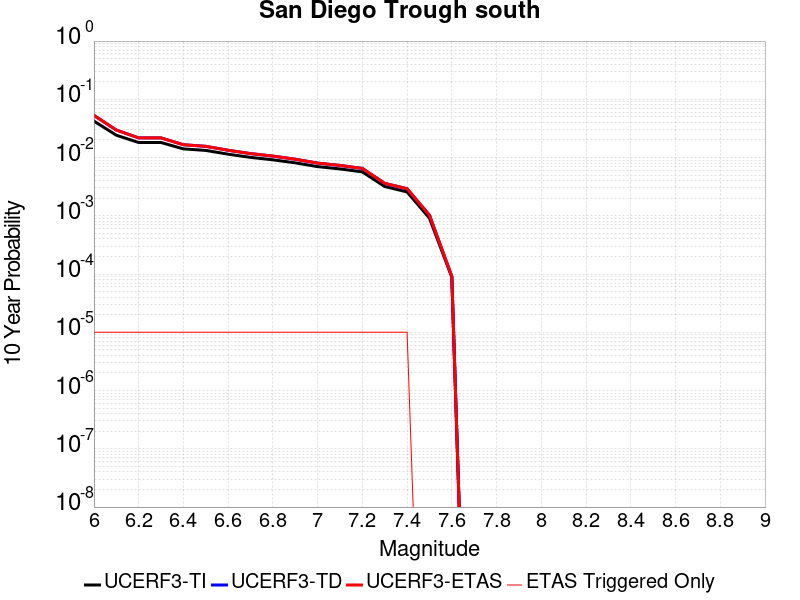 |

| Magnitude | 1 wk TI Prob | 1 wk TD Prob | 1 wk ETAS Prob | 1 wk ETAS/TD Gain | 1 wk ETAS Triggered Only | 1 mo TI Prob | 1 mo TD Prob | 1 mo ETAS Prob | 1 mo ETAS/TD Gain | 1 mo ETAS Triggered Only | 1 yr TI Prob | 1 yr TD Prob | 1 yr ETAS Prob | 1 yr ETAS/TD Gain | 1 yr ETAS Triggered Only | 10 yr TI Prob | 10 yr TD Prob | 10 yr ETAS Prob | 10 yr ETAS/TD Gain | 10 yr ETAS Triggered Only |
|-----|-----|-----|-----|-----|-----|-----|-----|-----|-----|-----|-----|-----|-----|-----|-----|-----|-----|-----|-----|-----|
| 6.0 | 8.279495E-5 | 1.0425541E-4 | 1.0425541E-4 | 1.0 | 0.0 | 3.5478722E-4 | 4.4673498E-4 | 4.4673498E-4 | 1.0 | 0.0 | 0.004310982 | 0.0054259133 | 0.0054259133 | 1.0 | 0.0 | 0.042283054 | 0.05299303 | 0.0530025 | 1.0001787 | 1.0E-5 |
| 6.1 | 4.6961468E-5 | 5.773024E-5 | 5.773024E-5 | 1.0 | 0.0 | 2.0124791E-4 | 2.473905E-4 | 2.473905E-4 | 1.0 | 0.0 | 0.00244744 | 0.003007886 | 0.003007886 | 1.0 | 0.0 | 0.024206603 | 0.029679636 | 0.029689338 | 1.0003269 | 1.0E-5 |
| 6.2 | 3.5079658E-5 | 4.214258E-5 | 4.214258E-5 | 1.0 | 0.0 | 1.5033272E-4 | 1.8059829E-4 | 1.8059829E-4 | 1.0 | 0.0 | 0.0018287642 | 0.002196587 | 0.002196587 | 1.0 | 0.0 | 0.018137876 | 0.021751188 | 0.02176097 | 1.0004498 | 1.0E-5 |
| 6.3 | 3.5079658E-5 | 4.214258E-5 | 4.214258E-5 | 1.0 | 0.0 | 1.5033272E-4 | 1.8059829E-4 | 1.8059829E-4 | 1.0 | 0.0 | 0.0018287642 | 0.002196587 | 0.002196587 | 1.0 | 0.0 | 0.018137876 | 0.021751188 | 0.02176097 | 1.0004498 | 1.0E-5 |
| 6.4 | 2.7196904E-5 | 3.208715E-5 | 3.208715E-5 | 1.0 | 0.0 | 1.16552954E-4 | 1.3750911E-4 | 1.3750911E-4 | 1.0 | 0.0 | 0.0014181085 | 0.0016728995 | 0.0016728995 | 1.0 | 0.0 | 0.014090929 | 0.016604666 | 0.0166145 | 1.0005922 | 1.0E-5 |
| 6.5 | 2.5584688E-5 | 3.0101632E-5 | 3.0101632E-5 | 1.0 | 0.0 | 1.0964406E-4 | 1.2900059E-4 | 1.2900059E-4 | 1.0 | 0.0 | 0.0013340989 | 0.0015694627 | 0.0015694627 | 1.0 | 0.0 | 0.013261181 | 0.015585332 | 0.015595176 | 1.0006316 | 1.0E-5 |
| 6.6 | 2.2034688E-5 | 2.574271E-5 | 2.574271E-5 | 1.0 | 0.0 | 9.443096E-5 | 1.1032127E-4 | 1.1032127E-4 | 1.0 | 0.0 | 0.0011490905 | 0.0013423412 | 0.0013423412 | 1.0 | 0.0 | 0.011431668 | 0.013343325 | 0.013353191 | 1.0007395 | 1.0E-5 |
| 6.7 | 1.9394853E-5 | 2.254176E-5 | 2.254176E-5 | 1.0 | 0.0 | 8.311815E-5 | 9.6604E-5 | 9.6604E-5 | 1.0 | 0.0 | 0.0010114936 | 0.0011755243 | 0.0011755243 | 1.0 | 0.0 | 0.01006902 | 0.011693766 | 0.01170365 | 1.0008452 | 1.0E-5 |
| 6.8 | 1.7615313E-5 | 2.0403182E-5 | 2.0403182E-5 | 1.0 | 0.0 | 7.549201E-5 | 8.743931E-5 | 8.743931E-5 | 1.0 | 0.0 | 9.1872766E-4 | 0.0010640579 | 0.0010640579 | 1.0 | 0.0 | 0.009149387 | 0.010590198 | 0.010600092 | 1.0009342 | 1.0E-5 |
| 6.9 | 1.5621423E-5 | 1.8026114E-5 | 1.8026114E-5 | 1.0 | 0.0 | 6.6947236E-5 | 7.725251E-5 | 7.725251E-5 | 1.0 | 0.0 | 8.147778E-4 | 9.40147E-4 | 9.40147E-4 | 1.0 | 0.0 | 0.008117969 | 0.009362142 | 0.009372048 | 1.0010581 | 1.0E-5 |
| 7.0 | 1.3444376E-5 | 1.544809E-5 | 1.544809E-5 | 1.0 | 0.0 | 5.7617483E-5 | 6.620443E-5 | 6.620443E-5 | 1.0 | 0.0 | 7.0126704E-4 | 8.057436E-4 | 8.057436E-4 | 1.0 | 0.0 | 0.006990582 | 0.008028555 | 0.008038475 | 1.0012356 | 1.0E-5 |
| 7.1 | 1.2268361E-5 | 1.407303E-5 | 1.407303E-5 | 1.0 | 0.0 | 5.2577634E-5 | 6.0311606E-5 | 6.0311606E-5 | 1.0 | 0.0 | 6.399447E-4 | 7.3404907E-4 | 7.3404907E-4 | 1.0 | 0.0 | 0.0063810493 | 0.0073165493 | 0.007326476 | 1.0013567 | 1.0E-5 |
| 7.2 | 1.0922655E-5 | 1.2513563E-5 | 1.2513563E-5 | 1.0 | 0.0 | 4.681054E-5 | 5.3628468E-5 | 5.3628468E-5 | 1.0 | 0.0 | 5.697693E-4 | 6.5273355E-4 | 6.5273355E-4 | 1.0 | 0.0 | 0.0056831064 | 0.0065084435 | 0.006518379 | 1.0015265 | 1.0E-5 |
| 7.3 | 6.1106753E-6 | 6.928925E-6 | 6.928925E-6 | 1.0 | 0.0 | 2.6188345E-5 | 2.9695057E-5 | 2.9695057E-5 | 1.0 | 0.0 | 3.1879646E-4 | 3.6147775E-4 | 3.6147775E-4 | 1.0 | 0.0 | 0.0031833951 | 0.003608943 | 0.003618907 | 1.0027609 | 1.0E-5 |
| 7.4 | 4.933187E-6 | 5.5895525E-6 | 5.5895525E-6 | 1.0 | 0.0 | 2.114206E-5 | 2.3955008E-5 | 2.3955008E-5 | 1.0 | 0.0 | 2.5737417E-4 | 2.9161357E-4 | 2.9161357E-4 | 1.0 | 0.0 | 0.002570763 | 0.0029123505 | 0.0029223212 | 1.0034237 | 1.0E-5 |
| 7.5 | 1.7489613E-6 | 1.969678E-6 | 1.969678E-6 | 1.0 | 0.0 | 7.495527E-6 | 8.4414505E-6 | 8.4414505E-6 | 1.0 | 0.0 | 9.125422E-5 | 1.02770035E-4 | 1.02770035E-4 | 1.0 | 0.0 | 9.1216754E-4 | 0.0010272472 | 0.0010272472 | 1.0 | 0.0 |
| 7.6 | 1.6988751E-7 | 1.7533823E-7 | 1.7533823E-7 | 1.0 | 0.0 | 7.2808916E-7 | 7.5144936E-7 | 7.5144936E-7 | 1.0 | 0.0 | 8.864449E-6 | 9.14886E-6 | 9.14886E-6 | 1.0 | 0.0 | 8.8640954E-5 | 9.1485024E-5 | 9.1485024E-5 | 1.0 | 0.0 |

## Shoreline
*[(top)](#table-of-contents)*

| 1 Week | 1 Month | 1 Year | 10 Year |
|-----|-----|-----|-----|
| 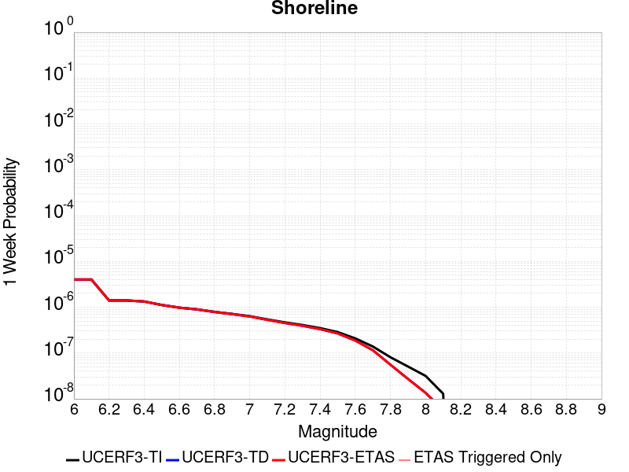 | 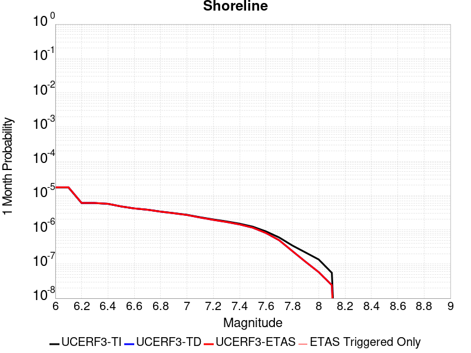 |  |  |

| Magnitude | 1 wk TI Prob | 1 wk TD Prob | 1 wk ETAS Prob | 1 wk ETAS/TD Gain | 1 wk ETAS Triggered Only | 1 mo TI Prob | 1 mo TD Prob | 1 mo ETAS Prob | 1 mo ETAS/TD Gain | 1 mo ETAS Triggered Only | 1 yr TI Prob | 1 yr TD Prob | 1 yr ETAS Prob | 1 yr ETAS/TD Gain | 1 yr ETAS Triggered Only | 10 yr TI Prob | 10 yr TD Prob | 10 yr ETAS Prob | 10 yr ETAS/TD Gain | 10 yr ETAS Triggered Only |
|-----|-----|-----|-----|-----|-----|-----|-----|-----|-----|-----|-----|-----|-----|-----|-----|-----|-----|-----|-----|-----|
| 6.0 | 3.9888673E-6 | 4.0479285E-6 | 4.0479285E-6 | 1.0 | 0.0 | 1.7095033E-5 | 1.7348182E-5 | 1.7348182E-5 | 1.0 | 0.0 | 2.0811215E-4 | 2.1119922E-4 | 2.2119712E-4 | 1.0473386 | 1.0E-5 | 0.0020791737 | 0.0021105339 | 0.0021205128 | 1.0047281 | 1.0E-5 |
| 6.1 | 3.9888673E-6 | 4.0479285E-6 | 4.0479285E-6 | 1.0 | 0.0 | 1.7095033E-5 | 1.7348182E-5 | 1.7348182E-5 | 1.0 | 0.0 | 2.0811215E-4 | 2.1119922E-4 | 2.2119712E-4 | 1.0473386 | 1.0E-5 | 0.0020791737 | 0.0021105339 | 0.0021205128 | 1.0047281 | 1.0E-5 |
| 6.2 | 1.4039653E-6 | 1.4100885E-6 | 1.4100885E-6 | 1.0 | 0.0 | 6.0169805E-6 | 6.043223E-6 | 6.043223E-6 | 1.0 | 0.0 | 7.325427E-5 | 7.357382E-5 | 7.357382E-5 | 1.0 | 0.0 | 7.3230127E-4 | 7.355006E-4 | 7.355006E-4 | 1.0 | 0.0 |
| 6.3 | 1.4039653E-6 | 1.4100885E-6 | 1.4100885E-6 | 1.0 | 0.0 | 6.0169805E-6 | 6.043223E-6 | 6.043223E-6 | 1.0 | 0.0 | 7.325427E-5 | 7.357382E-5 | 7.357382E-5 | 1.0 | 0.0 | 7.3230127E-4 | 7.355006E-4 | 7.355006E-4 | 1.0 | 0.0 |
| 6.4 | 1.3314152E-6 | 1.33616E-6 | 1.33616E-6 | 1.0 | 0.0 | 5.7060524E-6 | 5.726388E-6 | 5.726388E-6 | 1.0 | 0.0 | 6.946897E-5 | 6.9716596E-5 | 6.9716596E-5 | 1.0 | 0.0 | 6.9447263E-4 | 6.9695263E-4 | 6.9695263E-4 | 1.0 | 0.0 |
| 6.5 | 1.1187026E-6 | 1.1203634E-6 | 1.1203634E-6 | 1.0 | 0.0 | 4.794431E-6 | 4.801549E-6 | 4.801549E-6 | 1.0 | 0.0 | 5.8370628E-5 | 5.8457317E-5 | 5.8457317E-5 | 1.0 | 0.0 | 5.83553E-4 | 5.844219E-4 | 5.844219E-4 | 1.0 | 0.0 |
| 6.6 | 9.793089E-7 | 9.784915E-7 | 9.784915E-7 | 1.0 | 0.0 | 4.1970316E-6 | 4.193528E-6 | 4.193528E-6 | 1.0 | 0.0 | 5.1097657E-5 | 5.1055024E-5 | 5.1055024E-5 | 1.0 | 0.0 | 5.108591E-4 | 5.104342E-4 | 5.104342E-4 | 1.0 | 0.0 |
| 6.7 | 8.995986E-7 | 8.972795E-7 | 8.972795E-7 | 1.0 | 0.0 | 3.8554167E-6 | 3.8454777E-6 | 3.8454777E-6 | 1.0 | 0.0 | 4.693869E-5 | 4.68177E-5 | 4.68177E-5 | 1.0 | 0.0 | 4.6928777E-4 | 4.680793E-4 | 4.680793E-4 | 1.0 | 0.0 |
| 6.8 | 7.931612E-7 | 7.8803976E-7 | 7.8803976E-7 | 1.0 | 0.0 | 3.3992578E-6 | 3.377309E-6 | 3.377309E-6 | 1.0 | 0.0 | 4.1385178E-5 | 4.1117964E-5 | 4.1117964E-5 | 1.0 | 0.0 | 4.1377472E-4 | 4.1110412E-4 | 4.1110412E-4 | 1.0 | 0.0 |
| 6.9 | 7.1465956E-7 | 7.078001E-7 | 7.078001E-7 | 1.0 | 0.0 | 3.062823E-6 | 3.0334254E-6 | 3.0334254E-6 | 1.0 | 0.0 | 3.7289232E-5 | 3.693133E-5 | 3.693133E-5 | 1.0 | 0.0 | 3.7282976E-4 | 3.6925232E-4 | 3.6925232E-4 | 1.0 | 0.0 |
| 7.0 | 6.389046E-7 | 6.299453E-7 | 6.299453E-7 | 1.0 | 0.0 | 2.7381598E-6 | 2.699763E-6 | 2.699763E-6 | 1.0 | 0.0 | 3.3336586E-5 | 3.286912E-5 | 3.286912E-5 | 1.0 | 0.0 | 3.3331584E-4 | 3.286428E-4 | 3.286428E-4 | 1.0 | 0.0 |
| 7.1 | 5.4300875E-7 | 5.311126E-7 | 5.311126E-7 | 1.0 | 0.0 | 2.3271782E-6 | 2.276195E-6 | 2.276195E-6 | 1.0 | 0.0 | 2.8333026E-5 | 2.7712322E-5 | 2.7712322E-5 | 1.0 | 0.0 | 2.8329415E-4 | 2.7708875E-4 | 2.7708875E-4 | 1.0 | 0.0 |
| 7.2 | 4.6768855E-7 | 4.5348904E-7 | 4.5348904E-7 | 1.0 | 0.0 | 2.0043778E-6 | 1.9435229E-6 | 1.9435229E-6 | 1.0 | 0.0 | 2.4403027E-5 | 2.3662134E-5 | 2.3662134E-5 | 1.0 | 0.0 | 2.4400349E-4 | 2.3659621E-4 | 2.3659621E-4 | 1.0 | 0.0 |
| 7.3 | 4.0966103E-7 | 3.9385614E-7 | 3.9385614E-7 | 1.0 | 0.0 | 1.7556889E-6 | 1.6879537E-6 | 1.6879537E-6 | 1.0 | 0.0 | 2.1375303E-5 | 2.0550642E-5 | 2.0550642E-5 | 1.0 | 0.0 | 2.1373246E-4 | 2.0548746E-4 | 2.0548746E-4 | 1.0 | 0.0 |
| 7.4 | 3.5105785E-7 | 3.3363924E-7 | 3.3363924E-7 | 1.0 | 0.0 | 1.5045327E-6 | 1.4298816E-6 | 1.4298816E-6 | 1.0 | 0.0 | 1.8317533E-5 | 1.7408669E-5 | 1.7408669E-5 | 1.0 | 0.0 | 1.8316023E-4 | 1.740731E-4 | 1.740731E-4 | 1.0 | 0.0 |
| 7.5 | 2.8737534E-7 | 2.681999E-7 | 2.681999E-7 | 1.0 | 0.0 | 1.2316079E-6 | 1.1494276E-6 | 1.1494276E-6 | 1.0 | 0.0 | 1.4994724E-5 | 1.399419E-5 | 1.399419E-5 | 1.0 | 0.0 | 1.4993713E-4 | 1.3993312E-4 | 1.3993312E-4 | 1.0 | 0.0 |
| 7.6 | 2.0924051E-7 | 1.8778938E-7 | 1.8778938E-7 | 1.0 | 0.0 | 8.967448E-7 | 8.0481135E-7 | 8.0481135E-7 | 1.0 | 0.0 | 1.0917813E-5 | 9.798534E-6 | 9.798534E-6 | 1.0 | 0.0 | 1.0917276E-4 | 9.798103E-5 | 9.798103E-5 | 1.0 | 0.0 |
| 7.7 | 1.392265E-7 | 1.1543341E-7 | 1.1543341E-7 | 1.0 | 0.0 | 5.9668486E-7 | 4.9471447E-7 | 4.9471447E-7 | 1.0 | 0.0 | 7.2646135E-6 | 6.0231323E-6 | 6.0231323E-6 | 1.0 | 0.0 | 7.2643765E-5 | 6.0229693E-5 | 6.0229693E-5 | 1.0 | 0.0 |
| 7.8 | 8.1080074E-8 | 5.5866355E-8 | 5.5866355E-8 | 1.0 | 0.0 | 3.4748598E-7 | 2.394272E-7 | 2.394272E-7 | 1.0 | 0.0 | 4.2306337E-6 | 2.9150222E-6 | 2.9150222E-6 | 1.0 | 0.0 | 4.230553E-5 | 2.9149842E-5 | 2.9149842E-5 | 1.0 | 0.0 |
| 7.9 | 5.0859036E-8 | 2.7243395E-8 | 2.7243395E-8 | 1.0 | 0.0 | 2.1796728E-7 | 1.16757406E-7 | 1.16757406E-7 | 1.0 | 0.0 | 2.6537484E-6 | 1.4215204E-6 | 1.4215204E-6 | 1.0 | 0.0 | 2.6537167E-5 | 1.4215115E-5 | 1.4215115E-5 | 1.0 | 0.0 |
| 8.0 | 3.1760536E-8 | 1.3575991E-8 | 1.3575991E-8 | 1.0 | 0.0 | 1.3611657E-7 | 5.8182817E-8 | 5.8182817E-8 | 1.0 | 0.0 | 1.6572179E-6 | 7.083755E-7 | 7.083755E-7 | 1.0 | 0.0 | 1.6572056E-5 | 7.083733E-6 | 7.083733E-6 | 1.0 | 0.0 |
| 8.1 | 1.2947896E-8 | 5.6625185E-9 | 5.6625185E-9 | 1.0 | 0.0 | 5.5490982E-8 | 2.4267937E-8 | 2.4267937E-8 | 1.0 | 0.0 | 6.756025E-7 | 2.954621E-7 | 2.954621E-7 | 1.0 | 0.0 | 6.7560045E-6 | 2.9546172E-6 | 2.9546172E-6 | 1.0 | 0.0 |

## Rinconada 2011 CFM
*[(top)](#table-of-contents)*

| 1 Week | 1 Month | 1 Year | 10 Year |
|-----|-----|-----|-----|
|  |  | 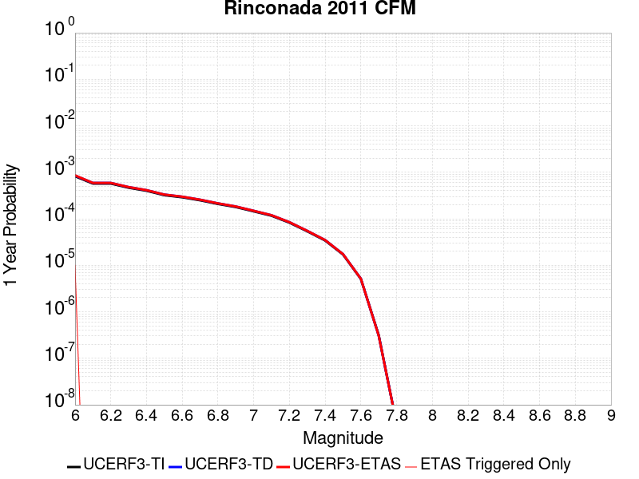 | 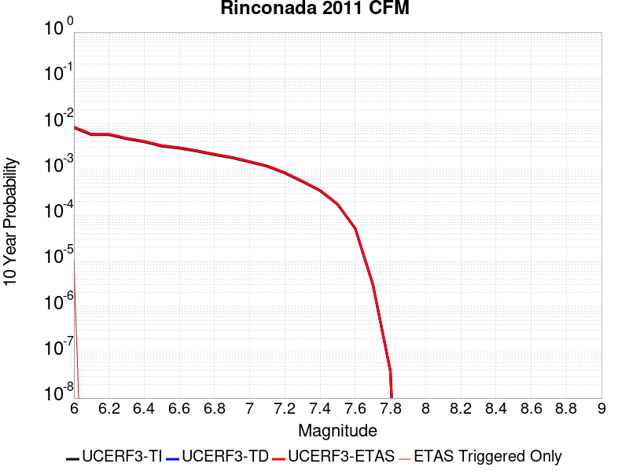 |

| Magnitude | 1 wk TI Prob | 1 wk TD Prob | 1 wk ETAS Prob | 1 wk ETAS/TD Gain | 1 wk ETAS Triggered Only | 1 mo TI Prob | 1 mo TD Prob | 1 mo ETAS Prob | 1 mo ETAS/TD Gain | 1 mo ETAS Triggered Only | 1 yr TI Prob | 1 yr TD Prob | 1 yr ETAS Prob | 1 yr ETAS/TD Gain | 1 yr ETAS Triggered Only | 10 yr TI Prob | 10 yr TD Prob | 10 yr ETAS Prob | 10 yr ETAS/TD Gain | 10 yr ETAS Triggered Only |
|-----|-----|-----|-----|-----|-----|-----|-----|-----|-----|-----|-----|-----|-----|-----|-----|-----|-----|-----|-----|-----|
| 6.0 | 1.5752368E-5 | 1.6274716E-5 | 1.6274716E-5 | 1.0 | 0.0 | 6.75084E-5 | 6.974694E-5 | 6.974694E-5 | 1.0 | 0.0 | 8.2160486E-4 | 8.488413E-4 | 8.5883273E-4 | 1.0117707 | 1.0E-5 | 0.008185739 | 0.00845637 | 0.008466286 | 1.0011725 | 1.0E-5 |
| 6.1 | 1.0966133E-5 | 1.1323029E-5 | 1.1323029E-5 | 1.0 | 0.0 | 4.6996865E-5 | 4.852637E-5 | 4.852637E-5 | 1.0 | 0.0 | 5.720366E-4 | 5.9064914E-4 | 5.9064914E-4 | 1.0 | 0.0 | 0.0057056635 | 0.005890889 | 0.005890889 | 1.0 | 0.0 |
| 6.2 | 1.0966133E-5 | 1.1323029E-5 | 1.1323029E-5 | 1.0 | 0.0 | 4.6996865E-5 | 4.852637E-5 | 4.852637E-5 | 1.0 | 0.0 | 5.720366E-4 | 5.9064914E-4 | 5.9064914E-4 | 1.0 | 0.0 | 0.0057056635 | 0.005890889 | 0.005890889 | 1.0 | 0.0 |
| 6.3 | 8.926149E-6 | 9.212772E-6 | 9.212772E-6 | 1.0 | 0.0 | 3.8254362E-5 | 3.948271E-5 | 3.948271E-5 | 1.0 | 0.0 | 4.6564735E-4 | 4.8059633E-4 | 4.8059633E-4 | 1.0 | 0.0 | 0.0046467283 | 0.0047956146 | 0.0047956146 | 1.0 | 0.0 |
| 6.4 | 7.676955E-6 | 7.920191E-6 | 7.920191E-6 | 1.0 | 0.0 | 3.290082E-5 | 3.3943234E-5 | 3.3943234E-5 | 1.0 | 0.0 | 4.0049385E-4 | 4.131807E-4 | 4.131807E-4 | 1.0 | 0.0 | 0.0039977287 | 0.004124151 | 0.004124151 | 1.0 | 0.0 |
| 6.5 | 6.1671026E-6 | 6.358955E-6 | 6.358955E-6 | 1.0 | 0.0 | 2.6430173E-5 | 2.725238E-5 | 2.725238E-5 | 1.0 | 0.0 | 3.2173982E-4 | 3.317473E-4 | 3.317473E-4 | 1.0 | 0.0 | 0.003212744 | 0.0033125326 | 0.0033125326 | 1.0 | 0.0 |
| 6.6 | 5.553456E-6 | 5.7248126E-6 | 5.7248126E-6 | 1.0 | 0.0 | 2.3800309E-5 | 2.4534682E-5 | 2.4534682E-5 | 1.0 | 0.0 | 2.897302E-4 | 2.9866886E-4 | 2.9866886E-4 | 1.0 | 0.0 | 0.0028935277 | 0.0029826832 | 0.0029826832 | 1.0 | 0.0 |
| 6.7 | 4.787857E-6 | 4.93331E-6 | 4.93331E-6 | 1.0 | 0.0 | 2.0519226E-5 | 2.1142585E-5 | 2.1142585E-5 | 1.0 | 0.0 | 2.4979294E-4 | 2.573806E-4 | 2.573806E-4 | 1.0 | 0.0 | 0.0024951235 | 0.002570831 | 0.002570831 | 1.0 | 0.0 |
| 6.8 | 3.9955166E-6 | 4.1134763E-6 | 4.1134763E-6 | 1.0 | 0.0 | 1.7123532E-5 | 1.7629065E-5 | 1.7629065E-5 | 1.0 | 0.0 | 2.0845905E-4 | 2.1461275E-4 | 2.1461275E-4 | 1.0 | 0.0 | 0.002082636 | 0.0021440587 | 0.0021440587 | 1.0 | 0.0 |
| 6.9 | 3.4250072E-6 | 3.5224466E-6 | 3.5224466E-6 | 1.0 | 0.0 | 1.46785205E-5 | 1.5096112E-5 | 1.5096112E-5 | 1.0 | 0.0 | 1.7869633E-4 | 1.8377969E-4 | 1.8377969E-4 | 1.0 | 0.0 | 0.001785527 | 0.0018362795 | 0.0018362795 | 1.0 | 0.0 |
| 7.0 | 2.7712713E-6 | 2.8467002E-6 | 2.8467002E-6 | 1.0 | 0.0 | 1.1876823E-5 | 1.22000865E-5 | 1.22000865E-5 | 1.0 | 0.0 | 1.4459073E-4 | 1.4852594E-4 | 1.4852594E-4 | 1.0 | 0.0 | 0.0014449668 | 0.0014842683 | 0.0014842683 | 1.0 | 0.0 |
| 7.1 | 2.227358E-6 | 2.2856987E-6 | 2.2856987E-6 | 1.0 | 0.0 | 9.545785E-6 | 9.795815E-6 | 9.795815E-6 | 1.0 | 0.0 | 1.16213734E-4 | 1.1925753E-4 | 1.1925753E-4 | 1.0 | 0.0 | 0.0011615298 | 0.0011919363 | 0.0011919363 | 1.0 | 0.0 |
| 7.2 | 1.581796E-6 | 1.6209015E-6 | 1.6209015E-6 | 1.0 | 0.0 | 6.779108E-6 | 6.946702E-6 | 6.946702E-6 | 1.0 | 0.0 | 8.253252E-5 | 8.4572814E-5 | 8.4572814E-5 | 1.0 | 0.0 | 8.250187E-4 | 8.4540684E-4 | 8.4540684E-4 | 1.0 | 0.0 |
| 7.3 | 1.0306567E-6 | 1.054648E-6 | 1.054648E-6 | 1.0 | 0.0 | 4.4170924E-6 | 4.519912E-6 | 4.519912E-6 | 1.0 | 0.0 | 5.3776774E-5 | 5.502854E-5 | 5.502854E-5 | 1.0 | 0.0 | 5.376376E-4 | 5.501494E-4 | 5.501494E-4 | 1.0 | 0.0 |
| 7.4 | 6.535541E-7 | 6.682744E-7 | 6.682744E-7 | 1.0 | 0.0 | 2.800943E-6 | 2.8640302E-6 | 2.8640302E-6 | 1.0 | 0.0 | 3.4100947E-5 | 3.4869012E-5 | 3.4869012E-5 | 1.0 | 0.0 | 3.4095717E-4 | 3.486355E-4 | 3.486355E-4 | 1.0 | 0.0 |
| 7.5 | 3.2656962E-7 | 3.3316712E-7 | 3.3316712E-7 | 1.0 | 0.0 | 1.3995833E-6 | 1.4278584E-6 | 1.4278584E-6 | 1.0 | 0.0 | 1.7039794E-5 | 1.7384036E-5 | 1.7384036E-5 | 1.0 | 0.0 | 1.7038487E-4 | 1.738268E-4 | 1.738268E-4 | 1.0 | 0.0 |
| 7.6 | 9.754343E-8 | 9.821017E-8 | 9.821017E-8 | 1.0 | 0.0 | 4.180432E-7 | 4.2090065E-7 | 4.2090065E-7 | 1.0 | 0.0 | 5.089664E-6 | 5.1244533E-6 | 5.1244533E-6 | 1.0 | 0.0 | 5.0895473E-5 | 5.124336E-5 | 5.124336E-5 | 1.0 | 0.0 |
| 7.7 | 6.0001453E-9 | 5.8491207E-9 | 5.8491207E-9 | 1.0 | 0.0 | 2.5714908E-8 | 2.506766E-8 | 2.506766E-8 | 1.0 | 0.0 | 3.1307894E-7 | 3.051987E-7 | 3.051987E-7 | 1.0 | 0.0 | 3.1307852E-6 | 3.0519832E-6 | 3.0519832E-6 | 1.0 | 0.0 |
| 7.8 | 7.400003E-11 | 7.4654505E-11 | 7.4654505E-11 | 1.0 | 0.0 | 3.171432E-10 | 3.1994773E-10 | 3.1994773E-10 | 1.0 | 0.0 | 3.861218E-9 | 3.895363E-9 | 3.895363E-9 | 1.0 | 0.0 | 3.861218E-8 | 3.895363E-8 | 3.895363E-8 | 1.0 | 0.0 |

## Carlsbad
*[(top)](#table-of-contents)*

| 1 Week | 1 Month | 1 Year | 10 Year |
|-----|-----|-----|-----|
| 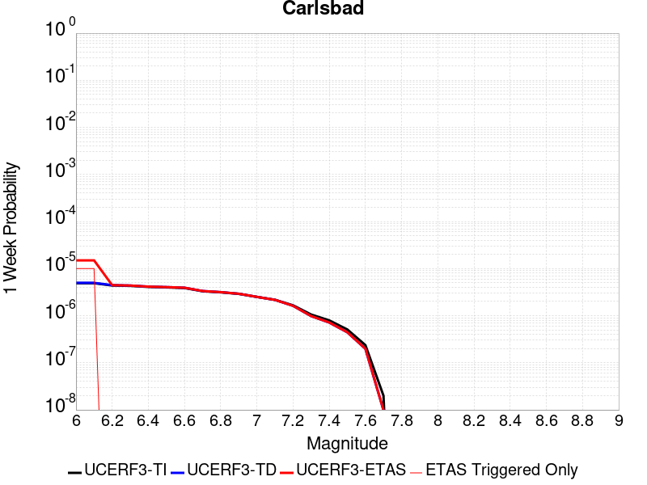 | 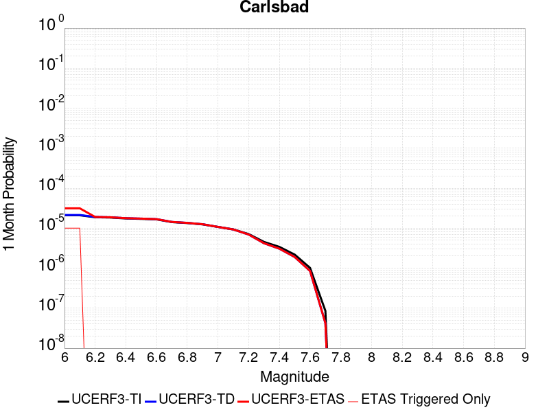 | 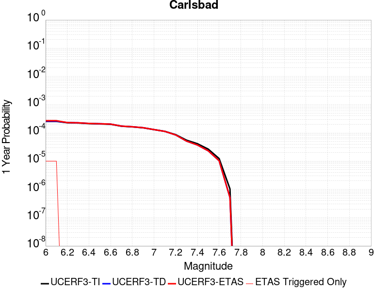 | 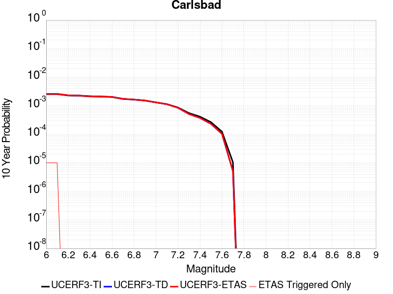 |

| Magnitude | 1 wk TI Prob | 1 wk TD Prob | 1 wk ETAS Prob | 1 wk ETAS/TD Gain | 1 wk ETAS Triggered Only | 1 mo TI Prob | 1 mo TD Prob | 1 mo ETAS Prob | 1 mo ETAS/TD Gain | 1 mo ETAS Triggered Only | 1 yr TI Prob | 1 yr TD Prob | 1 yr ETAS Prob | 1 yr ETAS/TD Gain | 1 yr ETAS Triggered Only | 10 yr TI Prob | 10 yr TD Prob | 10 yr ETAS Prob | 10 yr ETAS/TD Gain | 10 yr ETAS Triggered Only |
|-----|-----|-----|-----|-----|-----|-----|-----|-----|-----|-----|-----|-----|-----|-----|-----|-----|-----|-----|-----|-----|
| 6.0 | 4.9038536E-6 | 4.9872688E-6 | 1.4987219E-5 | 3.0050955 | 1.0E-5 | 2.1016345E-5 | 2.1373837E-5 | 3.1373624E-5 | 1.4678518 | 1.0E-5 | 2.5584397E-4 | 2.6019584E-4 | 2.7019324E-4 | 1.0384226 | 1.0E-5 | 0.002555496 | 0.002598959 | 0.002608933 | 1.0038377 | 1.0E-5 |
| 6.1 | 4.9038536E-6 | 4.9872688E-6 | 1.4987219E-5 | 3.0050955 | 1.0E-5 | 2.1016345E-5 | 2.1373837E-5 | 3.1373624E-5 | 1.4678518 | 1.0E-5 | 2.5584397E-4 | 2.6019584E-4 | 2.7019324E-4 | 1.0384226 | 1.0E-5 | 0.002555496 | 0.002598959 | 0.002608933 | 1.0038377 | 1.0E-5 |
| 6.2 | 4.3820614E-6 | 4.4547814E-6 | 4.4547814E-6 | 1.0 | 0.0 | 1.8780129E-5 | 1.9091782E-5 | 1.9091782E-5 | 1.0 | 0.0 | 2.2862408E-4 | 2.3241801E-4 | 2.3241801E-4 | 1.0 | 0.0 | 0.00228389 | 0.002321785 | 0.002321785 | 1.0 | 0.0 |
| 6.3 | 4.302872E-6 | 4.373019E-6 | 4.373019E-6 | 1.0 | 0.0 | 1.8440749E-5 | 1.8741377E-5 | 1.8741377E-5 | 1.0 | 0.0 | 2.24493E-4 | 2.2815271E-4 | 2.2815271E-4 | 1.0 | 0.0 | 0.0022426634 | 0.0022792201 | 0.0022792201 | 1.0 | 0.0 |
| 6.4 | 4.0835243E-6 | 4.147667E-6 | 4.147667E-6 | 1.0 | 0.0 | 1.75007E-5 | 1.7775597E-5 | 1.7775597E-5 | 1.0 | 0.0 | 2.1305021E-4 | 2.1639673E-4 | 2.1639673E-4 | 1.0 | 0.0 | 0.0021284607 | 0.0021618942 | 0.0021618942 | 1.0 | 0.0 |
| 6.5 | 3.987806E-6 | 4.048899E-6 | 4.048899E-6 | 1.0 | 0.0 | 1.7090486E-5 | 1.7352311E-5 | 1.7352311E-5 | 1.0 | 0.0 | 2.080568E-4 | 2.1124425E-4 | 2.1124425E-4 | 1.0 | 0.0 | 0.002078621 | 0.0021104682 | 0.0021104682 | 1.0 | 0.0 |
| 6.6 | 3.8707576E-6 | 3.927501E-6 | 3.927501E-6 | 1.0 | 0.0 | 1.6588854E-5 | 1.683204E-5 | 1.683204E-5 | 1.0 | 0.0 | 2.0195059E-4 | 2.0491115E-4 | 2.0491115E-4 | 1.0 | 0.0 | 0.0020176715 | 0.0020472556 | 0.0020472556 | 1.0 | 0.0 |
| 6.7 | 3.3093434E-6 | 3.3424044E-6 | 3.3424044E-6 | 1.0 | 0.0 | 1.4182823E-5 | 1.4324512E-5 | 1.4324512E-5 | 1.0 | 0.0 | 1.7266218E-4 | 1.7438704E-4 | 1.7438704E-4 | 1.0 | 0.0 | 0.001725281 | 0.001742508 | 0.001742508 | 1.0 | 0.0 |
| 6.8 | 3.136983E-6 | 3.1664663E-6 | 3.1664663E-6 | 1.0 | 0.0 | 1.3444143E-5 | 1.35704995E-5 | 1.35704995E-5 | 1.0 | 0.0 | 1.6367015E-4 | 1.6520836E-4 | 1.6520836E-4 | 1.0 | 0.0 | 0.0016354966 | 0.0016508611 | 0.0016508611 | 1.0 | 0.0 |
| 6.9 | 2.9056644E-6 | 2.9267715E-6 | 2.9267715E-6 | 1.0 | 0.0 | 1.2452788E-5 | 1.2543246E-5 | 1.2543246E-5 | 1.0 | 0.0 | 1.5160214E-4 | 1.5270336E-4 | 1.5270336E-4 | 1.0 | 0.0 | 0.0015149876 | 0.0015259896 | 0.0015259896 | 1.0 | 0.0 |
| 7.0 | 2.5071035E-6 | 2.51141E-6 | 2.51141E-6 | 1.0 | 0.0 | 1.0744685E-5 | 1.0763142E-5 | 1.0763142E-5 | 1.0 | 0.0 | 1.308087E-4 | 1.310334E-4 | 1.310334E-4 | 1.0 | 0.0 | 0.0013073172 | 0.0013095647 | 0.0013095647 | 1.0 | 0.0 |
| 7.1 | 2.1786877E-6 | 2.1678952E-6 | 2.1678952E-6 | 1.0 | 0.0 | 9.3372E-6 | 9.290947E-6 | 9.290947E-6 | 1.0 | 0.0 | 1.13674476E-4 | 1.13111426E-4 | 1.13111426E-4 | 1.0 | 0.0 | 0.0011361635 | 0.0011305414 | 0.0011305414 | 1.0 | 0.0 |
| 7.2 | 1.6628418E-6 | 1.6213987E-6 | 1.6213987E-6 | 1.0 | 0.0 | 7.1264453E-6 | 6.9488333E-6 | 6.9488333E-6 | 1.0 | 0.0 | 8.676102E-5 | 8.459878E-5 | 8.459878E-5 | 1.0 | 0.0 | 8.672715E-4 | 8.4566796E-4 | 8.4566796E-4 | 1.0 | 0.0 |
| 7.3 | 1.0595926E-6 | 9.816912E-7 | 9.816912E-7 | 1.0 | 0.0 | 4.541103E-6 | 4.207241E-6 | 4.207241E-6 | 1.0 | 0.0 | 5.5286528E-5 | 5.1221967E-5 | 5.1221967E-5 | 1.0 | 0.0 | 5.527277E-4 | 5.121025E-4 | 5.121025E-4 | 1.0 | 0.0 |
| 7.4 | 7.956623E-7 | 7.173889E-7 | 7.173889E-7 | 1.0 | 0.0 | 3.4099767E-6 | 3.0745202E-6 | 3.0745202E-6 | 1.0 | 0.0 | 4.1515676E-5 | 3.7431648E-5 | 3.7431648E-5 | 1.0 | 0.0 | 4.150792E-4 | 3.7425413E-4 | 3.7425413E-4 | 1.0 | 0.0 |
| 7.5 | 5.1043804E-7 | 4.448447E-7 | 4.448447E-7 | 1.0 | 0.0 | 2.1875896E-6 | 1.9064759E-6 | 1.9064759E-6 | 1.0 | 0.0 | 2.663358E-5 | 2.3211102E-5 | 2.3211102E-5 | 1.0 | 0.0 | 2.6630386E-4 | 2.3208735E-4 | 2.3208735E-4 | 1.0 | 0.0 |
| 7.6 | 2.3723294E-7 | 1.9896439E-7 | 1.9896439E-7 | 1.0 | 0.0 | 1.0167122E-6 | 8.527042E-7 | 8.527042E-7 | 1.0 | 0.0 | 1.2378401E-5 | 1.0381627E-5 | 1.0381627E-5 | 1.0 | 0.0 | 1.237771E-4 | 1.038117E-4 | 1.038117E-4 | 1.0 | 0.0 |
| 7.7 | 1.9992152E-8 | 9.860285E-9 | 9.860285E-9 | 1.0 | 0.0 | 8.568065E-8 | 4.2258364E-8 | 4.2258364E-8 | 1.0 | 0.0 | 1.0431614E-6 | 5.144956E-7 | 5.144956E-7 | 1.0 | 0.0 | 1.0431565E-5 | 5.144956E-6 | 5.144956E-6 | 1.0 | 0.0 |

## Pleito
*[(top)](#table-of-contents)*

| 1 Week | 1 Month | 1 Year | 10 Year |
|-----|-----|-----|-----|
| 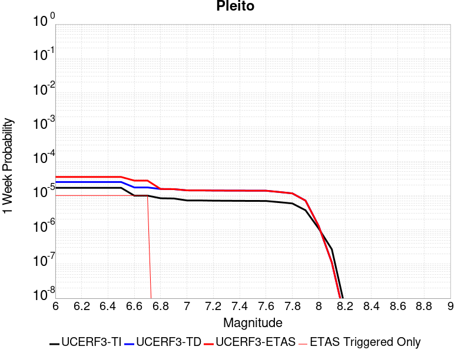 | 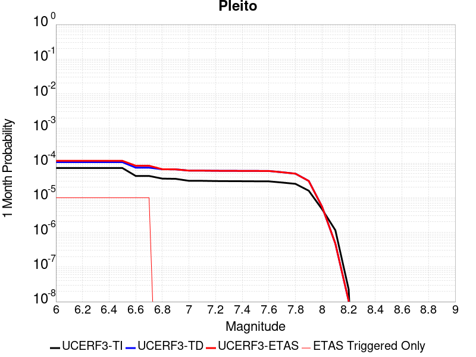 | 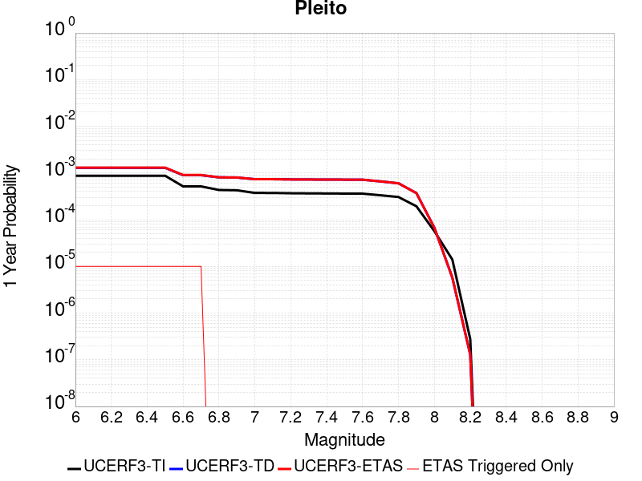 | 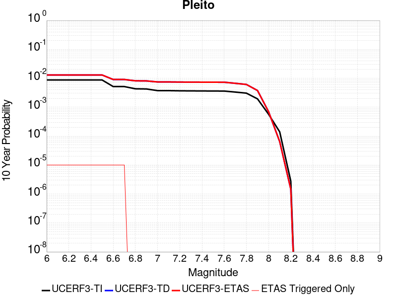 |

| Magnitude | 1 wk TI Prob | 1 wk TD Prob | 1 wk ETAS Prob | 1 wk ETAS/TD Gain | 1 wk ETAS Triggered Only | 1 mo TI Prob | 1 mo TD Prob | 1 mo ETAS Prob | 1 mo ETAS/TD Gain | 1 mo ETAS Triggered Only | 1 yr TI Prob | 1 yr TD Prob | 1 yr ETAS Prob | 1 yr ETAS/TD Gain | 1 yr ETAS Triggered Only | 10 yr TI Prob | 10 yr TD Prob | 10 yr ETAS Prob | 10 yr ETAS/TD Gain | 10 yr ETAS Triggered Only |
|-----|-----|-----|-----|-----|-----|-----|-----|-----|-----|-----|-----|-----|-----|-----|-----|-----|-----|-----|-----|-----|
| 6.0 | 1.6763008E-5 | 2.4764735E-5 | 3.476449E-5 | 1.40379 | 1.0E-5 | 7.183948E-5 | 1.0613067E-4 | 1.1612961E-4 | 1.0942135 | 1.0E-5 | 8.742947E-4 | 0.001291447 | 0.0013014341 | 1.0077332 | 1.0E-5 | 0.00870863 | 0.012954412 | 0.012964282 | 1.000762 | 1.0E-5 |
| 6.1 | 1.6763008E-5 | 2.4764735E-5 | 3.476449E-5 | 1.40379 | 1.0E-5 | 7.183948E-5 | 1.0613067E-4 | 1.1612961E-4 | 1.0942135 | 1.0E-5 | 8.742947E-4 | 0.001291447 | 0.0013014341 | 1.0077332 | 1.0E-5 | 0.00870863 | 0.012954412 | 0.012964282 | 1.000762 | 1.0E-5 |
| 6.2 | 1.6763008E-5 | 2.4764735E-5 | 3.476449E-5 | 1.40379 | 1.0E-5 | 7.183948E-5 | 1.0613067E-4 | 1.1612961E-4 | 1.0942135 | 1.0E-5 | 8.742947E-4 | 0.001291447 | 0.0013014341 | 1.0077332 | 1.0E-5 | 0.00870863 | 0.012954412 | 0.012964282 | 1.000762 | 1.0E-5 |
| 6.3 | 1.6763008E-5 | 2.4764735E-5 | 3.476449E-5 | 1.40379 | 1.0E-5 | 7.183948E-5 | 1.0613067E-4 | 1.1612961E-4 | 1.0942135 | 1.0E-5 | 8.742947E-4 | 0.001291447 | 0.0013014341 | 1.0077332 | 1.0E-5 | 0.00870863 | 0.012954412 | 0.012964282 | 1.000762 | 1.0E-5 |
| 6.4 | 1.6763008E-5 | 2.4764735E-5 | 3.476449E-5 | 1.40379 | 1.0E-5 | 7.183948E-5 | 1.0613067E-4 | 1.1612961E-4 | 1.0942135 | 1.0E-5 | 8.742947E-4 | 0.001291447 | 0.0013014341 | 1.0077332 | 1.0E-5 | 0.00870863 | 0.012954412 | 0.012964282 | 1.000762 | 1.0E-5 |
| 6.5 | 1.6763008E-5 | 2.4764735E-5 | 3.476449E-5 | 1.40379 | 1.0E-5 | 7.183948E-5 | 1.0613067E-4 | 1.1612961E-4 | 1.0942135 | 1.0E-5 | 8.742947E-4 | 0.001291447 | 0.0013014341 | 1.0077332 | 1.0E-5 | 0.00870863 | 0.012954412 | 0.012964282 | 1.000762 | 1.0E-5 |
| 6.6 | 9.910213E-6 | 1.721552E-5 | 2.7215348E-5 | 1.5808612 | 1.0E-5 | 4.247165E-5 | 7.3778734E-5 | 8.3777995E-5 | 1.1355304 | 1.0E-5 | 5.169696E-4 | 8.9788967E-4 | 9.0788066E-4 | 1.0111272 | 1.0E-5 | 0.0051576863 | 0.009051226 | 0.009061135 | 1.0010948 | 1.0E-5 |
| 6.7 | 9.910213E-6 | 1.721552E-5 | 2.7215348E-5 | 1.5808612 | 1.0E-5 | 4.247165E-5 | 7.3778734E-5 | 8.3777995E-5 | 1.1355304 | 1.0E-5 | 5.169696E-4 | 8.9788967E-4 | 9.0788066E-4 | 1.0111272 | 1.0E-5 | 0.0051576863 | 0.009051226 | 0.009061135 | 1.0010948 | 1.0E-5 |
| 6.8 | 8.300162E-6 | 1.5475129E-5 | 1.5475129E-5 | 1.0 | 0.0 | 3.557164E-5 | 6.63203E-5 | 6.63203E-5 | 1.0 | 0.0 | 4.3299864E-4 | 8.07152E-4 | 8.07152E-4 | 1.0 | 0.0 | 0.004321559 | 0.008150663 | 0.008150663 | 1.0 | 0.0 |
| 6.9 | 8.183114E-6 | 1.5346344E-5 | 1.5346344E-5 | 1.0 | 0.0 | 3.5070017E-5 | 6.57684E-5 | 6.57684E-5 | 1.0 | 0.0 | 4.2689382E-4 | 8.0043747E-4 | 8.0043747E-4 | 1.0 | 0.0 | 0.0042607468 | 0.008084008 | 0.008084008 | 1.0 | 0.0 |
| 7.0 | 7.1748823E-6 | 1.4133306E-5 | 1.4133306E-5 | 1.0 | 0.0 | 3.0749135E-5 | 6.0569906E-5 | 6.0569906E-5 | 1.0 | 0.0 | 3.743064E-4 | 7.3718966E-4 | 7.3718966E-4 | 1.0 | 0.0 | 0.0037367654 | 0.0074553755 | 0.0074553755 | 1.0 | 0.0 |
| 7.1 | 7.1671807E-6 | 1.4123676E-5 | 1.4123676E-5 | 1.0 | 0.0 | 3.0716128E-5 | 6.0528637E-5 | 6.0528637E-5 | 1.0 | 0.0 | 3.7390468E-4 | 7.366875E-4 | 7.366875E-4 | 1.0 | 0.0 | 0.0037327618 | 0.0074503883 | 0.0074503883 | 1.0 | 0.0 |
| 7.2 | 7.0649667E-6 | 1.3970962E-5 | 1.3970962E-5 | 1.0 | 0.0 | 3.0278077E-5 | 5.987418E-5 | 5.987418E-5 | 1.0 | 0.0 | 3.6857324E-4 | 7.287248E-4 | 7.287248E-4 | 1.0 | 0.0 | 0.0036796255 | 0.0073711374 | 0.0073711374 | 1.0 | 0.0 |
| 7.3 | 7.02082E-6 | 1.3914415E-5 | 1.3914415E-5 | 1.0 | 0.0 | 3.008888E-5 | 5.9631846E-5 | 5.9631846E-5 | 1.0 | 0.0 | 3.6627054E-4 | 7.257764E-4 | 7.257764E-4 | 1.0 | 0.0 | 0.0036566744 | 0.0073416373 | 0.0073416373 | 1.0 | 0.0 |
| 7.4 | 6.987146E-6 | 1.3873975E-5 | 1.3873975E-5 | 1.0 | 0.0 | 2.9944567E-5 | 5.9458544E-5 | 5.9458544E-5 | 1.0 | 0.0 | 3.6451413E-4 | 7.2366785E-4 | 7.2366785E-4 | 1.0 | 0.0 | 0.0036391679 | 0.007320571 | 0.007320571 | 1.0 | 0.0 |
| 7.5 | 6.9494554E-6 | 1.383088E-5 | 1.383088E-5 | 1.0 | 0.0 | 2.9783041E-5 | 5.9273858E-5 | 5.9273858E-5 | 1.0 | 0.0 | 3.625482E-4 | 7.2142074E-4 | 7.2142074E-4 | 1.0 | 0.0 | 0.0036195726 | 0.007298199 | 0.007298199 | 1.0 | 0.0 |
| 7.6 | 6.92694E-6 | 1.3789992E-5 | 1.3789992E-5 | 1.0 | 0.0 | 2.9686547E-5 | 5.909863E-5 | 5.909863E-5 | 1.0 | 0.0 | 3.6137376E-4 | 7.192888E-4 | 7.192888E-4 | 1.0 | 0.0 | 0.0036078666 | 0.007276951 | 0.007276951 | 1.0 | 0.0 |
| 7.7 | 6.395867E-6 | 1.26690065E-5 | 1.26690065E-5 | 1.0 | 0.0 | 2.741057E-5 | 5.4294615E-5 | 5.4294615E-5 | 1.0 | 0.0 | 3.336726E-4 | 6.6083675E-4 | 6.6083675E-4 | 1.0 | 0.0 | 0.0033317201 | 0.0066955453 | 0.0066955453 | 1.0 | 0.0 |
| 7.8 | 5.8664327E-6 | 1.1536581E-5 | 1.1536581E-5 | 1.0 | 0.0 | 2.5141611E-5 | 4.9441554E-5 | 4.9441554E-5 | 1.0 | 0.0 | 3.060561E-4 | 6.0178485E-4 | 6.0178485E-4 | 1.0 | 0.0 | 0.0030563495 | 0.0061010164 | 0.0061010164 | 1.0 | 0.0 |
| 7.9 | 3.7167474E-6 | 7.1145205E-6 | 7.1145205E-6 | 1.0 | 0.0 | 1.592882E-5 | 3.0490448E-5 | 3.0490448E-5 | 1.0 | 0.0 | 1.9391612E-4 | 3.7115812E-4 | 3.7115812E-4 | 1.0 | 0.0 | 0.0019374699 | 0.0037676243 | 0.0037676243 | 1.0 | 0.0 |
| 8.0 | 1.0903841E-6 | 1.2879104E-6 | 1.2879104E-6 | 1.0 | 0.0 | 4.6730665E-6 | 5.5196047E-6 | 5.5196047E-6 | 1.0 | 0.0 | 5.68931E-5 | 6.719913E-5 | 6.719913E-5 | 1.0 | 0.0 | 5.6878536E-4 | 6.942094E-4 | 6.942094E-4 | 1.0 | 0.0 |
| 8.1 | 2.6894583E-7 | 1.1056095E-7 | 1.1056095E-7 | 1.0 | 0.0 | 1.1526245E-6 | 4.7383253E-7 | 4.7383253E-7 | 1.0 | 0.0 | 1.4033113E-5 | 5.768896E-6 | 5.768896E-6 | 1.0 | 0.0 | 1.4032227E-4 | 6.454915E-5 | 6.454915E-5 | 1.0 | 0.0 |
| 8.2 | 5.2967013E-9 | 2.4567874E-9 | 2.4567874E-9 | 1.0 | 0.0 | 2.2700148E-8 | 1.0529089E-8 | 1.0529089E-8 | 1.0 | 0.0 | 2.7637427E-7 | 1.2819166E-7 | 1.2819166E-7 | 1.0 | 0.0 | 2.7637393E-6 | 1.4588004E-6 | 1.4588004E-6 | 1.0 | 0.0 |

## Quien Sabe 2011 CFM
*[(top)](#table-of-contents)*

| 1 Week | 1 Month | 1 Year | 10 Year |
|-----|-----|-----|-----|
|  |  | 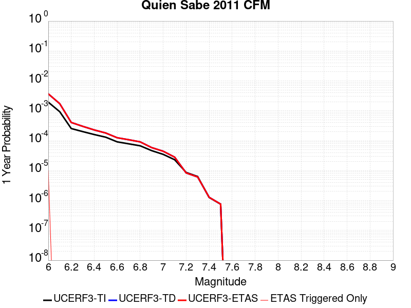 | 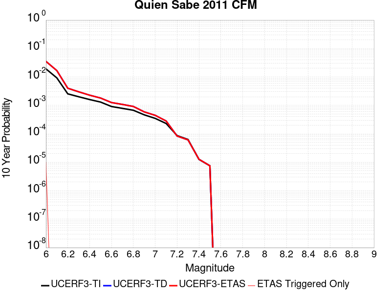 |

| Magnitude | 1 wk TI Prob | 1 wk TD Prob | 1 wk ETAS Prob | 1 wk ETAS/TD Gain | 1 wk ETAS Triggered Only | 1 mo TI Prob | 1 mo TD Prob | 1 mo ETAS Prob | 1 mo ETAS/TD Gain | 1 mo ETAS Triggered Only | 1 yr TI Prob | 1 yr TD Prob | 1 yr ETAS Prob | 1 yr ETAS/TD Gain | 1 yr ETAS Triggered Only | 10 yr TI Prob | 10 yr TD Prob | 10 yr ETAS Prob | 10 yr ETAS/TD Gain | 10 yr ETAS Triggered Only |
|-----|-----|-----|-----|-----|-----|-----|-----|-----|-----|-----|-----|-----|-----|-----|-----|-----|-----|-----|-----|-----|
| 6.0 | 3.729899E-5 | 7.094885E-5 | 8.094814E-5 | 1.1409366 | 1.0E-5 | 1.5984301E-4 | 3.0394195E-4 | 3.1393892E-4 | 1.032891 | 1.0E-5 | 0.0019443515 | 0.0036850597 | 0.0036950228 | 1.0027037 | 1.0E-5 | 0.019274272 | 0.035349693 | 0.035359338 | 1.0002729 | 1.0E-5 |
| 6.1 | 1.7825725E-5 | 3.3210796E-5 | 3.3210796E-5 | 1.0 | 0.0 | 7.639373E-5 | 1.4227985E-4 | 1.4227985E-4 | 1.0 | 0.0 | 9.296967E-4 | 0.0017266083 | 0.0017266083 | 1.0 | 0.0 | 0.009258169 | 0.016698873 | 0.016698873 | 1.0 | 0.0 |
| 6.2 | 4.8865336E-6 | 7.807397E-6 | 7.807397E-6 | 1.0 | 0.0 | 2.0942118E-5 | 3.3456672E-5 | 3.3456672E-5 | 1.0 | 0.0 | 2.5494045E-4 | 4.0691794E-4 | 4.0691794E-4 | 1.0 | 0.0 | 0.0025464818 | 0.0040135398 | 0.0040135398 | 1.0 | 0.0 |
| 6.3 | 3.858491E-6 | 5.7896764E-6 | 5.7896764E-6 | 1.0 | 0.0 | 1.6536285E-5 | 2.4812689E-5 | 2.4812689E-5 | 1.0 | 0.0 | 2.0131067E-4 | 3.020573E-4 | 3.020573E-4 | 1.0 | 0.0 | 0.002011284 | 0.0030020247 | 0.0030020247 | 1.0 | 0.0 |
| 6.4 | 3.0771805E-6 | 4.3848822E-6 | 4.3848822E-6 | 1.0 | 0.0 | 1.318785E-5 | 1.879223E-5 | 1.879223E-5 | 1.0 | 0.0 | 1.6055023E-4 | 2.287738E-4 | 2.287738E-4 | 1.0 | 0.0 | 0.001604343 | 0.0022864633 | 0.0022864633 | 1.0 | 0.0 |
| 6.5 | 2.5081235E-6 | 3.4635768E-6 | 3.4635768E-6 | 1.0 | 0.0 | 1.0749056E-5 | 1.4843825E-5 | 1.4843825E-5 | 1.0 | 0.0 | 1.308619E-4 | 1.8071005E-4 | 1.8071005E-4 | 1.0 | 0.0 | 0.0013078486 | 0.0018122483 | 0.0018122483 | 1.0 | 0.0 |
| 6.6 | 1.7505364E-6 | 2.4023664E-6 | 2.4023664E-6 | 1.0 | 0.0 | 7.502277E-6 | 1.0295819E-5 | 1.0295819E-5 | 1.0 | 0.0 | 9.13364E-5 | 1.253451E-4 | 1.253451E-4 | 1.0 | 0.0 | 9.129886E-4 | 0.0012582706 | 0.0012582706 | 1.0 | 0.0 |
| 6.7 | 1.505737E-6 | 2.063768E-6 | 2.063768E-6 | 1.0 | 0.0 | 6.4531428E-6 | 8.844693E-6 | 8.844693E-6 | 1.0 | 0.0 | 7.8564175E-5 | 1.0767942E-4 | 1.0767942E-4 | 1.0 | 0.0 | 7.853641E-4 | 0.0010818074 | 0.0010818074 | 1.0 | 0.0 |
| 6.8 | 1.2924105E-6 | 1.7484224E-6 | 1.7484224E-6 | 1.0 | 0.0 | 5.5388905E-6 | 7.4932204E-6 | 7.4932204E-6 | 1.0 | 0.0 | 6.74339E-5 | 9.1226684E-5 | 9.1226684E-5 | 1.0 | 0.0 | 6.741344E-4 | 9.1608387E-4 | 9.1608387E-4 | 1.0 | 0.0 |
| 6.9 | 8.9075286E-7 | 1.1249912E-6 | 1.1249912E-6 | 1.0 | 0.0 | 3.8175067E-6 | 4.8213833E-6 | 4.8213833E-6 | 1.0 | 0.0 | 4.6477155E-5 | 5.869898E-5 | 5.869898E-5 | 1.0 | 0.0 | 4.6467435E-4 | 5.903731E-4 | 5.903731E-4 | 1.0 | 0.0 |
| 7.0 | 6.6891175E-7 | 8.516645E-7 | 8.516645E-7 | 1.0 | 0.0 | 2.8667614E-6 | 3.6499866E-6 | 3.6499866E-6 | 1.0 | 0.0 | 3.4902263E-5 | 4.443788E-5 | 4.443788E-5 | 1.0 | 0.0 | 3.4896782E-4 | 4.4676356E-4 | 4.4676356E-4 | 1.0 | 0.0 |
| 7.1 | 4.4205015E-7 | 5.391929E-7 | 5.391929E-7 | 1.0 | 0.0 | 1.8944993E-6 | 2.3108257E-6 | 2.3108257E-6 | 1.0 | 0.0 | 2.3065284E-5 | 2.8134109E-5 | 2.8134109E-5 | 1.0 | 0.0 | 2.3062891E-4 | 2.826615E-4 | 2.826615E-4 | 1.0 | 0.0 |
| 7.2 | 1.6620965E-7 | 1.5987632E-7 | 1.5987632E-7 | 1.0 | 0.0 | 7.123269E-7 | 6.851841E-7 | 6.851841E-7 | 1.0 | 0.0 | 8.672545E-6 | 8.342088E-6 | 8.342088E-6 | 1.0 | 0.0 | 8.6722066E-5 | 8.354316E-5 | 8.354316E-5 | 1.0 | 0.0 |
| 7.3 | 1.2142488E-7 | 1.1726676E-7 | 1.1726676E-7 | 1.0 | 0.0 | 5.2039223E-7 | 5.025717E-7 | 5.025717E-7 | 1.0 | 0.0 | 6.335757E-6 | 6.118797E-6 | 6.118797E-6 | 1.0 | 0.0 | 6.3355765E-5 | 6.120608E-5 | 6.120608E-5 | 1.0 | 0.0 |
| 7.4 | 2.4192937E-8 | 2.4545901E-8 | 2.4545901E-8 | 1.0 | 0.0 | 1.0368401E-7 | 1.0519671E-7 | 1.0519671E-7 | 1.0 | 0.0 | 1.2623522E-6 | 1.2807693E-6 | 1.2807693E-6 | 1.0 | 0.0 | 1.2623449E-5 | 1.2768185E-5 | 1.2768185E-5 | 1.0 | 0.0 |
| 7.5 | 1.4432802E-8 | 1.4508743E-8 | 1.4508743E-8 | 1.0 | 0.0 | 6.185486E-8 | 6.218033E-8 | 6.218033E-8 | 1.0 | 0.0 | 7.530827E-7 | 7.5704526E-7 | 7.5704526E-7 | 1.0 | 0.0 | 7.530801E-6 | 7.528889E-6 | 7.528889E-6 | 1.0 | 0.0 |

## Bartlett Springs 2011 CFM
*[(top)](#table-of-contents)*

| 1 Week | 1 Month | 1 Year | 10 Year |
|-----|-----|-----|-----|
| 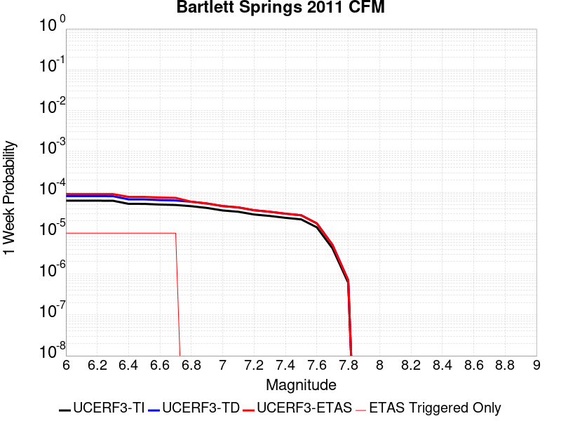 | 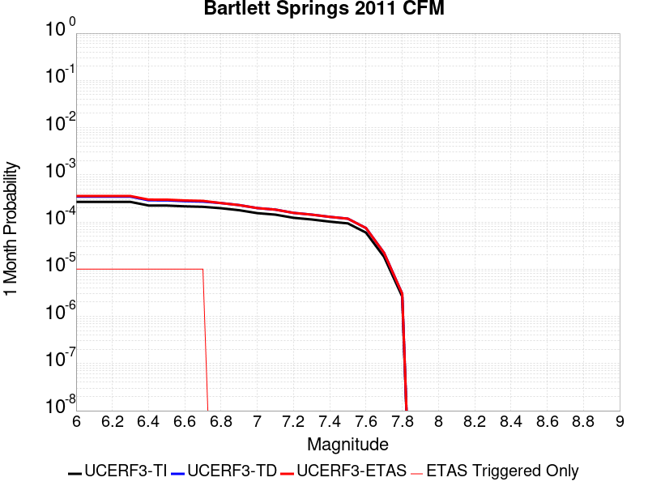 | 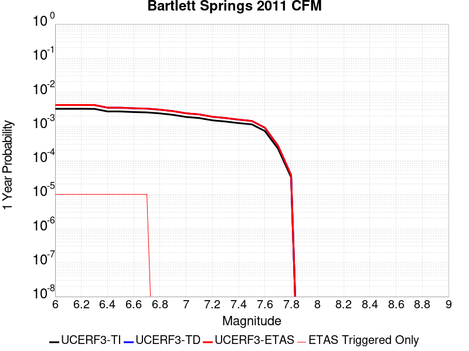 | 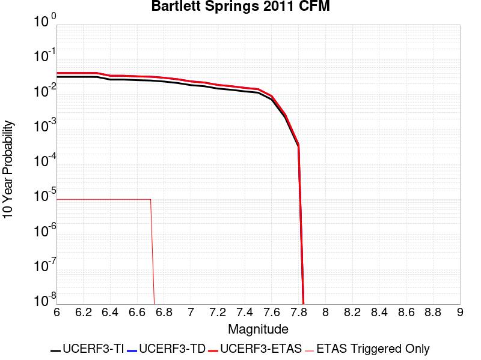 |

| Magnitude | 1 wk TI Prob | 1 wk TD Prob | 1 wk ETAS Prob | 1 wk ETAS/TD Gain | 1 wk ETAS Triggered Only | 1 mo TI Prob | 1 mo TD Prob | 1 mo ETAS Prob | 1 mo ETAS/TD Gain | 1 mo ETAS Triggered Only | 1 yr TI Prob | 1 yr TD Prob | 1 yr ETAS Prob | 1 yr ETAS/TD Gain | 1 yr ETAS Triggered Only | 10 yr TI Prob | 10 yr TD Prob | 10 yr ETAS Prob | 10 yr ETAS/TD Gain | 10 yr ETAS Triggered Only |
|-----|-----|-----|-----|-----|-----|-----|-----|-----|-----|-----|-----|-----|-----|-----|-----|-----|-----|-----|-----|-----|
| 6.0 | 6.2326144E-5 | 8.060668E-5 | 9.060588E-5 | 1.1240492 | 1.0E-5 | 2.6708472E-4 | 3.4541206E-4 | 3.554086E-4 | 1.0289409 | 1.0E-5 | 0.003246908 | 0.0041973754 | 0.0042073335 | 1.0023724 | 1.0E-5 | 0.031998757 | 0.041198105 | 0.041207694 | 1.0002327 | 1.0E-5 |
| 6.1 | 6.227657E-5 | 8.054418E-5 | 9.054338E-5 | 1.1241455 | 1.0E-5 | 2.668723E-4 | 3.4514428E-4 | 3.5514083E-4 | 1.0289634 | 1.0E-5 | 0.0032443295 | 0.004194128 | 0.004204086 | 1.0023743 | 1.0E-5 | 0.031973712 | 0.041166842 | 0.04117643 | 1.0002329 | 1.0E-5 |
| 6.2 | 6.22452E-5 | 8.050479E-5 | 9.0503985E-5 | 1.1242062 | 1.0E-5 | 2.6673786E-4 | 3.449755E-4 | 3.5497203E-4 | 1.0289775 | 1.0E-5 | 0.0032426978 | 0.004192081 | 0.004202039 | 1.0023755 | 1.0E-5 | 0.03195787 | 0.04114713 | 0.04115672 | 1.000233 | 1.0E-5 |
| 6.3 | 6.219006E-5 | 8.043463E-5 | 9.043382E-5 | 1.1243145 | 1.0E-5 | 2.6650162E-4 | 3.4467486E-4 | 3.546714E-4 | 1.0290029 | 1.0E-5 | 0.00323983 | 0.0041884347 | 0.004198393 | 1.0023775 | 1.0E-5 | 0.031930014 | 0.04111203 | 0.04112162 | 1.0002333 | 1.0E-5 |
| 6.4 | 5.2175856E-5 | 6.7254E-5 | 7.7253324E-5 | 1.1486801 | 1.0E-5 | 2.2359163E-4 | 2.8819984E-4 | 2.9819697E-4 | 1.0346881 | 1.0E-5 | 0.0027188298 | 0.0035032362 | 0.0035132011 | 1.0028445 | 1.0E-5 | 0.026858058 | 0.03448956 | 0.034499217 | 1.0002799 | 1.0E-5 |
| 6.5 | 5.205166E-5 | 6.709666E-5 | 7.7095996E-5 | 1.1490287 | 1.0E-5 | 2.2305945E-4 | 2.875257E-4 | 2.9752284E-4 | 1.0347695 | 1.0E-5 | 0.0027123666 | 0.0034950553 | 0.0035050202 | 1.0028511 | 1.0E-5 | 0.026794989 | 0.034410305 | 0.03441996 | 1.0002806 | 1.0E-5 |
| 6.6 | 5.0085426E-5 | 6.449303E-5 | 7.449239E-5 | 1.1550455 | 1.0E-5 | 2.1463417E-4 | 2.7636968E-4 | 2.863669E-4 | 1.0361735 | 1.0E-5 | 0.0026100394 | 0.0033596596 | 0.003369626 | 1.0029665 | 1.0E-5 | 0.025795965 | 0.03309789 | 0.03310756 | 1.0002922 | 1.0E-5 |
| 6.7 | 4.8930866E-5 | 6.30177E-5 | 7.301707E-5 | 1.1586756 | 1.0E-5 | 2.0968684E-4 | 2.700482E-4 | 2.8004547E-4 | 1.0370204 | 1.0E-5 | 0.0025499484 | 0.0032829295 | 0.0032928968 | 1.003036 | 1.0E-5 | 0.025208864 | 0.032353252 | 0.032362927 | 1.0002991 | 1.0E-5 |
| 6.8 | 4.5679535E-5 | 5.874213E-5 | 5.874213E-5 | 1.0 | 0.0 | 1.9575475E-4 | 2.517279E-4 | 2.517279E-4 | 1.0 | 0.0 | 0.002380709 | 0.0030605178 | 0.0030605178 | 1.0 | 0.0 | 0.023553653 | 0.030190729 | 0.030190729 | 1.0 | 0.0 |
| 6.9 | 4.1439176E-5 | 5.3220345E-5 | 5.3220345E-5 | 1.0 | 0.0 | 1.7758438E-4 | 2.2806737E-4 | 2.2806737E-4 | 1.0 | 0.0 | 0.002159946 | 0.00277321 | 0.00277321 | 1.0 | 0.0 | 0.021390721 | 0.02739108 | 0.02739108 | 1.0 | 0.0 |
| 7.0 | 3.5920104E-5 | 4.6008958E-5 | 4.6008958E-5 | 1.0 | 0.0 | 1.5393422E-4 | 1.9716643E-4 | 1.9716643E-4 | 1.0 | 0.0 | 0.001872538 | 0.0023978746 | 0.0023978746 | 1.0 | 0.0 | 0.018568378 | 0.023723308 | 0.023723308 | 1.0 | 0.0 |
| 7.1 | 3.338812E-5 | 4.2689815E-5 | 4.2689815E-5 | 1.0 | 0.0 | 1.430841E-4 | 1.829436E-4 | 1.829436E-4 | 1.0 | 0.0 | 0.0017406568 | 0.0022250775 | 0.0022250775 | 1.0 | 0.0 | 0.017270854 | 0.02203084 | 0.02203084 | 1.0 | 0.0 |
| 7.2 | 2.8619615E-5 | 3.640186E-5 | 3.640186E-5 | 1.0 | 0.0 | 1.2264973E-4 | 1.559987E-4 | 1.559987E-4 | 1.0 | 0.0 | 0.0014922376 | 0.0018976394 | 0.0018976394 | 1.0 | 0.0 | 0.014822568 | 0.018816413 | 0.018816413 | 1.0 | 0.0 |
| 7.3 | 2.6376783E-5 | 3.3422963E-5 | 3.3422963E-5 | 1.0 | 0.0 | 1.13038455E-4 | 1.4323345E-4 | 1.4323345E-4 | 1.0 | 0.0 | 0.0013753743 | 0.0017424817 | 0.0017424817 | 1.0 | 0.0 | 0.01366893 | 0.017289983 | 0.017289983 | 1.0 | 0.0 |
| 7.4 | 2.3738676E-5 | 2.9979174E-5 | 2.9979174E-5 | 1.0 | 0.0 | 1.0173322E-4 | 1.2847589E-4 | 1.2847589E-4 | 1.0 | 0.0 | 0.0012378981 | 0.0015630797 | 0.0015630797 | 1.0 | 0.0 | 0.012310251 | 0.01552236 | 0.01552236 | 1.0 | 0.0 |
| 7.5 | 2.1789481E-5 | 2.7439555E-5 | 2.7439555E-5 | 1.0 | 0.0 | 9.338015E-5 | 1.1759284E-4 | 1.1759284E-4 | 1.0 | 0.0 | 0.0011363103 | 0.0014307604 | 0.0014307604 | 1.0 | 0.0 | 0.011305175 | 0.014216874 | 0.014216874 | 1.0 | 0.0 |
| 7.6 | 1.3895281E-5 | 1.7368566E-5 | 1.7368566E-5 | 1.0 | 0.0 | 5.9549846E-5 | 7.44346E-5 | 7.44346E-5 | 1.0 | 0.0 | 7.2477816E-4 | 9.058674E-4 | 9.058674E-4 | 1.0 | 0.0 | 0.0072241887 | 0.009022309 | 0.009022309 | 1.0 | 0.0 |
| 7.7 | 4.245981E-6 | 5.1625234E-6 | 5.1625234E-6 | 1.0 | 0.0 | 1.8196934E-5 | 2.2124914E-5 | 2.2124914E-5 | 1.0 | 0.0 | 2.2152514E-4 | 2.693377E-4 | 2.693377E-4 | 1.0 | 0.0 | 0.0022130446 | 0.00269016 | 0.00269016 | 1.0 | 0.0 |
| 7.8 | 6.145192E-7 | 7.0470315E-7 | 7.0470315E-7 | 1.0 | 0.0 | 2.633651E-6 | 3.020153E-6 | 3.020153E-6 | 1.0 | 0.0 | 3.206423E-5 | 3.6769754E-5 | 3.6769754E-5 | 1.0 | 0.0 | 3.2059604E-4 | 3.6763048E-4 | 3.6763048E-4 | 1.0 | 0.0 |

## Laguna Salada
*[(top)](#table-of-contents)*

| 1 Week | 1 Month | 1 Year | 10 Year |
|-----|-----|-----|-----|
|  | 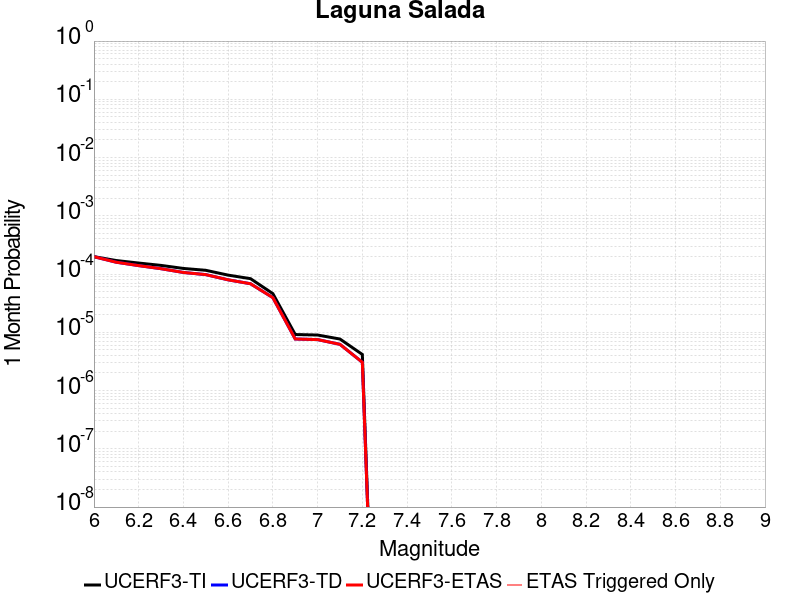 |  | 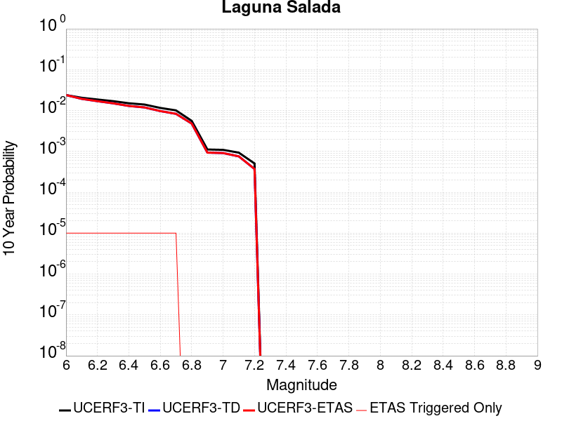 |

| Magnitude | 1 wk TI Prob | 1 wk TD Prob | 1 wk ETAS Prob | 1 wk ETAS/TD Gain | 1 wk ETAS Triggered Only | 1 mo TI Prob | 1 mo TD Prob | 1 mo ETAS Prob | 1 mo ETAS/TD Gain | 1 mo ETAS Triggered Only | 1 yr TI Prob | 1 yr TD Prob | 1 yr ETAS Prob | 1 yr ETAS/TD Gain | 1 yr ETAS Triggered Only | 10 yr TI Prob | 10 yr TD Prob | 10 yr ETAS Prob | 10 yr ETAS/TD Gain | 10 yr ETAS Triggered Only |
|-----|-----|-----|-----|-----|-----|-----|-----|-----|-----|-----|-----|-----|-----|-----|-----|-----|-----|-----|-----|-----|
| 6.0 | 4.6465593E-5 | 4.634507E-5 | 4.634507E-5 | 1.0 | 0.0 | 1.9912305E-4 | 1.9860751E-4 | 1.9860751E-4 | 1.0 | 0.0 | 0.0024216278 | 0.0024154421 | 0.002425418 | 1.00413 | 1.0E-5 | 0.02395408 | 0.023965387 | 0.023975147 | 1.0004072 | 1.0E-5 |
| 6.1 | 3.982297E-5 | 3.7244878E-5 | 3.7244878E-5 | 1.0 | 0.0 | 1.706587E-4 | 1.5961178E-4 | 1.5961178E-4 | 1.0 | 0.0 | 0.0020757897 | 0.0019416384 | 0.001951619 | 1.0051403 | 1.0E-5 | 0.020565065 | 0.019322045 | 0.019331852 | 1.0005076 | 1.0E-5 |
| 6.2 | 3.6067784E-5 | 3.2600165E-5 | 3.2600165E-5 | 1.0 | 0.0 | 1.5456705E-4 | 1.3970808E-4 | 1.3970808E-4 | 1.0 | 0.0 | 0.0018802295 | 0.0016997134 | 0.0017096964 | 1.0058733 | 1.0E-5 | 0.018644003 | 0.016963193 | 0.016973024 | 1.0005795 | 1.0E-5 |
| 6.3 | 3.2859112E-5 | 2.8847233E-5 | 2.8847233E-5 | 1.0 | 0.0 | 1.4081717E-4 | 1.2362566E-4 | 1.2362566E-4 | 1.0 | 0.0 | 0.0017131006 | 0.0015041964 | 0.0015141814 | 1.006638 | 1.0E-5 | 0.016999546 | 0.015031838 | 0.0150416875 | 1.0006553 | 1.0E-5 |
| 6.4 | 2.9132116E-5 | 2.4851877E-5 | 2.4851877E-5 | 1.0 | 0.0 | 1.2484594E-4 | 1.0650421E-4 | 1.0650421E-4 | 1.0 | 0.0 | 0.0015189396 | 0.001296006 | 0.0013059931 | 1.007706 | 1.0E-5 | 0.015085992 | 0.012965128 | 0.012974999 | 1.0007613 | 1.0E-5 |
| 6.5 | 2.7075037E-5 | 2.2824677E-5 | 2.2824677E-5 | 1.0 | 0.0 | 1.1603071E-4 | 9.7816875E-5 | 9.7816875E-5 | 1.0 | 0.0 | 0.0014117584 | 0.0011903581 | 0.0012003462 | 1.0083908 | 1.0E-5 | 0.014028233 | 0.011916272 | 0.011926153 | 1.0008292 | 1.0E-5 |
| 6.6 | 2.2367465E-5 | 1.8572848E-5 | 1.8572848E-5 | 1.0 | 0.0 | 9.5857045E-5 | 7.959595E-5 | 7.959595E-5 | 1.0 | 0.0 | 0.0011664346 | 9.687322E-4 | 9.787225E-4 | 1.0103128 | 1.0E-5 | 0.011603311 | 0.009708806 | 0.00971871 | 1.00102 | 1.0E-5 |
| 6.7 | 1.9458053E-5 | 1.5913607E-5 | 1.5913607E-5 | 1.0 | 0.0 | 8.338899E-5 | 6.819984E-5 | 6.819984E-5 | 1.0 | 0.0 | 0.001014788 | 8.300971E-4 | 8.400888E-4 | 1.0120368 | 1.0E-5 | 0.010101665 | 0.008315945 | 0.008325862 | 1.0011925 | 1.0E-5 |
| 6.8 | 1.0767866E-5 | 9.183346E-6 | 9.183346E-6 | 1.0 | 0.0 | 4.614718E-5 | 3.9356994E-5 | 3.9356994E-5 | 1.0 | 0.0 | 5.6169706E-4 | 4.7913467E-4 | 4.7913467E-4 | 1.0 | 0.0 | 0.0056027942 | 0.0048085325 | 0.0048085325 | 1.0 | 0.0 |
| 6.9 | 2.1384765E-6 | 1.7913964E-6 | 1.7913964E-6 | 1.0 | 0.0 | 9.164866E-6 | 7.677392E-6 | 7.677392E-6 | 1.0 | 0.0 | 1.1157654E-4 | 9.346863E-5 | 9.346863E-5 | 1.0 | 0.0 | 0.0011152053 | 9.343315E-4 | 9.343315E-4 | 1.0 | 0.0 |
| 7.0 | 2.0952946E-6 | 1.7493335E-6 | 1.7493335E-6 | 1.0 | 0.0 | 8.979802E-6 | 7.497124E-6 | 7.497124E-6 | 1.0 | 0.0 | 1.0932361E-4 | 9.127405E-5 | 9.127405E-5 | 1.0 | 0.0 | 0.0010926984 | 9.124038E-4 | 9.124038E-4 | 1.0 | 0.0 |
| 7.1 | 1.7887576E-6 | 1.4500541E-6 | 1.4500541E-6 | 1.0 | 0.0 | 7.666081E-6 | 6.2145045E-6 | 6.2145045E-6 | 1.0 | 0.0 | 9.333054E-5 | 7.565928E-5 | 7.565928E-5 | 1.0 | 0.0 | 9.329135E-4 | 7.5636554E-4 | 7.5636554E-4 | 1.0 | 0.0 |
| 7.2 | 9.723109E-7 | 7.135829E-7 | 7.135829E-7 | 1.0 | 0.0 | 4.16704E-6 | 3.0582096E-6 | 3.0582096E-6 | 1.0 | 0.0 | 5.073253E-5 | 3.7233232E-5 | 3.7233232E-5 | 1.0 | 0.0 | 5.072095E-4 | 3.722862E-4 | 3.722862E-4 | 1.0 | 0.0 |

## Great Valley 14 (Kettleman Hills)
*[(top)](#table-of-contents)*

| 1 Week | 1 Month | 1 Year | 10 Year |
|-----|-----|-----|-----|
|  |  | 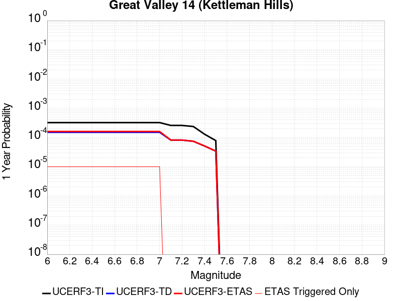 | 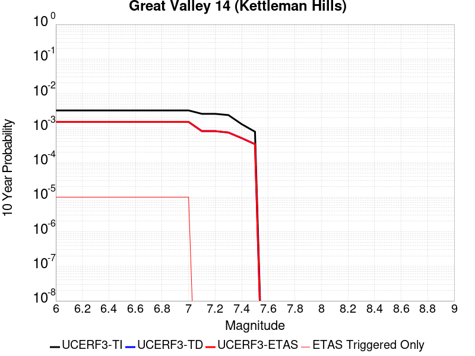 |

| Magnitude | 1 wk TI Prob | 1 wk TD Prob | 1 wk ETAS Prob | 1 wk ETAS/TD Gain | 1 wk ETAS Triggered Only | 1 mo TI Prob | 1 mo TD Prob | 1 mo ETAS Prob | 1 mo ETAS/TD Gain | 1 mo ETAS Triggered Only | 1 yr TI Prob | 1 yr TD Prob | 1 yr ETAS Prob | 1 yr ETAS/TD Gain | 1 yr ETAS Triggered Only | 10 yr TI Prob | 10 yr TD Prob | 10 yr ETAS Prob | 10 yr ETAS/TD Gain | 10 yr ETAS Triggered Only |
|-----|-----|-----|-----|-----|-----|-----|-----|-----|-----|-----|-----|-----|-----|-----|-----|-----|-----|-----|-----|-----|
| 6.0 | 6.2057843E-6 | 2.8768522E-6 | 1.2876823E-5 | 4.4760113 | 1.0E-5 | 2.6595946E-5 | 1.2329322E-5 | 2.2329199E-5 | 1.8110646 | 1.0E-5 | 3.2375753E-4 | 1.501015E-4 | 1.6010001E-4 | 1.0666115 | 1.0E-5 | 0.0032328626 | 0.0015002326 | 0.0015102176 | 1.0066556 | 1.0E-5 |
| 6.1 | 6.2057843E-6 | 2.8768522E-6 | 1.2876823E-5 | 4.4760113 | 1.0E-5 | 2.6595946E-5 | 1.2329322E-5 | 2.2329199E-5 | 1.8110646 | 1.0E-5 | 3.2375753E-4 | 1.501015E-4 | 1.6010001E-4 | 1.0666115 | 1.0E-5 | 0.0032328626 | 0.0015002326 | 0.0015102176 | 1.0066556 | 1.0E-5 |
| 6.2 | 6.2057843E-6 | 2.8768522E-6 | 1.2876823E-5 | 4.4760113 | 1.0E-5 | 2.6595946E-5 | 1.2329322E-5 | 2.2329199E-5 | 1.8110646 | 1.0E-5 | 3.2375753E-4 | 1.501015E-4 | 1.6010001E-4 | 1.0666115 | 1.0E-5 | 0.0032328626 | 0.0015002326 | 0.0015102176 | 1.0066556 | 1.0E-5 |
| 6.3 | 6.2057843E-6 | 2.8768522E-6 | 1.2876823E-5 | 4.4760113 | 1.0E-5 | 2.6595946E-5 | 1.2329322E-5 | 2.2329199E-5 | 1.8110646 | 1.0E-5 | 3.2375753E-4 | 1.501015E-4 | 1.6010001E-4 | 1.0666115 | 1.0E-5 | 0.0032328626 | 0.0015002326 | 0.0015102176 | 1.0066556 | 1.0E-5 |
| 6.4 | 6.2057843E-6 | 2.8768522E-6 | 1.2876823E-5 | 4.4760113 | 1.0E-5 | 2.6595946E-5 | 1.2329322E-5 | 2.2329199E-5 | 1.8110646 | 1.0E-5 | 3.2375753E-4 | 1.501015E-4 | 1.6010001E-4 | 1.0666115 | 1.0E-5 | 0.0032328626 | 0.0015002326 | 0.0015102176 | 1.0066556 | 1.0E-5 |
| 6.5 | 6.2057843E-6 | 2.8768522E-6 | 1.2876823E-5 | 4.4760113 | 1.0E-5 | 2.6595946E-5 | 1.2329322E-5 | 2.2329199E-5 | 1.8110646 | 1.0E-5 | 3.2375753E-4 | 1.501015E-4 | 1.6010001E-4 | 1.0666115 | 1.0E-5 | 0.0032328626 | 0.0015002326 | 0.0015102176 | 1.0066556 | 1.0E-5 |
| 6.6 | 6.2057843E-6 | 2.8768522E-6 | 1.2876823E-5 | 4.4760113 | 1.0E-5 | 2.6595946E-5 | 1.2329322E-5 | 2.2329199E-5 | 1.8110646 | 1.0E-5 | 3.2375753E-4 | 1.501015E-4 | 1.6010001E-4 | 1.0666115 | 1.0E-5 | 0.0032328626 | 0.0015002326 | 0.0015102176 | 1.0066556 | 1.0E-5 |
| 6.7 | 6.2057843E-6 | 2.8768522E-6 | 1.2876823E-5 | 4.4760113 | 1.0E-5 | 2.6595946E-5 | 1.2329322E-5 | 2.2329199E-5 | 1.8110646 | 1.0E-5 | 3.2375753E-4 | 1.501015E-4 | 1.6010001E-4 | 1.0666115 | 1.0E-5 | 0.0032328626 | 0.0015002326 | 0.0015102176 | 1.0066556 | 1.0E-5 |
| 6.8 | 6.2057843E-6 | 2.8768522E-6 | 1.2876823E-5 | 4.4760113 | 1.0E-5 | 2.6595946E-5 | 1.2329322E-5 | 2.2329199E-5 | 1.8110646 | 1.0E-5 | 3.2375753E-4 | 1.501015E-4 | 1.6010001E-4 | 1.0666115 | 1.0E-5 | 0.0032328626 | 0.0015002326 | 0.0015102176 | 1.0066556 | 1.0E-5 |
| 6.9 | 6.2057843E-6 | 2.8768522E-6 | 1.2876823E-5 | 4.4760113 | 1.0E-5 | 2.6595946E-5 | 1.2329322E-5 | 2.2329199E-5 | 1.8110646 | 1.0E-5 | 3.2375753E-4 | 1.501015E-4 | 1.6010001E-4 | 1.0666115 | 1.0E-5 | 0.0032328626 | 0.0015002326 | 0.0015102176 | 1.0066556 | 1.0E-5 |
| 7.0 | 6.2057843E-6 | 2.8768522E-6 | 1.2876823E-5 | 4.4760113 | 1.0E-5 | 2.6595946E-5 | 1.2329322E-5 | 2.2329199E-5 | 1.8110646 | 1.0E-5 | 3.2375753E-4 | 1.501015E-4 | 1.6010001E-4 | 1.0666115 | 1.0E-5 | 0.0032328626 | 0.0015002326 | 0.0015102176 | 1.0066556 | 1.0E-5 |
| 7.1 | 4.95113E-6 | 1.560601E-6 | 1.560601E-6 | 1.0 | 0.0 | 2.1218955E-5 | 6.6882744E-6 | 6.6882744E-6 | 1.0 | 0.0 | 2.5831014E-4 | 8.1426886E-5 | 8.1426886E-5 | 1.0 | 0.0 | 0.0025801011 | 8.139895E-4 | 8.139895E-4 | 1.0 | 0.0 |
| 7.2 | 4.95113E-6 | 1.560601E-6 | 1.560601E-6 | 1.0 | 0.0 | 2.1218955E-5 | 6.6882744E-6 | 6.6882744E-6 | 1.0 | 0.0 | 2.5831014E-4 | 8.1426886E-5 | 8.1426886E-5 | 1.0 | 0.0 | 0.0025801011 | 8.139895E-4 | 8.139895E-4 | 1.0 | 0.0 |
| 7.3 | 4.5549086E-6 | 1.4225644E-6 | 1.4225644E-6 | 1.0 | 0.0 | 1.9520892E-5 | 6.0966913E-6 | 6.0966913E-6 | 1.0 | 0.0 | 2.3764092E-4 | 7.422486E-5 | 7.422486E-5 | 1.0 | 0.0 | 0.0023738695 | 7.420173E-4 | 7.420173E-4 | 1.0 | 0.0 |
| 7.4 | 2.4837766E-6 | 9.80032E-7 | 9.80032E-7 | 1.0 | 0.0 | 1.0644713E-5 | 4.2001307E-6 | 4.2001307E-6 | 1.0 | 0.0 | 1.2959167E-4 | 5.113546E-5 | 5.113546E-5 | 1.0 | 0.0 | 0.0012951613 | 5.1124353E-4 | 5.1124353E-4 | 1.0 | 0.0 |
| 7.5 | 1.5002679E-6 | 6.545985E-7 | 6.545985E-7 | 1.0 | 0.0 | 6.4297037E-6 | 2.8054194E-6 | 2.8054194E-6 | 1.0 | 0.0 | 7.827883E-5 | 3.4155488E-5 | 3.4155488E-5 | 1.0 | 0.0 | 7.825126E-4 | 3.4150656E-4 | 3.4150656E-4 | 1.0 | 0.0 |

## San Andreas (Offshore) 2011 CFM
*[(top)](#table-of-contents)*

| 1 Week | 1 Month | 1 Year | 10 Year |
|-----|-----|-----|-----|
| 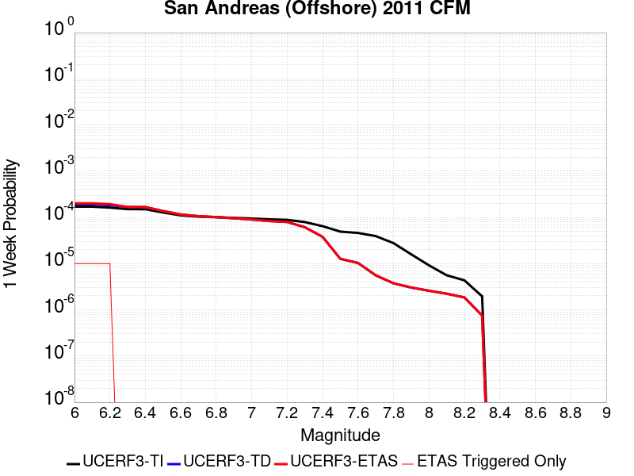 |  |  | 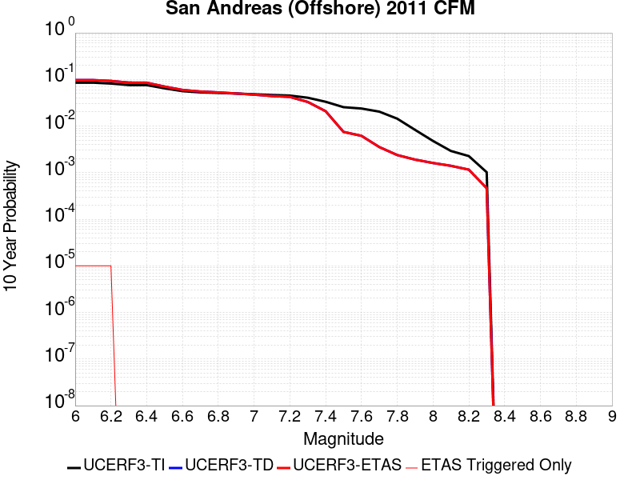 |

| Magnitude | 1 wk TI Prob | 1 wk TD Prob | 1 wk ETAS Prob | 1 wk ETAS/TD Gain | 1 wk ETAS Triggered Only | 1 mo TI Prob | 1 mo TD Prob | 1 mo ETAS Prob | 1 mo ETAS/TD Gain | 1 mo ETAS Triggered Only | 1 yr TI Prob | 1 yr TD Prob | 1 yr ETAS Prob | 1 yr ETAS/TD Gain | 1 yr ETAS Triggered Only | 10 yr TI Prob | 10 yr TD Prob | 10 yr ETAS Prob | 10 yr ETAS/TD Gain | 10 yr ETAS Triggered Only |
|-----|-----|-----|-----|-----|-----|-----|-----|-----|-----|-----|-----|-----|-----|-----|-----|-----|-----|-----|-----|-----|
| 6.0 | 1.7072787E-4 | 1.9226626E-4 | 2.0226435E-4 | 1.0520012 | 1.0E-5 | 7.3148566E-4 | 8.237405E-4 | 8.3373225E-4 | 1.0121298 | 1.0E-5 | 0.008869528 | 0.009983436 | 0.009993336 | 1.0009917 | 1.0E-5 | 0.085237645 | 0.09681613 | 0.09682517 | 1.0000933 | 1.0E-5 |
| 6.1 | 1.7072787E-4 | 1.9226626E-4 | 2.0226435E-4 | 1.0520012 | 1.0E-5 | 7.3148566E-4 | 8.237405E-4 | 8.3373225E-4 | 1.0121298 | 1.0E-5 | 0.008869528 | 0.009983436 | 0.009993336 | 1.0009917 | 1.0E-5 | 0.085237645 | 0.09681613 | 0.09682517 | 1.0000933 | 1.0E-5 |
| 6.2 | 1.6312556E-4 | 1.8408237E-4 | 1.9408052E-4 | 1.0543135 | 1.0E-5 | 6.989222E-4 | 7.8868825E-4 | 7.9868035E-4 | 1.0126693 | 1.0E-5 | 0.008476226 | 0.0095605 | 0.009570405 | 1.0010359 | 1.0E-5 | 0.08160117 | 0.092837214 | 0.09284629 | 1.0000978 | 1.0E-5 |
| 6.3 | 1.5103363E-4 | 1.6881147E-4 | 1.6881147E-4 | 1.0 | 0.0 | 6.471264E-4 | 7.232793E-4 | 7.232793E-4 | 1.0 | 0.0 | 0.007850339 | 0.008770814 | 0.008770814 | 1.0 | 0.0 | 0.075787395 | 0.08546859 | 0.08546859 | 1.0 | 0.0 |
| 6.4 | 1.5047993E-4 | 1.6767075E-4 | 1.6767075E-4 | 1.0 | 0.0 | 6.4475456E-4 | 7.183932E-4 | 7.183932E-4 | 1.0 | 0.0 | 0.007821669 | 0.008711802 | 0.008711802 | 1.0 | 0.0 | 0.0755203 | 0.08494888 | 0.08494888 | 1.0 | 0.0 |
| 6.5 | 1.2760791E-4 | 1.3734949E-4 | 1.3734949E-4 | 1.0 | 0.0 | 5.467764E-4 | 5.8850925E-4 | 5.8850925E-4 | 1.0 | 0.0 | 0.0066367025 | 0.007141834 | 0.007141834 | 1.0 | 0.0 | 0.064419635 | 0.07024954 | 0.07024954 | 1.0 | 0.0 |
| 6.6 | 1.1063525E-4 | 1.15565475E-4 | 1.15565475E-4 | 1.0 | 0.0 | 4.740649E-4 | 4.9518765E-4 | 4.9518765E-4 | 1.0 | 0.0 | 0.0057564764 | 0.006012446 | 0.006012446 | 1.0 | 0.0 | 0.05609626 | 0.059496127 | 0.059496127 | 1.0 | 0.0 |
| 6.7 | 1.0391049E-4 | 1.0645875E-4 | 1.0645875E-4 | 1.0 | 0.0 | 4.4525467E-4 | 4.56173E-4 | 4.56173E-4 | 1.0 | 0.0 | 0.0054075094 | 0.0055399504 | 0.0055399504 | 1.0 | 0.0 | 0.052778035 | 0.05498844 | 0.05498844 | 1.0 | 0.0 |
| 6.8 | 1.0096706E-4 | 1.01582154E-4 | 1.01582154E-4 | 1.0 | 0.0 | 4.3264418E-4 | 4.3528038E-4 | 4.3528038E-4 | 1.0 | 0.0 | 0.0052547283 | 0.0052868384 | 0.0052868384 | 1.0 | 0.0 | 0.051321987 | 0.052686825 | 0.052686825 | 1.0 | 0.0 |
| 6.9 | 9.800265E-5 | 9.588697E-5 | 9.588697E-5 | 1.0 | 0.0 | 4.1994374E-4 | 4.1088034E-4 | 4.1088034E-4 | 1.0 | 0.0 | 0.0051008356 | 0.004991162 | 0.004991162 | 1.0 | 0.0 | 0.049853306 | 0.05001508 | 0.05001508 | 1.0 | 0.0 |
| 7.0 | 9.4642375E-5 | 9.002096E-5 | 9.002096E-5 | 1.0 | 0.0 | 4.0554712E-4 | 3.8574796E-4 | 3.8574796E-4 | 1.0 | 0.0 | 0.004926363 | 0.00468653 | 0.00468653 | 1.0 | 0.0 | 0.048185747 | 0.047194667 | 0.047194667 | 1.0 | 0.0 |
| 7.1 | 9.0996844E-5 | 8.354119E-5 | 8.354119E-5 | 1.0 | 0.0 | 3.8992817E-4 | 3.579854E-4 | 3.579854E-4 | 1.0 | 0.0 | 0.004737046 | 0.0043499186 | 0.0043499186 | 1.0 | 0.0 | 0.04637333 | 0.04404688 | 0.04404688 | 1.0 | 0.0 |
| 7.2 | 8.848287E-5 | 7.981761E-5 | 7.981761E-5 | 1.0 | 0.0 | 3.791572E-4 | 3.420315E-4 | 3.420315E-4 | 1.0 | 0.0 | 0.004606472 | 0.0041564363 | 0.0041564363 | 1.0 | 0.0 | 0.045121472 | 0.042189904 | 0.042189904 | 1.0 | 0.0 |
| 7.3 | 7.9280784E-5 | 6.1274885E-5 | 6.1274885E-5 | 1.0 | 0.0 | 3.3973053E-4 | 2.6258078E-4 | 2.6258078E-4 | 1.0 | 0.0 | 0.004128377 | 0.003192337 | 0.003192337 | 1.0 | 0.0 | 0.040525194 | 0.03290183 | 0.03290183 | 1.0 | 0.0 |
| 7.4 | 6.468038E-5 | 3.7930724E-5 | 3.7930724E-5 | 1.0 | 0.0 | 2.771722E-4 | 1.6255044E-4 | 1.6255044E-4 | 1.0 | 0.0 | 0.0033693502 | 0.0019773128 | 0.0019773128 | 1.0 | 0.0 | 0.0331872 | 0.02081734 | 0.02081734 | 1.0 | 0.0 |
| 7.5 | 4.930574E-5 | 1.2699263E-5 | 1.2699263E-5 | 1.0 | 0.0 | 2.1129321E-4 | 5.4424287E-5 | 5.4424287E-5 | 1.0 | 0.0 | 0.0025694598 | 6.6241587E-4 | 6.6241587E-4 | 1.0 | 0.0 | 0.02539953 | 0.0074798525 | 0.0074798525 | 1.0 | 0.0 |
| 7.6 | 4.612566E-5 | 1.0332297E-5 | 1.0332297E-5 | 1.0 | 0.0 | 1.9766642E-4 | 4.428053E-5 | 4.428053E-5 | 1.0 | 0.0 | 0.0024039324 | 5.3898344E-4 | 5.3898344E-4 | 1.0 | 0.0 | 0.023780935 | 0.006170428 | 0.006170428 | 1.0 | 0.0 |
| 7.7 | 3.9435414E-5 | 5.5710498E-6 | 5.5710498E-6 | 1.0 | 0.0 | 1.6899795E-4 | 2.3875711E-5 | 2.3875711E-5 | 1.0 | 0.0 | 0.0020556084 | 2.906482E-4 | 2.906482E-4 | 1.0 | 0.0 | 0.020366974 | 0.0035397834 | 0.0035397834 | 1.0 | 0.0 |
| 7.8 | 2.7787428E-5 | 3.7526645E-6 | 3.7526645E-6 | 1.0 | 0.0 | 1.1908354E-4 | 1.6082748E-5 | 1.6082748E-5 | 1.0 | 0.0 | 0.0014488777 | 1.9578991E-4 | 1.9578991E-4 | 1.0 | 0.0 | 0.014394675 | 0.0023862 | 0.0023862 | 1.0 | 0.0 |
| 7.9 | 1.590671E-5 | 3.0391298E-6 | 3.0391298E-6 | 1.0 | 0.0 | 6.816983E-5 | 1.3024777E-5 | 1.3024777E-5 | 1.0 | 0.0 | 8.2965166E-4 | 1.5856515E-4 | 1.5856515E-4 | 1.0 | 0.0 | 0.008265611 | 0.0019033558 | 0.0019033558 | 1.0 | 0.0 |
| 8.0 | 9.193638E-6 | 2.5908973E-6 | 2.5908973E-6 | 1.0 | 0.0 | 3.940071E-5 | 1.1103798E-5 | 1.1103798E-5 | 1.0 | 0.0 | 4.7959806E-4 | 1.3518038E-4 | 1.3518038E-4 | 1.0 | 0.0 | 0.0047856434 | 0.0016108477 | 0.0016108477 | 1.0 | 0.0 |
| 8.1 | 5.601576E-6 | 2.2333788E-6 | 2.2333788E-6 | 1.0 | 0.0 | 2.4006533E-5 | 9.571589E-6 | 9.571589E-6 | 1.0 | 0.0 | 2.9224035E-4 | 1.1652788E-4 | 1.1652788E-4 | 1.0 | 0.0 | 0.0029185633 | 0.0014015464 | 0.0014015464 | 1.0 | 0.0 |
| 8.2 | 4.3508785E-6 | 1.8568232E-6 | 1.8568232E-6 | 1.0 | 0.0 | 1.864649E-5 | 7.957789E-6 | 7.957789E-6 | 1.0 | 0.0 | 2.2699735E-4 | 9.6881806E-5 | 9.6881806E-5 | 1.0 | 0.0 | 0.0022676561 | 0.0011590312 | 0.0011590312 | 1.0 | 0.0 |
| 8.3 | 1.9573292E-6 | 7.511501E-7 | 7.511501E-7 | 1.0 | 0.0 | 8.388526E-6 | 3.2192108E-6 | 3.2192108E-6 | 1.0 | 0.0 | 1.0212552E-4 | 3.9193204E-5 | 3.9193204E-5 | 1.0 | 0.0 | 0.001020786 | 4.6391718E-4 | 4.6391718E-4 | 1.0 | 0.0 |

## San Luis Range 2011 CFM
*[(top)](#table-of-contents)*

| 1 Week | 1 Month | 1 Year | 10 Year |
|-----|-----|-----|-----|
| 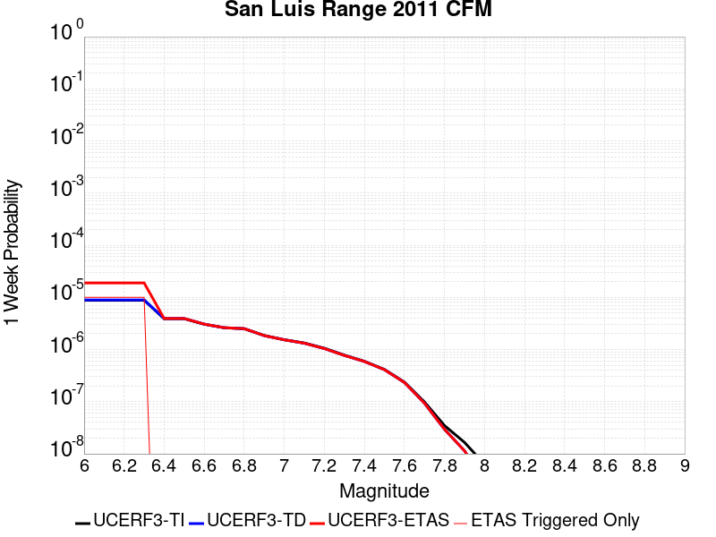 | 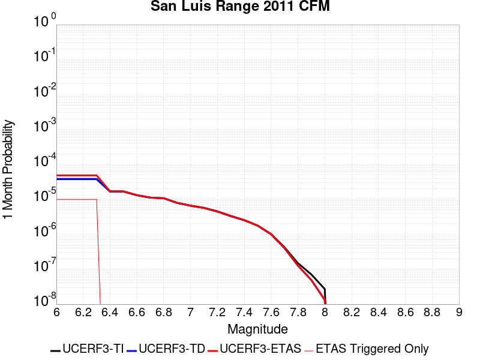 | 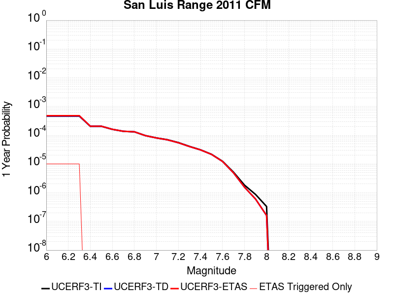 | 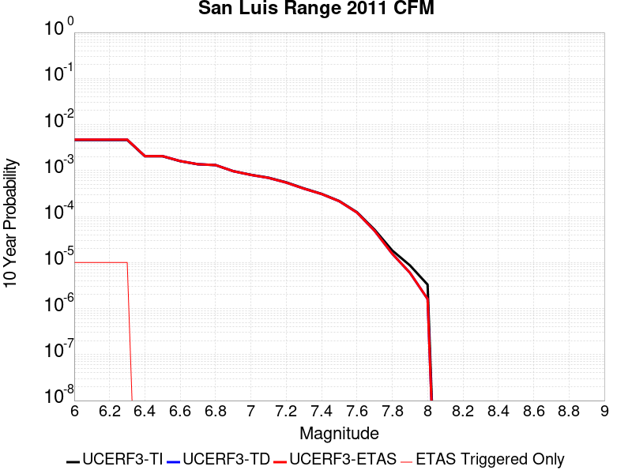 |

| Magnitude | 1 wk TI Prob | 1 wk TD Prob | 1 wk ETAS Prob | 1 wk ETAS/TD Gain | 1 wk ETAS Triggered Only | 1 mo TI Prob | 1 mo TD Prob | 1 mo ETAS Prob | 1 mo ETAS/TD Gain | 1 mo ETAS Triggered Only | 1 yr TI Prob | 1 yr TD Prob | 1 yr ETAS Prob | 1 yr ETAS/TD Gain | 1 yr ETAS Triggered Only | 10 yr TI Prob | 10 yr TD Prob | 10 yr ETAS Prob | 10 yr ETAS/TD Gain | 10 yr ETAS Triggered Only |
|-----|-----|-----|-----|-----|-----|-----|-----|-----|-----|-----|-----|-----|-----|-----|-----|-----|-----|-----|-----|-----|
| 6.0 | 8.8368415E-6 | 8.965455E-6 | 1.8965366E-5 | 2.1153824 | 1.0E-5 | 3.787163E-5 | 3.8422855E-5 | 4.8422473E-5 | 1.2602518 | 1.0E-5 | 4.609895E-4 | 4.6770574E-4 | 4.7770108E-4 | 1.021371 | 1.0E-5 | 0.0046003438 | 0.004667997 | 0.00467795 | 1.0021323 | 1.0E-5 |
| 6.1 | 8.8368415E-6 | 8.965455E-6 | 1.8965366E-5 | 2.1153824 | 1.0E-5 | 3.787163E-5 | 3.8422855E-5 | 4.8422473E-5 | 1.2602518 | 1.0E-5 | 4.609895E-4 | 4.6770574E-4 | 4.7770108E-4 | 1.021371 | 1.0E-5 | 0.0046003438 | 0.004667997 | 0.00467795 | 1.0021323 | 1.0E-5 |
| 6.2 | 8.8368415E-6 | 8.965455E-6 | 1.8965366E-5 | 2.1153824 | 1.0E-5 | 3.787163E-5 | 3.8422855E-5 | 4.8422473E-5 | 1.2602518 | 1.0E-5 | 4.609895E-4 | 4.6770574E-4 | 4.7770108E-4 | 1.021371 | 1.0E-5 | 0.0046003438 | 0.004667997 | 0.00467795 | 1.0021323 | 1.0E-5 |
| 6.3 | 8.8368415E-6 | 8.965455E-6 | 1.8965366E-5 | 2.1153824 | 1.0E-5 | 3.787163E-5 | 3.8422855E-5 | 4.8422473E-5 | 1.2602518 | 1.0E-5 | 4.609895E-4 | 4.6770574E-4 | 4.7770108E-4 | 1.021371 | 1.0E-5 | 0.0046003438 | 0.004667997 | 0.00467795 | 1.0021323 | 1.0E-5 |
| 6.4 | 3.9094193E-6 | 3.941204E-6 | 3.941204E-6 | 1.0 | 0.0 | 1.6754546E-5 | 1.6890766E-5 | 1.6890766E-5 | 1.0 | 0.0 | 2.039675E-4 | 2.0562594E-4 | 2.0562594E-4 | 1.0 | 0.0 | 0.0020378039 | 0.0020543856 | 0.0020543856 | 1.0 | 0.0 |
| 6.5 | 3.9094193E-6 | 3.941204E-6 | 3.941204E-6 | 1.0 | 0.0 | 1.6754546E-5 | 1.6890766E-5 | 1.6890766E-5 | 1.0 | 0.0 | 2.039675E-4 | 2.0562594E-4 | 2.0562594E-4 | 1.0 | 0.0 | 0.0020378039 | 0.0020543856 | 0.0020543856 | 1.0 | 0.0 |
| 6.6 | 3.0587726E-6 | 3.0753893E-6 | 3.0753893E-6 | 1.0 | 0.0 | 1.3108959E-5 | 1.3180174E-5 | 1.3180174E-5 | 1.0 | 0.0 | 1.595899E-4 | 1.6045693E-4 | 1.6045693E-4 | 1.0 | 0.0 | 0.0015947534 | 0.0016034227 | 0.0016034227 | 1.0 | 0.0 |
| 6.7 | 2.6160574E-6 | 2.6251284E-6 | 2.6251284E-6 | 1.0 | 0.0 | 1.1211626E-5 | 1.1250502E-5 | 1.1250502E-5 | 1.0 | 0.0 | 1.3649299E-4 | 1.3696631E-4 | 1.3696631E-4 | 1.0 | 0.0 | 0.0013640919 | 0.0013688251 | 0.0013688251 | 1.0 | 0.0 |
| 6.8 | 2.5110312E-6 | 2.5181412E-6 | 2.5181412E-6 | 1.0 | 0.0 | 1.0761518E-5 | 1.079199E-5 | 1.079199E-5 | 1.0 | 0.0 | 1.310136E-4 | 1.313846E-4 | 1.313846E-4 | 1.0 | 0.0 | 0.0013093639 | 0.0013130752 | 0.0013130752 | 1.0 | 0.0 |
| 6.9 | 1.8564405E-6 | 1.852488E-6 | 1.852488E-6 | 1.0 | 0.0 | 7.95615E-6 | 7.93921E-6 | 7.93921E-6 | 1.0 | 0.0 | 9.686181E-5 | 9.665562E-5 | 9.665562E-5 | 1.0 | 0.0 | 9.68196E-4 | 9.6613786E-4 | 9.6613786E-4 | 1.0 | 0.0 |
| 7.0 | 1.546127E-6 | 1.5369549E-6 | 1.5369549E-6 | 1.0 | 0.0 | 6.626242E-6 | 6.5869326E-6 | 6.5869326E-6 | 1.0 | 0.0 | 8.06715E-5 | 8.019296E-5 | 8.019296E-5 | 1.0 | 0.0 | 8.0642226E-4 | 8.016409E-4 | 8.016409E-4 | 1.0 | 0.0 |
| 7.1 | 1.3368208E-6 | 1.3235336E-6 | 1.3235336E-6 | 1.0 | 0.0 | 5.7292195E-6 | 5.6722747E-6 | 5.6722747E-6 | 1.0 | 0.0 | 6.975101E-5 | 6.905776E-5 | 6.905776E-5 | 1.0 | 0.0 | 6.972912E-4 | 6.903635E-4 | 6.903635E-4 | 1.0 | 0.0 |
| 7.2 | 1.0623363E-6 | 1.0454378E-6 | 1.0454378E-6 | 1.0 | 0.0 | 4.5528623E-6 | 4.4804397E-6 | 4.4804397E-6 | 1.0 | 0.0 | 5.5429686E-5 | 5.4547992E-5 | 5.4547992E-5 | 1.0 | 0.0 | 5.5415864E-4 | 5.453463E-4 | 5.453463E-4 | 1.0 | 0.0 |
| 7.3 | 7.831679E-7 | 7.727399E-7 | 7.727399E-7 | 1.0 | 0.0 | 3.3564295E-6 | 3.3117383E-6 | 3.3117383E-6 | 1.0 | 0.0 | 4.086376E-5 | 4.031967E-5 | 4.031967E-5 | 1.0 | 0.0 | 4.0856248E-4 | 4.0312367E-4 | 4.0312367E-4 | 1.0 | 0.0 |
| 7.4 | 5.9558846E-7 | 5.910646E-7 | 5.910646E-7 | 1.0 | 0.0 | 2.5525194E-6 | 2.5331315E-6 | 2.5331315E-6 | 1.0 | 0.0 | 3.107648E-5 | 3.084044E-5 | 3.084044E-5 | 1.0 | 0.0 | 3.1072134E-4 | 3.083617E-4 | 3.083617E-4 | 1.0 | 0.0 |
| 7.5 | 4.1616502E-7 | 4.1196404E-7 | 4.1196404E-7 | 1.0 | 0.0 | 1.7835631E-6 | 1.765559E-6 | 1.765559E-6 | 1.0 | 0.0 | 2.1714664E-5 | 2.1495469E-5 | 2.1495469E-5 | 1.0 | 0.0 | 2.1712543E-4 | 2.1493394E-4 | 2.1493394E-4 | 1.0 | 0.0 |
| 7.6 | 2.3816014E-7 | 2.3376614E-7 | 2.3376614E-7 | 1.0 | 0.0 | 1.0206859E-6 | 1.0018545E-6 | 1.0018545E-6 | 1.0 | 0.0 | 1.242678E-5 | 1.219751E-5 | 1.219751E-5 | 1.0 | 0.0 | 1.2426086E-4 | 1.2196843E-4 | 1.2196843E-4 | 1.0 | 0.0 |
| 7.7 | 9.918777E-8 | 9.3868096E-8 | 9.3868096E-8 | 1.0 | 0.0 | 4.2509038E-7 | 4.022918E-7 | 4.022918E-7 | 1.0 | 0.0 | 5.1754632E-6 | 4.8978914E-6 | 4.8978914E-6 | 1.0 | 0.0 | 5.1753424E-5 | 4.897784E-5 | 4.897784E-5 | 1.0 | 0.0 |
| 7.8 | 3.4982556E-8 | 2.968672E-8 | 2.968672E-8 | 1.0 | 0.0 | 1.4992524E-7 | 1.272288E-7 | 1.272288E-7 | 1.0 | 0.0 | 1.8253382E-6 | 1.5490094E-6 | 1.5490094E-6 | 1.0 | 0.0 | 1.8253233E-5 | 1.5489988E-5 | 1.5489988E-5 | 1.0 | 0.0 |
| 7.9 | 1.6624908E-8 | 1.1476994E-8 | 1.1476994E-8 | 1.0 | 0.0 | 7.12496E-8 | 4.9187115E-8 | 4.9187115E-8 | 1.0 | 0.0 | 8.6746354E-7 | 5.988529E-7 | 5.988529E-7 | 1.0 | 0.0 | 8.674601E-6 | 5.9885133E-6 | 5.9885133E-6 | 1.0 | 0.0 |
| 8.0 | 6.3352315E-9 | 3.0886564E-9 | 3.0886564E-9 | 1.0 | 0.0 | 2.715099E-8 | 1.32370985E-8 | 1.32370985E-8 | 1.0 | 0.0 | 3.3056327E-7 | 1.6116167E-7 | 1.6116167E-7 | 1.0 | 0.0 | 3.3056278E-6 | 1.6116155E-6 | 1.6116155E-6 | 1.0 | 0.0 |

## Santa Susana alt 1
*[(top)](#table-of-contents)*

| 1 Week | 1 Month | 1 Year | 10 Year |
|-----|-----|-----|-----|
| 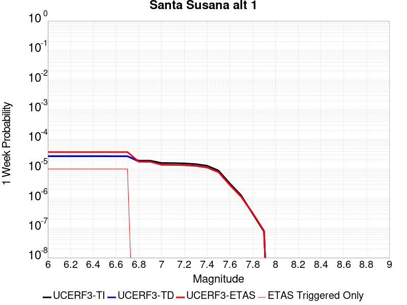 | 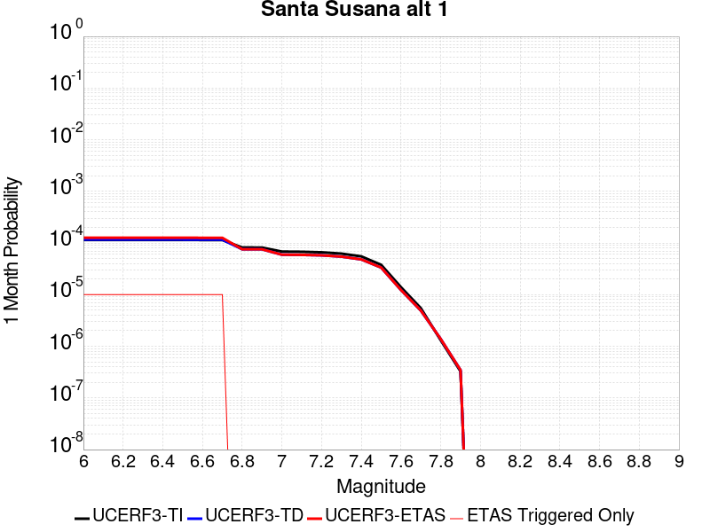 |  | 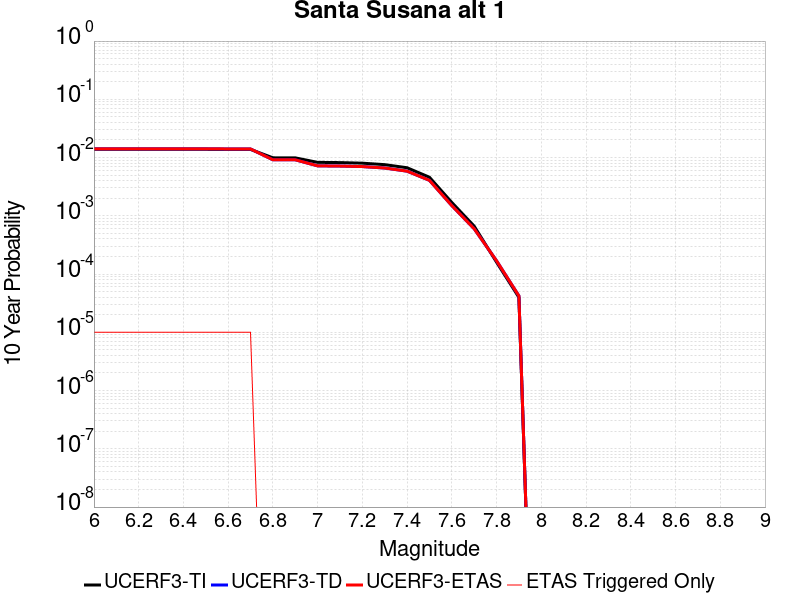 |

| Magnitude | 1 wk TI Prob | 1 wk TD Prob | 1 wk ETAS Prob | 1 wk ETAS/TD Gain | 1 wk ETAS Triggered Only | 1 mo TI Prob | 1 mo TD Prob | 1 mo ETAS Prob | 1 mo ETAS/TD Gain | 1 mo ETAS Triggered Only | 1 yr TI Prob | 1 yr TD Prob | 1 yr ETAS Prob | 1 yr ETAS/TD Gain | 1 yr ETAS Triggered Only | 10 yr TI Prob | 10 yr TD Prob | 10 yr ETAS Prob | 10 yr ETAS/TD Gain | 10 yr ETAS Triggered Only |
|-----|-----|-----|-----|-----|-----|-----|-----|-----|-----|-----|-----|-----|-----|-----|-----|-----|-----|-----|-----|-----|
| 6.0 | 2.674877E-5 | 2.7198214E-5 | 3.719794E-5 | 1.3676612 | 1.0E-5 | 1.1463255E-4 | 1.16559204E-4 | 1.2655804E-4 | 1.0857834 | 1.0E-5 | 0.0013947578 | 0.0014182981 | 0.001428284 | 1.0070407 | 1.0E-5 | 0.013860362 | 0.014104388 | 0.014114247 | 1.000699 | 1.0E-5 |
| 6.1 | 2.674877E-5 | 2.7198214E-5 | 3.719794E-5 | 1.3676612 | 1.0E-5 | 1.1463255E-4 | 1.16559204E-4 | 1.2655804E-4 | 1.0857834 | 1.0E-5 | 0.0013947578 | 0.0014182981 | 0.001428284 | 1.0070407 | 1.0E-5 | 0.013860362 | 0.014104388 | 0.014114247 | 1.000699 | 1.0E-5 |
| 6.2 | 2.674877E-5 | 2.7198214E-5 | 3.719794E-5 | 1.3676612 | 1.0E-5 | 1.1463255E-4 | 1.16559204E-4 | 1.2655804E-4 | 1.0857834 | 1.0E-5 | 0.0013947578 | 0.0014182981 | 0.001428284 | 1.0070407 | 1.0E-5 | 0.013860362 | 0.014104388 | 0.014114247 | 1.000699 | 1.0E-5 |
| 6.3 | 2.674877E-5 | 2.7198214E-5 | 3.719794E-5 | 1.3676612 | 1.0E-5 | 1.1463255E-4 | 1.16559204E-4 | 1.2655804E-4 | 1.0857834 | 1.0E-5 | 0.0013947578 | 0.0014182981 | 0.001428284 | 1.0070407 | 1.0E-5 | 0.013860362 | 0.014104388 | 0.014114247 | 1.000699 | 1.0E-5 |
| 6.4 | 2.674877E-5 | 2.7198214E-5 | 3.719794E-5 | 1.3676612 | 1.0E-5 | 1.1463255E-4 | 1.16559204E-4 | 1.2655804E-4 | 1.0857834 | 1.0E-5 | 0.0013947578 | 0.0014182981 | 0.001428284 | 1.0070407 | 1.0E-5 | 0.013860362 | 0.014104388 | 0.014114247 | 1.000699 | 1.0E-5 |
| 6.5 | 2.674877E-5 | 2.7198214E-5 | 3.719794E-5 | 1.3676612 | 1.0E-5 | 1.1463255E-4 | 1.16559204E-4 | 1.2655804E-4 | 1.0857834 | 1.0E-5 | 0.0013947578 | 0.0014182981 | 0.001428284 | 1.0070407 | 1.0E-5 | 0.013860362 | 0.014104388 | 0.014114247 | 1.000699 | 1.0E-5 |
| 6.6 | 2.6647976E-5 | 2.7074553E-5 | 3.7074282E-5 | 1.3693405 | 1.0E-5 | 1.14200615E-4 | 1.16029274E-4 | 1.2602811E-4 | 1.0861752 | 1.0E-5 | 0.0013895056 | 0.0014118546 | 0.0014218405 | 1.0070729 | 1.0E-5 | 0.013808494 | 0.014040773 | 0.014050633 | 1.0007023 | 1.0E-5 |
| 6.7 | 2.6647976E-5 | 2.7074553E-5 | 3.7074282E-5 | 1.3693405 | 1.0E-5 | 1.14200615E-4 | 1.16029274E-4 | 1.2602811E-4 | 1.0861752 | 1.0E-5 | 0.0013895056 | 0.0014118546 | 0.0014218405 | 1.0070729 | 1.0E-5 | 0.013808494 | 0.014040773 | 0.014050633 | 1.0007023 | 1.0E-5 |
| 6.8 | 1.9073179E-5 | 1.7637467E-5 | 1.7637467E-5 | 1.0 | 0.0 | 8.1739636E-5 | 7.558706E-5 | 7.558706E-5 | 1.0 | 0.0 | 9.947256E-4 | 9.19902E-4 | 9.19902E-4 | 1.0 | 0.0 | 0.009902848 | 0.009163361 | 0.009163361 | 1.0 | 0.0 |
| 6.9 | 1.9041876E-5 | 1.7619597E-5 | 1.7619597E-5 | 1.0 | 0.0 | 8.160549E-5 | 7.551048E-5 | 7.551048E-5 | 1.0 | 0.0 | 9.930939E-4 | 9.189705E-4 | 9.189705E-4 | 1.0 | 0.0 | 0.0098866755 | 0.009154123 | 0.009154123 | 1.0 | 0.0 |
| 7.0 | 1.5917482E-5 | 1.3864049E-5 | 1.3864049E-5 | 1.0 | 0.0 | 6.8215995E-5 | 5.9416023E-5 | 5.9416023E-5 | 1.0 | 0.0 | 8.302132E-4 | 7.2315463E-4 | 7.2315463E-4 | 1.0 | 0.0 | 0.008271185 | 0.0072090672 | 0.0072090672 | 1.0 | 0.0 |
| 7.1 | 1.577788E-5 | 1.3744056E-5 | 1.3744056E-5 | 1.0 | 0.0 | 6.761774E-5 | 5.890179E-5 | 5.890179E-5 | 1.0 | 0.0 | 8.2293496E-4 | 7.16898E-4 | 7.16898E-4 | 1.0 | 0.0 | 0.008198941 | 0.0071469042 | 0.0071469042 | 1.0 | 0.0 |
| 7.2 | 1.5416446E-5 | 1.34701295E-5 | 1.34701295E-5 | 1.0 | 0.0 | 6.606882E-5 | 5.7727877E-5 | 5.7727877E-5 | 1.0 | 0.0 | 8.0409093E-4 | 7.026149E-4 | 7.026149E-4 | 1.0 | 0.0 | 0.008011877 | 0.0070049763 | 0.0070049763 | 1.0 | 0.0 |
| 7.3 | 1.4534083E-5 | 1.2718032E-5 | 1.2718032E-5 | 1.0 | 0.0 | 6.228744E-5 | 5.4504737E-5 | 5.4504737E-5 | 1.0 | 0.0 | 7.580857E-4 | 6.633976E-4 | 6.633976E-4 | 1.0 | 0.0 | 0.007555048 | 0.0066151717 | 0.0066151717 | 1.0 | 0.0 |
| 7.4 | 1.2858995E-5 | 1.1229814E-5 | 1.1229814E-5 | 1.0 | 0.0 | 5.5108816E-5 | 4.812691E-5 | 4.812691E-5 | 1.0 | 0.0 | 6.7074323E-4 | 5.8579154E-4 | 5.8579154E-4 | 1.0 | 0.0 | 0.0066872234 | 0.0058433902 | 0.0058433902 | 1.0 | 0.0 |
| 7.5 | 8.827668E-6 | 7.805494E-6 | 7.805494E-6 | 1.0 | 0.0 | 3.7832317E-5 | 3.3451703E-5 | 3.3451703E-5 | 1.0 | 0.0 | 4.605111E-4 | 4.072008E-4 | 4.072008E-4 | 1.0 | 0.0 | 0.0045955796 | 0.0040648985 | 0.0040648985 | 1.0 | 0.0 |
| 7.6 | 3.2533426E-6 | 2.8720106E-6 | 2.8720106E-6 | 1.0 | 0.0 | 1.3942822E-5 | 1.230856E-5 | 1.230856E-5 | 1.0 | 0.0 | 1.6974064E-4 | 1.4984679E-4 | 1.4984679E-4 | 1.0 | 0.0 | 0.0016961104 | 0.0014974943 | 0.0014974943 | 1.0 | 0.0 |
| 7.7 | 1.2751709E-6 | 1.1491339E-6 | 1.1491339E-6 | 1.0 | 0.0 | 5.4650063E-6 | 4.9248506E-6 | 4.9248506E-6 | 1.0 | 0.0 | 6.653442E-5 | 5.99585E-5 | 5.99585E-5 | 1.0 | 0.0 | 6.6514505E-4 | 5.9943215E-4 | 5.9943215E-4 | 1.0 | 0.0 |
| 7.8 | 3.067544E-7 | 3.240052E-7 | 3.240052E-7 | 1.0 | 0.0 | 1.3146611E-6 | 1.3885931E-6 | 1.3885931E-6 | 1.0 | 0.0 | 1.600588E-5 | 1.6906E-5 | 1.6906E-5 | 1.0 | 0.0 | 1.6004729E-4 | 1.6904817E-4 | 1.6904817E-4 | 1.0 | 0.0 |
| 7.9 | 7.622999E-8 | 8.0879715E-8 | 8.0879715E-8 | 1.0 | 0.0 | 3.2669993E-7 | 3.4662733E-7 | 3.4662733E-7 | 1.0 | 0.0 | 3.977564E-6 | 4.220182E-6 | 4.220182E-6 | 1.0 | 0.0 | 3.977493E-5 | 4.2201224E-5 | 4.2201224E-5 | 1.0 | 0.0 |

## Clamshell-Sawpit
*[(top)](#table-of-contents)*

| 1 Week | 1 Month | 1 Year | 10 Year |
|-----|-----|-----|-----|
| 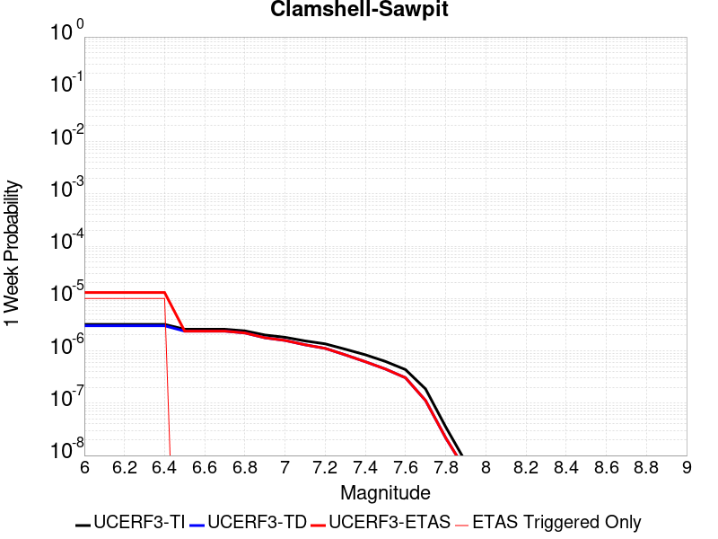 | 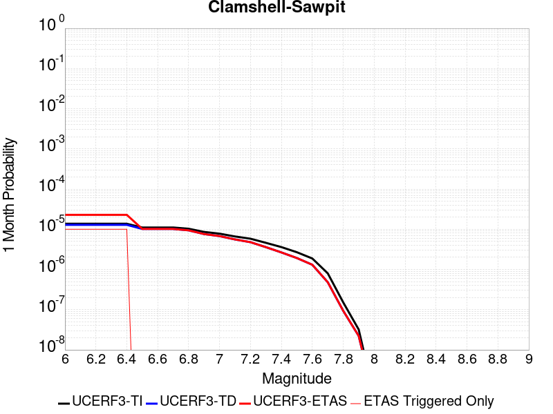 |  | 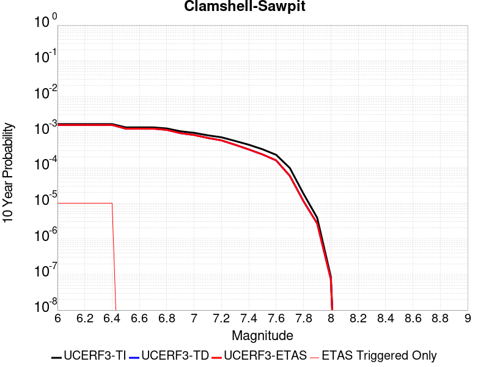 |

| Magnitude | 1 wk TI Prob | 1 wk TD Prob | 1 wk ETAS Prob | 1 wk ETAS/TD Gain | 1 wk ETAS Triggered Only | 1 mo TI Prob | 1 mo TD Prob | 1 mo ETAS Prob | 1 mo ETAS/TD Gain | 1 mo ETAS Triggered Only | 1 yr TI Prob | 1 yr TD Prob | 1 yr ETAS Prob | 1 yr ETAS/TD Gain | 1 yr ETAS Triggered Only | 10 yr TI Prob | 10 yr TD Prob | 10 yr ETAS Prob | 10 yr ETAS/TD Gain | 10 yr ETAS Triggered Only |
|-----|-----|-----|-----|-----|-----|-----|-----|-----|-----|-----|-----|-----|-----|-----|-----|-----|-----|-----|-----|-----|
| 6.0 | 3.202998E-6 | 3.0127642E-6 | 1.3012734E-5 | 4.319201 | 1.0E-5 | 1.3727062E-5 | 1.2911787E-5 | 2.2911658E-5 | 1.7744762 | 1.0E-5 | 1.6711417E-4 | 1.5719047E-4 | 1.671889E-4 | 1.0636071 | 1.0E-5 | 0.0016698855 | 0.0015708723 | 0.0015808566 | 1.0063559 | 1.0E-5 |
| 6.1 | 3.202998E-6 | 3.0127642E-6 | 1.3012734E-5 | 4.319201 | 1.0E-5 | 1.3727062E-5 | 1.2911787E-5 | 2.2911658E-5 | 1.7744762 | 1.0E-5 | 1.6711417E-4 | 1.5719047E-4 | 1.671889E-4 | 1.0636071 | 1.0E-5 | 0.0016698855 | 0.0015708723 | 0.0015808566 | 1.0063559 | 1.0E-5 |
| 6.2 | 3.202998E-6 | 3.0127642E-6 | 1.3012734E-5 | 4.319201 | 1.0E-5 | 1.3727062E-5 | 1.2911787E-5 | 2.2911658E-5 | 1.7744762 | 1.0E-5 | 1.6711417E-4 | 1.5719047E-4 | 1.671889E-4 | 1.0636071 | 1.0E-5 | 0.0016698855 | 0.0015708723 | 0.0015808566 | 1.0063559 | 1.0E-5 |
| 6.3 | 3.202998E-6 | 3.0127642E-6 | 1.3012734E-5 | 4.319201 | 1.0E-5 | 1.3727062E-5 | 1.2911787E-5 | 2.2911658E-5 | 1.7744762 | 1.0E-5 | 1.6711417E-4 | 1.5719047E-4 | 1.671889E-4 | 1.0636071 | 1.0E-5 | 0.0016698855 | 0.0015708723 | 0.0015808566 | 1.0063559 | 1.0E-5 |
| 6.4 | 3.202998E-6 | 3.0127642E-6 | 1.3012734E-5 | 4.319201 | 1.0E-5 | 1.3727062E-5 | 1.2911787E-5 | 2.2911658E-5 | 1.7744762 | 1.0E-5 | 1.6711417E-4 | 1.5719047E-4 | 1.671889E-4 | 1.0636071 | 1.0E-5 | 0.0016698855 | 0.0015708723 | 0.0015808566 | 1.0063559 | 1.0E-5 |
| 6.5 | 2.5862723E-6 | 2.3807747E-6 | 2.3807747E-6 | 1.0 | 0.0 | 1.1083977E-5 | 1.0203283E-5 | 1.0203283E-5 | 1.0 | 0.0 | 1.3493907E-4 | 1.2421819E-4 | 1.2421819E-4 | 1.0 | 0.0 | 0.0013485716 | 0.0012415178 | 0.0012415178 | 1.0 | 0.0 |
| 6.6 | 2.5862723E-6 | 2.3807747E-6 | 2.3807747E-6 | 1.0 | 0.0 | 1.1083977E-5 | 1.0203283E-5 | 1.0203283E-5 | 1.0 | 0.0 | 1.3493907E-4 | 1.2421819E-4 | 1.2421819E-4 | 1.0 | 0.0 | 0.0013485716 | 0.0012415178 | 0.0012415178 | 1.0 | 0.0 |
| 6.7 | 2.5862723E-6 | 2.3807747E-6 | 2.3807747E-6 | 1.0 | 0.0 | 1.1083977E-5 | 1.0203283E-5 | 1.0203283E-5 | 1.0 | 0.0 | 1.3493907E-4 | 1.2421819E-4 | 1.2421819E-4 | 1.0 | 0.0 | 0.0013485716 | 0.0012415178 | 0.0012415178 | 1.0 | 0.0 |
| 6.8 | 2.4098806E-6 | 2.1977307E-6 | 2.1977307E-6 | 1.0 | 0.0 | 1.0328019E-5 | 9.4188135E-6 | 9.4188135E-6 | 1.0 | 0.0 | 1.2573638E-4 | 1.14668284E-4 | 1.14668284E-4 | 1.0 | 0.0 | 0.0012566525 | 0.0011461178 | 0.0011461178 | 1.0 | 0.0 |
| 6.9 | 2.0073985E-6 | 1.7784247E-6 | 1.7784247E-6 | 1.0 | 0.0 | 8.603109E-6 | 7.6217984E-6 | 7.6217984E-6 | 1.0 | 0.0 | 1.0473781E-4 | 9.279157E-5 | 9.279157E-5 | 1.0 | 0.0 | 0.0010468846 | 9.2754007E-4 | 9.2754007E-4 | 1.0 | 0.0 |
| 7.0 | 1.8166766E-6 | 1.5807094E-6 | 1.5807094E-6 | 1.0 | 0.0 | 7.785734E-6 | 6.774452E-6 | 6.774452E-6 | 1.0 | 0.0 | 9.478718E-5 | 8.247593E-5 | 8.247593E-5 | 1.0 | 0.0 | 9.4746763E-4 | 8.244633E-4 | 8.244633E-4 | 1.0 | 0.0 |
| 7.1 | 1.5471421E-6 | 1.3052961E-6 | 1.3052961E-6 | 1.0 | 0.0 | 6.6305925E-6 | 5.5941146E-6 | 5.5941146E-6 | 1.0 | 0.0 | 8.072447E-5 | 6.810627E-5 | 6.810627E-5 | 1.0 | 0.0 | 8.0695155E-4 | 6.8085943E-4 | 6.8085943E-4 | 1.0 | 0.0 |
| 7.2 | 1.3608037E-6 | 1.1153442E-6 | 1.1153442E-6 | 1.0 | 0.0 | 5.8320024E-6 | 4.780038E-6 | 4.780038E-6 | 1.0 | 0.0 | 7.1002316E-5 | 5.8195455E-5 | 5.8195455E-5 | 1.0 | 0.0 | 7.097964E-4 | 5.818068E-4 | 5.818068E-4 | 1.0 | 0.0 |
| 7.3 | 1.0749634E-6 | 8.384255E-7 | 8.384255E-7 | 1.0 | 0.0 | 4.6069777E-6 | 3.5932474E-6 | 3.5932474E-6 | 1.0 | 0.0 | 5.608851E-5 | 4.3746935E-5 | 4.3746935E-5 | 1.0 | 0.0 | 5.6074356E-4 | 4.3738607E-4 | 4.3738607E-4 | 1.0 | 0.0 |
| 7.4 | 8.416856E-7 | 6.2000527E-7 | 6.2000527E-7 | 1.0 | 0.0 | 3.607219E-6 | 2.657163E-6 | 2.657163E-6 | 1.0 | 0.0 | 4.3917007E-5 | 3.2350497E-5 | 3.2350497E-5 | 1.0 | 0.0 | 4.390833E-4 | 3.2345986E-4 | 3.2345986E-4 | 1.0 | 0.0 |
| 7.5 | 6.2779594E-7 | 4.4968908E-7 | 4.4968908E-7 | 1.0 | 0.0 | 2.6905511E-6 | 1.9272377E-6 | 1.9272377E-6 | 1.0 | 0.0 | 3.275697E-5 | 2.3463885E-5 | 2.3463885E-5 | 1.0 | 0.0 | 3.275214E-4 | 2.3461595E-4 | 2.3461595E-4 | 1.0 | 0.0 |
| 7.6 | 4.3822078E-7 | 3.059551E-7 | 3.059551E-7 | 1.0 | 0.0 | 1.8780877E-6 | 1.3112356E-6 | 1.3112356E-6 | 1.0 | 0.0 | 2.2865479E-5 | 1.5964191E-5 | 1.5964191E-5 | 1.0 | 0.0 | 2.2863125E-4 | 1.5963199E-4 | 1.5963199E-4 | 1.0 | 0.0 |
| 7.7 | 1.8704569E-7 | 1.12379E-7 | 1.12379E-7 | 1.0 | 0.0 | 8.0162414E-7 | 4.8162417E-7 | 4.8162417E-7 | 1.0 | 0.0 | 9.75973E-6 | 5.8637593E-6 | 5.8637593E-6 | 1.0 | 0.0 | 9.7593016E-5 | 5.863611E-5 | 5.863611E-5 | 1.0 | 0.0 |
| 7.8 | 3.5378733E-8 | 2.1838002E-8 | 2.1838002E-8 | 1.0 | 0.0 | 1.5162313E-7 | 9.359143E-8 | 9.359143E-8 | 1.0 | 0.0 | 1.84601E-6 | 1.1394751E-6 | 1.1394751E-6 | 1.0 | 0.0 | 1.8459947E-5 | 1.1394695E-5 | 1.1394695E-5 | 1.0 | 0.0 |
| 7.9 | 7.504945E-9 | 5.1921663E-9 | 5.1921663E-9 | 1.0 | 0.0 | 3.2164053E-8 | 2.2252141E-8 | 2.2252141E-8 | 1.0 | 0.0 | 3.9159727E-7 | 2.709198E-7 | 2.709198E-7 | 1.0 | 0.0 | 3.915966E-6 | 2.7091953E-6 | 2.7091953E-6 | 1.0 | 0.0 |
| 8.0 | 1.6554036E-10 | 1.418149E-10 | 1.418149E-10 | 1.0 | 0.0 | 7.0945894E-10 | 6.0777794E-10 | 6.0777794E-10 | 1.0 | 0.0 | 8.637662E-9 | 7.3996964E-9 | 7.3996964E-9 | 1.0 | 0.0 | 8.6376616E-8 | 7.3996965E-8 | 7.3996965E-8 | 1.0 | 0.0 |

## Maacama 2011 CFM
*[(top)](#table-of-contents)*

| 1 Week | 1 Month | 1 Year | 10 Year |
|-----|-----|-----|-----|
| 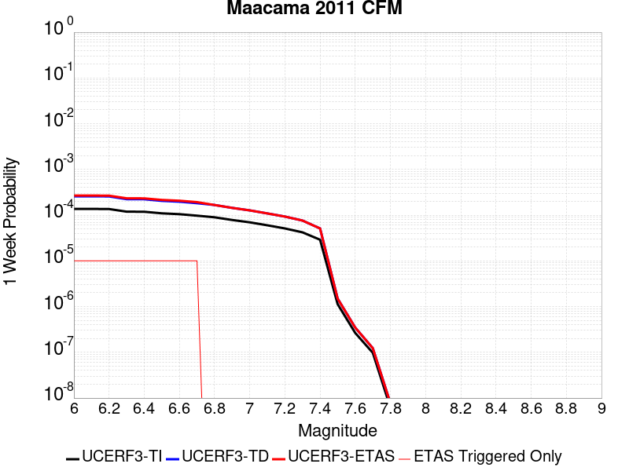 | 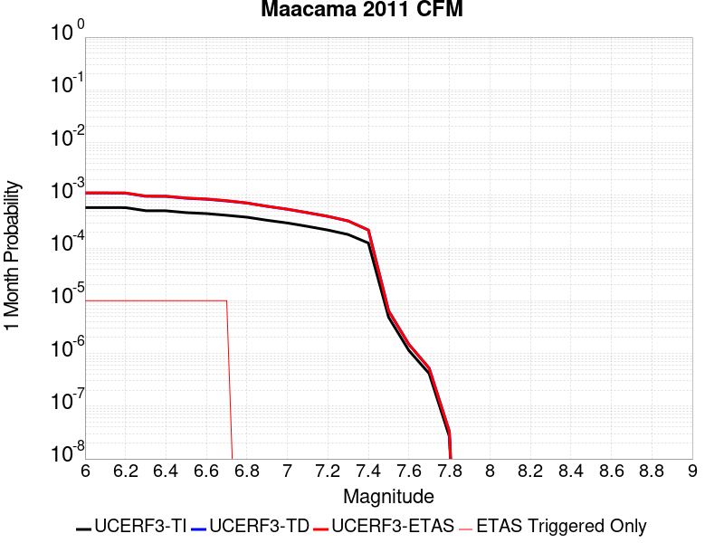 | 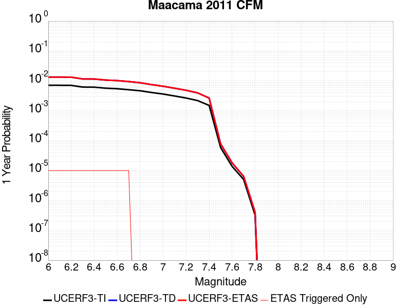 | 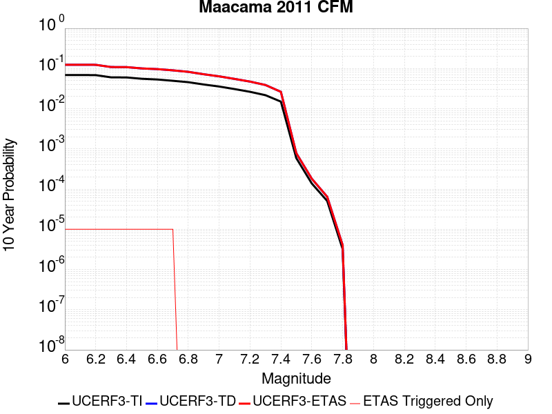 |

| Magnitude | 1 wk TI Prob | 1 wk TD Prob | 1 wk ETAS Prob | 1 wk ETAS/TD Gain | 1 wk ETAS Triggered Only | 1 mo TI Prob | 1 mo TD Prob | 1 mo ETAS Prob | 1 mo ETAS/TD Gain | 1 mo ETAS Triggered Only | 1 yr TI Prob | 1 yr TD Prob | 1 yr ETAS Prob | 1 yr ETAS/TD Gain | 1 yr ETAS Triggered Only | 10 yr TI Prob | 10 yr TD Prob | 10 yr ETAS Prob | 10 yr ETAS/TD Gain | 10 yr ETAS Triggered Only |
|-----|-----|-----|-----|-----|-----|-----|-----|-----|-----|-----|-----|-----|-----|-----|-----|-----|-----|-----|-----|-----|
| 6.0 | 1.368203E-4 | 2.579087E-4 | 2.679061E-4 | 1.0387634 | 1.0E-5 | 5.862409E-4 | 0.0011047592 | 0.0011147481 | 1.0090418 | 1.0E-5 | 0.0071141496 | 0.013350345 | 0.013360212 | 1.0007391 | 1.0E-5 | 0.06890667 | 0.1241916 | 0.12420036 | 1.0000706 | 1.0E-5 |
| 6.1 | 1.368203E-4 | 2.579087E-4 | 2.679061E-4 | 1.0387634 | 1.0E-5 | 5.862409E-4 | 0.0011047592 | 0.0011147481 | 1.0090418 | 1.0E-5 | 0.0071141496 | 0.013350345 | 0.013360212 | 1.0007391 | 1.0E-5 | 0.06890667 | 0.1241916 | 0.12420036 | 1.0000706 | 1.0E-5 |
| 6.2 | 1.360743E-4 | 2.566557E-4 | 2.6665317E-4 | 1.0389527 | 1.0E-5 | 5.8304524E-4 | 0.001099394 | 0.0011093831 | 1.0090859 | 1.0E-5 | 0.007075496 | 0.013285898 | 0.013295765 | 1.0007427 | 1.0E-5 | 0.06854413 | 0.123625994 | 0.123634756 | 1.0000709 | 1.0E-5 |
| 6.3 | 1.1917239E-4 | 2.236021E-4 | 2.3359986E-4 | 1.0447123 | 1.0E-5 | 5.1063887E-4 | 9.578717E-4 | 9.6786214E-4 | 1.0104299 | 1.0E-5 | 0.0061993203 | 0.0115873255 | 0.01159721 | 1.0008531 | 1.0E-5 | 0.060292065 | 0.108845875 | 0.108854786 | 1.0000819 | 1.0E-5 |
| 6.4 | 1.1859289E-4 | 2.2263796E-4 | 2.3263574E-4 | 1.044906 | 1.0E-5 | 5.0815626E-4 | 9.537432E-4 | 9.6373365E-4 | 1.010475 | 1.0E-5 | 0.006169266 | 0.011537647 | 0.011547532 | 1.0008568 | 1.0E-5 | 0.06000784 | 0.10840272 | 0.10841164 | 1.0000823 | 1.0E-5 |
| 6.5 | 1.09512424E-4 | 2.0517908E-4 | 2.1517703E-4 | 1.0487279 | 1.0E-5 | 4.6925453E-4 | 8.7897904E-4 | 8.889703E-4 | 1.0113668 | 1.0E-5 | 0.005698218 | 0.010639169 | 0.010649063 | 1.00093 | 1.0E-5 | 0.055543028 | 0.1004949 | 0.10050389 | 1.0000895 | 1.0E-5 |
| 6.6 | 1.0502928E-4 | 1.9675294E-4 | 2.0675096E-4 | 1.0508151 | 1.0E-5 | 4.500478E-4 | 8.429031E-4 | 8.528946E-4 | 1.0118538 | 1.0E-5 | 0.0054655746 | 0.010205293 | 0.010215191 | 1.0009699 | 1.0E-5 | 0.053330887 | 0.0966474 | 0.096656434 | 1.0000935 | 1.0E-5 |
| 6.7 | 9.739358E-5 | 1.8259176E-4 | 1.9258993E-4 | 1.054757 | 1.0E-5 | 4.173343E-4 | 7.822563E-4 | 7.9224847E-4 | 1.0127735 | 1.0E-5 | 0.0050692135 | 0.009475343 | 0.009485248 | 1.0010453 | 1.0E-5 | 0.049551267 | 0.09012011 | 0.090129204 | 1.000101 | 1.0E-5 |
| 6.8 | 8.969524E-5 | 1.6658378E-4 | 1.6658378E-4 | 1.0 | 0.0 | 3.8435153E-4 | 7.1369443E-4 | 7.1369443E-4 | 1.0 | 0.0 | 0.0046694432 | 0.00864909 | 0.00864909 | 1.0 | 0.0 | 0.045725387 | 0.08265246 | 0.08265246 | 1.0 | 0.0 |
| 6.9 | 7.838291E-5 | 1.4418772E-4 | 1.4418772E-4 | 1.0 | 0.0 | 3.358835E-4 | 6.1778206E-4 | 6.1778206E-4 | 1.0 | 0.0 | 0.0040817154 | 0.007491724 | 0.007491724 | 1.0 | 0.0 | 0.04007554 | 0.07205298 | 0.07205298 | 1.0 | 0.0 |
| 7.0 | 6.961957E-5 | 1.2708071E-4 | 1.2708071E-4 | 1.0 | 0.0 | 2.9833548E-4 | 5.445059E-4 | 5.445059E-4 | 1.0 | 0.0 | 0.0036261857 | 0.006606692 | 0.006606692 | 1.0 | 0.0 | 0.035675827 | 0.063871816 | 0.063871816 | 1.0 | 0.0 |
| 7.1 | 5.999398E-5 | 1.09053384E-4 | 1.09053384E-4 | 1.0 | 0.0 | 2.570917E-4 | 4.6728246E-4 | 4.6728246E-4 | 1.0 | 0.0 | 0.0031255994 | 0.00567284 | 0.00567284 | 1.0 | 0.0 | 0.030820016 | 0.055139277 | 0.055139277 | 1.0 | 0.0 |
| 7.2 | 5.116532E-5 | 9.305489E-5 | 9.305489E-5 | 1.0 | 0.0 | 2.1926152E-4 | 3.9874107E-4 | 3.9874107E-4 | 1.0 | 0.0 | 0.002666241 | 0.00484315 | 0.00484315 | 1.0 | 0.0 | 0.026344774 | 0.047303654 | 0.047303654 | 1.0 | 0.0 |
| 7.3 | 4.2087835E-5 | 7.617064E-5 | 7.617064E-5 | 1.0 | 0.0 | 1.8036396E-4 | 3.264016E-4 | 3.264016E-4 | 1.0 | 0.0 | 0.0021937196 | 0.0039662397 | 0.0039662397 | 1.0 | 0.0 | 0.0217219 | 0.038905017 | 0.038905017 | 1.0 | 0.0 |
| 7.4 | 2.8991652E-5 | 5.1163643E-5 | 5.1163643E-5 | 1.0 | 0.0 | 1.2424402E-4 | 2.1925455E-4 | 2.1925455E-4 | 1.0 | 0.0 | 0.0015116213 | 0.0026661097 | 0.0026661097 | 1.0 | 0.0 | 0.015013801 | 0.026332043 | 0.026332043 | 1.0 | 0.0 |
| 7.5 | 1.1292299E-6 | 1.4950216E-6 | 1.4950216E-6 | 1.0 | 0.0 | 4.8395473E-6 | 6.407227E-6 | 6.407227E-6 | 1.0 | 0.0 | 5.8919897E-5 | 7.8006444E-5 | 7.8006444E-5 | 1.0 | 0.0 | 5.890428E-4 | 7.805042E-4 | 7.805042E-4 | 1.0 | 0.0 |
| 7.6 | 2.6535366E-7 | 3.4720998E-7 | 3.4720998E-7 | 1.0 | 0.0 | 1.1372296E-6 | 1.4880419E-6 | 1.4880419E-6 | 1.0 | 0.0 | 1.3845682E-5 | 1.811676E-5 | 1.811676E-5 | 1.0 | 0.0 | 1.3844819E-4 | 1.8170691E-4 | 1.8170691E-4 | 1.0 | 0.0 |
| 7.7 | 9.727789E-8 | 1.2302418E-7 | 1.2302418E-7 | 1.0 | 0.0 | 4.1690518E-7 | 5.2724636E-7 | 5.2724636E-7 | 1.0 | 0.0 | 5.0758085E-6 | 6.419206E-6 | 6.419206E-6 | 1.0 | 0.0 | 5.0756928E-5 | 6.456404E-5 | 6.456404E-5 | 1.0 | 0.0 |
| 7.8 | 6.1939325E-9 | 7.711711E-9 | 7.711711E-9 | 1.0 | 0.0 | 2.6545425E-8 | 3.305019E-8 | 3.305019E-8 | 1.0 | 0.0 | 3.231905E-7 | 4.0238598E-7 | 4.0238598E-7 | 1.0 | 0.0 | 3.2319003E-6 | 4.0597915E-6 | 4.0597915E-6 | 1.0 | 0.0 |

## Silver Creek 2011 CFM
*[(top)](#table-of-contents)*

| 1 Week | 1 Month | 1 Year | 10 Year |
|-----|-----|-----|-----|
| 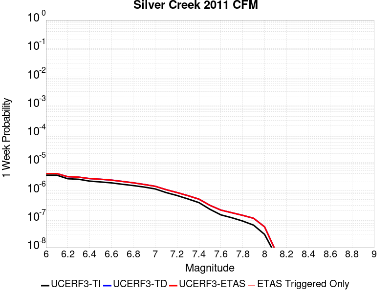 | 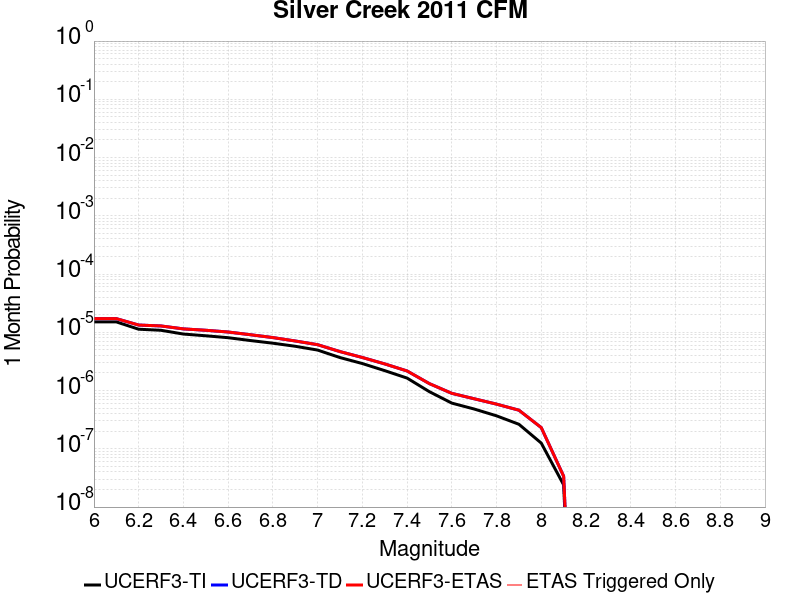 | 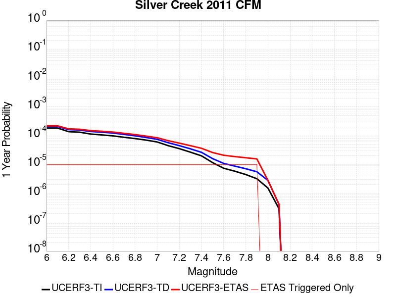 | 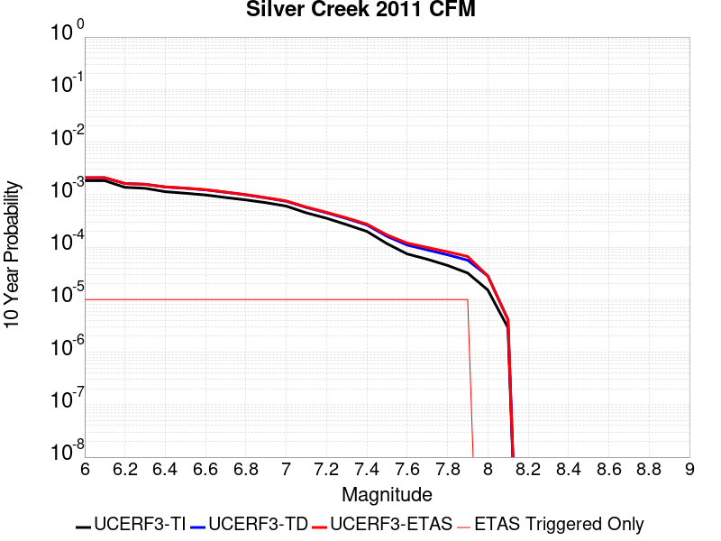 |

| Magnitude | 1 wk TI Prob | 1 wk TD Prob | 1 wk ETAS Prob | 1 wk ETAS/TD Gain | 1 wk ETAS Triggered Only | 1 mo TI Prob | 1 mo TD Prob | 1 mo ETAS Prob | 1 mo ETAS/TD Gain | 1 mo ETAS Triggered Only | 1 yr TI Prob | 1 yr TD Prob | 1 yr ETAS Prob | 1 yr ETAS/TD Gain | 1 yr ETAS Triggered Only | 10 yr TI Prob | 10 yr TD Prob | 10 yr ETAS Prob | 10 yr ETAS/TD Gain | 10 yr ETAS Triggered Only |
|-----|-----|-----|-----|-----|-----|-----|-----|-----|-----|-----|-----|-----|-----|-----|-----|-----|-----|-----|-----|-----|
| 6.0 | 3.5229125E-6 | 4.008142E-6 | 4.008142E-6 | 1.0 | 0.0 | 1.5098109E-5 | 1.717764E-5 | 1.717764E-5 | 1.0 | 0.0 | 1.8380396E-4 | 2.0911806E-4 | 2.1911597E-4 | 1.0478098 | 1.0E-5 | 0.0018365202 | 0.0020895726 | 0.0020995517 | 1.0047756 | 1.0E-5 |
| 6.1 | 3.5229125E-6 | 4.008142E-6 | 4.008142E-6 | 1.0 | 0.0 | 1.5098109E-5 | 1.717764E-5 | 1.717764E-5 | 1.0 | 0.0 | 1.8380396E-4 | 2.0911806E-4 | 2.1911597E-4 | 1.0478098 | 1.0E-5 | 0.0018365202 | 0.0020895726 | 0.0020995517 | 1.0047756 | 1.0E-5 |
| 6.2 | 2.6363234E-6 | 3.1105278E-6 | 3.1105278E-6 | 1.0 | 0.0 | 1.129848E-5 | 1.3330766E-5 | 1.3330766E-5 | 1.0 | 0.0 | 1.375503E-4 | 1.6229005E-4 | 1.7228843E-4 | 1.0616081 | 1.0E-5 | 0.0013746519 | 0.0016220442 | 0.001632028 | 1.006155 | 1.0E-5 |
| 6.3 | 2.5275126E-6 | 3.0001668E-6 | 3.0001668E-6 | 1.0 | 0.0 | 1.0832152E-5 | 1.2857795E-5 | 1.2857795E-5 | 1.0 | 0.0 | 1.3187347E-4 | 1.5653246E-4 | 1.665309E-4 | 1.0638745 | 1.0E-5 | 0.0013179524 | 0.00156455 | 0.0015745343 | 1.0063816 | 1.0E-5 |
| 6.4 | 2.178732E-6 | 2.6707307E-6 | 2.6707307E-6 | 1.0 | 0.0 | 9.337389E-6 | 1.1445939E-5 | 1.1445939E-5 | 1.0 | 0.0 | 1.1367678E-4 | 1.3934543E-4 | 1.4934404E-4 | 1.0717541 | 1.0E-5 | 0.0011361865 | 0.0013929061 | 0.0014028922 | 1.0071692 | 1.0E-5 |
| 6.5 | 2.0341574E-6 | 2.5298211E-6 | 2.5298211E-6 | 1.0 | 0.0 | 8.717788E-6 | 1.0842045E-5 | 1.0842045E-5 | 1.0 | 0.0 | 1.061339E-4 | 1.3199393E-4 | 1.4199261E-4 | 1.0757511 | 1.0E-5 | 0.0010608323 | 0.0013194805 | 0.0013294673 | 1.0075687 | 1.0E-5 |
| 6.6 | 1.8856827E-6 | 2.3613982E-6 | 2.3613982E-6 | 1.0 | 0.0 | 8.0814725E-6 | 1.0120239E-5 | 1.0120239E-5 | 1.0 | 0.0 | 9.838748E-5 | 1.2320696E-4 | 1.3320573E-4 | 1.0811542 | 1.0E-5 | 9.834393E-4 | 0.0012317112 | 0.0012416989 | 1.0081087 | 1.0E-5 |
| 6.7 | 1.6844668E-6 | 2.1197875E-6 | 2.1197875E-6 | 1.0 | 0.0 | 7.2191233E-6 | 9.0847725E-6 | 9.0847725E-6 | 1.0 | 0.0 | 8.788928E-5 | 1.10601504E-4 | 1.206004E-4 | 1.0904046 | 1.0E-5 | 8.785453E-4 | 0.0011057886 | 0.0011157775 | 1.0090333 | 1.0E-5 |
| 6.8 | 1.5177161E-6 | 1.8953942E-6 | 1.8953942E-6 | 1.0 | 0.0 | 6.504481E-6 | 8.123093E-6 | 8.123093E-6 | 1.0 | 0.0 | 7.918918E-5 | 9.8894176E-5 | 1.0889319E-4 | 1.1011082 | 1.0E-5 | 7.9160964E-4 | 9.888251E-4 | 9.988153E-4 | 1.010103 | 1.0E-5 |
| 6.9 | 1.3437394E-6 | 1.6561632E-6 | 1.6561632E-6 | 1.0 | 0.0 | 5.7588704E-6 | 7.097823E-6 | 7.097823E-6 | 1.0 | 0.0 | 7.011199E-5 | 8.6412576E-5 | 9.641171E-5 | 1.115714 | 1.0E-5 | 7.0089876E-4 | 8.6411275E-4 | 8.7410415E-4 | 1.0115626 | 1.0E-5 |
| 7.0 | 1.1563575E-6 | 1.4313372E-6 | 1.4313372E-6 | 1.0 | 0.0 | 4.9558084E-6 | 6.1342876E-6 | 6.1342876E-6 | 1.0 | 0.0 | 6.03353E-5 | 7.46824E-5 | 8.468165E-5 | 1.1338904 | 1.0E-5 | 6.0318917E-4 | 7.4689585E-4 | 7.568884E-4 | 1.0133787 | 1.0E-5 |
| 7.1 | 8.602183E-7 | 1.0891652E-6 | 1.0891652E-6 | 1.0 | 0.0 | 3.6866445E-6 | 4.6678424E-6 | 4.6678424E-6 | 1.0 | 0.0 | 4.4883975E-5 | 5.68295E-5 | 6.682893E-5 | 1.1759549 | 1.0E-5 | 4.4874908E-4 | 5.684724E-4 | 5.784667E-4 | 1.017581 | 1.0E-5 |
| 7.2 | 6.788407E-7 | 8.6221576E-7 | 8.6221576E-7 | 1.0 | 0.0 | 2.9093142E-6 | 3.695205E-6 | 3.695205E-6 | 1.0 | 0.0 | 3.5420322E-5 | 4.498819E-5 | 5.4987744E-5 | 1.2222705 | 1.0E-5 | 3.541468E-4 | 4.5011353E-4 | 4.60109E-4 | 1.0222067 | 1.0E-5 |
| 7.3 | 5.1292045E-7 | 6.693958E-7 | 6.693958E-7 | 1.0 | 0.0 | 2.1982287E-6 | 2.8688357E-6 | 2.8688357E-6 | 1.0 | 0.0 | 2.6763106E-5 | 3.4927514E-5 | 4.492717E-5 | 1.2862972 | 1.0E-5 | 2.6759884E-4 | 3.495429E-4 | 3.5953944E-4 | 1.0285988 | 1.0E-5 |
| 7.4 | 3.820994E-7 | 5.0624527E-7 | 5.0624527E-7 | 1.0 | 0.0 | 1.6375678E-6 | 2.1696205E-6 | 2.1696205E-6 | 1.0 | 0.0 | 1.9937206E-5 | 2.6414811E-5 | 3.641455E-5 | 1.3785654 | 1.0E-5 | 1.9935417E-4 | 2.6443938E-4 | 2.7443672E-4 | 1.0378058 | 1.0E-5 |
| 7.5 | 2.2292595E-7 | 3.066783E-7 | 3.066783E-7 | 1.0 | 0.0 | 9.553966E-7 | 1.3143348E-6 | 1.3143348E-6 | 1.0 | 0.0 | 1.16318915E-5 | 1.600191E-5 | 2.600175E-5 | 1.6249155 | 1.0E-5 | 1.16312825E-4 | 1.6033021E-4 | 1.7032861E-4 | 1.0623612 | 1.0E-5 |
| 7.6 | 1.420587E-7 | 2.0913494E-7 | 2.0913494E-7 | 1.0 | 0.0 | 6.088228E-7 | 8.9629225E-7 | 8.9629225E-7 | 1.0 | 0.0 | 7.4123927E-6 | 1.0912303E-5 | 2.0912194E-5 | 1.9163868 | 1.0E-5 | 7.412145E-5 | 1.0944006E-4 | 1.1943896E-4 | 1.0913643 | 1.0E-5 |
| 7.7 | 1.1250075E-7 | 1.6871893E-7 | 1.6871893E-7 | 1.0 | 0.0 | 4.82146E-7 | 7.230809E-7 | 7.230809E-7 | 1.0 | 0.0 | 5.8701116E-6 | 8.803475E-6 | 1.8803386E-5 | 2.135905 | 1.0E-5 | 5.8699567E-5 | 8.834876E-5 | 9.8347875E-5 | 1.1131778 | 1.0E-5 |
| 7.8 | 8.592761E-8 | 1.3650167E-7 | 1.3650167E-7 | 1.0 | 0.0 | 3.682611E-7 | 5.8500706E-7 | 5.8500706E-7 | 1.0 | 0.0 | 4.48357E-6 | 7.122437E-6 | 1.7122366E-5 | 2.4040039 | 1.0E-5 | 4.4834796E-5 | 7.152824E-5 | 8.152752E-5 | 1.139795 | 1.0E-5 |
| 7.9 | 6.156529E-8 | 1.0743081E-7 | 1.0743081E-7 | 1.0 | 0.0 | 2.638512E-7 | 4.6041765E-7 | 4.6041765E-7 | 1.0 | 0.0 | 3.212384E-6 | 5.6055705E-6 | 1.5605514E-5 | 2.7839298 | 1.0E-5 | 3.2123375E-5 | 5.6315246E-5 | 6.6314686E-5 | 1.1775618 | 1.0E-5 |
| 8.0 | 2.9230547E-8 | 5.3892336E-8 | 5.3892336E-8 | 1.0 | 0.0 | 1.2527377E-7 | 2.3096713E-7 | 2.3096713E-7 | 1.0 | 0.0 | 1.525207E-6 | 2.8120212E-6 | 2.8120212E-6 | 1.0 | 0.0 | 1.5251966E-5 | 2.8256853E-5 | 2.8256853E-5 | 1.0 | 0.0 |
| 8.1 | 5.6062213E-9 | 7.9031315E-9 | 7.9031315E-9 | 1.0 | 0.0 | 2.4026663E-8 | 3.387056E-8 | 3.387056E-8 | 1.0 | 0.0 | 2.925246E-7 | 4.1237402E-7 | 4.1237402E-7 | 1.0 | 0.0 | 2.925242E-6 | 4.1619833E-6 | 4.1619833E-6 | 1.0 | 0.0 |

## Eaton Roughs 2011 CFM
*[(top)](#table-of-contents)*

| 1 Week | 1 Month | 1 Year | 10 Year |
|-----|-----|-----|-----|
| 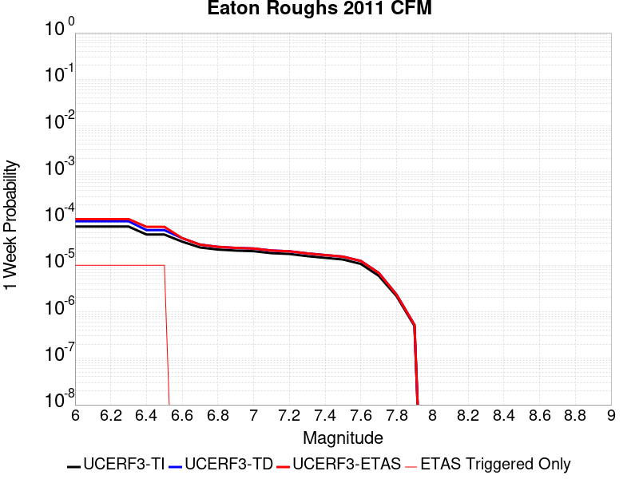 | 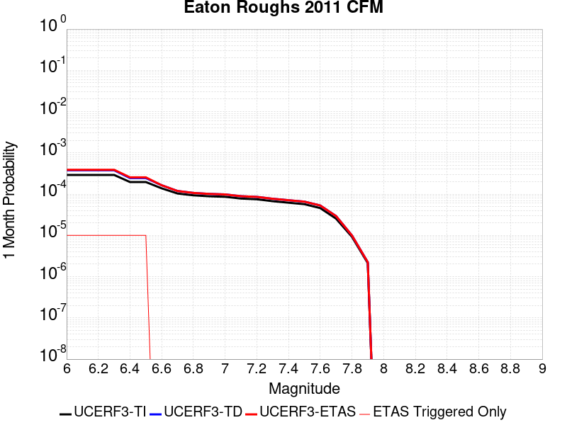 | 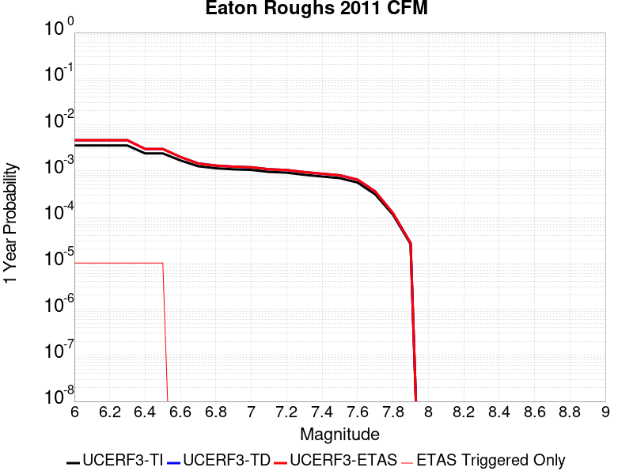 |  |

| Magnitude | 1 wk TI Prob | 1 wk TD Prob | 1 wk ETAS Prob | 1 wk ETAS/TD Gain | 1 wk ETAS Triggered Only | 1 mo TI Prob | 1 mo TD Prob | 1 mo ETAS Prob | 1 mo ETAS/TD Gain | 1 mo ETAS Triggered Only | 1 yr TI Prob | 1 yr TD Prob | 1 yr ETAS Prob | 1 yr ETAS/TD Gain | 1 yr ETAS Triggered Only | 10 yr TI Prob | 10 yr TD Prob | 10 yr ETAS Prob | 10 yr ETAS/TD Gain | 10 yr ETAS Triggered Only |
|-----|-----|-----|-----|-----|-----|-----|-----|-----|-----|-----|-----|-----|-----|-----|-----|-----|-----|-----|-----|-----|
| 6.0 | 6.8044945E-5 | 8.8434645E-5 | 9.843376E-5 | 1.1130679 | 1.0E-5 | 2.9158857E-4 | 3.7895713E-4 | 3.8895337E-4 | 1.0263782 | 1.0E-5 | 0.0035443127 | 0.0046046837 | 0.0046146377 | 1.0021617 | 1.0E-5 | 0.03488314 | 0.04516368 | 0.045173228 | 1.0002114 | 1.0E-5 |
| 6.1 | 6.8044945E-5 | 8.8434645E-5 | 9.843376E-5 | 1.1130679 | 1.0E-5 | 2.9158857E-4 | 3.7895713E-4 | 3.8895337E-4 | 1.0263782 | 1.0E-5 | 0.0035443127 | 0.0046046837 | 0.0046146377 | 1.0021617 | 1.0E-5 | 0.03488314 | 0.04516368 | 0.045173228 | 1.0002114 | 1.0E-5 |
| 6.2 | 6.8044945E-5 | 8.8434645E-5 | 9.843376E-5 | 1.1130679 | 1.0E-5 | 2.9158857E-4 | 3.7895713E-4 | 3.8895337E-4 | 1.0263782 | 1.0E-5 | 0.0035443127 | 0.0046046837 | 0.0046146377 | 1.0021617 | 1.0E-5 | 0.03488314 | 0.04516368 | 0.045173228 | 1.0002114 | 1.0E-5 |
| 6.3 | 6.8044945E-5 | 8.8434645E-5 | 9.843376E-5 | 1.1130679 | 1.0E-5 | 2.9158857E-4 | 3.7895713E-4 | 3.8895337E-4 | 1.0263782 | 1.0E-5 | 0.0035443127 | 0.0046046837 | 0.0046146377 | 1.0021617 | 1.0E-5 | 0.03488314 | 0.04516368 | 0.045173228 | 1.0002114 | 1.0E-5 |
| 6.4 | 4.5830013E-5 | 5.71553E-5 | 6.715473E-5 | 1.1749519 | 1.0E-5 | 1.9639956E-4 | 2.4493135E-4 | 2.549289E-4 | 1.0408177 | 1.0E-5 | 0.0023885423 | 0.002978342 | 0.0029883122 | 1.0033475 | 1.0E-5 | 0.023630321 | 0.029421948 | 0.029431652 | 1.0003299 | 1.0E-5 |
| 6.5 | 4.5830013E-5 | 5.71553E-5 | 6.715473E-5 | 1.1749519 | 1.0E-5 | 1.9639956E-4 | 2.4493135E-4 | 2.549289E-4 | 1.0408177 | 1.0E-5 | 0.0023885423 | 0.002978342 | 0.0029883122 | 1.0033475 | 1.0E-5 | 0.023630321 | 0.029421948 | 0.029431652 | 1.0003299 | 1.0E-5 |
| 6.6 | 3.222194E-5 | 3.8262962E-5 | 3.8262962E-5 | 1.0 | 0.0 | 1.3808672E-4 | 1.6397446E-4 | 1.6397446E-4 | 1.0 | 0.0 | 0.0016799092 | 0.0019946485 | 0.0019946485 | 1.0 | 0.0 | 0.016672665 | 0.019776754 | 0.019776754 | 1.0 | 0.0 |
| 6.7 | 2.4155654E-5 | 2.7786275E-5 | 2.7786275E-5 | 1.0 | 0.0 | 1.0352012E-4 | 1.1907864E-4 | 1.1907864E-4 | 1.0 | 0.0 | 0.0012596287 | 0.0014488265 | 0.0014488265 | 1.0 | 0.0 | 0.012525126 | 0.01439499 | 0.01439499 | 1.0 | 0.0 |
| 6.8 | 2.1814667E-5 | 2.4940904E-5 | 2.4940904E-5 | 1.0 | 0.0 | 9.348808E-5 | 1.0688523E-4 | 1.0688523E-4 | 1.0 | 0.0 | 0.001137623 | 0.0013005546 | 0.0013005546 | 1.0 | 0.0 | 0.011318169 | 0.012930086 | 0.012930086 | 1.0 | 0.0 |
| 6.9 | 2.0700467E-5 | 2.362897E-5 | 2.362897E-5 | 1.0 | 0.0 | 8.871327E-5 | 1.01263104E-4 | 1.01263104E-4 | 1.0 | 0.0 | 0.0010795488 | 0.0012321841 | 0.0012321841 | 1.0 | 0.0 | 0.010743194 | 0.012254083 | 0.012254083 | 1.0 | 0.0 |
| 7.0 | 2.0104066E-5 | 2.2936536E-5 | 2.2936536E-5 | 1.0 | 0.0 | 8.615744E-5 | 9.829576E-5 | 9.829576E-5 | 1.0 | 0.0 | 0.0010484619 | 0.0011960969 | 0.0011960969 | 1.0 | 0.0 | 0.010435291 | 0.01189712 | 0.01189712 | 1.0 | 0.0 |
| 7.1 | 1.8225232E-5 | 2.0773083E-5 | 2.0773083E-5 | 1.0 | 0.0 | 7.81058E-5 | 8.902447E-5 | 8.902447E-5 | 1.0 | 0.0 | 9.5052324E-4 | 0.0010833355 | 0.0010833355 | 1.0 | 0.0 | 0.009464677 | 0.010780873 | 0.010780873 | 1.0 | 0.0 |
| 7.2 | 1.7526572E-5 | 1.9993524E-5 | 1.9993524E-5 | 1.0 | 0.0 | 7.511172E-5 | 8.568373E-5 | 8.568373E-5 | 1.0 | 0.0 | 9.141015E-4 | 0.0010427017 | 0.0010427017 | 1.0 | 0.0 | 0.009103506 | 0.010378398 | 0.010378398 | 1.0 | 0.0 |
| 7.3 | 1.5727232E-5 | 1.8021543E-5 | 1.8021543E-5 | 1.0 | 0.0 | 6.740067E-5 | 7.72329E-5 | 7.72329E-5 | 1.0 | 0.0 | 8.2029426E-4 | 9.399062E-4 | 9.399062E-4 | 1.0 | 0.0 | 0.008172729 | 0.009359558 | 0.009359558 | 1.0 | 0.0 |
| 7.4 | 1.4457361E-5 | 1.6598395E-5 | 1.6598395E-5 | 1.0 | 0.0 | 6.195865E-5 | 7.113405E-5 | 7.113405E-5 | 1.0 | 0.0 | 7.540854E-4 | 8.657138E-4 | 8.657138E-4 | 1.0 | 0.0 | 0.007515317 | 0.008623603 | 0.008623603 | 1.0 | 0.0 |
| 7.5 | 1.33280955E-5 | 1.5345471E-5 | 1.5345471E-5 | 1.0 | 0.0 | 5.711916E-5 | 6.576465E-5 | 6.576465E-5 | 1.0 | 0.0 | 6.9520384E-4 | 8.0039137E-4 | 8.0039137E-4 | 1.0 | 0.0 | 0.00693033 | 0.007975256 | 0.007975256 | 1.0 | 0.0 |
| 7.6 | 1.0699478E-5 | 1.2387852E-5 | 1.2387852E-5 | 1.0 | 0.0 | 4.5854096E-5 | 5.3089716E-5 | 5.3089716E-5 | 1.0 | 0.0 | 5.581306E-4 | 6.461761E-4 | 6.461761E-4 | 1.0 | 0.0 | 0.005567309 | 0.0064430824 | 0.0064430824 | 1.0 | 0.0 |
| 7.7 | 5.9390236E-6 | 6.8529853E-6 | 6.8529853E-6 | 1.0 | 0.0 | 2.545271E-5 | 2.9369607E-5 | 2.9369607E-5 | 1.0 | 0.0 | 3.0984267E-4 | 3.5751655E-4 | 3.5751655E-4 | 1.0 | 0.0 | 0.0030941102 | 0.0035694393 | 0.0035694393 | 1.0 | 0.0 |
| 7.8 | 2.1622036E-6 | 2.329702E-6 | 2.329702E-6 | 1.0 | 0.0 | 9.266554E-6 | 9.984399E-6 | 9.984399E-6 | 1.0 | 0.0 | 1.1281446E-4 | 1.21553356E-4 | 1.21553356E-4 | 1.0 | 0.0 | 0.001127572 | 0.0012148687 | 0.0012148687 | 1.0 | 0.0 |
| 7.9 | 4.9586197E-7 | 5.2189216E-7 | 5.2189216E-7 | 1.0 | 0.0 | 2.125121E-6 | 2.2366787E-6 | 2.2366787E-6 | 1.0 | 0.0 | 2.5873042E-5 | 2.7231245E-5 | 2.7231245E-5 | 1.0 | 0.0 | 2.5870028E-4 | 2.7228118E-4 | 2.7228118E-4 | 1.0 | 0.0 |

## Calaveras (So) - Paicines extension 2011 CFM
*[(top)](#table-of-contents)*

| 1 Week | 1 Month | 1 Year | 10 Year |
|-----|-----|-----|-----|
|  | 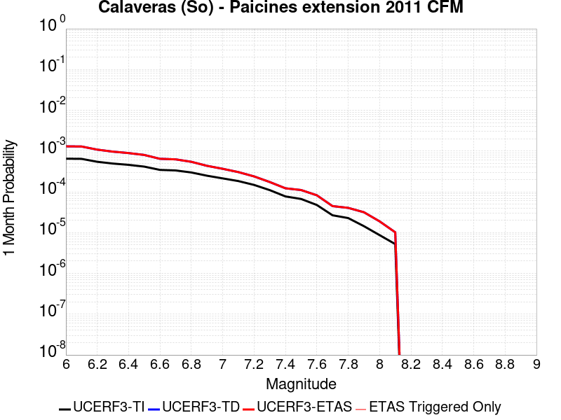 | 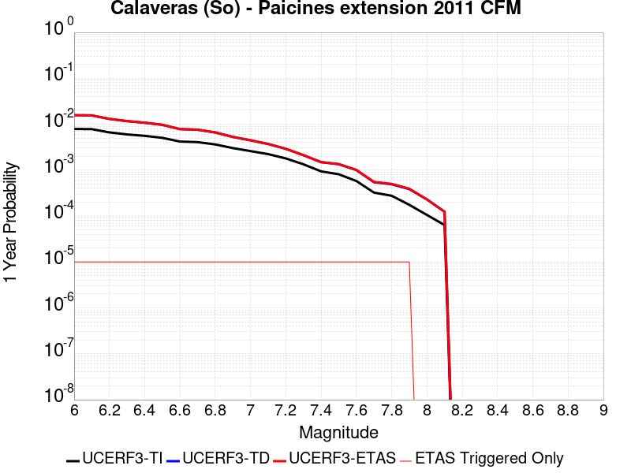 | 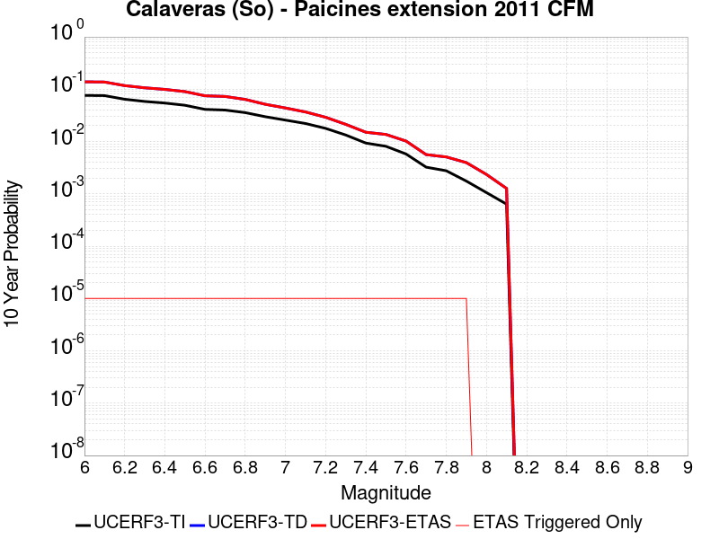 |

| Magnitude | 1 wk TI Prob | 1 wk TD Prob | 1 wk ETAS Prob | 1 wk ETAS/TD Gain | 1 wk ETAS Triggered Only | 1 mo TI Prob | 1 mo TD Prob | 1 mo ETAS Prob | 1 mo ETAS/TD Gain | 1 mo ETAS Triggered Only | 1 yr TI Prob | 1 yr TD Prob | 1 yr ETAS Prob | 1 yr ETAS/TD Gain | 1 yr ETAS Triggered Only | 10 yr TI Prob | 10 yr TD Prob | 10 yr ETAS Prob | 10 yr ETAS/TD Gain | 10 yr ETAS Triggered Only |
|-----|-----|-----|-----|-----|-----|-----|-----|-----|-----|-----|-----|-----|-----|-----|-----|-----|-----|-----|-----|-----|
| 6.0 | 1.5183659E-4 | 3.0520977E-4 | 3.0520977E-4 | 1.0 | 0.0 | 6.5056595E-4 | 0.0013068188 | 0.0013068188 | 1.0 | 0.0 | 0.007891912 | 0.015696203 | 0.015706047 | 1.000627 | 1.0E-5 | 0.076174594 | 0.13848905 | 0.13849767 | 1.0000622 | 1.0E-5 |
| 6.1 | 1.5024997E-4 | 3.021517E-4 | 3.021517E-4 | 1.0 | 0.0 | 6.437695E-4 | 0.0012937278 | 0.0012937278 | 1.0 | 0.0 | 0.0078097614 | 0.015539596 | 0.015549441 | 1.0006335 | 1.0E-5 | 0.075409345 | 0.13715863 | 0.13716726 | 1.000063 | 1.0E-5 |
| 6.2 | 1.2743923E-4 | 2.5313982E-4 | 2.5313982E-4 | 1.0 | 0.0 | 5.460538E-4 | 0.0010839999 | 0.0010839999 | 1.0 | 0.0 | 0.0066279583 | 0.013046881 | 0.013056751 | 1.0007565 | 1.0E-5 | 0.064337276 | 0.117256075 | 0.1172649 | 1.0000753 | 1.0E-5 |
| 6.3 | 1.1525114E-4 | 2.2599236E-4 | 2.2599236E-4 | 1.0 | 0.0 | 4.9383997E-4 | 9.678718E-4 | 9.678718E-4 | 1.0 | 0.0 | 0.0059959386 | 0.011668079 | 0.011677962 | 1.000847 | 1.0E-5 | 0.058367174 | 0.106372125 | 0.10638106 | 1.000084 | 1.0E-5 |
| 6.4 | 1.07200925E-4 | 2.0840544E-4 | 2.0840544E-4 | 1.0 | 0.0 | 4.5935164E-4 | 8.926123E-4 | 8.926123E-4 | 1.0 | 0.0 | 0.0055782744 | 0.010772959 | 0.010782851 | 1.0009183 | 1.0E-5 | 0.0544031 | 0.099194765 | 0.09920377 | 1.0000908 | 1.0E-5 |
| 6.5 | 9.69631E-5 | 1.8734725E-4 | 1.8734725E-4 | 1.0 | 0.0 | 4.1548995E-4 | 8.024631E-4 | 8.024631E-4 | 1.0 | 0.0 | 0.0050468626 | 0.009694842 | 0.009704744 | 1.0010215 | 1.0E-5 | 0.04933773 | 0.090086564 | 0.09009567 | 1.000101 | 1.0E-5 |
| 6.6 | 8.0552316E-5 | 1.507068E-4 | 1.507068E-4 | 1.0 | 0.0 | 3.4517853E-4 | 6.4569083E-4 | 6.4569083E-4 | 1.0 | 0.0 | 0.0041944524 | 0.007826508 | 0.00783643 | 1.0012677 | 1.0E-5 | 0.04116161 | 0.0748563 | 0.07486556 | 1.0001236 | 1.0E-5 |
| 6.7 | 7.815757E-5 | 1.4611272E-4 | 1.4611272E-4 | 1.0 | 0.0 | 3.34918E-4 | 6.26014E-4 | 6.26014E-4 | 1.0 | 0.0 | 0.004070005 | 0.007589312 | 0.0075992355 | 1.0013076 | 1.0E-5 | 0.039962657 | 0.07270582 | 0.072715096 | 1.0001276 | 1.0E-5 |
| 6.8 | 6.965264E-5 | 1.2722758E-4 | 1.2722758E-4 | 1.0 | 0.0 | 2.9847719E-4 | 5.4513285E-4 | 5.4513285E-4 | 1.0 | 0.0 | 0.0036279052 | 0.0066135945 | 0.0066235284 | 1.001502 | 1.0E-5 | 0.03569247 | 0.063801065 | 0.06381043 | 1.0001467 | 1.0E-5 |
| 6.9 | 5.8000453E-5 | 1.01439E-4 | 1.01439E-4 | 1.0 | 0.0 | 2.4854968E-4 | 4.346666E-4 | 4.346666E-4 | 1.0 | 0.0 | 0.0030218933 | 0.005279322 | 0.0052892696 | 1.0018842 | 1.0E-5 | 0.029811295 | 0.051502965 | 0.05151245 | 1.0001842 | 1.0E-5 |
| 7.0 | 4.9865852E-5 | 8.568029E-5 | 8.568029E-5 | 1.0 | 0.0 | 2.1369329E-4 | 3.6715003E-4 | 3.6715003E-4 | 1.0 | 0.0 | 0.0025986114 | 0.004460979 | 0.004470934 | 1.0022317 | 1.0E-5 | 0.025684336 | 0.043782018 | 0.043791577 | 1.0002184 | 1.0E-5 |
| 7.1 | 4.283875E-5 | 7.1124625E-5 | 7.1124625E-5 | 1.0 | 0.0 | 1.8358172E-4 | 3.0478454E-4 | 3.0478454E-4 | 1.0 | 0.0 | 0.0022328163 | 0.003704494 | 0.0037144572 | 1.0026895 | 1.0E-5 | 0.022105146 | 0.03673582 | 0.036745455 | 1.0002623 | 1.0E-5 |
| 7.2 | 3.450115E-5 | 5.5778568E-5 | 5.5778568E-5 | 1.0 | 0.0 | 1.478537E-4 | 2.3902925E-4 | 2.3902925E-4 | 1.0 | 0.0 | 0.0017986323 | 0.0029063264 | 0.0029162974 | 1.0034307 | 1.0E-5 | 0.017841442 | 0.029079042 | 0.029088752 | 1.0003339 | 1.0E-5 |
| 7.3 | 2.5709045E-5 | 4.059001E-5 | 4.059001E-5 | 1.0 | 0.0 | 1.1017697E-4 | 1.7394568E-4 | 1.7394568E-4 | 1.0 | 0.0 | 0.0013405791 | 0.0021157486 | 0.0021257275 | 1.0047165 | 1.0E-5 | 0.013325208 | 0.02129686 | 0.021306649 | 1.0004596 | 1.0E-5 |
| 7.4 | 1.8003093E-5 | 2.8511378E-5 | 2.8511378E-5 | 1.0 | 0.0 | 7.715383E-5 | 1.2218591E-4 | 1.2218591E-4 | 1.0 | 0.0 | 9.3894306E-4 | 0.0014866006 | 0.0014965858 | 1.0067167 | 1.0E-5 | 0.009349857 | 0.015051589 | 0.015061439 | 1.0006543 | 1.0E-5 |
| 7.5 | 1.5595824E-5 | 2.5823752E-5 | 2.5823752E-5 | 1.0 | 0.0 | 6.683753E-5 | 1.10668545E-4 | 1.10668545E-4 | 1.0 | 0.0 | 8.134431E-4 | 0.0013465589 | 0.0013565455 | 1.0074164 | 1.0E-5 | 0.008104719 | 0.013651571 | 0.013661435 | 1.0007225 | 1.0E-5 |
| 7.6 | 1.1110309E-5 | 1.9223195E-5 | 1.9223195E-5 | 1.0 | 0.0 | 4.761474E-5 | 8.2382525E-5 | 8.2382525E-5 | 1.0 | 0.0 | 5.795553E-4 | 0.0010025471 | 0.001012537 | 1.0099646 | 1.0E-5 | 0.0057804612 | 0.01020344 | 0.010213338 | 1.00097 | 1.0E-5 |
| 7.7 | 6.2140443E-6 | 1.04376995E-5 | 1.04376995E-5 | 1.0 | 0.0 | 2.6631347E-5 | 4.4732235E-5 | 4.4732235E-5 | 1.0 | 0.0 | 3.241884E-4 | 5.4447894E-4 | 5.544735E-4 | 1.0183562 | 1.0E-5 | 0.0032371588 | 0.005620102 | 0.005630046 | 1.0017693 | 1.0E-5 |
| 7.8 | 5.305533E-6 | 9.433651E-6 | 9.433651E-6 | 1.0 | 0.0 | 2.27378E-5 | 4.0429306E-5 | 4.0429306E-5 | 1.0 | 0.0 | 2.7679754E-4 | 4.9211574E-4 | 5.021108E-4 | 1.0203104 | 1.0E-5 | 0.0027645302 | 0.005074622 | 0.0050845714 | 1.0019606 | 1.0E-5 |
| 7.9 | 3.363505E-6 | 7.3854467E-6 | 7.3854467E-6 | 1.0 | 0.0 | 1.4414942E-5 | 3.1651532E-5 | 3.1651532E-5 | 1.0 | 0.0 | 1.7548777E-4 | 3.8528934E-4 | 3.952855E-4 | 1.0259445 | 1.0E-5 | 0.0017534926 | 0.003948784 | 0.0039587445 | 1.0025225 | 1.0E-5 |
| 8.0 | 2.0271132E-6 | 4.4134235E-6 | 4.4134235E-6 | 1.0 | 0.0 | 8.687599E-6 | 1.8914534E-5 | 1.8914534E-5 | 1.0 | 0.0 | 1.05766376E-4 | 2.3026018E-4 | 2.3026018E-4 | 1.0 | 0.0 | 0.0010571606 | 0.002351194 | 0.002351194 | 1.0 | 0.0 |
| 8.1 | 1.2206116E-6 | 2.3752666E-6 | 2.3752666E-6 | 1.0 | 0.0 | 5.2311816E-6 | 1.0179674E-5 | 1.0179674E-5 | 1.0 | 0.0 | 6.3687774E-5 | 1.2393051E-4 | 1.2393051E-4 | 1.0 | 0.0 | 6.366953E-4 | 0.0012705618 | 0.0012705618 | 1.0 | 0.0 |

## San Gabriel
*[(top)](#table-of-contents)*

| 1 Week | 1 Month | 1 Year | 10 Year |
|-----|-----|-----|-----|
| 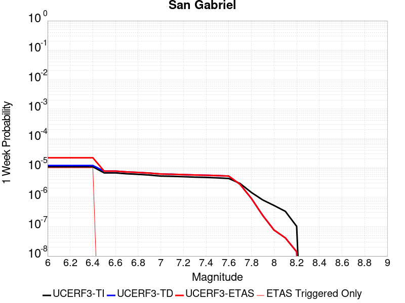 |  | 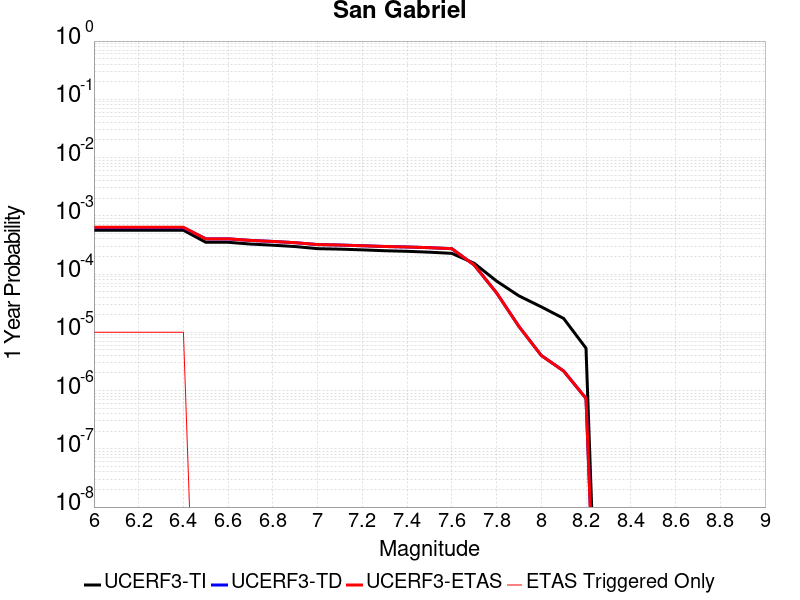 | 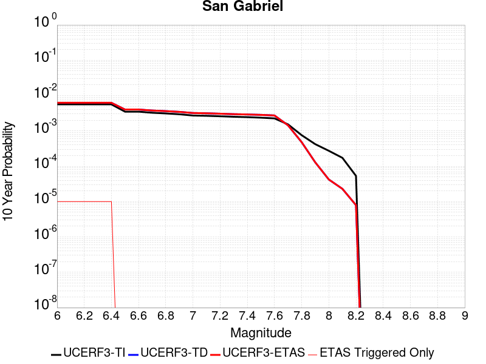 |

| Magnitude | 1 wk TI Prob | 1 wk TD Prob | 1 wk ETAS Prob | 1 wk ETAS/TD Gain | 1 wk ETAS Triggered Only | 1 mo TI Prob | 1 mo TD Prob | 1 mo ETAS Prob | 1 mo ETAS/TD Gain | 1 mo ETAS Triggered Only | 1 yr TI Prob | 1 yr TD Prob | 1 yr ETAS Prob | 1 yr ETAS/TD Gain | 1 yr ETAS Triggered Only | 10 yr TI Prob | 10 yr TD Prob | 10 yr ETAS Prob | 10 yr ETAS/TD Gain | 10 yr ETAS Triggered Only |
|-----|-----|-----|-----|-----|-----|-----|-----|-----|-----|-----|-----|-----|-----|-----|-----|-----|-----|-----|-----|-----|
| 6.0 | 1.083775E-5 | 1.198525E-5 | 2.198513E-5 | 1.8343489 | 1.0E-5 | 4.6446676E-5 | 5.1364408E-5 | 6.13639E-5 | 1.1946774 | 1.0E-5 | 5.653415E-4 | 6.251936E-4 | 6.351873E-4 | 1.015985 | 1.0E-5 | 0.0056390543 | 0.0062463325 | 0.00625627 | 1.001591 | 1.0E-5 |
| 6.1 | 1.083775E-5 | 1.198525E-5 | 2.198513E-5 | 1.8343489 | 1.0E-5 | 4.6446676E-5 | 5.1364408E-5 | 6.13639E-5 | 1.1946774 | 1.0E-5 | 5.653415E-4 | 6.251936E-4 | 6.351873E-4 | 1.015985 | 1.0E-5 | 0.0056390543 | 0.0062463325 | 0.00625627 | 1.001591 | 1.0E-5 |
| 6.2 | 1.083775E-5 | 1.198525E-5 | 2.198513E-5 | 1.8343489 | 1.0E-5 | 4.6446676E-5 | 5.1364408E-5 | 6.13639E-5 | 1.1946774 | 1.0E-5 | 5.653415E-4 | 6.251936E-4 | 6.351873E-4 | 1.015985 | 1.0E-5 | 0.0056390543 | 0.0062463325 | 0.00625627 | 1.001591 | 1.0E-5 |
| 6.3 | 1.083775E-5 | 1.198525E-5 | 2.198513E-5 | 1.8343489 | 1.0E-5 | 4.6446676E-5 | 5.1364408E-5 | 6.13639E-5 | 1.1946774 | 1.0E-5 | 5.653415E-4 | 6.251936E-4 | 6.351873E-4 | 1.015985 | 1.0E-5 | 0.0056390543 | 0.0062463325 | 0.00625627 | 1.001591 | 1.0E-5 |
| 6.4 | 1.083775E-5 | 1.198525E-5 | 2.198513E-5 | 1.8343489 | 1.0E-5 | 4.6446676E-5 | 5.1364408E-5 | 6.13639E-5 | 1.1946774 | 1.0E-5 | 5.653415E-4 | 6.251936E-4 | 6.351873E-4 | 1.015985 | 1.0E-5 | 0.0056390543 | 0.0062463325 | 0.00625627 | 1.001591 | 1.0E-5 |
| 6.5 | 6.7317824E-6 | 7.717007E-6 | 7.717007E-6 | 1.0 | 0.0 | 2.8850178E-5 | 3.3072472E-5 | 3.3072472E-5 | 1.0 | 0.0 | 3.511943E-4 | 4.0258403E-4 | 4.0258403E-4 | 1.0 | 0.0 | 0.003506398 | 0.004029533 | 0.004029533 | 1.0 | 0.0 |
| 6.6 | 6.7317824E-6 | 7.717007E-6 | 7.717007E-6 | 1.0 | 0.0 | 2.8850178E-5 | 3.3072472E-5 | 3.3072472E-5 | 1.0 | 0.0 | 3.511943E-4 | 4.0258403E-4 | 4.0258403E-4 | 1.0 | 0.0 | 0.003506398 | 0.004029533 | 0.004029533 | 1.0 | 0.0 |
| 6.7 | 6.274881E-6 | 7.2459275E-6 | 7.2459275E-6 | 1.0 | 0.0 | 2.6892068E-5 | 3.105361E-5 | 3.105361E-5 | 1.0 | 0.0 | 3.2736175E-4 | 3.7801306E-4 | 3.7801306E-4 | 1.0 | 0.0 | 0.0032687993 | 0.0037846796 | 0.0037846796 | 1.0 | 0.0 |
| 6.8 | 5.996209E-6 | 6.958647E-6 | 6.958647E-6 | 1.0 | 0.0 | 2.5697784E-5 | 2.9822439E-5 | 2.9822439E-5 | 1.0 | 0.0 | 3.128256E-4 | 3.6302864E-4 | 3.6302864E-4 | 1.0 | 0.0 | 0.003123856 | 0.0036353325 | 0.0036353325 | 1.0 | 0.0 |
| 6.9 | 5.686331E-6 | 6.6236917E-6 | 6.6236917E-6 | 1.0 | 0.0 | 2.4369761E-5 | 2.8386947E-5 | 2.8386947E-5 | 1.0 | 0.0 | 2.9666146E-4 | 3.4555717E-4 | 3.4555717E-4 | 1.0 | 0.0 | 0.0029626573 | 0.0034611735 | 0.0034611735 | 1.0 | 0.0 |
| 7.0 | 5.2329838E-6 | 6.1475757E-6 | 6.1475757E-6 | 1.0 | 0.0 | 2.242688E-5 | 2.6346492E-5 | 2.6346492E-5 | 1.0 | 0.0 | 2.7301308E-4 | 3.207221E-4 | 3.207221E-4 | 1.0 | 0.0 | 0.002726779 | 0.0032135549 | 0.0032135549 | 1.0 | 0.0 |
| 7.1 | 5.135671E-6 | 6.0377E-6 | 6.0377E-6 | 1.0 | 0.0 | 2.2009834E-5 | 2.5875606E-5 | 2.5875606E-5 | 1.0 | 0.0 | 2.6793676E-4 | 3.1499073E-4 | 3.1499073E-4 | 1.0 | 0.0 | 0.0026761394 | 0.0031564054 | 0.0031564054 | 1.0 | 0.0 |
| 7.2 | 4.989062E-6 | 5.8710784E-6 | 5.8710784E-6 | 1.0 | 0.0 | 2.1381518E-5 | 2.5161527E-5 | 2.5161527E-5 | 1.0 | 0.0 | 2.6028889E-4 | 3.0629928E-4 | 3.0629928E-4 | 1.0 | 0.0 | 0.0025998424 | 0.003069734 | 0.003069734 | 1.0 | 0.0 |
| 7.3 | 4.8219395E-6 | 5.7026323E-6 | 5.7026323E-6 | 1.0 | 0.0 | 2.0665291E-5 | 2.4439627E-5 | 2.4439627E-5 | 1.0 | 0.0 | 2.5157086E-4 | 2.975126E-4 | 2.975126E-4 | 1.0 | 0.0 | 0.0025128627 | 0.002982106 | 0.002982106 | 1.0 | 0.0 |
| 7.4 | 4.7118383E-6 | 5.5911896E-6 | 5.5911896E-6 | 1.0 | 0.0 | 2.0193436E-5 | 2.3962024E-5 | 2.3962024E-5 | 1.0 | 0.0 | 2.4582737E-4 | 2.9169934E-4 | 2.9169934E-4 | 1.0 | 0.0 | 0.002455556 | 0.0029241266 | 0.0029241266 | 1.0 | 0.0 |
| 7.5 | 4.5506545E-6 | 5.4365555E-6 | 5.4365555E-6 | 1.0 | 0.0 | 1.9502659E-5 | 2.329932E-5 | 2.329932E-5 | 1.0 | 0.0 | 2.37419E-4 | 2.8363304E-4 | 2.8363304E-4 | 1.0 | 0.0 | 0.002371655 | 0.0028436715 | 0.0028436715 | 1.0 | 0.0 |
| 7.6 | 4.343636E-6 | 5.2294336E-6 | 5.2294336E-6 | 1.0 | 0.0 | 1.861545E-5 | 2.241167E-5 | 2.241167E-5 | 1.0 | 0.0 | 2.2661954E-4 | 2.7282868E-4 | 2.7282868E-4 | 1.0 | 0.0 | 0.0022638857 | 0.0027358893 | 0.0027358893 | 1.0 | 0.0 |
| 7.7 | 2.936235E-6 | 2.743946E-6 | 2.743946E-6 | 1.0 | 0.0 | 1.2583803E-5 | 1.1759716E-5 | 1.1759716E-5 | 1.0 | 0.0 | 1.5319703E-4 | 1.4316518E-4 | 1.4316518E-4 | 1.0 | 0.0 | 0.0015309147 | 0.0014379849 | 0.0014379849 | 1.0 | 0.0 |
| 7.8 | 1.4541639E-6 | 9.122518E-7 | 9.122518E-7 | 1.0 | 0.0 | 6.232116E-6 | 3.9096444E-6 | 3.9096444E-6 | 1.0 | 0.0 | 7.587337E-5 | 4.7598885E-5 | 4.7598885E-5 | 1.0 | 0.0 | 7.584747E-4 | 4.8078224E-4 | 4.8078224E-4 | 1.0 | 0.0 |
| 7.9 | 8.098958E-7 | 2.4165956E-7 | 2.4165956E-7 | 1.0 | 0.0 | 3.4709774E-6 | 1.0356835E-6 | 1.0356835E-6 | 1.0 | 0.0 | 4.225833E-5 | 1.2609373E-5 | 1.2609373E-5 | 1.0 | 0.0 | 4.2250296E-4 | 1.2917137E-4 | 1.2917137E-4 | 1.0 | 0.0 |
| 8.0 | 5.2473234E-7 | 7.672734E-8 | 7.672734E-8 | 1.0 | 0.0 | 2.248851E-6 | 3.2883142E-7 | 3.2883142E-7 | 1.0 | 0.0 | 2.7379416E-5 | 4.003515E-6 | 4.003515E-6 | 1.0 | 0.0 | 2.7376044E-4 | 4.215796E-5 | 4.215796E-5 | 1.0 | 0.0 |
| 8.1 | 3.3162388E-7 | 4.1457096E-8 | 4.1457096E-8 | 1.0 | 0.0 | 1.4212444E-6 | 1.7767324E-7 | 1.7767324E-7 | 1.0 | 0.0 | 1.7303513E-5 | 2.1631695E-6 | 2.1631695E-6 | 1.0 | 0.0 | 1.7302166E-4 | 2.294416E-5 | 2.294416E-5 | 1.0 | 0.0 |
| 8.2 | 1.0235345E-7 | 1.4032201E-8 | 1.4032201E-8 | 1.0 | 0.0 | 4.3865757E-7 | 6.013801E-8 | 6.013801E-8 | 1.0 | 0.0 | 5.340643E-6 | 7.3217996E-7 | 7.3217996E-7 | 1.0 | 0.0 | 5.3405143E-5 | 7.921925E-6 | 7.921925E-6 | 1.0 | 0.0 |

## Hayward (So) 2011 CFM
*[(top)](#table-of-contents)*

| 1 Week | 1 Month | 1 Year | 10 Year |
|-----|-----|-----|-----|
| 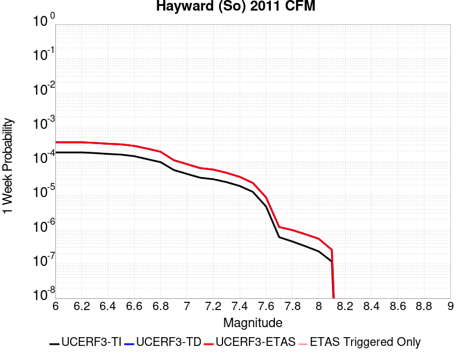 | 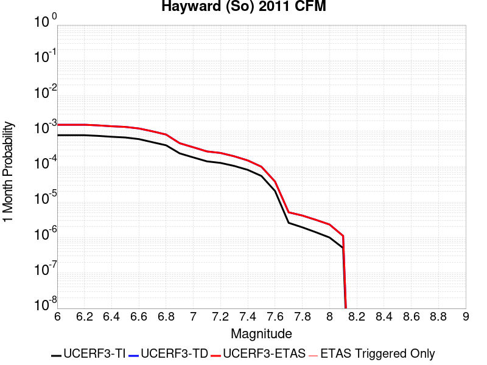 | 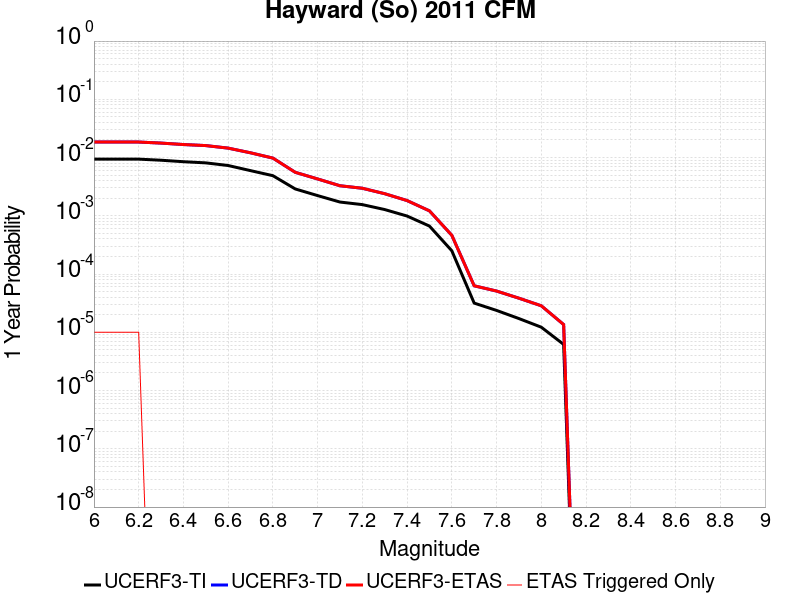 | 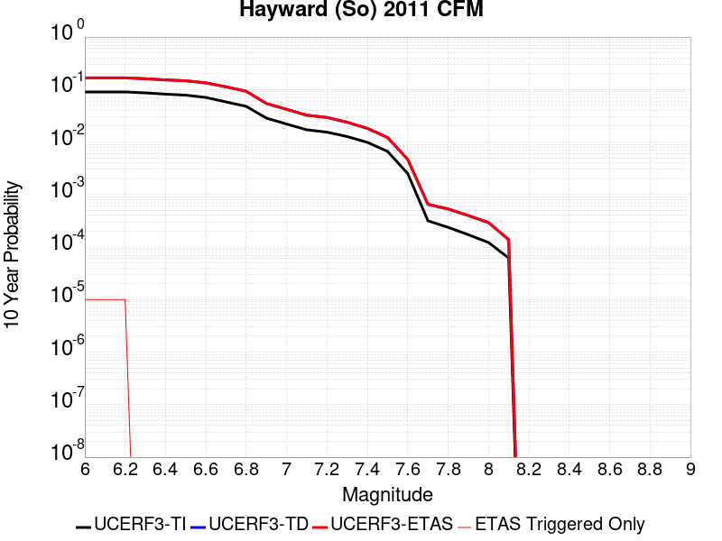 |

| Magnitude | 1 wk TI Prob | 1 wk TD Prob | 1 wk ETAS Prob | 1 wk ETAS/TD Gain | 1 wk ETAS Triggered Only | 1 mo TI Prob | 1 mo TD Prob | 1 mo ETAS Prob | 1 mo ETAS/TD Gain | 1 mo ETAS Triggered Only | 1 yr TI Prob | 1 yr TD Prob | 1 yr ETAS Prob | 1 yr ETAS/TD Gain | 1 yr ETAS Triggered Only | 10 yr TI Prob | 10 yr TD Prob | 10 yr ETAS Prob | 10 yr ETAS/TD Gain | 10 yr ETAS Triggered Only |
|-----|-----|-----|-----|-----|-----|-----|-----|-----|-----|-----|-----|-----|-----|-----|-----|-----|-----|-----|-----|-----|
| 6.0 | 1.8091932E-4 | 3.570673E-4 | 3.570673E-4 | 1.0 | 0.0 | 7.751381E-4 | 0.0015294008 | 0.0015294008 | 1.0 | 0.0 | 0.00939654 | 0.018463885 | 0.0184737 | 1.0005316 | 1.0E-5 | 0.090090066 | 0.1667085 | 0.16671683 | 1.00005 | 1.0E-5 |
| 6.1 | 1.8091932E-4 | 3.570673E-4 | 3.570673E-4 | 1.0 | 0.0 | 7.751381E-4 | 0.0015294008 | 0.0015294008 | 1.0 | 0.0 | 0.00939654 | 0.018463885 | 0.0184737 | 1.0005316 | 1.0E-5 | 0.090090066 | 0.1667085 | 0.16671683 | 1.00005 | 1.0E-5 |
| 6.2 | 1.8091932E-4 | 3.570673E-4 | 3.570673E-4 | 1.0 | 0.0 | 7.751381E-4 | 0.0015294008 | 0.0015294008 | 1.0 | 0.0 | 0.00939654 | 0.018463885 | 0.0184737 | 1.0005316 | 1.0E-5 | 0.090090066 | 0.1667085 | 0.16671683 | 1.00005 | 1.0E-5 |
| 6.3 | 1.7322872E-4 | 3.4263515E-4 | 3.4263515E-4 | 1.0 | 0.0 | 7.4219756E-4 | 0.0014676197 | 0.0014676197 | 1.0 | 0.0 | 0.0089988755 | 0.017724147 | 0.017724147 | 1.0 | 0.0 | 0.08643075 | 0.16065954 | 0.16065954 | 1.0 | 0.0 |
| 6.4 | 1.6334097E-4 | 3.2345165E-4 | 3.2345165E-4 | 1.0 | 0.0 | 6.998449E-4 | 0.0013854936 | 0.0013854936 | 1.0 | 0.0 | 0.008487372 | 0.016739927 | 0.016739927 | 1.0 | 0.0 | 0.081704415 | 0.15256606 | 0.15256606 | 1.0 | 0.0 |
| 6.5 | 1.5600289E-4 | 3.101982E-4 | 3.101982E-4 | 1.0 | 0.0 | 6.684125E-4 | 0.0013287518 | 0.0013287518 | 1.0 | 0.0 | 0.008107598 | 0.016059443 | 0.016059443 | 1.0 | 0.0 | 0.078181036 | 0.14684291 | 0.14684291 | 1.0 | 0.0 |
| 6.6 | 1.4046066E-4 | 2.8034003E-4 | 2.8034003E-4 | 1.0 | 0.0 | 6.018354E-4 | 0.0012009109 | 0.0012009109 | 1.0 | 0.0 | 0.0073027555 | 0.014524571 | 0.014524571 | 1.0 | 0.0 | 0.07067384 | 0.13393044 | 0.13393044 | 1.0 | 0.0 |
| 6.7 | 1.14696966E-4 | 2.3272466E-4 | 2.3272466E-4 | 1.0 | 0.0 | 4.914658E-4 | 9.970153E-4 | 9.970153E-4 | 1.0 | 0.0 | 0.0059671924 | 0.012072163 | 0.012072163 | 1.0 | 0.0 | 0.058094822 | 0.11274141 | 0.11274141 | 1.0 | 0.0 |
| 6.8 | 9.3874296E-5 | 1.8862431E-4 | 1.8862431E-4 | 1.0 | 0.0 | 4.0225635E-4 | 8.081431E-4 | 8.081431E-4 | 1.0 | 0.0 | 0.0048864787 | 0.009795489 | 0.009795489 | 1.0 | 0.0 | 0.047804173 | 0.092592984 | 0.092592984 | 1.0 | 0.0 |
| 6.9 | 5.551852E-5 | 1.0729875E-4 | 1.0729875E-4 | 1.0 | 0.0 | 2.3791482E-4 | 4.5977137E-4 | 4.5977137E-4 | 1.0 | 0.0 | 0.0028927654 | 0.005583468 | 0.005583468 | 1.0 | 0.0 | 0.028553981 | 0.054246075 | 0.054246075 | 1.0 | 0.0 |
| 7.0 | 4.2662363E-5 | 8.246792E-5 | 8.246792E-5 | 1.0 | 0.0 | 1.8282588E-4 | 3.5338648E-4 | 3.5338648E-4 | 1.0 | 0.0 | 0.0022236328 | 0.0042940658 | 0.0042940658 | 1.0 | 0.0 | 0.022015138 | 0.04206509 | 0.04206509 | 1.0 | 0.0 |
| 7.1 | 3.305886E-5 | 6.302183E-5 | 6.302183E-5 | 1.0 | 0.0 | 1.4167312E-4 | 2.7006568E-4 | 2.7006568E-4 | 1.0 | 0.0 | 0.0017235056 | 0.003283111 | 0.003283111 | 1.0 | 0.0 | 0.017101998 | 0.032453902 | 0.032453902 | 1.0 | 0.0 |
| 7.2 | 2.9856887E-5 | 5.701622E-5 | 5.701622E-5 | 1.0 | 0.0 | 1.2795182E-4 | 2.4433242E-4 | 2.4433242E-4 | 1.0 | 0.0 | 0.0015567001 | 0.0029707062 | 0.0029707062 | 1.0 | 0.0 | 0.015458403 | 0.029454801 | 0.029454801 | 1.0 | 0.0 |
| 7.3 | 2.4559737E-5 | 4.599286E-5 | 4.599286E-5 | 1.0 | 0.0 | 1.0525176E-4 | 1.9709744E-4 | 1.9709744E-4 | 1.0 | 0.0 | 0.0012806869 | 0.0023970334 | 0.0023970334 | 1.0 | 0.0 | 0.012733313 | 0.023858516 | 0.023858516 | 1.0 | 0.0 |
| 7.4 | 1.9002231E-5 | 3.505084E-5 | 3.505084E-5 | 1.0 | 0.0 | 8.143559E-5 | 1.502093E-4 | 1.502093E-4 | 1.0 | 0.0 | 9.910273E-4 | 0.001827274 | 0.001827274 | 1.0 | 0.0 | 0.009866194 | 0.018258808 | 0.018258808 | 1.0 | 0.0 |
| 7.5 | 1.2783333E-5 | 2.3331182E-5 | 2.3331182E-5 | 1.0 | 0.0 | 5.4784563E-5 | 9.998698E-5 | 9.998698E-5 | 1.0 | 0.0 | 6.667979E-4 | 0.0012166675 | 0.0012166675 | 1.0 | 0.0 | 0.006648007 | 0.012209443 | 0.012209443 | 1.0 | 0.0 |
| 7.6 | 4.8149627E-6 | 8.888056E-6 | 8.888056E-6 | 1.0 | 0.0 | 2.063539E-5 | 3.8091122E-5 | 3.8091122E-5 | 1.0 | 0.0 | 2.5120692E-4 | 4.6366194E-4 | 4.6366194E-4 | 1.0 | 0.0 | 0.0025092314 | 0.0046805087 | 0.0046805087 | 1.0 | 0.0 |
| 7.7 | 6.0838227E-7 | 1.205754E-6 | 1.205754E-6 | 1.0 | 0.0 | 2.6073499E-6 | 5.1675065E-6 | 5.1675065E-6 | 1.0 | 0.0 | 3.174402E-5 | 6.291258E-5 | 6.291258E-5 | 1.0 | 0.0 | 3.1739488E-4 | 6.5296254E-4 | 6.5296254E-4 | 1.0 | 0.0 |
| 7.8 | 4.5542808E-7 | 9.792941E-7 | 9.792941E-7 | 1.0 | 0.0 | 1.9518332E-6 | 4.196968E-6 | 4.196968E-6 | 1.0 | 0.0 | 2.376331E-5 | 5.109689E-5 | 5.109689E-5 | 1.0 | 0.0 | 2.3760769E-4 | 5.321693E-4 | 5.321693E-4 | 1.0 | 0.0 |
| 7.9 | 3.3016747E-7 | 7.3869535E-7 | 7.3869535E-7 | 1.0 | 0.0 | 1.4150027E-6 | 3.1658333E-6 | 3.1658333E-6 | 1.0 | 0.0 | 1.7227521E-5 | 3.854334E-5 | 3.854334E-5 | 1.0 | 0.0 | 1.7226185E-4 | 3.9932923E-4 | 3.9932923E-4 | 1.0 | 0.0 |
| 8.0 | 2.347038E-7 | 5.471963E-7 | 5.471963E-7 | 1.0 | 0.0 | 1.0058731E-6 | 2.3451248E-6 | 2.3451248E-6 | 1.0 | 0.0 | 1.2246436E-5 | 2.8551523E-5 | 2.8551523E-5 | 1.0 | 0.0 | 1.2245761E-4 | 2.9357258E-4 | 2.9357258E-4 | 1.0 | 0.0 |
| 8.1 | 1.18822804E-7 | 2.6060948E-7 | 2.6060948E-7 | 1.0 | 0.0 | 5.092405E-7 | 1.1168972E-6 | 1.1168972E-6 | 1.0 | 0.0 | 6.1999854E-6 | 1.359814E-5 | 1.359814E-5 | 1.0 | 0.0 | 6.199812E-5 | 1.3918082E-4 | 1.3918082E-4 | 1.0 | 0.0 |

## Verdugo
*[(top)](#table-of-contents)*

| 1 Week | 1 Month | 1 Year | 10 Year |
|-----|-----|-----|-----|
| 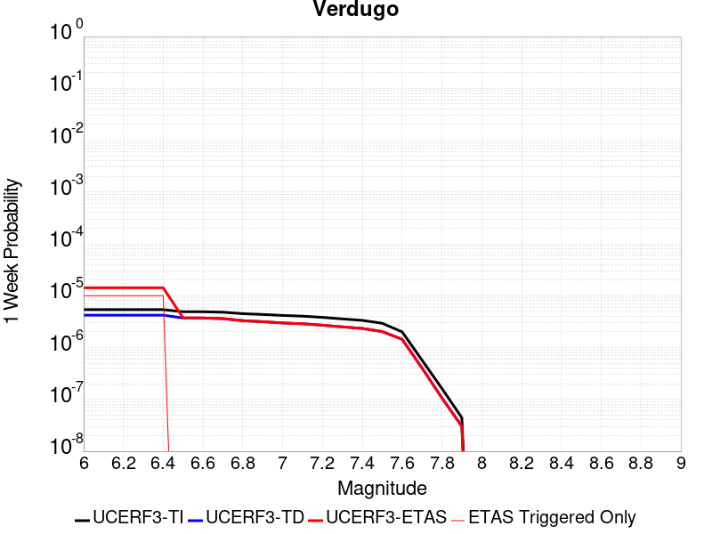 | 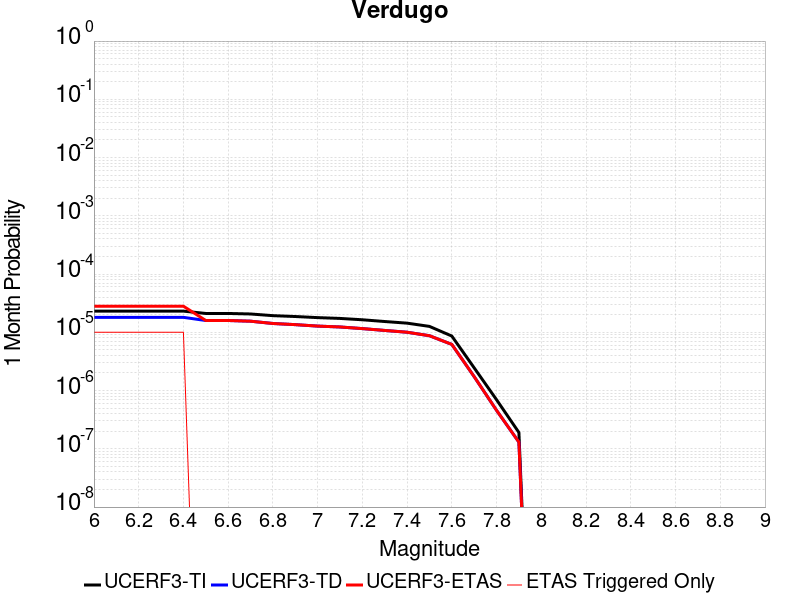 | 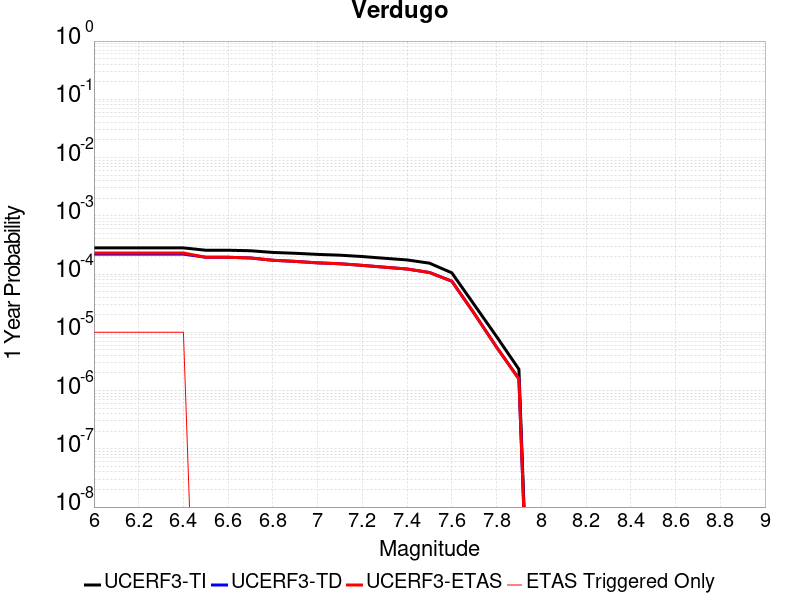 | 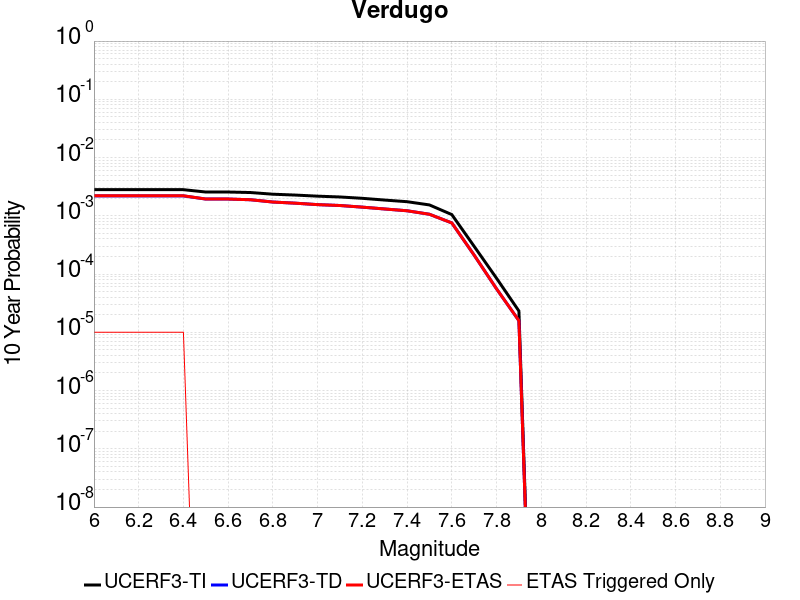 |

| Magnitude | 1 wk TI Prob | 1 wk TD Prob | 1 wk ETAS Prob | 1 wk ETAS/TD Gain | 1 wk ETAS Triggered Only | 1 mo TI Prob | 1 mo TD Prob | 1 mo ETAS Prob | 1 mo ETAS/TD Gain | 1 mo ETAS Triggered Only | 1 yr TI Prob | 1 yr TD Prob | 1 yr ETAS Prob | 1 yr ETAS/TD Gain | 1 yr ETAS Triggered Only | 10 yr TI Prob | 10 yr TD Prob | 10 yr ETAS Prob | 10 yr ETAS/TD Gain | 10 yr ETAS Triggered Only |
|-----|-----|-----|-----|-----|-----|-----|-----|-----|-----|-----|-----|-----|-----|-----|-----|-----|-----|-----|-----|-----|
| 6.0 | 5.392987E-6 | 4.2164934E-6 | 1.4216451E-5 | 3.371629 | 1.0E-5 | 2.3112598E-5 | 1.8070563E-5 | 2.8070383E-5 | 1.5533762 | 1.0E-5 | 2.8135953E-4 | 2.1998737E-4 | 2.2998518E-4 | 1.0454471 | 1.0E-5 | 0.0028100356 | 0.0021977439 | 0.0022077218 | 1.0045401 | 1.0E-5 |
| 6.1 | 5.392987E-6 | 4.2164934E-6 | 1.4216451E-5 | 3.371629 | 1.0E-5 | 2.3112598E-5 | 1.8070563E-5 | 2.8070383E-5 | 1.5533762 | 1.0E-5 | 2.8135953E-4 | 2.1998737E-4 | 2.2998518E-4 | 1.0454471 | 1.0E-5 | 0.0028100356 | 0.0021977439 | 0.0022077218 | 1.0045401 | 1.0E-5 |
| 6.2 | 5.392987E-6 | 4.2164934E-6 | 1.4216451E-5 | 3.371629 | 1.0E-5 | 2.3112598E-5 | 1.8070563E-5 | 2.8070383E-5 | 1.5533762 | 1.0E-5 | 2.8135953E-4 | 2.1998737E-4 | 2.2998518E-4 | 1.0454471 | 1.0E-5 | 0.0028100356 | 0.0021977439 | 0.0022077218 | 1.0045401 | 1.0E-5 |
| 6.3 | 5.392987E-6 | 4.2164934E-6 | 1.4216451E-5 | 3.371629 | 1.0E-5 | 2.3112598E-5 | 1.8070563E-5 | 2.8070383E-5 | 1.5533762 | 1.0E-5 | 2.8135953E-4 | 2.1998737E-4 | 2.2998518E-4 | 1.0454471 | 1.0E-5 | 0.0028100356 | 0.0021977439 | 0.0022077218 | 1.0045401 | 1.0E-5 |
| 6.4 | 5.392987E-6 | 4.2164934E-6 | 1.4216451E-5 | 3.371629 | 1.0E-5 | 2.3112598E-5 | 1.8070563E-5 | 2.8070383E-5 | 1.5533762 | 1.0E-5 | 2.8135953E-4 | 2.1998737E-4 | 2.2998518E-4 | 1.0454471 | 1.0E-5 | 0.0028100356 | 0.0021977439 | 0.0022077218 | 1.0045401 | 1.0E-5 |
| 6.5 | 4.9154837E-6 | 3.7224413E-6 | 3.7224413E-6 | 1.0 | 0.0 | 2.1066187E-5 | 1.5953223E-5 | 1.5953223E-5 | 1.0 | 0.0 | 2.5645064E-4 | 1.9421338E-4 | 1.9421338E-4 | 1.0 | 0.0 | 0.002561549 | 0.0019404575 | 0.0019404575 | 1.0 | 0.0 |
| 6.6 | 4.9154837E-6 | 3.7224413E-6 | 3.7224413E-6 | 1.0 | 0.0 | 2.1066187E-5 | 1.5953223E-5 | 1.5953223E-5 | 1.0 | 0.0 | 2.5645064E-4 | 1.9421338E-4 | 1.9421338E-4 | 1.0 | 0.0 | 0.002561549 | 0.0019404575 | 0.0019404575 | 1.0 | 0.0 |
| 6.7 | 4.817006E-6 | 3.620628E-6 | 3.620628E-6 | 1.0 | 0.0 | 2.0644147E-5 | 1.5516885E-5 | 1.5516885E-5 | 1.0 | 0.0 | 2.513135E-4 | 1.889019E-4 | 1.889019E-4 | 1.0 | 0.0 | 0.0025102948 | 0.0018874329 | 0.0018874329 | 1.0 | 0.0 |
| 6.8 | 4.507407E-6 | 3.3070805E-6 | 3.3070805E-6 | 1.0 | 0.0 | 1.9317316E-5 | 1.4173126E-5 | 1.4173126E-5 | 1.0 | 0.0 | 2.3516294E-4 | 1.7254429E-4 | 1.7254429E-4 | 1.0 | 0.0 | 0.0023491425 | 0.0017241176 | 0.0017241176 | 1.0 | 0.0 |
| 6.9 | 4.3573054E-6 | 3.1609877E-6 | 3.1609877E-6 | 1.0 | 0.0 | 1.8674033E-5 | 1.354702E-5 | 1.354702E-5 | 1.0 | 0.0 | 2.2733262E-4 | 1.649226E-4 | 1.649226E-4 | 1.0 | 0.0 | 0.0022710022 | 0.0016480145 | 0.0016480145 | 1.0 | 0.0 |
| 7.0 | 4.171527E-6 | 2.9836467E-6 | 2.9836467E-6 | 1.0 | 0.0 | 1.787785E-5 | 1.2786995E-5 | 1.2786995E-5 | 1.0 | 0.0 | 2.1764109E-4 | 1.5567066E-4 | 1.5567066E-4 | 1.0 | 0.0 | 0.0021742806 | 0.0015556274 | 0.0015556274 | 1.0 | 0.0 |
| 7.1 | 4.0405484E-6 | 2.882238E-6 | 2.882238E-6 | 1.0 | 0.0 | 1.731652E-5 | 1.23523905E-5 | 1.23523905E-5 | 1.0 | 0.0 | 2.1080824E-4 | 1.5038009E-4 | 1.5038009E-4 | 1.0 | 0.0 | 0.0021060838 | 0.0015027943 | 0.0015027943 | 1.0 | 0.0 |
| 7.2 | 3.8306007E-6 | 2.701823E-6 | 2.701823E-6 | 1.0 | 0.0 | 1.6416758E-5 | 1.157919E-5 | 1.157919E-5 | 1.0 | 0.0 | 1.9985568E-4 | 1.4096762E-4 | 1.4096762E-4 | 1.0 | 0.0 | 0.0019967605 | 0.0014087928 | 0.0014087928 | 1.0 | 0.0 |
| 7.3 | 3.5750938E-6 | 2.512154E-6 | 2.512154E-6 | 1.0 | 0.0 | 1.532174E-5 | 1.076633E-5 | 1.076633E-5 | 1.0 | 0.0 | 1.8652623E-4 | 1.3107229E-4 | 1.3107229E-4 | 1.0 | 0.0 | 0.0018636974 | 0.0013099604 | 0.0013099604 | 1.0 | 0.0 |
| 7.4 | 3.3510041E-6 | 2.340838E-6 | 2.340838E-6 | 1.0 | 0.0 | 1.4361368E-5 | 1.0032124E-5 | 1.0032124E-5 | 1.0 | 0.0 | 1.7483562E-4 | 1.2213437E-4 | 1.2213437E-4 | 1.0 | 0.0 | 0.0017469813 | 0.0012206829 | 0.0012206829 | 1.0 | 0.0 |
| 7.5 | 2.948287E-6 | 2.0390912E-6 | 2.0390912E-6 | 1.0 | 0.0 | 1.2635454E-5 | 8.7389335E-6 | 8.7389335E-6 | 1.0 | 0.0 | 1.538258E-4 | 1.06391424E-4 | 1.06391424E-4 | 1.0 | 0.0 | 0.0015371935 | 0.0010634151 | 0.0010634151 | 1.0 | 0.0 |
| 7.6 | 2.0134323E-6 | 1.4471086E-6 | 1.4471086E-6 | 1.0 | 0.0 | 8.628967E-6 | 6.20188E-6 | 6.20188E-6 | 1.0 | 0.0 | 1.05052604E-4 | 7.550536E-5 | 7.550536E-5 | 1.0 | 0.0 | 0.0010500296 | 7.548059E-4 | 7.548059E-4 | 1.0 | 0.0 |
| 7.7 | 5.726436E-7 | 4.0453273E-7 | 4.0453273E-7 | 1.0 | 0.0 | 2.4541846E-6 | 1.7337106E-6 | 1.7337106E-6 | 1.0 | 0.0 | 2.9879287E-5 | 2.110775E-5 | 2.110775E-5 | 1.0 | 0.0 | 2.987527E-4 | 2.1105999E-4 | 2.1105999E-4 | 1.0 | 0.0 |
| 7.8 | 1.6248204E-7 | 1.06879604E-7 | 1.06879604E-7 | 1.0 | 0.0 | 6.963514E-7 | 4.5805535E-7 | 4.5805535E-7 | 1.0 | 0.0 | 8.478045E-6 | 5.57681E-6 | 5.57681E-6 | 1.0 | 0.0 | 8.477722E-5 | 5.5766737E-5 | 5.5766737E-5 | 1.0 | 0.0 |
| 7.9 | 4.4475744E-8 | 3.037888E-8 | 3.037888E-8 | 1.0 | 0.0 | 1.9061031E-7 | 1.301952E-7 | 1.301952E-7 | 1.0 | 0.0 | 2.320678E-6 | 1.5851255E-6 | 1.5851255E-6 | 1.0 | 0.0 | 2.3206538E-5 | 1.5851156E-5 | 1.5851156E-5 | 1.0 | 0.0 |

## Owens Valley Keough Hot Springs
*[(top)](#table-of-contents)*

| 1 Week | 1 Month | 1 Year | 10 Year |
|-----|-----|-----|-----|
| 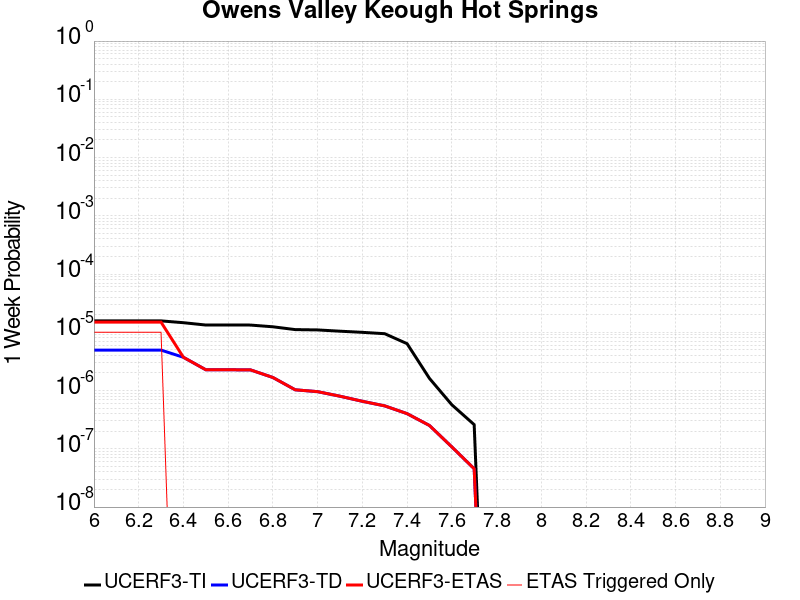 | 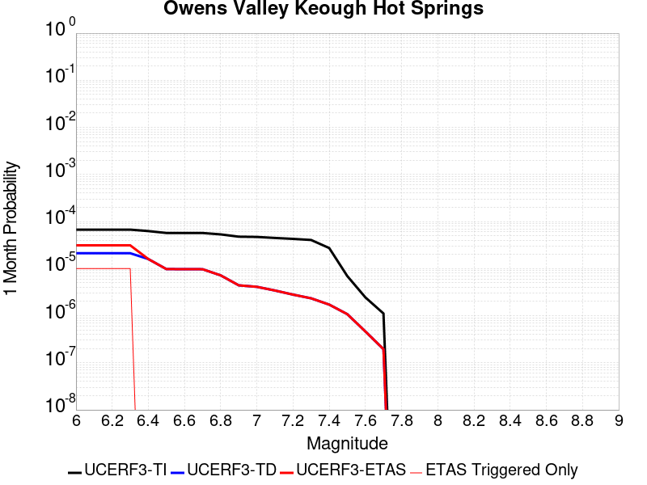 | 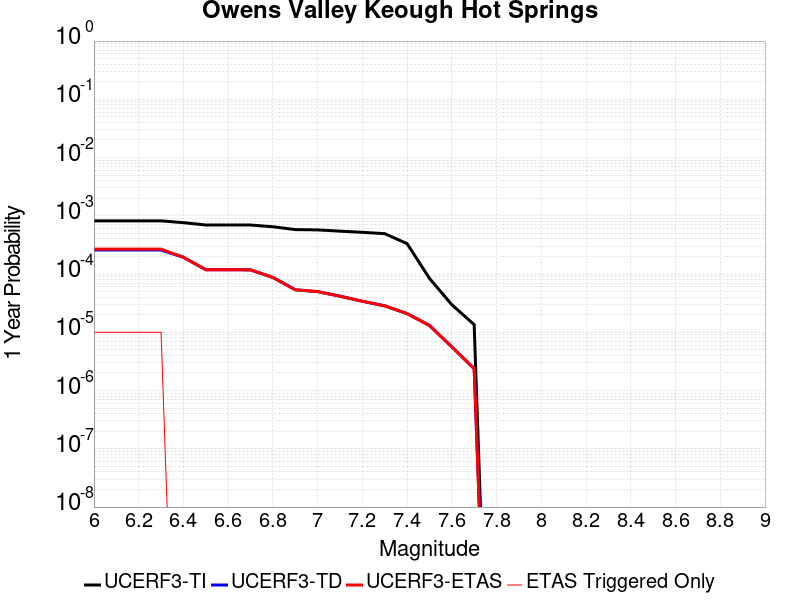 | 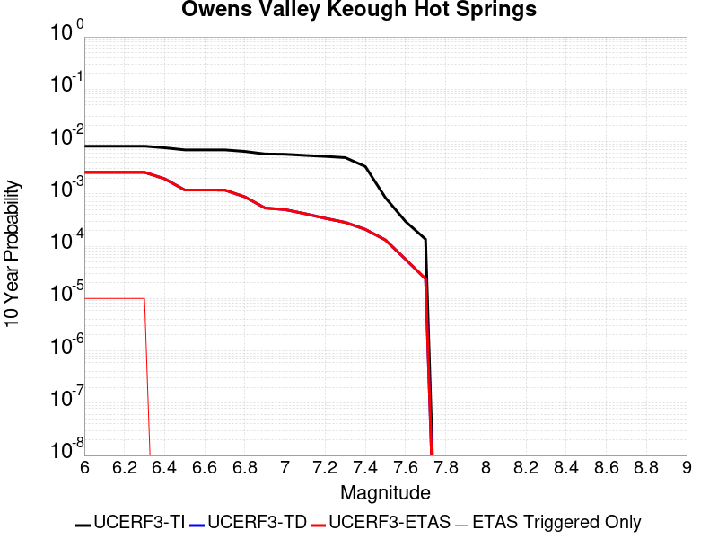 |

| Magnitude | 1 wk TI Prob | 1 wk TD Prob | 1 wk ETAS Prob | 1 wk ETAS/TD Gain | 1 wk ETAS Triggered Only | 1 mo TI Prob | 1 mo TD Prob | 1 mo ETAS Prob | 1 mo ETAS/TD Gain | 1 mo ETAS Triggered Only | 1 yr TI Prob | 1 yr TD Prob | 1 yr ETAS Prob | 1 yr ETAS/TD Gain | 1 yr ETAS Triggered Only | 10 yr TI Prob | 10 yr TD Prob | 10 yr ETAS Prob | 10 yr ETAS/TD Gain | 10 yr ETAS Triggered Only |
|-----|-----|-----|-----|-----|-----|-----|-----|-----|-----|-----|-----|-----|-----|-----|-----|-----|-----|-----|-----|-----|
| 6.0 | 1.5708529E-5 | 4.950463E-6 | 1.4950414E-5 | 3.020003 | 1.0E-5 | 6.7320536E-5 | 2.1216127E-5 | 3.1215914E-5 | 1.4713296 | 1.0E-5 | 8.193192E-4 | 2.5828084E-4 | 2.6827827E-4 | 1.0387075 | 1.0E-5 | 0.008163051 | 0.0025804387 | 0.002590413 | 1.0038654 | 1.0E-5 |
| 6.1 | 1.5708529E-5 | 4.950463E-6 | 1.4950414E-5 | 3.020003 | 1.0E-5 | 6.7320536E-5 | 2.1216127E-5 | 3.1215914E-5 | 1.4713296 | 1.0E-5 | 8.193192E-4 | 2.5828084E-4 | 2.6827827E-4 | 1.0387075 | 1.0E-5 | 0.008163051 | 0.0025804387 | 0.002590413 | 1.0038654 | 1.0E-5 |
| 6.2 | 1.5708529E-5 | 4.950463E-6 | 1.4950414E-5 | 3.020003 | 1.0E-5 | 6.7320536E-5 | 2.1216127E-5 | 3.1215914E-5 | 1.4713296 | 1.0E-5 | 8.193192E-4 | 2.5828084E-4 | 2.6827827E-4 | 1.0387075 | 1.0E-5 | 0.008163051 | 0.0025804387 | 0.002590413 | 1.0038654 | 1.0E-5 |
| 6.3 | 1.5708529E-5 | 4.950463E-6 | 1.4950414E-5 | 3.020003 | 1.0E-5 | 6.7320536E-5 | 2.1216127E-5 | 3.1215914E-5 | 1.4713296 | 1.0E-5 | 8.193192E-4 | 2.5828084E-4 | 2.6827827E-4 | 1.0387075 | 1.0E-5 | 0.008163051 | 0.0025804387 | 0.002590413 | 1.0038654 | 1.0E-5 |
| 6.4 | 1.4622509E-5 | 3.7263276E-6 | 3.7263276E-6 | 1.0 | 0.0 | 6.266639E-5 | 1.5969896E-5 | 1.5969896E-5 | 1.0 | 0.0 | 7.626962E-4 | 1.9441944E-4 | 1.9441944E-4 | 1.0 | 0.0 | 0.007600839 | 0.0019429466 | 0.0019429466 | 1.0 | 0.0 |
| 6.5 | 1.3335527E-5 | 2.2775241E-6 | 2.2775241E-6 | 1.0 | 0.0 | 5.7151006E-5 | 9.760785E-6 | 9.760785E-6 | 1.0 | 0.0 | 6.955913E-4 | 1.1883176E-4 | 1.1883176E-4 | 1.0 | 0.0 | 0.0069341804 | 0.001187878 | 0.001187878 | 1.0 | 0.0 |
| 6.6 | 1.3332855E-5 | 2.2746733E-6 | 2.2746733E-6 | 1.0 | 0.0 | 5.7139558E-5 | 9.748568E-6 | 9.748568E-6 | 1.0 | 0.0 | 6.9545204E-4 | 1.1868303E-4 | 1.1868303E-4 | 1.0 | 0.0 | 0.0069327964 | 0.0011863923 | 0.0011863923 | 1.0 | 0.0 |
| 6.7 | 1.3318214E-5 | 2.2639038E-6 | 2.2639038E-6 | 1.0 | 0.0 | 5.707681E-5 | 9.702413E-6 | 9.702413E-6 | 1.0 | 0.0 | 6.946886E-4 | 1.18121156E-4 | 1.18121156E-4 | 1.0 | 0.0 | 0.0069252094 | 0.0011807795 | 0.0011807795 | 1.0 | 0.0 |
| 6.8 | 1.2441338E-5 | 1.677594E-6 | 1.677594E-6 | 1.0 | 0.0 | 5.331893E-5 | 7.1896707E-6 | 7.1896707E-6 | 1.0 | 0.0 | 6.489646E-4 | 8.753102E-5 | 8.753102E-5 | 1.0 | 0.0 | 0.0064707273 | 8.751236E-4 | 8.751236E-4 | 1.0 | 0.0 |
| 6.9 | 1.1130476E-5 | 1.0302234E-6 | 1.0302234E-6 | 1.0 | 0.0 | 4.7701167E-5 | 4.4152357E-6 | 4.4152357E-6 | 1.0 | 0.0 | 5.806069E-4 | 5.3754186E-5 | 5.3754186E-5 | 1.0 | 0.0 | 0.0057909233 | 5.375404E-4 | 5.375404E-4 | 1.0 | 0.0 |
| 7.0 | 1.0986073E-5 | 9.577824E-7 | 9.577824E-7 | 1.0 | 0.0 | 4.7082318E-5 | 4.1047756E-6 | 4.1047756E-6 | 1.0 | 0.0 | 5.730765E-4 | 4.9974507E-5 | 4.9974507E-5 | 1.0 | 0.0 | 0.0057160086 | 4.997603E-4 | 4.997603E-4 | 1.0 | 0.0 |
| 7.1 | 1.0451338E-5 | 7.9988575E-7 | 7.9988575E-7 | 1.0 | 0.0 | 4.4790682E-5 | 3.4280772E-6 | 3.4280772E-6 | 1.0 | 0.0 | 5.451901E-4 | 4.1736046E-5 | 4.1736046E-5 | 1.0 | 0.0 | 0.005438545 | 4.1740583E-4 | 4.1740583E-4 | 1.0 | 0.0 |
| 7.2 | 9.989061E-6 | 6.543693E-7 | 6.543693E-7 | 1.0 | 0.0 | 4.280956E-5 | 2.8044367E-6 | 2.8044367E-6 | 1.0 | 0.0 | 5.2108173E-4 | 3.4143486E-5 | 3.4143486E-5 | 1.0 | 0.0 | 0.0051986156 | 3.41488E-4 | 3.41488E-4 | 1.0 | 0.0 |
| 7.3 | 9.465365E-6 | 5.458855E-7 | 5.458855E-7 | 1.0 | 0.0 | 4.056522E-5 | 2.3395073E-6 | 2.3395073E-6 | 1.0 | 0.0 | 4.937696E-4 | 2.8483131E-5 | 2.8483131E-5 | 1.0 | 0.0 | 0.0049267393 | 2.8489542E-4 | 2.8489542E-4 | 1.0 | 0.0 |
| 7.4 | 6.3824805E-6 | 4.0153776E-7 | 4.0153776E-7 | 1.0 | 0.0 | 2.73532E-5 | 1.7208749E-6 | 1.7208749E-6 | 1.0 | 0.0 | 3.3297433E-4 | 2.0951453E-5 | 2.0951453E-5 | 1.0 | 0.0 | 0.0033247585 | 2.0955436E-4 | 2.0955436E-4 | 1.0 | 0.0 |
| 7.5 | 1.6192645E-6 | 2.5156373E-7 | 2.5156373E-7 | 1.0 | 0.0 | 6.9396865E-6 | 1.0781299E-6 | 1.0781299E-6 | 1.0 | 0.0 | 8.448741E-5 | 1.3126153E-5 | 1.3126153E-5 | 1.0 | 0.0 | 8.4455294E-4 | 1.3125391E-4 | 1.3125391E-4 | 1.0 | 0.0 |
| 7.6 | 5.7062545E-7 | 1.0790214E-7 | 1.0790214E-7 | 1.0 | 0.0 | 2.4455355E-6 | 4.6243767E-7 | 4.6243767E-7 | 1.0 | 0.0 | 2.9773988E-5 | 5.630165E-6 | 5.630165E-6 | 1.0 | 0.0 | 2.977E-4 | 5.6300305E-5 | 5.6300305E-5 | 1.0 | 0.0 |
| 7.7 | 2.5988817E-7 | 4.5445965E-8 | 4.5445965E-8 | 1.0 | 0.0 | 1.113806E-6 | 1.9476842E-7 | 1.9476842E-7 | 1.0 | 0.0 | 1.3560503E-5 | 2.3713033E-6 | 2.3713033E-6 | 1.0 | 0.0 | 1.3559677E-4 | 2.3712824E-5 | 2.3712824E-5 | 1.0 | 0.0 |

## West Napa 2011 CFM
*[(top)](#table-of-contents)*

| 1 Week | 1 Month | 1 Year | 10 Year |
|-----|-----|-----|-----|
|  | 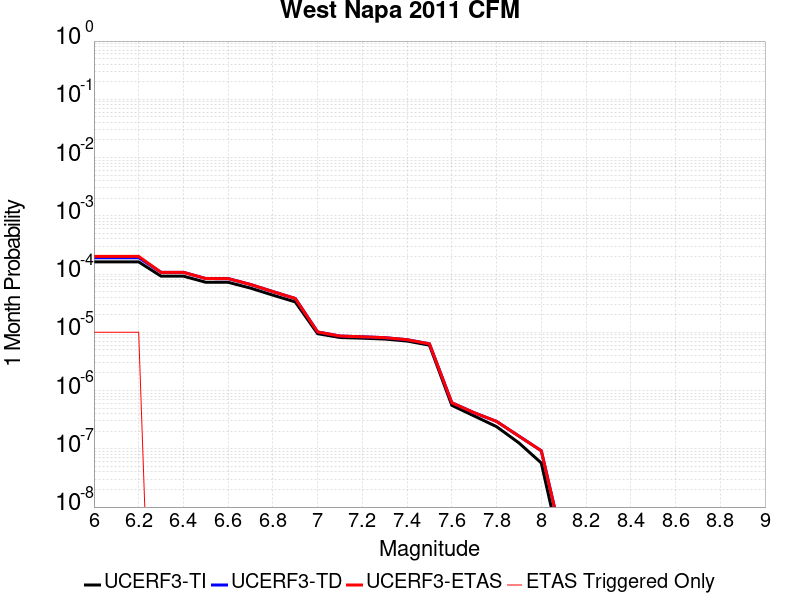 | 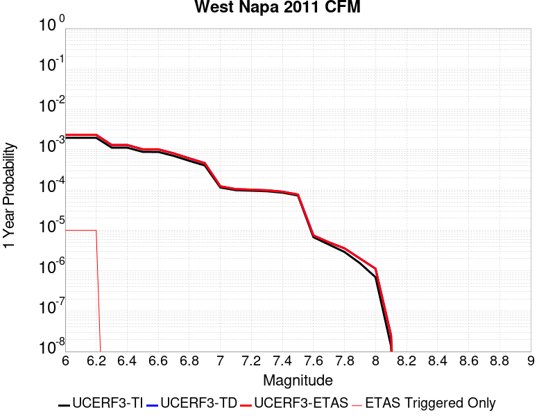 |  |

| Magnitude | 1 wk TI Prob | 1 wk TD Prob | 1 wk ETAS Prob | 1 wk ETAS/TD Gain | 1 wk ETAS Triggered Only | 1 mo TI Prob | 1 mo TD Prob | 1 mo ETAS Prob | 1 mo ETAS/TD Gain | 1 mo ETAS Triggered Only | 1 yr TI Prob | 1 yr TD Prob | 1 yr ETAS Prob | 1 yr ETAS/TD Gain | 1 yr ETAS Triggered Only | 10 yr TI Prob | 10 yr TD Prob | 10 yr ETAS Prob | 10 yr ETAS/TD Gain | 10 yr ETAS Triggered Only |
|-----|-----|-----|-----|-----|-----|-----|-----|-----|-----|-----|-----|-----|-----|-----|-----|-----|-----|-----|-----|-----|
| 6.0 | 3.773104E-5 | 4.4528504E-5 | 5.4528056E-5 | 1.2245653 | 1.0E-5 | 1.6169442E-4 | 1.9082428E-4 | 2.0082238E-4 | 1.0523943 | 1.0E-5 | 0.001966852 | 0.0023211278 | 0.0023311046 | 1.0042982 | 1.0E-5 | 0.019495348 | 0.023002012 | 0.023011781 | 1.0004247 | 1.0E-5 |
| 6.1 | 3.773104E-5 | 4.4528504E-5 | 5.4528056E-5 | 1.2245653 | 1.0E-5 | 1.6169442E-4 | 1.9082428E-4 | 2.0082238E-4 | 1.0523943 | 1.0E-5 | 0.001966852 | 0.0023211278 | 0.0023311046 | 1.0042982 | 1.0E-5 | 0.019495348 | 0.023002012 | 0.023011781 | 1.0004247 | 1.0E-5 |
| 6.2 | 3.773104E-5 | 4.4528504E-5 | 5.4528056E-5 | 1.2245653 | 1.0E-5 | 1.6169442E-4 | 1.9082428E-4 | 2.0082238E-4 | 1.0523943 | 1.0E-5 | 0.001966852 | 0.0023211278 | 0.0023311046 | 1.0042982 | 1.0E-5 | 0.019495348 | 0.023002012 | 0.023011781 | 1.0004247 | 1.0E-5 |
| 6.3 | 2.147964E-5 | 2.4987066E-5 | 2.4987066E-5 | 1.0 | 0.0 | 9.2052345E-5 | 1.0708355E-4 | 1.0708355E-4 | 1.0 | 0.0 | 0.001120161 | 0.0013030542 | 0.0013030542 | 1.0 | 0.0 | 0.011145315 | 0.012964482 | 0.012964482 | 1.0 | 0.0 |
| 6.4 | 2.147964E-5 | 2.4987066E-5 | 2.4987066E-5 | 1.0 | 0.0 | 9.2052345E-5 | 1.0708355E-4 | 1.0708355E-4 | 1.0 | 0.0 | 0.001120161 | 0.0013030542 | 0.0013030542 | 1.0 | 0.0 | 0.011145315 | 0.012964482 | 0.012964482 | 1.0 | 0.0 |
| 6.5 | 1.688201E-5 | 1.9547371E-5 | 1.9547371E-5 | 1.0 | 0.0 | 7.234947E-5 | 8.377217E-5 | 8.377217E-5 | 1.0 | 0.0 | 8.804988E-4 | 0.0010195216 | 0.0010195216 | 1.0 | 0.0 | 0.008770182 | 0.01015684 | 0.01015684 | 1.0 | 0.0 |
| 6.6 | 1.6846381E-5 | 1.9507064E-5 | 1.9507064E-5 | 1.0 | 0.0 | 7.219678E-5 | 8.3599436E-5 | 8.3599436E-5 | 1.0 | 0.0 | 8.7864127E-4 | 0.0010174206 | 0.0010174206 | 1.0 | 0.0 | 0.008751754 | 0.010136021 | 0.010136021 | 1.0 | 0.0 |
| 6.7 | 1.3396501E-5 | 1.5467684E-5 | 1.5467684E-5 | 1.0 | 0.0 | 5.7412315E-5 | 6.628875E-5 | 6.628875E-5 | 1.0 | 0.0 | 6.9877075E-4 | 8.068302E-4 | 8.068302E-4 | 1.0 | 0.0 | 0.0069657755 | 0.008046459 | 0.008046459 | 1.0 | 0.0 |
| 6.8 | 1.0139058E-5 | 1.16721785E-5 | 1.16721785E-5 | 1.0 | 0.0 | 4.3452383E-5 | 5.0022976E-5 | 5.0022976E-5 | 1.0 | 0.0 | 5.289043E-4 | 6.0891506E-4 | 6.0891506E-4 | 1.0 | 0.0 | 0.005276473 | 0.0060791126 | 0.0060791126 | 1.0 | 0.0 |
| 6.9 | 7.761281E-6 | 8.890723E-6 | 8.890723E-6 | 1.0 | 0.0 | 3.326221E-5 | 3.810283E-5 | 3.810283E-5 | 1.0 | 0.0 | 4.0489217E-4 | 4.6385458E-4 | 4.6385458E-4 | 1.0 | 0.0 | 0.0040415525 | 0.0046351026 | 0.0046351026 | 1.0 | 0.0 |
| 7.0 | 2.2109202E-6 | 2.3666319E-6 | 2.3666319E-6 | 1.0 | 0.0 | 9.475338E-6 | 1.01426685E-5 | 1.01426685E-5 | 1.0 | 0.0 | 1.1535613E-4 | 1.2348007E-4 | 1.2348007E-4 | 1.0 | 0.0 | 0.0011529627 | 0.0012353238 | 0.0012353238 | 1.0 | 0.0 |
| 7.1 | 1.9008926E-6 | 2.0133207E-6 | 2.0133207E-6 | 1.0 | 0.0 | 8.146657E-6 | 8.628488E-6 | 8.628488E-6 | 1.0 | 0.0 | 9.918104E-5 | 1.05046805E-4 | 1.05046805E-4 | 1.0 | 0.0 | 9.913679E-4 | 0.0010511756 | 0.0010511756 | 1.0 | 0.0 |
| 7.2 | 1.8495944E-6 | 1.9561273E-6 | 1.9561273E-6 | 1.0 | 0.0 | 7.926808E-6 | 8.383376E-6 | 8.383376E-6 | 1.0 | 0.0 | 9.650462E-5 | 1.0206285E-4 | 1.0206285E-4 | 1.0 | 0.0 | 9.6462725E-4 | 0.0010213639 | 0.0010213639 | 1.0 | 0.0 |
| 7.3 | 1.7883189E-6 | 1.8880897E-6 | 1.8880897E-6 | 1.0 | 0.0 | 7.664201E-6 | 8.091788E-6 | 8.091788E-6 | 1.0 | 0.0 | 9.330765E-5 | 9.85131E-5 | 9.85131E-5 | 1.0 | 0.0 | 9.3268487E-4 | 9.858976E-4 | 9.858976E-4 | 1.0 | 0.0 |
| 7.4 | 1.6520572E-6 | 1.7415113E-6 | 1.7415113E-6 | 1.0 | 0.0 | 7.0802257E-6 | 7.463598E-6 | 7.463598E-6 | 1.0 | 0.0 | 8.6198335E-5 | 9.086554E-5 | 9.086554E-5 | 1.0 | 0.0 | 8.616491E-4 | 9.0948684E-4 | 9.0948684E-4 | 1.0 | 0.0 |
| 7.5 | 1.4040345E-6 | 1.4800271E-6 | 1.4800271E-6 | 1.0 | 0.0 | 6.0172765E-6 | 6.342958E-6 | 6.342958E-6 | 1.0 | 0.0 | 7.325788E-5 | 7.72228E-5 | 7.72228E-5 | 1.0 | 0.0 | 7.3233736E-4 | 7.7311805E-4 | 7.7311805E-4 | 1.0 | 0.0 |
| 7.6 | 1.3013842E-7 | 1.4416163E-7 | 1.4416163E-7 | 1.0 | 0.0 | 5.57736E-7 | 6.178354E-7 | 6.178354E-7 | 1.0 | 0.0 | 6.790414E-6 | 7.52212E-6 | 7.52212E-6 | 1.0 | 0.0 | 6.790207E-5 | 7.61463E-5 | 7.61463E-5 | 1.0 | 0.0 |
| 7.7 | 8.541512E-8 | 9.716462E-8 | 9.716462E-8 | 1.0 | 0.0 | 3.6606474E-7 | 4.1641974E-7 | 4.1641974E-7 | 1.0 | 0.0 | 4.456829E-6 | 5.069898E-6 | 5.069898E-6 | 1.0 | 0.0 | 4.4567398E-5 | 5.160189E-5 | 5.160189E-5 | 1.0 | 0.0 |
| 7.8 | 5.6074793E-8 | 6.895456E-8 | 6.895456E-8 | 1.0 | 0.0 | 2.403205E-7 | 2.955195E-7 | 2.955195E-7 | 1.0 | 0.0 | 2.9258983E-6 | 3.597944E-6 | 3.597944E-6 | 1.0 | 0.0 | 2.9258597E-5 | 3.6812045E-5 | 3.6812045E-5 | 1.0 | 0.0 |
| 7.9 | 2.9475839E-8 | 3.8567407E-8 | 3.8567407E-8 | 1.0 | 0.0 | 1.2632502E-7 | 1.6528887E-7 | 1.6528887E-7 | 1.0 | 0.0 | 1.538006E-6 | 2.01239E-6 | 2.01239E-6 | 1.0 | 0.0 | 1.5379954E-5 | 2.0664074E-5 | 2.0664074E-5 | 1.0 | 0.0 |
| 8.0 | 1.3337122E-8 | 2.1632943E-8 | 2.1632943E-8 | 1.0 | 0.0 | 5.7159088E-8 | 9.2712604E-8 | 9.2712604E-8 | 1.0 | 0.0 | 6.959117E-7 | 1.1287754E-6 | 1.1287754E-6 | 1.0 | 0.0 | 6.959095E-6 | 1.1644432E-5 | 1.1644432E-5 | 1.0 | 0.0 |
| 8.1 | 2.6589986E-10 | 4.8617654E-10 | 4.8617654E-10 | 1.0 | 0.0 | 1.1395708E-9 | 2.0836133E-9 | 2.0836133E-9 | 1.0 | 0.0 | 1.3874274E-8 | 2.536799E-8 | 2.536799E-8 | 1.0 | 0.0 | 1.3874273E-7 | 2.6036727E-7 | 2.6036727E-7 | 1.0 | 0.0 |

## San Jacinto (Superstition Mtn)
*[(top)](#table-of-contents)*

| 1 Week | 1 Month | 1 Year | 10 Year |
|-----|-----|-----|-----|
| 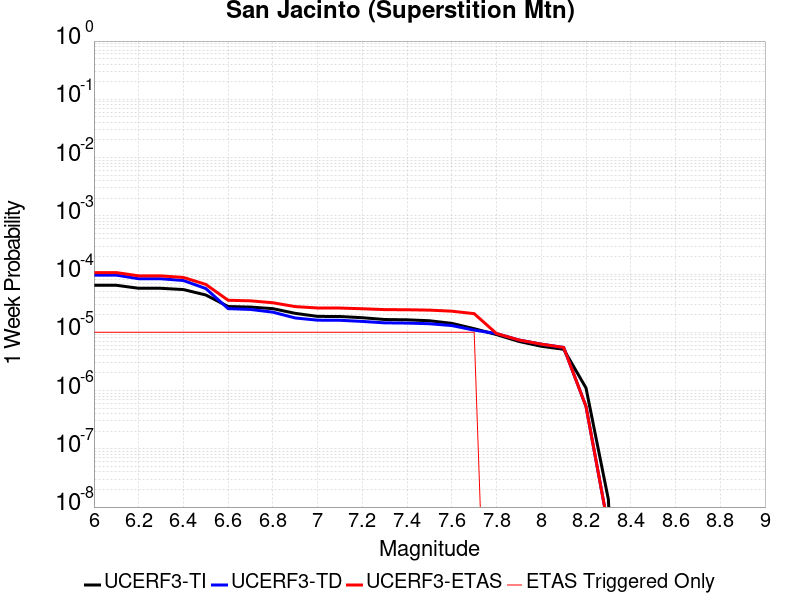 | 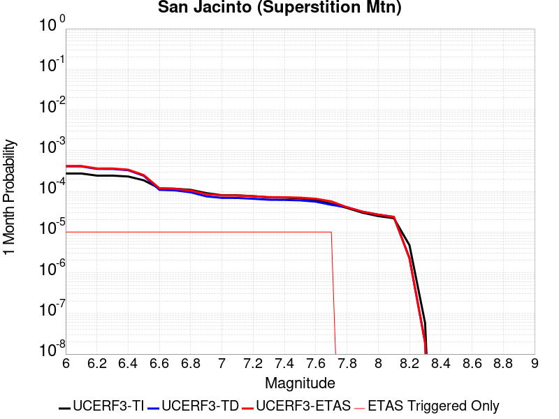 | 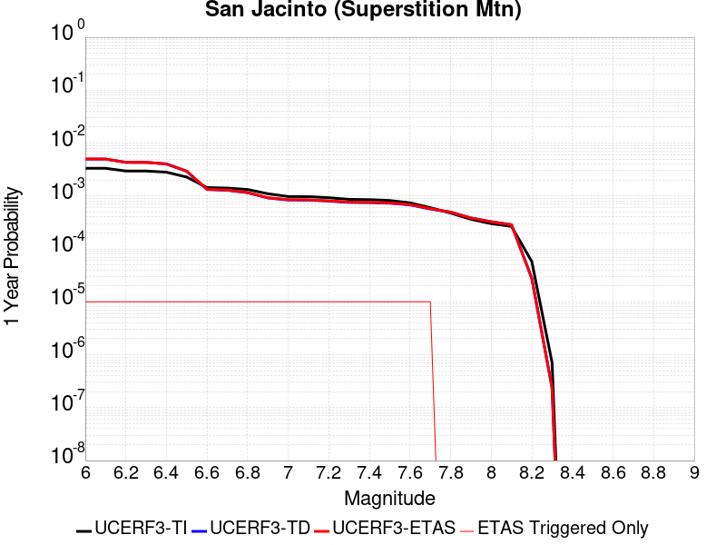 | 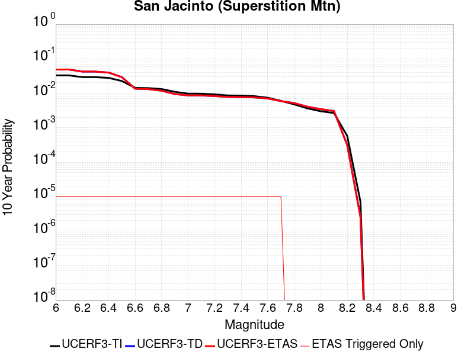 |

| Magnitude | 1 wk TI Prob | 1 wk TD Prob | 1 wk ETAS Prob | 1 wk ETAS/TD Gain | 1 wk ETAS Triggered Only | 1 mo TI Prob | 1 mo TD Prob | 1 mo ETAS Prob | 1 mo ETAS/TD Gain | 1 mo ETAS Triggered Only | 1 yr TI Prob | 1 yr TD Prob | 1 yr ETAS Prob | 1 yr ETAS/TD Gain | 1 yr ETAS Triggered Only | 10 yr TI Prob | 10 yr TD Prob | 10 yr ETAS Prob | 10 yr ETAS/TD Gain | 10 yr ETAS Triggered Only |
|-----|-----|-----|-----|-----|-----|-----|-----|-----|-----|-----|-----|-----|-----|-----|-----|-----|-----|-----|-----|-----|
| 6.0 | 6.4193904E-5 | 9.599558E-5 | 1.0599462E-4 | 1.1041615 | 1.0E-5 | 2.7508775E-4 | 4.1135435E-4 | 4.2135024E-4 | 1.0243 | 1.0E-5 | 0.0033440501 | 0.0049981694 | 0.005008119 | 1.0019907 | 1.0E-5 | 0.03294174 | 0.048820045 | 0.048829556 | 1.0001948 | 1.0E-5 |
| 6.1 | 6.4193904E-5 | 9.599558E-5 | 1.0599462E-4 | 1.1041615 | 1.0E-5 | 2.7508775E-4 | 4.1135435E-4 | 4.2135024E-4 | 1.0243 | 1.0E-5 | 0.0033440501 | 0.0049981694 | 0.005008119 | 1.0019907 | 1.0E-5 | 0.03294174 | 0.048820045 | 0.048829556 | 1.0001948 | 1.0E-5 |
| 6.2 | 5.7023593E-5 | 8.3144616E-5 | 9.314378E-5 | 1.1202624 | 1.0E-5 | 2.4436394E-4 | 3.5629462E-4 | 3.6629106E-4 | 1.0280566 | 1.0E-5 | 0.002971072 | 0.0043309047 | 0.0043408615 | 1.002299 | 1.0E-5 | 0.029316625 | 0.042502448 | 0.042512026 | 1.0002253 | 1.0E-5 |
| 6.3 | 5.6940098E-5 | 8.298998E-5 | 9.298915E-5 | 1.1204865 | 1.0E-5 | 2.4400617E-4 | 3.5563204E-4 | 3.656285E-4 | 1.028109 | 1.0E-5 | 0.002966728 | 0.00432287 | 0.004332827 | 1.0023032 | 1.0E-5 | 0.029274331 | 0.04242582 | 0.042435396 | 1.0002257 | 1.0E-5 |
| 6.4 | 5.4171585E-5 | 7.748391E-5 | 8.748314E-5 | 1.1290491 | 1.0E-5 | 2.3214328E-4 | 3.3204095E-4 | 3.4203762E-4 | 1.0301068 | 1.0E-5 | 0.0028226813 | 0.0040367534 | 0.004046713 | 1.0024673 | 1.0E-5 | 0.02787096 | 0.039715026 | 0.03972463 | 1.0002418 | 1.0E-5 |
| 6.5 | 4.375144E-5 | 5.6421442E-5 | 6.642088E-5 | 1.1772276 | 1.0E-5 | 1.874927E-4 | 2.417904E-4 | 2.5178798E-4 | 1.0413481 | 1.0E-5 | 0.0022803338 | 0.002941 | 0.0029509705 | 1.0033902 | 1.0E-5 | 0.022570757 | 0.029235592 | 0.0292453 | 1.000332 | 1.0E-5 |
| 6.6 | 2.772192E-5 | 2.5488029E-5 | 3.5487774E-5 | 1.392331 | 1.0E-5 | 1.1880282E-4 | 1.0922994E-4 | 1.1922885E-4 | 1.09154 | 1.0E-5 | 0.0014454646 | 0.0013290826 | 0.0013390693 | 1.007514 | 1.0E-5 | 0.014360986 | 0.013540891 | 0.013550756 | 1.0007285 | 1.0E-5 |
| 6.7 | 2.7124124E-5 | 2.4699055E-5 | 3.469881E-5 | 1.4048638 | 1.0E-5 | 1.1624106E-4 | 1.0584891E-4 | 1.1584785E-4 | 1.0944643 | 1.0E-5 | 0.0014143161 | 0.0012879678 | 0.0012979549 | 1.0077542 | 1.0E-5 | 0.014053487 | 0.013134248 | 0.013144117 | 1.0007514 | 1.0E-5 |
| 6.8 | 2.5475807E-5 | 2.2164071E-5 | 3.2163847E-5 | 1.4511707 | 1.0E-5 | 1.0917746E-4 | 9.498548E-5 | 1.0498453E-4 | 1.1052692 | 1.0E-5 | 0.001328425 | 0.0011558468 | 0.0011658352 | 1.0086417 | 1.0E-5 | 0.0132051185 | 0.011821818 | 0.0118317 | 1.0008359 | 1.0E-5 |
| 6.9 | 2.1162023E-5 | 1.762564E-5 | 2.7625465E-5 | 1.5673453 | 1.0E-5 | 9.069123E-5 | 7.553629E-5 | 8.553554E-5 | 1.1323767 | 1.0E-5 | 0.0011036064 | 9.1927015E-4 | 9.29261E-4 | 1.0108682 | 1.0E-5 | 0.010981417 | 0.009446762 | 0.009456667 | 1.0010486 | 1.0E-5 |
| 7.0 | 1.8754288E-5 | 1.616099E-5 | 2.6160827E-5 | 1.6187639 | 1.0E-5 | 8.037304E-5 | 6.9259564E-5 | 7.925887E-5 | 1.1443744 | 1.0E-5 | 9.781026E-4 | 8.429114E-4 | 8.5290294E-4 | 1.0118537 | 1.0E-5 | 0.009738087 | 0.008669995 | 0.008679908 | 1.0011435 | 1.0E-5 |
| 7.1 | 1.8678527E-5 | 1.6086136E-5 | 2.6085974E-5 | 1.6216433 | 1.0E-5 | 8.0048376E-5 | 6.8938774E-5 | 7.893809E-5 | 1.1450462 | 1.0E-5 | 9.7415317E-4 | 8.3900883E-4 | 8.490004E-4 | 1.0119088 | 1.0E-5 | 0.009698939 | 0.008631011 | 0.0086409245 | 1.0011486 | 1.0E-5 |
| 7.2 | 1.7804578E-5 | 1.5380709E-5 | 2.5380556E-5 | 1.6501551 | 1.0E-5 | 7.6303106E-5 | 6.591567E-5 | 7.591501E-5 | 1.151699 | 1.0E-5 | 9.285943E-4 | 8.022301E-4 | 8.122221E-4 | 1.0124552 | 1.0E-5 | 0.009247236 | 0.008262424 | 0.0082723405 | 1.0012003 | 1.0E-5 |
| 7.3 | 1.6583685E-5 | 1.4529837E-5 | 2.4529692E-5 | 1.688229 | 1.0E-5 | 7.1070994E-5 | 6.226926E-5 | 7.226864E-5 | 1.1605829 | 1.0E-5 | 8.649459E-4 | 7.5786654E-4 | 7.6785893E-4 | 1.0131849 | 1.0E-5 | 0.00861587 | 0.007817646 | 0.007827568 | 1.0012691 | 1.0E-5 |
| 7.4 | 1.6387552E-5 | 1.4394727E-5 | 2.4394583E-5 | 1.6946888 | 1.0E-5 | 7.023047E-5 | 6.169024E-5 | 7.1689625E-5 | 1.1620902 | 1.0E-5 | 8.5472054E-4 | 7.508219E-4 | 7.6081435E-4 | 1.0133088 | 1.0E-5 | 0.008514405 | 0.0077470187 | 0.007756941 | 1.0012808 | 1.0E-5 |
| 7.5 | 1.5790754E-5 | 1.40354305E-5 | 2.4035291E-5 | 1.7124726 | 1.0E-5 | 6.767291E-5 | 6.015047E-5 | 7.0149865E-5 | 1.1662397 | 1.0E-5 | 8.236062E-4 | 7.320879E-4 | 7.4208056E-4 | 1.0136496 | 1.0E-5 | 0.008205604 | 0.007557581 | 0.007567506 | 1.0013132 | 1.0E-5 |
| 7.6 | 1.4248672E-5 | 1.3054444E-5 | 2.3054314E-5 | 1.7660127 | 1.0E-5 | 6.106431E-5 | 5.5946428E-5 | 6.594587E-5 | 1.1787324 | 1.0E-5 | 7.432043E-4 | 6.809366E-4 | 6.909298E-4 | 1.0146756 | 1.0E-5 | 0.007407237 | 0.007040175 | 0.007050105 | 1.0014104 | 1.0E-5 |
| 7.7 | 1.15449975E-5 | 1.0903222E-5 | 2.0903113E-5 | 1.9171501 | 1.0E-5 | 4.947762E-5 | 4.672726E-5 | 5.6726793E-5 | 1.2139978 | 1.0E-5 | 6.022235E-4 | 5.6875666E-4 | 5.78751E-4 | 1.0175722 | 1.0E-5 | 0.006005941 | 0.0059102564 | 0.0059201973 | 1.0016819 | 1.0E-5 |
| 7.8 | 9.1391985E-6 | 9.5139185E-6 | 9.5139185E-6 | 1.0 | 0.0 | 3.9167408E-5 | 4.0773306E-5 | 4.0773306E-5 | 1.0 | 0.0 | 4.767588E-4 | 4.963025E-4 | 4.963025E-4 | 1.0 | 0.0 | 0.0047573727 | 0.005176809 | 0.005176809 | 1.0 | 0.0 |
| 7.9 | 6.973017E-6 | 7.3817937E-6 | 7.3817937E-6 | 1.0 | 0.0 | 2.9884017E-5 | 3.163588E-5 | 3.163588E-5 | 1.0 | 0.0 | 3.6377716E-4 | 3.8509927E-4 | 3.8509927E-4 | 1.0 | 0.0 | 0.0036318225 | 0.004051976 | 0.004051976 | 1.0 | 0.0 |
| 8.0 | 5.7638235E-6 | 6.259641E-6 | 6.259641E-6 | 1.0 | 0.0 | 2.4701867E-5 | 2.682676E-5 | 2.682676E-5 | 1.0 | 0.0 | 3.0070372E-4 | 3.2656736E-4 | 3.2656736E-4 | 1.0 | 0.0 | 0.0030029714 | 0.0034535413 | 0.0034535413 | 1.0 | 0.0 |
| 8.1 | 5.1124434E-6 | 5.4953657E-6 | 5.4953657E-6 | 1.0 | 0.0 | 2.1910288E-5 | 2.3551356E-5 | 2.3551356E-5 | 1.0 | 0.0 | 2.6672508E-4 | 2.8670052E-4 | 2.8670052E-4 | 1.0 | 0.0 | 0.0026640517 | 0.0030403896 | 0.0030403896 | 1.0 | 0.0 |
| 8.2 | 1.1075938E-6 | 5.3348367E-7 | 5.3348367E-7 | 1.0 | 0.0 | 4.7468216E-6 | 2.2863567E-6 | 2.2863567E-6 | 1.0 | 0.0 | 5.779102E-5 | 2.7836059E-5 | 2.7836059E-5 | 1.0 | 0.0 | 5.777599E-4 | 3.133962E-4 | 3.133962E-4 | 1.0 | 0.0 |
| 8.3 | 1.3584393E-8 | 4.4718784E-9 | 4.4718784E-9 | 1.0 | 0.0 | 5.8218827E-8 | 1.9165192E-8 | 1.9165192E-8 | 1.0 | 0.0 | 7.0881396E-7 | 2.3333622E-7 | 2.3333622E-7 | 1.0 | 0.0 | 7.0881174E-6 | 2.6140672E-6 | 2.6140672E-6 | 1.0 | 0.0 |

## Malibu Coast alt 1
*[(top)](#table-of-contents)*

| 1 Week | 1 Month | 1 Year | 10 Year |
|-----|-----|-----|-----|
| 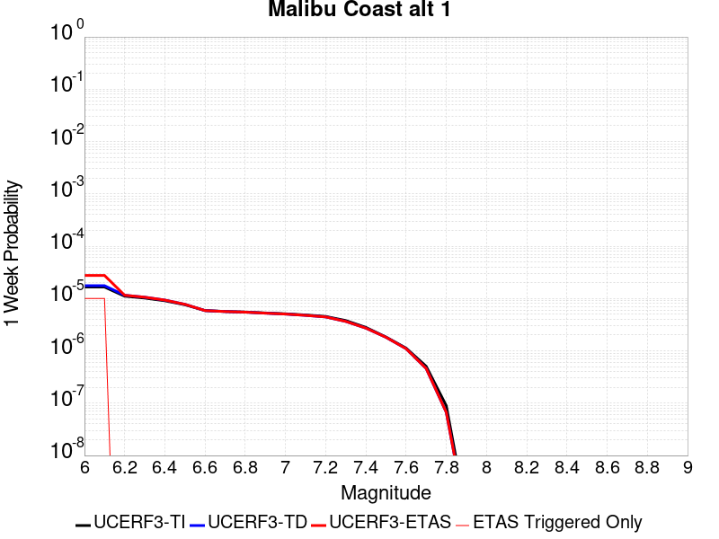 | 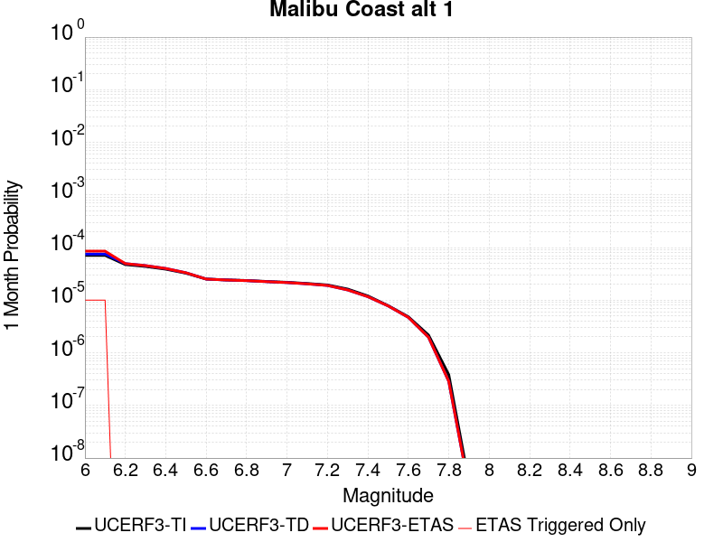 | 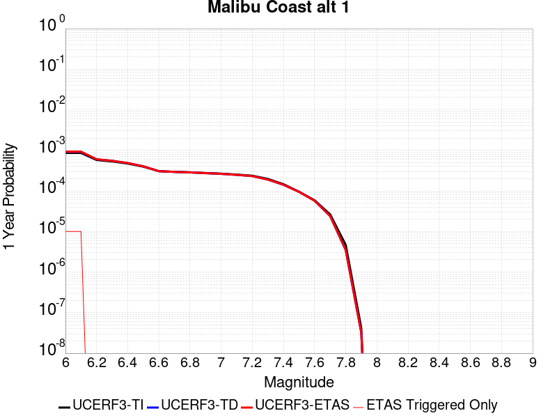 | 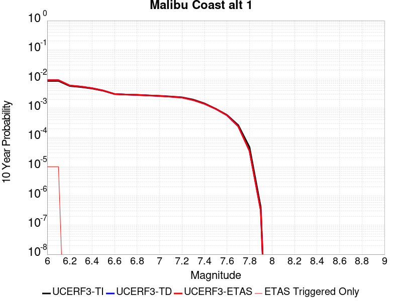 |

| Magnitude | 1 wk TI Prob | 1 wk TD Prob | 1 wk ETAS Prob | 1 wk ETAS/TD Gain | 1 wk ETAS Triggered Only | 1 mo TI Prob | 1 mo TD Prob | 1 mo ETAS Prob | 1 mo ETAS/TD Gain | 1 mo ETAS Triggered Only | 1 yr TI Prob | 1 yr TD Prob | 1 yr ETAS Prob | 1 yr ETAS/TD Gain | 1 yr ETAS Triggered Only | 10 yr TI Prob | 10 yr TD Prob | 10 yr ETAS Prob | 10 yr ETAS/TD Gain | 10 yr ETAS Triggered Only |
|-----|-----|-----|-----|-----|-----|-----|-----|-----|-----|-----|-----|-----|-----|-----|-----|-----|-----|-----|-----|-----|
| 6.0 | 1.6572556E-5 | 1.759807E-5 | 2.7597893E-5 | 1.5682342 | 1.0E-5 | 7.102331E-5 | 7.5418226E-5 | 8.5417465E-5 | 1.132584 | 1.0E-5 | 8.6436566E-4 | 9.1784896E-4 | 9.278398E-4 | 1.010885 | 1.0E-5 | 0.0086101135 | 0.009142514 | 0.009152423 | 1.0010837 | 1.0E-5 |
| 6.1 | 1.6572556E-5 | 1.759807E-5 | 2.7597893E-5 | 1.5682342 | 1.0E-5 | 7.102331E-5 | 7.5418226E-5 | 8.5417465E-5 | 1.132584 | 1.0E-5 | 8.6436566E-4 | 9.1784896E-4 | 9.278398E-4 | 1.010885 | 1.0E-5 | 0.0086101135 | 0.009142514 | 0.009152423 | 1.0010837 | 1.0E-5 |
| 6.2 | 1.1085717E-5 | 1.155715E-5 | 1.155715E-5 | 1.0 | 0.0 | 4.750935E-5 | 4.9529724E-5 | 4.9529724E-5 | 1.0 | 0.0 | 5.782728E-4 | 6.0286105E-4 | 6.0286105E-4 | 1.0 | 0.0 | 0.0057677035 | 0.0060126274 | 0.0060126274 | 1.0 | 0.0 |
| 6.3 | 1.0208568E-5 | 1.0592241E-5 | 1.0592241E-5 | 1.0 | 0.0 | 4.375027E-5 | 4.5394543E-5 | 4.5394543E-5 | 1.0 | 0.0 | 5.325294E-4 | 5.5254134E-4 | 5.5254134E-4 | 1.0 | 0.0 | 0.0053125503 | 0.0055119833 | 0.0055119833 | 1.0 | 0.0 |
| 6.4 | 9.0682315E-6 | 9.342641E-6 | 9.342641E-6 | 1.0 | 0.0 | 3.8863272E-5 | 4.0039286E-5 | 4.0039286E-5 | 1.0 | 0.0 | 4.730576E-4 | 4.873713E-4 | 4.873713E-4 | 1.0 | 0.0 | 0.0047205184 | 0.004863238 | 0.004863238 | 1.0 | 0.0 |
| 6.5 | 7.605796E-6 | 7.74859E-6 | 7.74859E-6 | 1.0 | 0.0 | 3.259586E-5 | 3.320783E-5 | 3.320783E-5 | 1.0 | 0.0 | 3.9678233E-4 | 4.0423166E-4 | 4.0423166E-4 | 1.0 | 0.0 | 0.0039607463 | 0.0040351013 | 0.0040351013 | 1.0 | 0.0 |
| 6.6 | 5.889873E-6 | 5.8795417E-6 | 5.8795417E-6 | 1.0 | 0.0 | 2.5242069E-5 | 2.5197793E-5 | 2.5197793E-5 | 1.0 | 0.0 | 3.0727885E-4 | 3.0674002E-4 | 3.0674002E-4 | 1.0 | 0.0 | 0.003068543 | 0.0030631793 | 0.0030631793 | 1.0 | 0.0 |
| 6.7 | 5.66586E-6 | 5.6416443E-6 | 5.6416443E-6 | 1.0 | 0.0 | 2.428203E-5 | 2.4178253E-5 | 2.4178253E-5 | 1.0 | 0.0 | 2.955936E-4 | 2.9433056E-4 | 2.9433056E-4 | 1.0 | 0.0 | 0.0029520073 | 0.0029394194 | 0.0029394194 | 1.0 | 0.0 |
| 6.8 | 5.521556E-6 | 5.48943E-6 | 5.48943E-6 | 1.0 | 0.0 | 2.3663597E-5 | 2.3525918E-5 | 2.3525918E-5 | 1.0 | 0.0 | 2.880662E-4 | 2.8639048E-4 | 2.8639048E-4 | 1.0 | 0.0 | 0.0028769306 | 0.0028602257 | 0.0028602257 | 1.0 | 0.0 |
| 6.9 | 5.29752E-6 | 5.2499345E-6 | 5.2499345E-6 | 1.0 | 0.0 | 2.270346E-5 | 2.2499526E-5 | 2.2499526E-5 | 1.0 | 0.0 | 2.7637955E-4 | 2.7389737E-4 | 2.7389737E-4 | 1.0 | 0.0 | 0.0027603607 | 0.0027356083 | 0.0027356083 | 1.0 | 0.0 |
| 7.0 | 5.106743E-6 | 5.0476815E-6 | 5.0476815E-6 | 1.0 | 0.0 | 2.1885859E-5 | 2.1632743E-5 | 2.1632743E-5 | 1.0 | 0.0 | 2.6642776E-4 | 2.6334688E-4 | 2.6334688E-4 | 1.0 | 0.0 | 0.0026610855 | 0.0026303576 | 0.0026303576 | 1.0 | 0.0 |
| 7.1 | 4.8469647E-6 | 4.770376E-6 | 4.770376E-6 | 1.0 | 0.0 | 2.0772539E-5 | 2.044431E-5 | 2.044431E-5 | 1.0 | 0.0 | 2.528763E-4 | 2.488811E-4 | 2.488811E-4 | 1.0 | 0.0 | 0.0025258875 | 0.0024860317 | 0.0024860317 | 1.0 | 0.0 |
| 7.2 | 4.545514E-6 | 4.4481967E-6 | 4.4481967E-6 | 1.0 | 0.0 | 1.9480629E-5 | 1.906356E-5 | 1.906356E-5 | 1.0 | 0.0 | 2.3715083E-4 | 2.3207419E-4 | 2.3207419E-4 | 1.0 | 0.0 | 0.0023689792 | 0.002318326 | 0.002318326 | 1.0 | 0.0 |
| 7.3 | 3.794097E-6 | 3.6519373E-6 | 3.6519373E-6 | 1.0 | 0.0 | 1.6260314E-5 | 1.5651065E-5 | 1.5651065E-5 | 1.0 | 0.0 | 1.9795135E-4 | 1.9053511E-4 | 1.9053511E-4 | 1.0 | 0.0 | 0.001977751 | 0.0019037221 | 0.0019037221 | 1.0 | 0.0 |
| 7.4 | 2.808217E-6 | 2.7190777E-6 | 2.7190777E-6 | 1.0 | 0.0 | 1.203516E-5 | 1.1653137E-5 | 1.1653137E-5 | 1.0 | 0.0 | 1.4651821E-4 | 1.4186774E-4 | 1.4186774E-4 | 1.0 | 0.0 | 0.0014642165 | 0.0014177744 | 0.0014177744 | 1.0 | 0.0 |
| 7.5 | 1.83809E-6 | 1.8190703E-6 | 1.8190703E-6 | 1.0 | 0.0 | 7.877505E-6 | 7.795992E-6 | 7.795992E-6 | 1.0 | 0.0 | 9.59044E-5 | 9.4912095E-5 | 9.4912095E-5 | 1.0 | 0.0 | 9.5863023E-4 | 9.487176E-4 | 9.487176E-4 | 1.0 | 0.0 |
| 7.6 | 1.1292672E-6 | 1.1001456E-6 | 1.1001456E-6 | 1.0 | 0.0 | 4.839708E-6 | 4.7149015E-6 | 4.7149015E-6 | 1.0 | 0.0 | 5.8921847E-5 | 5.7402427E-5 | 5.7402427E-5 | 1.0 | 0.0 | 5.890623E-4 | 5.7387765E-4 | 5.7387765E-4 | 1.0 | 0.0 |
| 7.7 | 5.065272E-7 | 4.6091537E-7 | 4.6091537E-7 | 1.0 | 0.0 | 2.170829E-6 | 1.9753502E-6 | 1.9753502E-6 | 1.0 | 0.0 | 2.6429525E-5 | 2.4049634E-5 | 2.4049634E-5 | 1.0 | 0.0 | 2.642638E-4 | 2.4047145E-4 | 2.4047145E-4 | 1.0 | 0.0 |
| 7.8 | 8.952991E-8 | 6.707853E-8 | 6.707853E-8 | 1.0 | 0.0 | 3.8369956E-7 | 2.874794E-7 | 2.874794E-7 | 1.0 | 0.0 | 4.671532E-6 | 3.5000562E-6 | 3.5000562E-6 | 1.0 | 0.0 | 4.671434E-5 | 3.500003E-5 | 3.500003E-5 | 1.0 | 0.0 |
| 7.9 | 8.007447E-10 | 6.161581E-10 | 6.161581E-10 | 1.0 | 0.0 | 3.4317629E-9 | 2.640678E-9 | 2.640678E-9 | 1.0 | 0.0 | 4.1781714E-8 | 3.2150254E-8 | 3.2150254E-8 | 1.0 | 0.0 | 4.1781706E-7 | 3.2150248E-7 | 3.2150248E-7 | 1.0 | 0.0 |

## Hayward (So) extension 2011 CFM
*[(top)](#table-of-contents)*

| 1 Week | 1 Month | 1 Year | 10 Year |
|-----|-----|-----|-----|
| 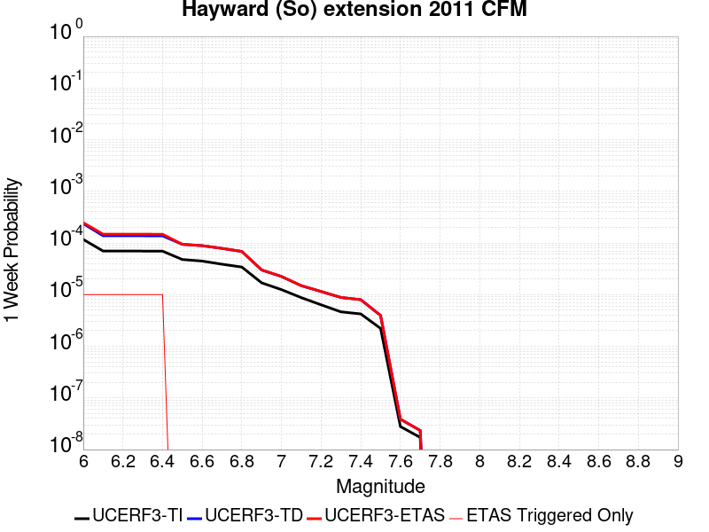 | 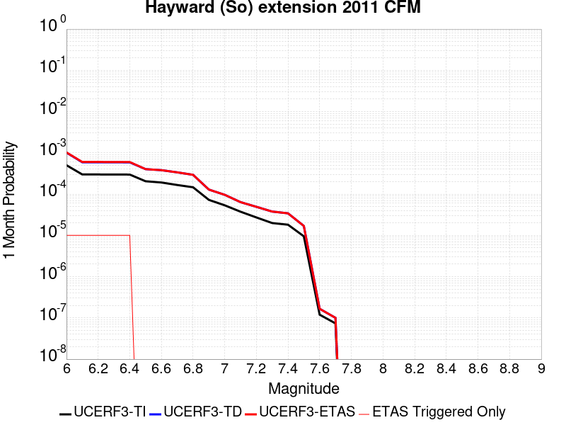 |  |  |

| Magnitude | 1 wk TI Prob | 1 wk TD Prob | 1 wk ETAS Prob | 1 wk ETAS/TD Gain | 1 wk ETAS Triggered Only | 1 mo TI Prob | 1 mo TD Prob | 1 mo ETAS Prob | 1 mo ETAS/TD Gain | 1 mo ETAS Triggered Only | 1 yr TI Prob | 1 yr TD Prob | 1 yr ETAS Prob | 1 yr ETAS/TD Gain | 1 yr ETAS Triggered Only | 10 yr TI Prob | 10 yr TD Prob | 10 yr ETAS Prob | 10 yr ETAS/TD Gain | 10 yr ETAS Triggered Only |
|-----|-----|-----|-----|-----|-----|-----|-----|-----|-----|-----|-----|-----|-----|-----|-----|-----|-----|-----|-----|-----|
| 6.0 | 1.1721256E-4 | 2.3671088E-4 | 2.467085E-4 | 1.0422356 | 1.0E-5 | 5.022428E-4 | 0.0010138806 | 0.0010238704 | 1.0098531 | 1.0E-5 | 0.0060976758 | 0.012250609 | 0.012260486 | 1.0008063 | 1.0E-5 | 0.0593305 | 0.11284437 | 0.112853244 | 1.0000786 | 1.0E-5 |
| 6.1 | 6.99169E-5 | 1.3808164E-4 | 1.4808026E-4 | 1.072411 | 1.0E-5 | 2.9960944E-4 | 5.9155683E-4 | 6.015509E-4 | 1.0168946 | 1.0E-5 | 0.0036416445 | 0.0071723475 | 0.007182276 | 1.0013843 | 1.0E-5 | 0.035825435 | 0.067804344 | 0.067813665 | 1.0001374 | 1.0E-5 |
| 6.2 | 6.99169E-5 | 1.3808164E-4 | 1.4808026E-4 | 1.072411 | 1.0E-5 | 2.9960944E-4 | 5.9155683E-4 | 6.015509E-4 | 1.0168946 | 1.0E-5 | 0.0036416445 | 0.0071723475 | 0.007182276 | 1.0013843 | 1.0E-5 | 0.035825435 | 0.067804344 | 0.067813665 | 1.0001374 | 1.0E-5 |
| 6.3 | 6.970908E-5 | 1.3776305E-4 | 1.4776168E-4 | 1.0725784 | 1.0E-5 | 2.9871898E-4 | 5.9019245E-4 | 6.001865E-4 | 1.0169337 | 1.0E-5 | 0.0036308395 | 0.007155884 | 0.007165813 | 1.0013875 | 1.0E-5 | 0.035720866 | 0.0676533 | 0.06766263 | 1.0001378 | 1.0E-5 |
| 6.4 | 6.9517155E-5 | 1.3743227E-4 | 1.4743091E-4 | 1.0727531 | 1.0E-5 | 2.9789665E-4 | 5.8877567E-4 | 5.987698E-4 | 1.0169744 | 1.0E-5 | 0.0036208609 | 0.0071387975 | 0.0071487264 | 1.0013908 | 1.0E-5 | 0.03562429 | 0.06749734 | 0.06750666 | 1.0001382 | 1.0E-5 |
| 6.5 | 4.786248E-5 | 9.415232E-5 | 9.415232E-5 | 1.0 | 0.0 | 2.0510878E-4 | 4.0344993E-4 | 4.0344993E-4 | 1.0 | 0.0 | 0.0024943394 | 0.0049013784 | 0.0049013784 | 1.0 | 0.0 | 0.02466527 | 0.046900697 | 0.046900697 | 1.0 | 0.0 |
| 6.6 | 4.4662214E-5 | 8.8819244E-5 | 8.8819244E-5 | 1.0 | 0.0 | 1.9139545E-4 | 3.80601E-4 | 3.80601E-4 | 1.0 | 0.0 | 0.0023277493 | 0.0046244357 | 0.0046244357 | 1.0 | 0.0 | 0.02303517 | 0.04429206 | 0.04429206 | 1.0 | 0.0 |
| 6.7 | 3.884542E-5 | 7.8650686E-5 | 7.8650686E-5 | 1.0 | 0.0 | 1.6646975E-4 | 3.3703333E-4 | 3.3703333E-4 | 1.0 | 0.0 | 0.002024885 | 0.0040961048 | 0.0040961048 | 1.0 | 0.0 | 0.020065336 | 0.039332055 | 0.039332055 | 1.0 | 0.0 |
| 6.8 | 3.4221863E-5 | 6.855886E-5 | 6.855886E-5 | 1.0 | 0.0 | 1.4665688E-4 | 2.9379298E-4 | 2.9379298E-4 | 1.0 | 0.0 | 0.0017840851 | 0.0035714838 | 0.0035714838 | 1.0 | 0.0 | 0.017698295 | 0.034419462 | 0.034419462 | 1.0 | 0.0 |
| 6.9 | 1.6927712E-5 | 3.006262E-5 | 3.006262E-5 | 1.0 | 0.0 | 7.2545314E-5 | 1.2883375E-4 | 1.2883375E-4 | 1.0 | 0.0 | 8.828813E-4 | 0.0015674793 | 0.0015674793 | 1.0 | 0.0 | 0.008793819 | 0.015463544 | 0.015463544 | 1.0 | 0.0 |
| 7.0 | 1.2509653E-5 | 2.246337E-5 | 2.246337E-5 | 1.0 | 0.0 | 5.3611697E-5 | 9.626828E-5 | 9.626828E-5 | 1.0 | 0.0 | 6.525269E-4 | 0.0011714802 | 0.0011714802 | 1.0 | 0.0 | 0.0065061417 | 0.011583166 | 0.011583166 | 1.0 | 0.0 |
| 7.1 | 8.751583E-6 | 1.4926157E-5 | 1.4926157E-5 | 1.0 | 0.0 | 3.750624E-5 | 6.396771E-5 | 6.396771E-5 | 1.0 | 0.0 | 4.5654282E-4 | 7.785344E-4 | 7.785344E-4 | 1.0 | 0.0 | 0.0045560603 | 0.007764457 | 0.007764457 | 1.0 | 0.0 |
| 7.2 | 6.354379E-6 | 1.1499087E-5 | 1.1499087E-5 | 1.0 | 0.0 | 2.7232769E-5 | 4.9280898E-5 | 4.9280898E-5 | 1.0 | 0.0 | 3.3150852E-4 | 5.9983454E-4 | 5.9983454E-4 | 1.0 | 0.0 | 0.0033101442 | 0.006001243 | 0.006001243 | 1.0 | 0.0 |
| 7.3 | 4.645554E-6 | 8.818441E-6 | 8.818441E-6 | 1.0 | 0.0 | 1.9909365E-5 | 3.7792794E-5 | 3.7792794E-5 | 1.0 | 0.0 | 2.4236954E-4 | 4.6003403E-4 | 4.6003403E-4 | 1.0 | 0.0 | 0.0024210536 | 0.004611421 | 0.004611421 | 1.0 | 0.0 |
| 7.4 | 4.23437E-6 | 7.992759E-6 | 7.992759E-6 | 1.0 | 0.0 | 1.8147173E-5 | 3.425425E-5 | 3.425425E-5 | 1.0 | 0.0 | 2.2091944E-4 | 4.1696956E-4 | 4.1696956E-4 | 1.0 | 0.0 | 0.0022069993 | 0.0041826614 | 0.0041826614 | 1.0 | 0.0 |
| 7.5 | 2.2187417E-6 | 3.952336E-6 | 3.952336E-6 | 1.0 | 0.0 | 9.508858E-6 | 1.6938488E-5 | 1.6938488E-5 | 1.0 | 0.0 | 1.157642E-4 | 2.0620918E-4 | 2.0620918E-4 | 1.0 | 0.0 | 0.0011570391 | 0.0020739497 | 0.0020739497 | 1.0 | 0.0 |
| 7.6 | 2.7952495E-8 | 3.8785874E-8 | 3.8785874E-8 | 1.0 | 0.0 | 1.1979641E-7 | 1.6622516E-7 | 1.6622516E-7 | 1.0 | 0.0 | 1.4585203E-6 | 2.0237894E-6 | 2.0237894E-6 | 1.0 | 0.0 | 1.4585107E-5 | 2.0317146E-5 | 2.0317146E-5 | 1.0 | 0.0 |
| 7.7 | 1.7192724E-8 | 2.3436652E-8 | 2.3436652E-8 | 1.0 | 0.0 | 7.36831E-8 | 1.0044278E-7 | 1.0044278E-7 | 1.0 | 0.0 | 8.9709135E-7 | 1.2228902E-6 | 1.2228902E-6 | 1.0 | 0.0 | 8.970877E-6 | 1.2285953E-5 | 1.2285953E-5 | 1.0 | 0.0 |

## San Gabriel (Extension)
*[(top)](#table-of-contents)*

| 1 Week | 1 Month | 1 Year | 10 Year |
|-----|-----|-----|-----|
|  | 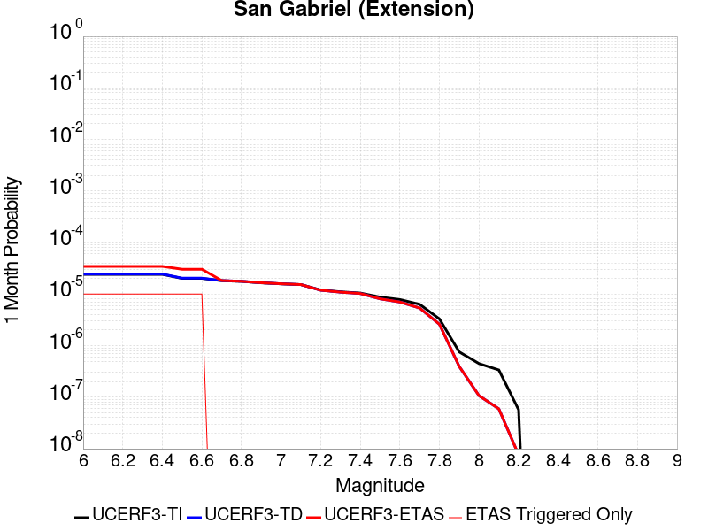 | 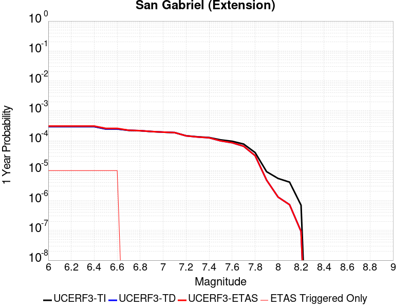 | 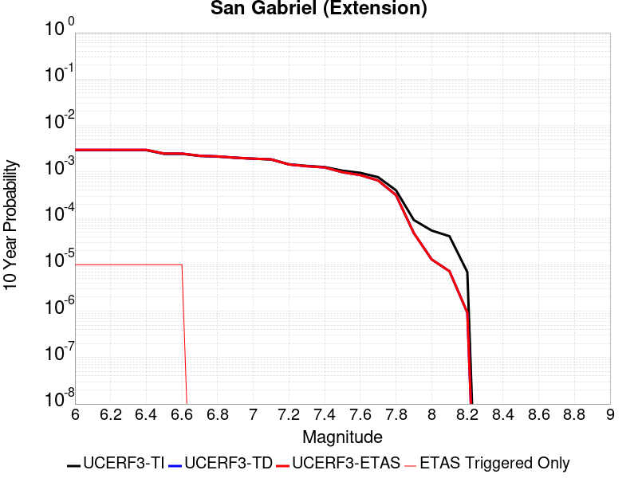 |

| Magnitude | 1 wk TI Prob | 1 wk TD Prob | 1 wk ETAS Prob | 1 wk ETAS/TD Gain | 1 wk ETAS Triggered Only | 1 mo TI Prob | 1 mo TD Prob | 1 mo ETAS Prob | 1 mo ETAS/TD Gain | 1 mo ETAS Triggered Only | 1 yr TI Prob | 1 yr TD Prob | 1 yr ETAS Prob | 1 yr ETAS/TD Gain | 1 yr ETAS Triggered Only | 10 yr TI Prob | 10 yr TD Prob | 10 yr ETAS Prob | 10 yr ETAS/TD Gain | 10 yr ETAS Triggered Only |
|-----|-----|-----|-----|-----|-----|-----|-----|-----|-----|-----|-----|-----|-----|-----|-----|-----|-----|-----|-----|-----|
| 6.0 | 5.6486106E-6 | 5.7168368E-6 | 5.7168368E-6 | 1.0 | 0.0 | 2.4208108E-5 | 2.4500505E-5 | 3.450026E-5 | 1.4081448 | 1.0E-5 | 2.9469383E-4 | 2.9825408E-4 | 3.082511E-4 | 1.0335184 | 1.0E-5 | 0.0029430336 | 0.0029786646 | 0.0029886349 | 1.0033472 | 1.0E-5 |
| 6.1 | 5.6486106E-6 | 5.7168368E-6 | 5.7168368E-6 | 1.0 | 0.0 | 2.4208108E-5 | 2.4500505E-5 | 3.450026E-5 | 1.4081448 | 1.0E-5 | 2.9469383E-4 | 2.9825408E-4 | 3.082511E-4 | 1.0335184 | 1.0E-5 | 0.0029430336 | 0.0029786646 | 0.0029886349 | 1.0033472 | 1.0E-5 |
| 6.2 | 5.6486106E-6 | 5.7168368E-6 | 5.7168368E-6 | 1.0 | 0.0 | 2.4208108E-5 | 2.4500505E-5 | 3.450026E-5 | 1.4081448 | 1.0E-5 | 2.9469383E-4 | 2.9825408E-4 | 3.082511E-4 | 1.0335184 | 1.0E-5 | 0.0029430336 | 0.0029786646 | 0.0029886349 | 1.0033472 | 1.0E-5 |
| 6.3 | 5.6486106E-6 | 5.7168368E-6 | 5.7168368E-6 | 1.0 | 0.0 | 2.4208108E-5 | 2.4500505E-5 | 3.450026E-5 | 1.4081448 | 1.0E-5 | 2.9469383E-4 | 2.9825408E-4 | 3.082511E-4 | 1.0335184 | 1.0E-5 | 0.0029430336 | 0.0029786646 | 0.0029886349 | 1.0033472 | 1.0E-5 |
| 6.4 | 5.6486106E-6 | 5.7168368E-6 | 5.7168368E-6 | 1.0 | 0.0 | 2.4208108E-5 | 2.4500505E-5 | 3.450026E-5 | 1.4081448 | 1.0E-5 | 2.9469383E-4 | 2.9825408E-4 | 3.082511E-4 | 1.0335184 | 1.0E-5 | 0.0029430336 | 0.0029786646 | 0.0029886349 | 1.0033472 | 1.0E-5 |
| 6.5 | 4.7134554E-6 | 4.7542608E-6 | 4.7542608E-6 | 1.0 | 0.0 | 2.0200367E-5 | 2.0375248E-5 | 3.0375044E-5 | 1.4907815 | 1.0E-5 | 2.459117E-4 | 2.4804127E-4 | 2.5803878E-4 | 1.0403059 | 1.0E-5 | 0.0024563975 | 0.0024777285 | 0.0024877037 | 1.0040259 | 1.0E-5 |
| 6.6 | 4.7134554E-6 | 4.7542608E-6 | 4.7542608E-6 | 1.0 | 0.0 | 2.0200367E-5 | 2.0375248E-5 | 3.0375044E-5 | 1.4907815 | 1.0E-5 | 2.459117E-4 | 2.4804127E-4 | 2.5803878E-4 | 1.0403059 | 1.0E-5 | 0.0024563975 | 0.0024777285 | 0.0024877037 | 1.0040259 | 1.0E-5 |
| 6.7 | 4.2468837E-6 | 4.274078E-6 | 4.274078E-6 | 1.0 | 0.0 | 1.8200803E-5 | 1.8317352E-5 | 1.8317352E-5 | 1.0 | 0.0 | 2.2157225E-4 | 2.2299167E-4 | 2.2299167E-4 | 1.0 | 0.0 | 0.0022135144 | 0.0022277513 | 0.0022277513 | 1.0 | 0.0 |
| 6.8 | 4.1180615E-6 | 4.1414673E-6 | 4.1414673E-6 | 1.0 | 0.0 | 1.7648716E-5 | 1.774903E-5 | 1.774903E-5 | 1.0 | 0.0 | 2.1485193E-4 | 2.1607373E-4 | 2.1607373E-4 | 1.0 | 0.0 | 0.0021464431 | 0.0021587077 | 0.0021587077 | 1.0 | 0.0 |
| 6.9 | 3.863861E-6 | 3.879783E-6 | 3.879783E-6 | 1.0 | 0.0 | 1.65593E-5 | 1.6627539E-5 | 1.6627539E-5 | 1.0 | 0.0 | 2.0159081E-4 | 2.0242216E-4 | 2.0242216E-4 | 1.0 | 0.0 | 0.0020140803 | 0.0020224454 | 0.0020224454 | 1.0 | 0.0 |
| 7.0 | 3.6947372E-6 | 3.705682E-6 | 3.705682E-6 | 1.0 | 0.0 | 1.5834492E-5 | 1.5881402E-5 | 1.5881402E-5 | 1.0 | 0.0 | 1.9276788E-4 | 1.9333958E-4 | 1.9333958E-4 | 1.0 | 0.0 | 0.0019260074 | 0.0019317803 | 0.0019317803 | 1.0 | 0.0 |
| 7.1 | 3.5686835E-6 | 3.5729024E-6 | 3.5729024E-6 | 1.0 | 0.0 | 1.5294268E-5 | 1.5312353E-5 | 1.5312353E-5 | 1.0 | 0.0 | 1.861918E-4 | 1.8641262E-4 | 1.8641262E-4 | 1.0 | 0.0 | 0.0018603588 | 0.0018626284 | 0.0018626284 | 1.0 | 0.0 |
| 7.2 | 2.8023446E-6 | 2.776794E-6 | 2.776794E-6 | 1.0 | 0.0 | 1.2009994E-5 | 1.1900492E-5 | 1.1900492E-5 | 1.0 | 0.0 | 1.4621185E-4 | 1.4487897E-4 | 1.4487897E-4 | 1.0 | 0.0 | 0.001461157 | 0.001447856 | 0.001447856 | 1.0 | 0.0 |
| 7.3 | 2.5843012E-6 | 2.5459692E-6 | 2.5459692E-6 | 1.0 | 0.0 | 1.1075529E-5 | 1.0911252E-5 | 1.0911252E-5 | 1.0 | 0.0 | 1.3483623E-4 | 1.3283649E-4 | 1.3283649E-4 | 1.0 | 0.0 | 0.0013475444 | 0.0013275805 | 0.0013275805 | 1.0 | 0.0 |
| 7.4 | 2.4464468E-6 | 2.396669E-6 | 2.396669E-6 | 1.0 | 0.0 | 1.04847295E-5 | 1.0271398E-5 | 1.0271398E-5 | 1.0 | 0.0 | 1.276441E-4 | 1.250472E-4 | 1.250472E-4 | 1.0 | 0.0 | 0.0012757082 | 0.001249778 | 0.001249778 | 1.0 | 0.0 |
| 7.5 | 2.0420266E-6 | 1.8910376E-6 | 1.8910376E-6 | 1.0 | 0.0 | 8.751514E-6 | 8.104422E-6 | 8.104422E-6 | 1.0 | 0.0 | 1.0654447E-4 | 9.866691E-5 | 9.866691E-5 | 1.0 | 0.0 | 0.001064934 | 9.862344E-4 | 9.862344E-4 | 1.0 | 0.0 |
| 7.6 | 1.8326596E-6 | 1.6398233E-6 | 1.6398233E-6 | 1.0 | 0.0 | 7.854232E-6 | 7.027795E-6 | 7.027795E-6 | 1.0 | 0.0 | 9.562107E-5 | 8.556007E-5 | 8.556007E-5 | 1.0 | 0.0 | 9.5579936E-4 | 8.552735E-4 | 8.552735E-4 | 1.0 | 0.0 |
| 7.7 | 1.4786998E-6 | 1.2523672E-6 | 1.2523672E-6 | 1.0 | 0.0 | 6.3372695E-6 | 5.3672766E-6 | 5.3672766E-6 | 1.0 | 0.0 | 7.715353E-5 | 6.534465E-5 | 6.534465E-5 | 1.0 | 0.0 | 7.7126746E-4 | 6.5325975E-4 | 6.5325975E-4 | 1.0 | 0.0 |
| 7.8 | 7.6975533E-7 | 6.069207E-7 | 6.069207E-7 | 1.0 | 0.0 | 3.2989474E-6 | 2.6010862E-6 | 2.6010862E-6 | 1.0 | 0.0 | 4.0163945E-5 | 3.1667765E-5 | 3.1667765E-5 | 1.0 | 0.0 | 4.0156685E-4 | 3.166365E-4 | 3.166365E-4 | 1.0 | 0.0 |
| 7.9 | 1.7645915E-7 | 9.211899E-8 | 9.211899E-8 | 1.0 | 0.0 | 7.562533E-7 | 3.947956E-7 | 3.947956E-7 | 1.0 | 0.0 | 9.207345E-6 | 4.806626E-6 | 4.806626E-6 | 1.0 | 0.0 | 9.206964E-5 | 4.8069025E-5 | 4.8069025E-5 | 1.0 | 0.0 |
| 8.0 | 1.0463461E-7 | 2.4937416E-8 | 2.4937416E-8 | 1.0 | 0.0 | 4.4843398E-7 | 1.0687464E-7 | 1.0687464E-7 | 1.0 | 0.0 | 5.45967E-6 | 1.3011979E-6 | 1.3011979E-6 | 1.0 | 0.0 | 5.459536E-5 | 1.3015701E-5 | 1.3015701E-5 | 1.0 | 0.0 |
| 8.1 | 7.875717E-8 | 1.3857542E-8 | 1.3857542E-8 | 1.0 | 0.0 | 3.3753068E-7 | 5.9389468E-8 | 5.9389468E-8 | 1.0 | 0.0 | 4.109428E-6 | 7.2306653E-7 | 7.2306653E-7 | 1.0 | 0.0 | 4.109352E-5 | 7.234439E-6 | 7.234439E-6 | 1.0 | 0.0 |
| 8.2 | 1.33163E-8 | 1.7720816E-9 | 1.7720816E-9 | 1.0 | 0.0 | 5.7069855E-8 | 7.594638E-9 | 7.594638E-9 | 1.0 | 0.0 | 6.9482525E-7 | 9.246471E-8 | 9.246471E-8 | 1.0 | 0.0 | 6.9482307E-6 | 9.2664203E-7 | 9.2664203E-7 | 1.0 | 0.0 |

## Breckenridge 2011
*[(top)](#table-of-contents)*

| 1 Week | 1 Month | 1 Year | 10 Year |
|-----|-----|-----|-----|
| 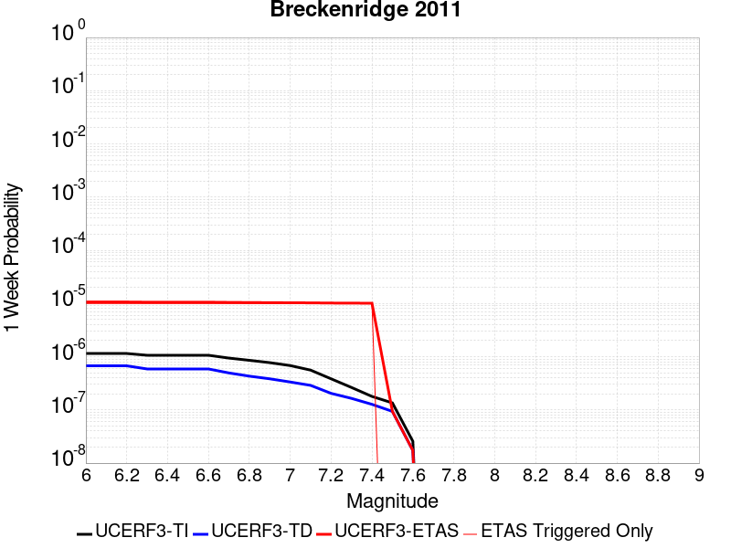 | 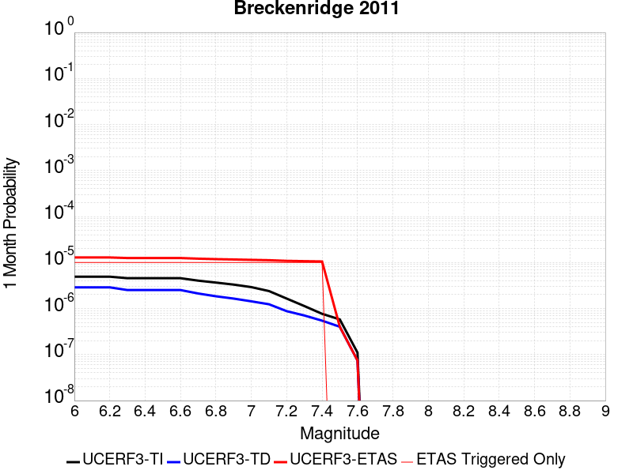 | 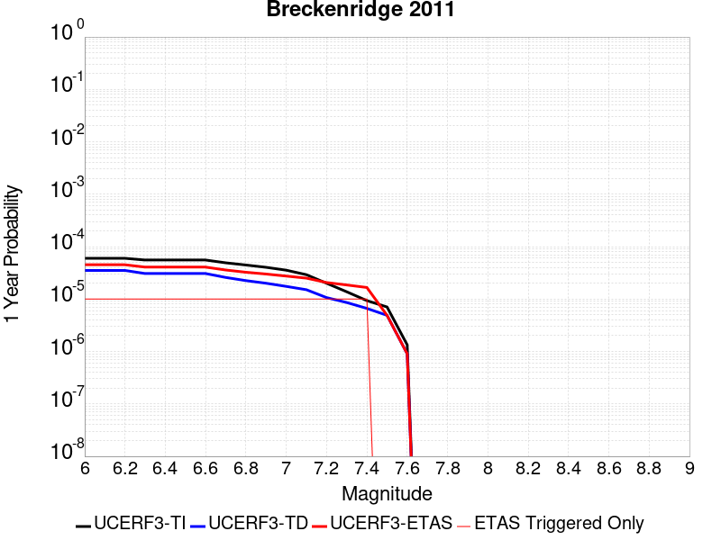 | 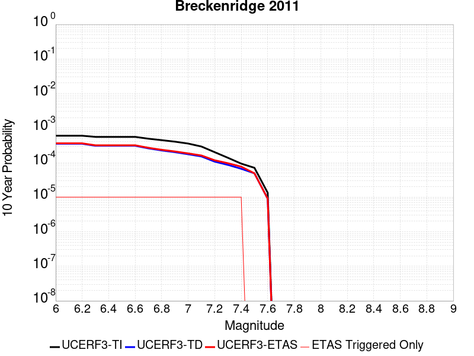 |

| Magnitude | 1 wk TI Prob | 1 wk TD Prob | 1 wk ETAS Prob | 1 wk ETAS/TD Gain | 1 wk ETAS Triggered Only | 1 mo TI Prob | 1 mo TD Prob | 1 mo ETAS Prob | 1 mo ETAS/TD Gain | 1 mo ETAS Triggered Only | 1 yr TI Prob | 1 yr TD Prob | 1 yr ETAS Prob | 1 yr ETAS/TD Gain | 1 yr ETAS Triggered Only | 10 yr TI Prob | 10 yr TD Prob | 10 yr ETAS Prob | 10 yr ETAS/TD Gain | 10 yr ETAS Triggered Only |
|-----|-----|-----|-----|-----|-----|-----|-----|-----|-----|-----|-----|-----|-----|-----|-----|-----|-----|-----|-----|-----|
| 6.0 | 1.1490393E-6 | 6.738007E-7 | 1.0673794E-5 | 15.841174 | 1.0E-5 | 4.924445E-6 | 2.8877141E-6 | 1.2887685E-5 | 4.4629364 | 1.0E-5 | 5.995347E-5 | 3.5157373E-5 | 4.5157023E-5 | 1.2844254 | 1.0E-5 | 5.9937296E-4 | 3.5152017E-4 | 3.6151666E-4 | 1.0284379 | 1.0E-5 |
| 6.1 | 1.1490393E-6 | 6.738007E-7 | 1.0673794E-5 | 15.841174 | 1.0E-5 | 4.924445E-6 | 2.8877141E-6 | 1.2887685E-5 | 4.4629364 | 1.0E-5 | 5.995347E-5 | 3.5157373E-5 | 4.5157023E-5 | 1.2844254 | 1.0E-5 | 5.9937296E-4 | 3.5152017E-4 | 3.6151666E-4 | 1.0284379 | 1.0E-5 |
| 6.2 | 1.1490393E-6 | 6.738007E-7 | 1.0673794E-5 | 15.841174 | 1.0E-5 | 4.924445E-6 | 2.8877141E-6 | 1.2887685E-5 | 4.4629364 | 1.0E-5 | 5.995347E-5 | 3.5157373E-5 | 4.5157023E-5 | 1.2844254 | 1.0E-5 | 5.9937296E-4 | 3.5152017E-4 | 3.6151666E-4 | 1.0284379 | 1.0E-5 |
| 6.3 | 1.064617E-6 | 5.886405E-7 | 1.0588635E-5 | 17.988289 | 1.0E-5 | 4.5626366E-6 | 2.5227425E-6 | 1.2522717E-5 | 4.96393 | 1.0E-5 | 5.5548684E-5 | 3.071397E-5 | 4.071366E-5 | 1.3255748 | 1.0E-5 | 5.55348E-4 | 3.070984E-4 | 3.1709534E-4 | 1.0325528 | 1.0E-5 |
| 6.4 | 1.064617E-6 | 5.886405E-7 | 1.0588635E-5 | 17.988289 | 1.0E-5 | 4.5626366E-6 | 2.5227425E-6 | 1.2522717E-5 | 4.96393 | 1.0E-5 | 5.5548684E-5 | 3.071397E-5 | 4.071366E-5 | 1.3255748 | 1.0E-5 | 5.55348E-4 | 3.070984E-4 | 3.1709534E-4 | 1.0325528 | 1.0E-5 |
| 6.5 | 1.064617E-6 | 5.886405E-7 | 1.0588635E-5 | 17.988289 | 1.0E-5 | 4.5626366E-6 | 2.5227425E-6 | 1.2522717E-5 | 4.96393 | 1.0E-5 | 5.5548684E-5 | 3.071397E-5 | 4.071366E-5 | 1.3255748 | 1.0E-5 | 5.55348E-4 | 3.070984E-4 | 3.1709534E-4 | 1.0325528 | 1.0E-5 |
| 6.6 | 1.064617E-6 | 5.886405E-7 | 1.0588635E-5 | 17.988289 | 1.0E-5 | 4.5626366E-6 | 2.5227425E-6 | 1.2522717E-5 | 4.96393 | 1.0E-5 | 5.5548684E-5 | 3.071397E-5 | 4.071366E-5 | 1.3255748 | 1.0E-5 | 5.55348E-4 | 3.070984E-4 | 3.1709534E-4 | 1.0325528 | 1.0E-5 |
| 6.7 | 9.4219524E-7 | 4.954012E-7 | 1.0495396E-5 | 21.18565 | 1.0E-5 | 4.037973E-6 | 2.1231463E-6 | 1.2123125E-5 | 5.709981 | 1.0E-5 | 4.916122E-5 | 2.5849005E-5 | 3.584875E-5 | 1.386852 | 1.0E-5 | 4.9150345E-4 | 2.5846064E-4 | 2.6845807E-4 | 1.0386806 | 1.0E-5 |
| 6.8 | 8.556422E-7 | 4.311915E-7 | 1.0431188E-5 | 24.191544 | 1.0E-5 | 3.667033E-6 | 1.8479623E-6 | 1.1847944E-5 | 6.411356 | 1.0E-5 | 4.464521E-5 | 2.2498712E-5 | 3.2498487E-5 | 1.4444599 | 1.0E-5 | 4.4636242E-4 | 2.2496474E-4 | 2.3496248E-4 | 1.0444415 | 1.0E-5 |
| 6.9 | 7.7357794E-7 | 3.841983E-7 | 1.0384195E-5 | 27.028215 | 1.0E-5 | 3.3153299E-6 | 1.6465632E-6 | 1.1646547E-5 | 7.0732465 | 1.0E-5 | 4.0363393E-5 | 2.0046726E-5 | 3.0046525E-5 | 1.4988246 | 1.0E-5 | 4.035606E-4 | 2.0044947E-4 | 2.1044747E-4 | 1.0498779 | 1.0E-5 |
| 7.0 | 6.8172454E-7 | 3.3470985E-7 | 1.03347065E-5 | 30.876614 | 1.0E-5 | 2.9216735E-6 | 1.43447E-6 | 1.1434456E-5 | 7.9712057 | 1.0E-5 | 3.5570793E-5 | 1.7464534E-5 | 2.746436E-5 | 1.572579 | 1.0E-5 | 3.55651E-4 | 1.7463184E-4 | 1.846301E-4 | 1.0572534 | 1.0E-5 |
| 7.1 | 5.5936397E-7 | 2.8909366E-7 | 1.0289091E-5 | 35.590855 | 1.0E-5 | 2.397272E-6 | 1.2389722E-6 | 1.123896E-5 | 9.071196 | 1.0E-5 | 2.9186394E-5 | 1.5084385E-5 | 2.5084235E-5 | 1.6629272 | 1.0E-5 | 2.9182562E-4 | 1.5083379E-4 | 1.6083228E-4 | 1.0662881 | 1.0E-5 |
| 7.2 | 3.8420822E-7 | 2.0468183E-7 | 1.020468E-5 | 49.856304 | 1.0E-5 | 1.6466057E-6 | 8.772076E-7 | 1.0877199E-5 | 12.3998 | 1.0E-5 | 2.004724E-5 | 1.0679951E-5 | 2.0679843E-5 | 1.9363239 | 1.0E-5 | 2.004543E-4 | 1.06794454E-4 | 1.1679339E-4 | 1.0936278 | 1.0E-5 |
| 7.3 | 2.6405158E-7 | 1.6473078E-7 | 1.0164729E-5 | 61.7051 | 1.0E-5 | 1.1316491E-6 | 7.0598884E-7 | 1.0705981E-5 | 15.164519 | 1.0E-5 | 1.37777415E-5 | 8.595381E-6 | 1.8595296E-5 | 2.1634057 | 1.0E-5 | 1.3776887E-4 | 8.595055E-5 | 9.594969E-5 | 1.116336 | 1.0E-5 |
| 7.4 | 1.792114E-7 | 1.2725252E-7 | 1.0127252E-5 | 79.58389 | 1.0E-5 | 7.6804866E-7 | 5.453678E-7 | 1.0545363E-5 | 19.336239 | 1.0E-5 | 9.3509525E-6 | 6.639834E-6 | 1.6639768E-5 | 2.5060518 | 1.0E-5 | 9.350559E-5 | 6.63964E-5 | 7.6395736E-5 | 1.1506006 | 1.0E-5 |
| 7.5 | 1.3548703E-7 | 9.385346E-8 | 9.385346E-8 | 1.0 | 0.0 | 5.8065854E-7 | 4.0222903E-7 | 4.0222903E-7 | 1.0 | 0.0 | 7.0694946E-6 | 4.897128E-6 | 4.897128E-6 | 1.0 | 0.0 | 7.0692695E-5 | 4.8970236E-5 | 4.8970236E-5 | 1.0 | 0.0 |
| 7.6 | 2.572245E-8 | 1.735264E-8 | 1.735264E-8 | 1.0 | 0.0 | 1.10239064E-7 | 7.436845E-8 | 7.436845E-8 | 1.0 | 0.0 | 1.3421597E-6 | 9.0543557E-7 | 9.0543557E-7 | 1.0 | 0.0 | 1.3421517E-5 | 9.054324E-6 | 9.054324E-6 | 1.0 | 0.0 |

## Hunting Creek - Bartlett Springs connector 2011
*[(top)](#table-of-contents)*

| 1 Week | 1 Month | 1 Year | 10 Year |
|-----|-----|-----|-----|
|  |  | 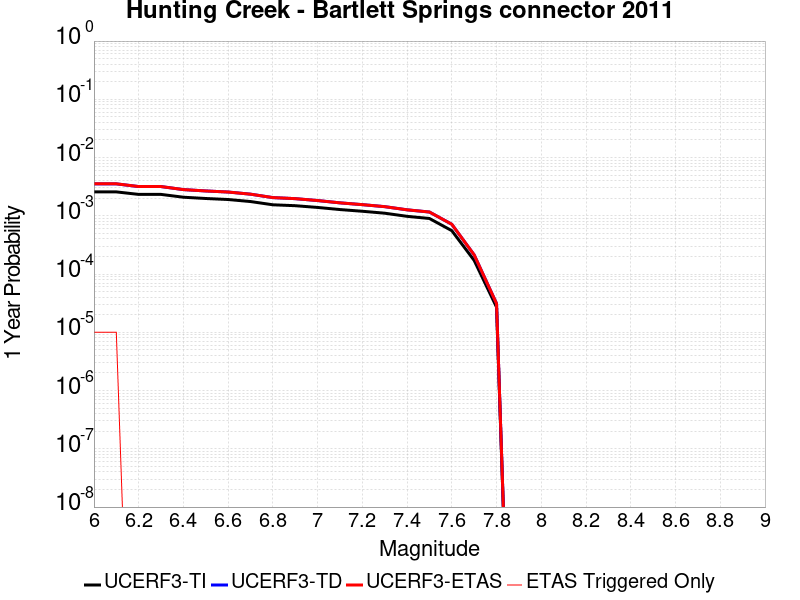 | 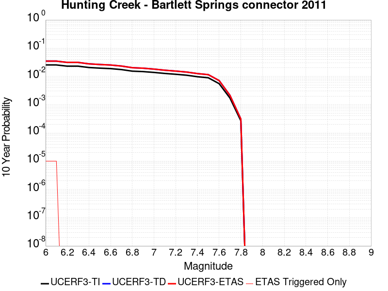 |

| Magnitude | 1 wk TI Prob | 1 wk TD Prob | 1 wk ETAS Prob | 1 wk ETAS/TD Gain | 1 wk ETAS Triggered Only | 1 mo TI Prob | 1 mo TD Prob | 1 mo ETAS Prob | 1 mo ETAS/TD Gain | 1 mo ETAS Triggered Only | 1 yr TI Prob | 1 yr TD Prob | 1 yr ETAS Prob | 1 yr ETAS/TD Gain | 1 yr ETAS Triggered Only | 10 yr TI Prob | 10 yr TD Prob | 10 yr ETAS Prob | 10 yr ETAS/TD Gain | 10 yr ETAS Triggered Only |
|-----|-----|-----|-----|-----|-----|-----|-----|-----|-----|-----|-----|-----|-----|-----|-----|-----|-----|-----|-----|-----|
| 6.0 | 4.940016E-5 | 6.7870766E-5 | 7.7870085E-5 | 1.1473289 | 1.0E-5 | 2.1169778E-4 | 2.9084194E-4 | 3.0083905E-4 | 1.0343729 | 1.0E-5 | 0.002574374 | 0.0035350819 | 0.0035450463 | 1.0028188 | 1.0E-5 | 0.025447546 | 0.03477475 | 0.034784403 | 1.0002775 | 1.0E-5 |
| 6.1 | 4.940016E-5 | 6.7870766E-5 | 7.7870085E-5 | 1.1473289 | 1.0E-5 | 2.1169778E-4 | 2.9084194E-4 | 3.0083905E-4 | 1.0343729 | 1.0E-5 | 0.002574374 | 0.0035350819 | 0.0035450463 | 1.0028188 | 1.0E-5 | 0.025447546 | 0.03477475 | 0.034784403 | 1.0002775 | 1.0E-5 |
| 6.2 | 4.472471E-5 | 6.100572E-5 | 6.100572E-5 | 1.0 | 0.0 | 1.9166325E-4 | 2.6142647E-4 | 2.6142647E-4 | 1.0 | 0.0 | 0.0023310026 | 0.0031781218 | 0.0031781218 | 1.0 | 0.0 | 0.02306703 | 0.031317808 | 0.031317808 | 1.0 | 0.0 |
| 6.3 | 4.472471E-5 | 6.100572E-5 | 6.100572E-5 | 1.0 | 0.0 | 1.9166325E-4 | 2.6142647E-4 | 2.6142647E-4 | 1.0 | 0.0 | 0.0023310026 | 0.0031781218 | 0.0031781218 | 1.0 | 0.0 | 0.02306703 | 0.031317808 | 0.031317808 | 1.0 | 0.0 |
| 6.4 | 4.0001003E-5 | 5.410516E-5 | 5.410516E-5 | 1.0 | 0.0 | 1.714216E-4 | 2.318579E-4 | 2.318579E-4 | 1.0 | 0.0 | 0.0020850603 | 0.0028191686 | 0.0028191686 | 1.0 | 0.0 | 0.02065605 | 0.027829198 | 0.027829198 | 1.0 | 0.0 |
| 6.5 | 3.8033053E-5 | 5.126649E-5 | 5.126649E-5 | 1.0 | 0.0 | 1.6298861E-4 | 2.1969521E-4 | 2.1969521E-4 | 1.0 | 0.0 | 0.0019825802 | 0.0026714848 | 0.0026714848 | 1.0 | 0.0 | 0.019649856 | 0.026391273 | 0.026391273 | 1.0 | 0.0 |
| 6.6 | 3.653754E-5 | 4.912955E-5 | 4.912955E-5 | 1.0 | 0.0 | 1.5658008E-4 | 2.1053842E-4 | 2.1053842E-4 | 1.0 | 0.0 | 0.0019046954 | 0.0025602889 | 0.0025602889 | 1.0 | 0.0 | 0.018884527 | 0.025307199 | 0.025307199 | 1.0 | 0.0 |
| 6.7 | 3.372024E-5 | 4.5140216E-5 | 4.5140216E-5 | 1.0 | 0.0 | 1.4450731E-4 | 1.9344388E-4 | 1.9344388E-4 | 1.0 | 0.0 | 0.0017579567 | 0.0023526535 | 0.0023526535 | 1.0 | 0.0 | 0.017441148 | 0.023278862 | 0.023278862 | 1.0 | 0.0 |
| 6.8 | 2.9650024E-5 | 3.9411647E-5 | 3.9411647E-5 | 1.0 | 0.0 | 1.2706534E-4 | 1.6889606E-4 | 1.6889606E-4 | 1.0 | 0.0 | 0.0015459227 | 0.0020543607 | 0.0020543607 | 1.0 | 0.0 | 0.015352124 | 0.020351961 | 0.020351961 | 1.0 | 0.0 |
| 6.9 | 2.860775E-5 | 3.7812886E-5 | 3.7812886E-5 | 1.0 | 0.0 | 1.2259888E-4 | 1.620452E-4 | 1.620452E-4 | 1.0 | 0.0 | 0.0014916194 | 0.0019711219 | 0.0019711219 | 1.0 | 0.0 | 0.014816469 | 0.019536555 | 0.019536555 | 1.0 | 0.0 |
| 7.0 | 2.6696067E-5 | 3.5067544E-5 | 3.5067544E-5 | 1.0 | 0.0 | 1.144067E-4 | 1.5028086E-4 | 1.5028086E-4 | 1.0 | 0.0 | 0.0013920115 | 0.0018281427 | 0.0018281427 | 1.0 | 0.0 | 0.013833242 | 0.01813184 | 0.01813184 | 1.0 | 0.0 |
| 7.1 | 2.456087E-5 | 3.2013326E-5 | 3.2013326E-5 | 1.0 | 0.0 | 1.0525662E-4 | 1.3719281E-4 | 1.3719281E-4 | 1.0 | 0.0 | 0.001280746 | 0.0016690517 | 0.0016690517 | 1.0 | 0.0 | 0.012733897 | 0.016566671 | 0.016566671 | 1.0 | 0.0 |
| 7.2 | 2.295761E-5 | 2.9823148E-5 | 2.9823148E-5 | 1.0 | 0.0 | 9.8386045E-5 | 1.2780727E-4 | 1.2780727E-4 | 1.0 | 0.0 | 0.0011971919 | 0.0015549522 | 0.0015549522 | 1.0 | 0.0 | 0.011907627 | 0.015442378 | 0.015442378 | 1.0 | 0.0 |
| 7.3 | 2.1256936E-5 | 2.7542124E-5 | 2.7542124E-5 | 1.0 | 0.0 | 9.109797E-5 | 1.1803238E-4 | 1.1803238E-4 | 1.0 | 0.0 | 0.0011085535 | 0.0014361058 | 0.0014361058 | 1.0 | 0.0 | 0.011030397 | 0.014269741 | 0.014269741 | 1.0 | 0.0 |
| 7.4 | 1.8784336E-5 | 2.430697E-5 | 2.430697E-5 | 1.0 | 0.0 | 8.050181E-5 | 1.0416861E-4 | 1.0416861E-4 | 1.0 | 0.0 | 9.796688E-4 | 0.0012675226 | 0.0012675226 | 1.0 | 0.0 | 0.009753612 | 0.012604194 | 0.012604194 | 1.0 | 0.0 |
| 7.5 | 1.7248298E-5 | 2.2269056E-5 | 2.2269056E-5 | 1.0 | 0.0 | 7.391918E-5 | 9.543537E-5 | 9.543537E-5 | 1.0 | 0.0 | 8.9959445E-4 | 0.0011613137 | 0.0011613137 | 1.0 | 0.0 | 0.008959615 | 0.011553645 | 0.011553645 | 1.0 | 0.0 |
| 7.6 | 1.0653709E-5 | 1.3722259E-5 | 1.3722259E-5 | 1.0 | 0.0 | 4.5657955E-5 | 5.880837E-5 | 5.880837E-5 | 1.0 | 0.0 | 5.557438E-4 | 7.157594E-4 | 7.157594E-4 | 1.0 | 0.0 | 0.0055435603 | 0.0071350415 | 0.0071350415 | 1.0 | 0.0 |
| 7.7 | 3.286316E-6 | 4.0903997E-6 | 4.0903997E-6 | 1.0 | 0.0 | 1.4084137E-5 | 1.7530168E-5 | 1.7530168E-5 | 1.0 | 0.0 | 1.7146087E-4 | 2.1340905E-4 | 2.1340905E-4 | 1.0 | 0.0 | 0.0017132863 | 0.0021320845 | 0.0021320845 | 1.0 | 0.0 |
| 7.8 | 5.1855085E-7 | 5.972095E-7 | 5.972095E-7 | 1.0 | 0.0 | 2.222359E-6 | 2.5594668E-6 | 2.5594668E-6 | 1.0 | 0.0 | 2.7056883E-5 | 3.1161075E-5 | 3.1161075E-5 | 1.0 | 0.0 | 2.705359E-4 | 3.1156064E-4 | 3.1156064E-4 | 1.0 | 0.0 |

## Great Valley 07 (Orestimba)
*[(top)](#table-of-contents)*

| 1 Week | 1 Month | 1 Year | 10 Year |
|-----|-----|-----|-----|
| 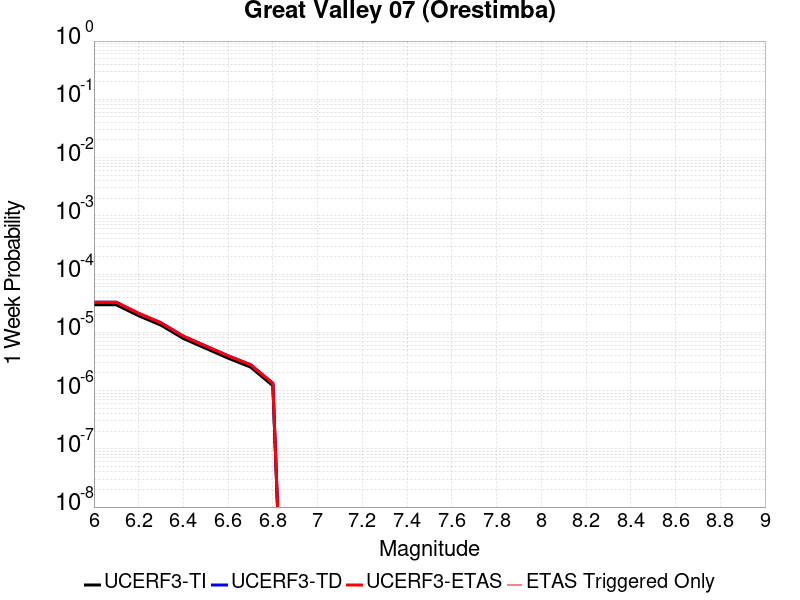 |  |  | 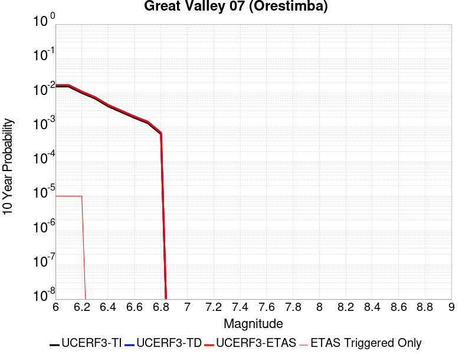 |

| Magnitude | 1 wk TI Prob | 1 wk TD Prob | 1 wk ETAS Prob | 1 wk ETAS/TD Gain | 1 wk ETAS Triggered Only | 1 mo TI Prob | 1 mo TD Prob | 1 mo ETAS Prob | 1 mo ETAS/TD Gain | 1 mo ETAS Triggered Only | 1 yr TI Prob | 1 yr TD Prob | 1 yr ETAS Prob | 1 yr ETAS/TD Gain | 1 yr ETAS Triggered Only | 10 yr TI Prob | 10 yr TD Prob | 10 yr ETAS Prob | 10 yr ETAS/TD Gain | 10 yr ETAS Triggered Only |
|-----|-----|-----|-----|-----|-----|-----|-----|-----|-----|-----|-----|-----|-----|-----|-----|-----|-----|-----|-----|-----|
| 6.0 | 2.9687902E-5 | 3.27575E-5 | 3.27575E-5 | 1.0 | 0.0 | 1.2722766E-4 | 1.4038214E-4 | 1.4038214E-4 | 1.0 | 0.0 | 0.0015478961 | 0.0017078844 | 0.0017078844 | 1.0 | 0.0 | 0.015371585 | 0.016955135 | 0.016964966 | 1.0005798 | 1.0E-5 |
| 6.1 | 2.9687902E-5 | 3.27575E-5 | 3.27575E-5 | 1.0 | 0.0 | 1.2722766E-4 | 1.4038214E-4 | 1.4038214E-4 | 1.0 | 0.0 | 0.0015478961 | 0.0017078844 | 0.0017078844 | 1.0 | 0.0 | 0.015371585 | 0.016955135 | 0.016964966 | 1.0005798 | 1.0E-5 |
| 6.2 | 1.9231524E-5 | 2.1159167E-5 | 2.1159167E-5 | 1.0 | 0.0 | 8.2418206E-5 | 9.067912E-5 | 9.067912E-5 | 1.0 | 0.0 | 0.0010029797 | 0.0011034822 | 0.0011034822 | 1.0 | 0.0 | 0.00998465 | 0.010982441 | 0.0109923305 | 1.0009005 | 1.0E-5 |
| 6.3 | 1.324766E-5 | 1.4548534E-5 | 1.4548534E-5 | 1.0 | 0.0 | 5.6774446E-5 | 6.234942E-5 | 6.234942E-5 | 1.0 | 0.0 | 6.910097E-4 | 7.5884897E-4 | 7.5884897E-4 | 1.0 | 0.0 | 0.006888649 | 0.0075635235 | 0.0075635235 | 1.0 | 0.0 |
| 6.4 | 7.818645E-6 | 8.57284E-6 | 8.57284E-6 | 1.0 | 0.0 | 3.3508048E-5 | 3.6740246E-5 | 3.6740246E-5 | 1.0 | 0.0 | 4.078841E-4 | 4.4722404E-4 | 4.4722404E-4 | 1.0 | 0.0 | 0.004071363 | 0.0044635804 | 0.0044635804 | 1.0 | 0.0 |
| 6.5 | 5.3076565E-6 | 5.8178007E-6 | 5.8178007E-6 | 1.0 | 0.0 | 2.27469E-5 | 2.4933206E-5 | 2.4933206E-5 | 1.0 | 0.0 | 2.7690834E-4 | 3.035216E-4 | 3.035216E-4 | 1.0 | 0.0 | 0.0027656353 | 0.00303128 | 0.00303128 | 1.0 | 0.0 |
| 6.6 | 3.6003578E-6 | 3.9484953E-6 | 3.9484953E-6 | 1.0 | 0.0 | 1.5430012E-5 | 1.6922022E-5 | 1.6922022E-5 | 1.0 | 0.0 | 1.8784421E-4 | 2.0600771E-4 | 2.0600771E-4 | 1.0 | 0.0 | 0.0018768552 | 0.0020583214 | 0.0020583214 | 1.0 | 0.0 |
| 6.7 | 2.5361826E-6 | 2.7834678E-6 | 2.7834678E-6 | 1.0 | 0.0 | 1.0869308E-5 | 1.1929101E-5 | 1.1929101E-5 | 1.0 | 0.0 | 1.3232579E-4 | 1.4522845E-4 | 1.4522845E-4 | 1.0 | 0.0 | 0.0013224703 | 0.0014514653 | 0.0014514653 | 1.0 | 0.0 |
| 6.8 | 1.2115831E-6 | 1.3313797E-6 | 1.3313797E-6 | 1.0 | 0.0 | 5.1924885E-6 | 5.7059065E-6 | 5.7059065E-6 | 1.0 | 0.0 | 6.3216714E-5 | 6.9468166E-5 | 6.9468166E-5 | 1.0 | 0.0 | 6.3198735E-4 | 6.945596E-4 | 6.945596E-4 | 1.0 | 0.0 |

## Calaveras (No) 2011 CFM
*[(top)](#table-of-contents)*

| 1 Week | 1 Month | 1 Year | 10 Year |
|-----|-----|-----|-----|
|  | 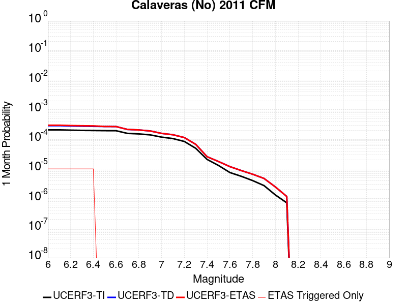 | 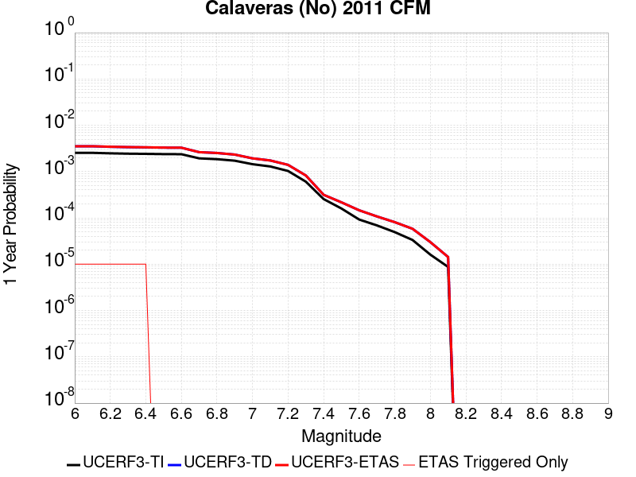 | 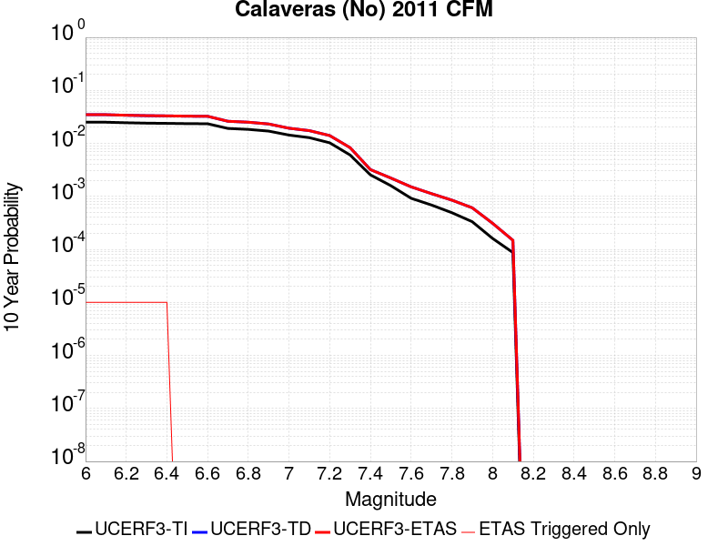 |

| Magnitude | 1 wk TI Prob | 1 wk TD Prob | 1 wk ETAS Prob | 1 wk ETAS/TD Gain | 1 wk ETAS Triggered Only | 1 mo TI Prob | 1 mo TD Prob | 1 mo ETAS Prob | 1 mo ETAS/TD Gain | 1 mo ETAS Triggered Only | 1 yr TI Prob | 1 yr TD Prob | 1 yr ETAS Prob | 1 yr ETAS/TD Gain | 1 yr ETAS Triggered Only | 10 yr TI Prob | 10 yr TD Prob | 10 yr ETAS Prob | 10 yr ETAS/TD Gain | 10 yr ETAS Triggered Only |
|-----|-----|-----|-----|-----|-----|-----|-----|-----|-----|-----|-----|-----|-----|-----|-----|-----|-----|-----|-----|-----|
| 6.0 | 4.8694856E-5 | 6.747457E-5 | 6.747457E-5 | 1.0 | 0.0 | 2.0867554E-4 | 2.891453E-4 | 2.991424E-4 | 1.0345746 | 1.0E-5 | 0.0025376645 | 0.0035146773 | 0.0035246422 | 1.0028352 | 1.0E-5 | 0.02508881 | 0.034771074 | 0.034780726 | 1.0002776 | 1.0E-5 |
| 6.1 | 4.8694856E-5 | 6.747457E-5 | 6.747457E-5 | 1.0 | 0.0 | 2.0867554E-4 | 2.891453E-4 | 2.991424E-4 | 1.0345746 | 1.0E-5 | 0.0025376645 | 0.0035146773 | 0.0035246422 | 1.0028352 | 1.0E-5 | 0.02508881 | 0.034771074 | 0.034780726 | 1.0002776 | 1.0E-5 |
| 6.2 | 4.7541962E-5 | 6.5805805E-5 | 6.5805805E-5 | 1.0 | 0.0 | 2.0373536E-4 | 2.8199502E-4 | 2.9199218E-4 | 1.0354517 | 1.0E-5 | 0.0024776561 | 0.003427919 | 0.0034378846 | 1.0029073 | 1.0E-5 | 0.024502134 | 0.0339325 | 0.03394216 | 1.0002847 | 1.0E-5 |
| 6.3 | 4.6717287E-5 | 6.463939E-5 | 6.463939E-5 | 1.0 | 0.0 | 2.0020158E-4 | 2.7699716E-4 | 2.869944E-4 | 1.0360914 | 1.0E-5 | 0.0024347296 | 0.0033672696 | 0.003377236 | 1.0029597 | 1.0E-5 | 0.024082264 | 0.033345006 | 0.033354674 | 1.0002899 | 1.0E-5 |
| 6.4 | 4.6276386E-5 | 6.400103E-5 | 6.400103E-5 | 1.0 | 0.0 | 1.983123E-4 | 2.7426204E-4 | 2.842593E-4 | 1.0364515 | 1.0E-5 | 0.0024117786 | 0.00333408 | 0.0033440467 | 1.0029893 | 1.0E-5 | 0.02385771 | 0.03302388 | 0.03303355 | 1.0002928 | 1.0E-5 |
| 6.5 | 4.5720994E-5 | 6.32025E-5 | 6.32025E-5 | 1.0 | 0.0 | 1.9593239E-4 | 2.7084045E-4 | 2.7084045E-4 | 1.0 | 0.0 | 0.002382867 | 0.0032925585 | 0.0032925585 | 1.0 | 0.0 | 0.023574775 | 0.032621842 | 0.032621842 | 1.0 | 0.0 |
| 6.6 | 4.549134E-5 | 6.285557E-5 | 6.285557E-5 | 1.0 | 0.0 | 1.949483E-4 | 2.693539E-4 | 2.693539E-4 | 1.0 | 0.0 | 0.0023709119 | 0.0032745146 | 0.0032745146 | 1.0 | 0.0 | 0.023457756 | 0.03244731 | 0.03244731 | 1.0 | 0.0 |
| 6.7 | 3.701047E-5 | 5.03607E-5 | 5.03607E-5 | 1.0 | 0.0 | 1.5860666E-4 | 2.1581395E-4 | 2.1581395E-4 | 1.0 | 0.0 | 0.0019293258 | 0.002624412 | 0.002624412 | 1.0 | 0.0 | 0.019126613 | 0.026125198 | 0.026125198 | 1.0 | 0.0 |
| 6.8 | 3.5523568E-5 | 4.834225E-5 | 4.834225E-5 | 1.0 | 0.0 | 1.5223498E-4 | 2.0716486E-4 | 2.0716486E-4 | 1.0 | 0.0 | 0.0018518851 | 0.0025193577 | 0.0025193577 | 1.0 | 0.0 | 0.018365284 | 0.025097623 | 0.025097623 | 1.0 | 0.0 |
| 6.9 | 3.2946147E-5 | 4.4663826E-5 | 4.4663826E-5 | 1.0 | 0.0 | 1.4119013E-4 | 1.9140259E-4 | 1.9140259E-4 | 1.0 | 0.0 | 0.0017176344 | 0.0023278783 | 0.0023278783 | 1.0 | 0.0 | 0.017044188 | 0.023219762 | 0.023219762 | 1.0 | 0.0 |
| 7.0 | 2.7682381E-5 | 3.7023216E-5 | 3.7023216E-5 | 1.0 | 0.0 | 1.1863338E-4 | 1.5866144E-4 | 1.5866144E-4 | 1.0 | 0.0 | 0.0014434044 | 0.0019300217 | 0.0019300217 | 1.0 | 0.0 | 0.01434065 | 0.019311164 | 0.019311164 | 1.0 | 0.0 |
| 7.1 | 2.471967E-5 | 3.328756E-5 | 3.328756E-5 | 1.0 | 0.0 | 1.05937135E-4 | 1.4265333E-4 | 1.4265333E-4 | 1.0 | 0.0 | 0.0012890215 | 0.0017354497 | 0.0017354497 | 1.0 | 0.0 | 0.0128157 | 0.017386293 | 0.017386293 | 1.0 | 0.0 |
| 7.2 | 1.9748062E-5 | 2.6775411E-5 | 2.6775411E-5 | 1.0 | 0.0 | 8.463181E-5 | 1.1474685E-4 | 1.1474685E-4 | 1.0 | 0.0 | 0.0010299052 | 0.001396171 | 0.001396171 | 1.0 | 0.0 | 0.01025145 | 0.014031046 | 0.014031046 | 1.0 | 0.0 |
| 7.3 | 1.1603734E-5 | 1.5784257E-5 | 1.5784257E-5 | 1.0 | 0.0 | 4.9729337E-5 | 6.7645145E-5 | 6.7645145E-5 | 1.0 | 0.0 | 6.052865E-4 | 8.232826E-4 | 8.232826E-4 | 1.0 | 0.0 | 0.0060364045 | 0.008308739 | 0.008308739 | 1.0 | 0.0 |
| 7.4 | 4.885381E-6 | 6.035117E-6 | 6.035117E-6 | 1.0 | 0.0 | 2.0937177E-5 | 2.5864532E-5 | 2.5864532E-5 | 1.0 | 0.0 | 2.5488032E-4 | 3.1485534E-4 | 3.1485534E-4 | 1.0 | 0.0 | 0.0025458818 | 0.0032009764 | 0.0032009764 | 1.0 | 0.0 |
| 7.5 | 3.0571264E-6 | 4.1554085E-6 | 4.1554085E-6 | 1.0 | 0.0 | 1.3101904E-5 | 1.7808772E-5 | 1.7808772E-5 | 1.0 | 0.0 | 1.5950401E-4 | 2.1680034E-4 | 2.1680034E-4 | 1.0 | 0.0 | 0.0015938957 | 0.0022209007 | 0.0022209007 | 1.0 | 0.0 |
| 7.6 | 1.764948E-6 | 2.795641E-6 | 2.795641E-6 | 1.0 | 0.0 | 7.564041E-6 | 1.1981264E-5 | 1.1981264E-5 | 1.0 | 0.0 | 9.208831E-5 | 1.458622E-4 | 1.458622E-4 | 1.0 | 0.0 | 9.205016E-4 | 0.0015124046 | 0.0015124046 | 1.0 | 0.0 |
| 7.7 | 1.3173734E-6 | 2.0585271E-6 | 2.0585271E-6 | 1.0 | 0.0 | 5.645874E-6 | 8.82223E-6 | 8.82223E-6 | 1.0 | 0.0 | 6.873634E-5 | 1.0740537E-4 | 1.0740537E-4 | 1.0 | 0.0 | 6.8715087E-4 | 0.0011261607 | 0.0011261607 | 1.0 | 0.0 |
| 7.8 | 9.4429885E-7 | 1.5490102E-6 | 1.5490102E-6 | 1.0 | 0.0 | 4.0469886E-6 | 6.6385983E-6 | 6.6385983E-6 | 1.0 | 0.0 | 4.9270973E-5 | 8.082195E-5 | 8.082195E-5 | 1.0 | 0.0 | 4.926005E-4 | 8.501931E-4 | 8.501931E-4 | 1.0 | 0.0 |
| 7.9 | 6.388233E-7 | 1.11492E-6 | 1.11492E-6 | 1.0 | 0.0 | 2.7378112E-6 | 4.7782196E-6 | 4.7782196E-6 | 1.0 | 0.0 | 3.3332344E-5 | 5.8173282E-5 | 5.8173282E-5 | 1.0 | 0.0 | 3.3327343E-4 | 6.096674E-4 | 6.096674E-4 | 1.0 | 0.0 |
| 8.0 | 3.087986E-7 | 5.754721E-7 | 5.754721E-7 | 1.0 | 0.0 | 1.323422E-6 | 2.4663066E-6 | 2.4663066E-6 | 1.0 | 0.0 | 1.6112543E-5 | 3.0026871E-5 | 3.0026871E-5 | 1.0 | 0.0 | 1.6111376E-4 | 3.110238E-4 | 3.110238E-4 | 1.0 | 0.0 |
| 8.1 | 1.6725647E-7 | 2.7410795E-7 | 2.7410795E-7 | 1.0 | 0.0 | 7.168133E-7 | 1.1747478E-6 | 1.1747478E-6 | 1.0 | 0.0 | 8.7271665E-6 | 1.4302462E-5 | 1.4302462E-5 | 1.0 | 0.0 | 8.726824E-5 | 1.4847395E-4 | 1.4847395E-4 | 1.0 | 0.0 |

## Elmore Ranch
*[(top)](#table-of-contents)*

| 1 Week | 1 Month | 1 Year | 10 Year |
|-----|-----|-----|-----|
| 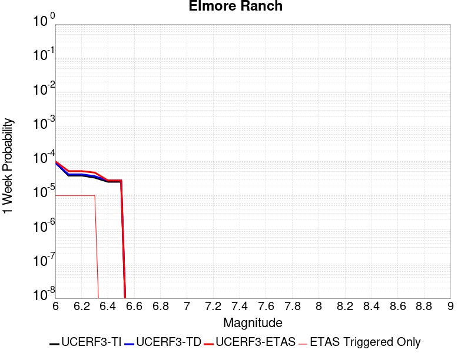 | 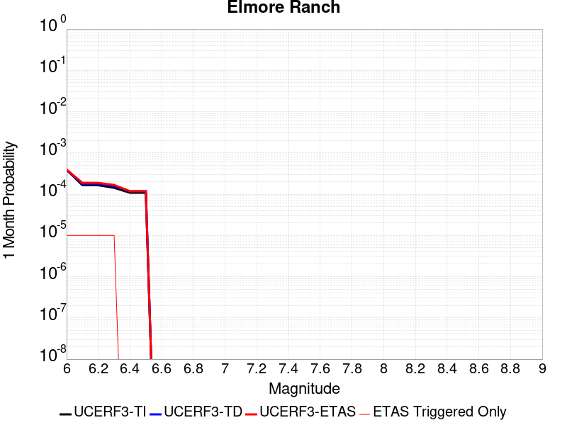 | 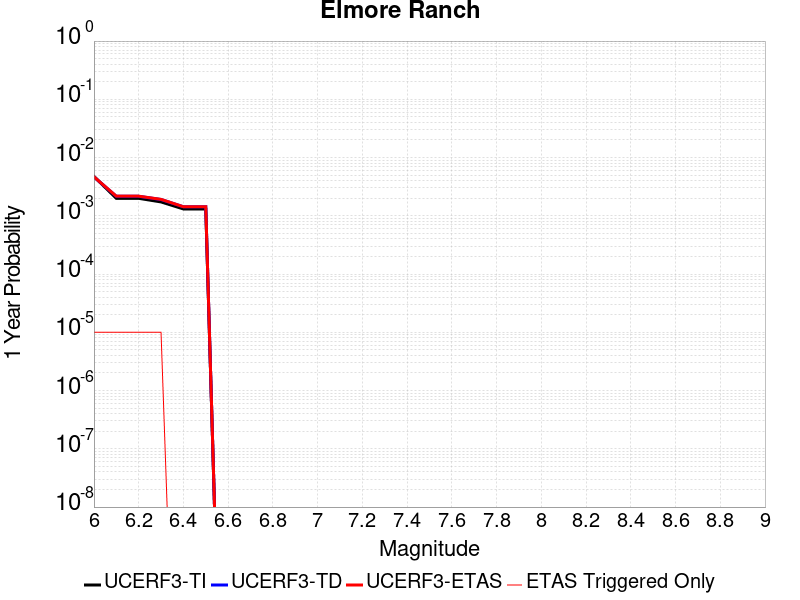 | 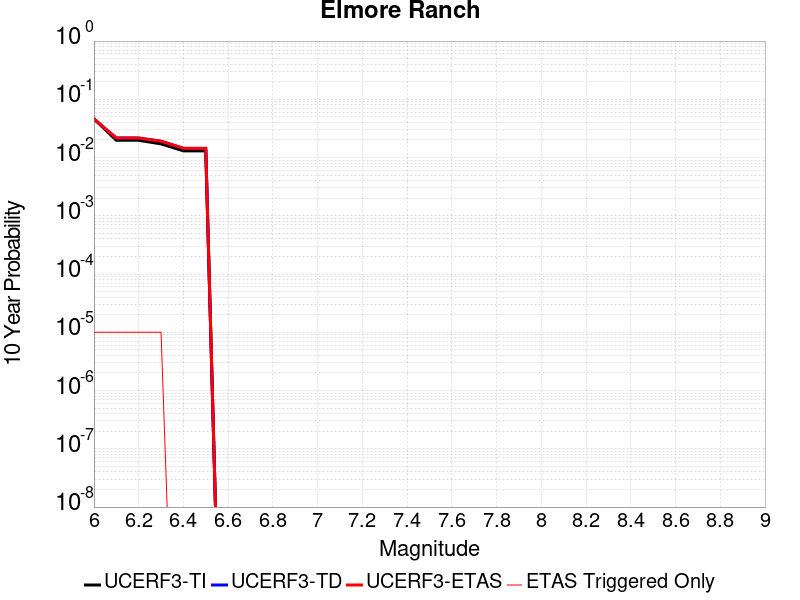 |

| Magnitude | 1 wk TI Prob | 1 wk TD Prob | 1 wk ETAS Prob | 1 wk ETAS/TD Gain | 1 wk ETAS Triggered Only | 1 mo TI Prob | 1 mo TD Prob | 1 mo ETAS Prob | 1 mo ETAS/TD Gain | 1 mo ETAS Triggered Only | 1 yr TI Prob | 1 yr TD Prob | 1 yr ETAS Prob | 1 yr ETAS/TD Gain | 1 yr ETAS Triggered Only | 10 yr TI Prob | 10 yr TD Prob | 10 yr ETAS Prob | 10 yr ETAS/TD Gain | 10 yr ETAS Triggered Only |
|-----|-----|-----|-----|-----|-----|-----|-----|-----|-----|-----|-----|-----|-----|-----|-----|-----|-----|-----|-----|-----|
| 6.0 | 9.102099E-5 | 8.953848E-5 | 9.953759E-5 | 1.1116738 | 1.0E-5 | 3.9003167E-4 | 3.836898E-4 | 3.9368597E-4 | 1.0260527 | 1.0E-5 | 0.0047383 | 0.004662132 | 0.0046720854 | 1.0021349 | 1.0E-5 | 0.046385348 | 0.04583787 | 0.045847416 | 1.0002081 | 1.0E-5 |
| 6.1 | 3.8306698E-5 | 4.14921E-5 | 5.1491686E-5 | 1.2409997 | 1.0E-5 | 1.6416123E-4 | 1.7781362E-4 | 1.8781185E-4 | 1.0562286 | 1.0E-5 | 0.0019968306 | 0.0021632186 | 0.002173197 | 1.0046127 | 1.0E-5 | 0.019789828 | 0.021595007 | 0.021604791 | 1.0004531 | 1.0E-5 |
| 6.2 | 3.8306698E-5 | 4.14921E-5 | 5.1491686E-5 | 1.2409997 | 1.0E-5 | 1.6416123E-4 | 1.7781362E-4 | 1.8781185E-4 | 1.0562286 | 1.0E-5 | 0.0019968306 | 0.0021632186 | 0.002173197 | 1.0046127 | 1.0E-5 | 0.019789828 | 0.021595007 | 0.021604791 | 1.0004531 | 1.0E-5 |
| 6.3 | 3.3197924E-5 | 3.6550366E-5 | 4.655E-5 | 1.2735851 | 1.0E-5 | 1.4226905E-4 | 1.56639E-4 | 1.6663743E-4 | 1.0638311 | 1.0E-5 | 0.0017307495 | 0.0019059771 | 0.0019159581 | 1.0052366 | 1.0E-5 | 0.017173318 | 0.019057386 | 0.019067194 | 1.0005147 | 1.0E-5 |
| 6.4 | 2.5148964E-5 | 2.7420736E-5 | 2.7420736E-5 | 1.0 | 0.0 | 1.0777682E-4 | 1.17515796E-4 | 1.17515796E-4 | 1.0 | 0.0 | 0.0013113929 | 0.0014304637 | 0.0014304637 | 1.0 | 0.0 | 0.01303681 | 0.014365338 | 0.014365338 | 1.0 | 0.0 |
| 6.5 | 2.5148964E-5 | 2.7420736E-5 | 2.7420736E-5 | 1.0 | 0.0 | 1.0777682E-4 | 1.17515796E-4 | 1.17515796E-4 | 1.0 | 0.0 | 0.0013113929 | 0.0014304637 | 0.0014304637 | 1.0 | 0.0 | 0.01303681 | 0.014365338 | 0.014365338 | 1.0 | 0.0 |

## Robinson Creek
*[(top)](#table-of-contents)*

| 1 Week | 1 Month | 1 Year | 10 Year |
|-----|-----|-----|-----|
| 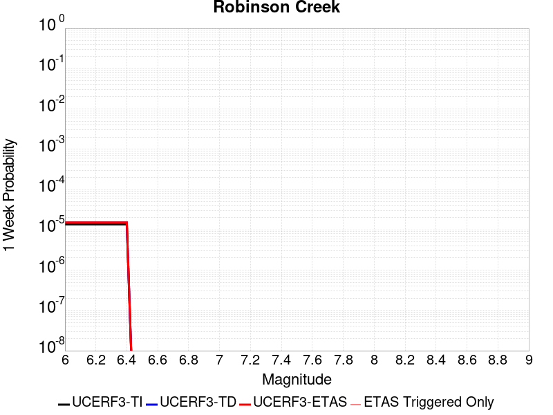 |  | 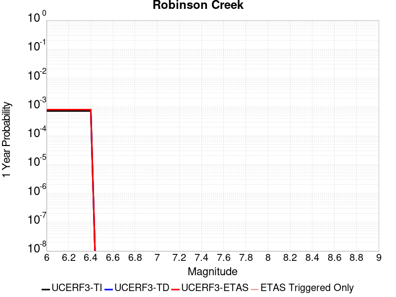 |  |

| Magnitude | 1 wk TI Prob | 1 wk TD Prob | 1 wk ETAS Prob | 1 wk ETAS/TD Gain | 1 wk ETAS Triggered Only | 1 mo TI Prob | 1 mo TD Prob | 1 mo ETAS Prob | 1 mo ETAS/TD Gain | 1 mo ETAS Triggered Only | 1 yr TI Prob | 1 yr TD Prob | 1 yr ETAS Prob | 1 yr ETAS/TD Gain | 1 yr ETAS Triggered Only | 10 yr TI Prob | 10 yr TD Prob | 10 yr ETAS Prob | 10 yr ETAS/TD Gain | 10 yr ETAS Triggered Only |
|-----|-----|-----|-----|-----|-----|-----|-----|-----|-----|-----|-----|-----|-----|-----|-----|-----|-----|-----|-----|-----|
| 6.0 | 1.3705327E-5 | 1.5285013E-5 | 1.5285013E-5 | 1.0 | 0.0 | 5.8735794E-5 | 6.55072E-5 | 6.55072E-5 | 1.0 | 0.0 | 7.1487366E-4 | 7.9755014E-4 | 7.9755014E-4 | 1.0 | 0.0 | 0.0071257832 | 0.007975501 | 0.007985421 | 1.0012438 | 1.0E-5 |
| 6.1 | 1.3705327E-5 | 1.5285013E-5 | 1.5285013E-5 | 1.0 | 0.0 | 5.8735794E-5 | 6.55072E-5 | 6.55072E-5 | 1.0 | 0.0 | 7.1487366E-4 | 7.9755014E-4 | 7.9755014E-4 | 1.0 | 0.0 | 0.0071257832 | 0.007975501 | 0.007985421 | 1.0012438 | 1.0E-5 |
| 6.2 | 1.3705327E-5 | 1.5285013E-5 | 1.5285013E-5 | 1.0 | 0.0 | 5.8735794E-5 | 6.55072E-5 | 6.55072E-5 | 1.0 | 0.0 | 7.1487366E-4 | 7.9755014E-4 | 7.9755014E-4 | 1.0 | 0.0 | 0.0071257832 | 0.007975501 | 0.007985421 | 1.0012438 | 1.0E-5 |
| 6.3 | 1.3705327E-5 | 1.5285013E-5 | 1.5285013E-5 | 1.0 | 0.0 | 5.8735794E-5 | 6.55072E-5 | 6.55072E-5 | 1.0 | 0.0 | 7.1487366E-4 | 7.9755014E-4 | 7.9755014E-4 | 1.0 | 0.0 | 0.0071257832 | 0.007975501 | 0.007985421 | 1.0012438 | 1.0E-5 |
| 6.4 | 1.3705327E-5 | 1.5285013E-5 | 1.5285013E-5 | 1.0 | 0.0 | 5.8735794E-5 | 6.55072E-5 | 6.55072E-5 | 1.0 | 0.0 | 7.1487366E-4 | 7.9755014E-4 | 7.9755014E-4 | 1.0 | 0.0 | 0.0071257832 | 0.007975501 | 0.007985421 | 1.0012438 | 1.0E-5 |

## Monterey Bay-Tularcitos
*[(top)](#table-of-contents)*

| 1 Week | 1 Month | 1 Year | 10 Year |
|-----|-----|-----|-----|
| 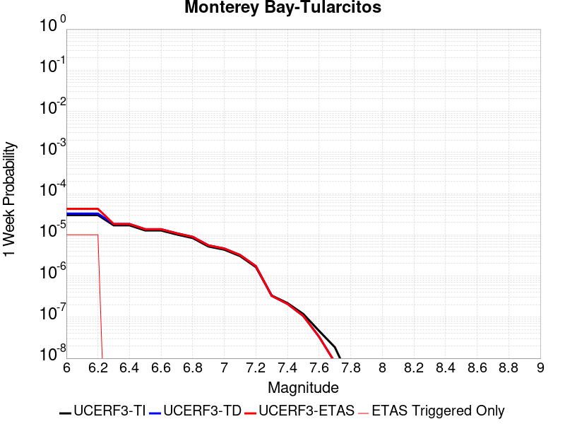 | 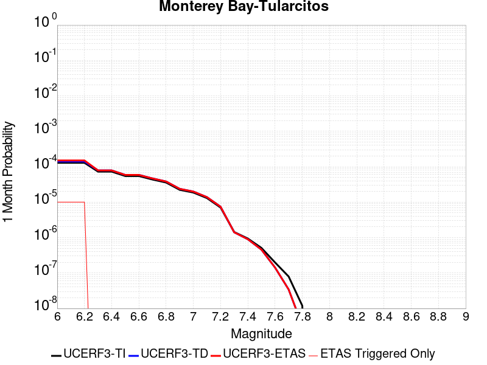 |  | 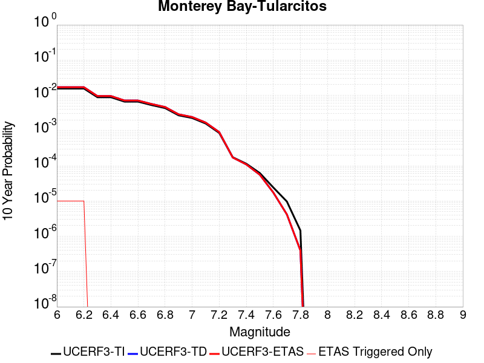 |

| Magnitude | 1 wk TI Prob | 1 wk TD Prob | 1 wk ETAS Prob | 1 wk ETAS/TD Gain | 1 wk ETAS Triggered Only | 1 mo TI Prob | 1 mo TD Prob | 1 mo ETAS Prob | 1 mo ETAS/TD Gain | 1 mo ETAS Triggered Only | 1 yr TI Prob | 1 yr TD Prob | 1 yr ETAS Prob | 1 yr ETAS/TD Gain | 1 yr ETAS Triggered Only | 10 yr TI Prob | 10 yr TD Prob | 10 yr ETAS Prob | 10 yr ETAS/TD Gain | 10 yr ETAS Triggered Only |
|-----|-----|-----|-----|-----|-----|-----|-----|-----|-----|-----|-----|-----|-----|-----|-----|-----|-----|-----|-----|-----|
| 6.0 | 3.0131365E-5 | 3.279877E-5 | 4.279844E-5 | 1.3048794 | 1.0E-5 | 1.2912804E-4 | 1.4055918E-4 | 1.5055778E-4 | 1.0711344 | 1.0E-5 | 0.001571 | 0.0017100703 | 0.0017200531 | 1.0058377 | 1.0E-5 | 0.015599402 | 0.016979916 | 0.016989747 | 1.0005789 | 1.0E-5 |
| 6.1 | 3.0131365E-5 | 3.279877E-5 | 4.279844E-5 | 1.3048794 | 1.0E-5 | 1.2912804E-4 | 1.4055918E-4 | 1.5055778E-4 | 1.0711344 | 1.0E-5 | 0.001571 | 0.0017100703 | 0.0017200531 | 1.0058377 | 1.0E-5 | 0.015599402 | 0.016979916 | 0.016989747 | 1.0005789 | 1.0E-5 |
| 6.2 | 3.0131365E-5 | 3.279877E-5 | 4.279844E-5 | 1.3048794 | 1.0E-5 | 1.2912804E-4 | 1.4055918E-4 | 1.5055778E-4 | 1.0711344 | 1.0E-5 | 0.001571 | 0.0017100703 | 0.0017200531 | 1.0058377 | 1.0E-5 | 0.015599402 | 0.016979916 | 0.016989747 | 1.0005789 | 1.0E-5 |
| 6.3 | 1.6998249E-5 | 1.8330798E-5 | 1.8330798E-5 | 1.0 | 0.0 | 7.28476E-5 | 7.85583E-5 | 7.85583E-5 | 1.0 | 0.0 | 8.865586E-4 | 9.5604634E-4 | 9.5604634E-4 | 1.0 | 0.0 | 0.0088303005 | 0.009521258 | 0.009521258 | 1.0 | 0.0 |
| 6.4 | 1.6998249E-5 | 1.8330798E-5 | 1.8330798E-5 | 1.0 | 0.0 | 7.28476E-5 | 7.85583E-5 | 7.85583E-5 | 1.0 | 0.0 | 8.865586E-4 | 9.5604634E-4 | 9.5604634E-4 | 1.0 | 0.0 | 0.0088303005 | 0.009521258 | 0.009521258 | 1.0 | 0.0 |
| 6.5 | 1.27470785E-5 | 1.3693312E-5 | 1.3693312E-5 | 1.0 | 0.0 | 5.4629192E-5 | 5.8684363E-5 | 5.8684363E-5 | 1.0 | 0.0 | 6.649074E-4 | 7.1425823E-4 | 7.1425823E-4 | 1.0 | 0.0 | 0.0066292146 | 0.007120678 | 0.007120678 | 1.0 | 0.0 |
| 6.6 | 1.2739422E-5 | 1.36854E-5 | 1.36854E-5 | 1.0 | 0.0 | 5.4596385E-5 | 5.8650454E-5 | 5.8650454E-5 | 1.0 | 0.0 | 6.645082E-4 | 7.1384566E-4 | 7.1384566E-4 | 1.0 | 0.0 | 0.0066252467 | 0.007116579 | 0.007116579 | 1.0 | 0.0 |
| 6.7 | 1.0160109E-5 | 1.0885755E-5 | 1.0885755E-5 | 1.0 | 0.0 | 4.35426E-5 | 4.665244E-5 | 4.665244E-5 | 1.0 | 0.0 | 5.300022E-4 | 5.6785246E-4 | 5.6785246E-4 | 1.0 | 0.0 | 0.005287399 | 0.0056647263 | 0.0056647263 | 1.0 | 0.0 |
| 6.8 | 8.349859E-6 | 8.932587E-6 | 8.932587E-6 | 1.0 | 0.0 | 3.578462E-5 | 3.8281985E-5 | 3.8281985E-5 | 1.0 | 0.0 | 4.3559066E-4 | 4.6598914E-4 | 4.6598914E-4 | 1.0 | 0.0 | 0.004347378 | 0.004650685 | 0.004650685 | 1.0 | 0.0 |
| 6.9 | 5.193639E-6 | 5.53643E-6 | 5.53643E-6 | 1.0 | 0.0 | 2.2258262E-5 | 2.372736E-5 | 2.372736E-5 | 1.0 | 0.0 | 2.7096065E-4 | 2.8884556E-4 | 2.8884556E-4 | 1.0 | 0.0 | 0.0027063051 | 0.0028850224 | 0.0028850224 | 1.0 | 0.0 |
| 7.0 | 4.359381E-6 | 4.643366E-6 | 4.643366E-6 | 1.0 | 0.0 | 1.8682927E-5 | 1.9900004E-5 | 1.9900004E-5 | 1.0 | 0.0 | 2.274409E-4 | 2.422586E-4 | 2.422586E-4 | 1.0 | 0.0 | 0.0022720827 | 0.002420238 | 0.002420238 | 1.0 | 0.0 |
| 7.1 | 3.0398533E-6 | 3.2310427E-6 | 3.2310427E-6 | 1.0 | 0.0 | 1.3027877E-5 | 1.3847267E-5 | 1.3847267E-5 | 1.0 | 0.0 | 1.5860285E-4 | 1.6858005E-4 | 1.6858005E-4 | 1.0 | 0.0 | 0.001584897 | 0.0016847793 | 0.0016847793 | 1.0 | 0.0 |
| 7.2 | 1.642335E-6 | 1.7333153E-6 | 1.7333153E-6 | 1.0 | 0.0 | 7.0385595E-6 | 7.428485E-6 | 7.428485E-6 | 1.0 | 0.0 | 8.569109E-5 | 9.044012E-5 | 9.044012E-5 | 1.0 | 0.0 | 8.5658056E-4 | 9.042358E-4 | 9.042358E-4 | 1.0 | 0.0 |
| 7.3 | 3.356842E-7 | 3.2952389E-7 | 3.2952389E-7 | 1.0 | 0.0 | 1.4386458E-6 | 1.4122445E-6 | 1.4122445E-6 | 1.0 | 0.0 | 1.7515373E-5 | 1.7193941E-5 | 1.7193941E-5 | 1.0 | 0.0 | 1.7513991E-4 | 1.719262E-4 | 1.719262E-4 | 1.0 | 0.0 |
| 7.4 | 2.1973483E-7 | 2.1006414E-7 | 2.1006414E-7 | 1.0 | 0.0 | 9.417204E-7 | 9.002746E-7 | 9.002746E-7 | 1.0 | 0.0 | 1.1465385E-5 | 1.0960788E-5 | 1.0960788E-5 | 1.0 | 0.0 | 1.1464794E-4 | 1.0960251E-4 | 1.0960251E-4 | 1.0 | 0.0 |
| 7.5 | 1.1944135E-7 | 1.0696035E-7 | 1.0696035E-7 | 1.0 | 0.0 | 5.118914E-7 | 4.5840142E-7 | 4.5840142E-7 | 1.0 | 0.0 | 6.23226E-6 | 5.581023E-6 | 5.581023E-6 | 1.0 | 0.0 | 6.2320854E-5 | 5.5808843E-5 | 5.5808843E-5 | 1.0 | 0.0 |
| 7.6 | 4.636058E-8 | 3.3364433E-8 | 3.3364433E-8 | 1.0 | 0.0 | 1.9868818E-7 | 1.4299042E-7 | 1.4299042E-7 | 1.0 | 0.0 | 2.419026E-6 | 1.740907E-6 | 1.740907E-6 | 1.0 | 0.0 | 2.4189996E-5 | 1.7408936E-5 | 1.7408936E-5 | 1.0 | 0.0 |
| 7.7 | 1.8588572E-8 | 8.003168E-9 | 8.003168E-9 | 1.0 | 0.0 | 7.9665305E-8 | 3.429929E-8 | 3.429929E-8 | 1.0 | 0.0 | 9.699246E-7 | 4.1759378E-7 | 4.1759378E-7 | 1.0 | 0.0 | 9.699204E-6 | 4.1759304E-6 | 4.1759304E-6 | 1.0 | 0.0 |
| 7.8 | 2.7960154E-9 | 7.608624E-10 | 7.608624E-10 | 1.0 | 0.0 | 1.1982923E-8 | 3.2608392E-9 | 3.2608392E-9 | 1.0 | 0.0 | 1.4589209E-7 | 3.9700716E-8 | 3.9700716E-8 | 1.0 | 0.0 | 1.4589199E-6 | 3.970071E-7 | 3.970071E-7 | 1.0 | 0.0 |

## Superstition Hills
*[(top)](#table-of-contents)*

| 1 Week | 1 Month | 1 Year | 10 Year |
|-----|-----|-----|-----|
| 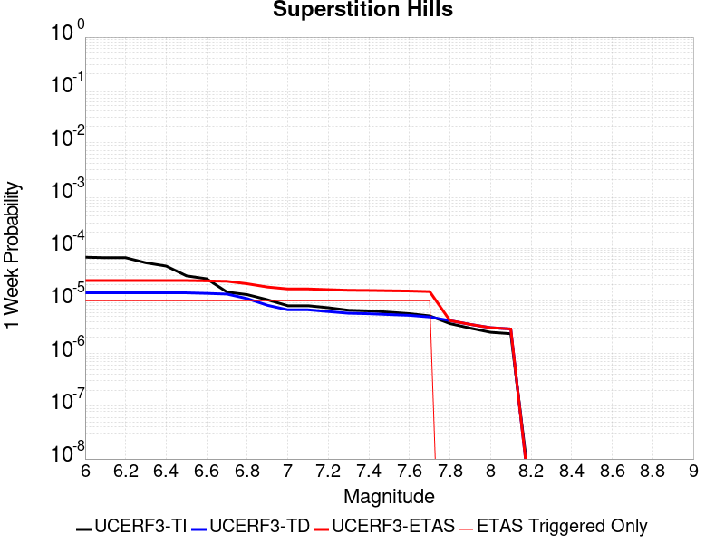 | 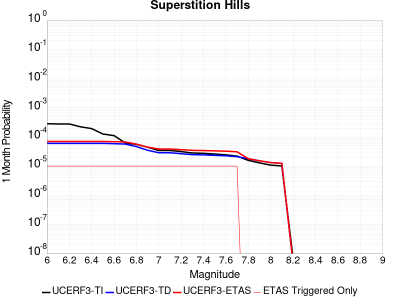 | 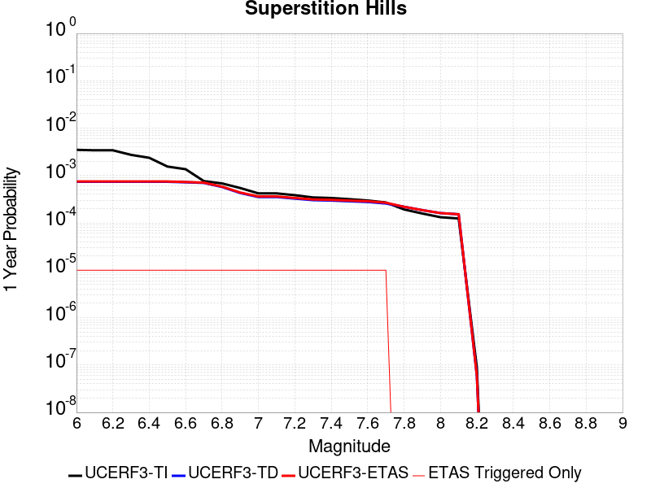 |  |

| Magnitude | 1 wk TI Prob | 1 wk TD Prob | 1 wk ETAS Prob | 1 wk ETAS/TD Gain | 1 wk ETAS Triggered Only | 1 mo TI Prob | 1 mo TD Prob | 1 mo ETAS Prob | 1 mo ETAS/TD Gain | 1 mo ETAS Triggered Only | 1 yr TI Prob | 1 yr TD Prob | 1 yr ETAS Prob | 1 yr ETAS/TD Gain | 1 yr ETAS Triggered Only | 10 yr TI Prob | 10 yr TD Prob | 10 yr ETAS Prob | 10 yr ETAS/TD Gain | 10 yr ETAS Triggered Only |
|-----|-----|-----|-----|-----|-----|-----|-----|-----|-----|-----|-----|-----|-----|-----|-----|-----|-----|-----|-----|-----|
| 6.0 | 6.6865185E-5 | 1.4137668E-5 | 2.4137526E-5 | 1.7073202 | 1.0E-5 | 2.8653358E-4 | 6.058869E-5 | 7.058808E-5 | 1.1650373 | 1.0E-5 | 0.0034829667 | 7.374338E-4 | 7.474264E-4 | 1.0135505 | 1.0E-5 | 0.03428881 | 0.007520696 | 0.007530621 | 1.0013196 | 1.0E-5 |
| 6.1 | 6.544851E-5 | 1.4137668E-5 | 2.4137526E-5 | 1.7073202 | 1.0E-5 | 2.8046346E-4 | 6.058869E-5 | 7.058808E-5 | 1.1650373 | 1.0E-5 | 0.0034092965 | 7.374338E-4 | 7.474264E-4 | 1.0135505 | 1.0E-5 | 0.033574644 | 0.0075206957 | 0.0075306203 | 1.0013196 | 1.0E-5 |
| 6.2 | 6.544851E-5 | 1.4137668E-5 | 2.4137526E-5 | 1.7073202 | 1.0E-5 | 2.8046346E-4 | 6.058869E-5 | 7.058808E-5 | 1.1650373 | 1.0E-5 | 0.0034092965 | 7.374338E-4 | 7.474264E-4 | 1.0135505 | 1.0E-5 | 0.033574644 | 0.0075206957 | 0.0075306203 | 1.0013196 | 1.0E-5 |
| 6.3 | 5.2402065E-5 | 1.4137667E-5 | 2.4137526E-5 | 1.7073203 | 1.0E-5 | 2.2456095E-4 | 6.0588685E-5 | 7.058808E-5 | 1.1650373 | 1.0E-5 | 0.0027306017 | 7.374338E-4 | 7.474264E-4 | 1.0135505 | 1.0E-5 | 0.02697292 | 0.0075206906 | 0.007530615 | 1.0013196 | 1.0E-5 |
| 6.4 | 4.542238E-5 | 1.4137666E-5 | 2.4137526E-5 | 1.7073203 | 1.0E-5 | 1.9465282E-4 | 6.058868E-5 | 7.0588074E-5 | 1.1650373 | 1.0E-5 | 0.0023673223 | 7.3743373E-4 | 7.4742635E-4 | 1.0135505 | 1.0E-5 | 0.023422617 | 0.007520688 | 0.007530613 | 1.0013196 | 1.0E-5 |
| 6.5 | 2.9672969E-5 | 1.4137665E-5 | 2.4137524E-5 | 1.7073203 | 1.0E-5 | 1.2716366E-4 | 6.0588678E-5 | 7.0588074E-5 | 1.1650374 | 1.0E-5 | 0.0015471181 | 7.374337E-4 | 7.474263E-4 | 1.0135505 | 1.0E-5 | 0.015363912 | 0.0075206826 | 0.0075306077 | 1.0013196 | 1.0E-5 |
| 6.6 | 2.6056105E-5 | 1.3803436E-5 | 2.3803297E-5 | 1.7244474 | 1.0E-5 | 1.1166424E-4 | 5.915633E-5 | 6.9155736E-5 | 1.1690336 | 1.0E-5 | 0.0013586642 | 7.200064E-4 | 7.299992E-4 | 1.0138788 | 1.0E-5 | 0.013503874 | 0.0073450673 | 0.007354994 | 1.0013515 | 1.0E-5 |
| 6.7 | 1.4611248E-5 | 1.338333E-5 | 2.3383196E-5 | 1.7471882 | 1.0E-5 | 6.261813E-5 | 5.7355956E-5 | 6.735538E-5 | 1.1743398 | 1.0E-5 | 7.6210906E-4 | 6.9810095E-4 | 7.08094E-4 | 1.0143145 | 1.0E-5 | 0.0075950073 | 0.0071262526 | 0.0071361815 | 1.0013933 | 1.0E-5 |
| 6.8 | 1.30607E-5 | 1.09787115E-5 | 2.0978601E-5 | 1.9108437 | 1.0E-5 | 5.597323E-5 | 4.705082E-5 | 5.705035E-5 | 1.2125262 | 1.0E-5 | 6.8126095E-4 | 5.727019E-4 | 5.826962E-4 | 1.017451 | 1.0E-5 | 0.006791762 | 0.005873964 | 0.0058839056 | 1.0016924 | 1.0E-5 |
| 6.9 | 1.0443096E-5 | 8.19507E-6 | 1.8194989E-5 | 2.2202358 | 1.0E-5 | 4.4755358E-5 | 3.512127E-5 | 4.512092E-5 | 1.2847178 | 1.0E-5 | 5.447602E-4 | 4.2751993E-4 | 4.3751564E-4 | 1.0233808 | 1.0E-5 | 0.005434267 | 0.004409497 | 0.004419453 | 1.0022578 | 1.0E-5 |
| 7.0 | 8.045912E-6 | 6.739447E-6 | 1.673938E-5 | 2.4837914 | 1.0E-5 | 3.4482026E-5 | 2.888303E-5 | 3.8882743E-5 | 1.346214 | 1.0E-5 | 4.197378E-4 | 3.5159517E-4 | 3.6159166E-4 | 1.0284318 | 1.0E-5 | 0.0041894587 | 0.0036335257 | 0.0036434894 | 1.0027422 | 1.0E-5 |
| 7.1 | 8.045912E-6 | 6.739447E-6 | 1.673938E-5 | 2.4837914 | 1.0E-5 | 3.4482026E-5 | 2.888303E-5 | 3.8882743E-5 | 1.346214 | 1.0E-5 | 4.197378E-4 | 3.5159517E-4 | 3.6159166E-4 | 1.0284318 | 1.0E-5 | 0.0041894587 | 0.0036335257 | 0.0036434894 | 1.0027422 | 1.0E-5 |
| 7.2 | 7.375506E-6 | 6.2463805E-6 | 1.6246318E-5 | 2.600917 | 1.0E-5 | 3.1608928E-5 | 2.6769932E-5 | 3.6769663E-5 | 1.3735434 | 1.0E-5 | 3.8477074E-4 | 3.2587603E-4 | 3.3587278E-4 | 1.0306765 | 1.0E-5 | 0.003841052 | 0.0033741172 | 0.0033840835 | 1.0029538 | 1.0E-5 |
| 7.3 | 6.6063913E-6 | 5.798824E-6 | 1.5798767E-5 | 2.7244775 | 1.0E-5 | 2.8312797E-5 | 2.4851872E-5 | 3.4851622E-5 | 1.4023741 | 1.0E-5 | 3.446538E-4 | 3.0253024E-4 | 3.125272E-4 | 1.0330446 | 1.0E-5 | 0.0034411973 | 0.0031383524 | 0.003148321 | 1.0031763 | 1.0E-5 |
| 7.4 | 6.4313126E-6 | 5.6802523E-6 | 1.5680196E-5 | 2.7604752 | 1.0E-5 | 2.7562477E-5 | 2.4343715E-5 | 3.434347E-5 | 1.4107736 | 1.0E-5 | 3.355215E-4 | 2.963451E-4 | 3.0634215E-4 | 1.0337344 | 1.0E-5 | 0.0033501536 | 0.003076105 | 0.003086074 | 1.0032408 | 1.0E-5 |
| 7.5 | 6.0742927E-6 | 5.476088E-6 | 1.5476033E-5 | 2.826111 | 1.0E-5 | 2.6032423E-5 | 2.3468741E-5 | 3.3468506E-5 | 1.4260887 | 1.0E-5 | 3.1689866E-4 | 2.8569513E-4 | 2.956923E-4 | 1.0349923 | 1.0E-5 | 0.0031644711 | 0.0029679502 | 0.0029779205 | 1.0033593 | 1.0E-5 |
| 7.6 | 5.6987187E-6 | 5.2943155E-6 | 1.5294263E-5 | 2.8888083 | 1.0E-5 | 2.4422852E-5 | 2.268973E-5 | 3.2689502E-5 | 1.440718 | 1.0E-5 | 2.9730765E-4 | 2.762131E-4 | 2.8621033E-4 | 1.036194 | 1.0E-5 | 0.002969102 | 0.0028712032 | 0.0028811747 | 1.0034728 | 1.0E-5 |
| 7.7 | 5.1658035E-6 | 4.925336E-6 | 1.4925286E-5 | 3.0303085 | 1.0E-5 | 2.2138971E-5 | 2.1108413E-5 | 3.1108204E-5 | 1.4737347 | 1.0E-5 | 2.6950863E-4 | 2.5696523E-4 | 2.6696266E-4 | 1.0389057 | 1.0E-5 | 0.00269182 | 0.0026763005 | 0.0026862738 | 1.0037265 | 1.0E-5 |
| 7.8 | 3.6864697E-6 | 4.1963563E-6 | 4.1963563E-6 | 1.0 | 0.0 | 1.579906E-5 | 1.7984263E-5 | 1.7984263E-5 | 1.0 | 0.0 | 1.9233658E-4 | 2.1893687E-4 | 2.1893687E-4 | 1.0 | 0.0 | 0.0019217018 | 0.0022895595 | 0.0022895595 | 1.0 | 0.0 |
| 7.9 | 3.0265903E-6 | 3.5636078E-6 | 3.5636078E-6 | 1.0 | 0.0 | 1.2971037E-5 | 1.5272519E-5 | 1.5272519E-5 | 1.0 | 0.0 | 1.5791094E-4 | 1.8592748E-4 | 1.8592748E-4 | 1.0 | 0.0 | 0.0015779877 | 0.0019537222 | 0.0019537222 | 1.0 | 0.0 |
| 8.0 | 2.5271493E-6 | 3.0866524E-6 | 3.0866524E-6 | 1.0 | 0.0 | 1.0830595E-5 | 1.3228446E-5 | 1.3228446E-5 | 1.0 | 0.0 | 1.3185451E-4 | 1.6104484E-4 | 1.6104484E-4 | 1.0 | 0.0 | 0.0013177631 | 0.0016975543 | 0.0016975543 | 1.0 | 0.0 |
| 8.1 | 2.3749135E-6 | 2.9172957E-6 | 2.9172957E-6 | 1.0 | 0.0 | 1.0178161E-5 | 1.2502638E-5 | 1.2502638E-5 | 1.0 | 0.0 | 1.2391206E-4 | 1.522094E-4 | 1.522094E-4 | 1.0 | 0.0 | 0.0012384299 | 0.0016051348 | 0.0016051348 | 1.0 | 0.0 |
| 8.2 | 1.7186406E-9 | 1.1438838E-9 | 1.1438838E-9 | 1.0 | 0.0 | 7.3656024E-9 | 4.902359E-9 | 4.902359E-9 | 1.0 | 0.0 | 8.9676206E-8 | 5.968622E-8 | 5.968622E-8 | 1.0 | 0.0 | 8.9676166E-7 | 6.386644E-7 | 6.386644E-7 | 1.0 | 0.0 |

## Oceanic - West Huasna
*[(top)](#table-of-contents)*

| 1 Week | 1 Month | 1 Year | 10 Year |
|-----|-----|-----|-----|
| 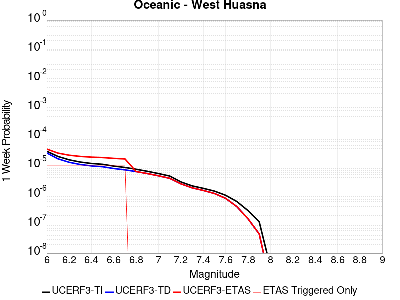 | 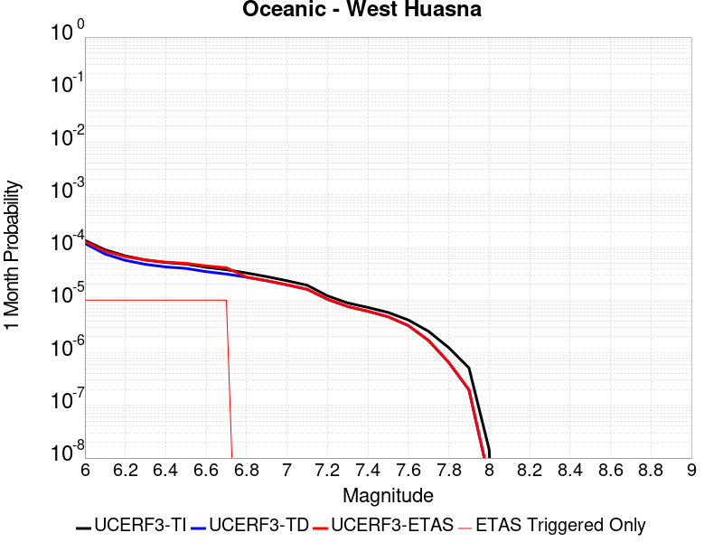 | 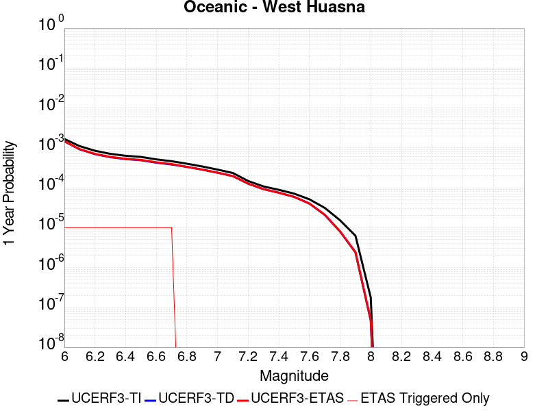 |  |

| Magnitude | 1 wk TI Prob | 1 wk TD Prob | 1 wk ETAS Prob | 1 wk ETAS/TD Gain | 1 wk ETAS Triggered Only | 1 mo TI Prob | 1 mo TD Prob | 1 mo ETAS Prob | 1 mo ETAS/TD Gain | 1 mo ETAS Triggered Only | 1 yr TI Prob | 1 yr TD Prob | 1 yr ETAS Prob | 1 yr ETAS/TD Gain | 1 yr ETAS Triggered Only | 10 yr TI Prob | 10 yr TD Prob | 10 yr ETAS Prob | 10 yr ETAS/TD Gain | 10 yr ETAS Triggered Only |
|-----|-----|-----|-----|-----|-----|-----|-----|-----|-----|-----|-----|-----|-----|-----|-----|-----|-----|-----|-----|-----|
| 6.0 | 3.195567E-5 | 2.7926368E-5 | 3.792609E-5 | 1.3580745 | 1.0E-5 | 1.3694567E-4 | 1.19679185E-4 | 1.29678E-4 | 1.0835468 | 1.0E-5 | 0.0016660384 | 0.0014561634 | 0.0014661488 | 1.0068574 | 1.0E-5 | 0.016536033 | 0.01447077 | 0.014480625 | 1.000681 | 1.0E-5 |
| 6.1 | 2.1156782E-5 | 1.7573117E-5 | 2.7572942E-5 | 1.569041 | 1.0E-5 | 9.066878E-5 | 7.531123E-5 | 8.531048E-5 | 1.1327723 | 1.0E-5 | 0.0011033333 | 9.1653795E-4 | 9.265288E-4 | 1.0109006 | 1.0E-5 | 0.010978713 | 0.009128587 | 0.009138496 | 1.0010854 | 1.0E-5 |
| 6.2 | 1.6195117E-5 | 1.3327227E-5 | 2.3327093E-5 | 1.7503337 | 1.0E-5 | 6.9405796E-5 | 5.7115452E-5 | 6.711488E-5 | 1.175074 | 1.0E-5 | 8.44688E-4 | 6.9516135E-4 | 7.051544E-4 | 1.0143751 | 1.0E-5 | 0.008414844 | 0.0069301617 | 0.0069400924 | 1.001433 | 1.0E-5 |
| 6.3 | 1.3559345E-5 | 1.1179013E-5 | 2.1178901E-5 | 1.8945234 | 1.0E-5 | 5.811018E-5 | 4.7909183E-5 | 5.7908703E-5 | 1.2087183 | 1.0E-5 | 7.072618E-4 | 5.8313913E-4 | 5.931333E-4 | 1.0171386 | 1.0E-5 | 0.0070501505 | 0.005816208 | 0.0058261496 | 1.0017093 | 1.0E-5 |
| 6.4 | 1.2120619E-5 | 1.0000874E-5 | 2.0000774E-5 | 1.9999026 | 1.0E-5 | 5.1944477E-5 | 4.2860185E-5 | 5.285976E-5 | 1.2333068 | 1.0E-5 | 6.322405E-4 | 5.216983E-4 | 5.316931E-4 | 1.0191581 | 1.0E-5 | 0.006304447 | 0.005204804 | 0.0052147517 | 1.0019113 | 1.0E-5 |
| 6.5 | 1.13511915E-5 | 9.367378E-6 | 1.9367284E-5 | 2.0675244 | 1.0E-5 | 4.8647056E-5 | 4.0145293E-5 | 5.0144892E-5 | 1.2490852 | 1.0E-5 | 5.9211696E-4 | 4.886598E-4 | 4.9865484E-4 | 1.0204542 | 1.0E-5 | 0.0059054173 | 0.0048759114 | 0.0048858626 | 1.0020409 | 1.0E-5 |
| 6.6 | 9.850605E-6 | 8.1353155E-6 | 1.8135233E-5 | 2.2291987 | 1.0E-5 | 4.2216197E-5 | 3.4865174E-5 | 4.4864824E-5 | 1.2868092 | 1.0E-5 | 5.1386096E-4 | 4.2440102E-4 | 4.343968E-4 | 1.0235527 | 1.0E-5 | 0.0051267436 | 0.0042359377 | 0.0042458954 | 1.0023508 | 1.0E-5 |
| 6.7 | 8.8558645E-6 | 7.318341E-6 | 1.7318267E-5 | 2.36642 | 1.0E-5 | 3.7953152E-5 | 3.1363943E-5 | 4.136363E-5 | 1.3188275 | 1.0E-5 | 4.6198163E-4 | 3.8178926E-4 | 3.9178543E-4 | 1.0261824 | 1.0E-5 | 0.004610224 | 0.0038113592 | 0.003821321 | 1.0026138 | 1.0E-5 |
| 6.8 | 7.67136E-6 | 6.39169E-6 | 6.39169E-6 | 1.0 | 0.0 | 3.2876844E-5 | 2.739267E-5 | 2.739267E-5 | 1.0 | 0.0 | 4.0020206E-4 | 3.3345487E-4 | 3.3345487E-4 | 1.0 | 0.0 | 0.003994821 | 0.0033295664 | 0.0033295664 | 1.0 | 0.0 |
| 6.9 | 6.534529E-6 | 5.458261E-6 | 5.458261E-6 | 1.0 | 0.0 | 2.8004823E-5 | 2.3392338E-5 | 2.3392338E-5 | 1.0 | 0.0 | 3.4090536E-4 | 2.8476462E-4 | 2.8476462E-4 | 1.0 | 0.0 | 0.0034038287 | 0.002844014 | 0.002844014 | 1.0 | 0.0 |
| 7.0 | 5.460525E-6 | 4.5699203E-6 | 4.5699203E-6 | 1.0 | 0.0 | 2.3402039E-5 | 1.9585226E-5 | 1.9585226E-5 | 1.0 | 0.0 | 2.8488258E-4 | 2.3842414E-4 | 2.3842414E-4 | 1.0 | 0.0 | 0.0028451765 | 0.0023816973 | 0.0023816973 | 1.0 | 0.0 |
| 7.1 | 4.4825083E-6 | 3.7524153E-6 | 3.7524153E-6 | 1.0 | 0.0 | 1.9210609E-5 | 1.6081682E-5 | 1.6081682E-5 | 1.0 | 0.0 | 2.3386406E-4 | 1.9577699E-4 | 1.9577699E-4 | 1.0 | 0.0 | 0.002336181 | 0.001956057 | 0.001956057 | 1.0 | 0.0 |
| 7.2 | 2.821708E-6 | 2.424941E-6 | 2.424941E-6 | 1.0 | 0.0 | 1.2092979E-5 | 1.0392562E-5 | 1.0392562E-5 | 1.0 | 0.0 | 1.4722206E-4 | 1.265221E-4 | 1.265221E-4 | 1.0 | 0.0 | 0.0014712457 | 0.0012645032 | 0.0012645032 | 1.0 | 0.0 |
| 7.3 | 2.0644757E-6 | 1.7687502E-6 | 1.7687502E-6 | 1.0 | 0.0 | 8.847723E-6 | 7.580336E-6 | 7.580336E-6 | 1.0 | 0.0 | 1.0771569E-4 | 9.228668E-5 | 9.228668E-5 | 1.0 | 0.0 | 0.001076635 | 9.224854E-4 | 9.224854E-4 | 1.0 | 0.0 |
| 7.4 | 1.6980367E-6 | 1.4379966E-6 | 1.4379966E-6 | 1.0 | 0.0 | 7.27728E-6 | 6.1628284E-6 | 6.1628284E-6 | 1.0 | 0.0 | 8.8597284E-5 | 7.502986E-5 | 7.502986E-5 | 1.0 | 0.0 | 8.8561967E-4 | 7.5004686E-4 | 7.5004686E-4 | 1.0 | 0.0 |
| 7.5 | 1.3637683E-6 | 1.1302697E-6 | 1.1302697E-6 | 1.0 | 0.0 | 5.844708E-6 | 4.844004E-6 | 4.844004E-6 | 1.0 | 0.0 | 7.1156996E-5 | 5.897415E-5 | 5.897415E-5 | 1.0 | 0.0 | 7.1134215E-4 | 5.8958656E-4 | 5.8958656E-4 | 1.0 | 0.0 |
| 7.6 | 9.802994E-7 | 7.6772847E-7 | 7.6772847E-7 | 1.0 | 0.0 | 4.2012766E-6 | 3.2902608E-6 | 3.2902608E-6 | 1.0 | 0.0 | 5.1149345E-5 | 4.005819E-5 | 4.005819E-5 | 1.0 | 0.0 | 5.113757E-4 | 4.0051117E-4 | 4.0051117E-4 | 1.0 | 0.0 |
| 7.7 | 5.986191E-7 | 4.0050708E-7 | 4.0050708E-7 | 1.0 | 0.0 | 2.5655079E-6 | 1.7164577E-6 | 1.7164577E-6 | 1.0 | 0.0 | 3.1234613E-5 | 2.0897673E-5 | 2.0897673E-5 | 1.0 | 0.0 | 3.123022E-4 | 2.0895849E-4 | 2.0895849E-4 | 1.0 | 0.0 |
| 7.8 | 2.9189815E-7 | 1.5285202E-7 | 1.5285202E-7 | 1.0 | 0.0 | 1.2509914E-6 | 6.5507993E-7 | 6.5507993E-7 | 1.0 | 0.0 | 1.5230714E-5 | 7.975569E-6 | 7.975569E-6 | 1.0 | 0.0 | 1.522967E-4 | 7.97542E-5 | 7.97542E-5 | 1.0 | 0.0 |
| 7.9 | 1.2057845E-7 | 4.6208047E-8 | 4.6208047E-8 | 1.0 | 0.0 | 5.1676466E-7 | 1.9803447E-7 | 1.9803447E-7 | 1.0 | 0.0 | 6.2915915E-6 | 2.411067E-6 | 2.411067E-6 | 1.0 | 0.0 | 6.2914136E-5 | 2.4111772E-5 | 2.4111772E-5 | 1.0 | 0.0 |
| 8.0 | 3.3806387E-9 | 9.0093144E-10 | 9.0093144E-10 | 1.0 | 0.0 | 1.4488451E-8 | 3.8611354E-9 | 3.8611354E-9 | 1.0 | 0.0 | 1.7639688E-7 | 4.7009323E-8 | 4.7009323E-8 | 1.0 | 0.0 | 1.7639674E-6 | 4.712806E-7 | 4.712806E-7 | 1.0 | 0.0 |

## Hat Creek-McArthur-Mayfield
*[(top)](#table-of-contents)*

| 1 Week | 1 Month | 1 Year | 10 Year |
|-----|-----|-----|-----|
| 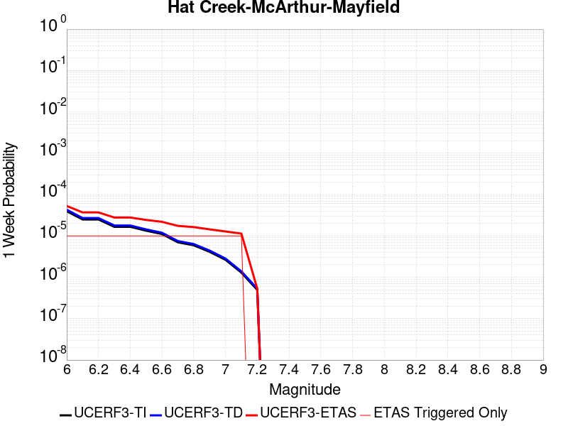 | 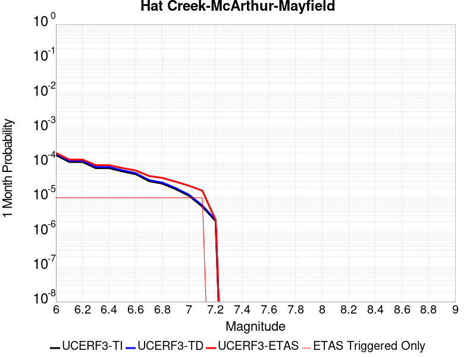 | 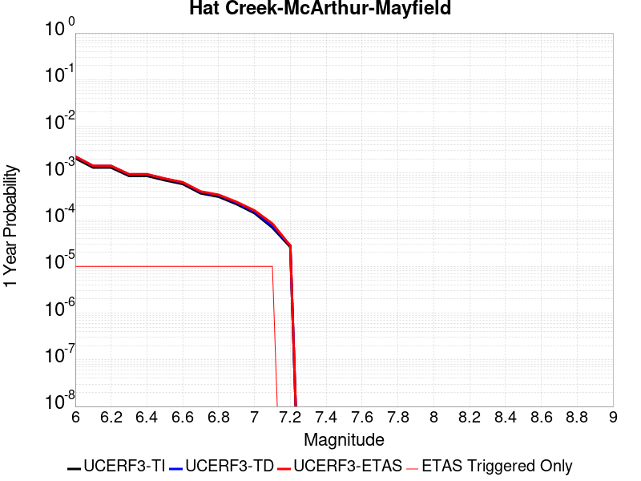 |  |

| Magnitude | 1 wk TI Prob | 1 wk TD Prob | 1 wk ETAS Prob | 1 wk ETAS/TD Gain | 1 wk ETAS Triggered Only | 1 mo TI Prob | 1 mo TD Prob | 1 mo ETAS Prob | 1 mo ETAS/TD Gain | 1 mo ETAS Triggered Only | 1 yr TI Prob | 1 yr TD Prob | 1 yr ETAS Prob | 1 yr ETAS/TD Gain | 1 yr ETAS Triggered Only | 10 yr TI Prob | 10 yr TD Prob | 10 yr ETAS Prob | 10 yr ETAS/TD Gain | 10 yr ETAS Triggered Only |
|-----|-----|-----|-----|-----|-----|-----|-----|-----|-----|-----|-----|-----|-----|-----|-----|-----|-----|-----|-----|-----|
| 6.0 | 3.967457E-5 | 4.315831E-5 | 5.3157877E-5 | 1.231695 | 1.0E-5 | 1.7002279E-4 | 1.8495171E-4 | 1.9494987E-4 | 1.0540582 | 1.0E-5 | 0.002068062 | 0.002249576 | 0.0022595534 | 1.0044353 | 1.0E-5 | 0.02048922 | 0.022280399 | 0.022290176 | 1.0004388 | 1.0E-5 |
| 6.1 | 2.5044013E-5 | 2.7071164E-5 | 3.7070895E-5 | 1.3693868 | 1.0E-5 | 1.0732707E-4 | 1.1601429E-4 | 1.2601314E-4 | 1.0861863 | 1.0E-5 | 0.0013059238 | 0.0014115906 | 0.0014215765 | 1.0070742 | 1.0E-5 | 0.01298276 | 0.01402966 | 0.01403952 | 1.0007027 | 1.0E-5 |
| 6.2 | 2.5044013E-5 | 2.7071164E-5 | 3.7070895E-5 | 1.3693868 | 1.0E-5 | 1.0732707E-4 | 1.1601429E-4 | 1.2601314E-4 | 1.0861863 | 1.0E-5 | 0.0013059238 | 0.0014115906 | 0.0014215765 | 1.0070742 | 1.0E-5 | 0.01298276 | 0.01402966 | 0.01403952 | 1.0007027 | 1.0E-5 |
| 6.3 | 1.6624012E-5 | 1.7891072E-5 | 2.7890892E-5 | 1.558928 | 1.0E-5 | 7.124382E-5 | 7.6673816E-5 | 8.667305E-5 | 1.1304126 | 1.0E-5 | 8.670483E-4 | 9.331125E-4 | 9.4310316E-4 | 1.0107068 | 1.0E-5 | 0.008636732 | 0.009292879 | 0.009302787 | 1.0010661 | 1.0E-5 |
| 6.4 | 1.6624012E-5 | 1.7891072E-5 | 2.7890892E-5 | 1.558928 | 1.0E-5 | 7.124382E-5 | 7.6673816E-5 | 8.667305E-5 | 1.1304126 | 1.0E-5 | 8.670483E-4 | 9.331125E-4 | 9.4310316E-4 | 1.0107068 | 1.0E-5 | 0.008636732 | 0.009292879 | 0.009302787 | 1.0010661 | 1.0E-5 |
| 6.5 | 1.3394842E-5 | 1.4392137E-5 | 2.4391993E-5 | 1.6948138 | 1.0E-5 | 5.7405203E-5 | 6.167916E-5 | 7.167854E-5 | 1.1621193 | 1.0E-5 | 6.986842E-4 | 7.506906E-4 | 7.606831E-4 | 1.013311 | 1.0E-5 | 0.006964916 | 0.0074821403 | 0.007492066 | 1.0013266 | 1.0E-5 |
| 6.6 | 1.1137514E-5 | 1.1954546E-5 | 2.1954425E-5 | 1.8364918 | 1.0E-5 | 4.7731326E-5 | 5.1232782E-5 | 6.123227E-5 | 1.1951776 | 1.0E-5 | 5.809739E-4 | 6.2358467E-4 | 6.335784E-4 | 1.0160263 | 1.0E-5 | 0.005794574 | 0.00621877 | 0.0062287077 | 1.001598 | 1.0E-5 |
| 6.7 | 7.0200663E-6 | 7.5242897E-6 | 1.7524215E-5 | 2.329019 | 1.0E-5 | 3.008565E-5 | 3.2246568E-5 | 4.2246244E-5 | 1.3101006 | 1.0E-5 | 3.6623122E-4 | 3.925328E-4 | 4.0252888E-4 | 1.0254656 | 1.0E-5 | 0.0036562826 | 0.0039185574 | 0.003928518 | 1.002542 | 1.0E-5 |
| 6.8 | 5.940172E-6 | 6.3654766E-6 | 1.6365413E-5 | 2.5709643 | 1.0E-5 | 2.545763E-5 | 2.7280335E-5 | 3.7280064E-5 | 1.3665544 | 1.0E-5 | 3.0990256E-4 | 3.3208873E-4 | 3.420854E-4 | 1.0301025 | 1.0E-5 | 0.0030947074 | 0.0033160534 | 0.0033260202 | 1.0030056 | 1.0E-5 |
| 6.9 | 4.129831E-6 | 4.423547E-6 | 1.4423503E-5 | 3.2606192 | 1.0E-5 | 1.7699154E-5 | 1.8957926E-5 | 2.8957737E-5 | 1.5274738 | 1.0E-5 | 2.154659E-4 | 2.3078908E-4 | 2.4078677E-4 | 1.0433196 | 1.0E-5 | 0.002152571 | 0.0023055724 | 0.0023155494 | 1.0043273 | 1.0E-5 |
| 7.0 | 2.6512955E-6 | 2.8374002E-6 | 1.2837372E-5 | 4.524343 | 1.0E-5 | 1.1362646E-5 | 1.2160232E-5 | 2.2160111E-5 | 1.8223428 | 1.0E-5 | 1.3833142E-4 | 1.480412E-4 | 1.5803972E-4 | 1.0675387 | 1.0E-5 | 0.0013824535 | 0.0014794683 | 0.0014894535 | 1.0067492 | 1.0E-5 |
| 7.1 | 1.2992575E-6 | 1.3909317E-6 | 1.1390918E-5 | 8.189415 | 1.0E-5 | 5.568235E-6 | 5.961124E-6 | 1.5961064E-5 | 2.677526 | 1.0E-5 | 6.779115E-5 | 7.257448E-5 | 8.257376E-5 | 1.1377795 | 1.0E-5 | 6.7770475E-4 | 7.2552945E-4 | 7.355222E-4 | 1.0137731 | 1.0E-5 |
| 7.2 | 4.968191E-7 | 5.3271475E-7 | 5.3271475E-7 | 1.0 | 0.0 | 2.1292228E-6 | 2.283062E-6 | 2.283062E-6 | 1.0 | 0.0 | 2.592298E-5 | 2.7796052E-5 | 2.7796052E-5 | 1.0 | 0.0 | 2.5919956E-4 | 2.7793812E-4 | 2.7793812E-4 | 1.0 | 0.0 |

## Oak Ridge (Onshore)
*[(top)](#table-of-contents)*

| 1 Week | 1 Month | 1 Year | 10 Year |
|-----|-----|-----|-----|
| 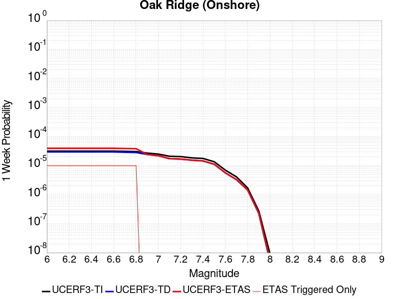 | 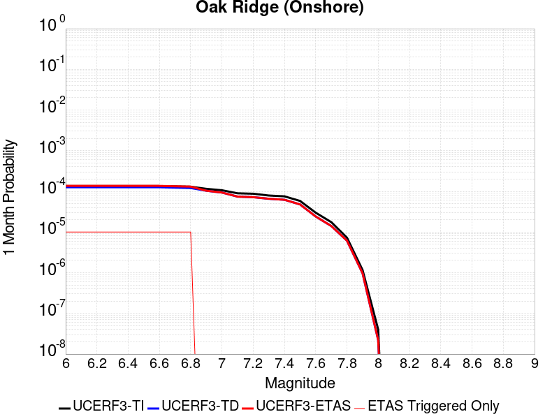 | 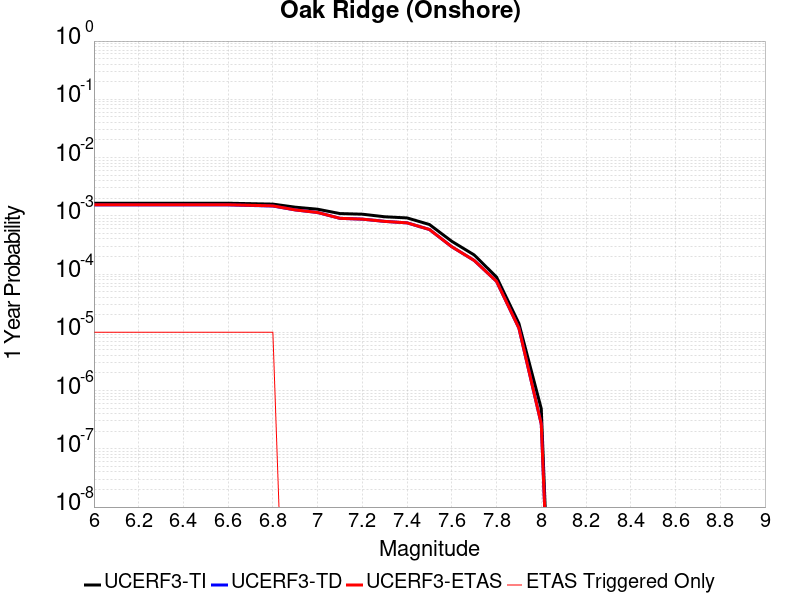 | 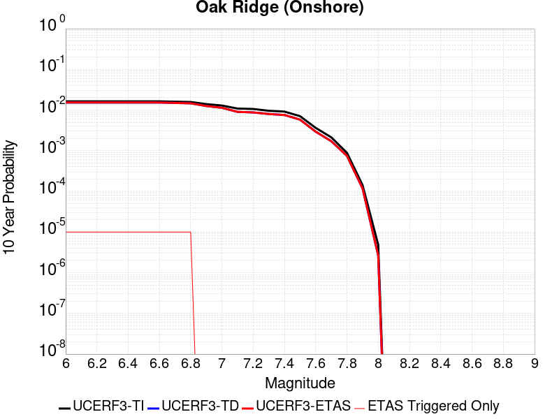 |

| Magnitude | 1 wk TI Prob | 1 wk TD Prob | 1 wk ETAS Prob | 1 wk ETAS/TD Gain | 1 wk ETAS Triggered Only | 1 mo TI Prob | 1 mo TD Prob | 1 mo ETAS Prob | 1 mo ETAS/TD Gain | 1 mo ETAS Triggered Only | 1 yr TI Prob | 1 yr TD Prob | 1 yr ETAS Prob | 1 yr ETAS/TD Gain | 1 yr ETAS Triggered Only | 10 yr TI Prob | 10 yr TD Prob | 10 yr ETAS Prob | 10 yr ETAS/TD Gain | 10 yr ETAS Triggered Only |
|-----|-----|-----|-----|-----|-----|-----|-----|-----|-----|-----|-----|-----|-----|-----|-----|-----|-----|-----|-----|-----|
| 6.0 | 3.155064E-5 | 2.9526076E-5 | 3.952578E-5 | 1.3386737 | 1.0E-5 | 1.3521002E-4 | 1.265344E-4 | 1.3653314E-4 | 1.0790199 | 1.0E-5 | 0.001644939 | 0.0015395058 | 0.0015494904 | 1.0064856 | 1.0E-5 | 0.01632816 | 0.015293054 | 0.015302902 | 1.0006438 | 1.0E-5 |
| 6.1 | 3.155064E-5 | 2.9526076E-5 | 3.952578E-5 | 1.3386737 | 1.0E-5 | 1.3521002E-4 | 1.265344E-4 | 1.3653314E-4 | 1.0790199 | 1.0E-5 | 0.001644939 | 0.0015395058 | 0.0015494904 | 1.0064856 | 1.0E-5 | 0.01632816 | 0.015293054 | 0.015302902 | 1.0006438 | 1.0E-5 |
| 6.2 | 3.155064E-5 | 2.9526076E-5 | 3.952578E-5 | 1.3386737 | 1.0E-5 | 1.3521002E-4 | 1.265344E-4 | 1.3653314E-4 | 1.0790199 | 1.0E-5 | 0.001644939 | 0.0015395058 | 0.0015494904 | 1.0064856 | 1.0E-5 | 0.01632816 | 0.015293054 | 0.015302902 | 1.0006438 | 1.0E-5 |
| 6.3 | 3.155064E-5 | 2.9526076E-5 | 3.952578E-5 | 1.3386737 | 1.0E-5 | 1.3521002E-4 | 1.265344E-4 | 1.3653314E-4 | 1.0790199 | 1.0E-5 | 0.001644939 | 0.0015395058 | 0.0015494904 | 1.0064856 | 1.0E-5 | 0.01632816 | 0.015293054 | 0.015302902 | 1.0006438 | 1.0E-5 |
| 6.4 | 3.155064E-5 | 2.9526076E-5 | 3.952578E-5 | 1.3386737 | 1.0E-5 | 1.3521002E-4 | 1.265344E-4 | 1.3653314E-4 | 1.0790199 | 1.0E-5 | 0.001644939 | 0.0015395058 | 0.0015494904 | 1.0064856 | 1.0E-5 | 0.01632816 | 0.015293054 | 0.015302902 | 1.0006438 | 1.0E-5 |
| 6.5 | 3.155064E-5 | 2.9526076E-5 | 3.952578E-5 | 1.3386737 | 1.0E-5 | 1.3521002E-4 | 1.265344E-4 | 1.3653314E-4 | 1.0790199 | 1.0E-5 | 0.001644939 | 0.0015395058 | 0.0015494904 | 1.0064856 | 1.0E-5 | 0.01632816 | 0.015293054 | 0.015302902 | 1.0006438 | 1.0E-5 |
| 6.6 | 3.155064E-5 | 2.9526076E-5 | 3.952578E-5 | 1.3386737 | 1.0E-5 | 1.3521002E-4 | 1.265344E-4 | 1.3653314E-4 | 1.0790199 | 1.0E-5 | 0.001644939 | 0.0015395058 | 0.0015494904 | 1.0064856 | 1.0E-5 | 0.01632816 | 0.015293054 | 0.015302902 | 1.0006438 | 1.0E-5 |
| 6.7 | 3.098897E-5 | 2.8864279E-5 | 3.886399E-5 | 1.346439 | 1.0E-5 | 1.328031E-4 | 1.236984E-4 | 1.3369716E-4 | 1.0808318 | 1.0E-5 | 0.0016156785 | 0.0015050253 | 0.0015150103 | 1.0066344 | 1.0E-5 | 0.016039822 | 0.014952909 | 0.01496276 | 1.0006588 | 1.0E-5 |
| 6.8 | 3.0449872E-5 | 2.8239476E-5 | 3.8239195E-5 | 1.3541042 | 1.0E-5 | 1.3049292E-4 | 1.2102092E-4 | 1.3101971E-4 | 1.0826204 | 1.0E-5 | 0.0015875935 | 0.001472471 | 0.0014824563 | 1.0067813 | 1.0E-5 | 0.015762992 | 0.014631658 | 0.014641511 | 1.0006734 | 1.0E-5 |
| 6.9 | 2.697928E-5 | 2.4219877E-5 | 2.4219877E-5 | 1.0 | 0.0 | 1.15620365E-4 | 1.03795464E-4 | 1.03795464E-4 | 1.0 | 0.0 | 0.0014067689 | 0.0012629988 | 0.0012629988 | 1.0 | 0.0 | 0.0139789665 | 0.012561066 | 0.012561066 | 1.0 | 0.0 |
| 7.0 | 2.4893961E-5 | 2.1862146E-5 | 2.1862146E-5 | 1.0 | 0.0 | 1.0668404E-4 | 9.369165E-5 | 9.369165E-5 | 1.0 | 0.0 | 0.0012981043 | 0.0011401166 | 0.0011401166 | 1.0 | 0.0 | 0.012905477 | 0.011345102 | 0.011345102 | 1.0 | 0.0 |
| 7.1 | 2.0945363E-5 | 1.7354592E-5 | 1.7354592E-5 | 1.0 | 0.0 | 8.976275E-5 | 7.437473E-5 | 7.437473E-5 | 1.0 | 0.0 | 0.0010923136 | 9.0514094E-4 | 9.0514094E-4 | 1.0 | 0.0 | 0.0108696 | 0.009015621 | 0.009015621 | 1.0 | 0.0 |
| 7.2 | 2.0439404E-5 | 1.680953E-5 | 1.680953E-5 | 1.0 | 0.0 | 8.7594504E-5 | 7.203888E-5 | 7.203888E-5 | 1.0 | 0.0 | 0.0010659413 | 8.767251E-4 | 8.767251E-4 | 1.0 | 0.0 | 0.010608427 | 0.008733723 | 0.008733723 | 1.0 | 0.0 |
| 7.3 | 1.8463334E-5 | 1.5381947E-5 | 1.5381947E-5 | 1.0 | 0.0 | 7.912617E-5 | 6.592098E-5 | 6.592098E-5 | 1.0 | 0.0 | 9.6293533E-4 | 8.0229685E-4 | 8.0229685E-4 | 1.0 | 0.0 | 0.009587734 | 0.0079950085 | 0.0079950085 | 1.0 | 0.0 |
| 7.4 | 1.763139E-5 | 1.4516977E-5 | 1.4516977E-5 | 1.0 | 0.0 | 7.556091E-5 | 6.221415E-5 | 6.221415E-5 | 1.0 | 0.0 | 9.1956573E-4 | 7.57198E-4 | 7.57198E-4 | 1.0 | 0.0 | 0.009157699 | 0.007547126 | 0.007547126 | 1.0 | 0.0 |
| 7.5 | 1.3594944E-5 | 1.1163363E-5 | 1.1163363E-5 | 1.0 | 0.0 | 5.8262744E-5 | 4.7842117E-5 | 4.7842117E-5 | 1.0 | 0.0 | 7.0911803E-4 | 5.8232463E-4 | 5.8232463E-4 | 1.0 | 0.0 | 0.007068595 | 0.005808362 | 0.005808362 | 1.0 | 0.0 |
| 7.6 | 6.9889534E-6 | 5.6367194E-6 | 5.6367194E-6 | 1.0 | 0.0 | 2.9952313E-5 | 2.4157147E-5 | 2.4157147E-5 | 1.0 | 0.0 | 3.646084E-4 | 2.94074E-4 | 2.94074E-4 | 1.0 | 0.0 | 0.0036401073 | 0.0029368924 | 0.0029368924 | 1.0 | 0.0 |
| 7.7 | 4.0824193E-6 | 3.2832731E-6 | 3.2832731E-6 | 1.0 | 0.0 | 1.7495966E-5 | 1.4071096E-5 | 1.4071096E-5 | 1.0 | 0.0 | 2.1299256E-4 | 1.7130225E-4 | 1.7130225E-4 | 1.0 | 0.0 | 0.0021278851 | 0.0017117155 | 0.0017117155 | 1.0 | 0.0 |
| 7.8 | 1.7023609E-6 | 1.43706E-6 | 1.43706E-6 | 1.0 | 0.0 | 7.295812E-6 | 6.158814E-6 | 6.158814E-6 | 1.0 | 0.0 | 8.882289E-5 | 7.4981006E-5 | 7.4981006E-5 | 1.0 | 0.0 | 8.8787393E-4 | 7.4955984E-4 | 7.4955984E-4 | 1.0 | 0.0 |
| 7.9 | 2.721225E-7 | 2.261692E-7 | 2.261692E-7 | 1.0 | 0.0 | 1.1662388E-6 | 9.692963E-7 | 9.692963E-7 | 1.0 | 0.0 | 1.4198865E-5 | 1.1801121E-5 | 1.1801121E-5 | 1.0 | 0.0 | 1.4197957E-4 | 1.1800523E-4 | 1.1800523E-4 | 1.0 | 0.0 |
| 8.0 | 9.364255E-9 | 5.1204916E-9 | 5.1204916E-9 | 1.0 | 0.0 | 4.0132523E-8 | 2.1944963E-8 | 2.1944963E-8 | 1.0 | 0.0 | 4.8861335E-7 | 2.671799E-7 | 2.671799E-7 | 1.0 | 0.0 | 4.8861225E-6 | 2.6717962E-6 | 2.6717962E-6 | 1.0 | 0.0 |

## Walker Spring 2011 CFM
*[(top)](#table-of-contents)*

| 1 Week | 1 Month | 1 Year | 10 Year |
|-----|-----|-----|-----|
|  |  | 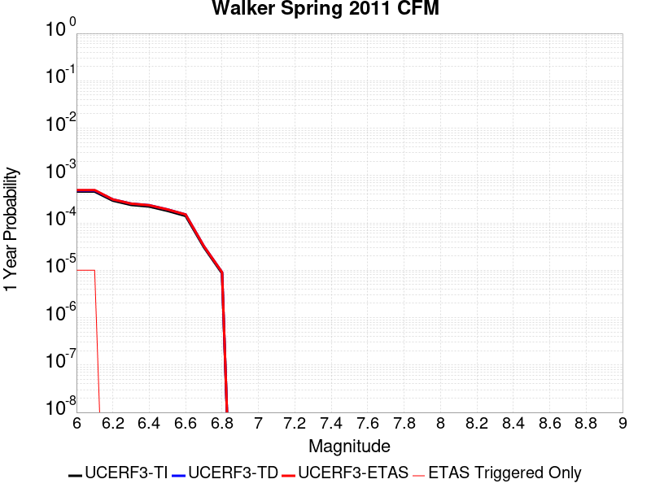 |  |

| Magnitude | 1 wk TI Prob | 1 wk TD Prob | 1 wk ETAS Prob | 1 wk ETAS/TD Gain | 1 wk ETAS Triggered Only | 1 mo TI Prob | 1 mo TD Prob | 1 mo ETAS Prob | 1 mo ETAS/TD Gain | 1 mo ETAS Triggered Only | 1 yr TI Prob | 1 yr TD Prob | 1 yr ETAS Prob | 1 yr ETAS/TD Gain | 1 yr ETAS Triggered Only | 10 yr TI Prob | 10 yr TD Prob | 10 yr ETAS Prob | 10 yr ETAS/TD Gain | 10 yr ETAS Triggered Only |
|-----|-----|-----|-----|-----|-----|-----|-----|-----|-----|-----|-----|-----|-----|-----|-----|-----|-----|-----|-----|-----|
| 6.0 | 8.791276E-6 | 9.264088E-6 | 9.264088E-6 | 1.0 | 0.0 | 3.767635E-5 | 3.970269E-5 | 4.9702292E-5 | 1.251862 | 1.0E-5 | 4.58613E-4 | 4.832839E-4 | 4.932791E-4 | 1.0206817 | 1.0E-5 | 0.004576677 | 0.0048234025 | 0.004833354 | 1.0020633 | 1.0E-5 |
| 6.1 | 8.791276E-6 | 9.264088E-6 | 9.264088E-6 | 1.0 | 0.0 | 3.767635E-5 | 3.970269E-5 | 4.9702292E-5 | 1.251862 | 1.0E-5 | 4.58613E-4 | 4.832839E-4 | 4.932791E-4 | 1.0206817 | 1.0E-5 | 0.004576677 | 0.0048234025 | 0.004833354 | 1.0020633 | 1.0E-5 |
| 6.2 | 5.654515E-6 | 5.99876E-6 | 5.99876E-6 | 1.0 | 0.0 | 2.4233412E-5 | 2.5708747E-5 | 2.5708747E-5 | 1.0 | 0.0 | 2.9500184E-4 | 3.1296405E-4 | 3.1296405E-4 | 1.0 | 0.0 | 0.0029461053 | 0.0031257276 | 0.0031257276 | 1.0 | 0.0 |
| 6.3 | 4.591685E-6 | 4.8947268E-6 | 4.8947268E-6 | 1.0 | 0.0 | 1.96785E-5 | 2.0977257E-5 | 2.0977257E-5 | 1.0 | 0.0 | 2.395594E-4 | 2.5537255E-4 | 2.5537255E-4 | 1.0 | 0.0 | 0.002393013 | 0.0025512208 | 0.0025512208 | 1.0 | 0.0 |
| 6.4 | 4.243283E-6 | 4.52266E-6 | 4.52266E-6 | 1.0 | 0.0 | 1.8185372E-5 | 1.938271E-5 | 1.938271E-5 | 1.0 | 0.0 | 2.2138441E-4 | 2.3596318E-4 | 2.3596318E-4 | 1.0 | 0.0 | 0.00221164 | 0.0023575418 | 0.0023575418 | 1.0 | 0.0 |
| 6.5 | 3.4445666E-6 | 3.6860924E-6 | 3.6860924E-6 | 1.0 | 0.0 | 1.4762345E-5 | 1.5797466E-5 | 1.5797466E-5 | 1.0 | 0.0 | 1.7971672E-4 | 1.923212E-4 | 1.923212E-4 | 1.0 | 0.0 | 0.0017957145 | 0.0019219425 | 0.0019219425 | 1.0 | 0.0 |
| 6.6 | 2.68766E-6 | 2.8794348E-6 | 2.8794348E-6 | 1.0 | 0.0 | 1.1518492E-5 | 1.2340398E-5 | 1.2340398E-5 | 1.0 | 0.0 | 1.4022861E-4 | 1.502378E-4 | 1.502378E-4 | 1.0 | 0.0 | 0.0014014016 | 0.0015017362 | 0.0015017362 | 1.0 | 0.0 |
| 6.7 | 5.880964E-7 | 6.1997474E-7 | 6.1997474E-7 | 1.0 | 0.0 | 2.5204106E-6 | 2.6570326E-6 | 2.6570326E-6 | 1.0 | 0.0 | 3.0685565E-5 | 3.2348988E-5 | 3.2348988E-5 | 1.0 | 0.0 | 3.068133E-4 | 3.2345214E-4 | 3.2345214E-4 | 1.0 | 0.0 |
| 6.8 | 1.6514163E-7 | 1.7409117E-7 | 1.7409117E-7 | 1.0 | 0.0 | 7.077497E-7 | 7.46105E-7 | 7.46105E-7 | 1.0 | 0.0 | 8.616818E-6 | 9.083828E-6 | 9.083828E-6 | 1.0 | 0.0 | 8.616484E-5 | 9.0838286E-5 | 9.0838286E-5 | 1.0 | 0.0 |

## Surprise Valley 2011 CFM
*[(top)](#table-of-contents)*

| 1 Week | 1 Month | 1 Year | 10 Year |
|-----|-----|-----|-----|
|  |  |  | 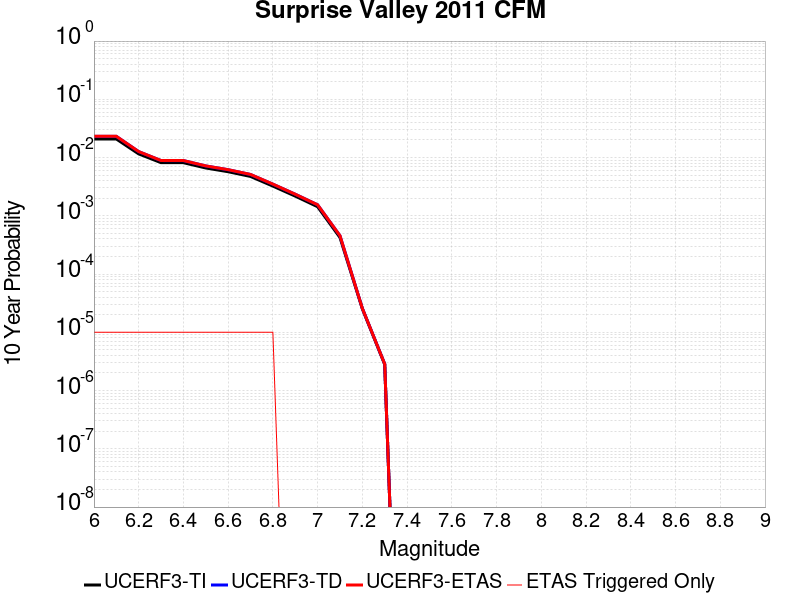 |

| Magnitude | 1 wk TI Prob | 1 wk TD Prob | 1 wk ETAS Prob | 1 wk ETAS/TD Gain | 1 wk ETAS Triggered Only | 1 mo TI Prob | 1 mo TD Prob | 1 mo ETAS Prob | 1 mo ETAS/TD Gain | 1 mo ETAS Triggered Only | 1 yr TI Prob | 1 yr TD Prob | 1 yr ETAS Prob | 1 yr ETAS/TD Gain | 1 yr ETAS Triggered Only | 10 yr TI Prob | 10 yr TD Prob | 10 yr ETAS Prob | 10 yr ETAS/TD Gain | 10 yr ETAS Triggered Only |
|-----|-----|-----|-----|-----|-----|-----|-----|-----|-----|-----|-----|-----|-----|-----|-----|-----|-----|-----|-----|-----|
| 6.0 | 4.0396248E-5 | 4.485131E-5 | 4.485131E-5 | 1.0 | 0.0 | 1.7311527E-4 | 1.9220692E-4 | 1.9220692E-4 | 1.0 | 0.0 | 0.002105641 | 0.0023378176 | 0.0023378176 | 1.0 | 0.0 | 0.020858008 | 0.023153966 | 0.023163736 | 1.0004219 | 1.0E-5 |
| 6.1 | 4.0396248E-5 | 4.485131E-5 | 4.485131E-5 | 1.0 | 0.0 | 1.7311527E-4 | 1.9220692E-4 | 1.9220692E-4 | 1.0 | 0.0 | 0.002105641 | 0.0023378176 | 0.0023378176 | 1.0 | 0.0 | 0.020858008 | 0.023153966 | 0.023163736 | 1.0004219 | 1.0E-5 |
| 6.2 | 2.2295266E-5 | 2.440125E-5 | 2.440125E-5 | 1.0 | 0.0 | 9.554764E-5 | 1.0457276E-4 | 1.0457276E-4 | 1.0 | 0.0 | 0.0011626717 | 0.0012724606 | 0.0012724606 | 1.0 | 0.0 | 0.011566074 | 0.012654981 | 0.0126648545 | 1.0007802 | 1.0E-5 |
| 6.3 | 1.572643E-5 | 1.7096807E-5 | 1.7096807E-5 | 1.0 | 0.0 | 6.7397246E-5 | 7.327003E-5 | 7.327003E-5 | 1.0 | 0.0 | 8.202525E-4 | 8.91708E-4 | 8.91708E-4 | 1.0 | 0.0 | 0.008172315 | 0.008882407 | 0.008892318 | 1.0011158 | 1.0E-5 |
| 6.4 | 1.5714395E-5 | 1.7084629E-5 | 1.7084629E-5 | 1.0 | 0.0 | 6.734567E-5 | 7.3217845E-5 | 7.3217845E-5 | 1.0 | 0.0 | 8.1962504E-4 | 8.9107314E-4 | 8.9107314E-4 | 1.0 | 0.0 | 0.008166086 | 0.008876109 | 0.00888602 | 1.0011166 | 1.0E-5 |
| 6.5 | 1.2733495E-5 | 1.38016E-5 | 1.38016E-5 | 1.0 | 0.0 | 5.457098E-5 | 5.9148413E-5 | 5.9148413E-5 | 1.0 | 0.0 | 6.641992E-4 | 7.1990065E-4 | 7.1990065E-4 | 1.0 | 0.0 | 0.0066221743 | 0.0071763797 | 0.007186308 | 1.0013834 | 1.0E-5 |
| 6.6 | 1.0983784E-5 | 1.1886554E-5 | 1.1886554E-5 | 1.0 | 0.0 | 4.7072506E-5 | 5.094141E-5 | 5.094141E-5 | 1.0 | 0.0 | 5.7295704E-4 | 6.200405E-4 | 6.200405E-4 | 1.0 | 0.0 | 0.0057148207 | 0.0061836545 | 0.0061935927 | 1.0016072 | 1.0E-5 |
| 6.7 | 9.104806E-6 | 9.839491E-6 | 9.839491E-6 | 1.0 | 0.0 | 3.902001E-5 | 4.2168587E-5 | 4.2168587E-5 | 1.0 | 0.0 | 4.7496508E-4 | 5.132855E-4 | 5.132855E-4 | 1.0 | 0.0 | 0.004739512 | 0.005121397 | 0.0051313457 | 1.0019426 | 1.0E-5 |
| 6.8 | 6.2162403E-6 | 6.7041337E-6 | 6.7041337E-6 | 1.0 | 0.0 | 2.6640759E-5 | 2.8731698E-5 | 2.8731698E-5 | 1.0 | 0.0 | 3.2430296E-4 | 3.497545E-4 | 3.497545E-4 | 1.0 | 0.0 | 0.003238301 | 0.0034922638 | 0.003502229 | 1.0028535 | 1.0E-5 |
| 6.9 | 4.1792696E-6 | 4.50323E-6 | 4.50323E-6 | 1.0 | 0.0 | 1.7911032E-5 | 1.9299423E-5 | 1.9299423E-5 | 1.0 | 0.0 | 2.1804498E-4 | 2.3494668E-4 | 2.3494668E-4 | 1.0 | 0.0 | 0.0021783116 | 0.0023471361 | 0.0023471361 | 1.0 | 0.0 |
| 7.0 | 2.7478413E-6 | 2.9622424E-6 | 2.9622424E-6 | 1.0 | 0.0 | 1.177641E-5 | 1.269527E-5 | 1.269527E-5 | 1.0 | 0.0 | 1.4336836E-4 | 1.545552E-4 | 1.545552E-4 | 1.0 | 0.0 | 0.001432759 | 0.0015445995 | 0.0015445995 | 1.0 | 0.0 |
| 7.1 | 8.128648E-7 | 8.724922E-7 | 8.724922E-7 | 1.0 | 0.0 | 3.4837017E-6 | 3.7392501E-6 | 3.7392501E-6 | 1.0 | 0.0 | 4.2413245E-5 | 4.552502E-5 | 4.552502E-5 | 1.0 | 0.0 | 4.2405148E-4 | 4.5521575E-4 | 4.5521575E-4 | 1.0 | 0.0 |
| 7.2 | 4.8641045E-8 | 4.9402068E-8 | 4.9402068E-8 | 1.0 | 0.0 | 2.084616E-7 | 2.1172312E-7 | 2.1172312E-7 | 1.0 | 0.0 | 2.538017E-6 | 2.577726E-6 | 2.577726E-6 | 1.0 | 0.0 | 2.537988E-5 | 2.5776973E-5 | 2.5776973E-5 | 1.0 | 0.0 |
| 7.3 | 5.3911844E-9 | 5.4758145E-9 | 5.4758145E-9 | 1.0 | 0.0 | 2.3105075E-8 | 2.3467775E-8 | 2.3467775E-8 | 1.0 | 0.0 | 2.8130427E-7 | 2.8572015E-7 | 2.8572015E-7 | 1.0 | 0.0 | 2.8130391E-6 | 2.8571992E-6 | 2.8571992E-6 | 1.0 | 0.0 |

## South Klamath Lake East
*[(top)](#table-of-contents)*

| 1 Week | 1 Month | 1 Year | 10 Year |
|-----|-----|-----|-----|
| 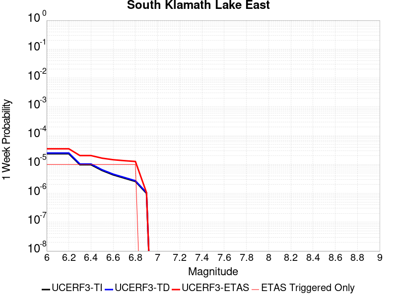 |  | 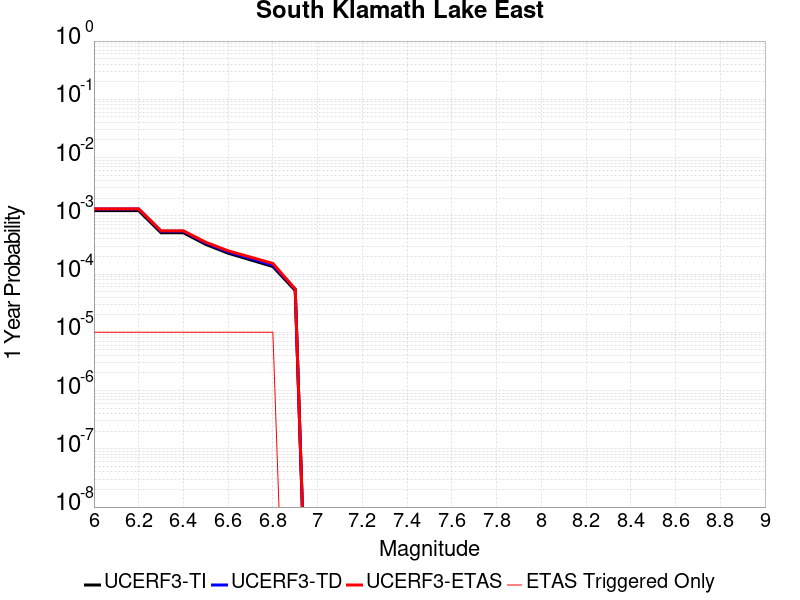 | 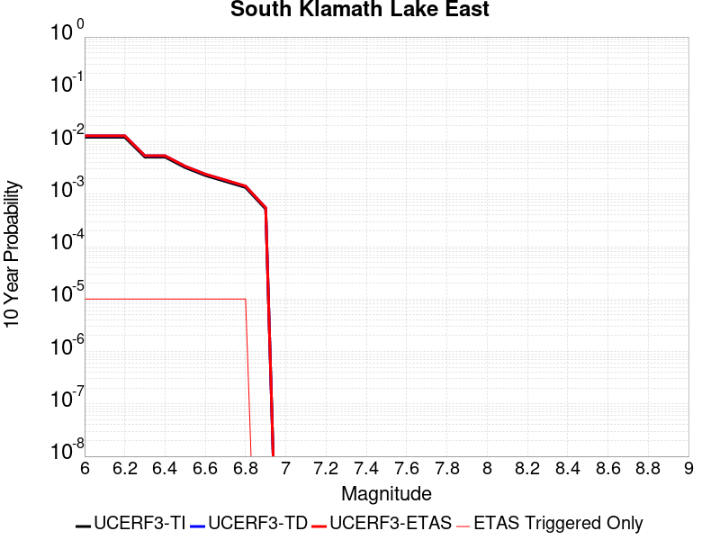 |

| Magnitude | 1 wk TI Prob | 1 wk TD Prob | 1 wk ETAS Prob | 1 wk ETAS/TD Gain | 1 wk ETAS Triggered Only | 1 mo TI Prob | 1 mo TD Prob | 1 mo ETAS Prob | 1 mo ETAS/TD Gain | 1 mo ETAS Triggered Only | 1 yr TI Prob | 1 yr TD Prob | 1 yr ETAS Prob | 1 yr ETAS/TD Gain | 1 yr ETAS Triggered Only | 10 yr TI Prob | 10 yr TD Prob | 10 yr ETAS Prob | 10 yr ETAS/TD Gain | 10 yr ETAS Triggered Only |
|-----|-----|-----|-----|-----|-----|-----|-----|-----|-----|-----|-----|-----|-----|-----|-----|-----|-----|-----|-----|-----|
| 6.0 | 2.3539369E-5 | 2.5047308E-5 | 3.504706E-5 | 1.3992345 | 1.0E-5 | 1.0087911E-4 | 1.0734166E-4 | 1.1734058E-4 | 1.0931505 | 1.0E-5 | 0.0012275111 | 0.0013061843 | 0.0013161713 | 1.0076458 | 1.0E-5 | 0.012207527 | 0.012993417 | 0.013003287 | 1.0007596 | 1.0E-5 |
| 6.1 | 2.3539369E-5 | 2.5047308E-5 | 3.504706E-5 | 1.3992345 | 1.0E-5 | 1.0087911E-4 | 1.0734166E-4 | 1.1734058E-4 | 1.0931505 | 1.0E-5 | 0.0012275111 | 0.0013061843 | 0.0013161713 | 1.0076458 | 1.0E-5 | 0.012207527 | 0.012993417 | 0.013003287 | 1.0007596 | 1.0E-5 |
| 6.2 | 2.3539369E-5 | 2.5047308E-5 | 3.504706E-5 | 1.3992345 | 1.0E-5 | 1.0087911E-4 | 1.0734166E-4 | 1.1734058E-4 | 1.0931505 | 1.0E-5 | 0.0012275111 | 0.0013061843 | 0.0013161713 | 1.0076458 | 1.0E-5 | 0.012207527 | 0.012993417 | 0.013003287 | 1.0007596 | 1.0E-5 |
| 6.3 | 9.807823E-6 | 1.0396044E-5 | 2.0395939E-5 | 1.9618944 | 1.0E-5 | 4.2032847E-5 | 4.455376E-5 | 5.455331E-5 | 1.224438 | 1.0E-5 | 5.1162974E-4 | 5.4231536E-4 | 5.5230997E-4 | 1.0184294 | 1.0E-5 | 0.005104534 | 0.005410756 | 0.005420702 | 1.0018382 | 1.0E-5 |
| 6.4 | 9.807823E-6 | 1.0396044E-5 | 2.0395939E-5 | 1.9618944 | 1.0E-5 | 4.2032847E-5 | 4.455376E-5 | 5.455331E-5 | 1.224438 | 1.0E-5 | 5.1162974E-4 | 5.4231536E-4 | 5.5230997E-4 | 1.0184294 | 1.0E-5 | 0.005104534 | 0.005410756 | 0.005420702 | 1.0018382 | 1.0E-5 |
| 6.5 | 6.191981E-6 | 6.5508398E-6 | 1.6550774E-5 | 2.526512 | 1.0E-5 | 2.653679E-5 | 2.8074743E-5 | 3.807446E-5 | 1.3561821 | 1.0E-5 | 3.2303753E-4 | 3.4175918E-4 | 3.5175576E-4 | 1.0292504 | 1.0E-5 | 0.0032256835 | 0.003412614 | 0.00342258 | 1.0029203 | 1.0E-5 |
| 6.6 | 4.3693776E-6 | 4.6165574E-6 | 1.4616511E-5 | 3.1661062 | 1.0E-5 | 1.8725768E-5 | 1.9785102E-5 | 2.9784906E-5 | 1.5054208 | 1.0E-5 | 2.2796239E-4 | 2.4085813E-4 | 2.5085572E-4 | 1.0415082 | 1.0E-5 | 0.0022772867 | 0.0024060833 | 0.0024160594 | 1.0041461 | 1.0E-5 |
| 6.7 | 3.360834E-6 | 3.5512403E-6 | 1.3551205E-5 | 3.8159077 | 1.0E-5 | 1.4403494E-5 | 1.5219517E-5 | 2.5219364E-5 | 1.6570411 | 1.0E-5 | 1.7534842E-4 | 1.8528267E-4 | 1.9528082E-4 | 1.0539616 | 1.0E-5 | 0.0017521014 | 0.0018513618 | 0.0018613433 | 1.0053915 | 1.0E-5 |
| 6.8 | 2.57873E-6 | 2.7251708E-6 | 1.2725143E-5 | 4.6694846 | 1.0E-5 | 1.1051653E-5 | 1.1679254E-5 | 2.1679138E-5 | 1.856209 | 1.0E-5 | 1.3454557E-4 | 1.4218627E-4 | 1.5218485E-4 | 1.0703202 | 1.0E-5 | 0.0013446413 | 0.0014210136 | 0.0014309994 | 1.0070273 | 1.0E-5 |
| 6.9 | 9.987825E-7 | 1.0566213E-6 | 1.0566213E-6 | 1.0 | 0.0 | 4.2804895E-6 | 4.528371E-6 | 4.528371E-6 | 1.0 | 0.0 | 5.211371E-5 | 5.5131848E-5 | 5.5131848E-5 | 1.0 | 0.0 | 5.210149E-4 | 5.5121386E-4 | 5.5121386E-4 | 1.0 | 0.0 |

## Peralta Hills
*[(top)](#table-of-contents)*

| 1 Week | 1 Month | 1 Year | 10 Year |
|-----|-----|-----|-----|
| 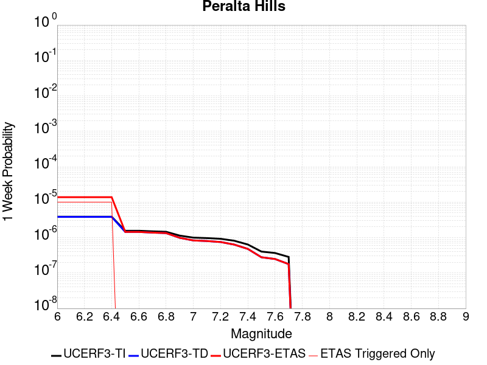 | 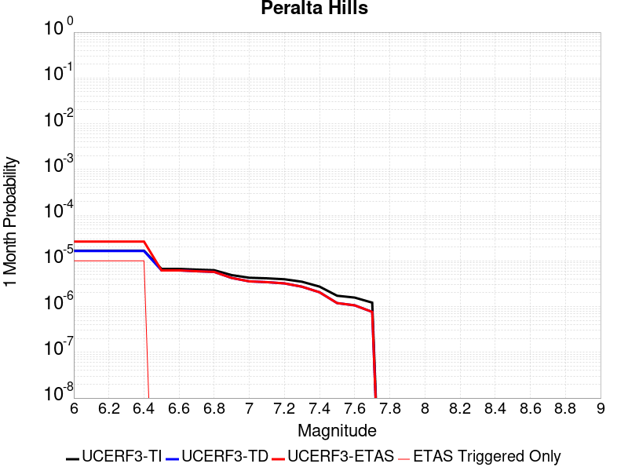 | 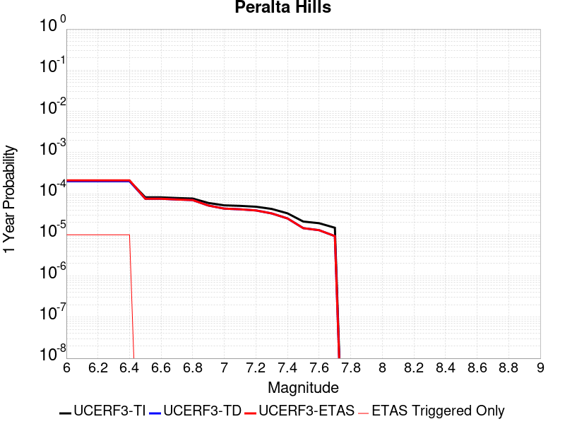 |  |

| Magnitude | 1 wk TI Prob | 1 wk TD Prob | 1 wk ETAS Prob | 1 wk ETAS/TD Gain | 1 wk ETAS Triggered Only | 1 mo TI Prob | 1 mo TD Prob | 1 mo ETAS Prob | 1 mo ETAS/TD Gain | 1 mo ETAS Triggered Only | 1 yr TI Prob | 1 yr TD Prob | 1 yr ETAS Prob | 1 yr ETAS/TD Gain | 1 yr ETAS Triggered Only | 10 yr TI Prob | 10 yr TD Prob | 10 yr ETAS Prob | 10 yr ETAS/TD Gain | 10 yr ETAS Triggered Only |
|-----|-----|-----|-----|-----|-----|-----|-----|-----|-----|-----|-----|-----|-----|-----|-----|-----|-----|-----|-----|-----|
| 6.0 | 3.8850067E-6 | 3.8395046E-6 | 1.3839466E-5 | 3.6044927 | 1.0E-5 | 1.6649923E-5 | 1.6454958E-5 | 2.6454794E-5 | 1.6077095 | 1.0E-5 | 2.0269395E-4 | 2.0032811E-4 | 2.1032612E-4 | 1.0499082 | 1.0E-5 | 0.0020250916 | 0.002002203 | 0.002012183 | 1.0049845 | 1.0E-5 |
| 6.1 | 3.8850067E-6 | 3.8395046E-6 | 1.3839466E-5 | 3.6044927 | 1.0E-5 | 1.6649923E-5 | 1.6454958E-5 | 2.6454794E-5 | 1.6077095 | 1.0E-5 | 2.0269395E-4 | 2.0032811E-4 | 2.1032612E-4 | 1.0499082 | 1.0E-5 | 0.0020250916 | 0.002002203 | 0.002012183 | 1.0049845 | 1.0E-5 |
| 6.2 | 3.8850067E-6 | 3.8395046E-6 | 1.3839466E-5 | 3.6044927 | 1.0E-5 | 1.6649923E-5 | 1.6454958E-5 | 2.6454794E-5 | 1.6077095 | 1.0E-5 | 2.0269395E-4 | 2.0032811E-4 | 2.1032612E-4 | 1.0499082 | 1.0E-5 | 0.0020250916 | 0.002002203 | 0.002012183 | 1.0049845 | 1.0E-5 |
| 6.3 | 3.8850067E-6 | 3.8395046E-6 | 1.3839466E-5 | 3.6044927 | 1.0E-5 | 1.6649923E-5 | 1.6454958E-5 | 2.6454794E-5 | 1.6077095 | 1.0E-5 | 2.0269395E-4 | 2.0032811E-4 | 2.1032612E-4 | 1.0499082 | 1.0E-5 | 0.0020250916 | 0.002002203 | 0.002012183 | 1.0049845 | 1.0E-5 |
| 6.4 | 3.8850067E-6 | 3.8395046E-6 | 1.3839466E-5 | 3.6044927 | 1.0E-5 | 1.6649923E-5 | 1.6454958E-5 | 2.6454794E-5 | 1.6077095 | 1.0E-5 | 2.0269395E-4 | 2.0032811E-4 | 2.1032612E-4 | 1.0499082 | 1.0E-5 | 0.0020250916 | 0.002002203 | 0.002012183 | 1.0049845 | 1.0E-5 |
| 6.5 | 1.5587785E-6 | 1.4430725E-6 | 1.4430725E-6 | 1.0 | 0.0 | 6.6804623E-6 | 6.184583E-6 | 6.184583E-6 | 1.0 | 0.0 | 8.133159E-5 | 7.529494E-5 | 7.529494E-5 | 1.0 | 0.0 | 8.1301836E-4 | 7.527183E-4 | 7.527183E-4 | 1.0 | 0.0 |
| 6.6 | 1.5587785E-6 | 1.4430725E-6 | 1.4430725E-6 | 1.0 | 0.0 | 6.6804623E-6 | 6.184583E-6 | 6.184583E-6 | 1.0 | 0.0 | 8.133159E-5 | 7.529494E-5 | 7.529494E-5 | 1.0 | 0.0 | 8.1301836E-4 | 7.527183E-4 | 7.527183E-4 | 1.0 | 0.0 |
| 6.7 | 1.5018579E-6 | 1.3836951E-6 | 1.3836951E-6 | 1.0 | 0.0 | 6.436518E-6 | 5.9301096E-6 | 5.9301096E-6 | 1.0 | 0.0 | 7.836179E-5 | 7.219693E-5 | 7.219693E-5 | 1.0 | 0.0 | 7.833416E-4 | 7.2175835E-4 | 7.2175835E-4 | 1.0 | 0.0 |
| 6.8 | 1.4584314E-6 | 1.3381272E-6 | 1.3381272E-6 | 1.0 | 0.0 | 6.250405E-6 | 5.7348193E-6 | 5.7348193E-6 | 1.0 | 0.0 | 7.6096025E-5 | 6.981943E-5 | 6.981943E-5 | 1.0 | 0.0 | 7.6069974E-4 | 6.9799833E-4 | 6.9799833E-4 | 1.0 | 0.0 |
| 6.9 | 1.1382393E-6 | 9.862176E-7 | 9.862176E-7 | 1.0 | 0.0 | 4.8781594E-6 | 4.2266406E-6 | 4.2266406E-6 | 1.0 | 0.0 | 5.9389975E-5 | 5.145822E-5 | 5.145822E-5 | 1.0 | 0.0 | 5.93741E-4 | 5.1447126E-4 | 5.1447126E-4 | 1.0 | 0.0 |
| 7.0 | 9.970413E-7 | 8.3095136E-7 | 8.3095136E-7 | 1.0 | 0.0 | 4.273027E-6 | 3.5612156E-6 | 3.5612156E-6 | 1.0 | 0.0 | 5.2022864E-5 | 4.3357006E-5 | 4.3357006E-5 | 1.0 | 0.0 | 5.2010687E-4 | 4.3349227E-4 | 4.3349227E-4 | 1.0 | 0.0 |
| 7.1 | 9.684443E-7 | 7.993957E-7 | 7.993957E-7 | 1.0 | 0.0 | 4.150469E-6 | 3.4259774E-6 | 3.4259774E-6 | 1.0 | 0.0 | 5.053079E-5 | 4.1710548E-5 | 4.1710548E-5 | 1.0 | 0.0 | 5.05193E-4 | 4.170339E-4 | 4.170339E-4 | 1.0 | 0.0 |
| 7.2 | 9.240811E-7 | 7.503015E-7 | 7.503015E-7 | 1.0 | 0.0 | 3.960342E-6 | 3.2155742E-6 | 3.2155742E-6 | 1.0 | 0.0 | 4.8216094E-5 | 3.914898E-5 | 3.914898E-5 | 1.0 | 0.0 | 4.8205635E-4 | 3.9142737E-4 | 3.9142737E-4 | 1.0 | 0.0 |
| 7.3 | 8.158643E-7 | 6.34986E-7 | 6.34986E-7 | 1.0 | 0.0 | 3.4965567E-6 | 2.7213662E-6 | 2.7213662E-6 | 1.0 | 0.0 | 4.2569747E-5 | 3.3132193E-5 | 3.3132193E-5 | 1.0 | 0.0 | 4.2561593E-4 | 3.3127866E-4 | 3.3127866E-4 | 1.0 | 0.0 |
| 7.4 | 6.3822824E-7 | 4.79557E-7 | 4.79557E-7 | 1.0 | 0.0 | 2.7352612E-6 | 2.0552432E-6 | 2.0552432E-6 | 1.0 | 0.0 | 3.3301294E-5 | 2.502235E-5 | 2.502235E-5 | 1.0 | 0.0 | 3.3296304E-4 | 2.5020045E-4 | 2.5020045E-4 | 1.0 | 0.0 |
| 7.5 | 4.0292628E-7 | 2.7844956E-7 | 2.7844956E-7 | 1.0 | 0.0 | 1.7268258E-6 | 1.1933548E-6 | 1.1933548E-6 | 1.0 | 0.0 | 2.1023901E-5 | 1.4529027E-5 | 1.4529027E-5 | 1.0 | 0.0 | 2.1021912E-4 | 1.4528356E-4 | 1.4528356E-4 | 1.0 | 0.0 |
| 7.6 | 3.672993E-7 | 2.4854202E-7 | 2.4854202E-7 | 1.0 | 0.0 | 1.5741389E-6 | 1.0651798E-6 | 1.0651798E-6 | 1.0 | 0.0 | 1.9164972E-5 | 1.2968516E-5 | 1.2968516E-5 | 1.0 | 0.0 | 1.916332E-4 | 1.2968031E-4 | 1.2968031E-4 | 1.0 | 0.0 |
| 7.7 | 2.8466823E-7 | 1.7858805E-7 | 1.7858805E-7 | 1.0 | 0.0 | 1.2200061E-6 | 7.653773E-7 | 7.653773E-7 | 1.0 | 0.0 | 1.4853474E-5 | 9.318455E-6 | 9.318455E-6 | 1.0 | 0.0 | 1.485248E-4 | 9.318324E-5 | 9.318324E-5 | 1.0 | 0.0 |

## Channel Islands Western Deep Ramp
*[(top)](#table-of-contents)*

| 1 Week | 1 Month | 1 Year | 10 Year |
|-----|-----|-----|-----|
|  | 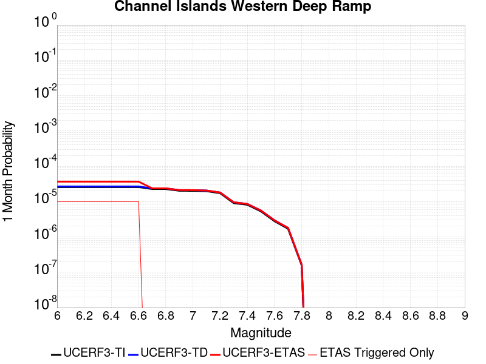 |  | 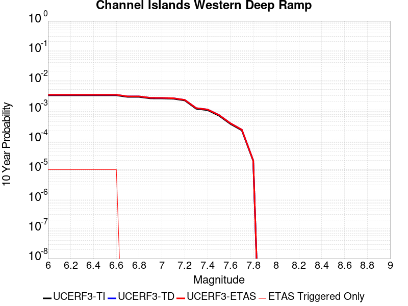 |

| Magnitude | 1 wk TI Prob | 1 wk TD Prob | 1 wk ETAS Prob | 1 wk ETAS/TD Gain | 1 wk ETAS Triggered Only | 1 mo TI Prob | 1 mo TD Prob | 1 mo ETAS Prob | 1 mo ETAS/TD Gain | 1 mo ETAS Triggered Only | 1 yr TI Prob | 1 yr TD Prob | 1 yr ETAS Prob | 1 yr ETAS/TD Gain | 1 yr ETAS Triggered Only | 10 yr TI Prob | 10 yr TD Prob | 10 yr ETAS Prob | 10 yr ETAS/TD Gain | 10 yr ETAS Triggered Only |
|-----|-----|-----|-----|-----|-----|-----|-----|-----|-----|-----|-----|-----|-----|-----|-----|-----|-----|-----|-----|-----|
| 6.0 | 6.0213506E-6 | 6.2548684E-6 | 1.6254806E-5 | 2.5987446 | 1.0E-5 | 2.5805533E-5 | 2.6806329E-5 | 3.680606E-5 | 1.3730363 | 1.0E-5 | 3.1413708E-4 | 3.2632265E-4 | 3.3631938E-4 | 1.0306345 | 1.0E-5 | 0.0031369338 | 0.0032588763 | 0.0032688437 | 1.0030586 | 1.0E-5 |
| 6.1 | 6.0213506E-6 | 6.2548684E-6 | 1.6254806E-5 | 2.5987446 | 1.0E-5 | 2.5805533E-5 | 2.6806329E-5 | 3.680606E-5 | 1.3730363 | 1.0E-5 | 3.1413708E-4 | 3.2632265E-4 | 3.3631938E-4 | 1.0306345 | 1.0E-5 | 0.0031369338 | 0.0032588763 | 0.0032688437 | 1.0030586 | 1.0E-5 |
| 6.2 | 6.0213506E-6 | 6.2548684E-6 | 1.6254806E-5 | 2.5987446 | 1.0E-5 | 2.5805533E-5 | 2.6806329E-5 | 3.680606E-5 | 1.3730363 | 1.0E-5 | 3.1413708E-4 | 3.2632265E-4 | 3.3631938E-4 | 1.0306345 | 1.0E-5 | 0.0031369338 | 0.0032588763 | 0.0032688437 | 1.0030586 | 1.0E-5 |
| 6.3 | 6.0213506E-6 | 6.2548684E-6 | 1.6254806E-5 | 2.5987446 | 1.0E-5 | 2.5805533E-5 | 2.6806329E-5 | 3.680606E-5 | 1.3730363 | 1.0E-5 | 3.1413708E-4 | 3.2632265E-4 | 3.3631938E-4 | 1.0306345 | 1.0E-5 | 0.0031369338 | 0.0032588763 | 0.0032688437 | 1.0030586 | 1.0E-5 |
| 6.4 | 6.0213506E-6 | 6.2548684E-6 | 1.6254806E-5 | 2.5987446 | 1.0E-5 | 2.5805533E-5 | 2.6806329E-5 | 3.680606E-5 | 1.3730363 | 1.0E-5 | 3.1413708E-4 | 3.2632265E-4 | 3.3631938E-4 | 1.0306345 | 1.0E-5 | 0.0031369338 | 0.0032588763 | 0.0032688437 | 1.0030586 | 1.0E-5 |
| 6.5 | 6.0213506E-6 | 6.2548684E-6 | 1.6254806E-5 | 2.5987446 | 1.0E-5 | 2.5805533E-5 | 2.6806329E-5 | 3.680606E-5 | 1.3730363 | 1.0E-5 | 3.1413708E-4 | 3.2632265E-4 | 3.3631938E-4 | 1.0306345 | 1.0E-5 | 0.0031369338 | 0.0032588763 | 0.0032688437 | 1.0030586 | 1.0E-5 |
| 6.6 | 6.0213506E-6 | 6.2548684E-6 | 1.6254806E-5 | 2.5987446 | 1.0E-5 | 2.5805533E-5 | 2.6806329E-5 | 3.680606E-5 | 1.3730363 | 1.0E-5 | 3.1413708E-4 | 3.2632265E-4 | 3.3631938E-4 | 1.0306345 | 1.0E-5 | 0.0031369338 | 0.0032588763 | 0.0032688437 | 1.0030586 | 1.0E-5 |
| 6.7 | 5.313309E-6 | 5.5252403E-6 | 5.5252403E-6 | 1.0 | 0.0 | 2.2771126E-5 | 2.367941E-5 | 2.367941E-5 | 1.0 | 0.0 | 2.772032E-4 | 2.8826276E-4 | 2.8826276E-4 | 1.0 | 0.0 | 0.0027685766 | 0.0028792918 | 0.0028792918 | 1.0 | 0.0 |
| 6.8 | 5.313309E-6 | 5.5252403E-6 | 5.5252403E-6 | 1.0 | 0.0 | 2.2771126E-5 | 2.367941E-5 | 2.367941E-5 | 1.0 | 0.0 | 2.772032E-4 | 2.8826276E-4 | 2.8826276E-4 | 1.0 | 0.0 | 0.0027685766 | 0.0028792918 | 0.0028792918 | 1.0 | 0.0 |
| 6.9 | 4.744377E-6 | 4.9394303E-6 | 4.9394303E-6 | 1.0 | 0.0 | 2.0332885E-5 | 2.1168837E-5 | 2.1168837E-5 | 1.0 | 0.0 | 2.4752476E-4 | 2.5770385E-4 | 2.5770385E-4 | 1.0 | 0.0 | 0.0024724922 | 0.0025744175 | 0.0025744175 | 1.0 | 0.0 |
| 7.0 | 4.722209E-6 | 4.9164732E-6 | 4.9164732E-6 | 1.0 | 0.0 | 2.0237881E-5 | 2.107045E-5 | 2.107045E-5 | 1.0 | 0.0 | 2.4636835E-4 | 2.5650626E-4 | 2.5650626E-4 | 1.0 | 0.0 | 0.002460954 | 0.0025624693 | 0.0025624693 | 1.0 | 0.0 |
| 7.1 | 4.611174E-6 | 4.801409E-6 | 4.801409E-6 | 1.0 | 0.0 | 1.9762025E-5 | 2.0577325E-5 | 2.0577325E-5 | 1.0 | 0.0 | 2.4057609E-4 | 2.5050386E-4 | 2.5050386E-4 | 1.0 | 0.0 | 0.002403158 | 0.002502582 | 0.002502582 | 1.0 | 0.0 |
| 7.2 | 4.043994E-6 | 4.2120264E-6 | 4.2120264E-6 | 1.0 | 0.0 | 1.7331287E-5 | 1.8051438E-5 | 1.8051438E-5 | 1.0 | 0.0 | 2.10988E-4 | 2.1975765E-4 | 2.1975765E-4 | 1.0 | 0.0 | 0.002107878 | 0.0021957543 | 0.0021957543 | 1.0 | 0.0 |
| 7.3 | 2.1233036E-6 | 2.2297875E-6 | 2.2297875E-6 | 1.0 | 0.0 | 9.099841E-6 | 9.556197E-6 | 9.556197E-6 | 1.0 | 0.0 | 1.1078493E-4 | 1.1634055E-4 | 1.1634055E-4 | 1.0 | 0.0 | 0.0011072971 | 0.001162802 | 0.001162802 | 1.0 | 0.0 |
| 7.4 | 1.9051884E-6 | 2.0014973E-6 | 2.0014973E-6 | 1.0 | 0.0 | 8.165067E-6 | 8.577817E-6 | 8.577817E-6 | 1.0 | 0.0 | 9.940516E-5 | 1.0442998E-4 | 1.0442998E-4 | 1.0 | 0.0 | 9.93607E-4 | 0.0010438144 | 0.0010438144 | 1.0 | 0.0 |
| 7.5 | 1.2408497E-6 | 1.3038839E-6 | 1.3038839E-6 | 1.0 | 0.0 | 5.317916E-6 | 5.588062E-6 | 5.588062E-6 | 1.0 | 0.0 | 6.4743705E-5 | 6.8032554E-5 | 6.8032554E-5 | 1.0 | 0.0 | 6.4724847E-4 | 6.8011944E-4 | 6.8011944E-4 | 1.0 | 0.0 |
| 7.6 | 6.5440025E-7 | 6.886718E-7 | 6.886718E-7 | 1.0 | 0.0 | 2.8045695E-6 | 2.9514472E-6 | 2.9514472E-6 | 1.0 | 0.0 | 3.4145098E-5 | 3.593329E-5 | 3.593329E-5 | 1.0 | 0.0 | 3.4139853E-4 | 3.5927625E-4 | 3.5927625E-4 | 1.0 | 0.0 |
| 7.7 | 3.985963E-7 | 4.1930787E-7 | 4.1930787E-7 | 1.0 | 0.0 | 1.7082689E-6 | 1.7970326E-6 | 1.7970326E-6 | 1.0 | 0.0 | 2.0797976E-5 | 2.1878664E-5 | 2.1878664E-5 | 1.0 | 0.0 | 2.0796029E-4 | 2.1876628E-4 | 2.1876628E-4 | 1.0 | 0.0 |
| 7.8 | 3.706329E-8 | 3.8591796E-8 | 3.8591796E-8 | 1.0 | 0.0 | 1.5884267E-7 | 1.653934E-7 | 1.653934E-7 | 1.0 | 0.0 | 1.9339077E-6 | 2.0136629E-6 | 2.0136629E-6 | 1.0 | 0.0 | 1.933891E-5 | 2.0136458E-5 | 2.0136458E-5 | 1.0 | 0.0 |

## North Frontal  (West)
*[(top)](#table-of-contents)*

| 1 Week | 1 Month | 1 Year | 10 Year |
|-----|-----|-----|-----|
|  | 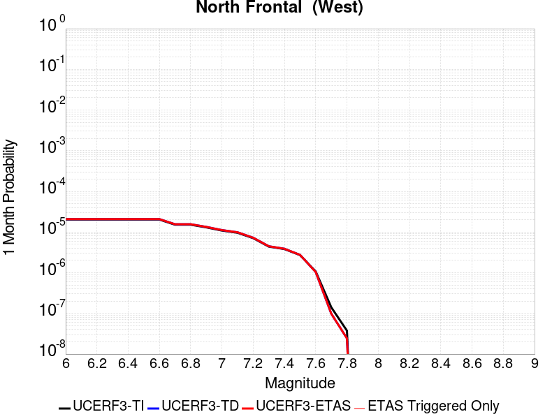 |  |  |

| Magnitude | 1 wk TI Prob | 1 wk TD Prob | 1 wk ETAS Prob | 1 wk ETAS/TD Gain | 1 wk ETAS Triggered Only | 1 mo TI Prob | 1 mo TD Prob | 1 mo ETAS Prob | 1 mo ETAS/TD Gain | 1 mo ETAS Triggered Only | 1 yr TI Prob | 1 yr TD Prob | 1 yr ETAS Prob | 1 yr ETAS/TD Gain | 1 yr ETAS Triggered Only | 10 yr TI Prob | 10 yr TD Prob | 10 yr ETAS Prob | 10 yr ETAS/TD Gain | 10 yr ETAS Triggered Only |
|-----|-----|-----|-----|-----|-----|-----|-----|-----|-----|-----|-----|-----|-----|-----|-----|-----|-----|-----|-----|-----|
| 6.0 | 4.7316266E-6 | 4.852674E-6 | 4.852674E-6 | 1.0 | 0.0 | 2.0278241E-5 | 2.0797017E-5 | 2.0797017E-5 | 1.0 | 0.0 | 2.4685962E-4 | 2.5317573E-4 | 2.631732E-4 | 1.0394883 | 1.0E-5 | 0.0024658558 | 0.002529019 | 0.0025389937 | 1.0039442 | 1.0E-5 |
| 6.1 | 4.7316266E-6 | 4.852674E-6 | 4.852674E-6 | 1.0 | 0.0 | 2.0278241E-5 | 2.0797017E-5 | 2.0797017E-5 | 1.0 | 0.0 | 2.4685962E-4 | 2.5317573E-4 | 2.631732E-4 | 1.0394883 | 1.0E-5 | 0.0024658558 | 0.002529019 | 0.0025389937 | 1.0039442 | 1.0E-5 |
| 6.2 | 4.7316266E-6 | 4.852674E-6 | 4.852674E-6 | 1.0 | 0.0 | 2.0278241E-5 | 2.0797017E-5 | 2.0797017E-5 | 1.0 | 0.0 | 2.4685962E-4 | 2.5317573E-4 | 2.631732E-4 | 1.0394883 | 1.0E-5 | 0.0024658558 | 0.002529019 | 0.0025389937 | 1.0039442 | 1.0E-5 |
| 6.3 | 4.7316266E-6 | 4.852674E-6 | 4.852674E-6 | 1.0 | 0.0 | 2.0278241E-5 | 2.0797017E-5 | 2.0797017E-5 | 1.0 | 0.0 | 2.4685962E-4 | 2.5317573E-4 | 2.631732E-4 | 1.0394883 | 1.0E-5 | 0.0024658558 | 0.002529019 | 0.0025389937 | 1.0039442 | 1.0E-5 |
| 6.4 | 4.7316266E-6 | 4.852674E-6 | 4.852674E-6 | 1.0 | 0.0 | 2.0278241E-5 | 2.0797017E-5 | 2.0797017E-5 | 1.0 | 0.0 | 2.4685962E-4 | 2.5317573E-4 | 2.631732E-4 | 1.0394883 | 1.0E-5 | 0.0024658558 | 0.002529019 | 0.0025389937 | 1.0039442 | 1.0E-5 |
| 6.5 | 4.7316266E-6 | 4.852674E-6 | 4.852674E-6 | 1.0 | 0.0 | 2.0278241E-5 | 2.0797017E-5 | 2.0797017E-5 | 1.0 | 0.0 | 2.4685962E-4 | 2.5317573E-4 | 2.631732E-4 | 1.0394883 | 1.0E-5 | 0.0024658558 | 0.002529019 | 0.0025389937 | 1.0039442 | 1.0E-5 |
| 6.6 | 4.7316266E-6 | 4.852674E-6 | 4.852674E-6 | 1.0 | 0.0 | 2.0278241E-5 | 2.0797017E-5 | 2.0797017E-5 | 1.0 | 0.0 | 2.4685962E-4 | 2.5317573E-4 | 2.631732E-4 | 1.0394883 | 1.0E-5 | 0.0024658558 | 0.002529019 | 0.0025389937 | 1.0039442 | 1.0E-5 |
| 6.7 | 3.5382777E-6 | 3.6308872E-6 | 3.6308872E-6 | 1.0 | 0.0 | 1.516396E-5 | 1.5560858E-5 | 1.5560858E-5 | 1.0 | 0.0 | 1.8460557E-4 | 1.8943775E-4 | 1.9943585E-4 | 1.0527778 | 1.0E-5 | 0.0018445229 | 0.0018928396 | 0.0019028207 | 1.0052731 | 1.0E-5 |
| 6.8 | 3.5382777E-6 | 3.6308872E-6 | 3.6308872E-6 | 1.0 | 0.0 | 1.516396E-5 | 1.5560858E-5 | 1.5560858E-5 | 1.0 | 0.0 | 1.8460557E-4 | 1.8943775E-4 | 1.9943585E-4 | 1.0527778 | 1.0E-5 | 0.0018445229 | 0.0018928396 | 0.0019028207 | 1.0052731 | 1.0E-5 |
| 6.9 | 3.0428037E-6 | 3.1227619E-6 | 3.1227619E-6 | 1.0 | 0.0 | 1.30405215E-5 | 1.3383201E-5 | 1.3383201E-5 | 1.0 | 0.0 | 1.5875678E-4 | 1.6292896E-4 | 1.6292896E-4 | 1.0 | 0.0 | 0.0015864341 | 0.0016281622 | 0.0016281622 | 1.0 | 0.0 |
| 7.0 | 2.538778E-6 | 2.6060916E-6 | 2.6060916E-6 | 1.0 | 0.0 | 1.0880432E-5 | 1.116892E-5 | 1.116892E-5 | 1.0 | 0.0 | 1.324612E-4 | 1.3597358E-4 | 1.3597358E-4 | 1.0 | 0.0 | 0.0013238228 | 0.0013589506 | 0.0013589506 | 1.0 | 0.0 |
| 7.1 | 2.2418935E-6 | 2.3012087E-6 | 2.3012087E-6 | 1.0 | 0.0 | 9.60808E-6 | 9.862288E-6 | 9.862288E-6 | 1.0 | 0.0 | 1.1697209E-4 | 1.2006718E-4 | 1.2006718E-4 | 1.0 | 0.0 | 0.0011691054 | 0.0012000671 | 0.0012000671 | 1.0 | 0.0 |
| 7.2 | 1.6526745E-6 | 1.6924864E-6 | 1.6924864E-6 | 1.0 | 0.0 | 7.082872E-6 | 7.2534945E-6 | 7.2534945E-6 | 1.0 | 0.0 | 8.623055E-5 | 8.830797E-5 | 8.830797E-5 | 1.0 | 0.0 | 8.61971E-4 | 8.8275387E-4 | 8.8275387E-4 | 1.0 | 0.0 |
| 7.3 | 1.0246019E-6 | 1.0442274E-6 | 1.0442274E-6 | 1.0 | 0.0 | 4.391144E-6 | 4.4752533E-6 | 4.4752533E-6 | 1.0 | 0.0 | 5.3460866E-5 | 5.4484964E-5 | 5.4484964E-5 | 1.0 | 0.0 | 5.344801E-4 | 5.4472755E-4 | 5.4472755E-4 | 1.0 | 0.0 |
| 7.4 | 8.9045164E-7 | 9.056572E-7 | 9.056572E-7 | 1.0 | 0.0 | 3.8162157E-6 | 3.881383E-6 | 3.881383E-6 | 1.0 | 0.0 | 4.646144E-5 | 4.725492E-5 | 4.725492E-5 | 1.0 | 0.0 | 4.6451724E-4 | 4.7245962E-4 | 4.7245962E-4 | 1.0 | 0.0 |
| 7.5 | 6.3357E-7 | 6.4027137E-7 | 6.4027137E-7 | 1.0 | 0.0 | 2.7152971E-6 | 2.7440176E-6 | 2.7440176E-6 | 1.0 | 0.0 | 3.305824E-5 | 3.340797E-5 | 3.340797E-5 | 1.0 | 0.0 | 3.3053322E-4 | 3.3403604E-4 | 3.3403604E-4 | 1.0 | 0.0 |
| 7.6 | 2.5087024E-7 | 2.436123E-7 | 2.436123E-7 | 1.0 | 0.0 | 1.0751578E-6 | 1.0440525E-6 | 1.0440525E-6 | 1.0 | 0.0 | 1.3089967E-5 | 1.2711286E-5 | 1.2711286E-5 | 1.0 | 0.0 | 1.3089196E-4 | 1.2710765E-4 | 1.2710765E-4 | 1.0 | 0.0 |
| 7.7 | 3.282987E-8 | 2.2875435E-8 | 2.2875435E-8 | 1.0 | 0.0 | 1.4069944E-7 | 9.8037575E-8 | 9.8037575E-8 | 1.0 | 0.0 | 1.7130144E-6 | 1.193607E-6 | 1.193607E-6 | 1.0 | 0.0 | 1.7130013E-5 | 1.1936014E-5 | 1.1936014E-5 | 1.0 | 0.0 |
| 7.8 | 8.77499E-9 | 5.6817466E-9 | 5.6817466E-9 | 1.0 | 0.0 | 3.7607098E-8 | 2.4350342E-8 | 2.4350342E-8 | 1.0 | 0.0 | 4.578663E-7 | 2.964654E-7 | 2.964654E-7 | 1.0 | 0.0 | 4.5786537E-6 | 2.9646512E-6 | 2.9646512E-6 | 1.0 | 0.0 |

## Sierra Madre
*[(top)](#table-of-contents)*

| 1 Week | 1 Month | 1 Year | 10 Year |
|-----|-----|-----|-----|
| 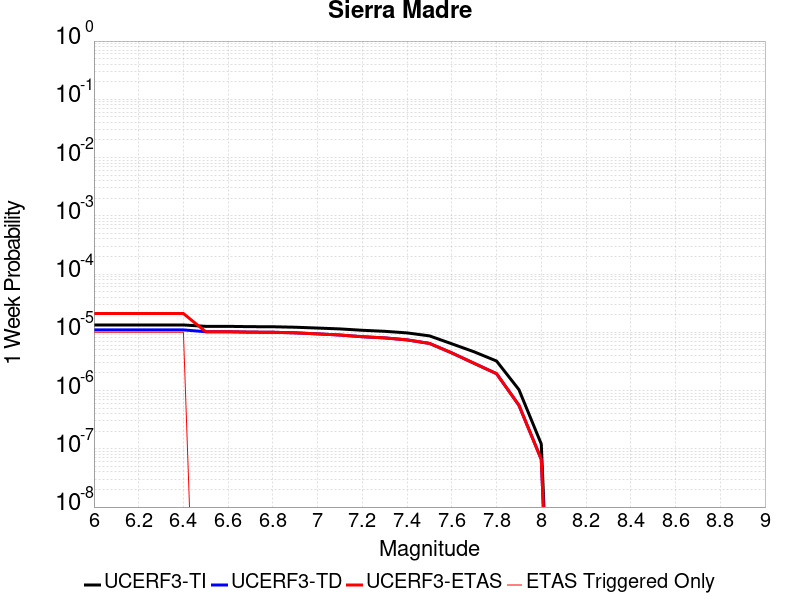 | 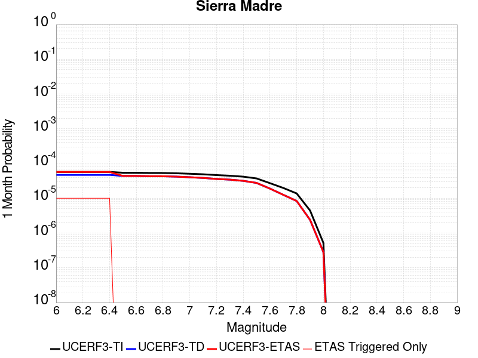 | 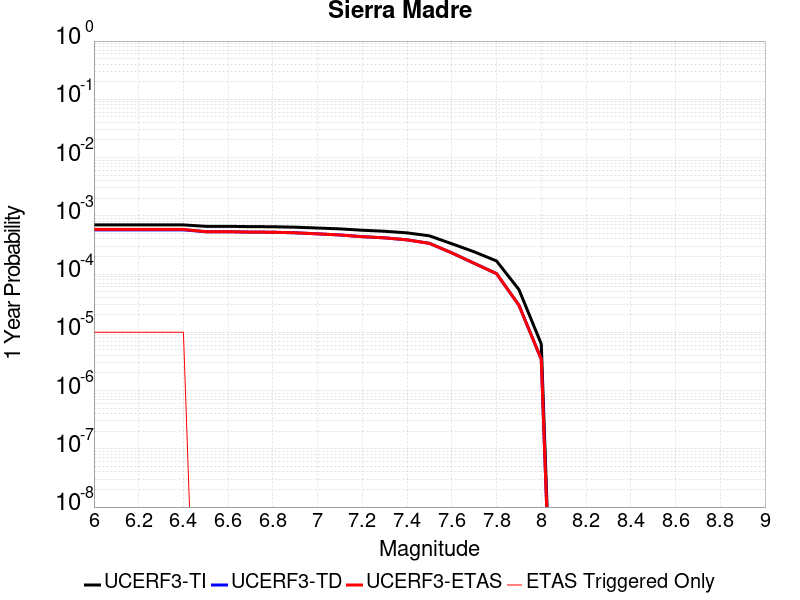 | 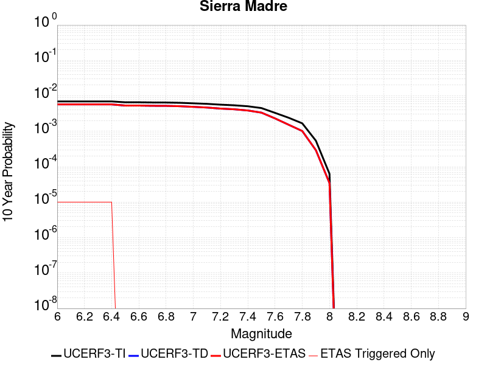 |

| Magnitude | 1 wk TI Prob | 1 wk TD Prob | 1 wk ETAS Prob | 1 wk ETAS/TD Gain | 1 wk ETAS Triggered Only | 1 mo TI Prob | 1 mo TD Prob | 1 mo ETAS Prob | 1 mo ETAS/TD Gain | 1 mo ETAS Triggered Only | 1 yr TI Prob | 1 yr TD Prob | 1 yr ETAS Prob | 1 yr ETAS/TD Gain | 1 yr ETAS Triggered Only | 10 yr TI Prob | 10 yr TD Prob | 10 yr ETAS Prob | 10 yr ETAS/TD Gain | 10 yr ETAS Triggered Only |
|-----|-----|-----|-----|-----|-----|-----|-----|-----|-----|-----|-----|-----|-----|-----|-----|-----|-----|-----|-----|-----|
| 6.0 | 1.3379373E-5 | 1.1000776E-5 | 2.1000666E-5 | 1.9090167 | 1.0E-5 | 5.7338908E-5 | 4.714534E-5 | 5.714487E-5 | 1.2121 | 1.0E-5 | 6.978776E-4 | 5.738448E-4 | 5.838391E-4 | 1.0174164 | 1.0E-5 | 0.0069569005 | 0.0057238447 | 0.0057337875 | 1.0017371 | 1.0E-5 |
| 6.1 | 1.3379373E-5 | 1.1000776E-5 | 2.1000666E-5 | 1.9090167 | 1.0E-5 | 5.7338908E-5 | 4.714534E-5 | 5.714487E-5 | 1.2121 | 1.0E-5 | 6.978776E-4 | 5.738448E-4 | 5.838391E-4 | 1.0174164 | 1.0E-5 | 0.0069569005 | 0.0057238447 | 0.0057337875 | 1.0017371 | 1.0E-5 |
| 6.2 | 1.3379373E-5 | 1.1000776E-5 | 2.1000666E-5 | 1.9090167 | 1.0E-5 | 5.7338908E-5 | 4.714534E-5 | 5.714487E-5 | 1.2121 | 1.0E-5 | 6.978776E-4 | 5.738448E-4 | 5.838391E-4 | 1.0174164 | 1.0E-5 | 0.0069569005 | 0.0057238447 | 0.0057337875 | 1.0017371 | 1.0E-5 |
| 6.3 | 1.3379373E-5 | 1.1000776E-5 | 2.1000666E-5 | 1.9090167 | 1.0E-5 | 5.7338908E-5 | 4.714534E-5 | 5.714487E-5 | 1.2121 | 1.0E-5 | 6.978776E-4 | 5.738448E-4 | 5.838391E-4 | 1.0174164 | 1.0E-5 | 0.0069569005 | 0.0057238447 | 0.0057337875 | 1.0017371 | 1.0E-5 |
| 6.4 | 1.3379373E-5 | 1.1000776E-5 | 2.1000666E-5 | 1.9090167 | 1.0E-5 | 5.7338908E-5 | 4.714534E-5 | 5.714487E-5 | 1.2121 | 1.0E-5 | 6.978776E-4 | 5.738448E-4 | 5.838391E-4 | 1.0174164 | 1.0E-5 | 0.0069569005 | 0.0057238447 | 0.0057337875 | 1.0017371 | 1.0E-5 |
| 6.5 | 1.26563245E-5 | 1.0230232E-5 | 1.0230232E-5 | 1.0 | 0.0 | 5.4240263E-5 | 4.384312E-5 | 4.384312E-5 | 1.0 | 0.0 | 6.601751E-4 | 5.3366035E-4 | 5.3366035E-4 | 1.0 | 0.0 | 0.006582173 | 0.0053239604 | 0.0053239604 | 1.0 | 0.0 |
| 6.6 | 1.26563245E-5 | 1.0230232E-5 | 1.0230232E-5 | 1.0 | 0.0 | 5.4240263E-5 | 4.384312E-5 | 4.384312E-5 | 1.0 | 0.0 | 6.601751E-4 | 5.3366035E-4 | 5.3366035E-4 | 1.0 | 0.0 | 0.006582173 | 0.0053239604 | 0.0053239604 | 1.0 | 0.0 |
| 6.7 | 1.2502474E-5 | 1.00663765E-5 | 1.00663765E-5 | 1.0 | 0.0 | 5.3580934E-5 | 4.3140906E-5 | 4.3140906E-5 | 1.0 | 0.0 | 6.521526E-4 | 5.25115E-4 | 5.25115E-4 | 1.0 | 0.0 | 0.0065024206 | 0.0052389116 | 0.0052389116 | 1.0 | 0.0 |
| 6.8 | 1.2454966E-5 | 1.0018662E-5 | 1.0018662E-5 | 1.0 | 0.0 | 5.3377335E-5 | 4.293642E-5 | 4.293642E-5 | 1.0 | 0.0 | 6.4967526E-4 | 5.226266E-4 | 5.226266E-4 | 1.0 | 0.0 | 0.006477792 | 0.0052141445 | 0.0052141445 | 1.0 | 0.0 |
| 6.9 | 1.2225574E-5 | 9.792639E-6 | 9.792639E-6 | 1.0 | 0.0 | 5.2394265E-5 | 4.196778E-5 | 4.196778E-5 | 1.0 | 0.0 | 6.3771347E-4 | 5.10839E-4 | 5.10839E-4 | 1.0 | 0.0 | 0.006358865 | 0.0050968137 | 0.0050968137 | 1.0 | 0.0 |
| 7.0 | 1.182946E-5 | 9.399179E-6 | 9.399179E-6 | 1.0 | 0.0 | 5.06967E-5 | 4.0281582E-5 | 4.0281582E-5 | 1.0 | 0.0 | 6.1705755E-4 | 4.903189E-4 | 4.903189E-4 | 1.0 | 0.0 | 0.006153469 | 0.004892533 | 0.004892533 | 1.0 | 0.0 |
| 7.1 | 1.14369095E-5 | 8.986194E-6 | 8.986194E-6 | 1.0 | 0.0 | 4.9014405E-5 | 3.85117E-5 | 3.85117E-5 | 1.0 | 0.0 | 5.9658696E-4 | 4.6878002E-4 | 4.6878002E-4 | 1.0 | 0.0 | 0.005949879 | 0.0046780678 | 0.0046780678 | 1.0 | 0.0 |
| 7.2 | 1.0836419E-5 | 8.39959E-6 | 8.39959E-6 | 1.0 | 0.0 | 4.644097E-5 | 3.599775E-5 | 3.599775E-5 | 1.0 | 0.0 | 5.652721E-4 | 4.3818538E-4 | 4.3818538E-4 | 1.0 | 0.0 | 0.0056383642 | 0.0043733614 | 0.0043733614 | 1.0 | 0.0 |
| 7.3 | 1.0403439E-5 | 8.020854E-6 | 8.020854E-6 | 1.0 | 0.0 | 4.4585406E-5 | 3.437464E-5 | 3.437464E-5 | 1.0 | 0.0 | 5.426921E-4 | 4.184318E-4 | 4.184318E-4 | 1.0 | 0.0 | 0.005413687 | 0.004176585 | 0.004176585 | 1.0 | 0.0 |
| 7.4 | 9.768864E-6 | 7.4144855E-6 | 7.4144855E-6 | 1.0 | 0.0 | 4.186589E-5 | 3.1775984E-5 | 3.1775984E-5 | 1.0 | 0.0 | 5.09598E-4 | 3.868048E-4 | 3.868048E-4 | 1.0 | 0.0 | 0.0050843097 | 0.0038614576 | 0.0038614576 | 1.0 | 0.0 |
| 7.5 | 8.687089E-6 | 6.450183E-6 | 6.450183E-6 | 1.0 | 0.0 | 3.722985E-5 | 2.7643353E-5 | 2.7643353E-5 | 1.0 | 0.0 | 4.5317915E-4 | 3.3650672E-4 | 3.3650672E-4 | 1.0 | 0.0 | 0.004522561 | 0.003360109 | 0.003360109 | 1.0 | 0.0 |
| 7.6 | 6.3506063E-6 | 4.430329E-6 | 4.430329E-6 | 1.0 | 0.0 | 2.72166E-5 | 1.8986988E-5 | 1.8986988E-5 | 1.0 | 0.0 | 3.3131172E-4 | 2.3114232E-4 | 2.3114232E-4 | 1.0 | 0.0 | 0.003308182 | 0.0023090935 | 0.0023090935 | 1.0 | 0.0 |
| 7.7 | 4.62223E-6 | 2.9329542E-6 | 2.9329542E-6 | 1.0 | 0.0 | 1.9809406E-5 | 1.2569743E-5 | 1.2569743E-5 | 1.0 | 0.0 | 2.4115283E-4 | 1.5302589E-4 | 1.5302589E-4 | 1.0 | 0.0 | 0.0024089129 | 0.0015292577 | 0.0015292577 | 1.0 | 0.0 |
| 7.8 | 3.2145008E-6 | 1.949411E-6 | 1.949411E-6 | 1.0 | 0.0 | 1.3776359E-5 | 8.354592E-6 | 8.354592E-6 | 1.0 | 0.0 | 1.6771426E-4 | 1.01712416E-4 | 1.01712416E-4 | 1.0 | 0.0 | 0.0016758774 | 0.0010166786 | 0.0010166786 | 1.0 | 0.0 |
| 7.9 | 1.0391769E-6 | 5.602482E-7 | 5.602482E-7 | 1.0 | 0.0 | 4.4536077E-6 | 2.4010617E-6 | 2.4010617E-6 | 1.0 | 0.0 | 5.4221324E-5 | 2.9232539E-5 | 2.9232539E-5 | 1.0 | 0.0 | 5.4208096E-4 | 2.9228735E-4 | 2.9228735E-4 | 1.0 | 0.0 |
| 8.0 | 1.210983E-7 | 6.613497E-8 | 6.613497E-8 | 1.0 | 0.0 | 5.1899264E-7 | 2.8343558E-7 | 2.8343558E-7 | 1.0 | 0.0 | 6.3187167E-6 | 3.4508228E-6 | 3.4508228E-6 | 1.0 | 0.0 | 6.318537E-5 | 3.450771E-5 | 3.450771E-5 | 1.0 | 0.0 |

## Davis Creek
*[(top)](#table-of-contents)*

| 1 Week | 1 Month | 1 Year | 10 Year |
|-----|-----|-----|-----|
|  | 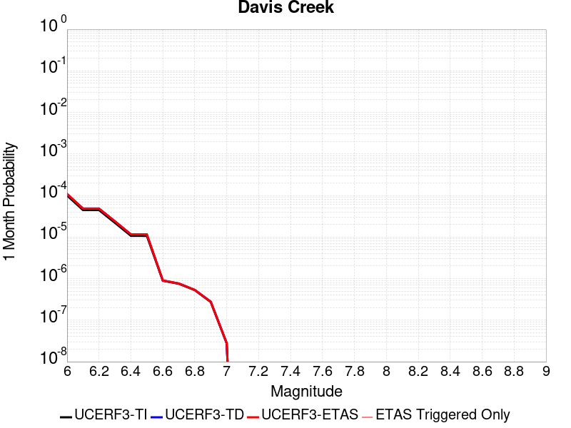 |  | 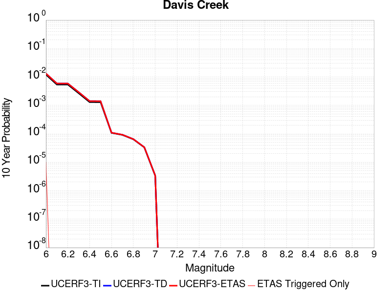 |

| Magnitude | 1 wk TI Prob | 1 wk TD Prob | 1 wk ETAS Prob | 1 wk ETAS/TD Gain | 1 wk ETAS Triggered Only | 1 mo TI Prob | 1 mo TD Prob | 1 mo ETAS Prob | 1 mo ETAS/TD Gain | 1 mo ETAS Triggered Only | 1 yr TI Prob | 1 yr TD Prob | 1 yr ETAS Prob | 1 yr ETAS/TD Gain | 1 yr ETAS Triggered Only | 10 yr TI Prob | 10 yr TD Prob | 10 yr ETAS Prob | 10 yr ETAS/TD Gain | 10 yr ETAS Triggered Only |
|-----|-----|-----|-----|-----|-----|-----|-----|-----|-----|-----|-----|-----|-----|-----|-----|-----|-----|-----|-----|-----|
| 6.0 | 2.331472E-5 | 2.5417214E-5 | 2.5417214E-5 | 1.0 | 0.0 | 9.99164E-5 | 1.0892704E-4 | 1.0892704E-4 | 1.0 | 0.0 | 0.0012158032 | 0.0013254983 | 0.0013354851 | 1.0075344 | 1.0E-5 | 0.01209173 | 0.013187704 | 0.013197572 | 1.0007483 | 1.0E-5 |
| 6.1 | 1.0407654E-5 | 1.1316986E-5 | 1.1316986E-5 | 1.0 | 0.0 | 4.4603472E-5 | 4.8500624E-5 | 4.8500624E-5 | 1.0 | 0.0 | 5.4291193E-4 | 5.9036224E-4 | 5.9036224E-4 | 1.0 | 0.0 | 0.0054158745 | 0.005890611 | 0.005890611 | 1.0 | 0.0 |
| 6.2 | 1.0407654E-5 | 1.1316986E-5 | 1.1316986E-5 | 1.0 | 0.0 | 4.4603472E-5 | 4.8500624E-5 | 4.8500624E-5 | 1.0 | 0.0 | 5.4291193E-4 | 5.9036224E-4 | 5.9036224E-4 | 1.0 | 0.0 | 0.0054158745 | 0.005890611 | 0.005890611 | 1.0 | 0.0 |
| 6.3 | 5.1323277E-6 | 5.568556E-6 | 5.568556E-6 | 1.0 | 0.0 | 2.1995505E-5 | 2.386507E-5 | 2.386507E-5 | 1.0 | 0.0 | 2.6776237E-4 | 2.905271E-4 | 2.905271E-4 | 1.0 | 0.0 | 0.0026743996 | 0.0029023192 | 0.0029023192 | 1.0 | 0.0 |
| 6.4 | 2.4985154E-6 | 2.704538E-6 | 2.704538E-6 | 1.0 | 0.0 | 1.07078795E-5 | 1.1590847E-5 | 1.1590847E-5 | 1.0 | 0.0 | 1.3036063E-4 | 1.4111304E-4 | 1.4111304E-4 | 1.0 | 0.0 | 0.0013028418 | 0.001410589 | 0.001410589 | 1.0 | 0.0 |
| 6.5 | 2.4846438E-6 | 2.6904722E-6 | 2.6904722E-6 | 1.0 | 0.0 | 1.064843E-5 | 1.1530565E-5 | 1.1530565E-5 | 1.0 | 0.0 | 1.2963692E-4 | 1.403792E-4 | 1.403792E-4 | 1.0 | 0.0 | 0.0012956132 | 0.0014032599 | 0.0014032599 | 1.0 | 0.0 |
| 6.6 | 2.072566E-7 | 2.1018087E-7 | 2.1018087E-7 | 1.0 | 0.0 | 8.882423E-7 | 9.0077486E-7 | 9.0077486E-7 | 1.0 | 0.0 | 1.0814296E-5 | 1.0966881E-5 | 1.0966881E-5 | 1.0 | 0.0 | 1.081377E-4 | 1.09663575E-4 | 1.09663575E-4 | 1.0 | 0.0 |
| 6.7 | 1.7544528E-7 | 1.7790826E-7 | 1.7790826E-7 | 1.0 | 0.0 | 7.5190815E-7 | 7.6246374E-7 | 7.6246374E-7 | 1.0 | 0.0 | 9.154443E-6 | 9.282958E-6 | 9.282958E-6 | 1.0 | 0.0 | 9.1540656E-5 | 9.282586E-5 | 9.282586E-5 | 1.0 | 0.0 |
| 6.8 | 1.2320395E-7 | 1.2481138E-7 | 1.2481138E-7 | 1.0 | 0.0 | 5.280168E-7 | 5.349058E-7 | 5.349058E-7 | 1.0 | 0.0 | 6.428586E-6 | 6.5124595E-6 | 6.5124595E-6 | 1.0 | 0.0 | 6.4284E-5 | 6.5122804E-5 | 6.5122804E-5 | 1.0 | 0.0 |
| 6.9 | 6.399997E-8 | 6.486058E-8 | 6.486058E-8 | 1.0 | 0.0 | 2.7428555E-7 | 2.7797387E-7 | 2.7797387E-7 | 1.0 | 0.0 | 3.3394215E-6 | 3.3843273E-6 | 3.3843273E-6 | 1.0 | 0.0 | 3.3393713E-5 | 3.384282E-5 | 3.384282E-5 | 1.0 | 0.0 |
| 7.0 | 6.4455685E-9 | 6.535264E-9 | 6.535264E-9 | 1.0 | 0.0 | 2.7623864E-8 | 2.8008275E-8 | 2.8008275E-8 | 1.0 | 0.0 | 3.3632048E-7 | 3.4100074E-7 | 3.4100074E-7 | 1.0 | 0.0 | 3.3631998E-6 | 3.4100074E-6 | 3.4100074E-6 | 1.0 | 0.0 |

## Earthquake Valley (No  Extension)
*[(top)](#table-of-contents)*

| 1 Week | 1 Month | 1 Year | 10 Year |
|-----|-----|-----|-----|
|  | 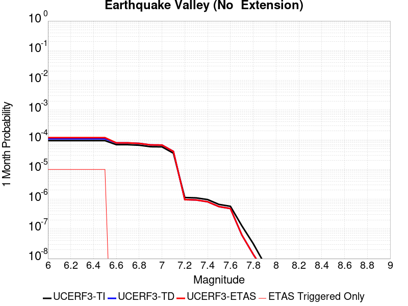 | 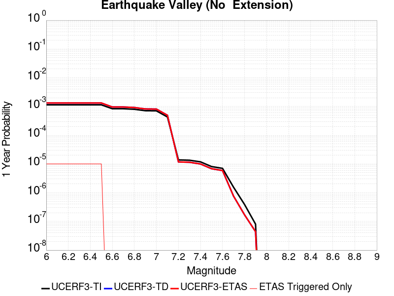 |  |

| Magnitude | 1 wk TI Prob | 1 wk TD Prob | 1 wk ETAS Prob | 1 wk ETAS/TD Gain | 1 wk ETAS Triggered Only | 1 mo TI Prob | 1 mo TD Prob | 1 mo ETAS Prob | 1 mo ETAS/TD Gain | 1 mo ETAS Triggered Only | 1 yr TI Prob | 1 yr TD Prob | 1 yr ETAS Prob | 1 yr ETAS/TD Gain | 1 yr ETAS Triggered Only | 10 yr TI Prob | 10 yr TD Prob | 10 yr ETAS Prob | 10 yr ETAS/TD Gain | 10 yr ETAS Triggered Only |
|-----|-----|-----|-----|-----|-----|-----|-----|-----|-----|-----|-----|-----|-----|-----|-----|-----|-----|-----|-----|-----|
| 6.0 | 2.1859703E-5 | 2.5198351E-5 | 3.51981E-5 | 1.3968414 | 1.0E-5 | 9.3681076E-5 | 1.0798928E-4 | 1.179882E-4 | 1.0925918 | 1.0E-5 | 0.0011399703 | 0.0013141216 | 0.0013241085 | 1.0075996 | 1.0E-5 | 0.011341401 | 0.013077869 | 0.013087738 | 1.0007546 | 1.0E-5 |
| 6.1 | 2.1859703E-5 | 2.5198351E-5 | 3.51981E-5 | 1.3968414 | 1.0E-5 | 9.3681076E-5 | 1.0798928E-4 | 1.179882E-4 | 1.0925918 | 1.0E-5 | 0.0011399703 | 0.0013141216 | 0.0013241085 | 1.0075996 | 1.0E-5 | 0.011341401 | 0.013077869 | 0.013087738 | 1.0007546 | 1.0E-5 |
| 6.2 | 2.1859703E-5 | 2.5198351E-5 | 3.51981E-5 | 1.3968414 | 1.0E-5 | 9.3681076E-5 | 1.0798928E-4 | 1.179882E-4 | 1.0925918 | 1.0E-5 | 0.0011399703 | 0.0013141216 | 0.0013241085 | 1.0075996 | 1.0E-5 | 0.011341401 | 0.013077869 | 0.013087738 | 1.0007546 | 1.0E-5 |
| 6.3 | 2.1859703E-5 | 2.5198351E-5 | 3.51981E-5 | 1.3968414 | 1.0E-5 | 9.3681076E-5 | 1.0798928E-4 | 1.179882E-4 | 1.0925918 | 1.0E-5 | 0.0011399703 | 0.0013141216 | 0.0013241085 | 1.0075996 | 1.0E-5 | 0.011341401 | 0.013077869 | 0.013087738 | 1.0007546 | 1.0E-5 |
| 6.4 | 2.1859703E-5 | 2.5198351E-5 | 3.51981E-5 | 1.3968414 | 1.0E-5 | 9.3681076E-5 | 1.0798928E-4 | 1.179882E-4 | 1.0925918 | 1.0E-5 | 0.0011399703 | 0.0013141216 | 0.0013241085 | 1.0075996 | 1.0E-5 | 0.011341401 | 0.013077869 | 0.013087738 | 1.0007546 | 1.0E-5 |
| 6.5 | 2.1859703E-5 | 2.5198351E-5 | 3.51981E-5 | 1.3968414 | 1.0E-5 | 9.3681076E-5 | 1.0798928E-4 | 1.179882E-4 | 1.0925918 | 1.0E-5 | 0.0011399703 | 0.0013141216 | 0.0013241085 | 1.0075996 | 1.0E-5 | 0.011341401 | 0.013077869 | 0.013087738 | 1.0007546 | 1.0E-5 |
| 6.6 | 1.597E-5 | 1.835627E-5 | 1.835627E-5 | 1.0 | 0.0 | 6.8441055E-5 | 7.866784E-5 | 7.866784E-5 | 1.0 | 0.0 | 8.329513E-4 | 9.5744745E-4 | 9.5744745E-4 | 1.0 | 0.0 | 0.008298361 | 0.009541833 | 0.009541833 | 1.0 | 0.0 |
| 6.7 | 1.597E-5 | 1.835627E-5 | 1.835627E-5 | 1.0 | 0.0 | 6.8441055E-5 | 7.866784E-5 | 7.866784E-5 | 1.0 | 0.0 | 8.329513E-4 | 9.5744745E-4 | 9.5744745E-4 | 1.0 | 0.0 | 0.008298361 | 0.009541833 | 0.009541833 | 1.0 | 0.0 |
| 6.8 | 1.5315149E-5 | 1.7602086E-5 | 1.7602086E-5 | 1.0 | 0.0 | 6.5634704E-5 | 7.543582E-5 | 7.543582E-5 | 1.0 | 0.0 | 7.988095E-4 | 9.1813074E-4 | 9.1813074E-4 | 1.0 | 0.0 | 0.007959441 | 0.009151915 | 0.009151915 | 1.0 | 0.0 |
| 6.9 | 1.3634728E-5 | 1.5675814E-5 | 1.5675814E-5 | 1.0 | 0.0 | 5.8433237E-5 | 6.7180794E-5 | 6.7180794E-5 | 1.0 | 0.0 | 7.1119244E-4 | 8.1770134E-4 | 8.1770134E-4 | 1.0 | 0.0 | 0.007089207 | 0.008154998 | 0.008154998 | 1.0 | 0.0 |
| 7.0 | 1.3496271E-5 | 1.5517848E-5 | 1.5517848E-5 | 1.0 | 0.0 | 5.783988E-5 | 6.6503824E-5 | 6.6503824E-5 | 1.0 | 0.0 | 7.03973E-4 | 8.0946536E-4 | 8.0946536E-4 | 1.0 | 0.0 | 0.007017471 | 0.008073238 | 0.008073238 | 1.0 | 0.0 |
| 7.1 | 8.242798E-6 | 9.472594E-6 | 9.472594E-6 | 1.0 | 0.0 | 3.53258E-5 | 4.0596577E-5 | 4.0596577E-5 | 1.0 | 0.0 | 4.300067E-4 | 4.9421826E-4 | 4.9421826E-4 | 1.0 | 0.0 | 0.004291756 | 0.0049377684 | 0.0049377684 | 1.0 | 0.0 |
| 7.2 | 2.6506527E-7 | 2.2559628E-7 | 2.2559628E-7 | 1.0 | 0.0 | 1.1359936E-6 | 9.668408E-7 | 9.668408E-7 | 1.0 | 0.0 | 1.3830633E-5 | 1.1771229E-5 | 1.1771229E-5 | 1.0 | 0.0 | 1.3829772E-4 | 1.1770646E-4 | 1.1770646E-4 | 1.0 | 0.0 |
| 7.3 | 2.5810488E-7 | 2.1954757E-7 | 2.1954757E-7 | 1.0 | 0.0 | 1.1061633E-6 | 9.4091786E-7 | 9.4091786E-7 | 1.0 | 0.0 | 1.3467455E-5 | 1.1455619E-5 | 1.1455619E-5 | 1.0 | 0.0 | 1.3466639E-4 | 1.145507E-4 | 1.145507E-4 | 1.0 | 0.0 |
| 7.4 | 2.2676066E-7 | 1.9109943E-7 | 1.9109943E-7 | 1.0 | 0.0 | 9.71831E-7 | 8.189973E-7 | 8.189973E-7 | 1.0 | 0.0 | 1.1831979E-5 | 9.971251E-6 | 9.971251E-6 | 1.0 | 0.0 | 1.1831349E-4 | 9.970842E-5 | 9.970842E-5 | 1.0 | 0.0 |
| 7.5 | 1.5553917E-7 | 1.311138E-7 | 1.311138E-7 | 1.0 | 0.0 | 6.6659624E-7 | 5.619162E-7 | 5.619162E-7 | 1.0 | 0.0 | 8.115779E-6 | 6.84131E-6 | 6.84131E-6 | 1.0 | 0.0 | 8.115482E-5 | 6.841121E-5 | 6.841121E-5 | 1.0 | 0.0 |
| 7.6 | 1.3448629E-7 | 1.1287708E-7 | 1.1287708E-7 | 1.0 | 0.0 | 5.7636964E-7 | 4.8375887E-7 | 4.8375887E-7 | 1.0 | 0.0 | 7.017278E-6 | 5.8897504E-6 | 5.8897504E-6 | 1.0 | 0.0 | 7.0170565E-5 | 5.8896156E-5 | 5.8896156E-5 | 1.0 | 0.0 |
| 7.7 | 2.9719402E-8 | 1.4581234E-8 | 1.4581234E-8 | 1.0 | 0.0 | 1.2736886E-7 | 6.2491004E-8 | 6.2491004E-8 | 1.0 | 0.0 | 1.5507147E-6 | 7.6082773E-7 | 7.6082773E-7 | 1.0 | 0.0 | 1.550704E-5 | 7.608257E-6 | 7.608257E-6 | 1.0 | 0.0 |
| 7.8 | 7.4390196E-9 | 3.249962E-9 | 3.249962E-9 | 1.0 | 0.0 | 3.1881513E-8 | 1.39284095E-8 | 1.39284095E-8 | 1.0 | 0.0 | 3.8815733E-7 | 1.6957837E-7 | 1.6957837E-7 | 1.0 | 0.0 | 3.8815665E-6 | 1.6957828E-6 | 1.6957828E-6 | 1.0 | 0.0 |
| 7.9 | 1.5373532E-9 | 8.4400953E-10 | 8.4400953E-10 | 1.0 | 0.0 | 6.5886567E-9 | 3.6171839E-9 | 3.6171839E-9 | 1.0 | 0.0 | 8.021689E-8 | 4.403921E-8 | 4.403921E-8 | 1.0 | 0.0 | 8.0216864E-7 | 4.403921E-7 | 4.403921E-7 | 1.0 | 0.0 |

## Great Valley 11
*[(top)](#table-of-contents)*

| 1 Week | 1 Month | 1 Year | 10 Year |
|-----|-----|-----|-----|
|  | 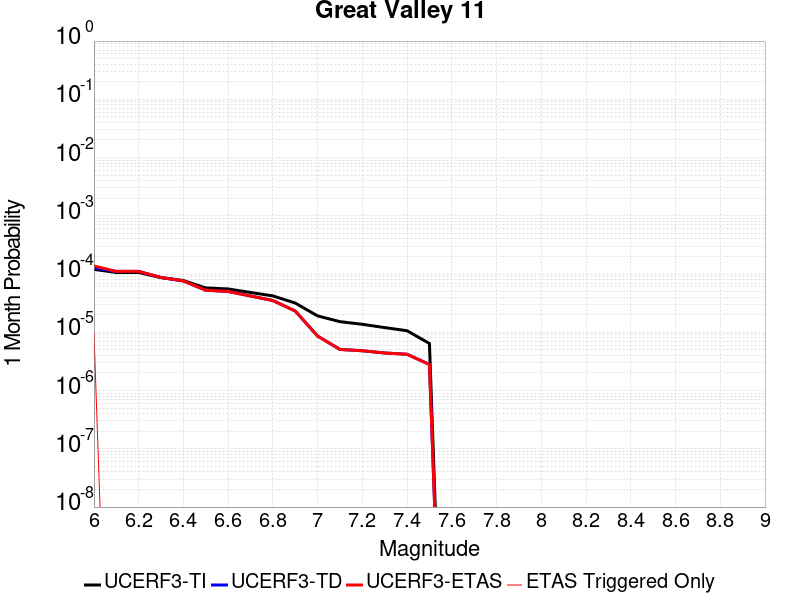 | 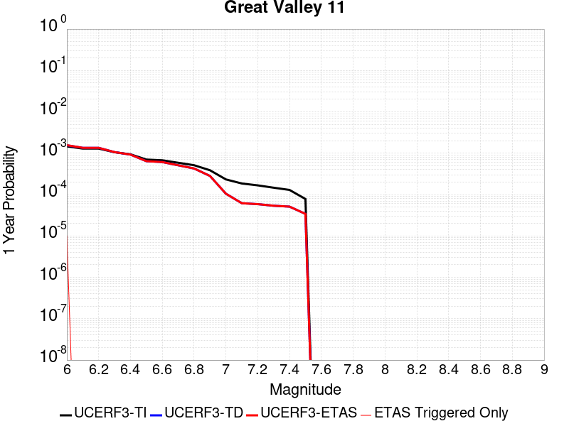 | 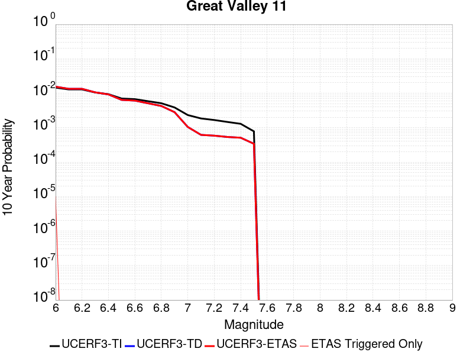 |

| Magnitude | 1 wk TI Prob | 1 wk TD Prob | 1 wk ETAS Prob | 1 wk ETAS/TD Gain | 1 wk ETAS Triggered Only | 1 mo TI Prob | 1 mo TD Prob | 1 mo ETAS Prob | 1 mo ETAS/TD Gain | 1 mo ETAS Triggered Only | 1 yr TI Prob | 1 yr TD Prob | 1 yr ETAS Prob | 1 yr ETAS/TD Gain | 1 yr ETAS Triggered Only | 10 yr TI Prob | 10 yr TD Prob | 10 yr ETAS Prob | 10 yr ETAS/TD Gain | 10 yr ETAS Triggered Only |
|-----|-----|-----|-----|-----|-----|-----|-----|-----|-----|-----|-----|-----|-----|-----|-----|-----|-----|-----|-----|-----|
| 6.0 | 2.8099583E-5 | 2.983214E-5 | 2.983214E-5 | 1.0 | 0.0 | 1.20421224E-4 | 1.2784619E-4 | 1.378449E-4 | 1.078209 | 1.0E-5 | 0.0014651422 | 0.0015554894 | 0.0015654739 | 1.0064188 | 1.0E-5 | 0.0145552 | 0.015453546 | 0.015463391 | 1.000637 | 1.0E-5 |
| 6.1 | 2.483194E-5 | 2.5907144E-5 | 2.5907144E-5 | 1.0 | 0.0 | 1.0641825E-4 | 1.11026246E-4 | 1.11026246E-4 | 1.0 | 0.0 | 0.0012948721 | 0.0013509697 | 0.0013509697 | 1.0 | 0.0 | 0.012873529 | 0.013433979 | 0.013433979 | 1.0 | 0.0 |
| 6.2 | 2.483194E-5 | 2.5907144E-5 | 2.5907144E-5 | 1.0 | 0.0 | 1.0641825E-4 | 1.11026246E-4 | 1.11026246E-4 | 1.0 | 0.0 | 0.0012948721 | 0.0013509697 | 0.0013509697 | 1.0 | 0.0 | 0.012873529 | 0.013433979 | 0.013433979 | 1.0 | 0.0 |
| 6.3 | 2.0257901E-5 | 2.0398915E-5 | 2.0398915E-5 | 1.0 | 0.0 | 8.681669E-5 | 8.742122E-5 | 8.742122E-5 | 1.0 | 0.0 | 0.0010564806 | 0.0010638753 | 0.0010638753 | 1.0 | 0.0 | 0.01051472 | 0.010591993 | 0.010591993 | 1.0 | 0.0 |
| 6.4 | 1.8054898E-5 | 1.7780852E-5 | 1.7780852E-5 | 1.0 | 0.0 | 7.737584E-5 | 7.6201635E-5 | 7.6201635E-5 | 1.0 | 0.0 | 9.416436E-4 | 9.2739763E-4 | 9.2739763E-4 | 1.0 | 0.0 | 0.009376635 | 0.009239015 | 0.009239015 | 1.0 | 0.0 |
| 6.5 | 1.34804895E-5 | 1.2321004E-5 | 1.2321004E-5 | 1.0 | 0.0 | 5.777225E-5 | 5.2803258E-5 | 5.2803258E-5 | 1.0 | 0.0 | 7.031501E-4 | 6.426942E-4 | 6.426942E-4 | 1.0 | 0.0 | 0.007009294 | 0.006408792 | 0.006408792 | 1.0 | 0.0 |
| 6.6 | 1.294883E-5 | 1.1732261E-5 | 1.1732261E-5 | 1.0 | 0.0 | 5.5493805E-5 | 5.028017E-5 | 5.028017E-5 | 1.0 | 0.0 | 6.754276E-4 | 6.1199325E-4 | 6.1199325E-4 | 1.0 | 0.0 | 0.006733784 | 0.0061035044 | 0.0061035044 | 1.0 | 0.0 |
| 6.7 | 1.1272237E-5 | 9.811834E-6 | 9.811834E-6 | 1.0 | 0.0 | 4.8308695E-5 | 4.205006E-5 | 4.205006E-5 | 1.0 | 0.0 | 5.879996E-4 | 5.1184196E-4 | 5.1184196E-4 | 1.0 | 0.0 | 0.005864462 | 0.005106915 | 0.005106915 | 1.0 | 0.0 |
| 6.8 | 9.8337505E-6 | 8.193719E-6 | 8.193719E-6 | 1.0 | 0.0 | 4.2143965E-5 | 3.5115478E-5 | 3.5115478E-5 | 1.0 | 0.0 | 5.1298196E-4 | 4.2744912E-4 | 4.2744912E-4 | 1.0 | 0.0 | 0.005117994 | 0.0042664795 | 0.0042664795 | 1.0 | 0.0 |
| 6.9 | 7.4224813E-6 | 5.4130837E-6 | 5.4130837E-6 | 1.0 | 0.0 | 3.1810247E-5 | 2.3198732E-5 | 2.3198732E-5 | 1.0 | 0.0 | 3.872209E-4 | 2.8240937E-4 | 2.8240937E-4 | 1.0 | 0.0 | 0.0038654688 | 0.0028206457 | 0.0028206457 | 1.0 | 0.0 |
| 7.0 | 4.4628923E-6 | 2.0110294E-6 | 2.0110294E-6 | 1.0 | 0.0 | 1.912654E-5 | 8.61867E-6 | 8.61867E-6 | 1.0 | 0.0 | 2.3284076E-4 | 1.0492737E-4 | 1.0492737E-4 | 1.0 | 0.0 | 0.0023259693 | 0.0010487898 | 0.0010487898 | 1.0 | 0.0 |
| 7.1 | 3.5546527E-6 | 1.1855383E-6 | 1.1855383E-6 | 1.0 | 0.0 | 1.5234136E-5 | 5.080869E-6 | 5.080869E-6 | 1.0 | 0.0 | 1.8545982E-4 | 6.185789E-5 | 6.185789E-5 | 1.0 | 0.0 | 0.0018530512 | 6.1841356E-4 | 6.1841356E-4 | 1.0 | 0.0 |
| 7.2 | 3.2039936E-6 | 1.1253728E-6 | 1.1253728E-6 | 1.0 | 0.0 | 1.3731329E-5 | 4.8230177E-6 | 4.8230177E-6 | 1.0 | 0.0 | 1.671661E-4 | 5.8718724E-5 | 5.8718724E-5 | 1.0 | 0.0 | 0.0016704041 | 5.870388E-4 | 5.870388E-4 | 1.0 | 0.0 |
| 7.3 | 2.8120473E-6 | 1.0305271E-6 | 1.0305271E-6 | 1.0 | 0.0 | 1.2051575E-5 | 4.4165376E-6 | 4.4165376E-6 | 1.0 | 0.0 | 1.4671806E-4 | 5.3770087E-5 | 5.3770087E-5 | 1.0 | 0.0 | 0.0014662122 | 5.375774E-4 | 5.375774E-4 | 1.0 | 0.0 |
| 7.4 | 2.4837766E-6 | 9.80032E-7 | 9.80032E-7 | 1.0 | 0.0 | 1.0644713E-5 | 4.2001307E-6 | 4.2001307E-6 | 1.0 | 0.0 | 1.2959167E-4 | 5.113546E-5 | 5.113546E-5 | 1.0 | 0.0 | 0.0012951613 | 5.1124353E-4 | 5.1124353E-4 | 1.0 | 0.0 |
| 7.5 | 1.5002679E-6 | 6.545985E-7 | 6.545985E-7 | 1.0 | 0.0 | 6.4297037E-6 | 2.8054194E-6 | 2.8054194E-6 | 1.0 | 0.0 | 7.827883E-5 | 3.4155488E-5 | 3.4155488E-5 | 1.0 | 0.0 | 7.825126E-4 | 3.4150656E-4 | 3.4150656E-4 | 1.0 | 0.0 |

