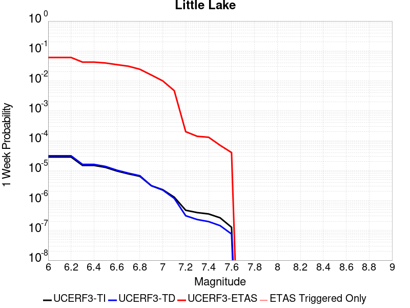
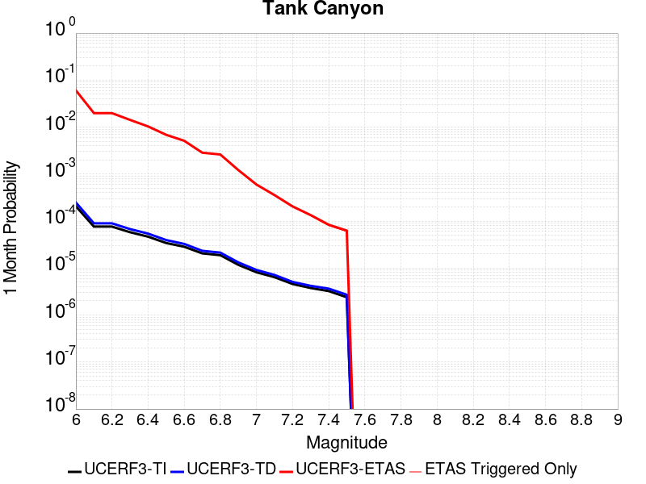
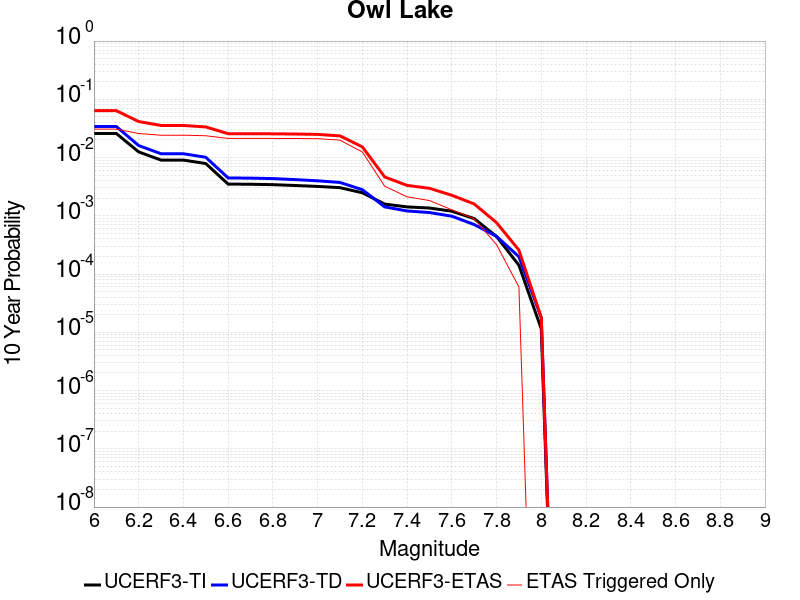
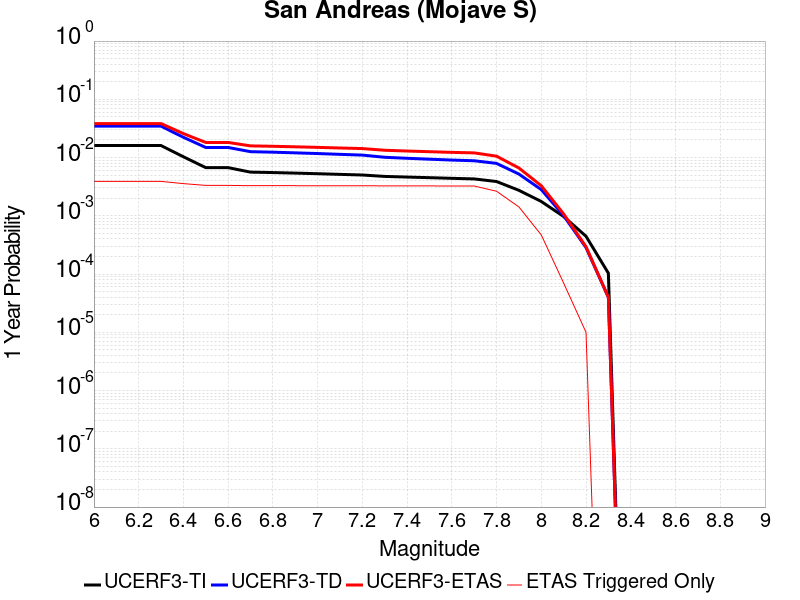
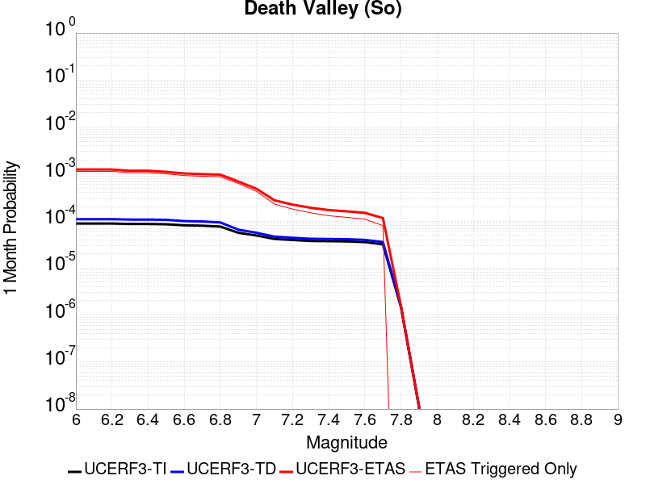
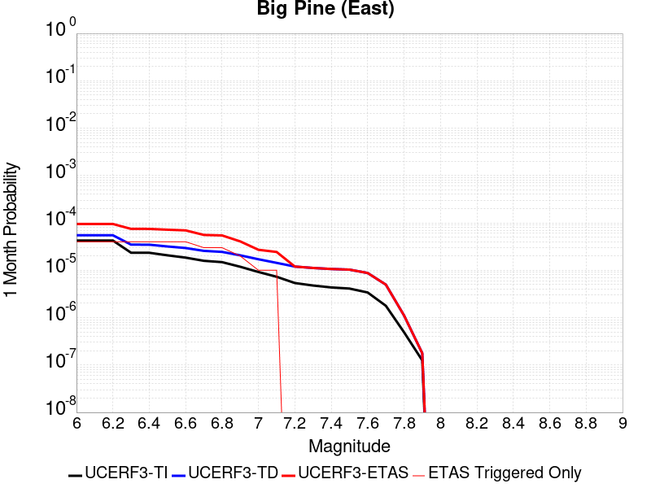
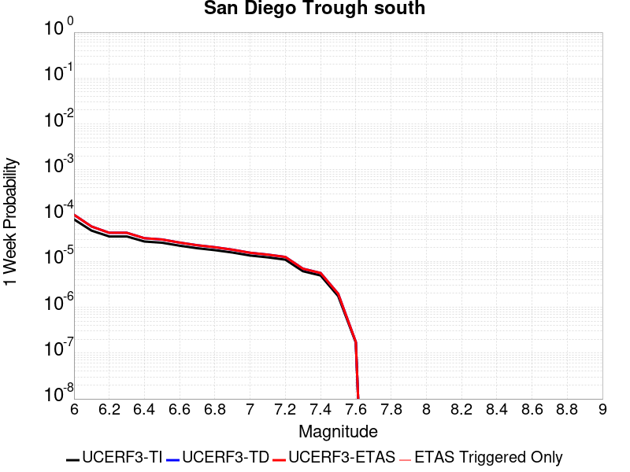
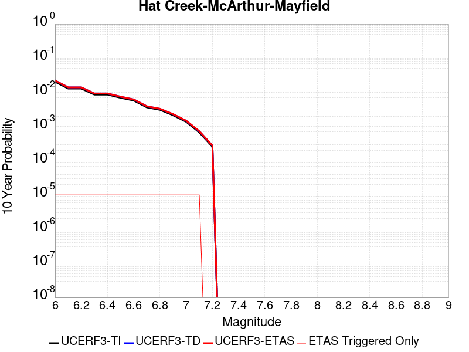
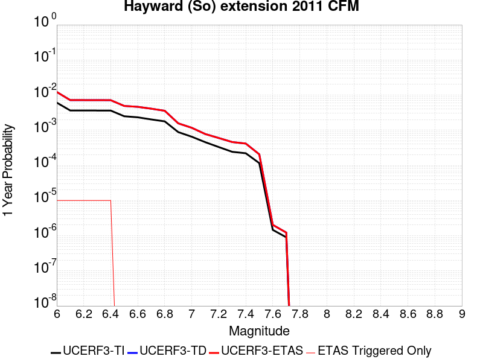

# Parent Section Magnitude-Probability Distributions

Only fault sections with at least one triggered aftershock are plotted. Sections are sorted by total supraseismogenic trigger rate (decreasing)

## Table Of Contents

* [Garlock (Central)](#garlock-central)
* [Little Lake](#little-lake)
* [Tank Canyon](#tank-canyon)
* [Airport Lake](#airport-lake)
* [Owl Lake](#owl-lake)
* [Panamint Valley](#panamint-valley)
* [Garlock (East)](#garlock-east)
* [Hunter Mountain-Saline Valley](#hunter-mountain-saline-valley)
* [Garlock (West)](#garlock-west)
* [Blackwater](#blackwater)
* [Ash Hill](#ash-hill)
* [San Andreas (Mojave N)](#san-andreas-mojave-n)
* [San Andreas (Mojave S)](#san-andreas-mojave-s)
* [Gravel Hills-Harper Lk](#gravel-hills-harper-lk)
* [So Sierra Nevada](#so-sierra-nevada)
* [McLean Lake](#mclean-lake)
* [San Andreas (San Bernardino N)](#san-andreas-san-bernardino-n)
* [Goldstone Lake](#goldstone-lake)
* [Lenwood-Lockhart-Old Woman Springs](#lenwood-lockhart-old-woman-springs)
* [Coyote Canyon](#coyote-canyon)
* [Death Valley (So)](#death-valley-so)
* [Towne Pass](#towne-pass)
* [San Andreas (San Bernardino S)](#san-andreas-san-bernardino-s)
* [Nelson Lake](#nelson-lake)
* [Paradise](#paradise)
* [Bicycle Lake](#bicycle-lake)
* [Garlic Springs](#garlic-springs)
* [Death Valley (Black Mtns Frontal)](#death-valley-black-mtns-frontal)
* [Helendale-So Lockhart](#helendale-so-lockhart)
* [San Andreas (San Gorgonio Pass-Garnet HIll)](#san-andreas-san-gorgonio-pass-garnet-hill)
* [San Andreas (Parkfield)](#san-andreas-parkfield)
* [Sierra Nevada  (No Extension)](#sierra-nevada--no-extension)
* [San Andreas (Coachella) rev](#san-andreas-coachella-rev)
* [San Andreas (Big Bend)](#san-andreas-big-bend)
* [San Jacinto (San Bernardino)](#san-jacinto-san-bernardino)
* [Death Valley (No)](#death-valley-no)
* [San Andreas (North Branch Mill Creek)](#san-andreas-north-branch-mill-creek)
* [San Andreas (Cholame) rev](#san-andreas-cholame-rev)
* [Elsinore (Glen Ivy) rev](#elsinore-glen-ivy-rev)
* [San Andreas (Carrizo) rev](#san-andreas-carrizo-rev)
* [Ludlow](#ludlow)
* [Calico-Hidalgo](#calico-hidalgo)
* [Scodie Lineament](#scodie-lineament)
* [Cady](#cady)
* [Red Pass](#red-pass)
* [Coyote Lake](#coyote-lake)
* [San Jacinto (San Jacinto Valley) rev](#san-jacinto-san-jacinto-valley-rev)
* [White Wolf (Extension)](#white-wolf-extension)
* [San Andreas (Creeping Section) 2011 CFM](#san-andreas-creeping-section-2011-cfm)
* [Owens Valley](#owens-valley)
* [San Jacinto (Lytle Creek connector)](#san-jacinto-lytle-creek-connector)
* [Manix-Afton Hills](#manix-afton-hills)
* [San Jacinto (Stepovers Combined)](#san-jacinto-stepovers-combined)
* [Death Valley (Fish Lake Valley)](#death-valley-fish-lake-valley)
* [Lake Isabella (Seismicity)](#lake-isabella-seismicity)
* [San Jacinto (Anza) rev](#san-jacinto-anza-rev)
* [Baker](#baker)
* [Cleghorn Lake](#cleghorn-lake)
* [Mission Creek](#mission-creek)
* [Santa Rosa Island](#santa-rosa-island)
* [Pisgah-Bullion Mtn-Mesquite Lk](#pisgah-bullion-mtn-mesquite-lk)
* [Kern Canyon (North Kern) 2011](#kern-canyon-north-kern-2011)
* [Independence rev 2011](#independence-rev-2011)
* [Mission Ridge-Arroyo Parida-Santa Ana](#mission-ridge-arroyo-parida-santa-ana)
* [Cleghorn Pass](#cleghorn-pass)
* [San Jacinto (Coyote Creek)](#san-jacinto-coyote-creek)
* [Imperial](#imperial)
* [Brawley (Seismic Zone) alt 1](#brawley-seismic-zone-alt-1)
* [Santa Ynez (East)](#santa-ynez-east)
* [San Pedro Basin](#san-pedro-basin)
* [Kern Canyon (South Kern) 2011](#kern-canyon-south-kern-2011)
* [Lost Hills](#lost-hills)
* [Santa Ynez (West)](#santa-ynez-west)
* [Deep Springs](#deep-springs)
* [Ortigalita (North)](#ortigalita-north)
* [Palos Verdes](#palos-verdes)
* [Pinto Mtn](#pinto-mtn)
* [White Mountains](#white-mountains)
* [Rose Canyon](#rose-canyon)
* [Red Mountain](#red-mountain)
* [Coronado Bank alt1](#coronado-bank-alt1)
* [Gillem - Big Crack 2011 CFM](#gillem---big-crack-2011-cfm)
* [San Juan](#san-juan)
* [Kern Canyon (Lake Isabella) 2011](#kern-canyon-lake-isabella-2011)
* [Blue Cut](#blue-cut)
* [San Diego Trough north alt1](#san-diego-trough-north-alt1)
* [Bullion Mountains](#bullion-mountains)
* [Big Pine (Central)](#big-pine-central)
* [San Clemente](#san-clemente)
* [Big Pine (East)](#big-pine-east)
* [Hector Mine](#hector-mine)
* [Simi-Santa Rosa](#simi-santa-rosa)
* [Swain Ravine - Spenceville](#swain-ravine---spenceville)
* [Ventura-Pitas Point](#ventura-pitas-point)
* [Sheephole](#sheephole)
* [Pine Mtn](#pine-mtn)
* [Whittier alt 1](#whittier-alt-1)
* [Santa Ynez River](#santa-ynez-river)
* [Chino alt 1](#chino-alt-1)
* [Elysian Park (Upper)](#elysian-park-upper)
* [Ortigalita (South)](#ortigalita-south)
* [San Jacinto (Clark) rev](#san-jacinto-clark-rev)
* [San Jacinto (Borrego)](#san-jacinto-borrego)
* [Dry Mountain](#dry-mountain)
* [Hosgri](#hosgri)
* [Great Valley 09 (Laguna Seca)](#great-valley-09-laguna-seca)
* [Calaveras (So) 2011 CFM](#calaveras-so-2011-cfm)
* [Calaveras (Central) 2011 CFM](#calaveras-central-2011-cfm)
* [Cerro Prieto](#cerro-prieto)
* [San Andreas (Peninsula) 2011 CFM](#san-andreas-peninsula-2011-cfm)
* [Channel Islands Thrust](#channel-islands-thrust)
* [Santa Cruz Island](#santa-cruz-island)
* [Santa Cruz Catalina Ridge alt1](#santa-cruz-catalina-ridge-alt1)
* [South Klamath Lake West](#south-klamath-lake-west)
* [Hosgri (Extension)](#hosgri-extension)
* [Tin Mountain](#tin-mountain)
* [Mono Lake 2011 CFM](#mono-lake-2011-cfm)
* [Hunting Creek - Berryessa 2011 CFM](#hunting-creek---berryessa-2011-cfm)
* [Newport-Inglewood (Offshore)](#newport-inglewood-offshore)
* [San Gorgonio Pass](#san-gorgonio-pass)
* [La Panza 2011](#la-panza-2011)
* [Johnson Valley (No) 2011 rev](#johnson-valley-no-2011-rev)
* [Fitzhugh Creek](#fitzhugh-creek)
* [San Andreas (North Coast) 2011 CFM](#san-andreas-north-coast-2011-cfm)
* [Camp Rock 2011](#camp-rock-2011)
* [San Andreas (Santa Cruz Mts) 2011 CFM](#san-andreas-santa-cruz-mts-2011-cfm)
* [Cedar Mtn-Mahogany Mtn](#cedar-mtn-mahogany-mtn)
* [Santa Susana East (connector)](#santa-susana-east-connector)
* [White Wolf](#white-wolf)
* [Maacama 2011 CFM](#maacama-2011-cfm)
* [South Klamath Lake East](#south-klamath-lake-east)
* [Quien Sabe 2011 CFM](#quien-sabe-2011-cfm)
* [Clamshell-Sawpit](#clamshell-sawpit)
* [Shoreline](#shoreline)
* [Eaton Roughs 2011 CFM](#eaton-roughs-2011-cfm)
* [Carlsbad](#carlsbad)
* [Great Valley 07 (Orestimba)](#great-valley-07-orestimba)
* [Breckenridge 2011](#breckenridge-2011)
* [Malibu Coast alt 1](#malibu-coast-alt-1)
* [Calaveras (So) - Paicines extension 2011 CFM](#calaveras-so---paicines-extension-2011-cfm)
* [Bartlett Springs 2011 CFM](#bartlett-springs-2011-cfm)
* [Oceanic - West Huasna](#oceanic---west-huasna)
* [Hayward (So) 2011 CFM](#hayward-so-2011-cfm)
* [Santa Susana alt 1](#santa-susana-alt-1)
* [San Gabriel (Extension)](#san-gabriel-extension)
* [Robinson Creek](#robinson-creek)
* [San Diego Trough south](#san-diego-trough-south)
* [Calaveras (No) 2011 CFM](#calaveras-no-2011-cfm)
* [Verdugo](#verdugo)
* [Pleito](#pleito)
* [Oak Ridge (Onshore)](#oak-ridge-onshore)
* [Great Valley 11](#great-valley-11)
* [Hat Creek-McArthur-Mayfield](#hat-creek-mcarthur-mayfield)
* [Sierra Madre](#sierra-madre)
* [San Gabriel](#san-gabriel)
* [Owens Valley Keough Hot Springs](#owens-valley-keough-hot-springs)
* [Earthquake Valley (No  Extension)](#earthquake-valley-no--extension)
* [Great Valley 14 (Kettleman Hills)](#great-valley-14-kettleman-hills)
* [Elmore Ranch](#elmore-ranch)
* [West Napa 2011 CFM](#west-napa-2011-cfm)
* [Hunting Creek - Bartlett Springs connector 2011](#hunting-creek---bartlett-springs-connector-2011)
* [San Luis Range 2011 CFM](#san-luis-range-2011-cfm)
* [Hayward (So) extension 2011 CFM](#hayward-so-extension-2011-cfm)
* [North Frontal  (West)](#north-frontal--west)
* [Laguna Salada](#laguna-salada)
* [Peralta Hills](#peralta-hills)
* [Monterey Bay-Tularcitos](#monterey-bay-tularcitos)
* [Channel Islands Western Deep Ramp](#channel-islands-western-deep-ramp)
* [San Andreas (Offshore) 2011 CFM](#san-andreas-offshore-2011-cfm)
* [Superstition Hills](#superstition-hills)
* [Rinconada 2011 CFM](#rinconada-2011-cfm)
* [San Jacinto (Superstition Mtn)](#san-jacinto-superstition-mtn)
* [Silver Creek 2011 CFM](#silver-creek-2011-cfm)
* [Newport-Inglewood alt 1](#newport-inglewood-alt-1)
* [Great Valley 03a Dunnigan Hills](#great-valley-03a-dunnigan-hills)
* [Walker Spring 2011 CFM](#walker-spring-2011-cfm)
* [Surprise Valley 2011 CFM](#surprise-valley-2011-cfm)
* [Great Valley 08 (Quinto)](#great-valley-08-quinto)
* [Davis Creek](#davis-creek)

## Garlock (Central)
*[(top)](#table-of-contents)*

| 1 Week | 1 Month | 1 Year | 10 Year |
|-----|-----|-----|-----|
|  |  |  |  |

| Magnitude | 1 wk TI Prob | 1 wk TD Prob | 1 wk ETAS Prob | 1 wk ETAS/TD Gain | 1 wk ETAS Triggered Only | 1 mo TI Prob | 1 mo TD Prob | 1 mo ETAS Prob | 1 mo ETAS/TD Gain | 1 mo ETAS Triggered Only | 1 yr TI Prob | 1 yr TD Prob | 1 yr ETAS Prob | 1 yr ETAS/TD Gain | 1 yr ETAS Triggered Only | 10 yr TI Prob | 10 yr TD Prob | 10 yr ETAS Prob | 10 yr ETAS/TD Gain | 10 yr ETAS Triggered Only |
|-----|-----|-----|-----|-----|-----|-----|-----|-----|-----|-----|-----|-----|-----|-----|-----|-----|-----|-----|-----|-----|
| 6.0 | 5.5131142E-5 | 7.024681E-5 | 0.12646137 | 1800.2435 | 0.1264 | 2.3625491E-4 | 3.010234E-4 | 0.13499047 | 448.43848 | 0.13473 | 0.0028726095 | 0.0036588663 | 0.14882576 | 40.675377 | 0.1457 | 0.028357591 | 0.036079824 | 0.18334755 | 5.0817194 | 0.15278 |
| 6.1 | 5.5131142E-5 | 7.024681E-5 | 0.12646137 | 1800.2435 | 0.1264 | 2.3625491E-4 | 3.010234E-4 | 0.13499047 | 448.43848 | 0.13473 | 0.0028726095 | 0.0036588663 | 0.14882576 | 40.675377 | 0.1457 | 0.028357591 | 0.036079824 | 0.18334755 | 5.0817194 | 0.15278 |
| 6.2 | 4.216245E-5 | 5.1661493E-5 | 0.07652771 | 1481.3298 | 0.07648 | 1.806837E-4 | 2.2138779E-4 | 0.081693344 | 369.00568 | 0.08149 | 0.0021976046 | 0.0026920962 | 0.09057487 | 33.644737 | 0.08812 | 0.021759989 | 0.026689773 | 0.11656524 | 4.367412 | 0.09234 |
| 6.3 | 4.216245E-5 | 5.1661493E-5 | 0.07652771 | 1481.3298 | 0.07648 | 1.806837E-4 | 2.2138779E-4 | 0.081693344 | 369.00568 | 0.08149 | 0.0021976046 | 0.0026920962 | 0.09057487 | 33.644737 | 0.08812 | 0.021759989 | 0.026689773 | 0.11656524 | 4.367412 | 0.09234 |
| 6.4 | 3.6858168E-5 | 4.411054E-5 | 0.058701523 | 1330.7822 | 0.05866 | 1.5795401E-4 | 1.8903162E-4 | 0.06282719 | 332.36337 | 0.06265 | 0.0019213937 | 0.002299056 | 0.07004295 | 30.465961 | 0.0679 | 0.019048655 | 0.02284894 | 0.09239278 | 4.0436354 | 0.07117 |
| 6.5 | 3.39199E-5 | 4.0018083E-5 | 0.052797906 | 1319.3512 | 0.05276 | 1.453629E-4 | 1.7149492E-4 | 0.05646184 | 329.2333 | 0.0563 | 0.0017683565 | 0.002085973 | 0.0630685 | 30.234571 | 0.06111 | 0.017543508 | 0.020759864 | 0.08349978 | 4.022174 | 0.06407 |
| 6.6 | 3.3571985E-5 | 3.9472274E-5 | 0.05277739 | 1337.0751 | 0.05274 | 1.4387199E-4 | 1.6915603E-4 | 0.05642964 | 333.59518 | 0.05627 | 0.0017502342 | 0.0020575512 | 0.06301188 | 30.624695 | 0.06108 | 0.017365133 | 0.020481179 | 0.08320957 | 4.062733 | 0.06404 |
| 6.7 | 3.2580007E-5 | 3.8088703E-5 | 0.050836153 | 1334.6781 | 0.0508 | 1.3962112E-4 | 1.632272E-4 | 0.054394376 | 333.24332 | 0.05424 | 0.0016985617 | 0.0019855013 | 0.060728636 | 30.586046 | 0.05886 | 0.016856372 | 0.019773813 | 0.08025377 | 4.0585885 | 0.0617 |
| 6.8 | 3.2185937E-5 | 3.7515918E-5 | 0.04980565 | 1327.587 | 0.04977 | 1.3793244E-4 | 1.6077272E-4 | 0.053312227 | 331.59995 | 0.05316 | 0.0016780337 | 0.001955672 | 0.059482947 | 30.415606 | 0.05764 | 0.016654192 | 0.019480614 | 0.078723595 | 4.041125 | 0.06042 |
| 6.9 | 3.165394E-5 | 3.6720503E-5 | 0.04847494 | 1320.1056 | 0.04844 | 1.3565269E-4 | 1.5736422E-4 | 0.051849227 | 329.4855 | 0.0517 | 0.0016503202 | 0.001914247 | 0.057886895 | 30.240034 | 0.05608 | 0.01638118 | 0.019073246 | 0.07678117 | 4.025595 | 0.05883 |
| 7.0 | 3.0903822E-5 | 3.5625766E-5 | 0.046983954 | 1318.8195 | 0.04695 | 1.3243823E-4 | 1.5267303E-4 | 0.050225027 | 328.97116 | 0.05008 | 0.0016112428 | 0.0018572307 | 0.05602644 | 30.166656 | 0.05427 | 0.015996104 | 0.018512413 | 0.07441795 | 4.0198946 | 0.05696 |
| 7.1 | 3.0069863E-5 | 3.4392073E-5 | 0.04497285 | 1307.6516 | 0.04494 | 1.2886449E-4 | 1.4738638E-4 | 0.04802033 | 325.81253 | 0.04788 | 0.0015677959 | 0.0017929734 | 0.05351008 | 29.844326 | 0.05181 | 0.01556781 | 0.017880075 | 0.071219005 | 3.9831493 | 0.05431 |
| 7.2 | 2.7957109E-5 | 3.128145E-5 | 0.03714012 | 1187.2888 | 0.03711 | 1.1981068E-4 | 1.340566E-4 | 0.039608765 | 295.463 | 0.03948 | 0.0014577188 | 0.0016309366 | 0.044161458 | 27.07736 | 0.0426 | 0.014481937 | 0.016283695 | 0.060236137 | 3.6991692 | 0.04468 |
| 7.3 | 2.4519275E-5 | 2.6714795E-5 | 0.026046019 | 974.9661 | 0.02602 | 1.0507837E-4 | 1.1448703E-4 | 0.027841313 | 243.1831 | 0.02773 | 0.0012785783 | 0.001393003 | 0.03131127 | 22.47753 | 0.02996 | 0.012712469 | 0.013928054 | 0.0449696 | 3.2287066 | 0.03148 |
| 7.4 | 2.3225532E-5 | 2.51994E-5 | 0.023474608 | 931.55426 | 0.02345 | 9.95342E-5 | 1.0799304E-4 | 0.0250453 | 231.91586 | 0.02494 | 0.0012111551 | 0.0013140367 | 0.02826857 | 21.512772 | 0.02699 | 0.012045753 | 0.013145725 | 0.041132912 | 3.1289952 | 0.02836 |
| 7.5 | 2.097765E-5 | 2.2483688E-5 | 0.01842207 | 819.35266 | 0.0184 | 8.9901114E-5 | 9.635517E-5 | 0.019684467 | 204.29073 | 0.01959 | 0.0010939965 | 0.0011725046 | 0.022287717 | 19.008638 | 0.02114 | 0.010886264 | 0.011740365 | 0.033768672 | 2.8762882 | 0.02229 |
| 7.6 | 1.511254E-5 | 1.5991332E-5 | 0.010285827 | 643.21265 | 0.01027 | 6.476642E-5 | 6.853253E-5 | 0.010957786 | 159.89175 | 0.01089 | 7.882459E-4 | 8.3407195E-4 | 0.01262423 | 15.135661 | 0.0118 | 0.007854558 | 0.008383559 | 0.020739099 | 2.4737823 | 0.01246 |
| 7.7 | 9.934069E-6 | 1.0678794E-5 | 0.0034306422 | 321.25748 | 0.00342 | 4.2573887E-5 | 4.5765457E-5 | 0.003685599 | 80.53233 | 0.00364 | 5.182138E-4 | 5.570524E-4 | 0.0045648185 | 8.194595 | 0.00401 | 0.00517007 | 0.005627684 | 0.009903485 | 1.7597799 | 0.0043 |
| 7.8 | 6.7562896E-6 | 8.428449E-6 | 0.0021384105 | 253.71341 | 0.00213 | 2.8955206E-5 | 3.6121426E-5 | 0.0023260387 | 64.39499 | 0.00229 | 3.5247262E-4 | 4.3968976E-4 | 0.0029385905 | 6.683327 | 0.0025 | 0.0035191406 | 0.004446654 | 0.0070749153 | 1.5910648 | 0.00264 |
| 7.9 | 3.975453E-6 | 5.37103E-6 | 0.001125365 | 209.52498 | 0.00112 | 1.7037546E-5 | 2.3018498E-5 | 0.0012229909 | 53.130783 | 0.0012 | 2.0741238E-4 | 2.8021427E-4 | 0.00157985 | 5.6380067 | 0.0013 | 0.002072189 | 0.0028336283 | 0.0042196894 | 1.4891472 | 0.00139 |
| 8.0 | 1.6729537E-6 | 2.0775144E-6 | 3.6207677E-4 | 174.28365 | 3.6E-4 | 7.169782E-6 | 8.903603E-6 | 3.789003E-4 | 42.55584 | 3.7E-4 | 8.7288594E-5 | 1.0839601E-4 | 5.283505E-4 | 4.8742614 | 4.2E-4 | 8.7254314E-4 | 0.0010969337 | 0.0015364512 | 1.4006782 | 4.4E-4 |
| 8.1 | 3.6733252E-7 | 3.1489964E-7 | 4.0314888E-5 | 128.02455 | 4.0E-5 | 1.5742813E-6 | 1.3495693E-6 | 4.1349515E-5 | 30.639046 | 4.0E-5 | 1.9166706E-5 | 1.6430899E-5 | 6.6430075E-5 | 4.0429974 | 5.0E-5 | 1.9165053E-4 | 1.6638759E-4 | 2.1637927E-4 | 1.3004532 | 5.0E-5 |

## Little Lake
*[(top)](#table-of-contents)*

| 1 Week | 1 Month | 1 Year | 10 Year |
|-----|-----|-----|-----|
|  |  |  |  |

| Magnitude | 1 wk TI Prob | 1 wk TD Prob | 1 wk ETAS Prob | 1 wk ETAS/TD Gain | 1 wk ETAS Triggered Only | 1 mo TI Prob | 1 mo TD Prob | 1 mo ETAS Prob | 1 mo ETAS/TD Gain | 1 mo ETAS Triggered Only | 1 yr TI Prob | 1 yr TD Prob | 1 yr ETAS Prob | 1 yr ETAS/TD Gain | 1 yr ETAS Triggered Only | 10 yr TI Prob | 10 yr TD Prob | 10 yr ETAS Prob | 10 yr ETAS/TD Gain | 10 yr ETAS Triggered Only |
|-----|-----|-----|-----|-----|-----|-----|-----|-----|-----|-----|-----|-----|-----|-----|-----|-----|-----|-----|-----|-----|
| 6.0 | 2.8424427E-5 | 3.120572E-5 | 0.060649313 | 1943.5319 | 0.06062 | 1.2181328E-4 | 1.337327E-4 | 0.06489507 | 485.25955 | 0.06477 | 0.0014820677 | 0.0016271127 | 0.071652986 | 44.036892 | 0.07014 | 0.014722223 | 0.016165402 | 0.08865433 | 5.484203 | 0.07368 |
| 6.1 | 2.8424427E-5 | 3.120572E-5 | 0.060649313 | 1943.5319 | 0.06062 | 1.2181328E-4 | 1.337327E-4 | 0.06489507 | 485.25955 | 0.06477 | 0.0014820677 | 0.0016271127 | 0.071652986 | 44.036892 | 0.07014 | 0.014722223 | 0.016165402 | 0.08865433 | 5.484203 | 0.07368 |
| 6.2 | 2.8424427E-5 | 3.120572E-5 | 0.060649313 | 1943.5319 | 0.06062 | 1.2181328E-4 | 1.337327E-4 | 0.06489507 | 485.25955 | 0.06477 | 0.0014820677 | 0.0016271127 | 0.071652986 | 44.036892 | 0.07014 | 0.014722223 | 0.016165402 | 0.08865433 | 5.484203 | 0.07368 |
| 6.3 | 1.48860645E-5 | 1.6081389E-5 | 0.0424154 | 2637.5457 | 0.0424 | 6.379586E-5 | 6.8918576E-5 | 0.045385797 | 658.54224 | 0.04532 | 7.7643775E-4 | 8.3878887E-4 | 0.049757723 | 59.32091 | 0.04896 | 0.007737305 | 0.008359048 | 0.059299644 | 7.0940666 | 0.05137 |
| 6.4 | 1.48860645E-5 | 1.6081389E-5 | 0.0424154 | 2637.5457 | 0.0424 | 6.379586E-5 | 6.8918576E-5 | 0.045385797 | 658.54224 | 0.04532 | 7.7643775E-4 | 8.3878887E-4 | 0.049757723 | 59.32091 | 0.04896 | 0.007737305 | 0.008359048 | 0.059299644 | 7.0940666 | 0.05137 |
| 6.5 | 1.2797581E-5 | 1.3765565E-5 | 0.03971322 | 2884.9683 | 0.0397 | 5.4845623E-5 | 5.899409E-5 | 0.042456493 | 719.67365 | 0.0424 | 6.675408E-4 | 7.18042E-4 | 0.046545114 | 64.822266 | 0.04586 | 0.006655392 | 0.00715977 | 0.054895528 | 7.6672196 | 0.04808 |
| 6.6 | 9.661896E-6 | 1.0289038E-5 | 0.03488993 | 3390.981 | 0.03488 | 4.1407468E-5 | 4.409522E-5 | 0.03731245 | 846.179 | 0.03727 | 5.040193E-4 | 5.367433E-4 | 0.04089507 | 76.19111 | 0.04038 | 0.005028777 | 0.0053560743 | 0.047509085 | 8.8701315 | 0.04238 |
| 6.7 | 7.767871E-6 | 8.199687E-6 | 0.030967945 | 3776.7231 | 0.03096 | 3.329045E-5 | 3.5141118E-5 | 0.033133976 | 942.8834 | 0.0331 | 4.0523586E-4 | 4.2777284E-4 | 0.036262438 | 84.77031 | 0.03585 | 0.004044977 | 0.004270846 | 0.041680392 | 9.759282 | 0.03757 |
| 6.8 | 6.4235196E-6 | 6.7357446E-6 | 0.024476571 | 3633.833 | 0.02447 | 2.752908E-5 | 2.8867229E-5 | 0.026198111 | 907.53815 | 0.02617 | 3.35115E-4 | 3.5141467E-4 | 0.028701449 | 81.67402 | 0.02836 | 0.003346101 | 0.00350985 | 0.033065747 | 9.420843 | 0.02966 |
| 6.9 | 3.1283696E-6 | 3.1121804E-6 | 0.015733063 | 5055.3184 | 0.01573 | 1.3407229E-5 | 1.3337856E-5 | 0.016813114 | 1260.5559 | 0.0168 | 1.6322079E-4 | 1.6237781E-4 | 0.018409414 | 113.373955 | 0.01825 | 0.0016310095 | 0.00162274 | 0.020701729 | 12.757268 | 0.01911 |
| 7.0 | 2.290603E-6 | 2.2286815E-6 | 0.009982207 | 4478.9736 | 0.00998 | 9.816834E-6 | 9.551463E-6 | 0.01056945 | 1106.5792 | 0.01056 | 1.19513395E-4 | 1.162839E-4 | 0.011554954 | 99.36847 | 0.01144 | 0.0011944914 | 0.0011623327 | 0.013128408 | 11.29488 | 0.01198 |
| 7.1 | 1.293693E-6 | 1.1776827E-6 | 0.004711172 | 4000.3745 | 0.00471 | 5.5443866E-6 | 5.0472063E-6 | 0.0050650216 | 1003.5298 | 0.00506 | 6.750081E-5 | 6.14487E-5 | 0.005541112 | 90.1746 | 0.00548 | 6.7480316E-4 | 6.143856E-4 | 0.006350859 | 10.336927 | 0.00574 |
| 7.2 | 4.715842E-7 | 3.0917857E-7 | 2.0030912E-4 | 647.8752 | 2.0E-4 | 2.0210737E-6 | 1.3250503E-6 | 2.2132476E-4 | 167.0312 | 2.2E-4 | 2.4606294E-5 | 1.6132375E-5 | 2.3612882E-4 | 14.636954 | 2.2E-4 | 2.460357E-4 | 1.6131258E-4 | 3.9127548E-4 | 2.4255733 | 2.3E-4 |
| 7.3 | 3.9430947E-7 | 2.3097488E-7 | 1.4023094E-4 | 607.1264 | 1.4E-4 | 1.6898966E-6 | 9.89892E-7 | 1.5098974E-4 | 152.53154 | 1.5E-4 | 2.0574296E-5 | 1.2051869E-5 | 1.6205006E-4 | 13.446053 | 1.5E-4 | 2.0572392E-4 | 1.20512224E-4 | 2.8049294E-4 | 2.327506 | 1.6E-4 |
| 7.4 | 3.547123E-7 | 1.9679135E-7 | 1.3019677E-4 | 661.598 | 1.3E-4 | 1.5201948E-6 | 8.4339126E-7 | 1.4084327E-4 | 166.99637 | 1.4E-4 | 1.8508214E-5 | 1.0268241E-5 | 1.502668E-4 | 14.634133 | 1.4E-4 | 1.8506673E-4 | 1.02677724E-4 | 2.526623E-4 | 2.4607315 | 1.5E-4 |
| 7.5 | 2.6354266E-7 | 1.4423138E-7 | 7.014422E-5 | 486.3312 | 7.0E-5 | 1.129468E-6 | 6.181344E-7 | 8.061808E-5 | 130.42162 | 8.0E-5 | 1.3751187E-5 | 7.5257603E-6 | 8.752516E-5 | 11.630075 | 8.0E-5 | 1.3750336E-4 | 7.5255106E-5 | 1.5524909E-4 | 2.0629709 | 8.0E-5 |
| 7.6 | 1.269913E-7 | 7.572556E-8 | 4.0075724E-5 | 529.2232 | 4.0E-5 | 5.4424834E-7 | 3.245381E-7 | 5.032452E-5 | 155.06508 | 5.0E-5 | 6.6262032E-6 | 3.9512443E-6 | 5.3951047E-5 | 13.654191 | 5.0E-5 | 6.626006E-5 | 3.9511775E-5 | 8.95098E-5 | 2.2653954 | 5.0E-5 |

## Tank Canyon
*[(top)](#table-of-contents)*

| 1 Week | 1 Month | 1 Year | 10 Year |
|-----|-----|-----|-----|
|  |  |  |  |

| Magnitude | 1 wk TI Prob | 1 wk TD Prob | 1 wk ETAS Prob | 1 wk ETAS/TD Gain | 1 wk ETAS Triggered Only | 1 mo TI Prob | 1 mo TD Prob | 1 mo ETAS Prob | 1 mo ETAS/TD Gain | 1 mo ETAS Triggered Only | 1 yr TI Prob | 1 yr TD Prob | 1 yr ETAS Prob | 1 yr ETAS/TD Gain | 1 yr ETAS Triggered Only | 10 yr TI Prob | 10 yr TD Prob | 10 yr ETAS Prob | 10 yr ETAS/TD Gain | 10 yr ETAS Triggered Only |
|-----|-----|-----|-----|-----|-----|-----|-----|-----|-----|-----|-----|-----|-----|-----|-----|-----|-----|-----|-----|-----|
| 6.0 | 4.8284557E-5 | 5.7964822E-5 | 0.05589473 | 964.28705 | 0.05584 | 2.0691741E-4 | 2.4840087E-4 | 0.060603406 | 243.97421 | 0.06037 | 0.0025163088 | 0.0030207601 | 0.06940961 | 22.97753 | 0.06659 | 0.02488006 | 0.029863637 | 0.09849108 | 3.298027 | 0.07074 |
| 6.1 | 1.7796336E-5 | 2.0873314E-5 | 0.018130496 | 868.59686 | 0.01811 | 7.626778E-5 | 8.945422E-5 | 0.019827688 | 221.6518 | 0.01974 | 9.281647E-4 | 0.0010885983 | 0.02293479 | 21.068186 | 0.02187 | 0.009242975 | 0.010836744 | 0.034052406 | 3.1423097 | 0.02347 |
| 6.2 | 1.7796336E-5 | 2.0873314E-5 | 0.018130496 | 868.59686 | 0.01811 | 7.626778E-5 | 8.945422E-5 | 0.019827688 | 221.6518 | 0.01974 | 9.281647E-4 | 0.0010885983 | 0.02293479 | 21.068186 | 0.02187 | 0.009242975 | 0.010836744 | 0.034052406 | 3.1423097 | 0.02347 |
| 6.3 | 1.3515912E-5 | 1.5759564E-5 | 0.012895556 | 818.26855 | 0.01288 | 5.792405E-5 | 6.753938E-5 | 0.014236582 | 210.78935 | 0.01417 | 7.049971E-4 | 8.2200574E-4 | 0.016539076 | 20.12039 | 0.01573 | 0.007027647 | 0.0081922645 | 0.02498357 | 3.0496538 | 0.01693 |
| 6.4 | 1.0870146E-5 | 1.2618021E-5 | 0.0093625 | 741.9943 | 0.00935 | 4.658551E-5 | 5.4076212E-5 | 0.01033352 | 191.0918 | 0.01028 | 5.67031E-4 | 6.581969E-4 | 0.012080674 | 18.354195 | 0.01143 | 0.005655863 | 0.0065644905 | 0.018803617 | 2.864444 | 0.01232 |
| 6.5 | 7.964826E-6 | 9.196094E-6 | 0.006199139 | 674.10565 | 0.00619 | 3.4134522E-5 | 3.9411298E-5 | 0.0068591423 | 174.04001 | 0.00682 | 4.1550855E-4 | 4.7973756E-4 | 0.008016121 | 16.709387 | 0.00754 | 0.0041473247 | 0.004788321 | 0.012919201 | 2.6980648 | 0.00817 |
| 6.6 | 6.6317E-6 | 7.6122988E-6 | 0.0046175774 | 606.5943 | 0.00461 | 2.8421264E-5 | 3.2623782E-5 | 0.005112458 | 156.70955 | 0.00508 | 3.4597394E-4 | 3.9713128E-4 | 0.005984911 | 15.07036 | 0.00559 | 0.0034543579 | 0.003965368 | 0.010041179 | 2.5322187 | 0.0061 |
| 6.7 | 4.793663E-6 | 5.4307857E-6 | 0.002545417 | 468.70142 | 0.00254 | 2.0544108E-5 | 2.3274613E-5 | 0.0028532087 | 122.58888 | 0.00283 | 2.500958E-4 | 2.8333595E-4 | 0.0033624633 | 11.867408 | 0.00308 | 0.0024981452 | 0.0028304397 | 0.006190901 | 2.1872578 | 0.00337 |
| 6.8 | 4.382823E-6 | 4.9692567E-6 | 0.0023149578 | 465.85593 | 0.00231 | 1.8783392E-5 | 2.1296666E-5 | 0.0026112415 | 122.61269 | 0.00259 | 2.286638E-4 | 2.5926033E-4 | 0.0030685319 | 11.835717 | 0.00281 | 0.0022842865 | 0.002590253 | 0.005682223 | 2.1936944 | 0.0031 |
| 6.9 | 2.729601E-6 | 3.0735416E-6 | 0.0010230704 | 332.86368 | 0.00102 | 1.1698237E-5 | 1.3172262E-5 | 0.0012131565 | 92.09933 | 0.0012 | 1.4241673E-4 | 1.6036171E-4 | 0.001430158 | 8.918326 | 0.00127 | 0.001423255 | 0.0016026258 | 0.002990398 | 1.8659366 | 0.00139 |
| 7.0 | 1.8987357E-6 | 2.126939E-6 | 4.921259E-4 | 231.37753 | 4.9E-4 | 8.137413E-6 | 9.115425E-6 | 5.9911003E-4 | 65.72486 | 5.9E-4 | 9.90685E-5 | 1.1097535E-4 | 7.109088E-4 | 6.4060063 | 6.0E-4 | 9.902435E-4 | 0.0011092679 | 0.0017585469 | 1.585322 | 6.5E-4 |
| 7.1 | 1.4928986E-6 | 1.6641272E-6 | 2.8166367E-4 | 169.25609 | 2.8E-4 | 6.398121E-6 | 7.1319573E-6 | 3.5712947E-4 | 50.074535 | 3.5E-4 | 7.789434E-5 | 8.682871E-5 | 4.4679746E-4 | 5.145734 | 3.6E-4 | 7.786704E-4 | 8.6800574E-4 | 0.0012576672 | 1.4489158 | 3.9E-4 |
| 7.2 | 1.069082E-6 | 1.1828573E-6 | 1.7118266E-4 | 144.71962 | 1.7E-4 | 4.581772E-6 | 5.0693816E-6 | 2.0506837E-4 | 40.452347 | 2.0E-4 | 5.5781646E-5 | 6.171851E-5 | 2.7170553E-4 | 4.402335 | 2.1E-4 | 5.576765E-4 | 6.170659E-4 | 8.4692397E-4 | 1.3725016 | 2.3E-4 |
| 7.3 | 8.776551E-7 | 9.770005E-7 | 1.2097688E-4 | 123.82479 | 1.2E-4 | 3.7613736E-6 | 4.1871413E-6 | 1.341866E-4 | 32.047306 | 1.3E-4 | 4.579376E-5 | 5.097777E-5 | 1.8097114E-4 | 3.5500011 | 1.3E-4 | 4.5784327E-4 | 5.097118E-4 | 6.5963535E-4 | 1.2941339 | 1.5E-4 |
| 7.4 | 7.55721E-7 | 8.510244E-7 | 8.085096E-5 | 95.00427 | 8.0E-5 | 3.2388E-6 | 3.6472454E-6 | 8.3646955E-5 | 22.934282 | 8.0E-5 | 3.9431678E-5 | 4.4404827E-5 | 1.2440127E-4 | 2.8015258 | 8.0E-5 | 3.942468E-4 | 4.440104E-4 | 5.43966E-4 | 1.22512 | 1.0E-4 |
| 7.5 | 5.587665E-7 | 6.305619E-7 | 6.0630526E-5 | 96.15317 | 6.0E-5 | 2.3947114E-6 | 2.702408E-6 | 6.2702245E-5 | 23.20236 | 6.0E-5 | 2.915522E-5 | 3.290182E-5 | 9.289984E-5 | 2.8235474 | 6.0E-5 | 2.9151395E-4 | 3.290182E-4 | 4.0899185E-4 | 1.2430676 | 8.0E-5 |

## Airport Lake
*[(top)](#table-of-contents)*

| 1 Week | 1 Month | 1 Year | 10 Year |
|-----|-----|-----|-----|
|  |  |  |  |

| Magnitude | 1 wk TI Prob | 1 wk TD Prob | 1 wk ETAS Prob | 1 wk ETAS/TD Gain | 1 wk ETAS Triggered Only | 1 mo TI Prob | 1 mo TD Prob | 1 mo ETAS Prob | 1 mo ETAS/TD Gain | 1 mo ETAS Triggered Only | 1 yr TI Prob | 1 yr TD Prob | 1 yr ETAS Prob | 1 yr ETAS/TD Gain | 1 yr ETAS Triggered Only | 10 yr TI Prob | 10 yr TD Prob | 10 yr ETAS Prob | 10 yr ETAS/TD Gain | 10 yr ETAS Triggered Only |
|-----|-----|-----|-----|-----|-----|-----|-----|-----|-----|-----|-----|-----|-----|-----|-----|-----|-----|-----|-----|-----|
| 6.0 | 1.2387061E-5 | 1.3103157E-5 | 0.058462337 | 4461.6987 | 0.05845 | 5.3086325E-5 | 5.615534E-5 | 0.062502645 | 1113.0312 | 0.06245 | 6.461343E-4 | 6.8350515E-4 | 0.06815735 | 99.71739 | 0.06752 | 0.0064425888 | 0.0068168393 | 0.077183865 | 11.32253 | 0.07085 |
| 6.1 | 1.2387061E-5 | 1.3103157E-5 | 0.058462337 | 4461.6987 | 0.05845 | 5.3086325E-5 | 5.615534E-5 | 0.062502645 | 1113.0312 | 0.06245 | 6.461343E-4 | 6.8350515E-4 | 0.06815735 | 99.71739 | 0.06752 | 0.0064425888 | 0.0068168393 | 0.077183865 | 11.32253 | 0.07085 |
| 6.2 | 1.2387061E-5 | 1.3103157E-5 | 0.058462337 | 4461.6987 | 0.05845 | 5.3086325E-5 | 5.615534E-5 | 0.062502645 | 1113.0312 | 0.06245 | 6.461343E-4 | 6.8350515E-4 | 0.06815735 | 99.71739 | 0.06752 | 0.0064425888 | 0.0068168393 | 0.077183865 | 11.32253 | 0.07085 |
| 6.3 | 1.2387061E-5 | 1.3103157E-5 | 0.058462337 | 4461.6987 | 0.05845 | 5.3086325E-5 | 5.615534E-5 | 0.062502645 | 1113.0312 | 0.06245 | 6.461343E-4 | 6.8350515E-4 | 0.06815735 | 99.71739 | 0.06752 | 0.0064425888 | 0.0068168393 | 0.077183865 | 11.32253 | 0.07085 |
| 6.4 | 1.2387061E-5 | 1.3103157E-5 | 0.058462337 | 4461.6987 | 0.05845 | 5.3086325E-5 | 5.615534E-5 | 0.062502645 | 1113.0312 | 0.06245 | 6.461343E-4 | 6.8350515E-4 | 0.06815735 | 99.71739 | 0.06752 | 0.0064425888 | 0.0068168393 | 0.077183865 | 11.32253 | 0.07085 |
| 6.5 | 6.9922594E-6 | 7.384925E-6 | 0.04434706 | 6005.0786 | 0.04434 | 2.996648E-5 | 3.1649324E-5 | 0.04737015 | 1496.7191 | 0.04734 | 3.6478083E-4 | 3.8526783E-4 | 0.051475577 | 133.60985 | 0.05111 | 0.003641826 | 0.0038465366 | 0.057310093 | 14.899141 | 0.05367 |
| 6.6 | 6.9922594E-6 | 7.384925E-6 | 0.04434706 | 6005.0786 | 0.04434 | 2.996648E-5 | 3.1649324E-5 | 0.04737015 | 1496.7191 | 0.04734 | 3.6478083E-4 | 3.8526783E-4 | 0.051475577 | 133.60985 | 0.05111 | 0.003641826 | 0.0038465366 | 0.057310093 | 14.899141 | 0.05367 |
| 6.7 | 5.477277E-6 | 5.7860684E-6 | 0.03771557 | 6518.3413 | 0.03771 | 2.3473833E-5 | 2.4797222E-5 | 0.0401938 | 1620.8993 | 0.04017 | 2.8575645E-4 | 3.0186825E-4 | 0.04370876 | 144.79416 | 0.04342 | 0.0028538927 | 0.003014966 | 0.048507392 | 16.08887 | 0.04563 |
| 6.8 | 3.9950432E-6 | 4.2190873E-6 | 0.028954096 | 6862.645 | 0.02895 | 1.7121502E-5 | 1.8081691E-5 | 0.030887524 | 1708.2208 | 0.03087 | 2.0843433E-4 | 2.2012512E-4 | 0.033512793 | 152.24431 | 0.0333 | 0.0020823893 | 0.0021993418 | 0.037072476 | 16.856169 | 0.03495 |
| 6.9 | 2.95695E-6 | 3.1230243E-6 | 0.020913057 | 6696.412 | 0.02091 | 1.2672582E-5 | 1.3384334E-5 | 0.022283087 | 1664.8633 | 0.02227 | 1.5427776E-4 | 1.6294434E-4 | 0.02423902 | 148.75644 | 0.02408 | 0.001541707 | 0.0016284712 | 0.026927205 | 16.535267 | 0.02534 |
| 7.0 | 1.456072E-6 | 1.540812E-6 | 0.0094915265 | 6160.0806 | 0.00949 | 6.2402937E-6 | 6.603469E-6 | 0.010036537 | 1519.8885 | 0.01003 | 7.597293E-5 | 8.039528E-5 | 0.010979519 | 136.5692 | 0.0109 | 7.594696E-4 | 8.0376083E-4 | 0.012224574 | 15.209218 | 0.01143 |
| 7.1 | 6.995192E-7 | 7.4089746E-7 | 0.0043807374 | 5912.745 | 0.00438 | 2.997936E-6 | 3.1752747E-6 | 0.0046931603 | 1478.0328 | 0.00469 | 3.649926E-5 | 3.865897E-5 | 0.005138462 | 132.91771 | 0.0051 | 3.6493264E-4 | 3.865897E-4 | 0.0057345214 | 14.8336115 | 0.00535 |

## Owl Lake
*[(top)](#table-of-contents)*

| 1 Week | 1 Month | 1 Year | 10 Year |
|-----|-----|-----|-----|
|  |  |  |  |

| Magnitude | 1 wk TI Prob | 1 wk TD Prob | 1 wk ETAS Prob | 1 wk ETAS/TD Gain | 1 wk ETAS Triggered Only | 1 mo TI Prob | 1 mo TD Prob | 1 mo ETAS Prob | 1 mo ETAS/TD Gain | 1 mo ETAS Triggered Only | 1 yr TI Prob | 1 yr TD Prob | 1 yr ETAS Prob | 1 yr ETAS/TD Gain | 1 yr ETAS Triggered Only | 10 yr TI Prob | 10 yr TD Prob | 10 yr ETAS Prob | 10 yr ETAS/TD Gain | 10 yr ETAS Triggered Only |
|-----|-----|-----|-----|-----|-----|-----|-----|-----|-----|-----|-----|-----|-----|-----|-----|-----|-----|-----|-----|-----|
| 6.0 | 5.0320643E-5 | 6.635816E-5 | 0.024314748 | 366.4169 | 0.02425 | 2.1564208E-4 | 2.843674E-4 | 0.026666863 | 93.7761 | 0.02639 | 0.0026222812 | 0.0034577388 | 0.03238736 | 9.366631 | 0.02903 | 0.02591553 | 0.034140717 | 0.06385055 | 1.870217 | 0.03076 |
| 6.1 | 5.0320643E-5 | 6.635816E-5 | 0.024314748 | 366.4169 | 0.02425 | 2.1564208E-4 | 2.843674E-4 | 0.026666863 | 93.7761 | 0.02639 | 0.0026222812 | 0.0034577388 | 0.03238736 | 9.366631 | 0.02903 | 0.02591553 | 0.034140717 | 0.06385055 | 1.870217 | 0.03076 |
| 6.2 | 2.4125871E-5 | 3.0981035E-5 | 0.02074034 | 669.45276 | 0.02071 | 1.0339249E-4 | 1.3277028E-4 | 0.02256979 | 169.99129 | 0.02244 | 0.0012580766 | 0.001615439 | 0.026105812 | 16.160196 | 0.02453 | 0.012509781 | 0.016070465 | 0.04153456 | 2.5845277 | 0.02588 |
| 6.3 | 1.7433485E-5 | 2.2355514E-5 | 0.019531919 | 873.69586 | 0.01951 | 7.471279E-5 | 9.580672E-5 | 0.021183787 | 221.1096 | 0.02109 | 9.0924866E-4 | 0.0011659743 | 0.024139157 | 20.702991 | 0.023 | 0.009055373 | 0.011628896 | 0.03555736 | 3.057673 | 0.02421 |
| 6.4 | 1.7433485E-5 | 2.2355514E-5 | 0.019531919 | 873.69586 | 0.01951 | 7.471279E-5 | 9.580672E-5 | 0.021183787 | 221.1096 | 0.02109 | 9.0924866E-4 | 0.0011659743 | 0.024139157 | 20.702991 | 0.023 | 0.009055373 | 0.011628896 | 0.03555736 | 3.057673 | 0.02421 |
| 6.5 | 1.5182742E-5 | 1.9429144E-5 | 0.019189056 | 987.6429 | 0.01917 | 6.506727E-5 | 8.326596E-5 | 0.020761544 | 249.34012 | 0.02068 | 7.919061E-4 | 0.0010134429 | 0.02351062 | 23.198763 | 0.02252 | 0.0078909 | 0.010118429 | 0.03356872 | 3.3175826 | 0.02369 |
| 6.6 | 6.7271576E-6 | 8.547361E-6 | 0.017438399 | 2040.2085 | 0.01743 | 2.8830356E-5 | 3.6631063E-5 | 0.018735945 | 511.47696 | 0.0187 | 3.5095305E-4 | 4.458976E-4 | 0.020706858 | 46.4386 | 0.02027 | 0.0035039932 | 0.004467813 | 0.02569256 | 5.75059 | 0.02132 |
| 6.7 | 6.682835E-6 | 8.479807E-6 | 0.017438332 | 2056.4539 | 0.01743 | 2.8640408E-5 | 3.6341557E-5 | 0.018735662 | 515.54376 | 0.0187 | 3.4864116E-4 | 4.4237426E-4 | 0.020693412 | 46.778065 | 0.02026 | 0.003480947 | 0.0044327388 | 0.025648277 | 5.7861013 | 0.02131 |
| 6.8 | 6.5774975E-6 | 8.32628E-6 | 0.017428182 | 2093.1533 | 0.01742 | 2.8188972E-5 | 3.5683603E-5 | 0.018725017 | 524.7513 | 0.01869 | 3.4314668E-4 | 4.343669E-4 | 0.020675572 | 47.599323 | 0.02025 | 0.0034261728 | 0.004352885 | 0.025560169 | 5.8720064 | 0.0213 |
| 6.9 | 6.363419E-6 | 7.999454E-6 | 0.01738786 | 2173.6309 | 0.01738 | 2.727151E-5 | 3.428296E-5 | 0.018683644 | 544.9834 | 0.01865 | 3.3198006E-4 | 4.1732067E-4 | 0.02060889 | 49.383827 | 0.0202 | 0.0033148455 | 0.0041828766 | 0.02534399 | 6.0589857 | 0.02125 |
| 7.0 | 6.1342453E-6 | 7.6316555E-6 | 0.0172775 | 2263.9255 | 0.01727 | 2.6289357E-5 | 3.2706717E-5 | 0.018542102 | 566.9203 | 0.01851 | 3.2002592E-4 | 3.9813702E-4 | 0.02045015 | 51.364605 | 0.02006 | 0.0031956544 | 0.003991571 | 0.024997389 | 6.262544 | 0.02109 |
| 7.1 | 5.842926E-6 | 7.142211E-6 | 0.016417025 | 2298.5913 | 0.01641 | 2.504087E-5 | 3.0609146E-5 | 0.017560072 | 573.6871 | 0.01753 | 3.0482994E-4 | 3.7260808E-4 | 0.01933554 | 51.892433 | 0.01897 | 0.0030441214 | 0.0037370329 | 0.023562666 | 6.30518 | 0.0199 |
| 7.2 | 4.77173E-6 | 5.358483E-6 | 0.010355303 | 1932.5063 | 0.01035 | 2.045011E-5 | 2.2964748E-5 | 0.011082711 | 482.59665 | 0.01106 | 2.4895166E-4 | 2.79564E-4 | 0.012146246 | 43.4471 | 0.01187 | 0.0024867293 | 0.002808645 | 0.015243622 | 5.4273934 | 0.01247 |
| 7.3 | 3.0494948E-6 | 2.710463E-6 | 0.0025927033 | 956.5537 | 0.00259 | 1.3069198E-5 | 1.1616219E-5 | 0.0028015838 | 241.17863 | 0.00279 | 1.5910587E-4 | 1.4141845E-4 | 0.003140994 | 22.21064 | 0.003 | 0.0015899199 | 0.0014232415 | 0.0046386584 | 3.259221 | 0.00322 |
| 7.4 | 2.7263884E-6 | 2.3056762E-6 | 0.0017023018 | 738.3091 | 0.0017 | 1.1684469E-5 | 9.881433E-6 | 0.0018198636 | 184.17001 | 0.00181 | 1.4224913E-4 | 1.20299905E-4 | 0.0020700654 | 17.207539 | 0.00195 | 0.0014215811 | 0.0012112238 | 0.003328656 | 2.7481759 | 0.00212 |
| 7.5 | 2.6090431E-6 | 2.1656133E-6 | 0.0014621625 | 675.1725 | 0.00146 | 1.1181565E-5 | 9.281167E-6 | 0.0015592668 | 168.00331 | 0.00155 | 1.3612706E-4 | 1.1299244E-4 | 0.0017828038 | 15.778079 | 0.00167 | 0.001360437 | 0.0011379806 | 0.002965898 | 2.6062818 | 0.00183 |
| 7.6 | 2.3008756E-6 | 1.8727933E-6 | 9.918709E-4 | 529.62115 | 9.9E-4 | 9.860858E-6 | 8.0262325E-6 | 0.0010580178 | 131.81998 | 0.00105 | 1.20049335E-4 | 9.7715085E-5 | 0.0012376037 | 12.665431 | 0.00114 | 0.001199845 | 9.849932E-4 | 0.0022537422 | 2.288079 | 0.00127 |
| 7.7 | 1.7184348E-6 | 1.3419171E-6 | 6.61341E-4 | 492.833 | 6.6E-4 | 7.3646997E-6 | 5.7510606E-6 | 7.1574695E-4 | 124.45477 | 7.1E-4 | 8.966153E-5 | 7.0016955E-5 | 8.5996167E-4 | 12.282191 | 7.9E-4 | 8.962536E-4 | 7.078345E-4 | 0.0015972045 | 2.2564662 | 8.9E-4 |
| 7.8 | 8.4612907E-7 | 8.4058576E-7 | 2.308404E-4 | 274.6185 | 2.3E-4 | 3.6262625E-6 | 3.6025056E-6 | 2.6360157E-4 | 73.17173 | 2.6E-4 | 4.4148852E-5 | 4.3859643E-5 | 3.4384648E-4 | 7.8397007 | 3.0E-4 | 4.414008E-4 | 4.4398365E-4 | 7.6384156E-4 | 1.7204273 | 3.2E-4 |
| 7.9 | 2.716738E-7 | 3.768106E-7 | 5.037679E-5 | 133.69261 | 5.0E-5 | 1.1643157E-6 | 1.6149015E-6 | 6.16148E-5 | 38.153908 | 6.0E-5 | 1.4175452E-5 | 1.966126E-5 | 7.966008E-5 | 4.0516267 | 6.0E-5 | 1.4174548E-4 | 1.9836679E-4 | 2.5835488E-4 | 1.30241 | 6.0E-5 |
| 8.0 | 2.1995428E-8 | 3.384878E-8 | 3.384878E-8 | 1.0 | 0.0 | 9.426611E-8 | 1.4506621E-7 | 1.4506621E-7 | 1.0 | 0.0 | 1.1476893E-6 | 1.7661803E-6 | 1.7661803E-6 | 1.0 | 0.0 | 1.14768345E-5 | 1.7963059E-5 | 1.7963059E-5 | 1.0 | 0.0 |

## Panamint Valley
*[(top)](#table-of-contents)*

| 1 Week | 1 Month | 1 Year | 10 Year |
|-----|-----|-----|-----|
|  |  |  |  |

| Magnitude | 1 wk TI Prob | 1 wk TD Prob | 1 wk ETAS Prob | 1 wk ETAS/TD Gain | 1 wk ETAS Triggered Only | 1 mo TI Prob | 1 mo TD Prob | 1 mo ETAS Prob | 1 mo ETAS/TD Gain | 1 mo ETAS Triggered Only | 1 yr TI Prob | 1 yr TD Prob | 1 yr ETAS Prob | 1 yr ETAS/TD Gain | 1 yr ETAS Triggered Only | 10 yr TI Prob | 10 yr TD Prob | 10 yr ETAS Prob | 10 yr ETAS/TD Gain | 10 yr ETAS Triggered Only |
|-----|-----|-----|-----|-----|-----|-----|-----|-----|-----|-----|-----|-----|-----|-----|-----|-----|-----|-----|-----|-----|
| 6.0 | 3.0211835E-5 | 3.3984514E-5 | 0.020513289 | 603.607 | 0.02048 | 1.2947287E-4 | 1.4563995E-4 | 0.022162434 | 152.17276 | 0.02202 | 0.0015751923 | 0.0017717537 | 0.025629409 | 14.46556 | 0.0239 | 0.015640736 | 0.017583137 | 0.042438284 | 2.4135785 | 0.0253 |
| 6.1 | 3.0211835E-5 | 3.3984514E-5 | 0.020513289 | 603.607 | 0.02048 | 1.2947287E-4 | 1.4563995E-4 | 0.022162434 | 152.17276 | 0.02202 | 0.0015751923 | 0.0017717537 | 0.025629409 | 14.46556 | 0.0239 | 0.015640736 | 0.017583137 | 0.042438284 | 2.4135785 | 0.0253 |
| 6.2 | 3.0211835E-5 | 3.3984514E-5 | 0.020513289 | 603.607 | 0.02048 | 1.2947287E-4 | 1.4563995E-4 | 0.022162434 | 152.17276 | 0.02202 | 0.0015751923 | 0.0017717537 | 0.025629409 | 14.46556 | 0.0239 | 0.015640736 | 0.017583137 | 0.042438284 | 2.4135785 | 0.0253 |
| 6.3 | 2.8573924E-5 | 3.210268E-5 | 0.020171456 | 628.3418 | 0.02014 | 1.2245393E-4 | 1.3757581E-4 | 0.021794597 | 158.41881 | 0.02166 | 0.001489857 | 0.0016737265 | 0.02512441 | 15.011062 | 0.02349 | 0.01479908 | 0.016617801 | 0.041015513 | 2.4681673 | 0.02481 |
| 6.4 | 2.8573924E-5 | 3.210268E-5 | 0.020171456 | 628.3418 | 0.02014 | 1.2245393E-4 | 1.3757581E-4 | 0.021794597 | 158.41881 | 0.02166 | 0.001489857 | 0.0016737265 | 0.02512441 | 15.011062 | 0.02349 | 0.01479908 | 0.016617801 | 0.041015513 | 2.4681673 | 0.02481 |
| 6.5 | 2.7468774E-5 | 3.0828433E-5 | 0.019960213 | 647.4612 | 0.01993 | 1.1771801E-4 | 1.3211532E-4 | 0.021569284 | 163.26103 | 0.02144 | 0.0014322745 | 0.0016073446 | 0.02480999 | 15.4353895 | 0.02324 | 0.014230782 | 0.015963677 | 0.040082406 | 2.5108507 | 0.02451 |
| 6.6 | 2.6135967E-5 | 2.925248E-5 | 0.019518683 | 667.2488 | 0.01949 | 1.1200648E-4 | 1.253619E-4 | 0.021082735 | 168.17497 | 0.02096 | 0.0013628257 | 0.0015252391 | 0.02422057 | 15.879852 | 0.02273 | 0.013544982 | 0.015154043 | 0.038750954 | 2.557136 | 0.02396 |
| 6.7 | 2.4498746E-5 | 2.7341335E-5 | 0.018966824 | 693.7051 | 0.01894 | 1.04990395E-4 | 1.1717203E-4 | 0.02044479 | 174.48524 | 0.02033 | 0.0012775084 | 0.0014256609 | 0.023444226 | 16.44446 | 0.02205 | 0.012701893 | 0.014171274 | 0.037042502 | 2.6139145 | 0.0232 |
| 6.8 | 2.2244329E-5 | 2.4935423E-5 | 0.018434476 | 739.28864 | 0.01841 | 9.532935E-5 | 1.0686185E-4 | 0.019834753 | 185.61118 | 0.01973 | 0.0011600169 | 0.0013002884 | 0.0226425 | 17.413446 | 0.02137 | 0.011539802 | 0.0129325185 | 0.035121795 | 2.7157738 | 0.02248 |
| 6.9 | 1.9902658E-5 | 2.2290267E-5 | 0.016971912 | 761.40466 | 0.01695 | 8.529431E-5 | 9.552632E-5 | 0.01826379 | 191.1912 | 0.01817 | 0.0010379635 | 0.0011624309 | 0.0207796 | 17.875988 | 0.01964 | 0.010331288 | 0.011568608 | 0.03190064 | 2.7575178 | 0.02057 |
| 7.0 | 1.8353881E-5 | 2.0566185E-5 | 0.016300231 | 792.57434 | 0.01628 | 7.865712E-5 | 8.813792E-5 | 0.017506603 | 198.62737 | 0.01742 | 9.5722964E-4 | 0.0010725686 | 0.019872382 | 18.527843 | 0.01882 | 0.009531168 | 0.010678849 | 0.030158583 | 2.8241417 | 0.01969 |
| 7.1 | 1.7667631E-5 | 1.9772613E-5 | 0.015779462 | 798.0463 | 0.01576 | 7.571623E-5 | 8.473711E-5 | 0.016963307 | 200.18745 | 0.01688 | 9.2145515E-4 | 0.0010312037 | 0.019272374 | 18.689203 | 0.01826 | 0.009176437 | 0.010269073 | 0.02918283 | 2.8418176 | 0.01911 |
| 7.2 | 1.6381597E-5 | 1.8158249E-5 | 0.014077903 | 775.2896 | 0.01406 | 7.020495E-5 | 7.781885E-5 | 0.015086651 | 193.86885 | 0.01501 | 8.544101E-4 | 9.4704994E-4 | 0.01717167 | 18.131746 | 0.01624 | 0.008511325 | 0.009434792 | 0.026284305 | 2.7858915 | 0.01701 |
| 7.3 | 1.4520491E-5 | 1.5966476E-5 | 0.011645781 | 729.3896 | 0.01163 | 6.222919E-5 | 6.842605E-5 | 0.0125375725 | 183.22807 | 0.01247 | 7.57377E-4 | 8.327849E-4 | 0.014271584 | 17.137178 | 0.01345 | 0.0075480095 | 0.00829975 | 0.022312475 | 2.688331 | 0.01413 |
| 7.4 | 1.2852287E-5 | 1.4145411E-5 | 0.011313986 | 799.83435 | 0.0113 | 5.5080065E-5 | 6.062187E-5 | 0.012169887 | 200.75078 | 0.01211 | 6.7039346E-4 | 7.378371E-4 | 0.013808186 | 18.714409 | 0.01308 | 0.0066837464 | 0.0073567946 | 0.020995712 | 2.8539212 | 0.01374 |
| 7.5 | 1.1637851E-5 | 1.2836797E-5 | 0.011152694 | 868.8065 | 0.01114 | 4.987555E-5 | 5.5013777E-5 | 0.012004356 | 218.20638 | 0.01195 | 6.070656E-4 | 6.6960254E-4 | 0.013570958 | 20.267183 | 0.01291 | 0.006054099 | 0.0066787465 | 0.020138249 | 3.0152738 | 0.01355 |
| 7.6 | 3.0068115E-6 | 3.3330316E-6 | 0.0050533162 | 1516.1321 | 0.00505 | 1.2886271E-5 | 1.4284384E-5 | 0.0053842077 | 376.92966 | 0.00537 | 1.5687906E-4 | 1.7390578E-4 | 0.0059529007 | 34.23061 | 0.00578 | 0.0015676835 | 0.0017391363 | 0.0077486667 | 4.455468 | 0.00602 |

## Garlock (East)
*[(top)](#table-of-contents)*

| 1 Week | 1 Month | 1 Year | 10 Year |
|-----|-----|-----|-----|
|  |  |  |  |

| Magnitude | 1 wk TI Prob | 1 wk TD Prob | 1 wk ETAS Prob | 1 wk ETAS/TD Gain | 1 wk ETAS Triggered Only | 1 mo TI Prob | 1 mo TD Prob | 1 mo ETAS Prob | 1 mo ETAS/TD Gain | 1 mo ETAS Triggered Only | 1 yr TI Prob | 1 yr TD Prob | 1 yr ETAS Prob | 1 yr ETAS/TD Gain | 1 yr ETAS Triggered Only | 10 yr TI Prob | 10 yr TD Prob | 10 yr ETAS Prob | 10 yr ETAS/TD Gain | 10 yr ETAS Triggered Only |
|-----|-----|-----|-----|-----|-----|-----|-----|-----|-----|-----|-----|-----|-----|-----|-----|-----|-----|-----|-----|-----|
| 6.0 | 4.5092507E-5 | 6.290325E-5 | 0.015761916 | 250.57394 | 0.0157 | 1.9323928E-4 | 2.6956003E-4 | 0.01710502 | 63.455334 | 0.01684 | 0.0023501497 | 0.0032774 | 0.021826407 | 6.6596713 | 0.01861 | 0.023254504 | 0.032351844 | 0.051491927 | 1.5916225 | 0.01978 |
| 6.1 | 4.5092507E-5 | 6.290325E-5 | 0.015761916 | 250.57394 | 0.0157 | 1.9323928E-4 | 2.6956003E-4 | 0.01710502 | 63.455334 | 0.01684 | 0.0023501497 | 0.0032774 | 0.021826407 | 6.6596713 | 0.01861 | 0.023254504 | 0.032351844 | 0.051491927 | 1.5916225 | 0.01978 |
| 6.2 | 2.6674514E-5 | 3.4509674E-5 | 0.0134940455 | 391.0221 | 0.01346 | 1.1431433E-4 | 1.4789042E-4 | 0.014495769 | 98.01696 | 0.01435 | 0.0013908884 | 0.0017991117 | 0.017440919 | 9.694183 | 0.01567 | 0.01382215 | 0.017890299 | 0.034154035 | 1.9090813 | 0.01656 |
| 6.3 | 2.6674514E-5 | 3.4509674E-5 | 0.0134940455 | 391.0221 | 0.01346 | 1.1431433E-4 | 1.4789042E-4 | 0.014495769 | 98.01696 | 0.01435 | 0.0013908884 | 0.0017991117 | 0.017440919 | 9.694183 | 0.01567 | 0.01382215 | 0.017890299 | 0.034154035 | 1.9090813 | 0.01656 |
| 6.4 | 2.5312667E-5 | 3.233893E-5 | 0.013431906 | 415.34787 | 0.0134 | 1.0847834E-4 | 1.3858822E-4 | 0.01440661 | 103.95264 | 0.01427 | 0.0013199237 | 0.0016860351 | 0.017229784 | 10.219113 | 0.01557 | 0.013121112 | 0.016778335 | 0.03295233 | 1.963981 | 0.01645 |
| 6.5 | 2.5312667E-5 | 3.233893E-5 | 0.013431906 | 415.34787 | 0.0134 | 1.0847834E-4 | 1.3858822E-4 | 0.01440661 | 103.95264 | 0.01427 | 0.0013199237 | 0.0016860351 | 0.017229784 | 10.219113 | 0.01557 | 0.013121112 | 0.016778335 | 0.03295233 | 1.963981 | 0.01645 |
| 6.6 | 2.246556E-5 | 2.8133776E-5 | 0.013127766 | 466.6194 | 0.0131 | 9.627742E-5 | 1.20567885E-4 | 0.01403889 | 116.439705 | 0.01392 | 0.0011715472 | 0.0014669491 | 0.01658474 | 11.305599 | 0.01514 | 0.011653901 | 0.01461866 | 0.030365054 | 2.0771434 | 0.01598 |
| 6.7 | 2.2241198E-5 | 2.7803519E-5 | 0.013117439 | 471.79062 | 0.01309 | 9.531594E-5 | 1.1915263E-4 | 0.014027495 | 117.72711 | 0.01391 | 0.0011598538 | 0.0014497414 | 0.016547821 | 11.414327 | 0.01512 | 0.011538187 | 0.014448853 | 0.030168394 | 2.0879438 | 0.01595 |
| 6.8 | 1.9528685E-5 | 2.389819E-5 | 0.012803593 | 535.75574 | 0.01278 | 8.369167E-5 | 1.0241691E-4 | 0.013691025 | 133.67934 | 0.01359 | 0.0010184698 | 0.0012462323 | 0.015967863 | 12.812911 | 0.01474 | 0.010138147 | 0.012436427 | 0.027783165 | 2.234015 | 0.01554 |
| 6.9 | 1.3318621E-5 | 1.5198884E-5 | 0.012345011 | 812.2314 | 0.01233 | 5.7078556E-5 | 6.513648E-5 | 0.013164283 | 202.10307 | 0.0131 | 6.9470983E-4 | 7.927538E-4 | 0.014951521 | 18.860231 | 0.01417 | 0.0069254204 | 0.007939888 | 0.022731503 | 2.8629503 | 0.01491 |
| 7.0 | 1.1760853E-5 | 1.31077895E-5 | 0.012182948 | 929.4434 | 0.01217 | 5.0402683E-5 | 5.6175057E-5 | 0.012995448 | 231.3384 | 0.01294 | 6.134799E-4 | 6.8372174E-4 | 0.014654163 | 21.432934 | 0.01398 | 0.0061178906 | 0.00685652 | 0.021465661 | 3.1306932 | 0.01471 |
| 7.1 | 1.0064758E-5 | 1.0902931E-5 | 0.011940773 | 1095.1893 | 0.01193 | 4.3133965E-5 | 4.672603E-5 | 0.012696135 | 271.71442 | 0.01265 | 5.2502943E-4 | 5.687444E-4 | 0.014240964 | 25.039305 | 0.01368 | 0.005237907 | 0.0057129986 | 0.020020789 | 3.5044274 | 0.01439 |
| 7.2 | 9.768808E-6 | 1.0498807E-5 | 0.011760375 | 1120.1631 | 0.01175 | 4.186565E-5 | 4.499413E-5 | 0.012494434 | 277.6903 | 0.01245 | 5.095951E-4 | 5.4766936E-4 | 0.0139903035 | 25.545164 | 0.01345 | 0.0050842804 | 0.0055032647 | 0.019565448 | 3.555244 | 0.01414 |
| 7.3 | 9.344516E-6 | 9.944468E-6 | 0.010789838 | 1085.009 | 0.01078 | 4.004731E-5 | 4.261847E-5 | 0.011452132 | 268.7129 | 0.01141 | 4.8746695E-4 | 5.1875977E-4 | 0.012862353 | 24.79443 | 0.01235 | 0.0048639905 | 0.0052149445 | 0.018107358 | 3.4722054 | 0.01296 |
| 7.4 | 9.023491E-6 | 9.490661E-6 | 0.0095194 | 1003.0282 | 0.00951 | 3.867153E-5 | 4.0673647E-5 | 0.010100264 | 248.32454 | 0.01006 | 4.7072413E-4 | 4.950925E-4 | 0.011389696 | 23.005188 | 0.0109 | 0.004697283 | 0.0049783974 | 0.016351495 | 3.2844896 | 0.01143 |
| 7.5 | 7.081253E-6 | 7.087672E-6 | 0.0048170537 | 679.6383 | 0.00481 | 3.0347876E-5 | 3.0375388E-5 | 0.0051202206 | 168.56479 | 0.00509 | 3.6942272E-4 | 3.6975832E-4 | 0.0058377357 | 15.787976 | 0.00547 | 0.003688092 | 0.0037243143 | 0.009512676 | 2.5542088 | 0.00581 |
| 7.6 | 6.116396E-6 | 5.959245E-6 | 0.0031959403 | 536.29956 | 0.00319 | 2.6212863E-5 | 2.5539372E-5 | 0.003405453 | 133.34131 | 0.00338 | 3.1909486E-4 | 3.1089774E-4 | 0.0039997506 | 12.865165 | 0.00369 | 0.0031863707 | 0.0031357552 | 0.007043463 | 2.2461777 | 0.00392 |
| 7.7 | 4.797145E-6 | 4.757281E-6 | 0.0018347485 | 385.6717 | 0.00183 | 2.055903E-5 | 2.0388188E-5 | 0.001990348 | 97.622604 | 0.00197 | 2.5027743E-4 | 2.4819805E-4 | 0.0024176594 | 9.740848 | 0.00217 | 0.0024999576 | 0.0025093474 | 0.004803576 | 1.914273 | 0.0023 |
| 7.8 | 3.4028885E-6 | 3.978462E-6 | 0.0010839741 | 272.46063 | 0.00108 | 1.4583726E-5 | 1.7050439E-5 | 0.0012070301 | 70.79173 | 0.00119 | 1.775424E-4 | 2.0756939E-4 | 0.0014873038 | 7.1653323 | 0.00128 | 0.0017740062 | 0.0021012232 | 0.0034384076 | 1.6363838 | 0.00134 |
| 7.9 | 2.5928412E-6 | 3.3724489E-6 | 7.2337E-4 | 214.49399 | 7.2E-4 | 1.1112129E-5 | 1.4453272E-5 | 8.0444186E-4 | 55.65811 | 7.9E-4 | 1.3528178E-4 | 1.7595445E-4 | 0.0010358031 | 5.886769 | 8.6E-4 | 0.0013519945 | 0.0017812408 | 0.0026896198 | 1.5099698 | 9.1E-4 |
| 8.0 | 1.3743648E-6 | 1.6734747E-6 | 3.2167294E-4 | 192.21858 | 3.2E-4 | 5.8901214E-6 | 7.1720146E-6 | 3.3716965E-4 | 47.011845 | 3.3E-4 | 7.1709874E-5 | 8.731581E-5 | 4.6728263E-4 | 5.3516383 | 3.8E-4 | 7.1686733E-4 | 8.837234E-4 | 0.0012833698 | 1.4522303 | 4.0E-4 |
| 8.1 | 3.6733252E-7 | 3.1489964E-7 | 4.0314888E-5 | 128.02455 | 4.0E-5 | 1.5742813E-6 | 1.3495693E-6 | 4.1349515E-5 | 30.639046 | 4.0E-5 | 1.9166706E-5 | 1.6430899E-5 | 6.6430075E-5 | 4.0429974 | 5.0E-5 | 1.9165053E-4 | 1.6638759E-4 | 2.1637927E-4 | 1.3004532 | 5.0E-5 |

## Hunter Mountain-Saline Valley
*[(top)](#table-of-contents)*

| 1 Week | 1 Month | 1 Year | 10 Year |
|-----|-----|-----|-----|
|  |  |  |  |

| Magnitude | 1 wk TI Prob | 1 wk TD Prob | 1 wk ETAS Prob | 1 wk ETAS/TD Gain | 1 wk ETAS Triggered Only | 1 mo TI Prob | 1 mo TD Prob | 1 mo ETAS Prob | 1 mo ETAS/TD Gain | 1 mo ETAS Triggered Only | 1 yr TI Prob | 1 yr TD Prob | 1 yr ETAS Prob | 1 yr ETAS/TD Gain | 1 yr ETAS Triggered Only | 10 yr TI Prob | 10 yr TD Prob | 10 yr ETAS Prob | 10 yr ETAS/TD Gain | 10 yr ETAS Triggered Only |
|-----|-----|-----|-----|-----|-----|-----|-----|-----|-----|-----|-----|-----|-----|-----|-----|-----|-----|-----|-----|-----|
| 6.0 | 4.5103672E-5 | 5.4570177E-5 | 0.011643938 | 213.37549 | 0.01159 | 1.9328714E-4 | 2.3385242E-4 | 0.0126309525 | 54.012493 | 0.0124 | 0.002350731 | 0.0028435152 | 0.016245298 | 5.713104 | 0.01344 | 0.023260195 | 0.028091887 | 0.04181523 | 1.4885162 | 0.01412 |
| 6.1 | 4.5103672E-5 | 5.4570177E-5 | 0.011643938 | 213.37549 | 0.01159 | 1.9328714E-4 | 2.3385242E-4 | 0.0126309525 | 54.012493 | 0.0124 | 0.002350731 | 0.0028435152 | 0.016245298 | 5.713104 | 0.01344 | 0.023260195 | 0.028091887 | 0.04181523 | 1.4885162 | 0.01412 |
| 6.2 | 3.9363465E-5 | 4.706337E-5 | 0.011606519 | 246.61472 | 0.01156 | 1.6868966E-4 | 2.0168544E-4 | 0.012569191 | 62.320763 | 0.01237 | 0.002051862 | 0.0024528175 | 0.01581995 | 6.449705 | 0.0134 | 0.020330196 | 0.024273481 | 0.038001955 | 1.5655749 | 0.01407 |
| 6.3 | 3.9363465E-5 | 4.706337E-5 | 0.011606519 | 246.61472 | 0.01156 | 1.6868966E-4 | 2.0168544E-4 | 0.012569191 | 62.320763 | 0.01237 | 0.002051862 | 0.0024528175 | 0.01581995 | 6.449705 | 0.0134 | 0.020330196 | 0.024273481 | 0.038001955 | 1.5655749 | 0.01407 |
| 6.4 | 3.2311684E-5 | 3.795099E-5 | 0.011547514 | 304.27438 | 0.01151 | 1.384713E-4 | 1.6263737E-4 | 0.012480633 | 76.73903 | 0.01232 | 0.0016845843 | 0.0019783843 | 0.015301973 | 7.7345805 | 0.01335 | 0.016718714 | 0.019616475 | 0.03335165 | 1.7001857 | 0.01401 |
| 6.5 | 3.2311684E-5 | 3.795099E-5 | 0.011547514 | 304.27438 | 0.01151 | 1.384713E-4 | 1.6263737E-4 | 0.012480633 | 76.73903 | 0.01232 | 0.0016845843 | 0.0019783843 | 0.015301973 | 7.7345805 | 0.01335 | 0.016718714 | 0.019616475 | 0.03335165 | 1.7001857 | 0.01401 |
| 6.6 | 2.9305844E-5 | 3.418183E-5 | 0.011523789 | 337.132 | 0.01149 | 1.2559042E-4 | 1.4648569E-4 | 0.012434686 | 84.88669 | 0.01229 | 0.0015279909 | 0.001782067 | 0.0150783295 | 8.461146 | 0.01332 | 0.015175272 | 0.01768569 | 0.031418446 | 1.7764895 | 0.01398 |
| 6.7 | 2.7826512E-5 | 3.2344276E-5 | 0.0115019735 | 355.61078 | 0.01147 | 1.19251024E-4 | 1.386113E-4 | 0.012406911 | 89.50865 | 0.01227 | 0.0014509142 | 0.0016863465 | 0.014953935 | 8.867653 | 0.01329 | 0.014414776 | 0.016743187 | 0.030459618 | 1.8192247 | 0.01395 |
| 6.8 | 2.3389874E-5 | 2.6866714E-5 | 0.011426561 | 425.30548 | 0.0114 | 1.0023846E-4 | 1.15138246E-4 | 0.012313734 | 106.94738 | 0.0122 | 0.00121972 | 0.001400954 | 0.014592447 | 10.4160795 | 0.01321 | 0.01213047 | 0.013927434 | 0.02760426 | 1.9820062 | 0.01387 |
| 6.9 | 2.069209E-5 | 2.3570032E-5 | 0.011393302 | 483.38086 | 0.01137 | 8.867737E-5 | 1.01010715E-4 | 0.012269781 | 121.4701 | 0.01217 | 0.0010791123 | 0.0012291478 | 0.014392948 | 11.709697 | 0.01318 | 0.010738871 | 0.012228523 | 0.02589928 | 2.1179402 | 0.01384 |
| 7.0 | 1.7462342E-5 | 1.9633546E-5 | 0.011339411 | 577.5529 | 0.01132 | 7.483646E-5 | 8.414118E-5 | 0.012203122 | 145.0315 | 0.01212 | 9.1075303E-4 | 0.0010239601 | 0.014130525 | 13.799879 | 0.01312 | 0.009070295 | 0.0101960525 | 0.023835551 | 2.3377235 | 0.01378 |
| 7.1 | 1.4807709E-5 | 1.6441749E-5 | 0.011316256 | 688.2635 | 0.0113 | 6.3460066E-5 | 7.046283E-5 | 0.01216961 | 172.70964 | 0.0121 | 7.723524E-4 | 8.575638E-4 | 0.013936338 | 16.25108 | 0.01309 | 0.007696735 | 0.008545532 | 0.022178032 | 2.595278 | 0.01375 |
| 7.2 | 1.4180048E-5 | 1.5698337E-5 | 0.011315521 | 720.8102 | 0.0113 | 6.077022E-5 | 6.727694E-5 | 0.012166463 | 180.8415 | 0.0121 | 7.396263E-4 | 8.188051E-4 | 0.013878103 | 16.949213 | 0.01307 | 0.0073716943 | 0.008160833 | 0.021778785 | 2.6686962 | 0.01373 |
| 7.3 | 1.3730402E-5 | 1.5172075E-5 | 0.011305001 | 745.11896 | 0.01129 | 5.8843252E-5 | 6.502165E-5 | 0.0121542355 | 186.92598 | 0.01209 | 7.161811E-4 | 7.9136714E-4 | 0.013841032 | 17.490026 | 0.01306 | 0.007138774 | 0.007888422 | 0.021500194 | 2.7255378 | 0.01372 |
| 7.4 | 1.2810095E-5 | 1.4109277E-5 | 0.011243951 | 796.919 | 0.01123 | 5.489925E-5 | 6.0467017E-5 | 0.01208974 | 199.9394 | 0.01203 | 6.681934E-4 | 7.359531E-4 | 0.013726385 | 18.651169 | 0.013 | 0.006661878 | 0.007338053 | 0.020897815 | 2.8478692 | 0.01366 |
| 7.5 | 1.1595659E-5 | 1.2800664E-5 | 0.011082659 | 865.78784 | 0.01107 | 4.9694736E-5 | 5.4858923E-5 | 0.011924208 | 217.36131 | 0.01187 | 6.0486543E-4 | 6.6771836E-4 | 0.013489151 | 20.201857 | 0.01283 | 0.006032217 | 0.0066599925 | 0.020040283 | 3.009055 | 0.01347 |
| 7.6 | 2.997694E-6 | 3.3251579E-6 | 0.0050533083 | 1519.7198 | 0.00505 | 1.28471975E-5 | 1.425064E-5 | 0.005384174 | 377.81982 | 0.00537 | 1.564034E-4 | 1.73495E-4 | 0.0059524924 | 34.3093 | 0.00578 | 0.0015629337 | 0.001735031 | 0.007744586 | 4.463659 | 0.00602 |

## Garlock (West)
*[(top)](#table-of-contents)*

| 1 Week | 1 Month | 1 Year | 10 Year |
|-----|-----|-----|-----|
|  |  |  |  |

| Magnitude | 1 wk TI Prob | 1 wk TD Prob | 1 wk ETAS Prob | 1 wk ETAS/TD Gain | 1 wk ETAS Triggered Only | 1 mo TI Prob | 1 mo TD Prob | 1 mo ETAS Prob | 1 mo ETAS/TD Gain | 1 mo ETAS Triggered Only | 1 yr TI Prob | 1 yr TD Prob | 1 yr ETAS Prob | 1 yr ETAS/TD Gain | 1 yr ETAS Triggered Only | 10 yr TI Prob | 10 yr TD Prob | 10 yr ETAS Prob | 10 yr ETAS/TD Gain | 10 yr ETAS Triggered Only |
|-----|-----|-----|-----|-----|-----|-----|-----|-----|-----|-----|-----|-----|-----|-----|-----|-----|-----|-----|-----|-----|
| 6.0 | 2.5181727E-5 | 2.51973E-5 | 0.00866498 | 343.88525 | 0.00864 | 1.0791722E-4 | 1.0798398E-4 | 0.009246997 | 85.63305 | 0.00914 | 0.0013131002 | 0.0013139155 | 0.011230868 | 8.547634 | 0.00993 | 0.013053683 | 0.013141977 | 0.02354346 | 1.7914703 | 0.01054 |
| 6.1 | 2.5077732E-5 | 2.5098372E-5 | 0.008664882 | 345.2368 | 0.00864 | 1.0747157E-4 | 1.0756004E-4 | 0.009246577 | 85.96666 | 0.00914 | 0.001307681 | 0.0013087603 | 0.011225765 | 8.577403 | 0.00993 | 0.013000126 | 0.013091032 | 0.023493053 | 1.7945913 | 0.01054 |
| 6.2 | 2.494612E-5 | 2.498005E-5 | 0.008664764 | 346.86737 | 0.00864 | 1.0690756E-4 | 1.0705298E-4 | 0.009246075 | 86.36914 | 0.00914 | 0.0013008224 | 0.0013025942 | 0.01121966 | 8.613319 | 0.00993 | 0.012932341 | 0.013030097 | 0.02343276 | 1.7983565 | 0.01054 |
| 6.3 | 2.4733758E-5 | 2.479942E-5 | 0.008664585 | 349.38663 | 0.00864 | 1.0599751E-4 | 1.06278916E-4 | 0.009245307 | 86.99098 | 0.00914 | 0.0012897556 | 0.0012931811 | 0.01121034 | 8.668809 | 0.00993 | 0.012822957 | 0.012937066 | 0.02334071 | 1.8041734 | 0.01054 |
| 6.4 | 2.3237335E-5 | 2.317873E-5 | 0.008612979 | 371.58978 | 0.00859 | 9.958477E-5 | 9.933365E-5 | 0.00918843 | 92.50069 | 0.00909 | 0.0012117702 | 0.001208719 | 0.011066789 | 9.1558 | 0.00987 | 0.012051838 | 0.012101916 | 0.022455087 | 1.8554986 | 0.01048 |
| 6.5 | 2.2732203E-5 | 2.2993298E-5 | 0.008612796 | 374.57852 | 0.00859 | 9.742009E-5 | 9.8539E-5 | 0.009187643 | 93.23865 | 0.00909 | 0.0011854442 | 0.0011990548 | 0.01105722 | 9.221614 | 0.00987 | 0.011791403 | 0.012006322 | 0.022360496 | 1.8623935 | 0.01048 |
| 6.6 | 2.1319436E-5 | 2.17735E-5 | 0.008601586 | 395.04843 | 0.00858 | 9.136581E-5 | 9.331167E-5 | 0.009172465 | 98.29922 | 0.00908 | 0.001111811 | 0.0011354799 | 0.010984284 | 9.673694 | 0.00986 | 0.011062649 | 0.011377227 | 0.021728106 | 1.9097894 | 0.01047 |
| 6.7 | 1.970802E-5 | 2.0393396E-5 | 0.008590219 | 421.22552 | 0.00857 | 8.446021E-5 | 8.739735E-5 | 0.009156604 | 104.76982 | 0.00907 | 0.001027818 | 0.001063545 | 0.010903069 | 10.251629 | 0.00985 | 0.010230771 | 0.010664964 | 0.021013409 | 1.9703215 | 0.01046 |
| 6.8 | 1.8744462E-5 | 1.9901045E-5 | 0.008579731 | 431.11963 | 0.00856 | 8.033094E-5 | 8.5287415E-5 | 0.009144515 | 107.21998 | 0.00906 | 9.775903E-4 | 0.0010378812 | 0.010867668 | 10.471013 | 0.00984 | 0.009733009 | 0.01041075 | 0.020751959 | 1.9933201 | 0.01045 |
| 6.9 | 1.7559682E-5 | 1.8953415E-5 | 0.008558791 | 451.56992 | 0.00854 | 7.5253614E-5 | 8.12264E-5 | 0.009120492 | 112.28483 | 0.00904 | 9.158276E-4 | 9.884841E-4 | 0.010798777 | 10.9245825 | 0.00982 | 0.0091206245 | 0.009921231 | 0.020247754 | 2.0408509 | 0.01043 |
| 7.0 | 1.6794445E-5 | 1.8216237E-5 | 0.008528061 | 468.15714 | 0.00851 | 7.197421E-5 | 7.8067256E-5 | 0.009087364 | 116.40429 | 0.00901 | 8.759337E-4 | 9.5005584E-4 | 0.010730755 | 11.2948675 | 0.00979 | 0.008724891 | 0.009540141 | 0.019840922 | 2.0797307 | 0.0104 |
| 7.1 | 1.6337795E-5 | 1.7717046E-5 | 0.008517566 | 480.75546 | 0.0085 | 7.0017246E-5 | 7.5927994E-5 | 0.009075245 | 119.52436 | 0.009 | 8.521265E-4 | 9.240326E-4 | 0.0106949955 | 11.574263 | 0.00978 | 0.008488664 | 0.009281996 | 0.019575557 | 2.1089814 | 0.01039 |
| 7.2 | 1.5780008E-5 | 1.7165687E-5 | 0.008517019 | 496.1654 | 0.0085 | 6.762685E-5 | 7.356516E-5 | 0.009072903 | 123.33152 | 0.009 | 8.2304585E-4 | 8.9528906E-4 | 0.010666533 | 11.914066 | 0.00978 | 0.008200042 | 0.008996838 | 0.01929336 | 2.1444602 | 0.01039 |
| 7.3 | 1.5058865E-5 | 1.6618762E-5 | 0.008486478 | 510.65646 | 0.00847 | 6.45364E-5 | 7.122133E-5 | 0.009040583 | 126.93645 | 0.00897 | 7.854473E-4 | 8.667759E-4 | 0.010608325 | 12.238832 | 0.00975 | 0.00782677 | 0.008713539 | 0.018983265 | 2.1785944 | 0.01036 |
| 7.4 | 1.4887923E-5 | 1.6454731E-5 | 0.0083163185 | 505.40588 | 0.0083 | 6.380382E-5 | 7.051838E-5 | 0.0088399 | 125.35597 | 0.00877 | 7.7653467E-4 | 8.582243E-4 | 0.0103800455 | 12.094793 | 0.00953 | 0.0077382675 | 0.008628399 | 0.018680908 | 2.165049 | 0.01014 |
| 7.5 | 1.4509299E-5 | 1.6046748E-5 | 0.0077459225 | 482.7098 | 0.00773 | 6.218123E-5 | 6.876997E-5 | 0.0082382085 | 119.79368 | 0.00817 | 7.567935E-4 | 8.36954E-4 | 0.009669555 | 11.55327 | 0.00884 | 0.0075422134 | 0.008416704 | 0.017767334 | 2.110961 | 0.00943 |
| 7.6 | 1.2756717E-5 | 1.4050848E-5 | 0.0052339775 | 372.5026 | 0.00522 | 5.4670498E-5 | 6.0216535E-5 | 0.005579884 | 92.66365 | 0.00552 | 6.6541E-4 | 7.328904E-4 | 0.0067484784 | 9.208033 | 0.00602 | 0.006634211 | 0.0073816874 | 0.013774149 | 1.8659892 | 0.00644 |
| 7.7 | 1.0328985E-5 | 1.1460557E-5 | 0.0034314215 | 299.4114 | 0.00342 | 4.4266326E-5 | 4.911575E-5 | 0.003688937 | 75.107 | 0.00364 | 5.388092E-4 | 5.978206E-4 | 0.004605423 | 7.703688 | 0.00401 | 0.0053750467 | 0.006038511 | 0.010312546 | 1.7077961 | 0.0043 |
| 7.8 | 7.0306583E-6 | 8.899601E-6 | 0.0021388805 | 240.33444 | 0.00213 | 3.0131043E-5 | 3.814059E-5 | 0.0023280533 | 61.03873 | 0.00229 | 3.667837E-4 | 4.642629E-4 | 0.0029631022 | 6.38238 | 0.0025 | 0.003661789 | 0.0046952725 | 0.0073228767 | 1.5596277 | 0.00264 |
| 7.9 | 4.060633E-6 | 5.4653938E-6 | 0.0011254593 | 205.92464 | 0.00112 | 1.7402595E-5 | 2.3422906E-5 | 0.0012233948 | 52.230698 | 0.0012 | 2.11856E-4 | 2.851367E-4 | 0.001584766 | 5.557917 | 0.0013 | 0.0021165414 | 0.002884201 | 0.004270192 | 1.4805459 | 0.00139 |
| 8.0 | 1.6729537E-6 | 2.0775144E-6 | 3.6207677E-4 | 174.28365 | 3.6E-4 | 7.169782E-6 | 8.903603E-6 | 3.789003E-4 | 42.55584 | 3.7E-4 | 8.7288594E-5 | 1.0839601E-4 | 5.283505E-4 | 4.8742614 | 4.2E-4 | 8.7254314E-4 | 0.0010969337 | 0.0015364512 | 1.4006782 | 4.4E-4 |
| 8.1 | 3.6733252E-7 | 3.1489964E-7 | 4.0314888E-5 | 128.02455 | 4.0E-5 | 1.5742813E-6 | 1.3495693E-6 | 4.1349515E-5 | 30.639046 | 4.0E-5 | 1.9166706E-5 | 1.6430899E-5 | 6.6430075E-5 | 4.0429974 | 5.0E-5 | 1.9165053E-4 | 1.6638759E-4 | 2.1637927E-4 | 1.3004532 | 5.0E-5 |

## Blackwater
*[(top)](#table-of-contents)*

| 1 Week | 1 Month | 1 Year | 10 Year |
|-----|-----|-----|-----|
|  |  |  |  |

| Magnitude | 1 wk TI Prob | 1 wk TD Prob | 1 wk ETAS Prob | 1 wk ETAS/TD Gain | 1 wk ETAS Triggered Only | 1 mo TI Prob | 1 mo TD Prob | 1 mo ETAS Prob | 1 mo ETAS/TD Gain | 1 mo ETAS Triggered Only | 1 yr TI Prob | 1 yr TD Prob | 1 yr ETAS Prob | 1 yr ETAS/TD Gain | 1 yr ETAS Triggered Only | 10 yr TI Prob | 10 yr TD Prob | 10 yr ETAS Prob | 10 yr ETAS/TD Gain | 10 yr ETAS Triggered Only |
|-----|-----|-----|-----|-----|-----|-----|-----|-----|-----|-----|-----|-----|-----|-----|-----|-----|-----|-----|-----|-----|
| 6.0 | 3.0708583E-5 | 3.3095846E-5 | 0.0058429036 | 176.5449 | 0.00581 | 1.3160157E-4 | 1.4183241E-4 | 0.0062809614 | 44.28439 | 0.00614 | 0.0016010714 | 0.0017255784 | 0.008473913 | 4.910767 | 0.00676 | 0.015895851 | 0.017135633 | 0.024133628 | 1.4083884 | 0.00712 |
| 6.1 | 3.0708583E-5 | 3.3095846E-5 | 0.0058429036 | 176.5449 | 0.00581 | 1.3160157E-4 | 1.4183241E-4 | 0.0062809614 | 44.28439 | 0.00614 | 0.0016010714 | 0.0017255784 | 0.008473913 | 4.910767 | 0.00676 | 0.015895851 | 0.017135633 | 0.024133628 | 1.4083884 | 0.00712 |
| 6.2 | 1.1707779E-5 | 1.2545122E-5 | 0.0021125188 | 168.39363 | 0.0021 | 5.017523E-5 | 5.3763757E-5 | 0.0022736443 | 42.28954 | 0.00222 | 6.107122E-4 | 6.5438676E-4 | 0.0031327638 | 4.787328 | 0.00248 | 0.006090366 | 0.0065255696 | 0.009138407 | 1.4003999 | 0.00263 |
| 6.3 | 1.1707779E-5 | 1.2545122E-5 | 0.0021125188 | 168.39363 | 0.0021 | 5.017523E-5 | 5.3763757E-5 | 0.0022736443 | 42.28954 | 0.00222 | 6.107122E-4 | 6.5438676E-4 | 0.0031327638 | 4.787328 | 0.00248 | 0.006090366 | 0.0065255696 | 0.009138407 | 1.4003999 | 0.00263 |
| 6.4 | 7.929244E-6 | 8.480098E-6 | 0.0013284689 | 156.65726 | 0.00132 | 3.3982033E-5 | 3.6342793E-5 | 0.0014262922 | 39.245533 | 0.00139 | 4.136527E-4 | 4.423877E-4 | 0.001991702 | 4.502164 | 0.00155 | 0.0041288356 | 0.0044154758 | 0.006078102 | 1.3765452 | 0.00167 |
| 6.5 | 5.8832115E-6 | 6.285991E-6 | 9.1628026E-4 | 145.76544 | 9.1E-4 | 2.521352E-5 | 2.6939697E-5 | 9.769141E-4 | 36.262997 | 9.5E-4 | 3.0693135E-4 | 3.27944E-4 | 0.0013775997 | 4.200716 | 0.00105 | 0.0030650778 | 0.0032748538 | 0.004391186 | 1.34088 | 0.00112 |
| 6.6 | 5.8832115E-6 | 6.285991E-6 | 9.1628026E-4 | 145.76544 | 9.1E-4 | 2.521352E-5 | 2.6939697E-5 | 9.769141E-4 | 36.262997 | 9.5E-4 | 3.0693135E-4 | 3.27944E-4 | 0.0013775997 | 4.200716 | 0.00105 | 0.0030650778 | 0.0032748538 | 0.004391186 | 1.34088 | 0.00112 |
| 6.7 | 3.0715053E-6 | 3.2814662E-6 | 4.732799E-4 | 144.2282 | 4.7E-4 | 1.3163528E-5 | 1.4063357E-5 | 5.140563E-4 | 36.552887 | 5.0E-4 | 1.6025416E-4 | 1.7120909E-4 | 7.1111665E-4 | 4.153498 | 5.4E-4 | 0.0016013865 | 0.0017108864 | 0.002299877 | 1.3442605 | 5.9E-4 |
| 6.8 | 2.2722281E-6 | 2.4287538E-6 | 3.5242792E-4 | 145.10649 | 3.5E-4 | 9.738084E-6 | 1.0408908E-5 | 3.7040515E-4 | 35.5854 | 3.6E-4 | 1.1855473E-4 | 1.26722E-4 | 5.266713E-4 | 4.156116 | 4.0E-4 | 0.001184915 | 0.0012665876 | 0.0017160176 | 1.3548354 | 4.5E-4 |
| 6.9 | 9.952399E-7 | 1.0653489E-6 | 1.3106522E-4 | 123.02563 | 1.3E-4 | 4.265307E-6 | 4.5657757E-6 | 1.4456514E-4 | 31.662777 | 1.4E-4 | 5.1928873E-5 | 5.5587418E-5 | 2.1557852E-4 | 3.878189 | 1.6E-4 | 5.191674E-4 | 5.557858E-4 | 7.2569126E-4 | 1.3057033 | 1.7E-4 |
| 7.0 | 4.7385504E-7 | 5.0755597E-7 | 7.050752E-5 | 138.91576 | 7.0E-5 | 2.0308057E-6 | 2.1752398E-6 | 7.2175084E-5 | 33.18029 | 7.0E-5 | 2.4724779E-5 | 2.6483543E-5 | 1.0648143E-4 | 4.0206637 | 8.0E-5 | 2.4722028E-4 | 2.6483546E-4 | 3.548116E-4 | 1.3397436 | 9.0E-5 |

## Ash Hill
*[(top)](#table-of-contents)*

| 1 Week | 1 Month | 1 Year | 10 Year |
|-----|-----|-----|-----|
|  |  |  |  |

| Magnitude | 1 wk TI Prob | 1 wk TD Prob | 1 wk ETAS Prob | 1 wk ETAS/TD Gain | 1 wk ETAS Triggered Only | 1 mo TI Prob | 1 mo TD Prob | 1 mo ETAS Prob | 1 mo ETAS/TD Gain | 1 mo ETAS Triggered Only | 1 yr TI Prob | 1 yr TD Prob | 1 yr ETAS Prob | 1 yr ETAS/TD Gain | 1 yr ETAS Triggered Only | 10 yr TI Prob | 10 yr TD Prob | 10 yr ETAS Prob | 10 yr ETAS/TD Gain | 10 yr ETAS Triggered Only |
|-----|-----|-----|-----|-----|-----|-----|-----|-----|-----|-----|-----|-----|-----|-----|-----|-----|-----|-----|-----|-----|
| 6.0 | 2.1545662E-5 | 2.3194447E-5 | 0.0043430943 | 187.24716 | 0.00432 | 9.2335285E-5 | 9.940143E-5 | 0.004818932 | 48.479504 | 0.00472 | 0.0011236023 | 0.0012096206 | 0.006633052 | 5.483581 | 0.00543 | 0.011179381 | 0.012038348 | 0.017837683 | 1.4817384 | 0.00587 |
| 6.1 | 2.1545662E-5 | 2.3194447E-5 | 0.0043430943 | 187.24716 | 0.00432 | 9.2335285E-5 | 9.940143E-5 | 0.004818932 | 48.479504 | 0.00472 | 0.0011236023 | 0.0012096206 | 0.006633052 | 5.483581 | 0.00543 | 0.011179381 | 0.012038348 | 0.017837683 | 1.4817384 | 0.00587 |
| 6.2 | 2.1545662E-5 | 2.3194447E-5 | 0.0043430943 | 187.24716 | 0.00432 | 9.2335285E-5 | 9.940143E-5 | 0.004818932 | 48.479504 | 0.00472 | 0.0011236023 | 0.0012096206 | 0.006633052 | 5.483581 | 0.00543 | 0.011179381 | 0.012038348 | 0.017837683 | 1.4817384 | 0.00587 |
| 6.3 | 1.0025529E-5 | 1.0746934E-5 | 0.0017907278 | 166.62685 | 0.00178 | 4.2965847E-5 | 4.605755E-5 | 0.001965969 | 42.685055 | 0.00192 | 5.229836E-4 | 5.6061964E-4 | 0.0027393976 | 4.8863745 | 0.00218 | 0.005217545 | 0.0055933665 | 0.007920278 | 1.4160128 | 0.00234 |
| 6.4 | 1.0025529E-5 | 1.0746934E-5 | 0.0017907278 | 166.62685 | 0.00178 | 4.2965847E-5 | 4.605755E-5 | 0.001965969 | 42.685055 | 0.00192 | 5.229836E-4 | 5.6061964E-4 | 0.0027393976 | 4.8863745 | 0.00218 | 0.005217545 | 0.0055933665 | 0.007920278 | 1.4160128 | 0.00234 |
| 6.5 | 6.9617327E-6 | 7.456634E-6 | 0.001157448 | 155.22394 | 0.00115 | 2.9835655E-5 | 3.195666E-5 | 0.0012819167 | 40.114227 | 0.00125 | 3.6318856E-4 | 3.8901155E-4 | 0.0018084592 | 4.648857 | 0.00142 | 0.0036259557 | 0.0038841602 | 0.0054181786 | 1.394942 | 0.00154 |
| 6.6 | 4.9919777E-6 | 5.3466883E-6 | 8.453422E-4 | 158.10576 | 8.4E-4 | 2.1394015E-5 | 2.2914215E-5 | 9.528929E-4 | 41.58523 | 9.3E-4 | 2.60441E-4 | 2.7895154E-4 | 0.0013286587 | 4.7630444 | 0.00105 | 0.0026013597 | 0.0027866727 | 0.0039135236 | 1.4043715 | 0.00113 |
| 6.7 | 3.6630722E-6 | 3.924624E-6 | 6.4392213E-4 | 164.07233 | 6.4E-4 | 1.5698786E-5 | 1.681974E-5 | 7.268078E-4 | 43.211597 | 7.1E-4 | 1.9111596E-4 | 2.0476682E-4 | 9.94605E-4 | 4.857257 | 7.9E-4 | 0.0019095168 | 0.0020463446 | 0.002894605 | 1.4145248 | 8.5E-4 |
| 6.8 | 2.5599613E-6 | 2.744925E-6 | 4.527437E-4 | 164.93845 | 4.5E-4 | 1.0971216E-5 | 1.1763939E-5 | 5.3175783E-4 | 45.20236 | 5.2E-4 | 1.3356637E-4 | 1.4322149E-4 | 7.431356E-4 | 5.1887155 | 6.0E-4 | 0.0013348613 | 0.0014317769 | 0.002090832 | 1.4603057 | 6.6E-4 |
| 6.9 | 1.7684905E-6 | 1.8968707E-6 | 3.3189624E-4 | 174.97041 | 3.3E-4 | 7.579223E-6 | 8.129446E-6 | 3.9812629E-4 | 48.97336 | 3.9E-4 | 9.2273134E-5 | 9.8976E-5 | 5.689295E-4 | 5.7481556 | 4.7E-4 | 9.223483E-4 | 9.8976E-4 | 0.0014992553 | 1.5147665 | 5.1E-4 |

## San Andreas (Mojave N)
*[(top)](#table-of-contents)*

| 1 Week | 1 Month | 1 Year | 10 Year |
|-----|-----|-----|-----|
|  |  |  |  |

| Magnitude | 1 wk TI Prob | 1 wk TD Prob | 1 wk ETAS Prob | 1 wk ETAS/TD Gain | 1 wk ETAS Triggered Only | 1 mo TI Prob | 1 mo TD Prob | 1 mo ETAS Prob | 1 mo ETAS/TD Gain | 1 mo ETAS Triggered Only | 1 yr TI Prob | 1 yr TD Prob | 1 yr ETAS Prob | 1 yr ETAS/TD Gain | 1 yr ETAS Triggered Only | 10 yr TI Prob | 10 yr TD Prob | 10 yr ETAS Prob | 10 yr ETAS/TD Gain | 10 yr ETAS Triggered Only |
|-----|-----|-----|-----|-----|-----|-----|-----|-----|-----|-----|-----|-----|-----|-----|-----|-----|-----|-----|-----|-----|
| 6.0 | 9.877682E-5 | 1.9400702E-4 | 0.00399327 | 20.58312 | 0.0038 | 4.2326056E-4 | 8.311939E-4 | 0.0048778276 | 5.868459 | 0.00405 | 0.0051410277 | 0.010072956 | 0.014478131 | 1.437327 | 0.00445 | 0.05023708 | 0.09831428 | 0.102588266 | 1.0434728 | 0.00474 |
| 6.1 | 9.877682E-5 | 1.9400702E-4 | 0.00399327 | 20.58312 | 0.0038 | 4.2326056E-4 | 8.311939E-4 | 0.0048778276 | 5.868459 | 0.00405 | 0.0051410277 | 0.010072956 | 0.014478131 | 1.437327 | 0.00445 | 0.05023708 | 0.09831428 | 0.102588266 | 1.0434728 | 0.00474 |
| 6.2 | 9.877682E-5 | 1.9400702E-4 | 0.00399327 | 20.58312 | 0.0038 | 4.2326056E-4 | 8.311939E-4 | 0.0048778276 | 5.868459 | 0.00405 | 0.0051410277 | 0.010072956 | 0.014478131 | 1.437327 | 0.00445 | 0.05023708 | 0.09831428 | 0.102588266 | 1.0434728 | 0.00474 |
| 6.3 | 9.877682E-5 | 1.9400702E-4 | 0.00399327 | 20.58312 | 0.0038 | 4.2326056E-4 | 8.311939E-4 | 0.0048778276 | 5.868459 | 0.00405 | 0.0051410277 | 0.010072956 | 0.014478131 | 1.437327 | 0.00445 | 0.05023708 | 0.09831428 | 0.102588266 | 1.0434728 | 0.00474 |
| 6.4 | 9.877682E-5 | 1.9400702E-4 | 0.00399327 | 20.58312 | 0.0038 | 4.2326056E-4 | 8.311939E-4 | 0.0048778276 | 5.868459 | 0.00405 | 0.0051410277 | 0.010072956 | 0.014478131 | 1.437327 | 0.00445 | 0.05023708 | 0.09831428 | 0.102588266 | 1.0434728 | 0.00474 |
| 6.5 | 9.861474E-5 | 1.9374468E-4 | 0.0039830105 | 20.558037 | 0.00379 | 4.2256617E-4 | 8.300703E-4 | 0.004866717 | 5.8630176 | 0.00404 | 0.0051326132 | 0.010059402 | 0.014454739 | 1.436938 | 0.00444 | 0.050156746 | 0.098192066 | 0.10245762 | 1.0434409 | 0.00473 |
| 6.6 | 9.861474E-5 | 1.9374468E-4 | 0.0039830105 | 20.558037 | 0.00379 | 4.2256617E-4 | 8.300703E-4 | 0.004866717 | 5.8630176 | 0.00404 | 0.0051326132 | 0.010059402 | 0.014454739 | 1.436938 | 0.00444 | 0.050156746 | 0.098192066 | 0.10245762 | 1.0434409 | 0.00473 |
| 6.7 | 9.8552715E-5 | 1.9364421E-4 | 0.0039829104 | 20.568186 | 0.00379 | 4.223004E-4 | 8.2964E-4 | 0.004866288 | 5.865542 | 0.00404 | 0.0051293927 | 0.010054212 | 0.014449571 | 1.437166 | 0.00444 | 0.050125998 | 0.098145254 | 0.10241103 | 1.0434638 | 0.00473 |
| 6.8 | 9.8464974E-5 | 1.9349584E-4 | 0.0039827623 | 20.583195 | 0.00379 | 4.219245E-4 | 8.290045E-4 | 0.004865655 | 5.8692746 | 0.00404 | 0.0051248376 | 0.010046546 | 0.01444194 | 1.4375029 | 0.00444 | 0.05008251 | 0.09807528 | 0.10234138 | 1.0434983 | 0.00473 |
| 6.9 | 9.825824E-5 | 1.9317595E-4 | 0.003982444 | 20.615631 | 0.00379 | 4.2103877E-4 | 8.276344E-4 | 0.004864291 | 5.877342 | 0.00404 | 0.0051141046 | 0.010030019 | 0.014425485 | 1.4382311 | 0.00444 | 0.049980022 | 0.09792438 | 0.102191195 | 1.0435725 | 0.00473 |
| 7.0 | 9.781462E-5 | 1.924896E-4 | 0.003971762 | 20.633644 | 0.00378 | 4.1913814E-4 | 8.246948E-4 | 0.0048513715 | 5.882626 | 0.00403 | 0.005091073 | 0.009994558 | 0.014380283 | 1.4388112 | 0.00443 | 0.04976007 | 0.09760077 | 0.1018601 | 1.0436403 | 0.00472 |
| 7.1 | 9.7121134E-5 | 1.9150671E-4 | 0.0039707827 | 20.73443 | 0.00378 | 4.1616702E-4 | 8.204851E-4 | 0.0048471787 | 5.9076986 | 0.00403 | 0.005055068 | 0.009943774 | 0.014329723 | 1.4410748 | 0.00443 | 0.04941613 | 0.09713728 | 0.101398796 | 1.043871 | 0.00472 |
| 7.2 | 9.663819E-5 | 1.9081456E-4 | 0.003970093 | 20.806028 | 0.00378 | 4.1409794E-4 | 8.175206E-4 | 0.004844226 | 5.9255095 | 0.00403 | 0.0050299936 | 0.00990801 | 0.014294118 | 1.442683 | 0.00443 | 0.049176537 | 0.09681055 | 0.1010736 | 1.0440351 | 0.00472 |
| 7.3 | 9.6277574E-5 | 1.9033969E-4 | 0.00396962 | 20.855452 | 0.00378 | 4.125529E-4 | 8.154867E-4 | 0.0048422003 | 5.937804 | 0.00403 | 0.0050112694 | 0.009883473 | 0.014269689 | 1.443793 | 0.00443 | 0.04899759 | 0.09658401 | 0.10084813 | 1.0441494 | 0.00472 |
| 7.4 | 9.593308E-5 | 1.897375E-4 | 0.00396902 | 20.91848 | 0.00378 | 4.1107697E-4 | 8.129075E-4 | 0.0048396313 | 5.9534836 | 0.00403 | 0.0049933824 | 0.009852355 | 0.01423871 | 1.4452087 | 0.00443 | 0.04882661 | 0.09630218 | 0.10056764 | 1.0442923 | 0.00472 |
| 7.5 | 9.561707E-5 | 1.8919831E-4 | 0.0039684833 | 20.975256 | 0.00378 | 4.0972308E-4 | 8.1059814E-4 | 0.0048373314 | 5.9676075 | 0.00403 | 0.0049769743 | 0.009824493 | 0.01421097 | 1.4464839 | 0.00443 | 0.048669744 | 0.09604836 | 0.10031501 | 1.0444219 | 0.00472 |
| 7.6 | 9.418194E-5 | 1.8572104E-4 | 0.003945023 | 21.241657 | 0.00376 | 4.0357444E-4 | 7.957047E-4 | 0.004802514 | 6.0355477 | 0.00401 | 0.004902454 | 0.009644784 | 0.014012251 | 1.452832 | 0.00441 | 0.047957025 | 0.094430685 | 0.09868686 | 1.045072 | 0.0047 |
| 7.7 | 8.202141E-5 | 1.6021315E-4 | 0.0036896477 | 23.029617 | 0.00353 | 3.51473E-4 | 6.8644714E-4 | 0.004433873 | 6.4591613 | 0.00375 | 0.00427079 | 0.008325525 | 0.012431057 | 1.4931259 | 0.00414 | 0.04189639 | 0.08223219 | 0.08629791 | 1.0494418 | 0.00443 |
| 7.8 | 7.2859846E-5 | 1.4516473E-4 | 0.0023848396 | 16.428507 | 0.00224 | 3.1221908E-4 | 6.219862E-4 | 0.0030204935 | 4.8562064 | 0.0024 | 0.003794643 | 0.0075464295 | 0.010156582 | 1.3458792 | 0.00263 | 0.037304975 | 0.07472468 | 0.0772877 | 1.0342994 | 0.00277 |
| 7.9 | 5.3874453E-5 | 1.0045676E-4 | 0.0013303332 | 13.242844 | 0.00123 | 2.3087008E-4 | 4.3045796E-4 | 0.001739894 | 4.0419607 | 0.00131 | 0.0028072202 | 0.0052282433 | 0.006640819 | 1.2701818 | 0.00142 | 0.02772022 | 0.05242443 | 0.05385527 | 1.0272933 | 0.00151 |
| 8.0 | 3.468538E-5 | 5.4260272E-5 | 4.6423802E-4 | 8.555763 | 4.1E-4 | 1.4864317E-4 | 2.325233E-4 | 6.5242563E-4 | 2.8058505 | 4.2E-4 | 0.0018082283 | 0.002827298 | 0.003295969 | 1.1657665 | 4.7E-4 | 0.017935853 | 0.028947512 | 0.029423326 | 1.0164372 | 4.9E-4 |
| 8.1 | 1.9152367E-5 | 1.940263E-5 | 7.940146E-5 | 4.092304 | 6.0E-5 | 8.207899E-5 | 8.3151484E-5 | 1.4314649E-4 | 1.7215146 | 6.0E-5 | 9.988535E-4 | 0.0010118998 | 0.001081829 | 1.0691068 | 7.0E-5 | 0.009943757 | 0.01085625 | 0.01092549 | 1.0063779 | 7.0E-5 |
| 8.2 | 8.643924E-6 | 5.4748625E-6 | 1.5474809E-5 | 2.82652 | 1.0E-5 | 3.704486E-5 | 2.3463486E-5 | 3.346325E-5 | 1.4261842 | 1.0E-5 | 4.5092785E-4 | 2.8563058E-4 | 2.9562772E-4 | 1.0350002 | 1.0E-5 | 0.0045001395 | 0.0032487072 | 0.0032586746 | 1.0030681 | 1.0E-5 |
| 8.3 | 1.983087E-6 | 7.6599065E-7 | 7.6599065E-7 | 1.0 | 0.0 | 8.498917E-6 | 3.282813E-6 | 3.282813E-6 | 1.0 | 0.0 | 1.034694E-4 | 3.9967534E-5 | 3.9967534E-5 | 1.0 | 0.0 | 0.0010342124 | 4.719687E-4 | 4.719687E-4 | 1.0 | 0.0 |

## San Andreas (Mojave S)
*[(top)](#table-of-contents)*

| 1 Week | 1 Month | 1 Year | 10 Year |
|-----|-----|-----|-----|
|  |  |  |  |

| Magnitude | 1 wk TI Prob | 1 wk TD Prob | 1 wk ETAS Prob | 1 wk ETAS/TD Gain | 1 wk ETAS Triggered Only | 1 mo TI Prob | 1 mo TD Prob | 1 mo ETAS Prob | 1 mo ETAS/TD Gain | 1 mo ETAS Triggered Only | 1 yr TI Prob | 1 yr TD Prob | 1 yr ETAS Prob | 1 yr ETAS/TD Gain | 1 yr ETAS Triggered Only | 10 yr TI Prob | 10 yr TD Prob | 10 yr ETAS Prob | 10 yr ETAS/TD Gain | 10 yr ETAS Triggered Only |
|-----|-----|-----|-----|-----|-----|-----|-----|-----|-----|-----|-----|-----|-----|-----|-----|-----|-----|-----|-----|-----|
| 6.0 | 3.1064058E-4 | 6.7460834E-4 | 0.0039923685 | 5.918054 | 0.00332 | 0.0013306376 | 0.0028881032 | 0.006437822 | 2.2290828 | 0.00356 | 0.016080605 | 0.03462235 | 0.03838732 | 1.108744 | 0.0039 | 0.1496549 | 0.28660452 | 0.28955084 | 1.0102801 | 0.00413 |
| 6.1 | 3.1064058E-4 | 6.7460834E-4 | 0.0039923685 | 5.918054 | 0.00332 | 0.0013306376 | 0.0028881032 | 0.006437822 | 2.2290828 | 0.00356 | 0.016080605 | 0.03462235 | 0.03838732 | 1.108744 | 0.0039 | 0.1496549 | 0.28660452 | 0.28955084 | 1.0102801 | 0.00413 |
| 6.2 | 3.1064058E-4 | 6.7460834E-4 | 0.0039923685 | 5.918054 | 0.00332 | 0.0013306376 | 0.0028881032 | 0.006437822 | 2.2290828 | 0.00356 | 0.016080605 | 0.03462235 | 0.03838732 | 1.108744 | 0.0039 | 0.1496549 | 0.28660452 | 0.28955084 | 1.0102801 | 0.00413 |
| 6.3 | 3.1064058E-4 | 6.7460834E-4 | 0.0039923685 | 5.918054 | 0.00332 | 0.0013306376 | 0.0028881032 | 0.006437822 | 2.2290828 | 0.00356 | 0.016080605 | 0.03462235 | 0.03838732 | 1.108744 | 0.0039 | 0.1496549 | 0.28660452 | 0.28955084 | 1.0102801 | 0.00413 |
| 6.4 | 1.9872203E-4 | 4.3179357E-4 | 0.0034904722 | 8.08366 | 0.00306 | 8.5138786E-4 | 0.0018492596 | 0.0051331758 | 2.7758005 | 0.00329 | 0.010316478 | 0.02228844 | 0.02577887 | 1.1566027 | 0.00357 | 0.098504856 | 0.19699748 | 0.20001677 | 1.0153265 | 0.00376 |
| 6.5 | 1.291105E-4 | 2.875267E-4 | 0.0031367072 | 10.909273 | 0.00285 | 5.5321335E-4 | 0.0012316781 | 0.0042779213 | 3.4732463 | 0.00305 | 0.006714592 | 0.0148934 | 0.018173805 | 1.220259 | 0.00333 | 0.065152965 | 0.13803436 | 0.14105123 | 1.021856 | 0.0035 |
| 6.6 | 1.291105E-4 | 2.875267E-4 | 0.0031367072 | 10.909273 | 0.00285 | 5.5321335E-4 | 0.0012316781 | 0.0042779213 | 3.4732463 | 0.00305 | 0.006714592 | 0.0148934 | 0.018173805 | 1.220259 | 0.00333 | 0.065152965 | 0.13803436 | 0.14105123 | 1.021856 | 0.0035 |
| 6.7 | 1.08001186E-4 | 2.4333889E-4 | 0.0030526551 | 12.544871 | 0.00281 | 4.6278012E-4 | 0.0010424647 | 0.0040493268 | 3.884378 | 0.00301 | 0.0056198016 | 0.012618446 | 0.015866932 | 1.2574394 | 0.00329 | 0.054797906 | 0.119176775 | 0.12222442 | 1.0255725 | 0.00346 |
| 6.8 | 1.0624356E-4 | 2.3851555E-4 | 0.0030478453 | 12.778393 | 0.00281 | 4.5525006E-4 | 0.0010218095 | 0.004028734 | 3.9427445 | 0.00301 | 0.0055285925 | 0.012369843 | 0.015619147 | 1.2626795 | 0.00329 | 0.053930566 | 0.11712591 | 0.12018066 | 1.0260808 | 0.00346 |
| 6.9 | 1.0393785E-4 | 2.3221898E-4 | 0.0030415663 | 13.097837 | 0.00281 | 4.4537184E-4 | 9.948451E-4 | 0.0040018507 | 4.022587 | 0.00301 | 0.0054089287 | 0.012045221 | 0.015295592 | 1.2698474 | 0.00329 | 0.05279156 | 0.11442335 | 0.117487445 | 1.0267786 | 0.00346 |
| 7.0 | 1.0155622E-4 | 2.2591476E-4 | 0.0030252822 | 13.391255 | 0.0028 | 4.3516833E-4 | 9.6784724E-4 | 0.003964944 | 4.0966625 | 0.003 | 0.005285311 | 0.0117200995 | 0.014961658 | 1.276581 | 0.00328 | 0.05161361 | 0.111683756 | 0.11474844 | 1.0274408 | 0.00345 |
| 7.1 | 9.885595E-5 | 2.1879886E-4 | 0.0030181862 | 13.794342 | 0.0028 | 4.2359953E-4 | 9.3737274E-4 | 0.003934561 | 4.1974344 | 0.003 | 0.0051451353 | 0.011352993 | 0.014595755 | 1.2856306 | 0.00328 | 0.05027629 | 0.1085682 | 0.11164364 | 1.0283272 | 0.00345 |
| 7.2 | 9.6411415E-5 | 2.124288E-4 | 0.003011834 | 14.178086 | 0.0028 | 4.1312634E-4 | 9.1009185E-4 | 0.0039073615 | 4.2933707 | 0.003 | 0.005018219 | 0.011024255 | 0.014268097 | 1.2942457 | 0.00328 | 0.049064007 | 0.105758004 | 0.10884314 | 1.0291716 | 0.00345 |
| 7.3 | 9.1180635E-5 | 1.9471257E-4 | 0.0029841694 | 15.326022 | 0.00279 | 3.907156E-4 | 8.342157E-4 | 0.0038217213 | 4.581215 | 0.00299 | 0.004746591 | 0.01010939 | 0.013346332 | 1.3201916 | 0.00327 | 0.046464786 | 0.09795115 | 0.1010542 | 1.0316795 | 0.00344 |
| 7.4 | 8.887388E-5 | 1.8719878E-4 | 0.0029766764 | 15.901154 | 0.00279 | 3.8083247E-4 | 8.020339E-4 | 0.003779644 | 4.7125735 | 0.00298 | 0.0046267817 | 0.00972114 | 0.012949449 | 1.3320916 | 0.00326 | 0.045316286 | 0.09458615 | 0.097691715 | 1.0328332 | 0.00343 |
| 7.5 | 8.6750515E-5 | 1.8051457E-4 | 0.002970011 | 16.453026 | 0.00279 | 3.7173493E-4 | 7.7340455E-4 | 0.0037510998 | 4.8501134 | 0.00298 | 0.004516484 | 0.009375632 | 0.012605067 | 1.3444499 | 0.00326 | 0.04425787 | 0.091549896 | 0.09466588 | 1.0340359 | 0.00343 |
| 7.6 | 8.453092E-5 | 1.7439072E-4 | 0.0029539058 | 16.938435 | 0.00278 | 3.6222505E-4 | 7.471748E-4 | 0.0037149556 | 4.9720035 | 0.00297 | 0.0044011753 | 0.009058985 | 0.012279543 | 1.3555099 | 0.00325 | 0.04315024 | 0.08870898 | 0.0918256 | 1.035133 | 0.00342 |
| 7.7 | 8.259102E-5 | 1.6961215E-4 | 0.0029491407 | 17.387556 | 0.00278 | 3.539135E-4 | 7.2670676E-4 | 0.0036945485 | 5.0839605 | 0.00297 | 0.004300386 | 0.008811831 | 0.0120331915 | 1.3655723 | 0.00325 | 0.042181134 | 0.08645982 | 0.089584135 | 1.0361359 | 0.00342 |
| 7.8 | 7.444844E-5 | 1.5283503E-4 | 0.0024024912 | 15.719506 | 0.00225 | 3.1902574E-4 | 6.548429E-4 | 0.0030632648 | 4.677862 | 0.00241 | 0.0038772223 | 0.007943616 | 0.010562645 | 1.3297024 | 0.00264 | 0.03810269 | 0.078290746 | 0.0808531 | 1.0327287 | 0.00278 |
| 7.9 | 5.2586525E-5 | 1.00064186E-4 | 0.0013299411 | 13.29088 | 0.00123 | 2.2535135E-4 | 4.2877605E-4 | 0.0017382144 | 4.053898 | 0.00131 | 0.0027402006 | 0.005207864 | 0.0066204686 | 1.2712445 | 0.00142 | 0.027066574 | 0.052200034 | 0.053631213 | 1.0274172 | 0.00151 |
| 8.0 | 3.379877E-5 | 5.4074168E-5 | 4.64052E-4 | 8.581769 | 4.1E-4 | 1.4484383E-4 | 2.3172585E-4 | 6.5162854E-4 | 2.8120666 | 4.2E-4 | 0.0017620471 | 0.002817614 | 0.0032862897 | 1.1663378 | 4.7E-4 | 0.017481409 | 0.028834904 | 0.029310774 | 1.0165033 | 4.9E-4 |
| 8.1 | 1.8668277E-5 | 1.9309397E-5 | 7.9308236E-5 | 4.1072354 | 6.0E-5 | 8.000444E-5 | 8.275194E-5 | 1.4274697E-4 | 1.7249986 | 6.0E-5 | 9.736188E-4 | 0.0010070398 | 0.0010769693 | 1.0694406 | 7.0E-5 | 0.009693642 | 0.010798888 | 0.010868132 | 1.0064121 | 7.0E-5 |
| 8.2 | 8.541571E-6 | 5.460819E-6 | 1.5460764E-5 | 2.831217 | 1.0E-5 | 3.660622E-5 | 2.3403301E-5 | 3.3403066E-5 | 1.4272802 | 1.0E-5 | 4.455896E-4 | 2.84898E-4 | 2.9489517E-4 | 1.0350903 | 1.0E-5 | 0.0044469717 | 0.0032408056 | 0.003250773 | 1.0030756 | 1.0E-5 |
| 8.3 | 1.983087E-6 | 7.6599065E-7 | 7.6599065E-7 | 1.0 | 0.0 | 8.498917E-6 | 3.282813E-6 | 3.282813E-6 | 1.0 | 0.0 | 1.034694E-4 | 3.9967534E-5 | 3.9967534E-5 | 1.0 | 0.0 | 0.0010342124 | 4.719687E-4 | 4.719687E-4 | 1.0 | 0.0 |

## Gravel Hills-Harper Lk
*[(top)](#table-of-contents)*

| 1 Week | 1 Month | 1 Year | 10 Year |
|-----|-----|-----|-----|
|  |  |  |  |

| Magnitude | 1 wk TI Prob | 1 wk TD Prob | 1 wk ETAS Prob | 1 wk ETAS/TD Gain | 1 wk ETAS Triggered Only | 1 mo TI Prob | 1 mo TD Prob | 1 mo ETAS Prob | 1 mo ETAS/TD Gain | 1 mo ETAS Triggered Only | 1 yr TI Prob | 1 yr TD Prob | 1 yr ETAS Prob | 1 yr ETAS/TD Gain | 1 yr ETAS Triggered Only | 10 yr TI Prob | 10 yr TD Prob | 10 yr ETAS Prob | 10 yr ETAS/TD Gain | 10 yr ETAS Triggered Only |
|-----|-----|-----|-----|-----|-----|-----|-----|-----|-----|-----|-----|-----|-----|-----|-----|-----|-----|-----|-----|-----|
| 6.0 | 3.0679566E-5 | 3.1464646E-5 | 0.0030013712 | 95.38869 | 0.00297 | 1.3147724E-4 | 1.3484273E-4 | 0.0033344112 | 24.728148 | 0.0032 | 0.0015995599 | 0.0016406906 | 0.005164899 | 3.1480029 | 0.00353 | 0.015880952 | 0.01630734 | 0.020025697 | 1.2280174 | 0.00378 |
| 6.1 | 3.0679566E-5 | 3.1464646E-5 | 0.0030013712 | 95.38869 | 0.00297 | 1.3147724E-4 | 1.3484273E-4 | 0.0033344112 | 24.728148 | 0.0032 | 0.0015995599 | 0.0016406906 | 0.005164899 | 3.1480029 | 0.00353 | 0.015880952 | 0.01630734 | 0.020025697 | 1.2280174 | 0.00378 |
| 6.2 | 1.514536E-5 | 1.3635206E-5 | 7.2362553E-4 | 53.070374 | 7.1E-4 | 6.490707E-5 | 5.843536E-5 | 8.2839036E-4 | 14.176184 | 7.7E-4 | 7.8995706E-4 | 7.1123015E-4 | 0.0016205829 | 2.2785633 | 9.1E-4 | 0.007871548 | 0.0070907404 | 0.0080538625 | 1.1358281 | 9.7E-4 |
| 6.3 | 1.514536E-5 | 1.3635206E-5 | 7.2362553E-4 | 53.070374 | 7.1E-4 | 6.490707E-5 | 5.843536E-5 | 8.2839036E-4 | 14.176184 | 7.7E-4 | 7.8995706E-4 | 7.1123015E-4 | 0.0016205829 | 2.2785633 | 9.1E-4 | 0.007871548 | 0.0070907404 | 0.0080538625 | 1.1358281 | 9.7E-4 |
| 6.4 | 1.2532521E-5 | 1.06896905E-5 | 4.0068553E-4 | 37.48336 | 3.9E-4 | 5.37097E-5 | 4.581219E-5 | 4.7579248E-4 | 10.385718 | 4.3E-4 | 6.537194E-4 | 5.576265E-4 | 0.0010673421 | 1.9140807 | 5.1E-4 | 0.0065179965 | 0.005562863 | 0.0061197476 | 1.1001076 | 5.6E-4 |
| 6.5 | 1.1094058E-5 | 9.083664E-6 | 2.3908158E-4 | 26.31995 | 2.3E-4 | 4.7545094E-5 | 3.892943E-5 | 2.7892008E-4 | 7.164762 | 2.4E-4 | 5.787078E-4 | 4.7386673E-4 | 7.737246E-4 | 1.6327894 | 3.0E-4 | 0.0057720304 | 0.0047289706 | 0.0050673625 | 1.0715573 | 3.4E-4 |
| 6.6 | 9.688328E-6 | 7.5316952E-6 | 1.3753072E-4 | 18.260262 | 1.3E-4 | 4.1520743E-5 | 3.227831E-5 | 1.722738E-4 | 5.337138 | 1.4E-4 | 5.053978E-4 | 3.9292008E-4 | 5.7284936E-4 | 1.4579284 | 1.8E-4 | 0.0050424994 | 0.0039225104 | 0.004121726 | 1.0507878 | 2.0E-4 |
| 6.7 | 8.974824E-6 | 6.749413E-6 | 9.674881E-5 | 14.334403 | 9.0E-5 | 3.8462964E-5 | 2.8925748E-5 | 1.2892285E-4 | 4.4570274 | 1.0E-4 | 4.6818596E-4 | 3.5211627E-4 | 4.820705E-4 | 1.3690662 | 1.3E-4 | 0.004672008 | 0.0035158044 | 0.0036553124 | 1.0396802 | 1.4E-4 |
| 6.8 | 7.4780046E-6 | 5.1161933E-6 | 5.511594E-5 | 10.772841 | 5.0E-5 | 3.20482E-5 | 2.1926366E-5 | 7.192527E-5 | 3.2803097 | 5.0E-5 | 3.9011694E-4 | 2.669222E-4 | 3.1690884E-4 | 1.1872705 | 5.0E-5 | 0.0038943281 | 0.0026661542 | 0.002716021 | 1.0187036 | 5.0E-5 |
| 6.9 | 6.3409307E-6 | 3.9074966E-6 | 4.390734E-5 | 11.236692 | 4.0E-5 | 2.7175134E-5 | 1.6746313E-5 | 5.6745645E-5 | 3.3885455 | 4.0E-5 | 3.3080703E-4 | 2.0386827E-4 | 2.4386012E-4 | 1.1961651 | 4.0E-5 | 0.0033031502 | 0.0020369107 | 0.0020768293 | 1.0195975 | 4.0E-5 |
| 7.0 | 5.1239335E-6 | 2.6058565E-6 | 1.260583E-5 | 4.8375 | 1.0E-5 | 2.195953E-5 | 1.116791E-5 | 2.1167798E-5 | 1.8954127 | 1.0E-5 | 2.6732447E-4 | 1.3596108E-4 | 1.4595971E-4 | 1.0735404 | 1.0E-5 | 0.0026700313 | 0.0013588042 | 0.0013687906 | 1.0073494 | 1.0E-5 |
| 7.1 | 4.438899E-6 | 2.0984728E-6 | 1.2098451E-5 | 5.7653604 | 1.0E-5 | 1.9023713E-5 | 8.993425E-6 | 1.8993334E-5 | 2.1119134 | 1.0E-5 | 2.315891E-4 | 1.0948967E-4 | 1.1948858E-4 | 1.0913228 | 1.0E-5 | 0.002313479 | 0.0010943791 | 0.0011043682 | 1.0091276 | 1.0E-5 |
| 7.2 | 3.50367E-6 | 1.2615716E-6 | 1.1261559E-5 | 8.926611 | 1.0E-5 | 1.5015643E-5 | 5.4067245E-6 | 1.5406671E-5 | 2.8495386 | 1.0E-5 | 1.8280011E-4 | 6.582497E-5 | 7.582431E-5 | 1.151908 | 1.0E-5 | 0.0018264982 | 6.580629E-4 | 6.6805637E-4 | 1.0151861 | 1.0E-5 |
| 7.3 | 2.561638E-6 | 7.1191585E-7 | 7.1191585E-7 | 1.0 | 0.0 | 1.0978401E-5 | 3.0510646E-6 | 3.0510646E-6 | 1.0 | 0.0 | 1.3365384E-4 | 3.71461E-5 | 3.71461E-5 | 1.0 | 0.0 | 0.0013357349 | 3.7140088E-4 | 3.7140088E-4 | 1.0 | 0.0 |
| 7.4 | 2.0368864E-6 | 5.304837E-7 | 5.304837E-7 | 1.0 | 0.0 | 8.729483E-6 | 2.2734996E-6 | 2.2734996E-6 | 1.0 | 0.0 | 1.06276275E-4 | 2.7679513E-5 | 2.7679513E-5 | 1.0 | 0.0 | 0.0010622547 | 2.767612E-4 | 2.767612E-4 | 1.0 | 0.0 |
| 7.5 | 1.1681728E-6 | 3.6030585E-7 | 3.6030585E-7 | 1.0 | 0.0 | 5.0064455E-6 | 1.544167E-6 | 1.544167E-6 | 1.0 | 0.0 | 6.0951766E-5 | 1.8800076E-5 | 1.8800076E-5 | 1.0 | 0.0 | 6.093505E-4 | 1.8798532E-4 | 1.8798532E-4 | 1.0 | 0.0 |
| 7.6 | 1.3154387E-7 | 7.1197384E-8 | 7.1197384E-8 | 1.0 | 0.0 | 5.6375933E-7 | 3.051316E-7 | 3.051316E-7 | 1.0 | 0.0 | 6.863748E-6 | 3.7149728E-6 | 3.7149728E-6 | 1.0 | 0.0 | 6.863536E-5 | 3.7149264E-5 | 3.7149264E-5 | 1.0 | 0.0 |

## So Sierra Nevada
*[(top)](#table-of-contents)*

| 1 Week | 1 Month | 1 Year | 10 Year |
|-----|-----|-----|-----|
|  |  |  |  |

| Magnitude | 1 wk TI Prob | 1 wk TD Prob | 1 wk ETAS Prob | 1 wk ETAS/TD Gain | 1 wk ETAS Triggered Only | 1 mo TI Prob | 1 mo TD Prob | 1 mo ETAS Prob | 1 mo ETAS/TD Gain | 1 mo ETAS Triggered Only | 1 yr TI Prob | 1 yr TD Prob | 1 yr ETAS Prob | 1 yr ETAS/TD Gain | 1 yr ETAS Triggered Only | 10 yr TI Prob | 10 yr TD Prob | 10 yr ETAS Prob | 10 yr ETAS/TD Gain | 10 yr ETAS Triggered Only |
|-----|-----|-----|-----|-----|-----|-----|-----|-----|-----|-----|-----|-----|-----|-----|-----|-----|-----|-----|-----|-----|
| 6.0 | 1.15488665E-5 | 1.1079643E-5 | 0.0020210573 | 182.41179 | 0.00201 | 4.9494203E-5 | 4.748339E-5 | 0.0022773775 | 47.961563 | 0.00223 | 6.024253E-4 | 5.7796965E-4 | 0.002996571 | 5.184651 | 0.00242 | 0.006007948 | 0.005765934 | 0.008390712 | 1.4552217 | 0.00264 |
| 6.1 | 1.15488665E-5 | 1.1079643E-5 | 0.0020210573 | 182.41179 | 0.00201 | 4.9494203E-5 | 4.748339E-5 | 0.0022773775 | 47.961563 | 0.00223 | 6.024253E-4 | 5.7796965E-4 | 0.002996571 | 5.184651 | 0.00242 | 0.006007948 | 0.005765934 | 0.008390712 | 1.4552217 | 0.00264 |
| 6.2 | 1.15488665E-5 | 1.1079643E-5 | 0.0020210573 | 182.41179 | 0.00201 | 4.9494203E-5 | 4.748339E-5 | 0.0022773775 | 47.961563 | 0.00223 | 6.024253E-4 | 5.7796965E-4 | 0.002996571 | 5.184651 | 0.00242 | 0.006007948 | 0.005765934 | 0.008390712 | 1.4552217 | 0.00264 |
| 6.3 | 1.15488665E-5 | 1.1079643E-5 | 0.0020210573 | 182.41179 | 0.00201 | 4.9494203E-5 | 4.748339E-5 | 0.0022773775 | 47.961563 | 0.00223 | 6.024253E-4 | 5.7796965E-4 | 0.002996571 | 5.184651 | 0.00242 | 0.006007948 | 0.005765934 | 0.008390712 | 1.4552217 | 0.00264 |
| 6.4 | 1.15488665E-5 | 1.1079643E-5 | 0.0020210573 | 182.41179 | 0.00201 | 4.9494203E-5 | 4.748339E-5 | 0.0022773775 | 47.961563 | 0.00223 | 6.024253E-4 | 5.7796965E-4 | 0.002996571 | 5.184651 | 0.00242 | 0.006007948 | 0.005765934 | 0.008390712 | 1.4552217 | 0.00264 |
| 6.5 | 1.15488665E-5 | 1.1079643E-5 | 0.0020210573 | 182.41179 | 0.00201 | 4.9494203E-5 | 4.748339E-5 | 0.0022773775 | 47.961563 | 0.00223 | 6.024253E-4 | 5.7796965E-4 | 0.002996571 | 5.184651 | 0.00242 | 0.006007948 | 0.005765934 | 0.008390712 | 1.4552217 | 0.00264 |
| 6.6 | 7.587044E-6 | 6.935635E-6 | 0.0013469263 | 194.20375 | 0.00134 | 3.2515498E-5 | 2.9723828E-5 | 0.0015096798 | 50.790222 | 0.00148 | 3.9580427E-4 | 3.6183043E-4 | 0.0019712478 | 5.447988 | 0.00161 | 0.003951 | 0.0036127048 | 0.0053364546 | 1.4771355 | 0.00173 |
| 6.7 | 7.587044E-6 | 6.935635E-6 | 0.0013469263 | 194.20375 | 0.00134 | 3.2515498E-5 | 2.9723828E-5 | 0.0015096798 | 50.790222 | 0.00148 | 3.9580427E-4 | 3.6183043E-4 | 0.0019712478 | 5.447988 | 0.00161 | 0.003951 | 0.0036127048 | 0.0053364546 | 1.4771355 | 0.00173 |
| 6.8 | 5.9026956E-6 | 5.1793927E-6 | 0.0010751738 | 207.58685 | 0.00107 | 2.5297022E-5 | 2.2197215E-5 | 0.0012121708 | 54.60914 | 0.00119 | 3.0794772E-4 | 2.7021873E-4 | 0.0015698675 | 5.809617 | 0.0013 | 0.0030752132 | 0.002699018 | 0.0040653204 | 1.506222 | 0.00137 |
| 6.9 | 5.0118915E-6 | 4.2524252E-6 | 9.042486E-4 | 212.64302 | 9.0E-4 | 2.1479358E-5 | 1.8224557E-5 | 0.0010082065 | 55.32132 | 9.9E-4 | 2.614798E-4 | 2.2186211E-4 | 0.0013016225 | 5.8668084 | 0.00108 | 0.0026117235 | 0.0022164788 | 0.003353952 | 1.5131893 | 0.00114 |
| 7.0 | 4.4924795E-6 | 3.7139177E-6 | 8.137109E-4 | 219.09773 | 8.1E-4 | 1.925334E-5 | 1.5916696E-5 | 8.959027E-4 | 56.286976 | 8.8E-4 | 2.3438422E-4 | 1.9376918E-4 | 0.0011535832 | 5.953388 | 9.6E-4 | 0.0023413717 | 0.0019360651 | 0.0029341292 | 1.5155115 | 0.001 |
| 7.1 | 3.9118436E-6 | 3.1119775E-6 | 6.031101E-4 | 193.80284 | 6.0E-4 | 1.6764936E-5 | 1.3336982E-5 | 6.83328E-4 | 51.235584 | 6.7E-4 | 2.0409399E-4 | 1.6236622E-4 | 9.0224604E-4 | 5.556858 | 7.4E-4 | 0.0020390663 | 0.001622532 | 0.0024012665 | 1.4799501 | 7.8E-4 |
| 7.2 | 3.4200818E-6 | 2.6054543E-6 | 4.2260435E-4 | 162.19987 | 4.2E-4 | 1.4657411E-5 | 1.11661875E-5 | 4.8116094E-4 | 43.09089 | 4.7E-4 | 1.7843937E-4 | 1.3594035E-4 | 6.5586966E-4 | 4.824687 | 5.2E-4 | 0.0017829615 | 0.0013586218 | 0.0019078745 | 1.404272 | 5.5E-4 |
| 7.3 | 2.6593618E-6 | 1.8284203E-6 | 2.5182797E-4 | 137.7298 | 2.5E-4 | 1.13972155E-5 | 7.836065E-6 | 2.8783386E-4 | 36.73194 | 2.8E-4 | 1.3875226E-4 | 9.540021E-5 | 4.0537064E-4 | 4.249159 | 3.1E-4 | 0.0013866565 | 9.5362146E-4 | 0.0012932973 | 1.3561956 | 3.4E-4 |
| 7.4 | 2.2577992E-6 | 1.436438E-6 | 2.314361E-4 | 161.11806 | 2.3E-4 | 9.676246E-6 | 6.15615E-6 | 2.561546E-4 | 41.609547 | 2.5E-4 | 1.1780193E-4 | 7.49488E-5 | 3.4492856E-4 | 4.602189 | 2.7E-4 | 0.001177395 | 7.492603E-4 | 0.0010290504 | 1.3734219 | 2.8E-4 |
| 7.5 | 1.489319E-6 | 7.353936E-7 | 1.0073532E-4 | 136.9815 | 1.0E-4 | 6.3827797E-6 | 3.1516831E-6 | 1.13151335E-4 | 35.901875 | 1.1E-4 | 7.770758E-5 | 3.8371072E-5 | 1.5836647E-4 | 4.127236 | 1.2E-4 | 7.7680405E-4 | 3.836449E-4 | 5.035988E-4 | 1.3126693 | 1.2E-4 |
| 7.6 | 1.0680322E-6 | 4.6596554E-7 | 5.0465944E-5 | 108.30402 | 5.0E-5 | 4.577273E-6 | 1.9969937E-6 | 6.199687E-5 | 31.045103 | 6.0E-5 | 5.5726876E-5 | 2.4313129E-5 | 9.431143E-5 | 3.8790329 | 7.0E-5 | 5.5712904E-4 | 2.4310495E-4 | 3.1308795E-4 | 1.2878715 | 7.0E-5 |
| 7.7 | 5.509146E-7 | 1.5580486E-7 | 1.01558035E-5 | 65.18284 | 1.0E-5 | 2.3610605E-6 | 6.677349E-7 | 1.0667728E-5 | 15.975992 | 1.0E-5 | 2.8745531E-5 | 8.129644E-6 | 2.8129482E-5 | 3.4601123 | 2.0E-5 | 2.8741814E-4 | 8.1293576E-5 | 1.0129195E-4 | 1.2460018 | 2.0E-5 |

## McLean Lake
*[(top)](#table-of-contents)*

| 1 Week | 1 Month | 1 Year | 10 Year |
|-----|-----|-----|-----|
|  |  |  |  |

| Magnitude | 1 wk TI Prob | 1 wk TD Prob | 1 wk ETAS Prob | 1 wk ETAS/TD Gain | 1 wk ETAS Triggered Only | 1 mo TI Prob | 1 mo TD Prob | 1 mo ETAS Prob | 1 mo ETAS/TD Gain | 1 mo ETAS Triggered Only | 1 yr TI Prob | 1 yr TD Prob | 1 yr ETAS Prob | 1 yr ETAS/TD Gain | 1 yr ETAS Triggered Only | 10 yr TI Prob | 10 yr TD Prob | 10 yr ETAS Prob | 10 yr ETAS/TD Gain | 10 yr ETAS Triggered Only |
|-----|-----|-----|-----|-----|-----|-----|-----|-----|-----|-----|-----|-----|-----|-----|-----|-----|-----|-----|-----|-----|
| 6.0 | 1.7360222E-5 | 1.8501627E-5 | 0.0018284682 | 98.82742 | 0.00181 | 7.439883E-5 | 7.9290556E-5 | 0.0020891312 | 26.347794 | 0.00201 | 9.0542925E-4 | 9.6498354E-4 | 0.0032128124 | 3.329396 | 0.00225 | 0.009017491 | 0.0096127745 | 0.012049127 | 1.2534494 | 0.00246 |
| 6.1 | 9.062689E-6 | 9.592193E-6 | 9.895827E-4 | 103.165436 | 9.8E-4 | 3.8839516E-5 | 4.1108804E-5 | 0.0011210644 | 27.270666 | 0.00108 | 4.727685E-4 | 5.003936E-4 | 0.0017397731 | 3.4768093 | 0.00124 | 0.0047176396 | 0.004993552 | 0.00629701 | 1.2610283 | 0.00131 |
| 6.2 | 9.062689E-6 | 9.592193E-6 | 9.895827E-4 | 103.165436 | 9.8E-4 | 3.8839516E-5 | 4.1108804E-5 | 0.0011210644 | 27.270666 | 0.00108 | 4.727685E-4 | 5.003936E-4 | 0.0017397731 | 3.4768093 | 0.00124 | 0.0047176396 | 0.004993552 | 0.00629701 | 1.2610283 | 0.00131 |
| 6.3 | 7.2575485E-6 | 7.66771E-6 | 7.3766214E-4 | 96.20371 | 7.3E-4 | 3.110341E-5 | 3.2861237E-5 | 8.328349E-4 | 25.343992 | 8.0E-4 | 3.786182E-4 | 4.0001926E-4 | 0.0013296473 | 3.3239582 | 9.3E-4 | 0.0037797375 | 0.0039936965 | 0.004979743 | 1.2469007 | 9.9E-4 |
| 6.4 | 7.2575485E-6 | 7.66771E-6 | 7.3766214E-4 | 96.20371 | 7.3E-4 | 3.110341E-5 | 3.2861237E-5 | 8.328349E-4 | 25.343992 | 8.0E-4 | 3.786182E-4 | 4.0001926E-4 | 0.0013296473 | 3.3239582 | 9.3E-4 | 0.0037797375 | 0.0039936965 | 0.004979743 | 1.2469007 | 9.9E-4 |
| 6.5 | 6.06582E-6 | 6.4038773E-6 | 5.8640016E-4 | 91.56955 | 5.8E-4 | 2.5996113E-5 | 2.7444936E-5 | 6.674274E-4 | 24.31878 | 6.4E-4 | 3.164567E-4 | 3.3409733E-4 | 0.0010738501 | 3.2141833 | 7.4E-4 | 0.0031600643 | 0.0033365893 | 0.004123953 | 1.2359787 | 7.9E-4 |
| 6.6 | 5.598744E-6 | 5.910262E-6 | 5.359071E-4 | 90.674 | 5.3E-4 | 2.3994397E-5 | 2.5329486E-5 | 6.153145E-4 | 24.292421 | 5.9E-4 | 2.9209262E-4 | 3.0834923E-4 | 9.881395E-4 | 3.2046115 | 6.8E-4 | 0.0029170897 | 0.003079843 | 0.0038075948 | 1.2362951 | 7.3E-4 |
| 6.7 | 5.246996E-6 | 5.539162E-6 | 4.955364E-4 | 89.46054 | 4.9E-4 | 2.2486933E-5 | 2.3739085E-5 | 5.637263E-4 | 23.746756 | 5.4E-4 | 2.73744E-4 | 2.8899137E-4 | 9.088122E-4 | 3.1447728 | 6.2E-4 | 0.0027340704 | 0.0028867796 | 0.0035548455 | 1.2314225 | 6.7E-4 |
| 6.8 | 4.02324E-6 | 4.2469046E-6 | 3.4424546E-4 | 81.05797 | 3.4E-4 | 1.7242342E-5 | 1.8200926E-5 | 3.98194E-4 | 21.87768 | 3.8E-4 | 2.099053E-4 | 2.2157968E-4 | 6.7147997E-4 | 3.030422 | 4.5E-4 | 0.0020970714 | 0.002214172 | 0.002703087 | 1.2208117 | 4.9E-4 |
| 6.9 | 6.835972E-7 | 7.1399285E-7 | 3.071397E-5 | 43.0172 | 3.0E-5 | 2.9296991E-6 | 3.0599674E-6 | 3.3059874E-5 | 10.803996 | 3.0E-5 | 3.56685E-5 | 3.7254784E-5 | 6.725367E-5 | 1.8052356 | 3.0E-5 | 3.5662777E-4 | 3.7251666E-4 | 4.0250548E-4 | 1.0805033 | 3.0E-5 |

## San Andreas (San Bernardino N)
*[(top)](#table-of-contents)*

| 1 Week | 1 Month | 1 Year | 10 Year |
|-----|-----|-----|-----|
|  |  |  |  |

| Magnitude | 1 wk TI Prob | 1 wk TD Prob | 1 wk ETAS Prob | 1 wk ETAS/TD Gain | 1 wk ETAS Triggered Only | 1 mo TI Prob | 1 mo TD Prob | 1 mo ETAS Prob | 1 mo ETAS/TD Gain | 1 mo ETAS Triggered Only | 1 yr TI Prob | 1 yr TD Prob | 1 yr ETAS Prob | 1 yr ETAS/TD Gain | 1 yr ETAS Triggered Only | 10 yr TI Prob | 10 yr TD Prob | 10 yr ETAS Prob | 10 yr ETAS/TD Gain | 10 yr ETAS Triggered Only |
|-----|-----|-----|-----|-----|-----|-----|-----|-----|-----|-----|-----|-----|-----|-----|-----|-----|-----|-----|-----|-----|
| 6.0 | 1.4273766E-4 | 3.1606483E-4 | 0.0020555148 | 6.5034595 | 0.00174 | 6.115894E-4 | 0.0013538664 | 0.0032013617 | 2.3646069 | 0.00185 | 0.0074207084 | 0.016360244 | 0.01830785 | 1.1190451 | 0.00198 | 0.07177748 | 0.15026689 | 0.15204282 | 1.0118185 | 0.00209 |
| 6.1 | 1.4273766E-4 | 3.1606483E-4 | 0.0020555148 | 6.5034595 | 0.00174 | 6.115894E-4 | 0.0013538664 | 0.0032013617 | 2.3646069 | 0.00185 | 0.0074207084 | 0.016360244 | 0.01830785 | 1.1190451 | 0.00198 | 0.07177748 | 0.15026689 | 0.15204282 | 1.0118185 | 0.00209 |
| 6.2 | 1.4273766E-4 | 3.1606483E-4 | 0.0020555148 | 6.5034595 | 0.00174 | 6.115894E-4 | 0.0013538664 | 0.0032013617 | 2.3646069 | 0.00185 | 0.0074207084 | 0.016360244 | 0.01830785 | 1.1190451 | 0.00198 | 0.07177748 | 0.15026689 | 0.15204282 | 1.0118185 | 0.00209 |
| 6.3 | 1.3730655E-4 | 3.0511338E-4 | 0.0020345855 | 6.6682935 | 0.00173 | 5.883239E-4 | 0.0013069791 | 0.0031445744 | 2.4059865 | 0.00184 | 0.0071393442 | 0.015797773 | 0.017736651 | 1.1227311 | 0.00197 | 0.06914291 | 0.14556676 | 0.147344 | 1.0122089 | 0.00208 |
| 6.4 | 1.3730655E-4 | 3.0511338E-4 | 0.0020345855 | 6.6682935 | 0.00173 | 5.883239E-4 | 0.0013069791 | 0.0031445744 | 2.4059865 | 0.00184 | 0.0071393442 | 0.015797773 | 0.017736651 | 1.1227311 | 0.00197 | 0.06914291 | 0.14556676 | 0.147344 | 1.0122089 | 0.00208 |
| 6.5 | 1.2942807E-4 | 2.8925808E-4 | 0.0020187576 | 6.9790883 | 0.00173 | 5.545738E-4 | 0.0012390936 | 0.0030768136 | 2.4831164 | 0.00184 | 0.0067310524 | 0.01498286 | 0.016923344 | 1.1295136 | 0.00197 | 0.06530788 | 0.13870941 | 0.1405009 | 1.0129154 | 0.00208 |
| 6.6 | 1.1125901E-4 | 2.536472E-4 | 0.0019432185 | 7.661108 | 0.00169 | 4.767372E-4 | 0.0010866089 | 0.002884653 | 2.6547298 | 0.0018 | 0.005788839 | 0.013149847 | 0.015054468 | 1.1448398 | 0.00193 | 0.056403454 | 0.122999296 | 0.12478837 | 1.0145454 | 0.00204 |
| 6.7 | 1.02209575E-4 | 2.3499702E-4 | 0.0019146022 | 8.147347 | 0.00168 | 4.3796748E-4 | 0.0010067427 | 0.0027949407 | 2.7762213 | 0.00179 | 0.0053192247 | 0.012188629 | 0.014085228 | 1.1556039 | 0.00192 | 0.051936906 | 0.114790924 | 0.1165879 | 1.0156543 | 0.00203 |
| 6.8 | 9.610582E-5 | 2.2025521E-4 | 0.0018798896 | 8.535051 | 0.00166 | 4.1181705E-4 | 9.436101E-4 | 0.0027119399 | 2.8740048 | 0.00177 | 0.0050023515 | 0.011428202 | 0.013306487 | 1.1643554 | 0.0019 | 0.048912346 | 0.1081929 | 0.10998543 | 1.016568 | 0.00201 |
| 6.9 | 9.3877505E-5 | 2.1481077E-4 | 0.0018744542 | 8.726071 | 0.00166 | 4.0227012E-4 | 9.2029345E-4 | 0.0026886645 | 2.9215295 | 0.00177 | 0.0048866454 | 0.011147255 | 0.013026075 | 1.1685455 | 0.0019 | 0.04780577 | 0.10578323 | 0.1075806 | 1.0169911 | 0.00201 |
| 7.0 | 9.1019785E-5 | 2.0808022E-4 | 0.0018677348 | 8.976032 | 0.00166 | 3.900265E-4 | 8.914682E-4 | 0.0026598903 | 2.9837186 | 0.00177 | 0.0047382377 | 0.010799837 | 0.012679317 | 1.1740286 | 0.0019 | 0.046384744 | 0.102753714 | 0.10455718 | 1.0175513 | 0.00201 |
| 7.1 | 8.771155E-5 | 1.9982594E-4 | 0.0018494963 | 9.255536 | 0.00165 | 3.758525E-4 | 8.5611636E-4 | 0.0026146097 | 3.0540352 | 0.00176 | 0.0045664064 | 0.0103736 | 0.012243994 | 1.1803032 | 0.00189 | 0.044737056 | 0.09906527 | 0.10086714 | 1.0181887 | 0.002 |
| 7.2 | 8.0830236E-5 | 1.8388197E-4 | 0.0018235804 | 9.917124 | 0.00164 | 3.4636928E-4 | 7.8782777E-4 | 0.002536449 | 3.2195477 | 0.00175 | 0.0042088944 | 0.009549725 | 0.011411771 | 1.1949843 | 0.00188 | 0.041300658 | 0.09179615 | 0.09360348 | 1.0196885 | 0.00199 |
| 7.3 | 7.7668235E-5 | 1.7331762E-4 | 0.0018030351 | 10.403069 | 0.00163 | 3.328214E-4 | 7.425784E-4 | 0.0024812864 | 3.3414469 | 0.00174 | 0.0040445733 | 0.009003494 | 0.010856657 | 1.2058271 | 0.00187 | 0.03971748 | 0.08706327 | 0.08887088 | 1.0207621 | 0.00198 |
| 7.4 | 7.520177E-5 | 1.6551897E-4 | 0.0017952492 | 10.846184 | 0.00163 | 3.2225347E-4 | 7.0917426E-4 | 0.0024379473 | 3.4377267 | 0.00173 | 0.0039163795 | 0.008600081 | 0.010444085 | 1.214417 | 0.00186 | 0.038480744 | 0.08351955 | 0.08532502 | 1.0216173 | 0.00197 |
| 7.5 | 7.274697E-5 | 1.5839566E-4 | 0.0017881375 | 11.289056 | 0.00163 | 3.1173544E-4 | 6.78662E-4 | 0.002407488 | 3.5474036 | 0.00173 | 0.003788775 | 0.008231463 | 0.010076152 | 1.2241023 | 0.00186 | 0.03724827 | 0.08023631 | 0.082048245 | 1.0225825 | 0.00197 |
| 7.6 | 7.1185845E-5 | 1.540943E-4 | 0.0017838432 | 11.576308 | 0.00163 | 3.0504653E-4 | 6.6023704E-4 | 0.0023890948 | 3.618541 | 0.00173 | 0.0037076178 | 0.008008812 | 0.009853915 | 1.2303842 | 0.00186 | 0.036463667 | 0.07822598 | 0.08004187 | 1.0232135 | 0.00197 |
| 7.7 | 6.709961E-5 | 1.4318313E-4 | 0.0017729497 | 12.382393 | 0.00163 | 2.8753807E-4 | 6.1349774E-4 | 0.0023424365 | 3.8181665 | 0.00173 | 0.003495157 | 0.0074437927 | 0.009289947 | 1.2480127 | 0.00186 | 0.034406938 | 0.07305469 | 0.07488078 | 1.024996 | 0.00197 |
| 7.8 | 6.300812E-5 | 1.3202413E-4 | 0.0017418115 | 13.1931305 | 0.00161 | 2.7000686E-4 | 5.65695E-4 | 0.0022747277 | 4.02112 | 0.00171 | 0.0032823787 | 0.006865616 | 0.008692984 | 1.2661622 | 0.00184 | 0.032343175 | 0.06771354 | 0.06953149 | 1.0268478 | 0.00195 |
| 7.9 | 4.983037E-5 | 9.723488E-5 | 0.0013171162 | 13.545718 | 0.00122 | 2.1354125E-4 | 4.1665437E-4 | 0.0017161127 | 4.118792 | 0.0013 | 0.0025967648 | 0.0050609782 | 0.006463842 | 1.2771922 | 0.00141 | 0.025666296 | 0.05064886 | 0.052072886 | 1.0281156 | 0.0015 |
| 8.0 | 3.2211527E-5 | 5.3304586E-5 | 4.6328272E-4 | 8.691236 | 4.1E-4 | 1.380421E-4 | 2.2842824E-4 | 6.483323E-4 | 2.8382318 | 4.2E-4 | 0.0016793669 | 0.0027775685 | 0.0032462631 | 1.1687428 | 4.7E-4 | 0.016667323 | 0.028361378 | 0.028837482 | 1.016787 | 4.9E-4 |
| 8.1 | 1.743376E-5 | 1.8824427E-5 | 7.8823294E-5 | 4.1872883 | 6.0E-5 | 7.471398E-5 | 8.067362E-5 | 1.4066878E-4 | 1.7436775 | 6.0E-5 | 9.0926304E-4 | 9.817594E-4 | 0.0010516907 | 1.0712305 | 7.0E-5 | 0.009055517 | 0.010484105 | 0.010553371 | 1.0066068 | 7.0E-5 |
| 8.2 | 7.831616E-6 | 5.1551065E-6 | 1.5155055E-5 | 2.939814 | 1.0E-5 | 3.3563636E-5 | 2.2093127E-5 | 3.2092907E-5 | 1.4526194 | 1.0E-5 | 4.0856065E-4 | 2.6895068E-4 | 2.78948E-4 | 1.0371715 | 1.0E-5 | 0.004078103 | 0.0030418145 | 0.0030517841 | 1.0032775 | 1.0E-5 |
| 8.3 | 1.983087E-6 | 7.6599065E-7 | 7.6599065E-7 | 1.0 | 0.0 | 8.498917E-6 | 3.282813E-6 | 3.282813E-6 | 1.0 | 0.0 | 1.034694E-4 | 3.9967534E-5 | 3.9967534E-5 | 1.0 | 0.0 | 0.0010342124 | 4.719687E-4 | 4.719687E-4 | 1.0 | 0.0 |

## Goldstone Lake
*[(top)](#table-of-contents)*

| 1 Week | 1 Month | 1 Year | 10 Year |
|-----|-----|-----|-----|
|  |  |  |  |

| Magnitude | 1 wk TI Prob | 1 wk TD Prob | 1 wk ETAS Prob | 1 wk ETAS/TD Gain | 1 wk ETAS Triggered Only | 1 mo TI Prob | 1 mo TD Prob | 1 mo ETAS Prob | 1 mo ETAS/TD Gain | 1 mo ETAS Triggered Only | 1 yr TI Prob | 1 yr TD Prob | 1 yr ETAS Prob | 1 yr ETAS/TD Gain | 1 yr ETAS Triggered Only | 10 yr TI Prob | 10 yr TD Prob | 10 yr ETAS Prob | 10 yr ETAS/TD Gain | 10 yr ETAS Triggered Only |
|-----|-----|-----|-----|-----|-----|-----|-----|-----|-----|-----|-----|-----|-----|-----|-----|-----|-----|-----|-----|-----|
| 6.0 | 2.671352E-5 | 3.037609E-5 | 0.0015103312 | 49.72105 | 0.00148 | 1.1448149E-4 | 1.3017785E-4 | 0.0017399683 | 13.366085 | 0.00161 | 0.001392921 | 0.0015839594 | 0.0034310292 | 2.166109 | 0.00185 | 0.013842222 | 0.015746197 | 0.017714703 | 1.1250148 | 0.002 |
| 6.1 | 2.671352E-5 | 3.037609E-5 | 0.0015103312 | 49.72105 | 0.00148 | 1.1448149E-4 | 1.3017785E-4 | 0.0017399683 | 13.366085 | 0.00161 | 0.001392921 | 0.0015839594 | 0.0034310292 | 2.166109 | 0.00185 | 0.013842222 | 0.015746197 | 0.017714703 | 1.1250148 | 0.002 |
| 6.2 | 1.4197047E-5 | 1.6096245E-5 | 8.1608334E-4 | 50.700233 | 8.0E-4 | 6.0843064E-5 | 6.8982634E-5 | 9.18924E-4 | 13.321092 | 8.5E-4 | 7.4051257E-4 | 8.3963864E-4 | 0.0017688577 | 2.1066895 | 9.3E-4 | 0.007380498 | 0.0083743585 | 0.009365984 | 1.1184121 | 0.001 |
| 6.3 | 1.4197047E-5 | 1.6096245E-5 | 8.1608334E-4 | 50.700233 | 8.0E-4 | 6.0843064E-5 | 6.8982634E-5 | 9.18924E-4 | 13.321092 | 8.5E-4 | 7.4051257E-4 | 8.3963864E-4 | 0.0017688577 | 2.1066895 | 9.3E-4 | 0.007380498 | 0.0083743585 | 0.009365984 | 1.1184121 | 0.001 |
| 6.4 | 1.3238931E-5 | 1.500846E-5 | 7.849969E-4 | 52.30363 | 7.7E-4 | 5.6737044E-5 | 6.4320935E-5 | 8.842682E-4 | 13.747751 | 8.2E-4 | 6.9055456E-4 | 7.82924E-4 | 0.0016722272 | 2.1358743 | 8.9E-4 | 0.006884126 | 0.0078112837 | 0.008763785 | 1.1219392 | 9.6E-4 |
| 6.5 | 1.3238931E-5 | 1.500846E-5 | 7.849969E-4 | 52.30363 | 7.7E-4 | 5.6737044E-5 | 6.4320935E-5 | 8.842682E-4 | 13.747751 | 8.2E-4 | 6.9055456E-4 | 7.82924E-4 | 0.0016722272 | 2.1358743 | 8.9E-4 | 0.006884126 | 0.0078112837 | 0.008763785 | 1.1219392 | 9.6E-4 |
| 6.6 | 1.1328278E-5 | 1.2855166E-5 | 6.028476E-4 | 46.89536 | 5.9E-4 | 4.8548856E-5 | 5.5092944E-5 | 6.8505824E-4 | 12.434591 | 6.3E-4 | 5.90922E-4 | 6.7064585E-4 | 0.0013701764 | 2.04307 | 7.0E-4 | 0.0058935313 | 0.0066956086 | 0.0074604526 | 1.1142308 | 7.7E-4 |
| 6.7 | 8.651175E-6 | 9.824565E-6 | 4.4982025E-4 | 45.78526 | 4.4E-4 | 3.707594E-5 | 4.2105108E-5 | 5.020857E-4 | 11.924581 | 4.6E-4 | 4.5130608E-4 | 5.1259965E-4 | 0.001042328 | 2.0334153 | 5.3E-4 | 0.0045039062 | 0.005123051 | 0.0057000797 | 1.1126338 | 5.8E-4 |
| 6.8 | 1.0215377E-6 | 1.1754702E-6 | 2.1175447E-5 | 18.014448 | 2.0E-5 | 4.378012E-6 | 5.0377203E-6 | 2.503762E-5 | 4.9700294 | 2.0E-5 | 5.3300988E-5 | 6.1332634E-5 | 9.1330796E-5 | 1.489106 | 3.0E-5 | 5.3288206E-4 | 6.1316835E-4 | 6.4314995E-4 | 1.0488962 | 3.0E-5 |
| 6.9 | 7.9360774E-7 | 9.2833966E-7 | 9.2833966E-7 | 1.0 | 0.0 | 3.4011714E-6 | 3.9785928E-6 | 3.9785928E-6 | 1.0 | 0.0 | 4.1408475E-5 | 4.843836E-5 | 4.843836E-5 | 1.0 | 0.0 | 4.140076E-4 | 4.8428503E-4 | 4.8428503E-4 | 1.0 | 0.0 |
| 7.0 | 7.4382757E-7 | 8.7473285E-7 | 8.7473285E-7 | 1.0 | 0.0 | 3.1878285E-6 | 3.74885E-6 | 3.74885E-6 | 1.0 | 0.0 | 3.8811122E-5 | 4.564136E-5 | 4.564136E-5 | 1.0 | 0.0 | 3.8804344E-4 | 4.5632652E-4 | 4.5632652E-4 | 1.0 | 0.0 |
| 7.1 | 6.4709513E-7 | 7.7113E-7 | 7.7113E-7 | 1.0 | 0.0 | 2.773262E-6 | 3.3048389E-6 | 3.3048389E-6 | 1.0 | 0.0 | 3.376394E-5 | 4.0235733E-5 | 4.0235733E-5 | 1.0 | 0.0 | 3.375881E-4 | 4.0229043E-4 | 4.0229043E-4 | 1.0 | 0.0 |
| 7.2 | 6.356704E-7 | 7.5883594E-7 | 7.5883594E-7 | 1.0 | 0.0 | 2.7242988E-6 | 3.2521505E-6 | 3.2521505E-6 | 1.0 | 0.0 | 3.3167835E-5 | 3.959427E-5 | 3.959427E-5 | 1.0 | 0.0 | 3.3162883E-4 | 3.958781E-4 | 3.958781E-4 | 1.0 | 0.0 |
| 7.3 | 5.7695723E-7 | 6.8965653E-7 | 6.8965653E-7 | 1.0 | 0.0 | 2.4726714E-6 | 2.9556677E-6 | 2.9556677E-6 | 1.0 | 0.0 | 3.0104358E-5 | 3.5984718E-5 | 3.5984718E-5 | 1.0 | 0.0 | 3.0100282E-4 | 3.5979465E-4 | 3.5979465E-4 | 1.0 | 0.0 |
| 7.4 | 5.209647E-7 | 6.193514E-7 | 6.193514E-7 | 1.0 | 0.0 | 2.232704E-6 | 2.6543607E-6 | 2.6543607E-6 | 1.0 | 0.0 | 2.718283E-5 | 3.2316417E-5 | 3.2316417E-5 | 1.0 | 0.0 | 2.7179506E-4 | 3.2312275E-4 | 3.2312275E-4 | 1.0 | 0.0 |
| 7.5 | 4.512955E-7 | 5.348885E-7 | 5.348885E-7 | 1.0 | 0.0 | 1.934122E-6 | 2.2923775E-6 | 2.2923775E-6 | 1.0 | 0.0 | 2.3547682E-5 | 2.7909393E-5 | 2.7909393E-5 | 1.0 | 0.0 | 2.3545188E-4 | 2.7906417E-4 | 2.7906417E-4 | 1.0 | 0.0 |
| 7.6 | 2.21172E-7 | 2.603961E-7 | 2.603961E-7 | 1.0 | 0.0 | 9.478797E-7 | 1.1159829E-6 | 1.1159829E-6 | 1.0 | 0.0 | 1.1540374E-5 | 1.3587036E-5 | 1.3587036E-5 | 1.0 | 0.0 | 1.1539775E-4 | 1.3586486E-4 | 1.3586486E-4 | 1.0 | 0.0 |

## Lenwood-Lockhart-Old Woman Springs
*[(top)](#table-of-contents)*

| 1 Week | 1 Month | 1 Year | 10 Year |
|-----|-----|-----|-----|
|  |  |  |  |

| Magnitude | 1 wk TI Prob | 1 wk TD Prob | 1 wk ETAS Prob | 1 wk ETAS/TD Gain | 1 wk ETAS Triggered Only | 1 mo TI Prob | 1 mo TD Prob | 1 mo ETAS Prob | 1 mo ETAS/TD Gain | 1 mo ETAS Triggered Only | 1 yr TI Prob | 1 yr TD Prob | 1 yr ETAS Prob | 1 yr ETAS/TD Gain | 1 yr ETAS Triggered Only | 10 yr TI Prob | 10 yr TD Prob | 10 yr ETAS Prob | 10 yr ETAS/TD Gain | 10 yr ETAS Triggered Only |
|-----|-----|-----|-----|-----|-----|-----|-----|-----|-----|-----|-----|-----|-----|-----|-----|-----|-----|-----|-----|-----|
| 6.0 | 3.744542E-5 | 4.396252E-5 | 0.0014039028 | 31.934082 | 0.00136 | 1.604705E-4 | 1.8839816E-4 | 0.0016581212 | 8.801154 | 0.00147 | 0.0019519776 | 0.0022915069 | 0.0039077946 | 1.7053384 | 0.00162 | 0.019349206 | 0.022696787 | 0.024416842 | 1.075784 | 0.00176 |
| 6.1 | 3.744542E-5 | 4.396252E-5 | 0.0014039028 | 31.934082 | 0.00136 | 1.604705E-4 | 1.8839816E-4 | 0.0016581212 | 8.801154 | 0.00147 | 0.0019519776 | 0.0022915069 | 0.0039077946 | 1.7053384 | 0.00162 | 0.019349206 | 0.022696787 | 0.024416842 | 1.075784 | 0.00176 |
| 6.2 | 3.744542E-5 | 4.396252E-5 | 0.0014039028 | 31.934082 | 0.00136 | 1.604705E-4 | 1.8839816E-4 | 0.0016581212 | 8.801154 | 0.00147 | 0.0019519776 | 0.0022915069 | 0.0039077946 | 1.7053384 | 0.00162 | 0.019349206 | 0.022696787 | 0.024416842 | 1.075784 | 0.00176 |
| 6.3 | 2.1079984E-5 | 2.5353434E-5 | 6.153385E-4 | 24.27042 | 5.9E-4 | 9.0339665E-5 | 1.0865316E-4 | 7.285858E-4 | 6.7056108 | 6.2E-4 | 0.0010993304 | 0.0013220694 | 0.0020011705 | 1.5136652 | 6.8E-4 | 0.010939079 | 0.0131442575 | 0.0138646625 | 1.0548075 | 7.3E-4 |
| 6.4 | 2.1079984E-5 | 2.5353434E-5 | 6.153385E-4 | 24.27042 | 5.9E-4 | 9.0339665E-5 | 1.0865316E-4 | 7.285858E-4 | 6.7056108 | 6.2E-4 | 0.0010993304 | 0.0013220694 | 0.0020011705 | 1.5136652 | 6.8E-4 | 0.010939079 | 0.0131442575 | 0.0138646625 | 1.0548075 | 7.3E-4 |
| 6.5 | 1.7397282E-5 | 2.066241E-5 | 4.5065352E-4 | 21.810308 | 4.3E-4 | 7.455765E-5 | 8.8550245E-5 | 5.4850953E-4 | 6.1943307 | 4.6E-4 | 9.073613E-4 | 0.0010775778 | 0.001577039 | 1.4635036 | 5.0E-4 | 0.009036654 | 0.010724821 | 0.01125903 | 1.0498105 | 5.4E-4 |
| 6.6 | 1.52050325E-5 | 1.7679693E-5 | 3.5767368E-4 | 20.230762 | 3.4E-4 | 6.51628E-5 | 7.576796E-5 | 4.4573992E-4 | 5.882961 | 3.7E-4 | 7.9306826E-4 | 9.220924E-4 | 0.0013317143 | 1.4442309 | 4.1E-4 | 0.007902439 | 0.009183526 | 0.009629394 | 1.0485508 | 4.5E-4 |
| 6.7 | 1.332523E-5 | 1.5264002E-5 | 3.152594E-4 | 20.653786 | 3.0E-4 | 5.7106878E-5 | 6.5415545E-5 | 3.9539396E-4 | 6.0443425 | 3.3E-4 | 6.950544E-4 | 7.961491E-4 | 0.0011558625 | 1.4518166 | 3.6E-4 | 0.006928845 | 0.007933599 | 0.008330425 | 1.0500184 | 4.0E-4 |
| 6.8 | 1.1525329E-5 | 1.3030979E-5 | 2.730276E-4 | 20.952192 | 2.6E-4 | 4.9393333E-5 | 5.584588E-5 | 3.458297E-4 | 6.1925726 | 2.9E-4 | 6.011979E-4 | 6.797157E-4 | 9.89505E-4 | 1.455763 | 3.1E-4 | 0.00599574 | 0.006776819 | 0.007114515 | 1.049831 | 3.4E-4 |
| 6.9 | 1.0253909E-5 | 1.15144385E-5 | 2.0151224E-4 | 17.500832 | 1.9E-4 | 4.3944583E-5 | 4.9346683E-5 | 2.6933584E-4 | 5.458033 | 2.2E-4 | 5.3489394E-4 | 6.0063385E-4 | 8.3049573E-4 | 1.3826988 | 2.3E-4 | 0.0053360825 | 0.0059904843 | 0.0062389867 | 1.0414828 | 2.5E-4 |
| 7.0 | 8.104563E-6 | 8.991279E-6 | 1.289902E-4 | 14.346146 | 1.2E-4 | 3.4733377E-5 | 3.8533497E-5 | 1.785281E-4 | 4.6330624 | 1.4E-4 | 4.2279682E-4 | 4.6904673E-4 | 6.1897637E-4 | 1.3196476 | 1.5E-4 | 0.0042199334 | 0.0046808156 | 0.0048400667 | 1.0340221 | 1.6E-4 |
| 7.1 | 6.7986157E-6 | 7.515816E-6 | 8.751522E-5 | 11.64414 | 8.0E-5 | 2.91366E-5 | 3.2210253E-5 | 1.3220703E-4 | 4.1045012 | 1.0E-4 | 3.5468035E-4 | 3.920914E-4 | 5.020483E-4 | 1.2804369 | 1.1E-4 | 0.003541148 | 0.003914213 | 0.004033743 | 1.0305375 | 1.2E-4 |
| 7.2 | 5.6893327E-6 | 6.2800136E-6 | 7.6279575E-5 | 12.146402 | 7.0E-5 | 2.4382627E-5 | 2.6914078E-5 | 1.1691166E-4 | 4.343885 | 9.0E-5 | 2.9681803E-4 | 3.2763163E-4 | 4.2759886E-4 | 1.3051208 | 1.0E-4 | 0.002964219 | 0.0032716845 | 0.0033813247 | 1.0335119 | 1.1E-4 |
| 7.3 | 4.253348E-6 | 4.7069107E-6 | 5.4706674E-5 | 11.622629 | 5.0E-5 | 1.8228506E-5 | 2.0172329E-5 | 8.017112E-5 | 3.9743116 | 6.0E-5 | 2.2190946E-4 | 2.4557224E-4 | 3.1555505E-4 | 1.2849785 | 7.0E-5 | 0.00221688 | 0.0024531898 | 0.0025329934 | 1.0325305 | 8.0E-5 |
| 7.4 | 2.5448119E-6 | 2.852045E-6 | 3.285196E-5 | 11.518738 | 3.0E-5 | 1.0906291E-5 | 1.2223002E-5 | 4.2222637E-5 | 3.4543588 | 3.0E-5 | 1.3277601E-4 | 1.4880655E-4 | 1.7880207E-4 | 1.2015741 | 3.0E-5 | 0.001326967 | 0.0014872311 | 0.0015171865 | 1.0201417 | 3.0E-5 |
| 7.5 | 4.3706837E-8 | 4.562909E-8 | 4.562909E-8 | 1.0 | 0.0 | 1.8731501E-7 | 1.9555324E-7 | 1.9555324E-7 | 1.0 | 0.0 | 2.2805577E-6 | 2.3808586E-6 | 2.3808586E-6 | 1.0 | 0.0 | 2.2805343E-5 | 2.3808387E-5 | 2.3808387E-5 | 1.0 | 0.0 |

## Coyote Canyon
*[(top)](#table-of-contents)*

| 1 Week | 1 Month | 1 Year | 10 Year |
|-----|-----|-----|-----|
|  |  |  |  |

| Magnitude | 1 wk TI Prob | 1 wk TD Prob | 1 wk ETAS Prob | 1 wk ETAS/TD Gain | 1 wk ETAS Triggered Only | 1 mo TI Prob | 1 mo TD Prob | 1 mo ETAS Prob | 1 mo ETAS/TD Gain | 1 mo ETAS Triggered Only | 1 yr TI Prob | 1 yr TD Prob | 1 yr ETAS Prob | 1 yr ETAS/TD Gain | 1 yr ETAS Triggered Only | 10 yr TI Prob | 10 yr TD Prob | 10 yr ETAS Prob | 10 yr ETAS/TD Gain | 10 yr ETAS Triggered Only |
|-----|-----|-----|-----|-----|-----|-----|-----|-----|-----|-----|-----|-----|-----|-----|-----|-----|-----|-----|-----|-----|
| 6.0 | 3.5090034E-5 | 4.0364324E-5 | 0.0011603191 | 28.746155 | 0.00112 | 1.503772E-4 | 1.7297994E-4 | 0.0014227637 | 8.225021 | 0.00125 | 0.0018293047 | 0.0021042528 | 0.0034913279 | 1.6591771 | 0.00139 | 0.018143194 | 0.020869201 | 0.022318315 | 1.0694379 | 0.00148 |
| 6.1 | 3.5090034E-5 | 4.0364324E-5 | 0.0011603191 | 28.746155 | 0.00112 | 1.503772E-4 | 1.7297994E-4 | 0.0014227637 | 8.225021 | 0.00125 | 0.0018293047 | 0.0021042528 | 0.0034913279 | 1.6591771 | 0.00139 | 0.018143194 | 0.020869201 | 0.022318315 | 1.0694379 | 0.00148 |
| 6.2 | 1.841879E-5 | 2.1059794E-5 | 6.2104716E-4 | 29.489708 | 6.0E-4 | 7.8935285E-5 | 9.0253714E-5 | 7.501941E-4 | 8.312058 | 6.6E-4 | 9.606133E-4 | 0.001098387 | 0.0018175961 | 1.6547867 | 7.2E-4 | 0.0095647145 | 0.010939667 | 0.011691353 | 1.068712 | 7.6E-4 |
| 6.3 | 1.841879E-5 | 2.1059794E-5 | 6.2104716E-4 | 29.489708 | 6.0E-4 | 7.8935285E-5 | 9.0253714E-5 | 7.501941E-4 | 8.312058 | 6.6E-4 | 9.606133E-4 | 0.001098387 | 0.0018175961 | 1.6547867 | 7.2E-4 | 0.0095647145 | 0.010939667 | 0.011691353 | 1.068712 | 7.6E-4 |
| 6.4 | 1.712201E-5 | 1.9565212E-5 | 6.0955365E-4 | 31.154974 | 5.9E-4 | 7.337798E-5 | 8.3848776E-5 | 7.337943E-4 | 8.751401 | 6.5E-4 | 8.930107E-4 | 0.0010204813 | 0.0017297568 | 1.6950401 | 7.1E-4 | 0.008894307 | 0.010167871 | 0.010910245 | 1.0730118 | 7.5E-4 |
| 6.5 | 1.4744935E-5 | 1.6836972E-5 | 4.9682887E-4 | 29.50821 | 4.8E-4 | 6.3191044E-5 | 7.215698E-5 | 5.9211947E-4 | 8.20599 | 5.2E-4 | 7.6907943E-4 | 8.7825063E-4 | 0.0014577413 | 1.6598238 | 5.8E-4 | 0.007664232 | 0.008756994 | 0.009371565 | 1.0701805 | 6.2E-4 |
| 6.6 | 1.2017839E-5 | 1.37240895E-5 | 4.3371832E-4 | 31.602703 | 4.2E-4 | 5.150401E-5 | 5.88167E-5 | 5.1878963E-4 | 8.820448 | 4.6E-4 | 6.268809E-4 | 7.159466E-4 | 0.0012355743 | 1.7257911 | 5.2E-4 | 0.0062511545 | 0.0071450938 | 0.007691164 | 1.0764259 | 5.5E-4 |
| 6.7 | 1.00956095E-5 | 1.1533517E-5 | 3.8152924E-4 | 33.080044 | 3.7E-4 | 4.326618E-5 | 4.942891E-5 | 4.5940865E-4 | 9.294331 | 4.1E-4 | 5.266384E-4 | 6.017178E-4 | 0.0010714349 | 1.780627 | 4.7E-4 | 0.005253921 | 0.0060094125 | 0.0065064076 | 1.0827028 | 5.0E-4 |

## Death Valley (So)
*[(top)](#table-of-contents)*

| 1 Week | 1 Month | 1 Year | 10 Year |
|-----|-----|-----|-----|
|  |  |  |  |

| Magnitude | 1 wk TI Prob | 1 wk TD Prob | 1 wk ETAS Prob | 1 wk ETAS/TD Gain | 1 wk ETAS Triggered Only | 1 mo TI Prob | 1 mo TD Prob | 1 mo ETAS Prob | 1 mo ETAS/TD Gain | 1 mo ETAS Triggered Only | 1 yr TI Prob | 1 yr TD Prob | 1 yr ETAS Prob | 1 yr ETAS/TD Gain | 1 yr ETAS Triggered Only | 10 yr TI Prob | 10 yr TD Prob | 10 yr ETAS Prob | 10 yr ETAS/TD Gain | 10 yr ETAS Triggered Only |
|-----|-----|-----|-----|-----|-----|-----|-----|-----|-----|-----|-----|-----|-----|-----|-----|-----|-----|-----|-----|-----|
| 6.0 | 2.0684236E-5 | 2.5617775E-5 | 0.0010455917 | 40.815083 | 0.00102 | 8.864371E-5 | 1.0978594E-4 | 0.0012496607 | 11.382703 | 0.00114 | 0.0010787029 | 0.0013358411 | 0.0026640645 | 1.9942974 | 0.00133 | 0.010734817 | 0.013281397 | 0.014682537 | 1.1054964 | 0.00142 |
| 6.1 | 2.0684236E-5 | 2.5617775E-5 | 0.0010455917 | 40.815083 | 0.00102 | 8.864371E-5 | 1.0978594E-4 | 0.0012496607 | 11.382703 | 0.00114 | 0.0010787029 | 0.0013358411 | 0.0026640645 | 1.9942974 | 0.00133 | 0.010734817 | 0.013281397 | 0.014682537 | 1.1054964 | 0.00142 |
| 6.2 | 2.0684236E-5 | 2.5617775E-5 | 0.0010455917 | 40.815083 | 0.00102 | 8.864371E-5 | 1.0978594E-4 | 0.0012496607 | 11.382703 | 0.00114 | 0.0010787029 | 0.0013358411 | 0.0026640645 | 1.9942974 | 0.00133 | 0.010734817 | 0.013281397 | 0.014682537 | 1.1054964 | 0.00142 |
| 6.3 | 2.0240292E-5 | 2.511786E-5 | 9.950935E-4 | 39.61697 | 9.7E-4 | 8.6741224E-5 | 1.07643624E-4 | 0.0011775284 | 10.939137 | 0.00107 | 0.0010555626 | 0.00130979 | 0.0025581527 | 1.9531015 | 0.00125 | 0.010505628 | 0.013023956 | 0.014356374 | 1.1023052 | 0.00135 |
| 6.4 | 2.0240292E-5 | 2.511786E-5 | 9.950935E-4 | 39.61697 | 9.7E-4 | 8.6741224E-5 | 1.07643624E-4 | 0.0011775284 | 10.939137 | 0.00107 | 0.0010555626 | 0.00130979 | 0.0025581527 | 1.9531015 | 0.00125 | 0.010505628 | 0.013023956 | 0.014356374 | 1.1023052 | 0.00135 |
| 6.5 | 1.9962767E-5 | 2.4807114E-5 | 9.5478405E-4 | 38.488316 | 9.3E-4 | 8.55519E-5 | 1.0631196E-4 | 0.0011162045 | 10.499331 | 0.00101 | 0.0010410968 | 0.0012935963 | 0.0024820569 | 1.9187261 | 0.00119 | 0.010362327 | 0.012863902 | 0.014127437 | 1.0982232 | 0.00128 |
| 6.6 | 1.8937297E-5 | 2.3310964E-5 | 8.7329117E-4 | 37.462677 | 8.5E-4 | 8.115732E-5 | 9.990039E-5 | 0.0010298075 | 10.308343 | 9.3E-4 | 9.876423E-4 | 0.0012156231 | 0.0022843224 | 1.879137 | 0.00107 | 0.009832645 | 0.012092789 | 0.013238761 | 1.094765 | 0.00116 |
| 6.7 | 1.8621096E-5 | 2.2911607E-5 | 8.6289237E-4 | 37.6618 | 8.4E-4 | 7.980225E-5 | 9.818898E-5 | 9.981006E-4 | 10.165097 | 9.0E-4 | 9.711593E-4 | 0.0011948098 | 0.0022235792 | 1.8610319 | 0.00103 | 0.009669261 | 0.011886904 | 0.01298371 | 1.0922701 | 0.00111 |
| 6.8 | 1.7830353E-5 | 2.1805688E-5 | 8.417878E-4 | 38.604046 | 8.2E-4 | 7.641356E-5 | 9.344968E-5 | 9.733674E-4 | 10.415953 | 8.8E-4 | 9.29938E-4 | 0.00113717 | 0.0021160557 | 1.8608085 | 9.8E-4 | 0.009260561 | 0.011316354 | 0.01236436 | 1.0926098 | 0.00106 |
| 6.9 | 1.3135183E-5 | 1.5303925E-5 | 6.052949E-4 | 39.551613 | 5.9E-4 | 5.6292425E-5 | 6.558664E-5 | 6.9554534E-4 | 10.604985 | 6.3E-4 | 6.8514474E-4 | 7.982312E-4 | 0.0014876805 | 1.8637211 | 6.9E-4 | 0.006830362 | 0.007954649 | 0.008678841 | 1.0910403 | 7.3E-4 |
| 7.0 | 1.1507512E-5 | 1.3154199E-5 | 4.0314908E-4 | 30.647936 | 3.9E-4 | 4.9316975E-5 | 5.6373956E-5 | 4.8634972E-4 | 8.627206 | 4.3E-4 | 6.002687E-4 | 6.8614254E-4 | 0.0011358338 | 1.6553904 | 4.5E-4 | 0.0059864987 | 0.0068409415 | 0.007317658 | 1.0696858 | 4.8E-4 |
| 7.1 | 9.715903E-6 | 1.0865278E-5 | 2.4086278E-4 | 22.16812 | 2.3E-4 | 4.1638916E-5 | 4.656467E-5 | 2.7655397E-4 | 5.939137 | 2.3E-4 | 5.068359E-4 | 5.667817E-4 | 8.066456E-4 | 1.4232035 | 2.4E-4 | 0.0050568148 | 0.0056538144 | 0.0059123444 | 1.0457267 | 2.6E-4 |
| 7.2 | 9.233269E-6 | 1.02863105E-5 | 1.9028445E-4 | 18.498806 | 1.8E-4 | 3.9570554E-5 | 4.4083466E-5 | 2.2407553E-4 | 5.0829835 | 1.8E-4 | 4.81665E-4 | 5.3658825E-4 | 7.1649166E-4 | 1.3352728 | 1.8E-4 | 0.0048062233 | 0.0053533576 | 0.005552287 | 1.0371597 | 2.0E-4 |
| 7.3 | 8.8041315E-6 | 9.808164E-6 | 1.5980669E-4 | 16.293232 | 1.5E-4 | 3.7731446E-5 | 4.2034335E-5 | 1.9202803E-4 | 4.5683613 | 1.5E-4 | 4.592835E-4 | 5.1165203E-4 | 6.615753E-4 | 1.293018 | 1.5E-4 | 0.0045833546 | 0.005105167 | 0.00526435 | 1.0311807 | 1.6E-4 |
| 7.4 | 8.708749E-6 | 9.707175E-6 | 1.3970591E-4 | 14.392026 | 1.3E-4 | 3.7322676E-5 | 4.160154E-5 | 1.7159613E-4 | 4.1247544 | 1.3E-4 | 4.5430884E-4 | 5.0638523E-4 | 6.363194E-4 | 1.2565916 | 1.3E-4 | 0.004533812 | 0.0050527398 | 0.005192032 | 1.0275677 | 1.4E-4 |
| 7.5 | 8.612678E-6 | 9.604817E-6 | 1.2960366E-4 | 13.49361 | 1.2E-4 | 3.6910955E-5 | 4.1162875E-5 | 1.6115794E-4 | 3.9151282 | 1.2E-4 | 4.492982E-4 | 5.01047E-4 | 6.2098686E-4 | 1.2393785 | 1.2E-4 | 0.004483909 | 0.0049995985 | 0.005128949 | 1.0258721 | 1.3E-4 |
| 7.6 | 8.319024E-6 | 9.283916E-6 | 1.1928289E-4 | 12.848338 | 1.1E-4 | 3.5652476E-5 | 3.978763E-5 | 1.4978326E-4 | 3.7645683 | 1.1E-4 | 4.3398244E-4 | 4.8431093E-4 | 5.9425767E-4 | 1.2270168 | 1.1E-4 | 0.0043313587 | 0.0048329784 | 0.004952398 | 1.0247095 | 1.2E-4 |
| 7.7 | 7.4718328E-6 | 8.34517E-6 | 8.83445E-5 | 10.586304 | 8.0E-5 | 3.2021748E-5 | 3.5764548E-5 | 1.15761686E-4 | 3.236772 | 8.0E-5 | 3.8979502E-4 | 4.353504E-4 | 5.1531557E-4 | 1.18368 | 8.0E-5 | 0.00389112 | 0.0043453807 | 0.0044349893 | 1.0206217 | 9.0E-5 |
| 7.8 | 3.4586725E-7 | 3.6482615E-7 | 3.6482615E-7 | 1.0 | 0.0 | 1.4822873E-6 | 1.5635396E-6 | 1.5635396E-6 | 1.0 | 0.0 | 1.80467E-5 | 1.9035933E-5 | 1.9035933E-5 | 1.0 | 0.0 | 1.8045233E-4 | 1.9034347E-4 | 1.9034347E-4 | 1.0 | 0.0 |
| 7.9 | 2.5591178E-9 | 2.6696718E-9 | 2.6696718E-9 | 1.0 | 0.0 | 1.0967647E-8 | 1.14414505E-8 | 1.14414505E-8 | 1.0 | 0.0 | 1.335311E-7 | 1.3929966E-7 | 1.3929966E-7 | 1.0 | 0.0 | 1.3353102E-6 | 1.3929966E-6 | 1.3929966E-6 | 1.0 | 0.0 |

## Towne Pass
*[(top)](#table-of-contents)*

| 1 Week | 1 Month | 1 Year | 10 Year |
|-----|-----|-----|-----|
|  |  |  |  |

| Magnitude | 1 wk TI Prob | 1 wk TD Prob | 1 wk ETAS Prob | 1 wk ETAS/TD Gain | 1 wk ETAS Triggered Only | 1 mo TI Prob | 1 mo TD Prob | 1 mo ETAS Prob | 1 mo ETAS/TD Gain | 1 mo ETAS Triggered Only | 1 yr TI Prob | 1 yr TD Prob | 1 yr ETAS Prob | 1 yr ETAS/TD Gain | 1 yr ETAS Triggered Only | 10 yr TI Prob | 10 yr TD Prob | 10 yr ETAS Prob | 10 yr ETAS/TD Gain | 10 yr ETAS Triggered Only |
|-----|-----|-----|-----|-----|-----|-----|-----|-----|-----|-----|-----|-----|-----|-----|-----|-----|-----|-----|-----|-----|
| 6.0 | 3.849728E-6 | 3.8945414E-6 | 8.638912E-4 | 221.82103 | 8.6E-4 | 1.649873E-5 | 1.669081E-5 | 9.566751E-4 | 57.31748 | 9.4E-4 | 2.0085352E-4 | 2.0319603E-4 | 0.0012929746 | 6.3631883 | 0.00109 | 0.0020067208 | 0.0020305314 | 0.0031981557 | 1.5750338 | 0.00117 |
| 6.1 | 3.849728E-6 | 3.8945414E-6 | 8.638912E-4 | 221.82103 | 8.6E-4 | 1.649873E-5 | 1.669081E-5 | 9.566751E-4 | 57.31748 | 9.4E-4 | 2.0085352E-4 | 2.0319603E-4 | 0.0012929746 | 6.3631883 | 0.00109 | 0.0020067208 | 0.0020305314 | 0.0031981557 | 1.5750338 | 0.00117 |
| 6.2 | 3.849728E-6 | 3.8945414E-6 | 8.638912E-4 | 221.82103 | 8.6E-4 | 1.649873E-5 | 1.669081E-5 | 9.566751E-4 | 57.31748 | 9.4E-4 | 2.0085352E-4 | 2.0319603E-4 | 0.0012929746 | 6.3631883 | 0.00109 | 0.0020067208 | 0.0020305314 | 0.0031981557 | 1.5750338 | 0.00117 |
| 6.3 | 3.849728E-6 | 3.8945414E-6 | 8.638912E-4 | 221.82103 | 8.6E-4 | 1.649873E-5 | 1.669081E-5 | 9.566751E-4 | 57.31748 | 9.4E-4 | 2.0085352E-4 | 2.0319603E-4 | 0.0012929746 | 6.3631883 | 0.00109 | 0.0020067208 | 0.0020305314 | 0.0031981557 | 1.5750338 | 0.00117 |
| 6.4 | 3.849728E-6 | 3.8945414E-6 | 8.638912E-4 | 221.82103 | 8.6E-4 | 1.649873E-5 | 1.669081E-5 | 9.566751E-4 | 57.31748 | 9.4E-4 | 2.0085352E-4 | 2.0319603E-4 | 0.0012929746 | 6.3631883 | 0.00109 | 0.0020067208 | 0.0020305314 | 0.0031981557 | 1.5750338 | 0.00117 |
| 6.5 | 1.1953545E-6 | 1.203052E-6 | 1.8120283E-4 | 150.61928 | 1.8E-4 | 5.1229376E-6 | 5.1559277E-6 | 2.051549E-4 | 39.790104 | 2.0E-4 | 6.236998E-5 | 6.277173E-5 | 2.927573E-4 | 4.66384 | 2.3E-4 | 6.235248E-4 | 6.275517E-4 | 8.6740113E-4 | 1.3821986 | 2.4E-4 |
| 6.6 | 1.1953545E-6 | 1.203052E-6 | 1.8120283E-4 | 150.61928 | 1.8E-4 | 5.1229376E-6 | 5.1559277E-6 | 2.051549E-4 | 39.790104 | 2.0E-4 | 6.236998E-5 | 6.277173E-5 | 2.927573E-4 | 4.66384 | 2.3E-4 | 6.235248E-4 | 6.275517E-4 | 8.6740113E-4 | 1.3821986 | 2.4E-4 |
| 6.7 | 8.375951E-7 | 8.4106705E-7 | 1.4084094E-4 | 167.45508 | 1.4E-4 | 3.5896885E-6 | 3.6045683E-6 | 1.63604E-4 | 45.387955 | 1.6E-4 | 4.370358E-5 | 4.3884793E-5 | 2.3387646E-4 | 5.329328 | 1.9E-4 | 4.3694986E-4 | 4.38767E-4 | 6.286836E-4 | 1.4328417 | 1.9E-4 |
| 6.8 | 6.38041E-7 | 6.392156E-7 | 1.2063914E-4 | 188.72995 | 1.2E-4 | 2.7344586E-6 | 2.7394929E-6 | 1.4273911E-4 | 52.104206 | 1.4E-4 | 3.3291526E-5 | 3.3352855E-5 | 2.0334718E-4 | 6.096845 | 1.7E-4 | 3.3286537E-4 | 3.334823E-4 | 5.034256E-4 | 1.5096022 | 1.7E-4 |
| 6.9 | 5.3460053E-7 | 5.345333E-7 | 1.2053447E-4 | 225.49478 | 1.2E-4 | 2.2911431E-6 | 2.2908553E-6 | 1.4229053E-4 | 62.112408 | 1.4E-4 | 2.789431E-5 | 2.789084E-5 | 1.978861E-4 | 7.0950212 | 1.7E-4 | 2.789081E-4 | 2.7887672E-4 | 4.488293E-4 | 1.6094184 | 1.7E-4 |
| 7.0 | 3.557783E-7 | 3.5324226E-7 | 7.035322E-5 | 199.16422 | 7.0E-5 | 1.5247632E-6 | 1.5138945E-6 | 9.151376E-5 | 60.449226 | 9.0E-5 | 1.8563835E-5 | 1.843152E-5 | 1.08429864E-4 | 5.8828497 | 9.0E-5 | 1.8562283E-4 | 1.8430075E-4 | 2.7428416E-4 | 1.4882423 | 9.0E-5 |
| 7.1 | 3.037942E-7 | 3.0002218E-7 | 5.030001E-5 | 167.6543 | 5.0E-5 | 1.3019744E-6 | 1.2858087E-6 | 7.128572E-5 | 55.440376 | 7.0E-5 | 1.5851423E-5 | 1.5654618E-5 | 8.565352E-5 | 5.471454 | 7.0E-5 | 1.5850292E-4 | 1.5653588E-4 | 2.2652493E-4 | 1.4471118 | 7.0E-5 |
| 7.2 | 2.0808248E-7 | 2.0217689E-7 | 3.020217E-5 | 149.38489 | 3.0E-5 | 8.917818E-7 | 8.6647213E-7 | 5.0866427E-5 | 58.70521 | 5.0E-5 | 1.0857389E-5 | 1.0549252E-5 | 6.0548726E-5 | 5.7396226 | 5.0E-5 | 1.0856859E-4 | 1.0548797E-4 | 1.554827E-4 | 1.4739376 | 5.0E-5 |
| 7.3 | 1.1162073E-7 | 1.0636894E-7 | 2.0106367E-5 | 189.0248 | 2.0E-5 | 4.7837443E-7 | 4.558668E-7 | 3.0455853E-5 | 66.80867 | 3.0E-5 | 5.8241935E-6 | 5.550166E-6 | 3.5549998E-5 | 6.405214 | 3.0E-5 | 5.8240406E-5 | 5.5500474E-5 | 8.549881E-5 | 1.5405059 | 3.0E-5 |

## San Andreas (San Bernardino S)
*[(top)](#table-of-contents)*

| 1 Week | 1 Month | 1 Year | 10 Year |
|-----|-----|-----|-----|
|  |  |  |  |

| Magnitude | 1 wk TI Prob | 1 wk TD Prob | 1 wk ETAS Prob | 1 wk ETAS/TD Gain | 1 wk ETAS Triggered Only | 1 mo TI Prob | 1 mo TD Prob | 1 mo ETAS Prob | 1 mo ETAS/TD Gain | 1 mo ETAS Triggered Only | 1 yr TI Prob | 1 yr TD Prob | 1 yr ETAS Prob | 1 yr ETAS/TD Gain | 1 yr ETAS Triggered Only | 10 yr TI Prob | 10 yr TD Prob | 10 yr ETAS Prob | 10 yr ETAS/TD Gain | 10 yr ETAS Triggered Only |
|-----|-----|-----|-----|-----|-----|-----|-----|-----|-----|-----|-----|-----|-----|-----|-----|-----|-----|-----|-----|-----|
| 6.0 | 1.2336002E-4 | 3.0004102E-4 | 0.001049816 | 3.4989083 | 7.5E-4 | 5.2857865E-4 | 0.0012852824 | 0.0020842543 | 1.6216313 | 8.0E-4 | 0.006416472 | 0.015540994 | 0.016377784 | 1.0538441 | 8.5E-4 | 0.06234337 | 0.14283717 | 0.14361718 | 1.0054609 | 9.1E-4 |
| 6.1 | 1.2336002E-4 | 3.0004102E-4 | 0.001049816 | 3.4989083 | 7.5E-4 | 5.2857865E-4 | 0.0012852824 | 0.0020842543 | 1.6216313 | 8.0E-4 | 0.006416472 | 0.015540994 | 0.016377784 | 1.0538441 | 8.5E-4 | 0.06234337 | 0.14283717 | 0.14361718 | 1.0054609 | 9.1E-4 |
| 6.2 | 1.2336002E-4 | 3.0004102E-4 | 0.001049816 | 3.4989083 | 7.5E-4 | 5.2857865E-4 | 0.0012852824 | 0.0020842543 | 1.6216313 | 8.0E-4 | 0.006416472 | 0.015540994 | 0.016377784 | 1.0538441 | 8.5E-4 | 0.06234337 | 0.14283717 | 0.14361718 | 1.0054609 | 9.1E-4 |
| 6.3 | 1.1712257E-4 | 2.8792414E-4 | 0.0010377083 | 3.6041028 | 7.5E-4 | 5.018573E-4 | 0.0012334028 | 0.002032416 | 1.6478121 | 8.0E-4 | 0.006093008 | 0.014918125 | 0.015755445 | 1.0561277 | 8.5E-4 | 0.059286322 | 0.13754563 | 0.13833046 | 1.005706 | 9.1E-4 |
| 6.4 | 1.1712257E-4 | 2.8792414E-4 | 0.0010377083 | 3.6041028 | 7.5E-4 | 5.018573E-4 | 0.0012334028 | 0.002032416 | 1.6478121 | 8.0E-4 | 0.006093008 | 0.014918125 | 0.015755445 | 1.0561277 | 8.5E-4 | 0.059286322 | 0.13754563 | 0.13833046 | 1.005706 | 9.1E-4 |
| 6.5 | 1.0689076E-4 | 2.680528E-4 | 0.0010078545 | 3.75991 | 7.4E-4 | 4.5802278E-4 | 0.0011483167 | 0.0019374095 | 1.6871735 | 7.9E-4 | 0.0055621783 | 0.01389575 | 0.014724078 | 1.0596101 | 8.4E-4 | 0.05425003 | 0.12879294 | 0.12957703 | 1.006088 | 9.0E-4 |
| 6.6 | 9.7648895E-5 | 2.50501E-4 | 9.7032066E-4 | 3.87352 | 7.2E-4 | 4.1842813E-4 | 0.0010731576 | 0.0018423314 | 1.7167387 | 7.7E-4 | 0.005082469 | 0.012991785 | 0.013801132 | 1.0622967 | 8.2E-4 | 0.049677886 | 0.12095292 | 0.121726476 | 1.0063956 | 8.8E-4 |
| 6.7 | 8.757013E-5 | 2.3120902E-4 | 9.510426E-4 | 4.113345 | 7.2E-4 | 3.7524657E-4 | 9.905418E-4 | 0.001759779 | 1.7765824 | 7.7E-4 | 0.00455906 | 0.011997245 | 0.012807407 | 1.0675291 | 8.2E-4 | 0.04466656 | 0.11226123 | 0.11304244 | 1.0069588 | 8.8E-4 |
| 6.8 | 8.562978E-5 | 2.2680782E-4 | 9.466445E-4 | 4.173774 | 7.2E-4 | 3.6693315E-4 | 9.7169366E-4 | 0.0017409455 | 1.7916608 | 7.7E-4 | 0.004458263 | 0.011770263 | 0.012580612 | 1.0688471 | 8.2E-4 | 0.043698758 | 0.11027153 | 0.111054495 | 1.0071003 | 8.8E-4 |
| 6.9 | 6.124075E-5 | 1.7065753E-4 | 8.8053633E-4 | 5.159669 | 7.1E-4 | 2.6243398E-4 | 7.311852E-4 | 0.0014906295 | 2.0386484 | 7.6E-4 | 0.0031904527 | 0.008866051 | 0.009668869 | 1.0905497 | 8.1E-4 | 0.031450346 | 0.08418263 | 0.08497939 | 1.0094646 | 8.7E-4 |
| 7.0 | 5.8598747E-5 | 1.649477E-4 | 8.748306E-4 | 5.303684 | 7.1E-4 | 2.5111332E-4 | 7.06728E-4 | 0.0014661909 | 2.0746183 | 7.6E-4 | 0.0030530186 | 0.008570663 | 0.009373721 | 1.0936985 | 8.1E-4 | 0.03011414 | 0.081500374 | 0.08229946 | 1.0098048 | 8.7E-4 |
| 7.1 | 5.613814E-5 | 1.5913323E-4 | 8.5902185E-4 | 5.39813 | 7.0E-4 | 2.4056983E-4 | 6.818221E-4 | 0.0014313107 | 2.0992436 | 7.5E-4 | 0.0029250039 | 0.008269769 | 0.009063153 | 1.0959378 | 8.0E-4 | 0.028868021 | 0.07879931 | 0.07959154 | 1.0100538 | 8.6E-4 |
| 7.2 | 4.991222E-5 | 1.4519796E-4 | 8.3509774E-4 | 5.751443 | 6.9E-4 | 2.1389198E-4 | 6.2212895E-4 | 0.0013616686 | 2.188724 | 7.4E-4 | 0.002601025 | 0.007548217 | 0.008332254 | 1.1038705 | 7.9E-4 | 0.025707912 | 0.07225321 | 0.0730418 | 1.0109142 | 8.5E-4 |
| 7.3 | 4.7410045E-5 | 1.3714004E-4 | 8.170468E-4 | 5.957755 | 6.8E-4 | 2.0317009E-4 | 5.8761094E-4 | 0.001317182 | 2.2415886 | 7.3E-4 | 0.0024707897 | 0.0071307817 | 0.00790522 | 1.1086049 | 7.8E-4 | 0.024434982 | 0.06853558 | 0.06931801 | 1.0114164 | 8.4E-4 |
| 7.4 | 4.5556746E-5 | 1.3121912E-4 | 8.1112987E-4 | 6.181492 | 6.8E-4 | 1.952286E-4 | 5.622468E-4 | 0.0012818419 | 2.2798564 | 7.2E-4 | 0.002374317 | 0.0068239477 | 0.0075886934 | 1.1120679 | 7.7E-4 | 0.023491086 | 0.065788016 | 0.06656341 | 1.0117862 | 8.3E-4 |
| 7.5 | 4.3084514E-5 | 1.2357246E-4 | 8.034884E-4 | 6.502164 | 6.8E-4 | 1.8463485E-4 | 5.2948913E-4 | 0.0012491079 | 2.3590813 | 7.2E-4 | 0.0022456115 | 0.0064275465 | 0.0071925973 | 1.1190269 | 7.7E-4 | 0.022230545 | 0.062188786 | 0.06296717 | 1.0125165 | 8.3E-4 |
| 7.6 | 3.408608E-5 | 9.83552E-5 | 7.782883E-4 | 7.913037 | 6.8E-4 | 1.4607502E-4 | 4.214543E-4 | 0.0011411508 | 2.7076504 | 7.2E-4 | 0.0017770125 | 0.0051191594 | 0.0058852173 | 1.1496453 | 7.7E-4 | 0.017628696 | 0.050020292 | 0.050808776 | 1.0157633 | 8.3E-4 |
| 7.7 | 2.8315713E-5 | 8.248679E-5 | 7.624307E-4 | 9.243064 | 6.8E-4 | 1.2134742E-4 | 3.5346695E-4 | 0.0010732125 | 3.0362456 | 7.2E-4 | 0.0014764034 | 0.0042949775 | 0.00506167 | 1.1785091 | 7.7E-4 | 0.01466633 | 0.0422714 | 0.04306632 | 1.018805 | 8.3E-4 |
| 7.8 | 2.6222975E-5 | 7.463088E-5 | 7.445809E-4 | 9.976848 | 6.7E-4 | 1.1237934E-4 | 3.1980744E-4 | 0.0010295804 | 3.2193758 | 7.1E-4 | 0.0013673597 | 0.0038867102 | 0.0046437564 | 1.1947781 | 7.6E-4 | 0.013589768 | 0.03843674 | 0.039225224 | 1.0205138 | 8.2E-4 |
| 7.9 | 2.1469694E-5 | 5.787864E-5 | 6.2784564E-4 | 10.847623 | 5.7E-4 | 9.200973E-5 | 2.4802773E-4 | 8.5787644E-4 | 3.4587922 | 6.1E-4 | 0.0011196428 | 0.0030155594 | 0.003673569 | 1.2182049 | 6.6E-4 | 0.011140184 | 0.030152109 | 0.0308504 | 1.0231589 | 7.2E-4 |
| 8.0 | 1.2420249E-5 | 3.131896E-5 | 2.4131239E-4 | 7.7049937 | 2.1E-4 | 5.322855E-5 | 1.342172E-4 | 3.5418768E-4 | 2.638914 | 2.2E-4 | 6.478649E-4 | 0.0016328706 | 0.0018724788 | 1.1467404 | 2.4E-4 | 0.0064597935 | 0.016522504 | 0.016778208 | 1.0154761 | 2.6E-4 |
| 8.1 | 4.9197724E-6 | 7.822348E-6 | 1.782227E-5 | 2.2783785 | 1.0E-5 | 2.1084568E-5 | 3.352392E-5 | 4.3523585E-5 | 1.2982844 | 1.0E-5 | 2.566744E-4 | 4.0807744E-4 | 4.1807335E-4 | 1.0244951 | 1.0E-5 | 0.002563781 | 0.0043843705 | 0.0043943264 | 1.0022708 | 1.0E-5 |
| 8.2 | 2.5634774E-6 | 2.9067196E-6 | 1.290669E-5 | 4.4402943 | 1.0E-5 | 1.0986286E-5 | 1.2457311E-5 | 2.2457185E-5 | 1.8027315 | 1.0E-5 | 1.3374983E-4 | 1.5165724E-4 | 1.6165573E-4 | 1.0659282 | 1.0E-5 | 0.0013366934 | 0.0017049741 | 0.001714957 | 1.0058552 | 1.0E-5 |
| 8.3 | 5.2850464E-7 | 3.2088764E-7 | 3.2088764E-7 | 1.0 | 0.0 | 2.2650179E-6 | 1.375232E-6 | 1.375232E-6 | 1.0 | 0.0 | 2.7576245E-5 | 1.6743334E-5 | 1.6743334E-5 | 1.0 | 0.0 | 2.7572823E-4 | 1.9870348E-4 | 1.9870348E-4 | 1.0 | 0.0 |

## Nelson Lake
*[(top)](#table-of-contents)*

| 1 Week | 1 Month | 1 Year | 10 Year |
|-----|-----|-----|-----|
|  |  |  |  |

| Magnitude | 1 wk TI Prob | 1 wk TD Prob | 1 wk ETAS Prob | 1 wk ETAS/TD Gain | 1 wk ETAS Triggered Only | 1 mo TI Prob | 1 mo TD Prob | 1 mo ETAS Prob | 1 mo ETAS/TD Gain | 1 mo ETAS Triggered Only | 1 yr TI Prob | 1 yr TD Prob | 1 yr ETAS Prob | 1 yr ETAS/TD Gain | 1 yr ETAS Triggered Only | 10 yr TI Prob | 10 yr TD Prob | 10 yr ETAS Prob | 10 yr ETAS/TD Gain | 10 yr ETAS Triggered Only |
|-----|-----|-----|-----|-----|-----|-----|-----|-----|-----|-----|-----|-----|-----|-----|-----|-----|-----|-----|-----|-----|
| 6.0 | 9.913453E-6 | 1.0192255E-5 | 5.7018653E-4 | 55.94312 | 5.6E-4 | 4.2485535E-5 | 4.3680422E-5 | 6.93652E-4 | 15.880158 | 6.5E-4 | 5.1713863E-4 | 5.316897E-4 | 0.0012513069 | 2.3534534 | 7.2E-4 | 0.0051593683 | 0.005305204 | 0.006061172 | 1.1424955 | 7.6E-4 |
| 6.1 | 9.913453E-6 | 1.0192255E-5 | 5.7018653E-4 | 55.94312 | 5.6E-4 | 4.2485535E-5 | 4.3680422E-5 | 6.93652E-4 | 15.880158 | 6.5E-4 | 5.1713863E-4 | 5.316897E-4 | 0.0012513069 | 2.3534534 | 7.2E-4 | 0.0051593683 | 0.005305204 | 0.006061172 | 1.1424955 | 7.6E-4 |
| 6.2 | 4.5596407E-6 | 4.696313E-6 | 2.3469524E-4 | 49.974358 | 2.3E-4 | 1.954117E-5 | 2.0126909E-5 | 3.0012126E-4 | 14.911445 | 2.8E-4 | 2.3788778E-4 | 2.4501883E-4 | 5.549429E-4 | 2.264899 | 3.1E-4 | 0.0023763329 | 0.0024476128 | 0.002796756 | 1.1426464 | 3.5E-4 |
| 6.3 | 4.5596407E-6 | 4.696313E-6 | 2.3469524E-4 | 49.974358 | 2.3E-4 | 1.954117E-5 | 2.0126909E-5 | 3.0012126E-4 | 14.911445 | 2.8E-4 | 2.3788778E-4 | 2.4501883E-4 | 5.549429E-4 | 2.264899 | 3.1E-4 | 0.0023763329 | 0.0024476128 | 0.002796756 | 1.1426464 | 3.5E-4 |
| 6.4 | 3.4025713E-6 | 3.5098972E-6 | 1.735093E-4 | 49.434296 | 1.7E-4 | 1.4582367E-5 | 1.5042335E-5 | 2.0503948E-4 | 13.630828 | 1.9E-4 | 1.7752586E-4 | 1.8312587E-4 | 4.0308558E-4 | 2.2011395 | 2.2E-4 | 0.001773841 | 0.0018298327 | 0.002089357 | 1.1418295 | 2.6E-4 |
| 6.5 | 2.8352947E-6 | 2.927856E-6 | 1.2292751E-4 | 41.9855 | 1.2E-4 | 1.2151207E-5 | 1.2547898E-5 | 1.5254614E-4 | 12.157106 | 1.4E-4 | 1.479309E-4 | 1.5276071E-4 | 3.2273473E-4 | 2.1126816 | 1.7E-4 | 0.0014783246 | 0.0015266308 | 0.0017363102 | 1.1373478 | 2.1E-4 |
| 6.6 | 2.251518E-6 | 2.3290677E-6 | 8.232888E-5 | 35.34843 | 8.0E-5 | 9.649328E-6 | 9.981683E-6 | 1.0998068E-4 | 11.01825 | 1.0E-4 | 1.1747423E-4 | 1.2152085E-4 | 2.5150506E-4 | 2.0696454 | 1.3E-4 | 0.0011741214 | 0.0012146058 | 0.0013744114 | 1.13157 | 1.6E-4 |
| 6.7 | 1.8911853E-6 | 1.9591396E-6 | 7.1959E-5 | 36.7299 | 7.0E-5 | 8.105055E-6 | 8.39629E-6 | 9.839553E-5 | 11.718931 | 9.0E-5 | 9.867457E-5 | 1.0222061E-4 | 2.2220834E-4 | 2.1738114 | 1.2E-4 | 9.863076E-4 | 0.0010217935 | 0.0011616504 | 1.136874 | 1.4E-4 |
| 6.8 | 1.4874814E-6 | 1.5438305E-6 | 5.1543753E-5 | 33.386925 | 5.0E-5 | 6.374905E-6 | 6.6164025E-6 | 7.661594E-5 | 11.579698 | 7.0E-5 | 7.76117E-5 | 8.055224E-5 | 1.70545E-4 | 2.1171973 | 9.0E-5 | 7.75846E-4 | 8.0528157E-4 | 9.1519294E-4 | 1.1364882 | 1.1E-4 |
| 6.9 | 6.835972E-7 | 7.1399285E-7 | 3.071397E-5 | 43.0172 | 3.0E-5 | 2.9296991E-6 | 3.0599674E-6 | 3.3059874E-5 | 10.803996 | 3.0E-5 | 3.56685E-5 | 3.7254784E-5 | 6.725367E-5 | 1.8052356 | 3.0E-5 | 3.5662777E-4 | 3.7251666E-4 | 4.0250548E-4 | 1.0805033 | 3.0E-5 |

## Paradise
*[(top)](#table-of-contents)*

| 1 Week | 1 Month | 1 Year | 10 Year |
|-----|-----|-----|-----|
|  |  |  |  |

| Magnitude | 1 wk TI Prob | 1 wk TD Prob | 1 wk ETAS Prob | 1 wk ETAS/TD Gain | 1 wk ETAS Triggered Only | 1 mo TI Prob | 1 mo TD Prob | 1 mo ETAS Prob | 1 mo ETAS/TD Gain | 1 mo ETAS Triggered Only | 1 yr TI Prob | 1 yr TD Prob | 1 yr ETAS Prob | 1 yr ETAS/TD Gain | 1 yr ETAS Triggered Only | 10 yr TI Prob | 10 yr TD Prob | 10 yr ETAS Prob | 10 yr ETAS/TD Gain | 10 yr ETAS Triggered Only |
|-----|-----|-----|-----|-----|-----|-----|-----|-----|-----|-----|-----|-----|-----|-----|-----|-----|-----|-----|-----|-----|
| 6.0 | 1.4851273E-5 | 1.6694692E-5 | 5.466858E-4 | 32.74609 | 5.3E-4 | 6.364676E-5 | 7.154685E-5 | 6.5150537E-4 | 9.105996 | 5.8E-4 | 7.7462377E-4 | 8.707584E-4 | 0.0015301837 | 1.7573 | 6.6E-4 | 0.0077192914 | 0.008675844 | 0.009389598 | 1.0822691 | 7.2E-4 |
| 6.1 | 1.4851273E-5 | 1.6694692E-5 | 5.466858E-4 | 32.74609 | 5.3E-4 | 6.364676E-5 | 7.154685E-5 | 6.5150537E-4 | 9.105996 | 5.8E-4 | 7.7462377E-4 | 8.707584E-4 | 0.0015301837 | 1.7573 | 6.6E-4 | 0.0077192914 | 0.008675844 | 0.009389598 | 1.0822691 | 7.2E-4 |
| 6.2 | 1.4851273E-5 | 1.6694692E-5 | 5.466858E-4 | 32.74609 | 5.3E-4 | 6.364676E-5 | 7.154685E-5 | 6.5150537E-4 | 9.105996 | 5.8E-4 | 7.7462377E-4 | 8.707584E-4 | 0.0015301837 | 1.7573 | 6.6E-4 | 0.0077192914 | 0.008675844 | 0.009389598 | 1.0822691 | 7.2E-4 |
| 6.3 | 1.0426831E-5 | 1.188862E-5 | 3.018852E-4 | 25.392784 | 2.9E-4 | 4.4685654E-5 | 5.0950268E-5 | 3.6093447E-4 | 7.0840545 | 3.1E-4 | 5.43912E-4 | 6.201489E-4 | 9.5993804E-4 | 1.5479155 | 3.4E-4 | 0.0054258266 | 0.0061847917 | 0.006542565 | 1.0578473 | 3.6E-4 |
| 6.4 | 1.0426831E-5 | 1.188862E-5 | 3.018852E-4 | 25.392784 | 2.9E-4 | 4.4685654E-5 | 5.0950268E-5 | 3.6093447E-4 | 7.0840545 | 3.1E-4 | 5.43912E-4 | 6.201489E-4 | 9.5993804E-4 | 1.5479155 | 3.4E-4 | 0.0054258266 | 0.0061847917 | 0.006542565 | 1.0578473 | 3.6E-4 |
| 6.5 | 9.25027E-6 | 1.06199595E-5 | 2.4061752E-4 | 22.657103 | 2.3E-4 | 3.964341E-5 | 4.551335E-5 | 2.9550196E-4 | 6.4926443 | 2.5E-4 | 4.8255164E-4 | 5.53989E-4 | 8.1384496E-4 | 1.4690634 | 2.6E-4 | 0.0048150513 | 0.0055265795 | 0.005805032 | 1.0503843 | 2.8E-4 |
| 6.6 | 7.904275E-6 | 9.159525E-6 | 1.4915824E-4 | 16.284494 | 1.4E-4 | 3.3875025E-5 | 3.9254537E-5 | 1.7924904E-4 | 4.5663266 | 1.4E-4 | 4.1235037E-4 | 4.7782314E-4 | 6.2775146E-4 | 1.3137736 | 1.5E-4 | 0.0041158604 | 0.0047683544 | 0.004937544 | 1.0354817 | 1.7E-4 |
| 6.7 | 7.2061953E-6 | 8.407248E-6 | 1.1840632E-4 | 14.0838375 | 1.1E-4 | 3.088333E-5 | 3.6030586E-5 | 1.4602662E-4 | 4.0528517 | 1.1E-4 | 3.7593965E-4 | 4.3858777E-4 | 5.5853516E-4 | 1.2734854 | 1.2E-4 | 0.003753043 | 0.004377591 | 0.004507022 | 1.0295666 | 1.3E-4 |
| 6.8 | 6.6948724E-6 | 7.842166E-6 | 8.784154E-5 | 11.201183 | 8.0E-5 | 2.8691995E-5 | 3.360887E-5 | 1.13606184E-4 | 3.380244 | 8.0E-5 | 3.4926904E-4 | 4.0911473E-4 | 4.990779E-4 | 1.2198972 | 9.0E-5 | 0.003487206 | 0.0040839734 | 0.004183565 | 1.0243859 | 1.0E-4 |
| 6.9 | 6.0421025E-6 | 7.130621E-6 | 6.713019E-5 | 9.414354 | 6.0E-5 | 2.5894467E-5 | 3.0559466E-5 | 9.055763E-5 | 2.9633253 | 6.0E-5 | 3.1521954E-4 | 3.7200135E-4 | 4.3197905E-4 | 1.1612297 | 6.0E-5 | 0.0031477278 | 0.0037141247 | 0.0037838647 | 1.018777 | 7.0E-5 |
| 7.0 | 4.134091E-6 | 5.0803087E-6 | 2.5080208E-5 | 4.9367485 | 2.0E-5 | 1.7717413E-5 | 2.177258E-5 | 4.1772146E-5 | 1.9185666 | 2.0E-5 | 2.1568815E-4 | 2.6505045E-4 | 2.8504516E-4 | 1.0754373 | 2.0E-5 | 0.0021547892 | 0.0026474963 | 0.0026674434 | 1.0075343 | 2.0E-5 |
| 7.1 | 3.7674888E-6 | 4.6318696E-6 | 2.4631776E-5 | 5.317891 | 2.0E-5 | 1.6146281E-5 | 1.9850726E-5 | 3.985033E-5 | 2.0074997 | 2.0E-5 | 1.9656324E-4 | 2.4165731E-4 | 2.616525E-4 | 1.0827419 | 2.0E-5 | 0.0019638946 | 0.002414096 | 0.0024340476 | 1.0082647 | 2.0E-5 |
| 7.2 | 3.4065345E-6 | 4.156723E-6 | 2.415664E-5 | 5.8114624 | 2.0E-5 | 1.4599351E-5 | 1.7814415E-5 | 3.7814058E-5 | 2.1226664 | 2.0E-5 | 1.777326E-4 | 2.1687041E-4 | 2.3686608E-4 | 1.092201 | 2.0E-5 | 0.0017759053 | 0.002166736 | 0.0021866926 | 1.0092105 | 2.0E-5 |
| 7.3 | 2.9934936E-6 | 3.6293168E-6 | 3.6293168E-6 | 1.0 | 0.0 | 1.2829195E-5 | 1.555413E-5 | 1.555413E-5 | 1.0 | 0.0 | 1.5618425E-4 | 1.8935655E-4 | 1.8935655E-4 | 1.0 | 0.0 | 0.0015607453 | 0.0018920974 | 0.0018920974 | 1.0 | 0.0 |
| 7.4 | 2.4049796E-6 | 2.8889842E-6 | 2.8889842E-6 | 1.0 | 0.0 | 1.0307015E-5 | 1.238131E-5 | 1.238131E-5 | 1.0 | 0.0 | 1.2548068E-4 | 1.5073347E-4 | 1.5073347E-4 | 1.0 | 0.0 | 0.0012540985 | 0.0015064536 | 0.0015064536 | 1.0 | 0.0 |
| 7.5 | 1.2710091E-6 | 1.5134682E-6 | 1.5134682E-6 | 1.0 | 0.0 | 5.44717E-6 | 6.4862834E-6 | 6.4862834E-6 | 1.0 | 0.0 | 6.631728E-5 | 7.8968886E-5 | 7.8968886E-5 | 1.0 | 0.0 | 6.6297496E-4 | 7.8953087E-4 | 7.8953087E-4 | 1.0 | 0.0 |
| 7.6 | 2.21172E-7 | 2.603961E-7 | 2.603961E-7 | 1.0 | 0.0 | 9.478797E-7 | 1.1159829E-6 | 1.1159829E-6 | 1.0 | 0.0 | 1.1540374E-5 | 1.3587036E-5 | 1.3587036E-5 | 1.0 | 0.0 | 1.1539775E-4 | 1.3586486E-4 | 1.3586486E-4 | 1.0 | 0.0 |

## Bicycle Lake
*[(top)](#table-of-contents)*

| 1 Week | 1 Month | 1 Year | 10 Year |
|-----|-----|-----|-----|
|  |  |  |  |

| Magnitude | 1 wk TI Prob | 1 wk TD Prob | 1 wk ETAS Prob | 1 wk ETAS/TD Gain | 1 wk ETAS Triggered Only | 1 mo TI Prob | 1 mo TD Prob | 1 mo ETAS Prob | 1 mo ETAS/TD Gain | 1 mo ETAS Triggered Only | 1 yr TI Prob | 1 yr TD Prob | 1 yr ETAS Prob | 1 yr ETAS/TD Gain | 1 yr ETAS Triggered Only | 10 yr TI Prob | 10 yr TD Prob | 10 yr ETAS Prob | 10 yr ETAS/TD Gain | 10 yr ETAS Triggered Only |
|-----|-----|-----|-----|-----|-----|-----|-----|-----|-----|-----|-----|-----|-----|-----|-----|-----|-----|-----|-----|-----|
| 6.0 | 1.9621975E-5 | 2.2097078E-5 | 4.2208823E-4 | 19.101542 | 4.0E-4 | 8.4091465E-5 | 9.4699084E-5 | 5.2465836E-4 | 5.5402684 | 4.3E-4 | 0.0010233327 | 0.0011524865 | 0.0016618988 | 1.4420115 | 5.1E-4 | 0.01018633 | 0.011478408 | 0.012022095 | 1.047366 | 5.5E-4 |
| 6.1 | 1.9621975E-5 | 2.2097078E-5 | 4.2208823E-4 | 19.101542 | 4.0E-4 | 8.4091465E-5 | 9.4699084E-5 | 5.2465836E-4 | 5.5402684 | 4.3E-4 | 0.0010233327 | 0.0011524865 | 0.0016618988 | 1.4420115 | 5.1E-4 | 0.01018633 | 0.011478408 | 0.012022095 | 1.047366 | 5.5E-4 |
| 6.2 | 9.9971285E-6 | 1.1255639E-5 | 2.712527E-4 | 24.099272 | 2.6E-4 | 4.2844134E-5 | 4.8237856E-5 | 3.2822436E-4 | 6.80429 | 2.8E-4 | 5.2150246E-4 | 5.871896E-4 | 9.2699E-4 | 1.5786892 | 3.4E-4 | 0.0052028033 | 0.005861487 | 0.0062293177 | 1.0627539 | 3.7E-4 |
| 6.3 | 9.589428E-6 | 1.0798346E-5 | 2.5079577E-4 | 23.225386 | 2.4E-4 | 4.10969E-5 | 4.62781E-5 | 3.0626607E-4 | 6.6179485 | 2.6E-4 | 5.002399E-4 | 5.6334207E-4 | 8.831618E-4 | 1.5677185 | 3.2E-4 | 0.0049911533 | 0.0056242296 | 0.005972261 | 1.0618807 | 3.5E-4 |
| 6.4 | 9.589428E-6 | 1.0798346E-5 | 2.5079577E-4 | 23.225386 | 2.4E-4 | 4.10969E-5 | 4.62781E-5 | 3.0626607E-4 | 6.6179485 | 2.6E-4 | 5.002399E-4 | 5.6334207E-4 | 8.831618E-4 | 1.5677185 | 3.2E-4 | 0.0049911533 | 0.0056242296 | 0.005972261 | 1.0618807 | 3.5E-4 |
| 6.5 | 5.557707E-6 | 6.2856016E-6 | 1.8628447E-4 | 29.636698 | 1.8E-4 | 2.3818526E-5 | 2.6938165E-5 | 2.2693278E-4 | 8.424211 | 2.0E-4 | 2.8995197E-4 | 3.2794967E-4 | 5.67871E-4 | 1.7315795 | 2.4E-4 | 0.0028957394 | 0.0032772934 | 0.0035364414 | 1.0790738 | 2.6E-4 |
| 6.6 | 4.8742945E-6 | 5.5132896E-6 | 1.7551235E-4 | 31.834415 | 1.7E-4 | 2.0889667E-5 | 2.3628318E-5 | 2.1362383E-4 | 9.041009 | 1.9E-4 | 2.54302E-4 | 2.87663E-4 | 5.1759684E-4 | 1.7993166 | 2.3E-4 | 0.002540112 | 0.0028754752 | 0.0031247563 | 1.0866921 | 2.5E-4 |
| 6.7 | 3.991108E-6 | 4.5159104E-6 | 1.4451527E-4 | 32.00136 | 1.4E-4 | 1.7104636E-5 | 1.9353902E-5 | 1.793508E-4 | 9.266907 | 1.6E-4 | 2.0822904E-4 | 2.3563375E-4 | 4.355866E-4 | 1.8485749 | 2.0E-4 | 0.0020803404 | 0.0023563374 | 0.0025758191 | 1.0931453 | 2.2E-4 |

## Garlic Springs
*[(top)](#table-of-contents)*

| 1 Week | 1 Month | 1 Year | 10 Year |
|-----|-----|-----|-----|
|  |  |  |  |

| Magnitude | 1 wk TI Prob | 1 wk TD Prob | 1 wk ETAS Prob | 1 wk ETAS/TD Gain | 1 wk ETAS Triggered Only | 1 mo TI Prob | 1 mo TD Prob | 1 mo ETAS Prob | 1 mo ETAS/TD Gain | 1 mo ETAS Triggered Only | 1 yr TI Prob | 1 yr TD Prob | 1 yr ETAS Prob | 1 yr ETAS/TD Gain | 1 yr ETAS Triggered Only | 10 yr TI Prob | 10 yr TD Prob | 10 yr ETAS Prob | 10 yr ETAS/TD Gain | 10 yr ETAS Triggered Only |
|-----|-----|-----|-----|-----|-----|-----|-----|-----|-----|-----|-----|-----|-----|-----|-----|-----|-----|-----|-----|-----|
| 6.0 | 1.6760017E-5 | 1.8776833E-5 | 4.2876913E-4 | 22.835009 | 4.1E-4 | 7.182667E-5 | 8.0470316E-5 | 5.404333E-4 | 6.7159333 | 4.6E-4 | 8.7413884E-4 | 9.794032E-4 | 0.0014789135 | 1.510015 | 5.0E-4 | 0.008707083 | 0.009762413 | 0.010267434 | 1.0517312 | 5.1E-4 |
| 6.1 | 9.852767E-6 | 1.09735865E-5 | 2.2097128E-4 | 20.13665 | 2.1E-4 | 4.222546E-5 | 4.702921E-5 | 2.6701886E-4 | 5.677724 | 2.2E-4 | 5.139737E-4 | 5.7250116E-4 | 8.2235807E-4 | 1.4364303 | 2.5E-4 | 0.005127866 | 0.005717221 | 0.005975735 | 1.0452167 | 2.6E-4 |
| 6.2 | 9.852767E-6 | 1.09735865E-5 | 2.2097128E-4 | 20.13665 | 2.1E-4 | 4.222546E-5 | 4.702921E-5 | 2.6701886E-4 | 5.677724 | 2.2E-4 | 5.139737E-4 | 5.7250116E-4 | 8.2235807E-4 | 1.4364303 | 2.5E-4 | 0.005127866 | 0.005717221 | 0.005975735 | 1.0452167 | 2.6E-4 |
| 6.3 | 4.3167724E-6 | 4.7780286E-6 | 4.4777837E-5 | 9.3716135 | 4.0E-5 | 1.8500323E-5 | 2.0477235E-5 | 6.0476414E-5 | 2.9533489 | 4.0E-5 | 2.2521814E-4 | 2.4930484E-4 | 2.9929238E-4 | 1.2005076 | 5.0E-5 | 0.0022499003 | 0.00249251 | 0.0025423854 | 1.0200101 | 5.0E-5 |
| 6.4 | 4.3167724E-6 | 4.7780286E-6 | 4.4777837E-5 | 9.3716135 | 4.0E-5 | 1.8500323E-5 | 2.0477235E-5 | 6.0476414E-5 | 2.9533489 | 4.0E-5 | 2.2521814E-4 | 2.4930484E-4 | 2.9929238E-4 | 1.2005076 | 5.0E-5 | 0.0022499003 | 0.00249251 | 0.0025423854 | 1.0200101 | 5.0E-5 |
| 6.5 | 4.3167724E-6 | 4.7780286E-6 | 4.4777837E-5 | 9.3716135 | 4.0E-5 | 1.8500323E-5 | 2.0477235E-5 | 6.0476414E-5 | 2.9533489 | 4.0E-5 | 2.2521814E-4 | 2.4930484E-4 | 2.9929238E-4 | 1.2005076 | 5.0E-5 | 0.0022499003 | 0.00249251 | 0.0025423854 | 1.0200101 | 5.0E-5 |
| 6.6 | 4.301311E-6 | 4.760897E-6 | 4.4760705E-5 | 9.401738 | 4.0E-5 | 1.8434059E-5 | 2.0403815E-5 | 6.0403E-5 | 2.9603777 | 4.0E-5 | 2.2441156E-4 | 2.4841115E-4 | 2.9839872E-4 | 1.2012292 | 5.0E-5 | 0.0022418506 | 0.002483593 | 0.0025334689 | 1.0200821 | 5.0E-5 |
| 6.7 | 3.8599724E-6 | 4.27106E-6 | 4.4270888E-5 | 10.365317 | 4.0E-5 | 1.6542634E-5 | 1.8304541E-5 | 5.830381E-5 | 3.18521 | 4.0E-5 | 2.0138794E-4 | 2.228578E-4 | 2.7284666E-4 | 1.2243083 | 5.0E-5 | 0.0020120554 | 0.002228578 | 0.0022784665 | 1.0223858 | 5.0E-5 |

## Death Valley (Black Mtns Frontal)
*[(top)](#table-of-contents)*

| 1 Week | 1 Month | 1 Year | 10 Year |
|-----|-----|-----|-----|
|  |  |  |  |

| Magnitude | 1 wk TI Prob | 1 wk TD Prob | 1 wk ETAS Prob | 1 wk ETAS/TD Gain | 1 wk ETAS Triggered Only | 1 mo TI Prob | 1 mo TD Prob | 1 mo ETAS Prob | 1 mo ETAS/TD Gain | 1 mo ETAS Triggered Only | 1 yr TI Prob | 1 yr TD Prob | 1 yr ETAS Prob | 1 yr ETAS/TD Gain | 1 yr ETAS Triggered Only | 10 yr TI Prob | 10 yr TD Prob | 10 yr ETAS Prob | 10 yr ETAS/TD Gain | 10 yr ETAS Triggered Only |
|-----|-----|-----|-----|-----|-----|-----|-----|-----|-----|-----|-----|-----|-----|-----|-----|-----|-----|-----|-----|-----|
| 6.0 | 1.6707214E-5 | 1.867027E-5 | 3.6866372E-4 | 19.746033 | 3.5E-4 | 7.160038E-5 | 8.001302E-5 | 4.599826E-4 | 5.7488465 | 3.8E-4 | 8.71386E-4 | 9.737309E-4 | 0.0013833316 | 1.420651 | 4.1E-4 | 0.00867977 | 0.009695496 | 0.010151037 | 1.0469847 | 4.6E-4 |
| 6.1 | 1.6707214E-5 | 1.867027E-5 | 3.6866372E-4 | 19.746033 | 3.5E-4 | 7.160038E-5 | 8.001302E-5 | 4.599826E-4 | 5.7488465 | 3.8E-4 | 8.71386E-4 | 9.737309E-4 | 0.0013833316 | 1.420651 | 4.1E-4 | 0.00867977 | 0.009695496 | 0.010151037 | 1.0469847 | 4.6E-4 |
| 6.2 | 1.6707214E-5 | 1.867027E-5 | 3.6866372E-4 | 19.746033 | 3.5E-4 | 7.160038E-5 | 8.001302E-5 | 4.599826E-4 | 5.7488465 | 3.8E-4 | 8.71386E-4 | 9.737309E-4 | 0.0013833316 | 1.420651 | 4.1E-4 | 0.00867977 | 0.009695496 | 0.010151037 | 1.0469847 | 4.6E-4 |
| 6.3 | 1.6707214E-5 | 1.867027E-5 | 3.6866372E-4 | 19.746033 | 3.5E-4 | 7.160038E-5 | 8.001302E-5 | 4.599826E-4 | 5.7488465 | 3.8E-4 | 8.71386E-4 | 9.737309E-4 | 0.0013833316 | 1.420651 | 4.1E-4 | 0.00867977 | 0.009695496 | 0.010151037 | 1.0469847 | 4.6E-4 |
| 6.4 | 1.5515609E-5 | 1.7338214E-5 | 3.2733285E-4 | 18.879272 | 3.1E-4 | 6.649377E-5 | 7.4304546E-5 | 4.0428003E-4 | 5.4408517 | 3.3E-4 | 8.0926094E-4 | 9.042885E-4 | 0.001263963 | 1.397743 | 3.6E-4 | 0.008063202 | 0.009006773 | 0.00941308 | 1.0451113 | 4.1E-4 |
| 6.5 | 1.5515609E-5 | 1.7338214E-5 | 3.2733285E-4 | 18.879272 | 3.1E-4 | 6.649377E-5 | 7.4304546E-5 | 4.0428003E-4 | 5.4408517 | 3.3E-4 | 8.0926094E-4 | 9.042885E-4 | 0.001263963 | 1.397743 | 3.6E-4 | 0.008063202 | 0.009006773 | 0.00941308 | 1.0451113 | 4.1E-4 |
| 6.6 | 1.5041828E-5 | 1.6809145E-5 | 2.868046E-4 | 17.062416 | 2.7E-4 | 6.4463384E-5 | 7.203723E-5 | 3.5201706E-4 | 4.8865986 | 2.8E-4 | 7.8455906E-4 | 8.767063E-4 | 0.0011864345 | 1.3532861 | 3.1E-4 | 0.00781795 | 0.008733132 | 0.009089989 | 1.0408623 | 3.6E-4 |
| 6.7 | 1.4634985E-5 | 1.6356016E-5 | 2.7635176E-4 | 16.89603 | 2.6E-4 | 6.271985E-5 | 7.009536E-5 | 3.4007643E-4 | 4.8516254 | 2.7E-4 | 7.6334673E-4 | 8.5308263E-4 | 0.0011528267 | 1.3513658 | 3.0E-4 | 0.007607299 | 0.008498715 | 0.008845741 | 1.0408326 | 3.5E-4 |
| 6.8 | 1.4209158E-5 | 1.5882048E-5 | 2.5587823E-4 | 16.111162 | 2.4E-4 | 6.089497E-5 | 6.8064175E-5 | 3.1804715E-4 | 4.6727543 | 2.5E-4 | 7.4114406E-4 | 8.2837185E-4 | 0.0010981482 | 1.3256706 | 2.7E-4 | 0.007386771 | 0.008253456 | 0.008560898 | 1.03725 | 3.1E-4 |
| 6.9 | 1.3780098E-5 | 1.5404594E-5 | 2.4540105E-4 | 15.930382 | 2.3E-4 | 5.9056227E-5 | 6.6018045E-5 | 3.060022E-4 | 4.63513 | 2.4E-4 | 7.1877235E-4 | 8.0347876E-4 | 0.0010632698 | 1.3233329 | 2.6E-4 | 0.0071645193 | 0.008006332 | 0.008294011 | 1.0359313 | 2.9E-4 |
| 7.0 | 1.3585064E-5 | 1.5188155E-5 | 2.3518481E-4 | 15.484752 | 2.2E-4 | 5.8220405E-5 | 6.50905E-5 | 2.8507618E-4 | 4.3796897 | 2.2E-4 | 7.086029E-4 | 7.9219416E-4 | 0.001022012 | 1.2901028 | 2.3E-4 | 0.007063476 | 0.007894293 | 0.008152241 | 1.0326751 | 2.6E-4 |
| 7.1 | 1.3398601E-5 | 1.49813395E-5 | 2.3497804E-4 | 15.684715 | 2.2E-4 | 5.742131E-5 | 6.420419E-5 | 2.8419006E-4 | 4.4263477 | 2.2E-4 | 6.9888023E-4 | 7.8141113E-4 | 0.0010112314 | 1.2941093 | 2.3E-4 | 0.0069668638 | 0.007787224 | 0.008045199 | 1.033128 | 2.6E-4 |
| 7.2 | 1.3126312E-5 | 1.4679561E-5 | 2.1467662E-4 | 14.624186 | 2.0E-4 | 5.6254412E-5 | 6.291092E-5 | 2.6289833E-4 | 4.1788983 | 2.0E-4 | 6.846822E-4 | 7.6567667E-4 | 9.6552353E-4 | 1.2610068 | 2.0E-4 | 0.006825765 | 0.00763097 | 0.007859215 | 1.0299103 | 2.3E-4 |
| 7.3 | 1.2922429E-5 | 1.4453788E-5 | 1.9445119E-4 | 13.453302 | 1.8E-4 | 5.5380664E-5 | 6.194336E-5 | 2.4193221E-4 | 3.9057002 | 1.8E-4 | 6.74051E-4 | 7.53905E-4 | 9.337693E-4 | 1.2385769 | 1.8E-4 | 0.006720101 | 0.007514055 | 0.007712552 | 1.0264168 | 2.0E-4 |
| 7.4 | 1.2768878E-5 | 1.4283772E-5 | 1.742815E-4 | 12.201364 | 1.6E-4 | 5.4722615E-5 | 6.1214756E-5 | 2.2120496E-4 | 3.6135888 | 1.6E-4 | 6.660441E-4 | 7.4504025E-4 | 9.0492103E-4 | 1.2145935 | 1.6E-4 | 0.0066405144 | 0.0074260035 | 0.007604667 | 1.0240592 | 1.8E-4 |
| 7.5 | 1.2521929E-5 | 1.40120155E-5 | 1.640099E-4 | 11.704948 | 1.5E-4 | 5.366431E-5 | 6.005014E-5 | 2.1004114E-4 | 3.4977624 | 1.5E-4 | 6.531671E-4 | 7.3087064E-4 | 8.80761E-4 | 1.2050847 | 1.5E-4 | 0.006512506 | 0.0072852457 | 0.0074540074 | 1.0231649 | 1.7E-4 |
| 7.6 | 1.1301089E-5 | 1.2648149E-5 | 1.426465E-4 | 11.278054 | 1.3E-4 | 4.8432343E-5 | 5.4205255E-5 | 1.8419822E-4 | 3.3981614 | 1.3E-4 | 5.895042E-4 | 6.5975444E-4 | 7.896687E-4 | 1.196913 | 1.3E-4 | 0.0058794282 | 0.00657851 | 0.0067275236 | 1.0226516 | 1.5E-4 |
| 7.7 | 9.189108E-6 | 1.0283358E-5 | 1.00282436E-4 | 9.751915 | 9.0E-5 | 3.93813E-5 | 4.407082E-5 | 1.3406685E-4 | 3.0420775 | 9.0E-5 | 4.7936183E-4 | 5.3643517E-4 | 6.263869E-4 | 1.1676842 | 9.0E-5 | 0.004783291 | 0.005351914 | 0.0054613254 | 1.0204434 | 1.1E-4 |
| 7.8 | 3.4586725E-7 | 3.6482615E-7 | 3.6482615E-7 | 1.0 | 0.0 | 1.4822873E-6 | 1.5635396E-6 | 1.5635396E-6 | 1.0 | 0.0 | 1.80467E-5 | 1.9035933E-5 | 1.9035933E-5 | 1.0 | 0.0 | 1.8045233E-4 | 1.9034347E-4 | 1.9034347E-4 | 1.0 | 0.0 |
| 7.9 | 2.5591178E-9 | 2.6696718E-9 | 2.6696718E-9 | 1.0 | 0.0 | 1.0967647E-8 | 1.14414505E-8 | 1.14414505E-8 | 1.0 | 0.0 | 1.335311E-7 | 1.3929966E-7 | 1.3929966E-7 | 1.0 | 0.0 | 1.3353102E-6 | 1.3929966E-6 | 1.3929966E-6 | 1.0 | 0.0 |

## Helendale-So Lockhart
*[(top)](#table-of-contents)*

| 1 Week | 1 Month | 1 Year | 10 Year |
|-----|-----|-----|-----|
|  |  |  |  |

| Magnitude | 1 wk TI Prob | 1 wk TD Prob | 1 wk ETAS Prob | 1 wk ETAS/TD Gain | 1 wk ETAS Triggered Only | 1 mo TI Prob | 1 mo TD Prob | 1 mo ETAS Prob | 1 mo ETAS/TD Gain | 1 mo ETAS Triggered Only | 1 yr TI Prob | 1 yr TD Prob | 1 yr ETAS Prob | 1 yr ETAS/TD Gain | 1 yr ETAS Triggered Only | 10 yr TI Prob | 10 yr TD Prob | 10 yr ETAS Prob | 10 yr ETAS/TD Gain | 10 yr ETAS Triggered Only |
|-----|-----|-----|-----|-----|-----|-----|-----|-----|-----|-----|-----|-----|-----|-----|-----|-----|-----|-----|-----|-----|
| 6.0 | 1.7296055E-5 | 1.8103729E-5 | 3.0809848E-4 | 17.018509 | 2.9E-4 | 7.412385E-5 | 7.7585224E-5 | 3.8756116E-4 | 4.9952965 | 3.1E-4 | 9.0208417E-4 | 9.4421144E-4 | 0.001313862 | 1.3914914 | 3.7E-4 | 0.008984311 | 0.009404116 | 0.009800355 | 1.0421345 | 4.0E-4 |
| 6.1 | 1.7296055E-5 | 1.8103729E-5 | 3.0809848E-4 | 17.018509 | 2.9E-4 | 7.412385E-5 | 7.7585224E-5 | 3.8756116E-4 | 4.9952965 | 3.1E-4 | 9.0208417E-4 | 9.4421144E-4 | 0.001313862 | 1.3914914 | 3.7E-4 | 0.008984311 | 0.009404116 | 0.009800355 | 1.0421345 | 4.0E-4 |
| 6.2 | 1.7296055E-5 | 1.8103729E-5 | 3.0809848E-4 | 17.018509 | 2.9E-4 | 7.412385E-5 | 7.7585224E-5 | 3.8756116E-4 | 4.9952965 | 3.1E-4 | 9.0208417E-4 | 9.4421144E-4 | 0.001313862 | 1.3914914 | 3.7E-4 | 0.008984311 | 0.009404116 | 0.009800355 | 1.0421345 | 4.0E-4 |
| 6.3 | 1.0669118E-5 | 1.1135425E-5 | 2.111332E-4 | 18.960499 | 2.0E-4 | 4.5723988E-5 | 4.772239E-5 | 2.5771238E-4 | 5.40024 | 2.1E-4 | 5.5654737E-4 | 5.80868E-4 | 8.307228E-4 | 1.4301404 | 2.5E-4 | 0.0055515557 | 0.0057937936 | 0.006062229 | 1.0463316 | 2.7E-4 |
| 6.4 | 1.0669118E-5 | 1.1135425E-5 | 2.111332E-4 | 18.960499 | 2.0E-4 | 4.5723988E-5 | 4.772239E-5 | 2.5771238E-4 | 5.40024 | 2.1E-4 | 5.5654737E-4 | 5.80868E-4 | 8.307228E-4 | 1.4301404 | 2.5E-4 | 0.0055515557 | 0.0057937936 | 0.006062229 | 1.0463316 | 2.7E-4 |
| 6.5 | 8.790038E-6 | 9.170197E-6 | 1.5916882E-4 | 17.357187 | 1.5E-4 | 3.767105E-5 | 3.930026E-5 | 1.9929397E-4 | 5.0710597 | 1.6E-4 | 4.585485E-4 | 4.7837716E-4 | 6.682863E-4 | 1.3969861 | 1.9E-4 | 0.0045760344 | 0.004773638 | 0.0049726837 | 1.0416968 | 2.0E-4 |
| 6.6 | 7.396949E-6 | 7.715537E-6 | 1.3771454E-4 | 17.84899 | 1.3E-4 | 3.1700827E-5 | 3.3066175E-5 | 1.7306155E-4 | 5.233794 | 1.4E-4 | 3.858892E-4 | 4.025073E-4 | 5.724389E-4 | 1.4221826 | 1.7E-4 | 0.003852198 | 0.00401789 | 0.0041971668 | 1.0446197 | 1.8E-4 |
| 6.7 | 6.4600285E-6 | 6.738031E-6 | 1.2673723E-4 | 18.809237 | 1.2E-4 | 2.7685543E-5 | 2.887696E-5 | 1.5887321E-4 | 5.501729 | 1.3E-4 | 3.3701936E-4 | 3.5152107E-4 | 5.1146484E-4 | 1.4550048 | 1.6E-4 | 0.0033650869 | 0.003509732 | 0.0036791353 | 1.0482668 | 1.7E-4 |
| 6.8 | 5.600104E-6 | 5.836009E-6 | 1.1583537E-4 | 19.848387 | 1.1E-4 | 2.4000226E-5 | 2.5011232E-5 | 1.4500823E-4 | 5.7977242 | 1.2E-4 | 2.9216358E-4 | 3.044698E-4 | 4.4442716E-4 | 1.4596757 | 1.4E-4 | 0.0029177975 | 0.003040588 | 0.0031901319 | 1.0491825 | 1.5E-4 |
| 6.9 | 4.839122E-6 | 5.0395092E-6 | 9.503905E-5 | 18.858791 | 9.0E-5 | 2.0738931E-5 | 2.159772E-5 | 1.2159556E-4 | 5.630018 | 1.0E-4 | 2.5246723E-4 | 2.6292098E-4 | 3.7289207E-4 | 1.4182667 | 1.1E-4 | 0.002521806 | 0.002626147 | 0.0027458316 | 1.0455743 | 1.2E-4 |
| 7.0 | 3.6937633E-6 | 3.845208E-6 | 8.38449E-5 | 21.805037 | 8.0E-5 | 1.5830317E-5 | 1.647936E-5 | 9.647804E-5 | 5.8544774 | 8.0E-5 | 1.9271708E-4 | 2.0061806E-4 | 2.906E-4 | 1.4485236 | 9.0E-5 | 0.0019255003 | 0.002004401 | 0.0021042004 | 1.0497903 | 1.0E-4 |
| 7.1 | 2.7858857E-6 | 2.8978538E-6 | 6.289768E-5 | 21.704918 | 6.0E-5 | 1.1939455E-5 | 1.2419316E-5 | 7.2418574E-5 | 5.8311243 | 6.0E-5 | 1.4535317E-4 | 1.511949E-4 | 2.2118431E-4 | 1.4629086 | 7.0E-5 | 0.0014525814 | 0.0015109418 | 0.0015908208 | 1.052867 | 8.0E-5 |
| 7.2 | 2.1672065E-6 | 2.2540128E-6 | 4.2253923E-5 | 18.746088 | 4.0E-5 | 9.2879945E-6 | 9.66002E-6 | 4.9659633E-5 | 5.140738 | 4.0E-5 | 1.1307546E-4 | 1.1760458E-4 | 1.675987E-4 | 1.4251035 | 5.0E-5 | 0.0011301794 | 0.0011754417 | 0.0012353711 | 1.0509846 | 6.0E-5 |
| 7.3 | 1.4823496E-6 | 1.5422102E-6 | 2.1542179E-5 | 13.968381 | 2.0E-5 | 6.3529114E-6 | 6.6094562E-6 | 2.6609325E-5 | 4.0259476 | 2.0E-5 | 7.734395E-5 | 8.046731E-5 | 1.104649E-4 | 1.3727922 | 3.0E-5 | 7.731704E-4 | 8.0439687E-4 | 8.443647E-4 | 1.0496867 | 4.0E-5 |
| 7.4 | 4.2321457E-7 | 4.4108765E-7 | 1.0441083E-5 | 23.67122 | 1.0E-5 | 1.8137755E-6 | 1.8903745E-6 | 1.1890355E-5 | 6.289947 | 1.0E-5 | 2.2082493E-5 | 2.3015113E-5 | 3.3014883E-5 | 1.4344871 | 1.0E-5 | 2.2080299E-4 | 2.3013182E-4 | 2.4012952E-4 | 1.0434433 | 1.0E-5 |
| 7.5 | 5.6942316E-8 | 5.9415648E-8 | 5.9415648E-8 | 1.0 | 0.0 | 2.440385E-7 | 2.5463845E-7 | 2.5463845E-7 | 1.0 | 0.0 | 2.9711643E-6 | 3.1002196E-6 | 3.1002196E-6 | 1.0 | 0.0 | 2.9711247E-5 | 3.1001844E-5 | 3.1001844E-5 | 1.0 | 0.0 |

## San Andreas (San Gorgonio Pass-Garnet HIll)
*[(top)](#table-of-contents)*

| 1 Week | 1 Month | 1 Year | 10 Year |
|-----|-----|-----|-----|
|  |  |  |  |

| Magnitude | 1 wk TI Prob | 1 wk TD Prob | 1 wk ETAS Prob | 1 wk ETAS/TD Gain | 1 wk ETAS Triggered Only | 1 mo TI Prob | 1 mo TD Prob | 1 mo ETAS Prob | 1 mo ETAS/TD Gain | 1 mo ETAS Triggered Only | 1 yr TI Prob | 1 yr TD Prob | 1 yr ETAS Prob | 1 yr ETAS/TD Gain | 1 yr ETAS Triggered Only | 10 yr TI Prob | 10 yr TD Prob | 10 yr ETAS Prob | 10 yr ETAS/TD Gain | 10 yr ETAS Triggered Only |
|-----|-----|-----|-----|-----|-----|-----|-----|-----|-----|-----|-----|-----|-----|-----|-----|-----|-----|-----|-----|-----|
| 6.0 | 8.31567E-5 | 2.3382473E-4 | 5.537499E-4 | 2.3682263 | 3.2E-4 | 3.5633717E-4 | 0.0010017233 | 0.0013513728 | 1.3490479 | 3.5E-4 | 0.004329778 | 0.012127888 | 0.012493401 | 1.0301383 | 3.7E-4 | 0.042463828 | 0.11257892 | 0.11293389 | 1.0031531 | 4.0E-4 |
| 6.1 | 8.31567E-5 | 2.3382473E-4 | 5.537499E-4 | 2.3682263 | 3.2E-4 | 3.5633717E-4 | 0.0010017233 | 0.0013513728 | 1.3490479 | 3.5E-4 | 0.004329778 | 0.012127888 | 0.012493401 | 1.0301383 | 3.7E-4 | 0.042463828 | 0.11257892 | 0.11293389 | 1.0031531 | 4.0E-4 |
| 6.2 | 8.31567E-5 | 2.3382473E-4 | 5.537499E-4 | 2.3682263 | 3.2E-4 | 3.5633717E-4 | 0.0010017233 | 0.0013513728 | 1.3490479 | 3.5E-4 | 0.004329778 | 0.012127888 | 0.012493401 | 1.0301383 | 3.7E-4 | 0.042463828 | 0.11257892 | 0.11293389 | 1.0031531 | 4.0E-4 |
| 6.3 | 8.31567E-5 | 2.3382473E-4 | 5.537499E-4 | 2.3682263 | 3.2E-4 | 3.5633717E-4 | 0.0010017233 | 0.0013513728 | 1.3490479 | 3.5E-4 | 0.004329778 | 0.012127888 | 0.012493401 | 1.0301383 | 3.7E-4 | 0.042463828 | 0.11257892 | 0.11293389 | 1.0031531 | 4.0E-4 |
| 6.4 | 8.059055E-5 | 2.2940808E-4 | 5.493347E-4 | 2.3945742 | 3.2E-4 | 3.4534236E-4 | 9.828096E-4 | 0.0013324656 | 1.3557719 | 3.5E-4 | 0.0041964394 | 0.011900152 | 0.012265748 | 1.030722 | 3.7E-4 | 0.041180745 | 0.11056015 | 0.11091592 | 1.0032179 | 4.0E-4 |
| 6.5 | 8.059055E-5 | 2.2940808E-4 | 5.493347E-4 | 2.3945742 | 3.2E-4 | 3.4534236E-4 | 9.828096E-4 | 0.0013324656 | 1.3557719 | 3.5E-4 | 0.0041964394 | 0.011900152 | 0.012265748 | 1.030722 | 3.7E-4 | 0.041180745 | 0.11056015 | 0.11091592 | 1.0032179 | 4.0E-4 |
| 6.6 | 7.619237E-5 | 2.218517E-4 | 5.417807E-4 | 2.442085 | 3.2E-4 | 3.2649786E-4 | 9.5044886E-4 | 0.0013001162 | 1.367897 | 3.5E-4 | 0.0039678677 | 0.01151087 | 0.011876611 | 1.0317736 | 3.7E-4 | 0.03897764 | 0.10709683 | 0.10745399 | 1.0033349 | 4.0E-4 |
| 6.7 | 7.440636E-5 | 2.1860997E-4 | 5.3854E-4 | 2.4634743 | 3.2E-4 | 3.188454E-4 | 9.3656575E-4 | 0.001286238 | 1.3733557 | 3.5E-4 | 0.0038750346 | 0.011343609 | 0.011709411 | 1.0322475 | 3.7E-4 | 0.038081564 | 0.105605274 | 0.10596304 | 1.0033877 | 4.0E-4 |
| 6.8 | 7.3735864E-5 | 2.1708169E-4 | 5.3701224E-4 | 2.4737794 | 3.2E-4 | 3.1597257E-4 | 9.3002064E-4 | 0.0012796951 | 1.3759857 | 3.5E-4 | 0.0038401815 | 0.011264749 | 0.011630581 | 1.0324758 | 3.7E-4 | 0.03774495 | 0.10490683 | 0.105264865 | 1.003413 | 4.0E-4 |
| 6.9 | 7.27575E-5 | 2.1477141E-4 | 5.247048E-4 | 2.443085 | 3.1E-4 | 3.117806E-4 | 9.201265E-4 | 0.0012598137 | 1.3691744 | 3.4E-4 | 0.003789323 | 0.011145527 | 0.011501513 | 1.03194 | 3.6E-4 | 0.037253562 | 0.103854746 | 0.10420424 | 1.0033653 | 3.9E-4 |
| 7.0 | 7.102591E-5 | 2.1061185E-4 | 5.205466E-4 | 2.471592 | 3.1E-4 | 3.0436125E-4 | 9.023122E-4 | 0.0012420054 | 1.3764697 | 3.4E-4 | 0.003699303 | 0.010930831 | 0.011286896 | 1.0325744 | 3.6E-4 | 0.03638325 | 0.10195695 | 0.102307186 | 1.0034351 | 3.9E-4 |
| 7.1 | 7.028513E-5 | 2.0896831E-4 | 5.1890354E-4 | 2.4831686 | 3.1E-4 | 3.0118722E-4 | 8.9527335E-4 | 0.0012349689 | 1.3794323 | 3.4E-4 | 0.0036607897 | 0.010845989 | 0.011202085 | 1.032832 | 3.6E-4 | 0.036010686 | 0.101199985 | 0.10155052 | 1.0034637 | 3.9E-4 |
| 7.2 | 6.8498244E-5 | 2.0504706E-4 | 5.0498557E-4 | 2.4627788 | 3.0E-4 | 2.9353087E-4 | 8.784794E-4 | 0.0012081895 | 1.3753191 | 3.3E-4 | 0.003567883 | 0.010643536 | 0.010989811 | 1.0325338 | 3.5E-4 | 0.035111405 | 0.09939202 | 0.099734254 | 1.0034432 | 3.8E-4 |
| 7.3 | 6.622592E-5 | 1.9732013E-4 | 4.9726095E-4 | 2.520072 | 3.0E-4 | 2.8379448E-4 | 8.453858E-4 | 0.0011751069 | 1.3900243 | 3.3E-4 | 0.0034497243 | 0.0102444785 | 0.010590893 | 1.0338148 | 3.5E-4 | 0.033966612 | 0.095888525 | 0.09623209 | 1.003583 | 3.8E-4 |
| 7.4 | 5.1050705E-5 | 1.4689034E-4 | 4.4684627E-4 | 3.04204 | 3.0E-4 | 2.1877038E-4 | 6.29379E-4 | 9.5917133E-4 | 1.5239964 | 3.3E-4 | 0.002660276 | 0.0076359594 | 0.007983287 | 1.0454857 | 3.5E-4 | 0.02628654 | 0.07286301 | 0.07321533 | 1.0048352 | 3.8E-4 |
| 7.5 | 3.9302922E-5 | 1.1129847E-4 | 4.1126506E-4 | 3.695155 | 3.0E-4 | 1.6843023E-4 | 4.7690657E-4 | 8.0674916E-4 | 1.6916294 | 3.3E-4 | 0.0020487092 | 0.005790949 | 0.0061389217 | 1.0600891 | 3.5E-4 | 0.020299247 | 0.05600951 | 0.056368228 | 1.0064045 | 3.8E-4 |
| 7.6 | 2.9851626E-5 | 8.4949745E-5 | 3.8492426E-4 | 4.5312 | 3.0E-4 | 1.2792926E-4 | 3.6401965E-4 | 6.938995E-4 | 1.9062145 | 3.3E-4 | 0.0015564259 | 0.0044229585 | 0.0047714105 | 1.0787826 | 3.5E-4 | 0.0154556995 | 0.04319374 | 0.043557324 | 1.0084176 | 3.8E-4 |
| 7.7 | 2.1135214E-5 | 6.3529005E-5 | 3.5351058E-4 | 5.564554 | 2.9E-4 | 9.0576345E-5 | 2.7223877E-4 | 5.9215166E-4 | 2.1751187 | 3.2E-4 | 0.0011022091 | 0.0033094748 | 0.0036483495 | 1.1023953 | 3.4E-4 | 0.010967582 | 0.032582592 | 0.032940537 | 1.0109857 | 3.7E-4 |
| 7.8 | 1.883379E-5 | 5.564028E-5 | 3.356247E-4 | 6.0320454 | 2.8E-4 | 8.0713755E-5 | 2.3843657E-4 | 5.483627E-4 | 2.2998261 | 3.1E-4 | 9.822468E-4 | 0.0028991038 | 0.0032281473 | 1.1134983 | 3.3E-4 | 0.0097791655 | 0.028695205 | 0.029044876 | 1.0121857 | 3.6E-4 |
| 7.9 | 1.5156185E-5 | 4.1658426E-5 | 3.1164716E-4 | 7.481012 | 2.7E-4 | 6.495346E-5 | 1.785239E-4 | 4.7847035E-4 | 2.6801472 | 3.0E-4 | 7.9052144E-4 | 0.0021713632 | 0.0024906683 | 1.1470529 | 3.2E-4 | 0.007877152 | 0.021759422 | 0.022101806 | 1.015735 | 3.5E-4 |
| 8.0 | 1.1405907E-5 | 2.9974231E-5 | 2.3996794E-4 | 8.005808 | 2.1E-4 | 4.8881542E-5 | 1.2845467E-4 | 3.484264E-4 | 2.7124465 | 2.2E-4 | 5.9497025E-4 | 0.0015628147 | 0.0018024396 | 1.1533291 | 2.4E-4 | 0.005933798 | 0.015772851 | 0.016028749 | 1.016224 | 2.6E-4 |
| 8.1 | 4.3511436E-6 | 7.369219E-6 | 1.7369146E-5 | 2.3569858 | 1.0E-5 | 1.8647626E-5 | 3.1581985E-5 | 4.158167E-5 | 1.3166262 | 1.0E-5 | 2.2701119E-4 | 3.8444297E-4 | 3.9443912E-4 | 1.0260017 | 1.0E-5 | 0.0022677942 | 0.0041163345 | 0.0041262936 | 1.0024194 | 1.0E-5 |
| 8.2 | 2.3042528E-6 | 2.7329415E-6 | 1.2732914E-5 | 4.659051 | 1.0E-5 | 9.875332E-6 | 1.1712554E-5 | 2.1712436E-5 | 1.8537748 | 1.0E-5 | 1.2022553E-4 | 1.4259106E-4 | 1.5258964E-4 | 1.0701206 | 1.0E-5 | 0.0012016051 | 0.0015979785 | 0.0016079627 | 1.0062479 | 1.0E-5 |
| 8.3 | 5.202968E-7 | 3.1598344E-7 | 3.1598344E-7 | 1.0 | 0.0 | 2.2298414E-6 | 1.3542141E-6 | 1.3542141E-6 | 1.0 | 0.0 | 2.714798E-5 | 1.6487444E-5 | 1.6487444E-5 | 1.0 | 0.0 | 2.7144665E-4 | 1.9563142E-4 | 1.9563142E-4 | 1.0 | 0.0 |

## San Andreas (Parkfield)
*[(top)](#table-of-contents)*

| 1 Week | 1 Month | 1 Year | 10 Year |
|-----|-----|-----|-----|
|  |  |  |  |

| Magnitude | 1 wk TI Prob | 1 wk TD Prob | 1 wk ETAS Prob | 1 wk ETAS/TD Gain | 1 wk ETAS Triggered Only | 1 mo TI Prob | 1 mo TD Prob | 1 mo ETAS Prob | 1 mo ETAS/TD Gain | 1 mo ETAS Triggered Only | 1 yr TI Prob | 1 yr TD Prob | 1 yr ETAS Prob | 1 yr ETAS/TD Gain | 1 yr ETAS Triggered Only | 10 yr TI Prob | 10 yr TD Prob | 10 yr ETAS Prob | 10 yr ETAS/TD Gain | 10 yr ETAS Triggered Only |
|-----|-----|-----|-----|-----|-----|-----|-----|-----|-----|-----|-----|-----|-----|-----|-----|-----|-----|-----|-----|-----|
| 6.0 | 5.556969E-4 | 7.7782426E-4 | 0.0010975753 | 1.411084 | 3.2E-4 | 0.0023793848 | 0.0033298214 | 0.0036487558 | 1.0957812 | 3.2E-4 | 0.028586963 | 0.040191233 | 0.04051757 | 1.0081196 | 3.4E-4 | 0.25176284 | 0.33716413 | 0.3373895 | 1.0006684 | 3.4E-4 |
| 6.1 | 1.925858E-4 | 3.0276453E-4 | 4.627161E-4 | 1.5283035 | 1.6E-4 | 8.2510663E-4 | 0.0012970108 | 0.0014568033 | 1.1232005 | 1.6E-4 | 0.0099994885 | 0.015778083 | 0.015955243 | 1.0112282 | 1.8E-4 | 0.095613256 | 0.1497237 | 0.14987674 | 1.0010222 | 1.8E-4 |
| 6.2 | 9.4306815E-5 | 1.8242796E-4 | 3.4239877E-4 | 1.8768985 | 1.6E-4 | 4.0410945E-4 | 7.816011E-4 | 9.41476E-4 | 1.204548 | 1.6E-4 | 0.0049089384 | 0.009474681 | 0.009652975 | 1.018818 | 1.8E-4 | 0.048019063 | 0.09185409 | 0.092017554 | 1.0017797 | 1.8E-4 |
| 6.3 | 9.283051E-5 | 1.7939322E-4 | 3.3936452E-4 | 1.8917356 | 1.6E-4 | 3.9778434E-4 | 7.686027E-4 | 9.2847977E-4 | 1.20801 | 1.6E-4 | 0.0048322747 | 0.009317789 | 0.009496112 | 1.0191379 | 1.8E-4 | 0.047285385 | 0.09050704 | 0.09067074 | 1.0018088 | 1.8E-4 |
| 6.4 | 9.138826E-5 | 1.770153E-4 | 3.36987E-4 | 1.9037167 | 1.6E-4 | 3.916052E-4 | 7.5841765E-4 | 9.182963E-4 | 1.2108055 | 1.6E-4 | 0.0047573745 | 0.00919484 | 0.009373184 | 1.0193962 | 1.8E-4 | 0.046568092 | 0.08940927 | 0.08957318 | 1.0018332 | 1.8E-4 |
| 6.5 | 9.000255E-5 | 1.7459576E-4 | 3.3456783E-4 | 1.9162426 | 1.6E-4 | 3.8566816E-4 | 7.480541E-4 | 9.0793445E-4 | 1.2137283 | 1.6E-4 | 0.0046854047 | 0.009069731 | 0.009248099 | 1.0196662 | 1.8E-4 | 0.045878403 | 0.088295065 | 0.08845917 | 1.0018586 | 1.8E-4 |
| 6.6 | 8.8109264E-5 | 1.7140752E-4 | 3.3138008E-4 | 1.933288 | 1.6E-4 | 3.7755648E-4 | 7.3439797E-4 | 8.942805E-4 | 1.2177055 | 1.6E-4 | 0.0045870654 | 0.008904854 | 0.009083251 | 1.0200337 | 1.8E-4 | 0.04493529 | 0.0868267 | 0.086991064 | 1.001893 | 1.8E-4 |
| 6.7 | 8.738073E-5 | 1.7007832E-4 | 3.3005112E-4 | 1.9405831 | 1.6E-4 | 3.7443507E-4 | 7.287046E-4 | 8.88588E-4 | 1.2194077 | 1.6E-4 | 0.0045492216 | 0.008836143 | 0.009014552 | 1.0201908 | 1.8E-4 | 0.04457213 | 0.08622707 | 0.086391546 | 1.0019075 | 1.8E-4 |
| 6.8 | 8.710195E-5 | 1.6953335E-4 | 3.295062E-4 | 1.9436072 | 1.6E-4 | 3.7324068E-4 | 7.263703E-4 | 8.8625407E-4 | 1.2201133 | 1.6E-4 | 0.0045347405 | 0.008807961 | 0.008986375 | 1.020256 | 1.8E-4 | 0.04443313 | 0.08597467 | 0.086139195 | 1.0019137 | 1.8E-4 |
| 6.9 | 8.6801556E-5 | 1.689429E-4 | 3.2891586E-4 | 1.9469055 | 1.6E-4 | 3.7195362E-4 | 7.2384125E-4 | 8.837254E-4 | 1.2208829 | 1.6E-4 | 0.0045191357 | 0.008777418 | 0.008955838 | 1.0203272 | 1.8E-4 | 0.044283327 | 0.085700735 | 0.085865304 | 1.0019203 | 1.8E-4 |
| 7.0 | 8.5571606E-5 | 1.6647128E-4 | 3.2644466E-4 | 1.9609667 | 1.6E-4 | 3.6668387E-4 | 7.132544E-4 | 8.731403E-4 | 1.2241639 | 1.6E-4 | 0.004455241 | 0.008649553 | 0.008827996 | 1.0206304 | 1.8E-4 | 0.043669727 | 0.08454914 | 0.08471392 | 1.001949 | 1.8E-4 |
| 7.1 | 7.82589E-5 | 1.5128135E-4 | 3.0125867E-4 | 1.99138 | 1.5E-4 | 3.3535215E-4 | 6.481883E-4 | 7.9809106E-4 | 1.2312642 | 1.5E-4 | 0.0040752706 | 0.007863307 | 0.0080220485 | 1.0201876 | 1.6E-4 | 0.040013418 | 0.07746111 | 0.07760871 | 1.0019056 | 1.6E-4 |
| 7.2 | 7.690929E-5 | 1.4865391E-4 | 2.986316E-4 | 2.0089052 | 1.5E-4 | 3.2956956E-4 | 6.369334E-4 | 7.8683783E-4 | 1.2353535 | 1.5E-4 | 0.004005129 | 0.007727258 | 0.007886021 | 1.020546 | 1.6E-4 | 0.0393371 | 0.07623427 | 0.07638208 | 1.0019388 | 1.6E-4 |
| 7.3 | 7.5543794E-5 | 1.4561978E-4 | 2.9559794E-4 | 2.0299299 | 1.5E-4 | 3.2371894E-4 | 6.2393624E-4 | 7.738426E-4 | 1.2402592 | 1.5E-4 | 0.003934157 | 0.007570127 | 0.007728916 | 1.0209757 | 1.6E-4 | 0.038652334 | 0.074797355 | 0.07494538 | 1.0019791 | 1.6E-4 |
| 7.4 | 7.4214564E-5 | 1.4262961E-4 | 2.9260822E-4 | 2.051525 | 1.5E-4 | 3.1802364E-4 | 6.111273E-4 | 7.610356E-4 | 1.245298 | 1.5E-4 | 0.003865065 | 0.00741525 | 0.0075740633 | 1.0214171 | 1.6E-4 | 0.03798529 | 0.07337123 | 0.07351949 | 1.0020207 | 1.6E-4 |
| 7.5 | 6.149578E-5 | 1.11907226E-4 | 2.318938E-4 | 2.0721967 | 1.2E-4 | 2.6352672E-4 | 4.7951436E-4 | 5.9945683E-4 | 1.2501332 | 1.2E-4 | 0.0032037178 | 0.0058224914 | 0.0059517343 | 1.0221972 | 1.3E-4 | 0.03157923 | 0.058557566 | 0.058679953 | 1.0020901 | 1.3E-4 |
| 7.6 | 6.0643448E-5 | 1.10193796E-4 | 2.3018058E-4 | 2.0888705 | 1.2E-4 | 2.598746E-4 | 4.7217376E-4 | 5.921171E-4 | 1.2540237 | 1.2E-4 | 0.0031593828 | 0.0057335934 | 0.0058628484 | 1.0225434 | 1.3E-4 | 0.031148417 | 0.057718582 | 0.057841077 | 1.0021223 | 1.3E-4 |
| 7.7 | 5.1652263E-5 | 9.174698E-5 | 2.0173688E-4 | 2.1988394 | 1.1E-4 | 2.2134806E-4 | 3.931421E-4 | 5.030989E-4 | 1.279687 | 1.1E-4 | 0.002691582 | 0.0047760103 | 0.004895437 | 1.0250056 | 1.2E-4 | 0.026592141 | 0.04853623 | 0.048650403 | 1.0023524 | 1.2E-4 |
| 7.8 | 4.8090482E-5 | 8.559635E-5 | 1.9558694E-4 | 2.2849915 | 1.1E-4 | 2.060858E-4 | 3.6678996E-4 | 4.767496E-4 | 1.2997892 | 1.1E-4 | 0.0025062072 | 0.0044565317 | 0.004575997 | 1.0268067 | 1.2E-4 | 0.024781305 | 0.04530245 | 0.045417015 | 1.0025289 | 1.2E-4 |
| 7.9 | 3.970278E-5 | 6.750426E-5 | 1.674975E-4 | 2.481288 | 1.0E-4 | 1.7014367E-4 | 2.892719E-4 | 3.8924298E-4 | 1.3455955 | 1.0E-4 | 0.002069531 | 0.0035162016 | 0.0036258148 | 1.0311737 | 1.1E-4 | 0.020503636 | 0.035881363 | 0.035987414 | 1.0029557 | 1.1E-4 |
| 8.0 | 2.8982335E-5 | 4.069796E-5 | 8.069633E-5 | 1.9828103 | 4.0E-5 | 1.2420409E-4 | 1.7440817E-4 | 2.144012E-4 | 1.229307 | 4.0E-5 | 0.0015111357 | 0.0021213528 | 0.002161268 | 1.0188159 | 4.0E-5 | 0.015009012 | 0.022010697 | 0.022049816 | 1.0017773 | 4.0E-5 |
| 8.1 | 1.8836186E-5 | 1.8681134E-5 | 3.8680762E-5 | 2.0705788 | 2.0E-5 | 8.0724014E-5 | 8.005955E-5 | 1.0005795E-4 | 1.249794 | 2.0E-5 | 9.823717E-4 | 9.742898E-4 | 9.942703E-4 | 1.0205078 | 2.0E-5 | 0.009780403 | 0.010488115 | 0.010507906 | 1.001887 | 2.0E-5 |
| 8.2 | 8.643924E-6 | 5.4748625E-6 | 1.5474809E-5 | 2.82652 | 1.0E-5 | 3.704486E-5 | 2.3463486E-5 | 3.346325E-5 | 1.4261842 | 1.0E-5 | 4.5092785E-4 | 2.8563058E-4 | 2.9562772E-4 | 1.0350002 | 1.0E-5 | 0.0045001395 | 0.0032487072 | 0.0032586746 | 1.0030681 | 1.0E-5 |
| 8.3 | 1.983087E-6 | 7.6599065E-7 | 7.6599065E-7 | 1.0 | 0.0 | 8.498917E-6 | 3.282813E-6 | 3.282813E-6 | 1.0 | 0.0 | 1.034694E-4 | 3.9967534E-5 | 3.9967534E-5 | 1.0 | 0.0 | 0.0010342124 | 4.719687E-4 | 4.719687E-4 | 1.0 | 0.0 |

## Sierra Nevada  (No Extension)
*[(top)](#table-of-contents)*

| 1 Week | 1 Month | 1 Year | 10 Year |
|-----|-----|-----|-----|
|  |  |  |  |

| Magnitude | 1 wk TI Prob | 1 wk TD Prob | 1 wk ETAS Prob | 1 wk ETAS/TD Gain | 1 wk ETAS Triggered Only | 1 mo TI Prob | 1 mo TD Prob | 1 mo ETAS Prob | 1 mo ETAS/TD Gain | 1 mo ETAS Triggered Only | 1 yr TI Prob | 1 yr TD Prob | 1 yr ETAS Prob | 1 yr ETAS/TD Gain | 1 yr ETAS Triggered Only | 10 yr TI Prob | 10 yr TD Prob | 10 yr ETAS Prob | 10 yr ETAS/TD Gain | 10 yr ETAS Triggered Only |
|-----|-----|-----|-----|-----|-----|-----|-----|-----|-----|-----|-----|-----|-----|-----|-----|-----|-----|-----|-----|-----|
| 6.0 | 7.7690465E-6 | 6.976322E-6 | 3.0697422E-4 | 44.002304 | 3.0E-4 | 3.329549E-5 | 2.9898381E-5 | 3.398891E-4 | 11.368144 | 3.1E-4 | 4.0529718E-4 | 3.6398784E-4 | 6.838714E-4 | 1.8788302 | 3.2E-4 | 0.004045588 | 0.0036374326 | 0.0039662323 | 1.0903933 | 3.3E-4 |
| 6.1 | 7.7690465E-6 | 6.976322E-6 | 3.0697422E-4 | 44.002304 | 3.0E-4 | 3.329549E-5 | 2.9898381E-5 | 3.398891E-4 | 11.368144 | 3.1E-4 | 4.0529718E-4 | 3.6398784E-4 | 6.838714E-4 | 1.8788302 | 3.2E-4 | 0.004045588 | 0.0036374326 | 0.0039662323 | 1.0903933 | 3.3E-4 |
| 6.2 | 7.7690465E-6 | 6.976322E-6 | 3.0697422E-4 | 44.002304 | 3.0E-4 | 3.329549E-5 | 2.9898381E-5 | 3.398891E-4 | 11.368144 | 3.1E-4 | 4.0529718E-4 | 3.6398784E-4 | 6.838714E-4 | 1.8788302 | 3.2E-4 | 0.004045588 | 0.0036374326 | 0.0039662323 | 1.0903933 | 3.3E-4 |
| 6.3 | 7.7690465E-6 | 6.976322E-6 | 3.0697422E-4 | 44.002304 | 3.0E-4 | 3.329549E-5 | 2.9898381E-5 | 3.398891E-4 | 11.368144 | 3.1E-4 | 4.0529718E-4 | 3.6398784E-4 | 6.838714E-4 | 1.8788302 | 3.2E-4 | 0.004045588 | 0.0036374326 | 0.0039662323 | 1.0903933 | 3.3E-4 |
| 6.4 | 7.7690465E-6 | 6.976322E-6 | 3.0697422E-4 | 44.002304 | 3.0E-4 | 3.329549E-5 | 2.9898381E-5 | 3.398891E-4 | 11.368144 | 3.1E-4 | 4.0529718E-4 | 3.6398784E-4 | 6.838714E-4 | 1.8788302 | 3.2E-4 | 0.004045588 | 0.0036374326 | 0.0039662323 | 1.0903933 | 3.3E-4 |
| 6.5 | 7.7690465E-6 | 6.976322E-6 | 3.0697422E-4 | 44.002304 | 3.0E-4 | 3.329549E-5 | 2.9898381E-5 | 3.398891E-4 | 11.368144 | 3.1E-4 | 4.0529718E-4 | 3.6398784E-4 | 6.838714E-4 | 1.8788302 | 3.2E-4 | 0.004045588 | 0.0036374326 | 0.0039662323 | 1.0903933 | 3.3E-4 |
| 6.6 | 2.653E-6 | 1.614854E-6 | 2.1161452E-4 | 131.04251 | 2.1E-4 | 1.136995E-5 | 6.9207845E-6 | 2.2691926E-4 | 32.788082 | 2.2E-4 | 1.3842035E-4 | 8.425733E-5 | 3.1423796E-4 | 3.729503 | 2.3E-4 | 0.0013833415 | 8.422573E-4 | 0.0010820552 | 1.2847086 | 2.4E-4 |
| 6.7 | 2.5902466E-6 | 1.5501876E-6 | 2.1154986E-4 | 136.46727 | 2.1E-4 | 1.11010095E-5 | 6.643644E-6 | 2.2664218E-4 | 34.114136 | 2.2E-4 | 1.351464E-4 | 8.0883394E-5 | 3.108648E-4 | 3.8433697 | 2.3E-4 | 0.0013506424 | 8.0854254E-4 | 0.0010483485 | 1.2965904 | 2.4E-4 |
| 6.8 | 2.5853892E-6 | 1.5469877E-6 | 2.1154666E-4 | 136.74747 | 2.1E-4 | 1.1080193E-5 | 6.629931E-6 | 2.2662847E-4 | 34.18263 | 2.2E-4 | 1.34893E-4 | 8.071645E-5 | 3.1069788E-4 | 3.8492513 | 2.3E-4 | 0.0013481114 | 8.068743E-4 | 0.0010466806 | 1.2972041 | 2.4E-4 |
| 6.9 | 2.458257E-6 | 1.4220619E-6 | 2.1142176E-4 | 148.67268 | 2.1E-4 | 1.0535345E-5 | 6.094537E-6 | 2.260932E-4 | 37.09768 | 2.2E-4 | 1.2826028E-4 | 7.4198484E-5 | 3.0418142E-4 | 4.0995636 | 2.3E-4 | 0.0012818627 | 7.4173906E-4 | 9.81561E-4 | 1.323324 | 2.4E-4 |
| 7.0 | 2.4341468E-6 | 1.3990258E-6 | 2.0139874E-4 | 143.95642 | 2.0E-4 | 1.0432016E-5 | 5.9958115E-6 | 2.1599456E-4 | 36.024242 | 2.1E-4 | 1.270024E-4 | 7.2996576E-5 | 2.9298052E-4 | 4.01362 | 2.2E-4 | 0.0012692984 | 7.297279E-4 | 9.5956004E-4 | 1.314956 | 2.3E-4 |
| 7.1 | 2.3652476E-6 | 1.3339754E-6 | 2.013337E-4 | 150.9276 | 2.0E-4 | 1.0136736E-5 | 5.717025E-6 | 2.1571583E-4 | 37.73218 | 2.1E-4 | 1.2340778E-4 | 6.9602575E-5 | 2.8958727E-4 | 4.1605825 | 2.2E-4 | 0.0012333926 | 6.9580943E-4 | 9.256494E-4 | 1.3303202 | 2.3E-4 |
| 7.2 | 2.272158E-6 | 1.2502821E-6 | 2.0125003E-4 | 160.9637 | 2.0E-4 | 9.737784E-6 | 5.3583412E-6 | 2.1535721E-4 | 40.191025 | 2.1E-4 | 1.1855107E-4 | 6.5235865E-5 | 2.8522153E-4 | 4.372158 | 2.2E-4 | 0.0011848784 | 6.5216864E-4 | 8.8201865E-4 | 1.3524395 | 2.3E-4 |
| 7.3 | 2.1382127E-6 | 1.1419703E-6 | 1.9114175E-4 | 167.37892 | 1.9E-4 | 9.163737E-6 | 4.8941492E-6 | 2.0489316E-4 | 41.86492 | 2.0E-4 | 1.1156279E-4 | 5.958465E-5 | 2.6957213E-4 | 4.5241876 | 2.1E-4 | 0.001115068 | 5.956879E-4 | 8.1555685E-4 | 1.3691009 | 2.2E-4 |
| 7.4 | 1.9048055E-6 | 9.575242E-7 | 1.6095737E-4 | 168.09744 | 1.6E-4 | 8.163426E-6 | 4.1036687E-6 | 1.7410297E-4 | 42.426174 | 1.7E-4 | 9.9385186E-5 | 4.996103E-5 | 2.2995204E-4 | 4.602628 | 1.8E-4 | 9.934074E-4 | 4.994987E-4 | 6.894038E-4 | 1.3801914 | 1.9E-4 |
| 7.5 | 1.5373403E-6 | 7.560042E-7 | 1.00755926E-4 | 133.27429 | 1.0E-4 | 6.5885843E-6 | 3.2400142E-6 | 1.1323966E-4 | 34.95036 | 1.1E-4 | 8.021306E-5 | 3.9446462E-5 | 1.5944173E-4 | 4.041978 | 1.2E-4 | 8.0184115E-4 | 3.943951E-4 | 5.1434775E-4 | 1.3041434 | 1.2E-4 |
| 7.6 | 1.0680322E-6 | 4.6596554E-7 | 5.0465944E-5 | 108.30402 | 5.0E-5 | 4.577273E-6 | 1.9969937E-6 | 6.199687E-5 | 31.045103 | 6.0E-5 | 5.5726876E-5 | 2.4313129E-5 | 9.431143E-5 | 3.8790329 | 7.0E-5 | 5.5712904E-4 | 2.4310495E-4 | 3.1308795E-4 | 1.2878715 | 7.0E-5 |
| 7.7 | 5.509146E-7 | 1.5580486E-7 | 1.01558035E-5 | 65.18284 | 1.0E-5 | 2.3610605E-6 | 6.677349E-7 | 1.0667728E-5 | 15.975992 | 1.0E-5 | 2.8745531E-5 | 8.129644E-6 | 2.8129482E-5 | 3.4601123 | 2.0E-5 | 2.8741814E-4 | 8.1293576E-5 | 1.0129195E-4 | 1.2460018 | 2.0E-5 |

## San Andreas (Coachella) rev
*[(top)](#table-of-contents)*

| 1 Week | 1 Month | 1 Year | 10 Year |
|-----|-----|-----|-----|
|  |  |  |  |

| Magnitude | 1 wk TI Prob | 1 wk TD Prob | 1 wk ETAS Prob | 1 wk ETAS/TD Gain | 1 wk ETAS Triggered Only | 1 mo TI Prob | 1 mo TD Prob | 1 mo ETAS Prob | 1 mo ETAS/TD Gain | 1 mo ETAS Triggered Only | 1 yr TI Prob | 1 yr TD Prob | 1 yr ETAS Prob | 1 yr ETAS/TD Gain | 1 yr ETAS Triggered Only | 10 yr TI Prob | 10 yr TD Prob | 10 yr ETAS Prob | 10 yr ETAS/TD Gain | 10 yr ETAS Triggered Only |
|-----|-----|-----|-----|-----|-----|-----|-----|-----|-----|-----|-----|-----|-----|-----|-----|-----|-----|-----|-----|-----|
| 6.0 | 1.1925945E-4 | 3.2729402E-4 | 5.772122E-4 | 1.7635893 | 2.5E-4 | 5.110118E-4 | 0.0014019393 | 0.0016615748 | 1.1851974 | 2.6E-4 | 0.0062038354 | 0.016936364 | 0.017221453 | 1.016833 | 2.9E-4 | 0.060334753 | 0.15265316 | 0.15290736 | 1.0016652 | 3.0E-4 |
| 6.1 | 1.1925945E-4 | 3.2729402E-4 | 5.772122E-4 | 1.7635893 | 2.5E-4 | 5.110118E-4 | 0.0014019393 | 0.0016615748 | 1.1851974 | 2.6E-4 | 0.0062038354 | 0.016936364 | 0.017221453 | 1.016833 | 2.9E-4 | 0.060334753 | 0.15265316 | 0.15290736 | 1.0016652 | 3.0E-4 |
| 6.2 | 1.07432395E-4 | 3.0230157E-4 | 5.42229E-4 | 1.7936692 | 2.4E-4 | 4.603433E-4 | 0.0012949388 | 0.0015446151 | 1.1928093 | 2.5E-4 | 0.005590286 | 0.015653009 | 0.015928626 | 1.0176079 | 2.8E-4 | 0.05451731 | 0.14182423 | 0.14207311 | 1.0017548 | 2.9E-4 |
| 6.3 | 1.0718766E-4 | 3.0175463E-4 | 5.416822E-4 | 1.7951082 | 2.4E-4 | 4.592948E-4 | 0.0012925972 | 0.001542274 | 1.1931591 | 2.5E-4 | 0.005577586 | 0.015624908 | 0.015900532 | 1.0176401 | 2.8E-4 | 0.054396555 | 0.14159249 | 0.14184143 | 1.0017581 | 2.9E-4 |
| 6.4 | 1.0355944E-4 | 2.9383553E-4 | 5.33765E-4 | 1.8165435 | 2.4E-4 | 4.4375064E-4 | 0.0012586913 | 0.0015083767 | 1.198369 | 2.5E-4 | 0.0053892885 | 0.015217941 | 0.015493681 | 1.0181193 | 2.8E-4 | 0.052604496 | 0.13815255 | 0.13840249 | 1.0018091 | 2.9E-4 |
| 6.5 | 1.0227914E-4 | 2.9102986E-4 | 5.3096004E-4 | 1.8244176 | 2.4E-4 | 4.382655E-4 | 0.0012466786 | 0.0014963669 | 1.2002828 | 2.5E-4 | 0.0053228354 | 0.01507372 | 0.0153495 | 1.0182954 | 2.8E-4 | 0.051971316 | 0.13693172 | 0.13718201 | 1.0018278 | 2.9E-4 |
| 6.6 | 1.0116757E-4 | 2.8868738E-4 | 5.286181E-4 | 1.8311092 | 2.4E-4 | 4.3350324E-4 | 0.0012366489 | 0.0014863397 | 1.2019092 | 2.5E-4 | 0.0052651367 | 0.01495329 | 0.015229103 | 1.018445 | 2.8E-4 | 0.051421247 | 0.1359099 | 0.13616048 | 1.0018438 | 2.9E-4 |
| 6.7 | 1.0050676E-4 | 2.8727303E-4 | 5.272041E-4 | 1.8352022 | 2.4E-4 | 4.3067214E-4 | 0.0012305931 | 0.0014802854 | 1.2029041 | 2.5E-4 | 0.005230834 | 0.014880571 | 0.015156403 | 1.0185364 | 2.8E-4 | 0.051094085 | 0.13529462 | 0.13554539 | 1.0018535 | 2.9E-4 |
| 6.8 | 9.976819E-5 | 2.853096E-4 | 5.2524114E-4 | 1.8409514 | 2.4E-4 | 4.2750788E-4 | 0.0012221863 | 0.0014718807 | 1.2043015 | 2.5E-4 | 0.0051924936 | 0.0147796115 | 0.015055473 | 1.0186651 | 2.8E-4 | 0.050728295 | 0.13444631 | 0.13469732 | 1.0018669 | 2.9E-4 |
| 6.9 | 9.77719E-5 | 2.8027873E-4 | 5.102143E-4 | 1.8203816 | 2.3E-4 | 4.1895514E-4 | 0.0012006456 | 0.0014403574 | 1.1996524 | 2.4E-4 | 0.0050888555 | 0.014520878 | 0.014786957 | 1.0183239 | 2.7E-4 | 0.049738888 | 0.1322748 | 0.13251777 | 1.0018368 | 2.8E-4 |
| 7.0 | 8.500761E-5 | 2.4762485E-4 | 4.6757038E-4 | 1.8882207 | 2.2E-4 | 3.6426744E-4 | 0.001060821 | 0.001290577 | 1.2165833 | 2.3E-4 | 0.0044259406 | 0.012839786 | 0.013096447 | 1.0199896 | 2.6E-4 | 0.04338823 | 0.11813272 | 0.11837082 | 1.0020156 | 2.7E-4 |
| 7.1 | 8.319876E-5 | 2.4365232E-4 | 4.6359873E-4 | 1.9027059 | 2.2E-4 | 3.5651738E-4 | 0.0010438096 | 0.0012735695 | 1.2201167 | 2.3E-4 | 0.004331963 | 0.012635092 | 0.012891808 | 1.0203176 | 2.6E-4 | 0.042484846 | 0.116353 | 0.11659159 | 1.0020505 | 2.7E-4 |
| 7.2 | 7.563917E-5 | 2.2413683E-4 | 4.4408752E-4 | 1.9813232 | 2.2E-4 | 3.2412758E-4 | 9.602359E-4 | 0.001190015 | 1.2392945 | 2.3E-4 | 0.0039391145 | 0.011628893 | 0.01188587 | 1.0220981 | 2.6E-4 | 0.03870018 | 0.10775925 | 0.10800015 | 1.0022355 | 2.7E-4 |
| 7.3 | 7.082985E-5 | 2.0729867E-4 | 4.2725305E-4 | 2.0610507 | 2.2E-4 | 3.0352117E-4 | 8.881233E-4 | 0.001117919 | 1.258743 | 2.3E-4 | 0.0036891096 | 0.010759917 | 0.0110171195 | 1.0239037 | 2.6E-4 | 0.03628465 | 0.100282 | 0.100524925 | 1.0024225 | 2.7E-4 |
| 7.4 | 5.146215E-5 | 1.4273795E-4 | 3.6270655E-4 | 2.5410662 | 2.2E-4 | 2.2053342E-4 | 6.115915E-4 | 8.414508E-4 | 1.375838 | 2.3E-4 | 0.0026816884 | 0.0074208933 | 0.0076789637 | 1.0347762 | 2.6E-4 | 0.02649557 | 0.070849575 | 0.07110044 | 1.0035409 | 2.7E-4 |
| 7.5 | 4.0285166E-5 | 1.09416E-4 | 3.293919E-4 | 3.010455 | 2.2E-4 | 1.7263928E-4 | 4.6884175E-4 | 6.9873396E-4 | 1.4903406 | 2.3E-4 | 0.002099857 | 0.0056932783 | 0.005951798 | 1.0454079 | 2.6E-4 | 0.020801254 | 0.055011146 | 0.055266295 | 1.0046381 | 2.7E-4 |
| 7.6 | 3.1168736E-5 | 8.4389096E-5 | 3.0437054E-4 | 3.606752 | 2.2E-4 | 1.3357346E-4 | 3.6161754E-4 | 5.9153436E-4 | 1.6358011 | 2.3E-4 | 0.0016250437 | 0.0043938323 | 0.00465269 | 1.0589138 | 2.6E-4 | 0.016132116 | 0.04281005 | 0.04306849 | 1.0060369 | 2.7E-4 |
| 7.7 | 2.2100989E-5 | 6.238755E-5 | 2.7237445E-4 | 4.365846 | 2.1E-4 | 9.4715084E-5 | 2.6734784E-4 | 4.8728904E-4 | 1.822678 | 2.2E-4 | 0.001152546 | 0.0032501083 | 0.0034992958 | 1.0766705 | 2.5E-4 | 0.011465867 | 0.0319002 | 0.032151904 | 1.0078905 | 2.6E-4 |
| 7.8 | 1.7484861E-5 | 5.179572E-5 | 2.5178536E-4 | 4.861123 | 2.0E-4 | 7.493296E-5 | 2.2196278E-4 | 4.3191618E-4 | 1.9458946 | 2.1E-4 | 9.1192697E-4 | 0.0026990508 | 0.002938403 | 1.0886801 | 2.4E-4 | 0.009081938 | 0.026640115 | 0.026883455 | 1.0091343 | 2.5E-4 |
| 7.9 | 1.3967285E-5 | 3.822255E-5 | 2.2821529E-4 | 5.9706974 | 1.9E-4 | 5.985842E-5 | 1.6380067E-4 | 3.637679E-4 | 2.2207963 | 2.0E-4 | 7.2853256E-4 | 0.00199245 | 0.0022219918 | 1.1152058 | 2.3E-4 | 0.0072614877 | 0.019909438 | 0.020144658 | 1.0118146 | 2.4E-4 |
| 8.0 | 1.1887396E-5 | 3.106521E-5 | 2.2105931E-4 | 7.1159763 | 1.9E-4 | 5.094499E-5 | 1.3312983E-4 | 3.331032E-4 | 2.5020928 | 2.0E-4 | 6.200787E-4 | 0.0016196516 | 0.001849279 | 1.1417758 | 2.3E-4 | 0.006183513 | 0.016279267 | 0.016515361 | 1.0145026 | 2.4E-4 |
| 8.1 | 5.100864E-6 | 8.973418E-6 | 2.8973238E-5 | 3.2287853 | 2.0E-5 | 2.1860664E-5 | 3.8456936E-5 | 5.8456168E-5 | 1.5200422 | 2.0E-5 | 2.6612106E-4 | 4.6811273E-4 | 4.881034E-4 | 1.0427047 | 2.0E-5 | 0.002658026 | 0.004917731 | 0.0049376325 | 1.0040469 | 2.0E-5 |
| 8.2 | 2.3004484E-6 | 2.7864487E-6 | 1.27864205E-5 | 4.5887876 | 1.0E-5 | 9.859027E-6 | 1.1941868E-5 | 2.1941749E-5 | 1.8373799 | 1.0E-5 | 1.2002704E-4 | 1.4538258E-4 | 1.5538113E-4 | 1.068774 | 1.0E-5 | 0.0011996223 | 0.0015973912 | 0.0016073752 | 1.0062503 | 1.0E-5 |
| 8.3 | 1.0424446E-7 | 5.8161504E-8 | 5.8161504E-8 | 1.0 | 0.0 | 4.4676187E-7 | 2.4926356E-7 | 2.4926356E-7 | 1.0 | 0.0 | 5.439312E-6 | 3.03478E-6 | 3.03478E-6 | 1.0 | 0.0 | 5.4391792E-5 | 3.190716E-5 | 3.190716E-5 | 1.0 | 0.0 |

## San Andreas (Big Bend)
*[(top)](#table-of-contents)*

| 1 Week | 1 Month | 1 Year | 10 Year |
|-----|-----|-----|-----|
|  |  |  |  |

| Magnitude | 1 wk TI Prob | 1 wk TD Prob | 1 wk ETAS Prob | 1 wk ETAS/TD Gain | 1 wk ETAS Triggered Only | 1 mo TI Prob | 1 mo TD Prob | 1 mo ETAS Prob | 1 mo ETAS/TD Gain | 1 mo ETAS Triggered Only | 1 yr TI Prob | 1 yr TD Prob | 1 yr ETAS Prob | 1 yr ETAS/TD Gain | 1 yr ETAS Triggered Only | 10 yr TI Prob | 10 yr TD Prob | 10 yr ETAS Prob | 10 yr ETAS/TD Gain | 10 yr ETAS Triggered Only |
|-----|-----|-----|-----|-----|-----|-----|-----|-----|-----|-----|-----|-----|-----|-----|-----|-----|-----|-----|-----|-----|
| 6.0 | 1.0179969E-4 | 2.0072258E-4 | 4.506724E-4 | 2.24525 | 2.5E-4 | 4.362114E-4 | 8.599571E-4 | 0.0011097421 | 1.2904621 | 2.5E-4 | 0.0052979486 | 0.010419999 | 0.010697081 | 1.0265914 | 2.8E-4 | 0.051734097 | 0.10144902 | 0.101709604 | 1.0025686 | 2.9E-4 |
| 6.1 | 1.0179969E-4 | 2.0072258E-4 | 4.506724E-4 | 2.24525 | 2.5E-4 | 4.362114E-4 | 8.599571E-4 | 0.0011097421 | 1.2904621 | 2.5E-4 | 0.0052979486 | 0.010419999 | 0.010697081 | 1.0265914 | 2.8E-4 | 0.051734097 | 0.10144902 | 0.101709604 | 1.0025686 | 2.9E-4 |
| 6.2 | 1.0179969E-4 | 2.0072258E-4 | 4.506724E-4 | 2.24525 | 2.5E-4 | 4.362114E-4 | 8.599571E-4 | 0.0011097421 | 1.2904621 | 2.5E-4 | 0.0052979486 | 0.010419999 | 0.010697081 | 1.0265914 | 2.8E-4 | 0.051734097 | 0.10144902 | 0.101709604 | 1.0025686 | 2.9E-4 |
| 6.3 | 1.0179969E-4 | 2.0072258E-4 | 4.506724E-4 | 2.24525 | 2.5E-4 | 4.362114E-4 | 8.599571E-4 | 0.0011097421 | 1.2904621 | 2.5E-4 | 0.0052979486 | 0.010419999 | 0.010697081 | 1.0265914 | 2.8E-4 | 0.051734097 | 0.10144902 | 0.101709604 | 1.0025686 | 2.9E-4 |
| 6.4 | 9.1639464E-5 | 1.8429532E-4 | 3.742603E-4 | 2.030764 | 1.9E-4 | 3.9268145E-4 | 7.895982E-4 | 9.794482E-4 | 1.2404387 | 1.9E-4 | 0.0047704205 | 0.009571102 | 0.009788997 | 1.0227659 | 2.2E-4 | 0.046693064 | 0.09377527 | 0.09397464 | 1.002126 | 2.2E-4 |
| 6.5 | 9.1639464E-5 | 1.8429532E-4 | 3.742603E-4 | 2.030764 | 1.9E-4 | 3.9268145E-4 | 7.895982E-4 | 9.794482E-4 | 1.2404387 | 1.9E-4 | 0.0047704205 | 0.009571102 | 0.009788997 | 1.0227659 | 2.2E-4 | 0.046693064 | 0.09377527 | 0.09397464 | 1.002126 | 2.2E-4 |
| 6.6 | 9.042622E-5 | 1.823659E-4 | 3.6233308E-4 | 1.9868466 | 1.8E-4 | 3.8748336E-4 | 7.8133424E-4 | 9.6119364E-4 | 1.2301952 | 1.8E-4 | 0.0047074095 | 0.009471365 | 0.009669471 | 1.0209162 | 2.0E-4 | 0.046089325 | 0.092869274 | 0.0930507 | 1.0019536 | 2.0E-4 |
| 6.7 | 8.9836685E-5 | 1.8150927E-4 | 3.514784E-4 | 1.9364213 | 1.7E-4 | 3.8495753E-4 | 7.776651E-4 | 9.4753294E-4 | 1.2184331 | 1.7E-4 | 0.00467679 | 0.00942708 | 0.009615289 | 1.0199647 | 1.9E-4 | 0.045795817 | 0.09246355 | 0.09263598 | 1.0018649 | 1.9E-4 |
| 6.8 | 8.9471854E-5 | 1.8097709E-4 | 3.5094633E-4 | 1.9391754 | 1.7E-4 | 3.8339442E-4 | 7.7538576E-4 | 9.4525394E-4 | 1.2190757 | 1.7E-4 | 0.004657841 | 0.009399569 | 0.009587782 | 1.0200237 | 1.9E-4 | 0.04561414 | 0.092210755 | 0.092383236 | 1.0018705 | 1.9E-4 |
| 6.9 | 8.858234E-5 | 1.7979681E-4 | 3.3976804E-4 | 1.8897334 | 1.6E-4 | 3.7958333E-4 | 7.703304E-4 | 9.302072E-4 | 1.2075431 | 1.6E-4 | 0.004611638 | 0.009338548 | 0.009516868 | 1.019095 | 1.8E-4 | 0.04517103 | 0.09165087 | 0.09181438 | 1.001784 | 1.8E-4 |
| 7.0 | 8.7433385E-5 | 1.7818481E-4 | 3.281581E-4 | 1.8416725 | 1.5E-4 | 3.746607E-4 | 7.634259E-4 | 9.133114E-4 | 1.1963327 | 1.5E-4 | 0.004551957 | 0.009255203 | 0.009423629 | 1.018198 | 1.7E-4 | 0.044598386 | 0.09088532 | 0.091039866 | 1.0017005 | 1.7E-4 |
| 7.1 | 8.684964E-5 | 1.7730435E-4 | 3.2727775E-4 | 1.845853 | 1.5E-4 | 3.7215967E-4 | 7.596547E-4 | 9.0954074E-4 | 1.1973082 | 1.5E-4 | 0.0045216335 | 0.009209678 | 0.009378112 | 1.0182889 | 1.7E-4 | 0.04430731 | 0.09046686 | 0.09062148 | 1.0017091 | 1.7E-4 |
| 7.2 | 8.606521E-5 | 1.762105E-4 | 3.1618582E-4 | 1.7943643 | 1.4E-4 | 3.6879873E-4 | 7.549695E-4 | 8.948638E-4 | 1.185298 | 1.4E-4 | 0.0044808835 | 0.0091531165 | 0.009311652 | 1.0173204 | 1.6E-4 | 0.043916024 | 0.089947365 | 0.09009298 | 1.0016189 | 1.6E-4 |
| 7.3 | 8.568266E-5 | 1.7563057E-4 | 3.1560598E-4 | 1.7969878 | 1.4E-4 | 3.6715972E-4 | 7.524855E-4 | 8.9238014E-4 | 1.1859101 | 1.4E-4 | 0.0044610105 | 0.009123127 | 0.009281667 | 1.0173779 | 1.6E-4 | 0.043725148 | 0.08966853 | 0.08981418 | 1.0016243 | 1.6E-4 |
| 7.4 | 8.5432206E-5 | 1.7525644E-4 | 3.152319E-4 | 1.7986894 | 1.4E-4 | 3.6608664E-4 | 7.50883E-4 | 8.907779E-4 | 1.1863072 | 1.4E-4 | 0.004447999 | 0.009103781 | 0.009262323 | 1.0174152 | 1.6E-4 | 0.043600157 | 0.08948871 | 0.08963439 | 1.0016279 | 1.6E-4 |
| 7.5 | 8.4791965E-5 | 1.7394972E-4 | 3.1392538E-4 | 1.8046902 | 1.4E-4 | 3.633435E-4 | 7.4528606E-4 | 8.851817E-4 | 1.1877073 | 1.4E-4 | 0.0044147377 | 0.009036204 | 0.009194759 | 1.0175465 | 1.6E-4 | 0.043280575 | 0.088866346 | 0.08901212 | 1.0016404 | 1.6E-4 |
| 7.6 | 8.241105E-5 | 1.6840403E-4 | 2.9838213E-4 | 1.771823 | 1.3E-4 | 3.531424E-4 | 7.215321E-4 | 8.514383E-4 | 1.1800421 | 1.3E-4 | 0.0042910352 | 0.008749358 | 0.008898046 | 1.0169941 | 1.5E-4 | 0.042091176 | 0.086243294 | 0.086380355 | 1.0015893 | 1.5E-4 |
| 7.7 | 7.00432E-5 | 1.42045E-4 | 2.6202796E-4 | 1.8446827 | 1.2E-4 | 3.001506E-4 | 6.0862233E-4 | 7.2854926E-4 | 1.1970466 | 1.2E-4 | 0.0036482112 | 0.0073848404 | 0.0075238063 | 1.0188178 | 1.4E-4 | 0.035888977 | 0.07351733 | 0.07364704 | 1.0017643 | 1.4E-4 |
| 7.8 | 6.415362E-5 | 1.2968935E-4 | 2.496738E-4 | 1.925168 | 1.2E-4 | 2.749151E-4 | 5.556931E-4 | 6.756264E-4 | 1.2158265 | 1.2E-4 | 0.0033419547 | 0.0067446055 | 0.0068836613 | 1.0206174 | 1.4E-4 | 0.03292141 | 0.06725231 | 0.06738289 | 1.0019417 | 1.4E-4 |
| 7.9 | 4.939911E-5 | 9.3411545E-5 | 2.0340127E-4 | 2.1774747 | 1.1E-4 | 2.116933E-4 | 4.0027377E-4 | 5.1022973E-4 | 1.274702 | 1.1E-4 | 0.0025743195 | 0.004862453 | 0.0049818694 | 1.0245589 | 1.2E-4 | 0.025447013 | 0.048914436 | 0.049028568 | 1.0023333 | 1.2E-4 |
| 8.0 | 3.344983E-5 | 5.222685E-5 | 1.02224236E-4 | 1.957312 | 5.0E-5 | 1.4334853E-4 | 2.2381016E-4 | 2.7379897E-4 | 1.2233536 | 5.0E-5 | 0.0017438711 | 0.0027214854 | 0.0027713494 | 1.0183223 | 5.0E-5 | 0.017302496 | 0.027922187 | 0.02797079 | 1.0017407 | 5.0E-5 |
| 8.1 | 1.9104898E-5 | 1.9173063E-5 | 3.917268E-5 | 2.0431101 | 2.0E-5 | 8.1875565E-5 | 8.216769E-5 | 1.0216604E-4 | 1.2433847 | 2.0E-5 | 9.963791E-4 | 9.999331E-4 | 0.0010199131 | 1.0199814 | 2.0E-5 | 0.009919235 | 0.010749801 | 0.010769586 | 1.0018405 | 2.0E-5 |
| 8.2 | 8.643924E-6 | 5.4748625E-6 | 1.5474809E-5 | 2.82652 | 1.0E-5 | 3.704486E-5 | 2.3463486E-5 | 3.346325E-5 | 1.4261842 | 1.0E-5 | 4.5092785E-4 | 2.8563058E-4 | 2.9562772E-4 | 1.0350002 | 1.0E-5 | 0.0045001395 | 0.0032487072 | 0.0032586746 | 1.0030681 | 1.0E-5 |
| 8.3 | 1.983087E-6 | 7.6599065E-7 | 7.6599065E-7 | 1.0 | 0.0 | 8.498917E-6 | 3.282813E-6 | 3.282813E-6 | 1.0 | 0.0 | 1.034694E-4 | 3.9967534E-5 | 3.9967534E-5 | 1.0 | 0.0 | 0.0010342124 | 4.719687E-4 | 4.719687E-4 | 1.0 | 0.0 |

## San Jacinto (San Bernardino)
*[(top)](#table-of-contents)*

| 1 Week | 1 Month | 1 Year | 10 Year |
|-----|-----|-----|-----|
|  |  |  |  |

| Magnitude | 1 wk TI Prob | 1 wk TD Prob | 1 wk ETAS Prob | 1 wk ETAS/TD Gain | 1 wk ETAS Triggered Only | 1 mo TI Prob | 1 mo TD Prob | 1 mo ETAS Prob | 1 mo ETAS/TD Gain | 1 mo ETAS Triggered Only | 1 yr TI Prob | 1 yr TD Prob | 1 yr ETAS Prob | 1 yr ETAS/TD Gain | 1 yr ETAS Triggered Only | 10 yr TI Prob | 10 yr TD Prob | 10 yr ETAS Prob | 10 yr ETAS/TD Gain | 10 yr ETAS Triggered Only |
|-----|-----|-----|-----|-----|-----|-----|-----|-----|-----|-----|-----|-----|-----|-----|-----|-----|-----|-----|-----|-----|
| 6.0 | 3.409352E-5 | 3.5986508E-5 | 2.9597717E-4 | 8.224669 | 2.6E-4 | 1.461069E-4 | 1.542188E-4 | 4.141787E-4 | 2.6856565 | 2.6E-4 | 0.0017774 | 0.0018759987 | 0.0021554735 | 1.1489738 | 2.8E-4 | 0.01763251 | 0.019349935 | 0.019624516 | 1.0141903 | 2.8E-4 |
| 6.1 | 3.409352E-5 | 3.5986508E-5 | 2.9597717E-4 | 8.224669 | 2.6E-4 | 1.461069E-4 | 1.542188E-4 | 4.141787E-4 | 2.6856565 | 2.6E-4 | 0.0017774 | 0.0018759987 | 0.0021554735 | 1.1489738 | 2.8E-4 | 0.01763251 | 0.019349935 | 0.019624516 | 1.0141903 | 2.8E-4 |
| 6.2 | 3.409352E-5 | 3.5986508E-5 | 2.9597717E-4 | 8.224669 | 2.6E-4 | 1.461069E-4 | 1.542188E-4 | 4.141787E-4 | 2.6856565 | 2.6E-4 | 0.0017774 | 0.0018759987 | 0.0021554735 | 1.1489738 | 2.8E-4 | 0.01763251 | 0.019349935 | 0.019624516 | 1.0141903 | 2.8E-4 |
| 6.3 | 3.409352E-5 | 3.5986508E-5 | 2.9597717E-4 | 8.224669 | 2.6E-4 | 1.461069E-4 | 1.542188E-4 | 4.141787E-4 | 2.6856565 | 2.6E-4 | 0.0017774 | 0.0018759987 | 0.0021554735 | 1.1489738 | 2.8E-4 | 0.01763251 | 0.019349935 | 0.019624516 | 1.0141903 | 2.8E-4 |
| 6.4 | 3.400795E-5 | 3.5879173E-5 | 2.9586983E-4 | 8.246284 | 2.6E-4 | 1.4574021E-4 | 1.5375883E-4 | 4.1371887E-4 | 2.6906998 | 2.6E-4 | 0.0017729428 | 0.0018704084 | 0.0021498846 | 1.1494199 | 2.8E-4 | 0.017588645 | 0.019295016 | 0.019569615 | 1.0142316 | 2.8E-4 |
| 6.5 | 3.341482E-5 | 3.5139812E-5 | 2.9513068E-4 | 8.398755 | 2.6E-4 | 1.4319851E-4 | 1.5059051E-4 | 4.1055135E-4 | 2.7262764 | 2.6E-4 | 0.0017420477 | 0.0018318989 | 0.002111386 | 1.1525669 | 2.8E-4 | 0.017284546 | 0.018916558 | 0.019191261 | 1.0145218 | 2.8E-4 |
| 6.6 | 3.3364955E-5 | 3.5077028E-5 | 2.8506826E-4 | 8.126922 | 2.5E-4 | 1.4298483E-4 | 1.5032147E-4 | 4.002839E-4 | 2.6628523 | 2.5E-4 | 0.0017394501 | 0.001828629 | 0.0020981354 | 1.1473815 | 2.7E-4 | 0.017258976 | 0.018884424 | 0.019149324 | 1.0140275 | 2.7E-4 |
| 6.7 | 3.335922E-5 | 3.5066805E-5 | 2.8505805E-4 | 8.129 | 2.5E-4 | 1.4296026E-4 | 1.5027766E-4 | 4.002401E-4 | 2.6633372 | 2.5E-4 | 0.0017391514 | 0.0018280965 | 0.002097603 | 1.1474246 | 2.7E-4 | 0.017256035 | 0.018879214 | 0.019144118 | 1.0140314 | 2.7E-4 |
| 6.8 | 3.327683E-5 | 3.496087E-5 | 2.8495214E-4 | 8.150602 | 2.5E-4 | 1.4260718E-4 | 1.498237E-4 | 3.9978625E-4 | 2.6683779 | 2.5E-4 | 0.0017348597 | 0.0018225788 | 0.0020920867 | 1.1478717 | 2.7E-4 | 0.017213784 | 0.018824987 | 0.019089904 | 1.0140727 | 2.7E-4 |
| 6.9 | 3.3235785E-5 | 3.4901823E-5 | 2.848931E-4 | 8.1627 | 2.5E-4 | 1.4243131E-4 | 1.4957068E-4 | 3.9953328E-4 | 2.6712005 | 2.5E-4 | 0.0017327217 | 0.0018195034 | 0.0020890122 | 1.1481222 | 2.7E-4 | 0.017192734 | 0.018794855 | 0.019059781 | 1.0140957 | 2.7E-4 |
| 7.0 | 3.3197095E-5 | 3.4841752E-5 | 2.8483305E-4 | 8.175049 | 2.5E-4 | 1.422655E-4 | 1.4931326E-4 | 3.9927594E-4 | 2.674082 | 2.5E-4 | 0.0017307063 | 0.0018163746 | 0.002085884 | 1.1483778 | 2.7E-4 | 0.017172894 | 0.018764233 | 0.019029167 | 1.014119 | 2.7E-4 |
| 7.1 | 3.3129716E-5 | 3.4721965E-5 | 2.847133E-4 | 8.199803 | 2.5E-4 | 1.4197677E-4 | 1.4879994E-4 | 3.9876273E-4 | 2.6798582 | 2.5E-4 | 0.0017271966 | 0.0018101353 | 0.0020796466 | 1.1488901 | 2.7E-4 | 0.017138338 | 0.018703312 | 0.018968262 | 1.014166 | 2.7E-4 |
| 7.2 | 3.3034008E-5 | 3.458941E-5 | 2.8458078E-4 | 8.227395 | 2.5E-4 | 1.4156665E-4 | 1.4823192E-4 | 3.9819485E-4 | 2.6862962 | 2.5E-4 | 0.0017222111 | 0.0018032312 | 0.0020727443 | 1.1494613 | 2.7E-4 | 0.017089253 | 0.018635705 | 0.018900674 | 1.0142183 | 2.7E-4 |
| 7.3 | 3.2956614E-5 | 3.445717E-5 | 2.8444856E-4 | 8.255134 | 2.5E-4 | 1.4123498E-4 | 1.4766524E-4 | 3.9762832E-4 | 2.6927686 | 2.5E-4 | 0.0017181796 | 0.0017963431 | 0.002065858 | 1.1500354 | 2.7E-4 | 0.017049557 | 0.018568452 | 0.01883344 | 1.0142708 | 2.7E-4 |
| 7.4 | 3.2915937E-5 | 3.4378863E-5 | 2.8437027E-4 | 8.27166 | 2.5E-4 | 1.4106068E-4 | 1.4732967E-4 | 3.9729284E-4 | 2.6966248 | 2.5E-4 | 0.0017160608 | 0.0017922645 | 0.0020617805 | 1.1503774 | 2.7E-4 | 0.017028693 | 0.018528719 | 0.018793715 | 1.014302 | 2.7E-4 |
| 7.5 | 3.281791E-5 | 3.4243778E-5 | 2.8423523E-4 | 8.300346 | 2.5E-4 | 1.406406E-4 | 1.4675081E-4 | 3.967141E-4 | 2.703318 | 2.5E-4 | 0.0017109542 | 0.0017852283 | 0.0020547463 | 1.1509712 | 2.7E-4 | 0.016978411 | 0.018459605 | 0.018724622 | 1.0143565 | 2.7E-4 |
| 7.6 | 3.2521442E-5 | 3.396873E-5 | 2.8396022E-4 | 8.35946 | 2.5E-4 | 1.3937015E-4 | 1.4557215E-4 | 3.9553575E-4 | 2.7171113 | 2.5E-4 | 0.0016955109 | 0.0017709016 | 0.0020404235 | 1.1521947 | 2.7E-4 | 0.016826328 | 0.018317232 | 0.018582286 | 1.0144702 | 2.7E-4 |
| 7.7 | 3.0287873E-5 | 3.245276E-5 | 2.8244464E-4 | 8.703255 | 2.5E-4 | 1.297987E-4 | 1.3907586E-4 | 3.890411E-4 | 2.7973301 | 2.5E-4 | 0.0015791537 | 0.0016919347 | 0.0019614778 | 1.1593106 | 2.7E-4 | 0.01567979 | 0.01752809 | 0.017793357 | 1.0151339 | 2.7E-4 |
| 7.8 | 2.6316151E-5 | 2.9663592E-5 | 2.6965648E-4 | 9.090487 | 2.4E-4 | 1.1277862E-4 | 1.2712348E-4 | 3.67093E-4 | 2.8876882 | 2.4E-4 | 0.0013722149 | 0.0015466306 | 0.0018062284 | 1.1678474 | 2.6E-4 | 0.013637724 | 0.016069634 | 0.016325455 | 1.0159196 | 2.6E-4 |
| 7.9 | 2.0761147E-5 | 2.34181E-5 | 2.5341273E-4 | 10.821233 | 2.3E-4 | 8.897331E-5 | 1.0035944E-4 | 3.3033636E-4 | 3.2915325 | 2.3E-4 | 0.0010827117 | 0.0012211921 | 0.0014708868 | 1.204468 | 2.5E-4 | 0.010774517 | 0.012793174 | 0.013039975 | 1.0192916 | 2.5E-4 |
| 8.0 | 1.5738568E-5 | 1.6033575E-5 | 1.1603197E-4 | 7.236812 | 1.0E-4 | 6.744926E-5 | 6.871352E-5 | 1.6870664E-4 | 2.4552178 | 1.0E-4 | 8.2088535E-4 | 8.3626667E-4 | 9.4617467E-4 | 1.131427 | 1.1E-4 | 0.008178596 | 0.008865921 | 0.008974945 | 1.012297 | 1.1E-4 |
| 8.1 | 1.0105832E-5 | 8.3304985E-6 | 3.8330247E-5 | 4.6011953 | 3.0E-5 | 4.3309992E-5 | 3.570165E-5 | 6.570058E-5 | 1.8402673 | 3.0E-5 | 5.2717153E-4 | 4.345814E-4 | 4.7456403E-4 | 1.0920026 | 4.0E-5 | 0.005259227 | 0.004677232 | 0.004717045 | 1.008512 | 4.0E-5 |
| 8.2 | 4.189207E-6 | 1.5784357E-6 | 1.5784357E-6 | 1.0 | 0.0 | 1.7953622E-5 | 6.7647065E-6 | 6.7647065E-6 | 1.0 | 0.0 | 2.1856341E-4 | 8.235722E-5 | 8.235722E-5 | 1.0 | 0.0 | 0.0021834858 | 9.565867E-4 | 9.565867E-4 | 1.0 | 0.0 |
| 8.3 | 1.2758221E-6 | 3.6149942E-7 | 3.6149942E-7 | 1.0 | 0.0 | 5.4677976E-6 | 1.5492824E-6 | 1.5492824E-6 | 1.0 | 0.0 | 6.65684E-5 | 1.8862354E-5 | 1.8862354E-5 | 1.0 | 0.0 | 6.6548464E-4 | 2.2751294E-4 | 2.2751294E-4 | 1.0 | 0.0 |

## Death Valley (No)
*[(top)](#table-of-contents)*

| 1 Week | 1 Month | 1 Year | 10 Year |
|-----|-----|-----|-----|
|  |  |  |  |

| Magnitude | 1 wk TI Prob | 1 wk TD Prob | 1 wk ETAS Prob | 1 wk ETAS/TD Gain | 1 wk ETAS Triggered Only | 1 mo TI Prob | 1 mo TD Prob | 1 mo ETAS Prob | 1 mo ETAS/TD Gain | 1 mo ETAS Triggered Only | 1 yr TI Prob | 1 yr TD Prob | 1 yr ETAS Prob | 1 yr ETAS/TD Gain | 1 yr ETAS Triggered Only | 10 yr TI Prob | 10 yr TD Prob | 10 yr ETAS Prob | 10 yr ETAS/TD Gain | 10 yr ETAS Triggered Only |
|-----|-----|-----|-----|-----|-----|-----|-----|-----|-----|-----|-----|-----|-----|-----|-----|-----|-----|-----|-----|-----|
| 6.0 | 2.0074807E-5 | 2.2500084E-5 | 2.524949E-4 | 11.221954 | 2.3E-4 | 8.603206E-5 | 9.642541E-5 | 3.2640324E-4 | 3.3850334 | 2.3E-4 | 0.001046937 | 0.0011733545 | 0.0014130728 | 1.2043017 | 2.4E-4 | 0.010420183 | 0.011672506 | 0.011939355 | 1.0228612 | 2.7E-4 |
| 6.1 | 2.0074807E-5 | 2.2500084E-5 | 2.524949E-4 | 11.221954 | 2.3E-4 | 8.603206E-5 | 9.642541E-5 | 3.2640324E-4 | 3.3850334 | 2.3E-4 | 0.001046937 | 0.0011733545 | 0.0014130728 | 1.2043017 | 2.4E-4 | 0.010420183 | 0.011672506 | 0.011939355 | 1.0228612 | 2.7E-4 |
| 6.2 | 2.0074807E-5 | 2.2500084E-5 | 2.524949E-4 | 11.221954 | 2.3E-4 | 8.603206E-5 | 9.642541E-5 | 3.2640324E-4 | 3.3850334 | 2.3E-4 | 0.001046937 | 0.0011733545 | 0.0014130728 | 1.2043017 | 2.4E-4 | 0.010420183 | 0.011672506 | 0.011939355 | 1.0228612 | 2.7E-4 |
| 6.3 | 1.9050609E-5 | 2.1336948E-5 | 2.4133225E-4 | 11.310534 | 2.2E-4 | 8.164292E-5 | 9.1440896E-5 | 3.1142076E-4 | 3.4057057 | 2.2E-4 | 9.935491E-4 | 0.001112731 | 0.0013424751 | 1.2064687 | 2.3E-4 | 0.009891188 | 0.011072419 | 0.01132954 | 1.0232217 | 2.6E-4 |
| 6.4 | 1.9050609E-5 | 2.1336948E-5 | 2.4133225E-4 | 11.310534 | 2.2E-4 | 8.164292E-5 | 9.1440896E-5 | 3.1142076E-4 | 3.4057057 | 2.2E-4 | 9.935491E-4 | 0.001112731 | 0.0013424751 | 1.2064687 | 2.3E-4 | 0.009891188 | 0.011072419 | 0.01132954 | 1.0232217 | 2.6E-4 |
| 6.5 | 1.8367004E-5 | 2.0561009E-5 | 2.4055649E-4 | 11.699644 | 2.2E-4 | 7.8713354E-5 | 8.811567E-5 | 3.080963E-4 | 3.4964983 | 2.2E-4 | 9.5791375E-4 | 0.0010722869 | 0.0013020402 | 1.2142649 | 2.3E-4 | 0.009537951 | 0.0106719155 | 0.010929141 | 1.024103 | 2.6E-4 |
| 6.6 | 1.779439E-5 | 1.9910927E-5 | 2.3990654E-4 | 12.048988 | 2.2E-4 | 7.625944E-5 | 8.53298E-5 | 3.0531103E-4 | 3.578012 | 2.2E-4 | 9.280632E-4 | 0.0010384015 | 0.0012681626 | 1.2212642 | 2.3E-4 | 0.009241969 | 0.010336253 | 0.010593565 | 1.0248942 | 2.6E-4 |
| 6.7 | 1.7025437E-5 | 1.9043426E-5 | 2.2903943E-4 | 12.027218 | 2.1E-4 | 7.296412E-5 | 8.161216E-5 | 2.9159503E-4 | 3.5729358 | 2.1E-4 | 8.87976E-4 | 9.931813E-4 | 0.0012029727 | 1.2112317 | 2.1E-4 | 0.008844362 | 0.009888145 | 0.010115871 | 1.0230302 | 2.3E-4 |
| 6.8 | 1.6545107E-5 | 1.8512545E-5 | 2.1850884E-4 | 11.803285 | 2.0E-4 | 7.090568E-5 | 7.93371E-5 | 2.7932125E-4 | 3.5206885 | 2.0E-4 | 8.629347E-4 | 9.655073E-4 | 0.0011653142 | 1.206945 | 2.0E-4 | 0.008595915 | 0.009613829 | 0.0098317135 | 1.0226637 | 2.2E-4 |
| 6.9 | 1.615478E-5 | 1.8087594E-5 | 2.0808415E-4 | 11.504248 | 1.9E-4 | 6.9232934E-5 | 7.751599E-5 | 2.6750125E-4 | 3.4509172 | 1.9E-4 | 8.4258494E-4 | 9.433546E-4 | 0.0011331755 | 1.2012188 | 1.9E-4 | 0.008393973 | 0.009394196 | 0.009602223 | 1.0221442 | 2.1E-4 |
| 7.0 | 1.5894311E-5 | 1.780555E-5 | 2.0780216E-4 | 11.67064 | 1.9E-4 | 6.81167E-5 | 7.6307304E-5 | 2.662928E-4 | 3.489742 | 1.9E-4 | 8.2900526E-4 | 9.286515E-4 | 0.0011184751 | 1.2044077 | 1.9E-4 | 0.008259195 | 0.009248397 | 0.009456456 | 1.0224966 | 2.1E-4 |
| 7.1 | 1.5602263E-5 | 1.7483504E-5 | 2.0748017E-4 | 11.867197 | 1.9E-4 | 6.6865134E-5 | 7.492718E-5 | 2.6491293E-4 | 3.5356054 | 1.9E-4 | 8.137789E-4 | 9.118627E-4 | 0.0011016894 | 1.2081747 | 1.9E-4 | 0.008108052 | 0.009081894 | 0.009289986 | 1.022913 | 2.1E-4 |
| 7.2 | 1.5323829E-5 | 1.717063E-5 | 2.0716737E-4 | 12.065216 | 1.9E-4 | 6.56719E-5 | 7.358637E-5 | 2.6357238E-4 | 3.5818098 | 1.9E-4 | 7.99262E-4 | 8.9555193E-4 | 0.0010853817 | 1.2119696 | 1.9E-4 | 0.007963934 | 0.008920107 | 0.009128233 | 1.0233324 | 2.1E-4 |
| 7.3 | 1.4556212E-5 | 1.6302456E-5 | 1.7629984E-4 | 10.814313 | 1.6E-4 | 6.238227E-5 | 6.9865826E-5 | 2.2985465E-4 | 3.289944 | 1.6E-4 | 7.592395E-4 | 8.5029035E-4 | 0.0010101543 | 1.188011 | 1.6E-4 | 0.0075665074 | 0.008471014 | 0.00864949 | 1.0210689 | 1.8E-4 |
| 7.4 | 1.411725E-5 | 1.580796E-5 | 1.7580543E-4 | 11.121323 | 1.6E-4 | 6.0501097E-5 | 6.7746674E-5 | 2.2773583E-4 | 3.3615797 | 1.6E-4 | 7.363519E-4 | 8.245094E-4 | 9.843775E-4 | 1.1938947 | 1.6E-4 | 0.0073391674 | 0.008215138 | 0.008393659 | 1.0217308 | 1.8E-4 |
| 7.5 | 1.3503312E-5 | 1.5126289E-5 | 1.6512402E-4 | 10.91636 | 1.5E-4 | 5.7870053E-5 | 6.482538E-5 | 2.1481565E-4 | 3.3137586 | 1.5E-4 | 7.043401E-4 | 7.8896893E-4 | 9.3885063E-4 | 1.1899716 | 1.5E-4 | 0.007021119 | 0.007862304 | 0.008030968 | 1.0214522 | 1.7E-4 |
| 7.6 | 1.1279839E-5 | 1.2626327E-5 | 1.4262469E-4 | 11.295817 | 1.3E-4 | 4.834127E-5 | 5.4111737E-5 | 1.841047E-4 | 3.4023063 | 1.3E-4 | 5.88396E-4 | 6.5861654E-4 | 7.885309E-4 | 1.1972535 | 1.3E-4 | 0.005868405 | 0.006567199 | 0.0067162137 | 1.0226908 | 1.5E-4 |
| 7.7 | 9.189108E-6 | 1.0283358E-5 | 1.00282436E-4 | 9.751915 | 9.0E-5 | 3.93813E-5 | 4.407082E-5 | 1.3406685E-4 | 3.0420775 | 9.0E-5 | 4.7936183E-4 | 5.3643517E-4 | 6.263869E-4 | 1.1676842 | 9.0E-5 | 0.004783291 | 0.005351914 | 0.0054613254 | 1.0204434 | 1.1E-4 |
| 7.8 | 3.4586725E-7 | 3.6482615E-7 | 3.6482615E-7 | 1.0 | 0.0 | 1.4822873E-6 | 1.5635396E-6 | 1.5635396E-6 | 1.0 | 0.0 | 1.80467E-5 | 1.9035933E-5 | 1.9035933E-5 | 1.0 | 0.0 | 1.8045233E-4 | 1.9034347E-4 | 1.9034347E-4 | 1.0 | 0.0 |
| 7.9 | 2.5591178E-9 | 2.6696718E-9 | 2.6696718E-9 | 1.0 | 0.0 | 1.0967647E-8 | 1.14414505E-8 | 1.14414505E-8 | 1.0 | 0.0 | 1.335311E-7 | 1.3929966E-7 | 1.3929966E-7 | 1.0 | 0.0 | 1.3353102E-6 | 1.3929966E-6 | 1.3929966E-6 | 1.0 | 0.0 |

## San Andreas (North Branch Mill Creek)
*[(top)](#table-of-contents)*

| 1 Week | 1 Month | 1 Year | 10 Year |
|-----|-----|-----|-----|
|  |  |  |  |

| Magnitude | 1 wk TI Prob | 1 wk TD Prob | 1 wk ETAS Prob | 1 wk ETAS/TD Gain | 1 wk ETAS Triggered Only | 1 mo TI Prob | 1 mo TD Prob | 1 mo ETAS Prob | 1 mo ETAS/TD Gain | 1 mo ETAS Triggered Only | 1 yr TI Prob | 1 yr TD Prob | 1 yr ETAS Prob | 1 yr ETAS/TD Gain | 1 yr ETAS Triggered Only | 10 yr TI Prob | 10 yr TD Prob | 10 yr ETAS Prob | 10 yr ETAS/TD Gain | 10 yr ETAS Triggered Only |
|-----|-----|-----|-----|-----|-----|-----|-----|-----|-----|-----|-----|-----|-----|-----|-----|-----|-----|-----|-----|-----|
| 6.0 | 1.3461156E-5 | 2.3499893E-5 | 2.1349543E-4 | 9.084953 | 1.9E-4 | 5.7689394E-5 | 1.00709956E-4 | 3.106888E-4 | 3.084986 | 2.1E-4 | 7.02142E-4 | 0.0012254574 | 0.0014651633 | 1.1956053 | 2.4E-4 | 0.0069992766 | 0.01222957 | 0.012466635 | 1.0193846 | 2.4E-4 |
| 6.1 | 1.3461156E-5 | 2.3499893E-5 | 2.1349543E-4 | 9.084953 | 1.9E-4 | 5.7689394E-5 | 1.00709956E-4 | 3.106888E-4 | 3.084986 | 2.1E-4 | 7.02142E-4 | 0.0012254574 | 0.0014651633 | 1.1956053 | 2.4E-4 | 0.0069992766 | 0.01222957 | 0.012466635 | 1.0193846 | 2.4E-4 |
| 6.2 | 1.3461156E-5 | 2.3499893E-5 | 2.1349543E-4 | 9.084953 | 1.9E-4 | 5.7689394E-5 | 1.00709956E-4 | 3.106888E-4 | 3.084986 | 2.1E-4 | 7.02142E-4 | 0.0012254574 | 0.0014651633 | 1.1956053 | 2.4E-4 | 0.0069992766 | 0.01222957 | 0.012466635 | 1.0193846 | 2.4E-4 |
| 6.3 | 1.3461156E-5 | 2.3499893E-5 | 2.1349543E-4 | 9.084953 | 1.9E-4 | 5.7689394E-5 | 1.00709956E-4 | 3.106888E-4 | 3.084986 | 2.1E-4 | 7.02142E-4 | 0.0012254574 | 0.0014651633 | 1.1956053 | 2.4E-4 | 0.0069992766 | 0.01222957 | 0.012466635 | 1.0193846 | 2.4E-4 |
| 6.4 | 1.3461156E-5 | 2.3499893E-5 | 2.1349543E-4 | 9.084953 | 1.9E-4 | 5.7689394E-5 | 1.00709956E-4 | 3.106888E-4 | 3.084986 | 2.1E-4 | 7.02142E-4 | 0.0012254574 | 0.0014651633 | 1.1956053 | 2.4E-4 | 0.0069992766 | 0.01222957 | 0.012466635 | 1.0193846 | 2.4E-4 |
| 6.5 | 1.3450706E-5 | 2.3488852E-5 | 2.134844E-4 | 9.088754 | 1.9E-4 | 5.764461E-5 | 1.0066265E-4 | 3.106415E-4 | 3.085966 | 2.1E-4 | 7.0159714E-4 | 0.001224882 | 0.001464588 | 1.1956972 | 2.4E-4 | 0.006993862 | 0.01222388 | 0.012460946 | 1.0193937 | 2.4E-4 |
| 6.6 | 1.3074523E-5 | 2.3103135E-5 | 2.1309874E-4 | 9.223802 | 1.9E-4 | 5.6032466E-5 | 9.9009696E-5 | 3.089889E-4 | 3.1207943 | 2.1E-4 | 6.8198174E-4 | 0.0012047797 | 0.0014444906 | 1.1989665 | 2.4E-4 | 0.006798926 | 0.012025044 | 0.012262158 | 1.0197183 | 2.4E-4 |
| 6.7 | 1.3050216E-5 | 2.3078432E-5 | 2.1307405E-4 | 9.232605 | 1.9E-4 | 5.59283E-5 | 9.890384E-5 | 3.0888306E-4 | 3.1230645 | 2.1E-4 | 6.8071426E-4 | 0.0012034923 | 0.0014432034 | 1.1991796 | 2.4E-4 | 0.0067863287 | 0.012012309 | 0.012249426 | 1.0197395 | 2.4E-4 |
| 6.8 | 1.29049395E-5 | 2.292684E-5 | 2.1292249E-4 | 9.28704 | 1.9E-4 | 5.530571E-5 | 9.825421E-5 | 3.0823358E-4 | 3.137103 | 2.1E-4 | 6.73139E-4 | 0.0011955918 | 0.0014353048 | 1.2004974 | 2.4E-4 | 0.0067110364 | 0.011934154 | 0.01217129 | 1.0198704 | 2.4E-4 |
| 6.9 | 1.2867369E-5 | 2.2886245E-5 | 2.128819E-4 | 9.30174 | 1.9E-4 | 5.51447E-5 | 9.8080236E-5 | 3.0805965E-4 | 3.1408942 | 2.1E-4 | 6.711799E-4 | 0.0011934759 | 0.0014331895 | 1.2008532 | 2.4E-4 | 0.006691564 | 0.011913223 | 0.012150364 | 1.0199057 | 2.4E-4 |
| 7.0 | 1.2495996E-5 | 2.2286325E-5 | 2.1228209E-4 | 9.525217 | 1.9E-4 | 5.3553173E-5 | 9.550934E-5 | 3.054893E-4 | 3.1985278 | 2.1E-4 | 6.518148E-4 | 0.0011622087 | 0.0014019299 | 1.2062633 | 2.4E-4 | 0.0064990623 | 0.0116038285 | 0.011841044 | 1.0204428 | 2.4E-4 |
| 7.1 | 1.2452067E-5 | 2.2231397E-5 | 2.1222717E-4 | 9.546281 | 1.9E-4 | 5.3364907E-5 | 9.527396E-5 | 3.0525395E-4 | 3.20396 | 2.1E-4 | 6.4952404E-4 | 0.0011593461 | 0.0013990678 | 1.2067733 | 2.4E-4 | 0.0064762887 | 0.0115755 | 0.011812721 | 1.0204934 | 2.4E-4 |
| 7.2 | 1.2002777E-5 | 2.1609963E-5 | 2.1160586E-4 | 9.79205 | 1.9E-4 | 5.143946E-5 | 9.2610855E-5 | 3.0259142E-4 | 3.2673428 | 2.1E-4 | 6.2609545E-4 | 0.0011269567 | 0.0013566974 | 1.2038594 | 2.3E-4 | 0.006243344 | 0.011254923 | 0.011482335 | 1.0202055 | 2.3E-4 |
| 7.3 | 1.1923425E-5 | 2.1479793E-5 | 2.1147571E-4 | 9.845333 | 1.9E-4 | 5.109939E-5 | 9.205302E-5 | 3.020337E-4 | 3.2810838 | 2.1E-4 | 6.219575E-4 | 0.001120172 | 0.0013499144 | 1.2050956 | 2.3E-4 | 0.0062021962 | 0.011187789 | 0.011415216 | 1.0203282 | 2.3E-4 |
| 7.4 | 1.16105175E-5 | 2.0853771E-5 | 2.1084982E-4 | 10.110871 | 1.9E-4 | 4.975841E-5 | 8.937026E-5 | 2.993515E-4 | 3.349565 | 2.1E-4 | 6.0564023E-4 | 0.0010875424 | 0.0013172922 | 1.211256 | 2.3E-4 | 0.006039923 | 0.010865397 | 0.0110928975 | 1.0209382 | 2.3E-4 |
| 7.5 | 1.1037265E-5 | 1.9553907E-5 | 2.095502E-4 | 10.716538 | 1.9E-4 | 4.7301706E-5 | 8.379978E-5 | 2.9378218E-4 | 3.5057633 | 2.1E-4 | 5.757461E-4 | 0.0010197869 | 0.0012495524 | 1.2253073 | 2.3E-4 | 0.005742567 | 0.010194898 | 0.010422553 | 1.0223303 | 2.3E-4 |
| 7.6 | 1.0720915E-5 | 1.899582E-5 | 2.089922E-4 | 11.002011 | 1.9E-4 | 4.5945973E-5 | 8.140812E-5 | 2.91391E-4 | 3.579385 | 2.1E-4 | 5.592486E-4 | 9.906954E-4 | 0.0012204675 | 1.2319301 | 2.3E-4 | 0.005578433 | 0.009906623 | 0.010134344 | 1.0229868 | 2.3E-4 |
| 7.7 | 9.276279E-6 | 1.6441649E-5 | 2.0643852E-4 | 12.555829 | 1.9E-4 | 3.9754876E-5 | 7.0462316E-5 | 2.804475E-4 | 3.9801066 | 2.1E-4 | 4.839081E-4 | 8.575427E-4 | 0.0010873454 | 1.2679782 | 2.3E-4 | 0.0048285574 | 0.008586041 | 0.008814067 | 1.0265577 | 2.3E-4 |
| 7.8 | 5.8346777E-6 | 1.1155013E-5 | 2.011529E-4 | 18.03251 | 1.9E-4 | 2.5005522E-5 | 4.7806327E-5 | 2.577963E-4 | 5.392514 | 2.1E-4 | 3.043997E-4 | 5.818867E-4 | 8.1175286E-4 | 1.395036 | 2.3E-4 | 0.0030398308 | 0.0058469265 | 0.0060755815 | 1.039107 | 2.3E-4 |
| 7.9 | 4.690204E-6 | 8.509093E-6 | 1.9850748E-4 | 23.328863 | 1.9E-4 | 2.0100719E-5 | 3.6467034E-5 | 2.4645939E-4 | 6.7584157 | 2.1E-4 | 2.4469878E-4 | 4.4389578E-4 | 6.7379366E-4 | 1.5179096 | 2.3E-4 | 0.002444295 | 0.0044707474 | 0.004699719 | 1.0512155 | 2.3E-4 |
| 8.0 | 2.9570454E-6 | 4.846947E-6 | 9.484651E-5 | 19.5683 | 9.0E-5 | 1.267299E-5 | 2.0772464E-5 | 1.107706E-4 | 5.3325686 | 9.0E-5 | 1.5428272E-4 | 2.5287544E-4 | 3.628476E-4 | 1.4348868 | 1.1E-4 | 0.0015417566 | 0.002549644 | 0.0026593637 | 1.0430332 | 1.1E-4 |
| 8.1 | 1.6376824E-6 | 2.1968929E-6 | 1.2196871E-5 | 5.5518737 | 1.0E-5 | 7.01862E-6 | 9.41522E-6 | 1.9415127E-5 | 2.0621 | 1.0E-5 | 8.544835E-5 | 1.14624294E-4 | 1.2462315E-4 | 1.0872315 | 1.0E-5 | 8.54155E-4 | 0.0011606582 | 0.0011706466 | 1.0086058 | 1.0E-5 |
| 8.2 | 6.9631557E-7 | 4.5360213E-7 | 4.5360213E-7 | 1.0 | 0.0 | 2.984206E-6 | 1.9440076E-6 | 1.9440076E-6 | 1.0 | 0.0 | 3.63321E-5 | 2.3668037E-5 | 2.3668037E-5 | 1.0 | 0.0 | 3.6326164E-4 | 2.451564E-4 | 2.451564E-4 | 1.0 | 0.0 |
| 8.3 | 1.7876137E-7 | 8.360375E-8 | 8.360375E-8 | 1.0 | 0.0 | 7.661199E-7 | 3.5830175E-7 | 3.5830175E-7 | 1.0 | 0.0 | 9.32747E-6 | 4.3623154E-6 | 4.3623154E-6 | 1.0 | 0.0 | 9.3270784E-5 | 4.5817014E-5 | 4.5817014E-5 | 1.0 | 0.0 |

## San Andreas (Cholame) rev
*[(top)](#table-of-contents)*

| 1 Week | 1 Month | 1 Year | 10 Year |
|-----|-----|-----|-----|
|  |  |  |  |

| Magnitude | 1 wk TI Prob | 1 wk TD Prob | 1 wk ETAS Prob | 1 wk ETAS/TD Gain | 1 wk ETAS Triggered Only | 1 mo TI Prob | 1 mo TD Prob | 1 mo ETAS Prob | 1 mo ETAS/TD Gain | 1 mo ETAS Triggered Only | 1 yr TI Prob | 1 yr TD Prob | 1 yr ETAS Prob | 1 yr ETAS/TD Gain | 1 yr ETAS Triggered Only | 10 yr TI Prob | 10 yr TD Prob | 10 yr ETAS Prob | 10 yr ETAS/TD Gain | 10 yr ETAS Triggered Only |
|-----|-----|-----|-----|-----|-----|-----|-----|-----|-----|-----|-----|-----|-----|-----|-----|-----|-----|-----|-----|-----|
| 6.0 | 1.2302514E-4 | 2.5204287E-4 | 4.4199498E-4 | 1.75365 | 1.9E-4 | 5.27144E-4 | 0.0010797381 | 0.0012795222 | 1.1850301 | 2.0E-4 | 0.0063991086 | 0.0130670825 | 0.0132940775 | 1.0173715 | 2.3E-4 | 0.06217949 | 0.12439073 | 0.12459212 | 1.001619 | 2.3E-4 |
| 6.1 | 1.2302514E-4 | 2.5204287E-4 | 4.4199498E-4 | 1.75365 | 1.9E-4 | 5.27144E-4 | 0.0010797381 | 0.0012795222 | 1.1850301 | 2.0E-4 | 0.0063991086 | 0.0130670825 | 0.0132940775 | 1.0173715 | 2.3E-4 | 0.06217949 | 0.12439073 | 0.12459212 | 1.001619 | 2.3E-4 |
| 6.2 | 1.2203569E-4 | 2.5021084E-4 | 4.401633E-4 | 1.7591696 | 1.9E-4 | 5.2290526E-4 | 0.0010718931 | 0.0012716787 | 1.1863858 | 2.0E-4 | 0.006347804 | 0.01297271 | 0.013199726 | 1.0174996 | 2.3E-4 | 0.061695136 | 0.12357691 | 0.123778485 | 1.0016311 | 2.3E-4 |
| 6.3 | 1.2142645E-4 | 2.4907055E-4 | 4.3902325E-4 | 1.7626461 | 1.9E-4 | 5.202953E-4 | 0.0010670102 | 0.0012667968 | 1.1872396 | 2.0E-4 | 0.006316212 | 0.012913967 | 0.013140997 | 1.0175802 | 2.3E-4 | 0.06139677 | 0.12307103 | 0.123272724 | 1.0016389 | 2.3E-4 |
| 6.4 | 1.1865206E-4 | 2.44126E-4 | 4.3407961E-4 | 1.7780966 | 1.9E-4 | 5.0840975E-4 | 0.0010458364 | 0.0012456272 | 1.1910346 | 2.0E-4 | 0.006172335 | 0.012659196 | 0.012886285 | 1.0179386 | 2.3E-4 | 0.060036868 | 0.1208638 | 0.121066004 | 1.001673 | 2.3E-4 |
| 6.5 | 1.17443946E-4 | 2.4205919E-4 | 4.320132E-4 | 1.784742 | 1.9E-4 | 5.032341E-4 | 0.0010369857 | 0.0012367782 | 1.1926666 | 2.0E-4 | 0.006109677 | 0.012552682 | 0.012779796 | 1.0180928 | 2.3E-4 | 0.059444077 | 0.11993805 | 0.12014047 | 1.0016876 | 2.3E-4 |
| 6.6 | 1.13579066E-4 | 2.3514954E-4 | 4.2510487E-4 | 1.8078065 | 1.9E-4 | 4.866766E-4 | 0.001007396 | 0.0012071945 | 1.1983317 | 2.0E-4 | 0.0059092017 | 0.012196515 | 0.012423709 | 1.0186279 | 2.3E-4 | 0.057545185 | 0.11685214 | 0.11705527 | 1.0017383 | 2.3E-4 |
| 6.7 | 1.1271412E-4 | 2.3359268E-4 | 4.235483E-4 | 1.8131917 | 1.9E-4 | 4.829711E-4 | 0.0010007289 | 0.0012005288 | 1.1996543 | 2.0E-4 | 0.005864331 | 0.012116249 | 0.012343462 | 1.0187528 | 2.3E-4 | 0.057119697 | 0.116155714 | 0.116358995 | 1.0017501 | 2.3E-4 |
| 6.8 | 1.1217975E-4 | 2.3247694E-4 | 4.224328E-4 | 1.8170953 | 1.9E-4 | 4.8068175E-4 | 9.959509E-4 | 0.0011957517 | 1.2006131 | 2.0E-4 | 0.005836608 | 0.012058721 | 0.012285948 | 1.0188433 | 2.3E-4 | 0.056856725 | 0.11565396 | 0.11585736 | 1.0017587 | 2.3E-4 |
| 6.9 | 1.1146753E-4 | 2.3096445E-4 | 4.2092058E-4 | 1.8224474 | 1.9E-4 | 4.7763053E-4 | 9.894737E-4 | 0.0011792857 | 1.1918312 | 1.9E-4 | 0.0057996577 | 0.011980731 | 0.012198096 | 1.0181428 | 2.2E-4 | 0.056506127 | 0.11497439 | 0.11516909 | 1.0016935 | 2.2E-4 |
| 7.0 | 1.0965793E-4 | 2.2719789E-4 | 4.1715472E-4 | 1.8360853 | 1.9E-4 | 4.698779E-4 | 9.733434E-4 | 0.0011631584 | 1.1950134 | 1.9E-4 | 0.005705768 | 0.011786487 | 0.012003894 | 1.0184455 | 2.2E-4 | 0.055614736 | 0.11327597 | 0.113471046 | 1.0017222 | 2.2E-4 |
| 7.1 | 9.927982E-5 | 2.0538924E-4 | 3.8535226E-4 | 1.8762048 | 1.8E-4 | 4.2541555E-4 | 8.7994366E-4 | 0.0010597853 | 1.2043786 | 1.8E-4 | 0.0051671406 | 0.010660981 | 0.010858849 | 1.01856 | 2.0E-4 | 0.05048634 | 0.1033706 | 0.10354993 | 1.0017347 | 2.0E-4 |
| 7.2 | 9.696786E-5 | 2.0043184E-4 | 3.8039577E-4 | 1.8978809 | 1.8E-4 | 4.1551032E-4 | 8.5871184E-4 | 0.0010385573 | 1.2094363 | 1.8E-4 | 0.00504711 | 0.010404981 | 0.0106029 | 1.0190215 | 2.0E-4 | 0.04934009 | 0.1011086 | 0.10128838 | 1.0017781 | 2.0E-4 |
| 7.3 | 9.4727984E-5 | 1.9472468E-4 | 3.7468964E-4 | 1.9242021 | 1.8E-4 | 4.0591392E-4 | 8.3426846E-4 | 0.0010141183 | 1.2155778 | 1.8E-4 | 0.0049308087 | 0.010110183 | 0.01030816 | 1.019582 | 2.0E-4 | 0.048228268 | 0.09847952 | 0.09865982 | 1.0018309 | 2.0E-4 |
| 7.4 | 9.220358E-5 | 1.8843076E-4 | 3.583987E-4 | 1.9020182 | 1.7E-4 | 3.9509835E-4 | 8.073114E-4 | 9.771741E-4 | 1.2104055 | 1.7E-4 | 0.004799717 | 0.009784967 | 0.009973107 | 1.0192275 | 1.9E-4 | 0.046973653 | 0.095557496 | 0.09572934 | 1.0017983 | 1.9E-4 |
| 7.5 | 7.71631E-5 | 1.5177966E-4 | 2.8175995E-4 | 1.8563747 | 1.3E-4 | 3.306571E-4 | 6.503223E-4 | 7.802377E-4 | 1.1997709 | 1.3E-4 | 0.0040183207 | 0.007889002 | 0.008037818 | 1.0188638 | 1.5E-4 | 0.03946433 | 0.07828531 | 0.07842356 | 1.0017661 | 1.5E-4 |
| 7.6 | 7.5634416E-5 | 1.483744E-4 | 2.7835512E-4 | 1.876032 | 1.3E-4 | 3.241072E-4 | 6.3573546E-4 | 7.656528E-4 | 1.2043576 | 1.3E-4 | 0.0039388672 | 0.0077126776 | 0.007861521 | 1.0192986 | 1.5E-4 | 0.038697794 | 0.07664872 | 0.076787226 | 1.001807 | 1.5E-4 |
| 7.7 | 6.3783E-5 | 1.235872E-4 | 2.4357237E-4 | 1.9708543 | 1.2E-4 | 2.7332708E-4 | 5.29552E-4 | 6.494884E-4 | 1.2264867 | 1.2E-4 | 0.0033226798 | 0.0064282627 | 0.0065673627 | 1.0216389 | 1.4E-4 | 0.032734364 | 0.06454029 | 0.064671256 | 1.0020292 | 1.4E-4 |
| 7.8 | 5.863422E-5 | 1.1416107E-4 | 2.3414737E-4 | 2.0510263 | 1.2E-4 | 2.512653E-4 | 4.8917E-4 | 6.0911133E-4 | 1.2451935 | 1.2E-4 | 0.003054864 | 0.0059394026 | 0.006078571 | 1.0234314 | 1.4E-4 | 0.030132094 | 0.059659187 | 0.059790835 | 1.0022067 | 1.4E-4 |
| 7.9 | 4.595283E-5 | 8.426331E-5 | 1.9425404E-4 | 2.3053217 | 1.1E-4 | 1.9692584E-4 | 3.610785E-4 | 4.710388E-4 | 1.3045329 | 1.1E-4 | 0.0023949358 | 0.0043872762 | 0.0045067496 | 1.0272318 | 1.2E-4 | 0.023692891 | 0.044362005 | 0.044476684 | 1.002585 | 1.2E-4 |
| 8.0 | 3.2950178E-5 | 5.0772942E-5 | 1.00770405E-4 | 1.9847264 | 5.0E-5 | 1.412074E-4 | 2.1758018E-4 | 2.675693E-4 | 1.2297504 | 5.0E-5 | 0.0017178444 | 0.0026458222 | 0.0026956901 | 1.0188477 | 5.0E-5 | 0.017046256 | 0.027180137 | 0.027228778 | 1.0017896 | 5.0E-5 |
| 8.1 | 1.9177472E-5 | 1.9185145E-5 | 3.918476E-5 | 2.0424533 | 2.0E-5 | 8.218658E-5 | 8.221946E-5 | 1.0221782E-4 | 1.2432314 | 2.0E-5 | 0.0010001622 | 0.0010005629 | 0.0010205429 | 1.0199687 | 2.0E-5 | 0.009956728 | 0.010758142 | 0.010777927 | 1.001839 | 2.0E-5 |
| 8.2 | 8.643924E-6 | 5.4748625E-6 | 1.5474809E-5 | 2.82652 | 1.0E-5 | 3.704486E-5 | 2.3463486E-5 | 3.346325E-5 | 1.4261842 | 1.0E-5 | 4.5092785E-4 | 2.8563058E-4 | 2.9562772E-4 | 1.0350002 | 1.0E-5 | 0.0045001395 | 0.0032487072 | 0.0032586746 | 1.0030681 | 1.0E-5 |
| 8.3 | 1.983087E-6 | 7.6599065E-7 | 7.6599065E-7 | 1.0 | 0.0 | 8.498917E-6 | 3.282813E-6 | 3.282813E-6 | 1.0 | 0.0 | 1.034694E-4 | 3.9967534E-5 | 3.9967534E-5 | 1.0 | 0.0 | 0.0010342124 | 4.719687E-4 | 4.719687E-4 | 1.0 | 0.0 |

## Elsinore (Glen Ivy) rev
*[(top)](#table-of-contents)*

| 1 Week | 1 Month | 1 Year | 10 Year |
|-----|-----|-----|-----|
|  |  |  |  |

| Magnitude | 1 wk TI Prob | 1 wk TD Prob | 1 wk ETAS Prob | 1 wk ETAS/TD Gain | 1 wk ETAS Triggered Only | 1 mo TI Prob | 1 mo TD Prob | 1 mo ETAS Prob | 1 mo ETAS/TD Gain | 1 mo ETAS Triggered Only | 1 yr TI Prob | 1 yr TD Prob | 1 yr ETAS Prob | 1 yr ETAS/TD Gain | 1 yr ETAS Triggered Only | 10 yr TI Prob | 10 yr TD Prob | 10 yr ETAS Prob | 10 yr ETAS/TD Gain | 10 yr ETAS Triggered Only |
|-----|-----|-----|-----|-----|-----|-----|-----|-----|-----|-----|-----|-----|-----|-----|-----|-----|-----|-----|-----|-----|
| 6.0 | 1.6204086E-4 | 2.9360707E-4 | 4.43563E-4 | 1.510737 | 1.5E-4 | 6.94276E-4 | 0.0012578638 | 0.0014376375 | 1.1429198 | 1.8E-4 | 0.008420097 | 0.015234485 | 0.015431438 | 1.0129281 | 2.0E-4 | 0.081081145 | 0.13969168 | 0.13987234 | 1.0012933 | 2.1E-4 |
| 6.1 | 1.6204086E-4 | 2.9360707E-4 | 4.43563E-4 | 1.510737 | 1.5E-4 | 6.94276E-4 | 0.0012578638 | 0.0014376375 | 1.1429198 | 1.8E-4 | 0.008420097 | 0.015234485 | 0.015431438 | 1.0129281 | 2.0E-4 | 0.081081145 | 0.13969168 | 0.13987234 | 1.0012933 | 2.1E-4 |
| 6.2 | 1.6204086E-4 | 2.9360707E-4 | 4.43563E-4 | 1.510737 | 1.5E-4 | 6.94276E-4 | 0.0012578638 | 0.0014376375 | 1.1429198 | 1.8E-4 | 0.008420097 | 0.015234485 | 0.015431438 | 1.0129281 | 2.0E-4 | 0.081081145 | 0.13969168 | 0.13987234 | 1.0012933 | 2.1E-4 |
| 6.3 | 1.0111737E-4 | 1.7703383E-4 | 3.070108E-4 | 1.734193 | 1.3E-4 | 4.332882E-4 | 7.5861247E-4 | 9.1849105E-4 | 1.2107514 | 1.6E-4 | 0.005262531 | 0.009217682 | 0.009396023 | 1.0193477 | 1.8E-4 | 0.0513964 | 0.0870191 | 0.08718344 | 1.0018885 | 1.8E-4 |
| 6.4 | 1.0111737E-4 | 1.7703383E-4 | 3.070108E-4 | 1.734193 | 1.3E-4 | 4.332882E-4 | 7.5861247E-4 | 9.1849105E-4 | 1.2107514 | 1.6E-4 | 0.005262531 | 0.009217682 | 0.009396023 | 1.0193477 | 1.8E-4 | 0.0513964 | 0.0870191 | 0.08718344 | 1.0018885 | 1.8E-4 |
| 6.5 | 3.6624708E-5 | 4.6391084E-5 | 8.638923E-5 | 1.8621947 | 4.0E-5 | 1.569536E-4 | 1.9880582E-4 | 2.3879787E-4 | 1.2011614 | 4.0E-5 | 0.001909235 | 0.0024181372 | 0.0024580404 | 1.0165017 | 4.0E-5 | 0.01892915 | 0.023739954 | 0.023779005 | 1.001645 | 4.0E-5 |
| 6.6 | 2.5051324E-5 | 2.614772E-5 | 3.614746E-5 | 1.3824326 | 1.0E-5 | 1.073584E-4 | 1.12057096E-4 | 1.2205597E-4 | 1.0892302 | 1.0E-5 | 0.0013063047 | 0.0013634858 | 0.0013734722 | 1.0073241 | 1.0E-5 | 0.012986525 | 0.013564618 | 0.013574483 | 1.0007272 | 1.0E-5 |
| 6.7 | 2.2189772E-5 | 2.2072849E-5 | 3.207263E-5 | 1.4530352 | 1.0E-5 | 9.509556E-5 | 9.4594696E-5 | 1.0459375E-4 | 1.1057042 | 1.0E-5 | 0.0011571734 | 0.0011511183 | 0.0011611069 | 1.0086772 | 1.0E-5 | 0.011511663 | 0.011465415 | 0.0114753 | 1.0008622 | 1.0E-5 |
| 6.8 | 1.6654378E-5 | 1.4437705E-5 | 1.4437705E-5 | 1.0 | 0.0 | 7.137396E-5 | 6.187444E-5 | 6.187444E-5 | 1.0 | 0.0 | 8.686314E-4 | 7.530661E-4 | 7.530661E-4 | 1.0 | 0.0 | 0.008652439 | 0.00751048 | 0.00751048 | 1.0 | 0.0 |
| 6.9 | 1.5042909E-5 | 1.2332022E-5 | 1.2332022E-5 | 1.0 | 0.0 | 6.446802E-5 | 5.285047E-5 | 5.285047E-5 | 1.0 | 0.0 | 7.8461546E-4 | 6.4326765E-4 | 6.4326765E-4 | 1.0 | 0.0 | 0.007818509 | 0.00641828 | 0.00641828 | 1.0 | 0.0 |
| 7.0 | 1.4361385E-5 | 1.1451324E-5 | 1.1451324E-5 | 1.0 | 0.0 | 6.154734E-5 | 4.9076196E-5 | 4.9076196E-5 | 1.0 | 0.0 | 7.490812E-4 | 5.973418E-4 | 5.973418E-4 | 1.0 | 0.0 | 0.007465612 | 0.0059613534 | 0.0059613534 | 1.0 | 0.0 |
| 7.1 | 1.3265571E-5 | 1.0244926E-5 | 1.0244926E-5 | 1.0 | 0.0 | 5.6851208E-5 | 4.39061E-5 | 4.39061E-5 | 1.0 | 0.0 | 6.919436E-4 | 5.344282E-4 | 5.344282E-4 | 1.0 | 0.0 | 0.006897931 | 0.0053347866 | 0.0053347866 | 1.0 | 0.0 |
| 7.2 | 1.1596403E-5 | 8.505067E-6 | 8.505067E-6 | 1.0 | 0.0 | 4.9697923E-5 | 3.6449786E-5 | 3.6449786E-5 | 1.0 | 0.0 | 6.049042E-4 | 4.436875E-4 | 4.436875E-4 | 1.0 | 0.0 | 0.006032603 | 0.0044294316 | 0.0044294316 | 1.0 | 0.0 |
| 7.3 | 1.0150827E-5 | 7.2387597E-6 | 7.2387597E-6 | 1.0 | 0.0 | 4.3502816E-5 | 3.1022897E-5 | 3.1022897E-5 | 1.0 | 0.0 | 5.2951806E-4 | 3.7763975E-4 | 3.7763975E-4 | 1.0 | 0.0 | 0.005282581 | 0.0037703665 | 0.0037703665 | 1.0 | 0.0 |
| 7.4 | 9.080705E-6 | 6.352519E-6 | 6.352519E-6 | 1.0 | 0.0 | 3.8916725E-5 | 2.7224805E-5 | 2.7224805E-5 | 1.0 | 0.0 | 4.7370812E-4 | 3.3141294E-4 | 3.3141294E-4 | 1.0 | 0.0 | 0.004726996 | 0.0033093381 | 0.0033093381 | 1.0 | 0.0 |
| 7.5 | 7.671649E-6 | 5.2256332E-6 | 5.2256332E-6 | 1.0 | 0.0 | 3.287808E-5 | 2.2395385E-5 | 2.2395385E-5 | 1.0 | 0.0 | 4.0021708E-4 | 2.7263095E-4 | 2.7263095E-4 | 1.0 | 0.0 | 0.0039949706 | 0.00272309 | 0.00272309 | 1.0 | 0.0 |
| 7.6 | 6.990086E-6 | 4.687545E-6 | 4.687545E-6 | 1.0 | 0.0 | 2.9957167E-5 | 2.008933E-5 | 2.008933E-5 | 1.0 | 0.0 | 3.6466747E-4 | 2.445613E-4 | 2.445613E-4 | 1.0 | 0.0 | 0.0036406964 | 0.002443038 | 0.002443038 | 1.0 | 0.0 |
| 7.7 | 4.163505E-6 | 2.3295343E-6 | 2.3295343E-6 | 1.0 | 0.0 | 1.7843471E-5 | 9.983683E-6 | 9.983683E-6 | 1.0 | 0.0 | 2.172226E-4 | 1.21545316E-4 | 1.21545316E-4 | 1.0 | 0.0 | 0.0021701038 | 0.0012148614 | 0.0012148614 | 1.0 | 0.0 |
| 7.8 | 2.2692414E-7 | 9.3854695E-8 | 9.3854695E-8 | 1.0 | 0.0 | 9.725317E-7 | 4.0223435E-7 | 4.0223435E-7 | 1.0 | 0.0 | 1.1840509E-5 | 4.8971956E-6 | 4.8971956E-6 | 1.0 | 0.0 | 1.1839878E-4 | 4.8971204E-5 | 4.8971204E-5 | 1.0 | 0.0 |
| 7.9 | 6.676829E-9 | 3.439853E-9 | 3.439853E-9 | 1.0 | 0.0 | 2.861498E-8 | 1.4742227E-8 | 1.4742227E-8 | 1.0 | 0.0 | 3.4838732E-7 | 1.7948659E-7 | 1.7948659E-7 | 1.0 | 0.0 | 3.4838679E-6 | 1.7948646E-6 | 1.7948646E-6 | 1.0 | 0.0 |

## San Andreas (Carrizo) rev
*[(top)](#table-of-contents)*

| 1 Week | 1 Month | 1 Year | 10 Year |
|-----|-----|-----|-----|
|  |  |  |  |

| Magnitude | 1 wk TI Prob | 1 wk TD Prob | 1 wk ETAS Prob | 1 wk ETAS/TD Gain | 1 wk ETAS Triggered Only | 1 mo TI Prob | 1 mo TD Prob | 1 mo ETAS Prob | 1 mo ETAS/TD Gain | 1 mo ETAS Triggered Only | 1 yr TI Prob | 1 yr TD Prob | 1 yr ETAS Prob | 1 yr ETAS/TD Gain | 1 yr ETAS Triggered Only | 10 yr TI Prob | 10 yr TD Prob | 10 yr ETAS Prob | 10 yr ETAS/TD Gain | 10 yr ETAS Triggered Only |
|-----|-----|-----|-----|-----|-----|-----|-----|-----|-----|-----|-----|-----|-----|-----|-----|-----|-----|-----|-----|-----|
| 6.0 | 1.1674632E-4 | 2.432302E-4 | 4.2318643E-4 | 1.7398597 | 1.8E-4 | 5.002454E-4 | 0.0010420004 | 0.0012318024 | 1.1821516 | 1.9E-4 | 0.006073493 | 0.012613042 | 0.012820394 | 1.0164394 | 2.1E-4 | 0.0591016 | 0.12061418 | 0.12079885 | 1.0015311 | 2.1E-4 |
| 6.1 | 1.1674632E-4 | 2.432302E-4 | 4.2318643E-4 | 1.7398597 | 1.8E-4 | 5.002454E-4 | 0.0010420004 | 0.0012318024 | 1.1821516 | 1.9E-4 | 0.006073493 | 0.012613042 | 0.012820394 | 1.0164394 | 2.1E-4 | 0.0591016 | 0.12061418 | 0.12079885 | 1.0015311 | 2.1E-4 |
| 6.2 | 1.1674632E-4 | 2.432302E-4 | 4.2318643E-4 | 1.7398597 | 1.8E-4 | 5.002454E-4 | 0.0010420004 | 0.0012318024 | 1.1821516 | 1.9E-4 | 0.006073493 | 0.012613042 | 0.012820394 | 1.0164394 | 2.1E-4 | 0.0591016 | 0.12061418 | 0.12079885 | 1.0015311 | 2.1E-4 |
| 6.3 | 1.1674632E-4 | 2.432302E-4 | 4.2318643E-4 | 1.7398597 | 1.8E-4 | 5.002454E-4 | 0.0010420004 | 0.0012318024 | 1.1821516 | 1.9E-4 | 0.006073493 | 0.012613042 | 0.012820394 | 1.0164394 | 2.1E-4 | 0.0591016 | 0.12061418 | 0.12079885 | 1.0015311 | 2.1E-4 |
| 6.4 | 1.1674632E-4 | 2.432302E-4 | 4.2318643E-4 | 1.7398597 | 1.8E-4 | 5.002454E-4 | 0.0010420004 | 0.0012318024 | 1.1821516 | 1.9E-4 | 0.006073493 | 0.012613042 | 0.012820394 | 1.0164394 | 2.1E-4 | 0.0591016 | 0.12061418 | 0.12079885 | 1.0015311 | 2.1E-4 |
| 6.5 | 1.13136164E-4 | 2.3643032E-4 | 4.1638777E-4 | 1.7611437 | 1.8E-4 | 4.847792E-4 | 0.0010128808 | 0.0012026884 | 1.1873938 | 1.9E-4 | 0.0058862255 | 0.012262545 | 0.012469969 | 1.0169153 | 2.1E-4 | 0.057327334 | 0.117585555 | 0.11777086 | 1.001576 | 2.1E-4 |
| 6.6 | 1.13136164E-4 | 2.3643032E-4 | 4.1638777E-4 | 1.7611437 | 1.8E-4 | 4.847792E-4 | 0.0010128808 | 0.0012026884 | 1.1873938 | 1.9E-4 | 0.0058862255 | 0.012262545 | 0.012469969 | 1.0169153 | 2.1E-4 | 0.057327334 | 0.117585555 | 0.11777086 | 1.001576 | 2.1E-4 |
| 6.7 | 1.1149675E-4 | 2.3334254E-4 | 4.1330053E-4 | 1.7712182 | 1.8E-4 | 4.777557E-4 | 9.996577E-4 | 0.0011894677 | 1.189875 | 1.9E-4 | 0.0058011734 | 0.012103349 | 0.012310808 | 1.0171406 | 2.1E-4 | 0.05652051 | 0.1162071 | 0.116392694 | 1.0015972 | 2.1E-4 |
| 6.8 | 1.1103589E-4 | 2.3236412E-4 | 4.123223E-4 | 1.7744663 | 1.8E-4 | 4.7578133E-4 | 9.954676E-4 | 0.0011852785 | 1.190675 | 1.9E-4 | 0.005777263 | 0.012052901 | 0.01226037 | 1.0172132 | 2.1E-4 | 0.056293584 | 0.1157674 | 0.11595309 | 1.001604 | 2.1E-4 |
| 6.9 | 1.1053259E-4 | 2.3128795E-4 | 4.1124632E-4 | 1.7780707 | 1.8E-4 | 4.7362508E-4 | 9.90859E-4 | 0.0011706806 | 1.1814805 | 1.8E-4 | 0.0057511497 | 0.01199741 | 0.012195011 | 1.0164703 | 2.0E-4 | 0.05604569 | 0.11528359 | 0.11546054 | 1.0015348 | 2.0E-4 |
| 7.0 | 1.1005377E-4 | 2.3029637E-4 | 4.1025493E-4 | 1.7814215 | 1.8E-4 | 4.7157376E-4 | 9.866126E-4 | 0.0011664351 | 1.1822624 | 1.8E-4 | 0.0057263062 | 0.011946279 | 0.012143889 | 1.0165416 | 2.0E-4 | 0.055809796 | 0.11483591 | 0.115012944 | 1.0015416 | 2.0E-4 |
| 7.1 | 1.0308142E-4 | 2.1539345E-4 | 3.9535467E-4 | 1.8355 | 1.8E-4 | 4.417027E-4 | 9.227892E-4 | 0.0011026231 | 1.1948808 | 1.8E-4 | 0.0053644776 | 0.011177397 | 0.011375163 | 1.0176933 | 2.0E-4 | 0.052368138 | 0.108092256 | 0.10827064 | 1.0016502 | 2.0E-4 |
| 7.2 | 1.0027479E-4 | 2.094724E-4 | 3.8943472E-4 | 1.8591217 | 1.8E-4 | 4.296783E-4 | 8.9743105E-4 | 0.0010772696 | 1.2003925 | 1.8E-4 | 0.0052187922 | 0.010871782 | 0.011069608 | 1.0181962 | 2.0E-4 | 0.050979212 | 0.10539625 | 0.10557517 | 1.0016977 | 2.0E-4 |
| 7.3 | 9.816942E-5 | 2.0422463E-4 | 3.8418788E-4 | 1.8812023 | 1.8E-4 | 4.2065824E-4 | 8.7495585E-4 | 0.0010547984 | 1.2055447 | 1.8E-4 | 0.005109493 | 0.010600842 | 0.010798722 | 1.0186664 | 2.0E-4 | 0.049935985 | 0.102979995 | 0.103159405 | 1.0017421 | 2.0E-4 |
| 7.4 | 9.5634205E-5 | 1.9791997E-4 | 3.6788633E-4 | 1.8587631 | 1.7E-4 | 4.0979648E-4 | 8.479536E-4 | 0.0010178095 | 1.2003126 | 1.7E-4 | 0.0049778637 | 0.010275229 | 0.010463277 | 1.0183011 | 1.9E-4 | 0.048678253 | 0.10006632 | 0.10023731 | 1.0017087 | 1.9E-4 |
| 7.5 | 8.052417E-5 | 1.611261E-4 | 2.9110516E-4 | 1.8066915 | 1.3E-4 | 3.4505792E-4 | 6.903579E-4 | 8.202681E-4 | 1.1881782 | 1.3E-4 | 0.0041929903 | 0.008372796 | 0.00852154 | 1.0177652 | 1.5E-4 | 0.04114753 | 0.08281049 | 0.082948074 | 1.0016614 | 1.5E-4 |
| 7.6 | 7.897024E-5 | 1.5765853E-4 | 2.8763805E-4 | 1.8244368 | 1.3E-4 | 3.384E-4 | 6.755046E-4 | 8.0541684E-4 | 1.1923187 | 1.3E-4 | 0.0041122385 | 0.008193332 | 0.008342103 | 1.0181576 | 1.5E-4 | 0.040369697 | 0.08115171 | 0.08128953 | 1.0016984 | 1.5E-4 |
| 7.7 | 6.707427E-5 | 1.3276102E-4 | 2.5274509E-4 | 1.9037597 | 1.2E-4 | 2.8742946E-4 | 5.688518E-4 | 6.8878353E-4 | 1.2108313 | 1.2E-4 | 0.003493839 | 0.00690381 | 0.0070428434 | 1.0201386 | 1.4E-4 | 0.034394164 | 0.069048055 | 0.06917839 | 1.0018876 | 1.4E-4 |
| 7.8 | 6.147705E-5 | 1.2197486E-4 | 2.4196022E-4 | 1.9836893 | 1.2E-4 | 2.6344648E-4 | 5.226447E-4 | 6.42582E-4 | 1.2294815 | 1.2E-4 | 0.0032027436 | 0.006344659 | 0.006483771 | 1.0219258 | 1.4E-4 | 0.031569764 | 0.06351457 | 0.063645676 | 1.0020642 | 1.4E-4 |
| 7.9 | 4.7636717E-5 | 8.87977E-5 | 1.9878794E-4 | 2.2386608 | 1.1E-4 | 2.0414138E-4 | 3.8050607E-4 | 4.904642E-4 | 1.2889787 | 1.1E-4 | 0.0024825884 | 0.0046228287 | 0.004742274 | 1.0258381 | 1.2E-4 | 0.024550365 | 0.046628095 | 0.0467425 | 1.0024536 | 1.2E-4 |
| 8.0 | 3.3554235E-5 | 5.2136907E-5 | 1.02134305E-4 | 1.9589635 | 5.0E-5 | 1.4379594E-4 | 2.2342477E-4 | 2.734136E-4 | 1.223739 | 5.0E-5 | 0.0017493097 | 0.002716805 | 0.0027666693 | 1.0183539 | 5.0E-5 | 0.017356034 | 0.027880952 | 0.02792956 | 1.0017433 | 5.0E-5 |
| 8.1 | 1.9175432E-5 | 1.9184976E-5 | 3.9184593E-5 | 2.0424623 | 2.0E-5 | 8.217783E-5 | 8.2218736E-5 | 1.0221709E-4 | 1.2432336 | 2.0E-5 | 0.0010000558 | 0.0010005541 | 0.0010205341 | 1.0199689 | 2.0E-5 | 0.009955673 | 0.0107580265 | 0.0107778115 | 1.001839 | 2.0E-5 |
| 8.2 | 8.643924E-6 | 5.4748625E-6 | 1.5474809E-5 | 2.82652 | 1.0E-5 | 3.704486E-5 | 2.3463486E-5 | 3.346325E-5 | 1.4261842 | 1.0E-5 | 4.5092785E-4 | 2.8563058E-4 | 2.9562772E-4 | 1.0350002 | 1.0E-5 | 0.0045001395 | 0.0032487072 | 0.0032586746 | 1.0030681 | 1.0E-5 |
| 8.3 | 1.983087E-6 | 7.6599065E-7 | 7.6599065E-7 | 1.0 | 0.0 | 8.498917E-6 | 3.282813E-6 | 3.282813E-6 | 1.0 | 0.0 | 1.034694E-4 | 3.9967534E-5 | 3.9967534E-5 | 1.0 | 0.0 | 0.0010342124 | 4.719687E-4 | 4.719687E-4 | 1.0 | 0.0 |

## Ludlow
*[(top)](#table-of-contents)*

| 1 Week | 1 Month | 1 Year | 10 Year |
|-----|-----|-----|-----|
|  |  |  |  |

| Magnitude | 1 wk TI Prob | 1 wk TD Prob | 1 wk ETAS Prob | 1 wk ETAS/TD Gain | 1 wk ETAS Triggered Only | 1 mo TI Prob | 1 mo TD Prob | 1 mo ETAS Prob | 1 mo ETAS/TD Gain | 1 mo ETAS Triggered Only | 1 yr TI Prob | 1 yr TD Prob | 1 yr ETAS Prob | 1 yr ETAS/TD Gain | 1 yr ETAS Triggered Only | 10 yr TI Prob | 10 yr TD Prob | 10 yr ETAS Prob | 10 yr ETAS/TD Gain | 10 yr ETAS Triggered Only |
|-----|-----|-----|-----|-----|-----|-----|-----|-----|-----|-----|-----|-----|-----|-----|-----|-----|-----|-----|-----|-----|
| 6.0 | 2.2407607E-5 | 2.3657254E-5 | 2.0365299E-4 | 8.60848 | 1.8E-4 | 9.602906E-5 | 1.0138454E-4 | 2.913653E-4 | 2.873863 | 1.9E-4 | 0.0011685267 | 0.001233702 | 0.0014234675 | 1.153818 | 1.9E-4 | 0.011624013 | 0.012273042 | 0.0124607105 | 1.0152911 | 1.9E-4 |
| 6.1 | 2.2407607E-5 | 2.3657254E-5 | 2.0365299E-4 | 8.60848 | 1.8E-4 | 9.602906E-5 | 1.0138454E-4 | 2.913653E-4 | 2.873863 | 1.9E-4 | 0.0011685267 | 0.001233702 | 0.0014234675 | 1.153818 | 1.9E-4 | 0.011624013 | 0.012273042 | 0.0124607105 | 1.0152911 | 1.9E-4 |
| 6.2 | 1.0781252E-5 | 1.1365663E-5 | 8.1364866E-5 | 7.158831 | 7.0E-5 | 4.620455E-5 | 4.8709102E-5 | 1.287052E-4 | 2.6423235 | 8.0E-5 | 5.623952E-4 | 5.9287593E-4 | 6.728285E-4 | 1.1348555 | 8.0E-5 | 0.00560974 | 0.0059133614 | 0.005992888 | 1.0134487 | 8.0E-5 |
| 6.3 | 1.0781252E-5 | 1.1365663E-5 | 8.1364866E-5 | 7.158831 | 7.0E-5 | 4.620455E-5 | 4.8709102E-5 | 1.287052E-4 | 2.6423235 | 8.0E-5 | 5.623952E-4 | 5.9287593E-4 | 6.728285E-4 | 1.1348555 | 8.0E-5 | 0.00560974 | 0.0059133614 | 0.005992888 | 1.0134487 | 8.0E-5 |
| 6.4 | 7.814439E-6 | 8.237729E-6 | 4.8237398E-5 | 5.855667 | 4.0E-5 | 3.3490025E-5 | 3.530408E-5 | 8.5302316E-5 | 2.4162169 | 5.0E-5 | 4.0766477E-4 | 4.2974384E-4 | 4.7972234E-4 | 1.1162984 | 5.0E-5 | 0.0040691774 | 0.0042892746 | 0.0043390603 | 1.0116069 | 5.0E-5 |
| 6.5 | 6.4986366E-6 | 6.85092E-6 | 4.6850644E-5 | 6.838592 | 4.0E-5 | 2.7851002E-5 | 2.9360759E-5 | 7.935929E-5 | 2.7029033 | 5.0E-5 | 3.390332E-4 | 3.5740953E-4 | 4.0739166E-4 | 1.1398455 | 5.0E-5 | 0.003385164 | 0.0035684432 | 0.0036182648 | 1.0139617 | 5.0E-5 |
| 6.6 | 5.582177E-6 | 5.8860055E-6 | 3.588583E-5 | 6.096805 | 3.0E-5 | 2.3923398E-5 | 2.5225498E-5 | 6.522449E-5 | 2.5856571 | 4.0E-5 | 2.9122844E-4 | 3.0707786E-4 | 3.470656E-4 | 1.1302202 | 4.0E-5 | 0.0029084706 | 0.003066609 | 0.0031064863 | 1.0130037 | 4.0E-5 |
| 6.7 | 4.6858763E-6 | 4.940427E-6 | 2.494033E-5 | 5.048213 | 2.0E-5 | 2.0082172E-5 | 2.1173091E-5 | 4.117267E-5 | 1.9445752 | 2.0E-5 | 2.4447302E-4 | 2.5775246E-4 | 2.7774728E-4 | 1.0775738 | 2.0E-5 | 0.0024420423 | 0.0025745912 | 0.00259454 | 1.0077482 | 2.0E-5 |
| 6.8 | 3.5584908E-6 | 3.7520183E-6 | 2.3751943E-5 | 6.3304443 | 2.0E-5 | 1.5250586E-5 | 1.6079981E-5 | 3.607966E-5 | 2.2437625 | 2.0E-5 | 1.8566006E-4 | 1.957566E-4 | 2.1575269E-4 | 1.1021477 | 2.0E-5 | 0.0018550502 | 0.0019558826 | 0.0019758437 | 1.0102055 | 2.0E-5 |
| 6.9 | 2.532834E-6 | 2.6710034E-6 | 2.267095E-5 | 8.4878025 | 2.0E-5 | 1.0854958E-5 | 1.1447109E-5 | 3.144688E-5 | 2.7471461 | 2.0E-5 | 1.3215111E-4 | 1.3935992E-4 | 1.5935714E-4 | 1.1434933 | 2.0E-5 | 0.0013207254 | 0.0013927529 | 0.001412725 | 1.01434 | 2.0E-5 |
| 7.0 | 1.7083285E-6 | 1.8019439E-6 | 2.1801909E-5 | 12.099105 | 2.0E-5 | 7.3213873E-6 | 7.722595E-6 | 2.772244E-5 | 3.5897832 | 2.0E-5 | 8.913424E-5 | 9.40187E-5 | 1.1401682E-4 | 1.2127036 | 2.0E-5 | 8.9098496E-4 | 9.3980576E-4 | 9.5978694E-4 | 1.021261 | 2.0E-5 |
| 7.1 | 1.0905424E-6 | 1.1497619E-6 | 1.114975E-5 | 9.697442 | 1.0E-5 | 4.6737446E-6 | 4.9275427E-6 | 1.4927493E-5 | 3.0293992 | 1.0E-5 | 5.6901354E-5 | 5.999128E-5 | 6.999068E-5 | 1.1666809 | 1.0E-5 | 5.6886784E-4 | 5.997606E-4 | 6.0975464E-4 | 1.0166633 | 1.0E-5 |
| 7.2 | 6.06668E-7 | 6.387277E-7 | 6.387277E-7 | 1.0 | 0.0 | 2.600003E-6 | 2.7374022E-6 | 2.7374022E-6 | 1.0 | 0.0 | 3.1654577E-5 | 3.3327433E-5 | 3.3327433E-5 | 1.0 | 0.0 | 3.1650066E-4 | 3.3323118E-4 | 3.3323118E-4 | 1.0 | 0.0 |

## Calico-Hidalgo
*[(top)](#table-of-contents)*

| 1 Week | 1 Month | 1 Year | 10 Year |
|-----|-----|-----|-----|
|  |  |  |  |

| Magnitude | 1 wk TI Prob | 1 wk TD Prob | 1 wk ETAS Prob | 1 wk ETAS/TD Gain | 1 wk ETAS Triggered Only | 1 mo TI Prob | 1 mo TD Prob | 1 mo ETAS Prob | 1 mo ETAS/TD Gain | 1 mo ETAS Triggered Only | 1 yr TI Prob | 1 yr TD Prob | 1 yr ETAS Prob | 1 yr ETAS/TD Gain | 1 yr ETAS Triggered Only | 10 yr TI Prob | 10 yr TD Prob | 10 yr ETAS Prob | 10 yr ETAS/TD Gain | 10 yr ETAS Triggered Only |
|-----|-----|-----|-----|-----|-----|-----|-----|-----|-----|-----|-----|-----|-----|-----|-----|-----|-----|-----|-----|-----|
| 6.0 | 4.0906612E-5 | 5.0703686E-5 | 1.9069659E-4 | 3.7610004 | 1.4E-4 | 1.7530227E-4 | 2.172857E-4 | 3.5725528E-4 | 1.644173 | 1.4E-4 | 0.0021322158 | 0.002642648 | 0.0028022253 | 1.0603853 | 1.6E-4 | 0.02111873 | 0.026152607 | 0.026337638 | 1.0070751 | 1.9E-4 |
| 6.1 | 4.0906612E-5 | 5.0703686E-5 | 1.9069659E-4 | 3.7610004 | 1.4E-4 | 1.7530227E-4 | 2.172857E-4 | 3.5725528E-4 | 1.644173 | 1.4E-4 | 0.0021322158 | 0.002642648 | 0.0028022253 | 1.0603853 | 1.6E-4 | 0.02111873 | 0.026152607 | 0.026337638 | 1.0070751 | 1.9E-4 |
| 6.2 | 4.0906612E-5 | 5.0703686E-5 | 1.9069659E-4 | 3.7610004 | 1.4E-4 | 1.7530227E-4 | 2.172857E-4 | 3.5725528E-4 | 1.644173 | 1.4E-4 | 0.0021322158 | 0.002642648 | 0.0028022253 | 1.0603853 | 1.6E-4 | 0.02111873 | 0.026152607 | 0.026337638 | 1.0070751 | 1.9E-4 |
| 6.3 | 2.4242801E-5 | 3.0090669E-5 | 1.2008796E-4 | 3.9908705 | 9.0E-5 | 1.0389358E-4 | 1.2895382E-4 | 2.1894222E-4 | 1.6978343 | 9.0E-5 | 0.0012641704 | 0.0015689151 | 0.0016587739 | 1.0572745 | 9.0E-5 | 0.01257003 | 0.01558206 | 0.015680503 | 1.0063176 | 1.0E-4 |
| 6.4 | 2.4242801E-5 | 3.0090669E-5 | 1.2008796E-4 | 3.9908705 | 9.0E-5 | 1.0389358E-4 | 1.2895382E-4 | 2.1894222E-4 | 1.6978343 | 9.0E-5 | 0.0012641704 | 0.0015689151 | 0.0016587739 | 1.0572745 | 9.0E-5 | 0.01257003 | 0.01558206 | 0.015680503 | 1.0063176 | 1.0E-4 |
| 6.5 | 2.0286952E-5 | 2.5315738E-5 | 1.1531346E-4 | 4.555011 | 9.0E-5 | 8.694118E-5 | 1.0849161E-4 | 1.9848184E-4 | 1.8294673 | 9.0E-5 | 0.0010579949 | 0.001320102 | 0.0014099833 | 1.0680865 | 9.0E-5 | 0.010529719 | 0.013124538 | 0.013213357 | 1.0067674 | 9.0E-5 |
| 6.6 | 2.0269223E-5 | 2.5296687E-5 | 1.1529441E-4 | 4.557688 | 9.0E-5 | 8.6865206E-5 | 1.08409964E-4 | 1.9840022E-4 | 1.830092 | 9.0E-5 | 0.0010570707 | 0.0013191093 | 0.0014089906 | 1.0681379 | 9.0E-5 | 0.010520565 | 0.013114728 | 0.013203547 | 1.0067725 | 9.0E-5 |
| 6.7 | 1.799852E-5 | 2.25406E-5 | 1.1253857E-4 | 4.9927053 | 9.0E-5 | 7.713423E-5 | 9.659908E-5 | 1.8659039E-4 | 1.9315959 | 9.0E-5 | 9.3870464E-4 | 0.0011754738 | 0.001265368 | 1.0764749 | 9.0E-5 | 0.009347493 | 0.011694173 | 0.011783121 | 1.0076061 | 9.0E-5 |
| 6.8 | 1.7458793E-5 | 2.184212E-5 | 1.0184037E-4 | 4.662568 | 8.0E-5 | 7.4821255E-5 | 9.3605806E-5 | 1.7359832E-4 | 1.8545678 | 8.0E-5 | 9.10568E-4 | 0.0011390693 | 0.0012189782 | 1.0701528 | 8.0E-5 | 0.009068459 | 0.011333893 | 0.011412987 | 1.0069785 | 8.0E-5 |
| 6.9 | 1.542884E-5 | 1.9025927E-5 | 8.9024594E-5 | 4.67912 | 7.0E-5 | 6.612192E-5 | 8.153721E-5 | 1.5153151E-4 | 1.8584337 | 7.0E-5 | 8.04737E-4 | 9.922766E-4 | 0.0010622072 | 1.0704749 | 7.0E-5 | 0.008018291 | 0.009879857 | 0.009949166 | 1.0070151 | 7.0E-5 |
| 7.0 | 1.468253E-5 | 1.8030598E-5 | 7.8029516E-5 | 4.3276167 | 6.0E-5 | 6.292361E-5 | 7.7271776E-5 | 1.3726714E-4 | 1.7764201 | 6.0E-5 | 7.658257E-4 | 9.4039086E-4 | 0.0010003344 | 1.0637432 | 6.0E-5 | 0.0076319184 | 0.009365481 | 0.009424919 | 1.0063465 | 6.0E-5 |
| 7.1 | 1.3139281E-5 | 1.6200942E-5 | 7.619997E-5 | 4.7034283 | 6.0E-5 | 5.6309986E-5 | 6.943083E-5 | 1.2942667E-4 | 1.8641094 | 6.0E-5 | 6.853584E-4 | 8.4500515E-4 | 9.0495445E-4 | 1.0709455 | 6.0E-5 | 0.0068324856 | 0.0084192185 | 0.008478713 | 1.0070666 | 6.0E-5 |
| 7.2 | 1.1127404E-5 | 1.3866597E-5 | 4.386618E-5 | 3.1634424 | 3.0E-5 | 4.7688E-5 | 5.942698E-5 | 8.94252E-5 | 1.5047911 | 3.0E-5 | 5.8044674E-4 | 7.232942E-4 | 7.532725E-4 | 1.0414469 | 3.0E-5 | 0.0057893298 | 0.0072105085 | 0.007240292 | 1.0041306 | 3.0E-5 |
| 7.3 | 9.808154E-6 | 1.2176215E-5 | 2.2176093E-5 | 1.8212633 | 1.0E-5 | 4.2034266E-5 | 5.2182797E-5 | 6.218228E-5 | 1.191624 | 1.0E-5 | 5.11647E-4 | 6.3515105E-4 | 6.4514467E-4 | 1.0157343 | 1.0E-5 | 0.0051047057 | 0.006334433 | 0.0063443696 | 1.0015687 | 1.0E-5 |
| 7.4 | 7.942452E-6 | 9.792144E-6 | 1.9792045E-5 | 2.0212169 | 1.0E-5 | 3.4038632E-5 | 4.1965708E-5 | 5.1965286E-5 | 1.2382798 | 1.0E-5 | 4.1434157E-4 | 5.1082217E-4 | 5.2081706E-4 | 1.0195663 | 1.0E-5 | 0.0041356985 | 0.005097421 | 0.00510737 | 1.0019518 | 1.0E-5 |
| 7.5 | 4.7121216E-6 | 5.772836E-6 | 5.772836E-6 | 1.0 | 0.0 | 2.019465E-5 | 2.4740535E-5 | 2.4740535E-5 | 1.0 | 0.0 | 2.4584212E-4 | 3.0118204E-4 | 3.0118204E-4 | 1.0 | 0.0 | 0.0024557032 | 0.0030084911 | 0.0030084911 | 1.0 | 0.0 |
| 7.6 | 2.21172E-7 | 2.603961E-7 | 2.603961E-7 | 1.0 | 0.0 | 9.478797E-7 | 1.1159829E-6 | 1.1159829E-6 | 1.0 | 0.0 | 1.1540374E-5 | 1.3587036E-5 | 1.3587036E-5 | 1.0 | 0.0 | 1.1539775E-4 | 1.3586486E-4 | 1.3586486E-4 | 1.0 | 0.0 |

## Scodie Lineament
*[(top)](#table-of-contents)*

| 1 Week | 1 Month | 1 Year | 10 Year |
|-----|-----|-----|-----|
|  |  |  |  |

| Magnitude | 1 wk TI Prob | 1 wk TD Prob | 1 wk ETAS Prob | 1 wk ETAS/TD Gain | 1 wk ETAS Triggered Only | 1 mo TI Prob | 1 mo TD Prob | 1 mo ETAS Prob | 1 mo ETAS/TD Gain | 1 mo ETAS Triggered Only | 1 yr TI Prob | 1 yr TD Prob | 1 yr ETAS Prob | 1 yr ETAS/TD Gain | 1 yr ETAS Triggered Only | 10 yr TI Prob | 10 yr TD Prob | 10 yr ETAS Prob | 10 yr ETAS/TD Gain | 10 yr ETAS Triggered Only |
|-----|-----|-----|-----|-----|-----|-----|-----|-----|-----|-----|-----|-----|-----|-----|-----|-----|-----|-----|-----|-----|
| 6.0 | 3.2919327E-6 | 3.0133422E-6 | 1.2301299E-4 | 40.822773 | 1.2E-4 | 1.4108206E-5 | 1.2914278E-5 | 1.429126E-4 | 11.066248 | 1.3E-4 | 1.7175387E-4 | 1.5722317E-4 | 3.2719644E-4 | 2.0810957 | 1.7E-4 | 0.0017162118 | 0.0015714309 | 0.001751148 | 1.1143653 | 1.8E-4 |
| 6.1 | 1.8663811E-6 | 1.5490499E-6 | 4.154899E-5 | 26.822239 | 4.0E-5 | 7.998751E-6 | 6.6387715E-6 | 5.663844E-5 | 8.531465 | 5.0E-5 | 9.738045E-5 | 8.082454E-5 | 1.4081968E-4 | 1.7422888 | 6.0E-5 | 9.7337784E-4 | 8.080003E-4 | 8.679518E-4 | 1.0741974 | 6.0E-5 |
| 6.2 | 1.8663811E-6 | 1.5490499E-6 | 4.154899E-5 | 26.822239 | 4.0E-5 | 7.998751E-6 | 6.6387715E-6 | 5.663844E-5 | 8.531465 | 5.0E-5 | 9.738045E-5 | 8.082454E-5 | 1.4081968E-4 | 1.7422888 | 6.0E-5 | 9.7337784E-4 | 8.080003E-4 | 8.679518E-4 | 1.0741974 | 6.0E-5 |
| 6.3 | 1.8663811E-6 | 1.5490499E-6 | 4.154899E-5 | 26.822239 | 4.0E-5 | 7.998751E-6 | 6.6387715E-6 | 5.663844E-5 | 8.531465 | 5.0E-5 | 9.738045E-5 | 8.082454E-5 | 1.4081968E-4 | 1.7422888 | 6.0E-5 | 9.7337784E-4 | 8.080003E-4 | 8.679518E-4 | 1.0741974 | 6.0E-5 |
| 6.4 | 1.8663811E-6 | 1.5490499E-6 | 4.154899E-5 | 26.822239 | 4.0E-5 | 7.998751E-6 | 6.6387715E-6 | 5.663844E-5 | 8.531465 | 5.0E-5 | 9.738045E-5 | 8.082454E-5 | 1.4081968E-4 | 1.7422888 | 6.0E-5 | 9.7337784E-4 | 8.080003E-4 | 8.679518E-4 | 1.0741974 | 6.0E-5 |
| 6.5 | 1.8106311E-6 | 1.4909839E-6 | 4.1490923E-5 | 27.82788 | 4.0E-5 | 7.759824E-6 | 6.3899183E-6 | 4.638966E-5 | 7.259821 | 4.0E-5 | 9.447177E-5 | 7.7794975E-5 | 1.2779108E-4 | 1.642665 | 5.0E-5 | 9.4431615E-4 | 7.7772606E-4 | 8.276872E-4 | 1.06424 | 5.0E-5 |
| 6.6 | 1.2414679E-6 | 8.997558E-7 | 3.089973E-5 | 34.34235 | 3.0E-5 | 5.320566E-6 | 3.856091E-6 | 3.3855977E-5 | 8.779869 | 3.0E-5 | 6.477596E-5 | 4.6946985E-5 | 7.694557E-5 | 1.6389887 | 3.0E-5 | 6.475708E-4 | 4.693793E-4 | 4.993652E-4 | 1.0638841 | 3.0E-5 |
| 6.7 | 1.1062215E-6 | 7.594311E-7 | 2.0759417E-5 | 27.335484 | 2.0E-5 | 4.7409408E-6 | 3.2547011E-6 | 2.3254635E-5 | 7.1449375 | 2.0E-5 | 5.7719422E-5 | 3.9625334E-5 | 5.9624545E-5 | 1.5047076 | 2.0E-5 | 5.770443E-4 | 3.961897E-4 | 4.1618178E-4 | 1.0504608 | 2.0E-5 |
| 6.8 | 1.0006736E-6 | 6.500397E-7 | 1.0650033E-5 | 16.383667 | 1.0E-5 | 4.288594E-6 | 2.7858816E-6 | 1.2785854E-5 | 4.589518 | 1.0E-5 | 5.221238E-5 | 3.3917644E-5 | 4.3917305E-5 | 1.2948219 | 1.0E-5 | 5.220012E-4 | 3.3913075E-4 | 3.4912734E-4 | 1.0294771 | 1.0E-5 |
| 6.9 | 9.167364E-7 | 5.631625E-7 | 1.0563157E-5 | 18.756855 | 1.0E-5 | 3.9288643E-6 | 2.4135516E-6 | 1.2413528E-5 | 5.143262 | 1.0E-5 | 4.7832873E-5 | 2.9384651E-5 | 3.938436E-5 | 1.3403037 | 1.0E-5 | 4.782258E-4 | 2.9381333E-4 | 3.038104E-4 | 1.0340252 | 1.0E-5 |
| 7.0 | 7.6987664E-7 | 4.113383E-7 | 1.0411334E-5 | 25.31088 | 1.0E-5 | 3.2994672E-6 | 1.7628774E-6 | 1.176286E-5 | 6.672534 | 1.0E-5 | 4.0170275E-5 | 2.1462862E-5 | 3.1462645E-5 | 1.4659111 | 1.0E-5 | 4.0163012E-4 | 2.1461173E-4 | 2.246096E-4 | 1.0465858 | 1.0E-5 |
| 7.1 | 7.1038727E-7 | 3.5211494E-7 | 1.03521115E-5 | 29.399809 | 1.0E-5 | 3.0445133E-6 | 1.5090633E-6 | 1.1509048E-5 | 7.6266174 | 1.0E-5 | 3.706632E-5 | 1.8372726E-5 | 2.8372542E-5 | 1.544275 | 1.0E-5 | 3.7060137E-4 | 1.8371557E-4 | 1.9371373E-4 | 1.054422 | 1.0E-5 |
| 7.2 | 2.0799602E-7 | 3.1186854E-8 | 3.1186854E-8 | 1.0 | 0.0 | 8.914113E-7 | 1.3365793E-7 | 1.3365793E-7 | 1.0 | 0.0 | 1.0852878E-5 | 1.6272843E-6 | 1.6272843E-6 | 1.0 | 0.0 | 1.08523476E-4 | 1.627273E-5 | 1.627273E-5 | 1.0 | 0.0 |
| 7.3 | 1.5048182E-7 | 1.5945696E-8 | 1.5945696E-8 | 1.0 | 0.0 | 6.449219E-7 | 6.83387E-8 | 6.83387E-8 | 1.0 | 0.0 | 7.851896E-6 | 8.320234E-7 | 8.320234E-7 | 1.0 | 0.0 | 7.851618E-5 | 8.320206E-6 | 8.320206E-6 | 1.0 | 0.0 |
| 7.4 | 5.9334678E-8 | 4.8683537E-9 | 4.8683537E-9 | 1.0 | 0.0 | 2.5429145E-7 | 2.0864372E-8 | 2.0864372E-8 | 1.0 | 0.0 | 3.095994E-6 | 2.5402372E-7 | 2.5402372E-7 | 1.0 | 0.0 | 3.095951E-5 | 2.5402353E-6 | 2.5402353E-6 | 1.0 | 0.0 |

## Cady
*[(top)](#table-of-contents)*

| 1 Week | 1 Month | 1 Year | 10 Year |
|-----|-----|-----|-----|
|  |  |  |  |

| Magnitude | 1 wk TI Prob | 1 wk TD Prob | 1 wk ETAS Prob | 1 wk ETAS/TD Gain | 1 wk ETAS Triggered Only | 1 mo TI Prob | 1 mo TD Prob | 1 mo ETAS Prob | 1 mo ETAS/TD Gain | 1 mo ETAS Triggered Only | 1 yr TI Prob | 1 yr TD Prob | 1 yr ETAS Prob | 1 yr ETAS/TD Gain | 1 yr ETAS Triggered Only | 10 yr TI Prob | 10 yr TD Prob | 10 yr ETAS Prob | 10 yr ETAS/TD Gain | 10 yr ETAS Triggered Only |
|-----|-----|-----|-----|-----|-----|-----|-----|-----|-----|-----|-----|-----|-----|-----|-----|-----|-----|-----|-----|-----|
| 6.0 | 1.9892565E-5 | 2.1858728E-5 | 1.5185589E-4 | 6.9471507 | 1.3E-4 | 8.525106E-5 | 9.3677416E-5 | 2.4366337E-4 | 2.6010897 | 1.5E-4 | 0.0010374374 | 0.0011400167 | 0.0012998343 | 1.1401888 | 1.6E-4 | 0.010326075 | 0.011350701 | 0.011528658 | 1.015678 | 1.8E-4 |
| 6.1 | 1.9892565E-5 | 2.1858728E-5 | 1.5185589E-4 | 6.9471507 | 1.3E-4 | 8.525106E-5 | 9.3677416E-5 | 2.4366337E-4 | 2.6010897 | 1.5E-4 | 0.0010374374 | 0.0011400167 | 0.0012998343 | 1.1401888 | 1.6E-4 | 0.010326075 | 0.011350701 | 0.011528658 | 1.015678 | 1.8E-4 |
| 6.2 | 1.9892565E-5 | 2.1858728E-5 | 1.5185589E-4 | 6.9471507 | 1.3E-4 | 8.525106E-5 | 9.3677416E-5 | 2.4366337E-4 | 2.6010897 | 1.5E-4 | 0.0010374374 | 0.0011400167 | 0.0012998343 | 1.1401888 | 1.6E-4 | 0.010326075 | 0.011350701 | 0.011528658 | 1.015678 | 1.8E-4 |
| 6.3 | 1.1117327E-5 | 1.2176583E-5 | 5.2176096E-5 | 4.2849536 | 4.0E-5 | 4.764482E-5 | 5.2184492E-5 | 1.0218188E-4 | 1.9580891 | 5.0E-5 | 5.7992124E-4 | 6.351925E-4 | 6.8516075E-4 | 1.0786663 | 5.0E-5 | 0.0057841022 | 0.0063368753 | 0.0063964953 | 1.0094084 | 6.0E-5 |
| 6.4 | 1.1117327E-5 | 1.2176583E-5 | 5.2176096E-5 | 4.2849536 | 4.0E-5 | 4.764482E-5 | 5.2184492E-5 | 1.0218188E-4 | 1.9580891 | 5.0E-5 | 5.7992124E-4 | 6.351925E-4 | 6.8516075E-4 | 1.0786663 | 5.0E-5 | 0.0057841022 | 0.0063368753 | 0.0063964953 | 1.0094084 | 6.0E-5 |
| 6.5 | 6.103093E-6 | 6.672021E-6 | 1.6671955E-5 | 2.4987862 | 1.0E-5 | 2.615585E-5 | 2.8594131E-5 | 3.8593847E-5 | 1.3497121 | 1.0E-5 | 3.1840094E-4 | 3.480905E-4 | 3.58087E-4 | 1.0287181 | 1.0E-5 | 0.0031794512 | 0.0034766865 | 0.003486652 | 1.0028663 | 1.0E-5 |
| 6.6 | 5.817237E-6 | 6.3656585E-6 | 1.6365595E-5 | 2.5709193 | 1.0E-5 | 2.4930776E-5 | 2.728118E-5 | 3.7280905E-5 | 1.366543 | 1.0E-5 | 3.034899E-4 | 3.3211018E-4 | 3.4210685E-4 | 1.0301005 | 1.0E-5 | 0.0030307577 | 0.0033173605 | 0.0033273273 | 1.0030044 | 1.0E-5 |
| 6.7 | 4.8846314E-6 | 5.3405684E-6 | 1.5340514E-5 | 2.8724499 | 1.0E-5 | 2.0933967E-5 | 2.2888014E-5 | 3.2887787E-5 | 1.4368999 | 1.0E-5 | 2.5484123E-4 | 2.7863772E-4 | 2.8863494E-4 | 1.0358789 | 1.0E-5 | 0.0025454918 | 0.0027840391 | 0.0027940113 | 1.0035819 | 1.0E-5 |
| 6.8 | 1.7788773E-6 | 1.9399079E-6 | 1.1939888E-5 | 6.154874 | 1.0E-5 | 7.6237375E-6 | 8.313874E-6 | 1.831379E-5 | 2.2027988 | 1.0E-5 | 9.281505E-5 | 1.01218284E-4 | 1.11217276E-4 | 1.0987864 | 1.0E-5 | 9.2776294E-4 | 0.0010118765 | 0.0010218663 | 1.0098727 | 1.0E-5 |
| 6.9 | 7.5455404E-7 | 8.297092E-7 | 8.297092E-7 | 1.0 | 0.0 | 3.233799E-6 | 3.5558937E-6 | 3.5558937E-6 | 1.0 | 0.0 | 3.937079E-5 | 4.3292483E-5 | 4.3292483E-5 | 1.0 | 0.0 | 3.9363815E-4 | 4.3287344E-4 | 4.3287344E-4 | 1.0 | 0.0 |
| 7.0 | 6.8578805E-7 | 7.541816E-7 | 7.541816E-7 | 1.0 | 0.0 | 2.9390883E-6 | 3.2322048E-6 | 3.2322048E-6 | 1.0 | 0.0 | 3.578281E-5 | 3.9351715E-5 | 3.9351715E-5 | 1.0 | 0.0 | 3.577705E-4 | 3.9347992E-4 | 3.9347992E-4 | 1.0 | 0.0 |

## Red Pass
*[(top)](#table-of-contents)*

| 1 Week | 1 Month | 1 Year | 10 Year |
|-----|-----|-----|-----|
|  |  |  |  |

| Magnitude | 1 wk TI Prob | 1 wk TD Prob | 1 wk ETAS Prob | 1 wk ETAS/TD Gain | 1 wk ETAS Triggered Only | 1 mo TI Prob | 1 mo TD Prob | 1 mo ETAS Prob | 1 mo ETAS/TD Gain | 1 mo ETAS Triggered Only | 1 yr TI Prob | 1 yr TD Prob | 1 yr ETAS Prob | 1 yr ETAS/TD Gain | 1 yr ETAS Triggered Only | 10 yr TI Prob | 10 yr TD Prob | 10 yr ETAS Prob | 10 yr ETAS/TD Gain | 10 yr ETAS Triggered Only |
|-----|-----|-----|-----|-----|-----|-----|-----|-----|-----|-----|-----|-----|-----|-----|-----|-----|-----|-----|-----|-----|
| 6.0 | 8.258278E-6 | 8.551265E-6 | 1.3855015E-4 | 16.2023 | 1.3E-4 | 3.539214E-5 | 3.6647863E-5 | 1.666431E-4 | 4.5471435 | 1.3E-4 | 4.308141E-4 | 4.4611428E-4 | 6.1603845E-4 | 1.3808982 | 1.7E-4 | 0.0042997985 | 0.004453945 | 0.0046231877 | 1.0379984 | 1.7E-4 |
| 6.1 | 3.649988E-6 | 3.7753161E-6 | 5.3775126E-5 | 14.243875 | 5.0E-5 | 1.5642712E-5 | 1.6179853E-5 | 6.617904E-5 | 4.090213 | 5.0E-5 | 1.9043336E-4 | 1.9697666E-4 | 2.5696485E-4 | 1.3045446 | 6.0E-5 | 0.0019027026 | 0.001968488 | 0.0020283698 | 1.0304203 | 6.0E-5 |
| 6.2 | 3.649988E-6 | 3.7753161E-6 | 5.3775126E-5 | 14.243875 | 5.0E-5 | 1.5642712E-5 | 1.6179853E-5 | 6.617904E-5 | 4.090213 | 5.0E-5 | 1.9043336E-4 | 1.9697666E-4 | 2.5696485E-4 | 1.3045446 | 6.0E-5 | 0.0019027026 | 0.001968488 | 0.0020283698 | 1.0304203 | 6.0E-5 |
| 6.3 | 1.3924937E-6 | 1.4411166E-6 | 1.1441102E-5 | 7.9390535 | 1.0E-5 | 5.9678164E-6 | 6.1762075E-6 | 1.6176145E-5 | 2.6191065 | 1.0E-5 | 7.265574E-5 | 7.519415E-5 | 8.5193395E-5 | 1.132979 | 1.0E-5 | 7.263199E-4 | 7.518258E-4 | 7.6181826E-4 | 1.013291 | 1.0E-5 |
| 6.4 | 1.3924937E-6 | 1.4411166E-6 | 1.1441102E-5 | 7.9390535 | 1.0E-5 | 5.9678164E-6 | 6.1762075E-6 | 1.6176145E-5 | 2.6191065 | 1.0E-5 | 7.265574E-5 | 7.519415E-5 | 8.5193395E-5 | 1.132979 | 1.0E-5 | 7.263199E-4 | 7.518258E-4 | 7.6181826E-4 | 1.013291 | 1.0E-5 |
| 6.5 | 9.876812E-7 | 1.0221912E-6 | 1.1022181E-5 | 10.782895 | 1.0E-5 | 4.2329125E-6 | 4.3808195E-6 | 1.4380776E-5 | 3.2826679 | 1.0E-5 | 5.153449E-5 | 5.3336476E-5 | 6.3335945E-5 | 1.1874789 | 1.0E-5 | 5.1522546E-4 | 5.333648E-4 | 5.4335943E-4 | 1.0187389 | 1.0E-5 |

## Coyote Lake
*[(top)](#table-of-contents)*

| 1 Week | 1 Month | 1 Year | 10 Year |
|-----|-----|-----|-----|
|  |  |  |  |

| Magnitude | 1 wk TI Prob | 1 wk TD Prob | 1 wk ETAS Prob | 1 wk ETAS/TD Gain | 1 wk ETAS Triggered Only | 1 mo TI Prob | 1 mo TD Prob | 1 mo ETAS Prob | 1 mo ETAS/TD Gain | 1 mo ETAS Triggered Only | 1 yr TI Prob | 1 yr TD Prob | 1 yr ETAS Prob | 1 yr ETAS/TD Gain | 1 yr ETAS Triggered Only | 10 yr TI Prob | 10 yr TD Prob | 10 yr ETAS Prob | 10 yr ETAS/TD Gain | 10 yr ETAS Triggered Only |
|-----|-----|-----|-----|-----|-----|-----|-----|-----|-----|-----|-----|-----|-----|-----|-----|-----|-----|-----|-----|-----|
| 6.0 | 1.980352E-5 | 2.1706745E-5 | 1.7170349E-4 | 7.9101443 | 1.5E-4 | 8.486947E-5 | 9.302599E-5 | 2.4301204E-4 | 2.6123025 | 1.5E-4 | 0.0010327959 | 0.0011320751 | 0.0012918939 | 1.1411734 | 1.6E-4 | 0.010280091 | 0.011270258 | 0.011428455 | 1.0140367 | 1.6E-4 |
| 6.1 | 1.980352E-5 | 2.1706745E-5 | 1.7170349E-4 | 7.9101443 | 1.5E-4 | 8.486947E-5 | 9.302599E-5 | 2.4301204E-4 | 2.6123025 | 1.5E-4 | 0.0010327959 | 0.0011320751 | 0.0012918939 | 1.1411734 | 1.6E-4 | 0.010280091 | 0.011270258 | 0.011428455 | 1.0140367 | 1.6E-4 |
| 6.2 | 1.980352E-5 | 2.1706745E-5 | 1.7170349E-4 | 7.9101443 | 1.5E-4 | 8.486947E-5 | 9.302599E-5 | 2.4301204E-4 | 2.6123025 | 1.5E-4 | 0.0010327959 | 0.0011320751 | 0.0012918939 | 1.1411734 | 1.6E-4 | 0.010280091 | 0.011270258 | 0.011428455 | 1.0140367 | 1.6E-4 |
| 6.3 | 1.5344787E-5 | 1.682067E-5 | 1.2681882E-4 | 7.5394635 | 1.1E-4 | 6.576172E-5 | 7.2086936E-5 | 1.82079E-4 | 2.5258253 | 1.1E-4 | 8.003548E-4 | 8.773662E-4 | 9.972609E-4 | 1.136653 | 1.2E-4 | 0.007974784 | 0.00874507 | 0.00886402 | 1.013602 | 1.2E-4 |
| 6.4 | 1.5344787E-5 | 1.682067E-5 | 1.2681882E-4 | 7.5394635 | 1.1E-4 | 6.576172E-5 | 7.2086936E-5 | 1.82079E-4 | 2.5258253 | 1.1E-4 | 8.003548E-4 | 8.773662E-4 | 9.972609E-4 | 1.136653 | 1.2E-4 | 0.007974784 | 0.00874507 | 0.00886402 | 1.013602 | 1.2E-4 |
| 6.5 | 1.4189697E-5 | 1.5557987E-5 | 1.0555659E-4 | 6.78472 | 9.0E-5 | 6.081157E-5 | 6.6675726E-5 | 1.5666972E-4 | 2.3497267 | 9.0E-5 | 7.401293E-4 | 8.115349E-4 | 9.1145374E-4 | 1.1231233 | 1.0E-4 | 0.0073766913 | 0.008091656 | 0.008190847 | 1.0122584 | 1.0E-4 |
| 6.6 | 1.3469301E-5 | 1.4771577E-5 | 1.04770246E-4 | 7.092692 | 9.0E-5 | 5.7724297E-5 | 6.330556E-5 | 1.5329986E-4 | 2.421586 | 9.0E-5 | 7.025667E-4 | 7.7053264E-4 | 8.704556E-4 | 1.1296804 | 1.0E-4 | 0.0070034964 | 0.0076845144 | 0.007783746 | 1.0129132 | 1.0E-4 |
| 6.7 | 1.3027966E-5 | 1.4281745E-5 | 1.0428046E-4 | 7.301661 | 9.0E-5 | 5.5832945E-5 | 6.120638E-5 | 1.5120087E-4 | 2.470345 | 9.0E-5 | 6.7955407E-4 | 7.4499263E-4 | 8.4491813E-4 | 1.1341295 | 1.0E-4 | 0.006774798 | 0.0074308286 | 0.0075300857 | 1.0133574 | 1.0E-4 |
| 6.8 | 5.695434E-6 | 6.2244176E-6 | 5.6224108E-5 | 9.03283 | 5.0E-5 | 2.4408775E-5 | 2.6675973E-5 | 7.667464E-5 | 2.874296 | 5.0E-5 | 2.971363E-4 | 3.2476155E-4 | 3.7474532E-4 | 1.1539091 | 5.0E-5 | 0.0029673933 | 0.0032458105 | 0.0032956481 | 1.0153545 | 5.0E-5 |
| 6.9 | 4.385688E-6 | 4.7930553E-6 | 4.4792865E-5 | 9.345367 | 4.0E-5 | 1.879567E-5 | 2.0541665E-5 | 6.0540846E-5 | 2.9472218 | 4.0E-5 | 2.2881327E-4 | 2.5009477E-4 | 2.9008478E-4 | 1.1598994 | 4.0E-5 | 0.002285778 | 0.0025009478 | 0.0025408478 | 1.0159539 | 4.0E-5 |

## San Jacinto (San Jacinto Valley) rev
*[(top)](#table-of-contents)*

| 1 Week | 1 Month | 1 Year | 10 Year |
|-----|-----|-----|-----|
|  |  |  |  |

| Magnitude | 1 wk TI Prob | 1 wk TD Prob | 1 wk ETAS Prob | 1 wk ETAS/TD Gain | 1 wk ETAS Triggered Only | 1 mo TI Prob | 1 mo TD Prob | 1 mo ETAS Prob | 1 mo ETAS/TD Gain | 1 mo ETAS Triggered Only | 1 yr TI Prob | 1 yr TD Prob | 1 yr ETAS Prob | 1 yr ETAS/TD Gain | 1 yr ETAS Triggered Only | 10 yr TI Prob | 10 yr TD Prob | 10 yr ETAS Prob | 10 yr ETAS/TD Gain | 10 yr ETAS Triggered Only |
|-----|-----|-----|-----|-----|-----|-----|-----|-----|-----|-----|-----|-----|-----|-----|-----|-----|-----|-----|-----|-----|
| 6.0 | 3.652694E-5 | 3.4402394E-5 | 1.8439723E-4 | 5.360012 | 1.5E-4 | 1.5653463E-4 | 1.474305E-4 | 2.9740838E-4 | 2.0172784 | 1.5E-4 | 0.0019041431 | 0.00179349 | 0.001953203 | 1.0890515 | 1.6E-4 | 0.018879099 | 0.018526595 | 0.018683631 | 1.0084763 | 1.6E-4 |
| 6.1 | 3.652694E-5 | 3.4402394E-5 | 1.8439723E-4 | 5.360012 | 1.5E-4 | 1.5653463E-4 | 1.474305E-4 | 2.9740838E-4 | 2.0172784 | 1.5E-4 | 0.0019041431 | 0.00179349 | 0.001953203 | 1.0890515 | 1.6E-4 | 0.018879099 | 0.018526595 | 0.018683631 | 1.0084763 | 1.6E-4 |
| 6.2 | 3.652694E-5 | 3.4402394E-5 | 1.8439723E-4 | 5.360012 | 1.5E-4 | 1.5653463E-4 | 1.474305E-4 | 2.9740838E-4 | 2.0172784 | 1.5E-4 | 0.0019041431 | 0.00179349 | 0.001953203 | 1.0890515 | 1.6E-4 | 0.018879099 | 0.018526595 | 0.018683631 | 1.0084763 | 1.6E-4 |
| 6.3 | 3.652694E-5 | 3.4402394E-5 | 1.8439723E-4 | 5.360012 | 1.5E-4 | 1.5653463E-4 | 1.474305E-4 | 2.9740838E-4 | 2.0172784 | 1.5E-4 | 0.0019041431 | 0.00179349 | 0.001953203 | 1.0890515 | 1.6E-4 | 0.018879099 | 0.018526595 | 0.018683631 | 1.0084763 | 1.6E-4 |
| 6.4 | 3.646941E-5 | 3.432397E-5 | 1.8431882E-4 | 5.369974 | 1.5E-4 | 1.5628811E-4 | 1.4709444E-4 | 2.9707237E-4 | 2.019603 | 1.5E-4 | 0.0019011468 | 0.0017894056 | 0.0019491194 | 1.0892552 | 1.6E-4 | 0.018849645 | 0.018486476 | 0.018643519 | 1.008495 | 1.6E-4 |
| 6.5 | 3.646941E-5 | 3.432397E-5 | 1.8431882E-4 | 5.369974 | 1.5E-4 | 1.5628811E-4 | 1.4709444E-4 | 2.9707237E-4 | 2.019603 | 1.5E-4 | 0.0019011468 | 0.0017894056 | 0.0019491194 | 1.0892552 | 1.6E-4 | 0.018849645 | 0.018486476 | 0.018643519 | 1.008495 | 1.6E-4 |
| 6.6 | 3.6442503E-5 | 3.4287354E-5 | 1.8428221E-4 | 5.374641 | 1.5E-4 | 1.561728E-4 | 1.4693754E-4 | 2.969155E-4 | 2.0206919 | 1.5E-4 | 0.0018997455 | 0.0017874985 | 0.0019472125 | 1.0893506 | 1.6E-4 | 0.018835869 | 0.018467745 | 0.01862479 | 1.0085038 | 1.6E-4 |
| 6.7 | 3.6432113E-5 | 3.4272925E-5 | 1.8426779E-4 | 5.3764825 | 1.5E-4 | 1.5612828E-4 | 1.4687571E-4 | 2.968537E-4 | 2.0211217 | 1.5E-4 | 0.0018992044 | 0.0017867472 | 0.0019464614 | 1.0893883 | 1.6E-4 | 0.018830549 | 0.018460369 | 0.018617416 | 1.0085073 | 1.6E-4 |
| 6.8 | 3.6409598E-5 | 3.424198E-5 | 1.8423685E-4 | 5.3804374 | 1.5E-4 | 1.560318E-4 | 1.4674311E-4 | 2.967211E-4 | 2.0220444 | 1.5E-4 | 0.0018980318 | 0.0017851355 | 0.0019448498 | 1.0894691 | 1.6E-4 | 0.018819023 | 0.018444523 | 0.018601572 | 1.0085146 | 1.6E-4 |
| 6.9 | 3.638078E-5 | 3.4202407E-5 | 1.8419727E-4 | 5.3855066 | 1.5E-4 | 1.5590832E-4 | 1.4657351E-4 | 2.9655153E-4 | 2.0232272 | 1.5E-4 | 0.0018965311 | 0.001783074 | 0.0019427887 | 1.0895727 | 1.6E-4 | 0.018804269 | 0.018424258 | 0.018581308 | 1.0085242 | 1.6E-4 |
| 7.0 | 3.6294874E-5 | 3.408442E-5 | 1.8407931E-4 | 5.4006877 | 1.5E-4 | 1.5554018E-4 | 1.4606792E-4 | 2.96046E-4 | 2.0267696 | 1.5E-4 | 0.0018920569 | 0.001776929 | 0.0019366447 | 1.089883 | 1.6E-4 | 0.018760284 | 0.018363839 | 0.018520901 | 1.0085528 | 1.6E-4 |
| 7.1 | 3.6260717E-5 | 3.4040702E-5 | 1.840356E-4 | 5.4063396 | 1.5E-4 | 1.5539382E-4 | 1.4588058E-4 | 2.9585868E-4 | 2.0280883 | 1.5E-4 | 0.001890278 | 0.0017746518 | 0.0019343679 | 1.0899985 | 1.6E-4 | 0.018742796 | 0.018341439 | 0.018498505 | 1.0085634 | 1.6E-4 |
| 7.2 | 3.6210204E-5 | 3.397492E-5 | 1.8396982E-4 | 5.414871 | 1.5E-4 | 1.5517735E-4 | 1.455987E-4 | 2.9557684E-4 | 2.0300791 | 1.5E-4 | 0.001887647 | 0.0017712255 | 0.0019309421 | 1.0901729 | 1.6E-4 | 0.01871693 | 0.01830772 | 0.01846479 | 1.0085795 | 1.6E-4 |
| 7.3 | 3.6119454E-5 | 3.386321E-5 | 1.8385812E-4 | 5.429436 | 1.5E-4 | 1.5478847E-4 | 1.4511998E-4 | 2.950982E-4 | 2.0334775 | 1.5E-4 | 0.0018829206 | 0.0017654065 | 0.0019251241 | 1.0904707 | 1.6E-4 | 0.018670462 | 0.018250274 | 0.018407352 | 1.008607 | 1.6E-4 |
| 7.4 | 3.607848E-5 | 3.381071E-5 | 1.8380563E-4 | 5.436314 | 1.5E-4 | 1.5461289E-4 | 1.44895E-4 | 2.9487326E-4 | 2.0350823 | 1.5E-4 | 0.0018807866 | 0.0017626719 | 0.0019223898 | 1.0906113 | 1.6E-4 | 0.018649481 | 0.018223269 | 0.018380353 | 1.00862 | 1.6E-4 |
| 7.5 | 3.5856774E-5 | 3.3620483E-5 | 1.8361544E-4 | 5.4614162 | 1.5E-4 | 1.5366284E-4 | 1.4407984E-4 | 2.9405823E-4 | 2.0409396 | 1.5E-4 | 0.0018692396 | 0.0017527633 | 0.0019124828 | 1.0911244 | 1.6E-4 | 0.018535944 | 0.018124366 | 0.018281467 | 1.008668 | 1.6E-4 |
| 7.6 | 3.286655E-5 | 3.2143445E-5 | 1.8213862E-4 | 5.666431 | 1.5E-4 | 1.4084904E-4 | 1.3775036E-4 | 2.877297E-4 | 2.0887764 | 1.5E-4 | 0.001713488 | 0.0016758227 | 0.0018355545 | 1.0953155 | 1.6E-4 | 0.017003361 | 0.017344031 | 0.017501255 | 1.009065 | 1.6E-4 |
| 7.7 | 2.8882527E-5 | 2.9236293E-5 | 1.7923191E-4 | 6.1304593 | 1.5E-4 | 1.237764E-4 | 1.2529238E-4 | 2.752736E-4 | 2.1970496 | 1.5E-4 | 0.0015059357 | 0.0015243685 | 0.0016841246 | 1.1048015 | 1.6E-4 | 0.014957713 | 0.015830461 | 0.015987927 | 1.0099471 | 1.6E-4 |
| 7.8 | 2.4950225E-5 | 2.6527203E-5 | 1.6652349E-4 | 6.277461 | 1.4E-4 | 1.0692515E-4 | 1.1368306E-4 | 2.5366715E-4 | 2.231354 | 1.4E-4 | 0.0013010362 | 0.0013832134 | 0.001533006 | 1.1082932 | 1.5E-4 | 0.012934455 | 0.014411755 | 0.014559593 | 1.0102582 | 1.5E-4 |
| 7.9 | 1.9881603E-5 | 2.1507445E-5 | 1.6150443E-4 | 7.509234 | 1.4E-4 | 8.520408E-5 | 9.217151E-5 | 2.321586E-4 | 2.5187674 | 1.4E-4 | 0.001036866 | 0.0011216112 | 0.001271443 | 1.1335862 | 1.5E-4 | 0.010320415 | 0.011777027 | 0.011925261 | 1.0125867 | 1.5E-4 |
| 8.0 | 1.563292E-5 | 1.5937347E-5 | 1.1593575E-4 | 7.2744703 | 1.0E-4 | 6.6996516E-5 | 6.8301124E-5 | 1.682943E-4 | 2.4640048 | 1.0E-4 | 8.153773E-4 | 8.3124964E-4 | 9.411582E-4 | 1.1322209 | 1.1E-4 | 0.00812392 | 0.008810506 | 0.008919537 | 1.0123751 | 1.1E-4 |
| 8.1 | 1.0045313E-5 | 8.301802E-6 | 3.8301554E-5 | 4.613643 | 3.0E-5 | 4.305063E-5 | 3.5578672E-5 | 6.55776E-5 | 1.8431718 | 3.0E-5 | 5.2401534E-4 | 4.3308473E-4 | 4.7306743E-4 | 1.0923207 | 4.0E-5 | 0.0052278144 | 0.0046591135 | 0.0046989275 | 1.0085453 | 4.0E-5 |
| 8.2 | 4.1554413E-6 | 1.5655598E-6 | 1.5655598E-6 | 1.0 | 0.0 | 1.7808914E-5 | 6.709525E-6 | 6.709525E-6 | 1.0 | 0.0 | 2.1680194E-4 | 8.168544E-5 | 8.168544E-5 | 1.0 | 0.0 | 0.0021659054 | 9.482903E-4 | 9.482903E-4 | 1.0 | 0.0 |
| 8.3 | 1.2758221E-6 | 3.6149942E-7 | 3.6149942E-7 | 1.0 | 0.0 | 5.4677976E-6 | 1.5492824E-6 | 1.5492824E-6 | 1.0 | 0.0 | 6.65684E-5 | 1.8862354E-5 | 1.8862354E-5 | 1.0 | 0.0 | 6.6548464E-4 | 2.2751294E-4 | 2.2751294E-4 | 1.0 | 0.0 |

## White Wolf (Extension)
*[(top)](#table-of-contents)*

| 1 Week | 1 Month | 1 Year | 10 Year |
|-----|-----|-----|-----|
|  |  |  |  |

| Magnitude | 1 wk TI Prob | 1 wk TD Prob | 1 wk ETAS Prob | 1 wk ETAS/TD Gain | 1 wk ETAS Triggered Only | 1 mo TI Prob | 1 mo TD Prob | 1 mo ETAS Prob | 1 mo ETAS/TD Gain | 1 mo ETAS Triggered Only | 1 yr TI Prob | 1 yr TD Prob | 1 yr ETAS Prob | 1 yr ETAS/TD Gain | 1 yr ETAS Triggered Only | 10 yr TI Prob | 10 yr TD Prob | 10 yr ETAS Prob | 10 yr ETAS/TD Gain | 10 yr ETAS Triggered Only |
|-----|-----|-----|-----|-----|-----|-----|-----|-----|-----|-----|-----|-----|-----|-----|-----|-----|-----|-----|-----|-----|
| 6.0 | 8.222555E-6 | 6.0666657E-6 | 1.16065996E-4 | 19.131762 | 1.1E-4 | 3.5239045E-5 | 2.5999774E-5 | 1.559964E-4 | 5.9999137 | 1.3E-4 | 4.289509E-4 | 3.1650788E-4 | 4.5646357E-4 | 1.4421871 | 1.4E-4 | 0.0042812387 | 0.003161223 | 0.0033107488 | 1.0473 | 1.5E-4 |
| 6.1 | 8.222555E-6 | 6.0666657E-6 | 1.16065996E-4 | 19.131762 | 1.1E-4 | 3.5239045E-5 | 2.5999774E-5 | 1.559964E-4 | 5.9999137 | 1.3E-4 | 4.289509E-4 | 3.1650788E-4 | 4.5646357E-4 | 1.4421871 | 1.4E-4 | 0.0042812387 | 0.003161223 | 0.0033107488 | 1.0473 | 1.5E-4 |
| 6.2 | 8.222555E-6 | 6.0666657E-6 | 1.16065996E-4 | 19.131762 | 1.1E-4 | 3.5239045E-5 | 2.5999774E-5 | 1.559964E-4 | 5.9999137 | 1.3E-4 | 4.289509E-4 | 3.1650788E-4 | 4.5646357E-4 | 1.4421871 | 1.4E-4 | 0.0042812387 | 0.003161223 | 0.0033107488 | 1.0473 | 1.5E-4 |
| 6.3 | 8.222555E-6 | 6.0666657E-6 | 1.16065996E-4 | 19.131762 | 1.1E-4 | 3.5239045E-5 | 2.5999774E-5 | 1.559964E-4 | 5.9999137 | 1.3E-4 | 4.289509E-4 | 3.1650788E-4 | 4.5646357E-4 | 1.4421871 | 1.4E-4 | 0.0042812387 | 0.003161223 | 0.0033107488 | 1.0473 | 1.5E-4 |
| 6.4 | 5.821773E-6 | 3.5571766E-6 | 7.355693E-5 | 20.67846 | 7.0E-5 | 2.4950215E-5 | 1.5244959E-5 | 9.524374E-5 | 6.247556 | 8.0E-5 | 3.0372653E-4 | 1.8559267E-4 | 2.7557596E-4 | 1.4848429 | 9.0E-5 | 0.0030331176 | 0.001854485 | 0.0019443182 | 1.0484409 | 9.0E-5 |
| 6.5 | 5.766023E-6 | 3.4991106E-6 | 7.3498864E-5 | 21.005014 | 7.0E-5 | 2.4711293E-5 | 1.4996108E-5 | 8.499506E-5 | 5.6678076 | 7.0E-5 | 3.0081844E-4 | 1.8256342E-4 | 2.6254883E-4 | 1.438124 | 8.0E-5 | 0.0030041158 | 0.0018242426 | 0.0019040967 | 1.0437738 | 8.0E-5 |
| 6.6 | 4.643576E-6 | 2.332624E-6 | 5.2332507E-5 | 22.435038 | 5.0E-5 | 1.9900888E-5 | 9.996925E-6 | 5.9996426E-5 | 6.001488 | 5.0E-5 | 2.4226638E-4 | 1.2170619E-4 | 1.717001E-4 | 1.4107754 | 5.0E-5 | 0.0024200242 | 0.0012164378 | 0.0012663769 | 1.0410537 | 5.0E-5 |
| 6.7 | 3.9529173E-6 | 1.6483477E-6 | 3.16483E-5 | 19.200012 | 3.0E-5 | 1.6940963E-5 | 7.0643296E-6 | 3.7064117E-5 | 5.2466574 | 3.0E-5 | 2.0623671E-4 | 8.6005006E-5 | 1.16002426E-4 | 1.348787 | 3.0E-5 | 0.002060454 | 8.597357E-4 | 8.897099E-4 | 1.0348644 | 3.0E-5 |
| 6.8 | 3.4377522E-6 | 1.2245237E-6 | 2.12245E-5 | 17.33286 | 2.0E-5 | 1.473314E-5 | 5.2479486E-6 | 2.5247844E-5 | 4.8109927 | 2.0E-5 | 1.7936122E-4 | 6.3891996E-5 | 8.3890714E-5 | 1.3130083 | 2.0E-5 | 0.0017921652 | 6.387454E-4 | 6.5873255E-4 | 1.0312914 | 2.0E-5 |
| 6.9 | 3.1367306E-6 | 1.0033783E-6 | 2.1003358E-5 | 20.93264 | 2.0E-5 | 1.3443062E-5 | 4.3001864E-6 | 2.43001E-5 | 5.6509414 | 2.0E-5 | 1.63657E-4 | 5.235359E-5 | 7.235254E-5 | 1.3819977 | 2.0E-5 | 0.0016353652 | 5.2342017E-4 | 5.434097E-4 | 1.0381902 | 2.0E-5 |
| 7.0 | 2.8298145E-6 | 7.4286646E-7 | 2.0742851E-5 | 27.922718 | 2.0E-5 | 1.2127721E-5 | 3.1837099E-6 | 2.3183646E-5 | 7.2819595 | 2.0E-5 | 1.47645E-4 | 3.8761027E-5 | 5.876025E-5 | 1.5159621 | 2.0E-5 | 0.0014754693 | 3.8754768E-4 | 4.0753992E-4 | 1.0515865 | 2.0E-5 |
| 7.1 | 2.4091064E-6 | 5.4227525E-7 | 2.0542264E-5 | 37.881622 | 2.0E-5 | 1.03247E-5 | 2.3240348E-6 | 2.2323988E-5 | 9.605703 | 2.0E-5 | 1.2569598E-4 | 2.8294799E-5 | 4.829423E-5 | 1.7068237 | 2.0E-5 | 0.001256249 | 2.8291598E-4 | 3.0291034E-4 | 1.0706724 | 2.0E-5 |
| 7.2 | 1.3875518E-6 | 1.0743063E-7 | 1.0107429E-5 | 94.08331 | 1.0E-5 | 5.9466374E-6 | 4.6041689E-7 | 1.0460412E-5 | 22.719437 | 1.0E-5 | 7.23979E-5 | 5.6055624E-6 | 1.5605507E-5 | 2.7839322 | 1.0E-5 | 7.2374323E-4 | 5.6054323E-5 | 6.605376E-5 | 1.1783884 | 1.0E-5 |
| 7.3 | 7.056077E-7 | 5.002034E-8 | 5.002034E-8 | 1.0 | 0.0 | 3.0240296E-6 | 2.1437286E-7 | 2.1437286E-7 | 1.0 | 0.0 | 3.681694E-5 | 2.609987E-6 | 2.609987E-6 | 1.0 | 0.0 | 3.681084E-4 | 2.609961E-5 | 2.609961E-5 | 1.0 | 0.0 |
| 7.4 | 5.9334678E-8 | 4.8683537E-9 | 4.8683537E-9 | 1.0 | 0.0 | 2.5429145E-7 | 2.0864372E-8 | 2.0864372E-8 | 1.0 | 0.0 | 3.095994E-6 | 2.5402372E-7 | 2.5402372E-7 | 1.0 | 0.0 | 3.095951E-5 | 2.5402353E-6 | 2.5402353E-6 | 1.0 | 0.0 |

## San Andreas (Creeping Section) 2011 CFM
*[(top)](#table-of-contents)*

| 1 Week | 1 Month | 1 Year | 10 Year |
|-----|-----|-----|-----|
|  |  |  |  |

| Magnitude | 1 wk TI Prob | 1 wk TD Prob | 1 wk ETAS Prob | 1 wk ETAS/TD Gain | 1 wk ETAS Triggered Only | 1 mo TI Prob | 1 mo TD Prob | 1 mo ETAS Prob | 1 mo ETAS/TD Gain | 1 mo ETAS Triggered Only | 1 yr TI Prob | 1 yr TD Prob | 1 yr ETAS Prob | 1 yr ETAS/TD Gain | 1 yr ETAS Triggered Only | 10 yr TI Prob | 10 yr TD Prob | 10 yr ETAS Prob | 10 yr ETAS/TD Gain | 10 yr ETAS Triggered Only |
|-----|-----|-----|-----|-----|-----|-----|-----|-----|-----|-----|-----|-----|-----|-----|-----|-----|-----|-----|-----|-----|
| 6.0 | 5.986481E-4 | 0.001228691 | 0.0013485436 | 1.0975449 | 1.2E-4 | 0.0025631124 | 0.005246795 | 0.005366165 | 1.0227511 | 1.2E-4 | 0.030762846 | 0.061203245 | 0.061344065 | 1.0023009 | 1.5E-4 | 0.26835477 | 0.425928 | 0.42601413 | 1.0002022 | 1.5E-4 |
| 6.1 | 5.015945E-4 | 0.0010230356 | 0.0011329231 | 1.1074132 | 1.1E-4 | 0.00214792 | 0.004369436 | 0.004478955 | 1.0250648 | 1.1E-4 | 0.025839351 | 0.051246606 | 0.05137943 | 1.0025918 | 1.4E-4 | 0.23032776 | 0.37284943 | 0.37293726 | 1.0002354 | 1.4E-4 |
| 6.2 | 4.073338E-4 | 8.1157376E-4 | 9.1149256E-4 | 1.1231174 | 1.0E-4 | 0.0017445484 | 0.0034683137 | 0.0035679669 | 1.0287324 | 1.0E-4 | 0.021034058 | 0.04093177 | 0.041056447 | 1.003046 | 1.3E-4 | 0.19150782 | 0.31302592 | 0.3131152 | 1.0002853 | 1.3E-4 |
| 6.3 | 3.464099E-4 | 6.7455834E-4 | 7.744909E-4 | 1.1481452 | 1.0E-4 | 0.0014837692 | 0.0028832308 | 0.0029829426 | 1.0345833 | 1.0E-4 | 0.017915873 | 0.034187846 | 0.034313403 | 1.0036725 | 1.3E-4 | 0.16538359 | 0.27130842 | 0.27140313 | 1.0003492 | 1.3E-4 |
| 6.4 | 2.935057E-4 | 5.5516965E-4 | 6.451197E-4 | 1.1620226 | 9.0E-5 | 0.0012572751 | 0.0023727308 | 0.0024625172 | 1.037841 | 9.0E-5 | 0.015200248 | 0.02826279 | 0.0283794 | 1.0041258 | 1.2E-4 | 0.14201577 | 0.23297668 | 0.23306872 | 1.000395 | 1.2E-4 |
| 6.5 | 2.3409708E-4 | 4.2132285E-4 | 5.112849E-4 | 1.2135229 | 9.0E-5 | 0.0010028875 | 0.0018017791 | 0.0018916171 | 1.0498606 | 9.0E-5 | 0.012141965 | 0.021586355 | 0.02169398 | 1.0049858 | 1.1E-4 | 0.11499573 | 0.1868149 | 0.18690436 | 1.0004789 | 1.1E-4 |
| 6.6 | 1.5842178E-4 | 2.5068692E-4 | 3.2066938E-4 | 1.2791628 | 7.0E-5 | 6.7877385E-4 | 0.0010739256 | 0.0011438504 | 1.0651114 | 7.0E-5 | 0.0082328 | 0.012995283 | 0.013074243 | 1.0060761 | 8.0E-5 | 0.07934396 | 0.12313759 | 0.12320774 | 1.0005697 | 8.0E-5 |
| 6.7 | 1.5616413E-4 | 2.4605254E-4 | 3.1603532E-4 | 1.284422 | 7.0E-5 | 6.691031E-4 | 0.0010540807 | 0.0011240068 | 1.0663385 | 7.0E-5 | 0.0081159435 | 0.012757154 | 0.012836133 | 1.006191 | 8.0E-5 | 0.0782586 | 0.12116472 | 0.12123502 | 1.0005803 | 8.0E-5 |
| 6.8 | 1.5538467E-4 | 2.442914E-4 | 3.142743E-4 | 1.286473 | 7.0E-5 | 6.6576427E-4 | 0.001046539 | 0.0011164658 | 1.0668172 | 7.0E-5 | 0.008075596 | 0.012666538 | 0.012745525 | 1.0062358 | 8.0E-5 | 0.07788358 | 0.12039561 | 0.12046597 | 1.0005845 | 8.0E-5 |
| 6.9 | 1.5153569E-4 | 2.3538464E-4 | 3.0536816E-4 | 1.2973156 | 7.0E-5 | 6.49277E-4 | 0.0010084033 | 0.0010783328 | 1.0693467 | 7.0E-5 | 0.007876333 | 0.012208726 | 0.01228775 | 1.0064727 | 8.0E-5 | 0.07602952 | 0.11646574 | 0.11653642 | 1.0006069 | 8.0E-5 |
| 7.0 | 1.4588932E-4 | 2.2395732E-4 | 2.9394164E-4 | 1.3124895 | 7.0E-5 | 6.250901E-4 | 9.59466E-4 | 0.0010293989 | 1.0728873 | 7.0E-5 | 0.0075839474 | 0.011619428 | 0.011698498 | 1.0068051 | 8.0E-5 | 0.073302895 | 0.11131206 | 0.111383155 | 1.0006387 | 8.0E-5 |
| 7.1 | 1.1565079E-4 | 1.6281323E-4 | 2.3280183E-4 | 1.4298705 | 7.0E-5 | 4.955521E-4 | 6.9758523E-4 | 7.675364E-4 | 1.1002761 | 7.0E-5 | 0.006016669 | 0.008460228 | 0.008539551 | 1.009376 | 8.0E-5 | 0.058563538 | 0.08366478 | 0.083738096 | 1.0008762 | 8.0E-5 |
| 7.2 | 1.0393792E-4 | 1.4615392E-4 | 2.1614369E-4 | 1.4788772 | 7.0E-5 | 4.4537216E-4 | 6.262243E-4 | 6.961805E-4 | 1.111711 | 7.0E-5 | 0.005408933 | 0.0075977976 | 0.00767719 | 1.0104494 | 8.0E-5 | 0.052791595 | 0.07561503 | 0.07568899 | 1.000978 | 8.0E-5 |
| 7.3 | 9.332884E-5 | 1.2780601E-4 | 1.9779705E-4 | 1.5476351 | 7.0E-5 | 3.999194E-4 | 5.4762565E-4 | 6.175873E-4 | 1.1277546 | 7.0E-5 | 0.0048581534 | 0.0066470946 | 0.0067265625 | 1.0119554 | 8.0E-5 | 0.047533102 | 0.06647954 | 0.066554226 | 1.0011234 | 8.0E-5 |
| 7.4 | 8.670252E-5 | 1.1702972E-4 | 1.8702152E-4 | 1.5980687 | 7.0E-5 | 3.715293E-4 | 5.014601E-4 | 5.71425E-4 | 1.1395223 | 7.0E-5 | 0.004513991 | 0.0060883067 | 0.0061678197 | 1.01306 | 8.0E-5 | 0.044233937 | 0.061148684 | 0.06122379 | 1.0012283 | 8.0E-5 |
| 7.5 | 7.3036405E-5 | 9.005699E-5 | 1.5005158E-4 | 1.6661848 | 6.0E-5 | 3.129756E-4 | 3.859015E-4 | 4.4587834E-4 | 1.1554201 | 6.0E-5 | 0.0038038217 | 0.0046882504 | 0.004757922 | 1.014861 | 7.0E-5 | 0.03739367 | 0.047875606 | 0.047942255 | 1.0013921 | 7.0E-5 |
| 7.6 | 6.3935775E-5 | 8.280209E-5 | 1.4279713E-4 | 1.7245594 | 6.0E-5 | 2.7398168E-4 | 3.5481792E-4 | 4.1479664E-4 | 1.1690408 | 6.0E-5 | 0.0033306254 | 0.00431137 | 0.004381068 | 1.0161661 | 7.0E-5 | 0.032811474 | 0.043990135 | 0.044057056 | 1.0015212 | 7.0E-5 |
| 7.7 | 5.5050095E-5 | 6.661729E-5 | 1.1661396E-4 | 1.7505058 | 5.0E-5 | 2.3590765E-4 | 2.8547147E-4 | 3.3545718E-4 | 1.1750989 | 5.0E-5 | 0.0028683927 | 0.0034700802 | 0.0035298718 | 1.0172306 | 6.0E-5 | 0.0283165 | 0.03579509 | 0.03585294 | 1.0016162 | 6.0E-5 |
| 7.8 | 5.027131E-5 | 6.1627725E-5 | 1.1162464E-4 | 1.8112732 | 5.0E-5 | 2.1543067E-4 | 2.640921E-4 | 3.1407888E-4 | 1.1892779 | 5.0E-5 | 0.0026197135 | 0.003210584 | 0.0032703914 | 1.0186282 | 6.0E-5 | 0.025890453 | 0.03312572 | 0.03318373 | 1.0017513 | 6.0E-5 |
| 7.9 | 3.7271806E-5 | 5.0224386E-5 | 9.022238E-5 | 1.7963859 | 4.0E-5 | 1.5972654E-4 | 2.1522962E-4 | 2.55221E-4 | 1.1858081 | 4.0E-5 | 0.0019429359 | 0.0026172737 | 0.0026671428 | 1.0190538 | 5.0E-5 | 0.019260362 | 0.027066687 | 0.027115334 | 1.0017973 | 5.0E-5 |
| 8.0 | 2.7310243E-5 | 3.1428404E-5 | 5.1427774E-5 | 1.636347 | 2.0E-5 | 1.17038646E-4 | 1.3468621E-4 | 1.5468353E-4 | 1.1484733 | 2.0E-5 | 0.0014240141 | 0.0016385721 | 0.0016585393 | 1.0121857 | 2.0E-5 | 0.014149235 | 0.01721387 | 0.017233524 | 1.0011419 | 2.0E-5 |
| 8.1 | 1.7940547E-5 | 1.7400796E-5 | 3.740045E-5 | 2.1493528 | 2.0E-5 | 7.688579E-5 | 7.457271E-5 | 9.457122E-5 | 1.2681746 | 2.0E-5 | 9.3568244E-4 | 9.075451E-4 | 9.2752697E-4 | 1.0220175 | 2.0E-5 | 0.009317525 | 0.009799073 | 0.009818878 | 1.002021 | 2.0E-5 |
| 8.2 | 8.643924E-6 | 5.4748625E-6 | 1.5474809E-5 | 2.82652 | 1.0E-5 | 3.704486E-5 | 2.3463486E-5 | 3.346325E-5 | 1.4261842 | 1.0E-5 | 4.5092785E-4 | 2.8563058E-4 | 2.9562772E-4 | 1.0350002 | 1.0E-5 | 0.0045001395 | 0.0032487072 | 0.0032586746 | 1.0030681 | 1.0E-5 |
| 8.3 | 1.983087E-6 | 7.6599065E-7 | 7.6599065E-7 | 1.0 | 0.0 | 8.498917E-6 | 3.282813E-6 | 3.282813E-6 | 1.0 | 0.0 | 1.034694E-4 | 3.9967534E-5 | 3.9967534E-5 | 1.0 | 0.0 | 0.0010342124 | 4.719687E-4 | 4.719687E-4 | 1.0 | 0.0 |

## Owens Valley
*[(top)](#table-of-contents)*

| 1 Week | 1 Month | 1 Year | 10 Year |
|-----|-----|-----|-----|
|  |  |  |  |

| Magnitude | 1 wk TI Prob | 1 wk TD Prob | 1 wk ETAS Prob | 1 wk ETAS/TD Gain | 1 wk ETAS Triggered Only | 1 mo TI Prob | 1 mo TD Prob | 1 mo ETAS Prob | 1 mo ETAS/TD Gain | 1 mo ETAS Triggered Only | 1 yr TI Prob | 1 yr TD Prob | 1 yr ETAS Prob | 1 yr ETAS/TD Gain | 1 yr ETAS Triggered Only | 10 yr TI Prob | 10 yr TD Prob | 10 yr ETAS Prob | 10 yr ETAS/TD Gain | 10 yr ETAS Triggered Only |
|-----|-----|-----|-----|-----|-----|-----|-----|-----|-----|-----|-----|-----|-----|-----|-----|-----|-----|-----|-----|-----|
| 6.0 | 4.83821E-5 | 3.626567E-6 | 1.2362613E-4 | 34.089024 | 1.2E-4 | 2.0733538E-4 | 1.5542342E-5 | 1.4554033E-4 | 9.364118 | 1.3E-4 | 0.002521386 | 1.8921259E-4 | 3.19188E-4 | 1.6869279 | 1.3E-4 | 0.024929691 | 0.001925011 | 0.0020647414 | 1.0725869 | 1.4E-4 |
| 6.1 | 4.83821E-5 | 3.626567E-6 | 1.2362613E-4 | 34.089024 | 1.2E-4 | 2.0733538E-4 | 1.5542342E-5 | 1.4554033E-4 | 9.364118 | 1.3E-4 | 0.002521386 | 1.8921259E-4 | 3.19188E-4 | 1.6869279 | 1.3E-4 | 0.024929691 | 0.001925011 | 0.0020647414 | 1.0725869 | 1.4E-4 |
| 6.2 | 4.83821E-5 | 3.626567E-6 | 1.2362613E-4 | 34.089024 | 1.2E-4 | 2.0733538E-4 | 1.5542342E-5 | 1.4554033E-4 | 9.364118 | 1.3E-4 | 0.002521386 | 1.8921259E-4 | 3.19188E-4 | 1.6869279 | 1.3E-4 | 0.024929691 | 0.001925011 | 0.0020647414 | 1.0725869 | 1.4E-4 |
| 6.3 | 3.953008E-5 | 3.1553948E-6 | 1.0315508E-4 | 32.691654 | 1.0E-4 | 1.6940363E-4 | 1.3523055E-5 | 1.2352156E-4 | 9.134147 | 1.1E-4 | 0.002060538 | 1.6463149E-4 | 2.7461338E-4 | 1.668049 | 1.1E-4 | 0.020415364 | 0.0016592 | 0.0017790009 | 1.072204 | 1.2E-4 |
| 6.4 | 3.953008E-5 | 3.1553948E-6 | 1.0315508E-4 | 32.691654 | 1.0E-4 | 1.6940363E-4 | 1.3523055E-5 | 1.2352156E-4 | 9.134147 | 1.1E-4 | 0.002060538 | 1.6463149E-4 | 2.7461338E-4 | 1.668049 | 1.1E-4 | 0.020415364 | 0.0016592 | 0.0017790009 | 1.072204 | 1.2E-4 |
| 6.5 | 3.457342E-5 | 2.9715961E-6 | 8.297136E-5 | 27.921478 | 8.0E-5 | 1.4816338E-4 | 1.2735354E-5 | 1.0273421E-4 | 8.066852 | 9.0E-5 | 0.0018023965 | 1.550426E-4 | 2.4502864E-4 | 1.5803956 | 9.0E-5 | 0.017878477 | 0.001555719 | 0.0016555634 | 1.064179 | 1.0E-4 |
| 6.6 | 3.1127765E-5 | 2.8744932E-6 | 8.287426E-5 | 28.830912 | 8.0E-5 | 1.3339789E-4 | 1.2319203E-5 | 1.02318096E-4 | 8.305577 | 9.0E-5 | 0.0016229092 | 1.4997667E-4 | 2.3996316E-4 | 1.6000034 | 9.0E-5 | 0.016111081 | 0.0015012559 | 0.0016011058 | 1.0665109 | 1.0E-4 |
| 6.7 | 2.806885E-5 | 2.8104134E-6 | 8.281019E-5 | 29.465483 | 8.0E-5 | 1.2028952E-4 | 1.20445775E-5 | 1.02043494E-4 | 8.472153 | 9.0E-5 | 0.001463541 | 1.4663354E-4 | 2.3662034E-4 | 1.613685 | 9.0E-5 | 0.014539397 | 0.0014657511 | 0.0015656045 | 1.0681244 | 1.0E-4 |
| 6.8 | 2.524524E-5 | 2.2353688E-6 | 8.223519E-5 | 36.7882 | 8.0E-5 | 1.0818939E-4 | 9.580118E-6 | 9.957926E-5 | 10.394366 | 9.0E-5 | 0.0013164099 | 1.16632E-4 | 2.0662151E-4 | 1.7715678 | 9.0E-5 | 0.01308639 | 0.0011659812 | 0.0012658646 | 1.0856646 | 1.0E-4 |
| 6.9 | 2.2704568E-5 | 1.6081682E-6 | 8.160804E-5 | 50.74596 | 8.0E-5 | 9.730166E-5 | 6.8921313E-6 | 9.689151E-5 | 14.05828 | 9.0E-5 | 0.0011840039 | 8.390849E-5 | 1.7390093E-4 | 2.0725071 | 9.0E-5 | 0.011777153 | 8.3897985E-4 | 9.388959E-4 | 1.1190923 | 1.0E-4 |
| 7.0 | 2.0871712E-5 | 1.5395453E-6 | 8.153942E-5 | 52.963314 | 8.0E-5 | 8.944713E-5 | 6.598035E-6 | 9.659744E-5 | 14.640335 | 9.0E-5 | 0.0010884746 | 8.032813E-5 | 1.703209E-4 | 2.1203146 | 9.0E-5 | 0.010831586 | 8.0316263E-4 | 9.030823E-4 | 1.1244078 | 1.0E-4 |
| 7.1 | 1.944928E-5 | 1.3864178E-6 | 8.138631E-5 | 58.702583 | 8.0E-5 | 8.335139E-5 | 5.941777E-6 | 9.594124E-5 | 16.146894 | 9.0E-5 | 0.0010143308 | 7.233874E-5 | 1.6233223E-4 | 2.2440565 | 9.0E-5 | 0.010097133 | 7.2330976E-4 | 8.232374E-4 | 1.1381533 | 1.0E-4 |
| 7.2 | 1.7876306E-5 | 1.2489141E-6 | 8.1248814E-5 | 65.055565 | 8.0E-5 | 7.6610486E-5 | 5.352478E-6 | 9.5352E-5 | 17.81455 | 9.0E-5 | 9.3233347E-4 | 6.516448E-5 | 1.5515862E-4 | 2.3810306 | 9.0E-5 | 0.009284316 | 6.5159105E-4 | 7.5152586E-4 | 1.1533705 | 1.0E-4 |
| 7.3 | 1.2618672E-5 | 1.1115209E-6 | 8.111143E-5 | 72.97337 | 8.0E-5 | 5.40789E-5 | 4.763652E-6 | 9.476322E-5 | 19.892977 | 9.0E-5 | 6.582117E-4 | 5.799593E-5 | 1.4799071E-4 | 2.551743 | 9.0E-5 | 0.0065626553 | 5.7994033E-4 | 6.7988236E-4 | 1.1723316 | 1.0E-4 |
| 7.4 | 7.4874442E-6 | 8.5486437E-7 | 8.08548E-5 | 94.582016 | 8.0E-5 | 3.208865E-5 | 3.6636993E-6 | 9.366337E-5 | 25.565245 | 9.0E-5 | 3.906093E-4 | 4.4604632E-5 | 1.3460062E-4 | 3.0176377 | 9.0E-5 | 0.003899234 | 4.4604883E-4 | 5.460042E-4 | 1.2240907 | 1.0E-4 |
| 7.5 | 2.4734156E-6 | 6.068616E-7 | 4.0606836E-5 | 66.91285 | 4.0E-5 | 1.060031E-5 | 2.6008327E-6 | 5.2600702E-5 | 20.224562 | 5.0E-5 | 1.2905113E-4 | 3.166468E-5 | 8.16631E-5 | 2.5789964 | 5.0E-5 | 0.0012897621 | 3.1660203E-4 | 3.665862E-4 | 1.157877 | 5.0E-5 |
| 7.6 | 1.1328841E-6 | 3.196531E-7 | 2.0319647E-5 | 63.567806 | 2.0E-5 | 4.8552088E-6 | 1.3699412E-6 | 3.13699E-5 | 22.898722 | 3.0E-5 | 5.9110564E-5 | 1.6678909E-5 | 4.6678408E-5 | 2.7986488 | 3.0E-5 | 5.9094845E-4 | 1.6677675E-4 | 1.9677174E-4 | 1.1798512 | 3.0E-5 |
| 7.7 | 4.8613185E-7 | 8.964689E-8 | 1.0089646E-5 | 112.54876 | 1.0E-5 | 2.0834207E-6 | 3.8420092E-7 | 1.0384197E-5 | 27.02804 | 1.0E-5 | 2.536535E-5 | 4.6776368E-6 | 1.467759E-5 | 3.1378217 | 1.0E-5 | 2.5362454E-4 | 4.677545E-5 | 5.677498E-5 | 1.2137773 | 1.0E-5 |

## San Jacinto (Lytle Creek connector)
*[(top)](#table-of-contents)*

| 1 Week | 1 Month | 1 Year | 10 Year |
|-----|-----|-----|-----|
|  |  |  |  |

| Magnitude | 1 wk TI Prob | 1 wk TD Prob | 1 wk ETAS Prob | 1 wk ETAS/TD Gain | 1 wk ETAS Triggered Only | 1 mo TI Prob | 1 mo TD Prob | 1 mo ETAS Prob | 1 mo ETAS/TD Gain | 1 mo ETAS Triggered Only | 1 yr TI Prob | 1 yr TD Prob | 1 yr ETAS Prob | 1 yr ETAS/TD Gain | 1 yr ETAS Triggered Only | 10 yr TI Prob | 10 yr TD Prob | 10 yr ETAS Prob | 10 yr ETAS/TD Gain | 10 yr ETAS Triggered Only |
|-----|-----|-----|-----|-----|-----|-----|-----|-----|-----|-----|-----|-----|-----|-----|-----|-----|-----|-----|-----|-----|
| 6.0 | 6.693995E-6 | 6.660216E-6 | 1.3665935E-4 | 20.518757 | 1.3E-4 | 2.8688235E-5 | 2.854347E-5 | 1.5853975E-4 | 5.5543265 | 1.3E-4 | 3.492233E-4 | 3.4746144E-4 | 4.874128E-4 | 1.4027824 | 1.4E-4 | 0.00348675 | 0.0035493854 | 0.0036888884 | 1.0393034 | 1.4E-4 |
| 6.1 | 6.693995E-6 | 6.660216E-6 | 1.3665935E-4 | 20.518757 | 1.3E-4 | 2.8688235E-5 | 2.854347E-5 | 1.5853975E-4 | 5.5543265 | 1.3E-4 | 3.492233E-4 | 3.4746144E-4 | 4.874128E-4 | 1.4027824 | 1.4E-4 | 0.00348675 | 0.0035493854 | 0.0036888884 | 1.0393034 | 1.4E-4 |
| 6.2 | 6.693995E-6 | 6.660216E-6 | 1.3665935E-4 | 20.518757 | 1.3E-4 | 2.8688235E-5 | 2.854347E-5 | 1.5853975E-4 | 5.5543265 | 1.3E-4 | 3.492233E-4 | 3.4746144E-4 | 4.874128E-4 | 1.4027824 | 1.4E-4 | 0.00348675 | 0.0035493854 | 0.0036888884 | 1.0393034 | 1.4E-4 |
| 6.3 | 6.693995E-6 | 6.660216E-6 | 1.3665935E-4 | 20.518757 | 1.3E-4 | 2.8688235E-5 | 2.854347E-5 | 1.5853975E-4 | 5.5543265 | 1.3E-4 | 3.492233E-4 | 3.4746144E-4 | 4.874128E-4 | 1.4027824 | 1.4E-4 | 0.00348675 | 0.0035493854 | 0.0036888884 | 1.0393034 | 1.4E-4 |
| 6.4 | 6.693995E-6 | 6.660216E-6 | 1.3665935E-4 | 20.518757 | 1.3E-4 | 2.8688235E-5 | 2.854347E-5 | 1.5853975E-4 | 5.5543265 | 1.3E-4 | 3.492233E-4 | 3.4746144E-4 | 4.874128E-4 | 1.4027824 | 1.4E-4 | 0.00348675 | 0.0035493854 | 0.0036888884 | 1.0393034 | 1.4E-4 |
| 6.5 | 6.6561875E-6 | 6.6204343E-6 | 1.3661958E-4 | 20.636044 | 1.3E-4 | 2.8526205E-5 | 2.837298E-5 | 1.583693E-4 | 5.5816936 | 1.3E-4 | 3.472512E-4 | 3.4538636E-4 | 4.85338E-4 | 1.4052031 | 1.4E-4 | 0.0034670907 | 0.003528701 | 0.0036682067 | 1.0395347 | 1.4E-4 |
| 6.6 | 6.6561875E-6 | 6.6204343E-6 | 1.3661958E-4 | 20.636044 | 1.3E-4 | 2.8526205E-5 | 2.837298E-5 | 1.583693E-4 | 5.5816936 | 1.3E-4 | 3.472512E-4 | 3.4538636E-4 | 4.85338E-4 | 1.4052031 | 1.4E-4 | 0.0034670907 | 0.003528701 | 0.0036682067 | 1.0395347 | 1.4E-4 |
| 6.7 | 6.5802237E-6 | 6.539611E-6 | 1.3653876E-4 | 20.878729 | 1.3E-4 | 2.8200653E-5 | 2.8026603E-5 | 1.5802296E-4 | 5.63832 | 1.3E-4 | 3.4328885E-4 | 3.4117055E-4 | 4.8112278E-4 | 1.4102119 | 1.4E-4 | 0.0034275902 | 0.0034866752 | 0.003626187 | 1.0400128 | 1.4E-4 |
| 6.8 | 6.575632E-6 | 6.5341005E-6 | 1.3653326E-4 | 20.895493 | 1.3E-4 | 2.8180975E-5 | 2.8002989E-5 | 1.5799935E-4 | 5.6422315 | 1.3E-4 | 3.4304935E-4 | 3.4088313E-4 | 4.8083538E-4 | 1.410558 | 1.4E-4 | 0.0034252026 | 0.00348381 | 0.0036233224 | 1.0400459 | 1.4E-4 |
| 6.9 | 6.570433E-6 | 6.525495E-6 | 1.3652464E-4 | 20.92173 | 1.3E-4 | 2.8158694E-5 | 2.7966107E-5 | 1.5796247E-4 | 5.648354 | 1.3E-4 | 3.4277816E-4 | 3.4043423E-4 | 4.8038657E-4 | 1.4110996 | 1.4E-4 | 0.0034224992 | 0.0034793352 | 0.003618848 | 1.0400976 | 1.4E-4 |
| 7.0 | 6.5643826E-6 | 6.515616E-6 | 1.3651476E-4 | 20.951937 | 1.3E-4 | 2.8132765E-5 | 2.792377E-5 | 1.5792013E-4 | 5.6554017 | 1.3E-4 | 3.424626E-4 | 3.3991894E-4 | 4.7987135E-4 | 1.4117229 | 1.4E-4 | 0.0034193532 | 0.0034741985 | 0.003613712 | 1.0401571 | 1.4E-4 |
| 7.1 | 6.557402E-6 | 6.5043278E-6 | 1.3650348E-4 | 20.986563 | 1.3E-4 | 2.8102848E-5 | 2.7875392E-5 | 1.5787176E-4 | 5.663481 | 1.3E-4 | 3.4209844E-4 | 3.3933012E-4 | 4.7928264E-4 | 1.4124376 | 1.4E-4 | 0.0034157229 | 0.0034683298 | 0.0036078442 | 1.0402253 | 1.4E-4 |
| 7.2 | 6.546394E-6 | 6.4862943E-6 | 1.3648545E-4 | 21.04213 | 1.3E-4 | 2.8055672E-5 | 2.7798109E-5 | 1.577945E-4 | 5.676447 | 1.3E-4 | 3.4152428E-4 | 3.3838948E-4 | 4.7834212E-4 | 1.4135845 | 1.4E-4 | 0.0034099987 | 0.0034589572 | 0.0035984728 | 1.0403346 | 1.4E-4 |
| 7.3 | 6.5364216E-6 | 6.4670803E-6 | 1.3646625E-4 | 21.101677 | 1.3E-4 | 2.8012933E-5 | 2.7715765E-5 | 1.5771216E-4 | 5.6903415 | 1.3E-4 | 3.4100408E-4 | 3.3738726E-4 | 4.7734E-4 | 1.4148134 | 1.4E-4 | 0.003404813 | 0.0034489788 | 0.003588496 | 1.0404518 | 1.4E-4 |
| 7.4 | 6.5269523E-6 | 6.4481674E-6 | 1.3644733E-4 | 21.160637 | 1.3E-4 | 2.7972354E-5 | 2.7634711E-5 | 1.5763112E-4 | 5.7040987 | 1.3E-4 | 3.4051016E-4 | 3.3640073E-4 | 4.7635366E-4 | 1.4160303 | 1.4E-4 | 0.0033998888 | 0.003439161 | 0.0035786794 | 1.0405676 | 1.4E-4 |
| 7.5 | 6.5111835E-6 | 6.424442E-6 | 1.3642361E-4 | 21.23509 | 1.3E-4 | 2.7904773E-5 | 2.7533031E-5 | 1.5752946E-4 | 5.7214713 | 1.3E-4 | 3.3968766E-4 | 3.3516317E-4 | 4.7511625E-4 | 1.417567 | 1.4E-4 | 0.0033916887 | 0.003426834 | 0.0035663543 | 1.040714 | 1.4E-4 |
| 7.6 | 6.4768806E-6 | 6.383551E-6 | 1.3638272E-4 | 21.36471 | 1.3E-4 | 2.7757764E-5 | 2.735779E-5 | 1.5735424E-4 | 5.751716 | 1.3E-4 | 3.3789838E-4 | 3.3303024E-4 | 4.7298364E-4 | 1.4202422 | 1.4E-4 | 0.0033738504 | 0.0034055663 | 0.0035450894 | 1.0409691 | 1.4E-4 |
| 7.7 | 6.1655364E-6 | 6.1760365E-6 | 1.3617524E-4 | 22.04897 | 1.3E-4 | 2.642346E-5 | 2.646846E-5 | 1.5646502E-4 | 5.911376 | 1.3E-4 | 3.2165812E-4 | 3.2220592E-4 | 4.621608E-4 | 1.4343648 | 1.4E-4 | 0.0032119295 | 0.0032971818 | 0.00343672 | 1.0423205 | 1.4E-4 |
| 7.8 | 5.5043524E-6 | 5.737097E-6 | 1.3573635E-4 | 23.659414 | 1.3E-4 | 2.3589868E-5 | 2.4587327E-5 | 1.5458414E-4 | 6.2871466 | 1.3E-4 | 2.871688E-4 | 2.9930964E-4 | 4.3926772E-4 | 1.4676031 | 1.4E-4 | 0.0028679797 | 0.0030672832 | 0.003206854 | 1.045503 | 1.4E-4 |
| 7.9 | 3.889249E-6 | 4.076761E-6 | 1.3407622E-4 | 32.88793 | 1.3E-4 | 1.6668104E-5 | 1.7471715E-5 | 1.4746944E-4 | 8.440467 | 1.3E-4 | 2.0291525E-4 | 2.1269741E-4 | 3.5266764E-4 | 1.658072 | 1.4E-4 | 0.0020273007 | 0.0021943315 | 0.0023340243 | 1.0636607 | 1.4E-4 |
| 8.0 | 2.668535E-6 | 2.5315155E-6 | 6.253136E-5 | 24.701159 | 6.0E-5 | 1.1436528E-5 | 1.0849307E-5 | 7.0848655E-5 | 6.530247 | 6.0E-5 | 1.3923083E-4 | 1.3208234E-4 | 2.0207309E-4 | 1.5299025 | 7.0E-5 | 0.0013914363 | 0.0013757964 | 0.0014457001 | 1.0508096 | 7.0E-5 |
| 8.1 | 1.5911459E-6 | 1.218661E-6 | 2.1218637E-5 | 17.411434 | 2.0E-5 | 6.8191785E-6 | 5.2228224E-6 | 2.5222718E-5 | 4.829327 | 2.0E-5 | 8.3020335E-5 | 6.3586034E-5 | 9.358412E-5 | 1.4717717 | 3.0E-5 | 8.298933E-4 | 6.6932244E-4 | 6.9930236E-4 | 1.0447915 | 3.0E-5 |
| 8.2 | 6.1294963E-7 | 2.1812275E-7 | 2.1812275E-7 | 1.0 | 0.0 | 2.6269242E-6 | 9.3481145E-7 | 9.3481145E-7 | 1.0 | 0.0 | 3.1982334E-5 | 1.138127E-5 | 1.138127E-5 | 1.0 | 0.0 | 3.1977732E-4 | 1.2784546E-4 | 1.2784546E-4 | 1.0 | 0.0 |
| 8.3 | 1.762871E-7 | 4.7546838E-8 | 4.7546838E-8 | 1.0 | 0.0 | 7.5551594E-7 | 2.0377215E-7 | 2.0377215E-7 | 1.0 | 0.0 | 9.1983675E-6 | 2.480923E-6 | 2.480923E-6 | 1.0 | 0.0 | 9.197987E-5 | 2.868753E-5 | 2.868753E-5 | 1.0 | 0.0 |

## Manix-Afton Hills
*[(top)](#table-of-contents)*

| 1 Week | 1 Month | 1 Year | 10 Year |
|-----|-----|-----|-----|
|  |  |  |  |

| Magnitude | 1 wk TI Prob | 1 wk TD Prob | 1 wk ETAS Prob | 1 wk ETAS/TD Gain | 1 wk ETAS Triggered Only | 1 mo TI Prob | 1 mo TD Prob | 1 mo ETAS Prob | 1 mo ETAS/TD Gain | 1 mo ETAS Triggered Only | 1 yr TI Prob | 1 yr TD Prob | 1 yr ETAS Prob | 1 yr ETAS/TD Gain | 1 yr ETAS Triggered Only | 10 yr TI Prob | 10 yr TD Prob | 10 yr ETAS Prob | 10 yr ETAS/TD Gain | 10 yr ETAS Triggered Only |
|-----|-----|-----|-----|-----|-----|-----|-----|-----|-----|-----|-----|-----|-----|-----|-----|-----|-----|-----|-----|-----|
| 6.0 | 1.3783202E-5 | 1.47110895E-5 | 1.2470948E-4 | 8.477242 | 1.1E-4 | 5.906953E-5 | 6.30461E-5 | 1.7303917E-4 | 2.7446449 | 1.1E-4 | 7.189342E-4 | 7.6733343E-4 | 8.872414E-4 | 1.1562657 | 1.2E-4 | 0.0071661277 | 0.007648596 | 0.0077776015 | 1.0168666 | 1.3E-4 |
| 6.1 | 1.3783202E-5 | 1.47110895E-5 | 1.2470948E-4 | 8.477242 | 1.1E-4 | 5.906953E-5 | 6.30461E-5 | 1.7303917E-4 | 2.7446449 | 1.1E-4 | 7.189342E-4 | 7.6733343E-4 | 8.872414E-4 | 1.1562657 | 1.2E-4 | 0.0071661277 | 0.007648596 | 0.0077776015 | 1.0168666 | 1.3E-4 |
| 6.2 | 1.3783202E-5 | 1.47110895E-5 | 1.2470948E-4 | 8.477242 | 1.1E-4 | 5.906953E-5 | 6.30461E-5 | 1.7303917E-4 | 2.7446449 | 1.1E-4 | 7.189342E-4 | 7.6733343E-4 | 8.872414E-4 | 1.1562657 | 1.2E-4 | 0.0071661277 | 0.007648596 | 0.0077776015 | 1.0168666 | 1.3E-4 |
| 6.3 | 1.10494875E-5 | 1.1793136E-5 | 9.179219E-5 | 7.7835274 | 8.0E-5 | 4.7354086E-5 | 5.054109E-5 | 1.3053704E-4 | 2.5827906 | 8.0E-5 | 5.763835E-4 | 6.151744E-4 | 7.0511905E-4 | 1.14621 | 9.0E-5 | 0.005748908 | 0.0061357557 | 0.006235142 | 1.0161979 | 1.0E-4 |
| 6.4 | 1.10494875E-5 | 1.1793136E-5 | 9.179219E-5 | 7.7835274 | 8.0E-5 | 4.7354086E-5 | 5.054109E-5 | 1.3053704E-4 | 2.5827906 | 8.0E-5 | 5.763835E-4 | 6.151744E-4 | 7.0511905E-4 | 1.14621 | 9.0E-5 | 0.005748908 | 0.0061357557 | 0.006235142 | 1.0161979 | 1.0E-4 |
| 6.5 | 9.788949E-6 | 1.045432E-5 | 7.0453694E-5 | 6.7391944 | 6.0E-5 | 4.1951964E-5 | 4.480351E-5 | 1.0480082E-4 | 2.3391209 | 6.0E-5 | 5.1064545E-4 | 5.453555E-4 | 6.153173E-4 | 1.1282866 | 7.0E-5 | 0.0050947363 | 0.0054410985 | 0.005520663 | 1.0146229 | 8.0E-5 |
| 6.6 | 8.810006E-6 | 9.4136285E-6 | 5.9413156E-5 | 6.3113985 | 5.0E-5 | 3.775662E-5 | 4.0343548E-5 | 9.034153E-5 | 2.2393055 | 5.0E-5 | 4.5958988E-4 | 4.9108086E-4 | 5.510514E-4 | 1.1221194 | 6.0E-5 | 0.0045864056 | 0.004900839 | 0.004970496 | 1.0142133 | 7.0E-5 |
| 6.7 | 8.80128E-6 | 9.404108E-6 | 5.940364E-5 | 6.3167753 | 5.0E-5 | 3.7719226E-5 | 4.0302748E-5 | 9.030073E-5 | 2.2405603 | 5.0E-5 | 4.591348E-4 | 4.9058435E-4 | 5.5055495E-4 | 1.1222432 | 6.0E-5 | 0.004581874 | 0.0048958957 | 0.004965553 | 1.0142277 | 7.0E-5 |
| 6.8 | 6.8994877E-6 | 7.380076E-6 | 5.7379708E-5 | 7.774948 | 5.0E-5 | 2.9568899E-5 | 3.162856E-5 | 8.1626975E-5 | 2.5807998 | 5.0E-5 | 3.5994186E-4 | 3.8501783E-4 | 4.4499474E-4 | 1.155777 | 6.0E-5 | 0.003593594 | 0.0038443129 | 0.003914044 | 1.0181388 | 7.0E-5 |
| 6.9 | 4.9328037E-6 | 5.2709615E-6 | 4.527075E-5 | 8.588708 | 4.0E-5 | 2.1140417E-5 | 2.2589675E-5 | 6.258877E-5 | 2.7706807 | 4.0E-5 | 2.5735417E-4 | 2.7500073E-4 | 3.1498974E-4 | 1.1454141 | 4.0E-5 | 0.0025705635 | 0.0027472095 | 0.002797072 | 1.0181503 | 5.0E-5 |
| 7.0 | 3.347973E-6 | 3.59003E-6 | 2.3589959E-5 | 6.5709643 | 2.0E-5 | 1.4348378E-5 | 1.5385775E-5 | 3.5385467E-5 | 2.299882 | 2.0E-5 | 1.746775E-4 | 1.8730981E-4 | 2.0730606E-4 | 1.106755 | 2.0E-5 | 0.0017454025 | 0.0018719219 | 0.0019018658 | 1.0159963 | 3.0E-5 |
| 7.1 | 1.2073567E-6 | 1.293482E-6 | 2.1293456E-5 | 16.46212 | 2.0E-5 | 5.1743755E-6 | 5.543492E-6 | 2.554338E-5 | 4.6078143 | 2.0E-5 | 6.29962E-5 | 6.749156E-5 | 8.749021E-5 | 1.2963134 | 2.0E-5 | 6.297835E-4 | 6.7487074E-4 | 6.9485727E-4 | 1.0296153 | 2.0E-5 |

## San Jacinto (Stepovers Combined)
*[(top)](#table-of-contents)*

| 1 Week | 1 Month | 1 Year | 10 Year |
|-----|-----|-----|-----|
|  |  |  |  |

| Magnitude | 1 wk TI Prob | 1 wk TD Prob | 1 wk ETAS Prob | 1 wk ETAS/TD Gain | 1 wk ETAS Triggered Only | 1 mo TI Prob | 1 mo TD Prob | 1 mo ETAS Prob | 1 mo ETAS/TD Gain | 1 mo ETAS Triggered Only | 1 yr TI Prob | 1 yr TD Prob | 1 yr ETAS Prob | 1 yr ETAS/TD Gain | 1 yr ETAS Triggered Only | 10 yr TI Prob | 10 yr TD Prob | 10 yr ETAS Prob | 10 yr ETAS/TD Gain | 10 yr ETAS Triggered Only |
|-----|-----|-----|-----|-----|-----|-----|-----|-----|-----|-----|-----|-----|-----|-----|-----|-----|-----|-----|-----|-----|
| 6.0 | 4.0667746E-5 | 3.5272755E-5 | 1.5526853E-4 | 4.401939 | 1.2E-4 | 1.742787E-4 | 1.5116022E-4 | 2.7114208E-4 | 1.7937397 | 1.2E-4 | 0.0021197782 | 0.0018388226 | 0.0019685836 | 1.0705674 | 1.3E-4 | 0.020996714 | 0.018986892 | 0.019114424 | 1.0067168 | 1.3E-4 |
| 6.1 | 4.0667746E-5 | 3.5272755E-5 | 1.5526853E-4 | 4.401939 | 1.2E-4 | 1.742787E-4 | 1.5116022E-4 | 2.7114208E-4 | 1.7937397 | 1.2E-4 | 0.0021197782 | 0.0018388226 | 0.0019685836 | 1.0705674 | 1.3E-4 | 0.020996714 | 0.018986892 | 0.019114424 | 1.0067168 | 1.3E-4 |
| 6.2 | 4.0667746E-5 | 3.5272755E-5 | 1.5526853E-4 | 4.401939 | 1.2E-4 | 1.742787E-4 | 1.5116022E-4 | 2.7114208E-4 | 1.7937397 | 1.2E-4 | 0.0021197782 | 0.0018388226 | 0.0019685836 | 1.0705674 | 1.3E-4 | 0.020996714 | 0.018986892 | 0.019114424 | 1.0067168 | 1.3E-4 |
| 6.3 | 4.0667746E-5 | 3.5272755E-5 | 1.5526853E-4 | 4.401939 | 1.2E-4 | 1.742787E-4 | 1.5116022E-4 | 2.7114208E-4 | 1.7937397 | 1.2E-4 | 0.0021197782 | 0.0018388226 | 0.0019685836 | 1.0705674 | 1.3E-4 | 0.020996714 | 0.018986892 | 0.019114424 | 1.0067168 | 1.3E-4 |
| 6.4 | 4.0577226E-5 | 3.5144654E-5 | 1.5514044E-4 | 4.4143395 | 1.2E-4 | 1.738908E-4 | 1.5061127E-4 | 2.705932E-4 | 1.7966331 | 1.2E-4 | 0.0021150648 | 0.0018321523 | 0.0019619141 | 1.0708247 | 1.3E-4 | 0.020950472 | 0.018921461 | 0.019049 | 1.0067405 | 1.3E-4 |
| 6.5 | 4.0577226E-5 | 3.5144654E-5 | 1.5514044E-4 | 4.4143395 | 1.2E-4 | 1.738908E-4 | 1.5061127E-4 | 2.705932E-4 | 1.7966331 | 1.2E-4 | 0.0021150648 | 0.0018321523 | 0.0019619141 | 1.0708247 | 1.3E-4 | 0.020950472 | 0.018921461 | 0.019049 | 1.0067405 | 1.3E-4 |
| 6.6 | 4.053861E-5 | 3.509E-5 | 1.5508579E-4 | 4.4196577 | 1.2E-4 | 1.7372532E-4 | 1.5037706E-4 | 2.70359E-4 | 1.797874 | 1.2E-4 | 0.0021130538 | 0.0018293057 | 0.0019590678 | 1.0709352 | 1.3E-4 | 0.020930743 | 0.018893538 | 0.019021083 | 1.0067507 | 1.3E-4 |
| 6.7 | 4.0516545E-5 | 3.5059067E-5 | 1.5505486E-4 | 4.4226747 | 1.2E-4 | 1.7363077E-4 | 1.5024451E-4 | 2.7022648E-4 | 1.798578 | 1.2E-4 | 0.002111905 | 0.001827695 | 0.0019574575 | 1.0709978 | 1.3E-4 | 0.020919468 | 0.018877735 | 0.019005282 | 1.0067564 | 1.3E-4 |
| 6.8 | 4.049434E-5 | 3.5030633E-5 | 1.5502643E-4 | 4.4254537 | 1.2E-4 | 1.7353562E-4 | 1.5012265E-4 | 2.7010465E-4 | 1.7992264 | 1.2E-4 | 0.0021107488 | 0.0018262138 | 0.0019559765 | 1.0710555 | 1.3E-4 | 0.020908125 | 0.018863149 | 0.018990695 | 1.0067618 | 1.3E-4 |
| 6.9 | 4.046386E-5 | 3.499319E-5 | 1.5498899E-4 | 4.4291186 | 1.2E-4 | 1.73405E-4 | 1.4996222E-4 | 2.6994423E-4 | 1.8000816 | 1.2E-4 | 0.0021091616 | 0.0018242638 | 0.0019540268 | 1.0711316 | 1.3E-4 | 0.020892553 | 0.01884392 | 0.018971471 | 1.0067688 | 1.3E-4 |
| 7.0 | 4.036382E-5 | 3.487376E-5 | 1.5486957E-4 | 4.4408627 | 1.2E-4 | 1.7297632E-4 | 1.4945042E-4 | 2.694325E-4 | 1.8028219 | 1.2E-4 | 0.0021039525 | 0.0018180435 | 0.0019478073 | 1.0713755 | 1.3E-4 | 0.02084144 | 0.018782536 | 0.018910093 | 1.0067914 | 1.3E-4 |
| 7.1 | 4.0343282E-5 | 3.4852223E-5 | 1.5484804E-4 | 4.4429893 | 1.2E-4 | 1.7288832E-4 | 1.4935812E-4 | 2.693402E-4 | 1.803318 | 1.2E-4 | 0.002102883 | 0.0018169218 | 0.0019466856 | 1.0714196 | 1.3E-4 | 0.020830948 | 0.018771412 | 0.018898973 | 1.0067954 | 1.3E-4 |
| 7.2 | 4.0257353E-5 | 3.4756722E-5 | 1.5475255E-4 | 4.4524493 | 1.2E-4 | 1.725201E-4 | 1.489489E-4 | 2.68931E-4 | 1.8055254 | 1.2E-4 | 0.0020984085 | 0.0018119477 | 0.0019417121 | 1.071616 | 1.3E-4 | 0.020787042 | 0.018722152 | 0.018849717 | 1.0068136 | 1.3E-4 |
| 7.3 | 3.9940667E-5 | 3.4584376E-5 | 1.5458022E-4 | 4.4696546 | 1.2E-4 | 1.7116306E-4 | 1.4821035E-4 | 2.6819258E-4 | 1.80954 | 1.2E-4 | 0.0020819185 | 0.0018029709 | 0.0019327365 | 1.0719732 | 1.3E-4 | 0.020625217 | 0.018630784 | 0.018758362 | 1.0068477 | 1.3E-4 |
| 7.4 | 3.9721202E-5 | 3.4469766E-5 | 1.5446563E-4 | 4.4811916 | 1.2E-4 | 1.7022261E-4 | 1.4771923E-4 | 2.6770149E-4 | 1.8122319 | 1.2E-4 | 0.0020704903 | 0.0017970012 | 0.0019267676 | 1.0722127 | 1.3E-4 | 0.020513052 | 0.018569905 | 0.018697493 | 1.0068706 | 1.3E-4 |
| 7.5 | 3.7036873E-5 | 3.3537188E-5 | 1.5353317E-4 | 4.5779977 | 1.2E-4 | 1.5871979E-4 | 1.437229E-4 | 2.6370565E-4 | 1.83482 | 1.2E-4 | 0.0019307006 | 0.0017484248 | 0.0018781975 | 1.0742227 | 1.3E-4 | 0.019140124 | 0.018071463 | 0.018199114 | 1.0070636 | 1.3E-4 |
| 7.6 | 3.2940967E-5 | 3.1317984E-5 | 1.5131423E-4 | 4.831544 | 1.2E-4 | 1.4116794E-4 | 1.3421304E-4 | 2.5419693E-4 | 1.8939809 | 1.2E-4 | 0.0017173645 | 0.0016328214 | 0.0017626091 | 1.0794868 | 1.3E-4 | 0.01704153 | 0.016904354 | 0.017032156 | 1.0075604 | 1.3E-4 |
| 7.7 | 2.8236149E-5 | 2.7883889E-5 | 1.4788055E-4 | 5.30344 | 1.2E-4 | 1.2100645E-4 | 1.19496915E-4 | 2.3948257E-4 | 2.00409 | 1.2E-4 | 0.0014722579 | 0.001453905 | 0.001583716 | 1.0892844 | 1.3E-4 | 0.014625421 | 0.015115095 | 0.015243131 | 1.0084707 | 1.3E-4 |
| 7.8 | 2.4329287E-5 | 2.5207537E-5 | 1.3520477E-4 | 5.363664 | 1.1E-4 | 1.042642E-4 | 1.0802783E-4 | 2.1801595E-4 | 2.018146 | 1.1E-4 | 0.0012686774 | 0.0013144462 | 0.0014342885 | 1.0911732 | 1.2E-4 | 0.012614589 | 0.013712396 | 0.01383075 | 1.0086312 | 1.2E-4 |
| 7.9 | 1.9370926E-5 | 2.0421452E-5 | 1.3041921E-4 | 6.3863826 | 1.1E-4 | 8.301561E-5 | 8.7517576E-5 | 1.9750795E-4 | 2.2567804 | 1.1E-4 | 0.0010102465 | 0.0010650064 | 0.0011848786 | 1.1125554 | 1.2E-4 | 0.0100566605 | 0.011199483 | 0.011318138 | 1.0105947 | 1.2E-4 |
| 8.0 | 1.5583017E-5 | 1.588647E-5 | 1.1588488E-4 | 7.294565 | 1.0E-4 | 6.6782646E-5 | 6.808309E-5 | 1.6807628E-4 | 2.4686935 | 1.0E-4 | 8.127754E-4 | 8.285971E-4 | 9.38506E-4 | 1.1326445 | 1.1E-4 | 0.008098091 | 0.008781809 | 0.008890844 | 1.0124159 | 1.1E-4 |
| 8.1 | 1.0024873E-5 | 8.292404E-6 | 3.8292157E-5 | 4.6177387 | 3.0E-5 | 4.2963035E-5 | 3.5538393E-5 | 6.553733E-5 | 1.8441274 | 3.0E-5 | 5.229494E-4 | 4.3259456E-4 | 4.7257726E-4 | 1.0924253 | 4.0E-5 | 0.0052172043 | 0.0046534105 | 0.0046932246 | 1.0085559 | 4.0E-5 |
| 8.2 | 4.142796E-6 | 1.5610041E-6 | 1.5610041E-6 | 1.0 | 0.0 | 1.775472E-5 | 6.69E-6 | 6.69E-6 | 1.0 | 0.0 | 2.1614227E-4 | 8.144774E-5 | 8.144774E-5 | 1.0 | 0.0 | 0.0021593217 | 9.454649E-4 | 9.454649E-4 | 1.0 | 0.0 |
| 8.3 | 1.2750878E-6 | 3.612133E-7 | 3.612133E-7 | 1.0 | 0.0 | 5.4646503E-6 | 1.548056E-6 | 1.548056E-6 | 1.0 | 0.0 | 6.653009E-5 | 1.8847424E-5 | 1.8847424E-5 | 1.0 | 0.0 | 6.6510175E-4 | 2.2734253E-4 | 2.2734253E-4 | 1.0 | 0.0 |

## Death Valley (Fish Lake Valley)
*[(top)](#table-of-contents)*

| 1 Week | 1 Month | 1 Year | 10 Year |
|-----|-----|-----|-----|
|  |  |  |  |

| Magnitude | 1 wk TI Prob | 1 wk TD Prob | 1 wk ETAS Prob | 1 wk ETAS/TD Gain | 1 wk ETAS Triggered Only | 1 mo TI Prob | 1 mo TD Prob | 1 mo ETAS Prob | 1 mo ETAS/TD Gain | 1 mo ETAS Triggered Only | 1 yr TI Prob | 1 yr TD Prob | 1 yr ETAS Prob | 1 yr ETAS/TD Gain | 1 yr ETAS Triggered Only | 10 yr TI Prob | 10 yr TD Prob | 10 yr ETAS Prob | 10 yr ETAS/TD Gain | 10 yr ETAS Triggered Only |
|-----|-----|-----|-----|-----|-----|-----|-----|-----|-----|-----|-----|-----|-----|-----|-----|-----|-----|-----|-----|-----|
| 6.0 | 3.872328E-5 | 4.7267473E-5 | 1.5726227E-4 | 3.3270717 | 1.1E-4 | 1.6594635E-4 | 2.0256084E-4 | 3.1253856E-4 | 1.5429367 | 1.1E-4 | 0.0020185246 | 0.002463534 | 0.002573263 | 1.0445414 | 1.1E-4 | 0.02000288 | 0.024388181 | 0.02451501 | 1.0052005 | 1.3E-4 |
| 6.1 | 3.872328E-5 | 4.7267473E-5 | 1.5726227E-4 | 3.3270717 | 1.1E-4 | 1.6594635E-4 | 2.0256084E-4 | 3.1253856E-4 | 1.5429367 | 1.1E-4 | 0.0020185246 | 0.002463534 | 0.002573263 | 1.0445414 | 1.1E-4 | 0.02000288 | 0.024388181 | 0.02451501 | 1.0052005 | 1.3E-4 |
| 6.2 | 3.872328E-5 | 4.7267473E-5 | 1.5726227E-4 | 3.3270717 | 1.1E-4 | 1.6594635E-4 | 2.0256084E-4 | 3.1253856E-4 | 1.5429367 | 1.1E-4 | 0.0020185246 | 0.002463534 | 0.002573263 | 1.0445414 | 1.1E-4 | 0.02000288 | 0.024388181 | 0.02451501 | 1.0052005 | 1.3E-4 |
| 6.3 | 2.8356371E-5 | 3.3609853E-5 | 1.4360616E-4 | 4.27274 | 1.1E-4 | 1.2152165E-4 | 1.4403471E-4 | 2.5401887E-4 | 1.7635947 | 1.1E-4 | 0.0014785219 | 0.0017522911 | 0.0018620983 | 1.062665 | 1.1E-4 | 0.014687235 | 0.017391782 | 0.01751952 | 1.0073448 | 1.3E-4 |
| 6.4 | 2.8356371E-5 | 3.3609853E-5 | 1.4360616E-4 | 4.27274 | 1.1E-4 | 1.2152165E-4 | 1.4403471E-4 | 2.5401887E-4 | 1.7635947 | 1.1E-4 | 0.0014785219 | 0.0017522911 | 0.0018620983 | 1.062665 | 1.1E-4 | 0.014687235 | 0.017391782 | 0.01751952 | 1.0073448 | 1.3E-4 |
| 6.5 | 2.4448687E-5 | 2.8607552E-5 | 1.386044E-4 | 4.8450284 | 1.1E-4 | 1.0477588E-4 | 1.2259831E-4 | 2.3258483E-4 | 1.897129 | 1.1E-4 | 0.0012748998 | 0.0014916632 | 0.001601499 | 1.0736332 | 1.1E-4 | 0.012676105 | 0.014821377 | 0.014949449 | 1.0086411 | 1.3E-4 |
| 6.6 | 2.1298161E-5 | 2.4660083E-5 | 1.3465737E-4 | 5.46054 | 1.1E-4 | 9.127464E-5 | 1.0568198E-4 | 2.1567036E-4 | 2.0407486 | 1.1E-4 | 0.0011107022 | 0.0012859525 | 0.0013958111 | 1.0854297 | 1.1E-4 | 0.011051672 | 0.012788526 | 0.012916863 | 1.0100354 | 1.3E-4 |
| 6.7 | 1.8959729E-5 | 2.1781025E-5 | 1.21778845E-4 | 5.591052 | 1.0E-4 | 8.125345E-5 | 9.334405E-5 | 1.9333472E-4 | 2.0712054 | 1.0E-4 | 9.888117E-4 | 0.001135897 | 0.0012357833 | 1.0879362 | 1.0E-4 | 0.009844234 | 0.01130357 | 0.011422213 | 1.0104961 | 1.2E-4 |
| 6.8 | 1.6691629E-5 | 1.9018353E-5 | 1.1901645E-4 | 6.257979 | 1.0E-4 | 7.153359E-5 | 8.150477E-5 | 1.8149662E-4 | 2.2268221 | 1.0E-4 | 8.7057345E-4 | 9.918857E-4 | 0.0010917865 | 1.100718 | 1.0E-4 | 0.008671708 | 0.009876343 | 0.009995159 | 1.0120302 | 1.2E-4 |
| 6.9 | 1.450505E-5 | 1.638954E-5 | 1.163879E-4 | 7.1013527 | 1.0E-4 | 6.216302E-5 | 7.0239046E-5 | 1.7023202E-4 | 2.4236095 | 1.0E-4 | 7.5657194E-4 | 8.5483363E-4 | 9.5474813E-4 | 1.1168818 | 1.0E-4 | 0.007540013 | 0.008516385 | 0.008635364 | 1.0139705 | 1.2E-4 |
| 7.0 | 1.2940855E-5 | 1.4537972E-5 | 1.1453652E-4 | 7.8784385 | 1.0E-4 | 5.545963E-5 | 6.230414E-5 | 1.622979E-4 | 2.60493 | 1.0E-4 | 6.750118E-4 | 7.5829466E-4 | 8.582189E-4 | 1.1317749 | 1.0E-4 | 0.006729651 | 0.0075576897 | 0.007676783 | 1.0157579 | 1.2E-4 |
| 7.1 | 1.2544658E-5 | 1.4078208E-5 | 1.140768E-4 | 8.103077 | 1.0E-4 | 5.3761712E-5 | 6.0333812E-5 | 1.6032778E-4 | 2.6573455 | 1.0E-4 | 6.5435225E-4 | 7.343222E-4 | 8.342488E-4 | 1.13608 | 1.0E-4 | 0.006524288 | 0.007319551 | 0.0074386727 | 1.0162745 | 1.2E-4 |
| 7.2 | 1.2489416E-5 | 1.4015674E-5 | 1.1401427E-4 | 8.134769 | 1.0E-4 | 5.3524967E-5 | 6.0065824E-5 | 1.6005982E-4 | 2.6647403 | 1.0E-4 | 6.514716E-4 | 7.310616E-4 | 8.309885E-4 | 1.1366874 | 1.0E-4 | 0.006495651 | 0.0072871596 | 0.007406285 | 1.0163473 | 1.2E-4 |
| 7.3 | 1.2368307E-5 | 1.3879812E-5 | 1.1387842E-4 | 8.204608 | 1.0E-4 | 5.3005948E-5 | 5.9483587E-5 | 1.5947764E-4 | 2.681036 | 1.0E-4 | 6.451563E-4 | 7.2397763E-4 | 8.239052E-4 | 1.1380258 | 1.0E-4 | 0.0064328653 | 0.007216782 | 0.0073359157 | 1.0165079 | 1.2E-4 |
| 7.4 | 1.2161707E-5 | 1.36478675E-5 | 1.136465E-4 | 8.327052 | 1.0E-4 | 5.212056E-5 | 5.8489582E-5 | 1.5848373E-4 | 2.7096062 | 1.0E-4 | 6.3438306E-4 | 7.118836E-4 | 8.118124E-4 | 1.1403724 | 1.0E-4 | 0.006325751 | 0.0070966207 | 0.007215769 | 1.0167894 | 1.2E-4 |
| 7.5 | 1.1707948E-5 | 1.3145515E-5 | 1.13144204E-4 | 8.607058 | 1.0E-4 | 5.0175953E-5 | 5.6336736E-5 | 1.5633111E-4 | 2.7749407 | 1.0E-4 | 6.10721E-4 | 6.856895E-4 | 7.8562094E-4 | 1.1457386 | 1.0E-4 | 0.0060904534 | 0.006836321 | 0.0069555007 | 1.0174333 | 1.2E-4 |
| 7.6 | 1.0319538E-5 | 1.1579622E-5 | 1.1157846E-4 | 9.63576 | 1.0E-4 | 4.4225842E-5 | 4.9626036E-5 | 1.4962108E-4 | 3.0149713 | 1.0E-4 | 5.383166E-4 | 6.040347E-4 | 7.039743E-4 | 1.1654534 | 1.0E-4 | 0.0053701443 | 0.0060244603 | 0.0061437376 | 1.0197988 | 1.2E-4 |
| 7.7 | 8.937764E-6 | 1.0022779E-5 | 1.00021876E-4 | 9.979455 | 9.0E-5 | 3.830414E-5 | 4.295409E-5 | 1.3295023E-4 | 3.0951703 | 9.0E-5 | 4.6625308E-4 | 5.228456E-4 | 6.1279855E-4 | 1.172045 | 9.0E-5 | 0.0046527605 | 0.005216664 | 0.0053260904 | 1.0209763 | 1.1E-4 |
| 7.8 | 3.108007E-7 | 3.284654E-7 | 3.284654E-7 | 1.0 | 0.0 | 1.3320023E-6 | 1.407708E-6 | 1.407708E-6 | 1.0 | 0.0 | 1.6217007E-5 | 1.7138715E-5 | 1.7138715E-5 | 1.0 | 0.0 | 1.6215823E-4 | 1.7137431E-4 | 1.7137431E-4 | 1.0 | 0.0 |
| 7.9 | 2.5591178E-9 | 2.6696718E-9 | 2.6696718E-9 | 1.0 | 0.0 | 1.0967647E-8 | 1.14414505E-8 | 1.14414505E-8 | 1.0 | 0.0 | 1.335311E-7 | 1.3929966E-7 | 1.3929966E-7 | 1.0 | 0.0 | 1.3353102E-6 | 1.3929966E-6 | 1.3929966E-6 | 1.0 | 0.0 |

## Lake Isabella (Seismicity)
*[(top)](#table-of-contents)*

| 1 Week | 1 Month | 1 Year | 10 Year |
|-----|-----|-----|-----|
|  |  |  |  |

| Magnitude | 1 wk TI Prob | 1 wk TD Prob | 1 wk ETAS Prob | 1 wk ETAS/TD Gain | 1 wk ETAS Triggered Only | 1 mo TI Prob | 1 mo TD Prob | 1 mo ETAS Prob | 1 mo ETAS/TD Gain | 1 mo ETAS Triggered Only | 1 yr TI Prob | 1 yr TD Prob | 1 yr ETAS Prob | 1 yr ETAS/TD Gain | 1 yr ETAS Triggered Only | 10 yr TI Prob | 10 yr TD Prob | 10 yr ETAS Prob | 10 yr ETAS/TD Gain | 10 yr ETAS Triggered Only |
|-----|-----|-----|-----|-----|-----|-----|-----|-----|-----|-----|-----|-----|-----|-----|-----|-----|-----|-----|-----|-----|
| 6.0 | 9.431637E-6 | 9.741651E-6 | 9.974078E-5 | 10.238589 | 9.0E-5 | 4.0420677E-5 | 4.1749343E-5 | 1.6174433E-4 | 3.8741767 | 1.2E-4 | 4.920106E-4 | 5.0819275E-4 | 6.281318E-4 | 1.2360109 | 1.2E-4 | 0.004909227 | 0.005071599 | 0.0051909904 | 1.0235412 | 1.2E-4 |
| 6.1 | 9.431637E-6 | 9.741651E-6 | 9.974078E-5 | 10.238589 | 9.0E-5 | 4.0420677E-5 | 4.1749343E-5 | 1.6174433E-4 | 3.8741767 | 1.2E-4 | 4.920106E-4 | 5.0819275E-4 | 6.281318E-4 | 1.2360109 | 1.2E-4 | 0.004909227 | 0.005071599 | 0.0051909904 | 1.0235412 | 1.2E-4 |
| 6.2 | 9.431637E-6 | 9.741651E-6 | 9.974078E-5 | 10.238589 | 9.0E-5 | 4.0420677E-5 | 4.1749343E-5 | 1.6174433E-4 | 3.8741767 | 1.2E-4 | 4.920106E-4 | 5.0819275E-4 | 6.281318E-4 | 1.2360109 | 1.2E-4 | 0.004909227 | 0.005071599 | 0.0051909904 | 1.0235412 | 1.2E-4 |
| 6.3 | 9.431637E-6 | 9.741651E-6 | 9.974078E-5 | 10.238589 | 9.0E-5 | 4.0420677E-5 | 4.1749343E-5 | 1.6174433E-4 | 3.8741767 | 1.2E-4 | 4.920106E-4 | 5.0819275E-4 | 6.281318E-4 | 1.2360109 | 1.2E-4 | 0.004909227 | 0.005071599 | 0.0051909904 | 1.0235412 | 1.2E-4 |
| 6.4 | 5.144063E-6 | 5.3000763E-6 | 4.5299865E-5 | 8.547022 | 4.0E-5 | 2.2045799E-5 | 2.2714434E-5 | 7.27133E-5 | 3.2011936 | 5.0E-5 | 2.6837454E-4 | 2.765166E-4 | 3.2650278E-4 | 1.180771 | 5.0E-5 | 0.0026805066 | 0.0027620657 | 0.0028119276 | 1.0180523 | 5.0E-5 |
| 6.5 | 5.144063E-6 | 5.3000763E-6 | 4.5299865E-5 | 8.547022 | 4.0E-5 | 2.2045799E-5 | 2.2714434E-5 | 7.27133E-5 | 3.2011936 | 5.0E-5 | 2.6837454E-4 | 2.765166E-4 | 3.2650278E-4 | 1.180771 | 5.0E-5 | 0.0026805066 | 0.0027620657 | 0.0028119276 | 1.0180523 | 5.0E-5 |
| 6.6 | 3.4009804E-6 | 3.498786E-6 | 3.349868E-5 | 9.574372 | 3.0E-5 | 1.4575549E-5 | 1.4994721E-5 | 5.499412E-5 | 3.6675656 | 4.0E-5 | 1.7744285E-4 | 1.8254704E-4 | 2.2253973E-4 | 1.2190816 | 4.0E-5 | 0.0017730123 | 0.0018241286 | 0.0018640556 | 1.0218883 | 4.0E-5 |
| 6.7 | 3.3880428E-6 | 3.4856528E-6 | 3.3485547E-5 | 9.606679 | 3.0E-5 | 1.4520103E-5 | 1.4938435E-5 | 5.493784E-5 | 3.6776166 | 4.0E-5 | 1.767679E-4 | 1.8186188E-4 | 2.218546E-4 | 1.2199072 | 4.0E-5 | 0.0017662736 | 0.0018172882 | 0.0018572155 | 1.0219709 | 4.0E-5 |
| 6.8 | 2.6582E-6 | 2.7337003E-6 | 3.2733617E-5 | 11.974107 | 3.0E-5 | 1.1392236E-5 | 1.1715813E-5 | 5.1715346E-5 | 4.414149 | 4.0E-5 | 1.3869164E-4 | 1.4263204E-4 | 1.8262633E-4 | 1.280402 | 4.0E-5 | 0.0013860512 | 0.0014255369 | 0.00146548 | 1.0280195 | 4.0E-5 |
| 6.9 | 2.406011E-6 | 2.4743288E-6 | 3.2474254E-5 | 13.12447 | 3.0E-5 | 1.0311434E-5 | 1.0604231E-5 | 5.0603805E-5 | 4.7720394 | 4.0E-5 | 1.2553448E-4 | 1.2910018E-4 | 1.6909502E-4 | 1.3097969 | 4.0E-5 | 0.0012546359 | 0.0012903814 | 0.0013303298 | 1.0309585 | 4.0E-5 |
| 7.0 | 1.6953097E-6 | 1.7429371E-6 | 3.1742886E-5 | 18.212294 | 3.0E-5 | 7.265593E-6 | 7.469715E-6 | 4.7469417E-5 | 6.3549166 | 4.0E-5 | 8.8455E-5 | 9.094104E-5 | 1.3093739E-4 | 1.4398054 | 4.0E-5 | 8.84198E-4 | 9.09141E-4 | 9.491046E-4 | 1.0439576 | 4.0E-5 |
| 7.1 | 3.5013824E-7 | 3.5714822E-7 | 3.5714822E-7 | 1.0 | 0.0 | 1.5005916E-6 | 1.5306344E-6 | 1.5306344E-6 | 1.0 | 0.0 | 1.826955E-5 | 1.8635317E-5 | 1.8635317E-5 | 1.0 | 0.0 | 1.8268047E-4 | 1.863378E-4 | 1.863378E-4 | 1.0 | 0.0 |
| 7.2 | 2.2321095E-7 | 2.2750574E-7 | 2.2750574E-7 | 1.0 | 0.0 | 9.56618E-7 | 9.750242E-7 | 9.750242E-7 | 1.0 | 0.0 | 1.1646762E-5 | 1.1870856E-5 | 1.1870856E-5 | 1.0 | 0.0 | 1.1646151E-4 | 1.1870232E-4 | 1.1870232E-4 | 1.0 | 0.0 |
| 7.3 | 1.5760406E-7 | 1.6060922E-7 | 1.6060922E-7 | 1.0 | 0.0 | 6.7544585E-7 | 6.8832503E-7 | 6.8832503E-7 | 1.0 | 0.0 | 8.223522E-6 | 8.380326E-6 | 8.380326E-6 | 1.0 | 0.0 | 8.2232174E-5 | 8.3800165E-5 | 8.3800165E-5 | 1.0 | 0.0 |
| 7.4 | 1.1216497E-7 | 1.1431706E-7 | 1.1431706E-7 | 1.0 | 0.0 | 4.8070694E-7 | 4.899302E-7 | 4.899302E-7 | 1.0 | 0.0 | 5.852591E-6 | 5.964884E-6 | 5.964884E-6 | 1.0 | 0.0 | 5.8524372E-5 | 5.9647282E-5 | 5.9647282E-5 | 1.0 | 0.0 |
| 7.5 | 4.885185E-8 | 4.9787737E-8 | 4.9787737E-8 | 1.0 | 0.0 | 2.0936506E-7 | 2.13376E-7 | 2.13376E-7 | 1.0 | 0.0 | 2.5490165E-6 | 2.59785E-6 | 2.59785E-6 | 1.0 | 0.0 | 2.5489873E-5 | 2.5978214E-5 | 2.5978214E-5 | 1.0 | 0.0 |
| 7.6 | 1.504641E-9 | 1.5317903E-9 | 1.5317903E-9 | 1.0 | 0.0 | 6.4484613E-9 | 6.5648154E-9 | 6.5648154E-9 | 1.0 | 0.0 | 7.851001E-8 | 7.992663E-8 | 7.992663E-8 | 1.0 | 0.0 | 7.8509987E-7 | 7.992663E-7 | 7.992663E-7 | 1.0 | 0.0 |

## San Jacinto (Anza) rev
*[(top)](#table-of-contents)*

| 1 Week | 1 Month | 1 Year | 10 Year |
|-----|-----|-----|-----|
|  |  |  |  |

| Magnitude | 1 wk TI Prob | 1 wk TD Prob | 1 wk ETAS Prob | 1 wk ETAS/TD Gain | 1 wk ETAS Triggered Only | 1 mo TI Prob | 1 mo TD Prob | 1 mo ETAS Prob | 1 mo ETAS/TD Gain | 1 mo ETAS Triggered Only | 1 yr TI Prob | 1 yr TD Prob | 1 yr ETAS Prob | 1 yr ETAS/TD Gain | 1 yr ETAS Triggered Only | 10 yr TI Prob | 10 yr TD Prob | 10 yr ETAS Prob | 10 yr ETAS/TD Gain | 10 yr ETAS Triggered Only |
|-----|-----|-----|-----|-----|-----|-----|-----|-----|-----|-----|-----|-----|-----|-----|-----|-----|-----|-----|-----|-----|
| 6.0 | 6.3015636E-5 | 4.3302647E-5 | 1.5329788E-4 | 3.5401504 | 1.1E-4 | 2.7003905E-4 | 1.8556965E-4 | 2.9554922E-4 | 1.5926594 | 1.1E-4 | 0.0032827691 | 0.0022569813 | 0.0023767105 | 1.0530484 | 1.2E-4 | 0.032346968 | 0.023296192 | 0.023413397 | 1.0050311 | 1.2E-4 |
| 6.1 | 6.3015636E-5 | 4.3302647E-5 | 1.5329788E-4 | 3.5401504 | 1.1E-4 | 2.7003905E-4 | 1.8556965E-4 | 2.9554922E-4 | 1.5926594 | 1.1E-4 | 0.0032827691 | 0.0022569813 | 0.0023767105 | 1.0530484 | 1.2E-4 | 0.032346968 | 0.023296192 | 0.023413397 | 1.0050311 | 1.2E-4 |
| 6.2 | 6.3015636E-5 | 4.3302647E-5 | 1.5329788E-4 | 3.5401504 | 1.1E-4 | 2.7003905E-4 | 1.8556965E-4 | 2.9554922E-4 | 1.5926594 | 1.1E-4 | 0.0032827691 | 0.0022569813 | 0.0023767105 | 1.0530484 | 1.2E-4 | 0.032346968 | 0.023296192 | 0.023413397 | 1.0050311 | 1.2E-4 |
| 6.3 | 6.3015636E-5 | 4.3302647E-5 | 1.5329788E-4 | 3.5401504 | 1.1E-4 | 2.7003905E-4 | 1.8556965E-4 | 2.9554922E-4 | 1.5926594 | 1.1E-4 | 0.0032827691 | 0.0022569813 | 0.0023767105 | 1.0530484 | 1.2E-4 | 0.032346968 | 0.023296192 | 0.023413397 | 1.0050311 | 1.2E-4 |
| 6.4 | 6.3015636E-5 | 4.3302647E-5 | 1.5329788E-4 | 3.5401504 | 1.1E-4 | 2.7003905E-4 | 1.8556965E-4 | 2.9554922E-4 | 1.5926594 | 1.1E-4 | 0.0032827691 | 0.0022569813 | 0.0023767105 | 1.0530484 | 1.2E-4 | 0.032346968 | 0.023296192 | 0.023413397 | 1.0050311 | 1.2E-4 |
| 6.5 | 5.811017E-5 | 4.0082516E-5 | 1.500781E-4 | 3.7442288 | 1.1E-4 | 2.4901982E-4 | 1.7177092E-4 | 2.8175203E-4 | 1.6402777 | 1.1E-4 | 0.0030276014 | 0.002089311 | 0.0022090601 | 1.0573152 | 1.2E-4 | 0.02986684 | 0.021593736 | 0.021711146 | 1.0054371 | 1.2E-4 |
| 6.6 | 5.811017E-5 | 4.0082516E-5 | 1.500781E-4 | 3.7442288 | 1.1E-4 | 2.4901982E-4 | 1.7177092E-4 | 2.8175203E-4 | 1.6402777 | 1.1E-4 | 0.0030276014 | 0.002089311 | 0.0022090601 | 1.0573152 | 1.2E-4 | 0.02986684 | 0.021593736 | 0.021711146 | 1.0054371 | 1.2E-4 |
| 6.7 | 5.712442E-5 | 3.9505223E-5 | 1.4950088E-4 | 3.784332 | 1.1E-4 | 2.4479596E-4 | 1.6929714E-4 | 2.7927852E-4 | 1.6496352 | 1.1E-4 | 0.0029763177 | 0.0020592497 | 0.0021790026 | 1.0581536 | 1.2E-4 | 0.029367693 | 0.021285562 | 0.021403007 | 1.0055176 | 1.2E-4 |
| 6.8 | 5.6967532E-5 | 3.9361643E-5 | 1.493573E-4 | 3.7944887 | 1.1E-4 | 2.4412372E-4 | 1.6868189E-4 | 2.7866333E-4 | 1.6520051 | 1.1E-4 | 0.0029681553 | 0.002051773 | 0.0021715267 | 1.0583661 | 1.2E-4 | 0.029288229 | 0.021210281 | 0.021327736 | 1.0055376 | 1.2E-4 |
| 6.9 | 5.6211324E-5 | 3.9066435E-5 | 1.4906214E-4 | 3.8156064 | 1.1E-4 | 2.4088343E-4 | 1.6741687E-4 | 2.7739845E-4 | 1.6569325 | 1.1E-4 | 0.0029288116 | 0.0020364004 | 0.0021561559 | 1.0588075 | 1.2E-4 | 0.028905109 | 0.021049714 | 0.021167187 | 1.0055808 | 1.2E-4 |
| 7.0 | 5.4383527E-5 | 3.792697E-5 | 1.479228E-4 | 3.9002008 | 1.1E-4 | 2.3305144E-4 | 1.6253405E-4 | 2.7251616E-4 | 1.6766713 | 1.1E-4 | 0.0028337094 | 0.001977061 | 0.0020968236 | 1.0605762 | 1.2E-4 | 0.027978465 | 0.020440677 | 0.020558223 | 1.0057507 | 1.2E-4 |
| 7.1 | 5.1393665E-5 | 3.6389913E-5 | 1.4638591E-4 | 4.0227056 | 1.1E-4 | 2.2023996E-4 | 1.5594746E-4 | 2.659303E-4 | 1.7052557 | 1.1E-4 | 0.0026781242 | 0.0018970112 | 0.0020167835 | 1.0631374 | 1.2E-4 | 0.026460782 | 0.019614287 | 0.019731933 | 1.005998 | 1.2E-4 |
| 7.2 | 4.785222E-5 | 3.4741795E-5 | 1.4473798E-4 | 4.1661053 | 1.1E-4 | 2.0506482E-4 | 1.4888494E-4 | 2.5886856E-4 | 1.7387156 | 1.1E-4 | 0.0024938055 | 0.0018111705 | 0.0019309531 | 1.0661355 | 1.2E-4 | 0.024660049 | 0.018728992 | 0.018846745 | 1.0062872 | 1.2E-4 |
| 7.3 | 4.2143256E-5 | 3.383628E-5 | 1.4383256E-4 | 4.2508383 | 1.1E-4 | 1.8060145E-4 | 1.4500458E-4 | 2.5498864E-4 | 1.7584867 | 1.1E-4 | 0.002196605 | 0.0017640047 | 0.0018837929 | 1.067907 | 1.2E-4 | 0.02175019 | 0.01823724 | 0.018355053 | 1.00646 | 1.2E-4 |
| 7.4 | 4.0264713E-5 | 3.347446E-5 | 1.4347078E-4 | 4.285977 | 1.1E-4 | 1.7255165E-4 | 1.4345412E-4 | 2.5343834E-4 | 1.7666857 | 1.1E-4 | 0.002098792 | 0.0017451581 | 0.0018649487 | 1.0686417 | 1.2E-4 | 0.020790804 | 0.018041821 | 0.018159656 | 1.0065312 | 1.2E-4 |
| 7.5 | 3.694492E-5 | 3.218847E-5 | 1.4218493E-4 | 4.417263 | 1.1E-4 | 1.5832575E-4 | 1.379433E-4 | 2.479281E-4 | 1.797319 | 1.1E-4 | 0.0019259118 | 0.001678169 | 0.0017979676 | 1.0713865 | 1.2E-4 | 0.01909306 | 0.01735827 | 0.017476188 | 1.0067931 | 1.2E-4 |
| 7.6 | 3.200565E-5 | 2.9504106E-5 | 1.3950086E-4 | 4.7281847 | 1.1E-4 | 1.3715986E-4 | 1.2644005E-4 | 2.3642615E-4 | 1.8698674 | 1.1E-4 | 0.001668642 | 0.0015383229 | 0.0016581382 | 1.077887 | 1.2E-4 | 0.01656168 | 0.0159463 | 0.016064387 | 1.0074053 | 1.2E-4 |
| 7.7 | 2.731642E-5 | 2.6092788E-5 | 1.3608992E-4 | 5.2156143 | 1.1E-4 | 1.1706512E-4 | 1.1182144E-4 | 2.2180914E-4 | 1.9836011 | 1.1E-4 | 0.001424336 | 0.0013605768 | 0.0014804136 | 1.0880779 | 1.2E-4 | 0.014152412 | 0.014167004 | 0.014285305 | 1.0083504 | 1.2E-4 |
| 7.8 | 2.3466424E-5 | 2.3504817E-5 | 1.2350247E-4 | 5.254347 | 1.0E-4 | 1.0056651E-4 | 1.0073105E-4 | 2.0072097E-4 | 1.9926425 | 1.0E-4 | 0.0012237094 | 0.0012257113 | 0.0013355765 | 1.0896338 | 1.1E-4 | 0.012169928 | 0.012808893 | 0.012917484 | 1.0084778 | 1.1E-4 |
| 7.9 | 1.8611925E-5 | 1.8908117E-5 | 1.18906224E-4 | 6.288634 | 1.0E-4 | 7.9762955E-5 | 8.1032274E-5 | 1.8102417E-4 | 2.2339761 | 1.0E-4 | 9.7068126E-4 | 9.861222E-4 | 0.0010960137 | 1.111438 | 1.1E-4 | 0.0096645225 | 0.010393824 | 0.010502681 | 1.0104733 | 1.1E-4 |
| 8.0 | 1.5460775E-5 | 1.5740965E-5 | 1.1573939E-4 | 7.352751 | 1.0E-4 | 6.6258784E-5 | 6.7459536E-5 | 1.6745279E-4 | 2.48227 | 1.0E-4 | 8.0640207E-4 | 8.21011E-4 | 9.309207E-4 | 1.1338712 | 1.1E-4 | 0.008034821 | 0.0087028835 | 0.0088119265 | 1.0125295 | 1.1E-4 |
| 8.1 | 9.983884E-6 | 8.269952E-6 | 3.8269704E-5 | 4.6275606 | 3.0E-5 | 4.2787375E-5 | 3.544217E-5 | 6.5441105E-5 | 1.8464192 | 3.0E-5 | 5.2081177E-4 | 4.314235E-4 | 4.7140627E-4 | 1.0926763 | 4.0E-5 | 0.0051959283 | 0.004640022 | 0.0046798363 | 1.0085807 | 4.0E-5 |
| 8.2 | 4.1226E-6 | 1.5529788E-6 | 1.5529788E-6 | 1.0 | 0.0 | 1.7668166E-5 | 6.6556063E-6 | 6.6556063E-6 | 1.0 | 0.0 | 2.1508869E-4 | 8.102902E-5 | 8.102902E-5 | 1.0 | 0.0 | 0.0021488064 | 9.4050163E-4 | 9.4050163E-4 | 1.0 | 0.0 |
| 8.3 | 1.2750878E-6 | 3.612133E-7 | 3.612133E-7 | 1.0 | 0.0 | 5.4646503E-6 | 1.548056E-6 | 1.548056E-6 | 1.0 | 0.0 | 6.653009E-5 | 1.8847424E-5 | 1.8847424E-5 | 1.0 | 0.0 | 6.6510175E-4 | 2.2734253E-4 | 2.2734253E-4 | 1.0 | 0.0 |

## Baker
*[(top)](#table-of-contents)*

| 1 Week | 1 Month | 1 Year | 10 Year |
|-----|-----|-----|-----|
|  |  |  |  |

| Magnitude | 1 wk TI Prob | 1 wk TD Prob | 1 wk ETAS Prob | 1 wk ETAS/TD Gain | 1 wk ETAS Triggered Only | 1 mo TI Prob | 1 mo TD Prob | 1 mo ETAS Prob | 1 mo ETAS/TD Gain | 1 mo ETAS Triggered Only | 1 yr TI Prob | 1 yr TD Prob | 1 yr ETAS Prob | 1 yr ETAS/TD Gain | 1 yr ETAS Triggered Only | 10 yr TI Prob | 10 yr TD Prob | 10 yr ETAS Prob | 10 yr ETAS/TD Gain | 10 yr ETAS Triggered Only |
|-----|-----|-----|-----|-----|-----|-----|-----|-----|-----|-----|-----|-----|-----|-----|-----|-----|-----|-----|-----|-----|
| 6.0 | 5.695525E-6 | 5.8348373E-6 | 1.2583414E-4 | 21.566008 | 1.2E-4 | 2.4409164E-5 | 2.5006228E-5 | 1.4500323E-4 | 5.7986846 | 1.2E-4 | 2.9714106E-4 | 3.044123E-4 | 4.2437576E-4 | 1.3940822 | 1.2E-4 | 0.0029674405 | 0.0030403486 | 0.0031599838 | 1.0393492 | 1.2E-4 |
| 6.1 | 5.695525E-6 | 5.8348373E-6 | 1.2583414E-4 | 21.566008 | 1.2E-4 | 2.4409164E-5 | 2.5006228E-5 | 1.4500323E-4 | 5.7986846 | 1.2E-4 | 2.9714106E-4 | 3.044123E-4 | 4.2437576E-4 | 1.3940822 | 1.2E-4 | 0.0029674405 | 0.0030403486 | 0.0031599838 | 1.0393492 | 1.2E-4 |
| 6.2 | 5.695525E-6 | 5.8348373E-6 | 1.2583414E-4 | 21.566008 | 1.2E-4 | 2.4409164E-5 | 2.5006228E-5 | 1.4500323E-4 | 5.7986846 | 1.2E-4 | 2.9714106E-4 | 3.044123E-4 | 4.2437576E-4 | 1.3940822 | 1.2E-4 | 0.0029674405 | 0.0030403486 | 0.0031599838 | 1.0393492 | 1.2E-4 |
| 6.3 | 3.2995713E-6 | 3.383667E-6 | 9.3383365E-5 | 27.59827 | 9.0E-5 | 1.4140943E-5 | 1.4501353E-5 | 1.04500046E-4 | 7.206228 | 9.0E-5 | 1.7215237E-4 | 1.7654014E-4 | 2.6652424E-4 | 1.5097091 | 9.0E-5 | 0.0017201907 | 0.001764046 | 0.0018538872 | 1.0509291 | 9.0E-5 |
| 6.4 | 3.2995713E-6 | 3.383667E-6 | 9.3383365E-5 | 27.59827 | 9.0E-5 | 1.4140943E-5 | 1.4501353E-5 | 1.04500046E-4 | 7.206228 | 9.0E-5 | 1.7215237E-4 | 1.7654014E-4 | 2.6652424E-4 | 1.5097091 | 9.0E-5 | 0.0017201907 | 0.001764046 | 0.0018538872 | 1.0509291 | 9.0E-5 |
| 6.5 | 2.782202E-6 | 2.8558404E-6 | 6.2855666E-5 | 22.009518 | 6.0E-5 | 1.1923668E-5 | 1.223926E-5 | 7.223852E-5 | 5.902197 | 6.0E-5 | 1.4516099E-4 | 1.4900314E-4 | 2.089942E-4 | 1.4026161 | 6.0E-5 | 0.001450662 | 0.0014890651 | 0.0015489757 | 1.0402337 | 6.0E-5 |
| 6.6 | 2.3163404E-6 | 2.38092E-6 | 6.238078E-5 | 26.200283 | 6.0E-5 | 9.927136E-6 | 1.0203904E-5 | 7.020329E-5 | 6.8800426 | 6.0E-5 | 1.20856166E-4 | 1.2422565E-4 | 1.842182E-4 | 1.482932 | 6.0E-5 | 0.0012079047 | 0.0012415823 | 0.0013015078 | 1.0482655 | 6.0E-5 |
| 6.7 | 2.037056E-6 | 2.0965003E-6 | 6.209638E-5 | 29.61906 | 6.0E-5 | 8.7302105E-6 | 8.984972E-6 | 6.898443E-5 | 7.6777573 | 6.0E-5 | 1.0628513E-4 | 1.093867E-4 | 1.6938015E-4 | 1.5484527 | 6.0E-5 | 0.0010623431 | 0.0010933448 | 0.0011532791 | 1.0548174 | 6.0E-5 |
| 6.8 | 1.8356744E-6 | 1.8915287E-6 | 6.189141E-5 | 32.720314 | 6.0E-5 | 7.867153E-6 | 8.106527E-6 | 6.810604E-5 | 8.401383 | 6.0E-5 | 9.577837E-5 | 9.869264E-5 | 1.5868671E-4 | 1.6078881 | 6.0E-5 | 9.57371E-4 | 9.86502E-4 | 0.0010464429 | 1.060761 | 6.0E-5 |
| 6.9 | 1.6310546E-6 | 1.6832072E-6 | 5.1683124E-5 | 30.705147 | 5.0E-5 | 6.9902153E-6 | 7.213726E-6 | 5.7213365E-5 | 7.931181 | 5.0E-5 | 8.510255E-5 | 8.782368E-5 | 1.378193E-4 | 1.5692725 | 5.0E-5 | 8.5069967E-4 | 8.7790104E-4 | 9.278572E-4 | 1.0569041 | 5.0E-5 |
| 7.0 | 1.2058036E-6 | 1.2508665E-6 | 4.1250816E-5 | 32.97779 | 4.0E-5 | 5.1677193E-6 | 5.3608455E-6 | 4.536063E-5 | 8.46147 | 4.0E-5 | 6.291517E-5 | 6.5266366E-5 | 1.0526375E-4 | 1.6128331 | 4.0E-5 | 6.289736E-4 | 6.524743E-4 | 6.924482E-4 | 1.0612651 | 4.0E-5 |
| 7.1 | 1.052382E-6 | 1.0951609E-6 | 4.1095118E-5 | 37.524277 | 4.0E-5 | 4.5102006E-6 | 4.693538E-6 | 4.469335E-5 | 9.522315 | 4.0E-5 | 5.491031E-5 | 5.7142337E-5 | 9.714005E-5 | 1.6999664 | 4.0E-5 | 5.4896745E-4 | 5.7127734E-4 | 6.112545E-4 | 1.0699785 | 4.0E-5 |
| 7.2 | 1.0067454E-6 | 1.0487711E-6 | 3.104874E-5 | 29.604877 | 3.0E-5 | 4.3146156E-6 | 4.4947255E-6 | 3.449459E-5 | 7.67446 | 3.0E-5 | 5.252918E-5 | 5.4721917E-5 | 8.4720275E-5 | 1.5481964 | 3.0E-5 | 5.251676E-4 | 5.470853E-4 | 5.770689E-4 | 1.0548061 | 3.0E-5 |
| 7.3 | 9.3596316E-7 | 9.767723E-7 | 2.0976753E-5 | 21.47558 | 2.0E-5 | 4.0112645E-6 | 4.1861604E-6 | 2.4186076E-5 | 5.7776275 | 2.0E-5 | 4.8836053E-5 | 5.096532E-5 | 7.09643E-5 | 1.3924037 | 2.0E-5 | 4.8825322E-4 | 5.095371E-4 | 5.295269E-4 | 1.0392313 | 2.0E-5 |
| 7.4 | 8.8117395E-7 | 9.2076635E-7 | 1.0920757E-5 | 11.860509 | 1.0E-5 | 3.7764542E-6 | 3.9461356E-6 | 1.3946096E-5 | 3.5341148 | 1.0E-5 | 4.5977362E-5 | 4.8043148E-5 | 5.8042668E-5 | 1.2081362 | 1.0E-5 | 4.596785E-4 | 4.8032837E-4 | 4.903236E-4 | 1.020809 | 1.0E-5 |
| 7.5 | 8.292386E-7 | 8.6745956E-7 | 1.0867451E-5 | 12.5279045 | 1.0E-5 | 3.5538749E-6 | 3.7176785E-6 | 1.3717641E-5 | 3.6898406 | 1.0E-5 | 4.326757E-5 | 4.5261804E-5 | 5.5261353E-5 | 1.2209269 | 1.0E-5 | 4.3259145E-4 | 4.5252658E-4 | 4.6252206E-4 | 1.0220882 | 1.0E-5 |
| 7.6 | 7.553842E-7 | 7.9144706E-7 | 1.0791439E-5 | 13.635074 | 1.0E-5 | 3.2373566E-6 | 3.3919116E-6 | 1.33918775E-5 | 3.94818 | 1.0E-5 | 3.9414106E-5 | 4.129575E-5 | 5.1295334E-5 | 1.2421457 | 1.0E-5 | 3.9407116E-4 | 4.1288146E-4 | 4.2287732E-4 | 1.02421 | 1.0E-5 |
| 7.7 | 6.5285366E-7 | 6.852797E-7 | 6.852797E-7 | 1.0 | 0.0 | 2.797941E-6 | 2.9369096E-6 | 2.9369096E-6 | 1.0 | 0.0 | 3.40644E-5 | 3.5756293E-5 | 3.5756293E-5 | 1.0 | 0.0 | 3.405918E-4 | 3.5750607E-4 | 3.5750607E-4 | 1.0 | 0.0 |
| 7.8 | 3.4586725E-7 | 3.6482615E-7 | 3.6482615E-7 | 1.0 | 0.0 | 1.4822873E-6 | 1.5635396E-6 | 1.5635396E-6 | 1.0 | 0.0 | 1.80467E-5 | 1.9035933E-5 | 1.9035933E-5 | 1.0 | 0.0 | 1.8045233E-4 | 1.9034347E-4 | 1.9034347E-4 | 1.0 | 0.0 |
| 7.9 | 2.5591178E-9 | 2.6696718E-9 | 2.6696718E-9 | 1.0 | 0.0 | 1.0967647E-8 | 1.14414505E-8 | 1.14414505E-8 | 1.0 | 0.0 | 1.335311E-7 | 1.3929966E-7 | 1.3929966E-7 | 1.0 | 0.0 | 1.3353102E-6 | 1.3929966E-6 | 1.3929966E-6 | 1.0 | 0.0 |

## Cleghorn Lake
*[(top)](#table-of-contents)*

| 1 Week | 1 Month | 1 Year | 10 Year |
|-----|-----|-----|-----|
|  |  |  |  |

| Magnitude | 1 wk TI Prob | 1 wk TD Prob | 1 wk ETAS Prob | 1 wk ETAS/TD Gain | 1 wk ETAS Triggered Only | 1 mo TI Prob | 1 mo TD Prob | 1 mo ETAS Prob | 1 mo ETAS/TD Gain | 1 mo ETAS Triggered Only | 1 yr TI Prob | 1 yr TD Prob | 1 yr ETAS Prob | 1 yr ETAS/TD Gain | 1 yr ETAS Triggered Only | 10 yr TI Prob | 10 yr TD Prob | 10 yr ETAS Prob | 10 yr ETAS/TD Gain | 10 yr ETAS Triggered Only |
|-----|-----|-----|-----|-----|-----|-----|-----|-----|-----|-----|-----|-----|-----|-----|-----|-----|-----|-----|-----|-----|
| 6.0 | 1.5467183E-5 | 1.6794203E-5 | 1.1679252E-4 | 6.954335 | 1.0E-4 | 6.6286244E-5 | 7.197348E-5 | 1.7196628E-4 | 2.3893006 | 1.0E-4 | 8.067362E-4 | 8.759797E-4 | 9.758921E-4 | 1.1140579 | 1.0E-4 | 0.008038137 | 0.008730696 | 0.008829823 | 1.0113539 | 1.0E-4 |
| 6.1 | 1.5467183E-5 | 1.6794203E-5 | 1.1679252E-4 | 6.954335 | 1.0E-4 | 6.6286244E-5 | 7.197348E-5 | 1.7196628E-4 | 2.3893006 | 1.0E-4 | 8.067362E-4 | 8.759797E-4 | 9.758921E-4 | 1.1140579 | 1.0E-4 | 0.008038137 | 0.008730696 | 0.008829823 | 1.0113539 | 1.0E-4 |
| 6.2 | 1.2624631E-5 | 1.3681544E-5 | 9.368045E-5 | 6.847213 | 8.0E-5 | 5.410444E-5 | 5.863415E-5 | 1.4862887E-4 | 2.5348518 | 9.0E-5 | 6.585225E-4 | 7.1368564E-4 | 8.0362137E-4 | 1.1260159 | 9.0E-5 | 0.0065657445 | 0.0071187317 | 0.007208091 | 1.0125527 | 9.0E-5 |
| 6.3 | 1.2624631E-5 | 1.3681544E-5 | 9.368045E-5 | 6.847213 | 8.0E-5 | 5.410444E-5 | 5.863415E-5 | 1.4862887E-4 | 2.5348518 | 9.0E-5 | 6.585225E-4 | 7.1368564E-4 | 8.0362137E-4 | 1.1260159 | 9.0E-5 | 0.0065657445 | 0.0071187317 | 0.007208091 | 1.0125527 | 9.0E-5 |
| 6.4 | 9.417684E-6 | 1.0170118E-5 | 8.0169404E-5 | 7.8828397 | 7.0E-5 | 4.036088E-5 | 4.3585722E-5 | 1.1358267E-4 | 2.6059606 | 7.0E-5 | 4.912829E-4 | 5.3056807E-4 | 6.005309E-4 | 1.1318641 | 7.0E-5 | 0.004901982 | 0.005297049 | 0.0053666783 | 1.0131449 | 7.0E-5 |
| 6.5 | 9.368219E-6 | 1.0117545E-5 | 8.0116835E-5 | 7.918605 | 7.0E-5 | 4.014889E-5 | 4.3360415E-5 | 1.1335738E-4 | 2.6143057 | 7.0E-5 | 4.8870314E-4 | 5.2782625E-4 | 5.977893E-4 | 1.1325494 | 7.0E-5 | 0.004876298 | 0.0052697617 | 0.0053393925 | 1.0132133 | 7.0E-5 |
| 6.6 | 7.803798E-6 | 8.441831E-6 | 5.844141E-5 | 6.922836 | 5.0E-5 | 3.3444423E-5 | 3.6179E-5 | 8.617719E-5 | 2.3819673 | 5.0E-5 | 4.0710976E-4 | 4.4043022E-4 | 4.904082E-4 | 1.1134753 | 5.0E-5 | 0.0040636472 | 0.0043994905 | 0.00444927 | 1.011315 | 5.0E-5 |
| 6.7 | 2.3108669E-6 | 2.4438336E-6 | 2.2443784E-5 | 9.183843 | 2.0E-5 | 9.903678E-6 | 1.0473532E-5 | 3.0473322E-5 | 2.9095554 | 2.0E-5 | 1.205706E-4 | 1.2750797E-4 | 1.4750543E-4 | 1.1568329 | 2.0E-5 | 0.001205052 | 0.0012743667 | 0.0012943413 | 1.0156741 | 2.0E-5 |
| 6.8 | 2.0882828E-6 | 2.2062823E-6 | 2.2206237E-5 | 10.065003 | 2.0E-5 | 8.949753E-6 | 9.455462E-6 | 2.9455272E-5 | 3.1151595 | 2.0E-5 | 1.08957785E-4 | 1.1511434E-4 | 1.3511203E-4 | 1.1737204 | 2.0E-5 | 0.0010890438 | 0.0011505639 | 0.0011705409 | 1.0173628 | 2.0E-5 |
| 6.9 | 1.876935E-6 | 1.981051E-6 | 2.1981012E-5 | 11.095632 | 2.0E-5 | 8.043982E-6 | 8.490192E-6 | 2.8490022E-5 | 3.3556395 | 2.0E-5 | 9.7931086E-5 | 1.03363345E-4 | 1.2336127E-4 | 1.1934721 | 2.0E-5 | 9.788794E-4 | 0.0010331686 | 0.001053148 | 1.0193379 | 2.0E-5 |
| 7.0 | 1.5357559E-6 | 1.6202807E-6 | 2.1620248E-5 | 13.34352 | 2.0E-5 | 6.5817944E-6 | 6.9440425E-6 | 2.6943904E-5 | 3.8801467 | 2.0E-5 | 8.01304E-5 | 8.454057E-5 | 1.0453887E-4 | 1.2365528 | 2.0E-5 | 8.010151E-4 | 8.450965E-4 | 8.650796E-4 | 1.0236459 | 2.0E-5 |
| 7.1 | 1.0905424E-6 | 1.1497619E-6 | 1.114975E-5 | 9.697442 | 1.0E-5 | 4.6737446E-6 | 4.9275427E-6 | 1.4927493E-5 | 3.0293992 | 1.0E-5 | 5.6901354E-5 | 5.999128E-5 | 6.999068E-5 | 1.1666809 | 1.0E-5 | 5.6886784E-4 | 5.997606E-4 | 6.0975464E-4 | 1.0166633 | 1.0E-5 |
| 7.2 | 6.06668E-7 | 6.387277E-7 | 6.387277E-7 | 1.0 | 0.0 | 2.600003E-6 | 2.7374022E-6 | 2.7374022E-6 | 1.0 | 0.0 | 3.1654577E-5 | 3.3327433E-5 | 3.3327433E-5 | 1.0 | 0.0 | 3.1650066E-4 | 3.3323118E-4 | 3.3323118E-4 | 1.0 | 0.0 |

## Mission Creek
*[(top)](#table-of-contents)*

| 1 Week | 1 Month | 1 Year | 10 Year |
|-----|-----|-----|-----|
|  |  |  |  |

| Magnitude | 1 wk TI Prob | 1 wk TD Prob | 1 wk ETAS Prob | 1 wk ETAS/TD Gain | 1 wk ETAS Triggered Only | 1 mo TI Prob | 1 mo TD Prob | 1 mo ETAS Prob | 1 mo ETAS/TD Gain | 1 mo ETAS Triggered Only | 1 yr TI Prob | 1 yr TD Prob | 1 yr ETAS Prob | 1 yr ETAS/TD Gain | 1 yr ETAS Triggered Only | 10 yr TI Prob | 10 yr TD Prob | 10 yr ETAS Prob | 10 yr ETAS/TD Gain | 10 yr ETAS Triggered Only |
|-----|-----|-----|-----|-----|-----|-----|-----|-----|-----|-----|-----|-----|-----|-----|-----|-----|-----|-----|-----|-----|
| 6.0 | 1.1549387E-5 | 1.632237E-5 | 1.063209E-4 | 6.5138154 | 9.0E-5 | 4.9496433E-5 | 6.9951224E-5 | 1.5994493E-4 | 2.2865207 | 9.0E-5 | 6.0245243E-4 | 8.513384E-4 | 9.4126177E-4 | 1.1056259 | 9.0E-5 | 0.006008218 | 0.008509998 | 0.008619062 | 1.012816 | 1.1E-4 |
| 6.1 | 1.1549387E-5 | 1.632237E-5 | 1.063209E-4 | 6.5138154 | 9.0E-5 | 4.9496433E-5 | 6.9951224E-5 | 1.5994493E-4 | 2.2865207 | 9.0E-5 | 6.0245243E-4 | 8.513384E-4 | 9.4126177E-4 | 1.1056259 | 9.0E-5 | 0.006008218 | 0.008509998 | 0.008619062 | 1.012816 | 1.1E-4 |
| 6.2 | 1.1549387E-5 | 1.632237E-5 | 1.063209E-4 | 6.5138154 | 9.0E-5 | 4.9496433E-5 | 6.9951224E-5 | 1.5994493E-4 | 2.2865207 | 9.0E-5 | 6.0245243E-4 | 8.513384E-4 | 9.4126177E-4 | 1.1056259 | 9.0E-5 | 0.006008218 | 0.008509998 | 0.008619062 | 1.012816 | 1.1E-4 |
| 6.3 | 1.1549387E-5 | 1.632237E-5 | 1.063209E-4 | 6.5138154 | 9.0E-5 | 4.9496433E-5 | 6.9951224E-5 | 1.5994493E-4 | 2.2865207 | 9.0E-5 | 6.0245243E-4 | 8.513384E-4 | 9.4126177E-4 | 1.1056259 | 9.0E-5 | 0.006008218 | 0.008509998 | 0.008619062 | 1.012816 | 1.1E-4 |
| 6.4 | 1.1549387E-5 | 1.632237E-5 | 1.063209E-4 | 6.5138154 | 9.0E-5 | 4.9496433E-5 | 6.9951224E-5 | 1.5994493E-4 | 2.2865207 | 9.0E-5 | 6.0245243E-4 | 8.513384E-4 | 9.4126177E-4 | 1.1056259 | 9.0E-5 | 0.006008218 | 0.008509998 | 0.008619062 | 1.012816 | 1.1E-4 |
| 6.5 | 1.1549387E-5 | 1.632237E-5 | 1.063209E-4 | 6.5138154 | 9.0E-5 | 4.9496433E-5 | 6.9951224E-5 | 1.5994493E-4 | 2.2865207 | 9.0E-5 | 6.0245243E-4 | 8.513384E-4 | 9.4126177E-4 | 1.1056259 | 9.0E-5 | 0.006008218 | 0.008509998 | 0.008619062 | 1.012816 | 1.1E-4 |
| 6.6 | 9.202681E-6 | 1.3845646E-5 | 1.038444E-4 | 7.5001483 | 9.0E-5 | 3.9439463E-5 | 5.9337188E-5 | 1.4933184E-4 | 2.5166655 | 9.0E-5 | 4.800697E-4 | 7.221998E-4 | 8.121348E-4 | 1.1245292 | 9.0E-5 | 0.004790339 | 0.0072271815 | 0.0073363865 | 1.0151104 | 1.1E-4 |
| 6.7 | 9.019164E-6 | 1.3651316E-5 | 1.0365009E-4 | 7.592681 | 9.0E-5 | 3.8652986E-5 | 5.8504378E-5 | 1.4849911E-4 | 2.5382564 | 9.0E-5 | 4.7049852E-4 | 7.12067E-4 | 8.0200296E-4 | 1.1263026 | 9.0E-5 | 0.004695036 | 0.007126506 | 0.007235722 | 1.0153253 | 1.1E-4 |
| 6.8 | 8.673558E-6 | 1.3273427E-5 | 1.03272236E-4 | 7.7803745 | 9.0E-5 | 3.717186E-5 | 5.6884925E-5 | 1.468798E-4 | 2.5820515 | 9.0E-5 | 4.524734E-4 | 6.923627E-4 | 7.823004E-4 | 1.1298996 | 9.0E-5 | 0.0045155324 | 0.006930694 | 0.0070399316 | 1.0157614 | 1.1E-4 |
| 6.9 | 7.002255E-6 | 1.1477657E-5 | 1.01476624E-4 | 8.841232 | 9.0E-5 | 3.000932E-5 | 4.9189068E-5 | 1.3918465E-4 | 2.8295848 | 9.0E-5 | 3.653022E-4 | 5.9871917E-4 | 6.886653E-4 | 1.1502309 | 9.0E-5 | 0.0036470229 | 0.005999517 | 0.006108857 | 1.0182248 | 1.1E-4 |
| 7.0 | 5.84644E-6 | 9.67498E-6 | 9.967411E-5 | 10.302255 | 9.0E-5 | 2.5055931E-5 | 4.1463565E-5 | 1.3145983E-4 | 3.1704903 | 9.0E-5 | 3.0501327E-4 | 5.047066E-4 | 5.946611E-4 | 1.1782315 | 9.0E-5 | 0.0030459496 | 0.0050638523 | 0.0051732953 | 1.0216126 | 1.1E-4 |
| 7.1 | 5.54703E-6 | 9.329456E-6 | 9.9328616E-5 | 10.646774 | 9.0E-5 | 2.377277E-5 | 3.9982795E-5 | 1.2997919E-4 | 3.250878 | 9.0E-5 | 2.8939504E-4 | 4.8668624E-4 | 5.7664246E-4 | 1.184834 | 9.0E-5 | 0.0028901845 | 0.004884446 | 0.004993909 | 1.0224105 | 1.1E-4 |
| 7.2 | 4.384709E-6 | 7.68157E-6 | 9.768088E-5 | 12.716264 | 9.0E-5 | 1.8791474E-5 | 3.2920623E-5 | 1.2291766E-4 | 3.7337587 | 9.0E-5 | 2.2876218E-4 | 4.0073853E-4 | 4.9070246E-4 | 1.2244953 | 9.0E-5 | 0.0022852682 | 0.004028366 | 0.0041379225 | 1.0271964 | 1.1E-4 |
| 7.3 | 3.7888456E-6 | 6.915452E-6 | 9.691483E-5 | 14.014244 | 9.0E-5 | 1.623781E-5 | 2.9637333E-5 | 1.19634664E-4 | 4.0366206 | 9.0E-5 | 1.9767738E-4 | 3.6077813E-4 | 4.5074566E-4 | 1.2493708 | 9.0E-5 | 0.0019750162 | 0.0036301152 | 0.0037397158 | 1.030192 | 1.1E-4 |
| 7.4 | 2.1982462E-6 | 5.0237763E-6 | 9.502332E-5 | 18.91472 | 9.0E-5 | 9.421021E-6 | 2.1530293E-5 | 1.1152836E-4 | 5.1800666 | 9.0E-5 | 1.1469489E-4 | 2.621E-4 | 3.520764E-4 | 1.3432904 | 9.0E-5 | 0.0011463572 | 0.0026458844 | 0.0027555935 | 1.041464 | 1.1E-4 |
| 7.5 | 2.051923E-6 | 4.615016E-6 | 9.46146E-5 | 20.501467 | 9.0E-5 | 8.793926E-6 | 1.9778492E-5 | 1.0977671E-4 | 5.5503078 | 9.0E-5 | 1.0706078E-4 | 2.4077666E-4 | 3.30755E-4 | 1.3737004 | 9.0E-5 | 0.0010700922 | 0.0024335422 | 0.0025432743 | 1.0450916 | 1.1E-4 |
| 7.6 | 1.8733427E-6 | 4.1233748E-6 | 9.4123E-5 | 22.82669 | 9.0E-5 | 8.028587E-6 | 1.7671488E-5 | 1.076699E-4 | 6.0928597 | 9.0E-5 | 9.774366E-5 | 2.151292E-4 | 3.0510983E-4 | 1.4182632 | 9.0E-5 | 9.770069E-4 | 0.0021780801 | 0.0022878407 | 1.0503932 | 1.1E-4 |
| 7.7 | 1.8411953E-6 | 4.0430496E-6 | 9.404268E-5 | 23.260334 | 9.0E-5 | 7.890813E-6 | 1.732724E-5 | 1.0732568E-4 | 6.194043 | 9.0E-5 | 9.606641E-5 | 2.1093882E-4 | 3.0091984E-4 | 1.426574 | 9.0E-5 | 9.6024893E-4 | 0.0021363653 | 0.0022461303 | 1.0513793 | 1.1E-4 |
| 7.8 | 1.7194251E-6 | 3.7104276E-6 | 9.371009E-5 | 25.255875 | 9.0E-5 | 7.368944E-6 | 1.5901736E-5 | 1.05900304E-4 | 6.6596694 | 9.0E-5 | 8.97132E-5 | 1.9358651E-4 | 2.835691E-4 | 1.4648185 | 9.0E-5 | 8.967699E-4 | 0.0019623525 | 0.0020721366 | 1.0559452 | 1.1E-4 |
| 7.9 | 1.4035052E-6 | 2.9500632E-6 | 9.29498E-5 | 31.507732 | 9.0E-5 | 6.0150082E-6 | 1.2643067E-5 | 1.0264193E-4 | 8.118436 | 9.0E-5 | 7.3230265E-5 | 1.5391852E-4 | 2.4390467E-4 | 1.5846349 | 9.0E-5 | 7.3206134E-4 | 0.0015631086 | 0.0016729367 | 1.0702626 | 1.1E-4 |
| 8.0 | 3.9318823E-7 | 5.528522E-7 | 1.0552847E-5 | 19.088007 | 1.0E-5 | 1.6850913E-6 | 2.3693647E-6 | 1.2369341E-5 | 5.220531 | 1.0E-5 | 2.0515794E-5 | 2.8846638E-5 | 3.884635E-5 | 1.3466508 | 1.0E-5 | 2.0513899E-4 | 2.9899E-4 | 3.0898702E-4 | 1.033436 | 1.0E-5 |
| 8.1 | 1.596793E-7 | 1.1380002E-7 | 1.1380002E-7 | 1.0 | 0.0 | 6.8433974E-7 | 4.877143E-7 | 4.877143E-7 | 1.0 | 0.0 | 8.331805E-6 | 5.937906E-6 | 5.937906E-6 | 1.0 | 0.0 | 8.331492E-5 | 6.549966E-5 | 6.549966E-5 | 1.0 | 0.0 |
| 8.2 | 4.9003038E-8 | 2.5444924E-8 | 2.5444924E-8 | 1.0 | 0.0 | 2.10013E-7 | 1.0904967E-7 | 1.0904967E-7 | 1.0 | 0.0 | 2.5569052E-6 | 1.327679E-6 | 1.327679E-6 | 1.0 | 0.0 | 2.556876E-5 | 1.495635E-5 | 1.495635E-5 | 1.0 | 0.0 |

## Santa Rosa Island
*[(top)](#table-of-contents)*

| 1 Week | 1 Month | 1 Year | 10 Year |
|-----|-----|-----|-----|
|  |  |  |  |

| Magnitude | 1 wk TI Prob | 1 wk TD Prob | 1 wk ETAS Prob | 1 wk ETAS/TD Gain | 1 wk ETAS Triggered Only | 1 mo TI Prob | 1 mo TD Prob | 1 mo ETAS Prob | 1 mo ETAS/TD Gain | 1 mo ETAS Triggered Only | 1 yr TI Prob | 1 yr TD Prob | 1 yr ETAS Prob | 1 yr ETAS/TD Gain | 1 yr ETAS Triggered Only | 10 yr TI Prob | 10 yr TD Prob | 10 yr ETAS Prob | 10 yr ETAS/TD Gain | 10 yr ETAS Triggered Only |
|-----|-----|-----|-----|-----|-----|-----|-----|-----|-----|-----|-----|-----|-----|-----|-----|-----|-----|-----|-----|-----|
| 6.0 | 4.1143165E-5 | 4.7091133E-5 | 1.2708736E-4 | 2.6987536 | 8.0E-5 | 1.7631594E-4 | 2.0180465E-4 | 2.817885E-4 | 1.396343 | 8.0E-5 | 0.002144533 | 0.0024544 | 0.0025342037 | 1.0325146 | 8.0E-5 | 0.021239553 | 0.024293551 | 0.024381364 | 1.0036147 | 9.0E-5 |
| 6.1 | 2.1061249E-5 | 2.3864959E-5 | 9.386329E-5 | 3.9331007 | 7.0E-5 | 9.0259375E-5 | 1.0227455E-4 | 1.7226739E-4 | 1.6843622 | 7.0E-5 | 0.0010983539 | 0.0012445104 | 0.0013144233 | 1.056177 | 7.0E-5 | 0.01092941 | 0.012378449 | 0.012447582 | 1.005585 | 7.0E-5 |
| 6.2 | 2.1061249E-5 | 2.3864959E-5 | 9.386329E-5 | 3.9331007 | 7.0E-5 | 9.0259375E-5 | 1.0227455E-4 | 1.7226739E-4 | 1.6843622 | 7.0E-5 | 0.0010983539 | 0.0012445104 | 0.0013144233 | 1.056177 | 7.0E-5 | 0.01092941 | 0.012378449 | 0.012447582 | 1.005585 | 7.0E-5 |
| 6.3 | 1.5158236E-5 | 1.7074419E-5 | 7.70734E-5 | 4.513969 | 6.0E-5 | 6.496225E-5 | 7.3174095E-5 | 1.3316971E-4 | 1.8199023 | 6.0E-5 | 7.906284E-4 | 8.905424E-4 | 9.50489E-4 | 1.0673146 | 6.0E-5 | 0.007878214 | 0.008870989 | 0.008930457 | 1.0067036 | 6.0E-5 |
| 6.4 | 1.2341918E-5 | 1.3852917E-5 | 7.385208E-5 | 5.331158 | 6.0E-5 | 5.2892858E-5 | 5.9368336E-5 | 1.1936478E-4 | 2.0105798 | 6.0E-5 | 6.437803E-4 | 7.225779E-4 | 7.8253454E-4 | 1.082976 | 6.0E-5 | 0.006419184 | 0.007203121 | 0.007262689 | 1.0082697 | 6.0E-5 |
| 6.5 | 9.061158E-6 | 1.0117031E-5 | 6.0116527E-5 | 5.9421115 | 5.0E-5 | 3.883296E-5 | 4.3358013E-5 | 9.335585E-5 | 2.1531394 | 5.0E-5 | 4.726887E-4 | 5.277613E-4 | 5.777349E-4 | 1.0946898 | 5.0E-5 | 0.004716845 | 0.0052656173 | 0.005315354 | 1.0094455 | 5.0E-5 |
| 6.6 | 7.5461685E-6 | 8.400733E-6 | 4.8400398E-5 | 5.761449 | 4.0E-5 | 3.2340322E-5 | 3.600267E-5 | 7.600123E-5 | 2.1109886 | 4.0E-5 | 3.936723E-4 | 4.3824865E-4 | 4.7823112E-4 | 1.0912324 | 4.0E-5 | 0.003929756 | 0.0043742736 | 0.004414099 | 1.0091044 | 4.0E-5 |
| 6.7 | 5.5023775E-6 | 6.087381E-6 | 2.6087258E-5 | 4.2854652 | 2.0E-5 | 2.3581404E-5 | 2.6088532E-5 | 4.608801E-5 | 1.7666004 | 2.0E-5 | 2.8706578E-4 | 3.1758484E-4 | 3.3757847E-4 | 1.0629553 | 2.0E-5 | 0.0028669522 | 0.0031716314 | 0.003191568 | 1.0062859 | 2.0E-5 |
| 6.8 | 3.7351679E-6 | 4.0831405E-6 | 1.40831E-5 | 3.4490852 | 1.0E-5 | 1.6007763E-5 | 1.749907E-5 | 2.7498894E-5 | 1.5714489 | 1.0E-5 | 1.948771E-4 | 2.1303284E-4 | 2.2303071E-4 | 1.0469311 | 1.0E-5 | 0.0019470629 | 0.0021285315 | 0.00213851 | 1.004688 | 1.0E-5 |
| 6.9 | 2.456366E-6 | 2.6292705E-6 | 1.2629244E-5 | 4.803326 | 1.0E-5 | 1.0527241E-5 | 1.1268254E-5 | 2.126814E-5 | 1.8874389 | 1.0E-5 | 1.2816161E-4 | 1.3718237E-4 | 1.4718101E-4 | 1.0728856 | 1.0E-5 | 0.0012808773 | 0.0013709799 | 0.0013809662 | 1.007284 | 1.0E-5 |
| 7.0 | 2.3245157E-6 | 2.4827782E-6 | 1.2482754E-5 | 5.0277357 | 1.0E-5 | 9.962172E-6 | 1.0640435E-5 | 2.064033E-5 | 1.9398012 | 1.0E-5 | 1.2128269E-4 | 1.2953962E-4 | 1.3953832E-4 | 1.0771865 | 1.0E-5 | 0.0012121652 | 0.0012946434 | 0.0013046304 | 1.0077142 | 1.0E-5 |
| 7.1 | 2.2248344E-6 | 2.37325E-6 | 1.2373226E-5 | 5.213621 | 1.0E-5 | 9.53497E-6 | 1.0171032E-5 | 2.017093E-5 | 1.9831744 | 1.0E-5 | 1.1608207E-4 | 1.2382529E-4 | 1.3382405E-4 | 1.0807489 | 1.0E-5 | 0.0011602144 | 0.001237565 | 0.0012475526 | 1.0080703 | 1.0E-5 |
| 7.2 | 2.1350402E-6 | 2.276154E-6 | 1.2276131E-5 | 5.393366 | 1.0E-5 | 9.150141E-6 | 9.754909E-6 | 1.975481E-5 | 2.0251148 | 1.0E-5 | 1.1139726E-4 | 1.1875956E-4 | 1.2875837E-4 | 1.0841937 | 1.0E-5 | 0.0011134144 | 0.0011869629 | 0.001196951 | 1.0084149 | 1.0E-5 |
| 7.3 | 1.9793572E-6 | 2.108719E-6 | 1.2108698E-5 | 5.7422056 | 1.0E-5 | 8.482932E-6 | 9.037336E-6 | 1.9037247E-5 | 2.1065106 | 1.0E-5 | 1.032748E-4 | 1.10024026E-4 | 1.2002293E-4 | 1.0908792 | 1.0E-5 | 0.0010322682 | 0.0010996973 | 0.0011096863 | 1.0090834 | 1.0E-5 |
| 7.4 | 1.6951194E-6 | 1.8045733E-6 | 1.8045733E-6 | 1.0 | 0.0 | 7.264777E-6 | 7.733863E-6 | 7.733863E-6 | 1.0 | 0.0 | 8.844508E-5 | 9.415573E-5 | 9.415573E-5 | 1.0 | 0.0 | 8.840988E-4 | 9.4116E-4 | 9.4116E-4 | 1.0 | 0.0 |
| 7.5 | 8.987207E-7 | 9.5122147E-7 | 9.5122147E-7 | 1.0 | 0.0 | 3.8516546E-6 | 4.076657E-6 | 4.076657E-6 | 1.0 | 0.0 | 4.6892885E-5 | 4.963218E-5 | 4.963218E-5 | 1.0 | 0.0 | 4.688299E-4 | 4.9621216E-4 | 4.9621216E-4 | 1.0 | 0.0 |
| 7.6 | 3.8783037E-7 | 4.052932E-7 | 4.052932E-7 | 1.0 | 0.0 | 1.6621291E-6 | 1.7369698E-6 | 1.7369698E-6 | 1.0 | 0.0 | 2.0236233E-5 | 2.1147409E-5 | 2.1147409E-5 | 1.0 | 0.0 | 2.023439E-4 | 2.1145462E-4 | 2.1145462E-4 | 1.0 | 0.0 |
| 7.7 | 6.181804E-8 | 6.339035E-8 | 6.339035E-8 | 1.0 | 0.0 | 2.6493444E-7 | 2.7167292E-7 | 2.7167292E-7 | 1.0 | 0.0 | 3.225572E-6 | 3.3076128E-6 | 3.3076128E-6 | 1.0 | 0.0 | 3.225525E-5 | 3.307564E-5 | 3.307564E-5 | 1.0 | 0.0 |
| 7.8 | 1.3704449E-9 | 1.3964153E-9 | 1.3964153E-9 | 1.0 | 0.0 | 5.873335E-9 | 5.984637E-9 | 5.984637E-9 | 1.0 | 0.0 | 7.1507856E-8 | 7.286295E-8 | 7.286295E-8 | 1.0 | 0.0 | 7.1507833E-7 | 7.286294E-7 | 7.286294E-7 | 1.0 | 0.0 |

## Pisgah-Bullion Mtn-Mesquite Lk
*[(top)](#table-of-contents)*

| 1 Week | 1 Month | 1 Year | 10 Year |
|-----|-----|-----|-----|
|  |  |  |  |

| Magnitude | 1 wk TI Prob | 1 wk TD Prob | 1 wk ETAS Prob | 1 wk ETAS/TD Gain | 1 wk ETAS Triggered Only | 1 mo TI Prob | 1 mo TD Prob | 1 mo ETAS Prob | 1 mo ETAS/TD Gain | 1 mo ETAS Triggered Only | 1 yr TI Prob | 1 yr TD Prob | 1 yr ETAS Prob | 1 yr ETAS/TD Gain | 1 yr ETAS Triggered Only | 10 yr TI Prob | 10 yr TD Prob | 10 yr ETAS Prob | 10 yr ETAS/TD Gain | 10 yr ETAS Triggered Only |
|-----|-----|-----|-----|-----|-----|-----|-----|-----|-----|-----|-----|-----|-----|-----|-----|-----|-----|-----|-----|-----|
| 6.0 | 3.0240792E-5 | 2.4091114E-5 | 9.408943E-5 | 3.9055657 | 7.0E-5 | 1.2959696E-4 | 1.03244114E-4 | 1.8323585E-4 | 1.7747825 | 8.0E-5 | 0.0015767008 | 0.0012563728 | 0.0013562471 | 1.0794942 | 1.0E-4 | 0.015655609 | 0.012502721 | 0.012601471 | 1.0078982 | 1.0E-4 |
| 6.1 | 3.0240792E-5 | 2.4091114E-5 | 9.408943E-5 | 3.9055657 | 7.0E-5 | 1.2959696E-4 | 1.03244114E-4 | 1.8323585E-4 | 1.7747825 | 8.0E-5 | 0.0015767008 | 0.0012563728 | 0.0013562471 | 1.0794942 | 1.0E-4 | 0.015655609 | 0.012502721 | 0.012601471 | 1.0078982 | 1.0E-4 |
| 6.2 | 3.0240792E-5 | 2.4091114E-5 | 9.408943E-5 | 3.9055657 | 7.0E-5 | 1.2959696E-4 | 1.03244114E-4 | 1.8323585E-4 | 1.7747825 | 8.0E-5 | 0.0015767008 | 0.0012563728 | 0.0013562471 | 1.0794942 | 1.0E-4 | 0.015655609 | 0.012502721 | 0.012601471 | 1.0078982 | 1.0E-4 |
| 6.3 | 2.0498217E-5 | 1.36380695E-5 | 3.3637796E-5 | 2.4664633 | 2.0E-5 | 8.784654E-5 | 5.844765E-5 | 8.84459E-5 | 1.5132499 | 3.0E-5 | 0.0010690069 | 7.1138405E-4 | 7.413627E-4 | 1.0421413 | 3.0E-5 | 0.01063879 | 0.0070926943 | 0.0071224817 | 1.0041997 | 3.0E-5 |
| 6.4 | 2.0498217E-5 | 1.36380695E-5 | 3.3637796E-5 | 2.4664633 | 2.0E-5 | 8.784654E-5 | 5.844765E-5 | 8.84459E-5 | 1.5132499 | 3.0E-5 | 0.0010690069 | 7.1138405E-4 | 7.413627E-4 | 1.0421413 | 3.0E-5 | 0.01063879 | 0.0070926943 | 0.0071224817 | 1.0041997 | 3.0E-5 |
| 6.5 | 1.7316182E-5 | 1.0477042E-5 | 2.0476939E-5 | 1.9544578 | 1.0E-5 | 7.42101E-5 | 4.4900895E-5 | 6.49E-5 | 1.4454054 | 2.0E-5 | 9.0313336E-4 | 5.465413E-4 | 5.6653033E-4 | 1.0365738 | 2.0E-5 | 0.008994718 | 0.0054529672 | 0.005472858 | 1.0036477 | 2.0E-5 |
| 6.6 | 1.5251077E-5 | 8.414273E-6 | 1.8414188E-5 | 2.1884468 | 1.0E-5 | 6.536012E-5 | 3.6060712E-5 | 5.605999E-5 | 1.5546002 | 2.0E-5 | 7.9546886E-4 | 4.3895794E-4 | 4.589492E-4 | 1.0455425 | 2.0E-5 | 0.007926274 | 0.0043816264 | 0.0044015385 | 1.0045445 | 2.0E-5 |
| 6.7 | 1.2997425E-5 | 6.4114965E-6 | 1.6411432E-5 | 2.5596883 | 1.0E-5 | 5.570206E-5 | 2.7477578E-5 | 4.7477028E-5 | 1.7278461 | 2.0E-5 | 6.7796157E-4 | 3.3449283E-4 | 3.5448614E-4 | 1.059772 | 2.0E-5 | 0.0067589693 | 0.0033403537 | 0.0033602868 | 1.0059674 | 2.0E-5 |
| 6.8 | 1.035386E-5 | 4.3332193E-6 | 4.3332193E-6 | 1.0 | 0.0 | 4.437293E-5 | 1.8570812E-5 | 1.8570812E-5 | 1.0 | 0.0 | 5.401065E-4 | 2.2607706E-4 | 2.2607706E-4 | 1.0 | 0.0 | 0.0053879567 | 0.0022585576 | 0.0022585576 | 1.0 | 0.0 |
| 6.9 | 8.816252E-6 | 3.580638E-6 | 3.580638E-6 | 1.0 | 0.0 | 3.778339E-5 | 1.5345504E-5 | 1.5345504E-5 | 1.0 | 0.0 | 4.5991567E-4 | 1.8681608E-4 | 1.8681608E-4 | 1.0 | 0.0 | 0.00458965 | 0.0018666488 | 0.0018666488 | 1.0 | 0.0 |
| 7.0 | 6.8232207E-6 | 2.5675843E-6 | 2.5675843E-6 | 1.0 | 0.0 | 2.9242048E-5 | 1.1003888E-5 | 1.1003888E-5 | 1.0 | 0.0 | 3.5596377E-4 | 1.3396442E-4 | 1.3396442E-4 | 1.0 | 0.0 | 0.0035539411 | 0.0013388677 | 0.0013388677 | 1.0 | 0.0 |
| 7.1 | 5.837013E-6 | 2.22738E-6 | 2.22738E-6 | 1.0 | 0.0 | 2.501553E-5 | 9.545881E-6 | 9.545881E-6 | 1.0 | 0.0 | 3.045215E-4 | 1.16215204E-4 | 1.16215204E-4 | 1.0 | 0.0 | 0.0030410455 | 0.0011615733 | 0.0011615733 | 1.0 | 0.0 |
| 7.2 | 4.278052E-6 | 1.6275711E-6 | 1.6275711E-6 | 1.0 | 0.0 | 1.833438E-5 | 6.9752873E-6 | 6.9752873E-6 | 1.0 | 0.0 | 2.231982E-4 | 8.492105E-5 | 8.492105E-5 | 1.0 | 0.0 | 0.0022297418 | 8.489092E-4 | 8.489092E-4 | 1.0 | 0.0 |
| 7.3 | 1.8803692E-6 | 8.344926E-7 | 8.344926E-7 | 1.0 | 0.0 | 8.0587E-6 | 3.5763926E-6 | 3.5763926E-6 | 1.0 | 0.0 | 9.811026E-5 | 4.354186E-5 | 4.354186E-5 | 1.0 | 0.0 | 9.806695E-4 | 4.3534773E-4 | 4.3534773E-4 | 1.0 | 0.0 |

## Kern Canyon (North Kern) 2011
*[(top)](#table-of-contents)*

| 1 Week | 1 Month | 1 Year | 10 Year |
|-----|-----|-----|-----|
|  |  |  |  |

| Magnitude | 1 wk TI Prob | 1 wk TD Prob | 1 wk ETAS Prob | 1 wk ETAS/TD Gain | 1 wk ETAS Triggered Only | 1 mo TI Prob | 1 mo TD Prob | 1 mo ETAS Prob | 1 mo ETAS/TD Gain | 1 mo ETAS Triggered Only | 1 yr TI Prob | 1 yr TD Prob | 1 yr ETAS Prob | 1 yr ETAS/TD Gain | 1 yr ETAS Triggered Only | 10 yr TI Prob | 10 yr TD Prob | 10 yr ETAS Prob | 10 yr ETAS/TD Gain | 10 yr ETAS Triggered Only |
|-----|-----|-----|-----|-----|-----|-----|-----|-----|-----|-----|-----|-----|-----|-----|-----|-----|-----|-----|-----|-----|
| 6.0 | 6.6264497E-6 | 6.75733E-6 | 7.6756856E-5 | 11.359051 | 7.0E-5 | 2.8398761E-5 | 2.895971E-5 | 1.18957105E-4 | 4.107676 | 9.0E-5 | 3.4570007E-4 | 3.5253543E-4 | 4.425037E-4 | 1.2552035 | 9.0E-5 | 0.0034516277 | 0.0035205502 | 0.0036201982 | 1.0283047 | 1.0E-4 |
| 6.1 | 6.6264497E-6 | 6.75733E-6 | 7.6756856E-5 | 11.359051 | 7.0E-5 | 2.8398761E-5 | 2.895971E-5 | 1.18957105E-4 | 4.107676 | 9.0E-5 | 3.4570007E-4 | 3.5253543E-4 | 4.425037E-4 | 1.2552035 | 9.0E-5 | 0.0034516277 | 0.0035205502 | 0.0036201982 | 1.0283047 | 1.0E-4 |
| 6.2 | 6.6264497E-6 | 6.75733E-6 | 7.6756856E-5 | 11.359051 | 7.0E-5 | 2.8398761E-5 | 2.895971E-5 | 1.18957105E-4 | 4.107676 | 9.0E-5 | 3.4570007E-4 | 3.5253543E-4 | 4.425037E-4 | 1.2552035 | 9.0E-5 | 0.0034516277 | 0.0035205502 | 0.0036201982 | 1.0283047 | 1.0E-4 |
| 6.3 | 6.6264497E-6 | 6.75733E-6 | 7.6756856E-5 | 11.359051 | 7.0E-5 | 2.8398761E-5 | 2.895971E-5 | 1.18957105E-4 | 4.107676 | 9.0E-5 | 3.4570007E-4 | 3.5253543E-4 | 4.425037E-4 | 1.2552035 | 9.0E-5 | 0.0034516277 | 0.0035205502 | 0.0036201982 | 1.0283047 | 1.0E-4 |
| 6.4 | 6.6264497E-6 | 6.75733E-6 | 7.6756856E-5 | 11.359051 | 7.0E-5 | 2.8398761E-5 | 2.895971E-5 | 1.18957105E-4 | 4.107676 | 9.0E-5 | 3.4570007E-4 | 3.5253543E-4 | 4.425037E-4 | 1.2552035 | 9.0E-5 | 0.0034516277 | 0.0035205502 | 0.0036201982 | 1.0283047 | 1.0E-4 |
| 6.5 | 3.2162225E-6 | 3.2570915E-6 | 3.3256994E-5 | 10.210642 | 3.0E-5 | 1.3783738E-5 | 1.3958893E-5 | 6.395819E-5 | 4.581896 | 5.0E-5 | 1.6780409E-4 | 1.6993708E-4 | 2.1992858E-4 | 1.2941766 | 5.0E-5 | 0.0016767744 | 0.001698151 | 0.0017580491 | 1.0352726 | 6.0E-5 |
| 6.6 | 3.2162225E-6 | 3.2570915E-6 | 3.3256994E-5 | 10.210642 | 3.0E-5 | 1.3783738E-5 | 1.3958893E-5 | 6.395819E-5 | 4.581896 | 5.0E-5 | 1.6780409E-4 | 1.6993708E-4 | 2.1992858E-4 | 1.2941766 | 5.0E-5 | 0.0016767744 | 0.001698151 | 0.0017580491 | 1.0352726 | 6.0E-5 |
| 6.7 | 2.1908265E-6 | 2.2071222E-6 | 2.2207078E-5 | 10.061554 | 2.0E-5 | 9.389223E-6 | 9.459061E-6 | 3.9458777E-5 | 4.171532 | 3.0E-5 | 1.1430779E-4 | 1.1515819E-4 | 1.4515473E-4 | 1.2604812 | 3.0E-5 | 0.0011424901 | 0.0011510046 | 0.0011909585 | 1.0347122 | 4.0E-5 |
| 6.8 | 1.7303895E-6 | 1.7365529E-6 | 2.1736518E-5 | 12.51705 | 2.0E-5 | 7.415934E-6 | 7.4423488E-6 | 3.7442125E-5 | 5.0309553 | 3.0E-5 | 9.028525E-5 | 9.0606925E-5 | 1.2060421E-4 | 1.3310705 | 3.0E-5 | 9.024858E-4 | 9.057096E-4 | 9.456734E-4 | 1.0441242 | 4.0E-5 |
| 6.9 | 1.3700314E-6 | 1.3688622E-6 | 2.1368834E-5 | 15.610654 | 2.0E-5 | 5.87155E-6 | 5.8665396E-6 | 3.5866364E-5 | 6.113717 | 3.0E-5 | 7.148377E-5 | 7.142282E-5 | 1.0142068E-4 | 1.4200038 | 3.0E-5 | 7.146078E-4 | 7.140032E-4 | 7.539747E-4 | 1.0559821 | 4.0E-5 |
| 7.0 | 1.1467797E-6 | 1.1413804E-6 | 1.1141369E-5 | 9.761311 | 1.0E-5 | 4.9147607E-6 | 4.8916213E-6 | 1.4891572E-5 | 3.044302 | 1.0E-5 | 5.983557E-5 | 5.9553895E-5 | 6.95533E-5 | 1.1679051 | 1.0E-5 | 5.981946E-4 | 5.953825E-4 | 6.153706E-4 | 1.0335718 | 2.0E-5 |
| 7.1 | 9.3952065E-7 | 9.3026904E-7 | 1.093026E-5 | 11.749569 | 1.0E-5 | 4.026511E-6 | 3.9868614E-6 | 1.3986822E-5 | 3.5082288 | 1.0E-5 | 4.9021666E-5 | 4.8538972E-5 | 5.8538488E-5 | 1.20601 | 1.0E-5 | 4.901085E-4 | 4.8528548E-4 | 5.052758E-4 | 1.0411929 | 2.0E-5 |
| 7.2 | 6.858055E-7 | 6.7193E-7 | 1.06719235E-5 | 15.882492 | 1.0E-5 | 2.939163E-6 | 2.879697E-6 | 1.2879668E-5 | 4.4725776 | 1.0E-5 | 3.5783723E-5 | 3.5059755E-5 | 4.5059405E-5 | 1.2852173 | 1.0E-5 | 3.5777962E-4 | 3.5054312E-4 | 3.6053962E-4 | 1.0285171 | 1.0E-5 |
| 7.3 | 5.1101983E-7 | 4.9393E-7 | 1.0493925E-5 | 21.245775 | 1.0E-5 | 2.1900833E-6 | 2.116841E-6 | 1.211682E-5 | 5.7240105 | 1.0E-5 | 2.6663936E-5 | 2.5772239E-5 | 3.577198E-5 | 1.3880044 | 1.0E-5 | 2.6660739E-4 | 2.57693E-4 | 2.676904E-4 | 1.0387958 | 1.0E-5 |
| 7.4 | 3.4999414E-7 | 3.2995905E-7 | 1.0329955E-5 | 31.306782 | 1.0E-5 | 1.499974E-6 | 1.4141094E-6 | 1.1414096E-5 | 8.071578 | 1.0E-5 | 1.8262032E-5 | 1.721665E-5 | 2.7216476E-5 | 1.5808231 | 1.0E-5 | 1.826053E-4 | 1.7215339E-4 | 1.8215168E-4 | 1.0580777 | 1.0E-5 |
| 7.5 | 1.7021522E-7 | 1.4750044E-7 | 1.4750044E-7 | 1.0 | 0.0 | 7.2949354E-7 | 6.321446E-7 | 6.321446E-7 | 1.0 | 0.0 | 8.881548E-6 | 7.696334E-6 | 7.696334E-6 | 1.0 | 0.0 | 8.8811925E-5 | 7.696076E-5 | 7.696076E-5 | 1.0 | 0.0 |
| 7.6 | 2.572245E-8 | 1.7352555E-8 | 1.7352555E-8 | 1.0 | 0.0 | 1.10239064E-7 | 7.436809E-8 | 7.436809E-8 | 1.0 | 0.0 | 1.3421597E-6 | 9.054312E-7 | 9.054312E-7 | 1.0 | 0.0 | 1.3421517E-5 | 9.05428E-6 | 9.05428E-6 | 1.0 | 0.0 |

## Independence rev 2011
*[(top)](#table-of-contents)*

| 1 Week | 1 Month | 1 Year | 10 Year |
|-----|-----|-----|-----|
|  |  |  |  |

| Magnitude | 1 wk TI Prob | 1 wk TD Prob | 1 wk ETAS Prob | 1 wk ETAS/TD Gain | 1 wk ETAS Triggered Only | 1 mo TI Prob | 1 mo TD Prob | 1 mo ETAS Prob | 1 mo ETAS/TD Gain | 1 mo ETAS Triggered Only | 1 yr TI Prob | 1 yr TD Prob | 1 yr ETAS Prob | 1 yr ETAS/TD Gain | 1 yr ETAS Triggered Only | 10 yr TI Prob | 10 yr TD Prob | 10 yr ETAS Prob | 10 yr ETAS/TD Gain | 10 yr ETAS Triggered Only |
|-----|-----|-----|-----|-----|-----|-----|-----|-----|-----|-----|-----|-----|-----|-----|-----|-----|-----|-----|-----|-----|
| 6.0 | 4.422171E-6 | 4.326227E-6 | 9.4325835E-5 | 21.803257 | 9.0E-5 | 1.8952025E-5 | 1.8540857E-5 | 1.0853919E-4 | 5.8540545 | 9.0E-5 | 2.3071647E-4 | 2.2571455E-4 | 3.2569197E-4 | 1.4429375 | 1.0E-4 | 0.0023047708 | 0.0022551466 | 0.002354921 | 1.044243 | 1.0E-4 |
| 6.1 | 4.422171E-6 | 4.326227E-6 | 9.4325835E-5 | 21.803257 | 9.0E-5 | 1.8952025E-5 | 1.8540857E-5 | 1.0853919E-4 | 5.8540545 | 9.0E-5 | 2.3071647E-4 | 2.2571455E-4 | 3.2569197E-4 | 1.4429375 | 1.0E-4 | 0.0023047708 | 0.0022551466 | 0.002354921 | 1.044243 | 1.0E-4 |
| 6.2 | 4.422171E-6 | 4.326227E-6 | 9.4325835E-5 | 21.803257 | 9.0E-5 | 1.8952025E-5 | 1.8540857E-5 | 1.0853919E-4 | 5.8540545 | 9.0E-5 | 2.3071647E-4 | 2.2571455E-4 | 3.2569197E-4 | 1.4429375 | 1.0E-4 | 0.0023047708 | 0.0022551466 | 0.002354921 | 1.044243 | 1.0E-4 |
| 6.3 | 4.422171E-6 | 4.326227E-6 | 9.4325835E-5 | 21.803257 | 9.0E-5 | 1.8952025E-5 | 1.8540857E-5 | 1.0853919E-4 | 5.8540545 | 9.0E-5 | 2.3071647E-4 | 2.2571455E-4 | 3.2569197E-4 | 1.4429375 | 1.0E-4 | 0.0023047708 | 0.0022551466 | 0.002354921 | 1.044243 | 1.0E-4 |
| 6.4 | 4.422171E-6 | 4.326227E-6 | 9.4325835E-5 | 21.803257 | 9.0E-5 | 1.8952025E-5 | 1.8540857E-5 | 1.0853919E-4 | 5.8540545 | 9.0E-5 | 2.3071647E-4 | 2.2571455E-4 | 3.2569197E-4 | 1.4429375 | 1.0E-4 | 0.0023047708 | 0.0022551466 | 0.002354921 | 1.044243 | 1.0E-4 |
| 6.5 | 4.422171E-6 | 4.326227E-6 | 9.4325835E-5 | 21.803257 | 9.0E-5 | 1.8952025E-5 | 1.8540857E-5 | 1.0853919E-4 | 5.8540545 | 9.0E-5 | 2.3071647E-4 | 2.2571455E-4 | 3.2569197E-4 | 1.4429375 | 1.0E-4 | 0.0023047708 | 0.0022551466 | 0.002354921 | 1.044243 | 1.0E-4 |
| 6.6 | 2.663744E-6 | 2.5319862E-6 | 9.253176E-5 | 36.545128 | 9.0E-5 | 1.1415996E-5 | 1.0851327E-5 | 1.0085035E-4 | 9.293826 | 9.0E-5 | 1.3898089E-4 | 1.3210738E-4 | 2.3209417E-4 | 1.7568599 | 1.0E-4 | 0.0013889399 | 0.0013203367 | 0.0014202048 | 1.0756383 | 1.0E-4 |
| 6.7 | 2.663744E-6 | 2.5319862E-6 | 9.253176E-5 | 36.545128 | 9.0E-5 | 1.1415996E-5 | 1.0851327E-5 | 1.0085035E-4 | 9.293826 | 9.0E-5 | 1.3898089E-4 | 1.3210738E-4 | 2.3209417E-4 | 1.7568599 | 1.0E-4 | 0.0013889399 | 0.0013203367 | 0.0014202048 | 1.0756383 | 1.0E-4 |
| 6.8 | 1.9716529E-6 | 1.8322585E-6 | 9.1832095E-5 | 50.119617 | 9.0E-5 | 8.449913E-6 | 7.852514E-6 | 9.785181E-5 | 12.461208 | 9.0E-5 | 1.0287284E-4 | 9.5600284E-5 | 1.9559072E-4 | 2.045922 | 1.0E-4 | 0.0010282523 | 9.556045E-4 | 0.001055509 | 1.1045458 | 1.0E-4 |
| 6.9 | 1.8788617E-6 | 1.7429993E-6 | 9.174284E-5 | 52.635044 | 9.0E-5 | 8.0522395E-6 | 7.4699765E-6 | 9.74693E-5 | 13.0481415 | 9.0E-5 | 9.80316E-5 | 9.0943286E-5 | 1.909342E-4 | 2.0994864 | 1.0E-4 | 9.798837E-4 | 9.0907275E-4 | 0.0010089818 | 1.1099021 | 1.0E-4 |
| 7.0 | 1.5045488E-6 | 1.3849503E-6 | 8.138484E-5 | 58.76372 | 8.0E-5 | 6.44805E-6 | 5.9354884E-6 | 8.593501E-5 | 14.47817 | 8.0E-5 | 7.8502184E-5 | 7.226223E-5 | 1.6225572E-4 | 2.245374 | 9.0E-5 | 7.8474457E-4 | 7.2239246E-4 | 8.1232743E-4 | 1.124496 | 9.0E-5 |
| 7.1 | 1.272341E-6 | 1.1625096E-6 | 8.116242E-5 | 69.81655 | 8.0E-5 | 5.4528787E-6 | 4.982175E-6 | 8.498177E-5 | 17.057163 | 8.0E-5 | 6.6386776E-5 | 6.0656326E-5 | 1.5065087E-4 | 2.4836795 | 9.0E-5 | 6.636695E-4 | 6.064009E-4 | 6.9634634E-4 | 1.1483266 | 9.0E-5 |
| 7.2 | 1.0416892E-6 | 9.4098806E-7 | 8.094091E-5 | 86.01694 | 8.0E-5 | 4.464375E-6 | 4.0328E-6 | 8.403248E-5 | 20.837255 | 8.0E-5 | 5.4352407E-5 | 4.909825E-5 | 1.3909383E-4 | 2.8329692 | 9.0E-5 | 5.4339116E-4 | 4.9087586E-4 | 5.808317E-4 | 1.1832558 | 9.0E-5 |
| 7.3 | 7.9450155E-7 | 7.235002E-7 | 8.072344E-5 | 111.573494 | 8.0E-5 | 3.4050022E-6 | 3.1007114E-6 | 8.3100465E-5 | 26.800451 | 8.0E-5 | 4.1455114E-5 | 3.775052E-5 | 1.2774712E-4 | 3.3839831 | 9.0E-5 | 4.144738E-4 | 3.7744216E-4 | 4.6740822E-4 | 1.2383571 | 9.0E-5 |
| 7.4 | 5.3893444E-7 | 5.019512E-7 | 6.050192E-5 | 120.53347 | 6.0E-5 | 2.309717E-6 | 2.1512178E-6 | 6.215109E-5 | 28.891119 | 6.0E-5 | 2.8120441E-5 | 2.6190766E-5 | 9.618893E-5 | 3.6726277 | 7.0E-5 | 2.8116882E-4 | 2.6187726E-4 | 3.3185893E-4 | 1.2672307 | 7.0E-5 |
| 7.5 | 3.8852085E-7 | 3.682554E-7 | 6.0368235E-5 | 163.93034 | 6.0E-5 | 1.6650882E-6 | 1.5782365E-6 | 6.157814E-5 | 39.017056 | 6.0E-5 | 2.027226E-5 | 1.9214862E-5 | 8.9213514E-5 | 4.6429434 | 7.0E-5 | 2.0270412E-4 | 1.9213221E-4 | 2.6211876E-4 | 1.3642625 | 7.0E-5 |
| 7.6 | 2.414929E-7 | 2.345755E-7 | 3.0234569E-5 | 128.89056 | 3.0E-5 | 1.0349692E-6 | 1.0053232E-6 | 3.1005293E-5 | 30.84112 | 3.0E-5 | 1.2600677E-5 | 1.2239742E-5 | 5.223925E-5 | 4.2680025 | 4.0E-5 | 1.2599962E-4 | 1.223908E-4 | 1.6238591E-4 | 1.326782 | 4.0E-5 |
| 7.7 | 6.8298014E-8 | 6.85897E-8 | 6.85897E-8 | 1.0 | 0.0 | 2.9270575E-7 | 2.9395582E-7 | 2.9395582E-7 | 1.0 | 0.0 | 3.5636867E-6 | 3.5789067E-6 | 1.35788705E-5 | 3.7941394 | 1.0E-5 | 3.5636294E-5 | 3.5788536E-5 | 4.578818E-5 | 1.279409 | 1.0E-5 |

## Mission Ridge-Arroyo Parida-Santa Ana
*[(top)](#table-of-contents)*

| 1 Week | 1 Month | 1 Year | 10 Year |
|-----|-----|-----|-----|
|  |  |  |  |

| Magnitude | 1 wk TI Prob | 1 wk TD Prob | 1 wk ETAS Prob | 1 wk ETAS/TD Gain | 1 wk ETAS Triggered Only | 1 mo TI Prob | 1 mo TD Prob | 1 mo ETAS Prob | 1 mo ETAS/TD Gain | 1 mo ETAS Triggered Only | 1 yr TI Prob | 1 yr TD Prob | 1 yr ETAS Prob | 1 yr ETAS/TD Gain | 1 yr ETAS Triggered Only | 10 yr TI Prob | 10 yr TD Prob | 10 yr ETAS Prob | 10 yr ETAS/TD Gain | 10 yr ETAS Triggered Only |
|-----|-----|-----|-----|-----|-----|-----|-----|-----|-----|-----|-----|-----|-----|-----|-----|-----|-----|-----|-----|-----|
| 6.0 | 4.169034E-5 | 4.7138263E-5 | 1.07135435E-4 | 2.2727914 | 6.0E-5 | 1.7866064E-4 | 2.0201034E-4 | 2.719962E-4 | 1.3464469 | 7.0E-5 | 0.0021730233 | 0.00245745 | 0.0025472287 | 1.0365334 | 9.0E-5 | 0.021518968 | 0.024384614 | 0.02447242 | 1.0036008 | 9.0E-5 |
| 6.1 | 1.73813E-5 | 1.6854226E-5 | 1.6854226E-5 | 1.0 | 0.0 | 7.4489166E-5 | 7.223046E-5 | 7.223046E-5 | 1.0 | 0.0 | 9.065282E-4 | 8.790618E-4 | 8.790618E-4 | 1.0 | 0.0 | 0.009028391 | 0.008756988 | 0.008756988 | 1.0 | 0.0 |
| 6.2 | 1.4622182E-5 | 1.367329E-5 | 1.367329E-5 | 1.0 | 0.0 | 6.2664985E-5 | 5.8598518E-5 | 5.8598518E-5 | 1.0 | 0.0 | 7.6267915E-4 | 7.132073E-4 | 7.132073E-4 | 1.0 | 0.0 | 0.007600669 | 0.007109627 | 0.007109627 | 1.0 | 0.0 |
| 6.3 | 1.3552434E-5 | 1.2482201E-5 | 1.2482201E-5 | 1.0 | 0.0 | 5.8080568E-5 | 5.3494066E-5 | 5.3494066E-5 | 1.0 | 0.0 | 7.069015E-4 | 6.510988E-4 | 6.510988E-4 | 1.0 | 0.0 | 0.00704657 | 0.006492275 | 0.006492275 | 1.0 | 0.0 |
| 6.4 | 1.30977305E-5 | 1.1979156E-5 | 1.1979156E-5 | 1.0 | 0.0 | 5.613192E-5 | 5.1338247E-5 | 5.1338247E-5 | 1.0 | 0.0 | 6.831918E-4 | 6.248669E-4 | 6.248669E-4 | 1.0 | 0.0 | 0.006810953 | 0.0062314444 | 0.0062314444 | 1.0 | 0.0 |
| 6.5 | 1.225205E-5 | 1.1048803E-5 | 1.1048803E-5 | 1.0 | 0.0 | 5.2507727E-5 | 4.7351168E-5 | 4.7351168E-5 | 1.0 | 0.0 | 6.3909404E-4 | 5.7635066E-4 | 5.7635066E-4 | 1.0 | 0.0 | 0.006372592 | 0.005748869 | 0.005748869 | 1.0 | 0.0 |
| 6.6 | 1.1352241E-5 | 1.0063535E-5 | 1.0063535E-5 | 1.0 | 0.0 | 4.8651553E-5 | 4.3128734E-5 | 4.3128734E-5 | 1.0 | 0.0 | 5.921717E-4 | 5.2496797E-4 | 5.2496797E-4 | 1.0 | 0.0 | 0.0059059616 | 0.0052375244 | 0.0052375244 | 1.0 | 0.0 |
| 6.7 | 1.0864116E-5 | 9.517027E-6 | 9.517027E-6 | 1.0 | 0.0 | 4.6559664E-5 | 4.0786632E-5 | 4.0786632E-5 | 1.0 | 0.0 | 5.667165E-4 | 4.964661E-4 | 4.964661E-4 | 1.0 | 0.0 | 0.005652734 | 0.004953804 | 0.004953804 | 1.0 | 0.0 |
| 6.8 | 1.0666365E-5 | 9.299779E-6 | 9.299779E-6 | 1.0 | 0.0 | 4.571219E-5 | 3.9855597E-5 | 3.9855597E-5 | 1.0 | 0.0 | 5.564038E-4 | 4.8513585E-4 | 4.8513585E-4 | 1.0 | 0.0 | 0.005550127 | 0.0048410003 | 0.0048410003 | 1.0 | 0.0 |
| 6.9 | 1.0038665E-5 | 8.592046E-6 | 8.592046E-6 | 1.0 | 0.0 | 4.302214E-5 | 3.682254E-5 | 3.682254E-5 | 1.0 | 0.0 | 5.236687E-4 | 4.4822405E-4 | 4.4822405E-4 | 1.0 | 0.0 | 0.005224364 | 0.004473411 | 0.004473411 | 1.0 | 0.0 |
| 7.0 | 9.5379955E-6 | 8.025073E-6 | 8.025073E-6 | 1.0 | 0.0 | 4.0876483E-5 | 3.4392728E-5 | 3.4392728E-5 | 1.0 | 0.0 | 4.975576E-4 | 4.1865272E-4 | 4.1865272E-4 | 1.0 | 0.0 | 0.00496445 | 0.0041788397 | 0.0041788397 | 1.0 | 0.0 |
| 7.1 | 9.207389E-6 | 7.652375E-6 | 7.652375E-6 | 1.0 | 0.0 | 3.945964E-5 | 3.279549E-5 | 3.279549E-5 | 1.0 | 0.0 | 4.803152E-4 | 3.9921363E-4 | 3.9921363E-4 | 1.0 | 0.0 | 0.004792784 | 0.003985161 | 0.003985161 | 1.0 | 0.0 |
| 7.2 | 7.638091E-6 | 5.9311183E-6 | 5.9311183E-6 | 1.0 | 0.0 | 3.2734264E-5 | 2.541883E-5 | 2.541883E-5 | 1.0 | 0.0 | 3.984668E-4 | 3.0943064E-4 | 3.0943064E-4 | 1.0 | 0.0 | 0.0039775306 | 0.0030900547 | 0.0030900547 | 1.0 | 0.0 |
| 7.3 | 7.2500147E-6 | 5.5961527E-6 | 5.5961527E-6 | 1.0 | 0.0 | 3.1071122E-5 | 2.3983293E-5 | 2.3983293E-5 | 1.0 | 0.0 | 3.7822526E-4 | 2.9195778E-4 | 2.9195778E-4 | 1.0 | 0.0 | 0.0037758215 | 0.0029157975 | 0.0029157975 | 1.0 | 0.0 |
| 7.4 | 6.3899715E-6 | 4.9184964E-6 | 4.9184964E-6 | 1.0 | 0.0 | 2.7385306E-5 | 2.10791E-5 | 2.10791E-5 | 1.0 | 0.0 | 3.3336508E-4 | 2.5660804E-4 | 2.5660804E-4 | 1.0 | 0.0 | 0.0033286542 | 0.0025631618 | 0.0025631618 | 1.0 | 0.0 |
| 7.5 | 5.379025E-6 | 4.0838527E-6 | 4.0838527E-6 | 1.0 | 0.0 | 2.305276E-5 | 1.7502109E-5 | 1.7502109E-5 | 1.0 | 0.0 | 2.806312E-4 | 2.1306744E-4 | 2.1306744E-4 | 1.0 | 0.0 | 0.0028027708 | 0.002128643 | 0.002128643 | 1.0 | 0.0 |
| 7.6 | 4.1270696E-6 | 3.0883439E-6 | 3.0883439E-6 | 1.0 | 0.0 | 1.768732E-5 | 1.3235693E-5 | 1.3235693E-5 | 1.0 | 0.0 | 2.1532185E-4 | 1.6113273E-4 | 1.6113273E-4 | 1.0 | 0.0 | 0.0021511333 | 0.001610167 | 0.001610167 | 1.0 | 0.0 |
| 7.7 | 2.5406805E-6 | 1.8282013E-6 | 1.8282013E-6 | 1.0 | 0.0 | 1.0888585E-5 | 7.835125E-6 | 7.835125E-6 | 1.0 | 0.0 | 1.3256045E-4 | 9.538854E-5 | 9.538854E-5 | 1.0 | 0.0 | 0.0013248142 | 9.534821E-4 | 9.534821E-4 | 1.0 | 0.0 |
| 7.8 | 4.8608285E-7 | 3.5098864E-7 | 3.5098864E-7 | 1.0 | 0.0 | 2.0832106E-6 | 1.5042363E-6 | 1.5042363E-6 | 1.0 | 0.0 | 2.5362791E-5 | 1.8313924E-5 | 1.8313924E-5 | 1.0 | 0.0 | 2.5359896E-4 | 1.8312426E-4 | 1.8312426E-4 | 1.0 | 0.0 |
| 7.9 | 2.0472514E-8 | 1.2688783E-8 | 1.2688783E-8 | 1.0 | 0.0 | 8.7739345E-8 | 5.43805E-8 | 5.43805E-8 | 1.0 | 0.0 | 1.068226E-6 | 6.6208236E-7 | 6.6208236E-7 | 1.0 | 0.0 | 1.0682209E-5 | 6.620805E-6 | 6.620805E-6 | 1.0 | 0.0 |
| 8.0 | 4.443582E-9 | 2.0321211E-9 | 2.0321211E-9 | 1.0 | 0.0 | 1.9043922E-8 | 8.70909E-9 | 8.70909E-9 | 1.0 | 0.0 | 2.3185973E-7 | 1.0603316E-7 | 1.0603316E-7 | 1.0 | 0.0 | 2.3185949E-6 | 1.0603312E-6 | 1.0603312E-6 | 1.0 | 0.0 |

## Cleghorn Pass
*[(top)](#table-of-contents)*

| 1 Week | 1 Month | 1 Year | 10 Year |
|-----|-----|-----|-----|
|  |  |  |  |

| Magnitude | 1 wk TI Prob | 1 wk TD Prob | 1 wk ETAS Prob | 1 wk ETAS/TD Gain | 1 wk ETAS Triggered Only | 1 mo TI Prob | 1 mo TD Prob | 1 mo ETAS Prob | 1 mo ETAS/TD Gain | 1 mo ETAS Triggered Only | 1 yr TI Prob | 1 yr TD Prob | 1 yr ETAS Prob | 1 yr ETAS/TD Gain | 1 yr ETAS Triggered Only | 10 yr TI Prob | 10 yr TD Prob | 10 yr ETAS Prob | 10 yr ETAS/TD Gain | 10 yr ETAS Triggered Only |
|-----|-----|-----|-----|-----|-----|-----|-----|-----|-----|-----|-----|-----|-----|-----|-----|-----|-----|-----|-----|-----|
| 6.0 | 1.0522846E-5 | 1.1040642E-5 | 8.103987E-5 | 7.3401413 | 7.0E-5 | 4.509713E-5 | 4.7316473E-5 | 1.1731316E-4 | 2.47933 | 7.0E-5 | 5.4891926E-4 | 5.759784E-4 | 6.4593815E-4 | 1.1214623 | 7.0E-5 | 0.0054756533 | 0.005750022 | 0.005829562 | 1.013833 | 8.0E-5 |
| 6.1 | 1.0522846E-5 | 1.1040642E-5 | 8.103987E-5 | 7.3401413 | 7.0E-5 | 4.509713E-5 | 4.7316473E-5 | 1.1731316E-4 | 2.47933 | 7.0E-5 | 5.4891926E-4 | 5.759784E-4 | 6.4593815E-4 | 1.1214623 | 7.0E-5 | 0.0054756533 | 0.005750022 | 0.005829562 | 1.013833 | 8.0E-5 |
| 6.2 | 2.1045846E-6 | 2.2082024E-6 | 2.2082024E-6 | 1.0 | 0.0 | 9.019617E-6 | 9.463714E-6 | 9.463714E-6 | 1.0 | 0.0 | 1.098083E-4 | 1.1521882E-4 | 1.1521882E-4 | 1.0 | 0.0 | 0.0010975406 | 0.0011520023 | 0.0011520023 | 1.0 | 0.0 |
| 6.3 | 2.1045846E-6 | 2.2082024E-6 | 2.2082024E-6 | 1.0 | 0.0 | 9.019617E-6 | 9.463714E-6 | 9.463714E-6 | 1.0 | 0.0 | 1.098083E-4 | 1.1521882E-4 | 1.1521882E-4 | 1.0 | 0.0 | 0.0010975406 | 0.0011520023 | 0.0011520023 | 1.0 | 0.0 |
| 6.4 | 1.7259927E-6 | 1.810877E-6 | 1.810877E-6 | 1.0 | 0.0 | 7.3970905E-6 | 7.760902E-6 | 7.760902E-6 | 1.0 | 0.0 | 9.005586E-5 | 9.4488976E-5 | 9.4488976E-5 | 1.0 | 0.0 | 9.001937E-4 | 9.448898E-4 | 9.448898E-4 | 1.0 | 0.0 |

## San Jacinto (Coyote Creek)
*[(top)](#table-of-contents)*

| 1 Week | 1 Month | 1 Year | 10 Year |
|-----|-----|-----|-----|
|  |  |  |  |

| Magnitude | 1 wk TI Prob | 1 wk TD Prob | 1 wk ETAS Prob | 1 wk ETAS/TD Gain | 1 wk ETAS Triggered Only | 1 mo TI Prob | 1 mo TD Prob | 1 mo ETAS Prob | 1 mo ETAS/TD Gain | 1 mo ETAS Triggered Only | 1 yr TI Prob | 1 yr TD Prob | 1 yr ETAS Prob | 1 yr ETAS/TD Gain | 1 yr ETAS Triggered Only | 10 yr TI Prob | 10 yr TD Prob | 10 yr ETAS Prob | 10 yr ETAS/TD Gain | 10 yr ETAS Triggered Only |
|-----|-----|-----|-----|-----|-----|-----|-----|-----|-----|-----|-----|-----|-----|-----|-----|-----|-----|-----|-----|-----|
| 6.0 | 2.7374346E-5 | 2.4145214E-5 | 9.414352E-5 | 3.8990552 | 7.0E-5 | 1.1731335E-4 | 1.034754E-4 | 1.7346816E-4 | 1.6764193 | 7.0E-5 | 0.0014273542 | 0.0012590875 | 0.0013389868 | 1.0634581 | 8.0E-5 | 0.01418221 | 0.012928318 | 0.013007284 | 1.0061079 | 8.0E-5 |
| 6.1 | 2.7374346E-5 | 2.4145214E-5 | 9.414352E-5 | 3.8990552 | 7.0E-5 | 1.1731335E-4 | 1.034754E-4 | 1.7346816E-4 | 1.6764193 | 7.0E-5 | 0.0014273542 | 0.0012590875 | 0.0013389868 | 1.0634581 | 8.0E-5 | 0.01418221 | 0.012928318 | 0.013007284 | 1.0061079 | 8.0E-5 |
| 6.2 | 2.7374346E-5 | 2.4145214E-5 | 9.414352E-5 | 3.8990552 | 7.0E-5 | 1.1731335E-4 | 1.034754E-4 | 1.7346816E-4 | 1.6764193 | 7.0E-5 | 0.0014273542 | 0.0012590875 | 0.0013389868 | 1.0634581 | 8.0E-5 | 0.01418221 | 0.012928318 | 0.013007284 | 1.0061079 | 8.0E-5 |
| 6.3 | 2.7374346E-5 | 2.4145214E-5 | 9.414352E-5 | 3.8990552 | 7.0E-5 | 1.1731335E-4 | 1.034754E-4 | 1.7346816E-4 | 1.6764193 | 7.0E-5 | 0.0014273542 | 0.0012590875 | 0.0013389868 | 1.0634581 | 8.0E-5 | 0.01418221 | 0.012928318 | 0.013007284 | 1.0061079 | 8.0E-5 |
| 6.4 | 2.7374346E-5 | 2.4145214E-5 | 9.414352E-5 | 3.8990552 | 7.0E-5 | 1.1731335E-4 | 1.034754E-4 | 1.7346816E-4 | 1.6764193 | 7.0E-5 | 0.0014273542 | 0.0012590875 | 0.0013389868 | 1.0634581 | 8.0E-5 | 0.01418221 | 0.012928318 | 0.013007284 | 1.0061079 | 8.0E-5 |
| 6.5 | 2.7282445E-5 | 2.4031293E-5 | 9.402961E-5 | 3.9127986 | 7.0E-5 | 1.16919524E-4 | 1.029872E-4 | 1.7298E-4 | 1.6796261 | 7.0E-5 | 0.0014225657 | 0.0012531505 | 0.0013330503 | 1.0637591 | 8.0E-5 | 0.014134934 | 0.012869646 | 0.012948616 | 1.0061362 | 8.0E-5 |
| 6.6 | 2.7282445E-5 | 2.4031293E-5 | 9.402961E-5 | 3.9127986 | 7.0E-5 | 1.16919524E-4 | 1.029872E-4 | 1.7298E-4 | 1.6796261 | 7.0E-5 | 0.0014225657 | 0.0012531505 | 0.0013330503 | 1.0637591 | 8.0E-5 | 0.014134934 | 0.012869646 | 0.012948616 | 1.0061362 | 8.0E-5 |
| 6.7 | 2.7216198E-5 | 2.3956412E-5 | 9.395474E-5 | 3.9219034 | 7.0E-5 | 1.1663563E-4 | 1.02666316E-4 | 1.7265913E-4 | 1.6817505 | 7.0E-5 | 0.0014191137 | 0.0012492483 | 0.0013291484 | 1.0639585 | 8.0E-5 | 0.014100855 | 0.0128310565 | 0.01291003 | 1.0061549 | 8.0E-5 |
| 6.8 | 2.7078617E-5 | 2.387363E-5 | 9.387196E-5 | 3.9320354 | 7.0E-5 | 1.1604605E-4 | 1.0231156E-4 | 1.723044E-4 | 1.6841147 | 7.0E-5 | 0.001411945 | 0.0012449342 | 0.0013248345 | 1.0641804 | 8.0E-5 | 0.014030075 | 0.012788199 | 0.012867176 | 1.0061758 | 8.0E-5 |
| 6.9 | 2.6982952E-5 | 2.3793142E-5 | 9.3791474E-5 | 3.9419544 | 7.0E-5 | 1.15636096E-4 | 1.0196664E-4 | 1.719595E-4 | 1.686429 | 7.0E-5 | 0.0014069602 | 0.0012407395 | 0.0013206402 | 1.0643977 | 8.0E-5 | 0.013980856 | 0.012746515 | 0.012825495 | 1.0061963 | 8.0E-5 |
| 7.0 | 2.6449972E-5 | 2.3370165E-5 | 9.336853E-5 | 3.995202 | 7.0E-5 | 1.1335209E-4 | 1.00154015E-4 | 1.70147E-4 | 1.6988535 | 7.0E-5 | 0.001379188 | 0.0012186957 | 0.0012985981 | 1.0655639 | 8.0E-5 | 0.0137065975 | 0.0125278765 | 0.012606875 | 1.0063058 | 8.0E-5 |
| 7.1 | 2.6257849E-5 | 2.3196202E-5 | 9.3194576E-5 | 4.0176654 | 7.0E-5 | 1.1252879E-4 | 9.940852E-5 | 1.6940157E-4 | 1.704095 | 7.0E-5 | 0.0013691769 | 0.0012096294 | 0.0012895325 | 1.066056 | 8.0E-5 | 0.013607717 | 0.012437741 | 0.012516746 | 1.0063521 | 8.0E-5 |
| 7.2 | 2.5270041E-5 | 2.2390966E-5 | 9.23894E-5 | 4.1261907 | 7.0E-5 | 1.0829568E-4 | 9.595777E-5 | 1.6595105E-4 | 1.7294176 | 7.0E-5 | 0.0013177024 | 0.0011676621 | 0.0012475686 | 1.0684329 | 8.0E-5 | 0.013099162 | 0.012018777 | 0.012097816 | 1.0065763 | 8.0E-5 |
| 7.3 | 2.339701E-5 | 2.1122814E-5 | 9.1121336E-5 | 4.3138824 | 7.0E-5 | 1.0026905E-4 | 9.0523215E-5 | 1.6051688E-4 | 1.7732123 | 7.0E-5 | 0.001220092 | 0.0011015651 | 0.0011814769 | 1.072544 | 8.0E-5 | 0.012134149 | 0.011357696 | 0.011436787 | 1.0069637 | 8.0E-5 |
| 7.4 | 2.296333E-5 | 2.0853171E-5 | 9.085171E-5 | 4.356734 | 7.0E-5 | 9.841056E-5 | 8.936768E-5 | 1.5936143E-4 | 1.783211 | 7.0E-5 | 0.0011974899 | 0.0010875105 | 0.0011674234 | 1.0734825 | 8.0E-5 | 0.011910575 | 0.01121681 | 0.011295912 | 1.0070522 | 8.0E-5 |
| 7.5 | 2.2188895E-5 | 2.0376096E-5 | 9.037467E-5 | 4.435328 | 7.0E-5 | 9.50918E-5 | 8.732321E-5 | 1.573171E-4 | 1.8015497 | 7.0E-5 | 0.0011571277 | 0.0010626436 | 0.0011425585 | 1.0752039 | 8.0E-5 | 0.011511209 | 0.010966429 | 0.011045551 | 1.007215 | 8.0E-5 |
| 7.6 | 2.0013189E-5 | 1.8962366E-5 | 8.896104E-5 | 4.6914525 | 7.0E-5 | 8.5767984E-5 | 8.1264756E-5 | 1.5125907E-4 | 1.861312 | 7.0E-5 | 0.001043725 | 9.889511E-4 | 0.001068872 | 1.0808138 | 8.0E-5 | 0.010388365 | 0.010224434 | 0.010303616 | 1.0077444 | 8.0E-5 |
| 7.7 | 1.7230794E-5 | 1.674371E-5 | 8.674254E-5 | 5.1806045 | 7.0E-5 | 7.384417E-5 | 7.175679E-5 | 1.4175176E-4 | 1.9754474 | 7.0E-5 | 8.986819E-4 | 8.7328954E-4 | 9.5321966E-4 | 1.0915277 | 8.0E-5 | 0.008950562 | 0.009062956 | 0.009142231 | 1.0087471 | 8.0E-5 |
| 7.8 | 1.4478809E-5 | 1.4990978E-5 | 7.499008E-5 | 5.0023475 | 6.0E-5 | 6.205057E-5 | 6.424547E-5 | 1.2424162E-4 | 1.9338579 | 6.0E-5 | 7.552038E-4 | 7.819085E-4 | 8.518538E-4 | 1.0894545 | 7.0E-5 | 0.0075264242 | 0.008141387 | 0.008210817 | 1.008528 | 7.0E-5 |
| 7.9 | 1.1114467E-5 | 1.1645102E-5 | 7.1644405E-5 | 6.152321 | 6.0E-5 | 4.7632562E-5 | 4.990663E-5 | 1.0990364E-4 | 2.2021852 | 6.0E-5 | 5.797721E-4 | 6.074444E-4 | 6.7740184E-4 | 1.1151669 | 7.0E-5 | 0.0057826187 | 0.0063803247 | 0.006449878 | 1.0109012 | 7.0E-5 |
| 8.0 | 9.327402E-6 | 9.899186E-6 | 6.989859E-5 | 7.061044 | 6.0E-5 | 3.9973966E-5 | 4.2424395E-5 | 1.0242185E-4 | 2.4142206 | 6.0E-5 | 4.8657437E-4 | 5.1639514E-4 | 5.86359E-4 | 1.135485 | 7.0E-5 | 0.0048551033 | 0.0054499684 | 0.005519587 | 1.0127741 | 7.0E-5 |
| 8.1 | 7.0235833E-6 | 6.827495E-6 | 2.6827358E-5 | 3.929312 | 2.0E-5 | 3.0100724E-5 | 2.9260367E-5 | 4.9259783E-5 | 1.6834984 | 2.0E-5 | 3.664147E-4 | 3.5618723E-4 | 3.8617654E-4 | 1.0841954 | 3.0E-5 | 0.003658111 | 0.0037876023 | 0.0038174887 | 1.0078906 | 3.0E-5 |
| 8.2 | 2.0358202E-6 | 8.994527E-7 | 8.994527E-7 | 1.0 | 0.0 | 8.724915E-6 | 3.854792E-6 | 3.854792E-6 | 1.0 | 0.0 | 1.06220665E-4 | 4.69311E-5 | 4.69311E-5 | 1.0 | 0.0 | 0.001061699 | 5.3254166E-4 | 5.3254166E-4 | 1.0 | 0.0 |
| 8.3 | 2.0051264E-7 | 6.617272E-8 | 6.617272E-8 | 1.0 | 0.0 | 8.5933965E-7 | 2.8359733E-7 | 2.8359733E-7 | 1.0 | 0.0 | 1.046241E-5 | 3.4527925E-6 | 3.4527925E-6 | 1.0 | 0.0 | 1.0461917E-4 | 4.01389E-5 | 4.01389E-5 | 1.0 | 0.0 |

## Imperial
*[(top)](#table-of-contents)*

| 1 Week | 1 Month | 1 Year | 10 Year |
|-----|-----|-----|-----|
|  |  |  |  |

| Magnitude | 1 wk TI Prob | 1 wk TD Prob | 1 wk ETAS Prob | 1 wk ETAS/TD Gain | 1 wk ETAS Triggered Only | 1 mo TI Prob | 1 mo TD Prob | 1 mo ETAS Prob | 1 mo ETAS/TD Gain | 1 mo ETAS Triggered Only | 1 yr TI Prob | 1 yr TD Prob | 1 yr ETAS Prob | 1 yr ETAS/TD Gain | 1 yr ETAS Triggered Only | 10 yr TI Prob | 10 yr TD Prob | 10 yr ETAS Prob | 10 yr ETAS/TD Gain | 10 yr ETAS Triggered Only |
|-----|-----|-----|-----|-----|-----|-----|-----|-----|-----|-----|-----|-----|-----|-----|-----|-----|-----|-----|-----|-----|
| 6.0 | 2.7496446E-4 | 5.0552754E-4 | 5.854871E-4 | 1.1581706 | 8.0E-5 | 0.0011778869 | 0.002164787 | 0.0022446138 | 1.0368751 | 8.0E-5 | 0.0142467655 | 0.026038699 | 0.026116615 | 1.0029924 | 8.0E-5 | 0.13367249 | 0.2280438 | 0.22810555 | 1.0002708 | 8.0E-5 |
| 6.1 | 2.5356023E-4 | 4.8656776E-4 | 5.565337E-4 | 1.1437949 | 7.0E-5 | 0.001086234 | 0.0020836622 | 0.0021535165 | 1.0335248 | 7.0E-5 | 0.013144928 | 0.025071215 | 0.02513946 | 1.002722 | 7.0E-5 | 0.123940155 | 0.21947981 | 0.21953444 | 1.0002489 | 7.0E-5 |
| 6.2 | 2.4820742E-4 | 4.7752203E-4 | 5.4748857E-4 | 1.1465201 | 7.0E-5 | 0.0010633124 | 0.0020449557 | 0.0021148126 | 1.0341606 | 7.0E-5 | 0.01286919 | 0.024611235 | 0.024679512 | 1.0027742 | 7.0E-5 | 0.12148927 | 0.21598552 | 0.2160404 | 1.0002542 | 7.0E-5 |
| 6.3 | 2.3205351E-4 | 4.5890483E-4 | 5.288727E-4 | 1.1524671 | 7.0E-5 | 9.94136E-4 | 0.0019652895 | 0.002035152 | 1.0355482 | 7.0E-5 | 0.012036599 | 0.02366133 | 0.023729675 | 1.0028884 | 7.0E-5 | 0.11405133 | 0.20793462 | 0.20799007 | 1.0002667 | 7.0E-5 |
| 6.4 | 2.0304754E-4 | 3.987652E-4 | 4.6873727E-4 | 1.1754719 | 7.0E-5 | 8.6991355E-4 | 0.0017078889 | 0.0017777694 | 1.0409163 | 7.0E-5 | 0.010539869 | 0.020595672 | 0.02066423 | 1.0033288 | 7.0E-5 | 0.100537635 | 0.1850669 | 0.18512394 | 1.0003083 | 7.0E-5 |
| 6.5 | 1.854992E-4 | 3.6988858E-4 | 4.398627E-4 | 1.1891762 | 7.0E-5 | 7.9475436E-4 | 0.0015842861 | 0.0016541752 | 1.044114 | 7.0E-5 | 0.009633281 | 0.01911948 | 0.019188143 | 1.0035912 | 7.0E-5 | 0.0922623 | 0.173298 | 0.17335588 | 1.0003339 | 7.0E-5 |
| 6.6 | 1.6586106E-4 | 3.403506E-4 | 4.003302E-4 | 1.1762288 | 6.0E-5 | 7.106394E-4 | 0.0014578402 | 0.0015177528 | 1.0410968 | 6.0E-5 | 0.008617763 | 0.01760642 | 0.017665364 | 1.0033479 | 6.0E-5 | 0.08291132 | 0.16077545 | 0.1608258 | 1.0003132 | 6.0E-5 |
| 6.7 | 1.4224656E-4 | 3.076692E-4 | 3.6765073E-4 | 1.1949546 | 6.0E-5 | 6.094856E-4 | 0.001317924 | 0.001377845 | 1.0454662 | 6.0E-5 | 0.0073952693 | 0.015929576 | 0.015988622 | 1.0037066 | 6.0E-5 | 0.07153955 | 0.14648417 | 0.14653538 | 1.0003496 | 6.0E-5 |
| 6.8 | 1.2317259E-4 | 2.779122E-4 | 3.378955E-4 | 1.2158356 | 6.0E-5 | 5.2777573E-4 | 0.0011905148 | 0.0012504433 | 1.0503384 | 6.0E-5 | 0.0064067547 | 0.0143995695 | 0.014458706 | 1.0041068 | 6.0E-5 | 0.06225166 | 0.13293684 | 0.13298886 | 1.0003914 | 6.0E-5 |
| 6.9 | 9.859898E-5 | 2.5014306E-4 | 3.1012803E-4 | 1.2398027 | 6.0E-5 | 4.2249862E-4 | 0.0010716055 | 0.0011315412 | 1.0559307 | 6.0E-5 | 0.0051317946 | 0.012969712 | 0.013028934 | 1.0045662 | 6.0E-5 | 0.05014893 | 0.11940631 | 0.11945915 | 1.0004425 | 6.0E-5 |
| 7.0 | 7.3191884E-5 | 2.1266776E-4 | 2.6265712E-4 | 1.2350585 | 5.0E-5 | 3.136418E-4 | 9.1111806E-4 | 9.610725E-4 | 1.0548276 | 5.0E-5 | 0.003811904 | 0.011037128 | 0.011086576 | 1.0044801 | 5.0E-5 | 0.037471764 | 0.10206493 | 0.10210982 | 1.0004399 | 5.0E-5 |
| 7.1 | 7.1760296E-5 | 2.0968143E-4 | 2.5967092E-4 | 1.238407 | 5.0E-5 | 3.0750787E-4 | 8.983284E-4 | 9.482834E-4 | 1.055609 | 5.0E-5 | 0.003737482 | 0.010882978 | 0.010932434 | 1.0045444 | 5.0E-5 | 0.03675245 | 0.10070146 | 0.10074642 | 1.0004466 | 5.0E-5 |
| 7.2 | 6.46614E-5 | 1.9136685E-4 | 2.413573E-4 | 1.2612282 | 5.0E-5 | 2.7709085E-4 | 8.1988896E-4 | 8.6984795E-4 | 1.0609338 | 5.0E-5 | 0.0033683628 | 0.0099370815 | 0.009986585 | 1.0049816 | 5.0E-5 | 0.033177625 | 0.09250898 | 0.09255435 | 1.0004905 | 5.0E-5 |
| 7.3 | 6.088115E-5 | 1.78084E-4 | 2.2807509E-4 | 1.2807164 | 5.0E-5 | 2.6089314E-4 | 7.6299673E-4 | 8.129586E-4 | 1.0654811 | 5.0E-5 | 0.0031717476 | 0.009250494 | 0.009300031 | 1.0053551 | 5.0E-5 | 0.031268585 | 0.08655989 | 0.086605564 | 1.0005276 | 5.0E-5 |
| 7.4 | 4.199346E-5 | 1.1510366E-4 | 1.6509791E-4 | 1.4343411 | 5.0E-5 | 1.7995955E-4 | 4.9320905E-4 | 5.4318435E-4 | 1.101327 | 5.0E-5 | 0.0021888057 | 0.0059884563 | 0.006038157 | 1.0082994 | 5.0E-5 | 0.02167372 | 0.057439793 | 0.05748692 | 1.0008205 | 5.0E-5 |
| 7.5 | 3.130448E-5 | 8.33328E-5 | 1.3332863E-4 | 1.5999539 | 5.0E-5 | 1.3415517E-4 | 3.57092E-4 | 4.0707414E-4 | 1.13997 | 5.0E-5 | 0.0016321153 | 0.004338988 | 0.004388771 | 1.0114734 | 5.0E-5 | 0.016201803 | 0.04213201 | 0.0421799 | 1.0011368 | 5.0E-5 |
| 7.6 | 2.3074248E-5 | 6.0844646E-5 | 1.108416E-4 | 1.821715 | 5.0E-5 | 9.888588E-5 | 2.6073685E-4 | 3.1072382E-4 | 1.1917143 | 5.0E-5 | 0.0012032706 | 0.0031698733 | 0.0032197149 | 1.0157235 | 5.0E-5 | 0.011967761 | 0.031026395 | 0.031074844 | 1.0015615 | 5.0E-5 |
| 7.7 | 1.45864815E-5 | 4.0124698E-5 | 8.012309E-5 | 1.9968522 | 4.0E-5 | 6.2511994E-5 | 1.7195169E-4 | 2.1194482E-4 | 1.2325835 | 4.0E-5 | 7.608177E-4 | 0.0020915072 | 0.0021314234 | 1.0190849 | 4.0E-5 | 0.007582182 | 0.020627763 | 0.020666938 | 1.0018991 | 4.0E-5 |
| 7.8 | 1.0352979E-5 | 3.0960902E-5 | 6.095997E-5 | 1.968934 | 3.0E-5 | 4.4369157E-5 | 1.3268284E-4 | 1.6267886E-4 | 1.2260731 | 3.0E-5 | 5.400606E-4 | 0.0016142189 | 0.0016441705 | 1.0185548 | 3.0E-5 | 0.0053875 | 0.016016833 | 0.016046353 | 1.001843 | 3.0E-5 |
| 7.9 | 8.137906E-6 | 2.2149103E-5 | 4.214866E-5 | 1.9029511 | 2.0E-5 | 3.4876273E-5 | 9.492128E-5 | 1.1491938E-4 | 1.210681 | 2.0E-5 | 4.2453592E-4 | 0.0011550548 | 0.0011750316 | 1.0172952 | 2.0E-5 | 0.004237258 | 0.011617903 | 0.01163767 | 1.0017015 | 2.0E-5 |
| 8.0 | 6.93792E-6 | 1.8008766E-5 | 3.8008406E-5 | 2.1105504 | 2.0E-5 | 2.9733603E-5 | 7.717814E-5 | 9.71766E-5 | 1.2591207 | 2.0E-5 | 3.6194647E-4 | 9.3923963E-4 | 9.592208E-4 | 1.0212739 | 2.0E-5 | 0.0036135751 | 0.00950155 | 0.0095213605 | 1.002085 | 2.0E-5 |
| 8.1 | 3.4286315E-6 | 6.379872E-6 | 1.6379809E-5 | 2.5674195 | 1.0E-5 | 1.4694053E-5 | 2.7342023E-5 | 3.734175E-5 | 1.3657274 | 1.0E-5 | 1.7888541E-4 | 3.328384E-4 | 3.4283506E-4 | 1.0300347 | 1.0E-5 | 0.0017874148 | 0.003486031 | 0.003495996 | 1.0028586 | 1.0E-5 |
| 8.2 | 1.4906886E-6 | 1.9366646E-6 | 1.1936645E-5 | 6.1635065 | 1.0E-5 | 6.3886496E-6 | 8.299965E-6 | 1.8299883E-5 | 2.2048144 | 1.0E-5 | 7.7779034E-5 | 1.0104742E-4 | 1.1104641E-4 | 1.0989535 | 1.0E-5 | 7.775182E-4 | 0.0011075331 | 0.001117522 | 1.009019 | 1.0E-5 |
| 8.3 | 2.5758007E-8 | 1.4500102E-8 | 1.4500102E-8 | 1.0 | 0.0 | 1.10391454E-7 | 6.214329E-8 | 6.214329E-8 | 1.0 | 0.0 | 1.3440151E-6 | 7.565946E-7 | 7.565946E-7 | 1.0 | 0.0 | 1.344007E-5 | 7.887763E-6 | 7.887763E-6 | 1.0 | 0.0 |

## Brawley (Seismic Zone) alt 1
*[(top)](#table-of-contents)*

| 1 Week | 1 Month | 1 Year | 10 Year |
|-----|-----|-----|-----|
|  |  |  |  |

| Magnitude | 1 wk TI Prob | 1 wk TD Prob | 1 wk ETAS Prob | 1 wk ETAS/TD Gain | 1 wk ETAS Triggered Only | 1 mo TI Prob | 1 mo TD Prob | 1 mo ETAS Prob | 1 mo ETAS/TD Gain | 1 mo ETAS Triggered Only | 1 yr TI Prob | 1 yr TD Prob | 1 yr ETAS Prob | 1 yr ETAS/TD Gain | 1 yr ETAS Triggered Only | 10 yr TI Prob | 10 yr TD Prob | 10 yr ETAS Prob | 10 yr ETAS/TD Gain | 10 yr ETAS Triggered Only |
|-----|-----|-----|-----|-----|-----|-----|-----|-----|-----|-----|-----|-----|-----|-----|-----|-----|-----|-----|-----|-----|
| 6.0 | 2.2521618E-4 | 4.7632487E-4 | 5.562868E-4 | 1.1678725 | 8.0E-5 | 9.6485513E-4 | 0.0020398323 | 0.0021196692 | 1.0391389 | 8.0E-5 | 0.011683988 | 0.024546238 | 0.024624273 | 1.0031792 | 8.0E-5 | 0.11088423 | 0.21350002 | 0.21356294 | 1.0002947 | 8.0E-5 |
| 6.1 | 2.2521618E-4 | 4.7632487E-4 | 5.562868E-4 | 1.1678725 | 8.0E-5 | 9.6485513E-4 | 0.0020398323 | 0.0021196692 | 1.0391389 | 8.0E-5 | 0.011683988 | 0.024546238 | 0.024624273 | 1.0031792 | 8.0E-5 | 0.11088423 | 0.21350002 | 0.21356294 | 1.0002947 | 8.0E-5 |
| 6.2 | 2.198148E-4 | 4.6717093E-4 | 5.4713356E-4 | 1.1711636 | 8.0E-5 | 9.417233E-4 | 0.0020006616 | 0.0020805015 | 1.0399067 | 8.0E-5 | 0.011405343 | 0.024080504 | 0.024158577 | 1.0032421 | 8.0E-5 | 0.10837428 | 0.20993657 | 0.20999977 | 1.0003011 | 8.0E-5 |
| 6.3 | 2.1704129E-4 | 4.615278E-4 | 5.4149085E-4 | 1.1732574 | 8.0E-5 | 9.298453E-4 | 0.0019765133 | 0.0020563554 | 1.0403953 | 8.0E-5 | 0.011262234 | 0.02379366 | 0.023871757 | 1.0032822 | 8.0E-5 | 0.107082725 | 0.20782755 | 0.20789091 | 1.0003049 | 8.0E-5 |
| 6.4 | 1.876142E-4 | 4.00449E-4 | 4.80417E-4 | 1.1996957 | 8.0E-5 | 8.038131E-4 | 0.0017150956 | 0.0017949584 | 1.0465646 | 8.0E-5 | 0.00974259 | 0.020680401 | 0.020758746 | 1.0037884 | 8.0E-5 | 0.093263686 | 0.18457815 | 0.18464339 | 1.0003535 | 8.0E-5 |
| 6.5 | 1.7390939E-4 | 3.7477075E-4 | 4.5474077E-4 | 1.2133838 | 8.0E-5 | 7.45113E-4 | 0.0016051838 | 0.0016850554 | 1.0497586 | 8.0E-5 | 0.009034078 | 0.019368723 | 0.019447174 | 1.0040504 | 8.0E-5 | 0.086755216 | 0.17440031 | 0.17446636 | 1.0003787 | 8.0E-5 |
| 6.6 | 1.591791E-4 | 3.4891962E-4 | 4.188952E-4 | 1.2005492 | 7.0E-5 | 6.8201777E-4 | 0.0014945229 | 0.0015644183 | 1.0467677 | 7.0E-5 | 0.008271996 | 0.018045569 | 0.018114306 | 1.0038091 | 7.0E-5 | 0.07970774 | 0.16380852 | 0.16386706 | 1.0003573 | 7.0E-5 |
| 6.7 | 1.4268003E-4 | 3.20582E-4 | 3.9055958E-4 | 1.2182828 | 7.0E-5 | 6.1134255E-4 | 0.0013732077 | 0.0014431116 | 1.0509056 | 7.0E-5 | 0.007417723 | 0.016592601 | 0.016661441 | 1.0041487 | 7.0E-5 | 0.07174956 | 0.15193306 | 0.15199243 | 1.0003908 | 7.0E-5 |
| 6.8 | 1.239713E-4 | 2.9053655E-4 | 3.6051622E-4 | 1.2408636 | 7.0E-5 | 5.3119735E-4 | 0.0012445687 | 0.0013144816 | 1.0561744 | 7.0E-5 | 0.0064481674 | 0.015048777 | 0.0151177235 | 1.0045816 | 7.0E-5 | 0.06264243 | 0.13837762 | 0.13843794 | 1.0004358 | 7.0E-5 |
| 6.9 | 1.0180238E-4 | 2.625439E-4 | 3.3252552E-4 | 1.2665521 | 7.0E-5 | 4.3622297E-4 | 0.0011247073 | 0.0011946285 | 1.0621684 | 7.0E-5 | 0.005298089 | 0.013608336 | 0.013677384 | 1.0050739 | 7.0E-5 | 0.05173543 | 0.124961674 | 0.12502292 | 1.0004902 | 7.0E-5 |
| 7.0 | 7.6619996E-5 | 2.23993E-4 | 2.8397955E-4 | 1.2678055 | 6.0E-5 | 3.283301E-4 | 9.5962E-4 | 0.0010195625 | 1.0624647 | 6.0E-5 | 0.0039900932 | 0.011621496 | 0.011680799 | 1.0051029 | 6.0E-5 | 0.039192066 | 0.107266866 | 0.10732043 | 1.0004994 | 6.0E-5 |
| 7.1 | 7.5127435E-5 | 2.2082464E-4 | 2.808114E-4 | 1.2716488 | 6.0E-5 | 3.2193496E-4 | 9.4605127E-4 | 0.0010059945 | 1.0633615 | 6.0E-5 | 0.0039125155 | 0.011458045 | 0.011517357 | 1.0051765 | 6.0E-5 | 0.038443442 | 0.10583085 | 0.1058845 | 1.000507 | 6.0E-5 |
| 7.2 | 6.788582E-5 | 2.0210193E-4 | 2.620898E-4 | 1.2968199 | 6.0E-5 | 2.9090676E-4 | 8.6586666E-4 | 9.2581473E-4 | 1.0692347 | 6.0E-5 | 0.0035360386 | 0.0104916105 | 0.010550981 | 1.0056589 | 6.0E-5 | 0.034803 | 0.09750131 | 0.09755546 | 1.0005554 | 6.0E-5 |
| 7.3 | 6.399602E-5 | 1.8841137E-4 | 2.4840006E-4 | 1.3183922 | 6.0E-5 | 2.7423984E-4 | 8.072303E-4 | 8.6718187E-4 | 1.0742682 | 6.0E-5 | 0.0033337586 | 0.009784332 | 0.009843744 | 1.0060723 | 6.0E-5 | 0.03284188 | 0.09139617 | 0.091450684 | 1.0005965 | 6.0E-5 |
| 7.4 | 4.506759E-5 | 1.2529209E-4 | 1.8528457E-4 | 1.478821 | 6.0E-5 | 1.9313251E-4 | 5.368565E-4 | 5.968243E-4 | 1.1117017 | 6.0E-5 | 0.0023488526 | 0.0065168133 | 0.0065764226 | 1.0091469 | 6.0E-5 | 0.023241805 | 0.062363707 | 0.062419962 | 1.000902 | 6.0E-5 |
| 7.5 | 3.43289E-5 | 9.33541E-5 | 1.533485E-4 | 1.6426542 | 6.0E-5 | 1.4711556E-4 | 4.00028E-4 | 4.6000397E-4 | 1.1499295 | 6.0E-5 | 0.0017896603 | 0.0048595266 | 0.004919235 | 1.0122869 | 6.0E-5 | 0.01775316 | 0.04705519 | 0.047112364 | 1.0012151 | 6.0E-5 |
| 7.6 | 2.5980507E-5 | 7.053101E-5 | 1.3052678E-4 | 1.8506297 | 6.0E-5 | 1.1134028E-4 | 3.0224086E-4 | 3.6222272E-4 | 1.1984571 | 6.0E-5 | 0.001354725 | 0.003673598 | 0.0037333774 | 1.0162728 | 6.0E-5 | 0.013464959 | 0.035840835 | 0.035898685 | 1.0016141 | 6.0E-5 |
| 7.7 | 1.7292105E-5 | 4.9407296E-5 | 9.9404824E-5 | 2.0119462 | 5.0E-5 | 7.4106916E-5 | 2.117284E-4 | 2.6171783E-4 | 1.2361016 | 5.0E-5 | 9.018782E-4 | 0.0025747516 | 0.002624623 | 1.0193694 | 5.0E-5 | 0.008982267 | 0.025290398 | 0.025339134 | 1.001927 | 5.0E-5 |
| 7.8 | 1.2927471E-5 | 3.9693266E-5 | 7.969168E-5 | 2.0076876 | 4.0E-5 | 5.5402274E-5 | 1.7010293E-4 | 2.1009613E-4 | 1.2351117 | 4.0E-5 | 6.743139E-4 | 0.0020690386 | 0.0021089558 | 1.0192926 | 4.0E-5 | 0.0067227143 | 0.020431727 | 0.02047091 | 1.0019177 | 4.0E-5 |
| 7.9 | 1.0200774E-5 | 2.874569E-5 | 5.8744827E-5 | 2.0436046 | 3.0E-5 | 4.371687E-5 | 1.2319001E-4 | 1.5318631E-4 | 1.2434963 | 3.0E-5 | 5.321229E-4 | 0.0014988075 | 0.0015287625 | 1.0199859 | 3.0E-5 | 0.005308505 | 0.014991644 | 0.015021194 | 1.0019711 | 3.0E-5 |
| 8.0 | 8.650396E-6 | 2.3277367E-5 | 5.3276668E-5 | 2.2887754 | 3.0E-5 | 3.70726E-5 | 9.975634E-5 | 1.2975335E-4 | 1.3007028 | 3.0E-5 | 4.5126543E-4 | 0.0012138576 | 0.0012438211 | 1.0246845 | 3.0E-5 | 0.0045035016 | 0.012211097 | 0.01224073 | 1.0024267 | 3.0E-5 |
| 8.1 | 3.9368224E-6 | 7.3279825E-6 | 1.732791E-5 | 2.364622 | 1.0E-5 | 1.6871985E-5 | 3.140526E-5 | 4.1404946E-5 | 1.318408 | 1.0E-5 | 2.0539707E-4 | 3.8229208E-4 | 3.9228826E-4 | 1.026148 | 1.0E-5 | 0.0020520731 | 0.004001185 | 0.0040111444 | 1.0024892 | 1.0E-5 |
| 8.2 | 1.7101195E-6 | 2.217876E-6 | 1.22178535E-5 | 5.508808 | 1.0E-5 | 7.329063E-6 | 9.505149E-6 | 1.9505054E-5 | 2.0520513 | 1.0E-5 | 8.922769E-5 | 1.1571907E-4 | 1.2571791E-4 | 1.0864062 | 1.0E-5 | 8.9191867E-4 | 0.0012666774 | 0.0012766648 | 1.0078846 | 1.0E-5 |
| 8.3 | 3.0346666E-8 | 1.721586E-8 | 1.721586E-8 | 1.0 | 0.0 | 1.3005713E-7 | 7.378226E-8 | 7.378226E-8 | 1.0 | 0.0 | 1.5834444E-6 | 8.9829894E-7 | 8.9829894E-7 | 1.0 | 0.0 | 1.5834332E-5 | 9.367729E-6 | 9.367729E-6 | 1.0 | 0.0 |

## Santa Ynez (East)
*[(top)](#table-of-contents)*

| 1 Week | 1 Month | 1 Year | 10 Year |
|-----|-----|-----|-----|
|  |  |  |  |

| Magnitude | 1 wk TI Prob | 1 wk TD Prob | 1 wk ETAS Prob | 1 wk ETAS/TD Gain | 1 wk ETAS Triggered Only | 1 mo TI Prob | 1 mo TD Prob | 1 mo ETAS Prob | 1 mo ETAS/TD Gain | 1 mo ETAS Triggered Only | 1 yr TI Prob | 1 yr TD Prob | 1 yr ETAS Prob | 1 yr ETAS/TD Gain | 1 yr ETAS Triggered Only | 10 yr TI Prob | 10 yr TD Prob | 10 yr ETAS Prob | 10 yr ETAS/TD Gain | 10 yr ETAS Triggered Only |
|-----|-----|-----|-----|-----|-----|-----|-----|-----|-----|-----|-----|-----|-----|-----|-----|-----|-----|-----|-----|-----|
| 6.0 | 3.2269712E-5 | 3.67505E-5 | 9.67483E-5 | 2.6325707 | 6.0E-5 | 1.3829143E-4 | 1.5749598E-4 | 2.1748652E-4 | 1.3809022 | 6.0E-5 | 0.0016823979 | 0.0019164166 | 0.0019763017 | 1.0312485 | 6.0E-5 | 0.016697178 | 0.019056441 | 0.019125108 | 1.0036033 | 7.0E-5 |
| 6.1 | 3.2269712E-5 | 3.67505E-5 | 9.67483E-5 | 2.6325707 | 6.0E-5 | 1.3829143E-4 | 1.5749598E-4 | 2.1748652E-4 | 1.3809022 | 6.0E-5 | 0.0016823979 | 0.0019164166 | 0.0019763017 | 1.0312485 | 6.0E-5 | 0.016697178 | 0.019056441 | 0.019125108 | 1.0036033 | 7.0E-5 |
| 6.2 | 3.2269712E-5 | 3.67505E-5 | 9.67483E-5 | 2.6325707 | 6.0E-5 | 1.3829143E-4 | 1.5749598E-4 | 2.1748652E-4 | 1.3809022 | 6.0E-5 | 0.0016823979 | 0.0019164166 | 0.0019763017 | 1.0312485 | 6.0E-5 | 0.016697178 | 0.019056441 | 0.019125108 | 1.0036033 | 7.0E-5 |
| 6.3 | 3.2269712E-5 | 3.67505E-5 | 9.67483E-5 | 2.6325707 | 6.0E-5 | 1.3829143E-4 | 1.5749598E-4 | 2.1748652E-4 | 1.3809022 | 6.0E-5 | 0.0016823979 | 0.0019164166 | 0.0019763017 | 1.0312485 | 6.0E-5 | 0.016697178 | 0.019056441 | 0.019125108 | 1.0036033 | 7.0E-5 |
| 6.4 | 1.4404779E-5 | 1.4849382E-5 | 2.4849234E-5 | 1.6734186 | 1.0E-5 | 6.1733306E-5 | 6.363868E-5 | 7.3638046E-5 | 1.1571271 | 1.0E-5 | 7.513438E-4 | 7.745306E-4 | 7.8452285E-4 | 1.0129011 | 1.0E-5 | 0.0074880854 | 0.007718862 | 0.007728785 | 1.0012856 | 1.0E-5 |
| 6.5 | 1.4404779E-5 | 1.4849382E-5 | 2.4849234E-5 | 1.6734186 | 1.0E-5 | 6.1733306E-5 | 6.363868E-5 | 7.3638046E-5 | 1.1571271 | 1.0E-5 | 7.513438E-4 | 7.745306E-4 | 7.8452285E-4 | 1.0129011 | 1.0E-5 | 0.0074880854 | 0.007718862 | 0.007728785 | 1.0012856 | 1.0E-5 |
| 6.6 | 1.280208E-5 | 1.3011947E-5 | 1.3011947E-5 | 1.0 | 0.0 | 5.4864904E-5 | 5.5764307E-5 | 5.5764307E-5 | 1.0 | 0.0 | 6.6777546E-4 | 6.787207E-4 | 6.787207E-4 | 1.0 | 0.0 | 0.006657724 | 0.0067666885 | 0.0067666885 | 1.0 | 0.0 |
| 6.7 | 1.2457027E-5 | 1.2628468E-5 | 1.2628468E-5 | 1.0 | 0.0 | 5.3386164E-5 | 5.412089E-5 | 5.412089E-5 | 1.0 | 0.0 | 6.497827E-4 | 6.587243E-4 | 6.587243E-4 | 1.0 | 0.0 | 0.00647886 | 0.006567915 | 0.006567915 | 1.0 | 0.0 |
| 6.8 | 1.2095134E-5 | 1.2230915E-5 | 1.2230915E-5 | 1.0 | 0.0 | 5.1835254E-5 | 5.241716E-5 | 5.241716E-5 | 1.0 | 0.0 | 6.309115E-4 | 6.379937E-4 | 6.379937E-4 | 1.0 | 0.0 | 0.0062912325 | 0.006361809 | 0.006361809 | 1.0 | 0.0 |
| 6.9 | 1.1104036E-5 | 1.1157347E-5 | 1.1157347E-5 | 1.0 | 0.0 | 4.758786E-5 | 4.781633E-5 | 4.781633E-5 | 1.0 | 0.0 | 5.7922816E-4 | 5.820096E-4 | 5.820096E-4 | 1.0 | 0.0 | 0.005777207 | 0.0058049993 | 0.0058049993 | 1.0 | 0.0 |
| 7.0 | 1.0577444E-5 | 1.058168E-5 | 1.058168E-5 | 1.0 | 0.0 | 4.5331115E-5 | 4.5349276E-5 | 4.5349276E-5 | 1.0 | 0.0 | 5.5176654E-4 | 5.519888E-4 | 5.519888E-4 | 1.0 | 0.0 | 0.0055039856 | 0.0055063153 | 0.0055063153 | 1.0 | 0.0 |
| 7.1 | 1.0021775E-5 | 9.980988E-6 | 9.980988E-6 | 1.0 | 0.0 | 4.294976E-5 | 4.2774966E-5 | 4.2774966E-5 | 1.0 | 0.0 | 5.2278786E-4 | 5.2066194E-4 | 5.2066194E-4 | 1.0 | 0.0 | 0.0052155964 | 0.0051945536 | 0.0051945536 | 1.0 | 0.0 |
| 7.2 | 8.874109E-6 | 8.748793E-6 | 8.748793E-6 | 1.0 | 0.0 | 3.8031343E-5 | 3.7494297E-5 | 3.7494297E-5 | 1.0 | 0.0 | 4.629332E-4 | 4.5639853E-4 | 4.5639853E-4 | 1.0 | 0.0 | 0.0046197 | 0.0045547304 | 0.0045547304 | 1.0 | 0.0 |
| 7.3 | 7.5504267E-6 | 7.5051175E-6 | 7.5051175E-6 | 1.0 | 0.0 | 3.235857E-5 | 3.21644E-5 | 3.21644E-5 | 1.0 | 0.0 | 3.9389438E-4 | 3.915322E-4 | 3.915322E-4 | 1.0 | 0.0 | 0.0039319694 | 0.003908531 | 0.003908531 | 1.0 | 0.0 |
| 7.4 | 6.309394E-6 | 6.1831556E-6 | 6.1831556E-6 | 1.0 | 0.0 | 2.703998E-5 | 2.6498974E-5 | 2.6498974E-5 | 1.0 | 0.0 | 3.2916202E-4 | 3.225782E-4 | 3.225782E-4 | 1.0 | 0.0 | 0.003286749 | 0.003221197 | 0.003221197 | 1.0 | 0.0 |
| 7.5 | 4.6103073E-6 | 4.4408903E-6 | 4.4408903E-6 | 1.0 | 0.0 | 1.975831E-5 | 1.9032252E-5 | 1.9032252E-5 | 1.0 | 0.0 | 2.4053088E-4 | 2.3169373E-4 | 2.3169373E-4 | 1.0 | 0.0 | 0.002402707 | 0.002314591 | 0.002314591 | 1.0 | 0.0 |
| 7.6 | 1.2858658E-6 | 1.3008173E-6 | 1.3008173E-6 | 1.0 | 0.0 | 5.5108417E-6 | 5.5749197E-6 | 5.5749197E-6 | 1.0 | 0.0 | 6.7092435E-5 | 6.78726E-5 | 6.78726E-5 | 1.0 | 0.0 | 6.707218E-4 | 6.785256E-4 | 6.785256E-4 | 1.0 | 0.0 |
| 7.7 | 5.3302307E-7 | 5.612138E-7 | 5.612138E-7 | 1.0 | 0.0 | 2.2843826E-6 | 2.4052001E-6 | 2.4052001E-6 | 1.0 | 0.0 | 2.7812002E-5 | 2.9282954E-5 | 2.9282954E-5 | 1.0 | 0.0 | 2.7808524E-4 | 2.9279452E-4 | 2.9279452E-4 | 1.0 | 0.0 |
| 7.8 | 4.613933E-8 | 4.80301E-8 | 4.80301E-8 | 1.0 | 0.0 | 1.9773998E-7 | 2.0584326E-7 | 2.0584326E-7 | 1.0 | 0.0 | 2.4074816E-6 | 2.5061388E-6 | 2.5061388E-6 | 1.0 | 0.0 | 2.4074554E-5 | 2.5061116E-5 | 2.5061116E-5 | 1.0 | 0.0 |

## San Pedro Basin
*[(top)](#table-of-contents)*

| 1 Week | 1 Month | 1 Year | 10 Year |
|-----|-----|-----|-----|
|  |  |  |  |

| Magnitude | 1 wk TI Prob | 1 wk TD Prob | 1 wk ETAS Prob | 1 wk ETAS/TD Gain | 1 wk ETAS Triggered Only | 1 mo TI Prob | 1 mo TD Prob | 1 mo ETAS Prob | 1 mo ETAS/TD Gain | 1 mo ETAS Triggered Only | 1 yr TI Prob | 1 yr TD Prob | 1 yr ETAS Prob | 1 yr ETAS/TD Gain | 1 yr ETAS Triggered Only | 10 yr TI Prob | 10 yr TD Prob | 10 yr ETAS Prob | 10 yr ETAS/TD Gain | 10 yr ETAS Triggered Only |
|-----|-----|-----|-----|-----|-----|-----|-----|-----|-----|-----|-----|-----|-----|-----|-----|-----|-----|-----|-----|-----|
| 6.0 | 5.3449043E-5 | 6.336954E-5 | 1.333651E-4 | 2.1045618 | 7.0E-5 | 2.2904722E-4 | 2.715589E-4 | 3.415399E-4 | 1.2577009 | 7.0E-5 | 0.0027850836 | 0.0033018254 | 0.0033715942 | 1.0211304 | 7.0E-5 | 0.027504366 | 0.03258945 | 0.03265717 | 1.0020779 | 7.0E-5 |
| 6.1 | 5.3449043E-5 | 6.336954E-5 | 1.333651E-4 | 2.1045618 | 7.0E-5 | 2.2904722E-4 | 2.715589E-4 | 3.415399E-4 | 1.2577009 | 7.0E-5 | 0.0027850836 | 0.0033018254 | 0.0033715942 | 1.0211304 | 7.0E-5 | 0.027504366 | 0.03258945 | 0.03265717 | 1.0020779 | 7.0E-5 |
| 6.2 | 2.3189454E-5 | 2.6642796E-5 | 3.664253E-5 | 1.375326 | 1.0E-5 | 9.9379584E-5 | 1.14178685E-4 | 1.2417755E-4 | 1.087572 | 1.0E-5 | 0.0012092749 | 0.0013892864 | 0.0013992725 | 1.007188 | 1.0E-5 | 0.012027155 | 0.013810883 | 0.013820745 | 1.0007141 | 1.0E-5 |
| 6.3 | 2.3189454E-5 | 2.6642796E-5 | 3.664253E-5 | 1.375326 | 1.0E-5 | 9.9379584E-5 | 1.14178685E-4 | 1.2417755E-4 | 1.087572 | 1.0E-5 | 0.0012092749 | 0.0013892864 | 0.0013992725 | 1.007188 | 1.0E-5 | 0.012027155 | 0.013810883 | 0.013820745 | 1.0007141 | 1.0E-5 |
| 6.4 | 1.966056E-5 | 2.2463413E-5 | 3.2463187E-5 | 1.4451584 | 1.0E-5 | 8.425682E-5 | 9.626844E-5 | 1.0626748E-4 | 1.1038662 | 1.0E-5 | 0.001025344 | 0.0011714783 | 0.0011814666 | 1.0085262 | 1.0E-5 | 0.010206259 | 0.011657117 | 0.011667 | 1.0008478 | 1.0E-5 |
| 6.5 | 1.7342953E-5 | 1.9745148E-5 | 1.9745148E-5 | 1.0 | 0.0 | 7.4324824E-5 | 8.4619525E-5 | 8.4619525E-5 | 1.0 | 0.0 | 9.04529E-4 | 0.0010297928 | 0.0010297928 | 1.0 | 0.0 | 0.009008561 | 0.010253931 | 0.010253931 | 1.0 | 0.0 |
| 6.6 | 1.439804E-5 | 1.6322716E-5 | 1.6322716E-5 | 1.0 | 0.0 | 6.170443E-5 | 6.99528E-5 | 6.99528E-5 | 1.0 | 0.0 | 7.509924E-4 | 8.513747E-4 | 8.513747E-4 | 1.0 | 0.0 | 0.0074845953 | 0.008484332 | 0.008484332 | 1.0 | 0.0 |
| 6.7 | 1.2634884E-5 | 1.4285297E-5 | 1.4285297E-5 | 1.0 | 0.0 | 5.414838E-5 | 6.1221435E-5 | 6.1221435E-5 | 1.0 | 0.0 | 6.590571E-4 | 7.4514654E-4 | 7.4514654E-4 | 1.0 | 0.0 | 0.006571059 | 0.007429501 | 0.007429501 | 1.0 | 0.0 |
| 6.8 | 1.146091E-5 | 1.2933192E-5 | 1.2933192E-5 | 1.0 | 0.0 | 4.911726E-5 | 5.5426954E-5 | 5.5426954E-5 | 1.0 | 0.0 | 5.9783855E-4 | 6.7464396E-4 | 6.7464396E-4 | 1.0 | 0.0 | 0.0059623276 | 0.006728899 | 0.006728899 | 1.0 | 0.0 |
| 6.9 | 9.109035E-6 | 1.0235011E-5 | 1.0235011E-5 | 1.0 | 0.0 | 3.9038136E-5 | 4.3863754E-5 | 4.3863754E-5 | 1.0 | 0.0 | 4.7518566E-4 | 5.3393835E-4 | 5.3393835E-4 | 1.0 | 0.0 | 0.0047417083 | 0.005329309 | 0.005329309 | 1.0 | 0.0 |
| 7.0 | 5.9351028E-6 | 6.583964E-6 | 6.583964E-6 | 1.0 | 0.0 | 2.5435906E-5 | 2.8216817E-5 | 2.8216817E-5 | 1.0 | 0.0 | 3.0963816E-4 | 3.435092E-4 | 3.435092E-4 | 1.0 | 0.0 | 0.0030920706 | 0.0034320992 | 0.0034320992 | 1.0 | 0.0 |
| 7.1 | 2.1557585E-6 | 2.209648E-6 | 2.209648E-6 | 1.0 | 0.0 | 9.238933E-6 | 9.469887E-6 | 9.469887E-6 | 1.0 | 0.0 | 1.1247819E-4 | 1.1528993E-4 | 1.1528993E-4 | 1.0 | 0.0 | 0.0011242128 | 0.0011523166 | 0.0011523166 | 1.0 | 0.0 |
| 7.2 | 2.1251979E-6 | 2.1779945E-6 | 2.1779945E-6 | 1.0 | 0.0 | 9.107958E-6 | 9.334229E-6 | 9.334229E-6 | 1.0 | 0.0 | 1.1088375E-4 | 1.1363847E-4 | 1.1363847E-4 | 1.0 | 0.0 | 0.0011082845 | 0.0011358189 | 0.0011358189 | 1.0 | 0.0 |
| 7.3 | 1.7145798E-6 | 1.7442874E-6 | 1.7442874E-6 | 1.0 | 0.0 | 7.3481783E-6 | 7.4754967E-6 | 7.4754967E-6 | 1.0 | 0.0 | 8.94604E-5 | 9.1010465E-5 | 9.1010465E-5 | 1.0 | 0.0 | 8.9424395E-4 | 9.0974104E-4 | 9.0974104E-4 | 1.0 | 0.0 |
| 7.4 | 1.4467993E-6 | 1.4641868E-6 | 1.4641868E-6 | 1.0 | 0.0 | 6.200554E-6 | 6.2750714E-6 | 6.2750714E-6 | 1.0 | 0.0 | 7.548913E-5 | 7.639639E-5 | 7.639639E-5 | 1.0 | 0.0 | 7.546349E-4 | 7.6370855E-4 | 7.6370855E-4 | 1.0 | 0.0 |
| 7.5 | 1.2803735E-6 | 1.2931497E-6 | 1.2931497E-6 | 1.0 | 0.0 | 5.487303E-6 | 5.5420587E-6 | 5.5420587E-6 | 1.0 | 0.0 | 6.680587E-5 | 6.7472545E-5 | 6.7472545E-5 | 1.0 | 0.0 | 6.678579E-4 | 6.7452766E-4 | 6.7452766E-4 | 1.0 | 0.0 |
| 7.6 | 6.755009E-7 | 6.769465E-7 | 6.769465E-7 | 1.0 | 0.0 | 2.8950008E-6 | 2.9011965E-6 | 2.9011965E-6 | 1.0 | 0.0 | 3.5246063E-5 | 3.5321555E-5 | 3.5321555E-5 | 1.0 | 0.0 | 3.5240475E-4 | 3.5316512E-4 | 3.5316512E-4 | 1.0 | 0.0 |
| 7.7 | 6.211885E-8 | 4.569953E-8 | 4.569953E-8 | 1.0 | 0.0 | 2.6622362E-7 | 1.9585512E-7 | 1.9585512E-7 | 1.0 | 0.0 | 3.2412677E-6 | 2.3845337E-6 | 2.3845337E-6 | 1.0 | 0.0 | 3.2412205E-5 | 2.3845101E-5 | 2.3845101E-5 | 1.0 | 0.0 |
| 7.8 | 2.6580573E-9 | 1.5138163E-9 | 1.5138163E-9 | 1.0 | 0.0 | 1.1391674E-8 | 6.487784E-9 | 6.487784E-9 | 1.0 | 0.0 | 1.3869362E-7 | 7.898877E-8 | 7.898877E-8 | 1.0 | 0.0 | 1.3869354E-6 | 7.898877E-7 | 7.898877E-7 | 1.0 | 0.0 |

## Kern Canyon (South Kern) 2011
*[(top)](#table-of-contents)*

| 1 Week | 1 Month | 1 Year | 10 Year |
|-----|-----|-----|-----|
|  |  |  |  |

| Magnitude | 1 wk TI Prob | 1 wk TD Prob | 1 wk ETAS Prob | 1 wk ETAS/TD Gain | 1 wk ETAS Triggered Only | 1 mo TI Prob | 1 mo TD Prob | 1 mo ETAS Prob | 1 mo ETAS/TD Gain | 1 mo ETAS Triggered Only | 1 yr TI Prob | 1 yr TD Prob | 1 yr ETAS Prob | 1 yr ETAS/TD Gain | 1 yr ETAS Triggered Only | 10 yr TI Prob | 10 yr TD Prob | 10 yr ETAS Prob | 10 yr ETAS/TD Gain | 10 yr ETAS Triggered Only |
|-----|-----|-----|-----|-----|-----|-----|-----|-----|-----|-----|-----|-----|-----|-----|-----|-----|-----|-----|-----|-----|
| 6.0 | 4.105075E-6 | 4.1137264E-6 | 5.411352E-5 | 13.15438 | 5.0E-5 | 1.7593058E-5 | 1.763014E-5 | 7.762908E-5 | 4.4032025 | 6.0E-5 | 2.1417443E-4 | 2.1462646E-4 | 2.746136E-4 | 1.2794955 | 6.0E-5 | 0.0021396813 | 0.0021442557 | 0.0022141056 | 1.0325754 | 7.0E-5 |
| 6.1 | 4.105075E-6 | 4.1137264E-6 | 5.411352E-5 | 13.15438 | 5.0E-5 | 1.7593058E-5 | 1.763014E-5 | 7.762908E-5 | 4.4032025 | 6.0E-5 | 2.1417443E-4 | 2.1462646E-4 | 2.746136E-4 | 1.2794955 | 6.0E-5 | 0.0021396813 | 0.0021442557 | 0.0022141056 | 1.0325754 | 7.0E-5 |
| 6.2 | 4.105075E-6 | 4.1137264E-6 | 5.411352E-5 | 13.15438 | 5.0E-5 | 1.7593058E-5 | 1.763014E-5 | 7.762908E-5 | 4.4032025 | 6.0E-5 | 2.1417443E-4 | 2.1462646E-4 | 2.746136E-4 | 1.2794955 | 6.0E-5 | 0.0021396813 | 0.0021442557 | 0.0022141056 | 1.0325754 | 7.0E-5 |
| 6.3 | 4.105075E-6 | 4.1137264E-6 | 5.411352E-5 | 13.15438 | 5.0E-5 | 1.7593058E-5 | 1.763014E-5 | 7.762908E-5 | 4.4032025 | 6.0E-5 | 2.1417443E-4 | 2.1462646E-4 | 2.746136E-4 | 1.2794955 | 6.0E-5 | 0.0021396813 | 0.0021442557 | 0.0022141056 | 1.0325754 | 7.0E-5 |
| 6.4 | 4.105075E-6 | 4.1137264E-6 | 5.411352E-5 | 13.15438 | 5.0E-5 | 1.7593058E-5 | 1.763014E-5 | 7.762908E-5 | 4.4032025 | 6.0E-5 | 2.1417443E-4 | 2.1462646E-4 | 2.746136E-4 | 1.2794955 | 6.0E-5 | 0.0021396813 | 0.0021442557 | 0.0022141056 | 1.0325754 | 7.0E-5 |
| 6.5 | 2.9849807E-6 | 2.9731548E-6 | 3.2973065E-5 | 11.090262 | 3.0E-5 | 1.2792712E-5 | 1.274203E-5 | 5.274152E-5 | 4.1391773 | 4.0E-5 | 1.5574014E-4 | 1.5512333E-4 | 1.9511711E-4 | 1.2578193 | 4.0E-5 | 0.0015563103 | 0.0015501656 | 0.0016000881 | 1.0322046 | 5.0E-5 |
| 6.6 | 2.9849807E-6 | 2.9731548E-6 | 3.2973065E-5 | 11.090262 | 3.0E-5 | 1.2792712E-5 | 1.274203E-5 | 5.274152E-5 | 4.1391773 | 4.0E-5 | 1.5574014E-4 | 1.5512333E-4 | 1.9511711E-4 | 1.2578193 | 4.0E-5 | 0.0015563103 | 0.0015501656 | 0.0016000881 | 1.0322046 | 5.0E-5 |
| 6.7 | 2.6756725E-6 | 2.6582206E-6 | 3.265814E-5 | 12.285714 | 3.0E-5 | 1.1467117E-5 | 1.1392325E-5 | 5.139187E-5 | 4.5110955 | 4.0E-5 | 1.396032E-4 | 1.3869285E-4 | 1.7868729E-4 | 1.2883672 | 4.0E-5 | 0.0013951553 | 0.0013860738 | 0.0014360045 | 1.0360231 | 5.0E-5 |
| 6.8 | 2.3283721E-6 | 2.3047787E-6 | 2.2304732E-5 | 9.677602 | 2.0E-5 | 9.9787E-6 | 9.877586E-6 | 3.987729E-5 | 4.037149 | 3.0E-5 | 1.214839E-4 | 1.20253055E-4 | 1.5024944E-4 | 1.2494439 | 3.0E-5 | 0.001214175 | 0.0012018873 | 0.0012418393 | 1.033241 | 4.0E-5 |
| 6.9 | 2.0972677E-6 | 2.0696411E-6 | 2.20696E-5 | 10.663491 | 2.0E-5 | 8.988259E-6 | 8.869861E-6 | 3.8869595E-5 | 4.3822103 | 3.0E-5 | 1.0942656E-4 | 1.0798526E-4 | 1.3798202E-4 | 1.2777857 | 3.0E-5 | 0.0010937268 | 0.0010793337 | 0.0011192906 | 1.0370198 | 4.0E-5 |
| 7.0 | 1.7132242E-6 | 1.6787036E-6 | 1.1678687E-5 | 6.956968 | 1.0E-5 | 7.3423685E-6 | 7.194424E-6 | 1.7194352E-5 | 2.3899553 | 1.0E-5 | 8.938967E-5 | 8.758863E-5 | 9.7587756E-5 | 1.1141601 | 1.0E-5 | 8.935372E-4 | 8.7554497E-4 | 8.955274E-4 | 1.0228229 | 2.0E-5 |
| 7.1 | 1.4215541E-6 | 1.3815752E-6 | 1.1381561E-5 | 8.238105 | 1.0E-5 | 6.0923603E-6 | 5.9210233E-6 | 1.5920965E-5 | 2.6888874 | 1.0E-5 | 7.417196E-5 | 7.20861E-5 | 8.208538E-5 | 1.138713 | 1.0E-5 | 7.414721E-4 | 7.206299E-4 | 7.406155E-4 | 1.0277334 | 2.0E-5 |
| 7.2 | 9.097853E-7 | 8.6037755E-7 | 1.0860369E-5 | 12.622794 | 1.0E-5 | 3.899074E-6 | 3.6873273E-6 | 1.368729E-5 | 3.7119815 | 1.0E-5 | 4.7470192E-5 | 4.4892295E-5 | 5.4891847E-5 | 1.2227454 | 1.0E-5 | 4.7460053E-4 | 4.4883334E-4 | 4.5882884E-4 | 1.02227 | 1.0E-5 |
| 7.3 | 6.144169E-7 | 5.628206E-7 | 1.0562815E-5 | 18.767641 | 1.0E-5 | 2.6332125E-6 | 2.4120861E-6 | 1.24120625E-5 | 5.1457787 | 1.0E-5 | 3.205889E-5 | 2.9366758E-5 | 3.9366467E-5 | 1.3405111 | 1.0E-5 | 3.2054266E-4 | 2.936293E-4 | 3.0362635E-4 | 1.0340465 | 1.0E-5 |
| 7.4 | 4.049844E-7 | 3.5728314E-7 | 1.0357279E-5 | 28.988997 | 1.0E-5 | 1.7356463E-6 | 1.5312125E-6 | 1.1531197E-5 | 7.530762 | 1.0E-5 | 2.1131287E-5 | 1.8642357E-5 | 2.864217E-5 | 1.536403 | 1.0E-5 | 2.1129279E-4 | 1.8640817E-4 | 1.964063E-4 | 1.0536357 | 1.0E-5 |
| 7.5 | 1.9871162E-7 | 1.583044E-7 | 1.583044E-7 | 1.0 | 0.0 | 8.5162094E-7 | 6.7844724E-7 | 6.7844724E-7 | 1.0 | 0.0 | 1.0368436E-5 | 8.260065E-6 | 8.260065E-6 | 1.0 | 0.0 | 1.0367952E-4 | 8.259767E-5 | 8.259767E-5 | 1.0 | 0.0 |
| 7.6 | 2.572245E-8 | 1.7352555E-8 | 1.7352555E-8 | 1.0 | 0.0 | 1.10239064E-7 | 7.436809E-8 | 7.436809E-8 | 1.0 | 0.0 | 1.3421597E-6 | 9.054312E-7 | 9.054312E-7 | 1.0 | 0.0 | 1.3421517E-5 | 9.05428E-6 | 9.05428E-6 | 1.0 | 0.0 |

## Lost Hills
*[(top)](#table-of-contents)*

| 1 Week | 1 Month | 1 Year | 10 Year |
|-----|-----|-----|-----|
|  |  |  |  |

| Magnitude | 1 wk TI Prob | 1 wk TD Prob | 1 wk ETAS Prob | 1 wk ETAS/TD Gain | 1 wk ETAS Triggered Only | 1 mo TI Prob | 1 mo TD Prob | 1 mo ETAS Prob | 1 mo ETAS/TD Gain | 1 mo ETAS Triggered Only | 1 yr TI Prob | 1 yr TD Prob | 1 yr ETAS Prob | 1 yr ETAS/TD Gain | 1 yr ETAS Triggered Only | 10 yr TI Prob | 10 yr TD Prob | 10 yr ETAS Prob | 10 yr ETAS/TD Gain | 10 yr ETAS Triggered Only |
|-----|-----|-----|-----|-----|-----|-----|-----|-----|-----|-----|-----|-----|-----|-----|-----|-----|-----|-----|-----|-----|
| 6.0 | 2.233523E-5 | 2.5106583E-5 | 7.510533E-5 | 2.9914596 | 5.0E-5 | 9.571891E-5 | 1.0759615E-4 | 1.675897E-4 | 1.5575808 | 6.0E-5 | 0.0011647546 | 0.001309364 | 0.0013692855 | 1.0457637 | 6.0E-5 | 0.011586686 | 0.013033091 | 0.013092308 | 1.0045437 | 6.0E-5 |
| 6.1 | 2.233523E-5 | 2.5106583E-5 | 7.510533E-5 | 2.9914596 | 5.0E-5 | 9.571891E-5 | 1.0759615E-4 | 1.675897E-4 | 1.5575808 | 6.0E-5 | 0.0011647546 | 0.001309364 | 0.0013692855 | 1.0457637 | 6.0E-5 | 0.011586686 | 0.013033091 | 0.013092308 | 1.0045437 | 6.0E-5 |
| 6.2 | 2.233523E-5 | 2.5106583E-5 | 7.510533E-5 | 2.9914596 | 5.0E-5 | 9.571891E-5 | 1.0759615E-4 | 1.675897E-4 | 1.5575808 | 6.0E-5 | 0.0011647546 | 0.001309364 | 0.0013692855 | 1.0457637 | 6.0E-5 | 0.011586686 | 0.013033091 | 0.013092308 | 1.0045437 | 6.0E-5 |
| 6.3 | 2.233523E-5 | 2.5106583E-5 | 7.510533E-5 | 2.9914596 | 5.0E-5 | 9.571891E-5 | 1.0759615E-4 | 1.675897E-4 | 1.5575808 | 6.0E-5 | 0.0011647546 | 0.001309364 | 0.0013692855 | 1.0457637 | 6.0E-5 | 0.011586686 | 0.013033091 | 0.013092308 | 1.0045437 | 6.0E-5 |
| 6.4 | 1.2288092E-5 | 1.3781108E-5 | 3.378083E-5 | 2.4512422 | 2.0E-5 | 5.2662188E-5 | 5.906108E-5 | 7.90599E-5 | 1.3386124 | 2.0E-5 | 6.409735E-4 | 7.189252E-4 | 7.3891087E-4 | 1.0277992 | 2.0E-5 | 0.006391279 | 0.0071752006 | 0.0071950573 | 1.0027673 | 2.0E-5 |
| 6.5 | 1.2288092E-5 | 1.3781108E-5 | 3.378083E-5 | 2.4512422 | 2.0E-5 | 5.2662188E-5 | 5.906108E-5 | 7.90599E-5 | 1.3386124 | 2.0E-5 | 6.409735E-4 | 7.189252E-4 | 7.3891087E-4 | 1.0277992 | 2.0E-5 | 0.006391279 | 0.0071752006 | 0.0071950573 | 1.0027673 | 2.0E-5 |
| 6.6 | 8.58281E-6 | 9.63377E-6 | 2.9633577E-5 | 3.0760105 | 2.0E-5 | 3.6782953E-5 | 4.12874E-5 | 6.128658E-5 | 1.4843893 | 2.0E-5 | 4.4774043E-4 | 5.026414E-4 | 5.2263134E-4 | 1.0397698 | 2.0E-5 | 0.0044683935 | 0.005023205 | 0.0050431048 | 1.0039616 | 2.0E-5 |
| 6.7 | 7.205685E-6 | 8.088302E-6 | 2.808814E-5 | 3.472687 | 2.0E-5 | 3.088114E-5 | 3.466415E-5 | 5.466346E-5 | 1.576945 | 2.0E-5 | 3.7591302E-4 | 4.2203604E-4 | 4.4202758E-4 | 1.0473694 | 2.0E-5 | 0.0037527776 | 0.0042203604 | 0.004240276 | 1.0047189 | 2.0E-5 |

## Santa Ynez (West)
*[(top)](#table-of-contents)*

| 1 Week | 1 Month | 1 Year | 10 Year |
|-----|-----|-----|-----|
|  |  |  |  |

| Magnitude | 1 wk TI Prob | 1 wk TD Prob | 1 wk ETAS Prob | 1 wk ETAS/TD Gain | 1 wk ETAS Triggered Only | 1 mo TI Prob | 1 mo TD Prob | 1 mo ETAS Prob | 1 mo ETAS/TD Gain | 1 mo ETAS Triggered Only | 1 yr TI Prob | 1 yr TD Prob | 1 yr ETAS Prob | 1 yr ETAS/TD Gain | 1 yr ETAS Triggered Only | 10 yr TI Prob | 10 yr TD Prob | 10 yr ETAS Prob | 10 yr ETAS/TD Gain | 10 yr ETAS Triggered Only |
|-----|-----|-----|-----|-----|-----|-----|-----|-----|-----|-----|-----|-----|-----|-----|-----|-----|-----|-----|-----|-----|
| 6.0 | 4.7352758E-5 | 5.4972126E-5 | 1.14968825E-4 | 2.0914023 | 6.0E-5 | 2.0292461E-4 | 2.3557522E-4 | 2.9556107E-4 | 1.2546357 | 6.0E-5 | 0.0024678076 | 0.0028645284 | 0.0029243564 | 1.0208858 | 6.0E-5 | 0.024405818 | 0.028304417 | 0.02836272 | 1.0020598 | 6.0E-5 |
| 6.1 | 4.7352758E-5 | 5.4972126E-5 | 8.4970474E-5 | 1.5457011 | 3.0E-5 | 2.0292461E-4 | 2.3557522E-4 | 2.6556815E-4 | 1.1273179 | 3.0E-5 | 0.0024678076 | 0.0028645284 | 0.0028944423 | 1.010443 | 3.0E-5 | 0.024405818 | 0.028304417 | 0.028333569 | 1.0010298 | 3.0E-5 |
| 6.2 | 3.0415853E-5 | 3.392511E-5 | 6.392409E-5 | 1.8842708 | 3.0E-5 | 1.3034715E-4 | 1.4538545E-4 | 1.7538108E-4 | 1.206318 | 3.0E-5 | 0.0015858212 | 0.0017686661 | 0.001798613 | 1.0169319 | 3.0E-5 | 0.015745522 | 0.017549807 | 0.01757928 | 1.0016794 | 3.0E-5 |
| 6.3 | 3.0415853E-5 | 3.392511E-5 | 6.392409E-5 | 1.8842708 | 3.0E-5 | 1.3034715E-4 | 1.4538545E-4 | 1.7538108E-4 | 1.206318 | 3.0E-5 | 0.0015858212 | 0.0017686661 | 0.001798613 | 1.0169319 | 3.0E-5 | 0.015745522 | 0.017549807 | 0.01757928 | 1.0016794 | 3.0E-5 |
| 6.4 | 2.5452082E-5 | 2.7912422E-5 | 5.7911584E-5 | 2.0747602 | 3.0E-5 | 1.09075794E-4 | 1.196193E-4 | 1.496157E-4 | 1.2507657 | 3.0E-5 | 0.0013271887 | 0.0014554089 | 0.0014853652 | 1.0205828 | 3.0E-5 | 0.013192902 | 0.014460951 | 0.014490518 | 1.0020446 | 3.0E-5 |
| 6.5 | 2.3143784E-5 | 2.5128256E-5 | 5.5127504E-5 | 2.193845 | 3.0E-5 | 9.9183875E-5 | 1.0768817E-4 | 1.3768494E-4 | 1.2785522 | 3.0E-5 | 0.0012068948 | 0.0013103267 | 0.0013402874 | 1.022865 | 3.0E-5 | 0.012003611 | 0.01302768 | 0.01305729 | 1.0022728 | 3.0E-5 |
| 6.6 | 1.9118515E-5 | 2.035434E-5 | 5.035373E-5 | 2.4738572 | 3.0E-5 | 8.193392E-5 | 8.7230015E-5 | 1.172274E-4 | 1.3438883 | 3.0E-5 | 9.97089E-4 | 0.001061516 | 0.0010914841 | 1.0282315 | 3.0E-5 | 0.00992627 | 0.010565365 | 0.010595048 | 1.0028095 | 3.0E-5 |
| 6.7 | 1.722807E-5 | 1.8146347E-5 | 4.81458E-5 | 2.6531954 | 3.0E-5 | 7.3832496E-5 | 7.776777E-5 | 1.0776544E-4 | 1.385734 | 3.0E-5 | 8.985399E-4 | 9.464169E-4 | 9.763885E-4 | 1.0316685 | 3.0E-5 | 0.008949154 | 0.0094245095 | 0.009454227 | 1.0031532 | 3.0E-5 |
| 6.8 | 1.5317364E-5 | 1.5926486E-5 | 3.5926165E-5 | 2.25575 | 2.0E-5 | 6.56442E-5 | 6.82546E-5 | 8.825324E-5 | 1.2930006 | 2.0E-5 | 7.98925E-4 | 8.306873E-4 | 8.506706E-4 | 1.0240564 | 2.0E-5 | 0.007960589 | 0.00827631 | 0.008296144 | 1.0023966 | 2.0E-5 |
| 6.9 | 1.3071226E-5 | 1.3329624E-5 | 2.332949E-5 | 1.7501987 | 1.0E-5 | 5.6018336E-5 | 5.7125722E-5 | 6.712515E-5 | 1.1750425 | 1.0E-5 | 6.8180985E-4 | 6.9528597E-4 | 7.05279E-4 | 1.0143726 | 1.0E-5 | 0.0067972173 | 0.006931367 | 0.0069412976 | 1.0014327 | 1.0E-5 |
| 7.0 | 1.1836986E-5 | 1.19327815E-5 | 1.19327815E-5 | 1.0 | 0.0 | 5.0728955E-5 | 5.11395E-5 | 5.11395E-5 | 1.0 | 0.0 | 6.1745E-4 | 6.2244723E-4 | 6.2244723E-4 | 1.0 | 0.0 | 0.006157372 | 0.006207231 | 0.006207231 | 1.0 | 0.0 |
| 7.1 | 1.0597169E-5 | 1.0542201E-5 | 1.0542201E-5 | 1.0 | 0.0 | 4.541565E-5 | 4.5180084E-5 | 4.5180084E-5 | 1.0 | 0.0 | 5.5279525E-4 | 5.4992986E-4 | 5.4992986E-4 | 1.0 | 0.0 | 0.0055142213 | 0.005485821 | 0.005485821 | 1.0 | 0.0 |
| 7.2 | 9.59113E-6 | 9.459144E-6 | 9.459144E-6 | 1.0 | 0.0 | 4.11042E-5 | 4.0538565E-5 | 4.0538565E-5 | 1.0 | 0.0 | 5.0032866E-4 | 4.934463E-4 | 4.934463E-4 | 1.0 | 0.0 | 0.004992037 | 0.0049236254 | 0.0049236254 | 1.0 | 0.0 |
| 7.3 | 8.586084E-6 | 8.379583E-6 | 8.379583E-6 | 1.0 | 0.0 | 3.679698E-5 | 3.5912013E-5 | 3.5912013E-5 | 1.0 | 0.0 | 4.4791115E-4 | 4.3714207E-4 | 4.3714207E-4 | 1.0 | 0.0 | 0.004470094 | 0.004362933 | 0.004362933 | 1.0 | 0.0 |
| 7.4 | 7.2622997E-6 | 6.9515427E-6 | 6.9515427E-6 | 1.0 | 0.0 | 3.112377E-5 | 2.979199E-5 | 2.979199E-5 | 1.0 | 0.0 | 3.78866E-4 | 3.626581E-4 | 3.626581E-4 | 1.0 | 0.0 | 0.0037822074 | 0.0036207628 | 0.0036207628 | 1.0 | 0.0 |
| 7.5 | 5.627296E-6 | 5.251588E-6 | 5.251588E-6 | 1.0 | 0.0 | 2.411676E-5 | 2.2506614E-5 | 2.2506614E-5 | 1.0 | 0.0 | 2.9358198E-4 | 2.739843E-4 | 2.739843E-4 | 1.0 | 0.0 | 0.0029319443 | 0.002736537 | 0.002736537 | 1.0 | 0.0 |
| 7.6 | 2.265244E-6 | 2.0608625E-6 | 2.0608625E-6 | 1.0 | 0.0 | 9.708152E-6 | 8.832238E-6 | 8.832238E-6 | 1.0 | 0.0 | 1.18190335E-4 | 1.0752728E-4 | 1.0752728E-4 | 1.0 | 0.0 | 0.001181275 | 0.0010747612 | 0.0010747612 | 1.0 | 0.0 |
| 7.7 | 1.3099874E-6 | 1.1016252E-6 | 1.1016252E-6 | 1.0 | 0.0 | 5.61422E-6 | 4.7212425E-6 | 4.7212425E-6 | 1.0 | 0.0 | 6.8350986E-5 | 5.7479636E-5 | 5.7479636E-5 | 1.0 | 0.0 | 6.832996E-4 | 5.7465007E-4 | 5.7465007E-4 | 1.0 | 0.0 |
| 7.8 | 7.903951E-7 | 6.0711415E-7 | 6.0711415E-7 | 1.0 | 0.0 | 3.3874032E-6 | 2.6019152E-6 | 2.6019152E-6 | 1.0 | 0.0 | 4.1240855E-5 | 3.167787E-5 | 3.167787E-5 | 1.0 | 0.0 | 4.12332E-4 | 3.167349E-4 | 3.167349E-4 | 1.0 | 0.0 |
| 7.9 | 7.0753297E-9 | 5.0899476E-9 | 5.0899476E-9 | 1.0 | 0.0 | 3.032284E-8 | 2.181406E-8 | 2.181406E-8 | 1.0 | 0.0 | 3.6918053E-7 | 2.6558615E-7 | 2.6558615E-7 | 1.0 | 0.0 | 3.691799E-6 | 2.6558594E-6 | 2.6558594E-6 | 1.0 | 0.0 |

## Deep Springs
*[(top)](#table-of-contents)*

| 1 Week | 1 Month | 1 Year | 10 Year |
|-----|-----|-----|-----|
|  |  |  |  |

| Magnitude | 1 wk TI Prob | 1 wk TD Prob | 1 wk ETAS Prob | 1 wk ETAS/TD Gain | 1 wk ETAS Triggered Only | 1 mo TI Prob | 1 mo TD Prob | 1 mo ETAS Prob | 1 mo ETAS/TD Gain | 1 mo ETAS Triggered Only | 1 yr TI Prob | 1 yr TD Prob | 1 yr ETAS Prob | 1 yr ETAS/TD Gain | 1 yr ETAS Triggered Only | 10 yr TI Prob | 10 yr TD Prob | 10 yr ETAS Prob | 10 yr ETAS/TD Gain | 10 yr ETAS Triggered Only |
|-----|-----|-----|-----|-----|-----|-----|-----|-----|-----|-----|-----|-----|-----|-----|-----|-----|-----|-----|-----|-----|
| 6.0 | 1.9810619E-5 | 2.311252E-5 | 6.31116E-5 | 2.7306237 | 4.0E-5 | 8.489989E-5 | 9.905276E-5 | 1.490478E-4 | 1.5047315 | 5.0E-5 | 0.001033166 | 0.0012058079 | 0.0012657356 | 1.0496992 | 6.0E-5 | 0.010283757 | 0.012042425 | 0.012101702 | 1.0049224 | 6.0E-5 |
| 6.1 | 1.9810619E-5 | 2.311252E-5 | 6.31116E-5 | 2.7306237 | 4.0E-5 | 8.489989E-5 | 9.905276E-5 | 1.490478E-4 | 1.5047315 | 5.0E-5 | 0.001033166 | 0.0012058079 | 0.0012657356 | 1.0496992 | 6.0E-5 | 0.010283757 | 0.012042425 | 0.012101702 | 1.0049224 | 6.0E-5 |
| 6.2 | 1.9810619E-5 | 2.311252E-5 | 6.31116E-5 | 2.7306237 | 4.0E-5 | 8.489989E-5 | 9.905276E-5 | 1.490478E-4 | 1.5047315 | 5.0E-5 | 0.001033166 | 0.0012058079 | 0.0012657356 | 1.0496992 | 6.0E-5 | 0.010283757 | 0.012042425 | 0.012101702 | 1.0049224 | 6.0E-5 |
| 6.3 | 1.9810619E-5 | 2.311252E-5 | 6.31116E-5 | 2.7306237 | 4.0E-5 | 8.489989E-5 | 9.905276E-5 | 1.490478E-4 | 1.5047315 | 5.0E-5 | 0.001033166 | 0.0012058079 | 0.0012657356 | 1.0496992 | 6.0E-5 | 0.010283757 | 0.012042425 | 0.012101702 | 1.0049224 | 6.0E-5 |
| 6.4 | 1.9810619E-5 | 2.311252E-5 | 6.31116E-5 | 2.7306237 | 4.0E-5 | 8.489989E-5 | 9.905276E-5 | 1.490478E-4 | 1.5047315 | 5.0E-5 | 0.001033166 | 0.0012058079 | 0.0012657356 | 1.0496992 | 6.0E-5 | 0.010283757 | 0.012042425 | 0.012101702 | 1.0049224 | 6.0E-5 |
| 6.5 | 1.7190405E-5 | 2.0050555E-5 | 6.0049755E-5 | 2.9949172 | 4.0E-5 | 7.367108E-5 | 8.593095E-5 | 1.3592666E-4 | 1.5818125 | 5.0E-5 | 8.9657627E-4 | 0.0010462094 | 0.001096157 | 1.0477415 | 5.0E-5 | 0.008929676 | 0.010462056 | 0.010511533 | 1.0047292 | 5.0E-5 |
| 6.6 | 1.7190405E-5 | 2.0050555E-5 | 6.0049755E-5 | 2.9949172 | 4.0E-5 | 7.367108E-5 | 8.593095E-5 | 1.3592666E-4 | 1.5818125 | 5.0E-5 | 8.9657627E-4 | 0.0010462094 | 0.001096157 | 1.0477415 | 5.0E-5 | 0.008929676 | 0.010462056 | 0.010511533 | 1.0047292 | 5.0E-5 |

## Ortigalita (North)
*[(top)](#table-of-contents)*

| 1 Week | 1 Month | 1 Year | 10 Year |
|-----|-----|-----|-----|
|  |  |  |  |

| Magnitude | 1 wk TI Prob | 1 wk TD Prob | 1 wk ETAS Prob | 1 wk ETAS/TD Gain | 1 wk ETAS Triggered Only | 1 mo TI Prob | 1 mo TD Prob | 1 mo ETAS Prob | 1 mo ETAS/TD Gain | 1 mo ETAS Triggered Only | 1 yr TI Prob | 1 yr TD Prob | 1 yr ETAS Prob | 1 yr ETAS/TD Gain | 1 yr ETAS Triggered Only | 10 yr TI Prob | 10 yr TD Prob | 10 yr ETAS Prob | 10 yr ETAS/TD Gain | 10 yr ETAS Triggered Only |
|-----|-----|-----|-----|-----|-----|-----|-----|-----|-----|-----|-----|-----|-----|-----|-----|-----|-----|-----|-----|-----|
| 6.0 | 7.711876E-5 | 1.05064966E-4 | 1.5505971E-4 | 1.475846 | 5.0E-5 | 3.3046713E-4 | 4.502116E-4 | 5.001891E-4 | 1.1110089 | 5.0E-5 | 0.004016016 | 0.0054681194 | 0.005517846 | 1.0090939 | 5.0E-5 | 0.039442103 | 0.053454787 | 0.053502116 | 1.0008854 | 5.0E-5 |
| 6.1 | 4.607858E-5 | 6.0239203E-5 | 1.0023679E-4 | 1.6639794 | 4.0E-5 | 1.9746469E-4 | 2.5814527E-4 | 2.9813492E-4 | 1.1549115 | 4.0E-5 | 0.0024014818 | 0.0031387596 | 0.003178634 | 1.0127039 | 4.0E-5 | 0.023756953 | 0.030975068 | 0.03101383 | 1.0012513 | 4.0E-5 |
| 6.2 | 4.607858E-5 | 6.0239203E-5 | 1.0023679E-4 | 1.6639794 | 4.0E-5 | 1.9746469E-4 | 2.5814527E-4 | 2.9813492E-4 | 1.1549115 | 4.0E-5 | 0.0024014818 | 0.0031387596 | 0.003178634 | 1.0127039 | 4.0E-5 | 0.023756953 | 0.030975068 | 0.03101383 | 1.0012513 | 4.0E-5 |
| 6.3 | 3.327423E-5 | 4.2475127E-5 | 7.247386E-5 | 1.7062657 | 3.0E-5 | 1.4259605E-4 | 1.8202531E-4 | 2.1201985E-4 | 1.1647823 | 3.0E-5 | 0.0017347244 | 0.002214197 | 0.0022441307 | 1.0135189 | 3.0E-5 | 0.017212452 | 0.021945644 | 0.021974986 | 1.001337 | 3.0E-5 |
| 6.4 | 2.7732503E-5 | 3.4998593E-5 | 5.4997894E-5 | 1.5714315 | 2.0E-5 | 1.1884817E-4 | 1.4998685E-4 | 1.6998386E-4 | 1.133325 | 2.0E-5 | 0.001446016 | 0.0018248095 | 0.0018447731 | 1.0109401 | 2.0E-5 | 0.014366428 | 0.018121224 | 0.018140862 | 1.0010837 | 2.0E-5 |
| 6.5 | 2.7689714E-5 | 3.4948407E-5 | 5.4947708E-5 | 1.5722522 | 2.0E-5 | 1.186648E-4 | 1.497718E-4 | 1.697688E-4 | 1.1335164 | 2.0E-5 | 0.0014437864 | 0.0018221956 | 0.0018421591 | 1.0109558 | 2.0E-5 | 0.014344421 | 0.01809551 | 0.018115148 | 1.0010853 | 2.0E-5 |
| 6.6 | 2.2976905E-5 | 2.8718265E-5 | 4.871769E-5 | 1.6964009 | 2.0E-5 | 9.846873E-5 | 1.230739E-4 | 1.4307145E-4 | 1.1624839 | 2.0E-5 | 0.0011981975 | 0.0014976363 | 0.0015176064 | 1.0133344 | 2.0E-5 | 0.011917574 | 0.014898697 | 0.014918399 | 1.0013224 | 2.0E-5 |
| 6.7 | 1.9871539E-5 | 2.4904411E-5 | 4.4903914E-5 | 1.8030505 | 2.0E-5 | 8.516096E-5 | 1.0673023E-4 | 1.2672809E-4 | 1.1873683 | 2.0E-5 | 0.0010363415 | 0.0012989145 | 0.0013188886 | 1.0153775 | 2.0E-5 | 0.010315218 | 0.012936919 | 0.01295666 | 1.001526 | 2.0E-5 |
| 6.8 | 6.5640475E-6 | 7.6054926E-6 | 1.7605416E-5 | 2.3148293 | 1.0E-5 | 2.813133E-5 | 3.2594577E-5 | 4.259425E-5 | 1.3067895 | 1.0E-5 | 3.424451E-4 | 3.9676955E-4 | 4.0676558E-4 | 1.0251936 | 1.0E-5 | 0.0034191788 | 0.003960899 | 0.003970859 | 1.0025147 | 1.0E-5 |
| 6.9 | 5.6219683E-6 | 6.5018376E-6 | 1.6501772E-5 | 2.5380168 | 1.0E-5 | 2.4093928E-5 | 2.7864735E-5 | 3.7864458E-5 | 1.3588666 | 1.0E-5 | 2.933041E-4 | 3.3920293E-4 | 3.4919954E-4 | 1.0294709 | 1.0E-5 | 0.0029291727 | 0.003387109 | 0.003397075 | 1.0029423 | 1.0E-5 |
| 7.0 | 3.875591E-6 | 4.4847548E-6 | 1.448471E-5 | 3.2297661 | 1.0E-5 | 1.6609569E-5 | 1.9220248E-5 | 2.9220057E-5 | 1.5202746 | 1.0E-5 | 2.0220275E-4 | 2.339835E-4 | 2.4398117E-4 | 1.0427281 | 1.0E-5 | 0.0020201886 | 0.0023375798 | 0.0023475564 | 1.0042679 | 1.0E-5 |
| 7.1 | 1.6017933E-6 | 1.8570418E-6 | 1.1857023E-5 | 6.3848987 | 1.0E-5 | 6.8648105E-6 | 7.958732E-6 | 1.7958653E-5 | 2.2564716 | 1.0E-5 | 8.357586E-5 | 9.689432E-5 | 1.0689335E-4 | 1.1031952 | 1.0E-5 | 8.3544437E-4 | 9.686254E-4 | 9.786157E-4 | 1.0103139 | 1.0E-5 |

## Palos Verdes
*[(top)](#table-of-contents)*

| 1 Week | 1 Month | 1 Year | 10 Year |
|-----|-----|-----|-----|
|  |  |  |  |

| Magnitude | 1 wk TI Prob | 1 wk TD Prob | 1 wk ETAS Prob | 1 wk ETAS/TD Gain | 1 wk ETAS Triggered Only | 1 mo TI Prob | 1 mo TD Prob | 1 mo ETAS Prob | 1 mo ETAS/TD Gain | 1 mo ETAS Triggered Only | 1 yr TI Prob | 1 yr TD Prob | 1 yr ETAS Prob | 1 yr ETAS/TD Gain | 1 yr ETAS Triggered Only | 10 yr TI Prob | 10 yr TD Prob | 10 yr ETAS Prob | 10 yr ETAS/TD Gain | 10 yr ETAS Triggered Only |
|-----|-----|-----|-----|-----|-----|-----|-----|-----|-----|-----|-----|-----|-----|-----|-----|-----|-----|-----|-----|-----|
| 6.0 | 6.126063E-5 | 7.622612E-5 | 1.1622307E-4 | 1.5247145 | 4.0E-5 | 2.6251914E-4 | 3.2664582E-4 | 3.6663274E-4 | 1.1224169 | 4.0E-5 | 0.0031914865 | 0.003970174 | 0.004010015 | 1.0100352 | 4.0E-5 | 0.031460393 | 0.039048895 | 0.039106555 | 1.0014765 | 6.0E-5 |
| 6.1 | 6.126063E-5 | 7.622612E-5 | 1.1622307E-4 | 1.5247145 | 4.0E-5 | 2.6251914E-4 | 3.2664582E-4 | 3.6663274E-4 | 1.1224169 | 4.0E-5 | 0.0031914865 | 0.003970174 | 0.004010015 | 1.0100352 | 4.0E-5 | 0.031460393 | 0.039048895 | 0.039106555 | 1.0014765 | 6.0E-5 |
| 6.2 | 6.126063E-5 | 7.622612E-5 | 1.1622307E-4 | 1.5247145 | 4.0E-5 | 2.6251914E-4 | 3.2664582E-4 | 3.6663274E-4 | 1.1224169 | 4.0E-5 | 0.0031914865 | 0.003970174 | 0.004010015 | 1.0100352 | 4.0E-5 | 0.031460393 | 0.039048895 | 0.039106555 | 1.0014765 | 6.0E-5 |
| 6.3 | 4.0838047E-5 | 4.9749437E-5 | 6.974844E-5 | 1.4019946 | 2.0E-5 | 1.7500846E-4 | 2.1319572E-4 | 2.3319144E-4 | 1.0937905 | 2.0E-5 | 0.0021286458 | 0.0025927818 | 0.00261273 | 1.0076938 | 2.0E-5 | 0.021083709 | 0.025646681 | 0.025675911 | 1.0011398 | 3.0E-5 |
| 6.4 | 4.0838047E-5 | 4.9749437E-5 | 6.974844E-5 | 1.4019946 | 2.0E-5 | 1.7500846E-4 | 2.1319572E-4 | 2.3319144E-4 | 1.0937905 | 2.0E-5 | 0.0021286458 | 0.0025927818 | 0.00261273 | 1.0076938 | 2.0E-5 | 0.021083709 | 0.025646681 | 0.025675911 | 1.0011398 | 3.0E-5 |
| 6.5 | 3.0512005E-5 | 3.656162E-5 | 4.6561257E-5 | 1.2735008 | 1.0E-5 | 1.3075917E-4 | 1.5668393E-4 | 1.6668237E-4 | 1.0638127 | 1.0E-5 | 0.0015908304 | 0.0019060767 | 0.0019160575 | 1.0052364 | 1.0E-5 | 0.015794903 | 0.018909154 | 0.018928776 | 1.0010377 | 2.0E-5 |
| 6.6 | 2.9255087E-5 | 3.515442E-5 | 4.515407E-5 | 1.2844492 | 1.0E-5 | 1.2537291E-4 | 1.5065377E-4 | 1.6065226E-4 | 1.0663674 | 1.0E-5 | 0.0015253464 | 0.0018327828 | 0.0018427644 | 1.0054462 | 1.0E-5 | 0.015149189 | 0.018188225 | 0.018207861 | 1.0010796 | 2.0E-5 |
| 6.7 | 2.287198E-5 | 2.7248278E-5 | 2.7248278E-5 | 1.0 | 0.0 | 9.801909E-5 | 1.16773626E-4 | 1.16773626E-4 | 1.0 | 0.0 | 0.001192729 | 0.0014208833 | 0.0014208833 | 1.0 | 0.0 | 0.011863477 | 0.014127217 | 0.014137076 | 1.0006979 | 1.0E-5 |
| 6.8 | 2.1325764E-5 | 2.5431877E-5 | 2.5431877E-5 | 1.0 | 0.0 | 9.139293E-5 | 1.0898971E-4 | 1.0898971E-4 | 1.0 | 0.0 | 0.001112141 | 0.0013262323 | 0.0013262323 | 1.0 | 0.0 | 0.011065915 | 0.013192211 | 0.01320208 | 1.000748 | 1.0E-5 |
| 6.9 | 1.9009392E-5 | 2.2613547E-5 | 2.2613547E-5 | 1.0 | 0.0 | 8.1466285E-5 | 9.6912096E-5 | 9.6912096E-5 | 1.0 | 0.0 | 9.914007E-4 | 0.0011793535 | 0.0011793535 | 1.0 | 0.0 | 0.009869894 | 0.011739632 | 0.011749515 | 1.0008419 | 1.0E-5 |
| 7.0 | 1.7098473E-5 | 2.0319356E-5 | 2.0319356E-5 | 1.0 | 0.0 | 7.3277115E-5 | 8.708052E-5 | 8.708052E-5 | 1.0 | 0.0 | 8.917837E-4 | 0.001059775 | 0.001059775 | 1.0 | 0.0 | 0.008882134 | 0.010555646 | 0.010565541 | 1.0009373 | 1.0E-5 |
| 7.1 | 1.5982785E-5 | 1.899476E-5 | 1.899476E-5 | 1.0 | 0.0 | 6.849585E-5 | 8.1404054E-5 | 8.1404054E-5 | 1.0 | 0.0 | 8.336179E-4 | 9.907284E-4 | 9.907284E-4 | 1.0 | 0.0 | 0.008304977 | 0.009871479 | 0.009881381 | 1.001003 | 1.0E-5 |
| 7.2 | 1.4468002E-5 | 1.7197237E-5 | 1.7197237E-5 | 1.0 | 0.0 | 6.200425E-5 | 7.370083E-5 | 7.370083E-5 | 1.0 | 0.0 | 7.546402E-4 | 8.970222E-4 | 8.970222E-4 | 1.0 | 0.0 | 0.007520827 | 0.008942284 | 0.008952194 | 1.0011083 | 1.0E-5 |
| 7.3 | 5.288233E-6 | 6.2036747E-6 | 6.2036747E-6 | 1.0 | 0.0 | 2.2663658E-5 | 2.6587102E-5 | 2.6587102E-5 | 1.0 | 0.0 | 2.7589512E-4 | 3.236848E-4 | 3.236848E-4 | 1.0 | 0.0 | 0.0027555283 | 0.0032355562 | 0.003245524 | 1.0030806 | 1.0E-5 |
| 7.4 | 8.279556E-7 | 8.408347E-7 | 8.408347E-7 | 1.0 | 0.0 | 3.5483763E-6 | 3.6035726E-6 | 3.6035726E-6 | 1.0 | 0.0 | 4.3200624E-5 | 4.3872686E-5 | 4.3872686E-5 | 1.0 | 0.0 | 4.3192226E-4 | 4.3864746E-4 | 4.3864746E-4 | 1.0 | 0.0 |
| 7.5 | 6.559831E-7 | 6.667229E-7 | 6.667229E-7 | 1.0 | 0.0 | 2.8113532E-6 | 2.857381E-6 | 2.857381E-6 | 1.0 | 0.0 | 3.4227687E-5 | 3.4788125E-5 | 3.4788125E-5 | 1.0 | 0.0 | 3.4222414E-4 | 3.4783344E-4 | 3.4783344E-4 | 1.0 | 0.0 |
| 7.6 | 3.5018968E-7 | 3.5620027E-7 | 3.5620027E-7 | 1.0 | 0.0 | 1.500812E-6 | 1.526572E-6 | 1.526572E-6 | 1.0 | 0.0 | 1.8272232E-5 | 1.8585903E-5 | 1.8585903E-5 | 1.0 | 0.0 | 1.8270731E-4 | 1.8584808E-4 | 1.8584808E-4 | 1.0 | 0.0 |
| 7.7 | 1.1986104E-7 | 1.2198376E-7 | 1.2198376E-7 | 1.0 | 0.0 | 5.1369005E-7 | 5.2278745E-7 | 5.2278745E-7 | 1.0 | 0.0 | 6.2541585E-6 | 6.364919E-6 | 6.364919E-6 | 1.0 | 0.0 | 6.2539824E-5 | 6.364741E-5 | 6.364741E-5 | 1.0 | 0.0 |
| 7.8 | 3.0445005E-8 | 3.1027582E-8 | 3.1027582E-8 | 1.0 | 0.0 | 1.3047858E-7 | 1.3297536E-7 | 1.3297536E-7 | 1.0 | 0.0 | 1.5885756E-6 | 1.6189739E-6 | 1.6189739E-6 | 1.0 | 0.0 | 1.5885644E-5 | 1.6189642E-5 | 1.6189642E-5 | 1.0 | 0.0 |

## Pinto Mtn
*[(top)](#table-of-contents)*

| 1 Week | 1 Month | 1 Year | 10 Year |
|-----|-----|-----|-----|
|  |  |  |  |

| Magnitude | 1 wk TI Prob | 1 wk TD Prob | 1 wk ETAS Prob | 1 wk ETAS/TD Gain | 1 wk ETAS Triggered Only | 1 mo TI Prob | 1 mo TD Prob | 1 mo ETAS Prob | 1 mo ETAS/TD Gain | 1 mo ETAS Triggered Only | 1 yr TI Prob | 1 yr TD Prob | 1 yr ETAS Prob | 1 yr ETAS/TD Gain | 1 yr ETAS Triggered Only | 10 yr TI Prob | 10 yr TD Prob | 10 yr ETAS Prob | 10 yr ETAS/TD Gain | 10 yr ETAS Triggered Only |
|-----|-----|-----|-----|-----|-----|-----|-----|-----|-----|-----|-----|-----|-----|-----|-----|-----|-----|-----|-----|-----|
| 6.0 | 4.4194956E-5 | 4.785362E-5 | 9.7851225E-5 | 2.0448031 | 5.0E-5 | 1.893932E-4 | 2.0507174E-4 | 2.550615E-4 | 1.2437671 | 5.0E-5 | 0.0023034236 | 0.0024940541 | 0.0025439295 | 1.0199977 | 5.0E-5 | 0.022796938 | 0.024678145 | 0.02472691 | 1.0019761 | 5.0E-5 |
| 6.1 | 4.4194956E-5 | 4.785362E-5 | 9.7851225E-5 | 2.0448031 | 5.0E-5 | 1.893932E-4 | 2.0507174E-4 | 2.550615E-4 | 1.2437671 | 5.0E-5 | 0.0023034236 | 0.0024940541 | 0.0025439295 | 1.0199977 | 5.0E-5 | 0.022796938 | 0.024678145 | 0.02472691 | 1.0019761 | 5.0E-5 |
| 6.2 | 4.4194956E-5 | 4.785362E-5 | 9.7851225E-5 | 2.0448031 | 5.0E-5 | 1.893932E-4 | 2.0507174E-4 | 2.550615E-4 | 1.2437671 | 5.0E-5 | 0.0023034236 | 0.0024940541 | 0.0025439295 | 1.0199977 | 5.0E-5 | 0.022796938 | 0.024678145 | 0.02472691 | 1.0019761 | 5.0E-5 |
| 6.3 | 4.4194956E-5 | 4.785362E-5 | 9.7851225E-5 | 2.0448031 | 5.0E-5 | 1.893932E-4 | 2.0507174E-4 | 2.550615E-4 | 1.2437671 | 5.0E-5 | 0.0023034236 | 0.0024940541 | 0.0025439295 | 1.0199977 | 5.0E-5 | 0.022796938 | 0.024678145 | 0.02472691 | 1.0019761 | 5.0E-5 |
| 6.4 | 3.729929E-5 | 3.9603186E-5 | 8.9601206E-5 | 2.2624748 | 5.0E-5 | 1.5984432E-4 | 1.6971743E-4 | 2.1970893E-4 | 1.2945573 | 5.0E-5 | 0.0019443673 | 0.002064445 | 0.0021143418 | 1.0241696 | 5.0E-5 | 0.019274427 | 0.02046269 | 0.020511666 | 1.0023935 | 5.0E-5 |
| 6.5 | 3.729929E-5 | 3.9603186E-5 | 8.9601206E-5 | 2.2624748 | 5.0E-5 | 1.5984432E-4 | 1.6971743E-4 | 2.1970893E-4 | 1.2945573 | 5.0E-5 | 0.0019443673 | 0.002064445 | 0.0021143418 | 1.0241696 | 5.0E-5 | 0.019274427 | 0.02046269 | 0.020511666 | 1.0023935 | 5.0E-5 |
| 6.6 | 3.0204548E-5 | 3.1205298E-5 | 6.120436E-5 | 1.9613452 | 3.0E-5 | 1.2944164E-4 | 1.3373033E-4 | 1.6372632E-4 | 1.224302 | 3.0E-5 | 0.0015748127 | 0.0016269855 | 0.0016569366 | 1.018409 | 3.0E-5 | 0.015636992 | 0.01615461 | 0.016184125 | 1.001827 | 3.0E-5 |
| 6.7 | 2.9857754E-5 | 3.081468E-5 | 6.0813756E-5 | 1.9735318 | 3.0E-5 | 1.2795553E-4 | 1.3205643E-4 | 1.6205247E-4 | 1.2271456 | 3.0E-5 | 0.0015567453 | 0.001606636 | 0.0016365878 | 1.0186425 | 3.0E-5 | 0.015458848 | 0.01595405 | 0.01598357 | 1.0018504 | 3.0E-5 |
| 6.8 | 2.4819734E-5 | 2.5009364E-5 | 4.5008863E-5 | 1.7996805 | 2.0E-5 | 1.0636595E-4 | 1.07178705E-4 | 1.2717657E-4 | 1.1865842 | 2.0E-5 | 0.0012942362 | 0.0013041412 | 0.0013241152 | 1.0153158 | 2.0E-5 | 0.012867244 | 0.0129672475 | 0.012986988 | 1.0015223 | 2.0E-5 |
| 6.9 | 2.331124E-5 | 2.3337643E-5 | 4.3337175E-5 | 1.8569646 | 2.0E-5 | 9.990149E-5 | 1.00014746E-4 | 1.20012744E-4 | 1.1999505 | 2.0E-5 | 0.001215622 | 0.0012170197 | 0.0012369953 | 1.0164136 | 2.0E-5 | 0.012089936 | 0.012105742 | 0.012125499 | 1.0016321 | 2.0E-5 |
| 7.0 | 2.1818534E-5 | 2.1760772E-5 | 4.1760337E-5 | 1.919065 | 2.0E-5 | 9.3504656E-5 | 9.325723E-5 | 1.13255366E-4 | 1.2144406 | 2.0E-5 | 0.0011378246 | 0.0011348352 | 0.0011548125 | 1.0176038 | 2.0E-5 | 0.011320163 | 0.011292503 | 0.011312278 | 1.0017511 | 2.0E-5 |
| 7.1 | 2.066081E-5 | 2.0540418E-5 | 4.0540006E-5 | 1.97367 | 2.0E-5 | 8.854332E-5 | 8.8027504E-5 | 1.0802574E-4 | 1.2271817 | 2.0E-5 | 0.0010774818 | 0.0010712275 | 0.001091206 | 1.0186502 | 2.0E-5 | 0.010722724 | 0.010662688 | 0.010682475 | 1.0018557 | 2.0E-5 |
| 7.2 | 1.8990233E-5 | 1.9053701E-5 | 3.905332E-5 | 2.0496447 | 2.0E-5 | 8.138417E-5 | 8.1656275E-5 | 1.01654645E-4 | 1.2449092 | 2.0E-5 | 9.904018E-4 | 9.937311E-4 | 0.0010137112 | 1.0201062 | 2.0E-5 | 0.009859995 | 0.009894874 | 0.009914676 | 1.0020013 | 2.0E-5 |
| 7.3 | 1.3335872E-5 | 1.4906372E-5 | 2.4906223E-5 | 1.6708441 | 1.0E-5 | 5.7152483E-5 | 6.388296E-5 | 7.388232E-5 | 1.1565263 | 1.0E-5 | 6.956093E-4 | 7.775102E-4 | 7.8750245E-4 | 1.0128516 | 1.0E-5 | 0.006934359 | 0.0077491994 | 0.0077591217 | 1.0012804 | 1.0E-5 |
| 7.4 | 9.414066E-6 | 1.186061E-5 | 2.1860491E-5 | 1.843117 | 1.0E-5 | 4.0345374E-5 | 5.0830247E-5 | 6.082974E-5 | 1.1967232 | 1.0E-5 | 4.910942E-4 | 6.1869196E-4 | 6.286858E-4 | 1.0161531 | 1.0E-5 | 0.0049001034 | 0.006170644 | 0.006180582 | 1.0016105 | 1.0E-5 |
| 7.5 | 7.2101157E-6 | 9.157893E-6 | 9.157893E-6 | 1.0 | 0.0 | 3.090013E-5 | 3.924757E-5 | 3.924757E-5 | 1.0 | 0.0 | 3.7614413E-4 | 4.7774217E-4 | 4.7774217E-4 | 1.0 | 0.0 | 0.0037550807 | 0.004767927 | 0.004767927 | 1.0 | 0.0 |
| 7.6 | 3.296375E-6 | 4.5453176E-6 | 4.5453176E-6 | 1.0 | 0.0 | 1.4127245E-5 | 1.9479796E-5 | 1.9479796E-5 | 1.0 | 0.0 | 1.7198564E-4 | 2.3714209E-4 | 2.3714209E-4 | 1.0 | 0.0 | 0.0017185259 | 0.0023690276 | 0.0023690276 | 1.0 | 0.0 |
| 7.7 | 2.5741092E-6 | 3.584251E-6 | 3.584251E-6 | 1.0 | 0.0 | 1.103185E-5 | 1.5360993E-5 | 1.5360993E-5 | 1.0 | 0.0 | 1.3430449E-4 | 1.8700535E-4 | 1.8700535E-4 | 1.0 | 0.0 | 0.0013422335 | 0.0018686098 | 0.0018686098 | 1.0 | 0.0 |

## White Mountains
*[(top)](#table-of-contents)*

| 1 Week | 1 Month | 1 Year | 10 Year |
|-----|-----|-----|-----|
|  |  |  |  |

| Magnitude | 1 wk TI Prob | 1 wk TD Prob | 1 wk ETAS Prob | 1 wk ETAS/TD Gain | 1 wk ETAS Triggered Only | 1 mo TI Prob | 1 mo TD Prob | 1 mo ETAS Prob | 1 mo ETAS/TD Gain | 1 mo ETAS Triggered Only | 1 yr TI Prob | 1 yr TD Prob | 1 yr ETAS Prob | 1 yr ETAS/TD Gain | 1 yr ETAS Triggered Only | 10 yr TI Prob | 10 yr TD Prob | 10 yr ETAS Prob | 10 yr ETAS/TD Gain | 10 yr ETAS Triggered Only |
|-----|-----|-----|-----|-----|-----|-----|-----|-----|-----|-----|-----|-----|-----|-----|-----|-----|-----|-----|-----|-----|
| 6.0 | 3.503579E-5 | 3.378405E-5 | 7.37827E-5 | 2.1839507 | 4.0E-5 | 1.5014476E-4 | 1.4478143E-4 | 1.8477565E-4 | 1.2762386 | 4.0E-5 | 0.0018264796 | 0.0017614096 | 0.0018113215 | 1.0283364 | 5.0E-5 | 0.018115403 | 0.017486818 | 0.017535944 | 1.0028093 | 5.0E-5 |
| 6.1 | 3.503579E-5 | 3.378405E-5 | 7.37827E-5 | 2.1839507 | 4.0E-5 | 1.5014476E-4 | 1.4478143E-4 | 1.8477565E-4 | 1.2762386 | 4.0E-5 | 0.0018264796 | 0.0017614096 | 0.0018113215 | 1.0283364 | 5.0E-5 | 0.018115403 | 0.017486818 | 0.017535944 | 1.0028093 | 5.0E-5 |
| 6.2 | 3.503579E-5 | 3.378405E-5 | 7.37827E-5 | 2.1839507 | 4.0E-5 | 1.5014476E-4 | 1.4478143E-4 | 1.8477565E-4 | 1.2762386 | 4.0E-5 | 0.0018264796 | 0.0017614096 | 0.0018113215 | 1.0283364 | 5.0E-5 | 0.018115403 | 0.017486818 | 0.017535944 | 1.0028093 | 5.0E-5 |
| 6.3 | 1.7818425E-5 | 1.5916074E-5 | 4.5915596E-5 | 2.884857 | 3.0E-5 | 7.636245E-5 | 6.821004E-5 | 9.8207995E-5 | 1.439788 | 3.0E-5 | 9.293162E-4 | 8.301551E-4 | 8.7012193E-4 | 1.0481437 | 4.0E-5 | 0.009254395 | 0.008271999 | 0.0083116675 | 1.0047956 | 4.0E-5 |
| 6.4 | 1.7818425E-5 | 1.5916074E-5 | 4.5915596E-5 | 2.884857 | 3.0E-5 | 7.636245E-5 | 6.821004E-5 | 9.8207995E-5 | 1.439788 | 3.0E-5 | 9.293162E-4 | 8.301551E-4 | 8.7012193E-4 | 1.0481437 | 4.0E-5 | 0.009254395 | 0.008271999 | 0.0083116675 | 1.0047956 | 4.0E-5 |
| 6.5 | 1.3397557E-5 | 1.13362685E-5 | 3.1336043E-5 | 2.764229 | 2.0E-5 | 5.741684E-5 | 4.858314E-5 | 6.858217E-5 | 1.4116454 | 2.0E-5 | 6.988258E-4 | 5.913462E-4 | 6.213285E-4 | 1.0507017 | 3.0E-5 | 0.006966323 | 0.005898432 | 0.005928255 | 1.0050561 | 3.0E-5 |
| 6.6 | 1.0818695E-5 | 8.625366E-6 | 2.8625194E-5 | 3.3187222 | 2.0E-5 | 4.6365014E-5 | 3.6965357E-5 | 5.6964618E-5 | 1.5410272 | 2.0E-5 | 5.6434784E-4 | 4.4996463E-4 | 4.6995562E-4 | 1.044428 | 2.0E-5 | 0.005629168 | 0.004490972 | 0.0045108823 | 1.0044334 | 2.0E-5 |
| 6.7 | 9.067908E-6 | 6.802442E-6 | 1.6802374E-5 | 2.4700503 | 1.0E-5 | 3.8861883E-5 | 2.9153016E-5 | 3.9152725E-5 | 1.3430077 | 1.0E-5 | 4.7304068E-4 | 3.5488335E-4 | 3.648798E-4 | 1.0281683 | 1.0E-5 | 0.00472035 | 0.0035434833 | 0.003553448 | 1.002812 | 1.0E-5 |
| 6.8 | 7.295947E-6 | 4.936391E-6 | 1.4936341E-5 | 3.0257614 | 1.0E-5 | 3.126797E-5 | 2.1155796E-5 | 3.1155585E-5 | 1.4726737 | 1.0E-5 | 3.8062103E-4 | 2.575425E-4 | 2.6753993E-4 | 1.0388186 | 1.0E-5 | 0.0037996976 | 0.0025725532 | 0.0025825277 | 1.0038772 | 1.0E-5 |
| 6.9 | 6.2243444E-6 | 3.832213E-6 | 1.3832175E-5 | 3.6094482 | 1.0E-5 | 2.6675489E-5 | 1.642367E-5 | 2.6423506E-5 | 1.6088673 | 1.0E-5 | 3.2472567E-4 | 1.9994036E-4 | 2.0993837E-4 | 1.050005 | 1.0E-5 | 0.0032425157 | 0.0019976576 | 0.0020076376 | 1.0049958 | 1.0E-5 |
| 7.0 | 4.9878413E-6 | 2.6795342E-6 | 1.2679508E-5 | 4.7319818 | 1.0E-5 | 2.1376287E-5 | 1.14836685E-5 | 2.1483555E-5 | 1.8707918 | 1.0E-5 | 2.602252E-4 | 1.3980496E-4 | 1.4980356E-4 | 1.0715182 | 1.0E-5 | 0.002599207 | 0.0013971963 | 0.0014071823 | 1.0071472 | 1.0E-5 |
| 7.1 | 4.0252844E-6 | 1.8857575E-6 | 1.8857575E-6 | 1.0 | 0.0 | 1.7251105E-5 | 8.081794E-6 | 8.081794E-6 | 1.0 | 0.0 | 2.1001195E-4 | 9.8391516E-5 | 9.8391516E-5 | 1.0 | 0.0 | 0.0020981359 | 9.834924E-4 | 9.834924E-4 | 1.0 | 0.0 |
| 7.2 | 3.3284066E-6 | 1.281964E-6 | 1.281964E-6 | 1.0 | 0.0 | 1.4264522E-5 | 5.494121E-6 | 5.494121E-6 | 1.0 | 0.0 | 1.736567E-4 | 6.688897E-5 | 6.688897E-5 | 1.0 | 0.0 | 0.0017352107 | 6.6869846E-4 | 6.6869846E-4 | 1.0 | 0.0 |
| 7.3 | 2.458226E-6 | 6.05722E-7 | 6.05722E-7 | 1.0 | 0.0 | 1.0535211E-5 | 2.5959491E-6 | 2.5959491E-6 | 1.0 | 0.0 | 1.2825865E-4 | 3.1605257E-5 | 3.1605257E-5 | 1.0 | 0.0 | 0.0012818464 | 3.160114E-4 | 3.160114E-4 | 1.0 | 0.0 |
| 7.4 | 1.965953E-6 | 3.1089303E-7 | 3.1089303E-7 | 1.0 | 0.0 | 8.425486E-6 | 1.332398E-6 | 1.332398E-6 | 1.0 | 0.0 | 1.0257547E-4 | 1.6221828E-5 | 1.6221828E-5 | 1.0 | 0.0 | 0.0010252813 | 1.6220656E-4 | 1.6220656E-4 | 1.0 | 0.0 |
| 7.5 | 1.2014192E-6 | 1.8244253E-7 | 1.8244253E-7 | 1.0 | 0.0 | 5.148929E-6 | 7.8189635E-7 | 7.8189635E-7 | 1.0 | 0.0 | 6.2686406E-5 | 9.519547E-6 | 9.519547E-6 | 1.0 | 0.0 | 6.266873E-4 | 9.519148E-5 | 9.519148E-5 | 1.0 | 0.0 |
| 7.6 | 2.5612175E-7 | 4.8946475E-8 | 4.8946475E-8 | 1.0 | 0.0 | 1.0976642E-6 | 2.0977059E-7 | 2.0977059E-7 | 1.0 | 0.0 | 1.3363979E-5 | 2.5539543E-6 | 2.5539543E-6 | 1.0 | 0.0 | 1.3363175E-4 | 2.5539286E-5 | 2.5539286E-5 | 1.0 | 0.0 |

## Rose Canyon
*[(top)](#table-of-contents)*

| 1 Week | 1 Month | 1 Year | 10 Year |
|-----|-----|-----|-----|
|  |  |  |  |

| Magnitude | 1 wk TI Prob | 1 wk TD Prob | 1 wk ETAS Prob | 1 wk ETAS/TD Gain | 1 wk ETAS Triggered Only | 1 mo TI Prob | 1 mo TD Prob | 1 mo ETAS Prob | 1 mo ETAS/TD Gain | 1 mo ETAS Triggered Only | 1 yr TI Prob | 1 yr TD Prob | 1 yr ETAS Prob | 1 yr ETAS/TD Gain | 1 yr ETAS Triggered Only | 10 yr TI Prob | 10 yr TD Prob | 10 yr ETAS Prob | 10 yr ETAS/TD Gain | 10 yr ETAS Triggered Only |
|-----|-----|-----|-----|-----|-----|-----|-----|-----|-----|-----|-----|-----|-----|-----|-----|-----|-----|-----|-----|-----|
| 6.0 | 4.5923203E-5 | 4.9714225E-5 | 9.971174E-5 | 2.0056984 | 5.0E-5 | 1.9679888E-4 | 2.1304491E-4 | 2.6303428E-4 | 1.2346423 | 5.0E-5 | 0.0023933933 | 0.0025909345 | 0.002640805 | 1.019248 | 5.0E-5 | 0.023677798 | 0.02563999 | 0.025688708 | 1.0019001 | 5.0E-5 |
| 6.1 | 4.5923203E-5 | 4.9714225E-5 | 9.971174E-5 | 2.0056984 | 5.0E-5 | 1.9679888E-4 | 2.1304491E-4 | 2.6303428E-4 | 1.2346423 | 5.0E-5 | 0.0023933933 | 0.0025909345 | 0.002640805 | 1.019248 | 5.0E-5 | 0.023677798 | 0.02563999 | 0.025688708 | 1.0019001 | 5.0E-5 |
| 6.2 | 2.8844734E-5 | 2.9668723E-5 | 7.966724E-5 | 2.6852264 | 5.0E-5 | 1.2361443E-4 | 1.2714567E-4 | 1.7713931E-4 | 1.3931997 | 5.0E-5 | 0.0015039665 | 0.0015468939 | 0.0015968166 | 1.0322728 | 5.0E-5 | 0.0149382865 | 0.015374276 | 0.015423507 | 1.0032022 | 5.0E-5 |
| 6.3 | 2.3171577E-5 | 2.3161238E-5 | 7.316008E-5 | 3.1587293 | 5.0E-5 | 9.9302975E-5 | 9.9258745E-5 | 1.4925378E-4 | 1.5036839 | 5.0E-5 | 0.0012083431 | 0.0012078186 | 0.0012577582 | 1.0413469 | 5.0E-5 | 0.012017938 | 0.012022437 | 0.012071836 | 1.0041089 | 5.0E-5 |
| 6.4 | 2.0066604E-5 | 1.9667024E-5 | 4.9666436E-5 | 2.525366 | 3.0E-5 | 8.599689E-5 | 8.4284584E-5 | 1.14282055E-4 | 1.355907 | 3.0E-5 | 0.0010465092 | 0.0010256917 | 0.0010556609 | 1.0292186 | 3.0E-5 | 0.010415946 | 0.010217559 | 0.010247252 | 1.0029061 | 3.0E-5 |
| 6.5 | 1.776989E-5 | 1.7113807E-5 | 4.7113295E-5 | 2.7529407 | 3.0E-5 | 7.615444E-5 | 7.334287E-5 | 1.03340666E-4 | 1.4090078 | 3.0E-5 | 9.267859E-4 | 8.925905E-4 | 9.225637E-4 | 1.0335801 | 3.0E-5 | 0.009229303 | 0.008896211 | 0.008925944 | 1.0033423 | 3.0E-5 |
| 6.6 | 1.5227364E-5 | 1.433926E-5 | 4.433883E-5 | 3.092128 | 3.0E-5 | 6.52585E-5 | 6.1452556E-5 | 9.145071E-5 | 1.4881516 | 3.0E-5 | 7.942326E-4 | 7.479332E-4 | 7.7791075E-4 | 1.0400805 | 3.0E-5 | 0.007914 | 0.007458359 | 0.0074881352 | 1.0039923 | 3.0E-5 |
| 6.7 | 1.2703898E-5 | 1.1673274E-5 | 4.1672924E-5 | 3.5699432 | 3.0E-5 | 5.4444143E-5 | 5.0027378E-5 | 8.002588E-5 | 1.5996417 | 3.0E-5 | 6.626558E-4 | 6.089174E-4 | 6.388991E-4 | 1.0492377 | 3.0E-5 | 0.006606833 | 0.0060750856 | 0.0061049033 | 1.0049082 | 3.0E-5 |
| 6.8 | 1.1554917E-5 | 1.0609337E-5 | 4.060902E-5 | 3.827668 | 3.0E-5 | 4.9520135E-5 | 4.546782E-5 | 7.546645E-5 | 1.6597774 | 3.0E-5 | 6.0274085E-4 | 5.5343413E-4 | 5.8341754E-4 | 1.054177 | 3.0E-5 | 0.0060110865 | 0.0055225673 | 0.0055524018 | 1.0054022 | 3.0E-5 |
| 6.9 | 8.732078E-6 | 7.881357E-6 | 1.7881279E-5 | 2.268807 | 1.0E-5 | 3.7422655E-5 | 3.3776825E-5 | 4.3776487E-5 | 1.296051 | 1.0E-5 | 4.5552556E-4 | 4.111582E-4 | 4.2115408E-4 | 1.0243115 | 1.0E-5 | 0.0045459294 | 0.0041048084 | 0.0041147675 | 1.0024261 | 1.0E-5 |
| 7.0 | 5.9337494E-6 | 5.1074853E-6 | 5.1074853E-6 | 1.0 | 0.0 | 2.5430107E-5 | 2.188904E-5 | 2.188904E-5 | 1.0 | 0.0 | 3.0956755E-4 | 2.664666E-4 | 2.664666E-4 | 1.0 | 0.0 | 0.0030913667 | 0.0026614866 | 0.0026614866 | 1.0 | 0.0 |
| 7.1 | 5.013409E-6 | 4.1773833E-6 | 4.1773833E-6 | 1.0 | 0.0 | 2.1485863E-5 | 1.7902948E-5 | 1.7902948E-5 | 1.0 | 0.0 | 2.6155898E-4 | 2.179467E-4 | 2.179467E-4 | 1.0 | 0.0 | 0.0026125133 | 0.0021773411 | 0.0021773411 | 1.0 | 0.0 |
| 7.2 | 4.120763E-6 | 3.2821383E-6 | 3.2821383E-6 | 1.0 | 0.0 | 1.7660293E-5 | 1.4066231E-5 | 1.4066231E-5 | 1.0 | 0.0 | 2.1499286E-4 | 1.7124301E-4 | 1.7124301E-4 | 1.0 | 0.0 | 0.0021478499 | 0.00171112 | 0.00171112 | 1.0 | 0.0 |
| 7.3 | 3.2081239E-6 | 2.4405372E-6 | 2.4405372E-6 | 1.0 | 0.0 | 1.374903E-5 | 1.0459404E-5 | 1.0459404E-5 | 1.0 | 0.0 | 1.6738157E-4 | 1.2733586E-4 | 1.2733586E-4 | 1.0 | 0.0 | 0.0016725556 | 0.001272636 | 0.001272636 | 1.0 | 0.0 |
| 7.4 | 2.4194755E-6 | 1.7680634E-6 | 1.7680634E-6 | 1.0 | 0.0 | 1.0369139E-5 | 7.577393E-6 | 7.577393E-6 | 1.0 | 0.0 | 1.2623696E-4 | 9.2250906E-5 | 9.2250906E-5 | 1.0 | 0.0 | 0.0012616527 | 9.2213147E-4 | 9.2213147E-4 | 1.0 | 0.0 |
| 7.5 | 1.3842889E-6 | 9.3786275E-7 | 9.3786275E-7 | 1.0 | 0.0 | 5.9326535E-6 | 4.019406E-6 | 4.019406E-6 | 1.0 | 0.0 | 7.222766E-5 | 4.8935202E-5 | 4.8935202E-5 | 1.0 | 0.0 | 7.220419E-4 | 4.892478E-4 | 4.892478E-4 | 1.0 | 0.0 |
| 7.6 | 1.0021575E-6 | 6.411463E-7 | 6.411463E-7 | 1.0 | 0.0 | 4.2949537E-6 | 2.7477672E-6 | 2.7477672E-6 | 1.0 | 0.0 | 5.2289808E-5 | 3.3453573E-5 | 3.3453573E-5 | 1.0 | 0.0 | 5.2277505E-4 | 3.344875E-4 | 3.344875E-4 | 1.0 | 0.0 |
| 7.7 | 8.7620116E-8 | 6.4492404E-8 | 6.4492404E-8 | 1.0 | 0.0 | 3.7551473E-7 | 2.76396E-7 | 2.76396E-7 | 1.0 | 0.0 | 4.5718825E-6 | 3.3651165E-6 | 3.3651165E-6 | 1.0 | 0.0 | 4.5717883E-5 | 3.3650686E-5 | 3.3650686E-5 | 1.0 | 0.0 |

## Red Mountain
*[(top)](#table-of-contents)*

| 1 Week | 1 Month | 1 Year | 10 Year |
|-----|-----|-----|-----|
|  |  |  |  |

| Magnitude | 1 wk TI Prob | 1 wk TD Prob | 1 wk ETAS Prob | 1 wk ETAS/TD Gain | 1 wk ETAS Triggered Only | 1 mo TI Prob | 1 mo TD Prob | 1 mo ETAS Prob | 1 mo ETAS/TD Gain | 1 mo ETAS Triggered Only | 1 yr TI Prob | 1 yr TD Prob | 1 yr ETAS Prob | 1 yr ETAS/TD Gain | 1 yr ETAS Triggered Only | 10 yr TI Prob | 10 yr TD Prob | 10 yr ETAS Prob | 10 yr ETAS/TD Gain | 10 yr ETAS Triggered Only |
|-----|-----|-----|-----|-----|-----|-----|-----|-----|-----|-----|-----|-----|-----|-----|-----|-----|-----|-----|-----|-----|
| 6.0 | 4.1810763E-5 | 4.7589947E-5 | 7.758852E-5 | 1.6303552 | 3.0E-5 | 1.7917668E-4 | 2.039419E-4 | 2.4393374E-4 | 1.1960943 | 4.0E-5 | 0.0021792934 | 0.0024803306 | 0.0025302067 | 1.0201086 | 5.0E-5 | 0.021580452 | 0.024544092 | 0.024592863 | 1.0019871 | 5.0E-5 |
| 6.1 | 4.1810763E-5 | 4.7589947E-5 | 7.758852E-5 | 1.6303552 | 3.0E-5 | 1.7917668E-4 | 2.039419E-4 | 2.4393374E-4 | 1.1960943 | 4.0E-5 | 0.0021792934 | 0.0024803306 | 0.0025302067 | 1.0201086 | 5.0E-5 | 0.021580452 | 0.024544092 | 0.024592863 | 1.0019871 | 5.0E-5 |
| 6.2 | 4.1810763E-5 | 4.7589947E-5 | 7.758852E-5 | 1.6303552 | 3.0E-5 | 1.7917668E-4 | 2.039419E-4 | 2.4393374E-4 | 1.1960943 | 4.0E-5 | 0.0021792934 | 0.0024803306 | 0.0025302067 | 1.0201086 | 5.0E-5 | 0.021580452 | 0.024544092 | 0.024592863 | 1.0019871 | 5.0E-5 |
| 6.3 | 4.1810763E-5 | 4.7589947E-5 | 7.758852E-5 | 1.6303552 | 3.0E-5 | 1.7917668E-4 | 2.039419E-4 | 2.4393374E-4 | 1.1960943 | 4.0E-5 | 0.0021792934 | 0.0024803306 | 0.0025302067 | 1.0201086 | 5.0E-5 | 0.021580452 | 0.024544092 | 0.024592863 | 1.0019871 | 5.0E-5 |
| 6.4 | 4.1810763E-5 | 4.7589947E-5 | 7.758852E-5 | 1.6303552 | 3.0E-5 | 1.7917668E-4 | 2.039419E-4 | 2.4393374E-4 | 1.1960943 | 4.0E-5 | 0.0021792934 | 0.0024803306 | 0.0025302067 | 1.0201086 | 5.0E-5 | 0.021580452 | 0.024544092 | 0.024592863 | 1.0019871 | 5.0E-5 |
| 6.5 | 3.154503E-5 | 3.5359728E-5 | 5.535902E-5 | 1.5655953 | 2.0E-5 | 1.3518598E-4 | 1.5153342E-4 | 1.8152887E-4 | 1.1979462 | 3.0E-5 | 0.0016446467 | 0.0018434501 | 0.0018833764 | 1.0216584 | 4.0E-5 | 0.01632528 | 0.018291233 | 0.018330501 | 1.0021468 | 4.0E-5 |
| 6.6 | 3.1535834E-5 | 3.534911E-5 | 5.5348402E-5 | 1.5657651 | 2.0E-5 | 1.3514658E-4 | 1.5148791E-4 | 1.8148337E-4 | 1.1980056 | 3.0E-5 | 0.0016441676 | 0.001842897 | 0.0018828234 | 1.021665 | 4.0E-5 | 0.01632056 | 0.018285794 | 0.018325062 | 1.0021474 | 4.0E-5 |
| 6.7 | 2.8267326E-5 | 3.146934E-5 | 5.146871E-5 | 1.6355193 | 2.0E-5 | 1.2114006E-4 | 1.348621E-4 | 1.6485807E-4 | 1.2224195 | 3.0E-5 | 0.0014738824 | 0.0016407946 | 0.0016807289 | 1.0243385 | 4.0E-5 | 0.014641452 | 0.016295563 | 0.016334912 | 1.0024147 | 4.0E-5 |
| 6.8 | 2.8212884E-5 | 3.1407224E-5 | 5.1406598E-5 | 1.6367762 | 2.0E-5 | 1.20906756E-4 | 1.3459593E-4 | 1.645919E-4 | 1.2228594 | 3.0E-5 | 0.0014710457 | 0.0016375587 | 0.0016774932 | 1.0243866 | 4.0E-5 | 0.014613459 | 0.01626368 | 0.016303029 | 1.0024195 | 4.0E-5 |
| 6.9 | 2.4227871E-5 | 2.6706979E-5 | 4.6706446E-5 | 1.748848 | 2.0E-5 | 1.03829596E-4 | 1.14453884E-4 | 1.4445045E-4 | 1.2620842 | 3.0E-5 | 0.0012633923 | 0.0013926612 | 0.0014326056 | 1.028682 | 4.0E-5 | 0.012562336 | 0.013847026 | 0.013886472 | 1.0028487 | 4.0E-5 |
| 7.0 | 2.348524E-5 | 2.5835763E-5 | 4.5835248E-5 | 1.7741008 | 2.0E-5 | 1.0064714E-4 | 1.1072042E-4 | 1.4071711E-4 | 1.2709227 | 3.0E-5 | 0.0012246901 | 0.0013472632 | 0.0013872093 | 1.0296499 | 4.0E-5 | 0.012179627 | 0.01339859 | 0.013438053 | 1.0029454 | 4.0E-5 |
| 7.1 | 2.2311642E-5 | 2.4462828E-5 | 4.446234E-5 | 1.817547 | 2.0E-5 | 9.561782E-5 | 1.048369E-4 | 1.3483375E-4 | 1.2861288 | 3.0E-5 | 0.0011635252 | 0.0012757168 | 0.0013156658 | 1.031315 | 4.0E-5 | 0.01157452 | 0.012691451 | 0.012730944 | 1.0031117 | 4.0E-5 |
| 7.2 | 1.6533986E-5 | 1.7670347E-5 | 3.7669994E-5 | 2.1318197 | 2.0E-5 | 7.085802E-5 | 7.572822E-5 | 1.0572594E-4 | 1.3961235 | 3.0E-5 | 8.623549E-4 | 9.216645E-4 | 9.516369E-4 | 1.0325198 | 3.0E-5 | 0.008590161 | 0.009184699 | 0.009214424 | 1.0032363 | 3.0E-5 |
| 7.3 | 1.4703092E-5 | 1.555952E-5 | 2.5559366E-5 | 1.6426833 | 1.0E-5 | 6.301173E-5 | 6.66823E-5 | 8.668097E-5 | 1.2999096 | 2.0E-5 | 7.668978E-4 | 8.1161625E-4 | 8.3160005E-4 | 1.0246222 | 2.0E-5 | 0.0076425658 | 0.008092596 | 0.008112434 | 1.0024514 | 2.0E-5 |
| 7.4 | 6.1331984E-6 | 5.528872E-6 | 5.528872E-6 | 1.0 | 0.0 | 2.6284872E-5 | 2.3694953E-5 | 2.3694953E-5 | 1.0 | 0.0 | 3.199713E-4 | 2.8844838E-4 | 2.8844838E-4 | 1.0 | 0.0 | 0.0031951098 | 0.0028807942 | 0.0028807942 | 1.0 | 0.0 |
| 7.5 | 5.954766E-6 | 5.3385015E-6 | 5.3385015E-6 | 1.0 | 0.0 | 2.5520176E-5 | 2.2879094E-5 | 2.2879094E-5 | 1.0 | 0.0 | 3.1066386E-4 | 2.785179E-4 | 2.785179E-4 | 1.0 | 0.0 | 0.003102299 | 0.0027817423 | 0.0027817423 | 1.0 | 0.0 |
| 7.6 | 4.9726646E-6 | 4.315295E-6 | 4.315295E-6 | 1.0 | 0.0 | 2.1311245E-5 | 1.8493993E-5 | 1.8493993E-5 | 1.0 | 0.0 | 2.5943352E-4 | 2.2514143E-4 | 2.2514143E-4 | 1.0 | 0.0 | 0.0025913084 | 0.002249168 | 0.002249168 | 1.0 | 0.0 |
| 7.7 | 3.3613894E-6 | 2.8526642E-6 | 2.8526642E-6 | 1.0 | 0.0 | 1.4405875E-5 | 1.2225649E-5 | 1.2225649E-5 | 1.0 | 0.0 | 1.7537741E-4 | 1.4883737E-4 | 1.4883737E-4 | 1.0 | 0.0 | 0.0017523908 | 0.0014874031 | 0.0014874031 | 1.0 | 0.0 |
| 7.8 | 1.1828961E-6 | 1.0122756E-6 | 1.0122756E-6 | 1.0 | 0.0 | 5.069545E-6 | 4.338317E-6 | 4.338317E-6 | 1.0 | 0.0 | 6.171996E-5 | 5.281776E-5 | 5.281776E-5 | 1.0 | 0.0 | 6.170282E-4 | 5.2805495E-4 | 5.2805495E-4 | 1.0 | 0.0 |
| 7.9 | 2.2967266E-7 | 1.8618952E-7 | 1.8618952E-7 | 1.0 | 0.0 | 9.843111E-7 | 7.9795484E-7 | 7.9795484E-7 | 1.0 | 0.0 | 1.19839215E-5 | 9.7150605E-6 | 9.7150605E-6 | 1.0 | 0.0 | 1.1983275E-4 | 9.714664E-5 | 9.714664E-5 | 1.0 | 0.0 |

## Coronado Bank alt1
*[(top)](#table-of-contents)*

| 1 Week | 1 Month | 1 Year | 10 Year |
|-----|-----|-----|-----|
|  |  |  |  |

| Magnitude | 1 wk TI Prob | 1 wk TD Prob | 1 wk ETAS Prob | 1 wk ETAS/TD Gain | 1 wk ETAS Triggered Only | 1 mo TI Prob | 1 mo TD Prob | 1 mo ETAS Prob | 1 mo ETAS/TD Gain | 1 mo ETAS Triggered Only | 1 yr TI Prob | 1 yr TD Prob | 1 yr ETAS Prob | 1 yr ETAS/TD Gain | 1 yr ETAS Triggered Only | 10 yr TI Prob | 10 yr TD Prob | 10 yr ETAS Prob | 10 yr ETAS/TD Gain | 10 yr ETAS Triggered Only |
|-----|-----|-----|-----|-----|-----|-----|-----|-----|-----|-----|-----|-----|-----|-----|-----|-----|-----|-----|-----|-----|
| 6.0 | 7.533492E-5 | 9.394913E-5 | 1.4394443E-4 | 1.5321529 | 5.0E-5 | 3.22824E-4 | 4.0258127E-4 | 4.5256113E-4 | 1.1241485 | 5.0E-5 | 0.0039233007 | 0.0048909658 | 0.004940721 | 1.010173 | 5.0E-5 | 0.03854755 | 0.04790356 | 0.047951166 | 1.0009937 | 5.0E-5 |
| 6.1 | 4.1807285E-5 | 5.049283E-5 | 8.0491314E-5 | 1.5941137 | 3.0E-5 | 1.7916178E-4 | 2.1638049E-4 | 2.46374E-4 | 1.1386147 | 3.0E-5 | 0.0021791123 | 0.0026313474 | 0.0026612685 | 1.011371 | 3.0E-5 | 0.021578677 | 0.026011046 | 0.026040267 | 1.0011233 | 3.0E-5 |
| 6.2 | 4.1807285E-5 | 5.049283E-5 | 8.0491314E-5 | 1.5941137 | 3.0E-5 | 1.7916178E-4 | 2.1638049E-4 | 2.46374E-4 | 1.1386147 | 3.0E-5 | 0.0021791123 | 0.0026313474 | 0.0026612685 | 1.011371 | 3.0E-5 | 0.021578677 | 0.026011046 | 0.026040267 | 1.0011233 | 3.0E-5 |
| 6.3 | 3.1793104E-5 | 3.7711117E-5 | 4.771074E-5 | 1.2651638 | 1.0E-5 | 1.3624904E-4 | 1.6160926E-4 | 1.7160765E-4 | 1.0618676 | 1.0E-5 | 0.0016575698 | 0.001965848 | 0.0019758283 | 1.0050769 | 1.0E-5 | 0.016452603 | 0.019488465 | 0.01949827 | 1.0005032 | 1.0E-5 |
| 6.4 | 2.9878007E-5 | 3.5335794E-5 | 4.533544E-5 | 1.2829891 | 1.0E-5 | 1.2804232E-4 | 1.5143053E-4 | 1.6142902E-4 | 1.0660269 | 1.0E-5 | 0.0015578003 | 0.0018421387 | 0.0018521203 | 1.0054184 | 1.0E-5 | 0.015469253 | 0.01827244 | 0.018282259 | 1.0005373 | 1.0E-5 |
| 6.5 | 2.4512565E-5 | 2.8764043E-5 | 3.8763756E-5 | 1.3476462 | 1.0E-5 | 1.0504962E-4 | 1.2326881E-4 | 1.3326757E-4 | 1.0811136 | 1.0E-5 | 0.0012782287 | 0.0014997921 | 0.0015097772 | 1.0066576 | 1.0E-5 | 0.012709012 | 0.014899683 | 0.014909534 | 1.0006611 | 1.0E-5 |
| 6.6 | 2.1317413E-5 | 2.490667E-5 | 2.490667E-5 | 1.0 | 0.0 | 9.135714E-5 | 1.0673863E-4 | 1.0673863E-4 | 1.0 | 0.0 | 0.0011117056 | 0.0012987906 | 0.0012987906 | 1.0 | 0.0 | 0.011061605 | 0.012914404 | 0.012914404 | 1.0 | 0.0 |
| 6.7 | 1.8585655E-5 | 2.163488E-5 | 2.163488E-5 | 1.0 | 0.0 | 7.9650374E-5 | 9.271773E-5 | 9.271773E-5 | 1.0 | 0.0 | 9.6931186E-4 | 0.0011282742 | 0.0011282742 | 1.0 | 0.0 | 0.0096509475 | 0.011227623 | 0.011227623 | 1.0 | 0.0 |
| 6.8 | 1.5862879E-5 | 1.8419474E-5 | 1.8419474E-5 | 1.0 | 0.0 | 6.798199E-5 | 7.893833E-5 | 7.893833E-5 | 1.0 | 0.0 | 8.273665E-4 | 9.6066965E-4 | 9.6066965E-4 | 1.0 | 0.0 | 0.008242928 | 0.00956715 | 0.00956715 | 1.0 | 0.0 |
| 6.9 | 1.3021509E-5 | 1.5095265E-5 | 1.5095265E-5 | 1.0 | 0.0 | 5.5805274E-5 | 6.469249E-5 | 6.469249E-5 | 1.0 | 0.0 | 6.792174E-4 | 7.8736455E-4 | 7.8736455E-4 | 1.0 | 0.0 | 0.006771452 | 0.007847573 | 0.007847573 | 1.0 | 0.0 |
| 7.0 | 1.0974371E-5 | 1.2720104E-5 | 1.2720104E-5 | 1.0 | 0.0 | 4.7032172E-5 | 5.451369E-5 | 5.451369E-5 | 1.0 | 0.0 | 5.7246623E-4 | 6.6351966E-4 | 6.6351966E-4 | 1.0 | 0.0 | 0.0057099373 | 0.006617135 | 0.006617135 | 1.0 | 0.0 |
| 7.1 | 8.766221E-6 | 1.01638325E-5 | 1.01638325E-5 | 1.0 | 0.0 | 3.7568978E-5 | 4.355865E-5 | 4.355865E-5 | 1.0 | 0.0 | 4.573063E-4 | 5.3021475E-4 | 5.3021475E-4 | 1.0 | 0.0 | 0.0045636636 | 0.0052911965 | 0.0052911965 | 1.0 | 0.0 |
| 7.2 | 8.026024E-7 | 8.331765E-7 | 8.331765E-7 | 1.0 | 0.0 | 3.43972E-6 | 3.5707515E-6 | 3.5707515E-6 | 1.0 | 0.0 | 4.1877785E-5 | 4.3473043E-5 | 4.3473043E-5 | 1.0 | 0.0 | 4.1869894E-4 | 4.3464647E-4 | 4.3464647E-4 | 1.0 | 0.0 |
| 7.3 | 3.7293114E-7 | 3.7000953E-7 | 3.7000953E-7 | 1.0 | 0.0 | 1.5982754E-6 | 1.5857541E-6 | 1.5857541E-6 | 1.0 | 0.0 | 1.9458828E-5 | 1.9306386E-5 | 1.9306386E-5 | 1.0 | 0.0 | 1.9457124E-4 | 1.9304715E-4 | 1.9304715E-4 | 1.0 | 0.0 |
| 7.4 | 2.0557036E-7 | 1.9674363E-7 | 1.9674363E-7 | 1.0 | 0.0 | 8.810155E-7 | 8.431867E-7 | 8.431867E-7 | 1.0 | 0.0 | 1.0726311E-5 | 1.026575E-5 | 1.026575E-5 | 1.0 | 0.0 | 1.0725793E-4 | 1.0265279E-4 | 1.0265279E-4 | 1.0 | 0.0 |
| 7.5 | 6.845446E-8 | 6.279369E-8 | 6.279369E-8 | 1.0 | 0.0 | 2.9337625E-7 | 2.691158E-7 | 2.691158E-7 | 1.0 | 0.0 | 3.5718497E-6 | 3.2764797E-6 | 3.2764797E-6 | 1.0 | 0.0 | 3.5717923E-5 | 3.2764325E-5 | 3.2764325E-5 | 1.0 | 0.0 |
| 7.6 | 6.0975145E-9 | 5.53185E-9 | 5.53185E-9 | 1.0 | 0.0 | 2.6132206E-8 | 2.370793E-8 | 2.370793E-8 | 1.0 | 0.0 | 3.1815955E-7 | 2.88644E-7 | 2.88644E-7 | 1.0 | 0.0 | 3.181591E-6 | 2.8864374E-6 | 2.8864374E-6 | 1.0 | 0.0 |

## Gillem - Big Crack 2011 CFM
*[(top)](#table-of-contents)*

| 1 Week | 1 Month | 1 Year | 10 Year |
|-----|-----|-----|-----|
|  |  |  |  |

| Magnitude | 1 wk TI Prob | 1 wk TD Prob | 1 wk ETAS Prob | 1 wk ETAS/TD Gain | 1 wk ETAS Triggered Only | 1 mo TI Prob | 1 mo TD Prob | 1 mo ETAS Prob | 1 mo ETAS/TD Gain | 1 mo ETAS Triggered Only | 1 yr TI Prob | 1 yr TD Prob | 1 yr ETAS Prob | 1 yr ETAS/TD Gain | 1 yr ETAS Triggered Only | 10 yr TI Prob | 10 yr TD Prob | 10 yr ETAS Prob | 10 yr ETAS/TD Gain | 10 yr ETAS Triggered Only |
|-----|-----|-----|-----|-----|-----|-----|-----|-----|-----|-----|-----|-----|-----|-----|-----|-----|-----|-----|-----|-----|
| 6.0 | 2.196852E-5 | 2.3604485E-5 | 5.3603777E-5 | 2.2709148 | 3.0E-5 | 9.4147406E-5 | 1.01158665E-4 | 1.4115461E-4 | 1.3953785 | 4.0E-5 | 0.0011456419 | 0.0012309998 | 0.0012809383 | 1.0405674 | 5.0E-5 | 0.011397537 | 0.012250669 | 0.012300057 | 1.0040314 | 5.0E-5 |
| 6.1 | 9.992795E-6 | 1.071189E-5 | 2.0711783E-5 | 1.9335321 | 1.0E-5 | 4.2825563E-5 | 4.5907396E-5 | 6.5906475E-5 | 1.4356396 | 2.0E-5 | 5.2127644E-4 | 5.587975E-4 | 5.887808E-4 | 1.0536567 | 3.0E-5 | 0.0052005537 | 0.0055757347 | 0.0056055672 | 1.0053505 | 3.0E-5 |
| 6.2 | 9.992795E-6 | 1.071189E-5 | 2.0711783E-5 | 1.9335321 | 1.0E-5 | 4.2825563E-5 | 4.5907396E-5 | 6.5906475E-5 | 1.4356396 | 2.0E-5 | 5.2127644E-4 | 5.587975E-4 | 5.887808E-4 | 1.0536567 | 3.0E-5 | 0.0052005537 | 0.0055757347 | 0.0056055672 | 1.0053505 | 3.0E-5 |
| 6.3 | 4.6127884E-6 | 4.942657E-6 | 4.942657E-6 | 1.0 | 0.0 | 1.9768944E-5 | 2.1182668E-5 | 3.118246E-5 | 1.472074 | 1.0E-5 | 2.406603E-4 | 2.5787292E-4 | 2.6787035E-4 | 1.0387688 | 1.0E-5 | 0.0024039985 | 0.0025761751 | 0.0025861494 | 1.0038717 | 1.0E-5 |
| 6.4 | 4.6127884E-6 | 4.942657E-6 | 4.942657E-6 | 1.0 | 0.0 | 1.9768944E-5 | 2.1182668E-5 | 3.118246E-5 | 1.472074 | 1.0E-5 | 2.406603E-4 | 2.5787292E-4 | 2.6787035E-4 | 1.0387688 | 1.0E-5 | 0.0024039985 | 0.0025761751 | 0.0025861494 | 1.0038717 | 1.0E-5 |
| 6.5 | 2.716712E-6 | 2.9111113E-6 | 2.9111113E-6 | 1.0 | 0.0 | 1.1643E-5 | 1.24761455E-5 | 2.247602E-5 | 1.8015196 | 1.0E-5 | 1.417443E-4 | 1.5188892E-4 | 1.618874E-4 | 1.0658276 | 1.0E-5 | 0.0014165393 | 0.001518089 | 0.0015280738 | 1.0065773 | 1.0E-5 |
| 6.6 | 1.3818255E-6 | 1.4820689E-6 | 1.4820689E-6 | 1.0 | 0.0 | 5.922096E-6 | 6.3517155E-6 | 6.3517155E-6 | 1.0 | 0.0 | 7.209913E-5 | 7.7330624E-5 | 7.7330624E-5 | 1.0 | 0.0 | 7.2075747E-4 | 7.7315804E-4 | 7.7315804E-4 | 1.0 | 0.0 |

## San Juan
*[(top)](#table-of-contents)*

| 1 Week | 1 Month | 1 Year | 10 Year |
|-----|-----|-----|-----|
|  |  |  |  |

| Magnitude | 1 wk TI Prob | 1 wk TD Prob | 1 wk ETAS Prob | 1 wk ETAS/TD Gain | 1 wk ETAS Triggered Only | 1 mo TI Prob | 1 mo TD Prob | 1 mo ETAS Prob | 1 mo ETAS/TD Gain | 1 mo ETAS Triggered Only | 1 yr TI Prob | 1 yr TD Prob | 1 yr ETAS Prob | 1 yr ETAS/TD Gain | 1 yr ETAS Triggered Only | 10 yr TI Prob | 10 yr TD Prob | 10 yr ETAS Prob | 10 yr ETAS/TD Gain | 10 yr ETAS Triggered Only |
|-----|-----|-----|-----|-----|-----|-----|-----|-----|-----|-----|-----|-----|-----|-----|-----|-----|-----|-----|-----|-----|
| 6.0 | 8.682808E-6 | 8.7491635E-6 | 5.8748727E-5 | 6.714782 | 5.0E-5 | 3.72115E-5 | 3.74959E-5 | 8.749403E-5 | 2.333429 | 5.0E-5 | 4.5295584E-4 | 4.564218E-4 | 5.0639897E-4 | 1.1094978 | 5.0E-5 | 0.004520337 | 0.004555385 | 0.0046051573 | 1.010926 | 5.0E-5 |
| 6.1 | 8.682808E-6 | 8.7491635E-6 | 5.8748727E-5 | 6.714782 | 5.0E-5 | 3.72115E-5 | 3.74959E-5 | 8.749403E-5 | 2.333429 | 5.0E-5 | 4.5295584E-4 | 4.564218E-4 | 5.0639897E-4 | 1.1094978 | 5.0E-5 | 0.004520337 | 0.004555385 | 0.0046051573 | 1.010926 | 5.0E-5 |
| 6.2 | 8.682808E-6 | 8.7491635E-6 | 5.8748727E-5 | 6.714782 | 5.0E-5 | 3.72115E-5 | 3.74959E-5 | 8.749403E-5 | 2.333429 | 5.0E-5 | 4.5295584E-4 | 4.564218E-4 | 5.0639897E-4 | 1.1094978 | 5.0E-5 | 0.004520337 | 0.004555385 | 0.0046051573 | 1.010926 | 5.0E-5 |
| 6.3 | 6.3054235E-6 | 6.2825848E-6 | 1.6282522E-5 | 2.5916915 | 1.0E-5 | 2.7022963E-5 | 2.6925094E-5 | 3.6924826E-5 | 1.3713907 | 1.0E-5 | 3.2895492E-4 | 3.2776513E-4 | 3.3776183E-4 | 1.0304997 | 1.0E-5 | 0.003284684 | 0.003273017 | 0.0032829843 | 1.0030453 | 1.0E-5 |
| 6.4 | 6.1490473E-6 | 6.1144656E-6 | 1.6114405E-5 | 2.6354558 | 1.0E-5 | 2.6352795E-5 | 2.6204598E-5 | 3.6204336E-5 | 1.3816024 | 1.0E-5 | 3.2079802E-4 | 3.1899565E-4 | 3.2899246E-4 | 1.0313383 | 1.0E-5 | 0.0032033534 | 0.0031855737 | 0.003195542 | 1.0031291 | 1.0E-5 |
| 6.5 | 5.204848E-6 | 5.137233E-6 | 1.5137182E-5 | 2.946563 | 1.0E-5 | 2.23063E-5 | 2.2016533E-5 | 3.2016313E-5 | 1.4541941 | 1.0E-5 | 2.7154534E-4 | 2.6801927E-4 | 2.780166E-4 | 1.0373007 | 1.0E-5 | 0.0027121378 | 0.0026771144 | 0.0026870877 | 1.0037254 | 1.0E-5 |
| 6.6 | 4.5179986E-6 | 4.4150297E-6 | 1.4414985E-5 | 3.2649803 | 1.0E-5 | 1.9362706E-5 | 1.8921424E-5 | 2.8921235E-5 | 1.5284915 | 1.0E-5 | 2.3571544E-4 | 2.3034477E-4 | 2.4034247E-4 | 1.0434031 | 1.0E-5 | 0.0023546559 | 0.0023011973 | 0.0023111743 | 1.0043355 | 1.0E-5 |
| 6.7 | 3.9442616E-6 | 3.819828E-6 | 1.381979E-5 | 3.617909 | 1.0E-5 | 1.6903869E-5 | 1.6370592E-5 | 2.637043E-5 | 1.6108414 | 1.0E-5 | 2.0578515E-4 | 1.992944E-4 | 2.0929241E-4 | 1.050167 | 1.0E-5 | 0.002055947 | 0.0019912818 | 0.0020012618 | 1.0050119 | 1.0E-5 |
| 6.8 | 3.4536245E-6 | 3.3163353E-6 | 1.3316302E-5 | 4.0153666 | 1.0E-5 | 1.4801163E-5 | 1.4212792E-5 | 2.421265E-5 | 1.7035816 | 1.0E-5 | 1.8018926E-4 | 1.7302761E-4 | 1.8302588E-4 | 1.0577842 | 1.0E-5 | 0.0018004322 | 0.0017290477 | 0.0017390305 | 1.0057735 | 1.0E-5 |
| 6.9 | 3.059865E-6 | 2.9120315E-6 | 1.2912003E-5 | 4.4340186 | 1.0E-5 | 1.3113641E-5 | 1.2480078E-5 | 2.2479953E-5 | 1.801267 | 1.0E-5 | 1.596469E-4 | 1.5193493E-4 | 1.619334E-4 | 1.0658077 | 1.0E-5 | 0.0015953224 | 0.0015184252 | 0.00152841 | 1.0065758 | 1.0E-5 |
| 7.0 | 2.6504351E-6 | 2.4920002E-6 | 1.2491975E-5 | 5.0128307 | 1.0E-5 | 1.1358958E-5 | 1.0679961E-5 | 2.0679854E-5 | 1.936323 | 1.0E-5 | 1.3828653E-4 | 1.300213E-4 | 1.4002E-4 | 1.0769005 | 1.0E-5 | 0.0013820052 | 0.0012995641 | 0.0013095512 | 1.007685 | 1.0E-5 |
| 7.1 | 2.2039317E-6 | 2.0338296E-6 | 1.2033809E-5 | 5.916823 | 1.0E-5 | 9.445387E-6 | 8.716386E-6 | 1.8716299E-5 | 2.1472545 | 1.0E-5 | 1.1499152E-4 | 1.0611736E-4 | 1.161163E-4 | 1.0942253 | 1.0E-5 | 0.0011493203 | 0.0010607769 | 0.0010707662 | 1.009417 | 1.0E-5 |
| 7.2 | 1.0786707E-6 | 8.7701903E-7 | 8.7701903E-7 | 1.0 | 0.0 | 4.622866E-6 | 3.7586476E-6 | 3.7586476E-6 | 1.0 | 0.0 | 5.628194E-5 | 4.5760586E-5 | 4.5760586E-5 | 1.0 | 0.0 | 5.6267687E-4 | 4.5757066E-4 | 4.5757066E-4 | 1.0 | 0.0 |
| 7.3 | 6.846433E-7 | 4.868805E-7 | 4.868805E-7 | 1.0 | 0.0 | 2.9341822E-6 | 2.086629E-6 | 2.086629E-6 | 1.0 | 0.0 | 3.5723086E-5 | 2.5404412E-5 | 2.5404412E-5 | 1.0 | 0.0 | 3.571734E-4 | 2.540486E-4 | 2.540486E-4 | 1.0 | 0.0 |
| 7.4 | 5.23043E-7 | 3.2628162E-7 | 3.2628162E-7 | 1.0 | 0.0 | 2.2416111E-6 | 1.398349E-6 | 1.398349E-6 | 1.0 | 0.0 | 2.7291273E-5 | 1.7024766E-5 | 1.7024766E-5 | 1.0 | 0.0 | 2.7287923E-4 | 1.7026656E-4 | 1.7026656E-4 | 1.0 | 0.0 |
| 7.5 | 4.648444E-7 | 2.7234944E-7 | 2.7234944E-7 | 1.0 | 0.0 | 1.9921886E-6 | 1.1672114E-6 | 1.1672114E-6 | 1.0 | 0.0 | 2.4254627E-5 | 1.42107065E-5 | 1.42107065E-5 | 1.0 | 0.0 | 2.425198E-4 | 1.421276E-4 | 1.421276E-4 | 1.0 | 0.0 |
| 7.6 | 3.9906567E-7 | 2.2083314E-7 | 2.2083314E-7 | 1.0 | 0.0 | 1.7102802E-6 | 9.464274E-7 | 9.464274E-7 | 1.0 | 0.0 | 2.0822463E-5 | 1.1522693E-5 | 1.1522693E-5 | 1.0 | 0.0 | 2.0820512E-4 | 1.15245566E-4 | 1.15245566E-4 | 1.0 | 0.0 |
| 7.7 | 1.8784601E-7 | 5.3666906E-8 | 5.3666906E-8 | 1.0 | 0.0 | 8.0505407E-7 | 2.30001E-7 | 2.30001E-7 | 1.0 | 0.0 | 9.80149E-6 | 2.8002585E-6 | 2.8002585E-6 | 1.0 | 0.0 | 9.801057E-5 | 2.8011282E-5 | 2.8011282E-5 | 1.0 | 0.0 |
| 7.8 | 1.00154914E-7 | 1.2415832E-8 | 1.2415832E-8 | 1.0 | 0.0 | 4.2923529E-7 | 5.3210716E-8 | 5.3210716E-8 | 1.0 | 0.0 | 5.225927E-6 | 6.4784024E-7 | 6.4784024E-7 | 1.0 | 0.0 | 5.225804E-5 | 6.484273E-6 | 6.484273E-6 | 1.0 | 0.0 |
| 7.9 | 6.171429E-8 | 4.2966155E-9 | 4.2966155E-9 | 1.0 | 0.0 | 2.6448978E-7 | 1.8414067E-8 | 1.8414067E-8 | 1.0 | 0.0 | 3.2201583E-6 | 2.2419121E-7 | 2.2419121E-7 | 1.0 | 0.0 | 3.2201115E-5 | 2.2472002E-6 | 2.2472002E-6 | 1.0 | 0.0 |
| 8.0 | 1.3974572E-8 | 3.3788217E-10 | 3.3788217E-10 | 1.0 | 0.0 | 5.989102E-8 | 1.448067E-9 | 1.448067E-9 | 1.0 | 0.0 | 7.2917294E-7 | 1.763022E-8 | 1.763022E-8 | 1.0 | 0.0 | 7.2917055E-6 | 1.8060365E-7 | 1.8060365E-7 | 1.0 | 0.0 |
| 8.1 | 1.8403477E-9 | 1.1302803E-10 | 1.1302803E-10 | 1.0 | 0.0 | 7.887204E-9 | 4.844063E-10 | 4.844063E-10 | 1.0 | 0.0 | 9.602671E-8 | 5.8976446E-9 | 5.8976446E-9 | 1.0 | 0.0 | 9.602667E-7 | 6.021993E-8 | 6.021993E-8 | 1.0 | 0.0 |

## Kern Canyon (Lake Isabella) 2011
*[(top)](#table-of-contents)*

| 1 Week | 1 Month | 1 Year | 10 Year |
|-----|-----|-----|-----|
|  |  |  |  |

| Magnitude | 1 wk TI Prob | 1 wk TD Prob | 1 wk ETAS Prob | 1 wk ETAS/TD Gain | 1 wk ETAS Triggered Only | 1 mo TI Prob | 1 mo TD Prob | 1 mo ETAS Prob | 1 mo ETAS/TD Gain | 1 mo ETAS Triggered Only | 1 yr TI Prob | 1 yr TD Prob | 1 yr ETAS Prob | 1 yr ETAS/TD Gain | 1 yr ETAS Triggered Only | 10 yr TI Prob | 10 yr TD Prob | 10 yr ETAS Prob | 10 yr ETAS/TD Gain | 10 yr ETAS Triggered Only |
|-----|-----|-----|-----|-----|-----|-----|-----|-----|-----|-----|-----|-----|-----|-----|-----|-----|-----|-----|-----|-----|
| 6.0 | 4.2387383E-6 | 4.001639E-6 | 5.4001437E-5 | 13.494831 | 5.0E-5 | 1.8165894E-5 | 1.7149778E-5 | 6.714892E-5 | 3.9154396 | 5.0E-5 | 2.2114732E-4 | 2.087804E-4 | 2.5876996E-4 | 1.239436 | 5.0E-5 | 0.0022092736 | 0.0020860266 | 0.0021359222 | 1.023919 | 5.0E-5 |
| 6.1 | 4.2387383E-6 | 4.001639E-6 | 5.4001437E-5 | 13.494831 | 5.0E-5 | 1.8165894E-5 | 1.7149778E-5 | 6.714892E-5 | 3.9154396 | 5.0E-5 | 2.2114732E-4 | 2.087804E-4 | 2.5876996E-4 | 1.239436 | 5.0E-5 | 0.0022092736 | 0.0020860266 | 0.0021359222 | 1.023919 | 5.0E-5 |
| 6.2 | 4.2387383E-6 | 4.001639E-6 | 5.4001437E-5 | 13.494831 | 5.0E-5 | 1.8165894E-5 | 1.7149778E-5 | 6.714892E-5 | 3.9154396 | 5.0E-5 | 2.2114732E-4 | 2.087804E-4 | 2.5876996E-4 | 1.239436 | 5.0E-5 | 0.0022092736 | 0.0020860266 | 0.0021359222 | 1.023919 | 5.0E-5 |
| 6.3 | 4.2387383E-6 | 4.001639E-6 | 5.4001437E-5 | 13.494831 | 5.0E-5 | 1.8165894E-5 | 1.7149778E-5 | 6.714892E-5 | 3.9154396 | 5.0E-5 | 2.2114732E-4 | 2.087804E-4 | 2.5876996E-4 | 1.239436 | 5.0E-5 | 0.0022092736 | 0.0020860266 | 0.0021359222 | 1.023919 | 5.0E-5 |
| 6.4 | 4.2387383E-6 | 4.001639E-6 | 5.4001437E-5 | 13.494831 | 5.0E-5 | 1.8165894E-5 | 1.7149778E-5 | 6.714892E-5 | 3.9154396 | 5.0E-5 | 2.2114732E-4 | 2.087804E-4 | 2.5876996E-4 | 1.239436 | 5.0E-5 | 0.0022092736 | 0.0020860266 | 0.0021359222 | 1.023919 | 5.0E-5 |
| 6.5 | 2.7857532E-6 | 2.517867E-6 | 4.2517768E-5 | 16.886423 | 4.0E-5 | 1.1938888E-5 | 1.0790815E-5 | 5.0790382E-5 | 4.706816 | 4.0E-5 | 1.4534626E-4 | 1.3137059E-4 | 1.7136533E-4 | 1.3044422 | 4.0E-5 | 0.0014525123 | 0.001312962 | 0.0013529095 | 1.0304254 | 4.0E-5 |
| 6.6 | 2.2233348E-6 | 1.9441236E-6 | 2.1944084E-5 | 11.287392 | 2.0E-5 | 9.528543E-6 | 8.331932E-6 | 2.8331766E-5 | 3.4003837 | 2.0E-5 | 1.1600384E-4 | 1.01436635E-4 | 1.2143461E-4 | 1.1971474 | 2.0E-5 | 0.001159433 | 0.001013912 | 0.0010338917 | 1.0197055 | 2.0E-5 |
| 6.7 | 2.1635126E-6 | 1.8835036E-6 | 2.1883467E-5 | 11.618489 | 2.0E-5 | 9.272164E-6 | 8.072134E-6 | 2.8071972E-5 | 3.4776397 | 2.0E-5 | 1.1288274E-4 | 9.827388E-5 | 1.1827191E-4 | 1.2034929 | 2.0E-5 | 0.0011282542 | 9.823124E-4 | 0.0010022927 | 1.0203401 | 2.0E-5 |
| 6.8 | 1.8685711E-6 | 1.5831425E-6 | 1.1583126E-5 | 7.3165407 | 1.0E-5 | 8.008137E-6 | 6.784879E-6 | 1.6784812E-5 | 2.4738555 | 1.0E-5 | 9.74947E-5 | 8.260282E-5 | 9.260199E-5 | 1.1210512 | 1.0E-5 | 9.745194E-4 | 8.2572614E-4 | 8.3571783E-4 | 1.0121006 | 1.0E-5 |
| 6.9 | 1.5815071E-6 | 1.3064928E-6 | 1.130648E-5 | 8.65407 | 1.0E-5 | 6.77787E-6 | 5.599243E-6 | 1.5599187E-5 | 2.7859457 | 1.0E-5 | 8.251744E-5 | 6.816868E-5 | 7.8168E-5 | 1.1466849 | 1.0E-5 | 8.248681E-4 | 6.8148033E-4 | 6.9147354E-4 | 1.0146639 | 1.0E-5 |
| 7.0 | 1.3772564E-6 | 1.1210718E-6 | 1.112106E-5 | 9.920025 | 1.0E-5 | 5.9025137E-6 | 4.8045845E-6 | 1.48045365E-5 | 3.0813353 | 1.0E-5 | 7.186073E-5 | 5.8494268E-5 | 6.849368E-5 | 1.170947 | 1.0E-5 | 7.18375E-4 | 5.847908E-4 | 5.947849E-4 | 1.0170901 | 1.0E-5 |
| 7.1 | 1.0916998E-6 | 8.763777E-7 | 1.0876369E-5 | 12.410595 | 1.0E-5 | 4.678705E-6 | 3.7558991E-6 | 1.3755862E-5 | 3.6624682 | 1.0E-5 | 5.6961744E-5 | 4.5727127E-5 | 5.572667E-5 | 1.2186786 | 1.0E-5 | 5.6947145E-4 | 4.571785E-4 | 4.6717393E-4 | 1.0218633 | 1.0E-5 |
| 7.2 | 7.6277024E-7 | 5.901454E-7 | 1.059014E-5 | 17.944965 | 1.0E-5 | 3.2690114E-6 | 2.5291922E-6 | 1.2529167E-5 | 4.953821 | 1.0E-5 | 3.9799485E-5 | 3.0792486E-5 | 4.079218E-5 | 1.3247446 | 1.0E-5 | 3.9792358E-4 | 3.0788282E-4 | 3.1787975E-4 | 1.0324699 | 1.0E-5 |
| 7.3 | 5.3265916E-7 | 4.3824414E-7 | 1.043824E-5 | 23.818321 | 1.0E-5 | 2.282823E-6 | 1.878188E-6 | 1.1878169E-5 | 6.3242707 | 1.0E-5 | 2.7793016E-5 | 2.2866701E-5 | 3.2866472E-5 | 1.4373071 | 1.0E-5 | 2.778954E-4 | 2.2864387E-4 | 2.3864159E-4 | 1.0437261 | 1.0E-5 |
| 7.4 | 3.4946007E-7 | 3.006571E-7 | 1.0300654E-5 | 34.26047 | 1.0E-5 | 1.497685E-6 | 1.2885298E-6 | 1.1288517E-5 | 8.760773 | 1.0E-5 | 1.8234163E-5 | 1.568774E-5 | 2.5687583E-5 | 1.6374304 | 1.0E-5 | 1.8232666E-4 | 1.5686655E-4 | 1.6686496E-4 | 1.0637385 | 1.0E-5 |
| 7.5 | 1.8317026E-7 | 1.4244812E-7 | 1.4244812E-7 | 1.0 | 0.0 | 7.850152E-7 | 6.104918E-7 | 6.104918E-7 | 1.0 | 0.0 | 9.557518E-6 | 7.432713E-6 | 7.432713E-6 | 1.0 | 0.0 | 9.5571064E-5 | 7.432472E-5 | 7.432472E-5 | 1.0 | 0.0 |
| 7.6 | 2.572245E-8 | 1.7352555E-8 | 1.7352555E-8 | 1.0 | 0.0 | 1.10239064E-7 | 7.436809E-8 | 7.436809E-8 | 1.0 | 0.0 | 1.3421597E-6 | 9.054312E-7 | 9.054312E-7 | 1.0 | 0.0 | 1.3421517E-5 | 9.05428E-6 | 9.05428E-6 | 1.0 | 0.0 |

## Blue Cut
*[(top)](#table-of-contents)*

| 1 Week | 1 Month | 1 Year | 10 Year |
|-----|-----|-----|-----|
|  |  |  |  |

| Magnitude | 1 wk TI Prob | 1 wk TD Prob | 1 wk ETAS Prob | 1 wk ETAS/TD Gain | 1 wk ETAS Triggered Only | 1 mo TI Prob | 1 mo TD Prob | 1 mo ETAS Prob | 1 mo ETAS/TD Gain | 1 mo ETAS Triggered Only | 1 yr TI Prob | 1 yr TD Prob | 1 yr ETAS Prob | 1 yr ETAS/TD Gain | 1 yr ETAS Triggered Only | 10 yr TI Prob | 10 yr TD Prob | 10 yr ETAS Prob | 10 yr ETAS/TD Gain | 10 yr ETAS Triggered Only |
|-----|-----|-----|-----|-----|-----|-----|-----|-----|-----|-----|-----|-----|-----|-----|-----|-----|-----|-----|-----|-----|
| 6.0 | 2.1227985E-5 | 2.2719574E-5 | 7.271844E-5 | 3.2006955 | 5.0E-5 | 9.097391E-5 | 9.73663E-5 | 1.4736142E-4 | 1.5134747 | 5.0E-5 | 0.0011070445 | 0.0011848481 | 0.0012347889 | 1.0421495 | 5.0E-5 | 0.011015458 | 0.011791152 | 0.011840562 | 1.0041904 | 5.0E-5 |
| 6.1 | 2.1227985E-5 | 2.2719574E-5 | 7.271844E-5 | 3.2006955 | 5.0E-5 | 9.097391E-5 | 9.73663E-5 | 1.4736142E-4 | 1.5134747 | 5.0E-5 | 0.0011070445 | 0.0011848481 | 0.0012347889 | 1.0421495 | 5.0E-5 | 0.011015458 | 0.011791152 | 0.011840562 | 1.0041904 | 5.0E-5 |
| 6.2 | 2.1227985E-5 | 2.2719574E-5 | 7.271844E-5 | 3.2006955 | 5.0E-5 | 9.097391E-5 | 9.73663E-5 | 1.4736142E-4 | 1.5134747 | 5.0E-5 | 0.0011070445 | 0.0011848481 | 0.0012347889 | 1.0421495 | 5.0E-5 | 0.011015458 | 0.011791152 | 0.011840562 | 1.0041904 | 5.0E-5 |
| 6.3 | 1.1613981E-5 | 1.2353542E-5 | 5.2353047E-5 | 4.237898 | 4.0E-5 | 4.9773254E-5 | 5.2942745E-5 | 9.294063E-5 | 1.7554932 | 4.0E-5 | 6.0582085E-4 | 6.443998E-4 | 6.84374E-4 | 1.0620333 | 4.0E-5 | 0.0060417196 | 0.0064265593 | 0.006466302 | 1.0061842 | 4.0E-5 |
| 6.4 | 1.1613981E-5 | 1.2353542E-5 | 5.2353047E-5 | 4.237898 | 4.0E-5 | 4.9773254E-5 | 5.2942745E-5 | 9.294063E-5 | 1.7554932 | 4.0E-5 | 6.0582085E-4 | 6.443998E-4 | 6.84374E-4 | 1.0620333 | 4.0E-5 | 0.0060417196 | 0.0064265593 | 0.006466302 | 1.0061842 | 4.0E-5 |
| 6.5 | 8.931326E-6 | 9.4816E-6 | 4.948122E-5 | 5.2186575 | 4.0E-5 | 3.8276554E-5 | 4.0634844E-5 | 8.063322E-5 | 1.9843369 | 4.0E-5 | 4.6591737E-4 | 4.946261E-4 | 5.3460634E-4 | 1.0808291 | 4.0E-5 | 0.0046494175 | 0.004936161 | 0.004975964 | 1.0080634 | 4.0E-5 |
| 6.6 | 7.345353E-6 | 7.79028E-6 | 4.7789967E-5 | 6.1345644 | 4.0E-5 | 3.1479703E-5 | 3.338653E-5 | 7.338519E-5 | 2.198048 | 4.0E-5 | 3.83198E-4 | 4.064132E-4 | 4.4639694E-4 | 1.098382 | 4.0E-5 | 0.0038253788 | 0.0040574907 | 0.0040973285 | 1.0098183 | 4.0E-5 |
| 6.7 | 6.2775666E-6 | 6.655149E-6 | 3.665495E-5 | 5.5077577 | 3.0E-5 | 2.690358E-5 | 2.8521798E-5 | 5.8520942E-5 | 2.0517972 | 3.0E-5 | 3.2750185E-4 | 3.472051E-4 | 3.7719466E-4 | 1.0863743 | 3.0E-5 | 0.0032701963 | 0.003467367 | 0.0034972632 | 1.008622 | 3.0E-5 |
| 6.8 | 5.5234095E-6 | 5.8551113E-6 | 3.5854937E-5 | 6.123698 | 3.0E-5 | 2.367154E-5 | 2.5093133E-5 | 5.509238E-5 | 2.195516 | 3.0E-5 | 2.8816288E-4 | 3.0547334E-4 | 3.354642E-4 | 1.0981783 | 3.0E-5 | 0.002877895 | 0.0030512505 | 0.003081159 | 1.009802 | 3.0E-5 |
| 6.9 | 4.7780054E-6 | 5.0654203E-6 | 2.506532E-5 | 4.9483194 | 2.0E-5 | 2.0477004E-5 | 2.1708804E-5 | 4.170837E-5 | 1.9212652 | 2.0E-5 | 2.4927902E-4 | 2.642797E-4 | 2.842744E-4 | 1.0756574 | 2.0E-5 | 0.0024899957 | 0.002640346 | 0.0026602934 | 1.0075548 | 2.0E-5 |
| 7.0 | 3.883171E-6 | 4.118487E-6 | 2.4118404E-5 | 5.856132 | 2.0E-5 | 1.6642054E-5 | 1.7650578E-5 | 3.7650225E-5 | 2.1330874 | 2.0E-5 | 2.0259817E-4 | 2.1488148E-4 | 2.348772E-4 | 1.0930545 | 2.0E-5 | 0.0020241356 | 0.0021474129 | 0.00216737 | 1.0092936 | 2.0E-5 |
| 7.1 | 2.8358215E-6 | 3.0097158E-6 | 2.3009656E-5 | 7.6451254 | 2.0E-5 | 1.2153464E-5 | 1.2898756E-5 | 3.2898497E-5 | 2.550517 | 2.0E-5 | 1.4795837E-4 | 1.5703762E-4 | 1.7703447E-4 | 1.127338 | 2.0E-5 | 0.001478599 | 0.0015699116 | 0.0015898802 | 1.0127195 | 2.0E-5 |

## San Diego Trough north alt1
*[(top)](#table-of-contents)*

| 1 Week | 1 Month | 1 Year | 10 Year |
|-----|-----|-----|-----|
|  |  |  |  |

| Magnitude | 1 wk TI Prob | 1 wk TD Prob | 1 wk ETAS Prob | 1 wk ETAS/TD Gain | 1 wk ETAS Triggered Only | 1 mo TI Prob | 1 mo TD Prob | 1 mo ETAS Prob | 1 mo ETAS/TD Gain | 1 mo ETAS Triggered Only | 1 yr TI Prob | 1 yr TD Prob | 1 yr ETAS Prob | 1 yr ETAS/TD Gain | 1 yr ETAS Triggered Only | 10 yr TI Prob | 10 yr TD Prob | 10 yr ETAS Prob | 10 yr ETAS/TD Gain | 10 yr ETAS Triggered Only |
|-----|-----|-----|-----|-----|-----|-----|-----|-----|-----|-----|-----|-----|-----|-----|-----|-----|-----|-----|-----|-----|
| 6.0 | 7.329252E-5 | 8.821093E-5 | 1.0820917E-4 | 1.2267092 | 2.0E-5 | 3.14073E-4 | 3.7799572E-4 | 3.9798816E-4 | 1.0528907 | 2.0E-5 | 0.0038171355 | 0.004593027 | 0.004632843 | 1.0086689 | 4.0E-5 | 0.03752231 | 0.045044992 | 0.04509274 | 1.00106 | 5.0E-5 |
| 6.1 | 3.7940346E-5 | 4.4885E-5 | 5.4884553E-5 | 1.2227815 | 1.0E-5 | 1.6259136E-4 | 1.9235066E-4 | 2.0234875E-4 | 1.0519783 | 1.0E-5 | 0.0019777524 | 0.0023394432 | 0.0023593963 | 1.0085291 | 2.0E-5 | 0.019602431 | 0.023156688 | 0.023185993 | 1.0012655 | 3.0E-5 |
| 6.2 | 2.8645263E-5 | 3.329678E-5 | 3.329678E-5 | 1.0 | 0.0 | 1.2275964E-4 | 1.4269284E-4 | 1.4269284E-4 | 1.0 | 0.0 | 0.0014935739 | 0.0017359189 | 0.0017359189 | 1.0 | 0.0 | 0.0148357535 | 0.017226247 | 0.017236074 | 1.0005705 | 1.0E-5 |
| 6.3 | 2.8645263E-5 | 3.329678E-5 | 3.329678E-5 | 1.0 | 0.0 | 1.2275964E-4 | 1.4269284E-4 | 1.4269284E-4 | 1.0 | 0.0 | 0.0014935739 | 0.0017359189 | 0.0017359189 | 1.0 | 0.0 | 0.0148357535 | 0.017226247 | 0.017236074 | 1.0005705 | 1.0E-5 |
| 6.4 | 2.2204576E-5 | 2.5448318E-5 | 2.5448318E-5 | 1.0 | 0.0 | 9.5159E-5 | 1.0905972E-4 | 1.0905972E-4 | 1.0 | 0.0 | 0.001157945 | 0.0013270034 | 0.0013270034 | 1.0 | 0.0 | 0.011519298 | 0.013191955 | 0.0132018225 | 1.000748 | 1.0E-5 |
| 6.5 | 2.1004838E-5 | 2.4024694E-5 | 2.4024694E-5 | 1.0 | 0.0 | 9.0017624E-5 | 1.0295896E-4 | 1.0295896E-4 | 1.0 | 0.0 | 0.0010954136 | 0.0012528138 | 0.0012528138 | 1.0 | 0.0 | 0.010900296 | 0.012458589 | 0.012468464 | 1.0007926 | 1.0E-5 |
| 6.6 | 1.820557E-5 | 2.0704787E-5 | 2.0704787E-5 | 1.0 | 0.0 | 7.802154E-5 | 8.873181E-5 | 8.873181E-5 | 1.0 | 0.0 | 9.4949827E-4 | 0.0010797799 | 0.0010797799 | 1.0 | 0.0 | 0.009454516 | 0.010746004 | 0.010755897 | 1.0009205 | 1.0E-5 |
| 6.7 | 1.5884485E-5 | 1.7983646E-5 | 1.7983646E-5 | 1.0 | 0.0 | 6.807459E-5 | 7.707051E-5 | 7.707051E-5 | 1.0 | 0.0 | 8.284929E-4 | 9.3793223E-4 | 9.3793223E-4 | 1.0 | 0.0 | 0.008254109 | 0.009340104 | 0.00935001 | 1.0010606 | 1.0E-5 |
| 6.8 | 1.4331171E-5 | 1.6201066E-5 | 1.6201066E-5 | 1.0 | 0.0 | 6.141786E-5 | 6.94313E-5 | 6.94313E-5 | 1.0 | 0.0 | 7.4750587E-4 | 8.450002E-4 | 8.450002E-4 | 1.0 | 0.0 | 0.0074499645 | 0.008418139 | 0.008428055 | 1.0011779 | 1.0E-5 |
| 6.9 | 1.2574203E-5 | 1.4205835E-5 | 1.4205835E-5 | 1.0 | 0.0 | 5.3888325E-5 | 6.0880735E-5 | 6.0880735E-5 | 1.0 | 0.0 | 6.558929E-4 | 7.409723E-4 | 7.409723E-4 | 1.0 | 0.0 | 0.0065396037 | 0.007385203 | 0.0073951297 | 1.0013441 | 1.0E-5 |
| 7.0 | 1.0883844E-5 | 1.2289262E-5 | 1.2289262E-5 | 1.0 | 0.0 | 4.664421E-5 | 5.2667205E-5 | 5.2667205E-5 | 1.0 | 0.0 | 5.677453E-4 | 6.4103556E-4 | 6.4103556E-4 | 1.0 | 0.0 | 0.00566297 | 0.006391993 | 0.0064019286 | 1.0015545 | 1.0E-5 |
| 7.1 | 9.393088E-6 | 1.060702E-5 | 1.060702E-5 | 1.0 | 0.0 | 4.025547E-5 | 4.545787E-5 | 4.545787E-5 | 1.0 | 0.0 | 4.900001E-4 | 5.533098E-4 | 5.533098E-4 | 1.0 | 0.0 | 0.0048892107 | 0.005519418 | 0.0055293627 | 1.0018017 | 1.0E-5 |
| 7.2 | 8.190791E-6 | 9.258625E-6 | 9.258625E-6 | 1.0 | 0.0 | 3.510292E-5 | 3.9679224E-5 | 3.9679224E-5 | 1.0 | 0.0 | 4.2729423E-4 | 4.8298817E-4 | 4.8298817E-4 | 1.0 | 0.0 | 0.0042647356 | 0.004819465 | 0.0048294165 | 1.002065 | 1.0E-5 |
| 7.3 | 6.268162E-6 | 7.089716E-6 | 7.089716E-6 | 1.0 | 0.0 | 2.6863276E-5 | 3.0384144E-5 | 3.0384144E-5 | 1.0 | 0.0 | 3.2701128E-4 | 3.6986457E-4 | 3.6986457E-4 | 1.0 | 0.0 | 0.003265305 | 0.003692536 | 0.003702499 | 1.0026982 | 1.0E-5 |
| 7.4 | 4.985186E-6 | 5.6426816E-6 | 5.6426816E-6 | 1.0 | 0.0 | 2.1364907E-5 | 2.4182698E-5 | 2.4182698E-5 | 1.0 | 0.0 | 2.600867E-4 | 2.9438498E-4 | 2.9438498E-4 | 1.0 | 0.0 | 0.002597825 | 0.0029399914 | 0.002949962 | 1.0033914 | 1.0E-5 |
| 7.5 | 1.7489613E-6 | 1.969678E-6 | 1.969678E-6 | 1.0 | 0.0 | 7.495527E-6 | 8.4414505E-6 | 8.4414505E-6 | 1.0 | 0.0 | 9.125422E-5 | 1.02770035E-4 | 1.02770035E-4 | 1.0 | 0.0 | 9.1216754E-4 | 0.0010272472 | 0.0010272472 | 1.0 | 0.0 |
| 7.6 | 1.6988751E-7 | 1.7533823E-7 | 1.7533823E-7 | 1.0 | 0.0 | 7.2808916E-7 | 7.5144936E-7 | 7.5144936E-7 | 1.0 | 0.0 | 8.864449E-6 | 9.14886E-6 | 9.14886E-6 | 1.0 | 0.0 | 8.8640954E-5 | 9.1485024E-5 | 9.1485024E-5 | 1.0 | 0.0 |

## Bullion Mountains
*[(top)](#table-of-contents)*

| 1 Week | 1 Month | 1 Year | 10 Year |
|-----|-----|-----|-----|
|  |  |  |  |

| Magnitude | 1 wk TI Prob | 1 wk TD Prob | 1 wk ETAS Prob | 1 wk ETAS/TD Gain | 1 wk ETAS Triggered Only | 1 mo TI Prob | 1 mo TD Prob | 1 mo ETAS Prob | 1 mo ETAS/TD Gain | 1 mo ETAS Triggered Only | 1 yr TI Prob | 1 yr TD Prob | 1 yr ETAS Prob | 1 yr ETAS/TD Gain | 1 yr ETAS Triggered Only | 10 yr TI Prob | 10 yr TD Prob | 10 yr ETAS Prob | 10 yr ETAS/TD Gain | 10 yr ETAS Triggered Only |
|-----|-----|-----|-----|-----|-----|-----|-----|-----|-----|-----|-----|-----|-----|-----|-----|-----|-----|-----|-----|-----|
| 6.0 | 1.6420427E-5 | 1.4692089E-5 | 5.4691503E-5 | 3.7225134 | 4.0E-5 | 7.037136E-5 | 6.296479E-5 | 1.1296164E-4 | 1.7940445 | 5.0E-5 | 8.5643446E-4 | 7.663651E-4 | 8.1632676E-4 | 1.065193 | 5.0E-5 | 0.008531413 | 0.007641016 | 0.007690634 | 1.0064937 | 5.0E-5 |
| 6.1 | 1.6420427E-5 | 1.4692089E-5 | 5.4691503E-5 | 3.7225134 | 4.0E-5 | 7.037136E-5 | 6.296479E-5 | 1.1296164E-4 | 1.7940445 | 5.0E-5 | 8.5643446E-4 | 7.663651E-4 | 8.1632676E-4 | 1.065193 | 5.0E-5 | 0.008531413 | 0.007641016 | 0.007690634 | 1.0064937 | 5.0E-5 |
| 6.2 | 1.6420427E-5 | 1.4692089E-5 | 5.4691503E-5 | 3.7225134 | 4.0E-5 | 7.037136E-5 | 6.296479E-5 | 1.1296164E-4 | 1.7940445 | 5.0E-5 | 8.5643446E-4 | 7.663651E-4 | 8.1632676E-4 | 1.065193 | 5.0E-5 | 0.008531413 | 0.007641016 | 0.007690634 | 1.0064937 | 5.0E-5 |
| 6.3 | 1.2046778E-5 | 9.862335E-6 | 3.986204E-5 | 4.041846 | 3.0E-5 | 5.1628023E-5 | 4.2266598E-5 | 8.226491E-5 | 1.9463338 | 4.0E-5 | 6.283899E-4 | 5.144975E-4 | 5.544769E-4 | 1.0777057 | 4.0E-5 | 0.0062661595 | 0.005135345 | 0.0051751393 | 1.0077492 | 4.0E-5 |
| 6.4 | 1.2046778E-5 | 9.862335E-6 | 3.986204E-5 | 4.041846 | 3.0E-5 | 5.1628023E-5 | 4.2266598E-5 | 8.226491E-5 | 1.9463338 | 4.0E-5 | 6.283899E-4 | 5.144975E-4 | 5.544769E-4 | 1.0777057 | 4.0E-5 | 0.0062661595 | 0.005135345 | 0.0051751393 | 1.0077492 | 4.0E-5 |
| 6.5 | 1.0244343E-5 | 7.879458E-6 | 2.7879301E-5 | 3.5382257 | 2.0E-5 | 4.390359E-5 | 3.3768785E-5 | 6.376777E-5 | 1.8883644 | 3.0E-5 | 5.343951E-4 | 4.110781E-4 | 4.4106576E-4 | 1.0729488 | 3.0E-5 | 0.005331118 | 0.004105208 | 0.004135085 | 1.0072778 | 3.0E-5 |
| 6.6 | 9.605408E-6 | 7.1774966E-6 | 2.7177353E-5 | 3.7864668 | 2.0E-5 | 4.1165385E-5 | 3.076045E-5 | 6.075953E-5 | 1.9752483 | 3.0E-5 | 5.010733E-4 | 3.744645E-4 | 4.0445325E-4 | 1.0800844 | 3.0E-5 | 0.00499945 | 0.003740332 | 0.0037702199 | 1.0079907 | 3.0E-5 |
| 6.7 | 8.60418E-6 | 6.1240044E-6 | 2.6123882E-5 | 4.2658167 | 2.0E-5 | 3.687454E-5 | 2.624558E-5 | 5.6244793E-5 | 2.1430197 | 3.0E-5 | 4.48855E-4 | 3.1951256E-4 | 3.4950298E-4 | 1.093863 | 3.0E-5 | 0.004479495 | 0.0031924439 | 0.003222348 | 1.0093672 | 3.0E-5 |
| 6.8 | 5.187994E-6 | 2.5631666E-6 | 2.2563116E-5 | 8.802828 | 2.0E-5 | 2.223407E-5 | 1.0984976E-5 | 4.0984647E-5 | 3.7309728 | 3.0E-5 | 2.7066618E-4 | 1.3373788E-4 | 1.6373386E-4 | 1.2242894 | 3.0E-5 | 0.0027033675 | 0.0013369655 | 0.0013669254 | 1.0224088 | 3.0E-5 |
| 6.9 | 4.5302368E-6 | 2.3443165E-6 | 2.234427E-5 | 9.531251 | 2.0E-5 | 1.9415156E-5 | 1.0047055E-5 | 4.0046754E-5 | 3.9859197 | 3.0E-5 | 2.3635388E-4 | 1.2232E-4 | 1.5231632E-4 | 1.2452284 | 3.0E-5 | 0.0023610266 | 0.0012229157 | 0.001252879 | 1.0245016 | 3.0E-5 |
| 7.0 | 3.431668E-6 | 1.6882402E-6 | 2.1688207E-5 | 12.846635 | 2.0E-5 | 1.4707065E-5 | 7.235315E-6 | 3.72351E-5 | 5.1462994 | 3.0E-5 | 1.7904381E-4 | 8.808996E-5 | 1.1808732E-4 | 1.340531 | 3.0E-5 | 0.0017889962 | 8.808996E-4 | 9.108732E-4 | 1.0340261 | 3.0E-5 |

## Big Pine (Central)
*[(top)](#table-of-contents)*

| 1 Week | 1 Month | 1 Year | 10 Year |
|-----|-----|-----|-----|
|  |  |  |  |

| Magnitude | 1 wk TI Prob | 1 wk TD Prob | 1 wk ETAS Prob | 1 wk ETAS/TD Gain | 1 wk ETAS Triggered Only | 1 mo TI Prob | 1 mo TD Prob | 1 mo ETAS Prob | 1 mo ETAS/TD Gain | 1 mo ETAS Triggered Only | 1 yr TI Prob | 1 yr TD Prob | 1 yr ETAS Prob | 1 yr ETAS/TD Gain | 1 yr ETAS Triggered Only | 10 yr TI Prob | 10 yr TD Prob | 10 yr ETAS Prob | 10 yr ETAS/TD Gain | 10 yr ETAS Triggered Only |
|-----|-----|-----|-----|-----|-----|-----|-----|-----|-----|-----|-----|-----|-----|-----|-----|-----|-----|-----|-----|-----|
| 6.0 | 1.2706755E-5 | 1.4250529E-5 | 3.4250243E-5 | 2.4034367 | 2.0E-5 | 5.4456385E-5 | 6.107247E-5 | 8.1071244E-5 | 1.3274598 | 2.0E-5 | 6.628048E-4 | 7.433402E-4 | 7.8331045E-4 | 1.0537711 | 4.0E-5 | 0.006608314 | 0.0074135666 | 0.0074532703 | 1.0053555 | 4.0E-5 |
| 6.1 | 8.342579E-6 | 9.510762E-6 | 1.9510666E-5 | 2.0514305 | 1.0E-5 | 3.5753423E-5 | 4.0759893E-5 | 5.0759485E-5 | 1.2453293 | 1.0E-5 | 4.3521097E-4 | 4.961604E-4 | 5.061555E-4 | 1.0201448 | 1.0E-5 | 0.0043435963 | 0.0049540824 | 0.0049640327 | 1.0020086 | 1.0E-5 |
| 6.2 | 6.923899E-6 | 7.967147E-6 | 1.7967068E-5 | 2.2551444 | 1.0E-5 | 2.9673516E-5 | 3.4144578E-5 | 4.414424E-5 | 1.2928623 | 1.0E-5 | 3.6121515E-4 | 4.156502E-4 | 4.2564602E-4 | 1.0240487 | 1.0E-5 | 0.003606286 | 0.0041520367 | 0.0041619954 | 1.0023985 | 1.0E-5 |
| 6.3 | 2.728396E-6 | 3.4242908E-6 | 1.3424256E-5 | 3.9203029 | 1.0E-5 | 1.1693074E-5 | 1.4675454E-5 | 2.4675308E-5 | 1.6814 | 1.0E-5 | 1.4235388E-4 | 1.7865987E-4 | 1.8865809E-4 | 1.0559623 | 1.0E-5 | 0.0014226272 | 0.0017866704 | 0.0017966526 | 1.005587 | 1.0E-5 |
| 6.4 | 2.7136944E-6 | 3.408584E-6 | 1.340855E-5 | 3.9337595 | 1.0E-5 | 1.1630066E-5 | 1.4608141E-5 | 2.4607994E-5 | 1.6845398 | 1.0E-5 | 1.4158686E-4 | 1.7784047E-4 | 1.8783868E-4 | 1.0562202 | 1.0E-5 | 0.0014149669 | 0.0017784894 | 0.0017884717 | 1.0056127 | 1.0E-5 |
| 6.5 | 2.6971882E-6 | 3.3909291E-6 | 1.3390895E-5 | 3.9490342 | 1.0E-5 | 1.1559327E-5 | 1.45324775E-5 | 2.4532332E-5 | 1.6881039 | 1.0E-5 | 1.4072572E-4 | 1.7691942E-4 | 1.8691765E-4 | 1.056513 | 1.0E-5 | 0.0014063664 | 0.0017692937 | 0.001779276 | 1.0056419 | 1.0E-5 |
| 6.6 | 2.669092E-6 | 3.3609497E-6 | 1.33609165E-5 | 3.9753394 | 1.0E-5 | 1.1438916E-5 | 1.4403995E-5 | 2.4403851E-5 | 1.6942418 | 1.0E-5 | 1.3925991E-4 | 1.753554E-4 | 1.8535365E-4 | 1.0570171 | 1.0E-5 | 0.0013917267 | 0.0017536782 | 0.0017636607 | 1.0056922 | 1.0E-5 |
| 6.7 | 2.6408059E-6 | 3.3309752E-6 | 1.3330942E-5 | 4.002114 | 1.0E-5 | 1.1317691E-5 | 1.4275535E-5 | 2.4275392E-5 | 1.7004892 | 1.0E-5 | 1.3778417E-4 | 1.7379165E-4 | 1.837899E-4 | 1.0575302 | 1.0E-5 | 0.0013769877 | 0.0017380653 | 0.0017480479 | 1.0057435 | 1.0E-5 |
| 6.8 | 2.1786943E-6 | 2.8544325E-6 | 1.2854404E-5 | 4.503313 | 1.0E-5 | 9.337228E-6 | 1.2233229E-5 | 2.2233107E-5 | 1.8174356 | 1.0E-5 | 1.1367482E-4 | 1.4893012E-4 | 1.5892863E-4 | 1.0671356 | 1.0E-5 | 0.0011361669 | 0.0014897975 | 0.0014997825 | 1.0067023 | 1.0E-5 |
| 6.9 | 1.4411696E-6 | 2.068499E-6 | 1.2068478E-5 | 5.834413 | 1.0E-5 | 6.1764263E-6 | 8.864968E-6 | 1.886488E-5 | 2.1280258 | 1.0E-5 | 7.51954E-5 | 1.079259E-4 | 1.1792482E-4 | 1.0926461 | 1.0E-5 | 7.5169955E-4 | 0.0010801847 | 0.0010901738 | 1.0092477 | 1.0E-5 |
| 7.0 | 1.0073411E-6 | 1.554261E-6 | 1.1554245E-5 | 7.433916 | 1.0E-5 | 4.317169E-6 | 6.6611024E-6 | 1.6661035E-5 | 2.501243 | 1.0E-5 | 5.2560266E-5 | 8.1096056E-5 | 9.1095244E-5 | 1.1233006 | 1.0E-5 | 5.2547833E-4 | 8.1210316E-4 | 8.22095E-4 | 1.0123037 | 1.0E-5 |
| 7.1 | 8.947104E-7 | 1.4302494E-6 | 1.1430235E-5 | 7.991778 | 1.0E-5 | 3.834468E-6 | 6.129627E-6 | 1.6129565E-5 | 2.6314108 | 1.0E-5 | 4.6683643E-5 | 7.46258E-5 | 8.4625055E-5 | 1.133992 | 1.0E-5 | 4.6673836E-4 | 7.474457E-4 | 7.5743825E-4 | 1.0133688 | 1.0E-5 |
| 7.2 | 5.215166E-7 | 1.0111678E-6 | 1.0111678E-6 | 1.0 | 0.0 | 2.2350691E-6 | 4.3335694E-6 | 4.3335694E-6 | 1.0 | 0.0 | 2.7211627E-5 | 5.2759973E-5 | 5.2759973E-5 | 1.0 | 0.0 | 2.7208295E-4 | 5.2890263E-4 | 5.2890263E-4 | 1.0 | 0.0 |
| 7.3 | 4.4024807E-7 | 9.219589E-7 | 9.219589E-7 | 1.0 | 0.0 | 1.8867761E-6 | 3.9512465E-6 | 3.9512465E-6 | 1.0 | 0.0 | 2.2971257E-5 | 4.810541E-5 | 4.810541E-5 | 1.0 | 0.0 | 2.2968883E-4 | 4.8237795E-4 | 4.8237795E-4 | 1.0 | 0.0 |
| 7.4 | 3.6130905E-7 | 8.358523E-7 | 8.358523E-7 | 1.0 | 0.0 | 1.5484665E-6 | 3.5822195E-6 | 3.5822195E-6 | 1.0 | 0.0 | 1.8852415E-5 | 4.3612687E-5 | 4.3612687E-5 | 1.0 | 0.0 | 1.8850817E-4 | 4.374597E-4 | 4.374597E-4 | 1.0 | 0.0 |
| 7.5 | 3.408184E-7 | 8.108147E-7 | 8.108147E-7 | 1.0 | 0.0 | 1.4606494E-6 | 3.4749157E-6 | 3.4749157E-6 | 1.0 | 0.0 | 1.7783263E-5 | 4.2306317E-5 | 4.2306317E-5 | 1.0 | 0.0 | 1.778184E-4 | 4.2437963E-4 | 4.2437963E-4 | 1.0 | 0.0 |
| 7.6 | 3.1428627E-7 | 7.7316E-7 | 7.7316E-7 | 1.0 | 0.0 | 1.3469405E-6 | 3.3135389E-6 | 3.3135389E-6 | 1.0 | 0.0 | 1.6398877E-5 | 4.0341627E-5 | 4.0341627E-5 | 1.0 | 0.0 | 1.6397667E-4 | 4.0471106E-4 | 4.0471106E-4 | 1.0 | 0.0 |
| 7.7 | 1.7972785E-7 | 5.077752E-7 | 5.077752E-7 | 1.0 | 0.0 | 7.70262E-7 | 2.1761778E-6 | 2.1761778E-6 | 1.0 | 0.0 | 9.377899E-6 | 2.6494654E-5 | 2.6494654E-5 | 1.0 | 0.0 | 9.377503E-5 | 2.662899E-4 | 2.662899E-4 | 1.0 | 0.0 |
| 7.8 | 4.9230927E-8 | 1.198079E-7 | 1.198079E-7 | 1.0 | 0.0 | 2.1098968E-7 | 5.134623E-7 | 5.134623E-7 | 1.0 | 0.0 | 2.5687964E-6 | 6.2513873E-6 | 6.2513873E-6 | 1.0 | 0.0 | 2.5687666E-5 | 6.295415E-5 | 6.295415E-5 | 1.0 | 0.0 |
| 7.9 | 3.6805972E-9 | 4.105293E-9 | 4.105293E-9 | 1.0 | 0.0 | 1.5773987E-8 | 1.7594115E-8 | 1.7594115E-8 | 1.0 | 0.0 | 1.9204828E-7 | 2.1420831E-7 | 2.1420831E-7 | 1.0 | 0.0 | 1.920481E-6 | 2.1900614E-6 | 2.1900614E-6 | 1.0 | 0.0 |

## San Clemente
*[(top)](#table-of-contents)*

| 1 Week | 1 Month | 1 Year | 10 Year |
|-----|-----|-----|-----|
|  |  |  |  |

| Magnitude | 1 wk TI Prob | 1 wk TD Prob | 1 wk ETAS Prob | 1 wk ETAS/TD Gain | 1 wk ETAS Triggered Only | 1 mo TI Prob | 1 mo TD Prob | 1 mo ETAS Prob | 1 mo ETAS/TD Gain | 1 mo ETAS Triggered Only | 1 yr TI Prob | 1 yr TD Prob | 1 yr ETAS Prob | 1 yr ETAS/TD Gain | 1 yr ETAS Triggered Only | 10 yr TI Prob | 10 yr TD Prob | 10 yr ETAS Prob | 10 yr ETAS/TD Gain | 10 yr ETAS Triggered Only |
|-----|-----|-----|-----|-----|-----|-----|-----|-----|-----|-----|-----|-----|-----|-----|-----|-----|-----|-----|-----|-----|
| 6.0 | 6.681379E-5 | 8.163422E-5 | 1.1163177E-4 | 1.3674629 | 3.0E-5 | 2.8631336E-4 | 3.498173E-4 | 3.7980682E-4 | 1.085729 | 3.0E-5 | 0.003480294 | 0.0042512873 | 0.0042911177 | 1.0093689 | 4.0E-5 | 0.03426291 | 0.041755714 | 0.041794043 | 1.0009179 | 4.0E-5 |
| 6.1 | 6.681379E-5 | 8.163422E-5 | 1.1163177E-4 | 1.3674629 | 3.0E-5 | 2.8631336E-4 | 3.498173E-4 | 3.7980682E-4 | 1.085729 | 3.0E-5 | 0.003480294 | 0.0042512873 | 0.0042911177 | 1.0093689 | 4.0E-5 | 0.03426291 | 0.041755714 | 0.041794043 | 1.0009179 | 4.0E-5 |
| 6.2 | 3.9400576E-5 | 4.6451984E-5 | 4.6451984E-5 | 1.0 | 0.0 | 1.6884868E-4 | 1.9906509E-4 | 1.9906509E-4 | 1.0 | 0.0 | 0.0020537945 | 0.002420985 | 0.0024309605 | 1.0041206 | 1.0E-5 | 0.020349167 | 0.02395286 | 0.02396262 | 1.0004075 | 1.0E-5 |
| 6.3 | 3.2590255E-5 | 3.7929087E-5 | 3.7929087E-5 | 1.0 | 0.0 | 1.3966505E-4 | 1.6254328E-4 | 1.6254328E-4 | 1.0 | 0.0 | 0.0016990956 | 0.0019771985 | 0.0019771985 | 1.0 | 0.0 | 0.01686163 | 0.019599866 | 0.019599866 | 1.0 | 0.0 |
| 6.4 | 2.9454652E-5 | 3.4097775E-5 | 3.4097775E-5 | 1.0 | 0.0 | 1.2622811E-4 | 1.4612528E-4 | 1.4612528E-4 | 1.0 | 0.0 | 0.0015357438 | 0.0017776482 | 0.0017776482 | 1.0 | 0.0 | 0.015251739 | 0.017637458 | 0.017637458 | 1.0 | 0.0 |
| 6.5 | 2.790836E-5 | 3.2247463E-5 | 3.2247463E-5 | 1.0 | 0.0 | 1.1960178E-4 | 1.3819622E-4 | 1.3819622E-4 | 1.0 | 0.0 | 0.001455179 | 0.0016812651 | 0.0016812651 | 1.0 | 0.0 | 0.014456868 | 0.016688475 | 0.016688475 | 1.0 | 0.0 |
| 6.6 | 2.2492153E-5 | 2.5762707E-5 | 2.5762707E-5 | 1.0 | 0.0 | 9.639138E-5 | 1.1040701E-4 | 1.1040701E-4 | 1.0 | 0.0 | 0.0011729331 | 0.0013433908 | 0.0013433908 | 1.0 | 0.0 | 0.011667615 | 0.013354415 | 0.013354415 | 1.0 | 0.0 |
| 6.7 | 1.9862755E-5 | 2.2666423E-5 | 2.2666423E-5 | 1.0 | 0.0 | 8.512331E-5 | 9.713826E-5 | 9.713826E-5 | 1.0 | 0.0 | 0.0010358836 | 0.0011820279 | 0.0011820279 | 1.0 | 0.0 | 0.010310682 | 0.011758701 | 0.011758701 | 1.0 | 0.0 |
| 6.8 | 1.6697575E-5 | 1.897771E-5 | 1.897771E-5 | 1.0 | 0.0 | 7.155907E-5 | 8.133056E-5 | 8.133056E-5 | 1.0 | 0.0 | 8.7088346E-4 | 9.897591E-4 | 9.897591E-4 | 1.0 | 0.0 | 0.008674784 | 0.0098545365 | 0.0098545365 | 1.0 | 0.0 |
| 6.9 | 1.5218415E-5 | 1.72694E-5 | 1.72694E-5 | 1.0 | 0.0 | 6.522015E-5 | 7.4009666E-5 | 7.4009666E-5 | 1.0 | 0.0 | 7.93766E-4 | 9.00704E-4 | 9.00704E-4 | 1.0 | 0.0 | 0.007909367 | 0.008971481 | 0.008971481 | 1.0 | 0.0 |
| 7.0 | 1.2392958E-5 | 1.4033016E-5 | 1.4033016E-5 | 1.0 | 0.0 | 5.3111595E-5 | 6.014015E-5 | 6.014015E-5 | 1.0 | 0.0 | 6.4644177E-4 | 7.319679E-4 | 7.319679E-4 | 1.0 | 0.0 | 0.0064456454 | 0.0072963564 | 0.0072963564 | 1.0 | 0.0 |
| 7.1 | 1.0934128E-5 | 1.2375138E-5 | 1.2375138E-5 | 1.0 | 0.0 | 4.6859706E-5 | 5.303527E-5 | 5.303527E-5 | 1.0 | 0.0 | 5.7036756E-4 | 6.455204E-4 | 6.455204E-4 | 1.0 | 0.0 | 0.0056890585 | 0.0064371997 | 0.0064371997 | 1.0 | 0.0 |
| 7.2 | 9.5798805E-6 | 1.0844935E-5 | 1.0844935E-5 | 1.0 | 0.0 | 4.1055984E-5 | 4.6477508E-5 | 4.6477508E-5 | 1.0 | 0.0 | 4.9974193E-4 | 5.657239E-4 | 5.657239E-4 | 1.0 | 0.0 | 0.0049861963 | 0.0056435615 | 0.0056435615 | 1.0 | 0.0 |
| 7.3 | 8.0167365E-6 | 9.083918E-6 | 9.083918E-6 | 1.0 | 0.0 | 3.4356988E-5 | 3.8930535E-5 | 3.8930535E-5 | 1.0 | 0.0 | 4.1821605E-4 | 4.7388324E-4 | 4.7388324E-4 | 1.0 | 0.0 | 0.0041742986 | 0.0047294297 | 0.0047294297 | 1.0 | 0.0 |
| 7.4 | 2.9581017E-6 | 3.3623792E-6 | 3.3623792E-6 | 1.0 | 0.0 | 1.2677518E-5 | 1.4410146E-5 | 1.4410146E-5 | 1.0 | 0.0 | 1.5433785E-4 | 1.7543444E-4 | 1.7543444E-4 | 1.0 | 0.0 | 0.001542307 | 0.0017534546 | 0.0017534546 | 1.0 | 0.0 |

## Big Pine (East)
*[(top)](#table-of-contents)*

| 1 Week | 1 Month | 1 Year | 10 Year |
|-----|-----|-----|-----|
|  |  |  |  |

| Magnitude | 1 wk TI Prob | 1 wk TD Prob | 1 wk ETAS Prob | 1 wk ETAS/TD Gain | 1 wk ETAS Triggered Only | 1 mo TI Prob | 1 mo TD Prob | 1 mo ETAS Prob | 1 mo ETAS/TD Gain | 1 mo ETAS Triggered Only | 1 yr TI Prob | 1 yr TD Prob | 1 yr ETAS Prob | 1 yr ETAS/TD Gain | 1 yr ETAS Triggered Only | 10 yr TI Prob | 10 yr TD Prob | 10 yr ETAS Prob | 10 yr ETAS/TD Gain | 10 yr ETAS Triggered Only |
|-----|-----|-----|-----|-----|-----|-----|-----|-----|-----|-----|-----|-----|-----|-----|-----|-----|-----|-----|-----|-----|
| 6.0 | 9.916913E-6 | 1.2816984E-5 | 5.281647E-5 | 4.120819 | 4.0E-5 | 4.250036E-5 | 5.49289E-5 | 9.4926705E-5 | 1.7281741 | 4.0E-5 | 5.173191E-4 | 6.685763E-4 | 7.085495E-4 | 1.0597886 | 4.0E-5 | 0.0051611643 | 0.006670441 | 0.0067101745 | 1.0059566 | 4.0E-5 |
| 6.1 | 9.916913E-6 | 1.2816984E-5 | 5.281647E-5 | 4.120819 | 4.0E-5 | 4.250036E-5 | 5.49289E-5 | 9.4926705E-5 | 1.7281741 | 4.0E-5 | 5.173191E-4 | 6.685763E-4 | 7.085495E-4 | 1.0597886 | 4.0E-5 | 0.0051611643 | 0.006670441 | 0.0067101745 | 1.0059566 | 4.0E-5 |
| 6.2 | 9.916913E-6 | 1.2816984E-5 | 5.281647E-5 | 4.120819 | 4.0E-5 | 4.250036E-5 | 5.49289E-5 | 9.4926705E-5 | 1.7281741 | 4.0E-5 | 5.173191E-4 | 6.685763E-4 | 7.085495E-4 | 1.0597886 | 4.0E-5 | 0.0051611643 | 0.006670441 | 0.0067101745 | 1.0059566 | 4.0E-5 |
| 6.3 | 5.479711E-6 | 8.112951E-6 | 4.8112626E-5 | 5.9303484 | 4.0E-5 | 2.3484265E-5 | 3.4769346E-5 | 7.476796E-5 | 2.1503987 | 4.0E-5 | 2.858834E-4 | 4.2323777E-4 | 4.6322084E-4 | 1.0944695 | 4.0E-5 | 0.0028551589 | 0.004227244 | 0.0042670746 | 1.0094224 | 4.0E-5 |
| 6.4 | 5.465009E-6 | 8.097245E-6 | 4.809692E-5 | 5.939912 | 4.0E-5 | 2.3421257E-5 | 3.4702036E-5 | 7.470065E-5 | 2.15263 | 4.0E-5 | 2.851165E-4 | 4.2241855E-4 | 4.6240166E-4 | 1.0946528 | 4.0E-5 | 0.0028475097 | 0.0042190826 | 0.004258914 | 1.0094408 | 4.0E-5 |
| 6.5 | 4.826767E-6 | 7.422301E-6 | 4.7422003E-5 | 6.3891244 | 4.0E-5 | 2.068598E-5 | 3.180949E-5 | 7.1808216E-5 | 2.2574463 | 4.0E-5 | 2.518227E-4 | 3.872145E-4 | 4.27199E-4 | 1.103262 | 4.0E-5 | 0.0025153751 | 0.003868283 | 0.003908128 | 1.0103005 | 4.0E-5 |
| 6.6 | 4.3146847E-6 | 6.8822374E-6 | 4.6881963E-5 | 6.8120236 | 4.0E-5 | 1.8491375E-5 | 2.9494982E-5 | 6.9493806E-5 | 2.356123 | 4.0E-5 | 2.2510924E-4 | 3.590447E-4 | 3.9903034E-4 | 1.1113667 | 4.0E-5 | 0.0022488134 | 0.0035874986 | 0.003627355 | 1.0111098 | 4.0E-5 |
| 6.7 | 3.6968106E-6 | 5.9954727E-6 | 3.5995294E-5 | 6.0037456 | 3.0E-5 | 1.5843378E-5 | 2.5694639E-5 | 5.569387E-5 | 2.1675289 | 3.0E-5 | 1.9287605E-4 | 3.1278885E-4 | 3.4277947E-4 | 1.0958813 | 3.0E-5 | 0.0019270873 | 0.0031262483 | 0.0031561544 | 1.0095662 | 3.0E-5 |
| 6.8 | 3.4671132E-6 | 5.702177E-6 | 3.5702007E-5 | 6.2611184 | 3.0E-5 | 1.4858972E-5 | 2.4437682E-5 | 5.4436947E-5 | 2.2275825 | 3.0E-5 | 1.8089297E-4 | 2.974896E-4 | 3.2748067E-4 | 1.1008139 | 3.0E-5 | 0.0018074579 | 0.002973667 | 0.003003578 | 1.0100585 | 3.0E-5 |
| 6.9 | 2.7686972E-6 | 4.825223E-6 | 2.4825127E-5 | 5.144866 | 2.0E-5 | 1.1865792E-5 | 2.0679368E-5 | 4.0678955E-5 | 1.9671276 | 2.0E-5 | 1.4445644E-4 | 2.5174298E-4 | 2.7173792E-4 | 1.0794262 | 2.0E-5 | 0.0014436257 | 0.0025172636 | 0.0025372133 | 1.0079252 | 2.0E-5 |
| 7.0 | 2.1472624E-6 | 3.9850406E-6 | 1.3985001E-5 | 3.5093746 | 1.0E-5 | 9.20252E-6 | 1.7078637E-5 | 2.7078466E-5 | 1.5855168 | 1.0E-5 | 1.12034926E-4 | 2.079131E-4 | 2.1791102E-4 | 1.048087 | 1.0E-5 | 0.0011197845 | 0.0020798394 | 0.0020898185 | 1.004798 | 1.0E-5 |
| 7.1 | 1.7018335E-6 | 3.344876E-6 | 1.3344843E-5 | 3.9896374 | 1.0E-5 | 7.293552E-6 | 1.4335106E-5 | 2.4334962E-5 | 1.6975782 | 1.0E-5 | 8.879537E-5 | 1.7451629E-4 | 1.8451455E-4 | 1.0572913 | 1.0E-5 | 8.87599E-4 | 0.0017464145 | 0.001756397 | 1.005716 | 1.0E-5 |
| 7.2 | 1.25603E-6 | 2.794484E-6 | 2.794484E-6 | 1.0 | 0.0 | 5.3829745E-6 | 1.1976307E-5 | 1.1976307E-5 | 1.0 | 0.0 | 6.553574E-5 | 1.4580201E-4 | 1.4580201E-4 | 1.0 | 0.0 | 6.551642E-4 | 0.001459661 | 0.001459661 | 1.0 | 0.0 |
| 7.3 | 1.112297E-6 | 2.610332E-6 | 2.610332E-6 | 1.0 | 0.0 | 4.7669787E-6 | 1.118709E-5 | 1.118709E-5 | 1.0 | 0.0 | 5.803642E-5 | 1.3619453E-4 | 1.3619453E-4 | 1.0 | 0.0 | 5.802127E-4 | 0.0013635408 | 0.0013635408 | 1.0 | 0.0 |
| 7.4 | 1.0137181E-6 | 2.4834917E-6 | 2.4834917E-6 | 1.0 | 0.0 | 4.3444993E-6 | 1.0643494E-5 | 1.0643494E-5 | 1.0 | 0.0 | 5.2892992E-5 | 1.2957705E-4 | 1.2957705E-4 | 1.0 | 0.0 | 5.288041E-4 | 0.0012972289 | 0.0012972289 | 1.0 | 0.0 |
| 7.5 | 9.598608E-7 | 2.4071483E-6 | 2.4071483E-6 | 1.0 | 0.0 | 4.1136827E-6 | 1.031631E-5 | 1.031631E-5 | 1.0 | 0.0 | 5.0082934E-5 | 1.2559404E-4 | 1.2559404E-4 | 1.0 | 0.0 | 5.007165E-4 | 0.0012572526 | 0.0012572526 | 1.0 | 0.0 |
| 7.6 | 7.929459E-7 | 2.0448588E-6 | 2.0448588E-6 | 1.0 | 0.0 | 3.3983351E-6 | 8.763653E-6 | 8.763653E-6 | 1.0 | 0.0 | 4.1373947E-5 | 1.06692416E-4 | 1.06692416E-4 | 1.0 | 0.0 | 4.1366243E-4 | 0.0010685222 | 0.0010685222 | 1.0 | 0.0 |
| 7.7 | 4.155788E-7 | 1.1605589E-6 | 1.1605589E-6 | 1.0 | 0.0 | 1.7810507E-6 | 4.9738146E-6 | 4.9738146E-6 | 1.0 | 0.0 | 2.1684076E-5 | 6.0554554E-5 | 6.0554554E-5 | 1.0 | 0.0 | 2.1681961E-4 | 6.0857297E-4 | 6.0857297E-4 | 1.0 | 0.0 |
| 7.8 | 1.14666925E-7 | 2.592015E-7 | 2.592015E-7 | 1.0 | 0.0 | 4.914296E-7 | 1.1108631E-6 | 1.1108631E-6 | 1.0 | 0.0 | 5.9831386E-6 | 1.3524678E-5 | 1.3524678E-5 | 1.0 | 0.0 | 5.9829777E-5 | 1.3634123E-4 | 1.3634123E-4 | 1.0 | 0.0 |
| 7.9 | 2.9231824E-8 | 4.1463963E-8 | 4.1463963E-8 | 1.0 | 0.0 | 1.2527924E-7 | 1.7770269E-7 | 1.7770269E-7 | 1.0 | 0.0 | 1.5252737E-6 | 2.1635283E-6 | 2.1635283E-6 | 1.0 | 0.0 | 1.5252632E-5 | 2.1967755E-5 | 2.1967755E-5 | 1.0 | 0.0 |

## Hector Mine
*[(top)](#table-of-contents)*

| 1 Week | 1 Month | 1 Year | 10 Year |
|-----|-----|-----|-----|
|  |  |  |  |

| Magnitude | 1 wk TI Prob | 1 wk TD Prob | 1 wk ETAS Prob | 1 wk ETAS/TD Gain | 1 wk ETAS Triggered Only | 1 mo TI Prob | 1 mo TD Prob | 1 mo ETAS Prob | 1 mo ETAS/TD Gain | 1 mo ETAS Triggered Only | 1 yr TI Prob | 1 yr TD Prob | 1 yr ETAS Prob | 1 yr ETAS/TD Gain | 1 yr ETAS Triggered Only | 10 yr TI Prob | 10 yr TD Prob | 10 yr ETAS Prob | 10 yr ETAS/TD Gain | 10 yr ETAS Triggered Only |
|-----|-----|-----|-----|-----|-----|-----|-----|-----|-----|-----|-----|-----|-----|-----|-----|-----|-----|-----|-----|-----|
| 6.0 | 1.8760093E-5 | 2.7963818E-6 | 2.2796326E-5 | 8.15208 | 2.0E-5 | 8.039792E-5 | 1.1984461E-5 | 4.19841E-5 | 3.5032115 | 3.0E-5 | 9.78405E-4 | 1.4590504E-4 | 1.7590066E-4 | 1.2055832 | 3.0E-5 | 0.009741086 | 0.0014584847 | 0.0014884409 | 1.0205393 | 3.0E-5 |
| 6.1 | 1.8760093E-5 | 2.7963818E-6 | 2.2796326E-5 | 8.15208 | 2.0E-5 | 8.039792E-5 | 1.1984461E-5 | 4.19841E-5 | 3.5032115 | 3.0E-5 | 9.78405E-4 | 1.4590504E-4 | 1.7590066E-4 | 1.2055832 | 3.0E-5 | 0.009741086 | 0.0014584847 | 0.0014884409 | 1.0205393 | 3.0E-5 |
| 6.2 | 1.8760093E-5 | 2.7963818E-6 | 2.2796326E-5 | 8.15208 | 2.0E-5 | 8.039792E-5 | 1.1984461E-5 | 4.19841E-5 | 3.5032115 | 3.0E-5 | 9.78405E-4 | 1.4590504E-4 | 1.7590066E-4 | 1.2055832 | 3.0E-5 | 0.009741086 | 0.0014584847 | 0.0014884409 | 1.0205393 | 3.0E-5 |
| 6.3 | 1.8760093E-5 | 2.7963818E-6 | 2.2796326E-5 | 8.15208 | 2.0E-5 | 8.039792E-5 | 1.1984461E-5 | 4.19841E-5 | 3.5032115 | 3.0E-5 | 9.78405E-4 | 1.4590504E-4 | 1.7590066E-4 | 1.2055832 | 3.0E-5 | 0.009741086 | 0.0014584847 | 0.0014884409 | 1.0205393 | 3.0E-5 |
| 6.4 | 1.0888055E-5 | 2.7963818E-6 | 2.2796326E-5 | 8.15208 | 2.0E-5 | 4.666226E-5 | 1.1984461E-5 | 4.19841E-5 | 3.5032115 | 3.0E-5 | 5.679649E-4 | 1.4590504E-4 | 1.7590066E-4 | 1.2055832 | 3.0E-5 | 0.0056651547 | 0.0014584847 | 0.0014884409 | 1.0205393 | 3.0E-5 |
| 6.5 | 1.0888055E-5 | 2.7963818E-6 | 2.2796326E-5 | 8.15208 | 2.0E-5 | 4.666226E-5 | 1.1984461E-5 | 4.19841E-5 | 3.5032115 | 3.0E-5 | 5.679649E-4 | 1.4590504E-4 | 1.7590066E-4 | 1.2055832 | 3.0E-5 | 0.0056651547 | 0.0014584847 | 0.0014884409 | 1.0205393 | 3.0E-5 |
| 6.6 | 1.0730738E-5 | 2.7963818E-6 | 2.2796326E-5 | 8.15208 | 2.0E-5 | 4.5988065E-5 | 1.1984461E-5 | 4.19841E-5 | 3.5032115 | 3.0E-5 | 5.5976084E-4 | 1.4590504E-4 | 1.7590066E-4 | 1.2055832 | 3.0E-5 | 0.0055835294 | 0.0014584847 | 0.0014884409 | 1.0205393 | 3.0E-5 |
| 6.7 | 7.881326E-6 | 2.7710626E-6 | 2.2771006E-5 | 8.217428 | 2.0E-5 | 3.3776672E-5 | 1.1875951E-5 | 4.1875595E-5 | 3.5260837 | 3.0E-5 | 4.111534E-4 | 1.445841E-4 | 1.7457976E-4 | 1.2074617 | 3.0E-5 | 0.0041039353 | 0.0014452925 | 0.0014752491 | 1.020727 | 3.0E-5 |
| 6.8 | 7.5683483E-6 | 2.7328138E-6 | 2.2732758E-5 | 8.318444 | 2.0E-5 | 3.2435375E-5 | 1.1712029E-5 | 4.171168E-5 | 3.561439 | 3.0E-5 | 3.9482914E-4 | 1.4258861E-4 | 1.7258435E-4 | 1.2103655 | 3.0E-5 | 0.0039412836 | 0.0014253634 | 0.0014553205 | 1.0210173 | 3.0E-5 |
| 6.9 | 6.473048E-6 | 2.5138945E-6 | 2.2513845E-5 | 8.955763 | 2.0E-5 | 2.7741338E-5 | 1.07738115E-5 | 4.0773488E-5 | 3.7845 | 3.0E-5 | 3.3769844E-4 | 1.3116724E-4 | 1.611633E-4 | 1.2286856 | 3.0E-5 | 0.0033718573 | 0.0013112876 | 0.0013412484 | 1.0228482 | 3.0E-5 |
| 7.0 | 4.9959954E-6 | 1.8565124E-6 | 2.1856475E-5 | 11.772868 | 2.0E-5 | 2.1411232E-5 | 7.956478E-6 | 3.7956237E-5 | 4.7704825 | 3.0E-5 | 2.6065056E-4 | 9.686937E-5 | 1.2686646E-4 | 1.3096654 | 3.0E-5 | 0.0026034506 | 9.6862105E-4 | 9.98592E-4 | 1.0309418 | 3.0E-5 |
| 7.1 | 1.2997541E-6 | 1.5602147E-7 | 1.5602147E-7 | 1.0 | 0.0 | 5.5703626E-6 | 6.686633E-7 | 6.686633E-7 | 1.0 | 0.0 | 6.7817055E-5 | 8.140949E-6 | 8.140949E-6 | 1.0 | 0.0 | 6.779636E-4 | 8.1406906E-5 | 8.1406906E-5 | 1.0 | 0.0 |
| 7.2 | 8.392699E-7 | 9.727592E-8 | 9.727592E-8 | 1.0 | 0.0 | 3.596866E-6 | 4.1689677E-7 | 4.1689677E-7 | 1.0 | 0.0 | 4.3790962E-5 | 5.0757085E-6 | 5.0757085E-6 | 1.0 | 0.0 | 4.3782333E-4 | 5.0756116E-5 | 5.0756116E-5 | 1.0 | 0.0 |
| 7.3 | 3.13015E-7 | 4.829262E-8 | 4.829262E-8 | 1.0 | 0.0 | 1.3414921E-6 | 2.0696835E-7 | 2.0696835E-7 | 1.0 | 0.0 | 1.6332544E-5 | 2.5198376E-6 | 2.5198376E-6 | 1.0 | 0.0 | 1.6331344E-4 | 2.5198176E-5 | 2.5198176E-5 | 1.0 | 0.0 |

## Simi-Santa Rosa
*[(top)](#table-of-contents)*

| 1 Week | 1 Month | 1 Year | 10 Year |
|-----|-----|-----|-----|
|  |  |  |  |

| Magnitude | 1 wk TI Prob | 1 wk TD Prob | 1 wk ETAS Prob | 1 wk ETAS/TD Gain | 1 wk ETAS Triggered Only | 1 mo TI Prob | 1 mo TD Prob | 1 mo ETAS Prob | 1 mo ETAS/TD Gain | 1 mo ETAS Triggered Only | 1 yr TI Prob | 1 yr TD Prob | 1 yr ETAS Prob | 1 yr ETAS/TD Gain | 1 yr ETAS Triggered Only | 10 yr TI Prob | 10 yr TD Prob | 10 yr ETAS Prob | 10 yr ETAS/TD Gain | 10 yr ETAS Triggered Only |
|-----|-----|-----|-----|-----|-----|-----|-----|-----|-----|-----|-----|-----|-----|-----|-----|-----|-----|-----|-----|-----|
| 6.0 | 2.198912E-5 | 2.2275442E-5 | 5.2274772E-5 | 2.3467445 | 3.0E-5 | 9.4235686E-5 | 9.5462936E-5 | 1.2546006E-4 | 1.314228 | 3.0E-5 | 0.0011467156 | 0.0011616853 | 0.0011916505 | 1.0257945 | 3.0E-5 | 0.011408163 | 0.011560575 | 0.011590228 | 1.002565 | 3.0E-5 |
| 6.1 | 2.198912E-5 | 2.2275442E-5 | 5.2274772E-5 | 2.3467445 | 3.0E-5 | 9.4235686E-5 | 9.5462936E-5 | 1.2546006E-4 | 1.314228 | 3.0E-5 | 0.0011467156 | 0.0011616853 | 0.0011916505 | 1.0257945 | 3.0E-5 | 0.011408163 | 0.011560575 | 0.011590228 | 1.002565 | 3.0E-5 |
| 6.2 | 1.69983E-5 | 1.6668559E-5 | 4.6668058E-5 | 2.7997656 | 3.0E-5 | 7.284782E-5 | 7.143489E-5 | 1.0143275E-4 | 1.4199328 | 3.0E-5 | 8.865613E-4 | 8.6940196E-4 | 8.993759E-4 | 1.0344765 | 3.0E-5 | 0.008830327 | 0.008662928 | 0.008692668 | 1.003433 | 3.0E-5 |
| 6.3 | 1.69983E-5 | 1.6668559E-5 | 4.6668058E-5 | 2.7997656 | 3.0E-5 | 7.284782E-5 | 7.143489E-5 | 1.0143275E-4 | 1.4199328 | 3.0E-5 | 8.865613E-4 | 8.6940196E-4 | 8.993759E-4 | 1.0344765 | 3.0E-5 | 0.008830327 | 0.008662928 | 0.008692668 | 1.003433 | 3.0E-5 |
| 6.4 | 1.4666188E-5 | 1.4052543E-5 | 3.405226E-5 | 2.42321 | 2.0E-5 | 6.285358E-5 | 6.0223934E-5 | 8.022273E-5 | 1.3320739 | 2.0E-5 | 7.6497364E-4 | 7.3300465E-4 | 7.5298996E-4 | 1.027265 | 2.0E-5 | 0.0076234564 | 0.007308344 | 0.007328198 | 1.0027165 | 2.0E-5 |
| 6.5 | 1.4666188E-5 | 1.4052543E-5 | 3.405226E-5 | 2.42321 | 2.0E-5 | 6.285358E-5 | 6.0223934E-5 | 8.022273E-5 | 1.3320739 | 2.0E-5 | 7.6497364E-4 | 7.3300465E-4 | 7.5298996E-4 | 1.027265 | 2.0E-5 | 0.0076234564 | 0.007308344 | 0.007328198 | 1.0027165 | 2.0E-5 |
| 6.6 | 1.4377586E-5 | 1.3729583E-5 | 2.3729444E-5 | 1.7283443 | 1.0E-5 | 6.1616774E-5 | 5.883988E-5 | 6.883929E-5 | 1.1699427 | 1.0E-5 | 7.4992597E-4 | 7.1616494E-4 | 7.261578E-4 | 1.0139532 | 1.0E-5 | 0.007474003 | 0.0071410383 | 0.007150967 | 1.0013903 | 1.0E-5 |
| 6.7 | 1.3881404E-5 | 1.320755E-5 | 2.3207418E-5 | 1.7571326 | 1.0E-5 | 5.9490372E-5 | 5.66027E-5 | 6.660214E-5 | 1.1766601 | 1.0E-5 | 7.240546E-4 | 6.8894465E-4 | 6.989378E-4 | 1.0145049 | 1.0E-5 | 0.007217 | 0.006870538 | 0.0068804696 | 1.0014455 | 1.0E-5 |
| 6.8 | 1.0176516E-5 | 9.154151E-6 | 9.154151E-6 | 1.0 | 0.0 | 4.3612912E-5 | 3.9231574E-5 | 3.9231574E-5 | 1.0 | 0.0 | 5.308578E-4 | 4.7755634E-4 | 4.7755634E-4 | 1.0 | 0.0 | 0.0052959146 | 0.004766934 | 0.004766934 | 1.0 | 0.0 |
| 6.9 | 9.699797E-6 | 8.774719E-6 | 8.774719E-6 | 1.0 | 0.0 | 4.15699E-5 | 3.7605492E-5 | 3.7605492E-5 | 1.0 | 0.0 | 5.05996E-4 | 4.577671E-4 | 4.577671E-4 | 1.0 | 0.0 | 0.005048454 | 0.0045698597 | 0.0045698597 | 1.0 | 0.0 |
| 7.0 | 7.4049476E-6 | 6.559333E-6 | 6.559333E-6 | 1.0 | 0.0 | 3.1735104E-5 | 2.8111197E-5 | 2.8111197E-5 | 1.0 | 0.0 | 3.8630638E-4 | 3.422127E-4 | 3.422127E-4 | 1.0 | 0.0 | 0.0038563553 | 0.0034180996 | 0.0034180996 | 1.0 | 0.0 |
| 7.1 | 3.873439E-6 | 2.7595095E-6 | 2.7595095E-6 | 1.0 | 0.0 | 1.6600346E-5 | 1.1826417E-5 | 1.1826417E-5 | 1.0 | 0.0 | 2.0209046E-4 | 1.4397735E-4 | 1.4397735E-4 | 1.0 | 0.0 | 0.0020190678 | 0.0014388643 | 0.0014388643 | 1.0 | 0.0 |
| 7.2 | 3.417706E-6 | 2.3676484E-6 | 2.3676484E-6 | 1.0 | 0.0 | 1.4647229E-5 | 1.0147027E-5 | 1.0147027E-5 | 1.0 | 0.0 | 1.7831543E-4 | 1.2353327E-4 | 1.2353327E-4 | 1.0 | 0.0 | 0.0017817242 | 0.0012346683 | 0.0012346683 | 1.0 | 0.0 |
| 7.3 | 1.90225E-6 | 1.4073753E-6 | 1.4073753E-6 | 1.0 | 0.0 | 8.152474E-6 | 6.0315947E-6 | 6.0315947E-6 | 1.0 | 0.0 | 9.9251854E-5 | 7.343221E-5 | 7.343221E-5 | 1.0 | 0.0 | 9.920754E-4 | 7.340817E-4 | 7.340817E-4 | 1.0 | 0.0 |
| 7.4 | 1.5170556E-6 | 1.1024773E-6 | 1.1024773E-6 | 1.0 | 0.0 | 6.5016507E-6 | 4.724894E-6 | 4.724894E-6 | 1.0 | 0.0 | 7.915472E-5 | 5.7524077E-5 | 5.7524077E-5 | 1.0 | 0.0 | 7.9126534E-4 | 5.7509297E-4 | 5.7509297E-4 | 1.0 | 0.0 |
| 7.5 | 1.178732E-6 | 8.535102E-7 | 8.535102E-7 | 1.0 | 0.0 | 5.0516987E-6 | 3.6578958E-6 | 3.6578958E-6 | 1.0 | 0.0 | 6.1502695E-5 | 4.453398E-5 | 4.453398E-5 | 1.0 | 0.0 | 6.148568E-4 | 4.452515E-4 | 4.452515E-4 | 1.0 | 0.0 |
| 7.6 | 6.8722386E-7 | 4.793198E-7 | 4.793198E-7 | 1.0 | 0.0 | 2.9452417E-6 | 2.054226E-6 | 2.054226E-6 | 1.0 | 0.0 | 3.5857727E-5 | 2.5009915E-5 | 2.5009915E-5 | 1.0 | 0.0 | 3.5851944E-4 | 2.5007114E-4 | 2.5007114E-4 | 1.0 | 0.0 |
| 7.7 | 5.5126515E-7 | 3.6731157E-7 | 3.6731157E-7 | 1.0 | 0.0 | 2.3625628E-6 | 1.5741915E-6 | 1.5741915E-6 | 1.0 | 0.0 | 2.8763823E-5 | 1.9165615E-5 | 1.9165615E-5 | 1.0 | 0.0 | 2.87601E-4 | 1.9163972E-4 | 1.9163972E-4 | 1.0 | 0.0 |
| 7.8 | 3.3860243E-7 | 2.0075942E-7 | 2.0075942E-7 | 1.0 | 0.0 | 1.4511525E-6 | 8.6039717E-7 | 8.6039717E-7 | 1.0 | 0.0 | 1.7667637E-5 | 1.0475286E-5 | 1.0475286E-5 | 1.0 | 0.0 | 1.7666233E-4 | 1.04747975E-4 | 1.04747975E-4 | 1.0 | 0.0 |
| 7.9 | 2.7955386E-7 | 1.4649108E-7 | 1.4649108E-7 | 1.0 | 0.0 | 1.1980875E-6 | 6.278188E-7 | 6.278188E-7 | 1.0 | 0.0 | 1.4586617E-5 | 7.643667E-6 | 7.643667E-6 | 1.0 | 0.0 | 1.458566E-4 | 7.643409E-5 | 7.643409E-5 | 1.0 | 0.0 |
| 8.0 | 5.6259015E-8 | 3.3355324E-8 | 3.3355324E-8 | 1.0 | 0.0 | 2.4111003E-7 | 1.4295138E-7 | 1.4295138E-7 | 1.0 | 0.0 | 2.9355108E-6 | 1.7404317E-6 | 1.7404317E-6 | 1.0 | 0.0 | 2.935472E-5 | 1.7404194E-5 | 1.7404194E-5 | 1.0 | 0.0 |

## Swain Ravine - Spenceville
*[(top)](#table-of-contents)*

| 1 Week | 1 Month | 1 Year | 10 Year |
|-----|-----|-----|-----|
|  |  |  |  |

| Magnitude | 1 wk TI Prob | 1 wk TD Prob | 1 wk ETAS Prob | 1 wk ETAS/TD Gain | 1 wk ETAS Triggered Only | 1 mo TI Prob | 1 mo TD Prob | 1 mo ETAS Prob | 1 mo ETAS/TD Gain | 1 mo ETAS Triggered Only | 1 yr TI Prob | 1 yr TD Prob | 1 yr ETAS Prob | 1 yr ETAS/TD Gain | 1 yr ETAS Triggered Only | 10 yr TI Prob | 10 yr TD Prob | 10 yr ETAS Prob | 10 yr ETAS/TD Gain | 10 yr ETAS Triggered Only |
|-----|-----|-----|-----|-----|-----|-----|-----|-----|-----|-----|-----|-----|-----|-----|-----|-----|-----|-----|-----|-----|
| 6.0 | 5.596169E-6 | 5.663794E-6 | 3.5663623E-5 | 6.2967725 | 3.0E-5 | 2.398336E-5 | 2.4273193E-5 | 5.4272467E-5 | 2.2359014 | 3.0E-5 | 2.9195828E-4 | 2.9548878E-4 | 3.2547992E-4 | 1.1014967 | 3.0E-5 | 0.00291575 | 0.002951228 | 0.0029811396 | 1.0101353 | 3.0E-5 |
| 6.1 | 5.596169E-6 | 5.663794E-6 | 3.5663623E-5 | 6.2967725 | 3.0E-5 | 2.398336E-5 | 2.4273193E-5 | 5.4272467E-5 | 2.2359014 | 3.0E-5 | 2.9195828E-4 | 2.9548878E-4 | 3.2547992E-4 | 1.1014967 | 3.0E-5 | 0.00291575 | 0.002951228 | 0.0029811396 | 1.0101353 | 3.0E-5 |
| 6.2 | 5.596169E-6 | 5.663794E-6 | 3.5663623E-5 | 6.2967725 | 3.0E-5 | 2.398336E-5 | 2.4273193E-5 | 5.4272467E-5 | 2.2359014 | 3.0E-5 | 2.9195828E-4 | 2.9548878E-4 | 3.2547992E-4 | 1.1014967 | 3.0E-5 | 0.00291575 | 0.002951228 | 0.0029811396 | 1.0101353 | 3.0E-5 |
| 6.3 | 5.596169E-6 | 5.663794E-6 | 3.5663623E-5 | 6.2967725 | 3.0E-5 | 2.398336E-5 | 2.4273193E-5 | 5.4272467E-5 | 2.2359014 | 3.0E-5 | 2.9195828E-4 | 2.9548878E-4 | 3.2547992E-4 | 1.1014967 | 3.0E-5 | 0.00291575 | 0.002951228 | 0.0029811396 | 1.0101353 | 3.0E-5 |
| 6.4 | 2.8426775E-6 | 2.874144E-6 | 1.2874115E-5 | 4.4792867 | 1.0E-5 | 1.2182847E-5 | 1.2317704E-5 | 2.2317581E-5 | 1.8118296 | 1.0E-5 | 1.4831607E-4 | 1.4995811E-4 | 1.5995662E-4 | 1.0666753 | 1.0E-5 | 0.0014821711 | 0.0014986077 | 0.0015085926 | 1.0066628 | 1.0E-5 |
| 6.5 | 1.9210793E-6 | 1.9414147E-6 | 1.1941395E-5 | 6.150873 | 1.0E-5 | 8.233172E-6 | 8.320323E-6 | 1.832024E-5 | 2.2018664 | 1.0E-5 | 1.0023425E-4 | 1.0129536E-4 | 1.1129434E-4 | 1.0987113 | 1.0E-5 | 0.0010018905 | 0.0010125053 | 0.0010224952 | 1.0098665 | 1.0E-5 |
| 6.6 | 1.9210793E-6 | 1.9414147E-6 | 1.1941395E-5 | 6.150873 | 1.0E-5 | 8.233172E-6 | 8.320323E-6 | 1.832024E-5 | 2.2018664 | 1.0E-5 | 1.0023425E-4 | 1.0129536E-4 | 1.1129434E-4 | 1.0987113 | 1.0E-5 | 0.0010018905 | 0.0010125053 | 0.0010224952 | 1.0098665 | 1.0E-5 |
| 6.7 | 1.4667394E-6 | 1.4818934E-6 | 1.1481879E-5 | 7.748114 | 1.0E-5 | 6.286011E-6 | 6.3509565E-6 | 1.6350892E-5 | 2.5745559 | 1.0E-5 | 7.65295E-5 | 7.732023E-5 | 8.731946E-5 | 1.1293223 | 1.0E-5 | 7.6503144E-4 | 7.72941E-4 | 7.8293326E-4 | 1.0129277 | 1.0E-5 |
| 6.8 | 1.1076943E-6 | 1.1189535E-6 | 1.1118942E-5 | 9.936913 | 1.0E-5 | 4.747252E-6 | 4.7955064E-6 | 1.4795458E-5 | 3.0852757 | 1.0E-5 | 5.7796264E-5 | 5.838377E-5 | 6.838319E-5 | 1.1712705 | 1.0E-5 | 5.778124E-4 | 5.836887E-4 | 5.936829E-4 | 1.0171224 | 1.0E-5 |
| 6.9 | 8.514296E-7 | 8.600095E-7 | 1.0860001E-5 | 12.6277685 | 1.0E-5 | 3.648979E-6 | 3.6857498E-6 | 1.3685713E-5 | 3.7131422 | 1.0E-5 | 4.442541E-5 | 4.4873108E-5 | 5.487266E-5 | 1.2228407 | 1.0E-5 | 4.441653E-4 | 4.4864335E-4 | 4.5863885E-4 | 1.0222794 | 1.0E-5 |
| 7.0 | 4.8544706E-7 | 4.9033E-7 | 1.0490325E-5 | 21.394417 | 1.0E-5 | 2.0804857E-6 | 2.1014127E-6 | 1.2101392E-5 | 5.758693 | 1.0E-5 | 2.532962E-5 | 2.5584413E-5 | 3.558416E-5 | 1.3908529 | 1.0E-5 | 2.5326732E-4 | 2.5581598E-4 | 2.6581343E-4 | 1.0390806 | 1.0E-5 |
| 7.1 | 3.829186E-7 | 3.8678783E-7 | 1.0386784E-5 | 26.853958 | 1.0E-5 | 1.6410787E-6 | 1.6576612E-6 | 1.1657645E-5 | 7.032586 | 1.0E-5 | 1.997995E-5 | 2.0181848E-5 | 3.0181647E-5 | 1.4954847 | 1.0E-5 | 1.9978154E-4 | 2.0180122E-4 | 2.117992E-4 | 1.0495437 | 1.0E-5 |
| 7.2 | 1.4726595E-7 | 1.4879437E-7 | 1.0148793E-5 | 68.20683 | 1.0E-5 | 6.3113964E-7 | 6.3769005E-7 | 1.0637684E-5 | 16.68159 | 1.0E-5 | 7.684098E-6 | 7.763854E-6 | 1.7763776E-5 | 2.2880101 | 1.0E-5 | 7.6838325E-5 | 7.763636E-5 | 8.7635584E-5 | 1.1287956 | 1.0E-5 |
| 7.3 | 4.1880604E-8 | 4.2324306E-8 | 4.2324306E-8 | 1.0 | 0.0 | 1.7948828E-7 | 1.8138988E-7 | 1.8138988E-7 | 1.0 | 0.0 | 2.1852677E-6 | 2.2084218E-6 | 2.2084218E-6 | 1.0 | 0.0 | 2.1852462E-5 | 2.2084218E-5 | 2.2084218E-5 | 1.0 | 0.0 |

## Ventura-Pitas Point
*[(top)](#table-of-contents)*

| 1 Week | 1 Month | 1 Year | 10 Year |
|-----|-----|-----|-----|
|  |  |  |  |

| Magnitude | 1 wk TI Prob | 1 wk TD Prob | 1 wk ETAS Prob | 1 wk ETAS/TD Gain | 1 wk ETAS Triggered Only | 1 mo TI Prob | 1 mo TD Prob | 1 mo ETAS Prob | 1 mo ETAS/TD Gain | 1 mo ETAS Triggered Only | 1 yr TI Prob | 1 yr TD Prob | 1 yr ETAS Prob | 1 yr ETAS/TD Gain | 1 yr ETAS Triggered Only | 10 yr TI Prob | 10 yr TD Prob | 10 yr ETAS Prob | 10 yr ETAS/TD Gain | 10 yr ETAS Triggered Only |
|-----|-----|-----|-----|-----|-----|-----|-----|-----|-----|-----|-----|-----|-----|-----|-----|-----|-----|-----|-----|-----|
| 6.0 | 3.3179622E-5 | 3.3735185E-5 | 5.3734508E-5 | 1.5928328 | 2.0E-5 | 1.4219063E-4 | 1.445728E-4 | 1.7456846E-4 | 1.2074779 | 3.0E-5 | 0.0017297962 | 0.0017590096 | 0.0017889568 | 1.017025 | 3.0E-5 | 0.017163932 | 0.0174764 | 0.017505877 | 1.0016866 | 3.0E-5 |
| 6.1 | 3.3179622E-5 | 3.3735185E-5 | 5.3734508E-5 | 1.5928328 | 2.0E-5 | 1.4219063E-4 | 1.445728E-4 | 1.7456846E-4 | 1.2074779 | 3.0E-5 | 0.0017297962 | 0.0017590096 | 0.0017889568 | 1.017025 | 3.0E-5 | 0.017163932 | 0.0174764 | 0.017505877 | 1.0016866 | 3.0E-5 |
| 6.2 | 3.3179622E-5 | 3.3735185E-5 | 5.3734508E-5 | 1.5928328 | 2.0E-5 | 1.4219063E-4 | 1.445728E-4 | 1.7456846E-4 | 1.2074779 | 3.0E-5 | 0.0017297962 | 0.0017590096 | 0.0017889568 | 1.017025 | 3.0E-5 | 0.017163932 | 0.0174764 | 0.017505877 | 1.0016866 | 3.0E-5 |
| 6.3 | 3.3179622E-5 | 3.3735185E-5 | 5.3734508E-5 | 1.5928328 | 2.0E-5 | 1.4219063E-4 | 1.445728E-4 | 1.7456846E-4 | 1.2074779 | 3.0E-5 | 0.0017297962 | 0.0017590096 | 0.0017889568 | 1.017025 | 3.0E-5 | 0.017163932 | 0.0174764 | 0.017505877 | 1.0016866 | 3.0E-5 |
| 6.4 | 1.8754668E-5 | 1.701961E-5 | 2.701944E-5 | 1.5875475 | 1.0E-5 | 8.037467E-5 | 7.293928E-5 | 8.293855E-5 | 1.1370903 | 1.0E-5 | 9.781223E-4 | 8.8769704E-4 | 8.9768815E-4 | 1.0112551 | 1.0E-5 | 0.009738282 | 0.008843848 | 0.00885376 | 1.0011207 | 1.0E-5 |
| 6.5 | 1.8754668E-5 | 1.701961E-5 | 2.701944E-5 | 1.5875475 | 1.0E-5 | 8.037467E-5 | 7.293928E-5 | 8.293855E-5 | 1.1370903 | 1.0E-5 | 9.781223E-4 | 8.8769704E-4 | 8.9768815E-4 | 1.0112551 | 1.0E-5 | 0.009738282 | 0.008843848 | 0.00885376 | 1.0011207 | 1.0E-5 |
| 6.6 | 1.4361558E-5 | 1.2122275E-5 | 1.2122275E-5 | 1.0 | 0.0 | 6.154808E-5 | 5.1951585E-5 | 5.1951585E-5 | 1.0 | 0.0 | 7.490902E-4 | 6.3232926E-4 | 6.3232926E-4 | 1.0 | 0.0 | 0.0074657016 | 0.0063055577 | 0.0063055577 | 1.0 | 0.0 |
| 6.7 | 1.4361558E-5 | 1.2122275E-5 | 1.2122275E-5 | 1.0 | 0.0 | 6.154808E-5 | 5.1951585E-5 | 5.1951585E-5 | 1.0 | 0.0 | 7.490902E-4 | 6.3232926E-4 | 6.3232926E-4 | 1.0 | 0.0 | 0.0074657016 | 0.0063055577 | 0.0063055577 | 1.0 | 0.0 |
| 6.8 | 1.3663846E-5 | 1.13444175E-5 | 1.13444175E-5 | 1.0 | 0.0 | 5.8558027E-5 | 4.861804E-5 | 4.861804E-5 | 1.0 | 0.0 | 7.127108E-4 | 5.917658E-4 | 5.917658E-4 | 1.0 | 0.0 | 0.007104293 | 0.005902116 | 0.005902116 | 1.0 | 0.0 |
| 6.9 | 1.3644157E-5 | 1.1322519E-5 | 1.1322519E-5 | 1.0 | 0.0 | 5.8473648E-5 | 4.8524187E-5 | 4.8524187E-5 | 1.0 | 0.0 | 7.116841E-4 | 5.9062376E-4 | 5.9062376E-4 | 1.0 | 0.0 | 0.007094092 | 0.0058907564 | 0.0058907564 | 1.0 | 0.0 |
| 7.0 | 1.3568845E-5 | 1.1242086E-5 | 1.1242086E-5 | 1.0 | 0.0 | 5.8150898E-5 | 4.817949E-5 | 4.817949E-5 | 1.0 | 0.0 | 7.077572E-4 | 5.864293E-4 | 5.864293E-4 | 1.0 | 0.0 | 0.007055073 | 0.0058490336 | 0.0058490336 | 1.0 | 0.0 |
| 7.1 | 1.306572E-5 | 1.072054E-5 | 1.072054E-5 | 1.0 | 0.0 | 5.599474E-5 | 4.5944373E-5 | 4.5944373E-5 | 1.0 | 0.0 | 6.815227E-4 | 5.5923103E-4 | 5.5923103E-4 | 1.0 | 0.0 | 0.0067943637 | 0.0055784425 | 0.0055784425 | 1.0 | 0.0 |
| 7.2 | 1.232604E-5 | 9.995143E-6 | 9.995143E-6 | 1.0 | 0.0 | 5.2824813E-5 | 4.2835632E-5 | 4.2835632E-5 | 1.0 | 0.0 | 6.429523E-4 | 5.214008E-4 | 5.214008E-4 | 1.0 | 0.0 | 0.0064109527 | 0.005201967 | 0.005201967 | 1.0 | 0.0 |
| 7.3 | 1.0917261E-5 | 8.84384E-6 | 8.84384E-6 | 1.0 | 0.0 | 4.678742E-5 | 3.790163E-5 | 3.790163E-5 | 1.0 | 0.0 | 5.69488E-4 | 4.6135622E-4 | 4.6135622E-4 | 1.0 | 0.0 | 0.0056803077 | 0.00460415 | 0.00460415 | 1.0 | 0.0 |
| 7.4 | 1.039959E-5 | 8.423562E-6 | 8.423562E-6 | 1.0 | 0.0 | 4.456891E-5 | 3.610049E-5 | 3.610049E-5 | 1.0 | 0.0 | 5.424914E-4 | 4.3943635E-4 | 4.3943635E-4 | 1.0 | 0.0 | 0.0054116896 | 0.004385836 | 0.004385836 | 1.0 | 0.0 |
| 7.5 | 9.015877E-6 | 7.2975445E-6 | 7.2975445E-6 | 1.0 | 0.0 | 3.86389E-5 | 3.1274823E-5 | 3.1274823E-5 | 1.0 | 0.0 | 4.7032707E-4 | 3.8070587E-4 | 3.8070587E-4 | 1.0 | 0.0 | 0.004693329 | 0.0038006818 | 0.0038006818 | 1.0 | 0.0 |
| 7.6 | 4.900162E-6 | 3.8741155E-6 | 3.8741155E-6 | 1.0 | 0.0 | 2.1000526E-5 | 1.6603248E-5 | 1.6603248E-5 | 1.0 | 0.0 | 2.556514E-4 | 2.0212591E-4 | 2.0212591E-4 | 1.0 | 0.0 | 0.0025535747 | 0.0020194345 | 0.0020194345 | 1.0 | 0.0 |
| 7.7 | 3.8850626E-6 | 3.1267302E-6 | 3.1267302E-6 | 1.0 | 0.0 | 1.6650163E-5 | 1.3400205E-5 | 1.3400205E-5 | 1.0 | 0.0 | 2.0269687E-4 | 1.6313537E-4 | 1.6313537E-4 | 1.0 | 0.0 | 0.002025121 | 0.0016301654 | 0.0016301654 | 1.0 | 0.0 |
| 7.8 | 2.4654719E-6 | 2.029875E-6 | 2.029875E-6 | 1.0 | 0.0 | 1.0566265E-5 | 8.699436E-6 | 8.699436E-6 | 1.0 | 0.0 | 1.2863669E-4 | 1.0591053E-4 | 1.0591053E-4 | 1.0 | 0.0 | 0.0012856225 | 0.0010586053 | 0.0010586053 | 1.0 | 0.0 |
| 7.9 | 4.095894E-7 | 3.2764765E-7 | 3.2764765E-7 | 1.0 | 0.0 | 1.7553821E-6 | 1.4042034E-6 | 1.4042034E-6 | 1.0 | 0.0 | 2.1371567E-5 | 1.7096047E-5 | 1.7096047E-5 | 1.0 | 0.0 | 2.1369511E-4 | 1.7094762E-4 | 1.7094762E-4 | 1.0 | 0.0 |
| 8.0 | 7.791402E-9 | 5.683497E-9 | 5.683497E-9 | 1.0 | 0.0 | 3.3391725E-8 | 2.4357844E-8 | 2.4357844E-8 | 1.0 | 0.0 | 4.0654416E-7 | 2.9655675E-7 | 2.9655675E-7 | 1.0 | 0.0 | 4.065434E-6 | 2.9655655E-6 | 2.9655655E-6 | 1.0 | 0.0 |

## Sheephole
*[(top)](#table-of-contents)*

| 1 Week | 1 Month | 1 Year | 10 Year |
|-----|-----|-----|-----|
|  |  |  |  |

| Magnitude | 1 wk TI Prob | 1 wk TD Prob | 1 wk ETAS Prob | 1 wk ETAS/TD Gain | 1 wk ETAS Triggered Only | 1 mo TI Prob | 1 mo TD Prob | 1 mo ETAS Prob | 1 mo ETAS/TD Gain | 1 mo ETAS Triggered Only | 1 yr TI Prob | 1 yr TD Prob | 1 yr ETAS Prob | 1 yr ETAS/TD Gain | 1 yr ETAS Triggered Only | 10 yr TI Prob | 10 yr TD Prob | 10 yr ETAS Prob | 10 yr ETAS/TD Gain | 10 yr ETAS Triggered Only |
|-----|-----|-----|-----|-----|-----|-----|-----|-----|-----|-----|-----|-----|-----|-----|-----|-----|-----|-----|-----|-----|
| 6.0 | 4.5579695E-6 | 4.7412627E-6 | 3.474112E-5 | 7.3273983 | 3.0E-5 | 1.9534009E-5 | 2.031957E-5 | 5.031896E-5 | 2.4763792 | 3.0E-5 | 2.3780059E-4 | 2.473682E-4 | 2.7736078E-4 | 1.1212467 | 3.0E-5 | 0.0023754628 | 0.002471473 | 0.002501399 | 1.0121086 | 3.0E-5 |
| 6.1 | 4.5579695E-6 | 4.7412627E-6 | 3.474112E-5 | 7.3273983 | 3.0E-5 | 1.9534009E-5 | 2.031957E-5 | 5.031896E-5 | 2.4763792 | 3.0E-5 | 2.3780059E-4 | 2.473682E-4 | 2.7736078E-4 | 1.1212467 | 3.0E-5 | 0.0023754628 | 0.002471473 | 0.002501399 | 1.0121086 | 3.0E-5 |
| 6.2 | 2.6677674E-6 | 2.7873941E-6 | 1.2787366E-5 | 4.58757 | 1.0E-5 | 1.1433239E-5 | 1.1945926E-5 | 2.1945807E-5 | 1.8370954 | 1.0E-5 | 1.3919079E-4 | 1.4543302E-4 | 1.5543157E-4 | 1.0687501 | 1.0E-5 | 0.0013910364 | 0.0014534844 | 0.0014634698 | 1.00687 | 1.0E-5 |
| 6.3 | 2.6677674E-6 | 2.7873941E-6 | 1.2787366E-5 | 4.58757 | 1.0E-5 | 1.1433239E-5 | 1.1945926E-5 | 2.1945807E-5 | 1.8370954 | 1.0E-5 | 1.3919079E-4 | 1.4543302E-4 | 1.5543157E-4 | 1.0687501 | 1.0E-5 | 0.0013910364 | 0.0014534844 | 0.0014634698 | 1.00687 | 1.0E-5 |
| 6.4 | 2.2159759E-6 | 2.3228788E-6 | 1.2322856E-5 | 5.304993 | 1.0E-5 | 9.497005E-6 | 9.955161E-6 | 1.9955061E-5 | 2.0044942 | 1.0E-5 | 1.156199E-4 | 1.2119815E-4 | 1.3119694E-4 | 1.0824995 | 1.0E-5 | 0.0011555976 | 0.0012113999 | 0.0012213878 | 1.0082449 | 1.0E-5 |
| 6.5 | 2.1986082E-6 | 2.304759E-6 | 1.2304736E-5 | 5.3388386 | 1.0E-5 | 9.4225725E-6 | 9.877506E-6 | 1.9877407E-5 | 2.0123913 | 1.0E-5 | 1.1471378E-4 | 1.2025281E-4 | 1.302516E-4 | 1.0831481 | 1.0E-5 | 0.0011465458 | 0.0012019566 | 0.0012119446 | 1.0083097 | 1.0E-5 |
| 6.6 | 1.5232331E-6 | 1.6018919E-6 | 1.16018755E-5 | 7.2426085 | 1.0E-5 | 6.5281256E-6 | 6.865234E-6 | 1.6865166E-5 | 2.4566047 | 1.0E-5 | 7.947703E-5 | 8.35812E-5 | 9.358037E-5 | 1.1196342 | 1.0E-5 | 7.9448614E-4 | 8.3551643E-4 | 8.4550807E-4 | 1.0119586 | 1.0E-5 |
| 6.7 | 1.3137362E-6 | 1.382819E-6 | 1.13828055E-5 | 8.231594 | 1.0E-5 | 5.6302856E-6 | 5.926355E-6 | 1.5926295E-5 | 2.687368 | 1.0E-5 | 6.854657E-5 | 7.215112E-5 | 8.21504E-5 | 1.138588 | 1.0E-5 | 6.8525434E-4 | 7.212908E-4 | 7.312836E-4 | 1.013854 | 1.0E-5 |
| 6.8 | 1.2275751E-6 | 1.2922847E-6 | 1.1292272E-5 | 8.738223 | 1.0E-5 | 5.2610258E-6 | 5.5383516E-6 | 1.5538297E-5 | 2.8055813 | 1.0E-5 | 6.4051106E-5 | 6.7427485E-5 | 7.7426805E-5 | 1.1482974 | 1.0E-5 | 6.4032647E-4 | 6.740836E-4 | 6.8407686E-4 | 1.014825 | 1.0E-5 |
| 6.9 | 1.1837088E-6 | 1.246102E-6 | 1.1246089E-5 | 9.025015 | 1.0E-5 | 5.0730278E-6 | 5.340427E-6 | 1.5340374E-5 | 2.8724995 | 1.0E-5 | 6.176237E-5 | 6.501789E-5 | 7.501724E-5 | 1.1537938 | 1.0E-5 | 6.17452E-4 | 6.5000186E-4 | 6.5999536E-4 | 1.0153745 | 1.0E-5 |
| 7.0 | 9.849371E-7 | 1.0366288E-6 | 1.1036618E-5 | 10.646645 | 1.0E-5 | 4.2211523E-6 | 4.442688E-6 | 1.4442643E-5 | 3.2508795 | 1.0E-5 | 5.1391315E-5 | 5.4088487E-5 | 6.4087944E-5 | 1.1848723 | 1.0E-5 | 5.137943E-4 | 5.407633E-4 | 5.5075786E-4 | 1.0184823 | 1.0E-5 |
| 7.1 | 8.1643645E-7 | 8.591669E-7 | 1.08591585E-5 | 12.639173 | 1.0E-5 | 3.4990085E-6 | 3.682139E-6 | 1.3682103E-5 | 3.7158027 | 1.0E-5 | 4.2599597E-5 | 4.482921E-5 | 5.482876E-5 | 1.2230588 | 1.0E-5 | 4.259143E-4 | 4.4821028E-4 | 4.5820582E-4 | 1.022301 | 1.0E-5 |
| 7.2 | 5.7295756E-7 | 6.029502E-7 | 6.029502E-7 | 1.0 | 0.0 | 2.45553E-6 | 2.58407E-6 | 2.58407E-6 | 1.0 | 0.0 | 2.9895667E-5 | 3.1460666E-5 | 3.1460666E-5 | 1.0 | 0.0 | 2.9891645E-4 | 3.145688E-4 | 3.145688E-4 | 1.0 | 0.0 |

## Pine Mtn
*[(top)](#table-of-contents)*

| 1 Week | 1 Month | 1 Year | 10 Year |
|-----|-----|-----|-----|
|  |  |  |  |

| Magnitude | 1 wk TI Prob | 1 wk TD Prob | 1 wk ETAS Prob | 1 wk ETAS/TD Gain | 1 wk ETAS Triggered Only | 1 mo TI Prob | 1 mo TD Prob | 1 mo ETAS Prob | 1 mo ETAS/TD Gain | 1 mo ETAS Triggered Only | 1 yr TI Prob | 1 yr TD Prob | 1 yr ETAS Prob | 1 yr ETAS/TD Gain | 1 yr ETAS Triggered Only | 10 yr TI Prob | 10 yr TD Prob | 10 yr ETAS Prob | 10 yr ETAS/TD Gain | 10 yr ETAS Triggered Only |
|-----|-----|-----|-----|-----|-----|-----|-----|-----|-----|-----|-----|-----|-----|-----|-----|-----|-----|-----|-----|-----|
| 6.0 | 6.894797E-6 | 7.225461E-6 | 3.7225243E-5 | 5.151954 | 3.0E-5 | 2.9548795E-5 | 3.096591E-5 | 6.0964983E-5 | 1.9687773 | 3.0E-5 | 3.596972E-4 | 3.7694772E-4 | 4.0693642E-4 | 1.0795566 | 3.0E-5 | 0.0035911554 | 0.003763381 | 0.003793268 | 1.0079416 | 3.0E-5 |
| 6.1 | 6.894797E-6 | 7.225461E-6 | 3.7225243E-5 | 5.151954 | 3.0E-5 | 2.9548795E-5 | 3.096591E-5 | 6.0964983E-5 | 1.9687773 | 3.0E-5 | 3.596972E-4 | 3.7694772E-4 | 4.0693642E-4 | 1.0795566 | 3.0E-5 | 0.0035911554 | 0.003763381 | 0.003793268 | 1.0079416 | 3.0E-5 |
| 6.2 | 6.894797E-6 | 7.225461E-6 | 3.7225243E-5 | 5.151954 | 3.0E-5 | 2.9548795E-5 | 3.096591E-5 | 6.0964983E-5 | 1.9687773 | 3.0E-5 | 3.596972E-4 | 3.7694772E-4 | 4.0693642E-4 | 1.0795566 | 3.0E-5 | 0.0035911554 | 0.003763381 | 0.003793268 | 1.0079416 | 3.0E-5 |
| 6.3 | 6.894797E-6 | 7.225461E-6 | 3.7225243E-5 | 5.151954 | 3.0E-5 | 2.9548795E-5 | 3.096591E-5 | 6.0964983E-5 | 1.9687773 | 3.0E-5 | 3.596972E-4 | 3.7694772E-4 | 4.0693642E-4 | 1.0795566 | 3.0E-5 | 0.0035911554 | 0.003763381 | 0.003793268 | 1.0079416 | 3.0E-5 |
| 6.4 | 6.894797E-6 | 7.225461E-6 | 3.7225243E-5 | 5.151954 | 3.0E-5 | 2.9548795E-5 | 3.096591E-5 | 6.0964983E-5 | 1.9687773 | 3.0E-5 | 3.596972E-4 | 3.7694772E-4 | 4.0693642E-4 | 1.0795566 | 3.0E-5 | 0.0035911554 | 0.003763381 | 0.003793268 | 1.0079416 | 3.0E-5 |
| 6.5 | 6.894797E-6 | 7.225461E-6 | 3.7225243E-5 | 5.151954 | 3.0E-5 | 2.9548795E-5 | 3.096591E-5 | 6.0964983E-5 | 1.9687773 | 3.0E-5 | 3.596972E-4 | 3.7694772E-4 | 4.0693642E-4 | 1.0795566 | 3.0E-5 | 0.0035911554 | 0.003763381 | 0.003793268 | 1.0079416 | 3.0E-5 |
| 6.6 | 6.894797E-6 | 7.225461E-6 | 3.7225243E-5 | 5.151954 | 3.0E-5 | 2.9548795E-5 | 3.096591E-5 | 6.0964983E-5 | 1.9687773 | 3.0E-5 | 3.596972E-4 | 3.7694772E-4 | 4.0693642E-4 | 1.0795566 | 3.0E-5 | 0.0035911554 | 0.003763381 | 0.003793268 | 1.0079416 | 3.0E-5 |
| 6.7 | 6.0867933E-6 | 6.3971133E-6 | 2.6396985E-5 | 4.12639 | 2.0E-5 | 2.6085996E-5 | 2.7415923E-5 | 4.7415375E-5 | 1.729483 | 2.0E-5 | 3.1755073E-4 | 3.3373994E-4 | 3.5373325E-4 | 1.0599068 | 2.0E-5 | 0.0031709734 | 0.0033326065 | 0.0033525398 | 1.0059813 | 2.0E-5 |
| 6.8 | 5.6530425E-6 | 5.9505956E-6 | 2.5950476E-5 | 4.360988 | 2.0E-5 | 2.42271E-5 | 2.5502315E-5 | 4.5501805E-5 | 1.7842225 | 2.0E-5 | 2.94925E-4 | 3.104485E-4 | 3.304423E-4 | 1.0644029 | 2.0E-5 | 0.002945339 | 0.0031003528 | 0.0031202908 | 1.0064309 | 2.0E-5 |
| 6.9 | 4.6015225E-6 | 4.863834E-6 | 2.4863737E-5 | 5.1119623 | 2.0E-5 | 1.9720663E-5 | 2.0844845E-5 | 4.084443E-5 | 1.9594499 | 2.0E-5 | 2.4007261E-4 | 2.5375787E-4 | 2.737528E-4 | 1.0787953 | 2.0E-5 | 0.0023981342 | 0.0025348254 | 0.0025547748 | 1.0078701 | 2.0E-5 |
| 7.0 | 4.4875965E-6 | 4.747473E-6 | 2.4747378E-5 | 5.2127476 | 2.0E-5 | 1.9232413E-5 | 2.0346162E-5 | 4.0345756E-5 | 1.9829663 | 2.0E-5 | 2.3412947E-4 | 2.4768783E-4 | 2.6768286E-4 | 1.0807269 | 2.0E-5 | 0.0023388295 | 0.0024742614 | 0.002494212 | 1.0080632 | 2.0E-5 |
| 7.1 | 3.203907E-6 | 3.4294096E-6 | 1.3429375E-5 | 3.9159439 | 1.0E-5 | 1.3730958E-5 | 1.4697391E-5 | 2.4697243E-5 | 1.6803828 | 1.0E-5 | 1.6716159E-4 | 1.789267E-4 | 1.8892491E-4 | 1.0558788 | 1.0E-5 | 0.0016703589 | 0.0017878925 | 0.0017978747 | 1.0055832 | 1.0E-5 |
| 7.2 | 2.2060601E-6 | 2.3784817E-6 | 2.3784817E-6 | 1.0 | 0.0 | 9.4545085E-6 | 1.0193455E-5 | 1.0193455E-5 | 1.0 | 0.0 | 1.15102564E-4 | 1.240987E-4 | 1.240987E-4 | 1.0 | 0.0 | 0.0011504296 | 0.0012403389 | 0.0012403389 | 1.0 | 0.0 |
| 7.3 | 1.3765207E-6 | 1.5216481E-6 | 1.5216481E-6 | 1.0 | 0.0 | 5.899361E-6 | 6.521333E-6 | 6.521333E-6 | 1.0 | 0.0 | 7.182235E-5 | 7.939443E-5 | 7.939443E-5 | 1.0 | 0.0 | 7.1799144E-4 | 7.936697E-4 | 7.936697E-4 | 1.0 | 0.0 |
| 7.4 | 1.1245983E-6 | 1.2587075E-6 | 1.2587075E-6 | 1.0 | 0.0 | 4.819698E-6 | 5.39445E-6 | 5.39445E-6 | 1.0 | 0.0 | 5.8678244E-5 | 6.567554E-5 | 6.567554E-5 | 1.0 | 0.0 | 5.866275E-4 | 6.5656955E-4 | 6.5656955E-4 | 1.0 | 0.0 |
| 7.5 | 8.031682E-7 | 9.276951E-7 | 9.276951E-7 | 1.0 | 0.0 | 3.4421448E-6 | 3.9758306E-6 | 3.9758306E-6 | 1.0 | 0.0 | 4.1907308E-5 | 4.840473E-5 | 4.840473E-5 | 1.0 | 0.0 | 4.1899405E-4 | 4.8394862E-4 | 4.8394862E-4 | 1.0 | 0.0 |
| 7.6 | 4.8953444E-7 | 6.003009E-7 | 6.003009E-7 | 1.0 | 0.0 | 2.098003E-6 | 2.5727159E-6 | 2.5727159E-6 | 1.0 | 0.0 | 2.5542888E-5 | 3.1322415E-5 | 3.1322415E-5 | 1.0 | 0.0 | 2.5539953E-4 | 3.1318486E-4 | 3.1318486E-4 | 1.0 | 0.0 |
| 7.7 | 6.634529E-8 | 6.788826E-8 | 6.788826E-8 | 1.0 | 0.0 | 2.843369E-7 | 2.9094966E-7 | 2.9094966E-7 | 1.0 | 0.0 | 3.4617963E-6 | 3.5423066E-6 | 3.5423066E-6 | 1.0 | 0.0 | 3.4617424E-5 | 3.542255E-5 | 3.542255E-5 | 1.0 | 0.0 |
| 7.8 | 9.235578E-9 | 9.488566E-9 | 9.488566E-9 | 1.0 | 0.0 | 3.9581046E-8 | 4.0665284E-8 | 4.0665284E-8 | 1.0 | 0.0 | 4.818991E-7 | 4.950997E-7 | 4.950997E-7 | 1.0 | 0.0 | 4.8189804E-6 | 4.950988E-6 | 4.950988E-6 | 1.0 | 0.0 |

## Whittier alt 1
*[(top)](#table-of-contents)*

| 1 Week | 1 Month | 1 Year | 10 Year |
|-----|-----|-----|-----|
|  |  |  |  |

| Magnitude | 1 wk TI Prob | 1 wk TD Prob | 1 wk ETAS Prob | 1 wk ETAS/TD Gain | 1 wk ETAS Triggered Only | 1 mo TI Prob | 1 mo TD Prob | 1 mo ETAS Prob | 1 mo ETAS/TD Gain | 1 mo ETAS Triggered Only | 1 yr TI Prob | 1 yr TD Prob | 1 yr ETAS Prob | 1 yr ETAS/TD Gain | 1 yr ETAS Triggered Only | 10 yr TI Prob | 10 yr TD Prob | 10 yr ETAS Prob | 10 yr ETAS/TD Gain | 10 yr ETAS Triggered Only |
|-----|-----|-----|-----|-----|-----|-----|-----|-----|-----|-----|-----|-----|-----|-----|-----|-----|-----|-----|-----|-----|
| 6.0 | 4.2554693E-5 | 4.725218E-5 | 7.725076E-5 | 1.6348614 | 3.0E-5 | 1.8236451E-4 | 2.0249544E-4 | 2.3248936E-4 | 1.1481215 | 3.0E-5 | 0.002218027 | 0.0024629154 | 0.0024928413 | 1.0121506 | 3.0E-5 | 0.02196019 | 0.024390234 | 0.024419503 | 1.0012 | 3.0E-5 |
| 6.1 | 4.2554693E-5 | 4.725218E-5 | 7.725076E-5 | 1.6348614 | 3.0E-5 | 1.8236451E-4 | 2.0249544E-4 | 2.3248936E-4 | 1.1481215 | 3.0E-5 | 0.002218027 | 0.0024629154 | 0.0024928413 | 1.0121506 | 3.0E-5 | 0.02196019 | 0.024390234 | 0.024419503 | 1.0012 | 3.0E-5 |
| 6.2 | 4.2554693E-5 | 4.725218E-5 | 7.725076E-5 | 1.6348614 | 3.0E-5 | 1.8236451E-4 | 2.0249544E-4 | 2.3248936E-4 | 1.1481215 | 3.0E-5 | 0.002218027 | 0.0024629154 | 0.0024928413 | 1.0121506 | 3.0E-5 | 0.02196019 | 0.024390234 | 0.024419503 | 1.0012 | 3.0E-5 |
| 6.3 | 1.9617712E-5 | 1.8268593E-5 | 1.8268593E-5 | 1.0 | 0.0 | 8.40732E-5 | 7.829172E-5 | 7.829172E-5 | 1.0 | 0.0 | 0.0010231105 | 9.52804E-4 | 9.52804E-4 | 1.0 | 0.0 | 0.01018413 | 0.009490474 | 0.009490474 | 1.0 | 0.0 |
| 6.4 | 1.5611336E-5 | 1.3604271E-5 | 1.3604271E-5 | 1.0 | 0.0 | 6.690401E-5 | 5.8302747E-5 | 5.8302747E-5 | 1.0 | 0.0 | 8.142519E-4 | 7.0961076E-4 | 7.0961076E-4 | 1.0 | 0.0 | 0.008112748 | 0.0070754145 | 0.0070754145 | 1.0 | 0.0 |
| 6.5 | 1.5150166E-5 | 1.3100925E-5 | 1.3100925E-5 | 1.0 | 0.0 | 6.492767E-5 | 5.6145647E-5 | 5.6145647E-5 | 1.0 | 0.0 | 7.9020765E-4 | 6.8336475E-4 | 6.8336475E-4 | 1.0 | 0.0 | 0.007874036 | 0.0068145846 | 0.0068145846 | 1.0 | 0.0 |
| 6.6 | 1.295588E-5 | 1.0380725E-5 | 1.0380725E-5 | 1.0 | 0.0 | 5.552402E-5 | 4.4488075E-5 | 4.4488075E-5 | 1.0 | 0.0 | 6.7579525E-4 | 5.4150965E-4 | 5.4150965E-4 | 1.0 | 0.0 | 0.006737438 | 0.0054033357 | 0.0054033357 | 1.0 | 0.0 |
| 6.7 | 1.2542085E-5 | 9.899369E-6 | 9.899369E-6 | 1.0 | 0.0 | 5.3750682E-5 | 4.242519E-5 | 4.242519E-5 | 1.0 | 0.0 | 6.542181E-4 | 5.164061E-4 | 5.164061E-4 | 1.0 | 0.0 | 0.006522954 | 0.0051534795 | 0.0051534795 | 1.0 | 0.0 |
| 6.8 | 1.2195878E-5 | 9.495415E-6 | 9.495415E-6 | 1.0 | 0.0 | 5.2267E-5 | 4.069401E-5 | 4.069401E-5 | 1.0 | 0.0 | 6.36165E-4 | 4.9533875E-4 | 4.9533875E-4 | 1.0 | 0.0 | 0.0063434686 | 0.004943688 | 0.004943688 | 1.0 | 0.0 |
| 6.9 | 1.1580298E-5 | 8.772933E-6 | 8.772933E-6 | 1.0 | 0.0 | 4.9628903E-5 | 3.7597754E-5 | 3.7597754E-5 | 1.0 | 0.0 | 6.040644E-4 | 4.5765814E-4 | 4.5765814E-4 | 1.0 | 0.0 | 0.00602425 | 0.0045684157 | 0.0045684157 | 1.0 | 0.0 |
| 7.0 | 1.0964795E-5 | 8.083994E-6 | 8.083994E-6 | 1.0 | 0.0 | 4.6991136E-5 | 3.4645236E-5 | 3.4645236E-5 | 1.0 | 0.0 | 5.7196687E-4 | 4.2172565E-4 | 4.2172565E-4 | 1.0 | 0.0 | 0.0057049696 | 0.004210462 | 0.004210462 | 1.0 | 0.0 |
| 7.1 | 1.0230601E-5 | 7.3266697E-6 | 7.3266697E-6 | 1.0 | 0.0 | 4.3844695E-5 | 3.1399642E-5 | 3.1399642E-5 | 1.0 | 0.0 | 5.336784E-4 | 3.8222488E-4 | 3.8222488E-4 | 1.0 | 0.0 | 0.005323986 | 0.0038168381 | 0.0038168381 | 1.0 | 0.0 |
| 7.2 | 9.40865E-6 | 6.543289E-6 | 6.543289E-6 | 1.0 | 0.0 | 4.032216E-5 | 2.8042374E-5 | 2.8042374E-5 | 1.0 | 0.0 | 4.908117E-4 | 3.4136363E-4 | 3.4136363E-4 | 1.0 | 0.0 | 0.0048972913 | 0.003409485 | 0.003409485 | 1.0 | 0.0 |
| 7.3 | 8.237384E-6 | 5.5977525E-6 | 5.5977525E-6 | 1.0 | 0.0 | 3.5302593E-5 | 2.3990153E-5 | 2.3990153E-5 | 1.0 | 0.0 | 4.2972428E-4 | 2.92042E-4 | 2.92042E-4 | 1.0 | 0.0 | 0.0042889426 | 0.002916903 | 0.002916903 | 1.0 | 0.0 |
| 7.4 | 7.5316966E-6 | 5.027819E-6 | 5.027819E-6 | 1.0 | 0.0 | 3.2278298E-5 | 2.1547625E-5 | 2.1547625E-5 | 1.0 | 0.0 | 3.9291743E-4 | 2.6231175E-4 | 2.6231175E-4 | 1.0 | 0.0 | 0.0039222343 | 0.0026201333 | 0.0026201333 | 1.0 | 0.0 |
| 7.5 | 6.149649E-6 | 3.933841E-6 | 3.933841E-6 | 1.0 | 0.0 | 2.6355372E-5 | 1.6859214E-5 | 1.6859214E-5 | 1.0 | 0.0 | 3.208294E-4 | 2.052425E-4 | 2.052425E-4 | 1.0 | 0.0 | 0.003203666 | 0.0020506186 | 0.0020506186 | 1.0 | 0.0 |
| 7.6 | 5.457711E-6 | 3.3953788E-6 | 3.3953788E-6 | 1.0 | 0.0 | 2.338998E-5 | 1.4551547E-5 | 1.4551547E-5 | 1.0 | 0.0 | 2.8473578E-4 | 1.771515E-4 | 1.771515E-4 | 1.0 | 0.0 | 0.0028437122 | 0.0017701836 | 0.0017701836 | 1.0 | 0.0 |
| 7.7 | 4.1676276E-6 | 2.3331952E-6 | 2.3331952E-6 | 1.0 | 0.0 | 1.7861139E-5 | 9.999374E-6 | 9.999374E-6 | 1.0 | 0.0 | 2.1743766E-4 | 1.2173632E-4 | 1.2173632E-4 | 1.0 | 0.0 | 0.0021722503 | 0.0012167693 | 0.0012167693 | 1.0 | 0.0 |
| 7.8 | 2.2692414E-7 | 9.3854695E-8 | 9.3854695E-8 | 1.0 | 0.0 | 9.725317E-7 | 4.0223435E-7 | 4.0223435E-7 | 1.0 | 0.0 | 1.1840509E-5 | 4.8971956E-6 | 4.8971956E-6 | 1.0 | 0.0 | 1.1839878E-4 | 4.8971204E-5 | 4.8971204E-5 | 1.0 | 0.0 |
| 7.9 | 6.676829E-9 | 3.439853E-9 | 3.439853E-9 | 1.0 | 0.0 | 2.861498E-8 | 1.4742227E-8 | 1.4742227E-8 | 1.0 | 0.0 | 3.4838732E-7 | 1.7948659E-7 | 1.7948659E-7 | 1.0 | 0.0 | 3.4838679E-6 | 1.7948646E-6 | 1.7948646E-6 | 1.0 | 0.0 |

## Santa Ynez River
*[(top)](#table-of-contents)*

| 1 Week | 1 Month | 1 Year | 10 Year |
|-----|-----|-----|-----|
|  |  |  |  |

| Magnitude | 1 wk TI Prob | 1 wk TD Prob | 1 wk ETAS Prob | 1 wk ETAS/TD Gain | 1 wk ETAS Triggered Only | 1 mo TI Prob | 1 mo TD Prob | 1 mo ETAS Prob | 1 mo ETAS/TD Gain | 1 mo ETAS Triggered Only | 1 yr TI Prob | 1 yr TD Prob | 1 yr ETAS Prob | 1 yr ETAS/TD Gain | 1 yr ETAS Triggered Only | 10 yr TI Prob | 10 yr TD Prob | 10 yr ETAS Prob | 10 yr ETAS/TD Gain | 10 yr ETAS Triggered Only |
|-----|-----|-----|-----|-----|-----|-----|-----|-----|-----|-----|-----|-----|-----|-----|-----|-----|-----|-----|-----|-----|
| 6.0 | 1.6396456E-5 | 1.7209435E-5 | 3.720909E-5 | 2.1621332 | 2.0E-5 | 7.026863E-5 | 7.375284E-5 | 9.375136E-5 | 1.271156 | 2.0E-5 | 8.551848E-4 | 8.976064E-4 | 9.2757953E-4 | 1.0333922 | 3.0E-5 | 0.0085190125 | 0.008943358 | 0.00897309 | 1.0033244 | 3.0E-5 |
| 6.1 | 1.6396456E-5 | 1.7209435E-5 | 3.720909E-5 | 2.1621332 | 2.0E-5 | 7.026863E-5 | 7.375284E-5 | 9.375136E-5 | 1.271156 | 2.0E-5 | 8.551848E-4 | 8.976064E-4 | 9.2757953E-4 | 1.0333922 | 3.0E-5 | 0.0085190125 | 0.008943358 | 0.00897309 | 1.0033244 | 3.0E-5 |
| 6.2 | 1.6396456E-5 | 1.7209435E-5 | 3.720909E-5 | 2.1621332 | 2.0E-5 | 7.026863E-5 | 7.375284E-5 | 9.375136E-5 | 1.271156 | 2.0E-5 | 8.551848E-4 | 8.976064E-4 | 9.2757953E-4 | 1.0333922 | 3.0E-5 | 0.0085190125 | 0.008943358 | 0.00897309 | 1.0033244 | 3.0E-5 |
| 6.3 | 9.736976E-6 | 1.012233E-5 | 1.012233E-5 | 1.0 | 0.0 | 4.172923E-5 | 4.338072E-5 | 4.338072E-5 | 1.0 | 0.0 | 5.0793495E-4 | 5.280373E-4 | 5.3803204E-4 | 1.018928 | 1.0E-5 | 0.005067755 | 0.005268332 | 0.0052782795 | 1.0018882 | 1.0E-5 |
| 6.4 | 9.736976E-6 | 1.012233E-5 | 1.012233E-5 | 1.0 | 0.0 | 4.172923E-5 | 4.338072E-5 | 4.338072E-5 | 1.0 | 0.0 | 5.0793495E-4 | 5.280373E-4 | 5.3803204E-4 | 1.018928 | 1.0E-5 | 0.005067755 | 0.005268332 | 0.0052782795 | 1.0018882 | 1.0E-5 |
| 6.5 | 7.081964E-6 | 7.3298966E-6 | 7.3298966E-6 | 1.0 | 0.0 | 3.035092E-5 | 3.1413474E-5 | 3.1413474E-5 | 1.0 | 0.0 | 3.694598E-4 | 3.8239348E-4 | 3.8239348E-4 | 1.0 | 0.0 | 0.0036884616 | 0.0038175168 | 0.0038175168 | 1.0 | 0.0 |
| 6.6 | 5.873247E-6 | 6.059743E-6 | 6.059743E-6 | 1.0 | 0.0 | 2.5170815E-5 | 2.5970074E-5 | 2.5970074E-5 | 1.0 | 0.0 | 3.064116E-4 | 3.1614062E-4 | 3.1614062E-4 | 1.0 | 0.0 | 0.0030598943 | 0.0031569963 | 0.0031569963 | 1.0 | 0.0 |
| 6.7 | 4.973277E-6 | 5.115901E-6 | 5.115901E-6 | 1.0 | 0.0 | 2.1313872E-5 | 2.1925109E-5 | 2.1925109E-5 | 1.0 | 0.0 | 2.5946548E-4 | 2.66906E-4 | 2.66906E-4 | 1.0 | 0.0 | 0.0025916274 | 0.0026659032 | 0.0026659032 | 1.0 | 0.0 |
| 6.8 | 4.396492E-6 | 4.5109778E-6 | 4.5109778E-6 | 1.0 | 0.0 | 1.884197E-5 | 1.9332621E-5 | 1.9332621E-5 | 1.0 | 0.0 | 2.2937685E-4 | 2.3534958E-4 | 2.3534958E-4 | 1.0 | 0.0 | 0.0022914023 | 0.0023510386 | 0.0023510386 | 1.0 | 0.0 |
| 6.9 | 3.5255632E-6 | 3.6013332E-6 | 3.6013332E-6 | 1.0 | 0.0 | 1.5109469E-5 | 1.5434196E-5 | 1.5434196E-5 | 1.0 | 0.0 | 1.8394225E-4 | 1.8789528E-4 | 1.8789528E-4 | 1.0 | 0.0 | 0.0018379007 | 0.0018773803 | 0.0018773803 | 1.0 | 0.0 |
| 7.0 | 3.211603E-6 | 3.273654E-6 | 3.273654E-6 | 1.0 | 0.0 | 1.376394E-5 | 1.4029872E-5 | 1.4029872E-5 | 1.0 | 0.0 | 1.6756308E-4 | 1.7080043E-4 | 1.7080043E-4 | 1.0 | 0.0 | 0.0016743679 | 0.0017067058 | 0.0017067058 | 1.0 | 0.0 |
| 7.1 | 2.5094619E-6 | 2.5409204E-6 | 2.5409204E-6 | 1.0 | 0.0 | 1.0754793E-5 | 1.0889614E-5 | 1.0889614E-5 | 1.0 | 0.0 | 1.3093173E-4 | 1.3257304E-4 | 1.3257304E-4 | 1.0 | 0.0 | 0.0013085462 | 0.0013249456 | 0.0013249456 | 1.0 | 0.0 |
| 7.2 | 2.0515774E-6 | 2.0619375E-6 | 2.0619375E-6 | 1.0 | 0.0 | 8.792445E-6 | 8.836846E-6 | 8.836846E-6 | 1.0 | 0.0 | 1.0704277E-4 | 1.0758333E-4 | 1.0758333E-4 | 1.0 | 0.0 | 0.0010699122 | 0.0010753168 | 0.0010753168 | 1.0 | 0.0 |
| 7.3 | 1.6845745E-6 | 1.6773907E-6 | 1.6773907E-6 | 1.0 | 0.0 | 7.219585E-6 | 7.1887976E-6 | 7.1887976E-6 | 1.0 | 0.0 | 8.78949E-5 | 8.752012E-5 | 8.752012E-5 | 1.0 | 0.0 | 8.7860145E-4 | 8.7485946E-4 | 8.7485946E-4 | 1.0 | 0.0 |
| 7.4 | 1.3600285E-6 | 1.3333357E-6 | 1.3333357E-6 | 1.0 | 0.0 | 5.82868E-6 | 5.714284E-6 | 5.714284E-6 | 1.0 | 0.0 | 7.096187E-5 | 6.956921E-5 | 6.956921E-5 | 1.0 | 0.0 | 7.0939213E-4 | 6.954765E-4 | 6.954765E-4 | 1.0 | 0.0 |
| 7.5 | 9.735342E-7 | 9.290103E-7 | 9.290103E-7 | 1.0 | 0.0 | 4.172283E-6 | 3.9814668E-6 | 3.9814668E-6 | 1.0 | 0.0 | 5.079636E-5 | 4.8473295E-5 | 4.8473295E-5 | 1.0 | 0.0 | 5.0784746E-4 | 4.8462892E-4 | 4.8462892E-4 | 1.0 | 0.0 |
| 7.6 | 5.067187E-7 | 4.77857E-7 | 4.77857E-7 | 1.0 | 0.0 | 2.1716498E-6 | 2.047957E-6 | 2.047957E-6 | 1.0 | 0.0 | 2.6439517E-5 | 2.4933597E-5 | 2.4933597E-5 | 1.0 | 0.0 | 2.643637E-4 | 2.4930874E-4 | 2.4930874E-4 | 1.0 | 0.0 |
| 7.7 | 2.769089E-7 | 2.5759124E-7 | 2.5759124E-7 | 1.0 | 0.0 | 1.1867519E-6 | 1.1039621E-6 | 1.1039621E-6 | 1.0 | 0.0 | 1.4448608E-5 | 1.34406555E-5 | 1.34406555E-5 | 1.0 | 0.0 | 1.444767E-4 | 1.3439846E-4 | 1.3439846E-4 | 1.0 | 0.0 |
| 7.8 | 1.7044663E-7 | 1.5449015E-7 | 1.5449015E-7 | 1.0 | 0.0 | 7.3048534E-7 | 6.621005E-7 | 6.621005E-7 | 1.0 | 0.0 | 8.893623E-6 | 8.061043E-6 | 8.061043E-6 | 1.0 | 0.0 | 8.893267E-5 | 8.060753E-5 | 8.060753E-5 | 1.0 | 0.0 |
| 7.9 | 4.8344287E-8 | 4.0910923E-8 | 4.0910923E-8 | 1.0 | 0.0 | 2.0718979E-7 | 1.7533252E-7 | 1.7533252E-7 | 1.0 | 0.0 | 2.5225327E-6 | 2.1346711E-6 | 2.1346711E-6 | 1.0 | 0.0 | 2.5225041E-5 | 2.1346512E-5 | 2.1346512E-5 | 1.0 | 0.0 |

## Chino alt 1
*[(top)](#table-of-contents)*

| 1 Week | 1 Month | 1 Year | 10 Year |
|-----|-----|-----|-----|
|  |  |  |  |

| Magnitude | 1 wk TI Prob | 1 wk TD Prob | 1 wk ETAS Prob | 1 wk ETAS/TD Gain | 1 wk ETAS Triggered Only | 1 mo TI Prob | 1 mo TD Prob | 1 mo ETAS Prob | 1 mo ETAS/TD Gain | 1 mo ETAS Triggered Only | 1 yr TI Prob | 1 yr TD Prob | 1 yr ETAS Prob | 1 yr ETAS/TD Gain | 1 yr ETAS Triggered Only | 10 yr TI Prob | 10 yr TD Prob | 10 yr ETAS Prob | 10 yr ETAS/TD Gain | 10 yr ETAS Triggered Only |
|-----|-----|-----|-----|-----|-----|-----|-----|-----|-----|-----|-----|-----|-----|-----|-----|-----|-----|-----|-----|-----|
| 6.0 | 3.939946E-5 | 4.8948554E-5 | 5.8948066E-5 | 1.2042861 | 1.0E-5 | 1.6884391E-4 | 2.097656E-4 | 2.1976349E-4 | 1.0476623 | 1.0E-5 | 0.0020537362 | 0.0025513945 | 0.0025813181 | 1.0117283 | 3.0E-5 | 0.020348595 | 0.025277847 | 0.02530709 | 1.0011568 | 3.0E-5 |
| 6.1 | 2.1505624E-5 | 2.6879026E-5 | 3.6878755E-5 | 1.3720273 | 1.0E-5 | 9.2163704E-5 | 1.1519137E-4 | 1.2519021E-4 | 1.086802 | 1.0E-5 | 0.0011215154 | 0.001401664 | 0.00141165 | 1.0071244 | 1.0E-5 | 0.011158722 | 0.013945141 | 0.013955002 | 1.0007071 | 1.0E-5 |
| 6.2 | 2.1505624E-5 | 2.6879026E-5 | 3.6878755E-5 | 1.3720273 | 1.0E-5 | 9.2163704E-5 | 1.1519137E-4 | 1.2519021E-4 | 1.086802 | 1.0E-5 | 0.0011215154 | 0.001401664 | 0.00141165 | 1.0071244 | 1.0E-5 | 0.011158722 | 0.013945141 | 0.013955002 | 1.0007071 | 1.0E-5 |
| 6.3 | 1.4290785E-5 | 1.8165128E-5 | 2.8164946E-5 | 1.5504954 | 1.0E-5 | 6.1244784E-5 | 7.784848E-5 | 8.78477E-5 | 1.1284447 | 1.0E-5 | 7.454001E-4 | 9.4743853E-4 | 9.57429E-4 | 1.0105448 | 1.0E-5 | 0.007429048 | 0.0094444575 | 0.009454363 | 1.0010488 | 1.0E-5 |
| 6.4 | 1.4290785E-5 | 1.8165128E-5 | 2.8164946E-5 | 1.5504954 | 1.0E-5 | 6.1244784E-5 | 7.784848E-5 | 8.78477E-5 | 1.1284447 | 1.0E-5 | 7.454001E-4 | 9.4743853E-4 | 9.57429E-4 | 1.0105448 | 1.0E-5 | 0.007429048 | 0.0094444575 | 0.009454363 | 1.0010488 | 1.0E-5 |
| 6.5 | 1.3017944E-5 | 1.6652088E-5 | 2.6651922E-5 | 1.6005152 | 1.0E-5 | 5.5789995E-5 | 7.136439E-5 | 8.136367E-5 | 1.1401159 | 1.0E-5 | 6.790315E-4 | 8.685589E-4 | 8.7855017E-4 | 1.0115033 | 1.0E-5 | 0.0067696036 | 0.008661949 | 0.008671863 | 1.0011445 | 1.0E-5 |
| 6.6 | 9.470016E-6 | 1.2039424E-5 | 2.2039305E-5 | 1.8305945 | 1.0E-5 | 4.058515E-5 | 5.1596704E-5 | 6.159619E-5 | 1.1938008 | 1.0E-5 | 4.940122E-4 | 6.280428E-4 | 6.3803646E-4 | 1.0159125 | 1.0E-5 | 0.004929154 | 0.0062718987 | 0.006281836 | 1.0015844 | 1.0E-5 |
| 6.7 | 8.314155E-6 | 1.0407736E-5 | 2.0407633E-5 | 1.9608136 | 1.0E-5 | 3.5631605E-5 | 4.4604003E-5 | 5.460356E-5 | 1.2241851 | 1.0E-5 | 4.3372845E-4 | 5.429507E-4 | 5.5294525E-4 | 1.0184078 | 1.0E-5 | 0.004328829 | 0.005425775 | 0.005435721 | 1.0018331 | 1.0E-5 |
| 6.8 | 3.4856364E-6 | 3.8133708E-6 | 3.8133708E-6 | 1.0 | 0.0 | 1.4938357E-5 | 1.6342927E-5 | 1.6342927E-5 | 1.0 | 0.0 | 1.8185932E-4 | 1.9895904E-4 | 1.9895904E-4 | 1.0 | 0.0 | 0.0018171056 | 0.0019894864 | 0.0019894864 | 1.0 | 0.0 |
| 6.9 | 2.2645952E-6 | 2.1529022E-6 | 2.1529022E-6 | 1.0 | 0.0 | 9.705372E-6 | 9.226692E-6 | 9.226692E-6 | 1.0 | 0.0 | 1.18156495E-4 | 1.123294E-4 | 1.123294E-4 | 1.0 | 0.0 | 0.0011809369 | 0.0011233423 | 0.0011233423 | 1.0 | 0.0 |
| 7.0 | 1.7864003E-6 | 1.5430785E-6 | 1.5430785E-6 | 1.0 | 0.0 | 7.655979E-6 | 6.613177E-6 | 6.613177E-6 | 1.0 | 0.0 | 9.3207556E-5 | 8.051251E-5 | 8.051251E-5 | 1.0 | 0.0 | 9.316847E-4 | 8.0528046E-4 | 8.0528046E-4 | 1.0 | 0.0 |
| 7.1 | 1.7315456E-6 | 1.4733511E-6 | 1.4733511E-6 | 1.0 | 0.0 | 7.420889E-6 | 6.3143466E-6 | 6.3143466E-6 | 1.0 | 0.0 | 9.034557E-5 | 7.6874516E-5 | 7.6874516E-5 | 1.0 | 0.0 | 9.0308854E-4 | 7.6891703E-4 | 7.6891703E-4 | 1.0 | 0.0 |
| 7.2 | 1.6008337E-6 | 1.3574215E-6 | 1.3574215E-6 | 1.0 | 0.0 | 6.860698E-6 | 5.817508E-6 | 5.817508E-6 | 1.0 | 0.0 | 8.352579E-5 | 7.082591E-5 | 7.082591E-5 | 1.0 | 0.0 | 8.34944E-4 | 7.0845755E-4 | 7.0845755E-4 | 1.0 | 0.0 |
| 7.3 | 1.3320939E-6 | 1.121782E-6 | 1.121782E-6 | 1.0 | 0.0 | 5.7089615E-6 | 4.807629E-6 | 4.807629E-6 | 1.0 | 0.0 | 6.9504385E-5 | 5.8531357E-5 | 5.8531357E-5 | 1.0 | 0.0 | 6.9482654E-4 | 5.8530393E-4 | 5.8530393E-4 | 1.0 | 0.0 |
| 7.4 | 1.114294E-6 | 9.237111E-7 | 9.237111E-7 | 1.0 | 0.0 | 4.775537E-6 | 3.958756E-6 | 3.958756E-6 | 1.0 | 0.0 | 5.8140613E-5 | 4.8196827E-5 | 4.8196827E-5 | 1.0 | 0.0 | 5.81254E-4 | 4.8188053E-4 | 4.8188053E-4 | 1.0 | 0.0 |
| 7.5 | 9.354081E-7 | 7.6234323E-7 | 7.6234323E-7 | 1.0 | 0.0 | 4.0088858E-6 | 3.2671815E-6 | 3.2671815E-6 | 1.0 | 0.0 | 4.8807087E-5 | 3.9777242E-5 | 3.9777242E-5 | 1.0 | 0.0 | 4.879637E-4 | 3.977046E-4 | 3.977046E-4 | 1.0 | 0.0 |
| 7.6 | 8.521771E-7 | 6.88071E-7 | 6.88071E-7 | 1.0 | 0.0 | 3.6521824E-6 | 2.9488726E-6 | 2.9488726E-6 | 1.0 | 0.0 | 4.4464414E-5 | 3.5901965E-5 | 3.5901965E-5 | 1.0 | 0.0 | 4.4455516E-4 | 3.589648E-4 | 3.589648E-4 | 1.0 | 0.0 |
| 7.7 | 2.1803626E-7 | 1.418649E-7 | 1.418649E-7 | 1.0 | 0.0 | 9.344408E-7 | 6.079923E-7 | 6.079923E-7 | 1.0 | 0.0 | 1.1376757E-5 | 7.4022914E-6 | 7.4022914E-6 | 1.0 | 0.0 | 1.13761744E-4 | 7.402141E-5 | 7.402141E-5 | 1.0 | 0.0 |

## Elysian Park (Upper)
*[(top)](#table-of-contents)*

| 1 Week | 1 Month | 1 Year | 10 Year |
|-----|-----|-----|-----|
|  |  |  |  |

| Magnitude | 1 wk TI Prob | 1 wk TD Prob | 1 wk ETAS Prob | 1 wk ETAS/TD Gain | 1 wk ETAS Triggered Only | 1 mo TI Prob | 1 mo TD Prob | 1 mo ETAS Prob | 1 mo ETAS/TD Gain | 1 mo ETAS Triggered Only | 1 yr TI Prob | 1 yr TD Prob | 1 yr ETAS Prob | 1 yr ETAS/TD Gain | 1 yr ETAS Triggered Only | 10 yr TI Prob | 10 yr TD Prob | 10 yr ETAS Prob | 10 yr ETAS/TD Gain | 10 yr ETAS Triggered Only |
|-----|-----|-----|-----|-----|-----|-----|-----|-----|-----|-----|-----|-----|-----|-----|-----|-----|-----|-----|-----|-----|
| 6.0 | 3.1876025E-5 | 3.7035516E-5 | 5.7034773E-5 | 1.5400022 | 2.0E-5 | 1.3660437E-4 | 1.587167E-4 | 1.7871354E-4 | 1.1259906 | 2.0E-5 | 0.0016618895 | 0.0019311075 | 0.0019610496 | 1.0155051 | 3.0E-5 | 0.016495159 | 0.019189782 | 0.019219207 | 1.0015334 | 3.0E-5 |
| 6.1 | 3.1876025E-5 | 3.7035516E-5 | 5.7034773E-5 | 1.5400022 | 2.0E-5 | 1.3660437E-4 | 1.587167E-4 | 1.7871354E-4 | 1.1259906 | 2.0E-5 | 0.0016618895 | 0.0019311075 | 0.0019610496 | 1.0155051 | 3.0E-5 | 0.016495159 | 0.019189782 | 0.019219207 | 1.0015334 | 3.0E-5 |
| 6.2 | 3.1876025E-5 | 3.7035516E-5 | 5.7034773E-5 | 1.5400022 | 2.0E-5 | 1.3660437E-4 | 1.587167E-4 | 1.7871354E-4 | 1.1259906 | 2.0E-5 | 0.0016618895 | 0.0019311075 | 0.0019610496 | 1.0155051 | 3.0E-5 | 0.016495159 | 0.019189782 | 0.019219207 | 1.0015334 | 3.0E-5 |
| 6.3 | 3.1876025E-5 | 3.7035516E-5 | 5.7034773E-5 | 1.5400022 | 2.0E-5 | 1.3660437E-4 | 1.587167E-4 | 1.7871354E-4 | 1.1259906 | 2.0E-5 | 0.0016618895 | 0.0019311075 | 0.0019610496 | 1.0155051 | 3.0E-5 | 0.016495159 | 0.019189782 | 0.019219207 | 1.0015334 | 3.0E-5 |
| 6.4 | 1.9273462E-5 | 2.1202266E-5 | 3.1202053E-5 | 1.4716377 | 1.0E-5 | 8.259794E-5 | 9.086466E-5 | 1.00863756E-4 | 1.1100438 | 1.0E-5 | 0.001005166 | 0.0011058892 | 0.0011158782 | 1.0090325 | 1.0E-5 | 0.010006315 | 0.011020724 | 0.011030613 | 1.0008974 | 1.0E-5 |
| 6.5 | 1.9273462E-5 | 2.1202266E-5 | 3.1202053E-5 | 1.4716377 | 1.0E-5 | 8.259794E-5 | 9.086466E-5 | 1.00863756E-4 | 1.1100438 | 1.0E-5 | 0.001005166 | 0.0011058892 | 0.0011158782 | 1.0090325 | 1.0E-5 | 0.010006315 | 0.011020724 | 0.011030613 | 1.0008974 | 1.0E-5 |
| 6.6 | 9.813258E-6 | 9.665599E-6 | 9.665599E-6 | 1.0 | 0.0 | 4.205614E-5 | 4.1423376E-5 | 4.1423376E-5 | 1.0 | 0.0 | 5.119132E-4 | 5.0422014E-4 | 5.0422014E-4 | 1.0 | 0.0 | 0.005107356 | 0.0050314846 | 0.0050314846 | 1.0 | 0.0 |
| 6.7 | 9.801478E-6 | 9.653168E-6 | 9.653168E-6 | 1.0 | 0.0 | 4.2005657E-5 | 4.1370105E-5 | 4.1370105E-5 | 1.0 | 0.0 | 5.112989E-4 | 5.035719E-4 | 5.035719E-4 | 1.0 | 0.0 | 0.0051012407 | 0.0050250315 | 0.0050250315 | 1.0 | 0.0 |
| 6.8 | 8.102489E-6 | 7.773004E-6 | 7.773004E-6 | 1.0 | 0.0 | 3.4724493E-5 | 3.3312477E-5 | 3.3312477E-5 | 1.0 | 0.0 | 4.2268867E-4 | 4.055089E-4 | 4.055089E-4 | 1.0 | 0.0 | 0.004218856 | 0.0040481836 | 0.0040481836 | 1.0 | 0.0 |
| 6.9 | 6.08275E-6 | 5.4814514E-6 | 5.4814514E-6 | 1.0 | 0.0 | 2.6068668E-5 | 2.3491726E-5 | 2.3491726E-5 | 1.0 | 0.0 | 3.173398E-4 | 2.85975E-4 | 2.85975E-4 | 1.0 | 0.0 | 0.0031688702 | 0.0028561477 | 0.0028561477 | 1.0 | 0.0 |
| 7.0 | 5.5995934E-6 | 4.98278E-6 | 4.98278E-6 | 1.0 | 0.0 | 2.3998036E-5 | 2.13546E-5 | 2.13546E-5 | 1.0 | 0.0 | 2.9213692E-4 | 2.599619E-4 | 2.599619E-4 | 1.0 | 0.0 | 0.0029175316 | 0.0025966454 | 0.0025966454 | 1.0 | 0.0 |
| 7.1 | 4.709881E-6 | 4.0874015E-6 | 4.0874015E-6 | 1.0 | 0.0 | 2.0185047E-5 | 1.7517319E-5 | 1.7517319E-5 | 1.0 | 0.0 | 2.4572524E-4 | 2.132529E-4 | 2.132529E-4 | 1.0 | 0.0 | 0.002454537 | 0.002130524 | 0.002130524 | 1.0 | 0.0 |
| 7.2 | 3.6063436E-6 | 2.9779544E-6 | 2.9779544E-6 | 1.0 | 0.0 | 1.5455667E-5 | 1.27626E-5 | 1.27626E-5 | 1.0 | 0.0 | 1.881565E-4 | 1.5537368E-4 | 1.5537368E-4 | 1.0 | 0.0 | 0.0018799726 | 0.0015526618 | 0.0015526618 | 1.0 | 0.0 |
| 7.3 | 2.471135E-6 | 2.0954615E-6 | 2.0954615E-6 | 1.0 | 0.0 | 1.0590536E-5 | 8.980519E-6 | 8.980519E-6 | 1.0 | 0.0 | 1.2893214E-4 | 1.093324E-4 | 1.093324E-4 | 1.0 | 0.0 | 0.0012885736 | 0.0010927934 | 0.0010927934 | 1.0 | 0.0 |
| 7.4 | 1.163943E-6 | 1.0275091E-6 | 1.0275091E-6 | 1.0 | 0.0 | 4.988318E-6 | 4.4036033E-6 | 4.4036033E-6 | 1.0 | 0.0 | 6.0731076E-5 | 5.3612584E-5 | 5.3612584E-5 | 1.0 | 0.0 | 6.071448E-4 | 5.359995E-4 | 5.359995E-4 | 1.0 | 0.0 |
| 7.5 | 4.99459E-7 | 4.917604E-7 | 4.917604E-7 | 1.0 | 0.0 | 2.140537E-6 | 2.1075427E-6 | 2.1075427E-6 | 1.0 | 0.0 | 2.6060725E-5 | 2.5659048E-5 | 2.5659048E-5 | 1.0 | 0.0 | 2.605767E-4 | 2.5656243E-4 | 2.5656243E-4 | 1.0 | 0.0 |
| 7.6 | 2.4667852E-7 | 2.4778336E-7 | 2.4778336E-7 | 1.0 | 0.0 | 1.0571932E-6 | 1.0619283E-6 | 1.0619283E-6 | 1.0 | 0.0 | 1.2871251E-5 | 1.2928905E-5 | 1.2928905E-5 | 1.0 | 0.0 | 1.2870505E-4 | 1.2928189E-4 | 1.2928189E-4 | 1.0 | 0.0 |
| 7.7 | 8.2312795E-8 | 7.3864456E-8 | 7.3864456E-8 | 1.0 | 0.0 | 3.527691E-7 | 3.165619E-7 | 3.165619E-7 | 1.0 | 0.0 | 4.294955E-6 | 3.8541357E-6 | 3.8541357E-6 | 1.0 | 0.0 | 4.2948723E-5 | 3.8540802E-5 | 3.8540802E-5 | 1.0 | 0.0 |
| 7.8 | 2.7819295E-8 | 1.7566023E-8 | 1.7566023E-8 | 1.0 | 0.0 | 1.1922555E-7 | 7.5282955E-8 | 7.5282955E-8 | 1.0 | 0.0 | 1.45157E-6 | 9.165697E-7 | 9.165697E-7 | 1.0 | 0.0 | 1.45156055E-5 | 9.165675E-6 | 9.165675E-6 | 1.0 | 0.0 |

## Ortigalita (South)
*[(top)](#table-of-contents)*

| 1 Week | 1 Month | 1 Year | 10 Year |
|-----|-----|-----|-----|
|  |  |  |  |

| Magnitude | 1 wk TI Prob | 1 wk TD Prob | 1 wk ETAS Prob | 1 wk ETAS/TD Gain | 1 wk ETAS Triggered Only | 1 mo TI Prob | 1 mo TD Prob | 1 mo ETAS Prob | 1 mo ETAS/TD Gain | 1 mo ETAS Triggered Only | 1 yr TI Prob | 1 yr TD Prob | 1 yr ETAS Prob | 1 yr ETAS/TD Gain | 1 yr ETAS Triggered Only | 10 yr TI Prob | 10 yr TD Prob | 10 yr ETAS Prob | 10 yr ETAS/TD Gain | 10 yr ETAS Triggered Only |
|-----|-----|-----|-----|-----|-----|-----|-----|-----|-----|-----|-----|-----|-----|-----|-----|-----|-----|-----|-----|-----|
| 6.0 | 3.72394E-5 | 4.325562E-5 | 7.325432E-5 | 1.6935215 | 3.0E-5 | 1.5958765E-4 | 1.8536893E-4 | 2.1536337E-4 | 1.1618094 | 3.0E-5 | 0.0019412481 | 0.0022546875 | 0.0022846197 | 1.0132756 | 3.0E-5 | 0.019243775 | 0.022334497 | 0.022363827 | 1.0013132 | 3.0E-5 |
| 6.1 | 2.7299884E-5 | 3.149204E-5 | 6.14911E-5 | 1.9525917 | 3.0E-5 | 1.16994255E-4 | 1.3495922E-4 | 1.6495519E-4 | 1.2222594 | 3.0E-5 | 0.0014234743 | 0.0016419457 | 0.0016718964 | 1.018241 | 3.0E-5 | 0.014143906 | 0.01630407 | 0.016333582 | 1.0018101 | 3.0E-5 |
| 6.2 | 2.7299884E-5 | 3.149204E-5 | 6.14911E-5 | 1.9525917 | 3.0E-5 | 1.16994255E-4 | 1.3495922E-4 | 1.6495519E-4 | 1.2222594 | 3.0E-5 | 0.0014234743 | 0.0016419457 | 0.0016718964 | 1.018241 | 3.0E-5 | 0.014143906 | 0.01630407 | 0.016333582 | 1.0018101 | 3.0E-5 |
| 6.3 | 2.0546433E-5 | 2.363145E-5 | 5.363074E-5 | 2.2694647 | 3.0E-5 | 8.805317E-5 | 1.0127382E-4 | 1.3127078E-4 | 1.2961966 | 3.0E-5 | 0.00107152 | 0.0012323303 | 0.0012622933 | 1.0243142 | 3.0E-5 | 0.010663681 | 0.01225703 | 0.012286662 | 1.0024176 | 3.0E-5 |
| 6.4 | 2.0546433E-5 | 2.363145E-5 | 5.363074E-5 | 2.2694647 | 3.0E-5 | 8.805317E-5 | 1.0127382E-4 | 1.3127078E-4 | 1.2961966 | 3.0E-5 | 0.00107152 | 0.0012323303 | 0.0012622933 | 1.0243142 | 3.0E-5 | 0.010663681 | 0.01225703 | 0.012286662 | 1.0024176 | 3.0E-5 |
| 6.5 | 1.7779594E-5 | 2.0446974E-5 | 5.044636E-5 | 2.4671798 | 3.0E-5 | 7.619603E-5 | 8.762702E-5 | 1.1762439E-4 | 1.3423301 | 3.0E-5 | 9.272918E-4 | 0.0010663504 | 0.0010963185 | 1.0281034 | 3.0E-5 | 0.009234319 | 0.010613803 | 0.010643485 | 1.0027965 | 3.0E-5 |
| 6.6 | 1.6272212E-5 | 1.8714967E-5 | 4.8714406E-5 | 2.602965 | 3.0E-5 | 6.973618E-5 | 8.0204605E-5 | 1.102022E-4 | 1.3740133 | 3.0E-5 | 8.487073E-4 | 9.760658E-4 | 0.0010060365 | 1.0307057 | 3.0E-5 | 0.008454733 | 0.009719091 | 0.009748799 | 1.0030568 | 3.0E-5 |
| 6.7 | 1.3051484E-5 | 1.5038758E-5 | 3.5038458E-5 | 2.3298771 | 2.0E-5 | 5.593373E-5 | 6.445028E-5 | 8.444899E-5 | 1.3102968 | 2.0E-5 | 6.807804E-4 | 7.844092E-4 | 8.043935E-4 | 1.0254769 | 2.0E-5 | 0.006786986 | 0.007817388 | 0.007837231 | 1.0025384 | 2.0E-5 |
| 6.8 | 1.04277415E-5 | 1.1987235E-5 | 3.1986994E-5 | 2.6684215 | 2.0E-5 | 4.4689557E-5 | 5.1372896E-5 | 7.137187E-5 | 1.3892903 | 2.0E-5 | 5.439595E-4 | 6.2529295E-4 | 6.452804E-4 | 1.031965 | 2.0E-5 | 0.0054262993 | 0.00623609 | 0.006255965 | 1.0031872 | 2.0E-5 |
| 6.9 | 7.639968E-6 | 8.791503E-6 | 1.8791416E-5 | 2.137452 | 1.0E-5 | 3.274231E-5 | 3.767736E-5 | 4.7676982E-5 | 1.2654014 | 1.0E-5 | 3.9856473E-4 | 4.586312E-4 | 4.686266E-4 | 1.021794 | 1.0E-5 | 0.003978506 | 0.004577433 | 0.004587387 | 1.0021746 | 1.0E-5 |
| 7.0 | 3.919831E-6 | 4.5334014E-6 | 1.4533356E-5 | 3.2058394 | 1.0E-5 | 1.679917E-5 | 1.942873E-5 | 2.9428536E-5 | 1.5146917 | 1.0E-5 | 2.045107E-4 | 2.3652123E-4 | 2.4651887E-4 | 1.0422695 | 1.0E-5 | 0.0020432258 | 0.0023629034 | 0.0023728798 | 1.004222 | 1.0E-5 |
| 7.1 | 1.6017933E-6 | 1.8570418E-6 | 1.1857023E-5 | 6.3848987 | 1.0E-5 | 6.8648105E-6 | 7.958732E-6 | 1.7958653E-5 | 2.2564716 | 1.0E-5 | 8.357586E-5 | 9.689432E-5 | 1.0689335E-4 | 1.1031952 | 1.0E-5 | 8.3544437E-4 | 9.686254E-4 | 9.786157E-4 | 1.0103139 | 1.0E-5 |

## San Jacinto (Clark) rev
*[(top)](#table-of-contents)*

| 1 Week | 1 Month | 1 Year | 10 Year |
|-----|-----|-----|-----|
|  |  |  |  |

| Magnitude | 1 wk TI Prob | 1 wk TD Prob | 1 wk ETAS Prob | 1 wk ETAS/TD Gain | 1 wk ETAS Triggered Only | 1 mo TI Prob | 1 mo TD Prob | 1 mo ETAS Prob | 1 mo ETAS/TD Gain | 1 mo ETAS Triggered Only | 1 yr TI Prob | 1 yr TD Prob | 1 yr ETAS Prob | 1 yr ETAS/TD Gain | 1 yr ETAS Triggered Only | 10 yr TI Prob | 10 yr TD Prob | 10 yr ETAS Prob | 10 yr ETAS/TD Gain | 10 yr ETAS Triggered Only |
|-----|-----|-----|-----|-----|-----|-----|-----|-----|-----|-----|-----|-----|-----|-----|-----|-----|-----|-----|-----|-----|
| 6.0 | 4.482615E-5 | 2.1154196E-5 | 5.115356E-5 | 2.4181285 | 3.0E-5 | 1.9209793E-4 | 9.065773E-5 | 1.20655015E-4 | 1.3308849 | 3.0E-5 | 0.0023362834 | 0.0011032083 | 0.0011331752 | 1.0271634 | 3.0E-5 | 0.02311874 | 0.011503847 | 0.011533502 | 1.0025778 | 3.0E-5 |
| 6.1 | 4.482615E-5 | 2.1154196E-5 | 5.115356E-5 | 2.4181285 | 3.0E-5 | 1.9209793E-4 | 9.065773E-5 | 1.20655015E-4 | 1.3308849 | 3.0E-5 | 0.0023362834 | 0.0011032083 | 0.0011331752 | 1.0271634 | 3.0E-5 | 0.02311874 | 0.011503847 | 0.011533502 | 1.0025778 | 3.0E-5 |
| 6.2 | 4.482615E-5 | 2.1154196E-5 | 5.115356E-5 | 2.4181285 | 3.0E-5 | 1.9209793E-4 | 9.065773E-5 | 1.20655015E-4 | 1.3308849 | 3.0E-5 | 0.0023362834 | 0.0011032083 | 0.0011331752 | 1.0271634 | 3.0E-5 | 0.02311874 | 0.011503847 | 0.011533502 | 1.0025778 | 3.0E-5 |
| 6.3 | 4.482615E-5 | 2.1154196E-5 | 5.115356E-5 | 2.4181285 | 3.0E-5 | 1.9209793E-4 | 9.065773E-5 | 1.20655015E-4 | 1.3308849 | 3.0E-5 | 0.0023362834 | 0.0011032083 | 0.0011331752 | 1.0271634 | 3.0E-5 | 0.02311874 | 0.011503847 | 0.011533502 | 1.0025778 | 3.0E-5 |
| 6.4 | 4.482615E-5 | 2.1154196E-5 | 5.115356E-5 | 2.4181285 | 3.0E-5 | 1.9209793E-4 | 9.065773E-5 | 1.20655015E-4 | 1.3308849 | 3.0E-5 | 0.0023362834 | 0.0011032083 | 0.0011331752 | 1.0271634 | 3.0E-5 | 0.02311874 | 0.011503847 | 0.011533502 | 1.0025778 | 3.0E-5 |
| 6.5 | 3.7294863E-5 | 1.7356087E-5 | 4.7355566E-5 | 2.72847 | 3.0E-5 | 1.5982533E-4 | 7.438113E-5 | 1.043789E-4 | 1.403298 | 3.0E-5 | 0.0019441366 | 9.052186E-4 | 9.351914E-4 | 1.0331112 | 3.0E-5 | 0.01927216 | 0.0094941035 | 0.009523818 | 1.0031298 | 3.0E-5 |
| 6.6 | 3.7294863E-5 | 1.7356087E-5 | 4.7355566E-5 | 2.72847 | 3.0E-5 | 1.5982533E-4 | 7.438113E-5 | 1.043789E-4 | 1.403298 | 3.0E-5 | 0.0019441366 | 9.052186E-4 | 9.351914E-4 | 1.0331112 | 3.0E-5 | 0.01927216 | 0.0094941035 | 0.009523818 | 1.0031298 | 3.0E-5 |
| 6.7 | 3.6039248E-5 | 1.6604314E-5 | 4.6603815E-5 | 2.8067296 | 3.0E-5 | 1.5444479E-4 | 7.1159426E-5 | 1.0115729E-4 | 1.4215586 | 3.0E-5 | 0.0018787434 | 8.6602574E-4 | 8.959998E-4 | 1.034611 | 3.0E-5 | 0.01862939 | 0.009096047 | 0.009125774 | 1.0032681 | 3.0E-5 |
| 6.8 | 3.5031844E-5 | 1.6232942E-5 | 4.6232453E-5 | 2.848064 | 3.0E-5 | 1.5012783E-4 | 6.956792E-5 | 9.956583E-5 | 1.4312032 | 3.0E-5 | 0.0018262739 | 8.4666436E-4 | 8.766389E-4 | 1.0354031 | 3.0E-5 | 0.01811338 | 0.008895969 | 0.008925702 | 1.0033423 | 3.0E-5 |
| 6.9 | 3.435112E-5 | 1.6063195E-5 | 4.6062712E-5 | 2.8675935 | 3.0E-5 | 1.4721078E-4 | 6.884047E-5 | 9.8838405E-5 | 1.4357601 | 3.0E-5 | 0.0017908178 | 8.3781447E-4 | 8.677894E-4 | 1.0357774 | 3.0E-5 | 0.017764548 | 0.008804181 | 0.008833916 | 1.0033774 | 3.0E-5 |
| 7.0 | 2.8959772E-5 | 1.4336745E-5 | 4.4336313E-5 | 3.0924952 | 3.0E-5 | 1.241074E-4 | 6.144176E-5 | 9.143992E-5 | 1.4882373 | 3.0E-5 | 0.0015099603 | 7.477995E-4 | 7.7777705E-4 | 1.0400877 | 3.0E-5 | 0.014997416 | 0.007868037 | 0.007897801 | 1.0037829 | 3.0E-5 |
| 7.1 | 2.6002877E-5 | 1.2829002E-5 | 4.282862E-5 | 3.3384216 | 3.0E-5 | 1.11436144E-4 | 5.498029E-5 | 8.497864E-5 | 1.5456201 | 3.0E-5 | 0.0013558907 | 6.691816E-4 | 6.991615E-4 | 1.0448009 | 3.0E-5 | 0.013476475 | 0.0070465137 | 0.0070763025 | 1.0042274 | 3.0E-5 |
| 7.2 | 2.2544838E-5 | 1.1262543E-5 | 4.1262207E-5 | 3.6636667 | 3.0E-5 | 9.661716E-5 | 4.8267157E-5 | 7.826571E-5 | 1.6215106 | 3.0E-5 | 0.001175679 | 5.874956E-4 | 6.1747804E-4 | 1.0510342 | 3.0E-5 | 0.011694785 | 0.0061927503 | 0.0062225643 | 1.0048144 | 3.0E-5 |
| 7.3 | 1.75334E-5 | 1.0811715E-5 | 4.0811392E-5 | 3.774738 | 3.0E-5 | 7.514098E-5 | 4.6335106E-5 | 7.6333716E-5 | 1.6474273 | 3.0E-5 | 9.144575E-4 | 5.6398526E-4 | 5.939684E-4 | 1.0531629 | 3.0E-5 | 0.009107036 | 0.0059337732 | 0.0059635956 | 1.0050259 | 3.0E-5 |
| 7.4 | 1.5924552E-5 | 1.0611516E-5 | 4.0611198E-5 | 3.8270872 | 3.0E-5 | 6.82463E-5 | 4.547714E-5 | 7.547578E-5 | 1.6596421 | 3.0E-5 | 8.305819E-4 | 5.535449E-4 | 5.835283E-4 | 1.0541662 | 3.0E-5 | 0.008274844 | 0.0058210334 | 0.0058508585 | 1.0051237 | 3.0E-5 |
| 7.5 | 1.3428931E-5 | 9.8519E-6 | 3.9851606E-5 | 4.045068 | 3.0E-5 | 5.7551293E-5 | 4.2221753E-5 | 7.2220486E-5 | 1.7105043 | 3.0E-5 | 7.004617E-4 | 5.1392964E-4 | 5.439142E-4 | 1.0583438 | 3.0E-5 | 0.006982579 | 0.0054066023 | 0.0054364405 | 1.0055188 | 3.0E-5 |
| 7.6 | 1.0688787E-5 | 8.614839E-6 | 3.861458E-5 | 4.482333 | 3.0E-5 | 4.5808283E-5 | 3.692022E-5 | 6.6919114E-5 | 1.8125328 | 3.0E-5 | 5.5757316E-4 | 4.4941145E-4 | 4.7939798E-4 | 1.066724 | 3.0E-5 | 0.005561762 | 0.0047416524 | 0.00477151 | 1.0062969 | 3.0E-5 |
| 7.7 | 8.81236E-6 | 7.4680274E-6 | 3.7467802E-5 | 5.017095 | 3.0E-5 | 3.776671E-5 | 3.2005442E-5 | 6.200448E-5 | 1.9373106 | 3.0E-5 | 4.597127E-4 | 3.8959677E-4 | 4.195851E-4 | 1.0769727 | 3.0E-5 | 0.0045876284 | 0.0041346536 | 0.0041645295 | 1.0072258 | 3.0E-5 |
| 7.8 | 7.780431E-6 | 6.696579E-6 | 3.669638E-5 | 5.4798694 | 3.0E-5 | 3.3344273E-5 | 2.8699309E-5 | 5.869845E-5 | 2.0452914 | 3.0E-5 | 4.0589093E-4 | 3.4935825E-4 | 3.7934777E-4 | 1.0858418 | 3.0E-5 | 0.0040515037 | 0.0037227906 | 0.0037526789 | 1.0080285 | 3.0E-5 |
| 7.9 | 6.5437994E-6 | 5.780382E-6 | 3.578021E-5 | 6.1899385 | 3.0E-5 | 2.8044553E-5 | 2.477283E-5 | 5.477209E-5 | 2.2109742 | 3.0E-5 | 3.4138895E-4 | 3.0156763E-4 | 3.3155858E-4 | 1.0994502 | 3.0E-5 | 0.0034086495 | 0.0032344845 | 0.0032643874 | 1.009245 | 3.0E-5 |
| 8.0 | 5.4488164E-6 | 4.8133406E-6 | 3.4813198E-5 | 7.2326474 | 3.0E-5 | 2.3351862E-5 | 2.062844E-5 | 5.0627823E-5 | 2.4542727 | 3.0E-5 | 2.8427184E-4 | 2.5112246E-4 | 2.8111495E-4 | 1.1194336 | 3.0E-5 | 0.0028390845 | 0.002710839 | 0.0027407578 | 1.0110366 | 3.0E-5 |
| 8.1 | 2.8397242E-6 | 1.3670389E-6 | 1.1367025E-5 | 8.315071 | 1.0E-5 | 1.217019E-5 | 5.858725E-6 | 1.5858666E-5 | 2.706846 | 1.0E-5 | 1.4816198E-4 | 7.132765E-5 | 8.132694E-5 | 1.1401881 | 1.0E-5 | 0.0014806325 | 8.115382E-4 | 8.2153006E-4 | 1.0123123 | 1.0E-5 |
| 8.2 | 2.030244E-6 | 6.318974E-7 | 6.318974E-7 | 1.0 | 0.0 | 8.701017E-6 | 2.708129E-6 | 2.708129E-6 | 1.0 | 0.0 | 1.05929736E-4 | 3.2970976E-5 | 3.2970976E-5 | 1.0 | 0.0 | 0.0010587925 | 3.9486602E-4 | 3.9486602E-4 | 1.0 | 0.0 |
| 8.3 | 1.0659804E-6 | 2.9250086E-7 | 2.9250086E-7 | 1.0 | 0.0 | 4.568479E-6 | 1.2535745E-6 | 1.2535745E-6 | 1.0 | 0.0 | 5.5619817E-5 | 1.5262167E-5 | 1.5262167E-5 | 1.0 | 0.0 | 5.5605895E-4 | 1.8566217E-4 | 1.8566217E-4 | 1.0 | 0.0 |

## San Jacinto (Borrego)
*[(top)](#table-of-contents)*

| 1 Week | 1 Month | 1 Year | 10 Year |
|-----|-----|-----|-----|
|  |  |  |  |

| Magnitude | 1 wk TI Prob | 1 wk TD Prob | 1 wk ETAS Prob | 1 wk ETAS/TD Gain | 1 wk ETAS Triggered Only | 1 mo TI Prob | 1 mo TD Prob | 1 mo ETAS Prob | 1 mo ETAS/TD Gain | 1 mo ETAS Triggered Only | 1 yr TI Prob | 1 yr TD Prob | 1 yr ETAS Prob | 1 yr ETAS/TD Gain | 1 yr ETAS Triggered Only | 10 yr TI Prob | 10 yr TD Prob | 10 yr ETAS Prob | 10 yr ETAS/TD Gain | 10 yr ETAS Triggered Only |
|-----|-----|-----|-----|-----|-----|-----|-----|-----|-----|-----|-----|-----|-----|-----|-----|-----|-----|-----|-----|-----|
| 6.0 | 3.543992E-5 | 2.7926513E-5 | 4.7925954E-5 | 1.7161453 | 2.0E-5 | 1.5187653E-4 | 1.1967963E-4 | 1.3967724E-4 | 1.1670928 | 2.0E-5 | 0.0018475284 | 0.0014561379 | 0.0014860942 | 1.0205724 | 3.0E-5 | 0.018322436 | 0.014869647 | 0.014899202 | 1.0019876 | 3.0E-5 |
| 6.1 | 3.542281E-5 | 2.7926513E-5 | 4.7925954E-5 | 1.7161453 | 2.0E-5 | 1.5180321E-4 | 1.1967963E-4 | 1.3967724E-4 | 1.1670928 | 2.0E-5 | 0.0018466372 | 0.0014561379 | 0.0014860942 | 1.0205724 | 3.0E-5 | 0.018313672 | 0.014869647 | 0.014899202 | 1.0019876 | 3.0E-5 |
| 6.2 | 3.4688688E-5 | 2.7926511E-5 | 4.7925954E-5 | 1.7161454 | 2.0E-5 | 1.4865733E-4 | 1.1967963E-4 | 1.3967724E-4 | 1.1670928 | 2.0E-5 | 0.0018084005 | 0.0014561379 | 0.0014860941 | 1.0205724 | 3.0E-5 | 0.017937548 | 0.014869647 | 0.014899201 | 1.0019876 | 3.0E-5 |
| 6.3 | 3.2087122E-5 | 2.7771865E-5 | 4.7771307E-5 | 1.7201333 | 2.0E-5 | 1.3750899E-4 | 1.1901691E-4 | 1.3901453E-4 | 1.1680233 | 2.0E-5 | 0.0016728862 | 0.00144808 | 0.0014780365 | 1.0206871 | 3.0E-5 | 0.016603488 | 0.014790683 | 0.0148202395 | 1.0019983 | 3.0E-5 |
| 6.4 | 3.1828724E-5 | 2.7738852E-5 | 4.7738296E-5 | 1.7209904 | 2.0E-5 | 1.364017E-4 | 1.1887544E-4 | 1.3887306E-4 | 1.1682234 | 2.0E-5 | 0.0016594254 | 0.0014463598 | 0.0014763165 | 1.0207118 | 3.0E-5 | 0.016470885 | 0.014773762 | 0.014803318 | 1.0020006 | 3.0E-5 |
| 6.5 | 3.1563577E-5 | 2.747857E-5 | 4.747802E-5 | 1.7278199 | 2.0E-5 | 1.3526545E-4 | 1.1776006E-4 | 1.377577E-4 | 1.1698169 | 2.0E-5 | 0.0016456128 | 0.0014327979 | 0.0014627549 | 1.020908 | 3.0E-5 | 0.0163348 | 0.014640348 | 0.014669908 | 1.0020192 | 3.0E-5 |
| 6.6 | 3.1467625E-5 | 2.7322796E-5 | 4.732225E-5 | 1.7319695 | 2.0E-5 | 1.3485427E-4 | 1.1709251E-4 | 1.3709016E-4 | 1.1707851 | 2.0E-5 | 0.0016406142 | 0.0014246812 | 0.0014546384 | 1.0210273 | 3.0E-5 | 0.016285548 | 0.014560594 | 0.014590157 | 1.0020304 | 3.0E-5 |
| 6.7 | 3.1223695E-5 | 2.6940816E-5 | 4.6940277E-5 | 1.7423481 | 2.0E-5 | 1.3380898E-4 | 1.15455594E-4 | 1.3545329E-4 | 1.1732068 | 2.0E-5 | 0.0016279068 | 0.0014047775 | 0.0014347354 | 1.0213257 | 3.0E-5 | 0.01616033 | 0.014364966 | 0.014394535 | 1.0020584 | 3.0E-5 |
| 6.8 | 3.1015585E-5 | 2.6761822E-5 | 4.6761288E-5 | 1.7473133 | 2.0E-5 | 1.3291716E-4 | 1.1468855E-4 | 1.3468626E-4 | 1.1743653 | 2.0E-5 | 0.001617065 | 0.0013954508 | 0.001425409 | 1.0214684 | 3.0E-5 | 0.016053487 | 0.014272246 | 0.014301818 | 1.002072 | 3.0E-5 |
| 6.9 | 2.6641965E-5 | 2.2184247E-5 | 4.21838E-5 | 1.9015206 | 2.0E-5 | 1.1417485E-4 | 9.50719E-5 | 1.1507E-4 | 1.210347 | 2.0E-5 | 0.0013891924 | 0.0011568897 | 0.0011868549 | 1.0259016 | 3.0E-5 | 0.0138054015 | 0.011882438 | 0.011912082 | 1.0024947 | 3.0E-5 |
| 7.0 | 2.3854353E-5 | 2.0479023E-5 | 4.0478615E-5 | 1.9765891 | 2.0E-5 | 1.02228936E-4 | 8.77643E-5 | 1.0776255E-4 | 1.2278631 | 2.0E-5 | 0.0012439266 | 0.0010680092 | 0.0010979772 | 1.0280596 | 3.0E-5 | 0.012369866 | 0.0109828 | 0.011012471 | 1.0027015 | 3.0E-5 |
| 7.1 | 2.3672901E-5 | 2.031551E-5 | 4.0315106E-5 | 1.9844495 | 2.0E-5 | 1.0145135E-4 | 8.7063585E-5 | 1.07061845E-4 | 1.2296972 | 2.0E-5 | 0.0012344702 | 0.0010594862 | 0.0010894544 | 1.0282856 | 3.0E-5 | 0.0122763505 | 0.010897976 | 0.010927649 | 1.0027229 | 3.0E-5 |
| 7.2 | 2.2717244E-5 | 1.9542893E-5 | 3.95425E-5 | 2.02337 | 2.0E-5 | 9.735599E-5 | 8.375258E-5 | 1.037509E-4 | 1.2387786 | 2.0E-5 | 0.0011846646 | 0.001019213 | 0.0010491824 | 1.0294045 | 3.0E-5 | 0.01178369 | 0.010495341 | 0.010525026 | 1.0028284 | 3.0E-5 |
| 7.3 | 2.1016205E-5 | 1.8384526E-5 | 3.8384158E-5 | 2.0878515 | 2.0E-5 | 9.006634E-5 | 7.878846E-5 | 9.878688E-5 | 1.2538244 | 2.0E-5 | 0.001096006 | 9.5882936E-4 | 9.888005E-4 | 1.0312581 | 3.0E-5 | 0.010906163 | 0.009890967 | 0.00992067 | 1.0030031 | 3.0E-5 |
| 7.4 | 2.0683625E-5 | 1.8187047E-5 | 3.8186685E-5 | 2.0996637 | 2.0E-5 | 8.86411E-5 | 7.794217E-5 | 9.794061E-5 | 1.2565805 | 2.0E-5 | 0.001078671 | 9.485349E-4 | 9.785064E-4 | 1.0315977 | 3.0E-5 | 0.010734501 | 0.009787692 | 0.009817398 | 1.0030351 | 3.0E-5 |
| 7.5 | 1.9993966E-5 | 1.7782075E-5 | 3.778172E-5 | 2.1247082 | 2.0E-5 | 8.568561E-5 | 7.620667E-5 | 9.620515E-5 | 1.2624242 | 2.0E-5 | 0.001042723 | 9.2742336E-4 | 9.5739553E-4 | 1.0323176 | 3.0E-5 | 0.010378438 | 0.009574614 | 0.009604327 | 1.0031033 | 3.0E-5 |
| 7.6 | 1.788966E-5 | 1.6435291E-5 | 3.643496E-5 | 2.2168736 | 2.0E-5 | 7.666772E-5 | 7.043507E-5 | 9.0433656E-5 | 1.2839295 | 2.0E-5 | 9.3302975E-4 | 8.572113E-4 | 8.871856E-4 | 1.0349672 | 3.0E-5 | 0.00929122 | 0.008866487 | 0.0088962205 | 1.0033535 | 3.0E-5 |
| 7.7 | 1.5125781E-5 | 1.4237377E-5 | 3.423709E-5 | 2.4047332 | 2.0E-5 | 6.4823165E-5 | 6.1015908E-5 | 8.101469E-5 | 1.3277633 | 2.0E-5 | 7.889362E-4 | 7.426163E-4 | 7.72594E-4 | 1.0403677 | 3.0E-5 | 0.007861412 | 0.0077142045 | 0.007743973 | 1.0038589 | 3.0E-5 |
| 7.8 | 1.250089E-5 | 1.26304985E-5 | 2.2630373E-5 | 1.7917244 | 1.0E-5 | 5.3574146E-5 | 5.412959E-5 | 6.4129046E-5 | 1.1847318 | 1.0E-5 | 6.5207E-4 | 6.588291E-4 | 6.7881594E-4 | 1.0303369 | 2.0E-5 | 0.006501599 | 0.0068677636 | 0.0068876264 | 1.0028921 | 2.0E-5 |
| 7.9 | 9.561E-6 | 9.754616E-6 | 1.975452E-5 | 2.0251455 | 1.0E-5 | 4.0975072E-5 | 4.1804833E-5 | 5.1804414E-5 | 1.2391968 | 1.0E-5 | 4.987573E-4 | 5.088555E-4 | 5.2884535E-4 | 1.0392839 | 2.0E-5 | 0.0049763937 | 0.0053523467 | 0.0053722397 | 1.0037167 | 2.0E-5 |
| 8.0 | 8.01699E-6 | 8.293488E-6 | 1.8293405E-5 | 2.2057555 | 1.0E-5 | 3.4358076E-5 | 3.554304E-5 | 4.554268E-5 | 1.281339 | 1.0E-5 | 4.1822926E-4 | 4.3265108E-4 | 4.5264242E-4 | 1.0462066 | 2.0E-5 | 0.0041744304 | 0.004573375 | 0.004593284 | 1.0043532 | 2.0E-5 |
| 8.1 | 6.541947E-6 | 6.4622354E-6 | 1.646217E-5 | 2.5474422 | 1.0E-5 | 2.8036617E-5 | 2.7695003E-5 | 3.7694725E-5 | 1.361066 | 1.0E-5 | 3.4129233E-4 | 3.37135E-4 | 3.5712824E-4 | 1.0593034 | 2.0E-5 | 0.0034076865 | 0.0035806994 | 0.0036006279 | 1.0055655 | 2.0E-5 |
| 8.2 | 1.7968189E-6 | 7.9713476E-7 | 7.9713476E-7 | 1.0 | 0.0 | 7.70063E-6 | 3.4162877E-6 | 3.4162877E-6 | 1.0 | 0.0 | 9.3751136E-5 | 4.159253E-5 | 4.159253E-5 | 1.0 | 0.0 | 9.371159E-4 | 4.712058E-4 | 4.712058E-4 | 1.0 | 0.0 |
| 8.3 | 1.5167889E-7 | 4.897714E-8 | 4.897714E-8 | 1.0 | 0.0 | 6.500522E-7 | 2.09902E-7 | 2.09902E-7 | 1.0 | 0.0 | 7.9143565E-6 | 2.5555544E-6 | 2.5555544E-6 | 1.0 | 0.0 | 7.914075E-5 | 2.969505E-5 | 2.969505E-5 | 1.0 | 0.0 |

## Dry Mountain
*[(top)](#table-of-contents)*

| 1 Week | 1 Month | 1 Year | 10 Year |
|-----|-----|-----|-----|
|  |  |  |  |

| Magnitude | 1 wk TI Prob | 1 wk TD Prob | 1 wk ETAS Prob | 1 wk ETAS/TD Gain | 1 wk ETAS Triggered Only | 1 mo TI Prob | 1 mo TD Prob | 1 mo ETAS Prob | 1 mo ETAS/TD Gain | 1 mo ETAS Triggered Only | 1 yr TI Prob | 1 yr TD Prob | 1 yr ETAS Prob | 1 yr ETAS/TD Gain | 1 yr ETAS Triggered Only | 10 yr TI Prob | 10 yr TD Prob | 10 yr ETAS Prob | 10 yr ETAS/TD Gain | 10 yr ETAS Triggered Only |
|-----|-----|-----|-----|-----|-----|-----|-----|-----|-----|-----|-----|-----|-----|-----|-----|-----|-----|-----|-----|-----|
| 6.0 | 6.222801E-6 | 6.439381E-6 | 2.6439253E-5 | 4.1058683 | 2.0E-5 | 2.6668875E-5 | 2.7597147E-5 | 4.7596594E-5 | 1.7246926 | 2.0E-5 | 3.2464517E-4 | 3.3595937E-4 | 3.659493E-4 | 1.0892665 | 3.0E-5 | 0.0032417132 | 0.0033560768 | 0.0033859762 | 1.008909 | 3.0E-5 |
| 6.1 | 6.222801E-6 | 6.439381E-6 | 2.6439253E-5 | 4.1058683 | 2.0E-5 | 2.6668875E-5 | 2.7597147E-5 | 4.7596594E-5 | 1.7246926 | 2.0E-5 | 3.2464517E-4 | 3.3595937E-4 | 3.659493E-4 | 1.0892665 | 3.0E-5 | 0.0032417132 | 0.0033560768 | 0.0033859762 | 1.008909 | 3.0E-5 |
| 6.2 | 6.222801E-6 | 6.439381E-6 | 2.6439253E-5 | 4.1058683 | 2.0E-5 | 2.6668875E-5 | 2.7597147E-5 | 4.7596594E-5 | 1.7246926 | 2.0E-5 | 3.2464517E-4 | 3.3595937E-4 | 3.659493E-4 | 1.0892665 | 3.0E-5 | 0.0032417132 | 0.0033560768 | 0.0033859762 | 1.008909 | 3.0E-5 |
| 6.3 | 6.222801E-6 | 6.439381E-6 | 2.6439253E-5 | 4.1058683 | 2.0E-5 | 2.6668875E-5 | 2.7597147E-5 | 4.7596594E-5 | 1.7246926 | 2.0E-5 | 3.2464517E-4 | 3.3595937E-4 | 3.659493E-4 | 1.0892665 | 3.0E-5 | 0.0032417132 | 0.0033560768 | 0.0033859762 | 1.008909 | 3.0E-5 |
| 6.4 | 6.222801E-6 | 6.439381E-6 | 2.6439253E-5 | 4.1058683 | 2.0E-5 | 2.6668875E-5 | 2.7597147E-5 | 4.7596594E-5 | 1.7246926 | 2.0E-5 | 3.2464517E-4 | 3.3595937E-4 | 3.659493E-4 | 1.0892665 | 3.0E-5 | 0.0032417132 | 0.0033560768 | 0.0033859762 | 1.008909 | 3.0E-5 |
| 6.5 | 2.8528623E-6 | 2.9521684E-6 | 1.2952139E-5 | 4.3873305 | 1.0E-5 | 1.22264955E-5 | 1.2652138E-5 | 2.2652011E-5 | 1.7903702 | 1.0E-5 | 1.4884741E-4 | 1.540376E-4 | 1.7403452E-4 | 1.1298184 | 2.0E-5 | 0.0014874774 | 0.0015401616 | 0.0015601309 | 1.0129657 | 2.0E-5 |
| 6.6 | 2.8528623E-6 | 2.9521684E-6 | 1.2952139E-5 | 4.3873305 | 1.0E-5 | 1.22264955E-5 | 1.2652138E-5 | 2.2652011E-5 | 1.7903702 | 1.0E-5 | 1.4884741E-4 | 1.540376E-4 | 1.7403452E-4 | 1.1298184 | 2.0E-5 | 0.0014874774 | 0.0015401616 | 0.0015601309 | 1.0129657 | 2.0E-5 |
| 6.7 | 2.541E-6 | 2.6293578E-6 | 1.2629332E-5 | 4.8032 | 1.0E-5 | 1.0889954E-5 | 1.1268677E-5 | 2.1268565E-5 | 1.8874056 | 1.0E-5 | 1.3257713E-4 | 1.3719614E-4 | 1.4719476E-4 | 1.0728784 | 1.0E-5 | 0.0013249806 | 0.0013719613 | 0.0013819477 | 1.0072788 | 1.0E-5 |

## Hosgri
*[(top)](#table-of-contents)*

| 1 Week | 1 Month | 1 Year | 10 Year |
|-----|-----|-----|-----|
|  |  |  |  |

| Magnitude | 1 wk TI Prob | 1 wk TD Prob | 1 wk ETAS Prob | 1 wk ETAS/TD Gain | 1 wk ETAS Triggered Only | 1 mo TI Prob | 1 mo TD Prob | 1 mo ETAS Prob | 1 mo ETAS/TD Gain | 1 mo ETAS Triggered Only | 1 yr TI Prob | 1 yr TD Prob | 1 yr ETAS Prob | 1 yr ETAS/TD Gain | 1 yr ETAS Triggered Only | 10 yr TI Prob | 10 yr TD Prob | 10 yr ETAS Prob | 10 yr ETAS/TD Gain | 10 yr ETAS Triggered Only |
|-----|-----|-----|-----|-----|-----|-----|-----|-----|-----|-----|-----|-----|-----|-----|-----|-----|-----|-----|-----|-----|
| 6.0 | 2.883978E-5 | 2.9128416E-5 | 4.9127833E-5 | 1.6865947 | 2.0E-5 | 1.235932E-4 | 1.2483024E-4 | 1.4482775E-4 | 1.1601976 | 2.0E-5 | 0.0015037085 | 0.001518776 | 0.0015387456 | 1.0131485 | 2.0E-5 | 0.01493574 | 0.01508774 | 0.015107438 | 1.0013056 | 2.0E-5 |
| 6.1 | 2.883978E-5 | 2.9128416E-5 | 4.9127833E-5 | 1.6865947 | 2.0E-5 | 1.235932E-4 | 1.2483024E-4 | 1.4482775E-4 | 1.1601976 | 2.0E-5 | 0.0015037085 | 0.001518776 | 0.0015387456 | 1.0131485 | 2.0E-5 | 0.01493574 | 0.01508774 | 0.015107438 | 1.0013056 | 2.0E-5 |
| 6.2 | 2.883978E-5 | 2.9128416E-5 | 4.9127833E-5 | 1.6865947 | 2.0E-5 | 1.235932E-4 | 1.2483024E-4 | 1.4482775E-4 | 1.1601976 | 2.0E-5 | 0.0015037085 | 0.001518776 | 0.0015387456 | 1.0131485 | 2.0E-5 | 0.01493574 | 0.01508774 | 0.015107438 | 1.0013056 | 2.0E-5 |
| 6.3 | 2.2914428E-5 | 2.2641969E-5 | 4.2641517E-5 | 1.8832954 | 2.0E-5 | 9.8200995E-5 | 9.703343E-5 | 1.17031486E-4 | 1.2060945 | 2.0E-5 | 0.0011949413 | 0.0011807467 | 0.0012007231 | 1.0169184 | 2.0E-5 | 0.011885363 | 0.011746133 | 0.011765898 | 1.0016826 | 2.0E-5 |
| 6.4 | 2.0195741E-5 | 1.969656E-5 | 3.9696166E-5 | 2.0153856 | 2.0E-5 | 8.65503E-5 | 8.4411105E-5 | 1.0440942E-4 | 1.2369156 | 2.0E-5 | 0.0010532405 | 0.0010272227 | 0.0010472022 | 1.01945 | 2.0E-5 | 0.010482626 | 0.010225792 | 0.010245589 | 1.0019358 | 2.0E-5 |
| 6.5 | 1.9924333E-5 | 1.940898E-5 | 3.9408595E-5 | 2.0304308 | 2.0E-5 | 8.53872E-5 | 8.3178704E-5 | 1.03177044E-4 | 1.2404262 | 2.0E-5 | 0.0010390934 | 0.0010122322 | 0.0010322119 | 1.0197383 | 2.0E-5 | 0.010342481 | 0.010077253 | 0.010097052 | 1.0019647 | 2.0E-5 |
| 6.6 | 1.809694E-5 | 1.74583E-5 | 3.745795E-5 | 2.145567 | 2.0E-5 | 7.7556004E-5 | 7.4819145E-5 | 9.481765E-5 | 1.2672913 | 2.0E-5 | 9.438353E-4 | 9.105437E-4 | 9.3052554E-4 | 1.0219449 | 2.0E-5 | 0.009398366 | 0.009069073 | 0.009088892 | 1.0021853 | 2.0E-5 |
| 6.7 | 1.675989E-5 | 1.6042764E-5 | 3.6042446E-5 | 2.2466478 | 2.0E-5 | 7.182612E-5 | 6.87529E-5 | 8.875153E-5 | 1.2908769 | 2.0E-5 | 8.7413215E-4 | 8.3674624E-4 | 8.567295E-4 | 1.0238822 | 2.0E-5 | 0.008707017 | 0.0083368635 | 0.008356696 | 1.002379 | 2.0E-5 |
| 6.8 | 1.5401129E-5 | 1.4614083E-5 | 2.4613937E-5 | 1.6842614 | 1.0E-5 | 6.6003166E-5 | 6.2630286E-5 | 7.262966E-5 | 1.1596571 | 1.0E-5 | 8.032922E-4 | 7.622578E-4 | 7.722502E-4 | 1.013109 | 1.0E-5 | 0.008003947 | 0.007597296 | 0.00760722 | 1.0013063 | 1.0E-5 |
| 6.9 | 1.356559E-5 | 1.2689968E-5 | 2.2689841E-5 | 1.788014 | 1.0E-5 | 5.8136946E-5 | 5.4384444E-5 | 6.43839E-5 | 1.1838661 | 1.0E-5 | 7.0758746E-4 | 6.619299E-4 | 6.719233E-4 | 1.0150974 | 1.0E-5 | 0.007053386 | 0.006600388 | 0.006610322 | 1.001505 | 1.0E-5 |
| 7.0 | 1.2030819E-5 | 1.1095962E-5 | 1.1095962E-5 | 1.0 | 0.0 | 5.155963E-5 | 4.7553254E-5 | 4.7553254E-5 | 1.0 | 0.0 | 6.275577E-4 | 5.7880714E-4 | 5.7880714E-4 | 1.0 | 0.0 | 0.006257884 | 0.005773757 | 0.005773757 | 1.0 | 0.0 |
| 7.1 | 1.0972698E-5 | 1.0022179E-5 | 1.0022179E-5 | 1.0 | 0.0 | 4.7025E-5 | 4.2951488E-5 | 4.2951488E-5 | 1.0 | 0.0 | 5.72379E-4 | 5.22809E-4 | 5.22809E-4 | 1.0 | 0.0 | 0.0057090693 | 0.005216542 | 0.005216542 | 1.0 | 0.0 |
| 7.2 | 9.961926E-6 | 9.034746E-6 | 9.034746E-6 | 1.0 | 0.0 | 4.2693267E-5 | 3.8719765E-5 | 3.8719765E-5 | 1.0 | 0.0 | 5.1966653E-4 | 4.713112E-4 | 4.713112E-4 | 1.0 | 0.0 | 0.00518453 | 0.0047038626 | 0.0047038626 | 1.0 | 0.0 |
| 7.3 | 8.700929E-6 | 7.8281E-6 | 7.8281E-6 | 1.0 | 0.0 | 3.7289166E-5 | 3.354857E-5 | 3.354857E-5 | 1.0 | 0.0 | 4.53901E-4 | 4.0837732E-4 | 4.0837732E-4 | 1.0 | 0.0 | 0.00452975 | 0.004077008 | 0.004077008 | 1.0 | 0.0 |
| 7.4 | 7.866285E-6 | 6.998739E-6 | 6.998739E-6 | 1.0 | 0.0 | 3.3712215E-5 | 2.9994251E-5 | 2.9994251E-5 | 1.0 | 0.0 | 4.103689E-4 | 3.6511885E-4 | 3.6511885E-4 | 1.0 | 0.0 | 0.004096119 | 0.0036459267 | 0.0036459267 | 1.0 | 0.0 |
| 7.5 | 6.8381305E-6 | 5.9596955E-6 | 5.9596955E-6 | 1.0 | 0.0 | 2.9305946E-5 | 2.5541302E-5 | 2.5541302E-5 | 1.0 | 0.0 | 3.5674145E-4 | 3.10921E-4 | 3.10921E-4 | 1.0 | 0.0 | 0.0035616932 | 0.0031055948 | 0.0031055948 | 1.0 | 0.0 |
| 7.6 | 5.503376E-6 | 4.5952443E-6 | 4.5952443E-6 | 1.0 | 0.0 | 2.3585684E-5 | 1.9693754E-5 | 1.9693754E-5 | 1.0 | 0.0 | 2.8711787E-4 | 2.397451E-4 | 2.397451E-4 | 1.0 | 0.0 | 0.002867472 | 0.0023955975 | 0.0023955975 | 1.0 | 0.0 |
| 7.7 | 3.6144982E-6 | 2.6522112E-6 | 2.6522112E-6 | 1.0 | 0.0 | 1.5490614E-5 | 1.1366569E-5 | 1.1366569E-5 | 1.0 | 0.0 | 1.8858191E-4 | 1.383792E-4 | 1.383792E-4 | 1.0 | 0.0 | 0.0018842196 | 0.0013836613 | 0.0013836613 | 1.0 | 0.0 |
| 7.8 | 1.9853494E-6 | 1.1361129E-6 | 1.1361129E-6 | 1.0 | 0.0 | 8.508612E-6 | 4.8690463E-6 | 4.8690463E-6 | 1.0 | 0.0 | 1.0358743E-4 | 5.9279027E-5 | 5.9279027E-5 | 1.0 | 0.0 | 0.0010353916 | 5.9336185E-4 | 5.9336185E-4 | 1.0 | 0.0 |
| 7.9 | 1.1818757E-6 | 5.2951856E-7 | 5.2951856E-7 | 1.0 | 0.0 | 5.0651715E-6 | 2.2693632E-6 | 2.2693632E-6 | 1.0 | 0.0 | 6.1666724E-5 | 2.7629147E-5 | 2.7629147E-5 | 1.0 | 0.0 | 6.1649614E-4 | 2.7694515E-4 | 2.7694515E-4 | 1.0 | 0.0 |
| 8.0 | 6.962958E-7 | 2.7139782E-7 | 2.7139782E-7 | 1.0 | 0.0 | 2.9841215E-6 | 1.163133E-6 | 1.163133E-6 | 1.0 | 0.0 | 3.6331072E-5 | 1.4161053E-5 | 1.4161053E-5 | 1.0 | 0.0 | 3.6325134E-4 | 1.4217179E-4 | 1.4217179E-4 | 1.0 | 0.0 |
| 8.1 | 1.5033264E-7 | 6.527624E-8 | 6.527624E-8 | 1.0 | 0.0 | 6.442826E-7 | 2.7975528E-7 | 2.7975528E-7 | 1.0 | 0.0 | 7.844113E-6 | 3.4060151E-6 | 3.4060151E-6 | 1.0 | 0.0 | 7.843835E-5 | 3.407693E-5 | 3.407693E-5 | 1.0 | 0.0 |

## Great Valley 09 (Laguna Seca)
*[(top)](#table-of-contents)*

| 1 Week | 1 Month | 1 Year | 10 Year |
|-----|-----|-----|-----|
|  |  |  |  |

| Magnitude | 1 wk TI Prob | 1 wk TD Prob | 1 wk ETAS Prob | 1 wk ETAS/TD Gain | 1 wk ETAS Triggered Only | 1 mo TI Prob | 1 mo TD Prob | 1 mo ETAS Prob | 1 mo ETAS/TD Gain | 1 mo ETAS Triggered Only | 1 yr TI Prob | 1 yr TD Prob | 1 yr ETAS Prob | 1 yr ETAS/TD Gain | 1 yr ETAS Triggered Only | 10 yr TI Prob | 10 yr TD Prob | 10 yr ETAS Prob | 10 yr ETAS/TD Gain | 10 yr ETAS Triggered Only |
|-----|-----|-----|-----|-----|-----|-----|-----|-----|-----|-----|-----|-----|-----|-----|-----|-----|-----|-----|-----|-----|
| 6.0 | 5.4353277E-5 | 7.05022E-5 | 9.050079E-5 | 1.2836591 | 2.0E-5 | 2.3292181E-4 | 3.0211566E-4 | 3.221096E-4 | 1.0661798 | 2.0E-5 | 0.0028321352 | 0.0036721937 | 0.0036921203 | 1.0054263 | 2.0E-5 | 0.02796312 | 0.03611547 | 0.03613475 | 1.0005338 | 2.0E-5 |
| 6.1 | 4.5578287E-5 | 5.822118E-5 | 6.82206E-5 | 1.1717488 | 1.0E-5 | 1.953209E-4 | 2.4949326E-4 | 2.5949077E-4 | 1.0400712 | 1.0E-5 | 0.0023754383 | 0.003033432 | 0.0030434018 | 1.0032866 | 1.0E-5 | 0.023502063 | 0.029919548 | 0.029929249 | 1.0003242 | 1.0E-5 |
| 6.2 | 2.8536782E-5 | 3.4737273E-5 | 4.4736928E-5 | 1.2878652 | 1.0E-5 | 1.2229476E-4 | 1.4886224E-4 | 1.5886074E-4 | 1.0671662 | 1.0E-5 | 0.0014879217 | 0.001810813 | 0.0018207949 | 1.0055124 | 1.0E-5 | 0.014779986 | 0.017958116 | 0.017967938 | 1.0005468 | 1.0E-5 |
| 6.3 | 2.3698774E-5 | 2.8213295E-5 | 3.8213013E-5 | 1.3544328 | 1.0E-5 | 1.01562226E-4 | 1.20905075E-4 | 1.3090386E-4 | 1.0826995 | 1.0E-5 | 0.0012358186 | 0.0014710218 | 0.0014810071 | 1.006788 | 1.0E-5 | 0.012289686 | 0.014611342 | 0.014621195 | 1.0006744 | 1.0E-5 |
| 6.4 | 1.9191197E-5 | 2.2123184E-5 | 2.2123184E-5 | 1.0 | 0.0 | 8.2245395E-5 | 9.4806666E-5 | 9.4806666E-5 | 1.0 | 0.0 | 0.0010008777 | 0.0011536429 | 0.0011536429 | 1.0 | 0.0 | 0.009963818 | 0.011476948 | 0.011476948 | 1.0 | 0.0 |
| 6.5 | 1.5203241E-5 | 1.6802203E-5 | 1.6802203E-5 | 1.0 | 0.0 | 6.5155116E-5 | 7.200386E-5 | 7.200386E-5 | 1.0 | 0.0 | 7.9297484E-4 | 8.7626575E-4 | 8.7626575E-4 | 1.0 | 0.0 | 0.007901512 | 0.0087295165 | 0.0087295165 | 1.0 | 0.0 |
| 6.6 | 1.0984925E-5 | 1.1242595E-5 | 1.1242595E-5 | 1.0 | 0.0 | 4.70774E-5 | 4.8181686E-5 | 4.8181686E-5 | 1.0 | 0.0 | 5.730166E-4 | 5.8645656E-4 | 5.8645656E-4 | 1.0 | 0.0 | 0.005715413 | 0.0058494853 | 0.0058494853 | 1.0 | 0.0 |
| 6.7 | 9.134616E-6 | 9.019894E-6 | 9.019894E-6 | 1.0 | 0.0 | 3.9147766E-5 | 3.865613E-5 | 3.865613E-5 | 1.0 | 0.0 | 4.7651984E-4 | 4.7053912E-4 | 4.7053912E-4 | 1.0 | 0.0 | 0.004754993 | 0.0046956735 | 0.0046956735 | 1.0 | 0.0 |
| 6.8 | 7.785589E-6 | 7.4519444E-6 | 7.4519444E-6 | 1.0 | 0.0 | 3.3366385E-5 | 3.1936524E-5 | 3.1936524E-5 | 1.0 | 0.0 | 4.0616E-4 | 3.8875983E-4 | 3.8875983E-4 | 1.0 | 0.0 | 0.0040541845 | 0.0038810016 | 0.0038810016 | 1.0 | 0.0 |
| 6.9 | 5.579095E-6 | 4.898492E-6 | 4.898492E-6 | 1.0 | 0.0 | 2.3910188E-5 | 2.0993377E-5 | 2.0993377E-5 | 1.0 | 0.0 | 2.9106764E-4 | 2.5556577E-4 | 2.5556577E-4 | 1.0 | 0.0 | 0.002906867 | 0.002552856 | 0.002552856 | 1.0 | 0.0 |
| 7.0 | 2.6816688E-6 | 1.5216126E-6 | 1.5216126E-6 | 1.0 | 0.0 | 1.1492816E-5 | 6.521181E-6 | 6.521181E-6 | 1.0 | 0.0 | 1.3991605E-4 | 7.939258E-5 | 7.939258E-5 | 1.0 | 0.0 | 0.0013982799 | 7.9365086E-4 | 7.9365086E-4 | 1.0 | 0.0 |
| 7.1 | 1.9951021E-6 | 7.453827E-7 | 7.453827E-7 | 1.0 | 0.0 | 8.55041E-6 | 3.1944935E-6 | 3.1944935E-6 | 1.0 | 0.0 | 1.0409627E-4 | 3.8892307E-5 | 3.8892307E-5 | 1.0 | 0.0 | 0.0010404752 | 3.8885913E-4 | 3.8885913E-4 | 1.0 | 0.0 |
| 7.2 | 1.9951021E-6 | 7.453827E-7 | 7.453827E-7 | 1.0 | 0.0 | 8.55041E-6 | 3.1944935E-6 | 3.1944935E-6 | 1.0 | 0.0 | 1.0409627E-4 | 3.8892307E-5 | 3.8892307E-5 | 1.0 | 0.0 | 0.0010404752 | 3.8885913E-4 | 3.8885913E-4 | 1.0 | 0.0 |
| 7.3 | 1.7087556E-6 | 6.578881E-7 | 6.578881E-7 | 1.0 | 0.0 | 7.3232177E-6 | 2.8195177E-6 | 2.8195177E-6 | 1.0 | 0.0 | 8.915652E-5 | 3.4327128E-5 | 3.4327128E-5 | 1.0 | 0.0 | 8.9120766E-4 | 3.432223E-4 | 3.432223E-4 | 1.0 | 0.0 |
| 7.4 | 1.3804846E-6 | 6.073852E-7 | 6.073852E-7 | 1.0 | 0.0 | 5.916349E-6 | 2.6030768E-6 | 2.6030768E-6 | 1.0 | 0.0 | 7.2029165E-5 | 3.169204E-5 | 3.169204E-5 | 1.0 | 0.0 | 7.200583E-4 | 3.1687922E-4 | 3.1687922E-4 | 1.0 | 0.0 |
| 7.5 | 1.3804846E-6 | 6.073852E-7 | 6.073852E-7 | 1.0 | 0.0 | 5.916349E-6 | 2.6030768E-6 | 2.6030768E-6 | 1.0 | 0.0 | 7.2029165E-5 | 3.169204E-5 | 3.169204E-5 | 1.0 | 0.0 | 7.200583E-4 | 3.1687922E-4 | 3.1687922E-4 | 1.0 | 0.0 |

## Calaveras (So) 2011 CFM
*[(top)](#table-of-contents)*

| 1 Week | 1 Month | 1 Year | 10 Year |
|-----|-----|-----|-----|
|  |  |  |  |

| Magnitude | 1 wk TI Prob | 1 wk TD Prob | 1 wk ETAS Prob | 1 wk ETAS/TD Gain | 1 wk ETAS Triggered Only | 1 mo TI Prob | 1 mo TD Prob | 1 mo ETAS Prob | 1 mo ETAS/TD Gain | 1 mo ETAS Triggered Only | 1 yr TI Prob | 1 yr TD Prob | 1 yr ETAS Prob | 1 yr ETAS/TD Gain | 1 yr ETAS Triggered Only | 10 yr TI Prob | 10 yr TD Prob | 10 yr ETAS Prob | 10 yr ETAS/TD Gain | 10 yr ETAS Triggered Only |
|-----|-----|-----|-----|-----|-----|-----|-----|-----|-----|-----|-----|-----|-----|-----|-----|-----|-----|-----|-----|-----|
| 6.0 | 1.5950744E-4 | 3.071188E-4 | 3.1711574E-4 | 1.0325507 | 1.0E-5 | 6.834242E-4 | 0.0013155643 | 0.0013255512 | 1.0075912 | 1.0E-5 | 0.00828899 | 0.01585904 | 0.015878722 | 1.0012411 | 2.0E-5 | 0.079865426 | 0.14440064 | 0.14441776 | 1.0001185 | 2.0E-5 |
| 6.1 | 1.3584697E-4 | 2.6036944E-4 | 2.6036944E-4 | 1.0 | 0.0 | 5.8207137E-4 | 0.0011153965 | 0.0011153965 | 1.0 | 0.0 | 0.007063716 | 0.013462106 | 0.013471971 | 1.0007328 | 1.0E-5 | 0.06843361 | 0.12402854 | 0.1240373 | 1.0000706 | 1.0E-5 |
| 6.2 | 1.14676266E-4 | 2.1726108E-4 | 2.1726108E-4 | 1.0 | 0.0 | 4.9137714E-4 | 9.307893E-4 | 9.307893E-4 | 1.0 | 0.0 | 0.0059661185 | 0.011245592 | 0.011255479 | 1.0008793 | 1.0E-5 | 0.058084648 | 0.105019294 | 0.10502824 | 1.0000852 | 1.0E-5 |
| 6.3 | 8.691518E-5 | 1.5987165E-4 | 1.5987165E-4 | 1.0 | 0.0 | 3.7244044E-4 | 6.8496726E-4 | 6.8496726E-4 | 1.0 | 0.0 | 0.004525038 | 0.008300893 | 0.008310811 | 1.0011947 | 1.0E-5 | 0.044339992 | 0.0793347 | 0.07934391 | 1.000116 | 1.0E-5 |
| 6.4 | 8.50982E-5 | 1.5693568E-4 | 1.5693568E-4 | 1.0 | 0.0 | 3.646556E-4 | 6.7239115E-4 | 6.7239115E-4 | 1.0 | 0.0 | 0.0044306475 | 0.008148931 | 0.008158849 | 1.0012171 | 1.0E-5 | 0.04343345 | 0.077940844 | 0.07795007 | 1.0001183 | 1.0E-5 |
| 6.5 | 8.4062965E-5 | 1.5518135E-4 | 1.5518135E-4 | 1.0 | 0.0 | 3.602201E-4 | 6.648764E-4 | 6.648764E-4 | 1.0 | 0.0 | 0.004376863 | 0.008058134 | 0.008068052 | 1.001231 | 1.0E-5 | 0.042916555 | 0.077112116 | 0.07712134 | 1.0001197 | 1.0E-5 |
| 6.6 | 8.194716E-5 | 1.5154095E-4 | 1.5154095E-4 | 1.0 | 0.0 | 3.5115483E-4 | 6.492825E-4 | 6.492825E-4 | 1.0 | 0.0 | 0.0042669317 | 0.007869979 | 0.007879901 | 1.0012606 | 1.0E-5 | 0.04185927 | 0.07539739 | 0.07540663 | 1.0001227 | 1.0E-5 |
| 6.7 | 8.012326E-5 | 1.4821833E-4 | 1.4821833E-4 | 1.0 | 0.0 | 3.433402E-4 | 6.350497E-4 | 6.350497E-4 | 1.0 | 0.0 | 0.004172157 | 0.007698474 | 0.007708397 | 1.001289 | 1.0E-5 | 0.040946912 | 0.073839515 | 0.07384878 | 1.0001254 | 1.0E-5 |
| 6.8 | 7.119773E-5 | 1.2880519E-4 | 1.2880519E-4 | 1.0 | 0.0 | 3.0509746E-4 | 5.519001E-4 | 5.519001E-4 | 1.0 | 0.0 | 0.0037082357 | 0.0066958875 | 0.0067058206 | 1.0014834 | 1.0E-5 | 0.036469642 | 0.06468402 | 0.06469337 | 1.0001446 | 1.0E-5 |
| 6.9 | 5.7343088E-5 | 9.9189E-5 | 9.9189E-5 | 1.0 | 0.0 | 2.4573295E-4 | 4.2502693E-4 | 4.2502693E-4 | 1.0 | 0.0 | 0.0029876942 | 0.0051625078 | 0.005172456 | 1.001927 | 1.0E-5 | 0.02947844 | 0.050509132 | 0.05051863 | 1.000188 | 1.0E-5 |
| 7.0 | 4.8746577E-5 | 8.284751E-5 | 8.284751E-5 | 1.0 | 0.0 | 2.0889717E-4 | 3.550128E-4 | 3.550128E-4 | 1.0 | 0.0 | 0.0025403565 | 0.004313781 | 0.0043237377 | 1.0023081 | 1.0E-5 | 0.025115121 | 0.04248505 | 0.042494625 | 1.0002254 | 1.0E-5 |
| 7.1 | 4.2998014E-5 | 7.264914E-5 | 7.264914E-5 | 1.0 | 0.0 | 1.8426418E-4 | 3.1131663E-4 | 3.1131663E-4 | 1.0 | 0.0 | 0.002241108 | 0.0037837527 | 0.003793715 | 1.0026329 | 1.0E-5 | 0.022186412 | 0.037423246 | 0.037432868 | 1.0002573 | 1.0E-5 |
| 7.2 | 3.221292E-5 | 5.390566E-5 | 5.390566E-5 | 1.0 | 0.0 | 1.3804805E-4 | 2.3100396E-4 | 2.3100396E-4 | 1.0 | 0.0 | 0.0016794393 | 0.0028088738 | 0.0028188457 | 1.0035502 | 1.0E-5 | 0.016668037 | 0.028035998 | 0.028045718 | 1.0003467 | 1.0E-5 |
| 7.3 | 2.3756531E-5 | 3.9471706E-5 | 3.9471706E-5 | 1.0 | 0.0 | 1.0180973E-4 | 1.6915359E-4 | 1.6915359E-4 | 1.0 | 0.0 | 0.0012388286 | 0.0020575167 | 0.002067496 | 1.0048503 | 1.0E-5 | 0.012319452 | 0.02064345 | 0.020653244 | 1.0004745 | 1.0E-5 |
| 7.4 | 1.5997684E-5 | 2.734085E-5 | 2.734085E-5 | 1.0 | 0.0 | 6.8559704E-5 | 1.1716982E-4 | 1.1716982E-4 | 1.0 | 0.0 | 8.343947E-4 | 0.0014256114 | 0.0014355972 | 1.0070045 | 1.0E-5 | 0.008312687 | 0.014376549 | 0.014386405 | 1.0006856 | 1.0E-5 |
| 7.5 | 1.3814293E-5 | 2.4782603E-5 | 2.4782603E-5 | 1.0 | 0.0 | 5.9202768E-5 | 1.0620684E-4 | 1.0620684E-4 | 1.0 | 0.0 | 7.205553E-4 | 0.0012923037 | 0.0013022907 | 1.0077281 | 1.0E-5 | 0.007182234 | 0.013055766 | 0.013065635 | 1.0007559 | 1.0E-5 |
| 7.6 | 8.817309E-6 | 1.6429829E-5 | 1.6429829E-5 | 1.0 | 0.0 | 3.7787922E-5 | 7.041166E-5 | 7.041166E-5 | 1.0 | 0.0 | 4.5997082E-4 | 8.5692614E-4 | 8.669176E-4 | 1.0116596 | 1.0E-5 | 0.004590199 | 0.008719863 | 0.008729776 | 1.0011368 | 1.0E-5 |
| 7.7 | 4.0352206E-6 | 7.706877E-6 | 7.706877E-6 | 1.0 | 0.0 | 1.7293689E-5 | 3.3029053E-5 | 3.3029053E-5 | 1.0 | 0.0 | 2.1053031E-4 | 4.020546E-4 | 4.1205058E-4 | 1.0248623 | 1.0E-5 | 0.0021033096 | 0.0041649863 | 0.0041749445 | 1.002391 | 1.0E-5 |
| 7.8 | 3.413169E-6 | 6.7868646E-6 | 6.7868646E-6 | 1.0 | 0.0 | 1.4627784E-5 | 2.9086239E-5 | 2.9086239E-5 | 1.0 | 0.0 | 1.7807873E-4 | 3.5406748E-4 | 3.6406395E-4 | 1.0282332 | 1.0E-5 | 0.0017793609 | 0.0036663096 | 0.003676273 | 1.0027175 | 1.0E-5 |
| 7.9 | 2.4740732E-6 | 5.278809E-6 | 5.278809E-6 | 1.0 | 0.0 | 1.06031275E-5 | 2.2623271E-5 | 2.2623271E-5 | 1.0 | 0.0 | 1.2908543E-4 | 2.7540355E-4 | 2.854008E-4 | 1.0363003 | 1.0E-5 | 0.0012901047 | 0.002834638 | 0.0028446098 | 1.0035177 | 1.0E-5 |
| 8.0 | 1.5231818E-6 | 3.2887135E-6 | 3.2887135E-6 | 1.0 | 0.0 | 6.527906E-6 | 1.409441E-5 | 1.409441E-5 | 1.0 | 0.0 | 7.9474354E-5 | 1.7158597E-4 | 1.7158597E-4 | 1.0 | 0.0 | 7.944594E-4 | 0.001756374 | 0.001756374 | 1.0 | 0.0 |
| 8.1 | 1.0104524E-6 | 2.0456548E-6 | 2.0456548E-6 | 1.0 | 0.0 | 4.330503E-6 | 8.767062E-6 | 8.767062E-6 | 1.0 | 0.0 | 5.2722597E-5 | 1.06733794E-4 | 1.06733794E-4 | 1.0 | 0.0 | 5.271009E-4 | 0.0010929212 | 0.0010929212 | 1.0 | 0.0 |

## Calaveras (Central) 2011 CFM
*[(top)](#table-of-contents)*

| 1 Week | 1 Month | 1 Year | 10 Year |
|-----|-----|-----|-----|
|  |  |  |  |

| Magnitude | 1 wk TI Prob | 1 wk TD Prob | 1 wk ETAS Prob | 1 wk ETAS/TD Gain | 1 wk ETAS Triggered Only | 1 mo TI Prob | 1 mo TD Prob | 1 mo ETAS Prob | 1 mo ETAS/TD Gain | 1 mo ETAS Triggered Only | 1 yr TI Prob | 1 yr TD Prob | 1 yr ETAS Prob | 1 yr ETAS/TD Gain | 1 yr ETAS Triggered Only | 10 yr TI Prob | 10 yr TD Prob | 10 yr ETAS Prob | 10 yr ETAS/TD Gain | 10 yr ETAS Triggered Only |
|-----|-----|-----|-----|-----|-----|-----|-----|-----|-----|-----|-----|-----|-----|-----|-----|-----|-----|-----|-----|-----|
| 6.0 | 1.5010907E-4 | 2.481574E-4 | 2.581549E-4 | 1.040287 | 1.0E-5 | 6.4316596E-4 | 0.0010621005 | 0.0010720899 | 1.0094053 | 1.0E-5 | 0.0078024664 | 0.012850073 | 0.012869816 | 1.0015364 | 2.0E-5 | 0.07534136 | 0.120401435 | 0.120419025 | 1.0001462 | 2.0E-5 |
| 6.1 | 1.4521465E-4 | 2.397987E-4 | 2.4979629E-4 | 1.0416917 | 1.0E-5 | 6.222001E-4 | 0.0010263061 | 0.0010362958 | 1.0097337 | 1.0E-5 | 0.0075490056 | 0.012419341 | 0.012439093 | 1.0015904 | 2.0E-5 | 0.07297657 | 0.11667323 | 0.1166909 | 1.0001514 | 2.0E-5 |
| 6.2 | 1.429998E-4 | 2.3911126E-4 | 2.4910888E-4 | 1.0418116 | 1.0E-5 | 6.127123E-4 | 0.0010233623 | 0.001033352 | 1.0097617 | 1.0E-5 | 0.007434286 | 0.01238394 | 0.012403692 | 1.001595 | 2.0E-5 | 0.07190444 | 0.1163272 | 0.11634487 | 1.0001519 | 2.0E-5 |
| 6.3 | 1.3536277E-4 | 2.3242626E-4 | 2.4242394E-4 | 1.0430144 | 1.0E-5 | 5.799972E-4 | 9.947343E-4 | 0.0010047244 | 1.0100429 | 1.0E-5 | 0.0070386264 | 0.012040132 | 0.012059892 | 1.0016412 | 2.0E-5 | 0.0681982 | 0.11323977 | 0.11325751 | 1.0001566 | 2.0E-5 |
| 6.4 | 1.2993296E-4 | 2.2666177E-4 | 2.366595E-4 | 1.0441086 | 1.0E-5 | 5.5673666E-4 | 9.700479E-4 | 9.800382E-4 | 1.0102987 | 1.0E-5 | 0.006757223 | 0.011742937 | 0.011762703 | 1.0016831 | 2.0E-5 | 0.06555412 | 0.11051771 | 0.1105355 | 1.0001609 | 2.0E-5 |
| 6.5 | 1.0498927E-4 | 1.7981697E-4 | 1.7981697E-4 | 1.0 | 0.0 | 4.498764E-4 | 7.704157E-4 | 7.704157E-4 | 1.0 | 0.0 | 0.005463498 | 0.00933924 | 0.009349148 | 1.0010607 | 1.0E-5 | 0.053311124 | 0.089199215 | 0.08920832 | 1.0001022 | 1.0E-5 |
| 6.6 | 1.0157505E-4 | 1.7469203E-4 | 1.7469203E-4 | 1.0 | 0.0 | 4.35249E-4 | 7.484645E-4 | 7.484645E-4 | 1.0 | 0.0 | 0.0052862884 | 0.009074297 | 0.009084206 | 1.001092 | 1.0E-5 | 0.05162293 | 0.08677671 | 0.086785845 | 1.0001053 | 1.0E-5 |
| 6.7 | 9.660386E-5 | 1.6728524E-4 | 1.6728524E-4 | 1.0 | 0.0 | 4.1395082E-4 | 7.1673887E-4 | 7.1673887E-4 | 1.0 | 0.0 | 0.0050282106 | 0.008691208 | 0.008701121 | 1.0011406 | 1.0E-5 | 0.049159497 | 0.083266065 | 0.08327523 | 1.0001101 | 1.0E-5 |
| 6.8 | 9.089927E-5 | 1.5643016E-4 | 1.5643016E-4 | 1.0 | 0.0 | 3.8951015E-4 | 6.702439E-4 | 6.702439E-4 | 1.0 | 0.0 | 0.0047319788 | 0.008129478 | 0.008139397 | 1.0012201 | 1.0E-5 | 0.046324775 | 0.078159414 | 0.07816863 | 1.0001179 | 1.0E-5 |
| 6.9 | 7.353187E-5 | 1.2295354E-4 | 1.2295354E-4 | 1.0 | 0.0 | 3.150985E-4 | 5.2683795E-4 | 5.2683795E-4 | 1.0 | 0.0 | 0.0038295772 | 0.006395508 | 0.006405444 | 1.0015537 | 1.0E-5 | 0.037642512 | 0.062187865 | 0.062197242 | 1.0001508 | 1.0E-5 |
| 7.0 | 5.746064E-5 | 9.3887444E-5 | 9.3887444E-5 | 1.0 | 0.0 | 2.4623662E-4 | 4.0231308E-4 | 4.0231308E-4 | 1.0 | 0.0 | 0.0029938098 | 0.004887232 | 0.0048971833 | 1.0020361 | 1.0E-5 | 0.02953797 | 0.04798685 | 0.047996372 | 1.0001984 | 1.0E-5 |
| 7.1 | 4.9557195E-5 | 8.052461E-5 | 8.052461E-5 | 1.0 | 0.0 | 2.123707E-4 | 3.4506017E-4 | 3.4506017E-4 | 1.0 | 0.0 | 0.0025825473 | 0.0041930773 | 0.0042030355 | 1.0023749 | 1.0E-5 | 0.0255274 | 0.041373078 | 0.041382667 | 1.0002317 | 1.0E-5 |
| 7.2 | 3.687595E-5 | 5.9524526E-5 | 5.9524526E-5 | 1.0 | 0.0 | 1.5803022E-4 | 2.5508032E-4 | 2.5508032E-4 | 1.0 | 0.0 | 0.0019223199 | 0.0031012094 | 0.0031111783 | 1.0032146 | 1.0E-5 | 0.01905776 | 0.030883716 | 0.030893408 | 1.0003138 | 1.0E-5 |
| 7.3 | 2.5846984E-5 | 4.247213E-5 | 4.247213E-5 | 1.0 | 0.0 | 1.1076809E-4 | 1.8201082E-4 | 1.8201082E-4 | 1.0 | 0.0 | 0.0013477671 | 0.002213747 | 0.002223725 | 1.0045072 | 1.0E-5 | 0.013396223 | 0.02217554 | 0.022185316 | 1.000441 | 1.0E-5 |
| 7.4 | 1.7747854E-5 | 2.9936204E-5 | 2.9936204E-5 | 1.0 | 0.0 | 7.6060016E-5 | 1.2829172E-4 | 1.2829172E-4 | 1.0 | 0.0 | 9.2563726E-4 | 0.0015608355 | 0.0015708199 | 1.0063968 | 1.0E-5 | 0.009217911 | 0.015709236 | 0.015719078 | 1.0006266 | 1.0E-5 |
| 7.5 | 1.4883479E-5 | 2.6243379E-5 | 2.6243379E-5 | 1.0 | 0.0 | 6.378478E-5 | 1.1246678E-4 | 1.1246678E-4 | 1.0 | 0.0 | 7.76303E-4 | 0.0013684258 | 0.0013784121 | 1.0072976 | 1.0E-5 | 0.0077359667 | 0.013802425 | 0.013812287 | 1.0007145 | 1.0E-5 |
| 7.6 | 8.166975E-6 | 1.4963478E-5 | 1.4963478E-5 | 1.0 | 0.0 | 3.5000852E-5 | 6.412763E-5 | 6.412763E-5 | 1.0 | 0.0 | 4.2605202E-4 | 7.804755E-4 | 7.9046766E-4 | 1.0128027 | 1.0E-5 | 0.004252361 | 0.00793984 | 0.00794976 | 1.0012494 | 1.0E-5 |
| 7.7 | 3.3858064E-6 | 6.253914E-6 | 6.253914E-6 | 1.0 | 0.0 | 1.4510518E-5 | 2.6802214E-5 | 2.6802214E-5 | 1.0 | 0.0 | 1.7665124E-4 | 3.2626814E-4 | 3.3626487E-4 | 1.0306396 | 1.0E-5 | 0.0017651088 | 0.0033882293 | 0.0033981954 | 1.0029414 | 1.0E-5 |
| 7.8 | 2.7721615E-6 | 5.3663807E-6 | 5.3663807E-6 | 1.0 | 0.0 | 1.1880637E-5 | 2.2998573E-5 | 2.2998573E-5 | 1.0 | 0.0 | 1.4463716E-4 | 2.799717E-4 | 2.8996888E-4 | 1.035708 | 1.0E-5 | 0.0014454306 | 0.0029074624 | 0.0029174334 | 1.0034294 | 1.0E-5 |
| 7.9 | 1.9736292E-6 | 4.1284193E-6 | 4.1284193E-6 | 1.0 | 0.0 | 8.4583835E-6 | 1.7693106E-5 | 1.7693106E-5 | 1.0 | 0.0 | 1.0297595E-4 | 2.1539231E-4 | 2.2539016E-4 | 1.0464169 | 1.0E-5 | 0.0010292825 | 0.0022236116 | 0.0022335893 | 1.0044872 | 1.0E-5 |
| 8.0 | 1.1767289E-6 | 2.5544743E-6 | 2.5544743E-6 | 1.0 | 0.0 | 5.0431145E-6 | 1.0947701E-5 | 1.0947701E-5 | 1.0 | 0.0 | 6.139818E-5 | 1.3328013E-4 | 1.3328013E-4 | 1.0 | 0.0 | 6.1381224E-4 | 0.0013660848 | 0.0013660848 | 1.0 | 0.0 |
| 8.1 | 7.5112825E-7 | 1.5409794E-6 | 1.5409794E-6 | 1.0 | 0.0 | 3.2191172E-6 | 6.6041807E-6 | 6.6041807E-6 | 1.0 | 0.0 | 3.9192048E-5 | 8.0402955E-5 | 8.0402955E-5 | 1.0 | 0.0 | 3.9185135E-4 | 8.235564E-4 | 8.235564E-4 | 1.0 | 0.0 |

## Cerro Prieto
*[(top)](#table-of-contents)*

| 1 Week | 1 Month | 1 Year | 10 Year |
|-----|-----|-----|-----|
|  |  |  |  |

| Magnitude | 1 wk TI Prob | 1 wk TD Prob | 1 wk ETAS Prob | 1 wk ETAS/TD Gain | 1 wk ETAS Triggered Only | 1 mo TI Prob | 1 mo TD Prob | 1 mo ETAS Prob | 1 mo ETAS/TD Gain | 1 mo ETAS Triggered Only | 1 yr TI Prob | 1 yr TD Prob | 1 yr ETAS Prob | 1 yr ETAS/TD Gain | 1 yr ETAS Triggered Only | 10 yr TI Prob | 10 yr TD Prob | 10 yr ETAS Prob | 10 yr ETAS/TD Gain | 10 yr ETAS Triggered Only |
|-----|-----|-----|-----|-----|-----|-----|-----|-----|-----|-----|-----|-----|-----|-----|-----|-----|-----|-----|-----|-----|
| 6.0 | 2.9101528E-4 | 5.964804E-4 | 6.1646843E-4 | 1.03351 | 2.0E-5 | 0.0012466122 | 0.002554082 | 0.002574031 | 1.0078106 | 2.0E-5 | 0.015072231 | 0.03064807 | 0.030667458 | 1.0006325 | 2.0E-5 | 0.14089979 | 0.25397858 | 0.25399348 | 1.0000588 | 2.0E-5 |
| 6.1 | 2.9101528E-4 | 5.964804E-4 | 6.1646843E-4 | 1.03351 | 2.0E-5 | 0.0012466122 | 0.002554082 | 0.002574031 | 1.0078106 | 2.0E-5 | 0.015072231 | 0.03064807 | 0.030667458 | 1.0006325 | 2.0E-5 | 0.14089979 | 0.25397858 | 0.25399348 | 1.0000588 | 2.0E-5 |
| 6.2 | 2.9101528E-4 | 5.964804E-4 | 6.1646843E-4 | 1.03351 | 2.0E-5 | 0.0012466122 | 0.002554082 | 0.002574031 | 1.0078106 | 2.0E-5 | 0.015072231 | 0.03064807 | 0.030667458 | 1.0006325 | 2.0E-5 | 0.14089979 | 0.25397858 | 0.25399348 | 1.0000588 | 2.0E-5 |
| 6.3 | 2.9101528E-4 | 5.964804E-4 | 6.1646843E-4 | 1.03351 | 2.0E-5 | 0.0012466122 | 0.002554082 | 0.002574031 | 1.0078106 | 2.0E-5 | 0.015072231 | 0.03064807 | 0.030667458 | 1.0006325 | 2.0E-5 | 0.14089979 | 0.25397858 | 0.25399348 | 1.0000588 | 2.0E-5 |
| 6.4 | 2.508648E-4 | 5.1397446E-4 | 5.3396414E-4 | 1.0388924 | 2.0E-5 | 0.0010746918 | 0.0022010866 | 0.0022210428 | 1.0090665 | 2.0E-5 | 0.013006088 | 0.026471792 | 0.026491262 | 1.0007355 | 2.0E-5 | 0.12270685 | 0.22440416 | 0.22441967 | 1.0000691 | 2.0E-5 |
| 6.5 | 2.508648E-4 | 5.1397446E-4 | 5.3396414E-4 | 1.0388924 | 2.0E-5 | 0.0010746918 | 0.0022010866 | 0.0022210428 | 1.0090665 | 2.0E-5 | 0.013006088 | 0.026471792 | 0.026491262 | 1.0007355 | 2.0E-5 | 0.12270685 | 0.22440416 | 0.22441967 | 1.0000691 | 2.0E-5 |
| 6.6 | 2.294914E-4 | 4.7116808E-4 | 4.9115863E-4 | 1.0424277 | 2.0E-5 | 9.831638E-4 | 0.0020179166 | 0.0020378763 | 1.0098913 | 2.0E-5 | 0.011904482 | 0.02429866 | 0.024318174 | 1.0008031 | 2.0E-5 | 0.11286586 | 0.20858558 | 0.2086014 | 1.0000759 | 2.0E-5 |
| 6.7 | 1.9621674E-4 | 4.0419117E-4 | 4.0419117E-4 | 1.0 | 0.0 | 8.4065786E-4 | 0.0017312564 | 0.0017312564 | 1.0 | 0.0 | 0.010187071 | 0.020884845 | 0.020884845 | 1.0 | 0.0 | 0.09732539 | 0.18290249 | 0.18290249 | 1.0 | 0.0 |
| 6.8 | 1.5476145E-4 | 3.056516E-4 | 3.056516E-4 | 1.0 | 0.0 | 6.6309475E-4 | 0.00130938 | 0.00130938 | 1.0 | 0.0 | 0.008043335 | 0.015836509 | 0.015836509 | 1.0 | 0.0 | 0.07758363 | 0.14336355 | 0.14336355 | 1.0 | 0.0 |
| 6.9 | 1.20509176E-4 | 2.2582515E-4 | 2.2582515E-4 | 1.0 | 0.0 | 5.1636563E-4 | 9.6752634E-4 | 9.6752634E-4 | 1.0 | 0.0 | 0.006268645 | 0.011726342 | 0.011726342 | 1.0 | 0.0 | 0.060947374 | 0.109451205 | 0.109451205 | 1.0 | 0.0 |
| 7.0 | 9.3269155E-5 | 1.6716642E-4 | 1.6716642E-4 | 1.0 | 0.0 | 3.9966372E-4 | 7.162739E-4 | 7.162739E-4 | 1.0 | 0.0 | 0.0048550544 | 0.008693418 | 0.008693418 | 1.0 | 0.0 | 0.04750344 | 0.08315912 | 0.08315912 | 1.0 | 0.0 |
| 7.1 | 5.029709E-5 | 8.1718936E-5 | 8.1718936E-5 | 1.0 | 0.0 | 2.1554115E-4 | 3.5019626E-4 | 3.5019626E-4 | 1.0 | 0.0 | 0.0026210553 | 0.0042587193 | 0.0042587193 | 1.0 | 0.0 | 0.025903556 | 0.042365108 | 0.042365108 | 1.0 | 0.0 |
| 7.2 | 6.5445185E-8 | 6.814903E-8 | 6.814903E-8 | 1.0 | 0.0 | 2.8047933E-7 | 2.9206726E-7 | 2.9206726E-7 | 1.0 | 0.0 | 3.4148304E-6 | 3.555919E-6 | 3.555919E-6 | 1.0 | 0.0 | 3.414778E-5 | 3.5559187E-5 | 3.5559187E-5 | 1.0 | 0.0 |

## San Andreas (Peninsula) 2011 CFM
*[(top)](#table-of-contents)*

| 1 Week | 1 Month | 1 Year | 10 Year |
|-----|-----|-----|-----|
|  |  |  |  |

| Magnitude | 1 wk TI Prob | 1 wk TD Prob | 1 wk ETAS Prob | 1 wk ETAS/TD Gain | 1 wk ETAS Triggered Only | 1 mo TI Prob | 1 mo TD Prob | 1 mo ETAS Prob | 1 mo ETAS/TD Gain | 1 mo ETAS Triggered Only | 1 yr TI Prob | 1 yr TD Prob | 1 yr ETAS Prob | 1 yr ETAS/TD Gain | 1 yr ETAS Triggered Only | 10 yr TI Prob | 10 yr TD Prob | 10 yr ETAS Prob | 10 yr ETAS/TD Gain | 10 yr ETAS Triggered Only |
|-----|-----|-----|-----|-----|-----|-----|-----|-----|-----|-----|-----|-----|-----|-----|-----|-----|-----|-----|-----|-----|
| 6.0 | 8.6200685E-5 | 2.52136E-5 | 4.5213095E-5 | 1.7932026 | 2.0E-5 | 3.6937918E-4 | 1.0805382E-4 | 1.2805166E-4 | 1.1850729 | 2.0E-5 | 0.0044879215 | 0.001314763 | 0.0013347367 | 1.0151919 | 2.0E-5 | 0.043983612 | 0.014774441 | 0.014794146 | 1.0013337 | 2.0E-5 |
| 6.1 | 8.6200685E-5 | 2.52136E-5 | 4.5213095E-5 | 1.7932026 | 2.0E-5 | 3.6937918E-4 | 1.0805382E-4 | 1.2805166E-4 | 1.1850729 | 2.0E-5 | 0.0044879215 | 0.001314763 | 0.0013347367 | 1.0151919 | 2.0E-5 | 0.043983612 | 0.014774441 | 0.014794146 | 1.0013337 | 2.0E-5 |
| 6.2 | 8.6200685E-5 | 2.52136E-5 | 4.5213095E-5 | 1.7932026 | 2.0E-5 | 3.6937918E-4 | 1.0805382E-4 | 1.2805166E-4 | 1.1850729 | 2.0E-5 | 0.0044879215 | 0.001314763 | 0.0013347367 | 1.0151919 | 2.0E-5 | 0.043983612 | 0.014774441 | 0.014794146 | 1.0013337 | 2.0E-5 |
| 6.3 | 8.551163E-5 | 2.490552E-5 | 4.490502E-5 | 1.8030149 | 2.0E-5 | 3.6642692E-4 | 1.06733576E-4 | 1.2673145E-4 | 1.1873624 | 2.0E-5 | 0.004452125 | 0.0012987083 | 0.0013186823 | 1.0153799 | 2.0E-5 | 0.043639794 | 0.014601416 | 0.014621124 | 1.0013497 | 2.0E-5 |
| 6.4 | 8.551163E-5 | 2.490552E-5 | 4.490502E-5 | 1.8030149 | 2.0E-5 | 3.6642692E-4 | 1.06733576E-4 | 1.2673145E-4 | 1.1873624 | 2.0E-5 | 0.004452125 | 0.0012987083 | 0.0013186823 | 1.0153799 | 2.0E-5 | 0.043639794 | 0.014601416 | 0.014621124 | 1.0013497 | 2.0E-5 |
| 6.5 | 8.511146E-5 | 2.4726973E-5 | 4.472648E-5 | 1.8088133 | 2.0E-5 | 3.647124E-4 | 1.05968444E-4 | 1.2596633E-4 | 1.1887155 | 2.0E-5 | 0.004431336 | 0.0012894038 | 0.0013093781 | 1.015491 | 2.0E-5 | 0.04344007 | 0.0145011945 | 0.014520904 | 1.0013592 | 2.0E-5 |
| 6.6 | 8.4985084E-5 | 2.4657606E-5 | 4.4657114E-5 | 1.8110888 | 2.0E-5 | 3.6417096E-4 | 1.05671184E-4 | 1.2566907E-4 | 1.1892464 | 2.0E-5 | 0.0044247704 | 0.001285789 | 0.0013057633 | 1.0155346 | 2.0E-5 | 0.043376986 | 0.014463263 | 0.014482973 | 1.0013628 | 2.0E-5 |
| 6.7 | 8.462618E-5 | 2.4486113E-5 | 4.4485623E-5 | 1.8167695 | 2.0E-5 | 3.6263323E-4 | 1.0493627E-4 | 1.2493417E-4 | 1.1905719 | 2.0E-5 | 0.004406125 | 0.0012768519 | 0.0012968264 | 1.0156435 | 2.0E-5 | 0.043197807 | 0.01436807 | 0.014387783 | 1.001372 | 2.0E-5 |
| 6.8 | 8.42337E-5 | 2.438192E-5 | 4.438143E-5 | 1.8202599 | 2.0E-5 | 3.6095164E-4 | 1.04489765E-4 | 1.2448768E-4 | 1.1913863 | 2.0E-5 | 0.004385734 | 0.0012714221 | 0.0012913967 | 1.0157105 | 2.0E-5 | 0.043001823 | 0.014308756 | 0.0143284695 | 1.0013777 | 2.0E-5 |
| 6.9 | 8.365989E-5 | 2.4186513E-5 | 4.418603E-5 | 1.8268871 | 2.0E-5 | 3.5849313E-4 | 1.03652375E-4 | 1.236503E-4 | 1.1929326 | 2.0E-5 | 0.004355922 | 0.0012612387 | 0.0012812135 | 1.0158374 | 2.0E-5 | 0.04271523 | 0.014201242 | 0.014220958 | 1.0013883 | 2.0E-5 |
| 7.0 | 8.30936E-5 | 2.3948E-5 | 4.394752E-5 | 1.8351228 | 2.0E-5 | 3.560668E-4 | 1.02630256E-4 | 1.226282E-4 | 1.1948543 | 2.0E-5 | 0.004326499 | 0.0012488087 | 0.0012687837 | 1.0159953 | 2.0E-5 | 0.042432297 | 0.014072227 | 0.014091945 | 1.0014012 | 2.0E-5 |
| 7.1 | 8.041264E-5 | 2.3634402E-5 | 4.363393E-5 | 1.846204 | 2.0E-5 | 3.4458007E-4 | 1.0128637E-4 | 1.2128435E-4 | 1.1974399 | 2.0E-5 | 0.0041871946 | 0.0012324656 | 0.001252441 | 1.0162076 | 2.0E-5 | 0.041091725 | 0.013895032 | 0.013914754 | 1.0014193 | 2.0E-5 |
| 7.2 | 7.8427016E-5 | 2.3058019E-5 | 4.3057556E-5 | 1.8673573 | 2.0E-5 | 3.3607247E-4 | 9.8816345E-5 | 1.18814365E-4 | 1.2023757 | 2.0E-5 | 0.004084008 | 0.0012024266 | 0.0012224026 | 1.016613 | 2.0E-5 | 0.040097635 | 0.013579085 | 0.013598813 | 1.0014528 | 2.0E-5 |
| 7.3 | 7.721087E-5 | 2.2842805E-5 | 4.284235E-5 | 1.8755292 | 2.0E-5 | 3.3086175E-4 | 9.7894066E-5 | 1.1789211E-4 | 1.2042825 | 2.0E-5 | 0.004020803 | 0.0011912102 | 0.0012111864 | 1.0167696 | 2.0E-5 | 0.03948827 | 0.013462781 | 0.013482512 | 1.0014656 | 2.0E-5 |
| 7.4 | 7.3536525E-5 | 2.0960428E-5 | 4.096001E-5 | 1.954159 | 2.0E-5 | 3.1511846E-4 | 8.982732E-5 | 1.0982552E-4 | 1.2226294 | 2.0E-5 | 0.0038298194 | 0.0010931002 | 0.0011130783 | 1.0182766 | 2.0E-5 | 0.037644852 | 0.012419564 | 0.012439315 | 1.0015904 | 2.0E-5 |
| 7.5 | 6.806207E-5 | 1.876674E-5 | 3.8766364E-5 | 2.0656953 | 2.0E-5 | 2.9166197E-4 | 8.042641E-5 | 1.00424804E-4 | 1.2486545 | 2.0E-5 | 0.0035452035 | 9.787527E-4 | 9.987332E-4 | 1.0204141 | 2.0E-5 | 0.034891766 | 0.01117254 | 0.011192316 | 1.0017701 | 2.0E-5 |
| 7.6 | 5.6731416E-5 | 1.4177827E-5 | 3.4177545E-5 | 2.4106333 | 2.0E-5 | 2.43112E-4 | 6.07607E-5 | 8.0759484E-5 | 1.3291401 | 2.0E-5 | 0.0029558712 | 7.395106E-4 | 7.5949583E-4 | 1.0270249 | 2.0E-5 | 0.02916862 | 0.008485565 | 0.008505396 | 1.002337 | 2.0E-5 |
| 7.7 | 4.946994E-5 | 1.3246218E-5 | 3.3245953E-5 | 2.509845 | 2.0E-5 | 2.1199681E-4 | 5.6768273E-5 | 7.676714E-5 | 1.3522894 | 2.0E-5 | 0.002578006 | 6.9093466E-4 | 7.1092084E-4 | 1.0289263 | 2.0E-5 | 0.02548303 | 0.0079078935 | 0.007927735 | 1.0025091 | 2.0E-5 |
| 7.8 | 3.9718198E-5 | 1.2982541E-5 | 3.298228E-5 | 2.5405104 | 2.0E-5 | 1.7020974E-4 | 5.5638273E-5 | 7.563716E-5 | 1.3594447 | 2.0E-5 | 0.0020703338 | 6.771856E-4 | 6.971721E-4 | 1.029514 | 2.0E-5 | 0.020511515 | 0.0077184658 | 0.007738312 | 1.0025712 | 2.0E-5 |
| 7.9 | 2.4115114E-5 | 1.218559E-5 | 3.2185348E-5 | 2.6412628 | 2.0E-5 | 1.0334639E-4 | 5.2222913E-5 | 7.222187E-5 | 1.3829536 | 2.0E-5 | 0.001257516 | 6.3562865E-4 | 6.5561594E-4 | 1.0314449 | 2.0E-5 | 0.012504238 | 0.007159044 | 0.0071789008 | 1.0027736 | 2.0E-5 |
| 8.0 | 1.7756569E-5 | 1.1410005E-5 | 3.1409778E-5 | 2.7528276 | 2.0E-5 | 7.6097356E-5 | 4.8899106E-5 | 6.889813E-5 | 1.4089855 | 2.0E-5 | 9.260915E-4 | 5.951841E-4 | 6.151722E-4 | 1.033583 | 2.0E-5 | 0.009222416 | 0.006659493 | 0.00667936 | 1.0029832 | 2.0E-5 |
| 8.1 | 1.3159258E-5 | 9.746194E-6 | 2.9746E-5 | 3.052063 | 2.0E-5 | 5.6395602E-5 | 4.1768737E-5 | 6.17679E-5 | 1.478807 | 2.0E-5 | 6.864001E-4 | 5.0841586E-4 | 5.2840565E-4 | 1.0393178 | 2.0E-5 | 0.0068428386 | 0.005689538 | 0.005709424 | 1.0034952 | 2.0E-5 |
| 8.2 | 8.635426E-6 | 5.466912E-6 | 1.5466858E-5 | 2.8291762 | 1.0E-5 | 3.700844E-5 | 2.3429413E-5 | 3.342918E-5 | 1.426804 | 1.0E-5 | 4.5048463E-4 | 2.8521585E-4 | 2.95213E-4 | 1.0350511 | 1.0E-5 | 0.004495725 | 0.0032445018 | 0.0032544693 | 1.0030721 | 1.0E-5 |
| 8.3 | 1.983087E-6 | 7.6599065E-7 | 7.6599065E-7 | 1.0 | 0.0 | 8.498917E-6 | 3.282813E-6 | 3.282813E-6 | 1.0 | 0.0 | 1.034694E-4 | 3.9967534E-5 | 3.9967534E-5 | 1.0 | 0.0 | 0.0010342124 | 4.719687E-4 | 4.719687E-4 | 1.0 | 0.0 |

## Channel Islands Thrust
*[(top)](#table-of-contents)*

| 1 Week | 1 Month | 1 Year | 10 Year |
|-----|-----|-----|-----|
|  |  |  |  |

| Magnitude | 1 wk TI Prob | 1 wk TD Prob | 1 wk ETAS Prob | 1 wk ETAS/TD Gain | 1 wk ETAS Triggered Only | 1 mo TI Prob | 1 mo TD Prob | 1 mo ETAS Prob | 1 mo ETAS/TD Gain | 1 mo ETAS Triggered Only | 1 yr TI Prob | 1 yr TD Prob | 1 yr ETAS Prob | 1 yr ETAS/TD Gain | 1 yr ETAS Triggered Only | 10 yr TI Prob | 10 yr TD Prob | 10 yr ETAS Prob | 10 yr ETAS/TD Gain | 10 yr ETAS Triggered Only |
|-----|-----|-----|-----|-----|-----|-----|-----|-----|-----|-----|-----|-----|-----|-----|-----|-----|-----|-----|-----|-----|
| 6.0 | 2.2156251E-5 | 2.4092022E-5 | 4.409154E-5 | 1.8301303 | 2.0E-5 | 9.495191E-5 | 1.03248036E-4 | 1.2324598E-4 | 1.1936883 | 2.0E-5 | 0.0011554264 | 0.0012564264 | 0.0012764013 | 1.0158981 | 2.0E-5 | 0.011494373 | 0.0125038205 | 0.01252357 | 1.0015795 | 2.0E-5 |
| 6.1 | 2.2156251E-5 | 2.4092022E-5 | 4.409154E-5 | 1.8301303 | 2.0E-5 | 9.495191E-5 | 1.03248036E-4 | 1.2324598E-4 | 1.1936883 | 2.0E-5 | 0.0011554264 | 0.0012564264 | 0.0012764013 | 1.0158981 | 2.0E-5 | 0.011494373 | 0.0125038205 | 0.01252357 | 1.0015795 | 2.0E-5 |
| 6.2 | 2.2156251E-5 | 2.4092022E-5 | 4.409154E-5 | 1.8301303 | 2.0E-5 | 9.495191E-5 | 1.03248036E-4 | 1.2324598E-4 | 1.1936883 | 2.0E-5 | 0.0011554264 | 0.0012564264 | 0.0012764013 | 1.0158981 | 2.0E-5 | 0.011494373 | 0.0125038205 | 0.01252357 | 1.0015795 | 2.0E-5 |
| 6.3 | 2.2156251E-5 | 2.4092022E-5 | 4.409154E-5 | 1.8301303 | 2.0E-5 | 9.495191E-5 | 1.03248036E-4 | 1.2324598E-4 | 1.1936883 | 2.0E-5 | 0.0011554264 | 0.0012564264 | 0.0012764013 | 1.0158981 | 2.0E-5 | 0.011494373 | 0.0125038205 | 0.01252357 | 1.0015795 | 2.0E-5 |
| 6.4 | 2.2156251E-5 | 2.4092022E-5 | 4.409154E-5 | 1.8301303 | 2.0E-5 | 9.495191E-5 | 1.03248036E-4 | 1.2324598E-4 | 1.1936883 | 2.0E-5 | 0.0011554264 | 0.0012564264 | 0.0012764013 | 1.0158981 | 2.0E-5 | 0.011494373 | 0.0125038205 | 0.01252357 | 1.0015795 | 2.0E-5 |
| 6.5 | 2.2156251E-5 | 2.4092022E-5 | 4.409154E-5 | 1.8301303 | 2.0E-5 | 9.495191E-5 | 1.03248036E-4 | 1.2324598E-4 | 1.1936883 | 2.0E-5 | 0.0011554264 | 0.0012564264 | 0.0012764013 | 1.0158981 | 2.0E-5 | 0.011494373 | 0.0125038205 | 0.01252357 | 1.0015795 | 2.0E-5 |
| 6.6 | 2.2156251E-5 | 2.4092022E-5 | 4.409154E-5 | 1.8301303 | 2.0E-5 | 9.495191E-5 | 1.03248036E-4 | 1.2324598E-4 | 1.1936883 | 2.0E-5 | 0.0011554264 | 0.0012564264 | 0.0012764013 | 1.0158981 | 2.0E-5 | 0.011494373 | 0.0125038205 | 0.01252357 | 1.0015795 | 2.0E-5 |
| 6.7 | 1.0601296E-5 | 1.1379544E-5 | 3.1379317E-5 | 2.7575197 | 2.0E-5 | 4.5433335E-5 | 4.876859E-5 | 6.8767615E-5 | 1.4100801 | 2.0E-5 | 5.5301044E-4 | 5.936007E-4 | 6.1358884E-4 | 1.0336727 | 2.0E-5 | 0.005516363 | 0.005920653 | 0.005940535 | 1.003358 | 2.0E-5 |
| 6.8 | 1.0246747E-5 | 1.0996669E-5 | 3.099645E-5 | 2.8187127 | 2.0E-5 | 4.391389E-5 | 4.7127756E-5 | 6.712681E-5 | 1.4243584 | 2.0E-5 | 5.345204E-4 | 5.7363417E-4 | 5.936227E-4 | 1.0348455 | 2.0E-5 | 0.0053323656 | 0.005722025 | 0.0057419105 | 1.0034753 | 2.0E-5 |
| 6.9 | 9.049551E-6 | 9.699645E-6 | 2.969945E-5 | 3.0619113 | 2.0E-5 | 3.878322E-5 | 4.1569267E-5 | 6.156843E-5 | 1.4811047 | 2.0E-5 | 4.7208337E-4 | 5.059924E-4 | 5.2598224E-4 | 1.0395063 | 2.0E-5 | 0.0047108172 | 0.0050488203 | 0.0050687194 | 1.0039413 | 2.0E-5 |
| 7.0 | 8.6542195E-6 | 9.274603E-6 | 2.9274417E-5 | 3.1564066 | 2.0E-5 | 3.7088983E-5 | 3.9747716E-5 | 5.9746922E-5 | 1.5031536 | 2.0E-5 | 4.5146482E-4 | 4.8382508E-4 | 5.0381536E-4 | 1.0413172 | 2.0E-5 | 0.004505487 | 0.004828129 | 0.0048480327 | 1.0041224 | 2.0E-5 |
| 7.1 | 8.391028E-6 | 8.992924E-6 | 2.8992745E-5 | 3.2239506 | 2.0E-5 | 3.5961057E-5 | 3.854056E-5 | 5.853979E-5 | 1.5189139 | 2.0E-5 | 4.3773788E-4 | 4.6913436E-4 | 4.8912497E-4 | 1.0426117 | 2.0E-5 | 0.004368766 | 0.0046818503 | 0.0047017564 | 1.0042518 | 2.0E-5 |
| 7.2 | 5.965188E-6 | 6.3716952E-6 | 2.6371568E-5 | 4.138862 | 2.0E-5 | 2.556484E-5 | 2.7306982E-5 | 4.7306436E-5 | 1.7323934 | 2.0E-5 | 3.1120746E-4 | 3.3241234E-4 | 3.5240568E-4 | 1.0601462 | 2.0E-5 | 0.00310772 | 0.0033192092 | 0.0033391428 | 1.0060055 | 2.0E-5 |
| 7.3 | 4.877518E-6 | 5.2060063E-6 | 2.5205902E-5 | 4.8416963 | 2.0E-5 | 2.0903482E-5 | 2.2311267E-5 | 4.231082E-5 | 1.896388 | 2.0E-5 | 2.5447016E-4 | 2.716063E-4 | 2.9160085E-4 | 1.073616 | 2.0E-5 | 0.0025417898 | 0.0027127895 | 0.0027327354 | 1.0073525 | 2.0E-5 |
| 7.4 | 3.8829853E-6 | 4.141863E-6 | 4.141863E-6 | 1.0 | 0.0 | 1.664126E-5 | 1.7750723E-5 | 1.7750723E-5 | 1.0 | 0.0 | 2.0258849E-4 | 2.1609402E-4 | 2.1609402E-4 | 1.0 | 0.0 | 0.002024039 | 0.0021588807 | 0.0021588807 | 1.0 | 0.0 |
| 7.5 | 1.3489616E-6 | 1.4277903E-6 | 1.4277903E-6 | 1.0 | 0.0 | 5.7812517E-6 | 6.119087E-6 | 6.119087E-6 | 1.0 | 0.0 | 7.038446E-5 | 7.449738E-5 | 7.449738E-5 | 1.0 | 0.0 | 7.036218E-4 | 7.44728E-4 | 7.44728E-4 | 1.0 | 0.0 |
| 7.6 | 6.058192E-7 | 6.353778E-7 | 6.353778E-7 | 1.0 | 0.0 | 2.5963652E-6 | 2.7230449E-6 | 2.7230449E-6 | 1.0 | 0.0 | 3.161029E-5 | 3.3152584E-5 | 3.3152584E-5 | 1.0 | 0.0 | 3.1605794E-4 | 3.31478E-4 | 3.31478E-4 | 1.0 | 0.0 |
| 7.7 | 2.2170494E-7 | 2.2607902E-7 | 2.2607902E-7 | 1.0 | 0.0 | 9.5016367E-7 | 9.689098E-7 | 9.689098E-7 | 1.0 | 0.0 | 1.1568181E-5 | 1.1796425E-5 | 1.1796425E-5 | 1.0 | 0.0 | 1.1567579E-4 | 1.1795909E-4 | 1.1795909E-4 | 1.0 | 0.0 |
| 7.8 | 2.1613102E-8 | 1.5466682E-8 | 1.5466682E-8 | 1.0 | 0.0 | 9.262757E-8 | 6.628578E-8 | 6.628578E-8 | 1.0 | 0.0 | 1.1277401E-6 | 8.070291E-7 | 8.070291E-7 | 1.0 | 0.0 | 1.1277344E-5 | 8.070269E-6 | 8.070269E-6 | 1.0 | 0.0 |

## Santa Cruz Island
*[(top)](#table-of-contents)*

| 1 Week | 1 Month | 1 Year | 10 Year |
|-----|-----|-----|-----|
|  |  |  |  |

| Magnitude | 1 wk TI Prob | 1 wk TD Prob | 1 wk ETAS Prob | 1 wk ETAS/TD Gain | 1 wk ETAS Triggered Only | 1 mo TI Prob | 1 mo TD Prob | 1 mo ETAS Prob | 1 mo ETAS/TD Gain | 1 mo ETAS Triggered Only | 1 yr TI Prob | 1 yr TD Prob | 1 yr ETAS Prob | 1 yr ETAS/TD Gain | 1 yr ETAS Triggered Only | 10 yr TI Prob | 10 yr TD Prob | 10 yr ETAS Prob | 10 yr ETAS/TD Gain | 10 yr ETAS Triggered Only |
|-----|-----|-----|-----|-----|-----|-----|-----|-----|-----|-----|-----|-----|-----|-----|-----|-----|-----|-----|-----|-----|
| 6.0 | 2.9164563E-5 | 3.1599742E-5 | 5.1599112E-5 | 1.6328965 | 2.0E-5 | 1.2498499E-4 | 1.3542121E-4 | 1.554185E-4 | 1.1476674 | 2.0E-5 | 0.0015206301 | 0.0016476426 | 0.0016676096 | 1.0121186 | 2.0E-5 | 0.015102667 | 0.016368 | 0.016387671 | 1.0012019 | 2.0E-5 |
| 6.1 | 2.9164563E-5 | 3.1599742E-5 | 5.1599112E-5 | 1.6328965 | 2.0E-5 | 1.2498499E-4 | 1.3542121E-4 | 1.554185E-4 | 1.1476674 | 2.0E-5 | 0.0015206301 | 0.0016476426 | 0.0016676096 | 1.0121186 | 2.0E-5 | 0.015102667 | 0.016368 | 0.016387671 | 1.0012019 | 2.0E-5 |
| 6.2 | 2.9164563E-5 | 3.1599742E-5 | 5.1599112E-5 | 1.6328965 | 2.0E-5 | 1.2498499E-4 | 1.3542121E-4 | 1.554185E-4 | 1.1476674 | 2.0E-5 | 0.0015206301 | 0.0016476426 | 0.0016676096 | 1.0121186 | 2.0E-5 | 0.015102667 | 0.016368 | 0.016387671 | 1.0012019 | 2.0E-5 |
| 6.3 | 1.6635553E-5 | 1.780436E-5 | 2.780418E-5 | 1.5616503 | 1.0E-5 | 7.1293274E-5 | 7.630226E-5 | 8.63015E-5 | 1.1310477 | 1.0E-5 | 8.6765E-4 | 9.2860236E-4 | 9.385931E-4 | 1.0107589 | 1.0E-5 | 0.008642701 | 0.009249094 | 0.009259001 | 1.0010712 | 1.0E-5 |
| 6.4 | 1.6635553E-5 | 1.780436E-5 | 2.780418E-5 | 1.5616503 | 1.0E-5 | 7.1293274E-5 | 7.630226E-5 | 8.63015E-5 | 1.1310477 | 1.0E-5 | 8.6765E-4 | 9.2860236E-4 | 9.385931E-4 | 1.0107589 | 1.0E-5 | 0.008642701 | 0.009249094 | 0.009259001 | 1.0010712 | 1.0E-5 |
| 6.5 | 1.2238748E-5 | 1.3042995E-5 | 2.3042865E-5 | 1.766685 | 1.0E-5 | 5.2450723E-5 | 5.5897377E-5 | 6.589681E-5 | 1.1788893 | 1.0E-5 | 6.3840044E-4 | 6.8034173E-4 | 6.9033494E-4 | 1.0146885 | 1.0E-5 | 0.0063656955 | 0.0067829876 | 0.00679292 | 1.0014642 | 1.0E-5 |
| 6.6 | 1.0489767E-5 | 1.1156636E-5 | 2.1156524E-5 | 1.8963176 | 1.0E-5 | 4.495537E-5 | 4.781329E-5 | 5.7812813E-5 | 1.2091368 | 1.0E-5 | 5.4719415E-4 | 5.819735E-4 | 5.919677E-4 | 1.0171729 | 1.0E-5 | 0.005458487 | 0.0058047357 | 0.0058146776 | 1.0017127 | 1.0E-5 |
| 6.7 | 8.699222E-6 | 9.236782E-6 | 1.923669E-5 | 2.0826182 | 1.0E-5 | 3.7281847E-5 | 3.958561E-5 | 4.9585215E-5 | 1.252607 | 1.0E-5 | 4.5381195E-4 | 4.8184878E-4 | 4.9184397E-4 | 1.0207434 | 1.0E-5 | 0.0045288634 | 0.004808108 | 0.00481806 | 1.0020698 | 1.0E-5 |
| 6.8 | 8.307732E-6 | 8.8169045E-6 | 1.8816816E-5 | 2.134175 | 1.0E-5 | 3.560408E-5 | 3.7786187E-5 | 4.778581E-5 | 1.264637 | 1.0E-5 | 4.3339343E-4 | 4.5995016E-4 | 4.6994555E-4 | 1.0217315 | 1.0E-5 | 0.004325492 | 0.0045900354 | 0.0045999894 | 1.0021687 | 1.0E-5 |
| 6.9 | 8.073121E-6 | 8.564939E-6 | 1.8564853E-5 | 2.1675406 | 1.0E-5 | 3.459863E-5 | 3.6706366E-5 | 4.6706E-5 | 1.2724223 | 1.0E-5 | 4.2115687E-4 | 4.468088E-4 | 4.5680432E-4 | 1.0223709 | 1.0E-5 | 0.004203596 | 0.004459156 | 0.0044691116 | 1.0022326 | 1.0E-5 |
| 7.0 | 7.617019E-6 | 8.074664E-6 | 1.8074583E-5 | 2.2384317 | 1.0E-5 | 3.264396E-5 | 3.4605247E-5 | 4.46049E-5 | 1.2889636 | 1.0E-5 | 3.9736772E-4 | 4.212378E-4 | 4.312336E-4 | 1.0237296 | 1.0E-5 | 0.003966579 | 0.0042044413 | 0.004214399 | 1.0023685 | 1.0E-5 |
| 7.1 | 7.1224836E-6 | 7.545788E-6 | 1.7545712E-5 | 2.3252327 | 1.0E-5 | 3.052457E-5 | 3.2338692E-5 | 4.2338368E-5 | 1.3092171 | 1.0E-5 | 3.715733E-4 | 3.936528E-4 | 4.0364885E-4 | 1.0253931 | 1.0E-5 | 0.003709526 | 0.003929598 | 0.0039395588 | 1.0025347 | 1.0E-5 |
| 7.2 | 6.441115E-6 | 6.8273835E-6 | 1.6827315E-5 | 2.46468 | 1.0E-5 | 2.7604487E-5 | 2.9259887E-5 | 3.9259594E-5 | 1.3417548 | 1.0E-5 | 3.360328E-4 | 3.5618112E-4 | 3.6617756E-4 | 1.0280656 | 1.0E-5 | 0.0033552512 | 0.003556131 | 0.0035660954 | 1.002802 | 1.0E-5 |
| 7.3 | 5.494274E-6 | 5.8199944E-6 | 1.5819936E-5 | 2.7182047 | 1.0E-5 | 2.3546674E-5 | 2.4942596E-5 | 3.4942346E-5 | 1.4009106 | 1.0E-5 | 2.8664304E-4 | 3.0363398E-4 | 3.1363094E-4 | 1.0329244 | 1.0E-5 | 0.002862736 | 0.0030322142 | 0.003042184 | 1.0032879 | 1.0E-5 |
| 7.4 | 4.0802624E-6 | 4.312256E-6 | 4.312256E-6 | 1.0 | 0.0 | 1.7486722E-5 | 1.8480967E-5 | 1.8480967E-5 | 1.0 | 0.0 | 2.1288003E-4 | 2.2498262E-4 | 2.2498262E-4 | 1.0 | 0.0 | 0.0021267622 | 0.0022475575 | 0.0022475575 | 1.0 | 0.0 |
| 7.5 | 2.3584746E-6 | 2.4753094E-6 | 2.4753094E-6 | 1.0 | 0.0 | 1.0107709E-5 | 1.0608426E-5 | 1.0608426E-5 | 1.0 | 0.0 | 1.2305441E-4 | 1.2915E-4 | 1.2915E-4 | 1.0 | 0.0 | 0.0012298629 | 0.0012907543 | 0.0012907543 | 1.0 | 0.0 |
| 7.6 | 9.4981914E-7 | 9.86093E-7 | 9.86093E-7 | 1.0 | 0.0 | 4.0706473E-6 | 4.2261063E-6 | 4.2261063E-6 | 1.0 | 0.0 | 4.9559E-5 | 5.145164E-5 | 5.145164E-5 | 1.0 | 0.0 | 4.954795E-4 | 5.1439856E-4 | 5.1439856E-4 | 1.0 | 0.0 |
| 7.7 | 2.6013532E-7 | 2.6416603E-7 | 2.6416603E-7 | 1.0 | 0.0 | 1.1148652E-6 | 1.1321397E-6 | 1.1321397E-6 | 1.0 | 0.0 | 1.3573399E-5 | 1.3783714E-5 | 1.3783714E-5 | 1.0 | 0.0 | 1.357257E-4 | 1.3782867E-4 | 1.3782867E-4 | 1.0 | 0.0 |
| 7.8 | 4.1522263E-8 | 3.965679E-8 | 3.965679E-8 | 1.0 | 0.0 | 1.7795254E-7 | 1.6995766E-7 | 1.6995766E-7 | 1.0 | 0.0 | 2.16657E-6 | 2.0692328E-6 | 2.0692328E-6 | 1.0 | 0.0 | 2.1665488E-5 | 2.0692156E-5 | 2.0692156E-5 | 1.0 | 0.0 |
| 7.9 | 7.7242046E-10 | 5.9468175E-10 | 5.9468175E-10 | 1.0 | 0.0 | 3.3103735E-9 | 2.5486364E-9 | 2.5486364E-9 | 1.0 | 0.0 | 4.0303796E-8 | 3.1029646E-8 | 3.1029646E-8 | 1.0 | 0.0 | 4.030379E-7 | 3.1029643E-7 | 3.1029643E-7 | 1.0 | 0.0 |

## Santa Cruz Catalina Ridge alt1
*[(top)](#table-of-contents)*

| 1 Week | 1 Month | 1 Year | 10 Year |
|-----|-----|-----|-----|
|  |  |  |  |

| Magnitude | 1 wk TI Prob | 1 wk TD Prob | 1 wk ETAS Prob | 1 wk ETAS/TD Gain | 1 wk ETAS Triggered Only | 1 mo TI Prob | 1 mo TD Prob | 1 mo ETAS Prob | 1 mo ETAS/TD Gain | 1 mo ETAS Triggered Only | 1 yr TI Prob | 1 yr TD Prob | 1 yr ETAS Prob | 1 yr ETAS/TD Gain | 1 yr ETAS Triggered Only | 10 yr TI Prob | 10 yr TD Prob | 10 yr ETAS Prob | 10 yr ETAS/TD Gain | 10 yr ETAS Triggered Only |
|-----|-----|-----|-----|-----|-----|-----|-----|-----|-----|-----|-----|-----|-----|-----|-----|-----|-----|-----|-----|-----|
| 6.0 | 3.2833184E-5 | 3.65584E-5 | 5.6557667E-5 | 1.5470499 | 2.0E-5 | 1.4070606E-4 | 1.5667039E-4 | 1.7666725E-4 | 1.1276366 | 2.0E-5 | 0.00171175 | 0.0019059596 | 0.0019259214 | 1.0104734 | 2.0E-5 | 0.016986247 | 0.018913029 | 0.018932652 | 1.0010375 | 2.0E-5 |
| 6.1 | 1.9835548E-5 | 2.1659505E-5 | 4.165907E-5 | 1.9233621 | 2.0E-5 | 8.500672E-5 | 9.282326E-5 | 1.12821406E-4 | 1.2154433 | 2.0E-5 | 0.0010344655 | 0.0011295575 | 0.0011495348 | 1.017686 | 2.0E-5 | 0.010296632 | 0.011240295 | 0.011260071 | 1.0017593 | 2.0E-5 |
| 6.2 | 1.9835548E-5 | 2.1659505E-5 | 4.165907E-5 | 1.9233621 | 2.0E-5 | 8.500672E-5 | 9.282326E-5 | 1.12821406E-4 | 1.2154433 | 2.0E-5 | 0.0010344655 | 0.0011295575 | 0.0011495348 | 1.017686 | 2.0E-5 | 0.010296632 | 0.011240295 | 0.011260071 | 1.0017593 | 2.0E-5 |
| 6.3 | 1.5728183E-5 | 1.703395E-5 | 3.703361E-5 | 2.174106 | 2.0E-5 | 6.7404755E-5 | 7.300063E-5 | 9.299917E-5 | 1.2739502 | 2.0E-5 | 8.2034385E-4 | 8.884264E-4 | 9.084086E-4 | 1.0224917 | 2.0E-5 | 0.008173222 | 0.008849427 | 0.00886925 | 1.0022401 | 2.0E-5 |
| 6.4 | 1.5728183E-5 | 1.703395E-5 | 3.703361E-5 | 2.174106 | 2.0E-5 | 6.7404755E-5 | 7.300063E-5 | 9.299917E-5 | 1.2739502 | 2.0E-5 | 8.2034385E-4 | 8.884264E-4 | 9.084086E-4 | 1.0224917 | 2.0E-5 | 0.008173222 | 0.008849427 | 0.00886925 | 1.0022401 | 2.0E-5 |
| 6.5 | 1.3707734E-5 | 1.4794522E-5 | 3.4794226E-5 | 2.3518317 | 2.0E-5 | 5.8746107E-5 | 6.3403575E-5 | 8.34023E-5 | 1.3154197 | 2.0E-5 | 7.1499916E-4 | 7.716686E-4 | 7.916532E-4 | 1.0258979 | 2.0E-5 | 0.0071270303 | 0.0076902895 | 0.007710136 | 1.0025806 | 2.0E-5 |
| 6.6 | 1.2539813E-5 | 1.3510219E-5 | 3.350995E-5 | 2.480341 | 2.0E-5 | 5.3740947E-5 | 5.789967E-5 | 7.789851E-5 | 1.3454051 | 2.0E-5 | 6.540996E-4 | 7.0470315E-4 | 7.2468905E-4 | 1.0283607 | 2.0E-5 | 0.0065217763 | 0.0070249885 | 0.007044848 | 1.0028269 | 2.0E-5 |
| 6.7 | 1.1504083E-5 | 1.2377375E-5 | 3.2377127E-5 | 2.6158316 | 2.0E-5 | 4.930228E-5 | 5.3044827E-5 | 7.304377E-5 | 1.3770196 | 2.0E-5 | 6.0008996E-4 | 6.456314E-4 | 6.6561846E-4 | 1.0309575 | 2.0E-5 | 0.005984721 | 0.006437786 | 0.006457657 | 1.0030867 | 2.0E-5 |
| 6.8 | 1.012739E-5 | 1.0877071E-5 | 3.0876854E-5 | 2.8387103 | 2.0E-5 | 4.340238E-5 | 4.6615194E-5 | 6.6614266E-5 | 1.4290247 | 2.0E-5 | 5.282958E-4 | 5.673937E-4 | 5.8738235E-4 | 1.0352288 | 2.0E-5 | 0.0052704164 | 0.0056596193 | 0.0056795063 | 1.0035138 | 2.0E-5 |
| 6.9 | 8.9607865E-6 | 9.609117E-6 | 2.9608926E-5 | 3.0813367 | 2.0E-5 | 3.8402806E-5 | 4.1181287E-5 | 6.1180464E-5 | 1.4856374 | 2.0E-5 | 4.6745385E-4 | 5.012679E-4 | 5.2125787E-4 | 1.0398788 | 2.0E-5 | 0.0046647177 | 0.005001492 | 0.005021392 | 1.0039788 | 2.0E-5 |
| 7.0 | 8.046829E-6 | 8.619746E-6 | 2.8619574E-5 | 3.320234 | 2.0E-5 | 3.4485955E-5 | 3.694125E-5 | 5.694051E-5 | 1.5413802 | 2.0E-5 | 4.1978562E-4 | 4.496677E-4 | 4.6965873E-4 | 1.0444573 | 2.0E-5 | 0.004189935 | 0.0044876686 | 0.004507579 | 1.0044366 | 2.0E-5 |
| 7.1 | 7.136131E-6 | 7.637656E-6 | 2.7637503E-5 | 3.6185844 | 2.0E-5 | 3.0583058E-5 | 3.2732405E-5 | 5.273175E-5 | 1.6109953 | 2.0E-5 | 3.7228514E-4 | 3.9844486E-4 | 4.184369E-4 | 1.0501752 | 2.0E-5 | 0.0037166206 | 0.003977381 | 0.0039973017 | 1.0050085 | 2.0E-5 |
| 7.2 | 6.362014E-6 | 6.8049585E-6 | 2.6804822E-5 | 3.9390132 | 2.0E-5 | 2.726549E-5 | 2.9163786E-5 | 4.91632E-5 | 1.685762 | 2.0E-5 | 3.3190678E-4 | 3.550119E-4 | 3.7500478E-4 | 1.0563161 | 2.0E-5 | 0.0033141149 | 0.003544516 | 0.003564445 | 1.0056225 | 2.0E-5 |
| 7.3 | 5.004101E-6 | 5.351715E-6 | 2.5351608E-5 | 4.7370996 | 2.0E-5 | 2.1445969E-5 | 2.2935723E-5 | 4.2935266E-5 | 1.8719822 | 2.0E-5 | 2.6107338E-4 | 2.792072E-4 | 2.9920158E-4 | 1.0716114 | 2.0E-5 | 0.002607669 | 0.0027886187 | 0.0028085627 | 1.007152 | 2.0E-5 |
| 7.4 | 3.4901443E-6 | 3.7320526E-6 | 3.7320526E-6 | 1.0 | 0.0 | 1.4957676E-5 | 1.5994416E-5 | 1.5994416E-5 | 1.0 | 0.0 | 1.8209449E-4 | 1.9471499E-4 | 1.9471499E-4 | 1.0 | 0.0 | 0.0018194534 | 0.0019454823 | 0.0019454823 | 1.0 | 0.0 |
| 7.5 | 1.1215045E-6 | 1.189387E-6 | 1.189387E-6 | 1.0 | 0.0 | 4.806439E-6 | 5.097363E-6 | 5.097363E-6 | 1.0 | 0.0 | 5.851682E-5 | 6.205866E-5 | 6.205866E-5 | 1.0 | 0.0 | 5.850142E-4 | 6.2041637E-4 | 6.2041637E-4 | 1.0 | 0.0 |
| 7.6 | 2.8599047E-7 | 2.9951994E-7 | 2.9951994E-7 | 1.0 | 0.0 | 1.2256729E-6 | 1.2836562E-6 | 1.2836562E-6 | 1.0 | 0.0 | 1.4922465E-5 | 1.5628404E-5 | 1.5628404E-5 | 1.0 | 0.0 | 1.4921463E-4 | 1.5627318E-4 | 1.5627318E-4 | 1.0 | 0.0 |
| 7.7 | 2.0781519E-7 | 2.1744323E-7 | 2.1744323E-7 | 1.0 | 0.0 | 8.906362E-7 | 9.3189925E-7 | 9.3189925E-7 | 1.0 | 0.0 | 1.08434415E-5 | 1.13458145E-5 | 1.13458145E-5 | 1.0 | 0.0 | 1.0842913E-4 | 1.1345245E-4 | 1.1345245E-4 | 1.0 | 0.0 |
| 7.8 | 3.614776E-8 | 3.764102E-8 | 3.764102E-8 | 1.0 | 0.0 | 1.5491896E-7 | 1.6131864E-7 | 1.6131864E-7 | 1.0 | 0.0 | 1.8861368E-6 | 1.9640527E-6 | 1.9640527E-6 | 1.0 | 0.0 | 1.8861208E-5 | 1.9640367E-5 | 1.9640367E-5 | 1.0 | 0.0 |

## South Klamath Lake West
*[(top)](#table-of-contents)*

| 1 Week | 1 Month | 1 Year | 10 Year |
|-----|-----|-----|-----|
|  |  |  |  |

| Magnitude | 1 wk TI Prob | 1 wk TD Prob | 1 wk ETAS Prob | 1 wk ETAS/TD Gain | 1 wk ETAS Triggered Only | 1 mo TI Prob | 1 mo TD Prob | 1 mo ETAS Prob | 1 mo ETAS/TD Gain | 1 mo ETAS Triggered Only | 1 yr TI Prob | 1 yr TD Prob | 1 yr ETAS Prob | 1 yr ETAS/TD Gain | 1 yr ETAS Triggered Only | 10 yr TI Prob | 10 yr TD Prob | 10 yr ETAS Prob | 10 yr ETAS/TD Gain | 10 yr ETAS Triggered Only |
|-----|-----|-----|-----|-----|-----|-----|-----|-----|-----|-----|-----|-----|-----|-----|-----|-----|-----|-----|-----|-----|
| 6.0 | 2.174025E-5 | 2.3042025E-5 | 3.3041793E-5 | 1.4339796 | 1.0E-5 | 9.3169176E-5 | 9.874817E-5 | 1.0874718E-4 | 1.1012577 | 1.0E-5 | 0.0011337444 | 0.0012016617 | 0.0012116497 | 1.0083119 | 1.0E-5 | 0.011279777 | 0.0119582405 | 0.011968121 | 1.0008262 | 1.0E-5 |
| 6.1 | 2.174025E-5 | 2.3042025E-5 | 3.3041793E-5 | 1.4339796 | 1.0E-5 | 9.3169176E-5 | 9.874817E-5 | 1.0874718E-4 | 1.1012577 | 1.0E-5 | 0.0011337444 | 0.0012016617 | 0.0012116497 | 1.0083119 | 1.0E-5 | 0.011279777 | 0.0119582405 | 0.011968121 | 1.0008262 | 1.0E-5 |
| 6.2 | 9.834929E-6 | 1.0393841E-5 | 2.0393738E-5 | 1.9620982 | 1.0E-5 | 4.2149015E-5 | 4.4544326E-5 | 5.4543878E-5 | 1.2244855 | 1.0E-5 | 5.1304343E-4 | 5.422012E-4 | 5.521958E-4 | 1.0184333 | 1.0E-5 | 0.0051186057 | 0.0054096854 | 0.0054196315 | 1.0018386 | 1.0E-5 |
| 6.3 | 9.834929E-6 | 1.0393841E-5 | 2.0393738E-5 | 1.9620982 | 1.0E-5 | 4.2149015E-5 | 4.4544326E-5 | 5.4543878E-5 | 1.2244855 | 1.0E-5 | 5.1304343E-4 | 5.422012E-4 | 5.521958E-4 | 1.0184333 | 1.0E-5 | 0.0051186057 | 0.0054096854 | 0.0054196315 | 1.0018386 | 1.0E-5 |
| 6.4 | 6.066321E-6 | 6.40043E-6 | 1.6400365E-5 | 2.562385 | 1.0E-5 | 2.5998259E-5 | 2.743014E-5 | 3.7429865E-5 | 1.3645525 | 1.0E-5 | 3.1648282E-4 | 3.3391351E-4 | 3.4391016E-4 | 1.0299379 | 1.0E-5 | 0.0031603249 | 0.0033343881 | 0.0033443547 | 1.002989 | 1.0E-5 |
| 6.5 | 6.066321E-6 | 6.40043E-6 | 1.6400365E-5 | 2.562385 | 1.0E-5 | 2.5998259E-5 | 2.743014E-5 | 3.7429865E-5 | 1.3645525 | 1.0E-5 | 3.1648282E-4 | 3.3391351E-4 | 3.4391016E-4 | 1.0299379 | 1.0E-5 | 0.0031603249 | 0.0033343881 | 0.0033443547 | 1.002989 | 1.0E-5 |
| 6.6 | 4.2321803E-6 | 4.461291E-6 | 1.4461247E-5 | 3.2414935 | 1.0E-5 | 1.8137789E-5 | 1.9119685E-5 | 2.9119494E-5 | 1.5230112 | 1.0E-5 | 2.208052E-4 | 2.3275832E-4 | 2.42756E-4 | 1.042953 | 1.0E-5 | 0.0022058594 | 0.0023252473 | 0.002335224 | 1.0042906 | 1.0E-5 |
| 6.7 | 3.186646E-6 | 3.360305E-6 | 1.3360272E-5 | 3.9759102 | 1.0E-5 | 1.3656982E-5 | 1.4401232E-5 | 2.4401088E-5 | 1.694375 | 1.0E-5 | 1.6626107E-4 | 1.7532158E-4 | 1.8531982E-4 | 1.057028 | 1.0E-5 | 0.0016613674 | 0.0017518997 | 0.0017618822 | 1.0056981 | 1.0E-5 |
| 6.8 | 2.380121E-6 | 2.510907E-6 | 1.2510882E-5 | 4.9826145 | 1.0E-5 | 1.0200479E-5 | 1.07609885E-5 | 2.0760881E-5 | 1.9292727 | 1.0E-5 | 1.2418375E-4 | 1.3100762E-4 | 1.4100631E-4 | 1.0763215 | 1.0E-5 | 0.0012411437 | 0.0013093497 | 0.0013193366 | 1.0076274 | 1.0E-5 |
| 6.9 | 8.928287E-7 | 9.4302504E-7 | 9.4302504E-7 | 1.0 | 0.0 | 3.826403E-6 | 4.0415307E-6 | 4.0415307E-6 | 1.0 | 0.0 | 4.658546E-5 | 4.9204747E-5 | 4.9204747E-5 | 1.0 | 0.0 | 4.6575698E-4 | 4.9196015E-4 | 4.9196015E-4 | 1.0 | 0.0 |

## Hosgri (Extension)
*[(top)](#table-of-contents)*

| 1 Week | 1 Month | 1 Year | 10 Year |
|-----|-----|-----|-----|
|  |  |  |  |

| Magnitude | 1 wk TI Prob | 1 wk TD Prob | 1 wk ETAS Prob | 1 wk ETAS/TD Gain | 1 wk ETAS Triggered Only | 1 mo TI Prob | 1 mo TD Prob | 1 mo ETAS Prob | 1 mo ETAS/TD Gain | 1 mo ETAS Triggered Only | 1 yr TI Prob | 1 yr TD Prob | 1 yr ETAS Prob | 1 yr ETAS/TD Gain | 1 yr ETAS Triggered Only | 10 yr TI Prob | 10 yr TD Prob | 10 yr ETAS Prob | 10 yr ETAS/TD Gain | 10 yr ETAS Triggered Only |
|-----|-----|-----|-----|-----|-----|-----|-----|-----|-----|-----|-----|-----|-----|-----|-----|-----|-----|-----|-----|-----|
| 6.0 | 1.1369135E-5 | 1.2083072E-5 | 3.208283E-5 | 2.6551883 | 2.0E-5 | 4.8723956E-5 | 5.1783692E-5 | 7.1782655E-5 | 1.386202 | 2.0E-5 | 5.9305265E-4 | 6.3030684E-4 | 6.5029424E-4 | 1.0317106 | 2.0E-5 | 0.005914725 | 0.0062874397 | 0.006307314 | 1.003161 | 2.0E-5 |
| 6.1 | 6.934979E-6 | 7.324555E-6 | 2.7324408E-5 | 3.7305214 | 2.0E-5 | 2.9721E-5 | 3.1390595E-5 | 5.138997E-5 | 1.6371135 | 2.0E-5 | 3.617931E-4 | 3.8211764E-4 | 4.0211E-4 | 1.0523199 | 2.0E-5 | 0.0036120464 | 0.0038150186 | 0.0038349421 | 1.0052224 | 2.0E-5 |
| 6.2 | 6.934979E-6 | 7.324555E-6 | 2.7324408E-5 | 3.7305214 | 2.0E-5 | 2.9721E-5 | 3.1390595E-5 | 5.138997E-5 | 1.6371135 | 2.0E-5 | 3.617931E-4 | 3.8211764E-4 | 4.0211E-4 | 1.0523199 | 2.0E-5 | 0.0036120464 | 0.0038150186 | 0.0038349421 | 1.0052224 | 2.0E-5 |
| 6.3 | 4.5484676E-6 | 4.76933E-6 | 2.4769235E-5 | 5.193441 | 2.0E-5 | 1.9493287E-5 | 2.043983E-5 | 4.043942E-5 | 1.9784617 | 2.0E-5 | 2.3730492E-4 | 2.4882692E-4 | 2.6882192E-4 | 1.0803572 | 2.0E-5 | 0.0023705168 | 0.0024855258 | 0.0025054761 | 1.0080266 | 2.0E-5 |
| 6.4 | 4.218095E-6 | 4.4168614E-6 | 2.4416773E-5 | 5.528082 | 2.0E-5 | 1.8077424E-5 | 1.8929271E-5 | 3.8928894E-5 | 2.0565448 | 2.0E-5 | 2.2007042E-4 | 2.3043984E-4 | 2.5043523E-4 | 1.0867705 | 2.0E-5 | 0.002198526 | 0.0023020422 | 0.0023219963 | 1.008668 | 2.0E-5 |
| 6.5 | 3.717374E-6 | 3.8838775E-6 | 2.38838E-5 | 6.1494727 | 2.0E-5 | 1.5931506E-5 | 1.6645085E-5 | 3.6644753E-5 | 2.201536 | 2.0E-5 | 1.9394881E-4 | 2.0263524E-4 | 2.2263119E-4 | 1.0986795 | 2.0E-5 | 0.0019377962 | 0.0020245234 | 0.002044483 | 1.0098588 | 2.0E-5 |
| 6.6 | 3.4605036E-6 | 3.608306E-6 | 2.3608234E-5 | 6.542747 | 2.0E-5 | 1.4830645E-5 | 1.5464078E-5 | 3.546377E-5 | 2.2933 | 2.0E-5 | 1.8054814E-4 | 1.8825903E-4 | 2.0825525E-4 | 1.1062165 | 2.0E-5 | 0.0018040152 | 0.0018810101 | 0.0019009726 | 1.0106126 | 2.0E-5 |
| 6.7 | 3.123439E-6 | 3.2465687E-6 | 2.3246504E-5 | 7.1603303 | 2.0E-5 | 1.33860985E-5 | 1.3913792E-5 | 3.3913515E-5 | 2.4374027 | 2.0E-5 | 1.6296357E-4 | 1.6938736E-4 | 1.8938397E-4 | 1.1180526 | 2.0E-5 | 0.001628441 | 0.0016925934 | 0.0017125596 | 1.0117962 | 2.0E-5 |
| 6.8 | 2.8290783E-6 | 2.9305404E-6 | 1.2930511E-5 | 4.41233 | 1.0E-5 | 1.2124565E-5 | 1.2559399E-5 | 2.2559274E-5 | 1.7962065 | 1.0E-5 | 1.4760658E-4 | 1.5290003E-4 | 1.628985E-4 | 1.0653923 | 1.0E-5 | 0.0014750857 | 0.001527957 | 0.0015379417 | 1.0065347 | 1.0E-5 |
| 6.9 | 2.454112E-6 | 2.5283196E-6 | 1.2528294E-5 | 4.9551864 | 1.0E-5 | 1.0517581E-5 | 1.0835611E-5 | 2.0835501E-5 | 1.9228729 | 1.0E-5 | 1.2804402E-4 | 1.3191563E-4 | 1.4191431E-4 | 1.075796 | 1.0E-5 | 0.0012797028 | 0.0013183793 | 0.0013283662 | 1.007575 | 1.0E-5 |
| 7.0 | 2.1008145E-6 | 2.1498704E-6 | 2.1498704E-6 | 1.0 | 0.0 | 9.003459E-6 | 9.213698E-6 | 9.213698E-6 | 1.0 | 0.0 | 1.096116E-4 | 1.1217103E-4 | 1.1217103E-4 | 1.0 | 0.0 | 0.0010955755 | 0.0011211479 | 0.0011211479 | 1.0 | 0.0 |
| 7.1 | 1.744384E-6 | 1.7686352E-6 | 1.7686352E-6 | 1.0 | 0.0 | 7.47591E-6 | 7.5798434E-6 | 7.5798434E-6 | 1.0 | 0.0 | 9.1015405E-5 | 9.22807E-5 | 9.22807E-5 | 1.0 | 0.0 | 9.097813E-4 | 9.2242553E-4 | 9.2242553E-4 | 1.0 | 0.0 |
| 7.2 | 1.5456587E-6 | 1.5562882E-6 | 1.5562882E-6 | 1.0 | 0.0 | 6.6242346E-6 | 6.66979E-6 | 6.66979E-6 | 1.0 | 0.0 | 8.064707E-5 | 8.120168E-5 | 8.120168E-5 | 1.0 | 0.0 | 8.0617814E-4 | 8.117213E-4 | 8.117213E-4 | 1.0 | 0.0 |
| 7.3 | 1.3775123E-6 | 1.3766082E-6 | 1.3766082E-6 | 1.0 | 0.0 | 5.9036106E-6 | 5.899736E-6 | 5.899736E-6 | 1.0 | 0.0 | 7.187409E-5 | 7.182693E-5 | 7.182693E-5 | 1.0 | 0.0 | 7.185085E-4 | 7.180382E-4 | 7.180382E-4 | 1.0 | 0.0 |
| 7.4 | 1.214491E-6 | 1.2023461E-6 | 1.2023461E-6 | 1.0 | 0.0 | 5.2049513E-6 | 5.1529014E-6 | 5.1529014E-6 | 1.0 | 0.0 | 6.336844E-5 | 6.2734776E-5 | 6.2734776E-5 | 1.0 | 0.0 | 6.335037E-4 | 6.271715E-4 | 6.271715E-4 | 1.0 | 0.0 |
| 7.5 | 1.0101123E-6 | 9.842246E-7 | 9.842246E-7 | 1.0 | 0.0 | 4.3290456E-6 | 4.2180986E-6 | 4.2180986E-6 | 1.0 | 0.0 | 5.2704854E-5 | 5.1354145E-5 | 5.1354145E-5 | 1.0 | 0.0 | 5.2692357E-4 | 5.1342335E-4 | 5.1342335E-4 | 1.0 | 0.0 |
| 7.6 | 8.1558215E-7 | 7.765966E-7 | 7.765966E-7 | 1.0 | 0.0 | 3.4953473E-6 | 3.328267E-6 | 3.328267E-6 | 1.0 | 0.0 | 4.255502E-5 | 4.0520903E-5 | 4.0520903E-5 | 1.0 | 0.0 | 4.2546875E-4 | 4.0513556E-4 | 4.0513556E-4 | 1.0 | 0.0 |
| 7.7 | 4.757816E-7 | 4.1308888E-7 | 4.1308888E-7 | 1.0 | 0.0 | 2.0390623E-6 | 1.7703798E-6 | 1.7703798E-6 | 1.0 | 0.0 | 2.4825302E-5 | 2.155416E-5 | 2.155416E-5 | 1.0 | 0.0 | 2.482253E-4 | 2.1552083E-4 | 2.1552083E-4 | 1.0 | 0.0 |
| 7.8 | 2.782787E-7 | 2.0047722E-7 | 2.0047722E-7 | 1.0 | 0.0 | 1.1926223E-6 | 8.5918776E-7 | 8.5918776E-7 | 1.0 | 0.0 | 1.452008E-5 | 1.04605615E-5 | 1.04605615E-5 | 1.0 | 0.0 | 1.4519131E-4 | 1.04600724E-4 | 1.04600724E-4 | 1.0 | 0.0 |
| 7.9 | 1.6948086E-7 | 9.244227E-8 | 9.244227E-8 | 1.0 | 0.0 | 7.2634634E-7 | 3.961811E-7 | 3.961811E-7 | 1.0 | 0.0 | 8.843231E-6 | 4.8234942E-6 | 4.8234942E-6 | 1.0 | 0.0 | 8.842879E-5 | 4.8233902E-5 | 4.8233902E-5 | 1.0 | 0.0 |
| 8.0 | 1.0225492E-7 | 4.4738776E-8 | 4.4738776E-8 | 1.0 | 0.0 | 4.382353E-7 | 1.917376E-7 | 1.917376E-7 | 1.0 | 0.0 | 5.335502E-6 | 2.3344028E-6 | 2.3344028E-6 | 1.0 | 0.0 | 5.335374E-5 | 2.3343786E-5 | 2.3343786E-5 | 1.0 | 0.0 |
| 8.1 | 1.43711345E-8 | 5.787707E-9 | 5.787707E-9 | 1.0 | 0.0 | 6.1590576E-8 | 2.480446E-8 | 2.480446E-8 | 1.0 | 0.0 | 7.4986497E-7 | 3.0199428E-7 | 3.0199428E-7 | 1.0 | 0.0 | 7.4986247E-6 | 3.0199392E-6 | 3.0199392E-6 | 1.0 | 0.0 |

## Tin Mountain
*[(top)](#table-of-contents)*

| 1 Week | 1 Month | 1 Year | 10 Year |
|-----|-----|-----|-----|
|  |  |  |  |

| Magnitude | 1 wk TI Prob | 1 wk TD Prob | 1 wk ETAS Prob | 1 wk ETAS/TD Gain | 1 wk ETAS Triggered Only | 1 mo TI Prob | 1 mo TD Prob | 1 mo ETAS Prob | 1 mo ETAS/TD Gain | 1 mo ETAS Triggered Only | 1 yr TI Prob | 1 yr TD Prob | 1 yr ETAS Prob | 1 yr ETAS/TD Gain | 1 yr ETAS Triggered Only | 10 yr TI Prob | 10 yr TD Prob | 10 yr ETAS Prob | 10 yr ETAS/TD Gain | 10 yr ETAS Triggered Only |
|-----|-----|-----|-----|-----|-----|-----|-----|-----|-----|-----|-----|-----|-----|-----|-----|-----|-----|-----|-----|-----|
| 6.0 | 4.083776E-6 | 4.1815365E-6 | 1.4181494E-5 | 3.3914554 | 1.0E-5 | 1.750178E-5 | 1.792077E-5 | 3.792041E-5 | 2.1160035 | 2.0E-5 | 2.1306332E-4 | 2.1816725E-4 | 2.3816289E-4 | 1.0916528 | 2.0E-5 | 0.0021285915 | 0.0021798965 | 0.0021998528 | 1.0091548 | 2.0E-5 |
| 6.1 | 4.083776E-6 | 4.1815365E-6 | 1.4181494E-5 | 3.3914554 | 1.0E-5 | 1.750178E-5 | 1.792077E-5 | 3.792041E-5 | 2.1160035 | 2.0E-5 | 2.1306332E-4 | 2.1816725E-4 | 2.3816289E-4 | 1.0916528 | 2.0E-5 | 0.0021285915 | 0.0021798965 | 0.0021998528 | 1.0091548 | 2.0E-5 |
| 6.2 | 4.083776E-6 | 4.1815365E-6 | 1.4181494E-5 | 3.3914554 | 1.0E-5 | 1.750178E-5 | 1.792077E-5 | 3.792041E-5 | 2.1160035 | 2.0E-5 | 2.1306332E-4 | 2.1816725E-4 | 2.3816289E-4 | 1.0916528 | 2.0E-5 | 0.0021285915 | 0.0021798965 | 0.0021998528 | 1.0091548 | 2.0E-5 |
| 6.3 | 4.083776E-6 | 4.1815365E-6 | 1.4181494E-5 | 3.3914554 | 1.0E-5 | 1.750178E-5 | 1.792077E-5 | 3.792041E-5 | 2.1160035 | 2.0E-5 | 2.1306332E-4 | 2.1816725E-4 | 2.3816289E-4 | 1.0916528 | 2.0E-5 | 0.0021285915 | 0.0021798965 | 0.0021998528 | 1.0091548 | 2.0E-5 |
| 6.4 | 4.083776E-6 | 4.1815365E-6 | 1.4181494E-5 | 3.3914554 | 1.0E-5 | 1.750178E-5 | 1.792077E-5 | 3.792041E-5 | 2.1160035 | 2.0E-5 | 2.1306332E-4 | 2.1816725E-4 | 2.3816289E-4 | 1.0916528 | 2.0E-5 | 0.0021285915 | 0.0021798965 | 0.0021998528 | 1.0091548 | 2.0E-5 |
| 6.5 | 2.3143427E-6 | 2.3731573E-6 | 2.3731573E-6 | 1.0 | 0.0 | 9.9185745E-6 | 1.0170638E-5 | 1.0170638E-5 | 1.0 | 0.0 | 1.2075195E-4 | 1.2382126E-4 | 1.2382126E-4 | 1.0 | 0.0 | 0.0012068636 | 0.0012375986 | 0.0012375986 | 1.0 | 0.0 |
| 6.6 | 2.3143427E-6 | 2.3731573E-6 | 2.3731573E-6 | 1.0 | 0.0 | 9.9185745E-6 | 1.0170638E-5 | 1.0170638E-5 | 1.0 | 0.0 | 1.2075195E-4 | 1.2382126E-4 | 1.2382126E-4 | 1.0 | 0.0 | 0.0012068636 | 0.0012375986 | 0.0012375986 | 1.0 | 0.0 |
| 6.7 | 1.7029532E-6 | 1.7497915E-6 | 1.7497915E-6 | 1.0 | 0.0 | 7.2983503E-6 | 7.499088E-6 | 7.499088E-6 | 1.0 | 0.0 | 8.885379E-5 | 9.1298105E-5 | 9.1298105E-5 | 1.0 | 0.0 | 8.881827E-4 | 9.1265864E-4 | 9.1265864E-4 | 1.0 | 0.0 |
| 6.8 | 1.2914646E-6 | 1.3299378E-6 | 1.3299378E-6 | 1.0 | 0.0 | 5.534837E-6 | 5.6997237E-6 | 5.6997237E-6 | 1.0 | 0.0 | 6.738455E-5 | 6.939237E-5 | 6.939237E-5 | 1.0 | 0.0 | 6.736412E-4 | 6.9375033E-4 | 6.9375033E-4 | 1.0 | 0.0 |
| 6.9 | 5.8708974E-7 | 6.1169936E-7 | 6.1169936E-7 | 1.0 | 0.0 | 2.5160964E-6 | 2.6215664E-6 | 2.6215664E-6 | 1.0 | 0.0 | 3.0633044E-5 | 3.1917145E-5 | 3.1917145E-5 | 1.0 | 0.0 | 3.0628822E-4 | 3.191297E-4 | 3.191297E-4 | 1.0 | 0.0 |
| 7.0 | 4.6248786E-7 | 4.832015E-7 | 4.832015E-7 | 1.0 | 0.0 | 1.9820893E-6 | 2.0708624E-6 | 2.0708624E-6 | 1.0 | 0.0 | 2.413167E-5 | 2.5212494E-5 | 2.5212494E-5 | 1.0 | 0.0 | 2.412905E-4 | 2.5210003E-4 | 2.5210003E-4 | 1.0 | 0.0 |
| 7.1 | 3.804606E-7 | 3.987147E-7 | 3.987147E-7 | 1.0 | 0.0 | 1.6305444E-6 | 1.7087764E-6 | 1.7087764E-6 | 1.0 | 0.0 | 1.9851697E-5 | 2.0804187E-5 | 2.0804187E-5 | 1.0 | 0.0 | 1.9849923E-4 | 2.0802575E-4 | 2.0802575E-4 | 1.0 | 0.0 |
| 7.2 | 3.5864858E-7 | 3.7616863E-7 | 3.7616863E-7 | 1.0 | 0.0 | 1.5370645E-6 | 1.6121504E-6 | 1.6121504E-6 | 1.0 | 0.0 | 1.87136E-5 | 1.9627789E-5 | 1.9627789E-5 | 1.0 | 0.0 | 1.8712023E-4 | 1.9626386E-4 | 1.9626386E-4 | 1.0 | 0.0 |
| 7.3 | 3.342063E-7 | 3.506347E-7 | 3.506347E-7 | 1.0 | 0.0 | 1.4323119E-6 | 1.5027196E-6 | 1.5027196E-6 | 1.0 | 0.0 | 1.7438259E-5 | 1.829549E-5 | 1.829549E-5 | 1.0 | 0.0 | 1.743689E-4 | 1.8294314E-4 | 1.8294314E-4 | 1.0 | 0.0 |
| 7.4 | 2.971242E-7 | 3.1165817E-7 | 3.1165817E-7 | 1.0 | 0.0 | 1.2733886E-6 | 1.3356774E-6 | 1.3356774E-6 | 1.0 | 0.0 | 1.5503398E-5 | 1.6261785E-5 | 1.6261785E-5 | 1.0 | 0.0 | 1.5502315E-4 | 1.6260923E-4 | 1.6260923E-4 | 1.0 | 0.0 |
| 7.5 | 1.4326713E-7 | 1.5012525E-7 | 1.5012525E-7 | 1.0 | 0.0 | 6.140018E-7 | 6.433939E-7 | 6.433939E-7 | 1.0 | 0.0 | 7.4754466E-6 | 7.8333205E-6 | 7.8333205E-6 | 1.0 | 0.0 | 7.475195E-5 | 7.833321E-5 | 7.833321E-5 | 1.0 | 0.0 |

## Mono Lake 2011 CFM
*[(top)](#table-of-contents)*

| 1 Week | 1 Month | 1 Year | 10 Year |
|-----|-----|-----|-----|
|  |  |  |  |

| Magnitude | 1 wk TI Prob | 1 wk TD Prob | 1 wk ETAS Prob | 1 wk ETAS/TD Gain | 1 wk ETAS Triggered Only | 1 mo TI Prob | 1 mo TD Prob | 1 mo ETAS Prob | 1 mo ETAS/TD Gain | 1 mo ETAS Triggered Only | 1 yr TI Prob | 1 yr TD Prob | 1 yr ETAS Prob | 1 yr ETAS/TD Gain | 1 yr ETAS Triggered Only | 10 yr TI Prob | 10 yr TD Prob | 10 yr ETAS Prob | 10 yr ETAS/TD Gain | 10 yr ETAS Triggered Only |
|-----|-----|-----|-----|-----|-----|-----|-----|-----|-----|-----|-----|-----|-----|-----|-----|-----|-----|-----|-----|-----|
| 6.0 | 2.0341662E-5 | 2.3828166E-5 | 4.382769E-5 | 1.8393228 | 2.0E-5 | 8.717564E-5 | 1.0211971E-4 | 1.2211766E-4 | 1.1958286 | 2.0E-5 | 0.0010608466 | 0.0012431298 | 0.001263105 | 1.0160685 | 2.0E-5 | 0.010557966 | 0.012413835 | 0.012433587 | 1.0015911 | 2.0E-5 |
| 6.1 | 2.0341662E-5 | 2.3828166E-5 | 4.382769E-5 | 1.8393228 | 2.0E-5 | 8.717564E-5 | 1.0211971E-4 | 1.2211766E-4 | 1.1958286 | 2.0E-5 | 0.0010608466 | 0.0012431298 | 0.001263105 | 1.0160685 | 2.0E-5 | 0.010557966 | 0.012413835 | 0.012433587 | 1.0015911 | 2.0E-5 |
| 6.2 | 2.0341662E-5 | 2.3828166E-5 | 4.382769E-5 | 1.8393228 | 2.0E-5 | 8.717564E-5 | 1.0211971E-4 | 1.2211766E-4 | 1.1958286 | 2.0E-5 | 0.0010608466 | 0.0012431298 | 0.001263105 | 1.0160685 | 2.0E-5 | 0.010557966 | 0.012413835 | 0.012433587 | 1.0015911 | 2.0E-5 |
| 6.3 | 2.0341662E-5 | 2.3828166E-5 | 4.382769E-5 | 1.8393228 | 2.0E-5 | 8.717564E-5 | 1.0211971E-4 | 1.2211766E-4 | 1.1958286 | 2.0E-5 | 0.0010608466 | 0.0012431298 | 0.001263105 | 1.0160685 | 2.0E-5 | 0.010557966 | 0.012413835 | 0.012433587 | 1.0015911 | 2.0E-5 |
| 6.4 | 1.749821E-5 | 2.0490985E-5 | 4.0490577E-5 | 1.9760189 | 2.0E-5 | 7.499018E-5 | 8.781851E-5 | 1.07816755E-4 | 1.2277224 | 2.0E-5 | 9.1262296E-4 | 0.0010691903 | 0.001089169 | 1.0186857 | 2.0E-5 | 0.009088841 | 0.010691865 | 0.010711651 | 1.0018506 | 2.0E-5 |
| 6.5 | 1.749821E-5 | 2.0490985E-5 | 4.0490577E-5 | 1.9760189 | 2.0E-5 | 7.499018E-5 | 8.781851E-5 | 1.07816755E-4 | 1.2277224 | 2.0E-5 | 9.1262296E-4 | 0.0010691903 | 0.001089169 | 1.0186857 | 2.0E-5 | 0.009088841 | 0.010691865 | 0.010711651 | 1.0018506 | 2.0E-5 |

## Hunting Creek - Berryessa 2011 CFM
*[(top)](#table-of-contents)*

| 1 Week | 1 Month | 1 Year | 10 Year |
|-----|-----|-----|-----|
|  |  |  |  |

| Magnitude | 1 wk TI Prob | 1 wk TD Prob | 1 wk ETAS Prob | 1 wk ETAS/TD Gain | 1 wk ETAS Triggered Only | 1 mo TI Prob | 1 mo TD Prob | 1 mo ETAS Prob | 1 mo ETAS/TD Gain | 1 mo ETAS Triggered Only | 1 yr TI Prob | 1 yr TD Prob | 1 yr ETAS Prob | 1 yr ETAS/TD Gain | 1 yr ETAS Triggered Only | 10 yr TI Prob | 10 yr TD Prob | 10 yr ETAS Prob | 10 yr ETAS/TD Gain | 10 yr ETAS Triggered Only |
|-----|-----|-----|-----|-----|-----|-----|-----|-----|-----|-----|-----|-----|-----|-----|-----|-----|-----|-----|-----|-----|
| 6.0 | 1.1270982E-4 | 2.0012174E-4 | 2.1011975E-4 | 1.0499595 | 1.0E-5 | 4.8295266E-4 | 8.5739547E-4 | 8.7737833E-4 | 1.0233065 | 2.0E-5 | 0.0058641075 | 0.010386313 | 0.010406105 | 1.0019056 | 2.0E-5 | 0.057117578 | 0.09803703 | 0.098055065 | 1.000184 | 2.0E-5 |
| 6.1 | 1.1239393E-4 | 1.9960315E-4 | 2.0960114E-4 | 1.0500894 | 1.0E-5 | 4.8159933E-4 | 8.551744E-4 | 8.751573E-4 | 1.023367 | 2.0E-5 | 0.0058477195 | 0.010359551 | 0.010379344 | 1.0019106 | 2.0E-5 | 0.056962132 | 0.09779551 | 0.09781355 | 1.0001845 | 2.0E-5 |
| 6.2 | 7.596265E-5 | 1.2940196E-4 | 1.2940196E-4 | 1.0 | 0.0 | 3.2551357E-4 | 5.5444165E-4 | 5.5444165E-4 | 1.0 | 0.0 | 0.0039559277 | 0.0067210156 | 0.0067210156 | 1.0 | 0.0 | 0.038862433 | 0.0645915 | 0.0645915 | 1.0 | 0.0 |
| 6.3 | 6.78794E-5 | 1.145119E-4 | 1.145119E-4 | 1.0 | 0.0 | 2.9087928E-4 | 4.906513E-4 | 4.906513E-4 | 1.0 | 0.0 | 0.003535705 | 0.005952679 | 0.005952679 | 1.0 | 0.0 | 0.034799766 | 0.057465393 | 0.057465393 | 1.0 | 0.0 |
| 6.4 | 6.2165134E-5 | 1.0436625E-4 | 1.0436625E-4 | 1.0 | 0.0 | 2.6639478E-4 | 4.4721062E-4 | 4.4721062E-4 | 1.0 | 0.0 | 0.0032385332 | 0.005427573 | 0.005427573 | 1.0 | 0.0 | 0.03191742 | 0.052550517 | 0.052550517 | 1.0 | 0.0 |
| 6.5 | 5.4368087E-5 | 9.071415E-5 | 9.071415E-5 | 1.0 | 0.0 | 2.3298527E-4 | 3.8872007E-4 | 3.8872007E-4 | 1.0 | 0.0 | 0.0028329059 | 0.0047198683 | 0.0047198683 | 1.0 | 0.0 | 0.027970633 | 0.045880128 | 0.045880128 | 1.0 | 0.0 |
| 6.6 | 4.729947E-5 | 7.847572E-5 | 7.847572E-5 | 1.0 | 0.0 | 2.0269625E-4 | 3.362842E-4 | 3.362842E-4 | 1.0 | 0.0 | 0.002465034 | 0.0040849647 | 0.0040849647 | 1.0 | 0.0 | 0.02437869 | 0.03985155 | 0.03985155 | 1.0 | 0.0 |
| 6.7 | 3.6875328E-5 | 6.0451803E-5 | 6.0451803E-5 | 1.0 | 0.0 | 1.5802756E-4 | 2.59056E-4 | 2.59056E-4 | 1.0 | 0.0 | 0.0019222875 | 0.0031482063 | 0.0031482063 | 1.0 | 0.0 | 0.019057442 | 0.03089237 | 0.03089237 | 1.0 | 0.0 |
| 6.8 | 2.0292036E-5 | 2.8976308E-5 | 2.8976308E-5 | 1.0 | 0.0 | 8.6962966E-5 | 1.2417832E-4 | 1.2417832E-4 | 1.0 | 0.0 | 0.0010582599 | 0.0015108072 | 0.0015108072 | 1.0 | 0.0 | 0.010532344 | 0.014978523 | 0.014978523 | 1.0 | 0.0 |
| 6.9 | 1.7871042E-5 | 2.4472254E-5 | 2.4472254E-5 | 1.0 | 0.0 | 7.658793E-5 | 1.048769E-4 | 1.048769E-4 | 1.0 | 0.0 | 9.320591E-4 | 0.0012761299 | 0.0012761299 | 1.0 | 0.0 | 0.009281595 | 0.012679775 | 0.012679775 | 1.0 | 0.0 |
| 7.0 | 1.6415532E-5 | 2.1906277E-5 | 2.1906277E-5 | 1.0 | 0.0 | 7.035038E-5 | 9.3880684E-5 | 9.3880684E-5 | 1.0 | 0.0 | 8.561793E-4 | 0.0011424015 | 0.0011424015 | 1.0 | 0.0 | 0.008528882 | 0.01136452 | 0.01136452 | 1.0 | 0.0 |
| 7.1 | 1.5409885E-5 | 2.0346342E-5 | 2.0346342E-5 | 1.0 | 0.0 | 6.6040695E-5 | 8.7195716E-5 | 8.7195716E-5 | 1.0 | 0.0 | 8.0374884E-4 | 0.0010610938 | 0.0010610938 | 1.0 | 0.0 | 0.00800848 | 0.010560595 | 0.010560595 | 1.0 | 0.0 |
| 7.2 | 1.4497423E-5 | 1.9054964E-5 | 1.9054964E-5 | 1.0 | 0.0 | 6.213033E-5 | 8.166159E-5 | 8.166159E-5 | 1.0 | 0.0 | 7.5617427E-4 | 9.937795E-4 | 9.937795E-4 | 1.0 | 0.0 | 0.0075360634 | 0.009893929 | 0.009893929 | 1.0 | 0.0 |
| 7.3 | 1.3615175E-5 | 1.7826127E-5 | 1.7826127E-5 | 1.0 | 0.0 | 5.8349444E-5 | 7.639547E-5 | 7.639547E-5 | 1.0 | 0.0 | 7.101729E-4 | 9.297209E-4 | 9.297209E-4 | 1.0 | 0.0 | 0.0070790765 | 0.009258823 | 0.009258823 | 1.0 | 0.0 |
| 7.4 | 1.2252825E-5 | 1.602625E-5 | 1.602625E-5 | 1.0 | 0.0 | 5.251105E-5 | 6.868213E-5 | 6.868213E-5 | 1.0 | 0.0 | 6.391345E-4 | 8.35887E-4 | 8.35887E-4 | 1.0 | 0.0 | 0.0063729943 | 0.008327872 | 0.008327872 | 1.0 | 0.0 |
| 7.5 | 1.0913301E-5 | 1.4241117E-5 | 1.4241117E-5 | 1.0 | 0.0 | 4.6770452E-5 | 6.1031948E-5 | 6.1031948E-5 | 1.0 | 0.0 | 5.6928146E-4 | 7.4281334E-4 | 7.4281334E-4 | 1.0 | 0.0 | 0.0056782532 | 0.0074036797 | 0.0074036797 | 1.0 | 0.0 |
| 7.6 | 8.623192E-6 | 1.12346415E-5 | 1.12346415E-5 | 1.0 | 0.0 | 3.6956015E-5 | 4.814759E-5 | 4.814759E-5 | 1.0 | 0.0 | 4.4984656E-4 | 5.8604183E-4 | 5.8604183E-4 | 1.0 | 0.0 | 0.00448937 | 0.0058452785 | 0.0058452785 | 1.0 | 0.0 |
| 7.7 | 2.0993634E-6 | 2.662584E-6 | 2.662584E-6 | 1.0 | 0.0 | 8.997241E-6 | 1.1411025E-5 | 1.1411025E-5 | 1.0 | 0.0 | 1.09535904E-4 | 1.3892044E-4 | 1.3892044E-4 | 1.0 | 0.0 | 0.0010948193 | 0.0013883426 | 0.0013883426 | 1.0 | 0.0 |
| 7.8 | 1.8428308E-7 | 2.167437E-7 | 2.167437E-7 | 1.0 | 0.0 | 7.897844E-7 | 9.289013E-7 | 9.289013E-7 | 1.0 | 0.0 | 9.615583E-6 | 1.1309318E-5 | 1.1309318E-5 | 1.0 | 0.0 | 9.615166E-5 | 1.13086026E-4 | 1.13086026E-4 | 1.0 | 0.0 |

## Newport-Inglewood (Offshore)
*[(top)](#table-of-contents)*

| 1 Week | 1 Month | 1 Year | 10 Year |
|-----|-----|-----|-----|
|  |  |  |  |

| Magnitude | 1 wk TI Prob | 1 wk TD Prob | 1 wk ETAS Prob | 1 wk ETAS/TD Gain | 1 wk ETAS Triggered Only | 1 mo TI Prob | 1 mo TD Prob | 1 mo ETAS Prob | 1 mo ETAS/TD Gain | 1 mo ETAS Triggered Only | 1 yr TI Prob | 1 yr TD Prob | 1 yr ETAS Prob | 1 yr ETAS/TD Gain | 1 yr ETAS Triggered Only | 10 yr TI Prob | 10 yr TD Prob | 10 yr ETAS Prob | 10 yr ETAS/TD Gain | 10 yr ETAS Triggered Only |
|-----|-----|-----|-----|-----|-----|-----|-----|-----|-----|-----|-----|-----|-----|-----|-----|-----|-----|-----|-----|-----|
| 6.0 | 1.9626508E-5 | 1.8965357E-5 | 3.8964976E-5 | 2.0545344 | 2.0E-5 | 8.411089E-5 | 8.1277634E-5 | 1.0127601E-4 | 1.2460501 | 2.0E-5 | 0.001023569 | 9.891186E-4 | 0.0010090988 | 1.0202 | 2.0E-5 | 0.010188672 | 0.009848503 | 0.009868307 | 1.0020108 | 2.0E-5 |
| 6.1 | 1.331886E-5 | 1.2218092E-5 | 3.221785E-5 | 2.6368968 | 2.0E-5 | 5.707958E-5 | 5.2362207E-5 | 7.236116E-5 | 1.3819349 | 2.0E-5 | 6.947222E-4 | 6.3732493E-4 | 6.5731216E-4 | 1.0313612 | 2.0E-5 | 0.006925544 | 0.006355149 | 0.0063750218 | 1.0031271 | 2.0E-5 |
| 6.2 | 1.2250852E-5 | 1.1076029E-5 | 3.1075808E-5 | 2.8056812 | 2.0E-5 | 5.2502597E-5 | 4.7467838E-5 | 6.746689E-5 | 1.4213179 | 2.0E-5 | 6.3903164E-4 | 5.777687E-4 | 5.977571E-4 | 1.034596 | 2.0E-5 | 0.006371971 | 0.0057627866 | 0.0057826713 | 1.0034505 | 2.0E-5 |
| 6.3 | 1.2106258E-5 | 1.0918891E-5 | 3.0918673E-5 | 2.831668 | 2.0E-5 | 5.1882926E-5 | 4.6794412E-5 | 6.679348E-5 | 1.4273814 | 2.0E-5 | 6.3149154E-4 | 5.69574E-4 | 5.8956264E-4 | 1.0350939 | 2.0E-5 | 0.0062970007 | 0.005681259 | 0.0057011456 | 1.0035003 | 2.0E-5 |
| 6.4 | 1.1348758E-5 | 1.0109362E-5 | 3.010916E-5 | 2.9783442 | 2.0E-5 | 4.8636626E-5 | 4.3325123E-5 | 6.332425E-5 | 1.4616059 | 2.0E-5 | 5.919901E-4 | 5.273565E-4 | 5.4734596E-4 | 1.037905 | 2.0E-5 | 0.005904155 | 0.0052611465 | 0.0052810414 | 1.0037814 | 2.0E-5 |
| 6.5 | 1.100837E-5 | 9.7433895E-6 | 2.9743194E-5 | 3.0526538 | 2.0E-5 | 4.7177873E-5 | 4.1756717E-5 | 6.175588E-5 | 1.4789449 | 2.0E-5 | 5.7423924E-4 | 5.082702E-4 | 5.282601E-4 | 1.0393292 | 2.0E-5 | 0.005727576 | 0.0050711688 | 0.0050910674 | 1.0039239 | 2.0E-5 |
| 6.6 | 1.0634696E-5 | 9.345544E-6 | 2.9345356E-5 | 3.1400375 | 2.0E-5 | 4.557647E-5 | 4.0051716E-5 | 6.0050916E-5 | 1.4993343 | 2.0E-5 | 5.5475225E-4 | 4.8752132E-4 | 5.0751155E-4 | 1.0410038 | 2.0E-5 | 0.0055336943 | 0.0048646047 | 0.0048845075 | 1.0040914 | 2.0E-5 |
| 6.7 | 9.9780855E-6 | 8.667911E-6 | 2.8667737E-5 | 3.307341 | 2.0E-5 | 4.276252E-5 | 3.7147664E-5 | 5.714692E-5 | 1.5383719 | 2.0E-5 | 5.205093E-4 | 4.5217964E-4 | 4.721706E-4 | 1.0442102 | 2.0E-5 | 0.0051929182 | 0.004512675 | 0.0045325845 | 1.0044119 | 2.0E-5 |
| 6.8 | 9.59546E-6 | 8.27295E-6 | 2.8272785E-5 | 3.4174972 | 2.0E-5 | 4.1122752E-5 | 3.5455025E-5 | 5.5454315E-5 | 1.564075 | 2.0E-5 | 5.0055445E-4 | 4.315801E-4 | 4.5157145E-4 | 1.0463214 | 2.0E-5 | 0.004994285 | 0.004307495 | 0.004327409 | 1.004623 | 2.0E-5 |
| 6.9 | 9.000614E-6 | 7.70684E-6 | 1.7706763E-5 | 2.2975388 | 1.0E-5 | 3.857349E-5 | 3.30289E-5 | 4.302857E-5 | 1.3027551 | 1.0E-5 | 4.6953102E-4 | 4.0205332E-4 | 4.120493E-4 | 1.0248623 | 1.0E-5 | 0.004685402 | 0.0040133307 | 0.0040232907 | 1.0024817 | 1.0E-5 |
| 7.0 | 7.4070194E-6 | 6.148904E-6 | 6.148904E-6 | 1.0 | 0.0 | 3.1743984E-5 | 2.635218E-5 | 2.635218E-5 | 1.0 | 0.0 | 3.8641447E-4 | 3.207907E-4 | 3.207907E-4 | 1.0 | 0.0 | 0.0038574322 | 0.0032032963 | 0.0032032963 | 1.0 | 0.0 |
| 7.1 | 6.299615E-6 | 5.0565927E-6 | 5.0565927E-6 | 1.0 | 0.0 | 2.699807E-5 | 2.1670932E-5 | 2.1670932E-5 | 1.0 | 0.0 | 3.2865192E-4 | 2.638118E-4 | 2.638118E-4 | 1.0 | 0.0 | 0.003281663 | 0.002635001 | 0.002635001 | 1.0 | 0.0 |
| 7.2 | 5.096653E-6 | 3.892769E-6 | 3.892769E-6 | 1.0 | 0.0 | 2.1842614E-5 | 1.668319E-5 | 1.668319E-5 | 1.0 | 0.0 | 2.6590136E-4 | 2.0309901E-4 | 2.0309901E-4 | 1.0 | 0.0 | 0.0026558342 | 0.0020291451 | 0.0020291451 | 1.0 | 0.0 |
| 7.3 | 3.9753018E-6 | 2.9099103E-6 | 2.9099103E-6 | 1.0 | 0.0 | 1.7036897E-5 | 1.2470985E-5 | 1.2470985E-5 | 1.0 | 0.0 | 2.0740448E-4 | 1.5182374E-4 | 1.5182374E-4 | 1.0 | 0.0 | 0.00207211 | 0.0015172083 | 0.0015172083 | 1.0 | 0.0 |
| 7.4 | 3.0568392E-6 | 2.1449955E-6 | 2.1449955E-6 | 1.0 | 0.0 | 1.3100675E-5 | 9.192806E-6 | 9.192806E-6 | 1.0 | 0.0 | 1.5948903E-4 | 1.1191672E-4 | 1.1191672E-4 | 1.0 | 0.0 | 0.0015937461 | 0.0011186098 | 0.0011186098 | 1.0 | 0.0 |
| 7.5 | 1.7279019E-6 | 1.1469883E-6 | 1.1469883E-6 | 1.0 | 0.0 | 7.405273E-6 | 4.915655E-6 | 4.915655E-6 | 1.0 | 0.0 | 9.015547E-5 | 5.9846494E-5 | 5.9846494E-5 | 1.0 | 0.0 | 9.01189E-4 | 5.9830764E-4 | 5.9830764E-4 | 1.0 | 0.0 |
| 7.6 | 1.1156416E-6 | 7.223012E-7 | 7.223012E-7 | 1.0 | 0.0 | 4.7813123E-6 | 3.095573E-6 | 3.095573E-6 | 1.0 | 0.0 | 5.821092E-5 | 3.7687976E-5 | 3.7687976E-5 | 1.0 | 0.0 | 5.8195676E-4 | 3.7681818E-4 | 3.7681818E-4 | 1.0 | 0.0 |
| 7.7 | 9.117973E-8 | 6.734145E-8 | 6.734145E-8 | 1.0 | 0.0 | 3.907702E-7 | 2.886062E-7 | 2.886062E-7 | 1.0 | 0.0 | 4.757617E-6 | 3.513775E-6 | 3.513775E-6 | 1.0 | 0.0 | 4.7575148E-5 | 3.5137225E-5 | 3.5137225E-5 | 1.0 | 0.0 |

## San Gorgonio Pass
*[(top)](#table-of-contents)*

| 1 Week | 1 Month | 1 Year | 10 Year |
|-----|-----|-----|-----|
|  |  |  |  |

| Magnitude | 1 wk TI Prob | 1 wk TD Prob | 1 wk ETAS Prob | 1 wk ETAS/TD Gain | 1 wk ETAS Triggered Only | 1 mo TI Prob | 1 mo TD Prob | 1 mo ETAS Prob | 1 mo ETAS/TD Gain | 1 mo ETAS Triggered Only | 1 yr TI Prob | 1 yr TD Prob | 1 yr ETAS Prob | 1 yr ETAS/TD Gain | 1 yr ETAS Triggered Only | 10 yr TI Prob | 10 yr TD Prob | 10 yr ETAS Prob | 10 yr ETAS/TD Gain | 10 yr ETAS Triggered Only |
|-----|-----|-----|-----|-----|-----|-----|-----|-----|-----|-----|-----|-----|-----|-----|-----|-----|-----|-----|-----|-----|
| 6.0 | 7.644328E-6 | 1.3314231E-5 | 3.3313965E-5 | 2.502132 | 2.0E-5 | 3.2760996E-5 | 5.705979E-5 | 7.705865E-5 | 1.3504895 | 2.0E-5 | 3.987921E-4 | 6.944901E-4 | 7.144762E-4 | 1.0287781 | 2.0E-5 | 0.003980772 | 0.0069299806 | 0.006949842 | 1.002866 | 2.0E-5 |
| 6.1 | 7.644328E-6 | 1.3314231E-5 | 3.3313965E-5 | 2.502132 | 2.0E-5 | 3.2760996E-5 | 5.705979E-5 | 7.705865E-5 | 1.3504895 | 2.0E-5 | 3.987921E-4 | 6.944901E-4 | 7.144762E-4 | 1.0287781 | 2.0E-5 | 0.003980772 | 0.0069299806 | 0.006949842 | 1.002866 | 2.0E-5 |
| 6.2 | 7.644328E-6 | 1.3314231E-5 | 3.3313965E-5 | 2.502132 | 2.0E-5 | 3.2760996E-5 | 5.705979E-5 | 7.705865E-5 | 1.3504895 | 2.0E-5 | 3.987921E-4 | 6.944901E-4 | 7.144762E-4 | 1.0287781 | 2.0E-5 | 0.003980772 | 0.0069299806 | 0.006949842 | 1.002866 | 2.0E-5 |
| 6.3 | 7.644328E-6 | 1.3314231E-5 | 3.3313965E-5 | 2.502132 | 2.0E-5 | 3.2760996E-5 | 5.705979E-5 | 7.705865E-5 | 1.3504895 | 2.0E-5 | 3.987921E-4 | 6.944901E-4 | 7.144762E-4 | 1.0287781 | 2.0E-5 | 0.003980772 | 0.0069299806 | 0.006949842 | 1.002866 | 2.0E-5 |
| 6.4 | 7.644328E-6 | 1.3314231E-5 | 3.3313965E-5 | 2.502132 | 2.0E-5 | 3.2760996E-5 | 5.705979E-5 | 7.705865E-5 | 1.3504895 | 2.0E-5 | 3.987921E-4 | 6.944901E-4 | 7.144762E-4 | 1.0287781 | 2.0E-5 | 0.003980772 | 0.0069299806 | 0.006949842 | 1.002866 | 2.0E-5 |
| 6.5 | 7.644328E-6 | 1.3314231E-5 | 3.3313965E-5 | 2.502132 | 2.0E-5 | 3.2760996E-5 | 5.705979E-5 | 7.705865E-5 | 1.3504895 | 2.0E-5 | 3.987921E-4 | 6.944901E-4 | 7.144762E-4 | 1.0287781 | 2.0E-5 | 0.003980772 | 0.0069299806 | 0.006949842 | 1.002866 | 2.0E-5 |
| 6.6 | 7.644328E-6 | 1.3314231E-5 | 3.3313965E-5 | 2.502132 | 2.0E-5 | 3.2760996E-5 | 5.705979E-5 | 7.705865E-5 | 1.3504895 | 2.0E-5 | 3.987921E-4 | 6.944901E-4 | 7.144762E-4 | 1.0287781 | 2.0E-5 | 0.003980772 | 0.0069299806 | 0.006949842 | 1.002866 | 2.0E-5 |
| 6.7 | 6.987586E-6 | 1.2618505E-5 | 3.2618253E-5 | 2.5849538 | 2.0E-5 | 2.9946454E-5 | 5.4078235E-5 | 7.407715E-5 | 1.3698145 | 2.0E-5 | 3.645371E-4 | 6.582117E-4 | 6.781985E-4 | 1.0303653 | 2.0E-5 | 0.0036393967 | 0.0065693567 | 0.0065892255 | 1.0030245 | 2.0E-5 |
| 6.8 | 6.987586E-6 | 1.2618505E-5 | 3.2618253E-5 | 2.5849538 | 2.0E-5 | 2.9946454E-5 | 5.4078235E-5 | 7.407715E-5 | 1.3698145 | 2.0E-5 | 3.645371E-4 | 6.582117E-4 | 6.781985E-4 | 1.0303653 | 2.0E-5 | 0.0036393967 | 0.0065693567 | 0.0065892255 | 1.0030245 | 2.0E-5 |
| 6.9 | 5.504702E-6 | 1.1049368E-5 | 3.104915E-5 | 2.810038 | 2.0E-5 | 2.3591367E-5 | 4.7353606E-5 | 6.735266E-5 | 1.4223343 | 2.0E-5 | 2.8718702E-4 | 5.7638274E-4 | 5.963712E-4 | 1.0346792 | 2.0E-5 | 0.0028681618 | 0.005755309 | 0.005775194 | 1.003455 | 2.0E-5 |
| 7.0 | 5.4825764E-6 | 1.102571E-5 | 3.102549E-5 | 2.8139222 | 2.0E-5 | 2.3496545E-5 | 4.7252215E-5 | 6.725127E-5 | 1.4232405 | 2.0E-5 | 2.8603288E-4 | 5.751489E-4 | 5.951374E-4 | 1.0347536 | 2.0E-5 | 0.00285665 | 0.005743035 | 0.0057629202 | 1.0034624 | 2.0E-5 |
| 7.1 | 5.4692787E-6 | 1.101142E-5 | 3.10112E-5 | 2.8162763 | 2.0E-5 | 2.3439556E-5 | 4.7190973E-5 | 6.719003E-5 | 1.4237899 | 2.0E-5 | 2.8533922E-4 | 5.744037E-4 | 5.943922E-4 | 1.0347987 | 2.0E-5 | 0.0028497311 | 0.0057356213 | 0.0057555065 | 1.003467 | 2.0E-5 |
| 7.2 | 5.453661E-6 | 1.0994446E-5 | 3.0994226E-5 | 2.8190804 | 2.0E-5 | 2.3372622E-5 | 4.7118232E-5 | 6.711729E-5 | 1.4244442 | 2.0E-5 | 2.8452452E-4 | 5.7351857E-4 | 5.935071E-4 | 1.0348525 | 2.0E-5 | 0.002841605 | 0.0057268157 | 0.005746701 | 1.0034723 | 2.0E-5 |
| 7.3 | 5.4422303E-6 | 1.0981369E-5 | 3.098115E-5 | 2.8212464 | 2.0E-5 | 2.3323635E-5 | 4.706219E-5 | 6.706125E-5 | 1.4249496 | 2.0E-5 | 2.8392827E-4 | 5.728366E-4 | 5.928251E-4 | 1.034894 | 2.0E-5 | 0.0028356577 | 0.005720031 | 0.0057399166 | 1.0034765 | 2.0E-5 |
| 7.4 | 5.398595E-6 | 1.0928734E-5 | 3.0928517E-5 | 2.830018 | 2.0E-5 | 2.313663E-5 | 4.683662E-5 | 6.683568E-5 | 1.4269964 | 2.0E-5 | 2.8165206E-4 | 5.700917E-4 | 5.9008034E-4 | 1.0350621 | 2.0E-5 | 0.0028129534 | 0.005692723 | 0.0057126097 | 1.0034933 | 2.0E-5 |
| 7.5 | 5.3578788E-6 | 1.0855281E-5 | 3.0855063E-5 | 2.8424013 | 2.0E-5 | 2.2962136E-5 | 4.6521833E-5 | 6.65209E-5 | 1.4298856 | 2.0E-5 | 2.7952815E-4 | 5.662612E-4 | 5.8624987E-4 | 1.0352994 | 2.0E-5 | 0.002791768 | 0.0056546377 | 0.0056745247 | 1.0035169 | 2.0E-5 |
| 7.6 | 4.8091474E-6 | 9.60368E-6 | 2.9603489E-5 | 3.082515 | 2.0E-5 | 2.0610469E-5 | 4.1158008E-5 | 6.115718E-5 | 1.4859122 | 2.0E-5 | 2.5090357E-4 | 5.0098833E-4 | 5.209783E-4 | 1.0399011 | 2.0E-5 | 0.0025062046 | 0.0050053033 | 0.0050252033 | 1.0039757 | 2.0E-5 |
| 7.7 | 1.5991155E-6 | 3.352866E-6 | 1.3352833E-5 | 3.982513 | 1.0E-5 | 6.853334E-6 | 1.4369349E-5 | 2.4369205E-5 | 1.6959158 | 1.0E-5 | 8.343615E-5 | 1.7493303E-4 | 1.8493128E-4 | 1.0571548 | 1.0E-5 | 8.340483E-4 | 0.0017534072 | 0.0017633897 | 1.0056932 | 1.0E-5 |
| 7.8 | 9.258398E-7 | 2.0579948E-6 | 1.2057974E-5 | 5.859089 | 1.0E-5 | 3.967879E-6 | 8.819949E-6 | 1.881986E-5 | 2.1337836 | 1.0E-5 | 4.8307855E-5 | 1.073776E-4 | 1.1737653E-4 | 1.0931193 | 1.0E-5 | 4.8297356E-4 | 0.001078687 | 0.0010886762 | 1.0092605 | 1.0E-5 |
| 7.9 | 5.975575E-7 | 1.2291794E-6 | 1.1229167E-5 | 9.1355 | 1.0E-5 | 2.5609581E-6 | 5.2679006E-6 | 1.5267848E-5 | 2.8982794 | 1.0E-5 | 3.117922E-5 | 6.4134816E-5 | 7.413417E-5 | 1.1559116 | 1.0E-5 | 3.1174847E-4 | 6.463092E-4 | 6.563027E-4 | 1.0154625 | 1.0E-5 |
| 8.0 | 3.4413725E-7 | 6.7148494E-7 | 1.0671478E-5 | 15.892356 | 1.0E-5 | 1.4748731E-6 | 2.8777895E-6 | 1.2877761E-5 | 4.4748793 | 1.0E-5 | 1.7956432E-5 | 3.503653E-5 | 4.503618E-5 | 1.2854064 | 1.0E-5 | 1.7954981E-4 | 3.5373896E-4 | 3.6373542E-4 | 1.0282594 | 1.0E-5 |
| 8.1 | 1.1787731E-8 | 9.634385E-9 | 9.634385E-9 | 1.0 | 0.0 | 5.0518846E-8 | 4.129022E-8 | 4.129022E-8 | 1.0 | 0.0 | 6.1506677E-7 | 5.027083E-7 | 5.027083E-7 | 1.0 | 0.0 | 6.1506507E-6 | 5.2424944E-6 | 5.2424944E-6 | 1.0 | 0.0 |

## La Panza 2011
*[(top)](#table-of-contents)*

| 1 Week | 1 Month | 1 Year | 10 Year |
|-----|-----|-----|-----|
|  |  |  |  |

| Magnitude | 1 wk TI Prob | 1 wk TD Prob | 1 wk ETAS Prob | 1 wk ETAS/TD Gain | 1 wk ETAS Triggered Only | 1 mo TI Prob | 1 mo TD Prob | 1 mo ETAS Prob | 1 mo ETAS/TD Gain | 1 mo ETAS Triggered Only | 1 yr TI Prob | 1 yr TD Prob | 1 yr ETAS Prob | 1 yr ETAS/TD Gain | 1 yr ETAS Triggered Only | 10 yr TI Prob | 10 yr TD Prob | 10 yr ETAS Prob | 10 yr ETAS/TD Gain | 10 yr ETAS Triggered Only |
|-----|-----|-----|-----|-----|-----|-----|-----|-----|-----|-----|-----|-----|-----|-----|-----|-----|-----|-----|-----|-----|
| 6.0 | 4.6754544E-6 | 4.717587E-6 | 1.471754E-5 | 3.1197178 | 1.0E-5 | 2.0037509E-5 | 2.0218084E-5 | 3.0217881E-5 | 1.4945967 | 1.0E-5 | 2.4392935E-4 | 2.4612935E-4 | 2.661244E-4 | 1.081238 | 2.0E-5 | 0.0024366176 | 0.002458762 | 0.0024787127 | 1.0081142 | 2.0E-5 |
| 6.1 | 4.6754544E-6 | 4.717587E-6 | 1.471754E-5 | 3.1197178 | 1.0E-5 | 2.0037509E-5 | 2.0218084E-5 | 3.0217881E-5 | 1.4945967 | 1.0E-5 | 2.4392935E-4 | 2.4612935E-4 | 2.661244E-4 | 1.081238 | 2.0E-5 | 0.0024366176 | 0.002458762 | 0.0024787127 | 1.0081142 | 2.0E-5 |
| 6.2 | 4.6754544E-6 | 4.717587E-6 | 1.471754E-5 | 3.1197178 | 1.0E-5 | 2.0037509E-5 | 2.0218084E-5 | 3.0217881E-5 | 1.4945967 | 1.0E-5 | 2.4392935E-4 | 2.4612935E-4 | 2.661244E-4 | 1.081238 | 2.0E-5 | 0.0024366176 | 0.002458762 | 0.0024787127 | 1.0081142 | 2.0E-5 |
| 6.3 | 4.6754544E-6 | 4.717587E-6 | 1.471754E-5 | 3.1197178 | 1.0E-5 | 2.0037509E-5 | 2.0218084E-5 | 3.0217881E-5 | 1.4945967 | 1.0E-5 | 2.4392935E-4 | 2.4612935E-4 | 2.661244E-4 | 1.081238 | 2.0E-5 | 0.0024366176 | 0.002458762 | 0.0024787127 | 1.0081142 | 2.0E-5 |
| 6.4 | 4.6754544E-6 | 4.717587E-6 | 1.471754E-5 | 3.1197178 | 1.0E-5 | 2.0037509E-5 | 2.0218084E-5 | 3.0217881E-5 | 1.4945967 | 1.0E-5 | 2.4392935E-4 | 2.4612935E-4 | 2.661244E-4 | 1.081238 | 2.0E-5 | 0.0024366176 | 0.002458762 | 0.0024787127 | 1.0081142 | 2.0E-5 |
| 6.5 | 2.485343E-6 | 2.5005988E-6 | 1.2500574E-5 | 4.999032 | 1.0E-5 | 1.0651426E-5 | 1.0716811E-5 | 2.0716703E-5 | 1.9331034 | 1.0E-5 | 1.296734E-4 | 1.3046975E-4 | 1.4046844E-4 | 1.0766361 | 1.0E-5 | 0.0012959775 | 0.0013039699 | 0.0013139568 | 1.0076588 | 1.0E-5 |
| 6.6 | 2.485343E-6 | 2.5005988E-6 | 1.2500574E-5 | 4.999032 | 1.0E-5 | 1.0651426E-5 | 1.0716811E-5 | 2.0716703E-5 | 1.9331034 | 1.0E-5 | 1.296734E-4 | 1.3046975E-4 | 1.4046844E-4 | 1.0766361 | 1.0E-5 | 0.0012959775 | 0.0013039699 | 0.0013139568 | 1.0076588 | 1.0E-5 |
| 6.7 | 1.5108508E-6 | 1.5146375E-6 | 1.1514622E-5 | 7.60223 | 1.0E-5 | 6.4750584E-6 | 6.491288E-6 | 1.6491224E-5 | 2.5405164 | 1.0E-5 | 7.8830984E-5 | 7.902867E-5 | 8.902788E-5 | 1.1265264 | 1.0E-5 | 7.880303E-4 | 7.900165E-4 | 8.000086E-4 | 1.012648 | 1.0E-5 |
| 6.8 | 1.3865837E-6 | 1.3885102E-6 | 1.1388496E-5 | 8.201954 | 1.0E-5 | 5.942488E-6 | 5.9507447E-6 | 1.5950685E-5 | 2.6804519 | 1.0E-5 | 7.234739E-5 | 7.244801E-5 | 8.244728E-5 | 1.13802 | 1.0E-5 | 7.232384E-4 | 7.242537E-4 | 7.3424645E-4 | 1.0137973 | 1.0E-5 |
| 6.9 | 9.826583E-7 | 9.796287E-7 | 1.0979619E-5 | 11.20794 | 1.0E-5 | 4.2113857E-6 | 4.198402E-6 | 1.419836E-5 | 3.3818486 | 1.0E-5 | 5.1272415E-5 | 5.11144E-5 | 6.111389E-5 | 1.1956296 | 1.0E-5 | 5.126059E-4 | 5.110318E-4 | 5.2102667E-4 | 1.0195583 | 1.0E-5 |
| 7.0 | 6.7797646E-7 | 6.7102144E-7 | 6.7102144E-7 | 1.0 | 0.0 | 2.9056102E-6 | 2.8758034E-6 | 2.8758034E-6 | 1.0 | 0.0 | 3.537523E-5 | 3.5012374E-5 | 3.5012374E-5 | 1.0 | 0.0 | 3.5369597E-4 | 3.5007167E-4 | 3.5007167E-4 | 1.0 | 0.0 |
| 7.1 | 3.4979826E-7 | 3.387388E-7 | 3.387388E-7 | 1.0 | 0.0 | 1.4991346E-6 | 1.4517369E-6 | 1.4517369E-6 | 1.0 | 0.0 | 1.825181E-5 | 1.7674765E-5 | 1.7674765E-5 | 1.0 | 0.0 | 1.825031E-4 | 1.7673477E-4 | 1.7673477E-4 | 1.0 | 0.0 |
| 7.2 | 2.5088332E-7 | 2.3831899E-7 | 2.3831899E-7 | 1.0 | 0.0 | 1.0752137E-6 | 1.0213668E-6 | 1.0213668E-6 | 1.0 | 0.0 | 1.3090649E-5 | 1.2435077E-5 | 1.2435077E-5 | 1.0 | 0.0 | 1.3089878E-4 | 1.2434467E-4 | 1.2434467E-4 | 1.0 | 0.0 |
| 7.3 | 1.0159086E-7 | 8.64462E-8 | 8.64462E-8 | 1.0 | 0.0 | 4.3538932E-7 | 3.7048366E-7 | 3.7048366E-7 | 1.0 | 0.0 | 5.300852E-6 | 4.5106294E-6 | 4.5106294E-6 | 1.0 | 0.0 | 5.3007258E-5 | 4.5105422E-5 | 4.5105422E-5 | 1.0 | 0.0 |
| 7.4 | 3.5006252E-8 | 1.9404325E-8 | 1.9404325E-8 | 1.0 | 0.0 | 1.5002678E-7 | 8.3161396E-8 | 8.3161396E-8 | 1.0 | 0.0 | 1.8265745E-6 | 1.0124895E-6 | 1.0124895E-6 | 1.0 | 0.0 | 1.8265595E-5 | 1.01248515E-5 | 1.01248515E-5 | 1.0 | 0.0 |
| 7.5 | 2.592274E-8 | 1.0239094E-8 | 1.0239094E-8 | 1.0 | 0.0 | 1.1109746E-7 | 4.388183E-8 | 4.388183E-8 | 1.0 | 0.0 | 1.3526106E-6 | 5.342612E-7 | 5.342612E-7 | 1.0 | 0.0 | 1.3526024E-5 | 5.3425997E-6 | 5.3425997E-6 | 1.0 | 0.0 |
| 7.6 | 1.9016717E-8 | 5.244801E-9 | 5.244801E-9 | 1.0 | 0.0 | 8.150022E-8 | 2.247772E-8 | 2.247772E-8 | 1.0 | 0.0 | 9.922647E-7 | 2.736662E-7 | 2.736662E-7 | 1.0 | 0.0 | 9.922603E-6 | 2.7366589E-6 | 2.7366589E-6 | 1.0 | 0.0 |
| 7.7 | 1.17738495E-8 | 1.2398075E-9 | 1.2398075E-9 | 1.0 | 0.0 | 5.0459356E-8 | 5.3134603E-9 | 5.3134603E-9 | 1.0 | 0.0 | 6.1434247E-7 | 6.469138E-8 | 6.469138E-8 | 1.0 | 0.0 | 6.143408E-6 | 6.469136E-7 | 6.469136E-7 | 1.0 | 0.0 |
| 7.8 | 5.489079E-9 | 2.0111768E-10 | 2.0111768E-10 | 1.0 | 0.0 | 2.3524624E-8 | 8.6193275E-10 | 8.6193275E-10 | 1.0 | 0.0 | 2.8641225E-7 | 1.04940305E-8 | 1.04940305E-8 | 1.0 | 0.0 | 2.8641189E-6 | 1.04940305E-7 | 1.04940305E-7 | 1.0 | 0.0 |
| 7.9 | 2.5081048E-9 | 6.683887E-11 | 6.683887E-11 | 1.0 | 0.0 | 1.0749021E-8 | 2.8645197E-10 | 2.8645197E-10 | 1.0 | 0.0 | 1.3086932E-7 | 3.487552E-9 | 3.487552E-9 | 1.0 | 0.0 | 1.3086925E-6 | 3.487552E-8 | 3.487552E-8 | 1.0 | 0.0 |

## Johnson Valley (No) 2011 rev
*[(top)](#table-of-contents)*

| 1 Week | 1 Month | 1 Year | 10 Year |
|-----|-----|-----|-----|
|  |  |  |  |

| Magnitude | 1 wk TI Prob | 1 wk TD Prob | 1 wk ETAS Prob | 1 wk ETAS/TD Gain | 1 wk ETAS Triggered Only | 1 mo TI Prob | 1 mo TD Prob | 1 mo ETAS Prob | 1 mo ETAS/TD Gain | 1 mo ETAS Triggered Only | 1 yr TI Prob | 1 yr TD Prob | 1 yr ETAS Prob | 1 yr ETAS/TD Gain | 1 yr ETAS Triggered Only | 10 yr TI Prob | 10 yr TD Prob | 10 yr ETAS Prob | 10 yr ETAS/TD Gain | 10 yr ETAS Triggered Only |
|-----|-----|-----|-----|-----|-----|-----|-----|-----|-----|-----|-----|-----|-----|-----|-----|-----|-----|-----|-----|-----|
| 6.0 | 2.577707E-5 | 1.2900938E-5 | 3.290068E-5 | 2.5502548 | 2.0E-5 | 1.1046848E-4 | 5.5288787E-5 | 7.528768E-5 | 1.361717 | 2.0E-5 | 0.0013441239 | 6.7297276E-4 | 6.929593E-4 | 1.0296988 | 2.0E-5 | 0.013360229 | 0.006713257 | 0.0067331227 | 1.0029591 | 2.0E-5 |
| 6.1 | 2.577707E-5 | 1.2900938E-5 | 3.290068E-5 | 2.5502548 | 2.0E-5 | 1.1046848E-4 | 5.5288787E-5 | 7.528768E-5 | 1.361717 | 2.0E-5 | 0.0013441239 | 6.7297276E-4 | 6.929593E-4 | 1.0296988 | 2.0E-5 | 0.013360229 | 0.006713257 | 0.0067331227 | 1.0029591 | 2.0E-5 |
| 6.2 | 2.577707E-5 | 1.2900938E-5 | 3.290068E-5 | 2.5502548 | 2.0E-5 | 1.1046848E-4 | 5.5288787E-5 | 7.528768E-5 | 1.361717 | 2.0E-5 | 0.0013441239 | 6.7297276E-4 | 6.929593E-4 | 1.0296988 | 2.0E-5 | 0.013360229 | 0.006713257 | 0.0067331227 | 1.0029591 | 2.0E-5 |
| 6.3 | 2.577707E-5 | 1.2900938E-5 | 3.290068E-5 | 2.5502548 | 2.0E-5 | 1.1046848E-4 | 5.5288787E-5 | 7.528768E-5 | 1.361717 | 2.0E-5 | 0.0013441239 | 6.7297276E-4 | 6.929593E-4 | 1.0296988 | 2.0E-5 | 0.013360229 | 0.006713257 | 0.0067331227 | 1.0029591 | 2.0E-5 |
| 6.4 | 1.5296591E-5 | 7.536742E-6 | 1.7536666E-5 | 2.3268232 | 1.0E-5 | 6.555518E-5 | 3.2300028E-5 | 4.2299707E-5 | 1.3095872 | 1.0E-5 | 7.97842E-4 | 3.9320064E-4 | 4.031967E-4 | 1.0254223 | 1.0E-5 | 0.007949836 | 0.0039268904 | 0.0039368514 | 1.0025365 | 1.0E-5 |
| 6.5 | 1.5296591E-5 | 7.536742E-6 | 1.7536666E-5 | 2.3268232 | 1.0E-5 | 6.555518E-5 | 3.2300028E-5 | 4.2299707E-5 | 1.3095872 | 1.0E-5 | 7.97842E-4 | 3.9320064E-4 | 4.031967E-4 | 1.0254223 | 1.0E-5 | 0.007949836 | 0.0039268904 | 0.0039368514 | 1.0025365 | 1.0E-5 |
| 6.6 | 1.3289383E-5 | 5.9917306E-6 | 1.599167E-5 | 2.668957 | 1.0E-5 | 5.6953253E-5 | 2.5678688E-5 | 3.5678433E-5 | 1.389418 | 1.0E-5 | 6.9318525E-4 | 3.1261015E-4 | 3.2260703E-4 | 1.0319787 | 1.0E-5 | 0.0069102696 | 0.0031233684 | 0.003133337 | 1.0031917 | 1.0E-5 |
| 6.7 | 1.3289383E-5 | 5.9917306E-6 | 1.599167E-5 | 2.668957 | 1.0E-5 | 5.6953253E-5 | 2.5678688E-5 | 3.5678433E-5 | 1.389418 | 1.0E-5 | 6.9318525E-4 | 3.1261015E-4 | 3.2260703E-4 | 1.0319787 | 1.0E-5 | 0.0069102696 | 0.0031233684 | 0.003133337 | 1.0031917 | 1.0E-5 |
| 6.8 | 8.330789E-6 | 2.9211888E-6 | 1.2921159E-5 | 4.423254 | 1.0E-5 | 3.570289E-5 | 1.2519352E-5 | 2.2519227E-5 | 1.7987534 | 1.0E-5 | 4.34596E-4 | 1.5241816E-4 | 1.6241663E-4 | 1.065599 | 1.0E-5 | 0.0043374705 | 0.0015236961 | 0.001533681 | 1.0065529 | 1.0E-5 |
| 6.9 | 7.2359003E-6 | 2.3013247E-6 | 1.23013015E-5 | 5.3453135 | 1.0E-5 | 3.1010633E-5 | 9.8628125E-6 | 1.9862713E-5 | 2.0138996 | 1.0E-5 | 3.7748902E-4 | 1.2007845E-4 | 1.3007726E-4 | 1.0832689 | 1.0E-5 | 0.0037684843 | 0.0012006586 | 0.0012106466 | 1.0083188 | 1.0E-5 |
| 7.0 | 6.5149957E-6 | 2.088482E-6 | 1.20884615E-5 | 5.7881565 | 1.0E-5 | 2.792111E-5 | 8.950637E-6 | 1.8950546E-5 | 2.117229 | 1.0E-5 | 3.398865E-4 | 1.0897385E-4 | 1.1897276E-4 | 1.0917552 | 1.0E-5 | 0.003393671 | 0.0010897239 | 0.001099713 | 1.0091666 | 1.0E-5 |
| 7.1 | 1.1662233E-6 | 2.8802024E-8 | 2.8802024E-8 | 1.0 | 0.0 | 4.9980904E-6 | 1.2343725E-7 | 1.2343725E-7 | 1.0 | 0.0 | 6.0850052E-5 | 1.5028476E-6 | 1.5028476E-6 | 1.0 | 0.0 | 6.083339E-4 | 1.50283895E-5 | 1.50283895E-5 | 1.0 | 0.0 |
| 7.2 | 5.413881E-7 | 2.8802024E-8 | 2.8802024E-8 | 1.0 | 0.0 | 2.3202326E-6 | 1.2343725E-7 | 1.2343725E-7 | 1.0 | 0.0 | 2.8248465E-5 | 1.5028476E-6 | 1.5028476E-6 | 1.0 | 0.0 | 2.8244875E-4 | 1.50283895E-5 | 1.50283895E-5 | 1.0 | 0.0 |
| 7.3 | 5.076821E-7 | 2.8802024E-8 | 2.8802024E-8 | 1.0 | 0.0 | 2.1757785E-6 | 1.2343723E-7 | 1.2343723E-7 | 1.0 | 0.0 | 2.648978E-5 | 1.5028475E-6 | 1.5028475E-6 | 1.0 | 0.0 | 2.6486625E-4 | 1.50283895E-5 | 1.50283895E-5 | 1.0 | 0.0 |
| 7.4 | 4.7568687E-7 | 2.8783948E-8 | 2.8783948E-8 | 1.0 | 0.0 | 2.0386565E-6 | 1.2335977E-7 | 1.2335977E-7 | 1.0 | 0.0 | 2.482036E-5 | 1.5019043E-6 | 1.5019043E-6 | 1.0 | 0.0 | 2.4817587E-4 | 1.5018958E-5 | 1.5018958E-5 | 1.0 | 0.0 |
| 7.5 | 3.435626E-7 | 2.5357679E-8 | 2.5357679E-8 | 1.0 | 0.0 | 1.4724103E-6 | 1.0867576E-7 | 1.0867576E-7 | 1.0 | 0.0 | 1.7926448E-5 | 1.3231268E-6 | 1.3231268E-6 | 1.0 | 0.0 | 1.7925001E-4 | 1.3231205E-5 | 1.3231205E-5 | 1.0 | 0.0 |

## Fitzhugh Creek
*[(top)](#table-of-contents)*

| 1 Week | 1 Month | 1 Year | 10 Year |
|-----|-----|-----|-----|
|  |  |  |  |

| Magnitude | 1 wk TI Prob | 1 wk TD Prob | 1 wk ETAS Prob | 1 wk ETAS/TD Gain | 1 wk ETAS Triggered Only | 1 mo TI Prob | 1 mo TD Prob | 1 mo ETAS Prob | 1 mo ETAS/TD Gain | 1 mo ETAS Triggered Only | 1 yr TI Prob | 1 yr TD Prob | 1 yr ETAS Prob | 1 yr ETAS/TD Gain | 1 yr ETAS Triggered Only | 10 yr TI Prob | 10 yr TD Prob | 10 yr ETAS Prob | 10 yr ETAS/TD Gain | 10 yr ETAS Triggered Only |
|-----|-----|-----|-----|-----|-----|-----|-----|-----|-----|-----|-----|-----|-----|-----|-----|-----|-----|-----|-----|-----|
| 6.0 | 6.1090436E-6 | 6.2101562E-6 | 1.6210093E-5 | 2.6102555 | 1.0E-5 | 2.6181353E-5 | 2.6614709E-5 | 4.6614176E-5 | 1.7514442 | 2.0E-5 | 3.1871133E-4 | 3.239904E-4 | 3.439839E-4 | 1.0617102 | 2.0E-5 | 0.0031825465 | 0.0032356246 | 0.0032555598 | 1.0061612 | 2.0E-5 |
| 6.1 | 2.9741811E-6 | 3.021581E-6 | 3.021581E-6 | 1.0 | 0.0 | 1.2746428E-5 | 1.2949574E-5 | 1.2949574E-5 | 1.0 | 0.0 | 1.5517672E-4 | 1.576506E-4 | 1.576506E-4 | 1.0 | 0.0 | 0.001550684 | 0.0015754806 | 0.0015754806 | 1.0 | 0.0 |
| 6.2 | 2.9741811E-6 | 3.021581E-6 | 3.021581E-6 | 1.0 | 0.0 | 1.2746428E-5 | 1.2949574E-5 | 1.2949574E-5 | 1.0 | 0.0 | 1.5517672E-4 | 1.576506E-4 | 1.576506E-4 | 1.0 | 0.0 | 0.001550684 | 0.0015754806 | 0.0015754806 | 1.0 | 0.0 |
| 6.3 | 1.4781198E-6 | 1.5012708E-6 | 1.5012708E-6 | 1.0 | 0.0 | 6.3347834E-6 | 6.4340034E-6 | 6.4340034E-6 | 1.0 | 0.0 | 7.712326E-5 | 7.833137E-5 | 7.833137E-5 | 1.0 | 0.0 | 7.70965E-4 | 7.830576E-4 | 7.830576E-4 | 1.0 | 0.0 |
| 6.4 | 1.4781198E-6 | 1.5012708E-6 | 1.5012708E-6 | 1.0 | 0.0 | 6.3347834E-6 | 6.4340034E-6 | 6.4340034E-6 | 1.0 | 0.0 | 7.712326E-5 | 7.833137E-5 | 7.833137E-5 | 1.0 | 0.0 | 7.70965E-4 | 7.830576E-4 | 7.830576E-4 | 1.0 | 0.0 |
| 6.5 | 9.5176676E-7 | 9.66606E-7 | 9.66606E-7 | 1.0 | 0.0 | 4.078994E-6 | 4.142591E-6 | 4.142591E-6 | 1.0 | 0.0 | 4.9660623E-5 | 5.0434985E-5 | 5.0434985E-5 | 1.0 | 0.0 | 4.964952E-4 | 5.042458E-4 | 5.042458E-4 | 1.0 | 0.0 |
| 6.6 | 6.21145E-7 | 6.3085855E-7 | 6.3085855E-7 | 1.0 | 0.0 | 2.662047E-6 | 2.7036772E-6 | 2.7036772E-6 | 1.0 | 0.0 | 3.2409942E-5 | 3.291684E-5 | 3.291684E-5 | 1.0 | 0.0 | 3.2405215E-4 | 3.2912623E-4 | 3.2912623E-4 | 1.0 | 0.0 |
| 6.7 | 2.2377962E-7 | 2.2734636E-7 | 2.2734636E-7 | 1.0 | 0.0 | 9.590551E-7 | 9.743413E-7 | 9.743413E-7 | 1.0 | 0.0 | 1.1676434E-5 | 1.1862574E-5 | 1.1862574E-5 | 1.0 | 0.0 | 1.1675821E-4 | 1.1862254E-4 | 1.1862254E-4 | 1.0 | 0.0 |
| 6.8 | 1.4785022E-7 | 1.5021492E-7 | 1.5021492E-7 | 1.0 | 0.0 | 6.3364365E-7 | 6.4377826E-7 | 6.4377826E-7 | 1.0 | 0.0 | 7.714584E-6 | 7.838E-6 | 7.838E-6 | 1.0 | 0.0 | 7.714316E-5 | 7.838E-5 | 7.838E-5 | 1.0 | 0.0 |

## San Andreas (North Coast) 2011 CFM
*[(top)](#table-of-contents)*

| 1 Week | 1 Month | 1 Year | 10 Year |
|-----|-----|-----|-----|
|  |  |  |  |

| Magnitude | 1 wk TI Prob | 1 wk TD Prob | 1 wk ETAS Prob | 1 wk ETAS/TD Gain | 1 wk ETAS Triggered Only | 1 mo TI Prob | 1 mo TD Prob | 1 mo ETAS Prob | 1 mo ETAS/TD Gain | 1 mo ETAS Triggered Only | 1 yr TI Prob | 1 yr TD Prob | 1 yr ETAS Prob | 1 yr ETAS/TD Gain | 1 yr ETAS Triggered Only | 10 yr TI Prob | 10 yr TD Prob | 10 yr ETAS Prob | 10 yr ETAS/TD Gain | 10 yr ETAS Triggered Only |
|-----|-----|-----|-----|-----|-----|-----|-----|-----|-----|-----|-----|-----|-----|-----|-----|-----|-----|-----|-----|-----|
| 6.0 | 1.5333705E-4 | 7.1106435E-5 | 9.110501E-5 | 1.2812485 | 2.0E-5 | 6.5699324E-4 | 3.0470645E-4 | 3.2470035E-4 | 1.065617 | 2.0E-5 | 0.007969595 | 0.0037035241 | 0.0037234502 | 1.0053803 | 2.0E-5 | 0.0768977 | 0.03935284 | 0.039372053 | 1.0004883 | 2.0E-5 |
| 6.1 | 1.5333705E-4 | 7.1106435E-5 | 9.110501E-5 | 1.2812485 | 2.0E-5 | 6.5699324E-4 | 3.0470645E-4 | 3.2470035E-4 | 1.065617 | 2.0E-5 | 0.007969595 | 0.0037035241 | 0.0037234502 | 1.0053803 | 2.0E-5 | 0.0768977 | 0.03935284 | 0.039372053 | 1.0004883 | 2.0E-5 |
| 6.2 | 1.3912938E-4 | 6.050204E-5 | 8.050083E-5 | 1.3305473 | 2.0E-5 | 5.961325E-4 | 2.5926883E-4 | 2.7926365E-4 | 1.0771201 | 2.0E-5 | 0.007233787 | 0.003152056 | 0.003171993 | 1.006325 | 2.0E-5 | 0.07002798 | 0.03369227 | 0.033711597 | 1.0005736 | 2.0E-5 |
| 6.3 | 1.3912938E-4 | 6.050204E-5 | 8.050083E-5 | 1.3305473 | 2.0E-5 | 5.961325E-4 | 2.5926883E-4 | 2.7926365E-4 | 1.0771201 | 2.0E-5 | 0.007233787 | 0.003152056 | 0.003171993 | 1.006325 | 2.0E-5 | 0.07002798 | 0.03369227 | 0.033711597 | 1.0005736 | 2.0E-5 |
| 6.4 | 1.2623647E-4 | 5.0442024E-5 | 7.044101E-5 | 1.3964748 | 2.0E-5 | 5.4090127E-4 | 2.161623E-4 | 2.3615797E-4 | 1.0925031 | 2.0E-5 | 0.0065656058 | 0.0026286195 | 0.002648567 | 1.0075885 | 2.0E-5 | 0.06374981 | 0.028303223 | 0.028322656 | 1.0006866 | 2.0E-5 |
| 6.5 | 1.1736096E-4 | 4.3523814E-5 | 6.3522944E-5 | 1.4594985 | 2.0E-5 | 5.028786E-4 | 1.8651738E-4 | 2.0651365E-4 | 1.1072086 | 2.0E-5 | 0.006105373 | 0.0022685004 | 0.002288455 | 1.0087965 | 2.0E-5 | 0.05940335 | 0.024579322 | 0.02459883 | 1.0007937 | 2.0E-5 |
| 6.6 | 1.1586959E-4 | 4.2423668E-5 | 6.242282E-5 | 1.4714149 | 2.0E-5 | 4.964894E-4 | 1.8180315E-4 | 2.0179951E-4 | 1.109989 | 2.0E-5 | 0.006028018 | 0.0022112224 | 0.002231178 | 1.0090247 | 2.0E-5 | 0.058671024 | 0.023984991 | 0.024004512 | 1.0008138 | 2.0E-5 |
| 6.7 | 1.13693764E-4 | 4.073593E-5 | 6.0735114E-5 | 1.4909471 | 2.0E-5 | 4.87168E-4 | 1.7457096E-4 | 1.9456746E-4 | 1.1145465 | 2.0E-5 | 0.005915152 | 0.0021233456 | 0.0021433032 | 1.009399 | 2.0E-5 | 0.057601593 | 0.023076393 | 0.023095932 | 1.0008467 | 2.0E-5 |
| 6.8 | 1.1204889E-4 | 3.9953447E-5 | 5.995265E-5 | 1.5005625 | 2.0E-5 | 4.8012115E-4 | 1.7121792E-4 | 1.912145E-4 | 1.1167902 | 2.0E-5 | 0.005829819 | 0.002082601 | 0.0021025594 | 1.0095834 | 2.0E-5 | 0.05679232 | 0.022636656 | 0.022656202 | 1.0008636 | 2.0E-5 |
| 6.9 | 1.1005794E-4 | 3.900957E-5 | 5.900879E-5 | 1.5126747 | 2.0E-5 | 4.7159163E-4 | 1.6717325E-4 | 1.871699E-4 | 1.1196164 | 2.0E-5 | 0.0057265228 | 0.0020334502 | 0.0020534096 | 1.0098155 | 2.0E-5 | 0.055811852 | 0.022102542 | 0.0221221 | 1.0008849 | 2.0E-5 |
| 7.0 | 1.0647948E-4 | 3.7166337E-5 | 5.7165595E-5 | 1.5381014 | 2.0E-5 | 4.562608E-4 | 1.5927466E-4 | 1.7927148E-4 | 1.1255492 | 2.0E-5 | 0.0055408357 | 0.0019374598 | 0.0019574212 | 1.0103028 | 2.0E-5 | 0.054047033 | 0.021062272 | 0.02108185 | 1.0009296 | 2.0E-5 |
| 7.1 | 1.04795035E-4 | 3.6215948E-5 | 5.6215224E-5 | 1.5522228 | 2.0E-5 | 4.4904428E-4 | 1.5520205E-4 | 1.7519896E-4 | 1.1288443 | 2.0E-5 | 0.0054534175 | 0.0018879628 | 0.0019079251 | 1.0105734 | 2.0E-5 | 0.053215165 | 0.020530313 | 0.020549903 | 1.0009542 | 2.0E-5 |
| 7.2 | 1.02724036E-4 | 3.5124547E-5 | 5.5123845E-5 | 1.5693823 | 2.0E-5 | 4.401716E-4 | 1.5052517E-4 | 1.7052217E-4 | 1.1328481 | 2.0E-5 | 0.0053459285 | 0.0018311188 | 0.0018510822 | 1.0109023 | 2.0E-5 | 0.052191395 | 0.019919246 | 0.019938849 | 1.0009841 | 2.0E-5 |
| 7.3 | 1.00650694E-4 | 3.4592013E-5 | 5.459132E-5 | 1.5781481 | 2.0E-5 | 4.312888E-4 | 1.4824314E-4 | 1.6824018E-4 | 1.1348935 | 2.0E-5 | 0.005238306 | 0.0018033815 | 0.0018233454 | 1.0110703 | 2.0E-5 | 0.051165357 | 0.019596443 | 0.01961605 | 1.0010006 | 2.0E-5 |
| 7.4 | 9.672919E-5 | 3.338123E-5 | 5.338056E-5 | 1.5991191 | 2.0E-5 | 4.144878E-4 | 1.4305465E-4 | 1.630518E-4 | 1.1397867 | 2.0E-5 | 0.005034718 | 0.0017403142 | 0.0017602794 | 1.0114722 | 2.0E-5 | 0.049221683 | 0.018869769 | 0.01888939 | 1.0010399 | 2.0E-5 |
| 7.5 | 8.7600405E-5 | 2.2700917E-5 | 4.2700463E-5 | 1.8810017 | 2.0E-5 | 3.753763E-4 | 9.728602E-5 | 1.1728408E-4 | 1.2055594 | 2.0E-5 | 0.0045606326 | 0.0011838155 | 0.0012037918 | 1.0168746 | 2.0E-5 | 0.04468165 | 0.013130207 | 0.013149944 | 1.0015032 | 2.0E-5 |
| 7.6 | 7.9562284E-5 | 1.9226305E-5 | 3.922592E-5 | 2.0402215 | 2.0E-5 | 3.4093665E-4 | 8.239586E-5 | 1.0239421E-4 | 1.2427106 | 2.0E-5 | 0.0041430052 | 0.0010027094 | 0.0010226894 | 1.019926 | 2.0E-5 | 0.040666126 | 0.011221658 | 0.011241434 | 1.0017623 | 2.0E-5 |
| 7.7 | 6.3866544E-5 | 1.1941707E-5 | 3.194147E-5 | 2.6747825 | 2.0E-5 | 2.7368503E-4 | 5.117774E-5 | 7.117672E-5 | 1.3907748 | 2.0E-5 | 0.0033270244 | 6.2291115E-4 | 6.4289867E-4 | 1.0320873 | 2.0E-5 | 0.032776527 | 0.007210334 | 0.0072301896 | 1.0027539 | 2.0E-5 |
| 7.8 | 4.2543215E-5 | 9.076524E-6 | 2.9076344E-5 | 3.2034667 | 2.0E-5 | 1.8231533E-4 | 3.8898812E-5 | 5.8898033E-5 | 1.5141345 | 2.0E-5 | 0.0022174292 | 4.7349022E-4 | 4.934807E-4 | 1.0422195 | 2.0E-5 | 0.021954332 | 0.005490525 | 0.0055104154 | 1.0036227 | 2.0E-5 |
| 7.9 | 2.2636612E-5 | 7.81435E-6 | 2.7814194E-5 | 3.5593739 | 2.0E-5 | 9.7010445E-5 | 3.3489643E-5 | 5.3488973E-5 | 1.5971795 | 2.0E-5 | 0.0011804621 | 4.076602E-4 | 4.2765203E-4 | 1.0490404 | 2.0E-5 | 0.011742111 | 0.0046832846 | 0.0047031906 | 1.0042505 | 2.0E-5 |
| 8.0 | 1.5167874E-5 | 7.0494675E-6 | 2.7049327E-5 | 3.8370736 | 2.0E-5 | 6.500356E-5 | 3.0211655E-5 | 5.021105E-5 | 1.6619762 | 2.0E-5 | 7.9113094E-4 | 3.677649E-4 | 3.8775755E-4 | 1.0543625 | 2.0E-5 | 0.007883203 | 0.004215588 | 0.0042355033 | 1.0047243 | 2.0E-5 |
| 8.1 | 1.0681047E-5 | 6.386992E-6 | 2.6386864E-5 | 4.1313443 | 2.0E-5 | 4.5775112E-5 | 2.7372536E-5 | 4.737199E-5 | 1.7306393 | 2.0E-5 | 5.5716943E-4 | 3.3320975E-4 | 3.532031E-4 | 1.0600022 | 2.0E-5 | 0.0055577457 | 0.003817393 | 0.0038373165 | 1.0052192 | 2.0E-5 |
| 8.2 | 8.226114E-6 | 5.1150587E-6 | 1.5115007E-5 | 2.9550018 | 1.0E-5 | 3.52543E-5 | 2.1921496E-5 | 3.1921278E-5 | 1.4561633 | 1.0E-5 | 4.2913653E-4 | 2.668616E-4 | 2.7685892E-4 | 1.0374626 | 1.0E-5 | 0.004283088 | 0.0030450926 | 0.0030550621 | 1.003274 | 1.0E-5 |
| 8.3 | 1.983087E-6 | 7.6599065E-7 | 7.6599065E-7 | 1.0 | 0.0 | 8.498917E-6 | 3.282813E-6 | 3.282813E-6 | 1.0 | 0.0 | 1.034694E-4 | 3.9967534E-5 | 3.9967534E-5 | 1.0 | 0.0 | 0.0010342124 | 4.719687E-4 | 4.719687E-4 | 1.0 | 0.0 |

## Camp Rock 2011
*[(top)](#table-of-contents)*

| 1 Week | 1 Month | 1 Year | 10 Year |
|-----|-----|-----|-----|
|  |  |  |  |

| Magnitude | 1 wk TI Prob | 1 wk TD Prob | 1 wk ETAS Prob | 1 wk ETAS/TD Gain | 1 wk ETAS Triggered Only | 1 mo TI Prob | 1 mo TD Prob | 1 mo ETAS Prob | 1 mo ETAS/TD Gain | 1 mo ETAS Triggered Only | 1 yr TI Prob | 1 yr TD Prob | 1 yr ETAS Prob | 1 yr ETAS/TD Gain | 1 yr ETAS Triggered Only | 10 yr TI Prob | 10 yr TD Prob | 10 yr ETAS Prob | 10 yr ETAS/TD Gain | 10 yr ETAS Triggered Only |
|-----|-----|-----|-----|-----|-----|-----|-----|-----|-----|-----|-----|-----|-----|-----|-----|-----|-----|-----|-----|-----|
| 6.0 | 1.6710783E-5 | 4.25026E-6 | 2.4250176E-5 | 5.705574 | 2.0E-5 | 7.161568E-5 | 1.8215276E-5 | 3.8214912E-5 | 2.0979595 | 2.0E-5 | 8.7157206E-4 | 2.2174895E-4 | 2.4174452E-4 | 1.090172 | 2.0E-5 | 0.008681616 | 0.0022153298 | 0.0022352855 | 1.009008 | 2.0E-5 |
| 6.1 | 1.6710783E-5 | 4.25026E-6 | 2.4250176E-5 | 5.705574 | 2.0E-5 | 7.161568E-5 | 1.8215276E-5 | 3.8214912E-5 | 2.0979595 | 2.0E-5 | 8.7157206E-4 | 2.2174895E-4 | 2.4174452E-4 | 1.090172 | 2.0E-5 | 0.008681616 | 0.0022153298 | 0.0022352855 | 1.009008 | 2.0E-5 |
| 6.2 | 1.6710783E-5 | 4.25026E-6 | 2.4250176E-5 | 5.705574 | 2.0E-5 | 7.161568E-5 | 1.8215276E-5 | 3.8214912E-5 | 2.0979595 | 2.0E-5 | 8.7157206E-4 | 2.2174895E-4 | 2.4174452E-4 | 1.090172 | 2.0E-5 | 0.008681616 | 0.0022153298 | 0.0022352855 | 1.009008 | 2.0E-5 |
| 6.3 | 1.6710783E-5 | 4.25026E-6 | 2.4250176E-5 | 5.705574 | 2.0E-5 | 7.161568E-5 | 1.8215276E-5 | 3.8214912E-5 | 2.0979595 | 2.0E-5 | 8.7157206E-4 | 2.2174895E-4 | 2.4174452E-4 | 1.090172 | 2.0E-5 | 0.008681616 | 0.0022153298 | 0.0022352855 | 1.009008 | 2.0E-5 |
| 6.4 | 7.982846E-6 | 3.6820884E-6 | 1.3682052E-5 | 3.71584 | 1.0E-5 | 3.421175E-5 | 1.5780286E-5 | 2.5780128E-5 | 1.633692 | 1.0E-5 | 4.1644843E-4 | 1.9210839E-4 | 2.0210647E-4 | 1.0520439 | 1.0E-5 | 0.0041566887 | 0.001919458 | 0.0019294388 | 1.0051998 | 1.0E-5 |
| 6.5 | 7.982846E-6 | 3.6820884E-6 | 1.3682052E-5 | 3.71584 | 1.0E-5 | 3.421175E-5 | 1.5780286E-5 | 2.5780128E-5 | 1.633692 | 1.0E-5 | 4.1644843E-4 | 1.9210839E-4 | 2.0210647E-4 | 1.0520439 | 1.0E-5 | 0.0041566887 | 0.001919458 | 0.0019294388 | 1.0051998 | 1.0E-5 |
| 6.6 | 7.048869E-6 | 3.4243571E-6 | 1.3424323E-5 | 3.9202461 | 1.0E-5 | 3.0209088E-5 | 1.4675736E-5 | 2.467559E-5 | 1.6813868 | 1.0E-5 | 3.677336E-4 | 1.7866275E-4 | 1.8866097E-4 | 1.0559614 | 1.0E-5 | 0.0036712566 | 0.0017852228 | 0.0017952049 | 1.0055915 | 1.0E-5 |
| 6.7 | 6.987307E-6 | 3.3623348E-6 | 1.3362301E-5 | 3.974114 | 1.0E-5 | 2.9945259E-5 | 1.4409929E-5 | 2.4409785E-5 | 1.693956 | 1.0E-5 | 3.6452254E-4 | 1.7542706E-4 | 1.854253E-4 | 1.0569937 | 1.0E-5 | 0.0036392517 | 0.001752917 | 0.0017628995 | 1.0056947 | 1.0E-5 |
| 6.8 | 6.3737602E-6 | 3.1179077E-6 | 1.3117877E-5 | 4.207269 | 1.0E-5 | 2.731583E-5 | 1.3362394E-5 | 2.3362261E-5 | 1.7483588 | 1.0E-5 | 3.3251947E-4 | 1.626753E-4 | 1.7267367E-4 | 1.0614622 | 1.0E-5 | 0.0033202237 | 0.0016255907 | 0.0016355745 | 1.0061417 | 1.0E-5 |
| 6.9 | 6.112211E-6 | 2.9331156E-6 | 1.29330865E-5 | 4.409334 | 1.0E-5 | 2.6194928E-5 | 1.2570436E-5 | 2.257031E-5 | 1.7955073 | 1.0E-5 | 3.1887658E-4 | 1.5303459E-4 | 1.6303307E-4 | 1.0653347 | 1.0E-5 | 0.003184194 | 0.0015293199 | 0.0015393046 | 1.0065289 | 1.0E-5 |
| 7.0 | 5.5140117E-6 | 2.641923E-6 | 1.2641896E-5 | 4.785112 | 1.0E-5 | 2.3631264E-5 | 1.132248E-5 | 2.1322367E-5 | 1.8831888 | 1.0E-5 | 2.8767265E-4 | 1.3784273E-4 | 1.4784135E-4 | 1.0725365 | 1.0E-5 | 0.0028730053 | 0.0013775975 | 0.0013875837 | 1.007249 | 1.0E-5 |
| 7.1 | 4.8151105E-6 | 2.1342705E-6 | 1.2134249E-5 | 5.685432 | 1.0E-5 | 2.0636026E-5 | 9.146843E-6 | 1.9146752E-5 | 2.0932634 | 1.0E-5 | 2.5121463E-4 | 1.1135734E-4 | 1.2135622E-4 | 1.0897909 | 1.0E-5 | 0.0025093083 | 0.0011130372 | 0.0011230261 | 1.0089744 | 1.0E-5 |
| 7.2 | 3.818335E-6 | 1.2937425E-6 | 1.129373E-5 | 8.729504 | 1.0E-5 | 1.6364189E-5 | 5.5445994E-6 | 1.5544543E-5 | 2.803547 | 1.0E-5 | 1.9921579E-4 | 6.750349E-5 | 7.750281E-5 | 1.1481305 | 1.0E-5 | 0.0019903728 | 6.748381E-4 | 6.848313E-4 | 1.0148084 | 1.0E-5 |
| 7.3 | 2.7166698E-6 | 7.3835776E-7 | 7.3835776E-7 | 1.0 | 0.0 | 1.1642818E-5 | 3.1643867E-6 | 3.1643867E-6 | 1.0 | 0.0 | 1.4174209E-4 | 3.8525748E-5 | 3.8525748E-5 | 1.0 | 0.0 | 0.0014165172 | 3.851927E-4 | 3.851927E-4 | 1.0 | 0.0 |
| 7.4 | 2.0893426E-6 | 5.4618386E-7 | 5.4618386E-7 | 1.0 | 0.0 | 8.954295E-6 | 2.3407858E-6 | 2.3407858E-6 | 1.0 | 0.0 | 1.0901308E-4 | 2.84987E-5 | 2.84987E-5 | 1.0 | 0.0 | 0.0010895962 | 2.84951E-4 | 2.84951E-4 | 1.0 | 0.0 |
| 7.5 | 1.1681728E-6 | 3.6030585E-7 | 3.6030585E-7 | 1.0 | 0.0 | 5.0064455E-6 | 1.544167E-6 | 1.544167E-6 | 1.0 | 0.0 | 6.0951766E-5 | 1.8800076E-5 | 1.8800076E-5 | 1.0 | 0.0 | 6.093505E-4 | 1.8798532E-4 | 1.8798532E-4 | 1.0 | 0.0 |
| 7.6 | 1.3154387E-7 | 7.1197384E-8 | 7.1197384E-8 | 1.0 | 0.0 | 5.6375933E-7 | 3.051316E-7 | 3.051316E-7 | 1.0 | 0.0 | 6.863748E-6 | 3.7149728E-6 | 3.7149728E-6 | 1.0 | 0.0 | 6.863536E-5 | 3.7149264E-5 | 3.7149264E-5 | 1.0 | 0.0 |

## San Andreas (Santa Cruz Mts) 2011 CFM
*[(top)](#table-of-contents)*

| 1 Week | 1 Month | 1 Year | 10 Year |
|-----|-----|-----|-----|
|  |  |  |  |

| Magnitude | 1 wk TI Prob | 1 wk TD Prob | 1 wk ETAS Prob | 1 wk ETAS/TD Gain | 1 wk ETAS Triggered Only | 1 mo TI Prob | 1 mo TD Prob | 1 mo ETAS Prob | 1 mo ETAS/TD Gain | 1 mo ETAS Triggered Only | 1 yr TI Prob | 1 yr TD Prob | 1 yr ETAS Prob | 1 yr ETAS/TD Gain | 1 yr ETAS Triggered Only | 10 yr TI Prob | 10 yr TD Prob | 10 yr ETAS Prob | 10 yr ETAS/TD Gain | 10 yr ETAS Triggered Only |
|-----|-----|-----|-----|-----|-----|-----|-----|-----|-----|-----|-----|-----|-----|-----|-----|-----|-----|-----|-----|-----|
| 6.0 | 1.7221631E-4 | 1.3793171E-4 | 1.5792895E-4 | 1.1449792 | 2.0E-5 | 7.378611E-4 | 5.9100403E-4 | 6.109922E-4 | 1.0338207 | 2.0E-5 | 0.008946515 | 0.007172124 | 0.0071919803 | 1.0027685 | 2.0E-5 | 0.08594794 | 0.0705551 | 0.07057369 | 1.0002635 | 2.0E-5 |
| 6.1 | 1.7221631E-4 | 1.3793171E-4 | 1.5792895E-4 | 1.1449792 | 2.0E-5 | 7.378611E-4 | 5.9100403E-4 | 6.109922E-4 | 1.0338207 | 2.0E-5 | 0.008946515 | 0.007172124 | 0.0071919803 | 1.0027685 | 2.0E-5 | 0.08594794 | 0.0705551 | 0.07057369 | 1.0002635 | 2.0E-5 |
| 6.2 | 1.7221631E-4 | 1.3793171E-4 | 1.5792895E-4 | 1.1449792 | 2.0E-5 | 7.378611E-4 | 5.9100403E-4 | 6.109922E-4 | 1.0338207 | 2.0E-5 | 0.008946515 | 0.007172124 | 0.0071919803 | 1.0027685 | 2.0E-5 | 0.08594794 | 0.0705551 | 0.07057369 | 1.0002635 | 2.0E-5 |
| 6.3 | 1.716926E-4 | 1.3712609E-4 | 1.5712334E-4 | 1.1458312 | 2.0E-5 | 7.3561794E-4 | 5.875529E-4 | 6.075411E-4 | 1.0340195 | 2.0E-5 | 0.008919428 | 0.0071303817 | 0.007150239 | 1.0027848 | 2.0E-5 | 0.08569809 | 0.070167266 | 0.07018586 | 1.000265 | 2.0E-5 |
| 6.4 | 1.6392978E-4 | 1.3588481E-4 | 1.558821E-4 | 1.1471635 | 2.0E-5 | 7.02367E-4 | 5.822355E-4 | 6.0222385E-4 | 1.0343304 | 2.0E-5 | 0.008517839 | 0.007066063 | 0.0070859217 | 1.0028105 | 2.0E-5 | 0.08198654 | 0.06940135 | 0.069419965 | 1.0002682 | 2.0E-5 |
| 6.5 | 1.5742714E-4 | 1.2648388E-4 | 1.4648134E-4 | 1.1581029 | 2.0E-5 | 6.745133E-4 | 5.4196286E-4 | 5.61952E-4 | 1.0368829 | 2.0E-5 | 0.00818132 | 0.0065787593 | 0.0065986277 | 1.00302 | 2.0E-5 | 0.078865945 | 0.06486309 | 0.0648818 | 1.0002884 | 2.0E-5 |
| 6.6 | 1.3038084E-4 | 1.1588213E-4 | 1.3587982E-4 | 1.1725692 | 2.0E-5 | 5.5865536E-4 | 4.9654447E-4 | 5.1653455E-4 | 1.0402584 | 2.0E-5 | 0.006780438 | 0.0060289134 | 0.0060487925 | 1.0032973 | 2.0E-5 | 0.0657725 | 0.05932738 | 0.05934619 | 1.0003171 | 2.0E-5 |
| 6.7 | 1.2867592E-4 | 1.1314701E-4 | 1.3314474E-4 | 1.1767412 | 2.0E-5 | 5.5135164E-4 | 4.8482692E-4 | 5.0481723E-4 | 1.0412319 | 2.0E-5 | 0.0066920654 | 0.00588703 | 0.0059069125 | 1.0033773 | 2.0E-5 | 0.06494093 | 0.058038417 | 0.058057256 | 1.0003246 | 2.0E-5 |
| 6.8 | 1.2801298E-4 | 1.1252261E-4 | 1.3252036E-4 | 1.1777221 | 2.0E-5 | 5.485117E-4 | 4.8215193E-4 | 5.021423E-4 | 1.0414608 | 2.0E-5 | 0.0066577005 | 0.0058546383 | 0.005874521 | 1.0033962 | 2.0E-5 | 0.06461738 | 0.057752274 | 0.057771116 | 1.0003263 | 2.0E-5 |
| 6.9 | 1.269149E-4 | 1.1094465E-4 | 1.3094244E-4 | 1.18025 | 2.0E-5 | 5.4380763E-4 | 4.7539172E-4 | 4.9538224E-4 | 1.0420506 | 2.0E-5 | 0.006600777 | 0.005772772 | 0.0057926564 | 1.0034446 | 2.0E-5 | 0.06408122 | 0.0570241 | 0.057042956 | 1.0003307 | 2.0E-5 |
| 7.0 | 1.2030331E-4 | 1.0824504E-4 | 1.2824287E-4 | 1.184746 | 2.0E-5 | 5.154837E-4 | 4.638261E-4 | 4.838168E-4 | 1.0430996 | 2.0E-5 | 0.006257969 | 0.0056326967 | 0.0056525837 | 1.0035307 | 2.0E-5 | 0.06084648 | 0.055696685 | 0.055715572 | 1.000339 | 2.0E-5 |
| 7.1 | 8.049617E-5 | 5.3926604E-5 | 7.392553E-5 | 1.3708545 | 2.0E-5 | 3.4493793E-4 | 2.3109373E-4 | 2.510891E-4 | 1.086525 | 2.0E-5 | 0.0041915346 | 0.0028099709 | 0.0028299147 | 1.0070975 | 2.0E-5 | 0.041133516 | 0.029618956 | 0.029638365 | 1.0006553 | 2.0E-5 |
| 7.2 | 7.093979E-5 | 4.2937932E-5 | 6.293707E-5 | 1.4657686 | 2.0E-5 | 3.0399222E-4 | 1.8400686E-4 | 2.0400317E-4 | 1.1086715 | 2.0E-5 | 0.0036948253 | 0.0022380045 | 0.0022579597 | 1.0089165 | 2.0E-5 | 0.03633994 | 0.023941692 | 0.023961212 | 1.0008154 | 2.0E-5 |
| 7.3 | 6.193693E-5 | 2.8894141E-5 | 4.8893562E-5 | 1.6921618 | 2.0E-5 | 2.6541698E-4 | 1.2382616E-4 | 1.438237E-4 | 1.1614968 | 2.0E-5 | 0.0032266637 | 0.0015065427 | 0.0015265126 | 1.0132555 | 2.0E-5 | 0.031802133 | 0.016499156 | 0.016518826 | 1.0011922 | 2.0E-5 |
| 7.4 | 5.906492E-5 | 2.702346E-5 | 4.702292E-5 | 1.7400776 | 2.0E-5 | 2.5311083E-4 | 1.1580969E-4 | 1.3580738E-4 | 1.1726772 | 2.0E-5 | 0.0030772698 | 0.0014090725 | 0.0014290443 | 1.0141737 | 2.0E-5 | 0.030350044 | 0.015471023 | 0.015490713 | 1.0012728 | 2.0E-5 |
| 7.5 | 5.424296E-5 | 2.4678277E-5 | 4.467778E-5 | 1.8104094 | 2.0E-5 | 2.324491E-4 | 1.05759755E-4 | 1.2575764E-4 | 1.1890879 | 2.0E-5 | 0.002826395 | 0.0012868657 | 0.00130684 | 1.0155216 | 2.0E-5 | 0.027907165 | 0.014163188 | 0.014182904 | 1.0013921 | 2.0E-5 |
| 7.6 | 4.43084E-5 | 1.990431E-5 | 3.9903913E-5 | 2.0047874 | 2.0E-5 | 1.8987931E-4 | 8.53014E-5 | 1.0529969E-4 | 1.2344427 | 2.0E-5 | 0.0023093296 | 0.0010380499 | 0.0010580292 | 1.0192469 | 2.0E-5 | 0.022854783 | 0.011412679 | 0.011432451 | 1.0017325 | 2.0E-5 |
| 7.7 | 4.118098E-5 | 1.8936442E-5 | 3.8936065E-5 | 2.0561447 | 2.0E-5 | 1.7647797E-4 | 8.115366E-5 | 1.01152036E-4 | 1.2464261 | 2.0E-5 | 0.002146502 | 9.875982E-4 | 0.0010075785 | 1.0202311 | 2.0E-5 | 0.021258866 | 0.010870468 | 0.01089025 | 1.0018198 | 2.0E-5 |
| 7.8 | 3.5408906E-5 | 1.856446E-5 | 3.856409E-5 | 2.0773072 | 2.0E-5 | 1.5174363E-4 | 7.955955E-5 | 9.9557954E-5 | 1.251364 | 2.0E-5 | 0.0018459131 | 9.682073E-4 | 9.88188E-4 | 1.0206367 | 2.0E-5 | 0.018306552 | 0.010652021 | 0.010671807 | 1.0018575 | 2.0E-5 |
| 7.9 | 2.5860836E-5 | 1.7315993E-5 | 3.7315647E-5 | 2.1549816 | 2.0E-5 | 1.10827445E-4 | 7.420929E-5 | 9.4207804E-5 | 1.2694881 | 2.0E-5 | 0.001348489 | 9.031238E-4 | 9.2310575E-4 | 1.0221254 | 2.0E-5 | 0.013403354 | 0.009907599 | 0.0099274 | 1.0019987 | 2.0E-5 |
| 8.0 | 1.9777332E-5 | 1.4839596E-5 | 3.48393E-5 | 2.3477256 | 2.0E-5 | 8.4757245E-5 | 6.3596715E-5 | 8.359545E-5 | 1.3144616 | 2.0E-5 | 0.0010314309 | 7.740152E-4 | 7.939997E-4 | 1.0258193 | 2.0E-5 | 0.010266567 | 0.008508967 | 0.008528798 | 1.0023304 | 2.0E-5 |
| 8.1 | 1.468494E-5 | 1.2107374E-5 | 3.210713E-5 | 2.651866 | 2.0E-5 | 6.293394E-5 | 5.1887713E-5 | 7.188667E-5 | 1.3854277 | 2.0E-5 | 7.6595135E-4 | 6.3155E-4 | 6.515373E-4 | 1.0316482 | 2.0E-5 | 0.0076331664 | 0.006969149 | 0.0069890097 | 1.0028498 | 2.0E-5 |
| 8.2 | 8.63836E-6 | 5.469061E-6 | 1.5469006E-5 | 2.8284576 | 1.0E-5 | 3.7021015E-5 | 2.3438623E-5 | 3.3438388E-5 | 1.4266362 | 1.0E-5 | 4.5063766E-4 | 2.8532793E-4 | 2.953251E-4 | 1.0350374 | 1.0E-5 | 0.004497249 | 0.00324569 | 0.0032556574 | 1.003071 | 1.0E-5 |
| 8.3 | 1.983087E-6 | 7.6599065E-7 | 7.6599065E-7 | 1.0 | 0.0 | 8.498917E-6 | 3.282813E-6 | 3.282813E-6 | 1.0 | 0.0 | 1.034694E-4 | 3.9967534E-5 | 3.9967534E-5 | 1.0 | 0.0 | 0.0010342124 | 4.719687E-4 | 4.719687E-4 | 1.0 | 0.0 |

## Cedar Mtn-Mahogany Mtn
*[(top)](#table-of-contents)*

| 1 Week | 1 Month | 1 Year | 10 Year |
|-----|-----|-----|-----|
|  |  |  |  |

| Magnitude | 1 wk TI Prob | 1 wk TD Prob | 1 wk ETAS Prob | 1 wk ETAS/TD Gain | 1 wk ETAS Triggered Only | 1 mo TI Prob | 1 mo TD Prob | 1 mo ETAS Prob | 1 mo ETAS/TD Gain | 1 mo ETAS Triggered Only | 1 yr TI Prob | 1 yr TD Prob | 1 yr ETAS Prob | 1 yr ETAS/TD Gain | 1 yr ETAS Triggered Only | 10 yr TI Prob | 10 yr TD Prob | 10 yr ETAS Prob | 10 yr ETAS/TD Gain | 10 yr ETAS Triggered Only |
|-----|-----|-----|-----|-----|-----|-----|-----|-----|-----|-----|-----|-----|-----|-----|-----|-----|-----|-----|-----|-----|
| 6.0 | 2.7763876E-5 | 2.9588866E-5 | 4.9588274E-5 | 1.67591 | 2.0E-5 | 1.1898261E-4 | 1.2680366E-4 | 1.4680112E-4 | 1.1577041 | 2.0E-5 | 0.0014476506 | 0.0015428112 | 0.0015627804 | 1.0129434 | 2.0E-5 | 0.0143825635 | 0.015328225 | 0.0153479185 | 1.0012848 | 2.0E-5 |
| 6.1 | 1.6162443E-5 | 1.7142966E-5 | 3.714262E-5 | 2.1666393 | 2.0E-5 | 6.926578E-5 | 7.346788E-5 | 9.346641E-5 | 1.2722077 | 2.0E-5 | 8.4298453E-4 | 8.941221E-4 | 9.141043E-4 | 1.0223483 | 2.0E-5 | 0.008397939 | 0.008907059 | 0.008926881 | 1.0022254 | 2.0E-5 |
| 6.2 | 1.6162443E-5 | 1.7142966E-5 | 3.714262E-5 | 2.1666393 | 2.0E-5 | 6.926578E-5 | 7.346788E-5 | 9.346641E-5 | 1.2722077 | 2.0E-5 | 8.4298453E-4 | 8.941221E-4 | 9.141043E-4 | 1.0223483 | 2.0E-5 | 0.008397939 | 0.008907059 | 0.008926881 | 1.0022254 | 2.0E-5 |
| 6.3 | 9.746053E-6 | 1.0303152E-5 | 3.0302946E-5 | 2.9411335 | 2.0E-5 | 4.1768133E-5 | 4.415564E-5 | 6.415476E-5 | 1.4529233 | 2.0E-5 | 5.0840835E-4 | 5.3746643E-4 | 5.5745564E-4 | 1.0371916 | 2.0E-5 | 0.0050724675 | 0.005362084 | 0.005381977 | 1.0037099 | 2.0E-5 |
| 6.4 | 9.746053E-6 | 1.0303152E-5 | 3.0302946E-5 | 2.9411335 | 2.0E-5 | 4.1768133E-5 | 4.415564E-5 | 6.415476E-5 | 1.4529233 | 2.0E-5 | 5.0840835E-4 | 5.3746643E-4 | 5.5745564E-4 | 1.0371916 | 2.0E-5 | 0.0050724675 | 0.005362084 | 0.005381977 | 1.0037099 | 2.0E-5 |
| 6.5 | 7.290083E-6 | 7.695325E-6 | 2.769517E-5 | 3.5989606 | 2.0E-5 | 3.124284E-5 | 3.297956E-5 | 5.29789E-5 | 1.6064162 | 2.0E-5 | 3.8031515E-4 | 4.014543E-4 | 4.2144628E-4 | 1.0497988 | 2.0E-5 | 0.0037966494 | 0.004007511 | 0.004027431 | 1.0049707 | 2.0E-5 |
| 6.6 | 5.67907E-6 | 5.9891527E-6 | 2.5989033E-5 | 4.3393507 | 2.0E-5 | 2.4338644E-5 | 2.5667552E-5 | 4.566704E-5 | 1.7791739 | 2.0E-5 | 2.962827E-4 | 3.12459E-4 | 3.3245274E-4 | 1.0639884 | 2.0E-5 | 0.0029588798 | 0.003120333 | 0.0031402705 | 1.0063896 | 2.0E-5 |
| 6.7 | 3.4853963E-6 | 3.672631E-6 | 1.3672594E-5 | 3.7228336 | 1.0E-5 | 1.4937327E-5 | 1.5739755E-5 | 2.5739599E-5 | 1.6353239 | 1.0E-5 | 1.8184677E-4 | 1.916153E-4 | 2.0161338E-4 | 1.0521779 | 1.0E-5 | 0.0018169804 | 0.0019145629 | 0.0019245436 | 1.0052131 | 1.0E-5 |
| 6.8 | 2.7535168E-6 | 2.9015764E-6 | 1.2901547E-5 | 4.4463925 | 1.0E-5 | 1.1800733E-5 | 1.2435271E-5 | 2.2435146E-5 | 1.8041543 | 1.0E-5 | 1.4366445E-4 | 1.5138938E-4 | 1.6138787E-4 | 1.0660448 | 1.0E-5 | 0.0014357162 | 0.0015129098 | 0.0015228946 | 1.0065998 | 1.0E-5 |
| 6.9 | 1.6594106E-6 | 1.7496985E-6 | 1.7496985E-6 | 1.0 | 0.0 | 7.1117406E-6 | 7.4986883E-6 | 7.4986883E-6 | 1.0 | 0.0 | 8.6582E-5 | 9.129302E-5 | 9.129302E-5 | 1.0 | 0.0 | 8.654827E-4 | 9.125856E-4 | 9.125856E-4 | 1.0 | 0.0 |
| 7.0 | 5.10215E-7 | 5.389254E-7 | 5.389254E-7 | 1.0 | 0.0 | 2.186634E-6 | 2.3096788E-6 | 2.3096788E-6 | 1.0 | 0.0 | 2.6621943E-5 | 2.8120105E-5 | 2.8120105E-5 | 1.0 | 0.0 | 2.6618753E-4 | 2.81178E-4 | 2.81178E-4 | 1.0 | 0.0 |

## Santa Susana East (connector)
*[(top)](#table-of-contents)*

| 1 Week | 1 Month | 1 Year | 10 Year |
|-----|-----|-----|-----|
|  |  |  |  |

| Magnitude | 1 wk TI Prob | 1 wk TD Prob | 1 wk ETAS Prob | 1 wk ETAS/TD Gain | 1 wk ETAS Triggered Only | 1 mo TI Prob | 1 mo TD Prob | 1 mo ETAS Prob | 1 mo ETAS/TD Gain | 1 mo ETAS Triggered Only | 1 yr TI Prob | 1 yr TD Prob | 1 yr ETAS Prob | 1 yr ETAS/TD Gain | 1 yr ETAS Triggered Only | 10 yr TI Prob | 10 yr TD Prob | 10 yr ETAS Prob | 10 yr ETAS/TD Gain | 10 yr ETAS Triggered Only |
|-----|-----|-----|-----|-----|-----|-----|-----|-----|-----|-----|-----|-----|-----|-----|-----|-----|-----|-----|-----|-----|
| 6.0 | 2.858397E-5 | 3.202091E-5 | 4.202059E-5 | 1.3122859 | 1.0E-5 | 1.2249697E-4 | 1.3722685E-4 | 1.4722548E-4 | 1.072862 | 1.0E-5 | 0.0014903803 | 0.0016697381 | 0.0016797214 | 1.005979 | 1.0E-5 | 0.014804244 | 0.016599052 | 0.01661872 | 1.0011849 | 2.0E-5 |
| 6.1 | 2.858397E-5 | 3.202091E-5 | 4.202059E-5 | 1.3122859 | 1.0E-5 | 1.2249697E-4 | 1.3722685E-4 | 1.4722548E-4 | 1.072862 | 1.0E-5 | 0.0014903803 | 0.0016697381 | 0.0016797214 | 1.005979 | 1.0E-5 | 0.014804244 | 0.016599052 | 0.01661872 | 1.0011849 | 2.0E-5 |
| 6.2 | 2.858397E-5 | 3.202091E-5 | 4.202059E-5 | 1.3122859 | 1.0E-5 | 1.2249697E-4 | 1.3722685E-4 | 1.4722548E-4 | 1.072862 | 1.0E-5 | 0.0014903803 | 0.0016697381 | 0.0016797214 | 1.005979 | 1.0E-5 | 0.014804244 | 0.016599052 | 0.01661872 | 1.0011849 | 2.0E-5 |
| 6.3 | 1.943582E-5 | 2.036718E-5 | 3.0366977E-5 | 1.490976 | 1.0E-5 | 8.329371E-5 | 8.7285625E-5 | 9.7284756E-5 | 1.1145564 | 1.0E-5 | 0.001013629 | 0.0010622967 | 0.001072286 | 1.0094036 | 1.0E-5 | 0.010090181 | 0.010583619 | 0.010593513 | 1.0009348 | 1.0E-5 |
| 6.4 | 1.943582E-5 | 2.036718E-5 | 3.0366977E-5 | 1.490976 | 1.0E-5 | 8.329371E-5 | 8.7285625E-5 | 9.7284756E-5 | 1.1145564 | 1.0E-5 | 0.001013629 | 0.0010622967 | 0.001072286 | 1.0094036 | 1.0E-5 | 0.010090181 | 0.010583619 | 0.010593513 | 1.0009348 | 1.0E-5 |
| 6.5 | 1.943582E-5 | 2.036718E-5 | 3.0366977E-5 | 1.490976 | 1.0E-5 | 8.329371E-5 | 8.7285625E-5 | 9.7284756E-5 | 1.1145564 | 1.0E-5 | 0.001013629 | 0.0010622967 | 0.001072286 | 1.0094036 | 1.0E-5 | 0.010090181 | 0.010583619 | 0.010593513 | 1.0009348 | 1.0E-5 |
| 6.6 | 1.943582E-5 | 2.036718E-5 | 3.0366977E-5 | 1.490976 | 1.0E-5 | 8.329371E-5 | 8.7285625E-5 | 9.7284756E-5 | 1.1145564 | 1.0E-5 | 0.001013629 | 0.0010622967 | 0.001072286 | 1.0094036 | 1.0E-5 | 0.010090181 | 0.010583619 | 0.010593513 | 1.0009348 | 1.0E-5 |
| 6.7 | 1.9404439E-5 | 2.03546E-5 | 3.0354397E-5 | 1.4912794 | 1.0E-5 | 8.3159226E-5 | 8.723172E-5 | 9.723085E-5 | 1.1146272 | 1.0E-5 | 0.0010119933 | 0.0010616409 | 0.0010716304 | 1.0094094 | 1.0E-5 | 0.010073971 | 0.010577125 | 0.010587019 | 1.0009354 | 1.0E-5 |
| 6.8 | 1.2217526E-5 | 1.1592998E-5 | 1.1592998E-5 | 1.0 | 0.0 | 5.2359774E-5 | 4.9683425E-5 | 4.9683425E-5 | 1.0 | 0.0 | 6.372938E-4 | 6.0474465E-4 | 6.0474465E-4 | 1.0 | 0.0 | 0.0063546924 | 0.006033037 | 0.006033037 | 1.0 | 0.0 |
| 6.9 | 1.2217526E-5 | 1.1592998E-5 | 1.1592998E-5 | 1.0 | 0.0 | 5.2359774E-5 | 4.9683425E-5 | 4.9683425E-5 | 1.0 | 0.0 | 6.372938E-4 | 6.0474465E-4 | 6.0474465E-4 | 1.0 | 0.0 | 0.0063546924 | 0.006033037 | 0.006033037 | 1.0 | 0.0 |
| 7.0 | 9.276017E-6 | 8.059113E-6 | 8.059113E-6 | 1.0 | 0.0 | 3.9753755E-5 | 3.4538618E-5 | 3.4538618E-5 | 1.0 | 0.0 | 4.8389446E-4 | 4.2042998E-4 | 4.2042998E-4 | 1.0 | 0.0 | 0.0048284214 | 0.0041970722 | 0.0041970722 | 1.0 | 0.0 |
| 7.1 | 9.130355E-6 | 7.942286E-6 | 7.942286E-6 | 1.0 | 0.0 | 3.9129503E-5 | 3.4037945E-5 | 3.4037945E-5 | 1.0 | 0.0 | 4.7629757E-4 | 4.1433662E-4 | 4.1433662E-4 | 1.0 | 0.0 | 0.00475278 | 0.004136367 | 0.004136367 | 1.0 | 0.0 |
| 7.2 | 8.851015E-6 | 7.741445E-6 | 7.741445E-6 | 1.0 | 0.0 | 3.7932372E-5 | 3.317722E-5 | 3.317722E-5 | 1.0 | 0.0 | 4.6172875E-4 | 4.038612E-4 | 4.038612E-4 | 1.0 | 0.0 | 0.0046077054 | 0.0040319953 | 0.0040319953 | 1.0 | 0.0 |
| 7.3 | 8.573006E-6 | 7.550166E-6 | 7.550166E-6 | 1.0 | 0.0 | 3.6740938E-5 | 3.2357475E-5 | 3.2357475E-5 | 1.0 | 0.0 | 4.472291E-4 | 3.9388443E-4 | 3.9388443E-4 | 1.0 | 0.0 | 0.004463301 | 0.0039325804 | 0.0039325804 | 1.0 | 0.0 |
| 7.4 | 7.852282E-6 | 6.817687E-6 | 6.817687E-6 | 1.0 | 0.0 | 3.36522E-5 | 2.9218349E-5 | 2.9218349E-5 | 1.0 | 0.0 | 4.096385E-4 | 3.5567835E-4 | 3.5567835E-4 | 1.0 | 0.0 | 0.0040888423 | 0.0035517553 | 0.0035517553 | 1.0 | 0.0 |
| 7.5 | 4.8869324E-6 | 4.279055E-6 | 4.279055E-6 | 1.0 | 0.0 | 2.0943828E-5 | 1.8338687E-5 | 1.8338687E-5 | 1.0 | 0.0 | 2.5496128E-4 | 2.232523E-4 | 2.232523E-4 | 1.0 | 0.0 | 0.0025466895 | 0.0022304445 | 0.0022304445 | 1.0 | 0.0 |
| 7.6 | 1.3894544E-6 | 1.1568179E-6 | 1.1568179E-6 | 1.0 | 0.0 | 5.954791E-6 | 4.957783E-6 | 4.957783E-6 | 1.0 | 0.0 | 7.249717E-5 | 6.0359558E-5 | 6.0359558E-5 | 1.0 | 0.0 | 7.247352E-4 | 6.0345343E-4 | 6.0345343E-4 | 1.0 | 0.0 |
| 7.7 | 2.9924632E-7 | 2.371928E-7 | 2.371928E-7 | 1.0 | 0.0 | 1.2824837E-6 | 1.0165402E-6 | 1.0165402E-6 | 1.0 | 0.0 | 1.5614127E-5 | 1.2376314E-5 | 1.2376314E-5 | 1.0 | 0.0 | 1.5613029E-4 | 1.2375697E-4 | 1.2375697E-4 | 1.0 | 0.0 |
| 7.8 | 4.8188564E-8 | 2.6323061E-8 | 2.6323061E-8 | 1.0 | 0.0 | 2.065224E-7 | 1.1281311E-7 | 1.1281311E-7 | 1.0 | 0.0 | 2.5144072E-6 | 1.3734989E-6 | 1.3734989E-6 | 1.0 | 0.0 | 2.5143789E-5 | 1.3734912E-5 | 1.3734912E-5 | 1.0 | 0.0 |
| 7.9 | 2.6127251E-9 | 2.7681102E-9 | 2.7681102E-9 | 1.0 | 0.0 | 1.1197393E-8 | 1.186333E-8 | 1.186333E-8 | 1.0 | 0.0 | 1.3632825E-7 | 1.4443603E-7 | 1.4443603E-7 | 1.0 | 0.0 | 1.3632817E-6 | 1.4443604E-6 | 1.4443604E-6 | 1.0 | 0.0 |

## White Wolf
*[(top)](#table-of-contents)*

| 1 Week | 1 Month | 1 Year | 10 Year |
|-----|-----|-----|-----|
|  |  |  |  |

| Magnitude | 1 wk TI Prob | 1 wk TD Prob | 1 wk ETAS Prob | 1 wk ETAS/TD Gain | 1 wk ETAS Triggered Only | 1 mo TI Prob | 1 mo TD Prob | 1 mo ETAS Prob | 1 mo ETAS/TD Gain | 1 mo ETAS Triggered Only | 1 yr TI Prob | 1 yr TD Prob | 1 yr ETAS Prob | 1 yr ETAS/TD Gain | 1 yr ETAS Triggered Only | 10 yr TI Prob | 10 yr TD Prob | 10 yr ETAS Prob | 10 yr ETAS/TD Gain | 10 yr ETAS Triggered Only |
|-----|-----|-----|-----|-----|-----|-----|-----|-----|-----|-----|-----|-----|-----|-----|-----|-----|-----|-----|-----|-----|
| 6.0 | 2.0037822E-5 | 1.0469162E-6 | 2.1046895E-5 | 20.103706 | 2.0E-5 | 8.587355E-5 | 4.486776E-6 | 2.4486686E-5 | 5.4575233 | 2.0E-5 | 0.001045009 | 5.4625183E-5 | 7.462409E-5 | 1.3661115 | 2.0E-5 | 0.010401085 | 5.461226E-4 | 5.661117E-4 | 1.0366018 | 2.0E-5 |
| 6.1 | 2.0037822E-5 | 1.0469162E-6 | 2.1046895E-5 | 20.103706 | 2.0E-5 | 8.587355E-5 | 4.486776E-6 | 2.4486686E-5 | 5.4575233 | 2.0E-5 | 0.001045009 | 5.4625183E-5 | 7.462409E-5 | 1.3661115 | 2.0E-5 | 0.010401085 | 5.461226E-4 | 5.661117E-4 | 1.0366018 | 2.0E-5 |
| 6.2 | 2.0037822E-5 | 1.0469162E-6 | 2.1046895E-5 | 20.103706 | 2.0E-5 | 8.587355E-5 | 4.486776E-6 | 2.4486686E-5 | 5.4575233 | 2.0E-5 | 0.001045009 | 5.4625183E-5 | 7.462409E-5 | 1.3661115 | 2.0E-5 | 0.010401085 | 5.461226E-4 | 5.661117E-4 | 1.0366018 | 2.0E-5 |
| 6.3 | 2.0037822E-5 | 1.0469162E-6 | 2.1046895E-5 | 20.103706 | 2.0E-5 | 8.587355E-5 | 4.486776E-6 | 2.4486686E-5 | 5.4575233 | 2.0E-5 | 0.001045009 | 5.4625183E-5 | 7.462409E-5 | 1.3661115 | 2.0E-5 | 0.010401085 | 5.461226E-4 | 5.661117E-4 | 1.0366018 | 2.0E-5 |
| 6.4 | 1.132487E-5 | 1.0469162E-6 | 2.1046895E-5 | 20.103706 | 2.0E-5 | 4.8534253E-5 | 4.486776E-6 | 2.4486686E-5 | 5.4575233 | 2.0E-5 | 5.907443E-4 | 5.4625183E-5 | 7.462409E-5 | 1.3661115 | 2.0E-5 | 0.005891764 | 5.461226E-4 | 5.661117E-4 | 1.0366018 | 2.0E-5 |
| 6.5 | 1.132487E-5 | 1.0469162E-6 | 2.1046895E-5 | 20.103706 | 2.0E-5 | 4.8534253E-5 | 4.486776E-6 | 2.4486686E-5 | 5.4575233 | 2.0E-5 | 5.907443E-4 | 5.4625183E-5 | 7.462409E-5 | 1.3661115 | 2.0E-5 | 0.005891764 | 5.461226E-4 | 5.661117E-4 | 1.0366018 | 2.0E-5 |
| 6.6 | 9.347473E-6 | 1.0469162E-6 | 2.1046895E-5 | 20.103706 | 2.0E-5 | 4.0059982E-5 | 4.486776E-6 | 2.4486686E-5 | 5.4575233 | 2.0E-5 | 4.8762115E-4 | 5.4625183E-5 | 7.462409E-5 | 1.3661115 | 2.0E-5 | 0.0048655253 | 5.461226E-4 | 5.661117E-4 | 1.0366018 | 2.0E-5 |
| 6.7 | 7.842647E-6 | 1.0048342E-6 | 2.1004815E-5 | 20.90376 | 2.0E-5 | 3.361091E-5 | 4.3064256E-6 | 2.4306339E-5 | 5.644203 | 2.0E-5 | 4.0913603E-4 | 5.2429517E-5 | 7.242847E-5 | 1.3814445 | 2.0E-5 | 0.004083836 | 5.2417646E-4 | 5.4416596E-4 | 1.038135 | 2.0E-5 |
| 6.8 | 6.26597E-6 | 9.734822E-7 | 2.0973463E-5 | 21.544783 | 2.0E-5 | 2.685388E-5 | 4.17206E-6 | 2.4171977E-5 | 5.7937746 | 2.0E-5 | 3.2689696E-4 | 5.0793697E-5 | 7.079268E-5 | 1.3937297 | 2.0E-5 | 0.003264165 | 5.078258E-4 | 5.2781566E-4 | 1.0393636 | 2.0E-5 |
| 6.9 | 5.258436E-6 | 9.183254E-7 | 2.0918307E-5 | 22.778753 | 2.0E-5 | 2.2535958E-5 | 3.9356746E-6 | 2.3935596E-5 | 6.0817013 | 2.0E-5 | 2.7434074E-4 | 4.7915833E-5 | 6.791487E-5 | 1.4173785 | 2.0E-5 | 0.0027400232 | 4.790598E-4 | 4.990502E-4 | 1.0417285 | 2.0E-5 |
| 7.0 | 4.675028E-6 | 8.6611794E-7 | 2.08661E-5 | 24.091522 | 2.0E-5 | 2.003568E-5 | 3.7119291E-6 | 2.3711855E-5 | 6.388014 | 2.0E-5 | 2.4390711E-4 | 4.5191846E-5 | 6.519094E-5 | 1.4425377 | 2.0E-5 | 0.0024363957 | 4.518313E-4 | 4.7182225E-4 | 1.0442443 | 2.0E-5 |
| 7.1 | 2.8270078E-6 | 6.8741696E-7 | 2.0687403E-5 | 30.094402 | 2.0E-5 | 1.2115692E-5 | 2.9460696E-6 | 2.2946011E-5 | 7.788686 | 2.0E-5 | 1.4749856E-4 | 3.5867848E-5 | 5.586713E-5 | 1.5575825 | 2.0E-5 | 0.001474007 | 3.586247E-4 | 3.7861752E-4 | 1.0557486 | 2.0E-5 |
| 7.2 | 1.6881406E-6 | 2.2706382E-7 | 1.02270615E-5 | 45.04047 | 1.0E-5 | 7.2348685E-6 | 9.731303E-7 | 1.0973121E-5 | 11.276106 | 1.0E-5 | 8.808096E-5 | 1.1847799E-5 | 2.184768E-5 | 1.8440286 | 1.0E-5 | 8.8046055E-4 | 1.1847183E-4 | 1.2847064E-4 | 1.0843983 | 1.0E-5 |
| 7.3 | 9.086107E-7 | 1.5266386E-7 | 1.5266386E-7 | 1.0 | 0.0 | 3.8940398E-6 | 6.5427355E-7 | 6.5427355E-7 | 1.0 | 0.0 | 4.7408903E-5 | 7.965752E-6 | 7.965752E-6 | 1.0 | 0.0 | 4.739879E-4 | 7.965475E-5 | 7.965475E-5 | 1.0 | 0.0 |
| 7.4 | 1.9717383E-7 | 9.003913E-8 | 9.003913E-8 | 1.0 | 0.0 | 8.450304E-7 | 3.8588192E-7 | 3.8588192E-7 | 1.0 | 0.0 | 1.0288197E-5 | 4.6981027E-6 | 4.6981027E-6 | 1.0 | 0.0 | 1.028772E-4 | 4.6980065E-5 | 4.6980065E-5 | 1.0 | 0.0 |
| 7.5 | 1.086975E-7 | 6.6597195E-8 | 6.6597195E-8 | 1.0 | 0.0 | 4.6584634E-7 | 2.8541652E-7 | 2.8541652E-7 | 1.0 | 0.0 | 5.6716644E-6 | 3.474941E-6 | 3.474941E-6 | 1.0 | 0.0 | 5.6715195E-5 | 3.474889E-5 | 3.474889E-5 | 1.0 | 0.0 |
| 7.6 | 2.4217808E-8 | 1.5820765E-8 | 1.5820765E-8 | 1.0 | 0.0 | 1.03790605E-7 | 6.780328E-8 | 6.780328E-8 | 1.0 | 0.0 | 1.2636499E-6 | 8.255046E-7 | 8.255046E-7 | 1.0 | 0.0 | 1.2636427E-5 | 8.2550205E-6 | 8.2550205E-6 | 1.0 | 0.0 |

## Maacama 2011 CFM
*[(top)](#table-of-contents)*

| 1 Week | 1 Month | 1 Year | 10 Year |
|-----|-----|-----|-----|
|  |  |  |  |

| Magnitude | 1 wk TI Prob | 1 wk TD Prob | 1 wk ETAS Prob | 1 wk ETAS/TD Gain | 1 wk ETAS Triggered Only | 1 mo TI Prob | 1 mo TD Prob | 1 mo ETAS Prob | 1 mo ETAS/TD Gain | 1 mo ETAS Triggered Only | 1 yr TI Prob | 1 yr TD Prob | 1 yr ETAS Prob | 1 yr ETAS/TD Gain | 1 yr ETAS Triggered Only | 10 yr TI Prob | 10 yr TD Prob | 10 yr ETAS Prob | 10 yr ETAS/TD Gain | 10 yr ETAS Triggered Only |
|-----|-----|-----|-----|-----|-----|-----|-----|-----|-----|-----|-----|-----|-----|-----|-----|-----|-----|-----|-----|-----|
| 6.0 | 1.368203E-4 | 2.5787868E-4 | 2.678761E-4 | 1.0387679 | 1.0E-5 | 5.862409E-4 | 0.0011047312 | 0.0011147201 | 1.009042 | 1.0E-5 | 0.0071141496 | 0.013350483 | 0.013360349 | 1.000739 | 1.0E-5 | 0.06890667 | 0.124189645 | 0.1241984 | 1.0000706 | 1.0E-5 |
| 6.1 | 1.368203E-4 | 2.5787868E-4 | 2.678761E-4 | 1.0387679 | 1.0E-5 | 5.862409E-4 | 0.0011047312 | 0.0011147201 | 1.009042 | 1.0E-5 | 0.0071141496 | 0.013350483 | 0.013360349 | 1.000739 | 1.0E-5 | 0.06890667 | 0.124189645 | 0.1241984 | 1.0000706 | 1.0E-5 |
| 6.2 | 1.360743E-4 | 2.566255E-4 | 2.6662293E-4 | 1.0389572 | 1.0E-5 | 5.8304524E-4 | 0.001099365 | 0.001109354 | 1.0090861 | 1.0E-5 | 0.007075496 | 0.013286048 | 0.013295914 | 1.0007427 | 1.0E-5 | 0.06854413 | 0.12362404 | 0.12363281 | 1.0000709 | 1.0E-5 |
| 6.3 | 1.1917239E-4 | 2.235362E-4 | 2.3353397E-4 | 1.0447255 | 1.0E-5 | 5.1063887E-4 | 9.5765886E-4 | 9.676493E-4 | 1.0104321 | 1.0E-5 | 0.0061993203 | 0.011587509 | 0.011597393 | 1.000853 | 1.0E-5 | 0.060292065 | 0.10884413 | 0.10885304 | 1.0000819 | 1.0E-5 |
| 6.4 | 1.1859289E-4 | 2.2257185E-4 | 2.3256961E-4 | 1.0449194 | 1.0E-5 | 5.0815626E-4 | 9.535289E-4 | 9.635194E-4 | 1.0104773 | 1.0E-5 | 0.006169266 | 0.0115378285 | 0.011547714 | 1.0008568 | 1.0E-5 | 0.06000784 | 0.108401 | 0.10840992 | 1.0000823 | 1.0E-5 |
| 6.5 | 1.09512424E-4 | 2.0515872E-4 | 2.1515667E-4 | 1.0487328 | 1.0E-5 | 4.6925453E-4 | 8.789523E-4 | 8.8894356E-4 | 1.0113672 | 1.0E-5 | 0.005698218 | 0.01063927 | 0.010649163 | 1.00093 | 1.0E-5 | 0.055543028 | 0.100493506 | 0.1005025 | 1.0000895 | 1.0E-5 |
| 6.6 | 1.0502928E-4 | 1.9674368E-4 | 2.0674172E-4 | 1.0508176 | 1.0E-5 | 4.500478E-4 | 8.4291224E-4 | 8.529038E-4 | 1.0118536 | 1.0E-5 | 0.0054655746 | 0.01020536 | 0.010215258 | 1.0009699 | 1.0E-5 | 0.053330887 | 0.096646085 | 0.09665512 | 1.0000935 | 1.0E-5 |
| 6.7 | 9.739358E-5 | 1.825636E-4 | 1.9256177E-4 | 1.0547655 | 1.0E-5 | 4.173343E-4 | 7.821781E-4 | 7.921703E-4 | 1.0127748 | 1.0E-5 | 0.0050692135 | 0.009475501 | 0.009485407 | 1.0010453 | 1.0E-5 | 0.049551267 | 0.090118766 | 0.09012787 | 1.000101 | 1.0E-5 |
| 6.8 | 8.969524E-5 | 1.6657855E-4 | 1.6657855E-4 | 1.0 | 0.0 | 3.8435153E-4 | 7.1370887E-4 | 7.1370887E-4 | 1.0 | 0.0 | 0.0046694432 | 0.008649083 | 0.008649083 | 1.0 | 0.0 | 0.045725387 | 0.082651116 | 0.082651116 | 1.0 | 0.0 |
| 6.9 | 7.838291E-5 | 1.4417822E-4 | 1.4417822E-4 | 1.0 | 0.0 | 3.358835E-4 | 6.177581E-4 | 6.177581E-4 | 1.0 | 0.0 | 0.0040817154 | 0.007491799 | 0.007491799 | 1.0 | 0.0 | 0.04007554 | 0.07205178 | 0.07205178 | 1.0 | 0.0 |
| 7.0 | 6.961957E-5 | 1.270709E-4 | 1.270709E-4 | 1.0 | 0.0 | 2.9833548E-4 | 5.4447335E-4 | 5.4447335E-4 | 1.0 | 0.0 | 0.0036261857 | 0.006606736 | 0.006606736 | 1.0 | 0.0 | 0.035675827 | 0.063870616 | 0.063870616 | 1.0 | 0.0 |
| 7.1 | 5.999398E-5 | 1.0904674E-4 | 1.0904674E-4 | 1.0 | 0.0 | 2.570917E-4 | 4.6726142E-4 | 4.6726142E-4 | 1.0 | 0.0 | 0.0031255994 | 0.0056728474 | 0.0056728474 | 1.0 | 0.0 | 0.030820016 | 0.055138282 | 0.055138282 | 1.0 | 0.0 |
| 7.2 | 5.116532E-5 | 9.3055336E-5 | 9.3055336E-5 | 1.0 | 0.0 | 2.1926152E-4 | 3.9875024E-4 | 3.9875024E-4 | 1.0 | 0.0 | 0.002666241 | 0.004843103 | 0.004843103 | 1.0 | 0.0 | 0.026344774 | 0.04730284 | 0.04730284 | 1.0 | 0.0 |
| 7.3 | 4.2087835E-5 | 7.617328E-5 | 7.617328E-5 | 1.0 | 0.0 | 1.8036396E-4 | 3.2641852E-4 | 3.2641852E-4 | 1.0 | 0.0 | 0.0021937196 | 0.0039661685 | 0.0039661685 | 1.0 | 0.0 | 0.0217219 | 0.038904376 | 0.038904376 | 1.0 | 0.0 |
| 7.4 | 2.8991652E-5 | 5.1167233E-5 | 5.1167233E-5 | 1.0 | 0.0 | 1.2424402E-4 | 2.1927188E-4 | 2.1927188E-4 | 1.0 | 0.0 | 0.0015116213 | 0.0026660617 | 0.0026660617 | 1.0 | 0.0 | 0.015013801 | 0.026331667 | 0.026331667 | 1.0 | 0.0 |
| 7.5 | 1.1292299E-6 | 1.4950161E-6 | 1.4950161E-6 | 1.0 | 0.0 | 4.8395473E-6 | 6.4072037E-6 | 6.4072037E-6 | 1.0 | 0.0 | 5.8919897E-5 | 7.800615E-5 | 7.800615E-5 | 1.0 | 0.0 | 5.890428E-4 | 7.8048074E-4 | 7.8048074E-4 | 1.0 | 0.0 |
| 7.6 | 2.6535366E-7 | 3.4720597E-7 | 3.4720597E-7 | 1.0 | 0.0 | 1.1372296E-6 | 1.4880247E-6 | 1.4880247E-6 | 1.0 | 0.0 | 1.3845682E-5 | 1.8116552E-5 | 1.8116552E-5 | 1.0 | 0.0 | 1.3844819E-4 | 1.816747E-4 | 1.816747E-4 | 1.0 | 0.0 |
| 7.7 | 9.727789E-8 | 1.2302169E-7 | 1.2302169E-7 | 1.0 | 0.0 | 4.1690518E-7 | 5.2723567E-7 | 5.2723567E-7 | 1.0 | 0.0 | 5.0758085E-6 | 6.419076E-6 | 6.419076E-6 | 1.0 | 0.0 | 5.0756928E-5 | 6.45712E-5 | 6.45712E-5 | 1.0 | 0.0 |
| 7.8 | 6.1939325E-9 | 7.711523E-9 | 7.711523E-9 | 1.0 | 0.0 | 2.6545425E-8 | 3.3049385E-8 | 3.3049385E-8 | 1.0 | 0.0 | 3.231905E-7 | 4.0237617E-7 | 4.0237617E-7 | 1.0 | 0.0 | 3.2319003E-6 | 4.0598557E-6 | 4.0598557E-6 | 1.0 | 0.0 |

## South Klamath Lake East
*[(top)](#table-of-contents)*

| 1 Week | 1 Month | 1 Year | 10 Year |
|-----|-----|-----|-----|
|  |  |  |  |

| Magnitude | 1 wk TI Prob | 1 wk TD Prob | 1 wk ETAS Prob | 1 wk ETAS/TD Gain | 1 wk ETAS Triggered Only | 1 mo TI Prob | 1 mo TD Prob | 1 mo ETAS Prob | 1 mo ETAS/TD Gain | 1 mo ETAS Triggered Only | 1 yr TI Prob | 1 yr TD Prob | 1 yr ETAS Prob | 1 yr ETAS/TD Gain | 1 yr ETAS Triggered Only | 10 yr TI Prob | 10 yr TD Prob | 10 yr ETAS Prob | 10 yr ETAS/TD Gain | 10 yr ETAS Triggered Only |
|-----|-----|-----|-----|-----|-----|-----|-----|-----|-----|-----|-----|-----|-----|-----|-----|-----|-----|-----|-----|-----|
| 6.0 | 2.3539369E-5 | 2.5047308E-5 | 3.504706E-5 | 1.3992345 | 1.0E-5 | 1.0087911E-4 | 1.0734166E-4 | 1.1734058E-4 | 1.0931505 | 1.0E-5 | 0.0012275111 | 0.0013061843 | 0.0013161713 | 1.0076458 | 1.0E-5 | 0.012207527 | 0.012993417 | 0.013003287 | 1.0007596 | 1.0E-5 |
| 6.1 | 2.3539369E-5 | 2.5047308E-5 | 3.504706E-5 | 1.3992345 | 1.0E-5 | 1.0087911E-4 | 1.0734166E-4 | 1.1734058E-4 | 1.0931505 | 1.0E-5 | 0.0012275111 | 0.0013061843 | 0.0013161713 | 1.0076458 | 1.0E-5 | 0.012207527 | 0.012993417 | 0.013003287 | 1.0007596 | 1.0E-5 |
| 6.2 | 2.3539369E-5 | 2.5047308E-5 | 3.504706E-5 | 1.3992345 | 1.0E-5 | 1.0087911E-4 | 1.0734166E-4 | 1.1734058E-4 | 1.0931505 | 1.0E-5 | 0.0012275111 | 0.0013061843 | 0.0013161713 | 1.0076458 | 1.0E-5 | 0.012207527 | 0.012993417 | 0.013003287 | 1.0007596 | 1.0E-5 |
| 6.3 | 9.807823E-6 | 1.0396044E-5 | 2.0395939E-5 | 1.9618944 | 1.0E-5 | 4.2032847E-5 | 4.455376E-5 | 5.455331E-5 | 1.224438 | 1.0E-5 | 5.1162974E-4 | 5.4231536E-4 | 5.5230997E-4 | 1.0184294 | 1.0E-5 | 0.005104534 | 0.005410756 | 0.005420702 | 1.0018382 | 1.0E-5 |
| 6.4 | 9.807823E-6 | 1.0396044E-5 | 2.0395939E-5 | 1.9618944 | 1.0E-5 | 4.2032847E-5 | 4.455376E-5 | 5.455331E-5 | 1.224438 | 1.0E-5 | 5.1162974E-4 | 5.4231536E-4 | 5.5230997E-4 | 1.0184294 | 1.0E-5 | 0.005104534 | 0.005410756 | 0.005420702 | 1.0018382 | 1.0E-5 |
| 6.5 | 6.191981E-6 | 6.5508398E-6 | 1.6550774E-5 | 2.526512 | 1.0E-5 | 2.653679E-5 | 2.8074743E-5 | 3.807446E-5 | 1.3561821 | 1.0E-5 | 3.2303753E-4 | 3.4175918E-4 | 3.5175576E-4 | 1.0292504 | 1.0E-5 | 0.0032256835 | 0.003412614 | 0.00342258 | 1.0029203 | 1.0E-5 |
| 6.6 | 4.3693776E-6 | 4.6165574E-6 | 1.4616511E-5 | 3.1661062 | 1.0E-5 | 1.8725768E-5 | 1.9785102E-5 | 2.9784906E-5 | 1.5054208 | 1.0E-5 | 2.2796239E-4 | 2.4085813E-4 | 2.5085572E-4 | 1.0415082 | 1.0E-5 | 0.0022772867 | 0.0024060833 | 0.0024160594 | 1.0041461 | 1.0E-5 |
| 6.7 | 3.360834E-6 | 3.5512403E-6 | 1.3551205E-5 | 3.8159077 | 1.0E-5 | 1.4403494E-5 | 1.5219517E-5 | 2.5219364E-5 | 1.6570411 | 1.0E-5 | 1.7534842E-4 | 1.8528267E-4 | 1.9528082E-4 | 1.0539616 | 1.0E-5 | 0.0017521014 | 0.0018513618 | 0.0018613433 | 1.0053915 | 1.0E-5 |
| 6.8 | 2.57873E-6 | 2.7251708E-6 | 1.2725143E-5 | 4.6694846 | 1.0E-5 | 1.1051653E-5 | 1.1679254E-5 | 2.1679138E-5 | 1.856209 | 1.0E-5 | 1.3454557E-4 | 1.4218627E-4 | 1.5218485E-4 | 1.0703202 | 1.0E-5 | 0.0013446413 | 0.0014210136 | 0.0014309994 | 1.0070273 | 1.0E-5 |
| 6.9 | 9.987825E-7 | 1.0566213E-6 | 1.0566213E-6 | 1.0 | 0.0 | 4.2804895E-6 | 4.528371E-6 | 4.528371E-6 | 1.0 | 0.0 | 5.211371E-5 | 5.5131848E-5 | 5.5131848E-5 | 1.0 | 0.0 | 5.210149E-4 | 5.5121386E-4 | 5.5121386E-4 | 1.0 | 0.0 |

## Quien Sabe 2011 CFM
*[(top)](#table-of-contents)*

| 1 Week | 1 Month | 1 Year | 10 Year |
|-----|-----|-----|-----|
|  |  |  |  |

| Magnitude | 1 wk TI Prob | 1 wk TD Prob | 1 wk ETAS Prob | 1 wk ETAS/TD Gain | 1 wk ETAS Triggered Only | 1 mo TI Prob | 1 mo TD Prob | 1 mo ETAS Prob | 1 mo ETAS/TD Gain | 1 mo ETAS Triggered Only | 1 yr TI Prob | 1 yr TD Prob | 1 yr ETAS Prob | 1 yr ETAS/TD Gain | 1 yr ETAS Triggered Only | 10 yr TI Prob | 10 yr TD Prob | 10 yr ETAS Prob | 10 yr ETAS/TD Gain | 10 yr ETAS Triggered Only |
|-----|-----|-----|-----|-----|-----|-----|-----|-----|-----|-----|-----|-----|-----|-----|-----|-----|-----|-----|-----|-----|
| 6.0 | 3.729899E-5 | 7.087805E-5 | 8.087735E-5 | 1.1410774 | 1.0E-5 | 1.5984301E-4 | 3.037322E-4 | 3.1372916E-4 | 1.0329137 | 1.0E-5 | 0.0019443515 | 0.0036852323 | 0.0036951953 | 1.0027035 | 1.0E-5 | 0.019274272 | 0.035349756 | 0.0353594 | 1.0002729 | 1.0E-5 |
| 6.1 | 1.7825725E-5 | 3.31456E-5 | 3.31456E-5 | 1.0 | 0.0 | 7.639373E-5 | 1.4204586E-4 | 1.4204586E-4 | 1.0 | 0.0 | 9.296967E-4 | 0.0017267246 | 0.0017267246 | 1.0 | 0.0 | 0.009258169 | 0.016698597 | 0.016698597 | 1.0 | 0.0 |
| 6.2 | 4.8865336E-6 | 7.804963E-6 | 7.804963E-6 | 1.0 | 0.0 | 2.0942118E-5 | 3.344947E-5 | 3.344947E-5 | 1.0 | 0.0 | 2.5494045E-4 | 4.0691497E-4 | 4.0691497E-4 | 1.0 | 0.0 | 0.0025464818 | 0.0040135453 | 0.0040135453 | 1.0 | 0.0 |
| 6.3 | 3.858491E-6 | 5.789573E-6 | 5.789573E-6 | 1.0 | 0.0 | 1.6536285E-5 | 2.4812247E-5 | 2.4812247E-5 | 1.0 | 0.0 | 2.0131067E-4 | 3.0205192E-4 | 3.0205192E-4 | 1.0 | 0.0 | 0.002011284 | 0.0030019816 | 0.0030019816 | 1.0 | 0.0 |
| 6.4 | 3.0771805E-6 | 4.384806E-6 | 4.384806E-6 | 1.0 | 0.0 | 1.318785E-5 | 1.8791905E-5 | 1.8791905E-5 | 1.0 | 0.0 | 1.6055023E-4 | 2.2876984E-4 | 2.2876984E-4 | 1.0 | 0.0 | 0.001604343 | 0.002286477 | 0.002286477 | 1.0 | 0.0 |
| 6.5 | 2.5081235E-6 | 3.463511E-6 | 3.463511E-6 | 1.0 | 0.0 | 1.0749056E-5 | 1.4843542E-5 | 1.4843542E-5 | 1.0 | 0.0 | 1.308619E-4 | 1.807066E-4 | 1.807066E-4 | 1.0 | 0.0 | 0.0013078486 | 0.0018123116 | 0.0018123116 | 1.0 | 0.0 |
| 6.6 | 1.7505364E-6 | 2.4023168E-6 | 2.4023168E-6 | 1.0 | 0.0 | 7.502277E-6 | 1.0295607E-5 | 1.0295607E-5 | 1.0 | 0.0 | 9.13364E-5 | 1.2534253E-4 | 1.2534253E-4 | 1.0 | 0.0 | 9.129886E-4 | 0.0012582915 | 0.0012582915 | 1.0 | 0.0 |
| 6.7 | 1.505737E-6 | 2.0637349E-6 | 2.0637349E-6 | 1.0 | 0.0 | 6.4531428E-6 | 8.844551E-6 | 8.844551E-6 | 1.0 | 0.0 | 7.8564175E-5 | 1.0767768E-4 | 1.0767768E-4 | 1.0 | 0.0 | 7.853641E-4 | 0.0010818138 | 0.0010818138 | 1.0 | 0.0 |
| 6.8 | 1.2924105E-6 | 1.7484025E-6 | 1.7484025E-6 | 1.0 | 0.0 | 5.5388905E-6 | 7.4931354E-6 | 7.4931354E-6 | 1.0 | 0.0 | 6.74339E-5 | 9.122565E-5 | 9.122565E-5 | 1.0 | 0.0 | 6.741344E-4 | 9.1609603E-4 | 9.1609603E-4 | 1.0 | 0.0 |
| 6.9 | 8.9075286E-7 | 1.1249955E-6 | 1.1249955E-6 | 1.0 | 0.0 | 3.8175067E-6 | 4.8214015E-6 | 4.8214015E-6 | 1.0 | 0.0 | 4.6477155E-5 | 5.8699206E-5 | 5.8699206E-5 | 1.0 | 0.0 | 4.6467435E-4 | 5.903947E-4 | 5.903947E-4 | 1.0 | 0.0 |
| 7.0 | 6.6891175E-7 | 8.51663E-7 | 8.51663E-7 | 1.0 | 0.0 | 2.8667614E-6 | 3.6499803E-6 | 3.6499803E-6 | 1.0 | 0.0 | 3.4902263E-5 | 4.44378E-5 | 4.44378E-5 | 1.0 | 0.0 | 3.4896782E-4 | 4.4678617E-4 | 4.4678617E-4 | 1.0 | 0.0 |
| 7.1 | 4.4205015E-7 | 5.3919683E-7 | 5.3919683E-7 | 1.0 | 0.0 | 1.8944993E-6 | 2.3108425E-6 | 2.3108425E-6 | 1.0 | 0.0 | 2.3065284E-5 | 2.8134315E-5 | 2.8134315E-5 | 1.0 | 0.0 | 2.3062891E-4 | 2.826926E-4 | 2.826926E-4 | 1.0 | 0.0 |
| 7.2 | 1.6620965E-7 | 1.5987598E-7 | 1.5987598E-7 | 1.0 | 0.0 | 7.123269E-7 | 6.851826E-7 | 6.851826E-7 | 1.0 | 0.0 | 8.672545E-6 | 8.34207E-6 | 8.34207E-6 | 1.0 | 0.0 | 8.6722066E-5 | 8.3573126E-5 | 8.3573126E-5 | 1.0 | 0.0 |
| 7.3 | 1.2142488E-7 | 1.1726492E-7 | 1.1726492E-7 | 1.0 | 0.0 | 5.2039223E-7 | 5.0256386E-7 | 5.0256386E-7 | 1.0 | 0.0 | 6.335757E-6 | 6.118701E-6 | 6.118701E-6 | 1.0 | 0.0 | 6.3355765E-5 | 6.124848E-5 | 6.124848E-5 | 1.0 | 0.0 |
| 7.4 | 2.4192937E-8 | 2.4543448E-8 | 2.4543448E-8 | 1.0 | 0.0 | 1.0368401E-7 | 1.051862E-7 | 1.051862E-7 | 1.0 | 0.0 | 1.2623522E-6 | 1.2806413E-6 | 1.2806413E-6 | 1.0 | 0.0 | 1.2623449E-5 | 1.2812683E-5 | 1.2812683E-5 | 1.0 | 0.0 |
| 7.5 | 1.4432802E-8 | 1.4506471E-8 | 1.4506471E-8 | 1.0 | 0.0 | 6.185486E-8 | 6.2170585E-8 | 6.2170585E-8 | 1.0 | 0.0 | 7.530827E-7 | 7.5692674E-7 | 7.5692674E-7 | 1.0 | 0.0 | 7.530801E-6 | 7.5735175E-6 | 7.5735175E-6 | 1.0 | 0.0 |

## Clamshell-Sawpit
*[(top)](#table-of-contents)*

| 1 Week | 1 Month | 1 Year | 10 Year |
|-----|-----|-----|-----|
|  |  |  |  |

| Magnitude | 1 wk TI Prob | 1 wk TD Prob | 1 wk ETAS Prob | 1 wk ETAS/TD Gain | 1 wk ETAS Triggered Only | 1 mo TI Prob | 1 mo TD Prob | 1 mo ETAS Prob | 1 mo ETAS/TD Gain | 1 mo ETAS Triggered Only | 1 yr TI Prob | 1 yr TD Prob | 1 yr ETAS Prob | 1 yr ETAS/TD Gain | 1 yr ETAS Triggered Only | 10 yr TI Prob | 10 yr TD Prob | 10 yr ETAS Prob | 10 yr ETAS/TD Gain | 10 yr ETAS Triggered Only |
|-----|-----|-----|-----|-----|-----|-----|-----|-----|-----|-----|-----|-----|-----|-----|-----|-----|-----|-----|-----|-----|
| 6.0 | 3.202998E-6 | 3.0127644E-6 | 1.3012735E-5 | 4.319201 | 1.0E-5 | 1.3727062E-5 | 1.2911788E-5 | 2.2911658E-5 | 1.774476 | 1.0E-5 | 1.6711417E-4 | 1.5719049E-4 | 1.671889E-4 | 1.0636071 | 1.0E-5 | 0.0016698855 | 0.0015708724 | 0.0015808566 | 1.0063559 | 1.0E-5 |
| 6.1 | 3.202998E-6 | 3.0127644E-6 | 1.3012735E-5 | 4.319201 | 1.0E-5 | 1.3727062E-5 | 1.2911788E-5 | 2.2911658E-5 | 1.774476 | 1.0E-5 | 1.6711417E-4 | 1.5719049E-4 | 1.671889E-4 | 1.0636071 | 1.0E-5 | 0.0016698855 | 0.0015708724 | 0.0015808566 | 1.0063559 | 1.0E-5 |
| 6.2 | 3.202998E-6 | 3.0127644E-6 | 1.3012735E-5 | 4.319201 | 1.0E-5 | 1.3727062E-5 | 1.2911788E-5 | 2.2911658E-5 | 1.774476 | 1.0E-5 | 1.6711417E-4 | 1.5719049E-4 | 1.671889E-4 | 1.0636071 | 1.0E-5 | 0.0016698855 | 0.0015708724 | 0.0015808566 | 1.0063559 | 1.0E-5 |
| 6.3 | 3.202998E-6 | 3.0127644E-6 | 1.3012735E-5 | 4.319201 | 1.0E-5 | 1.3727062E-5 | 1.2911788E-5 | 2.2911658E-5 | 1.774476 | 1.0E-5 | 1.6711417E-4 | 1.5719049E-4 | 1.671889E-4 | 1.0636071 | 1.0E-5 | 0.0016698855 | 0.0015708724 | 0.0015808566 | 1.0063559 | 1.0E-5 |
| 6.4 | 3.202998E-6 | 3.0127644E-6 | 1.3012735E-5 | 4.319201 | 1.0E-5 | 1.3727062E-5 | 1.2911788E-5 | 2.2911658E-5 | 1.774476 | 1.0E-5 | 1.6711417E-4 | 1.5719049E-4 | 1.671889E-4 | 1.0636071 | 1.0E-5 | 0.0016698855 | 0.0015708724 | 0.0015808566 | 1.0063559 | 1.0E-5 |
| 6.5 | 2.5862723E-6 | 2.380775E-6 | 2.380775E-6 | 1.0 | 0.0 | 1.1083977E-5 | 1.0203283E-5 | 1.0203283E-5 | 1.0 | 0.0 | 1.3493907E-4 | 1.2421819E-4 | 1.2421819E-4 | 1.0 | 0.0 | 0.0013485716 | 0.0012415178 | 0.0012415178 | 1.0 | 0.0 |
| 6.6 | 2.5862723E-6 | 2.380775E-6 | 2.380775E-6 | 1.0 | 0.0 | 1.1083977E-5 | 1.0203283E-5 | 1.0203283E-5 | 1.0 | 0.0 | 1.3493907E-4 | 1.2421819E-4 | 1.2421819E-4 | 1.0 | 0.0 | 0.0013485716 | 0.0012415178 | 0.0012415178 | 1.0 | 0.0 |
| 6.7 | 2.5862723E-6 | 2.380775E-6 | 2.380775E-6 | 1.0 | 0.0 | 1.1083977E-5 | 1.0203283E-5 | 1.0203283E-5 | 1.0 | 0.0 | 1.3493907E-4 | 1.2421819E-4 | 1.2421819E-4 | 1.0 | 0.0 | 0.0013485716 | 0.0012415178 | 0.0012415178 | 1.0 | 0.0 |
| 6.8 | 2.4098806E-6 | 2.1977307E-6 | 2.1977307E-6 | 1.0 | 0.0 | 1.0328019E-5 | 9.4188135E-6 | 9.4188135E-6 | 1.0 | 0.0 | 1.2573638E-4 | 1.1466829E-4 | 1.1466829E-4 | 1.0 | 0.0 | 0.0012566525 | 0.0011461178 | 0.0011461178 | 1.0 | 0.0 |
| 6.9 | 2.0073985E-6 | 1.7784248E-6 | 1.7784248E-6 | 1.0 | 0.0 | 8.603109E-6 | 7.621799E-6 | 7.621799E-6 | 1.0 | 0.0 | 1.0473781E-4 | 9.279157E-5 | 9.279157E-5 | 1.0 | 0.0 | 0.0010468846 | 9.275401E-4 | 9.275401E-4 | 1.0 | 0.0 |
| 7.0 | 1.8166766E-6 | 1.5807095E-6 | 1.5807095E-6 | 1.0 | 0.0 | 7.785734E-6 | 6.7744522E-6 | 6.7744522E-6 | 1.0 | 0.0 | 9.478718E-5 | 8.247593E-5 | 8.247593E-5 | 1.0 | 0.0 | 9.4746763E-4 | 8.244633E-4 | 8.244633E-4 | 1.0 | 0.0 |
| 7.1 | 1.5471421E-6 | 1.3052961E-6 | 1.3052961E-6 | 1.0 | 0.0 | 6.6305925E-6 | 5.5941146E-6 | 5.5941146E-6 | 1.0 | 0.0 | 8.072447E-5 | 6.8106274E-5 | 6.8106274E-5 | 1.0 | 0.0 | 8.0695155E-4 | 6.808595E-4 | 6.808595E-4 | 1.0 | 0.0 |
| 7.2 | 1.3608037E-6 | 1.1153443E-6 | 1.1153443E-6 | 1.0 | 0.0 | 5.8320024E-6 | 4.7800386E-6 | 4.7800386E-6 | 1.0 | 0.0 | 7.1002316E-5 | 5.8195463E-5 | 5.8195463E-5 | 1.0 | 0.0 | 7.097964E-4 | 5.818069E-4 | 5.818069E-4 | 1.0 | 0.0 |
| 7.3 | 1.0749634E-6 | 8.384254E-7 | 8.384254E-7 | 1.0 | 0.0 | 4.6069777E-6 | 3.593247E-6 | 3.593247E-6 | 1.0 | 0.0 | 5.608851E-5 | 4.374693E-5 | 4.374693E-5 | 1.0 | 0.0 | 5.6074356E-4 | 4.37386E-4 | 4.37386E-4 | 1.0 | 0.0 |
| 7.4 | 8.416856E-7 | 6.200048E-7 | 6.200048E-7 | 1.0 | 0.0 | 3.607219E-6 | 2.6571608E-6 | 2.6571608E-6 | 1.0 | 0.0 | 4.3917007E-5 | 3.2350472E-5 | 3.2350472E-5 | 1.0 | 0.0 | 4.390833E-4 | 3.2345962E-4 | 3.2345962E-4 | 1.0 | 0.0 |
| 7.5 | 6.2779594E-7 | 4.496886E-7 | 4.496886E-7 | 1.0 | 0.0 | 2.6905511E-6 | 1.9272356E-6 | 1.9272356E-6 | 1.0 | 0.0 | 3.275697E-5 | 2.346386E-5 | 2.346386E-5 | 1.0 | 0.0 | 3.275214E-4 | 2.346157E-4 | 2.346157E-4 | 1.0 | 0.0 |
| 7.6 | 4.3822078E-7 | 3.0595405E-7 | 3.0595405E-7 | 1.0 | 0.0 | 1.8780877E-6 | 1.311231E-6 | 1.311231E-6 | 1.0 | 0.0 | 2.2865479E-5 | 1.5964137E-5 | 1.5964137E-5 | 1.0 | 0.0 | 2.2863125E-4 | 1.5963144E-4 | 1.5963144E-4 | 1.0 | 0.0 |
| 7.7 | 1.8704569E-7 | 1.12379205E-7 | 1.12379205E-7 | 1.0 | 0.0 | 8.0162414E-7 | 4.816251E-7 | 4.816251E-7 | 1.0 | 0.0 | 9.75973E-6 | 5.86377E-6 | 5.86377E-6 | 1.0 | 0.0 | 9.7593016E-5 | 5.863622E-5 | 5.863622E-5 | 1.0 | 0.0 |
| 7.8 | 3.5378733E-8 | 2.1838144E-8 | 2.1838144E-8 | 1.0 | 0.0 | 1.5162313E-7 | 9.359204E-8 | 9.359204E-8 | 1.0 | 0.0 | 1.84601E-6 | 1.1394826E-6 | 1.1394826E-6 | 1.0 | 0.0 | 1.8459947E-5 | 1.139477E-5 | 1.139477E-5 | 1.0 | 0.0 |
| 7.9 | 7.504945E-9 | 5.1920326E-9 | 5.1920326E-9 | 1.0 | 0.0 | 3.2164053E-8 | 2.225157E-8 | 2.225157E-8 | 1.0 | 0.0 | 3.9159727E-7 | 2.7091284E-7 | 2.7091284E-7 | 1.0 | 0.0 | 3.915966E-6 | 2.7091257E-6 | 2.7091257E-6 | 1.0 | 0.0 |
| 8.0 | 1.6554036E-10 | 1.4180768E-10 | 1.4180768E-10 | 1.0 | 0.0 | 7.0945894E-10 | 6.077475E-10 | 6.077475E-10 | 1.0 | 0.0 | 8.637662E-9 | 7.3993256E-9 | 7.3993256E-9 | 1.0 | 0.0 | 8.6376616E-8 | 7.3993256E-8 | 7.3993256E-8 | 1.0 | 0.0 |

## Shoreline
*[(top)](#table-of-contents)*

| 1 Week | 1 Month | 1 Year | 10 Year |
|-----|-----|-----|-----|
|  |  |  |  |

| Magnitude | 1 wk TI Prob | 1 wk TD Prob | 1 wk ETAS Prob | 1 wk ETAS/TD Gain | 1 wk ETAS Triggered Only | 1 mo TI Prob | 1 mo TD Prob | 1 mo ETAS Prob | 1 mo ETAS/TD Gain | 1 mo ETAS Triggered Only | 1 yr TI Prob | 1 yr TD Prob | 1 yr ETAS Prob | 1 yr ETAS/TD Gain | 1 yr ETAS Triggered Only | 10 yr TI Prob | 10 yr TD Prob | 10 yr ETAS Prob | 10 yr ETAS/TD Gain | 10 yr ETAS Triggered Only |
|-----|-----|-----|-----|-----|-----|-----|-----|-----|-----|-----|-----|-----|-----|-----|-----|-----|-----|-----|-----|-----|
| 6.0 | 3.9888673E-6 | 4.047929E-6 | 4.047929E-6 | 1.0 | 0.0 | 1.7095033E-5 | 1.7348184E-5 | 1.7348184E-5 | 1.0 | 0.0 | 2.0811215E-4 | 2.1119925E-4 | 2.2119714E-4 | 1.0473386 | 1.0E-5 | 0.0020791737 | 0.002110534 | 0.002120513 | 1.0047281 | 1.0E-5 |
| 6.1 | 3.9888673E-6 | 4.047929E-6 | 4.047929E-6 | 1.0 | 0.0 | 1.7095033E-5 | 1.7348184E-5 | 1.7348184E-5 | 1.0 | 0.0 | 2.0811215E-4 | 2.1119925E-4 | 2.2119714E-4 | 1.0473386 | 1.0E-5 | 0.0020791737 | 0.002110534 | 0.002120513 | 1.0047281 | 1.0E-5 |
| 6.2 | 1.4039653E-6 | 1.4100891E-6 | 1.4100891E-6 | 1.0 | 0.0 | 6.0169805E-6 | 6.0432253E-6 | 6.0432253E-6 | 1.0 | 0.0 | 7.325427E-5 | 7.357384E-5 | 7.357384E-5 | 1.0 | 0.0 | 7.3230127E-4 | 7.355009E-4 | 7.355009E-4 | 1.0 | 0.0 |
| 6.3 | 1.4039653E-6 | 1.4100891E-6 | 1.4100891E-6 | 1.0 | 0.0 | 6.0169805E-6 | 6.0432253E-6 | 6.0432253E-6 | 1.0 | 0.0 | 7.325427E-5 | 7.357384E-5 | 7.357384E-5 | 1.0 | 0.0 | 7.3230127E-4 | 7.355009E-4 | 7.355009E-4 | 1.0 | 0.0 |
| 6.4 | 1.3314152E-6 | 1.3361605E-6 | 1.3361605E-6 | 1.0 | 0.0 | 5.7060524E-6 | 5.7263896E-6 | 5.7263896E-6 | 1.0 | 0.0 | 6.946897E-5 | 6.971662E-5 | 6.971662E-5 | 1.0 | 0.0 | 6.9447263E-4 | 6.9695286E-4 | 6.9695286E-4 | 1.0 | 0.0 |
| 6.5 | 1.1187026E-6 | 1.120364E-6 | 1.120364E-6 | 1.0 | 0.0 | 4.794431E-6 | 4.8015513E-6 | 4.8015513E-6 | 1.0 | 0.0 | 5.8370628E-5 | 5.8457343E-5 | 5.8457343E-5 | 1.0 | 0.0 | 5.83553E-4 | 5.844222E-4 | 5.844222E-4 | 1.0 | 0.0 |
| 6.6 | 9.793089E-7 | 9.784919E-7 | 9.784919E-7 | 1.0 | 0.0 | 4.1970316E-6 | 4.1935305E-6 | 4.1935305E-6 | 1.0 | 0.0 | 5.1097657E-5 | 5.105505E-5 | 5.105505E-5 | 1.0 | 0.0 | 5.108591E-4 | 5.1043445E-4 | 5.1043445E-4 | 1.0 | 0.0 |
| 6.7 | 8.995986E-7 | 8.9728E-7 | 8.9728E-7 | 1.0 | 0.0 | 3.8554167E-6 | 3.84548E-6 | 3.84548E-6 | 1.0 | 0.0 | 4.693869E-5 | 4.6817724E-5 | 4.6817724E-5 | 1.0 | 0.0 | 4.6928777E-4 | 4.6807955E-4 | 4.6807955E-4 | 1.0 | 0.0 |
| 6.8 | 7.931612E-7 | 7.8804027E-7 | 7.8804027E-7 | 1.0 | 0.0 | 3.3992578E-6 | 3.377311E-6 | 3.377311E-6 | 1.0 | 0.0 | 4.1385178E-5 | 4.1117994E-5 | 4.1117994E-5 | 1.0 | 0.0 | 4.1377472E-4 | 4.1110438E-4 | 4.1110438E-4 | 1.0 | 0.0 |
| 6.9 | 7.1465956E-7 | 7.078006E-7 | 7.078006E-7 | 1.0 | 0.0 | 3.062823E-6 | 3.0334277E-6 | 3.0334277E-6 | 1.0 | 0.0 | 3.7289232E-5 | 3.6931357E-5 | 3.6931357E-5 | 1.0 | 0.0 | 3.7282976E-4 | 3.6925258E-4 | 3.6925258E-4 | 1.0 | 0.0 |
| 7.0 | 6.389046E-7 | 6.299458E-7 | 6.299458E-7 | 1.0 | 0.0 | 2.7381598E-6 | 2.699765E-6 | 2.699765E-6 | 1.0 | 0.0 | 3.3336586E-5 | 3.2869146E-5 | 3.2869146E-5 | 1.0 | 0.0 | 3.3331584E-4 | 3.2864307E-4 | 3.2864307E-4 | 1.0 | 0.0 |
| 7.1 | 5.4300875E-7 | 5.3111313E-7 | 5.3111313E-7 | 1.0 | 0.0 | 2.3271782E-6 | 2.276197E-6 | 2.276197E-6 | 1.0 | 0.0 | 2.8333026E-5 | 2.7712347E-5 | 2.7712347E-5 | 1.0 | 0.0 | 2.8329415E-4 | 2.77089E-4 | 2.77089E-4 | 1.0 | 0.0 |
| 7.2 | 4.6768855E-7 | 4.5348952E-7 | 4.5348952E-7 | 1.0 | 0.0 | 2.0043778E-6 | 1.9435251E-6 | 1.9435251E-6 | 1.0 | 0.0 | 2.4403027E-5 | 2.3662162E-5 | 2.3662162E-5 | 1.0 | 0.0 | 2.4400349E-4 | 2.3659648E-4 | 2.3659648E-4 | 1.0 | 0.0 |
| 7.3 | 4.0966103E-7 | 3.9385662E-7 | 3.9385662E-7 | 1.0 | 0.0 | 1.7556889E-6 | 1.6879559E-6 | 1.6879559E-6 | 1.0 | 0.0 | 2.1375303E-5 | 2.055067E-5 | 2.055067E-5 | 1.0 | 0.0 | 2.1373246E-4 | 2.0548773E-4 | 2.0548773E-4 | 1.0 | 0.0 |
| 7.4 | 3.5105785E-7 | 3.3363975E-7 | 3.3363975E-7 | 1.0 | 0.0 | 1.5045327E-6 | 1.4298838E-6 | 1.4298838E-6 | 1.0 | 0.0 | 1.8317533E-5 | 1.7408696E-5 | 1.7408696E-5 | 1.0 | 0.0 | 1.8316023E-4 | 1.7407336E-4 | 1.7407336E-4 | 1.0 | 0.0 |
| 7.5 | 2.8737534E-7 | 2.6820038E-7 | 2.6820038E-7 | 1.0 | 0.0 | 1.2316079E-6 | 1.1494297E-6 | 1.1494297E-6 | 1.0 | 0.0 | 1.4994724E-5 | 1.3994217E-5 | 1.3994217E-5 | 1.0 | 0.0 | 1.4993713E-4 | 1.3993339E-4 | 1.3993339E-4 | 1.0 | 0.0 |
| 7.6 | 2.0924051E-7 | 1.8778988E-7 | 1.8778988E-7 | 1.0 | 0.0 | 8.967448E-7 | 8.048135E-7 | 8.048135E-7 | 1.0 | 0.0 | 1.0917813E-5 | 9.79856E-6 | 9.79856E-6 | 1.0 | 0.0 | 1.0917276E-4 | 9.798129E-5 | 9.798129E-5 | 1.0 | 0.0 |
| 7.7 | 1.392265E-7 | 1.15433906E-7 | 1.15433906E-7 | 1.0 | 0.0 | 5.9668486E-7 | 4.9471663E-7 | 4.9471663E-7 | 1.0 | 0.0 | 7.2646135E-6 | 6.023158E-6 | 6.023158E-6 | 1.0 | 0.0 | 7.2643765E-5 | 6.0229955E-5 | 6.0229955E-5 | 1.0 | 0.0 |
| 7.8 | 8.1080074E-8 | 5.586722E-8 | 5.586722E-8 | 1.0 | 0.0 | 3.4748598E-7 | 2.394309E-7 | 2.394309E-7 | 1.0 | 0.0 | 4.2306337E-6 | 2.9150672E-6 | 2.9150672E-6 | 1.0 | 0.0 | 4.230553E-5 | 2.9150291E-5 | 2.9150291E-5 | 1.0 | 0.0 |
| 7.9 | 5.0859036E-8 | 2.7244445E-8 | 2.7244445E-8 | 1.0 | 0.0 | 2.1796728E-7 | 1.16761896E-7 | 1.16761896E-7 | 1.0 | 0.0 | 2.6537484E-6 | 1.4215751E-6 | 1.4215751E-6 | 1.0 | 0.0 | 2.6537167E-5 | 1.4215661E-5 | 1.4215661E-5 | 1.0 | 0.0 |
| 8.0 | 3.1760536E-8 | 1.3577206E-8 | 1.3577206E-8 | 1.0 | 0.0 | 1.3611657E-7 | 5.8188025E-8 | 5.8188025E-8 | 1.0 | 0.0 | 1.6572179E-6 | 7.0843896E-7 | 7.0843896E-7 | 1.0 | 0.0 | 1.6572056E-5 | 7.084367E-6 | 7.084367E-6 | 1.0 | 0.0 |
| 8.1 | 1.2947896E-8 | 5.6628693E-9 | 5.6628693E-9 | 1.0 | 0.0 | 5.5490982E-8 | 2.426944E-8 | 2.426944E-8 | 1.0 | 0.0 | 6.756025E-7 | 2.954804E-7 | 2.954804E-7 | 1.0 | 0.0 | 6.7560045E-6 | 2.9548003E-6 | 2.9548003E-6 | 1.0 | 0.0 |

## Eaton Roughs 2011 CFM
*[(top)](#table-of-contents)*

| 1 Week | 1 Month | 1 Year | 10 Year |
|-----|-----|-----|-----|
|  |  |  |  |

| Magnitude | 1 wk TI Prob | 1 wk TD Prob | 1 wk ETAS Prob | 1 wk ETAS/TD Gain | 1 wk ETAS Triggered Only | 1 mo TI Prob | 1 mo TD Prob | 1 mo ETAS Prob | 1 mo ETAS/TD Gain | 1 mo ETAS Triggered Only | 1 yr TI Prob | 1 yr TD Prob | 1 yr ETAS Prob | 1 yr ETAS/TD Gain | 1 yr ETAS Triggered Only | 10 yr TI Prob | 10 yr TD Prob | 10 yr ETAS Prob | 10 yr ETAS/TD Gain | 10 yr ETAS Triggered Only |
|-----|-----|-----|-----|-----|-----|-----|-----|-----|-----|-----|-----|-----|-----|-----|-----|-----|-----|-----|-----|-----|
| 6.0 | 6.8044945E-5 | 8.843646E-5 | 9.843558E-5 | 1.1130655 | 1.0E-5 | 2.9158857E-4 | 3.7896493E-4 | 3.8896114E-4 | 1.0263777 | 1.0E-5 | 0.0035443127 | 0.0046050907 | 0.0046150447 | 1.0021615 | 1.0E-5 | 0.03488314 | 0.04516335 | 0.045172896 | 1.0002115 | 1.0E-5 |
| 6.1 | 6.8044945E-5 | 8.843646E-5 | 9.843558E-5 | 1.1130655 | 1.0E-5 | 2.9158857E-4 | 3.7896493E-4 | 3.8896114E-4 | 1.0263777 | 1.0E-5 | 0.0035443127 | 0.0046050907 | 0.0046150447 | 1.0021615 | 1.0E-5 | 0.03488314 | 0.04516335 | 0.045172896 | 1.0002115 | 1.0E-5 |
| 6.2 | 6.8044945E-5 | 8.843646E-5 | 9.843558E-5 | 1.1130655 | 1.0E-5 | 2.9158857E-4 | 3.7896493E-4 | 3.8896114E-4 | 1.0263777 | 1.0E-5 | 0.0035443127 | 0.0046050907 | 0.0046150447 | 1.0021615 | 1.0E-5 | 0.03488314 | 0.04516335 | 0.045172896 | 1.0002115 | 1.0E-5 |
| 6.3 | 6.8044945E-5 | 8.843646E-5 | 9.843558E-5 | 1.1130655 | 1.0E-5 | 2.9158857E-4 | 3.7896493E-4 | 3.8896114E-4 | 1.0263777 | 1.0E-5 | 0.0035443127 | 0.0046050907 | 0.0046150447 | 1.0021615 | 1.0E-5 | 0.03488314 | 0.04516335 | 0.045172896 | 1.0002115 | 1.0E-5 |
| 6.4 | 4.5830013E-5 | 5.715427E-5 | 6.71537E-5 | 1.174955 | 1.0E-5 | 1.9639956E-4 | 2.4492692E-4 | 2.5492447E-4 | 1.0408185 | 1.0E-5 | 0.0023885423 | 0.0029784471 | 0.0029884172 | 1.0033474 | 1.0E-5 | 0.023630321 | 0.029421588 | 0.029431295 | 1.0003299 | 1.0E-5 |
| 6.5 | 4.5830013E-5 | 5.715427E-5 | 6.71537E-5 | 1.174955 | 1.0E-5 | 1.9639956E-4 | 2.4492692E-4 | 2.5492447E-4 | 1.0408185 | 1.0E-5 | 0.0023885423 | 0.0029784471 | 0.0029884172 | 1.0033474 | 1.0E-5 | 0.023630321 | 0.029421588 | 0.029431295 | 1.0003299 | 1.0E-5 |
| 6.6 | 3.222194E-5 | 3.8261504E-5 | 3.8261504E-5 | 1.0 | 0.0 | 1.3808672E-4 | 1.639682E-4 | 1.639682E-4 | 1.0 | 0.0 | 0.0016799092 | 0.001994599 | 0.001994599 | 1.0 | 0.0 | 0.016672665 | 0.019776601 | 0.019776601 | 1.0 | 0.0 |
| 6.7 | 2.4155654E-5 | 2.7786238E-5 | 2.7786238E-5 | 1.0 | 0.0 | 1.0352012E-4 | 1.1907848E-4 | 1.1907848E-4 | 1.0 | 0.0 | 0.0012596287 | 0.0014488247 | 0.0014488247 | 1.0 | 0.0 | 0.012525126 | 0.014394943 | 0.014394943 | 1.0 | 0.0 |
| 6.8 | 2.1814667E-5 | 2.4940868E-5 | 2.4940868E-5 | 1.0 | 0.0 | 9.348808E-5 | 1.06885076E-4 | 1.06885076E-4 | 1.0 | 0.0 | 0.001137623 | 0.0013005526 | 0.0013005526 | 1.0 | 0.0 | 0.011318169 | 0.012930038 | 0.012930038 | 1.0 | 0.0 |
| 6.9 | 2.0700467E-5 | 2.3628932E-5 | 2.3628932E-5 | 1.0 | 0.0 | 8.871327E-5 | 1.01262944E-4 | 1.01262944E-4 | 1.0 | 0.0 | 0.0010795488 | 0.0012321823 | 0.0012321823 | 1.0 | 0.0 | 0.010743194 | 0.012254035 | 0.012254035 | 1.0 | 0.0 |
| 7.0 | 2.0104066E-5 | 2.29365E-5 | 2.29365E-5 | 1.0 | 0.0 | 8.615744E-5 | 9.82956E-5 | 9.82956E-5 | 1.0 | 0.0 | 0.0010484619 | 0.0011960949 | 0.0011960949 | 1.0 | 0.0 | 0.010435291 | 0.011897073 | 0.011897073 | 1.0 | 0.0 |
| 7.1 | 1.8225232E-5 | 2.0773046E-5 | 2.0773046E-5 | 1.0 | 0.0 | 7.81058E-5 | 8.902431E-5 | 8.902431E-5 | 1.0 | 0.0 | 9.5052324E-4 | 0.0010833336 | 0.0010833336 | 1.0 | 0.0 | 0.009464677 | 0.010780825 | 0.010780825 | 1.0 | 0.0 |
| 7.2 | 1.7526572E-5 | 1.9993488E-5 | 1.9993488E-5 | 1.0 | 0.0 | 7.511172E-5 | 8.5683576E-5 | 8.5683576E-5 | 1.0 | 0.0 | 9.141015E-4 | 0.0010426997 | 0.0010426997 | 1.0 | 0.0 | 0.009103506 | 0.010378351 | 0.010378351 | 1.0 | 0.0 |
| 7.3 | 1.5727232E-5 | 1.8021507E-5 | 1.8021507E-5 | 1.0 | 0.0 | 6.740067E-5 | 7.723275E-5 | 7.723275E-5 | 1.0 | 0.0 | 8.2029426E-4 | 9.399043E-4 | 9.399043E-4 | 1.0 | 0.0 | 0.008172729 | 0.009359511 | 0.009359511 | 1.0 | 0.0 |
| 7.4 | 1.4457361E-5 | 1.6598358E-5 | 1.6598358E-5 | 1.0 | 0.0 | 6.195865E-5 | 7.113389E-5 | 7.113389E-5 | 1.0 | 0.0 | 7.540854E-4 | 8.657119E-4 | 8.657119E-4 | 1.0 | 0.0 | 0.007515317 | 0.008623555 | 0.008623555 | 1.0 | 0.0 |
| 7.5 | 1.33280955E-5 | 1.5345435E-5 | 1.5345435E-5 | 1.0 | 0.0 | 5.711916E-5 | 6.57645E-5 | 6.57645E-5 | 1.0 | 0.0 | 6.9520384E-4 | 8.0038945E-4 | 8.0038945E-4 | 1.0 | 0.0 | 0.00693033 | 0.007975209 | 0.007975209 | 1.0 | 0.0 |
| 7.6 | 1.0699478E-5 | 1.2387815E-5 | 1.2387815E-5 | 1.0 | 0.0 | 4.5854096E-5 | 5.308956E-5 | 5.308956E-5 | 1.0 | 0.0 | 5.581306E-4 | 6.4617425E-4 | 6.4617425E-4 | 1.0 | 0.0 | 0.005567309 | 0.0064430353 | 0.0064430353 | 1.0 | 0.0 |
| 7.7 | 5.9390236E-6 | 6.852951E-6 | 6.852951E-6 | 1.0 | 0.0 | 2.545271E-5 | 2.9369461E-5 | 2.9369461E-5 | 1.0 | 0.0 | 3.0984267E-4 | 3.5751477E-4 | 3.5751477E-4 | 1.0 | 0.0 | 0.0030941102 | 0.0035694204 | 0.0035694204 | 1.0 | 0.0 |
| 7.8 | 2.1622036E-6 | 2.3296996E-6 | 2.3296996E-6 | 1.0 | 0.0 | 9.266554E-6 | 9.984388E-6 | 9.984388E-6 | 1.0 | 0.0 | 1.1281446E-4 | 1.21553225E-4 | 1.21553225E-4 | 1.0 | 0.0 | 0.001127572 | 0.001214873 | 0.001214873 | 1.0 | 0.0 |
| 7.9 | 4.9586197E-7 | 5.2189216E-7 | 5.2189216E-7 | 1.0 | 0.0 | 2.125121E-6 | 2.2366787E-6 | 2.2366787E-6 | 1.0 | 0.0 | 2.5873042E-5 | 2.7231245E-5 | 2.7231245E-5 | 1.0 | 0.0 | 2.5870028E-4 | 2.7228118E-4 | 2.7228118E-4 | 1.0 | 0.0 |

## Carlsbad
*[(top)](#table-of-contents)*

| 1 Week | 1 Month | 1 Year | 10 Year |
|-----|-----|-----|-----|
|  |  |  |  |

| Magnitude | 1 wk TI Prob | 1 wk TD Prob | 1 wk ETAS Prob | 1 wk ETAS/TD Gain | 1 wk ETAS Triggered Only | 1 mo TI Prob | 1 mo TD Prob | 1 mo ETAS Prob | 1 mo ETAS/TD Gain | 1 mo ETAS Triggered Only | 1 yr TI Prob | 1 yr TD Prob | 1 yr ETAS Prob | 1 yr ETAS/TD Gain | 1 yr ETAS Triggered Only | 10 yr TI Prob | 10 yr TD Prob | 10 yr ETAS Prob | 10 yr ETAS/TD Gain | 10 yr ETAS Triggered Only |
|-----|-----|-----|-----|-----|-----|-----|-----|-----|-----|-----|-----|-----|-----|-----|-----|-----|-----|-----|-----|-----|
| 6.0 | 4.9038536E-6 | 4.9872565E-6 | 1.4987207E-5 | 3.0051005 | 1.0E-5 | 2.1016345E-5 | 2.1373784E-5 | 3.137357E-5 | 1.4678528 | 1.0E-5 | 2.5584397E-4 | 2.601952E-4 | 2.701926E-4 | 1.0384227 | 1.0E-5 | 0.002555496 | 0.0025989525 | 0.0026089265 | 1.0038377 | 1.0E-5 |
| 6.1 | 4.9038536E-6 | 4.9872565E-6 | 1.4987207E-5 | 3.0051005 | 1.0E-5 | 2.1016345E-5 | 2.1373784E-5 | 3.137357E-5 | 1.4678528 | 1.0E-5 | 2.5584397E-4 | 2.601952E-4 | 2.701926E-4 | 1.0384227 | 1.0E-5 | 0.002555496 | 0.0025989525 | 0.0026089265 | 1.0038377 | 1.0E-5 |
| 6.2 | 4.3820614E-6 | 4.4547687E-6 | 4.4547687E-6 | 1.0 | 0.0 | 1.8780129E-5 | 1.9091729E-5 | 1.9091729E-5 | 1.0 | 0.0 | 2.2862408E-4 | 2.3241735E-4 | 2.3241735E-4 | 1.0 | 0.0 | 0.00228389 | 0.0023217786 | 0.0023217786 | 1.0 | 0.0 |
| 6.3 | 4.302872E-6 | 4.373006E-6 | 4.373006E-6 | 1.0 | 0.0 | 1.8440749E-5 | 1.8741322E-5 | 1.8741322E-5 | 1.0 | 0.0 | 2.24493E-4 | 2.2815206E-4 | 2.2815206E-4 | 1.0 | 0.0 | 0.0022426634 | 0.0022792136 | 0.0022792136 | 1.0 | 0.0 |
| 6.4 | 4.0835243E-6 | 4.1476546E-6 | 4.1476546E-6 | 1.0 | 0.0 | 1.75007E-5 | 1.7775543E-5 | 1.7775543E-5 | 1.0 | 0.0 | 2.1305021E-4 | 2.1639607E-4 | 2.1639607E-4 | 1.0 | 0.0 | 0.0021284607 | 0.0021618877 | 0.0021618877 | 1.0 | 0.0 |
| 6.5 | 3.987806E-6 | 4.0488867E-6 | 4.0488867E-6 | 1.0 | 0.0 | 1.7090486E-5 | 1.7352257E-5 | 1.7352257E-5 | 1.0 | 0.0 | 2.080568E-4 | 2.1124359E-4 | 2.1124359E-4 | 1.0 | 0.0 | 0.002078621 | 0.0021104617 | 0.0021104617 | 1.0 | 0.0 |
| 6.6 | 3.8707576E-6 | 3.927488E-6 | 3.927488E-6 | 1.0 | 0.0 | 1.6588854E-5 | 1.6831984E-5 | 1.6831984E-5 | 1.0 | 0.0 | 2.0195059E-4 | 2.0491047E-4 | 2.0491047E-4 | 1.0 | 0.0 | 0.0020176715 | 0.0020472489 | 0.0020472489 | 1.0 | 0.0 |
| 6.7 | 3.3093434E-6 | 3.3423917E-6 | 3.3423917E-6 | 1.0 | 0.0 | 1.4182823E-5 | 1.4324457E-5 | 1.4324457E-5 | 1.0 | 0.0 | 1.7266218E-4 | 1.7438637E-4 | 1.7438637E-4 | 1.0 | 0.0 | 0.001725281 | 0.0017425013 | 0.0017425013 | 1.0 | 0.0 |
| 6.8 | 3.136983E-6 | 3.1664536E-6 | 3.1664536E-6 | 1.0 | 0.0 | 1.3444143E-5 | 1.3570445E-5 | 1.3570445E-5 | 1.0 | 0.0 | 1.6367015E-4 | 1.6520769E-4 | 1.6520769E-4 | 1.0 | 0.0 | 0.0016354966 | 0.0016508545 | 0.0016508545 | 1.0 | 0.0 |
| 6.9 | 2.9056644E-6 | 2.9267585E-6 | 2.9267585E-6 | 1.0 | 0.0 | 1.2452788E-5 | 1.2543191E-5 | 1.2543191E-5 | 1.0 | 0.0 | 1.5160214E-4 | 1.5270269E-4 | 1.5270269E-4 | 1.0 | 0.0 | 0.0015149876 | 0.001525983 | 0.001525983 | 1.0 | 0.0 |
| 7.0 | 2.5071035E-6 | 2.5113977E-6 | 2.5113977E-6 | 1.0 | 0.0 | 1.0744685E-5 | 1.07630885E-5 | 1.07630885E-5 | 1.0 | 0.0 | 1.308087E-4 | 1.3103275E-4 | 1.3103275E-4 | 1.0 | 0.0 | 0.0013073172 | 0.0013095582 | 0.0013095582 | 1.0 | 0.0 |
| 7.1 | 2.1786877E-6 | 2.1678832E-6 | 2.1678832E-6 | 1.0 | 0.0 | 9.3372E-6 | 9.290896E-6 | 9.290896E-6 | 1.0 | 0.0 | 1.13674476E-4 | 1.1311081E-4 | 1.1311081E-4 | 1.0 | 0.0 | 0.0011361635 | 0.0011305353 | 0.0011305353 | 1.0 | 0.0 |
| 7.2 | 1.6628418E-6 | 1.6213872E-6 | 1.6213872E-6 | 1.0 | 0.0 | 7.1264453E-6 | 6.948784E-6 | 6.948784E-6 | 1.0 | 0.0 | 8.676102E-5 | 8.4598185E-5 | 8.4598185E-5 | 1.0 | 0.0 | 8.672715E-4 | 8.45662E-4 | 8.45662E-4 | 1.0 | 0.0 |
| 7.3 | 1.0595926E-6 | 9.816804E-7 | 9.816804E-7 | 1.0 | 0.0 | 4.541103E-6 | 4.2071947E-6 | 4.2071947E-6 | 1.0 | 0.0 | 5.5286528E-5 | 5.1221403E-5 | 5.1221403E-5 | 1.0 | 0.0 | 5.527277E-4 | 5.1209686E-4 | 5.1209686E-4 | 1.0 | 0.0 |
| 7.4 | 7.956623E-7 | 7.1737975E-7 | 7.1737975E-7 | 1.0 | 0.0 | 3.4099767E-6 | 3.074481E-6 | 3.074481E-6 | 1.0 | 0.0 | 4.1515676E-5 | 3.743117E-5 | 3.743117E-5 | 1.0 | 0.0 | 4.150792E-4 | 3.7424936E-4 | 3.7424936E-4 | 1.0 | 0.0 |
| 7.5 | 5.1043804E-7 | 4.4483627E-7 | 4.4483627E-7 | 1.0 | 0.0 | 2.1875896E-6 | 1.9064398E-6 | 1.9064398E-6 | 1.0 | 0.0 | 2.663358E-5 | 2.3210663E-5 | 2.3210663E-5 | 1.0 | 0.0 | 2.6630386E-4 | 2.3208297E-4 | 2.3208297E-4 | 1.0 | 0.0 |
| 7.6 | 2.3723294E-7 | 1.989569E-7 | 1.989569E-7 | 1.0 | 0.0 | 1.0167122E-6 | 8.5267214E-7 | 8.5267214E-7 | 1.0 | 0.0 | 1.2378401E-5 | 1.0381237E-5 | 1.0381237E-5 | 1.0 | 0.0 | 1.237771E-4 | 1.038078E-4 | 1.038078E-4 | 1.0 | 0.0 |
| 7.7 | 1.9992152E-8 | 9.8601785E-9 | 9.8601785E-9 | 1.0 | 0.0 | 8.568065E-8 | 4.225791E-8 | 4.225791E-8 | 1.0 | 0.0 | 1.0431614E-6 | 5.1449E-7 | 5.1449E-7 | 1.0 | 0.0 | 1.0431565E-5 | 5.1449E-6 | 5.1449E-6 | 1.0 | 0.0 |

## Great Valley 07 (Orestimba)
*[(top)](#table-of-contents)*

| 1 Week | 1 Month | 1 Year | 10 Year |
|-----|-----|-----|-----|
|  |  |  |  |

| Magnitude | 1 wk TI Prob | 1 wk TD Prob | 1 wk ETAS Prob | 1 wk ETAS/TD Gain | 1 wk ETAS Triggered Only | 1 mo TI Prob | 1 mo TD Prob | 1 mo ETAS Prob | 1 mo ETAS/TD Gain | 1 mo ETAS Triggered Only | 1 yr TI Prob | 1 yr TD Prob | 1 yr ETAS Prob | 1 yr ETAS/TD Gain | 1 yr ETAS Triggered Only | 10 yr TI Prob | 10 yr TD Prob | 10 yr ETAS Prob | 10 yr ETAS/TD Gain | 10 yr ETAS Triggered Only |
|-----|-----|-----|-----|-----|-----|-----|-----|-----|-----|-----|-----|-----|-----|-----|-----|-----|-----|-----|-----|-----|
| 6.0 | 2.9687902E-5 | 3.27575E-5 | 3.27575E-5 | 1.0 | 0.0 | 1.2722766E-4 | 1.4038214E-4 | 1.4038214E-4 | 1.0 | 0.0 | 0.0015478961 | 0.0017078844 | 0.0017078844 | 1.0 | 0.0 | 0.015371585 | 0.016955135 | 0.016964966 | 1.0005798 | 1.0E-5 |
| 6.1 | 2.9687902E-5 | 3.27575E-5 | 3.27575E-5 | 1.0 | 0.0 | 1.2722766E-4 | 1.4038214E-4 | 1.4038214E-4 | 1.0 | 0.0 | 0.0015478961 | 0.0017078844 | 0.0017078844 | 1.0 | 0.0 | 0.015371585 | 0.016955135 | 0.016964966 | 1.0005798 | 1.0E-5 |
| 6.2 | 1.9231524E-5 | 2.1159167E-5 | 2.1159167E-5 | 1.0 | 0.0 | 8.2418206E-5 | 9.067912E-5 | 9.067912E-5 | 1.0 | 0.0 | 0.0010029797 | 0.0011034822 | 0.0011034822 | 1.0 | 0.0 | 0.00998465 | 0.01098244 | 0.0109923305 | 1.0009005 | 1.0E-5 |
| 6.3 | 1.324766E-5 | 1.4548534E-5 | 1.4548534E-5 | 1.0 | 0.0 | 5.6774446E-5 | 6.234942E-5 | 6.234942E-5 | 1.0 | 0.0 | 6.910097E-4 | 7.5884897E-4 | 7.5884897E-4 | 1.0 | 0.0 | 0.006888649 | 0.0075635235 | 0.0075635235 | 1.0 | 0.0 |
| 6.4 | 7.818645E-6 | 8.57284E-6 | 8.57284E-6 | 1.0 | 0.0 | 3.3508048E-5 | 3.6740246E-5 | 3.6740246E-5 | 1.0 | 0.0 | 4.078841E-4 | 4.4722404E-4 | 4.4722404E-4 | 1.0 | 0.0 | 0.004071363 | 0.0044635804 | 0.0044635804 | 1.0 | 0.0 |
| 6.5 | 5.3076565E-6 | 5.8178007E-6 | 5.8178007E-6 | 1.0 | 0.0 | 2.27469E-5 | 2.4933206E-5 | 2.4933206E-5 | 1.0 | 0.0 | 2.7690834E-4 | 3.035216E-4 | 3.035216E-4 | 1.0 | 0.0 | 0.0027656353 | 0.00303128 | 0.00303128 | 1.0 | 0.0 |
| 6.6 | 3.6003578E-6 | 3.9484953E-6 | 3.9484953E-6 | 1.0 | 0.0 | 1.5430012E-5 | 1.6922022E-5 | 1.6922022E-5 | 1.0 | 0.0 | 1.8784421E-4 | 2.0600771E-4 | 2.0600771E-4 | 1.0 | 0.0 | 0.0018768552 | 0.0020583214 | 0.0020583214 | 1.0 | 0.0 |
| 6.7 | 2.5361826E-6 | 2.7834678E-6 | 2.7834678E-6 | 1.0 | 0.0 | 1.0869308E-5 | 1.1929101E-5 | 1.1929101E-5 | 1.0 | 0.0 | 1.3232579E-4 | 1.4522845E-4 | 1.4522845E-4 | 1.0 | 0.0 | 0.0013224703 | 0.0014514653 | 0.0014514653 | 1.0 | 0.0 |
| 6.8 | 1.2115831E-6 | 1.3313797E-6 | 1.3313797E-6 | 1.0 | 0.0 | 5.1924885E-6 | 5.7059065E-6 | 5.7059065E-6 | 1.0 | 0.0 | 6.3216714E-5 | 6.9468166E-5 | 6.9468166E-5 | 1.0 | 0.0 | 6.3198735E-4 | 6.945596E-4 | 6.945596E-4 | 1.0 | 0.0 |

## Breckenridge 2011
*[(top)](#table-of-contents)*

| 1 Week | 1 Month | 1 Year | 10 Year |
|-----|-----|-----|-----|
|  |  |  |  |

| Magnitude | 1 wk TI Prob | 1 wk TD Prob | 1 wk ETAS Prob | 1 wk ETAS/TD Gain | 1 wk ETAS Triggered Only | 1 mo TI Prob | 1 mo TD Prob | 1 mo ETAS Prob | 1 mo ETAS/TD Gain | 1 mo ETAS Triggered Only | 1 yr TI Prob | 1 yr TD Prob | 1 yr ETAS Prob | 1 yr ETAS/TD Gain | 1 yr ETAS Triggered Only | 10 yr TI Prob | 10 yr TD Prob | 10 yr ETAS Prob | 10 yr ETAS/TD Gain | 10 yr ETAS Triggered Only |
|-----|-----|-----|-----|-----|-----|-----|-----|-----|-----|-----|-----|-----|-----|-----|-----|-----|-----|-----|-----|-----|
| 6.0 | 1.1490393E-6 | 6.7380773E-7 | 1.0673801E-5 | 15.841019 | 1.0E-5 | 4.924445E-6 | 2.8877444E-6 | 1.28877155E-5 | 4.4629006 | 1.0E-5 | 5.995347E-5 | 3.515774E-5 | 4.515739E-5 | 1.2844224 | 1.0E-5 | 5.9937296E-4 | 3.5152383E-4 | 3.6152033E-4 | 1.0284376 | 1.0E-5 |
| 6.1 | 1.1490393E-6 | 6.7380773E-7 | 1.0673801E-5 | 15.841019 | 1.0E-5 | 4.924445E-6 | 2.8877444E-6 | 1.28877155E-5 | 4.4629006 | 1.0E-5 | 5.995347E-5 | 3.515774E-5 | 4.515739E-5 | 1.2844224 | 1.0E-5 | 5.9937296E-4 | 3.5152383E-4 | 3.6152033E-4 | 1.0284376 | 1.0E-5 |
| 6.2 | 1.1490393E-6 | 6.7380773E-7 | 1.0673801E-5 | 15.841019 | 1.0E-5 | 4.924445E-6 | 2.8877444E-6 | 1.28877155E-5 | 4.4629006 | 1.0E-5 | 5.995347E-5 | 3.515774E-5 | 4.515739E-5 | 1.2844224 | 1.0E-5 | 5.9937296E-4 | 3.5152383E-4 | 3.6152033E-4 | 1.0284376 | 1.0E-5 |
| 6.3 | 1.064617E-6 | 5.886475E-7 | 1.0588642E-5 | 17.988085 | 1.0E-5 | 4.5626366E-6 | 2.5227728E-6 | 1.2522747E-5 | 4.9638824 | 1.0E-5 | 5.5548684E-5 | 3.0714335E-5 | 4.071403E-5 | 1.3255708 | 1.0E-5 | 5.55348E-4 | 3.0710208E-4 | 3.17099E-4 | 1.0325525 | 1.0E-5 |
| 6.4 | 1.064617E-6 | 5.886475E-7 | 1.0588642E-5 | 17.988085 | 1.0E-5 | 4.5626366E-6 | 2.5227728E-6 | 1.2522747E-5 | 4.9638824 | 1.0E-5 | 5.5548684E-5 | 3.0714335E-5 | 4.071403E-5 | 1.3255708 | 1.0E-5 | 5.55348E-4 | 3.0710208E-4 | 3.17099E-4 | 1.0325525 | 1.0E-5 |
| 6.5 | 1.064617E-6 | 5.886475E-7 | 1.0588642E-5 | 17.988085 | 1.0E-5 | 4.5626366E-6 | 2.5227728E-6 | 1.2522747E-5 | 4.9638824 | 1.0E-5 | 5.5548684E-5 | 3.0714335E-5 | 4.071403E-5 | 1.3255708 | 1.0E-5 | 5.55348E-4 | 3.0710208E-4 | 3.17099E-4 | 1.0325525 | 1.0E-5 |
| 6.6 | 1.064617E-6 | 5.886475E-7 | 1.0588642E-5 | 17.988085 | 1.0E-5 | 4.5626366E-6 | 2.5227728E-6 | 1.2522747E-5 | 4.9638824 | 1.0E-5 | 5.5548684E-5 | 3.0714335E-5 | 4.071403E-5 | 1.3255708 | 1.0E-5 | 5.55348E-4 | 3.0710208E-4 | 3.17099E-4 | 1.0325525 | 1.0E-5 |
| 6.7 | 9.4219524E-7 | 4.954078E-7 | 1.0495402E-5 | 21.18538 | 1.0E-5 | 4.037973E-6 | 2.1231745E-6 | 1.2123153E-5 | 5.7099185 | 1.0E-5 | 4.916122E-5 | 2.5849351E-5 | 3.584909E-5 | 1.3868469 | 1.0E-5 | 4.9150345E-4 | 2.5846408E-4 | 2.684615E-4 | 1.0386801 | 1.0E-5 |
| 6.8 | 8.556422E-7 | 4.311975E-7 | 1.0431193E-5 | 24.19122 | 1.0E-5 | 3.667033E-6 | 1.847988E-6 | 1.1847969E-5 | 6.4112806 | 1.0E-5 | 4.464521E-5 | 2.2499025E-5 | 3.24988E-5 | 1.4444537 | 1.0E-5 | 4.4636242E-4 | 2.2496787E-4 | 2.3496563E-4 | 1.0444407 | 1.0E-5 |
| 6.9 | 7.7357794E-7 | 3.8420345E-7 | 1.0384199E-5 | 27.027866 | 1.0E-5 | 3.3153299E-6 | 1.6465851E-6 | 1.1646569E-5 | 7.073165 | 1.0E-5 | 4.0363393E-5 | 2.0046993E-5 | 3.0046793E-5 | 1.4988179 | 1.0E-5 | 4.035606E-4 | 2.0045215E-4 | 2.1045015E-4 | 1.0498772 | 1.0E-5 |
| 7.0 | 6.8172454E-7 | 3.3471417E-7 | 1.0334711E-5 | 30.876226 | 1.0E-5 | 2.9216735E-6 | 1.4344886E-6 | 1.1434474E-5 | 7.9711156 | 1.0E-5 | 3.5570793E-5 | 1.7464761E-5 | 2.7464586E-5 | 1.5725715 | 1.0E-5 | 3.55651E-4 | 1.746341E-4 | 1.8463236E-4 | 1.0572525 | 1.0E-5 |
| 7.1 | 5.5936397E-7 | 2.890966E-7 | 1.0289094E-5 | 35.590504 | 1.0E-5 | 2.397272E-6 | 1.2389849E-6 | 1.1238973E-5 | 9.071114 | 1.0E-5 | 2.9186394E-5 | 1.5084538E-5 | 2.5084388E-5 | 1.6629205 | 1.0E-5 | 2.9182562E-4 | 1.5083532E-4 | 1.608338E-4 | 1.0662875 | 1.0E-5 |
| 7.2 | 3.8420822E-7 | 2.0468339E-7 | 1.02046815E-5 | 49.855934 | 1.0E-5 | 1.6466057E-6 | 8.7721423E-7 | 1.0877206E-5 | 12.3997135 | 1.0E-5 | 2.004724E-5 | 1.0680032E-5 | 2.0679925E-5 | 1.9363168 | 1.0E-5 | 2.004543E-4 | 1.0679527E-4 | 1.167942E-4 | 1.0936271 | 1.0E-5 |
| 7.3 | 2.6405158E-7 | 1.647323E-7 | 1.0164731E-5 | 61.70454 | 1.0E-5 | 1.1316491E-6 | 7.059954E-7 | 1.0705989E-5 | 15.164389 | 1.0E-5 | 1.37777415E-5 | 8.595461E-6 | 1.8595374E-5 | 2.163395 | 1.0E-5 | 1.3776887E-4 | 8.5951346E-5 | 9.595048E-5 | 1.1163349 | 1.0E-5 |
| 7.4 | 1.792114E-7 | 1.2725314E-7 | 1.0127252E-5 | 79.5835 | 1.0E-5 | 7.6804866E-7 | 5.4537054E-7 | 1.05453655E-5 | 19.336147 | 1.0E-5 | 9.3509525E-6 | 6.6398666E-6 | 1.66398E-5 | 2.5060444 | 1.0E-5 | 9.350559E-5 | 6.639673E-5 | 7.639606E-5 | 1.1505998 | 1.0E-5 |
| 7.5 | 1.3548703E-7 | 9.3854034E-8 | 9.3854034E-8 | 1.0 | 0.0 | 5.8065854E-7 | 4.022315E-7 | 4.022315E-7 | 1.0 | 0.0 | 7.0694946E-6 | 4.897158E-6 | 4.897158E-6 | 1.0 | 0.0 | 7.0692695E-5 | 4.8970534E-5 | 4.8970534E-5 | 1.0 | 0.0 |
| 7.6 | 2.572245E-8 | 1.7352555E-8 | 1.7352555E-8 | 1.0 | 0.0 | 1.10239064E-7 | 7.436809E-8 | 7.436809E-8 | 1.0 | 0.0 | 1.3421597E-6 | 9.054312E-7 | 9.054312E-7 | 1.0 | 0.0 | 1.3421517E-5 | 9.05428E-6 | 9.05428E-6 | 1.0 | 0.0 |

## Malibu Coast alt 1
*[(top)](#table-of-contents)*

| 1 Week | 1 Month | 1 Year | 10 Year |
|-----|-----|-----|-----|
|  |  |  |  |

| Magnitude | 1 wk TI Prob | 1 wk TD Prob | 1 wk ETAS Prob | 1 wk ETAS/TD Gain | 1 wk ETAS Triggered Only | 1 mo TI Prob | 1 mo TD Prob | 1 mo ETAS Prob | 1 mo ETAS/TD Gain | 1 mo ETAS Triggered Only | 1 yr TI Prob | 1 yr TD Prob | 1 yr ETAS Prob | 1 yr ETAS/TD Gain | 1 yr ETAS Triggered Only | 10 yr TI Prob | 10 yr TD Prob | 10 yr ETAS Prob | 10 yr ETAS/TD Gain | 10 yr ETAS Triggered Only |
|-----|-----|-----|-----|-----|-----|-----|-----|-----|-----|-----|-----|-----|-----|-----|-----|-----|-----|-----|-----|-----|
| 6.0 | 1.6572556E-5 | 1.7598066E-5 | 2.7597891E-5 | 1.5682342 | 1.0E-5 | 7.102331E-5 | 7.541821E-5 | 8.541746E-5 | 1.132584 | 1.0E-5 | 8.6436566E-4 | 9.178488E-4 | 9.278396E-4 | 1.010885 | 1.0E-5 | 0.0086101135 | 0.009142512 | 0.009152421 | 1.0010837 | 1.0E-5 |
| 6.1 | 1.6572556E-5 | 1.7598066E-5 | 2.7597891E-5 | 1.5682342 | 1.0E-5 | 7.102331E-5 | 7.541821E-5 | 8.541746E-5 | 1.132584 | 1.0E-5 | 8.6436566E-4 | 9.178488E-4 | 9.278396E-4 | 1.010885 | 1.0E-5 | 0.0086101135 | 0.009142512 | 0.009152421 | 1.0010837 | 1.0E-5 |
| 6.2 | 1.1085717E-5 | 1.1557147E-5 | 1.1557147E-5 | 1.0 | 0.0 | 4.750935E-5 | 4.952971E-5 | 4.952971E-5 | 1.0 | 0.0 | 5.782728E-4 | 6.028609E-4 | 6.028609E-4 | 1.0 | 0.0 | 0.0057677035 | 0.0060126255 | 0.0060126255 | 1.0 | 0.0 |
| 6.3 | 1.0208568E-5 | 1.0592237E-5 | 1.0592237E-5 | 1.0 | 0.0 | 4.375027E-5 | 4.539453E-5 | 4.539453E-5 | 1.0 | 0.0 | 5.325294E-4 | 5.5254117E-4 | 5.5254117E-4 | 1.0 | 0.0 | 0.0053125503 | 0.0055119814 | 0.0055119814 | 1.0 | 0.0 |
| 6.4 | 9.0682315E-6 | 9.342637E-6 | 9.342637E-6 | 1.0 | 0.0 | 3.8863272E-5 | 4.003927E-5 | 4.003927E-5 | 1.0 | 0.0 | 4.730576E-4 | 4.8737114E-4 | 4.8737114E-4 | 1.0 | 0.0 | 0.0047205184 | 0.004863236 | 0.004863236 | 1.0 | 0.0 |
| 6.5 | 7.605796E-6 | 7.748587E-6 | 7.748587E-6 | 1.0 | 0.0 | 3.259586E-5 | 3.3207816E-5 | 3.3207816E-5 | 1.0 | 0.0 | 3.9678233E-4 | 4.0423148E-4 | 4.0423148E-4 | 1.0 | 0.0 | 0.0039607463 | 0.0040351 | 0.0040351 | 1.0 | 0.0 |
| 6.6 | 5.889873E-6 | 5.8795385E-6 | 5.8795385E-6 | 1.0 | 0.0 | 2.5242069E-5 | 2.519778E-5 | 2.519778E-5 | 1.0 | 0.0 | 3.0727885E-4 | 3.0673988E-4 | 3.0673988E-4 | 1.0 | 0.0 | 0.003068543 | 0.0030631777 | 0.0030631777 | 1.0 | 0.0 |
| 6.7 | 5.66586E-6 | 5.641641E-6 | 5.641641E-6 | 1.0 | 0.0 | 2.428203E-5 | 2.417824E-5 | 2.417824E-5 | 1.0 | 0.0 | 2.955936E-4 | 2.9433038E-4 | 2.9433038E-4 | 1.0 | 0.0 | 0.0029520073 | 0.0029394177 | 0.0029394177 | 1.0 | 0.0 |
| 6.8 | 5.521556E-6 | 5.489427E-6 | 5.489427E-6 | 1.0 | 0.0 | 2.3663597E-5 | 2.3525903E-5 | 2.3525903E-5 | 1.0 | 0.0 | 2.880662E-4 | 2.8639034E-4 | 2.8639034E-4 | 1.0 | 0.0 | 0.0028769306 | 0.002860224 | 0.002860224 | 1.0 | 0.0 |
| 6.9 | 5.29752E-6 | 5.2499317E-6 | 5.2499317E-6 | 1.0 | 0.0 | 2.270346E-5 | 2.2499513E-5 | 2.2499513E-5 | 1.0 | 0.0 | 2.7637955E-4 | 2.7389723E-4 | 2.7389723E-4 | 1.0 | 0.0 | 0.0027603607 | 0.0027356069 | 0.0027356069 | 1.0 | 0.0 |
| 7.0 | 5.106743E-6 | 5.0476788E-6 | 5.0476788E-6 | 1.0 | 0.0 | 2.1885859E-5 | 2.163273E-5 | 2.163273E-5 | 1.0 | 0.0 | 2.6642776E-4 | 2.6334674E-4 | 2.6334674E-4 | 1.0 | 0.0 | 0.0026610855 | 0.0026303562 | 0.0026303562 | 1.0 | 0.0 |
| 7.1 | 4.8469647E-6 | 4.770373E-6 | 4.770373E-6 | 1.0 | 0.0 | 2.0772539E-5 | 2.0444295E-5 | 2.0444295E-5 | 1.0 | 0.0 | 2.528763E-4 | 2.4888094E-4 | 2.4888094E-4 | 1.0 | 0.0 | 0.0025258875 | 0.00248603 | 0.00248603 | 1.0 | 0.0 |
| 7.2 | 4.545514E-6 | 4.4481935E-6 | 4.4481935E-6 | 1.0 | 0.0 | 1.9480629E-5 | 1.9063547E-5 | 1.9063547E-5 | 1.0 | 0.0 | 2.3715083E-4 | 2.3207403E-4 | 2.3207403E-4 | 1.0 | 0.0 | 0.0023689792 | 0.0023183243 | 0.0023183243 | 1.0 | 0.0 |
| 7.3 | 3.794097E-6 | 3.6519348E-6 | 3.6519348E-6 | 1.0 | 0.0 | 1.6260314E-5 | 1.5651056E-5 | 1.5651056E-5 | 1.0 | 0.0 | 1.9795135E-4 | 1.9053498E-4 | 1.9053498E-4 | 1.0 | 0.0 | 0.001977751 | 0.0019037209 | 0.0019037209 | 1.0 | 0.0 |
| 7.4 | 2.808217E-6 | 2.719077E-6 | 2.719077E-6 | 1.0 | 0.0 | 1.203516E-5 | 1.1653135E-5 | 1.1653135E-5 | 1.0 | 0.0 | 1.4651821E-4 | 1.418677E-4 | 1.418677E-4 | 1.0 | 0.0 | 0.0014642165 | 0.001417774 | 0.001417774 | 1.0 | 0.0 |
| 7.5 | 1.83809E-6 | 1.8190691E-6 | 1.8190691E-6 | 1.0 | 0.0 | 7.877505E-6 | 7.795988E-6 | 7.795988E-6 | 1.0 | 0.0 | 9.59044E-5 | 9.491203E-5 | 9.491203E-5 | 1.0 | 0.0 | 9.5863023E-4 | 9.48717E-4 | 9.48717E-4 | 1.0 | 0.0 |
| 7.6 | 1.1292672E-6 | 1.1001447E-6 | 1.1001447E-6 | 1.0 | 0.0 | 4.839708E-6 | 4.714897E-6 | 4.714897E-6 | 1.0 | 0.0 | 5.8921847E-5 | 5.7402376E-5 | 5.7402376E-5 | 1.0 | 0.0 | 5.890623E-4 | 5.738771E-4 | 5.738771E-4 | 1.0 | 0.0 |
| 7.7 | 5.065272E-7 | 4.609151E-7 | 4.609151E-7 | 1.0 | 0.0 | 2.170829E-6 | 1.975349E-6 | 1.975349E-6 | 1.0 | 0.0 | 2.6429525E-5 | 2.404962E-5 | 2.404962E-5 | 1.0 | 0.0 | 2.642638E-4 | 2.4047129E-4 | 2.4047129E-4 | 1.0 | 0.0 |
| 7.8 | 8.952991E-8 | 6.707874E-8 | 6.707874E-8 | 1.0 | 0.0 | 3.8369956E-7 | 2.8748025E-7 | 2.8748025E-7 | 1.0 | 0.0 | 4.671532E-6 | 3.5000667E-6 | 3.5000667E-6 | 1.0 | 0.0 | 4.671434E-5 | 3.5000136E-5 | 3.5000136E-5 | 1.0 | 0.0 |
| 7.9 | 8.007447E-10 | 6.1608785E-10 | 6.1608785E-10 | 1.0 | 0.0 | 3.4317629E-9 | 2.6403764E-9 | 2.6403764E-9 | 1.0 | 0.0 | 4.1781714E-8 | 3.2146584E-8 | 3.2146584E-8 | 1.0 | 0.0 | 4.1781706E-7 | 3.214658E-7 | 3.214658E-7 | 1.0 | 0.0 |

## Calaveras (So) - Paicines extension 2011 CFM
*[(top)](#table-of-contents)*

| 1 Week | 1 Month | 1 Year | 10 Year |
|-----|-----|-----|-----|
|  |  |  |  |

| Magnitude | 1 wk TI Prob | 1 wk TD Prob | 1 wk ETAS Prob | 1 wk ETAS/TD Gain | 1 wk ETAS Triggered Only | 1 mo TI Prob | 1 mo TD Prob | 1 mo ETAS Prob | 1 mo ETAS/TD Gain | 1 mo ETAS Triggered Only | 1 yr TI Prob | 1 yr TD Prob | 1 yr ETAS Prob | 1 yr ETAS/TD Gain | 1 yr ETAS Triggered Only | 10 yr TI Prob | 10 yr TD Prob | 10 yr ETAS Prob | 10 yr ETAS/TD Gain | 10 yr ETAS Triggered Only |
|-----|-----|-----|-----|-----|-----|-----|-----|-----|-----|-----|-----|-----|-----|-----|-----|-----|-----|-----|-----|-----|
| 6.0 | 1.5183659E-4 | 3.0533716E-4 | 3.0533716E-4 | 1.0 | 0.0 | 6.5056595E-4 | 0.0013069661 | 0.0013069661 | 1.0 | 0.0 | 0.007891912 | 0.01569571 | 0.015705554 | 1.0006272 | 1.0E-5 | 0.076174594 | 0.13848671 | 0.13849534 | 1.0000622 | 1.0E-5 |
| 6.1 | 1.5024997E-4 | 3.0227835E-4 | 3.0227835E-4 | 1.0 | 0.0 | 6.437695E-4 | 0.00129387 | 0.00129387 | 1.0 | 0.0 | 0.0078097614 | 0.015539104 | 0.015548949 | 1.0006335 | 1.0E-5 | 0.075409345 | 0.13715632 | 0.13716495 | 1.000063 | 1.0E-5 |
| 6.2 | 1.2743923E-4 | 2.5306802E-4 | 2.5306802E-4 | 1.0 | 0.0 | 5.460538E-4 | 0.0010841049 | 0.0010841049 | 1.0 | 0.0 | 0.0066279583 | 0.013046704 | 0.013056573 | 1.0007565 | 1.0E-5 | 0.064337276 | 0.11725405 | 0.11726287 | 1.0000753 | 1.0E-5 |
| 6.3 | 1.1525114E-4 | 2.2595265E-4 | 2.2595265E-4 | 1.0 | 0.0 | 4.9383997E-4 | 9.6799526E-4 | 9.6799526E-4 | 1.0 | 0.0 | 0.0059959386 | 0.011667927 | 0.01167781 | 1.0008471 | 1.0E-5 | 0.058367174 | 0.10637007 | 0.10637901 | 1.000084 | 1.0E-5 |
| 6.4 | 1.07200925E-4 | 2.0836305E-4 | 2.0836305E-4 | 1.0 | 0.0 | 4.5935164E-4 | 8.926636E-4 | 8.926636E-4 | 1.0 | 0.0 | 0.0055782744 | 0.010772766 | 0.010782657 | 1.0009183 | 1.0E-5 | 0.0544031 | 0.09919256 | 0.09920157 | 1.0000908 | 1.0E-5 |
| 6.5 | 9.69631E-5 | 1.8729115E-4 | 1.8729115E-4 | 1.0 | 0.0 | 4.1548995E-4 | 8.024135E-4 | 8.024135E-4 | 1.0 | 0.0 | 0.0050468626 | 0.009694662 | 0.009704566 | 1.0010215 | 1.0E-5 | 0.04933773 | 0.090084255 | 0.09009336 | 1.000101 | 1.0E-5 |
| 6.6 | 8.0552316E-5 | 1.5070537E-4 | 1.5070537E-4 | 1.0 | 0.0 | 3.4517853E-4 | 6.456994E-4 | 6.456994E-4 | 1.0 | 0.0 | 0.0041944524 | 0.007826256 | 0.007836178 | 1.0012678 | 1.0E-5 | 0.04116161 | 0.074854024 | 0.07486328 | 1.0001236 | 1.0E-5 |
| 6.7 | 7.815757E-5 | 1.4610609E-4 | 1.4610609E-4 | 1.0 | 0.0 | 3.34918E-4 | 6.260017E-4 | 6.260017E-4 | 1.0 | 0.0 | 0.004070005 | 0.0075890915 | 0.0075990157 | 1.0013077 | 1.0E-5 | 0.039962657 | 0.072703585 | 0.07271286 | 1.0001276 | 1.0E-5 |
| 6.8 | 6.965264E-5 | 1.2721405E-4 | 1.2721405E-4 | 1.0 | 0.0 | 2.9847719E-4 | 5.450839E-4 | 5.450839E-4 | 1.0 | 0.0 | 0.0036279052 | 0.00661342 | 0.0066233533 | 1.001502 | 1.0E-5 | 0.03569247 | 0.06379891 | 0.06380827 | 1.0001467 | 1.0E-5 |
| 6.9 | 5.8000453E-5 | 1.01435086E-4 | 1.01435086E-4 | 1.0 | 0.0 | 2.4854968E-4 | 4.3464993E-4 | 4.3464993E-4 | 1.0 | 0.0 | 0.0030218933 | 0.0052791284 | 0.005289076 | 1.0018842 | 1.0E-5 | 0.029811295 | 0.051501602 | 0.051511087 | 1.0001842 | 1.0E-5 |
| 7.0 | 4.9865852E-5 | 8.567692E-5 | 8.567692E-5 | 1.0 | 0.0 | 2.1369329E-4 | 3.671356E-4 | 3.671356E-4 | 1.0 | 0.0 | 0.0025986114 | 0.0044608037 | 0.004470759 | 1.0022317 | 1.0E-5 | 0.025684336 | 0.043781694 | 0.043791257 | 1.0002184 | 1.0E-5 |
| 7.1 | 4.283875E-5 | 7.112159E-5 | 7.112159E-5 | 1.0 | 0.0 | 1.8358172E-4 | 3.047715E-4 | 3.047715E-4 | 1.0 | 0.0 | 0.0022328163 | 0.003704336 | 0.003714299 | 1.0026895 | 1.0E-5 | 0.022105146 | 0.03673583 | 0.036745463 | 1.0002623 | 1.0E-5 |
| 7.2 | 3.450115E-5 | 5.5776054E-5 | 5.5776054E-5 | 1.0 | 0.0 | 1.478537E-4 | 2.390185E-4 | 2.390185E-4 | 1.0 | 0.0 | 0.0017986323 | 0.0029061958 | 0.0029161668 | 1.003431 | 1.0E-5 | 0.017841442 | 0.029079199 | 0.029088907 | 1.0003339 | 1.0E-5 |
| 7.3 | 2.5709045E-5 | 4.0588155E-5 | 4.0588155E-5 | 1.0 | 0.0 | 1.1017697E-4 | 1.7393773E-4 | 1.7393773E-4 | 1.0 | 0.0 | 0.0013405791 | 0.002115652 | 0.0021256309 | 1.0047166 | 1.0E-5 | 0.013325208 | 0.021297242 | 0.021307029 | 1.0004596 | 1.0E-5 |
| 7.4 | 1.8003093E-5 | 2.8509934E-5 | 2.8509934E-5 | 1.0 | 0.0 | 7.715383E-5 | 1.2217973E-4 | 1.2217973E-4 | 1.0 | 0.0 | 9.3894306E-4 | 0.0014865254 | 0.0014965106 | 1.0067171 | 1.0E-5 | 0.009349857 | 0.015052196 | 0.015062045 | 1.0006543 | 1.0E-5 |
| 7.5 | 1.5595824E-5 | 2.5822499E-5 | 2.5822499E-5 | 1.0 | 0.0 | 6.683753E-5 | 1.1066317E-4 | 1.1066317E-4 | 1.0 | 0.0 | 8.134431E-4 | 0.0013464936 | 0.0013564802 | 1.0074167 | 1.0E-5 | 0.008104719 | 0.01365213 | 0.013661994 | 1.0007225 | 1.0E-5 |
| 7.6 | 1.1110309E-5 | 1.9222098E-5 | 1.9222098E-5 | 1.0 | 0.0 | 4.761474E-5 | 8.2377825E-5 | 8.2377825E-5 | 1.0 | 0.0 | 5.795553E-4 | 0.0010024898 | 0.0010124799 | 1.0099652 | 1.0E-5 | 0.0057804612 | 0.010203943 | 0.010213841 | 1.00097 | 1.0E-5 |
| 7.7 | 6.2140443E-6 | 1.0437076E-5 | 1.0437076E-5 | 1.0 | 0.0 | 2.6631347E-5 | 4.4729557E-5 | 4.4729557E-5 | 1.0 | 0.0 | 3.241884E-4 | 5.444464E-4 | 5.5444095E-4 | 1.0183573 | 1.0E-5 | 0.0032371588 | 0.005619835 | 0.005629779 | 1.0017694 | 1.0E-5 |
| 7.8 | 5.305533E-6 | 9.433038E-6 | 9.433038E-6 | 1.0 | 0.0 | 2.27378E-5 | 4.042668E-5 | 4.042668E-5 | 1.0 | 0.0 | 2.7679754E-4 | 4.920837E-4 | 5.020788E-4 | 1.0203117 | 1.0E-5 | 0.0027645302 | 0.005074324 | 0.0050842734 | 1.0019608 | 1.0E-5 |
| 7.9 | 3.363505E-6 | 7.3848937E-6 | 7.3848937E-6 | 1.0 | 0.0 | 1.4414942E-5 | 3.164916E-5 | 3.164916E-5 | 1.0 | 0.0 | 1.7548777E-4 | 3.8526047E-4 | 3.9525662E-4 | 1.0259465 | 1.0E-5 | 0.0017534926 | 0.003948527 | 0.0039584874 | 1.0025226 | 1.0E-5 |
| 8.0 | 2.0271132E-6 | 4.413104E-6 | 4.413104E-6 | 1.0 | 0.0 | 8.687599E-6 | 1.8913164E-5 | 1.8913164E-5 | 1.0 | 0.0 | 1.05766376E-4 | 2.302435E-4 | 2.302435E-4 | 1.0 | 0.0 | 0.0010571606 | 0.002351099 | 0.002351099 | 1.0 | 0.0 |
| 8.1 | 1.2206116E-6 | 2.3751331E-6 | 2.3751331E-6 | 1.0 | 0.0 | 5.2311816E-6 | 1.0179103E-5 | 1.0179103E-5 | 1.0 | 0.0 | 6.3687774E-5 | 1.2392356E-4 | 1.2392356E-4 | 1.0 | 0.0 | 6.366953E-4 | 0.0012705477 | 0.0012705477 | 1.0 | 0.0 |

## Bartlett Springs 2011 CFM
*[(top)](#table-of-contents)*

| 1 Week | 1 Month | 1 Year | 10 Year |
|-----|-----|-----|-----|
|  |  |  |  |

| Magnitude | 1 wk TI Prob | 1 wk TD Prob | 1 wk ETAS Prob | 1 wk ETAS/TD Gain | 1 wk ETAS Triggered Only | 1 mo TI Prob | 1 mo TD Prob | 1 mo ETAS Prob | 1 mo ETAS/TD Gain | 1 mo ETAS Triggered Only | 1 yr TI Prob | 1 yr TD Prob | 1 yr ETAS Prob | 1 yr ETAS/TD Gain | 1 yr ETAS Triggered Only | 10 yr TI Prob | 10 yr TD Prob | 10 yr ETAS Prob | 10 yr ETAS/TD Gain | 10 yr ETAS Triggered Only |
|-----|-----|-----|-----|-----|-----|-----|-----|-----|-----|-----|-----|-----|-----|-----|-----|-----|-----|-----|-----|-----|
| 6.0 | 6.2326144E-5 | 8.060613E-5 | 9.0605325E-5 | 1.12405 | 1.0E-5 | 2.6708472E-4 | 3.454099E-4 | 3.5540646E-4 | 1.0289412 | 1.0E-5 | 0.003246908 | 0.0041973945 | 0.0042073526 | 1.0023724 | 1.0E-5 | 0.031998757 | 0.04119771 | 0.0412073 | 1.0002327 | 1.0E-5 |
| 6.1 | 6.227657E-5 | 8.054363E-5 | 9.0542824E-5 | 1.1241463 | 1.0E-5 | 2.668723E-4 | 3.4514212E-4 | 3.5513868E-4 | 1.0289636 | 1.0E-5 | 0.0032443295 | 0.004194147 | 0.004204105 | 1.0023743 | 1.0E-5 | 0.031973712 | 0.041166443 | 0.041176032 | 1.0002329 | 1.0E-5 |
| 6.2 | 6.22452E-5 | 8.050423E-5 | 9.0503425E-5 | 1.124207 | 1.0E-5 | 2.6673786E-4 | 3.4497332E-4 | 3.5496987E-4 | 1.0289778 | 1.0E-5 | 0.0032426978 | 0.0041921 | 0.004202058 | 1.0023755 | 1.0E-5 | 0.03195787 | 0.041146737 | 0.041156325 | 1.000233 | 1.0E-5 |
| 6.3 | 6.219006E-5 | 8.043407E-5 | 9.043326E-5 | 1.1243154 | 1.0E-5 | 2.6650162E-4 | 3.4467268E-4 | 3.5466923E-4 | 1.029003 | 1.0E-5 | 0.00323983 | 0.0041884542 | 0.0041984124 | 1.0023775 | 1.0E-5 | 0.031930014 | 0.041111637 | 0.041121226 | 1.0002333 | 1.0E-5 |
| 6.4 | 5.2175856E-5 | 6.725342E-5 | 7.725275E-5 | 1.1486813 | 1.0E-5 | 2.2359163E-4 | 2.8819745E-4 | 2.9819456E-4 | 1.0346885 | 1.0E-5 | 0.0027188298 | 0.0035032115 | 0.0035131765 | 1.0028446 | 1.0E-5 | 0.026858058 | 0.034489222 | 0.034498878 | 1.0002799 | 1.0E-5 |
| 6.5 | 5.205166E-5 | 6.7096094E-5 | 7.709542E-5 | 1.14903 | 1.0E-5 | 2.2305945E-4 | 2.8752335E-4 | 2.9752046E-4 | 1.0347698 | 1.0E-5 | 0.0027123666 | 0.0034950306 | 0.0035049957 | 1.0028512 | 1.0E-5 | 0.026794989 | 0.034409966 | 0.034419622 | 1.0002806 | 1.0E-5 |
| 6.6 | 5.0085426E-5 | 6.449277E-5 | 7.449213E-5 | 1.1550461 | 1.0E-5 | 2.1463417E-4 | 2.763686E-4 | 2.8636586E-4 | 1.0361736 | 1.0E-5 | 0.0026100394 | 0.0033596456 | 0.003369612 | 1.0029665 | 1.0E-5 | 0.025795965 | 0.033097573 | 0.03310724 | 1.0002922 | 1.0E-5 |
| 6.7 | 4.8930866E-5 | 6.3017396E-5 | 7.301676E-5 | 1.1586764 | 1.0E-5 | 2.0968684E-4 | 2.7004688E-4 | 2.800442E-4 | 1.0370206 | 1.0E-5 | 0.0025499484 | 0.0032829174 | 0.0032928847 | 1.003036 | 1.0E-5 | 0.025208864 | 0.03235294 | 0.032362614 | 1.0002991 | 1.0E-5 |
| 6.8 | 4.5679535E-5 | 5.8741858E-5 | 5.8741858E-5 | 1.0 | 0.0 | 1.9575475E-4 | 2.5172674E-4 | 2.5172674E-4 | 1.0 | 0.0 | 0.002380709 | 0.0030605064 | 0.0030605064 | 1.0 | 0.0 | 0.023553653 | 0.03019042 | 0.03019042 | 1.0 | 0.0 |
| 6.9 | 4.1439176E-5 | 5.3220094E-5 | 5.3220094E-5 | 1.0 | 0.0 | 1.7758438E-4 | 2.2806633E-4 | 2.2806633E-4 | 1.0 | 0.0 | 0.002159946 | 0.0027731995 | 0.0027731995 | 1.0 | 0.0 | 0.021390721 | 0.027390772 | 0.027390772 | 1.0 | 0.0 |
| 7.0 | 3.5920104E-5 | 4.600871E-5 | 4.600871E-5 | 1.0 | 0.0 | 1.5393422E-4 | 1.9716538E-4 | 1.9716538E-4 | 1.0 | 0.0 | 0.001872538 | 0.0023978627 | 0.0023978627 | 1.0 | 0.0 | 0.018568378 | 0.023723004 | 0.023723004 | 1.0 | 0.0 |
| 7.1 | 3.338812E-5 | 4.2689582E-5 | 4.2689582E-5 | 1.0 | 0.0 | 1.430841E-4 | 1.829426E-4 | 1.829426E-4 | 1.0 | 0.0 | 0.0017406568 | 0.0022250658 | 0.0022250658 | 1.0 | 0.0 | 0.017270854 | 0.02203054 | 0.02203054 | 1.0 | 0.0 |
| 7.2 | 2.8619615E-5 | 3.6401652E-5 | 3.6401652E-5 | 1.0 | 0.0 | 1.2264973E-4 | 1.5599781E-4 | 1.5599781E-4 | 1.0 | 0.0 | 0.0014922376 | 0.0018976285 | 0.0018976285 | 1.0 | 0.0 | 0.014822568 | 0.01881613 | 0.01881613 | 1.0 | 0.0 |
| 7.3 | 2.6376783E-5 | 3.342276E-5 | 3.342276E-5 | 1.0 | 0.0 | 1.13038455E-4 | 1.4323258E-4 | 1.4323258E-4 | 1.0 | 0.0 | 0.0013753743 | 0.001742471 | 0.001742471 | 1.0 | 0.0 | 0.01366893 | 0.01728972 | 0.01728972 | 1.0 | 0.0 |
| 7.4 | 2.3738676E-5 | 2.9978975E-5 | 2.9978975E-5 | 1.0 | 0.0 | 1.0173322E-4 | 1.2847505E-4 | 1.2847505E-4 | 1.0 | 0.0 | 0.0012378981 | 0.0015630693 | 0.0015630693 | 1.0 | 0.0 | 0.012310251 | 0.015522073 | 0.015522073 | 1.0 | 0.0 |
| 7.5 | 2.1789481E-5 | 2.7439388E-5 | 2.7439388E-5 | 1.0 | 0.0 | 9.338015E-5 | 1.1759212E-4 | 1.1759212E-4 | 1.0 | 0.0 | 0.0011363103 | 0.0014307518 | 0.0014307518 | 1.0 | 0.0 | 0.011305175 | 0.014216576 | 0.014216576 | 1.0 | 0.0 |
| 7.6 | 1.3895281E-5 | 1.7368426E-5 | 1.7368426E-5 | 1.0 | 0.0 | 5.9549846E-5 | 7.4434E-5 | 7.4434E-5 | 1.0 | 0.0 | 7.2477816E-4 | 9.0586004E-4 | 9.0586004E-4 | 1.0 | 0.0 | 0.0072241887 | 0.009022084 | 0.009022084 | 1.0 | 0.0 |
| 7.7 | 4.245981E-6 | 5.1624675E-6 | 5.1624675E-6 | 1.0 | 0.0 | 1.8196934E-5 | 2.2124674E-5 | 2.2124674E-5 | 1.0 | 0.0 | 2.2152514E-4 | 2.693348E-4 | 2.693348E-4 | 1.0 | 0.0 | 0.0022130446 | 0.0026901034 | 0.0026901034 | 1.0 | 0.0 |
| 7.8 | 6.145192E-7 | 7.047006E-7 | 7.047006E-7 | 1.0 | 0.0 | 2.633651E-6 | 3.020142E-6 | 3.020142E-6 | 1.0 | 0.0 | 3.206423E-5 | 3.676962E-5 | 3.676962E-5 | 1.0 | 0.0 | 3.2059604E-4 | 3.6763478E-4 | 3.6763478E-4 | 1.0 | 0.0 |

## Oceanic - West Huasna
*[(top)](#table-of-contents)*

| 1 Week | 1 Month | 1 Year | 10 Year |
|-----|-----|-----|-----|
|  |  |  |  |

| Magnitude | 1 wk TI Prob | 1 wk TD Prob | 1 wk ETAS Prob | 1 wk ETAS/TD Gain | 1 wk ETAS Triggered Only | 1 mo TI Prob | 1 mo TD Prob | 1 mo ETAS Prob | 1 mo ETAS/TD Gain | 1 mo ETAS Triggered Only | 1 yr TI Prob | 1 yr TD Prob | 1 yr ETAS Prob | 1 yr ETAS/TD Gain | 1 yr ETAS Triggered Only | 10 yr TI Prob | 10 yr TD Prob | 10 yr ETAS Prob | 10 yr ETAS/TD Gain | 10 yr ETAS Triggered Only |
|-----|-----|-----|-----|-----|-----|-----|-----|-----|-----|-----|-----|-----|-----|-----|-----|-----|-----|-----|-----|-----|
| 6.0 | 3.195567E-5 | 2.7926868E-5 | 3.7926588E-5 | 1.3580681 | 1.0E-5 | 1.3694567E-4 | 1.1968133E-4 | 1.2968013E-4 | 1.0835452 | 1.0E-5 | 0.0016660384 | 0.0014561893 | 0.0014661748 | 1.0068573 | 1.0E-5 | 0.016536033 | 0.014471028 | 0.014480883 | 1.000681 | 1.0E-5 |
| 6.1 | 2.1156782E-5 | 1.7573486E-5 | 2.7573311E-5 | 1.5690291 | 1.0E-5 | 9.066878E-5 | 7.531282E-5 | 8.5312065E-5 | 1.1327695 | 1.0E-5 | 0.0011033333 | 9.165572E-4 | 9.2654803E-4 | 1.0109004 | 1.0E-5 | 0.010978713 | 0.009128777 | 0.009138687 | 1.0010854 | 1.0E-5 |
| 6.2 | 1.6195117E-5 | 1.3327152E-5 | 2.332702E-5 | 1.7503378 | 1.0E-5 | 6.9405796E-5 | 5.7115132E-5 | 6.711456E-5 | 1.1750749 | 1.0E-5 | 8.44688E-4 | 6.9515745E-4 | 7.0515054E-4 | 1.0143752 | 1.0E-5 | 0.008414844 | 0.006930123 | 0.006940054 | 1.001433 | 1.0E-5 |
| 6.3 | 1.3559345E-5 | 1.1179142E-5 | 2.117903E-5 | 1.894513 | 1.0E-5 | 5.811018E-5 | 4.7909736E-5 | 5.790926E-5 | 1.2087158 | 1.0E-5 | 7.072618E-4 | 5.831459E-4 | 5.931401E-4 | 1.0171384 | 1.0E-5 | 0.0070501505 | 0.0058162753 | 0.005826217 | 1.0017093 | 1.0E-5 |
| 6.4 | 1.2120619E-5 | 1.0000977E-5 | 2.0000878E-5 | 1.9998922 | 1.0E-5 | 5.1944477E-5 | 4.2860633E-5 | 5.2860203E-5 | 1.2333044 | 1.0E-5 | 6.322405E-4 | 5.2170374E-4 | 5.316985E-4 | 1.019158 | 1.0E-5 | 0.006304447 | 0.0052048573 | 0.0052148052 | 1.0019113 | 1.0E-5 |
| 6.5 | 1.13511915E-5 | 9.3674735E-6 | 1.936738E-5 | 2.0675137 | 1.0E-5 | 4.8647056E-5 | 4.01457E-5 | 5.01453E-5 | 1.2490827 | 1.0E-5 | 5.9211696E-4 | 4.886647E-4 | 4.9865985E-4 | 1.0204539 | 1.0E-5 | 0.0059054173 | 0.0048759608 | 0.004885912 | 1.0020409 | 1.0E-5 |
| 6.6 | 9.850605E-6 | 8.135418E-6 | 1.8135337E-5 | 2.2291832 | 1.0E-5 | 4.2216197E-5 | 3.4865614E-5 | 4.4865264E-5 | 1.2868055 | 1.0E-5 | 5.1386096E-4 | 4.2440637E-4 | 4.3440214E-4 | 1.0235523 | 1.0E-5 | 0.0051267436 | 0.004235991 | 0.0042459485 | 1.0023507 | 1.0E-5 |
| 6.7 | 8.8558645E-6 | 7.318433E-6 | 1.731836E-5 | 2.3664029 | 1.0E-5 | 3.7953152E-5 | 3.1364336E-5 | 4.1364023E-5 | 1.3188235 | 1.0E-5 | 4.6198163E-4 | 3.8179406E-4 | 3.9179024E-4 | 1.0261822 | 1.0E-5 | 0.004610224 | 0.0038114067 | 0.0038213686 | 1.0026137 | 1.0E-5 |
| 6.8 | 7.67136E-6 | 6.391756E-6 | 6.391756E-6 | 1.0 | 0.0 | 3.2876844E-5 | 2.7392953E-5 | 2.7392953E-5 | 1.0 | 0.0 | 4.0020206E-4 | 3.3345833E-4 | 3.3345833E-4 | 1.0 | 0.0 | 0.003994821 | 0.0033296007 | 0.0033296007 | 1.0 | 0.0 |
| 6.9 | 6.534529E-6 | 5.4583297E-6 | 5.4583297E-6 | 1.0 | 0.0 | 2.8004823E-5 | 2.3392633E-5 | 2.3392633E-5 | 1.0 | 0.0 | 3.4090536E-4 | 2.847682E-4 | 2.847682E-4 | 1.0 | 0.0 | 0.0034038287 | 0.0028440498 | 0.0028440498 | 1.0 | 0.0 |
| 7.0 | 5.460525E-6 | 4.5699517E-6 | 4.5699517E-6 | 1.0 | 0.0 | 2.3402039E-5 | 1.958536E-5 | 1.958536E-5 | 1.0 | 0.0 | 2.8488258E-4 | 2.3842578E-4 | 2.3842578E-4 | 1.0 | 0.0 | 0.0028451765 | 0.0023817138 | 0.0023817138 | 1.0 | 0.0 |
| 7.1 | 4.4825083E-6 | 3.7524428E-6 | 3.7524428E-6 | 1.0 | 0.0 | 1.9210609E-5 | 1.60818E-5 | 1.60818E-5 | 1.0 | 0.0 | 2.3386406E-4 | 1.9577841E-4 | 1.9577841E-4 | 1.0 | 0.0 | 0.002336181 | 0.0019560715 | 0.0019560715 | 1.0 | 0.0 |
| 7.2 | 2.821708E-6 | 2.4249334E-6 | 2.4249334E-6 | 1.0 | 0.0 | 1.2092979E-5 | 1.039253E-5 | 1.039253E-5 | 1.0 | 0.0 | 1.4722206E-4 | 1.2652173E-4 | 1.2652173E-4 | 1.0 | 0.0 | 0.0014712457 | 0.0012644994 | 0.0012644994 | 1.0 | 0.0 |
| 7.3 | 2.0644757E-6 | 1.7687412E-6 | 1.7687412E-6 | 1.0 | 0.0 | 8.847723E-6 | 7.5802973E-6 | 7.5802973E-6 | 1.0 | 0.0 | 1.0771569E-4 | 9.228622E-5 | 9.228622E-5 | 1.0 | 0.0 | 0.001076635 | 9.2248066E-4 | 9.2248066E-4 | 1.0 | 0.0 |
| 7.4 | 1.6980367E-6 | 1.4379892E-6 | 1.4379892E-6 | 1.0 | 0.0 | 7.27728E-6 | 6.162796E-6 | 6.162796E-6 | 1.0 | 0.0 | 8.8597284E-5 | 7.5029464E-5 | 7.5029464E-5 | 1.0 | 0.0 | 8.8561967E-4 | 7.500429E-4 | 7.500429E-4 | 1.0 | 0.0 |
| 7.5 | 1.3637683E-6 | 1.1302635E-6 | 1.1302635E-6 | 1.0 | 0.0 | 5.844708E-6 | 4.8439774E-6 | 4.8439774E-6 | 1.0 | 0.0 | 7.1156996E-5 | 5.897383E-5 | 5.897383E-5 | 1.0 | 0.0 | 7.1134215E-4 | 5.895833E-4 | 5.895833E-4 | 1.0 | 0.0 |
| 7.6 | 9.802994E-7 | 7.677247E-7 | 7.677247E-7 | 1.0 | 0.0 | 4.2012766E-6 | 3.2902446E-6 | 3.2902446E-6 | 1.0 | 0.0 | 5.1149345E-5 | 4.0057992E-5 | 4.0057992E-5 | 1.0 | 0.0 | 5.113757E-4 | 4.0050913E-4 | 4.0050913E-4 | 1.0 | 0.0 |
| 7.7 | 5.986191E-7 | 4.0050548E-7 | 4.0050548E-7 | 1.0 | 0.0 | 2.5655079E-6 | 1.7164509E-6 | 1.7164509E-6 | 1.0 | 0.0 | 3.1234613E-5 | 2.089759E-5 | 2.089759E-5 | 1.0 | 0.0 | 3.123022E-4 | 2.089576E-4 | 2.089576E-4 | 1.0 | 0.0 |
| 7.8 | 2.9189815E-7 | 1.5285792E-7 | 1.5285792E-7 | 1.0 | 0.0 | 1.2509914E-6 | 6.5510517E-7 | 6.5510517E-7 | 1.0 | 0.0 | 1.5230714E-5 | 7.9758765E-6 | 7.9758765E-6 | 1.0 | 0.0 | 1.522967E-4 | 7.9757214E-5 | 7.9757214E-5 | 1.0 | 0.0 |
| 7.9 | 1.2057845E-7 | 4.621248E-8 | 4.621248E-8 | 1.0 | 0.0 | 5.1676466E-7 | 1.9805347E-7 | 1.9805347E-7 | 1.0 | 0.0 | 6.2915915E-6 | 2.4112983E-6 | 2.4112983E-6 | 1.0 | 0.0 | 6.2914136E-5 | 2.4114026E-5 | 2.4114026E-5 | 1.0 | 0.0 |
| 8.0 | 3.3806387E-9 | 9.011393E-10 | 9.011393E-10 | 1.0 | 0.0 | 1.4488451E-8 | 3.8620254E-9 | 3.8620254E-9 | 1.0 | 0.0 | 1.7639688E-7 | 4.702016E-8 | 4.702016E-8 | 1.0 | 0.0 | 1.7639674E-6 | 4.7129527E-7 | 4.7129527E-7 | 1.0 | 0.0 |

## Hayward (So) 2011 CFM
*[(top)](#table-of-contents)*

| 1 Week | 1 Month | 1 Year | 10 Year |
|-----|-----|-----|-----|
|  |  |  |  |

| Magnitude | 1 wk TI Prob | 1 wk TD Prob | 1 wk ETAS Prob | 1 wk ETAS/TD Gain | 1 wk ETAS Triggered Only | 1 mo TI Prob | 1 mo TD Prob | 1 mo ETAS Prob | 1 mo ETAS/TD Gain | 1 mo ETAS Triggered Only | 1 yr TI Prob | 1 yr TD Prob | 1 yr ETAS Prob | 1 yr ETAS/TD Gain | 1 yr ETAS Triggered Only | 10 yr TI Prob | 10 yr TD Prob | 10 yr ETAS Prob | 10 yr ETAS/TD Gain | 10 yr ETAS Triggered Only |
|-----|-----|-----|-----|-----|-----|-----|-----|-----|-----|-----|-----|-----|-----|-----|-----|-----|-----|-----|-----|-----|
| 6.0 | 1.8091932E-4 | 3.570541E-4 | 3.570541E-4 | 1.0 | 0.0 | 7.751381E-4 | 0.0015293444 | 0.0015293444 | 1.0 | 0.0 | 0.00939654 | 0.018463207 | 0.018473024 | 1.0005317 | 1.0E-5 | 0.090090066 | 0.16673161 | 0.16673994 | 1.00005 | 1.0E-5 |
| 6.1 | 1.8091932E-4 | 3.570541E-4 | 3.570541E-4 | 1.0 | 0.0 | 7.751381E-4 | 0.0015293444 | 0.0015293444 | 1.0 | 0.0 | 0.00939654 | 0.018463207 | 0.018473024 | 1.0005317 | 1.0E-5 | 0.090090066 | 0.16673161 | 0.16673994 | 1.00005 | 1.0E-5 |
| 6.2 | 1.8091932E-4 | 3.570541E-4 | 3.570541E-4 | 1.0 | 0.0 | 7.751381E-4 | 0.0015293444 | 0.0015293444 | 1.0 | 0.0 | 0.00939654 | 0.018463207 | 0.018473024 | 1.0005317 | 1.0E-5 | 0.090090066 | 0.16673161 | 0.16673994 | 1.00005 | 1.0E-5 |
| 6.3 | 1.7322872E-4 | 3.426234E-4 | 3.426234E-4 | 1.0 | 0.0 | 7.4219756E-4 | 0.0014675693 | 0.0014675693 | 1.0 | 0.0 | 0.0089988755 | 0.017723544 | 0.017723544 | 1.0 | 0.0 | 0.08643075 | 0.16066726 | 0.16066726 | 1.0 | 0.0 |
| 6.4 | 1.6334097E-4 | 3.234411E-4 | 3.234411E-4 | 1.0 | 0.0 | 6.998449E-4 | 0.0013854484 | 0.0013854484 | 1.0 | 0.0 | 0.008487372 | 0.016739385 | 0.016739385 | 1.0 | 0.0 | 0.081704415 | 0.15255594 | 0.15255594 | 1.0 | 0.0 |
| 6.5 | 1.5600289E-4 | 3.1018828E-4 | 3.1018828E-4 | 1.0 | 0.0 | 6.684125E-4 | 0.0013287093 | 0.0013287093 | 1.0 | 0.0 | 0.008107598 | 0.016058935 | 0.016058935 | 1.0 | 0.0 | 0.078181036 | 0.14683272 | 0.14683272 | 1.0 | 0.0 |
| 6.6 | 1.4046066E-4 | 2.8032906E-4 | 2.8032906E-4 | 1.0 | 0.0 | 6.018354E-4 | 0.0012008639 | 0.0012008639 | 1.0 | 0.0 | 0.0073027555 | 0.014524006 | 0.014524006 | 1.0 | 0.0 | 0.07067384 | 0.13391982 | 0.13391982 | 1.0 | 0.0 |
| 6.7 | 1.14696966E-4 | 2.3271477E-4 | 2.3271477E-4 | 1.0 | 0.0 | 4.914658E-4 | 9.969729E-4 | 9.969729E-4 | 1.0 | 0.0 | 0.0059671924 | 0.012071652 | 0.012071652 | 1.0 | 0.0 | 0.058094822 | 0.11274672 | 0.11274672 | 1.0 | 0.0 |
| 6.8 | 9.3874296E-5 | 1.8861453E-4 | 1.8861453E-4 | 1.0 | 0.0 | 4.0225635E-4 | 8.0810126E-4 | 8.0810126E-4 | 1.0 | 0.0 | 0.0048864787 | 0.009794984 | 0.009794984 | 1.0 | 0.0 | 0.047804173 | 0.09259856 | 0.09259856 | 1.0 | 0.0 |
| 6.9 | 5.551852E-5 | 1.072948E-4 | 1.072948E-4 | 1.0 | 0.0 | 2.3791482E-4 | 4.5975443E-4 | 4.5975443E-4 | 1.0 | 0.0 | 0.0028927654 | 0.0055832625 | 0.0055832625 | 1.0 | 0.0 | 0.028553981 | 0.054245494 | 0.054245494 | 1.0 | 0.0 |
| 7.0 | 4.2662363E-5 | 8.2464416E-5 | 8.2464416E-5 | 1.0 | 0.0 | 1.8282588E-4 | 3.5337146E-4 | 3.5337146E-4 | 1.0 | 0.0 | 0.0022236328 | 0.0042938837 | 0.0042938837 | 1.0 | 0.0 | 0.022015138 | 0.042064495 | 0.042064495 | 1.0 | 0.0 |
| 7.1 | 3.305886E-5 | 6.3019055E-5 | 6.3019055E-5 | 1.0 | 0.0 | 1.4167312E-4 | 2.700538E-4 | 2.700538E-4 | 1.0 | 0.0 | 0.0017235056 | 0.0032829668 | 0.0032829668 | 1.0 | 0.0 | 0.017101998 | 0.032452874 | 0.032452874 | 1.0 | 0.0 |
| 7.2 | 2.9856887E-5 | 5.7013647E-5 | 5.7013647E-5 | 1.0 | 0.0 | 1.2795182E-4 | 2.4432142E-4 | 2.4432142E-4 | 1.0 | 0.0 | 0.0015567001 | 0.0029705726 | 0.0029705726 | 1.0 | 0.0 | 0.015458403 | 0.029453589 | 0.029453589 | 1.0 | 0.0 |
| 7.3 | 2.4559737E-5 | 4.599088E-5 | 4.599088E-5 | 1.0 | 0.0 | 1.0525176E-4 | 1.9708896E-4 | 1.9708896E-4 | 1.0 | 0.0 | 0.0012806869 | 0.0023969305 | 0.0023969305 | 1.0 | 0.0 | 0.012733313 | 0.023857482 | 0.023857482 | 1.0 | 0.0 |
| 7.4 | 1.9002231E-5 | 3.5049303E-5 | 3.5049303E-5 | 1.0 | 0.0 | 8.143559E-5 | 1.502027E-4 | 1.502027E-4 | 1.0 | 0.0 | 9.910273E-4 | 0.0018271938 | 0.0018271938 | 1.0 | 0.0 | 0.009866194 | 0.018258283 | 0.018258283 | 1.0 | 0.0 |
| 7.5 | 1.2783333E-5 | 2.3330069E-5 | 2.3330069E-5 | 1.0 | 0.0 | 5.4784563E-5 | 9.998221E-5 | 9.998221E-5 | 1.0 | 0.0 | 6.667979E-4 | 0.0012166094 | 0.0012166094 | 1.0 | 0.0 | 0.006648007 | 0.012209582 | 0.012209582 | 1.0 | 0.0 |
| 7.6 | 4.8149627E-6 | 8.887544E-6 | 8.887544E-6 | 1.0 | 0.0 | 2.063539E-5 | 3.8088925E-5 | 3.8088925E-5 | 1.0 | 0.0 | 2.5120692E-4 | 4.636352E-4 | 4.636352E-4 | 1.0 | 0.0 | 0.0025092314 | 0.0046812436 | 0.0046812436 | 1.0 | 0.0 |
| 7.7 | 6.0838227E-7 | 1.2056693E-6 | 1.2056693E-6 | 1.0 | 0.0 | 2.6073499E-6 | 5.1671436E-6 | 5.1671436E-6 | 1.0 | 0.0 | 3.174402E-5 | 6.290816E-5 | 6.290816E-5 | 1.0 | 0.0 | 3.1739488E-4 | 6.5293367E-4 | 6.5293367E-4 | 1.0 | 0.0 |
| 7.8 | 4.5542808E-7 | 9.792182E-7 | 9.792182E-7 | 1.0 | 0.0 | 1.9518332E-6 | 4.1966427E-6 | 4.1966427E-6 | 1.0 | 0.0 | 2.376331E-5 | 5.1092928E-5 | 5.1092928E-5 | 1.0 | 0.0 | 2.3760769E-4 | 5.321372E-4 | 5.321372E-4 | 1.0 | 0.0 |
| 7.9 | 3.3016747E-7 | 7.386335E-7 | 7.386335E-7 | 1.0 | 0.0 | 1.4150027E-6 | 3.1655684E-6 | 3.1655684E-6 | 1.0 | 0.0 | 1.7227521E-5 | 3.8540114E-5 | 3.8540114E-5 | 1.0 | 0.0 | 1.7226185E-4 | 3.9930744E-4 | 3.9930744E-4 | 1.0 | 0.0 |
| 8.0 | 2.347038E-7 | 5.4714894E-7 | 5.4714894E-7 | 1.0 | 0.0 | 1.0058731E-6 | 2.344922E-6 | 2.344922E-6 | 1.0 | 0.0 | 1.2246436E-5 | 2.8549053E-5 | 2.8549053E-5 | 1.0 | 0.0 | 1.2245761E-4 | 2.9355253E-4 | 2.9355253E-4 | 1.0 | 0.0 |
| 8.1 | 1.18822804E-7 | 2.6058973E-7 | 2.6058973E-7 | 1.0 | 0.0 | 5.092405E-7 | 1.1168127E-6 | 1.1168127E-6 | 1.0 | 0.0 | 6.1999854E-6 | 1.359711E-5 | 1.359711E-5 | 1.0 | 0.0 | 6.199812E-5 | 1.3917852E-4 | 1.3917852E-4 | 1.0 | 0.0 |

## Santa Susana alt 1
*[(top)](#table-of-contents)*

| 1 Week | 1 Month | 1 Year | 10 Year |
|-----|-----|-----|-----|
|  |  |  |  |

| Magnitude | 1 wk TI Prob | 1 wk TD Prob | 1 wk ETAS Prob | 1 wk ETAS/TD Gain | 1 wk ETAS Triggered Only | 1 mo TI Prob | 1 mo TD Prob | 1 mo ETAS Prob | 1 mo ETAS/TD Gain | 1 mo ETAS Triggered Only | 1 yr TI Prob | 1 yr TD Prob | 1 yr ETAS Prob | 1 yr ETAS/TD Gain | 1 yr ETAS Triggered Only | 10 yr TI Prob | 10 yr TD Prob | 10 yr ETAS Prob | 10 yr ETAS/TD Gain | 10 yr ETAS Triggered Only |
|-----|-----|-----|-----|-----|-----|-----|-----|-----|-----|-----|-----|-----|-----|-----|-----|-----|-----|-----|-----|-----|
| 6.0 | 2.674877E-5 | 2.7198023E-5 | 3.719775E-5 | 1.3676637 | 1.0E-5 | 1.1463255E-4 | 1.1655839E-4 | 1.2655722E-4 | 1.085784 | 1.0E-5 | 0.0013947578 | 0.0014182882 | 0.001428274 | 1.0070407 | 1.0E-5 | 0.013860362 | 0.014104128 | 0.014113987 | 1.000699 | 1.0E-5 |
| 6.1 | 2.674877E-5 | 2.7198023E-5 | 3.719775E-5 | 1.3676637 | 1.0E-5 | 1.1463255E-4 | 1.1655839E-4 | 1.2655722E-4 | 1.085784 | 1.0E-5 | 0.0013947578 | 0.0014182882 | 0.001428274 | 1.0070407 | 1.0E-5 | 0.013860362 | 0.014104128 | 0.014113987 | 1.000699 | 1.0E-5 |
| 6.2 | 2.674877E-5 | 2.7198023E-5 | 3.719775E-5 | 1.3676637 | 1.0E-5 | 1.1463255E-4 | 1.1655839E-4 | 1.2655722E-4 | 1.085784 | 1.0E-5 | 0.0013947578 | 0.0014182882 | 0.001428274 | 1.0070407 | 1.0E-5 | 0.013860362 | 0.014104128 | 0.014113987 | 1.000699 | 1.0E-5 |
| 6.3 | 2.674877E-5 | 2.7198023E-5 | 3.719775E-5 | 1.3676637 | 1.0E-5 | 1.1463255E-4 | 1.1655839E-4 | 1.2655722E-4 | 1.085784 | 1.0E-5 | 0.0013947578 | 0.0014182882 | 0.001428274 | 1.0070407 | 1.0E-5 | 0.013860362 | 0.014104128 | 0.014113987 | 1.000699 | 1.0E-5 |
| 6.4 | 2.674877E-5 | 2.7198023E-5 | 3.719775E-5 | 1.3676637 | 1.0E-5 | 1.1463255E-4 | 1.1655839E-4 | 1.2655722E-4 | 1.085784 | 1.0E-5 | 0.0013947578 | 0.0014182882 | 0.001428274 | 1.0070407 | 1.0E-5 | 0.013860362 | 0.014104128 | 0.014113987 | 1.000699 | 1.0E-5 |
| 6.5 | 2.674877E-5 | 2.7198023E-5 | 3.719775E-5 | 1.3676637 | 1.0E-5 | 1.1463255E-4 | 1.1655839E-4 | 1.2655722E-4 | 1.085784 | 1.0E-5 | 0.0013947578 | 0.0014182882 | 0.001428274 | 1.0070407 | 1.0E-5 | 0.013860362 | 0.014104128 | 0.014113987 | 1.000699 | 1.0E-5 |
| 6.6 | 2.6647976E-5 | 2.7074359E-5 | 3.707409E-5 | 1.3693432 | 1.0E-5 | 1.14200615E-4 | 1.1602845E-4 | 1.2602728E-4 | 1.0861758 | 1.0E-5 | 0.0013895056 | 0.0014118447 | 0.0014218307 | 1.0070729 | 1.0E-5 | 0.013808494 | 0.014040513 | 0.014050373 | 1.0007023 | 1.0E-5 |
| 6.7 | 2.6647976E-5 | 2.7074359E-5 | 3.707409E-5 | 1.3693432 | 1.0E-5 | 1.14200615E-4 | 1.1602845E-4 | 1.2602728E-4 | 1.0861758 | 1.0E-5 | 0.0013895056 | 0.0014118447 | 0.0014218307 | 1.0070729 | 1.0E-5 | 0.013808494 | 0.014040513 | 0.014050373 | 1.0007023 | 1.0E-5 |
| 6.8 | 1.9073179E-5 | 1.7637283E-5 | 1.7637283E-5 | 1.0 | 0.0 | 8.1739636E-5 | 7.558627E-5 | 7.558627E-5 | 1.0 | 0.0 | 9.947256E-4 | 9.198925E-4 | 9.198925E-4 | 1.0 | 0.0 | 0.009902848 | 0.009163101 | 0.009163101 | 1.0 | 0.0 |
| 6.9 | 1.9041876E-5 | 1.7619415E-5 | 1.7619415E-5 | 1.0 | 0.0 | 8.160549E-5 | 7.55097E-5 | 7.55097E-5 | 1.0 | 0.0 | 9.930939E-4 | 9.1896096E-4 | 9.1896096E-4 | 1.0 | 0.0 | 0.0098866755 | 0.0091538625 | 0.0091538625 | 1.0 | 0.0 |
| 7.0 | 1.5917482E-5 | 1.3863864E-5 | 1.3863864E-5 | 1.0 | 0.0 | 6.8215995E-5 | 5.9415237E-5 | 5.9415237E-5 | 1.0 | 0.0 | 8.302132E-4 | 7.231451E-4 | 7.231451E-4 | 1.0 | 0.0 | 0.008271185 | 0.0072088144 | 0.0072088144 | 1.0 | 0.0 |
| 7.1 | 1.577788E-5 | 1.3743872E-5 | 1.3743872E-5 | 1.0 | 0.0 | 6.761774E-5 | 5.8901005E-5 | 5.8901005E-5 | 1.0 | 0.0 | 8.2293496E-4 | 7.1688846E-4 | 7.1688846E-4 | 1.0 | 0.0 | 0.008198941 | 0.007146652 | 0.007146652 | 1.0 | 0.0 |
| 7.2 | 1.5416446E-5 | 1.3469944E-5 | 1.3469944E-5 | 1.0 | 0.0 | 6.606882E-5 | 5.772708E-5 | 5.772708E-5 | 1.0 | 0.0 | 8.0409093E-4 | 7.026052E-4 | 7.026052E-4 | 1.0 | 0.0 | 0.008011877 | 0.0070047234 | 0.0070047234 | 1.0 | 0.0 |
| 7.3 | 1.4534083E-5 | 1.2717879E-5 | 1.2717879E-5 | 1.0 | 0.0 | 6.228744E-5 | 5.4504082E-5 | 5.4504082E-5 | 1.0 | 0.0 | 7.580857E-4 | 6.633896E-4 | 6.633896E-4 | 1.0 | 0.0 | 0.007555048 | 0.0066149444 | 0.0066149444 | 1.0 | 0.0 |
| 7.4 | 1.2858995E-5 | 1.1229652E-5 | 1.1229652E-5 | 1.0 | 0.0 | 5.5108816E-5 | 4.8126214E-5 | 4.8126214E-5 | 1.0 | 0.0 | 6.7074323E-4 | 5.857831E-4 | 5.857831E-4 | 1.0 | 0.0 | 0.0066872234 | 0.005843165 | 0.005843165 | 1.0 | 0.0 |
| 7.5 | 8.827668E-6 | 7.805457E-6 | 7.805457E-6 | 1.0 | 0.0 | 3.7832317E-5 | 3.3451546E-5 | 3.3451546E-5 | 1.0 | 0.0 | 4.605111E-4 | 4.071989E-4 | 4.071989E-4 | 1.0 | 0.0 | 0.0045955796 | 0.0040647765 | 0.0040647765 | 1.0 | 0.0 |
| 7.6 | 3.2533426E-6 | 2.871988E-6 | 2.871988E-6 | 1.0 | 0.0 | 1.3942822E-5 | 1.2308465E-5 | 1.2308465E-5 | 1.0 | 0.0 | 1.6974064E-4 | 1.4984563E-4 | 1.4984563E-4 | 1.0 | 0.0 | 0.0016961104 | 0.0014974826 | 0.0014974826 | 1.0 | 0.0 |
| 7.7 | 1.2751709E-6 | 1.1491089E-6 | 1.1491089E-6 | 1.0 | 0.0 | 5.4650063E-6 | 4.9247437E-6 | 4.9247437E-6 | 1.0 | 0.0 | 6.653442E-5 | 5.9957198E-5 | 5.9957198E-5 | 1.0 | 0.0 | 6.6514505E-4 | 5.994191E-4 | 5.994191E-4 | 1.0 | 0.0 |
| 7.8 | 3.067544E-7 | 3.2400436E-7 | 3.2400436E-7 | 1.0 | 0.0 | 1.3146611E-6 | 1.3885895E-6 | 1.3885895E-6 | 1.0 | 0.0 | 1.600588E-5 | 1.6905957E-5 | 1.6905957E-5 | 1.0 | 0.0 | 1.6004729E-4 | 1.6904772E-4 | 1.6904772E-4 | 1.0 | 0.0 |
| 7.9 | 7.622999E-8 | 8.087964E-8 | 8.087964E-8 | 1.0 | 0.0 | 3.2669993E-7 | 3.4662696E-7 | 3.4662696E-7 | 1.0 | 0.0 | 3.977564E-6 | 4.2201773E-6 | 4.2201773E-6 | 1.0 | 0.0 | 3.977493E-5 | 4.220118E-5 | 4.220118E-5 | 1.0 | 0.0 |

## San Gabriel (Extension)
*[(top)](#table-of-contents)*

| 1 Week | 1 Month | 1 Year | 10 Year |
|-----|-----|-----|-----|
|  |  |  |  |

| Magnitude | 1 wk TI Prob | 1 wk TD Prob | 1 wk ETAS Prob | 1 wk ETAS/TD Gain | 1 wk ETAS Triggered Only | 1 mo TI Prob | 1 mo TD Prob | 1 mo ETAS Prob | 1 mo ETAS/TD Gain | 1 mo ETAS Triggered Only | 1 yr TI Prob | 1 yr TD Prob | 1 yr ETAS Prob | 1 yr ETAS/TD Gain | 1 yr ETAS Triggered Only | 10 yr TI Prob | 10 yr TD Prob | 10 yr ETAS Prob | 10 yr ETAS/TD Gain | 10 yr ETAS Triggered Only |
|-----|-----|-----|-----|-----|-----|-----|-----|-----|-----|-----|-----|-----|-----|-----|-----|-----|-----|-----|-----|-----|
| 6.0 | 5.6486106E-6 | 5.7168304E-6 | 5.7168304E-6 | 1.0 | 0.0 | 2.4208108E-5 | 2.450048E-5 | 3.4500234E-5 | 1.4081453 | 1.0E-5 | 2.9469383E-4 | 2.9825376E-4 | 3.0825078E-4 | 1.0335186 | 1.0E-5 | 0.0029430336 | 0.0029786653 | 0.0029886353 | 1.0033472 | 1.0E-5 |
| 6.1 | 5.6486106E-6 | 5.7168304E-6 | 5.7168304E-6 | 1.0 | 0.0 | 2.4208108E-5 | 2.450048E-5 | 3.4500234E-5 | 1.4081453 | 1.0E-5 | 2.9469383E-4 | 2.9825376E-4 | 3.0825078E-4 | 1.0335186 | 1.0E-5 | 0.0029430336 | 0.0029786653 | 0.0029886353 | 1.0033472 | 1.0E-5 |
| 6.2 | 5.6486106E-6 | 5.7168304E-6 | 5.7168304E-6 | 1.0 | 0.0 | 2.4208108E-5 | 2.450048E-5 | 3.4500234E-5 | 1.4081453 | 1.0E-5 | 2.9469383E-4 | 2.9825376E-4 | 3.0825078E-4 | 1.0335186 | 1.0E-5 | 0.0029430336 | 0.0029786653 | 0.0029886353 | 1.0033472 | 1.0E-5 |
| 6.3 | 5.6486106E-6 | 5.7168304E-6 | 5.7168304E-6 | 1.0 | 0.0 | 2.4208108E-5 | 2.450048E-5 | 3.4500234E-5 | 1.4081453 | 1.0E-5 | 2.9469383E-4 | 2.9825376E-4 | 3.0825078E-4 | 1.0335186 | 1.0E-5 | 0.0029430336 | 0.0029786653 | 0.0029886353 | 1.0033472 | 1.0E-5 |
| 6.4 | 5.6486106E-6 | 5.7168304E-6 | 5.7168304E-6 | 1.0 | 0.0 | 2.4208108E-5 | 2.450048E-5 | 3.4500234E-5 | 1.4081453 | 1.0E-5 | 2.9469383E-4 | 2.9825376E-4 | 3.0825078E-4 | 1.0335186 | 1.0E-5 | 0.0029430336 | 0.0029786653 | 0.0029886353 | 1.0033472 | 1.0E-5 |
| 6.5 | 4.7134554E-6 | 4.7542544E-6 | 4.7542544E-6 | 1.0 | 0.0 | 2.0200367E-5 | 2.0375222E-5 | 3.0375018E-5 | 1.4907823 | 1.0E-5 | 2.459117E-4 | 2.4804095E-4 | 2.5803846E-4 | 1.040306 | 1.0E-5 | 0.0024563975 | 0.002477729 | 0.0024877044 | 1.0040259 | 1.0E-5 |
| 6.6 | 4.7134554E-6 | 4.7542544E-6 | 4.7542544E-6 | 1.0 | 0.0 | 2.0200367E-5 | 2.0375222E-5 | 3.0375018E-5 | 1.4907823 | 1.0E-5 | 2.459117E-4 | 2.4804095E-4 | 2.5803846E-4 | 1.040306 | 1.0E-5 | 0.0024563975 | 0.002477729 | 0.0024877044 | 1.0040259 | 1.0E-5 |
| 6.7 | 4.2468837E-6 | 4.2740717E-6 | 4.2740717E-6 | 1.0 | 0.0 | 1.8200803E-5 | 1.8317325E-5 | 1.8317325E-5 | 1.0 | 0.0 | 2.2157225E-4 | 2.2299135E-4 | 2.2299135E-4 | 1.0 | 0.0 | 0.0022135144 | 0.0022277518 | 0.0022277518 | 1.0 | 0.0 |
| 6.8 | 4.1180615E-6 | 4.1414614E-6 | 4.1414614E-6 | 1.0 | 0.0 | 1.7648716E-5 | 1.7749004E-5 | 1.7749004E-5 | 1.0 | 0.0 | 2.1485193E-4 | 2.160734E-4 | 2.160734E-4 | 1.0 | 0.0 | 0.0021464431 | 0.0021587082 | 0.0021587082 | 1.0 | 0.0 |
| 6.9 | 3.863861E-6 | 3.8797766E-6 | 3.8797766E-6 | 1.0 | 0.0 | 1.65593E-5 | 1.6627511E-5 | 1.6627511E-5 | 1.0 | 0.0 | 2.0159081E-4 | 2.0242184E-4 | 2.0242184E-4 | 1.0 | 0.0 | 0.0020140803 | 0.002022446 | 0.002022446 | 1.0 | 0.0 |
| 7.0 | 3.6947372E-6 | 3.705676E-6 | 3.705676E-6 | 1.0 | 0.0 | 1.5834492E-5 | 1.5881375E-5 | 1.5881375E-5 | 1.0 | 0.0 | 1.9276788E-4 | 1.9333926E-4 | 1.9333926E-4 | 1.0 | 0.0 | 0.0019260074 | 0.0019317807 | 0.0019317807 | 1.0 | 0.0 |
| 7.1 | 3.5686835E-6 | 3.5728963E-6 | 3.5728963E-6 | 1.0 | 0.0 | 1.5294268E-5 | 1.5312327E-5 | 1.5312327E-5 | 1.0 | 0.0 | 1.861918E-4 | 1.8641229E-4 | 1.8641229E-4 | 1.0 | 0.0 | 0.0018603588 | 0.0018626289 | 0.0018626289 | 1.0 | 0.0 |
| 7.2 | 2.8023446E-6 | 2.7767885E-6 | 2.7767885E-6 | 1.0 | 0.0 | 1.2009994E-5 | 1.1900468E-5 | 1.1900468E-5 | 1.0 | 0.0 | 1.4621185E-4 | 1.4487868E-4 | 1.4487868E-4 | 1.0 | 0.0 | 0.001461157 | 0.0014478569 | 0.0014478569 | 1.0 | 0.0 |
| 7.3 | 2.5843012E-6 | 2.5459642E-6 | 2.5459642E-6 | 1.0 | 0.0 | 1.1075529E-5 | 1.0911231E-5 | 1.0911231E-5 | 1.0 | 0.0 | 1.3483623E-4 | 1.3283623E-4 | 1.3283623E-4 | 1.0 | 0.0 | 0.0013475444 | 0.0013275818 | 0.0013275818 | 1.0 | 0.0 |
| 7.4 | 2.4464468E-6 | 2.396665E-6 | 2.396665E-6 | 1.0 | 0.0 | 1.04847295E-5 | 1.0271382E-5 | 1.0271382E-5 | 1.0 | 0.0 | 1.276441E-4 | 1.25047E-4 | 1.25047E-4 | 1.0 | 0.0 | 0.0012757082 | 0.0012497796 | 0.0012497796 | 1.0 | 0.0 |
| 7.5 | 2.0420266E-6 | 1.8910426E-6 | 1.8910426E-6 | 1.0 | 0.0 | 8.751514E-6 | 8.104444E-6 | 8.104444E-6 | 1.0 | 0.0 | 1.0654447E-4 | 9.8667166E-5 | 9.8667166E-5 | 1.0 | 0.0 | 0.001064934 | 9.862408E-4 | 9.862408E-4 | 1.0 | 0.0 |
| 7.6 | 1.8326596E-6 | 1.6398341E-6 | 1.6398341E-6 | 1.0 | 0.0 | 7.854232E-6 | 7.0278415E-6 | 7.0278415E-6 | 1.0 | 0.0 | 9.562107E-5 | 8.5560634E-5 | 8.5560634E-5 | 1.0 | 0.0 | 9.5579936E-4 | 8.5528276E-4 | 8.5528276E-4 | 1.0 | 0.0 |
| 7.7 | 1.4786998E-6 | 1.2523838E-6 | 1.2523838E-6 | 1.0 | 0.0 | 6.3372695E-6 | 5.367348E-6 | 5.367348E-6 | 1.0 | 0.0 | 7.715353E-5 | 6.534551E-5 | 6.534551E-5 | 1.0 | 0.0 | 7.7126746E-4 | 6.532707E-4 | 6.532707E-4 | 1.0 | 0.0 |
| 7.8 | 7.6975533E-7 | 6.0693884E-7 | 6.0693884E-7 | 1.0 | 0.0 | 3.2989474E-6 | 2.601164E-6 | 2.601164E-6 | 1.0 | 0.0 | 4.0163945E-5 | 3.166871E-5 | 3.166871E-5 | 1.0 | 0.0 | 4.0156685E-4 | 3.1664805E-4 | 3.1664805E-4 | 1.0 | 0.0 |
| 7.9 | 1.7645915E-7 | 9.213256E-8 | 9.213256E-8 | 1.0 | 0.0 | 7.562533E-7 | 3.9485377E-7 | 3.9485377E-7 | 1.0 | 0.0 | 9.207345E-6 | 4.807334E-6 | 4.807334E-6 | 1.0 | 0.0 | 9.206964E-5 | 4.807699E-5 | 4.807699E-5 | 1.0 | 0.0 |
| 8.0 | 1.0463461E-7 | 2.4949307E-8 | 2.4949307E-8 | 1.0 | 0.0 | 4.4843398E-7 | 1.0692559E-7 | 1.0692559E-7 | 1.0 | 0.0 | 5.45967E-6 | 1.3018183E-6 | 1.3018183E-6 | 1.0 | 0.0 | 5.459536E-5 | 1.3022789E-5 | 1.3022789E-5 | 1.0 | 0.0 |
| 8.1 | 7.875717E-8 | 1.3866874E-8 | 1.3866874E-8 | 1.0 | 0.0 | 3.3753068E-7 | 5.942946E-8 | 5.942946E-8 | 1.0 | 0.0 | 4.109428E-6 | 7.235534E-7 | 7.235534E-7 | 1.0 | 0.0 | 4.109352E-5 | 7.2401926E-6 | 7.2401926E-6 | 1.0 | 0.0 |
| 8.2 | 1.33163E-8 | 1.7733891E-9 | 1.7733891E-9 | 1.0 | 0.0 | 5.7069855E-8 | 7.600239E-9 | 7.600239E-9 | 1.0 | 0.0 | 6.9482525E-7 | 9.25329E-8 | 9.25329E-8 | 1.0 | 0.0 | 6.9482307E-6 | 9.272953E-7 | 9.272953E-7 | 1.0 | 0.0 |

## Robinson Creek
*[(top)](#table-of-contents)*

| 1 Week | 1 Month | 1 Year | 10 Year |
|-----|-----|-----|-----|
|  |  |  |  |

| Magnitude | 1 wk TI Prob | 1 wk TD Prob | 1 wk ETAS Prob | 1 wk ETAS/TD Gain | 1 wk ETAS Triggered Only | 1 mo TI Prob | 1 mo TD Prob | 1 mo ETAS Prob | 1 mo ETAS/TD Gain | 1 mo ETAS Triggered Only | 1 yr TI Prob | 1 yr TD Prob | 1 yr ETAS Prob | 1 yr ETAS/TD Gain | 1 yr ETAS Triggered Only | 10 yr TI Prob | 10 yr TD Prob | 10 yr ETAS Prob | 10 yr ETAS/TD Gain | 10 yr ETAS Triggered Only |
|-----|-----|-----|-----|-----|-----|-----|-----|-----|-----|-----|-----|-----|-----|-----|-----|-----|-----|-----|-----|-----|
| 6.0 | 1.3705327E-5 | 1.5285013E-5 | 1.5285013E-5 | 1.0 | 0.0 | 5.8735794E-5 | 6.55072E-5 | 6.55072E-5 | 1.0 | 0.0 | 7.1487366E-4 | 7.9755014E-4 | 7.9755014E-4 | 1.0 | 0.0 | 0.0071257832 | 0.007975501 | 0.007985421 | 1.0012438 | 1.0E-5 |
| 6.1 | 1.3705327E-5 | 1.5285013E-5 | 1.5285013E-5 | 1.0 | 0.0 | 5.8735794E-5 | 6.55072E-5 | 6.55072E-5 | 1.0 | 0.0 | 7.1487366E-4 | 7.9755014E-4 | 7.9755014E-4 | 1.0 | 0.0 | 0.0071257832 | 0.007975501 | 0.007985421 | 1.0012438 | 1.0E-5 |
| 6.2 | 1.3705327E-5 | 1.5285013E-5 | 1.5285013E-5 | 1.0 | 0.0 | 5.8735794E-5 | 6.55072E-5 | 6.55072E-5 | 1.0 | 0.0 | 7.1487366E-4 | 7.9755014E-4 | 7.9755014E-4 | 1.0 | 0.0 | 0.0071257832 | 0.007975501 | 0.007985421 | 1.0012438 | 1.0E-5 |
| 6.3 | 1.3705327E-5 | 1.5285013E-5 | 1.5285013E-5 | 1.0 | 0.0 | 5.8735794E-5 | 6.55072E-5 | 6.55072E-5 | 1.0 | 0.0 | 7.1487366E-4 | 7.9755014E-4 | 7.9755014E-4 | 1.0 | 0.0 | 0.0071257832 | 0.007975501 | 0.007985421 | 1.0012438 | 1.0E-5 |
| 6.4 | 1.3705327E-5 | 1.5285013E-5 | 1.5285013E-5 | 1.0 | 0.0 | 5.8735794E-5 | 6.55072E-5 | 6.55072E-5 | 1.0 | 0.0 | 7.1487366E-4 | 7.9755014E-4 | 7.9755014E-4 | 1.0 | 0.0 | 0.0071257832 | 0.007975501 | 0.007985421 | 1.0012438 | 1.0E-5 |

## San Diego Trough south
*[(top)](#table-of-contents)*

| 1 Week | 1 Month | 1 Year | 10 Year |
|-----|-----|-----|-----|
|  |  |  |  |

| Magnitude | 1 wk TI Prob | 1 wk TD Prob | 1 wk ETAS Prob | 1 wk ETAS/TD Gain | 1 wk ETAS Triggered Only | 1 mo TI Prob | 1 mo TD Prob | 1 mo ETAS Prob | 1 mo ETAS/TD Gain | 1 mo ETAS Triggered Only | 1 yr TI Prob | 1 yr TD Prob | 1 yr ETAS Prob | 1 yr ETAS/TD Gain | 1 yr ETAS Triggered Only | 10 yr TI Prob | 10 yr TD Prob | 10 yr ETAS Prob | 10 yr ETAS/TD Gain | 10 yr ETAS Triggered Only |
|-----|-----|-----|-----|-----|-----|-----|-----|-----|-----|-----|-----|-----|-----|-----|-----|-----|-----|-----|-----|-----|
| 6.0 | 8.279495E-5 | 1.04241306E-4 | 1.04241306E-4 | 1.0 | 0.0 | 3.5478722E-4 | 4.4667677E-4 | 4.4667677E-4 | 1.0 | 0.0 | 0.004310982 | 0.0054256152 | 0.0054256152 | 1.0 | 0.0 | 0.042283054 | 0.05299221 | 0.05300168 | 1.0001787 | 1.0E-5 |
| 6.1 | 4.6961468E-5 | 5.772944E-5 | 5.772944E-5 | 1.0 | 0.0 | 2.0124791E-4 | 2.473894E-4 | 2.473894E-4 | 1.0 | 0.0 | 0.00244744 | 0.0030079768 | 0.0030079768 | 1.0 | 0.0 | 0.024206603 | 0.029679462 | 0.029689165 | 1.000327 | 1.0E-5 |
| 6.2 | 3.5079658E-5 | 4.214154E-5 | 4.214154E-5 | 1.0 | 0.0 | 1.5033272E-4 | 1.8059435E-4 | 1.8059435E-4 | 1.0 | 0.0 | 0.0018287642 | 0.0021965632 | 0.0021965632 | 1.0 | 0.0 | 0.018137876 | 0.021751117 | 0.0217609 | 1.0004498 | 1.0E-5 |
| 6.3 | 3.5079658E-5 | 4.214154E-5 | 4.214154E-5 | 1.0 | 0.0 | 1.5033272E-4 | 1.8059435E-4 | 1.8059435E-4 | 1.0 | 0.0 | 0.0018287642 | 0.0021965632 | 0.0021965632 | 1.0 | 0.0 | 0.018137876 | 0.021751117 | 0.0217609 | 1.0004498 | 1.0E-5 |
| 6.4 | 2.7196904E-5 | 3.2087162E-5 | 3.2087162E-5 | 1.0 | 0.0 | 1.16552954E-4 | 1.3750927E-4 | 1.3750927E-4 | 1.0 | 0.0 | 0.0014181085 | 0.0016729041 | 0.0016729041 | 1.0 | 0.0 | 0.014090929 | 0.016604643 | 0.016614476 | 1.0005922 | 1.0E-5 |
| 6.5 | 2.5584688E-5 | 3.010164E-5 | 3.010164E-5 | 1.0 | 0.0 | 1.0964406E-4 | 1.2900073E-4 | 1.2900073E-4 | 1.0 | 0.0 | 0.0013340989 | 0.0015694655 | 0.0015694655 | 1.0 | 0.0 | 0.013261181 | 0.015585314 | 0.015595158 | 1.0006316 | 1.0E-5 |
| 6.6 | 2.2034688E-5 | 2.5742738E-5 | 2.5742738E-5 | 1.0 | 0.0 | 9.443096E-5 | 1.1032141E-4 | 1.1032141E-4 | 1.0 | 0.0 | 0.0011490905 | 0.0013423424 | 0.0013423424 | 1.0 | 0.0 | 0.011431668 | 0.013343317 | 0.013353184 | 1.0007395 | 1.0E-5 |
| 6.7 | 1.9394853E-5 | 2.254176E-5 | 2.254176E-5 | 1.0 | 0.0 | 8.311815E-5 | 9.6603995E-5 | 9.6603995E-5 | 1.0 | 0.0 | 0.0010114936 | 0.0011755243 | 0.0011755243 | 1.0 | 0.0 | 0.01006902 | 0.011693766 | 0.01170365 | 1.0008452 | 1.0E-5 |
| 6.8 | 1.7615313E-5 | 2.0403182E-5 | 2.0403182E-5 | 1.0 | 0.0 | 7.549201E-5 | 8.74393E-5 | 8.74393E-5 | 1.0 | 0.0 | 9.1872766E-4 | 0.0010640579 | 0.0010640579 | 1.0 | 0.0 | 0.009149387 | 0.010590198 | 0.010600092 | 1.0009342 | 1.0E-5 |
| 6.9 | 1.5621423E-5 | 1.8026114E-5 | 1.8026114E-5 | 1.0 | 0.0 | 6.6947236E-5 | 7.725251E-5 | 7.725251E-5 | 1.0 | 0.0 | 8.147778E-4 | 9.40147E-4 | 9.40147E-4 | 1.0 | 0.0 | 0.008117969 | 0.009362142 | 0.009372048 | 1.0010581 | 1.0E-5 |
| 7.0 | 1.3444376E-5 | 1.544809E-5 | 1.544809E-5 | 1.0 | 0.0 | 5.7617483E-5 | 6.620443E-5 | 6.620443E-5 | 1.0 | 0.0 | 7.0126704E-4 | 8.057436E-4 | 8.057436E-4 | 1.0 | 0.0 | 0.006990582 | 0.008028555 | 0.008038475 | 1.0012356 | 1.0E-5 |
| 7.1 | 1.2268361E-5 | 1.407303E-5 | 1.407303E-5 | 1.0 | 0.0 | 5.2577634E-5 | 6.0311606E-5 | 6.0311606E-5 | 1.0 | 0.0 | 6.399447E-4 | 7.3404907E-4 | 7.3404907E-4 | 1.0 | 0.0 | 0.0063810493 | 0.0073165493 | 0.007326476 | 1.0013567 | 1.0E-5 |
| 7.2 | 1.0922655E-5 | 1.2513563E-5 | 1.2513563E-5 | 1.0 | 0.0 | 4.681054E-5 | 5.3628468E-5 | 5.3628468E-5 | 1.0 | 0.0 | 5.697693E-4 | 6.5273355E-4 | 6.5273355E-4 | 1.0 | 0.0 | 0.0056831064 | 0.0065084435 | 0.006518379 | 1.0015265 | 1.0E-5 |
| 7.3 | 6.1106753E-6 | 6.928925E-6 | 6.928925E-6 | 1.0 | 0.0 | 2.6188345E-5 | 2.9695057E-5 | 2.9695057E-5 | 1.0 | 0.0 | 3.1879646E-4 | 3.6147775E-4 | 3.6147775E-4 | 1.0 | 0.0 | 0.0031833951 | 0.003608943 | 0.003618907 | 1.0027609 | 1.0E-5 |
| 7.4 | 4.933187E-6 | 5.5895525E-6 | 5.5895525E-6 | 1.0 | 0.0 | 2.114206E-5 | 2.3955008E-5 | 2.3955008E-5 | 1.0 | 0.0 | 2.5737417E-4 | 2.9161357E-4 | 2.9161357E-4 | 1.0 | 0.0 | 0.002570763 | 0.0029123505 | 0.0029223212 | 1.0034237 | 1.0E-5 |
| 7.5 | 1.7489613E-6 | 1.969678E-6 | 1.969678E-6 | 1.0 | 0.0 | 7.495527E-6 | 8.4414505E-6 | 8.4414505E-6 | 1.0 | 0.0 | 9.125422E-5 | 1.02770035E-4 | 1.02770035E-4 | 1.0 | 0.0 | 9.1216754E-4 | 0.0010272472 | 0.0010272472 | 1.0 | 0.0 |
| 7.6 | 1.6988751E-7 | 1.7533823E-7 | 1.7533823E-7 | 1.0 | 0.0 | 7.2808916E-7 | 7.5144936E-7 | 7.5144936E-7 | 1.0 | 0.0 | 8.864449E-6 | 9.14886E-6 | 9.14886E-6 | 1.0 | 0.0 | 8.8640954E-5 | 9.1485024E-5 | 9.1485024E-5 | 1.0 | 0.0 |

## Calaveras (No) 2011 CFM
*[(top)](#table-of-contents)*

| 1 Week | 1 Month | 1 Year | 10 Year |
|-----|-----|-----|-----|
|  |  |  |  |

| Magnitude | 1 wk TI Prob | 1 wk TD Prob | 1 wk ETAS Prob | 1 wk ETAS/TD Gain | 1 wk ETAS Triggered Only | 1 mo TI Prob | 1 mo TD Prob | 1 mo ETAS Prob | 1 mo ETAS/TD Gain | 1 mo ETAS Triggered Only | 1 yr TI Prob | 1 yr TD Prob | 1 yr ETAS Prob | 1 yr ETAS/TD Gain | 1 yr ETAS Triggered Only | 10 yr TI Prob | 10 yr TD Prob | 10 yr ETAS Prob | 10 yr ETAS/TD Gain | 10 yr ETAS Triggered Only |
|-----|-----|-----|-----|-----|-----|-----|-----|-----|-----|-----|-----|-----|-----|-----|-----|-----|-----|-----|-----|-----|
| 6.0 | 4.8694856E-5 | 6.747121E-5 | 6.747121E-5 | 1.0 | 0.0 | 2.0867554E-4 | 2.8913133E-4 | 2.9912844E-4 | 1.0345764 | 1.0E-5 | 0.0025376645 | 0.003514627 | 0.003524592 | 1.0028353 | 1.0E-5 | 0.02508881 | 0.034771245 | 0.034780897 | 1.0002776 | 1.0E-5 |
| 6.1 | 4.8694856E-5 | 6.747121E-5 | 6.747121E-5 | 1.0 | 0.0 | 2.0867554E-4 | 2.8913133E-4 | 2.9912844E-4 | 1.0345764 | 1.0E-5 | 0.0025376645 | 0.003514627 | 0.003524592 | 1.0028353 | 1.0E-5 | 0.02508881 | 0.034771245 | 0.034780897 | 1.0002776 | 1.0E-5 |
| 6.2 | 4.7541962E-5 | 6.580218E-5 | 6.580218E-5 | 1.0 | 0.0 | 2.0373536E-4 | 2.8197994E-4 | 2.919771E-4 | 1.0354536 | 1.0E-5 | 0.0024776561 | 0.003427859 | 0.0034378245 | 1.0029073 | 1.0E-5 | 0.024502134 | 0.033932675 | 0.033942334 | 1.0002847 | 1.0E-5 |
| 6.3 | 4.6717287E-5 | 6.4635555E-5 | 6.4635555E-5 | 1.0 | 0.0 | 2.0020158E-4 | 2.7698115E-4 | 2.869784E-4 | 1.0360936 | 1.0E-5 | 0.0024347296 | 0.0033672103 | 0.0033771766 | 1.0029598 | 1.0E-5 | 0.024082264 | 0.033345193 | 0.03335486 | 1.0002899 | 1.0E-5 |
| 6.4 | 4.6276386E-5 | 6.399742E-5 | 6.399742E-5 | 1.0 | 0.0 | 1.983123E-4 | 2.7424688E-4 | 2.8424413E-4 | 1.0364535 | 1.0E-5 | 0.0024117786 | 0.0033340224 | 0.0033439891 | 1.0029894 | 1.0E-5 | 0.02385771 | 0.033024073 | 0.03303374 | 1.0002928 | 1.0E-5 |
| 6.5 | 4.5720994E-5 | 6.319881E-5 | 6.319881E-5 | 1.0 | 0.0 | 1.9593239E-4 | 2.70825E-4 | 2.70825E-4 | 1.0 | 0.0 | 0.002382867 | 0.0032924965 | 0.0032924965 | 1.0 | 0.0 | 0.023574775 | 0.032622032 | 0.032622032 | 1.0 | 0.0 |
| 6.6 | 4.549134E-5 | 6.28519E-5 | 6.28519E-5 | 1.0 | 0.0 | 1.949483E-4 | 2.6933852E-4 | 2.6933852E-4 | 1.0 | 0.0 | 0.0023709119 | 0.0032744533 | 0.0032744533 | 1.0 | 0.0 | 0.023457756 | 0.032447387 | 0.032447387 | 1.0 | 0.0 |
| 6.7 | 3.701047E-5 | 5.0359427E-5 | 5.0359427E-5 | 1.0 | 0.0 | 1.5860666E-4 | 2.1580851E-4 | 2.1580851E-4 | 1.0 | 0.0 | 0.0019293258 | 0.002624346 | 0.002624346 | 1.0 | 0.0 | 0.019126613 | 0.026125323 | 0.026125323 | 1.0 | 0.0 |
| 6.8 | 3.5523568E-5 | 4.8341022E-5 | 4.8341022E-5 | 1.0 | 0.0 | 1.5223498E-4 | 2.071596E-4 | 2.071596E-4 | 1.0 | 0.0 | 0.0018518851 | 0.0025192937 | 0.0025192937 | 1.0 | 0.0 | 0.018365284 | 0.025097553 | 0.025097553 | 1.0 | 0.0 |
| 6.9 | 3.2946147E-5 | 4.466269E-5 | 4.466269E-5 | 1.0 | 0.0 | 1.4119013E-4 | 1.9139773E-4 | 1.9139773E-4 | 1.0 | 0.0 | 0.0017176344 | 0.0023278191 | 0.0023278191 | 1.0 | 0.0 | 0.017044188 | 0.023219598 | 0.023219598 | 1.0 | 0.0 |
| 7.0 | 2.7682381E-5 | 3.702223E-5 | 3.702223E-5 | 1.0 | 0.0 | 1.1863338E-4 | 1.5865723E-4 | 1.5865723E-4 | 1.0 | 0.0 | 0.0014434044 | 0.0019299705 | 0.0019299705 | 1.0 | 0.0 | 0.01434065 | 0.01931092 | 0.01931092 | 1.0 | 0.0 |
| 7.1 | 2.471967E-5 | 3.328669E-5 | 3.328669E-5 | 1.0 | 0.0 | 1.05937135E-4 | 1.4264962E-4 | 1.4264962E-4 | 1.0 | 0.0 | 0.0012890215 | 0.0017354045 | 0.0017354045 | 1.0 | 0.0 | 0.0128157 | 0.017385952 | 0.017385952 | 1.0 | 0.0 |
| 7.2 | 1.9748062E-5 | 2.6774684E-5 | 2.6774684E-5 | 1.0 | 0.0 | 8.463181E-5 | 1.1474373E-4 | 1.1474373E-4 | 1.0 | 0.0 | 0.0010299052 | 0.0013961331 | 0.0013961331 | 1.0 | 0.0 | 0.01025145 | 0.014030739 | 0.014030739 | 1.0 | 0.0 |
| 7.3 | 1.1603734E-5 | 1.5783844E-5 | 1.5783844E-5 | 1.0 | 0.0 | 4.9729337E-5 | 6.764337E-5 | 6.764337E-5 | 1.0 | 0.0 | 6.052865E-4 | 8.232611E-4 | 8.232611E-4 | 1.0 | 0.0 | 0.0060364045 | 0.008308666 | 0.008308666 | 1.0 | 0.0 |
| 7.4 | 4.885381E-6 | 6.0349853E-6 | 6.0349853E-6 | 1.0 | 0.0 | 2.0937177E-5 | 2.5863968E-5 | 2.5863968E-5 | 1.0 | 0.0 | 2.5488032E-4 | 3.148485E-4 | 3.148485E-4 | 1.0 | 0.0 | 0.0025458818 | 0.0032010598 | 0.0032010598 | 1.0 | 0.0 |
| 7.5 | 3.0571264E-6 | 4.155299E-6 | 4.155299E-6 | 1.0 | 0.0 | 1.3101904E-5 | 1.7808303E-5 | 1.7808303E-5 | 1.0 | 0.0 | 1.5950401E-4 | 2.1679462E-4 | 2.1679462E-4 | 1.0 | 0.0 | 0.0015938957 | 0.002221121 | 0.002221121 | 1.0 | 0.0 |
| 7.6 | 1.764948E-6 | 2.7955498E-6 | 2.7955498E-6 | 1.0 | 0.0 | 7.564041E-6 | 1.1980874E-5 | 1.1980874E-5 | 1.0 | 0.0 | 9.208831E-5 | 1.4585744E-4 | 1.4585744E-4 | 1.0 | 0.0 | 9.205016E-4 | 0.0015123509 | 0.0015123509 | 1.0 | 0.0 |
| 7.7 | 1.3173734E-6 | 2.058471E-6 | 2.058471E-6 | 1.0 | 0.0 | 5.645874E-6 | 8.8219895E-6 | 8.8219895E-6 | 1.0 | 0.0 | 6.873634E-5 | 1.0740245E-4 | 1.0740245E-4 | 1.0 | 0.0 | 6.8715087E-4 | 0.0011261401 | 0.0011261401 | 1.0 | 0.0 |
| 7.8 | 9.4429885E-7 | 1.5489635E-6 | 1.5489635E-6 | 1.0 | 0.0 | 4.0469886E-6 | 6.638398E-6 | 6.638398E-6 | 1.0 | 0.0 | 4.9270973E-5 | 8.081952E-5 | 8.081952E-5 | 1.0 | 0.0 | 4.926005E-4 | 8.5014524E-4 | 8.5014524E-4 | 1.0 | 0.0 |
| 7.9 | 6.388233E-7 | 1.1148749E-6 | 1.1148749E-6 | 1.0 | 0.0 | 2.7378112E-6 | 4.7780263E-6 | 4.7780263E-6 | 1.0 | 0.0 | 3.3332344E-5 | 5.817093E-5 | 5.817093E-5 | 1.0 | 0.0 | 3.3327343E-4 | 6.0963054E-4 | 6.0963054E-4 | 1.0 | 0.0 |
| 8.0 | 3.087986E-7 | 5.7543696E-7 | 5.7543696E-7 | 1.0 | 0.0 | 1.323422E-6 | 2.466156E-6 | 2.466156E-6 | 1.0 | 0.0 | 1.6112543E-5 | 3.002504E-5 | 3.002504E-5 | 1.0 | 0.0 | 1.6111376E-4 | 3.110302E-4 | 3.110302E-4 | 1.0 | 0.0 |
| 8.1 | 1.6725647E-7 | 2.7410047E-7 | 2.7410047E-7 | 1.0 | 0.0 | 7.168133E-7 | 1.1747159E-6 | 1.1747159E-6 | 1.0 | 0.0 | 8.7271665E-6 | 1.4302073E-5 | 1.4302073E-5 | 1.0 | 0.0 | 8.726824E-5 | 1.48486E-4 | 1.48486E-4 | 1.0 | 0.0 |

## Verdugo
*[(top)](#table-of-contents)*

| 1 Week | 1 Month | 1 Year | 10 Year |
|-----|-----|-----|-----|
|  |  |  |  |

| Magnitude | 1 wk TI Prob | 1 wk TD Prob | 1 wk ETAS Prob | 1 wk ETAS/TD Gain | 1 wk ETAS Triggered Only | 1 mo TI Prob | 1 mo TD Prob | 1 mo ETAS Prob | 1 mo ETAS/TD Gain | 1 mo ETAS Triggered Only | 1 yr TI Prob | 1 yr TD Prob | 1 yr ETAS Prob | 1 yr ETAS/TD Gain | 1 yr ETAS Triggered Only | 10 yr TI Prob | 10 yr TD Prob | 10 yr ETAS Prob | 10 yr ETAS/TD Gain | 10 yr ETAS Triggered Only |
|-----|-----|-----|-----|-----|-----|-----|-----|-----|-----|-----|-----|-----|-----|-----|-----|-----|-----|-----|-----|-----|
| 6.0 | 5.392987E-6 | 4.216517E-6 | 1.4216475E-5 | 3.3716156 | 1.0E-5 | 2.3112598E-5 | 1.8070665E-5 | 2.8070484E-5 | 1.5533731 | 1.0E-5 | 2.8135953E-4 | 2.1998861E-4 | 2.2998641E-4 | 1.0454469 | 1.0E-5 | 0.0028100356 | 0.0021977562 | 0.0022077342 | 1.0045401 | 1.0E-5 |
| 6.1 | 5.392987E-6 | 4.216517E-6 | 1.4216475E-5 | 3.3716156 | 1.0E-5 | 2.3112598E-5 | 1.8070665E-5 | 2.8070484E-5 | 1.5533731 | 1.0E-5 | 2.8135953E-4 | 2.1998861E-4 | 2.2998641E-4 | 1.0454469 | 1.0E-5 | 0.0028100356 | 0.0021977562 | 0.0022077342 | 1.0045401 | 1.0E-5 |
| 6.2 | 5.392987E-6 | 4.216517E-6 | 1.4216475E-5 | 3.3716156 | 1.0E-5 | 2.3112598E-5 | 1.8070665E-5 | 2.8070484E-5 | 1.5533731 | 1.0E-5 | 2.8135953E-4 | 2.1998861E-4 | 2.2998641E-4 | 1.0454469 | 1.0E-5 | 0.0028100356 | 0.0021977562 | 0.0022077342 | 1.0045401 | 1.0E-5 |
| 6.3 | 5.392987E-6 | 4.216517E-6 | 1.4216475E-5 | 3.3716156 | 1.0E-5 | 2.3112598E-5 | 1.8070665E-5 | 2.8070484E-5 | 1.5533731 | 1.0E-5 | 2.8135953E-4 | 2.1998861E-4 | 2.2998641E-4 | 1.0454469 | 1.0E-5 | 0.0028100356 | 0.0021977562 | 0.0022077342 | 1.0045401 | 1.0E-5 |
| 6.4 | 5.392987E-6 | 4.216517E-6 | 1.4216475E-5 | 3.3716156 | 1.0E-5 | 2.3112598E-5 | 1.8070665E-5 | 2.8070484E-5 | 1.5533731 | 1.0E-5 | 2.8135953E-4 | 2.1998861E-4 | 2.2998641E-4 | 1.0454469 | 1.0E-5 | 0.0028100356 | 0.0021977562 | 0.0022077342 | 1.0045401 | 1.0E-5 |
| 6.5 | 4.9154837E-6 | 3.722465E-6 | 3.722465E-6 | 1.0 | 0.0 | 2.1066187E-5 | 1.5953325E-5 | 1.5953325E-5 | 1.0 | 0.0 | 2.5645064E-4 | 1.9421462E-4 | 1.9421462E-4 | 1.0 | 0.0 | 0.002561549 | 0.0019404698 | 0.0019404698 | 1.0 | 0.0 |
| 6.6 | 4.9154837E-6 | 3.722465E-6 | 3.722465E-6 | 1.0 | 0.0 | 2.1066187E-5 | 1.5953325E-5 | 1.5953325E-5 | 1.0 | 0.0 | 2.5645064E-4 | 1.9421462E-4 | 1.9421462E-4 | 1.0 | 0.0 | 0.002561549 | 0.0019404698 | 0.0019404698 | 1.0 | 0.0 |
| 6.7 | 4.817006E-6 | 3.6206518E-6 | 3.6206518E-6 | 1.0 | 0.0 | 2.0644147E-5 | 1.5516987E-5 | 1.5516987E-5 | 1.0 | 0.0 | 2.513135E-4 | 1.8890314E-4 | 1.8890314E-4 | 1.0 | 0.0 | 0.0025102948 | 0.0018874453 | 0.0018874453 | 1.0 | 0.0 |
| 6.8 | 4.507407E-6 | 3.3071042E-6 | 3.3071042E-6 | 1.0 | 0.0 | 1.9317316E-5 | 1.4173227E-5 | 1.4173227E-5 | 1.0 | 0.0 | 2.3516294E-4 | 1.7254551E-4 | 1.7254551E-4 | 1.0 | 0.0 | 0.0023491425 | 0.0017241298 | 0.0017241298 | 1.0 | 0.0 |
| 6.9 | 4.3573054E-6 | 3.161011E-6 | 3.161011E-6 | 1.0 | 0.0 | 1.8674033E-5 | 1.354712E-5 | 1.354712E-5 | 1.0 | 0.0 | 2.2733262E-4 | 1.6492383E-4 | 1.6492383E-4 | 1.0 | 0.0 | 0.0022710022 | 0.0016480266 | 0.0016480266 | 1.0 | 0.0 |
| 7.0 | 4.171527E-6 | 2.9836704E-6 | 2.9836704E-6 | 1.0 | 0.0 | 1.787785E-5 | 1.2787096E-5 | 1.2787096E-5 | 1.0 | 0.0 | 2.1764109E-4 | 1.5567189E-4 | 1.5567189E-4 | 1.0 | 0.0 | 0.0021742806 | 0.0015556397 | 0.0015556397 | 1.0 | 0.0 |
| 7.1 | 4.0405484E-6 | 2.882261E-6 | 2.882261E-6 | 1.0 | 0.0 | 1.731652E-5 | 1.235249E-5 | 1.235249E-5 | 1.0 | 0.0 | 2.1080824E-4 | 1.503813E-4 | 1.503813E-4 | 1.0 | 0.0 | 0.0021060838 | 0.0015028063 | 0.0015028063 | 1.0 | 0.0 |
| 7.2 | 3.8306007E-6 | 2.7018452E-6 | 2.7018452E-6 | 1.0 | 0.0 | 1.6416758E-5 | 1.15792855E-5 | 1.15792855E-5 | 1.0 | 0.0 | 1.9985568E-4 | 1.4096878E-4 | 1.4096878E-4 | 1.0 | 0.0 | 0.0019967605 | 0.0014088044 | 0.0014088044 | 1.0 | 0.0 |
| 7.3 | 3.5750938E-6 | 2.5121758E-6 | 2.5121758E-6 | 1.0 | 0.0 | 1.532174E-5 | 1.0766424E-5 | 1.0766424E-5 | 1.0 | 0.0 | 1.8652623E-4 | 1.3107344E-4 | 1.3107344E-4 | 1.0 | 0.0 | 0.0018636974 | 0.0013099718 | 0.0013099718 | 1.0 | 0.0 |
| 7.4 | 3.3510041E-6 | 2.3408586E-6 | 2.3408586E-6 | 1.0 | 0.0 | 1.4361368E-5 | 1.0032213E-5 | 1.0032213E-5 | 1.0 | 0.0 | 1.7483562E-4 | 1.2213545E-4 | 1.2213545E-4 | 1.0 | 0.0 | 0.0017469813 | 0.0012206937 | 0.0012206937 | 1.0 | 0.0 |
| 7.5 | 2.948287E-6 | 2.0391124E-6 | 2.0391124E-6 | 1.0 | 0.0 | 1.2635454E-5 | 8.739024E-6 | 8.739024E-6 | 1.0 | 0.0 | 1.538258E-4 | 1.0639253E-4 | 1.0639253E-4 | 1.0 | 0.0 | 0.0015371935 | 0.0010634261 | 0.0010634261 | 1.0 | 0.0 |
| 7.6 | 2.0134323E-6 | 1.4471265E-6 | 1.4471265E-6 | 1.0 | 0.0 | 8.628967E-6 | 6.2019562E-6 | 6.2019562E-6 | 1.0 | 0.0 | 1.05052604E-4 | 7.550629E-5 | 7.550629E-5 | 1.0 | 0.0 | 0.0010500296 | 7.548152E-4 | 7.548152E-4 | 1.0 | 0.0 |
| 7.7 | 5.726436E-7 | 4.045248E-7 | 4.045248E-7 | 1.0 | 0.0 | 2.4541846E-6 | 1.7336766E-6 | 1.7336766E-6 | 1.0 | 0.0 | 2.9879287E-5 | 2.1107335E-5 | 2.1107335E-5 | 1.0 | 0.0 | 2.987527E-4 | 2.1105584E-4 | 2.1105584E-4 | 1.0 | 0.0 |
| 7.8 | 1.6248204E-7 | 1.0687696E-7 | 1.0687696E-7 | 1.0 | 0.0 | 6.963514E-7 | 4.5804404E-7 | 4.5804404E-7 | 1.0 | 0.0 | 8.478045E-6 | 5.5766723E-6 | 5.5766723E-6 | 1.0 | 0.0 | 8.477722E-5 | 5.5765355E-5 | 5.5765355E-5 | 1.0 | 0.0 |
| 7.9 | 4.4475744E-8 | 3.0375546E-8 | 3.0375546E-8 | 1.0 | 0.0 | 1.9061031E-7 | 1.301809E-7 | 1.301809E-7 | 1.0 | 0.0 | 2.320678E-6 | 1.5849514E-6 | 1.5849514E-6 | 1.0 | 0.0 | 2.3206538E-5 | 1.5849415E-5 | 1.5849415E-5 | 1.0 | 0.0 |

## Pleito
*[(top)](#table-of-contents)*

| 1 Week | 1 Month | 1 Year | 10 Year |
|-----|-----|-----|-----|
|  |  |  |  |

| Magnitude | 1 wk TI Prob | 1 wk TD Prob | 1 wk ETAS Prob | 1 wk ETAS/TD Gain | 1 wk ETAS Triggered Only | 1 mo TI Prob | 1 mo TD Prob | 1 mo ETAS Prob | 1 mo ETAS/TD Gain | 1 mo ETAS Triggered Only | 1 yr TI Prob | 1 yr TD Prob | 1 yr ETAS Prob | 1 yr ETAS/TD Gain | 1 yr ETAS Triggered Only | 10 yr TI Prob | 10 yr TD Prob | 10 yr ETAS Prob | 10 yr ETAS/TD Gain | 10 yr ETAS Triggered Only |
|-----|-----|-----|-----|-----|-----|-----|-----|-----|-----|-----|-----|-----|-----|-----|-----|-----|-----|-----|-----|-----|
| 6.0 | 1.6763008E-5 | 2.4763838E-5 | 3.476359E-5 | 1.4038047 | 1.0E-5 | 7.183948E-5 | 1.0612683E-4 | 1.1612577E-4 | 1.0942168 | 1.0E-5 | 8.742947E-4 | 0.0012914003 | 0.0013013874 | 1.0077336 | 1.0E-5 | 0.00870863 | 0.0129538905 | 0.012963761 | 1.000762 | 1.0E-5 |
| 6.1 | 1.6763008E-5 | 2.4763838E-5 | 3.476359E-5 | 1.4038047 | 1.0E-5 | 7.183948E-5 | 1.0612683E-4 | 1.1612577E-4 | 1.0942168 | 1.0E-5 | 8.742947E-4 | 0.0012914003 | 0.0013013874 | 1.0077336 | 1.0E-5 | 0.00870863 | 0.0129538905 | 0.012963761 | 1.000762 | 1.0E-5 |
| 6.2 | 1.6763008E-5 | 2.4763838E-5 | 3.476359E-5 | 1.4038047 | 1.0E-5 | 7.183948E-5 | 1.0612683E-4 | 1.1612577E-4 | 1.0942168 | 1.0E-5 | 8.742947E-4 | 0.0012914003 | 0.0013013874 | 1.0077336 | 1.0E-5 | 0.00870863 | 0.0129538905 | 0.012963761 | 1.000762 | 1.0E-5 |
| 6.3 | 1.6763008E-5 | 2.4763838E-5 | 3.476359E-5 | 1.4038047 | 1.0E-5 | 7.183948E-5 | 1.0612683E-4 | 1.1612577E-4 | 1.0942168 | 1.0E-5 | 8.742947E-4 | 0.0012914003 | 0.0013013874 | 1.0077336 | 1.0E-5 | 0.00870863 | 0.0129538905 | 0.012963761 | 1.000762 | 1.0E-5 |
| 6.4 | 1.6763008E-5 | 2.4763838E-5 | 3.476359E-5 | 1.4038047 | 1.0E-5 | 7.183948E-5 | 1.0612683E-4 | 1.1612577E-4 | 1.0942168 | 1.0E-5 | 8.742947E-4 | 0.0012914003 | 0.0013013874 | 1.0077336 | 1.0E-5 | 0.00870863 | 0.0129538905 | 0.012963761 | 1.000762 | 1.0E-5 |
| 6.5 | 1.6763008E-5 | 2.4763838E-5 | 3.476359E-5 | 1.4038047 | 1.0E-5 | 7.183948E-5 | 1.0612683E-4 | 1.1612577E-4 | 1.0942168 | 1.0E-5 | 8.742947E-4 | 0.0012914003 | 0.0013013874 | 1.0077336 | 1.0E-5 | 0.00870863 | 0.0129538905 | 0.012963761 | 1.000762 | 1.0E-5 |
| 6.6 | 9.910213E-6 | 1.7214623E-5 | 2.7214452E-5 | 1.5808915 | 1.0E-5 | 4.247165E-5 | 7.377489E-5 | 8.377415E-5 | 1.1355375 | 1.0E-5 | 5.169696E-4 | 8.978429E-4 | 9.078339E-4 | 1.0111278 | 1.0E-5 | 0.0051576863 | 0.009050702 | 0.009060612 | 1.0010949 | 1.0E-5 |
| 6.7 | 9.910213E-6 | 1.7214623E-5 | 2.7214452E-5 | 1.5808915 | 1.0E-5 | 4.247165E-5 | 7.377489E-5 | 8.377415E-5 | 1.1355375 | 1.0E-5 | 5.169696E-4 | 8.978429E-4 | 9.078339E-4 | 1.0111278 | 1.0E-5 | 0.0051576863 | 0.009050702 | 0.009060612 | 1.0010949 | 1.0E-5 |
| 6.8 | 8.300162E-6 | 1.5474232E-5 | 1.5474232E-5 | 1.0 | 0.0 | 3.557164E-5 | 6.631646E-5 | 6.631646E-5 | 1.0 | 0.0 | 4.3299864E-4 | 8.071053E-4 | 8.071053E-4 | 1.0 | 0.0 | 0.004321559 | 0.008150139 | 0.008150139 | 1.0 | 0.0 |
| 6.9 | 8.183114E-6 | 1.5345448E-5 | 1.5345448E-5 | 1.0 | 0.0 | 3.5070017E-5 | 6.576455E-5 | 6.576455E-5 | 1.0 | 0.0 | 4.2689382E-4 | 8.003907E-4 | 8.003907E-4 | 1.0 | 0.0 | 0.0042607468 | 0.008083483 | 0.008083483 | 1.0 | 0.0 |
| 7.0 | 7.1748823E-6 | 1.413244E-5 | 1.413244E-5 | 1.0 | 0.0 | 3.0749135E-5 | 6.0566195E-5 | 6.0566195E-5 | 1.0 | 0.0 | 3.743064E-4 | 7.371445E-4 | 7.371445E-4 | 1.0 | 0.0 | 0.0037367654 | 0.007454939 | 0.007454939 | 1.0 | 0.0 |
| 7.1 | 7.1671807E-6 | 1.412281E-5 | 1.412281E-5 | 1.0 | 0.0 | 3.0716128E-5 | 6.052493E-5 | 6.052493E-5 | 1.0 | 0.0 | 3.7390468E-4 | 7.366424E-4 | 7.366424E-4 | 1.0 | 0.0 | 0.0037327618 | 0.0074499524 | 0.0074499524 | 1.0 | 0.0 |
| 7.2 | 7.0649667E-6 | 1.39701015E-5 | 1.39701015E-5 | 1.0 | 0.0 | 3.0278077E-5 | 5.9870494E-5 | 5.9870494E-5 | 1.0 | 0.0 | 3.6857324E-4 | 7.2868E-4 | 7.2868E-4 | 1.0 | 0.0 | 0.0036796255 | 0.0073707094 | 0.0073707094 | 1.0 | 0.0 |
| 7.3 | 7.02082E-6 | 1.3913556E-5 | 1.3913556E-5 | 1.0 | 0.0 | 3.008888E-5 | 5.9628168E-5 | 5.9628168E-5 | 1.0 | 0.0 | 3.6627054E-4 | 7.2573166E-4 | 7.2573166E-4 | 1.0 | 0.0 | 0.0036566744 | 0.007341209 | 0.007341209 | 1.0 | 0.0 |
| 7.4 | 6.987146E-6 | 1.3873118E-5 | 1.3873118E-5 | 1.0 | 0.0 | 2.9944567E-5 | 5.945487E-5 | 5.945487E-5 | 1.0 | 0.0 | 3.6451413E-4 | 7.2362315E-4 | 7.2362315E-4 | 1.0 | 0.0 | 0.0036391679 | 0.007320144 | 0.007320144 | 1.0 | 0.0 |
| 7.5 | 6.9494554E-6 | 1.3830024E-5 | 1.3830024E-5 | 1.0 | 0.0 | 2.9783041E-5 | 5.9270187E-5 | 5.9270187E-5 | 1.0 | 0.0 | 3.625482E-4 | 7.2137616E-4 | 7.2137616E-4 | 1.0 | 0.0 | 0.0036195726 | 0.0072977724 | 0.0072977724 | 1.0 | 0.0 |
| 7.6 | 6.92694E-6 | 1.3789138E-5 | 1.3789138E-5 | 1.0 | 0.0 | 2.9686547E-5 | 5.909497E-5 | 5.909497E-5 | 1.0 | 0.0 | 3.6137376E-4 | 7.1924424E-4 | 7.1924424E-4 | 1.0 | 0.0 | 0.0036078666 | 0.0072765257 | 0.0072765257 | 1.0 | 0.0 |
| 7.7 | 6.395867E-6 | 1.2668219E-5 | 1.2668219E-5 | 1.0 | 0.0 | 2.741057E-5 | 5.429124E-5 | 5.429124E-5 | 1.0 | 0.0 | 3.336726E-4 | 6.6079566E-4 | 6.6079566E-4 | 1.0 | 0.0 | 0.0033317201 | 0.0066951844 | 0.0066951844 | 1.0 | 0.0 |
| 7.8 | 5.8664327E-6 | 1.153586E-5 | 1.153586E-5 | 1.0 | 0.0 | 2.5141611E-5 | 4.9438466E-5 | 4.9438466E-5 | 1.0 | 0.0 | 3.060561E-4 | 6.017473E-4 | 6.017473E-4 | 1.0 | 0.0 | 0.0030563495 | 0.0061006667 | 0.0061006667 | 1.0 | 0.0 |
| 7.9 | 3.7167474E-6 | 7.1140853E-6 | 7.1140853E-6 | 1.0 | 0.0 | 1.592882E-5 | 3.0488582E-5 | 3.0488582E-5 | 1.0 | 0.0 | 1.9391612E-4 | 3.7113542E-4 | 3.7113542E-4 | 1.0 | 0.0 | 0.0019374699 | 0.0037674906 | 0.0037674906 | 1.0 | 0.0 |
| 8.0 | 1.0903841E-6 | 1.2879392E-6 | 1.2879392E-6 | 1.0 | 0.0 | 4.6730665E-6 | 5.5197274E-6 | 5.5197274E-6 | 1.0 | 0.0 | 5.68931E-5 | 6.720063E-5 | 6.720063E-5 | 1.0 | 0.0 | 5.6878536E-4 | 6.941948E-4 | 6.941948E-4 | 1.0 | 0.0 |
| 8.1 | 2.6894583E-7 | 1.1060341E-7 | 1.1060341E-7 | 1.0 | 0.0 | 1.1526245E-6 | 4.740145E-7 | 4.740145E-7 | 1.0 | 0.0 | 1.4033113E-5 | 5.7711113E-6 | 5.7711113E-6 | 1.0 | 0.0 | 1.4032227E-4 | 6.456908E-5 | 6.456908E-5 | 1.0 | 0.0 |
| 8.2 | 5.2967013E-9 | 2.4578228E-9 | 2.4578228E-9 | 1.0 | 0.0 | 2.2700148E-8 | 1.0533527E-8 | 1.0533527E-8 | 1.0 | 0.0 | 2.7637427E-7 | 1.2824569E-7 | 1.2824569E-7 | 1.0 | 0.0 | 2.7637393E-6 | 1.4592787E-6 | 1.4592787E-6 | 1.0 | 0.0 |

## Oak Ridge (Onshore)
*[(top)](#table-of-contents)*

| 1 Week | 1 Month | 1 Year | 10 Year |
|-----|-----|-----|-----|
|  |  |  |  |

| Magnitude | 1 wk TI Prob | 1 wk TD Prob | 1 wk ETAS Prob | 1 wk ETAS/TD Gain | 1 wk ETAS Triggered Only | 1 mo TI Prob | 1 mo TD Prob | 1 mo ETAS Prob | 1 mo ETAS/TD Gain | 1 mo ETAS Triggered Only | 1 yr TI Prob | 1 yr TD Prob | 1 yr ETAS Prob | 1 yr ETAS/TD Gain | 1 yr ETAS Triggered Only | 10 yr TI Prob | 10 yr TD Prob | 10 yr ETAS Prob | 10 yr ETAS/TD Gain | 10 yr ETAS Triggered Only |
|-----|-----|-----|-----|-----|-----|-----|-----|-----|-----|-----|-----|-----|-----|-----|-----|-----|-----|-----|-----|-----|
| 6.0 | 3.155064E-5 | 2.9525974E-5 | 3.952568E-5 | 1.3386749 | 1.0E-5 | 1.3521002E-4 | 1.2653397E-4 | 1.365327E-4 | 1.0790201 | 1.0E-5 | 0.001644939 | 0.0015395004 | 0.001549485 | 1.0064856 | 1.0E-5 | 0.01632816 | 0.015292859 | 0.015302706 | 1.0006438 | 1.0E-5 |
| 6.1 | 3.155064E-5 | 2.9525974E-5 | 3.952568E-5 | 1.3386749 | 1.0E-5 | 1.3521002E-4 | 1.2653397E-4 | 1.365327E-4 | 1.0790201 | 1.0E-5 | 0.001644939 | 0.0015395004 | 0.001549485 | 1.0064856 | 1.0E-5 | 0.01632816 | 0.015292859 | 0.015302706 | 1.0006438 | 1.0E-5 |
| 6.2 | 3.155064E-5 | 2.9525974E-5 | 3.952568E-5 | 1.3386749 | 1.0E-5 | 1.3521002E-4 | 1.2653397E-4 | 1.365327E-4 | 1.0790201 | 1.0E-5 | 0.001644939 | 0.0015395004 | 0.001549485 | 1.0064856 | 1.0E-5 | 0.01632816 | 0.015292859 | 0.015302706 | 1.0006438 | 1.0E-5 |
| 6.3 | 3.155064E-5 | 2.9525974E-5 | 3.952568E-5 | 1.3386749 | 1.0E-5 | 1.3521002E-4 | 1.2653397E-4 | 1.365327E-4 | 1.0790201 | 1.0E-5 | 0.001644939 | 0.0015395004 | 0.001549485 | 1.0064856 | 1.0E-5 | 0.01632816 | 0.015292859 | 0.015302706 | 1.0006438 | 1.0E-5 |
| 6.4 | 3.155064E-5 | 2.9525974E-5 | 3.952568E-5 | 1.3386749 | 1.0E-5 | 1.3521002E-4 | 1.2653397E-4 | 1.365327E-4 | 1.0790201 | 1.0E-5 | 0.001644939 | 0.0015395004 | 0.001549485 | 1.0064856 | 1.0E-5 | 0.01632816 | 0.015292859 | 0.015302706 | 1.0006438 | 1.0E-5 |
| 6.5 | 3.155064E-5 | 2.9525974E-5 | 3.952568E-5 | 1.3386749 | 1.0E-5 | 1.3521002E-4 | 1.2653397E-4 | 1.365327E-4 | 1.0790201 | 1.0E-5 | 0.001644939 | 0.0015395004 | 0.001549485 | 1.0064856 | 1.0E-5 | 0.01632816 | 0.015292859 | 0.015302706 | 1.0006438 | 1.0E-5 |
| 6.6 | 3.155064E-5 | 2.9525974E-5 | 3.952568E-5 | 1.3386749 | 1.0E-5 | 1.3521002E-4 | 1.2653397E-4 | 1.365327E-4 | 1.0790201 | 1.0E-5 | 0.001644939 | 0.0015395004 | 0.001549485 | 1.0064856 | 1.0E-5 | 0.01632816 | 0.015292859 | 0.015302706 | 1.0006438 | 1.0E-5 |
| 6.7 | 3.098897E-5 | 2.8864175E-5 | 3.8863887E-5 | 1.3464402 | 1.0E-5 | 1.328031E-4 | 1.2369796E-4 | 1.3369671E-4 | 1.0808321 | 1.0E-5 | 0.0016156785 | 0.0015050198 | 0.0015150048 | 1.0066345 | 1.0E-5 | 0.016039822 | 0.014952714 | 0.014962564 | 1.0006588 | 1.0E-5 |
| 6.8 | 3.0449872E-5 | 2.8239372E-5 | 3.823909E-5 | 1.3541055 | 1.0E-5 | 1.3049292E-4 | 1.2102048E-4 | 1.3101926E-4 | 1.0826206 | 1.0E-5 | 0.0015875935 | 0.0014724657 | 0.0014824509 | 1.0067813 | 1.0E-5 | 0.015762992 | 0.014631462 | 0.014641316 | 1.0006734 | 1.0E-5 |
| 6.9 | 2.697928E-5 | 2.4219773E-5 | 2.4219773E-5 | 1.0 | 0.0 | 1.15620365E-4 | 1.0379502E-4 | 1.0379502E-4 | 1.0 | 0.0 | 0.0014067689 | 0.0012629933 | 0.0012629933 | 1.0 | 0.0 | 0.0139789665 | 0.01256087 | 0.01256087 | 1.0 | 0.0 |
| 7.0 | 2.4893961E-5 | 2.1862043E-5 | 2.1862043E-5 | 1.0 | 0.0 | 1.0668404E-4 | 9.3691204E-5 | 9.3691204E-5 | 1.0 | 0.0 | 0.0012981043 | 0.0011401111 | 0.0011401111 | 1.0 | 0.0 | 0.012905477 | 0.011344905 | 0.011344905 | 1.0 | 0.0 |
| 7.1 | 2.0945363E-5 | 1.7354487E-5 | 1.7354487E-5 | 1.0 | 0.0 | 8.976275E-5 | 7.437428E-5 | 7.437428E-5 | 1.0 | 0.0 | 0.0010923136 | 9.051354E-4 | 9.051354E-4 | 1.0 | 0.0 | 0.0108696 | 0.009015423 | 0.009015423 | 1.0 | 0.0 |
| 7.2 | 2.0439404E-5 | 1.6809423E-5 | 1.6809423E-5 | 1.0 | 0.0 | 8.7594504E-5 | 7.203843E-5 | 7.203843E-5 | 1.0 | 0.0 | 0.0010659413 | 8.767196E-4 | 8.767196E-4 | 1.0 | 0.0 | 0.010608427 | 0.008733526 | 0.008733526 | 1.0 | 0.0 |
| 7.3 | 1.8463334E-5 | 1.5381811E-5 | 1.5381811E-5 | 1.0 | 0.0 | 7.912617E-5 | 6.59204E-5 | 6.59204E-5 | 1.0 | 0.0 | 9.6293533E-4 | 8.0228975E-4 | 8.0228975E-4 | 1.0 | 0.0 | 0.009587734 | 0.007994797 | 0.007994797 | 1.0 | 0.0 |
| 7.4 | 1.763139E-5 | 1.451684E-5 | 1.451684E-5 | 1.0 | 0.0 | 7.556091E-5 | 6.221356E-5 | 6.221356E-5 | 1.0 | 0.0 | 9.1956573E-4 | 7.571909E-4 | 7.571909E-4 | 1.0 | 0.0 | 0.009157699 | 0.007546914 | 0.007546914 | 1.0 | 0.0 |
| 7.5 | 1.3594944E-5 | 1.1163356E-5 | 1.1163356E-5 | 1.0 | 0.0 | 5.8262744E-5 | 4.784209E-5 | 4.784209E-5 | 1.0 | 0.0 | 7.0911803E-4 | 5.8232434E-4 | 5.8232434E-4 | 1.0 | 0.0 | 0.007068595 | 0.0058082556 | 0.0058082556 | 1.0 | 0.0 |
| 7.6 | 6.9889534E-6 | 5.6367144E-6 | 5.6367144E-6 | 1.0 | 0.0 | 2.9952313E-5 | 2.4157125E-5 | 2.4157125E-5 | 1.0 | 0.0 | 3.646084E-4 | 2.9407372E-4 | 2.9407372E-4 | 1.0 | 0.0 | 0.0036401073 | 0.0029368899 | 0.0029368899 | 1.0 | 0.0 |
| 7.7 | 4.0824193E-6 | 3.2832586E-6 | 3.2832586E-6 | 1.0 | 0.0 | 1.7495966E-5 | 1.4071033E-5 | 1.4071033E-5 | 1.0 | 0.0 | 2.1299256E-4 | 1.713015E-4 | 1.713015E-4 | 1.0 | 0.0 | 0.0021278851 | 0.0017117079 | 0.0017117079 | 1.0 | 0.0 |
| 7.8 | 1.7023609E-6 | 1.4370495E-6 | 1.4370495E-6 | 1.0 | 0.0 | 7.295812E-6 | 6.1587693E-6 | 6.1587693E-6 | 1.0 | 0.0 | 8.882289E-5 | 7.498047E-5 | 7.498047E-5 | 1.0 | 0.0 | 8.8787393E-4 | 7.495545E-4 | 7.495545E-4 | 1.0 | 0.0 |
| 7.9 | 2.721225E-7 | 2.2616497E-7 | 2.2616497E-7 | 1.0 | 0.0 | 1.1662388E-6 | 9.692781E-7 | 9.692781E-7 | 1.0 | 0.0 | 1.4198865E-5 | 1.1800899E-5 | 1.1800899E-5 | 1.0 | 0.0 | 1.4197957E-4 | 1.1800301E-4 | 1.1800301E-4 | 1.0 | 0.0 |
| 8.0 | 9.364255E-9 | 5.1206666E-9 | 5.1206666E-9 | 1.0 | 0.0 | 4.0132523E-8 | 2.1945715E-8 | 2.1945715E-8 | 1.0 | 0.0 | 4.8861335E-7 | 2.6718905E-7 | 2.6718905E-7 | 1.0 | 0.0 | 4.8861225E-6 | 2.6718876E-6 | 2.6718876E-6 | 1.0 | 0.0 |

## Great Valley 11
*[(top)](#table-of-contents)*

| 1 Week | 1 Month | 1 Year | 10 Year |
|-----|-----|-----|-----|
|  |  |  |  |

| Magnitude | 1 wk TI Prob | 1 wk TD Prob | 1 wk ETAS Prob | 1 wk ETAS/TD Gain | 1 wk ETAS Triggered Only | 1 mo TI Prob | 1 mo TD Prob | 1 mo ETAS Prob | 1 mo ETAS/TD Gain | 1 mo ETAS Triggered Only | 1 yr TI Prob | 1 yr TD Prob | 1 yr ETAS Prob | 1 yr ETAS/TD Gain | 1 yr ETAS Triggered Only | 10 yr TI Prob | 10 yr TD Prob | 10 yr ETAS Prob | 10 yr ETAS/TD Gain | 10 yr ETAS Triggered Only |
|-----|-----|-----|-----|-----|-----|-----|-----|-----|-----|-----|-----|-----|-----|-----|-----|-----|-----|-----|-----|-----|
| 6.0 | 2.8099583E-5 | 2.9832152E-5 | 2.9832152E-5 | 1.0 | 0.0 | 1.20421224E-4 | 1.278462E-4 | 1.3784492E-4 | 1.078209 | 1.0E-5 | 0.0014651422 | 0.0015554909 | 0.0015654754 | 1.0064188 | 1.0E-5 | 0.0145552 | 0.01545356 | 0.015463406 | 1.000637 | 1.0E-5 |
| 6.1 | 2.483194E-5 | 2.590715E-5 | 2.590715E-5 | 1.0 | 0.0 | 1.0641825E-4 | 1.11026246E-4 | 1.11026246E-4 | 1.0 | 0.0 | 0.0012948721 | 0.0013509706 | 0.0013509706 | 1.0 | 0.0 | 0.012873529 | 0.013433994 | 0.013433994 | 1.0 | 0.0 |
| 6.2 | 2.483194E-5 | 2.590715E-5 | 2.590715E-5 | 1.0 | 0.0 | 1.0641825E-4 | 1.11026246E-4 | 1.11026246E-4 | 1.0 | 0.0 | 0.0012948721 | 0.0013509706 | 0.0013509706 | 1.0 | 0.0 | 0.012873529 | 0.013433994 | 0.013433994 | 1.0 | 0.0 |
| 6.3 | 2.0257901E-5 | 2.0398922E-5 | 2.0398922E-5 | 1.0 | 0.0 | 8.681669E-5 | 8.742122E-5 | 8.742122E-5 | 1.0 | 0.0 | 0.0010564806 | 0.0010638756 | 0.0010638756 | 1.0 | 0.0 | 0.01051472 | 0.010592012 | 0.010592012 | 1.0 | 0.0 |
| 6.4 | 1.8054898E-5 | 1.7780874E-5 | 1.7780874E-5 | 1.0 | 0.0 | 7.737584E-5 | 7.62017E-5 | 7.62017E-5 | 1.0 | 0.0 | 9.416436E-4 | 9.2739856E-4 | 9.2739856E-4 | 1.0 | 0.0 | 0.009376635 | 0.009239036 | 0.009239036 | 1.0 | 0.0 |
| 6.5 | 1.34804895E-5 | 1.2321055E-5 | 1.2321055E-5 | 1.0 | 0.0 | 5.777225E-5 | 5.2803476E-5 | 5.2803476E-5 | 1.0 | 0.0 | 7.031501E-4 | 6.4269686E-4 | 6.4269686E-4 | 1.0 | 0.0 | 0.007009294 | 0.0064088185 | 0.0064088185 | 1.0 | 0.0 |
| 6.6 | 1.294883E-5 | 1.1732312E-5 | 1.1732312E-5 | 1.0 | 0.0 | 5.5493805E-5 | 5.028039E-5 | 5.028039E-5 | 1.0 | 0.0 | 6.754276E-4 | 6.1199587E-4 | 6.1199587E-4 | 1.0 | 0.0 | 0.006733784 | 0.0061035305 | 0.0061035305 | 1.0 | 0.0 |
| 6.7 | 1.1272237E-5 | 9.811886E-6 | 9.811886E-6 | 1.0 | 0.0 | 4.8308695E-5 | 4.2050277E-5 | 4.2050277E-5 | 1.0 | 0.0 | 5.879996E-4 | 5.118446E-4 | 5.118446E-4 | 1.0 | 0.0 | 0.005864462 | 0.0051069413 | 0.0051069413 | 1.0 | 0.0 |
| 6.8 | 9.8337505E-6 | 8.19377E-6 | 8.19377E-6 | 1.0 | 0.0 | 4.2143965E-5 | 3.5115696E-5 | 3.5115696E-5 | 1.0 | 0.0 | 5.1298196E-4 | 4.2745177E-4 | 4.2745177E-4 | 1.0 | 0.0 | 0.005117994 | 0.0042665056 | 0.0042665056 | 1.0 | 0.0 |
| 6.9 | 7.4224813E-6 | 5.4131347E-6 | 5.4131347E-6 | 1.0 | 0.0 | 3.1810247E-5 | 2.319895E-5 | 2.319895E-5 | 1.0 | 0.0 | 3.872209E-4 | 2.8241202E-4 | 2.8241202E-4 | 1.0 | 0.0 | 0.0038654688 | 0.0028206722 | 0.0028206722 | 1.0 | 0.0 |
| 7.0 | 4.4628923E-6 | 2.0110795E-6 | 2.0110795E-6 | 1.0 | 0.0 | 1.912654E-5 | 8.618884E-6 | 8.618884E-6 | 1.0 | 0.0 | 2.3284076E-4 | 1.04929975E-4 | 1.04929975E-4 | 1.0 | 0.0 | 0.0023259693 | 0.0010488159 | 0.0010488159 | 1.0 | 0.0 |
| 7.1 | 3.5546527E-6 | 1.1855836E-6 | 1.1855836E-6 | 1.0 | 0.0 | 1.5234136E-5 | 5.081063E-6 | 5.081063E-6 | 1.0 | 0.0 | 1.8545982E-4 | 6.186026E-5 | 6.186026E-5 | 1.0 | 0.0 | 0.0018530512 | 6.1843713E-4 | 6.1843713E-4 | 1.0 | 0.0 |
| 7.2 | 3.2039936E-6 | 1.1254128E-6 | 1.1254128E-6 | 1.0 | 0.0 | 1.3731329E-5 | 4.823189E-6 | 4.823189E-6 | 1.0 | 0.0 | 1.671661E-4 | 5.8720816E-5 | 5.8720816E-5 | 1.0 | 0.0 | 0.0016704041 | 5.870597E-4 | 5.870597E-4 | 1.0 | 0.0 |
| 7.3 | 2.8120473E-6 | 1.0305612E-6 | 1.0305612E-6 | 1.0 | 0.0 | 1.2051575E-5 | 4.4166836E-6 | 4.4166836E-6 | 1.0 | 0.0 | 1.4671806E-4 | 5.3771862E-5 | 5.3771862E-5 | 1.0 | 0.0 | 0.0014662122 | 5.3759513E-4 | 5.3759513E-4 | 1.0 | 0.0 |
| 7.4 | 2.4837766E-6 | 9.800582E-7 | 9.800582E-7 | 1.0 | 0.0 | 1.0644713E-5 | 4.200243E-6 | 4.200243E-6 | 1.0 | 0.0 | 1.2959167E-4 | 5.1136827E-5 | 5.1136827E-5 | 1.0 | 0.0 | 0.0012951613 | 5.112572E-4 | 5.112572E-4 | 1.0 | 0.0 |
| 7.5 | 1.5002679E-6 | 6.546144E-7 | 6.546144E-7 | 1.0 | 0.0 | 6.4297037E-6 | 2.8054874E-6 | 2.8054874E-6 | 1.0 | 0.0 | 7.827883E-5 | 3.4156317E-5 | 3.4156317E-5 | 1.0 | 0.0 | 7.825126E-4 | 3.4151482E-4 | 3.4151482E-4 | 1.0 | 0.0 |

## Hat Creek-McArthur-Mayfield
*[(top)](#table-of-contents)*

| 1 Week | 1 Month | 1 Year | 10 Year |
|-----|-----|-----|-----|
|  |  |  |  |

| Magnitude | 1 wk TI Prob | 1 wk TD Prob | 1 wk ETAS Prob | 1 wk ETAS/TD Gain | 1 wk ETAS Triggered Only | 1 mo TI Prob | 1 mo TD Prob | 1 mo ETAS Prob | 1 mo ETAS/TD Gain | 1 mo ETAS Triggered Only | 1 yr TI Prob | 1 yr TD Prob | 1 yr ETAS Prob | 1 yr ETAS/TD Gain | 1 yr ETAS Triggered Only | 10 yr TI Prob | 10 yr TD Prob | 10 yr ETAS Prob | 10 yr ETAS/TD Gain | 10 yr ETAS Triggered Only |
|-----|-----|-----|-----|-----|-----|-----|-----|-----|-----|-----|-----|-----|-----|-----|-----|-----|-----|-----|-----|-----|
| 6.0 | 3.967457E-5 | 4.315831E-5 | 5.3157877E-5 | 1.231695 | 1.0E-5 | 1.7002279E-4 | 1.8495171E-4 | 1.9494987E-4 | 1.0540582 | 1.0E-5 | 0.002068062 | 0.002249576 | 0.0022595534 | 1.0044353 | 1.0E-5 | 0.02048922 | 0.022280399 | 0.022290176 | 1.0004388 | 1.0E-5 |
| 6.1 | 2.5044013E-5 | 2.7071164E-5 | 3.7070895E-5 | 1.3693868 | 1.0E-5 | 1.0732707E-4 | 1.1601429E-4 | 1.2601314E-4 | 1.0861863 | 1.0E-5 | 0.0013059238 | 0.0014115906 | 0.0014215765 | 1.0070742 | 1.0E-5 | 0.01298276 | 0.01402966 | 0.01403952 | 1.0007027 | 1.0E-5 |
| 6.2 | 2.5044013E-5 | 2.7071164E-5 | 3.7070895E-5 | 1.3693868 | 1.0E-5 | 1.0732707E-4 | 1.1601429E-4 | 1.2601314E-4 | 1.0861863 | 1.0E-5 | 0.0013059238 | 0.0014115906 | 0.0014215765 | 1.0070742 | 1.0E-5 | 0.01298276 | 0.01402966 | 0.01403952 | 1.0007027 | 1.0E-5 |
| 6.3 | 1.6624012E-5 | 1.7891072E-5 | 2.7890892E-5 | 1.558928 | 1.0E-5 | 7.124382E-5 | 7.6673816E-5 | 8.667305E-5 | 1.1304126 | 1.0E-5 | 8.670483E-4 | 9.331125E-4 | 9.4310316E-4 | 1.0107068 | 1.0E-5 | 0.008636732 | 0.009292879 | 0.009302787 | 1.0010661 | 1.0E-5 |
| 6.4 | 1.6624012E-5 | 1.7891072E-5 | 2.7890892E-5 | 1.558928 | 1.0E-5 | 7.124382E-5 | 7.6673816E-5 | 8.667305E-5 | 1.1304126 | 1.0E-5 | 8.670483E-4 | 9.331125E-4 | 9.4310316E-4 | 1.0107068 | 1.0E-5 | 0.008636732 | 0.009292879 | 0.009302787 | 1.0010661 | 1.0E-5 |
| 6.5 | 1.3394842E-5 | 1.4392137E-5 | 2.4391993E-5 | 1.6948138 | 1.0E-5 | 5.7405203E-5 | 6.167916E-5 | 7.167854E-5 | 1.1621193 | 1.0E-5 | 6.986842E-4 | 7.506906E-4 | 7.606831E-4 | 1.013311 | 1.0E-5 | 0.006964916 | 0.0074821403 | 0.007492066 | 1.0013266 | 1.0E-5 |
| 6.6 | 1.1137514E-5 | 1.1954546E-5 | 2.1954425E-5 | 1.8364918 | 1.0E-5 | 4.7731326E-5 | 5.1232782E-5 | 6.123227E-5 | 1.1951776 | 1.0E-5 | 5.809739E-4 | 6.2358467E-4 | 6.335784E-4 | 1.0160263 | 1.0E-5 | 0.005794574 | 0.00621877 | 0.0062287077 | 1.001598 | 1.0E-5 |
| 6.7 | 7.0200663E-6 | 7.5242897E-6 | 1.7524215E-5 | 2.329019 | 1.0E-5 | 3.008565E-5 | 3.2246568E-5 | 4.2246244E-5 | 1.3101006 | 1.0E-5 | 3.6623122E-4 | 3.925328E-4 | 4.0252888E-4 | 1.0254656 | 1.0E-5 | 0.0036562826 | 0.0039185574 | 0.003928518 | 1.002542 | 1.0E-5 |
| 6.8 | 5.940172E-6 | 6.3654766E-6 | 1.6365413E-5 | 2.5709643 | 1.0E-5 | 2.545763E-5 | 2.7280335E-5 | 3.7280064E-5 | 1.3665544 | 1.0E-5 | 3.0990256E-4 | 3.3208873E-4 | 3.420854E-4 | 1.0301025 | 1.0E-5 | 0.0030947074 | 0.0033160534 | 0.0033260202 | 1.0030056 | 1.0E-5 |
| 6.9 | 4.129831E-6 | 4.423547E-6 | 1.4423503E-5 | 3.2606192 | 1.0E-5 | 1.7699154E-5 | 1.8957926E-5 | 2.8957737E-5 | 1.5274738 | 1.0E-5 | 2.154659E-4 | 2.3078908E-4 | 2.4078677E-4 | 1.0433196 | 1.0E-5 | 0.002152571 | 0.0023055724 | 0.0023155494 | 1.0043273 | 1.0E-5 |
| 7.0 | 2.6512955E-6 | 2.8374002E-6 | 1.2837372E-5 | 4.524343 | 1.0E-5 | 1.1362646E-5 | 1.2160232E-5 | 2.2160111E-5 | 1.8223428 | 1.0E-5 | 1.3833142E-4 | 1.480412E-4 | 1.5803972E-4 | 1.0675387 | 1.0E-5 | 0.0013824535 | 0.0014794683 | 0.0014894535 | 1.0067492 | 1.0E-5 |
| 7.1 | 1.2992575E-6 | 1.3909317E-6 | 1.1390918E-5 | 8.189415 | 1.0E-5 | 5.568235E-6 | 5.961124E-6 | 1.5961064E-5 | 2.677526 | 1.0E-5 | 6.779115E-5 | 7.257448E-5 | 8.257376E-5 | 1.1377795 | 1.0E-5 | 6.7770475E-4 | 7.2552945E-4 | 7.355222E-4 | 1.0137731 | 1.0E-5 |
| 7.2 | 4.968191E-7 | 5.3271475E-7 | 5.3271475E-7 | 1.0 | 0.0 | 2.1292228E-6 | 2.283062E-6 | 2.283062E-6 | 1.0 | 0.0 | 2.592298E-5 | 2.7796052E-5 | 2.7796052E-5 | 1.0 | 0.0 | 2.5919956E-4 | 2.7793812E-4 | 2.7793812E-4 | 1.0 | 0.0 |

## Sierra Madre
*[(top)](#table-of-contents)*

| 1 Week | 1 Month | 1 Year | 10 Year |
|-----|-----|-----|-----|
|  |  |  |  |

| Magnitude | 1 wk TI Prob | 1 wk TD Prob | 1 wk ETAS Prob | 1 wk ETAS/TD Gain | 1 wk ETAS Triggered Only | 1 mo TI Prob | 1 mo TD Prob | 1 mo ETAS Prob | 1 mo ETAS/TD Gain | 1 mo ETAS Triggered Only | 1 yr TI Prob | 1 yr TD Prob | 1 yr ETAS Prob | 1 yr ETAS/TD Gain | 1 yr ETAS Triggered Only | 10 yr TI Prob | 10 yr TD Prob | 10 yr ETAS Prob | 10 yr ETAS/TD Gain | 10 yr ETAS Triggered Only |
|-----|-----|-----|-----|-----|-----|-----|-----|-----|-----|-----|-----|-----|-----|-----|-----|-----|-----|-----|-----|-----|
| 6.0 | 1.3379373E-5 | 1.10007395E-5 | 2.100063E-5 | 1.9090197 | 1.0E-5 | 5.7338908E-5 | 4.7145186E-5 | 5.7144713E-5 | 1.2121007 | 1.0E-5 | 6.978776E-4 | 5.738429E-4 | 5.8383716E-4 | 1.0174164 | 1.0E-5 | 0.0069569005 | 0.0057239756 | 0.0057339184 | 1.001737 | 1.0E-5 |
| 6.1 | 1.3379373E-5 | 1.10007395E-5 | 2.100063E-5 | 1.9090197 | 1.0E-5 | 5.7338908E-5 | 4.7145186E-5 | 5.7144713E-5 | 1.2121007 | 1.0E-5 | 6.978776E-4 | 5.738429E-4 | 5.8383716E-4 | 1.0174164 | 1.0E-5 | 0.0069569005 | 0.0057239756 | 0.0057339184 | 1.001737 | 1.0E-5 |
| 6.2 | 1.3379373E-5 | 1.10007395E-5 | 2.100063E-5 | 1.9090197 | 1.0E-5 | 5.7338908E-5 | 4.7145186E-5 | 5.7144713E-5 | 1.2121007 | 1.0E-5 | 6.978776E-4 | 5.738429E-4 | 5.8383716E-4 | 1.0174164 | 1.0E-5 | 0.0069569005 | 0.0057239756 | 0.0057339184 | 1.001737 | 1.0E-5 |
| 6.3 | 1.3379373E-5 | 1.10007395E-5 | 2.100063E-5 | 1.9090197 | 1.0E-5 | 5.7338908E-5 | 4.7145186E-5 | 5.7144713E-5 | 1.2121007 | 1.0E-5 | 6.978776E-4 | 5.738429E-4 | 5.8383716E-4 | 1.0174164 | 1.0E-5 | 0.0069569005 | 0.0057239756 | 0.0057339184 | 1.001737 | 1.0E-5 |
| 6.4 | 1.3379373E-5 | 1.10007395E-5 | 2.100063E-5 | 1.9090197 | 1.0E-5 | 5.7338908E-5 | 4.7145186E-5 | 5.7144713E-5 | 1.2121007 | 1.0E-5 | 6.978776E-4 | 5.738429E-4 | 5.8383716E-4 | 1.0174164 | 1.0E-5 | 0.0069569005 | 0.0057239756 | 0.0057339184 | 1.001737 | 1.0E-5 |
| 6.5 | 1.26563245E-5 | 1.0230196E-5 | 1.0230196E-5 | 1.0 | 0.0 | 5.4240263E-5 | 4.3842967E-5 | 4.3842967E-5 | 1.0 | 0.0 | 6.601751E-4 | 5.336584E-4 | 5.336584E-4 | 1.0 | 0.0 | 0.006582173 | 0.0053240913 | 0.0053240913 | 1.0 | 0.0 |
| 6.6 | 1.26563245E-5 | 1.0230196E-5 | 1.0230196E-5 | 1.0 | 0.0 | 5.4240263E-5 | 4.3842967E-5 | 4.3842967E-5 | 1.0 | 0.0 | 6.601751E-4 | 5.336584E-4 | 5.336584E-4 | 1.0 | 0.0 | 0.006582173 | 0.0053240913 | 0.0053240913 | 1.0 | 0.0 |
| 6.7 | 1.2502474E-5 | 1.006634E-5 | 1.006634E-5 | 1.0 | 0.0 | 5.3580934E-5 | 4.314075E-5 | 4.314075E-5 | 1.0 | 0.0 | 6.521526E-4 | 5.251131E-4 | 5.251131E-4 | 1.0 | 0.0 | 0.0065024206 | 0.0052390425 | 0.0052390425 | 1.0 | 0.0 |
| 6.8 | 1.2454966E-5 | 1.0018625E-5 | 1.0018625E-5 | 1.0 | 0.0 | 5.3377335E-5 | 4.2936266E-5 | 4.2936266E-5 | 1.0 | 0.0 | 6.4967526E-4 | 5.226247E-4 | 5.226247E-4 | 1.0 | 0.0 | 0.006477792 | 0.0052142753 | 0.0052142753 | 1.0 | 0.0 |
| 6.9 | 1.2225574E-5 | 9.792602E-6 | 9.792602E-6 | 1.0 | 0.0 | 5.2394265E-5 | 4.1967625E-5 | 4.1967625E-5 | 1.0 | 0.0 | 6.3771347E-4 | 5.108371E-4 | 5.108371E-4 | 1.0 | 0.0 | 0.006358865 | 0.0050969445 | 0.0050969445 | 1.0 | 0.0 |
| 7.0 | 1.182946E-5 | 9.399144E-6 | 9.399144E-6 | 1.0 | 0.0 | 5.06967E-5 | 4.0281426E-5 | 4.0281426E-5 | 1.0 | 0.0 | 6.1705755E-4 | 4.9031706E-4 | 4.9031706E-4 | 1.0 | 0.0 | 0.006153469 | 0.004892664 | 0.004892664 | 1.0 | 0.0 |
| 7.1 | 1.14369095E-5 | 8.986159E-6 | 8.986159E-6 | 1.0 | 0.0 | 4.9014405E-5 | 3.8511545E-5 | 3.8511545E-5 | 1.0 | 0.0 | 5.9658696E-4 | 4.687782E-4 | 4.687782E-4 | 1.0 | 0.0 | 0.005949879 | 0.004678199 | 0.004678199 | 1.0 | 0.0 |
| 7.2 | 1.0836419E-5 | 8.3995565E-6 | 8.3995565E-6 | 1.0 | 0.0 | 4.644097E-5 | 3.5997607E-5 | 3.5997607E-5 | 1.0 | 0.0 | 5.652721E-4 | 4.3818366E-4 | 4.3818366E-4 | 1.0 | 0.0 | 0.0056383642 | 0.004373494 | 0.004373494 | 1.0 | 0.0 |
| 7.3 | 1.0403439E-5 | 8.02082E-6 | 8.02082E-6 | 1.0 | 0.0 | 4.4585406E-5 | 3.4374494E-5 | 3.4374494E-5 | 1.0 | 0.0 | 5.426921E-4 | 4.1843E-4 | 4.1843E-4 | 1.0 | 0.0 | 0.005413687 | 0.004176717 | 0.004176717 | 1.0 | 0.0 |
| 7.4 | 9.768864E-6 | 7.414448E-6 | 7.414448E-6 | 1.0 | 0.0 | 4.186589E-5 | 3.1775824E-5 | 3.1775824E-5 | 1.0 | 0.0 | 5.09598E-4 | 3.868029E-4 | 3.868029E-4 | 1.0 | 0.0 | 0.0050843097 | 0.0038615882 | 0.0038615882 | 1.0 | 0.0 |
| 7.5 | 8.687089E-6 | 6.4501564E-6 | 6.4501564E-6 | 1.0 | 0.0 | 3.722985E-5 | 2.764324E-5 | 2.764324E-5 | 1.0 | 0.0 | 4.5317915E-4 | 3.3650533E-4 | 3.3650533E-4 | 1.0 | 0.0 | 0.004522561 | 0.0033602451 | 0.0033602451 | 1.0 | 0.0 |
| 7.6 | 6.3506063E-6 | 4.4303215E-6 | 4.4303215E-6 | 1.0 | 0.0 | 2.72166E-5 | 1.8986955E-5 | 1.8986955E-5 | 1.0 | 0.0 | 3.3131172E-4 | 2.3114192E-4 | 2.3114192E-4 | 1.0 | 0.0 | 0.003308182 | 0.0023092402 | 0.0023092402 | 1.0 | 0.0 |
| 7.7 | 4.62223E-6 | 2.932967E-6 | 2.932967E-6 | 1.0 | 0.0 | 1.9809406E-5 | 1.2569798E-5 | 1.2569798E-5 | 1.0 | 0.0 | 2.4115283E-4 | 1.5302657E-4 | 1.5302657E-4 | 1.0 | 0.0 | 0.0024089129 | 0.001529413 | 0.001529413 | 1.0 | 0.0 |
| 7.8 | 3.2145008E-6 | 1.9494332E-6 | 1.9494332E-6 | 1.0 | 0.0 | 1.3776359E-5 | 8.3546865E-6 | 8.3546865E-6 | 1.0 | 0.0 | 1.6771426E-4 | 1.0171358E-4 | 1.0171358E-4 | 1.0 | 0.0 | 0.0016758774 | 0.0010168145 | 0.0010168145 | 1.0 | 0.0 |
| 7.9 | 1.0391769E-6 | 5.6026335E-7 | 5.6026335E-7 | 1.0 | 0.0 | 4.4536077E-6 | 2.4011265E-6 | 2.4011265E-6 | 1.0 | 0.0 | 5.4221324E-5 | 2.9233326E-5 | 2.9233326E-5 | 1.0 | 0.0 | 5.4208096E-4 | 2.9229524E-4 | 2.9229524E-4 | 1.0 | 0.0 |
| 8.0 | 1.210983E-7 | 6.613821E-8 | 6.613821E-8 | 1.0 | 0.0 | 5.1899264E-7 | 2.8344945E-7 | 2.8344945E-7 | 1.0 | 0.0 | 6.3187167E-6 | 3.4509917E-6 | 3.4509917E-6 | 1.0 | 0.0 | 6.318537E-5 | 3.45094E-5 | 3.45094E-5 | 1.0 | 0.0 |

## San Gabriel
*[(top)](#table-of-contents)*

| 1 Week | 1 Month | 1 Year | 10 Year |
|-----|-----|-----|-----|
|  |  |  |  |

| Magnitude | 1 wk TI Prob | 1 wk TD Prob | 1 wk ETAS Prob | 1 wk ETAS/TD Gain | 1 wk ETAS Triggered Only | 1 mo TI Prob | 1 mo TD Prob | 1 mo ETAS Prob | 1 mo ETAS/TD Gain | 1 mo ETAS Triggered Only | 1 yr TI Prob | 1 yr TD Prob | 1 yr ETAS Prob | 1 yr ETAS/TD Gain | 1 yr ETAS Triggered Only | 10 yr TI Prob | 10 yr TD Prob | 10 yr ETAS Prob | 10 yr ETAS/TD Gain | 10 yr ETAS Triggered Only |
|-----|-----|-----|-----|-----|-----|-----|-----|-----|-----|-----|-----|-----|-----|-----|-----|-----|-----|-----|-----|-----|
| 6.0 | 1.083775E-5 | 1.19851875E-5 | 2.1985068E-5 | 1.8343532 | 1.0E-5 | 4.6446676E-5 | 5.1364143E-5 | 6.136363E-5 | 1.1946783 | 1.0E-5 | 5.653415E-4 | 6.251903E-4 | 6.3518406E-4 | 1.0159851 | 1.0E-5 | 0.0056390543 | 0.006246409 | 0.0062563466 | 1.001591 | 1.0E-5 |
| 6.1 | 1.083775E-5 | 1.19851875E-5 | 2.1985068E-5 | 1.8343532 | 1.0E-5 | 4.6446676E-5 | 5.1364143E-5 | 6.136363E-5 | 1.1946783 | 1.0E-5 | 5.653415E-4 | 6.251903E-4 | 6.3518406E-4 | 1.0159851 | 1.0E-5 | 0.0056390543 | 0.006246409 | 0.0062563466 | 1.001591 | 1.0E-5 |
| 6.2 | 1.083775E-5 | 1.19851875E-5 | 2.1985068E-5 | 1.8343532 | 1.0E-5 | 4.6446676E-5 | 5.1364143E-5 | 6.136363E-5 | 1.1946783 | 1.0E-5 | 5.653415E-4 | 6.251903E-4 | 6.3518406E-4 | 1.0159851 | 1.0E-5 | 0.0056390543 | 0.006246409 | 0.0062563466 | 1.001591 | 1.0E-5 |
| 6.3 | 1.083775E-5 | 1.19851875E-5 | 2.1985068E-5 | 1.8343532 | 1.0E-5 | 4.6446676E-5 | 5.1364143E-5 | 6.136363E-5 | 1.1946783 | 1.0E-5 | 5.653415E-4 | 6.251903E-4 | 6.3518406E-4 | 1.0159851 | 1.0E-5 | 0.0056390543 | 0.006246409 | 0.0062563466 | 1.001591 | 1.0E-5 |
| 6.4 | 1.083775E-5 | 1.19851875E-5 | 2.1985068E-5 | 1.8343532 | 1.0E-5 | 4.6446676E-5 | 5.1364143E-5 | 6.136363E-5 | 1.1946783 | 1.0E-5 | 5.653415E-4 | 6.251903E-4 | 6.3518406E-4 | 1.0159851 | 1.0E-5 | 0.0056390543 | 0.006246409 | 0.0062563466 | 1.001591 | 1.0E-5 |
| 6.5 | 6.7317824E-6 | 7.716944E-6 | 7.716944E-6 | 1.0 | 0.0 | 2.8850178E-5 | 3.3072207E-5 | 3.3072207E-5 | 1.0 | 0.0 | 3.511943E-4 | 4.0258077E-4 | 4.0258077E-4 | 1.0 | 0.0 | 0.003506398 | 0.0040296097 | 0.0040296097 | 1.0 | 0.0 |
| 6.6 | 6.7317824E-6 | 7.716944E-6 | 7.716944E-6 | 1.0 | 0.0 | 2.8850178E-5 | 3.3072207E-5 | 3.3072207E-5 | 1.0 | 0.0 | 3.511943E-4 | 4.0258077E-4 | 4.0258077E-4 | 1.0 | 0.0 | 0.003506398 | 0.0040296097 | 0.0040296097 | 1.0 | 0.0 |
| 6.7 | 6.274881E-6 | 7.2458647E-6 | 7.2458647E-6 | 1.0 | 0.0 | 2.6892068E-5 | 3.1053343E-5 | 3.1053343E-5 | 1.0 | 0.0 | 3.2736175E-4 | 3.780098E-4 | 3.780098E-4 | 1.0 | 0.0 | 0.0032687993 | 0.0037847564 | 0.0037847564 | 1.0 | 0.0 |
| 6.8 | 5.996209E-6 | 6.958585E-6 | 6.958585E-6 | 1.0 | 0.0 | 2.5697784E-5 | 2.9822171E-5 | 2.9822171E-5 | 1.0 | 0.0 | 3.128256E-4 | 3.6302538E-4 | 3.6302538E-4 | 1.0 | 0.0 | 0.003123856 | 0.0036354093 | 0.0036354093 | 1.0 | 0.0 |
| 6.9 | 5.686331E-6 | 6.6236316E-6 | 6.6236316E-6 | 1.0 | 0.0 | 2.4369761E-5 | 2.8386688E-5 | 2.8386688E-5 | 1.0 | 0.0 | 2.9666146E-4 | 3.4555403E-4 | 3.4555403E-4 | 1.0 | 0.0 | 0.0029626573 | 0.0034612515 | 0.0034612515 | 1.0 | 0.0 |
| 7.0 | 5.2329838E-6 | 6.147514E-6 | 6.147514E-6 | 1.0 | 0.0 | 2.242688E-5 | 2.6346226E-5 | 2.6346226E-5 | 1.0 | 0.0 | 2.7301308E-4 | 3.2071886E-4 | 3.2071886E-4 | 1.0 | 0.0 | 0.002726779 | 0.0032136322 | 0.0032136322 | 1.0 | 0.0 |
| 7.1 | 5.135671E-6 | 6.03764E-6 | 6.03764E-6 | 1.0 | 0.0 | 2.2009834E-5 | 2.5875348E-5 | 2.5875348E-5 | 1.0 | 0.0 | 2.6793676E-4 | 3.1498758E-4 | 3.1498758E-4 | 1.0 | 0.0 | 0.0026761394 | 0.0031564834 | 0.0031564834 | 1.0 | 0.0 |
| 7.2 | 4.989062E-6 | 5.87102E-6 | 5.87102E-6 | 1.0 | 0.0 | 2.1381518E-5 | 2.5161276E-5 | 2.5161276E-5 | 1.0 | 0.0 | 2.6028889E-4 | 3.0629625E-4 | 3.0629625E-4 | 1.0 | 0.0 | 0.0025998424 | 0.003069813 | 0.003069813 | 1.0 | 0.0 |
| 7.3 | 4.8219395E-6 | 5.702574E-6 | 5.702574E-6 | 1.0 | 0.0 | 2.0665291E-5 | 2.443938E-5 | 2.443938E-5 | 1.0 | 0.0 | 2.5157086E-4 | 2.9750957E-4 | 2.9750957E-4 | 1.0 | 0.0 | 0.0025128627 | 0.0029821852 | 0.0029821852 | 1.0 | 0.0 |
| 7.4 | 4.7118383E-6 | 5.5911332E-6 | 5.5911332E-6 | 1.0 | 0.0 | 2.0193436E-5 | 2.3961782E-5 | 2.3961782E-5 | 1.0 | 0.0 | 2.4582737E-4 | 2.916964E-4 | 2.916964E-4 | 1.0 | 0.0 | 0.002455556 | 0.0029242067 | 0.0029242067 | 1.0 | 0.0 |
| 7.5 | 4.5506545E-6 | 5.4365014E-6 | 5.4365014E-6 | 1.0 | 0.0 | 1.9502659E-5 | 2.3299088E-5 | 2.3299088E-5 | 1.0 | 0.0 | 2.37419E-4 | 2.8363022E-4 | 2.8363022E-4 | 1.0 | 0.0 | 0.002371655 | 0.002843753 | 0.002843753 | 1.0 | 0.0 |
| 7.6 | 4.343636E-6 | 5.2293817E-6 | 5.2293817E-6 | 1.0 | 0.0 | 1.861545E-5 | 2.2411448E-5 | 2.2411448E-5 | 1.0 | 0.0 | 2.2661954E-4 | 2.7282597E-4 | 2.7282597E-4 | 1.0 | 0.0 | 0.0022638857 | 0.0027359722 | 0.0027359722 | 1.0 | 0.0 |
| 7.7 | 2.936235E-6 | 2.7440458E-6 | 2.7440458E-6 | 1.0 | 0.0 | 1.2583803E-5 | 1.1760143E-5 | 1.1760143E-5 | 1.0 | 0.0 | 1.5319703E-4 | 1.4317037E-4 | 1.4317037E-4 | 1.0 | 0.0 | 0.0015309147 | 0.0014380751 | 0.0014380751 | 1.0 | 0.0 |
| 7.8 | 1.4541639E-6 | 9.1237047E-7 | 9.1237047E-7 | 1.0 | 0.0 | 6.232116E-6 | 3.9101533E-6 | 3.9101533E-6 | 1.0 | 0.0 | 7.587337E-5 | 4.7605077E-5 | 4.7605077E-5 | 1.0 | 0.0 | 7.584747E-4 | 4.8085177E-4 | 4.8085177E-4 | 1.0 | 0.0 |
| 7.9 | 8.098958E-7 | 2.41753E-7 | 2.41753E-7 | 1.0 | 0.0 | 3.4709774E-6 | 1.0360839E-6 | 1.0360839E-6 | 1.0 | 0.0 | 4.225833E-5 | 1.2614248E-5 | 1.2614248E-5 | 1.0 | 0.0 | 4.2250296E-4 | 1.2921814E-4 | 1.2921814E-4 | 1.0 | 0.0 |
| 8.0 | 5.2473234E-7 | 7.6792055E-8 | 7.6792055E-8 | 1.0 | 0.0 | 2.248851E-6 | 3.2910876E-7 | 3.2910876E-7 | 1.0 | 0.0 | 2.7379416E-5 | 4.0068917E-6 | 4.0068917E-6 | 1.0 | 0.0 | 2.7376044E-4 | 4.21918E-5 | 4.21918E-5 | 1.0 | 0.0 |
| 8.1 | 3.3162388E-7 | 4.1496126E-8 | 4.1496126E-8 | 1.0 | 0.0 | 1.4212444E-6 | 1.7784053E-7 | 1.7784053E-7 | 1.0 | 0.0 | 1.7303513E-5 | 2.1652063E-6 | 2.1652063E-6 | 1.0 | 0.0 | 1.7302166E-4 | 2.2965523E-5 | 2.2965523E-5 | 1.0 | 0.0 |
| 8.2 | 1.0235345E-7 | 1.4043474E-8 | 1.4043474E-8 | 1.0 | 0.0 | 4.3865757E-7 | 6.0186316E-8 | 6.0186316E-8 | 1.0 | 0.0 | 5.340643E-6 | 7.327681E-7 | 7.327681E-7 | 1.0 | 0.0 | 5.3405143E-5 | 7.9273705E-6 | 7.9273705E-6 | 1.0 | 0.0 |

## Owens Valley Keough Hot Springs
*[(top)](#table-of-contents)*

| 1 Week | 1 Month | 1 Year | 10 Year |
|-----|-----|-----|-----|
|  |  |  |  |

| Magnitude | 1 wk TI Prob | 1 wk TD Prob | 1 wk ETAS Prob | 1 wk ETAS/TD Gain | 1 wk ETAS Triggered Only | 1 mo TI Prob | 1 mo TD Prob | 1 mo ETAS Prob | 1 mo ETAS/TD Gain | 1 mo ETAS Triggered Only | 1 yr TI Prob | 1 yr TD Prob | 1 yr ETAS Prob | 1 yr ETAS/TD Gain | 1 yr ETAS Triggered Only | 10 yr TI Prob | 10 yr TD Prob | 10 yr ETAS Prob | 10 yr ETAS/TD Gain | 10 yr ETAS Triggered Only |
|-----|-----|-----|-----|-----|-----|-----|-----|-----|-----|-----|-----|-----|-----|-----|-----|-----|-----|-----|-----|-----|
| 6.0 | 1.5708529E-5 | 4.950656E-6 | 1.4950607E-5 | 3.0199244 | 1.0E-5 | 6.7320536E-5 | 2.1216953E-5 | 3.121674E-5 | 1.4713112 | 1.0E-5 | 8.193192E-4 | 2.582909E-4 | 2.6828834E-4 | 1.0387061 | 1.0E-5 | 0.008163051 | 0.0025805652 | 0.0025905394 | 1.0038651 | 1.0E-5 |
| 6.1 | 1.5708529E-5 | 4.950656E-6 | 1.4950607E-5 | 3.0199244 | 1.0E-5 | 6.7320536E-5 | 2.1216953E-5 | 3.121674E-5 | 1.4713112 | 1.0E-5 | 8.193192E-4 | 2.582909E-4 | 2.6828834E-4 | 1.0387061 | 1.0E-5 | 0.008163051 | 0.0025805652 | 0.0025905394 | 1.0038651 | 1.0E-5 |
| 6.2 | 1.5708529E-5 | 4.950656E-6 | 1.4950607E-5 | 3.0199244 | 1.0E-5 | 6.7320536E-5 | 2.1216953E-5 | 3.121674E-5 | 1.4713112 | 1.0E-5 | 8.193192E-4 | 2.582909E-4 | 2.6828834E-4 | 1.0387061 | 1.0E-5 | 0.008163051 | 0.0025805652 | 0.0025905394 | 1.0038651 | 1.0E-5 |
| 6.3 | 1.5708529E-5 | 4.950656E-6 | 1.4950607E-5 | 3.0199244 | 1.0E-5 | 6.7320536E-5 | 2.1216953E-5 | 3.121674E-5 | 1.4713112 | 1.0E-5 | 8.193192E-4 | 2.582909E-4 | 2.6828834E-4 | 1.0387061 | 1.0E-5 | 0.008163051 | 0.0025805652 | 0.0025905394 | 1.0038651 | 1.0E-5 |
| 6.4 | 1.4622509E-5 | 3.7265204E-6 | 3.7265204E-6 | 1.0 | 0.0 | 6.266639E-5 | 1.5970723E-5 | 1.5970723E-5 | 1.0 | 0.0 | 7.626962E-4 | 1.944295E-4 | 1.944295E-4 | 1.0 | 0.0 | 0.007600839 | 0.0019430731 | 0.0019430731 | 1.0 | 0.0 |
| 6.5 | 1.3335527E-5 | 2.2777172E-6 | 2.2777172E-6 | 1.0 | 0.0 | 5.7151006E-5 | 9.761612E-6 | 9.761612E-6 | 1.0 | 0.0 | 6.955913E-4 | 1.18841825E-4 | 1.18841825E-4 | 1.0 | 0.0 | 0.0069341804 | 0.0011880046 | 0.0011880046 | 1.0 | 0.0 |
| 6.6 | 1.3332855E-5 | 2.2748663E-6 | 2.2748663E-6 | 1.0 | 0.0 | 5.7139558E-5 | 9.749395E-6 | 9.749395E-6 | 1.0 | 0.0 | 6.9545204E-4 | 1.186931E-4 | 1.186931E-4 | 1.0 | 0.0 | 0.0069327964 | 0.0011865189 | 0.0011865189 | 1.0 | 0.0 |
| 6.7 | 1.3318214E-5 | 2.2640966E-6 | 2.2640966E-6 | 1.0 | 0.0 | 5.707681E-5 | 9.703239E-6 | 9.703239E-6 | 1.0 | 0.0 | 6.946886E-4 | 1.1813121E-4 | 1.1813121E-4 | 1.0 | 0.0 | 0.0069252094 | 0.001180906 | 0.001180906 | 1.0 | 0.0 |
| 6.8 | 1.2441338E-5 | 1.6777863E-6 | 1.6777863E-6 | 1.0 | 0.0 | 5.331893E-5 | 7.1904947E-6 | 7.1904947E-6 | 1.0 | 0.0 | 6.489646E-4 | 8.7541055E-5 | 8.7541055E-5 | 1.0 | 0.0 | 0.0064707273 | 8.752499E-4 | 8.752499E-4 | 1.0 | 0.0 |
| 6.9 | 1.1130476E-5 | 1.0303868E-6 | 1.0303868E-6 | 1.0 | 0.0 | 4.7701167E-5 | 4.415936E-6 | 4.415936E-6 | 1.0 | 0.0 | 5.806069E-4 | 5.3762706E-5 | 5.3762706E-5 | 1.0 | 0.0 | 0.0057909233 | 5.37651E-4 | 5.37651E-4 | 1.0 | 0.0 |
| 7.0 | 1.0986073E-5 | 9.579413E-7 | 9.579413E-7 | 1.0 | 0.0 | 4.7082318E-5 | 4.1054564E-6 | 4.1054564E-6 | 1.0 | 0.0 | 5.730765E-4 | 4.99828E-5 | 4.99828E-5 | 1.0 | 0.0 | 0.0057160086 | 4.9986853E-4 | 4.9986853E-4 | 1.0 | 0.0 |
| 7.1 | 1.0451338E-5 | 8.0002656E-7 | 8.0002656E-7 | 1.0 | 0.0 | 4.4790682E-5 | 3.4286807E-6 | 3.4286807E-6 | 1.0 | 0.0 | 5.451901E-4 | 4.1743395E-5 | 4.1743395E-5 | 1.0 | 0.0 | 0.005438545 | 4.1750458E-4 | 4.1750458E-4 | 1.0 | 0.0 |
| 7.2 | 9.989061E-6 | 6.544956E-7 | 6.544956E-7 | 1.0 | 0.0 | 4.280956E-5 | 2.804978E-6 | 2.804978E-6 | 1.0 | 0.0 | 5.2108173E-4 | 3.4150078E-5 | 3.4150078E-5 | 1.0 | 0.0 | 0.0051986156 | 3.415851E-4 | 3.415851E-4 | 1.0 | 0.0 |
| 7.3 | 9.465365E-6 | 5.4600474E-7 | 5.4600474E-7 | 1.0 | 0.0 | 4.056522E-5 | 2.3400182E-6 | 2.3400182E-6 | 1.0 | 0.0 | 4.937696E-4 | 2.8489352E-5 | 2.8489352E-5 | 1.0 | 0.0 | 0.0049267393 | 2.8498896E-4 | 2.8498896E-4 | 1.0 | 0.0 |
| 7.4 | 6.3824805E-6 | 4.016335E-7 | 4.016335E-7 | 1.0 | 0.0 | 2.73532E-5 | 1.7212853E-6 | 1.7212853E-6 | 1.0 | 0.0 | 3.3297433E-4 | 2.095645E-5 | 2.095645E-5 | 1.0 | 0.0 | 0.0033247585 | 2.0963654E-4 | 2.0963654E-4 | 1.0 | 0.0 |
| 7.5 | 1.6192645E-6 | 2.516124E-7 | 2.516124E-7 | 1.0 | 0.0 | 6.9396865E-6 | 1.0783383E-6 | 1.0783383E-6 | 1.0 | 0.0 | 8.448741E-5 | 1.31286915E-5 | 1.31286915E-5 | 1.0 | 0.0 | 8.4455294E-4 | 1.3127929E-4 | 1.3127929E-4 | 1.0 | 0.0 |
| 7.6 | 5.7062545E-7 | 1.07924045E-7 | 1.07924045E-7 | 1.0 | 0.0 | 2.4455355E-6 | 4.6253152E-7 | 4.6253152E-7 | 1.0 | 0.0 | 2.9773988E-5 | 5.6313074E-6 | 5.6313074E-6 | 1.0 | 0.0 | 2.977E-4 | 5.6311732E-5 | 5.6311732E-5 | 1.0 | 0.0 |
| 7.7 | 2.5988817E-7 | 4.5457977E-8 | 4.5457977E-8 | 1.0 | 0.0 | 1.113806E-6 | 1.9481989E-7 | 1.9481989E-7 | 1.0 | 0.0 | 1.3560503E-5 | 2.3719301E-6 | 2.3719301E-6 | 1.0 | 0.0 | 1.3559677E-4 | 2.371909E-5 | 2.371909E-5 | 1.0 | 0.0 |

## Earthquake Valley (No  Extension)
*[(top)](#table-of-contents)*

| 1 Week | 1 Month | 1 Year | 10 Year |
|-----|-----|-----|-----|
|  |  |  |  |

| Magnitude | 1 wk TI Prob | 1 wk TD Prob | 1 wk ETAS Prob | 1 wk ETAS/TD Gain | 1 wk ETAS Triggered Only | 1 mo TI Prob | 1 mo TD Prob | 1 mo ETAS Prob | 1 mo ETAS/TD Gain | 1 mo ETAS Triggered Only | 1 yr TI Prob | 1 yr TD Prob | 1 yr ETAS Prob | 1 yr ETAS/TD Gain | 1 yr ETAS Triggered Only | 10 yr TI Prob | 10 yr TD Prob | 10 yr ETAS Prob | 10 yr ETAS/TD Gain | 10 yr ETAS Triggered Only |
|-----|-----|-----|-----|-----|-----|-----|-----|-----|-----|-----|-----|-----|-----|-----|-----|-----|-----|-----|-----|-----|
| 6.0 | 2.1859703E-5 | 2.5198362E-5 | 3.519811E-5 | 1.3968412 | 1.0E-5 | 9.3681076E-5 | 1.07989326E-4 | 1.17988246E-4 | 1.0925918 | 1.0E-5 | 0.0011399703 | 0.001314122 | 0.0013241089 | 1.0075996 | 1.0E-5 | 0.011341401 | 0.013077871 | 0.01308774 | 1.0007546 | 1.0E-5 |
| 6.1 | 2.1859703E-5 | 2.5198362E-5 | 3.519811E-5 | 1.3968412 | 1.0E-5 | 9.3681076E-5 | 1.07989326E-4 | 1.17988246E-4 | 1.0925918 | 1.0E-5 | 0.0011399703 | 0.001314122 | 0.0013241089 | 1.0075996 | 1.0E-5 | 0.011341401 | 0.013077871 | 0.01308774 | 1.0007546 | 1.0E-5 |
| 6.2 | 2.1859703E-5 | 2.5198362E-5 | 3.519811E-5 | 1.3968412 | 1.0E-5 | 9.3681076E-5 | 1.07989326E-4 | 1.17988246E-4 | 1.0925918 | 1.0E-5 | 0.0011399703 | 0.001314122 | 0.0013241089 | 1.0075996 | 1.0E-5 | 0.011341401 | 0.013077871 | 0.01308774 | 1.0007546 | 1.0E-5 |
| 6.3 | 2.1859703E-5 | 2.5198362E-5 | 3.519811E-5 | 1.3968412 | 1.0E-5 | 9.3681076E-5 | 1.07989326E-4 | 1.17988246E-4 | 1.0925918 | 1.0E-5 | 0.0011399703 | 0.001314122 | 0.0013241089 | 1.0075996 | 1.0E-5 | 0.011341401 | 0.013077871 | 0.01308774 | 1.0007546 | 1.0E-5 |
| 6.4 | 2.1859703E-5 | 2.5198362E-5 | 3.519811E-5 | 1.3968412 | 1.0E-5 | 9.3681076E-5 | 1.07989326E-4 | 1.17988246E-4 | 1.0925918 | 1.0E-5 | 0.0011399703 | 0.001314122 | 0.0013241089 | 1.0075996 | 1.0E-5 | 0.011341401 | 0.013077871 | 0.01308774 | 1.0007546 | 1.0E-5 |
| 6.5 | 2.1859703E-5 | 2.5198362E-5 | 3.519811E-5 | 1.3968412 | 1.0E-5 | 9.3681076E-5 | 1.07989326E-4 | 1.17988246E-4 | 1.0925918 | 1.0E-5 | 0.0011399703 | 0.001314122 | 0.0013241089 | 1.0075996 | 1.0E-5 | 0.011341401 | 0.013077871 | 0.01308774 | 1.0007546 | 1.0E-5 |
| 6.6 | 1.597E-5 | 1.8356275E-5 | 1.8356275E-5 | 1.0 | 0.0 | 6.8441055E-5 | 7.866787E-5 | 7.866787E-5 | 1.0 | 0.0 | 8.329513E-4 | 9.574478E-4 | 9.574478E-4 | 1.0 | 0.0 | 0.008298361 | 0.009541836 | 0.009541836 | 1.0 | 0.0 |
| 6.7 | 1.597E-5 | 1.8356275E-5 | 1.8356275E-5 | 1.0 | 0.0 | 6.8441055E-5 | 7.866787E-5 | 7.866787E-5 | 1.0 | 0.0 | 8.329513E-4 | 9.574478E-4 | 9.574478E-4 | 1.0 | 0.0 | 0.008298361 | 0.009541836 | 0.009541836 | 1.0 | 0.0 |
| 6.8 | 1.5315149E-5 | 1.7602091E-5 | 1.7602091E-5 | 1.0 | 0.0 | 6.5634704E-5 | 7.543584E-5 | 7.543584E-5 | 1.0 | 0.0 | 7.988095E-4 | 9.181311E-4 | 9.181311E-4 | 1.0 | 0.0 | 0.007959441 | 0.009151919 | 0.009151919 | 1.0 | 0.0 |
| 6.9 | 1.3634728E-5 | 1.5675821E-5 | 1.5675821E-5 | 1.0 | 0.0 | 5.8433237E-5 | 6.718082E-5 | 6.718082E-5 | 1.0 | 0.0 | 7.1119244E-4 | 8.177017E-4 | 8.177017E-4 | 1.0 | 0.0 | 0.007089207 | 0.008155 | 0.008155 | 1.0 | 0.0 |
| 7.0 | 1.3496271E-5 | 1.5517853E-5 | 1.5517853E-5 | 1.0 | 0.0 | 5.783988E-5 | 6.650385E-5 | 6.650385E-5 | 1.0 | 0.0 | 7.03973E-4 | 8.094657E-4 | 8.094657E-4 | 1.0 | 0.0 | 0.007017471 | 0.0080732405 | 0.0080732405 | 1.0 | 0.0 |
| 7.1 | 8.242798E-6 | 9.4726E-6 | 9.4726E-6 | 1.0 | 0.0 | 3.53258E-5 | 4.0596606E-5 | 4.0596606E-5 | 1.0 | 0.0 | 4.300067E-4 | 4.9421866E-4 | 4.9421866E-4 | 1.0 | 0.0 | 0.004291756 | 0.0049377717 | 0.0049377717 | 1.0 | 0.0 |
| 7.2 | 2.6506527E-7 | 2.2560312E-7 | 2.2560312E-7 | 1.0 | 0.0 | 1.1359936E-6 | 9.668702E-7 | 9.668702E-7 | 1.0 | 0.0 | 1.3830633E-5 | 1.17715845E-5 | 1.17715845E-5 | 1.0 | 0.0 | 1.3829772E-4 | 1.1771003E-4 | 1.1771003E-4 | 1.0 | 0.0 |
| 7.3 | 2.5810488E-7 | 2.1955442E-7 | 2.1955442E-7 | 1.0 | 0.0 | 1.1061633E-6 | 9.409472E-7 | 9.409472E-7 | 1.0 | 0.0 | 1.3467455E-5 | 1.1455976E-5 | 1.1455976E-5 | 1.0 | 0.0 | 1.3466639E-4 | 1.1455427E-4 | 1.1455427E-4 | 1.0 | 0.0 |
| 7.4 | 2.2676066E-7 | 1.9110601E-7 | 1.9110601E-7 | 1.0 | 0.0 | 9.71831E-7 | 8.190255E-7 | 8.190255E-7 | 1.0 | 0.0 | 1.1831979E-5 | 9.9715935E-6 | 9.9715935E-6 | 1.0 | 0.0 | 1.1831349E-4 | 9.9711855E-5 | 9.9711855E-5 | 1.0 | 0.0 |
| 7.5 | 1.5553917E-7 | 1.3112096E-7 | 1.3112096E-7 | 1.0 | 0.0 | 6.6659624E-7 | 5.619469E-7 | 5.619469E-7 | 1.0 | 0.0 | 8.115779E-6 | 6.8416834E-6 | 6.8416834E-6 | 1.0 | 0.0 | 8.115482E-5 | 6.841495E-5 | 6.841495E-5 | 1.0 | 0.0 |
| 7.6 | 1.3448629E-7 | 1.1288419E-7 | 1.1288419E-7 | 1.0 | 0.0 | 5.7636964E-7 | 4.837893E-7 | 4.837893E-7 | 1.0 | 0.0 | 7.017278E-6 | 5.890121E-6 | 5.890121E-6 | 1.0 | 0.0 | 7.0170565E-5 | 5.889986E-5 | 5.889986E-5 | 1.0 | 0.0 |
| 7.7 | 2.9719402E-8 | 1.458206E-8 | 1.458206E-8 | 1.0 | 0.0 | 1.2736886E-7 | 6.249454E-8 | 6.249454E-8 | 1.0 | 0.0 | 1.5507147E-6 | 7.608708E-7 | 7.608708E-7 | 1.0 | 0.0 | 1.550704E-5 | 7.6086876E-6 | 7.6086876E-6 | 1.0 | 0.0 |
| 7.8 | 7.4390196E-9 | 3.2502152E-9 | 3.2502152E-9 | 1.0 | 0.0 | 3.1881513E-8 | 1.3929493E-8 | 1.3929493E-8 | 1.0 | 0.0 | 3.8815733E-7 | 1.6959156E-7 | 1.6959156E-7 | 1.0 | 0.0 | 3.8815665E-6 | 1.6959145E-6 | 1.6959145E-6 | 1.0 | 0.0 |
| 7.9 | 1.5373532E-9 | 8.440161E-10 | 8.440161E-10 | 1.0 | 0.0 | 6.5886567E-9 | 3.6172119E-9 | 3.6172119E-9 | 1.0 | 0.0 | 8.021689E-8 | 4.4039556E-8 | 4.4039556E-8 | 1.0 | 0.0 | 8.0216864E-7 | 4.4039552E-7 | 4.4039552E-7 | 1.0 | 0.0 |

## Great Valley 14 (Kettleman Hills)
*[(top)](#table-of-contents)*

| 1 Week | 1 Month | 1 Year | 10 Year |
|-----|-----|-----|-----|
|  |  |  |  |

| Magnitude | 1 wk TI Prob | 1 wk TD Prob | 1 wk ETAS Prob | 1 wk ETAS/TD Gain | 1 wk ETAS Triggered Only | 1 mo TI Prob | 1 mo TD Prob | 1 mo ETAS Prob | 1 mo ETAS/TD Gain | 1 mo ETAS Triggered Only | 1 yr TI Prob | 1 yr TD Prob | 1 yr ETAS Prob | 1 yr ETAS/TD Gain | 1 yr ETAS Triggered Only | 10 yr TI Prob | 10 yr TD Prob | 10 yr ETAS Prob | 10 yr ETAS/TD Gain | 10 yr ETAS Triggered Only |
|-----|-----|-----|-----|-----|-----|-----|-----|-----|-----|-----|-----|-----|-----|-----|-----|-----|-----|-----|-----|-----|
| 6.0 | 6.2057843E-6 | 2.8768916E-6 | 1.28768625E-5 | 4.4759636 | 1.0E-5 | 2.6595946E-5 | 1.232949E-5 | 2.2329368E-5 | 1.8110535 | 1.0E-5 | 3.2375753E-4 | 1.5010356E-4 | 1.6010206E-4 | 1.0666107 | 1.0E-5 | 0.0032328626 | 0.0015002531 | 0.001510238 | 1.0066556 | 1.0E-5 |
| 6.1 | 6.2057843E-6 | 2.8768916E-6 | 1.28768625E-5 | 4.4759636 | 1.0E-5 | 2.6595946E-5 | 1.232949E-5 | 2.2329368E-5 | 1.8110535 | 1.0E-5 | 3.2375753E-4 | 1.5010356E-4 | 1.6010206E-4 | 1.0666107 | 1.0E-5 | 0.0032328626 | 0.0015002531 | 0.001510238 | 1.0066556 | 1.0E-5 |
| 6.2 | 6.2057843E-6 | 2.8768916E-6 | 1.28768625E-5 | 4.4759636 | 1.0E-5 | 2.6595946E-5 | 1.232949E-5 | 2.2329368E-5 | 1.8110535 | 1.0E-5 | 3.2375753E-4 | 1.5010356E-4 | 1.6010206E-4 | 1.0666107 | 1.0E-5 | 0.0032328626 | 0.0015002531 | 0.001510238 | 1.0066556 | 1.0E-5 |
| 6.3 | 6.2057843E-6 | 2.8768916E-6 | 1.28768625E-5 | 4.4759636 | 1.0E-5 | 2.6595946E-5 | 1.232949E-5 | 2.2329368E-5 | 1.8110535 | 1.0E-5 | 3.2375753E-4 | 1.5010356E-4 | 1.6010206E-4 | 1.0666107 | 1.0E-5 | 0.0032328626 | 0.0015002531 | 0.001510238 | 1.0066556 | 1.0E-5 |
| 6.4 | 6.2057843E-6 | 2.8768916E-6 | 1.28768625E-5 | 4.4759636 | 1.0E-5 | 2.6595946E-5 | 1.232949E-5 | 2.2329368E-5 | 1.8110535 | 1.0E-5 | 3.2375753E-4 | 1.5010356E-4 | 1.6010206E-4 | 1.0666107 | 1.0E-5 | 0.0032328626 | 0.0015002531 | 0.001510238 | 1.0066556 | 1.0E-5 |
| 6.5 | 6.2057843E-6 | 2.8768916E-6 | 1.28768625E-5 | 4.4759636 | 1.0E-5 | 2.6595946E-5 | 1.232949E-5 | 2.2329368E-5 | 1.8110535 | 1.0E-5 | 3.2375753E-4 | 1.5010356E-4 | 1.6010206E-4 | 1.0666107 | 1.0E-5 | 0.0032328626 | 0.0015002531 | 0.001510238 | 1.0066556 | 1.0E-5 |
| 6.6 | 6.2057843E-6 | 2.8768916E-6 | 1.28768625E-5 | 4.4759636 | 1.0E-5 | 2.6595946E-5 | 1.232949E-5 | 2.2329368E-5 | 1.8110535 | 1.0E-5 | 3.2375753E-4 | 1.5010356E-4 | 1.6010206E-4 | 1.0666107 | 1.0E-5 | 0.0032328626 | 0.0015002531 | 0.001510238 | 1.0066556 | 1.0E-5 |
| 6.7 | 6.2057843E-6 | 2.8768916E-6 | 1.28768625E-5 | 4.4759636 | 1.0E-5 | 2.6595946E-5 | 1.232949E-5 | 2.2329368E-5 | 1.8110535 | 1.0E-5 | 3.2375753E-4 | 1.5010356E-4 | 1.6010206E-4 | 1.0666107 | 1.0E-5 | 0.0032328626 | 0.0015002531 | 0.001510238 | 1.0066556 | 1.0E-5 |
| 6.8 | 6.2057843E-6 | 2.8768916E-6 | 1.28768625E-5 | 4.4759636 | 1.0E-5 | 2.6595946E-5 | 1.232949E-5 | 2.2329368E-5 | 1.8110535 | 1.0E-5 | 3.2375753E-4 | 1.5010356E-4 | 1.6010206E-4 | 1.0666107 | 1.0E-5 | 0.0032328626 | 0.0015002531 | 0.001510238 | 1.0066556 | 1.0E-5 |
| 6.9 | 6.2057843E-6 | 2.8768916E-6 | 1.28768625E-5 | 4.4759636 | 1.0E-5 | 2.6595946E-5 | 1.232949E-5 | 2.2329368E-5 | 1.8110535 | 1.0E-5 | 3.2375753E-4 | 1.5010356E-4 | 1.6010206E-4 | 1.0666107 | 1.0E-5 | 0.0032328626 | 0.0015002531 | 0.001510238 | 1.0066556 | 1.0E-5 |
| 7.0 | 6.2057843E-6 | 2.8768916E-6 | 1.28768625E-5 | 4.4759636 | 1.0E-5 | 2.6595946E-5 | 1.232949E-5 | 2.2329368E-5 | 1.8110535 | 1.0E-5 | 3.2375753E-4 | 1.5010356E-4 | 1.6010206E-4 | 1.0666107 | 1.0E-5 | 0.0032328626 | 0.0015002531 | 0.001510238 | 1.0066556 | 1.0E-5 |
| 7.1 | 4.95113E-6 | 1.5606404E-6 | 1.5606404E-6 | 1.0 | 0.0 | 2.1218955E-5 | 6.6884427E-6 | 6.6884427E-6 | 1.0 | 0.0 | 2.5831014E-4 | 8.1428945E-5 | 8.1428945E-5 | 1.0 | 0.0 | 0.0025801011 | 8.1401E-4 | 8.1401E-4 | 1.0 | 0.0 |
| 7.2 | 4.95113E-6 | 1.5606404E-6 | 1.5606404E-6 | 1.0 | 0.0 | 2.1218955E-5 | 6.6884427E-6 | 6.6884427E-6 | 1.0 | 0.0 | 2.5831014E-4 | 8.1428945E-5 | 8.1428945E-5 | 1.0 | 0.0 | 0.0025801011 | 8.1401E-4 | 8.1401E-4 | 1.0 | 0.0 |
| 7.3 | 4.5549086E-6 | 1.4226472E-6 | 1.4226472E-6 | 1.0 | 0.0 | 1.9520892E-5 | 6.097046E-6 | 6.097046E-6 | 1.0 | 0.0 | 2.3764092E-4 | 7.4229174E-5 | 7.4229174E-5 | 1.0 | 0.0 | 0.0023738695 | 7.420604E-4 | 7.420604E-4 | 1.0 | 0.0 |
| 7.4 | 2.4837766E-6 | 9.800582E-7 | 9.800582E-7 | 1.0 | 0.0 | 1.0644713E-5 | 4.200243E-6 | 4.200243E-6 | 1.0 | 0.0 | 1.2959167E-4 | 5.1136827E-5 | 5.1136827E-5 | 1.0 | 0.0 | 0.0012951613 | 5.112572E-4 | 5.112572E-4 | 1.0 | 0.0 |
| 7.5 | 1.5002679E-6 | 6.546144E-7 | 6.546144E-7 | 1.0 | 0.0 | 6.4297037E-6 | 2.8054874E-6 | 2.8054874E-6 | 1.0 | 0.0 | 7.827883E-5 | 3.4156317E-5 | 3.4156317E-5 | 1.0 | 0.0 | 7.825126E-4 | 3.4151482E-4 | 3.4151482E-4 | 1.0 | 0.0 |

## Elmore Ranch
*[(top)](#table-of-contents)*

| 1 Week | 1 Month | 1 Year | 10 Year |
|-----|-----|-----|-----|
|  |  |  |  |

| Magnitude | 1 wk TI Prob | 1 wk TD Prob | 1 wk ETAS Prob | 1 wk ETAS/TD Gain | 1 wk ETAS Triggered Only | 1 mo TI Prob | 1 mo TD Prob | 1 mo ETAS Prob | 1 mo ETAS/TD Gain | 1 mo ETAS Triggered Only | 1 yr TI Prob | 1 yr TD Prob | 1 yr ETAS Prob | 1 yr ETAS/TD Gain | 1 yr ETAS Triggered Only | 10 yr TI Prob | 10 yr TD Prob | 10 yr ETAS Prob | 10 yr ETAS/TD Gain | 10 yr ETAS Triggered Only |
|-----|-----|-----|-----|-----|-----|-----|-----|-----|-----|-----|-----|-----|-----|-----|-----|-----|-----|-----|-----|-----|
| 6.0 | 9.102099E-5 | 8.952015E-5 | 9.951925E-5 | 1.1116967 | 1.0E-5 | 3.9003167E-4 | 3.8361453E-4 | 3.9361068E-4 | 1.0260578 | 1.0E-5 | 0.0047383 | 0.004662009 | 0.0046719625 | 1.002135 | 1.0E-5 | 0.046385348 | 0.045870975 | 0.045880515 | 1.000208 | 1.0E-5 |
| 6.1 | 3.8306698E-5 | 4.1498504E-5 | 5.149809E-5 | 1.2409625 | 1.0E-5 | 1.6416123E-4 | 1.7784268E-4 | 1.8784091E-4 | 1.0562195 | 1.0E-5 | 0.0019968306 | 0.0021631396 | 0.002173118 | 1.0046129 | 1.0E-5 | 0.019789828 | 0.021628205 | 0.021637987 | 1.0004524 | 1.0E-5 |
| 6.2 | 3.8306698E-5 | 4.1498504E-5 | 5.149809E-5 | 1.2409625 | 1.0E-5 | 1.6416123E-4 | 1.7784268E-4 | 1.8784091E-4 | 1.0562195 | 1.0E-5 | 0.0019968306 | 0.0021631396 | 0.002173118 | 1.0046129 | 1.0E-5 | 0.019789828 | 0.021628205 | 0.021637987 | 1.0004524 | 1.0E-5 |
| 6.3 | 3.3197924E-5 | 3.6554302E-5 | 4.6553938E-5 | 1.2735556 | 1.0E-5 | 1.4226905E-4 | 1.5665586E-4 | 1.666543E-4 | 1.0638242 | 1.0E-5 | 0.0017307495 | 0.001905917 | 0.0019158979 | 1.0052369 | 1.0E-5 | 0.017173318 | 0.01908996 | 0.019099768 | 1.0005138 | 1.0E-5 |
| 6.4 | 2.5148964E-5 | 2.7420487E-5 | 2.7420487E-5 | 1.0 | 0.0 | 1.0777682E-4 | 1.17514726E-4 | 1.17514726E-4 | 1.0 | 0.0 | 0.0013113929 | 0.0014304507 | 0.0014304507 | 1.0 | 0.0 | 0.01303681 | 0.014387194 | 0.014387194 | 1.0 | 0.0 |
| 6.5 | 2.5148964E-5 | 2.7420487E-5 | 2.7420487E-5 | 1.0 | 0.0 | 1.0777682E-4 | 1.17514726E-4 | 1.17514726E-4 | 1.0 | 0.0 | 0.0013113929 | 0.0014304507 | 0.0014304507 | 1.0 | 0.0 | 0.01303681 | 0.014387194 | 0.014387194 | 1.0 | 0.0 |

## West Napa 2011 CFM
*[(top)](#table-of-contents)*

| 1 Week | 1 Month | 1 Year | 10 Year |
|-----|-----|-----|-----|
|  |  |  |  |

| Magnitude | 1 wk TI Prob | 1 wk TD Prob | 1 wk ETAS Prob | 1 wk ETAS/TD Gain | 1 wk ETAS Triggered Only | 1 mo TI Prob | 1 mo TD Prob | 1 mo ETAS Prob | 1 mo ETAS/TD Gain | 1 mo ETAS Triggered Only | 1 yr TI Prob | 1 yr TD Prob | 1 yr ETAS Prob | 1 yr ETAS/TD Gain | 1 yr ETAS Triggered Only | 10 yr TI Prob | 10 yr TD Prob | 10 yr ETAS Prob | 10 yr ETAS/TD Gain | 10 yr ETAS Triggered Only |
|-----|-----|-----|-----|-----|-----|-----|-----|-----|-----|-----|-----|-----|-----|-----|-----|-----|-----|-----|-----|-----|
| 6.0 | 3.773104E-5 | 4.452845E-5 | 5.4528E-5 | 1.2245655 | 1.0E-5 | 1.6169442E-4 | 1.9082405E-4 | 2.0082213E-4 | 1.0523943 | 1.0E-5 | 0.001966852 | 0.0023211248 | 0.0023311016 | 1.0042982 | 1.0E-5 | 0.019495348 | 0.023002245 | 0.023012016 | 1.0004247 | 1.0E-5 |
| 6.1 | 3.773104E-5 | 4.452845E-5 | 5.4528E-5 | 1.2245655 | 1.0E-5 | 1.6169442E-4 | 1.9082405E-4 | 2.0082213E-4 | 1.0523943 | 1.0E-5 | 0.001966852 | 0.0023211248 | 0.0023311016 | 1.0042982 | 1.0E-5 | 0.019495348 | 0.023002245 | 0.023012016 | 1.0004247 | 1.0E-5 |
| 6.2 | 3.773104E-5 | 4.452845E-5 | 5.4528E-5 | 1.2245655 | 1.0E-5 | 1.6169442E-4 | 1.9082405E-4 | 2.0082213E-4 | 1.0523943 | 1.0E-5 | 0.001966852 | 0.0023211248 | 0.0023311016 | 1.0042982 | 1.0E-5 | 0.019495348 | 0.023002245 | 0.023012016 | 1.0004247 | 1.0E-5 |
| 6.3 | 2.147964E-5 | 2.4987039E-5 | 2.4987039E-5 | 1.0 | 0.0 | 9.2052345E-5 | 1.0708343E-4 | 1.0708343E-4 | 1.0 | 0.0 | 0.001120161 | 0.0013030528 | 0.0013030528 | 1.0 | 0.0 | 0.011145315 | 0.0129647385 | 0.0129647385 | 1.0 | 0.0 |
| 6.4 | 2.147964E-5 | 2.4987039E-5 | 2.4987039E-5 | 1.0 | 0.0 | 9.2052345E-5 | 1.0708343E-4 | 1.0708343E-4 | 1.0 | 0.0 | 0.001120161 | 0.0013030528 | 0.0013030528 | 1.0 | 0.0 | 0.011145315 | 0.0129647385 | 0.0129647385 | 1.0 | 0.0 |
| 6.5 | 1.688201E-5 | 1.9547346E-5 | 1.9547346E-5 | 1.0 | 0.0 | 7.234947E-5 | 8.377206E-5 | 8.377206E-5 | 1.0 | 0.0 | 8.804988E-4 | 0.0010195201 | 0.0010195201 | 1.0 | 0.0 | 0.008770182 | 0.010157098 | 0.010157098 | 1.0 | 0.0 |
| 6.6 | 1.6846381E-5 | 1.9507039E-5 | 1.9507039E-5 | 1.0 | 0.0 | 7.219678E-5 | 8.359933E-5 | 8.359933E-5 | 1.0 | 0.0 | 8.7864127E-4 | 0.001017419 | 0.001017419 | 1.0 | 0.0 | 0.008751754 | 0.010136279 | 0.010136279 | 1.0 | 0.0 |
| 6.7 | 1.3396501E-5 | 1.5467655E-5 | 1.5467655E-5 | 1.0 | 0.0 | 5.7412315E-5 | 6.628862E-5 | 6.628862E-5 | 1.0 | 0.0 | 6.9877075E-4 | 8.0682867E-4 | 8.0682867E-4 | 1.0 | 0.0 | 0.0069657755 | 0.008046719 | 0.008046719 | 1.0 | 0.0 |
| 6.8 | 1.0139058E-5 | 1.1672149E-5 | 1.1672149E-5 | 1.0 | 0.0 | 4.3452383E-5 | 5.0022853E-5 | 5.0022853E-5 | 1.0 | 0.0 | 5.289043E-4 | 6.0891354E-4 | 6.0891354E-4 | 1.0 | 0.0 | 0.005276473 | 0.006079373 | 0.006079373 | 1.0 | 0.0 |
| 6.9 | 7.761281E-6 | 8.890694E-6 | 8.890694E-6 | 1.0 | 0.0 | 3.326221E-5 | 3.8102706E-5 | 3.8102706E-5 | 1.0 | 0.0 | 4.0489217E-4 | 4.6385307E-4 | 4.6385307E-4 | 1.0 | 0.0 | 0.0040415525 | 0.004635363 | 0.004635363 | 1.0 | 0.0 |
| 7.0 | 2.2109202E-6 | 2.3666025E-6 | 2.3666025E-6 | 1.0 | 0.0 | 9.475338E-6 | 1.0142544E-5 | 1.0142544E-5 | 1.0 | 0.0 | 1.1535613E-4 | 1.2347854E-4 | 1.2347854E-4 | 1.0 | 0.0 | 0.0011529627 | 0.0012355851 | 0.0012355851 | 1.0 | 0.0 |
| 7.1 | 1.9008926E-6 | 2.0132914E-6 | 2.0132914E-6 | 1.0 | 0.0 | 8.146657E-6 | 8.6283635E-6 | 8.6283635E-6 | 1.0 | 0.0 | 9.918104E-5 | 1.05045285E-4 | 1.05045285E-4 | 1.0 | 0.0 | 9.913679E-4 | 0.001051437 | 0.001051437 | 1.0 | 0.0 |
| 7.2 | 1.8495944E-6 | 1.9560982E-6 | 1.9560982E-6 | 1.0 | 0.0 | 7.926808E-6 | 8.383251E-6 | 8.383251E-6 | 1.0 | 0.0 | 9.650462E-5 | 1.0206133E-4 | 1.0206133E-4 | 1.0 | 0.0 | 9.6462725E-4 | 0.0010216252 | 0.0010216252 | 1.0 | 0.0 |
| 7.3 | 1.7883189E-6 | 1.8880608E-6 | 1.8880608E-6 | 1.0 | 0.0 | 7.664201E-6 | 8.091664E-6 | 8.091664E-6 | 1.0 | 0.0 | 9.330765E-5 | 9.8511584E-5 | 9.8511584E-5 | 1.0 | 0.0 | 9.3268487E-4 | 9.861597E-4 | 9.861597E-4 | 1.0 | 0.0 |
| 7.4 | 1.6520572E-6 | 1.741484E-6 | 1.741484E-6 | 1.0 | 0.0 | 7.0802257E-6 | 7.463482E-6 | 7.463482E-6 | 1.0 | 0.0 | 8.6198335E-5 | 9.086413E-5 | 9.086413E-5 | 1.0 | 0.0 | 8.616491E-4 | 9.0974604E-4 | 9.0974604E-4 | 1.0 | 0.0 |
| 7.5 | 1.4040345E-6 | 1.4800074E-6 | 1.4800074E-6 | 1.0 | 0.0 | 6.0172765E-6 | 6.3428733E-6 | 6.3428733E-6 | 1.0 | 0.0 | 7.325788E-5 | 7.7221775E-5 | 7.7221775E-5 | 1.0 | 0.0 | 7.3233736E-4 | 7.7339396E-4 | 7.7339396E-4 | 1.0 | 0.0 |
| 7.6 | 1.3013842E-7 | 1.4415936E-7 | 1.4415936E-7 | 1.0 | 0.0 | 5.57736E-7 | 6.1782566E-7 | 6.1782566E-7 | 1.0 | 0.0 | 6.790414E-6 | 7.5220014E-6 | 7.5220014E-6 | 1.0 | 0.0 | 6.790207E-5 | 7.614869E-5 | 7.614869E-5 | 1.0 | 0.0 |
| 7.7 | 8.541512E-8 | 9.716316E-8 | 9.716316E-8 | 1.0 | 0.0 | 3.6606474E-7 | 4.1641349E-7 | 4.1641349E-7 | 1.0 | 0.0 | 4.456829E-6 | 5.0698222E-6 | 5.0698222E-6 | 1.0 | 0.0 | 4.4567398E-5 | 5.160297E-5 | 5.160297E-5 | 1.0 | 0.0 |
| 7.8 | 5.6074793E-8 | 6.89534E-8 | 6.89534E-8 | 1.0 | 0.0 | 2.403205E-7 | 2.9551452E-7 | 2.9551452E-7 | 1.0 | 0.0 | 2.9258983E-6 | 3.5978833E-6 | 3.5978833E-6 | 1.0 | 0.0 | 2.9258597E-5 | 3.681433E-5 | 3.681433E-5 | 1.0 | 0.0 |
| 7.9 | 2.9475839E-8 | 3.8566046E-8 | 3.8566046E-8 | 1.0 | 0.0 | 1.2632502E-7 | 1.6528305E-7 | 1.6528305E-7 | 1.0 | 0.0 | 1.538006E-6 | 2.0123193E-6 | 2.0123193E-6 | 1.0 | 0.0 | 1.5379954E-5 | 2.0665891E-5 | 2.0665891E-5 | 1.0 | 0.0 |
| 8.0 | 1.3337122E-8 | 2.163124E-8 | 2.163124E-8 | 1.0 | 0.0 | 5.7159088E-8 | 9.270532E-8 | 9.270532E-8 | 1.0 | 0.0 | 6.959117E-7 | 1.1286867E-6 | 1.1286867E-6 | 1.0 | 0.0 | 6.959095E-6 | 1.1645628E-5 | 1.1645628E-5 | 1.0 | 0.0 |
| 8.1 | 2.6589986E-10 | 4.8615456E-10 | 4.8615456E-10 | 1.0 | 0.0 | 1.1395708E-9 | 2.0835205E-9 | 2.0835205E-9 | 1.0 | 0.0 | 1.3874274E-8 | 2.536686E-8 | 2.536686E-8 | 1.0 | 0.0 | 1.3874273E-7 | 2.6035906E-7 | 2.6035906E-7 | 1.0 | 0.0 |

## Hunting Creek - Bartlett Springs connector 2011
*[(top)](#table-of-contents)*

| 1 Week | 1 Month | 1 Year | 10 Year |
|-----|-----|-----|-----|
|  |  |  |  |

| Magnitude | 1 wk TI Prob | 1 wk TD Prob | 1 wk ETAS Prob | 1 wk ETAS/TD Gain | 1 wk ETAS Triggered Only | 1 mo TI Prob | 1 mo TD Prob | 1 mo ETAS Prob | 1 mo ETAS/TD Gain | 1 mo ETAS Triggered Only | 1 yr TI Prob | 1 yr TD Prob | 1 yr ETAS Prob | 1 yr ETAS/TD Gain | 1 yr ETAS Triggered Only | 10 yr TI Prob | 10 yr TD Prob | 10 yr ETAS Prob | 10 yr ETAS/TD Gain | 10 yr ETAS Triggered Only |
|-----|-----|-----|-----|-----|-----|-----|-----|-----|-----|-----|-----|-----|-----|-----|-----|-----|-----|-----|-----|-----|
| 6.0 | 4.940016E-5 | 6.786822E-5 | 7.786754E-5 | 1.1473343 | 1.0E-5 | 2.1169778E-4 | 2.9083234E-4 | 3.0082942E-4 | 1.0343741 | 1.0E-5 | 0.002574374 | 0.003535177 | 0.0035451418 | 1.0028187 | 1.0E-5 | 0.025447546 | 0.034773834 | 0.034783486 | 1.0002775 | 1.0E-5 |
| 6.1 | 4.940016E-5 | 6.786822E-5 | 7.786754E-5 | 1.1473343 | 1.0E-5 | 2.1169778E-4 | 2.9083234E-4 | 3.0082942E-4 | 1.0343741 | 1.0E-5 | 0.002574374 | 0.003535177 | 0.0035451418 | 1.0028187 | 1.0E-5 | 0.025447546 | 0.034773834 | 0.034783486 | 1.0002775 | 1.0E-5 |
| 6.2 | 4.472471E-5 | 6.1002804E-5 | 6.1002804E-5 | 1.0 | 0.0 | 1.9166325E-4 | 2.6141506E-4 | 2.6141506E-4 | 1.0 | 0.0 | 0.0023310026 | 0.003178107 | 0.003178107 | 1.0 | 0.0 | 0.02306703 | 0.031316914 | 0.031316914 | 1.0 | 0.0 |
| 6.3 | 4.472471E-5 | 6.1002804E-5 | 6.1002804E-5 | 1.0 | 0.0 | 1.9166325E-4 | 2.6141506E-4 | 2.6141506E-4 | 1.0 | 0.0 | 0.0023310026 | 0.003178107 | 0.003178107 | 1.0 | 0.0 | 0.02306703 | 0.031316914 | 0.031316914 | 1.0 | 0.0 |
| 6.4 | 4.0001003E-5 | 5.4103755E-5 | 5.4103755E-5 | 1.0 | 0.0 | 1.714216E-4 | 2.31853E-4 | 2.31853E-4 | 1.0 | 0.0 | 0.0020850603 | 0.0028191248 | 0.0028191248 | 1.0 | 0.0 | 0.02065605 | 0.027828315 | 0.027828315 | 1.0 | 0.0 |
| 6.5 | 3.8033053E-5 | 5.1266547E-5 | 5.1266547E-5 | 1.0 | 0.0 | 1.6298861E-4 | 2.1969559E-4 | 2.1969559E-4 | 1.0 | 0.0 | 0.0019825802 | 0.0026714746 | 0.0026714746 | 1.0 | 0.0 | 0.019649856 | 0.026390454 | 0.026390454 | 1.0 | 0.0 |
| 6.6 | 3.653754E-5 | 4.913017E-5 | 4.913017E-5 | 1.0 | 0.0 | 1.5658008E-4 | 2.1054115E-4 | 2.1054115E-4 | 1.0 | 0.0 | 0.0019046954 | 0.0025602852 | 0.0025602852 | 1.0 | 0.0 | 0.018884527 | 0.025306415 | 0.025306415 | 1.0 | 0.0 |
| 6.7 | 3.372024E-5 | 4.514011E-5 | 4.514011E-5 | 1.0 | 0.0 | 1.4450731E-4 | 1.9344354E-4 | 1.9344354E-4 | 1.0 | 0.0 | 0.0017579567 | 0.002352639 | 0.002352639 | 1.0 | 0.0 | 0.017441148 | 0.023278099 | 0.023278099 | 1.0 | 0.0 |
| 6.8 | 2.9650024E-5 | 3.9411374E-5 | 3.9411374E-5 | 1.0 | 0.0 | 1.2706534E-4 | 1.6889503E-4 | 1.6889503E-4 | 1.0 | 0.0 | 0.0015459227 | 0.0020543463 | 0.0020543463 | 1.0 | 0.0 | 0.015352124 | 0.020351216 | 0.020351216 | 1.0 | 0.0 |
| 6.9 | 2.860775E-5 | 3.7812544E-5 | 3.7812544E-5 | 1.0 | 0.0 | 1.2259888E-4 | 1.6204377E-4 | 1.6204377E-4 | 1.0 | 0.0 | 0.0014916194 | 0.001971107 | 0.001971107 | 1.0 | 0.0 | 0.014816469 | 0.01953584 | 0.01953584 | 1.0 | 0.0 |
| 7.0 | 2.6696067E-5 | 3.506726E-5 | 3.506726E-5 | 1.0 | 0.0 | 1.144067E-4 | 1.5027967E-4 | 1.5027967E-4 | 1.0 | 0.0 | 0.0013920115 | 0.0018281302 | 0.0018281302 | 1.0 | 0.0 | 0.013833242 | 0.018131364 | 0.018131364 | 1.0 | 0.0 |
| 7.1 | 2.456087E-5 | 3.2013093E-5 | 3.2013093E-5 | 1.0 | 0.0 | 1.0525662E-4 | 1.371918E-4 | 1.371918E-4 | 1.0 | 0.0 | 0.001280746 | 0.0016690396 | 0.0016690396 | 1.0 | 0.0 | 0.012733897 | 0.016566366 | 0.016566366 | 1.0 | 0.0 |
| 7.2 | 2.295761E-5 | 2.9822932E-5 | 2.9822932E-5 | 1.0 | 0.0 | 9.8386045E-5 | 1.2780636E-4 | 1.2780636E-4 | 1.0 | 0.0 | 0.0011971919 | 0.001554941 | 0.001554941 | 1.0 | 0.0 | 0.011907627 | 0.015442089 | 0.015442089 | 1.0 | 0.0 |
| 7.3 | 2.1256936E-5 | 2.7541912E-5 | 2.7541912E-5 | 1.0 | 0.0 | 9.109797E-5 | 1.1803147E-4 | 1.1803147E-4 | 1.0 | 0.0 | 0.0011085535 | 0.0014360948 | 0.0014360948 | 1.0 | 0.0 | 0.011030397 | 0.014269472 | 0.014269472 | 1.0 | 0.0 |
| 7.4 | 1.8784336E-5 | 2.4306766E-5 | 2.4306766E-5 | 1.0 | 0.0 | 8.050181E-5 | 1.0416774E-4 | 1.0416774E-4 | 1.0 | 0.0 | 9.796688E-4 | 0.001267512 | 0.001267512 | 1.0 | 0.0 | 0.009753612 | 0.012603902 | 0.012603902 | 1.0 | 0.0 |
| 7.5 | 1.7248298E-5 | 2.2268887E-5 | 2.2268887E-5 | 1.0 | 0.0 | 7.391918E-5 | 9.543464E-5 | 9.543464E-5 | 1.0 | 0.0 | 8.9959445E-4 | 0.0011613049 | 0.0011613049 | 1.0 | 0.0 | 0.008959615 | 0.01155334 | 0.01155334 | 1.0 | 0.0 |
| 7.6 | 1.0653709E-5 | 1.3722118E-5 | 1.3722118E-5 | 1.0 | 0.0 | 4.5657955E-5 | 5.8807767E-5 | 5.8807767E-5 | 1.0 | 0.0 | 5.557438E-4 | 7.157521E-4 | 7.157521E-4 | 1.0 | 0.0 | 0.0055435603 | 0.0071348166 | 0.0071348166 | 1.0 | 0.0 |
| 7.7 | 3.286316E-6 | 4.0903437E-6 | 4.0903437E-6 | 1.0 | 0.0 | 1.4084137E-5 | 1.7529928E-5 | 1.7529928E-5 | 1.0 | 0.0 | 1.7146087E-4 | 2.1340612E-4 | 2.1340612E-4 | 1.0 | 0.0 | 0.0017132863 | 0.0021320276 | 0.0021320276 | 1.0 | 0.0 |
| 7.8 | 5.1855085E-7 | 5.9720696E-7 | 5.9720696E-7 | 1.0 | 0.0 | 2.222359E-6 | 2.5594559E-6 | 2.5594559E-6 | 1.0 | 0.0 | 2.7056883E-5 | 3.116094E-5 | 3.116094E-5 | 1.0 | 0.0 | 2.705359E-4 | 3.1156495E-4 | 3.1156495E-4 | 1.0 | 0.0 |

## San Luis Range 2011 CFM
*[(top)](#table-of-contents)*

| 1 Week | 1 Month | 1 Year | 10 Year |
|-----|-----|-----|-----|
|  |  |  |  |

| Magnitude | 1 wk TI Prob | 1 wk TD Prob | 1 wk ETAS Prob | 1 wk ETAS/TD Gain | 1 wk ETAS Triggered Only | 1 mo TI Prob | 1 mo TD Prob | 1 mo ETAS Prob | 1 mo ETAS/TD Gain | 1 mo ETAS Triggered Only | 1 yr TI Prob | 1 yr TD Prob | 1 yr ETAS Prob | 1 yr ETAS/TD Gain | 1 yr ETAS Triggered Only | 10 yr TI Prob | 10 yr TD Prob | 10 yr ETAS Prob | 10 yr ETAS/TD Gain | 10 yr ETAS Triggered Only |
|-----|-----|-----|-----|-----|-----|-----|-----|-----|-----|-----|-----|-----|-----|-----|-----|-----|-----|-----|-----|-----|
| 6.0 | 8.8368415E-6 | 8.965454E-6 | 1.8965364E-5 | 2.1153824 | 1.0E-5 | 3.787163E-5 | 3.842285E-5 | 4.8422466E-5 | 1.2602518 | 1.0E-5 | 4.609895E-4 | 4.677057E-4 | 4.7770102E-4 | 1.021371 | 1.0E-5 | 0.0046003438 | 0.0046679964 | 0.0046779495 | 1.0021323 | 1.0E-5 |
| 6.1 | 8.8368415E-6 | 8.965454E-6 | 1.8965364E-5 | 2.1153824 | 1.0E-5 | 3.787163E-5 | 3.842285E-5 | 4.8422466E-5 | 1.2602518 | 1.0E-5 | 4.609895E-4 | 4.677057E-4 | 4.7770102E-4 | 1.021371 | 1.0E-5 | 0.0046003438 | 0.0046679964 | 0.0046779495 | 1.0021323 | 1.0E-5 |
| 6.2 | 8.8368415E-6 | 8.965454E-6 | 1.8965364E-5 | 2.1153824 | 1.0E-5 | 3.787163E-5 | 3.842285E-5 | 4.8422466E-5 | 1.2602518 | 1.0E-5 | 4.609895E-4 | 4.677057E-4 | 4.7770102E-4 | 1.021371 | 1.0E-5 | 0.0046003438 | 0.0046679964 | 0.0046779495 | 1.0021323 | 1.0E-5 |
| 6.3 | 8.8368415E-6 | 8.965454E-6 | 1.8965364E-5 | 2.1153824 | 1.0E-5 | 3.787163E-5 | 3.842285E-5 | 4.8422466E-5 | 1.2602518 | 1.0E-5 | 4.609895E-4 | 4.677057E-4 | 4.7770102E-4 | 1.021371 | 1.0E-5 | 0.0046003438 | 0.0046679964 | 0.0046779495 | 1.0021323 | 1.0E-5 |
| 6.4 | 3.9094193E-6 | 3.9412025E-6 | 3.9412025E-6 | 1.0 | 0.0 | 1.6754546E-5 | 1.689076E-5 | 1.689076E-5 | 1.0 | 0.0 | 2.039675E-4 | 2.056259E-4 | 2.056259E-4 | 1.0 | 0.0 | 0.0020378039 | 0.0020543851 | 0.0020543851 | 1.0 | 0.0 |
| 6.5 | 3.9094193E-6 | 3.9412025E-6 | 3.9412025E-6 | 1.0 | 0.0 | 1.6754546E-5 | 1.689076E-5 | 1.689076E-5 | 1.0 | 0.0 | 2.039675E-4 | 2.056259E-4 | 2.056259E-4 | 1.0 | 0.0 | 0.0020378039 | 0.0020543851 | 0.0020543851 | 1.0 | 0.0 |
| 6.6 | 3.0587726E-6 | 3.0753883E-6 | 3.0753883E-6 | 1.0 | 0.0 | 1.3108959E-5 | 1.318017E-5 | 1.318017E-5 | 1.0 | 0.0 | 1.595899E-4 | 1.6045687E-4 | 1.6045687E-4 | 1.0 | 0.0 | 0.0015947534 | 0.0016034221 | 0.0016034221 | 1.0 | 0.0 |
| 6.7 | 2.6160574E-6 | 2.6251273E-6 | 2.6251273E-6 | 1.0 | 0.0 | 1.1211626E-5 | 1.1250498E-5 | 1.1250498E-5 | 1.0 | 0.0 | 1.3649299E-4 | 1.3696625E-4 | 1.3696625E-4 | 1.0 | 0.0 | 0.0013640919 | 0.0013688246 | 0.0013688246 | 1.0 | 0.0 |
| 6.8 | 2.5110312E-6 | 2.51814E-6 | 2.51814E-6 | 1.0 | 0.0 | 1.0761518E-5 | 1.0791985E-5 | 1.0791985E-5 | 1.0 | 0.0 | 1.310136E-4 | 1.3138456E-4 | 1.3138456E-4 | 1.0 | 0.0 | 0.0013093639 | 0.0013130746 | 0.0013130746 | 1.0 | 0.0 |
| 6.9 | 1.8564405E-6 | 1.852487E-6 | 1.852487E-6 | 1.0 | 0.0 | 7.95615E-6 | 7.939206E-6 | 7.939206E-6 | 1.0 | 0.0 | 9.686181E-5 | 9.665557E-5 | 9.665557E-5 | 1.0 | 0.0 | 9.68196E-4 | 9.661373E-4 | 9.661373E-4 | 1.0 | 0.0 |
| 7.0 | 1.546127E-6 | 1.5369537E-6 | 1.5369537E-6 | 1.0 | 0.0 | 6.626242E-6 | 6.586928E-6 | 6.586928E-6 | 1.0 | 0.0 | 8.06715E-5 | 8.0192905E-5 | 8.0192905E-5 | 1.0 | 0.0 | 8.0642226E-4 | 8.016404E-4 | 8.016404E-4 | 1.0 | 0.0 |
| 7.1 | 1.3368208E-6 | 1.3235326E-6 | 1.3235326E-6 | 1.0 | 0.0 | 5.7292195E-6 | 5.67227E-6 | 5.67227E-6 | 1.0 | 0.0 | 6.975101E-5 | 6.905771E-5 | 6.905771E-5 | 1.0 | 0.0 | 6.972912E-4 | 6.9036294E-4 | 6.9036294E-4 | 1.0 | 0.0 |
| 7.2 | 1.0623363E-6 | 1.0454368E-6 | 1.0454368E-6 | 1.0 | 0.0 | 4.5528623E-6 | 4.4804356E-6 | 4.4804356E-6 | 1.0 | 0.0 | 5.5429686E-5 | 5.4547938E-5 | 5.4547938E-5 | 1.0 | 0.0 | 5.5415864E-4 | 5.4534577E-4 | 5.4534577E-4 | 1.0 | 0.0 |
| 7.3 | 7.831679E-7 | 7.7273904E-7 | 7.7273904E-7 | 1.0 | 0.0 | 3.3564295E-6 | 3.3117344E-6 | 3.3117344E-6 | 1.0 | 0.0 | 4.086376E-5 | 4.0319625E-5 | 4.0319625E-5 | 1.0 | 0.0 | 4.0856248E-4 | 4.031232E-4 | 4.031232E-4 | 1.0 | 0.0 |
| 7.4 | 5.9558846E-7 | 5.910636E-7 | 5.910636E-7 | 1.0 | 0.0 | 2.5525194E-6 | 2.5331274E-6 | 2.5331274E-6 | 1.0 | 0.0 | 3.107648E-5 | 3.084039E-5 | 3.084039E-5 | 1.0 | 0.0 | 3.1072134E-4 | 3.083612E-4 | 3.083612E-4 | 1.0 | 0.0 |
| 7.5 | 4.1616502E-7 | 4.119631E-7 | 4.119631E-7 | 1.0 | 0.0 | 1.7835631E-6 | 1.7655549E-6 | 1.7655549E-6 | 1.0 | 0.0 | 2.1714664E-5 | 2.149542E-5 | 2.149542E-5 | 1.0 | 0.0 | 2.1712543E-4 | 2.1493346E-4 | 2.1493346E-4 | 1.0 | 0.0 |
| 7.6 | 2.3816014E-7 | 2.3376548E-7 | 2.3376548E-7 | 1.0 | 0.0 | 1.0206859E-6 | 1.0018516E-6 | 1.0018516E-6 | 1.0 | 0.0 | 1.242678E-5 | 1.2197475E-5 | 1.2197475E-5 | 1.0 | 0.0 | 1.2426086E-4 | 1.2196808E-4 | 1.2196808E-4 | 1.0 | 0.0 |
| 7.7 | 9.918777E-8 | 9.3867584E-8 | 9.3867584E-8 | 1.0 | 0.0 | 4.2509038E-7 | 4.0228957E-7 | 4.0228957E-7 | 1.0 | 0.0 | 5.1754632E-6 | 4.8978645E-6 | 4.8978645E-6 | 1.0 | 0.0 | 5.1753424E-5 | 4.897757E-5 | 4.897757E-5 | 1.0 | 0.0 |
| 7.8 | 3.4982556E-8 | 2.968655E-8 | 2.968655E-8 | 1.0 | 0.0 | 1.4992524E-7 | 1.2722806E-7 | 1.2722806E-7 | 1.0 | 0.0 | 1.8253382E-6 | 1.5490006E-6 | 1.5490006E-6 | 1.0 | 0.0 | 1.8253233E-5 | 1.5489897E-5 | 1.5489897E-5 | 1.0 | 0.0 |
| 7.9 | 1.6624908E-8 | 1.1477036E-8 | 1.1477036E-8 | 1.0 | 0.0 | 7.12496E-8 | 4.91873E-8 | 4.91873E-8 | 1.0 | 0.0 | 8.6746354E-7 | 5.988552E-7 | 5.988552E-7 | 1.0 | 0.0 | 8.674601E-6 | 5.988536E-6 | 5.988536E-6 | 1.0 | 0.0 |
| 8.0 | 6.3352315E-9 | 3.0888412E-9 | 3.0888412E-9 | 1.0 | 0.0 | 2.715099E-8 | 1.3237893E-8 | 1.3237893E-8 | 1.0 | 0.0 | 3.3056327E-7 | 1.6117131E-7 | 1.6117131E-7 | 1.0 | 0.0 | 3.3056278E-6 | 1.611712E-6 | 1.611712E-6 | 1.0 | 0.0 |

## Hayward (So) extension 2011 CFM
*[(top)](#table-of-contents)*

| 1 Week | 1 Month | 1 Year | 10 Year |
|-----|-----|-----|-----|
|  |  |  |  |

| Magnitude | 1 wk TI Prob | 1 wk TD Prob | 1 wk ETAS Prob | 1 wk ETAS/TD Gain | 1 wk ETAS Triggered Only | 1 mo TI Prob | 1 mo TD Prob | 1 mo ETAS Prob | 1 mo ETAS/TD Gain | 1 mo ETAS Triggered Only | 1 yr TI Prob | 1 yr TD Prob | 1 yr ETAS Prob | 1 yr ETAS/TD Gain | 1 yr ETAS Triggered Only | 10 yr TI Prob | 10 yr TD Prob | 10 yr ETAS Prob | 10 yr ETAS/TD Gain | 10 yr ETAS Triggered Only |
|-----|-----|-----|-----|-----|-----|-----|-----|-----|-----|-----|-----|-----|-----|-----|-----|-----|-----|-----|-----|-----|
| 6.0 | 1.1721256E-4 | 2.3697627E-4 | 2.469739E-4 | 1.0421883 | 1.0E-5 | 5.022428E-4 | 0.0010129517 | 0.0010229415 | 1.0098622 | 1.0E-5 | 0.0060976758 | 0.012248711 | 0.012258588 | 1.0008065 | 1.0E-5 | 0.0593305 | 0.112843215 | 0.11285209 | 1.0000787 | 1.0E-5 |
| 6.1 | 6.99169E-5 | 1.3822885E-4 | 1.4822747E-4 | 1.0723338 | 1.0E-5 | 2.9960944E-4 | 5.9128006E-4 | 6.0127414E-4 | 1.0169024 | 1.0E-5 | 0.0036416445 | 0.0071720886 | 0.007182017 | 1.0013843 | 1.0E-5 | 0.035825435 | 0.067803554 | 0.067812875 | 1.0001374 | 1.0E-5 |
| 6.2 | 6.99169E-5 | 1.3822885E-4 | 1.4822747E-4 | 1.0723338 | 1.0E-5 | 2.9960944E-4 | 5.9128006E-4 | 6.0127414E-4 | 1.0169024 | 1.0E-5 | 0.0036416445 | 0.0071720886 | 0.007182017 | 1.0013843 | 1.0E-5 | 0.035825435 | 0.067803554 | 0.067812875 | 1.0001374 | 1.0E-5 |
| 6.3 | 6.970908E-5 | 1.379104E-4 | 1.4790903E-4 | 1.0725008 | 1.0E-5 | 2.9871898E-4 | 5.899159E-4 | 5.9991E-4 | 1.0169415 | 1.0E-5 | 0.0036308395 | 0.007155625 | 0.0071655535 | 1.0013875 | 1.0E-5 | 0.035720866 | 0.067652516 | 0.06766184 | 1.0001378 | 1.0E-5 |
| 6.4 | 6.9517155E-5 | 1.375792E-4 | 1.4757783E-4 | 1.0726753 | 1.0E-5 | 2.9789665E-4 | 5.884971E-4 | 5.984912E-4 | 1.0169824 | 1.0E-5 | 0.0036208609 | 0.0071385372 | 0.007148466 | 1.0013908 | 1.0E-5 | 0.03562429 | 0.06749655 | 0.06750588 | 1.0001382 | 1.0E-5 |
| 6.5 | 4.786248E-5 | 9.41498E-5 | 9.41498E-5 | 1.0 | 0.0 | 2.0510878E-4 | 4.034394E-4 | 4.034394E-4 | 1.0 | 0.0 | 0.0024943394 | 0.004901227 | 0.004901227 | 1.0 | 0.0 | 0.02466527 | 0.046901822 | 0.046901822 | 1.0 | 0.0 |
| 6.6 | 4.4662214E-5 | 8.881654E-5 | 8.881654E-5 | 1.0 | 0.0 | 1.9139545E-4 | 3.805894E-4 | 3.805894E-4 | 1.0 | 0.0 | 0.0023277493 | 0.0046242937 | 0.0046242937 | 1.0 | 0.0 | 0.02303517 | 0.044293344 | 0.044293344 | 1.0 | 0.0 |
| 6.7 | 3.884542E-5 | 7.8648096E-5 | 7.8648096E-5 | 1.0 | 0.0 | 1.6646975E-4 | 3.370222E-4 | 3.370222E-4 | 1.0 | 0.0 | 0.002024885 | 0.0040959697 | 0.0040959697 | 1.0 | 0.0 | 0.020065336 | 0.039333146 | 0.039333146 | 1.0 | 0.0 |
| 6.8 | 3.4221863E-5 | 6.855653E-5 | 6.855653E-5 | 1.0 | 0.0 | 1.4665688E-4 | 2.93783E-4 | 2.93783E-4 | 1.0 | 0.0 | 0.0017840851 | 0.0035713627 | 0.0035713627 | 1.0 | 0.0 | 0.017698295 | 0.034421004 | 0.034421004 | 1.0 | 0.0 |
| 6.9 | 1.6927712E-5 | 3.0061563E-5 | 3.0061563E-5 | 1.0 | 0.0 | 7.2545314E-5 | 1.2882923E-4 | 1.2882923E-4 | 1.0 | 0.0 | 8.828813E-4 | 0.0015674243 | 0.0015674243 | 1.0 | 0.0 | 0.008793819 | 0.01546327 | 0.01546327 | 1.0 | 0.0 |
| 7.0 | 1.2509653E-5 | 2.2462571E-5 | 2.2462571E-5 | 1.0 | 0.0 | 5.3611697E-5 | 9.6264856E-5 | 9.6264856E-5 | 1.0 | 0.0 | 6.525269E-4 | 0.0011714385 | 0.0011714385 | 1.0 | 0.0 | 0.0065061417 | 0.01158231 | 0.01158231 | 1.0 | 0.0 |
| 7.1 | 8.751583E-6 | 1.4925648E-5 | 1.4925648E-5 | 1.0 | 0.0 | 3.750624E-5 | 6.3965526E-5 | 6.3965526E-5 | 1.0 | 0.0 | 4.5654282E-4 | 7.785079E-4 | 7.785079E-4 | 1.0 | 0.0 | 0.0045560603 | 0.007763496 | 0.007763496 | 1.0 | 0.0 |
| 7.2 | 6.354379E-6 | 1.1498636E-5 | 1.1498636E-5 | 1.0 | 0.0 | 2.7232769E-5 | 4.9278966E-5 | 4.9278966E-5 | 1.0 | 0.0 | 3.3150852E-4 | 5.99811E-4 | 5.99811E-4 | 1.0 | 0.0 | 0.0033101442 | 0.0060003046 | 0.0060003046 | 1.0 | 0.0 |
| 7.3 | 4.645554E-6 | 8.818172E-6 | 8.818172E-6 | 1.0 | 0.0 | 1.9909365E-5 | 3.779164E-5 | 3.779164E-5 | 1.0 | 0.0 | 2.4236954E-4 | 4.6002E-4 | 4.6002E-4 | 1.0 | 0.0 | 0.0024210536 | 0.004610708 | 0.004610708 | 1.0 | 0.0 |
| 7.4 | 4.23437E-6 | 7.992532E-6 | 7.992532E-6 | 1.0 | 0.0 | 1.8147173E-5 | 3.425328E-5 | 3.425328E-5 | 1.0 | 0.0 | 2.2091944E-4 | 4.1695772E-4 | 4.1695772E-4 | 1.0 | 0.0 | 0.0022069993 | 0.004181972 | 0.004181972 | 1.0 | 0.0 |
| 7.5 | 2.2187417E-6 | 3.9522306E-6 | 3.9522306E-6 | 1.0 | 0.0 | 9.508858E-6 | 1.6938036E-5 | 1.6938036E-5 | 1.0 | 0.0 | 1.157642E-4 | 2.0620368E-4 | 2.0620368E-4 | 1.0 | 0.0 | 0.0011570391 | 0.0020734754 | 0.0020734754 | 1.0 | 0.0 |
| 7.6 | 2.7952495E-8 | 3.878529E-8 | 3.878529E-8 | 1.0 | 0.0 | 1.1979641E-7 | 1.6622266E-7 | 1.6622266E-7 | 1.0 | 0.0 | 1.4585203E-6 | 2.0237592E-6 | 2.0237592E-6 | 1.0 | 0.0 | 1.4585107E-5 | 2.0328182E-5 | 2.0328182E-5 | 1.0 | 0.0 |
| 7.7 | 1.7192724E-8 | 2.3436517E-8 | 2.3436517E-8 | 1.0 | 0.0 | 7.36831E-8 | 1.0044221E-7 | 1.0044221E-7 | 1.0 | 0.0 | 8.9709135E-7 | 1.2228833E-6 | 1.2228833E-6 | 1.0 | 0.0 | 8.970877E-6 | 1.2296933E-5 | 1.2296933E-5 | 1.0 | 0.0 |

## North Frontal  (West)
*[(top)](#table-of-contents)*

| 1 Week | 1 Month | 1 Year | 10 Year |
|-----|-----|-----|-----|
|  |  |  |  |

| Magnitude | 1 wk TI Prob | 1 wk TD Prob | 1 wk ETAS Prob | 1 wk ETAS/TD Gain | 1 wk ETAS Triggered Only | 1 mo TI Prob | 1 mo TD Prob | 1 mo ETAS Prob | 1 mo ETAS/TD Gain | 1 mo ETAS Triggered Only | 1 yr TI Prob | 1 yr TD Prob | 1 yr ETAS Prob | 1 yr ETAS/TD Gain | 1 yr ETAS Triggered Only | 10 yr TI Prob | 10 yr TD Prob | 10 yr ETAS Prob | 10 yr ETAS/TD Gain | 10 yr ETAS Triggered Only |
|-----|-----|-----|-----|-----|-----|-----|-----|-----|-----|-----|-----|-----|-----|-----|-----|-----|-----|-----|-----|-----|
| 6.0 | 4.7316266E-6 | 4.8526726E-6 | 4.8526726E-6 | 1.0 | 0.0 | 2.0278241E-5 | 2.0797012E-5 | 2.0797012E-5 | 1.0 | 0.0 | 2.4685962E-4 | 2.5317568E-4 | 2.6317313E-4 | 1.0394883 | 1.0E-5 | 0.0024658558 | 0.0025290183 | 0.002538993 | 1.0039442 | 1.0E-5 |
| 6.1 | 4.7316266E-6 | 4.8526726E-6 | 4.8526726E-6 | 1.0 | 0.0 | 2.0278241E-5 | 2.0797012E-5 | 2.0797012E-5 | 1.0 | 0.0 | 2.4685962E-4 | 2.5317568E-4 | 2.6317313E-4 | 1.0394883 | 1.0E-5 | 0.0024658558 | 0.0025290183 | 0.002538993 | 1.0039442 | 1.0E-5 |
| 6.2 | 4.7316266E-6 | 4.8526726E-6 | 4.8526726E-6 | 1.0 | 0.0 | 2.0278241E-5 | 2.0797012E-5 | 2.0797012E-5 | 1.0 | 0.0 | 2.4685962E-4 | 2.5317568E-4 | 2.6317313E-4 | 1.0394883 | 1.0E-5 | 0.0024658558 | 0.0025290183 | 0.002538993 | 1.0039442 | 1.0E-5 |
| 6.3 | 4.7316266E-6 | 4.8526726E-6 | 4.8526726E-6 | 1.0 | 0.0 | 2.0278241E-5 | 2.0797012E-5 | 2.0797012E-5 | 1.0 | 0.0 | 2.4685962E-4 | 2.5317568E-4 | 2.6317313E-4 | 1.0394883 | 1.0E-5 | 0.0024658558 | 0.0025290183 | 0.002538993 | 1.0039442 | 1.0E-5 |
| 6.4 | 4.7316266E-6 | 4.8526726E-6 | 4.8526726E-6 | 1.0 | 0.0 | 2.0278241E-5 | 2.0797012E-5 | 2.0797012E-5 | 1.0 | 0.0 | 2.4685962E-4 | 2.5317568E-4 | 2.6317313E-4 | 1.0394883 | 1.0E-5 | 0.0024658558 | 0.0025290183 | 0.002538993 | 1.0039442 | 1.0E-5 |
| 6.5 | 4.7316266E-6 | 4.8526726E-6 | 4.8526726E-6 | 1.0 | 0.0 | 2.0278241E-5 | 2.0797012E-5 | 2.0797012E-5 | 1.0 | 0.0 | 2.4685962E-4 | 2.5317568E-4 | 2.6317313E-4 | 1.0394883 | 1.0E-5 | 0.0024658558 | 0.0025290183 | 0.002538993 | 1.0039442 | 1.0E-5 |
| 6.6 | 4.7316266E-6 | 4.8526726E-6 | 4.8526726E-6 | 1.0 | 0.0 | 2.0278241E-5 | 2.0797012E-5 | 2.0797012E-5 | 1.0 | 0.0 | 2.4685962E-4 | 2.5317568E-4 | 2.6317313E-4 | 1.0394883 | 1.0E-5 | 0.0024658558 | 0.0025290183 | 0.002538993 | 1.0039442 | 1.0E-5 |
| 6.7 | 3.5382777E-6 | 3.6308859E-6 | 3.6308859E-6 | 1.0 | 0.0 | 1.516396E-5 | 1.5560852E-5 | 1.5560852E-5 | 1.0 | 0.0 | 1.8460557E-4 | 1.8943768E-4 | 1.9943577E-4 | 1.0527778 | 1.0E-5 | 0.0018445229 | 0.0018928389 | 0.00190282 | 1.0052731 | 1.0E-5 |
| 6.8 | 3.5382777E-6 | 3.6308859E-6 | 3.6308859E-6 | 1.0 | 0.0 | 1.516396E-5 | 1.5560852E-5 | 1.5560852E-5 | 1.0 | 0.0 | 1.8460557E-4 | 1.8943768E-4 | 1.9943577E-4 | 1.0527778 | 1.0E-5 | 0.0018445229 | 0.0018928389 | 0.00190282 | 1.0052731 | 1.0E-5 |
| 6.9 | 3.0428037E-6 | 3.1227605E-6 | 3.1227605E-6 | 1.0 | 0.0 | 1.30405215E-5 | 1.33831945E-5 | 1.33831945E-5 | 1.0 | 0.0 | 1.5875678E-4 | 1.6292889E-4 | 1.6292889E-4 | 1.0 | 0.0 | 0.0015864341 | 0.0016281615 | 0.0016281615 | 1.0 | 0.0 |
| 7.0 | 2.538778E-6 | 2.6060904E-6 | 2.6060904E-6 | 1.0 | 0.0 | 1.0880432E-5 | 1.1168913E-5 | 1.1168913E-5 | 1.0 | 0.0 | 1.324612E-4 | 1.3597352E-4 | 1.3597352E-4 | 1.0 | 0.0 | 0.0013238228 | 0.0013589499 | 0.0013589499 | 1.0 | 0.0 |
| 7.1 | 2.2418935E-6 | 2.3012074E-6 | 2.3012074E-6 | 1.0 | 0.0 | 9.60808E-6 | 9.862282E-6 | 9.862282E-6 | 1.0 | 0.0 | 1.1697209E-4 | 1.2006712E-4 | 1.2006712E-4 | 1.0 | 0.0 | 0.0011691054 | 0.0012000664 | 0.0012000664 | 1.0 | 0.0 |
| 7.2 | 1.6526745E-6 | 1.6924851E-6 | 1.6924851E-6 | 1.0 | 0.0 | 7.082872E-6 | 7.253489E-6 | 7.253489E-6 | 1.0 | 0.0 | 8.623055E-5 | 8.8307905E-5 | 8.8307905E-5 | 1.0 | 0.0 | 8.61971E-4 | 8.827532E-4 | 8.827532E-4 | 1.0 | 0.0 |
| 7.3 | 1.0246019E-6 | 1.0442261E-6 | 1.0442261E-6 | 1.0 | 0.0 | 4.391144E-6 | 4.4752474E-6 | 4.4752474E-6 | 1.0 | 0.0 | 5.3460866E-5 | 5.448489E-5 | 5.448489E-5 | 1.0 | 0.0 | 5.344801E-4 | 5.4472685E-4 | 5.4472685E-4 | 1.0 | 0.0 |
| 7.4 | 8.9045164E-7 | 9.0565584E-7 | 9.0565584E-7 | 1.0 | 0.0 | 3.8162157E-6 | 3.8813773E-6 | 3.8813773E-6 | 1.0 | 0.0 | 4.646144E-5 | 4.7254853E-5 | 4.7254853E-5 | 1.0 | 0.0 | 4.6451724E-4 | 4.7245892E-4 | 4.7245892E-4 | 1.0 | 0.0 |
| 7.5 | 6.3357E-7 | 6.4027006E-7 | 6.4027006E-7 | 1.0 | 0.0 | 2.7152971E-6 | 2.744012E-6 | 2.744012E-6 | 1.0 | 0.0 | 3.305824E-5 | 3.34079E-5 | 3.34079E-5 | 1.0 | 0.0 | 3.3053322E-4 | 3.3403534E-4 | 3.3403534E-4 | 1.0 | 0.0 |
| 7.6 | 2.5087024E-7 | 2.4361097E-7 | 2.4361097E-7 | 1.0 | 0.0 | 1.0751578E-6 | 1.0440467E-6 | 1.0440467E-6 | 1.0 | 0.0 | 1.3089967E-5 | 1.2711216E-5 | 1.2711216E-5 | 1.0 | 0.0 | 1.3089196E-4 | 1.2710695E-4 | 1.2710695E-4 | 1.0 | 0.0 |
| 7.7 | 3.282987E-8 | 2.2874195E-8 | 2.2874195E-8 | 1.0 | 0.0 | 1.4069944E-7 | 9.803227E-8 | 9.803227E-8 | 1.0 | 0.0 | 1.7130144E-6 | 1.1935423E-6 | 1.1935423E-6 | 1.0 | 0.0 | 1.7130013E-5 | 1.1935367E-5 | 1.1935367E-5 | 1.0 | 0.0 |
| 7.8 | 8.77499E-9 | 5.6815956E-9 | 5.6815956E-9 | 1.0 | 0.0 | 3.7607098E-8 | 2.4349696E-8 | 2.4349696E-8 | 1.0 | 0.0 | 4.578663E-7 | 2.9645753E-7 | 2.9645753E-7 | 1.0 | 0.0 | 4.5786537E-6 | 2.9645726E-6 | 2.9645726E-6 | 1.0 | 0.0 |

## Laguna Salada
*[(top)](#table-of-contents)*

| 1 Week | 1 Month | 1 Year | 10 Year |
|-----|-----|-----|-----|
|  |  |  |  |

| Magnitude | 1 wk TI Prob | 1 wk TD Prob | 1 wk ETAS Prob | 1 wk ETAS/TD Gain | 1 wk ETAS Triggered Only | 1 mo TI Prob | 1 mo TD Prob | 1 mo ETAS Prob | 1 mo ETAS/TD Gain | 1 mo ETAS Triggered Only | 1 yr TI Prob | 1 yr TD Prob | 1 yr ETAS Prob | 1 yr ETAS/TD Gain | 1 yr ETAS Triggered Only | 10 yr TI Prob | 10 yr TD Prob | 10 yr ETAS Prob | 10 yr ETAS/TD Gain | 10 yr ETAS Triggered Only |
|-----|-----|-----|-----|-----|-----|-----|-----|-----|-----|-----|-----|-----|-----|-----|-----|-----|-----|-----|-----|-----|
| 6.0 | 4.6465593E-5 | 4.634639E-5 | 4.634639E-5 | 1.0 | 0.0 | 1.9912305E-4 | 1.9861311E-4 | 1.9861311E-4 | 1.0 | 0.0 | 0.0024216278 | 0.002415429 | 0.002425405 | 1.00413 | 1.0E-5 | 0.02395408 | 0.023975259 | 0.023985019 | 1.0004071 | 1.0E-5 |
| 6.1 | 3.982297E-5 | 3.7246125E-5 | 3.7246125E-5 | 1.0 | 0.0 | 1.706587E-4 | 1.5961716E-4 | 1.5961716E-4 | 1.0 | 0.0 | 0.0020757897 | 0.0019417295 | 0.0019517101 | 1.0051401 | 1.0E-5 | 0.020565065 | 0.019331863 | 0.01934167 | 1.0005072 | 1.0E-5 |
| 6.2 | 3.6067784E-5 | 3.2602693E-5 | 3.2602693E-5 | 1.0 | 0.0 | 1.5456705E-4 | 1.3971896E-4 | 1.3971896E-4 | 1.0 | 0.0 | 0.0018802295 | 0.0016998611 | 0.0017098442 | 1.0058728 | 1.0E-5 | 0.018644003 | 0.016949628 | 0.016959459 | 1.00058 | 1.0E-5 |
| 6.3 | 3.2859112E-5 | 2.8849448E-5 | 2.8849448E-5 | 1.0 | 0.0 | 1.4081717E-4 | 1.2363521E-4 | 1.2363521E-4 | 1.0 | 0.0 | 0.0017131006 | 0.0015043203 | 0.0015143052 | 1.0066376 | 1.0E-5 | 0.016999546 | 0.015018767 | 0.015028617 | 1.0006559 | 1.0E-5 |
| 6.4 | 2.9132116E-5 | 2.4852965E-5 | 2.4852965E-5 | 1.0 | 0.0 | 1.2484594E-4 | 1.0650887E-4 | 1.0650887E-4 | 1.0 | 0.0 | 0.0015189396 | 0.001296065 | 0.0013060521 | 1.0077057 | 1.0E-5 | 0.015085992 | 0.012956262 | 0.012966133 | 1.0007619 | 1.0E-5 |
| 6.5 | 2.7075037E-5 | 2.2825836E-5 | 2.2825836E-5 | 1.0 | 0.0 | 1.1603071E-4 | 9.7821845E-5 | 9.7821845E-5 | 1.0 | 0.0 | 0.0014117584 | 0.0011904186 | 0.0012004067 | 1.0083904 | 1.0E-5 | 0.014028233 | 0.011907749 | 0.01191763 | 1.0008298 | 1.0E-5 |
| 6.6 | 2.2367465E-5 | 1.8573526E-5 | 1.8573526E-5 | 1.0 | 0.0 | 9.5857045E-5 | 7.959886E-5 | 7.959886E-5 | 1.0 | 0.0 | 0.0011664346 | 9.6876756E-4 | 9.787579E-4 | 1.0103124 | 1.0E-5 | 0.011603311 | 0.009702191 | 0.0097120935 | 1.0010207 | 1.0E-5 |
| 6.7 | 1.9458053E-5 | 1.5914242E-5 | 1.5914242E-5 | 1.0 | 0.0 | 8.338899E-5 | 6.8202564E-5 | 6.8202564E-5 | 1.0 | 0.0 | 0.001014788 | 8.3013024E-4 | 8.4012194E-4 | 1.0120363 | 1.0E-5 | 0.010101665 | 0.0083209425 | 0.008330859 | 1.0011917 | 1.0E-5 |
| 6.8 | 1.0767866E-5 | 9.18435E-6 | 9.18435E-6 | 1.0 | 0.0 | 4.614718E-5 | 3.9361294E-5 | 3.9361294E-5 | 1.0 | 0.0 | 5.6169706E-4 | 4.7918706E-4 | 4.7918706E-4 | 1.0 | 0.0 | 0.0056027942 | 0.0048096925 | 0.0048096925 | 1.0 | 0.0 |
| 6.9 | 2.1384765E-6 | 1.7913675E-6 | 1.7913675E-6 | 1.0 | 0.0 | 9.164866E-6 | 7.677269E-6 | 7.677269E-6 | 1.0 | 0.0 | 1.1157654E-4 | 9.346713E-5 | 9.346713E-5 | 1.0 | 0.0 | 0.0011152053 | 9.343165E-4 | 9.343165E-4 | 1.0 | 0.0 |
| 7.0 | 2.0952946E-6 | 1.7493046E-6 | 1.7493046E-6 | 1.0 | 0.0 | 8.979802E-6 | 7.4970003E-6 | 7.4970003E-6 | 1.0 | 0.0 | 1.0932361E-4 | 9.1272545E-5 | 9.1272545E-5 | 1.0 | 0.0 | 0.0010926984 | 9.123888E-4 | 9.123888E-4 | 1.0 | 0.0 |
| 7.1 | 1.7887576E-6 | 1.4500254E-6 | 1.4500254E-6 | 1.0 | 0.0 | 7.666081E-6 | 6.2143813E-6 | 6.2143813E-6 | 1.0 | 0.0 | 9.333054E-5 | 7.565777E-5 | 7.565777E-5 | 1.0 | 0.0 | 9.329135E-4 | 7.563506E-4 | 7.563506E-4 | 1.0 | 0.0 |
| 7.2 | 9.723109E-7 | 7.135619E-7 | 7.135619E-7 | 1.0 | 0.0 | 4.16704E-6 | 3.0581198E-6 | 3.0581198E-6 | 1.0 | 0.0 | 5.073253E-5 | 3.7232137E-5 | 3.7232137E-5 | 1.0 | 0.0 | 5.072095E-4 | 3.7227524E-4 | 3.7227524E-4 | 1.0 | 0.0 |

## Peralta Hills
*[(top)](#table-of-contents)*

| 1 Week | 1 Month | 1 Year | 10 Year |
|-----|-----|-----|-----|
|  |  |  |  |

| Magnitude | 1 wk TI Prob | 1 wk TD Prob | 1 wk ETAS Prob | 1 wk ETAS/TD Gain | 1 wk ETAS Triggered Only | 1 mo TI Prob | 1 mo TD Prob | 1 mo ETAS Prob | 1 mo ETAS/TD Gain | 1 mo ETAS Triggered Only | 1 yr TI Prob | 1 yr TD Prob | 1 yr ETAS Prob | 1 yr ETAS/TD Gain | 1 yr ETAS Triggered Only | 10 yr TI Prob | 10 yr TD Prob | 10 yr ETAS Prob | 10 yr ETAS/TD Gain | 10 yr ETAS Triggered Only |
|-----|-----|-----|-----|-----|-----|-----|-----|-----|-----|-----|-----|-----|-----|-----|-----|-----|-----|-----|-----|-----|
| 6.0 | 3.8850067E-6 | 3.839512E-6 | 1.38394735E-5 | 3.604488 | 1.0E-5 | 1.6649923E-5 | 1.645499E-5 | 2.6454823E-5 | 1.6077085 | 1.0E-5 | 2.0269395E-4 | 2.0032849E-4 | 2.1032649E-4 | 1.049908 | 1.0E-5 | 0.0020250916 | 0.0020022066 | 0.0020121867 | 1.0049845 | 1.0E-5 |
| 6.1 | 3.8850067E-6 | 3.839512E-6 | 1.38394735E-5 | 3.604488 | 1.0E-5 | 1.6649923E-5 | 1.645499E-5 | 2.6454823E-5 | 1.6077085 | 1.0E-5 | 2.0269395E-4 | 2.0032849E-4 | 2.1032649E-4 | 1.049908 | 1.0E-5 | 0.0020250916 | 0.0020022066 | 0.0020121867 | 1.0049845 | 1.0E-5 |
| 6.2 | 3.8850067E-6 | 3.839512E-6 | 1.38394735E-5 | 3.604488 | 1.0E-5 | 1.6649923E-5 | 1.645499E-5 | 2.6454823E-5 | 1.6077085 | 1.0E-5 | 2.0269395E-4 | 2.0032849E-4 | 2.1032649E-4 | 1.049908 | 1.0E-5 | 0.0020250916 | 0.0020022066 | 0.0020121867 | 1.0049845 | 1.0E-5 |
| 6.3 | 3.8850067E-6 | 3.839512E-6 | 1.38394735E-5 | 3.604488 | 1.0E-5 | 1.6649923E-5 | 1.645499E-5 | 2.6454823E-5 | 1.6077085 | 1.0E-5 | 2.0269395E-4 | 2.0032849E-4 | 2.1032649E-4 | 1.049908 | 1.0E-5 | 0.0020250916 | 0.0020022066 | 0.0020121867 | 1.0049845 | 1.0E-5 |
| 6.4 | 3.8850067E-6 | 3.839512E-6 | 1.38394735E-5 | 3.604488 | 1.0E-5 | 1.6649923E-5 | 1.645499E-5 | 2.6454823E-5 | 1.6077085 | 1.0E-5 | 2.0269395E-4 | 2.0032849E-4 | 2.1032649E-4 | 1.049908 | 1.0E-5 | 0.0020250916 | 0.0020022066 | 0.0020121867 | 1.0049845 | 1.0E-5 |
| 6.5 | 1.5587785E-6 | 1.4430796E-6 | 1.4430796E-6 | 1.0 | 0.0 | 6.6804623E-6 | 6.184613E-6 | 6.184613E-6 | 1.0 | 0.0 | 8.133159E-5 | 7.529531E-5 | 7.529531E-5 | 1.0 | 0.0 | 8.1301836E-4 | 7.52722E-4 | 7.52722E-4 | 1.0 | 0.0 |
| 6.6 | 1.5587785E-6 | 1.4430796E-6 | 1.4430796E-6 | 1.0 | 0.0 | 6.6804623E-6 | 6.184613E-6 | 6.184613E-6 | 1.0 | 0.0 | 8.133159E-5 | 7.529531E-5 | 7.529531E-5 | 1.0 | 0.0 | 8.1301836E-4 | 7.52722E-4 | 7.52722E-4 | 1.0 | 0.0 |
| 6.7 | 1.5018579E-6 | 1.3837022E-6 | 1.3837022E-6 | 1.0 | 0.0 | 6.436518E-6 | 5.93014E-6 | 5.93014E-6 | 1.0 | 0.0 | 7.836179E-5 | 7.21973E-5 | 7.21973E-5 | 1.0 | 0.0 | 7.833416E-4 | 7.21762E-4 | 7.21762E-4 | 1.0 | 0.0 |
| 6.8 | 1.4584314E-6 | 1.3381342E-6 | 1.3381342E-6 | 1.0 | 0.0 | 6.250405E-6 | 5.7348498E-6 | 5.7348498E-6 | 1.0 | 0.0 | 7.6096025E-5 | 6.98198E-5 | 6.98198E-5 | 1.0 | 0.0 | 7.6069974E-4 | 6.98002E-4 | 6.98002E-4 | 1.0 | 0.0 |
| 6.9 | 1.1382393E-6 | 9.862285E-7 | 9.862285E-7 | 1.0 | 0.0 | 4.8781594E-6 | 4.226687E-6 | 4.226687E-6 | 1.0 | 0.0 | 5.9389975E-5 | 5.1458785E-5 | 5.1458785E-5 | 1.0 | 0.0 | 5.93741E-4 | 5.144769E-4 | 5.144769E-4 | 1.0 | 0.0 |
| 7.0 | 9.970413E-7 | 8.309642E-7 | 8.309642E-7 | 1.0 | 0.0 | 4.273027E-6 | 3.561271E-6 | 3.561271E-6 | 1.0 | 0.0 | 5.2022864E-5 | 4.335768E-5 | 4.335768E-5 | 1.0 | 0.0 | 5.2010687E-4 | 4.33499E-4 | 4.33499E-4 | 1.0 | 0.0 |
| 7.1 | 9.684443E-7 | 7.99408E-7 | 7.99408E-7 | 1.0 | 0.0 | 4.150469E-6 | 3.4260302E-6 | 3.4260302E-6 | 1.0 | 0.0 | 5.053079E-5 | 4.1711188E-5 | 4.1711188E-5 | 1.0 | 0.0 | 5.05193E-4 | 4.170403E-4 | 4.170403E-4 | 1.0 | 0.0 |
| 7.2 | 9.240811E-7 | 7.5031426E-7 | 7.5031426E-7 | 1.0 | 0.0 | 3.960342E-6 | 3.215629E-6 | 3.215629E-6 | 1.0 | 0.0 | 4.8216094E-5 | 3.9149647E-5 | 3.9149647E-5 | 1.0 | 0.0 | 4.8205635E-4 | 3.9143403E-4 | 3.9143403E-4 | 1.0 | 0.0 |
| 7.3 | 8.158643E-7 | 6.350017E-7 | 6.350017E-7 | 1.0 | 0.0 | 3.4965567E-6 | 2.7214332E-6 | 2.7214332E-6 | 1.0 | 0.0 | 4.2569747E-5 | 3.313301E-5 | 3.313301E-5 | 1.0 | 0.0 | 4.2561593E-4 | 3.3128684E-4 | 3.3128684E-4 | 1.0 | 0.0 |
| 7.4 | 6.3822824E-7 | 4.7957286E-7 | 4.7957286E-7 | 1.0 | 0.0 | 2.7352612E-6 | 2.0553111E-6 | 2.0553111E-6 | 1.0 | 0.0 | 3.3301294E-5 | 2.5023177E-5 | 2.5023177E-5 | 1.0 | 0.0 | 3.3296304E-4 | 2.5020874E-4 | 2.5020874E-4 | 1.0 | 0.0 |
| 7.5 | 4.0292628E-7 | 2.7846056E-7 | 2.7846056E-7 | 1.0 | 0.0 | 1.7268258E-6 | 1.193402E-6 | 1.193402E-6 | 1.0 | 0.0 | 2.1023901E-5 | 1.4529601E-5 | 1.4529601E-5 | 1.0 | 0.0 | 2.1021912E-4 | 1.452893E-4 | 1.452893E-4 | 1.0 | 0.0 |
| 7.6 | 3.672993E-7 | 2.485495E-7 | 2.485495E-7 | 1.0 | 0.0 | 1.5741389E-6 | 1.0652118E-6 | 1.0652118E-6 | 1.0 | 0.0 | 1.9164972E-5 | 1.2968904E-5 | 1.2968904E-5 | 1.0 | 0.0 | 1.916332E-4 | 1.296842E-4 | 1.296842E-4 | 1.0 | 0.0 |
| 7.7 | 2.8466823E-7 | 1.7859877E-7 | 1.7859877E-7 | 1.0 | 0.0 | 1.2200061E-6 | 7.6542324E-7 | 7.6542324E-7 | 1.0 | 0.0 | 1.4853474E-5 | 9.319015E-6 | 9.319015E-6 | 1.0 | 0.0 | 1.485248E-4 | 9.3188835E-5 | 9.3188835E-5 | 1.0 | 0.0 |

## Monterey Bay-Tularcitos
*[(top)](#table-of-contents)*

| 1 Week | 1 Month | 1 Year | 10 Year |
|-----|-----|-----|-----|
|  |  |  |  |

| Magnitude | 1 wk TI Prob | 1 wk TD Prob | 1 wk ETAS Prob | 1 wk ETAS/TD Gain | 1 wk ETAS Triggered Only | 1 mo TI Prob | 1 mo TD Prob | 1 mo ETAS Prob | 1 mo ETAS/TD Gain | 1 mo ETAS Triggered Only | 1 yr TI Prob | 1 yr TD Prob | 1 yr ETAS Prob | 1 yr ETAS/TD Gain | 1 yr ETAS Triggered Only | 10 yr TI Prob | 10 yr TD Prob | 10 yr ETAS Prob | 10 yr ETAS/TD Gain | 10 yr ETAS Triggered Only |
|-----|-----|-----|-----|-----|-----|-----|-----|-----|-----|-----|-----|-----|-----|-----|-----|-----|-----|-----|-----|-----|
| 6.0 | 3.0131365E-5 | 3.279877E-5 | 4.279844E-5 | 1.3048794 | 1.0E-5 | 1.2912804E-4 | 1.4055918E-4 | 1.5055778E-4 | 1.0711344 | 1.0E-5 | 0.001571 | 0.0017100703 | 0.0017200531 | 1.0058377 | 1.0E-5 | 0.015599402 | 0.016979916 | 0.016989747 | 1.0005789 | 1.0E-5 |
| 6.1 | 3.0131365E-5 | 3.279877E-5 | 4.279844E-5 | 1.3048794 | 1.0E-5 | 1.2912804E-4 | 1.4055918E-4 | 1.5055778E-4 | 1.0711344 | 1.0E-5 | 0.001571 | 0.0017100703 | 0.0017200531 | 1.0058377 | 1.0E-5 | 0.015599402 | 0.016979916 | 0.016989747 | 1.0005789 | 1.0E-5 |
| 6.2 | 3.0131365E-5 | 3.279877E-5 | 4.279844E-5 | 1.3048794 | 1.0E-5 | 1.2912804E-4 | 1.4055918E-4 | 1.5055778E-4 | 1.0711344 | 1.0E-5 | 0.001571 | 0.0017100703 | 0.0017200531 | 1.0058377 | 1.0E-5 | 0.015599402 | 0.016979916 | 0.016989747 | 1.0005789 | 1.0E-5 |
| 6.3 | 1.6998249E-5 | 1.8330798E-5 | 1.8330798E-5 | 1.0 | 0.0 | 7.28476E-5 | 7.85583E-5 | 7.85583E-5 | 1.0 | 0.0 | 8.865586E-4 | 9.5604634E-4 | 9.5604634E-4 | 1.0 | 0.0 | 0.0088303005 | 0.009521258 | 0.009521258 | 1.0 | 0.0 |
| 6.4 | 1.6998249E-5 | 1.8330798E-5 | 1.8330798E-5 | 1.0 | 0.0 | 7.28476E-5 | 7.85583E-5 | 7.85583E-5 | 1.0 | 0.0 | 8.865586E-4 | 9.5604634E-4 | 9.5604634E-4 | 1.0 | 0.0 | 0.0088303005 | 0.009521258 | 0.009521258 | 1.0 | 0.0 |
| 6.5 | 1.27470785E-5 | 1.3693312E-5 | 1.3693312E-5 | 1.0 | 0.0 | 5.4629192E-5 | 5.8684363E-5 | 5.8684363E-5 | 1.0 | 0.0 | 6.649074E-4 | 7.1425823E-4 | 7.1425823E-4 | 1.0 | 0.0 | 0.0066292146 | 0.007120678 | 0.007120678 | 1.0 | 0.0 |
| 6.6 | 1.2739422E-5 | 1.36854E-5 | 1.36854E-5 | 1.0 | 0.0 | 5.4596385E-5 | 5.8650454E-5 | 5.8650454E-5 | 1.0 | 0.0 | 6.645082E-4 | 7.1384566E-4 | 7.1384566E-4 | 1.0 | 0.0 | 0.0066252467 | 0.007116579 | 0.007116579 | 1.0 | 0.0 |
| 6.7 | 1.0160109E-5 | 1.0885755E-5 | 1.0885755E-5 | 1.0 | 0.0 | 4.35426E-5 | 4.665244E-5 | 4.665244E-5 | 1.0 | 0.0 | 5.300022E-4 | 5.6785246E-4 | 5.6785246E-4 | 1.0 | 0.0 | 0.005287399 | 0.0056647263 | 0.0056647263 | 1.0 | 0.0 |
| 6.8 | 8.349859E-6 | 8.932587E-6 | 8.932587E-6 | 1.0 | 0.0 | 3.578462E-5 | 3.8281985E-5 | 3.8281985E-5 | 1.0 | 0.0 | 4.3559066E-4 | 4.6598914E-4 | 4.6598914E-4 | 1.0 | 0.0 | 0.004347378 | 0.004650685 | 0.004650685 | 1.0 | 0.0 |
| 6.9 | 5.193639E-6 | 5.53643E-6 | 5.53643E-6 | 1.0 | 0.0 | 2.2258262E-5 | 2.372736E-5 | 2.372736E-5 | 1.0 | 0.0 | 2.7096065E-4 | 2.8884556E-4 | 2.8884556E-4 | 1.0 | 0.0 | 0.0027063051 | 0.0028850222 | 0.0028850222 | 1.0 | 0.0 |
| 7.0 | 4.359381E-6 | 4.643366E-6 | 4.643366E-6 | 1.0 | 0.0 | 1.8682927E-5 | 1.9900004E-5 | 1.9900004E-5 | 1.0 | 0.0 | 2.274409E-4 | 2.422586E-4 | 2.422586E-4 | 1.0 | 0.0 | 0.0022720827 | 0.002420238 | 0.002420238 | 1.0 | 0.0 |
| 7.1 | 3.0398533E-6 | 3.2310427E-6 | 3.2310427E-6 | 1.0 | 0.0 | 1.3027877E-5 | 1.3847267E-5 | 1.3847267E-5 | 1.0 | 0.0 | 1.5860285E-4 | 1.6858005E-4 | 1.6858005E-4 | 1.0 | 0.0 | 0.001584897 | 0.0016847793 | 0.0016847793 | 1.0 | 0.0 |
| 7.2 | 1.642335E-6 | 1.7333153E-6 | 1.7333153E-6 | 1.0 | 0.0 | 7.0385595E-6 | 7.428485E-6 | 7.428485E-6 | 1.0 | 0.0 | 8.569109E-5 | 9.044012E-5 | 9.044012E-5 | 1.0 | 0.0 | 8.5658056E-4 | 9.042358E-4 | 9.042358E-4 | 1.0 | 0.0 |
| 7.3 | 3.356842E-7 | 3.2952389E-7 | 3.2952389E-7 | 1.0 | 0.0 | 1.4386458E-6 | 1.4122444E-6 | 1.4122444E-6 | 1.0 | 0.0 | 1.7515373E-5 | 1.7193941E-5 | 1.7193941E-5 | 1.0 | 0.0 | 1.7513991E-4 | 1.719262E-4 | 1.719262E-4 | 1.0 | 0.0 |
| 7.4 | 2.1973483E-7 | 2.1006413E-7 | 2.1006413E-7 | 1.0 | 0.0 | 9.417204E-7 | 9.0027453E-7 | 9.0027453E-7 | 1.0 | 0.0 | 1.1465385E-5 | 1.0960787E-5 | 1.0960787E-5 | 1.0 | 0.0 | 1.1464794E-4 | 1.096025E-4 | 1.096025E-4 | 1.0 | 0.0 |
| 7.5 | 1.1944135E-7 | 1.0696043E-7 | 1.0696043E-7 | 1.0 | 0.0 | 5.118914E-7 | 4.5840173E-7 | 4.5840173E-7 | 1.0 | 0.0 | 6.23226E-6 | 5.581027E-6 | 5.581027E-6 | 1.0 | 0.0 | 6.2320854E-5 | 5.5808883E-5 | 5.5808883E-5 | 1.0 | 0.0 |
| 7.6 | 4.636058E-8 | 3.336489E-8 | 3.336489E-8 | 1.0 | 0.0 | 1.9868818E-7 | 1.4299238E-7 | 1.4299238E-7 | 1.0 | 0.0 | 2.419026E-6 | 1.7409308E-6 | 1.7409308E-6 | 1.0 | 0.0 | 2.4189996E-5 | 1.7409173E-5 | 1.7409173E-5 | 1.0 | 0.0 |
| 7.7 | 1.8588572E-8 | 8.003744E-9 | 8.003744E-9 | 1.0 | 0.0 | 7.9665305E-8 | 3.430176E-8 | 3.430176E-8 | 1.0 | 0.0 | 9.699246E-7 | 4.1762385E-7 | 4.1762385E-7 | 1.0 | 0.0 | 9.699204E-6 | 4.176231E-6 | 4.176231E-6 | 1.0 | 0.0 |
| 7.8 | 2.7960154E-9 | 7.6099427E-10 | 7.6099427E-10 | 1.0 | 0.0 | 1.1982923E-8 | 3.2614043E-9 | 3.2614043E-9 | 1.0 | 0.0 | 1.4589209E-7 | 3.9707597E-8 | 3.9707597E-8 | 1.0 | 0.0 | 1.4589199E-6 | 3.9707595E-7 | 3.9707595E-7 | 1.0 | 0.0 |

## Channel Islands Western Deep Ramp
*[(top)](#table-of-contents)*

| 1 Week | 1 Month | 1 Year | 10 Year |
|-----|-----|-----|-----|
|  |  |  |  |

| Magnitude | 1 wk TI Prob | 1 wk TD Prob | 1 wk ETAS Prob | 1 wk ETAS/TD Gain | 1 wk ETAS Triggered Only | 1 mo TI Prob | 1 mo TD Prob | 1 mo ETAS Prob | 1 mo ETAS/TD Gain | 1 mo ETAS Triggered Only | 1 yr TI Prob | 1 yr TD Prob | 1 yr ETAS Prob | 1 yr ETAS/TD Gain | 1 yr ETAS Triggered Only | 10 yr TI Prob | 10 yr TD Prob | 10 yr ETAS Prob | 10 yr ETAS/TD Gain | 10 yr ETAS Triggered Only |
|-----|-----|-----|-----|-----|-----|-----|-----|-----|-----|-----|-----|-----|-----|-----|-----|-----|-----|-----|-----|-----|
| 6.0 | 6.0213506E-6 | 6.2548684E-6 | 1.6254806E-5 | 2.5987446 | 1.0E-5 | 2.5805533E-5 | 2.6806329E-5 | 3.680606E-5 | 1.3730363 | 1.0E-5 | 3.1413708E-4 | 3.2632265E-4 | 3.3631938E-4 | 1.0306345 | 1.0E-5 | 0.0031369338 | 0.0032588763 | 0.0032688437 | 1.0030586 | 1.0E-5 |
| 6.1 | 6.0213506E-6 | 6.2548684E-6 | 1.6254806E-5 | 2.5987446 | 1.0E-5 | 2.5805533E-5 | 2.6806329E-5 | 3.680606E-5 | 1.3730363 | 1.0E-5 | 3.1413708E-4 | 3.2632265E-4 | 3.3631938E-4 | 1.0306345 | 1.0E-5 | 0.0031369338 | 0.0032588763 | 0.0032688437 | 1.0030586 | 1.0E-5 |
| 6.2 | 6.0213506E-6 | 6.2548684E-6 | 1.6254806E-5 | 2.5987446 | 1.0E-5 | 2.5805533E-5 | 2.6806329E-5 | 3.680606E-5 | 1.3730363 | 1.0E-5 | 3.1413708E-4 | 3.2632265E-4 | 3.3631938E-4 | 1.0306345 | 1.0E-5 | 0.0031369338 | 0.0032588763 | 0.0032688437 | 1.0030586 | 1.0E-5 |
| 6.3 | 6.0213506E-6 | 6.2548684E-6 | 1.6254806E-5 | 2.5987446 | 1.0E-5 | 2.5805533E-5 | 2.6806329E-5 | 3.680606E-5 | 1.3730363 | 1.0E-5 | 3.1413708E-4 | 3.2632265E-4 | 3.3631938E-4 | 1.0306345 | 1.0E-5 | 0.0031369338 | 0.0032588763 | 0.0032688437 | 1.0030586 | 1.0E-5 |
| 6.4 | 6.0213506E-6 | 6.2548684E-6 | 1.6254806E-5 | 2.5987446 | 1.0E-5 | 2.5805533E-5 | 2.6806329E-5 | 3.680606E-5 | 1.3730363 | 1.0E-5 | 3.1413708E-4 | 3.2632265E-4 | 3.3631938E-4 | 1.0306345 | 1.0E-5 | 0.0031369338 | 0.0032588763 | 0.0032688437 | 1.0030586 | 1.0E-5 |
| 6.5 | 6.0213506E-6 | 6.2548684E-6 | 1.6254806E-5 | 2.5987446 | 1.0E-5 | 2.5805533E-5 | 2.6806329E-5 | 3.680606E-5 | 1.3730363 | 1.0E-5 | 3.1413708E-4 | 3.2632265E-4 | 3.3631938E-4 | 1.0306345 | 1.0E-5 | 0.0031369338 | 0.0032588763 | 0.0032688437 | 1.0030586 | 1.0E-5 |
| 6.6 | 6.0213506E-6 | 6.2548684E-6 | 1.6254806E-5 | 2.5987446 | 1.0E-5 | 2.5805533E-5 | 2.6806329E-5 | 3.680606E-5 | 1.3730363 | 1.0E-5 | 3.1413708E-4 | 3.2632265E-4 | 3.3631938E-4 | 1.0306345 | 1.0E-5 | 0.0031369338 | 0.0032588763 | 0.0032688437 | 1.0030586 | 1.0E-5 |
| 6.7 | 5.313309E-6 | 5.5252403E-6 | 5.5252403E-6 | 1.0 | 0.0 | 2.2771126E-5 | 2.367941E-5 | 2.367941E-5 | 1.0 | 0.0 | 2.772032E-4 | 2.8826276E-4 | 2.8826276E-4 | 1.0 | 0.0 | 0.0027685766 | 0.0028792918 | 0.0028792918 | 1.0 | 0.0 |
| 6.8 | 5.313309E-6 | 5.5252403E-6 | 5.5252403E-6 | 1.0 | 0.0 | 2.2771126E-5 | 2.367941E-5 | 2.367941E-5 | 1.0 | 0.0 | 2.772032E-4 | 2.8826276E-4 | 2.8826276E-4 | 1.0 | 0.0 | 0.0027685766 | 0.0028792918 | 0.0028792918 | 1.0 | 0.0 |
| 6.9 | 4.744377E-6 | 4.9394303E-6 | 4.9394303E-6 | 1.0 | 0.0 | 2.0332885E-5 | 2.1168837E-5 | 2.1168837E-5 | 1.0 | 0.0 | 2.4752476E-4 | 2.5770385E-4 | 2.5770385E-4 | 1.0 | 0.0 | 0.0024724922 | 0.0025744175 | 0.0025744175 | 1.0 | 0.0 |
| 7.0 | 4.722209E-6 | 4.9164732E-6 | 4.9164732E-6 | 1.0 | 0.0 | 2.0237881E-5 | 2.107045E-5 | 2.107045E-5 | 1.0 | 0.0 | 2.4636835E-4 | 2.5650626E-4 | 2.5650626E-4 | 1.0 | 0.0 | 0.002460954 | 0.0025624693 | 0.0025624693 | 1.0 | 0.0 |
| 7.1 | 4.611174E-6 | 4.801409E-6 | 4.801409E-6 | 1.0 | 0.0 | 1.9762025E-5 | 2.0577325E-5 | 2.0577325E-5 | 1.0 | 0.0 | 2.4057609E-4 | 2.5050386E-4 | 2.5050386E-4 | 1.0 | 0.0 | 0.002403158 | 0.002502582 | 0.002502582 | 1.0 | 0.0 |
| 7.2 | 4.043994E-6 | 4.2120264E-6 | 4.2120264E-6 | 1.0 | 0.0 | 1.7331287E-5 | 1.8051438E-5 | 1.8051438E-5 | 1.0 | 0.0 | 2.10988E-4 | 2.1975765E-4 | 2.1975765E-4 | 1.0 | 0.0 | 0.002107878 | 0.0021957543 | 0.0021957543 | 1.0 | 0.0 |
| 7.3 | 2.1233036E-6 | 2.2297875E-6 | 2.2297875E-6 | 1.0 | 0.0 | 9.099841E-6 | 9.556197E-6 | 9.556197E-6 | 1.0 | 0.0 | 1.1078493E-4 | 1.1634055E-4 | 1.1634055E-4 | 1.0 | 0.0 | 0.0011072971 | 0.001162802 | 0.001162802 | 1.0 | 0.0 |
| 7.4 | 1.9051884E-6 | 2.0014973E-6 | 2.0014973E-6 | 1.0 | 0.0 | 8.165067E-6 | 8.577817E-6 | 8.577817E-6 | 1.0 | 0.0 | 9.940516E-5 | 1.0442998E-4 | 1.0442998E-4 | 1.0 | 0.0 | 9.93607E-4 | 0.0010438144 | 0.0010438144 | 1.0 | 0.0 |
| 7.5 | 1.2408497E-6 | 1.3038839E-6 | 1.3038839E-6 | 1.0 | 0.0 | 5.317916E-6 | 5.588062E-6 | 5.588062E-6 | 1.0 | 0.0 | 6.4743705E-5 | 6.8032554E-5 | 6.8032554E-5 | 1.0 | 0.0 | 6.4724847E-4 | 6.8011944E-4 | 6.8011944E-4 | 1.0 | 0.0 |
| 7.6 | 6.5440025E-7 | 6.886718E-7 | 6.886718E-7 | 1.0 | 0.0 | 2.8045695E-6 | 2.9514472E-6 | 2.9514472E-6 | 1.0 | 0.0 | 3.4145098E-5 | 3.593329E-5 | 3.593329E-5 | 1.0 | 0.0 | 3.4139853E-4 | 3.5927625E-4 | 3.5927625E-4 | 1.0 | 0.0 |
| 7.7 | 3.985963E-7 | 4.1930787E-7 | 4.1930787E-7 | 1.0 | 0.0 | 1.7082689E-6 | 1.7970326E-6 | 1.7970326E-6 | 1.0 | 0.0 | 2.0797976E-5 | 2.1878664E-5 | 2.1878664E-5 | 1.0 | 0.0 | 2.0796029E-4 | 2.1876628E-4 | 2.1876628E-4 | 1.0 | 0.0 |
| 7.8 | 3.706329E-8 | 3.8591796E-8 | 3.8591796E-8 | 1.0 | 0.0 | 1.5884267E-7 | 1.653934E-7 | 1.653934E-7 | 1.0 | 0.0 | 1.9339077E-6 | 2.0136629E-6 | 2.0136629E-6 | 1.0 | 0.0 | 1.933891E-5 | 2.0136458E-5 | 2.0136458E-5 | 1.0 | 0.0 |

## San Andreas (Offshore) 2011 CFM
*[(top)](#table-of-contents)*

| 1 Week | 1 Month | 1 Year | 10 Year |
|-----|-----|-----|-----|
|  |  |  |  |

| Magnitude | 1 wk TI Prob | 1 wk TD Prob | 1 wk ETAS Prob | 1 wk ETAS/TD Gain | 1 wk ETAS Triggered Only | 1 mo TI Prob | 1 mo TD Prob | 1 mo ETAS Prob | 1 mo ETAS/TD Gain | 1 mo ETAS Triggered Only | 1 yr TI Prob | 1 yr TD Prob | 1 yr ETAS Prob | 1 yr ETAS/TD Gain | 1 yr ETAS Triggered Only | 10 yr TI Prob | 10 yr TD Prob | 10 yr ETAS Prob | 10 yr ETAS/TD Gain | 10 yr ETAS Triggered Only |
|-----|-----|-----|-----|-----|-----|-----|-----|-----|-----|-----|-----|-----|-----|-----|-----|-----|-----|-----|-----|-----|
| 6.0 | 1.7072787E-4 | 1.9226041E-4 | 2.022585E-4 | 1.0520028 | 1.0E-5 | 7.3148566E-4 | 8.237154E-4 | 8.337072E-4 | 1.0121301 | 1.0E-5 | 0.008869528 | 0.0099831335 | 0.009993034 | 1.0009917 | 1.0E-5 | 0.085237645 | 0.09682738 | 0.09683641 | 1.0000932 | 1.0E-5 |
| 6.1 | 1.7072787E-4 | 1.9226041E-4 | 2.022585E-4 | 1.0520028 | 1.0E-5 | 7.3148566E-4 | 8.237154E-4 | 8.337072E-4 | 1.0121301 | 1.0E-5 | 0.008869528 | 0.0099831335 | 0.009993034 | 1.0009917 | 1.0E-5 | 0.085237645 | 0.09682738 | 0.09683641 | 1.0000932 | 1.0E-5 |
| 6.2 | 1.6312556E-4 | 1.8407789E-4 | 1.9407604E-4 | 1.0543149 | 1.0E-5 | 6.989222E-4 | 7.8866904E-4 | 7.986612E-4 | 1.0126696 | 1.0E-5 | 0.008476226 | 0.009560268 | 0.009570173 | 1.001036 | 1.0E-5 | 0.08160117 | 0.09284818 | 0.09285726 | 1.0000978 | 1.0E-5 |
| 6.3 | 1.5103363E-4 | 1.6880741E-4 | 1.6880741E-4 | 1.0 | 0.0 | 6.471264E-4 | 7.232619E-4 | 7.232619E-4 | 1.0 | 0.0 | 0.007850339 | 0.008770605 | 0.008770605 | 1.0 | 0.0 | 0.075787395 | 0.085489064 | 0.085489064 | 1.0 | 0.0 |
| 6.4 | 1.5047993E-4 | 1.676667E-4 | 1.676667E-4 | 1.0 | 0.0 | 6.4475456E-4 | 7.1837584E-4 | 7.1837584E-4 | 1.0 | 0.0 | 0.007821669 | 0.008711592 | 0.008711592 | 1.0 | 0.0 | 0.0755203 | 0.08496926 | 0.08496926 | 1.0 | 0.0 |
| 6.5 | 1.2760791E-4 | 1.3735025E-4 | 1.3735025E-4 | 1.0 | 0.0 | 5.467764E-4 | 5.885125E-4 | 5.885125E-4 | 1.0 | 0.0 | 0.0066367025 | 0.0071418737 | 0.0071418737 | 1.0 | 0.0 | 0.064419635 | 0.07025001 | 0.07025001 | 1.0 | 0.0 |
| 6.6 | 1.1063525E-4 | 1.15566356E-4 | 1.15566356E-4 | 1.0 | 0.0 | 4.740649E-4 | 4.9519143E-4 | 4.9519143E-4 | 1.0 | 0.0 | 0.0057564764 | 0.006012491 | 0.006012491 | 1.0 | 0.0 | 0.05609626 | 0.05948894 | 0.05948894 | 1.0 | 0.0 |
| 6.7 | 1.0391049E-4 | 1.0645922E-4 | 1.0645922E-4 | 1.0 | 0.0 | 4.4525467E-4 | 4.5617504E-4 | 4.5617504E-4 | 1.0 | 0.0 | 0.0054075094 | 0.005539975 | 0.005539975 | 1.0 | 0.0 | 0.052778035 | 0.05498876 | 0.05498876 | 1.0 | 0.0 |
| 6.8 | 1.0096706E-4 | 1.01582686E-4 | 1.01582686E-4 | 1.0 | 0.0 | 4.3264418E-4 | 4.3528268E-4 | 4.3528268E-4 | 1.0 | 0.0 | 0.0052547283 | 0.005286866 | 0.005286866 | 1.0 | 0.0 | 0.051321987 | 0.052687574 | 0.052687574 | 1.0 | 0.0 |
| 6.9 | 9.800265E-5 | 9.588748E-5 | 9.588748E-5 | 1.0 | 0.0 | 4.1994374E-4 | 4.1088252E-4 | 4.1088252E-4 | 1.0 | 0.0 | 0.0051008356 | 0.0049911886 | 0.0049911886 | 1.0 | 0.0 | 0.049853306 | 0.05001504 | 0.05001504 | 1.0 | 0.0 |
| 7.0 | 9.4642375E-5 | 9.002143E-5 | 9.002143E-5 | 1.0 | 0.0 | 4.0554712E-4 | 3.8574997E-4 | 3.8574997E-4 | 1.0 | 0.0 | 0.004926363 | 0.0046865544 | 0.0046865544 | 1.0 | 0.0 | 0.048185747 | 0.047196057 | 0.047196057 | 1.0 | 0.0 |
| 7.1 | 9.0996844E-5 | 8.354169E-5 | 8.354169E-5 | 1.0 | 0.0 | 3.8992817E-4 | 3.5798753E-4 | 3.5798753E-4 | 1.0 | 0.0 | 0.004737046 | 0.004349944 | 0.004349944 | 1.0 | 0.0 | 0.04637333 | 0.044047635 | 0.044047635 | 1.0 | 0.0 |
| 7.2 | 8.848287E-5 | 7.9818135E-5 | 7.9818135E-5 | 1.0 | 0.0 | 3.791572E-4 | 3.4203375E-4 | 3.4203375E-4 | 1.0 | 0.0 | 0.004606472 | 0.0041564633 | 0.0041564633 | 1.0 | 0.0 | 0.045121472 | 0.042191572 | 0.042191572 | 1.0 | 0.0 |
| 7.3 | 7.9280784E-5 | 6.1276216E-5 | 6.1276216E-5 | 1.0 | 0.0 | 3.3973053E-4 | 2.625865E-4 | 2.625865E-4 | 1.0 | 0.0 | 0.004128377 | 0.0031924061 | 0.0031924061 | 1.0 | 0.0 | 0.040525194 | 0.032904375 | 0.032904375 | 1.0 | 0.0 |
| 7.4 | 6.468038E-5 | 3.7933212E-5 | 3.7933212E-5 | 1.0 | 0.0 | 2.771722E-4 | 1.625611E-4 | 1.625611E-4 | 1.0 | 0.0 | 0.0033693502 | 0.0019774425 | 0.0019774425 | 1.0 | 0.0 | 0.0331872 | 0.02082181 | 0.02082181 | 1.0 | 0.0 |
| 7.5 | 4.930574E-5 | 1.2703362E-5 | 1.2703362E-5 | 1.0 | 0.0 | 2.1129321E-4 | 5.444185E-5 | 5.444185E-5 | 1.0 | 0.0 | 0.0025694598 | 6.6262955E-4 | 6.6262955E-4 | 1.0 | 0.0 | 0.02539953 | 0.007481418 | 0.007481418 | 1.0 | 0.0 |
| 7.6 | 4.612566E-5 | 1.0336213E-5 | 1.0336213E-5 | 1.0 | 0.0 | 1.9766642E-4 | 4.429731E-5 | 4.429731E-5 | 1.0 | 0.0 | 0.0024039324 | 5.391877E-4 | 5.391877E-4 | 1.0 | 0.0 | 0.023780935 | 0.006172099 | 0.006172099 | 1.0 | 0.0 |
| 7.7 | 3.9435414E-5 | 5.574925E-6 | 5.574925E-6 | 1.0 | 0.0 | 1.6899795E-4 | 2.3892318E-5 | 2.3892318E-5 | 1.0 | 0.0 | 0.0020556084 | 2.9085035E-4 | 2.9085035E-4 | 1.0 | 0.0 | 0.020366974 | 0.0035420412 | 0.0035420412 | 1.0 | 0.0 |
| 7.8 | 2.7787428E-5 | 3.7553348E-6 | 3.7553348E-6 | 1.0 | 0.0 | 1.1908354E-4 | 1.6094193E-5 | 1.6094193E-5 | 1.0 | 0.0 | 0.0014488777 | 1.9592921E-4 | 1.9592921E-4 | 1.0 | 0.0 | 0.014394675 | 0.0023877125 | 0.0023877125 | 1.0 | 0.0 |
| 7.9 | 1.590671E-5 | 3.04085E-6 | 3.04085E-6 | 1.0 | 0.0 | 6.816983E-5 | 1.303215E-5 | 1.303215E-5 | 1.0 | 0.0 | 8.2965166E-4 | 1.586549E-4 | 1.586549E-4 | 1.0 | 0.0 | 0.008265611 | 0.001904262 | 0.001904262 | 1.0 | 0.0 |
| 8.0 | 9.193638E-6 | 2.5920847E-6 | 2.5920847E-6 | 1.0 | 0.0 | 3.940071E-5 | 1.1108887E-5 | 1.1108887E-5 | 1.0 | 0.0 | 4.7959806E-4 | 1.3524233E-4 | 1.3524233E-4 | 1.0 | 0.0 | 0.0047856434 | 0.0016115032 | 0.0016115032 | 1.0 | 0.0 |
| 8.1 | 5.601576E-6 | 2.2343472E-6 | 2.2343472E-6 | 1.0 | 0.0 | 2.4006533E-5 | 9.575739E-6 | 9.575739E-6 | 1.0 | 0.0 | 2.9224035E-4 | 1.16578405E-4 | 1.16578405E-4 | 1.0 | 0.0 | 0.0029185633 | 0.0014020674 | 0.0014020674 | 1.0 | 0.0 |
| 8.2 | 4.3508785E-6 | 1.857566E-6 | 1.857566E-6 | 1.0 | 0.0 | 1.864649E-5 | 7.960973E-6 | 7.960973E-6 | 1.0 | 0.0 | 2.2699735E-4 | 9.692056E-5 | 9.692056E-5 | 1.0 | 0.0 | 0.0022676561 | 0.0011594221 | 0.0011594221 | 1.0 | 0.0 |
| 8.3 | 1.9573292E-6 | 7.514906E-7 | 7.514906E-7 | 1.0 | 0.0 | 8.388526E-6 | 3.22067E-6 | 3.22067E-6 | 1.0 | 0.0 | 1.0212552E-4 | 3.921097E-5 | 3.921097E-5 | 1.0 | 0.0 | 0.001020786 | 4.640846E-4 | 4.640846E-4 | 1.0 | 0.0 |

## Superstition Hills
*[(top)](#table-of-contents)*

| 1 Week | 1 Month | 1 Year | 10 Year |
|-----|-----|-----|-----|
|  |  |  |  |

| Magnitude | 1 wk TI Prob | 1 wk TD Prob | 1 wk ETAS Prob | 1 wk ETAS/TD Gain | 1 wk ETAS Triggered Only | 1 mo TI Prob | 1 mo TD Prob | 1 mo ETAS Prob | 1 mo ETAS/TD Gain | 1 mo ETAS Triggered Only | 1 yr TI Prob | 1 yr TD Prob | 1 yr ETAS Prob | 1 yr ETAS/TD Gain | 1 yr ETAS Triggered Only | 10 yr TI Prob | 10 yr TD Prob | 10 yr ETAS Prob | 10 yr ETAS/TD Gain | 10 yr ETAS Triggered Only |
|-----|-----|-----|-----|-----|-----|-----|-----|-----|-----|-----|-----|-----|-----|-----|-----|-----|-----|-----|-----|-----|
| 6.0 | 6.6865185E-5 | 1.41376995E-5 | 2.4137558E-5 | 1.7073187 | 1.0E-5 | 2.8653358E-4 | 6.0588824E-5 | 7.058822E-5 | 1.1650369 | 1.0E-5 | 0.0034829667 | 7.374355E-4 | 7.474281E-4 | 1.0135505 | 1.0E-5 | 0.03428881 | 0.0075204074 | 0.007530332 | 1.0013198 | 1.0E-5 |
| 6.1 | 6.544851E-5 | 1.41376995E-5 | 2.4137558E-5 | 1.7073187 | 1.0E-5 | 2.8046346E-4 | 6.0588824E-5 | 7.058822E-5 | 1.1650369 | 1.0E-5 | 0.0034092965 | 7.374355E-4 | 7.474281E-4 | 1.0135505 | 1.0E-5 | 0.033574644 | 0.007520407 | 0.0075303316 | 1.0013198 | 1.0E-5 |
| 6.2 | 6.544851E-5 | 1.41376995E-5 | 2.4137558E-5 | 1.7073187 | 1.0E-5 | 2.8046346E-4 | 6.0588824E-5 | 7.058822E-5 | 1.1650369 | 1.0E-5 | 0.0034092965 | 7.374355E-4 | 7.474281E-4 | 1.0135505 | 1.0E-5 | 0.033574644 | 0.007520407 | 0.0075303316 | 1.0013198 | 1.0E-5 |
| 6.3 | 5.2402065E-5 | 1.4137698E-5 | 2.4137556E-5 | 1.7073188 | 1.0E-5 | 2.2456095E-4 | 6.058882E-5 | 7.058821E-5 | 1.1650369 | 1.0E-5 | 0.0027306017 | 7.374354E-4 | 7.4742804E-4 | 1.0135505 | 1.0E-5 | 0.02697292 | 0.007520402 | 0.0075303265 | 1.0013198 | 1.0E-5 |
| 6.4 | 4.542238E-5 | 1.4137698E-5 | 2.4137556E-5 | 1.7073188 | 1.0E-5 | 1.9465282E-4 | 6.0588816E-5 | 7.058821E-5 | 1.1650369 | 1.0E-5 | 0.0023673223 | 7.3743536E-4 | 7.47428E-4 | 1.0135505 | 1.0E-5 | 0.023422617 | 0.0075203986 | 0.007530323 | 1.0013198 | 1.0E-5 |
| 6.5 | 2.9672969E-5 | 1.4137696E-5 | 2.4137555E-5 | 1.7073188 | 1.0E-5 | 1.2716366E-4 | 6.058881E-5 | 7.0588205E-5 | 1.1650369 | 1.0E-5 | 0.0015471181 | 7.374353E-4 | 7.474279E-4 | 1.0135505 | 1.0E-5 | 0.015363912 | 0.007520392 | 0.007530317 | 1.0013198 | 1.0E-5 |
| 6.6 | 2.6056105E-5 | 1.3803458E-5 | 2.380332E-5 | 1.7244462 | 1.0E-5 | 1.1166424E-4 | 5.9156428E-5 | 6.915584E-5 | 1.1690333 | 1.0E-5 | 0.0013586642 | 7.200076E-4 | 7.300004E-4 | 1.0138787 | 1.0E-5 | 0.013503874 | 0.0073448285 | 0.007354755 | 1.0013515 | 1.0E-5 |
| 6.7 | 1.4611248E-5 | 1.3383359E-5 | 2.3383225E-5 | 1.7471865 | 1.0E-5 | 6.261813E-5 | 5.7356083E-5 | 6.735551E-5 | 1.1743394 | 1.0E-5 | 7.6210906E-4 | 6.981025E-4 | 7.0809555E-4 | 1.0143145 | 1.0E-5 | 0.0075950073 | 0.00712602 | 0.0071359486 | 1.0013933 | 1.0E-5 |
| 6.8 | 1.30607E-5 | 1.09787925E-5 | 2.0978683E-5 | 1.9108369 | 1.0E-5 | 5.597323E-5 | 4.705117E-5 | 5.70507E-5 | 1.2125245 | 1.0E-5 | 6.8126095E-4 | 5.7270617E-4 | 5.827004E-4 | 1.0174509 | 1.0E-5 | 0.006791762 | 0.00587438 | 0.0058843214 | 1.0016923 | 1.0E-5 |
| 6.9 | 1.0443096E-5 | 8.195349E-6 | 1.8195267E-5 | 2.220194 | 1.0E-5 | 4.4755358E-5 | 3.5122466E-5 | 4.5122117E-5 | 1.284708 | 1.0E-5 | 5.447602E-4 | 4.2753448E-4 | 4.375302E-4 | 1.0233799 | 1.0E-5 | 0.005434267 | 0.0044094524 | 0.0044194083 | 1.0022578 | 1.0E-5 |
| 7.0 | 8.045912E-6 | 6.739692E-6 | 1.6739625E-5 | 2.4837375 | 1.0E-5 | 3.4482026E-5 | 2.888408E-5 | 3.888379E-5 | 1.3462014 | 1.0E-5 | 4.197378E-4 | 3.5160795E-4 | 3.6160444E-4 | 1.0284308 | 1.0E-5 | 0.0041894587 | 0.0036334093 | 0.003643373 | 1.0027423 | 1.0E-5 |
| 7.1 | 8.045912E-6 | 6.739692E-6 | 1.6739625E-5 | 2.4837375 | 1.0E-5 | 3.4482026E-5 | 2.888408E-5 | 3.888379E-5 | 1.3462014 | 1.0E-5 | 4.197378E-4 | 3.5160795E-4 | 3.6160444E-4 | 1.0284308 | 1.0E-5 | 0.0041894587 | 0.0036334093 | 0.003643373 | 1.0027423 | 1.0E-5 |
| 7.2 | 7.375506E-6 | 6.2466297E-6 | 1.6246568E-5 | 2.6008532 | 1.0E-5 | 3.1608928E-5 | 2.6771E-5 | 3.6770733E-5 | 1.3735285 | 1.0E-5 | 3.8477074E-4 | 3.2588904E-4 | 3.358858E-4 | 1.0306753 | 1.0E-5 | 0.003841052 | 0.003373887 | 0.0033838532 | 1.0029539 | 1.0E-5 |
| 7.3 | 6.6063913E-6 | 5.7990574E-6 | 1.5799E-5 | 2.7244081 | 1.0E-5 | 2.8312797E-5 | 2.485287E-5 | 3.4852623E-5 | 1.402358 | 1.0E-5 | 3.446538E-4 | 3.025424E-4 | 3.1253937E-4 | 1.0330433 | 1.0E-5 | 0.0034411973 | 0.003138153 | 0.0031481218 | 1.0031766 | 1.0E-5 |
| 7.4 | 6.4313126E-6 | 5.680481E-6 | 1.5680425E-5 | 2.760404 | 1.0E-5 | 2.7562477E-5 | 2.4344696E-5 | 3.434445E-5 | 1.4107571 | 1.0E-5 | 3.355215E-4 | 2.9635706E-4 | 3.063541E-4 | 1.0337331 | 1.0E-5 | 0.0033501536 | 0.0030759154 | 0.0030858845 | 1.0032411 | 1.0E-5 |
| 7.5 | 6.0742927E-6 | 5.4763104E-6 | 1.5476255E-5 | 2.826037 | 1.0E-5 | 2.6032423E-5 | 2.3469694E-5 | 3.346946E-5 | 1.4260714 | 1.0E-5 | 3.1689866E-4 | 2.8570674E-4 | 2.9570388E-4 | 1.0349909 | 1.0E-5 | 0.0031644711 | 0.002967756 | 0.0029777263 | 1.0033596 | 1.0E-5 |
| 7.6 | 5.6987187E-6 | 5.294521E-6 | 1.5294469E-5 | 2.888735 | 1.0E-5 | 2.4422852E-5 | 2.269061E-5 | 3.2690383E-5 | 1.4407009 | 1.0E-5 | 2.9730765E-4 | 2.7622381E-4 | 2.8622107E-4 | 1.0361925 | 1.0E-5 | 0.002969102 | 0.0028710118 | 0.002880983 | 1.003473 | 1.0E-5 |
| 7.7 | 5.1658035E-6 | 4.925535E-6 | 1.4925486E-5 | 3.0302262 | 1.0E-5 | 2.2138971E-5 | 2.1109268E-5 | 3.110906E-5 | 1.4737155 | 1.0E-5 | 2.6950863E-4 | 2.5697565E-4 | 2.6697307E-4 | 1.0389042 | 1.0E-5 | 0.00269182 | 0.0026760625 | 0.0026860356 | 1.0037268 | 1.0E-5 |
| 7.8 | 3.6864697E-6 | 4.1964995E-6 | 4.1964995E-6 | 1.0 | 0.0 | 1.579906E-5 | 1.7984876E-5 | 1.7984876E-5 | 1.0 | 0.0 | 1.9233658E-4 | 2.1894433E-4 | 2.1894433E-4 | 1.0 | 0.0 | 0.0019217018 | 0.0022892624 | 0.0022892624 | 1.0 | 0.0 |
| 7.9 | 3.0265903E-6 | 3.5637288E-6 | 3.5637288E-6 | 1.0 | 0.0 | 1.2971037E-5 | 1.5273037E-5 | 1.5273037E-5 | 1.0 | 0.0 | 1.5791094E-4 | 1.859338E-4 | 1.859338E-4 | 1.0 | 0.0 | 0.0015779877 | 0.0019534735 | 0.0019534735 | 1.0 | 0.0 |
| 8.0 | 2.5271493E-6 | 3.0867361E-6 | 3.0867361E-6 | 1.0 | 0.0 | 1.0830595E-5 | 1.3228804E-5 | 1.3228804E-5 | 1.0 | 0.0 | 1.3185451E-4 | 1.610492E-4 | 1.610492E-4 | 1.0 | 0.0 | 0.0013177631 | 0.0016973554 | 0.0016973554 | 1.0 | 0.0 |
| 8.1 | 2.3749135E-6 | 2.917377E-6 | 2.917377E-6 | 1.0 | 0.0 | 1.0178161E-5 | 1.25029865E-5 | 1.25029865E-5 | 1.0 | 0.0 | 1.2391206E-4 | 1.5221364E-4 | 1.5221364E-4 | 1.0 | 0.0 | 0.0012384299 | 0.001604949 | 0.001604949 | 1.0 | 0.0 |
| 8.2 | 1.7186406E-9 | 1.1440594E-9 | 1.1440594E-9 | 1.0 | 0.0 | 7.3656024E-9 | 4.9031117E-9 | 4.9031117E-9 | 1.0 | 0.0 | 8.9676206E-8 | 5.969538E-8 | 5.969538E-8 | 1.0 | 0.0 | 8.9676166E-7 | 6.389059E-7 | 6.389059E-7 | 1.0 | 0.0 |

## Rinconada 2011 CFM
*[(top)](#table-of-contents)*

| 1 Week | 1 Month | 1 Year | 10 Year |
|-----|-----|-----|-----|
|  |  |  |  |

| Magnitude | 1 wk TI Prob | 1 wk TD Prob | 1 wk ETAS Prob | 1 wk ETAS/TD Gain | 1 wk ETAS Triggered Only | 1 mo TI Prob | 1 mo TD Prob | 1 mo ETAS Prob | 1 mo ETAS/TD Gain | 1 mo ETAS Triggered Only | 1 yr TI Prob | 1 yr TD Prob | 1 yr ETAS Prob | 1 yr ETAS/TD Gain | 1 yr ETAS Triggered Only | 10 yr TI Prob | 10 yr TD Prob | 10 yr ETAS Prob | 10 yr ETAS/TD Gain | 10 yr ETAS Triggered Only |
|-----|-----|-----|-----|-----|-----|-----|-----|-----|-----|-----|-----|-----|-----|-----|-----|-----|-----|-----|-----|-----|
| 6.0 | 1.5752368E-5 | 1.6274716E-5 | 1.6274716E-5 | 1.0 | 0.0 | 6.75084E-5 | 6.974694E-5 | 6.974694E-5 | 1.0 | 0.0 | 8.2160486E-4 | 8.488412E-4 | 8.5883273E-4 | 1.0117707 | 1.0E-5 | 0.008185739 | 0.00845637 | 0.008466286 | 1.0011725 | 1.0E-5 |
| 6.1 | 1.0966133E-5 | 1.1323029E-5 | 1.1323029E-5 | 1.0 | 0.0 | 4.6996865E-5 | 4.852637E-5 | 4.852637E-5 | 1.0 | 0.0 | 5.720366E-4 | 5.906491E-4 | 5.906491E-4 | 1.0 | 0.0 | 0.0057056635 | 0.0058908886 | 0.0058908886 | 1.0 | 0.0 |
| 6.2 | 1.0966133E-5 | 1.1323029E-5 | 1.1323029E-5 | 1.0 | 0.0 | 4.6996865E-5 | 4.852637E-5 | 4.852637E-5 | 1.0 | 0.0 | 5.720366E-4 | 5.906491E-4 | 5.906491E-4 | 1.0 | 0.0 | 0.0057056635 | 0.0058908886 | 0.0058908886 | 1.0 | 0.0 |
| 6.3 | 8.926149E-6 | 9.212771E-6 | 9.212771E-6 | 1.0 | 0.0 | 3.8254362E-5 | 3.948271E-5 | 3.948271E-5 | 1.0 | 0.0 | 4.6564735E-4 | 4.805963E-4 | 4.805963E-4 | 1.0 | 0.0 | 0.0046467283 | 0.0047956146 | 0.0047956146 | 1.0 | 0.0 |
| 6.4 | 7.676955E-6 | 7.920191E-6 | 7.920191E-6 | 1.0 | 0.0 | 3.290082E-5 | 3.3943234E-5 | 3.3943234E-5 | 1.0 | 0.0 | 4.0049385E-4 | 4.1318068E-4 | 4.1318068E-4 | 1.0 | 0.0 | 0.0039977287 | 0.004124151 | 0.004124151 | 1.0 | 0.0 |
| 6.5 | 6.1671026E-6 | 6.3589546E-6 | 6.3589546E-6 | 1.0 | 0.0 | 2.6430173E-5 | 2.725238E-5 | 2.725238E-5 | 1.0 | 0.0 | 3.2173982E-4 | 3.317473E-4 | 3.317473E-4 | 1.0 | 0.0 | 0.003212744 | 0.0033125326 | 0.0033125326 | 1.0 | 0.0 |
| 6.6 | 5.553456E-6 | 5.7248126E-6 | 5.7248126E-6 | 1.0 | 0.0 | 2.3800309E-5 | 2.453468E-5 | 2.453468E-5 | 1.0 | 0.0 | 2.897302E-4 | 2.9866883E-4 | 2.9866883E-4 | 1.0 | 0.0 | 0.0028935277 | 0.002982683 | 0.002982683 | 1.0 | 0.0 |
| 6.7 | 4.787857E-6 | 4.9333094E-6 | 4.9333094E-6 | 1.0 | 0.0 | 2.0519226E-5 | 2.1142583E-5 | 2.1142583E-5 | 1.0 | 0.0 | 2.4979294E-4 | 2.573806E-4 | 2.573806E-4 | 1.0 | 0.0 | 0.0024951235 | 0.0025708308 | 0.0025708308 | 1.0 | 0.0 |
| 6.8 | 3.9955166E-6 | 4.1134763E-6 | 4.1134763E-6 | 1.0 | 0.0 | 1.7123532E-5 | 1.7629065E-5 | 1.7629065E-5 | 1.0 | 0.0 | 2.0845905E-4 | 2.1461274E-4 | 2.1461274E-4 | 1.0 | 0.0 | 0.002082636 | 0.0021440585 | 0.0021440585 | 1.0 | 0.0 |
| 6.9 | 3.4250072E-6 | 3.5224464E-6 | 3.5224464E-6 | 1.0 | 0.0 | 1.46785205E-5 | 1.5096111E-5 | 1.5096111E-5 | 1.0 | 0.0 | 1.7869633E-4 | 1.8377967E-4 | 1.8377967E-4 | 1.0 | 0.0 | 0.001785527 | 0.0018362794 | 0.0018362794 | 1.0 | 0.0 |
| 7.0 | 2.7712713E-6 | 2.8467E-6 | 2.8467E-6 | 1.0 | 0.0 | 1.1876823E-5 | 1.2200086E-5 | 1.2200086E-5 | 1.0 | 0.0 | 1.4459073E-4 | 1.4852593E-4 | 1.4852593E-4 | 1.0 | 0.0 | 0.0014449668 | 0.0014842682 | 0.0014842682 | 1.0 | 0.0 |
| 7.1 | 2.227358E-6 | 2.2856984E-6 | 2.2856984E-6 | 1.0 | 0.0 | 9.545785E-6 | 9.795814E-6 | 9.795814E-6 | 1.0 | 0.0 | 1.16213734E-4 | 1.19257515E-4 | 1.19257515E-4 | 1.0 | 0.0 | 0.0011615298 | 0.0011919362 | 0.0011919362 | 1.0 | 0.0 |
| 7.2 | 1.581796E-6 | 1.6209011E-6 | 1.6209011E-6 | 1.0 | 0.0 | 6.779108E-6 | 6.9467005E-6 | 6.9467005E-6 | 1.0 | 0.0 | 8.253252E-5 | 8.457281E-5 | 8.457281E-5 | 1.0 | 0.0 | 8.250187E-4 | 8.454067E-4 | 8.454067E-4 | 1.0 | 0.0 |
| 7.3 | 1.0306567E-6 | 1.0546477E-6 | 1.0546477E-6 | 1.0 | 0.0 | 4.4170924E-6 | 4.519911E-6 | 4.519911E-6 | 1.0 | 0.0 | 5.3776774E-5 | 5.5028526E-5 | 5.5028526E-5 | 1.0 | 0.0 | 5.376376E-4 | 5.5014924E-4 | 5.5014924E-4 | 1.0 | 0.0 |
| 7.4 | 6.535541E-7 | 6.682742E-7 | 6.682742E-7 | 1.0 | 0.0 | 2.800943E-6 | 2.864029E-6 | 2.864029E-6 | 1.0 | 0.0 | 3.4100947E-5 | 3.4868997E-5 | 3.4868997E-5 | 1.0 | 0.0 | 3.4095717E-4 | 3.4863537E-4 | 3.4863537E-4 | 1.0 | 0.0 |
| 7.5 | 3.2656962E-7 | 3.3316687E-7 | 3.3316687E-7 | 1.0 | 0.0 | 1.3995833E-6 | 1.4278572E-6 | 1.4278572E-6 | 1.0 | 0.0 | 1.7039794E-5 | 1.7384024E-5 | 1.7384024E-5 | 1.0 | 0.0 | 1.7038487E-4 | 1.7382667E-4 | 1.7382667E-4 | 1.0 | 0.0 |
| 7.6 | 9.754343E-8 | 9.82099E-8 | 9.82099E-8 | 1.0 | 0.0 | 4.180432E-7 | 4.208995E-7 | 4.208995E-7 | 1.0 | 0.0 | 5.089664E-6 | 5.1244397E-6 | 5.1244397E-6 | 1.0 | 0.0 | 5.0895473E-5 | 5.1243223E-5 | 5.1243223E-5 | 1.0 | 0.0 |
| 7.7 | 6.0001453E-9 | 5.8490435E-9 | 5.8490435E-9 | 1.0 | 0.0 | 2.5714908E-8 | 2.506733E-8 | 2.506733E-8 | 1.0 | 0.0 | 3.1307894E-7 | 3.051947E-7 | 3.051947E-7 | 1.0 | 0.0 | 3.1307852E-6 | 3.051943E-6 | 3.051943E-6 | 1.0 | 0.0 |
| 7.8 | 7.400003E-11 | 7.4654505E-11 | 7.4654505E-11 | 1.0 | 0.0 | 3.171432E-10 | 3.1994773E-10 | 3.1994773E-10 | 1.0 | 0.0 | 3.861218E-9 | 3.895363E-9 | 3.895363E-9 | 1.0 | 0.0 | 3.861218E-8 | 3.895363E-8 | 3.895363E-8 | 1.0 | 0.0 |

## San Jacinto (Superstition Mtn)
*[(top)](#table-of-contents)*

| 1 Week | 1 Month | 1 Year | 10 Year |
|-----|-----|-----|-----|
|  |  |  |  |

| Magnitude | 1 wk TI Prob | 1 wk TD Prob | 1 wk ETAS Prob | 1 wk ETAS/TD Gain | 1 wk ETAS Triggered Only | 1 mo TI Prob | 1 mo TD Prob | 1 mo ETAS Prob | 1 mo ETAS/TD Gain | 1 mo ETAS Triggered Only | 1 yr TI Prob | 1 yr TD Prob | 1 yr ETAS Prob | 1 yr ETAS/TD Gain | 1 yr ETAS Triggered Only | 10 yr TI Prob | 10 yr TD Prob | 10 yr ETAS Prob | 10 yr ETAS/TD Gain | 10 yr ETAS Triggered Only |
|-----|-----|-----|-----|-----|-----|-----|-----|-----|-----|-----|-----|-----|-----|-----|-----|-----|-----|-----|-----|-----|
| 6.0 | 6.4193904E-5 | 9.599367E-5 | 1.0599271E-4 | 1.1041635 | 1.0E-5 | 2.7508775E-4 | 4.1134638E-4 | 4.2134227E-4 | 1.0243005 | 1.0E-5 | 0.0033440501 | 0.0049980893 | 0.0050080395 | 1.0019908 | 1.0E-5 | 0.03294174 | 0.048823986 | 0.048833497 | 1.0001948 | 1.0E-5 |
| 6.1 | 6.4193904E-5 | 9.599367E-5 | 1.0599271E-4 | 1.1041635 | 1.0E-5 | 2.7508775E-4 | 4.1134638E-4 | 4.2134227E-4 | 1.0243005 | 1.0E-5 | 0.0033440501 | 0.0049980893 | 0.0050080395 | 1.0019908 | 1.0E-5 | 0.03294174 | 0.048823986 | 0.048833497 | 1.0001948 | 1.0E-5 |
| 6.2 | 5.7023593E-5 | 8.3144434E-5 | 9.31436E-5 | 1.1202626 | 1.0E-5 | 2.4436394E-4 | 3.5629404E-4 | 3.6629045E-4 | 1.0280567 | 1.0E-5 | 0.002971072 | 0.0043308944 | 0.004340851 | 1.002299 | 1.0E-5 | 0.029316625 | 0.04250403 | 0.042513605 | 1.0002253 | 1.0E-5 |
| 6.3 | 5.6940098E-5 | 8.298979E-5 | 9.2988965E-5 | 1.1204867 | 1.0E-5 | 2.4400617E-4 | 3.5563146E-4 | 3.6562793E-4 | 1.028109 | 1.0E-5 | 0.002966728 | 0.00432286 | 0.0043328167 | 1.0023032 | 1.0E-5 | 0.029274331 | 0.042427283 | 0.042436857 | 1.0002257 | 1.0E-5 |
| 6.4 | 5.4171585E-5 | 7.7483564E-5 | 8.748279E-5 | 1.1290497 | 1.0E-5 | 2.3214328E-4 | 3.3203943E-4 | 3.4203613E-4 | 1.0301069 | 1.0E-5 | 0.0028226813 | 0.0040367353 | 0.004046695 | 1.0024673 | 1.0E-5 | 0.02787096 | 0.03971653 | 0.039726134 | 1.0002418 | 1.0E-5 |
| 6.5 | 4.375144E-5 | 5.642133E-5 | 6.642076E-5 | 1.177228 | 1.0E-5 | 1.874927E-4 | 2.4178992E-4 | 2.517875E-4 | 1.0413482 | 1.0E-5 | 0.0022803338 | 0.002940994 | 0.0029509645 | 1.0033902 | 1.0E-5 | 0.022570757 | 0.029236801 | 0.02924651 | 1.000332 | 1.0E-5 |
| 6.6 | 2.772192E-5 | 2.5488358E-5 | 3.54881E-5 | 1.392326 | 1.0E-5 | 1.1880282E-4 | 1.09231354E-4 | 1.1923026E-4 | 1.0915388 | 1.0E-5 | 0.0014454646 | 0.0013290998 | 0.0013390864 | 1.0075139 | 1.0E-5 | 0.014360986 | 0.01354049 | 0.013550354 | 1.0007285 | 1.0E-5 |
| 6.7 | 2.7124124E-5 | 2.4699386E-5 | 3.469914E-5 | 1.4048584 | 1.0E-5 | 1.1624106E-4 | 1.05850326E-4 | 1.1584927E-4 | 1.094463 | 1.0E-5 | 0.0014143161 | 0.001287985 | 0.0012979722 | 1.0077541 | 1.0E-5 | 0.014053487 | 0.013133943 | 0.013143812 | 1.0007514 | 1.0E-5 |
| 6.8 | 2.5475807E-5 | 2.216446E-5 | 3.2164236E-5 | 1.4511627 | 1.0E-5 | 1.0917746E-4 | 9.4987154E-5 | 1.04986204E-4 | 1.1052674 | 1.0E-5 | 0.001328425 | 0.001155867 | 0.0011658554 | 1.0086415 | 1.0E-5 | 0.0132051185 | 0.011822182 | 0.011832063 | 1.0008359 | 1.0E-5 |
| 6.9 | 2.1162023E-5 | 1.7626244E-5 | 2.7626067E-5 | 1.5673258 | 1.0E-5 | 9.069123E-5 | 7.5538876E-5 | 8.553812E-5 | 1.1323721 | 1.0E-5 | 0.0011036064 | 9.193016E-4 | 9.292924E-4 | 1.0108678 | 1.0E-5 | 0.010981417 | 0.00944688 | 0.009456785 | 1.0010486 | 1.0E-5 |
| 7.0 | 1.8754288E-5 | 1.6161559E-5 | 2.6161397E-5 | 1.6187422 | 1.0E-5 | 8.037304E-5 | 6.9261994E-5 | 7.926131E-5 | 1.1443694 | 1.0E-5 | 9.781026E-4 | 8.4294105E-4 | 8.5293263E-4 | 1.0118532 | 1.0E-5 | 0.009738087 | 0.008670042 | 0.008679955 | 1.0011435 | 1.0E-5 |
| 7.1 | 1.8678527E-5 | 1.6086702E-5 | 2.608654E-5 | 1.6216215 | 1.0E-5 | 8.0048376E-5 | 6.89412E-5 | 7.894051E-5 | 1.1450411 | 1.0E-5 | 9.7415317E-4 | 8.3903834E-4 | 8.490299E-4 | 1.0119084 | 1.0E-5 | 0.009698939 | 0.008630998 | 0.008640911 | 1.0011486 | 1.0E-5 |
| 7.2 | 1.7804578E-5 | 1.5381282E-5 | 2.5381127E-5 | 1.6501309 | 1.0E-5 | 7.6303106E-5 | 6.5918124E-5 | 7.5917465E-5 | 1.1516933 | 1.0E-5 | 9.285943E-4 | 8.022599E-4 | 8.122519E-4 | 1.0124547 | 1.0E-5 | 0.009247236 | 0.008262311 | 0.008272229 | 1.0012003 | 1.0E-5 |
| 7.3 | 1.6583685E-5 | 1.4530388E-5 | 2.4530244E-5 | 1.6882029 | 1.0E-5 | 7.1070994E-5 | 6.227162E-5 | 7.2270996E-5 | 1.1605768 | 1.0E-5 | 8.649459E-4 | 7.5789524E-4 | 7.678876E-4 | 1.0131844 | 1.0E-5 | 0.00861587 | 0.007817623 | 0.0078275455 | 1.0012691 | 1.0E-5 |
| 7.4 | 1.6387552E-5 | 1.4395274E-5 | 2.4395129E-5 | 1.6946625 | 1.0E-5 | 7.023047E-5 | 6.169258E-5 | 7.169197E-5 | 1.162084 | 1.0E-5 | 8.5472054E-4 | 7.5085036E-4 | 7.608429E-4 | 1.0133083 | 1.0E-5 | 0.008514405 | 0.0077470057 | 0.0077569284 | 1.0012808 | 1.0E-5 |
| 7.5 | 1.5790754E-5 | 1.4035962E-5 | 2.4035822E-5 | 1.7124456 | 1.0E-5 | 6.767291E-5 | 6.0152746E-5 | 7.015214E-5 | 1.1662334 | 1.0E-5 | 8.236062E-4 | 7.321156E-4 | 7.4210827E-4 | 1.013649 | 1.0E-5 | 0.008205604 | 0.007557569 | 0.0075674937 | 1.0013132 | 1.0E-5 |
| 7.6 | 1.4248672E-5 | 1.3054932E-5 | 2.3054801E-5 | 1.765984 | 1.0E-5 | 6.106431E-5 | 5.594852E-5 | 6.594796E-5 | 1.1787257 | 1.0E-5 | 7.432043E-4 | 6.8096205E-4 | 6.9095526E-4 | 1.0146751 | 1.0E-5 | 0.007407237 | 0.0070401574 | 0.0070500867 | 1.0014104 | 1.0E-5 |
| 7.7 | 1.15449975E-5 | 1.090368E-5 | 2.090357E-5 | 1.9171116 | 1.0E-5 | 4.947762E-5 | 4.6729223E-5 | 5.6728757E-5 | 1.2139889 | 1.0E-5 | 6.022235E-4 | 5.687805E-4 | 5.7877484E-4 | 1.0175714 | 1.0E-5 | 0.006005941 | 0.0059101824 | 0.0059201233 | 1.001682 | 1.0E-5 |
| 7.8 | 9.1391985E-6 | 9.514299E-6 | 9.514299E-6 | 1.0 | 0.0 | 3.9167408E-5 | 4.0774932E-5 | 4.0774932E-5 | 1.0 | 0.0 | 4.767588E-4 | 4.963223E-4 | 4.963223E-4 | 1.0 | 0.0 | 0.0047573727 | 0.0051766867 | 0.0051766867 | 1.0 | 0.0 |
| 7.9 | 6.973017E-6 | 7.3821784E-6 | 7.3821784E-6 | 1.0 | 0.0 | 2.9884017E-5 | 3.1637526E-5 | 3.1637526E-5 | 1.0 | 0.0 | 3.6377716E-4 | 3.8511935E-4 | 3.8511935E-4 | 1.0 | 0.0 | 0.0036318225 | 0.0040517948 | 0.0040517948 | 1.0 | 0.0 |
| 8.0 | 5.7638235E-6 | 6.259972E-6 | 6.259972E-6 | 1.0 | 0.0 | 2.4701867E-5 | 2.6828178E-5 | 2.6828178E-5 | 1.0 | 0.0 | 3.0070372E-4 | 3.2658462E-4 | 3.2658462E-4 | 1.0 | 0.0 | 0.0030029714 | 0.0034534496 | 0.0034534496 | 1.0 | 0.0 |
| 8.1 | 5.1124434E-6 | 5.4956718E-6 | 5.4956718E-6 | 1.0 | 0.0 | 2.1910288E-5 | 2.355267E-5 | 2.355267E-5 | 1.0 | 0.0 | 2.6672508E-4 | 2.867165E-4 | 2.867165E-4 | 1.0 | 0.0 | 0.0026640517 | 0.003040336 | 0.003040336 | 1.0 | 0.0 |
| 8.2 | 1.1075938E-6 | 5.336568E-7 | 5.336568E-7 | 1.0 | 0.0 | 4.7468216E-6 | 2.2870988E-6 | 2.2870988E-6 | 1.0 | 0.0 | 5.779102E-5 | 2.7845093E-5 | 2.7845093E-5 | 1.0 | 0.0 | 5.777599E-4 | 3.1346595E-4 | 3.1346595E-4 | 1.0 | 0.0 |
| 8.3 | 1.3584393E-8 | 4.473836E-9 | 4.473836E-9 | 1.0 | 0.0 | 5.8218827E-8 | 1.9173582E-8 | 1.9173582E-8 | 1.0 | 0.0 | 7.0881396E-7 | 2.3343837E-7 | 2.3343837E-7 | 1.0 | 0.0 | 7.0881174E-6 | 2.6163038E-6 | 2.6163038E-6 | 1.0 | 0.0 |

## Silver Creek 2011 CFM
*[(top)](#table-of-contents)*

| 1 Week | 1 Month | 1 Year | 10 Year |
|-----|-----|-----|-----|
|  |  |  |  |

| Magnitude | 1 wk TI Prob | 1 wk TD Prob | 1 wk ETAS Prob | 1 wk ETAS/TD Gain | 1 wk ETAS Triggered Only | 1 mo TI Prob | 1 mo TD Prob | 1 mo ETAS Prob | 1 mo ETAS/TD Gain | 1 mo ETAS Triggered Only | 1 yr TI Prob | 1 yr TD Prob | 1 yr ETAS Prob | 1 yr ETAS/TD Gain | 1 yr ETAS Triggered Only | 10 yr TI Prob | 10 yr TD Prob | 10 yr ETAS Prob | 10 yr ETAS/TD Gain | 10 yr ETAS Triggered Only |
|-----|-----|-----|-----|-----|-----|-----|-----|-----|-----|-----|-----|-----|-----|-----|-----|-----|-----|-----|-----|-----|
| 6.0 | 3.5229125E-6 | 4.0080954E-6 | 4.0080954E-6 | 1.0 | 0.0 | 1.5098109E-5 | 1.717744E-5 | 1.717744E-5 | 1.0 | 0.0 | 1.8380396E-4 | 2.0911565E-4 | 2.1911356E-4 | 1.0478104 | 1.0E-5 | 0.0018365202 | 0.0020895472 | 0.0020995263 | 1.0047758 | 1.0E-5 |
| 6.1 | 3.5229125E-6 | 4.0080954E-6 | 4.0080954E-6 | 1.0 | 0.0 | 1.5098109E-5 | 1.717744E-5 | 1.717744E-5 | 1.0 | 0.0 | 1.8380396E-4 | 2.0911565E-4 | 2.1911356E-4 | 1.0478104 | 1.0E-5 | 0.0018365202 | 0.0020895472 | 0.0020995263 | 1.0047758 | 1.0E-5 |
| 6.2 | 2.6363234E-6 | 3.1104817E-6 | 3.1104817E-6 | 1.0 | 0.0 | 1.129848E-5 | 1.33305675E-5 | 1.33305675E-5 | 1.0 | 0.0 | 1.375503E-4 | 1.6228763E-4 | 1.7228602E-4 | 1.061609 | 1.0E-5 | 0.0013746519 | 0.0016220189 | 0.0016320026 | 1.0061551 | 1.0E-5 |
| 6.3 | 2.5275126E-6 | 3.0001204E-6 | 3.0001204E-6 | 1.0 | 0.0 | 1.0832152E-5 | 1.2857596E-5 | 1.2857596E-5 | 1.0 | 0.0 | 1.3187347E-4 | 1.5653005E-4 | 1.6652848E-4 | 1.0638756 | 1.0E-5 | 0.0013179524 | 0.0015645246 | 0.001574509 | 1.0063818 | 1.0E-5 |
| 6.4 | 2.178732E-6 | 2.6706844E-6 | 2.6706844E-6 | 1.0 | 0.0 | 9.337389E-6 | 1.144574E-5 | 1.144574E-5 | 1.0 | 0.0 | 1.1367678E-4 | 1.39343E-4 | 1.493416E-4 | 1.0717554 | 1.0E-5 | 0.0011361865 | 0.0013928807 | 0.0014028668 | 1.0071694 | 1.0E-5 |
| 6.5 | 2.0341574E-6 | 2.5297745E-6 | 2.5297745E-6 | 1.0 | 0.0 | 8.717788E-6 | 1.0841845E-5 | 1.0841845E-5 | 1.0 | 0.0 | 1.061339E-4 | 1.319915E-4 | 1.4199018E-4 | 1.0757525 | 1.0E-5 | 0.0010608323 | 0.0013194549 | 0.0013294417 | 1.0075688 | 1.0E-5 |
| 6.6 | 1.8856827E-6 | 2.361353E-6 | 2.361353E-6 | 1.0 | 0.0 | 8.0814725E-6 | 1.0120045E-5 | 1.0120045E-5 | 1.0 | 0.0 | 9.838748E-5 | 1.232046E-4 | 1.3320337E-4 | 1.0811558 | 1.0E-5 | 9.834393E-4 | 0.0012316864 | 0.0012416742 | 1.008109 | 1.0E-5 |
| 6.7 | 1.6844668E-6 | 2.1197452E-6 | 2.1197452E-6 | 1.0 | 0.0 | 7.2191233E-6 | 9.084591E-6 | 9.084591E-6 | 1.0 | 0.0 | 8.788928E-5 | 1.105993E-4 | 1.2059819E-4 | 1.0904065 | 1.0E-5 | 8.785453E-4 | 0.0011057653 | 0.0011157542 | 1.0090336 | 1.0E-5 |
| 6.8 | 1.5177161E-6 | 1.895357E-6 | 1.895357E-6 | 1.0 | 0.0 | 6.504481E-6 | 8.122933E-6 | 8.122933E-6 | 1.0 | 0.0 | 7.918918E-5 | 9.889223E-5 | 1.0889124E-4 | 1.1011102 | 1.0E-5 | 7.9160964E-4 | 9.888045E-4 | 9.987946E-4 | 1.0101032 | 1.0E-5 |
| 6.9 | 1.3437394E-6 | 1.6561321E-6 | 1.6561321E-6 | 1.0 | 0.0 | 5.7588704E-6 | 7.09769E-6 | 7.09769E-6 | 1.0 | 0.0 | 7.011199E-5 | 8.641095E-5 | 9.641009E-5 | 1.1157161 | 1.0E-5 | 7.0089876E-4 | 8.640953E-4 | 8.7408663E-4 | 1.0115628 | 1.0E-5 |
| 7.0 | 1.1563575E-6 | 1.4313108E-6 | 1.4313108E-6 | 1.0 | 0.0 | 4.9558084E-6 | 6.134175E-6 | 6.134175E-6 | 1.0 | 0.0 | 6.03353E-5 | 7.468102E-5 | 8.468027E-5 | 1.1338928 | 1.0E-5 | 6.0318917E-4 | 7.468809E-4 | 7.568734E-4 | 1.013379 | 1.0E-5 |
| 7.1 | 8.602183E-7 | 1.0891429E-6 | 1.0891429E-6 | 1.0 | 0.0 | 3.6866445E-6 | 4.667747E-6 | 4.667747E-6 | 1.0 | 0.0 | 4.4883975E-5 | 5.682834E-5 | 6.682777E-5 | 1.1759585 | 1.0E-5 | 4.4874908E-4 | 5.684595E-4 | 5.784538E-4 | 1.0175813 | 1.0E-5 |
| 7.2 | 6.788407E-7 | 8.6219876E-7 | 8.6219876E-7 | 1.0 | 0.0 | 2.9093142E-6 | 3.6951321E-6 | 3.6951321E-6 | 1.0 | 0.0 | 3.5420322E-5 | 4.4987308E-5 | 5.4986856E-5 | 1.2222749 | 1.0E-5 | 3.541468E-4 | 4.5010343E-4 | 4.6009893E-4 | 1.0222071 | 1.0E-5 |
| 7.3 | 5.1292045E-7 | 6.693821E-7 | 6.693821E-7 | 1.0 | 0.0 | 2.1982287E-6 | 2.868777E-6 | 2.868777E-6 | 1.0 | 0.0 | 2.6763106E-5 | 3.49268E-5 | 4.492645E-5 | 1.286303 | 1.0E-5 | 2.6759884E-4 | 3.4953456E-4 | 3.5953106E-4 | 1.0285995 | 1.0E-5 |
| 7.4 | 3.820994E-7 | 5.06234E-7 | 5.06234E-7 | 1.0 | 0.0 | 1.6375678E-6 | 2.1695726E-6 | 2.1695726E-6 | 1.0 | 0.0 | 1.9937206E-5 | 2.6414225E-5 | 3.641396E-5 | 1.3785739 | 1.0E-5 | 1.9935417E-4 | 2.6443225E-4 | 2.7442962E-4 | 1.0378069 | 1.0E-5 |
| 7.5 | 2.2292595E-7 | 3.0667135E-7 | 3.0667135E-7 | 1.0 | 0.0 | 9.553966E-7 | 1.3143051E-6 | 1.3143051E-6 | 1.0 | 0.0 | 1.16318915E-5 | 1.6001548E-5 | 2.6001388E-5 | 1.6249295 | 1.0E-5 | 1.16312825E-4 | 1.6032535E-4 | 1.7032375E-4 | 1.0623631 | 1.0E-5 |
| 7.6 | 1.420587E-7 | 2.0912965E-7 | 2.0912965E-7 | 1.0 | 0.0 | 6.088228E-7 | 8.9626957E-7 | 8.9626957E-7 | 1.0 | 0.0 | 7.4123927E-6 | 1.0912027E-5 | 2.0911919E-5 | 1.91641 | 1.0E-5 | 7.412145E-5 | 1.0943597E-4 | 1.1943487E-4 | 1.0913676 | 1.0E-5 |
| 7.7 | 1.1250075E-7 | 1.6871495E-7 | 1.6871495E-7 | 1.0 | 0.0 | 4.82146E-7 | 7.2306386E-7 | 7.2306386E-7 | 1.0 | 0.0 | 5.8701116E-6 | 8.803267E-6 | 1.8803179E-5 | 2.135932 | 1.0E-5 | 5.8699567E-5 | 8.834782E-5 | 9.8346936E-5 | 1.113179 | 1.0E-5 |
| 7.8 | 8.592761E-8 | 1.3649814E-7 | 1.3649814E-7 | 1.0 | 0.0 | 3.682611E-7 | 5.849919E-7 | 5.849919E-7 | 1.0 | 0.0 | 4.48357E-6 | 7.122253E-6 | 1.7122182E-5 | 2.40404 | 1.0E-5 | 4.4834796E-5 | 7.1527604E-5 | 8.152689E-5 | 1.1397961 | 1.0E-5 |
| 7.9 | 6.156529E-8 | 1.07426416E-7 | 1.07426416E-7 | 1.0 | 0.0 | 2.638512E-7 | 4.6039884E-7 | 4.6039884E-7 | 1.0 | 0.0 | 3.212384E-6 | 5.6053414E-6 | 1.5605285E-5 | 2.7840025 | 1.0E-5 | 3.2123375E-5 | 5.631395E-5 | 6.631339E-5 | 1.1775659 | 1.0E-5 |
| 8.0 | 2.9230547E-8 | 5.3890513E-8 | 5.3890513E-8 | 1.0 | 0.0 | 1.2527377E-7 | 2.3095933E-7 | 2.3095933E-7 | 1.0 | 0.0 | 1.525207E-6 | 2.8119262E-6 | 2.8119262E-6 | 1.0 | 0.0 | 1.5251966E-5 | 2.8256307E-5 | 2.8256307E-5 | 1.0 | 0.0 |
| 8.1 | 5.6062213E-9 | 7.903275E-9 | 7.903275E-9 | 1.0 | 0.0 | 2.4026663E-8 | 3.387118E-8 | 3.387118E-8 | 1.0 | 0.0 | 2.925246E-7 | 4.1238155E-7 | 4.1238155E-7 | 1.0 | 0.0 | 2.925242E-6 | 4.162718E-6 | 4.162718E-6 | 1.0 | 0.0 |

## Newport-Inglewood alt 1
*[(top)](#table-of-contents)*

| 1 Week | 1 Month | 1 Year | 10 Year |
|-----|-----|-----|-----|
|  |  |  |  |

| Magnitude | 1 wk TI Prob | 1 wk TD Prob | 1 wk ETAS Prob | 1 wk ETAS/TD Gain | 1 wk ETAS Triggered Only | 1 mo TI Prob | 1 mo TD Prob | 1 mo ETAS Prob | 1 mo ETAS/TD Gain | 1 mo ETAS Triggered Only | 1 yr TI Prob | 1 yr TD Prob | 1 yr ETAS Prob | 1 yr ETAS/TD Gain | 1 yr ETAS Triggered Only | 10 yr TI Prob | 10 yr TD Prob | 10 yr ETAS Prob | 10 yr ETAS/TD Gain | 10 yr ETAS Triggered Only |
|-----|-----|-----|-----|-----|-----|-----|-----|-----|-----|-----|-----|-----|-----|-----|-----|-----|-----|-----|-----|-----|
| 6.0 | 2.9668912E-5 | 3.0404817E-5 | 3.0404817E-5 | 1.0 | 0.0 | 1.2714628E-4 | 1.303026E-4 | 1.303026E-4 | 1.0 | 0.0 | 0.0015469068 | 0.0015857625 | 0.0015957466 | 1.0062962 | 1.0E-5 | 0.015361829 | 0.015792042 | 0.015801884 | 1.0006232 | 1.0E-5 |
| 6.1 | 2.9668912E-5 | 3.0404817E-5 | 3.0404817E-5 | 1.0 | 0.0 | 1.2714628E-4 | 1.303026E-4 | 1.303026E-4 | 1.0 | 0.0 | 0.0015469068 | 0.0015857625 | 0.0015957466 | 1.0062962 | 1.0E-5 | 0.015361829 | 0.015792042 | 0.015801884 | 1.0006232 | 1.0E-5 |
| 6.2 | 2.9668912E-5 | 3.0404817E-5 | 3.0404817E-5 | 1.0 | 0.0 | 1.2714628E-4 | 1.303026E-4 | 1.303026E-4 | 1.0 | 0.0 | 0.0015469068 | 0.0015857625 | 0.0015957466 | 1.0062962 | 1.0E-5 | 0.015361829 | 0.015792042 | 0.015801884 | 1.0006232 | 1.0E-5 |
| 6.3 | 2.9668912E-5 | 3.0404817E-5 | 3.0404817E-5 | 1.0 | 0.0 | 1.2714628E-4 | 1.303026E-4 | 1.303026E-4 | 1.0 | 0.0 | 0.0015469068 | 0.0015857625 | 0.0015957466 | 1.0062962 | 1.0E-5 | 0.015361829 | 0.015792042 | 0.015801884 | 1.0006232 | 1.0E-5 |
| 6.4 | 1.275942E-5 | 1.0272503E-5 | 1.0272503E-5 | 1.0 | 0.0 | 5.4682085E-5 | 4.402429E-5 | 4.402429E-5 | 1.0 | 0.0 | 6.65551E-4 | 5.358681E-4 | 5.358681E-4 | 1.0 | 0.0 | 0.0066356123 | 0.005346184 | 0.005346184 | 1.0 | 0.0 |
| 6.5 | 1.275942E-5 | 1.0272503E-5 | 1.0272503E-5 | 1.0 | 0.0 | 5.4682085E-5 | 4.402429E-5 | 4.402429E-5 | 1.0 | 0.0 | 6.65551E-4 | 5.358681E-4 | 5.358681E-4 | 1.0 | 0.0 | 0.0066356123 | 0.005346184 | 0.005346184 | 1.0 | 0.0 |
| 6.6 | 1.1255358E-5 | 8.661884E-6 | 8.661884E-6 | 1.0 | 0.0 | 4.8236358E-5 | 3.712184E-5 | 3.712184E-5 | 1.0 | 0.0 | 5.871194E-4 | 4.518664E-4 | 4.518664E-4 | 1.0 | 0.0 | 0.005855706 | 0.004509653 | 0.004509653 | 1.0 | 0.0 |
| 6.7 | 1.0504745E-5 | 7.8997955E-6 | 7.8997955E-6 | 1.0 | 0.0 | 4.5019555E-5 | 3.3855835E-5 | 3.3855835E-5 | 1.0 | 0.0 | 5.4797524E-4 | 4.1211807E-4 | 4.1211807E-4 | 1.0 | 0.0 | 0.0054662596 | 0.004113668 | 0.004113668 | 1.0 | 0.0 |
| 6.8 | 1.0476007E-5 | 7.881176E-6 | 7.881176E-6 | 1.0 | 0.0 | 4.4896402E-5 | 3.3776043E-5 | 3.3776043E-5 | 1.0 | 0.0 | 5.464766E-4 | 4.1114696E-4 | 4.1114696E-4 | 1.0 | 0.0 | 0.005451347 | 0.0041039926 | 0.0041039926 | 1.0 | 0.0 |
| 6.9 | 9.076797E-6 | 6.4896312E-6 | 6.4896312E-6 | 1.0 | 0.0 | 3.889998E-5 | 2.781241E-5 | 2.781241E-5 | 1.0 | 0.0 | 4.7350433E-4 | 3.385638E-4 | 3.385638E-4 | 1.0 | 0.0 | 0.004724967 | 0.0033805177 | 0.0033805177 | 1.0 | 0.0 |
| 7.0 | 8.73795E-6 | 6.2120125E-6 | 6.2120125E-6 | 1.0 | 0.0 | 3.7447822E-5 | 2.6622642E-5 | 2.6622642E-5 | 1.0 | 0.0 | 4.5583185E-4 | 3.2408274E-4 | 3.2408274E-4 | 1.0 | 0.0 | 0.0045489795 | 0.0032361327 | 0.0032361327 | 1.0 | 0.0 |
| 7.1 | 8.391299E-6 | 5.95579E-6 | 5.95579E-6 | 1.0 | 0.0 | 3.5962214E-5 | 2.5524565E-5 | 2.5524565E-5 | 1.0 | 0.0 | 4.37752E-4 | 3.1071753E-4 | 3.1071753E-4 | 1.0 | 0.0 | 0.004368907 | 0.0031028606 | 0.0031028606 | 1.0 | 0.0 |
| 7.2 | 7.796882E-6 | 5.4965344E-6 | 5.4965344E-6 | 1.0 | 0.0 | 3.341478E-5 | 2.3556364E-5 | 2.3556364E-5 | 1.0 | 0.0 | 4.06749E-4 | 2.867612E-4 | 2.867612E-4 | 1.0 | 0.0 | 0.0040600533 | 0.0028639357 | 0.0028639357 | 1.0 | 0.0 |
| 7.3 | 6.4738833E-6 | 4.6478162E-6 | 4.6478162E-6 | 1.0 | 0.0 | 2.774492E-5 | 1.9919062E-5 | 1.9919062E-5 | 1.0 | 0.0 | 3.3774204E-4 | 2.4248775E-4 | 2.4248775E-4 | 1.0 | 0.0 | 0.0033722918 | 0.0024222482 | 0.0024222482 | 1.0 | 0.0 |
| 7.4 | 5.382145E-6 | 3.8857597E-6 | 3.8857597E-6 | 1.0 | 0.0 | 2.3066134E-5 | 1.665315E-5 | 1.665315E-5 | 1.0 | 0.0 | 2.8079396E-4 | 2.0273338E-4 | 2.0273338E-4 | 1.0 | 0.0 | 0.0028043943 | 0.0020254988 | 0.0020254988 | 1.0 | 0.0 |
| 7.5 | 3.648244E-6 | 2.5737843E-6 | 2.5737843E-6 | 1.0 | 0.0 | 1.5635238E-5 | 1.1030458E-5 | 1.1030458E-5 | 1.0 | 0.0 | 1.9034238E-4 | 1.3428765E-4 | 1.3428765E-4 | 1.0 | 0.0 | 0.0019017943 | 0.0013420755 | 0.0013420755 | 1.0 | 0.0 |
| 7.6 | 2.2906888E-6 | 1.5479842E-6 | 1.5479842E-6 | 1.0 | 0.0 | 9.817201E-6 | 6.634202E-6 | 6.634202E-6 | 1.0 | 0.0 | 1.1951787E-4 | 8.076848E-5 | 8.076848E-5 | 1.0 | 0.0 | 0.0011945361 | 8.07398E-4 | 8.07398E-4 | 1.0 | 0.0 |
| 7.7 | 6.0479874E-7 | 3.397512E-7 | 3.397512E-7 | 1.0 | 0.0 | 2.5919921E-6 | 1.4560758E-6 | 1.4560758E-6 | 1.0 | 0.0 | 3.1557047E-5 | 1.7727592E-5 | 1.7727592E-5 | 1.0 | 0.0 | 3.1552566E-4 | 1.7726317E-4 | 1.7726317E-4 | 1.0 | 0.0 |
| 7.8 | 1.16056995E-8 | 9.782373E-9 | 9.782373E-9 | 1.0 | 0.0 | 4.9738713E-8 | 4.1924455E-8 | 4.1924455E-8 | 1.0 | 0.0 | 6.0556863E-7 | 5.1043025E-7 | 5.1043025E-7 | 1.0 | 0.0 | 6.05567E-6 | 5.1043025E-6 | 5.1043025E-6 | 1.0 | 0.0 |

## Great Valley 03a Dunnigan Hills
*[(top)](#table-of-contents)*

| 1 Week | 1 Month | 1 Year | 10 Year |
|-----|-----|-----|-----|
|  |  |  |  |

| Magnitude | 1 wk TI Prob | 1 wk TD Prob | 1 wk ETAS Prob | 1 wk ETAS/TD Gain | 1 wk ETAS Triggered Only | 1 mo TI Prob | 1 mo TD Prob | 1 mo ETAS Prob | 1 mo ETAS/TD Gain | 1 mo ETAS Triggered Only | 1 yr TI Prob | 1 yr TD Prob | 1 yr ETAS Prob | 1 yr ETAS/TD Gain | 1 yr ETAS Triggered Only | 10 yr TI Prob | 10 yr TD Prob | 10 yr ETAS Prob | 10 yr ETAS/TD Gain | 10 yr ETAS Triggered Only |
|-----|-----|-----|-----|-----|-----|-----|-----|-----|-----|-----|-----|-----|-----|-----|-----|-----|-----|-----|-----|-----|
| 6.0 | 1.6591328E-5 | 1.8107954E-5 | 1.8107954E-5 | 1.0 | 0.0 | 7.110376E-5 | 7.7603596E-5 | 7.7603596E-5 | 1.0 | 0.0 | 8.6534437E-4 | 9.444834E-4 | 9.444834E-4 | 1.0 | 0.0 | 0.008619824 | 0.009411525 | 0.0094214305 | 1.0010525 | 1.0E-5 |
| 6.1 | 8.041125E-6 | 8.769726E-6 | 8.769726E-6 | 1.0 | 0.0 | 3.4461507E-5 | 3.7584115E-5 | 3.7584115E-5 | 1.0 | 0.0 | 4.194881E-4 | 4.5751085E-4 | 4.5751085E-4 | 1.0 | 0.0 | 0.004186971 | 0.004567687 | 0.0045776414 | 1.0021793 | 1.0E-5 |
| 6.2 | 3.2807004E-6 | 3.5795688E-6 | 3.5795688E-6 | 1.0 | 0.0 | 1.4060069E-5 | 1.5340942E-5 | 1.5340942E-5 | 1.0 | 0.0 | 1.7116789E-4 | 1.8676413E-4 | 1.8676413E-4 | 1.0 | 0.0 | 0.0017103611 | 0.0018664796 | 0.0018664796 | 1.0 | 0.0 |
| 6.3 | 1.9339366E-6 | 2.1103806E-6 | 2.1103806E-6 | 1.0 | 0.0 | 8.288273E-6 | 9.044474E-6 | 9.044474E-6 | 1.0 | 0.0 | 1.00905054E-4 | 1.1011375E-4 | 1.1011375E-4 | 1.0 | 0.0 | 0.0010085925 | 0.0011008718 | 0.0011008718 | 1.0 | 0.0 |
| 6.4 | 1.3142635E-6 | 1.4339867E-6 | 1.4339867E-6 | 1.0 | 0.0 | 5.6325457E-6 | 6.145657E-6 | 6.145657E-6 | 1.0 | 0.0 | 6.857408E-5 | 7.482337E-5 | 7.482337E-5 | 1.0 | 0.0 | 6.8552926E-4 | 7.4823375E-4 | 7.4823375E-4 | 1.0 | 0.0 |

## Walker Spring 2011 CFM
*[(top)](#table-of-contents)*

| 1 Week | 1 Month | 1 Year | 10 Year |
|-----|-----|-----|-----|
|  |  |  |  |

| Magnitude | 1 wk TI Prob | 1 wk TD Prob | 1 wk ETAS Prob | 1 wk ETAS/TD Gain | 1 wk ETAS Triggered Only | 1 mo TI Prob | 1 mo TD Prob | 1 mo ETAS Prob | 1 mo ETAS/TD Gain | 1 mo ETAS Triggered Only | 1 yr TI Prob | 1 yr TD Prob | 1 yr ETAS Prob | 1 yr ETAS/TD Gain | 1 yr ETAS Triggered Only | 10 yr TI Prob | 10 yr TD Prob | 10 yr ETAS Prob | 10 yr ETAS/TD Gain | 10 yr ETAS Triggered Only |
|-----|-----|-----|-----|-----|-----|-----|-----|-----|-----|-----|-----|-----|-----|-----|-----|-----|-----|-----|-----|-----|
| 6.0 | 8.791276E-6 | 9.264088E-6 | 9.264088E-6 | 1.0 | 0.0 | 3.767635E-5 | 3.970269E-5 | 4.9702292E-5 | 1.251862 | 1.0E-5 | 4.58613E-4 | 4.832839E-4 | 4.932791E-4 | 1.0206817 | 1.0E-5 | 0.004576677 | 0.0048234025 | 0.004833354 | 1.0020633 | 1.0E-5 |
| 6.1 | 8.791276E-6 | 9.264088E-6 | 9.264088E-6 | 1.0 | 0.0 | 3.767635E-5 | 3.970269E-5 | 4.9702292E-5 | 1.251862 | 1.0E-5 | 4.58613E-4 | 4.832839E-4 | 4.932791E-4 | 1.0206817 | 1.0E-5 | 0.004576677 | 0.0048234025 | 0.004833354 | 1.0020633 | 1.0E-5 |
| 6.2 | 5.654515E-6 | 5.99876E-6 | 5.99876E-6 | 1.0 | 0.0 | 2.4233412E-5 | 2.5708747E-5 | 2.5708747E-5 | 1.0 | 0.0 | 2.9500184E-4 | 3.1296405E-4 | 3.1296405E-4 | 1.0 | 0.0 | 0.0029461053 | 0.0031257276 | 0.0031257276 | 1.0 | 0.0 |
| 6.3 | 4.591685E-6 | 4.8947268E-6 | 4.8947268E-6 | 1.0 | 0.0 | 1.96785E-5 | 2.0977257E-5 | 2.0977257E-5 | 1.0 | 0.0 | 2.395594E-4 | 2.5537255E-4 | 2.5537255E-4 | 1.0 | 0.0 | 0.002393013 | 0.0025512208 | 0.0025512208 | 1.0 | 0.0 |
| 6.4 | 4.243283E-6 | 4.52266E-6 | 4.52266E-6 | 1.0 | 0.0 | 1.8185372E-5 | 1.938271E-5 | 1.938271E-5 | 1.0 | 0.0 | 2.2138441E-4 | 2.3596318E-4 | 2.3596318E-4 | 1.0 | 0.0 | 0.00221164 | 0.0023575418 | 0.0023575418 | 1.0 | 0.0 |
| 6.5 | 3.4445666E-6 | 3.6860924E-6 | 3.6860924E-6 | 1.0 | 0.0 | 1.4762345E-5 | 1.5797466E-5 | 1.5797466E-5 | 1.0 | 0.0 | 1.7971672E-4 | 1.923212E-4 | 1.923212E-4 | 1.0 | 0.0 | 0.0017957145 | 0.0019219425 | 0.0019219425 | 1.0 | 0.0 |
| 6.6 | 2.68766E-6 | 2.8794348E-6 | 2.8794348E-6 | 1.0 | 0.0 | 1.1518492E-5 | 1.2340398E-5 | 1.2340398E-5 | 1.0 | 0.0 | 1.4022861E-4 | 1.502378E-4 | 1.502378E-4 | 1.0 | 0.0 | 0.0014014016 | 0.0015017362 | 0.0015017362 | 1.0 | 0.0 |
| 6.7 | 5.880964E-7 | 6.1997474E-7 | 6.1997474E-7 | 1.0 | 0.0 | 2.5204106E-6 | 2.6570326E-6 | 2.6570326E-6 | 1.0 | 0.0 | 3.0685565E-5 | 3.2348988E-5 | 3.2348988E-5 | 1.0 | 0.0 | 3.068133E-4 | 3.2345214E-4 | 3.2345214E-4 | 1.0 | 0.0 |
| 6.8 | 1.6514163E-7 | 1.7409117E-7 | 1.7409117E-7 | 1.0 | 0.0 | 7.077497E-7 | 7.46105E-7 | 7.46105E-7 | 1.0 | 0.0 | 8.616818E-6 | 9.083828E-6 | 9.083828E-6 | 1.0 | 0.0 | 8.616484E-5 | 9.0838286E-5 | 9.0838286E-5 | 1.0 | 0.0 |

## Surprise Valley 2011 CFM
*[(top)](#table-of-contents)*

| 1 Week | 1 Month | 1 Year | 10 Year |
|-----|-----|-----|-----|
|  |  |  |  |

| Magnitude | 1 wk TI Prob | 1 wk TD Prob | 1 wk ETAS Prob | 1 wk ETAS/TD Gain | 1 wk ETAS Triggered Only | 1 mo TI Prob | 1 mo TD Prob | 1 mo ETAS Prob | 1 mo ETAS/TD Gain | 1 mo ETAS Triggered Only | 1 yr TI Prob | 1 yr TD Prob | 1 yr ETAS Prob | 1 yr ETAS/TD Gain | 1 yr ETAS Triggered Only | 10 yr TI Prob | 10 yr TD Prob | 10 yr ETAS Prob | 10 yr ETAS/TD Gain | 10 yr ETAS Triggered Only |
|-----|-----|-----|-----|-----|-----|-----|-----|-----|-----|-----|-----|-----|-----|-----|-----|-----|-----|-----|-----|-----|
| 6.0 | 4.0396248E-5 | 4.485131E-5 | 4.485131E-5 | 1.0 | 0.0 | 1.7311527E-4 | 1.9220692E-4 | 1.9220692E-4 | 1.0 | 0.0 | 0.002105641 | 0.0023378176 | 0.0023378176 | 1.0 | 0.0 | 0.020858008 | 0.023153966 | 0.023163734 | 1.0004219 | 1.0E-5 |
| 6.1 | 4.0396248E-5 | 4.485131E-5 | 4.485131E-5 | 1.0 | 0.0 | 1.7311527E-4 | 1.9220692E-4 | 1.9220692E-4 | 1.0 | 0.0 | 0.002105641 | 0.0023378176 | 0.0023378176 | 1.0 | 0.0 | 0.020858008 | 0.023153966 | 0.023163734 | 1.0004219 | 1.0E-5 |
| 6.2 | 2.2295266E-5 | 2.440125E-5 | 2.440125E-5 | 1.0 | 0.0 | 9.554764E-5 | 1.0457276E-4 | 1.0457276E-4 | 1.0 | 0.0 | 0.0011626717 | 0.0012724606 | 0.0012724606 | 1.0 | 0.0 | 0.011566074 | 0.012654981 | 0.0126648545 | 1.0007802 | 1.0E-5 |
| 6.3 | 1.572643E-5 | 1.7096807E-5 | 1.7096807E-5 | 1.0 | 0.0 | 6.7397246E-5 | 7.327003E-5 | 7.327003E-5 | 1.0 | 0.0 | 8.202525E-4 | 8.91708E-4 | 8.91708E-4 | 1.0 | 0.0 | 0.008172315 | 0.008882407 | 0.008892318 | 1.0011158 | 1.0E-5 |
| 6.4 | 1.5714395E-5 | 1.7084629E-5 | 1.7084629E-5 | 1.0 | 0.0 | 6.734567E-5 | 7.3217845E-5 | 7.3217845E-5 | 1.0 | 0.0 | 8.1962504E-4 | 8.9107314E-4 | 8.9107314E-4 | 1.0 | 0.0 | 0.008166086 | 0.008876109 | 0.00888602 | 1.0011166 | 1.0E-5 |
| 6.5 | 1.2733495E-5 | 1.38016E-5 | 1.38016E-5 | 1.0 | 0.0 | 5.457098E-5 | 5.9148413E-5 | 5.9148413E-5 | 1.0 | 0.0 | 6.641992E-4 | 7.1990065E-4 | 7.1990065E-4 | 1.0 | 0.0 | 0.0066221743 | 0.0071763797 | 0.007186308 | 1.0013834 | 1.0E-5 |
| 6.6 | 1.0983784E-5 | 1.1886554E-5 | 1.1886554E-5 | 1.0 | 0.0 | 4.7072506E-5 | 5.094141E-5 | 5.094141E-5 | 1.0 | 0.0 | 5.7295704E-4 | 6.200405E-4 | 6.200405E-4 | 1.0 | 0.0 | 0.0057148207 | 0.0061836545 | 0.0061935927 | 1.0016072 | 1.0E-5 |
| 6.7 | 9.104806E-6 | 9.839491E-6 | 9.839491E-6 | 1.0 | 0.0 | 3.902001E-5 | 4.2168587E-5 | 4.2168587E-5 | 1.0 | 0.0 | 4.7496508E-4 | 5.132855E-4 | 5.132855E-4 | 1.0 | 0.0 | 0.004739512 | 0.005121397 | 0.0051313457 | 1.0019426 | 1.0E-5 |
| 6.8 | 6.2162403E-6 | 6.7041337E-6 | 6.7041337E-6 | 1.0 | 0.0 | 2.6640759E-5 | 2.8731698E-5 | 2.8731698E-5 | 1.0 | 0.0 | 3.2430296E-4 | 3.497545E-4 | 3.497545E-4 | 1.0 | 0.0 | 0.003238301 | 0.0034922638 | 0.003502229 | 1.0028535 | 1.0E-5 |
| 6.9 | 4.1792696E-6 | 4.50323E-6 | 4.50323E-6 | 1.0 | 0.0 | 1.7911032E-5 | 1.9299423E-5 | 1.9299423E-5 | 1.0 | 0.0 | 2.1804498E-4 | 2.3494668E-4 | 2.3494668E-4 | 1.0 | 0.0 | 0.0021783116 | 0.0023471361 | 0.0023471361 | 1.0 | 0.0 |
| 7.0 | 2.7478413E-6 | 2.9622424E-6 | 2.9622424E-6 | 1.0 | 0.0 | 1.177641E-5 | 1.269527E-5 | 1.269527E-5 | 1.0 | 0.0 | 1.4336836E-4 | 1.545552E-4 | 1.545552E-4 | 1.0 | 0.0 | 0.001432759 | 0.0015445995 | 0.0015445995 | 1.0 | 0.0 |
| 7.1 | 8.128648E-7 | 8.724922E-7 | 8.724922E-7 | 1.0 | 0.0 | 3.4837017E-6 | 3.7392501E-6 | 3.7392501E-6 | 1.0 | 0.0 | 4.2413245E-5 | 4.552502E-5 | 4.552502E-5 | 1.0 | 0.0 | 4.2405148E-4 | 4.5521575E-4 | 4.5521575E-4 | 1.0 | 0.0 |
| 7.2 | 4.8641045E-8 | 4.9402068E-8 | 4.9402068E-8 | 1.0 | 0.0 | 2.084616E-7 | 2.1172312E-7 | 2.1172312E-7 | 1.0 | 0.0 | 2.538017E-6 | 2.577726E-6 | 2.577726E-6 | 1.0 | 0.0 | 2.537988E-5 | 2.5776973E-5 | 2.5776973E-5 | 1.0 | 0.0 |
| 7.3 | 5.3911844E-9 | 5.4758145E-9 | 5.4758145E-9 | 1.0 | 0.0 | 2.3105075E-8 | 2.3467775E-8 | 2.3467775E-8 | 1.0 | 0.0 | 2.8130427E-7 | 2.8572015E-7 | 2.8572015E-7 | 1.0 | 0.0 | 2.8130391E-6 | 2.8571992E-6 | 2.8571992E-6 | 1.0 | 0.0 |

## Great Valley 08 (Quinto)
*[(top)](#table-of-contents)*

| 1 Week | 1 Month | 1 Year | 10 Year |
|-----|-----|-----|-----|
|  |  |  |  |

| Magnitude | 1 wk TI Prob | 1 wk TD Prob | 1 wk ETAS Prob | 1 wk ETAS/TD Gain | 1 wk ETAS Triggered Only | 1 mo TI Prob | 1 mo TD Prob | 1 mo ETAS Prob | 1 mo ETAS/TD Gain | 1 mo ETAS Triggered Only | 1 yr TI Prob | 1 yr TD Prob | 1 yr ETAS Prob | 1 yr ETAS/TD Gain | 1 yr ETAS Triggered Only | 10 yr TI Prob | 10 yr TD Prob | 10 yr ETAS Prob | 10 yr ETAS/TD Gain | 10 yr ETAS Triggered Only |
|-----|-----|-----|-----|-----|-----|-----|-----|-----|-----|-----|-----|-----|-----|-----|-----|-----|-----|-----|-----|-----|
| 6.0 | 7.737697E-6 | 8.253038E-6 | 8.253038E-6 | 1.0 | 0.0 | 3.3161137E-5 | 3.536979E-5 | 3.536979E-5 | 1.0 | 0.0 | 4.0366207E-4 | 4.3056096E-4 | 4.4055664E-4 | 1.0232155 | 1.0E-5 | 0.004029296 | 0.0042991205 | 0.0043090777 | 1.002316 | 1.0E-5 |
| 6.1 | 7.737697E-6 | 8.253038E-6 | 8.253038E-6 | 1.0 | 0.0 | 3.3161137E-5 | 3.536979E-5 | 3.536979E-5 | 1.0 | 0.0 | 4.0366207E-4 | 4.3056096E-4 | 4.4055664E-4 | 1.0232155 | 1.0E-5 | 0.004029296 | 0.0042991205 | 0.0043090777 | 1.002316 | 1.0E-5 |
| 6.2 | 7.737697E-6 | 8.253038E-6 | 8.253038E-6 | 1.0 | 0.0 | 3.3161137E-5 | 3.536979E-5 | 3.536979E-5 | 1.0 | 0.0 | 4.0366207E-4 | 4.3056096E-4 | 4.4055664E-4 | 1.0232155 | 1.0E-5 | 0.004029296 | 0.0042991205 | 0.0043090777 | 1.002316 | 1.0E-5 |
| 6.3 | 5.374012E-6 | 5.7505736E-6 | 5.7505736E-6 | 1.0 | 0.0 | 2.3031276E-5 | 2.4645145E-5 | 2.4645145E-5 | 1.0 | 0.0 | 2.803697E-4 | 3.0002446E-4 | 3.0002446E-4 | 1.0 | 0.0 | 0.0028001624 | 0.0029972875 | 0.0029972875 | 1.0 | 0.0 |
| 6.4 | 5.374012E-6 | 5.7505736E-6 | 5.7505736E-6 | 1.0 | 0.0 | 2.3031276E-5 | 2.4645145E-5 | 2.4645145E-5 | 1.0 | 0.0 | 2.803697E-4 | 3.0002446E-4 | 3.0002446E-4 | 1.0 | 0.0 | 0.0028001624 | 0.0029972875 | 0.0029972875 | 1.0 | 0.0 |
| 6.5 | 3.65427E-6 | 3.941324E-6 | 3.941324E-6 | 1.0 | 0.0 | 1.5661062E-5 | 1.689132E-5 | 1.689132E-5 | 1.0 | 0.0 | 1.9065675E-4 | 2.0563944E-4 | 2.0563944E-4 | 1.0 | 0.0 | 0.0019049325 | 0.0020551833 | 0.0020551833 | 1.0 | 0.0 |
| 6.6 | 3.6143538E-6 | 3.8985104E-6 | 3.8985104E-6 | 1.0 | 0.0 | 1.5489995E-5 | 1.6707834E-5 | 1.6707834E-5 | 1.0 | 0.0 | 1.8857437E-4 | 2.0340596E-4 | 2.0340596E-4 | 1.0 | 0.0 | 0.0018841444 | 0.0020328893 | 0.0020328893 | 1.0 | 0.0 |
| 6.7 | 2.4821015E-6 | 2.6857067E-6 | 2.6857067E-6 | 1.0 | 0.0 | 1.0637535E-5 | 1.1510153E-5 | 1.1510153E-5 | 1.0 | 0.0 | 1.2950429E-4 | 1.4013276E-4 | 1.4013276E-4 | 1.0 | 0.0 | 0.0012942884 | 0.0014009989 | 0.0014009989 | 1.0 | 0.0 |
| 6.8 | 4.7110538E-7 | 5.193021E-7 | 5.193021E-7 | 1.0 | 0.0 | 2.0190216E-6 | 2.2255786E-6 | 2.2255786E-6 | 1.0 | 0.0 | 2.458131E-5 | 2.70961E-5 | 2.70961E-5 | 1.0 | 0.0 | 2.457859E-4 | 2.7092977E-4 | 2.7092977E-4 | 1.0 | 0.0 |
| 6.9 | 3.958685E-7 | 4.3703452E-7 | 4.3703452E-7 | 1.0 | 0.0 | 1.6965782E-6 | 1.8730038E-6 | 1.8730038E-6 | 1.0 | 0.0 | 2.0655643E-5 | 2.28036E-5 | 2.28036E-5 | 1.0 | 0.0 | 2.0653724E-4 | 2.2801422E-4 | 2.2801422E-4 | 1.0 | 0.0 |
| 7.0 | 2.70294E-7 | 2.9920008E-7 | 2.9920008E-7 | 1.0 | 0.0 | 1.1584025E-6 | 1.2822856E-6 | 1.2822856E-6 | 1.0 | 0.0 | 1.4103458E-5 | 1.5611728E-5 | 1.5611728E-5 | 1.0 | 0.0 | 1.4102564E-4 | 1.5610759E-4 | 1.5610759E-4 | 1.0 | 0.0 |
| 7.1 | 1.4828602E-7 | 1.6469107E-7 | 1.6469107E-7 | 1.0 | 0.0 | 6.3551136E-7 | 7.058187E-7 | 7.058187E-7 | 1.0 | 0.0 | 7.737323E-6 | 8.593317E-6 | 8.593317E-6 | 1.0 | 0.0 | 7.737054E-5 | 8.593065E-5 | 8.593065E-5 | 1.0 | 0.0 |

## Davis Creek
*[(top)](#table-of-contents)*

| 1 Week | 1 Month | 1 Year | 10 Year |
|-----|-----|-----|-----|
|  |  |  |  |

| Magnitude | 1 wk TI Prob | 1 wk TD Prob | 1 wk ETAS Prob | 1 wk ETAS/TD Gain | 1 wk ETAS Triggered Only | 1 mo TI Prob | 1 mo TD Prob | 1 mo ETAS Prob | 1 mo ETAS/TD Gain | 1 mo ETAS Triggered Only | 1 yr TI Prob | 1 yr TD Prob | 1 yr ETAS Prob | 1 yr ETAS/TD Gain | 1 yr ETAS Triggered Only | 10 yr TI Prob | 10 yr TD Prob | 10 yr ETAS Prob | 10 yr ETAS/TD Gain | 10 yr ETAS Triggered Only |
|-----|-----|-----|-----|-----|-----|-----|-----|-----|-----|-----|-----|-----|-----|-----|-----|-----|-----|-----|-----|-----|
| 6.0 | 2.331472E-5 | 2.5417214E-5 | 2.5417214E-5 | 1.0 | 0.0 | 9.99164E-5 | 1.0892704E-4 | 1.0892704E-4 | 1.0 | 0.0 | 0.0012158032 | 0.0013254983 | 0.0013354851 | 1.0075344 | 1.0E-5 | 0.01209173 | 0.013187704 | 0.013197572 | 1.0007483 | 1.0E-5 |
| 6.1 | 1.0407654E-5 | 1.1316986E-5 | 1.1316986E-5 | 1.0 | 0.0 | 4.4603472E-5 | 4.8500624E-5 | 4.8500624E-5 | 1.0 | 0.0 | 5.4291193E-4 | 5.9036224E-4 | 5.9036224E-4 | 1.0 | 0.0 | 0.0054158745 | 0.005890611 | 0.005890611 | 1.0 | 0.0 |
| 6.2 | 1.0407654E-5 | 1.1316986E-5 | 1.1316986E-5 | 1.0 | 0.0 | 4.4603472E-5 | 4.8500624E-5 | 4.8500624E-5 | 1.0 | 0.0 | 5.4291193E-4 | 5.9036224E-4 | 5.9036224E-4 | 1.0 | 0.0 | 0.0054158745 | 0.005890611 | 0.005890611 | 1.0 | 0.0 |
| 6.3 | 5.1323277E-6 | 5.568556E-6 | 5.568556E-6 | 1.0 | 0.0 | 2.1995505E-5 | 2.386507E-5 | 2.386507E-5 | 1.0 | 0.0 | 2.6776237E-4 | 2.905271E-4 | 2.905271E-4 | 1.0 | 0.0 | 0.0026743996 | 0.0029023192 | 0.0029023192 | 1.0 | 0.0 |
| 6.4 | 2.4985154E-6 | 2.704538E-6 | 2.704538E-6 | 1.0 | 0.0 | 1.07078795E-5 | 1.1590847E-5 | 1.1590847E-5 | 1.0 | 0.0 | 1.3036063E-4 | 1.4111304E-4 | 1.4111304E-4 | 1.0 | 0.0 | 0.0013028418 | 0.001410589 | 0.001410589 | 1.0 | 0.0 |
| 6.5 | 2.4846438E-6 | 2.6904722E-6 | 2.6904722E-6 | 1.0 | 0.0 | 1.064843E-5 | 1.1530565E-5 | 1.1530565E-5 | 1.0 | 0.0 | 1.2963692E-4 | 1.403792E-4 | 1.403792E-4 | 1.0 | 0.0 | 0.0012956132 | 0.0014032599 | 0.0014032599 | 1.0 | 0.0 |
| 6.6 | 2.072566E-7 | 2.1018087E-7 | 2.1018087E-7 | 1.0 | 0.0 | 8.882423E-7 | 9.0077486E-7 | 9.0077486E-7 | 1.0 | 0.0 | 1.0814296E-5 | 1.0966881E-5 | 1.0966881E-5 | 1.0 | 0.0 | 1.081377E-4 | 1.09663575E-4 | 1.09663575E-4 | 1.0 | 0.0 |
| 6.7 | 1.7544528E-7 | 1.7790826E-7 | 1.7790826E-7 | 1.0 | 0.0 | 7.5190815E-7 | 7.6246374E-7 | 7.6246374E-7 | 1.0 | 0.0 | 9.154443E-6 | 9.282958E-6 | 9.282958E-6 | 1.0 | 0.0 | 9.1540656E-5 | 9.282586E-5 | 9.282586E-5 | 1.0 | 0.0 |
| 6.8 | 1.2320395E-7 | 1.2481138E-7 | 1.2481138E-7 | 1.0 | 0.0 | 5.280168E-7 | 5.349058E-7 | 5.349058E-7 | 1.0 | 0.0 | 6.428586E-6 | 6.5124595E-6 | 6.5124595E-6 | 1.0 | 0.0 | 6.4284E-5 | 6.5122804E-5 | 6.5122804E-5 | 1.0 | 0.0 |
| 6.9 | 6.399997E-8 | 6.486058E-8 | 6.486058E-8 | 1.0 | 0.0 | 2.7428555E-7 | 2.7797387E-7 | 2.7797387E-7 | 1.0 | 0.0 | 3.3394215E-6 | 3.3843273E-6 | 3.3843273E-6 | 1.0 | 0.0 | 3.3393713E-5 | 3.384282E-5 | 3.384282E-5 | 1.0 | 0.0 |
| 7.0 | 6.4455685E-9 | 6.535264E-9 | 6.535264E-9 | 1.0 | 0.0 | 2.7623864E-8 | 2.8008275E-8 | 2.8008275E-8 | 1.0 | 0.0 | 3.3632048E-7 | 3.4100074E-7 | 3.4100074E-7 | 1.0 | 0.0 | 3.3631998E-6 | 3.4100074E-6 | 3.4100074E-6 | 1.0 | 0.0 |

