# ComCat M7.1 (ci38457511), ShakeMap Surfaces, Log10(k)=-2.2833, p=1.2434, c=0.0102 Results

|   | ComCat M7.1 (ci38457511), ShakeMap Surfaces, Log10(k)=-2.2833, p=1.2434, c=0.0102 |
|-----|-----|
| Num Simulations | 28330 (incomplete) |
| Start Time | 2019/07/06 03:19:54 UTC |
| Start Time Epoch Milliseconds | 1562383194040 |
| Duration | 10 Years |
| Includes Spontaneous? | false |
| Trigger Ruptures | 268 Trigger Ruptures |
|   | First: M3.98 at 2019/07/04 17:02:55 UTC |
|   | Last: M7.1 at 2019/07/06 03:19:53 UTC |
|   | Largest: M7.1 at 2019/07/06 03:19:53 UTC |
| Historical Ruptures | *(none)* |
| Config Generated With | u3etas_comcat_event_config_builder.sh --event-id ci38457511 --num-simulations 100000 --days-before 7 --etas-k -2.2833 --etas-p 1.2434 --etas-c 0.0102 --finite-surf-shakemap --finite-surf-shakemap-min-mag 5 --hpc-site USC_HPC --nodes 36 --hours 24 --queue scec |

## Table Of Contents

* [Probabilities Summary Table](#probabilities-summary-table)
* [Magnitude Number Distribution](#magnitude-number-distribution)
  * [10 Year Magnitude Number Distribution](#10-year-magnitude-number-distribution)
  * [1 Year Magnitude Number Distribution](#1-year-magnitude-number-distribution)
  * [1 Month Magnitude Number Distribution](#1-month-magnitude-number-distribution)
  * [1 Week Magnitude Number Distribution](#1-week-magnitude-number-distribution)
  * [1 Day Magnitude Number Distribution](#1-day-magnitude-number-distribution)
  * [1 Hour Magnitude Number Distribution](#1-hour-magnitude-number-distribution)
* [Hazard Change Over Time](#hazard-change-over-time)
  * [M&ge;5.0 Hazard Change Over Time](#m50-hazard-change-over-time)
  * [M&ge;6.0 Hazard Change Over Time](#m60-hazard-change-over-time)
  * [M&ge;7.0 Hazard Change Over Time](#m70-hazard-change-over-time)
  * [M&ge;8.0 Hazard Change Over Time](#m80-hazard-change-over-time)
* [Trigger Rupture Fault Map](#trigger-rupture-fault-map)
* [Trigger Rupture Depth Map](#trigger-rupture-depth-map)
* [Fault Distances To Triggers](#fault-distances-to-triggers)
* [Individual Simulated Catalog Maps](#individual-simulated-catalog-maps)
* [ComCat Data Comparisons](#comcat-data-comparisons)
  * [ComCat Magnitude-Number Distributions](#comcat-magnitude-number-distributions)
  * [ComCat Cumulative Number Vs Time](#comcat-cumulative-number-vs-time)
  * [ComCat Cumulative Number Simulation Percentiles](#comcat-cumulative-number-simulation-percentiles)
  * [ComCat Mean Spatial Distribution](#comcat-mean-spatial-distribution)
  * [ComCat Depth Distribution](#comcat-depth-distribution)
* [Section Participation](#section-participation)
  * [Section Participation Plots](#section-participation-plots)
  * [Supra-Seismogenic Parent Sections Table](#supra-seismogenic-parent-sections-table)
  * [M≥6.5 Parent Sections Table](#m65-parent-sections-table)
  * [M≥7 Parent Sections Table](#m7-parent-sections-table)
  * [M≥7.5 Parent Sections Table](#m75-parent-sections-table)
  * [M≥8 Parent Sections Table](#m8-parent-sections-table)
  * [Fault Magnitude-Probability Distributions](#fault-magnitude-probability-distributions)
* [Gridded Nucleation](#gridded-nucleation)
* [JSON Input File](#json-input-file)

## Probabilities Summary Table
*[(top)](#table-of-contents)*

| Magnitude | 1 Hour Prob | 1 Day Prob | 1 Week Prob | 1 Month Prob | 1 Year Prob | 10 Year Prob |
|-----|-----|-----|-----|-----|-----|-----|
| **M&ge;4** | 1.000 (100.00%) | 1.000 (100.00%) | 1.000 (100.00%) | 1.000 (100.00%) | 1.000 (100.00%) | 1.000 (100.00%) |
| **M&ge;4.5** | 1.000 (99.98%) | 1.000 (100.00%) | 1.000 (100.00%) | 1.000 (100.00%) | 1.000 (100.00%) | 1.000 (100.00%) |
| **M&ge;5** | 0.945 (94.47%) | 0.999 (99.94%) | 1.000 (100.00%) | 1.000 (100.00%) | 1.000 (100.00%) | 1.000 (100.00%) |
| **M&ge;5.5** | 0.593 (59.29%) | 0.901 (90.14%) | 0.955 (95.54%) | 0.972 (97.19%) | 0.984 (98.40%) | 0.988 (98.83%) |
| **M&ge;6** | 0.213 (21.30%) | 0.481 (48.10%) | 0.593 (59.33%) | 0.649 (64.89%) | 0.706 (70.58%) | 0.734 (73.45%) |
| **M&ge;6.5** | 0.048 (4.85%) | 0.135 (13.55%) | 0.183 (18.30%) | 0.212 (21.21%) | 0.250 (24.95%) | 0.270 (27.02%) |
| **M&ge;7** | 0.018 (1.82%) | 0.051 (5.10%) | 0.070 (6.97%) | 0.082 (8.15%) | 0.097 (9.71%) | 0.105 (10.55%) |
| **M&ge;7.1** | 0.015 (1.51%) | 0.043 (4.27%) | 0.059 (5.89%) | 0.069 (6.91%) | 0.082 (8.24%) | 0.090 (8.98%) |
| **M&ge;7.5** | 5.08E-3 (0.51%) | 0.016 (1.55%) | 0.022 (2.15%) | 0.025 (2.54%) | 0.031 (3.07%) | 0.034 (3.41%) |
| **M&ge;8** | 1.41E-4 (0.01%) | 3.18E-4 (0.03%) | 4.59E-4 (0.05%) | 5.29E-4 (0.05%) | 6.71E-4 (0.07%) | 7.06E-4 (0.07%) |

## Magnitude Number Distribution
*[(top)](#table-of-contents)*

### 10 Year Magnitude Number Distribution
*[(top)](#table-of-contents)*

**Legend**
* **Mean** (thick black line): mean expected number across all 28330 catalogs
* **2.5%,97.5%** (thin black lines): expected number percentiles across all 28330 catalogs
* **Median** (thin blue line): median expected number across all 28330 catalogs
* **Mode** (thin cyan line): modal expected number across all 28330 catalogs
* **10 yr Probability** (thin red line): 10 year probability calculated as the fraction of catalogs with at least 1 occurrence
* **10 yr Supraseismogenic Probability** (thin dashed red line): same as above, but only for supraseismogenic ruptures on explicitly modeled UCERF3 faults
* **95% Conf** (light red shaded region): binomial 95% confidence bounds on probability
* **Primary** (thin green line): mean expected number from primary triggered aftershocks only (no secondary, tertiary, etc...) across all 28330 catalogs


| Mag | Mean | 2.5 %ile | 97.5 %ile | Median | Mode | 10 yr Probability | 10 yr Supra-Seis Prob | Primary Aftershocks Mean |
|-----|-----|-----|-----|-----|-----|-----|-----|-----|
| **M&ge;2.5** | 8122.925 | 4722.000 | 24907.000 | 6385.000 | 5722.000 | 1.000 (100.00%) | 0.412 (41.25%) | 2688.639 |
| **M&ge;2.6** | 6452.073 | 3744.000 | 19761.000 | 5073.000 | 4620.000 | 1.000 (100.00%) | 0.412 (41.25%) | 2135.832 |
| **M&ge;2.7** | 5124.872 | 2970.000 | 15705.000 | 4029.000 | 3612.000 | 1.000 (100.00%) | 0.412 (41.25%) | 1696.611 |
| **M&ge;2.8** | 4070.620 | 2356.000 | 12479.000 | 3201.000 | 2844.000 | 1.000 (100.00%) | 0.412 (41.25%) | 1347.580 |
| **M&ge;2.9** | 3233.177 | 1866.000 | 9925.000 | 2544.000 | 2259.000 | 1.000 (100.00%) | 0.412 (41.25%) | 1070.261 |
| **M&ge;3** | 2568.070 | 1478.000 | 7878.000 | 2020.000 | 1818.000 | 1.000 (100.00%) | 0.412 (41.25%) | 850.100 |
| **M&ge;3.1** | 2039.584 | 1170.000 | 6246.000 | 1605.000 | 1387.000 | 1.000 (100.00%) | 0.412 (41.25%) | 675.112 |
| **M&ge;3.2** | 1619.899 | 926.000 | 4966.000 | 1276.000 | 1139.000 | 1.000 (100.00%) | 0.412 (41.25%) | 536.162 |
| **M&ge;3.3** | 1286.665 | 732.000 | 3943.000 | 1014.000 | 890.000 | 1.000 (100.00%) | 0.412 (41.25%) | 425.789 |
| **M&ge;3.4** | 1021.896 | 579.000 | 3138.000 | 806.000 | 715.000 | 1.000 (100.00%) | 0.412 (41.25%) | 338.189 |
| **M&ge;3.5** | 811.633 | 456.000 | 2486.000 | 640.000 | 575.000 | 1.000 (100.00%) | 0.412 (41.25%) | 268.681 |
| **M&ge;3.6** | 644.642 | 359.000 | 1978.000 | 509.000 | 430.000 | 1.000 (100.00%) | 0.412 (41.25%) | 213.416 |
| **M&ge;3.7** | 511.842 | 282.000 | 1568.000 | 405.000 | 340.000 | 1.000 (100.00%) | 0.412 (41.25%) | 169.459 |
| **M&ge;3.8** | 406.453 | 222.000 | 1249.000 | 322.000 | 269.000 | 1.000 (100.00%) | 0.412 (41.25%) | 134.598 |
| **M&ge;3.9** | 322.742 | 173.000 | 992.000 | 256.000 | 214.000 | 1.000 (100.00%) | 0.412 (41.25%) | 106.882 |
| **M&ge;4** | 256.208 | 136.000 | 791.000 | 204.000 | 172.000 | 1.000 (100.00%) | 0.412 (41.25%) | 84.861 |
| **M&ge;4.1** | 203.426 | 105.000 | 629.000 | 162.000 | 139.000 | 1.000 (100.00%) | 0.412 (41.25%) | 67.389 |
| **M&ge;4.2** | 161.442 | 81.000 | 498.000 | 129.000 | 120.000 | 1.000 (100.00%) | 0.412 (41.25%) | 53.499 |
| **M&ge;4.3** | 128.072 | 63.000 | 396.000 | 102.000 | 86.000 | 1.000 (100.00%) | 0.412 (41.25%) | 42.432 |
| **M&ge;4.4** | 101.660 | 48.000 | 315.000 | 81.000 | 71.000 | 1.000 (100.00%) | 0.412 (41.25%) | 33.673 |
| **M&ge;4.5** | 80.604 | 37.000 | 252.000 | 65.000 | 56.000 | 1.000 (100.00%) | 0.412 (41.25%) | 26.708 |
| **M&ge;4.6** | 63.849 | 28.000 | 199.000 | 51.000 | 43.000 | 1.000 (100.00%) | 0.412 (41.25%) | 21.154 |
| **M&ge;4.7** | 50.547 | 21.000 | 159.000 | 41.000 | 35.000 | 1.000 (100.00%) | 0.412 (41.25%) | 16.737 |
| **M&ge;4.8** | 40.017 | 15.000 | 125.000 | 32.000 | 26.000 | 1.000 (100.00%) | 0.412 (41.25%) | 13.256 |
| **M&ge;4.9** | 31.629 | 11.000 | 100.000 | 26.000 | 22.000 | 1.000 (100.00%) | 0.412 (41.25%) | 10.477 |
| **M&ge;5** | 24.972 | 8.000 | 79.000 | 20.000 | 17.000 | 1.000 (100.00%) | 0.412 (41.25%) | 8.269 |
| **M&ge;5.1** | 19.672 | 6.000 | 62.000 | 16.000 | 13.000 | 1.000 (100.00%) | 0.412 (41.25%) | 6.517 |
| **M&ge;5.2** | 15.479 | 4.000 | 49.000 | 12.000 | 11.000 | 1.000 (99.99%) | 0.412 (41.25%) | 5.134 |
| **M&ge;5.3** | 12.144 | 3.000 | 40.000 | 10.000 | 8.000 | 0.999 (99.93%) | 0.412 (41.25%) | 4.028 |
| **M&ge;5.4** | 9.487 | 2.000 | 31.000 | 8.000 | 6.000 | 0.996 (99.60%) | 0.412 (41.25%) | 3.151 |
| **M&ge;5.5** | 7.385 | 1.000 | 25.000 | 6.000 | 5.000 | 0.988 (98.83%) | 0.412 (41.25%) | 2.454 |
| **M&ge;5.6** | 5.725 | 0.000 | 20.000 | 4.000 | 3.000 | 0.970 (96.99%) | 0.412 (41.25%) | 1.906 |
| **M&ge;5.7** | 4.400 | 0.000 | 16.000 | 3.000 | 2.000 | 0.937 (93.71%) | 0.412 (41.25%) | 1.465 |
| **M&ge;5.8** | 3.352 | 0.000 | 12.000 | 3.000 | 1.000 | 0.886 (88.59%) | 0.412 (41.25%) | 1.119 |
| **M&ge;5.9** | 2.517 | 0.000 | 10.000 | 2.000 | 1.000 | 0.816 (81.62%) | 0.412 (41.24%) | 0.842 |
| **M&ge;6** | 1.936 | 0.000 | 8.000 | 1.000 | 1.000 | 0.734 (73.45%) | 0.412 (41.22%) | 0.639 |
| **M&ge;6.1** | 1.397 | 0.000 | 6.000 | 1.000 | 0.000 | 0.627 (62.69%) | 0.358 (35.77%) | 0.468 |
| **M&ge;6.2** | 0.915 | 0.000 | 5.000 | 0.000 | 0.000 | 0.492 (49.22%) | 0.291 (29.06%) | 0.305 |
| **M&ge;6.3** | 0.686 | 0.000 | 4.000 | 0.000 | 0.000 | 0.408 (40.78%) | 0.251 (25.12%) | 0.233 |
| **M&ge;6.4** | 0.529 | 0.000 | 3.000 | 0.000 | 0.000 | 0.330 (33.03%) | 0.221 (22.11%) | 0.175 |
| **M&ge;6.5** | 0.407 | 0.000 | 3.000 | 0.000 | 0.000 | 0.270 (27.02%) | 0.193 (19.29%) | 0.135 |
| **M&ge;6.6** | 0.326 | 0.000 | 2.000 | 0.000 | 0.000 | 0.234 (23.44%) | 0.178 (17.85%) | 0.115 |
| **M&ge;6.7** | 0.262 | 0.000 | 2.000 | 0.000 | 0.000 | 0.197 (19.66%) | 0.155 (15.55%) | 0.094 |
| **M&ge;6.8** | 0.205 | 0.000 | 2.000 | 0.000 | 0.000 | 0.164 (16.40%) | 0.136 (13.60%) | 0.077 |
| **M&ge;6.9** | 0.154 | 0.000 | 1.000 | 0.000 | 0.000 | 0.132 (13.22%) | 0.113 (11.31%) | 0.061 |
| **M&ge;7** | 0.118 | 0.000 | 1.000 | 0.000 | 0.000 | 0.105 (10.55%) | 0.094 (9.35%) | 0.048 |
| **M&ge;7.1** | 0.096 | 0.000 | 1.000 | 0.000 | 0.000 | 0.090 (8.98%) | 0.082 (8.25%) | 0.039 |
| **M&ge;7.2** | 0.073 | 0.000 | 1.000 | 0.000 | 0.000 | 0.069 (6.87%) | 0.064 (6.45%) | 0.029 |
| **M&ge;7.3** | 0.052 | 0.000 | 1.000 | 0.000 | 0.000 | 0.049 (4.90%) | 0.047 (4.72%) | 0.020 |
| **M&ge;7.4** | 0.045 | 0.000 | 1.000 | 0.000 | 0.000 | 0.043 (4.35%) | 0.043 (4.27%) | 0.017 |
| **M&ge;7.5** | 0.035 | 0.000 | 1.000 | 0.000 | 0.000 | 0.034 (3.41%) | 0.034 (3.39%) | 0.013 |
| **M&ge;7.6** | 0.019 | 0.000 | 0.000 | 0.000 | 0.000 | 0.018 (1.84%) | 0.018 (1.83%) | 7.38E-3 |
| **M&ge;7.7** | 6.14E-3 | 0.000 | 0.000 | 0.000 | 0.000 | 6.04E-3 (0.60%) | 6.04E-3 (0.60%) | 2.19E-3 |
| **M&ge;7.8** | 3.64E-3 | 0.000 | 0.000 | 0.000 | 0.000 | 3.60E-3 (0.36%) | 3.60E-3 (0.36%) | 1.13E-3 |
| **M&ge;7.9** | 2.05E-3 | 0.000 | 0.000 | 0.000 | 0.000 | 2.05E-3 (0.20%) | 2.05E-3 (0.20%) | 5.65E-4 |
| **M&ge;8** | 7.06E-4 | 0.000 | 0.000 | 0.000 | 0.000 | 7.06E-4 (0.07%) | 7.06E-4 (0.07%) | 2.47E-4 |
| **M&ge;8.1** | 7.06E-5 | 0.000 | 0.000 | 0.000 | 0.000 | 7.06E-5 (0.01%) | 7.06E-5 (0.01%) | 3.53E-5 |
| **M&ge;8.2** | 0.000 | 0.000 | 0.000 | 0.000 | 0.000 | 0.000 (0.00%) | 0.000 (0.00%) | 0.000 |
| **M&ge;8.3** | 0.000 | 0.000 | 0.000 | 0.000 | 0.000 | 0.000 (0.00%) | 0.000 (0.00%) | 0.000 |
| **M&ge;8.4** | 0.000 | 0.000 | 0.000 | 0.000 | 0.000 | 0.000 (0.00%) | 0.000 (0.00%) | 0.000 |
| **M&ge;8.5** | 0.000 | 0.000 | 0.000 | 0.000 | 0.000 | 0.000 (0.00%) | 0.000 (0.00%) | 0.000 |
| **M&ge;8.6** | 0.000 | 0.000 | 0.000 | 0.000 | 0.000 | 0.000 (0.00%) | 0.000 (0.00%) | 0.000 |
| **M&ge;8.7** | 0.000 | 0.000 | 0.000 | 0.000 | 0.000 | 0.000 (0.00%) | 0.000 (0.00%) | 0.000 |
| **M&ge;8.8** | 0.000 | 0.000 | 0.000 | 0.000 | 0.000 | 0.000 (0.00%) | 0.000 (0.00%) | 0.000 |
| **M&ge;8.9** | 0.000 | 0.000 | 0.000 | 0.000 | 0.000 | 0.000 (0.00%) | 0.000 (0.00%) | 0.000 |
| **M&ge;9** | 0.000 | 0.000 | 0.000 | 0.000 | 0.000 | 0.000 (0.00%) | 0.000 (0.00%) | 0.000 |

### 1 Year Magnitude Number Distribution
*[(top)](#table-of-contents)*

**Legend**
* **Mean** (thick black line): mean expected number across all 28330 catalogs
* **2.5%,97.5%** (thin black lines): expected number percentiles across all 28330 catalogs
* **Median** (thin blue line): median expected number across all 28330 catalogs
* **Mode** (thin cyan line): modal expected number across all 28330 catalogs
* **1 yr Probability** (thin red line): 1 year probability calculated as the fraction of catalogs with at least 1 occurrence
* **1 yr Supraseismogenic Probability** (thin dashed red line): same as above, but only for supraseismogenic ruptures on explicitly modeled UCERF3 faults
* **95% Conf** (light red shaded region): binomial 95% confidence bounds on probability
* **Primary** (thin green line): mean expected number from primary triggered aftershocks only (no secondary, tertiary, etc...) across all 28330 catalogs


| Mag | Mean | 2.5 %ile | 97.5 %ile | Median | Mode | 1 yr Probability | 1 yr Supra-Seis Prob | Primary Aftershocks Mean |
|-----|-----|-----|-----|-----|-----|-----|-----|-----|
| **M&ge;2.5** | 7260.788 | 4372.000 | 22071.000 | 5793.000 | 5139.000 | 1.000 (100.00%) | 0.383 (38.30%) | 2577.222 |
| **M&ge;2.6** | 5767.316 | 3466.000 | 17504.000 | 4603.000 | 3895.000 | 1.000 (100.00%) | 0.383 (38.30%) | 2047.383 |
| **M&ge;2.7** | 4580.966 | 2749.000 | 13931.000 | 3657.000 | 3198.000 | 1.000 (100.00%) | 0.383 (38.30%) | 1626.352 |
| **M&ge;2.8** | 3638.606 | 2178.000 | 11046.000 | 2906.000 | 2567.000 | 1.000 (100.00%) | 0.383 (38.30%) | 1291.785 |
| **M&ge;2.9** | 2890.059 | 1726.000 | 8775.000 | 2309.000 | 2267.000 | 1.000 (100.00%) | 0.383 (38.30%) | 1025.963 |
| **M&ge;3** | 2295.537 | 1366.000 | 6959.000 | 1835.000 | 1608.000 | 1.000 (100.00%) | 0.383 (38.30%) | 814.907 |
| **M&ge;3.1** | 1823.110 | 1081.000 | 5532.000 | 1458.000 | 1276.000 | 1.000 (100.00%) | 0.383 (38.30%) | 647.155 |
| **M&ge;3.2** | 1447.941 | 855.000 | 4395.000 | 1158.000 | 1025.000 | 1.000 (100.00%) | 0.383 (38.30%) | 513.950 |
| **M&ge;3.3** | 1150.029 | 676.000 | 3494.000 | 920.000 | 870.000 | 1.000 (100.00%) | 0.383 (38.30%) | 408.123 |
| **M&ge;3.4** | 913.371 | 533.000 | 2769.000 | 731.000 | 636.000 | 1.000 (100.00%) | 0.383 (38.30%) | 324.153 |
| **M&ge;3.5** | 725.469 | 421.000 | 2203.000 | 581.000 | 515.000 | 1.000 (100.00%) | 0.383 (38.30%) | 257.523 |
| **M&ge;3.6** | 576.234 | 331.000 | 1749.000 | 462.000 | 406.000 | 1.000 (100.00%) | 0.383 (38.30%) | 204.554 |
| **M&ge;3.7** | 457.533 | 260.000 | 1391.000 | 367.000 | 336.000 | 1.000 (100.00%) | 0.383 (38.30%) | 162.423 |
| **M&ge;3.8** | 363.318 | 204.000 | 1101.000 | 292.000 | 272.000 | 1.000 (100.00%) | 0.383 (38.30%) | 129.004 |
| **M&ge;3.9** | 288.518 | 159.000 | 875.000 | 233.000 | 210.000 | 1.000 (100.00%) | 0.383 (38.30%) | 102.447 |
| **M&ge;4** | 229.041 | 124.000 | 695.000 | 185.000 | 163.000 | 1.000 (100.00%) | 0.383 (38.30%) | 81.333 |
| **M&ge;4.1** | 181.871 | 96.000 | 554.000 | 147.000 | 127.000 | 1.000 (100.00%) | 0.383 (38.30%) | 64.595 |
| **M&ge;4.2** | 144.356 | 74.000 | 439.000 | 117.000 | 101.000 | 1.000 (100.00%) | 0.383 (38.30%) | 51.285 |
| **M&ge;4.3** | 114.512 | 57.000 | 349.000 | 93.000 | 86.000 | 1.000 (100.00%) | 0.383 (38.30%) | 40.677 |
| **M&ge;4.4** | 90.879 | 44.000 | 279.000 | 74.000 | 66.000 | 1.000 (100.00%) | 0.383 (38.30%) | 32.279 |
| **M&ge;4.5** | 72.048 | 33.000 | 220.000 | 59.000 | 55.000 | 1.000 (100.00%) | 0.383 (38.30%) | 25.605 |
| **M&ge;4.6** | 57.070 | 25.000 | 174.000 | 47.000 | 40.000 | 1.000 (100.00%) | 0.383 (38.30%) | 20.279 |
| **M&ge;4.7** | 45.182 | 19.000 | 139.000 | 37.000 | 33.000 | 1.000 (100.00%) | 0.383 (38.30%) | 16.044 |
| **M&ge;4.8** | 35.777 | 14.000 | 111.000 | 29.000 | 24.000 | 1.000 (100.00%) | 0.383 (38.30%) | 12.705 |
| **M&ge;4.9** | 28.279 | 10.000 | 88.000 | 23.000 | 18.000 | 1.000 (100.00%) | 0.383 (38.30%) | 10.042 |
| **M&ge;5** | 22.329 | 7.000 | 70.000 | 18.000 | 15.000 | 1.000 (100.00%) | 0.383 (38.30%) | 7.924 |
| **M&ge;5.1** | 17.593 | 5.000 | 55.000 | 14.000 | 12.000 | 1.000 (100.00%) | 0.383 (38.30%) | 6.246 |
| **M&ge;5.2** | 13.842 | 4.000 | 44.000 | 11.000 | 9.000 | 1.000 (99.98%) | 0.383 (38.30%) | 4.920 |
| **M&ge;5.3** | 10.860 | 2.000 | 35.000 | 9.000 | 7.000 | 0.999 (99.88%) | 0.383 (38.30%) | 3.862 |
| **M&ge;5.4** | 8.484 | 1.000 | 27.000 | 7.000 | 5.000 | 0.994 (99.41%) | 0.383 (38.30%) | 3.021 |
| **M&ge;5.5** | 6.604 | 1.000 | 22.000 | 5.000 | 4.000 | 0.984 (98.40%) | 0.383 (38.30%) | 2.352 |
| **M&ge;5.6** | 5.121 | 0.000 | 18.000 | 4.000 | 3.000 | 0.962 (96.20%) | 0.383 (38.30%) | 1.828 |
| **M&ge;5.7** | 3.934 | 0.000 | 14.000 | 3.000 | 2.000 | 0.923 (92.28%) | 0.383 (38.30%) | 1.405 |
| **M&ge;5.8** | 2.997 | 0.000 | 11.000 | 2.000 | 1.000 | 0.865 (86.51%) | 0.383 (38.30%) | 1.074 |
| **M&ge;5.9** | 2.251 | 0.000 | 9.000 | 2.000 | 1.000 | 0.791 (79.06%) | 0.383 (38.29%) | 0.809 |
| **M&ge;6** | 1.730 | 0.000 | 7.000 | 1.000 | 0.000 | 0.706 (70.58%) | 0.383 (38.28%) | 0.613 |
| **M&ge;6.1** | 1.250 | 0.000 | 6.000 | 1.000 | 0.000 | 0.596 (59.65%) | 0.332 (33.18%) | 0.450 |
| **M&ge;6.2** | 0.816 | 0.000 | 4.000 | 0.000 | 0.000 | 0.462 (46.19%) | 0.267 (26.75%) | 0.294 |
| **M&ge;6.3** | 0.613 | 0.000 | 3.000 | 0.000 | 0.000 | 0.380 (38.02%) | 0.232 (23.16%) | 0.224 |
| **M&ge;6.4** | 0.471 | 0.000 | 3.000 | 0.000 | 0.000 | 0.306 (30.61%) | 0.203 (20.31%) | 0.168 |
| **M&ge;6.5** | 0.363 | 0.000 | 2.000 | 0.000 | 0.000 | 0.250 (24.95%) | 0.178 (17.77%) | 0.130 |
| **M&ge;6.6** | 0.291 | 0.000 | 2.000 | 0.000 | 0.000 | 0.216 (21.61%) | 0.164 (16.42%) | 0.111 |
| **M&ge;6.7** | 0.235 | 0.000 | 2.000 | 0.000 | 0.000 | 0.181 (18.11%) | 0.143 (14.30%) | 0.090 |
| **M&ge;6.8** | 0.185 | 0.000 | 2.000 | 0.000 | 0.000 | 0.151 (15.13%) | 0.125 (12.54%) | 0.074 |
| **M&ge;6.9** | 0.140 | 0.000 | 1.000 | 0.000 | 0.000 | 0.122 (12.20%) | 0.104 (10.43%) | 0.059 |
| **M&ge;7** | 0.107 | 0.000 | 1.000 | 0.000 | 0.000 | 0.097 (9.71%) | 0.086 (8.61%) | 0.046 |
| **M&ge;7.1** | 0.088 | 0.000 | 1.000 | 0.000 | 0.000 | 0.082 (8.24%) | 0.076 (7.58%) | 0.037 |
| **M&ge;7.2** | 0.066 | 0.000 | 1.000 | 0.000 | 0.000 | 0.063 (6.27%) | 0.059 (5.89%) | 0.028 |
| **M&ge;7.3** | 0.047 | 0.000 | 1.000 | 0.000 | 0.000 | 0.044 (4.43%) | 0.043 (4.27%) | 0.019 |
| **M&ge;7.4** | 0.041 | 0.000 | 1.000 | 0.000 | 0.000 | 0.039 (3.92%) | 0.039 (3.85%) | 0.017 |
| **M&ge;7.5** | 0.032 | 0.000 | 1.000 | 0.000 | 0.000 | 0.031 (3.07%) | 0.031 (3.06%) | 0.013 |
| **M&ge;7.6** | 0.017 | 0.000 | 0.000 | 0.000 | 0.000 | 0.016 (1.64%) | 0.016 (1.64%) | 7.06E-3 |
| **M&ge;7.7** | 5.40E-3 | 0.000 | 0.000 | 0.000 | 0.000 | 5.37E-3 (0.54%) | 5.37E-3 (0.54%) | 2.08E-3 |
| **M&ge;7.8** | 3.14E-3 | 0.000 | 0.000 | 0.000 | 0.000 | 3.14E-3 (0.31%) | 3.14E-3 (0.31%) | 1.06E-3 |
| **M&ge;7.9** | 1.80E-3 | 0.000 | 0.000 | 0.000 | 0.000 | 1.80E-3 (0.18%) | 1.80E-3 (0.18%) | 5.65E-4 |
| **M&ge;8** | 6.71E-4 | 0.000 | 0.000 | 0.000 | 0.000 | 6.71E-4 (0.07%) | 6.71E-4 (0.07%) | 2.47E-4 |
| **M&ge;8.1** | 7.06E-5 | 0.000 | 0.000 | 0.000 | 0.000 | 7.06E-5 (0.01%) | 7.06E-5 (0.01%) | 3.53E-5 |
| **M&ge;8.2** | 0.000 | 0.000 | 0.000 | 0.000 | 0.000 | 0.000 (0.00%) | 0.000 (0.00%) | 0.000 |
| **M&ge;8.3** | 0.000 | 0.000 | 0.000 | 0.000 | 0.000 | 0.000 (0.00%) | 0.000 (0.00%) | 0.000 |
| **M&ge;8.4** | 0.000 | 0.000 | 0.000 | 0.000 | 0.000 | 0.000 (0.00%) | 0.000 (0.00%) | 0.000 |
| **M&ge;8.5** | 0.000 | 0.000 | 0.000 | 0.000 | 0.000 | 0.000 (0.00%) | 0.000 (0.00%) | 0.000 |
| **M&ge;8.6** | 0.000 | 0.000 | 0.000 | 0.000 | 0.000 | 0.000 (0.00%) | 0.000 (0.00%) | 0.000 |
| **M&ge;8.7** | 0.000 | 0.000 | 0.000 | 0.000 | 0.000 | 0.000 (0.00%) | 0.000 (0.00%) | 0.000 |
| **M&ge;8.8** | 0.000 | 0.000 | 0.000 | 0.000 | 0.000 | 0.000 (0.00%) | 0.000 (0.00%) | 0.000 |
| **M&ge;8.9** | 0.000 | 0.000 | 0.000 | 0.000 | 0.000 | 0.000 (0.00%) | 0.000 (0.00%) | 0.000 |
| **M&ge;9** | 0.000 | 0.000 | 0.000 | 0.000 | 0.000 | 0.000 (0.00%) | 0.000 (0.00%) | 0.000 |

### 1 Month Magnitude Number Distribution
*[(top)](#table-of-contents)*

**Legend**
* **Mean** (thick black line): mean expected number across all 28330 catalogs
* **2.5%,97.5%** (thin black lines): expected number percentiles across all 28330 catalogs
* **Median** (thin blue line): median expected number across all 28330 catalogs
* **Mode** (thin cyan line): modal expected number across all 28330 catalogs
* **1 mo Probability** (thin red line): 1 month probability calculated as the fraction of catalogs with at least 1 occurrence
* **1 mo Supraseismogenic Probability** (thin dashed red line): same as above, but only for supraseismogenic ruptures on explicitly modeled UCERF3 faults
* **95% Conf** (light red shaded region): binomial 95% confidence bounds on probability
* **Primary** (thin green line): mean expected number from primary triggered aftershocks only (no secondary, tertiary, etc...) across all 28330 catalogs


| Mag | Mean | 2.5 %ile | 97.5 %ile | Median | Mode | 1 mo Probability | 1 mo Supra-Seis Prob | Primary Aftershocks Mean |
|-----|-----|-----|-----|-----|-----|-----|-----|-----|
| **M&ge;2.5** | 5846.943 | 3747.000 | 17370.000 | 4810.000 | 4115.000 | 1.000 (100.00%) | 0.330 (33.01%) | 2360.322 |
| **M&ge;2.6** | 4644.239 | 2975.000 | 13767.000 | 3820.000 | 3360.000 | 1.000 (100.00%) | 0.330 (33.01%) | 1875.083 |
| **M&ge;2.7** | 3688.918 | 2357.000 | 10932.000 | 3034.000 | 2695.000 | 1.000 (100.00%) | 0.330 (33.01%) | 1489.506 |
| **M&ge;2.8** | 2929.983 | 1868.000 | 8683.000 | 2411.000 | 2260.000 | 1.000 (100.00%) | 0.330 (33.01%) | 1183.053 |
| **M&ge;2.9** | 2327.254 | 1479.000 | 6884.000 | 1915.000 | 1822.000 | 1.000 (100.00%) | 0.330 (33.01%) | 939.591 |
| **M&ge;3** | 1848.490 | 1172.000 | 5472.000 | 1522.000 | 1328.000 | 1.000 (100.00%) | 0.330 (33.01%) | 746.280 |
| **M&ge;3.1** | 1468.032 | 926.000 | 4350.000 | 1209.000 | 1080.000 | 1.000 (100.00%) | 0.330 (33.01%) | 592.613 |
| **M&ge;3.2** | 1165.871 | 732.000 | 3457.000 | 961.000 | 869.000 | 1.000 (100.00%) | 0.330 (33.01%) | 470.605 |
| **M&ge;3.3** | 926.039 | 578.000 | 2747.000 | 764.000 | 711.000 | 1.000 (100.00%) | 0.330 (33.01%) | 373.727 |
| **M&ge;3.4** | 735.513 | 456.000 | 2177.000 | 607.000 | 540.000 | 1.000 (100.00%) | 0.330 (33.01%) | 296.842 |
| **M&ge;3.5** | 584.215 | 360.000 | 1728.000 | 482.000 | 424.000 | 1.000 (100.00%) | 0.330 (33.01%) | 235.825 |
| **M&ge;3.6** | 464.015 | 282.000 | 1377.000 | 384.000 | 353.000 | 1.000 (100.00%) | 0.330 (33.01%) | 187.304 |
| **M&ge;3.7** | 368.432 | 221.000 | 1090.000 | 305.000 | 296.000 | 1.000 (100.00%) | 0.330 (33.01%) | 148.731 |
| **M&ge;3.8** | 292.571 | 173.000 | 869.000 | 242.000 | 228.000 | 1.000 (100.00%) | 0.330 (33.01%) | 118.132 |
| **M&ge;3.9** | 232.356 | 135.000 | 686.000 | 193.000 | 175.000 | 1.000 (100.00%) | 0.330 (33.01%) | 93.817 |
| **M&ge;4** | 184.441 | 105.000 | 545.000 | 153.000 | 136.000 | 1.000 (100.00%) | 0.330 (33.01%) | 74.476 |
| **M&ge;4.1** | 146.472 | 82.000 | 435.000 | 122.000 | 113.000 | 1.000 (100.00%) | 0.330 (33.01%) | 59.155 |
| **M&ge;4.2** | 116.270 | 63.000 | 345.000 | 97.000 | 87.000 | 1.000 (100.00%) | 0.330 (33.01%) | 46.971 |
| **M&ge;4.3** | 92.253 | 48.000 | 274.000 | 77.000 | 66.000 | 1.000 (100.00%) | 0.330 (33.01%) | 37.262 |
| **M&ge;4.4** | 73.216 | 37.000 | 217.000 | 61.000 | 58.000 | 1.000 (100.00%) | 0.330 (33.01%) | 29.569 |
| **M&ge;4.5** | 58.042 | 28.000 | 171.000 | 49.000 | 42.000 | 1.000 (100.00%) | 0.330 (33.01%) | 23.452 |
| **M&ge;4.6** | 45.959 | 21.000 | 137.000 | 39.000 | 35.000 | 1.000 (100.00%) | 0.330 (33.01%) | 18.568 |
| **M&ge;4.7** | 36.377 | 15.000 | 109.000 | 31.000 | 26.000 | 1.000 (100.00%) | 0.330 (33.01%) | 14.690 |
| **M&ge;4.8** | 28.799 | 11.000 | 86.000 | 24.000 | 20.000 | 1.000 (100.00%) | 0.330 (33.01%) | 11.633 |
| **M&ge;4.9** | 22.761 | 8.000 | 69.000 | 19.000 | 16.000 | 1.000 (100.00%) | 0.330 (33.01%) | 9.195 |
| **M&ge;5** | 17.971 | 6.000 | 54.000 | 15.000 | 14.000 | 1.000 (100.00%) | 0.330 (33.01%) | 7.257 |
| **M&ge;5.1** | 14.158 | 4.000 | 43.000 | 12.000 | 10.000 | 1.000 (99.99%) | 0.330 (33.01%) | 5.720 |
| **M&ge;5.2** | 11.136 | 3.000 | 34.000 | 9.000 | 7.000 | 0.999 (99.91%) | 0.330 (33.01%) | 4.502 |
| **M&ge;5.3** | 8.737 | 2.000 | 27.000 | 7.000 | 6.000 | 0.997 (99.67%) | 0.330 (33.01%) | 3.533 |
| **M&ge;5.4** | 6.822 | 1.000 | 22.000 | 6.000 | 4.000 | 0.989 (98.89%) | 0.330 (33.01%) | 2.762 |
| **M&ge;5.5** | 5.312 | 0.000 | 17.000 | 4.000 | 3.000 | 0.972 (97.19%) | 0.330 (33.01%) | 2.150 |
| **M&ge;5.6** | 4.121 | 0.000 | 14.000 | 3.000 | 3.000 | 0.940 (93.96%) | 0.330 (33.01%) | 1.671 |
| **M&ge;5.7** | 3.167 | 0.000 | 11.000 | 2.000 | 2.000 | 0.889 (88.94%) | 0.330 (33.01%) | 1.285 |
| **M&ge;5.8** | 2.413 | 0.000 | 9.000 | 2.000 | 1.000 | 0.822 (82.23%) | 0.330 (33.01%) | 0.982 |
| **M&ge;5.9** | 1.813 | 0.000 | 7.000 | 1.000 | 1.000 | 0.739 (73.89%) | 0.330 (33.00%) | 0.739 |
| **M&ge;6** | 1.390 | 0.000 | 6.000 | 1.000 | 0.000 | 0.649 (64.89%) | 0.330 (32.99%) | 0.560 |
| **M&ge;6.1** | 1.005 | 0.000 | 5.000 | 1.000 | 0.000 | 0.539 (53.86%) | 0.287 (28.68%) | 0.411 |
| **M&ge;6.2** | 0.653 | 0.000 | 3.000 | 0.000 | 0.000 | 0.406 (40.55%) | 0.228 (22.77%) | 0.268 |
| **M&ge;6.3** | 0.491 | 0.000 | 3.000 | 0.000 | 0.000 | 0.330 (33.00%) | 0.197 (19.69%) | 0.203 |
| **M&ge;6.4** | 0.376 | 0.000 | 2.000 | 0.000 | 0.000 | 0.262 (26.23%) | 0.172 (17.20%) | 0.152 |
| **M&ge;6.5** | 0.290 | 0.000 | 2.000 | 0.000 | 0.000 | 0.212 (21.21%) | 0.150 (15.02%) | 0.117 |
| **M&ge;6.6** | 0.235 | 0.000 | 2.000 | 0.000 | 0.000 | 0.184 (18.39%) | 0.139 (13.93%) | 0.101 |
| **M&ge;6.7** | 0.190 | 0.000 | 2.000 | 0.000 | 0.000 | 0.153 (15.28%) | 0.121 (12.09%) | 0.082 |
| **M&ge;6.8** | 0.152 | 0.000 | 1.000 | 0.000 | 0.000 | 0.128 (12.79%) | 0.106 (10.64%) | 0.067 |
| **M&ge;6.9** | 0.115 | 0.000 | 1.000 | 0.000 | 0.000 | 0.103 (10.26%) | 0.088 (8.81%) | 0.054 |
| **M&ge;7** | 0.089 | 0.000 | 1.000 | 0.000 | 0.000 | 0.082 (8.15%) | 0.073 (7.26%) | 0.042 |
| **M&ge;7.1** | 0.073 | 0.000 | 1.000 | 0.000 | 0.000 | 0.069 (6.91%) | 0.064 (6.36%) | 0.034 |
| **M&ge;7.2** | 0.055 | 0.000 | 1.000 | 0.000 | 0.000 | 0.052 (5.22%) | 0.049 (4.91%) | 0.026 |
| **M&ge;7.3** | 0.038 | 0.000 | 1.000 | 0.000 | 0.000 | 0.037 (3.67%) | 0.035 (3.54%) | 0.018 |
| **M&ge;7.4** | 0.033 | 0.000 | 1.000 | 0.000 | 0.000 | 0.032 (3.24%) | 0.032 (3.19%) | 0.015 |
| **M&ge;7.5** | 0.026 | 0.000 | 1.000 | 0.000 | 0.000 | 0.025 (2.54%) | 0.025 (2.53%) | 0.012 |
| **M&ge;7.6** | 0.014 | 0.000 | 0.000 | 0.000 | 0.000 | 0.014 (1.37%) | 0.014 (1.37%) | 6.60E-3 |
| **M&ge;7.7** | 4.41E-3 | 0.000 | 0.000 | 0.000 | 0.000 | 4.38E-3 (0.44%) | 4.38E-3 (0.44%) | 1.98E-3 |
| **M&ge;7.8** | 2.58E-3 | 0.000 | 0.000 | 0.000 | 0.000 | 2.58E-3 (0.26%) | 2.58E-3 (0.26%) | 9.88E-4 |
| **M&ge;7.9** | 1.45E-3 | 0.000 | 0.000 | 0.000 | 0.000 | 1.45E-3 (0.14%) | 1.45E-3 (0.14%) | 5.65E-4 |
| **M&ge;8** | 5.29E-4 | 0.000 | 0.000 | 0.000 | 0.000 | 5.29E-4 (0.05%) | 5.29E-4 (0.05%) | 2.47E-4 |
| **M&ge;8.1** | 7.06E-5 | 0.000 | 0.000 | 0.000 | 0.000 | 7.06E-5 (0.01%) | 7.06E-5 (0.01%) | 3.53E-5 |
| **M&ge;8.2** | 0.000 | 0.000 | 0.000 | 0.000 | 0.000 | 0.000 (0.00%) | 0.000 (0.00%) | 0.000 |
| **M&ge;8.3** | 0.000 | 0.000 | 0.000 | 0.000 | 0.000 | 0.000 (0.00%) | 0.000 (0.00%) | 0.000 |
| **M&ge;8.4** | 0.000 | 0.000 | 0.000 | 0.000 | 0.000 | 0.000 (0.00%) | 0.000 (0.00%) | 0.000 |
| **M&ge;8.5** | 0.000 | 0.000 | 0.000 | 0.000 | 0.000 | 0.000 (0.00%) | 0.000 (0.00%) | 0.000 |
| **M&ge;8.6** | 0.000 | 0.000 | 0.000 | 0.000 | 0.000 | 0.000 (0.00%) | 0.000 (0.00%) | 0.000 |
| **M&ge;8.7** | 0.000 | 0.000 | 0.000 | 0.000 | 0.000 | 0.000 (0.00%) | 0.000 (0.00%) | 0.000 |
| **M&ge;8.8** | 0.000 | 0.000 | 0.000 | 0.000 | 0.000 | 0.000 (0.00%) | 0.000 (0.00%) | 0.000 |
| **M&ge;8.9** | 0.000 | 0.000 | 0.000 | 0.000 | 0.000 | 0.000 (0.00%) | 0.000 (0.00%) | 0.000 |
| **M&ge;9** | 0.000 | 0.000 | 0.000 | 0.000 | 0.000 | 0.000 (0.00%) | 0.000 (0.00%) | 0.000 |

### 1 Week Magnitude Number Distribution
*[(top)](#table-of-contents)*

**Legend**
* **Mean** (thick black line): mean expected number across all 28330 catalogs
* **2.5%,97.5%** (thin black lines): expected number percentiles across all 28330 catalogs
* **Median** (thin blue line): median expected number across all 28330 catalogs
* **Mode** (thin cyan line): modal expected number across all 28330 catalogs
* **1 wk Probability** (thin red line): 1 week probability calculated as the fraction of catalogs with at least 1 occurrence
* **1 wk Supraseismogenic Probability** (thin dashed red line): same as above, but only for supraseismogenic ruptures on explicitly modeled UCERF3 faults
* **95% Conf** (light red shaded region): binomial 95% confidence bounds on probability
* **Primary** (thin green line): mean expected number from primary triggered aftershocks only (no secondary, tertiary, etc...) across all 28330 catalogs


| Mag | Mean | 2.5 %ile | 97.5 %ile | Median | Mode | 1 wk Probability | 1 wk Supra-Seis Prob | Primary Aftershocks Mean |
|-----|-----|-----|-----|-----|-----|-----|-----|-----|
| **M&ge;2.5** | 4805.502 | 3244.000 | 13562.000 | 4045.000 | 3901.000 | 1.000 (100.00%) | 0.287 (28.72%) | 2162.450 |
| **M&ge;2.6** | 3816.925 | 2573.000 | 10765.000 | 3212.000 | 2989.000 | 1.000 (100.00%) | 0.287 (28.72%) | 1717.897 |
| **M&ge;2.7** | 3031.814 | 2040.000 | 8544.000 | 2552.000 | 2361.000 | 1.000 (100.00%) | 0.287 (28.72%) | 1364.654 |
| **M&ge;2.8** | 2408.073 | 1615.000 | 6797.000 | 2028.000 | 1865.000 | 1.000 (100.00%) | 0.287 (28.72%) | 1083.898 |
| **M&ge;2.9** | 1912.712 | 1279.000 | 5393.000 | 1610.000 | 1533.000 | 1.000 (100.00%) | 0.287 (28.72%) | 860.854 |
| **M&ge;3** | 1519.281 | 1011.000 | 4286.000 | 1281.000 | 1173.000 | 1.000 (100.00%) | 0.287 (28.72%) | 683.761 |
| **M&ge;3.1** | 1206.561 | 799.000 | 3413.000 | 1016.000 | 895.000 | 1.000 (100.00%) | 0.287 (28.72%) | 542.953 |
| **M&ge;3.2** | 958.262 | 631.000 | 2703.000 | 808.000 | 759.000 | 1.000 (100.00%) | 0.287 (28.72%) | 431.189 |
| **M&ge;3.3** | 761.119 | 498.000 | 2141.000 | 642.000 | 595.000 | 1.000 (100.00%) | 0.287 (28.72%) | 342.416 |
| **M&ge;3.4** | 604.534 | 393.000 | 1703.000 | 511.000 | 483.000 | 1.000 (100.00%) | 0.287 (28.72%) | 271.966 |
| **M&ge;3.5** | 480.208 | 309.000 | 1355.000 | 406.000 | 384.000 | 1.000 (100.00%) | 0.287 (28.72%) | 216.077 |
| **M&ge;3.6** | 381.413 | 242.000 | 1076.000 | 323.000 | 296.000 | 1.000 (100.00%) | 0.287 (28.72%) | 171.618 |
| **M&ge;3.7** | 302.847 | 190.000 | 852.000 | 257.000 | 235.000 | 1.000 (100.00%) | 0.287 (28.72%) | 136.279 |
| **M&ge;3.8** | 240.476 | 148.000 | 677.000 | 204.000 | 192.000 | 1.000 (100.00%) | 0.287 (28.72%) | 108.231 |
| **M&ge;3.9** | 190.969 | 115.000 | 538.000 | 162.000 | 153.000 | 1.000 (100.00%) | 0.287 (28.72%) | 85.959 |
| **M&ge;4** | 151.569 | 89.000 | 425.000 | 129.000 | 116.000 | 1.000 (100.00%) | 0.287 (28.72%) | 68.228 |
| **M&ge;4.1** | 120.379 | 69.000 | 336.000 | 103.000 | 96.000 | 1.000 (100.00%) | 0.287 (28.72%) | 54.197 |
| **M&ge;4.2** | 95.552 | 53.000 | 268.000 | 82.000 | 74.000 | 1.000 (100.00%) | 0.287 (28.72%) | 43.033 |
| **M&ge;4.3** | 75.793 | 41.000 | 210.000 | 65.000 | 60.000 | 1.000 (100.00%) | 0.287 (28.72%) | 34.132 |
| **M&ge;4.4** | 60.155 | 31.000 | 169.000 | 52.000 | 47.000 | 1.000 (100.00%) | 0.287 (28.72%) | 27.081 |
| **M&ge;4.5** | 47.698 | 23.000 | 134.000 | 41.000 | 38.000 | 1.000 (100.00%) | 0.287 (28.72%) | 21.481 |
| **M&ge;4.6** | 37.775 | 17.000 | 106.000 | 32.000 | 30.000 | 1.000 (100.00%) | 0.287 (28.72%) | 17.017 |
| **M&ge;4.7** | 29.897 | 13.000 | 83.000 | 26.000 | 24.000 | 1.000 (100.00%) | 0.287 (28.72%) | 13.463 |
| **M&ge;4.8** | 23.671 | 9.000 | 66.000 | 20.000 | 17.000 | 1.000 (100.00%) | 0.287 (28.72%) | 10.662 |
| **M&ge;4.9** | 18.713 | 7.000 | 53.000 | 16.000 | 14.000 | 1.000 (100.00%) | 0.287 (28.72%) | 8.429 |
| **M&ge;5** | 14.772 | 5.000 | 42.000 | 13.000 | 11.000 | 1.000 (100.00%) | 0.287 (28.72%) | 6.652 |
| **M&ge;5.1** | 11.644 | 3.000 | 34.000 | 10.000 | 8.000 | 1.000 (99.98%) | 0.287 (28.72%) | 5.246 |
| **M&ge;5.2** | 9.168 | 2.000 | 27.000 | 8.000 | 7.000 | 0.998 (99.81%) | 0.287 (28.72%) | 4.132 |
| **M&ge;5.3** | 7.190 | 1.000 | 21.000 | 6.000 | 5.000 | 0.993 (99.33%) | 0.287 (28.72%) | 3.244 |
| **M&ge;5.4** | 5.619 | 1.000 | 17.000 | 5.000 | 4.000 | 0.980 (98.03%) | 0.287 (28.72%) | 2.537 |
| **M&ge;5.5** | 4.371 | 0.000 | 14.000 | 4.000 | 3.000 | 0.955 (95.54%) | 0.287 (28.72%) | 1.976 |
| **M&ge;5.6** | 3.393 | 0.000 | 11.000 | 3.000 | 2.000 | 0.914 (91.35%) | 0.287 (28.72%) | 1.536 |
| **M&ge;5.7** | 2.608 | 0.000 | 9.000 | 2.000 | 1.000 | 0.853 (85.30%) | 0.287 (28.72%) | 1.182 |
| **M&ge;5.8** | 1.990 | 0.000 | 7.000 | 1.000 | 1.000 | 0.777 (77.71%) | 0.287 (28.72%) | 0.903 |
| **M&ge;5.9** | 1.495 | 0.000 | 6.000 | 1.000 | 0.000 | 0.686 (68.64%) | 0.287 (28.71%) | 0.679 |
| **M&ge;6** | 1.144 | 0.000 | 5.000 | 1.000 | 0.000 | 0.593 (59.33%) | 0.287 (28.69%) | 0.515 |
| **M&ge;6.1** | 0.829 | 0.000 | 4.000 | 0.000 | 0.000 | 0.486 (48.63%) | 0.250 (25.03%) | 0.379 |
| **M&ge;6.2** | 0.538 | 0.000 | 3.000 | 0.000 | 0.000 | 0.360 (35.98%) | 0.198 (19.77%) | 0.246 |
| **M&ge;6.3** | 0.406 | 0.000 | 2.000 | 0.000 | 0.000 | 0.290 (29.01%) | 0.170 (17.03%) | 0.187 |
| **M&ge;6.4** | 0.309 | 0.000 | 2.000 | 0.000 | 0.000 | 0.228 (22.81%) | 0.148 (14.81%) | 0.139 |
| **M&ge;6.5** | 0.239 | 0.000 | 2.000 | 0.000 | 0.000 | 0.183 (18.30%) | 0.129 (12.92%) | 0.108 |
| **M&ge;6.6** | 0.195 | 0.000 | 2.000 | 0.000 | 0.000 | 0.159 (15.86%) | 0.120 (12.00%) | 0.093 |
| **M&ge;6.7** | 0.157 | 0.000 | 1.000 | 0.000 | 0.000 | 0.132 (13.16%) | 0.104 (10.42%) | 0.076 |
| **M&ge;6.8** | 0.126 | 0.000 | 1.000 | 0.000 | 0.000 | 0.110 (10.96%) | 0.091 (9.15%) | 0.062 |
| **M&ge;6.9** | 0.097 | 0.000 | 1.000 | 0.000 | 0.000 | 0.088 (8.77%) | 0.076 (7.55%) | 0.049 |
| **M&ge;7** | 0.075 | 0.000 | 1.000 | 0.000 | 0.000 | 0.070 (6.97%) | 0.062 (6.22%) | 0.039 |
| **M&ge;7.1** | 0.062 | 0.000 | 1.000 | 0.000 | 0.000 | 0.059 (5.89%) | 0.054 (5.43%) | 0.032 |
| **M&ge;7.2** | 0.047 | 0.000 | 1.000 | 0.000 | 0.000 | 0.045 (4.45%) | 0.042 (4.18%) | 0.024 |
| **M&ge;7.3** | 0.032 | 0.000 | 1.000 | 0.000 | 0.000 | 0.031 (3.11%) | 0.030 (2.98%) | 0.016 |
| **M&ge;7.4** | 0.028 | 0.000 | 1.000 | 0.000 | 0.000 | 0.028 (2.76%) | 0.027 (2.71%) | 0.014 |
| **M&ge;7.5** | 0.022 | 0.000 | 0.000 | 0.000 | 0.000 | 0.022 (2.15%) | 0.021 (2.15%) | 0.011 |
| **M&ge;7.6** | 0.012 | 0.000 | 0.000 | 0.000 | 0.000 | 0.012 (1.16%) | 0.012 (1.16%) | 5.93E-3 |
| **M&ge;7.7** | 3.57E-3 | 0.000 | 0.000 | 0.000 | 0.000 | 3.53E-3 (0.35%) | 3.53E-3 (0.35%) | 1.69E-3 |
| **M&ge;7.8** | 2.05E-3 | 0.000 | 0.000 | 0.000 | 0.000 | 2.05E-3 (0.20%) | 2.05E-3 (0.20%) | 8.47E-4 |
| **M&ge;7.9** | 1.24E-3 | 0.000 | 0.000 | 0.000 | 0.000 | 1.24E-3 (0.12%) | 1.24E-3 (0.12%) | 4.94E-4 |
| **M&ge;8** | 4.59E-4 | 0.000 | 0.000 | 0.000 | 0.000 | 4.59E-4 (0.05%) | 4.59E-4 (0.05%) | 2.12E-4 |
| **M&ge;8.1** | 7.06E-5 | 0.000 | 0.000 | 0.000 | 0.000 | 7.06E-5 (0.01%) | 7.06E-5 (0.01%) | 3.53E-5 |
| **M&ge;8.2** | 0.000 | 0.000 | 0.000 | 0.000 | 0.000 | 0.000 (0.00%) | 0.000 (0.00%) | 0.000 |
| **M&ge;8.3** | 0.000 | 0.000 | 0.000 | 0.000 | 0.000 | 0.000 (0.00%) | 0.000 (0.00%) | 0.000 |
| **M&ge;8.4** | 0.000 | 0.000 | 0.000 | 0.000 | 0.000 | 0.000 (0.00%) | 0.000 (0.00%) | 0.000 |
| **M&ge;8.5** | 0.000 | 0.000 | 0.000 | 0.000 | 0.000 | 0.000 (0.00%) | 0.000 (0.00%) | 0.000 |
| **M&ge;8.6** | 0.000 | 0.000 | 0.000 | 0.000 | 0.000 | 0.000 (0.00%) | 0.000 (0.00%) | 0.000 |
| **M&ge;8.7** | 0.000 | 0.000 | 0.000 | 0.000 | 0.000 | 0.000 (0.00%) | 0.000 (0.00%) | 0.000 |
| **M&ge;8.8** | 0.000 | 0.000 | 0.000 | 0.000 | 0.000 | 0.000 (0.00%) | 0.000 (0.00%) | 0.000 |
| **M&ge;8.9** | 0.000 | 0.000 | 0.000 | 0.000 | 0.000 | 0.000 (0.00%) | 0.000 (0.00%) | 0.000 |
| **M&ge;9** | 0.000 | 0.000 | 0.000 | 0.000 | 0.000 | 0.000 (0.00%) | 0.000 (0.00%) | 0.000 |

### 1 Day Magnitude Number Distribution
*[(top)](#table-of-contents)*

**Legend**
* **Mean** (thick black line): mean expected number across all 28330 catalogs
* **2.5%,97.5%** (thin black lines): expected number percentiles across all 28330 catalogs
* **Median** (thin blue line): median expected number across all 28330 catalogs
* **Mode** (thin cyan line): modal expected number across all 28330 catalogs
* **1 d Probability** (thin red line): 1 day probability calculated as the fraction of catalogs with at least 1 occurrence
* **1 d Supraseismogenic Probability** (thin dashed red line): same as above, but only for supraseismogenic ruptures on explicitly modeled UCERF3 faults
* **95% Conf** (light red shaded region): binomial 95% confidence bounds on probability
* **Primary** (thin green line): mean expected number from primary triggered aftershocks only (no secondary, tertiary, etc...) across all 28330 catalogs

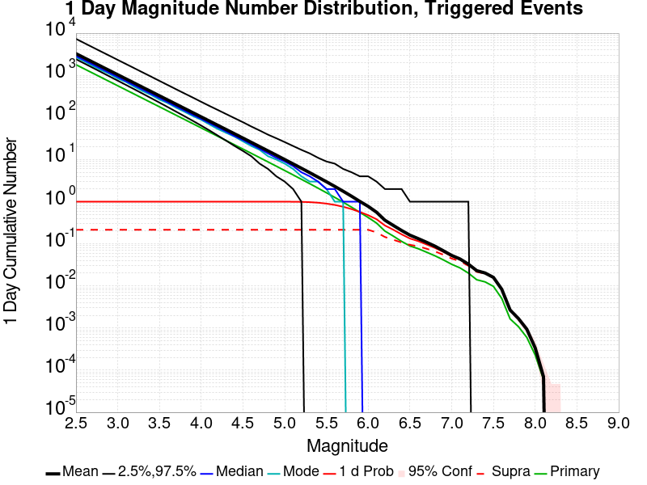

| Mag | Mean | 2.5 %ile | 97.5 %ile | Median | Mode | 1 d Probability | 1 d Supra-Seis Prob | Primary Aftershocks Mean |
|-----|-----|-----|-----|-----|-----|-----|-----|-----|
| **M&ge;2.5** | 3268.420 | 2415.000 | 7397.000 | 2868.000 | 2703.000 | 1.000 (100.00%) | 0.215 (21.54%) | 1789.328 |
| **M&ge;2.6** | 2596.184 | 1913.000 | 5879.000 | 2279.000 | 2080.000 | 1.000 (100.00%) | 0.215 (21.54%) | 1421.462 |
| **M&ge;2.7** | 2062.077 | 1514.000 | 4666.000 | 1812.000 | 1701.000 | 1.000 (100.00%) | 0.215 (21.54%) | 1129.116 |
| **M&ge;2.8** | 1637.850 | 1198.000 | 3710.000 | 1439.000 | 1343.000 | 1.000 (100.00%) | 0.215 (21.54%) | 896.829 |
| **M&ge;2.9** | 1300.915 | 948.000 | 2950.000 | 1143.000 | 1054.000 | 1.000 (100.00%) | 0.215 (21.54%) | 712.288 |
| **M&ge;3** | 1033.346 | 749.000 | 2347.000 | 908.000 | 838.000 | 1.000 (100.00%) | 0.215 (21.54%) | 565.761 |
| **M&ge;3.1** | 820.583 | 591.000 | 1865.000 | 722.000 | 709.000 | 1.000 (100.00%) | 0.215 (21.54%) | 449.236 |
| **M&ge;3.2** | 651.736 | 466.000 | 1481.000 | 574.000 | 532.000 | 1.000 (100.00%) | 0.215 (21.54%) | 356.775 |
| **M&ge;3.3** | 517.651 | 367.000 | 1181.000 | 456.000 | 433.000 | 1.000 (100.00%) | 0.215 (21.54%) | 283.302 |
| **M&ge;3.4** | 411.095 | 288.000 | 935.000 | 363.000 | 343.000 | 1.000 (100.00%) | 0.215 (21.54%) | 225.011 |
| **M&ge;3.5** | 326.559 | 226.000 | 739.000 | 288.000 | 266.000 | 1.000 (100.00%) | 0.215 (21.54%) | 178.796 |
| **M&ge;3.6** | 259.358 | 176.000 | 592.000 | 229.000 | 216.000 | 1.000 (100.00%) | 0.215 (21.54%) | 141.997 |
| **M&ge;3.7** | 205.917 | 138.000 | 471.000 | 182.000 | 169.000 | 1.000 (100.00%) | 0.215 (21.54%) | 112.760 |
| **M&ge;3.8** | 163.542 | 107.000 | 375.000 | 145.000 | 136.000 | 1.000 (100.00%) | 0.215 (21.54%) | 89.578 |
| **M&ge;3.9** | 129.870 | 83.000 | 299.000 | 115.000 | 108.000 | 1.000 (100.00%) | 0.215 (21.54%) | 71.136 |
| **M&ge;4** | 103.079 | 64.000 | 236.000 | 91.000 | 85.000 | 1.000 (100.00%) | 0.215 (21.54%) | 56.461 |
| **M&ge;4.1** | 81.867 | 50.000 | 189.000 | 73.000 | 72.000 | 1.000 (100.00%) | 0.215 (21.54%) | 44.841 |
| **M&ge;4.2** | 65.005 | 38.000 | 150.000 | 58.000 | 53.000 | 1.000 (100.00%) | 0.215 (21.54%) | 35.600 |
| **M&ge;4.3** | 51.566 | 29.000 | 120.000 | 46.000 | 45.000 | 1.000 (100.00%) | 0.215 (21.54%) | 28.233 |
| **M&ge;4.4** | 40.919 | 22.000 | 97.000 | 36.000 | 33.000 | 1.000 (100.00%) | 0.215 (21.54%) | 22.396 |
| **M&ge;4.5** | 32.443 | 16.000 | 77.000 | 29.000 | 26.000 | 1.000 (100.00%) | 0.215 (21.54%) | 17.763 |
| **M&ge;4.6** | 25.676 | 12.000 | 61.000 | 23.000 | 21.000 | 1.000 (100.00%) | 0.215 (21.54%) | 14.063 |
| **M&ge;4.7** | 20.322 | 8.000 | 49.000 | 18.000 | 16.000 | 1.000 (100.00%) | 0.215 (21.54%) | 11.126 |
| **M&ge;4.8** | 16.083 | 6.000 | 39.000 | 14.000 | 13.000 | 1.000 (100.00%) | 0.215 (21.54%) | 8.811 |
| **M&ge;4.9** | 12.713 | 4.000 | 32.000 | 11.000 | 10.000 | 1.000 (100.00%) | 0.215 (21.54%) | 6.966 |
| **M&ge;5** | 10.031 | 3.000 | 26.000 | 9.000 | 7.000 | 0.999 (99.94%) | 0.215 (21.54%) | 5.497 |
| **M&ge;5.1** | 7.916 | 2.000 | 21.000 | 7.000 | 6.000 | 0.997 (99.70%) | 0.215 (21.54%) | 4.336 |
| **M&ge;5.2** | 6.239 | 1.000 | 17.000 | 5.000 | 4.000 | 0.991 (99.08%) | 0.215 (21.54%) | 3.413 |
| **M&ge;5.3** | 4.896 | 1.000 | 14.000 | 4.000 | 4.000 | 0.976 (97.64%) | 0.215 (21.54%) | 2.679 |
| **M&ge;5.4** | 3.827 | 0.000 | 11.000 | 3.000 | 3.000 | 0.947 (94.72%) | 0.215 (21.54%) | 2.095 |
| **M&ge;5.5** | 2.980 | 0.000 | 9.000 | 2.000 | 2.000 | 0.901 (90.14%) | 0.215 (21.54%) | 1.631 |
| **M&ge;5.6** | 2.314 | 0.000 | 8.000 | 2.000 | 1.000 | 0.840 (84.00%) | 0.215 (21.54%) | 1.268 |
| **M&ge;5.7** | 1.781 | 0.000 | 6.000 | 1.000 | 1.000 | 0.761 (76.13%) | 0.215 (21.54%) | 0.978 |
| **M&ge;5.8** | 1.361 | 0.000 | 5.000 | 1.000 | 0.000 | 0.671 (67.14%) | 0.215 (21.54%) | 0.747 |
| **M&ge;5.9** | 1.023 | 0.000 | 4.000 | 1.000 | 0.000 | 0.574 (57.38%) | 0.215 (21.52%) | 0.561 |
| **M&ge;6** | 0.780 | 0.000 | 4.000 | 0.000 | 0.000 | 0.481 (48.10%) | 0.215 (21.51%) | 0.424 |
| **M&ge;6.1** | 0.567 | 0.000 | 3.000 | 0.000 | 0.000 | 0.384 (38.39%) | 0.188 (18.80%) | 0.313 |
| **M&ge;6.2** | 0.366 | 0.000 | 2.000 | 0.000 | 0.000 | 0.273 (27.31%) | 0.146 (14.62%) | 0.202 |
| **M&ge;6.3** | 0.278 | 0.000 | 2.000 | 0.000 | 0.000 | 0.218 (21.78%) | 0.126 (12.55%) | 0.155 |
| **M&ge;6.4** | 0.211 | 0.000 | 2.000 | 0.000 | 0.000 | 0.169 (16.90%) | 0.108 (10.84%) | 0.115 |
| **M&ge;6.5** | 0.164 | 0.000 | 1.000 | 0.000 | 0.000 | 0.135 (13.55%) | 0.095 (9.51%) | 0.089 |
| **M&ge;6.6** | 0.136 | 0.000 | 1.000 | 0.000 | 0.000 | 0.118 (11.78%) | 0.089 (8.85%) | 0.077 |
| **M&ge;6.7** | 0.110 | 0.000 | 1.000 | 0.000 | 0.000 | 0.097 (9.73%) | 0.076 (7.65%) | 0.064 |
| **M&ge;6.8** | 0.089 | 0.000 | 1.000 | 0.000 | 0.000 | 0.080 (8.01%) | 0.066 (6.62%) | 0.052 |
| **M&ge;6.9** | 0.069 | 0.000 | 1.000 | 0.000 | 0.000 | 0.064 (6.39%) | 0.055 (5.46%) | 0.041 |
| **M&ge;7** | 0.054 | 0.000 | 1.000 | 0.000 | 0.000 | 0.051 (5.10%) | 0.045 (4.50%) | 0.033 |
| **M&ge;7.1** | 0.044 | 0.000 | 1.000 | 0.000 | 0.000 | 0.043 (4.27%) | 0.039 (3.91%) | 0.027 |
| **M&ge;7.2** | 0.033 | 0.000 | 1.000 | 0.000 | 0.000 | 0.032 (3.17%) | 0.030 (2.97%) | 0.020 |
| **M&ge;7.3** | 0.023 | 0.000 | 0.000 | 0.000 | 0.000 | 0.022 (2.21%) | 0.021 (2.11%) | 0.014 |
| **M&ge;7.4** | 0.020 | 0.000 | 0.000 | 0.000 | 0.000 | 0.019 (1.94%) | 0.019 (1.91%) | 0.012 |
| **M&ge;7.5** | 0.016 | 0.000 | 0.000 | 0.000 | 0.000 | 0.016 (1.55%) | 0.015 (1.55%) | 9.32E-3 |
| **M&ge;7.6** | 8.61E-3 | 0.000 | 0.000 | 0.000 | 0.000 | 8.51E-3 (0.85%) | 8.51E-3 (0.85%) | 4.94E-3 |
| **M&ge;7.7** | 2.58E-3 | 0.000 | 0.000 | 0.000 | 0.000 | 2.58E-3 (0.26%) | 2.58E-3 (0.26%) | 1.45E-3 |
| **M&ge;7.8** | 1.41E-3 | 0.000 | 0.000 | 0.000 | 0.000 | 1.41E-3 (0.14%) | 1.41E-3 (0.14%) | 7.77E-4 |
| **M&ge;7.9** | 8.47E-4 | 0.000 | 0.000 | 0.000 | 0.000 | 8.47E-4 (0.08%) | 8.47E-4 (0.08%) | 4.59E-4 |
| **M&ge;8** | 3.18E-4 | 0.000 | 0.000 | 0.000 | 0.000 | 3.18E-4 (0.03%) | 3.18E-4 (0.03%) | 1.76E-4 |
| **M&ge;8.1** | 3.53E-5 | 0.000 | 0.000 | 0.000 | 0.000 | 3.53E-5 (0.00%) | 3.53E-5 (0.00%) | 3.53E-5 |
| **M&ge;8.2** | 0.000 | 0.000 | 0.000 | 0.000 | 0.000 | 0.000 (0.00%) | 0.000 (0.00%) | 0.000 |
| **M&ge;8.3** | 0.000 | 0.000 | 0.000 | 0.000 | 0.000 | 0.000 (0.00%) | 0.000 (0.00%) | 0.000 |
| **M&ge;8.4** | 0.000 | 0.000 | 0.000 | 0.000 | 0.000 | 0.000 (0.00%) | 0.000 (0.00%) | 0.000 |
| **M&ge;8.5** | 0.000 | 0.000 | 0.000 | 0.000 | 0.000 | 0.000 (0.00%) | 0.000 (0.00%) | 0.000 |
| **M&ge;8.6** | 0.000 | 0.000 | 0.000 | 0.000 | 0.000 | 0.000 (0.00%) | 0.000 (0.00%) | 0.000 |
| **M&ge;8.7** | 0.000 | 0.000 | 0.000 | 0.000 | 0.000 | 0.000 (0.00%) | 0.000 (0.00%) | 0.000 |
| **M&ge;8.8** | 0.000 | 0.000 | 0.000 | 0.000 | 0.000 | 0.000 (0.00%) | 0.000 (0.00%) | 0.000 |
| **M&ge;8.9** | 0.000 | 0.000 | 0.000 | 0.000 | 0.000 | 0.000 (0.00%) | 0.000 (0.00%) | 0.000 |
| **M&ge;9** | 0.000 | 0.000 | 0.000 | 0.000 | 0.000 | 0.000 (0.00%) | 0.000 (0.00%) | 0.000 |

### 1 Hour Magnitude Number Distribution
*[(top)](#table-of-contents)*

**Legend**
* **Mean** (thick black line): mean expected number across all 28330 catalogs
* **2.5%,97.5%** (thin black lines): expected number percentiles across all 28330 catalogs
* **Median** (thin blue line): median expected number across all 28330 catalogs
* **Mode** (thin cyan line): modal expected number across all 28330 catalogs
* **1 hr Probability** (thin red line): 1 hour probability calculated as the fraction of catalogs with at least 1 occurrence
* **1 hr Supraseismogenic Probability** (thin dashed red line): same as above, but only for supraseismogenic ruptures on explicitly modeled UCERF3 faults
* **95% Conf** (light red shaded region): binomial 95% confidence bounds on probability
* **Primary** (thin green line): mean expected number from primary triggered aftershocks only (no secondary, tertiary, etc...) across all 28330 catalogs


| Mag | Mean | 2.5 %ile | 97.5 %ile | Median | Mode | 1 hr Probability | 1 hr Supra-Seis Prob | Primary Aftershocks Mean |
|-----|-----|-----|-----|-----|-----|-----|-----|-----|
| **M&ge;2.5** | 1040.671 | 901.000 | 1454.000 | 997.000 | 981.000 | 1.000 (100.00%) | 0.080 (7.95%) | 855.419 |
| **M&ge;2.6** | 826.710 | 711.000 | 1160.000 | 793.000 | 777.000 | 1.000 (100.00%) | 0.080 (7.95%) | 679.650 |
| **M&ge;2.7** | 656.574 | 560.000 | 923.000 | 630.000 | 629.000 | 1.000 (100.00%) | 0.080 (7.95%) | 539.796 |
| **M&ge;2.8** | 521.555 | 441.000 | 728.000 | 501.000 | 496.000 | 1.000 (100.00%) | 0.080 (7.95%) | 428.783 |
| **M&ge;2.9** | 414.263 | 346.000 | 579.000 | 398.000 | 391.000 | 1.000 (100.00%) | 0.080 (7.95%) | 340.549 |
| **M&ge;3** | 329.016 | 271.000 | 462.000 | 316.000 | 315.000 | 1.000 (100.00%) | 0.080 (7.95%) | 270.456 |
| **M&ge;3.1** | 261.305 | 212.000 | 368.000 | 252.000 | 253.000 | 1.000 (100.00%) | 0.080 (7.95%) | 214.779 |
| **M&ge;3.2** | 207.514 | 166.000 | 292.000 | 200.000 | 197.000 | 1.000 (100.00%) | 0.080 (7.95%) | 170.580 |
| **M&ge;3.3** | 164.819 | 129.000 | 234.000 | 159.000 | 155.000 | 1.000 (100.00%) | 0.080 (7.95%) | 135.492 |
| **M&ge;3.4** | 130.894 | 100.000 | 186.000 | 126.000 | 122.000 | 1.000 (100.00%) | 0.080 (7.95%) | 107.612 |
| **M&ge;3.5** | 104.013 | 78.000 | 149.000 | 100.000 | 97.000 | 1.000 (100.00%) | 0.080 (7.95%) | 85.528 |
| **M&ge;3.6** | 82.590 | 60.000 | 119.000 | 80.000 | 77.000 | 1.000 (100.00%) | 0.080 (7.95%) | 67.912 |
| **M&ge;3.7** | 65.569 | 46.000 | 96.000 | 63.000 | 63.000 | 1.000 (100.00%) | 0.080 (7.95%) | 53.924 |
| **M&ge;3.8** | 52.099 | 35.000 | 77.000 | 50.000 | 49.000 | 1.000 (100.00%) | 0.080 (7.95%) | 42.837 |
| **M&ge;3.9** | 41.376 | 27.000 | 63.000 | 40.000 | 39.000 | 1.000 (100.00%) | 0.080 (7.95%) | 34.023 |
| **M&ge;4** | 32.842 | 20.000 | 51.000 | 32.000 | 31.000 | 1.000 (100.00%) | 0.080 (7.95%) | 27.005 |
| **M&ge;4.1** | 26.113 | 15.000 | 42.000 | 25.000 | 26.000 | 1.000 (100.00%) | 0.080 (7.95%) | 21.467 |
| **M&ge;4.2** | 20.743 | 11.000 | 34.000 | 20.000 | 19.000 | 1.000 (100.00%) | 0.080 (7.95%) | 17.050 |
| **M&ge;4.3** | 16.447 | 8.000 | 28.000 | 16.000 | 15.000 | 1.000 (100.00%) | 0.080 (7.95%) | 13.521 |
| **M&ge;4.4** | 13.052 | 6.000 | 23.000 | 13.000 | 12.000 | 1.000 (100.00%) | 0.080 (7.95%) | 10.730 |
| **M&ge;4.5** | 10.365 | 4.000 | 19.000 | 10.000 | 9.000 | 1.000 (99.98%) | 0.080 (7.95%) | 8.524 |
| **M&ge;4.6** | 8.206 | 3.000 | 16.000 | 8.000 | 7.000 | 0.999 (99.93%) | 0.080 (7.95%) | 6.748 |
| **M&ge;4.7** | 6.499 | 2.000 | 13.000 | 6.000 | 6.000 | 0.997 (99.68%) | 0.080 (7.95%) | 5.344 |
| **M&ge;4.8** | 5.154 | 1.000 | 11.000 | 5.000 | 4.000 | 0.990 (98.95%) | 0.080 (7.95%) | 4.239 |
| **M&ge;4.9** | 4.074 | 0.000 | 9.000 | 4.000 | 3.000 | 0.973 (97.29%) | 0.080 (7.95%) | 3.348 |
| **M&ge;5** | 3.215 | 0.000 | 8.000 | 3.000 | 3.000 | 0.945 (94.47%) | 0.080 (7.95%) | 2.644 |
| **M&ge;5.1** | 2.535 | 0.000 | 7.000 | 2.000 | 2.000 | 0.901 (90.07%) | 0.080 (7.95%) | 2.087 |
| **M&ge;5.2** | 1.997 | 0.000 | 6.000 | 2.000 | 1.000 | 0.842 (84.18%) | 0.080 (7.95%) | 1.639 |
| **M&ge;5.3** | 1.570 | 0.000 | 5.000 | 1.000 | 1.000 | 0.766 (76.64%) | 0.080 (7.95%) | 1.289 |
| **M&ge;5.4** | 1.228 | 0.000 | 4.000 | 1.000 | 1.000 | 0.683 (68.33%) | 0.080 (7.95%) | 1.010 |
| **M&ge;5.5** | 0.954 | 0.000 | 3.000 | 1.000 | 0.000 | 0.593 (59.29%) | 0.080 (7.95%) | 0.784 |
| **M&ge;5.6** | 0.741 | 0.000 | 3.000 | 1.000 | 0.000 | 0.503 (50.35%) | 0.080 (7.95%) | 0.610 |
| **M&ge;5.7** | 0.569 | 0.000 | 3.000 | 0.000 | 0.000 | 0.418 (41.85%) | 0.080 (7.95%) | 0.470 |
| **M&ge;5.8** | 0.436 | 0.000 | 2.000 | 0.000 | 0.000 | 0.341 (34.12%) | 0.080 (7.95%) | 0.361 |
| **M&ge;5.9** | 0.328 | 0.000 | 2.000 | 0.000 | 0.000 | 0.271 (27.10%) | 0.079 (7.95%) | 0.271 |
| **M&ge;6** | 0.248 | 0.000 | 2.000 | 0.000 | 0.000 | 0.213 (21.30%) | 0.079 (7.95%) | 0.205 |
| **M&ge;6.1** | 0.183 | 0.000 | 1.000 | 0.000 | 0.000 | 0.161 (16.14%) | 0.070 (7.00%) | 0.150 |
| **M&ge;6.2** | 0.117 | 0.000 | 1.000 | 0.000 | 0.000 | 0.107 (10.73%) | 0.053 (5.30%) | 0.096 |
| **M&ge;6.3** | 0.090 | 0.000 | 1.000 | 0.000 | 0.000 | 0.083 (8.32%) | 0.045 (4.54%) | 0.073 |
| **M&ge;6.4** | 0.067 | 0.000 | 1.000 | 0.000 | 0.000 | 0.062 (6.24%) | 0.039 (3.89%) | 0.054 |
| **M&ge;6.5** | 0.051 | 0.000 | 1.000 | 0.000 | 0.000 | 0.048 (4.85%) | 0.034 (3.36%) | 0.042 |
| **M&ge;6.6** | 0.044 | 0.000 | 1.000 | 0.000 | 0.000 | 0.042 (4.25%) | 0.032 (3.17%) | 0.036 |
| **M&ge;6.7** | 0.037 | 0.000 | 1.000 | 0.000 | 0.000 | 0.035 (3.53%) | 0.028 (2.77%) | 0.030 |
| **M&ge;6.8** | 0.030 | 0.000 | 1.000 | 0.000 | 0.000 | 0.029 (2.92%) | 0.024 (2.39%) | 0.025 |
| **M&ge;6.9** | 0.024 | 0.000 | 0.000 | 0.000 | 0.000 | 0.023 (2.32%) | 0.020 (1.96%) | 0.020 |
| **M&ge;7** | 0.019 | 0.000 | 0.000 | 0.000 | 0.000 | 0.018 (1.82%) | 0.016 (1.58%) | 0.015 |
| **M&ge;7.1** | 0.015 | 0.000 | 0.000 | 0.000 | 0.000 | 0.015 (1.51%) | 0.014 (1.37%) | 0.013 |
| **M&ge;7.2** | 0.011 | 0.000 | 0.000 | 0.000 | 0.000 | 0.011 (1.10%) | 0.010 (1.03%) | 9.25E-3 |
| **M&ge;7.3** | 7.77E-3 | 0.000 | 0.000 | 0.000 | 0.000 | 7.73E-3 (0.77%) | 7.31E-3 (0.73%) | 6.46E-3 |
| **M&ge;7.4** | 6.71E-3 | 0.000 | 0.000 | 0.000 | 0.000 | 6.67E-3 (0.67%) | 6.57E-3 (0.66%) | 5.54E-3 |
| **M&ge;7.5** | 5.08E-3 | 0.000 | 0.000 | 0.000 | 0.000 | 5.08E-3 (0.51%) | 5.05E-3 (0.50%) | 4.17E-3 |
| **M&ge;7.6** | 2.68E-3 | 0.000 | 0.000 | 0.000 | 0.000 | 2.68E-3 (0.27%) | 2.68E-3 (0.27%) | 2.15E-3 |
| **M&ge;7.7** | 8.47E-4 | 0.000 | 0.000 | 0.000 | 0.000 | 8.47E-4 (0.08%) | 8.47E-4 (0.08%) | 6.71E-4 |
| **M&ge;7.8** | 5.29E-4 | 0.000 | 0.000 | 0.000 | 0.000 | 5.29E-4 (0.05%) | 5.29E-4 (0.05%) | 3.88E-4 |
| **M&ge;7.9** | 2.82E-4 | 0.000 | 0.000 | 0.000 | 0.000 | 2.82E-4 (0.03%) | 2.82E-4 (0.03%) | 2.47E-4 |
| **M&ge;8** | 1.41E-4 | 0.000 | 0.000 | 0.000 | 0.000 | 1.41E-4 (0.01%) | 1.41E-4 (0.01%) | 1.41E-4 |
| **M&ge;8.1** | 3.53E-5 | 0.000 | 0.000 | 0.000 | 0.000 | 3.53E-5 (0.00%) | 3.53E-5 (0.00%) | 3.53E-5 |
| **M&ge;8.2** | 0.000 | 0.000 | 0.000 | 0.000 | 0.000 | 0.000 (0.00%) | 0.000 (0.00%) | 0.000 |
| **M&ge;8.3** | 0.000 | 0.000 | 0.000 | 0.000 | 0.000 | 0.000 (0.00%) | 0.000 (0.00%) | 0.000 |
| **M&ge;8.4** | 0.000 | 0.000 | 0.000 | 0.000 | 0.000 | 0.000 (0.00%) | 0.000 (0.00%) | 0.000 |
| **M&ge;8.5** | 0.000 | 0.000 | 0.000 | 0.000 | 0.000 | 0.000 (0.00%) | 0.000 (0.00%) | 0.000 |
| **M&ge;8.6** | 0.000 | 0.000 | 0.000 | 0.000 | 0.000 | 0.000 (0.00%) | 0.000 (0.00%) | 0.000 |
| **M&ge;8.7** | 0.000 | 0.000 | 0.000 | 0.000 | 0.000 | 0.000 (0.00%) | 0.000 (0.00%) | 0.000 |
| **M&ge;8.8** | 0.000 | 0.000 | 0.000 | 0.000 | 0.000 | 0.000 (0.00%) | 0.000 (0.00%) | 0.000 |
| **M&ge;8.9** | 0.000 | 0.000 | 0.000 | 0.000 | 0.000 | 0.000 (0.00%) | 0.000 (0.00%) | 0.000 |
| **M&ge;9** | 0.000 | 0.000 | 0.000 | 0.000 | 0.000 | 0.000 (0.00%) | 0.000 (0.00%) | 0.000 |


## Hazard Change Over Time
*[(top)](#table-of-contents)*

These plots show how the probability of ruptures of various magnitudes within 100km of any scenario rupture changes over time

### M&ge;5.0 Hazard Change Over Time
*[(top)](#table-of-contents)*


| Forecast Duration | UCERF3-ETAS [95% Conf] | UCERF3-ETAS Triggered Only | UCERF3-TD | UCERF3-ETAS/TD Gain | UCERF3-TI |
|-----|-----|-----|-----|-----|-----|
| 1 Hour | 0.944 [0.941 - 0.946] | 0.944 | 7.14E-5 | 13220.15 | 7.09E-5 |
| 1 Day | 0.999 [0.999 - 1.000] | 0.999 | 1.71E-3 | 583.83 | 1.70E-3 |
| 1 Week | 1.000 [1.000 - 1.000] | 1.000 | 0.012 | 83.88 | 0.012 |
| 1 Month | 1.000 [1.000 - 1.000] | 1.000 | 0.050 | 19.96 | 0.050 |
| 1 Year | 1.000 [1.000 - 1.000] | 1.000 | 0.465 | 2.15 | 0.463 |
| 10 Years | 1.000 [1.000 - 1.000] | 1.000 | 0.998 | 1 | 0.998 |
| 30 Years | 1.000 [1.000 - 1.000] \* | \* | 1.000 | 1 \* | 1.000 |
| 100 Years | 1.000 [1.000 - 1.000] \* | \* | 1.000 | 1 \* | 1.000 |

\* *forecast duration is longer than simulation length, only ETAS ruptures from the first 10 years are included*
### M&ge;6.0 Hazard Change Over Time
*[(top)](#table-of-contents)*


| Forecast Duration | UCERF3-ETAS [95% Conf] | UCERF3-ETAS Triggered Only | UCERF3-TD | UCERF3-ETAS/TD Gain | UCERF3-TI |
|-----|-----|-----|-----|-----|-----|
| 1 Hour | 0.211 [0.207 - 0.216] | 0.211 | 7.85E-6 | 26910.46 | 7.36E-6 |
| 1 Day | 0.477 [0.471 - 0.483] | 0.477 | 1.88E-4 | 2530.65 | 1.77E-4 |
| 1 Week | 0.589 [0.583 - 0.595] | 0.588 | 1.32E-3 | 446.62 | 1.23E-3 |
| 1 Month | 0.646 [0.640 - 0.651] | 0.644 | 5.64E-3 | 114.49 | 5.28E-3 |
| 1 Year | 0.721 [0.716 - 0.725] | 0.701 | 0.067 | 10.83 | 0.062 |
| 10 Years | 0.864 [0.862 - 0.867] | 0.730 | 0.498 | 1.74 | 0.475 |
| 30 Years | 0.966 [0.965 - 0.967] \* | \* | 0.874 | 1.11 \* | 0.855 |
| 100 Years | 1.000 [1.000 - 1.000] \* | \* | 0.999 | 1 \* | 0.998 |

\* *forecast duration is longer than simulation length, only ETAS ruptures from the first 10 years are included*
### M&ge;7.0 Hazard Change Over Time
*[(top)](#table-of-contents)*


| Forecast Duration | UCERF3-ETAS [95% Conf] | UCERF3-ETAS Triggered Only | UCERF3-TD | UCERF3-ETAS/TD Gain | UCERF3-TI |
|-----|-----|-----|-----|-----|-----|
| 1 Hour | 0.018 [0.017 - 0.020] | 0.018 | 7.16E-7 | 25444.14 | 6.48E-7 |
| 1 Day | 0.051 [0.048 - 0.053] | 0.051 | 1.72E-5 | 2953.32 | 1.55E-5 |
| 1 Week | 0.069 [0.066 - 0.072] | 0.069 | 1.20E-4 | 576.23 | 1.09E-4 |
| 1 Month | 0.081 [0.078 - 0.084] | 0.081 | 5.15E-4 | 157.31 | 4.66E-4 |
| 1 Year | 0.102 [0.098 - 0.105] | 0.096 | 6.26E-3 | 16.23 | 5.66E-3 |
| 10 Years | 0.159 [0.155 - 0.162] | 0.104 | 0.061 | 2.6 | 0.055 |
| 30 Years | 0.260 [0.257 - 0.263] \* | \* | 0.174 | 1.49 \* | 0.157 |
| 100 Years | 0.538 [0.536 - 0.540] \* | \* | 0.485 | 1.11 \* | 0.433 |

\* *forecast duration is longer than simulation length, only ETAS ruptures from the first 10 years are included*
### M&ge;8.0 Hazard Change Over Time
*[(top)](#table-of-contents)*


| Forecast Duration | UCERF3-ETAS [95% Conf] | UCERF3-ETAS Triggered Only | UCERF3-TD | UCERF3-ETAS/TD Gain | UCERF3-TI |
|-----|-----|-----|-----|-----|-----|
| 1 Hour | 1.41E-4 [4.52E-5 - 3.88E-4] | 1.41E-4 | 1.24E-8 | 11418.69 | 1.06E-8 |
| 1 Day | 3.18E-4 [1.55E-4 - 6.27E-4] | 3.18E-4 | 2.97E-7 | 1071.41 | 2.54E-7 |
| 1 Week | 4.26E-4 [2.32E-4 - 7.65E-4] | 4.24E-4 | 2.08E-6 | 204.89 | 1.78E-6 |
| 1 Month | 5.03E-4 [2.90E-4 - 8.60E-4] | 4.94E-4 | 8.90E-6 | 56.5 | 7.63E-6 |
| 1 Year | 7.08E-4 [4.70E-4 - 1.09E-3] | 6.00E-4 | 1.08E-4 | 6.54 | 9.29E-5 |
| 10 Years | 1.73E-3 [1.48E-3 - 2.12E-3] | 6.35E-4 | 1.10E-3 | 1.58 | 9.29E-4 |
| 30 Years | 4.14E-3 [3.89E-3 - 4.52E-3] \* | \* | 3.50E-3 | 1.18 \* | 2.78E-3 |
| 100 Years | 0.014 [0.014 - 0.015] \* | \* | 0.014 | 1.05 \* | 9.25E-3 |

\* *forecast duration is longer than simulation length, only ETAS ruptures from the first 10 years are included*

## Trigger Rupture Fault Map
*[(top)](#table-of-contents)*


## Trigger Rupture Depth Map
*[(top)](#table-of-contents)*


## Fault Distances To Triggers
*[(top)](#table-of-contents)*

| Section Name | Strike, Dip, Rake | # Hypos In Poly | Max Mag w/ Hypo In Poly | # Surfs In Poly | Max Mag w/ Surf In Poly | Min Dist To Any (km) | Min Poly Dist To Any (km) | Min Dist To Largest (km) | Min Poly Dist To Largest (km) | Min Hypo Dist To Largest (km) | Min Hypo Poly Dist To Largest (km) |
|-----|-----|-----|-----|-----|-----|-----|-----|-----|-----|-----|-----|
| Airport Lake | 359, 50, -90 | 90 | 7.1 | 90 | 7.1 | 0.036 | 0.000 | 0.036 | 0.000 | 5.612 | 0.000 |
| Little Lake | 327, 90, 180 | 16 | 3.75 | 17 | 7.1 | 2.268 | 0.000 | 11.284 | 0.000 | 13.471 | 1.469 |
| Garlock (Central) | 71, 90, 0 | 2 | 3.21 | 3 | 7.1 | 5.600 | 0.000 | 5.600 | 0.000 | 22.766 | 10.797 |
| So Sierra Nevada | 2, 50, -90 | 1 | 2.75 | 1 | 2.75 | 1.410 | 0.000 | 4.248 | 4.233 | 16.191 | 15.188 |
| Tank Canyon | 189, 50, -90 | 0 |  | 0 |  | 9.015 | 9.011 | 9.015 | 9.011 | 17.039 | 16.895 |
| Blackwater | 323, 90, 180 | 0 |  | 0 |  | 14.394 | 8.726 | 14.394 | 8.726 | 29.622 | 27.613 |
| Scodie Lineament | 221, 68, 0 | 0 |  | 0 |  | 16.722 | 15.781 | 28.750 | 27.702 | 36.559 | 32.668 |

## Individual Simulated Catalog Maps
*[(top)](#table-of-contents)*

These are map plots of individual catalogs from the simulations, selected as the closest catalog to each of the given percentiles in terms of total number of events.

| Duration | p0.0 %-ile | p25.0 %-ile | p50.0 %-ile | p75.0 %-ile | p90.0 %-ile | p95.0 %-ile | p97.5 %-ile | p98.0 %-ile | p99.0 %-ile | p99.5 %-ile | p99.9 %-ile | p100.0 %-ile |
|-----|-----|-----|-----|-----|-----|-----|-----|-----|-----|-----|-----|-----|
| **1 Week** |  |  |  |  |  |  |  |  |  |  |  |  |
| **1 Month** |  |  |  |  |  |  |  |  |  |  |  |  |
| **1 Year** |  |  |  |  |  |  |  |  | 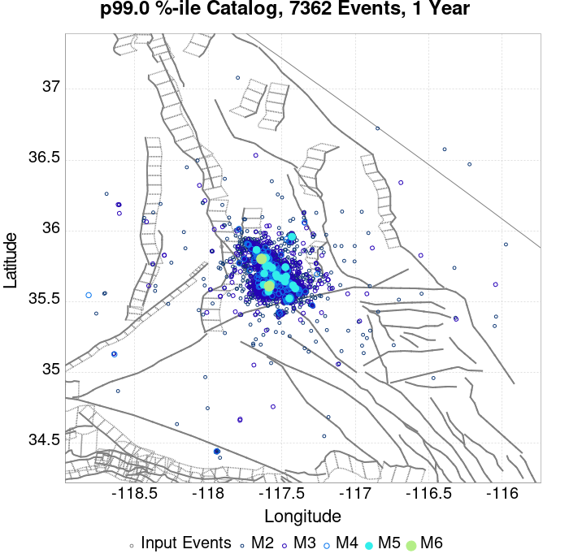 |  |  |  |
| **10 Year** |  |  |  |  |  |  | 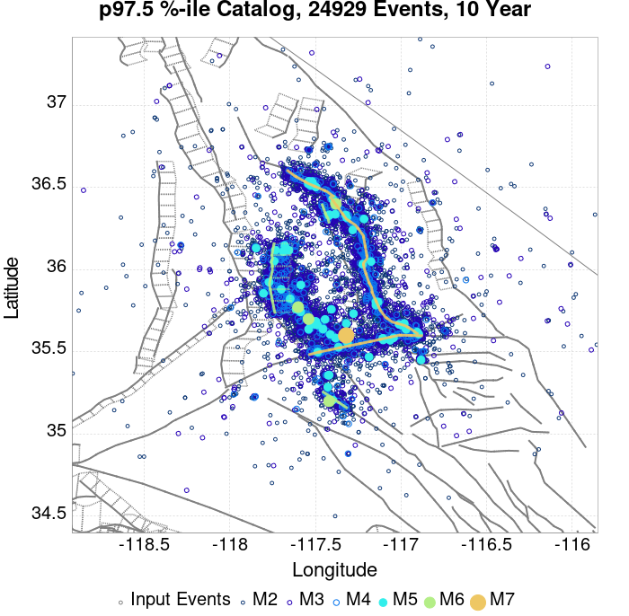 | 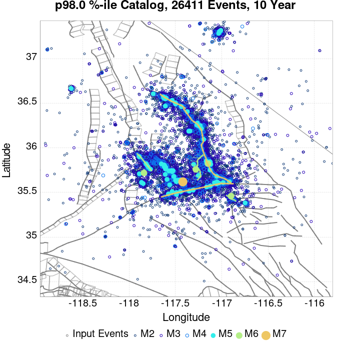 |  |  |  | 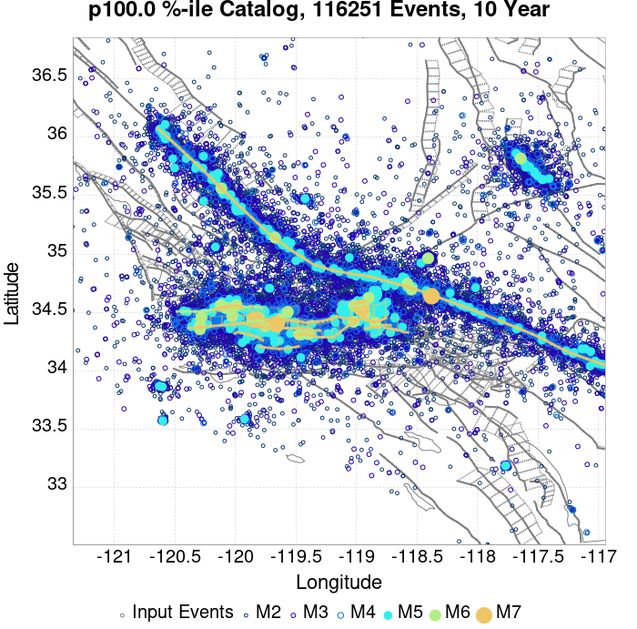 |

## ComCat Data Comparisons
*[(top)](#table-of-contents)*

These plots compare simulated sequences with data from ComCat. All plots only consider events with hypocenters inside the ComCat region defined in the JSON input file, and consider ruptures above Mc=3.0

Last updated at 2019/08/29 11:35:43 UTC, 54.3 d after the simulation start time

### ComCat Magnitude-Number Distributions
*[(top)](#table-of-contents)*

| Incremental MND | Cumulative MND |
|-----|-----|
|  |  |

### ComCat Cumulative Number Vs Time
*[(top)](#table-of-contents)*

| M&ge;3 | M&ge;4 | M&ge;5 | M&ge;6 | M&ge;7 |
|-----|-----|-----|-----|-----|
| 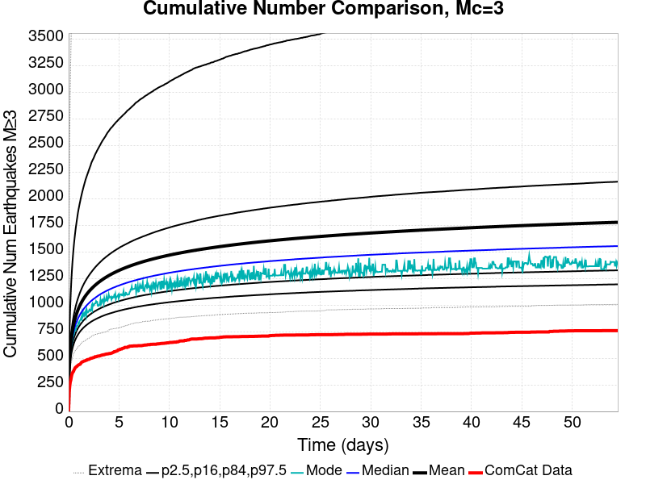 | 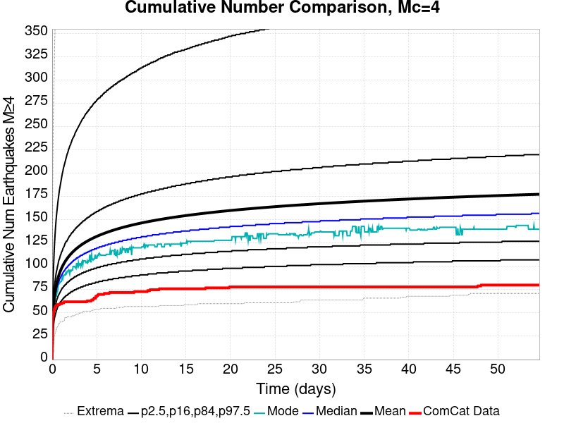 |  |  |  |

### ComCat Cumulative Number Simulation Percentiles
*[(top)](#table-of-contents)*


### ComCat Mean Spatial Distribution
*[(top)](#table-of-contents)*

|  | 1 Day | 1 Week | 1 Month | 54.3 Day |
|-----|-----|-----|-----|-----|
| **M≥3** |  |  |  |  |
| **M≥4** |  |  |  |  |
| **M≥5** |  |  |  |  |
| **M≥6** |  |  |  |  |
| **M≥7** | 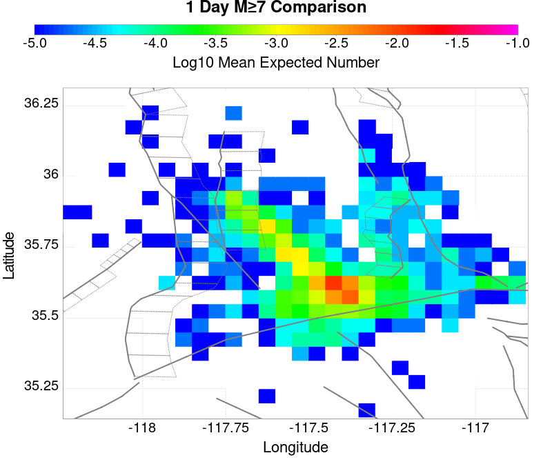 |  | 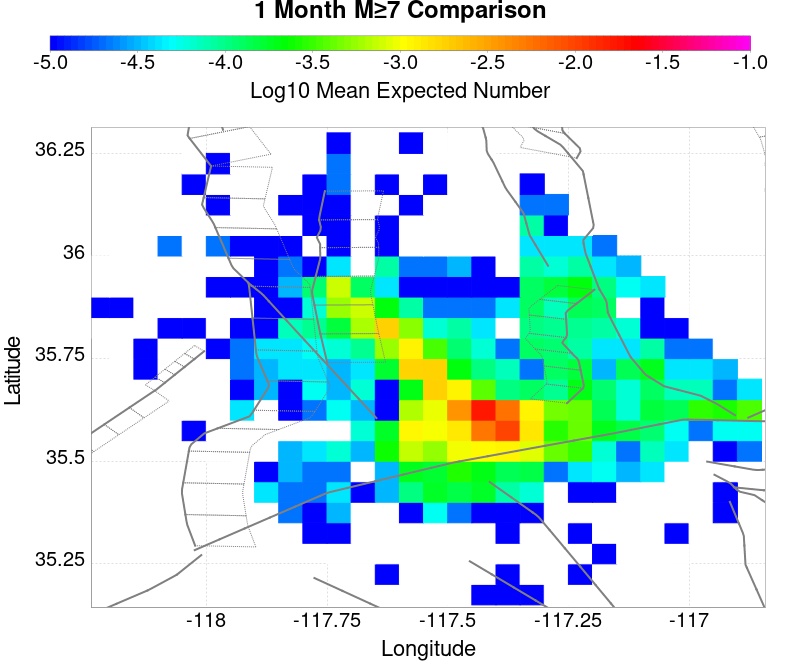 |  |
| **M≥8** |  |  |  |  |

### ComCat Depth Distribution
*[(top)](#table-of-contents)*

| M&ge;3 | M&ge;4 | M&ge;5 | M&ge;6 | M&ge;7 | M&ge;8 |
|-----|-----|-----|-----|-----|-----|
|  |  |  |  | 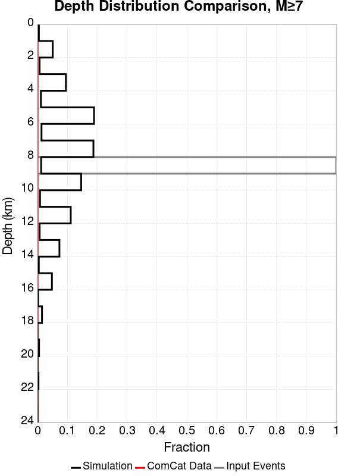 | 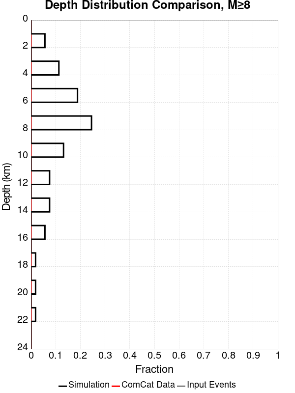 |

## Section Participation
*[(top)](#table-of-contents)*

### Section Participation Plots
*[(top)](#table-of-contents)*

| Min Mag | 1 yr Triggered Ruptures (no spontaneous) | 10 yr Triggered Ruptures (no spontaneous) | 10 yr Triggered Ruptures (primary aftershocks only) |
|-----|-----|-----|-----|
| **All Supra. Seis.** |  | 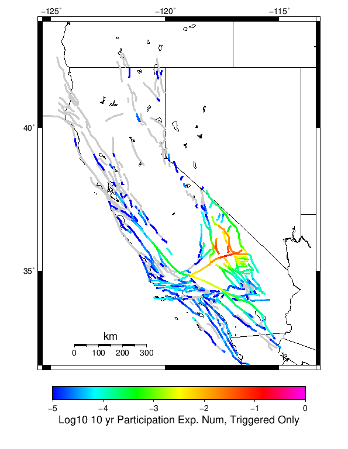 |  |
| **M&ge;6.5** | 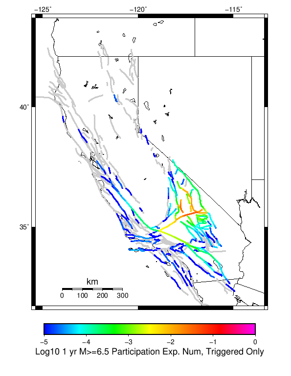 |  |  |
| **M&ge;7** |  |  |  |
| **M&ge;7.5** |  |  |  |
| **M&ge;8** | 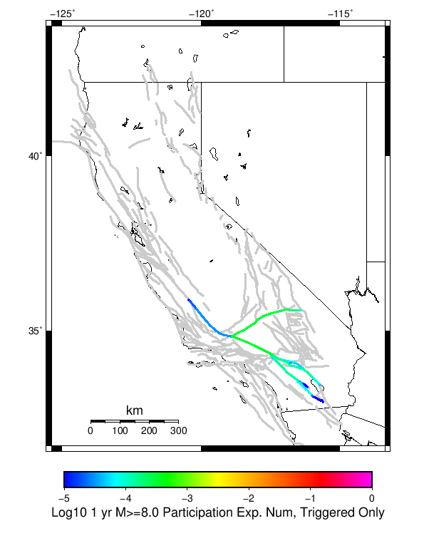 |  |  |

### Supra-Seismogenic Parent Sections Table
*[(top)](#table-of-contents)*

*First 10 of 182 with matching ruptures shown*

| Parent Name | Triggered 10 Year Mean Count | Triggered 1 Day Prob | Triggered 1 Week Prob | Triggered 1 Month Prob | Triggered 1 Year Prob | Triggered 10 Year Prob | Triggered 10 Year Primary Mean Count |
|-----|-----|-----|-----|-----|-----|-----|-----|
| Tank Canyon | 0.20155312 | 0.05732439 | 0.08810449 | 0.109636426 | 0.140593 | 0.15965408 | 0.03593364 |
| Garlock (Central) | 0.19855277 | 0.09728203 | 0.12943876 | 0.14828803 | 0.17214966 | 0.18538651 | 0.09216379 |
| Little Lake | 0.08817508 | 0.044581715 | 0.058312744 | 0.06717261 | 0.07843275 | 0.084821746 | 0.041934345 |
| Owl Lake | 0.076279566 | 0.024779385 | 0.037804447 | 0.046028946 | 0.05690081 | 0.06385457 | 0.013554536 |
| Airport Lake | 0.06978468 | 0.03999294 | 0.050653018 | 0.057289094 | 0.06494882 | 0.069325805 | 0.041369572 |
| Panamint Valley | 0.054182846 | 0.020649489 | 0.030885987 | 0.037416168 | 0.046417225 | 0.052276738 | 0.015213555 |
| Garlock (East) | 0.052735616 | 0.015672432 | 0.024814684 | 0.03081539 | 0.039534062 | 0.044758208 | 0.008753971 |
| Ash Hill | 0.025591247 | 0.0067066713 | 0.011366043 | 0.014966466 | 0.020190611 | 0.023190964 | 0.0025061772 |
| Hunter Mountain-Saline Valley | 0.023791034 | 0.010307095 | 0.01468408 | 0.017296152 | 0.020967172 | 0.023190964 | 0.008789269 |
| Blackwater | 0.02347335 | 0.0070243557 | 0.011260148 | 0.014260502 | 0.018884575 | 0.021708436 | 0.0032474408 |

### M≥6.5 Parent Sections Table
*[(top)](#table-of-contents)*

*First 10 of 160 with matching ruptures shown*

| Parent Name | Triggered 10 Year Mean Count | Triggered 1 Day Prob | Triggered 1 Week Prob | Triggered 1 Month Prob | Triggered 1 Year Prob | Triggered 10 Year Prob | Triggered 10 Year Primary Mean Count |
|-----|-----|-----|-----|-----|-----|-----|-----|
| Garlock (Central) | 0.085598305 | 0.040310625 | 0.05577127 | 0.06448994 | 0.076879635 | 0.08351571 | 0.037698552 |
| Little Lake | 0.05372397 | 0.028485704 | 0.036992587 | 0.042499118 | 0.04945288 | 0.052770913 | 0.02777974 |
| Airport Lake | 0.05347688 | 0.03081539 | 0.039039887 | 0.043981645 | 0.05005295 | 0.05330039 | 0.031556655 |
| Panamint Valley | 0.04998235 | 0.019272856 | 0.028697494 | 0.034945287 | 0.043169785 | 0.04842923 | 0.014825273 |
| Owl Lake | 0.03748676 | 0.016519591 | 0.023332156 | 0.027462054 | 0.03381574 | 0.037239674 | 0.012177903 |
| Garlock (East) | 0.032897986 | 0.011366043 | 0.017084362 | 0.021284858 | 0.026897281 | 0.030038828 | 0.008436287 |
| Tank Canyon | 0.023720438 | 0.007730321 | 0.0124602895 | 0.015601835 | 0.020508295 | 0.023579245 | 0.004341687 |
| Hunter Mountain-Saline Valley | 0.02326156 | 0.010130604 | 0.014472291 | 0.017049065 | 0.020649489 | 0.022837982 | 0.008718673 |
| Garlock (West) | 0.013660431 | 0.0063183904 | 0.00857748 | 0.010165902 | 0.012495588 | 0.013660431 | 0.005224144 |
| So Sierra Nevada | 0.0090010585 | 0.0025061772 | 0.004129898 | 0.005753618 | 0.00755383 | 0.008859866 | 0.0012354394 |

### M≥7 Parent Sections Table
*[(top)](#table-of-contents)*

*First 10 of 120 with matching ruptures shown*

| Parent Name | Triggered 10 Year Mean Count | Triggered 1 Day Prob | Triggered 1 Week Prob | Triggered 1 Month Prob | Triggered 1 Year Prob | Triggered 10 Year Prob | Triggered 10 Year Primary Mean Count |
|-----|-----|-----|-----|-----|-----|-----|-----|
| Garlock (Central) | 0.075644195 | 0.03611013 | 0.04977056 | 0.05753618 | 0.068513945 | 0.07430286 | 0.033533357 |
| Panamint Valley | 0.031697847 | 0.014225203 | 0.020296505 | 0.023791034 | 0.0285916 | 0.03162725 | 0.0124249915 |
| Owl Lake | 0.025838334 | 0.013448641 | 0.01796682 | 0.020261208 | 0.02410872 | 0.025838334 | 0.011683728 |
| Hunter Mountain-Saline Valley | 0.022061419 | 0.009812919 | 0.013942817 | 0.016448993 | 0.019908225 | 0.022026122 | 0.008436287 |
| Garlock (East) | 0.020967172 | 0.008895164 | 0.01284857 | 0.015390046 | 0.018884575 | 0.020684786 | 0.008259796 |
| Garlock (West) | 0.013307448 | 0.0062124957 | 0.008471585 | 0.010024709 | 0.0122485 | 0.013307448 | 0.0051888456 |
| Little Lake | 0.012177903 | 0.006918461 | 0.008895164 | 0.010271797 | 0.011471937 | 0.012177903 | 0.006777268 |
| Airport Lake | 0.011401341 | 0.006565478 | 0.008400989 | 0.009707024 | 0.0107306745 | 0.011401341 | 0.006388987 |
| San Andreas (Mojave N) | 0.0061066006 | 0.0026473703 | 0.00367102 | 0.0044828802 | 0.0053300387 | 0.006036004 | 0.0024002823 |
| San Andreas (Mojave S) | 0.004659372 | 0.0019061066 | 0.0026826686 | 0.0033180374 | 0.0040240027 | 0.0046240734 | 0.0015884222 |

### M≥7.5 Parent Sections Table
*[(top)](#table-of-contents)*

*First 10 of 80 with matching ruptures shown*

| Parent Name | Triggered 10 Year Mean Count | Triggered 1 Day Prob | Triggered 1 Week Prob | Triggered 1 Month Prob | Triggered 1 Year Prob | Triggered 10 Year Prob | Triggered 10 Year Primary Mean Count |
|-----|-----|-----|-----|-----|-----|-----|-----|
| Garlock (Central) | 0.03138016 | 0.014719379 | 0.020261208 | 0.023685139 | 0.028521003 | 0.03120367 | 0.012989763 |
| Panamint Valley | 0.02121426 | 0.009565831 | 0.013448641 | 0.015848923 | 0.019202258 | 0.02121426 | 0.00836569 |
| Hunter Mountain-Saline Valley | 0.021178963 | 0.009530533 | 0.013413343 | 0.015813624 | 0.019166961 | 0.021178963 | 0.008330392 |
| Garlock (West) | 0.011860219 | 0.005612425 | 0.0076597244 | 0.0090363575 | 0.010942464 | 0.011860219 | 0.0047652666 |
| Garlock (East) | 0.008012707 | 0.0038122132 | 0.0051535475 | 0.0060713026 | 0.0073773386 | 0.008012707 | 0.0030709496 |
| San Andreas (Mojave N) | 0.006036004 | 0.002612072 | 0.0036004237 | 0.0044122837 | 0.005259442 | 0.0059654075 | 0.002364984 |
| San Andreas (Mojave S) | 0.0044828802 | 0.0018708083 | 0.002612072 | 0.0032474408 | 0.003918108 | 0.0044828802 | 0.0015884222 |
| San Andreas (San Bernardino N) | 0.0027532652 | 0.0010589481 | 0.0015531239 | 0.0018708083 | 0.0022943877 | 0.002717967 | 7.7656197E-4 |
| Owl Lake | 0.0019061066 | 8.118602E-4 | 0.0012001412 | 0.0014119308 | 0.0017649136 | 0.0019061066 | 8.471585E-4 |
| San Andreas (San Bernardino S) | 0.0013413343 | 4.2357924E-4 | 5.6477234E-4 | 7.412637E-4 | 0.0010589481 | 0.0013413343 | 2.8238617E-4 |

### M≥8 Parent Sections Table
*[(top)](#table-of-contents)*

*First 10 of 25 with matching ruptures shown*

| Parent Name | Triggered 10 Year Mean Count | Triggered 1 Day Prob | Triggered 1 Week Prob | Triggered 1 Month Prob | Triggered 1 Year Prob | Triggered 10 Year Prob | Triggered 10 Year Primary Mean Count |
|-----|-----|-----|-----|-----|-----|-----|-----|
| San Andreas (Mojave N) | 7.059654E-4 | 3.1768443E-4 | 4.588775E-4 | 5.2947405E-4 | 6.7066716E-4 | 7.059654E-4 | 2.4708788E-4 |
| San Andreas (Mojave S) | 7.059654E-4 | 3.1768443E-4 | 4.588775E-4 | 5.2947405E-4 | 6.7066716E-4 | 7.059654E-4 | 2.4708788E-4 |
| San Andreas (San Bernardino N) | 7.059654E-4 | 3.1768443E-4 | 4.588775E-4 | 5.2947405E-4 | 6.7066716E-4 | 7.059654E-4 | 2.4708788E-4 |
| Garlock (Central) | 6.3536887E-4 | 3.1768443E-4 | 4.2357924E-4 | 4.9417577E-4 | 6.000706E-4 | 6.3536887E-4 | 2.4708788E-4 |
| Garlock (West) | 6.3536887E-4 | 3.1768443E-4 | 4.2357924E-4 | 4.9417577E-4 | 6.000706E-4 | 6.3536887E-4 | 2.4708788E-4 |
| Garlock (East) | 4.9417577E-4 | 2.4708788E-4 | 3.529827E-4 | 3.8828098E-4 | 4.588775E-4 | 4.9417577E-4 | 2.1178962E-4 |
| San Andreas (San Bernardino S) | 4.2357924E-4 | 1.7649135E-4 | 2.4708788E-4 | 2.8238617E-4 | 3.8828098E-4 | 4.2357924E-4 | 1.0589481E-4 |
| San Andreas (Coachella) rev | 3.8828098E-4 | 1.7649135E-4 | 2.4708788E-4 | 3.1768443E-4 | 3.529827E-4 | 3.8828098E-4 | 1.4119309E-4 |
| San Andreas (San Gorgonio Pass-Garnet HIll) | 3.8828098E-4 | 1.7649135E-4 | 2.4708788E-4 | 2.8238617E-4 | 3.529827E-4 | 3.8828098E-4 | 1.0589481E-4 |
| San Jacinto (Anza) rev | 1.7649135E-4 | 7.059654E-5 | 1.4119309E-4 | 1.4119309E-4 | 1.7649135E-4 | 1.7649135E-4 | 3.529827E-5 |

### Fault Magnitude-Probability Distributions
*[(top)](#table-of-contents)*

The first 5 sections (sorted by trigger rate) are plotted below. All fault MPDs are available [here](plots/parent_sect_mpds/README.md)

| 1 Week | 1 Month | 1 Year | 10 Year |
|-----|-----|-----|-----|
|  |  |  |  |
| 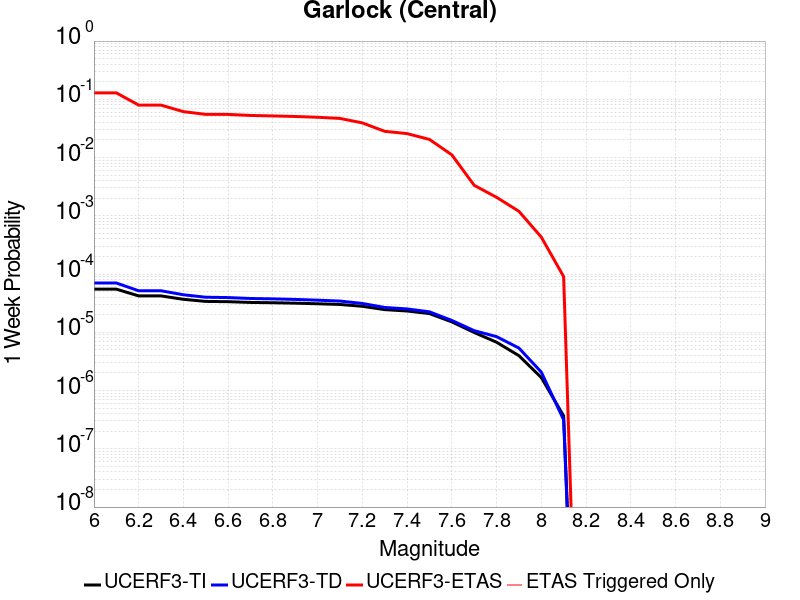 |  |  |  |
|  |  |  |  |
|  |  |  |  |
| 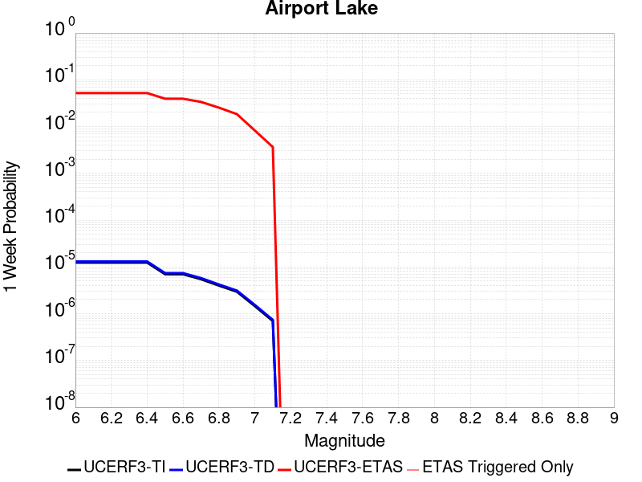 |  |  |  |

## Gridded Nucleation
*[(top)](#table-of-contents)*

| Min Mag | Triggered Ruptures (no spontaneous) | Triggered Ruptures (primary aftershocks only) |
|-----|-----|-----|
| **M&ge;2.5** | 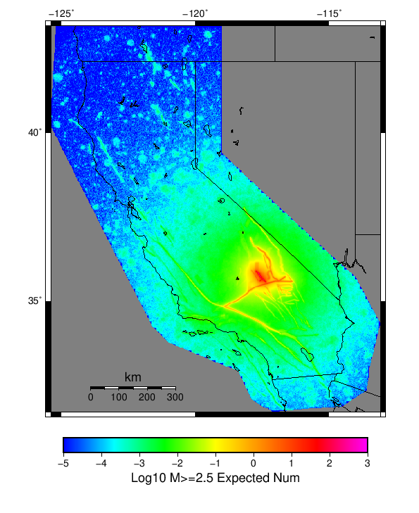 |  |
| **M&ge;5** |  |  |
| **M&ge;6** |  |  |
| **M&ge;7** |  |  |


## JSON Input File
*[(top)](#table-of-contents)*

```
{
  "numSimulations": 100000,
  "duration": 10.0,
  "startTimeMillis": 1562383194040,
  "includeSpontaneous": false,
  "randomSeed": 1567035130192,
  "binaryOutput": true,
  "binaryOutputFilters": [
    {
      "prefix": "results_complete",
      "descendantsOnly": false
    },
    {
      "prefix": "results_m5_preserve_chain",
      "minMag": 5.0,
      "preserveChainBelowMag": true,
      "descendantsOnly": false
    }
  ],
  "forceRecalc": false,
  "simulationName": "ComCat M7.1 (ci38457511), ShakeMap Surfaces, Log10(k)\u003d-2.2833, p\u003d1.2434, c\u003d0.0102",
  "numRetries": 3,
  "outputDir": "${ETAS_SIM_DIR}/2019_08_28-ComCatM7p1_ci38457511_ShakeMapSurfaces_Log10_k_2p2833_p1p2434_c0p0102-noSpont-full_td-scale1.14-modParams",
  "triggerRuptures": [
    {
      "occurrenceTimeMillis": 1562259775340,
      "comcatEventID": "ci38443095",
      "mag": 3.98,
      "latitude": 35.708,
      "longitude": -117.5036667,
      "depth": 10.58
    },
    {
      "occurrenceTimeMillis": 1562261629000,
      "comcatEventID": "ci38443183",
      "mag": 6.4,
      "latitude": 35.7053333,
      "longitude": -117.5038333,
      "depth": 10.5,
      "ruptureSurfaces": [
        {
          "outline": [
            {
              "latitude": 35.6051534466,
              "longitude": -117.5905380735,
              "depth": 0.0
            },
            {
              "latitude": 35.6173144101,
              "longitude": -117.57249634649999,
              "depth": 0.0
            },
            {
              "latitude": 35.6173135736,
              "longitude": -117.5726723708,
              "depth": 0.0
            },
            {
              "latitude": 35.61731357360001,
              "longitude": -117.5726723708,
              "depth": 15.0
            },
            {
              "latitude": 35.6173144101,
              "longitude": -117.57249634649999,
              "depth": 15.0
            },
            {
              "latitude": 35.6051534466,
              "longitude": -117.5905380735,
              "depth": 15.0
            },
            {
              "latitude": 35.6051534466,
              "longitude": -117.5905380735,
              "depth": 0.0
            }
          ]
        },
        {
          "outline": [
            {
              "latitude": 35.6338128629,
              "longitude": -117.54831678310002,
              "depth": 0.0
            },
            {
              "latitude": 35.6413274733,
              "longitude": -117.5393878708,
              "depth": 0.0
            },
            {
              "latitude": 35.664283512,
              "longitude": -117.51611643970001,
              "depth": 0.0
            },
            {
              "latitude": 35.664283512000004,
              "longitude": -117.51611643970001,
              "depth": 15.0
            },
            {
              "latitude": 35.641327473299995,
              "longitude": -117.5393878708,
              "depth": 15.0
            },
            {
              "latitude": 35.63381286290001,
              "longitude": -117.54831678310002,
              "depth": 15.0
            },
            {
              "latitude": 35.6338128629,
              "longitude": -117.54831678310002,
              "depth": 0.0
            }
          ]
        },
        {
          "outline": [
            {
              "latitude": 35.6322100797,
              "longitude": -117.55305954249998,
              "depth": 0.0
            },
            {
              "latitude": 35.6196274701,
              "longitude": -117.56969626549999,
              "depth": 0.0
            },
            {
              "latitude": 35.6196274701,
              "longitude": -117.56969626549999,
              "depth": 15.0
            },
            {
              "latitude": 35.6322100797,
              "longitude": -117.55305954249998,
              "depth": 15.0
            },
            {
              "latitude": 35.6322100797,
              "longitude": -117.55305954249998,
              "depth": 0.0
            }
          ]
        }
      ]
    },
    {
      "occurrenceTimeMillis": 1562261701660,
      "comcatEventID": "ci38443191",
      "mag": 4.49,
      "latitude": 35.644,
      "longitude": -117.56716670000002,
      "depth": 4.64
    },
    {
      "occurrenceTimeMillis": 1562261746340,
      "comcatEventID": "ci37222356",
      "mag": 3.63,
      "latitude": 35.6936667,
      "longitude": -117.437,
      "depth": 7.65
    },
    {
      "occurrenceTimeMillis": 1562261752170,
      "comcatEventID": "ci37218988",
      "mag": 4.28,
      "latitude": 35.687,
      "longitude": -117.50616670000001,
      "depth": 1.6
    },
    {
      "occurrenceTimeMillis": 1562261818950,
      "comcatEventID": "ci37222380",
      "mag": 3.41,
      "latitude": 35.7258333,
      "longitude": -117.55933330000002,
      "depth": 5.3
    },
    {
      "occurrenceTimeMillis": 1562261821140,
      "comcatEventID": "ci37222372",
      "mag": 3.66,
      "latitude": 35.7105,
      "longitude": -117.4773333,
      "depth": 1.57
    },
    {
      "occurrenceTimeMillis": 1562261834850,
      "comcatEventID": "ci37222364",
      "mag": 3.97,
      "latitude": 35.6655,
      "longitude": -117.516,
      "depth": 1.64
    },
    {
      "occurrenceTimeMillis": 1562261845640,
      "comcatEventID": "ci37218996",
      "mag": 4.01,
      "latitude": 35.6758333,
      "longitude": -117.45750000000001,
      "depth": 15.82
    },
    {
      "occurrenceTimeMillis": 1562261875500,
      "comcatEventID": "ci38443199",
      "mag": 3.86,
      "latitude": 35.7456667,
      "longitude": -117.5516667,
      "depth": 8.29
    },
    {
      "occurrenceTimeMillis": 1562261901450,
      "comcatEventID": "ci37421941",
      "mag": 3.73,
      "latitude": 35.714,
      "longitude": -117.476,
      "depth": 1.74
    },
    {
      "occurrenceTimeMillis": 1562261927500,
      "comcatEventID": "us70004a0n",
      "mag": 3.5,
      "latitude": 35.6215,
      "longitude": -117.5782,
      "depth": 9.7
    },
    {
      "occurrenceTimeMillis": 1562261927760,
      "comcatEventID": "ci37222396",
      "mag": 3.5,
      "latitude": 35.6235,
      "longitude": -117.596,
      "depth": 8.55
    },
    {
      "occurrenceTimeMillis": 1562261973310,
      "comcatEventID": "ci37222404",
      "mag": 3.11,
      "latitude": 35.5743333,
      "longitude": -117.63666670000002,
      "depth": 6.85
    },
    {
      "occurrenceTimeMillis": 1562261975360,
      "comcatEventID": "ci38443215",
      "mag": 3.69,
      "latitude": 35.6873333,
      "longitude": -117.4935,
      "depth": 10.86
    },
    {
      "occurrenceTimeMillis": 1562262002250,
      "comcatEventID": "ci38443223",
      "mag": 3.8,
      "latitude": 35.7253333,
      "longitude": -117.57083329999999,
      "depth": 6.63
    },
    {
      "occurrenceTimeMillis": 1562262018520,
      "comcatEventID": "ci38443231",
      "mag": 4.13,
      "latitude": 35.707,
      "longitude": -117.5101667,
      "depth": 8.66
    },
    {
      "occurrenceTimeMillis": 1562262034900,
      "comcatEventID": "ci37222508",
      "mag": 3.54,
      "latitude": 35.6948333,
      "longitude": -117.50183330000002,
      "depth": 2.04
    },
    {
      "occurrenceTimeMillis": 1562262046140,
      "comcatEventID": "ci37222516",
      "mag": 3.42,
      "latitude": 35.7298333,
      "longitude": -117.55483330000001,
      "depth": 7.72
    },
    {
      "occurrenceTimeMillis": 1562262080850,
      "comcatEventID": "ci37421957",
      "mag": 3.3,
      "latitude": 35.7266667,
      "longitude": -117.5288333,
      "depth": 1.97
    },
    {
      "occurrenceTimeMillis": 1562262174130,
      "comcatEventID": "ci38443239",
      "mag": 3.22,
      "latitude": 35.7301667,
      "longitude": -117.55866669999999,
      "depth": 7.84
    },
    {
      "occurrenceTimeMillis": 1562262209200,
      "comcatEventID": "us70004a0z",
      "mag": 3.6,
      "latitude": 35.6783,
      "longitude": -117.5488,
      "depth": 5.15
    },
    {
      "occurrenceTimeMillis": 1562262264020,
      "comcatEventID": "ci37421981",
      "mag": 2.77,
      "latitude": 35.7478333,
      "longitude": -117.54000000000002,
      "depth": 9.4
    },
    {
      "occurrenceTimeMillis": 1562262272820,
      "comcatEventID": "ci38443255",
      "mag": 3.86,
      "latitude": 35.6875,
      "longitude": -117.5071667,
      "depth": 1.54
    },
    {
      "occurrenceTimeMillis": 1562262305780,
      "comcatEventID": "ci37421997",
      "mag": 3.03,
      "latitude": 35.6976667,
      "longitude": -117.48649999999999,
      "depth": 2.24
    },
    {
      "occurrenceTimeMillis": 1562262323950,
      "comcatEventID": "ci37421989",
      "mag": 3.03,
      "latitude": 35.7151667,
      "longitude": -117.5473333,
      "depth": 7.21
    },
    {
      "occurrenceTimeMillis": 1562262328630,
      "comcatEventID": "ci37222524",
      "mag": 3.21,
      "latitude": 35.7348333,
      "longitude": -117.53683330000001,
      "depth": 10.34
    },
    {
      "occurrenceTimeMillis": 1562262363710,
      "comcatEventID": "ci38443263",
      "mag": 2.96,
      "latitude": 35.6431667,
      "longitude": -117.6101667,
      "depth": 10.14
    },
    {
      "occurrenceTimeMillis": 1562262380320,
      "comcatEventID": "ci37222532",
      "mag": 2.56,
      "latitude": 35.6563333,
      "longitude": -117.5325,
      "depth": 1.52
    },
    {
      "occurrenceTimeMillis": 1562262409960,
      "comcatEventID": "ci38443271",
      "mag": 3.07,
      "latitude": 35.6385,
      "longitude": -117.6108333,
      "depth": 10.97
    },
    {
      "occurrenceTimeMillis": 1562262437810,
      "comcatEventID": "ci38443279",
      "mag": 3.5,
      "latitude": 35.7455,
      "longitude": -117.5465,
      "depth": 7.11
    },
    {
      "occurrenceTimeMillis": 1562262460970,
      "comcatEventID": "ci37222548",
      "mag": 3.11,
      "latitude": 35.726,
      "longitude": -117.55849999999998,
      "depth": 3.58
    },
    {
      "occurrenceTimeMillis": 1562262474970,
      "comcatEventID": "ci37222556",
      "mag": 3.4,
      "latitude": 35.7286667,
      "longitude": -117.56066670000001,
      "depth": 5.25
    },
    {
      "occurrenceTimeMillis": 1562262483160,
      "comcatEventID": "ci37222564",
      "mag": 3.27,
      "latitude": 35.6365,
      "longitude": -117.55183330000001,
      "depth": 6.62
    },
    {
      "occurrenceTimeMillis": 1562262495680,
      "comcatEventID": "ci37222572",
      "mag": 3.11,
      "latitude": 35.7053333,
      "longitude": -117.5245,
      "depth": 5.52
    },
    {
      "occurrenceTimeMillis": 1562262504150,
      "comcatEventID": "ci37222580",
      "mag": 2.96,
      "latitude": 35.6593333,
      "longitude": -117.52633330000002,
      "depth": 2.68
    },
    {
      "occurrenceTimeMillis": 1562262575190,
      "comcatEventID": "ci37222596",
      "mag": 2.52,
      "latitude": 35.7335,
      "longitude": -117.50683330000001,
      "depth": 3.91
    },
    {
      "occurrenceTimeMillis": 1562262578950,
      "comcatEventID": "ci37222668",
      "mag": 2.57,
      "latitude": 35.687,
      "longitude": -117.49066670000002,
      "depth": 10.66
    },
    {
      "occurrenceTimeMillis": 1562262648290,
      "comcatEventID": "ci37222692",
      "mag": 2.73,
      "latitude": 35.738,
      "longitude": -117.52933329999999,
      "depth": 7.72
    },
    {
      "occurrenceTimeMillis": 1562262648960,
      "comcatEventID": "ci38443303",
      "mag": 2.79,
      "latitude": 35.678,
      "longitude": -117.49916670000002,
      "depth": 1.14
    },
    {
      "occurrenceTimeMillis": 1562262706650,
      "comcatEventID": "ci38443287",
      "mag": 3.46,
      "latitude": 35.674,
      "longitude": -117.52349999999998,
      "depth": 5.3
    },
    {
      "occurrenceTimeMillis": 1562262761700,
      "comcatEventID": "ci38443295",
      "mag": 2.92,
      "latitude": 35.7218333,
      "longitude": -117.5251667,
      "depth": 7.04
    },
    {
      "occurrenceTimeMillis": 1562262899560,
      "comcatEventID": "ci38443327",
      "mag": 2.53,
      "latitude": 35.6391667,
      "longitude": -117.5628333,
      "depth": 10.48
    },
    {
      "occurrenceTimeMillis": 1562262930800,
      "comcatEventID": "ci37222876",
      "mag": 2.57,
      "latitude": 35.6705,
      "longitude": -117.5221667,
      "depth": 3.91
    },
    {
      "occurrenceTimeMillis": 1562263051460,
      "comcatEventID": "ci38443311",
      "mag": 2.95,
      "latitude": 35.6595,
      "longitude": -117.5223333,
      "depth": 2.3
    },
    {
      "occurrenceTimeMillis": 1562263063060,
      "comcatEventID": "ci37222932",
      "mag": 2.78,
      "latitude": 35.6725,
      "longitude": -117.4743333,
      "depth": 8.76
    },
    {
      "occurrenceTimeMillis": 1562263082640,
      "comcatEventID": "ci38443319",
      "mag": 3.33,
      "latitude": 35.702,
      "longitude": -117.50833330000002,
      "depth": 4.77
    },
    {
      "occurrenceTimeMillis": 1562263240190,
      "comcatEventID": "ci38443335",
      "mag": 2.67,
      "latitude": 35.6303333,
      "longitude": -117.569,
      "depth": 1.64
    },
    {
      "occurrenceTimeMillis": 1562263261190,
      "comcatEventID": "ci37223148",
      "mag": 2.59,
      "latitude": 35.6733333,
      "longitude": -117.5118333,
      "depth": 1.49
    },
    {
      "occurrenceTimeMillis": 1562263283180,
      "comcatEventID": "ci37422005",
      "mag": 3.53,
      "latitude": 35.6876667,
      "longitude": -117.50849999999998,
      "depth": 1.26
    },
    {
      "occurrenceTimeMillis": 1562263291230,
      "comcatEventID": "ci37223156",
      "mag": 3.42,
      "latitude": 35.5978333,
      "longitude": -117.5905,
      "depth": 6.79
    },
    {
      "occurrenceTimeMillis": 1562263374110,
      "comcatEventID": "ci38443351",
      "mag": 2.53,
      "latitude": 35.6066667,
      "longitude": -117.58216670000002,
      "depth": 5.8
    },
    {
      "occurrenceTimeMillis": 1562263398590,
      "comcatEventID": "ci38443359",
      "mag": 2.85,
      "latitude": 35.7478333,
      "longitude": -117.5425,
      "depth": 6.85
    },
    {
      "occurrenceTimeMillis": 1562263541830,
      "comcatEventID": "ci38443375",
      "mag": 2.76,
      "latitude": 35.7153333,
      "longitude": -117.5295,
      "depth": 4.54
    },
    {
      "occurrenceTimeMillis": 1562263555910,
      "comcatEventID": "ci37223228",
      "mag": 2.61,
      "latitude": 35.7266667,
      "longitude": -117.5165,
      "depth": 8.96
    },
    {
      "occurrenceTimeMillis": 1562263576110,
      "comcatEventID": "ci38443383",
      "mag": 3.79,
      "latitude": 35.6606667,
      "longitude": -117.523,
      "depth": 2.14
    },
    {
      "occurrenceTimeMillis": 1562263611050,
      "comcatEventID": "ci37223236",
      "mag": 2.6,
      "latitude": 35.6931667,
      "longitude": -117.46200000000002,
      "depth": 11.56
    },
    {
      "occurrenceTimeMillis": 1562263629270,
      "comcatEventID": "ci38443391",
      "mag": 3.51,
      "latitude": 35.5991667,
      "longitude": -117.6101667,
      "depth": 2.12
    },
    {
      "occurrenceTimeMillis": 1562263630910,
      "comcatEventID": "ci37223244",
      "mag": 3.49,
      "latitude": 35.6508333,
      "longitude": -117.54200000000002,
      "depth": 2.77
    },
    {
      "occurrenceTimeMillis": 1562263670810,
      "comcatEventID": "ci37223252",
      "mag": 2.55,
      "latitude": 35.72950000000001,
      "longitude": -117.533,
      "depth": 7.25
    },
    {
      "occurrenceTimeMillis": 1562263713160,
      "comcatEventID": "ci38443407",
      "mag": 3.38,
      "latitude": 35.6678333,
      "longitude": -117.50616670000001,
      "depth": 2.27
    },
    {
      "occurrenceTimeMillis": 1562263725070,
      "comcatEventID": "ci37223308",
      "mag": 3.55,
      "latitude": 35.7108333,
      "longitude": -117.47683329999998,
      "depth": 1.17
    },
    {
      "occurrenceTimeMillis": 1562263832710,
      "comcatEventID": "ci38443415",
      "mag": 3.46,
      "latitude": 35.6598333,
      "longitude": -117.53483330000002,
      "depth": 10.25
    },
    {
      "occurrenceTimeMillis": 1562263882870,
      "comcatEventID": "ci38443423",
      "mag": 2.69,
      "latitude": 35.6003333,
      "longitude": -117.5951667,
      "depth": 7.33
    },
    {
      "occurrenceTimeMillis": 1562263972070,
      "comcatEventID": "ci38443431",
      "mag": 3.44,
      "latitude": 35.6703333,
      "longitude": -117.5605,
      "depth": 6.91
    },
    {
      "occurrenceTimeMillis": 1562264025530,
      "comcatEventID": "ci37223380",
      "mag": 2.89,
      "latitude": 35.7003333,
      "longitude": -117.4873333,
      "depth": 10.98
    },
    {
      "occurrenceTimeMillis": 1562264031400,
      "comcatEventID": "ci38443439",
      "mag": 3.5,
      "latitude": 35.7081667,
      "longitude": -117.485,
      "depth": 6.44
    },
    {
      "occurrenceTimeMillis": 1562264104970,
      "comcatEventID": "ci38443447",
      "mag": 2.75,
      "latitude": 35.6103333,
      "longitude": -117.59500000000001,
      "depth": 4.94
    },
    {
      "occurrenceTimeMillis": 1562264112820,
      "comcatEventID": "ci37420701",
      "mag": 3.23,
      "latitude": 35.6691667,
      "longitude": -117.5203333,
      "depth": 1.84
    },
    {
      "occurrenceTimeMillis": 1562264193730,
      "comcatEventID": "ci38443463",
      "mag": 2.94,
      "latitude": 35.7251667,
      "longitude": -117.53350000000002,
      "depth": 6.74
    },
    {
      "occurrenceTimeMillis": 1562264235320,
      "comcatEventID": "ci38443471",
      "mag": 2.87,
      "latitude": 35.7185,
      "longitude": -117.5336667,
      "depth": 4.94
    },
    {
      "occurrenceTimeMillis": 1562264325720,
      "comcatEventID": "ci38443487",
      "mag": 3.38,
      "latitude": 35.638,
      "longitude": -117.611,
      "depth": 9.43
    },
    {
      "occurrenceTimeMillis": 1562264332070,
      "comcatEventID": "ci37223676",
      "mag": 2.98,
      "latitude": 35.6123333,
      "longitude": -117.624,
      "depth": 0.0
    },
    {
      "occurrenceTimeMillis": 1562264348090,
      "comcatEventID": "ci37223684",
      "mag": 2.6,
      "latitude": 35.7236667,
      "longitude": -117.50849999999998,
      "depth": 11.57
    },
    {
      "occurrenceTimeMillis": 1562264485340,
      "comcatEventID": "ci38443495",
      "mag": 2.61,
      "latitude": 35.67883330000001,
      "longitude": -117.51533330000001,
      "depth": 2.91
    },
    {
      "occurrenceTimeMillis": 1562264763750,
      "comcatEventID": "ci38443519",
      "mag": 3.13,
      "latitude": 35.6638333,
      "longitude": -117.5245,
      "depth": 2.53
    },
    {
      "occurrenceTimeMillis": 1562264846770,
      "comcatEventID": "ci38443527",
      "mag": 3.29,
      "latitude": 35.6748333,
      "longitude": -117.51433329999999,
      "depth": 2.68
    },
    {
      "occurrenceTimeMillis": 1562264879440,
      "comcatEventID": "ci38443535",
      "mag": 4.23,
      "latitude": 35.745,
      "longitude": -117.55216669999999,
      "depth": 6.64
    },
    {
      "occurrenceTimeMillis": 1562264923640,
      "comcatEventID": "ci38443543",
      "mag": 3.75,
      "latitude": 35.6661667,
      "longitude": -117.5656667,
      "depth": 7.14
    },
    {
      "occurrenceTimeMillis": 1562265289010,
      "comcatEventID": "ci37224604",
      "mag": 2.59,
      "latitude": 35.6895,
      "longitude": -117.4883333,
      "depth": 0.63
    },
    {
      "occurrenceTimeMillis": 1562265344040,
      "comcatEventID": "ci38443575",
      "mag": 2.5,
      "latitude": 35.7215,
      "longitude": -117.56550000000001,
      "depth": 0.16
    },
    {
      "occurrenceTimeMillis": 1562265451500,
      "comcatEventID": "ci38443591",
      "mag": 2.64,
      "latitude": 35.72,
      "longitude": -117.5723333,
      "depth": 1.34
    },
    {
      "occurrenceTimeMillis": 1562265525650,
      "comcatEventID": "ci38443599",
      "mag": 2.69,
      "latitude": 35.7046661,
      "longitude": -117.49666600000002,
      "depth": 3.96
    },
    {
      "occurrenceTimeMillis": 1562265584440,
      "comcatEventID": "ci38443607",
      "mag": 4.59,
      "latitude": 35.6013333,
      "longitude": -117.59700000000001,
      "depth": 2.81
    },
    {
      "occurrenceTimeMillis": 1562265656740,
      "comcatEventID": "ci37224612",
      "mag": 3.05,
      "latitude": 35.652,
      "longitude": -117.53683330000001,
      "depth": 2.03
    },
    {
      "occurrenceTimeMillis": 1562265674270,
      "comcatEventID": "ci38443615",
      "mag": 3.07,
      "latitude": 35.6763333,
      "longitude": -117.5115,
      "depth": 2.13
    },
    {
      "occurrenceTimeMillis": 1562265865000,
      "comcatEventID": "ci38443631",
      "mag": 3.09,
      "latitude": 35.719,
      "longitude": -117.55866669999999,
      "depth": 2.06
    },
    {
      "occurrenceTimeMillis": 1562266026590,
      "comcatEventID": "ci38443647",
      "mag": 4.34,
      "latitude": 35.6758333,
      "longitude": -117.48533330000001,
      "depth": 8.53
    },
    {
      "occurrenceTimeMillis": 1562266042600,
      "comcatEventID": "ci37421213",
      "mag": 4.02,
      "latitude": 35.6755,
      "longitude": -117.472,
      "depth": 10.27
    },
    {
      "occurrenceTimeMillis": 1562266207160,
      "comcatEventID": "ci38443663",
      "mag": 2.73,
      "latitude": 35.641,
      "longitude": -117.56266670000001,
      "depth": 8.95
    },
    {
      "occurrenceTimeMillis": 1562266215910,
      "comcatEventID": "ci38443671",
      "mag": 3.7,
      "latitude": 35.682,
      "longitude": -117.4961667,
      "depth": 1.26
    },
    {
      "occurrenceTimeMillis": 1562266333530,
      "comcatEventID": "ci38443679",
      "mag": 2.78,
      "latitude": 35.6543333,
      "longitude": -117.53983330000001,
      "depth": 0.88
    },
    {
      "occurrenceTimeMillis": 1562266376130,
      "comcatEventID": "ci38443687",
      "mag": 2.93,
      "latitude": 35.741,
      "longitude": -117.561,
      "depth": 0.23
    },
    {
      "occurrenceTimeMillis": 1562266407670,
      "comcatEventID": "ci38443695",
      "mag": 3.36,
      "latitude": 35.7285,
      "longitude": -117.5605,
      "depth": 7.87
    },
    {
      "occurrenceTimeMillis": 1562266453990,
      "comcatEventID": "ci38443703",
      "mag": 4.07,
      "latitude": 35.5975,
      "longitude": -117.5996667,
      "depth": 5.33
    },
    {
      "occurrenceTimeMillis": 1562266527680,
      "comcatEventID": "ci38443711",
      "mag": 3.03,
      "latitude": 35.6753333,
      "longitude": -117.4795,
      "depth": 10.71
    },
    {
      "occurrenceTimeMillis": 1562266566420,
      "comcatEventID": "ci38443719",
      "mag": 4.58,
      "latitude": 35.716,
      "longitude": -117.56000000000002,
      "depth": 1.92
    },
    {
      "occurrenceTimeMillis": 1562266582030,
      "comcatEventID": "ci37420717",
      "mag": 4.21,
      "latitude": 35.7086667,
      "longitude": -117.55416669999998,
      "depth": 1.16
    },
    {
      "occurrenceTimeMillis": 1562266687790,
      "comcatEventID": "ci38443727",
      "mag": 2.85,
      "latitude": 35.7266667,
      "longitude": -117.56516670000002,
      "depth": 0.09
    },
    {
      "occurrenceTimeMillis": 1562266809510,
      "comcatEventID": "ci38443751",
      "mag": 3.21,
      "latitude": 35.7099991,
      "longitude": -117.55616759999998,
      "depth": 0.1
    },
    {
      "occurrenceTimeMillis": 1562266869997,
      "comcatEventID": "us70004a4p",
      "mag": 3.0,
      "latitude": 35.7867,
      "longitude": -117.5478,
      "depth": 5.0
    },
    {
      "occurrenceTimeMillis": 1562266944640,
      "comcatEventID": "ci38443775",
      "mag": 2.56,
      "latitude": 35.645,
      "longitude": -117.5373333,
      "depth": 0.01
    },
    {
      "occurrenceTimeMillis": 1562267419790,
      "comcatEventID": "ci38443823",
      "mag": 3.26,
      "latitude": 35.6938324,
      "longitude": -117.49449920000002,
      "depth": 0.97
    },
    {
      "occurrenceTimeMillis": 1562267699490,
      "comcatEventID": "ci38443831",
      "mag": 3.0,
      "latitude": 35.652668,
      "longitude": -117.5393295,
      "depth": 1.65
    },
    {
      "occurrenceTimeMillis": 1562267766200,
      "comcatEventID": "ci38443839",
      "mag": 2.5,
      "latitude": 35.721,
      "longitude": -117.56650000000002,
      "depth": 0.12
    },
    {
      "occurrenceTimeMillis": 1562267871400,
      "comcatEventID": "ci38443855",
      "mag": 3.23,
      "latitude": 35.6911659,
      "longitude": -117.51216889999999,
      "depth": 1.03
    },
    {
      "occurrenceTimeMillis": 1562268051750,
      "comcatEventID": "ci38443863",
      "mag": 2.8,
      "latitude": 35.6389999,
      "longitude": -117.5526657,
      "depth": 1.11
    },
    {
      "occurrenceTimeMillis": 1562268092090,
      "comcatEventID": "ci38443871",
      "mag": 4.5,
      "latitude": 35.6715,
      "longitude": -117.4788333,
      "depth": 5.16
    },
    {
      "occurrenceTimeMillis": 1562268380340,
      "comcatEventID": "ci38443879",
      "mag": 2.69,
      "latitude": 35.7086667,
      "longitude": -117.48333330000001,
      "depth": 1.39
    },
    {
      "occurrenceTimeMillis": 1562268438340,
      "comcatEventID": "ci38443895",
      "mag": 2.81,
      "latitude": 35.6696667,
      "longitude": -117.47999999999999,
      "depth": 6.24
    },
    {
      "occurrenceTimeMillis": 1562269189760,
      "comcatEventID": "ci38443983",
      "mag": 2.63,
      "latitude": 35.683,
      "longitude": -117.5195,
      "depth": 5.84
    },
    {
      "occurrenceTimeMillis": 1562269229180,
      "comcatEventID": "ci38443991",
      "mag": 2.65,
      "latitude": 35.6556667,
      "longitude": -117.5158333,
      "depth": 1.76
    },
    {
      "occurrenceTimeMillis": 1562269744960,
      "comcatEventID": "ci38444047",
      "mag": 3.18,
      "latitude": 35.6828346,
      "longitude": -117.49183650000002,
      "depth": 0.0
    },
    {
      "occurrenceTimeMillis": 1562269876850,
      "comcatEventID": "ci38444063",
      "mag": 3.34,
      "latitude": 35.7094994,
      "longitude": -117.55666349999998,
      "depth": 0.34
    },
    {
      "occurrenceTimeMillis": 1562269933070,
      "comcatEventID": "ci38444071",
      "mag": 3.02,
      "latitude": 35.6086655,
      "longitude": -117.590332,
      "depth": 4.83
    },
    {
      "occurrenceTimeMillis": 1562270160500,
      "comcatEventID": "ci38444103",
      "mag": 4.16,
      "latitude": 35.6623333,
      "longitude": -117.524,
      "depth": 1.49
    },
    {
      "occurrenceTimeMillis": 1562270280220,
      "comcatEventID": "ci38444119",
      "mag": 2.65,
      "latitude": 35.7131667,
      "longitude": -117.5561667,
      "depth": 0.16
    },
    {
      "occurrenceTimeMillis": 1562270492930,
      "comcatEventID": "ci38444135",
      "mag": 2.5,
      "latitude": 35.678,
      "longitude": -117.589,
      "depth": 7.89
    },
    {
      "occurrenceTimeMillis": 1562270655500,
      "comcatEventID": "ci38444143",
      "mag": 2.56,
      "latitude": 35.7048333,
      "longitude": -117.48683330000001,
      "depth": 1.23
    },
    {
      "occurrenceTimeMillis": 1562270768270,
      "comcatEventID": "ci38444159",
      "mag": 3.38,
      "latitude": 35.6980019,
      "longitude": -117.4881668,
      "depth": 8.77
    },
    {
      "occurrenceTimeMillis": 1562271091460,
      "comcatEventID": "ci38444191",
      "mag": 2.61,
      "latitude": 35.683,
      "longitude": -117.50483330000002,
      "depth": 1.69
    },
    {
      "occurrenceTimeMillis": 1562271290340,
      "comcatEventID": "ci38444215",
      "mag": 3.99,
      "latitude": 35.6991667,
      "longitude": -117.5125,
      "depth": 5.75
    },
    {
      "occurrenceTimeMillis": 1562271456830,
      "comcatEventID": "ci38444231",
      "mag": 3.06,
      "latitude": 35.699501,
      "longitude": -117.4838333,
      "depth": 1.03
    },
    {
      "occurrenceTimeMillis": 1562271789990,
      "comcatEventID": "ci38444263",
      "mag": 3.4,
      "latitude": 35.6403351,
      "longitude": -117.5996704,
      "depth": 9.92
    },
    {
      "occurrenceTimeMillis": 1562271838650,
      "comcatEventID": "ci38444271",
      "mag": 2.53,
      "latitude": 35.6583333,
      "longitude": -117.56233329999999,
      "depth": 4.39
    },
    {
      "occurrenceTimeMillis": 1562272472100,
      "comcatEventID": "ci38444311",
      "mag": 2.61,
      "latitude": 35.640667,
      "longitude": -117.5833359,
      "depth": 8.68
    },
    {
      "occurrenceTimeMillis": 1562273126620,
      "comcatEventID": "ci38444407",
      "mag": 3.09,
      "latitude": 35.7008324,
      "longitude": -117.47766879999999,
      "depth": 0.04
    },
    {
      "occurrenceTimeMillis": 1562273724820,
      "comcatEventID": "ci38444487",
      "mag": 3.37,
      "latitude": 35.7088318,
      "longitude": -117.4771652,
      "depth": 0.2
    },
    {
      "occurrenceTimeMillis": 1562273832360,
      "comcatEventID": "ci38444503",
      "mag": 2.54,
      "latitude": 35.6585,
      "longitude": -117.53199999999998,
      "depth": 8.73
    },
    {
      "occurrenceTimeMillis": 1562274175860,
      "comcatEventID": "ci38444543",
      "mag": 3.56,
      "latitude": 35.689666700000004,
      "longitude": -117.4853363,
      "depth": 7.08
    },
    {
      "occurrenceTimeMillis": 1562274428600,
      "comcatEventID": "ci38444559",
      "mag": 2.52,
      "latitude": 35.5995,
      "longitude": -117.59783330000002,
      "depth": 4.74
    },
    {
      "occurrenceTimeMillis": 1562275395050,
      "comcatEventID": "ci38444687",
      "mag": 2.8,
      "latitude": 35.6951667,
      "longitude": -117.4893333,
      "depth": 1.65
    },
    {
      "occurrenceTimeMillis": 1562275595090,
      "comcatEventID": "ci38444719",
      "mag": 3.0,
      "latitude": 35.67666630000001,
      "longitude": -117.52749630000001,
      "depth": 7.39
    },
    {
      "occurrenceTimeMillis": 1562275966060,
      "comcatEventID": "ci38444783",
      "mag": 2.62,
      "latitude": 35.725,
      "longitude": -117.56916670000001,
      "depth": 2.03
    },
    {
      "occurrenceTimeMillis": 1562276014350,
      "comcatEventID": "ci38444791",
      "mag": 3.08,
      "latitude": 35.6155014,
      "longitude": -117.5893326,
      "depth": 5.43
    },
    {
      "occurrenceTimeMillis": 1562276433450,
      "comcatEventID": "ci38444823",
      "mag": 3.42,
      "latitude": 35.6691666,
      "longitude": -117.518837,
      "depth": 2.04
    },
    {
      "occurrenceTimeMillis": 1562276519830,
      "comcatEventID": "ci38444847",
      "mag": 2.74,
      "latitude": 35.7193333,
      "longitude": -117.53216670000002,
      "depth": 2.19
    },
    {
      "occurrenceTimeMillis": 1562276794030,
      "comcatEventID": "ci38444895",
      "mag": 2.5,
      "latitude": 35.7011667,
      "longitude": -117.47866669999999,
      "depth": 0.93
    },
    {
      "occurrenceTimeMillis": 1562276824410,
      "comcatEventID": "ci38444903",
      "mag": 3.25,
      "latitude": 35.6321678,
      "longitude": -117.60717010000002,
      "depth": 9.0
    },
    {
      "occurrenceTimeMillis": 1562277755090,
      "comcatEventID": "ci38445015",
      "mag": 3.35,
      "latitude": 35.6775017,
      "longitude": -117.5148315,
      "depth": 2.85
    },
    {
      "occurrenceTimeMillis": 1562277922533,
      "comcatEventID": "us70004ach",
      "mag": 3.3,
      "latitude": 35.7232,
      "longitude": -117.4508,
      "depth": 9.45
    },
    {
      "occurrenceTimeMillis": 1562278328280,
      "comcatEventID": "ci38445087",
      "mag": 4.47,
      "latitude": 35.7443333,
      "longitude": -117.56633329999998,
      "depth": 1.97
    },
    {
      "occurrenceTimeMillis": 1562279346560,
      "comcatEventID": "ci38445183",
      "mag": 2.51,
      "latitude": 35.7038333,
      "longitude": -117.49499999999999,
      "depth": 9.8
    },
    {
      "occurrenceTimeMillis": 1562279407880,
      "comcatEventID": "ci38445199",
      "mag": 2.62,
      "latitude": 35.7008333,
      "longitude": -117.4893333,
      "depth": 1.85
    },
    {
      "occurrenceTimeMillis": 1562280141650,
      "comcatEventID": "ci38445295",
      "mag": 3.2,
      "latitude": 35.7211685,
      "longitude": -117.52400210000002,
      "depth": 2.21
    },
    {
      "occurrenceTimeMillis": 1562281630780,
      "comcatEventID": "ci38445463",
      "mag": 2.59,
      "latitude": 35.7041667,
      "longitude": -117.4886667,
      "depth": 1.92
    },
    {
      "occurrenceTimeMillis": 1562281960410,
      "comcatEventID": "ci38445495",
      "mag": 3.49,
      "latitude": 35.6711655,
      "longitude": -117.47166440000001,
      "depth": 7.11
    },
    {
      "occurrenceTimeMillis": 1562281984910,
      "comcatEventID": "ci38445503",
      "mag": 3.06,
      "latitude": 35.7470016,
      "longitude": -117.5784988,
      "depth": 2.13
    },
    {
      "occurrenceTimeMillis": 1562283240630,
      "comcatEventID": "ci37420973",
      "mag": 3.82,
      "latitude": 35.6623333,
      "longitude": -117.5245,
      "depth": 2.61
    },
    {
      "occurrenceTimeMillis": 1562283242380,
      "comcatEventID": "ci38445703",
      "mag": 4.04,
      "latitude": 35.6011667,
      "longitude": -117.61066670000001,
      "depth": 4.75
    },
    {
      "occurrenceTimeMillis": 1562283753710,
      "comcatEventID": "ci38445751",
      "mag": 3.72,
      "latitude": 35.7470016,
      "longitude": -117.5681686,
      "depth": 2.42
    },
    {
      "occurrenceTimeMillis": 1562284476440,
      "comcatEventID": "ci38445839",
      "mag": 3.33,
      "latitude": 35.6571655,
      "longitude": -117.52183530000002,
      "depth": 1.67
    },
    {
      "occurrenceTimeMillis": 1562285645640,
      "comcatEventID": "ci38445935",
      "mag": 2.76,
      "latitude": 35.6458333,
      "longitude": -117.54716670000002,
      "depth": 0.29
    },
    {
      "occurrenceTimeMillis": 1562285881410,
      "comcatEventID": "ci38445975",
      "mag": 4.04,
      "latitude": 35.7718333,
      "longitude": -117.61783330000002,
      "depth": 2.59
    },
    {
      "occurrenceTimeMillis": 1562286529030,
      "comcatEventID": "ci38446031",
      "mag": 2.8,
      "latitude": 35.7215,
      "longitude": -117.5465,
      "depth": 7.03
    },
    {
      "occurrenceTimeMillis": 1562286726670,
      "comcatEventID": "ci38446071",
      "mag": 4.02,
      "latitude": 35.7033333,
      "longitude": -117.4828333,
      "depth": 1.0
    },
    {
      "occurrenceTimeMillis": 1562286799610,
      "comcatEventID": "ci38446079",
      "mag": 2.66,
      "latitude": 35.7436676,
      "longitude": -117.55566409999999,
      "depth": 5.42
    },
    {
      "occurrenceTimeMillis": 1562287539420,
      "comcatEventID": "ci38446159",
      "mag": 3.95,
      "latitude": 35.6910019,
      "longitude": -117.50966640000001,
      "depth": 3.68
    },
    {
      "occurrenceTimeMillis": 1562287780920,
      "comcatEventID": "ci38446175",
      "mag": 2.52,
      "latitude": 35.7096667,
      "longitude": -117.47866669999999,
      "depth": 1.91
    },
    {
      "occurrenceTimeMillis": 1562288933460,
      "comcatEventID": "ci38446343",
      "mag": 2.99,
      "latitude": 35.7254982,
      "longitude": -117.55117030000001,
      "depth": 1.29
    },
    {
      "occurrenceTimeMillis": 1562289493410,
      "comcatEventID": "ci38446391",
      "mag": 3.12,
      "latitude": 35.6580009,
      "longitude": -117.52216339999998,
      "depth": 1.38
    },
    {
      "occurrenceTimeMillis": 1562291154030,
      "comcatEventID": "ci38446527",
      "mag": 2.55,
      "latitude": 35.5946655,
      "longitude": -117.5978317,
      "depth": 4.1
    },
    {
      "occurrenceTimeMillis": 1562291887280,
      "comcatEventID": "ci38446615",
      "mag": 2.68,
      "latitude": 35.7118333,
      "longitude": -117.46816670000001,
      "depth": 0.68
    },
    {
      "occurrenceTimeMillis": 1562292100910,
      "comcatEventID": "ci38446639",
      "mag": 3.21,
      "latitude": 35.7734985,
      "longitude": -117.6149979,
      "depth": 0.22
    },
    {
      "occurrenceTimeMillis": 1562292119010,
      "comcatEventID": "ci38446647",
      "mag": 3.98,
      "latitude": 35.6401667,
      "longitude": -117.5461667,
      "depth": 11.3
    },
    {
      "occurrenceTimeMillis": 1562292319160,
      "comcatEventID": "ci38446671",
      "mag": 3.34,
      "latitude": 35.6558342,
      "longitude": -117.5234985,
      "depth": 1.57
    },
    {
      "occurrenceTimeMillis": 1562292831940,
      "comcatEventID": "ci38446767",
      "mag": 2.65,
      "latitude": 35.6405,
      "longitude": -117.55783329999998,
      "depth": 10.3
    },
    {
      "occurrenceTimeMillis": 1562293181860,
      "comcatEventID": "ci38446807",
      "mag": 3.25,
      "latitude": 35.7746658,
      "longitude": -117.6169968,
      "depth": 2.35
    },
    {
      "occurrenceTimeMillis": 1562293435650,
      "comcatEventID": "ci38446831",
      "mag": 2.8,
      "latitude": 35.7128333,
      "longitude": -117.4743333,
      "depth": 0.81
    },
    {
      "occurrenceTimeMillis": 1562295589610,
      "comcatEventID": "ci38447047",
      "mag": 2.81,
      "latitude": 35.661,
      "longitude": -117.519,
      "depth": 0.21
    },
    {
      "occurrenceTimeMillis": 1562295673270,
      "comcatEventID": "ci38447055",
      "mag": 2.72,
      "latitude": 35.744,
      "longitude": -117.5648333,
      "depth": 5.49
    },
    {
      "occurrenceTimeMillis": 1562296518720,
      "comcatEventID": "ci38447143",
      "mag": 3.27,
      "latitude": 35.6286659,
      "longitude": -117.5633316,
      "depth": 3.95
    },
    {
      "occurrenceTimeMillis": 1562296793710,
      "comcatEventID": "ci38447191",
      "mag": 3.32,
      "latitude": 35.6426659,
      "longitude": -117.529335,
      "depth": 0.61
    },
    {
      "occurrenceTimeMillis": 1562296893030,
      "comcatEventID": "ci38447207",
      "mag": 2.53,
      "latitude": 35.7783333,
      "longitude": -117.6173333,
      "depth": 1.76
    },
    {
      "occurrenceTimeMillis": 1562297120610,
      "comcatEventID": "ci38447231",
      "mag": 2.54,
      "latitude": 35.6911667,
      "longitude": -117.5123333,
      "depth": 4.17
    },
    {
      "occurrenceTimeMillis": 1562298372730,
      "comcatEventID": "ci38447383",
      "mag": 2.56,
      "latitude": 35.698,
      "longitude": -117.48033330000001,
      "depth": 1.34
    },
    {
      "occurrenceTimeMillis": 1562298414390,
      "comcatEventID": "ci38447391",
      "mag": 3.07,
      "latitude": 35.6823349,
      "longitude": -117.5,
      "depth": 0.59
    },
    {
      "occurrenceTimeMillis": 1562298613940,
      "comcatEventID": "ci38447407",
      "mag": 2.52,
      "latitude": 35.7093333,
      "longitude": -117.4758333,
      "depth": 0.41
    },
    {
      "occurrenceTimeMillis": 1562299898470,
      "comcatEventID": "ci38447591",
      "mag": 3.53,
      "latitude": 35.7226677,
      "longitude": -117.55300139999999,
      "depth": 1.02
    },
    {
      "occurrenceTimeMillis": 1562299981170,
      "comcatEventID": "ci38447599",
      "mag": 2.62,
      "latitude": 35.6773333,
      "longitude": -117.551,
      "depth": 7.07
    },
    {
      "occurrenceTimeMillis": 1562300085340,
      "comcatEventID": "ci38447623",
      "mag": 3.48,
      "latitude": 35.6983337,
      "longitude": -117.481163,
      "depth": 1.26
    },
    {
      "occurrenceTimeMillis": 1562301184910,
      "comcatEventID": "ci38447727",
      "mag": 2.54,
      "latitude": 35.6588333,
      "longitude": -117.51783330000002,
      "depth": 2.08
    },
    {
      "occurrenceTimeMillis": 1562302565260,
      "comcatEventID": "ci38447911",
      "mag": 2.52,
      "latitude": 35.6596667,
      "longitude": -117.54183330000001,
      "depth": 7.89
    },
    {
      "occurrenceTimeMillis": 1562302899770,
      "comcatEventID": "ci38447927",
      "mag": 2.61,
      "latitude": 35.5718333,
      "longitude": -117.6181667,
      "depth": 4.86
    },
    {
      "occurrenceTimeMillis": 1562303437620,
      "comcatEventID": "ci38447999",
      "mag": 3.19,
      "latitude": 35.7073326,
      "longitude": -117.47533420000002,
      "depth": 6.11
    },
    {
      "occurrenceTimeMillis": 1562303905370,
      "comcatEventID": "ci38448031",
      "mag": 3.45,
      "latitude": 35.7700005,
      "longitude": -117.61250310000001,
      "depth": 2.34
    },
    {
      "occurrenceTimeMillis": 1562304556070,
      "comcatEventID": "ci38448071",
      "mag": 2.64,
      "latitude": 35.636,
      "longitude": -117.58783330000001,
      "depth": 6.71
    },
    {
      "occurrenceTimeMillis": 1562305212140,
      "comcatEventID": "ci38448143",
      "mag": 2.82,
      "latitude": 35.6776667,
      "longitude": -117.51066670000002,
      "depth": 2.02
    },
    {
      "occurrenceTimeMillis": 1562305958100,
      "comcatEventID": "ci38448183",
      "mag": 2.5,
      "latitude": 35.70283330000001,
      "longitude": -117.4845,
      "depth": 0.25
    },
    {
      "occurrenceTimeMillis": 1562306963130,
      "comcatEventID": "ci38448295",
      "mag": 3.65,
      "latitude": 35.6223335,
      "longitude": -117.57333369999999,
      "depth": 6.19
    },
    {
      "occurrenceTimeMillis": 1562308842510,
      "comcatEventID": "ci38448487",
      "mag": 3.2,
      "latitude": 35.7036667,
      "longitude": -117.50849909999998,
      "depth": 2.33
    },
    {
      "occurrenceTimeMillis": 1562309940440,
      "comcatEventID": "ci38448591",
      "mag": 2.64,
      "latitude": 35.7166667,
      "longitude": -117.54133330000002,
      "depth": 0.35
    },
    {
      "occurrenceTimeMillis": 1562309973610,
      "comcatEventID": "ci38448599",
      "mag": 2.58,
      "latitude": 35.6706667,
      "longitude": -117.4831667,
      "depth": 6.7
    },
    {
      "occurrenceTimeMillis": 1562310142290,
      "comcatEventID": "ci38448631",
      "mag": 3.17,
      "latitude": 35.7268333,
      "longitude": -117.56416320000001,
      "depth": 1.54
    },
    {
      "occurrenceTimeMillis": 1562311657020,
      "comcatEventID": "ci38448791",
      "mag": 3.72,
      "latitude": 35.75,
      "longitude": -117.56416320000001,
      "depth": 3.38
    },
    {
      "occurrenceTimeMillis": 1562312353540,
      "comcatEventID": "ci38448863",
      "mag": 3.46,
      "latitude": 35.68600080000001,
      "longitude": -117.4801636,
      "depth": 9.49
    },
    {
      "occurrenceTimeMillis": 1562313643330,
      "comcatEventID": "ci38449015",
      "mag": 2.9,
      "latitude": 35.7501667,
      "longitude": -117.56216670000002,
      "depth": 7.07
    },
    {
      "occurrenceTimeMillis": 1562314864840,
      "comcatEventID": "ci38449191",
      "mag": 3.46,
      "latitude": 35.6011658,
      "longitude": -117.6039963,
      "depth": 4.2
    },
    {
      "occurrenceTimeMillis": 1562316409740,
      "comcatEventID": "ci38449335",
      "mag": 3.09,
      "latitude": 35.6926651,
      "longitude": -117.49099730000002,
      "depth": 7.04
    },
    {
      "occurrenceTimeMillis": 1562316842500,
      "comcatEventID": "ci38449351",
      "mag": 3.55,
      "latitude": 35.7039986,
      "longitude": -117.50250240000001,
      "depth": 7.27
    },
    {
      "occurrenceTimeMillis": 1562317880610,
      "comcatEventID": "ci38449503",
      "mag": 2.9,
      "latitude": 35.6663333,
      "longitude": -117.52766670000001,
      "depth": 6.61
    },
    {
      "occurrenceTimeMillis": 1562319989260,
      "comcatEventID": "ci38449719",
      "mag": 3.51,
      "latitude": 35.6479988,
      "longitude": -117.54533390000002,
      "depth": 3.76
    },
    {
      "occurrenceTimeMillis": 1562321794490,
      "comcatEventID": "ci38449919",
      "mag": 3.1,
      "latitude": 35.663166,
      "longitude": -117.50299840000001,
      "depth": 6.09
    },
    {
      "occurrenceTimeMillis": 1562322437720,
      "comcatEventID": "ci38449999",
      "mag": 2.53,
      "latitude": 35.7246667,
      "longitude": -117.5358333,
      "depth": 6.6
    },
    {
      "occurrenceTimeMillis": 1562322796080,
      "comcatEventID": "ci38450047",
      "mag": 2.75,
      "latitude": 35.68050000000001,
      "longitude": -117.4775,
      "depth": 0.83
    },
    {
      "occurrenceTimeMillis": 1562324246570,
      "comcatEventID": "ci38450215",
      "mag": 2.89,
      "latitude": 35.7433333,
      "longitude": -117.54933329999999,
      "depth": 10.81
    },
    {
      "occurrenceTimeMillis": 1562324378860,
      "comcatEventID": "ci38450223",
      "mag": 3.54,
      "latitude": 35.6041679,
      "longitude": -117.5926666,
      "depth": 1.97
    },
    {
      "occurrenceTimeMillis": 1562324873040,
      "comcatEventID": "ci38450263",
      "mag": 5.36,
      "latitude": 35.7603333,
      "longitude": -117.57500000000002,
      "depth": 6.95
    },
    {
      "occurrenceTimeMillis": 1562325009580,
      "comcatEventID": "ci38450271",
      "mag": 3.44,
      "latitude": 35.746666,
      "longitude": -117.59333039999999,
      "depth": 6.49
    },
    {
      "occurrenceTimeMillis": 1562325091820,
      "comcatEventID": "ci38450279",
      "mag": 2.96,
      "latitude": 35.7498333,
      "longitude": -117.56949999999999,
      "depth": 4.28
    },
    {
      "occurrenceTimeMillis": 1562325139080,
      "comcatEventID": "ci38450287",
      "mag": 2.93,
      "latitude": 35.7505,
      "longitude": -117.5688333,
      "depth": 3.62
    },
    {
      "occurrenceTimeMillis": 1562325439580,
      "comcatEventID": "ci38450295",
      "mag": 2.55,
      "latitude": 35.777,
      "longitude": -117.56699999999998,
      "depth": 4.93
    },
    {
      "occurrenceTimeMillis": 1562325624920,
      "comcatEventID": "ci38450319",
      "mag": 2.56,
      "latitude": 35.7588333,
      "longitude": -117.57466670000001,
      "depth": 7.08
    },
    {
      "occurrenceTimeMillis": 1562325908730,
      "comcatEventID": "ci38450367",
      "mag": 2.6,
      "latitude": 35.6436667,
      "longitude": -117.5891667,
      "depth": 8.26
    },
    {
      "occurrenceTimeMillis": 1562326154790,
      "comcatEventID": "ci38450415",
      "mag": 3.05,
      "latitude": 35.7718315,
      "longitude": -117.5686646,
      "depth": 3.75
    },
    {
      "occurrenceTimeMillis": 1562326291390,
      "comcatEventID": "ci38450447",
      "mag": 2.52,
      "latitude": 35.758,
      "longitude": -117.58216670000002,
      "depth": 7.12
    },
    {
      "occurrenceTimeMillis": 1562326563920,
      "comcatEventID": "ci38450511",
      "mag": 3.19,
      "latitude": 35.7631667,
      "longitude": -117.5838333,
      "depth": 7.91
    },
    {
      "occurrenceTimeMillis": 1562327510810,
      "comcatEventID": "ci38450631",
      "mag": 2.72,
      "latitude": 35.6008333,
      "longitude": -117.60383329999999,
      "depth": 4.64
    },
    {
      "occurrenceTimeMillis": 1562327929210,
      "comcatEventID": "ci38450663",
      "mag": 2.88,
      "latitude": 35.648,
      "longitude": -117.585,
      "depth": 6.77
    },
    {
      "occurrenceTimeMillis": 1562329437990,
      "comcatEventID": "ci38450935",
      "mag": 3.26,
      "latitude": 35.7228317,
      "longitude": -117.52850340000002,
      "depth": 3.14
    },
    {
      "occurrenceTimeMillis": 1562330310020,
      "comcatEventID": "ci38451079",
      "mag": 4.09,
      "latitude": 35.7716667,
      "longitude": -117.57066670000002,
      "depth": 6.82
    },
    {
      "occurrenceTimeMillis": 1562331000450,
      "comcatEventID": "ci38451175",
      "mag": 2.65,
      "latitude": 35.758,
      "longitude": -117.57366670000002,
      "depth": 6.92
    },
    {
      "occurrenceTimeMillis": 1562331304830,
      "comcatEventID": "ci38451239",
      "mag": 3.65,
      "latitude": 35.7508316,
      "longitude": -117.5633316,
      "depth": 6.9
    },
    {
      "occurrenceTimeMillis": 1562332343380,
      "comcatEventID": "ci38451383",
      "mag": 2.75,
      "latitude": 35.7586667,
      "longitude": -117.5676667,
      "depth": 5.07
    },
    {
      "occurrenceTimeMillis": 1562334063040,
      "comcatEventID": "ci38451623",
      "mag": 2.75,
      "latitude": 35.7051667,
      "longitude": -117.5111667,
      "depth": 6.82
    },
    {
      "occurrenceTimeMillis": 1562334453490,
      "comcatEventID": "ci38451671",
      "mag": 2.61,
      "latitude": 35.7465,
      "longitude": -117.5656667,
      "depth": 3.19
    },
    {
      "occurrenceTimeMillis": 1562334941070,
      "comcatEventID": "ci38451727",
      "mag": 2.63,
      "latitude": 35.7153333,
      "longitude": -117.5081667,
      "depth": 9.68
    },
    {
      "occurrenceTimeMillis": 1562335307420,
      "comcatEventID": "ci38451775",
      "mag": 2.53,
      "latitude": 35.7918333,
      "longitude": -117.61550000000001,
      "depth": 1.03
    },
    {
      "occurrenceTimeMillis": 1562337573410,
      "comcatEventID": "ci38452095",
      "mag": 3.94,
      "latitude": 35.7428322,
      "longitude": -117.56749730000001,
      "depth": 2.33
    },
    {
      "occurrenceTimeMillis": 1562337629890,
      "comcatEventID": "ci38452103",
      "mag": 3.21,
      "latitude": 35.5613327,
      "longitude": -117.6133347,
      "depth": 3.28
    },
    {
      "occurrenceTimeMillis": 1562338809210,
      "comcatEventID": "ci38452247",
      "mag": 2.78,
      "latitude": 35.6818333,
      "longitude": -117.59733329999999,
      "depth": 0.27
    },
    {
      "occurrenceTimeMillis": 1562339017620,
      "comcatEventID": "ci38452271",
      "mag": 2.76,
      "latitude": 35.663000000000004,
      "longitude": -117.5275,
      "depth": 2.81
    },
    {
      "occurrenceTimeMillis": 1562339537840,
      "comcatEventID": "ci38452367",
      "mag": 2.57,
      "latitude": 35.7438316,
      "longitude": -117.5596695,
      "depth": 1.17
    },
    {
      "occurrenceTimeMillis": 1562339943630,
      "comcatEventID": "ci38452431",
      "mag": 2.55,
      "latitude": 35.7223333,
      "longitude": -117.551,
      "depth": 0.33
    },
    {
      "occurrenceTimeMillis": 1562341563870,
      "comcatEventID": "ci38452607",
      "mag": 2.98,
      "latitude": 35.6993332,
      "longitude": -117.48300170000002,
      "depth": 1.21
    },
    {
      "occurrenceTimeMillis": 1562346156530,
      "comcatEventID": "ci38453279",
      "mag": 3.84,
      "latitude": 35.6175003,
      "longitude": -117.5821686,
      "depth": 9.91
    },
    {
      "occurrenceTimeMillis": 1562349432530,
      "comcatEventID": "ci38453711",
      "mag": 2.51,
      "latitude": 35.7163333,
      "longitude": -117.47483329999999,
      "depth": 1.51
    },
    {
      "occurrenceTimeMillis": 1562349596220,
      "comcatEventID": "ci38453719",
      "mag": 3.42,
      "latitude": 35.7924995,
      "longitude": -117.6153336,
      "depth": 3.33
    },
    {
      "occurrenceTimeMillis": 1562350192590,
      "comcatEventID": "ci38453815",
      "mag": 2.71,
      "latitude": 35.6693333,
      "longitude": -117.5243333,
      "depth": 2.25
    },
    {
      "occurrenceTimeMillis": 1562352030950,
      "comcatEventID": "ci38454007",
      "mag": 2.6,
      "latitude": 35.7251667,
      "longitude": -117.56066670000001,
      "depth": 2.79
    },
    {
      "occurrenceTimeMillis": 1562356776960,
      "comcatEventID": "ci38454567",
      "mag": 2.74,
      "latitude": 35.7391667,
      "longitude": -117.5648333,
      "depth": 2.68
    },
    {
      "occurrenceTimeMillis": 1562359878730,
      "comcatEventID": "ci38454919",
      "mag": 2.74,
      "latitude": 35.6678333,
      "longitude": -117.51833329999998,
      "depth": 4.44
    },
    {
      "occurrenceTimeMillis": 1562359898360,
      "comcatEventID": "ci38454927",
      "mag": 2.64,
      "latitude": 35.6696667,
      "longitude": -117.51499999999999,
      "depth": 2.7
    },
    {
      "occurrenceTimeMillis": 1562361217630,
      "comcatEventID": "ci38455103",
      "mag": 2.82,
      "latitude": 35.7436667,
      "longitude": -117.551,
      "depth": 6.78
    },
    {
      "occurrenceTimeMillis": 1562361451180,
      "comcatEventID": "ci38455135",
      "mag": 2.83,
      "latitude": 35.717,
      "longitude": -117.52466670000001,
      "depth": 4.96
    },
    {
      "occurrenceTimeMillis": 1562362226100,
      "comcatEventID": "ci38455199",
      "mag": 2.77,
      "latitude": 35.6113333,
      "longitude": -117.59233330000002,
      "depth": 7.55
    },
    {
      "occurrenceTimeMillis": 1562364310410,
      "comcatEventID": "ci38455447",
      "mag": 2.83,
      "latitude": 35.6968333,
      "longitude": -117.51066670000002,
      "depth": 2.59
    },
    {
      "occurrenceTimeMillis": 1562364448340,
      "comcatEventID": "ci38455463",
      "mag": 2.8,
      "latitude": 35.6841667,
      "longitude": -117.49983330000002,
      "depth": 6.8
    },
    {
      "occurrenceTimeMillis": 1562364622690,
      "comcatEventID": "ci38455487",
      "mag": 2.57,
      "latitude": 35.7351667,
      "longitude": -117.5451667,
      "depth": 4.51
    },
    {
      "occurrenceTimeMillis": 1562366303380,
      "comcatEventID": "ci38455679",
      "mag": 3.03,
      "latitude": 35.7750015,
      "longitude": -117.6006699,
      "depth": 2.38
    },
    {
      "occurrenceTimeMillis": 1562367667890,
      "comcatEventID": "ci38455855",
      "mag": 2.51,
      "latitude": 35.683,
      "longitude": -117.50616670000001,
      "depth": 0.73
    },
    {
      "occurrenceTimeMillis": 1562368051440,
      "comcatEventID": "ci38455903",
      "mag": 2.63,
      "latitude": 35.7975,
      "longitude": -117.611,
      "depth": 4.21
    },
    {
      "occurrenceTimeMillis": 1562371859260,
      "comcatEventID": "ci38456327",
      "mag": 2.58,
      "latitude": 35.7625,
      "longitude": -117.5686667,
      "depth": 4.19
    },
    {
      "occurrenceTimeMillis": 1562371982560,
      "comcatEventID": "ci38456351",
      "mag": 3.46,
      "latitude": 35.7248344,
      "longitude": -117.55516819999998,
      "depth": 2.11
    },
    {
      "occurrenceTimeMillis": 1562372032500,
      "comcatEventID": "ci38456359",
      "mag": 2.78,
      "latitude": 35.7443333,
      "longitude": -117.5468333,
      "depth": 10.57
    },
    {
      "occurrenceTimeMillis": 1562372081700,
      "comcatEventID": "ci38456367",
      "mag": 2.8,
      "latitude": 35.771,
      "longitude": -117.60016669999999,
      "depth": 2.52
    },
    {
      "occurrenceTimeMillis": 1562372139190,
      "comcatEventID": "ci38456375",
      "mag": 2.97,
      "latitude": 35.7733345,
      "longitude": -117.60250090000001,
      "depth": 2.91
    },
    {
      "occurrenceTimeMillis": 1562372337740,
      "comcatEventID": "ci38456391",
      "mag": 2.68,
      "latitude": 35.7708333,
      "longitude": -117.6183333,
      "depth": 2.46
    },
    {
      "occurrenceTimeMillis": 1562372410300,
      "comcatEventID": "ci38456407",
      "mag": 2.75,
      "latitude": 35.88850000000001,
      "longitude": -117.9086667,
      "depth": 1.93
    },
    {
      "occurrenceTimeMillis": 1562374285720,
      "comcatEventID": "ci38456615",
      "mag": 3.63,
      "latitude": 35.7471657,
      "longitude": -117.58049770000001,
      "depth": 4.9
    },
    {
      "occurrenceTimeMillis": 1562374285720,
      "comcatEventID": "us70004bkq",
      "mag": 3.8,
      "latitude": 35.7472,
      "longitude": -117.5805,
      "depth": 4.9
    },
    {
      "occurrenceTimeMillis": 1562374313780,
      "comcatEventID": "ci38456623",
      "mag": 3.01,
      "latitude": 35.68650050000001,
      "longitude": -117.4781647,
      "depth": 6.98
    },
    {
      "occurrenceTimeMillis": 1562378010760,
      "comcatEventID": "ci38457015",
      "mag": 2.8,
      "latitude": 35.716,
      "longitude": -117.53350000000002,
      "depth": 4.66
    },
    {
      "occurrenceTimeMillis": 1562379072280,
      "comcatEventID": "ci38457103",
      "mag": 2.53,
      "latitude": 35.6246667,
      "longitude": -117.59700000000001,
      "depth": 7.04
    },
    {
      "occurrenceTimeMillis": 1562380934090,
      "comcatEventID": "ci38457263",
      "mag": 2.63,
      "latitude": 35.5985,
      "longitude": -117.5873333,
      "depth": 4.32
    },
    {
      "occurrenceTimeMillis": 1562381713060,
      "comcatEventID": "ci38457343",
      "mag": 2.81,
      "latitude": 35.7715,
      "longitude": -117.6006667,
      "depth": 2.2
    },
    {
      "occurrenceTimeMillis": 1562382992480,
      "comcatEventID": "ci38457487",
      "mag": 4.97,
      "latitude": 35.7253333,
      "longitude": -117.55350000000001,
      "depth": 0.88
    },
    {
      "occurrenceTimeMillis": 1562383193040,
      "comcatEventID": "ci38457511",
      "mag": 7.1,
      "latitude": 35.7695,
      "longitude": -117.59933329999998,
      "depth": 8.0,
      "ruptureSurfaces": [
        {
          "outline": [
            {
              "latitude": 35.5741994328,
              "longitude": -117.3707820945,
              "depth": 0.0
            },
            {
              "latitude": 35.5927834531,
              "longitude": -117.3980967662,
              "depth": 0.0
            },
            {
              "latitude": 35.6086552686,
              "longitude": -117.4139780258,
              "depth": 0.0
            },
            {
              "latitude": 35.6267094027,
              "longitude": -117.43324028070002,
              "depth": 0.0
            },
            {
              "latitude": 35.6351681094,
              "longitude": -117.4477484172,
              "depth": 0.0
            },
            {
              "latitude": 35.635168109400006,
              "longitude": -117.4477484172,
              "depth": 15.0
            },
            {
              "latitude": 35.626709402699994,
              "longitude": -117.43324028070002,
              "depth": 15.0
            },
            {
              "latitude": 35.6086552686,
              "longitude": -117.4139780258,
              "depth": 15.0
            },
            {
              "latitude": 35.5927834531,
              "longitude": -117.3980967662,
              "depth": 15.0
            },
            {
              "latitude": 35.5741994328,
              "longitude": -117.3707820945,
              "depth": 15.0
            },
            {
              "latitude": 35.5741994328,
              "longitude": -117.3707820945,
              "depth": 0.0
            }
          ]
        },
        {
          "outline": [
            {
              "latitude": 35.647137561,
              "longitude": -117.4768565955,
              "depth": 0.0
            },
            {
              "latitude": 35.673709514,
              "longitude": -117.5140293653,
              "depth": 0.0
            },
            {
              "latitude": 35.6880708728,
              "longitude": -117.5367830318,
              "depth": 0.0
            },
            {
              "latitude": 35.6993482891,
              "longitude": -117.5525668245,
              "depth": 0.0
            },
            {
              "latitude": 35.704447509,
              "longitude": -117.55821244250001,
              "depth": 0.0
            },
            {
              "latitude": 35.7161200315,
              "longitude": -117.5672718341,
              "depth": 0.0
            },
            {
              "latitude": 35.7330783349,
              "longitude": -117.58086191600002,
              "depth": 0.0
            },
            {
              "latitude": 35.7354491409,
              "longitude": -117.58267516459999,
              "depth": 0.0
            },
            {
              "latitude": 35.7354491409,
              "longitude": -117.58267516459999,
              "depth": 15.0
            },
            {
              "latitude": 35.7330783349,
              "longitude": -117.58086191600002,
              "depth": 15.0
            },
            {
              "latitude": 35.71612003150001,
              "longitude": -117.5672718341,
              "depth": 15.0
            },
            {
              "latitude": 35.704447509,
              "longitude": -117.55821244250001,
              "depth": 15.0
            },
            {
              "latitude": 35.6993482891,
              "longitude": -117.5525668245,
              "depth": 15.0
            },
            {
              "latitude": 35.688070872800004,
              "longitude": -117.5367830318,
              "depth": 15.0
            },
            {
              "latitude": 35.67370951400001,
              "longitude": -117.5140293653,
              "depth": 15.0
            },
            {
              "latitude": 35.647137561,
              "longitude": -117.4768565955,
              "depth": 15.0
            },
            {
              "latitude": 35.647137561,
              "longitude": -117.4768565955,
              "depth": 0.0
            }
          ]
        },
        {
          "outline": [
            {
              "latitude": 35.7418554538,
              "longitude": -117.5827218422,
              "depth": 0.0
            },
            {
              "latitude": 35.7509546198,
              "longitude": -117.5935664401,
              "depth": 0.0
            },
            {
              "latitude": 35.7646489192,
              "longitude": -117.60040573370001,
              "depth": 0.0
            },
            {
              "latitude": 35.7697604433,
              "longitude": -117.6031393515,
              "depth": 0.0
            },
            {
              "latitude": 35.7752470078,
              "longitude": -117.60407924519998,
              "depth": 0.0
            },
            {
              "latitude": 35.7834586784,
              "longitude": -117.60908341670002,
              "depth": 0.0
            },
            {
              "latitude": 35.7933139887,
              "longitude": -117.6147752736,
              "depth": 0.0
            },
            {
              "latitude": 35.8055577086,
              "longitude": -117.6186895241,
              "depth": 0.0
            },
            {
              "latitude": 35.8154125005,
              "longitude": -117.6243841784,
              "depth": 0.0
            },
            {
              "latitude": 35.8216122107,
              "longitude": -117.6289276417,
              "depth": 0.0
            },
            {
              "latitude": 35.8321616032,
              "longitude": -117.641598301,
              "depth": 0.0
            },
            {
              "latitude": 35.83216160320001,
              "longitude": -117.641598301,
              "depth": 15.0
            },
            {
              "latitude": 35.8216122107,
              "longitude": -117.6289276417,
              "depth": 15.0
            },
            {
              "latitude": 35.8154125005,
              "longitude": -117.6243841784,
              "depth": 15.0
            },
            {
              "latitude": 35.805557708600006,
              "longitude": -117.6186895241,
              "depth": 15.0
            },
            {
              "latitude": 35.79331398870001,
              "longitude": -117.6147752736,
              "depth": 15.0
            },
            {
              "latitude": 35.7834586784,
              "longitude": -117.60908341670002,
              "depth": 15.0
            },
            {
              "latitude": 35.775247007800004,
              "longitude": -117.60407924519998,
              "depth": 15.0
            },
            {
              "latitude": 35.7697604433,
              "longitude": -117.6031393515,
              "depth": 15.0
            },
            {
              "latitude": 35.7646489192,
              "longitude": -117.60040573370001,
              "depth": 15.0
            },
            {
              "latitude": 35.7509546198,
              "longitude": -117.5935664401,
              "depth": 15.0
            },
            {
              "latitude": 35.7418554538,
              "longitude": -117.5827218422,
              "depth": 15.0
            },
            {
              "latitude": 35.7418554538,
              "longitude": -117.5827218422,
              "depth": 0.0
            }
          ]
        },
        {
          "outline": [
            {
              "latitude": 35.7384369101,
              "longitude": -117.57034875190001,
              "depth": 0.0
            },
            {
              "latitude": 35.7177223566,
              "longitude": -117.53720628230002,
              "depth": 0.0
            },
            {
              "latitude": 35.71772235660001,
              "longitude": -117.53720628230002,
              "depth": 15.0
            },
            {
              "latitude": 35.738436910100006,
              "longitude": -117.57034875190001,
              "depth": 15.0
            },
            {
              "latitude": 35.7384369101,
              "longitude": -117.57034875190001,
              "depth": 0.0
            }
          ]
        },
        {
          "outline": [
            {
              "latitude": 35.7177223566,
              "longitude": -117.53720628230002,
              "depth": 0.0
            },
            {
              "latitude": 35.713000104,
              "longitude": -117.5288702531,
              "depth": 0.0
            },
            {
              "latitude": 35.71300010400001,
              "longitude": -117.5288702531,
              "depth": 15.0
            },
            {
              "latitude": 35.71772235660001,
              "longitude": -117.53720628230002,
              "depth": 15.0
            },
            {
              "latitude": 35.7177223566,
              "longitude": -117.53720628230002,
              "depth": 0.0
            }
          ]
        },
        {
          "outline": [
            {
              "latitude": 35.8359812017,
              "longitude": -117.64612477370001,
              "depth": 0.0
            },
            {
              "latitude": 35.8556005117,
              "longitude": -117.67326487160001,
              "depth": 0.0
            },
            {
              "latitude": 35.866886145,
              "longitude": -117.6843790855,
              "depth": 0.0
            },
            {
              "latitude": 35.877966777,
              "longitude": -117.6990931394,
              "depth": 0.0
            },
            {
              "latitude": 35.8848651931,
              "longitude": -117.70882546279998,
              "depth": 0.0
            },
            {
              "latitude": 35.884865193100005,
              "longitude": -117.70882546279998,
              "depth": 15.0
            },
            {
              "latitude": 35.877966777,
              "longitude": -117.6990931394,
              "depth": 15.0
            },
            {
              "latitude": 35.86688614500001,
              "longitude": -117.6843790855,
              "depth": 15.0
            },
            {
              "latitude": 35.8556005117,
              "longitude": -117.67326487160001,
              "depth": 15.0
            },
            {
              "latitude": 35.8359812017,
              "longitude": -117.64612477370001,
              "depth": 15.0
            },
            {
              "latitude": 35.8359812017,
              "longitude": -117.64612477370001,
              "depth": 0.0
            }
          ]
        },
        {
          "outline": [
            {
              "latitude": 35.6351681094,
              "longitude": -117.4477484172,
              "depth": 0.0
            },
            {
              "latitude": 35.6389256615,
              "longitude": -117.4569297655,
              "depth": 0.0
            },
            {
              "latitude": 35.638925661500004,
              "longitude": -117.4569297655,
              "depth": 15.0
            },
            {
              "latitude": 35.635168109400006,
              "longitude": -117.4477484172,
              "depth": 15.0
            },
            {
              "latitude": 35.6351681094,
              "longitude": -117.4477484172,
              "depth": 0.0
            }
          ]
        },
        {
          "outline": [
            {
              "latitude": 35.647137561,
              "longitude": -117.4768565955,
              "depth": 0.0
            },
            {
              "latitude": 35.6380730813,
              "longitude": -117.4587892553,
              "depth": 0.0
            },
            {
              "latitude": 35.63807308130001,
              "longitude": -117.4587892553,
              "depth": 15.0
            },
            {
              "latitude": 35.647137561,
              "longitude": -117.4768565955,
              "depth": 15.0
            },
            {
              "latitude": 35.647137561,
              "longitude": -117.4768565955,
              "depth": 0.0
            }
          ]
        },
        {
          "outline": [
            {
              "latitude": 35.8848651931,
              "longitude": -117.70882546279998,
              "depth": 0.0
            },
            {
              "latitude": 35.8987339619,
              "longitude": -117.7196478662,
              "depth": 0.0
            },
            {
              "latitude": 35.9077349249,
              "longitude": -117.7360785775,
              "depth": 0.0
            },
            {
              "latitude": 35.9077349249,
              "longitude": -117.7360785775,
              "depth": 15.0
            },
            {
              "latitude": 35.898733961900014,
              "longitude": -117.7196478662,
              "depth": 15.0
            },
            {
              "latitude": 35.884865193100005,
              "longitude": -117.70882546279998,
              "depth": 15.0
            },
            {
              "latitude": 35.8848651931,
              "longitude": -117.70882546279998,
              "depth": 0.0
            }
          ]
        },
        {
          "outline": [
            {
              "latitude": 35.8546704445,
              "longitude": -117.67197777680002,
              "depth": 0.0
            },
            {
              "latitude": 35.8319985864,
              "longitude": -117.6536593135,
              "depth": 0.0
            },
            {
              "latitude": 35.8109309566,
              "longitude": -117.6423698921,
              "depth": 0.0
            },
            {
              "latitude": 35.8109309566,
              "longitude": -117.6423698921,
              "depth": 15.0
            },
            {
              "latitude": 35.8319985864,
              "longitude": -117.6536593135,
              "depth": 15.0
            },
            {
              "latitude": 35.8546704445,
              "longitude": -117.67197777680002,
              "depth": 15.0
            },
            {
              "latitude": 35.8546704445,
              "longitude": -117.67197777680002,
              "depth": 0.0
            }
          ]
        },
        {
          "outline": [
            {
              "latitude": 35.808357073,
              "longitude": -117.6398788604,
              "depth": 0.0
            },
            {
              "latitude": 35.7969461225,
              "longitude": -117.62320338910001,
              "depth": 0.0
            },
            {
              "latitude": 35.79694612250001,
              "longitude": -117.62320338910001,
              "depth": 15.0
            },
            {
              "latitude": 35.808357073,
              "longitude": -117.6398788604,
              "depth": 15.0
            },
            {
              "latitude": 35.808357073,
              "longitude": -117.6398788604,
              "depth": 0.0
            }
          ]
        }
      ]
    }
  ],
  "cacheDir": "${ETAS_LAUNCHER}/inputs/cache_fm3p1_ba",
  "fssFile": "${ETAS_LAUNCHER}/inputs/2013_05_10-ucerf3p3-production-10runs_COMPOUND_SOL_FM3_1_SpatSeisU3_MEAN_BRANCH_AVG_SOL.zip",
  "probModel": "FULL_TD",
  "applySubSeisForSupraNucl": true,
  "totRateScaleFactor": 1.14,
  "gridSeisCorr": true,
  "timeIndependentERF": false,
  "griddedOnly": false,
  "imposeGR": false,
  "includeIndirectTriggering": true,
  "gridSeisDiscr": 0.1,
  "catalogCompletenessModel": "RELAXED",
  "etas_p": 1.2434,
  "etas_c": 0.0102,
  "etas_log10_k": -2.2833,
  "configCommand": "u3etas_comcat_event_config_builder.sh --event-id ci38457511 --num-simulations 100000 --days-before 7 --etas-k -2.2833 --etas-p 1.2434 --etas-c 0.0102 --finite-surf-shakemap --finite-surf-shakemap-min-mag 5 --hpc-site USC_HPC --nodes 36 --hours 24 --queue scec",
  "configTime": 1567035130192,
  "comcatMetadata": {
    "region": {
      "border": [
        {
          "latitude": 35.15123745324938,
          "longitude": -117.46198765392752
        },
        {
          "latitude": 35.170513097218205,
          "longitude": -117.55046477274733
        },
        {
          "latitude": 35.201997575622634,
          "longitude": -117.63356287896195
        },
        {
          "latitude": 35.24474776584818,
          "longitude": -117.70878534540662
        },
        {
          "latitude": 35.29030244291857,
          "longitude": -117.7650027179687
        },
        {
          "latitude": 35.28979894832488,
          "longitude": -117.7657059692625
        },
        {
          "latitude": 35.599352334844,
          "longitude": -118.10406638799292
        },
        {
          "latitude": 35.59991798729306,
          "longitude": -118.1032787187642
        },
        {
          "latitude": 35.59991798729306,
          "longitude": -118.10327871876426
        },
        {
          "latitude": 35.6081394160588,
          "longitude": -118.11346457171017
        },
        {
          "latitude": 35.66926981044508,
          "longitude": -118.1666275188854
        },
        {
          "latitude": 35.73695892585081,
          "longitude": -118.20599267135113
        },
        {
          "latitude": 35.80916411728616,
          "longitude": -118.23033589945786
        },
        {
          "latitude": 35.8837008101987,
          "longitude": -118.23887921717626
        },
        {
          "latitude": 35.95830771861983,
          "longitude": -118.2313189434723
        },
        {
          "latitude": 36.030715089420035,
          "longitude": -118.20784020820832
        },
        {
          "latitude": 36.09871396695588,
          "longitude": -118.16911673663371
        },
        {
          "latitude": 36.16022434972565,
          "longitude": -118.11629525880562
        },
        {
          "latitude": 36.21336005220017,
          "longitude": -118.05096440373305
        },
        {
          "latitude": 36.25648810437343,
          "longitude": -117.97510853634732
        },
        {
          "latitude": 36.28828062939993,
          "longitude": -117.8910476483114
        },
        {
          "latitude": 36.307757341513756,
          "longitude": -117.8013650783672
        },
        {
          "latitude": 36.31431710102649,
          "longitude": -117.70882546279998
        },
        {
          "latitude": 36.307757341513756,
          "longitude": -117.61628584723277
        },
        {
          "latitude": 36.28828062939993,
          "longitude": -117.52660327728856
        },
        {
          "latitude": 36.25648810437343,
          "longitude": -117.44254238925264
        },
        {
          "latitude": 36.21336005220017,
          "longitude": -117.36668652186691
        },
        {
          "latitude": 36.16849978031224,
          "longitude": -117.31153038795429
        },
        {
          "latitude": 36.1690738860583,
          "longitude": -117.3107309475365
        },
        {
          "latitude": 35.857302712860964,
          "longitude": -116.9730504737608
        },
        {
          "latitude": 35.85679179423907,
          "longitude": -116.9737640944955
        },
        {
          "latitude": 35.849566414597014,
          "longitude": -116.96491461360324
        },
        {
          "latitude": 35.78805819220281,
          "longitude": -116.9122967694479
        },
        {
          "latitude": 35.72006106557635,
          "longitude": -116.87372034968973
        },
        {
          "latitude": 35.64765482528862,
          "longitude": -116.85032807444419
        },
        {
          "latitude": 35.57304829206068,
          "longitude": -116.8427916482061
        },
        {
          "latitude": 35.49851117585832,
          "longitude": -116.8512961557198
        },
        {
          "latitude": 35.42630481575459,
          "longitude": -116.87553976530553
        },
        {
          "latitude": 35.35861392859174,
          "longitude": -116.91474809853695
        },
        {
          "latitude": 35.29748137319737,
          "longitude": -116.96770221389164
        },
        {
          "latitude": 35.24474776584818,
          "longitude": -117.03277884359336
        },
        {
          "latitude": 35.201997575622634,
          "longitude": -117.10800131003803
        },
        {
          "latitude": 35.170513097218205,
          "longitude": -117.19109941625265
        },
        {
          "latitude": 35.15123745324938,
          "longitude": -117.27957653507247
        },
        {
          "latitude": 35.14474752487352,
          "longitude": -117.3707820945
        }
      ]
    },
    "eventID": "ci38457511",
    "minDepth": -10.0,
    "maxDepth": 24.0,
    "minMag": 2.5,
    "startTime": 1561778393040,
    "endTime": 1562383193041
  }
}
```

