# ComCat M7.1 (ci38457511), ShakeMap Surfaces, Log10(k)=-2.2833, p=1.2434, c=0.0102 Results

|   | ComCat M7.1 (ci38457511), ShakeMap Surfaces, Log10(k)=-2.2833, p=1.2434, c=0.0102 |
|-----|-----|
| Num Simulations | 100000 |
| Start Time | 2019/07/06 03:19:54 UTC |
| Start Time Epoch Milliseconds | 1562383194040 |
| Duration | 10 Years |
| Includes Spontaneous? | false |
| Trigger Ruptures | 268 Trigger Ruptures |
|   | First: M3.98 at 2019/07/04 17:02:55 UTC |
|   | Last: M7.1 at 2019/07/06 03:19:53 UTC |
|   | Largest: M7.1 at 2019/07/06 03:19:53 UTC |
| Historical Ruptures | *(none)* |
| Config Generated With | u3etas_comcat_event_config_builder.sh --event-id ci38457511 --num-simulations 100000 --days-before 7 --etas-k -2.2833 --etas-p 1.2434 --etas-c 0.0102 --finite-surf-shakemap --finite-surf-shakemap-min-mag 5 --hpc-site USC_HPC --nodes 36 --hours 24 --queue scec |

## Table Of Contents

* [Probabilities Summary Table](#probabilities-summary-table)
* [Magnitude Number Distribution](#magnitude-number-distribution)
  * [10 Year Magnitude Number Distribution](#10-year-magnitude-number-distribution)
  * [1 Year Magnitude Number Distribution](#1-year-magnitude-number-distribution)
  * [1 Month Magnitude Number Distribution](#1-month-magnitude-number-distribution)
  * [1 Week Magnitude Number Distribution](#1-week-magnitude-number-distribution)
  * [1 Day Magnitude Number Distribution](#1-day-magnitude-number-distribution)
  * [1 Hour Magnitude Number Distribution](#1-hour-magnitude-number-distribution)
* [Hazard Change Over Time](#hazard-change-over-time)
  * [M&ge;5.0 Hazard Change Over Time](#m50-hazard-change-over-time)
  * [M&ge;6.0 Hazard Change Over Time](#m60-hazard-change-over-time)
  * [M&ge;7.0 Hazard Change Over Time](#m70-hazard-change-over-time)
  * [M&ge;8.0 Hazard Change Over Time](#m80-hazard-change-over-time)
* [Trigger Rupture Fault Map](#trigger-rupture-fault-map)
* [Trigger Rupture Depth Map](#trigger-rupture-depth-map)
* [Fault Distances To Triggers](#fault-distances-to-triggers)
* [Individual Simulated Catalog Maps](#individual-simulated-catalog-maps)
* [ComCat Data Comparisons](#comcat-data-comparisons)
  * [ComCat Magnitude-Number Distributions](#comcat-magnitude-number-distributions)
  * [ComCat Cumulative Number Vs Time](#comcat-cumulative-number-vs-time)
  * [ComCat Cumulative Number Simulation Percentiles](#comcat-cumulative-number-simulation-percentiles)
  * [ComCat Mean Spatial Distribution](#comcat-mean-spatial-distribution)
  * [ComCat Depth Distribution](#comcat-depth-distribution)
* [Section Participation](#section-participation)
  * [Section Participation Plots](#section-participation-plots)
  * [Supra-Seismogenic Parent Sections Table](#supra-seismogenic-parent-sections-table)
  * [M≥6.5 Parent Sections Table](#m65-parent-sections-table)
  * [M≥7 Parent Sections Table](#m7-parent-sections-table)
  * [M≥7.5 Parent Sections Table](#m75-parent-sections-table)
  * [M≥8 Parent Sections Table](#m8-parent-sections-table)
  * [Fault Magnitude-Probability Distributions](#fault-magnitude-probability-distributions)
* [Gridded Nucleation](#gridded-nucleation)
* [JSON Input File](#json-input-file)

## Probabilities Summary Table
*[(top)](#table-of-contents)*

| Magnitude | 1 Hour Prob | 1 Day Prob | 1 Week Prob | 1 Month Prob | 1 Year Prob | 10 Year Prob |
|-----|-----|-----|-----|-----|-----|-----|
| **M&ge;4** | 1.000 (100.00%) | 1.000 (100.00%) | 1.000 (100.00%) | 1.000 (100.00%) | 1.000 (100.00%) | 1.000 (100.00%) |
| **M&ge;4.5** | 1.000 (99.99%) | 1.000 (100.00%) | 1.000 (100.00%) | 1.000 (100.00%) | 1.000 (100.00%) | 1.000 (100.00%) |
| **M&ge;5** | 0.946 (94.55%) | 0.999 (99.91%) | 1.000 (99.99%) | 1.000 (100.00%) | 1.000 (100.00%) | 1.000 (100.00%) |
| **M&ge;5.5** | 0.588 (58.76%) | 0.900 (90.02%) | 0.954 (95.36%) | 0.970 (97.04%) | 0.983 (98.28%) | 0.987 (98.72%) |
| **M&ge;6** | 0.209 (20.95%) | 0.478 (47.82%) | 0.589 (58.92%) | 0.645 (64.54%) | 0.702 (70.25%) | 0.731 (73.07%) |
| **M&ge;6.5** | 0.049 (4.93%) | 0.134 (13.36%) | 0.182 (18.24%) | 0.212 (21.21%) | 0.248 (24.80%) | 0.268 (26.84%) |
| **M&ge;7** | 0.019 (1.89%) | 0.051 (5.08%) | 0.071 (7.05%) | 0.083 (8.26%) | 0.097 (9.73%) | 0.106 (10.56%) |
| **M&ge;7.1** | 0.016 (1.55%) | 0.042 (4.23%) | 0.059 (5.93%) | 0.070 (6.98%) | 0.083 (8.26%) | 0.090 (8.99%) |
| **M&ge;7.5** | 5.58E-3 (0.56%) | 0.016 (1.58%) | 0.022 (2.22%) | 0.026 (2.63%) | 0.031 (3.15%) | 0.035 (3.45%) |
| **M&ge;8** | 1.70E-4 (0.02%) | 3.40E-4 (0.03%) | 4.80E-4 (0.05%) | 5.70E-4 (0.06%) | 6.70E-4 (0.07%) | 7.30E-4 (0.07%) |

## Magnitude Number Distribution
*[(top)](#table-of-contents)*

### 10 Year Magnitude Number Distribution
*[(top)](#table-of-contents)*

**Legend**
* **Mean** (thick black line): mean expected number across all 100000 catalogs
* **2.5%,97.5%** (thin black lines): expected number percentiles across all 100000 catalogs
* **Median** (thin blue line): median expected number across all 100000 catalogs
* **Mode** (thin cyan line): modal expected number across all 100000 catalogs
* **10 yr Probability** (thin red line): 10 year probability calculated as the fraction of catalogs with at least 1 occurrence
* **10 yr Supraseismogenic Probability** (thin dashed red line): same as above, but only for supraseismogenic ruptures on explicitly modeled UCERF3 faults
* **95% Conf** (light red shaded region): binomial 95% confidence bounds on probability
* **Primary** (thin green line): mean expected number from primary triggered aftershocks only (no secondary, tertiary, etc...) across all 100000 catalogs


| Mag | Mean | 2.5 %ile | 97.5 %ile | Median | Mode | 10 yr Probability | 10 yr Supra-Seis Prob | Primary Aftershocks Mean |
|-----|-----|-----|-----|-----|-----|-----|-----|-----|
| **M&ge;2.5** | 8105.050 | 4712.000 | 24936.000 | 6382.000 | 5678.000 | 1.000 (100.00%) | 0.412 (41.16%) | 2688.566 |
| **M&ge;2.6** | 6437.939 | 3736.000 | 19799.000 | 5071.000 | 4617.000 | 1.000 (100.00%) | 0.412 (41.16%) | 2135.661 |
| **M&ge;2.7** | 5113.735 | 2964.000 | 15723.000 | 4027.000 | 3491.000 | 1.000 (100.00%) | 0.412 (41.16%) | 1696.429 |
| **M&ge;2.8** | 4061.831 | 2350.000 | 12489.000 | 3200.000 | 2837.000 | 1.000 (100.00%) | 0.412 (41.16%) | 1347.375 |
| **M&ge;2.9** | 3226.296 | 1861.000 | 9926.000 | 2542.000 | 2241.000 | 1.000 (100.00%) | 0.412 (41.16%) | 1070.223 |
| **M&ge;3** | 2562.616 | 1475.000 | 7885.000 | 2020.000 | 1794.000 | 1.000 (100.00%) | 0.412 (41.16%) | 850.056 |
| **M&ge;3.1** | 2035.312 | 1167.000 | 6267.000 | 1605.000 | 1448.000 | 1.000 (100.00%) | 0.412 (41.16%) | 675.152 |
| **M&ge;3.2** | 1616.577 | 924.000 | 4976.000 | 1275.000 | 1125.000 | 1.000 (100.00%) | 0.412 (41.16%) | 536.215 |
| **M&ge;3.3** | 1283.926 | 730.000 | 3953.000 | 1013.000 | 900.000 | 1.000 (100.00%) | 0.412 (41.16%) | 425.819 |
| **M&ge;3.4** | 1019.709 | 576.000 | 3140.000 | 805.000 | 701.000 | 1.000 (100.00%) | 0.412 (41.16%) | 338.219 |
| **M&ge;3.5** | 809.867 | 454.000 | 2494.000 | 640.000 | 575.000 | 1.000 (100.00%) | 0.412 (41.16%) | 268.642 |
| **M&ge;3.6** | 643.217 | 358.000 | 1984.000 | 509.000 | 452.000 | 1.000 (100.00%) | 0.412 (41.16%) | 213.380 |
| **M&ge;3.7** | 510.784 | 281.000 | 1575.000 | 404.000 | 356.000 | 1.000 (100.00%) | 0.412 (41.16%) | 169.450 |
| **M&ge;3.8** | 405.599 | 221.000 | 1251.000 | 322.000 | 282.000 | 1.000 (100.00%) | 0.412 (41.16%) | 134.557 |
| **M&ge;3.9** | 322.016 | 173.000 | 995.000 | 256.000 | 214.000 | 1.000 (100.00%) | 0.412 (41.16%) | 106.833 |
| **M&ge;4** | 255.630 | 135.000 | 790.000 | 203.000 | 172.000 | 1.000 (100.00%) | 0.412 (41.16%) | 84.809 |
| **M&ge;4.1** | 202.896 | 105.000 | 627.000 | 162.000 | 148.000 | 1.000 (100.00%) | 0.412 (41.16%) | 67.319 |
| **M&ge;4.2** | 161.008 | 81.000 | 497.000 | 129.000 | 111.000 | 1.000 (100.00%) | 0.412 (41.16%) | 53.431 |
| **M&ge;4.3** | 127.729 | 63.000 | 396.000 | 102.000 | 86.000 | 1.000 (100.00%) | 0.412 (41.16%) | 42.375 |
| **M&ge;4.4** | 101.339 | 48.000 | 314.000 | 81.000 | 71.000 | 1.000 (100.00%) | 0.412 (41.16%) | 33.617 |
| **M&ge;4.5** | 80.350 | 37.000 | 250.000 | 64.000 | 53.000 | 1.000 (100.00%) | 0.412 (41.16%) | 26.660 |
| **M&ge;4.6** | 63.660 | 28.000 | 199.000 | 51.000 | 46.000 | 1.000 (100.00%) | 0.412 (41.16%) | 21.124 |
| **M&ge;4.7** | 50.416 | 21.000 | 158.000 | 41.000 | 35.000 | 1.000 (100.00%) | 0.412 (41.16%) | 16.721 |
| **M&ge;4.8** | 39.900 | 15.000 | 125.000 | 32.000 | 26.000 | 1.000 (100.00%) | 0.412 (41.16%) | 13.233 |
| **M&ge;4.9** | 31.527 | 11.000 | 99.000 | 25.000 | 22.000 | 1.000 (100.00%) | 0.412 (41.16%) | 10.460 |
| **M&ge;5** | 24.891 | 8.000 | 79.000 | 20.000 | 17.000 | 1.000 (100.00%) | 0.412 (41.16%) | 8.255 |
| **M&ge;5.1** | 19.625 | 6.000 | 63.000 | 16.000 | 13.000 | 1.000 (100.00%) | 0.412 (41.16%) | 6.509 |
| **M&ge;5.2** | 15.437 | 4.000 | 50.000 | 12.000 | 10.000 | 1.000 (99.98%) | 0.412 (41.16%) | 5.121 |
| **M&ge;5.3** | 12.117 | 3.000 | 39.000 | 10.000 | 7.000 | 0.999 (99.88%) | 0.412 (41.16%) | 4.019 |
| **M&ge;5.4** | 9.471 | 2.000 | 31.000 | 8.000 | 6.000 | 0.996 (99.57%) | 0.412 (41.16%) | 3.143 |
| **M&ge;5.5** | 7.372 | 1.000 | 25.000 | 6.000 | 4.000 | 0.987 (98.72%) | 0.412 (41.16%) | 2.449 |
| **M&ge;5.6** | 5.708 | 0.000 | 20.000 | 4.000 | 3.000 | 0.969 (96.93%) | 0.412 (41.16%) | 1.897 |
| **M&ge;5.7** | 4.384 | 0.000 | 15.000 | 3.000 | 2.000 | 0.935 (93.53%) | 0.412 (41.16%) | 1.458 |
| **M&ge;5.8** | 3.335 | 0.000 | 12.000 | 3.000 | 1.000 | 0.883 (88.34%) | 0.412 (41.15%) | 1.111 |
| **M&ge;5.9** | 2.500 | 0.000 | 10.000 | 2.000 | 1.000 | 0.812 (81.24%) | 0.411 (41.15%) | 0.834 |
| **M&ge;6** | 1.923 | 0.000 | 8.000 | 1.000 | 1.000 | 0.731 (73.07%) | 0.411 (41.14%) | 0.632 |
| **M&ge;6.1** | 1.389 | 0.000 | 6.000 | 1.000 | 0.000 | 0.627 (62.68%) | 0.357 (35.66%) | 0.465 |
| **M&ge;6.2** | 0.908 | 0.000 | 5.000 | 0.000 | 0.000 | 0.491 (49.13%) | 0.290 (29.01%) | 0.304 |
| **M&ge;6.3** | 0.680 | 0.000 | 4.000 | 0.000 | 0.000 | 0.407 (40.72%) | 0.251 (25.08%) | 0.231 |
| **M&ge;6.4** | 0.523 | 0.000 | 3.000 | 0.000 | 0.000 | 0.330 (32.97%) | 0.220 (21.97%) | 0.173 |
| **M&ge;6.5** | 0.401 | 0.000 | 3.000 | 0.000 | 0.000 | 0.268 (26.84%) | 0.192 (19.15%) | 0.135 |
| **M&ge;6.6** | 0.320 | 0.000 | 2.000 | 0.000 | 0.000 | 0.232 (23.24%) | 0.176 (17.65%) | 0.114 |
| **M&ge;6.7** | 0.258 | 0.000 | 2.000 | 0.000 | 0.000 | 0.195 (19.54%) | 0.154 (15.42%) | 0.094 |
| **M&ge;6.8** | 0.201 | 0.000 | 2.000 | 0.000 | 0.000 | 0.163 (16.30%) | 0.134 (13.45%) | 0.077 |
| **M&ge;6.9** | 0.152 | 0.000 | 1.000 | 0.000 | 0.000 | 0.132 (13.20%) | 0.112 (11.22%) | 0.061 |
| **M&ge;7** | 0.117 | 0.000 | 1.000 | 0.000 | 0.000 | 0.106 (10.56%) | 0.093 (9.25%) | 0.048 |
| **M&ge;7.1** | 0.096 | 0.000 | 1.000 | 0.000 | 0.000 | 0.090 (8.99%) | 0.082 (8.19%) | 0.039 |
| **M&ge;7.2** | 0.073 | 0.000 | 1.000 | 0.000 | 0.000 | 0.069 (6.93%) | 0.065 (6.48%) | 0.029 |
| **M&ge;7.3** | 0.052 | 0.000 | 1.000 | 0.000 | 0.000 | 0.050 (4.95%) | 0.047 (4.74%) | 0.020 |
| **M&ge;7.4** | 0.045 | 0.000 | 1.000 | 0.000 | 0.000 | 0.044 (4.38%) | 0.043 (4.30%) | 0.018 |
| **M&ge;7.5** | 0.036 | 0.000 | 1.000 | 0.000 | 0.000 | 0.035 (3.45%) | 0.034 (3.43%) | 0.014 |
| **M&ge;7.6** | 0.019 | 0.000 | 0.000 | 0.000 | 0.000 | 0.018 (1.82%) | 0.018 (1.82%) | 7.38E-3 |
| **M&ge;7.7** | 6.09E-3 | 0.000 | 0.000 | 0.000 | 0.000 | 6.00E-3 (0.60%) | 5.99E-3 (0.60%) | 2.36E-3 |
| **M&ge;7.8** | 3.58E-3 | 0.000 | 0.000 | 0.000 | 0.000 | 3.56E-3 (0.36%) | 3.55E-3 (0.36%) | 1.44E-3 |
| **M&ge;7.9** | 2.02E-3 | 0.000 | 0.000 | 0.000 | 0.000 | 2.02E-3 (0.20%) | 2.02E-3 (0.20%) | 7.90E-4 |
| **M&ge;8** | 7.30E-4 | 0.000 | 0.000 | 0.000 | 0.000 | 7.30E-4 (0.07%) | 7.30E-4 (0.07%) | 3.30E-4 |
| **M&ge;8.1** | 1.10E-4 | 0.000 | 0.000 | 0.000 | 0.000 | 1.10E-4 (0.01%) | 1.10E-4 (0.01%) | 6.00E-5 |
| **M&ge;8.2** | 0.000 | 0.000 | 0.000 | 0.000 | 0.000 | 0.000 (0.00%) | 0.000 (0.00%) | 0.000 |
| **M&ge;8.3** | 0.000 | 0.000 | 0.000 | 0.000 | 0.000 | 0.000 (0.00%) | 0.000 (0.00%) | 0.000 |
| **M&ge;8.4** | 0.000 | 0.000 | 0.000 | 0.000 | 0.000 | 0.000 (0.00%) | 0.000 (0.00%) | 0.000 |
| **M&ge;8.5** | 0.000 | 0.000 | 0.000 | 0.000 | 0.000 | 0.000 (0.00%) | 0.000 (0.00%) | 0.000 |
| **M&ge;8.6** | 0.000 | 0.000 | 0.000 | 0.000 | 0.000 | 0.000 (0.00%) | 0.000 (0.00%) | 0.000 |
| **M&ge;8.7** | 0.000 | 0.000 | 0.000 | 0.000 | 0.000 | 0.000 (0.00%) | 0.000 (0.00%) | 0.000 |
| **M&ge;8.8** | 0.000 | 0.000 | 0.000 | 0.000 | 0.000 | 0.000 (0.00%) | 0.000 (0.00%) | 0.000 |
| **M&ge;8.9** | 0.000 | 0.000 | 0.000 | 0.000 | 0.000 | 0.000 (0.00%) | 0.000 (0.00%) | 0.000 |
| **M&ge;9** | 0.000 | 0.000 | 0.000 | 0.000 | 0.000 | 0.000 (0.00%) | 0.000 (0.00%) | 0.000 |

### 1 Year Magnitude Number Distribution
*[(top)](#table-of-contents)*

**Legend**
* **Mean** (thick black line): mean expected number across all 100000 catalogs
* **2.5%,97.5%** (thin black lines): expected number percentiles across all 100000 catalogs
* **Median** (thin blue line): median expected number across all 100000 catalogs
* **Mode** (thin cyan line): modal expected number across all 100000 catalogs
* **1 yr Probability** (thin red line): 1 year probability calculated as the fraction of catalogs with at least 1 occurrence
* **1 yr Supraseismogenic Probability** (thin dashed red line): same as above, but only for supraseismogenic ruptures on explicitly modeled UCERF3 faults
* **95% Conf** (light red shaded region): binomial 95% confidence bounds on probability
* **Primary** (thin green line): mean expected number from primary triggered aftershocks only (no secondary, tertiary, etc...) across all 100000 catalogs


| Mag | Mean | 2.5 %ile | 97.5 %ile | Median | Mode | 1 yr Probability | 1 yr Supra-Seis Prob | Primary Aftershocks Mean |
|-----|-----|-----|-----|-----|-----|-----|-----|-----|
| **M&ge;2.5** | 7248.036 | 4361.000 | 22107.000 | 5790.000 | 5123.000 | 1.000 (100.00%) | 0.383 (38.25%) | 2577.120 |
| **M&ge;2.6** | 5757.213 | 3458.000 | 17565.000 | 4599.000 | 4048.000 | 1.000 (100.00%) | 0.383 (38.25%) | 2047.162 |
| **M&ge;2.7** | 4573.009 | 2742.000 | 13951.000 | 3654.000 | 3309.000 | 1.000 (100.00%) | 0.383 (38.25%) | 1626.122 |
| **M&ge;2.8** | 3632.302 | 2174.000 | 11086.000 | 2903.000 | 2552.000 | 1.000 (100.00%) | 0.383 (38.25%) | 1291.541 |
| **M&ge;2.9** | 2885.140 | 1722.000 | 8810.000 | 2307.000 | 2011.000 | 1.000 (100.00%) | 0.383 (38.25%) | 1025.898 |
| **M&ge;3** | 2291.624 | 1363.000 | 6993.000 | 1833.000 | 1608.000 | 1.000 (100.00%) | 0.383 (38.25%) | 814.841 |
| **M&ge;3.1** | 1820.082 | 1078.000 | 5549.000 | 1457.000 | 1337.000 | 1.000 (100.00%) | 0.383 (38.25%) | 647.172 |
| **M&ge;3.2** | 1445.623 | 853.000 | 4409.000 | 1157.000 | 1071.000 | 1.000 (100.00%) | 0.383 (38.25%) | 514.001 |
| **M&ge;3.3** | 1148.097 | 674.000 | 3499.000 | 920.000 | 852.000 | 1.000 (100.00%) | 0.383 (38.25%) | 408.165 |
| **M&ge;3.4** | 911.836 | 532.000 | 2778.000 | 731.000 | 658.000 | 1.000 (100.00%) | 0.383 (38.25%) | 324.199 |
| **M&ge;3.5** | 724.202 | 419.000 | 2208.000 | 581.000 | 495.000 | 1.000 (100.00%) | 0.383 (38.25%) | 257.507 |
| **M&ge;3.6** | 575.181 | 330.000 | 1751.000 | 462.000 | 403.000 | 1.000 (100.00%) | 0.383 (38.25%) | 204.536 |
| **M&ge;3.7** | 456.756 | 259.000 | 1393.000 | 367.000 | 326.000 | 1.000 (100.00%) | 0.383 (38.25%) | 162.426 |
| **M&ge;3.8** | 362.683 | 203.000 | 1105.000 | 292.000 | 267.000 | 1.000 (100.00%) | 0.383 (38.25%) | 128.976 |
| **M&ge;3.9** | 287.958 | 159.000 | 878.000 | 232.000 | 215.000 | 1.000 (100.00%) | 0.383 (38.25%) | 102.405 |
| **M&ge;4** | 228.593 | 124.000 | 698.000 | 185.000 | 163.000 | 1.000 (100.00%) | 0.383 (38.25%) | 81.290 |
| **M&ge;4.1** | 181.448 | 96.000 | 555.000 | 147.000 | 124.000 | 1.000 (100.00%) | 0.383 (38.25%) | 64.531 |
| **M&ge;4.2** | 143.992 | 74.000 | 441.000 | 117.000 | 100.000 | 1.000 (100.00%) | 0.383 (38.25%) | 51.218 |
| **M&ge;4.3** | 114.235 | 57.000 | 351.000 | 93.000 | 85.000 | 1.000 (100.00%) | 0.383 (38.25%) | 40.622 |
| **M&ge;4.4** | 90.624 | 44.000 | 279.000 | 74.000 | 64.000 | 1.000 (100.00%) | 0.383 (38.25%) | 32.226 |
| **M&ge;4.5** | 71.846 | 33.000 | 221.000 | 59.000 | 50.000 | 1.000 (100.00%) | 0.383 (38.25%) | 25.558 |
| **M&ge;4.6** | 56.921 | 25.000 | 175.000 | 46.000 | 39.000 | 1.000 (100.00%) | 0.383 (38.25%) | 20.253 |
| **M&ge;4.7** | 45.079 | 19.000 | 139.000 | 37.000 | 33.000 | 1.000 (100.00%) | 0.383 (38.25%) | 16.031 |
| **M&ge;4.8** | 35.682 | 14.000 | 111.000 | 29.000 | 24.000 | 1.000 (100.00%) | 0.383 (38.25%) | 12.687 |
| **M&ge;4.9** | 28.197 | 10.000 | 88.000 | 23.000 | 20.000 | 1.000 (100.00%) | 0.383 (38.25%) | 10.029 |
| **M&ge;5** | 22.259 | 7.000 | 70.000 | 18.000 | 15.000 | 1.000 (100.00%) | 0.383 (38.25%) | 7.914 |
| **M&ge;5.1** | 17.549 | 5.000 | 55.000 | 14.000 | 12.000 | 1.000 (100.00%) | 0.383 (38.25%) | 6.240 |
| **M&ge;5.2** | 13.805 | 3.000 | 44.000 | 11.000 | 10.000 | 1.000 (99.97%) | 0.383 (38.25%) | 4.909 |
| **M&ge;5.3** | 10.838 | 2.000 | 35.000 | 9.000 | 7.000 | 0.998 (99.82%) | 0.383 (38.25%) | 3.854 |
| **M&ge;5.4** | 8.470 | 1.000 | 28.000 | 7.000 | 5.000 | 0.994 (99.39%) | 0.383 (38.25%) | 3.014 |
| **M&ge;5.5** | 6.591 | 1.000 | 22.000 | 5.000 | 4.000 | 0.983 (98.28%) | 0.383 (38.25%) | 2.348 |
| **M&ge;5.6** | 5.102 | 0.000 | 17.000 | 4.000 | 3.000 | 0.961 (96.07%) | 0.383 (38.25%) | 1.819 |
| **M&ge;5.7** | 3.920 | 0.000 | 14.000 | 3.000 | 2.000 | 0.921 (92.12%) | 0.383 (38.25%) | 1.398 |
| **M&ge;5.8** | 2.983 | 0.000 | 11.000 | 2.000 | 1.000 | 0.864 (86.35%) | 0.382 (38.25%) | 1.065 |
| **M&ge;5.9** | 2.237 | 0.000 | 9.000 | 2.000 | 1.000 | 0.787 (78.74%) | 0.382 (38.24%) | 0.799 |
| **M&ge;6** | 1.719 | 0.000 | 7.000 | 1.000 | 0.000 | 0.702 (70.25%) | 0.382 (38.23%) | 0.606 |
| **M&ge;6.1** | 1.242 | 0.000 | 6.000 | 1.000 | 0.000 | 0.597 (59.67%) | 0.331 (33.12%) | 0.446 |
| **M&ge;6.2** | 0.810 | 0.000 | 4.000 | 0.000 | 0.000 | 0.462 (46.18%) | 0.268 (26.77%) | 0.291 |
| **M&ge;6.3** | 0.607 | 0.000 | 3.000 | 0.000 | 0.000 | 0.380 (37.97%) | 0.231 (23.11%) | 0.221 |
| **M&ge;6.4** | 0.465 | 0.000 | 3.000 | 0.000 | 0.000 | 0.306 (30.59%) | 0.202 (20.19%) | 0.166 |
| **M&ge;6.5** | 0.357 | 0.000 | 2.000 | 0.000 | 0.000 | 0.248 (24.80%) | 0.176 (17.63%) | 0.129 |
| **M&ge;6.6** | 0.286 | 0.000 | 2.000 | 0.000 | 0.000 | 0.215 (21.45%) | 0.162 (16.24%) | 0.110 |
| **M&ge;6.7** | 0.231 | 0.000 | 2.000 | 0.000 | 0.000 | 0.180 (18.01%) | 0.142 (14.20%) | 0.090 |
| **M&ge;6.8** | 0.182 | 0.000 | 2.000 | 0.000 | 0.000 | 0.150 (15.02%) | 0.124 (12.38%) | 0.074 |
| **M&ge;6.9** | 0.138 | 0.000 | 1.000 | 0.000 | 0.000 | 0.122 (12.16%) | 0.103 (10.35%) | 0.059 |
| **M&ge;7** | 0.106 | 0.000 | 1.000 | 0.000 | 0.000 | 0.097 (9.73%) | 0.085 (8.53%) | 0.046 |
| **M&ge;7.1** | 0.088 | 0.000 | 1.000 | 0.000 | 0.000 | 0.083 (8.26%) | 0.075 (7.53%) | 0.038 |
| **M&ge;7.2** | 0.067 | 0.000 | 1.000 | 0.000 | 0.000 | 0.064 (6.35%) | 0.059 (5.94%) | 0.028 |
| **M&ge;7.3** | 0.047 | 0.000 | 1.000 | 0.000 | 0.000 | 0.045 (4.51%) | 0.043 (4.32%) | 0.019 |
| **M&ge;7.4** | 0.041 | 0.000 | 1.000 | 0.000 | 0.000 | 0.040 (3.99%) | 0.039 (3.92%) | 0.017 |
| **M&ge;7.5** | 0.032 | 0.000 | 1.000 | 0.000 | 0.000 | 0.031 (3.15%) | 0.031 (3.12%) | 0.013 |
| **M&ge;7.6** | 0.017 | 0.000 | 0.000 | 0.000 | 0.000 | 0.017 (1.65%) | 0.016 (1.65%) | 7.13E-3 |
| **M&ge;7.7** | 5.49E-3 | 0.000 | 0.000 | 0.000 | 0.000 | 5.45E-3 (0.55%) | 5.44E-3 (0.54%) | 2.29E-3 |
| **M&ge;7.8** | 3.21E-3 | 0.000 | 0.000 | 0.000 | 0.000 | 3.20E-3 (0.32%) | 3.19E-3 (0.32%) | 1.40E-3 |
| **M&ge;7.9** | 1.83E-3 | 0.000 | 0.000 | 0.000 | 0.000 | 1.83E-3 (0.18%) | 1.83E-3 (0.18%) | 7.70E-4 |
| **M&ge;8** | 6.70E-4 | 0.000 | 0.000 | 0.000 | 0.000 | 6.70E-4 (0.07%) | 6.70E-4 (0.07%) | 3.10E-4 |
| **M&ge;8.1** | 1.10E-4 | 0.000 | 0.000 | 0.000 | 0.000 | 1.10E-4 (0.01%) | 1.10E-4 (0.01%) | 6.00E-5 |
| **M&ge;8.2** | 0.000 | 0.000 | 0.000 | 0.000 | 0.000 | 0.000 (0.00%) | 0.000 (0.00%) | 0.000 |
| **M&ge;8.3** | 0.000 | 0.000 | 0.000 | 0.000 | 0.000 | 0.000 (0.00%) | 0.000 (0.00%) | 0.000 |
| **M&ge;8.4** | 0.000 | 0.000 | 0.000 | 0.000 | 0.000 | 0.000 (0.00%) | 0.000 (0.00%) | 0.000 |
| **M&ge;8.5** | 0.000 | 0.000 | 0.000 | 0.000 | 0.000 | 0.000 (0.00%) | 0.000 (0.00%) | 0.000 |
| **M&ge;8.6** | 0.000 | 0.000 | 0.000 | 0.000 | 0.000 | 0.000 (0.00%) | 0.000 (0.00%) | 0.000 |
| **M&ge;8.7** | 0.000 | 0.000 | 0.000 | 0.000 | 0.000 | 0.000 (0.00%) | 0.000 (0.00%) | 0.000 |
| **M&ge;8.8** | 0.000 | 0.000 | 0.000 | 0.000 | 0.000 | 0.000 (0.00%) | 0.000 (0.00%) | 0.000 |
| **M&ge;8.9** | 0.000 | 0.000 | 0.000 | 0.000 | 0.000 | 0.000 (0.00%) | 0.000 (0.00%) | 0.000 |
| **M&ge;9** | 0.000 | 0.000 | 0.000 | 0.000 | 0.000 | 0.000 (0.00%) | 0.000 (0.00%) | 0.000 |

### 1 Month Magnitude Number Distribution
*[(top)](#table-of-contents)*

**Legend**
* **Mean** (thick black line): mean expected number across all 100000 catalogs
* **2.5%,97.5%** (thin black lines): expected number percentiles across all 100000 catalogs
* **Median** (thin blue line): median expected number across all 100000 catalogs
* **Mode** (thin cyan line): modal expected number across all 100000 catalogs
* **1 mo Probability** (thin red line): 1 month probability calculated as the fraction of catalogs with at least 1 occurrence
* **1 mo Supraseismogenic Probability** (thin dashed red line): same as above, but only for supraseismogenic ruptures on explicitly modeled UCERF3 faults
* **95% Conf** (light red shaded region): binomial 95% confidence bounds on probability
* **Primary** (thin green line): mean expected number from primary triggered aftershocks only (no secondary, tertiary, etc...) across all 100000 catalogs


| Mag | Mean | 2.5 %ile | 97.5 %ile | Median | Mode | 1 mo Probability | 1 mo Supra-Seis Prob | Primary Aftershocks Mean |
|-----|-----|-----|-----|-----|-----|-----|-----|-----|
| **M&ge;2.5** | 5851.986 | 3742.000 | 17496.000 | 4803.000 | 4275.000 | 1.000 (100.00%) | 0.331 (33.12%) | 2360.363 |
| **M&ge;2.6** | 4648.274 | 2968.000 | 13896.000 | 3816.000 | 3345.000 | 1.000 (100.00%) | 0.331 (33.12%) | 1874.962 |
| **M&ge;2.7** | 3692.165 | 2354.000 | 11040.000 | 3032.000 | 2671.000 | 1.000 (100.00%) | 0.331 (33.12%) | 1489.343 |
| **M&ge;2.8** | 2932.641 | 1864.000 | 8769.000 | 2409.000 | 2184.000 | 1.000 (100.00%) | 0.331 (33.12%) | 1182.898 |
| **M&ge;2.9** | 2329.439 | 1477.000 | 6953.000 | 1913.000 | 1677.000 | 1.000 (100.00%) | 0.331 (33.12%) | 939.609 |
| **M&ge;3** | 1850.215 | 1169.000 | 5523.000 | 1520.000 | 1346.000 | 1.000 (100.00%) | 0.331 (33.12%) | 746.291 |
| **M&ge;3.1** | 1469.467 | 924.000 | 4387.000 | 1208.000 | 1079.000 | 1.000 (100.00%) | 0.331 (33.12%) | 592.719 |
| **M&ge;3.2** | 1167.116 | 730.000 | 3486.000 | 960.000 | 895.000 | 1.000 (100.00%) | 0.331 (33.12%) | 470.744 |
| **M&ge;3.3** | 926.919 | 576.000 | 2769.000 | 763.000 | 711.000 | 1.000 (100.00%) | 0.331 (33.12%) | 373.820 |
| **M&ge;3.4** | 736.214 | 455.000 | 2198.000 | 607.000 | 534.000 | 1.000 (100.00%) | 0.331 (33.12%) | 296.927 |
| **M&ge;3.5** | 584.743 | 358.000 | 1745.000 | 482.000 | 418.000 | 1.000 (100.00%) | 0.331 (33.12%) | 235.859 |
| **M&ge;3.6** | 464.415 | 281.000 | 1386.000 | 384.000 | 345.000 | 1.000 (100.00%) | 0.331 (33.12%) | 187.335 |
| **M&ge;3.7** | 368.790 | 220.000 | 1100.000 | 305.000 | 279.000 | 1.000 (100.00%) | 0.331 (33.12%) | 148.761 |
| **M&ge;3.8** | 292.839 | 172.000 | 873.000 | 242.000 | 228.000 | 1.000 (100.00%) | 0.331 (33.12%) | 118.128 |
| **M&ge;3.9** | 232.523 | 135.000 | 691.000 | 193.000 | 179.000 | 1.000 (100.00%) | 0.331 (33.12%) | 93.796 |
| **M&ge;4** | 184.573 | 105.000 | 550.000 | 153.000 | 135.000 | 1.000 (100.00%) | 0.331 (33.12%) | 74.449 |
| **M&ge;4.1** | 146.519 | 81.000 | 437.000 | 122.000 | 112.000 | 1.000 (100.00%) | 0.331 (33.12%) | 59.100 |
| **M&ge;4.2** | 116.286 | 63.000 | 346.000 | 97.000 | 87.000 | 1.000 (100.00%) | 0.331 (33.12%) | 46.913 |
| **M&ge;4.3** | 92.249 | 48.000 | 275.000 | 77.000 | 69.000 | 1.000 (100.00%) | 0.331 (33.12%) | 37.210 |
| **M&ge;4.4** | 73.178 | 37.000 | 218.000 | 61.000 | 53.000 | 1.000 (100.00%) | 0.331 (33.12%) | 29.518 |
| **M&ge;4.5** | 58.014 | 28.000 | 172.000 | 49.000 | 41.000 | 1.000 (100.00%) | 0.331 (33.12%) | 23.410 |
| **M&ge;4.6** | 45.957 | 21.000 | 137.000 | 39.000 | 34.000 | 1.000 (100.00%) | 0.331 (33.12%) | 18.551 |
| **M&ge;4.7** | 36.395 | 15.000 | 109.000 | 31.000 | 26.000 | 1.000 (100.00%) | 0.331 (33.12%) | 14.683 |
| **M&ge;4.8** | 28.806 | 11.000 | 86.000 | 24.000 | 21.000 | 1.000 (100.00%) | 0.331 (33.12%) | 11.619 |
| **M&ge;4.9** | 22.764 | 8.000 | 69.000 | 19.000 | 16.000 | 1.000 (100.00%) | 0.331 (33.12%) | 9.184 |
| **M&ge;5** | 17.967 | 6.000 | 54.000 | 15.000 | 12.000 | 1.000 (100.00%) | 0.331 (33.12%) | 7.246 |
| **M&ge;5.1** | 14.169 | 4.000 | 43.000 | 12.000 | 10.000 | 1.000 (99.99%) | 0.331 (33.12%) | 5.714 |
| **M&ge;5.2** | 11.149 | 3.000 | 34.000 | 9.000 | 8.000 | 0.999 (99.91%) | 0.331 (33.12%) | 4.495 |
| **M&ge;5.3** | 8.750 | 2.000 | 27.000 | 7.000 | 6.000 | 0.996 (99.60%) | 0.331 (33.12%) | 3.529 |
| **M&ge;5.4** | 6.838 | 1.000 | 22.000 | 6.000 | 4.000 | 0.988 (98.82%) | 0.331 (33.12%) | 2.760 |
| **M&ge;5.5** | 5.322 | 0.000 | 17.000 | 4.000 | 3.000 | 0.970 (97.04%) | 0.331 (33.12%) | 2.150 |
| **M&ge;5.6** | 4.122 | 0.000 | 14.000 | 3.000 | 2.000 | 0.938 (93.79%) | 0.331 (33.12%) | 1.665 |
| **M&ge;5.7** | 3.166 | 0.000 | 11.000 | 2.000 | 2.000 | 0.887 (88.74%) | 0.331 (33.12%) | 1.280 |
| **M&ge;5.8** | 2.410 | 0.000 | 9.000 | 2.000 | 1.000 | 0.819 (81.94%) | 0.331 (33.12%) | 0.976 |
| **M&ge;5.9** | 1.808 | 0.000 | 7.000 | 1.000 | 1.000 | 0.735 (73.50%) | 0.331 (33.11%) | 0.732 |
| **M&ge;6** | 1.387 | 0.000 | 6.000 | 1.000 | 0.000 | 0.645 (64.54%) | 0.331 (33.10%) | 0.555 |
| **M&ge;6.1** | 1.003 | 0.000 | 5.000 | 1.000 | 0.000 | 0.538 (53.83%) | 0.287 (28.65%) | 0.409 |
| **M&ge;6.2** | 0.653 | 0.000 | 3.000 | 0.000 | 0.000 | 0.407 (40.67%) | 0.229 (22.88%) | 0.267 |
| **M&ge;6.3** | 0.490 | 0.000 | 3.000 | 0.000 | 0.000 | 0.331 (33.08%) | 0.197 (19.72%) | 0.203 |
| **M&ge;6.4** | 0.374 | 0.000 | 2.000 | 0.000 | 0.000 | 0.264 (26.36%) | 0.172 (17.15%) | 0.152 |
| **M&ge;6.5** | 0.287 | 0.000 | 2.000 | 0.000 | 0.000 | 0.212 (21.21%) | 0.150 (14.98%) | 0.118 |
| **M&ge;6.6** | 0.232 | 0.000 | 2.000 | 0.000 | 0.000 | 0.183 (18.34%) | 0.138 (13.84%) | 0.101 |
| **M&ge;6.7** | 0.189 | 0.000 | 2.000 | 0.000 | 0.000 | 0.153 (15.34%) | 0.121 (12.08%) | 0.083 |
| **M&ge;6.8** | 0.150 | 0.000 | 1.000 | 0.000 | 0.000 | 0.128 (12.80%) | 0.105 (10.54%) | 0.068 |
| **M&ge;6.9** | 0.115 | 0.000 | 1.000 | 0.000 | 0.000 | 0.103 (10.34%) | 0.088 (8.80%) | 0.054 |
| **M&ge;7** | 0.089 | 0.000 | 1.000 | 0.000 | 0.000 | 0.083 (8.26%) | 0.073 (7.25%) | 0.043 |
| **M&ge;7.1** | 0.073 | 0.000 | 1.000 | 0.000 | 0.000 | 0.070 (6.98%) | 0.064 (6.36%) | 0.035 |
| **M&ge;7.2** | 0.056 | 0.000 | 1.000 | 0.000 | 0.000 | 0.053 (5.34%) | 0.050 (4.99%) | 0.026 |
| **M&ge;7.3** | 0.039 | 0.000 | 1.000 | 0.000 | 0.000 | 0.038 (3.78%) | 0.036 (3.62%) | 0.018 |
| **M&ge;7.4** | 0.034 | 0.000 | 1.000 | 0.000 | 0.000 | 0.033 (3.34%) | 0.033 (3.28%) | 0.016 |
| **M&ge;7.5** | 0.027 | 0.000 | 1.000 | 0.000 | 0.000 | 0.026 (2.63%) | 0.026 (2.62%) | 0.012 |
| **M&ge;7.6** | 0.014 | 0.000 | 0.000 | 0.000 | 0.000 | 0.014 (1.39%) | 0.014 (1.39%) | 6.65E-3 |
| **M&ge;7.7** | 4.56E-3 | 0.000 | 0.000 | 0.000 | 0.000 | 4.54E-3 (0.45%) | 4.53E-3 (0.45%) | 2.17E-3 |
| **M&ge;7.8** | 2.73E-3 | 0.000 | 0.000 | 0.000 | 0.000 | 2.72E-3 (0.27%) | 2.71E-3 (0.27%) | 1.33E-3 |
| **M&ge;7.9** | 1.56E-3 | 0.000 | 0.000 | 0.000 | 0.000 | 1.56E-3 (0.16%) | 1.56E-3 (0.16%) | 7.40E-4 |
| **M&ge;8** | 5.70E-4 | 0.000 | 0.000 | 0.000 | 0.000 | 5.70E-4 (0.06%) | 5.70E-4 (0.06%) | 3.00E-4 |
| **M&ge;8.1** | 1.10E-4 | 0.000 | 0.000 | 0.000 | 0.000 | 1.10E-4 (0.01%) | 1.10E-4 (0.01%) | 6.00E-5 |
| **M&ge;8.2** | 0.000 | 0.000 | 0.000 | 0.000 | 0.000 | 0.000 (0.00%) | 0.000 (0.00%) | 0.000 |
| **M&ge;8.3** | 0.000 | 0.000 | 0.000 | 0.000 | 0.000 | 0.000 (0.00%) | 0.000 (0.00%) | 0.000 |
| **M&ge;8.4** | 0.000 | 0.000 | 0.000 | 0.000 | 0.000 | 0.000 (0.00%) | 0.000 (0.00%) | 0.000 |
| **M&ge;8.5** | 0.000 | 0.000 | 0.000 | 0.000 | 0.000 | 0.000 (0.00%) | 0.000 (0.00%) | 0.000 |
| **M&ge;8.6** | 0.000 | 0.000 | 0.000 | 0.000 | 0.000 | 0.000 (0.00%) | 0.000 (0.00%) | 0.000 |
| **M&ge;8.7** | 0.000 | 0.000 | 0.000 | 0.000 | 0.000 | 0.000 (0.00%) | 0.000 (0.00%) | 0.000 |
| **M&ge;8.8** | 0.000 | 0.000 | 0.000 | 0.000 | 0.000 | 0.000 (0.00%) | 0.000 (0.00%) | 0.000 |
| **M&ge;8.9** | 0.000 | 0.000 | 0.000 | 0.000 | 0.000 | 0.000 (0.00%) | 0.000 (0.00%) | 0.000 |
| **M&ge;9** | 0.000 | 0.000 | 0.000 | 0.000 | 0.000 | 0.000 (0.00%) | 0.000 (0.00%) | 0.000 |

### 1 Week Magnitude Number Distribution
*[(top)](#table-of-contents)*

**Legend**
* **Mean** (thick black line): mean expected number across all 100000 catalogs
* **2.5%,97.5%** (thin black lines): expected number percentiles across all 100000 catalogs
* **Median** (thin blue line): median expected number across all 100000 catalogs
* **Mode** (thin cyan line): modal expected number across all 100000 catalogs
* **1 wk Probability** (thin red line): 1 week probability calculated as the fraction of catalogs with at least 1 occurrence
* **1 wk Supraseismogenic Probability** (thin dashed red line): same as above, but only for supraseismogenic ruptures on explicitly modeled UCERF3 faults
* **95% Conf** (light red shaded region): binomial 95% confidence bounds on probability
* **Primary** (thin green line): mean expected number from primary triggered aftershocks only (no secondary, tertiary, etc...) across all 100000 catalogs


| Mag | Mean | 2.5 %ile | 97.5 %ile | Median | Mode | 1 wk Probability | 1 wk Supra-Seis Prob | Primary Aftershocks Mean |
|-----|-----|-----|-----|-----|-----|-----|-----|-----|
| **M&ge;2.5** | 4804.604 | 3238.000 | 13548.000 | 4037.000 | 3619.000 | 1.000 (100.00%) | 0.288 (28.79%) | 2162.428 |
| **M&ge;2.6** | 3816.360 | 2568.000 | 10755.000 | 3208.000 | 2976.000 | 1.000 (100.00%) | 0.288 (28.79%) | 1717.753 |
| **M&ge;2.7** | 3031.373 | 2036.000 | 8550.000 | 2548.000 | 2332.000 | 1.000 (100.00%) | 0.288 (28.79%) | 1364.467 |
| **M&ge;2.8** | 2407.810 | 1612.000 | 6795.000 | 2025.000 | 1925.000 | 1.000 (100.00%) | 0.288 (28.79%) | 1083.724 |
| **M&ge;2.9** | 1912.583 | 1276.000 | 5393.000 | 1609.000 | 1469.000 | 1.000 (100.00%) | 0.288 (28.79%) | 860.833 |
| **M&ge;3** | 1519.119 | 1010.000 | 4290.000 | 1279.000 | 1169.000 | 1.000 (100.00%) | 0.288 (28.79%) | 683.727 |
| **M&ge;3.1** | 1206.465 | 798.000 | 3407.000 | 1016.000 | 945.000 | 1.000 (100.00%) | 0.288 (28.79%) | 543.021 |
| **M&ge;3.2** | 958.215 | 630.000 | 2703.000 | 807.000 | 759.000 | 1.000 (100.00%) | 0.288 (28.79%) | 431.260 |
| **M&ge;3.3** | 761.007 | 497.000 | 2145.000 | 642.000 | 581.000 | 1.000 (100.00%) | 0.288 (28.79%) | 342.457 |
| **M&ge;3.4** | 604.422 | 391.000 | 1699.000 | 510.000 | 473.000 | 1.000 (100.00%) | 0.288 (28.79%) | 272.004 |
| **M&ge;3.5** | 480.069 | 307.000 | 1355.000 | 406.000 | 369.000 | 1.000 (100.00%) | 0.288 (28.79%) | 216.061 |
| **M&ge;3.6** | 381.286 | 241.000 | 1074.000 | 323.000 | 304.000 | 1.000 (100.00%) | 0.288 (28.79%) | 171.610 |
| **M&ge;3.7** | 302.774 | 189.000 | 854.000 | 257.000 | 241.000 | 1.000 (100.00%) | 0.288 (28.79%) | 136.275 |
| **M&ge;3.8** | 240.412 | 148.000 | 677.000 | 204.000 | 186.000 | 1.000 (100.00%) | 0.288 (28.79%) | 108.207 |
| **M&ge;3.9** | 190.882 | 115.000 | 536.000 | 162.000 | 151.000 | 1.000 (100.00%) | 0.288 (28.79%) | 85.916 |
| **M&ge;4** | 151.509 | 89.000 | 425.000 | 129.000 | 116.000 | 1.000 (100.00%) | 0.288 (28.79%) | 68.191 |
| **M&ge;4.1** | 120.267 | 69.000 | 338.000 | 103.000 | 97.000 | 1.000 (100.00%) | 0.288 (28.79%) | 54.134 |
| **M&ge;4.2** | 95.446 | 53.000 | 268.000 | 81.000 | 74.000 | 1.000 (100.00%) | 0.288 (28.79%) | 42.971 |
| **M&ge;4.3** | 75.705 | 41.000 | 213.000 | 65.000 | 60.000 | 1.000 (100.00%) | 0.288 (28.79%) | 34.077 |
| **M&ge;4.4** | 60.061 | 31.000 | 169.000 | 51.000 | 47.000 | 1.000 (100.00%) | 0.288 (28.79%) | 27.036 |
| **M&ge;4.5** | 47.621 | 23.000 | 135.000 | 41.000 | 35.000 | 1.000 (100.00%) | 0.288 (28.79%) | 21.439 |
| **M&ge;4.6** | 37.724 | 17.000 | 106.000 | 32.000 | 30.000 | 1.000 (100.00%) | 0.288 (28.79%) | 16.992 |
| **M&ge;4.7** | 29.870 | 13.000 | 84.000 | 26.000 | 23.000 | 1.000 (100.00%) | 0.288 (28.79%) | 13.451 |
| **M&ge;4.8** | 23.640 | 9.000 | 67.000 | 20.000 | 17.000 | 1.000 (100.00%) | 0.288 (28.79%) | 10.645 |
| **M&ge;4.9** | 18.679 | 7.000 | 53.000 | 16.000 | 14.000 | 1.000 (100.00%) | 0.288 (28.79%) | 8.414 |
| **M&ge;5** | 14.742 | 5.000 | 42.000 | 13.000 | 11.000 | 1.000 (99.99%) | 0.288 (28.79%) | 6.638 |
| **M&ge;5.1** | 11.623 | 3.000 | 34.000 | 10.000 | 8.000 | 1.000 (99.96%) | 0.288 (28.79%) | 5.234 |
| **M&ge;5.2** | 9.145 | 2.000 | 27.000 | 8.000 | 6.000 | 0.998 (99.77%) | 0.288 (28.79%) | 4.118 |
| **M&ge;5.3** | 7.177 | 1.000 | 21.000 | 6.000 | 5.000 | 0.992 (99.22%) | 0.288 (28.79%) | 3.234 |
| **M&ge;5.4** | 5.611 | 1.000 | 17.000 | 5.000 | 4.000 | 0.979 (97.93%) | 0.288 (28.79%) | 2.530 |
| **M&ge;5.5** | 4.367 | 0.000 | 14.000 | 4.000 | 3.000 | 0.954 (95.36%) | 0.288 (28.79%) | 1.972 |
| **M&ge;5.6** | 3.383 | 0.000 | 11.000 | 3.000 | 2.000 | 0.911 (91.10%) | 0.288 (28.79%) | 1.528 |
| **M&ge;5.7** | 2.599 | 0.000 | 9.000 | 2.000 | 1.000 | 0.850 (85.02%) | 0.288 (28.79%) | 1.175 |
| **M&ge;5.8** | 1.981 | 0.000 | 7.000 | 1.000 | 1.000 | 0.773 (77.30%) | 0.288 (28.79%) | 0.896 |
| **M&ge;5.9** | 1.487 | 0.000 | 6.000 | 1.000 | 0.000 | 0.682 (68.18%) | 0.288 (28.78%) | 0.672 |
| **M&ge;6** | 1.140 | 0.000 | 5.000 | 1.000 | 0.000 | 0.589 (58.92%) | 0.288 (28.77%) | 0.509 |
| **M&ge;6.1** | 0.824 | 0.000 | 4.000 | 0.000 | 0.000 | 0.484 (48.41%) | 0.249 (24.92%) | 0.375 |
| **M&ge;6.2** | 0.536 | 0.000 | 3.000 | 0.000 | 0.000 | 0.359 (35.89%) | 0.197 (19.75%) | 0.244 |
| **M&ge;6.3** | 0.403 | 0.000 | 2.000 | 0.000 | 0.000 | 0.289 (28.93%) | 0.170 (16.99%) | 0.185 |
| **M&ge;6.4** | 0.307 | 0.000 | 2.000 | 0.000 | 0.000 | 0.228 (22.81%) | 0.147 (14.74%) | 0.139 |
| **M&ge;6.5** | 0.236 | 0.000 | 2.000 | 0.000 | 0.000 | 0.182 (18.24%) | 0.129 (12.88%) | 0.108 |
| **M&ge;6.6** | 0.193 | 0.000 | 2.000 | 0.000 | 0.000 | 0.158 (15.78%) | 0.119 (11.91%) | 0.092 |
| **M&ge;6.7** | 0.157 | 0.000 | 1.000 | 0.000 | 0.000 | 0.132 (13.18%) | 0.104 (10.40%) | 0.076 |
| **M&ge;6.8** | 0.125 | 0.000 | 1.000 | 0.000 | 0.000 | 0.110 (10.96%) | 0.091 (9.05%) | 0.062 |
| **M&ge;6.9** | 0.096 | 0.000 | 1.000 | 0.000 | 0.000 | 0.088 (8.85%) | 0.075 (7.54%) | 0.050 |
| **M&ge;7** | 0.075 | 0.000 | 1.000 | 0.000 | 0.000 | 0.071 (7.05%) | 0.062 (6.20%) | 0.039 |
| **M&ge;7.1** | 0.062 | 0.000 | 1.000 | 0.000 | 0.000 | 0.059 (5.93%) | 0.054 (5.41%) | 0.032 |
| **M&ge;7.2** | 0.047 | 0.000 | 1.000 | 0.000 | 0.000 | 0.045 (4.52%) | 0.042 (4.23%) | 0.024 |
| **M&ge;7.3** | 0.033 | 0.000 | 1.000 | 0.000 | 0.000 | 0.032 (3.18%) | 0.030 (3.04%) | 0.017 |
| **M&ge;7.4** | 0.029 | 0.000 | 1.000 | 0.000 | 0.000 | 0.028 (2.83%) | 0.028 (2.78%) | 0.015 |
| **M&ge;7.5** | 0.023 | 0.000 | 0.000 | 0.000 | 0.000 | 0.022 (2.22%) | 0.022 (2.21%) | 0.011 |
| **M&ge;7.6** | 0.012 | 0.000 | 0.000 | 0.000 | 0.000 | 0.012 (1.17%) | 0.012 (1.17%) | 6.11E-3 |
| **M&ge;7.7** | 3.76E-3 | 0.000 | 0.000 | 0.000 | 0.000 | 3.74E-3 (0.37%) | 3.73E-3 (0.37%) | 1.95E-3 |
| **M&ge;7.8** | 2.28E-3 | 0.000 | 0.000 | 0.000 | 0.000 | 2.27E-3 (0.23%) | 2.26E-3 (0.23%) | 1.22E-3 |
| **M&ge;7.9** | 1.31E-3 | 0.000 | 0.000 | 0.000 | 0.000 | 1.31E-3 (0.13%) | 1.31E-3 (0.13%) | 6.80E-4 |
| **M&ge;8** | 4.80E-4 | 0.000 | 0.000 | 0.000 | 0.000 | 4.80E-4 (0.05%) | 4.80E-4 (0.05%) | 2.70E-4 |
| **M&ge;8.1** | 1.00E-4 | 0.000 | 0.000 | 0.000 | 0.000 | 1.00E-4 (0.01%) | 1.00E-4 (0.01%) | 6.00E-5 |
| **M&ge;8.2** | 0.000 | 0.000 | 0.000 | 0.000 | 0.000 | 0.000 (0.00%) | 0.000 (0.00%) | 0.000 |
| **M&ge;8.3** | 0.000 | 0.000 | 0.000 | 0.000 | 0.000 | 0.000 (0.00%) | 0.000 (0.00%) | 0.000 |
| **M&ge;8.4** | 0.000 | 0.000 | 0.000 | 0.000 | 0.000 | 0.000 (0.00%) | 0.000 (0.00%) | 0.000 |
| **M&ge;8.5** | 0.000 | 0.000 | 0.000 | 0.000 | 0.000 | 0.000 (0.00%) | 0.000 (0.00%) | 0.000 |
| **M&ge;8.6** | 0.000 | 0.000 | 0.000 | 0.000 | 0.000 | 0.000 (0.00%) | 0.000 (0.00%) | 0.000 |
| **M&ge;8.7** | 0.000 | 0.000 | 0.000 | 0.000 | 0.000 | 0.000 (0.00%) | 0.000 (0.00%) | 0.000 |
| **M&ge;8.8** | 0.000 | 0.000 | 0.000 | 0.000 | 0.000 | 0.000 (0.00%) | 0.000 (0.00%) | 0.000 |
| **M&ge;8.9** | 0.000 | 0.000 | 0.000 | 0.000 | 0.000 | 0.000 (0.00%) | 0.000 (0.00%) | 0.000 |
| **M&ge;9** | 0.000 | 0.000 | 0.000 | 0.000 | 0.000 | 0.000 (0.00%) | 0.000 (0.00%) | 0.000 |

### 1 Day Magnitude Number Distribution
*[(top)](#table-of-contents)*

**Legend**
* **Mean** (thick black line): mean expected number across all 100000 catalogs
* **2.5%,97.5%** (thin black lines): expected number percentiles across all 100000 catalogs
* **Median** (thin blue line): median expected number across all 100000 catalogs
* **Mode** (thin cyan line): modal expected number across all 100000 catalogs
* **1 d Probability** (thin red line): 1 day probability calculated as the fraction of catalogs with at least 1 occurrence
* **1 d Supraseismogenic Probability** (thin dashed red line): same as above, but only for supraseismogenic ruptures on explicitly modeled UCERF3 faults
* **95% Conf** (light red shaded region): binomial 95% confidence bounds on probability
* **Primary** (thin green line): mean expected number from primary triggered aftershocks only (no secondary, tertiary, etc...) across all 100000 catalogs


| Mag | Mean | 2.5 %ile | 97.5 %ile | Median | Mode | 1 d Probability | 1 d Supra-Seis Prob | Primary Aftershocks Mean |
|-----|-----|-----|-----|-----|-----|-----|-----|-----|
| **M&ge;2.5** | 3265.600 | 2413.000 | 7336.000 | 2865.000 | 2677.000 | 1.000 (100.00%) | 0.215 (21.52%) | 1789.243 |
| **M&ge;2.6** | 2593.931 | 1912.000 | 5827.000 | 2276.000 | 2142.000 | 1.000 (100.00%) | 0.215 (21.52%) | 1421.292 |
| **M&ge;2.7** | 2060.331 | 1513.000 | 4626.000 | 1809.000 | 1666.000 | 1.000 (100.00%) | 0.215 (21.52%) | 1128.955 |
| **M&ge;2.8** | 1636.487 | 1197.000 | 3679.000 | 1437.000 | 1328.000 | 1.000 (100.00%) | 0.215 (21.52%) | 896.683 |
| **M&ge;2.9** | 1299.891 | 946.000 | 2926.000 | 1142.000 | 1087.000 | 1.000 (100.00%) | 0.215 (21.52%) | 712.255 |
| **M&ge;3** | 1032.505 | 747.000 | 2326.000 | 908.000 | 838.000 | 1.000 (100.00%) | 0.215 (21.52%) | 565.721 |
| **M&ge;3.1** | 820.003 | 590.000 | 1852.000 | 721.000 | 693.000 | 1.000 (100.00%) | 0.215 (21.52%) | 449.289 |
| **M&ge;3.2** | 651.286 | 465.000 | 1471.000 | 574.000 | 534.000 | 1.000 (100.00%) | 0.215 (21.52%) | 356.836 |
| **M&ge;3.3** | 517.240 | 366.000 | 1170.000 | 456.000 | 421.000 | 1.000 (100.00%) | 0.215 (21.52%) | 283.349 |
| **M&ge;3.4** | 410.806 | 287.000 | 930.000 | 362.000 | 342.000 | 1.000 (100.00%) | 0.215 (21.52%) | 225.058 |
| **M&ge;3.5** | 326.292 | 225.000 | 738.000 | 288.000 | 265.000 | 1.000 (100.00%) | 0.215 (21.52%) | 178.782 |
| **M&ge;3.6** | 259.160 | 176.000 | 587.000 | 229.000 | 219.000 | 1.000 (100.00%) | 0.215 (21.52%) | 142.004 |
| **M&ge;3.7** | 205.790 | 137.000 | 466.000 | 182.000 | 170.000 | 1.000 (100.00%) | 0.215 (21.52%) | 112.759 |
| **M&ge;3.8** | 163.408 | 107.000 | 371.000 | 145.000 | 136.000 | 1.000 (100.00%) | 0.215 (21.52%) | 89.540 |
| **M&ge;3.9** | 129.731 | 83.000 | 296.000 | 115.000 | 108.000 | 1.000 (100.00%) | 0.215 (21.52%) | 71.087 |
| **M&ge;4** | 102.970 | 64.000 | 235.000 | 92.000 | 88.000 | 1.000 (100.00%) | 0.215 (21.52%) | 56.420 |
| **M&ge;4.1** | 81.744 | 49.000 | 187.000 | 73.000 | 68.000 | 1.000 (100.00%) | 0.215 (21.52%) | 44.789 |
| **M&ge;4.2** | 64.884 | 37.000 | 150.000 | 58.000 | 53.000 | 1.000 (100.00%) | 0.215 (21.52%) | 35.550 |
| **M&ge;4.3** | 51.463 | 28.000 | 120.000 | 46.000 | 43.000 | 1.000 (100.00%) | 0.215 (21.52%) | 28.190 |
| **M&ge;4.4** | 40.822 | 21.000 | 96.000 | 36.000 | 35.000 | 1.000 (100.00%) | 0.215 (21.52%) | 22.363 |
| **M&ge;4.5** | 32.369 | 16.000 | 77.000 | 29.000 | 27.000 | 1.000 (100.00%) | 0.215 (21.52%) | 17.735 |
| **M&ge;4.6** | 25.639 | 12.000 | 61.000 | 23.000 | 21.000 | 1.000 (100.00%) | 0.215 (21.52%) | 14.054 |
| **M&ge;4.7** | 20.295 | 8.000 | 49.000 | 18.000 | 17.000 | 1.000 (100.00%) | 0.215 (21.52%) | 11.123 |
| **M&ge;4.8** | 16.059 | 6.000 | 39.000 | 14.000 | 12.000 | 1.000 (100.00%) | 0.215 (21.52%) | 8.801 |
| **M&ge;4.9** | 12.695 | 4.000 | 32.000 | 11.000 | 10.000 | 1.000 (99.99%) | 0.215 (21.52%) | 6.959 |
| **M&ge;5** | 10.018 | 3.000 | 26.000 | 9.000 | 8.000 | 0.999 (99.91%) | 0.215 (21.52%) | 5.491 |
| **M&ge;5.1** | 7.901 | 2.000 | 21.000 | 7.000 | 6.000 | 0.997 (99.70%) | 0.215 (21.52%) | 4.330 |
| **M&ge;5.2** | 6.217 | 1.000 | 17.000 | 5.000 | 4.000 | 0.990 (99.03%) | 0.215 (21.52%) | 3.405 |
| **M&ge;5.3** | 4.881 | 0.000 | 14.000 | 4.000 | 3.000 | 0.975 (97.50%) | 0.215 (21.52%) | 2.674 |
| **M&ge;5.4** | 3.814 | 0.000 | 11.000 | 3.000 | 3.000 | 0.946 (94.59%) | 0.215 (21.52%) | 2.091 |
| **M&ge;5.5** | 2.973 | 0.000 | 9.000 | 2.000 | 2.000 | 0.900 (90.02%) | 0.215 (21.52%) | 1.631 |
| **M&ge;5.6** | 2.304 | 0.000 | 8.000 | 2.000 | 1.000 | 0.838 (83.76%) | 0.215 (21.52%) | 1.265 |
| **M&ge;5.7** | 1.772 | 0.000 | 6.000 | 1.000 | 1.000 | 0.758 (75.83%) | 0.215 (21.52%) | 0.973 |
| **M&ge;5.8** | 1.351 | 0.000 | 5.000 | 1.000 | 0.000 | 0.667 (66.74%) | 0.215 (21.52%) | 0.742 |
| **M&ge;5.9** | 1.015 | 0.000 | 4.000 | 1.000 | 0.000 | 0.570 (57.04%) | 0.215 (21.51%) | 0.558 |
| **M&ge;6** | 0.774 | 0.000 | 4.000 | 0.000 | 0.000 | 0.478 (47.82%) | 0.215 (21.50%) | 0.422 |
| **M&ge;6.1** | 0.562 | 0.000 | 3.000 | 0.000 | 0.000 | 0.383 (38.32%) | 0.187 (18.66%) | 0.311 |
| **M&ge;6.2** | 0.363 | 0.000 | 2.000 | 0.000 | 0.000 | 0.273 (27.26%) | 0.145 (14.53%) | 0.201 |
| **M&ge;6.3** | 0.274 | 0.000 | 2.000 | 0.000 | 0.000 | 0.216 (21.62%) | 0.125 (12.48%) | 0.153 |
| **M&ge;6.4** | 0.207 | 0.000 | 2.000 | 0.000 | 0.000 | 0.168 (16.80%) | 0.108 (10.76%) | 0.114 |
| **M&ge;6.5** | 0.160 | 0.000 | 1.000 | 0.000 | 0.000 | 0.134 (13.36%) | 0.094 (9.44%) | 0.089 |
| **M&ge;6.6** | 0.133 | 0.000 | 1.000 | 0.000 | 0.000 | 0.116 (11.57%) | 0.088 (8.76%) | 0.076 |
| **M&ge;6.7** | 0.109 | 0.000 | 1.000 | 0.000 | 0.000 | 0.096 (9.63%) | 0.076 (7.63%) | 0.063 |
| **M&ge;6.8** | 0.088 | 0.000 | 1.000 | 0.000 | 0.000 | 0.080 (7.98%) | 0.066 (6.61%) | 0.052 |
| **M&ge;6.9** | 0.068 | 0.000 | 1.000 | 0.000 | 0.000 | 0.064 (6.43%) | 0.055 (5.49%) | 0.042 |
| **M&ge;7** | 0.053 | 0.000 | 1.000 | 0.000 | 0.000 | 0.051 (5.08%) | 0.045 (4.46%) | 0.033 |
| **M&ge;7.1** | 0.044 | 0.000 | 1.000 | 0.000 | 0.000 | 0.042 (4.23%) | 0.039 (3.87%) | 0.027 |
| **M&ge;7.2** | 0.033 | 0.000 | 1.000 | 0.000 | 0.000 | 0.032 (3.21%) | 0.030 (3.01%) | 0.020 |
| **M&ge;7.3** | 0.023 | 0.000 | 0.000 | 0.000 | 0.000 | 0.023 (2.25%) | 0.022 (2.15%) | 0.014 |
| **M&ge;7.4** | 0.020 | 0.000 | 0.000 | 0.000 | 0.000 | 0.020 (1.99%) | 0.020 (1.96%) | 0.012 |
| **M&ge;7.5** | 0.016 | 0.000 | 0.000 | 0.000 | 0.000 | 0.016 (1.58%) | 0.016 (1.57%) | 9.77E-3 |
| **M&ge;7.6** | 8.33E-3 | 0.000 | 0.000 | 0.000 | 0.000 | 8.24E-3 (0.82%) | 8.22E-3 (0.82%) | 5.05E-3 |
| **M&ge;7.7** | 2.68E-3 | 0.000 | 0.000 | 0.000 | 0.000 | 2.67E-3 (0.27%) | 2.66E-3 (0.27%) | 1.65E-3 |
| **M&ge;7.8** | 1.68E-3 | 0.000 | 0.000 | 0.000 | 0.000 | 1.67E-3 (0.17%) | 1.66E-3 (0.17%) | 1.08E-3 |
| **M&ge;7.9** | 9.40E-4 | 0.000 | 0.000 | 0.000 | 0.000 | 9.40E-4 (0.09%) | 9.40E-4 (0.09%) | 6.00E-4 |
| **M&ge;8** | 3.40E-4 | 0.000 | 0.000 | 0.000 | 0.000 | 3.40E-4 (0.03%) | 3.40E-4 (0.03%) | 2.30E-4 |
| **M&ge;8.1** | 7.00E-5 | 0.000 | 0.000 | 0.000 | 0.000 | 7.00E-5 (0.01%) | 7.00E-5 (0.01%) | 6.00E-5 |
| **M&ge;8.2** | 0.000 | 0.000 | 0.000 | 0.000 | 0.000 | 0.000 (0.00%) | 0.000 (0.00%) | 0.000 |
| **M&ge;8.3** | 0.000 | 0.000 | 0.000 | 0.000 | 0.000 | 0.000 (0.00%) | 0.000 (0.00%) | 0.000 |
| **M&ge;8.4** | 0.000 | 0.000 | 0.000 | 0.000 | 0.000 | 0.000 (0.00%) | 0.000 (0.00%) | 0.000 |
| **M&ge;8.5** | 0.000 | 0.000 | 0.000 | 0.000 | 0.000 | 0.000 (0.00%) | 0.000 (0.00%) | 0.000 |
| **M&ge;8.6** | 0.000 | 0.000 | 0.000 | 0.000 | 0.000 | 0.000 (0.00%) | 0.000 (0.00%) | 0.000 |
| **M&ge;8.7** | 0.000 | 0.000 | 0.000 | 0.000 | 0.000 | 0.000 (0.00%) | 0.000 (0.00%) | 0.000 |
| **M&ge;8.8** | 0.000 | 0.000 | 0.000 | 0.000 | 0.000 | 0.000 (0.00%) | 0.000 (0.00%) | 0.000 |
| **M&ge;8.9** | 0.000 | 0.000 | 0.000 | 0.000 | 0.000 | 0.000 (0.00%) | 0.000 (0.00%) | 0.000 |
| **M&ge;9** | 0.000 | 0.000 | 0.000 | 0.000 | 0.000 | 0.000 (0.00%) | 0.000 (0.00%) | 0.000 |

### 1 Hour Magnitude Number Distribution
*[(top)](#table-of-contents)*

**Legend**
* **Mean** (thick black line): mean expected number across all 100000 catalogs
* **2.5%,97.5%** (thin black lines): expected number percentiles across all 100000 catalogs
* **Median** (thin blue line): median expected number across all 100000 catalogs
* **Mode** (thin cyan line): modal expected number across all 100000 catalogs
* **1 hr Probability** (thin red line): 1 hour probability calculated as the fraction of catalogs with at least 1 occurrence
* **1 hr Supraseismogenic Probability** (thin dashed red line): same as above, but only for supraseismogenic ruptures on explicitly modeled UCERF3 faults
* **95% Conf** (light red shaded region): binomial 95% confidence bounds on probability
* **Primary** (thin green line): mean expected number from primary triggered aftershocks only (no secondary, tertiary, etc...) across all 100000 catalogs


| Mag | Mean | 2.5 %ile | 97.5 %ile | Median | Mode | 1 hr Probability | 1 hr Supra-Seis Prob | Primary Aftershocks Mean |
|-----|-----|-----|-----|-----|-----|-----|-----|-----|
| **M&ge;2.5** | 1041.723 | 902.000 | 1471.000 | 996.000 | 972.000 | 1.000 (100.00%) | 0.079 (7.87%) | 855.389 |
| **M&ge;2.6** | 827.478 | 711.000 | 1169.000 | 792.000 | 777.000 | 1.000 (100.00%) | 0.079 (7.87%) | 679.472 |
| **M&ge;2.7** | 657.265 | 560.000 | 928.000 | 629.000 | 613.000 | 1.000 (100.00%) | 0.079 (7.87%) | 539.731 |
| **M&ge;2.8** | 522.072 | 441.000 | 736.000 | 500.000 | 494.000 | 1.000 (100.00%) | 0.079 (7.87%) | 428.722 |
| **M&ge;2.9** | 414.711 | 346.000 | 586.000 | 398.000 | 390.000 | 1.000 (100.00%) | 0.079 (7.87%) | 340.562 |
| **M&ge;3** | 329.408 | 272.000 | 466.000 | 316.000 | 310.000 | 1.000 (100.00%) | 0.079 (7.87%) | 270.498 |
| **M&ge;3.1** | 261.615 | 212.000 | 371.000 | 251.000 | 250.000 | 1.000 (100.00%) | 0.079 (7.87%) | 214.825 |
| **M&ge;3.2** | 207.770 | 166.000 | 296.000 | 200.000 | 198.000 | 1.000 (100.00%) | 0.079 (7.87%) | 170.615 |
| **M&ge;3.3** | 164.967 | 129.000 | 236.000 | 159.000 | 157.000 | 1.000 (100.00%) | 0.079 (7.87%) | 135.467 |
| **M&ge;3.4** | 131.026 | 100.000 | 188.000 | 126.000 | 124.000 | 1.000 (100.00%) | 0.079 (7.87%) | 107.598 |
| **M&ge;3.5** | 104.105 | 78.000 | 150.000 | 100.000 | 99.000 | 1.000 (100.00%) | 0.079 (7.87%) | 85.502 |
| **M&ge;3.6** | 82.688 | 60.000 | 120.000 | 80.000 | 77.000 | 1.000 (100.00%) | 0.079 (7.87%) | 67.911 |
| **M&ge;3.7** | 65.655 | 46.000 | 97.000 | 63.000 | 63.000 | 1.000 (100.00%) | 0.079 (7.87%) | 53.917 |
| **M&ge;3.8** | 52.144 | 35.000 | 78.000 | 50.000 | 49.000 | 1.000 (100.00%) | 0.079 (7.87%) | 42.818 |
| **M&ge;3.9** | 41.393 | 27.000 | 63.000 | 40.000 | 38.000 | 1.000 (100.00%) | 0.079 (7.87%) | 33.990 |
| **M&ge;4** | 32.856 | 20.000 | 51.000 | 32.000 | 31.000 | 1.000 (100.00%) | 0.079 (7.87%) | 26.980 |
| **M&ge;4.1** | 26.102 | 15.000 | 42.000 | 25.000 | 24.000 | 1.000 (100.00%) | 0.079 (7.87%) | 21.433 |
| **M&ge;4.2** | 20.715 | 11.000 | 34.000 | 20.000 | 19.000 | 1.000 (100.00%) | 0.079 (7.87%) | 17.010 |
| **M&ge;4.3** | 16.428 | 8.000 | 28.000 | 16.000 | 15.000 | 1.000 (100.00%) | 0.079 (7.87%) | 13.489 |
| **M&ge;4.4** | 13.038 | 6.000 | 23.000 | 12.000 | 12.000 | 1.000 (100.00%) | 0.079 (7.87%) | 10.707 |
| **M&ge;4.5** | 10.346 | 4.000 | 19.000 | 10.000 | 9.000 | 1.000 (99.99%) | 0.079 (7.87%) | 8.499 |
| **M&ge;4.6** | 8.198 | 3.000 | 16.000 | 8.000 | 7.000 | 0.999 (99.93%) | 0.079 (7.87%) | 6.734 |
| **M&ge;4.7** | 6.489 | 2.000 | 13.000 | 6.000 | 6.000 | 0.997 (99.69%) | 0.079 (7.87%) | 5.331 |
| **M&ge;4.8** | 5.140 | 1.000 | 11.000 | 5.000 | 4.000 | 0.990 (98.98%) | 0.079 (7.87%) | 4.223 |
| **M&ge;4.9** | 4.065 | 0.000 | 9.000 | 4.000 | 3.000 | 0.974 (97.36%) | 0.079 (7.87%) | 3.339 |
| **M&ge;5** | 3.207 | 0.000 | 8.000 | 3.000 | 2.000 | 0.946 (94.55%) | 0.079 (7.87%) | 2.634 |
| **M&ge;5.1** | 2.531 | 0.000 | 7.000 | 2.000 | 2.000 | 0.901 (90.08%) | 0.079 (7.87%) | 2.079 |
| **M&ge;5.2** | 1.991 | 0.000 | 6.000 | 2.000 | 1.000 | 0.839 (83.89%) | 0.079 (7.87%) | 1.634 |
| **M&ge;5.3** | 1.562 | 0.000 | 5.000 | 1.000 | 1.000 | 0.762 (76.23%) | 0.079 (7.87%) | 1.282 |
| **M&ge;5.4** | 1.223 | 0.000 | 4.000 | 1.000 | 1.000 | 0.677 (67.74%) | 0.079 (7.87%) | 1.005 |
| **M&ge;5.5** | 0.953 | 0.000 | 4.000 | 1.000 | 0.000 | 0.588 (58.76%) | 0.079 (7.87%) | 0.784 |
| **M&ge;5.6** | 0.738 | 0.000 | 3.000 | 0.000 | 0.000 | 0.498 (49.77%) | 0.079 (7.87%) | 0.607 |
| **M&ge;5.7** | 0.567 | 0.000 | 3.000 | 0.000 | 0.000 | 0.413 (41.26%) | 0.079 (7.87%) | 0.468 |
| **M&ge;5.8** | 0.431 | 0.000 | 2.000 | 0.000 | 0.000 | 0.334 (33.43%) | 0.079 (7.87%) | 0.356 |
| **M&ge;5.9** | 0.325 | 0.000 | 2.000 | 0.000 | 0.000 | 0.266 (26.58%) | 0.079 (7.86%) | 0.268 |
| **M&ge;6** | 0.246 | 0.000 | 2.000 | 0.000 | 0.000 | 0.209 (20.95%) | 0.079 (7.86%) | 0.203 |
| **M&ge;6.1** | 0.181 | 0.000 | 1.000 | 0.000 | 0.000 | 0.160 (15.96%) | 0.069 (6.93%) | 0.150 |
| **M&ge;6.2** | 0.117 | 0.000 | 1.000 | 0.000 | 0.000 | 0.107 (10.71%) | 0.053 (5.26%) | 0.097 |
| **M&ge;6.3** | 0.089 | 0.000 | 1.000 | 0.000 | 0.000 | 0.083 (8.29%) | 0.045 (4.54%) | 0.074 |
| **M&ge;6.4** | 0.067 | 0.000 | 1.000 | 0.000 | 0.000 | 0.063 (6.30%) | 0.039 (3.93%) | 0.055 |
| **M&ge;6.5** | 0.052 | 0.000 | 1.000 | 0.000 | 0.000 | 0.049 (4.93%) | 0.035 (3.45%) | 0.043 |
| **M&ge;6.6** | 0.044 | 0.000 | 1.000 | 0.000 | 0.000 | 0.043 (4.27%) | 0.032 (3.24%) | 0.037 |
| **M&ge;6.7** | 0.037 | 0.000 | 1.000 | 0.000 | 0.000 | 0.036 (3.59%) | 0.029 (2.86%) | 0.031 |
| **M&ge;6.8** | 0.031 | 0.000 | 1.000 | 0.000 | 0.000 | 0.030 (2.97%) | 0.025 (2.45%) | 0.026 |
| **M&ge;6.9** | 0.024 | 0.000 | 0.000 | 0.000 | 0.000 | 0.024 (2.39%) | 0.020 (2.04%) | 0.021 |
| **M&ge;7** | 0.019 | 0.000 | 0.000 | 0.000 | 0.000 | 0.019 (1.89%) | 0.017 (1.65%) | 0.016 |
| **M&ge;7.1** | 0.016 | 0.000 | 0.000 | 0.000 | 0.000 | 0.016 (1.55%) | 0.014 (1.42%) | 0.013 |
| **M&ge;7.2** | 0.012 | 0.000 | 0.000 | 0.000 | 0.000 | 0.012 (1.15%) | 0.011 (1.08%) | 9.75E-3 |
| **M&ge;7.3** | 8.14E-3 | 0.000 | 0.000 | 0.000 | 0.000 | 8.06E-3 (0.81%) | 7.73E-3 (0.77%) | 6.81E-3 |
| **M&ge;7.4** | 7.15E-3 | 0.000 | 0.000 | 0.000 | 0.000 | 7.10E-3 (0.71%) | 6.98E-3 (0.70%) | 6.01E-3 |
| **M&ge;7.5** | 5.61E-3 | 0.000 | 0.000 | 0.000 | 0.000 | 5.58E-3 (0.56%) | 5.54E-3 (0.55%) | 4.64E-3 |
| **M&ge;7.6** | 2.88E-3 | 0.000 | 0.000 | 0.000 | 0.000 | 2.86E-3 (0.29%) | 2.86E-3 (0.29%) | 2.29E-3 |
| **M&ge;7.7** | 9.60E-4 | 0.000 | 0.000 | 0.000 | 0.000 | 9.60E-4 (0.10%) | 9.60E-4 (0.10%) | 7.70E-4 |
| **M&ge;7.8** | 6.10E-4 | 0.000 | 0.000 | 0.000 | 0.000 | 6.10E-4 (0.06%) | 6.10E-4 (0.06%) | 4.80E-4 |
| **M&ge;7.9** | 3.50E-4 | 0.000 | 0.000 | 0.000 | 0.000 | 3.50E-4 (0.03%) | 3.50E-4 (0.03%) | 2.70E-4 |
| **M&ge;8** | 1.70E-4 | 0.000 | 0.000 | 0.000 | 0.000 | 1.70E-4 (0.02%) | 1.70E-4 (0.02%) | 1.40E-4 |
| **M&ge;8.1** | 4.00E-5 | 0.000 | 0.000 | 0.000 | 0.000 | 4.00E-5 (0.00%) | 4.00E-5 (0.00%) | 4.00E-5 |
| **M&ge;8.2** | 0.000 | 0.000 | 0.000 | 0.000 | 0.000 | 0.000 (0.00%) | 0.000 (0.00%) | 0.000 |
| **M&ge;8.3** | 0.000 | 0.000 | 0.000 | 0.000 | 0.000 | 0.000 (0.00%) | 0.000 (0.00%) | 0.000 |
| **M&ge;8.4** | 0.000 | 0.000 | 0.000 | 0.000 | 0.000 | 0.000 (0.00%) | 0.000 (0.00%) | 0.000 |
| **M&ge;8.5** | 0.000 | 0.000 | 0.000 | 0.000 | 0.000 | 0.000 (0.00%) | 0.000 (0.00%) | 0.000 |
| **M&ge;8.6** | 0.000 | 0.000 | 0.000 | 0.000 | 0.000 | 0.000 (0.00%) | 0.000 (0.00%) | 0.000 |
| **M&ge;8.7** | 0.000 | 0.000 | 0.000 | 0.000 | 0.000 | 0.000 (0.00%) | 0.000 (0.00%) | 0.000 |
| **M&ge;8.8** | 0.000 | 0.000 | 0.000 | 0.000 | 0.000 | 0.000 (0.00%) | 0.000 (0.00%) | 0.000 |
| **M&ge;8.9** | 0.000 | 0.000 | 0.000 | 0.000 | 0.000 | 0.000 (0.00%) | 0.000 (0.00%) | 0.000 |
| **M&ge;9** | 0.000 | 0.000 | 0.000 | 0.000 | 0.000 | 0.000 (0.00%) | 0.000 (0.00%) | 0.000 |


## Hazard Change Over Time
*[(top)](#table-of-contents)*

These plots show how the probability of ruptures of various magnitudes within 100km of any scenario rupture changes over time

### M&ge;5.0 Hazard Change Over Time
*[(top)](#table-of-contents)*


| Forecast Duration | UCERF3-ETAS [95% Conf] | UCERF3-ETAS Triggered Only | UCERF3-TD | UCERF3-ETAS/TD Gain | UCERF3-TI |
|-----|-----|-----|-----|-----|-----|
| 1 Hour | 0.945 [0.943 - 0.946] | 0.945 | 7.14E-5 | 13233.62 | 7.09E-5 |
| 1 Day | 0.999 [0.999 - 0.999] | 0.999 | 1.71E-3 | 583.7 | 1.70E-3 |
| 1 Week | 1.000 [1.000 - 1.000] | 1.000 | 0.012 | 83.88 | 0.012 |
| 1 Month | 1.000 [1.000 - 1.000] | 1.000 | 0.050 | 19.96 | 0.050 |
| 1 Year | 1.000 [1.000 - 1.000] | 1.000 | 0.465 | 2.15 | 0.463 |
| 10 Years | 1.000 [1.000 - 1.000] | 1.000 | 0.998 | 1 | 0.998 |
| 30 Years | 1.000 [1.000 - 1.000] \* | \* | 1.000 | 1 \* | 1.000 |
| 100 Years | 1.000 [1.000 - 1.000] \* | \* | 1.000 | 1 \* | 1.000 |

\* *forecast duration is longer than simulation length, only ETAS ruptures from the first 10 years are included*
### M&ge;6.0 Hazard Change Over Time
*[(top)](#table-of-contents)*

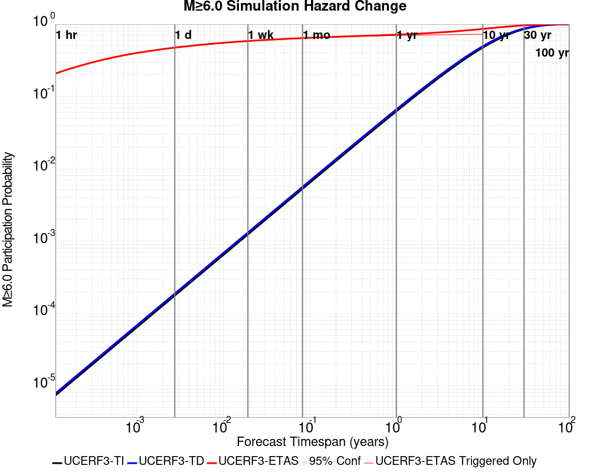

| Forecast Duration | UCERF3-ETAS [95% Conf] | UCERF3-ETAS Triggered Only | UCERF3-TD | UCERF3-ETAS/TD Gain | UCERF3-TI |
|-----|-----|-----|-----|-----|-----|
| 1 Hour | 0.208 [0.205 - 0.210] | 0.208 | 7.85E-6 | 26470.47 | 7.36E-6 |
| 1 Day | 0.474 [0.471 - 0.478] | 0.474 | 1.88E-4 | 2517.1 | 1.77E-4 |
| 1 Week | 0.585 [0.582 - 0.588] | 0.585 | 1.32E-3 | 443.73 | 1.23E-3 |
| 1 Month | 0.642 [0.639 - 0.645] | 0.640 | 5.64E-3 | 113.92 | 5.28E-3 |
| 1 Year | 0.717 [0.715 - 0.720] | 0.697 | 0.067 | 10.78 | 0.062 |
| 10 Years | 0.862 [0.861 - 0.864] | 0.726 | 0.498 | 1.73 | 0.475 |
| 30 Years | 0.966 [0.965 - 0.966] \* | \* | 0.874 | 1.1 \* | 0.855 |
| 100 Years | 1.000 [1.000 - 1.000] \* | \* | 0.999 | 1 \* | 0.998 |

\* *forecast duration is longer than simulation length, only ETAS ruptures from the first 10 years are included*
### M&ge;7.0 Hazard Change Over Time
*[(top)](#table-of-contents)*


| Forecast Duration | UCERF3-ETAS [95% Conf] | UCERF3-ETAS Triggered Only | UCERF3-TD | UCERF3-ETAS/TD Gain | UCERF3-TI |
|-----|-----|-----|-----|-----|-----|
| 1 Hour | 0.019 [0.018 - 0.020] | 0.019 | 7.16E-7 | 26165.08 | 6.48E-7 |
| 1 Day | 0.050 [0.049 - 0.052] | 0.050 | 1.72E-5 | 2932.15 | 1.55E-5 |
| 1 Week | 0.070 [0.068 - 0.071] | 0.070 | 1.20E-4 | 580.68 | 1.09E-4 |
| 1 Month | 0.082 [0.080 - 0.084] | 0.082 | 5.15E-4 | 159.28 | 4.66E-4 |
| 1 Year | 0.102 [0.100 - 0.103] | 0.096 | 6.26E-3 | 16.24 | 5.66E-3 |
| 10 Years | 0.159 [0.157 - 0.160] | 0.104 | 0.061 | 2.6 | 0.055 |
| 30 Years | 0.260 [0.258 - 0.262] \* | \* | 0.174 | 1.49 \* | 0.157 |
| 100 Years | 0.538 [0.537 - 0.539] \* | \* | 0.485 | 1.11 \* | 0.433 |

\* *forecast duration is longer than simulation length, only ETAS ruptures from the first 10 years are included*
### M&ge;8.0 Hazard Change Over Time
*[(top)](#table-of-contents)*


| Forecast Duration | UCERF3-ETAS [95% Conf] | UCERF3-ETAS Triggered Only | UCERF3-TD | UCERF3-ETAS/TD Gain | UCERF3-TI |
|-----|-----|-----|-----|-----|-----|
| 1 Hour | 1.50E-4 [8.72E-5 - 2.54E-4] | 1.50E-4 | 1.24E-8 | 12130.87 | 1.06E-8 |
| 1 Day | 3.10E-4 [2.15E-4 - 4.46E-4] | 3.10E-4 | 2.97E-7 | 1045.52 | 2.54E-7 |
| 1 Week | 4.32E-4 [3.17E-4 - 5.87E-4] | 4.30E-4 | 2.08E-6 | 207.98 | 1.78E-6 |
| 1 Month | 5.19E-4 [3.93E-4 - 6.85E-4] | 5.10E-4 | 8.90E-6 | 58.28 | 7.63E-6 |
| 1 Year | 6.88E-4 [5.53E-4 - 8.64E-4] | 5.80E-4 | 1.08E-4 | 6.35 | 9.29E-5 |
| 10 Years | 1.74E-3 [1.59E-3 - 1.92E-3] | 6.40E-4 | 1.10E-3 | 1.58 | 9.29E-4 |
| 30 Years | 4.14E-3 [4.00E-3 - 4.32E-3] \* | \* | 3.50E-3 | 1.18 \* | 2.78E-3 |
| 100 Years | 0.014 [0.014 - 0.014] \* | \* | 0.014 | 1.05 \* | 9.25E-3 |

\* *forecast duration is longer than simulation length, only ETAS ruptures from the first 10 years are included*

## Trigger Rupture Fault Map
*[(top)](#table-of-contents)*


## Trigger Rupture Depth Map
*[(top)](#table-of-contents)*


## Fault Distances To Triggers
*[(top)](#table-of-contents)*

| Section Name | Strike, Dip, Rake | # Hypos In Poly | Max Mag w/ Hypo In Poly | # Surfs In Poly | Max Mag w/ Surf In Poly | Min Dist To Any (km) | Min Poly Dist To Any (km) | Min Dist To Largest (km) | Min Poly Dist To Largest (km) | Min Hypo Dist To Largest (km) | Min Hypo Poly Dist To Largest (km) |
|-----|-----|-----|-----|-----|-----|-----|-----|-----|-----|-----|-----|
| Airport Lake | 359, 50, -90 | 90 | 7.1 | 90 | 7.1 | 0.036 | 0.000 | 0.036 | 0.000 | 5.612 | 0.000 |
| Little Lake | 327, 90, 180 | 16 | 3.75 | 17 | 7.1 | 2.268 | 0.000 | 11.284 | 0.000 | 13.471 | 1.469 |
| Garlock (Central) | 71, 90, 0 | 2 | 3.21 | 3 | 7.1 | 5.600 | 0.000 | 5.600 | 0.000 | 22.766 | 10.797 |
| So Sierra Nevada | 2, 50, -90 | 1 | 2.75 | 1 | 2.75 | 1.410 | 0.000 | 4.248 | 4.233 | 16.191 | 15.188 |
| Tank Canyon | 189, 50, -90 | 0 |  | 0 |  | 9.015 | 9.011 | 9.015 | 9.011 | 17.039 | 16.895 |
| Blackwater | 323, 90, 180 | 0 |  | 0 |  | 14.394 | 8.726 | 14.394 | 8.726 | 29.622 | 27.613 |
| Scodie Lineament | 221, 68, 0 | 0 |  | 0 |  | 16.722 | 15.781 | 28.750 | 27.702 | 36.559 | 32.668 |

## Individual Simulated Catalog Maps
*[(top)](#table-of-contents)*

These are map plots of individual catalogs from the simulations, selected as the closest catalog to each of the given percentiles in terms of total number of events.

| Duration | p0.0 %-ile | p25.0 %-ile | p50.0 %-ile | p75.0 %-ile | p90.0 %-ile | p95.0 %-ile | p97.5 %-ile | p98.0 %-ile | p99.0 %-ile | p99.5 %-ile | p99.9 %-ile | p100.0 %-ile |
|-----|-----|-----|-----|-----|-----|-----|-----|-----|-----|-----|-----|-----|
| **1 Week** |  |  |  |  |  |  |  |  | 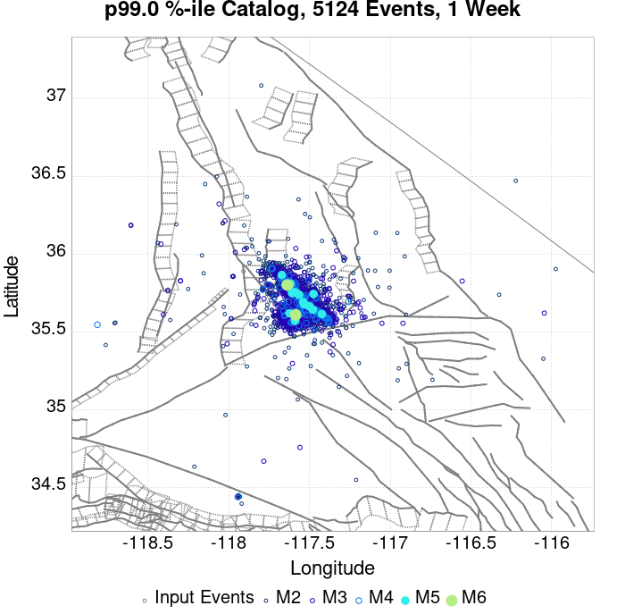 | 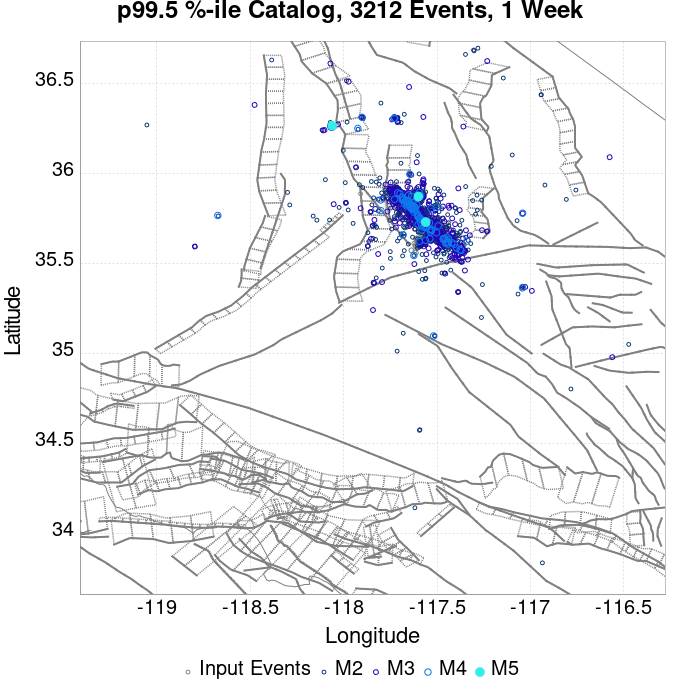 |  |  |
| **1 Month** |  |  |  |  |  |  |  |  |  |  | 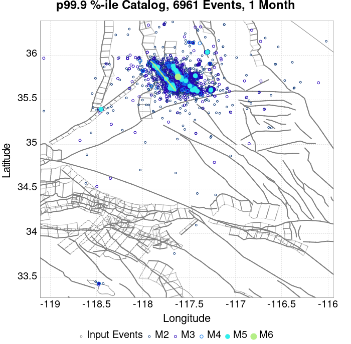 |  |
| **1 Year** |  |  |  |  |  |  |  |  |  |  |  |  |
| **10 Year** |  |  |  |  |  |  |  |  |  |  |  |  |

## ComCat Data Comparisons
*[(top)](#table-of-contents)*

These plots compare simulated sequences with data from ComCat. All plots only consider events with hypocenters inside the ComCat region defined in the JSON input file, and consider ruptures above Mc=3.5

Last updated at 2019/08/29 18:35:27 UTC, 54.6 d after the simulation start time

### ComCat Magnitude-Number Distributions
*[(top)](#table-of-contents)*

| Incremental MND | Cumulative MND |
|-----|-----|
|  |  |

### ComCat Cumulative Number Vs Time
*[(top)](#table-of-contents)*

| M&ge;3.5 | M&ge;4 | M&ge;5 | M&ge;6 | M&ge;7 |
|-----|-----|-----|-----|-----|
|  |  |  |  |  |

### ComCat Cumulative Number Simulation Percentiles
*[(top)](#table-of-contents)*

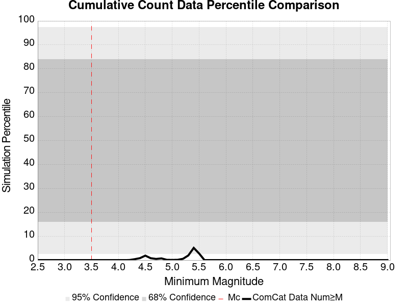

### ComCat Mean Spatial Distribution
*[(top)](#table-of-contents)*

|  | 1 Day | 1 Week | 1 Month | 54.6 Day |
|-----|-----|-----|-----|-----|
| **M≥3.5** |  |  |  |  |
| **M≥4** | 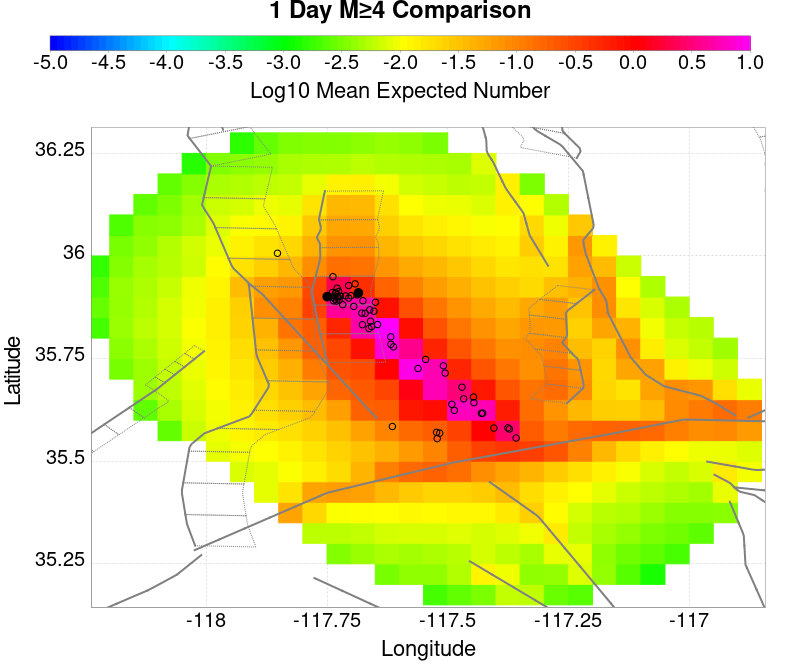 |  |  |  |
| **M≥5** |  |  | 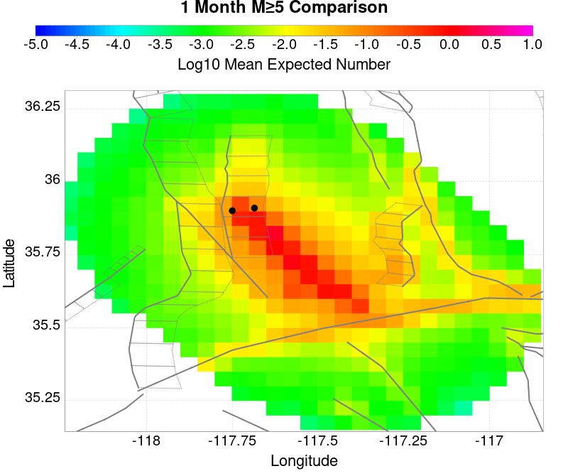 |  |
| **M≥6** |  |  | 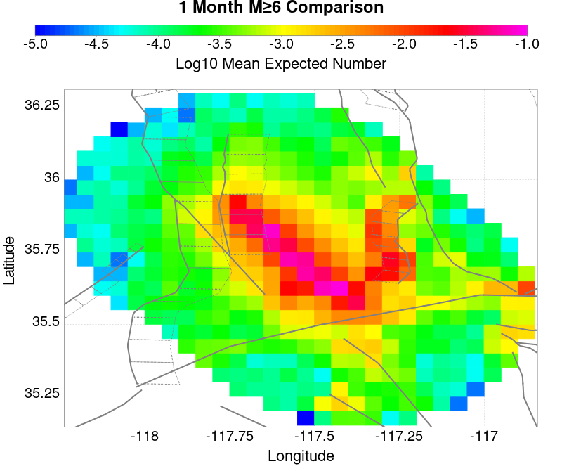 |  |
| **M≥7** |  | 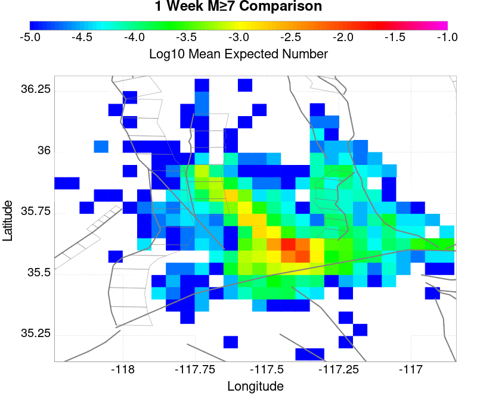 |  |  |
| **M≥8** |  |  |  |  |

### ComCat Depth Distribution
*[(top)](#table-of-contents)*

| M&ge;3.5 | M&ge;4 | M&ge;5 | M&ge;6 | M&ge;7 | M&ge;8 |
|-----|-----|-----|-----|-----|-----|
|  | 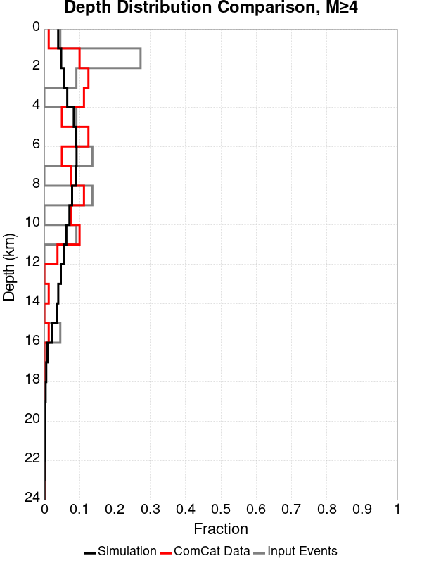 |  |  |  |  |

## Section Participation
*[(top)](#table-of-contents)*

### Section Participation Plots
*[(top)](#table-of-contents)*

| Min Mag | 1 yr Triggered Ruptures (no spontaneous) | 10 yr Triggered Ruptures (no spontaneous) | 10 yr Triggered Ruptures (primary aftershocks only) |
|-----|-----|-----|-----|
| **All Supra. Seis.** |  |  | 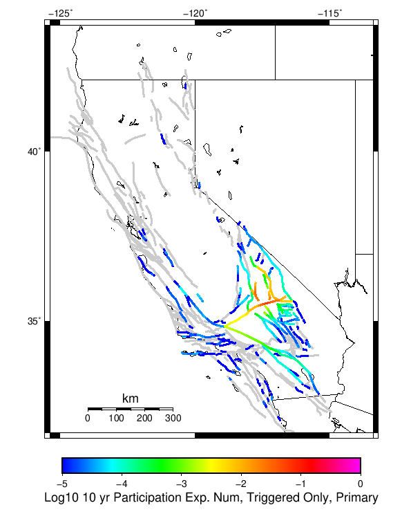 |
| **M&ge;6.5** |  |  |  |
| **M&ge;7** |  |  |  |
| **M&ge;7.5** |  |  | 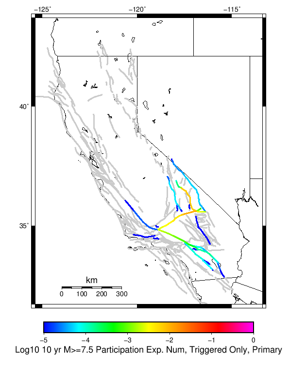 |
| **M&ge;8** |  |  |  |

### Supra-Seismogenic Parent Sections Table
*[(top)](#table-of-contents)*

*First 10 of 236 with matching ruptures shown*

| Parent Name | Triggered 10 Year Mean Count | Triggered 1 Day Prob | Triggered 1 Week Prob | Triggered 1 Month Prob | Triggered 1 Year Prob | Triggered 10 Year Prob | Triggered 10 Year Primary Mean Count |
|-----|-----|-----|-----|-----|-----|-----|-----|
| Tank Canyon | 0.19972 | 0.05843 | 0.09068 | 0.11225 | 0.14083 | 0.15856 | 0.03525 |
| Garlock (Central) | 0.1978 | 0.09662 | 0.12907 | 0.1484 | 0.1722 | 0.1855 | 0.09053 |
| Little Lake | 0.08901 | 0.04444 | 0.05866 | 0.0676 | 0.07858 | 0.08513 | 0.04258 |
| Owl Lake | 0.0754 | 0.02427 | 0.0371 | 0.04551 | 0.05641 | 0.06265 | 0.01374 |
| Airport Lake | 0.07139 | 0.04055 | 0.05199 | 0.0587 | 0.06639 | 0.07097 | 0.0421 |
| Panamint Valley | 0.05415 | 0.01979 | 0.02983 | 0.03673 | 0.04584 | 0.05197 | 0.01405 |
| Garlock (East) | 0.05192 | 0.01563 | 0.02489 | 0.03118 | 0.0395 | 0.04459 | 0.00908 |
| Ash Hill | 0.02483 | 0.00659 | 0.01091 | 0.01438 | 0.01955 | 0.02233 | 0.00223 |
| Hunter Mountain-Saline Valley | 0.02387 | 0.01018 | 0.01442 | 0.01734 | 0.02083 | 0.02318 | 0.00854 |
| Blackwater | 0.02301 | 0.00665 | 0.01095 | 0.01372 | 0.01837 | 0.02121 | 0.00333 |

### M≥6.5 Parent Sections Table
*[(top)](#table-of-contents)*

*First 10 of 208 with matching ruptures shown*

| Parent Name | Triggered 10 Year Mean Count | Triggered 1 Day Prob | Triggered 1 Week Prob | Triggered 1 Month Prob | Triggered 1 Year Prob | Triggered 10 Year Prob | Triggered 10 Year Primary Mean Count |
|-----|-----|-----|-----|-----|-----|-----|-----|
| Garlock (Central) | 0.08462 | 0.03972 | 0.05508 | 0.06427 | 0.07604 | 0.08256 | 0.03709 |
| Little Lake | 0.05446 | 0.02867 | 0.03724 | 0.0428 | 0.04947 | 0.05321 | 0.02813 |
| Airport Lake | 0.05413 | 0.03066 | 0.03936 | 0.04457 | 0.0505 | 0.05398 | 0.03166 |
| Panamint Valley | 0.04946 | 0.0186 | 0.02783 | 0.03408 | 0.04219 | 0.0477 | 0.01378 |
| Owl Lake | 0.03722 | 0.01628 | 0.02331 | 0.02757 | 0.03372 | 0.03693 | 0.01244 |
| Garlock (East) | 0.03159 | 0.01123 | 0.01722 | 0.02118 | 0.02627 | 0.02925 | 0.00854 |
| Hunter Mountain-Saline Valley | 0.02328 | 0.01001 | 0.0142 | 0.01707 | 0.02048 | 0.02278 | 0.00849 |
| Tank Canyon | 0.02242 | 0.00733 | 0.01192 | 0.01495 | 0.01937 | 0.02234 | 0.00386 |
| Garlock (West) | 0.01344 | 0.00626 | 0.00894 | 0.01052 | 0.01253 | 0.01342 | 0.00569 |
| So Sierra Nevada | 0.0086 | 0.00273 | 0.00446 | 0.00583 | 0.0074 | 0.0085 | 0.00105 |

### M≥7 Parent Sections Table
*[(top)](#table-of-contents)*

*First 10 of 152 with matching ruptures shown*

| Parent Name | Triggered 10 Year Mean Count | Triggered 1 Day Prob | Triggered 1 Week Prob | Triggered 1 Month Prob | Triggered 1 Year Prob | Triggered 10 Year Prob | Triggered 10 Year Primary Mean Count |
|-----|-----|-----|-----|-----|-----|-----|-----|
| Garlock (Central) | 0.07502 | 0.03538 | 0.04915 | 0.05742 | 0.06784 | 0.07367 | 0.03306 |
| Panamint Valley | 0.0314 | 0.01361 | 0.01966 | 0.02358 | 0.02815 | 0.03133 | 0.01168 |
| Owl Lake | 0.02569 | 0.01304 | 0.01768 | 0.0203 | 0.02396 | 0.02569 | 0.012 |
| Hunter Mountain-Saline Valley | 0.02232 | 0.00982 | 0.01392 | 0.01673 | 0.02 | 0.02222 | 0.00837 |
| Garlock (East) | 0.02036 | 0.00898 | 0.01288 | 0.01524 | 0.01838 | 0.02016 | 0.00829 |
| Garlock (West) | 0.01324 | 0.00619 | 0.00885 | 0.01041 | 0.01237 | 0.01323 | 0.00568 |
| Little Lake | 0.01205 | 0.00677 | 0.00877 | 0.01009 | 0.01134 | 0.01204 | 0.00671 |
| Airport Lake | 0.01127 | 0.00638 | 0.00822 | 0.00948 | 0.01063 | 0.01127 | 0.0064 |
| San Andreas (Mojave N) | 0.00609 | 0.00271 | 0.00392 | 0.00467 | 0.00548 | 0.00601 | 0.00253 |
| San Andreas (Mojave S) | 0.00449 | 0.00209 | 0.00292 | 0.00346 | 0.00401 | 0.00443 | 0.00183 |

### M≥7.5 Parent Sections Table
*[(top)](#table-of-contents)*

*First 10 of 100 with matching ruptures shown*

| Parent Name | Triggered 10 Year Mean Count | Triggered 1 Day Prob | Triggered 1 Week Prob | Triggered 1 Month Prob | Triggered 1 Year Prob | Triggered 10 Year Prob | Triggered 10 Year Primary Mean Count |
|-----|-----|-----|-----|-----|-----|-----|-----|
| Garlock (Central) | 0.03139 | 0.01461 | 0.02047 | 0.0241 | 0.02859 | 0.03116 | 0.01317 |
| Panamint Valley | 0.02145 | 0.00964 | 0.01353 | 0.01623 | 0.01935 | 0.02145 | 0.00828 |
| Hunter Mountain-Saline Valley | 0.02138 | 0.0096 | 0.01346 | 0.01616 | 0.01928 | 0.02138 | 0.00824 |
| Garlock (West) | 0.0118 | 0.00562 | 0.00802 | 0.00931 | 0.01106 | 0.01179 | 0.00515 |
| Garlock (East) | 0.00746 | 0.00352 | 0.005 | 0.00583 | 0.00698 | 0.00746 | 0.00317 |
| San Andreas (Mojave N) | 0.00605 | 0.0027 | 0.0039 | 0.00465 | 0.00546 | 0.00599 | 0.00252 |
| San Andreas (Mojave S) | 0.0043 | 0.00205 | 0.00284 | 0.00338 | 0.00391 | 0.00428 | 0.00181 |
| San Andreas (San Bernardino N) | 0.00255 | 0.00115 | 0.00158 | 0.00192 | 0.00225 | 0.00254 | 9.4E-4 |
| Owl Lake | 0.00234 | 0.00112 | 0.00167 | 0.00186 | 0.00222 | 0.00234 | 0.00105 |
| San Andreas (San Bernardino S) | 0.00131 | 5.3E-4 | 7.7E-4 | 9.4E-4 | 0.00116 | 0.00131 | 5.1E-4 |

### M≥8 Parent Sections Table
*[(top)](#table-of-contents)*

*First 10 of 28 with matching ruptures shown*

| Parent Name | Triggered 10 Year Mean Count | Triggered 1 Day Prob | Triggered 1 Week Prob | Triggered 1 Month Prob | Triggered 1 Year Prob | Triggered 10 Year Prob | Triggered 10 Year Primary Mean Count |
|-----|-----|-----|-----|-----|-----|-----|-----|
| San Andreas (Mojave N) | 7.3E-4 | 3.4E-4 | 4.8E-4 | 5.7E-4 | 6.7E-4 | 7.3E-4 | 3.3E-4 |
| San Andreas (Mojave S) | 7.3E-4 | 3.4E-4 | 4.8E-4 | 5.7E-4 | 6.7E-4 | 7.3E-4 | 3.3E-4 |
| San Andreas (San Bernardino N) | 7.3E-4 | 3.4E-4 | 4.8E-4 | 5.7E-4 | 6.7E-4 | 7.3E-4 | 3.3E-4 |
| Garlock (Central) | 6.4E-4 | 3.1E-4 | 4.3E-4 | 5.1E-4 | 5.8E-4 | 6.4E-4 | 3.2E-4 |
| Garlock (West) | 6.4E-4 | 3.1E-4 | 4.3E-4 | 5.1E-4 | 5.8E-4 | 6.4E-4 | 3.2E-4 |
| Garlock (East) | 5.2E-4 | 2.3E-4 | 3.5E-4 | 4.2E-4 | 4.8E-4 | 5.2E-4 | 2.8E-4 |
| San Andreas (San Bernardino S) | 3.8E-4 | 1.4E-4 | 2.2E-4 | 2.6E-4 | 3.3E-4 | 3.8E-4 | 1.7E-4 |
| San Andreas (San Gorgonio Pass-Garnet HIll) | 3.2E-4 | 1.3E-4 | 1.7E-4 | 2.1E-4 | 2.7E-4 | 3.2E-4 | 1.5E-4 |
| San Andreas (Coachella) rev | 2.9E-4 | 1.6E-4 | 2.0E-4 | 2.3E-4 | 2.7E-4 | 2.9E-4 | 1.6E-4 |
| San Jacinto (Anza) rev | 2.8E-4 | 1.4E-4 | 2.0E-4 | 2.4E-4 | 2.7E-4 | 2.8E-4 | 1.0E-4 |

### Fault Magnitude-Probability Distributions
*[(top)](#table-of-contents)*

The first 5 sections (sorted by trigger rate) are plotted below. All fault MPDs are available [here](plots/parent_sect_mpds/README.md)

| 1 Week | 1 Month | 1 Year | 10 Year |
|-----|-----|-----|-----|
|  | 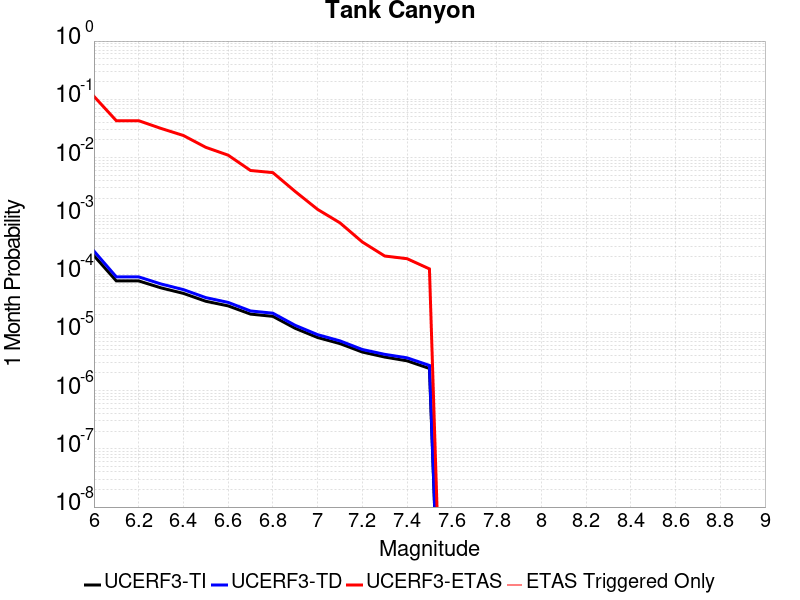 |  |  |
|  |  |  |  |
|  |  | 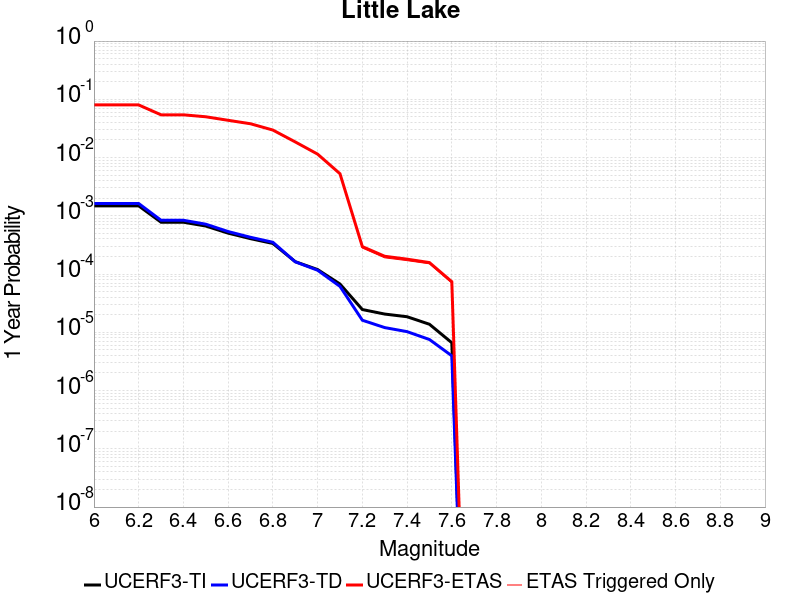 |  |
|  | 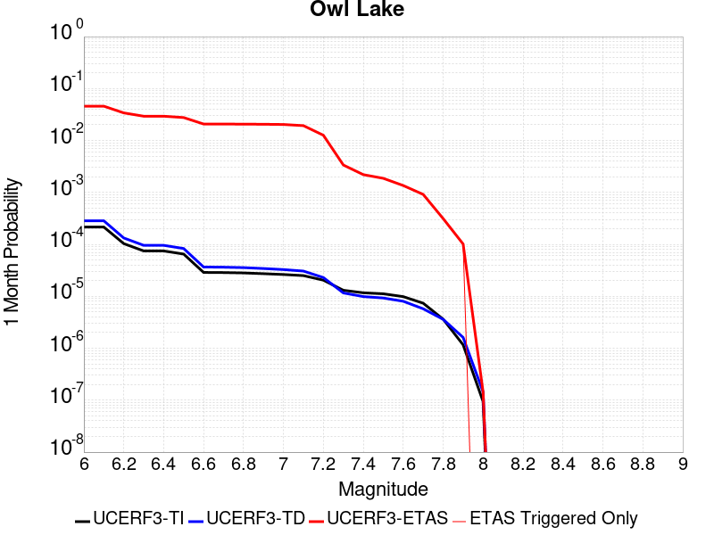 |  |  |
|  |  |  |  |

## Gridded Nucleation
*[(top)](#table-of-contents)*

| Min Mag | Triggered Ruptures (no spontaneous) | Triggered Ruptures (primary aftershocks only) |
|-----|-----|-----|
| **M&ge;2.5** |  |  |
| **M&ge;5** |  |  |
| **M&ge;6** |  |  |
| **M&ge;7** |  |  |


## JSON Input File
*[(top)](#table-of-contents)*

```
{
  "numSimulations": 100000,
  "duration": 10.0,
  "startTimeMillis": 1562383194040,
  "includeSpontaneous": false,
  "randomSeed": 1567035130192,
  "binaryOutput": true,
  "binaryOutputFilters": [
    {
      "prefix": "results_complete",
      "descendantsOnly": false
    },
    {
      "prefix": "results_m5_preserve_chain",
      "minMag": 5.0,
      "preserveChainBelowMag": true,
      "descendantsOnly": false
    }
  ],
  "forceRecalc": false,
  "simulationName": "ComCat M7.1 (ci38457511), ShakeMap Surfaces, Log10(k)\u003d-2.2833, p\u003d1.2434, c\u003d0.0102",
  "numRetries": 3,
  "outputDir": "${ETAS_SIM_DIR}/2019_08_28-ComCatM7p1_ci38457511_ShakeMapSurfaces_Log10_k_2p2833_p1p2434_c0p0102-noSpont-full_td-scale1.14-modParams",
  "triggerRuptures": [
    {
      "occurrenceTimeMillis": 1562259775340,
      "comcatEventID": "ci38443095",
      "mag": 3.98,
      "latitude": 35.708,
      "longitude": -117.5036667,
      "depth": 10.58
    },
    {
      "occurrenceTimeMillis": 1562261629000,
      "comcatEventID": "ci38443183",
      "mag": 6.4,
      "latitude": 35.7053333,
      "longitude": -117.5038333,
      "depth": 10.5,
      "ruptureSurfaces": [
        {
          "outline": [
            {
              "latitude": 35.6051534466,
              "longitude": -117.5905380735,
              "depth": 0.0
            },
            {
              "latitude": 35.6173144101,
              "longitude": -117.57249634649999,
              "depth": 0.0
            },
            {
              "latitude": 35.6173135736,
              "longitude": -117.5726723708,
              "depth": 0.0
            },
            {
              "latitude": 35.61731357360001,
              "longitude": -117.5726723708,
              "depth": 15.0
            },
            {
              "latitude": 35.6173144101,
              "longitude": -117.57249634649999,
              "depth": 15.0
            },
            {
              "latitude": 35.6051534466,
              "longitude": -117.5905380735,
              "depth": 15.0
            },
            {
              "latitude": 35.6051534466,
              "longitude": -117.5905380735,
              "depth": 0.0
            }
          ]
        },
        {
          "outline": [
            {
              "latitude": 35.6338128629,
              "longitude": -117.54831678310002,
              "depth": 0.0
            },
            {
              "latitude": 35.6413274733,
              "longitude": -117.5393878708,
              "depth": 0.0
            },
            {
              "latitude": 35.664283512,
              "longitude": -117.51611643970001,
              "depth": 0.0
            },
            {
              "latitude": 35.664283512000004,
              "longitude": -117.51611643970001,
              "depth": 15.0
            },
            {
              "latitude": 35.641327473299995,
              "longitude": -117.5393878708,
              "depth": 15.0
            },
            {
              "latitude": 35.63381286290001,
              "longitude": -117.54831678310002,
              "depth": 15.0
            },
            {
              "latitude": 35.6338128629,
              "longitude": -117.54831678310002,
              "depth": 0.0
            }
          ]
        },
        {
          "outline": [
            {
              "latitude": 35.6322100797,
              "longitude": -117.55305954249998,
              "depth": 0.0
            },
            {
              "latitude": 35.6196274701,
              "longitude": -117.56969626549999,
              "depth": 0.0
            },
            {
              "latitude": 35.6196274701,
              "longitude": -117.56969626549999,
              "depth": 15.0
            },
            {
              "latitude": 35.6322100797,
              "longitude": -117.55305954249998,
              "depth": 15.0
            },
            {
              "latitude": 35.6322100797,
              "longitude": -117.55305954249998,
              "depth": 0.0
            }
          ]
        }
      ]
    },
    {
      "occurrenceTimeMillis": 1562261701660,
      "comcatEventID": "ci38443191",
      "mag": 4.49,
      "latitude": 35.644,
      "longitude": -117.56716670000002,
      "depth": 4.64
    },
    {
      "occurrenceTimeMillis": 1562261746340,
      "comcatEventID": "ci37222356",
      "mag": 3.63,
      "latitude": 35.6936667,
      "longitude": -117.437,
      "depth": 7.65
    },
    {
      "occurrenceTimeMillis": 1562261752170,
      "comcatEventID": "ci37218988",
      "mag": 4.28,
      "latitude": 35.687,
      "longitude": -117.50616670000001,
      "depth": 1.6
    },
    {
      "occurrenceTimeMillis": 1562261818950,
      "comcatEventID": "ci37222380",
      "mag": 3.41,
      "latitude": 35.7258333,
      "longitude": -117.55933330000002,
      "depth": 5.3
    },
    {
      "occurrenceTimeMillis": 1562261821140,
      "comcatEventID": "ci37222372",
      "mag": 3.66,
      "latitude": 35.7105,
      "longitude": -117.4773333,
      "depth": 1.57
    },
    {
      "occurrenceTimeMillis": 1562261834850,
      "comcatEventID": "ci37222364",
      "mag": 3.97,
      "latitude": 35.6655,
      "longitude": -117.516,
      "depth": 1.64
    },
    {
      "occurrenceTimeMillis": 1562261845640,
      "comcatEventID": "ci37218996",
      "mag": 4.01,
      "latitude": 35.6758333,
      "longitude": -117.45750000000001,
      "depth": 15.82
    },
    {
      "occurrenceTimeMillis": 1562261875500,
      "comcatEventID": "ci38443199",
      "mag": 3.86,
      "latitude": 35.7456667,
      "longitude": -117.5516667,
      "depth": 8.29
    },
    {
      "occurrenceTimeMillis": 1562261901450,
      "comcatEventID": "ci37421941",
      "mag": 3.73,
      "latitude": 35.714,
      "longitude": -117.476,
      "depth": 1.74
    },
    {
      "occurrenceTimeMillis": 1562261927500,
      "comcatEventID": "us70004a0n",
      "mag": 3.5,
      "latitude": 35.6215,
      "longitude": -117.5782,
      "depth": 9.7
    },
    {
      "occurrenceTimeMillis": 1562261927760,
      "comcatEventID": "ci37222396",
      "mag": 3.5,
      "latitude": 35.6235,
      "longitude": -117.596,
      "depth": 8.55
    },
    {
      "occurrenceTimeMillis": 1562261973310,
      "comcatEventID": "ci37222404",
      "mag": 3.11,
      "latitude": 35.5743333,
      "longitude": -117.63666670000002,
      "depth": 6.85
    },
    {
      "occurrenceTimeMillis": 1562261975360,
      "comcatEventID": "ci38443215",
      "mag": 3.69,
      "latitude": 35.6873333,
      "longitude": -117.4935,
      "depth": 10.86
    },
    {
      "occurrenceTimeMillis": 1562262002250,
      "comcatEventID": "ci38443223",
      "mag": 3.8,
      "latitude": 35.7253333,
      "longitude": -117.57083329999999,
      "depth": 6.63
    },
    {
      "occurrenceTimeMillis": 1562262018520,
      "comcatEventID": "ci38443231",
      "mag": 4.13,
      "latitude": 35.707,
      "longitude": -117.5101667,
      "depth": 8.66
    },
    {
      "occurrenceTimeMillis": 1562262034900,
      "comcatEventID": "ci37222508",
      "mag": 3.54,
      "latitude": 35.6948333,
      "longitude": -117.50183330000002,
      "depth": 2.04
    },
    {
      "occurrenceTimeMillis": 1562262046140,
      "comcatEventID": "ci37222516",
      "mag": 3.42,
      "latitude": 35.7298333,
      "longitude": -117.55483330000001,
      "depth": 7.72
    },
    {
      "occurrenceTimeMillis": 1562262080850,
      "comcatEventID": "ci37421957",
      "mag": 3.3,
      "latitude": 35.7266667,
      "longitude": -117.5288333,
      "depth": 1.97
    },
    {
      "occurrenceTimeMillis": 1562262174130,
      "comcatEventID": "ci38443239",
      "mag": 3.22,
      "latitude": 35.7301667,
      "longitude": -117.55866669999999,
      "depth": 7.84
    },
    {
      "occurrenceTimeMillis": 1562262209200,
      "comcatEventID": "us70004a0z",
      "mag": 3.6,
      "latitude": 35.6783,
      "longitude": -117.5488,
      "depth": 5.15
    },
    {
      "occurrenceTimeMillis": 1562262264020,
      "comcatEventID": "ci37421981",
      "mag": 2.77,
      "latitude": 35.7478333,
      "longitude": -117.54000000000002,
      "depth": 9.4
    },
    {
      "occurrenceTimeMillis": 1562262272820,
      "comcatEventID": "ci38443255",
      "mag": 3.86,
      "latitude": 35.6875,
      "longitude": -117.5071667,
      "depth": 1.54
    },
    {
      "occurrenceTimeMillis": 1562262305780,
      "comcatEventID": "ci37421997",
      "mag": 3.03,
      "latitude": 35.6976667,
      "longitude": -117.48649999999999,
      "depth": 2.24
    },
    {
      "occurrenceTimeMillis": 1562262323950,
      "comcatEventID": "ci37421989",
      "mag": 3.03,
      "latitude": 35.7151667,
      "longitude": -117.5473333,
      "depth": 7.21
    },
    {
      "occurrenceTimeMillis": 1562262328630,
      "comcatEventID": "ci37222524",
      "mag": 3.21,
      "latitude": 35.7348333,
      "longitude": -117.53683330000001,
      "depth": 10.34
    },
    {
      "occurrenceTimeMillis": 1562262363710,
      "comcatEventID": "ci38443263",
      "mag": 2.96,
      "latitude": 35.6431667,
      "longitude": -117.6101667,
      "depth": 10.14
    },
    {
      "occurrenceTimeMillis": 1562262380320,
      "comcatEventID": "ci37222532",
      "mag": 2.56,
      "latitude": 35.6563333,
      "longitude": -117.5325,
      "depth": 1.52
    },
    {
      "occurrenceTimeMillis": 1562262409960,
      "comcatEventID": "ci38443271",
      "mag": 3.07,
      "latitude": 35.6385,
      "longitude": -117.6108333,
      "depth": 10.97
    },
    {
      "occurrenceTimeMillis": 1562262437810,
      "comcatEventID": "ci38443279",
      "mag": 3.5,
      "latitude": 35.7455,
      "longitude": -117.5465,
      "depth": 7.11
    },
    {
      "occurrenceTimeMillis": 1562262460970,
      "comcatEventID": "ci37222548",
      "mag": 3.11,
      "latitude": 35.726,
      "longitude": -117.55849999999998,
      "depth": 3.58
    },
    {
      "occurrenceTimeMillis": 1562262474970,
      "comcatEventID": "ci37222556",
      "mag": 3.4,
      "latitude": 35.7286667,
      "longitude": -117.56066670000001,
      "depth": 5.25
    },
    {
      "occurrenceTimeMillis": 1562262483160,
      "comcatEventID": "ci37222564",
      "mag": 3.27,
      "latitude": 35.6365,
      "longitude": -117.55183330000001,
      "depth": 6.62
    },
    {
      "occurrenceTimeMillis": 1562262495680,
      "comcatEventID": "ci37222572",
      "mag": 3.11,
      "latitude": 35.7053333,
      "longitude": -117.5245,
      "depth": 5.52
    },
    {
      "occurrenceTimeMillis": 1562262504150,
      "comcatEventID": "ci37222580",
      "mag": 2.96,
      "latitude": 35.6593333,
      "longitude": -117.52633330000002,
      "depth": 2.68
    },
    {
      "occurrenceTimeMillis": 1562262575190,
      "comcatEventID": "ci37222596",
      "mag": 2.52,
      "latitude": 35.7335,
      "longitude": -117.50683330000001,
      "depth": 3.91
    },
    {
      "occurrenceTimeMillis": 1562262578950,
      "comcatEventID": "ci37222668",
      "mag": 2.57,
      "latitude": 35.687,
      "longitude": -117.49066670000002,
      "depth": 10.66
    },
    {
      "occurrenceTimeMillis": 1562262648290,
      "comcatEventID": "ci37222692",
      "mag": 2.73,
      "latitude": 35.738,
      "longitude": -117.52933329999999,
      "depth": 7.72
    },
    {
      "occurrenceTimeMillis": 1562262648960,
      "comcatEventID": "ci38443303",
      "mag": 2.79,
      "latitude": 35.678,
      "longitude": -117.49916670000002,
      "depth": 1.14
    },
    {
      "occurrenceTimeMillis": 1562262706650,
      "comcatEventID": "ci38443287",
      "mag": 3.46,
      "latitude": 35.674,
      "longitude": -117.52349999999998,
      "depth": 5.3
    },
    {
      "occurrenceTimeMillis": 1562262761700,
      "comcatEventID": "ci38443295",
      "mag": 2.92,
      "latitude": 35.7218333,
      "longitude": -117.5251667,
      "depth": 7.04
    },
    {
      "occurrenceTimeMillis": 1562262899560,
      "comcatEventID": "ci38443327",
      "mag": 2.53,
      "latitude": 35.6391667,
      "longitude": -117.5628333,
      "depth": 10.48
    },
    {
      "occurrenceTimeMillis": 1562262930800,
      "comcatEventID": "ci37222876",
      "mag": 2.57,
      "latitude": 35.6705,
      "longitude": -117.5221667,
      "depth": 3.91
    },
    {
      "occurrenceTimeMillis": 1562263051460,
      "comcatEventID": "ci38443311",
      "mag": 2.95,
      "latitude": 35.6595,
      "longitude": -117.5223333,
      "depth": 2.3
    },
    {
      "occurrenceTimeMillis": 1562263063060,
      "comcatEventID": "ci37222932",
      "mag": 2.78,
      "latitude": 35.6725,
      "longitude": -117.4743333,
      "depth": 8.76
    },
    {
      "occurrenceTimeMillis": 1562263082640,
      "comcatEventID": "ci38443319",
      "mag": 3.33,
      "latitude": 35.702,
      "longitude": -117.50833330000002,
      "depth": 4.77
    },
    {
      "occurrenceTimeMillis": 1562263240190,
      "comcatEventID": "ci38443335",
      "mag": 2.67,
      "latitude": 35.6303333,
      "longitude": -117.569,
      "depth": 1.64
    },
    {
      "occurrenceTimeMillis": 1562263261190,
      "comcatEventID": "ci37223148",
      "mag": 2.59,
      "latitude": 35.6733333,
      "longitude": -117.5118333,
      "depth": 1.49
    },
    {
      "occurrenceTimeMillis": 1562263283180,
      "comcatEventID": "ci37422005",
      "mag": 3.53,
      "latitude": 35.6876667,
      "longitude": -117.50849999999998,
      "depth": 1.26
    },
    {
      "occurrenceTimeMillis": 1562263291230,
      "comcatEventID": "ci37223156",
      "mag": 3.42,
      "latitude": 35.5978333,
      "longitude": -117.5905,
      "depth": 6.79
    },
    {
      "occurrenceTimeMillis": 1562263374110,
      "comcatEventID": "ci38443351",
      "mag": 2.53,
      "latitude": 35.6066667,
      "longitude": -117.58216670000002,
      "depth": 5.8
    },
    {
      "occurrenceTimeMillis": 1562263398590,
      "comcatEventID": "ci38443359",
      "mag": 2.85,
      "latitude": 35.7478333,
      "longitude": -117.5425,
      "depth": 6.85
    },
    {
      "occurrenceTimeMillis": 1562263541830,
      "comcatEventID": "ci38443375",
      "mag": 2.76,
      "latitude": 35.7153333,
      "longitude": -117.5295,
      "depth": 4.54
    },
    {
      "occurrenceTimeMillis": 1562263555910,
      "comcatEventID": "ci37223228",
      "mag": 2.61,
      "latitude": 35.7266667,
      "longitude": -117.5165,
      "depth": 8.96
    },
    {
      "occurrenceTimeMillis": 1562263576110,
      "comcatEventID": "ci38443383",
      "mag": 3.79,
      "latitude": 35.6606667,
      "longitude": -117.523,
      "depth": 2.14
    },
    {
      "occurrenceTimeMillis": 1562263611050,
      "comcatEventID": "ci37223236",
      "mag": 2.6,
      "latitude": 35.6931667,
      "longitude": -117.46200000000002,
      "depth": 11.56
    },
    {
      "occurrenceTimeMillis": 1562263629270,
      "comcatEventID": "ci38443391",
      "mag": 3.51,
      "latitude": 35.5991667,
      "longitude": -117.6101667,
      "depth": 2.12
    },
    {
      "occurrenceTimeMillis": 1562263630910,
      "comcatEventID": "ci37223244",
      "mag": 3.49,
      "latitude": 35.6508333,
      "longitude": -117.54200000000002,
      "depth": 2.77
    },
    {
      "occurrenceTimeMillis": 1562263670810,
      "comcatEventID": "ci37223252",
      "mag": 2.55,
      "latitude": 35.72950000000001,
      "longitude": -117.533,
      "depth": 7.25
    },
    {
      "occurrenceTimeMillis": 1562263713160,
      "comcatEventID": "ci38443407",
      "mag": 3.38,
      "latitude": 35.6678333,
      "longitude": -117.50616670000001,
      "depth": 2.27
    },
    {
      "occurrenceTimeMillis": 1562263725070,
      "comcatEventID": "ci37223308",
      "mag": 3.55,
      "latitude": 35.7108333,
      "longitude": -117.47683329999998,
      "depth": 1.17
    },
    {
      "occurrenceTimeMillis": 1562263832710,
      "comcatEventID": "ci38443415",
      "mag": 3.46,
      "latitude": 35.6598333,
      "longitude": -117.53483330000002,
      "depth": 10.25
    },
    {
      "occurrenceTimeMillis": 1562263882870,
      "comcatEventID": "ci38443423",
      "mag": 2.69,
      "latitude": 35.6003333,
      "longitude": -117.5951667,
      "depth": 7.33
    },
    {
      "occurrenceTimeMillis": 1562263972070,
      "comcatEventID": "ci38443431",
      "mag": 3.44,
      "latitude": 35.6703333,
      "longitude": -117.5605,
      "depth": 6.91
    },
    {
      "occurrenceTimeMillis": 1562264025530,
      "comcatEventID": "ci37223380",
      "mag": 2.89,
      "latitude": 35.7003333,
      "longitude": -117.4873333,
      "depth": 10.98
    },
    {
      "occurrenceTimeMillis": 1562264031400,
      "comcatEventID": "ci38443439",
      "mag": 3.5,
      "latitude": 35.7081667,
      "longitude": -117.485,
      "depth": 6.44
    },
    {
      "occurrenceTimeMillis": 1562264104970,
      "comcatEventID": "ci38443447",
      "mag": 2.75,
      "latitude": 35.6103333,
      "longitude": -117.59500000000001,
      "depth": 4.94
    },
    {
      "occurrenceTimeMillis": 1562264112820,
      "comcatEventID": "ci37420701",
      "mag": 3.23,
      "latitude": 35.6691667,
      "longitude": -117.5203333,
      "depth": 1.84
    },
    {
      "occurrenceTimeMillis": 1562264193730,
      "comcatEventID": "ci38443463",
      "mag": 2.94,
      "latitude": 35.7251667,
      "longitude": -117.53350000000002,
      "depth": 6.74
    },
    {
      "occurrenceTimeMillis": 1562264235320,
      "comcatEventID": "ci38443471",
      "mag": 2.87,
      "latitude": 35.7185,
      "longitude": -117.5336667,
      "depth": 4.94
    },
    {
      "occurrenceTimeMillis": 1562264325720,
      "comcatEventID": "ci38443487",
      "mag": 3.38,
      "latitude": 35.638,
      "longitude": -117.611,
      "depth": 9.43
    },
    {
      "occurrenceTimeMillis": 1562264332070,
      "comcatEventID": "ci37223676",
      "mag": 2.98,
      "latitude": 35.6123333,
      "longitude": -117.624,
      "depth": 0.0
    },
    {
      "occurrenceTimeMillis": 1562264348090,
      "comcatEventID": "ci37223684",
      "mag": 2.6,
      "latitude": 35.7236667,
      "longitude": -117.50849999999998,
      "depth": 11.57
    },
    {
      "occurrenceTimeMillis": 1562264485340,
      "comcatEventID": "ci38443495",
      "mag": 2.61,
      "latitude": 35.67883330000001,
      "longitude": -117.51533330000001,
      "depth": 2.91
    },
    {
      "occurrenceTimeMillis": 1562264763750,
      "comcatEventID": "ci38443519",
      "mag": 3.13,
      "latitude": 35.6638333,
      "longitude": -117.5245,
      "depth": 2.53
    },
    {
      "occurrenceTimeMillis": 1562264846770,
      "comcatEventID": "ci38443527",
      "mag": 3.29,
      "latitude": 35.6748333,
      "longitude": -117.51433329999999,
      "depth": 2.68
    },
    {
      "occurrenceTimeMillis": 1562264879440,
      "comcatEventID": "ci38443535",
      "mag": 4.23,
      "latitude": 35.745,
      "longitude": -117.55216669999999,
      "depth": 6.64
    },
    {
      "occurrenceTimeMillis": 1562264923640,
      "comcatEventID": "ci38443543",
      "mag": 3.75,
      "latitude": 35.6661667,
      "longitude": -117.5656667,
      "depth": 7.14
    },
    {
      "occurrenceTimeMillis": 1562265289010,
      "comcatEventID": "ci37224604",
      "mag": 2.59,
      "latitude": 35.6895,
      "longitude": -117.4883333,
      "depth": 0.63
    },
    {
      "occurrenceTimeMillis": 1562265344040,
      "comcatEventID": "ci38443575",
      "mag": 2.5,
      "latitude": 35.7215,
      "longitude": -117.56550000000001,
      "depth": 0.16
    },
    {
      "occurrenceTimeMillis": 1562265451500,
      "comcatEventID": "ci38443591",
      "mag": 2.64,
      "latitude": 35.72,
      "longitude": -117.5723333,
      "depth": 1.34
    },
    {
      "occurrenceTimeMillis": 1562265525650,
      "comcatEventID": "ci38443599",
      "mag": 2.69,
      "latitude": 35.7046661,
      "longitude": -117.49666600000002,
      "depth": 3.96
    },
    {
      "occurrenceTimeMillis": 1562265584440,
      "comcatEventID": "ci38443607",
      "mag": 4.59,
      "latitude": 35.6013333,
      "longitude": -117.59700000000001,
      "depth": 2.81
    },
    {
      "occurrenceTimeMillis": 1562265656740,
      "comcatEventID": "ci37224612",
      "mag": 3.05,
      "latitude": 35.652,
      "longitude": -117.53683330000001,
      "depth": 2.03
    },
    {
      "occurrenceTimeMillis": 1562265674270,
      "comcatEventID": "ci38443615",
      "mag": 3.07,
      "latitude": 35.6763333,
      "longitude": -117.5115,
      "depth": 2.13
    },
    {
      "occurrenceTimeMillis": 1562265865000,
      "comcatEventID": "ci38443631",
      "mag": 3.09,
      "latitude": 35.719,
      "longitude": -117.55866669999999,
      "depth": 2.06
    },
    {
      "occurrenceTimeMillis": 1562266026590,
      "comcatEventID": "ci38443647",
      "mag": 4.34,
      "latitude": 35.6758333,
      "longitude": -117.48533330000001,
      "depth": 8.53
    },
    {
      "occurrenceTimeMillis": 1562266042600,
      "comcatEventID": "ci37421213",
      "mag": 4.02,
      "latitude": 35.6755,
      "longitude": -117.472,
      "depth": 10.27
    },
    {
      "occurrenceTimeMillis": 1562266207160,
      "comcatEventID": "ci38443663",
      "mag": 2.73,
      "latitude": 35.641,
      "longitude": -117.56266670000001,
      "depth": 8.95
    },
    {
      "occurrenceTimeMillis": 1562266215910,
      "comcatEventID": "ci38443671",
      "mag": 3.7,
      "latitude": 35.682,
      "longitude": -117.4961667,
      "depth": 1.26
    },
    {
      "occurrenceTimeMillis": 1562266333530,
      "comcatEventID": "ci38443679",
      "mag": 2.78,
      "latitude": 35.6543333,
      "longitude": -117.53983330000001,
      "depth": 0.88
    },
    {
      "occurrenceTimeMillis": 1562266376130,
      "comcatEventID": "ci38443687",
      "mag": 2.93,
      "latitude": 35.741,
      "longitude": -117.561,
      "depth": 0.23
    },
    {
      "occurrenceTimeMillis": 1562266407670,
      "comcatEventID": "ci38443695",
      "mag": 3.36,
      "latitude": 35.7285,
      "longitude": -117.5605,
      "depth": 7.87
    },
    {
      "occurrenceTimeMillis": 1562266453990,
      "comcatEventID": "ci38443703",
      "mag": 4.07,
      "latitude": 35.5975,
      "longitude": -117.5996667,
      "depth": 5.33
    },
    {
      "occurrenceTimeMillis": 1562266527680,
      "comcatEventID": "ci38443711",
      "mag": 3.03,
      "latitude": 35.6753333,
      "longitude": -117.4795,
      "depth": 10.71
    },
    {
      "occurrenceTimeMillis": 1562266566420,
      "comcatEventID": "ci38443719",
      "mag": 4.58,
      "latitude": 35.716,
      "longitude": -117.56000000000002,
      "depth": 1.92
    },
    {
      "occurrenceTimeMillis": 1562266582030,
      "comcatEventID": "ci37420717",
      "mag": 4.21,
      "latitude": 35.7086667,
      "longitude": -117.55416669999998,
      "depth": 1.16
    },
    {
      "occurrenceTimeMillis": 1562266687790,
      "comcatEventID": "ci38443727",
      "mag": 2.85,
      "latitude": 35.7266667,
      "longitude": -117.56516670000002,
      "depth": 0.09
    },
    {
      "occurrenceTimeMillis": 1562266809510,
      "comcatEventID": "ci38443751",
      "mag": 3.21,
      "latitude": 35.7099991,
      "longitude": -117.55616759999998,
      "depth": 0.1
    },
    {
      "occurrenceTimeMillis": 1562266869997,
      "comcatEventID": "us70004a4p",
      "mag": 3.0,
      "latitude": 35.7867,
      "longitude": -117.5478,
      "depth": 5.0
    },
    {
      "occurrenceTimeMillis": 1562266944640,
      "comcatEventID": "ci38443775",
      "mag": 2.56,
      "latitude": 35.645,
      "longitude": -117.5373333,
      "depth": 0.01
    },
    {
      "occurrenceTimeMillis": 1562267419790,
      "comcatEventID": "ci38443823",
      "mag": 3.26,
      "latitude": 35.6938324,
      "longitude": -117.49449920000002,
      "depth": 0.97
    },
    {
      "occurrenceTimeMillis": 1562267699490,
      "comcatEventID": "ci38443831",
      "mag": 3.0,
      "latitude": 35.652668,
      "longitude": -117.5393295,
      "depth": 1.65
    },
    {
      "occurrenceTimeMillis": 1562267766200,
      "comcatEventID": "ci38443839",
      "mag": 2.5,
      "latitude": 35.721,
      "longitude": -117.56650000000002,
      "depth": 0.12
    },
    {
      "occurrenceTimeMillis": 1562267871400,
      "comcatEventID": "ci38443855",
      "mag": 3.23,
      "latitude": 35.6911659,
      "longitude": -117.51216889999999,
      "depth": 1.03
    },
    {
      "occurrenceTimeMillis": 1562268051750,
      "comcatEventID": "ci38443863",
      "mag": 2.8,
      "latitude": 35.6389999,
      "longitude": -117.5526657,
      "depth": 1.11
    },
    {
      "occurrenceTimeMillis": 1562268092090,
      "comcatEventID": "ci38443871",
      "mag": 4.5,
      "latitude": 35.6715,
      "longitude": -117.4788333,
      "depth": 5.16
    },
    {
      "occurrenceTimeMillis": 1562268380340,
      "comcatEventID": "ci38443879",
      "mag": 2.69,
      "latitude": 35.7086667,
      "longitude": -117.48333330000001,
      "depth": 1.39
    },
    {
      "occurrenceTimeMillis": 1562268438340,
      "comcatEventID": "ci38443895",
      "mag": 2.81,
      "latitude": 35.6696667,
      "longitude": -117.47999999999999,
      "depth": 6.24
    },
    {
      "occurrenceTimeMillis": 1562269189760,
      "comcatEventID": "ci38443983",
      "mag": 2.63,
      "latitude": 35.683,
      "longitude": -117.5195,
      "depth": 5.84
    },
    {
      "occurrenceTimeMillis": 1562269229180,
      "comcatEventID": "ci38443991",
      "mag": 2.65,
      "latitude": 35.6556667,
      "longitude": -117.5158333,
      "depth": 1.76
    },
    {
      "occurrenceTimeMillis": 1562269744960,
      "comcatEventID": "ci38444047",
      "mag": 3.18,
      "latitude": 35.6828346,
      "longitude": -117.49183650000002,
      "depth": 0.0
    },
    {
      "occurrenceTimeMillis": 1562269876850,
      "comcatEventID": "ci38444063",
      "mag": 3.34,
      "latitude": 35.7094994,
      "longitude": -117.55666349999998,
      "depth": 0.34
    },
    {
      "occurrenceTimeMillis": 1562269933070,
      "comcatEventID": "ci38444071",
      "mag": 3.02,
      "latitude": 35.6086655,
      "longitude": -117.590332,
      "depth": 4.83
    },
    {
      "occurrenceTimeMillis": 1562270160500,
      "comcatEventID": "ci38444103",
      "mag": 4.16,
      "latitude": 35.6623333,
      "longitude": -117.524,
      "depth": 1.49
    },
    {
      "occurrenceTimeMillis": 1562270280220,
      "comcatEventID": "ci38444119",
      "mag": 2.65,
      "latitude": 35.7131667,
      "longitude": -117.5561667,
      "depth": 0.16
    },
    {
      "occurrenceTimeMillis": 1562270492930,
      "comcatEventID": "ci38444135",
      "mag": 2.5,
      "latitude": 35.678,
      "longitude": -117.589,
      "depth": 7.89
    },
    {
      "occurrenceTimeMillis": 1562270655500,
      "comcatEventID": "ci38444143",
      "mag": 2.56,
      "latitude": 35.7048333,
      "longitude": -117.48683330000001,
      "depth": 1.23
    },
    {
      "occurrenceTimeMillis": 1562270768270,
      "comcatEventID": "ci38444159",
      "mag": 3.38,
      "latitude": 35.6980019,
      "longitude": -117.4881668,
      "depth": 8.77
    },
    {
      "occurrenceTimeMillis": 1562271091460,
      "comcatEventID": "ci38444191",
      "mag": 2.61,
      "latitude": 35.683,
      "longitude": -117.50483330000002,
      "depth": 1.69
    },
    {
      "occurrenceTimeMillis": 1562271290340,
      "comcatEventID": "ci38444215",
      "mag": 3.99,
      "latitude": 35.6991667,
      "longitude": -117.5125,
      "depth": 5.75
    },
    {
      "occurrenceTimeMillis": 1562271456830,
      "comcatEventID": "ci38444231",
      "mag": 3.06,
      "latitude": 35.699501,
      "longitude": -117.4838333,
      "depth": 1.03
    },
    {
      "occurrenceTimeMillis": 1562271789990,
      "comcatEventID": "ci38444263",
      "mag": 3.4,
      "latitude": 35.6403351,
      "longitude": -117.5996704,
      "depth": 9.92
    },
    {
      "occurrenceTimeMillis": 1562271838650,
      "comcatEventID": "ci38444271",
      "mag": 2.53,
      "latitude": 35.6583333,
      "longitude": -117.56233329999999,
      "depth": 4.39
    },
    {
      "occurrenceTimeMillis": 1562272472100,
      "comcatEventID": "ci38444311",
      "mag": 2.61,
      "latitude": 35.640667,
      "longitude": -117.5833359,
      "depth": 8.68
    },
    {
      "occurrenceTimeMillis": 1562273126620,
      "comcatEventID": "ci38444407",
      "mag": 3.09,
      "latitude": 35.7008324,
      "longitude": -117.47766879999999,
      "depth": 0.04
    },
    {
      "occurrenceTimeMillis": 1562273724820,
      "comcatEventID": "ci38444487",
      "mag": 3.37,
      "latitude": 35.7088318,
      "longitude": -117.4771652,
      "depth": 0.2
    },
    {
      "occurrenceTimeMillis": 1562273832360,
      "comcatEventID": "ci38444503",
      "mag": 2.54,
      "latitude": 35.6585,
      "longitude": -117.53199999999998,
      "depth": 8.73
    },
    {
      "occurrenceTimeMillis": 1562274175860,
      "comcatEventID": "ci38444543",
      "mag": 3.56,
      "latitude": 35.689666700000004,
      "longitude": -117.4853363,
      "depth": 7.08
    },
    {
      "occurrenceTimeMillis": 1562274428600,
      "comcatEventID": "ci38444559",
      "mag": 2.52,
      "latitude": 35.5995,
      "longitude": -117.59783330000002,
      "depth": 4.74
    },
    {
      "occurrenceTimeMillis": 1562275395050,
      "comcatEventID": "ci38444687",
      "mag": 2.8,
      "latitude": 35.6951667,
      "longitude": -117.4893333,
      "depth": 1.65
    },
    {
      "occurrenceTimeMillis": 1562275595090,
      "comcatEventID": "ci38444719",
      "mag": 3.0,
      "latitude": 35.67666630000001,
      "longitude": -117.52749630000001,
      "depth": 7.39
    },
    {
      "occurrenceTimeMillis": 1562275966060,
      "comcatEventID": "ci38444783",
      "mag": 2.62,
      "latitude": 35.725,
      "longitude": -117.56916670000001,
      "depth": 2.03
    },
    {
      "occurrenceTimeMillis": 1562276014350,
      "comcatEventID": "ci38444791",
      "mag": 3.08,
      "latitude": 35.6155014,
      "longitude": -117.5893326,
      "depth": 5.43
    },
    {
      "occurrenceTimeMillis": 1562276433450,
      "comcatEventID": "ci38444823",
      "mag": 3.42,
      "latitude": 35.6691666,
      "longitude": -117.518837,
      "depth": 2.04
    },
    {
      "occurrenceTimeMillis": 1562276519830,
      "comcatEventID": "ci38444847",
      "mag": 2.74,
      "latitude": 35.7193333,
      "longitude": -117.53216670000002,
      "depth": 2.19
    },
    {
      "occurrenceTimeMillis": 1562276794030,
      "comcatEventID": "ci38444895",
      "mag": 2.5,
      "latitude": 35.7011667,
      "longitude": -117.47866669999999,
      "depth": 0.93
    },
    {
      "occurrenceTimeMillis": 1562276824410,
      "comcatEventID": "ci38444903",
      "mag": 3.25,
      "latitude": 35.6321678,
      "longitude": -117.60717010000002,
      "depth": 9.0
    },
    {
      "occurrenceTimeMillis": 1562277755090,
      "comcatEventID": "ci38445015",
      "mag": 3.35,
      "latitude": 35.6775017,
      "longitude": -117.5148315,
      "depth": 2.85
    },
    {
      "occurrenceTimeMillis": 1562277922533,
      "comcatEventID": "us70004ach",
      "mag": 3.3,
      "latitude": 35.7232,
      "longitude": -117.4508,
      "depth": 9.45
    },
    {
      "occurrenceTimeMillis": 1562278328280,
      "comcatEventID": "ci38445087",
      "mag": 4.47,
      "latitude": 35.7443333,
      "longitude": -117.56633329999998,
      "depth": 1.97
    },
    {
      "occurrenceTimeMillis": 1562279346560,
      "comcatEventID": "ci38445183",
      "mag": 2.51,
      "latitude": 35.7038333,
      "longitude": -117.49499999999999,
      "depth": 9.8
    },
    {
      "occurrenceTimeMillis": 1562279407880,
      "comcatEventID": "ci38445199",
      "mag": 2.62,
      "latitude": 35.7008333,
      "longitude": -117.4893333,
      "depth": 1.85
    },
    {
      "occurrenceTimeMillis": 1562280141650,
      "comcatEventID": "ci38445295",
      "mag": 3.2,
      "latitude": 35.7211685,
      "longitude": -117.52400210000002,
      "depth": 2.21
    },
    {
      "occurrenceTimeMillis": 1562281630780,
      "comcatEventID": "ci38445463",
      "mag": 2.59,
      "latitude": 35.7041667,
      "longitude": -117.4886667,
      "depth": 1.92
    },
    {
      "occurrenceTimeMillis": 1562281960410,
      "comcatEventID": "ci38445495",
      "mag": 3.49,
      "latitude": 35.6711655,
      "longitude": -117.47166440000001,
      "depth": 7.11
    },
    {
      "occurrenceTimeMillis": 1562281984910,
      "comcatEventID": "ci38445503",
      "mag": 3.06,
      "latitude": 35.7470016,
      "longitude": -117.5784988,
      "depth": 2.13
    },
    {
      "occurrenceTimeMillis": 1562283240630,
      "comcatEventID": "ci37420973",
      "mag": 3.82,
      "latitude": 35.6623333,
      "longitude": -117.5245,
      "depth": 2.61
    },
    {
      "occurrenceTimeMillis": 1562283242380,
      "comcatEventID": "ci38445703",
      "mag": 4.04,
      "latitude": 35.6011667,
      "longitude": -117.61066670000001,
      "depth": 4.75
    },
    {
      "occurrenceTimeMillis": 1562283753710,
      "comcatEventID": "ci38445751",
      "mag": 3.72,
      "latitude": 35.7470016,
      "longitude": -117.5681686,
      "depth": 2.42
    },
    {
      "occurrenceTimeMillis": 1562284476440,
      "comcatEventID": "ci38445839",
      "mag": 3.33,
      "latitude": 35.6571655,
      "longitude": -117.52183530000002,
      "depth": 1.67
    },
    {
      "occurrenceTimeMillis": 1562285645640,
      "comcatEventID": "ci38445935",
      "mag": 2.76,
      "latitude": 35.6458333,
      "longitude": -117.54716670000002,
      "depth": 0.29
    },
    {
      "occurrenceTimeMillis": 1562285881410,
      "comcatEventID": "ci38445975",
      "mag": 4.04,
      "latitude": 35.7718333,
      "longitude": -117.61783330000002,
      "depth": 2.59
    },
    {
      "occurrenceTimeMillis": 1562286529030,
      "comcatEventID": "ci38446031",
      "mag": 2.8,
      "latitude": 35.7215,
      "longitude": -117.5465,
      "depth": 7.03
    },
    {
      "occurrenceTimeMillis": 1562286726670,
      "comcatEventID": "ci38446071",
      "mag": 4.02,
      "latitude": 35.7033333,
      "longitude": -117.4828333,
      "depth": 1.0
    },
    {
      "occurrenceTimeMillis": 1562286799610,
      "comcatEventID": "ci38446079",
      "mag": 2.66,
      "latitude": 35.7436676,
      "longitude": -117.55566409999999,
      "depth": 5.42
    },
    {
      "occurrenceTimeMillis": 1562287539420,
      "comcatEventID": "ci38446159",
      "mag": 3.95,
      "latitude": 35.6910019,
      "longitude": -117.50966640000001,
      "depth": 3.68
    },
    {
      "occurrenceTimeMillis": 1562287780920,
      "comcatEventID": "ci38446175",
      "mag": 2.52,
      "latitude": 35.7096667,
      "longitude": -117.47866669999999,
      "depth": 1.91
    },
    {
      "occurrenceTimeMillis": 1562288933460,
      "comcatEventID": "ci38446343",
      "mag": 2.99,
      "latitude": 35.7254982,
      "longitude": -117.55117030000001,
      "depth": 1.29
    },
    {
      "occurrenceTimeMillis": 1562289493410,
      "comcatEventID": "ci38446391",
      "mag": 3.12,
      "latitude": 35.6580009,
      "longitude": -117.52216339999998,
      "depth": 1.38
    },
    {
      "occurrenceTimeMillis": 1562291154030,
      "comcatEventID": "ci38446527",
      "mag": 2.55,
      "latitude": 35.5946655,
      "longitude": -117.5978317,
      "depth": 4.1
    },
    {
      "occurrenceTimeMillis": 1562291887280,
      "comcatEventID": "ci38446615",
      "mag": 2.68,
      "latitude": 35.7118333,
      "longitude": -117.46816670000001,
      "depth": 0.68
    },
    {
      "occurrenceTimeMillis": 1562292100910,
      "comcatEventID": "ci38446639",
      "mag": 3.21,
      "latitude": 35.7734985,
      "longitude": -117.6149979,
      "depth": 0.22
    },
    {
      "occurrenceTimeMillis": 1562292119010,
      "comcatEventID": "ci38446647",
      "mag": 3.98,
      "latitude": 35.6401667,
      "longitude": -117.5461667,
      "depth": 11.3
    },
    {
      "occurrenceTimeMillis": 1562292319160,
      "comcatEventID": "ci38446671",
      "mag": 3.34,
      "latitude": 35.6558342,
      "longitude": -117.5234985,
      "depth": 1.57
    },
    {
      "occurrenceTimeMillis": 1562292831940,
      "comcatEventID": "ci38446767",
      "mag": 2.65,
      "latitude": 35.6405,
      "longitude": -117.55783329999998,
      "depth": 10.3
    },
    {
      "occurrenceTimeMillis": 1562293181860,
      "comcatEventID": "ci38446807",
      "mag": 3.25,
      "latitude": 35.7746658,
      "longitude": -117.6169968,
      "depth": 2.35
    },
    {
      "occurrenceTimeMillis": 1562293435650,
      "comcatEventID": "ci38446831",
      "mag": 2.8,
      "latitude": 35.7128333,
      "longitude": -117.4743333,
      "depth": 0.81
    },
    {
      "occurrenceTimeMillis": 1562295589610,
      "comcatEventID": "ci38447047",
      "mag": 2.81,
      "latitude": 35.661,
      "longitude": -117.519,
      "depth": 0.21
    },
    {
      "occurrenceTimeMillis": 1562295673270,
      "comcatEventID": "ci38447055",
      "mag": 2.72,
      "latitude": 35.744,
      "longitude": -117.5648333,
      "depth": 5.49
    },
    {
      "occurrenceTimeMillis": 1562296518720,
      "comcatEventID": "ci38447143",
      "mag": 3.27,
      "latitude": 35.6286659,
      "longitude": -117.5633316,
      "depth": 3.95
    },
    {
      "occurrenceTimeMillis": 1562296793710,
      "comcatEventID": "ci38447191",
      "mag": 3.32,
      "latitude": 35.6426659,
      "longitude": -117.529335,
      "depth": 0.61
    },
    {
      "occurrenceTimeMillis": 1562296893030,
      "comcatEventID": "ci38447207",
      "mag": 2.53,
      "latitude": 35.7783333,
      "longitude": -117.6173333,
      "depth": 1.76
    },
    {
      "occurrenceTimeMillis": 1562297120610,
      "comcatEventID": "ci38447231",
      "mag": 2.54,
      "latitude": 35.6911667,
      "longitude": -117.5123333,
      "depth": 4.17
    },
    {
      "occurrenceTimeMillis": 1562298372730,
      "comcatEventID": "ci38447383",
      "mag": 2.56,
      "latitude": 35.698,
      "longitude": -117.48033330000001,
      "depth": 1.34
    },
    {
      "occurrenceTimeMillis": 1562298414390,
      "comcatEventID": "ci38447391",
      "mag": 3.07,
      "latitude": 35.6823349,
      "longitude": -117.5,
      "depth": 0.59
    },
    {
      "occurrenceTimeMillis": 1562298613940,
      "comcatEventID": "ci38447407",
      "mag": 2.52,
      "latitude": 35.7093333,
      "longitude": -117.4758333,
      "depth": 0.41
    },
    {
      "occurrenceTimeMillis": 1562299898470,
      "comcatEventID": "ci38447591",
      "mag": 3.53,
      "latitude": 35.7226677,
      "longitude": -117.55300139999999,
      "depth": 1.02
    },
    {
      "occurrenceTimeMillis": 1562299981170,
      "comcatEventID": "ci38447599",
      "mag": 2.62,
      "latitude": 35.6773333,
      "longitude": -117.551,
      "depth": 7.07
    },
    {
      "occurrenceTimeMillis": 1562300085340,
      "comcatEventID": "ci38447623",
      "mag": 3.48,
      "latitude": 35.6983337,
      "longitude": -117.481163,
      "depth": 1.26
    },
    {
      "occurrenceTimeMillis": 1562301184910,
      "comcatEventID": "ci38447727",
      "mag": 2.54,
      "latitude": 35.6588333,
      "longitude": -117.51783330000002,
      "depth": 2.08
    },
    {
      "occurrenceTimeMillis": 1562302565260,
      "comcatEventID": "ci38447911",
      "mag": 2.52,
      "latitude": 35.6596667,
      "longitude": -117.54183330000001,
      "depth": 7.89
    },
    {
      "occurrenceTimeMillis": 1562302899770,
      "comcatEventID": "ci38447927",
      "mag": 2.61,
      "latitude": 35.5718333,
      "longitude": -117.6181667,
      "depth": 4.86
    },
    {
      "occurrenceTimeMillis": 1562303437620,
      "comcatEventID": "ci38447999",
      "mag": 3.19,
      "latitude": 35.7073326,
      "longitude": -117.47533420000002,
      "depth": 6.11
    },
    {
      "occurrenceTimeMillis": 1562303905370,
      "comcatEventID": "ci38448031",
      "mag": 3.45,
      "latitude": 35.7700005,
      "longitude": -117.61250310000001,
      "depth": 2.34
    },
    {
      "occurrenceTimeMillis": 1562304556070,
      "comcatEventID": "ci38448071",
      "mag": 2.64,
      "latitude": 35.636,
      "longitude": -117.58783330000001,
      "depth": 6.71
    },
    {
      "occurrenceTimeMillis": 1562305212140,
      "comcatEventID": "ci38448143",
      "mag": 2.82,
      "latitude": 35.6776667,
      "longitude": -117.51066670000002,
      "depth": 2.02
    },
    {
      "occurrenceTimeMillis": 1562305958100,
      "comcatEventID": "ci38448183",
      "mag": 2.5,
      "latitude": 35.70283330000001,
      "longitude": -117.4845,
      "depth": 0.25
    },
    {
      "occurrenceTimeMillis": 1562306963130,
      "comcatEventID": "ci38448295",
      "mag": 3.65,
      "latitude": 35.6223335,
      "longitude": -117.57333369999999,
      "depth": 6.19
    },
    {
      "occurrenceTimeMillis": 1562308842510,
      "comcatEventID": "ci38448487",
      "mag": 3.2,
      "latitude": 35.7036667,
      "longitude": -117.50849909999998,
      "depth": 2.33
    },
    {
      "occurrenceTimeMillis": 1562309940440,
      "comcatEventID": "ci38448591",
      "mag": 2.64,
      "latitude": 35.7166667,
      "longitude": -117.54133330000002,
      "depth": 0.35
    },
    {
      "occurrenceTimeMillis": 1562309973610,
      "comcatEventID": "ci38448599",
      "mag": 2.58,
      "latitude": 35.6706667,
      "longitude": -117.4831667,
      "depth": 6.7
    },
    {
      "occurrenceTimeMillis": 1562310142290,
      "comcatEventID": "ci38448631",
      "mag": 3.17,
      "latitude": 35.7268333,
      "longitude": -117.56416320000001,
      "depth": 1.54
    },
    {
      "occurrenceTimeMillis": 1562311657020,
      "comcatEventID": "ci38448791",
      "mag": 3.72,
      "latitude": 35.75,
      "longitude": -117.56416320000001,
      "depth": 3.38
    },
    {
      "occurrenceTimeMillis": 1562312353540,
      "comcatEventID": "ci38448863",
      "mag": 3.46,
      "latitude": 35.68600080000001,
      "longitude": -117.4801636,
      "depth": 9.49
    },
    {
      "occurrenceTimeMillis": 1562313643330,
      "comcatEventID": "ci38449015",
      "mag": 2.9,
      "latitude": 35.7501667,
      "longitude": -117.56216670000002,
      "depth": 7.07
    },
    {
      "occurrenceTimeMillis": 1562314864840,
      "comcatEventID": "ci38449191",
      "mag": 3.46,
      "latitude": 35.6011658,
      "longitude": -117.6039963,
      "depth": 4.2
    },
    {
      "occurrenceTimeMillis": 1562316409740,
      "comcatEventID": "ci38449335",
      "mag": 3.09,
      "latitude": 35.6926651,
      "longitude": -117.49099730000002,
      "depth": 7.04
    },
    {
      "occurrenceTimeMillis": 1562316842500,
      "comcatEventID": "ci38449351",
      "mag": 3.55,
      "latitude": 35.7039986,
      "longitude": -117.50250240000001,
      "depth": 7.27
    },
    {
      "occurrenceTimeMillis": 1562317880610,
      "comcatEventID": "ci38449503",
      "mag": 2.9,
      "latitude": 35.6663333,
      "longitude": -117.52766670000001,
      "depth": 6.61
    },
    {
      "occurrenceTimeMillis": 1562319989260,
      "comcatEventID": "ci38449719",
      "mag": 3.51,
      "latitude": 35.6479988,
      "longitude": -117.54533390000002,
      "depth": 3.76
    },
    {
      "occurrenceTimeMillis": 1562321794490,
      "comcatEventID": "ci38449919",
      "mag": 3.1,
      "latitude": 35.663166,
      "longitude": -117.50299840000001,
      "depth": 6.09
    },
    {
      "occurrenceTimeMillis": 1562322437720,
      "comcatEventID": "ci38449999",
      "mag": 2.53,
      "latitude": 35.7246667,
      "longitude": -117.5358333,
      "depth": 6.6
    },
    {
      "occurrenceTimeMillis": 1562322796080,
      "comcatEventID": "ci38450047",
      "mag": 2.75,
      "latitude": 35.68050000000001,
      "longitude": -117.4775,
      "depth": 0.83
    },
    {
      "occurrenceTimeMillis": 1562324246570,
      "comcatEventID": "ci38450215",
      "mag": 2.89,
      "latitude": 35.7433333,
      "longitude": -117.54933329999999,
      "depth": 10.81
    },
    {
      "occurrenceTimeMillis": 1562324378860,
      "comcatEventID": "ci38450223",
      "mag": 3.54,
      "latitude": 35.6041679,
      "longitude": -117.5926666,
      "depth": 1.97
    },
    {
      "occurrenceTimeMillis": 1562324873040,
      "comcatEventID": "ci38450263",
      "mag": 5.36,
      "latitude": 35.7603333,
      "longitude": -117.57500000000002,
      "depth": 6.95
    },
    {
      "occurrenceTimeMillis": 1562325009580,
      "comcatEventID": "ci38450271",
      "mag": 3.44,
      "latitude": 35.746666,
      "longitude": -117.59333039999999,
      "depth": 6.49
    },
    {
      "occurrenceTimeMillis": 1562325091820,
      "comcatEventID": "ci38450279",
      "mag": 2.96,
      "latitude": 35.7498333,
      "longitude": -117.56949999999999,
      "depth": 4.28
    },
    {
      "occurrenceTimeMillis": 1562325139080,
      "comcatEventID": "ci38450287",
      "mag": 2.93,
      "latitude": 35.7505,
      "longitude": -117.5688333,
      "depth": 3.62
    },
    {
      "occurrenceTimeMillis": 1562325439580,
      "comcatEventID": "ci38450295",
      "mag": 2.55,
      "latitude": 35.777,
      "longitude": -117.56699999999998,
      "depth": 4.93
    },
    {
      "occurrenceTimeMillis": 1562325624920,
      "comcatEventID": "ci38450319",
      "mag": 2.56,
      "latitude": 35.7588333,
      "longitude": -117.57466670000001,
      "depth": 7.08
    },
    {
      "occurrenceTimeMillis": 1562325908730,
      "comcatEventID": "ci38450367",
      "mag": 2.6,
      "latitude": 35.6436667,
      "longitude": -117.5891667,
      "depth": 8.26
    },
    {
      "occurrenceTimeMillis": 1562326154790,
      "comcatEventID": "ci38450415",
      "mag": 3.05,
      "latitude": 35.7718315,
      "longitude": -117.5686646,
      "depth": 3.75
    },
    {
      "occurrenceTimeMillis": 1562326291390,
      "comcatEventID": "ci38450447",
      "mag": 2.52,
      "latitude": 35.758,
      "longitude": -117.58216670000002,
      "depth": 7.12
    },
    {
      "occurrenceTimeMillis": 1562326563920,
      "comcatEventID": "ci38450511",
      "mag": 3.19,
      "latitude": 35.7631667,
      "longitude": -117.5838333,
      "depth": 7.91
    },
    {
      "occurrenceTimeMillis": 1562327510810,
      "comcatEventID": "ci38450631",
      "mag": 2.72,
      "latitude": 35.6008333,
      "longitude": -117.60383329999999,
      "depth": 4.64
    },
    {
      "occurrenceTimeMillis": 1562327929210,
      "comcatEventID": "ci38450663",
      "mag": 2.88,
      "latitude": 35.648,
      "longitude": -117.585,
      "depth": 6.77
    },
    {
      "occurrenceTimeMillis": 1562329437990,
      "comcatEventID": "ci38450935",
      "mag": 3.26,
      "latitude": 35.7228317,
      "longitude": -117.52850340000002,
      "depth": 3.14
    },
    {
      "occurrenceTimeMillis": 1562330310020,
      "comcatEventID": "ci38451079",
      "mag": 4.09,
      "latitude": 35.7716667,
      "longitude": -117.57066670000002,
      "depth": 6.82
    },
    {
      "occurrenceTimeMillis": 1562331000450,
      "comcatEventID": "ci38451175",
      "mag": 2.65,
      "latitude": 35.758,
      "longitude": -117.57366670000002,
      "depth": 6.92
    },
    {
      "occurrenceTimeMillis": 1562331304830,
      "comcatEventID": "ci38451239",
      "mag": 3.65,
      "latitude": 35.7508316,
      "longitude": -117.5633316,
      "depth": 6.9
    },
    {
      "occurrenceTimeMillis": 1562332343380,
      "comcatEventID": "ci38451383",
      "mag": 2.75,
      "latitude": 35.7586667,
      "longitude": -117.5676667,
      "depth": 5.07
    },
    {
      "occurrenceTimeMillis": 1562334063040,
      "comcatEventID": "ci38451623",
      "mag": 2.75,
      "latitude": 35.7051667,
      "longitude": -117.5111667,
      "depth": 6.82
    },
    {
      "occurrenceTimeMillis": 1562334453490,
      "comcatEventID": "ci38451671",
      "mag": 2.61,
      "latitude": 35.7465,
      "longitude": -117.5656667,
      "depth": 3.19
    },
    {
      "occurrenceTimeMillis": 1562334941070,
      "comcatEventID": "ci38451727",
      "mag": 2.63,
      "latitude": 35.7153333,
      "longitude": -117.5081667,
      "depth": 9.68
    },
    {
      "occurrenceTimeMillis": 1562335307420,
      "comcatEventID": "ci38451775",
      "mag": 2.53,
      "latitude": 35.7918333,
      "longitude": -117.61550000000001,
      "depth": 1.03
    },
    {
      "occurrenceTimeMillis": 1562337573410,
      "comcatEventID": "ci38452095",
      "mag": 3.94,
      "latitude": 35.7428322,
      "longitude": -117.56749730000001,
      "depth": 2.33
    },
    {
      "occurrenceTimeMillis": 1562337629890,
      "comcatEventID": "ci38452103",
      "mag": 3.21,
      "latitude": 35.5613327,
      "longitude": -117.6133347,
      "depth": 3.28
    },
    {
      "occurrenceTimeMillis": 1562338809210,
      "comcatEventID": "ci38452247",
      "mag": 2.78,
      "latitude": 35.6818333,
      "longitude": -117.59733329999999,
      "depth": 0.27
    },
    {
      "occurrenceTimeMillis": 1562339017620,
      "comcatEventID": "ci38452271",
      "mag": 2.76,
      "latitude": 35.663000000000004,
      "longitude": -117.5275,
      "depth": 2.81
    },
    {
      "occurrenceTimeMillis": 1562339537840,
      "comcatEventID": "ci38452367",
      "mag": 2.57,
      "latitude": 35.7438316,
      "longitude": -117.5596695,
      "depth": 1.17
    },
    {
      "occurrenceTimeMillis": 1562339943630,
      "comcatEventID": "ci38452431",
      "mag": 2.55,
      "latitude": 35.7223333,
      "longitude": -117.551,
      "depth": 0.33
    },
    {
      "occurrenceTimeMillis": 1562341563870,
      "comcatEventID": "ci38452607",
      "mag": 2.98,
      "latitude": 35.6993332,
      "longitude": -117.48300170000002,
      "depth": 1.21
    },
    {
      "occurrenceTimeMillis": 1562346156530,
      "comcatEventID": "ci38453279",
      "mag": 3.84,
      "latitude": 35.6175003,
      "longitude": -117.5821686,
      "depth": 9.91
    },
    {
      "occurrenceTimeMillis": 1562349432530,
      "comcatEventID": "ci38453711",
      "mag": 2.51,
      "latitude": 35.7163333,
      "longitude": -117.47483329999999,
      "depth": 1.51
    },
    {
      "occurrenceTimeMillis": 1562349596220,
      "comcatEventID": "ci38453719",
      "mag": 3.42,
      "latitude": 35.7924995,
      "longitude": -117.6153336,
      "depth": 3.33
    },
    {
      "occurrenceTimeMillis": 1562350192590,
      "comcatEventID": "ci38453815",
      "mag": 2.71,
      "latitude": 35.6693333,
      "longitude": -117.5243333,
      "depth": 2.25
    },
    {
      "occurrenceTimeMillis": 1562352030950,
      "comcatEventID": "ci38454007",
      "mag": 2.6,
      "latitude": 35.7251667,
      "longitude": -117.56066670000001,
      "depth": 2.79
    },
    {
      "occurrenceTimeMillis": 1562356776960,
      "comcatEventID": "ci38454567",
      "mag": 2.74,
      "latitude": 35.7391667,
      "longitude": -117.5648333,
      "depth": 2.68
    },
    {
      "occurrenceTimeMillis": 1562359878730,
      "comcatEventID": "ci38454919",
      "mag": 2.74,
      "latitude": 35.6678333,
      "longitude": -117.51833329999998,
      "depth": 4.44
    },
    {
      "occurrenceTimeMillis": 1562359898360,
      "comcatEventID": "ci38454927",
      "mag": 2.64,
      "latitude": 35.6696667,
      "longitude": -117.51499999999999,
      "depth": 2.7
    },
    {
      "occurrenceTimeMillis": 1562361217630,
      "comcatEventID": "ci38455103",
      "mag": 2.82,
      "latitude": 35.7436667,
      "longitude": -117.551,
      "depth": 6.78
    },
    {
      "occurrenceTimeMillis": 1562361451180,
      "comcatEventID": "ci38455135",
      "mag": 2.83,
      "latitude": 35.717,
      "longitude": -117.52466670000001,
      "depth": 4.96
    },
    {
      "occurrenceTimeMillis": 1562362226100,
      "comcatEventID": "ci38455199",
      "mag": 2.77,
      "latitude": 35.6113333,
      "longitude": -117.59233330000002,
      "depth": 7.55
    },
    {
      "occurrenceTimeMillis": 1562364310410,
      "comcatEventID": "ci38455447",
      "mag": 2.83,
      "latitude": 35.6968333,
      "longitude": -117.51066670000002,
      "depth": 2.59
    },
    {
      "occurrenceTimeMillis": 1562364448340,
      "comcatEventID": "ci38455463",
      "mag": 2.8,
      "latitude": 35.6841667,
      "longitude": -117.49983330000002,
      "depth": 6.8
    },
    {
      "occurrenceTimeMillis": 1562364622690,
      "comcatEventID": "ci38455487",
      "mag": 2.57,
      "latitude": 35.7351667,
      "longitude": -117.5451667,
      "depth": 4.51
    },
    {
      "occurrenceTimeMillis": 1562366303380,
      "comcatEventID": "ci38455679",
      "mag": 3.03,
      "latitude": 35.7750015,
      "longitude": -117.6006699,
      "depth": 2.38
    },
    {
      "occurrenceTimeMillis": 1562367667890,
      "comcatEventID": "ci38455855",
      "mag": 2.51,
      "latitude": 35.683,
      "longitude": -117.50616670000001,
      "depth": 0.73
    },
    {
      "occurrenceTimeMillis": 1562368051440,
      "comcatEventID": "ci38455903",
      "mag": 2.63,
      "latitude": 35.7975,
      "longitude": -117.611,
      "depth": 4.21
    },
    {
      "occurrenceTimeMillis": 1562371859260,
      "comcatEventID": "ci38456327",
      "mag": 2.58,
      "latitude": 35.7625,
      "longitude": -117.5686667,
      "depth": 4.19
    },
    {
      "occurrenceTimeMillis": 1562371982560,
      "comcatEventID": "ci38456351",
      "mag": 3.46,
      "latitude": 35.7248344,
      "longitude": -117.55516819999998,
      "depth": 2.11
    },
    {
      "occurrenceTimeMillis": 1562372032500,
      "comcatEventID": "ci38456359",
      "mag": 2.78,
      "latitude": 35.7443333,
      "longitude": -117.5468333,
      "depth": 10.57
    },
    {
      "occurrenceTimeMillis": 1562372081700,
      "comcatEventID": "ci38456367",
      "mag": 2.8,
      "latitude": 35.771,
      "longitude": -117.60016669999999,
      "depth": 2.52
    },
    {
      "occurrenceTimeMillis": 1562372139190,
      "comcatEventID": "ci38456375",
      "mag": 2.97,
      "latitude": 35.7733345,
      "longitude": -117.60250090000001,
      "depth": 2.91
    },
    {
      "occurrenceTimeMillis": 1562372337740,
      "comcatEventID": "ci38456391",
      "mag": 2.68,
      "latitude": 35.7708333,
      "longitude": -117.6183333,
      "depth": 2.46
    },
    {
      "occurrenceTimeMillis": 1562372410300,
      "comcatEventID": "ci38456407",
      "mag": 2.75,
      "latitude": 35.88850000000001,
      "longitude": -117.9086667,
      "depth": 1.93
    },
    {
      "occurrenceTimeMillis": 1562374285720,
      "comcatEventID": "ci38456615",
      "mag": 3.63,
      "latitude": 35.7471657,
      "longitude": -117.58049770000001,
      "depth": 4.9
    },
    {
      "occurrenceTimeMillis": 1562374285720,
      "comcatEventID": "us70004bkq",
      "mag": 3.8,
      "latitude": 35.7472,
      "longitude": -117.5805,
      "depth": 4.9
    },
    {
      "occurrenceTimeMillis": 1562374313780,
      "comcatEventID": "ci38456623",
      "mag": 3.01,
      "latitude": 35.68650050000001,
      "longitude": -117.4781647,
      "depth": 6.98
    },
    {
      "occurrenceTimeMillis": 1562378010760,
      "comcatEventID": "ci38457015",
      "mag": 2.8,
      "latitude": 35.716,
      "longitude": -117.53350000000002,
      "depth": 4.66
    },
    {
      "occurrenceTimeMillis": 1562379072280,
      "comcatEventID": "ci38457103",
      "mag": 2.53,
      "latitude": 35.6246667,
      "longitude": -117.59700000000001,
      "depth": 7.04
    },
    {
      "occurrenceTimeMillis": 1562380934090,
      "comcatEventID": "ci38457263",
      "mag": 2.63,
      "latitude": 35.5985,
      "longitude": -117.5873333,
      "depth": 4.32
    },
    {
      "occurrenceTimeMillis": 1562381713060,
      "comcatEventID": "ci38457343",
      "mag": 2.81,
      "latitude": 35.7715,
      "longitude": -117.6006667,
      "depth": 2.2
    },
    {
      "occurrenceTimeMillis": 1562382992480,
      "comcatEventID": "ci38457487",
      "mag": 4.97,
      "latitude": 35.7253333,
      "longitude": -117.55350000000001,
      "depth": 0.88
    },
    {
      "occurrenceTimeMillis": 1562383193040,
      "comcatEventID": "ci38457511",
      "mag": 7.1,
      "latitude": 35.7695,
      "longitude": -117.59933329999998,
      "depth": 8.0,
      "ruptureSurfaces": [
        {
          "outline": [
            {
              "latitude": 35.5741994328,
              "longitude": -117.3707820945,
              "depth": 0.0
            },
            {
              "latitude": 35.5927834531,
              "longitude": -117.3980967662,
              "depth": 0.0
            },
            {
              "latitude": 35.6086552686,
              "longitude": -117.4139780258,
              "depth": 0.0
            },
            {
              "latitude": 35.6267094027,
              "longitude": -117.43324028070002,
              "depth": 0.0
            },
            {
              "latitude": 35.6351681094,
              "longitude": -117.4477484172,
              "depth": 0.0
            },
            {
              "latitude": 35.635168109400006,
              "longitude": -117.4477484172,
              "depth": 15.0
            },
            {
              "latitude": 35.626709402699994,
              "longitude": -117.43324028070002,
              "depth": 15.0
            },
            {
              "latitude": 35.6086552686,
              "longitude": -117.4139780258,
              "depth": 15.0
            },
            {
              "latitude": 35.5927834531,
              "longitude": -117.3980967662,
              "depth": 15.0
            },
            {
              "latitude": 35.5741994328,
              "longitude": -117.3707820945,
              "depth": 15.0
            },
            {
              "latitude": 35.5741994328,
              "longitude": -117.3707820945,
              "depth": 0.0
            }
          ]
        },
        {
          "outline": [
            {
              "latitude": 35.647137561,
              "longitude": -117.4768565955,
              "depth": 0.0
            },
            {
              "latitude": 35.673709514,
              "longitude": -117.5140293653,
              "depth": 0.0
            },
            {
              "latitude": 35.6880708728,
              "longitude": -117.5367830318,
              "depth": 0.0
            },
            {
              "latitude": 35.6993482891,
              "longitude": -117.5525668245,
              "depth": 0.0
            },
            {
              "latitude": 35.704447509,
              "longitude": -117.55821244250001,
              "depth": 0.0
            },
            {
              "latitude": 35.7161200315,
              "longitude": -117.5672718341,
              "depth": 0.0
            },
            {
              "latitude": 35.7330783349,
              "longitude": -117.58086191600002,
              "depth": 0.0
            },
            {
              "latitude": 35.7354491409,
              "longitude": -117.58267516459999,
              "depth": 0.0
            },
            {
              "latitude": 35.7354491409,
              "longitude": -117.58267516459999,
              "depth": 15.0
            },
            {
              "latitude": 35.7330783349,
              "longitude": -117.58086191600002,
              "depth": 15.0
            },
            {
              "latitude": 35.71612003150001,
              "longitude": -117.5672718341,
              "depth": 15.0
            },
            {
              "latitude": 35.704447509,
              "longitude": -117.55821244250001,
              "depth": 15.0
            },
            {
              "latitude": 35.6993482891,
              "longitude": -117.5525668245,
              "depth": 15.0
            },
            {
              "latitude": 35.688070872800004,
              "longitude": -117.5367830318,
              "depth": 15.0
            },
            {
              "latitude": 35.67370951400001,
              "longitude": -117.5140293653,
              "depth": 15.0
            },
            {
              "latitude": 35.647137561,
              "longitude": -117.4768565955,
              "depth": 15.0
            },
            {
              "latitude": 35.647137561,
              "longitude": -117.4768565955,
              "depth": 0.0
            }
          ]
        },
        {
          "outline": [
            {
              "latitude": 35.7418554538,
              "longitude": -117.5827218422,
              "depth": 0.0
            },
            {
              "latitude": 35.7509546198,
              "longitude": -117.5935664401,
              "depth": 0.0
            },
            {
              "latitude": 35.7646489192,
              "longitude": -117.60040573370001,
              "depth": 0.0
            },
            {
              "latitude": 35.7697604433,
              "longitude": -117.6031393515,
              "depth": 0.0
            },
            {
              "latitude": 35.7752470078,
              "longitude": -117.60407924519998,
              "depth": 0.0
            },
            {
              "latitude": 35.7834586784,
              "longitude": -117.60908341670002,
              "depth": 0.0
            },
            {
              "latitude": 35.7933139887,
              "longitude": -117.6147752736,
              "depth": 0.0
            },
            {
              "latitude": 35.8055577086,
              "longitude": -117.6186895241,
              "depth": 0.0
            },
            {
              "latitude": 35.8154125005,
              "longitude": -117.6243841784,
              "depth": 0.0
            },
            {
              "latitude": 35.8216122107,
              "longitude": -117.6289276417,
              "depth": 0.0
            },
            {
              "latitude": 35.8321616032,
              "longitude": -117.641598301,
              "depth": 0.0
            },
            {
              "latitude": 35.83216160320001,
              "longitude": -117.641598301,
              "depth": 15.0
            },
            {
              "latitude": 35.8216122107,
              "longitude": -117.6289276417,
              "depth": 15.0
            },
            {
              "latitude": 35.8154125005,
              "longitude": -117.6243841784,
              "depth": 15.0
            },
            {
              "latitude": 35.805557708600006,
              "longitude": -117.6186895241,
              "depth": 15.0
            },
            {
              "latitude": 35.79331398870001,
              "longitude": -117.6147752736,
              "depth": 15.0
            },
            {
              "latitude": 35.7834586784,
              "longitude": -117.60908341670002,
              "depth": 15.0
            },
            {
              "latitude": 35.775247007800004,
              "longitude": -117.60407924519998,
              "depth": 15.0
            },
            {
              "latitude": 35.7697604433,
              "longitude": -117.6031393515,
              "depth": 15.0
            },
            {
              "latitude": 35.7646489192,
              "longitude": -117.60040573370001,
              "depth": 15.0
            },
            {
              "latitude": 35.7509546198,
              "longitude": -117.5935664401,
              "depth": 15.0
            },
            {
              "latitude": 35.7418554538,
              "longitude": -117.5827218422,
              "depth": 15.0
            },
            {
              "latitude": 35.7418554538,
              "longitude": -117.5827218422,
              "depth": 0.0
            }
          ]
        },
        {
          "outline": [
            {
              "latitude": 35.7384369101,
              "longitude": -117.57034875190001,
              "depth": 0.0
            },
            {
              "latitude": 35.7177223566,
              "longitude": -117.53720628230002,
              "depth": 0.0
            },
            {
              "latitude": 35.71772235660001,
              "longitude": -117.53720628230002,
              "depth": 15.0
            },
            {
              "latitude": 35.738436910100006,
              "longitude": -117.57034875190001,
              "depth": 15.0
            },
            {
              "latitude": 35.7384369101,
              "longitude": -117.57034875190001,
              "depth": 0.0
            }
          ]
        },
        {
          "outline": [
            {
              "latitude": 35.7177223566,
              "longitude": -117.53720628230002,
              "depth": 0.0
            },
            {
              "latitude": 35.713000104,
              "longitude": -117.5288702531,
              "depth": 0.0
            },
            {
              "latitude": 35.71300010400001,
              "longitude": -117.5288702531,
              "depth": 15.0
            },
            {
              "latitude": 35.71772235660001,
              "longitude": -117.53720628230002,
              "depth": 15.0
            },
            {
              "latitude": 35.7177223566,
              "longitude": -117.53720628230002,
              "depth": 0.0
            }
          ]
        },
        {
          "outline": [
            {
              "latitude": 35.8359812017,
              "longitude": -117.64612477370001,
              "depth": 0.0
            },
            {
              "latitude": 35.8556005117,
              "longitude": -117.67326487160001,
              "depth": 0.0
            },
            {
              "latitude": 35.866886145,
              "longitude": -117.6843790855,
              "depth": 0.0
            },
            {
              "latitude": 35.877966777,
              "longitude": -117.6990931394,
              "depth": 0.0
            },
            {
              "latitude": 35.8848651931,
              "longitude": -117.70882546279998,
              "depth": 0.0
            },
            {
              "latitude": 35.884865193100005,
              "longitude": -117.70882546279998,
              "depth": 15.0
            },
            {
              "latitude": 35.877966777,
              "longitude": -117.6990931394,
              "depth": 15.0
            },
            {
              "latitude": 35.86688614500001,
              "longitude": -117.6843790855,
              "depth": 15.0
            },
            {
              "latitude": 35.8556005117,
              "longitude": -117.67326487160001,
              "depth": 15.0
            },
            {
              "latitude": 35.8359812017,
              "longitude": -117.64612477370001,
              "depth": 15.0
            },
            {
              "latitude": 35.8359812017,
              "longitude": -117.64612477370001,
              "depth": 0.0
            }
          ]
        },
        {
          "outline": [
            {
              "latitude": 35.6351681094,
              "longitude": -117.4477484172,
              "depth": 0.0
            },
            {
              "latitude": 35.6389256615,
              "longitude": -117.4569297655,
              "depth": 0.0
            },
            {
              "latitude": 35.638925661500004,
              "longitude": -117.4569297655,
              "depth": 15.0
            },
            {
              "latitude": 35.635168109400006,
              "longitude": -117.4477484172,
              "depth": 15.0
            },
            {
              "latitude": 35.6351681094,
              "longitude": -117.4477484172,
              "depth": 0.0
            }
          ]
        },
        {
          "outline": [
            {
              "latitude": 35.647137561,
              "longitude": -117.4768565955,
              "depth": 0.0
            },
            {
              "latitude": 35.6380730813,
              "longitude": -117.4587892553,
              "depth": 0.0
            },
            {
              "latitude": 35.63807308130001,
              "longitude": -117.4587892553,
              "depth": 15.0
            },
            {
              "latitude": 35.647137561,
              "longitude": -117.4768565955,
              "depth": 15.0
            },
            {
              "latitude": 35.647137561,
              "longitude": -117.4768565955,
              "depth": 0.0
            }
          ]
        },
        {
          "outline": [
            {
              "latitude": 35.8848651931,
              "longitude": -117.70882546279998,
              "depth": 0.0
            },
            {
              "latitude": 35.8987339619,
              "longitude": -117.7196478662,
              "depth": 0.0
            },
            {
              "latitude": 35.9077349249,
              "longitude": -117.7360785775,
              "depth": 0.0
            },
            {
              "latitude": 35.9077349249,
              "longitude": -117.7360785775,
              "depth": 15.0
            },
            {
              "latitude": 35.898733961900014,
              "longitude": -117.7196478662,
              "depth": 15.0
            },
            {
              "latitude": 35.884865193100005,
              "longitude": -117.70882546279998,
              "depth": 15.0
            },
            {
              "latitude": 35.8848651931,
              "longitude": -117.70882546279998,
              "depth": 0.0
            }
          ]
        },
        {
          "outline": [
            {
              "latitude": 35.8546704445,
              "longitude": -117.67197777680002,
              "depth": 0.0
            },
            {
              "latitude": 35.8319985864,
              "longitude": -117.6536593135,
              "depth": 0.0
            },
            {
              "latitude": 35.8109309566,
              "longitude": -117.6423698921,
              "depth": 0.0
            },
            {
              "latitude": 35.8109309566,
              "longitude": -117.6423698921,
              "depth": 15.0
            },
            {
              "latitude": 35.8319985864,
              "longitude": -117.6536593135,
              "depth": 15.0
            },
            {
              "latitude": 35.8546704445,
              "longitude": -117.67197777680002,
              "depth": 15.0
            },
            {
              "latitude": 35.8546704445,
              "longitude": -117.67197777680002,
              "depth": 0.0
            }
          ]
        },
        {
          "outline": [
            {
              "latitude": 35.808357073,
              "longitude": -117.6398788604,
              "depth": 0.0
            },
            {
              "latitude": 35.7969461225,
              "longitude": -117.62320338910001,
              "depth": 0.0
            },
            {
              "latitude": 35.79694612250001,
              "longitude": -117.62320338910001,
              "depth": 15.0
            },
            {
              "latitude": 35.808357073,
              "longitude": -117.6398788604,
              "depth": 15.0
            },
            {
              "latitude": 35.808357073,
              "longitude": -117.6398788604,
              "depth": 0.0
            }
          ]
        }
      ]
    }
  ],
  "cacheDir": "${ETAS_LAUNCHER}/inputs/cache_fm3p1_ba",
  "fssFile": "${ETAS_LAUNCHER}/inputs/2013_05_10-ucerf3p3-production-10runs_COMPOUND_SOL_FM3_1_SpatSeisU3_MEAN_BRANCH_AVG_SOL.zip",
  "probModel": "FULL_TD",
  "applySubSeisForSupraNucl": true,
  "totRateScaleFactor": 1.14,
  "gridSeisCorr": true,
  "timeIndependentERF": false,
  "griddedOnly": false,
  "imposeGR": false,
  "includeIndirectTriggering": true,
  "gridSeisDiscr": 0.1,
  "catalogCompletenessModel": "RELAXED",
  "etas_p": 1.2434,
  "etas_c": 0.0102,
  "etas_log10_k": -2.2833,
  "configCommand": "u3etas_comcat_event_config_builder.sh --event-id ci38457511 --num-simulations 100000 --days-before 7 --etas-k -2.2833 --etas-p 1.2434 --etas-c 0.0102 --finite-surf-shakemap --finite-surf-shakemap-min-mag 5 --hpc-site USC_HPC --nodes 36 --hours 24 --queue scec",
  "configTime": 1567035130192,
  "comcatMetadata": {
    "region": {
      "border": [
        {
          "latitude": 35.15123745324938,
          "longitude": -117.46198765392752
        },
        {
          "latitude": 35.170513097218205,
          "longitude": -117.55046477274733
        },
        {
          "latitude": 35.201997575622634,
          "longitude": -117.63356287896195
        },
        {
          "latitude": 35.24474776584818,
          "longitude": -117.70878534540662
        },
        {
          "latitude": 35.29030244291857,
          "longitude": -117.7650027179687
        },
        {
          "latitude": 35.28979894832488,
          "longitude": -117.7657059692625
        },
        {
          "latitude": 35.599352334844,
          "longitude": -118.10406638799292
        },
        {
          "latitude": 35.59991798729306,
          "longitude": -118.1032787187642
        },
        {
          "latitude": 35.59991798729306,
          "longitude": -118.10327871876426
        },
        {
          "latitude": 35.6081394160588,
          "longitude": -118.11346457171017
        },
        {
          "latitude": 35.66926981044508,
          "longitude": -118.1666275188854
        },
        {
          "latitude": 35.73695892585081,
          "longitude": -118.20599267135113
        },
        {
          "latitude": 35.80916411728616,
          "longitude": -118.23033589945786
        },
        {
          "latitude": 35.8837008101987,
          "longitude": -118.23887921717626
        },
        {
          "latitude": 35.95830771861983,
          "longitude": -118.2313189434723
        },
        {
          "latitude": 36.030715089420035,
          "longitude": -118.20784020820832
        },
        {
          "latitude": 36.09871396695588,
          "longitude": -118.16911673663371
        },
        {
          "latitude": 36.16022434972565,
          "longitude": -118.11629525880562
        },
        {
          "latitude": 36.21336005220017,
          "longitude": -118.05096440373305
        },
        {
          "latitude": 36.25648810437343,
          "longitude": -117.97510853634732
        },
        {
          "latitude": 36.28828062939993,
          "longitude": -117.8910476483114
        },
        {
          "latitude": 36.307757341513756,
          "longitude": -117.8013650783672
        },
        {
          "latitude": 36.31431710102649,
          "longitude": -117.70882546279998
        },
        {
          "latitude": 36.307757341513756,
          "longitude": -117.61628584723277
        },
        {
          "latitude": 36.28828062939993,
          "longitude": -117.52660327728856
        },
        {
          "latitude": 36.25648810437343,
          "longitude": -117.44254238925264
        },
        {
          "latitude": 36.21336005220017,
          "longitude": -117.36668652186691
        },
        {
          "latitude": 36.16849978031224,
          "longitude": -117.31153038795429
        },
        {
          "latitude": 36.1690738860583,
          "longitude": -117.3107309475365
        },
        {
          "latitude": 35.857302712860964,
          "longitude": -116.9730504737608
        },
        {
          "latitude": 35.85679179423907,
          "longitude": -116.9737640944955
        },
        {
          "latitude": 35.849566414597014,
          "longitude": -116.96491461360324
        },
        {
          "latitude": 35.78805819220281,
          "longitude": -116.9122967694479
        },
        {
          "latitude": 35.72006106557635,
          "longitude": -116.87372034968973
        },
        {
          "latitude": 35.64765482528862,
          "longitude": -116.85032807444419
        },
        {
          "latitude": 35.57304829206068,
          "longitude": -116.8427916482061
        },
        {
          "latitude": 35.49851117585832,
          "longitude": -116.8512961557198
        },
        {
          "latitude": 35.42630481575459,
          "longitude": -116.87553976530553
        },
        {
          "latitude": 35.35861392859174,
          "longitude": -116.91474809853695
        },
        {
          "latitude": 35.29748137319737,
          "longitude": -116.96770221389164
        },
        {
          "latitude": 35.24474776584818,
          "longitude": -117.03277884359336
        },
        {
          "latitude": 35.201997575622634,
          "longitude": -117.10800131003803
        },
        {
          "latitude": 35.170513097218205,
          "longitude": -117.19109941625265
        },
        {
          "latitude": 35.15123745324938,
          "longitude": -117.27957653507247
        },
        {
          "latitude": 35.14474752487352,
          "longitude": -117.3707820945
        }
      ]
    },
    "eventID": "ci38457511",
    "minDepth": -10.0,
    "maxDepth": 24.0,
    "minMag": 2.5,
    "startTime": 1561778393040,
    "endTime": 1562383193041,
    "magComplete": 3.5
  }
}
```

