# Parent Section Magnitude-Probability Distributions

Only fault sections with at least one triggered aftershock are plotted. Sections are sorted by total supraseismogenic trigger rate (decreasing)

## Table Of Contents

* [Tank Canyon](#tank-canyon)
* [Garlock (Central)](#garlock-central)
* [Little Lake](#little-lake)
* [Owl Lake](#owl-lake)
* [Airport Lake](#airport-lake)
* [Panamint Valley](#panamint-valley)
* [Garlock (East)](#garlock-east)
* [Ash Hill](#ash-hill)
* [Hunter Mountain-Saline Valley](#hunter-mountain-saline-valley)
* [Blackwater](#blackwater)
* [McLean Lake](#mclean-lake)
* [Goldstone Lake](#goldstone-lake)
* [Garlock (West)](#garlock-west)
* [Gravel Hills-Harper Lk](#gravel-hills-harper-lk)
* [Coyote Canyon](#coyote-canyon)
* [Death Valley (So)](#death-valley-so)
* [Nelson Lake](#nelson-lake)
* [So Sierra Nevada](#so-sierra-nevada)
* [San Andreas (Mojave S)](#san-andreas-mojave-s)
* [Towne Pass](#towne-pass)
* [San Andreas (Mojave N)](#san-andreas-mojave-n)
* [Bicycle Lake](#bicycle-lake)
* [Lenwood-Lockhart-Old Woman Springs](#lenwood-lockhart-old-woman-springs)
* [Paradise](#paradise)
* [Garlic Springs](#garlic-springs)
* [San Andreas (San Bernardino N)](#san-andreas-san-bernardino-n)
* [Coyote Lake](#coyote-lake)
* [Death Valley (Black Mtns Frontal)](#death-valley-black-mtns-frontal)
* [Helendale-So Lockhart](#helendale-so-lockhart)
* [San Andreas (San Bernardino S)](#san-andreas-san-bernardino-s)
* [San Andreas (Big Bend)](#san-andreas-big-bend)
* [Cady](#cady)
* [Red Pass](#red-pass)
* [Elsinore (Glen Ivy) rev](#elsinore-glen-ivy-rev)
* [Death Valley (No)](#death-valley-no)
* [Scodie Lineament](#scodie-lineament)
* [Manix-Afton Hills](#manix-afton-hills)
* [San Andreas (San Gorgonio Pass-Garnet HIll)](#san-andreas-san-gorgonio-pass-garnet-hill)
* [San Andreas (Cholame) rev](#san-andreas-cholame-rev)
* [Ludlow](#ludlow)
* [Baker](#baker)
* [Sierra Nevada  (No Extension)](#sierra-nevada--no-extension)
* [San Andreas (Carrizo) rev](#san-andreas-carrizo-rev)
* [San Andreas (Parkfield)](#san-andreas-parkfield)
* [White Wolf (Extension)](#white-wolf-extension)
* [Calico-Hidalgo](#calico-hidalgo)
* [Cleghorn Lake](#cleghorn-lake)
* [San Andreas (Coachella) rev](#san-andreas-coachella-rev)
* [Santa Ynez (West)](#santa-ynez-west)
* [San Andreas (Creeping Section) 2011 CFM](#san-andreas-creeping-section-2011-cfm)
* [Whittier alt 1](#whittier-alt-1)
* [Cleghorn Pass](#cleghorn-pass)
* [Pisgah-Bullion Mtn-Mesquite Lk](#pisgah-bullion-mtn-mesquite-lk)
* [Independence rev 2011](#independence-rev-2011)
* [Deep Springs](#deep-springs)
* [Death Valley (Fish Lake Valley)](#death-valley-fish-lake-valley)
* [San Jacinto (San Bernardino)](#san-jacinto-san-bernardino)
* [Ortigalita (North)](#ortigalita-north)
* [Pleito](#pleito)
* [Lake Isabella (Seismicity)](#lake-isabella-seismicity)
* [Rose Canyon](#rose-canyon)
* [Bullion Mountains](#bullion-mountains)
* [Chino alt 1](#chino-alt-1)
* [Big Pine (Central)](#big-pine-central)
* [San Jacinto (San Jacinto Valley) rev](#san-jacinto-san-jacinto-valley-rev)
* [San Jacinto (Stepovers Combined)](#san-jacinto-stepovers-combined)
* [Santa Rosa Island](#santa-rosa-island)
* [San Andreas (North Branch Mill Creek)](#san-andreas-north-branch-mill-creek)
* [San Jacinto (Anza) rev](#san-jacinto-anza-rev)
* [Ventura-Pitas Point](#ventura-pitas-point)
* [Mission Ridge-Arroyo Parida-Santa Ana](#mission-ridge-arroyo-parida-santa-ana)
* [Owens Valley](#owens-valley)
* [Santa Ynez (East)](#santa-ynez-east)
* [San Jacinto (Lytle Creek connector)](#san-jacinto-lytle-creek-connector)
* [Lost Hills](#lost-hills)
* [Oceanic - West Huasna](#oceanic---west-huasna)
* [Kern Canyon (North Kern) 2011](#kern-canyon-north-kern-2011)
* [Pinto Mtn](#pinto-mtn)
* [San Pedro Basin](#san-pedro-basin)
* [Big Pine (East)](#big-pine-east)
* [San Diego Trough north alt1](#san-diego-trough-north-alt1)
* [Red Mountain](#red-mountain)
* [Sheephole](#sheephole)
* [Palos Verdes](#palos-verdes)
* [Calaveras (So) - Paicines extension 2011 CFM](#calaveras-so---paicines-extension-2011-cfm)
* [Great Valley 09 (Laguna Seca)](#great-valley-09-laguna-seca)
* [Kern Canyon (South Kern) 2011](#kern-canyon-south-kern-2011)
* [Santa Cruz Island](#santa-cruz-island)
* [Cucamonga](#cucamonga)
* [Coronado Bank alt1](#coronado-bank-alt1)
* [Blue Cut](#blue-cut)
* [Santa Ynez River](#santa-ynez-river)
* [White Mountains](#white-mountains)
* [San Clemente](#san-clemente)
* [Brawley (Seismic Zone) alt 1](#brawley-seismic-zone-alt-1)
* [San Jacinto (Clark) rev](#san-jacinto-clark-rev)
* [Dry Mountain](#dry-mountain)
* [Oak Ridge (Onshore)](#oak-ridge-onshore)
* [Hayward (So) 2011 CFM](#hayward-so-2011-cfm)
* [Rinconada 2011 CFM](#rinconada-2011-cfm)
* [Santa Cruz Catalina Ridge alt1](#santa-cruz-catalina-ridge-alt1)
* [San Diego Trough south](#san-diego-trough-south)
* [Channel Islands Western Deep Ramp](#channel-islands-western-deep-ramp)
* [Sierra Madre](#sierra-madre)
* [Gillem - Big Crack 2011 CFM](#gillem---big-crack-2011-cfm)
* [Tin Mountain](#tin-mountain)
* [Los Alamos extension](#los-alamos-extension)
* [Monterey Bay-Tularcitos](#monterey-bay-tularcitos)
* [Holser alt 1](#holser-alt-1)
* [Camp Rock 2011](#camp-rock-2011)
* [Cleghorn](#cleghorn)
* [San Cayetano](#san-cayetano)
* [Ortigalita (South)](#ortigalita-south)
* [Pine Mtn](#pine-mtn)
* [San Gabriel (Extension)](#san-gabriel-extension)
* [San Jacinto (Coyote Creek)](#san-jacinto-coyote-creek)
* [Antelope Valley 2011](#antelope-valley-2011)
* [Imperial](#imperial)
* [San Juan](#san-juan)
* [Pitas Point (Lower West)](#pitas-point-lower-west)
* [Calaveras (So) 2011 CFM](#calaveras-so-2011-cfm)
* [Santa Susana East (connector)](#santa-susana-east-connector)
* [Raymond](#raymond)
* [Northridge](#northridge)
* [Mission Hills 2011](#mission-hills-2011)
* [Pitas Point (Lower)-Montalvo](#pitas-point-lower-montalvo)
* [Elysian Park (Upper)](#elysian-park-upper)
* [Hosgri (Extension)](#hosgri-extension)
* [Emerson-Copper Mtn 2011](#emerson-copper-mtn-2011)
* [North Frontal  (West)](#north-frontal--west)
* [Elsinore (Stepovers Combined)](#elsinore-stepovers-combined)
* [Simi-Santa Rosa](#simi-santa-rosa)
* [Channel Islands Thrust](#channel-islands-thrust)
* [Los Alamos 2011 CFM](#los-alamos-2011-cfm)
* [Santa Susana alt 1](#santa-susana-alt-1)
* [Homestead Valley 2011](#homestead-valley-2011)
* [San Jacinto (Borrego)](#san-jacinto-borrego)
* [Franklin 2011 CFM](#franklin-2011-cfm)
* [San Jose](#san-jose)
* [Earthquake Valley (No  Extension)](#earthquake-valley-no--extension)
* [Kern Canyon (Lake Isabella) 2011](#kern-canyon-lake-isabella-2011)
* [San Andreas (Santa Cruz Mts) 2011 CFM](#san-andreas-santa-cruz-mts-2011-cfm)
* [White Wolf](#white-wolf)
* [South Klamath Lake East](#south-klamath-lake-east)
* [Oceanside alt1](#oceanside-alt1)
* [Newport-Inglewood (Offshore)](#newport-inglewood-offshore)
* [Hosgri](#hosgri)
* [Great Valley 05 Pittsburg - Kirby Hills alt1](#great-valley-05-pittsburg---kirby-hills-alt1)
* [San Jacinto (Superstition Mtn)](#san-jacinto-superstition-mtn)
* [Sisar](#sisar)
* [Del Valle](#del-valle)
* [Los Osos 2011](#los-osos-2011)
* [Great Valley 06 (Midland) 2011 CFM alt1](#great-valley-06-midland-2011-cfm-alt1)
* [Cerro Prieto](#cerro-prieto)
* [Elsinore (Julian)](#elsinore-julian)
* [Sierra Madre (San Fernando)](#sierra-madre-san-fernando)
* [Mission Creek](#mission-creek)
* [South Klamath Lake West](#south-klamath-lake-west)
* [Mono Lake 2011 CFM](#mono-lake-2011-cfm)
* [Round Valley](#round-valley)
* [Cedar Mtn-Mahogany Mtn](#cedar-mtn-mahogany-mtn)
* [Reliz 2011 CFM](#reliz-2011-cfm)
* [Newport-Inglewood alt 1](#newport-inglewood-alt-1)
* [San Gabriel](#san-gabriel)
* [Northridge Hills](#northridge-hills)
* [Malibu Coast (Extension) alt 1](#malibu-coast-extension-alt-1)
* [San Gregorio (North) 2011 CFM](#san-gregorio-north-2011-cfm)
* [Elysian Park (Lower CFM)](#elysian-park-lower-cfm)
* [Earthquake Valley (So Extension)](#earthquake-valley-so-extension)
* [Calaveras (No) 2011 CFM](#calaveras-no-2011-cfm)
* [Burnt Mtn](#burnt-mtn)
* [Elsinore (Coyote Mountains)](#elsinore-coyote-mountains)
* [Kickapoo](#kickapoo)
* [Elsinore (Temecula) rev](#elsinore-temecula-rev)
* [Johnson Valley (No) 2011 rev](#johnson-valley-no-2011-rev)
* [Clamshell-Sawpit](#clamshell-sawpit)
* [Surprise Valley 2011 CFM](#surprise-valley-2011-cfm)
* [Great Valley 08 (Quinto)](#great-valley-08-quinto)
* [Carlsbad](#carlsbad)
* [Carson Range (Genoa)](#carson-range-genoa)
* [Richfield](#richfield)
* [Hector Mine](#hector-mine)

## Tank Canyon
*[(top)](#table-of-contents)*

| 1 Week | 1 Month | 1 Year | 10 Year |
|-----|-----|-----|-----|
|  |  |  |  |

| Magnitude | 1 wk TI Prob | 1 wk TD Prob | 1 wk ETAS Prob | 1 wk ETAS/TD Gain | 1 wk ETAS Triggered Only | 1 mo TI Prob | 1 mo TD Prob | 1 mo ETAS Prob | 1 mo ETAS/TD Gain | 1 mo ETAS Triggered Only | 1 yr TI Prob | 1 yr TD Prob | 1 yr ETAS Prob | 1 yr ETAS/TD Gain | 1 yr ETAS Triggered Only | 10 yr TI Prob | 10 yr TD Prob | 10 yr ETAS Prob | 10 yr ETAS/TD Gain | 10 yr ETAS Triggered Only |
|-----|-----|-----|-----|-----|-----|-----|-----|-----|-----|-----|-----|-----|-----|-----|-----|-----|-----|-----|-----|-----|
| 6.0 | 4.8284557E-5 | 5.7964822E-5 | 0.08815734 | 1520.8766 | 0.08810449 | 2.0691741E-4 | 2.4840087E-4 | 0.1098576 | 442.2593 | 0.109636426 | 0.0025163088 | 0.0030207601 | 0.14318907 | 47.40167 | 0.140593 | 0.02488006 | 0.029863637 | 0.18474986 | 6.186449 | 0.15965408 |
| 6.1 | 1.7796336E-5 | 2.0873314E-5 | 0.033765316 | 1617.6307 | 0.033745147 | 7.626778E-5 | 8.945422E-5 | 0.042620067 | 476.44556 | 0.042534415 | 9.281647E-4 | 0.0010885983 | 0.05715175 | 52.500317 | 0.05612425 | 0.009242975 | 0.010836744 | 0.075430885 | 6.9606595 | 0.0653018 |
| 6.2 | 1.7796336E-5 | 2.0873314E-5 | 0.033765316 | 1617.6307 | 0.033745147 | 7.626778E-5 | 8.945422E-5 | 0.042620067 | 476.44556 | 0.042534415 | 9.281647E-4 | 0.0010885983 | 0.05715175 | 52.500317 | 0.05612425 | 0.009242975 | 0.010836744 | 0.075430885 | 6.9606595 | 0.0653018 |
| 6.3 | 1.3515912E-5 | 1.5759564E-5 | 0.025394816 | 1611.3906 | 0.025379457 | 5.792405E-5 | 6.753938E-5 | 0.0321515 | 476.0408 | 0.032086127 | 7.049971E-4 | 8.2200574E-4 | 0.042968765 | 52.27307 | 0.042181432 | 0.007027647 | 0.0081922645 | 0.056644857 | 6.914432 | 0.048852805 |
| 6.4 | 1.0870146E-5 | 1.2618021E-5 | 0.019849995 | 1573.1465 | 0.019837627 | 4.658551E-5 | 5.4076212E-5 | 0.02486742 | 459.85873 | 0.024814684 | 5.67031E-4 | 6.581969E-4 | 0.033146504 | 50.35956 | 0.032509707 | 0.005655863 | 0.0065644905 | 0.043875307 | 6.6837335 | 0.03755736 |
| 6.5 | 7.964826E-6 | 9.196094E-6 | 0.012469371 | 1355.9421 | 0.0124602895 | 3.4134522E-5 | 3.9411298E-5 | 0.015640631 | 396.85657 | 0.015601835 | 4.1550855E-4 | 4.7973756E-4 | 0.020978194 | 43.72848 | 0.020508295 | 0.0041473247 | 0.004788321 | 0.02825466 | 5.900745 | 0.023579245 |
| 6.6 | 6.6317E-6 | 7.6122988E-6 | 0.009573371 | 1257.6189 | 0.009565831 | 2.8421264E-5 | 3.2623782E-5 | 0.0118571585 | 363.4514 | 0.011824921 | 3.4597394E-4 | 3.9713128E-4 | 0.015781065 | 39.737656 | 0.015390046 | 0.0034543579 | 0.003965368 | 0.021685151 | 5.468635 | 0.017790329 |
| 6.7 | 4.793663E-6 | 5.4307857E-6 | 0.005229546 | 962.94476 | 0.005224144 | 2.0544108E-5 | 2.3274613E-5 | 0.0063768155 | 273.9816 | 0.006353689 | 2.500958E-4 | 2.8333595E-4 | 0.008576079 | 30.268236 | 0.008295094 | 0.0024981452 | 0.0028304397 | 0.012509989 | 4.419804 | 0.009707024 |
| 6.8 | 4.382823E-6 | 4.9692567E-6 | 0.0049114046 | 988.3579 | 0.0049064597 | 1.8783392E-5 | 2.1296666E-5 | 0.0059865774 | 281.10397 | 0.0059654075 | 2.286638E-4 | 2.5926033E-4 | 0.007952288 | 30.672987 | 0.007695023 | 0.0022842865 | 0.002590253 | 0.011497583 | 4.438788 | 0.008930462 |
| 6.9 | 2.729601E-6 | 3.0735416E-6 | 0.0022268577 | 724.52496 | 0.002223791 | 1.1698237E-5 | 1.3172262E-5 | 0.0028016989 | 212.69687 | 0.0027885633 | 1.4241673E-4 | 1.6036171E-4 | 0.003830793 | 23.888453 | 0.00367102 | 0.001423255 | 0.0016026258 | 0.005972597 | 3.7267568 | 0.0043769856 |
| 7.0 | 1.8987357E-6 | 2.126939E-6 | 0.0012022656 | 565.2562 | 0.0012001412 | 8.137413E-6 | 9.115425E-6 | 0.0013504375 | 148.1486 | 0.0013413343 | 9.90685E-5 | 1.1097535E-4 | 0.0018403986 | 16.58385 | 0.0017296153 | 9.902435E-4 | 0.0011092679 | 0.0031190375 | 2.811798 | 0.0020120014 |
| 7.1 | 1.4928986E-6 | 1.6641272E-6 | 6.370319E-4 | 382.80243 | 6.3536887E-4 | 6.398121E-6 | 7.1319573E-6 | 7.836884E-4 | 109.88405 | 7.7656197E-4 | 7.789434E-5 | 8.682871E-5 | 9.6920884E-4 | 11.162308 | 8.824568E-4 | 7.786704E-4 | 8.6800574E-4 | 0.0019613022 | 2.2595499 | 0.0010942464 |
| 7.2 | 1.069082E-6 | 1.1828573E-6 | 3.1886692E-4 | 269.57346 | 3.1768443E-4 | 4.581772E-6 | 5.0693816E-6 | 3.5805028E-4 | 70.629974 | 3.529827E-4 | 5.5781646E-5 | 6.171851E-5 | 4.4997552E-4 | 7.2907715 | 3.8828098E-4 | 5.576765E-4 | 6.170659E-4 | 0.0010756602 | 1.7431854 | 4.588775E-4 |
| 7.3 | 8.776551E-7 | 9.770005E-7 | 2.1276642E-4 | 217.77515 | 2.1178962E-4 | 3.7613736E-6 | 4.1871413E-6 | 2.51274E-4 | 60.010876 | 2.4708788E-4 | 4.579376E-5 | 5.097777E-5 | 3.3334954E-4 | 6.5391154 | 2.8238617E-4 | 4.5784327E-4 | 5.097118E-4 | 7.91954E-4 | 1.553729 | 2.8238617E-4 |
| 7.4 | 7.55721E-7 | 8.510244E-7 | 1.7734223E-4 | 208.38676 | 1.7649135E-4 | 3.2388E-6 | 3.6472454E-6 | 2.154361E-4 | 59.068165 | 2.1178962E-4 | 3.9431678E-5 | 4.4404827E-5 | 2.9148176E-4 | 6.5641904 | 2.4708788E-4 | 3.942468E-4 | 4.440104E-4 | 6.9098856E-4 | 1.5562441 | 2.4708788E-4 |
| 7.5 | 5.587665E-7 | 6.305619E-7 | 7.1227056E-5 | 112.95808 | 7.059654E-5 | 2.3947114E-6 | 2.702408E-6 | 1.08596934E-4 | 40.185246 | 1.0589481E-4 | 2.915522E-5 | 3.290182E-5 | 1.7409025E-4 | 5.2912045 | 1.4119309E-4 | 2.9151395E-4 | 3.290182E-4 | 4.701648E-4 | 1.4289933 | 1.4119309E-4 |

## Garlock (Central)
*[(top)](#table-of-contents)*

| 1 Week | 1 Month | 1 Year | 10 Year |
|-----|-----|-----|-----|
|  |  |  | 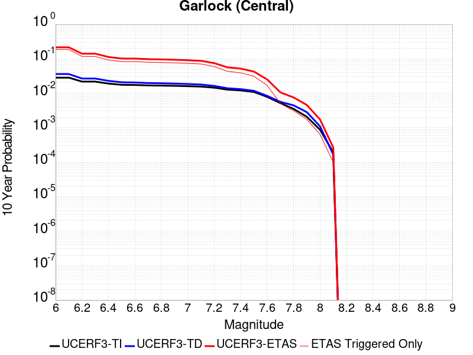 |

| Magnitude | 1 wk TI Prob | 1 wk TD Prob | 1 wk ETAS Prob | 1 wk ETAS/TD Gain | 1 wk ETAS Triggered Only | 1 mo TI Prob | 1 mo TD Prob | 1 mo ETAS Prob | 1 mo ETAS/TD Gain | 1 mo ETAS Triggered Only | 1 yr TI Prob | 1 yr TD Prob | 1 yr ETAS Prob | 1 yr ETAS/TD Gain | 1 yr ETAS Triggered Only | 10 yr TI Prob | 10 yr TD Prob | 10 yr ETAS Prob | 10 yr ETAS/TD Gain | 10 yr ETAS Triggered Only |
|-----|-----|-----|-----|-----|-----|-----|-----|-----|-----|-----|-----|-----|-----|-----|-----|-----|-----|-----|-----|-----|
| 6.0 | 5.5131142E-5 | 7.024681E-5 | 0.12949991 | 1843.4988 | 0.12943876 | 2.3625491E-4 | 3.010234E-4 | 0.14854442 | 493.46472 | 0.14828803 | 0.0028726095 | 0.0036588663 | 0.17517866 | 47.877853 | 0.17214966 | 0.028357591 | 0.036079824 | 0.21477763 | 5.9528456 | 0.18538651 |
| 6.1 | 5.5131142E-5 | 7.024681E-5 | 0.12949991 | 1843.4988 | 0.12943876 | 2.3625491E-4 | 3.010234E-4 | 0.14854442 | 493.46472 | 0.14828803 | 0.0028726095 | 0.0036588663 | 0.17517866 | 47.877853 | 0.17214966 | 0.028357591 | 0.036079824 | 0.21477763 | 5.9528456 | 0.18538651 |
| 6.2 | 4.216245E-5 | 5.1661493E-5 | 0.07996282 | 1547.8224 | 0.079915285 | 1.806837E-4 | 2.2138779E-4 | 0.09180012 | 414.65756 | 0.09159901 | 0.0021976046 | 0.0026920962 | 0.11051963 | 41.05337 | 0.1081186 | 0.021759989 | 0.026689773 | 0.1404087 | 5.260767 | 0.11683728 |
| 6.3 | 4.216245E-5 | 5.1661493E-5 | 0.07996282 | 1547.8224 | 0.079915285 | 1.806837E-4 | 2.2138779E-4 | 0.09180012 | 414.65756 | 0.09159901 | 0.0021976046 | 0.0026920962 | 0.11051963 | 41.05337 | 0.1081186 | 0.021759989 | 0.026689773 | 0.1404087 | 5.260767 | 0.11683728 |
| 6.4 | 3.6858168E-5 | 4.411054E-5 | 0.061742764 | 1399.7281 | 0.061701376 | 1.5795401E-4 | 1.8903162E-4 | 0.07151335 | 378.31424 | 0.071337804 | 0.0019213937 | 0.002299056 | 0.08692579 | 37.80934 | 0.084821746 | 0.019048655 | 0.02284894 | 0.113010354 | 4.945978 | 0.09226968 |
| 6.5 | 3.39199E-5 | 4.0018083E-5 | 0.055809055 | 1394.5958 | 0.05577127 | 1.453629E-4 | 1.7149492E-4 | 0.06465037 | 376.9813 | 0.06448994 | 0.0017683565 | 0.002085973 | 0.07880524 | 37.77865 | 0.076879635 | 0.017543508 | 0.020759864 | 0.1025418 | 4.9394255 | 0.08351571 |
| 6.6 | 3.3571985E-5 | 3.9472274E-5 | 0.05570265 | 1411.1842 | 0.055665374 | 1.4387199E-4 | 1.6915603E-4 | 0.06454231 | 381.55487 | 0.06438404 | 0.0017502342 | 0.0020575512 | 0.07856765 | 38.185028 | 0.076667845 | 0.017365133 | 0.020481179 | 0.10207894 | 4.984036 | 0.08330392 |
| 6.7 | 3.2580007E-5 | 3.8088703E-5 | 0.053265855 | 1398.4686 | 0.05322979 | 1.3962112E-4 | 1.632272E-4 | 0.061889824 | 379.16367 | 0.061736673 | 0.0016985617 | 0.0019855013 | 0.075577185 | 38.064533 | 0.07373808 | 0.016856372 | 0.019773813 | 0.09821267 | 4.9668045 | 0.08002118 |
| 6.8 | 3.2185937E-5 | 3.7515918E-5 | 0.052382886 | 1396.2843 | 0.052347336 | 1.3793244E-4 | 1.6077272E-4 | 0.060828745 | 378.3524 | 0.060677726 | 0.0016780337 | 0.001955672 | 0.074140385 | 37.91044 | 0.07232615 | 0.016654192 | 0.019480614 | 0.09648929 | 4.9530926 | 0.07853865 |
| 6.9 | 3.165394E-5 | 3.6720503E-5 | 0.05135852 | 1398.6333 | 0.051323686 | 1.3565269E-4 | 1.5736422E-4 | 0.05966088 | 379.1261 | 0.059512883 | 0.0016503202 | 0.001914247 | 0.072727956 | 37.99298 | 0.070949525 | 0.01638118 | 0.019073246 | 0.094486535 | 4.953878 | 0.076879635 |
| 7.0 | 3.0903822E-5 | 3.5625766E-5 | 0.049804416 | 1397.9886 | 0.04977056 | 1.3243823E-4 | 1.5267303E-4 | 0.05768007 | 377.8013 | 0.05753618 | 0.0016112428 | 0.0018572307 | 0.070243925 | 37.821865 | 0.068513945 | 0.015996104 | 0.018512413 | 0.09143975 | 4.939375 | 0.07430286 |
| 7.1 | 3.0069863E-5 | 3.4392073E-5 | 0.04740304 | 1378.3131 | 0.047370277 | 1.2886449E-4 | 1.4738638E-4 | 0.055098694 | 373.83844 | 0.054959405 | 0.0015677959 | 0.0017929734 | 0.06733004 | 37.55217 | 0.065654784 | 0.01556781 | 0.017880075 | 0.08783835 | 4.9126387 | 0.07123191 |
| 7.2 | 2.7957109E-5 | 3.128145E-5 | 0.03928173 | 1255.7515 | 0.039251678 | 1.1981068E-4 | 1.340566E-4 | 0.045698013 | 340.886 | 0.045570068 | 0.0014577188 | 0.0016309366 | 0.056042578 | 34.362206 | 0.054500528 | 0.014481937 | 0.016283695 | 0.074619144 | 4.5824456 | 0.059301093 |
| 7.3 | 2.4519275E-5 | 2.6714795E-5 | 0.027876306 | 1043.4781 | 0.027850335 | 1.0507837E-4 | 1.1448703E-4 | 0.03283224 | 286.77692 | 0.032721497 | 0.0012785783 | 0.001393003 | 0.04069575 | 29.2144 | 0.039357573 | 0.012712469 | 0.013928054 | 0.05628773 | 4.0413203 | 0.042957995 |
| 7.4 | 2.3225532E-5 | 2.51994E-5 | 0.025474612 | 1010.9213 | 0.025450053 | 9.95342E-5 | 1.0799304E-4 | 0.029684749 | 274.8765 | 0.02957995 | 0.0012111551 | 0.0013140367 | 0.036847938 | 28.04179 | 0.035580657 | 0.012045753 | 0.013145725 | 0.0515679 | 3.9227886 | 0.038933992 |
| 7.5 | 2.097765E-5 | 2.2483688E-5 | 0.020283235 | 902.13116 | 0.020261208 | 8.9901114E-5 | 9.635517E-5 | 0.023779212 | 246.7871 | 0.023685139 | 0.0010939965 | 0.0011725046 | 0.029660067 | 25.296331 | 0.028521003 | 0.010886264 | 0.011740365 | 0.042577695 | 3.6266072 | 0.03120367 |
| 7.6 | 1.511254E-5 | 1.5991332E-5 | 0.011134769 | 696.30023 | 0.011118955 | 6.476642E-5 | 6.853253E-5 | 0.013198589 | 192.58868 | 0.013130956 | 7.882459E-4 | 8.3407195E-4 | 0.016458163 | 19.732307 | 0.015637133 | 0.007854558 | 0.008383559 | 0.025394699 | 3.0291073 | 0.01715496 |
| 7.7 | 9.934069E-6 | 1.0678794E-5 | 0.0031521914 | 295.18234 | 0.0031415462 | 4.2573887E-5 | 4.5765457E-5 | 0.003893101 | 85.06636 | 0.0038475115 | 5.182138E-4 | 5.570524E-4 | 0.00517855 | 9.296343 | 0.0046240734 | 0.00517007 | 0.005627684 | 0.01064693 | 1.8918849 | 0.005047653 |
| 7.8 | 6.7562896E-6 | 8.428449E-6 | 0.0018792211 | 222.96167 | 0.0018708083 | 2.8955206E-5 | 3.6121426E-5 | 0.0024010201 | 66.4708 | 0.002364984 | 3.5247262E-4 | 4.3968976E-4 | 0.0032975925 | 7.4998164 | 0.0028591598 | 0.0035191406 | 0.004446654 | 0.007574231 | 1.7033551 | 0.0031415462 |
| 7.9 | 3.975453E-6 | 5.37103E-6 | 0.0011349096 | 211.30203 | 0.0011295447 | 1.7037546E-5 | 2.3018498E-5 | 0.0013643219 | 59.27067 | 0.0013413343 | 2.0741238E-4 | 2.8021427E-4 | 0.0019034797 | 6.7929435 | 0.0016237204 | 0.002072189 | 0.0028336283 | 0.0045583425 | 1.6086593 | 0.0017296153 |
| 8.0 | 1.6729537E-6 | 2.0775144E-6 | 4.256559E-4 | 204.88708 | 4.2357924E-4 | 7.169782E-6 | 8.903603E-6 | 5.0307496E-4 | 56.502407 | 4.9417577E-4 | 8.7288594E-5 | 1.0839601E-4 | 7.0840155E-4 | 6.5353103 | 6.000706E-4 | 8.7254314E-4 | 0.0010969337 | 0.0017316057 | 1.5785873 | 6.3536887E-4 |
| 8.1 | 3.6733252E-7 | 3.1489964E-7 | 7.091142E-5 | 225.18735 | 7.059654E-5 | 1.5742813E-6 | 1.3495693E-6 | 7.1946015E-5 | 53.310352 | 7.059654E-5 | 1.9166706E-5 | 1.6430899E-5 | 8.702628E-5 | 5.2965016 | 7.059654E-5 | 1.9165053E-4 | 1.6638759E-4 | 2.3697238E-4 | 1.4242191 | 7.059654E-5 |

## Little Lake
*[(top)](#table-of-contents)*

| 1 Week | 1 Month | 1 Year | 10 Year |
|-----|-----|-----|-----|
|  |  |  |  |

| Magnitude | 1 wk TI Prob | 1 wk TD Prob | 1 wk ETAS Prob | 1 wk ETAS/TD Gain | 1 wk ETAS Triggered Only | 1 mo TI Prob | 1 mo TD Prob | 1 mo ETAS Prob | 1 mo ETAS/TD Gain | 1 mo ETAS Triggered Only | 1 yr TI Prob | 1 yr TD Prob | 1 yr ETAS Prob | 1 yr ETAS/TD Gain | 1 yr ETAS Triggered Only | 10 yr TI Prob | 10 yr TD Prob | 10 yr ETAS Prob | 10 yr ETAS/TD Gain | 10 yr ETAS Triggered Only |
|-----|-----|-----|-----|-----|-----|-----|-----|-----|-----|-----|-----|-----|-----|-----|-----|-----|-----|-----|-----|-----|
| 6.0 | 2.8424427E-5 | 3.120572E-5 | 0.05834213 | 1869.5972 | 0.058312744 | 1.2181328E-4 | 1.337327E-4 | 0.06729736 | 503.2229 | 0.06717261 | 0.0014820677 | 0.0016271127 | 0.07993225 | 49.125206 | 0.07843275 | 0.014722223 | 0.016165402 | 0.09961597 | 6.162295 | 0.084821746 |
| 6.1 | 2.8424427E-5 | 3.120572E-5 | 0.05834213 | 1869.5972 | 0.058312744 | 1.2181328E-4 | 1.337327E-4 | 0.06729736 | 503.2229 | 0.06717261 | 0.0014820677 | 0.0016271127 | 0.07993225 | 49.125206 | 0.07843275 | 0.014722223 | 0.016165402 | 0.09961597 | 6.162295 | 0.084821746 |
| 6.2 | 2.8424427E-5 | 3.120572E-5 | 0.05834213 | 1869.5972 | 0.058312744 | 1.2181328E-4 | 1.337327E-4 | 0.06729736 | 503.2229 | 0.06717261 | 0.0014820677 | 0.0016271127 | 0.07993225 | 49.125206 | 0.07843275 | 0.014722223 | 0.016165402 | 0.09961597 | 6.162295 | 0.084821746 |
| 6.3 | 1.48860645E-5 | 1.6081389E-5 | 0.039725997 | 2470.3088 | 0.039710555 | 6.379586E-5 | 6.8918576E-5 | 0.045741733 | 663.70685 | 0.045675963 | 7.7643775E-4 | 8.3878887E-4 | 0.054023933 | 64.40707 | 0.05322979 | 0.007737305 | 0.008359048 | 0.06492423 | 7.7669415 | 0.057042006 |
| 6.4 | 1.48860645E-5 | 1.6081389E-5 | 0.039725997 | 2470.3088 | 0.039710555 | 6.379586E-5 | 6.8918576E-5 | 0.045741733 | 663.70685 | 0.045675963 | 7.7643775E-4 | 8.3878887E-4 | 0.054023933 | 64.40707 | 0.05322979 | 0.007737305 | 0.008359048 | 0.06492423 | 7.7669415 | 0.057042006 |
| 6.5 | 1.2797581E-5 | 1.3765565E-5 | 0.037005845 | 2688.291 | 0.036992587 | 5.4845623E-5 | 5.899409E-5 | 0.042555604 | 721.3537 | 0.042499118 | 6.675408E-4 | 7.18042E-4 | 0.05013541 | 69.82239 | 0.04945288 | 0.006655392 | 0.00715977 | 0.059552856 | 8.317705 | 0.052770913 |
| 6.6 | 9.661896E-6 | 1.0289038E-5 | 0.03220198 | 3129.7368 | 0.03219202 | 4.1407468E-5 | 4.409522E-5 | 0.037176237 | 843.08997 | 0.03713378 | 5.040193E-4 | 5.367433E-4 | 0.0434364 | 80.925835 | 0.042922698 | 0.005028777 | 0.0053560743 | 0.05096294 | 9.514979 | 0.045852453 |
| 6.7 | 7.767871E-6 | 8.199687E-6 | 0.027999498 | 3414.7036 | 0.027991528 | 3.329045E-5 | 3.5141118E-5 | 0.032120142 | 914.033 | 0.032086127 | 4.0523586E-4 | 4.2777284E-4 | 0.03743982 | 87.52266 | 0.037027884 | 0.004044977 | 0.004270846 | 0.043636065 | 10.217195 | 0.039534062 |
| 6.8 | 6.4235196E-6 | 6.7357446E-6 | 0.02199741 | 3265.7727 | 0.021990823 | 2.752908E-5 | 2.8867229E-5 | 0.025266401 | 875.26245 | 0.025238262 | 3.35115E-4 | 3.5141467E-4 | 0.029391682 | 83.638176 | 0.029050477 | 0.003346101 | 0.00350985 | 0.034217082 | 9.748873 | 0.03081539 |
| 6.9 | 3.1283696E-6 | 3.1121804E-6 | 0.013804693 | 4435.698 | 0.013801624 | 1.3407229E-5 | 1.3337856E-5 | 0.01586205 | 1189.2502 | 0.015848923 | 1.6322079E-4 | 1.6237781E-4 | 0.018302742 | 112.71702 | 0.018143311 | 0.0016310095 | 0.00162274 | 0.02082908 | 12.835747 | 0.019237557 |
| 7.0 | 2.290603E-6 | 2.2286815E-6 | 0.008897373 | 3992.2136 | 0.008895164 | 9.816834E-6 | 9.551463E-6 | 0.01028125 | 1076.4058 | 0.010271797 | 1.19513395E-4 | 1.162839E-4 | 0.011586888 | 99.6431 | 0.011471937 | 0.0011944914 | 0.0011623327 | 0.013326081 | 11.464946 | 0.012177903 |
| 7.1 | 1.293693E-6 | 1.1776827E-6 | 0.0041310703 | 3507.7957 | 0.004129898 | 5.5443866E-6 | 5.0472063E-6 | 0.0046996935 | 931.1475 | 0.00469467 | 6.750081E-5 | 6.14487E-5 | 0.005285272 | 86.01112 | 0.005224144 | 6.7480316E-4 | 6.143856E-4 | 0.0061175325 | 9.957155 | 0.0055065304 |
| 7.2 | 4.715842E-7 | 3.0917857E-7 | 1.7680047E-4 | 571.83936 | 1.7649135E-4 | 2.0210737E-6 | 1.3250503E-6 | 1.7781617E-4 | 134.19579 | 1.7649135E-4 | 2.4606294E-5 | 1.6132375E-5 | 2.9851397E-4 | 18.504032 | 2.8238617E-4 | 2.460357E-4 | 1.6131258E-4 | 4.4365317E-4 | 2.7502704 | 2.8238617E-4 |
| 7.3 | 3.9430947E-7 | 2.3097488E-7 | 1.4142403E-4 | 612.2918 | 1.4119309E-4 | 1.6898966E-6 | 9.89892E-7 | 1.4218283E-4 | 143.6347 | 1.4119309E-4 | 2.0574296E-5 | 1.2051869E-5 | 2.5913678E-4 | 21.501793 | 2.4708788E-4 | 2.0572392E-4 | 1.20512224E-4 | 3.6757035E-4 | 3.050067 | 2.4708788E-4 |
| 7.4 | 3.547123E-7 | 1.9679135E-7 | 1.0609158E-4 | 539.10693 | 1.0589481E-4 | 1.5201948E-6 | 8.4339126E-7 | 1.06738116E-4 | 126.55824 | 1.0589481E-4 | 1.8508214E-5 | 1.0268241E-5 | 2.2205569E-4 | 21.625484 | 2.1178962E-4 | 1.8506673E-4 | 1.02677724E-4 | 3.144456E-4 | 3.0624518 | 2.1178962E-4 |
| 7.5 | 2.6354266E-7 | 1.4423138E-7 | 1.0603903E-4 | 735.2008 | 1.0589481E-4 | 1.129468E-6 | 6.181344E-7 | 1.0651288E-4 | 172.31348 | 1.0589481E-4 | 1.3751187E-5 | 7.5257603E-6 | 1.8401578E-4 | 24.451454 | 1.7649135E-4 | 1.3750336E-4 | 7.5255106E-5 | 2.5173317E-4 | 3.3450644 | 1.7649135E-4 |
| 7.6 | 1.269913E-7 | 7.572556E-8 | 3.5373992E-5 | 467.13412 | 3.529827E-5 | 5.4424834E-7 | 3.245381E-7 | 3.5622797E-5 | 109.76461 | 3.529827E-5 | 6.6262032E-6 | 3.9512443E-6 | 7.4547504E-5 | 18.866842 | 7.059654E-5 | 6.626006E-5 | 3.9511775E-5 | 1.1010553E-4 | 2.786651 | 7.059654E-5 |

## Owl Lake
*[(top)](#table-of-contents)*

| 1 Week | 1 Month | 1 Year | 10 Year |
|-----|-----|-----|-----|
|  |  | 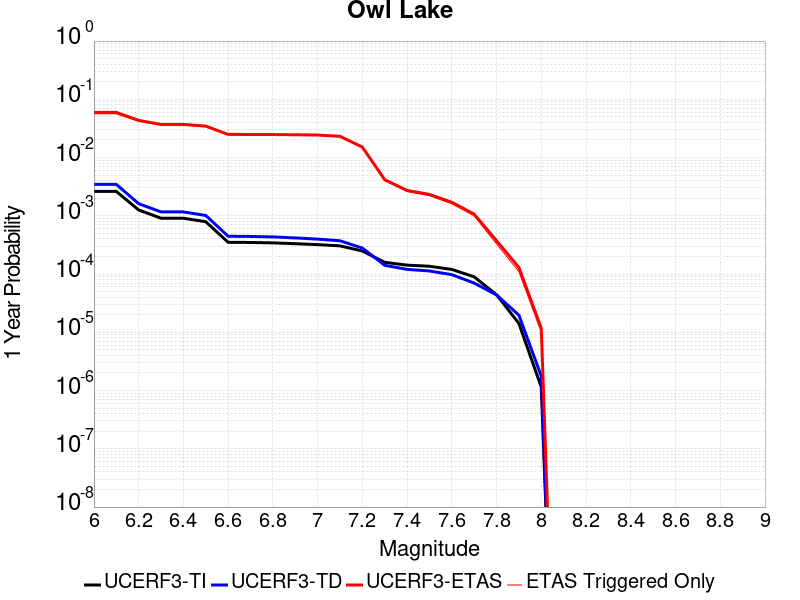 | 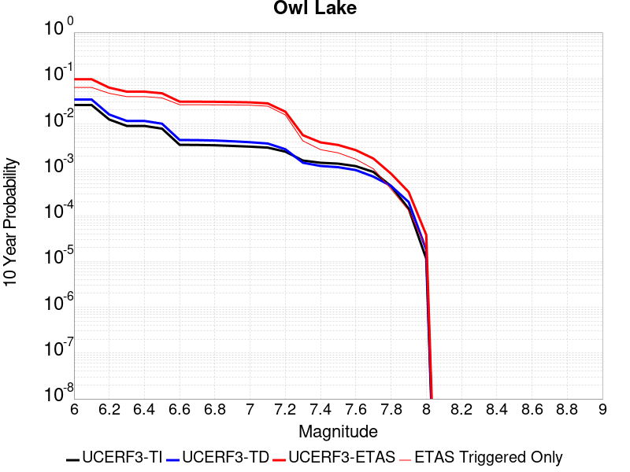 |

| Magnitude | 1 wk TI Prob | 1 wk TD Prob | 1 wk ETAS Prob | 1 wk ETAS/TD Gain | 1 wk ETAS Triggered Only | 1 mo TI Prob | 1 mo TD Prob | 1 mo ETAS Prob | 1 mo ETAS/TD Gain | 1 mo ETAS Triggered Only | 1 yr TI Prob | 1 yr TD Prob | 1 yr ETAS Prob | 1 yr ETAS/TD Gain | 1 yr ETAS Triggered Only | 10 yr TI Prob | 10 yr TD Prob | 10 yr ETAS Prob | 10 yr ETAS/TD Gain | 10 yr ETAS Triggered Only |
|-----|-----|-----|-----|-----|-----|-----|-----|-----|-----|-----|-----|-----|-----|-----|-----|-----|-----|-----|-----|-----|
| 6.0 | 5.0320643E-5 | 6.635816E-5 | 0.0378683 | 570.6653 | 0.037804447 | 2.1564208E-4 | 2.843674E-4 | 0.04630022 | 162.81833 | 0.046028946 | 0.0026222812 | 0.0034577388 | 0.060161803 | 17.399176 | 0.05690081 | 0.02591553 | 0.034140717 | 0.09581525 | 2.8064802 | 0.06385457 |
| 6.1 | 5.0320643E-5 | 6.635816E-5 | 0.0378683 | 570.6653 | 0.037804447 | 2.1564208E-4 | 2.843674E-4 | 0.04630022 | 162.81833 | 0.046028946 | 0.0026222812 | 0.0034577388 | 0.060161803 | 17.399176 | 0.05690081 | 0.02591553 | 0.034140717 | 0.09581525 | 2.8064802 | 0.06385457 |
| 6.2 | 2.4125871E-5 | 3.0981035E-5 | 0.028480506 | 919.2883 | 0.028450405 | 1.0339249E-4 | 1.3277028E-4 | 0.034049906 | 256.45728 | 0.033921637 | 0.0012580766 | 0.001615439 | 0.043587767 | 26.981995 | 0.04204024 | 0.012509781 | 0.016070465 | 0.062158514 | 3.867873 | 0.046840806 |
| 6.3 | 1.7433485E-5 | 2.2355514E-5 | 0.024836484 | 1110.978 | 0.024814684 | 7.471279E-5 | 9.580672E-5 | 0.02928468 | 305.66415 | 0.02919167 | 9.0924866E-4 | 0.0011659743 | 0.037057716 | 31.782618 | 0.03593364 | 0.009055373 | 0.011628896 | 0.050982323 | 4.384107 | 0.03981645 |
| 6.4 | 1.7433485E-5 | 2.2355514E-5 | 0.024836484 | 1110.978 | 0.024814684 | 7.471279E-5 | 9.580672E-5 | 0.02928468 | 305.66415 | 0.02919167 | 9.0924866E-4 | 0.0011659743 | 0.037057716 | 31.782618 | 0.03593364 | 0.009055373 | 0.011628896 | 0.050982323 | 4.384107 | 0.03981645 |
| 6.5 | 1.5182742E-5 | 1.9429144E-5 | 0.023351133 | 1201.8611 | 0.023332156 | 6.506727E-5 | 8.326596E-5 | 0.027543034 | 330.78384 | 0.027462054 | 7.919061E-4 | 0.0010134429 | 0.034794915 | 34.333378 | 0.03381574 | 0.0078909 | 0.010118429 | 0.046981297 | 4.6431417 | 0.037239674 |
| 6.6 | 6.7271576E-6 | 8.547361E-6 | 0.018187001 | 2127.7915 | 0.01817861 | 2.8830356E-5 | 3.6631063E-5 | 0.020685364 | 564.6946 | 0.020649489 | 3.5095305E-4 | 4.458976E-4 | 0.025037821 | 56.151505 | 0.024602894 | 0.0035039932 | 0.004467813 | 0.030717814 | 6.8753586 | 0.026367808 |
| 6.7 | 6.682835E-6 | 8.479807E-6 | 0.018116338 | 2136.4094 | 0.018108012 | 2.8640408E-5 | 3.6341557E-5 | 0.020614486 | 567.2428 | 0.020578891 | 3.4864116E-4 | 4.4237426E-4 | 0.02496382 | 56.431446 | 0.024532298 | 0.003480947 | 0.0044327388 | 0.030613381 | 6.9062 | 0.026297212 |
| 6.8 | 6.5774975E-6 | 8.32628E-6 | 0.018116187 | 2175.784 | 0.018108012 | 2.8188972E-5 | 3.5683603E-5 | 0.020543247 | 575.7055 | 0.020508295 | 3.4314668E-4 | 4.343669E-4 | 0.024885442 | 57.291298 | 0.024461702 | 0.0034261728 | 0.004352885 | 0.030465338 | 6.9988847 | 0.026226616 |
| 6.9 | 6.363419E-6 | 7.999454E-6 | 0.01804527 | 2255.8127 | 0.018037416 | 2.727151E-5 | 3.428296E-5 | 0.02047128 | 597.127 | 0.020437699 | 3.3198006E-4 | 4.1732067E-4 | 0.024762964 | 59.337975 | 0.024355806 | 0.0033148455 | 0.0041828766 | 0.030159187 | 7.2101545 | 0.026085421 |
| 7.0 | 6.1342453E-6 | 7.6316555E-6 | 0.017974313 | 2355.2312 | 0.01796682 | 2.6289357E-5 | 3.2706717E-5 | 0.02029325 | 620.4613 | 0.020261208 | 3.2002592E-4 | 3.9813702E-4 | 0.024497258 | 61.529716 | 0.02410872 | 0.0031956544 | 0.003991571 | 0.02972677 | 7.4473863 | 0.025838334 |
| 7.1 | 5.842926E-6 | 7.142211E-6 | 0.016879596 | 2363.357 | 0.016872574 | 2.504087E-5 | 3.0609146E-5 | 0.019055795 | 622.55225 | 0.019025767 | 3.0482994E-4 | 3.7260808E-4 | 0.023096224 | 61.985302 | 0.022732086 | 0.0030441214 | 0.0037370329 | 0.028036987 | 7.502473 | 0.024391105 |
| 7.2 | 4.77173E-6 | 5.358483E-6 | 0.010735976 | 2003.5474 | 0.0107306745 | 2.045011E-5 | 2.2964748E-5 | 0.012129993 | 528.20056 | 0.012107307 | 2.4895166E-4 | 2.79564E-4 | 0.014606656 | 52.247982 | 0.014331098 | 0.0024867293 | 0.002808645 | 0.018190665 | 6.4766693 | 0.015425344 |
| 7.3 | 3.0494948E-6 | 2.710463E-6 | 0.002367688 | 873.53644 | 0.002364984 | 1.3069198E-5 | 1.1616219E-5 | 0.002870743 | 247.1323 | 0.0028591598 | 1.5910587E-4 | 1.4141845E-4 | 0.003635453 | 25.707064 | 0.0034945288 | 0.0015899199 | 0.0014232415 | 0.005124285 | 3.6004326 | 0.0037063183 |
| 7.4 | 2.7263884E-6 | 2.3056762E-6 | 0.0014495314 | 628.6795 | 0.0014472291 | 1.1684469E-5 | 9.881433E-6 | 0.0017041817 | 172.46301 | 0.001694317 | 1.4224913E-4 | 1.20299905E-4 | 0.0022026473 | 18.309635 | 0.002082598 | 0.0014215811 | 0.0012112238 | 0.0034323214 | 2.8337631 | 0.002223791 |
| 7.5 | 2.6090431E-6 | 2.1656133E-6 | 0.0012023043 | 555.17957 | 0.0012001412 | 1.1181565E-5 | 9.281167E-6 | 0.0014211988 | 153.12717 | 0.0014119308 | 1.3612706E-4 | 1.1299244E-4 | 0.0018777065 | 16.617983 | 0.0017649136 | 0.001360437 | 0.0011379806 | 0.0030419182 | 2.6730843 | 0.0019061066 |
| 7.6 | 2.3008756E-6 | 1.8727933E-6 | 6.372405E-4 | 340.26202 | 6.3536887E-4 | 9.860858E-6 | 8.0262325E-6 | 8.5517793E-4 | 106.54786 | 8.471585E-4 | 1.20049335E-4 | 9.7715085E-5 | 0.0012271494 | 12.558443 | 0.0011295447 | 0.001199845 | 9.849932E-4 | 0.0021839521 | 2.2172258 | 0.0012001412 |
| 7.7 | 1.7184348E-6 | 1.3419171E-6 | 4.602188E-4 | 342.9562 | 4.588775E-4 | 7.3646997E-6 | 5.7510606E-6 | 6.0581823E-4 | 105.340256 | 6.000706E-4 | 8.966153E-5 | 7.0016955E-5 | 8.1122876E-4 | 11.586175 | 7.412637E-4 | 8.962536E-4 | 7.078345E-4 | 0.0014838468 | 2.0963187 | 7.7656197E-4 |
| 7.8 | 8.4612907E-7 | 8.4058576E-7 | 7.143707E-5 | 84.98486 | 7.059654E-5 | 3.6262625E-6 | 3.6025056E-6 | 1.09496934E-4 | 30.39466 | 1.0589481E-4 | 4.4148852E-5 | 4.3859643E-5 | 1.8504653E-4 | 4.2190614 | 1.4119309E-4 | 4.414008E-4 | 4.4398365E-4 | 6.2039663E-4 | 1.3973413 | 1.7649135E-4 |
| 7.9 | 2.716738E-7 | 3.768106E-7 | 3.768106E-7 | 1.0 | 0.0 | 1.1643157E-6 | 1.6149015E-6 | 1.6149015E-6 | 1.0 | 0.0 | 1.4175452E-5 | 1.966126E-5 | 5.4958837E-5 | 2.7952857 | 3.529827E-5 | 1.4174548E-4 | 1.9836679E-4 | 2.3365805E-4 | 1.1779091 | 3.529827E-5 |
| 8.0 | 2.1995428E-8 | 3.384878E-8 | 3.384878E-8 | 1.0 | 0.0 | 9.426611E-8 | 1.4506621E-7 | 1.4506621E-7 | 1.0 | 0.0 | 1.1476893E-6 | 1.7661803E-6 | 3.7064387E-5 | 20.98562 | 3.529827E-5 | 1.14768345E-5 | 1.7963059E-5 | 5.3260694E-5 | 2.9650126 | 3.529827E-5 |

## Airport Lake
*[(top)](#table-of-contents)*

| 1 Week | 1 Month | 1 Year | 10 Year |
|-----|-----|-----|-----|
|  |  |  |  |

| Magnitude | 1 wk TI Prob | 1 wk TD Prob | 1 wk ETAS Prob | 1 wk ETAS/TD Gain | 1 wk ETAS Triggered Only | 1 mo TI Prob | 1 mo TD Prob | 1 mo ETAS Prob | 1 mo ETAS/TD Gain | 1 mo ETAS Triggered Only | 1 yr TI Prob | 1 yr TD Prob | 1 yr ETAS Prob | 1 yr ETAS/TD Gain | 1 yr ETAS Triggered Only | 10 yr TI Prob | 10 yr TD Prob | 10 yr ETAS Prob | 10 yr ETAS/TD Gain | 10 yr ETAS Triggered Only |
|-----|-----|-----|-----|-----|-----|-----|-----|-----|-----|-----|-----|-----|-----|-----|-----|-----|-----|-----|-----|-----|
| 6.0 | 1.2387061E-5 | 1.3103157E-5 | 0.050665457 | 3866.6604 | 0.050653018 | 5.3086325E-5 | 5.615534E-5 | 0.05734203 | 1021.1323 | 0.057289094 | 6.461343E-4 | 6.8350515E-4 | 0.06558793 | 95.958206 | 0.06494882 | 0.0064425888 | 0.0068168393 | 0.075670056 | 11.100461 | 0.069325805 |
| 6.1 | 1.2387061E-5 | 1.3103157E-5 | 0.050665457 | 3866.6604 | 0.050653018 | 5.3086325E-5 | 5.615534E-5 | 0.05734203 | 1021.1323 | 0.057289094 | 6.461343E-4 | 6.8350515E-4 | 0.06558793 | 95.958206 | 0.06494882 | 0.0064425888 | 0.0068168393 | 0.075670056 | 11.100461 | 0.069325805 |
| 6.2 | 1.2387061E-5 | 1.3103157E-5 | 0.050665457 | 3866.6604 | 0.050653018 | 5.3086325E-5 | 5.615534E-5 | 0.05734203 | 1021.1323 | 0.057289094 | 6.461343E-4 | 6.8350515E-4 | 0.06558793 | 95.958206 | 0.06494882 | 0.0064425888 | 0.0068168393 | 0.075670056 | 11.100461 | 0.069325805 |
| 6.3 | 1.2387061E-5 | 1.3103157E-5 | 0.050665457 | 3866.6604 | 0.050653018 | 5.3086325E-5 | 5.615534E-5 | 0.05734203 | 1021.1323 | 0.057289094 | 6.461343E-4 | 6.8350515E-4 | 0.06558793 | 95.958206 | 0.06494882 | 0.0064425888 | 0.0068168393 | 0.075670056 | 11.100461 | 0.069325805 |
| 6.4 | 1.2387061E-5 | 1.3103157E-5 | 0.050665457 | 3866.6604 | 0.050653018 | 5.3086325E-5 | 5.615534E-5 | 0.05734203 | 1021.1323 | 0.057289094 | 6.461343E-4 | 6.8350515E-4 | 0.06558793 | 95.958206 | 0.06494882 | 0.0064425888 | 0.0068168393 | 0.075670056 | 11.100461 | 0.069325805 |
| 6.5 | 6.9922594E-6 | 7.384925E-6 | 0.039046984 | 5287.3906 | 0.039039887 | 2.996648E-5 | 3.1649324E-5 | 0.044011902 | 1390.6111 | 0.043981645 | 3.6478083E-4 | 3.8526783E-4 | 0.050418932 | 130.86722 | 0.05005295 | 0.003641826 | 0.0038465366 | 0.056941904 | 14.803422 | 0.05330039 |
| 6.6 | 6.9922594E-6 | 7.384925E-6 | 0.039046984 | 5287.3906 | 0.039039887 | 2.996648E-5 | 3.1649324E-5 | 0.044011902 | 1390.6111 | 0.043981645 | 3.6478083E-4 | 3.8526783E-4 | 0.050418932 | 130.86722 | 0.05005295 | 0.003641826 | 0.0038465366 | 0.056941904 | 14.803422 | 0.05330039 |
| 6.7 | 5.477277E-6 | 5.7860684E-6 | 0.03329186 | 5753.797 | 0.03328627 | 2.3473833E-5 | 2.4797222E-5 | 0.037581224 | 1515.5417 | 0.03755736 | 2.8575645E-4 | 3.0186825E-4 | 0.043105744 | 142.79655 | 0.042816803 | 0.0028538927 | 0.003014966 | 0.048588406 | 16.11574 | 0.04571126 |
| 6.8 | 3.9950432E-6 | 4.2190873E-6 | 0.025242375 | 5982.9 | 0.025238262 | 1.7121502E-5 | 1.8081691E-5 | 0.028785652 | 1591.9778 | 0.02876809 | 2.0843433E-4 | 2.2012512E-4 | 0.032652095 | 148.33426 | 0.03243911 | 0.0020823893 | 0.0021993418 | 0.036469024 | 16.581789 | 0.034345217 |
| 6.9 | 2.95695E-6 | 3.1230243E-6 | 0.017863993 | 5720.0938 | 0.017860925 | 1.2672582E-5 | 1.3384334E-5 | 0.020380214 | 1522.6917 | 0.020367103 | 1.5427776E-4 | 1.6294434E-4 | 0.02310308 | 141.78511 | 0.022943875 | 0.001541707 | 0.0016284712 | 0.025979856 | 15.953526 | 0.024391105 |
| 7.0 | 1.456072E-6 | 1.540812E-6 | 0.008402516 | 5453.304 | 0.008400989 | 6.2402937E-6 | 6.603469E-6 | 0.009713564 | 1470.9789 | 0.009707024 | 7.597293E-5 | 8.039528E-5 | 0.010810207 | 134.46321 | 0.0107306745 | 7.594696E-4 | 8.0376083E-4 | 0.012195938 | 15.173592 | 0.011401341 |
| 7.1 | 6.995192E-7 | 7.4089746E-7 | 0.0038129513 | 5146.3955 | 0.0038122132 | 2.997936E-6 | 3.1752747E-6 | 0.004380147 | 1379.4545 | 0.0043769856 | 3.649926E-5 | 3.865897E-5 | 0.004839038 | 125.172455 | 0.0048005646 | 3.6493264E-4 | 3.865897E-4 | 0.0054675755 | 14.143097 | 0.005082951 |

## Panamint Valley
*[(top)](#table-of-contents)*

| 1 Week | 1 Month | 1 Year | 10 Year |
|-----|-----|-----|-----|
|  |  | 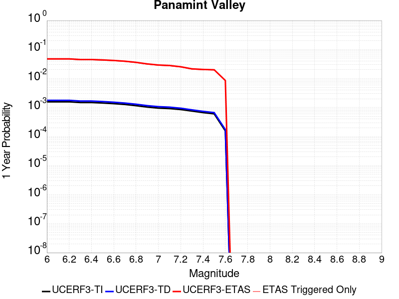 |  |

| Magnitude | 1 wk TI Prob | 1 wk TD Prob | 1 wk ETAS Prob | 1 wk ETAS/TD Gain | 1 wk ETAS Triggered Only | 1 mo TI Prob | 1 mo TD Prob | 1 mo ETAS Prob | 1 mo ETAS/TD Gain | 1 mo ETAS Triggered Only | 1 yr TI Prob | 1 yr TD Prob | 1 yr ETAS Prob | 1 yr ETAS/TD Gain | 1 yr ETAS Triggered Only | 10 yr TI Prob | 10 yr TD Prob | 10 yr ETAS Prob | 10 yr ETAS/TD Gain | 10 yr ETAS Triggered Only |
|-----|-----|-----|-----|-----|-----|-----|-----|-----|-----|-----|-----|-----|-----|-----|-----|-----|-----|-----|-----|-----|
| 6.0 | 3.0211835E-5 | 3.3984514E-5 | 0.030918922 | 909.7945 | 0.030885987 | 1.2947287E-4 | 1.4563995E-4 | 0.037556358 | 257.87128 | 0.037416168 | 0.0015751923 | 0.0017717537 | 0.04810674 | 27.152046 | 0.046417225 | 0.015640736 | 0.017583137 | 0.068940684 | 3.920841 | 0.052276738 |
| 6.1 | 3.0211835E-5 | 3.3984514E-5 | 0.030918922 | 909.7945 | 0.030885987 | 1.2947287E-4 | 1.4563995E-4 | 0.037556358 | 257.87128 | 0.037416168 | 0.0015751923 | 0.0017717537 | 0.04810674 | 27.152046 | 0.046417225 | 0.015640736 | 0.017583137 | 0.068940684 | 3.920841 | 0.052276738 |
| 6.2 | 3.0211835E-5 | 3.3984514E-5 | 0.030918922 | 909.7945 | 0.030885987 | 1.2947287E-4 | 1.4563995E-4 | 0.037556358 | 257.87128 | 0.037416168 | 0.0015751923 | 0.0017717537 | 0.04810674 | 27.152046 | 0.046417225 | 0.015640736 | 0.017583137 | 0.068940684 | 3.920841 | 0.052276738 |
| 6.3 | 2.8573924E-5 | 3.210268E-5 | 0.02939932 | 915.7902 | 0.02936816 | 1.2245393E-4 | 1.3757581E-4 | 0.03574863 | 259.84677 | 0.035615955 | 0.001489857 | 0.0016737265 | 0.045863673 | 27.40213 | 0.04426403 | 0.01479908 | 0.016617801 | 0.06542244 | 3.936889 | 0.049629368 |
| 6.4 | 2.8573924E-5 | 3.210268E-5 | 0.02939932 | 915.7902 | 0.02936816 | 1.2245393E-4 | 1.3757581E-4 | 0.03574863 | 259.84677 | 0.035615955 | 0.001489857 | 0.0016737265 | 0.045863673 | 27.40213 | 0.04426403 | 0.01479908 | 0.016617801 | 0.06542244 | 3.936889 | 0.049629368 |
| 6.5 | 2.7468774E-5 | 3.0828433E-5 | 0.028727438 | 931.84875 | 0.028697494 | 1.1771801E-4 | 1.3211532E-4 | 0.035072785 | 265.471 | 0.034945287 | 0.0014322745 | 0.0016073446 | 0.04470774 | 27.814657 | 0.043169785 | 0.014230782 | 0.015963677 | 0.06361979 | 3.9852846 | 0.04842923 |
| 6.6 | 2.6135967E-5 | 2.925248E-5 | 0.027561098 | 942.1799 | 0.02753265 | 1.1200648E-4 | 1.253619E-4 | 0.033478044 | 267.0512 | 0.033356864 | 0.0013628257 | 0.0015252391 | 0.042620245 | 27.943323 | 0.041157782 | 0.013544982 | 0.015154043 | 0.060659282 | 4.0028443 | 0.046205435 |
| 6.7 | 2.4498746E-5 | 2.7341335E-5 | 0.026429726 | 966.6582 | 0.026403107 | 1.04990395E-4 | 1.1717203E-4 | 0.031811304 | 271.4923 | 0.031697847 | 0.0012775084 | 0.0014256609 | 0.040339395 | 28.295223 | 0.03896929 | 0.012701893 | 0.014171274 | 0.057320856 | 4.0448623 | 0.043769855 |
| 6.8 | 2.2244329E-5 | 2.4935423E-5 | 0.02473311 | 991.8864 | 0.024708789 | 9.532935E-5 | 1.0686185E-4 | 0.029542474 | 276.45483 | 0.029438758 | 0.0011600169 | 0.0013002884 | 0.037222456 | 28.62631 | 0.035968937 | 0.011539802 | 0.0129325185 | 0.05254762 | 4.0632157 | 0.040134132 |
| 6.9 | 1.9902658E-5 | 2.2290267E-5 | 0.021836136 | 979.62646 | 0.021814331 | 8.529431E-5 | 9.552632E-5 | 0.025896097 | 271.0886 | 0.025803035 | 0.0010379635 | 0.0011624309 | 0.0324356 | 27.903252 | 0.031309567 | 0.010331288 | 0.011568608 | 0.04600496 | 3.9767065 | 0.03483939 |
| 7.0 | 1.8353881E-5 | 2.0566185E-5 | 0.020316655 | 987.8669 | 0.020296505 | 7.865712E-5 | 8.813792E-5 | 0.023877075 | 270.90582 | 0.023791034 | 9.5722964E-4 | 0.0010725686 | 0.029633502 | 27.628536 | 0.0285916 | 0.009531168 | 0.010678849 | 0.041968357 | 3.930045 | 0.03162725 |
| 7.1 | 1.7667631E-5 | 1.9772613E-5 | 0.019574627 | 989.98694 | 0.01955524 | 7.571623E-5 | 8.473711E-5 | 0.023132555 | 272.992 | 0.02304977 | 9.2145515E-4 | 0.0010312037 | 0.02846494 | 27.603605 | 0.027462054 | 0.009176437 | 0.010269073 | 0.04031385 | 3.9257538 | 0.030356513 |
| 7.2 | 1.6381597E-5 | 1.8158249E-5 | 0.017384592 | 957.39355 | 0.017366748 | 7.020495E-5 | 7.781885E-5 | 0.020372745 | 261.79706 | 0.020296505 | 8.544101E-4 | 9.4704994E-4 | 0.02527979 | 26.693197 | 0.024355806 | 0.008511325 | 0.009434792 | 0.03604334 | 3.820258 | 0.026861984 |
| 7.3 | 1.4520491E-5 | 1.5966476E-5 | 0.014523324 | 909.61365 | 0.014507589 | 6.222919E-5 | 6.842605E-5 | 0.017186916 | 251.17503 | 0.017119661 | 7.57377E-4 | 8.327849E-4 | 0.02135927 | 25.648003 | 0.020543594 | 0.0075480095 | 0.00829975 | 0.030843167 | 3.7161558 | 0.022732086 |
| 7.4 | 1.2852287E-5 | 1.4145411E-5 | 0.013780276 | 974.1871 | 0.013766325 | 5.5080065E-5 | 6.062187E-5 | 0.016261546 | 268.24554 | 0.016201906 | 6.7039346E-4 | 7.378371E-4 | 0.020278651 | 27.483912 | 0.01955524 | 0.0066837464 | 0.0073567946 | 0.02883545 | 3.919567 | 0.02163784 |
| 7.5 | 1.1637851E-5 | 1.2836797E-5 | 0.013461305 | 1048.6498 | 0.013448641 | 4.987555E-5 | 5.5013777E-5 | 0.015903065 | 289.07425 | 0.015848923 | 6.070656E-4 | 6.6960254E-4 | 0.019859003 | 29.657898 | 0.019202258 | 0.006054099 | 0.0066787465 | 0.027751323 | 4.1551695 | 0.02121426 |
| 7.6 | 3.0068115E-6 | 3.3330316E-6 | 0.006286404 | 1886.092 | 0.0062830923 | 1.2886271E-5 | 1.4284384E-5 | 0.007250326 | 507.57013 | 0.0072361454 | 1.5687906E-4 | 1.7390578E-4 | 0.008714601 | 50.111053 | 0.008542181 | 0.0015676835 | 0.0017391363 | 0.01107691 | 6.3692017 | 0.009354042 |

## Garlock (East)
*[(top)](#table-of-contents)*

| 1 Week | 1 Month | 1 Year | 10 Year |
|-----|-----|-----|-----|
|  |  |  |  |

| Magnitude | 1 wk TI Prob | 1 wk TD Prob | 1 wk ETAS Prob | 1 wk ETAS/TD Gain | 1 wk ETAS Triggered Only | 1 mo TI Prob | 1 mo TD Prob | 1 mo ETAS Prob | 1 mo ETAS/TD Gain | 1 mo ETAS Triggered Only | 1 yr TI Prob | 1 yr TD Prob | 1 yr ETAS Prob | 1 yr ETAS/TD Gain | 1 yr ETAS Triggered Only | 10 yr TI Prob | 10 yr TD Prob | 10 yr ETAS Prob | 10 yr ETAS/TD Gain | 10 yr ETAS Triggered Only |
|-----|-----|-----|-----|-----|-----|-----|-----|-----|-----|-----|-----|-----|-----|-----|-----|-----|-----|-----|-----|-----|
| 6.0 | 4.5092507E-5 | 6.290325E-5 | 0.024876026 | 395.46487 | 0.024814684 | 1.9323928E-4 | 2.6956003E-4 | 0.031076644 | 115.286545 | 0.03081539 | 0.0023501497 | 0.0032774 | 0.042681895 | 13.023096 | 0.039534062 | 0.023254504 | 0.032351844 | 0.07566204 | 2.3387241 | 0.044758208 |
| 6.1 | 4.5092507E-5 | 6.290325E-5 | 0.024876026 | 395.46487 | 0.024814684 | 1.9323928E-4 | 2.6956003E-4 | 0.031076644 | 115.286545 | 0.03081539 | 0.0023501497 | 0.0032774 | 0.042681895 | 13.023096 | 0.039534062 | 0.023254504 | 0.032351844 | 0.07566204 | 2.3387241 | 0.044758208 |
| 6.2 | 2.6674514E-5 | 3.4509674E-5 | 0.017330065 | 502.1799 | 0.017296152 | 1.1431433E-4 | 1.4789042E-4 | 0.021817824 | 147.52696 | 0.021673137 | 0.0013908884 | 0.0017991117 | 0.02914129 | 16.197598 | 0.027391458 | 0.01382215 | 0.017890299 | 0.047981057 | 2.6819596 | 0.030638898 |
| 6.3 | 2.6674514E-5 | 3.4509674E-5 | 0.017330065 | 502.1799 | 0.017296152 | 1.1431433E-4 | 1.4789042E-4 | 0.021817824 | 147.52696 | 0.021673137 | 0.0013908884 | 0.0017991117 | 0.02914129 | 16.197598 | 0.027391458 | 0.01382215 | 0.017890299 | 0.047981057 | 2.6819596 | 0.030638898 |
| 6.4 | 2.5312667E-5 | 3.233893E-5 | 0.01711615 | 529.2738 | 0.017084362 | 1.0847834E-4 | 1.3858822E-4 | 0.021420496 | 154.56216 | 0.021284858 | 0.0013199237 | 0.0016860351 | 0.028537968 | 16.926083 | 0.026897281 | 0.013121112 | 0.016778335 | 0.046313163 | 2.7602954 | 0.030038828 |
| 6.5 | 2.5312667E-5 | 3.233893E-5 | 0.01711615 | 529.2738 | 0.017084362 | 1.0847834E-4 | 1.3858822E-4 | 0.021420496 | 154.56216 | 0.021284858 | 0.0013199237 | 0.0016860351 | 0.028537968 | 16.926083 | 0.026897281 | 0.013121112 | 0.016778335 | 0.046313163 | 2.7602954 | 0.030038828 |
| 6.6 | 2.246556E-5 | 2.8133776E-5 | 0.016123692 | 573.108 | 0.01609601 | 9.627742E-5 | 1.20567885E-4 | 0.019885216 | 164.92963 | 0.019767031 | 0.0011715472 | 0.0014669491 | 0.026315724 | 17.939085 | 0.02488528 | 0.011653901 | 0.01461866 | 0.042096645 | 2.8796513 | 0.027885634 |
| 6.7 | 2.2241198E-5 | 2.7803519E-5 | 0.015982179 | 574.82574 | 0.015954819 | 9.531594E-5 | 1.1915263E-4 | 0.019742653 | 165.69212 | 0.019625839 | 0.0011598538 | 0.0014497414 | 0.026087463 | 17.994562 | 0.024673492 | 0.011538187 | 0.014448853 | 0.04172284 | 2.887623 | 0.027673844 |
| 6.8 | 1.9528685E-5 | 2.389819E-5 | 0.015025305 | 628.72144 | 0.0150017645 | 8.369167E-5 | 1.0241691E-4 | 0.018596817 | 181.57954 | 0.018496294 | 0.0010184698 | 0.0012462323 | 0.024055751 | 19.302784 | 0.022837982 | 0.010138147 | 0.012436427 | 0.03770941 | 3.0321739 | 0.025591247 |
| 6.9 | 1.3318621E-5 | 1.5198884E-5 | 0.013428338 | 883.5081 | 0.013413343 | 5.7078556E-5 | 6.513648E-5 | 0.016160099 | 248.09598 | 0.01609601 | 6.9470983E-4 | 7.927538E-4 | 0.020544115 | 25.914873 | 0.019767031 | 0.0069254204 | 0.007939888 | 0.02951098 | 3.7168005 | 0.021743735 |
| 7.0 | 1.1760853E-5 | 1.31077895E-5 | 0.01286151 | 981.21124 | 0.01284857 | 5.0402683E-5 | 5.6175057E-5 | 0.015445356 | 274.95044 | 0.015390046 | 6.134799E-4 | 6.8372174E-4 | 0.019555384 | 28.60138 | 0.018884575 | 0.0061178906 | 0.00685652 | 0.02739948 | 3.9961205 | 0.020684786 |
| 7.1 | 1.0064758E-5 | 1.0902931E-5 | 0.011870992 | 1088.7892 | 0.011860219 | 4.3133965E-5 | 4.672603E-5 | 0.014130078 | 302.4027 | 0.014084009 | 5.2502943E-4 | 5.687444E-4 | 0.017784504 | 31.269764 | 0.017225556 | 0.005237907 | 0.0057129986 | 0.0243493 | 4.2620873 | 0.01874338 |
| 7.2 | 9.768808E-6 | 1.0498807E-5 | 0.011552912 | 1100.4023 | 0.011542534 | 4.186565E-5 | 4.499413E-5 | 0.0137401065 | 305.37555 | 0.013695729 | 5.095951E-4 | 5.4766936E-4 | 0.017234607 | 31.469002 | 0.016696082 | 0.0050842804 | 0.0055032647 | 0.023581833 | 4.2850623 | 0.01817861 |
| 7.3 | 9.344516E-6 | 9.944468E-6 | 0.010811108 | 1087.148 | 0.010801271 | 4.004731E-5 | 4.261847E-5 | 0.012784751 | 299.98148 | 0.012742676 | 4.8746695E-4 | 5.1875977E-4 | 0.016041942 | 30.923641 | 0.015531239 | 0.0048639905 | 0.0052149445 | 0.02210487 | 4.2387547 | 0.016978469 |
| 7.4 | 9.023491E-6 | 9.490661E-6 | 0.009963509 | 1049.8224 | 0.009954113 | 3.867153E-5 | 4.0673647E-5 | 0.011582739 | 284.77255 | 0.011542534 | 4.7072413E-4 | 4.950925E-4 | 0.014501568 | 29.290625 | 0.014013413 | 0.004697283 | 0.0049783974 | 0.020256704 | 4.0689206 | 0.015354748 |
| 7.5 | 7.081253E-6 | 7.087672E-6 | 0.0051605985 | 728.10913 | 0.0051535475 | 3.0347876E-5 | 3.0375388E-5 | 0.0061014933 | 200.86964 | 0.0060713026 | 3.6942272E-4 | 3.6975832E-4 | 0.007744369 | 20.944407 | 0.0073773386 | 0.003688092 | 0.0037243143 | 0.01170718 | 3.1434457 | 0.008012707 |
| 7.6 | 6.116396E-6 | 5.959245E-6 | 0.0031827847 | 534.092 | 0.0031768444 | 2.6212863E-5 | 2.5539372E-5 | 0.0038376553 | 150.26428 | 0.0038122132 | 3.1909486E-4 | 3.1089774E-4 | 0.0048982464 | 15.755169 | 0.0045887753 | 0.0031863707 | 0.0031357552 | 0.008202767 | 2.6158826 | 0.005082951 |
| 7.7 | 4.797145E-6 | 4.757281E-6 | 0.0018402586 | 386.82993 | 0.00183551 | 2.055903E-5 | 2.0388188E-5 | 0.0022088364 | 108.33902 | 0.0021884928 | 2.5027743E-4 | 2.4819805E-4 | 0.0029302007 | 11.805898 | 0.0026826686 | 0.0024999576 | 0.0025093474 | 0.005431752 | 2.1646075 | 0.0029297564 |
| 7.8 | 3.4028885E-6 | 3.978462E-6 | 0.0010982205 | 276.04147 | 0.0010942464 | 1.4583726E-5 | 1.7050439E-5 | 0.0013583618 | 79.66727 | 0.0013413343 | 1.775424E-4 | 2.0756939E-4 | 0.0018662438 | 8.990939 | 0.0016590187 | 0.0017740062 | 0.0021012232 | 0.0038624282 | 1.8381809 | 0.0017649136 |
| 7.9 | 2.5928412E-6 | 3.3724489E-6 | 8.505281E-4 | 252.19896 | 8.471585E-4 | 1.1112129E-5 | 1.4453272E-5 | 9.674928E-4 | 66.93936 | 9.530533E-4 | 1.3528178E-4 | 1.7595445E-4 | 0.0013053004 | 7.4183993 | 0.0011295447 | 0.0013519945 | 0.0017812408 | 0.0030144798 | 1.6923482 | 0.0012354394 |
| 8.0 | 1.3743648E-6 | 1.6734747E-6 | 3.5465558E-4 | 211.92767 | 3.529827E-4 | 5.8901214E-6 | 7.1720146E-6 | 3.9545022E-4 | 55.13795 | 3.8828098E-4 | 7.1709874E-5 | 8.731581E-5 | 5.461533E-4 | 6.254918 | 4.588775E-4 | 7.1686733E-4 | 8.837234E-4 | 0.0013774624 | 1.5587032 | 4.9417577E-4 |
| 8.1 | 3.6733252E-7 | 3.1489964E-7 | 7.091142E-5 | 225.18735 | 7.059654E-5 | 1.5742813E-6 | 1.3495693E-6 | 7.1946015E-5 | 53.310352 | 7.059654E-5 | 1.9166706E-5 | 1.6430899E-5 | 8.702628E-5 | 5.2965016 | 7.059654E-5 | 1.9165053E-4 | 1.6638759E-4 | 2.3697238E-4 | 1.4242191 | 7.059654E-5 |

## Ash Hill
*[(top)](#table-of-contents)*

| 1 Week | 1 Month | 1 Year | 10 Year |
|-----|-----|-----|-----|
|  |  |  | 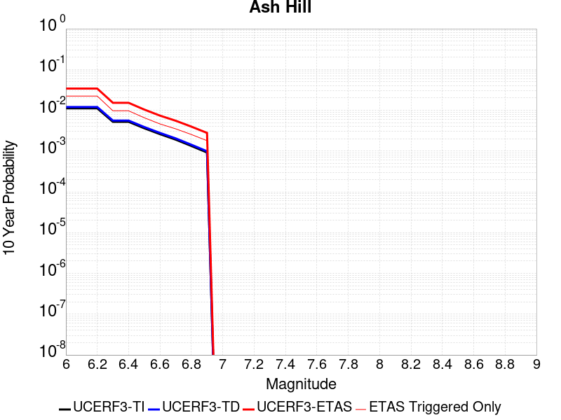 |

| Magnitude | 1 wk TI Prob | 1 wk TD Prob | 1 wk ETAS Prob | 1 wk ETAS/TD Gain | 1 wk ETAS Triggered Only | 1 mo TI Prob | 1 mo TD Prob | 1 mo ETAS Prob | 1 mo ETAS/TD Gain | 1 mo ETAS Triggered Only | 1 yr TI Prob | 1 yr TD Prob | 1 yr ETAS Prob | 1 yr ETAS/TD Gain | 1 yr ETAS Triggered Only | 10 yr TI Prob | 10 yr TD Prob | 10 yr ETAS Prob | 10 yr ETAS/TD Gain | 10 yr ETAS Triggered Only |
|-----|-----|-----|-----|-----|-----|-----|-----|-----|-----|-----|-----|-----|-----|-----|-----|-----|-----|-----|-----|-----|
| 6.0 | 2.1545662E-5 | 2.3194447E-5 | 0.011388974 | 491.02158 | 0.011366043 | 9.2335285E-5 | 9.940143E-5 | 0.01506438 | 151.55093 | 0.014966466 | 0.0011236023 | 0.0012096206 | 0.021375809 | 17.6715 | 0.020190611 | 0.011179381 | 0.012038348 | 0.03495013 | 2.903233 | 0.023190964 |
| 6.1 | 2.1545662E-5 | 2.3194447E-5 | 0.011388974 | 491.02158 | 0.011366043 | 9.2335285E-5 | 9.940143E-5 | 0.01506438 | 151.55093 | 0.014966466 | 0.0011236023 | 0.0012096206 | 0.021375809 | 17.6715 | 0.020190611 | 0.011179381 | 0.012038348 | 0.03495013 | 2.903233 | 0.023190964 |
| 6.2 | 2.1545662E-5 | 2.3194447E-5 | 0.011388974 | 491.02158 | 0.011366043 | 9.2335285E-5 | 9.940143E-5 | 0.01506438 | 151.55093 | 0.014966466 | 0.0011236023 | 0.0012096206 | 0.021375809 | 17.6715 | 0.020190611 | 0.011179381 | 0.012038348 | 0.03495013 | 2.903233 | 0.023190964 |
| 6.3 | 1.0025529E-5 | 1.0746934E-5 | 0.0046700686 | 434.54892 | 0.004659372 | 4.2965847E-5 | 4.605755E-5 | 0.006787717 | 147.37468 | 0.00674197 | 5.229836E-4 | 5.6061964E-4 | 0.0094155185 | 16.794842 | 0.008859866 | 0.005217545 | 0.0055933665 | 0.015702406 | 2.8073268 | 0.010165902 |
| 6.4 | 1.0025529E-5 | 1.0746934E-5 | 0.0046700686 | 434.54892 | 0.004659372 | 4.2965847E-5 | 4.605755E-5 | 0.006787717 | 147.37468 | 0.00674197 | 5.229836E-4 | 5.6061964E-4 | 0.0094155185 | 16.794842 | 0.008859866 | 0.005217545 | 0.0055933665 | 0.015702406 | 2.8073268 | 0.010165902 |
| 6.5 | 6.9617327E-6 | 7.456634E-6 | 0.0029371912 | 393.9031 | 0.0029297564 | 2.9835655E-5 | 3.195666E-5 | 0.0045146937 | 141.27551 | 0.0044828802 | 3.6318856E-4 | 3.8901155E-4 | 0.006493237 | 16.69163 | 0.0061066006 | 0.0036259557 | 0.0038841602 | 0.011021877 | 2.8376472 | 0.007165549 |
| 6.6 | 4.9919777E-6 | 5.3466883E-6 | 0.0020879335 | 390.50967 | 0.002082598 | 2.1394015E-5 | 2.2914215E-5 | 0.0032349832 | 141.17801 | 0.0032121425 | 2.60441E-4 | 2.7895154E-4 | 0.004513562 | 16.180452 | 0.0042357924 | 0.0026013597 | 0.0027866727 | 0.007890659 | 2.8315701 | 0.005118249 |
| 6.7 | 3.6630722E-6 | 3.924624E-6 | 0.0015570425 | 396.73676 | 0.0015531239 | 1.5698786E-5 | 1.681974E-5 | 0.0025582525 | 152.09822 | 0.0025414755 | 1.9111596E-4 | 2.0476682E-4 | 0.0034162516 | 16.683619 | 0.0032121425 | 0.0019095168 | 0.0020463446 | 0.0059212088 | 2.8935542 | 0.0038828098 |
| 6.8 | 2.5599613E-6 | 2.744925E-6 | 0.0011322865 | 412.50177 | 0.0011295447 | 1.0971216E-5 | 1.1763939E-5 | 0.0018472524 | 157.02669 | 0.00183551 | 1.3356637E-4 | 1.4322149E-4 | 0.0024019873 | 16.771137 | 0.0022590894 | 0.0013348613 | 0.0014317769 | 0.0042515956 | 2.9694538 | 0.0028238615 |
| 6.9 | 1.7684905E-6 | 1.8968707E-6 | 7.4315915E-4 | 391.78165 | 7.412637E-4 | 7.579223E-6 | 8.129446E-6 | 0.0013494528 | 165.99567 | 0.0013413343 | 9.2273134E-5 | 9.8976E-5 | 0.0018284201 | 18.473368 | 0.0017296153 | 9.223483E-4 | 9.8976E-4 | 0.0031408234 | 3.173318 | 0.0021531945 |

## Hunter Mountain-Saline Valley
*[(top)](#table-of-contents)*

| 1 Week | 1 Month | 1 Year | 10 Year |
|-----|-----|-----|-----|
| 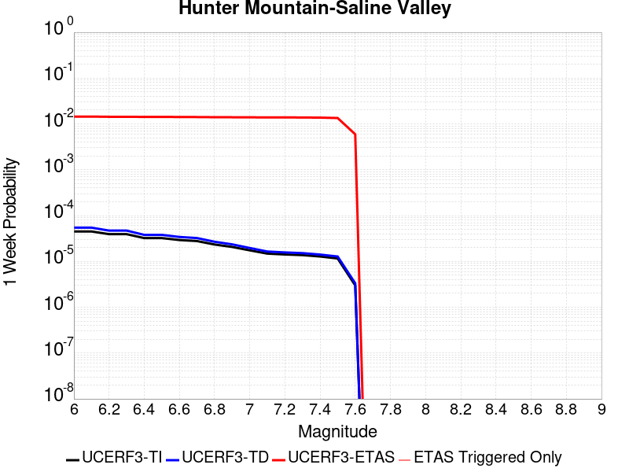 |  |  | 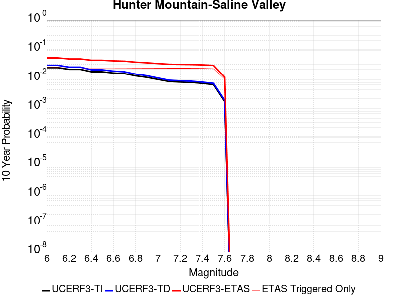 |

| Magnitude | 1 wk TI Prob | 1 wk TD Prob | 1 wk ETAS Prob | 1 wk ETAS/TD Gain | 1 wk ETAS Triggered Only | 1 mo TI Prob | 1 mo TD Prob | 1 mo ETAS Prob | 1 mo ETAS/TD Gain | 1 mo ETAS Triggered Only | 1 yr TI Prob | 1 yr TD Prob | 1 yr ETAS Prob | 1 yr ETAS/TD Gain | 1 yr ETAS Triggered Only | 10 yr TI Prob | 10 yr TD Prob | 10 yr ETAS Prob | 10 yr ETAS/TD Gain | 10 yr ETAS Triggered Only |
|-----|-----|-----|-----|-----|-----|-----|-----|-----|-----|-----|-----|-----|-----|-----|-----|-----|-----|-----|-----|-----|
| 6.0 | 4.5103672E-5 | 5.4570177E-5 | 0.014737849 | 270.0715 | 0.01468408 | 1.9328714E-4 | 2.3385242E-4 | 0.01752596 | 74.94453 | 0.017296152 | 0.002350731 | 0.0028435152 | 0.023751067 | 8.352714 | 0.020967172 | 0.023260195 | 0.028091887 | 0.050631374 | 1.8023486 | 0.023190964 |
| 6.1 | 4.5103672E-5 | 5.4570177E-5 | 0.014737849 | 270.0715 | 0.01468408 | 1.9328714E-4 | 2.3385242E-4 | 0.01752596 | 74.94453 | 0.017296152 | 0.002350731 | 0.0028435152 | 0.023751067 | 8.352714 | 0.020967172 | 0.023260195 | 0.028091887 | 0.050631374 | 1.8023486 | 0.023190964 |
| 6.2 | 3.9363465E-5 | 4.706337E-5 | 0.014624563 | 310.74194 | 0.014578186 | 1.6868966E-4 | 2.0168544E-4 | 0.017353185 | 86.04084 | 0.01715496 | 0.002051862 | 0.0024528175 | 0.023192503 | 9.455454 | 0.020790681 | 0.020330196 | 0.024273481 | 0.04672931 | 1.9251179 | 0.023014473 |
| 6.3 | 3.9363465E-5 | 4.706337E-5 | 0.014624563 | 310.74194 | 0.014578186 | 1.6868966E-4 | 2.0168544E-4 | 0.017353185 | 86.04084 | 0.01715496 | 0.002051862 | 0.0024528175 | 0.023192503 | 9.455454 | 0.020790681 | 0.020330196 | 0.024273481 | 0.04672931 | 1.9251179 | 0.023014473 |
| 6.4 | 3.2311684E-5 | 3.795099E-5 | 0.014509693 | 382.32712 | 0.014472291 | 1.384713E-4 | 1.6263737E-4 | 0.017208928 | 105.81165 | 0.017049065 | 0.0016845843 | 0.0019783843 | 0.02258702 | 11.416902 | 0.020649489 | 0.016718714 | 0.019616475 | 0.042006455 | 2.1413865 | 0.022837982 |
| 6.5 | 3.2311684E-5 | 3.795099E-5 | 0.014509693 | 382.32712 | 0.014472291 | 1.384713E-4 | 1.6263737E-4 | 0.017208928 | 105.81165 | 0.017049065 | 0.0016845843 | 0.0019783843 | 0.02258702 | 11.416902 | 0.020649489 | 0.016718714 | 0.019616475 | 0.042006455 | 2.1413865 | 0.022837982 |
| 6.6 | 2.9305844E-5 | 3.418183E-5 | 0.014400086 | 421.27896 | 0.014366396 | 1.2559042E-4 | 1.4648569E-4 | 0.017087173 | 116.64739 | 0.01694317 | 0.0015279909 | 0.001782067 | 0.02228905 | 12.507414 | 0.020543594 | 0.015175272 | 0.01768569 | 0.040050417 | 2.2645662 | 0.022767384 |
| 6.7 | 2.7826512E-5 | 3.2344276E-5 | 0.0142923845 | 441.88297 | 0.014260502 | 1.19251024E-4 | 1.386113E-4 | 0.016973553 | 122.45432 | 0.016837275 | 0.0014509142 | 0.0016863465 | 0.02208958 | 13.099076 | 0.020437699 | 0.014414776 | 0.016743187 | 0.038990542 | 2.3287408 | 0.022626191 |
| 6.8 | 2.3389874E-5 | 2.6866714E-5 | 0.014181093 | 527.8313 | 0.0141546065 | 1.0023846E-4 | 1.15138246E-4 | 0.016844591 | 146.29884 | 0.01673138 | 0.00121972 | 0.001400954 | 0.021633776 | 15.442175 | 0.020261208 | 0.01213047 | 0.013927434 | 0.03602966 | 2.586956 | 0.022414401 |
| 6.9 | 2.069209E-5 | 2.3570032E-5 | 0.014107248 | 598.5248 | 0.014084009 | 8.867737E-5 | 1.01010715E-4 | 0.01676011 | 165.9241 | 0.016660783 | 0.0010791123 | 0.0012291478 | 0.021324432 | 17.348957 | 0.020120014 | 0.010738871 | 0.012228523 | 0.034229364 | 2.7991412 | 0.022273209 |
| 7.0 | 1.7462342E-5 | 1.9633546E-5 | 0.013962177 | 711.1388 | 0.013942817 | 7.483646E-5 | 8.414118E-5 | 0.01653175 | 196.47633 | 0.016448993 | 9.1075303E-4 | 0.0010239601 | 0.0209118 | 20.422476 | 0.019908225 | 0.009070295 | 0.0101960525 | 0.031997595 | 3.1382334 | 0.022026122 |
| 7.1 | 1.4807709E-5 | 1.6441749E-5 | 0.01395903 | 848.999 | 0.013942817 | 6.3460066E-5 | 7.046283E-5 | 0.016518299 | 234.42569 | 0.016448993 | 7.723524E-4 | 8.575638E-4 | 0.020713449 | 24.153828 | 0.019872926 | 0.007696735 | 0.008545532 | 0.030348431 | 3.5513802 | 0.021990823 |
| 7.2 | 1.4180048E-5 | 1.5698337E-5 | 0.013958296 | 889.15765 | 0.013942817 | 6.077022E-5 | 6.727694E-5 | 0.016479868 | 244.95567 | 0.016413696 | 7.396263E-4 | 8.188051E-4 | 0.020604922 | 25.16462 | 0.01980233 | 0.0073716943 | 0.008160833 | 0.029902171 | 3.6641076 | 0.021920227 |
| 7.3 | 1.3730402E-5 | 1.5172075E-5 | 0.013887182 | 915.31195 | 0.01387222 | 5.8843252E-5 | 6.502165E-5 | 0.016407058 | 252.33223 | 0.0163431 | 7.161811E-4 | 7.9136714E-4 | 0.020472215 | 25.869427 | 0.019696435 | 0.007138774 | 0.007888422 | 0.029530672 | 3.743546 | 0.021814331 |
| 7.4 | 1.2810095E-5 | 1.4109277E-5 | 0.013744943 | 974.1777 | 0.013731027 | 5.489925E-5 | 6.0467017E-5 | 0.016226098 | 268.34625 | 0.016166607 | 6.681934E-4 | 7.359531E-4 | 0.02024153 | 27.503834 | 0.019519944 | 0.006661878 | 0.007338053 | 0.028782073 | 3.922304 | 0.021602541 |
| 7.5 | 1.1595659E-5 | 1.2800664E-5 | 0.013425971 | 1048.8496 | 0.013413343 | 4.9694736E-5 | 5.4858923E-5 | 0.015867617 | 289.24405 | 0.015813624 | 6.0486543E-4 | 6.6771836E-4 | 0.01982188 | 29.68599 | 0.019166961 | 0.006032217 | 0.0066599925 | 0.027697902 | 4.1588492 | 0.021178963 |
| 7.6 | 2.997694E-6 | 3.3251579E-6 | 0.006286396 | 1890.5558 | 0.0062830923 | 1.28471975E-5 | 1.425064E-5 | 0.007250293 | 508.76962 | 0.0072361454 | 1.564034E-4 | 1.73495E-4 | 0.008714194 | 50.22735 | 0.008542181 | 0.0015629337 | 0.001735031 | 0.011072843 | 6.381928 | 0.009354042 |

## Blackwater
*[(top)](#table-of-contents)*

| 1 Week | 1 Month | 1 Year | 10 Year |
|-----|-----|-----|-----|
|  |  |  |  |

| Magnitude | 1 wk TI Prob | 1 wk TD Prob | 1 wk ETAS Prob | 1 wk ETAS/TD Gain | 1 wk ETAS Triggered Only | 1 mo TI Prob | 1 mo TD Prob | 1 mo ETAS Prob | 1 mo ETAS/TD Gain | 1 mo ETAS Triggered Only | 1 yr TI Prob | 1 yr TD Prob | 1 yr ETAS Prob | 1 yr ETAS/TD Gain | 1 yr ETAS Triggered Only | 10 yr TI Prob | 10 yr TD Prob | 10 yr ETAS Prob | 10 yr ETAS/TD Gain | 10 yr ETAS Triggered Only |
|-----|-----|-----|-----|-----|-----|-----|-----|-----|-----|-----|-----|-----|-----|-----|-----|-----|-----|-----|-----|-----|
| 6.0 | 3.0708583E-5 | 3.3095846E-5 | 0.011292871 | 341.21716 | 0.011260148 | 1.3160157E-4 | 1.4183241E-4 | 0.014400311 | 101.53047 | 0.014260502 | 0.0016010714 | 0.0017255784 | 0.020577567 | 11.925025 | 0.018884575 | 0.015895851 | 0.017135633 | 0.038472082 | 2.2451508 | 0.021708436 |
| 6.1 | 3.0708583E-5 | 3.3095846E-5 | 0.011292871 | 341.21716 | 0.011260148 | 1.3160157E-4 | 1.4183241E-4 | 0.014400311 | 101.53047 | 0.014260502 | 0.0016010714 | 0.0017255784 | 0.020577567 | 11.925025 | 0.018884575 | 0.015895851 | 0.017135633 | 0.038472082 | 2.2451508 | 0.021708436 |
| 6.2 | 1.1707779E-5 | 1.2545122E-5 | 0.0043894756 | 349.89502 | 0.0043769856 | 5.017523E-5 | 5.3763757E-5 | 0.0053129233 | 98.81979 | 0.005259442 | 6.107122E-4 | 6.5438676E-4 | 0.0075683203 | 11.5655155 | 0.006918461 | 0.006090366 | 0.0065255696 | 0.014591193 | 2.236003 | 0.008118602 |
| 6.3 | 1.1707779E-5 | 1.2545122E-5 | 0.0043894756 | 349.89502 | 0.0043769856 | 5.017523E-5 | 5.3763757E-5 | 0.0053129233 | 98.81979 | 0.005259442 | 6.107122E-4 | 6.5438676E-4 | 0.0075683203 | 11.5655155 | 0.006918461 | 0.006090366 | 0.0065255696 | 0.014591193 | 2.236003 | 0.008118602 |
| 6.4 | 7.929244E-6 | 8.480098E-6 | 0.0027264238 | 321.50854 | 0.002717967 | 3.3982033E-5 | 3.6342793E-5 | 0.0031424777 | 86.4677 | 0.0031062479 | 4.136527E-4 | 4.423877E-4 | 0.0045704586 | 10.331341 | 0.004129898 | 0.0041288356 | 0.0044154758 | 0.009546268 | 2.162002 | 0.0051535475 |
| 6.5 | 5.8832115E-6 | 6.285991E-6 | 0.0020535728 | 326.6904 | 0.0020472996 | 2.521352E-5 | 2.6939697E-5 | 0.0024271575 | 90.09594 | 0.0024002823 | 3.0693135E-4 | 3.27944E-4 | 0.003433173 | 10.468779 | 0.0031062479 | 0.0030650778 | 0.0032748538 | 0.007215313 | 2.2032475 | 0.003953406 |
| 6.6 | 5.8832115E-6 | 6.285991E-6 | 0.0020535728 | 326.6904 | 0.0020472996 | 2.521352E-5 | 2.6939697E-5 | 0.0024271575 | 90.09594 | 0.0024002823 | 3.0693135E-4 | 3.27944E-4 | 0.003433173 | 10.468779 | 0.0031062479 | 0.0030650778 | 0.0032748538 | 0.007215313 | 2.2032475 | 0.003953406 |
| 6.7 | 3.0715053E-6 | 3.2814662E-6 | 9.563316E-4 | 291.43427 | 9.530533E-4 | 1.3163528E-5 | 1.4063357E-5 | 0.0012141877 | 86.336975 | 0.0012001412 | 1.6025416E-4 | 1.7120909E-4 | 0.0017593593 | 10.276086 | 0.0015884222 | 0.0016013865 | 0.0017108864 | 0.0037194456 | 2.1739874 | 0.0020120014 |
| 6.8 | 2.2722281E-6 | 2.4287538E-6 | 8.4958517E-4 | 349.80295 | 8.471585E-4 | 9.738084E-6 | 1.0408908E-5 | 0.001034048 | 99.34261 | 0.0010236498 | 1.1855473E-4 | 1.26722E-4 | 0.0014325925 | 11.305002 | 0.001306036 | 0.001184915 | 0.0012665876 | 0.002923505 | 2.3081744 | 0.0016590187 |
| 6.9 | 9.952399E-7 | 1.0653489E-6 | 2.4815297E-4 | 232.93118 | 2.4708788E-4 | 4.265307E-6 | 4.5657757E-6 | 2.8695064E-4 | 62.84817 | 2.8238617E-4 | 5.1928873E-5 | 5.5587418E-5 | 4.438468E-4 | 7.984663 | 3.8828098E-4 | 5.191674E-4 | 5.557858E-4 | 9.438509E-4 | 1.698228 | 3.8828098E-4 |
| 7.0 | 4.7385504E-7 | 5.0755597E-7 | 7.110406E-5 | 140.09108 | 7.059654E-5 | 2.0308057E-6 | 2.1752398E-6 | 1.0806982E-4 | 49.681797 | 1.0589481E-4 | 2.4724779E-5 | 2.6483543E-5 | 1.6767289E-4 | 6.33121 | 1.4119309E-4 | 2.4722028E-4 | 2.6483546E-4 | 4.0599113E-4 | 1.5329939 | 1.4119309E-4 |

## McLean Lake
*[(top)](#table-of-contents)*

| 1 Week | 1 Month | 1 Year | 10 Year |
|-----|-----|-----|-----|
|  |  |  |  |

| Magnitude | 1 wk TI Prob | 1 wk TD Prob | 1 wk ETAS Prob | 1 wk ETAS/TD Gain | 1 wk ETAS Triggered Only | 1 mo TI Prob | 1 mo TD Prob | 1 mo ETAS Prob | 1 mo ETAS/TD Gain | 1 mo ETAS Triggered Only | 1 yr TI Prob | 1 yr TD Prob | 1 yr ETAS Prob | 1 yr ETAS/TD Gain | 1 yr ETAS Triggered Only | 10 yr TI Prob | 10 yr TD Prob | 10 yr ETAS Prob | 10 yr ETAS/TD Gain | 10 yr ETAS Triggered Only |
|-----|-----|-----|-----|-----|-----|-----|-----|-----|-----|-----|-----|-----|-----|-----|-----|-----|-----|-----|-----|-----|
| 6.0 | 1.7360222E-5 | 1.8501627E-5 | 0.006830942 | 369.2076 | 0.006812566 | 7.439883E-5 | 7.9290556E-5 | 0.009538477 | 120.297775 | 0.009459936 | 9.0542925E-4 | 9.6498354E-4 | 0.014400647 | 14.923204 | 0.013448641 | 0.009017491 | 0.0096127745 | 0.025344305 | 2.6365235 | 0.015884222 |
| 6.1 | 9.062689E-6 | 9.592193E-6 | 0.003221704 | 335.86728 | 0.0032121425 | 3.8839516E-5 | 4.1108804E-5 | 0.0048061796 | 116.91363 | 0.0047652666 | 4.727685E-4 | 5.003936E-4 | 0.0075565153 | 15.101142 | 0.007059654 | 0.0047176396 | 0.004993552 | 0.01335259 | 2.6739664 | 0.008400989 |
| 6.2 | 9.062689E-6 | 9.592193E-6 | 0.003221704 | 335.86728 | 0.0032121425 | 3.8839516E-5 | 4.1108804E-5 | 0.0048061796 | 116.91363 | 0.0047652666 | 4.727685E-4 | 5.003936E-4 | 0.0075565153 | 15.101142 | 0.007059654 | 0.0047176396 | 0.004993552 | 0.01335259 | 2.6739664 | 0.008400989 |
| 6.3 | 7.2575485E-6 | 7.66771E-6 | 0.0026197196 | 341.6561 | 0.002612072 | 3.110341E-5 | 3.2861237E-5 | 0.0038449492 | 117.00561 | 0.0038122132 | 3.786182E-4 | 4.0001926E-4 | 0.00618662 | 15.465805 | 0.0057889163 | 0.0037797375 | 0.0039936965 | 0.010954842 | 2.743033 | 0.0069890576 |
| 6.4 | 7.2575485E-6 | 7.66771E-6 | 0.0026197196 | 341.6561 | 0.002612072 | 3.110341E-5 | 3.2861237E-5 | 0.0038449492 | 117.00561 | 0.0038122132 | 3.786182E-4 | 4.0001926E-4 | 0.00618662 | 15.465805 | 0.0057889163 | 0.0037797375 | 0.0039936965 | 0.010954842 | 2.743033 | 0.0069890576 |
| 6.5 | 6.06582E-6 | 6.4038773E-6 | 0.0019830943 | 309.6709 | 0.001976703 | 2.5996113E-5 | 2.7444936E-5 | 0.0031336076 | 114.177986 | 0.0031062479 | 3.164567E-4 | 3.3409733E-4 | 0.0052389177 | 15.680813 | 0.0049064597 | 0.0031600643 | 0.0033365893 | 0.009211732 | 2.7608228 | 0.0058948114 |
| 6.6 | 5.598744E-6 | 5.910262E-6 | 0.0017708134 | 299.61673 | 0.0017649136 | 2.3994397E-5 | 2.5329486E-5 | 0.0028491195 | 112.48233 | 0.0028238615 | 2.9209262E-4 | 3.0834923E-4 | 0.004860422 | 15.762718 | 0.004553477 | 0.0029170897 | 0.003079843 | 0.008534225 | 2.7709932 | 0.005471232 |
| 6.7 | 5.246996E-6 | 5.539162E-6 | 0.0016998467 | 306.87796 | 0.001694317 | 2.2486933E-5 | 2.3739085E-5 | 0.0026710464 | 112.51682 | 0.0026473703 | 2.73744E-4 | 2.8899137E-4 | 0.004664712 | 16.141354 | 0.0043769856 | 0.0027340704 | 0.0028867796 | 0.008095843 | 2.8044548 | 0.005224144 |
| 6.8 | 4.02324E-6 | 4.2469046E-6 | 0.0014514698 | 341.77124 | 0.0014472291 | 1.7242342E-5 | 1.8200926E-5 | 0.0021713562 | 119.29922 | 0.0021531945 | 2.099053E-4 | 2.2157968E-4 | 0.0036447532 | 16.44895 | 0.0034239322 | 0.0020970714 | 0.002214172 | 0.0061588245 | 2.7815475 | 0.003953406 |
| 6.9 | 6.835972E-7 | 7.1399285E-7 | 2.1250347E-4 | 297.6269 | 2.1178962E-4 | 2.9296991E-6 | 3.0599674E-6 | 2.501471E-4 | 81.74829 | 2.4708788E-4 | 3.56685E-5 | 3.7254784E-5 | 5.3141214E-4 | 14.264266 | 4.9417577E-4 | 3.5662777E-4 | 3.7251666E-4 | 9.723637E-4 | 2.6102557 | 6.000706E-4 |

## Goldstone Lake
*[(top)](#table-of-contents)*

| 1 Week | 1 Month | 1 Year | 10 Year |
|-----|-----|-----|-----|
|  |  |  | 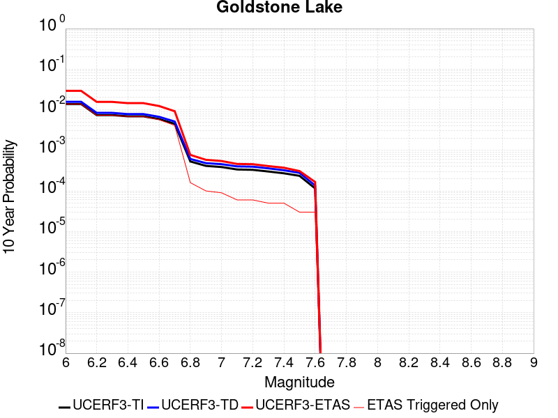 |

| Magnitude | 1 wk TI Prob | 1 wk TD Prob | 1 wk ETAS Prob | 1 wk ETAS/TD Gain | 1 wk ETAS Triggered Only | 1 mo TI Prob | 1 mo TD Prob | 1 mo ETAS Prob | 1 mo ETAS/TD Gain | 1 mo ETAS Triggered Only | 1 yr TI Prob | 1 yr TD Prob | 1 yr ETAS Prob | 1 yr ETAS/TD Gain | 1 yr ETAS Triggered Only | 10 yr TI Prob | 10 yr TD Prob | 10 yr ETAS Prob | 10 yr ETAS/TD Gain | 10 yr ETAS Triggered Only |
|-----|-----|-----|-----|-----|-----|-----|-----|-----|-----|-----|-----|-----|-----|-----|-----|-----|-----|-----|-----|-----|
| 6.0 | 2.671352E-5 | 3.037609E-5 | 0.0057838196 | 190.40698 | 0.005753618 | 1.1448149E-4 | 1.3017785E-4 | 0.007824199 | 60.10392 | 0.007695023 | 0.001392921 | 0.0015839594 | 0.012755787 | 8.0531025 | 0.011189552 | 0.013842222 | 0.015746197 | 0.028844103 | 1.831814 | 0.013307448 |
| 6.1 | 2.671352E-5 | 3.037609E-5 | 0.0057838196 | 190.40698 | 0.005753618 | 1.1448149E-4 | 1.3017785E-4 | 0.007824199 | 60.10392 | 0.007695023 | 0.001392921 | 0.0015839594 | 0.012755787 | 8.0531025 | 0.011189552 | 0.013842222 | 0.015746197 | 0.028844103 | 1.831814 | 0.013307448 |
| 6.2 | 1.4197047E-5 | 1.6096245E-5 | 0.0029458054 | 183.01198 | 0.0029297564 | 6.0843064E-5 | 6.8982634E-5 | 0.004057412 | 58.817875 | 0.0039887046 | 7.4051257E-4 | 8.3963864E-4 | 0.0069763805 | 8.308789 | 0.006141899 | 0.007380498 | 0.0083743585 | 0.01600494 | 1.9111841 | 0.007695023 |
| 6.3 | 1.4197047E-5 | 1.6096245E-5 | 0.0029458054 | 183.01198 | 0.0029297564 | 6.0843064E-5 | 6.8982634E-5 | 0.004057412 | 58.817875 | 0.0039887046 | 7.4051257E-4 | 8.3963864E-4 | 0.0069763805 | 8.308789 | 0.006141899 | 0.007380498 | 0.0083743585 | 0.01600494 | 1.9111841 | 0.007695023 |
| 6.4 | 1.3238931E-5 | 1.500846E-5 | 0.0027682323 | 184.4448 | 0.0027532652 | 5.6737044E-5 | 6.4320935E-5 | 0.003735105 | 58.069817 | 0.00367102 | 6.9055456E-4 | 7.82924E-4 | 0.006496767 | 8.29808 | 0.0057183197 | 0.006884126 | 0.0078112837 | 0.014885838 | 1.905684 | 0.007130251 |
| 6.5 | 1.3238931E-5 | 1.500846E-5 | 0.0027682323 | 184.4448 | 0.0027532652 | 5.6737044E-5 | 6.4320935E-5 | 0.003735105 | 58.069817 | 0.00367102 | 6.9055456E-4 | 7.82924E-4 | 0.006496767 | 8.29808 | 0.0057183197 | 0.006884126 | 0.0078112837 | 0.014885838 | 1.905684 | 0.007130251 |
| 6.6 | 1.1328278E-5 | 1.2855166E-5 | 0.0022719153 | 176.73172 | 0.0022590894 | 4.8548856E-5 | 5.5092944E-5 | 0.0031611696 | 57.37885 | 0.0031062479 | 5.90922E-4 | 6.7064585E-4 | 0.0055032657 | 8.205919 | 0.004835863 | 0.0058935313 | 0.0066956086 | 0.012656136 | 1.8902144 | 0.006000706 |
| 6.7 | 8.651175E-6 | 9.824565E-6 | 0.0016335291 | 166.26987 | 0.0016237204 | 3.707594E-5 | 4.2105108E-5 | 0.0023010992 | 54.65131 | 0.0022590894 | 4.5130608E-4 | 5.1259965E-4 | 0.004181738 | 8.157903 | 0.00367102 | 0.0045039062 | 0.005123051 | 0.009512731 | 1.8568486 | 0.0044122837 |
| 6.8 | 1.0215377E-6 | 1.1754702E-6 | 3.64737E-5 | 31.029028 | 3.529827E-5 | 4.378012E-6 | 5.0377203E-6 | 1.10932E-4 | 22.020277 | 1.0589481E-4 | 5.3300988E-5 | 6.1332634E-5 | 3.0840538E-4 | 5.0284057 | 2.4708788E-4 | 5.3288206E-4 | 6.1316835E-4 | 8.6010474E-4 | 1.402722 | 2.4708788E-4 |
| 6.9 | 7.9360774E-7 | 9.2833966E-7 | 9.2833966E-7 | 1.0 | 0.0 | 3.4011714E-6 | 3.9785928E-6 | 3.927672E-5 | 9.872014 | 3.529827E-5 | 4.1408475E-5 | 4.843836E-5 | 1.8962461E-4 | 3.9147608 | 1.4119309E-4 | 4.140076E-4 | 4.8428503E-4 | 6.254097E-4 | 1.2914083 | 1.4119309E-4 |
| 7.0 | 7.4382757E-7 | 8.7473285E-7 | 8.7473285E-7 | 1.0 | 0.0 | 3.1878285E-6 | 3.74885E-6 | 3.9046987E-5 | 10.415724 | 3.529827E-5 | 3.8811122E-5 | 4.564136E-5 | 1.5153133E-4 | 3.3200443 | 1.0589481E-4 | 3.8804344E-4 | 4.5632652E-4 | 5.62173E-4 | 1.2319534 | 1.0589481E-4 |
| 7.1 | 6.4709513E-7 | 7.7113E-7 | 7.7113E-7 | 1.0 | 0.0 | 2.773262E-6 | 3.3048389E-6 | 3.8602993E-5 | 11.680749 | 3.529827E-5 | 3.376394E-5 | 4.0235733E-5 | 1.1082943E-4 | 2.7545028 | 7.059654E-5 | 3.375881E-4 | 4.0229043E-4 | 4.7285858E-4 | 1.1754159 | 7.059654E-5 |
| 7.2 | 6.356704E-7 | 7.5883594E-7 | 7.5883594E-7 | 1.0 | 0.0 | 2.7242988E-6 | 3.2521505E-6 | 3.8550304E-5 | 11.853789 | 3.529827E-5 | 3.3167835E-5 | 3.959427E-5 | 1.1018802E-4 | 2.7829282 | 7.059654E-5 | 3.3162883E-4 | 3.958781E-4 | 4.664467E-4 | 1.1782584 | 7.059654E-5 |
| 7.3 | 5.7695723E-7 | 6.8965653E-7 | 6.8965653E-7 | 1.0 | 0.0 | 2.4726714E-6 | 2.9556677E-6 | 3.8253835E-5 | 12.942535 | 3.529827E-5 | 3.0104358E-5 | 3.5984718E-5 | 7.128172E-5 | 1.9808886 | 3.529827E-5 | 3.0100282E-4 | 3.5979465E-4 | 3.9508022E-4 | 1.0980715 | 3.529827E-5 |
| 7.4 | 5.209647E-7 | 6.193514E-7 | 6.193514E-7 | 1.0 | 0.0 | 2.232704E-6 | 2.6543607E-6 | 3.7952537E-5 | 14.298184 | 3.529827E-5 | 2.718283E-5 | 3.2316417E-5 | 6.7613546E-5 | 2.092235 | 3.529827E-5 | 2.7179506E-4 | 3.2312275E-4 | 3.584096E-4 | 1.1092057 | 3.529827E-5 |
| 7.5 | 4.512955E-7 | 5.348885E-7 | 5.348885E-7 | 1.0 | 0.0 | 1.934122E-6 | 2.2923775E-6 | 2.2923775E-6 | 1.0 | 0.0 | 2.3547682E-5 | 2.7909393E-5 | 2.7909393E-5 | 1.0 | 0.0 | 2.3545188E-4 | 2.7906417E-4 | 2.7906417E-4 | 1.0 | 0.0 |
| 7.6 | 2.21172E-7 | 2.603961E-7 | 2.603961E-7 | 1.0 | 0.0 | 9.478797E-7 | 1.1159829E-6 | 1.1159829E-6 | 1.0 | 0.0 | 1.1540374E-5 | 1.3587036E-5 | 1.3587036E-5 | 1.0 | 0.0 | 1.1539775E-4 | 1.3586486E-4 | 1.3586486E-4 | 1.0 | 0.0 |

## Garlock (West)
*[(top)](#table-of-contents)*

| 1 Week | 1 Month | 1 Year | 10 Year |
|-----|-----|-----|-----|
|  |  |  |  |

| Magnitude | 1 wk TI Prob | 1 wk TD Prob | 1 wk ETAS Prob | 1 wk ETAS/TD Gain | 1 wk ETAS Triggered Only | 1 mo TI Prob | 1 mo TD Prob | 1 mo ETAS Prob | 1 mo ETAS/TD Gain | 1 mo ETAS Triggered Only | 1 yr TI Prob | 1 yr TD Prob | 1 yr ETAS Prob | 1 yr ETAS/TD Gain | 1 yr ETAS Triggered Only | 10 yr TI Prob | 10 yr TD Prob | 10 yr ETAS Prob | 10 yr ETAS/TD Gain | 10 yr ETAS Triggered Only |
|-----|-----|-----|-----|-----|-----|-----|-----|-----|-----|-----|-----|-----|-----|-----|-----|-----|-----|-----|-----|-----|
| 6.0 | 2.5181727E-5 | 2.51973E-5 | 0.008637758 | 342.8049 | 0.008612778 | 1.0791722E-4 | 1.0798398E-4 | 0.010308082 | 95.45937 | 0.0102012 | 0.0013131002 | 0.0013139155 | 0.013863589 | 10.551355 | 0.012566185 | 0.013053683 | 0.013141977 | 0.02669255 | 2.031091 | 0.013731027 |
| 6.1 | 2.5077732E-5 | 2.5098372E-5 | 0.00863766 | 344.15222 | 0.008612778 | 1.0747157E-4 | 1.0756004E-4 | 0.010307663 | 95.83172 | 0.0102012 | 0.001307681 | 0.0013087603 | 0.013858498 | 10.589028 | 0.012566185 | 0.013000126 | 0.013091032 | 0.026642306 | 2.035157 | 0.013731027 |
| 6.2 | 2.494612E-5 | 2.498005E-5 | 0.008637543 | 345.77765 | 0.008612778 | 1.0690756E-4 | 1.0705298E-4 | 0.010307161 | 96.28093 | 0.0102012 | 0.0013008224 | 0.0013025942 | 0.01385241 | 10.634479 | 0.012566185 | 0.012932341 | 0.013030097 | 0.026582208 | 2.0400622 | 0.013731027 |
| 6.3 | 2.4733758E-5 | 2.479942E-5 | 0.008637364 | 348.28894 | 0.008612778 | 1.0599751E-4 | 1.06278916E-4 | 0.010306395 | 96.974976 | 0.0102012 | 0.0012897556 | 0.0012931811 | 0.013843115 | 10.7046995 | 0.012566185 | 0.012822957 | 0.012937066 | 0.026490454 | 2.04764 | 0.013731027 |
| 6.4 | 2.3237335E-5 | 2.317873E-5 | 0.008600459 | 371.04965 | 0.00857748 | 9.958477E-5 | 9.933365E-5 | 0.010264225 | 103.3308 | 0.010165902 | 0.0012117702 | 0.001208719 | 0.013689203 | 11.32538 | 0.012495588 | 0.012051838 | 0.012101916 | 0.025597028 | 2.115122 | 0.013660431 |
| 6.5 | 2.2732203E-5 | 2.2993298E-5 | 0.008600276 | 374.03403 | 0.00857748 | 9.742009E-5 | 9.8539E-5 | 0.010263439 | 104.15611 | 0.010165902 | 0.0011854442 | 0.0011990548 | 0.01367966 | 11.408703 | 0.012495588 | 0.011791403 | 0.012006322 | 0.025502741 | 2.1241093 | 0.013660431 |
| 6.6 | 2.1319436E-5 | 2.17735E-5 | 0.008563769 | 393.31155 | 0.008542181 | 9.136581E-5 | 9.331167E-5 | 0.01022297 | 109.55725 | 0.010130604 | 0.001111811 | 0.0011354799 | 0.0135463625 | 11.930078 | 0.0124249915 | 0.011062649 | 0.011377227 | 0.024777548 | 2.1778197 | 0.013554536 |
| 6.7 | 1.970802E-5 | 2.0393396E-5 | 0.008562401 | 419.86145 | 0.008542181 | 8.446021E-5 | 8.739735E-5 | 0.010217115 | 116.90418 | 0.010130604 | 0.001027818 | 0.001063545 | 0.013475321 | 12.670194 | 0.0124249915 | 0.010230771 | 0.010664964 | 0.024074942 | 2.257386 | 0.013554536 |
| 6.8 | 1.8744462E-5 | 1.9901045E-5 | 0.008561913 | 430.22427 | 0.008542181 | 8.033094E-5 | 8.5287415E-5 | 0.010215027 | 119.7718 | 0.010130604 | 9.775903E-4 | 0.0010378812 | 0.013449977 | 12.95907 | 0.0124249915 | 0.009733009 | 0.01041075 | 0.023754312 | 2.28171 | 0.01348394 |
| 6.9 | 1.7559682E-5 | 1.8953415E-5 | 0.008560973 | 451.685 | 0.008542181 | 7.5253614E-5 | 8.12264E-5 | 0.010211007 | 125.71045 | 0.010130604 | 9.158276E-4 | 9.884841E-4 | 0.013401194 | 13.557317 | 0.0124249915 | 0.0091206245 | 0.009921231 | 0.023271393 | 2.3456154 | 0.01348394 |
| 7.0 | 1.6794445E-5 | 1.8216237E-5 | 0.008489647 | 466.0483 | 0.008471585 | 7.197421E-5 | 7.8067256E-5 | 0.010101994 | 129.40115 | 0.010024709 | 8.759337E-4 | 9.5005584E-4 | 0.013186919 | 13.880152 | 0.0122485 | 0.008724891 | 0.009540141 | 0.022720633 | 2.3815827 | 0.013307448 |
| 7.1 | 1.6337795E-5 | 1.7717046E-5 | 0.0084891515 | 479.15167 | 0.008471585 | 7.0017246E-5 | 7.5927994E-5 | 0.010099876 | 133.01913 | 0.010024709 | 8.521265E-4 | 9.240326E-4 | 0.013161214 | 14.243237 | 0.0122485 | 0.008488664 | 0.009281996 | 0.022430955 | 2.4166088 | 0.0132721495 |
| 7.2 | 1.5780008E-5 | 1.7165687E-5 | 0.008488605 | 494.5101 | 0.008471585 | 6.762685E-5 | 7.356516E-5 | 0.010097536 | 137.25977 | 0.010024709 | 8.2304585E-4 | 8.9528906E-4 | 0.013132823 | 14.668807 | 0.0122485 | 0.008200042 | 0.008996838 | 0.02214958 | 2.4619293 | 0.0132721495 |
| 7.3 | 1.5058865E-5 | 1.6618762E-5 | 0.008488063 | 510.75183 | 0.008471585 | 6.45364E-5 | 7.122133E-5 | 0.010095216 | 141.74428 | 0.010024709 | 7.854473E-4 | 8.667759E-4 | 0.013069391 | 15.078166 | 0.012213201 | 0.00782677 | 0.008713539 | 0.02180006 | 2.5018606 | 0.013201553 |
| 7.4 | 1.4887923E-5 | 1.6454731E-5 | 0.008311411 | 505.1077 | 0.008295094 | 6.380382E-5 | 7.051838E-5 | 0.009812154 | 139.14322 | 0.009742322 | 7.7653467E-4 | 8.582243E-4 | 0.012743533 | 14.848721 | 0.011895517 | 0.0077382675 | 0.008628399 | 0.021366106 | 2.476254 | 0.01284857 |
| 7.5 | 1.4509299E-5 | 1.6046748E-5 | 0.0076756487 | 478.33047 | 0.0076597244 | 6.218123E-5 | 6.876997E-5 | 0.009104506 | 132.39072 | 0.0090363575 | 7.567935E-4 | 8.36954E-4 | 0.01177026 | 14.0632105 | 0.010942464 | 0.0075422134 | 0.008416704 | 0.0201771 | 2.3972683 | 0.011860219 |
| 7.6 | 1.2756717E-5 | 1.4050848E-5 | 0.0048851436 | 347.67606 | 0.004871161 | 5.4670498E-5 | 6.0216535E-5 | 0.005989969 | 99.47382 | 0.0059301094 | 6.6541E-4 | 7.328904E-4 | 0.007857915 | 10.721815 | 0.007130251 | 0.006634211 | 0.0073816874 | 0.01516006 | 2.0537388 | 0.007836216 |
| 7.7 | 1.0328985E-5 | 1.1460557E-5 | 0.0031529707 | 275.11496 | 0.0031415462 | 4.4266326E-5 | 4.911575E-5 | 0.0038964383 | 79.33175 | 0.0038475115 | 5.388092E-4 | 5.978206E-4 | 0.00521913 | 8.730261 | 0.0046240734 | 0.0053750467 | 0.006038511 | 0.011055684 | 1.8308625 | 0.005047653 |
| 7.8 | 7.0306583E-6 | 8.899601E-6 | 0.0018796913 | 211.21074 | 0.0018708083 | 3.0131043E-5 | 3.814059E-5 | 0.0024030346 | 63.00465 | 0.002364984 | 3.667837E-4 | 4.642629E-4 | 0.0033220954 | 7.155634 | 0.0028591598 | 0.003661789 | 0.0046952725 | 0.007822068 | 1.6659455 | 0.0031415462 |
| 7.9 | 4.060633E-6 | 5.4653938E-6 | 0.0011350039 | 207.671 | 0.0011295447 | 1.7402595E-5 | 2.3422906E-5 | 0.0013647258 | 58.264576 | 0.0013413343 | 2.11856E-4 | 2.851367E-4 | 0.0019083942 | 6.69291 | 0.0016237204 | 0.0021165414 | 0.002884201 | 0.0046088276 | 1.5979564 | 0.0017296153 |
| 8.0 | 1.6729537E-6 | 2.0775144E-6 | 4.256559E-4 | 204.88708 | 4.2357924E-4 | 7.169782E-6 | 8.903603E-6 | 5.0307496E-4 | 56.502407 | 4.9417577E-4 | 8.7288594E-5 | 1.0839601E-4 | 7.0840155E-4 | 6.5353103 | 6.000706E-4 | 8.7254314E-4 | 0.0010969337 | 0.0017316057 | 1.5785873 | 6.3536887E-4 |
| 8.1 | 3.6733252E-7 | 3.1489964E-7 | 7.091142E-5 | 225.18735 | 7.059654E-5 | 1.5742813E-6 | 1.3495693E-6 | 7.1946015E-5 | 53.310352 | 7.059654E-5 | 1.9166706E-5 | 1.6430899E-5 | 8.702628E-5 | 5.2965016 | 7.059654E-5 | 1.9165053E-4 | 1.6638759E-4 | 2.3697238E-4 | 1.4242191 | 7.059654E-5 |

## Gravel Hills-Harper Lk
*[(top)](#table-of-contents)*

| 1 Week | 1 Month | 1 Year | 10 Year |
|-----|-----|-----|-----|
|  |  |  |  |

| Magnitude | 1 wk TI Prob | 1 wk TD Prob | 1 wk ETAS Prob | 1 wk ETAS/TD Gain | 1 wk ETAS Triggered Only | 1 mo TI Prob | 1 mo TD Prob | 1 mo ETAS Prob | 1 mo ETAS/TD Gain | 1 mo ETAS Triggered Only | 1 yr TI Prob | 1 yr TD Prob | 1 yr ETAS Prob | 1 yr ETAS/TD Gain | 1 yr ETAS Triggered Only | 10 yr TI Prob | 10 yr TD Prob | 10 yr ETAS Prob | 10 yr ETAS/TD Gain | 10 yr ETAS Triggered Only |
|-----|-----|-----|-----|-----|-----|-----|-----|-----|-----|-----|-----|-----|-----|-----|-----|-----|-----|-----|-----|-----|
| 6.0 | 3.0679566E-5 | 3.1464646E-5 | 0.00518485 | 164.78336 | 0.0051535475 | 1.3147724E-4 | 1.3484273E-4 | 0.0070170774 | 52.03897 | 0.0068831625 | 0.0015995599 | 0.0016406906 | 0.011155587 | 6.799324 | 0.009530533 | 0.015880952 | 0.01630734 | 0.02734914 | 1.6771064 | 0.01122485 |
| 6.1 | 3.0679566E-5 | 3.1464646E-5 | 0.00518485 | 164.78336 | 0.0051535475 | 1.3147724E-4 | 1.3484273E-4 | 0.0070170774 | 52.03897 | 0.0068831625 | 0.0015995599 | 0.0016406906 | 0.011155587 | 6.799324 | 0.009530533 | 0.015880952 | 0.01630734 | 0.02734914 | 1.6771064 | 0.01122485 |
| 6.2 | 1.514536E-5 | 1.3635206E-5 | 0.0016020357 | 117.492584 | 0.0015884222 | 6.490707E-5 | 5.843536E-5 | 0.0021056153 | 36.03324 | 0.0020472996 | 7.8995706E-4 | 7.1123015E-4 | 0.0035683566 | 5.0171614 | 0.0028591598 | 0.007871548 | 0.0070907404 | 0.010525443 | 1.4843925 | 0.0034592305 |
| 6.3 | 1.514536E-5 | 1.3635206E-5 | 0.0016020357 | 117.492584 | 0.0015884222 | 6.490707E-5 | 5.843536E-5 | 0.0021056153 | 36.03324 | 0.0020472996 | 7.8995706E-4 | 7.1123015E-4 | 0.0035683566 | 5.0171614 | 0.0028591598 | 0.007871548 | 0.0070907404 | 0.010525443 | 1.4843925 | 0.0034592305 |
| 6.4 | 1.2532521E-5 | 1.06896905E-5 | 0.0011049244 | 103.36355 | 0.0010942464 | 5.37097E-5 | 4.581219E-5 | 0.0014576783 | 31.81857 | 0.0014119308 | 6.537194E-4 | 5.576265E-4 | 0.0025332274 | 4.542875 | 0.001976703 | 0.0065179965 | 0.005562863 | 0.008019997 | 1.4417031 | 0.002470879 |
| 6.5 | 1.1094058E-5 | 9.083664E-6 | 6.4444676E-4 | 70.94569 | 6.3536887E-4 | 4.7545094E-5 | 3.892943E-5 | 9.2135184E-4 | 23.667233 | 8.824568E-4 | 5.787078E-4 | 4.7386673E-4 | 0.0018498469 | 3.9037282 | 0.0013766326 | 0.0057720304 | 0.0047289706 | 0.0064504063 | 1.3640192 | 0.0017296153 |
| 6.6 | 9.688328E-6 | 7.5316952E-6 | 3.2521374E-4 | 43.179356 | 3.1768443E-4 | 4.1520743E-5 | 3.227831E-5 | 5.970324E-4 | 18.496397 | 5.6477234E-4 | 5.053978E-4 | 3.9292008E-4 | 0.0012397458 | 3.1552107 | 8.471585E-4 | 0.0050424994 | 0.0039225104 | 0.0050476245 | 1.2868352 | 0.0011295447 |
| 6.7 | 8.974824E-6 | 6.749413E-6 | 2.185376E-4 | 32.378757 | 2.1178962E-4 | 3.8462964E-5 | 2.8925748E-5 | 3.1130374E-4 | 10.762168 | 2.8238617E-4 | 4.6818596E-4 | 3.5211627E-4 | 9.1668975E-4 | 2.6033723 | 5.6477234E-4 | 0.004672008 | 0.0035158044 | 0.004254462 | 1.2100964 | 7.412637E-4 |
| 6.8 | 7.4780046E-6 | 5.1161933E-6 | 1.11010464E-4 | 21.697863 | 1.0589481E-4 | 3.20482E-5 | 2.1926366E-5 | 1.6311635E-4 | 7.439279 | 1.4119309E-4 | 3.9011694E-4 | 2.669222E-4 | 5.49233E-4 | 2.057652 | 2.8238617E-4 | 0.0038943281 | 0.0026661542 | 0.0029829915 | 1.1188369 | 3.1768443E-4 |
| 6.9 | 6.3409307E-6 | 3.9074966E-6 | 7.450376E-5 | 19.066877 | 7.059654E-5 | 2.7175134E-5 | 1.6746313E-5 | 1.2263935E-4 | 7.3233643 | 1.0589481E-4 | 3.3080703E-4 | 2.0386827E-4 | 3.8032365E-4 | 1.8655362 | 1.7649135E-4 | 0.0033031502 | 0.0020369107 | 0.0022130425 | 1.0864701 | 1.7649135E-4 |
| 7.0 | 5.1239335E-6 | 2.6058565E-6 | 2.6058565E-6 | 1.0 | 0.0 | 2.195953E-5 | 1.116791E-5 | 4.6465786E-5 | 4.160652 | 3.529827E-5 | 2.6732447E-4 | 1.3596108E-4 | 2.4184148E-4 | 1.7787553 | 1.0589481E-4 | 0.0026700313 | 0.0013588042 | 0.001464555 | 1.0778265 | 1.0589481E-4 |
| 7.1 | 4.438899E-6 | 2.0984728E-6 | 2.0984728E-6 | 1.0 | 0.0 | 1.9023713E-5 | 8.993425E-6 | 4.4291377E-5 | 4.924862 | 3.529827E-5 | 2.315891E-4 | 1.0948967E-4 | 2.1537289E-4 | 1.9670613 | 1.0589481E-4 | 0.002313479 | 0.0010943791 | 0.001200158 | 1.0966566 | 1.0589481E-4 |
| 7.2 | 3.50367E-6 | 1.2615716E-6 | 1.2615716E-6 | 1.0 | 0.0 | 1.5015643E-5 | 5.4067245E-6 | 4.0704803E-5 | 7.528551 | 3.529827E-5 | 1.8280011E-4 | 6.582497E-5 | 1.717128E-4 | 2.6086273 | 1.0589481E-4 | 0.0018264982 | 6.580629E-4 | 7.6388806E-4 | 1.1608131 | 1.0589481E-4 |
| 7.3 | 2.561638E-6 | 7.1191585E-7 | 7.1191585E-7 | 1.0 | 0.0 | 1.0978401E-5 | 3.0510646E-6 | 3.8349226E-5 | 12.56913 | 3.529827E-5 | 1.3365384E-4 | 3.71461E-5 | 7.244306E-5 | 1.9502199 | 3.529827E-5 | 0.0013357349 | 3.7140088E-4 | 4.0668604E-4 | 1.0950056 | 3.529827E-5 |
| 7.4 | 2.0368864E-6 | 5.304837E-7 | 5.304837E-7 | 1.0 | 0.0 | 8.729483E-6 | 2.2734996E-6 | 3.7571688E-5 | 16.525927 | 3.529827E-5 | 1.06276275E-4 | 2.7679513E-5 | 6.2976804E-5 | 2.2752137 | 3.529827E-5 | 0.0010622547 | 2.767612E-4 | 3.120497E-4 | 1.1275052 | 3.529827E-5 |
| 7.5 | 1.1681728E-6 | 3.6030585E-7 | 3.6030585E-7 | 1.0 | 0.0 | 5.0064455E-6 | 1.544167E-6 | 3.6842383E-5 | 23.859066 | 3.529827E-5 | 6.0951766E-5 | 1.8800076E-5 | 5.4097683E-5 | 2.8775246 | 3.529827E-5 | 6.093505E-4 | 1.8798532E-4 | 2.2327696E-4 | 1.1877362 | 3.529827E-5 |
| 7.6 | 1.3154387E-7 | 7.1197384E-8 | 7.1197384E-8 | 1.0 | 0.0 | 5.6375933E-7 | 3.051316E-7 | 3.051316E-7 | 1.0 | 0.0 | 6.863748E-6 | 3.7149728E-6 | 3.7149728E-6 | 1.0 | 0.0 | 6.863536E-5 | 3.7149264E-5 | 3.7149264E-5 | 1.0 | 0.0 |

## Coyote Canyon
*[(top)](#table-of-contents)*

| 1 Week | 1 Month | 1 Year | 10 Year |
|-----|-----|-----|-----|
| 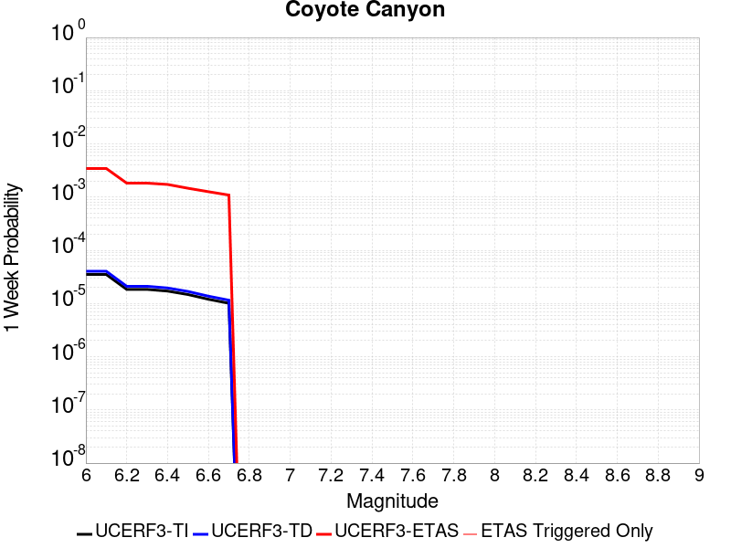 |  | 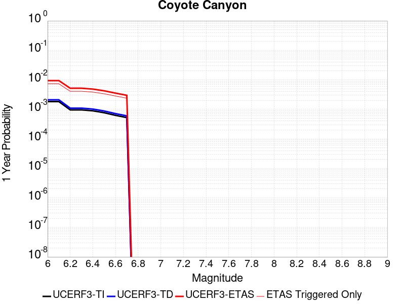 |  |

| Magnitude | 1 wk TI Prob | 1 wk TD Prob | 1 wk ETAS Prob | 1 wk ETAS/TD Gain | 1 wk ETAS Triggered Only | 1 mo TI Prob | 1 mo TD Prob | 1 mo ETAS Prob | 1 mo ETAS/TD Gain | 1 mo ETAS Triggered Only | 1 yr TI Prob | 1 yr TD Prob | 1 yr ETAS Prob | 1 yr ETAS/TD Gain | 1 yr ETAS Triggered Only | 10 yr TI Prob | 10 yr TD Prob | 10 yr ETAS Prob | 10 yr ETAS/TD Gain | 10 yr ETAS Triggered Only |
|-----|-----|-----|-----|-----|-----|-----|-----|-----|-----|-----|-----|-----|-----|-----|-----|-----|-----|-----|-----|-----|
| 6.0 | 3.5090034E-5 | 4.0364324E-5 | 0.0038524237 | 95.4413 | 0.0038122132 | 1.503772E-4 | 1.7297994E-4 | 0.005325636 | 30.787592 | 0.0051535475 | 0.0018293047 | 0.0021042528 | 0.009712636 | 4.615717 | 0.0076244264 | 0.018143194 | 0.020869201 | 0.029889785 | 1.4322438 | 0.009212849 |
| 6.1 | 3.5090034E-5 | 4.0364324E-5 | 0.0038524237 | 95.4413 | 0.0038122132 | 1.503772E-4 | 1.7297994E-4 | 0.005325636 | 30.787592 | 0.0051535475 | 0.0018293047 | 0.0021042528 | 0.009712636 | 4.615717 | 0.0076244264 | 0.018143194 | 0.020869201 | 0.029889785 | 1.4322438 | 0.009212849 |
| 6.2 | 1.841879E-5 | 2.1059794E-5 | 0.002103614 | 99.88768 | 0.002082598 | 7.8935285E-5 | 9.0253714E-5 | 0.0029491556 | 32.67628 | 0.0028591598 | 9.606133E-4 | 0.001098387 | 0.0057173814 | 5.205252 | 0.0046240734 | 0.0095647145 | 0.010939667 | 0.016455783 | 1.5042306 | 0.0055771265 |
| 6.3 | 1.841879E-5 | 2.1059794E-5 | 0.002103614 | 99.88768 | 0.002082598 | 7.8935285E-5 | 9.0253714E-5 | 0.0029491556 | 32.67628 | 0.0028591598 | 9.606133E-4 | 0.001098387 | 0.0057173814 | 5.205252 | 0.0046240734 | 0.0095647145 | 0.010939667 | 0.016455783 | 1.5042306 | 0.0055771265 |
| 6.4 | 1.712201E-5 | 1.9565212E-5 | 0.0019256346 | 98.42135 | 0.0019061066 | 7.337798E-5 | 8.3848776E-5 | 0.0028015878 | 33.412384 | 0.002717967 | 8.930107E-4 | 0.0010204813 | 0.005357738 | 5.250207 | 0.004341687 | 0.008894307 | 0.010167871 | 0.015373835 | 1.5120015 | 0.005259442 |
| 6.5 | 1.4744935E-5 | 1.6836972E-5 | 0.0016405301 | 97.43617 | 0.0016237204 | 6.3191044E-5 | 7.215698E-5 | 0.002472266 | 34.26233 | 0.0024002823 | 7.6907943E-4 | 8.7825063E-4 | 0.0047929175 | 5.457346 | 0.003918108 | 0.007664232 | 0.008756994 | 0.013445542 | 1.5354061 | 0.004729968 |
| 6.6 | 1.2017839E-5 | 1.37240895E-5 | 0.0013197422 | 96.16246 | 0.001306036 | 5.150401E-5 | 5.88167E-5 | 0.0019648112 | 33.40567 | 0.0019061066 | 6.268809E-4 | 7.159466E-4 | 0.0038199704 | 5.335552 | 0.0031062479 | 0.0062511545 | 0.0071450938 | 0.010930068 | 1.5297306 | 0.0038122132 |
| 6.7 | 1.00956095E-5 | 1.1533517E-5 | 0.0011410651 | 98.934715 | 0.0011295447 | 4.326618E-5 | 4.942891E-5 | 0.0017436622 | 35.27616 | 0.001694317 | 5.266384E-4 | 6.017178E-4 | 0.003176941 | 5.2797856 | 0.0025767738 | 0.005253921 | 0.0060094125 | 0.009202252 | 1.5313064 | 0.0032121425 |

## Death Valley (So)
*[(top)](#table-of-contents)*

| 1 Week | 1 Month | 1 Year | 10 Year |
|-----|-----|-----|-----|
|  |  |  |  |

| Magnitude | 1 wk TI Prob | 1 wk TD Prob | 1 wk ETAS Prob | 1 wk ETAS/TD Gain | 1 wk ETAS Triggered Only | 1 mo TI Prob | 1 mo TD Prob | 1 mo ETAS Prob | 1 mo ETAS/TD Gain | 1 mo ETAS Triggered Only | 1 yr TI Prob | 1 yr TD Prob | 1 yr ETAS Prob | 1 yr ETAS/TD Gain | 1 yr ETAS Triggered Only | 10 yr TI Prob | 10 yr TD Prob | 10 yr ETAS Prob | 10 yr ETAS/TD Gain | 10 yr ETAS Triggered Only |
|-----|-----|-----|-----|-----|-----|-----|-----|-----|-----|-----|-----|-----|-----|-----|-----|-----|-----|-----|-----|-----|
| 6.0 | 2.0684236E-5 | 2.5617775E-5 | 0.0045436807 | 177.36436 | 0.0045181788 | 8.864371E-5 | 1.0978594E-4 | 0.0058627725 | 53.401848 | 0.005753618 | 0.0010787029 | 0.0013358411 | 0.009232092 | 6.91107 | 0.007906812 | 0.010734817 | 0.013281397 | 0.022546032 | 1.697565 | 0.00938934 |
| 6.1 | 2.0684236E-5 | 2.5617775E-5 | 0.0045436807 | 177.36436 | 0.0045181788 | 8.864371E-5 | 1.0978594E-4 | 0.0058627725 | 53.401848 | 0.005753618 | 0.0010787029 | 0.0013358411 | 0.009232092 | 6.91107 | 0.007906812 | 0.010734817 | 0.013281397 | 0.022546032 | 1.697565 | 0.00938934 |
| 6.2 | 2.0684236E-5 | 2.5617775E-5 | 0.0045436807 | 177.36436 | 0.0045181788 | 8.864371E-5 | 1.0978594E-4 | 0.0058627725 | 53.401848 | 0.005753618 | 0.0010787029 | 0.0013358411 | 0.009232092 | 6.91107 | 0.007906812 | 0.010734817 | 0.013281397 | 0.022546032 | 1.697565 | 0.00938934 |
| 6.3 | 2.0240292E-5 | 2.511786E-5 | 0.0041902093 | 166.8219 | 0.004165196 | 8.6741224E-5 | 1.07643624E-4 | 0.005507698 | 51.166035 | 0.0054006353 | 0.0010555626 | 0.00130979 | 0.008853726 | 6.759653 | 0.00755383 | 0.010505628 | 0.013023956 | 0.021733593 | 1.6687397 | 0.008824567 |
| 6.4 | 2.0240292E-5 | 2.511786E-5 | 0.0041902093 | 166.8219 | 0.004165196 | 8.6741224E-5 | 1.07643624E-4 | 0.005507698 | 51.166035 | 0.0054006353 | 0.0010555626 | 0.00130979 | 0.008853726 | 6.759653 | 0.00755383 | 0.010505628 | 0.013023956 | 0.021733593 | 1.6687397 | 0.008824567 |
| 6.5 | 1.9962767E-5 | 2.4807114E-5 | 0.004154602 | 167.47624 | 0.004129898 | 8.55519E-5 | 1.0631196E-4 | 0.0054710787 | 51.462494 | 0.0053653372 | 0.0010410968 | 0.0012935963 | 0.008731897 | 6.750094 | 0.007447935 | 0.010362327 | 0.012863902 | 0.021400731 | 1.6636267 | 0.008648076 |
| 6.6 | 1.8937297E-5 | 2.3310964E-5 | 0.0039060302 | 167.56192 | 0.0038828098 | 8.115732E-5 | 9.990039E-5 | 0.0051470487 | 51.52181 | 0.005047653 | 9.876423E-4 | 0.0012156231 | 0.008055164 | 6.626365 | 0.0068478645 | 0.009832645 | 0.012092789 | 0.020043472 | 1.6574731 | 0.008048005 |
| 6.7 | 1.8621096E-5 | 2.2911607E-5 | 0.00365855 | 159.68109 | 0.0036357217 | 7.980225E-5 | 9.818898E-5 | 0.0048982822 | 49.886272 | 0.0048005646 | 9.711593E-4 | 0.0011948098 | 0.0077171875 | 6.4589257 | 0.00653018 | 0.009669261 | 0.011886904 | 0.019490456 | 1.639658 | 0.007695023 |
| 6.8 | 1.7830353E-5 | 2.1805688E-5 | 0.0035162582 | 161.25418 | 0.0034945288 | 7.641356E-5 | 9.344968E-5 | 0.004717091 | 50.477337 | 0.0046240734 | 9.29938E-4 | 0.00113717 | 0.007413117 | 6.518917 | 0.0062830923 | 0.009260561 | 0.011316354 | 0.01854041 | 1.6383731 | 0.007306742 |
| 6.9 | 1.3135183E-5 | 1.5303925E-5 | 0.0022743586 | 148.61276 | 0.0022590894 | 5.6292425E-5 | 6.558664E-5 | 0.0030304468 | 46.20525 | 0.0029650547 | 6.8514474E-4 | 7.982312E-4 | 0.0049248324 | 6.169681 | 0.004129898 | 0.006830362 | 0.007954649 | 0.012717026 | 1.5986912 | 0.0048005646 |
| 7.0 | 1.1507512E-5 | 1.3154199E-5 | 0.001495662 | 113.70225 | 0.0014825274 | 4.9316975E-5 | 5.6373956E-5 | 0.0020682618 | 36.68825 | 0.0020120014 | 6.002687E-4 | 6.8614254E-4 | 0.0035786147 | 5.2155557 | 0.0028944581 | 0.0059864987 | 0.0068409415 | 0.010171337 | 1.486833 | 0.0033533357 |
| 7.1 | 9.715903E-6 | 1.0865278E-5 | 5.7563145E-4 | 52.978992 | 5.6477234E-4 | 4.1638916E-5 | 4.656467E-5 | 7.8779383E-4 | 16.918274 | 7.412637E-4 | 5.068359E-4 | 5.667817E-4 | 0.0017309644 | 3.0540233 | 0.001164843 | 0.0050568148 | 0.0056538144 | 0.006987565 | 1.2359028 | 0.0013413343 |
| 7.2 | 9.233269E-6 | 1.02863105E-5 | 4.338612E-4 | 42.178505 | 4.2357924E-4 | 3.9570554E-5 | 4.4083466E-5 | 5.3823745E-4 | 12.209509 | 4.9417577E-4 | 4.81665E-4 | 5.3658825E-4 | 0.0013480128 | 2.5121922 | 8.118602E-4 | 0.0048062233 | 0.0053533576 | 0.006301309 | 1.177076 | 9.530533E-4 |
| 7.3 | 8.8041315E-6 | 9.808164E-6 | 3.2748948E-4 | 33.38948 | 3.1768443E-4 | 3.7731446E-5 | 4.2034335E-5 | 4.30299E-4 | 10.236845 | 3.8828098E-4 | 4.592835E-4 | 5.1165203E-4 | 0.0011466958 | 2.2411633 | 6.3536887E-4 | 0.0045833546 | 0.005105167 | 0.0058777644 | 1.1513363 | 7.7656197E-4 |
| 7.4 | 8.708749E-6 | 9.707175E-6 | 2.5679267E-4 | 26.453903 | 2.4708788E-4 | 3.7322676E-5 | 4.160154E-5 | 3.2397595E-4 | 7.7875953 | 2.8238617E-4 | 4.5430884E-4 | 5.0638523E-4 | 0.0010355911 | 2.0450659 | 5.2947405E-4 | 0.004533812 | 0.0050527398 | 0.0056848982 | 1.125112 | 6.3536887E-4 |
| 7.5 | 8.612678E-6 | 9.604817E-6 | 2.5669034E-4 | 26.725166 | 2.4708788E-4 | 3.6910955E-5 | 4.1162875E-5 | 3.2353742E-4 | 7.859932 | 2.8238617E-4 | 4.492982E-4 | 5.01047E-4 | 0.0010302557 | 2.0562057 | 5.2947405E-4 | 0.004483909 | 0.0049995985 | 0.005631791 | 1.1264486 | 6.3536887E-4 |
| 7.6 | 8.319024E-6 | 9.283916E-6 | 2.2107158E-4 | 23.812319 | 2.1178962E-4 | 3.5652476E-5 | 3.978763E-5 | 2.868657E-4 | 7.2099214 | 2.4708788E-4 | 4.3398244E-4 | 4.8431093E-4 | 9.782474E-4 | 2.0198746 | 4.9417577E-4 | 0.0043313587 | 0.0048329784 | 0.0053950213 | 1.1162933 | 5.6477234E-4 |
| 7.7 | 7.4718328E-6 | 8.34517E-6 | 1.4953707E-4 | 17.918997 | 1.4119309E-4 | 3.2021748E-5 | 3.5764548E-5 | 2.1224958E-4 | 5.9346366 | 1.7649135E-4 | 3.8979502E-4 | 4.353504E-4 | 7.5289654E-4 | 1.7294036 | 3.1768443E-4 | 0.00389112 | 0.0043453807 | 0.0046968292 | 1.0808787 | 3.529827E-4 |
| 7.8 | 3.4586725E-7 | 3.6482615E-7 | 3.6482615E-7 | 1.0 | 0.0 | 1.4822873E-6 | 1.5635396E-6 | 1.5635396E-6 | 1.0 | 0.0 | 1.80467E-5 | 1.9035933E-5 | 1.9035933E-5 | 1.0 | 0.0 | 1.8045233E-4 | 1.9034347E-4 | 1.9034347E-4 | 1.0 | 0.0 |
| 7.9 | 2.5591178E-9 | 2.6696718E-9 | 2.6696718E-9 | 1.0 | 0.0 | 1.0967647E-8 | 1.14414505E-8 | 1.14414505E-8 | 1.0 | 0.0 | 1.335311E-7 | 1.3929966E-7 | 1.3929966E-7 | 1.0 | 0.0 | 1.3353102E-6 | 1.3929966E-6 | 1.3929966E-6 | 1.0 | 0.0 |

## Nelson Lake
*[(top)](#table-of-contents)*

| 1 Week | 1 Month | 1 Year | 10 Year |
|-----|-----|-----|-----|
|  |  |  |  |

| Magnitude | 1 wk TI Prob | 1 wk TD Prob | 1 wk ETAS Prob | 1 wk ETAS/TD Gain | 1 wk ETAS Triggered Only | 1 mo TI Prob | 1 mo TD Prob | 1 mo ETAS Prob | 1 mo ETAS/TD Gain | 1 mo ETAS Triggered Only | 1 yr TI Prob | 1 yr TD Prob | 1 yr ETAS Prob | 1 yr ETAS/TD Gain | 1 yr ETAS Triggered Only | 10 yr TI Prob | 10 yr TD Prob | 10 yr ETAS Prob | 10 yr ETAS/TD Gain | 10 yr ETAS Triggered Only |
|-----|-----|-----|-----|-----|-----|-----|-----|-----|-----|-----|-----|-----|-----|-----|-----|-----|-----|-----|-----|-----|
| 6.0 | 9.913453E-6 | 1.0192255E-5 | 0.0027987272 | 274.5935 | 0.0027885633 | 4.2485535E-5 | 4.3680422E-5 | 0.0041733976 | 95.5439 | 0.004129898 | 5.1713863E-4 | 5.316897E-4 | 0.007023118 | 13.209054 | 0.0064948816 | 0.0051593683 | 0.005305204 | 0.013275403 | 2.5023358 | 0.008012707 |
| 6.1 | 9.913453E-6 | 1.0192255E-5 | 0.0027987272 | 274.5935 | 0.0027885633 | 4.2485535E-5 | 4.3680422E-5 | 0.0041733976 | 95.5439 | 0.004129898 | 5.1713863E-4 | 5.316897E-4 | 0.007023118 | 13.209054 | 0.0064948816 | 0.0051593683 | 0.005305204 | 0.013275403 | 2.5023358 | 0.008012707 |
| 6.2 | 4.5596407E-6 | 4.696313E-6 | 9.930432E-4 | 211.45168 | 9.883515E-4 | 1.954117E-5 | 2.0126909E-5 | 0.0015732195 | 78.16499 | 0.0015531239 | 2.3788778E-4 | 2.4501883E-4 | 0.00292703 | 11.946144 | 0.0026826686 | 0.0023763329 | 0.0024476128 | 0.0057927407 | 2.36669 | 0.0033533357 |
| 6.3 | 4.5596407E-6 | 4.696313E-6 | 9.930432E-4 | 211.45168 | 9.883515E-4 | 1.954117E-5 | 2.0126909E-5 | 0.0015732195 | 78.16499 | 0.0015531239 | 2.3788778E-4 | 2.4501883E-4 | 0.00292703 | 11.946144 | 0.0026826686 | 0.0023763329 | 0.0024476128 | 0.0057927407 | 2.36669 | 0.0033533357 |
| 6.4 | 3.4025713E-6 | 3.5098972E-6 | 7.44771E-4 | 212.19168 | 7.412637E-4 | 1.4582367E-5 | 1.5042335E-5 | 0.0012857609 | 85.47616 | 0.0012707377 | 1.7752586E-4 | 1.8312587E-4 | 0.0023712178 | 12.948568 | 0.0021884928 | 0.001773841 | 0.0018298327 | 0.0044723586 | 2.4441354 | 0.0026473703 |
| 6.5 | 2.8352947E-6 | 2.927856E-6 | 6.3829485E-4 | 218.0076 | 6.3536887E-4 | 1.2151207E-5 | 1.2547898E-5 | 0.0011420784 | 91.0175 | 0.0011295447 | 1.479309E-4 | 1.5276071E-4 | 0.0020232832 | 13.244788 | 0.0018708083 | 0.0014783246 | 0.0015266308 | 0.0037117826 | 2.4313557 | 0.0021884928 |
| 6.6 | 2.251518E-6 | 2.3290677E-6 | 6.0239824E-4 | 258.64352 | 6.000706E-4 | 9.649328E-6 | 9.981683E-6 | 0.0010689192 | 107.08807 | 0.0010589481 | 1.1747423E-4 | 1.2152085E-4 | 0.001850926 | 15.231344 | 0.0017296153 | 0.0011741214 | 0.0012146058 | 0.0032241633 | 2.6544938 | 0.0020120014 |
| 6.7 | 1.8911853E-6 | 1.9591396E-6 | 4.9613393E-4 | 253.24072 | 4.9417577E-4 | 8.105055E-6 | 8.39629E-6 | 9.614416E-4 | 114.50792 | 9.530533E-4 | 9.867457E-5 | 1.0222061E-4 | 0.001619891 | 15.847011 | 0.0015178256 | 9.863076E-4 | 0.0010217935 | 0.0027496414 | 2.6909955 | 0.0017296153 |
| 6.8 | 1.4874814E-6 | 1.5438305E-6 | 4.6042065E-4 | 298.23264 | 4.588775E-4 | 6.374905E-6 | 6.6164025E-6 | 7.478752E-4 | 113.03351 | 7.412637E-4 | 7.76117E-5 | 8.055224E-5 | 0.0012805967 | 15.8977165 | 0.0012001412 | 7.75846E-4 | 8.0528157E-4 | 0.0022160753 | 2.7519262 | 0.0014119308 |
| 6.9 | 6.835972E-7 | 7.1399285E-7 | 2.1250347E-4 | 297.6269 | 2.1178962E-4 | 2.9296991E-6 | 3.0599674E-6 | 2.501471E-4 | 81.74829 | 2.4708788E-4 | 3.56685E-5 | 3.7254784E-5 | 5.3141214E-4 | 14.264266 | 4.9417577E-4 | 3.5662777E-4 | 3.7251666E-4 | 9.723637E-4 | 2.6102557 | 6.000706E-4 |

## So Sierra Nevada
*[(top)](#table-of-contents)*

| 1 Week | 1 Month | 1 Year | 10 Year |
|-----|-----|-----|-----|
|  | 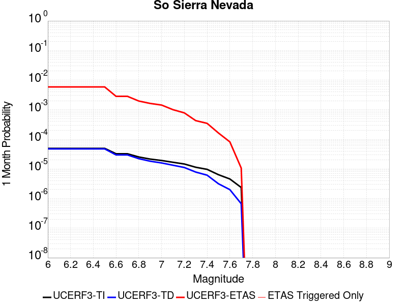 |  |  |

| Magnitude | 1 wk TI Prob | 1 wk TD Prob | 1 wk ETAS Prob | 1 wk ETAS/TD Gain | 1 wk ETAS Triggered Only | 1 mo TI Prob | 1 mo TD Prob | 1 mo ETAS Prob | 1 mo ETAS/TD Gain | 1 mo ETAS Triggered Only | 1 yr TI Prob | 1 yr TD Prob | 1 yr ETAS Prob | 1 yr ETAS/TD Gain | 1 yr ETAS Triggered Only | 10 yr TI Prob | 10 yr TD Prob | 10 yr ETAS Prob | 10 yr ETAS/TD Gain | 10 yr ETAS Triggered Only |
|-----|-----|-----|-----|-----|-----|-----|-----|-----|-----|-----|-----|-----|-----|-----|-----|-----|-----|-----|-----|-----|
| 6.0 | 1.15488665E-5 | 1.1079643E-5 | 0.0041409316 | 373.74234 | 0.004129898 | 4.9494203E-5 | 4.748339E-5 | 0.0058008283 | 122.16542 | 0.005753618 | 6.024253E-4 | 5.7796965E-4 | 0.008127433 | 14.062041 | 0.00755383 | 0.006007948 | 0.005765934 | 0.014574715 | 2.5277283 | 0.008859866 |
| 6.1 | 1.15488665E-5 | 1.1079643E-5 | 0.0041409316 | 373.74234 | 0.004129898 | 4.9494203E-5 | 4.748339E-5 | 0.0058008283 | 122.16542 | 0.005753618 | 6.024253E-4 | 5.7796965E-4 | 0.008127433 | 14.062041 | 0.00755383 | 0.006007948 | 0.005765934 | 0.014574715 | 2.5277283 | 0.008859866 |
| 6.2 | 1.15488665E-5 | 1.1079643E-5 | 0.0041409316 | 373.74234 | 0.004129898 | 4.9494203E-5 | 4.748339E-5 | 0.0058008283 | 122.16542 | 0.005753618 | 6.024253E-4 | 5.7796965E-4 | 0.008127433 | 14.062041 | 0.00755383 | 0.006007948 | 0.005765934 | 0.014574715 | 2.5277283 | 0.008859866 |
| 6.3 | 1.15488665E-5 | 1.1079643E-5 | 0.0041409316 | 373.74234 | 0.004129898 | 4.9494203E-5 | 4.748339E-5 | 0.0058008283 | 122.16542 | 0.005753618 | 6.024253E-4 | 5.7796965E-4 | 0.008127433 | 14.062041 | 0.00755383 | 0.006007948 | 0.005765934 | 0.014574715 | 2.5277283 | 0.008859866 |
| 6.4 | 1.15488665E-5 | 1.1079643E-5 | 0.0041409316 | 373.74234 | 0.004129898 | 4.9494203E-5 | 4.748339E-5 | 0.0058008283 | 122.16542 | 0.005753618 | 6.024253E-4 | 5.7796965E-4 | 0.008127433 | 14.062041 | 0.00755383 | 0.006007948 | 0.005765934 | 0.014574715 | 2.5277283 | 0.008859866 |
| 6.5 | 1.15488665E-5 | 1.1079643E-5 | 0.0041409316 | 373.74234 | 0.004129898 | 4.9494203E-5 | 4.748339E-5 | 0.0058008283 | 122.16542 | 0.005753618 | 6.024253E-4 | 5.7796965E-4 | 0.008127433 | 14.062041 | 0.00755383 | 0.006007948 | 0.005765934 | 0.014574715 | 2.5277283 | 0.008859866 |
| 6.6 | 7.587044E-6 | 6.935635E-6 | 0.0023366052 | 336.89853 | 0.002329686 | 3.2515498E-5 | 2.9723828E-5 | 0.0031358793 | 105.50052 | 0.0031062479 | 3.9580427E-4 | 3.6183043E-4 | 0.004490234 | 12.409773 | 0.004129898 | 0.003951 | 0.0036127048 | 0.008290415 | 2.2947943 | 0.00469467 |
| 6.7 | 7.587044E-6 | 6.935635E-6 | 0.0023366052 | 336.89853 | 0.002329686 | 3.2515498E-5 | 2.9723828E-5 | 0.0031358793 | 105.50052 | 0.0031062479 | 3.9580427E-4 | 3.6183043E-4 | 0.004490234 | 12.409773 | 0.004129898 | 0.003951 | 0.0036127048 | 0.008290415 | 2.2947943 | 0.00469467 |
| 6.8 | 5.9026956E-6 | 5.1793927E-6 | 0.0015229972 | 294.04938 | 0.0015178256 | 2.5297022E-5 | 2.2197215E-5 | 0.002034154 | 91.64005 | 0.0020120014 | 3.0794772E-4 | 2.7021873E-4 | 0.0029521624 | 10.925084 | 0.0026826686 | 0.0030752132 | 0.002699018 | 0.005796882 | 2.1477745 | 0.0031062479 |
| 6.9 | 5.0118915E-6 | 4.2524252E-6 | 0.001345581 | 316.42673 | 0.0013413343 | 2.1479358E-5 | 1.8224557E-5 | 0.0017831059 | 97.840836 | 0.0017649136 | 2.614798E-4 | 2.2186211E-4 | 0.0024804503 | 11.180143 | 0.0022590894 | 0.0026117235 | 0.0022164788 | 0.004857981 | 2.1917562 | 0.0026473703 |
| 7.0 | 4.4924795E-6 | 3.7139177E-6 | 0.0012391488 | 333.65005 | 0.0012354394 | 1.925334E-5 | 1.5916696E-5 | 0.0016396113 | 103.01203 | 0.0016237204 | 2.3438422E-4 | 1.9376918E-4 | 0.0022759635 | 11.745746 | 0.002082598 | 0.0023413717 | 0.0019360651 | 0.0043317005 | 2.2373734 | 0.0024002823 |
| 7.1 | 3.9118436E-6 | 3.1119775E-6 | 9.208642E-4 | 295.90964 | 9.17755E-4 | 1.6764936E-5 | 1.3336982E-5 | 0.0011781644 | 88.33816 | 0.001164843 | 2.0409399E-4 | 1.6236622E-4 | 0.001715238 | 10.564007 | 0.0015531239 | 0.0020390663 | 0.001622532 | 0.003455064 | 2.1294272 | 0.00183551 |
| 7.2 | 3.4200818E-6 | 2.6054543E-6 | 6.3797267E-4 | 244.86043 | 6.3536887E-4 | 1.4657411E-5 | 1.11661875E-5 | 8.583152E-4 | 76.86735 | 8.471585E-4 | 1.7843937E-4 | 1.3594035E-4 | 0.0013006249 | 9.567615 | 0.001164843 | 0.0017829615 | 0.0013586218 | 0.0026981337 | 1.9859344 | 0.0013413343 |
| 7.3 | 2.6593618E-6 | 1.8284203E-6 | 4.2540688E-4 | 232.66362 | 4.2357924E-4 | 1.13972155E-5 | 7.836065E-6 | 5.0200796E-4 | 64.06378 | 4.9417577E-4 | 1.3875226E-4 | 9.540021E-5 | 8.3659316E-4 | 8.769301 | 7.412637E-4 | 0.0013866565 | 9.5362146E-4 | 0.0018352367 | 1.9244918 | 8.824568E-4 |
| 7.4 | 2.2577992E-6 | 1.436438E-6 | 3.5441865E-4 | 246.73438 | 3.529827E-4 | 9.676246E-6 | 6.15615E-6 | 3.9443473E-4 | 64.07166 | 3.8828098E-4 | 1.1780193E-4 | 7.49488E-5 | 6.749744E-4 | 9.005807 | 6.000706E-4 | 0.001177395 | 7.492603E-4 | 0.0014899686 | 1.9885861 | 7.412637E-4 |
| 7.5 | 1.489319E-6 | 7.353936E-7 | 2.1252486E-4 | 288.99472 | 2.1178962E-4 | 6.3827797E-6 | 3.1516831E-6 | 2.1494064E-4 | 68.198685 | 2.1178962E-4 | 7.770758E-5 | 3.8371072E-5 | 3.560433E-4 | 9.278952 | 3.1768443E-4 | 7.7680405E-4 | 3.836449E-4 | 7.3649216E-4 | 1.9197236 | 3.529827E-4 |
| 7.6 | 1.0680322E-6 | 4.6596554E-7 | 1.4165898E-4 | 304.01172 | 1.4119309E-4 | 4.577273E-6 | 1.9969937E-6 | 1.431898E-4 | 71.702675 | 1.4119309E-4 | 5.5726876E-5 | 2.4313129E-5 | 2.0080019E-4 | 8.25892 | 1.7649135E-4 | 5.5712904E-4 | 2.4310495E-4 | 4.548431E-4 | 1.8709742 | 2.1178962E-4 |
| 7.7 | 5.509146E-7 | 1.5580486E-7 | 3.5454068E-5 | 227.55432 | 3.529827E-5 | 2.3610605E-6 | 6.677349E-7 | 3.5965983E-5 | 53.862663 | 3.529827E-5 | 2.8745531E-5 | 8.129644E-6 | 4.3427626E-5 | 5.3418856 | 3.529827E-5 | 2.8741814E-4 | 8.1293576E-5 | 1.1658898E-4 | 1.434172 | 3.529827E-5 |

## San Andreas (Mojave S)
*[(top)](#table-of-contents)*

| 1 Week | 1 Month | 1 Year | 10 Year |
|-----|-----|-----|-----|
|  | 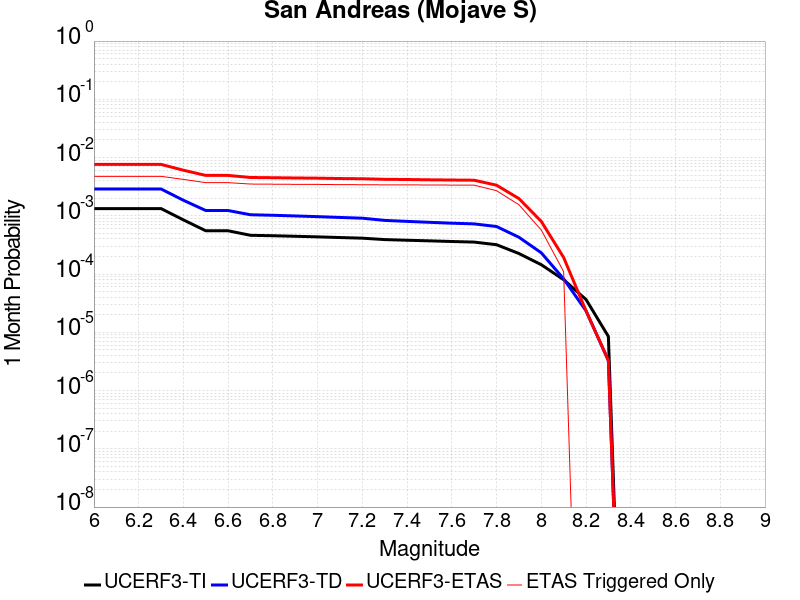 |  |  |

| Magnitude | 1 wk TI Prob | 1 wk TD Prob | 1 wk ETAS Prob | 1 wk ETAS/TD Gain | 1 wk ETAS Triggered Only | 1 mo TI Prob | 1 mo TD Prob | 1 mo ETAS Prob | 1 mo ETAS/TD Gain | 1 mo ETAS Triggered Only | 1 yr TI Prob | 1 yr TD Prob | 1 yr ETAS Prob | 1 yr ETAS/TD Gain | 1 yr ETAS Triggered Only | 10 yr TI Prob | 10 yr TD Prob | 10 yr ETAS Prob | 10 yr ETAS/TD Gain | 10 yr ETAS Triggered Only |
|-----|-----|-----|-----|-----|-----|-----|-----|-----|-----|-----|-----|-----|-----|-----|-----|-----|-----|-----|-----|-----|
| 6.0 | 3.1064058E-4 | 6.7460834E-4 | 0.0044842497 | 6.64719 | 0.0038122132 | 0.0013306376 | 0.0028881032 | 0.0076748035 | 2.6573853 | 0.0048005646 | 0.016080605 | 0.03462235 | 0.0405516 | 1.171255 | 0.006141899 | 0.1496549 | 0.28660452 | 0.29154012 | 1.017221 | 0.006918461 |
| 6.1 | 3.1064058E-4 | 6.7460834E-4 | 0.0044842497 | 6.64719 | 0.0038122132 | 0.0013306376 | 0.0028881032 | 0.0076748035 | 2.6573853 | 0.0048005646 | 0.016080605 | 0.03462235 | 0.0405516 | 1.171255 | 0.006141899 | 0.1496549 | 0.28660452 | 0.29154012 | 1.017221 | 0.006918461 |
| 6.2 | 3.1064058E-4 | 6.7460834E-4 | 0.0044842497 | 6.64719 | 0.0038122132 | 0.0013306376 | 0.0028881032 | 0.0076748035 | 2.6573853 | 0.0048005646 | 0.016080605 | 0.03462235 | 0.0405516 | 1.171255 | 0.006141899 | 0.1496549 | 0.28660452 | 0.29154012 | 1.017221 | 0.006918461 |
| 6.3 | 3.1064058E-4 | 6.7460834E-4 | 0.0044842497 | 6.64719 | 0.0038122132 | 0.0013306376 | 0.0028881032 | 0.0076748035 | 2.6573853 | 0.0048005646 | 0.016080605 | 0.03462235 | 0.0405516 | 1.171255 | 0.006141899 | 0.1496549 | 0.28660452 | 0.29154012 | 1.017221 | 0.006918461 |
| 6.4 | 1.9872203E-4 | 4.3179357E-4 | 0.0037131154 | 8.599283 | 0.003282739 | 8.5138786E-4 | 0.0018492596 | 0.005936287 | 3.2100885 | 0.0040945993 | 0.010316478 | 0.02228844 | 0.0272581 | 1.2229702 | 0.005082951 | 0.098504856 | 0.19699748 | 0.20170268 | 1.0238845 | 0.005859513 |
| 6.5 | 1.291105E-4 | 2.875267E-4 | 0.0032517288 | 11.309311 | 0.0029650547 | 5.5321335E-4 | 0.0012316781 | 0.0049334313 | 4.005455 | 0.0037063183 | 0.006714592 | 0.0148934 | 0.019274741 | 1.2941802 | 0.004447582 | 0.065152965 | 0.13803436 | 0.14244612 | 1.0319613 | 0.005118249 |
| 6.6 | 1.291105E-4 | 2.875267E-4 | 0.0032517288 | 11.309311 | 0.0029650547 | 5.5321335E-4 | 0.0012316781 | 0.0049334313 | 4.005455 | 0.0037063183 | 0.006714592 | 0.0148934 | 0.019274741 | 1.2941802 | 0.004447582 | 0.065152965 | 0.13803436 | 0.14244612 | 1.0319613 | 0.005118249 |
| 6.7 | 1.08001186E-4 | 2.4333889E-4 | 0.0030312238 | 12.4567995 | 0.0027885633 | 4.6278012E-4 | 0.0010424647 | 0.0044628275 | 4.281035 | 0.0034239322 | 0.0056198016 | 0.012618446 | 0.016731083 | 1.3259227 | 0.004165196 | 0.054797906 | 0.119176775 | 0.123405226 | 1.0354805 | 0.0048005646 |
| 6.8 | 1.0624356E-4 | 2.3851555E-4 | 0.002991124 | 12.540583 | 0.0027532652 | 4.5525006E-4 | 0.0010218095 | 0.004406981 | 4.312918 | 0.003388634 | 0.0055285925 | 0.012369843 | 0.016448654 | 1.3297384 | 0.004129898 | 0.053930566 | 0.11712591 | 0.12130188 | 1.0356536 | 0.004729968 |
| 6.9 | 1.0393785E-4 | 2.3221898E-4 | 0.0029142646 | 12.54964 | 0.0026826686 | 4.4537184E-4 | 9.948451E-4 | 0.0043095816 | 4.331912 | 0.0033180374 | 0.0054089287 | 0.012045221 | 0.016055627 | 1.3329458 | 0.004059301 | 0.05279156 | 0.11442335 | 0.118549585 | 1.036061 | 0.004659372 |
| 7.0 | 1.0155622E-4 | 2.2591476E-4 | 0.0029079772 | 12.872011 | 0.0026826686 | 4.3516833E-4 | 9.6784724E-4 | 0.0042826734 | 4.4249477 | 0.0033180374 | 0.005285311 | 0.0117200995 | 0.015696941 | 1.339318 | 0.0040240027 | 0.05161361 | 0.111683756 | 0.115791395 | 1.0367792 | 0.0046240734 |
| 7.1 | 9.885595E-5 | 2.1879886E-4 | 0.0029008805 | 13.258206 | 0.0026826686 | 4.2359953E-4 | 9.3737274E-4 | 0.0042523 | 4.536402 | 0.0033180374 | 0.0051451353 | 0.011352993 | 0.015331311 | 1.3504202 | 0.0040240027 | 0.05027629 | 0.1085682 | 0.112658784 | 1.0376775 | 0.0045887753 |
| 7.2 | 9.6411415E-5 | 2.124288E-4 | 0.0028945275 | 13.625871 | 0.0026826686 | 4.1312634E-4 | 9.1009185E-4 | 0.0042251097 | 4.642509 | 0.0033180374 | 0.005018219 | 0.011024255 | 0.015003897 | 1.3609896 | 0.0040240027 | 0.049064007 | 0.105758004 | 0.10986148 | 1.0388006 | 0.0045887753 |
| 7.3 | 9.1180635E-5 | 1.9471257E-4 | 0.0028415674 | 14.593651 | 0.0026473703 | 3.907156E-4 | 8.342157E-4 | 0.004114216 | 4.9318376 | 0.003282739 | 0.004746591 | 0.01010939 | 0.014057771 | 1.3905658 | 0.0039887046 | 0.046464786 | 0.09795115 | 0.10205861 | 1.0419338 | 0.004553477 |
| 7.4 | 8.887388E-5 | 1.8719878E-4 | 0.0028340735 | 15.1393795 | 0.0026473703 | 3.8083247E-4 | 8.020339E-4 | 0.00408214 | 5.089735 | 0.003282739 | 0.0046267817 | 0.00972114 | 0.01367107 | 1.4063237 | 0.0039887046 | 0.045316286 | 0.09458615 | 0.09870893 | 1.0435876 | 0.004553477 |
| 7.5 | 8.6750515E-5 | 1.8051457E-4 | 0.002792115 | 15.467533 | 0.002612072 | 3.7173493E-4 | 7.7340455E-4 | 0.0040183337 | 5.195643 | 0.0032474408 | 0.004516484 | 0.009375632 | 0.013257005 | 1.4139853 | 0.003918108 | 0.04425787 | 0.091549896 | 0.09562237 | 1.0444837 | 0.0044828802 |
| 7.6 | 8.453092E-5 | 1.7439072E-4 | 0.0027860072 | 15.975662 | 0.002612072 | 3.6222505E-4 | 7.471748E-4 | 0.003992189 | 5.343046 | 0.0032474408 | 0.0044011753 | 0.009058985 | 0.012941598 | 1.4285927 | 0.003918108 | 0.04315024 | 0.08870898 | 0.09279419 | 1.0460519 | 0.0044828802 |
| 7.7 | 8.259102E-5 | 1.6961215E-4 | 0.0027812412 | 16.397652 | 0.002612072 | 3.539135E-4 | 7.2670676E-4 | 0.0039717876 | 5.4654613 | 0.0032474408 | 0.004300386 | 0.008811831 | 0.012695412 | 1.4407237 | 0.003918108 | 0.042181134 | 0.08645982 | 0.09055512 | 1.0473664 | 0.0044828802 |
| 7.8 | 7.444844E-5 | 1.5283503E-4 | 0.002164529 | 14.1625185 | 0.0020120014 | 3.1902574E-4 | 6.548429E-4 | 0.0031946541 | 4.8785048 | 0.0025414755 | 0.0038772223 | 0.007943616 | 0.011025189 | 1.3879308 | 0.0031062479 | 0.03810269 | 0.078290746 | 0.08157676 | 1.0419719 | 0.0035651254 |
| 7.9 | 5.2586525E-5 | 1.00064186E-4 | 0.0013000853 | 12.992514 | 0.0012001412 | 2.2535135E-4 | 4.2877605E-4 | 0.0018401014 | 4.291521 | 0.0014119308 | 0.0027402006 | 0.005207864 | 0.006963586 | 1.337129 | 0.0017649136 | 0.027066574 | 0.052200034 | 0.054073554 | 1.0358912 | 0.001976703 |
| 8.0 | 3.379877E-5 | 5.4074168E-5 | 5.1292684E-4 | 9.485618 | 4.588775E-4 | 1.4484383E-4 | 2.3172585E-4 | 7.610772E-4 | 3.2843864 | 5.2947405E-4 | 0.0017620471 | 0.002817614 | 0.0034863914 | 1.237356 | 6.7066716E-4 | 0.017481409 | 0.028834904 | 0.029520512 | 1.023777 | 7.059654E-4 |
| 8.1 | 1.8668277E-5 | 1.9309397E-5 | 8.990458E-5 | 4.656001 | 7.059654E-5 | 8.000444E-5 | 8.275194E-5 | 1.5334264E-4 | 1.8530399 | 7.059654E-5 | 9.736188E-4 | 0.0010070398 | 0.0010775652 | 1.0700325 | 7.059654E-5 | 0.009693642 | 0.010798888 | 0.010868723 | 1.0064667 | 7.059654E-5 |
| 8.2 | 8.541571E-6 | 5.460819E-6 | 5.460819E-6 | 1.0 | 0.0 | 3.660622E-5 | 2.3403301E-5 | 2.3403301E-5 | 1.0 | 0.0 | 4.455896E-4 | 2.84898E-4 | 2.84898E-4 | 1.0 | 0.0 | 0.0044469717 | 0.0032408056 | 0.0032408056 | 1.0 | 0.0 |
| 8.3 | 1.983087E-6 | 7.6599065E-7 | 7.6599065E-7 | 1.0 | 0.0 | 8.498917E-6 | 3.282813E-6 | 3.282813E-6 | 1.0 | 0.0 | 1.034694E-4 | 3.9967534E-5 | 3.9967534E-5 | 1.0 | 0.0 | 0.0010342124 | 4.719687E-4 | 4.719687E-4 | 1.0 | 0.0 |

## Towne Pass
*[(top)](#table-of-contents)*

| 1 Week | 1 Month | 1 Year | 10 Year |
|-----|-----|-----|-----|
|  |  |  | 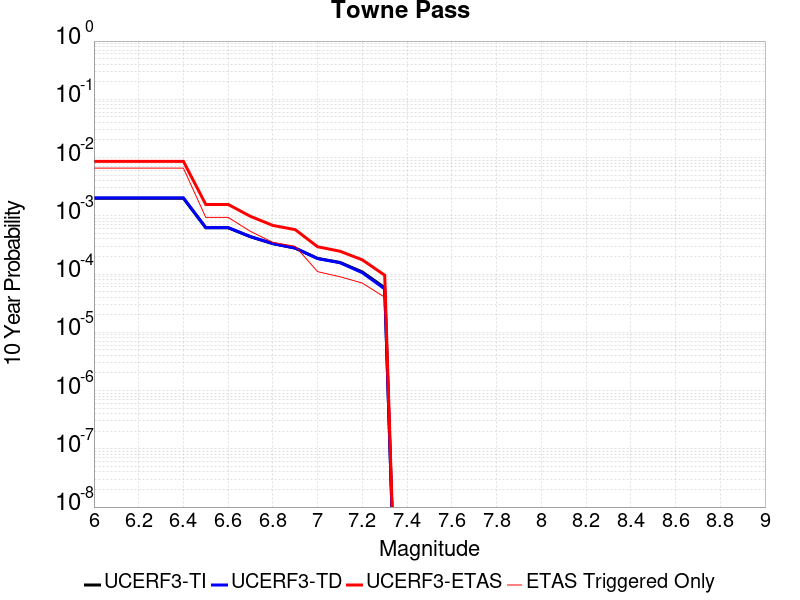 |

| Magnitude | 1 wk TI Prob | 1 wk TD Prob | 1 wk ETAS Prob | 1 wk ETAS/TD Gain | 1 wk ETAS Triggered Only | 1 mo TI Prob | 1 mo TD Prob | 1 mo ETAS Prob | 1 mo ETAS/TD Gain | 1 mo ETAS Triggered Only | 1 yr TI Prob | 1 yr TD Prob | 1 yr ETAS Prob | 1 yr ETAS/TD Gain | 1 yr ETAS Triggered Only | 10 yr TI Prob | 10 yr TD Prob | 10 yr ETAS Prob | 10 yr ETAS/TD Gain | 10 yr ETAS Triggered Only |
|-----|-----|-----|-----|-----|-----|-----|-----|-----|-----|-----|-----|-----|-----|-----|-----|-----|-----|-----|-----|-----|
| 6.0 | 3.849728E-6 | 3.8945414E-6 | 0.0029336396 | 753.2696 | 0.0029297564 | 1.649873E-5 | 1.669081E-5 | 0.0037935427 | 227.28333 | 0.003776915 | 2.0085352E-4 | 2.0319603E-4 | 0.005496861 | 27.05201 | 0.0052947407 | 0.0020067208 | 0.0020305314 | 0.008336092 | 4.1053743 | 0.0063183904 |
| 6.1 | 3.849728E-6 | 3.8945414E-6 | 0.0029336396 | 753.2696 | 0.0029297564 | 1.649873E-5 | 1.669081E-5 | 0.0037935427 | 227.28333 | 0.003776915 | 2.0085352E-4 | 2.0319603E-4 | 0.005496861 | 27.05201 | 0.0052947407 | 0.0020067208 | 0.0020305314 | 0.008336092 | 4.1053743 | 0.0063183904 |
| 6.2 | 3.849728E-6 | 3.8945414E-6 | 0.0029336396 | 753.2696 | 0.0029297564 | 1.649873E-5 | 1.669081E-5 | 0.0037935427 | 227.28333 | 0.003776915 | 2.0085352E-4 | 2.0319603E-4 | 0.005496861 | 27.05201 | 0.0052947407 | 0.0020067208 | 0.0020305314 | 0.008336092 | 4.1053743 | 0.0063183904 |
| 6.3 | 3.849728E-6 | 3.8945414E-6 | 0.0029336396 | 753.2696 | 0.0029297564 | 1.649873E-5 | 1.669081E-5 | 0.0037935427 | 227.28333 | 0.003776915 | 2.0085352E-4 | 2.0319603E-4 | 0.005496861 | 27.05201 | 0.0052947407 | 0.0020067208 | 0.0020305314 | 0.008336092 | 4.1053743 | 0.0063183904 |
| 6.4 | 3.849728E-6 | 3.8945414E-6 | 0.0029336396 | 753.2696 | 0.0029297564 | 1.649873E-5 | 1.669081E-5 | 0.0037935427 | 227.28333 | 0.003776915 | 2.0085352E-4 | 2.0319603E-4 | 0.005496861 | 27.05201 | 0.0052947407 | 0.0020067208 | 0.0020305314 | 0.008336092 | 4.1053743 | 0.0063183904 |
| 6.5 | 1.1953545E-6 | 1.203052E-6 | 6.718694E-4 | 558.47076 | 6.7066716E-4 | 5.1229376E-6 | 5.1559277E-6 | 6.758196E-4 | 131.07623 | 6.7066716E-4 | 6.236998E-5 | 6.277173E-5 | 8.392849E-4 | 13.370428 | 7.7656197E-4 | 6.235248E-4 | 6.275517E-4 | 0.0015800069 | 2.517732 | 9.530533E-4 |
| 6.6 | 1.1953545E-6 | 1.203052E-6 | 6.718694E-4 | 558.47076 | 6.7066716E-4 | 5.1229376E-6 | 5.1559277E-6 | 6.758196E-4 | 131.07623 | 6.7066716E-4 | 6.236998E-5 | 6.277173E-5 | 8.392849E-4 | 13.370428 | 7.7656197E-4 | 6.235248E-4 | 6.275517E-4 | 0.0015800069 | 2.517732 | 9.530533E-4 |
| 6.7 | 8.375951E-7 | 8.4106705E-7 | 3.891217E-4 | 462.65244 | 3.8828098E-4 | 3.5896885E-6 | 3.6045683E-6 | 3.9188415E-4 | 108.71874 | 3.8828098E-4 | 4.370358E-5 | 4.3884793E-5 | 4.3214872E-4 | 9.847345 | 3.8828098E-4 | 4.3694986E-4 | 4.38767E-4 | 9.3272596E-4 | 2.1257887 | 4.9417577E-4 |
| 6.8 | 6.38041E-7 | 6.392156E-7 | 2.4772694E-4 | 387.5483 | 2.4708788E-4 | 2.7344586E-6 | 2.7394929E-6 | 2.498267E-4 | 91.1945 | 2.4708788E-4 | 3.3291526E-5 | 3.3352855E-5 | 2.8043252E-4 | 8.4080515 | 2.4708788E-4 | 3.3286537E-4 | 3.334823E-4 | 6.510608E-4 | 1.9523098 | 3.1768443E-4 |
| 6.9 | 5.3460053E-7 | 5.345333E-7 | 2.1232404E-4 | 397.21387 | 2.1178962E-4 | 2.2911431E-6 | 2.2908553E-6 | 2.1407999E-4 | 93.449814 | 2.1178962E-4 | 2.789431E-5 | 2.789084E-5 | 2.3967455E-4 | 8.5933075 | 2.1178962E-4 | 2.789081E-4 | 2.7887672E-4 | 5.6118413E-4 | 2.012302 | 2.8238617E-4 |
| 7.0 | 3.557783E-7 | 3.5324226E-7 | 7.094976E-5 | 200.85297 | 7.059654E-5 | 1.5247632E-6 | 1.5138945E-6 | 7.211033E-5 | 47.63233 | 7.059654E-5 | 1.8563835E-5 | 1.843152E-5 | 8.902676E-5 | 4.830137 | 7.059654E-5 | 1.8562283E-4 | 1.8430075E-4 | 2.9017605E-4 | 1.5744703 | 1.0589481E-4 |
| 7.1 | 3.037942E-7 | 3.0002218E-7 | 7.0896545E-5 | 236.30434 | 7.059654E-5 | 1.3019744E-6 | 1.2858087E-6 | 7.1882256E-5 | 55.904316 | 7.059654E-5 | 1.5851423E-5 | 1.5654618E-5 | 8.625005E-5 | 5.50956 | 7.059654E-5 | 1.5850292E-4 | 1.5653588E-4 | 2.6241413E-4 | 1.6763831 | 1.0589481E-4 |
| 7.2 | 2.0808248E-7 | 2.0217689E-7 | 3.550044E-5 | 175.59099 | 3.529827E-5 | 8.917818E-7 | 8.6647213E-7 | 3.616471E-5 | 41.737885 | 3.529827E-5 | 1.0857389E-5 | 1.0549252E-5 | 4.584715E-5 | 4.3460097 | 3.529827E-5 | 1.0856859E-4 | 1.0548797E-4 | 1.4078252E-4 | 1.3345836 | 3.529827E-5 |
| 7.3 | 1.1162073E-7 | 1.0636894E-7 | 3.5404635E-5 | 332.8475 | 3.529827E-5 | 4.7837443E-7 | 4.558668E-7 | 3.575412E-5 | 78.43107 | 3.529827E-5 | 5.8241935E-6 | 5.550166E-6 | 4.084824E-5 | 7.359823 | 3.529827E-5 | 5.8240406E-5 | 5.5500474E-5 | 9.0796784E-5 | 1.6359642 | 3.529827E-5 |

## San Andreas (Mojave N)
*[(top)](#table-of-contents)*

| 1 Week | 1 Month | 1 Year | 10 Year |
|-----|-----|-----|-----|
|  |  |  |  |

| Magnitude | 1 wk TI Prob | 1 wk TD Prob | 1 wk ETAS Prob | 1 wk ETAS/TD Gain | 1 wk ETAS Triggered Only | 1 mo TI Prob | 1 mo TD Prob | 1 mo ETAS Prob | 1 mo ETAS/TD Gain | 1 mo ETAS Triggered Only | 1 yr TI Prob | 1 yr TD Prob | 1 yr ETAS Prob | 1 yr ETAS/TD Gain | 1 yr ETAS Triggered Only | 10 yr TI Prob | 10 yr TD Prob | 10 yr ETAS Prob | 10 yr ETAS/TD Gain | 10 yr ETAS Triggered Only |
|-----|-----|-----|-----|-----|-----|-----|-----|-----|-----|-----|-----|-----|-----|-----|-----|-----|-----|-----|-----|-----|
| 6.0 | 9.877682E-5 | 1.9400702E-4 | 0.0038996064 | 20.100336 | 0.0037063183 | 4.2326056E-4 | 8.311939E-4 | 0.005380886 | 6.4736834 | 0.004553477 | 0.0051410277 | 0.010072956 | 0.015419191 | 1.5307513 | 0.0054006353 | 0.05023708 | 0.09831428 | 0.10382051 | 1.0560064 | 0.0061066006 |
| 6.1 | 9.877682E-5 | 1.9400702E-4 | 0.0038996064 | 20.100336 | 0.0037063183 | 4.2326056E-4 | 8.311939E-4 | 0.005380886 | 6.4736834 | 0.004553477 | 0.0051410277 | 0.010072956 | 0.015419191 | 1.5307513 | 0.0054006353 | 0.05023708 | 0.09831428 | 0.10382051 | 1.0560064 | 0.0061066006 |
| 6.2 | 9.877682E-5 | 1.9400702E-4 | 0.0038996064 | 20.100336 | 0.0037063183 | 4.2326056E-4 | 8.311939E-4 | 0.005380886 | 6.4736834 | 0.004553477 | 0.0051410277 | 0.010072956 | 0.015419191 | 1.5307513 | 0.0054006353 | 0.05023708 | 0.09831428 | 0.10382051 | 1.0560064 | 0.0061066006 |
| 6.3 | 9.877682E-5 | 1.9400702E-4 | 0.0038996064 | 20.100336 | 0.0037063183 | 4.2326056E-4 | 8.311939E-4 | 0.005380886 | 6.4736834 | 0.004553477 | 0.0051410277 | 0.010072956 | 0.015419191 | 1.5307513 | 0.0054006353 | 0.05023708 | 0.09831428 | 0.10382051 | 1.0560064 | 0.0061066006 |
| 6.4 | 9.877682E-5 | 1.9400702E-4 | 0.0038996064 | 20.100336 | 0.0037063183 | 4.2326056E-4 | 8.311939E-4 | 0.005380886 | 6.4736834 | 0.004553477 | 0.0051410277 | 0.010072956 | 0.015419191 | 1.5307513 | 0.0054006353 | 0.05023708 | 0.09831428 | 0.10382051 | 1.0560064 | 0.0061066006 |
| 6.5 | 9.861474E-5 | 1.9374468E-4 | 0.0038640536 | 19.94405 | 0.00367102 | 4.2256617E-4 | 8.300703E-4 | 0.0053444984 | 6.4386096 | 0.0045181788 | 0.0051326132 | 0.010059402 | 0.015370768 | 1.528 | 0.0053653372 | 0.050156746 | 0.098192066 | 0.103667215 | 1.0557595 | 0.0060713026 |
| 6.6 | 9.861474E-5 | 1.9374468E-4 | 0.0038640536 | 19.94405 | 0.00367102 | 4.2256617E-4 | 8.300703E-4 | 0.0053444984 | 6.4386096 | 0.0045181788 | 0.0051326132 | 0.010059402 | 0.015370768 | 1.528 | 0.0053653372 | 0.050156746 | 0.098192066 | 0.103667215 | 1.0557595 | 0.0060713026 |
| 6.7 | 9.8552715E-5 | 1.9364421E-4 | 0.0038639535 | 19.95388 | 0.00367102 | 4.223004E-4 | 8.2964E-4 | 0.00534407 | 6.4414325 | 0.0045181788 | 0.0051293927 | 0.010054212 | 0.015365605 | 1.5282754 | 0.0053653372 | 0.050125998 | 0.098145254 | 0.103620686 | 1.0557891 | 0.0060713026 |
| 6.8 | 9.8464974E-5 | 1.9349584E-4 | 0.0038638057 | 19.968416 | 0.00367102 | 4.219245E-4 | 8.290045E-4 | 0.0053434377 | 6.445607 | 0.0045181788 | 0.0051248376 | 0.010046546 | 0.0153579805 | 1.5286826 | 0.0053653372 | 0.05008251 | 0.09807528 | 0.10355114 | 1.0558332 | 0.0060713026 |
| 6.9 | 9.825824E-5 | 1.9317595E-4 | 0.003863487 | 19.999834 | 0.00367102 | 4.2103877E-4 | 8.276344E-4 | 0.0053420737 | 6.45463 | 0.0045181788 | 0.0051141046 | 0.010030019 | 0.015341542 | 1.5295626 | 0.0053653372 | 0.049980022 | 0.09792438 | 0.103401154 | 1.0559286 | 0.0060713026 |
| 7.0 | 9.781462E-5 | 1.924896E-4 | 0.003862803 | 20.067595 | 0.00367102 | 4.1913814E-4 | 8.246948E-4 | 0.0053038783 | 6.4313226 | 0.0044828802 | 0.005091073 | 0.009994558 | 0.015271326 | 1.527964 | 0.0053300387 | 0.04976007 | 0.09760077 | 0.10304766 | 1.0558078 | 0.006036004 |
| 7.1 | 9.7121134E-5 | 1.9150671E-4 | 0.0038618238 | 20.165474 | 0.00367102 | 4.1616702E-4 | 8.204851E-4 | 0.0052996874 | 6.4592123 | 0.0044828802 | 0.005055068 | 0.009943774 | 0.0152208125 | 1.5306877 | 0.0053300387 | 0.04941613 | 0.09713728 | 0.10258697 | 1.0561029 | 0.006036004 |
| 7.2 | 9.663819E-5 | 1.9081456E-4 | 0.003790551 | 19.865103 | 0.0036004237 | 4.1409794E-4 | 8.175206E-4 | 0.005226197 | 6.3927407 | 0.0044122837 | 0.0050299936 | 0.00990801 | 0.015115342 | 1.5255679 | 0.005259442 | 0.049176537 | 0.09681055 | 0.10219844 | 1.055654 | 0.0059654075 |
| 7.3 | 9.6277574E-5 | 1.9033969E-4 | 0.003790078 | 19.912178 | 0.0036004237 | 4.125529E-4 | 8.154867E-4 | 0.0052241725 | 6.406202 | 0.0044122837 | 0.0050112694 | 0.009883473 | 0.015090934 | 1.5268857 | 0.005259442 | 0.04899759 | 0.09658401 | 0.10197325 | 1.0557985 | 0.0059654075 |
| 7.4 | 9.593308E-5 | 1.897375E-4 | 0.003789478 | 19.972214 | 0.0036004237 | 4.1107697E-4 | 8.129075E-4 | 0.0052216044 | 6.4233685 | 0.0044122837 | 0.0049933824 | 0.009852355 | 0.01505998 | 1.5285665 | 0.005259442 | 0.04882661 | 0.09630218 | 0.10169311 | 1.0559793 | 0.0059654075 |
| 7.5 | 9.561707E-5 | 1.8919831E-4 | 0.0037889406 | 20.026293 | 0.0036004237 | 4.0972308E-4 | 8.1059814E-4 | 0.0052193054 | 6.4388323 | 0.0044122837 | 0.0049769743 | 0.009824493 | 0.0150322635 | 1.5300804 | 0.005259442 | 0.048669744 | 0.09604836 | 0.1014408 | 1.0561429 | 0.0059654075 |
| 7.6 | 9.418194E-5 | 1.8572104E-4 | 0.0037854759 | 20.38259 | 0.0036004237 | 4.0357444E-4 | 7.957047E-4 | 0.005204478 | 6.5407147 | 0.0044122837 | 0.004902454 | 0.009644784 | 0.014853501 | 1.5400553 | 0.005259442 | 0.047957025 | 0.094430685 | 0.09983277 | 1.057207 | 0.0059654075 |
| 7.7 | 8.202141E-5 | 1.6021315E-4 | 0.0034424264 | 21.48654 | 0.003282739 | 3.51473E-4 | 6.8644714E-4 | 0.004742962 | 6.909435 | 0.004059301 | 0.00427079 | 0.008325525 | 0.013191136 | 1.5844209 | 0.0049064597 | 0.04189639 | 0.08223219 | 0.08731831 | 1.0618507 | 0.0055418285 |
| 7.8 | 7.2859846E-5 | 1.4516473E-4 | 0.0021568742 | 14.858115 | 0.0020120014 | 3.1221908E-4 | 6.219862E-4 | 0.003161881 | 5.0835223 | 0.0025414755 | 0.003794643 | 0.0075464295 | 0.010629237 | 1.408512 | 0.0031062479 | 0.037304975 | 0.07472468 | 0.078023404 | 1.044145 | 0.0035651254 |
| 7.9 | 5.3874453E-5 | 1.0045676E-4 | 0.0013004774 | 12.945643 | 0.0012001412 | 2.3087008E-4 | 4.3045796E-4 | 0.001841781 | 4.2786546 | 0.0014119308 | 0.0028072202 | 0.0052282433 | 0.0069839293 | 1.335808 | 0.0017649136 | 0.02772022 | 0.05242443 | 0.054297507 | 1.035729 | 0.001976703 |
| 8.0 | 3.468538E-5 | 5.4260272E-5 | 5.131129E-4 | 9.4565115 | 4.588775E-4 | 1.4864317E-4 | 2.325233E-4 | 7.6187425E-4 | 3.27655 | 5.2947405E-4 | 0.0018082283 | 0.002827298 | 0.0034960688 | 1.2365407 | 6.7066716E-4 | 0.017935853 | 0.028947512 | 0.029633041 | 1.0236818 | 7.059654E-4 |
| 8.1 | 1.9152367E-5 | 1.940263E-5 | 8.9997804E-5 | 4.638433 | 7.059654E-5 | 8.207899E-5 | 8.3151484E-5 | 1.5374215E-4 | 1.8489406 | 7.059654E-5 | 9.988535E-4 | 0.0010118998 | 0.0010824249 | 1.0696957 | 7.059654E-5 | 0.009943757 | 0.01085625 | 0.01092608 | 1.0064323 | 7.059654E-5 |
| 8.2 | 8.643924E-6 | 5.4748625E-6 | 5.4748625E-6 | 1.0 | 0.0 | 3.704486E-5 | 2.3463486E-5 | 2.3463486E-5 | 1.0 | 0.0 | 4.5092785E-4 | 2.8563058E-4 | 2.8563058E-4 | 1.0 | 0.0 | 0.0045001395 | 0.0032487072 | 0.0032487072 | 1.0 | 0.0 |
| 8.3 | 1.983087E-6 | 7.6599065E-7 | 7.6599065E-7 | 1.0 | 0.0 | 8.498917E-6 | 3.282813E-6 | 3.282813E-6 | 1.0 | 0.0 | 1.034694E-4 | 3.9967534E-5 | 3.9967534E-5 | 1.0 | 0.0 | 0.0010342124 | 4.719687E-4 | 4.719687E-4 | 1.0 | 0.0 |

## Bicycle Lake
*[(top)](#table-of-contents)*

| 1 Week | 1 Month | 1 Year | 10 Year |
|-----|-----|-----|-----|
|  |  |  |  |

| Magnitude | 1 wk TI Prob | 1 wk TD Prob | 1 wk ETAS Prob | 1 wk ETAS/TD Gain | 1 wk ETAS Triggered Only | 1 mo TI Prob | 1 mo TD Prob | 1 mo ETAS Prob | 1 mo ETAS/TD Gain | 1 mo ETAS Triggered Only | 1 yr TI Prob | 1 yr TD Prob | 1 yr ETAS Prob | 1 yr ETAS/TD Gain | 1 yr ETAS Triggered Only | 10 yr TI Prob | 10 yr TD Prob | 10 yr ETAS Prob | 10 yr ETAS/TD Gain | 10 yr ETAS Triggered Only |
|-----|-----|-----|-----|-----|-----|-----|-----|-----|-----|-----|-----|-----|-----|-----|-----|-----|-----|-----|-----|-----|
| 6.0 | 1.9621975E-5 | 2.2097078E-5 | 0.0016457817 | 74.47961 | 0.0016237204 | 8.4091465E-5 | 9.4699084E-5 | 0.002600639 | 27.462133 | 0.0025061772 | 0.0010233327 | 0.0011524865 | 0.0055949427 | 4.854671 | 0.004447582 | 0.01018633 | 0.011478408 | 0.016921733 | 1.4742229 | 0.0055065304 |
| 6.1 | 1.9621975E-5 | 2.2097078E-5 | 0.0016457817 | 74.47961 | 0.0016237204 | 8.4091465E-5 | 9.4699084E-5 | 0.002600639 | 27.462133 | 0.0025061772 | 0.0010233327 | 0.0011524865 | 0.0055949427 | 4.854671 | 0.004447582 | 0.01018633 | 0.011478408 | 0.016921733 | 1.4742229 | 0.0055065304 |
| 6.2 | 9.9971285E-6 | 1.1255639E-5 | 0.0011054897 | 98.216515 | 0.0010942464 | 4.2844134E-5 | 4.8237856E-5 | 0.0015306937 | 31.732208 | 0.0014825274 | 5.2150246E-4 | 5.871896E-4 | 0.003338838 | 5.6861324 | 0.0027532652 | 0.0052028033 | 0.005861487 | 0.009265349 | 1.5807166 | 0.0034239322 |
| 6.3 | 9.589428E-6 | 1.0798346E-5 | 0.0010344371 | 95.79588 | 0.0010236498 | 4.10969E-5 | 4.62781E-5 | 0.0014228469 | 30.74558 | 0.0013766326 | 5.002399E-4 | 5.6334207E-4 | 0.0030681074 | 5.4462605 | 0.0025061772 | 0.0049911533 | 0.0056242296 | 0.008783206 | 1.5616728 | 0.0031768444 |
| 6.4 | 9.589428E-6 | 1.0798346E-5 | 0.0010344371 | 95.79588 | 0.0010236498 | 4.10969E-5 | 4.62781E-5 | 0.0014228469 | 30.74558 | 0.0013766326 | 5.002399E-4 | 5.6334207E-4 | 0.0030681074 | 5.4462605 | 0.0025061772 | 0.0049911533 | 0.0056242296 | 0.008783206 | 1.5616728 | 0.0031768444 |
| 6.5 | 5.557707E-6 | 6.2856016E-6 | 6.4165046E-4 | 102.08259 | 6.3536887E-4 | 2.3818526E-5 | 2.6938165E-5 | 9.093711E-4 | 33.757725 | 8.824568E-4 | 2.8995197E-4 | 3.2794967E-4 | 0.0018452775 | 5.6267095 | 0.0015178256 | 0.0028957394 | 0.0032772934 | 0.0050716056 | 1.5474981 | 0.0018002118 |
| 6.6 | 4.8742945E-6 | 5.5132896E-6 | 5.702825E-4 | 103.43779 | 5.6477234E-4 | 2.0889667E-5 | 2.3628318E-5 | 7.648745E-4 | 32.371094 | 7.412637E-4 | 2.54302E-4 | 2.87663E-4 | 0.0015227471 | 5.2935104 | 0.0012354394 | 0.002540112 | 0.0028754752 | 0.004318543 | 1.5018536 | 0.0014472291 |
| 6.7 | 3.991108E-6 | 4.5159104E-6 | 4.6339136E-4 | 102.61305 | 4.588775E-4 | 1.7104636E-5 | 1.9353902E-5 | 6.5471046E-4 | 33.828346 | 6.3536887E-4 | 2.0822904E-4 | 2.3563375E-4 | 0.0012590424 | 5.3432174 | 0.0010236498 | 0.0020803404 | 0.0023563374 | 0.0035184356 | 1.4931798 | 0.001164843 |

## Lenwood-Lockhart-Old Woman Springs
*[(top)](#table-of-contents)*

| 1 Week | 1 Month | 1 Year | 10 Year |
|-----|-----|-----|-----|
|  |  |  |  |

| Magnitude | 1 wk TI Prob | 1 wk TD Prob | 1 wk ETAS Prob | 1 wk ETAS/TD Gain | 1 wk ETAS Triggered Only | 1 mo TI Prob | 1 mo TD Prob | 1 mo ETAS Prob | 1 mo ETAS/TD Gain | 1 mo ETAS Triggered Only | 1 yr TI Prob | 1 yr TD Prob | 1 yr ETAS Prob | 1 yr ETAS/TD Gain | 1 yr ETAS Triggered Only | 10 yr TI Prob | 10 yr TD Prob | 10 yr ETAS Prob | 10 yr ETAS/TD Gain | 10 yr ETAS Triggered Only |
|-----|-----|-----|-----|-----|-----|-----|-----|-----|-----|-----|-----|-----|-----|-----|-----|-----|-----|-----|-----|-----|
| 6.0 | 3.744542E-5 | 4.396252E-5 | 0.0029382934 | 66.83633 | 0.0028944581 | 1.604705E-4 | 1.8839816E-4 | 0.0039646016 | 21.043737 | 0.003776915 | 0.0019519776 | 0.0022915069 | 0.0071867234 | 3.1362433 | 0.0049064597 | 0.019349206 | 0.022696787 | 0.028181829 | 1.241666 | 0.005612425 |
| 6.1 | 3.744542E-5 | 4.396252E-5 | 0.0029382934 | 66.83633 | 0.0028944581 | 1.604705E-4 | 1.8839816E-4 | 0.0039646016 | 21.043737 | 0.003776915 | 0.0019519776 | 0.0022915069 | 0.0071867234 | 3.1362433 | 0.0049064597 | 0.019349206 | 0.022696787 | 0.028181829 | 1.241666 | 0.005612425 |
| 6.2 | 3.744542E-5 | 4.396252E-5 | 0.0029382934 | 66.83633 | 0.0028944581 | 1.604705E-4 | 1.8839816E-4 | 0.0039646016 | 21.043737 | 0.003776915 | 0.0019519776 | 0.0022915069 | 0.0071867234 | 3.1362433 | 0.0049064597 | 0.019349206 | 0.022696787 | 0.028181829 | 1.241666 | 0.005612425 |
| 6.3 | 2.1079984E-5 | 2.5353434E-5 | 0.0013666537 | 53.904087 | 0.0013413343 | 9.0339665E-5 | 1.0865316E-4 | 0.0018380805 | 16.916954 | 0.0017296153 | 0.0010993304 | 0.0013220694 | 0.0036134238 | 2.7331572 | 0.0022943877 | 0.010939079 | 0.0131442575 | 0.01575683 | 1.1987615 | 0.0026473703 |
| 6.4 | 2.1079984E-5 | 2.5353434E-5 | 0.0013666537 | 53.904087 | 0.0013413343 | 9.0339665E-5 | 1.0865316E-4 | 0.0018380805 | 16.916954 | 0.0017296153 | 0.0010993304 | 0.0013220694 | 0.0036134238 | 2.7331572 | 0.0022943877 | 0.010939079 | 0.0131442575 | 0.01575683 | 1.1987615 | 0.0026473703 |
| 6.5 | 1.7397282E-5 | 2.066241E-5 | 8.678034E-4 | 41.999138 | 8.471585E-4 | 7.455765E-5 | 8.8550245E-5 | 0.00125329 | 14.153434 | 0.001164843 | 9.073613E-4 | 0.0010775778 | 0.0026642883 | 2.4724789 | 0.0015884222 | 0.009036654 | 0.010724821 | 0.012610485 | 1.1758224 | 0.0019061066 |
| 6.6 | 1.52050325E-5 | 1.7679693E-5 | 7.589303E-4 | 42.926662 | 7.412637E-4 | 6.51628E-5 | 7.576796E-5 | 0.0010993403 | 14.509302 | 0.0010236498 | 7.9306826E-4 | 9.220924E-4 | 0.0022621898 | 2.4533222 | 0.0013413343 | 0.007902439 | 0.009183526 | 0.010827309 | 1.1789926 | 0.0016590187 |
| 6.7 | 1.332523E-5 | 1.5264002E-5 | 7.2121865E-4 | 47.24964 | 7.059654E-4 | 5.7106878E-5 | 6.5415545E-5 | 0.0010184065 | 15.568264 | 9.530533E-4 | 6.950544E-4 | 7.961491E-4 | 0.0019247945 | 2.4176307 | 0.0011295447 | 0.006928845 | 0.007933599 | 0.009334328 | 1.1765566 | 0.0014119308 |
| 6.8 | 1.1525329E-5 | 1.3030979E-5 | 6.130938E-4 | 47.04894 | 6.000706E-4 | 4.9393333E-5 | 5.584588E-5 | 9.0295705E-4 | 16.168732 | 8.471585E-4 | 6.011979E-4 | 6.797157E-4 | 0.0016673955 | 2.4530778 | 9.883515E-4 | 0.00599574 | 0.006776819 | 0.007933768 | 1.1707215 | 0.001164843 |
| 6.9 | 1.0253909E-5 | 1.15144385E-5 | 5.409824E-4 | 46.98296 | 5.2947405E-4 | 4.3944583E-5 | 4.9346683E-5 | 7.905738E-4 | 16.02081 | 7.412637E-4 | 5.3489394E-4 | 6.0063385E-4 | 0.0014472835 | 2.4095936 | 8.471585E-4 | 0.0053360825 | 0.0059904843 | 0.007008002 | 1.1698557 | 0.0010236498 |
| 7.0 | 8.104563E-6 | 8.991279E-6 | 3.2667286E-4 | 36.33219 | 3.1768443E-4 | 3.4733377E-5 | 3.8533497E-5 | 5.3269026E-4 | 13.824082 | 4.9417577E-4 | 4.2279682E-4 | 4.6904673E-4 | 9.982724E-4 | 2.1283007 | 5.2947405E-4 | 0.0042199334 | 0.0046808156 | 0.0053132107 | 1.1351036 | 6.3536887E-4 |
| 7.1 | 6.7986157E-6 | 7.515816E-6 | 2.5460185E-4 | 33.875477 | 2.4708788E-4 | 2.91366E-5 | 3.2210253E-5 | 4.2047873E-4 | 13.054189 | 3.8828098E-4 | 3.5468035E-4 | 3.920914E-4 | 8.155046E-4 | 2.0798838 | 4.2357924E-4 | 0.003541148 | 0.003914213 | 0.0044416143 | 1.1347401 | 5.2947405E-4 |
| 7.2 | 5.6893327E-6 | 6.2800136E-6 | 1.8277025E-4 | 29.103481 | 1.7649135E-4 | 2.4382627E-5 | 2.6914078E-5 | 3.0929263E-4 | 11.491854 | 2.8238617E-4 | 2.9681803E-4 | 3.2763163E-4 | 6.4521196E-4 | 1.9693215 | 3.1768443E-4 | 0.002964219 | 0.0032716845 | 0.003693878 | 1.1290447 | 4.2357924E-4 |
| 7.3 | 4.253348E-6 | 4.7069107E-6 | 7.530312E-5 | 15.998417 | 7.059654E-5 | 1.8228506E-5 | 2.0172329E-5 | 1.9666013E-4 | 9.749004 | 1.7649135E-4 | 2.2190946E-4 | 2.4557224E-4 | 4.5730986E-4 | 1.8622212 | 2.1178962E-4 | 0.00221688 | 0.0024531898 | 0.002770095 | 1.1291808 | 3.1768443E-4 |
| 7.4 | 2.5448119E-6 | 2.852045E-6 | 2.852045E-6 | 1.0 | 0.0 | 1.0906291E-5 | 1.2223002E-5 | 4.752084E-5 | 3.8878207 | 3.529827E-5 | 1.3277601E-4 | 1.4880655E-4 | 1.8409955E-4 | 1.2371738 | 3.529827E-5 | 0.001326967 | 0.0014872311 | 0.0015929685 | 1.0710968 | 1.0589481E-4 |
| 7.5 | 4.3706837E-8 | 4.562909E-8 | 4.562909E-8 | 1.0 | 0.0 | 1.8731501E-7 | 1.9555324E-7 | 1.9555324E-7 | 1.0 | 0.0 | 2.2805577E-6 | 2.3808586E-6 | 2.3808586E-6 | 1.0 | 0.0 | 2.2805343E-5 | 2.3808387E-5 | 2.3808387E-5 | 1.0 | 0.0 |

## Paradise
*[(top)](#table-of-contents)*

| 1 Week | 1 Month | 1 Year | 10 Year |
|-----|-----|-----|-----|
|  |  |  | 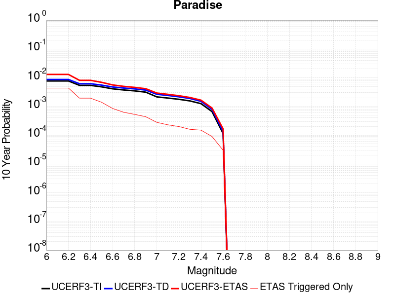 |

| Magnitude | 1 wk TI Prob | 1 wk TD Prob | 1 wk ETAS Prob | 1 wk ETAS/TD Gain | 1 wk ETAS Triggered Only | 1 mo TI Prob | 1 mo TD Prob | 1 mo ETAS Prob | 1 mo ETAS/TD Gain | 1 mo ETAS Triggered Only | 1 yr TI Prob | 1 yr TD Prob | 1 yr ETAS Prob | 1 yr ETAS/TD Gain | 1 yr ETAS Triggered Only | 10 yr TI Prob | 10 yr TD Prob | 10 yr ETAS Prob | 10 yr ETAS/TD Gain | 10 yr ETAS Triggered Only |
|-----|-----|-----|-----|-----|-----|-----|-----|-----|-----|-----|-----|-----|-----|-----|-----|-----|-----|-----|-----|-----|
| 6.0 | 1.4851273E-5 | 1.6694692E-5 | 0.001746281 | 104.60098 | 0.0017296153 | 6.364676E-5 | 7.154685E-5 | 0.002683432 | 37.505943 | 0.002612072 | 7.7462377E-4 | 8.707584E-4 | 0.004609117 | 5.2932215 | 0.0037416166 | 0.0077192914 | 0.008675844 | 0.013154824 | 1.5162586 | 0.0045181788 |
| 6.1 | 1.4851273E-5 | 1.6694692E-5 | 0.001746281 | 104.60098 | 0.0017296153 | 6.364676E-5 | 7.154685E-5 | 0.002683432 | 37.505943 | 0.002612072 | 7.7462377E-4 | 8.707584E-4 | 0.004609117 | 5.2932215 | 0.0037416166 | 0.0077192914 | 0.008675844 | 0.013154824 | 1.5162586 | 0.0045181788 |
| 6.2 | 1.4851273E-5 | 1.6694692E-5 | 0.001746281 | 104.60098 | 0.0017296153 | 6.364676E-5 | 7.154685E-5 | 0.002683432 | 37.505943 | 0.002612072 | 7.7462377E-4 | 8.707584E-4 | 0.004609117 | 5.2932215 | 0.0037416166 | 0.0077192914 | 0.008675844 | 0.013154824 | 1.5162586 | 0.0045181788 |
| 6.3 | 1.0426831E-5 | 1.188862E-5 | 8.2373916E-4 | 69.28804 | 8.118602E-4 | 4.4685654E-5 | 5.0950268E-5 | 0.0012510304 | 24.55395 | 0.0012001412 | 5.43912E-4 | 6.201489E-4 | 0.0024192443 | 3.90107 | 0.0018002118 | 0.0054258266 | 0.0061847917 | 0.008219429 | 1.3289744 | 0.0020472996 |
| 6.4 | 1.0426831E-5 | 1.188862E-5 | 8.2373916E-4 | 69.28804 | 8.118602E-4 | 4.4685654E-5 | 5.0950268E-5 | 0.0012510304 | 24.55395 | 0.0012001412 | 5.43912E-4 | 6.201489E-4 | 0.0024192443 | 3.90107 | 0.0018002118 | 0.0054258266 | 0.0061847917 | 0.008219429 | 1.3289744 | 0.0020472996 |
| 6.5 | 9.25027E-6 | 1.06199595E-5 | 6.1068416E-4 | 57.503437 | 6.000706E-4 | 3.964341E-5 | 4.551335E-5 | 9.632266E-4 | 21.163607 | 9.17755E-4 | 4.8255164E-4 | 5.53989E-4 | 0.0019298589 | 3.483569 | 0.0013766326 | 0.0048150513 | 0.0055265795 | 0.0070009134 | 1.2667716 | 0.0014825274 |
| 6.6 | 7.904275E-6 | 9.159525E-6 | 3.62139E-4 | 39.536877 | 3.529827E-4 | 3.3875025E-5 | 3.9254537E-5 | 6.040047E-4 | 15.386875 | 5.6477234E-4 | 4.1235037E-4 | 4.7782314E-4 | 0.0013245768 | 2.772107 | 8.471585E-4 | 0.0041158604 | 0.0047683544 | 0.005611473 | 1.1768155 | 8.471585E-4 |
| 6.7 | 7.2061953E-6 | 8.407248E-6 | 2.2019508E-4 | 26.191101 | 2.1178962E-4 | 3.088333E-5 | 3.6030586E-5 | 3.8900058E-4 | 10.796398 | 3.529827E-4 | 3.7593965E-4 | 4.3858777E-4 | 0.001073678 | 2.4480345 | 6.3536887E-4 | 0.003753043 | 0.004377591 | 0.0050101783 | 1.1445059 | 6.3536887E-4 |
| 6.8 | 6.6948724E-6 | 7.842166E-6 | 1.8433214E-4 | 23.505259 | 1.7649135E-4 | 2.8691995E-5 | 3.360887E-5 | 3.5128262E-4 | 10.452081 | 3.1768443E-4 | 3.4926904E-4 | 4.0911473E-4 | 9.73656E-4 | 2.3799095 | 5.6477234E-4 | 0.003487206 | 0.0040839734 | 0.004646439 | 1.1377251 | 5.6477234E-4 |
| 6.9 | 6.0421025E-6 | 7.130621E-6 | 1.483227E-4 | 20.800812 | 1.4119309E-4 | 2.5894467E-5 | 3.0559466E-5 | 2.776398E-4 | 9.085231 | 2.4708788E-4 | 3.1521954E-4 | 3.7200135E-4 | 8.307082E-4 | 2.2330782 | 4.588775E-4 | 0.0031477278 | 0.0037141247 | 0.004171298 | 1.1230904 | 4.588775E-4 |
| 7.0 | 4.134091E-6 | 5.0803087E-6 | 1.1097458E-4 | 21.84406 | 1.0589481E-4 | 1.7717413E-5 | 2.177258E-5 | 1.982601E-4 | 9.105953 | 1.7649135E-4 | 2.1568815E-4 | 2.6505045E-4 | 5.826507E-4 | 2.1982634 | 3.1768443E-4 | 0.0021547892 | 0.0026474963 | 0.0029643397 | 1.1196766 | 3.1768443E-4 |
| 7.1 | 3.7674888E-6 | 4.6318696E-6 | 1.1052619E-4 | 23.862112 | 1.0589481E-4 | 1.6146281E-5 | 1.9850726E-5 | 1.9633857E-4 | 9.89075 | 1.7649135E-4 | 1.9656324E-4 | 2.4165731E-4 | 5.2397524E-4 | 2.1682572 | 2.8238617E-4 | 0.0019638946 | 0.002414096 | 0.0026958003 | 1.1166915 | 2.8238617E-4 |
| 7.2 | 3.4065345E-6 | 4.156723E-6 | 7.475297E-5 | 17.98363 | 7.059654E-5 | 1.4599351E-5 | 1.7814415E-5 | 1.5900498E-4 | 8.925636 | 1.4119309E-4 | 1.777326E-4 | 2.1687041E-4 | 4.6390473E-4 | 2.1390872 | 2.4708788E-4 | 0.0017759053 | 0.002166736 | 0.0024132885 | 1.1137898 | 2.4708788E-4 |
| 7.3 | 2.9934936E-6 | 3.6293168E-6 | 7.42256E-5 | 20.451674 | 7.059654E-5 | 1.2829195E-5 | 1.555413E-5 | 1.5674501E-4 | 10.077389 | 1.4119309E-4 | 1.5618425E-4 | 1.8935655E-4 | 3.6581449E-4 | 1.9318818 | 1.7649135E-4 | 0.0015607453 | 0.0018920974 | 0.0020682549 | 1.0931016 | 1.7649135E-4 |
| 7.4 | 2.4049796E-6 | 2.8889842E-6 | 7.3485324E-5 | 25.436388 | 7.059654E-5 | 1.0307015E-5 | 1.238131E-5 | 1.5357265E-4 | 12.403586 | 1.4119309E-4 | 1.2548068E-4 | 1.5073347E-4 | 3.271982E-4 | 2.1707072 | 1.7649135E-4 | 0.0012540985 | 0.0015064536 | 0.0016826792 | 1.1169803 | 1.7649135E-4 |
| 7.5 | 1.2710091E-6 | 1.5134682E-6 | 1.5134682E-6 | 1.0 | 0.0 | 5.44717E-6 | 6.4862834E-6 | 6.4862834E-6 | 1.0 | 0.0 | 6.631728E-5 | 7.8968886E-5 | 7.8968886E-5 | 1.0 | 0.0 | 6.6297496E-4 | 7.8953087E-4 | 7.8953087E-4 | 1.0 | 0.0 |
| 7.6 | 2.21172E-7 | 2.603961E-7 | 2.603961E-7 | 1.0 | 0.0 | 9.478797E-7 | 1.1159829E-6 | 1.1159829E-6 | 1.0 | 0.0 | 1.1540374E-5 | 1.3587036E-5 | 1.3587036E-5 | 1.0 | 0.0 | 1.1539775E-4 | 1.3586486E-4 | 1.3586486E-4 | 1.0 | 0.0 |

## Garlic Springs
*[(top)](#table-of-contents)*

| 1 Week | 1 Month | 1 Year | 10 Year |
|-----|-----|-----|-----|
|  |  |  |  |

| Magnitude | 1 wk TI Prob | 1 wk TD Prob | 1 wk ETAS Prob | 1 wk ETAS/TD Gain | 1 wk ETAS Triggered Only | 1 mo TI Prob | 1 mo TD Prob | 1 mo ETAS Prob | 1 mo ETAS/TD Gain | 1 mo ETAS Triggered Only | 1 yr TI Prob | 1 yr TD Prob | 1 yr ETAS Prob | 1 yr ETAS/TD Gain | 1 yr ETAS Triggered Only | 10 yr TI Prob | 10 yr TD Prob | 10 yr ETAS Prob | 10 yr ETAS/TD Gain | 10 yr ETAS Triggered Only |
|-----|-----|-----|-----|-----|-----|-----|-----|-----|-----|-----|-----|-----|-----|-----|-----|-----|-----|-----|-----|-----|
| 6.0 | 1.6760017E-5 | 1.8776833E-5 | 0.0013247883 | 70.554405 | 0.001306036 | 7.182667E-5 | 8.0470316E-5 | 0.0018805373 | 23.369328 | 0.0018002118 | 8.7413884E-4 | 9.794032E-4 | 0.004364718 | 4.456508 | 0.003388634 | 0.008707083 | 0.009762413 | 0.0139219 | 1.4260716 | 0.0042004944 |
| 6.1 | 9.852767E-6 | 1.09735865E-5 | 7.87527E-4 | 71.765686 | 7.7656197E-4 | 4.222546E-5 | 4.702921E-5 | 0.0011765207 | 25.016808 | 0.0011295447 | 5.139737E-4 | 5.7250116E-4 | 0.0026539068 | 4.635636 | 0.002082598 | 0.005127866 | 0.005717221 | 0.008384553 | 1.4665433 | 0.0026826686 |
| 6.2 | 9.852767E-6 | 1.09735865E-5 | 7.87527E-4 | 71.765686 | 7.7656197E-4 | 4.222546E-5 | 4.702921E-5 | 0.0011765207 | 25.016808 | 0.0011295447 | 5.139737E-4 | 5.7250116E-4 | 0.0026539068 | 4.635636 | 0.002082598 | 0.005127866 | 0.005717221 | 0.008384553 | 1.4665433 | 0.0026826686 |
| 6.3 | 4.3167724E-6 | 4.7780286E-6 | 4.6365336E-4 | 97.03863 | 4.588775E-4 | 1.8500323E-5 | 2.0477235E-5 | 5.146429E-4 | 25.132442 | 4.9417577E-4 | 2.2521814E-4 | 2.4930484E-4 | 9.903837E-4 | 3.9725811 | 7.412637E-4 | 0.0022499003 | 0.00249251 | 0.003478398 | 1.3955402 | 9.883515E-4 |
| 6.4 | 4.3167724E-6 | 4.7780286E-6 | 4.6365336E-4 | 97.03863 | 4.588775E-4 | 1.8500323E-5 | 2.0477235E-5 | 5.146429E-4 | 25.132442 | 4.9417577E-4 | 2.2521814E-4 | 2.4930484E-4 | 9.903837E-4 | 3.9725811 | 7.412637E-4 | 0.0022499003 | 0.00249251 | 0.003478398 | 1.3955402 | 9.883515E-4 |
| 6.5 | 4.3167724E-6 | 4.7780286E-6 | 4.6365336E-4 | 97.03863 | 4.588775E-4 | 1.8500323E-5 | 2.0477235E-5 | 5.146429E-4 | 25.132442 | 4.9417577E-4 | 2.2521814E-4 | 2.4930484E-4 | 9.903837E-4 | 3.9725811 | 7.412637E-4 | 0.0022499003 | 0.00249251 | 0.003478398 | 1.3955402 | 9.883515E-4 |
| 6.6 | 4.301311E-6 | 4.760897E-6 | 4.636362E-4 | 97.38422 | 4.588775E-4 | 1.8434059E-5 | 2.0403815E-5 | 5.145695E-4 | 25.21928 | 4.9417577E-4 | 2.2441156E-4 | 2.4841115E-4 | 9.894907E-4 | 3.983278 | 7.412637E-4 | 0.0022418506 | 0.002483593 | 0.00346949 | 1.396964 | 9.883515E-4 |
| 6.7 | 3.8599724E-6 | 4.27106E-6 | 4.6314663E-4 | 108.43833 | 4.588775E-4 | 1.6542634E-5 | 1.8304541E-5 | 5.124713E-4 | 27.996946 | 4.9417577E-4 | 2.0138794E-4 | 2.228578E-4 | 9.2866586E-4 | 4.167078 | 7.059654E-4 | 0.0020120554 | 0.002228578 | 0.0031795073 | 1.4266979 | 9.530533E-4 |

## San Andreas (San Bernardino N)
*[(top)](#table-of-contents)*

| 1 Week | 1 Month | 1 Year | 10 Year |
|-----|-----|-----|-----|
| 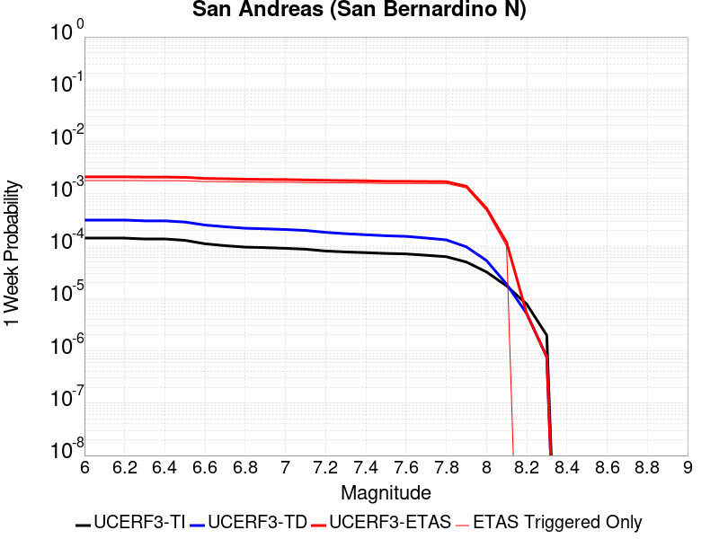 |  |  |  |

| Magnitude | 1 wk TI Prob | 1 wk TD Prob | 1 wk ETAS Prob | 1 wk ETAS/TD Gain | 1 wk ETAS Triggered Only | 1 mo TI Prob | 1 mo TD Prob | 1 mo ETAS Prob | 1 mo ETAS/TD Gain | 1 mo ETAS Triggered Only | 1 yr TI Prob | 1 yr TD Prob | 1 yr ETAS Prob | 1 yr ETAS/TD Gain | 1 yr ETAS Triggered Only | 10 yr TI Prob | 10 yr TD Prob | 10 yr ETAS Prob | 10 yr ETAS/TD Gain | 10 yr ETAS Triggered Only |
|-----|-----|-----|-----|-----|-----|-----|-----|-----|-----|-----|-----|-----|-----|-----|-----|-----|-----|-----|-----|-----|
| 6.0 | 1.4273766E-4 | 3.1606483E-4 | 0.0021862818 | 6.917194 | 0.0018708083 | 6.115894E-4 | 0.0013538664 | 0.003609897 | 2.6663616 | 0.0022590894 | 0.0074207084 | 0.016360244 | 0.019103184 | 1.167659 | 0.0027885633 | 0.07177748 | 0.15026689 | 0.15302634 | 1.0183637 | 0.0032474408 |
| 6.1 | 1.4273766E-4 | 3.1606483E-4 | 0.0021862818 | 6.917194 | 0.0018708083 | 6.115894E-4 | 0.0013538664 | 0.003609897 | 2.6663616 | 0.0022590894 | 0.0074207084 | 0.016360244 | 0.019103184 | 1.167659 | 0.0027885633 | 0.07177748 | 0.15026689 | 0.15302634 | 1.0183637 | 0.0032474408 |
| 6.2 | 1.4273766E-4 | 3.1606483E-4 | 0.0021862818 | 6.917194 | 0.0018708083 | 6.115894E-4 | 0.0013538664 | 0.003609897 | 2.6663616 | 0.0022590894 | 0.0074207084 | 0.016360244 | 0.019103184 | 1.167659 | 0.0027885633 | 0.07177748 | 0.15026689 | 0.15302634 | 1.0183637 | 0.0032474408 |
| 6.3 | 1.3730655E-4 | 3.0511338E-4 | 0.002175351 | 7.1296477 | 0.0018708083 | 5.883239E-4 | 0.0013069791 | 0.0035631158 | 2.7262225 | 0.0022590894 | 0.0071393442 | 0.015797773 | 0.018542282 | 1.1737276 | 0.0027885633 | 0.06914291 | 0.14556676 | 0.14834149 | 1.0190614 | 0.0032474408 |
| 6.4 | 1.3730655E-4 | 3.0511338E-4 | 0.002175351 | 7.1296477 | 0.0018708083 | 5.883239E-4 | 0.0013069791 | 0.0035631158 | 2.7262225 | 0.0022590894 | 0.0071393442 | 0.015797773 | 0.018542282 | 1.1737276 | 0.0027885633 | 0.06914291 | 0.14556676 | 0.14834149 | 1.0190614 | 0.0032474408 |
| 6.5 | 1.2942807E-4 | 2.8925808E-4 | 0.0021595252 | 7.465739 | 0.0018708083 | 5.545738E-4 | 0.0012390936 | 0.0034953838 | 2.8209198 | 0.0022590894 | 0.0067310524 | 0.01498286 | 0.017729642 | 1.1833283 | 0.0027885633 | 0.06530788 | 0.13870941 | 0.1415064 | 1.0201644 | 0.0032474408 |
| 6.6 | 1.1125901E-4 | 2.536472E-4 | 0.0020534024 | 8.095506 | 0.0018002118 | 4.767372E-4 | 0.0010866089 | 0.0032727236 | 3.011869 | 0.0021884928 | 0.005788839 | 0.013149847 | 0.015832074 | 1.2039739 | 0.002717967 | 0.056403454 | 0.122999296 | 0.12578538 | 1.0226513 | 0.0031768444 |
| 6.7 | 1.02209575E-4 | 2.3499702E-4 | 0.0019994958 | 8.508601 | 0.0017649136 | 4.3796748E-4 | 0.0010067427 | 0.003087244 | 3.066567 | 0.002082598 | 0.0053192247 | 0.012188629 | 0.014733996 | 1.2088312 | 0.0025767738 | 0.051936906 | 0.114790924 | 0.11747811 | 1.0234094 | 0.0030356513 |
| 6.8 | 9.610582E-5 | 2.2025521E-4 | 0.0019494895 | 8.851048 | 0.0017296153 | 4.1181705E-4 | 9.436101E-4 | 0.0029889778 | 3.1675985 | 0.0020472996 | 0.0050023515 | 0.011428202 | 0.013940632 | 1.2198448 | 0.0025414755 | 0.048912346 | 0.1081929 | 0.11086864 | 1.0247312 | 0.003000353 |
| 6.9 | 9.3877505E-5 | 2.1481077E-4 | 0.001873473 | 8.721504 | 0.0016590187 | 4.0227012E-4 | 9.2029345E-4 | 0.0028951773 | 3.1459286 | 0.001976703 | 0.0048866454 | 0.011147255 | 0.013590591 | 1.2191871 | 0.002470879 | 0.04780577 | 0.10578323 | 0.108403064 | 1.0247661 | 0.0029297564 |
| 7.0 | 9.1019785E-5 | 2.0808022E-4 | 0.0018667537 | 8.971317 | 0.0016590187 | 3.900265E-4 | 8.914682E-4 | 0.0028664093 | 3.2153802 | 0.001976703 | 0.0047382377 | 0.010799837 | 0.013244031 | 1.2263176 | 0.002470879 | 0.046384744 | 0.102753714 | 0.10538243 | 1.0255827 | 0.0029297564 |
| 7.1 | 8.771155E-5 | 1.9982594E-4 | 0.0018585131 | 9.30066 | 0.0016590187 | 3.758525E-4 | 8.5611636E-4 | 0.0028311273 | 3.306942 | 0.001976703 | 0.0045664064 | 0.0103736 | 0.012818847 | 1.2357183 | 0.002470879 | 0.044737056 | 0.09906527 | 0.101672985 | 1.0263232 | 0.0028944581 |
| 7.2 | 8.0830236E-5 | 1.8388197E-4 | 0.0018425956 | 10.0205345 | 0.0016590187 | 3.4636928E-4 | 7.8782777E-4 | 0.0027629735 | 3.5070782 | 0.001976703 | 0.0042088944 | 0.009549725 | 0.011962046 | 1.2526064 | 0.0024355806 | 0.041300658 | 0.09179615 | 0.09439285 | 1.0282876 | 0.0028591598 |
| 7.3 | 7.7668235E-5 | 1.7331762E-4 | 0.0017967566 | 10.366843 | 0.0016237204 | 3.328214E-4 | 7.425784E-4 | 0.0026825417 | 3.6124692 | 0.0019414049 | 0.0040445733 | 0.009003494 | 0.011382165 | 1.2641943 | 0.0024002823 | 0.03971748 | 0.08706327 | 0.08964127 | 1.0296108 | 0.0028238615 |
| 7.4 | 7.520177E-5 | 1.6551897E-4 | 0.0017536782 | 10.595028 | 0.0015884222 | 3.2225347E-4 | 7.0917426E-4 | 0.002613929 | 3.685877 | 0.0019061066 | 0.0039163795 | 0.008600081 | 0.010944727 | 1.2726306 | 0.002364984 | 0.038480744 | 0.08351955 | 0.08607522 | 1.0305996 | 0.0027885633 |
| 7.5 | 7.274697E-5 | 1.5839566E-4 | 0.0017112736 | 10.803791 | 0.0015531239 | 3.1173544E-4 | 6.78662E-4 | 0.0025482008 | 3.7547421 | 0.0018708083 | 0.003788775 | 0.008231463 | 0.010506964 | 1.2764395 | 0.0022943877 | 0.03724827 | 0.08023631 | 0.082736194 | 1.0311565 | 0.002717967 |
| 7.6 | 7.1185845E-5 | 1.540943E-4 | 0.0017069789 | 11.077495 | 0.0015531239 | 3.0504653E-4 | 6.6023704E-4 | 0.0025298102 | 3.8316696 | 0.0018708083 | 0.0037076178 | 0.008008812 | 0.010284823 | 1.2841885 | 0.0022943877 | 0.036463667 | 0.07822598 | 0.080731325 | 1.0320271 | 0.002717967 |
| 7.7 | 6.709961E-5 | 1.4318313E-4 | 0.0016960846 | 11.845562 | 0.0015531239 | 2.8753807E-4 | 6.1349774E-4 | 0.0024831584 | 4.047543 | 0.0018708083 | 0.003495157 | 0.0074437927 | 0.009721101 | 1.305934 | 0.0022943877 | 0.034406938 | 0.07305469 | 0.0755741 | 1.0344865 | 0.002717967 |
| 7.8 | 6.300812E-5 | 1.3202413E-4 | 0.001684943 | 12.762386 | 0.0015531239 | 2.7000686E-4 | 5.65695E-4 | 0.0024001668 | 4.2428637 | 0.00183551 | 0.0032823787 | 0.006865616 | 0.009109195 | 1.3267848 | 0.0022590894 | 0.032343175 | 0.06771354 | 0.070181645 | 1.0364492 | 0.0026473703 |
| 7.9 | 4.983037E-5 | 9.723488E-5 | 0.0012972594 | 13.341502 | 0.0012001412 | 2.1354125E-4 | 4.1665437E-4 | 0.0018279969 | 4.387322 | 0.0014119308 | 0.0025967648 | 0.0050609782 | 0.0068169595 | 1.3469648 | 0.0017649136 | 0.025666296 | 0.05064886 | 0.052525446 | 1.0370508 | 0.001976703 |
| 8.0 | 3.2211527E-5 | 5.3304586E-5 | 5.121576E-4 | 9.608134 | 4.588775E-4 | 1.380421E-4 | 2.2842824E-4 | 7.577813E-4 | 3.3173716 | 5.2947405E-4 | 0.0016793669 | 0.0027775685 | 0.003446373 | 1.2407876 | 6.7066716E-4 | 0.016667323 | 0.028361378 | 0.029047322 | 1.0241858 | 7.059654E-4 |
| 8.1 | 1.743376E-5 | 1.8824427E-5 | 8.9419635E-5 | 4.750192 | 7.059654E-5 | 7.471398E-5 | 8.067362E-5 | 1.5126447E-4 | 1.8750176 | 7.059654E-5 | 9.0926304E-4 | 9.817594E-4 | 0.0010522866 | 1.0718375 | 7.059654E-5 | 0.009055517 | 0.010484105 | 0.010553962 | 1.0066631 | 7.059654E-5 |
| 8.2 | 7.831616E-6 | 5.1551065E-6 | 5.1551065E-6 | 1.0 | 0.0 | 3.3563636E-5 | 2.2093127E-5 | 2.2093127E-5 | 1.0 | 0.0 | 4.0856065E-4 | 2.6895068E-4 | 2.6895068E-4 | 1.0 | 0.0 | 0.004078103 | 0.0030418145 | 0.0030418145 | 1.0 | 0.0 |
| 8.3 | 1.983087E-6 | 7.6599065E-7 | 7.6599065E-7 | 1.0 | 0.0 | 8.498917E-6 | 3.282813E-6 | 3.282813E-6 | 1.0 | 0.0 | 1.034694E-4 | 3.9967534E-5 | 3.9967534E-5 | 1.0 | 0.0 | 0.0010342124 | 4.719687E-4 | 4.719687E-4 | 1.0 | 0.0 |

## Coyote Lake
*[(top)](#table-of-contents)*

| 1 Week | 1 Month | 1 Year | 10 Year |
|-----|-----|-----|-----|
|  |  |  |  |

| Magnitude | 1 wk TI Prob | 1 wk TD Prob | 1 wk ETAS Prob | 1 wk ETAS/TD Gain | 1 wk ETAS Triggered Only | 1 mo TI Prob | 1 mo TD Prob | 1 mo ETAS Prob | 1 mo ETAS/TD Gain | 1 mo ETAS Triggered Only | 1 yr TI Prob | 1 yr TD Prob | 1 yr ETAS Prob | 1 yr ETAS/TD Gain | 1 yr ETAS Triggered Only | 10 yr TI Prob | 10 yr TD Prob | 10 yr ETAS Prob | 10 yr ETAS/TD Gain | 10 yr ETAS Triggered Only |
|-----|-----|-----|-----|-----|-----|-----|-----|-----|-----|-----|-----|-----|-----|-----|-----|-----|-----|-----|-----|-----|
| 6.0 | 1.980352E-5 | 2.1706745E-5 | 0.0010453344 | 48.157124 | 0.0010236498 | 8.486947E-5 | 9.302599E-5 | 0.0014342355 | 15.417578 | 0.0013413343 | 0.0010327959 | 0.0011320751 | 0.0031417988 | 2.7752566 | 0.0020120014 | 0.010280091 | 0.011270258 | 0.01374819 | 1.2198647 | 0.0025061772 |
| 6.1 | 1.980352E-5 | 2.1706745E-5 | 0.0010453344 | 48.157124 | 0.0010236498 | 8.486947E-5 | 9.302599E-5 | 0.0014342355 | 15.417578 | 0.0013413343 | 0.0010327959 | 0.0011320751 | 0.0031417988 | 2.7752566 | 0.0020120014 | 0.010280091 | 0.011270258 | 0.01374819 | 1.2198647 | 0.0025061772 |
| 6.2 | 1.980352E-5 | 2.1706745E-5 | 0.0010453344 | 48.157124 | 0.0010236498 | 8.486947E-5 | 9.302599E-5 | 0.0014342355 | 15.417578 | 0.0013413343 | 0.0010327959 | 0.0011320751 | 0.0031417988 | 2.7752566 | 0.0020120014 | 0.010280091 | 0.011270258 | 0.01374819 | 1.2198647 | 0.0025061772 |
| 6.3 | 1.5344787E-5 | 1.682067E-5 | 8.992626E-4 | 53.46176 | 8.824568E-4 | 6.576172E-5 | 7.2086936E-5 | 0.0011309587 | 15.688817 | 0.0010589481 | 8.003548E-4 | 8.773662E-4 | 0.0024291275 | 2.7686584 | 0.0015531239 | 0.007974784 | 0.00874507 | 0.010669496 | 1.2200586 | 0.0019414049 |
| 6.4 | 1.5344787E-5 | 1.682067E-5 | 8.992626E-4 | 53.46176 | 8.824568E-4 | 6.576172E-5 | 7.2086936E-5 | 0.0011309587 | 15.688817 | 0.0010589481 | 8.003548E-4 | 8.773662E-4 | 0.0024291275 | 2.7686584 | 0.0015531239 | 0.007974784 | 0.00874507 | 0.010669496 | 1.2200586 | 0.0019414049 |
| 6.5 | 1.4189697E-5 | 1.5557987E-5 | 8.627033E-4 | 55.450832 | 8.471585E-4 | 6.081157E-5 | 6.6675726E-5 | 0.0010902573 | 16.351639 | 0.0010236498 | 7.401293E-4 | 8.115349E-4 | 0.0022575895 | 2.781876 | 0.0014472291 | 0.0073766913 | 0.008091656 | 0.009877301 | 1.2206774 | 0.0018002118 |
| 6.6 | 1.3469301E-5 | 1.4771577E-5 | 8.6191756E-4 | 58.34973 | 8.471585E-4 | 5.7724297E-5 | 6.330556E-5 | 0.0010868906 | 17.168959 | 0.0010236498 | 7.025667E-4 | 7.7053264E-4 | 0.0022166467 | 2.876772 | 0.0014472291 | 0.0070034964 | 0.0076845144 | 0.009470892 | 1.2324647 | 0.0018002118 |
| 6.7 | 1.3027966E-5 | 1.4281745E-5 | 8.6142815E-4 | 60.316727 | 8.471585E-4 | 5.5832945E-5 | 6.120638E-5 | 0.0010847936 | 17.723537 | 0.0010236498 | 6.7955407E-4 | 7.4499263E-4 | 0.0021558716 | 2.893816 | 0.0014119308 | 0.006774798 | 0.0074308286 | 0.009182627 | 1.2357475 | 0.0017649136 |
| 6.8 | 5.695434E-6 | 6.2244176E-6 | 3.2390686E-4 | 52.0381 | 3.1768443E-4 | 2.4408775E-5 | 2.6675973E-5 | 4.8554124E-4 | 18.201445 | 4.588775E-4 | 2.971363E-4 | 3.2476155E-4 | 8.893505E-4 | 2.7384722 | 5.6477234E-4 | 0.0029673933 | 0.0032458105 | 0.0038439333 | 1.1842754 | 6.000706E-4 |
| 6.9 | 4.385688E-6 | 4.7930553E-6 | 1.8128355E-4 | 37.82213 | 1.7649135E-4 | 1.879567E-5 | 2.0541665E-5 | 3.0292204E-4 | 14.746712 | 2.8238617E-4 | 2.2881327E-4 | 2.5009477E-4 | 6.029892E-4 | 2.4110427 | 3.529827E-4 | 0.002285778 | 0.0025009478 | 0.0028882576 | 1.1548653 | 3.8828098E-4 |

## Death Valley (Black Mtns Frontal)
*[(top)](#table-of-contents)*

| 1 Week | 1 Month | 1 Year | 10 Year |
|-----|-----|-----|-----|
| 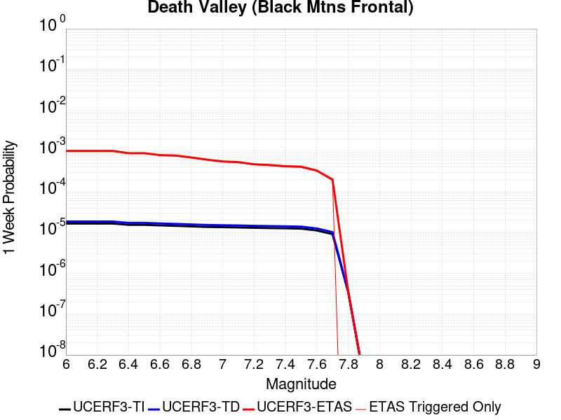 |  |  |  |

| Magnitude | 1 wk TI Prob | 1 wk TD Prob | 1 wk ETAS Prob | 1 wk ETAS/TD Gain | 1 wk ETAS Triggered Only | 1 mo TI Prob | 1 mo TD Prob | 1 mo ETAS Prob | 1 mo ETAS/TD Gain | 1 mo ETAS Triggered Only | 1 yr TI Prob | 1 yr TD Prob | 1 yr ETAS Prob | 1 yr ETAS/TD Gain | 1 yr ETAS Triggered Only | 10 yr TI Prob | 10 yr TD Prob | 10 yr ETAS Prob | 10 yr ETAS/TD Gain | 10 yr ETAS Triggered Only |
|-----|-----|-----|-----|-----|-----|-----|-----|-----|-----|-----|-----|-----|-----|-----|-----|-----|-----|-----|-----|-----|
| 6.0 | 1.6707214E-5 | 1.867027E-5 | 0.0011128963 | 59.607937 | 0.0010942464 | 7.160038E-5 | 8.001302E-5 | 0.0015271263 | 19.085972 | 0.0014472291 | 8.71386E-4 | 9.737309E-4 | 0.0028074535 | 2.8831925 | 0.00183551 | 0.00867977 | 0.009695496 | 0.011687991 | 1.2055072 | 0.0020120014 |
| 6.1 | 1.6707214E-5 | 1.867027E-5 | 0.0011128963 | 59.607937 | 0.0010942464 | 7.160038E-5 | 8.001302E-5 | 0.0015271263 | 19.085972 | 0.0014472291 | 8.71386E-4 | 9.737309E-4 | 0.0028074535 | 2.8831925 | 0.00183551 | 0.00867977 | 0.009695496 | 0.011687991 | 1.2055072 | 0.0020120014 |
| 6.2 | 1.6707214E-5 | 1.867027E-5 | 0.0011128963 | 59.607937 | 0.0010942464 | 7.160038E-5 | 8.001302E-5 | 0.0015271263 | 19.085972 | 0.0014472291 | 8.71386E-4 | 9.737309E-4 | 0.0028074535 | 2.8831925 | 0.00183551 | 0.00867977 | 0.009695496 | 0.011687991 | 1.2055072 | 0.0020120014 |
| 6.3 | 1.6707214E-5 | 1.867027E-5 | 0.0011128963 | 59.607937 | 0.0010942464 | 7.160038E-5 | 8.001302E-5 | 0.0015271263 | 19.085972 | 0.0014472291 | 8.71386E-4 | 9.737309E-4 | 0.0028074535 | 2.8831925 | 0.00183551 | 0.00867977 | 0.009695496 | 0.011687991 | 1.2055072 | 0.0020120014 |
| 6.4 | 1.5515609E-5 | 1.7338214E-5 | 0.0010056726 | 58.003246 | 9.883515E-4 | 6.649377E-5 | 7.4304546E-5 | 0.0013802435 | 18.575493 | 0.001306036 | 8.0926094E-4 | 9.042885E-4 | 0.002561807 | 2.8329532 | 0.0016590187 | 0.008063202 | 0.009006773 | 0.010790771 | 1.1980729 | 0.0018002118 |
| 6.5 | 1.5515609E-5 | 1.7338214E-5 | 0.0010056726 | 58.003246 | 9.883515E-4 | 6.649377E-5 | 7.4304546E-5 | 0.0013802435 | 18.575493 | 0.001306036 | 8.0926094E-4 | 9.042885E-4 | 0.002561807 | 2.8329532 | 0.0016590187 | 0.008063202 | 0.009006773 | 0.010790771 | 1.1980729 | 0.0018002118 |
| 6.6 | 1.5041828E-5 | 1.6809145E-5 | 8.639534E-4 | 51.39782 | 8.471585E-4 | 6.4463384E-5 | 7.203723E-5 | 0.0012015005 | 16.67888 | 0.0011295447 | 7.8455906E-4 | 8.767063E-4 | 0.002357934 | 2.6895368 | 0.0014825274 | 0.00781795 | 0.008733132 | 0.0103426725 | 1.1843027 | 0.0016237204 |
| 6.7 | 1.4634985E-5 | 1.6356016E-5 | 8.2820293E-4 | 50.635983 | 8.118602E-4 | 6.271985E-5 | 7.009536E-5 | 0.0010936734 | 15.602651 | 0.0010236498 | 7.6334673E-4 | 8.5308263E-4 | 0.0021932726 | 2.5709968 | 0.0013413343 | 0.007607299 | 0.008498715 | 0.009968643 | 1.1729589 | 0.0014825274 |
| 6.8 | 1.4209158E-5 | 1.5882048E-5 | 7.5713394E-4 | 47.672314 | 7.412637E-4 | 6.089497E-5 | 6.8064175E-5 | 0.0010210526 | 15.001322 | 9.530533E-4 | 7.4114406E-4 | 8.2837185E-4 | 0.002062788 | 2.4901714 | 0.0012354394 | 0.007386771 | 0.008253456 | 0.009618727 | 1.165418 | 0.0013766326 |
| 6.9 | 1.3780098E-5 | 1.5404594E-5 | 6.154659E-4 | 39.953403 | 6.000706E-4 | 5.9056227E-5 | 6.6018045E-5 | 8.7782467E-4 | 13.296739 | 8.118602E-4 | 7.1877235E-4 | 8.0347876E-4 | 0.001861576 | 2.3168952 | 0.0010589481 | 0.0071645193 | 0.008006332 | 0.0091618495 | 1.1443254 | 0.001164843 |
| 7.0 | 1.3585064E-5 | 1.5188155E-5 | 5.0935644E-4 | 33.536427 | 4.9417577E-4 | 5.8220405E-5 | 6.50905E-5 | 7.35714E-4 | 11.302939 | 6.7066716E-4 | 7.086029E-4 | 7.9219416E-4 | 0.0017092222 | 2.15758 | 9.17755E-4 | 0.007063476 | 0.007894293 | 0.0089098625 | 1.1286459 | 0.0010236498 |
| 7.1 | 1.3398601E-5 | 1.49813395E-5 | 5.0914974E-4 | 33.985596 | 4.9417577E-4 | 5.742131E-5 | 6.420419E-5 | 7.348283E-4 | 11.445176 | 6.7066716E-4 | 6.9888023E-4 | 7.8141113E-4 | 0.001698449 | 2.1735663 | 9.17755E-4 | 0.0069668638 | 0.007787224 | 0.008802903 | 1.1304288 | 0.0010236498 |
| 7.2 | 1.3126312E-5 | 1.4679561E-5 | 4.0295484E-4 | 27.450062 | 3.8828098E-4 | 5.6254412E-5 | 6.291092E-5 | 5.5705564E-4 | 8.854673 | 4.9417577E-4 | 6.846822E-4 | 7.6567667E-4 | 0.0015063728 | 1.9673746 | 7.412637E-4 | 0.006825765 | 0.00763097 | 0.008471664 | 1.1101687 | 8.471585E-4 |
| 7.3 | 1.2922429E-5 | 1.4453788E-5 | 4.0272914E-4 | 27.863226 | 3.8828098E-4 | 5.5380664E-5 | 6.194336E-5 | 5.560885E-4 | 8.97737 | 4.9417577E-4 | 6.74051E-4 | 7.53905E-4 | 0.0014946098 | 1.982491 | 7.412637E-4 | 0.006720101 | 0.007514055 | 0.008354847 | 1.111896 | 8.471585E-4 |
| 7.4 | 1.2768878E-5 | 1.4283772E-5 | 3.3196367E-4 | 23.240618 | 3.1768443E-4 | 5.4722615E-5 | 6.1214756E-5 | 4.1417585E-4 | 6.765948 | 3.529827E-4 | 6.660441E-4 | 7.4504025E-4 | 0.0013446638 | 1.8048203 | 6.000706E-4 | 0.0066405144 | 0.0074260035 | 0.008126726 | 1.0943607 | 7.059654E-4 |
| 7.5 | 1.2521929E-5 | 1.40120155E-5 | 3.31692E-4 | 23.67197 | 3.1768443E-4 | 5.366431E-5 | 6.005014E-5 | 4.1301164E-4 | 6.87778 | 3.529827E-4 | 6.531671E-4 | 7.3087064E-4 | 0.0013305027 | 1.8204352 | 6.000706E-4 | 0.006512506 | 0.0072852457 | 0.007986068 | 1.0961975 | 7.059654E-4 |
| 7.6 | 1.1301089E-5 | 1.2648149E-5 | 2.2443509E-4 | 17.744501 | 2.1178962E-4 | 4.8432343E-5 | 5.4205255E-5 | 3.0127977E-4 | 5.558128 | 2.4708788E-4 | 5.895042E-4 | 6.5975444E-4 | 0.0011536042 | 1.7485356 | 4.9417577E-4 | 0.0058794282 | 0.00657851 | 0.0071395673 | 1.0852864 | 5.6477234E-4 |
| 7.7 | 9.189108E-6 | 1.0283358E-5 | 1.5147499E-4 | 14.730109 | 1.4119309E-4 | 3.93813E-5 | 4.407082E-5 | 2.205544E-4 | 5.0045447 | 1.7649135E-4 | 4.7936183E-4 | 5.3643517E-4 | 8.5394917E-4 | 1.5918963 | 3.1768443E-4 | 0.004783291 | 0.005351914 | 0.0057030073 | 1.0656015 | 3.529827E-4 |
| 7.8 | 3.4586725E-7 | 3.6482615E-7 | 3.6482615E-7 | 1.0 | 0.0 | 1.4822873E-6 | 1.5635396E-6 | 1.5635396E-6 | 1.0 | 0.0 | 1.80467E-5 | 1.9035933E-5 | 1.9035933E-5 | 1.0 | 0.0 | 1.8045233E-4 | 1.9034347E-4 | 1.9034347E-4 | 1.0 | 0.0 |
| 7.9 | 2.5591178E-9 | 2.6696718E-9 | 2.6696718E-9 | 1.0 | 0.0 | 1.0967647E-8 | 1.14414505E-8 | 1.14414505E-8 | 1.0 | 0.0 | 1.335311E-7 | 1.3929966E-7 | 1.3929966E-7 | 1.0 | 0.0 | 1.3353102E-6 | 1.3929966E-6 | 1.3929966E-6 | 1.0 | 0.0 |

## Helendale-So Lockhart
*[(top)](#table-of-contents)*

| 1 Week | 1 Month | 1 Year | 10 Year |
|-----|-----|-----|-----|
|  |  |  |  |

| Magnitude | 1 wk TI Prob | 1 wk TD Prob | 1 wk ETAS Prob | 1 wk ETAS/TD Gain | 1 wk ETAS Triggered Only | 1 mo TI Prob | 1 mo TD Prob | 1 mo ETAS Prob | 1 mo ETAS/TD Gain | 1 mo ETAS Triggered Only | 1 yr TI Prob | 1 yr TD Prob | 1 yr ETAS Prob | 1 yr ETAS/TD Gain | 1 yr ETAS Triggered Only | 10 yr TI Prob | 10 yr TD Prob | 10 yr ETAS Prob | 10 yr ETAS/TD Gain | 10 yr ETAS Triggered Only |
|-----|-----|-----|-----|-----|-----|-----|-----|-----|-----|-----|-----|-----|-----|-----|-----|-----|-----|-----|-----|-----|
| 6.0 | 1.7296055E-5 | 1.8103729E-5 | 9.7113976E-4 | 53.643078 | 9.530533E-4 | 7.412385E-5 | 7.7585224E-5 | 0.0013129289 | 16.92241 | 0.0012354394 | 9.0208417E-4 | 9.4421144E-4 | 0.0025663988 | 2.718034 | 0.0016237204 | 0.008984311 | 0.009404116 | 0.011187399 | 1.1896279 | 0.0018002118 |
| 6.1 | 1.7296055E-5 | 1.8103729E-5 | 9.7113976E-4 | 53.643078 | 9.530533E-4 | 7.412385E-5 | 7.7585224E-5 | 0.0013129289 | 16.92241 | 0.0012354394 | 9.0208417E-4 | 9.4421144E-4 | 0.0025663988 | 2.718034 | 0.0016237204 | 0.008984311 | 0.009404116 | 0.011187399 | 1.1896279 | 0.0018002118 |
| 6.2 | 1.7296055E-5 | 1.8103729E-5 | 9.7113976E-4 | 53.643078 | 9.530533E-4 | 7.412385E-5 | 7.7585224E-5 | 0.0013129289 | 16.92241 | 0.0012354394 | 9.0208417E-4 | 9.4421144E-4 | 0.0025663988 | 2.718034 | 0.0016237204 | 0.008984311 | 0.009404116 | 0.011187399 | 1.1896279 | 0.0018002118 |
| 6.3 | 1.0669118E-5 | 1.1135425E-5 | 6.4649724E-4 | 58.05771 | 6.3536887E-4 | 4.5723988E-5 | 4.772239E-5 | 7.536541E-4 | 15.792463 | 7.059654E-4 | 5.5654737E-4 | 5.80868E-4 | 0.0016039233 | 2.7612526 | 0.0010236498 | 0.0055515557 | 0.0057937936 | 0.006916794 | 1.1938281 | 0.0011295447 |
| 6.4 | 1.0669118E-5 | 1.1135425E-5 | 6.4649724E-4 | 58.05771 | 6.3536887E-4 | 4.5723988E-5 | 4.772239E-5 | 7.536541E-4 | 15.792463 | 7.059654E-4 | 5.5654737E-4 | 5.80868E-4 | 0.0016039233 | 2.7612526 | 0.0010236498 | 0.0055515557 | 0.0057937936 | 0.006916794 | 1.1938281 | 0.0011295447 |
| 6.5 | 8.790038E-6 | 9.170197E-6 | 5.386394E-4 | 58.73804 | 5.2947405E-4 | 3.767105E-5 | 3.930026E-5 | 6.393473E-4 | 16.26827 | 6.000706E-4 | 4.585485E-4 | 4.7837716E-4 | 0.0013604118 | 2.8438058 | 8.824568E-4 | 0.0045760344 | 0.004773638 | 0.0056870123 | 1.1913371 | 9.17755E-4 |
| 6.6 | 7.396949E-6 | 7.715537E-6 | 4.3129153E-4 | 55.899094 | 4.2357924E-4 | 3.1700827E-5 | 3.3066175E-5 | 5.272256E-4 | 15.944561 | 4.9417577E-4 | 3.858892E-4 | 4.025073E-4 | 0.0010376205 | 2.577892 | 6.3536887E-4 | 0.003852198 | 0.00401789 | 0.0046858625 | 1.1662496 | 6.7066716E-4 |
| 6.7 | 6.4600285E-6 | 6.738031E-6 | 4.3031442E-4 | 63.863525 | 4.2357924E-4 | 2.7685543E-5 | 2.887696E-5 | 5.230385E-4 | 18.112658 | 4.9417577E-4 | 3.3701936E-4 | 3.5152107E-4 | 9.866665E-4 | 2.8068492 | 6.3536887E-4 | 0.0033650869 | 0.003509732 | 0.0041780453 | 1.1904172 | 6.7066716E-4 |
| 6.8 | 5.600104E-6 | 5.836009E-6 | 3.5881664E-4 | 61.48322 | 3.529827E-4 | 2.4000226E-5 | 2.5011232E-5 | 4.4857987E-4 | 17.935137 | 4.2357924E-4 | 2.9216358E-4 | 3.044698E-4 | 7.9849514E-4 | 2.6225758 | 4.9417577E-4 | 0.0029177975 | 0.003040588 | 0.0035684523 | 1.1736059 | 5.2947405E-4 |
| 6.9 | 4.839122E-6 | 5.0395092E-6 | 3.2272234E-4 | 64.038445 | 3.1768443E-4 | 2.0738931E-5 | 2.159772E-5 | 4.0987032E-4 | 18.97748 | 3.8828098E-4 | 2.5246723E-4 | 2.6292098E-4 | 6.8638887E-4 | 2.610628 | 4.2357924E-4 | 0.002521806 | 0.002626147 | 0.0030838193 | 1.1742753 | 4.588775E-4 |
| 7.0 | 3.6937633E-6 | 3.845208E-6 | 2.862303E-4 | 74.43818 | 2.8238617E-4 | 1.5830317E-5 | 1.647936E-5 | 3.3415857E-4 | 20.2774 | 3.1768443E-4 | 1.9271708E-4 | 2.0061806E-4 | 5.1823875E-4 | 2.583211 | 3.1768443E-4 | 0.0019255003 | 0.002004401 | 0.0023566762 | 1.1757509 | 3.529827E-4 |
| 7.1 | 2.7858857E-6 | 2.8978538E-6 | 2.4998502E-4 | 86.26558 | 2.4708788E-4 | 1.1939455E-5 | 1.2419316E-5 | 2.9480198E-4 | 23.737377 | 2.8238617E-4 | 1.4535317E-4 | 1.511949E-4 | 4.3353837E-4 | 2.867414 | 2.8238617E-4 | 0.0014525814 | 0.0015109418 | 0.0018281462 | 1.2099382 | 3.1768443E-4 |
| 7.2 | 2.1672065E-6 | 2.2540128E-6 | 1.7874497E-4 | 79.30078 | 1.7649135E-4 | 9.2879945E-6 | 9.66002E-6 | 2.214476E-4 | 22.924133 | 2.1178962E-4 | 1.1307546E-4 | 1.1760458E-4 | 3.293693E-4 | 2.8006501 | 2.1178962E-4 | 0.0011301794 | 0.0011754417 | 0.0014222391 | 1.2099614 | 2.4708788E-4 |
| 7.3 | 1.4823496E-6 | 1.5422102E-6 | 3.6840425E-5 | 23.888071 | 3.529827E-5 | 6.3529114E-6 | 6.6094562E-6 | 7.720553E-5 | 11.681071 | 7.059654E-5 | 7.734395E-5 | 8.046731E-5 | 1.5105818E-4 | 1.8772613 | 7.059654E-5 | 7.731704E-4 | 8.0439687E-4 | 9.102065E-4 | 1.1315391 | 1.0589481E-4 |
| 7.4 | 4.2321457E-7 | 4.4108765E-7 | 4.4108765E-7 | 1.0 | 0.0 | 1.8137755E-6 | 1.8903745E-6 | 1.8903745E-6 | 1.0 | 0.0 | 2.2082493E-5 | 2.3015113E-5 | 2.3015113E-5 | 1.0 | 0.0 | 2.2080299E-4 | 2.3013182E-4 | 2.3013182E-4 | 1.0 | 0.0 |
| 7.5 | 5.6942316E-8 | 5.9415648E-8 | 5.9415648E-8 | 1.0 | 0.0 | 2.440385E-7 | 2.5463845E-7 | 2.5463845E-7 | 1.0 | 0.0 | 2.9711643E-6 | 3.1002196E-6 | 3.1002196E-6 | 1.0 | 0.0 | 2.9711247E-5 | 3.1001844E-5 | 3.1001844E-5 | 1.0 | 0.0 |

## San Andreas (San Bernardino S)
*[(top)](#table-of-contents)*

| 1 Week | 1 Month | 1 Year | 10 Year |
|-----|-----|-----|-----|
|  |  |  |  |

| Magnitude | 1 wk TI Prob | 1 wk TD Prob | 1 wk ETAS Prob | 1 wk ETAS/TD Gain | 1 wk ETAS Triggered Only | 1 mo TI Prob | 1 mo TD Prob | 1 mo ETAS Prob | 1 mo ETAS/TD Gain | 1 mo ETAS Triggered Only | 1 yr TI Prob | 1 yr TD Prob | 1 yr ETAS Prob | 1 yr ETAS/TD Gain | 1 yr ETAS Triggered Only | 10 yr TI Prob | 10 yr TD Prob | 10 yr ETAS Prob | 10 yr ETAS/TD Gain | 10 yr ETAS Triggered Only |
|-----|-----|-----|-----|-----|-----|-----|-----|-----|-----|-----|-----|-----|-----|-----|-----|-----|-----|-----|-----|-----|
| 6.0 | 1.2336002E-4 | 3.0004102E-4 | 0.0011116576 | 3.705019 | 8.118602E-4 | 5.2857865E-4 | 0.0012852824 | 0.0023076166 | 1.7954159 | 0.0010236498 | 0.006416472 | 0.015540994 | 0.016965732 | 1.0916761 | 0.0014472291 | 0.06234337 | 0.14283717 | 0.14434999 | 1.0105911 | 0.0017649136 |
| 6.1 | 1.2336002E-4 | 3.0004102E-4 | 0.0011116576 | 3.705019 | 8.118602E-4 | 5.2857865E-4 | 0.0012852824 | 0.0023076166 | 1.7954159 | 0.0010236498 | 0.006416472 | 0.015540994 | 0.016965732 | 1.0916761 | 0.0014472291 | 0.06234337 | 0.14283717 | 0.14434999 | 1.0105911 | 0.0017649136 |
| 6.2 | 1.2336002E-4 | 3.0004102E-4 | 0.0011116576 | 3.705019 | 8.118602E-4 | 5.2857865E-4 | 0.0012852824 | 0.0023076166 | 1.7954159 | 0.0010236498 | 0.006416472 | 0.015540994 | 0.016965732 | 1.0916761 | 0.0014472291 | 0.06234337 | 0.14283717 | 0.14434999 | 1.0105911 | 0.0017649136 |
| 6.3 | 1.1712257E-4 | 2.8792414E-4 | 0.0010995506 | 3.8188899 | 8.118602E-4 | 5.018573E-4 | 0.0012334028 | 0.00225579 | 1.828916 | 0.0010236498 | 0.006093008 | 0.014918125 | 0.016343765 | 1.0955642 | 0.0014472291 | 0.059286322 | 0.13754563 | 0.13906778 | 1.0110666 | 0.0017649136 |
| 6.4 | 1.1712257E-4 | 2.8792414E-4 | 0.0010995506 | 3.8188899 | 8.118602E-4 | 5.018573E-4 | 0.0012334028 | 0.00225579 | 1.828916 | 0.0010236498 | 0.006093008 | 0.014918125 | 0.016343765 | 1.0955642 | 0.0014472291 | 0.059286322 | 0.13754563 | 0.13906778 | 1.0110666 | 0.0017649136 |
| 6.5 | 1.0689076E-4 | 2.680528E-4 | 0.0010796954 | 4.0279207 | 8.118602E-4 | 4.5802278E-4 | 0.0011483167 | 0.0021355334 | 1.8597076 | 9.883515E-4 | 0.0055621783 | 0.01389575 | 0.015288061 | 1.1001968 | 0.0014119308 | 0.05425003 | 0.12879294 | 0.1302998 | 1.0116998 | 0.0017296153 |
| 6.6 | 9.7648895E-5 | 2.50501E-4 | 9.91579E-4 | 3.9583833 | 7.412637E-4 | 4.1842813E-4 | 0.0010731576 | 0.0019899278 | 1.8542734 | 9.17755E-4 | 0.005082469 | 0.012991785 | 0.014280854 | 1.0992218 | 0.001306036 | 0.049677886 | 0.12095292 | 0.12238024 | 1.0118006 | 0.0016237204 |
| 6.7 | 8.757013E-5 | 2.3120902E-4 | 9.723013E-4 | 4.2052913 | 7.412637E-4 | 3.7524657E-4 | 9.905418E-4 | 0.0019073877 | 1.9256004 | 9.17755E-4 | 0.00455906 | 0.011997245 | 0.013287612 | 1.1075553 | 0.001306036 | 0.04466656 | 0.11226123 | 0.11370267 | 1.01284 | 0.0016237204 |
| 6.8 | 8.562978E-5 | 2.2680782E-4 | 9.6790335E-4 | 4.267504 | 7.412637E-4 | 3.6693315E-4 | 9.7169366E-4 | 0.0018885569 | 1.9435723 | 9.17755E-4 | 0.004458263 | 0.011770263 | 0.013060927 | 1.1096547 | 0.001306036 | 0.043698758 | 0.11027153 | 0.1117162 | 1.013101 | 0.0016237204 |
| 6.9 | 6.124075E-5 | 1.7065753E-4 | 8.412102E-4 | 4.92923 | 6.7066716E-4 | 2.6243398E-4 | 7.311852E-4 | 0.0015777242 | 2.1577628 | 8.471585E-4 | 0.0031904527 | 0.008866051 | 0.010090536 | 1.1381096 | 0.0012354394 | 0.031450346 | 0.08418263 | 0.08560501 | 1.0168964 | 0.0015531239 |
| 7.0 | 5.8598747E-5 | 1.649477E-4 | 8.355042E-4 | 5.065267 | 6.7066716E-4 | 2.5111332E-4 | 7.06728E-4 | 0.0015532878 | 2.1978579 | 8.471585E-4 | 0.0030530186 | 0.008570663 | 0.009795514 | 1.142912 | 0.0012354394 | 0.03011414 | 0.081500374 | 0.082926914 | 1.0175035 | 0.0015531239 |
| 7.1 | 5.613814E-5 | 1.5913323E-4 | 8.296936E-4 | 5.2138305 | 6.7066716E-4 | 2.4056983E-4 | 6.818221E-4 | 0.0015284029 | 2.2416449 | 8.471585E-4 | 0.0029250039 | 0.008269769 | 0.009494991 | 1.1481569 | 0.0012354394 | 0.028868021 | 0.07879931 | 0.08019753 | 1.0177441 | 0.0015178256 |
| 7.2 | 4.991222E-5 | 1.4519796E-4 | 8.1576774E-4 | 5.6183143 | 6.7066716E-4 | 2.1389198E-4 | 6.2212895E-4 | 0.0014687604 | 2.3608618 | 8.471585E-4 | 0.002601025 | 0.007548217 | 0.008739299 | 1.1577965 | 0.0012001412 | 0.025707912 | 0.07225321 | 0.07362862 | 1.0190359 | 0.0014825274 |
| 7.3 | 4.7410045E-5 | 1.3714004E-4 | 7.724218E-4 | 5.632358 | 6.3536887E-4 | 2.0317009E-4 | 5.8761094E-4 | 0.0013989941 | 2.380817 | 8.118602E-4 | 0.0024707897 | 0.0071307817 | 0.008287318 | 1.1621894 | 0.001164843 | 0.024434982 | 0.06853558 | 0.06988362 | 1.0196692 | 0.0014472291 |
| 7.4 | 4.5556746E-5 | 1.3121912E-4 | 7.31211E-4 | 5.5724425 | 6.000706E-4 | 1.952286E-4 | 5.622468E-4 | 0.0013383721 | 2.3804 | 7.7656197E-4 | 0.002374317 | 0.0068239477 | 0.007945784 | 1.164397 | 0.0011295447 | 0.023491086 | 0.065788016 | 0.06710706 | 1.0200499 | 0.0014119308 |
| 7.5 | 4.3084514E-5 | 1.2357246E-4 | 6.8827503E-4 | 5.5698085 | 5.6477234E-4 | 1.8463485E-4 | 5.2948913E-4 | 0.0012703603 | 2.399219 | 7.412637E-4 | 0.0022456115 | 0.0064275465 | 0.007479688 | 1.1636926 | 0.0010589481 | 0.022230545 | 0.062188786 | 0.0634467 | 1.0202274 | 0.0013413343 |
| 7.6 | 3.408608E-5 | 9.83552E-5 | 6.63072E-4 | 6.7416058 | 5.6477234E-4 | 1.4607502E-4 | 4.214543E-4 | 0.0011624056 | 2.7580822 | 7.412637E-4 | 0.0017770125 | 0.0051191594 | 0.0061726863 | 1.2058008 | 0.0010589481 | 0.017628696 | 0.050020292 | 0.05129453 | 1.0254744 | 0.0013413343 |
| 7.7 | 2.8315713E-5 | 8.248679E-5 | 6.4721255E-4 | 7.8462563 | 5.6477234E-4 | 1.2134742E-4 | 3.5346695E-4 | 0.0010944686 | 3.0963817 | 7.412637E-4 | 0.0014764034 | 0.0042949775 | 0.005314231 | 1.2373128 | 0.0010236498 | 0.01466633 | 0.0422714 | 0.04352223 | 1.0295904 | 0.001306036 |
| 7.8 | 2.6222975E-5 | 7.463088E-5 | 6.3936104E-4 | 8.5669775 | 5.6477234E-4 | 1.1237934E-4 | 3.1980744E-4 | 0.001025547 | 3.2067642 | 7.059654E-4 | 0.0013673597 | 0.0038867102 | 0.0048712203 | 1.2533016 | 9.883515E-4 | 0.013589768 | 0.03843674 | 0.039624695 | 1.0309067 | 0.0012354394 |
| 7.9 | 2.1469694E-5 | 5.787864E-5 | 5.8732205E-4 | 10.147475 | 5.2947405E-4 | 9.200973E-5 | 2.4802773E-4 | 9.1852853E-4 | 3.7033298 | 6.7066716E-4 | 0.0011196428 | 0.0030155594 | 0.0039657387 | 1.3150922 | 9.530533E-4 | 0.011140184 | 0.030152109 | 0.031179128 | 1.0340612 | 0.0010589481 |
| 8.0 | 1.2420249E-5 | 3.131896E-5 | 2.7839912E-4 | 8.889156 | 2.4708788E-4 | 5.322855E-5 | 1.342172E-4 | 4.1656548E-4 | 3.1036665 | 2.8238617E-4 | 6.478649E-4 | 0.0016328706 | 0.0020205176 | 1.2374021 | 3.8828098E-4 | 0.0064597935 | 0.016522504 | 0.016939085 | 1.0252129 | 4.2357924E-4 |
| 8.1 | 4.9197724E-6 | 7.822348E-6 | 7.822348E-6 | 1.0 | 0.0 | 2.1084568E-5 | 3.352392E-5 | 3.352392E-5 | 1.0 | 0.0 | 2.566744E-4 | 4.0807744E-4 | 4.0807744E-4 | 1.0 | 0.0 | 0.002563781 | 0.0043843705 | 0.0043843705 | 1.0 | 0.0 |
| 8.2 | 2.5634774E-6 | 2.9067196E-6 | 2.9067196E-6 | 1.0 | 0.0 | 1.0986286E-5 | 1.2457311E-5 | 1.2457311E-5 | 1.0 | 0.0 | 1.3374983E-4 | 1.5165724E-4 | 1.5165724E-4 | 1.0 | 0.0 | 0.0013366934 | 0.0017049741 | 0.0017049741 | 1.0 | 0.0 |
| 8.3 | 5.2850464E-7 | 3.2088764E-7 | 3.2088764E-7 | 1.0 | 0.0 | 2.2650179E-6 | 1.375232E-6 | 1.375232E-6 | 1.0 | 0.0 | 2.7576245E-5 | 1.6743334E-5 | 1.6743334E-5 | 1.0 | 0.0 | 2.7572823E-4 | 1.9870348E-4 | 1.9870348E-4 | 1.0 | 0.0 |

## San Andreas (Big Bend)
*[(top)](#table-of-contents)*

| 1 Week | 1 Month | 1 Year | 10 Year |
|-----|-----|-----|-----|
|  |  | 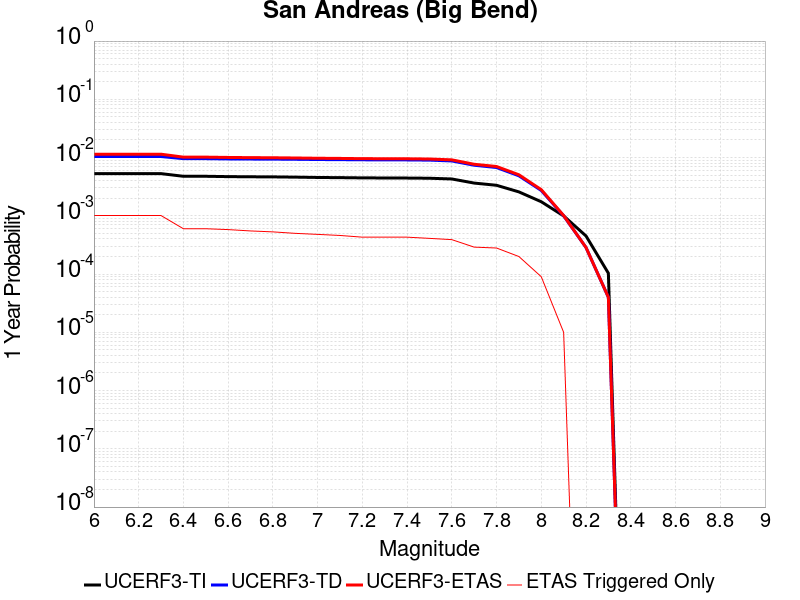 |  |

| Magnitude | 1 wk TI Prob | 1 wk TD Prob | 1 wk ETAS Prob | 1 wk ETAS/TD Gain | 1 wk ETAS Triggered Only | 1 mo TI Prob | 1 mo TD Prob | 1 mo ETAS Prob | 1 mo ETAS/TD Gain | 1 mo ETAS Triggered Only | 1 yr TI Prob | 1 yr TD Prob | 1 yr ETAS Prob | 1 yr ETAS/TD Gain | 1 yr ETAS Triggered Only | 10 yr TI Prob | 10 yr TD Prob | 10 yr ETAS Prob | 10 yr ETAS/TD Gain | 10 yr ETAS Triggered Only |
|-----|-----|-----|-----|-----|-----|-----|-----|-----|-----|-----|-----|-----|-----|-----|-----|-----|-----|-----|-----|-----|
| 6.0 | 1.0179969E-4 | 2.0072258E-4 | 6.947992E-4 | 3.4614897 | 4.9417577E-4 | 4.362114E-4 | 8.599571E-4 | 0.0015653154 | 1.820225 | 7.059654E-4 | 0.0052979486 | 0.010419999 | 0.011363122 | 1.0905108 | 9.530533E-4 | 0.051734097 | 0.10144902 | 0.10262256 | 1.0115678 | 0.001306036 |
| 6.1 | 1.0179969E-4 | 2.0072258E-4 | 6.947992E-4 | 3.4614897 | 4.9417577E-4 | 4.362114E-4 | 8.599571E-4 | 0.0015653154 | 1.820225 | 7.059654E-4 | 0.0052979486 | 0.010419999 | 0.011363122 | 1.0905108 | 9.530533E-4 | 0.051734097 | 0.10144902 | 0.10262256 | 1.0115678 | 0.001306036 |
| 6.2 | 1.0179969E-4 | 2.0072258E-4 | 6.947992E-4 | 3.4614897 | 4.9417577E-4 | 4.362114E-4 | 8.599571E-4 | 0.0015653154 | 1.820225 | 7.059654E-4 | 0.0052979486 | 0.010419999 | 0.011363122 | 1.0905108 | 9.530533E-4 | 0.051734097 | 0.10144902 | 0.10262256 | 1.0115678 | 0.001306036 |
| 6.3 | 1.0179969E-4 | 2.0072258E-4 | 6.947992E-4 | 3.4614897 | 4.9417577E-4 | 4.362114E-4 | 8.599571E-4 | 0.0015653154 | 1.820225 | 7.059654E-4 | 0.0052979486 | 0.010419999 | 0.011363122 | 1.0905108 | 9.530533E-4 | 0.051734097 | 0.10144902 | 0.10262256 | 1.0115678 | 0.001306036 |
| 6.4 | 9.1639464E-5 | 1.8429532E-4 | 5.725047E-4 | 3.106453 | 3.8828098E-4 | 3.9268145E-4 | 7.895982E-4 | 0.0012481135 | 1.5806943 | 4.588775E-4 | 0.0047704205 | 0.009571102 | 0.010095509 | 1.0547906 | 5.2947405E-4 | 0.046693064 | 0.09377527 | 0.09454299 | 1.0081868 | 8.471585E-4 |
| 6.5 | 9.1639464E-5 | 1.8429532E-4 | 5.725047E-4 | 3.106453 | 3.8828098E-4 | 3.9268145E-4 | 7.895982E-4 | 0.0012481135 | 1.5806943 | 4.588775E-4 | 0.0047704205 | 0.009571102 | 0.010095509 | 1.0547906 | 5.2947405E-4 | 0.046693064 | 0.09377527 | 0.09454299 | 1.0081868 | 8.471585E-4 |
| 6.6 | 9.042622E-5 | 1.823659E-4 | 5.352842E-4 | 2.935221 | 3.529827E-4 | 3.8748336E-4 | 7.8133424E-4 | 0.0012045825 | 1.5416994 | 4.2357924E-4 | 0.0047074095 | 0.009471365 | 0.00996086 | 1.0516816 | 4.9417577E-4 | 0.046089325 | 0.092869274 | 0.09357372 | 1.0075853 | 7.7656197E-4 |
| 6.7 | 8.9836685E-5 | 1.8150927E-4 | 5.344279E-4 | 2.944356 | 3.529827E-4 | 3.8495753E-4 | 7.776651E-4 | 0.001200915 | 1.5442572 | 4.2357924E-4 | 0.00467679 | 0.00942708 | 0.009916597 | 1.0519267 | 4.9417577E-4 | 0.045795817 | 0.09246355 | 0.09316831 | 1.007622 | 7.7656197E-4 |
| 6.8 | 8.9471854E-5 | 1.8097709E-4 | 4.9860403E-4 | 2.755067 | 3.1768443E-4 | 3.8339442E-4 | 7.7538576E-4 | 0.0011633657 | 1.5003701 | 3.8828098E-4 | 0.004657841 | 0.009399569 | 0.009854133 | 1.0483601 | 4.588775E-4 | 0.04561414 | 0.092210755 | 0.09288367 | 1.0072975 | 7.412637E-4 |
| 6.9 | 8.858234E-5 | 1.7979681E-4 | 4.9742416E-4 | 2.7665904 | 3.1768443E-4 | 3.7958333E-4 | 7.703304E-4 | 0.0011583123 | 1.5036564 | 3.8828098E-4 | 0.004611638 | 0.009338548 | 0.009793141 | 1.0486791 | 4.588775E-4 | 0.04517103 | 0.09165087 | 0.0923242 | 1.0073466 | 7.412637E-4 |
| 7.0 | 8.7433385E-5 | 1.7818481E-4 | 4.958126E-4 | 2.7825751 | 3.1768443E-4 | 3.746607E-4 | 7.634259E-4 | 0.0011514104 | 1.5082151 | 3.8828098E-4 | 0.004551957 | 0.009255203 | 0.009709834 | 1.0491216 | 4.588775E-4 | 0.044598386 | 0.09088532 | 0.09155921 | 1.0074148 | 7.412637E-4 |
| 7.1 | 8.684964E-5 | 1.7730435E-4 | 4.9493246E-4 | 2.7914288 | 3.1768443E-4 | 3.7215967E-4 | 7.596547E-4 | 0.0011476408 | 1.5107399 | 3.8828098E-4 | 0.0045216335 | 0.009209678 | 0.009664329 | 1.0493667 | 4.588775E-4 | 0.04430731 | 0.09046686 | 0.09114107 | 1.0074525 | 7.412637E-4 |
| 7.2 | 8.606521E-5 | 1.762105E-4 | 4.2325485E-4 | 2.4019842 | 2.4708788E-4 | 3.6879873E-4 | 7.549695E-4 | 0.0010724141 | 1.4204735 | 3.1768443E-4 | 0.0044808835 | 0.0091531165 | 0.009537843 | 1.0420324 | 3.8828098E-4 | 0.043916024 | 0.089947365 | 0.09055771 | 1.0067855 | 6.7066716E-4 |
| 7.3 | 8.568266E-5 | 1.7563057E-4 | 4.2267508E-4 | 2.4066145 | 2.4708788E-4 | 3.6715972E-4 | 7.524855E-4 | 0.0010699308 | 1.4218625 | 3.1768443E-4 | 0.0044610105 | 0.009123127 | 0.009507866 | 1.0421718 | 3.8828098E-4 | 0.043725148 | 0.08966853 | 0.09027906 | 1.0068088 | 6.7066716E-4 |
| 7.4 | 8.5432206E-5 | 1.7525644E-4 | 4.2230103E-4 | 2.4096177 | 2.4708788E-4 | 3.6608664E-4 | 7.50883E-4 | 0.001068329 | 1.4227635 | 3.1768443E-4 | 0.004447999 | 0.009103781 | 0.009488527 | 1.0422622 | 3.8828098E-4 | 0.043600157 | 0.08948871 | 0.09009936 | 1.0068238 | 6.7066716E-4 |
| 7.5 | 8.4791965E-5 | 1.7394972E-4 | 4.2099465E-4 | 2.4202087 | 2.4708788E-4 | 3.633435E-4 | 7.4528606E-4 | 0.0010627337 | 1.4259408 | 3.1768443E-4 | 0.0044147377 | 0.009036204 | 0.009420977 | 1.0425812 | 3.8828098E-4 | 0.043280575 | 0.088866346 | 0.08947741 | 1.0068762 | 6.7066716E-4 |
| 7.6 | 8.241105E-5 | 1.6840403E-4 | 3.80158E-4 | 2.2574162 | 2.1178962E-4 | 3.531424E-4 | 7.215321E-4 | 0.0010037145 | 1.3910878 | 2.8238617E-4 | 0.0042910352 | 0.008749358 | 0.0090992525 | 1.0399909 | 3.529827E-4 | 0.042091176 | 0.086243294 | 0.086823866 | 1.0067317 | 6.3536887E-4 |
| 7.7 | 7.00432E-5 | 1.42045E-4 | 2.4792476E-4 | 1.7453959 | 1.0589481E-4 | 3.001506E-4 | 6.0862233E-4 | 7.8500627E-4 | 1.2898085 | 1.7649135E-4 | 0.0036482112 | 0.0073848404 | 0.0076301037 | 1.0332117 | 2.4708788E-4 | 0.035888977 | 0.07351733 | 0.073942475 | 1.0057828 | 4.588775E-4 |
| 7.8 | 6.415362E-5 | 1.2968935E-4 | 2.3557042E-4 | 1.8164208 | 1.0589481E-4 | 2.749151E-4 | 5.556931E-4 | 6.968077E-4 | 1.2539434 | 1.4119309E-4 | 0.0033419547 | 0.0067446055 | 0.006954967 | 1.0311896 | 2.1178962E-4 | 0.03292141 | 0.06725231 | 0.06758155 | 1.0048957 | 3.529827E-4 |
| 7.9 | 4.939911E-5 | 9.3411545E-5 | 1.6400148E-4 | 1.7556876 | 7.059654E-5 | 2.116933E-4 | 4.0027377E-4 | 4.7084206E-4 | 1.1763 | 7.059654E-5 | 0.0025743195 | 0.004862453 | 0.005002959 | 1.0288962 | 1.4119309E-4 | 0.025447013 | 0.048914436 | 0.04914944 | 1.0048044 | 2.4708788E-4 |
| 8.0 | 3.344983E-5 | 5.222685E-5 | 8.752328E-5 | 1.6758292 | 3.529827E-5 | 1.4334853E-4 | 2.2381016E-4 | 2.5910055E-4 | 1.1576799 | 3.529827E-5 | 0.0017438711 | 0.0027214854 | 0.00279189 | 1.0258698 | 7.059654E-5 | 0.017302496 | 0.027922187 | 0.027990812 | 1.0024577 | 7.059654E-5 |
| 8.1 | 1.9104898E-5 | 1.9173063E-5 | 1.9173063E-5 | 1.0 | 0.0 | 8.1875565E-5 | 8.216769E-5 | 8.216769E-5 | 1.0 | 0.0 | 9.963791E-4 | 9.999331E-4 | 9.999331E-4 | 1.0 | 0.0 | 0.009919235 | 0.010749801 | 0.010749801 | 1.0 | 0.0 |
| 8.2 | 8.643924E-6 | 5.4748625E-6 | 5.4748625E-6 | 1.0 | 0.0 | 3.704486E-5 | 2.3463486E-5 | 2.3463486E-5 | 1.0 | 0.0 | 4.5092785E-4 | 2.8563058E-4 | 2.8563058E-4 | 1.0 | 0.0 | 0.0045001395 | 0.0032487072 | 0.0032487072 | 1.0 | 0.0 |
| 8.3 | 1.983087E-6 | 7.6599065E-7 | 7.6599065E-7 | 1.0 | 0.0 | 8.498917E-6 | 3.282813E-6 | 3.282813E-6 | 1.0 | 0.0 | 1.034694E-4 | 3.9967534E-5 | 3.9967534E-5 | 1.0 | 0.0 | 0.0010342124 | 4.719687E-4 | 4.719687E-4 | 1.0 | 0.0 |

## Cady
*[(top)](#table-of-contents)*

| 1 Week | 1 Month | 1 Year | 10 Year |
|-----|-----|-----|-----|
|  |  |  |  |

| Magnitude | 1 wk TI Prob | 1 wk TD Prob | 1 wk ETAS Prob | 1 wk ETAS/TD Gain | 1 wk ETAS Triggered Only | 1 mo TI Prob | 1 mo TD Prob | 1 mo ETAS Prob | 1 mo ETAS/TD Gain | 1 mo ETAS Triggered Only | 1 yr TI Prob | 1 yr TD Prob | 1 yr ETAS Prob | 1 yr ETAS/TD Gain | 1 yr ETAS Triggered Only | 10 yr TI Prob | 10 yr TD Prob | 10 yr ETAS Prob | 10 yr ETAS/TD Gain | 10 yr ETAS Triggered Only |
|-----|-----|-----|-----|-----|-----|-----|-----|-----|-----|-----|-----|-----|-----|-----|-----|-----|-----|-----|-----|-----|
| 6.0 | 1.9892565E-5 | 2.1858728E-5 | 4.101312E-4 | 18.762812 | 3.8828098E-4 | 8.525106E-5 | 9.3677416E-5 | 6.936918E-4 | 7.4051123 | 6.000706E-4 | 0.0010374374 | 0.0011400167 | 0.0018804354 | 1.6494805 | 7.412637E-4 | 0.010326075 | 0.011350701 | 0.012258038 | 1.0799367 | 9.17755E-4 |
| 6.1 | 1.9892565E-5 | 2.1858728E-5 | 4.101312E-4 | 18.762812 | 3.8828098E-4 | 8.525106E-5 | 9.3677416E-5 | 6.936918E-4 | 7.4051123 | 6.000706E-4 | 0.0010374374 | 0.0011400167 | 0.0018804354 | 1.6494805 | 7.412637E-4 | 0.010326075 | 0.011350701 | 0.012258038 | 1.0799367 | 9.17755E-4 |
| 6.2 | 1.9892565E-5 | 2.1858728E-5 | 4.101312E-4 | 18.762812 | 3.8828098E-4 | 8.525106E-5 | 9.3677416E-5 | 6.936918E-4 | 7.4051123 | 6.000706E-4 | 0.0010374374 | 0.0011400167 | 0.0018804354 | 1.6494805 | 7.412637E-4 | 0.010326075 | 0.011350701 | 0.012258038 | 1.0799367 | 9.17755E-4 |
| 6.3 | 1.1117327E-5 | 1.2176583E-5 | 1.5336795E-4 | 12.595318 | 1.4119309E-4 | 4.764482E-5 | 5.2184492E-5 | 3.6985235E-4 | 7.0873995 | 3.1768443E-4 | 5.7992124E-4 | 6.351925E-4 | 9.87951E-4 | 1.5553569 | 3.529827E-4 | 0.0057841022 | 0.0063368753 | 0.006792845 | 1.071955 | 4.588775E-4 |
| 6.4 | 1.1117327E-5 | 1.2176583E-5 | 1.5336795E-4 | 12.595318 | 1.4119309E-4 | 4.764482E-5 | 5.2184492E-5 | 3.6985235E-4 | 7.0873995 | 3.1768443E-4 | 5.7992124E-4 | 6.351925E-4 | 9.87951E-4 | 1.5553569 | 3.529827E-4 | 0.0057841022 | 0.0063368753 | 0.006792845 | 1.071955 | 4.588775E-4 |
| 6.5 | 6.103093E-6 | 6.672021E-6 | 1.1256612E-4 | 16.87137 | 1.0589481E-4 | 2.615585E-5 | 2.8594131E-5 | 2.403777E-4 | 8.40654 | 2.1178962E-4 | 3.1840094E-4 | 3.480905E-4 | 5.9509237E-4 | 1.709591 | 2.4708788E-4 | 0.0031794512 | 0.0034766865 | 0.0037229154 | 1.0708228 | 2.4708788E-4 |
| 6.6 | 5.817237E-6 | 6.3656585E-6 | 1.122598E-4 | 17.635221 | 1.0589481E-4 | 2.4930776E-5 | 2.728118E-5 | 2.3906502E-4 | 8.763002 | 2.1178962E-4 | 3.034899E-4 | 3.3211018E-4 | 5.79116E-4 | 1.7437466 | 2.4708788E-4 | 0.0030307577 | 0.0033173605 | 0.0035636288 | 1.0742362 | 2.4708788E-4 |
| 6.7 | 4.8846314E-6 | 5.3405684E-6 | 1.1123481E-4 | 20.828274 | 1.0589481E-4 | 2.0933967E-5 | 2.2888014E-5 | 1.9937532E-4 | 8.710905 | 1.7649135E-4 | 2.5484123E-4 | 2.7863772E-4 | 4.9036834E-4 | 1.7598778 | 2.1178962E-4 | 0.0025454918 | 0.0027840391 | 0.002995239 | 1.075861 | 2.1178962E-4 |
| 6.8 | 1.7788773E-6 | 1.9399079E-6 | 3.723811E-5 | 19.195812 | 3.529827E-5 | 7.6237375E-6 | 8.313874E-6 | 4.361185E-5 | 5.2456717 | 3.529827E-5 | 9.281505E-5 | 1.01218284E-4 | 1.7180768E-4 | 1.6973976 | 7.059654E-5 | 9.2776294E-4 | 0.0010118765 | 0.0010824016 | 1.0696974 | 7.059654E-5 |
| 6.9 | 7.5455404E-7 | 8.297092E-7 | 8.297092E-7 | 1.0 | 0.0 | 3.233799E-6 | 3.5558937E-6 | 3.5558937E-6 | 1.0 | 0.0 | 3.937079E-5 | 4.3292483E-5 | 7.8589226E-5 | 1.8153088 | 3.529827E-5 | 3.9363815E-4 | 4.3287344E-4 | 4.6815642E-4 | 1.0815088 | 3.529827E-5 |
| 7.0 | 6.8578805E-7 | 7.541816E-7 | 7.541816E-7 | 1.0 | 0.0 | 2.9390883E-6 | 3.2322048E-6 | 3.2322048E-6 | 1.0 | 0.0 | 3.578281E-5 | 3.9351715E-5 | 3.9351715E-5 | 1.0 | 0.0 | 3.577705E-4 | 3.9347992E-4 | 3.9347992E-4 | 1.0 | 0.0 |

## Red Pass
*[(top)](#table-of-contents)*

| 1 Week | 1 Month | 1 Year | 10 Year |
|-----|-----|-----|-----|
|  | 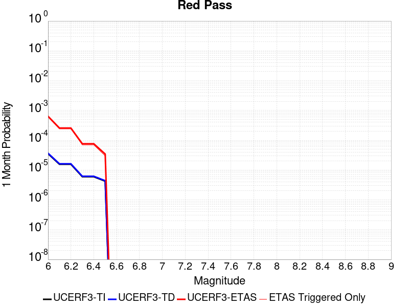 |  |  |

| Magnitude | 1 wk TI Prob | 1 wk TD Prob | 1 wk ETAS Prob | 1 wk ETAS/TD Gain | 1 wk ETAS Triggered Only | 1 mo TI Prob | 1 mo TD Prob | 1 mo ETAS Prob | 1 mo ETAS/TD Gain | 1 mo ETAS Triggered Only | 1 yr TI Prob | 1 yr TD Prob | 1 yr ETAS Prob | 1 yr ETAS/TD Gain | 1 yr ETAS Triggered Only | 10 yr TI Prob | 10 yr TD Prob | 10 yr ETAS Prob | 10 yr ETAS/TD Gain | 10 yr ETAS Triggered Only |
|-----|-----|-----|-----|-----|-----|-----|-----|-----|-----|-----|-----|-----|-----|-----|-----|-----|-----|-----|-----|-----|
| 6.0 | 8.258278E-6 | 8.551265E-6 | 4.321269E-4 | 50.53368 | 4.2357924E-4 | 3.539214E-5 | 3.6647863E-5 | 7.072904E-4 | 19.299635 | 6.7066716E-4 | 4.308141E-4 | 4.4611428E-4 | 0.0012576123 | 2.8190362 | 8.118602E-4 | 0.0042997985 | 0.004453945 | 0.0054378943 | 1.2209164 | 9.883515E-4 |
| 6.1 | 3.649988E-6 | 3.7753161E-6 | 7.4371594E-5 | 19.699434 | 7.059654E-5 | 1.5642712E-5 | 1.6179853E-5 | 1.9266835E-4 | 11.907917 | 1.7649135E-4 | 1.9043336E-4 | 1.9697666E-4 | 4.440159E-4 | 2.2541547 | 2.4708788E-4 | 0.0019027026 | 0.001968488 | 0.002285547 | 1.1610674 | 3.1768443E-4 |
| 6.2 | 3.649988E-6 | 3.7753161E-6 | 7.4371594E-5 | 19.699434 | 7.059654E-5 | 1.5642712E-5 | 1.6179853E-5 | 1.9266835E-4 | 11.907917 | 1.7649135E-4 | 1.9043336E-4 | 1.9697666E-4 | 4.440159E-4 | 2.2541547 | 2.4708788E-4 | 0.0019027026 | 0.001968488 | 0.002285547 | 1.1610674 | 3.1768443E-4 |
| 6.3 | 1.3924937E-6 | 1.4411166E-6 | 3.6739337E-5 | 25.49366 | 3.529827E-5 | 5.9678164E-6 | 6.1762075E-6 | 4.147426E-5 | 6.715166 | 3.529827E-5 | 7.265574E-5 | 7.519415E-5 | 1.4578538E-4 | 1.9387863 | 7.059654E-5 | 7.263199E-4 | 7.518258E-4 | 8.2236924E-4 | 1.0938295 | 7.059654E-5 |
| 6.4 | 1.3924937E-6 | 1.4411166E-6 | 3.6739337E-5 | 25.49366 | 3.529827E-5 | 5.9678164E-6 | 6.1762075E-6 | 4.147426E-5 | 6.715166 | 3.529827E-5 | 7.265574E-5 | 7.519415E-5 | 1.4578538E-4 | 1.9387863 | 7.059654E-5 | 7.263199E-4 | 7.518258E-4 | 8.2236924E-4 | 1.0938295 | 7.059654E-5 |
| 6.5 | 9.876812E-7 | 1.0221912E-6 | 1.0221912E-6 | 1.0 | 0.0 | 4.2329125E-6 | 4.3808195E-6 | 4.3808195E-6 | 1.0 | 0.0 | 5.153449E-5 | 5.3336476E-5 | 8.863286E-5 | 1.6617683 | 3.529827E-5 | 5.1522546E-4 | 5.333648E-4 | 5.686442E-4 | 1.0661451 | 3.529827E-5 |

## Elsinore (Glen Ivy) rev
*[(top)](#table-of-contents)*

| 1 Week | 1 Month | 1 Year | 10 Year |
|-----|-----|-----|-----|
|  |  |  |  |

| Magnitude | 1 wk TI Prob | 1 wk TD Prob | 1 wk ETAS Prob | 1 wk ETAS/TD Gain | 1 wk ETAS Triggered Only | 1 mo TI Prob | 1 mo TD Prob | 1 mo ETAS Prob | 1 mo ETAS/TD Gain | 1 mo ETAS Triggered Only | 1 yr TI Prob | 1 yr TD Prob | 1 yr ETAS Prob | 1 yr ETAS/TD Gain | 1 yr ETAS Triggered Only | 10 yr TI Prob | 10 yr TD Prob | 10 yr ETAS Prob | 10 yr ETAS/TD Gain | 10 yr ETAS Triggered Only |
|-----|-----|-----|-----|-----|-----|-----|-----|-----|-----|-----|-----|-----|-----|-----|-----|-----|-----|-----|-----|-----|
| 6.0 | 1.6204086E-4 | 2.9360707E-4 | 5.759103E-4 | 1.9615002 | 2.8238617E-4 | 6.94276E-4 | 0.0012578638 | 0.001751418 | 1.3923749 | 4.9417577E-4 | 0.008420097 | 0.015234485 | 0.015929695 | 1.045634 | 7.059654E-4 | 0.081081145 | 0.13969168 | 0.14039013 | 1.005 | 8.118602E-4 |
| 6.1 | 1.6204086E-4 | 2.9360707E-4 | 5.759103E-4 | 1.9615002 | 2.8238617E-4 | 6.94276E-4 | 0.0012578638 | 0.001751418 | 1.3923749 | 4.9417577E-4 | 0.008420097 | 0.015234485 | 0.015929695 | 1.045634 | 7.059654E-4 | 0.081081145 | 0.13969168 | 0.14039013 | 1.005 | 8.118602E-4 |
| 6.2 | 1.6204086E-4 | 2.9360707E-4 | 5.759103E-4 | 1.9615002 | 2.8238617E-4 | 6.94276E-4 | 0.0012578638 | 0.001751418 | 1.3923749 | 4.9417577E-4 | 0.008420097 | 0.015234485 | 0.015929695 | 1.045634 | 7.059654E-4 | 0.081081145 | 0.13969168 | 0.14039013 | 1.005 | 8.118602E-4 |
| 6.3 | 1.0111737E-4 | 1.7703383E-4 | 3.8878596E-4 | 2.1961112 | 2.1178962E-4 | 4.332882E-4 | 7.5861247E-4 | 0.0011465988 | 1.5114422 | 3.8828098E-4 | 0.005262531 | 0.009217682 | 0.009812222 | 1.0644999 | 6.000706E-4 | 0.0513964 | 0.0870191 | 0.08766363 | 1.0074068 | 7.059654E-4 |
| 6.4 | 1.0111737E-4 | 1.7703383E-4 | 3.8878596E-4 | 2.1961112 | 2.1178962E-4 | 4.332882E-4 | 7.5861247E-4 | 0.0011465988 | 1.5114422 | 3.8828098E-4 | 0.005262531 | 0.009217682 | 0.009812222 | 1.0644999 | 6.000706E-4 | 0.0513964 | 0.0870191 | 0.08766363 | 1.0074068 | 7.059654E-4 |
| 6.5 | 3.6624708E-5 | 4.6391084E-5 | 8.1687715E-5 | 1.7608495 | 3.529827E-5 | 1.569536E-4 | 1.9880582E-4 | 2.6938834E-4 | 1.3550323 | 7.059654E-5 | 0.001909235 | 0.0024181372 | 0.0026294147 | 1.0873721 | 2.1178962E-4 | 0.01892915 | 0.023739954 | 0.023946717 | 1.0087094 | 2.1178962E-4 |
| 6.6 | 2.5051324E-5 | 2.614772E-5 | 6.144507E-5 | 2.3499207 | 3.529827E-5 | 1.073584E-4 | 1.12057096E-4 | 1.4735141E-4 | 1.3149673 | 3.529827E-5 | 0.0013063047 | 0.0013634858 | 0.0015044864 | 1.1034118 | 1.4119309E-4 | 0.012986525 | 0.013564618 | 0.013703896 | 1.0102677 | 1.4119309E-4 |
| 6.7 | 2.2189772E-5 | 2.2072849E-5 | 5.737034E-5 | 2.599136 | 3.529827E-5 | 9.509556E-5 | 9.4594696E-5 | 1.2988962E-4 | 1.3731174 | 3.529827E-5 | 0.0011571734 | 0.0011511183 | 0.0012921488 | 1.1225162 | 1.4119309E-4 | 0.011511663 | 0.011465415 | 0.01160499 | 1.0121735 | 1.4119309E-4 |
| 6.8 | 1.6654378E-5 | 1.4437705E-5 | 4.9735467E-5 | 3.4448318 | 3.529827E-5 | 7.137396E-5 | 6.187444E-5 | 9.717053E-5 | 1.570447 | 3.529827E-5 | 8.686314E-4 | 7.530661E-4 | 8.5888116E-4 | 1.1405123 | 1.0589481E-4 | 0.008652439 | 0.00751048 | 0.0076155798 | 1.0139937 | 1.0589481E-4 |
| 6.9 | 1.5042909E-5 | 1.2332022E-5 | 4.762986E-5 | 3.8622909 | 3.529827E-5 | 6.446802E-5 | 5.285047E-5 | 8.814687E-5 | 1.6678541 | 3.529827E-5 | 7.8461546E-4 | 6.4326765E-4 | 7.4909435E-4 | 1.1645142 | 1.0589481E-4 | 0.007818509 | 0.00641828 | 0.006523495 | 1.0163931 | 1.0589481E-4 |
| 7.0 | 1.4361385E-5 | 1.1451324E-5 | 4.6749192E-5 | 4.0824265 | 3.529827E-5 | 6.154734E-5 | 4.9076196E-5 | 8.437273E-5 | 1.7192191 | 3.529827E-5 | 7.490812E-4 | 5.973418E-4 | 6.678962E-4 | 1.1181139 | 7.059654E-5 | 0.007465612 | 0.0059613534 | 0.006031529 | 1.0117718 | 7.059654E-5 |
| 7.1 | 1.3265571E-5 | 1.0244926E-5 | 4.5542834E-5 | 4.445404 | 3.529827E-5 | 5.6851208E-5 | 4.39061E-5 | 7.920282E-5 | 1.8039138 | 3.529827E-5 | 6.919436E-4 | 5.344282E-4 | 5.697076E-4 | 1.0660133 | 3.529827E-5 | 0.006897931 | 0.0053347866 | 0.0053698965 | 1.0065813 | 3.529827E-5 |
| 7.2 | 1.1596403E-5 | 8.505067E-6 | 4.3803037E-5 | 5.1502285 | 3.529827E-5 | 4.9697923E-5 | 3.6449786E-5 | 7.174677E-5 | 1.9683728 | 3.529827E-5 | 6.049042E-4 | 4.436875E-4 | 4.789701E-4 | 1.0795213 | 3.529827E-5 | 0.006032603 | 0.0044294316 | 0.0044645737 | 1.0079337 | 3.529827E-5 |
| 7.3 | 1.0150827E-5 | 7.2387597E-6 | 4.2536776E-5 | 5.8762517 | 3.529827E-5 | 4.3502816E-5 | 3.1022897E-5 | 6.632007E-5 | 2.1377783 | 3.529827E-5 | 5.2951806E-4 | 3.7763975E-4 | 4.1292468E-4 | 1.0934354 | 3.529827E-5 | 0.005282581 | 0.0037703665 | 0.003805532 | 1.0093267 | 3.529827E-5 |
| 7.4 | 9.080705E-6 | 6.352519E-6 | 4.1650565E-5 | 6.5565434 | 3.529827E-5 | 3.8916725E-5 | 2.7224805E-5 | 6.2522115E-5 | 2.2965128 | 3.529827E-5 | 4.7370812E-4 | 3.3141294E-4 | 3.6669953E-4 | 1.1064731 | 3.529827E-5 | 0.004726996 | 0.0033093381 | 0.0033445195 | 1.010631 | 3.529827E-5 |
| 7.5 | 7.671649E-6 | 5.2256332E-6 | 4.052372E-5 | 7.754796 | 3.529827E-5 | 3.287808E-5 | 2.2395385E-5 | 5.7692865E-5 | 2.576105 | 3.529827E-5 | 4.0021708E-4 | 2.7263095E-4 | 3.079196E-4 | 1.1294374 | 3.529827E-5 | 0.0039949706 | 0.00272309 | 0.002758292 | 1.0129273 | 3.529827E-5 |
| 7.6 | 6.990086E-6 | 4.687545E-6 | 3.998565E-5 | 8.53019 | 3.529827E-5 | 2.9957167E-5 | 2.008933E-5 | 5.5386892E-5 | 2.7570302 | 3.529827E-5 | 3.6466747E-4 | 2.445613E-4 | 2.7985094E-4 | 1.1442977 | 3.529827E-5 | 0.0036406964 | 0.002443038 | 0.0024782498 | 1.0144132 | 3.529827E-5 |
| 7.7 | 4.163505E-6 | 2.3295343E-6 | 3.7627724E-5 | 16.152466 | 3.529827E-5 | 1.7843471E-5 | 9.983683E-6 | 4.5281602E-5 | 4.5355606 | 3.529827E-5 | 2.172226E-4 | 1.21545316E-4 | 1.5683929E-4 | 1.2903771 | 3.529827E-5 | 0.0021701038 | 0.0012148614 | 0.0012501169 | 1.0290201 | 3.529827E-5 |
| 7.8 | 2.2692414E-7 | 9.3854695E-8 | 9.3854695E-8 | 1.0 | 0.0 | 9.725317E-7 | 4.0223435E-7 | 4.0223435E-7 | 1.0 | 0.0 | 1.1840509E-5 | 4.8971956E-6 | 4.8971956E-6 | 1.0 | 0.0 | 1.1839878E-4 | 4.8971204E-5 | 4.8971204E-5 | 1.0 | 0.0 |
| 7.9 | 6.676829E-9 | 3.439853E-9 | 3.439853E-9 | 1.0 | 0.0 | 2.861498E-8 | 1.4742227E-8 | 1.4742227E-8 | 1.0 | 0.0 | 3.4838732E-7 | 1.7948659E-7 | 1.7948659E-7 | 1.0 | 0.0 | 3.4838679E-6 | 1.7948646E-6 | 1.7948646E-6 | 1.0 | 0.0 |

## Death Valley (No)
*[(top)](#table-of-contents)*

| 1 Week | 1 Month | 1 Year | 10 Year |
|-----|-----|-----|-----|
|  | 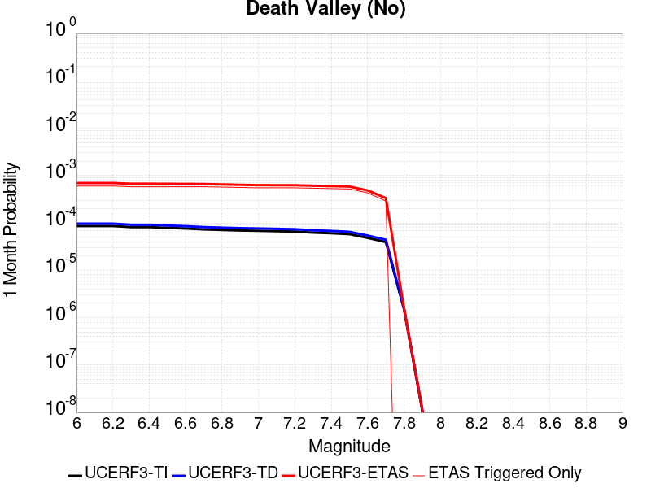 |  | 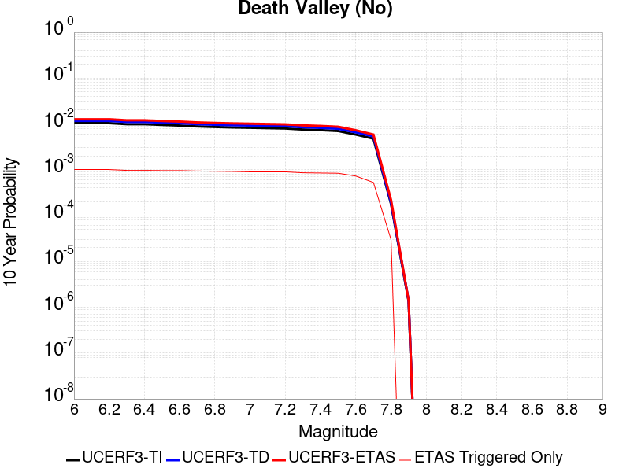 |

| Magnitude | 1 wk TI Prob | 1 wk TD Prob | 1 wk ETAS Prob | 1 wk ETAS/TD Gain | 1 wk ETAS Triggered Only | 1 mo TI Prob | 1 mo TD Prob | 1 mo ETAS Prob | 1 mo ETAS/TD Gain | 1 mo ETAS Triggered Only | 1 yr TI Prob | 1 yr TD Prob | 1 yr ETAS Prob | 1 yr ETAS/TD Gain | 1 yr ETAS Triggered Only | 10 yr TI Prob | 10 yr TD Prob | 10 yr ETAS Prob | 10 yr ETAS/TD Gain | 10 yr ETAS Triggered Only |
|-----|-----|-----|-----|-----|-----|-----|-----|-----|-----|-----|-----|-----|-----|-----|-----|-----|-----|-----|-----|-----|
| 6.0 | 2.0074807E-5 | 2.2500084E-5 | 3.7547483E-4 | 16.68771 | 3.529827E-4 | 8.603206E-5 | 9.642541E-5 | 5.5525865E-4 | 5.758427 | 4.588775E-4 | 0.001046937 | 0.0011733545 | 0.0019842621 | 1.691102 | 8.118602E-4 | 0.010420183 | 0.011672506 | 0.012579549 | 1.0777076 | 9.17755E-4 |
| 6.1 | 2.0074807E-5 | 2.2500084E-5 | 3.7547483E-4 | 16.68771 | 3.529827E-4 | 8.603206E-5 | 9.642541E-5 | 5.5525865E-4 | 5.758427 | 4.588775E-4 | 0.001046937 | 0.0011733545 | 0.0019842621 | 1.691102 | 8.118602E-4 | 0.010420183 | 0.011672506 | 0.012579549 | 1.0777076 | 9.17755E-4 |
| 6.2 | 2.0074807E-5 | 2.2500084E-5 | 3.7547483E-4 | 16.68771 | 3.529827E-4 | 8.603206E-5 | 9.642541E-5 | 5.5525865E-4 | 5.758427 | 4.588775E-4 | 0.001046937 | 0.0011733545 | 0.0019842621 | 1.691102 | 8.118602E-4 | 0.010420183 | 0.011672506 | 0.012579549 | 1.0777076 | 9.17755E-4 |
| 6.3 | 1.9050609E-5 | 2.1336948E-5 | 3.743121E-4 | 17.54291 | 3.529827E-4 | 8.164292E-5 | 9.1440896E-5 | 5.502764E-4 | 6.0178375 | 4.588775E-4 | 9.935491E-4 | 0.001112731 | 0.0018884289 | 1.6971117 | 7.7656197E-4 | 0.009891188 | 0.011072419 | 0.011945104 | 1.0788162 | 8.824568E-4 |
| 6.4 | 1.9050609E-5 | 2.1336948E-5 | 3.743121E-4 | 17.54291 | 3.529827E-4 | 8.164292E-5 | 9.1440896E-5 | 5.502764E-4 | 6.0178375 | 4.588775E-4 | 9.935491E-4 | 0.001112731 | 0.0018884289 | 1.6971117 | 7.7656197E-4 | 0.009891188 | 0.011072419 | 0.011945104 | 1.0788162 | 8.824568E-4 |
| 6.5 | 1.8367004E-5 | 2.0561009E-5 | 3.7353646E-4 | 18.167225 | 3.529827E-4 | 7.8713354E-5 | 8.811567E-5 | 5.4695277E-4 | 6.2072134 | 4.588775E-4 | 9.5791375E-4 | 0.0010722869 | 0.0018127556 | 1.690551 | 7.412637E-4 | 0.009537951 | 0.0106719155 | 0.011510033 | 1.0785348 | 8.471585E-4 |
| 6.6 | 1.779439E-5 | 1.9910927E-5 | 3.728866E-4 | 18.727736 | 3.529827E-4 | 7.625944E-5 | 8.53298E-5 | 5.441682E-4 | 6.377235 | 4.588775E-4 | 9.280632E-4 | 0.0010384015 | 0.0017788955 | 1.7131095 | 7.412637E-4 | 0.009241969 | 0.010336253 | 0.011174655 | 1.0811127 | 8.471585E-4 |
| 6.7 | 1.7025437E-5 | 1.9043426E-5 | 3.7201942E-4 | 19.53532 | 3.529827E-4 | 7.296412E-5 | 8.161216E-5 | 5.4045225E-4 | 6.622202 | 4.588775E-4 | 8.87976E-4 | 9.931813E-4 | 0.0017337088 | 1.7456115 | 7.412637E-4 | 0.008844362 | 0.009888145 | 0.010726927 | 1.084827 | 8.471585E-4 |
| 6.8 | 1.6545107E-5 | 1.8512545E-5 | 3.714887E-4 | 20.066864 | 3.529827E-4 | 7.090568E-5 | 7.93371E-5 | 5.381782E-4 | 6.783437 | 4.588775E-4 | 8.629347E-4 | 9.655073E-4 | 0.0017060552 | 1.767004 | 7.412637E-4 | 0.008595915 | 0.009613829 | 0.010452843 | 1.0872716 | 8.471585E-4 |
| 6.9 | 1.615478E-5 | 1.8087594E-5 | 3.710639E-4 | 20.51483 | 3.529827E-4 | 6.9232934E-5 | 7.751599E-5 | 5.363579E-4 | 6.91932 | 4.588775E-4 | 8.4258494E-4 | 9.433546E-4 | 0.0016839191 | 1.7850329 | 7.412637E-4 | 0.008393973 | 0.009394196 | 0.010233396 | 1.0893317 | 8.471585E-4 |
| 7.0 | 1.5894311E-5 | 1.780555E-5 | 3.3548434E-4 | 18.84156 | 3.1768443E-4 | 6.81167E-5 | 7.6307304E-5 | 4.998542E-4 | 6.5505424 | 4.2357924E-4 | 8.2900526E-4 | 9.286515E-4 | 0.0016339613 | 1.759499 | 7.059654E-4 | 0.008259195 | 0.009248397 | 0.010052749 | 1.086972 | 8.118602E-4 |
| 7.1 | 1.5602263E-5 | 1.7483504E-5 | 3.351624E-4 | 19.170208 | 3.1768443E-4 | 6.6865134E-5 | 7.492718E-5 | 4.984747E-4 | 6.6527886 | 4.2357924E-4 | 8.137789E-4 | 9.118627E-4 | 0.0016171844 | 1.7734954 | 7.059654E-4 | 0.008108052 | 0.009081894 | 0.009886381 | 1.0885814 | 8.118602E-4 |
| 7.2 | 1.5323829E-5 | 1.717063E-5 | 3.348496E-4 | 19.5013 | 3.1768443E-4 | 6.56719E-5 | 7.358637E-5 | 4.9713446E-4 | 6.755795 | 4.2357924E-4 | 7.99262E-4 | 8.9555193E-4 | 0.0016008851 | 1.7875961 | 7.059654E-4 | 0.007963934 | 0.008920107 | 0.009724725 | 1.0902028 | 8.118602E-4 |
| 7.3 | 1.4556212E-5 | 1.6302456E-5 | 3.339817E-4 | 20.48659 | 3.1768443E-4 | 6.238227E-5 | 6.9865826E-5 | 4.5811967E-4 | 6.557135 | 3.8828098E-4 | 7.592395E-4 | 8.5029035E-4 | 0.001485119 | 1.7466022 | 6.3536887E-4 | 0.0075665074 | 0.008471014 | 0.009205999 | 1.0867646 | 7.412637E-4 |
| 7.4 | 1.411725E-5 | 1.580796E-5 | 3.3348738E-4 | 21.096167 | 3.1768443E-4 | 6.0501097E-5 | 6.7746674E-5 | 4.2070547E-4 | 6.2099795 | 3.529827E-4 | 7.363519E-4 | 8.245094E-4 | 0.0014240852 | 1.727191 | 6.000706E-4 | 0.0073391674 | 0.008215138 | 0.008915304 | 1.0852287 | 7.059654E-4 |
| 7.5 | 1.3503312E-5 | 1.5126289E-5 | 3.328059E-4 | 22.001822 | 3.1768443E-4 | 5.7870053E-5 | 6.482538E-5 | 4.177852E-4 | 6.444779 | 3.529827E-4 | 7.043401E-4 | 7.8896893E-4 | 0.0013885661 | 1.7599756 | 6.000706E-4 | 0.007021119 | 0.007862304 | 0.008562719 | 1.0890852 | 7.059654E-4 |
| 7.6 | 1.1279839E-5 | 1.2626327E-5 | 2.2441328E-4 | 17.773441 | 2.1178962E-4 | 4.834127E-5 | 5.4111737E-5 | 3.0118626E-4 | 5.566006 | 2.4708788E-4 | 5.88396E-4 | 6.5861654E-4 | 0.0011524669 | 1.7498298 | 4.9417577E-4 | 0.005868405 | 0.006567199 | 0.007128262 | 1.0854342 | 5.6477234E-4 |
| 7.7 | 9.189108E-6 | 1.0283358E-5 | 1.5147499E-4 | 14.730109 | 1.4119309E-4 | 3.93813E-5 | 4.407082E-5 | 2.205544E-4 | 5.0045447 | 1.7649135E-4 | 4.7936183E-4 | 5.3643517E-4 | 8.5394917E-4 | 1.5918963 | 3.1768443E-4 | 0.004783291 | 0.005351914 | 0.0057030073 | 1.0656015 | 3.529827E-4 |
| 7.8 | 3.4586725E-7 | 3.6482615E-7 | 3.6482615E-7 | 1.0 | 0.0 | 1.4822873E-6 | 1.5635396E-6 | 1.5635396E-6 | 1.0 | 0.0 | 1.80467E-5 | 1.9035933E-5 | 1.9035933E-5 | 1.0 | 0.0 | 1.8045233E-4 | 1.9034347E-4 | 1.9034347E-4 | 1.0 | 0.0 |
| 7.9 | 2.5591178E-9 | 2.6696718E-9 | 2.6696718E-9 | 1.0 | 0.0 | 1.0967647E-8 | 1.14414505E-8 | 1.14414505E-8 | 1.0 | 0.0 | 1.335311E-7 | 1.3929966E-7 | 1.3929966E-7 | 1.0 | 0.0 | 1.3353102E-6 | 1.3929966E-6 | 1.3929966E-6 | 1.0 | 0.0 |

## Scodie Lineament
*[(top)](#table-of-contents)*

| 1 Week | 1 Month | 1 Year | 10 Year |
|-----|-----|-----|-----|
|  |  |  |  |

| Magnitude | 1 wk TI Prob | 1 wk TD Prob | 1 wk ETAS Prob | 1 wk ETAS/TD Gain | 1 wk ETAS Triggered Only | 1 mo TI Prob | 1 mo TD Prob | 1 mo ETAS Prob | 1 mo ETAS/TD Gain | 1 mo ETAS Triggered Only | 1 yr TI Prob | 1 yr TD Prob | 1 yr ETAS Prob | 1 yr ETAS/TD Gain | 1 yr ETAS Triggered Only | 10 yr TI Prob | 10 yr TD Prob | 10 yr ETAS Prob | 10 yr ETAS/TD Gain | 10 yr ETAS Triggered Only |
|-----|-----|-----|-----|-----|-----|-----|-----|-----|-----|-----|-----|-----|-----|-----|-----|-----|-----|-----|-----|-----|
| 6.0 | 3.2919327E-6 | 3.0133422E-6 | 4.9718766E-4 | 164.9954 | 4.9417577E-4 | 1.4108206E-5 | 1.2914278E-5 | 5.0708366E-4 | 39.265354 | 4.9417577E-4 | 1.7175387E-4 | 1.5722317E-4 | 7.924921E-4 | 5.040556 | 6.3536887E-4 | 0.0017162118 | 0.0015714309 | 0.0023115298 | 1.4709713 | 7.412637E-4 |
| 6.1 | 1.8663811E-6 | 1.5490499E-6 | 7.214548E-5 | 46.57402 | 7.059654E-5 | 7.998751E-6 | 6.6387715E-6 | 7.723484E-5 | 11.633906 | 7.059654E-5 | 9.738045E-5 | 8.082454E-5 | 2.2200622E-4 | 2.7467673 | 1.4119309E-4 | 9.7337784E-4 | 8.080003E-4 | 0.0010196187 | 1.261904 | 2.1178962E-4 |
| 6.2 | 1.8663811E-6 | 1.5490499E-6 | 7.214548E-5 | 46.57402 | 7.059654E-5 | 7.998751E-6 | 6.6387715E-6 | 7.723484E-5 | 11.633906 | 7.059654E-5 | 9.738045E-5 | 8.082454E-5 | 2.2200622E-4 | 2.7467673 | 1.4119309E-4 | 9.7337784E-4 | 8.080003E-4 | 0.0010196187 | 1.261904 | 2.1178962E-4 |
| 6.3 | 1.8663811E-6 | 1.5490499E-6 | 7.214548E-5 | 46.57402 | 7.059654E-5 | 7.998751E-6 | 6.6387715E-6 | 7.723484E-5 | 11.633906 | 7.059654E-5 | 9.738045E-5 | 8.082454E-5 | 2.2200622E-4 | 2.7467673 | 1.4119309E-4 | 9.7337784E-4 | 8.080003E-4 | 0.0010196187 | 1.261904 | 2.1178962E-4 |
| 6.4 | 1.8663811E-6 | 1.5490499E-6 | 7.214548E-5 | 46.57402 | 7.059654E-5 | 7.998751E-6 | 6.6387715E-6 | 7.723484E-5 | 11.633906 | 7.059654E-5 | 9.738045E-5 | 8.082454E-5 | 2.2200622E-4 | 2.7467673 | 1.4119309E-4 | 9.7337784E-4 | 8.080003E-4 | 0.0010196187 | 1.261904 | 2.1178962E-4 |
| 6.5 | 1.8106311E-6 | 1.4909839E-6 | 7.2087416E-5 | 48.348892 | 7.059654E-5 | 7.759824E-6 | 6.3899183E-6 | 7.6986005E-5 | 12.048042 | 7.059654E-5 | 9.447177E-5 | 7.7794975E-5 | 2.1897707E-4 | 2.8147972 | 1.4119309E-4 | 9.4431615E-4 | 7.7772606E-4 | 9.89351E-4 | 1.2721072 | 2.1178962E-4 |
| 6.6 | 1.2414679E-6 | 8.997558E-7 | 8.997558E-7 | 1.0 | 0.0 | 5.320566E-6 | 3.856091E-6 | 3.856091E-6 | 1.0 | 0.0 | 6.477596E-5 | 4.6946985E-5 | 1.1754021E-4 | 2.5036798 | 7.059654E-5 | 6.475708E-4 | 4.693793E-4 | 5.399427E-4 | 1.1503334 | 7.059654E-5 |
| 6.7 | 1.1062215E-6 | 7.594311E-7 | 7.594311E-7 | 1.0 | 0.0 | 4.7409408E-6 | 3.2547011E-6 | 3.2547011E-6 | 1.0 | 0.0 | 5.7719422E-5 | 3.9625334E-5 | 1.1021908E-4 | 2.7815304 | 7.059654E-5 | 5.770443E-4 | 3.961897E-4 | 4.6675827E-4 | 1.1781181 | 7.059654E-5 |
| 6.8 | 1.0006736E-6 | 6.500397E-7 | 6.500397E-7 | 1.0 | 0.0 | 4.288594E-6 | 2.7858816E-6 | 2.7858816E-6 | 1.0 | 0.0 | 5.221238E-5 | 3.3917644E-5 | 1.0451179E-4 | 3.0813398 | 7.059654E-5 | 5.220012E-4 | 3.3913075E-4 | 4.0970335E-4 | 1.2080985 | 7.059654E-5 |
| 6.9 | 9.167364E-7 | 5.631625E-7 | 5.631625E-7 | 1.0 | 0.0 | 3.9288643E-6 | 2.4135516E-6 | 2.4135516E-6 | 1.0 | 0.0 | 4.7832873E-5 | 2.9384651E-5 | 2.9384651E-5 | 1.0 | 0.0 | 4.782258E-4 | 2.9381333E-4 | 2.9381333E-4 | 1.0 | 0.0 |
| 7.0 | 7.6987664E-7 | 4.113383E-7 | 4.113383E-7 | 1.0 | 0.0 | 3.2994672E-6 | 1.7628774E-6 | 1.7628774E-6 | 1.0 | 0.0 | 4.0170275E-5 | 2.1462862E-5 | 2.1462862E-5 | 1.0 | 0.0 | 4.0163012E-4 | 2.1461173E-4 | 2.1461173E-4 | 1.0 | 0.0 |
| 7.1 | 7.1038727E-7 | 3.5211494E-7 | 3.5211494E-7 | 1.0 | 0.0 | 3.0445133E-6 | 1.5090633E-6 | 1.5090633E-6 | 1.0 | 0.0 | 3.706632E-5 | 1.8372726E-5 | 1.8372726E-5 | 1.0 | 0.0 | 3.7060137E-4 | 1.8371557E-4 | 1.8371557E-4 | 1.0 | 0.0 |
| 7.2 | 2.0799602E-7 | 3.1186854E-8 | 3.1186854E-8 | 1.0 | 0.0 | 8.914113E-7 | 1.3365793E-7 | 1.3365793E-7 | 1.0 | 0.0 | 1.0852878E-5 | 1.6272843E-6 | 1.6272843E-6 | 1.0 | 0.0 | 1.08523476E-4 | 1.627273E-5 | 1.627273E-5 | 1.0 | 0.0 |
| 7.3 | 1.5048182E-7 | 1.5945696E-8 | 1.5945696E-8 | 1.0 | 0.0 | 6.449219E-7 | 6.83387E-8 | 6.83387E-8 | 1.0 | 0.0 | 7.851896E-6 | 8.320234E-7 | 8.320234E-7 | 1.0 | 0.0 | 7.851618E-5 | 8.320206E-6 | 8.320206E-6 | 1.0 | 0.0 |
| 7.4 | 5.9334678E-8 | 4.8683537E-9 | 4.8683537E-9 | 1.0 | 0.0 | 2.5429145E-7 | 2.0864372E-8 | 2.0864372E-8 | 1.0 | 0.0 | 3.095994E-6 | 2.5402372E-7 | 2.5402372E-7 | 1.0 | 0.0 | 3.095951E-5 | 2.5402353E-6 | 2.5402353E-6 | 1.0 | 0.0 |

## Manix-Afton Hills
*[(top)](#table-of-contents)*

| 1 Week | 1 Month | 1 Year | 10 Year |
|-----|-----|-----|-----|
|  | 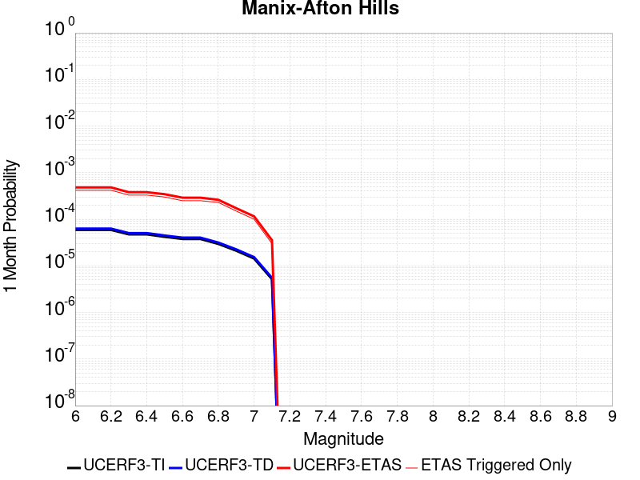 |  |  |

| Magnitude | 1 wk TI Prob | 1 wk TD Prob | 1 wk ETAS Prob | 1 wk ETAS/TD Gain | 1 wk ETAS Triggered Only | 1 mo TI Prob | 1 mo TD Prob | 1 mo ETAS Prob | 1 mo ETAS/TD Gain | 1 mo ETAS Triggered Only | 1 yr TI Prob | 1 yr TD Prob | 1 yr ETAS Prob | 1 yr ETAS/TD Gain | 1 yr ETAS Triggered Only | 10 yr TI Prob | 10 yr TD Prob | 10 yr ETAS Prob | 10 yr ETAS/TD Gain | 10 yr ETAS Triggered Only |
|-----|-----|-----|-----|-----|-----|-----|-----|-----|-----|-----|-----|-----|-----|-----|-----|-----|-----|-----|-----|-----|
| 6.0 | 1.3783202E-5 | 1.47110895E-5 | 2.2649759E-4 | 15.396384 | 2.1178962E-4 | 5.906953E-5 | 6.30461E-5 | 4.1600654E-4 | 6.5984497 | 3.529827E-4 | 7.189342E-4 | 7.6733343E-4 | 0.0013669436 | 1.7814206 | 6.000706E-4 | 0.0071661277 | 0.007648596 | 0.008314134 | 1.0870143 | 6.7066716E-4 |
| 6.1 | 1.3783202E-5 | 1.47110895E-5 | 2.2649759E-4 | 15.396384 | 2.1178962E-4 | 5.906953E-5 | 6.30461E-5 | 4.1600654E-4 | 6.5984497 | 3.529827E-4 | 7.189342E-4 | 7.6733343E-4 | 0.0013669436 | 1.7814206 | 6.000706E-4 | 0.0071661277 | 0.007648596 | 0.008314134 | 1.0870143 | 6.7066716E-4 |
| 6.2 | 1.3783202E-5 | 1.47110895E-5 | 2.2649759E-4 | 15.396384 | 2.1178962E-4 | 5.906953E-5 | 6.30461E-5 | 4.1600654E-4 | 6.5984497 | 3.529827E-4 | 7.189342E-4 | 7.6733343E-4 | 0.0013669436 | 1.7814206 | 6.000706E-4 | 0.0071661277 | 0.007648596 | 0.008314134 | 1.0870143 | 6.7066716E-4 |
| 6.3 | 1.10494875E-5 | 1.1793136E-5 | 1.882824E-4 | 15.965424 | 1.7649135E-4 | 4.7354086E-5 | 5.054109E-5 | 3.6820947E-4 | 7.285349 | 3.1768443E-4 | 5.763835E-4 | 6.151744E-4 | 0.0011090462 | 1.8028159 | 4.9417577E-4 | 0.005748908 | 0.0061357557 | 0.0066970624 | 1.0914813 | 5.6477234E-4 |
| 6.4 | 1.10494875E-5 | 1.1793136E-5 | 1.882824E-4 | 15.965424 | 1.7649135E-4 | 4.7354086E-5 | 5.054109E-5 | 3.6820947E-4 | 7.285349 | 3.1768443E-4 | 5.763835E-4 | 6.151744E-4 | 0.0011090462 | 1.8028159 | 4.9417577E-4 | 0.005748908 | 0.0061357557 | 0.0066970624 | 1.0914813 | 5.6477234E-4 |
| 6.5 | 9.788949E-6 | 1.045432E-5 | 1.8694383E-4 | 17.88197 | 1.7649135E-4 | 4.1951964E-5 | 4.480351E-5 | 3.6247371E-4 | 8.090297 | 3.1768443E-4 | 5.1064545E-4 | 5.453555E-4 | 0.0010039827 | 1.8409693 | 4.588775E-4 | 0.0050947363 | 0.0054410985 | 0.0059676915 | 1.0967807 | 5.2947405E-4 |
| 6.6 | 8.810006E-6 | 9.4136285E-6 | 1.8590332E-4 | 19.748318 | 1.7649135E-4 | 3.775662E-5 | 4.0343548E-5 | 3.5801515E-4 | 8.874162 | 3.1768443E-4 | 4.5958988E-4 | 4.9108086E-4 | 9.144521E-4 | 1.8621212 | 4.2357924E-4 | 0.0045864056 | 0.004900839 | 0.005392593 | 1.1003407 | 4.9417577E-4 |
| 6.7 | 8.80128E-6 | 9.404108E-6 | 1.858938E-4 | 19.767298 | 1.7649135E-4 | 3.7719226E-5 | 4.0302748E-5 | 3.5797438E-4 | 8.8821335 | 3.1768443E-4 | 4.591348E-4 | 4.9058435E-4 | 9.139558E-4 | 1.8629942 | 4.2357924E-4 | 0.004581874 | 0.0048958957 | 0.005387652 | 1.1004425 | 4.9417577E-4 |
| 6.8 | 6.8994877E-6 | 7.380076E-6 | 1.8387013E-4 | 24.914394 | 1.7649135E-4 | 2.9568899E-5 | 3.162856E-5 | 3.4930295E-4 | 11.043909 | 3.1768443E-4 | 3.5994186E-4 | 3.8501783E-4 | 8.08434E-4 | 2.0997312 | 4.2357924E-4 | 0.003593594 | 0.0038443129 | 0.004336589 | 1.1280531 | 4.9417577E-4 |
| 6.9 | 4.9328037E-6 | 5.2709615E-6 | 1.1116522E-4 | 21.09012 | 1.0589481E-4 | 2.1140417E-5 | 2.2589675E-5 | 1.9907704E-4 | 8.812745 | 1.7649135E-4 | 2.5735417E-4 | 2.7500073E-4 | 5.5730925E-4 | 2.0265737 | 2.8238617E-4 | 0.0025705635 | 0.0027472095 | 0.0030640212 | 1.1153213 | 3.1768443E-4 |
| 7.0 | 3.347973E-6 | 3.59003E-6 | 7.418632E-5 | 20.66454 | 7.059654E-5 | 1.4348378E-5 | 1.5385775E-5 | 1.2127896E-4 | 7.882538 | 1.0589481E-4 | 1.746775E-4 | 1.8730981E-4 | 3.637681E-4 | 1.9420664 | 1.7649135E-4 | 0.0017454025 | 0.0018719219 | 0.002083315 | 1.1129284 | 2.1178962E-4 |
| 7.1 | 1.2073567E-6 | 1.293482E-6 | 1.293482E-6 | 1.0 | 0.0 | 5.1743755E-6 | 5.543492E-6 | 5.543492E-6 | 1.0 | 0.0 | 6.29962E-5 | 6.749156E-5 | 6.749156E-5 | 1.0 | 0.0 | 6.297835E-4 | 6.7487074E-4 | 6.7487074E-4 | 1.0 | 0.0 |

## San Andreas (San Gorgonio Pass-Garnet HIll)
*[(top)](#table-of-contents)*

| 1 Week | 1 Month | 1 Year | 10 Year |
|-----|-----|-----|-----|
| 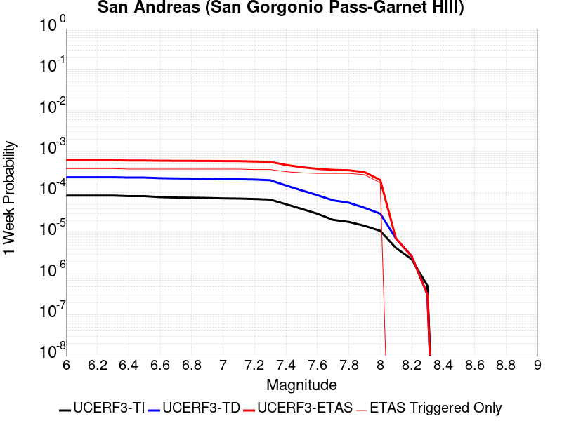 |  |  |  |

| Magnitude | 1 wk TI Prob | 1 wk TD Prob | 1 wk ETAS Prob | 1 wk ETAS/TD Gain | 1 wk ETAS Triggered Only | 1 mo TI Prob | 1 mo TD Prob | 1 mo ETAS Prob | 1 mo ETAS/TD Gain | 1 mo ETAS Triggered Only | 1 yr TI Prob | 1 yr TD Prob | 1 yr ETAS Prob | 1 yr ETAS/TD Gain | 1 yr ETAS Triggered Only | 10 yr TI Prob | 10 yr TD Prob | 10 yr ETAS Prob | 10 yr ETAS/TD Gain | 10 yr ETAS Triggered Only |
|-----|-----|-----|-----|-----|-----|-----|-----|-----|-----|-----|-----|-----|-----|-----|-----|-----|-----|-----|-----|-----|
| 6.0 | 8.31567E-5 | 2.3382473E-4 | 5.867249E-4 | 2.5092509 | 3.529827E-4 | 3.5633717E-4 | 0.0010017233 | 0.0014954042 | 1.4928315 | 4.9417577E-4 | 0.004329778 | 0.012127888 | 0.012755551 | 1.0517538 | 6.3536887E-4 | 0.042463828 | 0.11257892 | 0.1132054 | 1.0055649 | 7.059654E-4 |
| 6.1 | 8.31567E-5 | 2.3382473E-4 | 5.867249E-4 | 2.5092509 | 3.529827E-4 | 3.5633717E-4 | 0.0010017233 | 0.0014954042 | 1.4928315 | 4.9417577E-4 | 0.004329778 | 0.012127888 | 0.012755551 | 1.0517538 | 6.3536887E-4 | 0.042463828 | 0.11257892 | 0.1132054 | 1.0055649 | 7.059654E-4 |
| 6.2 | 8.31567E-5 | 2.3382473E-4 | 5.867249E-4 | 2.5092509 | 3.529827E-4 | 3.5633717E-4 | 0.0010017233 | 0.0014954042 | 1.4928315 | 4.9417577E-4 | 0.004329778 | 0.012127888 | 0.012755551 | 1.0517538 | 6.3536887E-4 | 0.042463828 | 0.11257892 | 0.1132054 | 1.0055649 | 7.059654E-4 |
| 6.3 | 8.31567E-5 | 2.3382473E-4 | 5.867249E-4 | 2.5092509 | 3.529827E-4 | 3.5633717E-4 | 0.0010017233 | 0.0014954042 | 1.4928315 | 4.9417577E-4 | 0.004329778 | 0.012127888 | 0.012755551 | 1.0517538 | 6.3536887E-4 | 0.042463828 | 0.11257892 | 0.1132054 | 1.0055649 | 7.059654E-4 |
| 6.4 | 8.059055E-5 | 2.2940808E-4 | 5.823098E-4 | 2.5383143 | 3.529827E-4 | 3.4534236E-4 | 9.828096E-4 | 0.0014764996 | 1.5023253 | 4.9417577E-4 | 0.0041964394 | 0.011900152 | 0.012527959 | 1.0527563 | 6.3536887E-4 | 0.041180745 | 0.11056015 | 0.11118806 | 1.0056794 | 7.059654E-4 |
| 6.5 | 8.059055E-5 | 2.2940808E-4 | 5.823098E-4 | 2.5383143 | 3.529827E-4 | 3.4534236E-4 | 9.828096E-4 | 0.0014764996 | 1.5023253 | 4.9417577E-4 | 0.0041964394 | 0.011900152 | 0.012527959 | 1.0527563 | 6.3536887E-4 | 0.041180745 | 0.11056015 | 0.11118806 | 1.0056794 | 7.059654E-4 |
| 6.6 | 7.619237E-5 | 2.218517E-4 | 5.747561E-4 | 2.590722 | 3.529827E-4 | 3.2649786E-4 | 9.5044886E-4 | 0.001444155 | 1.5194452 | 4.9417577E-4 | 0.0039678677 | 0.01151087 | 0.0121389255 | 1.054562 | 6.3536887E-4 | 0.03897764 | 0.10709683 | 0.107727185 | 1.0058858 | 7.059654E-4 |
| 6.7 | 7.440636E-5 | 2.1860997E-4 | 5.715155E-4 | 2.6143157 | 3.529827E-4 | 3.188454E-4 | 9.3656575E-4 | 0.0014302786 | 1.5271525 | 4.9417577E-4 | 0.0038750346 | 0.011343609 | 0.01197177 | 1.0553758 | 6.3536887E-4 | 0.038081564 | 0.105605274 | 0.10623669 | 1.005979 | 7.059654E-4 |
| 6.8 | 7.3735864E-5 | 2.1708169E-4 | 5.6998775E-4 | 2.6256833 | 3.529827E-4 | 3.1597257E-4 | 9.3002064E-4 | 0.0014237368 | 1.5308659 | 4.9417577E-4 | 0.0038401815 | 0.011264749 | 0.01189296 | 1.0557679 | 6.3536887E-4 | 0.03774495 | 0.10490683 | 0.10553873 | 1.0060235 | 7.059654E-4 |
| 6.9 | 7.27575E-5 | 2.1477141E-4 | 5.676783E-4 | 2.6431744 | 3.529827E-4 | 3.117806E-4 | 9.201265E-4 | 0.0013785817 | 1.4982525 | 4.588775E-4 | 0.003789323 | 0.011145527 | 0.0117389085 | 1.0532395 | 6.000706E-4 | 0.037253562 | 0.103854746 | 0.10445576 | 1.0057871 | 6.7066716E-4 |
| 7.0 | 7.102591E-5 | 2.1061185E-4 | 5.635202E-4 | 2.675634 | 3.529827E-4 | 3.0436125E-4 | 9.023122E-4 | 0.0013607757 | 1.5080985 | 4.588775E-4 | 0.003699303 | 0.010930831 | 0.011524342 | 1.054297 | 6.000706E-4 | 0.03638325 | 0.10195695 | 0.10255923 | 1.0059073 | 6.7066716E-4 |
| 7.1 | 7.028513E-5 | 2.0896831E-4 | 5.6187727E-4 | 2.6888156 | 3.529827E-4 | 3.0118722E-4 | 8.9527335E-4 | 0.00135374 | 1.5120969 | 4.588775E-4 | 0.0036607897 | 0.010845989 | 0.011439552 | 1.0547265 | 6.000706E-4 | 0.036010686 | 0.101199985 | 0.10180278 | 1.0059565 | 6.7066716E-4 |
| 7.2 | 6.8498244E-5 | 2.0504706E-4 | 5.579574E-4 | 2.7211187 | 3.529827E-4 | 2.9353087E-4 | 8.784794E-4 | 0.0013369538 | 1.5218954 | 4.588775E-4 | 0.003567883 | 0.010643536 | 0.01123722 | 1.0557789 | 6.000706E-4 | 0.035111405 | 0.09939202 | 0.09999603 | 1.006077 | 6.7066716E-4 |
| 7.3 | 6.622592E-5 | 1.9732013E-4 | 5.502332E-4 | 2.7885303 | 3.529827E-4 | 2.8379448E-4 | 8.453858E-4 | 0.0013038754 | 1.5423436 | 4.588775E-4 | 0.0034497243 | 0.0102444785 | 0.010838402 | 1.0579749 | 6.000706E-4 | 0.033966612 | 0.095888525 | 0.09649488 | 1.0063236 | 6.7066716E-4 |
| 7.4 | 5.1050705E-5 | 1.4689034E-4 | 4.998212E-4 | 3.4026828 | 3.529827E-4 | 2.1877038E-4 | 6.29379E-4 | 0.0010879677 | 1.7286369 | 4.588775E-4 | 0.002660276 | 0.0076359594 | 0.008231448 | 1.0779848 | 6.000706E-4 | 0.02628654 | 0.07286301 | 0.073484816 | 1.0085338 | 6.7066716E-4 |
| 7.5 | 3.9302922E-5 | 1.1129847E-4 | 4.2894753E-4 | 3.8540292 | 3.1768443E-4 | 1.6843023E-4 | 4.7690657E-4 | 9.002838E-4 | 1.8877572 | 4.2357924E-4 | 0.0020487092 | 0.005790949 | 0.0063173566 | 1.0909019 | 5.2947405E-4 | 0.020299247 | 0.05600951 | 0.056575973 | 1.0101136 | 6.000706E-4 |
| 7.6 | 2.9851626E-5 | 8.4949745E-5 | 4.026072E-4 | 4.7393575 | 3.1768443E-4 | 1.2792926E-4 | 3.6401965E-4 | 7.874447E-4 | 2.1631927 | 4.2357924E-4 | 0.0015564259 | 0.0044229585 | 0.004950091 | 1.1191809 | 5.2947405E-4 | 0.0154556995 | 0.04319374 | 0.043767888 | 1.0132924 | 6.000706E-4 |
| 7.7 | 2.1135214E-5 | 6.3529005E-5 | 3.8119324E-4 | 6.000303 | 3.1768443E-4 | 9.0576345E-5 | 2.7223877E-4 | 6.957027E-4 | 2.5554872 | 4.2357924E-4 | 0.0011022091 | 0.0033094748 | 0.0038020152 | 1.1488273 | 4.9417577E-4 | 0.010967582 | 0.032582592 | 0.033128966 | 1.0167688 | 5.6477234E-4 |
| 7.8 | 1.883379E-5 | 5.564028E-5 | 3.7330703E-4 | 6.709295 | 3.1768443E-4 | 8.0713755E-5 | 2.3843657E-4 | 6.2662497E-4 | 2.6280572 | 3.8828098E-4 | 9.822468E-4 | 0.0028991038 | 0.0033566512 | 1.1578237 | 4.588775E-4 | 0.0097791655 | 0.028695205 | 0.029209487 | 1.0179222 | 5.2947405E-4 |
| 7.9 | 1.5156185E-5 | 4.1658426E-5 | 3.2403282E-4 | 7.778326 | 2.8238617E-4 | 6.495346E-5 | 1.785239E-4 | 5.3144357E-4 | 2.9768765 | 3.529827E-4 | 7.9052144E-4 | 0.0021713632 | 0.0025940228 | 1.1946517 | 4.2357924E-4 | 0.007877152 | 0.021759422 | 0.022208316 | 1.0206298 | 4.588775E-4 |
| 8.0 | 1.1405907E-5 | 2.9974231E-5 | 2.7705473E-4 | 9.243096 | 2.4708788E-4 | 4.8881542E-5 | 1.2845467E-4 | 4.1080455E-4 | 3.1980507 | 2.8238617E-4 | 5.9497025E-4 | 0.0015628147 | 0.0019152457 | 1.2255105 | 3.529827E-4 | 0.005933798 | 0.015772851 | 0.016155006 | 1.0242288 | 3.8828098E-4 |
| 8.1 | 4.3511436E-6 | 7.369219E-6 | 7.369219E-6 | 1.0 | 0.0 | 1.8647626E-5 | 3.1581985E-5 | 3.1581985E-5 | 1.0 | 0.0 | 2.2701119E-4 | 3.8444297E-4 | 3.8444297E-4 | 1.0 | 0.0 | 0.0022677942 | 0.0041163345 | 0.0041163345 | 1.0 | 0.0 |
| 8.2 | 2.3042528E-6 | 2.7329415E-6 | 2.7329415E-6 | 1.0 | 0.0 | 9.875332E-6 | 1.1712554E-5 | 1.1712554E-5 | 1.0 | 0.0 | 1.2022553E-4 | 1.4259106E-4 | 1.4259106E-4 | 1.0 | 0.0 | 0.0012016051 | 0.0015979785 | 0.0015979785 | 1.0 | 0.0 |
| 8.3 | 5.202968E-7 | 3.1598344E-7 | 3.1598344E-7 | 1.0 | 0.0 | 2.2298414E-6 | 1.3542141E-6 | 1.3542141E-6 | 1.0 | 0.0 | 2.714798E-5 | 1.6487444E-5 | 1.6487444E-5 | 1.0 | 0.0 | 2.7144665E-4 | 1.9563142E-4 | 1.9563142E-4 | 1.0 | 0.0 |

## San Andreas (Cholame) rev
*[(top)](#table-of-contents)*

| 1 Week | 1 Month | 1 Year | 10 Year |
|-----|-----|-----|-----|
|  | 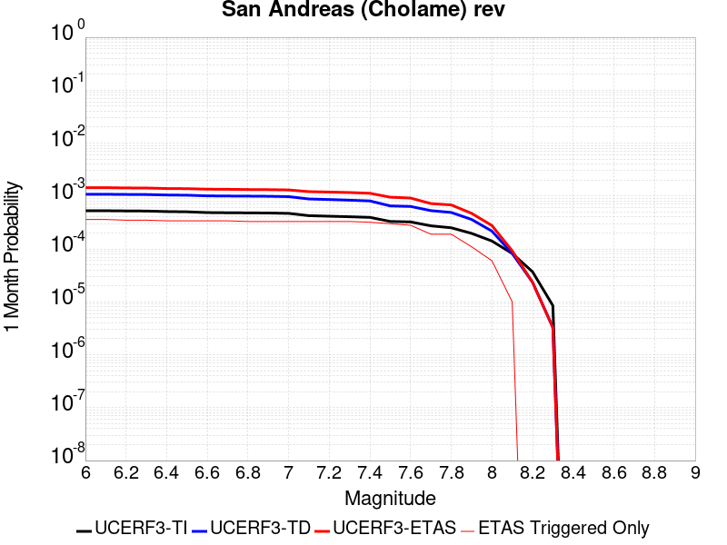 |  | 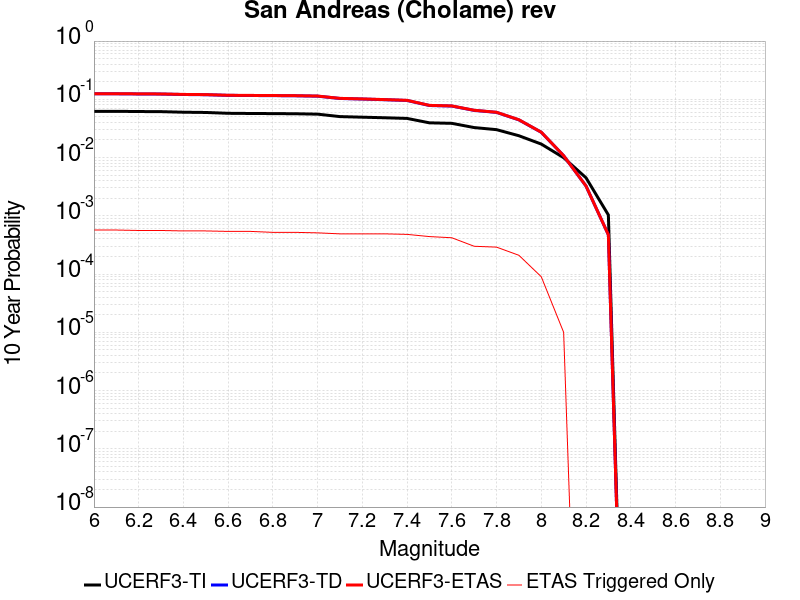 |

| Magnitude | 1 wk TI Prob | 1 wk TD Prob | 1 wk ETAS Prob | 1 wk ETAS/TD Gain | 1 wk ETAS Triggered Only | 1 mo TI Prob | 1 mo TD Prob | 1 mo ETAS Prob | 1 mo ETAS/TD Gain | 1 mo ETAS Triggered Only | 1 yr TI Prob | 1 yr TD Prob | 1 yr ETAS Prob | 1 yr ETAS/TD Gain | 1 yr ETAS Triggered Only | 10 yr TI Prob | 10 yr TD Prob | 10 yr ETAS Prob | 10 yr ETAS/TD Gain | 10 yr ETAS Triggered Only |
|-----|-----|-----|-----|-----|-----|-----|-----|-----|-----|-----|-----|-----|-----|-----|-----|-----|-----|-----|-----|-----|
| 6.0 | 1.2302514E-4 | 2.5204287E-4 | 5.6964724E-4 | 2.2601204 | 3.1768443E-4 | 5.27144E-4 | 0.0010797381 | 0.0014323398 | 1.326562 | 3.529827E-4 | 0.0063991086 | 0.0130670825 | 0.013519964 | 1.0346582 | 4.588775E-4 | 0.06217949 | 0.12439073 | 0.12500888 | 1.0049695 | 7.059654E-4 |
| 6.1 | 1.2302514E-4 | 2.5204287E-4 | 5.6964724E-4 | 2.2601204 | 3.1768443E-4 | 5.27144E-4 | 0.0010797381 | 0.0014323398 | 1.326562 | 3.529827E-4 | 0.0063991086 | 0.0130670825 | 0.013519964 | 1.0346582 | 4.588775E-4 | 0.06217949 | 0.12439073 | 0.12500888 | 1.0049695 | 7.059654E-4 |
| 6.2 | 1.2203569E-4 | 2.5021084E-4 | 5.678158E-4 | 2.2693493 | 3.1768443E-4 | 5.2290526E-4 | 0.0010718931 | 0.0014244975 | 1.3289548 | 3.529827E-4 | 0.006347804 | 0.01297271 | 0.013425634 | 1.0349137 | 4.588775E-4 | 0.061695136 | 0.12357691 | 0.12419563 | 1.0050068 | 7.059654E-4 |
| 6.3 | 1.2142645E-4 | 2.4907055E-4 | 5.6667585E-4 | 2.275162 | 3.1768443E-4 | 5.202953E-4 | 0.0010670102 | 0.0014196163 | 1.3304617 | 3.529827E-4 | 0.006316212 | 0.012913967 | 0.013366918 | 1.0350746 | 4.588775E-4 | 0.06139677 | 0.12307103 | 0.12369011 | 1.0050303 | 7.059654E-4 |
| 6.4 | 1.1865206E-4 | 2.44126E-4 | 5.6173286E-4 | 2.3009956 | 3.1768443E-4 | 5.0840975E-4 | 0.0010458364 | 0.0013984499 | 1.3371594 | 3.529827E-4 | 0.006172335 | 0.012659196 | 0.013112265 | 1.0357897 | 4.588775E-4 | 0.060036868 | 0.1208638 | 0.12148444 | 1.005135 | 7.059654E-4 |
| 6.5 | 1.17443946E-4 | 2.4205919E-4 | 5.596667E-4 | 2.3121068 | 3.1768443E-4 | 5.032341E-4 | 0.0010369857 | 0.0013896023 | 1.3400401 | 3.529827E-4 | 0.006109677 | 0.012552682 | 0.0130058 | 1.0360973 | 4.588775E-4 | 0.059444077 | 0.11993805 | 0.12055935 | 1.0051801 | 7.059654E-4 |
| 6.6 | 1.13579066E-4 | 2.3514954E-4 | 5.527593E-4 | 2.3506713 | 3.1768443E-4 | 4.866766E-4 | 0.001007396 | 0.0013600232 | 1.3500382 | 3.529827E-4 | 0.0059092017 | 0.012196515 | 0.012649795 | 1.0371648 | 4.588775E-4 | 0.057545185 | 0.11685214 | 0.11744444 | 1.0050688 | 6.7066716E-4 |
| 6.7 | 1.1271412E-4 | 2.3359268E-4 | 5.512029E-4 | 2.3596754 | 3.1768443E-4 | 4.829711E-4 | 0.0010007289 | 0.0013533584 | 1.3523726 | 3.529827E-4 | 0.005864331 | 0.012116249 | 0.012569566 | 1.0374141 | 4.588775E-4 | 0.057119697 | 0.116155714 | 0.116748475 | 1.0051032 | 6.7066716E-4 |
| 6.8 | 1.1217975E-4 | 2.3247694E-4 | 5.1479746E-4 | 2.2144022 | 2.8238617E-4 | 4.8068175E-4 | 9.959509E-4 | 0.0013133188 | 1.3186584 | 3.1768443E-4 | 0.005836608 | 0.012058721 | 0.012477193 | 1.0347028 | 4.2357924E-4 | 0.056856725 | 0.11565396 | 0.116215855 | 1.0048584 | 6.3536887E-4 |
| 6.9 | 1.1146753E-4 | 2.3096445E-4 | 5.132854E-4 | 2.2223568 | 2.8238617E-4 | 4.7763053E-4 | 9.894737E-4 | 0.0013068437 | 1.3207464 | 3.1768443E-4 | 0.0057996577 | 0.011980731 | 0.012399236 | 1.0349314 | 4.2357924E-4 | 0.056506127 | 0.11497439 | 0.115536705 | 1.0048908 | 6.3536887E-4 |
| 7.0 | 1.0965793E-4 | 2.2719789E-4 | 5.095199E-4 | 2.242626 | 2.8238617E-4 | 4.698779E-4 | 9.733434E-4 | 0.0012907186 | 1.3260671 | 3.1768443E-4 | 0.005705768 | 0.011786487 | 0.012205074 | 1.0355141 | 4.2357924E-4 | 0.055614736 | 0.11327597 | 0.113839366 | 1.0049736 | 6.3536887E-4 |
| 7.1 | 9.927982E-5 | 2.0538924E-4 | 4.877174E-4 | 2.3746006 | 2.8238617E-4 | 4.2541555E-4 | 8.7994366E-4 | 0.0011973486 | 1.3607105 | 3.1768443E-4 | 0.0051671406 | 0.010660981 | 0.0110451225 | 1.0360324 | 3.8828098E-4 | 0.05048634 | 0.1033706 | 0.10390864 | 1.0052049 | 6.000706E-4 |
| 7.2 | 9.696786E-5 | 2.0043184E-4 | 4.8276142E-4 | 2.4086063 | 2.8238617E-4 | 4.1551032E-4 | 8.5871184E-4 | 0.0011761235 | 1.369637 | 3.1768443E-4 | 0.00504711 | 0.010404981 | 0.010789221 | 1.0369285 | 3.8828098E-4 | 0.04934009 | 0.1011086 | 0.101647995 | 1.0053349 | 6.000706E-4 |
| 7.3 | 9.4727984E-5 | 1.9472468E-4 | 4.7705587E-4 | 2.4498992 | 2.8238617E-4 | 4.0591392E-4 | 8.3426846E-4 | 0.0011516878 | 1.3804764 | 3.1768443E-4 | 0.0049308087 | 0.010110183 | 0.010494538 | 1.0380167 | 3.8828098E-4 | 0.048228268 | 0.09847952 | 0.09902049 | 1.0054933 | 6.000706E-4 |
| 7.4 | 9.220358E-5 | 1.8843076E-4 | 4.354721E-4 | 2.3110456 | 2.4708788E-4 | 3.9509835E-4 | 8.073114E-4 | 0.0010894695 | 1.3495035 | 2.8238617E-4 | 0.004799717 | 0.009784967 | 0.010134495 | 1.035721 | 3.529827E-4 | 0.046973653 | 0.095557496 | 0.0960683 | 1.0053455 | 5.6477234E-4 |
| 7.5 | 7.71631E-5 | 1.5177966E-4 | 3.9883005E-4 | 2.627691 | 2.4708788E-4 | 3.306571E-4 | 6.503223E-4 | 9.325248E-4 | 1.4339426 | 2.8238617E-4 | 0.0040183207 | 0.007889002 | 0.008239199 | 1.0443907 | 3.529827E-4 | 0.03946433 | 0.07828531 | 0.07877333 | 1.0062339 | 5.2947405E-4 |
| 7.6 | 7.5634416E-5 | 1.483744E-4 | 3.601326E-4 | 2.4271884 | 2.1178962E-4 | 3.241072E-4 | 6.3573546E-4 | 8.8266627E-4 | 1.3884176 | 2.4708788E-4 | 0.0039388672 | 0.0077126776 | 0.008027912 | 1.0408722 | 3.1768443E-4 | 0.038697794 | 0.07664872 | 0.077105016 | 1.0059531 | 4.9417577E-4 |
| 7.7 | 6.3783E-5 | 1.235872E-4 | 2.2946893E-4 | 1.8567369 | 1.0589481E-4 | 2.7332708E-4 | 5.29552E-4 | 6.706703E-4 | 1.2664863 | 1.4119309E-4 | 0.0033226798 | 0.0064282627 | 0.006638691 | 1.0327349 | 2.1178962E-4 | 0.032734364 | 0.06454029 | 0.06483747 | 1.0046046 | 3.1768443E-4 |
| 7.8 | 5.863422E-5 | 1.1416107E-4 | 2.2004379E-4 | 1.9274853 | 1.0589481E-4 | 2.512653E-4 | 4.8917E-4 | 6.3029403E-4 | 1.2884969 | 1.4119309E-4 | 0.003054864 | 0.0059394026 | 0.0061499346 | 1.0354466 | 2.1178962E-4 | 0.030132094 | 0.059659187 | 0.059924725 | 1.0044509 | 2.8238617E-4 |
| 7.9 | 4.595283E-5 | 8.426331E-5 | 1.548539E-4 | 1.8377382 | 7.059654E-5 | 1.9692584E-4 | 3.610785E-4 | 4.3164956E-4 | 1.1954452 | 7.059654E-5 | 0.0023949358 | 0.0043872762 | 0.0045278496 | 1.0320412 | 1.4119309E-4 | 0.023692891 | 0.044362005 | 0.0445644 | 1.0045624 | 2.1178962E-4 |
| 8.0 | 3.2950178E-5 | 5.0772942E-5 | 8.606942E-5 | 1.6951828 | 3.529827E-5 | 1.412074E-4 | 2.1758018E-4 | 2.5287078E-4 | 1.1621958 | 3.529827E-5 | 0.0017178444 | 0.0026458222 | 0.002716232 | 1.0266117 | 7.059654E-5 | 0.017046256 | 0.027180137 | 0.027248815 | 1.0025268 | 7.059654E-5 |
| 8.1 | 1.9177472E-5 | 1.9185145E-5 | 1.9185145E-5 | 1.0 | 0.0 | 8.218658E-5 | 8.221946E-5 | 8.221946E-5 | 1.0 | 0.0 | 0.0010001622 | 0.0010005629 | 0.0010005629 | 1.0 | 0.0 | 0.009956728 | 0.010758142 | 0.010758142 | 1.0 | 0.0 |
| 8.2 | 8.643924E-6 | 5.4748625E-6 | 5.4748625E-6 | 1.0 | 0.0 | 3.704486E-5 | 2.3463486E-5 | 2.3463486E-5 | 1.0 | 0.0 | 4.5092785E-4 | 2.8563058E-4 | 2.8563058E-4 | 1.0 | 0.0 | 0.0045001395 | 0.0032487072 | 0.0032487072 | 1.0 | 0.0 |
| 8.3 | 1.983087E-6 | 7.6599065E-7 | 7.6599065E-7 | 1.0 | 0.0 | 8.498917E-6 | 3.282813E-6 | 3.282813E-6 | 1.0 | 0.0 | 1.034694E-4 | 3.9967534E-5 | 3.9967534E-5 | 1.0 | 0.0 | 0.0010342124 | 4.719687E-4 | 4.719687E-4 | 1.0 | 0.0 |

## Ludlow
*[(top)](#table-of-contents)*

| 1 Week | 1 Month | 1 Year | 10 Year |
|-----|-----|-----|-----|
|  | 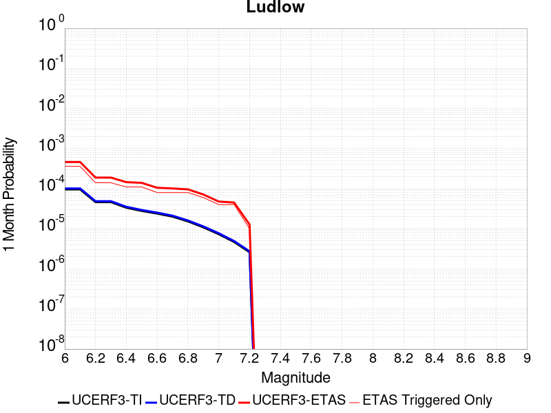 |  |  |

| Magnitude | 1 wk TI Prob | 1 wk TD Prob | 1 wk ETAS Prob | 1 wk ETAS/TD Gain | 1 wk ETAS Triggered Only | 1 mo TI Prob | 1 mo TD Prob | 1 mo ETAS Prob | 1 mo ETAS/TD Gain | 1 mo ETAS Triggered Only | 1 yr TI Prob | 1 yr TD Prob | 1 yr ETAS Prob | 1 yr ETAS/TD Gain | 1 yr ETAS Triggered Only | 10 yr TI Prob | 10 yr TD Prob | 10 yr ETAS Prob | 10 yr ETAS/TD Gain | 10 yr ETAS Triggered Only |
|-----|-----|-----|-----|-----|-----|-----|-----|-----|-----|-----|-----|-----|-----|-----|-----|-----|-----|-----|-----|-----|
| 6.0 | 2.2407607E-5 | 2.3657254E-5 | 3.766316E-4 | 15.920343 | 3.529827E-4 | 9.602906E-5 | 1.0138454E-4 | 6.308049E-4 | 6.2219043 | 5.2947405E-4 | 0.0011685267 | 0.001233702 | 0.0019035416 | 1.542951 | 6.7066716E-4 | 0.011624013 | 0.012273042 | 0.012970343 | 1.0568156 | 7.059654E-4 |
| 6.1 | 2.2407607E-5 | 2.3657254E-5 | 3.766316E-4 | 15.920343 | 3.529827E-4 | 9.602906E-5 | 1.0138454E-4 | 6.308049E-4 | 6.2219043 | 5.2947405E-4 | 0.0011685267 | 0.001233702 | 0.0019035416 | 1.542951 | 6.7066716E-4 | 0.011624013 | 0.012273042 | 0.012970343 | 1.0568156 | 7.059654E-4 |
| 6.2 | 1.0781252E-5 | 1.1365663E-5 | 1.5255714E-4 | 13.422634 | 1.4119309E-4 | 4.620455E-5 | 4.8709102E-5 | 2.604884E-4 | 5.3478384 | 2.1178962E-4 | 5.623952E-4 | 5.9287593E-4 | 8.0454E-4 | 1.3570124 | 2.1178962E-4 | 0.00560974 | 0.0059133614 | 0.006158988 | 1.0415376 | 2.4708788E-4 |
| 6.3 | 1.0781252E-5 | 1.1365663E-5 | 1.5255714E-4 | 13.422634 | 1.4119309E-4 | 4.620455E-5 | 4.8709102E-5 | 2.604884E-4 | 5.3478384 | 2.1178962E-4 | 5.623952E-4 | 5.9287593E-4 | 8.0454E-4 | 1.3570124 | 2.1178962E-4 | 0.00560974 | 0.0059133614 | 0.006158988 | 1.0415376 | 2.4708788E-4 |
| 6.4 | 7.814439E-6 | 8.237729E-6 | 1.1413167E-4 | 13.85475 | 1.0589481E-4 | 3.3490025E-5 | 3.530408E-5 | 2.117892E-4 | 5.9990005 | 1.7649135E-4 | 4.0766477E-4 | 4.2974384E-4 | 6.0615933E-4 | 1.4105132 | 1.7649135E-4 | 0.0040691774 | 0.0042892746 | 0.004500156 | 1.0491648 | 2.1178962E-4 |
| 6.5 | 6.4986366E-6 | 6.85092E-6 | 1.1274501E-4 | 16.456915 | 1.0589481E-4 | 2.7851002E-5 | 2.9360759E-5 | 2.0584693E-4 | 7.010954 | 1.7649135E-4 | 3.390332E-4 | 3.5740953E-4 | 5.338378E-4 | 1.4936305 | 1.7649135E-4 | 0.003385164 | 0.0035684432 | 0.0037443049 | 1.0492824 | 1.7649135E-4 |
| 6.6 | 5.582177E-6 | 5.8860055E-6 | 7.648213E-5 | 12.993894 | 7.059654E-5 | 2.3923398E-5 | 2.5225498E-5 | 1.6641502E-4 | 6.5970955 | 1.4119309E-4 | 2.9122844E-4 | 3.0707786E-4 | 4.482276E-4 | 1.4596545 | 1.4119309E-4 | 0.0029084706 | 0.003066609 | 0.003207369 | 1.045901 | 1.4119309E-4 |
| 6.7 | 4.6858763E-6 | 4.940427E-6 | 7.553662E-5 | 15.289492 | 7.059654E-5 | 2.0082172E-5 | 2.1173091E-5 | 1.6236318E-4 | 7.668374 | 1.4119309E-4 | 2.4447302E-4 | 2.5775246E-4 | 3.9890912E-4 | 1.5476444 | 1.4119309E-4 | 0.0024420423 | 0.0025745912 | 0.002715421 | 1.0546998 | 1.4119309E-4 |
| 6.8 | 3.5584908E-6 | 3.7520183E-6 | 7.4348296E-5 | 19.815546 | 7.059654E-5 | 1.5250586E-5 | 1.6079981E-5 | 1.572708E-4 | 9.780533 | 1.4119309E-4 | 1.8566006E-4 | 1.957566E-4 | 3.3692204E-4 | 1.7211274 | 1.4119309E-4 | 0.0018550502 | 0.0019558826 | 0.0020967997 | 1.0720477 | 1.4119309E-4 |
| 6.9 | 2.532834E-6 | 2.6710034E-6 | 3.796918E-5 | 14.215324 | 3.529827E-5 | 1.0854958E-5 | 1.1447109E-5 | 1.1734071E-4 | 10.250685 | 1.0589481E-4 | 1.3215111E-4 | 1.3935992E-4 | 2.4523996E-4 | 1.7597598 | 1.0589481E-4 | 0.0013207254 | 0.0013927529 | 0.0014985001 | 1.0759269 | 1.0589481E-4 |
| 7.0 | 1.7083285E-6 | 1.8019439E-6 | 1.8019439E-6 | 1.0 | 0.0 | 7.3213873E-6 | 7.722595E-6 | 7.831859E-5 | 10.141487 | 7.059654E-5 | 8.913424E-5 | 9.40187E-5 | 1.646086E-4 | 1.750807 | 7.059654E-5 | 8.9098496E-4 | 9.3980576E-4 | 0.001010336 | 1.0750476 | 7.059654E-5 |
| 7.1 | 1.0905424E-6 | 1.1497619E-6 | 1.1497619E-6 | 1.0 | 0.0 | 4.6737446E-6 | 4.9275427E-6 | 7.5523734E-5 | 15.326856 | 7.059654E-5 | 5.6901354E-5 | 5.999128E-5 | 1.3058359E-4 | 2.1767094 | 7.059654E-5 | 5.6886784E-4 | 5.997606E-4 | 6.703148E-4 | 1.1176373 | 7.059654E-5 |
| 7.2 | 6.06668E-7 | 6.387277E-7 | 6.387277E-7 | 1.0 | 0.0 | 2.600003E-6 | 2.7374022E-6 | 2.7374022E-6 | 1.0 | 0.0 | 3.1654577E-5 | 3.3327433E-5 | 3.3327433E-5 | 1.0 | 0.0 | 3.1650066E-4 | 3.3323118E-4 | 3.3323118E-4 | 1.0 | 0.0 |

## Baker
*[(top)](#table-of-contents)*

| 1 Week | 1 Month | 1 Year | 10 Year |
|-----|-----|-----|-----|
|  |  |  |  |

| Magnitude | 1 wk TI Prob | 1 wk TD Prob | 1 wk ETAS Prob | 1 wk ETAS/TD Gain | 1 wk ETAS Triggered Only | 1 mo TI Prob | 1 mo TD Prob | 1 mo ETAS Prob | 1 mo ETAS/TD Gain | 1 mo ETAS Triggered Only | 1 yr TI Prob | 1 yr TD Prob | 1 yr ETAS Prob | 1 yr ETAS/TD Gain | 1 yr ETAS Triggered Only | 10 yr TI Prob | 10 yr TD Prob | 10 yr ETAS Prob | 10 yr ETAS/TD Gain | 10 yr ETAS Triggered Only |
|-----|-----|-----|-----|-----|-----|-----|-----|-----|-----|-----|-----|-----|-----|-----|-----|-----|-----|-----|-----|-----|
| 6.0 | 5.695525E-6 | 5.8348373E-6 | 3.5881548E-4 | 61.495373 | 3.529827E-4 | 2.4409164E-5 | 2.5006228E-5 | 5.1916967E-4 | 20.761614 | 4.9417577E-4 | 2.9714106E-4 | 3.044123E-4 | 9.0430025E-4 | 2.9706428 | 6.000706E-4 | 0.0029674405 | 0.0030403486 | 0.0037441677 | 1.2314929 | 7.059654E-4 |
| 6.1 | 5.695525E-6 | 5.8348373E-6 | 3.5881548E-4 | 61.495373 | 3.529827E-4 | 2.4409164E-5 | 2.5006228E-5 | 5.1916967E-4 | 20.761614 | 4.9417577E-4 | 2.9714106E-4 | 3.044123E-4 | 9.0430025E-4 | 2.9706428 | 6.000706E-4 | 0.0029674405 | 0.0030403486 | 0.0037441677 | 1.2314929 | 7.059654E-4 |
| 6.2 | 5.695525E-6 | 5.8348373E-6 | 3.5881548E-4 | 61.495373 | 3.529827E-4 | 2.4409164E-5 | 2.5006228E-5 | 5.1916967E-4 | 20.761614 | 4.9417577E-4 | 2.9714106E-4 | 3.044123E-4 | 9.0430025E-4 | 2.9706428 | 6.000706E-4 | 0.0029674405 | 0.0030403486 | 0.0037441677 | 1.2314929 | 7.059654E-4 |
| 6.3 | 3.2995713E-6 | 3.383667E-6 | 2.1517258E-4 | 63.59153 | 2.1178962E-4 | 1.4140943E-5 | 1.4501353E-5 | 2.9688343E-4 | 20.472809 | 2.8238617E-4 | 1.7215237E-4 | 1.7654014E-4 | 5.2946055E-4 | 2.9990942 | 3.529827E-4 | 0.0017201907 | 0.001764046 | 0.002222114 | 1.259669 | 4.588775E-4 |
| 6.4 | 3.2995713E-6 | 3.383667E-6 | 2.1517258E-4 | 63.59153 | 2.1178962E-4 | 1.4140943E-5 | 1.4501353E-5 | 2.9688343E-4 | 20.472809 | 2.8238617E-4 | 1.7215237E-4 | 1.7654014E-4 | 5.2946055E-4 | 2.9990942 | 3.529827E-4 | 0.0017201907 | 0.001764046 | 0.002222114 | 1.259669 | 4.588775E-4 |
| 6.5 | 2.782202E-6 | 2.8558404E-6 | 1.793467E-4 | 62.79997 | 1.7649135E-4 | 1.1923668E-5 | 1.223926E-5 | 2.5932412E-4 | 21.187891 | 2.4708788E-4 | 1.4516099E-4 | 1.4900314E-4 | 4.6664022E-4 | 3.1317477 | 3.1768443E-4 | 0.001450662 | 0.0014890651 | 0.0019120136 | 1.2840363 | 4.2357924E-4 |
| 6.6 | 2.3163404E-6 | 2.38092E-6 | 1.7887185E-4 | 75.1272 | 1.7649135E-4 | 9.927136E-6 | 1.0203904E-5 | 2.5728927E-4 | 25.214788 | 2.4708788E-4 | 1.20856166E-4 | 1.2422565E-4 | 4.4187062E-4 | 3.557 | 3.1768443E-4 | 0.0012079047 | 0.0012415823 | 0.0016646356 | 1.3407372 | 4.2357924E-4 |
| 6.7 | 2.037056E-6 | 2.0965003E-6 | 1.4328929E-4 | 68.34689 | 1.4119309E-4 | 8.7302105E-6 | 8.984972E-6 | 2.207727E-4 | 24.571327 | 2.1178962E-4 | 1.0628513E-4 | 1.093867E-4 | 3.9174198E-4 | 3.5812578 | 2.8238617E-4 | 0.0010623431 | 0.0010933448 | 0.0014812012 | 1.354743 | 3.8828098E-4 |
| 6.8 | 1.8356744E-6 | 1.8915287E-6 | 1.0778614E-4 | 56.983612 | 1.0589481E-4 | 7.867153E-6 | 8.106527E-6 | 1.8459644E-4 | 22.771336 | 1.7649135E-4 | 9.577837E-5 | 9.869264E-5 | 3.4575615E-4 | 3.5033631 | 2.4708788E-4 | 9.57371E-4 | 9.86502E-4 | 0.0013391365 | 1.3574594 | 3.529827E-4 |
| 6.9 | 1.6310546E-6 | 1.6832072E-6 | 7.227963E-5 | 42.941612 | 7.059654E-5 | 6.9902153E-6 | 7.213726E-6 | 1.4840579E-4 | 20.572697 | 1.4119309E-4 | 8.510255E-5 | 8.782368E-5 | 2.6429954E-4 | 3.0094335 | 1.7649135E-4 | 8.5069967E-4 | 8.7790104E-4 | 0.001124772 | 1.2812059 | 2.4708788E-4 |
| 7.0 | 1.2058036E-6 | 1.2508665E-6 | 3.6549092E-5 | 29.219019 | 3.529827E-5 | 5.1677193E-6 | 5.3608455E-6 | 7.595701E-5 | 14.168848 | 7.059654E-5 | 6.291517E-5 | 6.5266366E-5 | 1.358583E-4 | 2.0815973 | 7.059654E-5 | 6.289736E-4 | 6.524743E-4 | 7.583E-4 | 1.1621914 | 1.0589481E-4 |
| 7.1 | 1.052382E-6 | 1.0951609E-6 | 3.6393394E-5 | 33.231094 | 3.529827E-5 | 4.5102006E-6 | 4.693538E-6 | 3.9991643E-5 | 8.520575 | 3.529827E-5 | 5.491031E-5 | 5.7142337E-5 | 9.243859E-5 | 1.6176901 | 3.529827E-5 | 5.4896745E-4 | 5.7127734E-4 | 6.418335E-4 | 1.1235061 | 7.059654E-5 |
| 7.2 | 1.0067454E-6 | 1.0487711E-6 | 3.6347003E-5 | 34.656757 | 3.529827E-5 | 4.3146156E-6 | 4.4947255E-6 | 3.9792838E-5 | 8.8532295 | 3.529827E-5 | 5.252918E-5 | 5.4721917E-5 | 9.001826E-5 | 1.6450129 | 3.529827E-5 | 5.251676E-4 | 5.470853E-4 | 6.176432E-4 | 1.1289706 | 7.059654E-5 |
| 7.3 | 9.3596316E-7 | 9.767723E-7 | 3.6275007E-5 | 37.13763 | 3.529827E-5 | 4.0112645E-6 | 4.1861604E-6 | 3.9484283E-5 | 9.432099 | 3.529827E-5 | 4.8836053E-5 | 5.096532E-5 | 8.626179E-5 | 1.6925586 | 3.529827E-5 | 4.8825322E-4 | 5.095371E-4 | 5.8009767E-4 | 1.1384797 | 7.059654E-5 |
| 7.4 | 8.8117395E-7 | 9.2076635E-7 | 3.6219004E-5 | 39.335716 | 3.529827E-5 | 3.7764542E-6 | 3.9461356E-6 | 3.9244267E-5 | 9.944987 | 3.529827E-5 | 4.5977362E-5 | 4.8043148E-5 | 8.333972E-5 | 1.7346848 | 3.529827E-5 | 4.596785E-4 | 4.8032837E-4 | 5.156097E-4 | 1.0734525 | 3.529827E-5 |
| 7.5 | 8.292386E-7 | 8.6745956E-7 | 3.61657E-5 | 41.69151 | 3.529827E-5 | 3.5538749E-6 | 3.7176785E-6 | 3.9015817E-5 | 10.494672 | 3.529827E-5 | 4.326757E-5 | 4.5261804E-5 | 8.055848E-5 | 1.7798336 | 3.529827E-5 | 4.3259145E-4 | 4.5252658E-4 | 4.878089E-4 | 1.0779673 | 3.529827E-5 |
| 7.6 | 7.553842E-7 | 7.9144706E-7 | 3.608969E-5 | 45.599625 | 3.529827E-5 | 3.2373566E-6 | 3.3919116E-6 | 3.869006E-5 | 11.406566 | 3.529827E-5 | 3.9414106E-5 | 4.129575E-5 | 7.659256E-5 | 1.8547324 | 3.529827E-5 | 3.9407116E-4 | 4.1288146E-4 | 4.4816514E-4 | 1.0854572 | 3.529827E-5 |
| 7.7 | 6.5285366E-7 | 6.852797E-7 | 3.5983525E-5 | 52.509254 | 3.529827E-5 | 2.797941E-6 | 2.9369096E-6 | 3.8235077E-5 | 13.018813 | 3.529827E-5 | 3.40644E-5 | 3.5756293E-5 | 7.1053306E-5 | 1.9871551 | 3.529827E-5 | 3.405918E-4 | 3.5750607E-4 | 3.9279173E-4 | 1.0986995 | 3.529827E-5 |
| 7.8 | 3.4586725E-7 | 3.6482615E-7 | 3.6482615E-7 | 1.0 | 0.0 | 1.4822873E-6 | 1.5635396E-6 | 1.5635396E-6 | 1.0 | 0.0 | 1.80467E-5 | 1.9035933E-5 | 1.9035933E-5 | 1.0 | 0.0 | 1.8045233E-4 | 1.9034347E-4 | 1.9034347E-4 | 1.0 | 0.0 |
| 7.9 | 2.5591178E-9 | 2.6696718E-9 | 2.6696718E-9 | 1.0 | 0.0 | 1.0967647E-8 | 1.14414505E-8 | 1.14414505E-8 | 1.0 | 0.0 | 1.335311E-7 | 1.3929966E-7 | 1.3929966E-7 | 1.0 | 0.0 | 1.3353102E-6 | 1.3929966E-6 | 1.3929966E-6 | 1.0 | 0.0 |

## Sierra Nevada  (No Extension)
*[(top)](#table-of-contents)*

| 1 Week | 1 Month | 1 Year | 10 Year |
|-----|-----|-----|-----|
|  |  |  |  |

| Magnitude | 1 wk TI Prob | 1 wk TD Prob | 1 wk ETAS Prob | 1 wk ETAS/TD Gain | 1 wk ETAS Triggered Only | 1 mo TI Prob | 1 mo TD Prob | 1 mo ETAS Prob | 1 mo ETAS/TD Gain | 1 mo ETAS Triggered Only | 1 yr TI Prob | 1 yr TD Prob | 1 yr ETAS Prob | 1 yr ETAS/TD Gain | 1 yr ETAS Triggered Only | 10 yr TI Prob | 10 yr TD Prob | 10 yr ETAS Prob | 10 yr ETAS/TD Gain | 10 yr ETAS Triggered Only |
|-----|-----|-----|-----|-----|-----|-----|-----|-----|-----|-----|-----|-----|-----|-----|-----|-----|-----|-----|-----|-----|
| 6.0 | 7.7690465E-6 | 6.976322E-6 | 3.5995655E-4 | 51.596897 | 3.529827E-4 | 3.329549E-5 | 2.9898381E-5 | 4.1816774E-4 | 13.9863 | 3.8828098E-4 | 4.0529718E-4 | 3.6398784E-4 | 9.991254E-4 | 2.7449417 | 6.3536887E-4 | 0.004045588 | 0.0036374326 | 0.0043408303 | 1.1933775 | 7.059654E-4 |
| 6.1 | 7.7690465E-6 | 6.976322E-6 | 3.5995655E-4 | 51.596897 | 3.529827E-4 | 3.329549E-5 | 2.9898381E-5 | 4.1816774E-4 | 13.9863 | 3.8828098E-4 | 4.0529718E-4 | 3.6398784E-4 | 9.991254E-4 | 2.7449417 | 6.3536887E-4 | 0.004045588 | 0.0036374326 | 0.0043408303 | 1.1933775 | 7.059654E-4 |
| 6.2 | 7.7690465E-6 | 6.976322E-6 | 3.5995655E-4 | 51.596897 | 3.529827E-4 | 3.329549E-5 | 2.9898381E-5 | 4.1816774E-4 | 13.9863 | 3.8828098E-4 | 4.0529718E-4 | 3.6398784E-4 | 9.991254E-4 | 2.7449417 | 6.3536887E-4 | 0.004045588 | 0.0036374326 | 0.0043408303 | 1.1933775 | 7.059654E-4 |
| 6.3 | 7.7690465E-6 | 6.976322E-6 | 3.5995655E-4 | 51.596897 | 3.529827E-4 | 3.329549E-5 | 2.9898381E-5 | 4.1816774E-4 | 13.9863 | 3.8828098E-4 | 4.0529718E-4 | 3.6398784E-4 | 9.991254E-4 | 2.7449417 | 6.3536887E-4 | 0.004045588 | 0.0036374326 | 0.0043408303 | 1.1933775 | 7.059654E-4 |
| 6.4 | 7.7690465E-6 | 6.976322E-6 | 3.5995655E-4 | 51.596897 | 3.529827E-4 | 3.329549E-5 | 2.9898381E-5 | 4.1816774E-4 | 13.9863 | 3.8828098E-4 | 4.0529718E-4 | 3.6398784E-4 | 9.991254E-4 | 2.7449417 | 6.3536887E-4 | 0.004045588 | 0.0036374326 | 0.0043408303 | 1.1933775 | 7.059654E-4 |
| 6.5 | 7.7690465E-6 | 6.976322E-6 | 3.5995655E-4 | 51.596897 | 3.529827E-4 | 3.329549E-5 | 2.9898381E-5 | 4.1816774E-4 | 13.9863 | 3.8828098E-4 | 4.0529718E-4 | 3.6398784E-4 | 9.991254E-4 | 2.7449417 | 6.3536887E-4 | 0.004045588 | 0.0036374326 | 0.0043408303 | 1.1933775 | 7.059654E-4 |
| 6.6 | 2.653E-6 | 1.614854E-6 | 2.8400056E-4 | 175.86765 | 2.8238617E-4 | 1.136995E-5 | 6.9207845E-6 | 2.89305E-4 | 41.80234 | 2.8238617E-4 | 1.3842035E-4 | 8.425733E-5 | 5.078009E-4 | 6.026786 | 4.2357924E-4 | 0.0013833415 | 8.422573E-4 | 0.0013007483 | 1.5443598 | 4.588775E-4 |
| 6.7 | 2.5902466E-6 | 1.5501876E-6 | 2.8393592E-4 | 183.16231 | 2.8238617E-4 | 1.11010095E-5 | 6.643644E-6 | 2.8902793E-4 | 43.50443 | 2.8238617E-4 | 1.351464E-4 | 8.0883394E-5 | 5.044284E-4 | 6.236489 | 4.2357924E-4 | 0.0013506424 | 8.0854254E-4 | 0.001267049 | 1.5670778 | 4.588775E-4 |
| 6.8 | 2.5853892E-6 | 1.5469877E-6 | 2.8393272E-4 | 183.53908 | 2.8238617E-4 | 1.1080193E-5 | 6.629931E-6 | 2.8901422E-4 | 43.592342 | 2.8238617E-4 | 1.34893E-4 | 8.071645E-5 | 5.042615E-4 | 6.24732 | 4.2357924E-4 | 0.0013481114 | 8.068743E-4 | 0.0012653816 | 1.5682511 | 4.588775E-4 |
| 6.9 | 2.458257E-6 | 1.4220619E-6 | 2.8380784E-4 | 199.57486 | 2.8238617E-4 | 1.0535345E-5 | 6.094537E-6 | 2.8847897E-4 | 47.334026 | 2.8238617E-4 | 1.2826028E-4 | 7.4198484E-5 | 4.977463E-4 | 6.708308 | 4.2357924E-4 | 0.0012818627 | 7.4173906E-4 | 0.0012002762 | 1.618192 | 4.588775E-4 |
| 7.0 | 2.4341468E-6 | 1.3990258E-6 | 2.837848E-4 | 202.84457 | 2.8238617E-4 | 1.0432016E-5 | 5.9958115E-6 | 2.8838028E-4 | 48.09696 | 2.8238617E-4 | 1.270024E-4 | 7.2996576E-5 | 4.965449E-4 | 6.802304 | 4.2357924E-4 | 0.0012692984 | 7.297279E-4 | 0.0011882705 | 1.6283748 | 4.588775E-4 |
| 7.1 | 2.3652476E-6 | 1.3339754E-6 | 2.8371977E-4 | 212.6874 | 2.8238617E-4 | 1.0136736E-5 | 5.717025E-6 | 2.8810158E-4 | 50.393616 | 2.8238617E-4 | 1.2340778E-4 | 6.9602575E-5 | 4.9315236E-4 | 7.08526 | 4.2357924E-4 | 0.0012333926 | 6.9580943E-4 | 0.0011543677 | 1.6590284 | 4.588775E-4 |
| 7.2 | 2.272158E-6 | 1.2502821E-6 | 2.836361E-4 | 226.85767 | 2.8238617E-4 | 9.737784E-6 | 5.3583412E-6 | 2.87743E-4 | 53.700012 | 2.8238617E-4 | 1.1855107E-4 | 6.5235865E-5 | 4.887875E-4 | 7.492619 | 4.2357924E-4 | 0.0011848784 | 6.5216864E-4 | 0.0011107469 | 1.703159 | 4.588775E-4 |
| 7.3 | 2.1382127E-6 | 1.1419703E-6 | 2.4822957E-4 | 217.36957 | 2.4708788E-4 | 9.163737E-6 | 4.8941492E-6 | 2.5198082E-4 | 51.486137 | 2.4708788E-4 | 1.1156279E-4 | 5.958465E-5 | 4.478425E-4 | 7.516072 | 3.8828098E-4 | 0.001115068 | 5.956879E-4 | 0.0010190149 | 1.7106522 | 4.2357924E-4 |
| 7.4 | 1.9048055E-6 | 9.575242E-7 | 2.1274695E-4 | 222.18439 | 2.1178962E-4 | 8.163426E-6 | 4.1036687E-6 | 2.1589242E-4 | 52.60961 | 2.1178962E-4 | 9.9385186E-5 | 4.996103E-5 | 4.029261E-4 | 8.064808 | 3.529827E-4 | 9.934074E-4 | 4.994987E-4 | 8.875857E-4 | 1.7769531 | 3.8828098E-4 |
| 7.5 | 1.5373403E-6 | 7.560042E-7 | 2.1254546E-4 | 281.14322 | 2.1178962E-4 | 6.5885843E-6 | 3.2400142E-6 | 2.1502895E-4 | 66.36667 | 2.1178962E-4 | 8.021306E-5 | 3.9446462E-5 | 3.5711838E-4 | 9.053242 | 3.1768443E-4 | 8.0184115E-4 | 3.943951E-4 | 7.472386E-4 | 1.8946447 | 3.529827E-4 |
| 7.6 | 1.0680322E-6 | 4.6596554E-7 | 1.4165898E-4 | 304.01172 | 1.4119309E-4 | 4.577273E-6 | 1.9969937E-6 | 1.431898E-4 | 71.702675 | 1.4119309E-4 | 5.5726876E-5 | 2.4313129E-5 | 2.0080019E-4 | 8.25892 | 1.7649135E-4 | 5.5712904E-4 | 2.4310495E-4 | 4.548431E-4 | 1.8709742 | 2.1178962E-4 |
| 7.7 | 5.509146E-7 | 1.5580486E-7 | 3.5454068E-5 | 227.55432 | 3.529827E-5 | 2.3610605E-6 | 6.677349E-7 | 3.5965983E-5 | 53.862663 | 3.529827E-5 | 2.8745531E-5 | 8.129644E-6 | 4.3427626E-5 | 5.3418856 | 3.529827E-5 | 2.8741814E-4 | 8.1293576E-5 | 1.1658898E-4 | 1.434172 | 3.529827E-5 |

## San Andreas (Carrizo) rev
*[(top)](#table-of-contents)*

| 1 Week | 1 Month | 1 Year | 10 Year |
|-----|-----|-----|-----|
|  |  |  |  |

| Magnitude | 1 wk TI Prob | 1 wk TD Prob | 1 wk ETAS Prob | 1 wk ETAS/TD Gain | 1 wk ETAS Triggered Only | 1 mo TI Prob | 1 mo TD Prob | 1 mo ETAS Prob | 1 mo ETAS/TD Gain | 1 mo ETAS Triggered Only | 1 yr TI Prob | 1 yr TD Prob | 1 yr ETAS Prob | 1 yr ETAS/TD Gain | 1 yr ETAS Triggered Only | 10 yr TI Prob | 10 yr TD Prob | 10 yr ETAS Prob | 10 yr ETAS/TD Gain | 10 yr ETAS Triggered Only |
|-----|-----|-----|-----|-----|-----|-----|-----|-----|-----|-----|-----|-----|-----|-----|-----|-----|-----|-----|-----|-----|
| 6.0 | 1.1674632E-4 | 2.432302E-4 | 5.608374E-4 | 2.3057883 | 3.1768443E-4 | 5.002454E-4 | 0.0010420004 | 0.0013946153 | 1.3384019 | 3.529827E-4 | 0.006073493 | 0.012613042 | 0.013031279 | 1.033159 | 4.2357924E-4 | 0.0591016 | 0.12061418 | 0.12120395 | 1.0048897 | 6.7066716E-4 |
| 6.1 | 1.1674632E-4 | 2.432302E-4 | 5.608374E-4 | 2.3057883 | 3.1768443E-4 | 5.002454E-4 | 0.0010420004 | 0.0013946153 | 1.3384019 | 3.529827E-4 | 0.006073493 | 0.012613042 | 0.013031279 | 1.033159 | 4.2357924E-4 | 0.0591016 | 0.12061418 | 0.12120395 | 1.0048897 | 6.7066716E-4 |
| 6.2 | 1.1674632E-4 | 2.432302E-4 | 5.608374E-4 | 2.3057883 | 3.1768443E-4 | 5.002454E-4 | 0.0010420004 | 0.0013946153 | 1.3384019 | 3.529827E-4 | 0.006073493 | 0.012613042 | 0.013031279 | 1.033159 | 4.2357924E-4 | 0.0591016 | 0.12061418 | 0.12120395 | 1.0048897 | 6.7066716E-4 |
| 6.3 | 1.1674632E-4 | 2.432302E-4 | 5.608374E-4 | 2.3057883 | 3.1768443E-4 | 5.002454E-4 | 0.0010420004 | 0.0013946153 | 1.3384019 | 3.529827E-4 | 0.006073493 | 0.012613042 | 0.013031279 | 1.033159 | 4.2357924E-4 | 0.0591016 | 0.12061418 | 0.12120395 | 1.0048897 | 6.7066716E-4 |
| 6.4 | 1.1674632E-4 | 2.432302E-4 | 5.608374E-4 | 2.3057883 | 3.1768443E-4 | 5.002454E-4 | 0.0010420004 | 0.0013946153 | 1.3384019 | 3.529827E-4 | 0.006073493 | 0.012613042 | 0.013031279 | 1.033159 | 4.2357924E-4 | 0.0591016 | 0.12061418 | 0.12120395 | 1.0048897 | 6.7066716E-4 |
| 6.5 | 1.13136164E-4 | 2.3643032E-4 | 5.5403967E-4 | 2.3433528 | 3.1768443E-4 | 4.847792E-4 | 0.0010128808 | 0.001365506 | 1.3481408 | 3.529827E-4 | 0.0058862255 | 0.012262545 | 0.012680929 | 1.0341189 | 4.2357924E-4 | 0.057327334 | 0.117585555 | 0.118177354 | 1.005033 | 6.7066716E-4 |
| 6.6 | 1.13136164E-4 | 2.3643032E-4 | 5.5403967E-4 | 2.3433528 | 3.1768443E-4 | 4.847792E-4 | 0.0010128808 | 0.001365506 | 1.3481408 | 3.529827E-4 | 0.0058862255 | 0.012262545 | 0.012680929 | 1.0341189 | 4.2357924E-4 | 0.057327334 | 0.117585555 | 0.118177354 | 1.005033 | 6.7066716E-4 |
| 6.7 | 1.1149675E-4 | 2.3334254E-4 | 5.5095286E-4 | 2.3611333 | 3.1768443E-4 | 4.777557E-4 | 9.996577E-4 | 0.0013522875 | 1.3527505 | 3.529827E-4 | 0.0058011734 | 0.012103349 | 0.0125218015 | 1.0345733 | 4.2357924E-4 | 0.05652051 | 0.1162071 | 0.11679983 | 1.0051006 | 6.7066716E-4 |
| 6.8 | 1.1103589E-4 | 2.3236412E-4 | 5.1468465E-4 | 2.214992 | 2.8238617E-4 | 4.7578133E-4 | 9.954676E-4 | 0.0013128358 | 1.3188132 | 3.1768443E-4 | 0.005777263 | 0.012052901 | 0.012436503 | 1.0318265 | 3.8828098E-4 | 0.056293584 | 0.1157674 | 0.116329215 | 1.004853 | 6.3536887E-4 |
| 6.9 | 1.1053259E-4 | 2.3128795E-4 | 5.136088E-4 | 2.2206466 | 2.8238617E-4 | 4.7362508E-4 | 9.90859E-4 | 0.0013082287 | 1.3202975 | 3.1768443E-4 | 0.0057511497 | 0.01199741 | 0.012381033 | 1.0319755 | 3.8828098E-4 | 0.05604569 | 0.11528359 | 0.11584572 | 1.004876 | 6.3536887E-4 |
| 7.0 | 1.1005377E-4 | 2.3029637E-4 | 5.126175E-4 | 2.2259035 | 2.8238617E-4 | 4.7157376E-4 | 9.866126E-4 | 0.0013039836 | 1.3216774 | 3.1768443E-4 | 0.0057263062 | 0.011946279 | 0.012329921 | 1.032114 | 3.8828098E-4 | 0.055809796 | 0.11483591 | 0.11539832 | 1.0048975 | 6.3536887E-4 |
| 7.1 | 1.0308142E-4 | 2.1539345E-4 | 4.977188E-4 | 2.3107426 | 2.8238617E-4 | 4.417027E-4 | 9.227892E-4 | 0.0012401805 | 1.3439478 | 3.1768443E-4 | 0.0053644776 | 0.011177397 | 0.011561339 | 1.0343498 | 3.8828098E-4 | 0.052368138 | 0.108092256 | 0.10865895 | 1.0052427 | 6.3536887E-4 |
| 7.2 | 1.0027479E-4 | 2.094724E-4 | 4.9179944E-4 | 2.3478005 | 2.8238617E-4 | 4.296783E-4 | 8.9743105E-4 | 0.0012148303 | 1.3536755 | 3.1768443E-4 | 0.0052187922 | 0.010871782 | 0.011255842 | 1.0353262 | 3.8828098E-4 | 0.050979212 | 0.10539625 | 0.10596465 | 1.005393 | 6.3536887E-4 |
| 7.3 | 9.816942E-5 | 2.0422463E-4 | 4.8655312E-4 | 2.3824408 | 2.8238617E-4 | 4.2065824E-4 | 8.7495585E-4 | 0.0011923623 | 1.3627685 | 3.1768443E-4 | 0.005109493 | 0.010600842 | 0.010985007 | 1.0362391 | 3.8828098E-4 | 0.049935985 | 0.102979995 | 0.103549935 | 1.0055344 | 6.3536887E-4 |
| 7.4 | 9.5634205E-5 | 1.9791997E-4 | 4.4495895E-4 | 2.248176 | 2.4708788E-4 | 4.0979648E-4 | 8.479536E-4 | 0.0011301003 | 1.3327384 | 2.8238617E-4 | 0.0049778637 | 0.010275229 | 0.010624585 | 1.0339998 | 3.529827E-4 | 0.048678253 | 0.10006632 | 0.100606345 | 1.0053966 | 6.000706E-4 |
| 7.5 | 8.052417E-5 | 1.611261E-4 | 4.0817418E-4 | 2.5332592 | 2.4708788E-4 | 3.4505792E-4 | 6.903579E-4 | 9.725491E-4 | 1.4087608 | 2.8238617E-4 | 0.0041929903 | 0.008372796 | 0.008722823 | 1.0418053 | 3.529827E-4 | 0.04114753 | 0.08281049 | 0.08332849 | 1.0062553 | 5.6477234E-4 |
| 7.6 | 7.897024E-5 | 1.5765853E-4 | 3.6941477E-4 | 2.343132 | 2.1178962E-4 | 3.384E-4 | 6.755046E-4 | 9.2242565E-4 | 1.3655356 | 2.4708788E-4 | 0.0041122385 | 0.008193332 | 0.008508413 | 1.0384558 | 3.1768443E-4 | 0.040369697 | 0.08115171 | 0.08163821 | 1.005995 | 5.2947405E-4 |
| 7.7 | 6.707427E-5 | 1.3276102E-4 | 2.3864178E-4 | 1.7975289 | 1.0589481E-4 | 2.8742946E-4 | 5.688518E-4 | 7.0996454E-4 | 1.248066 | 1.4119309E-4 | 0.003493839 | 0.00690381 | 0.0071141375 | 1.0304654 | 2.1178962E-4 | 0.034394164 | 0.069048055 | 0.06937667 | 1.0047592 | 3.529827E-4 |
| 7.8 | 6.147705E-5 | 1.2197486E-4 | 2.2785676E-4 | 1.8680632 | 1.0589481E-4 | 2.6344648E-4 | 5.226447E-4 | 6.63764E-4 | 1.27001 | 1.4119309E-4 | 0.0032027436 | 0.006344659 | 0.006555105 | 1.033169 | 2.1178962E-4 | 0.031569764 | 0.06351457 | 0.06381207 | 1.0046841 | 3.1768443E-4 |
| 7.9 | 4.7636717E-5 | 8.87977E-5 | 1.5938797E-4 | 1.7949561 | 7.059654E-5 | 2.0414138E-4 | 3.8050607E-4 | 4.5107576E-4 | 1.1854627 | 7.059654E-5 | 0.0024825884 | 0.0046228287 | 0.004763369 | 1.0304013 | 1.4119309E-4 | 0.024550365 | 0.046628095 | 0.04683001 | 1.0043303 | 2.1178962E-4 |
| 8.0 | 3.3554235E-5 | 5.2136907E-5 | 8.743334E-5 | 1.676995 | 3.529827E-5 | 1.4379594E-4 | 2.2342477E-4 | 2.5871515E-4 | 1.157952 | 3.529827E-5 | 0.0017493097 | 0.002716805 | 0.0027872098 | 1.0259145 | 7.059654E-5 | 0.017356034 | 0.027880952 | 0.02794958 | 1.0024614 | 7.059654E-5 |
| 8.1 | 1.9175432E-5 | 1.9184976E-5 | 1.9184976E-5 | 1.0 | 0.0 | 8.217783E-5 | 8.2218736E-5 | 8.2218736E-5 | 1.0 | 0.0 | 0.0010000558 | 0.0010005541 | 0.0010005541 | 1.0 | 0.0 | 0.009955673 | 0.0107580265 | 0.0107580265 | 1.0 | 0.0 |
| 8.2 | 8.643924E-6 | 5.4748625E-6 | 5.4748625E-6 | 1.0 | 0.0 | 3.704486E-5 | 2.3463486E-5 | 2.3463486E-5 | 1.0 | 0.0 | 4.5092785E-4 | 2.8563058E-4 | 2.8563058E-4 | 1.0 | 0.0 | 0.0045001395 | 0.0032487072 | 0.0032487072 | 1.0 | 0.0 |
| 8.3 | 1.983087E-6 | 7.6599065E-7 | 7.6599065E-7 | 1.0 | 0.0 | 8.498917E-6 | 3.282813E-6 | 3.282813E-6 | 1.0 | 0.0 | 1.034694E-4 | 3.9967534E-5 | 3.9967534E-5 | 1.0 | 0.0 | 0.0010342124 | 4.719687E-4 | 4.719687E-4 | 1.0 | 0.0 |

## San Andreas (Parkfield)
*[(top)](#table-of-contents)*

| 1 Week | 1 Month | 1 Year | 10 Year |
|-----|-----|-----|-----|
|  |  |  |  |

| Magnitude | 1 wk TI Prob | 1 wk TD Prob | 1 wk ETAS Prob | 1 wk ETAS/TD Gain | 1 wk ETAS Triggered Only | 1 mo TI Prob | 1 mo TD Prob | 1 mo ETAS Prob | 1 mo ETAS/TD Gain | 1 mo ETAS Triggered Only | 1 yr TI Prob | 1 yr TD Prob | 1 yr ETAS Prob | 1 yr ETAS/TD Gain | 1 yr ETAS Triggered Only | 10 yr TI Prob | 10 yr TD Prob | 10 yr ETAS Prob | 10 yr ETAS/TD Gain | 10 yr ETAS Triggered Only |
|-----|-----|-----|-----|-----|-----|-----|-----|-----|-----|-----|-----|-----|-----|-----|-----|-----|-----|-----|-----|-----|
| 6.0 | 5.556969E-4 | 7.7782426E-4 | 0.0010599907 | 1.3627639 | 2.8238617E-4 | 0.0023793848 | 0.0033298214 | 0.0036112673 | 1.0845228 | 2.8238617E-4 | 0.028586963 | 0.040191233 | 0.04059779 | 1.0101155 | 4.2357924E-4 | 0.25176284 | 0.33716413 | 0.3375385 | 1.0011103 | 5.6477234E-4 |
| 6.1 | 1.925858E-4 | 3.0276453E-4 | 4.4391488E-4 | 1.466205 | 1.4119309E-4 | 8.2510663E-4 | 0.0012970108 | 0.0014380207 | 1.1087192 | 1.4119309E-4 | 0.0099994885 | 0.015778083 | 0.015986532 | 1.0132113 | 2.1178962E-4 | 0.095613256 | 0.1497237 | 0.1499938 | 1.0018041 | 3.1768443E-4 |
| 6.2 | 9.4306815E-5 | 1.8242796E-4 | 3.2359528E-4 | 1.773825 | 1.4119309E-4 | 4.0410945E-4 | 7.816011E-4 | 9.226838E-4 | 1.1805048 | 1.4119309E-4 | 0.0049089384 | 0.009474681 | 0.009684464 | 1.0221415 | 2.1178962E-4 | 0.048019063 | 0.09185409 | 0.09214259 | 1.0031409 | 3.1768443E-4 |
| 6.3 | 9.283051E-5 | 1.7939322E-4 | 3.2056097E-4 | 1.786918 | 1.4119309E-4 | 3.9778434E-4 | 7.686027E-4 | 9.096873E-4 | 1.1835598 | 1.4119309E-4 | 0.0048322747 | 0.009317789 | 0.009527605 | 1.0225178 | 2.1178962E-4 | 0.047285385 | 0.09050704 | 0.090795964 | 1.0031924 | 3.1768443E-4 |
| 6.4 | 9.138826E-5 | 1.770153E-4 | 3.181834E-4 | 1.7974908 | 1.4119309E-4 | 3.916052E-4 | 7.5841765E-4 | 8.9950365E-4 | 1.1860268 | 1.4119309E-4 | 0.0047573745 | 0.00919484 | 0.009404682 | 1.0228218 | 2.1178962E-4 | 0.046568092 | 0.08940927 | 0.08969855 | 1.0032355 | 3.1768443E-4 |
| 6.5 | 9.000255E-5 | 1.7459576E-4 | 3.157642E-4 | 1.8085444 | 1.4119309E-4 | 3.8566816E-4 | 7.480541E-4 | 8.891416E-4 | 1.1886059 | 1.4119309E-4 | 0.0046854047 | 0.009069731 | 0.0092796 | 1.0231395 | 2.1178962E-4 | 0.045878403 | 0.088295065 | 0.0885847 | 1.0032803 | 3.1768443E-4 |
| 6.6 | 8.8109264E-5 | 1.7140752E-4 | 3.125764E-4 | 1.8235862 | 1.4119309E-4 | 3.7755648E-4 | 7.3439797E-4 | 8.754874E-4 | 1.1921157 | 1.4119309E-4 | 0.0045870654 | 0.008904854 | 0.009114757 | 1.0235718 | 2.1178962E-4 | 0.04493529 | 0.0868267 | 0.08711679 | 1.0033412 | 3.1768443E-4 |
| 6.7 | 8.738073E-5 | 1.7007832E-4 | 3.112474E-4 | 1.8300239 | 1.4119309E-4 | 3.7443507E-4 | 7.287046E-4 | 8.697948E-4 | 1.1936178 | 1.4119309E-4 | 0.0045492216 | 0.008836143 | 0.009046061 | 1.0237567 | 2.1178962E-4 | 0.04457213 | 0.08622707 | 0.08651736 | 1.0033666 | 3.1768443E-4 |
| 6.8 | 8.710195E-5 | 1.6953335E-4 | 3.1070248E-4 | 1.8326925 | 1.4119309E-4 | 3.7324068E-4 | 7.263703E-4 | 8.674608E-4 | 1.1942405 | 1.4119309E-4 | 0.0045347405 | 0.008807961 | 0.009017885 | 1.0238335 | 2.1178962E-4 | 0.04443313 | 0.08597467 | 0.08626504 | 1.0033774 | 3.1768443E-4 |
| 6.9 | 8.6801556E-5 | 1.689429E-4 | 3.1011214E-4 | 1.8356032 | 1.4119309E-4 | 3.7195362E-4 | 7.2384125E-4 | 8.6493214E-4 | 1.1949197 | 1.4119309E-4 | 0.0045191357 | 0.008777418 | 0.0089873485 | 1.0239171 | 2.1178962E-4 | 0.044283327 | 0.085700735 | 0.08599119 | 1.0033892 | 3.1768443E-4 |
| 7.0 | 8.5571606E-5 | 1.6647128E-4 | 3.0764085E-4 | 1.8480116 | 1.4119309E-4 | 3.6668387E-4 | 7.132544E-4 | 8.543468E-4 | 1.197815 | 1.4119309E-4 | 0.004455241 | 0.008649553 | 0.008859511 | 1.0242739 | 2.1178962E-4 | 0.043669727 | 0.08454914 | 0.08483996 | 1.0034397 | 3.1768443E-4 |
| 7.1 | 7.82589E-5 | 1.5128135E-4 | 2.9245307E-4 | 1.9331733 | 1.4119309E-4 | 3.3535215E-4 | 6.481883E-4 | 7.892898E-4 | 1.217686 | 1.4119309E-4 | 0.0040752706 | 0.007863307 | 0.008073431 | 1.0267221 | 2.1178962E-4 | 0.040013418 | 0.07746111 | 0.077754185 | 1.0037836 | 3.1768443E-4 |
| 7.2 | 7.690929E-5 | 1.4865391E-4 | 2.89826E-4 | 1.9496696 | 1.4119309E-4 | 3.2956956E-4 | 6.369334E-4 | 7.7803654E-4 | 1.2215352 | 1.4119309E-4 | 0.004005129 | 0.007727258 | 0.007937411 | 1.0271963 | 2.1178962E-4 | 0.0393371 | 0.07623427 | 0.07652774 | 1.0038495 | 3.1768443E-4 |
| 7.3 | 7.5543794E-5 | 1.4561978E-4 | 2.867923E-4 | 1.9694598 | 1.4119309E-4 | 3.2371894E-4 | 6.2393624E-4 | 7.650412E-4 | 1.2261529 | 1.4119309E-4 | 0.003934157 | 0.007570127 | 0.0077803135 | 1.0277653 | 2.1178962E-4 | 0.038652334 | 0.074797355 | 0.07509127 | 1.0039296 | 3.1768443E-4 |
| 7.4 | 7.4214564E-5 | 1.4262961E-4 | 2.8380257E-4 | 1.989787 | 1.4119309E-4 | 3.1802364E-4 | 6.111273E-4 | 7.522341E-4 | 1.2308959 | 1.4119309E-4 | 0.003865065 | 0.00741525 | 0.007625469 | 1.0283495 | 2.1178962E-4 | 0.03798529 | 0.07337123 | 0.07366561 | 1.0040121 | 3.1768443E-4 |
| 7.5 | 6.149578E-5 | 1.11907226E-4 | 2.5308452E-4 | 2.2615564 | 1.4119309E-4 | 2.6352672E-4 | 4.7951436E-4 | 6.206397E-4 | 1.294309 | 1.4119309E-4 | 0.0032037178 | 0.0058224914 | 0.0060330476 | 1.0361626 | 2.1178962E-4 | 0.03157923 | 0.058557566 | 0.058823414 | 1.00454 | 2.8238617E-4 |
| 7.6 | 6.0643448E-5 | 1.10193796E-4 | 2.5137133E-4 | 2.281175 | 1.4119309E-4 | 2.598746E-4 | 4.7217376E-4 | 6.133002E-4 | 1.2988867 | 1.4119309E-4 | 0.0031593828 | 0.0057335934 | 0.0059441687 | 1.0367266 | 2.1178962E-4 | 0.031148417 | 0.057718582 | 0.05798467 | 1.0046101 | 2.8238617E-4 |
| 7.7 | 5.1652263E-5 | 9.174698E-5 | 1.9763208E-4 | 2.154099 | 1.0589481E-4 | 2.2134806E-4 | 3.931421E-4 | 4.989953E-4 | 1.2692492 | 1.0589481E-4 | 0.002691582 | 0.0047760103 | 0.0049516587 | 1.0367773 | 1.7649135E-4 | 0.026592141 | 0.04853623 | 0.04873774 | 1.0041517 | 2.1178962E-4 |
| 7.8 | 4.8090482E-5 | 8.559635E-5 | 1.914821E-4 | 2.2370358 | 1.0589481E-4 | 2.060858E-4 | 3.6678996E-4 | 4.7264594E-4 | 1.288601 | 1.0589481E-4 | 0.0025062072 | 0.0044565317 | 0.004632237 | 1.0394263 | 1.7649135E-4 | 0.024781305 | 0.04530245 | 0.045504645 | 1.0044632 | 2.1178962E-4 |
| 7.9 | 3.970278E-5 | 6.750426E-5 | 1.3809603E-4 | 2.045738 | 7.059654E-5 | 1.7014367E-4 | 2.892719E-4 | 3.5984803E-4 | 1.2439785 | 7.059654E-5 | 0.002069531 | 0.0035162016 | 0.0036568982 | 1.0400138 | 1.4119309E-4 | 0.020503636 | 0.035881363 | 0.03605152 | 1.0047423 | 1.7649135E-4 |
| 8.0 | 2.8982335E-5 | 4.069796E-5 | 7.5994794E-5 | 1.8672875 | 3.529827E-5 | 1.2420409E-4 | 1.7440817E-4 | 2.0970029E-4 | 1.2023536 | 3.529827E-5 | 0.0015111357 | 0.0021213528 | 0.0021917995 | 1.0332084 | 7.059654E-5 | 0.015009012 | 0.022010697 | 0.02207974 | 1.0031368 | 7.059654E-5 |
| 8.1 | 1.8836186E-5 | 1.8681134E-5 | 1.8681134E-5 | 1.0 | 0.0 | 8.0724014E-5 | 8.005955E-5 | 8.005955E-5 | 1.0 | 0.0 | 9.823717E-4 | 9.742898E-4 | 9.742898E-4 | 1.0 | 0.0 | 0.009780403 | 0.010488115 | 0.010488115 | 1.0 | 0.0 |
| 8.2 | 8.643924E-6 | 5.4748625E-6 | 5.4748625E-6 | 1.0 | 0.0 | 3.704486E-5 | 2.3463486E-5 | 2.3463486E-5 | 1.0 | 0.0 | 4.5092785E-4 | 2.8563058E-4 | 2.8563058E-4 | 1.0 | 0.0 | 0.0045001395 | 0.0032487072 | 0.0032487072 | 1.0 | 0.0 |
| 8.3 | 1.983087E-6 | 7.6599065E-7 | 7.6599065E-7 | 1.0 | 0.0 | 8.498917E-6 | 3.282813E-6 | 3.282813E-6 | 1.0 | 0.0 | 1.034694E-4 | 3.9967534E-5 | 3.9967534E-5 | 1.0 | 0.0 | 0.0010342124 | 4.719687E-4 | 4.719687E-4 | 1.0 | 0.0 |

## White Wolf (Extension)
*[(top)](#table-of-contents)*

| 1 Week | 1 Month | 1 Year | 10 Year |
|-----|-----|-----|-----|
|  | 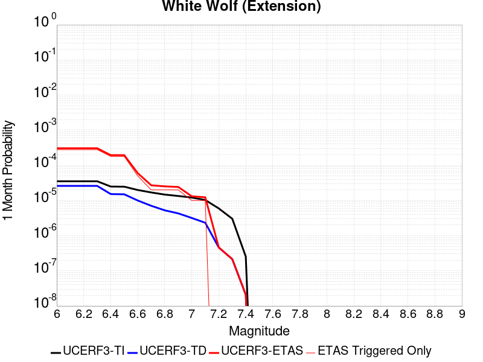 |  |  |

| Magnitude | 1 wk TI Prob | 1 wk TD Prob | 1 wk ETAS Prob | 1 wk ETAS/TD Gain | 1 wk ETAS Triggered Only | 1 mo TI Prob | 1 mo TD Prob | 1 mo ETAS Prob | 1 mo ETAS/TD Gain | 1 mo ETAS Triggered Only | 1 yr TI Prob | 1 yr TD Prob | 1 yr ETAS Prob | 1 yr ETAS/TD Gain | 1 yr ETAS Triggered Only | 10 yr TI Prob | 10 yr TD Prob | 10 yr ETAS Prob | 10 yr ETAS/TD Gain | 10 yr ETAS Triggered Only |
|-----|-----|-----|-----|-----|-----|-----|-----|-----|-----|-----|-----|-----|-----|-----|-----|-----|-----|-----|-----|-----|
| 6.0 | 8.222555E-6 | 6.0666657E-6 | 2.5315306E-4 | 41.728535 | 2.4708788E-4 | 3.5239045E-5 | 2.5999774E-5 | 3.4367596E-4 | 13.218421 | 3.1768443E-4 | 4.289509E-4 | 3.1650788E-4 | 7.752402E-4 | 2.449355 | 4.588775E-4 | 0.0042812387 | 0.003161223 | 0.0037945833 | 1.2003529 | 6.3536887E-4 |
| 6.1 | 8.222555E-6 | 6.0666657E-6 | 2.5315306E-4 | 41.728535 | 2.4708788E-4 | 3.5239045E-5 | 2.5999774E-5 | 3.4367596E-4 | 13.218421 | 3.1768443E-4 | 4.289509E-4 | 3.1650788E-4 | 7.752402E-4 | 2.449355 | 4.588775E-4 | 0.0042812387 | 0.003161223 | 0.0037945833 | 1.2003529 | 6.3536887E-4 |
| 6.2 | 8.222555E-6 | 6.0666657E-6 | 2.5315306E-4 | 41.728535 | 2.4708788E-4 | 3.5239045E-5 | 2.5999774E-5 | 3.4367596E-4 | 13.218421 | 3.1768443E-4 | 4.289509E-4 | 3.1650788E-4 | 7.752402E-4 | 2.449355 | 4.588775E-4 | 0.0042812387 | 0.003161223 | 0.0037945833 | 1.2003529 | 6.3536887E-4 |
| 6.3 | 8.222555E-6 | 6.0666657E-6 | 2.5315306E-4 | 41.728535 | 2.4708788E-4 | 3.5239045E-5 | 2.5999774E-5 | 3.4367596E-4 | 13.218421 | 3.1768443E-4 | 4.289509E-4 | 3.1650788E-4 | 7.752402E-4 | 2.449355 | 4.588775E-4 | 0.0042812387 | 0.003161223 | 0.0037945833 | 1.2003529 | 6.3536887E-4 |
| 6.4 | 5.821773E-6 | 3.5571766E-6 | 1.8004791E-4 | 50.6154 | 1.7649135E-4 | 2.4950215E-5 | 1.5244959E-5 | 1.9173362E-4 | 12.576854 | 1.7649135E-4 | 3.0372653E-4 | 1.8559267E-4 | 4.326347E-4 | 2.331098 | 2.4708788E-4 | 0.0030331176 | 0.001854485 | 0.002242046 | 1.2089857 | 3.8828098E-4 |
| 6.5 | 5.766023E-6 | 3.4991106E-6 | 1.7998985E-4 | 51.43874 | 1.7649135E-4 | 2.4711293E-5 | 1.4996108E-5 | 1.9148481E-4 | 12.768967 | 1.7649135E-4 | 3.0081844E-4 | 1.8256342E-4 | 4.296062E-4 | 2.3531888 | 2.4708788E-4 | 0.0030041158 | 0.0018242426 | 0.0022118152 | 1.2124567 | 3.8828098E-4 |
| 6.6 | 4.643576E-6 | 2.332624E-6 | 3.7630813E-5 | 16.132395 | 3.529827E-5 | 1.9900888E-5 | 9.996925E-6 | 4.529484E-5 | 4.5308776 | 3.529827E-5 | 2.4226638E-4 | 1.2170619E-4 | 2.2758811E-4 | 1.8699797 | 1.0589481E-4 | 0.0024200242 | 0.0012164378 | 0.0013574591 | 1.1159297 | 1.4119309E-4 |
| 6.7 | 3.9529173E-6 | 1.6483477E-6 | 3.694656E-5 | 22.414299 | 3.529827E-5 | 1.6940963E-5 | 7.0643296E-6 | 4.236235E-5 | 5.9966555 | 3.529827E-5 | 2.0623671E-4 | 8.6005006E-5 | 1.9189071E-4 | 2.2311575 | 1.0589481E-4 | 0.002060454 | 8.597357E-4 | 0.0010008074 | 1.1640873 | 1.4119309E-4 |
| 6.8 | 3.4377522E-6 | 1.2245237E-6 | 3.652275E-5 | 29.826088 | 3.529827E-5 | 1.473314E-5 | 5.2479486E-6 | 4.0546034E-5 | 7.726073 | 3.529827E-5 | 1.7936122E-4 | 6.3891996E-5 | 1.6978003E-4 | 2.6572976 | 1.0589481E-4 | 0.0017921652 | 6.387454E-4 | 7.4457255E-4 | 1.1656797 | 1.0589481E-4 |
| 6.9 | 3.1367306E-6 | 1.0033783E-6 | 3.630161E-5 | 36.179386 | 3.529827E-5 | 1.3443062E-5 | 4.3001864E-6 | 3.9598304E-5 | 9.208509 | 3.529827E-5 | 1.63657E-4 | 5.235359E-5 | 8.765001E-5 | 1.674193 | 3.529827E-5 | 0.0016353652 | 5.2342017E-4 | 5.5869995E-4 | 1.0674025 | 3.529827E-5 |
| 7.0 | 2.8298145E-6 | 7.4286646E-7 | 3.604111E-5 | 48.51627 | 3.529827E-5 | 1.2127721E-5 | 3.1837099E-6 | 3.8481867E-5 | 12.087115 | 3.529827E-5 | 1.47645E-4 | 3.8761027E-5 | 7.4057934E-5 | 1.9106287 | 3.529827E-5 | 0.0014754693 | 3.8754768E-4 | 4.2283227E-4 | 1.0910459 | 3.529827E-5 |
| 7.1 | 2.4091064E-6 | 5.4227525E-7 | 3.5840527E-5 | 66.09287 | 3.529827E-5 | 1.03247E-5 | 2.3240348E-6 | 3.7622223E-5 | 16.188322 | 3.529827E-5 | 1.2569598E-4 | 2.8294799E-5 | 6.359207E-5 | 2.2474828 | 3.529827E-5 | 0.001256249 | 2.8291598E-4 | 3.182043E-4 | 1.1247306 | 3.529827E-5 |
| 7.2 | 1.3875518E-6 | 1.0743063E-7 | 1.0743063E-7 | 1.0 | 0.0 | 5.9466374E-6 | 4.6041689E-7 | 4.6041689E-7 | 1.0 | 0.0 | 7.23979E-5 | 5.6055624E-6 | 5.6055624E-6 | 1.0 | 0.0 | 7.2374323E-4 | 5.6054323E-5 | 5.6054323E-5 | 1.0 | 0.0 |
| 7.3 | 7.056077E-7 | 5.002034E-8 | 5.002034E-8 | 1.0 | 0.0 | 3.0240296E-6 | 2.1437286E-7 | 2.1437286E-7 | 1.0 | 0.0 | 3.681694E-5 | 2.609987E-6 | 2.609987E-6 | 1.0 | 0.0 | 3.681084E-4 | 2.609961E-5 | 2.609961E-5 | 1.0 | 0.0 |
| 7.4 | 5.9334678E-8 | 4.8683537E-9 | 4.8683537E-9 | 1.0 | 0.0 | 2.5429145E-7 | 2.0864372E-8 | 2.0864372E-8 | 1.0 | 0.0 | 3.095994E-6 | 2.5402372E-7 | 2.5402372E-7 | 1.0 | 0.0 | 3.095951E-5 | 2.5402353E-6 | 2.5402353E-6 | 1.0 | 0.0 |

## Calico-Hidalgo
*[(top)](#table-of-contents)*

| 1 Week | 1 Month | 1 Year | 10 Year |
|-----|-----|-----|-----|
|  |  |  |  |

| Magnitude | 1 wk TI Prob | 1 wk TD Prob | 1 wk ETAS Prob | 1 wk ETAS/TD Gain | 1 wk ETAS Triggered Only | 1 mo TI Prob | 1 mo TD Prob | 1 mo ETAS Prob | 1 mo ETAS/TD Gain | 1 mo ETAS Triggered Only | 1 yr TI Prob | 1 yr TD Prob | 1 yr ETAS Prob | 1 yr ETAS/TD Gain | 1 yr ETAS Triggered Only | 10 yr TI Prob | 10 yr TD Prob | 10 yr ETAS Prob | 10 yr ETAS/TD Gain | 10 yr ETAS Triggered Only |
|-----|-----|-----|-----|-----|-----|-----|-----|-----|-----|-----|-----|-----|-----|-----|-----|-----|-----|-----|-----|-----|
| 6.0 | 4.0906612E-5 | 5.0703686E-5 | 3.3307553E-4 | 6.5690594 | 2.8238617E-4 | 1.7530227E-4 | 2.172857E-4 | 6.054823E-4 | 2.7865722 | 3.8828098E-4 | 0.0021322158 | 0.002642648 | 0.003241133 | 1.2264717 | 6.000706E-4 | 0.02111873 | 0.026152607 | 0.02677136 | 1.0236593 | 6.3536887E-4 |
| 6.1 | 4.0906612E-5 | 5.0703686E-5 | 3.3307553E-4 | 6.5690594 | 2.8238617E-4 | 1.7530227E-4 | 2.172857E-4 | 6.054823E-4 | 2.7865722 | 3.8828098E-4 | 0.0021322158 | 0.002642648 | 0.003241133 | 1.2264717 | 6.000706E-4 | 0.02111873 | 0.026152607 | 0.02677136 | 1.0236593 | 6.3536887E-4 |
| 6.2 | 4.0906612E-5 | 5.0703686E-5 | 3.3307553E-4 | 6.5690594 | 2.8238617E-4 | 1.7530227E-4 | 2.172857E-4 | 6.054823E-4 | 2.7865722 | 3.8828098E-4 | 0.0021322158 | 0.002642648 | 0.003241133 | 1.2264717 | 6.000706E-4 | 0.02111873 | 0.026152607 | 0.02677136 | 1.0236593 | 6.3536887E-4 |
| 6.3 | 2.4242801E-5 | 3.0090669E-5 | 1.712795E-4 | 5.6921134 | 1.4119309E-4 | 1.0389358E-4 | 1.2895382E-4 | 3.4071613E-4 | 2.6421561 | 2.1178962E-4 | 0.0012641704 | 0.0015689151 | 0.001956587 | 1.2470955 | 3.8828098E-4 | 0.01257003 | 0.01558206 | 0.015964292 | 1.0245302 | 3.8828098E-4 |
| 6.4 | 2.4242801E-5 | 3.0090669E-5 | 1.712795E-4 | 5.6921134 | 1.4119309E-4 | 1.0389358E-4 | 1.2895382E-4 | 3.4071613E-4 | 2.6421561 | 2.1178962E-4 | 0.0012641704 | 0.0015689151 | 0.001956587 | 1.2470955 | 3.8828098E-4 | 0.01257003 | 0.01558206 | 0.015964292 | 1.0245302 | 3.8828098E-4 |
| 6.5 | 2.0286952E-5 | 2.5315738E-5 | 1.6650524E-4 | 6.5771437 | 1.4119309E-4 | 8.694118E-5 | 1.0849161E-4 | 3.2025826E-4 | 2.9519174 | 2.1178962E-4 | 0.0010579949 | 0.001320102 | 0.0017078704 | 1.2937412 | 3.8828098E-4 | 0.010529719 | 0.013124538 | 0.013507723 | 1.029196 | 3.8828098E-4 |
| 6.6 | 2.0269223E-5 | 2.5296687E-5 | 1.6648619E-4 | 6.5813437 | 1.4119309E-4 | 8.6865206E-5 | 1.08409964E-4 | 3.2017662E-4 | 2.9533875 | 2.1178962E-4 | 0.0010570707 | 0.0013191093 | 0.0017068781 | 1.2939626 | 3.8828098E-4 | 0.010520565 | 0.013114728 | 0.013497916 | 1.0292182 | 3.8828098E-4 |
| 6.7 | 1.799852E-5 | 2.25406E-5 | 1.2843302E-4 | 5.697853 | 1.0589481E-4 | 7.713423E-5 | 9.659908E-5 | 2.7307338E-4 | 2.8268735 | 1.7649135E-4 | 9.3870464E-4 | 0.0011754738 | 0.0015280416 | 1.2999368 | 3.529827E-4 | 0.009347493 | 0.011694173 | 0.012043028 | 1.0298315 | 3.529827E-4 |
| 6.8 | 1.7458793E-5 | 2.184212E-5 | 1.2773462E-4 | 5.848087 | 1.0589481E-4 | 7.4821255E-5 | 9.3605806E-5 | 2.7008064E-4 | 2.8852978 | 1.7649135E-4 | 9.10568E-4 | 0.0011390693 | 0.00149165 | 1.309534 | 3.529827E-4 | 0.009068459 | 0.011333893 | 0.011682875 | 1.030791 | 3.529827E-4 |
| 6.9 | 1.542884E-5 | 1.9025927E-5 | 1.2491872E-4 | 6.56571 | 1.0589481E-4 | 6.612192E-5 | 8.153721E-5 | 2.5801416E-4 | 3.1643732 | 1.7649135E-4 | 8.04737E-4 | 9.922766E-4 | 0.0013449091 | 1.3553772 | 3.529827E-4 | 0.008018291 | 0.009879857 | 0.010229353 | 1.0353745 | 3.529827E-4 |
| 7.0 | 1.468253E-5 | 1.8030598E-5 | 1.239235E-4 | 6.8729553 | 1.0589481E-4 | 6.292361E-5 | 7.7271776E-5 | 2.537495E-4 | 3.2838573 | 1.7649135E-4 | 7.658257E-4 | 9.4039086E-4 | 0.0012577765 | 1.337504 | 3.1768443E-4 | 0.0076319184 | 0.009365481 | 0.00968019 | 1.0336031 | 3.1768443E-4 |
| 7.1 | 1.3139281E-5 | 1.6200942E-5 | 1.2209403E-4 | 7.5362306 | 1.0589481E-4 | 5.6309986E-5 | 6.943083E-5 | 2.4590993E-4 | 3.5417972 | 1.7649135E-4 | 6.853584E-4 | 8.4500515E-4 | 0.0011624212 | 1.3756379 | 3.1768443E-4 | 0.0068324856 | 0.0084192185 | 0.008734228 | 1.0374155 | 3.1768443E-4 |
| 7.2 | 1.1127404E-5 | 1.3866597E-5 | 8.446216E-5 | 6.0910516 | 7.059654E-5 | 4.7688E-5 | 5.942698E-5 | 2.0061167E-4 | 3.3757675 | 1.4119309E-4 | 5.8044674E-4 | 7.232942E-4 | 0.0010054761 | 1.3901343 | 2.8238617E-4 | 0.0057893298 | 0.0072105085 | 0.0074908584 | 1.0388807 | 2.8238617E-4 |
| 7.3 | 9.808154E-6 | 1.2176215E-5 | 8.27719E-5 | 6.7978344 | 7.059654E-5 | 4.2034266E-5 | 5.2182797E-5 | 1.9336851E-4 | 3.7055988 | 1.4119309E-4 | 5.11647E-4 | 6.3515105E-4 | 8.4680616E-4 | 1.3332359 | 2.1178962E-4 | 0.0051047057 | 0.006334433 | 0.006544881 | 1.0332229 | 2.1178962E-4 |
| 7.4 | 7.942452E-6 | 9.792144E-6 | 8.0387996E-5 | 8.209438 | 7.059654E-5 | 3.4038632E-5 | 4.1965708E-5 | 1.8315286E-4 | 4.364346 | 1.4119309E-4 | 4.1434157E-4 | 5.1082217E-4 | 7.2250364E-4 | 1.4143935 | 2.1178962E-4 | 0.0041356985 | 0.005097421 | 0.005308131 | 1.0413367 | 2.1178962E-4 |
| 7.5 | 4.7121216E-6 | 5.772836E-6 | 5.772836E-6 | 1.0 | 0.0 | 2.019465E-5 | 2.4740535E-5 | 2.4740535E-5 | 1.0 | 0.0 | 2.4584212E-4 | 3.0118204E-4 | 3.0118204E-4 | 1.0 | 0.0 | 0.0024557032 | 0.0030084911 | 0.0030084911 | 1.0 | 0.0 |
| 7.6 | 2.21172E-7 | 2.603961E-7 | 2.603961E-7 | 1.0 | 0.0 | 9.478797E-7 | 1.1159829E-6 | 1.1159829E-6 | 1.0 | 0.0 | 1.1540374E-5 | 1.3587036E-5 | 1.3587036E-5 | 1.0 | 0.0 | 1.1539775E-4 | 1.3586486E-4 | 1.3586486E-4 | 1.0 | 0.0 |

## Cleghorn Lake
*[(top)](#table-of-contents)*

| 1 Week | 1 Month | 1 Year | 10 Year |
|-----|-----|-----|-----|
|  |  |  |  |

| Magnitude | 1 wk TI Prob | 1 wk TD Prob | 1 wk ETAS Prob | 1 wk ETAS/TD Gain | 1 wk ETAS Triggered Only | 1 mo TI Prob | 1 mo TD Prob | 1 mo ETAS Prob | 1 mo ETAS/TD Gain | 1 mo ETAS Triggered Only | 1 yr TI Prob | 1 yr TD Prob | 1 yr ETAS Prob | 1 yr ETAS/TD Gain | 1 yr ETAS Triggered Only | 10 yr TI Prob | 10 yr TD Prob | 10 yr ETAS Prob | 10 yr ETAS/TD Gain | 10 yr ETAS Triggered Only |
|-----|-----|-----|-----|-----|-----|-----|-----|-----|-----|-----|-----|-----|-----|-----|-----|-----|-----|-----|-----|-----|
| 6.0 | 1.5467183E-5 | 1.6794203E-5 | 1.932826E-4 | 11.508887 | 1.7649135E-4 | 6.6286244E-5 | 7.197348E-5 | 3.543393E-4 | 4.9231925 | 2.8238617E-4 | 8.067362E-4 | 8.759797E-4 | 0.0013344553 | 1.523386 | 4.588775E-4 | 0.008038137 | 0.008730696 | 0.009220556 | 1.0561079 | 4.9417577E-4 |
| 6.1 | 1.5467183E-5 | 1.6794203E-5 | 1.932826E-4 | 11.508887 | 1.7649135E-4 | 6.6286244E-5 | 7.197348E-5 | 3.543393E-4 | 4.9231925 | 2.8238617E-4 | 8.067362E-4 | 8.759797E-4 | 0.0013344553 | 1.523386 | 4.588775E-4 | 0.008038137 | 0.008730696 | 0.009220556 | 1.0561079 | 4.9417577E-4 |
| 6.2 | 1.2624631E-5 | 1.3681544E-5 | 1.9017048E-4 | 13.899781 | 1.7649135E-4 | 5.410444E-5 | 5.863415E-5 | 3.4100376E-4 | 5.815788 | 2.8238617E-4 | 6.585225E-4 | 7.1368564E-4 | 0.0011016895 | 1.5436622 | 3.8828098E-4 | 0.0065657445 | 0.0071187317 | 0.0075743427 | 1.0640017 | 4.588775E-4 |
| 6.3 | 1.2624631E-5 | 1.3681544E-5 | 1.9017048E-4 | 13.899781 | 1.7649135E-4 | 5.410444E-5 | 5.863415E-5 | 3.4100376E-4 | 5.815788 | 2.8238617E-4 | 6.585225E-4 | 7.1368564E-4 | 0.0011016895 | 1.5436622 | 3.8828098E-4 | 0.0065657445 | 0.0071187317 | 0.0075743427 | 1.0640017 | 4.588775E-4 |
| 6.4 | 9.417684E-6 | 1.0170118E-5 | 1.5136176E-4 | 14.882991 | 1.4119309E-4 | 4.036088E-5 | 4.3585722E-5 | 2.9066284E-4 | 6.668763 | 2.4708788E-4 | 4.912829E-4 | 5.3056807E-4 | 8.833635E-4 | 1.664939 | 3.529827E-4 | 0.004901982 | 0.005297049 | 0.005683273 | 1.072913 | 3.8828098E-4 |
| 6.5 | 9.368219E-6 | 1.0117545E-5 | 1.513092E-4 | 14.955131 | 1.4119309E-4 | 4.014889E-5 | 4.3360415E-5 | 2.904376E-4 | 6.69822 | 2.4708788E-4 | 4.8870314E-4 | 5.2782625E-4 | 8.8062265E-4 | 1.6683949 | 3.529827E-4 | 0.004876298 | 0.0052697617 | 0.0056559965 | 1.0732926 | 3.8828098E-4 |
| 6.6 | 7.803798E-6 | 8.441831E-6 | 1.1433575E-4 | 13.543951 | 1.0589481E-4 | 3.3444423E-5 | 3.6179E-5 | 2.4796097E-4 | 6.8537264 | 2.1178962E-4 | 4.0710976E-4 | 4.4043022E-4 | 7.5797475E-4 | 1.7209871 | 3.1768443E-4 | 0.0040636472 | 0.0043994905 | 0.004715777 | 1.0718917 | 3.1768443E-4 |
| 6.7 | 2.3108669E-6 | 2.4438336E-6 | 3.774202E-5 | 15.443775 | 3.529827E-5 | 9.903678E-6 | 1.0473532E-5 | 1.16367235E-4 | 11.110601 | 1.0589481E-4 | 1.205706E-4 | 1.2750797E-4 | 2.3338928E-4 | 1.8303897 | 1.0589481E-4 | 0.001205052 | 0.0012743667 | 0.0013801267 | 1.0829902 | 1.0589481E-4 |
| 6.8 | 2.0882828E-6 | 2.2062823E-6 | 3.7504476E-5 | 16.998947 | 3.529827E-5 | 8.949753E-6 | 9.455462E-6 | 1.1534927E-4 | 12.199222 | 1.0589481E-4 | 1.08957785E-4 | 1.1511434E-4 | 2.2099695E-4 | 1.919804 | 1.0589481E-4 | 0.0010890438 | 0.0011505639 | 0.0012563369 | 1.0919315 | 1.0589481E-4 |
| 6.9 | 1.876935E-6 | 1.981051E-6 | 3.7279253E-5 | 18.817917 | 3.529827E-5 | 8.043982E-6 | 8.490192E-6 | 1.1438411E-4 | 13.4725 | 1.0589481E-4 | 9.7931086E-5 | 1.03363345E-4 | 2.0924721E-4 | 2.024385 | 1.0589481E-4 | 9.788794E-4 | 0.0010331686 | 0.0011389541 | 1.1023893 | 1.0589481E-4 |
| 7.0 | 1.5357559E-6 | 1.6202807E-6 | 1.6202807E-6 | 1.0 | 0.0 | 6.5817944E-6 | 6.9440425E-6 | 7.754009E-5 | 11.16642 | 7.059654E-5 | 8.01304E-5 | 8.454057E-5 | 1.5513113E-4 | 1.8349906 | 7.059654E-5 | 8.010151E-4 | 8.450965E-4 | 9.1563334E-4 | 1.083466 | 7.059654E-5 |
| 7.1 | 1.0905424E-6 | 1.1497619E-6 | 1.1497619E-6 | 1.0 | 0.0 | 4.6737446E-6 | 4.9275427E-6 | 7.5523734E-5 | 15.326856 | 7.059654E-5 | 5.6901354E-5 | 5.999128E-5 | 1.3058359E-4 | 2.1767094 | 7.059654E-5 | 5.6886784E-4 | 5.997606E-4 | 6.703148E-4 | 1.1176373 | 7.059654E-5 |
| 7.2 | 6.06668E-7 | 6.387277E-7 | 6.387277E-7 | 1.0 | 0.0 | 2.600003E-6 | 2.7374022E-6 | 2.7374022E-6 | 1.0 | 0.0 | 3.1654577E-5 | 3.3327433E-5 | 3.3327433E-5 | 1.0 | 0.0 | 3.1650066E-4 | 3.3323118E-4 | 3.3323118E-4 | 1.0 | 0.0 |

## San Andreas (Coachella) rev
*[(top)](#table-of-contents)*

| 1 Week | 1 Month | 1 Year | 10 Year |
|-----|-----|-----|-----|
|  | 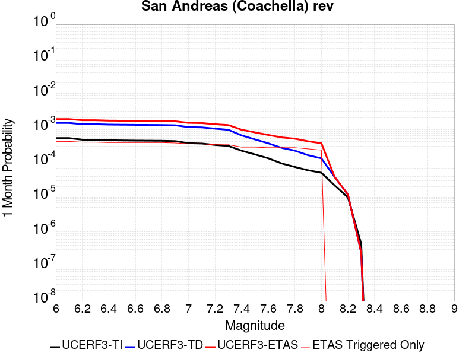 |  |  |

| Magnitude | 1 wk TI Prob | 1 wk TD Prob | 1 wk ETAS Prob | 1 wk ETAS/TD Gain | 1 wk ETAS Triggered Only | 1 mo TI Prob | 1 mo TD Prob | 1 mo ETAS Prob | 1 mo ETAS/TD Gain | 1 mo ETAS Triggered Only | 1 yr TI Prob | 1 yr TD Prob | 1 yr ETAS Prob | 1 yr ETAS/TD Gain | 1 yr ETAS Triggered Only | 10 yr TI Prob | 10 yr TD Prob | 10 yr ETAS Prob | 10 yr ETAS/TD Gain | 10 yr ETAS Triggered Only |
|-----|-----|-----|-----|-----|-----|-----|-----|-----|-----|-----|-----|-----|-----|-----|-----|-----|-----|-----|-----|-----|
| 6.0 | 1.1925945E-4 | 3.2729402E-4 | 6.801612E-4 | 2.0781353 | 3.529827E-4 | 5.110118E-4 | 0.0014019393 | 0.0018601735 | 1.3268573 | 4.588775E-4 | 0.0062038354 | 0.016936364 | 0.01742217 | 1.0286843 | 4.9417577E-4 | 0.060334753 | 0.15265316 | 0.15313171 | 1.003135 | 5.6477234E-4 |
| 6.1 | 1.1925945E-4 | 3.2729402E-4 | 6.801612E-4 | 2.0781353 | 3.529827E-4 | 5.110118E-4 | 0.0014019393 | 0.0018601735 | 1.3268573 | 4.588775E-4 | 0.0062038354 | 0.016936364 | 0.01742217 | 1.0286843 | 4.9417577E-4 | 0.060334753 | 0.15265316 | 0.15313171 | 1.003135 | 5.6477234E-4 |
| 6.2 | 1.07432395E-4 | 3.0230157E-4 | 6.1988994E-4 | 2.050568 | 3.1768443E-4 | 4.603433E-4 | 0.0012949388 | 0.0017179695 | 1.3266801 | 4.2357924E-4 | 0.005590286 | 0.015653009 | 0.016104704 | 1.0288568 | 4.588775E-4 | 0.05451731 | 0.14182423 | 0.14227861 | 1.0032039 | 5.2947405E-4 |
| 6.3 | 1.0718766E-4 | 3.0175463E-4 | 6.193432E-4 | 2.0524728 | 3.1768443E-4 | 4.592948E-4 | 0.0012925972 | 0.0017156289 | 1.3272727 | 4.2357924E-4 | 0.005577586 | 0.015624908 | 0.016076615 | 1.0289094 | 4.588775E-4 | 0.054396555 | 0.14159249 | 0.142047 | 1.00321 | 5.2947405E-4 |
| 6.4 | 1.0355944E-4 | 2.9383553E-4 | 5.7613873E-4 | 1.9607524 | 2.8238617E-4 | 4.4375064E-4 | 0.0012586913 | 0.0016464835 | 1.3080916 | 3.8828098E-4 | 0.0053892885 | 0.015217941 | 0.015635075 | 1.0274106 | 4.2357924E-4 | 0.052604496 | 0.13815255 | 0.13857846 | 1.0030829 | 4.9417577E-4 |
| 6.5 | 1.0227914E-4 | 2.9102986E-4 | 5.733339E-4 | 1.9700172 | 2.8238617E-4 | 4.382655E-4 | 0.0012466786 | 0.0016344755 | 1.311064 | 3.8828098E-4 | 0.0053228354 | 0.01507372 | 0.015490915 | 1.0276769 | 4.2357924E-4 | 0.051971316 | 0.13693172 | 0.13735823 | 1.0031147 | 4.9417577E-4 |
| 6.6 | 1.0116757E-4 | 2.8868738E-4 | 5.70992E-4 | 1.9778905 | 2.8238617E-4 | 4.3350324E-4 | 0.0012366489 | 0.0016244497 | 1.31359 | 3.8828098E-4 | 0.0052651367 | 0.01495329 | 0.015370536 | 1.0279032 | 4.2357924E-4 | 0.051421247 | 0.1359099 | 0.13633691 | 1.0031419 | 4.9417577E-4 |
| 6.7 | 1.0050676E-4 | 2.8727303E-4 | 5.69578E-4 | 1.9827064 | 2.8238617E-4 | 4.3067214E-4 | 0.0012305931 | 0.0016183963 | 1.3151351 | 3.8828098E-4 | 0.005230834 | 0.014880571 | 0.015297846 | 1.0280417 | 4.2357924E-4 | 0.051094085 | 0.13529462 | 0.13572194 | 1.0031585 | 4.9417577E-4 |
| 6.8 | 9.976819E-5 | 2.853096E-4 | 5.676152E-4 | 1.9894711 | 2.8238617E-4 | 4.2750788E-4 | 0.0012221863 | 0.0016099927 | 1.3173054 | 3.8828098E-4 | 0.0051924936 | 0.0147796115 | 0.015196931 | 1.0282362 | 4.2357924E-4 | 0.050728295 | 0.13444631 | 0.13487405 | 1.0031815 | 4.9417577E-4 |
| 6.9 | 9.77719E-5 | 2.8027873E-4 | 5.625858E-4 | 2.0072367 | 2.8238617E-4 | 4.1895514E-4 | 0.0012006456 | 0.0015532044 | 1.2936411 | 3.529827E-4 | 0.0050888555 | 0.014520878 | 0.01490352 | 1.0263512 | 3.8828098E-4 | 0.049738888 | 0.1322748 | 0.132673 | 1.0030103 | 4.588775E-4 |
| 7.0 | 8.500761E-5 | 2.4762485E-4 | 5.299411E-4 | 2.1400964 | 2.8238617E-4 | 3.6426744E-4 | 0.001060821 | 0.0014134293 | 1.3323919 | 3.529827E-4 | 0.0044259406 | 0.012839786 | 0.013223081 | 1.0298522 | 3.8828098E-4 | 0.04338823 | 0.11813272 | 0.11853739 | 1.0034256 | 4.588775E-4 |
| 7.1 | 8.319876E-5 | 2.4365232E-4 | 5.2596966E-4 | 2.1586895 | 2.8238617E-4 | 3.5651738E-4 | 0.0010438096 | 0.0013964238 | 1.3378147 | 3.529827E-4 | 0.004331963 | 0.012635092 | 0.013018467 | 1.0303421 | 3.8828098E-4 | 0.042484846 | 0.116353 | 0.11675849 | 1.003485 | 4.588775E-4 |
| 7.2 | 7.563917E-5 | 2.2413683E-4 | 5.0645974E-4 | 2.2596004 | 2.8238617E-4 | 3.2412758E-4 | 9.602359E-4 | 0.0013128796 | 1.367247 | 3.529827E-4 | 0.0039391145 | 0.011628893 | 0.01201266 | 1.0330011 | 3.8828098E-4 | 0.03870018 | 0.10775925 | 0.10816868 | 1.0037994 | 4.588775E-4 |
| 7.3 | 7.082985E-5 | 2.0729867E-4 | 4.896263E-4 | 2.3619366 | 2.8238617E-4 | 3.0352117E-4 | 8.881233E-4 | 0.0012407925 | 1.3970948 | 3.529827E-4 | 0.0036891096 | 0.010759917 | 0.011144021 | 1.0356976 | 3.8828098E-4 | 0.03628465 | 0.100282 | 0.10069486 | 1.004117 | 4.588775E-4 |
| 7.4 | 5.146215E-5 | 1.4273795E-4 | 4.250838E-4 | 2.9780715 | 2.8238617E-4 | 2.2053342E-4 | 6.115915E-4 | 9.6435833E-4 | 1.5768014 | 3.529827E-4 | 0.0026816884 | 0.0074208933 | 0.0078062927 | 1.0519344 | 3.8828098E-4 | 0.02649557 | 0.070849575 | 0.07127594 | 1.0060179 | 4.588775E-4 |
| 7.5 | 4.0285166E-5 | 1.09416E-4 | 3.9177126E-4 | 3.5805664 | 2.8238617E-4 | 1.7263928E-4 | 4.6884175E-4 | 8.21659E-4 | 1.7525294 | 3.529827E-4 | 0.002099857 | 0.0056932783 | 0.0060793487 | 1.0678116 | 3.8828098E-4 | 0.020801254 | 0.055011146 | 0.05544478 | 1.0078827 | 4.588775E-4 |
| 7.6 | 3.1168736E-5 | 8.4389096E-5 | 3.6675142E-4 | 4.3459578 | 2.8238617E-4 | 1.3357346E-4 | 3.6161754E-4 | 7.144726E-4 | 1.9757687 | 3.529827E-4 | 0.0016250437 | 0.0043938323 | 0.004780407 | 1.0879812 | 3.8828098E-4 | 0.016132116 | 0.04281005 | 0.043249283 | 1.01026 | 4.588775E-4 |
| 7.7 | 2.2100989E-5 | 6.238755E-5 | 3.447561E-4 | 5.5260396 | 2.8238617E-4 | 9.4715084E-5 | 2.6734784E-4 | 6.202362E-4 | 2.3199594 | 3.529827E-4 | 0.001152546 | 0.0032501083 | 0.0036371273 | 1.1190788 | 3.8828098E-4 | 0.011465867 | 0.0319002 | 0.032344438 | 1.0139259 | 4.588775E-4 |
| 7.8 | 1.7484861E-5 | 5.179572E-5 | 3.3416724E-4 | 6.4516387 | 2.8238617E-4 | 7.493296E-5 | 2.2196278E-4 | 5.748671E-4 | 2.5899258 | 3.529827E-4 | 9.1192697E-4 | 0.0026990508 | 0.0030862838 | 1.14347 | 3.8828098E-4 | 0.009081938 | 0.026640115 | 0.027086768 | 1.0167662 | 4.588775E-4 |
| 7.9 | 1.3967285E-5 | 3.822255E-5 | 2.85301E-4 | 7.4642057 | 2.4708788E-4 | 5.985842E-5 | 1.6380067E-4 | 4.8143306E-4 | 2.9391398 | 3.1768443E-4 | 7.2853256E-4 | 0.00199245 | 0.0023447296 | 1.1768072 | 3.529827E-4 | 0.0072614877 | 0.019909438 | 0.020289987 | 1.0191141 | 3.8828098E-4 |
| 8.0 | 1.1887396E-5 | 3.106521E-5 | 2.7814542E-4 | 8.953599 | 2.4708788E-4 | 5.094499E-5 | 1.3312983E-4 | 4.5077197E-4 | 3.3859577 | 3.1768443E-4 | 6.200787E-4 | 0.0016196516 | 0.0019720625 | 1.2175845 | 3.529827E-4 | 0.006183513 | 0.016279267 | 0.016661227 | 1.023463 | 3.8828098E-4 |
| 8.1 | 5.100864E-6 | 8.973418E-6 | 8.973418E-6 | 1.0 | 0.0 | 2.1860664E-5 | 3.8456936E-5 | 3.8456936E-5 | 1.0 | 0.0 | 2.6612106E-4 | 4.6811273E-4 | 4.6811273E-4 | 1.0 | 0.0 | 0.002658026 | 0.004917731 | 0.004917731 | 1.0 | 0.0 |
| 8.2 | 2.3004484E-6 | 2.7864487E-6 | 2.7864487E-6 | 1.0 | 0.0 | 9.859027E-6 | 1.1941868E-5 | 1.1941868E-5 | 1.0 | 0.0 | 1.2002704E-4 | 1.4538258E-4 | 1.4538258E-4 | 1.0 | 0.0 | 0.0011996223 | 0.0015973912 | 0.0015973912 | 1.0 | 0.0 |
| 8.3 | 1.0424446E-7 | 5.8161504E-8 | 5.8161504E-8 | 1.0 | 0.0 | 4.4676187E-7 | 2.4926356E-7 | 2.4926356E-7 | 1.0 | 0.0 | 5.439312E-6 | 3.03478E-6 | 3.03478E-6 | 1.0 | 0.0 | 5.4391792E-5 | 3.190716E-5 | 3.190716E-5 | 1.0 | 0.0 |

## Santa Ynez (West)
*[(top)](#table-of-contents)*

| 1 Week | 1 Month | 1 Year | 10 Year |
|-----|-----|-----|-----|
|  |  |  | 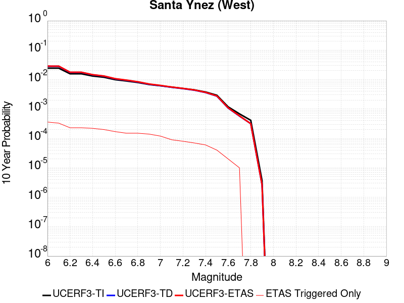 |

| Magnitude | 1 wk TI Prob | 1 wk TD Prob | 1 wk ETAS Prob | 1 wk ETAS/TD Gain | 1 wk ETAS Triggered Only | 1 mo TI Prob | 1 mo TD Prob | 1 mo ETAS Prob | 1 mo ETAS/TD Gain | 1 mo ETAS Triggered Only | 1 yr TI Prob | 1 yr TD Prob | 1 yr ETAS Prob | 1 yr ETAS/TD Gain | 1 yr ETAS Triggered Only | 10 yr TI Prob | 10 yr TD Prob | 10 yr ETAS Prob | 10 yr ETAS/TD Gain | 10 yr ETAS Triggered Only |
|-----|-----|-----|-----|-----|-----|-----|-----|-----|-----|-----|-----|-----|-----|-----|-----|-----|-----|-----|-----|-----|
| 6.0 | 4.7352758E-5 | 5.4972126E-5 | 1.6086112E-4 | 2.9262307 | 1.0589481E-4 | 2.0292461E-4 | 2.3557522E-4 | 4.12025E-4 | 1.7490168 | 1.7649135E-4 | 0.0024678076 | 0.0028645284 | 0.0031813027 | 1.1105852 | 3.1768443E-4 | 0.024405818 | 0.028304417 | 0.02864741 | 1.012118 | 3.529827E-4 |
| 6.1 | 4.7352758E-5 | 5.4972126E-5 | 1.6086112E-4 | 2.9262307 | 1.0589481E-4 | 2.0292461E-4 | 2.3557522E-4 | 4.12025E-4 | 1.7490168 | 1.7649135E-4 | 0.0024678076 | 0.0028645284 | 0.0031109084 | 1.0860107 | 2.4708788E-4 | 0.024405818 | 0.028304417 | 0.02857881 | 1.0096943 | 2.8238617E-4 |
| 6.2 | 3.0415853E-5 | 3.392511E-5 | 6.922218E-5 | 2.0404408 | 3.529827E-5 | 1.3034715E-4 | 1.4538545E-4 | 2.5126486E-4 | 1.728267 | 1.0589481E-4 | 0.0015858212 | 0.0017686661 | 0.0019096094 | 1.079689 | 1.4119309E-4 | 0.015745522 | 0.017549807 | 0.017688522 | 1.007904 | 1.4119309E-4 |
| 6.3 | 3.0415853E-5 | 3.392511E-5 | 6.922218E-5 | 2.0404408 | 3.529827E-5 | 1.3034715E-4 | 1.4538545E-4 | 2.5126486E-4 | 1.728267 | 1.0589481E-4 | 0.0015858212 | 0.0017686661 | 0.0019096094 | 1.079689 | 1.4119309E-4 | 0.015745522 | 0.017549807 | 0.017688522 | 1.007904 | 1.4119309E-4 |
| 6.4 | 2.5452082E-5 | 2.7912422E-5 | 6.320971E-5 | 2.2645726 | 3.529827E-5 | 1.09075794E-4 | 1.196193E-4 | 2.2550144E-4 | 1.8851594 | 1.0589481E-4 | 0.0013271887 | 0.0014554089 | 0.0015963964 | 1.0968715 | 1.4119309E-4 | 0.013192902 | 0.014460951 | 0.014600103 | 1.0096226 | 1.4119309E-4 |
| 6.5 | 2.3143784E-5 | 2.5128256E-5 | 6.042564E-5 | 2.4046888 | 3.529827E-5 | 9.9183875E-5 | 1.0768817E-4 | 2.1357158E-4 | 1.9832408 | 1.0589481E-4 | 0.0012068948 | 0.0013103267 | 0.0014160828 | 1.0807097 | 1.0589481E-4 | 0.012003611 | 0.01302768 | 0.013132195 | 1.0080225 | 1.0589481E-4 |
| 6.6 | 1.9118515E-5 | 2.035434E-5 | 5.5651893E-5 | 2.7341535 | 3.529827E-5 | 8.193392E-5 | 8.7230015E-5 | 1.9311559E-4 | 2.2138662 | 1.0589481E-4 | 9.97089E-4 | 0.001061516 | 0.0011672984 | 1.0996522 | 1.0589481E-4 | 0.00992627 | 0.010565365 | 0.01067014 | 1.0099169 | 1.0589481E-4 |
| 6.7 | 1.722807E-5 | 1.8146347E-5 | 5.344398E-5 | 2.9451644 | 3.529827E-5 | 7.3832496E-5 | 7.776777E-5 | 1.8365435E-4 | 2.361574 | 1.0589481E-4 | 8.985399E-4 | 9.464169E-4 | 0.0010522115 | 1.1117843 | 1.0589481E-4 | 0.008949154 | 0.0094245095 | 0.009529406 | 1.0111302 | 1.0589481E-4 |
| 6.8 | 1.5317364E-5 | 1.5926486E-5 | 5.1224193E-5 | 3.21629 | 3.529827E-5 | 6.56442E-5 | 6.82546E-5 | 1.7414219E-4 | 2.5513618 | 1.0589481E-4 | 7.98925E-4 | 8.306873E-4 | 9.364941E-4 | 1.1273726 | 1.0589481E-4 | 0.007960589 | 0.00827631 | 0.008381328 | 1.012689 | 1.0589481E-4 |
| 6.9 | 1.3071226E-5 | 1.3329624E-5 | 4.8627422E-5 | 3.6480718 | 3.529827E-5 | 5.6018336E-5 | 5.7125722E-5 | 1.6301448E-4 | 2.853609 | 1.0589481E-4 | 6.8180985E-4 | 6.9528597E-4 | 8.0110715E-4 | 1.1521981 | 1.0589481E-4 | 0.0067972173 | 0.006931367 | 0.007036528 | 1.0151718 | 1.0589481E-4 |
| 7.0 | 1.1836986E-5 | 1.19327815E-5 | 1.19327815E-5 | 1.0 | 0.0 | 5.0728955E-5 | 5.11395E-5 | 1.2173243E-4 | 2.3803992 | 7.059654E-5 | 6.1745E-4 | 6.2244723E-4 | 6.929998E-4 | 1.1133472 | 7.059654E-5 | 0.006157372 | 0.006207231 | 0.0062773894 | 1.0113027 | 7.059654E-5 |
| 7.1 | 1.0597169E-5 | 1.0542201E-5 | 1.0542201E-5 | 1.0 | 0.0 | 4.541565E-5 | 4.5180084E-5 | 8.047676E-5 | 1.7812442 | 3.529827E-5 | 5.5279525E-4 | 5.4992986E-4 | 5.852087E-4 | 1.0641515 | 3.529827E-5 | 0.0055142213 | 0.005485821 | 0.0055209254 | 1.0063992 | 3.529827E-5 |
| 7.2 | 9.59113E-6 | 9.459144E-6 | 9.459144E-6 | 1.0 | 0.0 | 4.11042E-5 | 4.0538565E-5 | 7.583541E-5 | 1.8706979 | 3.529827E-5 | 5.0032866E-4 | 4.934463E-4 | 5.287272E-4 | 1.0714989 | 3.529827E-5 | 0.004992037 | 0.0049236254 | 0.0049587497 | 1.0071338 | 3.529827E-5 |
| 7.3 | 8.586084E-6 | 8.379583E-6 | 8.379583E-6 | 1.0 | 0.0 | 3.679698E-5 | 3.5912013E-5 | 7.120901E-5 | 1.9828745 | 3.529827E-5 | 4.4791115E-4 | 4.3714207E-4 | 4.724249E-4 | 1.0807126 | 3.529827E-5 | 0.004470094 | 0.004362933 | 0.0043980773 | 1.0080552 | 3.529827E-5 |
| 7.4 | 7.2622997E-6 | 6.9515427E-6 | 6.9515427E-6 | 1.0 | 0.0 | 3.112377E-5 | 2.979199E-5 | 6.508921E-5 | 2.184789 | 3.529827E-5 | 3.78866E-4 | 3.626581E-4 | 3.9794357E-4 | 1.0972968 | 3.529827E-5 | 0.0037822074 | 0.0036207628 | 0.0036559333 | 1.0097135 | 3.529827E-5 |
| 7.5 | 5.627296E-6 | 5.251588E-6 | 5.251588E-6 | 1.0 | 0.0 | 2.411676E-5 | 2.2506614E-5 | 2.2506614E-5 | 1.0 | 0.0 | 2.9358198E-4 | 2.739843E-4 | 2.739843E-4 | 1.0 | 0.0 | 0.0029319443 | 0.002736537 | 0.002736537 | 1.0 | 0.0 |
| 7.6 | 2.265244E-6 | 2.0608625E-6 | 2.0608625E-6 | 1.0 | 0.0 | 9.708152E-6 | 8.832238E-6 | 8.832238E-6 | 1.0 | 0.0 | 1.18190335E-4 | 1.0752728E-4 | 1.0752728E-4 | 1.0 | 0.0 | 0.001181275 | 0.0010747612 | 0.0010747612 | 1.0 | 0.0 |
| 7.7 | 1.3099874E-6 | 1.1016252E-6 | 1.1016252E-6 | 1.0 | 0.0 | 5.61422E-6 | 4.7212425E-6 | 4.7212425E-6 | 1.0 | 0.0 | 6.8350986E-5 | 5.7479636E-5 | 5.7479636E-5 | 1.0 | 0.0 | 6.832996E-4 | 5.7465007E-4 | 5.7465007E-4 | 1.0 | 0.0 |
| 7.8 | 7.903951E-7 | 6.0711415E-7 | 6.0711415E-7 | 1.0 | 0.0 | 3.3874032E-6 | 2.6019152E-6 | 2.6019152E-6 | 1.0 | 0.0 | 4.1240855E-5 | 3.167787E-5 | 3.167787E-5 | 1.0 | 0.0 | 4.12332E-4 | 3.167349E-4 | 3.167349E-4 | 1.0 | 0.0 |
| 7.9 | 7.0753297E-9 | 5.0899476E-9 | 5.0899476E-9 | 1.0 | 0.0 | 3.032284E-8 | 2.181406E-8 | 2.181406E-8 | 1.0 | 0.0 | 3.6918053E-7 | 2.6558615E-7 | 2.6558615E-7 | 1.0 | 0.0 | 3.691799E-6 | 2.6558594E-6 | 2.6558594E-6 | 1.0 | 0.0 |

## San Andreas (Creeping Section) 2011 CFM
*[(top)](#table-of-contents)*

| 1 Week | 1 Month | 1 Year | 10 Year |
|-----|-----|-----|-----|
|  |  |  | 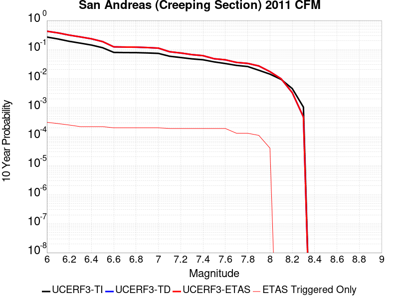 |

| Magnitude | 1 wk TI Prob | 1 wk TD Prob | 1 wk ETAS Prob | 1 wk ETAS/TD Gain | 1 wk ETAS Triggered Only | 1 mo TI Prob | 1 mo TD Prob | 1 mo ETAS Prob | 1 mo ETAS/TD Gain | 1 mo ETAS Triggered Only | 1 yr TI Prob | 1 yr TD Prob | 1 yr ETAS Prob | 1 yr ETAS/TD Gain | 1 yr ETAS Triggered Only | 10 yr TI Prob | 10 yr TD Prob | 10 yr ETAS Prob | 10 yr ETAS/TD Gain | 10 yr ETAS Triggered Only |
|-----|-----|-----|-----|-----|-----|-----|-----|-----|-----|-----|-----|-----|-----|-----|-----|-----|-----|-----|-----|-----|
| 6.0 | 5.986481E-4 | 0.001228691 | 0.0013697105 | 1.1147722 | 1.4119309E-4 | 0.0025631124 | 0.005246795 | 0.005387247 | 1.0267692 | 1.4119309E-4 | 0.030762846 | 0.061203245 | 0.06143521 | 1.0037901 | 2.4708788E-4 | 0.26835477 | 0.425928 | 0.42609012 | 1.0003806 | 2.8238617E-4 |
| 6.1 | 5.015945E-4 | 0.0010230356 | 0.0011640842 | 1.1378727 | 1.4119309E-4 | 0.00214792 | 0.004369436 | 0.004510012 | 1.0321726 | 1.4119309E-4 | 0.025839351 | 0.051246606 | 0.05148103 | 1.0045744 | 2.4708788E-4 | 0.23032776 | 0.37284943 | 0.37302655 | 1.0004749 | 2.8238617E-4 |
| 6.2 | 4.073338E-4 | 8.1157376E-4 | 9.5265225E-4 | 1.1738333 | 1.4119309E-4 | 0.0017445484 | 0.0034683137 | 0.003609017 | 1.0405682 | 1.4119309E-4 | 0.021034058 | 0.04093177 | 0.04113489 | 1.0049624 | 2.1178962E-4 | 0.19150782 | 0.31302592 | 0.31317142 | 1.0004648 | 2.1178962E-4 |
| 6.3 | 3.464099E-4 | 6.7455834E-4 | 8.1565615E-4 | 1.2091707 | 1.4119309E-4 | 0.0014837692 | 0.0028832308 | 0.0030240167 | 1.0488292 | 1.4119309E-4 | 0.017915873 | 0.034187846 | 0.034392394 | 1.0059831 | 2.1178962E-4 | 0.16538359 | 0.27130842 | 0.27146274 | 1.0005689 | 2.1178962E-4 |
| 6.4 | 2.935057E-4 | 5.5516965E-4 | 6.9628435E-4 | 1.254183 | 1.4119309E-4 | 0.0012572751 | 0.0023727308 | 0.0025135889 | 1.0593654 | 1.4119309E-4 | 0.015200248 | 0.02826279 | 0.028468594 | 1.0072818 | 2.1178962E-4 | 0.14201577 | 0.23297668 | 0.23313913 | 1.0006973 | 2.1178962E-4 |
| 6.5 | 2.3409708E-4 | 4.2132285E-4 | 5.6245644E-4 | 1.3349773 | 1.4119309E-4 | 0.0010028875 | 0.0018017791 | 0.0019427178 | 1.0782219 | 1.4119309E-4 | 0.012141965 | 0.021586355 | 0.021793572 | 1.0095994 | 2.1178962E-4 | 0.11499573 | 0.1868149 | 0.18698713 | 1.0009218 | 2.1178962E-4 |
| 6.6 | 1.5842178E-4 | 2.5068692E-4 | 3.918446E-4 | 1.5630835 | 1.4119309E-4 | 6.7877385E-4 | 0.0010739256 | 0.0012149671 | 1.1313326 | 1.4119309E-4 | 0.0082328 | 0.012995283 | 0.01320432 | 1.0160856 | 2.1178962E-4 | 0.07934396 | 0.12313759 | 0.12332331 | 1.0015081 | 2.1178962E-4 |
| 6.7 | 1.5616413E-4 | 2.4605254E-4 | 3.872109E-4 | 1.5736918 | 1.4119309E-4 | 6.691031E-4 | 0.0010540807 | 0.0011951249 | 1.1338078 | 1.4119309E-4 | 0.0081159435 | 0.012757154 | 0.012966242 | 1.0163898 | 2.1178962E-4 | 0.0782586 | 0.12116472 | 0.12135085 | 1.0015361 | 2.1178962E-4 |
| 6.8 | 1.5538467E-4 | 2.442914E-4 | 3.8545002E-4 | 1.5778286 | 1.4119309E-4 | 6.6576427E-4 | 0.001046539 | 0.0011875844 | 1.1347731 | 1.4119309E-4 | 0.008075596 | 0.012666538 | 0.012875645 | 1.0165086 | 2.1178962E-4 | 0.07788358 | 0.12039561 | 0.120581895 | 1.0015473 | 2.1178962E-4 |
| 6.9 | 1.5153569E-4 | 2.3538464E-4 | 3.7654449E-4 | 1.5996987 | 1.4119309E-4 | 6.49277E-4 | 0.0010084033 | 0.001149454 | 1.1398753 | 1.4119309E-4 | 0.007876333 | 0.012208726 | 0.01241793 | 1.0171356 | 2.1178962E-4 | 0.07602952 | 0.11646574 | 0.11665287 | 1.0016067 | 2.1178962E-4 |
| 7.0 | 1.4588932E-4 | 2.2395732E-4 | 3.651188E-4 | 1.6303052 | 1.4119309E-4 | 6.250901E-4 | 9.59466E-4 | 0.0011005236 | 1.1470168 | 1.4119309E-4 | 0.0075839474 | 0.011619428 | 0.011828757 | 1.0180154 | 2.1178962E-4 | 0.073302895 | 0.11131206 | 0.11150028 | 1.0016909 | 2.1178962E-4 |
| 7.1 | 1.1565079E-4 | 1.6281323E-4 | 3.039833E-4 | 1.8670677 | 1.4119309E-4 | 4.955521E-4 | 6.9758523E-4 | 8.386798E-4 | 1.2022614 | 1.4119309E-4 | 0.006016669 | 0.008460228 | 0.008670226 | 1.0248218 | 2.1178962E-4 | 0.058563538 | 0.08366478 | 0.083858855 | 1.0023196 | 2.1178962E-4 |
| 7.2 | 1.0393792E-4 | 1.4615392E-4 | 2.8732637E-4 | 1.9659163 | 1.4119309E-4 | 4.4537216E-4 | 6.262243E-4 | 7.67329E-4 | 1.2253261 | 1.4119309E-4 | 0.005408933 | 0.0075977976 | 0.007807978 | 1.0276634 | 2.1178962E-4 | 0.052791595 | 0.07561503 | 0.07581081 | 1.0025891 | 2.1178962E-4 |
| 7.3 | 9.332884E-5 | 1.2780601E-4 | 2.6898104E-4 | 2.1046042 | 1.4119309E-4 | 3.999194E-4 | 5.4762565E-4 | 6.8874145E-4 | 1.2576865 | 1.4119309E-4 | 0.0048581534 | 0.0066470946 | 0.006857476 | 1.0316502 | 2.1178962E-4 | 0.047533102 | 0.06647954 | 0.06667725 | 1.002974 | 2.1178962E-4 |
| 7.4 | 8.670252E-5 | 1.1702972E-4 | 2.5820627E-4 | 2.2063308 | 1.4119309E-4 | 3.715293E-4 | 5.014601E-4 | 6.4258237E-4 | 1.2814227 | 1.4119309E-4 | 0.004513991 | 0.0060883067 | 0.006298807 | 1.0345745 | 2.1178962E-4 | 0.044233937 | 0.061148684 | 0.06134752 | 1.0032517 | 2.1178962E-4 |
| 7.5 | 7.3036405E-5 | 9.005699E-5 | 2.3123735E-4 | 2.5676782 | 1.4119309E-4 | 3.129756E-4 | 3.859015E-4 | 5.270401E-4 | 1.3657373 | 1.4119309E-4 | 0.0038038217 | 0.0046882504 | 0.0048990473 | 1.0449628 | 2.1178962E-4 | 0.03739367 | 0.047875606 | 0.048077255 | 1.0042119 | 2.1178962E-4 |
| 7.6 | 6.3935775E-5 | 8.280209E-5 | 2.2398349E-4 | 2.7050462 | 1.4119309E-4 | 2.7398168E-4 | 3.5481792E-4 | 4.959609E-4 | 1.39779 | 1.4119309E-4 | 0.0033306254 | 0.00431137 | 0.004522247 | 1.0489117 | 2.1178962E-4 | 0.032811474 | 0.043990135 | 0.04419261 | 1.0046027 | 2.1178962E-4 |
| 7.7 | 5.5050095E-5 | 6.661729E-5 | 1.7250505E-4 | 2.5894935 | 1.0589481E-4 | 2.3590765E-4 | 2.8547147E-4 | 3.9133604E-4 | 1.3708413 | 1.0589481E-4 | 0.0028683927 | 0.0034700802 | 0.003645959 | 1.0506845 | 1.7649135E-4 | 0.0283165 | 0.03579509 | 0.03596526 | 1.0047541 | 1.7649135E-4 |
| 7.8 | 5.027131E-5 | 6.1627725E-5 | 1.67516E-4 | 2.7181923 | 1.0589481E-4 | 2.1543067E-4 | 2.640921E-4 | 3.6995893E-4 | 1.4008709 | 1.0589481E-4 | 0.0026197135 | 0.003210584 | 0.0033865087 | 1.0547953 | 1.7649135E-4 | 0.025890453 | 0.03312572 | 0.033296365 | 1.0051514 | 1.7649135E-4 |
| 7.9 | 3.7271806E-5 | 5.0224386E-5 | 1.2081738E-4 | 2.4055521 | 7.059654E-5 | 1.5972654E-4 | 2.1522962E-4 | 2.8581097E-4 | 1.3279351 | 7.059654E-5 | 0.0019429359 | 0.0026172737 | 0.0027580971 | 1.0538055 | 1.4119309E-4 | 0.019260362 | 0.027066687 | 0.027204059 | 1.0050753 | 1.4119309E-4 |
| 8.0 | 2.7310243E-5 | 3.1428404E-5 | 6.6725566E-5 | 2.1230974 | 3.529827E-5 | 1.17038646E-4 | 1.3468621E-4 | 1.6997973E-4 | 1.2620425 | 3.529827E-5 | 0.0014240141 | 0.0016385721 | 0.001709053 | 1.0430136 | 7.059654E-5 | 0.014149235 | 0.01721387 | 0.01728325 | 1.0040306 | 7.059654E-5 |
| 8.1 | 1.7940547E-5 | 1.7400796E-5 | 1.7400796E-5 | 1.0 | 0.0 | 7.688579E-5 | 7.457271E-5 | 7.457271E-5 | 1.0 | 0.0 | 9.3568244E-4 | 9.075451E-4 | 9.075451E-4 | 1.0 | 0.0 | 0.009317525 | 0.009799073 | 0.009799073 | 1.0 | 0.0 |
| 8.2 | 8.643924E-6 | 5.4748625E-6 | 5.4748625E-6 | 1.0 | 0.0 | 3.704486E-5 | 2.3463486E-5 | 2.3463486E-5 | 1.0 | 0.0 | 4.5092785E-4 | 2.8563058E-4 | 2.8563058E-4 | 1.0 | 0.0 | 0.0045001395 | 0.0032487072 | 0.0032487072 | 1.0 | 0.0 |
| 8.3 | 1.983087E-6 | 7.6599065E-7 | 7.6599065E-7 | 1.0 | 0.0 | 8.498917E-6 | 3.282813E-6 | 3.282813E-6 | 1.0 | 0.0 | 1.034694E-4 | 3.9967534E-5 | 3.9967534E-5 | 1.0 | 0.0 | 0.0010342124 | 4.719687E-4 | 4.719687E-4 | 1.0 | 0.0 |

## Whittier alt 1
*[(top)](#table-of-contents)*

| 1 Week | 1 Month | 1 Year | 10 Year |
|-----|-----|-----|-----|
|  |  |  |  |

| Magnitude | 1 wk TI Prob | 1 wk TD Prob | 1 wk ETAS Prob | 1 wk ETAS/TD Gain | 1 wk ETAS Triggered Only | 1 mo TI Prob | 1 mo TD Prob | 1 mo ETAS Prob | 1 mo ETAS/TD Gain | 1 mo ETAS Triggered Only | 1 yr TI Prob | 1 yr TD Prob | 1 yr ETAS Prob | 1 yr ETAS/TD Gain | 1 yr ETAS Triggered Only | 10 yr TI Prob | 10 yr TD Prob | 10 yr ETAS Prob | 10 yr ETAS/TD Gain | 10 yr ETAS Triggered Only |
|-----|-----|-----|-----|-----|-----|-----|-----|-----|-----|-----|-----|-----|-----|-----|-----|-----|-----|-----|-----|-----|
| 6.0 | 4.2554693E-5 | 4.725218E-5 | 1.1784538E-4 | 2.4939673 | 7.059654E-5 | 1.8236451E-4 | 2.0249544E-4 | 3.083688E-4 | 1.5228432 | 1.0589481E-4 | 0.002218027 | 0.0024629154 | 0.0027093946 | 1.1000762 | 2.4708788E-4 | 0.02196019 | 0.024390234 | 0.024734609 | 1.0141193 | 3.529827E-4 |
| 6.1 | 4.2554693E-5 | 4.725218E-5 | 1.1784538E-4 | 2.4939673 | 7.059654E-5 | 1.8236451E-4 | 2.0249544E-4 | 3.083688E-4 | 1.5228432 | 1.0589481E-4 | 0.002218027 | 0.0024629154 | 0.0027093946 | 1.1000762 | 2.4708788E-4 | 0.02196019 | 0.024390234 | 0.024734609 | 1.0141193 | 3.529827E-4 |
| 6.2 | 4.2554693E-5 | 4.725218E-5 | 1.1784538E-4 | 2.4939673 | 7.059654E-5 | 1.8236451E-4 | 2.0249544E-4 | 3.083688E-4 | 1.5228432 | 1.0589481E-4 | 0.002218027 | 0.0024629154 | 0.0027093946 | 1.1000762 | 2.4708788E-4 | 0.02196019 | 0.024390234 | 0.024734609 | 1.0141193 | 3.529827E-4 |
| 6.3 | 1.9617712E-5 | 1.8268593E-5 | 5.356622E-5 | 2.9321482 | 3.529827E-5 | 8.40732E-5 | 7.829172E-5 | 1.1358723E-4 | 1.4508204 | 3.529827E-5 | 0.0010231105 | 9.52804E-4 | 0.0010585979 | 1.1110343 | 1.0589481E-4 | 0.01018413 | 0.009490474 | 0.009595364 | 1.0110521 | 1.0589481E-4 |
| 6.4 | 1.5611336E-5 | 1.3604271E-5 | 4.890206E-5 | 3.594611 | 3.529827E-5 | 6.690401E-5 | 5.8302747E-5 | 9.359896E-5 | 1.6053953 | 3.529827E-5 | 8.142519E-4 | 7.0961076E-4 | 7.801572E-4 | 1.0994157 | 7.059654E-5 | 0.008112748 | 0.0070754145 | 0.0071455115 | 1.0099071 | 7.059654E-5 |
| 6.5 | 1.5150166E-5 | 1.3100925E-5 | 4.839873E-5 | 3.694299 | 3.529827E-5 | 6.492767E-5 | 5.6145647E-5 | 9.1441936E-5 | 1.6286558 | 3.529827E-5 | 7.9020765E-4 | 6.8336475E-4 | 7.53913E-4 | 1.1032367 | 7.059654E-5 | 0.007874036 | 0.0068145846 | 0.0068847 | 1.0102891 | 7.059654E-5 |
| 6.6 | 1.295588E-5 | 1.0380725E-5 | 4.567863E-5 | 4.400331 | 3.529827E-5 | 5.552402E-5 | 4.4488075E-5 | 7.9784775E-5 | 1.7933968 | 3.529827E-5 | 6.7579525E-4 | 5.4150965E-4 | 6.12068E-4 | 1.1302992 | 7.059654E-5 | 0.006737438 | 0.0054033357 | 0.005473551 | 1.0129948 | 7.059654E-5 |
| 6.7 | 1.2542085E-5 | 9.899369E-6 | 4.519729E-5 | 4.565674 | 3.529827E-5 | 5.3750682E-5 | 4.242519E-5 | 7.772196E-5 | 1.8319769 | 3.529827E-5 | 6.542181E-4 | 5.164061E-4 | 5.8696617E-4 | 1.1366369 | 7.059654E-5 | 0.006522954 | 0.0051534795 | 0.005223712 | 1.0136282 | 7.059654E-5 |
| 6.8 | 1.2195878E-5 | 9.495415E-6 | 4.479335E-5 | 4.7173667 | 3.529827E-5 | 5.2267E-5 | 4.069401E-5 | 7.599084E-5 | 1.8673718 | 3.529827E-5 | 6.36165E-4 | 4.9533875E-4 | 5.6590035E-4 | 1.1424512 | 7.059654E-5 | 0.0063434686 | 0.004943688 | 0.0050139357 | 1.0142095 | 7.059654E-5 |
| 6.9 | 1.1580298E-5 | 8.772933E-6 | 4.4070894E-5 | 5.023507 | 3.529827E-5 | 4.9628903E-5 | 3.7597754E-5 | 7.28947E-5 | 1.9388046 | 3.529827E-5 | 6.040644E-4 | 4.5765814E-4 | 5.2822236E-4 | 1.1541854 | 7.059654E-5 | 0.00602425 | 0.0045684157 | 0.00463869 | 1.0153825 | 7.059654E-5 |
| 7.0 | 1.0964795E-5 | 8.083994E-6 | 4.338198E-5 | 5.3664045 | 3.529827E-5 | 4.6991136E-5 | 3.4645236E-5 | 6.994228E-5 | 2.0188138 | 3.529827E-5 | 5.7196687E-4 | 4.2172565E-4 | 4.922924E-4 | 1.1673286 | 7.059654E-5 | 0.0057049696 | 0.004210462 | 0.004280761 | 1.0166963 | 7.059654E-5 |
| 7.1 | 1.0230601E-5 | 7.3266697E-6 | 4.262468E-5 | 5.8177433 | 3.529827E-5 | 4.3844695E-5 | 3.1399642E-5 | 6.6696804E-5 | 2.1241262 | 3.529827E-5 | 5.336784E-4 | 3.8222488E-4 | 4.1750967E-4 | 1.0923142 | 3.529827E-5 | 0.005323986 | 0.0038168381 | 0.0038520016 | 1.0092127 | 3.529827E-5 |
| 7.2 | 9.40865E-6 | 6.543289E-6 | 4.184133E-5 | 6.394541 | 3.529827E-5 | 4.032216E-5 | 2.8042374E-5 | 6.3339656E-5 | 2.2587123 | 3.529827E-5 | 4.908117E-4 | 3.4136363E-4 | 3.7664984E-4 | 1.1033684 | 3.529827E-5 | 0.0048972913 | 0.003409485 | 0.003444663 | 1.0103177 | 3.529827E-5 |
| 7.3 | 8.237384E-6 | 5.5977525E-6 | 4.0895826E-5 | 7.305758 | 3.529827E-5 | 3.5302593E-5 | 2.3990153E-5 | 5.9287577E-5 | 2.4713297 | 3.529827E-5 | 4.2972428E-4 | 2.92042E-4 | 3.2732997E-4 | 1.1208318 | 3.529827E-5 | 0.0042889426 | 0.002916903 | 0.0029520984 | 1.012066 | 3.529827E-5 |
| 7.4 | 7.5316966E-6 | 5.027819E-6 | 4.032591E-5 | 8.020557 | 3.529827E-5 | 3.2278298E-5 | 2.1547625E-5 | 5.6845136E-5 | 2.6381161 | 3.529827E-5 | 3.9291743E-4 | 2.6231175E-4 | 2.9760078E-4 | 1.1345308 | 3.529827E-5 | 0.0039222343 | 0.0026201333 | 0.002655339 | 1.0134367 | 3.529827E-5 |
| 7.5 | 6.149649E-6 | 3.933841E-6 | 3.923197E-5 | 9.972943 | 3.529827E-5 | 2.6355372E-5 | 1.6859214E-5 | 5.215689E-5 | 3.0936725 | 3.529827E-5 | 3.208294E-4 | 2.052425E-4 | 2.4053353E-4 | 1.171948 | 3.529827E-5 | 0.003203666 | 0.0020506186 | 0.0020858445 | 1.0171782 | 3.529827E-5 |
| 7.6 | 5.457711E-6 | 3.3953788E-6 | 3.8693528E-5 | 11.395939 | 3.529827E-5 | 2.338998E-5 | 1.4551547E-5 | 4.9849303E-5 | 3.4257047 | 3.529827E-5 | 2.8473578E-4 | 1.771515E-4 | 2.1244351E-4 | 1.1992195 | 3.529827E-5 | 0.0028437122 | 0.0017701836 | 0.0018054193 | 1.0199052 | 3.529827E-5 |
| 7.7 | 4.1676276E-6 | 2.3331952E-6 | 3.7631384E-5 | 16.12869 | 3.529827E-5 | 1.7861139E-5 | 9.999374E-6 | 4.5297293E-5 | 4.5300126 | 3.529827E-5 | 2.1743766E-4 | 1.2173632E-4 | 1.5703028E-4 | 1.2899215 | 3.529827E-5 | 0.0021722503 | 0.0012167693 | 0.0012520247 | 1.0289745 | 3.529827E-5 |
| 7.8 | 2.2692414E-7 | 9.3854695E-8 | 9.3854695E-8 | 1.0 | 0.0 | 9.725317E-7 | 4.0223435E-7 | 4.0223435E-7 | 1.0 | 0.0 | 1.1840509E-5 | 4.8971956E-6 | 4.8971956E-6 | 1.0 | 0.0 | 1.1839878E-4 | 4.8971204E-5 | 4.8971204E-5 | 1.0 | 0.0 |
| 7.9 | 6.676829E-9 | 3.439853E-9 | 3.439853E-9 | 1.0 | 0.0 | 2.861498E-8 | 1.4742227E-8 | 1.4742227E-8 | 1.0 | 0.0 | 3.4838732E-7 | 1.7948659E-7 | 1.7948659E-7 | 1.0 | 0.0 | 3.4838679E-6 | 1.7948646E-6 | 1.7948646E-6 | 1.0 | 0.0 |

## Cleghorn Pass
*[(top)](#table-of-contents)*

| 1 Week | 1 Month | 1 Year | 10 Year |
|-----|-----|-----|-----|
|  | 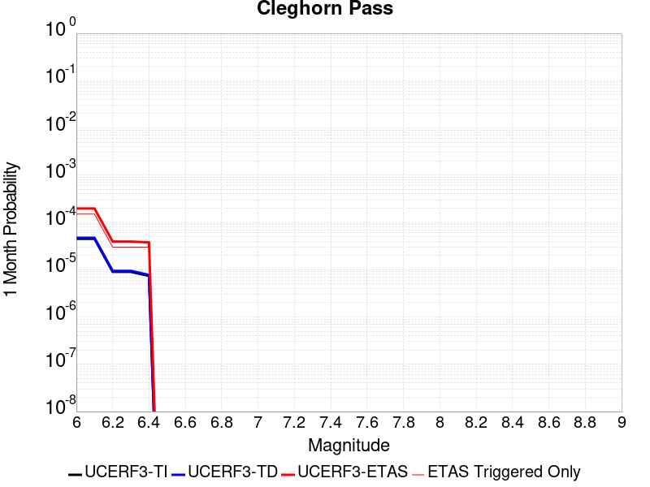 |  |  |

| Magnitude | 1 wk TI Prob | 1 wk TD Prob | 1 wk ETAS Prob | 1 wk ETAS/TD Gain | 1 wk ETAS Triggered Only | 1 mo TI Prob | 1 mo TD Prob | 1 mo ETAS Prob | 1 mo ETAS/TD Gain | 1 mo ETAS Triggered Only | 1 yr TI Prob | 1 yr TD Prob | 1 yr ETAS Prob | 1 yr ETAS/TD Gain | 1 yr ETAS Triggered Only | 10 yr TI Prob | 10 yr TD Prob | 10 yr ETAS Prob | 10 yr ETAS/TD Gain | 10 yr ETAS Triggered Only |
|-----|-----|-----|-----|-----|-----|-----|-----|-----|-----|-----|-----|-----|-----|-----|-----|-----|-----|-----|-----|-----|
| 6.0 | 1.0522846E-5 | 1.1040642E-5 | 1.5223217E-4 | 13.788343 | 1.4119309E-4 | 4.509713E-5 | 4.7316473E-5 | 2.5909606E-4 | 5.475811 | 2.1178962E-4 | 5.4891926E-4 | 5.759784E-4 | 9.640358E-4 | 1.6737359 | 3.8828098E-4 | 0.0054756533 | 0.005750022 | 0.00613607 | 1.0671386 | 3.8828098E-4 |
| 6.1 | 1.0522846E-5 | 1.1040642E-5 | 1.5223217E-4 | 13.788343 | 1.4119309E-4 | 4.509713E-5 | 4.7316473E-5 | 2.5909606E-4 | 5.475811 | 2.1178962E-4 | 5.4891926E-4 | 5.759784E-4 | 9.640358E-4 | 1.6737359 | 3.8828098E-4 | 0.0054756533 | 0.005750022 | 0.00613607 | 1.0671386 | 3.8828098E-4 |
| 6.2 | 2.1045846E-6 | 2.2082024E-6 | 2.2082024E-6 | 1.0 | 0.0 | 9.019617E-6 | 9.463714E-6 | 4.476165E-5 | 4.7298183 | 3.529827E-5 | 1.098083E-4 | 1.1521882E-4 | 1.8580724E-4 | 1.6126465 | 7.059654E-5 | 0.0010975406 | 0.0011520023 | 0.0012225175 | 1.061211 | 7.059654E-5 |
| 6.3 | 2.1045846E-6 | 2.2082024E-6 | 2.2082024E-6 | 1.0 | 0.0 | 9.019617E-6 | 9.463714E-6 | 4.476165E-5 | 4.7298183 | 3.529827E-5 | 1.098083E-4 | 1.1521882E-4 | 1.8580724E-4 | 1.6126465 | 7.059654E-5 | 0.0010975406 | 0.0011520023 | 0.0012225175 | 1.061211 | 7.059654E-5 |
| 6.4 | 1.7259927E-6 | 1.810877E-6 | 1.810877E-6 | 1.0 | 0.0 | 7.3970905E-6 | 7.760902E-6 | 4.30589E-5 | 5.5481825 | 3.529827E-5 | 9.005586E-5 | 9.4488976E-5 | 1.6507885E-4 | 1.7470698 | 7.059654E-5 | 9.001937E-4 | 9.448898E-4 | 0.0010154196 | 1.0746435 | 7.059654E-5 |

## Pisgah-Bullion Mtn-Mesquite Lk
*[(top)](#table-of-contents)*

| 1 Week | 1 Month | 1 Year | 10 Year |
|-----|-----|-----|-----|
| 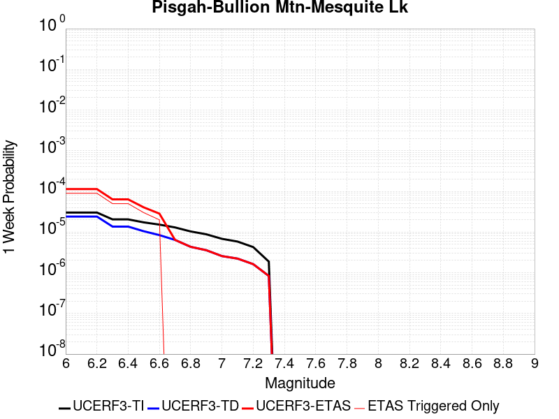 |  |  | 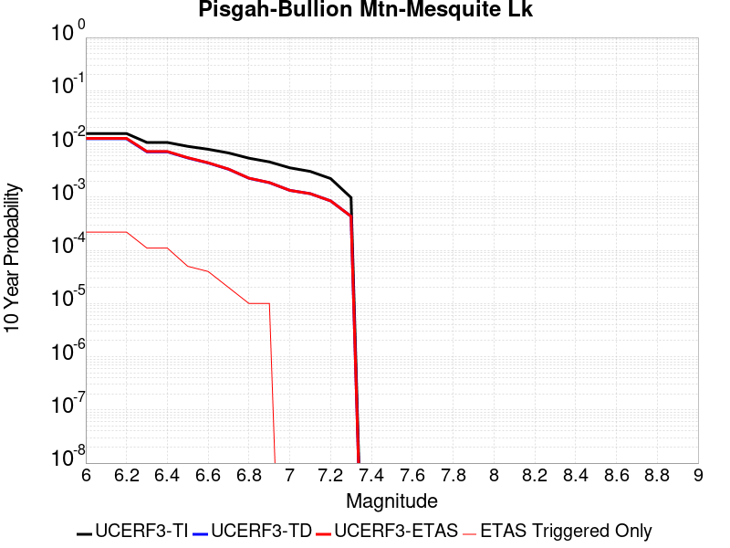 |

| Magnitude | 1 wk TI Prob | 1 wk TD Prob | 1 wk ETAS Prob | 1 wk ETAS/TD Gain | 1 wk ETAS Triggered Only | 1 mo TI Prob | 1 mo TD Prob | 1 mo ETAS Prob | 1 mo ETAS/TD Gain | 1 mo ETAS Triggered Only | 1 yr TI Prob | 1 yr TD Prob | 1 yr ETAS Prob | 1 yr ETAS/TD Gain | 1 yr ETAS Triggered Only | 10 yr TI Prob | 10 yr TD Prob | 10 yr ETAS Prob | 10 yr ETAS/TD Gain | 10 yr ETAS Triggered Only |
|-----|-----|-----|-----|-----|-----|-----|-----|-----|-----|-----|-----|-----|-----|-----|-----|-----|-----|-----|-----|-----|
| 6.0 | 3.0240792E-5 | 2.4091114E-5 | 2.3587563E-4 | 9.79098 | 2.1178962E-4 | 1.2959696E-4 | 1.03244114E-4 | 3.1501186E-4 | 3.0511363 | 2.1178962E-4 | 0.0015767008 | 0.0012563728 | 0.0015736581 | 1.2525407 | 3.1768443E-4 | 0.015655609 | 0.012502721 | 0.012886147 | 1.0306674 | 3.8828098E-4 |
| 6.1 | 3.0240792E-5 | 2.4091114E-5 | 2.3587563E-4 | 9.79098 | 2.1178962E-4 | 1.2959696E-4 | 1.03244114E-4 | 3.1501186E-4 | 3.0511363 | 2.1178962E-4 | 0.0015767008 | 0.0012563728 | 0.0015736581 | 1.2525407 | 3.1768443E-4 | 0.015655609 | 0.012502721 | 0.012886147 | 1.0306674 | 3.8828098E-4 |
| 6.2 | 3.0240792E-5 | 2.4091114E-5 | 2.3587563E-4 | 9.79098 | 2.1178962E-4 | 1.2959696E-4 | 1.03244114E-4 | 3.1501186E-4 | 3.0511363 | 2.1178962E-4 | 0.0015767008 | 0.0012563728 | 0.0015736581 | 1.2525407 | 3.1768443E-4 | 0.015655609 | 0.012502721 | 0.012886147 | 1.0306674 | 3.8828098E-4 |
| 6.3 | 2.0498217E-5 | 1.36380695E-5 | 1.1953144E-4 | 8.764543 | 1.0589481E-4 | 8.784654E-5 | 5.844765E-5 | 1.6433628E-4 | 2.8116832 | 1.0589481E-4 | 0.0010690069 | 7.1138405E-4 | 8.524767E-4 | 1.1983354 | 1.4119309E-4 | 0.01063879 | 0.0070926943 | 0.0072328863 | 1.0197656 | 1.4119309E-4 |
| 6.4 | 2.0498217E-5 | 1.36380695E-5 | 1.1953144E-4 | 8.764543 | 1.0589481E-4 | 8.784654E-5 | 5.844765E-5 | 1.6433628E-4 | 2.8116832 | 1.0589481E-4 | 0.0010690069 | 7.1138405E-4 | 8.524767E-4 | 1.1983354 | 1.4119309E-4 | 0.01063879 | 0.0070926943 | 0.0072328863 | 1.0197656 | 1.4119309E-4 |
| 6.5 | 1.7316182E-5 | 1.0477042E-5 | 4.5774945E-5 | 4.369071 | 3.529827E-5 | 7.42101E-5 | 4.4900895E-5 | 8.0197584E-5 | 1.786102 | 3.529827E-5 | 9.0313336E-4 | 5.465413E-4 | 6.170992E-4 | 1.129099 | 7.059654E-5 | 0.008994718 | 0.0054529672 | 0.0055231787 | 1.0128758 | 7.059654E-5 |
| 6.6 | 1.5251077E-5 | 8.414273E-6 | 4.3712247E-5 | 5.1950116 | 3.529827E-5 | 6.536012E-5 | 3.6060712E-5 | 7.135771E-5 | 1.9788214 | 3.529827E-5 | 7.9546886E-4 | 4.3895794E-4 | 5.095235E-4 | 1.160757 | 7.059654E-5 | 0.007926274 | 0.0043816264 | 0.0044519138 | 1.0160414 | 7.059654E-5 |
| 6.7 | 1.2997425E-5 | 6.4114965E-6 | 6.4114965E-6 | 1.0 | 0.0 | 5.570206E-5 | 2.7477578E-5 | 2.7477578E-5 | 1.0 | 0.0 | 6.7796157E-4 | 3.3449283E-4 | 3.6977927E-4 | 1.1054925 | 3.529827E-5 | 0.0067589693 | 0.0033403537 | 0.0033755342 | 1.0105319 | 3.529827E-5 |
| 6.8 | 1.035386E-5 | 4.3332193E-6 | 4.3332193E-6 | 1.0 | 0.0 | 4.437293E-5 | 1.8570812E-5 | 1.8570812E-5 | 1.0 | 0.0 | 5.401065E-4 | 2.2607706E-4 | 2.6136736E-4 | 1.1560985 | 3.529827E-5 | 0.0053879567 | 0.0022585576 | 0.002293776 | 1.0155934 | 3.529827E-5 |
| 6.9 | 8.816252E-6 | 3.580638E-6 | 3.580638E-6 | 1.0 | 0.0 | 3.778339E-5 | 1.5345504E-5 | 1.5345504E-5 | 1.0 | 0.0 | 4.5991567E-4 | 1.8681608E-4 | 2.2210776E-4 | 1.1889113 | 3.529827E-5 | 0.00458965 | 0.0018666488 | 0.0019018812 | 1.0188746 | 3.529827E-5 |
| 7.0 | 6.8232207E-6 | 2.5675843E-6 | 2.5675843E-6 | 1.0 | 0.0 | 2.9242048E-5 | 1.1003888E-5 | 1.1003888E-5 | 1.0 | 0.0 | 3.5596377E-4 | 1.3396442E-4 | 1.3396442E-4 | 1.0 | 0.0 | 0.0035539411 | 0.0013388677 | 0.0013388677 | 1.0 | 0.0 |
| 7.1 | 5.837013E-6 | 2.22738E-6 | 2.22738E-6 | 1.0 | 0.0 | 2.501553E-5 | 9.545881E-6 | 9.545881E-6 | 1.0 | 0.0 | 3.045215E-4 | 1.16215204E-4 | 1.16215204E-4 | 1.0 | 0.0 | 0.0030410455 | 0.0011615733 | 0.0011615733 | 1.0 | 0.0 |
| 7.2 | 4.278052E-6 | 1.6275711E-6 | 1.6275711E-6 | 1.0 | 0.0 | 1.833438E-5 | 6.9752873E-6 | 6.9752873E-6 | 1.0 | 0.0 | 2.231982E-4 | 8.492105E-5 | 8.492105E-5 | 1.0 | 0.0 | 0.0022297418 | 8.489092E-4 | 8.489092E-4 | 1.0 | 0.0 |
| 7.3 | 1.8803692E-6 | 8.344926E-7 | 8.344926E-7 | 1.0 | 0.0 | 8.0587E-6 | 3.5763926E-6 | 3.5763926E-6 | 1.0 | 0.0 | 9.811026E-5 | 4.354186E-5 | 4.354186E-5 | 1.0 | 0.0 | 9.806695E-4 | 4.3534773E-4 | 4.3534773E-4 | 1.0 | 0.0 |

## Independence rev 2011
*[(top)](#table-of-contents)*

| 1 Week | 1 Month | 1 Year | 10 Year |
|-----|-----|-----|-----|
|  |  |  | 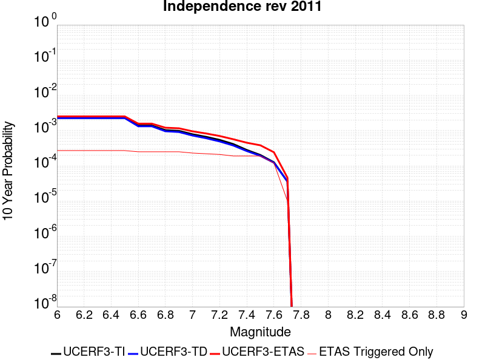 |

| Magnitude | 1 wk TI Prob | 1 wk TD Prob | 1 wk ETAS Prob | 1 wk ETAS/TD Gain | 1 wk ETAS Triggered Only | 1 mo TI Prob | 1 mo TD Prob | 1 mo ETAS Prob | 1 mo ETAS/TD Gain | 1 mo ETAS Triggered Only | 1 yr TI Prob | 1 yr TD Prob | 1 yr ETAS Prob | 1 yr ETAS/TD Gain | 1 yr ETAS Triggered Only | 10 yr TI Prob | 10 yr TD Prob | 10 yr ETAS Prob | 10 yr ETAS/TD Gain | 10 yr ETAS Triggered Only |
|-----|-----|-----|-----|-----|-----|-----|-----|-----|-----|-----|-----|-----|-----|-----|-----|-----|-----|-----|-----|-----|
| 6.0 | 4.422171E-6 | 4.326227E-6 | 2.8671118E-4 | 66.2728 | 2.8238617E-4 | 1.8952025E-5 | 1.8540857E-5 | 3.009218E-4 | 16.230198 | 2.8238617E-4 | 2.3071647E-4 | 2.2571455E-4 | 5.7861756E-4 | 2.5634925 | 3.529827E-4 | 0.0023047708 | 0.0022551466 | 0.0026073332 | 1.1561702 | 3.529827E-4 |
| 6.1 | 4.422171E-6 | 4.326227E-6 | 2.8671118E-4 | 66.2728 | 2.8238617E-4 | 1.8952025E-5 | 1.8540857E-5 | 3.009218E-4 | 16.230198 | 2.8238617E-4 | 2.3071647E-4 | 2.2571455E-4 | 5.7861756E-4 | 2.5634925 | 3.529827E-4 | 0.0023047708 | 0.0022551466 | 0.0026073332 | 1.1561702 | 3.529827E-4 |
| 6.2 | 4.422171E-6 | 4.326227E-6 | 2.8671118E-4 | 66.2728 | 2.8238617E-4 | 1.8952025E-5 | 1.8540857E-5 | 3.009218E-4 | 16.230198 | 2.8238617E-4 | 2.3071647E-4 | 2.2571455E-4 | 5.7861756E-4 | 2.5634925 | 3.529827E-4 | 0.0023047708 | 0.0022551466 | 0.0026073332 | 1.1561702 | 3.529827E-4 |
| 6.3 | 4.422171E-6 | 4.326227E-6 | 2.8671118E-4 | 66.2728 | 2.8238617E-4 | 1.8952025E-5 | 1.8540857E-5 | 3.009218E-4 | 16.230198 | 2.8238617E-4 | 2.3071647E-4 | 2.2571455E-4 | 5.7861756E-4 | 2.5634925 | 3.529827E-4 | 0.0023047708 | 0.0022551466 | 0.0026073332 | 1.1561702 | 3.529827E-4 |
| 6.4 | 4.422171E-6 | 4.326227E-6 | 2.8671118E-4 | 66.2728 | 2.8238617E-4 | 1.8952025E-5 | 1.8540857E-5 | 3.009218E-4 | 16.230198 | 2.8238617E-4 | 2.3071647E-4 | 2.2571455E-4 | 5.7861756E-4 | 2.5634925 | 3.529827E-4 | 0.0023047708 | 0.0022551466 | 0.0026073332 | 1.1561702 | 3.529827E-4 |
| 6.5 | 4.422171E-6 | 4.326227E-6 | 2.8671118E-4 | 66.2728 | 2.8238617E-4 | 1.8952025E-5 | 1.8540857E-5 | 3.009218E-4 | 16.230198 | 2.8238617E-4 | 2.3071647E-4 | 2.2571455E-4 | 5.7861756E-4 | 2.5634925 | 3.529827E-4 | 0.0023047708 | 0.0022551466 | 0.0026073332 | 1.1561702 | 3.529827E-4 |
| 6.6 | 2.663744E-6 | 2.5319862E-6 | 2.8491742E-4 | 112.527245 | 2.8238617E-4 | 1.1415996E-5 | 1.0851327E-5 | 2.9323442E-4 | 27.02291 | 2.8238617E-4 | 1.3898089E-4 | 1.3210738E-4 | 4.8504345E-4 | 3.6715846 | 3.529827E-4 | 0.0013889399 | 0.0013203367 | 0.0016728534 | 1.26699 | 3.529827E-4 |
| 6.7 | 2.663744E-6 | 2.5319862E-6 | 2.8491742E-4 | 112.527245 | 2.8238617E-4 | 1.1415996E-5 | 1.0851327E-5 | 2.9323442E-4 | 27.02291 | 2.8238617E-4 | 1.3898089E-4 | 1.3210738E-4 | 4.8504345E-4 | 3.6715846 | 3.529827E-4 | 0.0013889399 | 0.0013203367 | 0.0016728534 | 1.26699 | 3.529827E-4 |
| 6.8 | 1.9716529E-6 | 1.8322585E-6 | 2.842179E-4 | 155.1189 | 2.8238617E-4 | 8.449913E-6 | 7.852514E-6 | 2.9023646E-4 | 36.960964 | 2.8238617E-4 | 1.0287284E-4 | 9.5600284E-5 | 4.4854925E-4 | 4.6919236 | 3.529827E-4 | 0.0010282523 | 9.556045E-4 | 0.0013082499 | 1.3690286 | 3.529827E-4 |
| 6.9 | 1.8788617E-6 | 1.7429993E-6 | 2.8412868E-4 | 163.01135 | 2.8238617E-4 | 8.0522395E-6 | 7.4699765E-6 | 2.8985404E-4 | 38.802536 | 2.8238617E-4 | 9.80316E-5 | 9.0943286E-5 | 4.438939E-4 | 4.8809967 | 3.529827E-4 | 9.798837E-4 | 9.0907275E-4 | 0.0012617345 | 1.3879358 | 3.529827E-4 |
| 7.0 | 1.5045488E-6 | 1.3849503E-6 | 2.1317428E-4 | 153.92197 | 2.1178962E-4 | 6.44805E-6 | 5.9354884E-6 | 2.1772385E-4 | 36.68171 | 2.1178962E-4 | 7.8502184E-5 | 7.226223E-5 | 3.54628E-4 | 4.907515 | 2.8238617E-4 | 7.8474457E-4 | 7.2239246E-4 | 0.0010045746 | 1.3906217 | 2.8238617E-4 |
| 7.1 | 1.272341E-6 | 1.1625096E-6 | 1.7765365E-4 | 152.81908 | 1.7649135E-4 | 5.4528787E-6 | 4.982175E-6 | 1.8147264E-4 | 36.42438 | 1.7649135E-4 | 6.6386776E-5 | 6.0656326E-5 | 3.0772923E-4 | 5.0733247 | 2.4708788E-4 | 6.636695E-4 | 6.064009E-4 | 8.53339E-4 | 1.4072192 | 2.4708788E-4 |
| 7.2 | 1.0416892E-6 | 9.4098806E-7 | 1.7743217E-4 | 188.55943 | 1.7649135E-4 | 4.464375E-6 | 4.0328E-6 | 1.8052344E-4 | 44.763798 | 1.7649135E-4 | 5.4352407E-5 | 4.909825E-5 | 2.9617402E-4 | 6.0322723 | 2.4708788E-4 | 5.4339116E-4 | 4.9087586E-4 | 7.3784246E-4 | 1.5031141 | 2.4708788E-4 |
| 7.3 | 7.9450155E-7 | 7.235002E-7 | 1.4191648E-4 | 196.15265 | 1.4119309E-4 | 3.4050022E-6 | 3.1007114E-6 | 1.4429336E-4 | 46.535564 | 1.4119309E-4 | 4.1455114E-5 | 3.775052E-5 | 2.4953214E-4 | 6.610032 | 2.1178962E-4 | 4.144738E-4 | 3.7744216E-4 | 5.8915187E-4 | 1.5609063 | 2.1178962E-4 |
| 7.4 | 5.3893444E-7 | 5.019512E-7 | 1.4169497E-4 | 282.2883 | 1.4119309E-4 | 2.309717E-6 | 2.1512178E-6 | 1.4334399E-4 | 66.63388 | 1.4119309E-4 | 2.8120441E-5 | 2.6190766E-5 | 2.3797485E-4 | 9.086211 | 2.1178962E-4 | 2.8116882E-4 | 2.6187726E-4 | 4.736114E-4 | 1.8085245 | 2.1178962E-4 |
| 7.5 | 3.8852085E-7 | 3.682554E-7 | 1.4156128E-4 | 384.4106 | 1.4119309E-4 | 1.6650882E-6 | 1.5782365E-6 | 1.427711E-4 | 90.462425 | 1.4119309E-4 | 2.027226E-5 | 1.9214862E-5 | 2.3100042E-4 | 12.021966 | 2.1178962E-4 | 2.0270412E-4 | 1.9213221E-4 | 4.0388116E-4 | 2.1021001 | 2.1178962E-4 |
| 7.6 | 2.414929E-7 | 2.345755E-7 | 1.0612936E-4 | 452.43158 | 1.0589481E-4 | 1.0349692E-6 | 1.0053232E-6 | 1.0690003E-4 | 106.33399 | 1.0589481E-4 | 1.2600677E-5 | 1.2239742E-5 | 1.534311E-4 | 12.535484 | 1.4119309E-4 | 1.2599962E-4 | 1.223908E-4 | 2.6356662E-4 | 2.1534836 | 1.4119309E-4 |
| 7.7 | 6.8298014E-8 | 6.85897E-8 | 3.536686E-5 | 515.62933 | 3.529827E-5 | 2.9270575E-7 | 2.9395582E-7 | 3.5592217E-5 | 121.080154 | 3.529827E-5 | 3.5636867E-6 | 3.5789067E-6 | 3.887705E-5 | 10.862829 | 3.529827E-5 | 3.5636294E-5 | 3.5788536E-5 | 7.1085546E-5 | 1.9862657 | 3.529827E-5 |

## Deep Springs
*[(top)](#table-of-contents)*

| 1 Week | 1 Month | 1 Year | 10 Year |
|-----|-----|-----|-----|
|  |  |  |  |

| Magnitude | 1 wk TI Prob | 1 wk TD Prob | 1 wk ETAS Prob | 1 wk ETAS/TD Gain | 1 wk ETAS Triggered Only | 1 mo TI Prob | 1 mo TD Prob | 1 mo ETAS Prob | 1 mo ETAS/TD Gain | 1 mo ETAS Triggered Only | 1 yr TI Prob | 1 yr TD Prob | 1 yr ETAS Prob | 1 yr ETAS/TD Gain | 1 yr ETAS Triggered Only | 10 yr TI Prob | 10 yr TD Prob | 10 yr ETAS Prob | 10 yr ETAS/TD Gain | 10 yr ETAS Triggered Only |
|-----|-----|-----|-----|-----|-----|-----|-----|-----|-----|-----|-----|-----|-----|-----|-----|-----|-----|-----|-----|-----|
| 6.0 | 1.9810619E-5 | 2.311252E-5 | 1.6430234E-4 | 7.1088023 | 1.4119309E-4 | 8.489989E-5 | 9.905276E-5 | 2.4023185E-4 | 2.425292 | 1.4119309E-4 | 0.001033166 | 0.0012058079 | 0.0014878536 | 1.2339059 | 2.8238617E-4 | 0.010283757 | 0.012042425 | 0.01242603 | 1.0318545 | 3.8828098E-4 |
| 6.1 | 1.9810619E-5 | 2.311252E-5 | 1.6430234E-4 | 7.1088023 | 1.4119309E-4 | 8.489989E-5 | 9.905276E-5 | 2.4023185E-4 | 2.425292 | 1.4119309E-4 | 0.001033166 | 0.0012058079 | 0.0014878536 | 1.2339059 | 2.8238617E-4 | 0.010283757 | 0.012042425 | 0.01242603 | 1.0318545 | 3.8828098E-4 |
| 6.2 | 1.9810619E-5 | 2.311252E-5 | 1.6430234E-4 | 7.1088023 | 1.4119309E-4 | 8.489989E-5 | 9.905276E-5 | 2.4023185E-4 | 2.425292 | 1.4119309E-4 | 0.001033166 | 0.0012058079 | 0.0014878536 | 1.2339059 | 2.8238617E-4 | 0.010283757 | 0.012042425 | 0.01242603 | 1.0318545 | 3.8828098E-4 |
| 6.3 | 1.9810619E-5 | 2.311252E-5 | 1.6430234E-4 | 7.1088023 | 1.4119309E-4 | 8.489989E-5 | 9.905276E-5 | 2.4023185E-4 | 2.425292 | 1.4119309E-4 | 0.001033166 | 0.0012058079 | 0.0014878536 | 1.2339059 | 2.8238617E-4 | 0.010283757 | 0.012042425 | 0.01242603 | 1.0318545 | 3.8828098E-4 |
| 6.4 | 1.9810619E-5 | 2.311252E-5 | 1.6430234E-4 | 7.1088023 | 1.4119309E-4 | 8.489989E-5 | 9.905276E-5 | 2.4023185E-4 | 2.425292 | 1.4119309E-4 | 0.001033166 | 0.0012058079 | 0.0014878536 | 1.2339059 | 2.8238617E-4 | 0.010283757 | 0.012042425 | 0.01242603 | 1.0318545 | 3.8828098E-4 |
| 6.5 | 1.7190405E-5 | 2.0050555E-5 | 1.2594325E-4 | 6.2812843 | 1.0589481E-4 | 7.367108E-5 | 8.593095E-5 | 1.9181667E-4 | 2.2322185 | 1.0589481E-4 | 8.9657627E-4 | 0.0010462094 | 0.0012930387 | 1.2359273 | 2.4708788E-4 | 0.008929676 | 0.010462056 | 0.010811346 | 1.0333863 | 3.529827E-4 |
| 6.6 | 1.7190405E-5 | 2.0050555E-5 | 1.2594325E-4 | 6.2812843 | 1.0589481E-4 | 7.367108E-5 | 8.593095E-5 | 1.9181667E-4 | 2.2322185 | 1.0589481E-4 | 8.9657627E-4 | 0.0010462094 | 0.0012930387 | 1.2359273 | 2.4708788E-4 | 0.008929676 | 0.010462056 | 0.010811346 | 1.0333863 | 3.529827E-4 |

## Death Valley (Fish Lake Valley)
*[(top)](#table-of-contents)*

| 1 Week | 1 Month | 1 Year | 10 Year |
|-----|-----|-----|-----|
|  |  |  |  |

| Magnitude | 1 wk TI Prob | 1 wk TD Prob | 1 wk ETAS Prob | 1 wk ETAS/TD Gain | 1 wk ETAS Triggered Only | 1 mo TI Prob | 1 mo TD Prob | 1 mo ETAS Prob | 1 mo ETAS/TD Gain | 1 mo ETAS Triggered Only | 1 yr TI Prob | 1 yr TD Prob | 1 yr ETAS Prob | 1 yr ETAS/TD Gain | 1 yr ETAS Triggered Only | 10 yr TI Prob | 10 yr TD Prob | 10 yr ETAS Prob | 10 yr ETAS/TD Gain | 10 yr ETAS Triggered Only |
|-----|-----|-----|-----|-----|-----|-----|-----|-----|-----|-----|-----|-----|-----|-----|-----|-----|-----|-----|-----|-----|
| 6.0 | 3.872328E-5 | 4.7267473E-5 | 2.2375048E-4 | 4.7337093 | 1.7649135E-4 | 1.6594635E-4 | 2.0256084E-4 | 4.1430758E-4 | 2.0453486 | 2.1178962E-4 | 0.0020185246 | 0.002463534 | 0.002815647 | 1.14293 | 3.529827E-4 | 0.02000288 | 0.024388181 | 0.024766993 | 1.0155326 | 3.8828098E-4 |
| 6.1 | 3.872328E-5 | 4.7267473E-5 | 2.2375048E-4 | 4.7337093 | 1.7649135E-4 | 1.6594635E-4 | 2.0256084E-4 | 4.1430758E-4 | 2.0453486 | 2.1178962E-4 | 0.0020185246 | 0.002463534 | 0.002815647 | 1.14293 | 3.529827E-4 | 0.02000288 | 0.024388181 | 0.024766993 | 1.0155326 | 3.8828098E-4 |
| 6.2 | 3.872328E-5 | 4.7267473E-5 | 2.2375048E-4 | 4.7337093 | 1.7649135E-4 | 1.6594635E-4 | 2.0256084E-4 | 4.1430758E-4 | 2.0453486 | 2.1178962E-4 | 0.0020185246 | 0.002463534 | 0.002815647 | 1.14293 | 3.529827E-4 | 0.02000288 | 0.024388181 | 0.024766993 | 1.0155326 | 3.8828098E-4 |
| 6.3 | 2.8356371E-5 | 3.3609853E-5 | 2.1009527E-4 | 6.251003 | 1.7649135E-4 | 1.2152165E-4 | 1.4403471E-4 | 3.5579383E-4 | 2.470195 | 2.1178962E-4 | 0.0014785219 | 0.0017522911 | 0.0021046554 | 1.2010877 | 3.529827E-4 | 0.014687235 | 0.017391782 | 0.01777331 | 1.0219373 | 3.8828098E-4 |
| 6.4 | 2.8356371E-5 | 3.3609853E-5 | 2.1009527E-4 | 6.251003 | 1.7649135E-4 | 1.2152165E-4 | 1.4403471E-4 | 3.5579383E-4 | 2.470195 | 2.1178962E-4 | 0.0014785219 | 0.0017522911 | 0.0021046554 | 1.2010877 | 3.529827E-4 | 0.014687235 | 0.017391782 | 0.01777331 | 1.0219373 | 3.8828098E-4 |
| 6.5 | 2.4448687E-5 | 2.8607552E-5 | 2.0509385E-4 | 7.1692204 | 1.7649135E-4 | 1.0477588E-4 | 1.2259831E-4 | 3.3436198E-4 | 2.7272966 | 2.1178962E-4 | 0.0012748998 | 0.0014916632 | 0.0018441193 | 1.236284 | 3.529827E-4 | 0.012676105 | 0.014821377 | 0.0152039025 | 1.025809 | 3.8828098E-4 |
| 6.6 | 2.1298161E-5 | 2.4660083E-5 | 2.0114708E-4 | 8.156788 | 1.7649135E-4 | 9.127464E-5 | 1.0568198E-4 | 3.1744922E-4 | 3.003816 | 2.1178962E-4 | 0.0011107022 | 0.0012859525 | 0.0016384813 | 1.2741382 | 3.529827E-4 | 0.011051672 | 0.012788526 | 0.01317184 | 1.0299734 | 3.8828098E-4 |
| 6.7 | 1.8959729E-5 | 2.1781025E-5 | 1.6297103E-4 | 7.482248 | 1.4119309E-4 | 8.125345E-5 | 9.334405E-5 | 2.6981893E-4 | 2.890585 | 1.7649135E-4 | 9.888117E-4 | 0.001135897 | 0.0014532205 | 1.2793595 | 3.1768443E-4 | 0.009844234 | 0.01130357 | 0.011652563 | 1.0308746 | 3.529827E-4 |
| 6.8 | 1.6691629E-5 | 1.9018353E-5 | 1.6020874E-4 | 8.4239025 | 1.4119309E-4 | 7.153359E-5 | 8.150477E-5 | 2.5798174E-4 | 3.1652348 | 1.7649135E-4 | 8.7057345E-4 | 9.918857E-4 | 0.001309255 | 1.3199656 | 3.1768443E-4 | 0.008671708 | 0.009876343 | 0.01022584 | 1.0353873 | 3.529827E-4 |
| 6.9 | 1.450505E-5 | 1.638954E-5 | 1.575803E-4 | 9.614688 | 1.4119309E-4 | 6.216302E-5 | 7.0239046E-5 | 2.46718E-4 | 3.5125477 | 1.7649135E-4 | 7.5657194E-4 | 8.5483363E-4 | 0.0011722465 | 1.3713154 | 3.1768443E-4 | 0.007540013 | 0.008516385 | 0.008866362 | 1.0410945 | 3.529827E-4 |
| 7.0 | 1.2940855E-5 | 1.4537972E-5 | 1.55729E-4 | 10.71188 | 1.4119309E-4 | 5.545963E-5 | 6.230414E-5 | 2.3878449E-4 | 3.8325624 | 1.7649135E-4 | 6.750118E-4 | 7.5829466E-4 | 0.0010757382 | 1.4186282 | 3.1768443E-4 | 0.006729651 | 0.0075576897 | 0.007908005 | 1.0463521 | 3.529827E-4 |
| 7.1 | 1.2544658E-5 | 1.4078208E-5 | 1.552693E-4 | 11.029054 | 1.4119309E-4 | 5.3761712E-5 | 6.0333812E-5 | 2.3681452E-4 | 3.9250712 | 1.7649135E-4 | 6.5435225E-4 | 7.343222E-4 | 0.0010517733 | 1.432305 | 3.1768443E-4 | 0.006524288 | 0.007319551 | 0.00766995 | 1.0478717 | 3.529827E-4 |
| 7.2 | 1.2489416E-5 | 1.4015674E-5 | 1.5520677E-4 | 11.0738 | 1.4119309E-4 | 5.3524967E-5 | 6.0065824E-5 | 2.3654658E-4 | 3.9381225 | 1.7649135E-4 | 6.514716E-4 | 7.310616E-4 | 0.0010485138 | 1.4342345 | 3.1768443E-4 | 0.006495651 | 0.0072871596 | 0.00763757 | 1.048086 | 3.529827E-4 |
| 7.3 | 1.2368307E-5 | 1.3879812E-5 | 1.5507093E-4 | 11.172408 | 1.4119309E-4 | 5.3005948E-5 | 5.9483587E-5 | 2.3596444E-4 | 3.9668832 | 1.7649135E-4 | 6.451563E-4 | 7.2397763E-4 | 0.001041432 | 1.4384866 | 3.1768443E-4 | 0.0064328653 | 0.007216782 | 0.007567217 | 1.0485584 | 3.529827E-4 |
| 7.4 | 1.2161707E-5 | 1.36478675E-5 | 1.5483903E-4 | 11.34529 | 1.4119309E-4 | 5.212056E-5 | 5.8489582E-5 | 2.349706E-4 | 4.017307 | 1.7649135E-4 | 6.3438306E-4 | 7.118836E-4 | 0.0010293418 | 1.4459413 | 3.1768443E-4 | 0.006325751 | 0.0070966207 | 0.0074470984 | 1.0493866 | 3.529827E-4 |
| 7.5 | 1.1707948E-5 | 1.3145515E-5 | 1.5433674E-4 | 11.740639 | 1.4119309E-4 | 5.0175953E-5 | 5.6336736E-5 | 2.3281814E-4 | 4.132617 | 1.7649135E-4 | 6.10721E-4 | 6.856895E-4 | 0.0010031561 | 1.4629889 | 3.1768443E-4 | 0.0060904534 | 0.006836321 | 0.0071868906 | 1.0512805 | 3.529827E-4 |
| 7.6 | 1.0319538E-5 | 1.1579622E-5 | 1.1747321E-4 | 10.144822 | 1.0589481E-4 | 4.4225842E-5 | 4.9626036E-5 | 1.9081212E-4 | 3.845 | 1.4119309E-4 | 5.383166E-4 | 6.040347E-4 | 8.862503E-4 | 1.4672176 | 2.8238617E-4 | 0.0053701443 | 0.0060244603 | 0.006340231 | 1.0524148 | 3.1768443E-4 |
| 7.7 | 8.937764E-6 | 1.0022779E-5 | 1.15916526E-4 | 11.565309 | 1.0589481E-4 | 3.830414E-5 | 4.295409E-5 | 1.841411E-4 | 4.2869287 | 1.4119309E-4 | 4.6625308E-4 | 5.228456E-4 | 8.050841E-4 | 1.5398123 | 2.8238617E-4 | 0.0046527605 | 0.005216664 | 0.0055326913 | 1.0605804 | 3.1768443E-4 |
| 7.8 | 3.108007E-7 | 3.284654E-7 | 3.284654E-7 | 1.0 | 0.0 | 1.3320023E-6 | 1.407708E-6 | 1.407708E-6 | 1.0 | 0.0 | 1.6217007E-5 | 1.7138715E-5 | 1.7138715E-5 | 1.0 | 0.0 | 1.6215823E-4 | 1.7137431E-4 | 1.7137431E-4 | 1.0 | 0.0 |
| 7.9 | 2.5591178E-9 | 2.6696718E-9 | 2.6696718E-9 | 1.0 | 0.0 | 1.0967647E-8 | 1.14414505E-8 | 1.14414505E-8 | 1.0 | 0.0 | 1.335311E-7 | 1.3929966E-7 | 1.3929966E-7 | 1.0 | 0.0 | 1.3353102E-6 | 1.3929966E-6 | 1.3929966E-6 | 1.0 | 0.0 |

## San Jacinto (San Bernardino)
*[(top)](#table-of-contents)*

| 1 Week | 1 Month | 1 Year | 10 Year |
|-----|-----|-----|-----|
|  |  | 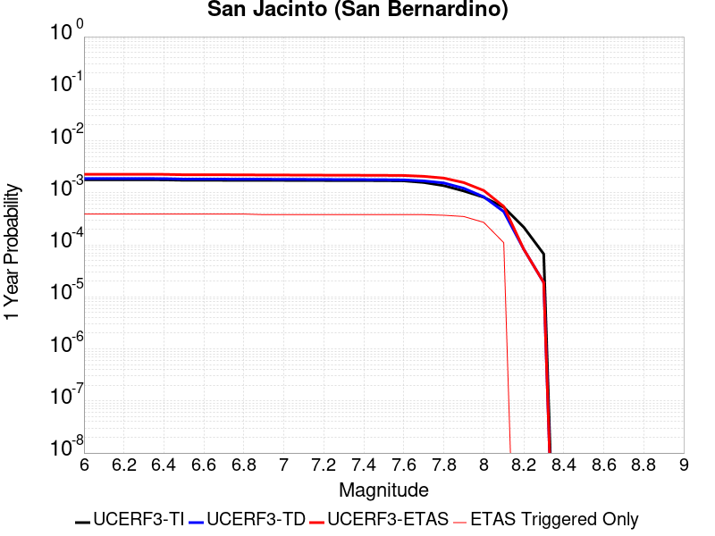 | 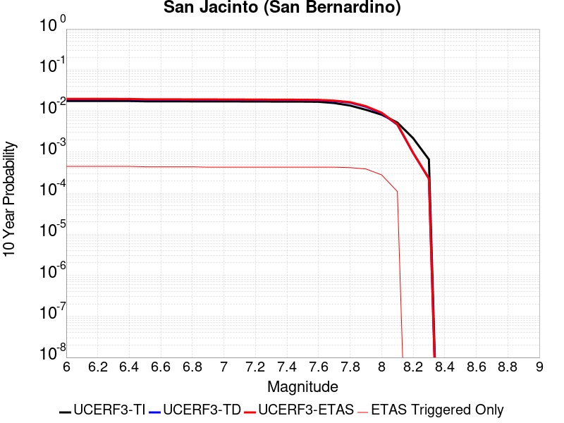 |

| Magnitude | 1 wk TI Prob | 1 wk TD Prob | 1 wk ETAS Prob | 1 wk ETAS/TD Gain | 1 wk ETAS Triggered Only | 1 mo TI Prob | 1 mo TD Prob | 1 mo ETAS Prob | 1 mo ETAS/TD Gain | 1 mo ETAS Triggered Only | 1 yr TI Prob | 1 yr TD Prob | 1 yr ETAS Prob | 1 yr ETAS/TD Gain | 1 yr ETAS Triggered Only | 10 yr TI Prob | 10 yr TD Prob | 10 yr ETAS Prob | 10 yr ETAS/TD Gain | 10 yr ETAS Triggered Only |
|-----|-----|-----|-----|-----|-----|-----|-----|-----|-----|-----|-----|-----|-----|-----|-----|-----|-----|-----|-----|-----|
| 6.0 | 3.409352E-5 | 3.5986508E-5 | 2.477685E-4 | 6.885039 | 2.1178962E-4 | 1.461069E-4 | 1.542188E-4 | 4.0126857E-4 | 2.6019435 | 2.4708788E-4 | 0.0017774 | 0.0018759987 | 0.0021930872 | 1.1690239 | 3.1768443E-4 | 0.01763251 | 0.019349935 | 0.019730702 | 1.019678 | 3.8828098E-4 |
| 6.1 | 3.409352E-5 | 3.5986508E-5 | 2.477685E-4 | 6.885039 | 2.1178962E-4 | 1.461069E-4 | 1.542188E-4 | 4.0126857E-4 | 2.6019435 | 2.4708788E-4 | 0.0017774 | 0.0018759987 | 0.0021930872 | 1.1690239 | 3.1768443E-4 | 0.01763251 | 0.019349935 | 0.019730702 | 1.019678 | 3.8828098E-4 |
| 6.2 | 3.409352E-5 | 3.5986508E-5 | 2.477685E-4 | 6.885039 | 2.1178962E-4 | 1.461069E-4 | 1.542188E-4 | 4.0126857E-4 | 2.6019435 | 2.4708788E-4 | 0.0017774 | 0.0018759987 | 0.0021930872 | 1.1690239 | 3.1768443E-4 | 0.01763251 | 0.019349935 | 0.019730702 | 1.019678 | 3.8828098E-4 |
| 6.3 | 3.409352E-5 | 3.5986508E-5 | 2.477685E-4 | 6.885039 | 2.1178962E-4 | 1.461069E-4 | 1.542188E-4 | 4.0126857E-4 | 2.6019435 | 2.4708788E-4 | 0.0017774 | 0.0018759987 | 0.0021930872 | 1.1690239 | 3.1768443E-4 | 0.01763251 | 0.019349935 | 0.019730702 | 1.019678 | 3.8828098E-4 |
| 6.4 | 3.400795E-5 | 3.5879173E-5 | 2.476612E-4 | 6.902645 | 2.1178962E-4 | 1.4574021E-4 | 1.5375883E-4 | 4.0080873E-4 | 2.6067364 | 2.4708788E-4 | 0.0017729428 | 0.0018704084 | 0.0021874986 | 1.1695299 | 3.1768443E-4 | 0.017588645 | 0.019295016 | 0.019675806 | 1.0197351 | 3.8828098E-4 |
| 6.5 | 3.341482E-5 | 3.5139812E-5 | 2.46922E-4 | 7.0268445 | 2.1178962E-4 | 1.4319851E-4 | 1.5059051E-4 | 3.9764118E-4 | 2.6405463 | 2.4708788E-4 | 0.0017420477 | 0.0018318989 | 0.0021490015 | 1.1731005 | 3.1768443E-4 | 0.017284546 | 0.018916558 | 0.019297495 | 1.0201377 | 3.8828098E-4 |
| 6.6 | 3.3364955E-5 | 3.5077028E-5 | 2.468592E-4 | 7.037632 | 2.1178962E-4 | 1.4298483E-4 | 1.5032147E-4 | 3.9737223E-4 | 2.6434827 | 2.4708788E-4 | 0.0017394501 | 0.001828629 | 0.0021457325 | 1.1734105 | 3.1768443E-4 | 0.017258976 | 0.018884424 | 0.019265372 | 1.0201726 | 3.8828098E-4 |
| 6.7 | 3.335922E-5 | 3.5066805E-5 | 2.46849E-4 | 7.0393925 | 2.1178962E-4 | 1.4296026E-4 | 1.5027766E-4 | 3.973284E-4 | 2.6439621 | 2.4708788E-4 | 0.0017391514 | 0.0018280965 | 0.0021452 | 1.1734611 | 3.1768443E-4 | 0.017256035 | 0.018879214 | 0.019260166 | 1.0201783 | 3.8828098E-4 |
| 6.8 | 3.327683E-5 | 3.496087E-5 | 2.467431E-4 | 7.057693 | 2.1178962E-4 | 1.4260718E-4 | 1.498237E-4 | 3.968746E-4 | 2.648944 | 2.4708788E-4 | 0.0017348597 | 0.0018225788 | 0.0021396843 | 1.1739873 | 3.1768443E-4 | 0.017213784 | 0.018824987 | 0.019205958 | 1.0202376 | 3.8828098E-4 |
| 6.9 | 3.3235785E-5 | 3.4901823E-5 | 2.4668407E-4 | 7.0679417 | 2.1178962E-4 | 1.4243131E-4 | 1.4957068E-4 | 3.9662162E-4 | 2.6517336 | 2.4708788E-4 | 0.0017327217 | 0.0018195034 | 0.0021366097 | 1.1742818 | 3.1768443E-4 | 0.017192734 | 0.018794855 | 0.019175839 | 1.0202706 | 3.8828098E-4 |
| 7.0 | 3.3197095E-5 | 3.4841752E-5 | 2.46624E-4 | 7.0784035 | 2.1178962E-4 | 1.422655E-4 | 1.4931326E-4 | 3.9636425E-4 | 2.6545818 | 2.4708788E-4 | 0.0017307063 | 0.0018163746 | 0.0021334821 | 1.1745826 | 3.1768443E-4 | 0.017172894 | 0.018764233 | 0.019145228 | 1.0203043 | 3.8828098E-4 |
| 7.1 | 3.3129716E-5 | 3.4721965E-5 | 2.4650423E-4 | 7.0993743 | 2.1178962E-4 | 1.4197677E-4 | 1.4879994E-4 | 3.9585106E-4 | 2.6602905 | 2.4708788E-4 | 0.0017271966 | 0.0018101353 | 0.0021272448 | 1.1751854 | 3.1768443E-4 | 0.017138338 | 0.018703312 | 0.01908433 | 1.0203717 | 3.8828098E-4 |
| 7.2 | 3.3034008E-5 | 3.458941E-5 | 2.463717E-4 | 7.1227493 | 2.1178962E-4 | 1.4156665E-4 | 1.4823192E-4 | 3.952832E-4 | 2.6666536 | 2.4708788E-4 | 0.0017222111 | 0.0018032312 | 0.0021203428 | 1.1758574 | 3.1768443E-4 | 0.017089253 | 0.018635705 | 0.01901675 | 1.020447 | 3.8828098E-4 |
| 7.3 | 3.2956614E-5 | 3.445717E-5 | 2.462395E-4 | 7.1462483 | 2.1178962E-4 | 1.4123498E-4 | 1.4766524E-4 | 3.9471663E-4 | 2.6730506 | 2.4708788E-4 | 0.0017181796 | 0.0017963431 | 0.0021134568 | 1.176533 | 3.1768443E-4 | 0.017049557 | 0.018568452 | 0.018949524 | 1.0205225 | 3.8828098E-4 |
| 7.4 | 3.2915937E-5 | 3.4378863E-5 | 2.4616122E-4 | 7.1602483 | 2.1178962E-4 | 1.4106068E-4 | 1.4732967E-4 | 3.9438118E-4 | 2.6768618 | 2.4708788E-4 | 0.0017160608 | 0.0017922645 | 0.0021093795 | 1.1769354 | 3.1768443E-4 | 0.017028693 | 0.018528719 | 0.018909805 | 1.0205673 | 3.8828098E-4 |
| 7.5 | 3.281791E-5 | 3.4243778E-5 | 2.4602615E-4 | 7.1845503 | 2.1178962E-4 | 1.406406E-4 | 1.4675081E-4 | 3.9380245E-4 | 2.6834772 | 2.4708788E-4 | 0.0017109542 | 0.0017852283 | 0.0021023457 | 1.177634 | 3.1768443E-4 | 0.016978411 | 0.018459605 | 0.018840719 | 1.0206459 | 3.8828098E-4 |
| 7.6 | 3.2521442E-5 | 3.396873E-5 | 2.4575114E-4 | 7.234629 | 2.1178962E-4 | 1.3937015E-4 | 1.4557215E-4 | 3.926241E-4 | 2.6971097 | 2.4708788E-4 | 0.0016955109 | 0.0017709016 | 0.0020880236 | 1.1790737 | 3.1768443E-4 | 0.016826328 | 0.018317232 | 0.018698402 | 1.0208093 | 3.8828098E-4 |
| 7.7 | 3.0287873E-5 | 3.245276E-5 | 2.442355E-4 | 7.5258775 | 2.1178962E-4 | 1.297987E-4 | 1.3907586E-4 | 3.861294E-4 | 2.7763941 | 2.4708788E-4 | 0.0015791537 | 0.0016919347 | 0.0020090817 | 1.1874464 | 3.1768443E-4 | 0.01567979 | 0.01752809 | 0.017909566 | 1.0217637 | 3.8828098E-4 |
| 7.8 | 2.6316151E-5 | 2.9663592E-5 | 2.4144693E-4 | 8.139504 | 2.1178962E-4 | 1.1277862E-4 | 1.2712348E-4 | 3.7417997E-4 | 2.9434369 | 2.4708788E-4 | 0.0013722149 | 0.0015466306 | 0.0018638237 | 1.2050865 | 3.1768443E-4 | 0.013637724 | 0.016069634 | 0.016451675 | 1.0237741 | 3.8828098E-4 |
| 7.9 | 2.0761147E-5 | 2.34181E-5 | 2.3520277E-4 | 10.043631 | 2.1178962E-4 | 8.897331E-5 | 1.0035944E-4 | 3.121278E-4 | 3.1100993 | 2.1178962E-4 | 0.0010827117 | 0.0012211921 | 0.0015032333 | 1.2309557 | 2.8238617E-4 | 0.010774517 | 0.012793174 | 0.013141641 | 1.0272385 | 3.529827E-4 |
| 8.0 | 1.5738568E-5 | 1.6033575E-5 | 1.572244E-4 | 9.805947 | 1.4119309E-4 | 6.744926E-5 | 6.871352E-5 | 2.098969E-4 | 3.0546668 | 1.4119309E-4 | 8.2088535E-4 | 8.3626667E-4 | 0.0010126104 | 1.2108703 | 1.7649135E-4 | 0.008178596 | 0.008865921 | 0.009040847 | 1.0197302 | 1.7649135E-4 |
| 8.1 | 1.0105832E-5 | 8.3304985E-6 | 7.892645E-5 | 9.474398 | 7.059654E-5 | 4.3309992E-5 | 3.570165E-5 | 1.0629567E-4 | 2.977332 | 7.059654E-5 | 5.2717153E-4 | 4.345814E-4 | 5.0514727E-4 | 1.1623766 | 7.059654E-5 | 0.005259227 | 0.004677232 | 0.0047474983 | 1.0150231 | 7.059654E-5 |
| 8.2 | 4.189207E-6 | 1.5784357E-6 | 1.5784357E-6 | 1.0 | 0.0 | 1.7953622E-5 | 6.7647065E-6 | 6.7647065E-6 | 1.0 | 0.0 | 2.1856341E-4 | 8.235722E-5 | 8.235722E-5 | 1.0 | 0.0 | 0.0021834858 | 9.565867E-4 | 9.565867E-4 | 1.0 | 0.0 |
| 8.3 | 1.2758221E-6 | 3.6149942E-7 | 3.6149942E-7 | 1.0 | 0.0 | 5.4677976E-6 | 1.5492824E-6 | 1.5492824E-6 | 1.0 | 0.0 | 6.65684E-5 | 1.8862354E-5 | 1.8862354E-5 | 1.0 | 0.0 | 6.6548464E-4 | 2.2751294E-4 | 2.2751294E-4 | 1.0 | 0.0 |

## Ortigalita (North)
*[(top)](#table-of-contents)*

| 1 Week | 1 Month | 1 Year | 10 Year |
|-----|-----|-----|-----|
|  |  |  | 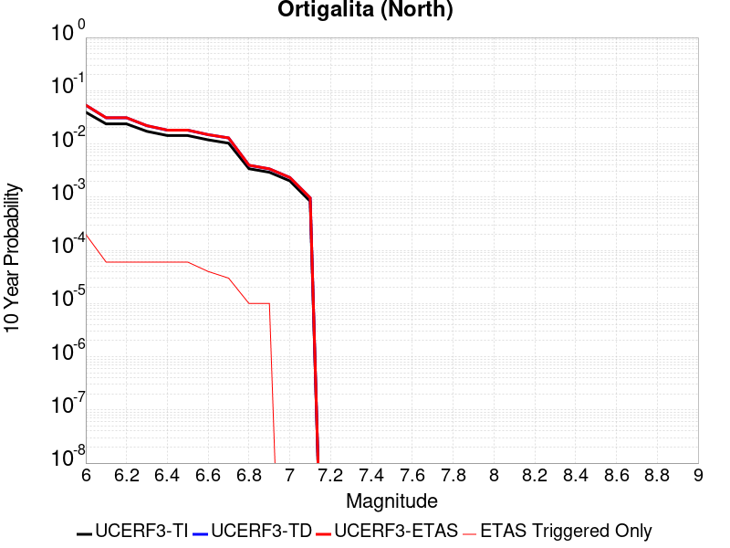 |

| Magnitude | 1 wk TI Prob | 1 wk TD Prob | 1 wk ETAS Prob | 1 wk ETAS/TD Gain | 1 wk ETAS Triggered Only | 1 mo TI Prob | 1 mo TD Prob | 1 mo ETAS Prob | 1 mo ETAS/TD Gain | 1 mo ETAS Triggered Only | 1 yr TI Prob | 1 yr TD Prob | 1 yr ETAS Prob | 1 yr ETAS/TD Gain | 1 yr ETAS Triggered Only | 10 yr TI Prob | 10 yr TD Prob | 10 yr ETAS Prob | 10 yr ETAS/TD Gain | 10 yr ETAS Triggered Only |
|-----|-----|-----|-----|-----|-----|-----|-----|-----|-----|-----|-----|-----|-----|-----|-----|-----|-----|-----|-----|-----|
| 6.0 | 7.711876E-5 | 1.05064966E-4 | 2.8153777E-4 | 2.6796541 | 1.7649135E-4 | 3.3046713E-4 | 4.502116E-4 | 6.6190585E-4 | 1.4702107 | 2.1178962E-4 | 0.004016016 | 0.0054681194 | 0.0057489616 | 1.0513599 | 2.8238617E-4 | 0.039442103 | 0.053454787 | 0.05372208 | 1.0050004 | 2.8238617E-4 |
| 6.1 | 4.607858E-5 | 6.0239203E-5 | 6.0239203E-5 | 1.0 | 0.0 | 1.9746469E-4 | 2.5814527E-4 | 2.5814527E-4 | 1.0 | 0.0 | 0.0024014818 | 0.0031387596 | 0.003173947 | 1.0112107 | 3.529827E-5 | 0.023756953 | 0.030975068 | 0.031009274 | 1.0011042 | 3.529827E-5 |
| 6.2 | 4.607858E-5 | 6.0239203E-5 | 6.0239203E-5 | 1.0 | 0.0 | 1.9746469E-4 | 2.5814527E-4 | 2.5814527E-4 | 1.0 | 0.0 | 0.0024014818 | 0.0031387596 | 0.003173947 | 1.0112107 | 3.529827E-5 | 0.023756953 | 0.030975068 | 0.031009274 | 1.0011042 | 3.529827E-5 |
| 6.3 | 3.327423E-5 | 4.2475127E-5 | 4.2475127E-5 | 1.0 | 0.0 | 1.4259605E-4 | 1.8202531E-4 | 1.8202531E-4 | 1.0 | 0.0 | 0.0017347244 | 0.002214197 | 0.0022494171 | 1.0159065 | 3.529827E-5 | 0.017212452 | 0.021945644 | 0.021980168 | 1.0015731 | 3.529827E-5 |
| 6.4 | 2.7732503E-5 | 3.4998593E-5 | 3.4998593E-5 | 1.0 | 0.0 | 1.1884817E-4 | 1.4998685E-4 | 1.4998685E-4 | 1.0 | 0.0 | 0.001446016 | 0.0018248095 | 0.0018600434 | 1.0193082 | 3.529827E-5 | 0.014366428 | 0.018121224 | 0.018155882 | 1.0019126 | 3.529827E-5 |
| 6.5 | 2.7689714E-5 | 3.4948407E-5 | 3.4948407E-5 | 1.0 | 0.0 | 1.186648E-4 | 1.497718E-4 | 1.497718E-4 | 1.0 | 0.0 | 0.0014437864 | 0.0018221956 | 0.0018574295 | 1.019336 | 3.529827E-5 | 0.014344421 | 0.01809551 | 0.01813017 | 1.0019153 | 3.529827E-5 |
| 6.6 | 2.2976905E-5 | 2.8718265E-5 | 2.8718265E-5 | 1.0 | 0.0 | 9.846873E-5 | 1.230739E-4 | 1.230739E-4 | 1.0 | 0.0 | 0.0011981975 | 0.0014976363 | 0.0015328818 | 1.023534 | 3.529827E-5 | 0.011917574 | 0.014898697 | 0.01493347 | 1.0023339 | 3.529827E-5 |
| 6.7 | 1.9871539E-5 | 2.4904411E-5 | 2.4904411E-5 | 1.0 | 0.0 | 8.516096E-5 | 1.0673023E-4 | 1.0673023E-4 | 1.0 | 0.0 | 0.0010363415 | 0.0012989145 | 0.001334167 | 1.0271399 | 3.529827E-5 | 0.010315218 | 0.012936919 | 0.012971761 | 1.0026932 | 3.529827E-5 |
| 6.8 | 6.5640475E-6 | 7.6054926E-6 | 7.6054926E-6 | 1.0 | 0.0 | 2.813133E-5 | 3.2594577E-5 | 3.2594577E-5 | 1.0 | 0.0 | 3.424451E-4 | 3.9676955E-4 | 3.9676955E-4 | 1.0 | 0.0 | 0.0034191788 | 0.003960899 | 0.003960899 | 1.0 | 0.0 |
| 6.9 | 5.6219683E-6 | 6.5018376E-6 | 6.5018376E-6 | 1.0 | 0.0 | 2.4093928E-5 | 2.7864735E-5 | 2.7864735E-5 | 1.0 | 0.0 | 2.933041E-4 | 3.3920293E-4 | 3.3920293E-4 | 1.0 | 0.0 | 0.0029291727 | 0.003387109 | 0.003387109 | 1.0 | 0.0 |
| 7.0 | 3.875591E-6 | 4.4847548E-6 | 4.4847548E-6 | 1.0 | 0.0 | 1.6609569E-5 | 1.9220248E-5 | 1.9220248E-5 | 1.0 | 0.0 | 2.0220275E-4 | 2.339835E-4 | 2.339835E-4 | 1.0 | 0.0 | 0.0020201886 | 0.0023375798 | 0.0023375798 | 1.0 | 0.0 |
| 7.1 | 1.6017933E-6 | 1.8570418E-6 | 1.8570418E-6 | 1.0 | 0.0 | 6.8648105E-6 | 7.958732E-6 | 7.958732E-6 | 1.0 | 0.0 | 8.357586E-5 | 9.689432E-5 | 9.689432E-5 | 1.0 | 0.0 | 8.3544437E-4 | 9.686254E-4 | 9.686254E-4 | 1.0 | 0.0 |

## Pleito
*[(top)](#table-of-contents)*

| 1 Week | 1 Month | 1 Year | 10 Year |
|-----|-----|-----|-----|
|  |  |  |  |

| Magnitude | 1 wk TI Prob | 1 wk TD Prob | 1 wk ETAS Prob | 1 wk ETAS/TD Gain | 1 wk ETAS Triggered Only | 1 mo TI Prob | 1 mo TD Prob | 1 mo ETAS Prob | 1 mo ETAS/TD Gain | 1 mo ETAS Triggered Only | 1 yr TI Prob | 1 yr TD Prob | 1 yr ETAS Prob | 1 yr ETAS/TD Gain | 1 yr ETAS Triggered Only | 10 yr TI Prob | 10 yr TD Prob | 10 yr ETAS Prob | 10 yr ETAS/TD Gain | 10 yr ETAS Triggered Only |
|-----|-----|-----|-----|-----|-----|-----|-----|-----|-----|-----|-----|-----|-----|-----|-----|-----|-----|-----|-----|-----|
| 6.0 | 1.6763008E-5 | 2.4763838E-5 | 2.0125082E-4 | 8.126802 | 1.7649135E-4 | 7.183948E-5 | 1.0612683E-4 | 3.1789398E-4 | 2.9954157 | 2.1178962E-4 | 8.742947E-4 | 0.0012914003 | 0.0015734218 | 1.2183843 | 2.8238617E-4 | 0.00870863 | 0.0129538905 | 0.0133023 | 1.0268962 | 3.529827E-4 |
| 6.1 | 1.6763008E-5 | 2.4763838E-5 | 2.0125082E-4 | 8.126802 | 1.7649135E-4 | 7.183948E-5 | 1.0612683E-4 | 3.1789398E-4 | 2.9954157 | 2.1178962E-4 | 8.742947E-4 | 0.0012914003 | 0.0015734218 | 1.2183843 | 2.8238617E-4 | 0.00870863 | 0.0129538905 | 0.0133023 | 1.0268962 | 3.529827E-4 |
| 6.2 | 1.6763008E-5 | 2.4763838E-5 | 2.0125082E-4 | 8.126802 | 1.7649135E-4 | 7.183948E-5 | 1.0612683E-4 | 3.1789398E-4 | 2.9954157 | 2.1178962E-4 | 8.742947E-4 | 0.0012914003 | 0.0015734218 | 1.2183843 | 2.8238617E-4 | 0.00870863 | 0.0129538905 | 0.0133023 | 1.0268962 | 3.529827E-4 |
| 6.3 | 1.6763008E-5 | 2.4763838E-5 | 2.0125082E-4 | 8.126802 | 1.7649135E-4 | 7.183948E-5 | 1.0612683E-4 | 3.1789398E-4 | 2.9954157 | 2.1178962E-4 | 8.742947E-4 | 0.0012914003 | 0.0015734218 | 1.2183843 | 2.8238617E-4 | 0.00870863 | 0.0129538905 | 0.0133023 | 1.0268962 | 3.529827E-4 |
| 6.4 | 1.6763008E-5 | 2.4763838E-5 | 2.0125082E-4 | 8.126802 | 1.7649135E-4 | 7.183948E-5 | 1.0612683E-4 | 3.1789398E-4 | 2.9954157 | 2.1178962E-4 | 8.742947E-4 | 0.0012914003 | 0.0015734218 | 1.2183843 | 2.8238617E-4 | 0.00870863 | 0.0129538905 | 0.0133023 | 1.0268962 | 3.529827E-4 |
| 6.5 | 1.6763008E-5 | 2.4763838E-5 | 2.0125082E-4 | 8.126802 | 1.7649135E-4 | 7.183948E-5 | 1.0612683E-4 | 3.1789398E-4 | 2.9954157 | 2.1178962E-4 | 8.742947E-4 | 0.0012914003 | 0.0015734218 | 1.2183843 | 2.8238617E-4 | 0.00870863 | 0.0129538905 | 0.0133023 | 1.0268962 | 3.529827E-4 |
| 6.6 | 9.910213E-6 | 1.7214623E-5 | 1.2310762E-4 | 7.151339 | 1.0589481E-4 | 4.247165E-5 | 7.377489E-5 | 2.1495756E-4 | 2.9136953 | 1.4119309E-4 | 5.169696E-4 | 8.978429E-4 | 0.0010389092 | 1.1571169 | 1.4119309E-4 | 0.0051576863 | 0.009050702 | 0.009190617 | 1.0154591 | 1.4119309E-4 |
| 6.7 | 9.910213E-6 | 1.7214623E-5 | 1.2310762E-4 | 7.151339 | 1.0589481E-4 | 4.247165E-5 | 7.377489E-5 | 2.1495756E-4 | 2.9136953 | 1.4119309E-4 | 5.169696E-4 | 8.978429E-4 | 0.0010389092 | 1.1571169 | 1.4119309E-4 | 0.0051576863 | 0.009050702 | 0.009190617 | 1.0154591 | 1.4119309E-4 |
| 6.8 | 8.300162E-6 | 1.5474232E-5 | 8.606968E-5 | 5.562129 | 7.059654E-5 | 3.557164E-5 | 6.631646E-5 | 1.7220425E-4 | 2.5967045 | 1.0589481E-4 | 4.3299864E-4 | 8.071053E-4 | 9.129146E-4 | 1.1310973 | 1.0589481E-4 | 0.004321559 | 0.008150139 | 0.008255171 | 1.0128871 | 1.0589481E-4 |
| 6.9 | 8.183114E-6 | 1.5345448E-5 | 8.5940905E-5 | 5.600417 | 7.059654E-5 | 3.5070017E-5 | 6.576455E-5 | 1.716524E-4 | 2.610105 | 1.0589481E-4 | 4.2689382E-4 | 8.003907E-4 | 9.062008E-4 | 1.132198 | 1.0589481E-4 | 0.0042607468 | 0.008083483 | 0.008188522 | 1.0129943 | 1.0589481E-4 |
| 7.0 | 7.1748823E-6 | 1.413244E-5 | 8.472798E-5 | 5.9952836 | 7.059654E-5 | 3.0749135E-5 | 6.0566195E-5 | 1.6645459E-4 | 2.7483087 | 1.0589481E-4 | 3.743064E-4 | 7.371445E-4 | 8.4296125E-4 | 1.1435496 | 1.0589481E-4 | 0.0037367654 | 0.007454939 | 0.0075600445 | 1.0140988 | 1.0589481E-4 |
| 7.1 | 7.1671807E-6 | 1.412281E-5 | 8.4718355E-5 | 5.9986897 | 7.059654E-5 | 3.0716128E-5 | 6.052493E-5 | 1.6641333E-4 | 2.7495008 | 1.0589481E-4 | 3.7390468E-4 | 7.366424E-4 | 8.424592E-4 | 1.1436474 | 1.0589481E-4 | 0.0037327618 | 0.0074499524 | 0.007555058 | 1.0141083 | 1.0589481E-4 |
| 7.2 | 7.0649667E-6 | 1.39701015E-5 | 4.9267877E-5 | 3.5266657 | 3.529827E-5 | 3.0278077E-5 | 5.9870494E-5 | 1.3046281E-4 | 2.1790836 | 7.059654E-5 | 3.6857324E-4 | 7.2868E-4 | 7.9922506E-4 | 1.0968121 | 7.059654E-5 | 0.0036796255 | 0.0073707094 | 0.0074407854 | 1.0095074 | 7.059654E-5 |
| 7.3 | 7.02082E-6 | 1.3913556E-5 | 4.9211336E-5 | 3.5369344 | 3.529827E-5 | 3.008888E-5 | 5.9628168E-5 | 1.302205E-4 | 2.1838756 | 7.059654E-5 | 3.6627054E-4 | 7.2573166E-4 | 7.9627696E-4 | 1.0972058 | 7.059654E-5 | 0.0036566744 | 0.007341209 | 0.007411287 | 1.0095459 | 7.059654E-5 |
| 7.4 | 6.987146E-6 | 1.3873118E-5 | 4.91709E-5 | 3.5443292 | 3.529827E-5 | 2.9944567E-5 | 5.945487E-5 | 1.300472E-4 | 2.1873264 | 7.059654E-5 | 3.6451413E-4 | 7.2362315E-4 | 7.941686E-4 | 1.0974892 | 7.059654E-5 | 0.0036391679 | 0.007320144 | 0.007390224 | 1.0095736 | 7.059654E-5 |
| 7.5 | 6.9494554E-6 | 1.3830024E-5 | 4.9127808E-5 | 3.5522575 | 3.529827E-5 | 2.9783041E-5 | 5.9270187E-5 | 1.2986254E-4 | 2.1910264 | 7.059654E-5 | 3.625482E-4 | 7.2137616E-4 | 7.9192175E-4 | 1.0977931 | 7.059654E-5 | 0.0036195726 | 0.0072977724 | 0.007367854 | 1.0096031 | 7.059654E-5 |
| 7.6 | 6.92694E-6 | 1.3789138E-5 | 4.908692E-5 | 3.5598252 | 3.529827E-5 | 2.9686547E-5 | 5.909497E-5 | 1.2968734E-4 | 2.194558 | 7.059654E-5 | 3.6137376E-4 | 7.1924424E-4 | 7.8979E-4 | 1.0980831 | 7.059654E-5 | 0.0036078666 | 0.0072765257 | 0.0073466087 | 1.0096314 | 7.059654E-5 |
| 7.7 | 6.395867E-6 | 1.2668219E-5 | 4.796604E-5 | 3.7863288 | 3.529827E-5 | 2.741057E-5 | 5.429124E-5 | 1.2488394E-4 | 2.3002596 | 7.059654E-5 | 3.336726E-4 | 6.6079566E-4 | 7.3134556E-4 | 1.106765 | 7.059654E-5 | 0.0033317201 | 0.0066951844 | 0.0067653083 | 1.0104737 | 7.059654E-5 |
| 7.8 | 5.8664327E-6 | 1.153586E-5 | 4.6833724E-5 | 4.059838 | 3.529827E-5 | 2.5141611E-5 | 4.9438466E-5 | 1.2003152E-4 | 2.4278972 | 7.059654E-5 | 3.060561E-4 | 6.017473E-4 | 6.7230134E-4 | 1.1172487 | 7.059654E-5 | 0.0030563495 | 0.0061006667 | 0.0061708326 | 1.0115013 | 7.059654E-5 |
| 7.9 | 3.7167474E-6 | 7.1140853E-6 | 7.1140853E-6 | 1.0 | 0.0 | 1.592882E-5 | 3.0488582E-5 | 3.0488582E-5 | 1.0 | 0.0 | 1.9391612E-4 | 3.7113542E-4 | 3.7113542E-4 | 1.0 | 0.0 | 0.0019374699 | 0.0037674906 | 0.0037674906 | 1.0 | 0.0 |
| 8.0 | 1.0903841E-6 | 1.2879392E-6 | 1.2879392E-6 | 1.0 | 0.0 | 4.6730665E-6 | 5.5197274E-6 | 5.5197274E-6 | 1.0 | 0.0 | 5.68931E-5 | 6.720063E-5 | 6.720063E-5 | 1.0 | 0.0 | 5.6878536E-4 | 6.941948E-4 | 6.941948E-4 | 1.0 | 0.0 |
| 8.1 | 2.6894583E-7 | 1.1060341E-7 | 1.1060341E-7 | 1.0 | 0.0 | 1.1526245E-6 | 4.740145E-7 | 4.740145E-7 | 1.0 | 0.0 | 1.4033113E-5 | 5.7711113E-6 | 5.7711113E-6 | 1.0 | 0.0 | 1.4032227E-4 | 6.456908E-5 | 6.456908E-5 | 1.0 | 0.0 |
| 8.2 | 5.2967013E-9 | 2.4578228E-9 | 2.4578228E-9 | 1.0 | 0.0 | 2.2700148E-8 | 1.0533527E-8 | 1.0533527E-8 | 1.0 | 0.0 | 2.7637427E-7 | 1.2824569E-7 | 1.2824569E-7 | 1.0 | 0.0 | 2.7637393E-6 | 1.4592787E-6 | 1.4592787E-6 | 1.0 | 0.0 |

## Lake Isabella (Seismicity)
*[(top)](#table-of-contents)*

| 1 Week | 1 Month | 1 Year | 10 Year |
|-----|-----|-----|-----|
|  |  | 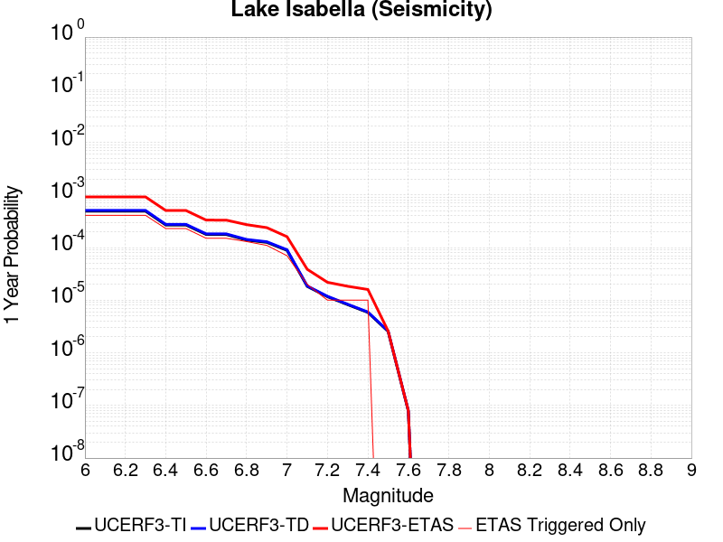 |  |

| Magnitude | 1 wk TI Prob | 1 wk TD Prob | 1 wk ETAS Prob | 1 wk ETAS/TD Gain | 1 wk ETAS Triggered Only | 1 mo TI Prob | 1 mo TD Prob | 1 mo ETAS Prob | 1 mo ETAS/TD Gain | 1 mo ETAS Triggered Only | 1 yr TI Prob | 1 yr TD Prob | 1 yr ETAS Prob | 1 yr ETAS/TD Gain | 1 yr ETAS Triggered Only | 10 yr TI Prob | 10 yr TD Prob | 10 yr ETAS Prob | 10 yr ETAS/TD Gain | 10 yr ETAS Triggered Only |
|-----|-----|-----|-----|-----|-----|-----|-----|-----|-----|-----|-----|-----|-----|-----|-----|-----|-----|-----|-----|-----|
| 6.0 | 9.431637E-6 | 9.741651E-6 | 1.15635434E-4 | 11.870208 | 1.0589481E-4 | 4.0420677E-5 | 4.1749343E-5 | 2.888269E-4 | 6.918119 | 2.4708788E-4 | 4.920106E-4 | 5.0819275E-4 | 8.257157E-4 | 1.6248082 | 3.1768443E-4 | 0.004909227 | 0.005071599 | 0.005387672 | 1.0623223 | 3.1768443E-4 |
| 6.1 | 9.431637E-6 | 9.741651E-6 | 1.15635434E-4 | 11.870208 | 1.0589481E-4 | 4.0420677E-5 | 4.1749343E-5 | 2.888269E-4 | 6.918119 | 2.4708788E-4 | 4.920106E-4 | 5.0819275E-4 | 8.257157E-4 | 1.6248082 | 3.1768443E-4 | 0.004909227 | 0.005071599 | 0.005387672 | 1.0623223 | 3.1768443E-4 |
| 6.2 | 9.431637E-6 | 9.741651E-6 | 1.15635434E-4 | 11.870208 | 1.0589481E-4 | 4.0420677E-5 | 4.1749343E-5 | 2.888269E-4 | 6.918119 | 2.4708788E-4 | 4.920106E-4 | 5.0819275E-4 | 8.257157E-4 | 1.6248082 | 3.1768443E-4 | 0.004909227 | 0.005071599 | 0.005387672 | 1.0623223 | 3.1768443E-4 |
| 6.3 | 9.431637E-6 | 9.741651E-6 | 1.15635434E-4 | 11.870208 | 1.0589481E-4 | 4.0420677E-5 | 4.1749343E-5 | 2.888269E-4 | 6.918119 | 2.4708788E-4 | 4.920106E-4 | 5.0819275E-4 | 8.257157E-4 | 1.6248082 | 3.1768443E-4 | 0.004909227 | 0.005071599 | 0.005387672 | 1.0623223 | 3.1768443E-4 |
| 6.4 | 5.144063E-6 | 5.3000763E-6 | 7.589624E-5 | 14.31984 | 7.059654E-5 | 2.2045799E-5 | 2.2714434E-5 | 1.2860684E-4 | 5.6618996 | 1.0589481E-4 | 2.6837454E-4 | 2.765166E-4 | 4.5295912E-4 | 1.6380903 | 1.7649135E-4 | 0.0026805066 | 0.0027620657 | 0.0029380696 | 1.0637218 | 1.7649135E-4 |
| 6.5 | 5.144063E-6 | 5.3000763E-6 | 7.589624E-5 | 14.31984 | 7.059654E-5 | 2.2045799E-5 | 2.2714434E-5 | 1.2860684E-4 | 5.6618996 | 1.0589481E-4 | 2.6837454E-4 | 2.765166E-4 | 4.5295912E-4 | 1.6380903 | 1.7649135E-4 | 0.0026805066 | 0.0027620657 | 0.0029380696 | 1.0637218 | 1.7649135E-4 |
| 6.6 | 3.4009804E-6 | 3.498786E-6 | 3.498786E-6 | 1.0 | 0.0 | 1.4575549E-5 | 1.4994721E-5 | 5.0292463E-5 | 3.3540113 | 3.529827E-5 | 1.7744285E-4 | 1.8254704E-4 | 2.884225E-4 | 1.5799901 | 1.0589481E-4 | 0.0017730123 | 0.0018241286 | 0.0019298302 | 1.0579463 | 1.0589481E-4 |
| 6.7 | 3.3880428E-6 | 3.4856528E-6 | 3.4856528E-6 | 1.0 | 0.0 | 1.4520103E-5 | 1.4938435E-5 | 5.023618E-5 | 3.362881 | 3.529827E-5 | 1.767679E-4 | 1.8186188E-4 | 2.8773744E-4 | 1.5821756 | 1.0589481E-4 | 0.0017662736 | 0.0018172882 | 0.0019229905 | 1.0581648 | 1.0589481E-4 |
| 6.8 | 2.6582E-6 | 2.7337003E-6 | 2.7337003E-6 | 1.0 | 0.0 | 1.1392236E-5 | 1.1715813E-5 | 4.701367E-5 | 4.012839 | 3.529827E-5 | 1.3869164E-4 | 1.4263204E-4 | 2.4851173E-4 | 1.7423277 | 1.0589481E-4 | 0.0013860512 | 0.0014255369 | 0.0015312808 | 1.0741782 | 1.0589481E-4 |
| 6.9 | 2.406011E-6 | 2.4743288E-6 | 2.4743288E-6 | 1.0 | 0.0 | 1.0311434E-5 | 1.0604231E-5 | 4.590213E-5 | 4.3286614 | 3.529827E-5 | 1.2553448E-4 | 1.2910018E-4 | 2.3498131E-4 | 1.8201472 | 1.0589481E-4 | 0.0012546359 | 0.0012903814 | 0.0013961396 | 1.0819589 | 1.0589481E-4 |
| 7.0 | 1.6953097E-6 | 1.7429371E-6 | 1.7429371E-6 | 1.0 | 0.0 | 7.265593E-6 | 7.469715E-6 | 7.469715E-6 | 1.0 | 0.0 | 8.8455E-5 | 9.094104E-5 | 1.6153115E-4 | 1.7762185 | 7.059654E-5 | 8.84198E-4 | 9.09141E-4 | 9.796734E-4 | 1.0775813 | 7.059654E-5 |
| 7.1 | 3.5013824E-7 | 3.5714822E-7 | 3.5714822E-7 | 1.0 | 0.0 | 1.5005916E-6 | 1.5306344E-6 | 1.5306344E-6 | 1.0 | 0.0 | 1.826955E-5 | 1.8635317E-5 | 1.8635317E-5 | 1.0 | 0.0 | 1.8268047E-4 | 1.863378E-4 | 1.863378E-4 | 1.0 | 0.0 |
| 7.2 | 2.2321095E-7 | 2.2750574E-7 | 2.2750574E-7 | 1.0 | 0.0 | 9.56618E-7 | 9.750242E-7 | 9.750242E-7 | 1.0 | 0.0 | 1.1646762E-5 | 1.1870856E-5 | 1.1870856E-5 | 1.0 | 0.0 | 1.1646151E-4 | 1.1870232E-4 | 1.1870232E-4 | 1.0 | 0.0 |
| 7.3 | 1.5760406E-7 | 1.6060922E-7 | 1.6060922E-7 | 1.0 | 0.0 | 6.7544585E-7 | 6.8832503E-7 | 6.8832503E-7 | 1.0 | 0.0 | 8.223522E-6 | 8.380326E-6 | 8.380326E-6 | 1.0 | 0.0 | 8.2232174E-5 | 8.3800165E-5 | 8.3800165E-5 | 1.0 | 0.0 |
| 7.4 | 1.1216497E-7 | 1.1431706E-7 | 1.1431706E-7 | 1.0 | 0.0 | 4.8070694E-7 | 4.899302E-7 | 4.899302E-7 | 1.0 | 0.0 | 5.852591E-6 | 5.964884E-6 | 5.964884E-6 | 1.0 | 0.0 | 5.8524372E-5 | 5.9647282E-5 | 5.9647282E-5 | 1.0 | 0.0 |
| 7.5 | 4.885185E-8 | 4.9787737E-8 | 4.9787737E-8 | 1.0 | 0.0 | 2.0936506E-7 | 2.13376E-7 | 2.13376E-7 | 1.0 | 0.0 | 2.5490165E-6 | 2.59785E-6 | 2.59785E-6 | 1.0 | 0.0 | 2.5489873E-5 | 2.5978214E-5 | 2.5978214E-5 | 1.0 | 0.0 |
| 7.6 | 1.504641E-9 | 1.5317903E-9 | 1.5317903E-9 | 1.0 | 0.0 | 6.4484613E-9 | 6.5648154E-9 | 6.5648154E-9 | 1.0 | 0.0 | 7.851001E-8 | 7.992663E-8 | 7.992663E-8 | 1.0 | 0.0 | 7.8509987E-7 | 7.992663E-7 | 7.992663E-7 | 1.0 | 0.0 |

## Rose Canyon
*[(top)](#table-of-contents)*

| 1 Week | 1 Month | 1 Year | 10 Year |
|-----|-----|-----|-----|
|  |  |  | 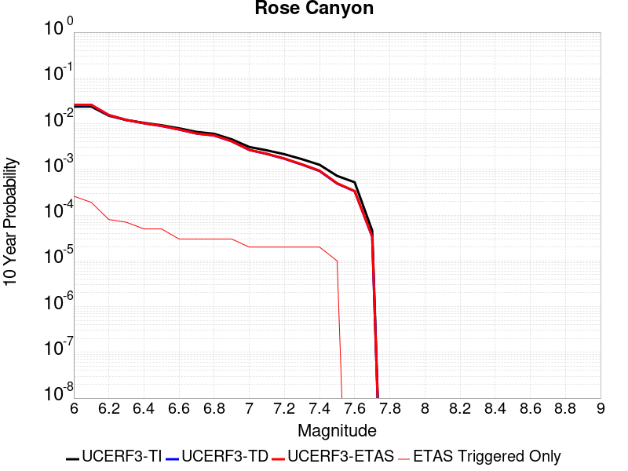 |

| Magnitude | 1 wk TI Prob | 1 wk TD Prob | 1 wk ETAS Prob | 1 wk ETAS/TD Gain | 1 wk ETAS Triggered Only | 1 mo TI Prob | 1 mo TD Prob | 1 mo ETAS Prob | 1 mo ETAS/TD Gain | 1 mo ETAS Triggered Only | 1 yr TI Prob | 1 yr TD Prob | 1 yr ETAS Prob | 1 yr ETAS/TD Gain | 1 yr ETAS Triggered Only | 10 yr TI Prob | 10 yr TD Prob | 10 yr ETAS Prob | 10 yr ETAS/TD Gain | 10 yr ETAS Triggered Only |
|-----|-----|-----|-----|-----|-----|-----|-----|-----|-----|-----|-----|-----|-----|-----|-----|-----|-----|-----|-----|-----|
| 6.0 | 4.5923203E-5 | 4.9714225E-5 | 1.9090029E-4 | 3.839953 | 1.4119309E-4 | 1.9679888E-4 | 2.1304491E-4 | 4.6008016E-4 | 2.1595454 | 2.4708788E-4 | 0.0023933933 | 0.0025909345 | 0.0029077958 | 1.1222962 | 3.1768443E-4 | 0.023677798 | 0.02563999 | 0.02594953 | 1.0120726 | 3.1768443E-4 |
| 6.1 | 4.5923203E-5 | 4.9714225E-5 | 1.2030725E-4 | 2.4199765 | 7.059654E-5 | 1.9679888E-4 | 2.1304491E-4 | 3.542079E-4 | 1.6625974 | 1.4119309E-4 | 0.0023933933 | 0.0025909345 | 0.0028021752 | 1.0815308 | 2.1178962E-4 | 0.023677798 | 0.02563999 | 0.025846351 | 1.0080483 | 2.1178962E-4 |
| 6.2 | 2.8844734E-5 | 2.9668723E-5 | 2.9668723E-5 | 1.0 | 0.0 | 1.2361443E-4 | 1.2714567E-4 | 1.2714567E-4 | 1.0 | 0.0 | 0.0015039665 | 0.0015468939 | 0.0015821375 | 1.0227835 | 3.529827E-5 | 0.0149382865 | 0.015374276 | 0.015409032 | 1.0022607 | 3.529827E-5 |
| 6.3 | 2.3171577E-5 | 2.3161238E-5 | 2.3161238E-5 | 1.0 | 0.0 | 9.9302975E-5 | 9.9258745E-5 | 9.9258745E-5 | 1.0 | 0.0 | 0.0012083431 | 0.0012078186 | 0.0012430743 | 1.0291895 | 3.529827E-5 | 0.012017938 | 0.012022437 | 0.012057311 | 1.0029007 | 3.529827E-5 |
| 6.4 | 2.0066604E-5 | 1.9667024E-5 | 1.9667024E-5 | 1.0 | 0.0 | 8.599689E-5 | 8.4284584E-5 | 8.4284584E-5 | 1.0 | 0.0 | 0.0010465092 | 0.0010256917 | 0.0010609538 | 1.0343788 | 3.529827E-5 | 0.010415946 | 0.010217559 | 0.010252496 | 1.0034194 | 3.529827E-5 |
| 6.5 | 1.776989E-5 | 1.7113807E-5 | 1.7113807E-5 | 1.0 | 0.0 | 7.615444E-5 | 7.334287E-5 | 7.334287E-5 | 1.0 | 0.0 | 9.267859E-4 | 8.925905E-4 | 9.278573E-4 | 1.0395106 | 3.529827E-5 | 0.009229303 | 0.008896211 | 0.008931195 | 1.0039325 | 3.529827E-5 |
| 6.6 | 1.5227364E-5 | 1.433926E-5 | 1.433926E-5 | 1.0 | 0.0 | 6.52585E-5 | 6.1452556E-5 | 6.1452556E-5 | 1.0 | 0.0 | 7.942326E-4 | 7.479332E-4 | 7.832051E-4 | 1.0471591 | 3.529827E-5 | 0.007914 | 0.007458359 | 0.007493394 | 1.0046974 | 3.529827E-5 |
| 6.7 | 1.2703898E-5 | 1.1673274E-5 | 1.1673274E-5 | 1.0 | 0.0 | 5.4444143E-5 | 5.0027378E-5 | 5.0027378E-5 | 1.0 | 0.0 | 6.626558E-4 | 6.089174E-4 | 6.4419414E-4 | 1.0579336 | 3.529827E-5 | 0.006606833 | 0.0060750856 | 0.0061101695 | 1.0057751 | 3.529827E-5 |
| 6.8 | 1.1554917E-5 | 1.0609337E-5 | 1.0609337E-5 | 1.0 | 0.0 | 4.9520135E-5 | 4.546782E-5 | 4.546782E-5 | 1.0 | 0.0 | 6.0274085E-4 | 5.5343413E-4 | 5.8871286E-4 | 1.0637451 | 3.529827E-5 | 0.0060110865 | 0.0055225673 | 0.0055576707 | 1.0063564 | 3.529827E-5 |
| 6.9 | 8.732078E-6 | 7.881357E-6 | 7.881357E-6 | 1.0 | 0.0 | 3.7422655E-5 | 3.3776825E-5 | 3.3776825E-5 | 1.0 | 0.0 | 4.5552556E-4 | 4.111582E-4 | 4.4644196E-4 | 1.0858155 | 3.529827E-5 | 0.0045459294 | 0.0041048084 | 0.0041399617 | 1.008564 | 3.529827E-5 |
| 7.0 | 5.9337494E-6 | 5.1074853E-6 | 5.1074853E-6 | 1.0 | 0.0 | 2.5430107E-5 | 2.188904E-5 | 2.188904E-5 | 1.0 | 0.0 | 3.0956755E-4 | 2.664666E-4 | 2.664666E-4 | 1.0 | 0.0 | 0.0030913667 | 0.0026614866 | 0.0026614866 | 1.0 | 0.0 |
| 7.1 | 5.013409E-6 | 4.1773833E-6 | 4.1773833E-6 | 1.0 | 0.0 | 2.1485863E-5 | 1.7902948E-5 | 1.7902948E-5 | 1.0 | 0.0 | 2.6155898E-4 | 2.179467E-4 | 2.179467E-4 | 1.0 | 0.0 | 0.0026125133 | 0.0021773411 | 0.0021773411 | 1.0 | 0.0 |
| 7.2 | 4.120763E-6 | 3.2821383E-6 | 3.2821383E-6 | 1.0 | 0.0 | 1.7660293E-5 | 1.4066231E-5 | 1.4066231E-5 | 1.0 | 0.0 | 2.1499286E-4 | 1.7124301E-4 | 1.7124301E-4 | 1.0 | 0.0 | 0.0021478499 | 0.00171112 | 0.00171112 | 1.0 | 0.0 |
| 7.3 | 3.2081239E-6 | 2.4405372E-6 | 2.4405372E-6 | 1.0 | 0.0 | 1.374903E-5 | 1.0459404E-5 | 1.0459404E-5 | 1.0 | 0.0 | 1.6738157E-4 | 1.2733586E-4 | 1.2733586E-4 | 1.0 | 0.0 | 0.0016725556 | 0.001272636 | 0.001272636 | 1.0 | 0.0 |
| 7.4 | 2.4194755E-6 | 1.7680634E-6 | 1.7680634E-6 | 1.0 | 0.0 | 1.0369139E-5 | 7.577393E-6 | 7.577393E-6 | 1.0 | 0.0 | 1.2623696E-4 | 9.2250906E-5 | 9.2250906E-5 | 1.0 | 0.0 | 0.0012616527 | 9.2213147E-4 | 9.2213147E-4 | 1.0 | 0.0 |
| 7.5 | 1.3842889E-6 | 9.3786275E-7 | 9.3786275E-7 | 1.0 | 0.0 | 5.9326535E-6 | 4.019406E-6 | 4.019406E-6 | 1.0 | 0.0 | 7.222766E-5 | 4.8935202E-5 | 4.8935202E-5 | 1.0 | 0.0 | 7.220419E-4 | 4.892478E-4 | 4.892478E-4 | 1.0 | 0.0 |
| 7.6 | 1.0021575E-6 | 6.411463E-7 | 6.411463E-7 | 1.0 | 0.0 | 4.2949537E-6 | 2.7477672E-6 | 2.7477672E-6 | 1.0 | 0.0 | 5.2289808E-5 | 3.3453573E-5 | 3.3453573E-5 | 1.0 | 0.0 | 5.2277505E-4 | 3.344875E-4 | 3.344875E-4 | 1.0 | 0.0 |
| 7.7 | 8.7620116E-8 | 6.4492404E-8 | 6.4492404E-8 | 1.0 | 0.0 | 3.7551473E-7 | 2.76396E-7 | 2.76396E-7 | 1.0 | 0.0 | 4.5718825E-6 | 3.3651165E-6 | 3.3651165E-6 | 1.0 | 0.0 | 4.5717883E-5 | 3.3650686E-5 | 3.3650686E-5 | 1.0 | 0.0 |

## Bullion Mountains
*[(top)](#table-of-contents)*

| 1 Week | 1 Month | 1 Year | 10 Year |
|-----|-----|-----|-----|
|  | 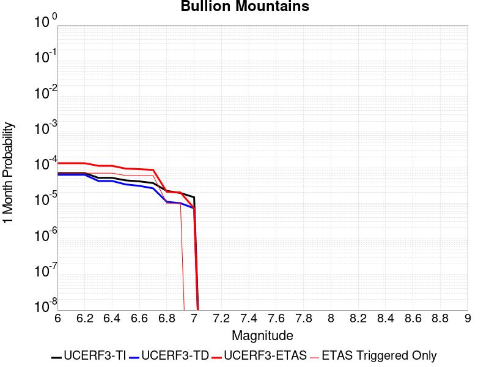 |  | 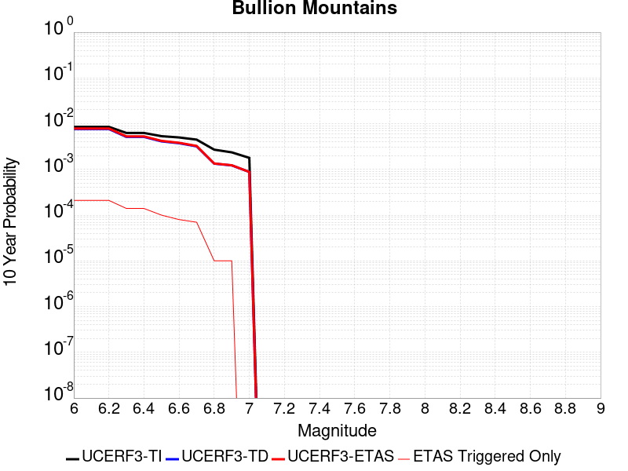 |

| Magnitude | 1 wk TI Prob | 1 wk TD Prob | 1 wk ETAS Prob | 1 wk ETAS/TD Gain | 1 wk ETAS Triggered Only | 1 mo TI Prob | 1 mo TD Prob | 1 mo ETAS Prob | 1 mo ETAS/TD Gain | 1 mo ETAS Triggered Only | 1 yr TI Prob | 1 yr TD Prob | 1 yr ETAS Prob | 1 yr ETAS/TD Gain | 1 yr ETAS Triggered Only | 10 yr TI Prob | 10 yr TD Prob | 10 yr ETAS Prob | 10 yr ETAS/TD Gain | 10 yr ETAS Triggered Only |
|-----|-----|-----|-----|-----|-----|-----|-----|-----|-----|-----|-----|-----|-----|-----|-----|-----|-----|-----|-----|-----|
| 6.0 | 1.6420427E-5 | 1.4692089E-5 | 1.2058535E-4 | 8.207501 | 1.0589481E-4 | 7.037136E-5 | 6.296479E-5 | 2.3944503E-4 | 3.80284 | 1.7649135E-4 | 8.5643446E-4 | 7.663651E-4 | 0.0010485349 | 1.3681923 | 2.8238617E-4 | 0.008531413 | 0.007641016 | 0.007956273 | 1.0412586 | 3.1768443E-4 |
| 6.1 | 1.6420427E-5 | 1.4692089E-5 | 1.2058535E-4 | 8.207501 | 1.0589481E-4 | 7.037136E-5 | 6.296479E-5 | 2.3944503E-4 | 3.80284 | 1.7649135E-4 | 8.5643446E-4 | 7.663651E-4 | 0.0010485349 | 1.3681923 | 2.8238617E-4 | 0.008531413 | 0.007641016 | 0.007956273 | 1.0412586 | 3.1768443E-4 |
| 6.2 | 1.6420427E-5 | 1.4692089E-5 | 1.2058535E-4 | 8.207501 | 1.0589481E-4 | 7.037136E-5 | 6.296479E-5 | 2.3944503E-4 | 3.80284 | 1.7649135E-4 | 8.5643446E-4 | 7.663651E-4 | 0.0010485349 | 1.3681923 | 2.8238617E-4 | 0.008531413 | 0.007641016 | 0.007956273 | 1.0412586 | 3.1768443E-4 |
| 6.3 | 1.2046778E-5 | 9.862335E-6 | 1.157561E-4 | 11.73719 | 1.0589481E-4 | 5.1628023E-5 | 4.2266598E-5 | 2.1875049E-4 | 5.1754932 | 1.7649135E-4 | 6.283899E-4 | 5.144975E-4 | 7.6145824E-4 | 1.4800038 | 2.4708788E-4 | 0.0062661595 | 0.005135345 | 0.005381164 | 1.047868 | 2.4708788E-4 |
| 6.4 | 1.2046778E-5 | 9.862335E-6 | 1.157561E-4 | 11.73719 | 1.0589481E-4 | 5.1628023E-5 | 4.2266598E-5 | 2.1875049E-4 | 5.1754932 | 1.7649135E-4 | 6.283899E-4 | 5.144975E-4 | 7.6145824E-4 | 1.4800038 | 2.4708788E-4 | 0.0062661595 | 0.005135345 | 0.005381164 | 1.047868 | 2.4708788E-4 |
| 6.5 | 1.0244343E-5 | 7.879458E-6 | 7.8475445E-5 | 9.959497 | 7.059654E-5 | 4.390359E-5 | 3.3768785E-5 | 1.749571E-4 | 5.1810303 | 1.4119309E-4 | 5.343951E-4 | 4.110781E-4 | 6.2278064E-4 | 1.5149935 | 2.1178962E-4 | 0.005331118 | 0.004105208 | 0.0043161283 | 1.0513787 | 2.1178962E-4 |
| 6.6 | 9.605408E-6 | 7.1774966E-6 | 7.777353E-5 | 10.835746 | 7.059654E-5 | 4.1165385E-5 | 3.076045E-5 | 1.7194918E-4 | 5.589944 | 1.4119309E-4 | 5.010733E-4 | 3.744645E-4 | 5.5088976E-4 | 1.4711401 | 1.7649135E-4 | 0.00499945 | 0.003740332 | 0.0039161635 | 1.0470095 | 1.7649135E-4 |
| 6.7 | 8.60418E-6 | 6.1240044E-6 | 7.672011E-5 | 12.527769 | 7.059654E-5 | 3.687454E-5 | 2.624558E-5 | 1.6743496E-4 | 6.379549 | 1.4119309E-4 | 4.48855E-4 | 3.1951256E-4 | 4.9594755E-4 | 1.5522003 | 1.7649135E-4 | 0.004479495 | 0.0031924439 | 0.0033683716 | 1.0551076 | 1.7649135E-4 |
| 6.8 | 5.187994E-6 | 2.5631666E-6 | 3.7861348E-5 | 14.771317 | 3.529827E-5 | 2.223407E-5 | 1.0984976E-5 | 4.6282858E-5 | 4.213287 | 3.529827E-5 | 2.7066618E-4 | 1.3373788E-4 | 1.6903142E-4 | 1.2639009 | 3.529827E-5 | 0.0027033675 | 0.0013369655 | 0.0013722165 | 1.0263665 | 3.529827E-5 |
| 6.9 | 4.5302368E-6 | 2.3443165E-6 | 3.7642505E-5 | 16.056921 | 3.529827E-5 | 1.9415156E-5 | 1.0047055E-5 | 4.5344972E-5 | 4.51326 | 3.529827E-5 | 2.3635388E-4 | 1.2232E-4 | 1.5761395E-4 | 1.2885379 | 3.529827E-5 | 0.0023610266 | 0.0012229157 | 0.0012581708 | 1.0288287 | 3.529827E-5 |
| 7.0 | 3.431668E-6 | 1.6882402E-6 | 1.6882402E-6 | 1.0 | 0.0 | 1.4707065E-5 | 7.235315E-6 | 7.235315E-6 | 1.0 | 0.0 | 1.7904381E-4 | 8.808996E-5 | 8.808996E-5 | 1.0 | 0.0 | 0.0017889962 | 8.808996E-4 | 8.808996E-4 | 1.0 | 0.0 |

## Chino alt 1
*[(top)](#table-of-contents)*

| 1 Week | 1 Month | 1 Year | 10 Year |
|-----|-----|-----|-----|
|  |  |  | 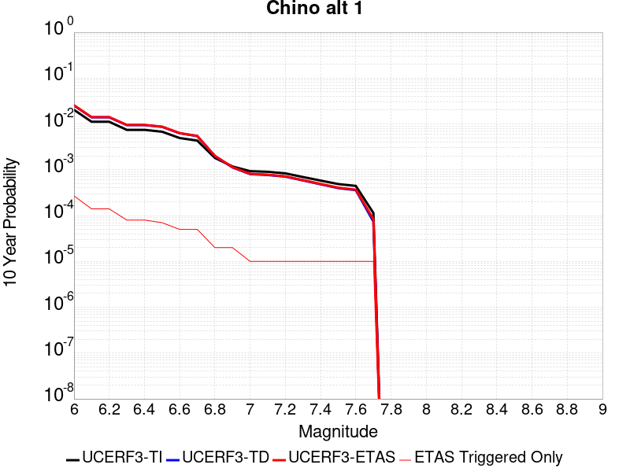 |

| Magnitude | 1 wk TI Prob | 1 wk TD Prob | 1 wk ETAS Prob | 1 wk ETAS/TD Gain | 1 wk ETAS Triggered Only | 1 mo TI Prob | 1 mo TD Prob | 1 mo ETAS Prob | 1 mo ETAS/TD Gain | 1 mo ETAS Triggered Only | 1 yr TI Prob | 1 yr TD Prob | 1 yr ETAS Prob | 1 yr ETAS/TD Gain | 1 yr ETAS Triggered Only | 10 yr TI Prob | 10 yr TD Prob | 10 yr ETAS Prob | 10 yr ETAS/TD Gain | 10 yr ETAS Triggered Only |
|-----|-----|-----|-----|-----|-----|-----|-----|-----|-----|-----|-----|-----|-----|-----|-----|-----|-----|-----|-----|-----|
| 6.0 | 3.939946E-5 | 4.8948554E-5 | 8.42451E-5 | 1.7210947 | 3.529827E-5 | 1.6884391E-4 | 2.097656E-4 | 2.4505646E-4 | 1.1682396 | 3.529827E-5 | 0.0020537362 | 0.0025513945 | 0.002797852 | 1.0965972 | 2.4708788E-4 | 0.020348595 | 0.025277847 | 0.025553094 | 1.0108889 | 2.8238617E-4 |
| 6.1 | 2.1505624E-5 | 2.6879026E-5 | 6.217635E-5 | 2.3131921 | 3.529827E-5 | 9.2163704E-5 | 1.1519137E-4 | 1.5048558E-4 | 1.3063962 | 3.529827E-5 | 0.0011215154 | 0.001401664 | 0.0015426591 | 1.1005913 | 1.4119309E-4 | 0.011158722 | 0.013945141 | 0.014084365 | 1.0099837 | 1.4119309E-4 |
| 6.2 | 2.1505624E-5 | 2.6879026E-5 | 6.217635E-5 | 2.3131921 | 3.529827E-5 | 9.2163704E-5 | 1.1519137E-4 | 1.5048558E-4 | 1.3063962 | 3.529827E-5 | 0.0011215154 | 0.001401664 | 0.0015426591 | 1.1005913 | 1.4119309E-4 | 0.011158722 | 0.013945141 | 0.014084365 | 1.0099837 | 1.4119309E-4 |
| 6.3 | 1.4290785E-5 | 1.8165128E-5 | 5.3462758E-5 | 2.9431534 | 3.529827E-5 | 6.1244784E-5 | 7.784848E-5 | 1.13144E-4 | 1.4533874 | 3.529827E-5 | 7.454001E-4 | 9.4743853E-4 | 0.0010884978 | 1.1488849 | 1.4119309E-4 | 0.007429048 | 0.0094444575 | 0.009584317 | 1.0148087 | 1.4119309E-4 |
| 6.4 | 1.4290785E-5 | 1.8165128E-5 | 5.3462758E-5 | 2.9431534 | 3.529827E-5 | 6.1244784E-5 | 7.784848E-5 | 1.13144E-4 | 1.4533874 | 3.529827E-5 | 7.454001E-4 | 9.4743853E-4 | 0.0010884978 | 1.1488849 | 1.4119309E-4 | 0.007429048 | 0.0094444575 | 0.009584317 | 1.0148087 | 1.4119309E-4 |
| 6.5 | 1.3017944E-5 | 1.6652088E-5 | 5.194977E-5 | 3.119715 | 3.529827E-5 | 5.5789995E-5 | 7.136439E-5 | 1.0666014E-4 | 1.4945849 | 3.529827E-5 | 6.790315E-4 | 8.685589E-4 | 0.0010096293 | 1.162419 | 1.4119309E-4 | 0.0067696036 | 0.008661949 | 0.008801919 | 1.0161592 | 1.4119309E-4 |
| 6.6 | 9.470016E-6 | 1.2039424E-5 | 4.733727E-5 | 3.931855 | 3.529827E-5 | 4.058515E-5 | 5.1596704E-5 | 8.689315E-5 | 1.6840833 | 3.529827E-5 | 4.940122E-4 | 6.280428E-4 | 7.338711E-4 | 1.168505 | 1.0589481E-4 | 0.004929154 | 0.0062718987 | 0.0063771293 | 1.0167781 | 1.0589481E-4 |
| 6.7 | 8.314155E-6 | 1.0407736E-5 | 4.570564E-5 | 4.391506 | 3.529827E-5 | 3.5631605E-5 | 4.4604003E-5 | 7.99007E-5 | 1.7913346 | 3.529827E-5 | 4.3372845E-4 | 5.429507E-4 | 6.48788E-4 | 1.1949298 | 1.0589481E-4 | 0.004328829 | 0.005425775 | 0.0055310954 | 1.0194111 | 1.0589481E-4 |
| 6.8 | 3.4856364E-6 | 3.8133708E-6 | 3.9111506E-5 | 10.256413 | 3.529827E-5 | 1.4938357E-5 | 1.6342927E-5 | 5.164062E-5 | 3.1598146 | 3.529827E-5 | 1.8185932E-4 | 1.9895904E-4 | 2.6954155E-4 | 1.354759 | 7.059654E-5 | 0.0018171056 | 0.0019894864 | 0.0020599426 | 1.0354142 | 7.059654E-5 |
| 6.9 | 2.2645952E-6 | 2.1529022E-6 | 3.7451096E-5 | 17.395634 | 3.529827E-5 | 9.705372E-6 | 9.226692E-6 | 4.4524637E-5 | 4.825634 | 3.529827E-5 | 1.18156495E-4 | 1.123294E-4 | 1.8291801E-4 | 1.6284072 | 7.059654E-5 | 0.0011809369 | 0.0011233423 | 0.0011938595 | 1.0627745 | 7.059654E-5 |
| 7.0 | 1.7864003E-6 | 1.5430785E-6 | 3.6841295E-5 | 23.875193 | 3.529827E-5 | 7.655979E-6 | 6.613177E-6 | 4.1911215E-5 | 6.337531 | 3.529827E-5 | 9.3207556E-5 | 8.051251E-5 | 1.1580794E-4 | 1.4383844 | 3.529827E-5 | 9.316847E-4 | 8.0528046E-4 | 8.4055035E-4 | 1.0437982 | 3.529827E-5 |
| 7.1 | 1.7315456E-6 | 1.4733511E-6 | 3.677157E-5 | 24.957779 | 3.529827E-5 | 7.420889E-6 | 6.3143466E-6 | 4.1612395E-5 | 6.5901346 | 3.529827E-5 | 9.034557E-5 | 7.6874516E-5 | 1.1217007E-4 | 1.4591321 | 3.529827E-5 | 9.0308854E-4 | 7.6891703E-4 | 8.0418814E-4 | 1.0458711 | 3.529827E-5 |
| 7.2 | 1.6008337E-6 | 1.3574215E-6 | 3.6655645E-5 | 27.003878 | 3.529827E-5 | 6.860698E-6 | 5.817508E-6 | 4.1115574E-5 | 7.067558 | 3.529827E-5 | 8.352579E-5 | 7.082591E-5 | 1.0612168E-4 | 1.4983454 | 3.529827E-5 | 8.34944E-4 | 7.0845755E-4 | 7.437308E-4 | 1.0497888 | 3.529827E-5 |
| 7.3 | 1.3320939E-6 | 1.121782E-6 | 3.6420013E-5 | 32.46621 | 3.529827E-5 | 5.7089615E-6 | 4.807629E-6 | 4.010573E-5 | 8.342102 | 3.529827E-5 | 6.9504385E-5 | 5.8531357E-5 | 9.382756E-5 | 1.6030307 | 3.529827E-5 | 6.9482654E-4 | 5.8530393E-4 | 6.205815E-4 | 1.0602723 | 3.529827E-5 |
| 7.4 | 1.114294E-6 | 9.237111E-7 | 3.6221947E-5 | 39.213505 | 3.529827E-5 | 4.775537E-6 | 3.958756E-6 | 3.9256887E-5 | 9.916471 | 3.529827E-5 | 5.8140613E-5 | 4.8196827E-5 | 8.3493396E-5 | 1.7323422 | 3.529827E-5 | 5.81254E-4 | 4.8188053E-4 | 5.171618E-4 | 1.0732157 | 3.529827E-5 |
| 7.5 | 9.354081E-7 | 7.6234323E-7 | 3.6060588E-5 | 47.3023 | 3.529827E-5 | 4.0088858E-6 | 3.2671815E-6 | 3.8565337E-5 | 11.803856 | 3.529827E-5 | 4.8807087E-5 | 3.9777242E-5 | 7.507411E-5 | 1.8873633 | 3.529827E-5 | 4.879637E-4 | 3.977046E-4 | 4.3298883E-4 | 1.0887197 | 3.529827E-5 |
| 7.6 | 8.521771E-7 | 6.88071E-7 | 3.598632E-5 | 52.300297 | 3.529827E-5 | 3.6521824E-6 | 2.9488726E-6 | 3.824704E-5 | 12.970055 | 3.529827E-5 | 4.4464414E-5 | 3.5901965E-5 | 7.119897E-5 | 1.9831496 | 3.529827E-5 | 4.4455516E-4 | 3.589648E-4 | 3.942504E-4 | 1.0982982 | 3.529827E-5 |
| 7.7 | 2.1803626E-7 | 1.418649E-7 | 3.544013E-5 | 249.81607 | 3.529827E-5 | 9.344408E-7 | 6.079923E-7 | 3.590624E-5 | 59.057064 | 3.529827E-5 | 1.1376757E-5 | 7.4022914E-6 | 4.27003E-5 | 5.7685246 | 3.529827E-5 | 1.13761744E-4 | 7.402141E-5 | 1.09317065E-4 | 1.4768304 | 3.529827E-5 |

## Big Pine (Central)
*[(top)](#table-of-contents)*

| 1 Week | 1 Month | 1 Year | 10 Year |
|-----|-----|-----|-----|
|  |  |  |  |

| Magnitude | 1 wk TI Prob | 1 wk TD Prob | 1 wk ETAS Prob | 1 wk ETAS/TD Gain | 1 wk ETAS Triggered Only | 1 mo TI Prob | 1 mo TD Prob | 1 mo ETAS Prob | 1 mo ETAS/TD Gain | 1 mo ETAS Triggered Only | 1 yr TI Prob | 1 yr TD Prob | 1 yr ETAS Prob | 1 yr ETAS/TD Gain | 1 yr ETAS Triggered Only | 10 yr TI Prob | 10 yr TD Prob | 10 yr ETAS Prob | 10 yr ETAS/TD Gain | 10 yr ETAS Triggered Only |
|-----|-----|-----|-----|-----|-----|-----|-----|-----|-----|-----|-----|-----|-----|-----|-----|-----|-----|-----|-----|-----|
| 6.0 | 1.2706755E-5 | 1.4250529E-5 | 2.2603713E-4 | 15.861667 | 2.1178962E-4 | 5.4456385E-5 | 6.107247E-5 | 2.7284917E-4 | 4.4676294 | 2.1178962E-4 | 6.628048E-4 | 7.433402E-4 | 0.0010255164 | 1.3796058 | 2.8238617E-4 | 0.006608314 | 0.0074135666 | 0.007728896 | 1.0425341 | 3.1768443E-4 |
| 6.1 | 8.342579E-6 | 9.510762E-6 | 8.0106634E-5 | 8.422735 | 7.059654E-5 | 3.5753423E-5 | 4.0759893E-5 | 1.11353555E-4 | 2.7319393 | 7.059654E-5 | 4.3521097E-4 | 4.961604E-4 | 6.0200266E-4 | 1.2133226 | 1.0589481E-4 | 0.0043435963 | 0.0049540824 | 0.005094576 | 1.0283592 | 1.4119309E-4 |
| 6.2 | 6.923899E-6 | 7.967147E-6 | 7.856313E-5 | 9.860886 | 7.059654E-5 | 2.9673516E-5 | 3.4144578E-5 | 1.0473871E-4 | 3.0675063 | 7.059654E-5 | 3.6121515E-4 | 4.156502E-4 | 5.21501E-4 | 1.2546632 | 1.0589481E-4 | 0.003606286 | 0.0041520367 | 0.0042926436 | 1.0338645 | 1.4119309E-4 |
| 6.3 | 2.728396E-6 | 3.4242908E-6 | 3.4242908E-6 | 1.0 | 0.0 | 1.1693074E-5 | 1.4675454E-5 | 1.4675454E-5 | 1.0 | 0.0 | 1.4235388E-4 | 1.7865987E-4 | 1.7865987E-4 | 1.0 | 0.0 | 0.0014226272 | 0.0017866704 | 0.0018219056 | 1.0197212 | 3.529827E-5 |
| 6.4 | 2.7136944E-6 | 3.408584E-6 | 3.408584E-6 | 1.0 | 0.0 | 1.1630066E-5 | 1.4608141E-5 | 1.4608141E-5 | 1.0 | 0.0 | 1.4158686E-4 | 1.7784047E-4 | 1.7784047E-4 | 1.0 | 0.0 | 0.0014149669 | 0.0017784894 | 0.001813725 | 1.019812 | 3.529827E-5 |
| 6.5 | 2.6971882E-6 | 3.3909291E-6 | 3.3909291E-6 | 1.0 | 0.0 | 1.1559327E-5 | 1.45324775E-5 | 1.45324775E-5 | 1.0 | 0.0 | 1.4072572E-4 | 1.7691942E-4 | 1.7691942E-4 | 1.0 | 0.0 | 0.0014063664 | 0.0017692937 | 0.0018045295 | 1.0199152 | 3.529827E-5 |
| 6.6 | 2.669092E-6 | 3.3609497E-6 | 3.3609497E-6 | 1.0 | 0.0 | 1.1438916E-5 | 1.4403995E-5 | 1.4403995E-5 | 1.0 | 0.0 | 1.3925991E-4 | 1.753554E-4 | 1.753554E-4 | 1.0 | 0.0 | 0.0013917267 | 0.0017536782 | 0.0017889146 | 1.0200928 | 3.529827E-5 |
| 6.7 | 2.6408059E-6 | 3.3309752E-6 | 3.3309752E-6 | 1.0 | 0.0 | 1.1317691E-5 | 1.4275535E-5 | 1.4275535E-5 | 1.0 | 0.0 | 1.3778417E-4 | 1.7379165E-4 | 1.7379165E-4 | 1.0 | 0.0 | 0.0013769877 | 0.0017380653 | 0.0017733022 | 1.0202737 | 3.529827E-5 |
| 6.8 | 2.1786943E-6 | 2.8544325E-6 | 2.8544325E-6 | 1.0 | 0.0 | 9.337228E-6 | 1.2233229E-5 | 1.2233229E-5 | 1.0 | 0.0 | 1.1367482E-4 | 1.4893012E-4 | 1.4893012E-4 | 1.0 | 0.0 | 0.0011361669 | 0.0014897975 | 0.0015250432 | 1.023658 | 3.529827E-5 |
| 6.9 | 1.4411696E-6 | 2.068499E-6 | 2.068499E-6 | 1.0 | 0.0 | 6.1764263E-6 | 8.864968E-6 | 8.864968E-6 | 1.0 | 0.0 | 7.51954E-5 | 1.079259E-4 | 1.079259E-4 | 1.0 | 0.0 | 7.5169955E-4 | 0.0010801847 | 0.0010801847 | 1.0 | 0.0 |
| 7.0 | 1.0073411E-6 | 1.554261E-6 | 1.554261E-6 | 1.0 | 0.0 | 4.317169E-6 | 6.6611024E-6 | 6.6611024E-6 | 1.0 | 0.0 | 5.2560266E-5 | 8.1096056E-5 | 8.1096056E-5 | 1.0 | 0.0 | 5.2547833E-4 | 8.1210316E-4 | 8.1210316E-4 | 1.0 | 0.0 |
| 7.1 | 8.947104E-7 | 1.4302494E-6 | 1.4302494E-6 | 1.0 | 0.0 | 3.834468E-6 | 6.129627E-6 | 6.129627E-6 | 1.0 | 0.0 | 4.6683643E-5 | 7.46258E-5 | 7.46258E-5 | 1.0 | 0.0 | 4.6673836E-4 | 7.474457E-4 | 7.474457E-4 | 1.0 | 0.0 |
| 7.2 | 5.215166E-7 | 1.0111678E-6 | 1.0111678E-6 | 1.0 | 0.0 | 2.2350691E-6 | 4.3335694E-6 | 4.3335694E-6 | 1.0 | 0.0 | 2.7211627E-5 | 5.2759973E-5 | 5.2759973E-5 | 1.0 | 0.0 | 2.7208295E-4 | 5.2890263E-4 | 5.2890263E-4 | 1.0 | 0.0 |
| 7.3 | 4.4024807E-7 | 9.219589E-7 | 9.219589E-7 | 1.0 | 0.0 | 1.8867761E-6 | 3.9512465E-6 | 3.9512465E-6 | 1.0 | 0.0 | 2.2971257E-5 | 4.810541E-5 | 4.810541E-5 | 1.0 | 0.0 | 2.2968883E-4 | 4.8237795E-4 | 4.8237795E-4 | 1.0 | 0.0 |
| 7.4 | 3.6130905E-7 | 8.358523E-7 | 8.358523E-7 | 1.0 | 0.0 | 1.5484665E-6 | 3.5822195E-6 | 3.5822195E-6 | 1.0 | 0.0 | 1.8852415E-5 | 4.3612687E-5 | 4.3612687E-5 | 1.0 | 0.0 | 1.8850817E-4 | 4.374597E-4 | 4.374597E-4 | 1.0 | 0.0 |
| 7.5 | 3.408184E-7 | 8.108147E-7 | 8.108147E-7 | 1.0 | 0.0 | 1.4606494E-6 | 3.4749157E-6 | 3.4749157E-6 | 1.0 | 0.0 | 1.7783263E-5 | 4.2306317E-5 | 4.2306317E-5 | 1.0 | 0.0 | 1.778184E-4 | 4.2437963E-4 | 4.2437963E-4 | 1.0 | 0.0 |
| 7.6 | 3.1428627E-7 | 7.7316E-7 | 7.7316E-7 | 1.0 | 0.0 | 1.3469405E-6 | 3.3135389E-6 | 3.3135389E-6 | 1.0 | 0.0 | 1.6398877E-5 | 4.0341627E-5 | 4.0341627E-5 | 1.0 | 0.0 | 1.6397667E-4 | 4.0471106E-4 | 4.0471106E-4 | 1.0 | 0.0 |
| 7.7 | 1.7972785E-7 | 5.077752E-7 | 5.077752E-7 | 1.0 | 0.0 | 7.70262E-7 | 2.1761778E-6 | 2.1761778E-6 | 1.0 | 0.0 | 9.377899E-6 | 2.6494654E-5 | 2.6494654E-5 | 1.0 | 0.0 | 9.377503E-5 | 2.662899E-4 | 2.662899E-4 | 1.0 | 0.0 |
| 7.8 | 4.9230927E-8 | 1.198079E-7 | 1.198079E-7 | 1.0 | 0.0 | 2.1098968E-7 | 5.134623E-7 | 5.134623E-7 | 1.0 | 0.0 | 2.5687964E-6 | 6.2513873E-6 | 6.2513873E-6 | 1.0 | 0.0 | 2.5687666E-5 | 6.295415E-5 | 6.295415E-5 | 1.0 | 0.0 |
| 7.9 | 3.6805972E-9 | 4.105293E-9 | 4.105293E-9 | 1.0 | 0.0 | 1.5773987E-8 | 1.7594115E-8 | 1.7594115E-8 | 1.0 | 0.0 | 1.9204828E-7 | 2.1420831E-7 | 2.1420831E-7 | 1.0 | 0.0 | 1.920481E-6 | 2.1900614E-6 | 2.1900614E-6 | 1.0 | 0.0 |

## San Jacinto (San Jacinto Valley) rev
*[(top)](#table-of-contents)*

| 1 Week | 1 Month | 1 Year | 10 Year |
|-----|-----|-----|-----|
|  |  |  | 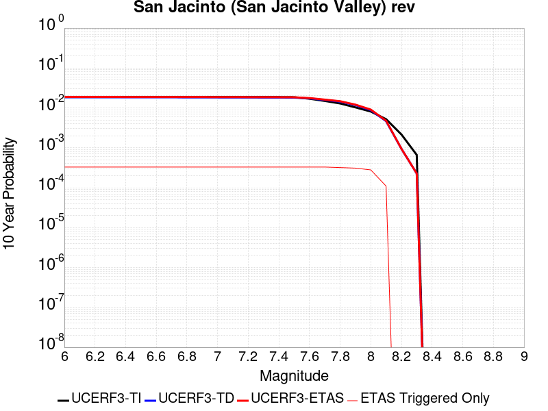 |

| Magnitude | 1 wk TI Prob | 1 wk TD Prob | 1 wk ETAS Prob | 1 wk ETAS/TD Gain | 1 wk ETAS Triggered Only | 1 mo TI Prob | 1 mo TD Prob | 1 mo ETAS Prob | 1 mo ETAS/TD Gain | 1 mo ETAS Triggered Only | 1 yr TI Prob | 1 yr TD Prob | 1 yr ETAS Prob | 1 yr ETAS/TD Gain | 1 yr ETAS Triggered Only | 10 yr TI Prob | 10 yr TD Prob | 10 yr ETAS Prob | 10 yr ETAS/TD Gain | 10 yr ETAS Triggered Only |
|-----|-----|-----|-----|-----|-----|-----|-----|-----|-----|-----|-----|-----|-----|-----|-----|-----|-----|-----|-----|-----|
| 6.0 | 3.652694E-5 | 3.4402394E-5 | 1.7559061E-4 | 5.1040235 | 1.4119309E-4 | 1.5653463E-4 | 1.474305E-4 | 2.8860278E-4 | 1.9575512 | 1.4119309E-4 | 0.0019041431 | 0.00179349 | 0.0020048998 | 1.1178762 | 2.1178962E-4 | 0.018879099 | 0.018526595 | 0.01880375 | 1.0149598 | 2.8238617E-4 |
| 6.1 | 3.652694E-5 | 3.4402394E-5 | 1.7559061E-4 | 5.1040235 | 1.4119309E-4 | 1.5653463E-4 | 1.474305E-4 | 2.8860278E-4 | 1.9575512 | 1.4119309E-4 | 0.0019041431 | 0.00179349 | 0.0020048998 | 1.1178762 | 2.1178962E-4 | 0.018879099 | 0.018526595 | 0.01880375 | 1.0149598 | 2.8238617E-4 |
| 6.2 | 3.652694E-5 | 3.4402394E-5 | 1.7559061E-4 | 5.1040235 | 1.4119309E-4 | 1.5653463E-4 | 1.474305E-4 | 2.8860278E-4 | 1.9575512 | 1.4119309E-4 | 0.0019041431 | 0.00179349 | 0.0020048998 | 1.1178762 | 2.1178962E-4 | 0.018879099 | 0.018526595 | 0.01880375 | 1.0149598 | 2.8238617E-4 |
| 6.3 | 3.652694E-5 | 3.4402394E-5 | 1.7559061E-4 | 5.1040235 | 1.4119309E-4 | 1.5653463E-4 | 1.474305E-4 | 2.8860278E-4 | 1.9575512 | 1.4119309E-4 | 0.0019041431 | 0.00179349 | 0.0020048998 | 1.1178762 | 2.1178962E-4 | 0.018879099 | 0.018526595 | 0.01880375 | 1.0149598 | 2.8238617E-4 |
| 6.4 | 3.646941E-5 | 3.432397E-5 | 1.755122E-4 | 5.1134005 | 1.4119309E-4 | 1.5628811E-4 | 1.4709444E-4 | 2.8826675E-4 | 1.9597392 | 1.4119309E-4 | 0.0019011468 | 0.0017894056 | 0.0020008162 | 1.1181457 | 2.1178962E-4 | 0.018849645 | 0.018486476 | 0.01876364 | 1.014993 | 2.8238617E-4 |
| 6.5 | 3.646941E-5 | 3.432397E-5 | 1.755122E-4 | 5.1134005 | 1.4119309E-4 | 1.5628811E-4 | 1.4709444E-4 | 2.8826675E-4 | 1.9597392 | 1.4119309E-4 | 0.0019011468 | 0.0017894056 | 0.0020008162 | 1.1181457 | 2.1178962E-4 | 0.018849645 | 0.018486476 | 0.01876364 | 1.014993 | 2.8238617E-4 |
| 6.6 | 3.6442503E-5 | 3.4287354E-5 | 1.754756E-4 | 5.1177936 | 1.4119309E-4 | 1.561728E-4 | 1.4693754E-4 | 2.8810988E-4 | 1.9607643 | 1.4119309E-4 | 0.0018997455 | 0.0017874985 | 0.0019989095 | 1.1182721 | 2.1178962E-4 | 0.018835869 | 0.018467745 | 0.018744916 | 1.0150084 | 2.8238617E-4 |
| 6.7 | 3.6432113E-5 | 3.4272925E-5 | 1.7546117E-4 | 5.119527 | 1.4119309E-4 | 1.5612828E-4 | 1.4687571E-4 | 2.8804806E-4 | 1.9611688 | 1.4119309E-4 | 0.0018992044 | 0.0017867472 | 0.0019981584 | 1.1183218 | 2.1178962E-4 | 0.018830549 | 0.018460369 | 0.018737542 | 1.0150145 | 2.8238617E-4 |
| 6.8 | 3.6409598E-5 | 3.424198E-5 | 1.7543024E-4 | 5.12325 | 1.4119309E-4 | 1.560318E-4 | 1.4674311E-4 | 2.8791546E-4 | 1.9620374 | 1.4119309E-4 | 0.0018980318 | 0.0017851355 | 0.001996547 | 1.1184288 | 2.1178962E-4 | 0.018819023 | 0.018444523 | 0.018721702 | 1.0150276 | 2.8238617E-4 |
| 6.9 | 3.638078E-5 | 3.4202407E-5 | 1.7539065E-4 | 5.1280212 | 1.4119309E-4 | 1.5590832E-4 | 1.4657351E-4 | 2.877459E-4 | 1.9631507 | 1.4119309E-4 | 0.0018965311 | 0.001783074 | 0.001994486 | 1.118566 | 2.1178962E-4 | 0.018804269 | 0.018424258 | 0.01870144 | 1.0150445 | 2.8238617E-4 |
| 7.0 | 3.6294874E-5 | 3.408442E-5 | 1.7527268E-4 | 5.142311 | 1.4119309E-4 | 1.5554018E-4 | 1.4606792E-4 | 2.8724037E-4 | 1.966485 | 1.4119309E-4 | 0.0018920569 | 0.001776929 | 0.0019883423 | 1.1189768 | 2.1178962E-4 | 0.018760284 | 0.018363839 | 0.01864104 | 1.0150949 | 2.8238617E-4 |
| 7.1 | 3.6260717E-5 | 3.4040702E-5 | 1.7522898E-4 | 5.147631 | 1.4119309E-4 | 1.5539382E-4 | 1.4588058E-4 | 2.8705306E-4 | 1.9677263 | 1.4119309E-4 | 0.001890278 | 0.0017746518 | 0.0019860656 | 1.1191297 | 2.1178962E-4 | 0.018742796 | 0.018341439 | 0.018618647 | 1.0151137 | 2.8238617E-4 |
| 7.2 | 3.6210204E-5 | 3.397492E-5 | 1.7516321E-4 | 5.155662 | 1.4119309E-4 | 1.5517735E-4 | 1.455987E-4 | 2.8677122E-4 | 1.9696002 | 1.4119309E-4 | 0.001887647 | 0.0017712255 | 0.00198264 | 1.1193606 | 2.1178962E-4 | 0.01871693 | 0.01830772 | 0.018584935 | 1.0151421 | 2.8238617E-4 |
| 7.3 | 3.6119454E-5 | 3.386321E-5 | 1.7505151E-4 | 5.1693716 | 1.4119309E-4 | 1.5478847E-4 | 1.4511998E-4 | 2.8629258E-4 | 1.9727992 | 1.4119309E-4 | 0.0018829206 | 0.0017654065 | 0.0019768223 | 1.1197547 | 2.1178962E-4 | 0.018670462 | 0.018250274 | 0.018527506 | 1.0151906 | 2.8238617E-4 |
| 7.4 | 3.607848E-5 | 3.381071E-5 | 1.7499902E-4 | 5.175846 | 1.4119309E-4 | 1.5461289E-4 | 1.44895E-4 | 2.8606763E-4 | 1.9743098 | 1.4119309E-4 | 0.0018807866 | 0.0017626719 | 0.0019740881 | 1.1199408 | 2.1178962E-4 | 0.018649481 | 0.018223269 | 0.018500509 | 1.0152135 | 2.8238617E-4 |
| 7.5 | 3.5856774E-5 | 3.3620483E-5 | 1.7480881E-4 | 5.199474 | 1.4119309E-4 | 1.5366284E-4 | 1.4407984E-4 | 2.8525258E-4 | 1.979823 | 1.4119309E-4 | 0.0018692396 | 0.0017527633 | 0.0019641817 | 1.12062 | 2.1178962E-4 | 0.018535944 | 0.018124366 | 0.018401634 | 1.0152981 | 2.8238617E-4 |
| 7.6 | 3.286655E-5 | 3.2143445E-5 | 1.73332E-4 | 5.392452 | 1.4119309E-4 | 1.4084904E-4 | 1.3775036E-4 | 2.78924E-4 | 2.0248513 | 1.4119309E-4 | 0.001713488 | 0.0016758227 | 0.0018872573 | 1.1261677 | 2.1178962E-4 | 0.017003361 | 0.017344031 | 0.017621519 | 1.0159991 | 2.8238617E-4 |
| 7.7 | 2.8882527E-5 | 2.9236293E-5 | 1.7042525E-4 | 5.8292356 | 1.4119309E-4 | 1.237764E-4 | 1.2529238E-4 | 2.6646777E-4 | 2.1267674 | 1.4119309E-4 | 0.0015059357 | 0.0015243685 | 0.0017358353 | 1.1387242 | 2.1178962E-4 | 0.014957713 | 0.015830461 | 0.016108377 | 1.0175557 | 2.8238617E-4 |
| 7.8 | 2.4950225E-5 | 2.6527203E-5 | 1.6771654E-4 | 6.322436 | 1.4119309E-4 | 1.0692515E-4 | 1.1368306E-4 | 2.548601E-4 | 2.2418475 | 1.4119309E-4 | 0.0013010362 | 0.0013832134 | 0.00159471 | 1.1529024 | 2.1178962E-4 | 0.012934455 | 0.014411755 | 0.014690071 | 1.0193118 | 2.8238617E-4 |
| 7.9 | 1.9881603E-5 | 2.1507445E-5 | 1.6269748E-4 | 7.5647054 | 1.4119309E-4 | 8.520408E-5 | 9.217151E-5 | 2.3335159E-4 | 2.5317104 | 1.4119309E-4 | 0.001036866 | 0.0011216112 | 0.0013331634 | 1.1886145 | 2.1178962E-4 | 0.010320415 | 0.011777027 | 0.012056087 | 1.0236953 | 2.8238617E-4 |
| 8.0 | 1.563292E-5 | 1.5937347E-5 | 1.5712818E-4 | 9.859118 | 1.4119309E-4 | 6.6996516E-5 | 6.8301124E-5 | 2.0948457E-4 | 3.0670733 | 1.4119309E-4 | 8.153773E-4 | 8.3124964E-4 | 0.0010075943 | 1.212144 | 1.7649135E-4 | 0.00812392 | 0.008810506 | 0.008985442 | 1.0198554 | 1.7649135E-4 |
| 8.1 | 1.0045313E-5 | 8.301802E-6 | 7.8897756E-5 | 9.50369 | 7.059654E-5 | 4.305063E-5 | 3.5578672E-5 | 1.061727E-4 | 2.984167 | 7.059654E-5 | 5.2401534E-4 | 4.3308473E-4 | 5.036507E-4 | 1.162938 | 7.059654E-5 | 0.0052278144 | 0.0046591135 | 0.0047293813 | 1.0150818 | 7.059654E-5 |
| 8.2 | 4.1554413E-6 | 1.5655598E-6 | 1.5655598E-6 | 1.0 | 0.0 | 1.7808914E-5 | 6.709525E-6 | 6.709525E-6 | 1.0 | 0.0 | 2.1680194E-4 | 8.168544E-5 | 8.168544E-5 | 1.0 | 0.0 | 0.0021659054 | 9.482903E-4 | 9.482903E-4 | 1.0 | 0.0 |
| 8.3 | 1.2758221E-6 | 3.6149942E-7 | 3.6149942E-7 | 1.0 | 0.0 | 5.4677976E-6 | 1.5492824E-6 | 1.5492824E-6 | 1.0 | 0.0 | 6.65684E-5 | 1.8862354E-5 | 1.8862354E-5 | 1.0 | 0.0 | 6.6548464E-4 | 2.2751294E-4 | 2.2751294E-4 | 1.0 | 0.0 |

## San Jacinto (Stepovers Combined)
*[(top)](#table-of-contents)*

| 1 Week | 1 Month | 1 Year | 10 Year |
|-----|-----|-----|-----|
| 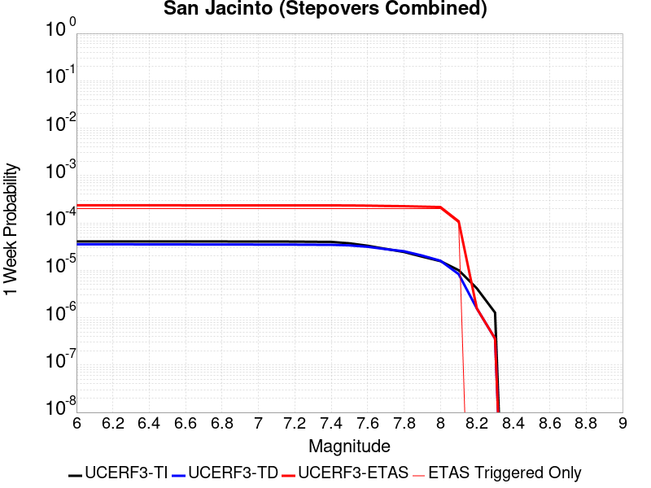 |  |  |  |

| Magnitude | 1 wk TI Prob | 1 wk TD Prob | 1 wk ETAS Prob | 1 wk ETAS/TD Gain | 1 wk ETAS Triggered Only | 1 mo TI Prob | 1 mo TD Prob | 1 mo ETAS Prob | 1 mo ETAS/TD Gain | 1 mo ETAS Triggered Only | 1 yr TI Prob | 1 yr TD Prob | 1 yr ETAS Prob | 1 yr ETAS/TD Gain | 1 yr ETAS Triggered Only | 10 yr TI Prob | 10 yr TD Prob | 10 yr ETAS Prob | 10 yr ETAS/TD Gain | 10 yr ETAS Triggered Only |
|-----|-----|-----|-----|-----|-----|-----|-----|-----|-----|-----|-----|-----|-----|-----|-----|-----|-----|-----|-----|-----|
| 6.0 | 4.0667746E-5 | 3.5272755E-5 | 1.7646086E-4 | 5.0027523 | 1.4119309E-4 | 1.742787E-4 | 1.5116022E-4 | 2.9233194E-4 | 1.9339213 | 1.4119309E-4 | 0.0021197782 | 0.0018388226 | 0.0020149895 | 1.0958041 | 1.7649135E-4 | 0.020996714 | 0.018986892 | 0.019229287 | 1.0127665 | 2.4708788E-4 |
| 6.1 | 4.0667746E-5 | 3.5272755E-5 | 1.7646086E-4 | 5.0027523 | 1.4119309E-4 | 1.742787E-4 | 1.5116022E-4 | 2.9233194E-4 | 1.9339213 | 1.4119309E-4 | 0.0021197782 | 0.0018388226 | 0.0020149895 | 1.0958041 | 1.7649135E-4 | 0.020996714 | 0.018986892 | 0.019229287 | 1.0127665 | 2.4708788E-4 |
| 6.2 | 4.0667746E-5 | 3.5272755E-5 | 1.7646086E-4 | 5.0027523 | 1.4119309E-4 | 1.742787E-4 | 1.5116022E-4 | 2.9233194E-4 | 1.9339213 | 1.4119309E-4 | 0.0021197782 | 0.0018388226 | 0.0020149895 | 1.0958041 | 1.7649135E-4 | 0.020996714 | 0.018986892 | 0.019229287 | 1.0127665 | 2.4708788E-4 |
| 6.3 | 4.0667746E-5 | 3.5272755E-5 | 1.7646086E-4 | 5.0027523 | 1.4119309E-4 | 1.742787E-4 | 1.5116022E-4 | 2.9233194E-4 | 1.9339213 | 1.4119309E-4 | 0.0021197782 | 0.0018388226 | 0.0020149895 | 1.0958041 | 1.7649135E-4 | 0.020996714 | 0.018986892 | 0.019229287 | 1.0127665 | 2.4708788E-4 |
| 6.4 | 4.0577226E-5 | 3.5144654E-5 | 1.7633277E-4 | 5.0173426 | 1.4119309E-4 | 1.738908E-4 | 1.5061127E-4 | 2.917831E-4 | 1.9373257 | 1.4119309E-4 | 0.0021150648 | 0.0018321523 | 0.0020083203 | 1.0961536 | 1.7649135E-4 | 0.020950472 | 0.018921461 | 0.019163873 | 1.0128115 | 2.4708788E-4 |
| 6.5 | 4.0577226E-5 | 3.5144654E-5 | 1.7633277E-4 | 5.0173426 | 1.4119309E-4 | 1.738908E-4 | 1.5061127E-4 | 2.917831E-4 | 1.9373257 | 1.4119309E-4 | 0.0021150648 | 0.0018321523 | 0.0020083203 | 1.0961536 | 1.7649135E-4 | 0.020950472 | 0.018921461 | 0.019163873 | 1.0128115 | 2.4708788E-4 |
| 6.6 | 4.053861E-5 | 3.509E-5 | 1.7627813E-4 | 5.0236 | 1.4119309E-4 | 1.7372532E-4 | 1.5037706E-4 | 2.9154893E-4 | 1.9387858 | 1.4119309E-4 | 0.0021130538 | 0.0018293057 | 0.0020054742 | 1.0963035 | 1.7649135E-4 | 0.020930743 | 0.018893538 | 0.019135958 | 1.0128309 | 2.4708788E-4 |
| 6.7 | 4.0516545E-5 | 3.5059067E-5 | 1.762472E-4 | 5.02715 | 1.4119309E-4 | 1.7363077E-4 | 1.5024451E-4 | 2.914164E-4 | 1.9396142 | 1.4119309E-4 | 0.002111905 | 0.001827695 | 0.0020038637 | 1.0963885 | 1.7649135E-4 | 0.020919468 | 0.018877735 | 0.019120159 | 1.0128418 | 2.4708788E-4 |
| 6.8 | 4.049434E-5 | 3.5030633E-5 | 1.7621876E-4 | 5.0304193 | 1.4119309E-4 | 1.7353562E-4 | 1.5012265E-4 | 2.9129453E-4 | 1.940377 | 1.4119309E-4 | 0.0021107488 | 0.0018262138 | 0.002002383 | 1.0964668 | 1.7649135E-4 | 0.020908125 | 0.018863149 | 0.019105576 | 1.0128518 | 2.4708788E-4 |
| 6.9 | 4.046386E-5 | 3.499319E-5 | 1.7618133E-4 | 5.034732 | 1.4119309E-4 | 1.73405E-4 | 1.4996222E-4 | 2.911341E-4 | 1.9413831 | 1.4119309E-4 | 0.0021091616 | 0.0018242638 | 0.0020004332 | 1.0965701 | 1.7649135E-4 | 0.020892553 | 0.01884392 | 0.019086353 | 1.0128653 | 2.4708788E-4 |
| 7.0 | 4.036382E-5 | 3.487376E-5 | 1.7606192E-4 | 5.04855 | 1.4119309E-4 | 1.7297632E-4 | 1.4945042E-4 | 2.906224E-4 | 1.9446075 | 1.4119309E-4 | 0.0021039525 | 0.0018180435 | 0.001994214 | 1.0969012 | 1.7649135E-4 | 0.02084144 | 0.018782536 | 0.019024983 | 1.0129081 | 2.4708788E-4 |
| 7.1 | 4.0343282E-5 | 3.4852223E-5 | 1.7604038E-4 | 5.051052 | 1.4119309E-4 | 1.7288832E-4 | 1.4935812E-4 | 2.9053012E-4 | 1.9451913 | 1.4119309E-4 | 0.002102883 | 0.0018169218 | 0.0019930925 | 1.096961 | 1.7649135E-4 | 0.020830948 | 0.018771412 | 0.019013863 | 1.0129158 | 2.4708788E-4 |
| 7.2 | 4.0257353E-5 | 3.4756722E-5 | 1.759449E-4 | 5.0621834 | 1.4119309E-4 | 1.725201E-4 | 1.489489E-4 | 2.9012095E-4 | 1.9477885 | 1.4119309E-4 | 0.0020984085 | 0.0018119477 | 0.0019881192 | 1.0972277 | 1.7649135E-4 | 0.020787042 | 0.018722152 | 0.018964615 | 1.0129505 | 2.4708788E-4 |
| 7.3 | 3.9940667E-5 | 3.4584376E-5 | 1.7577257E-4 | 5.082427 | 1.4119309E-4 | 1.7116306E-4 | 1.4821035E-4 | 2.893825E-4 | 1.952512 | 1.4119309E-4 | 0.0020819185 | 0.0018029709 | 0.001979144 | 1.0977126 | 1.7649135E-4 | 0.020625217 | 0.018630784 | 0.018873269 | 1.0130153 | 2.4708788E-4 |
| 7.4 | 3.9721202E-5 | 3.4469766E-5 | 1.7565799E-4 | 5.0960016 | 1.4119309E-4 | 1.7022261E-4 | 1.4771923E-4 | 2.8889146E-4 | 1.9556794 | 1.4119309E-4 | 0.0020704903 | 0.0017970012 | 0.0019731754 | 1.0980378 | 1.7649135E-4 | 0.020513052 | 0.018569905 | 0.018812405 | 1.0130588 | 2.4708788E-4 |
| 7.5 | 3.7036873E-5 | 3.3537188E-5 | 1.7472553E-4 | 5.209904 | 1.4119309E-4 | 1.5871979E-4 | 1.437229E-4 | 2.8489568E-4 | 1.9822568 | 1.4119309E-4 | 0.0019307006 | 0.0017484248 | 0.0019246076 | 1.1007665 | 1.7649135E-4 | 0.019140124 | 0.018071463 | 0.018314086 | 1.0134257 | 2.4708788E-4 |
| 7.6 | 3.2940967E-5 | 3.1317984E-5 | 1.7250664E-4 | 5.5082293 | 1.4119309E-4 | 1.4116794E-4 | 1.3421304E-4 | 2.7538717E-4 | 2.051866 | 1.4119309E-4 | 0.0017173645 | 0.0016328214 | 0.0018090245 | 1.1079134 | 1.7649135E-4 | 0.01704153 | 0.016904354 | 0.017147265 | 1.0143697 | 2.4708788E-4 |
| 7.7 | 2.8236149E-5 | 2.7883889E-5 | 1.6907303E-4 | 6.0634665 | 1.4119309E-4 | 1.2100645E-4 | 1.19496915E-4 | 2.606731E-4 | 2.1814213 | 1.4119309E-4 | 0.0014722579 | 0.001453905 | 0.0016301398 | 1.1212147 | 1.7649135E-4 | 0.014625421 | 0.015115095 | 0.015358448 | 1.0161 | 2.4708788E-4 |
| 7.8 | 2.4329287E-5 | 2.5207537E-5 | 1.6639706E-4 | 6.6010838 | 1.4119309E-4 | 1.042642E-4 | 1.0802783E-4 | 2.4920565E-4 | 2.3068655 | 1.4119309E-4 | 0.0012686774 | 0.0013144462 | 0.0014907055 | 1.134094 | 1.7649135E-4 | 0.012614589 | 0.013712396 | 0.013956095 | 1.0177722 | 2.4708788E-4 |
| 7.9 | 1.9370926E-5 | 2.0421452E-5 | 1.6161165E-4 | 7.913818 | 1.4119309E-4 | 8.301561E-5 | 8.7517576E-5 | 2.286983E-4 | 2.61317 | 1.4119309E-4 | 0.0010102465 | 0.0010650064 | 0.0012413098 | 1.1655421 | 1.7649135E-4 | 0.0100566605 | 0.011199483 | 0.011443803 | 1.0218153 | 2.4708788E-4 |
| 8.0 | 1.5583017E-5 | 1.588647E-5 | 1.570773E-4 | 9.88749 | 1.4119309E-4 | 6.6782646E-5 | 6.808309E-5 | 2.0926657E-4 | 3.0736935 | 1.4119309E-4 | 8.127754E-4 | 8.285971E-4 | 0.0010049422 | 1.2128237 | 1.7649135E-4 | 0.008098091 | 0.008781809 | 0.008956751 | 1.019921 | 1.7649135E-4 |
| 8.1 | 1.0024873E-5 | 8.292404E-6 | 7.888836E-5 | 9.513328 | 7.059654E-5 | 4.2963035E-5 | 3.5538393E-5 | 1.0613242E-4 | 2.9864159 | 7.059654E-5 | 5.229494E-4 | 4.3259456E-4 | 5.031605E-4 | 1.1631228 | 7.059654E-5 | 0.0052172043 | 0.0046534105 | 0.004723679 | 1.0151004 | 7.059654E-5 |
| 8.2 | 4.142796E-6 | 1.5610041E-6 | 1.5610041E-6 | 1.0 | 0.0 | 1.775472E-5 | 6.69E-6 | 6.69E-6 | 1.0 | 0.0 | 2.1614227E-4 | 8.144774E-5 | 8.144774E-5 | 1.0 | 0.0 | 0.0021593217 | 9.454649E-4 | 9.454649E-4 | 1.0 | 0.0 |
| 8.3 | 1.2750878E-6 | 3.612133E-7 | 3.612133E-7 | 1.0 | 0.0 | 5.4646503E-6 | 1.548056E-6 | 1.548056E-6 | 1.0 | 0.0 | 6.653009E-5 | 1.8847424E-5 | 1.8847424E-5 | 1.0 | 0.0 | 6.6510175E-4 | 2.2734253E-4 | 2.2734253E-4 | 1.0 | 0.0 |

## Santa Rosa Island
*[(top)](#table-of-contents)*

| 1 Week | 1 Month | 1 Year | 10 Year |
|-----|-----|-----|-----|
| 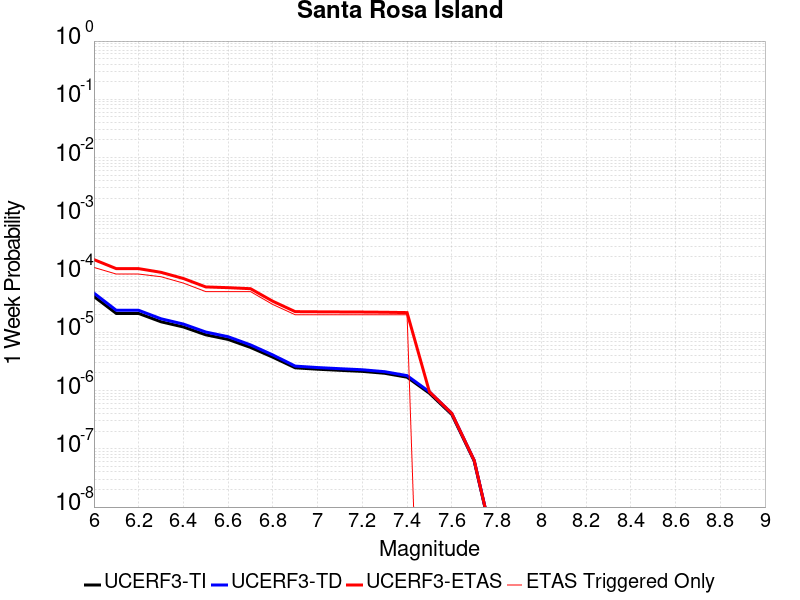 |  |  |  |

| Magnitude | 1 wk TI Prob | 1 wk TD Prob | 1 wk ETAS Prob | 1 wk ETAS/TD Gain | 1 wk ETAS Triggered Only | 1 mo TI Prob | 1 mo TD Prob | 1 mo ETAS Prob | 1 mo ETAS/TD Gain | 1 mo ETAS Triggered Only | 1 yr TI Prob | 1 yr TD Prob | 1 yr ETAS Prob | 1 yr ETAS/TD Gain | 1 yr ETAS Triggered Only | 10 yr TI Prob | 10 yr TD Prob | 10 yr ETAS Prob | 10 yr ETAS/TD Gain | 10 yr ETAS Triggered Only |
|-----|-----|-----|-----|-----|-----|-----|-----|-----|-----|-----|-----|-----|-----|-----|-----|-----|-----|-----|-----|-----|
| 6.0 | 4.1143165E-5 | 4.7091133E-5 | 2.2357417E-4 | 4.7476916 | 1.7649135E-4 | 1.7631594E-4 | 2.0180465E-4 | 4.1355152E-4 | 2.0492666 | 2.1178962E-4 | 0.002144533 | 0.0024544 | 0.0027008813 | 1.1004243 | 2.4708788E-4 | 0.021239553 | 0.024293551 | 0.024534637 | 1.0099238 | 2.4708788E-4 |
| 6.1 | 2.1061249E-5 | 2.3864959E-5 | 2.003521E-4 | 8.395242 | 1.7649135E-4 | 9.0259375E-5 | 1.0227455E-4 | 2.7874784E-4 | 2.725486 | 1.7649135E-4 | 0.0010983539 | 0.0012445104 | 0.0014560363 | 1.1699673 | 2.1178962E-4 | 0.01092941 | 0.012378449 | 0.012587616 | 1.0168978 | 2.1178962E-4 |
| 6.2 | 2.1061249E-5 | 2.3864959E-5 | 2.003521E-4 | 8.395242 | 1.7649135E-4 | 9.0259375E-5 | 1.0227455E-4 | 2.7874784E-4 | 2.725486 | 1.7649135E-4 | 0.0010983539 | 0.0012445104 | 0.0014560363 | 1.1699673 | 2.1178962E-4 | 0.01092941 | 0.012378449 | 0.012587616 | 1.0168978 | 2.1178962E-4 |
| 6.3 | 1.5158236E-5 | 1.7074419E-5 | 1.9356275E-4 | 11.336418 | 1.7649135E-4 | 6.496225E-5 | 7.3174095E-5 | 2.4965254E-4 | 3.411761 | 1.7649135E-4 | 7.906284E-4 | 8.905424E-4 | 0.0010668766 | 1.1980076 | 1.7649135E-4 | 0.007878214 | 0.008870989 | 0.009045915 | 1.0197189 | 1.7649135E-4 |
| 6.4 | 1.2341918E-5 | 1.3852917E-5 | 1.9034183E-4 | 13.740199 | 1.7649135E-4 | 5.2892858E-5 | 5.9368336E-5 | 2.358492E-4 | 3.9726431 | 1.7649135E-4 | 6.437803E-4 | 7.225779E-4 | 8.9894177E-4 | 1.2440759 | 1.7649135E-4 | 0.006419184 | 0.007203121 | 0.007378341 | 1.0243256 | 1.7649135E-4 |
| 6.5 | 9.061158E-6 | 1.0117031E-5 | 1.1601077E-4 | 11.466879 | 1.0589481E-4 | 3.883296E-5 | 4.3358013E-5 | 1.4924823E-4 | 3.4422295 | 1.0589481E-4 | 4.726887E-4 | 5.277613E-4 | 6.336002E-4 | 1.2005432 | 1.0589481E-4 | 0.004716845 | 0.0052656173 | 0.0053709545 | 1.0200047 | 1.0589481E-4 |
| 6.6 | 7.5461685E-6 | 8.400733E-6 | 1.1429466E-4 | 13.605318 | 1.0589481E-4 | 3.2340322E-5 | 3.600267E-5 | 1.4189367E-4 | 3.9411983 | 1.0589481E-4 | 3.936723E-4 | 4.3824865E-4 | 5.4409704E-4 | 1.2415259 | 1.0589481E-4 | 0.003929756 | 0.0043742736 | 0.0044797054 | 1.0241027 | 1.0589481E-4 |
| 6.7 | 5.5023775E-6 | 6.087381E-6 | 1.1198155E-4 | 18.395687 | 1.0589481E-4 | 2.3581404E-5 | 2.6088532E-5 | 1.3198057E-4 | 5.05895 | 1.0589481E-4 | 2.8706578E-4 | 3.1758484E-4 | 4.23446E-4 | 1.333332 | 1.0589481E-4 | 0.0028669522 | 0.0031716314 | 0.0032771905 | 1.0332823 | 1.0589481E-4 |
| 6.8 | 3.7351679E-6 | 4.0831405E-6 | 7.4679396E-5 | 18.289696 | 7.059654E-5 | 1.6007763E-5 | 1.749907E-5 | 8.809438E-5 | 5.0342317 | 7.059654E-5 | 1.948771E-4 | 2.1303284E-4 | 2.8361435E-4 | 1.3313174 | 7.059654E-5 | 0.0019470629 | 0.0021285315 | 0.0021989776 | 1.0330962 | 7.059654E-5 |
| 6.9 | 2.456366E-6 | 2.6292705E-6 | 3.792745E-5 | 14.425084 | 3.529827E-5 | 1.0527241E-5 | 1.1268254E-5 | 4.6566125E-5 | 4.132506 | 3.529827E-5 | 1.2816161E-4 | 1.3718237E-4 | 1.724758E-4 | 1.2572738 | 3.529827E-5 | 0.0012808773 | 0.0013709799 | 0.0014062298 | 1.0257114 | 3.529827E-5 |
| 7.0 | 2.3245157E-6 | 2.4827782E-6 | 3.778096E-5 | 15.217211 | 3.529827E-5 | 9.962172E-6 | 1.0640435E-5 | 4.593833E-5 | 4.3173356 | 3.529827E-5 | 1.2128269E-4 | 1.2953962E-4 | 1.6483331E-4 | 1.2724549 | 3.529827E-5 | 0.0012121652 | 0.0012946434 | 0.0013298959 | 1.0272295 | 3.529827E-5 |
| 7.1 | 2.2248344E-6 | 2.37325E-6 | 3.7671438E-5 | 15.873354 | 3.529827E-5 | 9.53497E-6 | 1.0171032E-5 | 4.5468943E-5 | 4.4704356 | 3.529827E-5 | 1.1608207E-4 | 1.2382529E-4 | 1.591192E-4 | 1.2850298 | 3.529827E-5 | 0.0011602144 | 0.001237565 | 0.0012728196 | 1.0284871 | 3.529827E-5 |
| 7.2 | 2.1350402E-6 | 2.276154E-6 | 3.7574344E-5 | 16.507822 | 3.529827E-5 | 9.150141E-6 | 9.754909E-6 | 4.5052835E-5 | 4.6184783 | 3.529827E-5 | 1.1139726E-4 | 1.1875956E-4 | 1.5405365E-4 | 1.2971894 | 3.529827E-5 | 0.0011134144 | 0.0011869629 | 0.0012222192 | 1.029703 | 3.529827E-5 |
| 7.3 | 1.9793572E-6 | 2.108719E-6 | 3.7406917E-5 | 17.739164 | 3.529827E-5 | 8.482932E-6 | 9.037336E-6 | 4.4335287E-5 | 4.9057918 | 3.529827E-5 | 1.032748E-4 | 1.10024026E-4 | 1.4531841E-4 | 1.320788 | 3.529827E-5 | 0.0010322682 | 0.0010996973 | 0.0011349568 | 1.0320629 | 3.529827E-5 |
| 7.4 | 1.6951194E-6 | 1.8045733E-6 | 3.710278E-5 | 20.560417 | 3.529827E-5 | 7.264777E-6 | 7.733863E-6 | 4.303186E-5 | 5.5640836 | 3.529827E-5 | 8.844508E-5 | 9.415573E-5 | 1.2945068E-4 | 1.3748572 | 3.529827E-5 | 8.840988E-4 | 9.4116E-4 | 9.764251E-4 | 1.0374697 | 3.529827E-5 |
| 7.5 | 8.987207E-7 | 9.5122147E-7 | 9.5122147E-7 | 1.0 | 0.0 | 3.8516546E-6 | 4.076657E-6 | 4.076657E-6 | 1.0 | 0.0 | 4.6892885E-5 | 4.963218E-5 | 4.963218E-5 | 1.0 | 0.0 | 4.688299E-4 | 4.9621216E-4 | 4.9621216E-4 | 1.0 | 0.0 |
| 7.6 | 3.8783037E-7 | 4.052932E-7 | 4.052932E-7 | 1.0 | 0.0 | 1.6621291E-6 | 1.7369698E-6 | 1.7369698E-6 | 1.0 | 0.0 | 2.0236233E-5 | 2.1147409E-5 | 2.1147409E-5 | 1.0 | 0.0 | 2.023439E-4 | 2.1145462E-4 | 2.1145462E-4 | 1.0 | 0.0 |
| 7.7 | 6.181804E-8 | 6.339035E-8 | 6.339035E-8 | 1.0 | 0.0 | 2.6493444E-7 | 2.7167292E-7 | 2.7167292E-7 | 1.0 | 0.0 | 3.225572E-6 | 3.3076128E-6 | 3.3076128E-6 | 1.0 | 0.0 | 3.225525E-5 | 3.307564E-5 | 3.307564E-5 | 1.0 | 0.0 |
| 7.8 | 1.3704449E-9 | 1.3964153E-9 | 1.3964153E-9 | 1.0 | 0.0 | 5.873335E-9 | 5.984637E-9 | 5.984637E-9 | 1.0 | 0.0 | 7.1507856E-8 | 7.286295E-8 | 7.286295E-8 | 1.0 | 0.0 | 7.1507833E-7 | 7.286294E-7 | 7.286294E-7 | 1.0 | 0.0 |

## San Andreas (North Branch Mill Creek)
*[(top)](#table-of-contents)*

| 1 Week | 1 Month | 1 Year | 10 Year |
|-----|-----|-----|-----|
|  |  |  |  |

| Magnitude | 1 wk TI Prob | 1 wk TD Prob | 1 wk ETAS Prob | 1 wk ETAS/TD Gain | 1 wk ETAS Triggered Only | 1 mo TI Prob | 1 mo TD Prob | 1 mo ETAS Prob | 1 mo ETAS/TD Gain | 1 mo ETAS Triggered Only | 1 yr TI Prob | 1 yr TD Prob | 1 yr ETAS Prob | 1 yr ETAS/TD Gain | 1 yr ETAS Triggered Only | 10 yr TI Prob | 10 yr TD Prob | 10 yr ETAS Prob | 10 yr ETAS/TD Gain | 10 yr ETAS Triggered Only |
|-----|-----|-----|-----|-----|-----|-----|-----|-----|-----|-----|-----|-----|-----|-----|-----|-----|-----|-----|-----|-----|
| 6.0 | 1.3461156E-5 | 2.3499893E-5 | 1.999871E-4 | 8.510128 | 1.7649135E-4 | 5.7689394E-5 | 1.00709956E-4 | 3.1247825E-4 | 3.1027544 | 2.1178962E-4 | 7.02142E-4 | 0.0012254574 | 0.0014722424 | 1.201382 | 2.4708788E-4 | 0.0069992766 | 0.01222957 | 0.012473636 | 1.0199571 | 2.4708788E-4 |
| 6.1 | 1.3461156E-5 | 2.3499893E-5 | 1.999871E-4 | 8.510128 | 1.7649135E-4 | 5.7689394E-5 | 1.00709956E-4 | 3.1247825E-4 | 3.1027544 | 2.1178962E-4 | 7.02142E-4 | 0.0012254574 | 0.0014722424 | 1.201382 | 2.4708788E-4 | 0.0069992766 | 0.01222957 | 0.012473636 | 1.0199571 | 2.4708788E-4 |
| 6.2 | 1.3461156E-5 | 2.3499893E-5 | 1.999871E-4 | 8.510128 | 1.7649135E-4 | 5.7689394E-5 | 1.00709956E-4 | 3.1247825E-4 | 3.1027544 | 2.1178962E-4 | 7.02142E-4 | 0.0012254574 | 0.0014722424 | 1.201382 | 2.4708788E-4 | 0.0069992766 | 0.01222957 | 0.012473636 | 1.0199571 | 2.4708788E-4 |
| 6.3 | 1.3461156E-5 | 2.3499893E-5 | 1.999871E-4 | 8.510128 | 1.7649135E-4 | 5.7689394E-5 | 1.00709956E-4 | 3.1247825E-4 | 3.1027544 | 2.1178962E-4 | 7.02142E-4 | 0.0012254574 | 0.0014722424 | 1.201382 | 2.4708788E-4 | 0.0069992766 | 0.01222957 | 0.012473636 | 1.0199571 | 2.4708788E-4 |
| 6.4 | 1.3461156E-5 | 2.3499893E-5 | 1.999871E-4 | 8.510128 | 1.7649135E-4 | 5.7689394E-5 | 1.00709956E-4 | 3.1247825E-4 | 3.1027544 | 2.1178962E-4 | 7.02142E-4 | 0.0012254574 | 0.0014722424 | 1.201382 | 2.4708788E-4 | 0.0069992766 | 0.01222957 | 0.012473636 | 1.0199571 | 2.4708788E-4 |
| 6.5 | 1.3450706E-5 | 2.3488852E-5 | 1.9997606E-4 | 8.513658 | 1.7649135E-4 | 5.764461E-5 | 1.0066265E-4 | 3.1243096E-4 | 3.1037426 | 2.1178962E-4 | 7.0159714E-4 | 0.001224882 | 0.0014716672 | 1.2014767 | 2.4708788E-4 | 0.006993862 | 0.01222388 | 0.012467947 | 1.0199665 | 2.4708788E-4 |
| 6.6 | 1.3074523E-5 | 2.3103135E-5 | 1.9959042E-4 | 8.639105 | 1.7649135E-4 | 5.6032466E-5 | 9.9009696E-5 | 3.1077836E-4 | 3.1388679 | 2.1178962E-4 | 6.8198174E-4 | 0.0012047797 | 0.00145157 | 1.2048426 | 2.4708788E-4 | 0.006798926 | 0.012025044 | 0.012269162 | 1.0203006 | 2.4708788E-4 |
| 6.7 | 1.3050216E-5 | 2.3078432E-5 | 1.9956571E-4 | 8.647282 | 1.7649135E-4 | 5.59283E-5 | 9.890384E-5 | 3.106725E-4 | 3.1411574 | 2.1178962E-4 | 6.8071426E-4 | 0.0012034923 | 0.0014502828 | 1.205062 | 2.4708788E-4 | 0.0067863287 | 0.012012309 | 0.012256429 | 1.0203224 | 2.4708788E-4 |
| 6.8 | 1.29049395E-5 | 2.292684E-5 | 1.9941415E-4 | 8.697846 | 1.7649135E-4 | 5.530571E-5 | 9.825421E-5 | 3.1002302E-4 | 3.1553154 | 2.1178962E-4 | 6.73139E-4 | 0.0011955918 | 0.0014423842 | 1.2064186 | 2.4708788E-4 | 0.0067110364 | 0.011934154 | 0.012178293 | 1.0204571 | 2.4708788E-4 |
| 6.9 | 1.2867369E-5 | 2.2886245E-5 | 1.9937356E-4 | 8.711502 | 1.7649135E-4 | 5.51447E-5 | 9.8080236E-5 | 3.098491E-4 | 3.159139 | 2.1178962E-4 | 6.711799E-4 | 0.0011934759 | 0.0014402689 | 1.2067851 | 2.4708788E-4 | 0.006691564 | 0.011913223 | 0.012157368 | 1.0204935 | 2.4708788E-4 |
| 7.0 | 1.2495996E-5 | 2.2286325E-5 | 1.9877375E-4 | 8.91909 | 1.7649135E-4 | 5.3553173E-5 | 9.550934E-5 | 3.0727874E-4 | 3.2172637 | 2.1178962E-4 | 6.518148E-4 | 0.0011622087 | 0.0014090096 | 1.2123549 | 2.4708788E-4 | 0.0064990623 | 0.0116038285 | 0.011848049 | 1.0210465 | 2.4708788E-4 |
| 7.1 | 1.2452067E-5 | 2.2231397E-5 | 1.9871883E-4 | 8.938656 | 1.7649135E-4 | 5.3364907E-5 | 9.527396E-5 | 3.070434E-4 | 3.222742 | 2.1178962E-4 | 6.4952404E-4 | 0.0011593461 | 0.0014061475 | 1.2128799 | 2.4708788E-4 | 0.0064762887 | 0.0115755 | 0.011819728 | 1.0210987 | 2.4708788E-4 |
| 7.2 | 1.2002777E-5 | 2.1609963E-5 | 1.980975E-4 | 9.166952 | 1.7649135E-4 | 5.143946E-5 | 9.2610855E-5 | 3.0438087E-4 | 3.286665 | 2.1178962E-4 | 6.2609545E-4 | 0.0011269567 | 0.0013385075 | 1.1877187 | 2.1178962E-4 | 0.006243344 | 0.011254923 | 0.0114643285 | 1.0186057 | 2.1178962E-4 |
| 7.3 | 1.1923425E-5 | 2.1479793E-5 | 1.9796735E-4 | 9.216446 | 1.7649135E-4 | 5.109939E-5 | 9.205302E-5 | 3.0382315E-4 | 3.3005233 | 2.1178962E-4 | 6.219575E-4 | 0.001120172 | 0.0013317243 | 1.1888571 | 2.1178962E-4 | 0.0062021962 | 0.011187789 | 0.011397209 | 1.0187186 | 2.1178962E-4 |
| 7.4 | 1.16105175E-5 | 2.0853771E-5 | 1.9734145E-4 | 9.463105 | 1.7649135E-4 | 4.975841E-5 | 8.937026E-5 | 3.0114094E-4 | 3.369588 | 2.1178962E-4 | 6.0564023E-4 | 0.0010875424 | 0.0012991016 | 1.1945297 | 2.1178962E-4 | 0.006039923 | 0.010865397 | 0.011074885 | 1.0192803 | 2.1178962E-4 |
| 7.5 | 1.1037265E-5 | 1.9553907E-5 | 1.960418E-4 | 10.02571 | 1.7649135E-4 | 4.7301706E-5 | 8.379978E-5 | 2.9557166E-4 | 3.5271173 | 2.1178962E-4 | 5.757461E-4 | 0.0010197869 | 0.0012313606 | 1.2074685 | 2.1178962E-4 | 0.005742567 | 0.010194898 | 0.010404528 | 1.0205623 | 2.1178962E-4 |
| 7.6 | 1.0720915E-5 | 1.899582E-5 | 1.9548382E-4 | 10.290887 | 1.7649135E-4 | 4.5945973E-5 | 8.140812E-5 | 2.931805E-4 | 3.6013668 | 2.1178962E-4 | 5.592486E-4 | 9.906954E-4 | 0.0012022752 | 1.2135669 | 2.1178962E-4 | 0.005578433 | 0.009906623 | 0.010116314 | 1.0211668 | 2.1178962E-4 |
| 7.7 | 9.276279E-6 | 1.6441649E-5 | 1.9293009E-4 | 11.734231 | 1.7649135E-4 | 3.9754876E-5 | 7.0462316E-5 | 2.8223702E-4 | 4.005503 | 2.1178962E-4 | 4.839081E-4 | 8.575427E-4 | 0.0010691507 | 1.2467608 | 2.1178962E-4 | 0.0048285574 | 0.008586041 | 0.008796012 | 1.024455 | 2.1178962E-4 |
| 7.8 | 5.8346777E-6 | 1.1155013E-5 | 1.876444E-4 | 16.82153 | 1.7649135E-4 | 2.5005522E-5 | 4.7806327E-5 | 2.5958582E-4 | 5.4299474 | 2.1178962E-4 | 3.043997E-4 | 5.818867E-4 | 7.935531E-4 | 1.3637588 | 2.1178962E-4 | 0.0030398308 | 0.0058469265 | 0.0060574776 | 1.0360106 | 2.1178962E-4 |
| 7.9 | 4.690204E-6 | 8.509093E-6 | 1.8499895E-4 | 21.741322 | 1.7649135E-4 | 2.0100719E-5 | 3.6467034E-5 | 2.4824892E-4 | 6.807489 | 2.1178962E-4 | 2.4469878E-4 | 4.4389578E-4 | 6.555914E-4 | 1.4769038 | 2.1178962E-4 | 0.002444295 | 0.0044707474 | 0.00468159 | 1.0471605 | 2.1178962E-4 |
| 8.0 | 2.9570454E-6 | 4.846947E-6 | 7.5443146E-5 | 15.565086 | 7.059654E-5 | 1.267299E-5 | 2.0772464E-5 | 1.2666508E-4 | 6.0977397 | 1.0589481E-4 | 1.5428272E-4 | 2.5287544E-4 | 3.5874345E-4 | 1.4186568 | 1.0589481E-4 | 0.0015417566 | 0.002549644 | 0.0026552689 | 1.0414273 | 1.0589481E-4 |
| 8.1 | 1.6376824E-6 | 2.1968929E-6 | 2.1968929E-6 | 1.0 | 0.0 | 7.01862E-6 | 9.41522E-6 | 9.41522E-6 | 1.0 | 0.0 | 8.544835E-5 | 1.14624294E-4 | 1.14624294E-4 | 1.0 | 0.0 | 8.54155E-4 | 0.0011606582 | 0.0011606582 | 1.0 | 0.0 |
| 8.2 | 6.9631557E-7 | 4.5360213E-7 | 4.5360213E-7 | 1.0 | 0.0 | 2.984206E-6 | 1.9440076E-6 | 1.9440076E-6 | 1.0 | 0.0 | 3.63321E-5 | 2.3668037E-5 | 2.3668037E-5 | 1.0 | 0.0 | 3.6326164E-4 | 2.451564E-4 | 2.451564E-4 | 1.0 | 0.0 |
| 8.3 | 1.7876137E-7 | 8.360375E-8 | 8.360375E-8 | 1.0 | 0.0 | 7.661199E-7 | 3.5830175E-7 | 3.5830175E-7 | 1.0 | 0.0 | 9.32747E-6 | 4.3623154E-6 | 4.3623154E-6 | 1.0 | 0.0 | 9.3270784E-5 | 4.5817014E-5 | 4.5817014E-5 | 1.0 | 0.0 |

## San Jacinto (Anza) rev
*[(top)](#table-of-contents)*

| 1 Week | 1 Month | 1 Year | 10 Year |
|-----|-----|-----|-----|
|  |  |  | 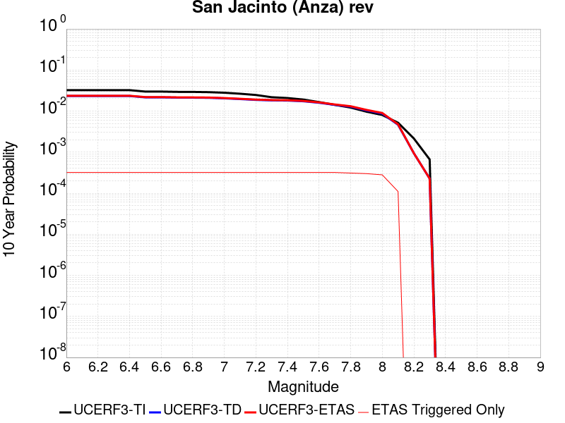 |

| Magnitude | 1 wk TI Prob | 1 wk TD Prob | 1 wk ETAS Prob | 1 wk ETAS/TD Gain | 1 wk ETAS Triggered Only | 1 mo TI Prob | 1 mo TD Prob | 1 mo ETAS Prob | 1 mo ETAS/TD Gain | 1 mo ETAS Triggered Only | 1 yr TI Prob | 1 yr TD Prob | 1 yr ETAS Prob | 1 yr ETAS/TD Gain | 1 yr ETAS Triggered Only | 10 yr TI Prob | 10 yr TD Prob | 10 yr ETAS Prob | 10 yr ETAS/TD Gain | 10 yr ETAS Triggered Only |
|-----|-----|-----|-----|-----|-----|-----|-----|-----|-----|-----|-----|-----|-----|-----|-----|-----|-----|-----|-----|-----|
| 6.0 | 6.3015636E-5 | 4.3302647E-5 | 1.8448962E-4 | 4.2604694 | 1.4119309E-4 | 2.7003905E-4 | 1.8556965E-4 | 3.267365E-4 | 1.7607218 | 1.4119309E-4 | 0.0032827691 | 0.0022569813 | 0.0024330742 | 1.0780215 | 1.7649135E-4 | 0.032346968 | 0.023296192 | 0.023537524 | 1.0103593 | 2.4708788E-4 |
| 6.1 | 6.3015636E-5 | 4.3302647E-5 | 1.8448962E-4 | 4.2604694 | 1.4119309E-4 | 2.7003905E-4 | 1.8556965E-4 | 3.267365E-4 | 1.7607218 | 1.4119309E-4 | 0.0032827691 | 0.0022569813 | 0.0024330742 | 1.0780215 | 1.7649135E-4 | 0.032346968 | 0.023296192 | 0.023537524 | 1.0103593 | 2.4708788E-4 |
| 6.2 | 6.3015636E-5 | 4.3302647E-5 | 1.8448962E-4 | 4.2604694 | 1.4119309E-4 | 2.7003905E-4 | 1.8556965E-4 | 3.267365E-4 | 1.7607218 | 1.4119309E-4 | 0.0032827691 | 0.0022569813 | 0.0024330742 | 1.0780215 | 1.7649135E-4 | 0.032346968 | 0.023296192 | 0.023537524 | 1.0103593 | 2.4708788E-4 |
| 6.3 | 6.3015636E-5 | 4.3302647E-5 | 1.8448962E-4 | 4.2604694 | 1.4119309E-4 | 2.7003905E-4 | 1.8556965E-4 | 3.267365E-4 | 1.7607218 | 1.4119309E-4 | 0.0032827691 | 0.0022569813 | 0.0024330742 | 1.0780215 | 1.7649135E-4 | 0.032346968 | 0.023296192 | 0.023537524 | 1.0103593 | 2.4708788E-4 |
| 6.4 | 6.3015636E-5 | 4.3302647E-5 | 1.8448962E-4 | 4.2604694 | 1.4119309E-4 | 2.7003905E-4 | 1.8556965E-4 | 3.267365E-4 | 1.7607218 | 1.4119309E-4 | 0.0032827691 | 0.0022569813 | 0.0024330742 | 1.0780215 | 1.7649135E-4 | 0.032346968 | 0.023296192 | 0.023537524 | 1.0103593 | 2.4708788E-4 |
| 6.5 | 5.811017E-5 | 4.0082516E-5 | 1.8126993E-4 | 4.5224195 | 1.4119309E-4 | 2.4901982E-4 | 1.7177092E-4 | 3.1293975E-4 | 1.8218435 | 1.4119309E-4 | 0.0030276014 | 0.002089311 | 0.0022654333 | 1.084297 | 1.7649135E-4 | 0.02986684 | 0.021593736 | 0.02183549 | 1.0111955 | 2.4708788E-4 |
| 6.6 | 5.811017E-5 | 4.0082516E-5 | 1.8126993E-4 | 4.5224195 | 1.4119309E-4 | 2.4901982E-4 | 1.7177092E-4 | 3.1293975E-4 | 1.8218435 | 1.4119309E-4 | 0.0030276014 | 0.002089311 | 0.0022654333 | 1.084297 | 1.7649135E-4 | 0.02986684 | 0.021593736 | 0.02183549 | 1.0111955 | 2.4708788E-4 |
| 6.7 | 5.712442E-5 | 3.9505223E-5 | 1.8069273E-4 | 4.5738945 | 1.4119309E-4 | 2.4479596E-4 | 1.6929714E-4 | 3.1046633E-4 | 1.8338544 | 1.4119309E-4 | 0.0029763177 | 0.0020592497 | 0.0022353777 | 1.0855302 | 1.7649135E-4 | 0.029367693 | 0.021285562 | 0.02152739 | 1.0113611 | 2.4708788E-4 |
| 6.8 | 5.6967532E-5 | 3.9361643E-5 | 1.8054916E-4 | 4.5869317 | 1.4119309E-4 | 2.4412372E-4 | 1.6868189E-4 | 3.0985114E-4 | 1.8368964 | 1.4119309E-4 | 0.0029681553 | 0.002051773 | 0.0022279022 | 1.0858425 | 1.7649135E-4 | 0.029288229 | 0.021210281 | 0.021452129 | 1.0114024 | 2.4708788E-4 |
| 6.9 | 5.6211324E-5 | 3.9066435E-5 | 1.80254E-4 | 4.6140375 | 1.4119309E-4 | 2.4088343E-4 | 1.6741687E-4 | 3.085863E-4 | 1.8432212 | 1.4119309E-4 | 0.0029288116 | 0.0020364004 | 0.0022125323 | 1.0864918 | 1.7649135E-4 | 0.028905109 | 0.021049714 | 0.0212916 | 1.0114912 | 2.4708788E-4 |
| 7.0 | 5.4383527E-5 | 3.792697E-5 | 1.791147E-4 | 4.722621 | 1.4119309E-4 | 2.3305144E-4 | 1.6253405E-4 | 3.0370418E-4 | 1.8685572 | 1.4119309E-4 | 0.0028337094 | 0.001977061 | 0.0021532034 | 1.0890931 | 1.7649135E-4 | 0.027978465 | 0.020440677 | 0.020682713 | 1.0118409 | 2.4708788E-4 |
| 7.1 | 5.1393665E-5 | 3.6389913E-5 | 1.7757785E-4 | 4.8798647 | 1.4119309E-4 | 2.2023996E-4 | 1.5594746E-4 | 2.9711853E-4 | 1.9052476 | 1.4119309E-4 | 0.0026781242 | 0.0018970112 | 0.0020731678 | 1.0928601 | 1.7649135E-4 | 0.026460782 | 0.019614287 | 0.019856527 | 1.0123502 | 2.4708788E-4 |
| 7.2 | 4.785222E-5 | 3.4741795E-5 | 1.7592998E-4 | 5.0639286 | 1.4119309E-4 | 2.0506482E-4 | 1.4888494E-4 | 2.9005698E-4 | 1.9481957 | 1.4119309E-4 | 0.0024938055 | 0.0018111705 | 0.0019873423 | 1.0972695 | 1.7649135E-4 | 0.024660049 | 0.018728992 | 0.018971452 | 1.0129458 | 2.4708788E-4 |
| 7.3 | 4.2143256E-5 | 3.383628E-5 | 1.7502459E-4 | 5.17269 | 1.4119309E-4 | 1.8060145E-4 | 1.4500458E-4 | 2.8617718E-4 | 1.9735734 | 1.4119309E-4 | 0.002196605 | 0.0017640047 | 0.0019401846 | 1.099875 | 1.7649135E-4 | 0.02175019 | 0.01823724 | 0.018479822 | 1.0133015 | 2.4708788E-4 |
| 7.4 | 4.0264713E-5 | 3.347446E-5 | 1.7466281E-4 | 5.217793 | 1.4119309E-4 | 1.7255165E-4 | 1.4345412E-4 | 2.8462693E-4 | 1.9840975 | 1.4119309E-4 | 0.002098792 | 0.0017451581 | 0.0019213414 | 1.1009555 | 1.7649135E-4 | 0.020790804 | 0.018041821 | 0.018284451 | 1.0134482 | 2.4708788E-4 |
| 7.5 | 3.694492E-5 | 3.218847E-5 | 1.73377E-4 | 5.386308 | 1.4119309E-4 | 1.5832575E-4 | 1.379433E-4 | 2.791169E-4 | 2.0234177 | 1.4119309E-4 | 0.0019259118 | 0.001678169 | 0.0018543642 | 1.1049925 | 1.7649135E-4 | 0.01909306 | 0.01735827 | 0.017601069 | 1.0139875 | 2.4708788E-4 |
| 7.6 | 3.200565E-5 | 2.9504106E-5 | 1.7069302E-4 | 5.785399 | 1.4119309E-4 | 1.3715986E-4 | 1.2644005E-4 | 2.6761528E-4 | 2.1165388 | 1.4119309E-4 | 0.001668642 | 0.0015383229 | 0.0017145427 | 1.1145532 | 1.7649135E-4 | 0.01656168 | 0.0159463 | 0.016189449 | 1.015248 | 2.4708788E-4 |
| 7.7 | 2.731642E-5 | 2.6092788E-5 | 1.6728218E-4 | 6.411051 | 1.4119309E-4 | 1.1706512E-4 | 1.1182144E-4 | 2.5299873E-4 | 2.2625244 | 1.4119309E-4 | 0.001424336 | 0.0013605768 | 0.0015368281 | 1.1295415 | 1.7649135E-4 | 0.014152412 | 0.014167004 | 0.014410592 | 1.017194 | 2.4708788E-4 |
| 7.8 | 2.3466424E-5 | 2.3504817E-5 | 1.6469457E-4 | 7.0068436 | 1.4119309E-4 | 1.0056651E-4 | 1.0073105E-4 | 2.419099E-4 | 2.4015427 | 1.4119309E-4 | 0.0012237094 | 0.0012257113 | 0.0014019863 | 1.1438144 | 1.7649135E-4 | 0.012169928 | 0.012808893 | 0.013052816 | 1.0190432 | 2.4708788E-4 |
| 7.9 | 1.8611925E-5 | 1.8908117E-5 | 1.6009853E-4 | 8.467185 | 1.4119309E-4 | 7.9762955E-5 | 8.1032274E-5 | 2.2221392E-4 | 2.742289 | 1.4119309E-4 | 9.7068126E-4 | 9.861222E-4 | 0.0011624395 | 1.1787987 | 1.7649135E-4 | 0.0096645225 | 0.010393824 | 0.010638344 | 1.0235255 | 2.4708788E-4 |
| 8.0 | 1.5460775E-5 | 1.5740965E-5 | 1.5693183E-4 | 9.969645 | 1.4119309E-4 | 6.6258784E-5 | 6.7459536E-5 | 2.0864309E-4 | 3.0928628 | 1.4119309E-4 | 8.0640207E-4 | 8.21011E-4 | 9.973575E-4 | 1.2147918 | 1.7649135E-4 | 0.008034821 | 0.0087028835 | 0.008877839 | 1.0201031 | 1.7649135E-4 |
| 8.1 | 9.983884E-6 | 8.269952E-6 | 7.886591E-5 | 9.536441 | 7.059654E-5 | 4.2787375E-5 | 3.544217E-5 | 1.0603621E-4 | 2.9918091 | 7.059654E-5 | 5.2081177E-4 | 4.314235E-4 | 5.019896E-4 | 1.1635656 | 7.059654E-5 | 0.0051959283 | 0.004640022 | 0.004710291 | 1.0151441 | 7.059654E-5 |
| 8.2 | 4.1226E-6 | 1.5529788E-6 | 1.5529788E-6 | 1.0 | 0.0 | 1.7668166E-5 | 6.6556063E-6 | 6.6556063E-6 | 1.0 | 0.0 | 2.1508869E-4 | 8.102902E-5 | 8.102902E-5 | 1.0 | 0.0 | 0.0021488064 | 9.4050163E-4 | 9.4050163E-4 | 1.0 | 0.0 |
| 8.3 | 1.2750878E-6 | 3.612133E-7 | 3.612133E-7 | 1.0 | 0.0 | 5.4646503E-6 | 1.548056E-6 | 1.548056E-6 | 1.0 | 0.0 | 6.653009E-5 | 1.8847424E-5 | 1.8847424E-5 | 1.0 | 0.0 | 6.6510175E-4 | 2.2734253E-4 | 2.2734253E-4 | 1.0 | 0.0 |

## Ventura-Pitas Point
*[(top)](#table-of-contents)*

| 1 Week | 1 Month | 1 Year | 10 Year |
|-----|-----|-----|-----|
| 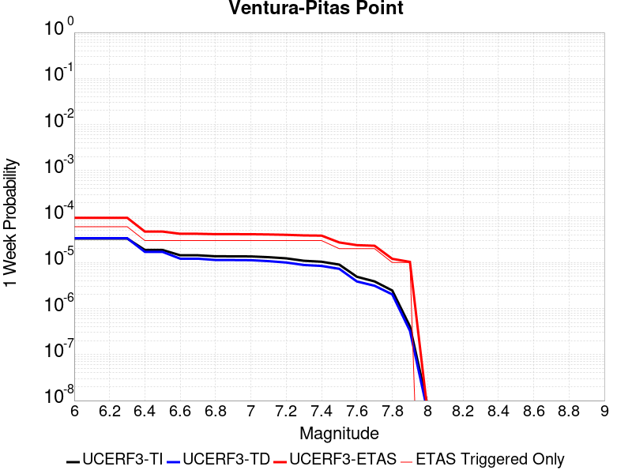 |  |  |  |

| Magnitude | 1 wk TI Prob | 1 wk TD Prob | 1 wk ETAS Prob | 1 wk ETAS/TD Gain | 1 wk ETAS Triggered Only | 1 mo TI Prob | 1 mo TD Prob | 1 mo ETAS Prob | 1 mo ETAS/TD Gain | 1 mo ETAS Triggered Only | 1 yr TI Prob | 1 yr TD Prob | 1 yr ETAS Prob | 1 yr ETAS/TD Gain | 1 yr ETAS Triggered Only | 10 yr TI Prob | 10 yr TD Prob | 10 yr ETAS Prob | 10 yr ETAS/TD Gain | 10 yr ETAS Triggered Only |
|-----|-----|-----|-----|-----|-----|-----|-----|-----|-----|-----|-----|-----|-----|-----|-----|-----|-----|-----|-----|-----|
| 6.0 | 3.3179622E-5 | 3.3735185E-5 | 1.3962643E-4 | 4.138896 | 1.0589481E-4 | 1.4219063E-4 | 1.445728E-4 | 2.5045229E-4 | 1.7323612 | 1.0589481E-4 | 0.0017297962 | 0.0017590096 | 0.0019351905 | 1.1001592 | 1.7649135E-4 | 0.017163932 | 0.0174764 | 0.017649807 | 1.0099224 | 1.7649135E-4 |
| 6.1 | 3.3179622E-5 | 3.3735185E-5 | 1.3962643E-4 | 4.138896 | 1.0589481E-4 | 1.4219063E-4 | 1.445728E-4 | 2.5045229E-4 | 1.7323612 | 1.0589481E-4 | 0.0017297962 | 0.0017590096 | 0.0019351905 | 1.1001592 | 1.7649135E-4 | 0.017163932 | 0.0174764 | 0.017649807 | 1.0099224 | 1.7649135E-4 |
| 6.2 | 3.3179622E-5 | 3.3735185E-5 | 1.3962643E-4 | 4.138896 | 1.0589481E-4 | 1.4219063E-4 | 1.445728E-4 | 2.5045229E-4 | 1.7323612 | 1.0589481E-4 | 0.0017297962 | 0.0017590096 | 0.0019351905 | 1.1001592 | 1.7649135E-4 | 0.017163932 | 0.0174764 | 0.017649807 | 1.0099224 | 1.7649135E-4 |
| 6.3 | 3.3179622E-5 | 3.3735185E-5 | 1.3962643E-4 | 4.138896 | 1.0589481E-4 | 1.4219063E-4 | 1.445728E-4 | 2.5045229E-4 | 1.7323612 | 1.0589481E-4 | 0.0017297962 | 0.0017590096 | 0.0019351905 | 1.1001592 | 1.7649135E-4 | 0.017163932 | 0.0174764 | 0.017649807 | 1.0099224 | 1.7649135E-4 |
| 6.4 | 1.8754668E-5 | 1.701961E-5 | 8.761495E-5 | 5.147882 | 7.059654E-5 | 8.037467E-5 | 7.293928E-5 | 1.4353068E-4 | 1.9678104 | 7.059654E-5 | 9.781223E-4 | 8.8769704E-4 | 0.0010287648 | 1.1589143 | 1.4119309E-4 | 0.009738282 | 0.008843848 | 0.008983793 | 1.015824 | 1.4119309E-4 |
| 6.5 | 1.8754668E-5 | 1.701961E-5 | 8.761495E-5 | 5.147882 | 7.059654E-5 | 8.037467E-5 | 7.293928E-5 | 1.4353068E-4 | 1.9678104 | 7.059654E-5 | 9.781223E-4 | 8.8769704E-4 | 0.0010287648 | 1.1589143 | 1.4119309E-4 | 0.009738282 | 0.008843848 | 0.008983793 | 1.015824 | 1.4119309E-4 |
| 6.6 | 1.4361558E-5 | 1.2122275E-5 | 8.271796E-5 | 6.8236337 | 7.059654E-5 | 6.154808E-5 | 5.1951585E-5 | 1.2254446E-4 | 2.3588204 | 7.059654E-5 | 7.490902E-4 | 6.3232926E-4 | 7.734331E-4 | 1.2231493 | 1.4119309E-4 | 0.0074657016 | 0.0063055577 | 0.0064458605 | 1.0222507 | 1.4119309E-4 |
| 6.7 | 1.4361558E-5 | 1.2122275E-5 | 8.271796E-5 | 6.8236337 | 7.059654E-5 | 6.154808E-5 | 5.1951585E-5 | 1.2254446E-4 | 2.3588204 | 7.059654E-5 | 7.490902E-4 | 6.3232926E-4 | 7.734331E-4 | 1.2231493 | 1.4119309E-4 | 0.0074657016 | 0.0063055577 | 0.0064458605 | 1.0222507 | 1.4119309E-4 |
| 6.8 | 1.3663846E-5 | 1.13444175E-5 | 8.194016E-5 | 7.2229495 | 7.059654E-5 | 5.8558027E-5 | 4.861804E-5 | 1.19211145E-4 | 2.4519942 | 7.059654E-5 | 7.127108E-4 | 5.917658E-4 | 7.328753E-4 | 1.238455 | 1.4119309E-4 | 0.007104293 | 0.005902116 | 0.006042476 | 1.0237813 | 1.4119309E-4 |
| 6.9 | 1.3644157E-5 | 1.1322519E-5 | 8.191826E-5 | 7.234986 | 7.059654E-5 | 5.8473648E-5 | 4.8524187E-5 | 1.191173E-4 | 2.4548025 | 7.059654E-5 | 7.116841E-4 | 5.9062376E-4 | 7.3173345E-4 | 1.2389164 | 1.4119309E-4 | 0.007094092 | 0.0058907564 | 0.006031118 | 1.0238274 | 1.4119309E-4 |
| 7.0 | 1.3568845E-5 | 1.1242086E-5 | 8.183783E-5 | 7.2795954 | 7.059654E-5 | 5.8150898E-5 | 4.817949E-5 | 1.1877262E-4 | 2.4652116 | 7.059654E-5 | 7.077572E-4 | 5.864293E-4 | 7.275396E-4 | 1.2406262 | 1.4119309E-4 | 0.007055073 | 0.0058490336 | 0.0059894007 | 1.0239984 | 1.4119309E-4 |
| 7.1 | 1.306572E-5 | 1.072054E-5 | 8.131632E-5 | 7.585096 | 7.059654E-5 | 5.599474E-5 | 4.5944373E-5 | 1.1653767E-4 | 2.536495 | 7.059654E-5 | 6.815227E-4 | 5.5923103E-4 | 7.0034515E-4 | 1.252336 | 1.4119309E-4 | 0.0067943637 | 0.0055784425 | 0.0057188477 | 1.0251693 | 1.4119309E-4 |
| 7.2 | 1.232604E-5 | 9.995143E-6 | 8.059098E-5 | 8.063014 | 7.059654E-5 | 5.2824813E-5 | 4.2835632E-5 | 1.1342915E-4 | 2.648009 | 7.059654E-5 | 6.429523E-4 | 5.214008E-4 | 6.625203E-4 | 1.2706544 | 1.4119309E-4 | 0.0064109527 | 0.005201967 | 0.0053424253 | 1.027001 | 1.4119309E-4 |
| 7.3 | 1.0917261E-5 | 8.84384E-6 | 7.943976E-5 | 8.982495 | 7.059654E-5 | 4.678742E-5 | 3.790163E-5 | 1.084955E-4 | 2.8625548 | 7.059654E-5 | 5.69488E-4 | 4.6135622E-4 | 5.6720217E-4 | 1.2294235 | 1.0589481E-4 | 0.0056803077 | 0.00460415 | 0.004709557 | 1.022894 | 1.0589481E-4 |
| 7.4 | 1.039959E-5 | 8.423562E-6 | 7.901951E-5 | 9.380771 | 7.059654E-5 | 4.456891E-5 | 3.610049E-5 | 1.0669448E-4 | 2.9554858 | 7.059654E-5 | 5.424914E-4 | 4.3943635E-4 | 5.4528465E-4 | 1.2408729 | 1.0589481E-4 | 0.0054116896 | 0.004385836 | 0.0044912663 | 1.0240388 | 1.0589481E-4 |
| 7.5 | 9.015877E-6 | 7.2975445E-6 | 7.789357E-5 | 10.673943 | 7.059654E-5 | 3.86389E-5 | 3.1274823E-5 | 1.01869155E-4 | 3.2572255 | 7.059654E-5 | 4.7032707E-4 | 3.8070587E-4 | 4.8656037E-4 | 1.278048 | 1.0589481E-4 | 0.004693329 | 0.0038006818 | 0.003906174 | 1.0277562 | 1.0589481E-4 |
| 7.6 | 4.900162E-6 | 3.8741155E-6 | 7.447038E-5 | 19.222551 | 7.059654E-5 | 2.1000526E-5 | 1.6603248E-5 | 8.719862E-5 | 5.251901 | 7.059654E-5 | 2.556514E-4 | 2.0212591E-4 | 2.727082E-4 | 1.3491995 | 7.059654E-5 | 0.0025535747 | 0.0020194345 | 0.0020898883 | 1.034888 | 7.059654E-5 |
| 7.7 | 3.8850626E-6 | 3.1267302E-6 | 7.372305E-5 | 23.578321 | 7.059654E-5 | 1.6650163E-5 | 1.3400205E-5 | 8.39958E-5 | 6.2682476 | 7.059654E-5 | 2.0269687E-4 | 1.6313537E-4 | 2.3372039E-4 | 1.4326776 | 7.059654E-5 | 0.002025121 | 0.0016301654 | 0.0017006468 | 1.0432358 | 7.059654E-5 |
| 7.8 | 2.4654719E-6 | 2.029875E-6 | 3.7328075E-5 | 18.389345 | 3.529827E-5 | 1.0566265E-5 | 8.699436E-6 | 4.39974E-5 | 5.0575004 | 3.529827E-5 | 1.2863669E-4 | 1.0591053E-4 | 1.4120506E-4 | 1.3332486 | 3.529827E-5 | 0.0012856225 | 0.0010586053 | 0.0010938661 | 1.0333089 | 3.529827E-5 |
| 7.9 | 4.095894E-7 | 3.2764765E-7 | 3.5625908E-5 | 108.732376 | 3.529827E-5 | 1.7553821E-6 | 1.4042034E-6 | 3.6702426E-5 | 26.13754 | 3.529827E-5 | 2.1371567E-5 | 1.7096047E-5 | 5.2393712E-5 | 3.0646684 | 3.529827E-5 | 2.1369511E-4 | 1.7094762E-4 | 2.0623986E-4 | 1.2064506 | 3.529827E-5 |
| 8.0 | 7.791402E-9 | 5.683497E-9 | 5.683497E-9 | 1.0 | 0.0 | 3.3391725E-8 | 2.4357844E-8 | 2.4357844E-8 | 1.0 | 0.0 | 4.0654416E-7 | 2.9655675E-7 | 2.9655675E-7 | 1.0 | 0.0 | 4.065434E-6 | 2.9655655E-6 | 2.9655655E-6 | 1.0 | 0.0 |

## Mission Ridge-Arroyo Parida-Santa Ana
*[(top)](#table-of-contents)*

| 1 Week | 1 Month | 1 Year | 10 Year |
|-----|-----|-----|-----|
|  |  |  |  |

| Magnitude | 1 wk TI Prob | 1 wk TD Prob | 1 wk ETAS Prob | 1 wk ETAS/TD Gain | 1 wk ETAS Triggered Only | 1 mo TI Prob | 1 mo TD Prob | 1 mo ETAS Prob | 1 mo ETAS/TD Gain | 1 mo ETAS Triggered Only | 1 yr TI Prob | 1 yr TD Prob | 1 yr ETAS Prob | 1 yr ETAS/TD Gain | 1 yr ETAS Triggered Only | 10 yr TI Prob | 10 yr TD Prob | 10 yr ETAS Prob | 10 yr ETAS/TD Gain | 10 yr ETAS Triggered Only |
|-----|-----|-----|-----|-----|-----|-----|-----|-----|-----|-----|-----|-----|-----|-----|-----|-----|-----|-----|-----|-----|
| 6.0 | 4.169034E-5 | 4.7138263E-5 | 2.2362129E-4 | 4.743944 | 1.7649135E-4 | 1.7866064E-4 | 2.0201034E-4 | 3.7846604E-4 | 1.8734983 | 1.7649135E-4 | 0.0021730233 | 0.00245745 | 0.0026335076 | 1.0716424 | 1.7649135E-4 | 0.021518968 | 0.024384614 | 0.024556803 | 1.0070614 | 1.7649135E-4 |
| 6.1 | 1.73813E-5 | 1.6854226E-5 | 1.6854226E-5 | 1.0 | 0.0 | 7.4489166E-5 | 7.223046E-5 | 7.223046E-5 | 1.0 | 0.0 | 9.065282E-4 | 8.790618E-4 | 8.790618E-4 | 1.0 | 0.0 | 0.009028391 | 0.008756988 | 0.008756988 | 1.0 | 0.0 |
| 6.2 | 1.4622182E-5 | 1.367329E-5 | 1.367329E-5 | 1.0 | 0.0 | 6.2664985E-5 | 5.8598518E-5 | 5.8598518E-5 | 1.0 | 0.0 | 7.6267915E-4 | 7.132073E-4 | 7.132073E-4 | 1.0 | 0.0 | 0.007600669 | 0.007109627 | 0.007109627 | 1.0 | 0.0 |
| 6.3 | 1.3552434E-5 | 1.2482201E-5 | 1.2482201E-5 | 1.0 | 0.0 | 5.8080568E-5 | 5.3494066E-5 | 5.3494066E-5 | 1.0 | 0.0 | 7.069015E-4 | 6.510988E-4 | 6.510988E-4 | 1.0 | 0.0 | 0.00704657 | 0.006492275 | 0.006492275 | 1.0 | 0.0 |
| 6.4 | 1.30977305E-5 | 1.1979156E-5 | 1.1979156E-5 | 1.0 | 0.0 | 5.613192E-5 | 5.1338247E-5 | 5.1338247E-5 | 1.0 | 0.0 | 6.831918E-4 | 6.248669E-4 | 6.248669E-4 | 1.0 | 0.0 | 0.006810953 | 0.0062314444 | 0.0062314444 | 1.0 | 0.0 |
| 6.5 | 1.225205E-5 | 1.1048803E-5 | 1.1048803E-5 | 1.0 | 0.0 | 5.2507727E-5 | 4.7351168E-5 | 4.7351168E-5 | 1.0 | 0.0 | 6.3909404E-4 | 5.7635066E-4 | 5.7635066E-4 | 1.0 | 0.0 | 0.006372592 | 0.005748869 | 0.005748869 | 1.0 | 0.0 |
| 6.6 | 1.1352241E-5 | 1.0063535E-5 | 1.0063535E-5 | 1.0 | 0.0 | 4.8651553E-5 | 4.3128734E-5 | 4.3128734E-5 | 1.0 | 0.0 | 5.921717E-4 | 5.2496797E-4 | 5.2496797E-4 | 1.0 | 0.0 | 0.0059059616 | 0.0052375244 | 0.0052375244 | 1.0 | 0.0 |
| 6.7 | 1.0864116E-5 | 9.517027E-6 | 9.517027E-6 | 1.0 | 0.0 | 4.6559664E-5 | 4.0786632E-5 | 4.0786632E-5 | 1.0 | 0.0 | 5.667165E-4 | 4.964661E-4 | 4.964661E-4 | 1.0 | 0.0 | 0.005652734 | 0.004953804 | 0.004953804 | 1.0 | 0.0 |
| 6.8 | 1.0666365E-5 | 9.299779E-6 | 9.299779E-6 | 1.0 | 0.0 | 4.571219E-5 | 3.9855597E-5 | 3.9855597E-5 | 1.0 | 0.0 | 5.564038E-4 | 4.8513585E-4 | 4.8513585E-4 | 1.0 | 0.0 | 0.005550127 | 0.0048410003 | 0.0048410003 | 1.0 | 0.0 |
| 6.9 | 1.0038665E-5 | 8.592046E-6 | 8.592046E-6 | 1.0 | 0.0 | 4.302214E-5 | 3.682254E-5 | 3.682254E-5 | 1.0 | 0.0 | 5.236687E-4 | 4.4822405E-4 | 4.4822405E-4 | 1.0 | 0.0 | 0.005224364 | 0.004473411 | 0.004473411 | 1.0 | 0.0 |
| 7.0 | 9.5379955E-6 | 8.025073E-6 | 8.025073E-6 | 1.0 | 0.0 | 4.0876483E-5 | 3.4392728E-5 | 3.4392728E-5 | 1.0 | 0.0 | 4.975576E-4 | 4.1865272E-4 | 4.1865272E-4 | 1.0 | 0.0 | 0.00496445 | 0.0041788397 | 0.0041788397 | 1.0 | 0.0 |
| 7.1 | 9.207389E-6 | 7.652375E-6 | 7.652375E-6 | 1.0 | 0.0 | 3.945964E-5 | 3.279549E-5 | 3.279549E-5 | 1.0 | 0.0 | 4.803152E-4 | 3.9921363E-4 | 3.9921363E-4 | 1.0 | 0.0 | 0.004792784 | 0.003985161 | 0.003985161 | 1.0 | 0.0 |
| 7.2 | 7.638091E-6 | 5.9311183E-6 | 5.9311183E-6 | 1.0 | 0.0 | 3.2734264E-5 | 2.541883E-5 | 2.541883E-5 | 1.0 | 0.0 | 3.984668E-4 | 3.0943064E-4 | 3.0943064E-4 | 1.0 | 0.0 | 0.0039775306 | 0.0030900547 | 0.0030900547 | 1.0 | 0.0 |
| 7.3 | 7.2500147E-6 | 5.5961527E-6 | 5.5961527E-6 | 1.0 | 0.0 | 3.1071122E-5 | 2.3983293E-5 | 2.3983293E-5 | 1.0 | 0.0 | 3.7822526E-4 | 2.9195778E-4 | 2.9195778E-4 | 1.0 | 0.0 | 0.0037758215 | 0.0029157975 | 0.0029157975 | 1.0 | 0.0 |
| 7.4 | 6.3899715E-6 | 4.9184964E-6 | 4.9184964E-6 | 1.0 | 0.0 | 2.7385306E-5 | 2.10791E-5 | 2.10791E-5 | 1.0 | 0.0 | 3.3336508E-4 | 2.5660804E-4 | 2.5660804E-4 | 1.0 | 0.0 | 0.0033286542 | 0.0025631618 | 0.0025631618 | 1.0 | 0.0 |
| 7.5 | 5.379025E-6 | 4.0838527E-6 | 4.0838527E-6 | 1.0 | 0.0 | 2.305276E-5 | 1.7502109E-5 | 1.7502109E-5 | 1.0 | 0.0 | 2.806312E-4 | 2.1306744E-4 | 2.1306744E-4 | 1.0 | 0.0 | 0.0028027708 | 0.002128643 | 0.002128643 | 1.0 | 0.0 |
| 7.6 | 4.1270696E-6 | 3.0883439E-6 | 3.0883439E-6 | 1.0 | 0.0 | 1.768732E-5 | 1.3235693E-5 | 1.3235693E-5 | 1.0 | 0.0 | 2.1532185E-4 | 1.6113273E-4 | 1.6113273E-4 | 1.0 | 0.0 | 0.0021511333 | 0.001610167 | 0.001610167 | 1.0 | 0.0 |
| 7.7 | 2.5406805E-6 | 1.8282013E-6 | 1.8282013E-6 | 1.0 | 0.0 | 1.0888585E-5 | 7.835125E-6 | 7.835125E-6 | 1.0 | 0.0 | 1.3256045E-4 | 9.538854E-5 | 9.538854E-5 | 1.0 | 0.0 | 0.0013248142 | 9.534821E-4 | 9.534821E-4 | 1.0 | 0.0 |
| 7.8 | 4.8608285E-7 | 3.5098864E-7 | 3.5098864E-7 | 1.0 | 0.0 | 2.0832106E-6 | 1.5042363E-6 | 1.5042363E-6 | 1.0 | 0.0 | 2.5362791E-5 | 1.8313924E-5 | 1.8313924E-5 | 1.0 | 0.0 | 2.5359896E-4 | 1.8312426E-4 | 1.8312426E-4 | 1.0 | 0.0 |
| 7.9 | 2.0472514E-8 | 1.2688783E-8 | 1.2688783E-8 | 1.0 | 0.0 | 8.7739345E-8 | 5.43805E-8 | 5.43805E-8 | 1.0 | 0.0 | 1.068226E-6 | 6.6208236E-7 | 6.6208236E-7 | 1.0 | 0.0 | 1.0682209E-5 | 6.620805E-6 | 6.620805E-6 | 1.0 | 0.0 |
| 8.0 | 4.443582E-9 | 2.0321211E-9 | 2.0321211E-9 | 1.0 | 0.0 | 1.9043922E-8 | 8.70909E-9 | 8.70909E-9 | 1.0 | 0.0 | 2.3185973E-7 | 1.0603316E-7 | 1.0603316E-7 | 1.0 | 0.0 | 2.3185949E-6 | 1.0603312E-6 | 1.0603312E-6 | 1.0 | 0.0 |

## Owens Valley
*[(top)](#table-of-contents)*

| 1 Week | 1 Month | 1 Year | 10 Year |
|-----|-----|-----|-----|
| 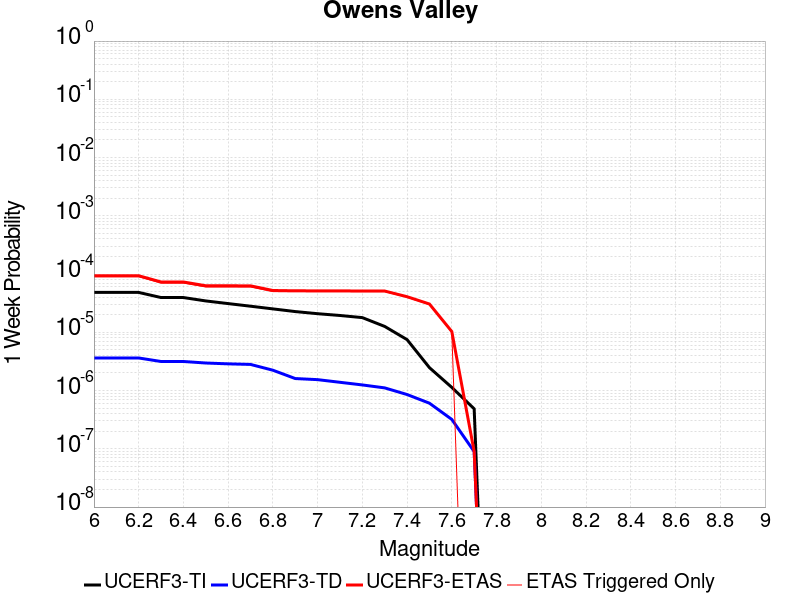 |  | 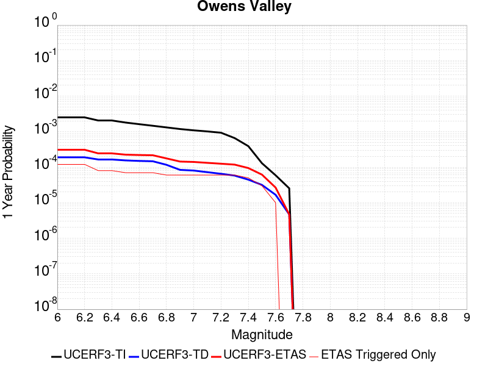 |  |

| Magnitude | 1 wk TI Prob | 1 wk TD Prob | 1 wk ETAS Prob | 1 wk ETAS/TD Gain | 1 wk ETAS Triggered Only | 1 mo TI Prob | 1 mo TD Prob | 1 mo ETAS Prob | 1 mo ETAS/TD Gain | 1 mo ETAS Triggered Only | 1 yr TI Prob | 1 yr TD Prob | 1 yr ETAS Prob | 1 yr ETAS/TD Gain | 1 yr ETAS Triggered Only | 10 yr TI Prob | 10 yr TD Prob | 10 yr ETAS Prob | 10 yr ETAS/TD Gain | 10 yr ETAS Triggered Only |
|-----|-----|-----|-----|-----|-----|-----|-----|-----|-----|-----|-----|-----|-----|-----|-----|-----|-----|-----|-----|-----|
| 6.0 | 4.83821E-5 | 3.626567E-6 | 1.09520995E-4 | 30.199635 | 1.0589481E-4 | 2.0733538E-4 | 1.5542342E-5 | 1.2143551E-4 | 7.813205 | 1.0589481E-4 | 0.002521386 | 1.8921259E-4 | 3.3037894E-4 | 1.7460728 | 1.4119309E-4 | 0.024929691 | 0.001925011 | 0.002136393 | 1.1098082 | 2.1178962E-4 |
| 6.1 | 4.83821E-5 | 3.626567E-6 | 1.09520995E-4 | 30.199635 | 1.0589481E-4 | 2.0733538E-4 | 1.5542342E-5 | 1.2143551E-4 | 7.813205 | 1.0589481E-4 | 0.002521386 | 1.8921259E-4 | 3.3037894E-4 | 1.7460728 | 1.4119309E-4 | 0.024929691 | 0.001925011 | 0.002136393 | 1.1098082 | 2.1178962E-4 |
| 6.2 | 4.83821E-5 | 3.626567E-6 | 1.09520995E-4 | 30.199635 | 1.0589481E-4 | 2.0733538E-4 | 1.5542342E-5 | 1.2143551E-4 | 7.813205 | 1.0589481E-4 | 0.002521386 | 1.8921259E-4 | 3.3037894E-4 | 1.7460728 | 1.4119309E-4 | 0.024929691 | 0.001925011 | 0.002136393 | 1.1098082 | 2.1178962E-4 |
| 6.3 | 3.953008E-5 | 3.1553948E-6 | 7.375171E-5 | 23.373213 | 7.059654E-5 | 1.6940363E-4 | 1.3523055E-5 | 8.411864E-5 | 6.2203875 | 7.059654E-5 | 0.002060538 | 1.6463149E-4 | 2.7050887E-4 | 1.6431174 | 1.0589481E-4 | 0.020415364 | 0.0016592 | 0.0018001588 | 1.0849559 | 1.4119309E-4 |
| 6.4 | 3.953008E-5 | 3.1553948E-6 | 7.375171E-5 | 23.373213 | 7.059654E-5 | 1.6940363E-4 | 1.3523055E-5 | 8.411864E-5 | 6.2203875 | 7.059654E-5 | 0.002060538 | 1.6463149E-4 | 2.7050887E-4 | 1.6431174 | 1.0589481E-4 | 0.020415364 | 0.0016592 | 0.0018001588 | 1.0849559 | 1.4119309E-4 |
| 6.5 | 3.457342E-5 | 2.9715961E-6 | 7.356793E-5 | 24.75704 | 7.059654E-5 | 1.4816338E-4 | 1.2735354E-5 | 8.3331E-5 | 6.5432806 | 7.059654E-5 | 0.0018023965 | 1.550426E-4 | 2.60921E-4 | 1.6828988 | 1.0589481E-4 | 0.017878477 | 0.001555719 | 0.0016966924 | 1.0906162 | 1.4119309E-4 |
| 6.6 | 3.1127765E-5 | 2.8744932E-6 | 7.347083E-5 | 25.559576 | 7.059654E-5 | 1.3339789E-4 | 1.2319203E-5 | 8.291487E-5 | 6.730539 | 7.059654E-5 | 0.0016229092 | 1.4997667E-4 | 2.558556E-4 | 1.7059693 | 1.0589481E-4 | 0.016111081 | 0.0015012559 | 0.001642237 | 1.0939088 | 1.4119309E-4 |
| 6.7 | 2.806885E-5 | 2.8104134E-6 | 7.340676E-5 | 26.119558 | 7.059654E-5 | 1.2028952E-4 | 1.20445775E-5 | 8.264027E-5 | 6.8612013 | 7.059654E-5 | 0.001463541 | 1.4663354E-4 | 2.5251284E-4 | 1.7220672 | 1.0589481E-4 | 0.014539397 | 0.0014657511 | 0.0016067371 | 1.096187 | 1.4119309E-4 |
| 6.8 | 2.524524E-5 | 2.2353688E-6 | 7.2831754E-5 | 32.58154 | 7.059654E-5 | 1.0818939E-4 | 9.580118E-6 | 8.017598E-5 | 8.368998 | 7.059654E-5 | 0.0013164099 | 1.16632E-4 | 2.2251446E-4 | 1.9078337 | 1.0589481E-4 | 0.01308639 | 0.0011659812 | 0.0013070096 | 1.1209526 | 1.4119309E-4 |
| 6.9 | 2.2704568E-5 | 1.6081682E-6 | 7.2204595E-5 | 44.89866 | 7.059654E-5 | 9.730166E-5 | 6.8921313E-6 | 7.7488185E-5 | 11.242993 | 7.059654E-5 | 0.0011840039 | 8.390849E-5 | 1.8979442E-4 | 2.2619214 | 1.0589481E-4 | 0.011777153 | 8.3897985E-4 | 9.800545E-4 | 1.1681502 | 1.4119309E-4 |
| 7.0 | 2.0871712E-5 | 1.5395453E-6 | 7.2135976E-5 | 46.855377 | 7.059654E-5 | 8.944713E-5 | 6.598035E-6 | 7.719411E-5 | 11.699561 | 7.059654E-5 | 0.0010884746 | 8.032813E-5 | 1.8621443E-4 | 2.3181722 | 1.0589481E-4 | 0.010831586 | 8.0316263E-4 | 9.442423E-4 | 1.1756552 | 1.4119309E-4 |
| 7.1 | 1.944928E-5 | 1.3864178E-6 | 7.198286E-5 | 51.920036 | 7.059654E-5 | 8.335139E-5 | 5.941777E-6 | 7.65379E-5 | 12.881314 | 7.059654E-5 | 0.0010143308 | 7.233874E-5 | 1.7822589E-4 | 2.4637682 | 1.0589481E-4 | 0.010097133 | 7.2330976E-4 | 8.644007E-4 | 1.195063 | 1.4119309E-4 |
| 7.2 | 1.7876306E-5 | 1.2489141E-6 | 7.184537E-5 | 57.526268 | 7.059654E-5 | 7.6610486E-5 | 5.352478E-6 | 7.594864E-5 | 14.189435 | 7.059654E-5 | 9.3233347E-4 | 6.516448E-5 | 1.710524E-4 | 2.624933 | 1.0589481E-4 | 0.009284316 | 6.5159105E-4 | 7.926921E-4 | 1.2165486 | 1.4119309E-4 |
| 7.3 | 1.2618672E-5 | 1.1115209E-6 | 7.170798E-5 | 64.51339 | 7.059654E-5 | 5.40789E-5 | 4.763652E-6 | 7.535986E-5 | 15.819764 | 7.059654E-5 | 6.582117E-4 | 5.799593E-5 | 1.638846E-4 | 2.825795 | 1.0589481E-4 | 0.0065626553 | 5.7994033E-4 | 7.2105153E-4 | 1.2433202 | 1.4119309E-4 |
| 7.4 | 7.4874442E-6 | 8.5486437E-7 | 7.1451344E-5 | 83.582085 | 7.059654E-5 | 3.208865E-5 | 3.6636993E-6 | 7.425998E-5 | 20.269125 | 7.059654E-5 | 3.906093E-4 | 4.4604632E-5 | 1.5049471E-4 | 3.3739707 | 1.0589481E-4 | 0.003899234 | 4.4604883E-4 | 5.871789E-4 | 1.3164005 | 1.4119309E-4 |
| 7.5 | 2.4734156E-6 | 6.068616E-7 | 7.120336E-5 | 117.33048 | 7.059654E-5 | 1.060031E-5 | 2.6008327E-6 | 7.319719E-5 | 28.143751 | 7.059654E-5 | 1.2905113E-4 | 3.166468E-5 | 1.02258986E-4 | 3.2294335 | 7.059654E-5 | 0.0012897621 | 3.1660203E-4 | 4.2246332E-4 | 1.334367 | 1.0589481E-4 |
| 7.6 | 1.1328841E-6 | 3.196531E-7 | 3.561791E-5 | 111.426765 | 3.529827E-5 | 4.8552088E-6 | 1.3699412E-6 | 3.6668163E-5 | 26.766232 | 3.529827E-5 | 5.9110564E-5 | 1.6678909E-5 | 5.197659E-5 | 3.1163065 | 3.529827E-5 | 5.9094845E-4 | 1.6677675E-4 | 2.3736151E-4 | 1.4232291 | 7.059654E-5 |
| 7.7 | 4.8613185E-7 | 8.964689E-8 | 8.964689E-8 | 1.0 | 0.0 | 2.0834207E-6 | 3.8420092E-7 | 3.8420092E-7 | 1.0 | 0.0 | 2.536535E-5 | 4.6776368E-6 | 4.6776368E-6 | 1.0 | 0.0 | 2.5362454E-4 | 4.677545E-5 | 4.677545E-5 | 1.0 | 0.0 |

## Santa Ynez (East)
*[(top)](#table-of-contents)*

| 1 Week | 1 Month | 1 Year | 10 Year |
|-----|-----|-----|-----|
| 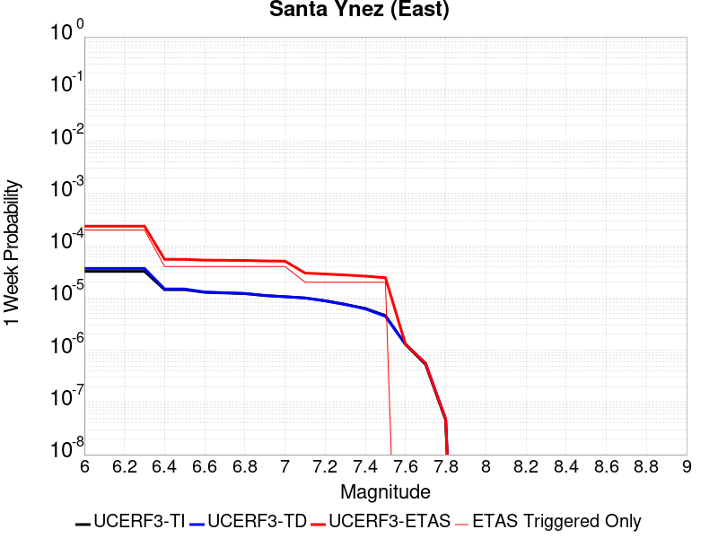 |  |  |  |

| Magnitude | 1 wk TI Prob | 1 wk TD Prob | 1 wk ETAS Prob | 1 wk ETAS/TD Gain | 1 wk ETAS Triggered Only | 1 mo TI Prob | 1 mo TD Prob | 1 mo ETAS Prob | 1 mo ETAS/TD Gain | 1 mo ETAS Triggered Only | 1 yr TI Prob | 1 yr TD Prob | 1 yr ETAS Prob | 1 yr ETAS/TD Gain | 1 yr ETAS Triggered Only | 10 yr TI Prob | 10 yr TD Prob | 10 yr ETAS Prob | 10 yr ETAS/TD Gain | 10 yr ETAS Triggered Only |
|-----|-----|-----|-----|-----|-----|-----|-----|-----|-----|-----|-----|-----|-----|-----|-----|-----|-----|-----|-----|-----|
| 6.0 | 3.2269712E-5 | 3.67505E-5 | 1.4264142E-4 | 3.8813462 | 1.0589481E-4 | 1.3829143E-4 | 1.5749598E-4 | 3.3395953E-4 | 2.1204321 | 1.7649135E-4 | 0.0016823979 | 0.0019164166 | 0.0020925698 | 1.091918 | 1.7649135E-4 | 0.016697178 | 0.019056441 | 0.019264195 | 1.010902 | 2.1178962E-4 |
| 6.1 | 3.2269712E-5 | 3.67505E-5 | 1.4264142E-4 | 3.8813462 | 1.0589481E-4 | 1.3829143E-4 | 1.5749598E-4 | 3.3395953E-4 | 2.1204321 | 1.7649135E-4 | 0.0016823979 | 0.0019164166 | 0.0020925698 | 1.091918 | 1.7649135E-4 | 0.016697178 | 0.019056441 | 0.019264195 | 1.010902 | 2.1178962E-4 |
| 6.2 | 3.2269712E-5 | 3.67505E-5 | 1.4264142E-4 | 3.8813462 | 1.0589481E-4 | 1.3829143E-4 | 1.5749598E-4 | 3.3395953E-4 | 2.1204321 | 1.7649135E-4 | 0.0016823979 | 0.0019164166 | 0.0020925698 | 1.091918 | 1.7649135E-4 | 0.016697178 | 0.019056441 | 0.019264195 | 1.010902 | 2.1178962E-4 |
| 6.3 | 3.2269712E-5 | 3.67505E-5 | 1.4264142E-4 | 3.8813462 | 1.0589481E-4 | 1.3829143E-4 | 1.5749598E-4 | 3.3395953E-4 | 2.1204321 | 1.7649135E-4 | 0.0016823979 | 0.0019164166 | 0.0020925698 | 1.091918 | 1.7649135E-4 | 0.016697178 | 0.019056441 | 0.019264195 | 1.010902 | 2.1178962E-4 |
| 6.4 | 1.4404779E-5 | 1.4849382E-5 | 1.4849382E-5 | 1.0 | 0.0 | 6.1733306E-5 | 6.363868E-5 | 9.893471E-5 | 1.5546316 | 3.529827E-5 | 7.513438E-4 | 7.745306E-4 | 8.098015E-4 | 1.0455384 | 3.529827E-5 | 0.0074880854 | 0.007718862 | 0.0077538877 | 1.0045377 | 3.529827E-5 |
| 6.5 | 1.4404779E-5 | 1.4849382E-5 | 1.4849382E-5 | 1.0 | 0.0 | 6.1733306E-5 | 6.363868E-5 | 9.893471E-5 | 1.5546316 | 3.529827E-5 | 7.513438E-4 | 7.745306E-4 | 8.098015E-4 | 1.0455384 | 3.529827E-5 | 0.0074880854 | 0.007718862 | 0.0077538877 | 1.0045377 | 3.529827E-5 |
| 6.6 | 1.280208E-5 | 1.3011947E-5 | 1.3011947E-5 | 1.0 | 0.0 | 5.4864904E-5 | 5.5764307E-5 | 9.106061E-5 | 1.6329551 | 3.529827E-5 | 6.6777546E-4 | 6.787207E-4 | 7.13995E-4 | 1.0519718 | 3.529827E-5 | 0.006657724 | 0.0067666885 | 0.006801748 | 1.0051812 | 3.529827E-5 |
| 6.7 | 1.2457027E-5 | 1.2628468E-5 | 1.2628468E-5 | 1.0 | 0.0 | 5.3386164E-5 | 5.412089E-5 | 8.941725E-5 | 1.6521763 | 3.529827E-5 | 6.497827E-4 | 6.587243E-4 | 6.9399935E-4 | 1.0535505 | 3.529827E-5 | 0.00647886 | 0.006567915 | 0.0066029816 | 1.005339 | 3.529827E-5 |
| 6.8 | 1.2095134E-5 | 1.2230915E-5 | 1.2230915E-5 | 1.0 | 0.0 | 5.1835254E-5 | 5.241716E-5 | 8.771358E-5 | 1.6733752 | 3.529827E-5 | 6.309115E-4 | 6.379937E-4 | 6.7326945E-4 | 1.0552917 | 3.529827E-5 | 0.0062912325 | 0.006361809 | 0.0063968827 | 1.0055132 | 3.529827E-5 |
| 6.9 | 1.1104036E-5 | 1.1157347E-5 | 1.1157347E-5 | 1.0 | 0.0 | 4.758786E-5 | 4.781633E-5 | 8.3112915E-5 | 1.73817 | 3.529827E-5 | 5.7922816E-4 | 5.820096E-4 | 6.172873E-4 | 1.0606136 | 3.529827E-5 | 0.005777207 | 0.0058049993 | 0.0058400924 | 1.0060453 | 3.529827E-5 |
| 7.0 | 1.0577444E-5 | 1.058168E-5 | 1.058168E-5 | 1.0 | 0.0 | 4.5331115E-5 | 4.5349276E-5 | 8.064594E-5 | 1.7783293 | 3.529827E-5 | 5.5176654E-4 | 5.519888E-4 | 5.8726757E-4 | 1.0639122 | 3.529827E-5 | 0.0055039856 | 0.0055063153 | 0.0055414196 | 1.0063752 | 3.529827E-5 |
| 7.1 | 1.0021775E-5 | 9.980988E-6 | 9.980988E-6 | 1.0 | 0.0 | 4.294976E-5 | 4.2774966E-5 | 7.8071724E-5 | 1.8251734 | 3.529827E-5 | 5.2278786E-4 | 5.2066194E-4 | 5.5594184E-4 | 1.0677596 | 3.529827E-5 | 0.0052155964 | 0.0051945536 | 0.005229668 | 1.00676 | 3.529827E-5 |
| 7.2 | 8.874109E-6 | 8.748793E-6 | 8.748793E-6 | 1.0 | 0.0 | 3.8031343E-5 | 3.7494297E-5 | 7.279124E-5 | 1.941395 | 3.529827E-5 | 4.629332E-4 | 4.5639853E-4 | 4.916807E-4 | 1.0773056 | 3.529827E-5 | 0.0046197 | 0.0045547304 | 0.004589868 | 1.0077145 | 3.529827E-5 |
| 7.3 | 7.5504267E-6 | 7.5051175E-6 | 7.5051175E-6 | 1.0 | 0.0 | 3.235857E-5 | 3.21644E-5 | 6.746154E-5 | 2.0973976 | 3.529827E-5 | 3.9389438E-4 | 3.915322E-4 | 4.2681667E-4 | 1.0901189 | 3.529827E-5 | 0.0039319694 | 0.003908531 | 0.0039436915 | 1.0089958 | 3.529827E-5 |
| 7.4 | 6.309394E-6 | 6.1831556E-6 | 6.1831556E-6 | 1.0 | 0.0 | 2.703998E-5 | 2.6498974E-5 | 6.179631E-5 | 2.3320265 | 3.529827E-5 | 3.2916202E-4 | 3.225782E-4 | 3.578651E-4 | 1.1093901 | 3.529827E-5 | 0.003286749 | 0.003221197 | 0.0032563815 | 1.0109228 | 3.529827E-5 |
| 7.5 | 4.6103073E-6 | 4.4408903E-6 | 4.4408903E-6 | 1.0 | 0.0 | 1.975831E-5 | 1.9032252E-5 | 1.9032252E-5 | 1.0 | 0.0 | 2.4053088E-4 | 2.3169373E-4 | 2.3169373E-4 | 1.0 | 0.0 | 0.002402707 | 0.002314591 | 0.002314591 | 1.0 | 0.0 |
| 7.6 | 1.2858658E-6 | 1.3008173E-6 | 1.3008173E-6 | 1.0 | 0.0 | 5.5108417E-6 | 5.5749197E-6 | 5.5749197E-6 | 1.0 | 0.0 | 6.7092435E-5 | 6.78726E-5 | 6.78726E-5 | 1.0 | 0.0 | 6.707218E-4 | 6.785256E-4 | 6.785256E-4 | 1.0 | 0.0 |
| 7.7 | 5.3302307E-7 | 5.612138E-7 | 5.612138E-7 | 1.0 | 0.0 | 2.2843826E-6 | 2.4052001E-6 | 2.4052001E-6 | 1.0 | 0.0 | 2.7812002E-5 | 2.9282954E-5 | 2.9282954E-5 | 1.0 | 0.0 | 2.7808524E-4 | 2.9279452E-4 | 2.9279452E-4 | 1.0 | 0.0 |
| 7.8 | 4.613933E-8 | 4.80301E-8 | 4.80301E-8 | 1.0 | 0.0 | 1.9773998E-7 | 2.0584326E-7 | 2.0584326E-7 | 1.0 | 0.0 | 2.4074816E-6 | 2.5061388E-6 | 2.5061388E-6 | 1.0 | 0.0 | 2.4074554E-5 | 2.5061116E-5 | 2.5061116E-5 | 1.0 | 0.0 |

## San Jacinto (Lytle Creek connector)
*[(top)](#table-of-contents)*

| 1 Week | 1 Month | 1 Year | 10 Year |
|-----|-----|-----|-----|
|  |  |  | 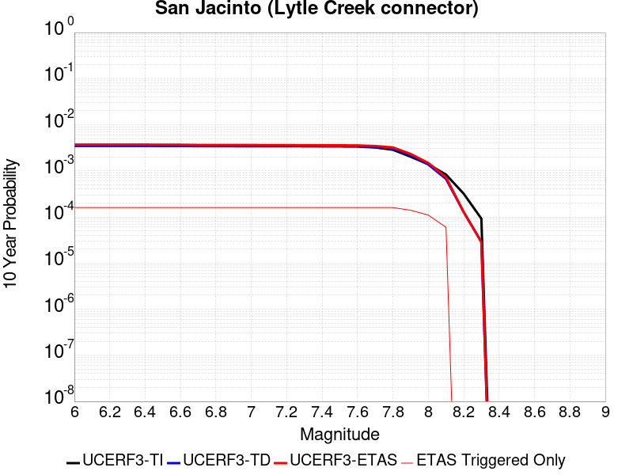 |

| Magnitude | 1 wk TI Prob | 1 wk TD Prob | 1 wk ETAS Prob | 1 wk ETAS/TD Gain | 1 wk ETAS Triggered Only | 1 mo TI Prob | 1 mo TD Prob | 1 mo ETAS Prob | 1 mo ETAS/TD Gain | 1 mo ETAS Triggered Only | 1 yr TI Prob | 1 yr TD Prob | 1 yr ETAS Prob | 1 yr ETAS/TD Gain | 1 yr ETAS Triggered Only | 10 yr TI Prob | 10 yr TD Prob | 10 yr ETAS Prob | 10 yr ETAS/TD Gain | 10 yr ETAS Triggered Only |
|-----|-----|-----|-----|-----|-----|-----|-----|-----|-----|-----|-----|-----|-----|-----|-----|-----|-----|-----|-----|-----|
| 6.0 | 6.693995E-6 | 6.660216E-6 | 1.1255432E-4 | 16.8995 | 1.0589481E-4 | 2.8688235E-5 | 2.854347E-5 | 1.3443526E-4 | 4.7098427 | 1.0589481E-4 | 3.492233E-4 | 3.4746144E-4 | 5.238915E-4 | 1.5077686 | 1.7649135E-4 | 0.00348675 | 0.0035493854 | 0.0037604233 | 1.0594575 | 2.1178962E-4 |
| 6.1 | 6.693995E-6 | 6.660216E-6 | 1.1255432E-4 | 16.8995 | 1.0589481E-4 | 2.8688235E-5 | 2.854347E-5 | 1.3443526E-4 | 4.7098427 | 1.0589481E-4 | 3.492233E-4 | 3.4746144E-4 | 5.238915E-4 | 1.5077686 | 1.7649135E-4 | 0.00348675 | 0.0035493854 | 0.0037604233 | 1.0594575 | 2.1178962E-4 |
| 6.2 | 6.693995E-6 | 6.660216E-6 | 1.1255432E-4 | 16.8995 | 1.0589481E-4 | 2.8688235E-5 | 2.854347E-5 | 1.3443526E-4 | 4.7098427 | 1.0589481E-4 | 3.492233E-4 | 3.4746144E-4 | 5.238915E-4 | 1.5077686 | 1.7649135E-4 | 0.00348675 | 0.0035493854 | 0.0037604233 | 1.0594575 | 2.1178962E-4 |
| 6.3 | 6.693995E-6 | 6.660216E-6 | 1.1255432E-4 | 16.8995 | 1.0589481E-4 | 2.8688235E-5 | 2.854347E-5 | 1.3443526E-4 | 4.7098427 | 1.0589481E-4 | 3.492233E-4 | 3.4746144E-4 | 5.238915E-4 | 1.5077686 | 1.7649135E-4 | 0.00348675 | 0.0035493854 | 0.0037604233 | 1.0594575 | 2.1178962E-4 |
| 6.4 | 6.693995E-6 | 6.660216E-6 | 1.1255432E-4 | 16.8995 | 1.0589481E-4 | 2.8688235E-5 | 2.854347E-5 | 1.3443526E-4 | 4.7098427 | 1.0589481E-4 | 3.492233E-4 | 3.4746144E-4 | 5.238915E-4 | 1.5077686 | 1.7649135E-4 | 0.00348675 | 0.0035493854 | 0.0037604233 | 1.0594575 | 2.1178962E-4 |
| 6.5 | 6.6561875E-6 | 6.6204343E-6 | 1.1251454E-4 | 16.99504 | 1.0589481E-4 | 2.8526205E-5 | 2.837298E-5 | 1.3426479E-4 | 4.7321353 | 1.0589481E-4 | 3.472512E-4 | 3.4538636E-4 | 5.218168E-4 | 1.5108204 | 1.7649135E-4 | 0.0034670907 | 0.003528701 | 0.003739743 | 1.0598073 | 2.1178962E-4 |
| 6.6 | 6.6561875E-6 | 6.6204343E-6 | 1.1251454E-4 | 16.99504 | 1.0589481E-4 | 2.8526205E-5 | 2.837298E-5 | 1.3426479E-4 | 4.7321353 | 1.0589481E-4 | 3.472512E-4 | 3.4538636E-4 | 5.218168E-4 | 1.5108204 | 1.7649135E-4 | 0.0034670907 | 0.003528701 | 0.003739743 | 1.0598073 | 2.1178962E-4 |
| 6.7 | 6.5802237E-6 | 6.539611E-6 | 1.1243373E-4 | 17.192724 | 1.0589481E-4 | 2.8200653E-5 | 2.8026603E-5 | 1.3391845E-4 | 4.7782617 | 1.0589481E-4 | 3.4328885E-4 | 3.4117055E-4 | 5.176017E-4 | 1.5171348 | 1.7649135E-4 | 0.0034275902 | 0.0034866752 | 0.0036977264 | 1.0605308 | 2.1178962E-4 |
| 6.8 | 6.575632E-6 | 6.5341005E-6 | 1.1242822E-4 | 17.20638 | 1.0589481E-4 | 2.8180975E-5 | 2.8002989E-5 | 1.3389484E-4 | 4.781448 | 1.0589481E-4 | 3.4304935E-4 | 3.4088313E-4 | 5.173143E-4 | 1.517571 | 1.7649135E-4 | 0.0034252026 | 0.00348381 | 0.003694862 | 1.0605807 | 2.1178962E-4 |
| 6.9 | 6.570433E-6 | 6.525495E-6 | 1.1241961E-4 | 17.227753 | 1.0589481E-4 | 2.8158694E-5 | 2.7966107E-5 | 1.3385796E-4 | 4.786435 | 1.0589481E-4 | 3.4277816E-4 | 3.4043423E-4 | 5.168655E-4 | 1.5182536 | 1.7649135E-4 | 0.0034224992 | 0.0034793352 | 0.003690388 | 1.0606589 | 2.1178962E-4 |
| 7.0 | 6.5643826E-6 | 6.515616E-6 | 1.1240974E-4 | 17.252357 | 1.0589481E-4 | 2.8132765E-5 | 2.792377E-5 | 1.3381563E-4 | 4.7921762 | 1.0589481E-4 | 3.424626E-4 | 3.3991894E-4 | 5.1635026E-4 | 1.5190395 | 1.7649135E-4 | 0.0034193532 | 0.0034741985 | 0.0036852523 | 1.0607489 | 2.1178962E-4 |
| 7.1 | 6.557402E-6 | 6.5043278E-6 | 1.1239845E-4 | 17.280563 | 1.0589481E-4 | 2.8102848E-5 | 2.7875392E-5 | 1.3376726E-4 | 4.7987576 | 1.0589481E-4 | 3.4209844E-4 | 3.3933012E-4 | 5.157616E-4 | 1.5199405 | 1.7649135E-4 | 0.0034157229 | 0.0034683298 | 0.003679385 | 1.060852 | 2.1178962E-4 |
| 7.2 | 6.546394E-6 | 6.4862943E-6 | 1.1238042E-4 | 17.325827 | 1.0589481E-4 | 2.8055672E-5 | 2.7798109E-5 | 1.3368997E-4 | 4.809319 | 1.0589481E-4 | 3.4152428E-4 | 3.3838948E-4 | 5.148211E-4 | 1.5213863 | 1.7649135E-4 | 0.0034099987 | 0.0034589572 | 0.0036700142 | 1.0610175 | 2.1178962E-4 |
| 7.3 | 6.5364216E-6 | 6.4670803E-6 | 1.1236121E-4 | 17.374332 | 1.0589481E-4 | 2.8012933E-5 | 2.7715765E-5 | 1.3360764E-4 | 4.820637 | 1.0589481E-4 | 3.4100408E-4 | 3.3738726E-4 | 5.1381905E-4 | 1.5229356 | 1.7649135E-4 | 0.003404813 | 0.0034489788 | 0.0036600379 | 1.0611947 | 2.1178962E-4 |
| 7.4 | 6.5269523E-6 | 6.4481674E-6 | 1.123423E-4 | 17.42236 | 1.0589481E-4 | 2.7972354E-5 | 2.7634711E-5 | 1.335266E-4 | 4.8318434 | 1.0589481E-4 | 3.4051016E-4 | 3.3640073E-4 | 5.128327E-4 | 1.5244696 | 1.7649135E-4 | 0.0033998888 | 0.003439161 | 0.0036502222 | 1.06137 | 2.1178962E-4 |
| 7.5 | 6.5111835E-6 | 6.424442E-6 | 1.1231857E-4 | 17.48301 | 1.0589481E-4 | 2.7904773E-5 | 2.7533031E-5 | 1.3342492E-4 | 4.8459945 | 1.0589481E-4 | 3.3968766E-4 | 3.3516317E-4 | 5.115954E-4 | 1.5264069 | 1.7649135E-4 | 0.0033916887 | 0.003426834 | 0.003637898 | 1.0615915 | 2.1178962E-4 |
| 7.6 | 6.4768806E-6 | 6.383551E-6 | 1.1227769E-4 | 17.588594 | 1.0589481E-4 | 2.7757764E-5 | 2.735779E-5 | 1.332497E-4 | 4.870631 | 1.0589481E-4 | 3.3789838E-4 | 3.3303024E-4 | 5.0946284E-4 | 1.5297794 | 1.7649135E-4 | 0.0033738504 | 0.0034055663 | 0.0036166345 | 1.0619775 | 2.1178962E-4 |
| 7.7 | 6.1655364E-6 | 6.1760365E-6 | 1.1207019E-4 | 18.145973 | 1.0589481E-4 | 2.642346E-5 | 2.646846E-5 | 1.3236047E-4 | 5.0006866 | 1.0589481E-4 | 3.2165812E-4 | 3.2220592E-4 | 4.986404E-4 | 1.547583 | 1.7649135E-4 | 0.0032119295 | 0.0032971818 | 0.003508273 | 1.0640217 | 2.1178962E-4 |
| 7.8 | 5.5043524E-6 | 5.737097E-6 | 1.116313E-4 | 19.457804 | 1.0589481E-4 | 2.3589868E-5 | 2.4587327E-5 | 1.3047953E-4 | 5.30678 | 1.0589481E-4 | 2.871688E-4 | 2.9930964E-4 | 4.7574815E-4 | 1.5894849 | 1.7649135E-4 | 0.0028679797 | 0.0030672832 | 0.0032784233 | 1.0688362 | 2.1178962E-4 |
| 7.9 | 3.889249E-6 | 4.076761E-6 | 1.0997114E-4 | 26.975126 | 1.0589481E-4 | 1.6668104E-5 | 1.7471715E-5 | 1.2336468E-4 | 7.060822 | 1.0589481E-4 | 2.0291525E-4 | 2.1269741E-4 | 3.5386047E-4 | 1.6636801 | 1.4119309E-4 | 0.0020273007 | 0.0021943315 | 0.0023704355 | 1.0802541 | 1.7649135E-4 |
| 8.0 | 2.668535E-6 | 2.5315155E-6 | 7.312788E-5 | 28.886997 | 7.059654E-5 | 1.1436528E-5 | 1.0849307E-5 | 8.144508E-5 | 7.506939 | 7.059654E-5 | 1.3923083E-4 | 1.3208234E-4 | 2.0266954E-4 | 1.5344183 | 7.059654E-5 | 0.0013914363 | 0.0013757964 | 0.0014462958 | 1.0512426 | 7.059654E-5 |
| 8.1 | 1.5911459E-6 | 1.218661E-6 | 3.651689E-5 | 29.964762 | 3.529827E-5 | 6.8191785E-6 | 5.2228224E-6 | 4.052091E-5 | 7.758431 | 3.529827E-5 | 8.3020335E-5 | 6.3586034E-5 | 9.8882054E-5 | 1.5550909 | 3.529827E-5 | 8.298933E-4 | 6.6932244E-4 | 7.045971E-4 | 1.0527021 | 3.529827E-5 |
| 8.2 | 6.1294963E-7 | 2.1812275E-7 | 2.1812275E-7 | 1.0 | 0.0 | 2.6269242E-6 | 9.3481145E-7 | 9.3481145E-7 | 1.0 | 0.0 | 3.1982334E-5 | 1.138127E-5 | 1.138127E-5 | 1.0 | 0.0 | 3.1977732E-4 | 1.2784546E-4 | 1.2784546E-4 | 1.0 | 0.0 |
| 8.3 | 1.762871E-7 | 4.7546838E-8 | 4.7546838E-8 | 1.0 | 0.0 | 7.5551594E-7 | 2.0377215E-7 | 2.0377215E-7 | 1.0 | 0.0 | 9.1983675E-6 | 2.480923E-6 | 2.480923E-6 | 1.0 | 0.0 | 9.197987E-5 | 2.868753E-5 | 2.868753E-5 | 1.0 | 0.0 |

## Lost Hills
*[(top)](#table-of-contents)*

| 1 Week | 1 Month | 1 Year | 10 Year |
|-----|-----|-----|-----|
|  |  |  |  |

| Magnitude | 1 wk TI Prob | 1 wk TD Prob | 1 wk ETAS Prob | 1 wk ETAS/TD Gain | 1 wk ETAS Triggered Only | 1 mo TI Prob | 1 mo TD Prob | 1 mo ETAS Prob | 1 mo ETAS/TD Gain | 1 mo ETAS Triggered Only | 1 yr TI Prob | 1 yr TD Prob | 1 yr ETAS Prob | 1 yr ETAS/TD Gain | 1 yr ETAS Triggered Only | 10 yr TI Prob | 10 yr TD Prob | 10 yr ETAS Prob | 10 yr ETAS/TD Gain | 10 yr ETAS Triggered Only |
|-----|-----|-----|-----|-----|-----|-----|-----|-----|-----|-----|-----|-----|-----|-----|-----|-----|-----|-----|-----|-----|
| 6.0 | 2.233523E-5 | 2.5106583E-5 | 1.3099874E-4 | 5.217705 | 1.0589481E-4 | 9.571891E-5 | 1.0759615E-4 | 2.1347956E-4 | 1.9840819 | 1.0589481E-4 | 0.0011647546 | 0.001309364 | 0.0014856242 | 1.1346152 | 1.7649135E-4 | 0.011586686 | 0.013033091 | 0.01324212 | 1.0160383 | 2.1178962E-4 |
| 6.1 | 2.233523E-5 | 2.5106583E-5 | 1.3099874E-4 | 5.217705 | 1.0589481E-4 | 9.571891E-5 | 1.0759615E-4 | 2.1347956E-4 | 1.9840819 | 1.0589481E-4 | 0.0011647546 | 0.001309364 | 0.0014856242 | 1.1346152 | 1.7649135E-4 | 0.011586686 | 0.013033091 | 0.01324212 | 1.0160383 | 2.1178962E-4 |
| 6.2 | 2.233523E-5 | 2.5106583E-5 | 1.3099874E-4 | 5.217705 | 1.0589481E-4 | 9.571891E-5 | 1.0759615E-4 | 2.1347956E-4 | 1.9840819 | 1.0589481E-4 | 0.0011647546 | 0.001309364 | 0.0014856242 | 1.1346152 | 1.7649135E-4 | 0.011586686 | 0.013033091 | 0.01324212 | 1.0160383 | 2.1178962E-4 |
| 6.3 | 2.233523E-5 | 2.5106583E-5 | 1.3099874E-4 | 5.217705 | 1.0589481E-4 | 9.571891E-5 | 1.0759615E-4 | 2.1347956E-4 | 1.9840819 | 1.0589481E-4 | 0.0011647546 | 0.001309364 | 0.0014856242 | 1.1346152 | 1.7649135E-4 | 0.011586686 | 0.013033091 | 0.01324212 | 1.0160383 | 2.1178962E-4 |
| 6.4 | 1.2288092E-5 | 1.3781108E-5 | 4.907889E-5 | 3.561317 | 3.529827E-5 | 5.2662188E-5 | 5.906108E-5 | 9.435727E-5 | 1.5976218 | 3.529827E-5 | 6.409735E-4 | 7.189252E-4 | 8.247439E-4 | 1.1471901 | 1.0589481E-4 | 0.006391279 | 0.0071752006 | 0.0073153805 | 1.0195367 | 1.4119309E-4 |
| 6.5 | 1.2288092E-5 | 1.3781108E-5 | 4.907889E-5 | 3.561317 | 3.529827E-5 | 5.2662188E-5 | 5.906108E-5 | 9.435727E-5 | 1.5976218 | 3.529827E-5 | 6.409735E-4 | 7.189252E-4 | 8.247439E-4 | 1.1471901 | 1.0589481E-4 | 0.006391279 | 0.0071752006 | 0.0073153805 | 1.0195367 | 1.4119309E-4 |
| 6.6 | 8.58281E-6 | 9.63377E-6 | 4.49317E-5 | 4.663979 | 3.529827E-5 | 3.6782953E-5 | 4.12874E-5 | 7.658421E-5 | 1.8549051 | 3.529827E-5 | 4.4774043E-4 | 5.026414E-4 | 5.7320244E-4 | 1.1403805 | 7.059654E-5 | 0.0044683935 | 0.005023205 | 0.005128568 | 1.0209752 | 1.0589481E-4 |
| 6.7 | 7.205685E-6 | 8.088302E-6 | 4.3386288E-5 | 5.3640785 | 3.529827E-5 | 3.088114E-5 | 3.466415E-5 | 6.99612E-5 | 2.0182579 | 3.529827E-5 | 3.7591302E-4 | 4.2203604E-4 | 4.9260276E-4 | 1.1672055 | 7.059654E-5 | 0.0037527776 | 0.0042203604 | 0.004325808 | 1.0249856 | 1.0589481E-4 |

## Oceanic - West Huasna
*[(top)](#table-of-contents)*

| 1 Week | 1 Month | 1 Year | 10 Year |
|-----|-----|-----|-----|
|  |  |  |  |

| Magnitude | 1 wk TI Prob | 1 wk TD Prob | 1 wk ETAS Prob | 1 wk ETAS/TD Gain | 1 wk ETAS Triggered Only | 1 mo TI Prob | 1 mo TD Prob | 1 mo ETAS Prob | 1 mo ETAS/TD Gain | 1 mo ETAS Triggered Only | 1 yr TI Prob | 1 yr TD Prob | 1 yr ETAS Prob | 1 yr ETAS/TD Gain | 1 yr ETAS Triggered Only | 10 yr TI Prob | 10 yr TD Prob | 10 yr ETAS Prob | 10 yr ETAS/TD Gain | 10 yr ETAS Triggered Only |
|-----|-----|-----|-----|-----|-----|-----|-----|-----|-----|-----|-----|-----|-----|-----|-----|-----|-----|-----|-----|-----|
| 6.0 | 3.195567E-5 | 2.7926868E-5 | 9.8521436E-5 | 3.527837 | 7.059654E-5 | 1.3694567E-4 | 1.1968133E-4 | 1.9026942E-4 | 1.5898004 | 7.059654E-5 | 0.0016660384 | 0.0014561893 | 0.0015619299 | 1.0726146 | 1.0589481E-4 | 0.016536033 | 0.014471028 | 0.014679752 | 1.0144236 | 2.1178962E-4 |
| 6.1 | 2.1156782E-5 | 1.7573486E-5 | 8.816879E-5 | 5.0171485 | 7.059654E-5 | 9.066878E-5 | 7.531282E-5 | 1.4590404E-4 | 1.9373069 | 7.059654E-5 | 0.0011033333 | 9.165572E-4 | 0.0010223549 | 1.1154295 | 1.0589481E-4 | 0.010978713 | 0.009128777 | 0.009303658 | 1.019157 | 1.7649135E-4 |
| 6.2 | 1.6195117E-5 | 1.3327152E-5 | 4.8624952E-5 | 3.6485627 | 3.529827E-5 | 6.9405796E-5 | 5.7115132E-5 | 9.2411385E-5 | 1.6179843 | 3.529827E-5 | 8.44688E-4 | 6.9515745E-4 | 7.6570496E-4 | 1.1014842 | 7.059654E-5 | 0.008414844 | 0.006930123 | 0.007070338 | 1.0202327 | 1.4119309E-4 |
| 6.3 | 1.3559345E-5 | 1.1179142E-5 | 4.647702E-5 | 4.157476 | 3.529827E-5 | 5.811018E-5 | 4.7909736E-5 | 8.3206316E-5 | 1.7367308 | 3.529827E-5 | 7.072618E-4 | 5.831459E-4 | 6.5370125E-4 | 1.120991 | 7.059654E-5 | 0.0070501505 | 0.0058162753 | 0.005956647 | 1.0241343 | 1.4119309E-4 |
| 6.4 | 1.2120619E-5 | 1.0000977E-5 | 4.5298893E-5 | 4.5294466 | 3.529827E-5 | 5.1944477E-5 | 4.2860633E-5 | 7.815739E-5 | 1.823524 | 3.529827E-5 | 6.322405E-4 | 5.2170374E-4 | 5.922635E-4 | 1.1352487 | 7.059654E-5 | 0.006304447 | 0.0052048573 | 0.005310201 | 1.0202395 | 1.0589481E-4 |
| 6.5 | 1.13511915E-5 | 9.3674735E-6 | 4.4665412E-5 | 4.768139 | 3.529827E-5 | 4.8647056E-5 | 4.01457E-5 | 7.544256E-5 | 1.8792188 | 3.529827E-5 | 5.9211696E-4 | 4.886647E-4 | 5.592268E-4 | 1.1443976 | 7.059654E-5 | 0.0059054173 | 0.0048759608 | 0.0049813394 | 1.0216118 | 1.0589481E-4 |
| 6.6 | 9.850605E-6 | 8.135418E-6 | 4.34334E-5 | 5.338804 | 3.529827E-5 | 4.2216197E-5 | 3.4865614E-5 | 7.0162656E-5 | 2.012374 | 3.529827E-5 | 5.1386096E-4 | 4.2440637E-4 | 4.94973E-4 | 1.1662712 | 7.059654E-5 | 0.0051267436 | 0.004235991 | 0.004341437 | 1.0248929 | 1.0589481E-4 |
| 6.7 | 8.8558645E-6 | 7.318433E-6 | 4.2616444E-5 | 5.8231654 | 3.529827E-5 | 3.7953152E-5 | 3.1364336E-5 | 6.66615E-5 | 2.1253917 | 3.529827E-5 | 4.6198163E-4 | 3.8179406E-4 | 4.5236363E-4 | 1.1848367 | 7.059654E-5 | 0.004610224 | 0.0038114067 | 0.003916898 | 1.0276778 | 1.0589481E-4 |
| 6.8 | 7.67136E-6 | 6.391756E-6 | 4.16898E-5 | 6.522433 | 3.529827E-5 | 3.2876844E-5 | 2.7392953E-5 | 6.2690255E-5 | 2.2885542 | 3.529827E-5 | 4.0020206E-4 | 3.3345833E-4 | 4.0403134E-4 | 1.2116396 | 7.059654E-5 | 0.003994821 | 0.0033296007 | 0.0034351428 | 1.0316981 | 1.0589481E-4 |
| 6.9 | 6.534529E-6 | 5.4583297E-6 | 4.0756408E-5 | 7.466828 | 3.529827E-5 | 2.8004823E-5 | 2.3392633E-5 | 5.869008E-5 | 2.5089128 | 3.529827E-5 | 3.4090536E-4 | 2.847682E-4 | 3.5534464E-4 | 1.2478381 | 7.059654E-5 | 0.0034038287 | 0.0028440498 | 0.0029144455 | 1.0247519 | 7.059654E-5 |
| 7.0 | 5.460525E-6 | 4.5699517E-6 | 3.986806E-5 | 8.723957 | 3.529827E-5 | 2.3402039E-5 | 1.958536E-5 | 5.488294E-5 | 2.802243 | 3.529827E-5 | 2.8488258E-4 | 2.3842578E-4 | 3.090055E-4 | 1.2960238 | 7.059654E-5 | 0.0028451765 | 0.0023817138 | 0.002452142 | 1.0295705 | 7.059654E-5 |
| 7.1 | 4.4825083E-6 | 3.7524428E-6 | 3.905058E-5 | 10.406709 | 3.529827E-5 | 1.9210609E-5 | 1.60818E-5 | 5.1379502E-5 | 3.1948853 | 3.529827E-5 | 2.3386406E-4 | 1.9577841E-4 | 2.6636114E-4 | 1.3605235 | 7.059654E-5 | 0.002336181 | 0.0019560715 | 0.0020265297 | 1.0360204 | 7.059654E-5 |
| 7.2 | 2.821708E-6 | 2.4249334E-6 | 3.772312E-5 | 15.556352 | 3.529827E-5 | 1.2092979E-5 | 1.039253E-5 | 4.5690434E-5 | 4.3964686 | 3.529827E-5 | 1.4722206E-4 | 1.2652173E-4 | 1.9710933E-4 | 1.557909 | 7.059654E-5 | 0.0014712457 | 0.0012644994 | 0.0013350067 | 1.0557591 | 7.059654E-5 |
| 7.3 | 2.0644757E-6 | 1.7687412E-6 | 1.7687412E-6 | 1.0 | 0.0 | 8.847723E-6 | 7.5802973E-6 | 7.5802973E-6 | 1.0 | 0.0 | 1.0771569E-4 | 9.228622E-5 | 1.2758122E-4 | 1.3824517 | 3.529827E-5 | 0.001076635 | 9.2248066E-4 | 9.5774635E-4 | 1.0382292 | 3.529827E-5 |
| 7.4 | 1.6980367E-6 | 1.4379892E-6 | 1.4379892E-6 | 1.0 | 0.0 | 7.27728E-6 | 6.162796E-6 | 6.162796E-6 | 1.0 | 0.0 | 8.8597284E-5 | 7.5029464E-5 | 1.1032508E-4 | 1.4704235 | 3.529827E-5 | 8.8561967E-4 | 7.500429E-4 | 7.853147E-4 | 1.0470264 | 3.529827E-5 |
| 7.5 | 1.3637683E-6 | 1.1302635E-6 | 1.1302635E-6 | 1.0 | 0.0 | 5.844708E-6 | 4.8439774E-6 | 4.8439774E-6 | 1.0 | 0.0 | 7.1156996E-5 | 5.897383E-5 | 9.427002E-5 | 1.598506 | 3.529827E-5 | 7.1134215E-4 | 5.895833E-4 | 6.2486075E-4 | 1.0598346 | 3.529827E-5 |
| 7.6 | 9.802994E-7 | 7.677247E-7 | 7.677247E-7 | 1.0 | 0.0 | 4.2012766E-6 | 3.2902446E-6 | 3.2902446E-6 | 1.0 | 0.0 | 5.1149345E-5 | 4.0057992E-5 | 4.0057992E-5 | 1.0 | 0.0 | 5.113757E-4 | 4.0050913E-4 | 4.0050913E-4 | 1.0 | 0.0 |
| 7.7 | 5.986191E-7 | 4.0050548E-7 | 4.0050548E-7 | 1.0 | 0.0 | 2.5655079E-6 | 1.7164509E-6 | 1.7164509E-6 | 1.0 | 0.0 | 3.1234613E-5 | 2.089759E-5 | 2.089759E-5 | 1.0 | 0.0 | 3.123022E-4 | 2.089576E-4 | 2.089576E-4 | 1.0 | 0.0 |
| 7.8 | 2.9189815E-7 | 1.5285792E-7 | 1.5285792E-7 | 1.0 | 0.0 | 1.2509914E-6 | 6.5510517E-7 | 6.5510517E-7 | 1.0 | 0.0 | 1.5230714E-5 | 7.9758765E-6 | 7.9758765E-6 | 1.0 | 0.0 | 1.522967E-4 | 7.9757214E-5 | 7.9757214E-5 | 1.0 | 0.0 |
| 7.9 | 1.2057845E-7 | 4.621248E-8 | 4.621248E-8 | 1.0 | 0.0 | 5.1676466E-7 | 1.9805347E-7 | 1.9805347E-7 | 1.0 | 0.0 | 6.2915915E-6 | 2.4112983E-6 | 2.4112983E-6 | 1.0 | 0.0 | 6.2914136E-5 | 2.4114026E-5 | 2.4114026E-5 | 1.0 | 0.0 |
| 8.0 | 3.3806387E-9 | 9.011393E-10 | 9.011393E-10 | 1.0 | 0.0 | 1.4488451E-8 | 3.8620254E-9 | 3.8620254E-9 | 1.0 | 0.0 | 1.7639688E-7 | 4.702016E-8 | 4.702016E-8 | 1.0 | 0.0 | 1.7639674E-6 | 4.7129527E-7 | 4.7129527E-7 | 1.0 | 0.0 |

## Kern Canyon (North Kern) 2011
*[(top)](#table-of-contents)*

| 1 Week | 1 Month | 1 Year | 10 Year |
|-----|-----|-----|-----|
|  | 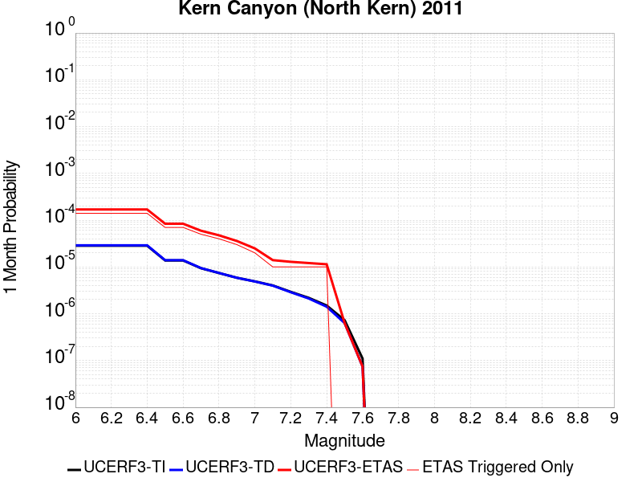 |  |  |

| Magnitude | 1 wk TI Prob | 1 wk TD Prob | 1 wk ETAS Prob | 1 wk ETAS/TD Gain | 1 wk ETAS Triggered Only | 1 mo TI Prob | 1 mo TD Prob | 1 mo ETAS Prob | 1 mo ETAS/TD Gain | 1 mo ETAS Triggered Only | 1 yr TI Prob | 1 yr TD Prob | 1 yr ETAS Prob | 1 yr ETAS/TD Gain | 1 yr ETAS Triggered Only | 10 yr TI Prob | 10 yr TD Prob | 10 yr ETAS Prob | 10 yr ETAS/TD Gain | 10 yr ETAS Triggered Only |
|-----|-----|-----|-----|-----|-----|-----|-----|-----|-----|-----|-----|-----|-----|-----|-----|-----|-----|-----|-----|-----|
| 6.0 | 6.6264497E-6 | 6.75733E-6 | 1.4794945E-4 | 21.894663 | 1.4119309E-4 | 2.8398761E-5 | 2.895971E-5 | 2.0544595E-4 | 7.094199 | 1.7649135E-4 | 3.4570007E-4 | 3.5253543E-4 | 5.642504E-4 | 1.6005495 | 2.1178962E-4 | 0.0034516277 | 0.0035205502 | 0.0037315942 | 1.0599463 | 2.1178962E-4 |
| 6.1 | 6.6264497E-6 | 6.75733E-6 | 1.4794945E-4 | 21.894663 | 1.4119309E-4 | 2.8398761E-5 | 2.895971E-5 | 2.0544595E-4 | 7.094199 | 1.7649135E-4 | 3.4570007E-4 | 3.5253543E-4 | 5.642504E-4 | 1.6005495 | 2.1178962E-4 | 0.0034516277 | 0.0035205502 | 0.0037315942 | 1.0599463 | 2.1178962E-4 |
| 6.2 | 6.6264497E-6 | 6.75733E-6 | 1.4794945E-4 | 21.894663 | 1.4119309E-4 | 2.8398761E-5 | 2.895971E-5 | 2.0544595E-4 | 7.094199 | 1.7649135E-4 | 3.4570007E-4 | 3.5253543E-4 | 5.642504E-4 | 1.6005495 | 2.1178962E-4 | 0.0034516277 | 0.0035205502 | 0.0037315942 | 1.0599463 | 2.1178962E-4 |
| 6.3 | 6.6264497E-6 | 6.75733E-6 | 1.4794945E-4 | 21.894663 | 1.4119309E-4 | 2.8398761E-5 | 2.895971E-5 | 2.0544595E-4 | 7.094199 | 1.7649135E-4 | 3.4570007E-4 | 3.5253543E-4 | 5.642504E-4 | 1.6005495 | 2.1178962E-4 | 0.0034516277 | 0.0035205502 | 0.0037315942 | 1.0599463 | 2.1178962E-4 |
| 6.4 | 6.6264497E-6 | 6.75733E-6 | 1.4794945E-4 | 21.894663 | 1.4119309E-4 | 2.8398761E-5 | 2.895971E-5 | 2.0544595E-4 | 7.094199 | 1.7649135E-4 | 3.4570007E-4 | 3.5253543E-4 | 5.642504E-4 | 1.6005495 | 2.1178962E-4 | 0.0034516277 | 0.0035205502 | 0.0037315942 | 1.0599463 | 2.1178962E-4 |
| 6.5 | 3.2162225E-6 | 3.2570915E-6 | 1.0915156E-4 | 33.51197 | 1.0589481E-4 | 1.3783738E-5 | 1.3958893E-5 | 1.1985223E-4 | 8.586083 | 1.0589481E-4 | 1.6780409E-4 | 1.6993708E-4 | 3.1110615E-4 | 1.8307139 | 1.4119309E-4 | 0.0016767744 | 0.001698151 | 0.0018391043 | 1.083004 | 1.4119309E-4 |
| 6.6 | 3.2162225E-6 | 3.2570915E-6 | 1.0915156E-4 | 33.51197 | 1.0589481E-4 | 1.3783738E-5 | 1.3958893E-5 | 1.1985223E-4 | 8.586083 | 1.0589481E-4 | 1.6780409E-4 | 1.6993708E-4 | 3.1110615E-4 | 1.8307139 | 1.4119309E-4 | 0.0016767744 | 0.001698151 | 0.0018391043 | 1.083004 | 1.4119309E-4 |
| 6.7 | 2.1908265E-6 | 2.2071222E-6 | 7.280351E-5 | 32.985718 | 7.059654E-5 | 9.389223E-6 | 9.459061E-6 | 8.005493E-5 | 8.463306 | 7.059654E-5 | 1.1430779E-4 | 1.1515819E-4 | 2.210408E-4 | 1.9194536 | 1.0589481E-4 | 0.0011424901 | 0.0011510046 | 0.0012567774 | 1.0918962 | 1.0589481E-4 |
| 6.8 | 1.7303895E-6 | 1.7365529E-6 | 7.233297E-5 | 41.65319 | 7.059654E-5 | 7.415934E-6 | 7.4423488E-6 | 7.803836E-5 | 10.485717 | 7.059654E-5 | 9.028525E-5 | 9.0606925E-5 | 1.9649214E-4 | 2.1686215 | 1.0589481E-4 | 9.024858E-4 | 9.057096E-4 | 0.0010115085 | 1.1168133 | 1.0589481E-4 |
| 6.9 | 1.3700314E-6 | 1.3688622E-6 | 3.6667083E-5 | 26.786541 | 3.529827E-5 | 5.87155E-6 | 5.8665396E-6 | 4.1164603E-5 | 7.0168457 | 3.529827E-5 | 7.148377E-5 | 7.142282E-5 | 1.4201432E-4 | 1.9883605 | 7.059654E-5 | 7.146078E-4 | 7.140032E-4 | 7.845494E-4 | 1.0988036 | 7.059654E-5 |
| 7.0 | 1.1467797E-6 | 1.1413804E-6 | 1.1413804E-6 | 1.0 | 0.0 | 4.9147607E-6 | 4.8916213E-6 | 4.8916213E-6 | 1.0 | 0.0 | 5.983557E-5 | 5.9553895E-5 | 9.485006E-5 | 1.592676 | 3.529827E-5 | 5.981946E-4 | 5.953825E-4 | 6.3065975E-4 | 1.0592514 | 3.529827E-5 |
| 7.1 | 9.3952065E-7 | 9.3026904E-7 | 9.3026904E-7 | 1.0 | 0.0 | 4.026511E-6 | 3.9868614E-6 | 3.9868614E-6 | 1.0 | 0.0 | 4.9021666E-5 | 4.8538972E-5 | 8.383553E-5 | 1.7271798 | 3.529827E-5 | 4.901085E-4 | 4.8528548E-4 | 5.2056665E-4 | 1.0727018 | 3.529827E-5 |
| 7.2 | 6.858055E-7 | 6.7193E-7 | 6.7193E-7 | 1.0 | 0.0 | 2.939163E-6 | 2.879697E-6 | 2.879697E-6 | 1.0 | 0.0 | 3.5783723E-5 | 3.5059755E-5 | 3.5059755E-5 | 1.0 | 0.0 | 3.5777962E-4 | 3.5054312E-4 | 3.5054312E-4 | 1.0 | 0.0 |
| 7.3 | 5.1101983E-7 | 4.9393E-7 | 4.9393E-7 | 1.0 | 0.0 | 2.1900833E-6 | 2.116841E-6 | 2.116841E-6 | 1.0 | 0.0 | 2.6663936E-5 | 2.5772239E-5 | 2.5772239E-5 | 1.0 | 0.0 | 2.6660739E-4 | 2.57693E-4 | 2.57693E-4 | 1.0 | 0.0 |
| 7.4 | 3.4999414E-7 | 3.2995905E-7 | 3.2995905E-7 | 1.0 | 0.0 | 1.499974E-6 | 1.4141094E-6 | 1.4141094E-6 | 1.0 | 0.0 | 1.8262032E-5 | 1.721665E-5 | 1.721665E-5 | 1.0 | 0.0 | 1.826053E-4 | 1.7215339E-4 | 1.7215339E-4 | 1.0 | 0.0 |
| 7.5 | 1.7021522E-7 | 1.4750044E-7 | 1.4750044E-7 | 1.0 | 0.0 | 7.2949354E-7 | 6.321446E-7 | 6.321446E-7 | 1.0 | 0.0 | 8.881548E-6 | 7.696334E-6 | 7.696334E-6 | 1.0 | 0.0 | 8.8811925E-5 | 7.696076E-5 | 7.696076E-5 | 1.0 | 0.0 |
| 7.6 | 2.572245E-8 | 1.7352555E-8 | 1.7352555E-8 | 1.0 | 0.0 | 1.10239064E-7 | 7.436809E-8 | 7.436809E-8 | 1.0 | 0.0 | 1.3421597E-6 | 9.054312E-7 | 9.054312E-7 | 1.0 | 0.0 | 1.3421517E-5 | 9.05428E-6 | 9.05428E-6 | 1.0 | 0.0 |

## Pinto Mtn
*[(top)](#table-of-contents)*

| 1 Week | 1 Month | 1 Year | 10 Year |
|-----|-----|-----|-----|
|  | 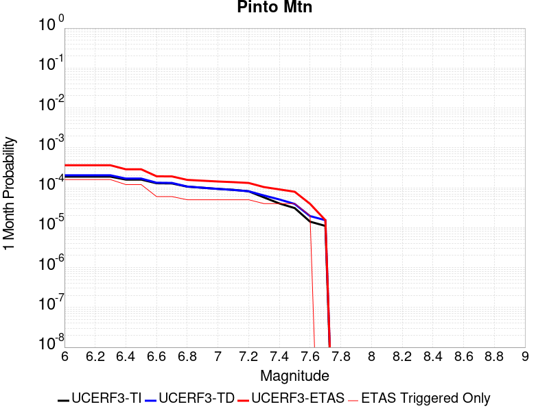 |  |  |

| Magnitude | 1 wk TI Prob | 1 wk TD Prob | 1 wk ETAS Prob | 1 wk ETAS/TD Gain | 1 wk ETAS Triggered Only | 1 mo TI Prob | 1 mo TD Prob | 1 mo ETAS Prob | 1 mo ETAS/TD Gain | 1 mo ETAS Triggered Only | 1 yr TI Prob | 1 yr TD Prob | 1 yr ETAS Prob | 1 yr ETAS/TD Gain | 1 yr ETAS Triggered Only | 10 yr TI Prob | 10 yr TD Prob | 10 yr ETAS Prob | 10 yr ETAS/TD Gain | 10 yr ETAS Triggered Only |
|-----|-----|-----|-----|-----|-----|-----|-----|-----|-----|-----|-----|-----|-----|-----|-----|-----|-----|-----|-----|-----|
| 6.0 | 4.4194956E-5 | 4.785362E-5 | 1.18446784E-4 | 2.4751897 | 7.059654E-5 | 1.893932E-4 | 2.0507174E-4 | 2.7565382E-4 | 1.3441823 | 7.059654E-5 | 0.0023034236 | 0.0024940541 | 0.0026701053 | 1.0705884 | 1.7649135E-4 | 0.022796938 | 0.024678145 | 0.024850281 | 1.0069753 | 1.7649135E-4 |
| 6.1 | 4.4194956E-5 | 4.785362E-5 | 1.18446784E-4 | 2.4751897 | 7.059654E-5 | 1.893932E-4 | 2.0507174E-4 | 2.7565382E-4 | 1.3441823 | 7.059654E-5 | 0.0023034236 | 0.0024940541 | 0.0026701053 | 1.0705884 | 1.7649135E-4 | 0.022796938 | 0.024678145 | 0.024850281 | 1.0069753 | 1.7649135E-4 |
| 6.2 | 4.4194956E-5 | 4.785362E-5 | 1.18446784E-4 | 2.4751897 | 7.059654E-5 | 1.893932E-4 | 2.0507174E-4 | 2.7565382E-4 | 1.3441823 | 7.059654E-5 | 0.0023034236 | 0.0024940541 | 0.0026701053 | 1.0705884 | 1.7649135E-4 | 0.022796938 | 0.024678145 | 0.024850281 | 1.0069753 | 1.7649135E-4 |
| 6.3 | 4.4194956E-5 | 4.785362E-5 | 1.18446784E-4 | 2.4751897 | 7.059654E-5 | 1.893932E-4 | 2.0507174E-4 | 2.7565382E-4 | 1.3441823 | 7.059654E-5 | 0.0023034236 | 0.0024940541 | 0.0026701053 | 1.0705884 | 1.7649135E-4 | 0.022796938 | 0.024678145 | 0.024850281 | 1.0069753 | 1.7649135E-4 |
| 6.4 | 3.729929E-5 | 3.9603186E-5 | 1.1019693E-4 | 2.782527 | 7.059654E-5 | 1.5984432E-4 | 1.6971743E-4 | 2.4030199E-4 | 1.4158946 | 7.059654E-5 | 0.0019443673 | 0.002064445 | 0.002240572 | 1.0853145 | 1.7649135E-4 | 0.019274427 | 0.02046269 | 0.02063557 | 1.0084485 | 1.7649135E-4 |
| 6.5 | 3.729929E-5 | 3.9603186E-5 | 1.1019693E-4 | 2.782527 | 7.059654E-5 | 1.5984432E-4 | 1.6971743E-4 | 2.4030199E-4 | 1.4158946 | 7.059654E-5 | 0.0019443673 | 0.002064445 | 0.002240572 | 1.0853145 | 1.7649135E-4 | 0.019274427 | 0.02046269 | 0.02063557 | 1.0084485 | 1.7649135E-4 |
| 6.6 | 3.0204548E-5 | 3.1205298E-5 | 6.650246E-5 | 2.1311274 | 3.529827E-5 | 1.2944164E-4 | 1.3373033E-4 | 1.6902389E-4 | 1.2639158 | 3.529827E-5 | 0.0015748127 | 0.0016269855 | 0.001732708 | 1.0649806 | 1.0589481E-4 | 0.015636992 | 0.01615461 | 0.016258793 | 1.0064492 | 1.0589481E-4 |
| 6.7 | 2.9857754E-5 | 3.081468E-5 | 6.611187E-5 | 2.1454663 | 3.529827E-5 | 1.2795553E-4 | 1.3205643E-4 | 1.6735004E-4 | 1.2672615 | 3.529827E-5 | 0.0015567453 | 0.001606636 | 0.0017123607 | 1.065805 | 1.0589481E-4 | 0.015458848 | 0.01595405 | 0.016058255 | 1.0065316 | 1.0589481E-4 |
| 6.8 | 2.4819734E-5 | 2.5009364E-5 | 2.5009364E-5 | 1.0 | 0.0 | 1.0636595E-4 | 1.07178705E-4 | 1.07178705E-4 | 1.0 | 0.0 | 0.0012942362 | 0.0013041412 | 0.0013746457 | 1.054062 | 7.059654E-5 | 0.012867244 | 0.0129672475 | 0.013036928 | 1.0053736 | 7.059654E-5 |
| 6.9 | 2.331124E-5 | 2.3337643E-5 | 2.3337643E-5 | 1.0 | 0.0 | 9.990149E-5 | 1.00014746E-4 | 1.00014746E-4 | 1.0 | 0.0 | 0.001215622 | 0.0012170197 | 0.0012875303 | 1.0579371 | 7.059654E-5 | 0.012089936 | 0.012105742 | 0.012175483 | 1.005761 | 7.059654E-5 |
| 7.0 | 2.1818534E-5 | 2.1760772E-5 | 2.1760772E-5 | 1.0 | 0.0 | 9.3504656E-5 | 9.325723E-5 | 9.325723E-5 | 1.0 | 0.0 | 0.0011378246 | 0.0011348352 | 0.0012053517 | 1.0621381 | 7.059654E-5 | 0.011320163 | 0.011292503 | 0.011362303 | 1.006181 | 7.059654E-5 |
| 7.1 | 2.066081E-5 | 2.0540418E-5 | 2.0540418E-5 | 1.0 | 0.0 | 8.854332E-5 | 8.8027504E-5 | 8.8027504E-5 | 1.0 | 0.0 | 0.0010774818 | 0.0010712275 | 0.0011417484 | 1.0658319 | 7.059654E-5 | 0.010722724 | 0.010662688 | 0.0107325325 | 1.0065503 | 7.059654E-5 |
| 7.2 | 1.8990233E-5 | 1.9053701E-5 | 1.9053701E-5 | 1.0 | 0.0 | 8.138417E-5 | 8.1656275E-5 | 8.1656275E-5 | 1.0 | 0.0 | 9.904018E-4 | 9.937311E-4 | 0.0010289942 | 1.0354856 | 3.529827E-5 | 0.009859995 | 0.009894874 | 0.009929823 | 1.003532 | 3.529827E-5 |
| 7.3 | 1.3335872E-5 | 1.4906372E-5 | 1.4906372E-5 | 1.0 | 0.0 | 5.7152483E-5 | 6.388296E-5 | 6.388296E-5 | 1.0 | 0.0 | 6.956093E-4 | 7.775102E-4 | 8.1278104E-4 | 1.0453638 | 3.529827E-5 | 0.006934359 | 0.0077491994 | 0.007784224 | 1.0045198 | 3.529827E-5 |
| 7.4 | 9.414066E-6 | 1.186061E-5 | 1.186061E-5 | 1.0 | 0.0 | 4.0345374E-5 | 5.0830247E-5 | 5.0830247E-5 | 1.0 | 0.0 | 4.910942E-4 | 6.1869196E-4 | 6.539684E-4 | 1.0570178 | 3.529827E-5 | 0.0049001034 | 0.006170644 | 0.0062057246 | 1.0056851 | 3.529827E-5 |
| 7.5 | 7.2101157E-6 | 9.157893E-6 | 9.157893E-6 | 1.0 | 0.0 | 3.090013E-5 | 3.924757E-5 | 3.924757E-5 | 1.0 | 0.0 | 3.7614413E-4 | 4.7774217E-4 | 4.7774217E-4 | 1.0 | 0.0 | 0.0037550807 | 0.004767927 | 0.004767927 | 1.0 | 0.0 |
| 7.6 | 3.296375E-6 | 4.5453176E-6 | 4.5453176E-6 | 1.0 | 0.0 | 1.4127245E-5 | 1.9479796E-5 | 1.9479796E-5 | 1.0 | 0.0 | 1.7198564E-4 | 2.3714209E-4 | 2.3714209E-4 | 1.0 | 0.0 | 0.0017185259 | 0.0023690276 | 0.0023690276 | 1.0 | 0.0 |
| 7.7 | 2.5741092E-6 | 3.584251E-6 | 3.584251E-6 | 1.0 | 0.0 | 1.103185E-5 | 1.5360993E-5 | 1.5360993E-5 | 1.0 | 0.0 | 1.3430449E-4 | 1.8700535E-4 | 1.8700535E-4 | 1.0 | 0.0 | 0.0013422335 | 0.0018686098 | 0.0018686098 | 1.0 | 0.0 |

## San Pedro Basin
*[(top)](#table-of-contents)*

| 1 Week | 1 Month | 1 Year | 10 Year |
|-----|-----|-----|-----|
|  |  |  |  |

| Magnitude | 1 wk TI Prob | 1 wk TD Prob | 1 wk ETAS Prob | 1 wk ETAS/TD Gain | 1 wk ETAS Triggered Only | 1 mo TI Prob | 1 mo TD Prob | 1 mo ETAS Prob | 1 mo ETAS/TD Gain | 1 mo ETAS Triggered Only | 1 yr TI Prob | 1 yr TD Prob | 1 yr ETAS Prob | 1 yr ETAS/TD Gain | 1 yr ETAS Triggered Only | 10 yr TI Prob | 10 yr TD Prob | 10 yr ETAS Prob | 10 yr ETAS/TD Gain | 10 yr ETAS Triggered Only |
|-----|-----|-----|-----|-----|-----|-----|-----|-----|-----|-----|-----|-----|-----|-----|-----|-----|-----|-----|-----|-----|
| 6.0 | 5.3449043E-5 | 6.336954E-5 | 1.339616E-4 | 2.1139748 | 7.059654E-5 | 2.2904722E-4 | 2.715589E-4 | 3.4213628E-4 | 1.2598971 | 7.059654E-5 | 0.0027850836 | 0.0033018254 | 0.0034425522 | 1.0426209 | 1.4119309E-4 | 0.027504366 | 0.03258945 | 0.03276019 | 1.0052391 | 1.7649135E-4 |
| 6.1 | 5.3449043E-5 | 6.336954E-5 | 1.339616E-4 | 2.1139748 | 7.059654E-5 | 2.2904722E-4 | 2.715589E-4 | 3.4213628E-4 | 1.2598971 | 7.059654E-5 | 0.0027850836 | 0.0033018254 | 0.0034425522 | 1.0426209 | 1.4119309E-4 | 0.027504366 | 0.03258945 | 0.03276019 | 1.0052391 | 1.7649135E-4 |
| 6.2 | 2.3189454E-5 | 2.6642796E-5 | 2.6642796E-5 | 1.0 | 0.0 | 9.9379584E-5 | 1.14178685E-4 | 1.14178685E-4 | 1.0 | 0.0 | 0.0012092749 | 0.0013892864 | 0.0014245356 | 1.0253721 | 3.529827E-5 | 0.012027155 | 0.013810883 | 0.013880505 | 1.0050411 | 7.059654E-5 |
| 6.3 | 2.3189454E-5 | 2.6642796E-5 | 2.6642796E-5 | 1.0 | 0.0 | 9.9379584E-5 | 1.14178685E-4 | 1.14178685E-4 | 1.0 | 0.0 | 0.0012092749 | 0.0013892864 | 0.0014245356 | 1.0253721 | 3.529827E-5 | 0.012027155 | 0.013810883 | 0.013880505 | 1.0050411 | 7.059654E-5 |
| 6.4 | 1.966056E-5 | 2.2463413E-5 | 2.2463413E-5 | 1.0 | 0.0 | 8.425682E-5 | 9.626844E-5 | 9.626844E-5 | 1.0 | 0.0 | 0.001025344 | 0.0011714783 | 0.0012067353 | 1.030096 | 3.529827E-5 | 0.010206259 | 0.011657117 | 0.01172689 | 1.0059855 | 7.059654E-5 |
| 6.5 | 1.7342953E-5 | 1.9745148E-5 | 1.9745148E-5 | 1.0 | 0.0 | 7.4324824E-5 | 8.4619525E-5 | 8.4619525E-5 | 1.0 | 0.0 | 9.04529E-4 | 0.0010297928 | 0.0010650547 | 1.0342418 | 3.529827E-5 | 0.009008561 | 0.010253931 | 0.010323804 | 1.0068142 | 7.059654E-5 |
| 6.6 | 1.439804E-5 | 1.6322716E-5 | 1.6322716E-5 | 1.0 | 0.0 | 6.170443E-5 | 6.99528E-5 | 6.99528E-5 | 1.0 | 0.0 | 7.509924E-4 | 8.513747E-4 | 8.866429E-4 | 1.041425 | 3.529827E-5 | 0.0074845953 | 0.008484332 | 0.00855433 | 1.0082502 | 7.059654E-5 |
| 6.7 | 1.2634884E-5 | 1.4285297E-5 | 1.4285297E-5 | 1.0 | 0.0 | 5.414838E-5 | 6.1221435E-5 | 6.1221435E-5 | 1.0 | 0.0 | 6.590571E-4 | 7.4514654E-4 | 7.804185E-4 | 1.0473356 | 3.529827E-5 | 0.006571059 | 0.007429501 | 0.0074995733 | 1.0094316 | 7.059654E-5 |
| 6.8 | 1.146091E-5 | 1.2933192E-5 | 1.2933192E-5 | 1.0 | 0.0 | 4.911726E-5 | 5.5426954E-5 | 5.5426954E-5 | 1.0 | 0.0 | 5.9783855E-4 | 6.7464396E-4 | 7.0991844E-4 | 1.052286 | 3.529827E-5 | 0.0059623276 | 0.006728899 | 0.006799021 | 1.0104209 | 7.059654E-5 |
| 6.9 | 9.109035E-6 | 1.0235011E-5 | 1.0235011E-5 | 1.0 | 0.0 | 3.9038136E-5 | 4.3863754E-5 | 4.3863754E-5 | 1.0 | 0.0 | 4.7518566E-4 | 5.3393835E-4 | 5.3393835E-4 | 1.0 | 0.0 | 0.0047417083 | 0.005329309 | 0.005364419 | 1.0065881 | 3.529827E-5 |
| 7.0 | 5.9351028E-6 | 6.583964E-6 | 6.583964E-6 | 1.0 | 0.0 | 2.5435906E-5 | 2.8216817E-5 | 2.8216817E-5 | 1.0 | 0.0 | 3.0963816E-4 | 3.435092E-4 | 3.435092E-4 | 1.0 | 0.0 | 0.0030920706 | 0.0034320992 | 0.0034320992 | 1.0 | 0.0 |
| 7.1 | 2.1557585E-6 | 2.209648E-6 | 2.209648E-6 | 1.0 | 0.0 | 9.238933E-6 | 9.469887E-6 | 9.469887E-6 | 1.0 | 0.0 | 1.1247819E-4 | 1.1528993E-4 | 1.1528993E-4 | 1.0 | 0.0 | 0.0011242128 | 0.0011523166 | 0.0011523166 | 1.0 | 0.0 |
| 7.2 | 2.1251979E-6 | 2.1779945E-6 | 2.1779945E-6 | 1.0 | 0.0 | 9.107958E-6 | 9.334229E-6 | 9.334229E-6 | 1.0 | 0.0 | 1.1088375E-4 | 1.1363847E-4 | 1.1363847E-4 | 1.0 | 0.0 | 0.0011082845 | 0.0011358189 | 0.0011358189 | 1.0 | 0.0 |
| 7.3 | 1.7145798E-6 | 1.7442874E-6 | 1.7442874E-6 | 1.0 | 0.0 | 7.3481783E-6 | 7.4754967E-6 | 7.4754967E-6 | 1.0 | 0.0 | 8.94604E-5 | 9.1010465E-5 | 9.1010465E-5 | 1.0 | 0.0 | 8.9424395E-4 | 9.0974104E-4 | 9.0974104E-4 | 1.0 | 0.0 |
| 7.4 | 1.4467993E-6 | 1.4641868E-6 | 1.4641868E-6 | 1.0 | 0.0 | 6.200554E-6 | 6.2750714E-6 | 6.2750714E-6 | 1.0 | 0.0 | 7.548913E-5 | 7.639639E-5 | 7.639639E-5 | 1.0 | 0.0 | 7.546349E-4 | 7.6370855E-4 | 7.6370855E-4 | 1.0 | 0.0 |
| 7.5 | 1.2803735E-6 | 1.2931497E-6 | 1.2931497E-6 | 1.0 | 0.0 | 5.487303E-6 | 5.5420587E-6 | 5.5420587E-6 | 1.0 | 0.0 | 6.680587E-5 | 6.7472545E-5 | 6.7472545E-5 | 1.0 | 0.0 | 6.678579E-4 | 6.7452766E-4 | 6.7452766E-4 | 1.0 | 0.0 |
| 7.6 | 6.755009E-7 | 6.769465E-7 | 6.769465E-7 | 1.0 | 0.0 | 2.8950008E-6 | 2.9011965E-6 | 2.9011965E-6 | 1.0 | 0.0 | 3.5246063E-5 | 3.5321555E-5 | 3.5321555E-5 | 1.0 | 0.0 | 3.5240475E-4 | 3.5316512E-4 | 3.5316512E-4 | 1.0 | 0.0 |
| 7.7 | 6.211885E-8 | 4.569953E-8 | 4.569953E-8 | 1.0 | 0.0 | 2.6622362E-7 | 1.9585512E-7 | 1.9585512E-7 | 1.0 | 0.0 | 3.2412677E-6 | 2.3845337E-6 | 2.3845337E-6 | 1.0 | 0.0 | 3.2412205E-5 | 2.3845101E-5 | 2.3845101E-5 | 1.0 | 0.0 |
| 7.8 | 2.6580573E-9 | 1.5138163E-9 | 1.5138163E-9 | 1.0 | 0.0 | 1.1391674E-8 | 6.487784E-9 | 6.487784E-9 | 1.0 | 0.0 | 1.3869362E-7 | 7.898877E-8 | 7.898877E-8 | 1.0 | 0.0 | 1.3869354E-6 | 7.898877E-7 | 7.898877E-7 | 1.0 | 0.0 |

## Big Pine (East)
*[(top)](#table-of-contents)*

| 1 Week | 1 Month | 1 Year | 10 Year |
|-----|-----|-----|-----|
|  |  |  |  |

| Magnitude | 1 wk TI Prob | 1 wk TD Prob | 1 wk ETAS Prob | 1 wk ETAS/TD Gain | 1 wk ETAS Triggered Only | 1 mo TI Prob | 1 mo TD Prob | 1 mo ETAS Prob | 1 mo ETAS/TD Gain | 1 mo ETAS Triggered Only | 1 yr TI Prob | 1 yr TD Prob | 1 yr ETAS Prob | 1 yr ETAS/TD Gain | 1 yr ETAS Triggered Only | 10 yr TI Prob | 10 yr TD Prob | 10 yr ETAS Prob | 10 yr ETAS/TD Gain | 10 yr ETAS Triggered Only |
|-----|-----|-----|-----|-----|-----|-----|-----|-----|-----|-----|-----|-----|-----|-----|-----|-----|-----|-----|-----|-----|
| 6.0 | 9.916913E-6 | 1.2816984E-5 | 4.81148E-5 | 3.7539878 | 3.529827E-5 | 4.250036E-5 | 5.49289E-5 | 1.2552156E-4 | 2.2851644 | 7.059654E-5 | 5.173191E-4 | 6.685763E-4 | 8.0967497E-4 | 1.2110435 | 1.4119309E-4 | 0.0051611643 | 0.006670441 | 0.006845755 | 1.0262822 | 1.7649135E-4 |
| 6.1 | 9.916913E-6 | 1.2816984E-5 | 4.81148E-5 | 3.7539878 | 3.529827E-5 | 4.250036E-5 | 5.49289E-5 | 1.2552156E-4 | 2.2851644 | 7.059654E-5 | 5.173191E-4 | 6.685763E-4 | 8.0967497E-4 | 1.2110435 | 1.4119309E-4 | 0.0051611643 | 0.006670441 | 0.006845755 | 1.0262822 | 1.7649135E-4 |
| 6.2 | 9.916913E-6 | 1.2816984E-5 | 4.81148E-5 | 3.7539878 | 3.529827E-5 | 4.250036E-5 | 5.49289E-5 | 1.2552156E-4 | 2.2851644 | 7.059654E-5 | 5.173191E-4 | 6.685763E-4 | 8.0967497E-4 | 1.2110435 | 1.4119309E-4 | 0.0051611643 | 0.006670441 | 0.006845755 | 1.0262822 | 1.7649135E-4 |
| 6.3 | 5.479711E-6 | 8.112951E-6 | 4.3410935E-5 | 5.350819 | 3.529827E-5 | 2.3484265E-5 | 3.4769346E-5 | 7.006639E-5 | 2.015177 | 3.529827E-5 | 2.858834E-4 | 4.2323777E-4 | 4.585211E-4 | 1.0833653 | 3.529827E-5 | 0.0028551589 | 0.004227244 | 0.004297542 | 1.0166298 | 7.059654E-5 |
| 6.4 | 5.465009E-6 | 8.097245E-6 | 4.339523E-5 | 5.3592587 | 3.529827E-5 | 2.3421257E-5 | 3.4702036E-5 | 6.999908E-5 | 2.0171463 | 3.529827E-5 | 2.851165E-4 | 4.2241855E-4 | 4.577019E-4 | 1.083527 | 3.529827E-5 | 0.0028475097 | 0.0042190826 | 0.004289381 | 1.0166621 | 7.059654E-5 |
| 6.5 | 4.826767E-6 | 7.422301E-6 | 4.272031E-5 | 5.755669 | 3.529827E-5 | 2.068598E-5 | 3.180949E-5 | 6.710664E-5 | 2.109642 | 3.529827E-5 | 2.518227E-4 | 3.872145E-4 | 4.2249908E-4 | 1.0911242 | 3.529827E-5 | 0.0025153751 | 0.003868283 | 0.0039386065 | 1.0181795 | 7.059654E-5 |
| 6.6 | 4.3146847E-6 | 6.8822374E-6 | 4.2180265E-5 | 6.1288595 | 3.529827E-5 | 1.8491375E-5 | 2.9494982E-5 | 6.479221E-5 | 2.19672 | 3.529827E-5 | 2.2510924E-4 | 3.590447E-4 | 3.943303E-4 | 1.0982764 | 3.529827E-5 | 0.0022488134 | 0.0035874986 | 0.0036578418 | 1.0196079 | 7.059654E-5 |
| 6.7 | 3.6968106E-6 | 5.9954727E-6 | 4.129353E-5 | 6.887452 | 3.529827E-5 | 1.5843378E-5 | 2.5694639E-5 | 6.0992003E-5 | 2.373725 | 3.529827E-5 | 1.9287605E-4 | 3.1278885E-4 | 3.4807608E-4 | 1.1128149 | 3.529827E-5 | 0.0019270873 | 0.0031262483 | 0.003196624 | 1.0225112 | 7.059654E-5 |
| 6.8 | 3.4671132E-6 | 5.702177E-6 | 4.1000247E-5 | 7.190279 | 3.529827E-5 | 1.4858972E-5 | 2.4437682E-5 | 5.9735088E-5 | 2.4443846 | 3.529827E-5 | 1.8089297E-4 | 2.974896E-4 | 3.3277736E-4 | 1.1186185 | 3.529827E-5 | 0.0018074579 | 0.002973667 | 0.003044054 | 1.02367 | 7.059654E-5 |
| 6.9 | 2.7686972E-6 | 4.825223E-6 | 4.0123323E-5 | 8.3153305 | 3.529827E-5 | 1.1865792E-5 | 2.0679368E-5 | 5.5976907E-5 | 2.7068965 | 3.529827E-5 | 1.4445644E-4 | 2.5174298E-4 | 2.8703237E-4 | 1.1401802 | 3.529827E-5 | 0.0014436257 | 0.0025172636 | 0.0025876826 | 1.0279744 | 7.059654E-5 |
| 7.0 | 2.1472624E-6 | 3.9850406E-6 | 3.928317E-5 | 9.857658 | 3.529827E-5 | 9.20252E-6 | 1.7078637E-5 | 5.2376305E-5 | 3.0667732 | 3.529827E-5 | 1.12034926E-4 | 2.079131E-4 | 2.4320403E-4 | 1.1697389 | 3.529827E-5 | 0.0011197845 | 0.0020798394 | 0.002150289 | 1.0338727 | 7.059654E-5 |
| 7.1 | 1.7018335E-6 | 3.344876E-6 | 3.864303E-5 | 11.552903 | 3.529827E-5 | 7.293552E-6 | 1.4335106E-5 | 4.9632872E-5 | 3.46233 | 3.529827E-5 | 8.879537E-5 | 1.7451629E-4 | 2.0980841E-4 | 1.2022282 | 3.529827E-5 | 8.87599E-4 | 0.0017464145 | 0.0018168876 | 1.0403531 | 7.059654E-5 |
| 7.2 | 1.25603E-6 | 2.794484E-6 | 2.794484E-6 | 1.0 | 0.0 | 5.3829745E-6 | 1.1976307E-5 | 1.1976307E-5 | 1.0 | 0.0 | 6.553574E-5 | 1.4580201E-4 | 1.4580201E-4 | 1.0 | 0.0 | 6.551642E-4 | 0.001459661 | 0.0014949078 | 1.0241473 | 3.529827E-5 |
| 7.3 | 1.112297E-6 | 2.610332E-6 | 2.610332E-6 | 1.0 | 0.0 | 4.7669787E-6 | 1.118709E-5 | 1.118709E-5 | 1.0 | 0.0 | 5.803642E-5 | 1.3619453E-4 | 1.3619453E-4 | 1.0 | 0.0 | 5.802127E-4 | 0.0013635408 | 0.001398791 | 1.025852 | 3.529827E-5 |
| 7.4 | 1.0137181E-6 | 2.4834917E-6 | 2.4834917E-6 | 1.0 | 0.0 | 4.3444993E-6 | 1.0643494E-5 | 1.0643494E-5 | 1.0 | 0.0 | 5.2892992E-5 | 1.2957705E-4 | 1.2957705E-4 | 1.0 | 0.0 | 5.288041E-4 | 0.0012972289 | 0.0013324814 | 1.0271752 | 3.529827E-5 |
| 7.5 | 9.598608E-7 | 2.4071483E-6 | 2.4071483E-6 | 1.0 | 0.0 | 4.1136827E-6 | 1.031631E-5 | 1.031631E-5 | 1.0 | 0.0 | 5.0082934E-5 | 1.2559404E-4 | 1.2559404E-4 | 1.0 | 0.0 | 5.007165E-4 | 0.0012572526 | 0.0012925065 | 1.0280404 | 3.529827E-5 |
| 7.6 | 7.929459E-7 | 2.0448588E-6 | 2.0448588E-6 | 1.0 | 0.0 | 3.3983351E-6 | 8.763653E-6 | 8.763653E-6 | 1.0 | 0.0 | 4.1373947E-5 | 1.06692416E-4 | 1.06692416E-4 | 1.0 | 0.0 | 4.1366243E-4 | 0.0010685222 | 0.0011037828 | 1.0329994 | 3.529827E-5 |
| 7.7 | 4.155788E-7 | 1.1605589E-6 | 1.1605589E-6 | 1.0 | 0.0 | 1.7810507E-6 | 4.9738146E-6 | 4.9738146E-6 | 1.0 | 0.0 | 2.1684076E-5 | 6.0554554E-5 | 6.0554554E-5 | 1.0 | 0.0 | 2.1681961E-4 | 6.0857297E-4 | 6.438498E-4 | 1.0579664 | 3.529827E-5 |
| 7.8 | 1.14666925E-7 | 2.592015E-7 | 2.592015E-7 | 1.0 | 0.0 | 4.914296E-7 | 1.1108631E-6 | 1.1108631E-6 | 1.0 | 0.0 | 5.9831386E-6 | 1.3524678E-5 | 1.3524678E-5 | 1.0 | 0.0 | 5.9829777E-5 | 1.3634123E-4 | 1.3634123E-4 | 1.0 | 0.0 |
| 7.9 | 2.9231824E-8 | 4.1463963E-8 | 4.1463963E-8 | 1.0 | 0.0 | 1.2527924E-7 | 1.7770269E-7 | 1.7770269E-7 | 1.0 | 0.0 | 1.5252737E-6 | 2.1635283E-6 | 2.1635283E-6 | 1.0 | 0.0 | 1.5252632E-5 | 2.1967755E-5 | 2.1967755E-5 | 1.0 | 0.0 |

## San Diego Trough north alt1
*[(top)](#table-of-contents)*

| 1 Week | 1 Month | 1 Year | 10 Year |
|-----|-----|-----|-----|
|  |  |  |  |

| Magnitude | 1 wk TI Prob | 1 wk TD Prob | 1 wk ETAS Prob | 1 wk ETAS/TD Gain | 1 wk ETAS Triggered Only | 1 mo TI Prob | 1 mo TD Prob | 1 mo ETAS Prob | 1 mo ETAS/TD Gain | 1 mo ETAS Triggered Only | 1 yr TI Prob | 1 yr TD Prob | 1 yr ETAS Prob | 1 yr ETAS/TD Gain | 1 yr ETAS Triggered Only | 10 yr TI Prob | 10 yr TD Prob | 10 yr ETAS Prob | 10 yr ETAS/TD Gain | 10 yr ETAS Triggered Only |
|-----|-----|-----|-----|-----|-----|-----|-----|-----|-----|-----|-----|-----|-----|-----|-----|-----|-----|-----|-----|-----|
| 6.0 | 7.329252E-5 | 8.821093E-5 | 1.940964E-4 | 2.2003667 | 1.0589481E-4 | 3.14073E-4 | 3.7799572E-4 | 4.838505E-4 | 1.2800423 | 1.0589481E-4 | 0.0038171355 | 0.004593027 | 0.0047335713 | 1.0305996 | 1.4119309E-4 | 0.03752231 | 0.045044992 | 0.04521353 | 1.0037416 | 1.7649135E-4 |
| 6.1 | 3.7940346E-5 | 4.4885E-5 | 8.0181686E-5 | 1.7863804 | 3.529827E-5 | 1.6259136E-4 | 1.9235066E-4 | 2.2764214E-4 | 1.1834747 | 3.529827E-5 | 0.0019777524 | 0.0023394432 | 0.0024098747 | 1.0301061 | 7.059654E-5 | 0.019602431 | 0.023156688 | 0.02326013 | 1.0044671 | 1.0589481E-4 |
| 6.2 | 2.8645263E-5 | 3.329678E-5 | 6.859388E-5 | 2.0600753 | 3.529827E-5 | 1.2275964E-4 | 1.4269284E-4 | 1.7798608E-4 | 1.2473371 | 3.529827E-5 | 0.0014935739 | 0.0017359189 | 0.0017711559 | 1.0202987 | 3.529827E-5 | 0.0148357535 | 0.017226247 | 0.017260937 | 1.0020138 | 3.529827E-5 |
| 6.3 | 2.8645263E-5 | 3.329678E-5 | 6.859388E-5 | 2.0600753 | 3.529827E-5 | 1.2275964E-4 | 1.4269284E-4 | 1.7798608E-4 | 1.2473371 | 3.529827E-5 | 0.0014935739 | 0.0017359189 | 0.0017711559 | 1.0202987 | 3.529827E-5 | 0.0148357535 | 0.017226247 | 0.017260937 | 1.0020138 | 3.529827E-5 |
| 6.4 | 2.2204576E-5 | 2.5448318E-5 | 6.074569E-5 | 2.3870218 | 3.529827E-5 | 9.5159E-5 | 1.0905972E-4 | 1.4435414E-4 | 1.3236247 | 3.529827E-5 | 0.001157945 | 0.0013270034 | 0.0013622547 | 1.0265647 | 3.529827E-5 | 0.011519298 | 0.013191955 | 0.013226788 | 1.0026405 | 3.529827E-5 |
| 6.5 | 2.1004838E-5 | 2.4024694E-5 | 5.9322116E-5 | 2.4692142 | 3.529827E-5 | 9.0017624E-5 | 1.0295896E-4 | 1.382536E-4 | 1.3428029 | 3.529827E-5 | 0.0010954136 | 0.0012528138 | 0.0012880679 | 1.02814 | 3.529827E-5 | 0.010900296 | 0.012458589 | 0.012493447 | 1.002798 | 3.529827E-5 |
| 6.6 | 1.820557E-5 | 2.0704787E-5 | 5.6002325E-5 | 2.704801 | 3.529827E-5 | 7.802154E-5 | 8.873181E-5 | 1.2402695E-4 | 1.3977733 | 3.529827E-5 | 9.4949827E-4 | 0.0010797799 | 0.00111504 | 1.032655 | 3.529827E-5 | 0.009454516 | 0.010746004 | 0.010780923 | 1.0032495 | 3.529827E-5 |
| 6.7 | 1.5884485E-5 | 1.7983646E-5 | 5.328128E-5 | 2.962763 | 3.529827E-5 | 6.807459E-5 | 7.707051E-5 | 1.1236606E-4 | 1.4579644 | 3.529827E-5 | 8.284929E-4 | 9.3793223E-4 | 9.731974E-4 | 1.0375988 | 3.529827E-5 | 0.008254109 | 0.009340104 | 0.009375072 | 1.0037439 | 3.529827E-5 |
| 6.8 | 1.4331171E-5 | 1.6201066E-5 | 5.1498762E-5 | 3.1787271 | 3.529827E-5 | 6.141786E-5 | 6.94313E-5 | 1.04727114E-4 | 1.5083561 | 3.529827E-5 | 7.4750587E-4 | 8.450002E-4 | 8.8026864E-4 | 1.0417378 | 3.529827E-5 | 0.0074499645 | 0.008418139 | 0.00845314 | 1.0041578 | 3.529827E-5 |
| 6.9 | 1.2574203E-5 | 1.4205835E-5 | 4.9503604E-5 | 3.4847374 | 3.529827E-5 | 5.3888325E-5 | 6.0880735E-5 | 9.617686E-5 | 1.5797584 | 3.529827E-5 | 6.558929E-4 | 7.409723E-4 | 7.762444E-4 | 1.0476025 | 3.529827E-5 | 0.0065396037 | 0.007385203 | 0.007420241 | 1.0047443 | 3.529827E-5 |
| 7.0 | 1.0883844E-5 | 1.2289262E-5 | 4.75871E-5 | 3.8722506 | 3.529827E-5 | 4.664421E-5 | 5.2667205E-5 | 8.796361E-5 | 1.6701782 | 3.529827E-5 | 5.677453E-4 | 6.4103556E-4 | 6.763112E-4 | 1.0550292 | 3.529827E-5 | 0.00566297 | 0.006391993 | 0.0064270655 | 1.005487 | 3.529827E-5 |
| 7.1 | 9.393088E-6 | 1.060702E-5 | 4.5904915E-5 | 4.3277864 | 3.529827E-5 | 4.025547E-5 | 4.545787E-5 | 8.075454E-5 | 1.7764698 | 3.529827E-5 | 4.900001E-4 | 5.533098E-4 | 5.8858853E-4 | 1.0637594 | 3.529827E-5 | 0.0048892107 | 0.005519418 | 0.0055545215 | 1.0063599 | 3.529827E-5 |
| 7.2 | 8.190791E-6 | 9.258625E-6 | 4.4556567E-5 | 4.812439 | 3.529827E-5 | 3.510292E-5 | 3.9679224E-5 | 7.4976095E-5 | 1.8895555 | 3.529827E-5 | 4.2729423E-4 | 4.8298817E-4 | 5.182694E-4 | 1.0730478 | 3.529827E-5 | 0.0042647356 | 0.004819465 | 0.004854593 | 1.0072888 | 3.529827E-5 |
| 7.3 | 6.268162E-6 | 7.089716E-6 | 7.089716E-6 | 1.0 | 0.0 | 2.6863276E-5 | 3.0384144E-5 | 3.0384144E-5 | 1.0 | 0.0 | 3.2701128E-4 | 3.6986457E-4 | 3.6986457E-4 | 1.0 | 0.0 | 0.003265305 | 0.003692536 | 0.003692536 | 1.0 | 0.0 |
| 7.4 | 4.985186E-6 | 5.6426816E-6 | 5.6426816E-6 | 1.0 | 0.0 | 2.1364907E-5 | 2.4182698E-5 | 2.4182698E-5 | 1.0 | 0.0 | 2.600867E-4 | 2.9438498E-4 | 2.9438498E-4 | 1.0 | 0.0 | 0.002597825 | 0.0029399914 | 0.0029399914 | 1.0 | 0.0 |
| 7.5 | 1.7489613E-6 | 1.969678E-6 | 1.969678E-6 | 1.0 | 0.0 | 7.495527E-6 | 8.4414505E-6 | 8.4414505E-6 | 1.0 | 0.0 | 9.125422E-5 | 1.02770035E-4 | 1.02770035E-4 | 1.0 | 0.0 | 9.1216754E-4 | 0.0010272472 | 0.0010272472 | 1.0 | 0.0 |
| 7.6 | 1.6988751E-7 | 1.7533823E-7 | 1.7533823E-7 | 1.0 | 0.0 | 7.2808916E-7 | 7.5144936E-7 | 7.5144936E-7 | 1.0 | 0.0 | 8.864449E-6 | 9.14886E-6 | 9.14886E-6 | 1.0 | 0.0 | 8.8640954E-5 | 9.1485024E-5 | 9.1485024E-5 | 1.0 | 0.0 |

## Red Mountain
*[(top)](#table-of-contents)*

| 1 Week | 1 Month | 1 Year | 10 Year |
|-----|-----|-----|-----|
|  |  |  |  |

| Magnitude | 1 wk TI Prob | 1 wk TD Prob | 1 wk ETAS Prob | 1 wk ETAS/TD Gain | 1 wk ETAS Triggered Only | 1 mo TI Prob | 1 mo TD Prob | 1 mo ETAS Prob | 1 mo ETAS/TD Gain | 1 mo ETAS Triggered Only | 1 yr TI Prob | 1 yr TD Prob | 1 yr ETAS Prob | 1 yr ETAS/TD Gain | 1 yr ETAS Triggered Only | 10 yr TI Prob | 10 yr TD Prob | 10 yr ETAS Prob | 10 yr ETAS/TD Gain | 10 yr ETAS Triggered Only |
|-----|-----|-----|-----|-----|-----|-----|-----|-----|-----|-----|-----|-----|-----|-----|-----|-----|-----|-----|-----|-----|
| 6.0 | 4.1810763E-5 | 4.7589947E-5 | 1.887763E-4 | 3.9667265 | 1.4119309E-4 | 1.7917668E-4 | 2.039419E-4 | 3.4510618E-4 | 1.692179 | 1.4119309E-4 | 0.0021792934 | 0.0024803306 | 0.0026211734 | 1.0567839 | 1.4119309E-4 | 0.021580452 | 0.024544092 | 0.02468182 | 1.0056114 | 1.4119309E-4 |
| 6.1 | 4.1810763E-5 | 4.7589947E-5 | 1.887763E-4 | 3.9667265 | 1.4119309E-4 | 1.7917668E-4 | 2.039419E-4 | 3.4510618E-4 | 1.692179 | 1.4119309E-4 | 0.0021792934 | 0.0024803306 | 0.0026211734 | 1.0567839 | 1.4119309E-4 | 0.021580452 | 0.024544092 | 0.02468182 | 1.0056114 | 1.4119309E-4 |
| 6.2 | 4.1810763E-5 | 4.7589947E-5 | 1.887763E-4 | 3.9667265 | 1.4119309E-4 | 1.7917668E-4 | 2.039419E-4 | 3.4510618E-4 | 1.692179 | 1.4119309E-4 | 0.0021792934 | 0.0024803306 | 0.0026211734 | 1.0567839 | 1.4119309E-4 | 0.021580452 | 0.024544092 | 0.02468182 | 1.0056114 | 1.4119309E-4 |
| 6.3 | 4.1810763E-5 | 4.7589947E-5 | 1.887763E-4 | 3.9667265 | 1.4119309E-4 | 1.7917668E-4 | 2.039419E-4 | 3.4510618E-4 | 1.692179 | 1.4119309E-4 | 0.0021792934 | 0.0024803306 | 0.0026211734 | 1.0567839 | 1.4119309E-4 | 0.021580452 | 0.024544092 | 0.02468182 | 1.0056114 | 1.4119309E-4 |
| 6.4 | 4.1810763E-5 | 4.7589947E-5 | 1.887763E-4 | 3.9667265 | 1.4119309E-4 | 1.7917668E-4 | 2.039419E-4 | 3.4510618E-4 | 1.692179 | 1.4119309E-4 | 0.0021792934 | 0.0024803306 | 0.0026211734 | 1.0567839 | 1.4119309E-4 | 0.021580452 | 0.024544092 | 0.02468182 | 1.0056114 | 1.4119309E-4 |
| 6.5 | 3.154503E-5 | 3.5359728E-5 | 1.7654782E-4 | 4.9929066 | 1.4119309E-4 | 1.3518598E-4 | 1.5153342E-4 | 2.927051E-4 | 1.9316208 | 1.4119309E-4 | 0.0016446467 | 0.0018434501 | 0.001984383 | 1.0764506 | 1.4119309E-4 | 0.01632528 | 0.018291233 | 0.018429844 | 1.007578 | 1.4119309E-4 |
| 6.6 | 3.1535834E-5 | 3.534911E-5 | 1.765372E-4 | 4.994106 | 1.4119309E-4 | 1.3514658E-4 | 1.5148791E-4 | 2.926596E-4 | 1.9319007 | 1.4119309E-4 | 0.0016441676 | 0.001842897 | 0.00198383 | 1.0764736 | 1.4119309E-4 | 0.01632056 | 0.018285794 | 0.018424407 | 1.0075803 | 1.4119309E-4 |
| 6.7 | 2.8267326E-5 | 3.146934E-5 | 1.7265798E-4 | 5.486546 | 1.4119309E-4 | 1.2114006E-4 | 1.348621E-4 | 2.7603615E-4 | 2.046803 | 1.4119309E-4 | 0.0014738824 | 0.0016407946 | 0.001781756 | 1.0859104 | 1.4119309E-4 | 0.014641452 | 0.016295563 | 0.016434455 | 1.0085233 | 1.4119309E-4 |
| 6.8 | 2.8212884E-5 | 3.1407224E-5 | 1.7259587E-4 | 5.4954195 | 1.4119309E-4 | 1.20906756E-4 | 1.3459593E-4 | 2.7577E-4 | 2.0488734 | 1.4119309E-4 | 0.0014710457 | 0.0016375587 | 0.0017785206 | 1.0860806 | 1.4119309E-4 | 0.014613459 | 0.01626368 | 0.016402576 | 1.0085403 | 1.4119309E-4 |
| 6.9 | 2.4227871E-5 | 2.6706979E-5 | 1.3259896E-4 | 4.964956 | 1.0589481E-4 | 1.03829596E-4 | 1.14453884E-4 | 2.2033657E-4 | 1.9251122 | 1.0589481E-4 | 0.0012633923 | 0.0013926612 | 0.0014984085 | 1.0759318 | 1.0589481E-4 | 0.012562336 | 0.013847026 | 0.013951454 | 1.0075415 | 1.0589481E-4 |
| 7.0 | 2.348524E-5 | 2.5835763E-5 | 1.3172784E-4 | 5.098663 | 1.0589481E-4 | 1.0064714E-4 | 1.1072042E-4 | 2.1660351E-4 | 1.9563104 | 1.0589481E-4 | 0.0012246901 | 0.0013472632 | 0.0014530154 | 1.0784941 | 1.0589481E-4 | 0.012179627 | 0.01339859 | 0.013503065 | 1.0077975 | 1.0589481E-4 |
| 7.1 | 2.2311642E-5 | 2.4462828E-5 | 1.3035505E-4 | 5.328699 | 1.0589481E-4 | 9.561782E-5 | 1.048369E-4 | 2.1072061E-4 | 2.009985 | 1.0589481E-4 | 0.0011635252 | 0.0012757168 | 0.0013814765 | 1.0829022 | 1.0589481E-4 | 0.01157452 | 0.012691451 | 0.012796002 | 1.0082378 | 1.0589481E-4 |
| 7.2 | 1.6533986E-5 | 1.7670347E-5 | 1.7670347E-5 | 1.0 | 0.0 | 7.085802E-5 | 7.572822E-5 | 7.572822E-5 | 1.0 | 0.0 | 8.623549E-4 | 9.216645E-4 | 9.216645E-4 | 1.0 | 0.0 | 0.008590161 | 0.009184699 | 0.009184699 | 1.0 | 0.0 |
| 7.3 | 1.4703092E-5 | 1.555952E-5 | 1.555952E-5 | 1.0 | 0.0 | 6.301173E-5 | 6.66823E-5 | 6.66823E-5 | 1.0 | 0.0 | 7.668978E-4 | 8.1161625E-4 | 8.1161625E-4 | 1.0 | 0.0 | 0.0076425658 | 0.008092596 | 0.008092596 | 1.0 | 0.0 |
| 7.4 | 6.1331984E-6 | 5.528872E-6 | 5.528872E-6 | 1.0 | 0.0 | 2.6284872E-5 | 2.3694953E-5 | 2.3694953E-5 | 1.0 | 0.0 | 3.199713E-4 | 2.8844838E-4 | 2.8844838E-4 | 1.0 | 0.0 | 0.0031951098 | 0.0028807942 | 0.0028807942 | 1.0 | 0.0 |
| 7.5 | 5.954766E-6 | 5.3385015E-6 | 5.3385015E-6 | 1.0 | 0.0 | 2.5520176E-5 | 2.2879094E-5 | 2.2879094E-5 | 1.0 | 0.0 | 3.1066386E-4 | 2.785179E-4 | 2.785179E-4 | 1.0 | 0.0 | 0.003102299 | 0.0027817423 | 0.0027817423 | 1.0 | 0.0 |
| 7.6 | 4.9726646E-6 | 4.315295E-6 | 4.315295E-6 | 1.0 | 0.0 | 2.1311245E-5 | 1.8493993E-5 | 1.8493993E-5 | 1.0 | 0.0 | 2.5943352E-4 | 2.2514143E-4 | 2.2514143E-4 | 1.0 | 0.0 | 0.0025913084 | 0.002249168 | 0.002249168 | 1.0 | 0.0 |
| 7.7 | 3.3613894E-6 | 2.8526642E-6 | 2.8526642E-6 | 1.0 | 0.0 | 1.4405875E-5 | 1.2225649E-5 | 1.2225649E-5 | 1.0 | 0.0 | 1.7537741E-4 | 1.4883737E-4 | 1.4883737E-4 | 1.0 | 0.0 | 0.0017523908 | 0.0014874031 | 0.0014874031 | 1.0 | 0.0 |
| 7.8 | 1.1828961E-6 | 1.0122756E-6 | 1.0122756E-6 | 1.0 | 0.0 | 5.069545E-6 | 4.338317E-6 | 4.338317E-6 | 1.0 | 0.0 | 6.171996E-5 | 5.281776E-5 | 5.281776E-5 | 1.0 | 0.0 | 6.170282E-4 | 5.2805495E-4 | 5.2805495E-4 | 1.0 | 0.0 |
| 7.9 | 2.2967266E-7 | 1.8618952E-7 | 1.8618952E-7 | 1.0 | 0.0 | 9.843111E-7 | 7.9795484E-7 | 7.9795484E-7 | 1.0 | 0.0 | 1.19839215E-5 | 9.7150605E-6 | 9.7150605E-6 | 1.0 | 0.0 | 1.1983275E-4 | 9.714664E-5 | 9.714664E-5 | 1.0 | 0.0 |

## Sheephole
*[(top)](#table-of-contents)*

| 1 Week | 1 Month | 1 Year | 10 Year |
|-----|-----|-----|-----|
|  | 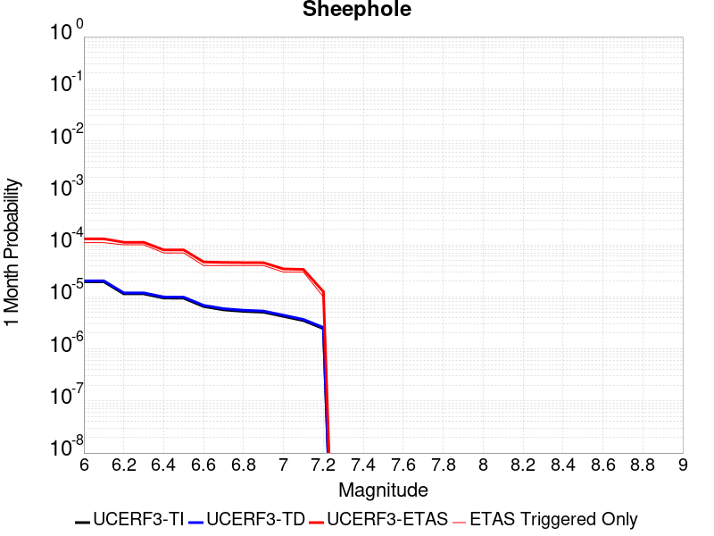 |  |  |

| Magnitude | 1 wk TI Prob | 1 wk TD Prob | 1 wk ETAS Prob | 1 wk ETAS/TD Gain | 1 wk ETAS Triggered Only | 1 mo TI Prob | 1 mo TD Prob | 1 mo ETAS Prob | 1 mo ETAS/TD Gain | 1 mo ETAS Triggered Only | 1 yr TI Prob | 1 yr TD Prob | 1 yr ETAS Prob | 1 yr ETAS/TD Gain | 1 yr ETAS Triggered Only | 10 yr TI Prob | 10 yr TD Prob | 10 yr ETAS Prob | 10 yr ETAS/TD Gain | 10 yr ETAS Triggered Only |
|-----|-----|-----|-----|-----|-----|-----|-----|-----|-----|-----|-----|-----|-----|-----|-----|-----|-----|-----|-----|-----|
| 6.0 | 4.5579695E-6 | 4.7412627E-6 | 4.0039366E-5 | 8.444874 | 3.529827E-5 | 1.9534009E-5 | 2.031957E-5 | 1.2621222E-4 | 6.2113633 | 1.0589481E-4 | 2.3780059E-4 | 2.473682E-4 | 3.5323683E-4 | 1.4279798 | 1.0589481E-4 | 0.0023754628 | 0.002471473 | 0.0026475282 | 1.071235 | 1.7649135E-4 |
| 6.1 | 4.5579695E-6 | 4.7412627E-6 | 4.0039366E-5 | 8.444874 | 3.529827E-5 | 1.9534009E-5 | 2.031957E-5 | 1.2621222E-4 | 6.2113633 | 1.0589481E-4 | 2.3780059E-4 | 2.473682E-4 | 3.5323683E-4 | 1.4279798 | 1.0589481E-4 | 0.0023754628 | 0.002471473 | 0.0026475282 | 1.071235 | 1.7649135E-4 |
| 6.2 | 2.6677674E-6 | 2.7873941E-6 | 3.8085567E-5 | 13.663502 | 3.529827E-5 | 1.1433239E-5 | 1.1945926E-5 | 1.17839474E-4 | 9.864407 | 1.0589481E-4 | 1.3919079E-4 | 1.4543302E-4 | 2.5131245E-4 | 1.7280287 | 1.0589481E-4 | 0.0013910364 | 0.0014534844 | 0.0016297193 | 1.1212499 | 1.7649135E-4 |
| 6.3 | 2.6677674E-6 | 2.7873941E-6 | 3.8085567E-5 | 13.663502 | 3.529827E-5 | 1.1433239E-5 | 1.1945926E-5 | 1.17839474E-4 | 9.864407 | 1.0589481E-4 | 1.3919079E-4 | 1.4543302E-4 | 2.5131245E-4 | 1.7280287 | 1.0589481E-4 | 0.0013910364 | 0.0014534844 | 0.0016297193 | 1.1212499 | 1.7649135E-4 |
| 6.4 | 2.2159759E-6 | 2.3228788E-6 | 3.7621066E-5 | 16.19588 | 3.529827E-5 | 9.497005E-6 | 9.955161E-6 | 1.1584892E-4 | 11.637072 | 1.0589481E-4 | 1.156199E-4 | 1.2119815E-4 | 2.2708013E-4 | 1.873627 | 1.0589481E-4 | 0.0011555976 | 0.0012113999 | 0.0013524219 | 1.1164124 | 1.4119309E-4 |
| 6.5 | 2.1986082E-6 | 2.304759E-6 | 3.760295E-5 | 16.31535 | 3.529827E-5 | 9.4225725E-6 | 9.877506E-6 | 1.1577127E-4 | 11.720698 | 1.0589481E-4 | 1.1471378E-4 | 1.2025281E-4 | 2.2613489E-4 | 1.8804957 | 1.0589481E-4 | 0.0011465458 | 0.0012019566 | 0.0013429801 | 1.1173282 | 1.4119309E-4 |
| 6.6 | 1.5232331E-6 | 1.6018919E-6 | 1.6018919E-6 | 1.0 | 0.0 | 6.5281256E-6 | 6.865234E-6 | 7.746129E-5 | 11.283125 | 7.059654E-5 | 7.947703E-5 | 8.35812E-5 | 1.5417184E-4 | 1.8445755 | 7.059654E-5 | 7.9448614E-4 | 8.3551643E-4 | 9.06054E-4 | 1.0844239 | 7.059654E-5 |
| 6.7 | 1.3137362E-6 | 1.382819E-6 | 1.382819E-6 | 1.0 | 0.0 | 5.6302856E-6 | 5.926355E-6 | 7.6522476E-5 | 12.912233 | 7.059654E-5 | 6.854657E-5 | 7.215112E-5 | 1.4274257E-4 | 1.9783833 | 7.059654E-5 | 6.8525434E-4 | 7.212908E-4 | 7.918365E-4 | 1.0978047 | 7.059654E-5 |
| 6.8 | 1.2275751E-6 | 1.2922847E-6 | 1.2922847E-6 | 1.0 | 0.0 | 5.2610258E-6 | 5.5383516E-6 | 7.61345E-5 | 13.746779 | 7.059654E-5 | 6.4051106E-5 | 6.7427485E-5 | 1.3801927E-4 | 2.046929 | 7.059654E-5 | 6.4032647E-4 | 6.740836E-4 | 7.4463256E-4 | 1.1046591 | 7.059654E-5 |
| 6.9 | 1.1837088E-6 | 1.246102E-6 | 1.246102E-6 | 1.0 | 0.0 | 5.0730278E-6 | 5.340427E-6 | 7.5936594E-5 | 14.219198 | 7.059654E-5 | 6.176237E-5 | 6.501789E-5 | 1.3560984E-4 | 2.085731 | 7.059654E-5 | 6.17452E-4 | 6.5000186E-4 | 7.205525E-4 | 1.1085391 | 7.059654E-5 |
| 7.0 | 9.849371E-7 | 1.0366288E-6 | 1.0366288E-6 | 1.0 | 0.0 | 4.2211523E-6 | 4.442688E-6 | 7.5038915E-5 | 16.89043 | 7.059654E-5 | 5.1391315E-5 | 5.4088487E-5 | 1.246812E-4 | 2.305134 | 7.059654E-5 | 5.137943E-4 | 5.407633E-4 | 6.1132165E-4 | 1.1304792 | 7.059654E-5 |
| 7.1 | 8.1643645E-7 | 8.591669E-7 | 8.591669E-7 | 1.0 | 0.0 | 3.4990085E-6 | 3.682139E-6 | 7.427842E-5 | 20.172626 | 7.059654E-5 | 4.2599597E-5 | 4.482921E-5 | 1.1542258E-4 | 2.5747182 | 7.059654E-5 | 4.259143E-4 | 4.4821028E-4 | 5.187752E-4 | 1.1574371 | 7.059654E-5 |
| 7.2 | 5.7295756E-7 | 6.029502E-7 | 6.029502E-7 | 1.0 | 0.0 | 2.45553E-6 | 2.58407E-6 | 2.58407E-6 | 1.0 | 0.0 | 2.9895667E-5 | 3.1460666E-5 | 3.1460666E-5 | 1.0 | 0.0 | 2.9891645E-4 | 3.145688E-4 | 3.145688E-4 | 1.0 | 0.0 |

## Palos Verdes
*[(top)](#table-of-contents)*

| 1 Week | 1 Month | 1 Year | 10 Year |
|-----|-----|-----|-----|
|  |  |  |  |

| Magnitude | 1 wk TI Prob | 1 wk TD Prob | 1 wk ETAS Prob | 1 wk ETAS/TD Gain | 1 wk ETAS Triggered Only | 1 mo TI Prob | 1 mo TD Prob | 1 mo ETAS Prob | 1 mo ETAS/TD Gain | 1 mo ETAS Triggered Only | 1 yr TI Prob | 1 yr TD Prob | 1 yr ETAS Prob | 1 yr ETAS/TD Gain | 1 yr ETAS Triggered Only | 10 yr TI Prob | 10 yr TD Prob | 10 yr ETAS Prob | 10 yr ETAS/TD Gain | 10 yr ETAS Triggered Only |
|-----|-----|-----|-----|-----|-----|-----|-----|-----|-----|-----|-----|-----|-----|-----|-----|-----|-----|-----|-----|-----|
| 6.0 | 6.126063E-5 | 7.622612E-5 | 1.8211285E-4 | 2.3891137 | 1.0589481E-4 | 2.6251914E-4 | 3.2664582E-4 | 5.030795E-4 | 1.5401376 | 1.7649135E-4 | 0.0031914865 | 0.003970174 | 0.004145965 | 1.0442778 | 1.7649135E-4 | 0.031460393 | 0.039048895 | 0.039218497 | 1.0043433 | 1.7649135E-4 |
| 6.1 | 6.126063E-5 | 7.622612E-5 | 1.8211285E-4 | 2.3891137 | 1.0589481E-4 | 2.6251914E-4 | 3.2664582E-4 | 5.030795E-4 | 1.5401376 | 1.7649135E-4 | 0.0031914865 | 0.003970174 | 0.004145965 | 1.0442778 | 1.7649135E-4 | 0.031460393 | 0.039048895 | 0.039218497 | 1.0043433 | 1.7649135E-4 |
| 6.2 | 6.126063E-5 | 7.622612E-5 | 1.8211285E-4 | 2.3891137 | 1.0589481E-4 | 2.6251914E-4 | 3.2664582E-4 | 5.030795E-4 | 1.5401376 | 1.7649135E-4 | 0.0031914865 | 0.003970174 | 0.004145965 | 1.0442778 | 1.7649135E-4 | 0.031460393 | 0.039048895 | 0.039218497 | 1.0043433 | 1.7649135E-4 |
| 6.3 | 4.0838047E-5 | 4.9749437E-5 | 1.2034246E-4 | 2.4189715 | 7.059654E-5 | 1.7500846E-4 | 2.1319572E-4 | 3.1906794E-4 | 1.4965965 | 1.0589481E-4 | 0.0021286458 | 0.0025927818 | 0.0026984022 | 1.0407363 | 1.0589481E-4 | 0.021083709 | 0.025646681 | 0.02574986 | 1.0040231 | 1.0589481E-4 |
| 6.4 | 4.0838047E-5 | 4.9749437E-5 | 1.2034246E-4 | 2.4189715 | 7.059654E-5 | 1.7500846E-4 | 2.1319572E-4 | 3.1906794E-4 | 1.4965965 | 1.0589481E-4 | 0.0021286458 | 0.0025927818 | 0.0026984022 | 1.0407363 | 1.0589481E-4 | 0.021083709 | 0.025646681 | 0.02574986 | 1.0040231 | 1.0589481E-4 |
| 6.5 | 3.0512005E-5 | 3.656162E-5 | 7.18586E-5 | 1.9654107 | 3.529827E-5 | 1.3075917E-4 | 1.5668393E-4 | 2.2726941E-4 | 1.450496 | 7.059654E-5 | 0.0015908304 | 0.0019060767 | 0.0019765387 | 1.036967 | 7.059654E-5 | 0.015794903 | 0.018909154 | 0.018978415 | 1.0036628 | 7.059654E-5 |
| 6.6 | 2.9255087E-5 | 3.515442E-5 | 7.045145E-5 | 2.0040567 | 3.529827E-5 | 1.2537291E-4 | 1.5065377E-4 | 2.2123966E-4 | 1.4685307 | 7.059654E-5 | 0.0015253464 | 0.0018327828 | 0.00190325 | 1.0384482 | 7.059654E-5 | 0.015149189 | 0.018188225 | 0.018257538 | 1.0038109 | 7.059654E-5 |
| 6.7 | 2.287198E-5 | 2.7248278E-5 | 6.254559E-5 | 2.2953959 | 3.529827E-5 | 9.801909E-5 | 1.16773626E-4 | 1.5206778E-4 | 1.3022442 | 3.529827E-5 | 0.001192729 | 0.0014208833 | 0.0014561315 | 1.0248072 | 3.529827E-5 | 0.011863477 | 0.014127217 | 0.014162017 | 1.0024633 | 3.529827E-5 |
| 6.8 | 2.1325764E-5 | 2.5431877E-5 | 6.072925E-5 | 2.3879185 | 3.529827E-5 | 9.139293E-5 | 1.0898971E-4 | 1.4428415E-4 | 1.3238326 | 3.529827E-5 | 0.001112141 | 0.0013262323 | 0.0013614837 | 1.0265801 | 3.529827E-5 | 0.011065915 | 0.013192211 | 0.013227044 | 1.0026404 | 3.529827E-5 |
| 6.9 | 1.9009392E-5 | 2.2613547E-5 | 2.2613547E-5 | 1.0 | 0.0 | 8.1466285E-5 | 9.6912096E-5 | 9.6912096E-5 | 1.0 | 0.0 | 9.914007E-4 | 0.0011793535 | 0.0011793535 | 1.0 | 0.0 | 0.009869894 | 0.011739632 | 0.011739632 | 1.0 | 0.0 |
| 7.0 | 1.7098473E-5 | 2.0319356E-5 | 2.0319356E-5 | 1.0 | 0.0 | 7.3277115E-5 | 8.708052E-5 | 8.708052E-5 | 1.0 | 0.0 | 8.917837E-4 | 0.001059775 | 0.001059775 | 1.0 | 0.0 | 0.008882134 | 0.010555646 | 0.010555646 | 1.0 | 0.0 |
| 7.1 | 1.5982785E-5 | 1.899476E-5 | 1.899476E-5 | 1.0 | 0.0 | 6.849585E-5 | 8.1404054E-5 | 8.1404054E-5 | 1.0 | 0.0 | 8.336179E-4 | 9.907284E-4 | 9.907284E-4 | 1.0 | 0.0 | 0.008304977 | 0.009871479 | 0.009871479 | 1.0 | 0.0 |
| 7.2 | 1.4468002E-5 | 1.7197237E-5 | 1.7197237E-5 | 1.0 | 0.0 | 6.200425E-5 | 7.370083E-5 | 7.370083E-5 | 1.0 | 0.0 | 7.546402E-4 | 8.970222E-4 | 8.970222E-4 | 1.0 | 0.0 | 0.007520827 | 0.008942284 | 0.008942284 | 1.0 | 0.0 |
| 7.3 | 5.288233E-6 | 6.2036747E-6 | 6.2036747E-6 | 1.0 | 0.0 | 2.2663658E-5 | 2.6587102E-5 | 2.6587102E-5 | 1.0 | 0.0 | 2.7589512E-4 | 3.236848E-4 | 3.236848E-4 | 1.0 | 0.0 | 0.0027555283 | 0.0032355562 | 0.0032355562 | 1.0 | 0.0 |
| 7.4 | 8.279556E-7 | 8.408347E-7 | 8.408347E-7 | 1.0 | 0.0 | 3.5483763E-6 | 3.6035726E-6 | 3.6035726E-6 | 1.0 | 0.0 | 4.3200624E-5 | 4.3872686E-5 | 4.3872686E-5 | 1.0 | 0.0 | 4.3192226E-4 | 4.3864746E-4 | 4.3864746E-4 | 1.0 | 0.0 |
| 7.5 | 6.559831E-7 | 6.667229E-7 | 6.667229E-7 | 1.0 | 0.0 | 2.8113532E-6 | 2.857381E-6 | 2.857381E-6 | 1.0 | 0.0 | 3.4227687E-5 | 3.4788125E-5 | 3.4788125E-5 | 1.0 | 0.0 | 3.4222414E-4 | 3.4783344E-4 | 3.4783344E-4 | 1.0 | 0.0 |
| 7.6 | 3.5018968E-7 | 3.5620027E-7 | 3.5620027E-7 | 1.0 | 0.0 | 1.500812E-6 | 1.526572E-6 | 1.526572E-6 | 1.0 | 0.0 | 1.8272232E-5 | 1.8585903E-5 | 1.8585903E-5 | 1.0 | 0.0 | 1.8270731E-4 | 1.8584808E-4 | 1.8584808E-4 | 1.0 | 0.0 |
| 7.7 | 1.1986104E-7 | 1.2198376E-7 | 1.2198376E-7 | 1.0 | 0.0 | 5.1369005E-7 | 5.2278745E-7 | 5.2278745E-7 | 1.0 | 0.0 | 6.2541585E-6 | 6.364919E-6 | 6.364919E-6 | 1.0 | 0.0 | 6.2539824E-5 | 6.364741E-5 | 6.364741E-5 | 1.0 | 0.0 |
| 7.8 | 3.0445005E-8 | 3.1027582E-8 | 3.1027582E-8 | 1.0 | 0.0 | 1.3047858E-7 | 1.3297536E-7 | 1.3297536E-7 | 1.0 | 0.0 | 1.5885756E-6 | 1.6189739E-6 | 1.6189739E-6 | 1.0 | 0.0 | 1.5885644E-5 | 1.6189642E-5 | 1.6189642E-5 | 1.0 | 0.0 |

## Calaveras (So) - Paicines extension 2011 CFM
*[(top)](#table-of-contents)*

| 1 Week | 1 Month | 1 Year | 10 Year |
|-----|-----|-----|-----|
|  |  |  | 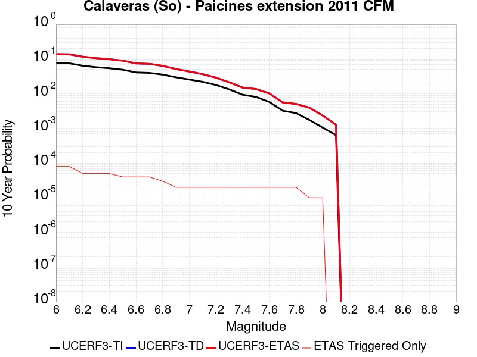 |

| Magnitude | 1 wk TI Prob | 1 wk TD Prob | 1 wk ETAS Prob | 1 wk ETAS/TD Gain | 1 wk ETAS Triggered Only | 1 mo TI Prob | 1 mo TD Prob | 1 mo ETAS Prob | 1 mo ETAS/TD Gain | 1 mo ETAS Triggered Only | 1 yr TI Prob | 1 yr TD Prob | 1 yr ETAS Prob | 1 yr ETAS/TD Gain | 1 yr ETAS Triggered Only | 10 yr TI Prob | 10 yr TD Prob | 10 yr ETAS Prob | 10 yr ETAS/TD Gain | 10 yr ETAS Triggered Only |
|-----|-----|-----|-----|-----|-----|-----|-----|-----|-----|-----|-----|-----|-----|-----|-----|-----|-----|-----|-----|-----|
| 6.0 | 1.5183659E-4 | 3.0533716E-4 | 3.4062465E-4 | 1.115569 | 3.529827E-5 | 6.5056595E-4 | 0.0013069661 | 0.0013422183 | 1.0269725 | 3.529827E-5 | 0.007891912 | 0.01569571 | 0.015799943 | 1.0066408 | 1.0589481E-4 | 0.076174594 | 0.13848671 | 0.13860837 | 1.0008783 | 1.4119309E-4 |
| 6.1 | 1.5024997E-4 | 3.0227835E-4 | 3.3756596E-4 | 1.1167388 | 3.529827E-5 | 6.437695E-4 | 0.00129387 | 0.0013291226 | 1.0272459 | 3.529827E-5 | 0.0078097614 | 0.015539104 | 0.015643353 | 1.0067089 | 1.0589481E-4 | 0.075409345 | 0.13715632 | 0.13727815 | 1.0008882 | 1.4119309E-4 |
| 6.2 | 1.2743923E-4 | 2.5306802E-4 | 2.8835735E-4 | 1.139446 | 3.529827E-5 | 5.460538E-4 | 0.0010841049 | 0.0011193649 | 1.0325246 | 3.529827E-5 | 0.0066279583 | 0.013046704 | 0.013116379 | 1.0053405 | 7.059654E-5 | 0.064337276 | 0.11725405 | 0.117316365 | 1.0005314 | 7.059654E-5 |
| 6.3 | 1.1525114E-4 | 2.2595265E-4 | 2.6124294E-4 | 1.1561844 | 3.529827E-5 | 4.9383997E-4 | 9.6799526E-4 | 0.0010032593 | 1.03643 | 3.529827E-5 | 0.0059959386 | 0.011667927 | 0.0117377 | 1.0059799 | 7.059654E-5 | 0.058367174 | 0.10637007 | 0.10643316 | 1.0005931 | 7.059654E-5 |
| 6.4 | 1.07200925E-4 | 2.0836305E-4 | 2.4365397E-4 | 1.1693722 | 3.529827E-5 | 4.5935164E-4 | 8.926636E-4 | 9.2793035E-4 | 1.0395074 | 3.529827E-5 | 0.0055782744 | 0.010772766 | 0.010842601 | 1.0064826 | 7.059654E-5 | 0.0544031 | 0.09919256 | 0.09925616 | 1.0006411 | 7.059654E-5 |
| 6.5 | 9.69631E-5 | 1.8729115E-4 | 2.2258282E-4 | 1.1884321 | 3.529827E-5 | 4.1548995E-4 | 8.024135E-4 | 8.3768344E-4 | 1.0439548 | 3.529827E-5 | 0.0050468626 | 0.009694662 | 0.0097645745 | 1.0072114 | 7.059654E-5 | 0.04933773 | 0.090084255 | 0.09014849 | 1.0007131 | 7.059654E-5 |
| 6.6 | 8.0552316E-5 | 1.5070537E-4 | 1.8599832E-4 | 1.2341851 | 3.529827E-5 | 3.4517853E-4 | 6.456994E-4 | 6.8097486E-4 | 1.0546315 | 3.529827E-5 | 0.0041944524 | 0.007826256 | 0.0078963 | 1.0089499 | 7.059654E-5 | 0.04116161 | 0.074854024 | 0.074919336 | 1.0008725 | 7.059654E-5 |
| 6.7 | 7.815757E-5 | 1.4610609E-4 | 1.813992E-4 | 1.2415581 | 3.529827E-5 | 3.34918E-4 | 6.260017E-4 | 6.6127785E-4 | 1.0563515 | 3.529827E-5 | 0.004070005 | 0.0075890915 | 0.0076591526 | 1.0092318 | 7.059654E-5 | 0.039962657 | 0.072703585 | 0.072769046 | 1.0009004 | 7.059654E-5 |
| 6.8 | 6.965264E-5 | 1.2721405E-4 | 1.6250783E-4 | 1.2774361 | 3.529827E-5 | 2.9847719E-4 | 5.450839E-4 | 5.803629E-4 | 1.0647222 | 3.529827E-5 | 0.0036279052 | 0.00661342 | 0.0066484846 | 1.0053021 | 3.529827E-5 | 0.03569247 | 0.06379891 | 0.063831955 | 1.000518 | 3.529827E-5 |
| 6.9 | 5.8000453E-5 | 1.01435086E-4 | 1.3672977E-4 | 1.3479534 | 3.529827E-5 | 2.4854968E-4 | 4.3464993E-4 | 4.6993286E-4 | 1.0811754 | 3.529827E-5 | 0.0030218933 | 0.0052791284 | 0.0053142407 | 1.006651 | 3.529827E-5 | 0.029811295 | 0.051501602 | 0.051535085 | 1.00065 | 3.529827E-5 |
| 7.0 | 4.9865852E-5 | 8.567692E-5 | 1.2097217E-4 | 1.4119575 | 3.529827E-5 | 2.1369329E-4 | 3.671356E-4 | 4.024209E-4 | 1.0961097 | 3.529827E-5 | 0.0025986114 | 0.0044608037 | 0.0044959444 | 1.0078777 | 3.529827E-5 | 0.025684336 | 0.043781694 | 0.043815445 | 1.0007709 | 3.529827E-5 |
| 7.1 | 4.283875E-5 | 7.112159E-5 | 1.0641735E-4 | 1.4962735 | 3.529827E-5 | 1.8358172E-4 | 3.047715E-4 | 3.4005902E-4 | 1.1157835 | 3.529827E-5 | 0.0022328163 | 0.003704336 | 0.0037395037 | 1.0094936 | 3.529827E-5 | 0.022105146 | 0.03673583 | 0.03676983 | 1.0009255 | 3.529827E-5 |
| 7.2 | 3.450115E-5 | 5.5776054E-5 | 9.1072354E-5 | 1.6328218 | 3.529827E-5 | 1.478537E-4 | 2.390185E-4 | 2.7430832E-4 | 1.1476448 | 3.529827E-5 | 0.0017986323 | 0.0029061958 | 0.0029413914 | 1.0121106 | 3.529827E-5 | 0.017841442 | 0.029079199 | 0.02911347 | 1.0011786 | 3.529827E-5 |
| 7.3 | 2.5709045E-5 | 4.0588155E-5 | 7.588499E-5 | 1.8696339 | 3.529827E-5 | 1.1017697E-4 | 1.7393773E-4 | 2.0922987E-4 | 1.2029009 | 3.529827E-5 | 0.0013405791 | 0.002115652 | 0.0021508755 | 1.016649 | 3.529827E-5 | 0.013325208 | 0.021297242 | 0.021331789 | 1.0016221 | 3.529827E-5 |
| 7.4 | 1.8003093E-5 | 2.8509934E-5 | 6.38072E-5 | 2.2380688 | 3.529827E-5 | 7.715383E-5 | 1.2217973E-4 | 1.5747368E-4 | 1.2888691 | 3.529827E-5 | 9.3894306E-4 | 0.0014865254 | 0.0015217712 | 1.0237101 | 3.529827E-5 | 0.009349857 | 0.015052196 | 0.015086963 | 1.0023098 | 3.529827E-5 |
| 7.5 | 1.5595824E-5 | 2.5822499E-5 | 6.1119856E-5 | 2.3669226 | 3.529827E-5 | 6.683753E-5 | 1.1066317E-4 | 1.4595753E-4 | 1.318935 | 3.529827E-5 | 8.134431E-4 | 0.0013464936 | 0.0013817443 | 1.0261797 | 3.529827E-5 | 0.008104719 | 0.01365213 | 0.013686947 | 1.0025502 | 3.529827E-5 |
| 7.6 | 1.1110309E-5 | 1.9222098E-5 | 5.451969E-5 | 2.8363028 | 3.529827E-5 | 4.761474E-5 | 8.2377825E-5 | 1.1767318E-4 | 1.4284571 | 3.529827E-5 | 5.795553E-4 | 0.0010024898 | 0.0010377527 | 1.0351753 | 3.529827E-5 | 0.0057804612 | 0.010203943 | 0.010238881 | 1.0034239 | 3.529827E-5 |
| 7.7 | 6.2140443E-6 | 1.0437076E-5 | 4.5734978E-5 | 4.3819723 | 3.529827E-5 | 2.6631347E-5 | 4.4729557E-5 | 8.002625E-5 | 1.7891133 | 3.529827E-5 | 3.241884E-4 | 5.444464E-4 | 5.797254E-4 | 1.064798 | 3.529827E-5 | 0.0032371588 | 0.005619835 | 0.005654935 | 1.0062457 | 3.529827E-5 |
| 7.8 | 5.305533E-6 | 9.433038E-6 | 4.4730976E-5 | 4.741948 | 3.529827E-5 | 2.27378E-5 | 4.042668E-5 | 7.5723525E-5 | 1.8731077 | 3.529827E-5 | 2.7679754E-4 | 4.920837E-4 | 5.2736467E-4 | 1.071697 | 3.529827E-5 | 0.0027645302 | 0.005074324 | 0.0051094433 | 1.0069209 | 3.529827E-5 |
| 7.9 | 3.363505E-6 | 7.3848937E-6 | 7.3848937E-6 | 1.0 | 0.0 | 1.4414942E-5 | 3.164916E-5 | 3.164916E-5 | 1.0 | 0.0 | 1.7548777E-4 | 3.8526047E-4 | 3.8526047E-4 | 1.0 | 0.0 | 0.0017534926 | 0.003948527 | 0.003948527 | 1.0 | 0.0 |
| 8.0 | 2.0271132E-6 | 4.413104E-6 | 4.413104E-6 | 1.0 | 0.0 | 8.687599E-6 | 1.8913164E-5 | 1.8913164E-5 | 1.0 | 0.0 | 1.05766376E-4 | 2.302435E-4 | 2.302435E-4 | 1.0 | 0.0 | 0.0010571606 | 0.002351099 | 0.002351099 | 1.0 | 0.0 |
| 8.1 | 1.2206116E-6 | 2.3751331E-6 | 2.3751331E-6 | 1.0 | 0.0 | 5.2311816E-6 | 1.0179103E-5 | 1.0179103E-5 | 1.0 | 0.0 | 6.3687774E-5 | 1.2392356E-4 | 1.2392356E-4 | 1.0 | 0.0 | 6.366953E-4 | 0.0012705477 | 0.0012705477 | 1.0 | 0.0 |

## Great Valley 09 (Laguna Seca)
*[(top)](#table-of-contents)*

| 1 Week | 1 Month | 1 Year | 10 Year |
|-----|-----|-----|-----|
|  |  |  |  |

| Magnitude | 1 wk TI Prob | 1 wk TD Prob | 1 wk ETAS Prob | 1 wk ETAS/TD Gain | 1 wk ETAS Triggered Only | 1 mo TI Prob | 1 mo TD Prob | 1 mo ETAS Prob | 1 mo ETAS/TD Gain | 1 mo ETAS Triggered Only | 1 yr TI Prob | 1 yr TD Prob | 1 yr ETAS Prob | 1 yr ETAS/TD Gain | 1 yr ETAS Triggered Only | 10 yr TI Prob | 10 yr TD Prob | 10 yr ETAS Prob | 10 yr ETAS/TD Gain | 10 yr ETAS Triggered Only |
|-----|-----|-----|-----|-----|-----|-----|-----|-----|-----|-----|-----|-----|-----|-----|-----|-----|-----|-----|-----|-----|
| 6.0 | 5.4353277E-5 | 7.05022E-5 | 1.4109377E-4 | 2.0012674 | 7.059654E-5 | 2.3292181E-4 | 3.0211566E-4 | 4.0797848E-4 | 1.350405 | 1.0589481E-4 | 0.0028321352 | 0.0036721937 | 0.0038128684 | 1.038308 | 1.4119309E-4 | 0.02796312 | 0.03611547 | 0.036251564 | 1.0037683 | 1.4119309E-4 |
| 6.1 | 4.5578287E-5 | 5.822118E-5 | 9.3517396E-5 | 1.6062435 | 3.529827E-5 | 1.953209E-4 | 2.4949326E-4 | 3.2007217E-4 | 1.2828891 | 7.059654E-5 | 0.0023754383 | 0.003033432 | 0.0031390055 | 1.0348034 | 1.0589481E-4 | 0.023502063 | 0.029919548 | 0.030022273 | 1.0034335 | 1.0589481E-4 |
| 6.2 | 2.8536782E-5 | 3.4737273E-5 | 3.4737273E-5 | 1.0 | 0.0 | 1.2229476E-4 | 1.4886224E-4 | 1.4886224E-4 | 1.0 | 0.0 | 0.0014879217 | 0.001810813 | 0.001810813 | 1.0 | 0.0 | 0.014779986 | 0.017958116 | 0.017958116 | 1.0 | 0.0 |
| 6.3 | 2.3698774E-5 | 2.8213295E-5 | 2.8213295E-5 | 1.0 | 0.0 | 1.01562226E-4 | 1.20905075E-4 | 1.20905075E-4 | 1.0 | 0.0 | 0.0012358186 | 0.0014710218 | 0.0014710218 | 1.0 | 0.0 | 0.012289686 | 0.014611342 | 0.014611342 | 1.0 | 0.0 |
| 6.4 | 1.9191197E-5 | 2.2123184E-5 | 2.2123184E-5 | 1.0 | 0.0 | 8.2245395E-5 | 9.4806666E-5 | 9.4806666E-5 | 1.0 | 0.0 | 0.0010008777 | 0.0011536429 | 0.0011536429 | 1.0 | 0.0 | 0.009963818 | 0.011476948 | 0.011476948 | 1.0 | 0.0 |
| 6.5 | 1.5203241E-5 | 1.6802203E-5 | 1.6802203E-5 | 1.0 | 0.0 | 6.5155116E-5 | 7.200386E-5 | 7.200386E-5 | 1.0 | 0.0 | 7.9297484E-4 | 8.7626575E-4 | 8.7626575E-4 | 1.0 | 0.0 | 0.007901512 | 0.0087295165 | 0.0087295165 | 1.0 | 0.0 |
| 6.6 | 1.0984925E-5 | 1.1242595E-5 | 1.1242595E-5 | 1.0 | 0.0 | 4.70774E-5 | 4.8181686E-5 | 4.8181686E-5 | 1.0 | 0.0 | 5.730166E-4 | 5.8645656E-4 | 5.8645656E-4 | 1.0 | 0.0 | 0.005715413 | 0.0058494853 | 0.0058494853 | 1.0 | 0.0 |
| 6.7 | 9.134616E-6 | 9.019894E-6 | 9.019894E-6 | 1.0 | 0.0 | 3.9147766E-5 | 3.865613E-5 | 3.865613E-5 | 1.0 | 0.0 | 4.7651984E-4 | 4.7053912E-4 | 4.7053912E-4 | 1.0 | 0.0 | 0.004754993 | 0.0046956735 | 0.0046956735 | 1.0 | 0.0 |
| 6.8 | 7.785589E-6 | 7.4519444E-6 | 7.4519444E-6 | 1.0 | 0.0 | 3.3366385E-5 | 3.1936524E-5 | 3.1936524E-5 | 1.0 | 0.0 | 4.0616E-4 | 3.8875983E-4 | 3.8875983E-4 | 1.0 | 0.0 | 0.0040541845 | 0.0038810016 | 0.0038810016 | 1.0 | 0.0 |
| 6.9 | 5.579095E-6 | 4.898492E-6 | 4.898492E-6 | 1.0 | 0.0 | 2.3910188E-5 | 2.0993377E-5 | 2.0993377E-5 | 1.0 | 0.0 | 2.9106764E-4 | 2.5556577E-4 | 2.5556577E-4 | 1.0 | 0.0 | 0.002906867 | 0.002552856 | 0.002552856 | 1.0 | 0.0 |
| 7.0 | 2.6816688E-6 | 1.5216126E-6 | 1.5216126E-6 | 1.0 | 0.0 | 1.1492816E-5 | 6.521181E-6 | 6.521181E-6 | 1.0 | 0.0 | 1.3991605E-4 | 7.939258E-5 | 7.939258E-5 | 1.0 | 0.0 | 0.0013982799 | 7.9365086E-4 | 7.9365086E-4 | 1.0 | 0.0 |
| 7.1 | 1.9951021E-6 | 7.453827E-7 | 7.453827E-7 | 1.0 | 0.0 | 8.55041E-6 | 3.1944935E-6 | 3.1944935E-6 | 1.0 | 0.0 | 1.0409627E-4 | 3.8892307E-5 | 3.8892307E-5 | 1.0 | 0.0 | 0.0010404752 | 3.8885913E-4 | 3.8885913E-4 | 1.0 | 0.0 |
| 7.2 | 1.9951021E-6 | 7.453827E-7 | 7.453827E-7 | 1.0 | 0.0 | 8.55041E-6 | 3.1944935E-6 | 3.1944935E-6 | 1.0 | 0.0 | 1.0409627E-4 | 3.8892307E-5 | 3.8892307E-5 | 1.0 | 0.0 | 0.0010404752 | 3.8885913E-4 | 3.8885913E-4 | 1.0 | 0.0 |
| 7.3 | 1.7087556E-6 | 6.578881E-7 | 6.578881E-7 | 1.0 | 0.0 | 7.3232177E-6 | 2.8195177E-6 | 2.8195177E-6 | 1.0 | 0.0 | 8.915652E-5 | 3.4327128E-5 | 3.4327128E-5 | 1.0 | 0.0 | 8.9120766E-4 | 3.432223E-4 | 3.432223E-4 | 1.0 | 0.0 |
| 7.4 | 1.3804846E-6 | 6.073852E-7 | 6.073852E-7 | 1.0 | 0.0 | 5.916349E-6 | 2.6030768E-6 | 2.6030768E-6 | 1.0 | 0.0 | 7.2029165E-5 | 3.169204E-5 | 3.169204E-5 | 1.0 | 0.0 | 7.200583E-4 | 3.1687922E-4 | 3.1687922E-4 | 1.0 | 0.0 |
| 7.5 | 1.3804846E-6 | 6.073852E-7 | 6.073852E-7 | 1.0 | 0.0 | 5.916349E-6 | 2.6030768E-6 | 2.6030768E-6 | 1.0 | 0.0 | 7.2029165E-5 | 3.169204E-5 | 3.169204E-5 | 1.0 | 0.0 | 7.200583E-4 | 3.1687922E-4 | 3.1687922E-4 | 1.0 | 0.0 |

## Kern Canyon (South Kern) 2011
*[(top)](#table-of-contents)*

| 1 Week | 1 Month | 1 Year | 10 Year |
|-----|-----|-----|-----|
|  |  |  |  |

| Magnitude | 1 wk TI Prob | 1 wk TD Prob | 1 wk ETAS Prob | 1 wk ETAS/TD Gain | 1 wk ETAS Triggered Only | 1 mo TI Prob | 1 mo TD Prob | 1 mo ETAS Prob | 1 mo ETAS/TD Gain | 1 mo ETAS Triggered Only | 1 yr TI Prob | 1 yr TD Prob | 1 yr ETAS Prob | 1 yr ETAS/TD Gain | 1 yr ETAS Triggered Only | 10 yr TI Prob | 10 yr TD Prob | 10 yr ETAS Prob | 10 yr ETAS/TD Gain | 10 yr ETAS Triggered Only |
|-----|-----|-----|-----|-----|-----|-----|-----|-----|-----|-----|-----|-----|-----|-----|-----|-----|-----|-----|-----|-----|
| 6.0 | 4.105075E-6 | 4.1137264E-6 | 1.100081E-4 | 26.741716 | 1.0589481E-4 | 1.7593058E-5 | 1.763014E-5 | 1.5882074E-4 | 9.008478 | 1.4119309E-4 | 2.1417443E-4 | 2.1462646E-4 | 3.9107993E-4 | 1.8221422 | 1.7649135E-4 | 0.0021396813 | 0.0021442557 | 0.0023203685 | 1.0821325 | 1.7649135E-4 |
| 6.1 | 4.105075E-6 | 4.1137264E-6 | 1.100081E-4 | 26.741716 | 1.0589481E-4 | 1.7593058E-5 | 1.763014E-5 | 1.5882074E-4 | 9.008478 | 1.4119309E-4 | 2.1417443E-4 | 2.1462646E-4 | 3.9107993E-4 | 1.8221422 | 1.7649135E-4 | 0.0021396813 | 0.0021442557 | 0.0023203685 | 1.0821325 | 1.7649135E-4 |
| 6.2 | 4.105075E-6 | 4.1137264E-6 | 1.100081E-4 | 26.741716 | 1.0589481E-4 | 1.7593058E-5 | 1.763014E-5 | 1.5882074E-4 | 9.008478 | 1.4119309E-4 | 2.1417443E-4 | 2.1462646E-4 | 3.9107993E-4 | 1.8221422 | 1.7649135E-4 | 0.0021396813 | 0.0021442557 | 0.0023203685 | 1.0821325 | 1.7649135E-4 |
| 6.3 | 4.105075E-6 | 4.1137264E-6 | 1.100081E-4 | 26.741716 | 1.0589481E-4 | 1.7593058E-5 | 1.763014E-5 | 1.5882074E-4 | 9.008478 | 1.4119309E-4 | 2.1417443E-4 | 2.1462646E-4 | 3.9107993E-4 | 1.8221422 | 1.7649135E-4 | 0.0021396813 | 0.0021442557 | 0.0023203685 | 1.0821325 | 1.7649135E-4 |
| 6.4 | 4.105075E-6 | 4.1137264E-6 | 1.100081E-4 | 26.741716 | 1.0589481E-4 | 1.7593058E-5 | 1.763014E-5 | 1.5882074E-4 | 9.008478 | 1.4119309E-4 | 2.1417443E-4 | 2.1462646E-4 | 3.9107993E-4 | 1.8221422 | 1.7649135E-4 | 0.0021396813 | 0.0021442557 | 0.0023203685 | 1.0821325 | 1.7649135E-4 |
| 6.5 | 2.9849807E-6 | 2.9731548E-6 | 7.3569485E-5 | 24.744587 | 7.059654E-5 | 1.2792712E-5 | 1.274203E-5 | 8.333767E-5 | 6.540376 | 7.059654E-5 | 1.5574014E-4 | 1.5512333E-4 | 2.610017E-4 | 1.6825433 | 1.0589481E-4 | 0.0015563103 | 0.0015501656 | 0.0016558963 | 1.0682061 | 1.0589481E-4 |
| 6.6 | 2.9849807E-6 | 2.9731548E-6 | 7.3569485E-5 | 24.744587 | 7.059654E-5 | 1.2792712E-5 | 1.274203E-5 | 8.333767E-5 | 6.540376 | 7.059654E-5 | 1.5574014E-4 | 1.5512333E-4 | 2.610017E-4 | 1.6825433 | 1.0589481E-4 | 0.0015563103 | 0.0015501656 | 0.0016558963 | 1.0682061 | 1.0589481E-4 |
| 6.7 | 2.6756725E-6 | 2.6582206E-6 | 7.3254574E-5 | 27.557747 | 7.059654E-5 | 1.1467117E-5 | 1.1392325E-5 | 8.198806E-5 | 7.19678 | 7.059654E-5 | 1.396032E-4 | 1.3869285E-4 | 2.4457296E-4 | 1.7634145 | 1.0589481E-4 | 0.0013951553 | 0.0013860738 | 0.0014918218 | 1.0762932 | 1.0589481E-4 |
| 6.8 | 2.3283721E-6 | 2.3047787E-6 | 7.290116E-5 | 31.630436 | 7.059654E-5 | 9.9787E-6 | 9.877586E-6 | 8.047343E-5 | 8.147074 | 7.059654E-5 | 1.214839E-4 | 1.20253055E-4 | 2.2613513E-4 | 1.8804939 | 1.0589481E-4 | 0.001214175 | 0.0012018873 | 0.0013076548 | 1.0880013 | 1.0589481E-4 |
| 6.9 | 2.0972677E-6 | 2.0696411E-6 | 7.266604E-5 | 35.11045 | 7.059654E-5 | 8.988259E-6 | 8.869861E-6 | 7.9465775E-5 | 8.959078 | 7.059654E-5 | 1.0942656E-4 | 1.0798526E-4 | 2.1386864E-4 | 1.9805355 | 1.0589481E-4 | 0.0010937268 | 0.0010793337 | 0.0011851143 | 1.0980054 | 1.0589481E-4 |
| 7.0 | 1.7132242E-6 | 1.6787036E-6 | 1.6787036E-6 | 1.0 | 0.0 | 7.3423685E-6 | 7.194424E-6 | 7.194424E-6 | 1.0 | 0.0 | 8.938967E-5 | 8.758863E-5 | 1.2288381E-4 | 1.4029653 | 3.529827E-5 | 8.935372E-4 | 8.7554497E-4 | 9.108123E-4 | 1.0402805 | 3.529827E-5 |
| 7.1 | 1.4215541E-6 | 1.3815752E-6 | 1.3815752E-6 | 1.0 | 0.0 | 6.0923603E-6 | 5.9210233E-6 | 5.9210233E-6 | 1.0 | 0.0 | 7.417196E-5 | 7.20861E-5 | 1.0738183E-4 | 1.4896328 | 3.529827E-5 | 7.414721E-4 | 7.206299E-4 | 7.559027E-4 | 1.0489472 | 3.529827E-5 |
| 7.2 | 9.097853E-7 | 8.6037755E-7 | 8.6037755E-7 | 1.0 | 0.0 | 3.899074E-6 | 3.6873273E-6 | 3.6873273E-6 | 1.0 | 0.0 | 4.7470192E-5 | 4.4892295E-5 | 4.4892295E-5 | 1.0 | 0.0 | 4.7460053E-4 | 4.4883334E-4 | 4.4883334E-4 | 1.0 | 0.0 |
| 7.3 | 6.144169E-7 | 5.628206E-7 | 5.628206E-7 | 1.0 | 0.0 | 2.6332125E-6 | 2.4120861E-6 | 2.4120861E-6 | 1.0 | 0.0 | 3.205889E-5 | 2.9366758E-5 | 2.9366758E-5 | 1.0 | 0.0 | 3.2054266E-4 | 2.936293E-4 | 2.936293E-4 | 1.0 | 0.0 |
| 7.4 | 4.049844E-7 | 3.5728314E-7 | 3.5728314E-7 | 1.0 | 0.0 | 1.7356463E-6 | 1.5312125E-6 | 1.5312125E-6 | 1.0 | 0.0 | 2.1131287E-5 | 1.8642357E-5 | 1.8642357E-5 | 1.0 | 0.0 | 2.1129279E-4 | 1.8640817E-4 | 1.8640817E-4 | 1.0 | 0.0 |
| 7.5 | 1.9871162E-7 | 1.583044E-7 | 1.583044E-7 | 1.0 | 0.0 | 8.5162094E-7 | 6.7844724E-7 | 6.7844724E-7 | 1.0 | 0.0 | 1.0368436E-5 | 8.260065E-6 | 8.260065E-6 | 1.0 | 0.0 | 1.0367952E-4 | 8.259767E-5 | 8.259767E-5 | 1.0 | 0.0 |
| 7.6 | 2.572245E-8 | 1.7352555E-8 | 1.7352555E-8 | 1.0 | 0.0 | 1.10239064E-7 | 7.436809E-8 | 7.436809E-8 | 1.0 | 0.0 | 1.3421597E-6 | 9.054312E-7 | 9.054312E-7 | 1.0 | 0.0 | 1.3421517E-5 | 9.05428E-6 | 9.05428E-6 | 1.0 | 0.0 |

## Santa Cruz Island
*[(top)](#table-of-contents)*

| 1 Week | 1 Month | 1 Year | 10 Year |
|-----|-----|-----|-----|
|  |  |  |  |

| Magnitude | 1 wk TI Prob | 1 wk TD Prob | 1 wk ETAS Prob | 1 wk ETAS/TD Gain | 1 wk ETAS Triggered Only | 1 mo TI Prob | 1 mo TD Prob | 1 mo ETAS Prob | 1 mo ETAS/TD Gain | 1 mo ETAS Triggered Only | 1 yr TI Prob | 1 yr TD Prob | 1 yr ETAS Prob | 1 yr ETAS/TD Gain | 1 yr ETAS Triggered Only | 10 yr TI Prob | 10 yr TD Prob | 10 yr ETAS Prob | 10 yr ETAS/TD Gain | 10 yr ETAS Triggered Only |
|-----|-----|-----|-----|-----|-----|-----|-----|-----|-----|-----|-----|-----|-----|-----|-----|-----|-----|-----|-----|-----|
| 6.0 | 2.9164563E-5 | 3.1599742E-5 | 1.02194055E-4 | 3.2340152 | 7.059654E-5 | 1.2498499E-4 | 1.3542121E-4 | 2.4130168E-4 | 1.7818604 | 1.0589481E-4 | 0.0015206301 | 0.0016476426 | 0.0017533628 | 1.0641646 | 1.0589481E-4 | 0.015102667 | 0.016368 | 0.01647216 | 1.0063637 | 1.0589481E-4 |
| 6.1 | 2.9164563E-5 | 3.1599742E-5 | 1.02194055E-4 | 3.2340152 | 7.059654E-5 | 1.2498499E-4 | 1.3542121E-4 | 2.4130168E-4 | 1.7818604 | 1.0589481E-4 | 0.0015206301 | 0.0016476426 | 0.0017533628 | 1.0641646 | 1.0589481E-4 | 0.015102667 | 0.016368 | 0.01647216 | 1.0063637 | 1.0589481E-4 |
| 6.2 | 2.9164563E-5 | 3.1599742E-5 | 1.02194055E-4 | 3.2340152 | 7.059654E-5 | 1.2498499E-4 | 1.3542121E-4 | 2.4130168E-4 | 1.7818604 | 1.0589481E-4 | 0.0015206301 | 0.0016476426 | 0.0017533628 | 1.0641646 | 1.0589481E-4 | 0.015102667 | 0.016368 | 0.01647216 | 1.0063637 | 1.0589481E-4 |
| 6.3 | 1.6635553E-5 | 1.780436E-5 | 8.839964E-5 | 4.9650564 | 7.059654E-5 | 7.1293274E-5 | 7.630226E-5 | 1.4689342E-4 | 1.9251515 | 7.059654E-5 | 8.6765E-4 | 9.2860236E-4 | 9.991333E-4 | 1.075954 | 7.059654E-5 | 0.008642701 | 0.009249094 | 0.009319037 | 1.0075622 | 7.059654E-5 |
| 6.4 | 1.6635553E-5 | 1.780436E-5 | 8.839964E-5 | 4.9650564 | 7.059654E-5 | 7.1293274E-5 | 7.630226E-5 | 1.4689342E-4 | 1.9251515 | 7.059654E-5 | 8.6765E-4 | 9.2860236E-4 | 9.991333E-4 | 1.075954 | 7.059654E-5 | 0.008642701 | 0.009249094 | 0.009319037 | 1.0075622 | 7.059654E-5 |
| 6.5 | 1.2238748E-5 | 1.3042995E-5 | 8.363862E-5 | 6.4125314 | 7.059654E-5 | 5.2450723E-5 | 5.5897377E-5 | 1.2648998E-4 | 2.2628963 | 7.059654E-5 | 6.3840044E-4 | 6.8034173E-4 | 7.5089023E-4 | 1.1036958 | 7.059654E-5 | 0.0063656955 | 0.0067829876 | 0.0068531055 | 1.0103372 | 7.059654E-5 |
| 6.6 | 1.0489767E-5 | 1.1156636E-5 | 4.6454512E-5 | 4.163846 | 3.529827E-5 | 4.495537E-5 | 4.781329E-5 | 8.310987E-5 | 1.738217 | 3.529827E-5 | 5.4719415E-4 | 5.819735E-4 | 6.1725127E-4 | 1.0606174 | 3.529827E-5 | 0.005458487 | 0.0058047357 | 0.0058398293 | 1.0060457 | 3.529827E-5 |
| 6.7 | 8.699222E-6 | 9.236782E-6 | 4.4534725E-5 | 4.8214545 | 3.529827E-5 | 3.7281847E-5 | 3.958561E-5 | 7.488248E-5 | 1.8916591 | 3.529827E-5 | 4.5381195E-4 | 4.8184878E-4 | 5.171301E-4 | 1.0732206 | 3.529827E-5 | 0.0045288634 | 0.004808108 | 0.0048432364 | 1.0073061 | 3.529827E-5 |
| 6.8 | 8.307732E-6 | 8.8169045E-6 | 4.4114862E-5 | 5.0034413 | 3.529827E-5 | 3.560408E-5 | 3.7786187E-5 | 7.308312E-5 | 1.9341227 | 3.529827E-5 | 4.3339343E-4 | 4.5995016E-4 | 4.952322E-4 | 1.0767084 | 3.529827E-5 | 0.004325492 | 0.0045900354 | 0.0046251714 | 1.0076549 | 3.529827E-5 |
| 6.9 | 8.073121E-6 | 8.564939E-6 | 4.3862907E-5 | 5.121217 | 3.529827E-5 | 3.459863E-5 | 3.6706366E-5 | 7.200334E-5 | 1.9616036 | 3.529827E-5 | 4.2115687E-4 | 4.468088E-4 | 4.820913E-4 | 1.0789655 | 3.529827E-5 | 0.004203596 | 0.004459156 | 0.004494297 | 1.0078806 | 3.529827E-5 |
| 7.0 | 7.617019E-6 | 8.074664E-6 | 4.337265E-5 | 5.3714495 | 3.529827E-5 | 3.264396E-5 | 3.4605247E-5 | 6.990229E-5 | 2.0199912 | 3.529827E-5 | 3.9736772E-4 | 4.212378E-4 | 4.5652123E-4 | 1.0837612 | 3.529827E-5 | 0.003966579 | 0.0042044413 | 0.004239591 | 1.0083601 | 3.529827E-5 |
| 7.1 | 7.1224836E-6 | 7.545788E-6 | 4.2843792E-5 | 5.677842 | 3.529827E-5 | 3.052457E-5 | 3.2338692E-5 | 6.763582E-5 | 2.0914829 | 3.529827E-5 | 3.715733E-4 | 3.936528E-4 | 4.2893717E-4 | 1.0896332 | 3.529827E-5 | 0.003709526 | 0.003929598 | 0.0039647575 | 1.0089474 | 3.529827E-5 |
| 7.2 | 6.441115E-6 | 6.8273835E-6 | 4.212541E-5 | 6.170067 | 3.529827E-5 | 2.7604487E-5 | 2.9259887E-5 | 6.455713E-5 | 2.2063353 | 3.529827E-5 | 3.360328E-4 | 3.5618112E-4 | 3.9146683E-4 | 1.0990667 | 3.529827E-5 | 0.0033552512 | 0.003556131 | 0.0035913037 | 1.0098907 | 3.529827E-5 |
| 7.3 | 5.494274E-6 | 5.8199944E-6 | 4.111806E-5 | 7.0649657 | 3.529827E-5 | 2.3546674E-5 | 2.4942596E-5 | 6.0239985E-5 | 2.4151452 | 3.529827E-5 | 2.8664304E-4 | 3.0363398E-4 | 3.3892153E-4 | 1.1162174 | 3.529827E-5 | 0.002862736 | 0.0030322142 | 0.0030674057 | 1.0116057 | 3.529827E-5 |
| 7.4 | 4.0802624E-6 | 4.312256E-6 | 3.9610375E-5 | 9.185534 | 3.529827E-5 | 1.7486722E-5 | 1.8480967E-5 | 5.3778585E-5 | 2.9099443 | 3.529827E-5 | 2.1288003E-4 | 2.2498262E-4 | 2.6027294E-4 | 1.156858 | 3.529827E-5 | 0.0021267622 | 0.0022475575 | 0.0022827764 | 1.0156698 | 3.529827E-5 |
| 7.5 | 2.3584746E-6 | 2.4753094E-6 | 2.4753094E-6 | 1.0 | 0.0 | 1.0107709E-5 | 1.0608426E-5 | 1.0608426E-5 | 1.0 | 0.0 | 1.2305441E-4 | 1.2915E-4 | 1.2915E-4 | 1.0 | 0.0 | 0.0012298629 | 0.0012907543 | 0.0012907543 | 1.0 | 0.0 |
| 7.6 | 9.4981914E-7 | 9.86093E-7 | 9.86093E-7 | 1.0 | 0.0 | 4.0706473E-6 | 4.2261063E-6 | 4.2261063E-6 | 1.0 | 0.0 | 4.9559E-5 | 5.145164E-5 | 5.145164E-5 | 1.0 | 0.0 | 4.954795E-4 | 5.1439856E-4 | 5.1439856E-4 | 1.0 | 0.0 |
| 7.7 | 2.6013532E-7 | 2.6416603E-7 | 2.6416603E-7 | 1.0 | 0.0 | 1.1148652E-6 | 1.1321397E-6 | 1.1321397E-6 | 1.0 | 0.0 | 1.3573399E-5 | 1.3783714E-5 | 1.3783714E-5 | 1.0 | 0.0 | 1.357257E-4 | 1.3782867E-4 | 1.3782867E-4 | 1.0 | 0.0 |
| 7.8 | 4.1522263E-8 | 3.965679E-8 | 3.965679E-8 | 1.0 | 0.0 | 1.7795254E-7 | 1.6995766E-7 | 1.6995766E-7 | 1.0 | 0.0 | 2.16657E-6 | 2.0692328E-6 | 2.0692328E-6 | 1.0 | 0.0 | 2.1665488E-5 | 2.0692156E-5 | 2.0692156E-5 | 1.0 | 0.0 |
| 7.9 | 7.7242046E-10 | 5.9468175E-10 | 5.9468175E-10 | 1.0 | 0.0 | 3.3103735E-9 | 2.5486364E-9 | 2.5486364E-9 | 1.0 | 0.0 | 4.0303796E-8 | 3.1029646E-8 | 3.1029646E-8 | 1.0 | 0.0 | 4.030379E-7 | 3.1029643E-7 | 3.1029643E-7 | 1.0 | 0.0 |

## Cucamonga
*[(top)](#table-of-contents)*

| 1 Week | 1 Month | 1 Year | 10 Year |
|-----|-----|-----|-----|
| 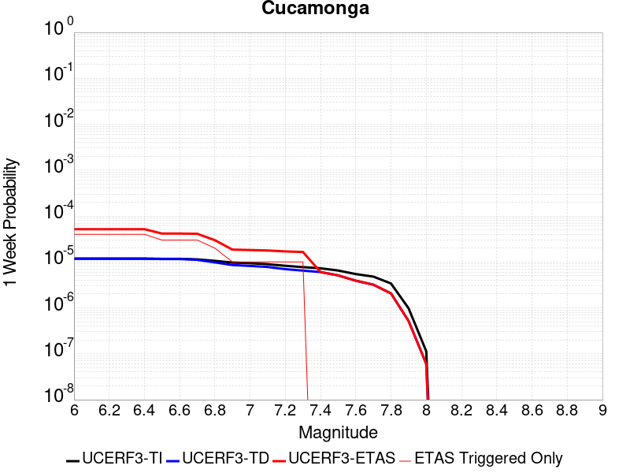 |  |  | 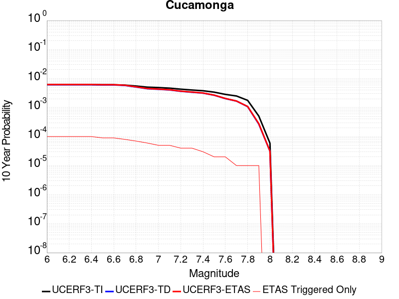 |

| Magnitude | 1 wk TI Prob | 1 wk TD Prob | 1 wk ETAS Prob | 1 wk ETAS/TD Gain | 1 wk ETAS Triggered Only | 1 mo TI Prob | 1 mo TD Prob | 1 mo ETAS Prob | 1 mo ETAS/TD Gain | 1 mo ETAS Triggered Only | 1 yr TI Prob | 1 yr TD Prob | 1 yr ETAS Prob | 1 yr ETAS/TD Gain | 1 yr ETAS Triggered Only | 10 yr TI Prob | 10 yr TD Prob | 10 yr ETAS Prob | 10 yr ETAS/TD Gain | 10 yr ETAS Triggered Only |
|-----|-----|-----|-----|-----|-----|-----|-----|-----|-----|-----|-----|-----|-----|-----|-----|-----|-----|-----|-----|-----|
| 6.0 | 1.1848348E-5 | 1.1737008E-5 | 4.7034864E-5 | 4.007398 | 3.529827E-5 | 5.0777642E-5 | 5.030051E-5 | 1.208935E-4 | 2.403425 | 7.059654E-5 | 6.180424E-4 | 6.1223935E-4 | 7.5334596E-4 | 1.2304763 | 1.4119309E-4 | 0.0061632637 | 0.0061067017 | 0.0062821154 | 1.0287248 | 1.7649135E-4 |
| 6.1 | 1.1848348E-5 | 1.1737008E-5 | 4.7034864E-5 | 4.007398 | 3.529827E-5 | 5.0777642E-5 | 5.030051E-5 | 1.208935E-4 | 2.403425 | 7.059654E-5 | 6.180424E-4 | 6.1223935E-4 | 7.5334596E-4 | 1.2304763 | 1.4119309E-4 | 0.0061632637 | 0.0061067017 | 0.0062821154 | 1.0287248 | 1.7649135E-4 |
| 6.2 | 1.1848348E-5 | 1.1737008E-5 | 4.7034864E-5 | 4.007398 | 3.529827E-5 | 5.0777642E-5 | 5.030051E-5 | 1.208935E-4 | 2.403425 | 7.059654E-5 | 6.180424E-4 | 6.1223935E-4 | 7.5334596E-4 | 1.2304763 | 1.4119309E-4 | 0.0061632637 | 0.0061067017 | 0.0062821154 | 1.0287248 | 1.7649135E-4 |
| 6.3 | 1.1848348E-5 | 1.1737008E-5 | 4.7034864E-5 | 4.007398 | 3.529827E-5 | 5.0777642E-5 | 5.030051E-5 | 1.208935E-4 | 2.403425 | 7.059654E-5 | 6.180424E-4 | 6.1223935E-4 | 7.5334596E-4 | 1.2304763 | 1.4119309E-4 | 0.0061632637 | 0.0061067017 | 0.0062821154 | 1.0287248 | 1.7649135E-4 |
| 6.4 | 1.1848348E-5 | 1.1737008E-5 | 4.7034864E-5 | 4.007398 | 3.529827E-5 | 5.0777642E-5 | 5.030051E-5 | 1.208935E-4 | 2.403425 | 7.059654E-5 | 6.180424E-4 | 6.1223935E-4 | 7.5334596E-4 | 1.2304763 | 1.4119309E-4 | 0.0061632637 | 0.0061067017 | 0.0062821154 | 1.0287248 | 1.7649135E-4 |
| 6.5 | 1.16988695E-5 | 1.15760395E-5 | 4.68739E-5 | 4.0492177 | 3.529827E-5 | 5.013705E-5 | 4.9610666E-5 | 1.2020371E-4 | 2.4229407 | 7.059654E-5 | 6.102476E-4 | 6.0384517E-4 | 7.44953E-4 | 1.2336822 | 1.4119309E-4 | 0.006085745 | 0.006023216 | 0.0061986446 | 1.0291253 | 1.7649135E-4 |
| 6.6 | 1.16988695E-5 | 1.15760395E-5 | 4.68739E-5 | 4.0492177 | 3.529827E-5 | 5.013705E-5 | 4.9610666E-5 | 1.2020371E-4 | 2.4229407 | 7.059654E-5 | 6.102476E-4 | 6.0384517E-4 | 7.44953E-4 | 1.2336822 | 1.4119309E-4 | 0.006085745 | 0.006023216 | 0.0061986446 | 1.0291253 | 1.7649135E-4 |
| 6.7 | 1.1397107E-5 | 1.11149475E-5 | 4.6412824E-5 | 4.1757126 | 3.529827E-5 | 4.884383E-5 | 4.7634636E-5 | 8.293123E-5 | 1.7409859 | 3.529827E-5 | 5.9451134E-4 | 5.797998E-4 | 6.856333E-4 | 1.1825343 | 1.0589481E-4 | 0.005929234 | 0.0057840226 | 0.005924399 | 1.0242697 | 1.4119309E-4 |
| 6.8 | 1.058387E-5 | 9.784992E-6 | 4.5082917E-5 | 4.6073537 | 3.529827E-5 | 4.5358654E-5 | 4.193501E-5 | 7.72318E-5 | 1.8417022 | 3.529827E-5 | 5.521017E-4 | 5.1044027E-4 | 6.16281E-4 | 1.2073519 | 1.0589481E-4 | 0.00550732 | 0.0050936877 | 0.0052341614 | 1.027578 | 1.4119309E-4 |
| 6.9 | 9.690046E-6 | 8.57948E-6 | 4.3877448E-5 | 5.1142316 | 3.529827E-5 | 4.1528107E-5 | 3.6768684E-5 | 7.206566E-5 | 1.9599738 | 3.529827E-5 | 5.054874E-4 | 4.475672E-4 | 5.5341463E-4 | 1.236495 | 1.0589481E-4 | 0.005043391 | 0.004467594 | 0.004608156 | 1.0314627 | 1.4119309E-4 |
| 7.0 | 9.381461E-6 | 8.187101E-6 | 4.348508E-5 | 5.311414 | 3.529827E-5 | 4.020564E-5 | 3.5087105E-5 | 7.0384136E-5 | 2.0059829 | 3.529827E-5 | 4.893937E-4 | 4.2710215E-4 | 4.976685E-4 | 1.1652213 | 7.059654E-5 | 0.0048831734 | 0.0042637475 | 0.004369191 | 1.0247302 | 1.0589481E-4 |
| 7.1 | 8.946492E-6 | 7.781886E-6 | 4.3079883E-5 | 5.5359178 | 3.529827E-5 | 3.8341543E-5 | 3.3350516E-5 | 6.8647605E-5 | 2.0583673 | 3.529827E-5 | 4.667083E-4 | 4.0596718E-4 | 4.7653506E-4 | 1.1738266 | 7.059654E-5 | 0.0046572937 | 0.004053192 | 0.004158658 | 1.0260204 | 1.0589481E-4 |
| 7.2 | 8.251016E-6 | 6.9752796E-6 | 4.2273303E-5 | 6.060446 | 3.529827E-5 | 3.5361016E-5 | 2.9893714E-5 | 6.519093E-5 | 2.180757 | 3.529827E-5 | 4.3043532E-4 | 3.6389544E-4 | 4.344663E-4 | 1.1939317 | 7.059654E-5 | 0.0042960253 | 0.0036339292 | 0.0037394392 | 1.0290347 | 1.0589481E-4 |
| 7.3 | 7.717881E-6 | 6.4863502E-6 | 4.178439E-5 | 6.4418955 | 3.529827E-5 | 3.3076216E-5 | 2.7798349E-5 | 6.309564E-5 | 2.269762 | 3.529827E-5 | 4.026285E-4 | 3.3839257E-4 | 4.0896522E-4 | 1.2085526 | 7.059654E-5 | 0.004018998 | 0.00337971 | 0.003485247 | 1.0312266 | 1.0589481E-4 |
| 7.4 | 7.275623E-6 | 6.031997E-6 | 6.031997E-6 | 1.0 | 0.0 | 3.118087E-5 | 2.585116E-5 | 2.585116E-5 | 1.0 | 0.0 | 3.7956095E-4 | 3.1469265E-4 | 3.4997982E-4 | 1.1121322 | 3.529827E-5 | 0.0037891332 | 0.0031434062 | 0.003213781 | 1.022388 | 7.059654E-5 |
| 7.5 | 6.5109502E-6 | 5.1006014E-6 | 5.1006014E-6 | 1.0 | 0.0 | 2.7903774E-5 | 2.1859538E-5 | 2.1859538E-5 | 1.0 | 0.0 | 3.3967546E-4 | 2.661075E-4 | 3.013964E-4 | 1.1326114 | 3.529827E-5 | 0.0033915674 | 0.002658813 | 0.002729222 | 1.0264813 | 7.059654E-5 |
| 7.6 | 5.4495326E-6 | 3.90857E-6 | 3.90857E-6 | 1.0 | 0.0 | 2.335493E-5 | 1.6750908E-5 | 1.6750908E-5 | 1.0 | 0.0 | 2.8430918E-4 | 2.0392328E-4 | 2.3921435E-4 | 1.1730605 | 3.529827E-5 | 0.0028394572 | 0.002038282 | 0.0021087348 | 1.0345647 | 7.059654E-5 |
| 7.7 | 4.7997164E-6 | 3.2002547E-6 | 3.2002547E-6 | 1.0 | 0.0 | 2.057005E-5 | 1.3715306E-5 | 1.3715306E-5 | 1.0 | 0.0 | 2.504116E-4 | 1.6697108E-4 | 1.6697108E-4 | 1.0 | 0.0 | 0.002501296 | 0.0016693877 | 0.001704627 | 1.0211091 | 3.529827E-5 |
| 7.8 | 3.3941733E-6 | 2.0641899E-6 | 2.0641899E-6 | 1.0 | 0.0 | 1.4546376E-5 | 8.846498E-6 | 8.846498E-6 | 1.0 | 0.0 | 1.7708774E-4 | 1.07700806E-4 | 1.07700806E-4 | 1.0 | 0.0 | 0.0017694668 | 0.001076723 | 0.0011119832 | 1.0327477 | 3.529827E-5 |
| 7.9 | 9.750552E-7 | 5.155946E-7 | 5.155946E-7 | 1.0 | 0.0 | 4.178801E-6 | 2.2096892E-6 | 2.2096892E-6 | 1.0 | 0.0 | 5.0875715E-5 | 2.690264E-5 | 2.690264E-5 | 1.0 | 0.0 | 5.086407E-4 | 2.6899425E-4 | 3.0428302E-4 | 1.1311878 | 3.529827E-5 |
| 8.0 | 1.133857E-7 | 6.053707E-8 | 6.053707E-8 | 1.0 | 0.0 | 4.8593864E-7 | 2.5944456E-7 | 2.5944456E-7 | 1.0 | 0.0 | 5.9162867E-6 | 3.158733E-6 | 3.158733E-6 | 1.0 | 0.0 | 5.916129E-5 | 3.1586897E-5 | 3.1586897E-5 | 1.0 | 0.0 |

## Coronado Bank alt1
*[(top)](#table-of-contents)*

| 1 Week | 1 Month | 1 Year | 10 Year |
|-----|-----|-----|-----|
|  |  |  |  |

| Magnitude | 1 wk TI Prob | 1 wk TD Prob | 1 wk ETAS Prob | 1 wk ETAS/TD Gain | 1 wk ETAS Triggered Only | 1 mo TI Prob | 1 mo TD Prob | 1 mo ETAS Prob | 1 mo ETAS/TD Gain | 1 mo ETAS Triggered Only | 1 yr TI Prob | 1 yr TD Prob | 1 yr ETAS Prob | 1 yr ETAS/TD Gain | 1 yr ETAS Triggered Only | 10 yr TI Prob | 10 yr TD Prob | 10 yr ETAS Prob | 10 yr ETAS/TD Gain | 10 yr ETAS Triggered Only |
|-----|-----|-----|-----|-----|-----|-----|-----|-----|-----|-----|-----|-----|-----|-----|-----|-----|-----|-----|-----|-----|
| 6.0 | 7.533492E-5 | 9.394913E-5 | 1.9983399E-4 | 2.1270447 | 1.0589481E-4 | 3.22824E-4 | 4.0258127E-4 | 5.0843344E-4 | 1.2629337 | 1.0589481E-4 | 0.0039233007 | 0.0048909658 | 0.0050665936 | 1.0359087 | 1.7649135E-4 | 0.03854755 | 0.04790356 | 0.048071597 | 1.0035079 | 1.7649135E-4 |
| 6.1 | 4.1807285E-5 | 5.049283E-5 | 8.578932E-5 | 1.6990396 | 3.529827E-5 | 1.7916178E-4 | 2.1638049E-4 | 2.5167112E-4 | 1.1630952 | 3.529827E-5 | 0.0021791123 | 0.0026313474 | 0.0027017582 | 1.0267584 | 7.059654E-5 | 0.021578677 | 0.026011046 | 0.026079807 | 1.0026435 | 7.059654E-5 |
| 6.2 | 4.1807285E-5 | 5.049283E-5 | 8.578932E-5 | 1.6990396 | 3.529827E-5 | 1.7916178E-4 | 2.1638049E-4 | 2.5167112E-4 | 1.1630952 | 3.529827E-5 | 0.0021791123 | 0.0026313474 | 0.0027017582 | 1.0267584 | 7.059654E-5 | 0.021578677 | 0.026011046 | 0.026079807 | 1.0026435 | 7.059654E-5 |
| 6.3 | 3.1793104E-5 | 3.7711117E-5 | 3.7711117E-5 | 1.0 | 0.0 | 1.3624904E-4 | 1.6160926E-4 | 1.6160926E-4 | 1.0 | 0.0 | 0.0016575698 | 0.001965848 | 0.002001077 | 1.0179205 | 3.529827E-5 | 0.016452603 | 0.019488465 | 0.019523075 | 1.001776 | 3.529827E-5 |
| 6.4 | 2.9878007E-5 | 3.5335794E-5 | 3.5335794E-5 | 1.0 | 0.0 | 1.2804232E-4 | 1.5143053E-4 | 1.5143053E-4 | 1.0 | 0.0 | 0.0015578003 | 0.0018421387 | 0.0018773719 | 1.0191263 | 3.529827E-5 | 0.015469253 | 0.01827244 | 0.018307095 | 1.0018965 | 3.529827E-5 |
| 6.5 | 2.4512565E-5 | 2.8764043E-5 | 2.8764043E-5 | 1.0 | 0.0 | 1.0504962E-4 | 1.2326881E-4 | 1.2326881E-4 | 1.0 | 0.0 | 0.0012782287 | 0.0014997921 | 0.0015350374 | 1.0235001 | 3.529827E-5 | 0.012709012 | 0.014899683 | 0.014934455 | 1.0023338 | 3.529827E-5 |
| 6.6 | 2.1317413E-5 | 2.490667E-5 | 2.490667E-5 | 1.0 | 0.0 | 9.135714E-5 | 1.0673863E-4 | 1.0673863E-4 | 1.0 | 0.0 | 0.0011117056 | 0.0012987906 | 0.001334043 | 1.0271425 | 3.529827E-5 | 0.011061605 | 0.012914404 | 0.012949247 | 1.002698 | 3.529827E-5 |
| 6.7 | 1.8585655E-5 | 2.163488E-5 | 2.163488E-5 | 1.0 | 0.0 | 7.9650374E-5 | 9.271773E-5 | 9.271773E-5 | 1.0 | 0.0 | 9.6931186E-4 | 0.0011282742 | 0.0011635327 | 1.0312499 | 3.529827E-5 | 0.0096509475 | 0.011227623 | 0.011262524 | 1.0031086 | 3.529827E-5 |
| 6.8 | 1.5862879E-5 | 1.8419474E-5 | 1.8419474E-5 | 1.0 | 0.0 | 6.798199E-5 | 7.893833E-5 | 7.893833E-5 | 1.0 | 0.0 | 8.273665E-4 | 9.6066965E-4 | 9.95934E-4 | 1.0367081 | 3.529827E-5 | 0.008242928 | 0.00956715 | 0.009602111 | 1.0036542 | 3.529827E-5 |
| 6.9 | 1.3021509E-5 | 1.5095265E-5 | 1.5095265E-5 | 1.0 | 0.0 | 5.5805274E-5 | 6.469249E-5 | 6.469249E-5 | 1.0 | 0.0 | 6.792174E-4 | 7.8736455E-4 | 8.22635E-4 | 1.0447956 | 3.529827E-5 | 0.006771452 | 0.007847573 | 0.007882593 | 1.0044627 | 3.529827E-5 |
| 7.0 | 1.0974371E-5 | 1.2720104E-5 | 1.2720104E-5 | 1.0 | 0.0 | 4.7032172E-5 | 5.451369E-5 | 5.451369E-5 | 1.0 | 0.0 | 5.7246623E-4 | 6.6351966E-4 | 6.6351966E-4 | 1.0 | 0.0 | 0.0057099373 | 0.006617135 | 0.006617135 | 1.0 | 0.0 |
| 7.1 | 8.766221E-6 | 1.01638325E-5 | 1.01638325E-5 | 1.0 | 0.0 | 3.7568978E-5 | 4.355865E-5 | 4.355865E-5 | 1.0 | 0.0 | 4.573063E-4 | 5.3021475E-4 | 5.3021475E-4 | 1.0 | 0.0 | 0.0045636636 | 0.0052911965 | 0.0052911965 | 1.0 | 0.0 |
| 7.2 | 8.026024E-7 | 8.331765E-7 | 8.331765E-7 | 1.0 | 0.0 | 3.43972E-6 | 3.5707515E-6 | 3.5707515E-6 | 1.0 | 0.0 | 4.1877785E-5 | 4.3473043E-5 | 4.3473043E-5 | 1.0 | 0.0 | 4.1869894E-4 | 4.3464647E-4 | 4.3464647E-4 | 1.0 | 0.0 |
| 7.3 | 3.7293114E-7 | 3.7000953E-7 | 3.7000953E-7 | 1.0 | 0.0 | 1.5982754E-6 | 1.5857541E-6 | 1.5857541E-6 | 1.0 | 0.0 | 1.9458828E-5 | 1.9306386E-5 | 1.9306386E-5 | 1.0 | 0.0 | 1.9457124E-4 | 1.9304715E-4 | 1.9304715E-4 | 1.0 | 0.0 |
| 7.4 | 2.0557036E-7 | 1.9674363E-7 | 1.9674363E-7 | 1.0 | 0.0 | 8.810155E-7 | 8.431867E-7 | 8.431867E-7 | 1.0 | 0.0 | 1.0726311E-5 | 1.026575E-5 | 1.026575E-5 | 1.0 | 0.0 | 1.0725793E-4 | 1.0265279E-4 | 1.0265279E-4 | 1.0 | 0.0 |
| 7.5 | 6.845446E-8 | 6.279369E-8 | 6.279369E-8 | 1.0 | 0.0 | 2.9337625E-7 | 2.691158E-7 | 2.691158E-7 | 1.0 | 0.0 | 3.5718497E-6 | 3.2764797E-6 | 3.2764797E-6 | 1.0 | 0.0 | 3.5717923E-5 | 3.2764325E-5 | 3.2764325E-5 | 1.0 | 0.0 |
| 7.6 | 6.0975145E-9 | 5.53185E-9 | 5.53185E-9 | 1.0 | 0.0 | 2.6132206E-8 | 2.370793E-8 | 2.370793E-8 | 1.0 | 0.0 | 3.1815955E-7 | 2.88644E-7 | 2.88644E-7 | 1.0 | 0.0 | 3.181591E-6 | 2.8864374E-6 | 2.8864374E-6 | 1.0 | 0.0 |

## Blue Cut
*[(top)](#table-of-contents)*

| 1 Week | 1 Month | 1 Year | 10 Year |
|-----|-----|-----|-----|
|  |  |  |  |

| Magnitude | 1 wk TI Prob | 1 wk TD Prob | 1 wk ETAS Prob | 1 wk ETAS/TD Gain | 1 wk ETAS Triggered Only | 1 mo TI Prob | 1 mo TD Prob | 1 mo ETAS Prob | 1 mo ETAS/TD Gain | 1 mo ETAS Triggered Only | 1 yr TI Prob | 1 yr TD Prob | 1 yr ETAS Prob | 1 yr ETAS/TD Gain | 1 yr ETAS Triggered Only | 10 yr TI Prob | 10 yr TD Prob | 10 yr ETAS Prob | 10 yr ETAS/TD Gain | 10 yr ETAS Triggered Only |
|-----|-----|-----|-----|-----|-----|-----|-----|-----|-----|-----|-----|-----|-----|-----|-----|-----|-----|-----|-----|-----|
| 6.0 | 2.1227985E-5 | 2.2719574E-5 | 1.2861198E-4 | 5.6608443 | 1.0589481E-4 | 9.097391E-5 | 9.73663E-5 | 2.3854563E-4 | 2.4499815 | 1.4119309E-4 | 0.0011070445 | 0.0011848481 | 0.0013611304 | 1.1487805 | 1.7649135E-4 | 0.011015458 | 0.011791152 | 0.011965562 | 1.0147916 | 1.7649135E-4 |
| 6.1 | 2.1227985E-5 | 2.2719574E-5 | 1.2861198E-4 | 5.6608443 | 1.0589481E-4 | 9.097391E-5 | 9.73663E-5 | 2.3854563E-4 | 2.4499815 | 1.4119309E-4 | 0.0011070445 | 0.0011848481 | 0.0013611304 | 1.1487805 | 1.7649135E-4 | 0.011015458 | 0.011791152 | 0.011965562 | 1.0147916 | 1.7649135E-4 |
| 6.2 | 2.1227985E-5 | 2.2719574E-5 | 1.2861198E-4 | 5.6608443 | 1.0589481E-4 | 9.097391E-5 | 9.73663E-5 | 2.3854563E-4 | 2.4499815 | 1.4119309E-4 | 0.0011070445 | 0.0011848481 | 0.0013611304 | 1.1487805 | 1.7649135E-4 | 0.011015458 | 0.011791152 | 0.011965562 | 1.0147916 | 1.7649135E-4 |
| 6.3 | 1.1613981E-5 | 1.2353542E-5 | 4.7651378E-5 | 3.8573048 | 3.529827E-5 | 4.9773254E-5 | 5.2942745E-5 | 1.2353554E-4 | 2.33338 | 7.059654E-5 | 6.0582085E-4 | 6.443998E-4 | 7.149508E-4 | 1.1094834 | 7.059654E-5 | 0.0060417196 | 0.0064265593 | 0.006496702 | 1.0109146 | 7.059654E-5 |
| 6.4 | 1.1613981E-5 | 1.2353542E-5 | 4.7651378E-5 | 3.8573048 | 3.529827E-5 | 4.9773254E-5 | 5.2942745E-5 | 1.2353554E-4 | 2.33338 | 7.059654E-5 | 6.0582085E-4 | 6.443998E-4 | 7.149508E-4 | 1.1094834 | 7.059654E-5 | 0.0060417196 | 0.0064265593 | 0.006496702 | 1.0109146 | 7.059654E-5 |
| 6.5 | 8.931326E-6 | 9.4816E-6 | 4.4779536E-5 | 4.7227826 | 3.529827E-5 | 3.8276554E-5 | 4.0634844E-5 | 7.593168E-5 | 1.8686347 | 3.529827E-5 | 4.6591737E-4 | 4.946261E-4 | 5.299069E-4 | 1.0713283 | 3.529827E-5 | 0.0046494175 | 0.004936161 | 0.0049712854 | 1.0071156 | 3.529827E-5 |
| 6.6 | 7.345353E-6 | 7.79028E-6 | 4.3088276E-5 | 5.5310307 | 3.529827E-5 | 3.1479703E-5 | 3.338653E-5 | 6.868362E-5 | 2.0572255 | 3.529827E-5 | 3.83198E-4 | 4.064132E-4 | 4.416971E-4 | 1.0868179 | 3.529827E-5 | 0.0038253788 | 0.0040574907 | 0.004092646 | 1.0086643 | 3.529827E-5 |
| 6.7 | 6.2775666E-6 | 6.655149E-6 | 4.1953186E-5 | 6.303869 | 3.529827E-5 | 2.690358E-5 | 2.8521798E-5 | 6.381906E-5 | 2.237554 | 3.529827E-5 | 3.2750185E-4 | 3.472051E-4 | 3.824911E-4 | 1.1016288 | 3.529827E-5 | 0.0032701963 | 0.003467367 | 0.003502543 | 1.0101448 | 3.529827E-5 |
| 6.8 | 5.5234095E-6 | 5.8551113E-6 | 4.1153176E-5 | 7.0285897 | 3.529827E-5 | 2.367154E-5 | 2.5093133E-5 | 6.0390517E-5 | 2.406655 | 3.529827E-5 | 2.8816288E-4 | 3.0547334E-4 | 3.4076083E-4 | 1.1155174 | 3.529827E-5 | 0.002877895 | 0.0030512505 | 0.0030864412 | 1.0115331 | 3.529827E-5 |
| 6.9 | 4.7780054E-6 | 5.0654203E-6 | 4.0363513E-5 | 7.9684424 | 3.529827E-5 | 2.0477004E-5 | 2.1708804E-5 | 5.700631E-5 | 2.6259534 | 3.529827E-5 | 2.4927902E-4 | 2.642797E-4 | 2.9956864E-4 | 1.1335288 | 3.529827E-5 | 0.0024899957 | 0.002640346 | 0.0026755512 | 1.0133336 | 3.529827E-5 |
| 7.0 | 3.883171E-6 | 4.118487E-6 | 3.9416613E-5 | 9.570653 | 3.529827E-5 | 1.6642054E-5 | 1.7650578E-5 | 5.2948224E-5 | 2.9998012 | 3.529827E-5 | 2.0259817E-4 | 2.1488148E-4 | 2.5017216E-4 | 1.1642332 | 3.529827E-5 | 0.0020241356 | 0.0021474129 | 0.0021826352 | 1.0164022 | 3.529827E-5 |
| 7.1 | 2.8358215E-6 | 3.0097158E-6 | 3.0097158E-6 | 1.0 | 0.0 | 1.2153464E-5 | 1.2898756E-5 | 1.2898756E-5 | 1.0 | 0.0 | 1.4795837E-4 | 1.5703762E-4 | 1.5703762E-4 | 1.0 | 0.0 | 0.001478599 | 0.0015699116 | 0.0015699116 | 1.0 | 0.0 |

## Santa Ynez River
*[(top)](#table-of-contents)*

| 1 Week | 1 Month | 1 Year | 10 Year |
|-----|-----|-----|-----|
|  | 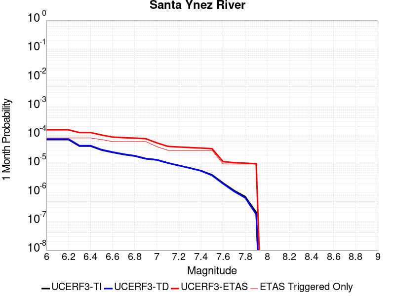 |  |  |

| Magnitude | 1 wk TI Prob | 1 wk TD Prob | 1 wk ETAS Prob | 1 wk ETAS/TD Gain | 1 wk ETAS Triggered Only | 1 mo TI Prob | 1 mo TD Prob | 1 mo ETAS Prob | 1 mo ETAS/TD Gain | 1 mo ETAS Triggered Only | 1 yr TI Prob | 1 yr TD Prob | 1 yr ETAS Prob | 1 yr ETAS/TD Gain | 1 yr ETAS Triggered Only | 10 yr TI Prob | 10 yr TD Prob | 10 yr ETAS Prob | 10 yr ETAS/TD Gain | 10 yr ETAS Triggered Only |
|-----|-----|-----|-----|-----|-----|-----|-----|-----|-----|-----|-----|-----|-----|-----|-----|-----|-----|-----|-----|-----|
| 6.0 | 1.6396456E-5 | 1.7209435E-5 | 1.5840009E-4 | 9.204258 | 1.4119309E-4 | 7.026863E-5 | 7.375284E-5 | 2.1493551E-4 | 2.9142675 | 1.4119309E-4 | 8.551848E-4 | 8.976064E-4 | 0.0010739394 | 1.196448 | 1.7649135E-4 | 0.0085190125 | 0.008943358 | 0.009118271 | 1.0195578 | 1.7649135E-4 |
| 6.1 | 1.6396456E-5 | 1.7209435E-5 | 1.5840009E-4 | 9.204258 | 1.4119309E-4 | 7.026863E-5 | 7.375284E-5 | 2.1493551E-4 | 2.9142675 | 1.4119309E-4 | 8.551848E-4 | 8.976064E-4 | 0.0010739394 | 1.196448 | 1.7649135E-4 | 0.0085190125 | 0.008943358 | 0.009118271 | 1.0195578 | 1.7649135E-4 |
| 6.2 | 1.6396456E-5 | 1.7209435E-5 | 1.5840009E-4 | 9.204258 | 1.4119309E-4 | 7.026863E-5 | 7.375284E-5 | 2.1493551E-4 | 2.9142675 | 1.4119309E-4 | 8.551848E-4 | 8.976064E-4 | 0.0010739394 | 1.196448 | 1.7649135E-4 | 0.0085190125 | 0.008943358 | 0.009118271 | 1.0195578 | 1.7649135E-4 |
| 6.3 | 9.736976E-6 | 1.012233E-5 | 1.5131399E-4 | 14.948532 | 1.4119309E-4 | 4.172923E-5 | 4.338072E-5 | 1.8456767E-4 | 4.2546015 | 1.4119309E-4 | 5.0793495E-4 | 5.280373E-4 | 6.691558E-4 | 1.267251 | 1.4119309E-4 | 0.005067755 | 0.005268332 | 0.005408781 | 1.0266591 | 1.4119309E-4 |
| 6.4 | 9.736976E-6 | 1.012233E-5 | 1.5131399E-4 | 14.948532 | 1.4119309E-4 | 4.172923E-5 | 4.338072E-5 | 1.8456767E-4 | 4.2546015 | 1.4119309E-4 | 5.0793495E-4 | 5.280373E-4 | 6.691558E-4 | 1.267251 | 1.4119309E-4 | 0.005067755 | 0.005268332 | 0.005408781 | 1.0266591 | 1.4119309E-4 |
| 6.5 | 7.081964E-6 | 7.3298966E-6 | 1.13223934E-4 | 15.446867 | 1.0589481E-4 | 3.035092E-5 | 3.1413474E-5 | 1.3730496E-4 | 4.370894 | 1.0589481E-4 | 3.694598E-4 | 3.8239348E-4 | 4.882478E-4 | 1.2768204 | 1.0589481E-4 | 0.0036884616 | 0.0038175168 | 0.0039230073 | 1.0276333 | 1.0589481E-4 |
| 6.6 | 5.873247E-6 | 6.059743E-6 | 1.11953916E-4 | 18.475027 | 1.0589481E-4 | 2.5170815E-5 | 2.5970074E-5 | 1.3186214E-4 | 5.0774646 | 1.0589481E-4 | 3.064116E-4 | 3.1614062E-4 | 4.2200196E-4 | 1.3348552 | 1.0589481E-4 | 0.0030598943 | 0.0031569963 | 0.0032625569 | 1.033437 | 1.0589481E-4 |
| 6.7 | 4.973277E-6 | 5.115901E-6 | 1.1101017E-4 | 21.699045 | 1.0589481E-4 | 2.1313872E-5 | 2.1925109E-5 | 1.2781759E-4 | 5.829736 | 1.0589481E-4 | 2.5946548E-4 | 2.66906E-4 | 3.727725E-4 | 1.3966436 | 1.0589481E-4 | 0.0025916274 | 0.0026659032 | 0.0027715156 | 1.039616 | 1.0589481E-4 |
| 6.8 | 4.396492E-6 | 4.5109778E-6 | 1.1040531E-4 | 24.474808 | 1.0589481E-4 | 1.884197E-5 | 1.9332621E-5 | 1.2522539E-4 | 6.4774137 | 1.0589481E-4 | 2.2937685E-4 | 2.3534958E-4 | 3.4121948E-4 | 1.449841 | 1.0589481E-4 | 0.0022914023 | 0.0023510386 | 0.0024566846 | 1.0449358 | 1.0589481E-4 |
| 6.9 | 3.5255632E-6 | 3.6013332E-6 | 1.0949576E-4 | 30.404228 | 1.0589481E-4 | 1.5109469E-5 | 1.5434196E-5 | 1.2132737E-4 | 7.8609457 | 1.0589481E-4 | 1.8394225E-4 | 1.8789528E-4 | 2.937702E-4 | 1.5634784 | 1.0589481E-4 | 0.0018379007 | 0.0018773803 | 0.0019830763 | 1.0562997 | 1.0589481E-4 |
| 7.0 | 3.211603E-6 | 3.273654E-6 | 3.857181E-5 | 11.782494 | 3.529827E-5 | 1.376394E-5 | 1.4029872E-5 | 4.9327646E-5 | 3.5159016 | 3.529827E-5 | 1.6756308E-4 | 1.7080043E-4 | 2.0609268E-4 | 1.2066286 | 3.529827E-5 | 0.0016743679 | 0.0017067058 | 0.0017419438 | 1.0206468 | 3.529827E-5 |
| 7.1 | 2.5094619E-6 | 2.5409204E-6 | 3.78391E-5 | 14.891887 | 3.529827E-5 | 1.0754793E-5 | 1.0889614E-5 | 4.61875E-5 | 4.241427 | 3.529827E-5 | 1.3093173E-4 | 1.3257304E-4 | 1.6786663E-4 | 1.26622 | 3.529827E-5 | 0.0013085462 | 0.0013249456 | 0.0013601971 | 1.026606 | 3.529827E-5 |
| 7.2 | 2.0515774E-6 | 2.0619375E-6 | 3.7360136E-5 | 18.118946 | 3.529827E-5 | 8.792445E-6 | 8.836846E-6 | 4.4134806E-5 | 4.994407 | 3.529827E-5 | 1.0704277E-4 | 1.0758333E-4 | 1.428778E-4 | 1.3280663 | 3.529827E-5 | 0.0010699122 | 0.0010753168 | 0.001110577 | 1.0327907 | 3.529827E-5 |
| 7.3 | 1.6845745E-6 | 1.6773907E-6 | 3.69756E-5 | 22.043524 | 3.529827E-5 | 7.219585E-6 | 7.1887976E-6 | 4.2486816E-5 | 5.910142 | 3.529827E-5 | 8.78949E-5 | 8.752012E-5 | 1.2281531E-4 | 1.4032807 | 3.529827E-5 | 8.7860145E-4 | 8.7485946E-4 | 9.1012684E-4 | 1.040312 | 3.529827E-5 |
| 7.4 | 1.3600285E-6 | 1.3333357E-6 | 3.6631558E-5 | 27.47362 | 3.529827E-5 | 5.82868E-6 | 5.714284E-6 | 4.1012354E-5 | 7.177164 | 3.529827E-5 | 7.096187E-5 | 6.956921E-5 | 1.0486502E-4 | 1.5073483 | 3.529827E-5 | 7.0939213E-4 | 6.954765E-4 | 7.307502E-4 | 1.0507188 | 3.529827E-5 |
| 7.5 | 9.735342E-7 | 9.290103E-7 | 3.6227248E-5 | 38.99553 | 3.529827E-5 | 4.172283E-6 | 3.9814668E-6 | 3.9279596E-5 | 9.86561 | 3.529827E-5 | 5.079636E-5 | 4.8473295E-5 | 8.376985E-5 | 1.728165 | 3.529827E-5 | 5.0784746E-4 | 4.8462892E-4 | 5.1991007E-4 | 1.0728004 | 3.529827E-5 |
| 7.6 | 5.067187E-7 | 4.77857E-7 | 3.577611E-5 | 74.86782 | 3.529827E-5 | 2.1716498E-6 | 2.047957E-6 | 3.7346155E-5 | 18.235811 | 3.529827E-5 | 2.6439517E-5 | 2.4933597E-5 | 6.023099E-5 | 2.4156556 | 3.529827E-5 | 2.643637E-4 | 2.4930874E-4 | 2.845982E-4 | 1.1415492 | 3.529827E-5 |
| 7.7 | 2.769089E-7 | 2.5759124E-7 | 3.555585E-5 | 138.03206 | 3.529827E-5 | 1.1867519E-6 | 1.1039621E-6 | 3.6402194E-5 | 32.974136 | 3.529827E-5 | 1.4448608E-5 | 1.34406555E-5 | 4.873845E-5 | 3.6261961 | 3.529827E-5 | 1.444767E-4 | 1.3439846E-4 | 1.6969198E-4 | 1.2626036 | 3.529827E-5 |
| 7.8 | 1.7044663E-7 | 1.5449015E-7 | 3.5452755E-5 | 229.4823 | 3.529827E-5 | 7.3048534E-7 | 6.621005E-7 | 3.5960347E-5 | 54.312523 | 3.529827E-5 | 8.893623E-6 | 8.061043E-6 | 4.335903E-5 | 5.3788357 | 3.529827E-5 | 8.893267E-5 | 8.060753E-5 | 1.15902956E-4 | 1.4378675 | 3.529827E-5 |
| 7.9 | 4.8344287E-8 | 4.0910923E-8 | 3.533918E-5 | 863.808 | 3.529827E-5 | 2.0718979E-7 | 1.7533252E-7 | 3.5473597E-5 | 202.32184 | 3.529827E-5 | 2.5225327E-6 | 2.1346711E-6 | 3.7432867E-5 | 17.535658 | 3.529827E-5 | 2.5225041E-5 | 2.1346512E-5 | 5.664403E-5 | 2.6535497 | 3.529827E-5 |

## White Mountains
*[(top)](#table-of-contents)*

| 1 Week | 1 Month | 1 Year | 10 Year |
|-----|-----|-----|-----|
|  |  |  |  |

| Magnitude | 1 wk TI Prob | 1 wk TD Prob | 1 wk ETAS Prob | 1 wk ETAS/TD Gain | 1 wk ETAS Triggered Only | 1 mo TI Prob | 1 mo TD Prob | 1 mo ETAS Prob | 1 mo ETAS/TD Gain | 1 mo ETAS Triggered Only | 1 yr TI Prob | 1 yr TD Prob | 1 yr ETAS Prob | 1 yr ETAS/TD Gain | 1 yr ETAS Triggered Only | 10 yr TI Prob | 10 yr TD Prob | 10 yr ETAS Prob | 10 yr ETAS/TD Gain | 10 yr ETAS Triggered Only |
|-----|-----|-----|-----|-----|-----|-----|-----|-----|-----|-----|-----|-----|-----|-----|-----|-----|-----|-----|-----|-----|
| 6.0 | 3.503579E-5 | 3.378405E-5 | 6.908113E-5 | 2.0447853 | 3.529827E-5 | 1.5014476E-4 | 1.4478143E-4 | 1.800746E-4 | 1.2437686 | 3.529827E-5 | 0.0018264796 | 0.0017614096 | 0.0018671178 | 1.0600134 | 1.0589481E-4 | 0.018115403 | 0.017486818 | 0.017625542 | 1.007933 | 1.4119309E-4 |
| 6.1 | 3.503579E-5 | 3.378405E-5 | 6.908113E-5 | 2.0447853 | 3.529827E-5 | 1.5014476E-4 | 1.4478143E-4 | 1.800746E-4 | 1.2437686 | 3.529827E-5 | 0.0018264796 | 0.0017614096 | 0.0018671178 | 1.0600134 | 1.0589481E-4 | 0.018115403 | 0.017486818 | 0.017625542 | 1.007933 | 1.4119309E-4 |
| 6.2 | 3.503579E-5 | 3.378405E-5 | 6.908113E-5 | 2.0447853 | 3.529827E-5 | 1.5014476E-4 | 1.4478143E-4 | 1.800746E-4 | 1.2437686 | 3.529827E-5 | 0.0018264796 | 0.0017614096 | 0.0018671178 | 1.0600134 | 1.0589481E-4 | 0.018115403 | 0.017486818 | 0.017625542 | 1.007933 | 1.4119309E-4 |
| 6.3 | 1.7818425E-5 | 1.5916074E-5 | 1.5916074E-5 | 1.0 | 0.0 | 7.636245E-5 | 6.821004E-5 | 6.821004E-5 | 1.0 | 0.0 | 9.293162E-4 | 8.301551E-4 | 8.301551E-4 | 1.0 | 0.0 | 0.009254395 | 0.008271999 | 0.008342011 | 1.0084639 | 7.059654E-5 |
| 6.4 | 1.7818425E-5 | 1.5916074E-5 | 1.5916074E-5 | 1.0 | 0.0 | 7.636245E-5 | 6.821004E-5 | 6.821004E-5 | 1.0 | 0.0 | 9.293162E-4 | 8.301551E-4 | 8.301551E-4 | 1.0 | 0.0 | 0.009254395 | 0.008271999 | 0.008342011 | 1.0084639 | 7.059654E-5 |
| 6.5 | 1.3397557E-5 | 1.13362685E-5 | 1.13362685E-5 | 1.0 | 0.0 | 5.741684E-5 | 4.858314E-5 | 4.858314E-5 | 1.0 | 0.0 | 6.988258E-4 | 5.913462E-4 | 5.913462E-4 | 1.0 | 0.0 | 0.006966323 | 0.005898432 | 0.005968612 | 1.011898 | 7.059654E-5 |
| 6.6 | 1.0818695E-5 | 8.625366E-6 | 8.625366E-6 | 1.0 | 0.0 | 4.6365014E-5 | 3.6965357E-5 | 3.6965357E-5 | 1.0 | 0.0 | 5.6434784E-4 | 4.4996463E-4 | 4.4996463E-4 | 1.0 | 0.0 | 0.005629168 | 0.004490972 | 0.0045261118 | 1.0078245 | 3.529827E-5 |
| 6.7 | 9.067908E-6 | 6.802442E-6 | 6.802442E-6 | 1.0 | 0.0 | 3.8861883E-5 | 2.9153016E-5 | 2.9153016E-5 | 1.0 | 0.0 | 4.7304068E-4 | 3.5488335E-4 | 3.5488335E-4 | 1.0 | 0.0 | 0.00472035 | 0.0035434833 | 0.0035786566 | 1.0099262 | 3.529827E-5 |
| 6.8 | 7.295947E-6 | 4.936391E-6 | 4.936391E-6 | 1.0 | 0.0 | 3.126797E-5 | 2.1155796E-5 | 2.1155796E-5 | 1.0 | 0.0 | 3.8062103E-4 | 2.575425E-4 | 2.575425E-4 | 1.0 | 0.0 | 0.0037996976 | 0.0025725532 | 0.0025725532 | 1.0 | 0.0 |
| 6.9 | 6.2243444E-6 | 3.832213E-6 | 3.832213E-6 | 1.0 | 0.0 | 2.6675489E-5 | 1.642367E-5 | 1.642367E-5 | 1.0 | 0.0 | 3.2472567E-4 | 1.9994036E-4 | 1.9994036E-4 | 1.0 | 0.0 | 0.0032425157 | 0.0019976576 | 0.0019976576 | 1.0 | 0.0 |
| 7.0 | 4.9878413E-6 | 2.6795342E-6 | 2.6795342E-6 | 1.0 | 0.0 | 2.1376287E-5 | 1.14836685E-5 | 1.14836685E-5 | 1.0 | 0.0 | 2.602252E-4 | 1.3980496E-4 | 1.3980496E-4 | 1.0 | 0.0 | 0.002599207 | 0.0013971963 | 0.0013971963 | 1.0 | 0.0 |
| 7.1 | 4.0252844E-6 | 1.8857575E-6 | 1.8857575E-6 | 1.0 | 0.0 | 1.7251105E-5 | 8.081794E-6 | 8.081794E-6 | 1.0 | 0.0 | 2.1001195E-4 | 9.8391516E-5 | 9.8391516E-5 | 1.0 | 0.0 | 0.0020981359 | 9.834924E-4 | 9.834924E-4 | 1.0 | 0.0 |
| 7.2 | 3.3284066E-6 | 1.281964E-6 | 1.281964E-6 | 1.0 | 0.0 | 1.4264522E-5 | 5.494121E-6 | 5.494121E-6 | 1.0 | 0.0 | 1.736567E-4 | 6.688897E-5 | 6.688897E-5 | 1.0 | 0.0 | 0.0017352107 | 6.6869846E-4 | 6.6869846E-4 | 1.0 | 0.0 |
| 7.3 | 2.458226E-6 | 6.05722E-7 | 6.05722E-7 | 1.0 | 0.0 | 1.0535211E-5 | 2.5959491E-6 | 2.5959491E-6 | 1.0 | 0.0 | 1.2825865E-4 | 3.1605257E-5 | 3.1605257E-5 | 1.0 | 0.0 | 0.0012818464 | 3.160114E-4 | 3.160114E-4 | 1.0 | 0.0 |
| 7.4 | 1.965953E-6 | 3.1089303E-7 | 3.1089303E-7 | 1.0 | 0.0 | 8.425486E-6 | 1.332398E-6 | 1.332398E-6 | 1.0 | 0.0 | 1.0257547E-4 | 1.6221828E-5 | 1.6221828E-5 | 1.0 | 0.0 | 0.0010252813 | 1.6220656E-4 | 1.6220656E-4 | 1.0 | 0.0 |
| 7.5 | 1.2014192E-6 | 1.8244253E-7 | 1.8244253E-7 | 1.0 | 0.0 | 5.148929E-6 | 7.8189635E-7 | 7.8189635E-7 | 1.0 | 0.0 | 6.2686406E-5 | 9.519547E-6 | 9.519547E-6 | 1.0 | 0.0 | 6.266873E-4 | 9.519148E-5 | 9.519148E-5 | 1.0 | 0.0 |
| 7.6 | 2.5612175E-7 | 4.8946475E-8 | 4.8946475E-8 | 1.0 | 0.0 | 1.0976642E-6 | 2.0977059E-7 | 2.0977059E-7 | 1.0 | 0.0 | 1.3363979E-5 | 2.5539543E-6 | 2.5539543E-6 | 1.0 | 0.0 | 1.3363175E-4 | 2.5539286E-5 | 2.5539286E-5 | 1.0 | 0.0 |

## San Clemente
*[(top)](#table-of-contents)*

| 1 Week | 1 Month | 1 Year | 10 Year |
|-----|-----|-----|-----|
|  | 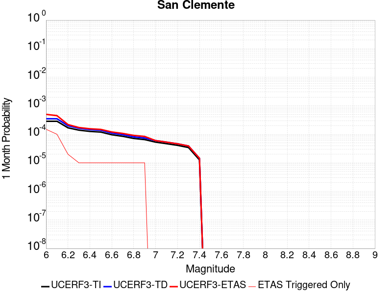 |  |  |

| Magnitude | 1 wk TI Prob | 1 wk TD Prob | 1 wk ETAS Prob | 1 wk ETAS/TD Gain | 1 wk ETAS Triggered Only | 1 mo TI Prob | 1 mo TD Prob | 1 mo ETAS Prob | 1 mo ETAS/TD Gain | 1 mo ETAS Triggered Only | 1 yr TI Prob | 1 yr TD Prob | 1 yr ETAS Prob | 1 yr ETAS/TD Gain | 1 yr ETAS Triggered Only | 10 yr TI Prob | 10 yr TD Prob | 10 yr ETAS Prob | 10 yr ETAS/TD Gain | 10 yr ETAS Triggered Only |
|-----|-----|-----|-----|-----|-----|-----|-----|-----|-----|-----|-----|-----|-----|-----|-----|-----|-----|-----|-----|-----|
| 6.0 | 6.681379E-5 | 8.163422E-5 | 2.2281578E-4 | 2.7294407 | 1.4119309E-4 | 2.8631336E-4 | 3.498173E-4 | 4.90961E-4 | 1.4034783 | 1.4119309E-4 | 0.003480294 | 0.0042512873 | 0.0043918802 | 1.0330707 | 1.4119309E-4 | 0.03426291 | 0.041755714 | 0.041891012 | 1.0032402 | 1.4119309E-4 |
| 6.1 | 6.681379E-5 | 8.163422E-5 | 2.2281578E-4 | 2.7294407 | 1.4119309E-4 | 2.8631336E-4 | 3.498173E-4 | 4.90961E-4 | 1.4034783 | 1.4119309E-4 | 0.003480294 | 0.0042512873 | 0.0043918802 | 1.0330707 | 1.4119309E-4 | 0.03426291 | 0.041755714 | 0.041891012 | 1.0032402 | 1.4119309E-4 |
| 6.2 | 3.9400576E-5 | 4.6451984E-5 | 8.1748614E-5 | 1.7598519 | 3.529827E-5 | 1.6884868E-4 | 1.9906509E-4 | 2.3435634E-4 | 1.177285 | 3.529827E-5 | 0.0020537945 | 0.002420985 | 0.0024561975 | 1.0145448 | 3.529827E-5 | 0.020349167 | 0.02395286 | 0.023987314 | 1.0014384 | 3.529827E-5 |
| 6.3 | 3.2590255E-5 | 3.7929087E-5 | 3.7929087E-5 | 1.0 | 0.0 | 1.3966505E-4 | 1.6254328E-4 | 1.6254328E-4 | 1.0 | 0.0 | 0.0016990956 | 0.0019771985 | 0.0019771985 | 1.0 | 0.0 | 0.01686163 | 0.019599866 | 0.019599866 | 1.0 | 0.0 |
| 6.4 | 2.9454652E-5 | 3.4097775E-5 | 3.4097775E-5 | 1.0 | 0.0 | 1.2622811E-4 | 1.4612528E-4 | 1.4612528E-4 | 1.0 | 0.0 | 0.0015357438 | 0.0017776482 | 0.0017776482 | 1.0 | 0.0 | 0.015251739 | 0.017637458 | 0.017637458 | 1.0 | 0.0 |
| 6.5 | 2.790836E-5 | 3.2247463E-5 | 3.2247463E-5 | 1.0 | 0.0 | 1.1960178E-4 | 1.3819622E-4 | 1.3819622E-4 | 1.0 | 0.0 | 0.001455179 | 0.0016812651 | 0.0016812651 | 1.0 | 0.0 | 0.014456868 | 0.016688475 | 0.016688475 | 1.0 | 0.0 |
| 6.6 | 2.2492153E-5 | 2.5762707E-5 | 2.5762707E-5 | 1.0 | 0.0 | 9.639138E-5 | 1.1040701E-4 | 1.1040701E-4 | 1.0 | 0.0 | 0.0011729331 | 0.0013433908 | 0.0013433908 | 1.0 | 0.0 | 0.011667615 | 0.013354415 | 0.013354415 | 1.0 | 0.0 |
| 6.7 | 1.9862755E-5 | 2.2666423E-5 | 2.2666423E-5 | 1.0 | 0.0 | 8.512331E-5 | 9.713826E-5 | 9.713826E-5 | 1.0 | 0.0 | 0.0010358836 | 0.0011820279 | 0.0011820279 | 1.0 | 0.0 | 0.010310682 | 0.011758701 | 0.011758701 | 1.0 | 0.0 |
| 6.8 | 1.6697575E-5 | 1.897771E-5 | 1.897771E-5 | 1.0 | 0.0 | 7.155907E-5 | 8.133056E-5 | 8.133056E-5 | 1.0 | 0.0 | 8.7088346E-4 | 9.897591E-4 | 9.897591E-4 | 1.0 | 0.0 | 0.008674784 | 0.0098545365 | 0.0098545365 | 1.0 | 0.0 |
| 6.9 | 1.5218415E-5 | 1.72694E-5 | 1.72694E-5 | 1.0 | 0.0 | 6.522015E-5 | 7.4009666E-5 | 7.4009666E-5 | 1.0 | 0.0 | 7.93766E-4 | 9.00704E-4 | 9.00704E-4 | 1.0 | 0.0 | 0.007909367 | 0.008971481 | 0.008971481 | 1.0 | 0.0 |
| 7.0 | 1.2392958E-5 | 1.4033016E-5 | 1.4033016E-5 | 1.0 | 0.0 | 5.3111595E-5 | 6.014015E-5 | 6.014015E-5 | 1.0 | 0.0 | 6.4644177E-4 | 7.319679E-4 | 7.319679E-4 | 1.0 | 0.0 | 0.0064456454 | 0.0072963564 | 0.0072963564 | 1.0 | 0.0 |
| 7.1 | 1.0934128E-5 | 1.2375138E-5 | 1.2375138E-5 | 1.0 | 0.0 | 4.6859706E-5 | 5.303527E-5 | 5.303527E-5 | 1.0 | 0.0 | 5.7036756E-4 | 6.455204E-4 | 6.455204E-4 | 1.0 | 0.0 | 0.0056890585 | 0.0064371997 | 0.0064371997 | 1.0 | 0.0 |
| 7.2 | 9.5798805E-6 | 1.0844935E-5 | 1.0844935E-5 | 1.0 | 0.0 | 4.1055984E-5 | 4.6477508E-5 | 4.6477508E-5 | 1.0 | 0.0 | 4.9974193E-4 | 5.657239E-4 | 5.657239E-4 | 1.0 | 0.0 | 0.0049861963 | 0.0056435615 | 0.0056435615 | 1.0 | 0.0 |
| 7.3 | 8.0167365E-6 | 9.083918E-6 | 9.083918E-6 | 1.0 | 0.0 | 3.4356988E-5 | 3.8930535E-5 | 3.8930535E-5 | 1.0 | 0.0 | 4.1821605E-4 | 4.7388324E-4 | 4.7388324E-4 | 1.0 | 0.0 | 0.0041742986 | 0.0047294297 | 0.0047294297 | 1.0 | 0.0 |
| 7.4 | 2.9581017E-6 | 3.3623792E-6 | 3.3623792E-6 | 1.0 | 0.0 | 1.2677518E-5 | 1.4410146E-5 | 1.4410146E-5 | 1.0 | 0.0 | 1.5433785E-4 | 1.7543444E-4 | 1.7543444E-4 | 1.0 | 0.0 | 0.001542307 | 0.0017534546 | 0.0017534546 | 1.0 | 0.0 |

## Brawley (Seismic Zone) alt 1
*[(top)](#table-of-contents)*

| 1 Week | 1 Month | 1 Year | 10 Year |
|-----|-----|-----|-----|
|  |  |  |  |

| Magnitude | 1 wk TI Prob | 1 wk TD Prob | 1 wk ETAS Prob | 1 wk ETAS/TD Gain | 1 wk ETAS Triggered Only | 1 mo TI Prob | 1 mo TD Prob | 1 mo ETAS Prob | 1 mo ETAS/TD Gain | 1 mo ETAS Triggered Only | 1 yr TI Prob | 1 yr TD Prob | 1 yr ETAS Prob | 1 yr ETAS/TD Gain | 1 yr ETAS Triggered Only | 10 yr TI Prob | 10 yr TD Prob | 10 yr ETAS Prob | 10 yr ETAS/TD Gain | 10 yr ETAS Triggered Only |
|-----|-----|-----|-----|-----|-----|-----|-----|-----|-----|-----|-----|-----|-----|-----|-----|-----|-----|-----|-----|-----|
| 6.0 | 2.2521618E-4 | 4.7632487E-4 | 5.4688775E-4 | 1.1481403 | 7.059654E-5 | 9.6485513E-4 | 0.0020398323 | 0.002145511 | 1.0518076 | 1.0589481E-4 | 0.011683988 | 0.024546238 | 0.024649533 | 1.0042082 | 1.0589481E-4 | 0.11088423 | 0.21350002 | 0.21361107 | 1.0005201 | 1.4119309E-4 |
| 6.1 | 2.2521618E-4 | 4.7632487E-4 | 5.4688775E-4 | 1.1481403 | 7.059654E-5 | 9.6485513E-4 | 0.0020398323 | 0.0021102848 | 1.0345384 | 7.059654E-5 | 0.011683988 | 0.024546238 | 0.0246151 | 1.0028055 | 7.059654E-5 | 0.11088423 | 0.21350002 | 0.2135833 | 1.00039 | 1.0589481E-4 |
| 6.2 | 2.198148E-4 | 4.6717093E-4 | 5.377345E-4 | 1.1510444 | 7.059654E-5 | 9.417233E-4 | 0.0020006616 | 0.0020711168 | 1.035216 | 7.059654E-5 | 0.011405343 | 0.024080504 | 0.0241494 | 1.0028611 | 7.059654E-5 | 0.10837428 | 0.20993657 | 0.21002023 | 1.0003985 | 1.0589481E-4 |
| 6.3 | 2.1704129E-4 | 4.615278E-4 | 5.320917E-4 | 1.1528921 | 7.059654E-5 | 9.298453E-4 | 0.0019765133 | 0.0020469704 | 1.0356472 | 7.059654E-5 | 0.011262234 | 0.02379366 | 0.023862578 | 1.0028964 | 7.059654E-5 | 0.107082725 | 0.20782755 | 0.20791143 | 1.0004036 | 1.0589481E-4 |
| 6.4 | 1.876142E-4 | 4.00449E-4 | 4.3573315E-4 | 1.0881114 | 3.529827E-5 | 8.038131E-4 | 0.0017150956 | 0.0017503334 | 1.0205456 | 3.529827E-5 | 0.00974259 | 0.020680401 | 0.02071497 | 1.0016716 | 3.529827E-5 | 0.093263686 | 0.18457815 | 0.18463571 | 1.0003119 | 7.059654E-5 |
| 6.5 | 1.7390939E-4 | 3.7477075E-4 | 4.100558E-4 | 1.094151 | 3.529827E-5 | 7.45113E-4 | 0.0016051838 | 0.0016404255 | 1.0219549 | 3.529827E-5 | 0.009034078 | 0.019368723 | 0.019403338 | 1.0017872 | 3.529827E-5 | 0.086755216 | 0.17440031 | 0.1744586 | 1.0003341 | 7.059654E-5 |
| 6.6 | 1.591791E-4 | 3.4891962E-4 | 3.8420557E-4 | 1.1011292 | 3.529827E-5 | 6.8201777E-4 | 0.0014945229 | 0.0015297685 | 1.0235832 | 3.529827E-5 | 0.008271996 | 0.018045569 | 0.01808023 | 1.0019208 | 3.529827E-5 | 0.07970774 | 0.16380852 | 0.16386756 | 1.0003604 | 7.059654E-5 |
| 6.7 | 1.4268003E-4 | 3.20582E-4 | 3.5586895E-4 | 1.1100715 | 3.529827E-5 | 6.1134255E-4 | 0.0013732077 | 0.0014084574 | 1.0256697 | 3.529827E-5 | 0.007417723 | 0.016592601 | 0.016627315 | 1.002092 | 3.529827E-5 | 0.07174956 | 0.15193306 | 0.15199293 | 1.0003941 | 7.059654E-5 |
| 6.8 | 1.239713E-4 | 2.9053655E-4 | 3.2582457E-4 | 1.121458 | 3.529827E-5 | 5.3119735E-4 | 0.0012445687 | 0.001279823 | 1.0283265 | 3.529827E-5 | 0.0064481674 | 0.015048777 | 0.015083544 | 1.0023103 | 3.529827E-5 | 0.06264243 | 0.13837762 | 0.13843845 | 1.0004395 | 7.059654E-5 |
| 6.9 | 1.0180238E-4 | 2.625439E-4 | 2.978329E-4 | 1.1344118 | 3.529827E-5 | 4.3622297E-4 | 0.0011247073 | 0.0011599658 | 1.0313491 | 3.529827E-5 | 0.005298089 | 0.013608336 | 0.013643154 | 1.0025586 | 3.529827E-5 | 0.05173543 | 0.124961674 | 0.12502344 | 1.0004944 | 7.059654E-5 |
| 7.0 | 7.6619996E-5 | 2.23993E-4 | 2.5928338E-4 | 1.1575512 | 3.529827E-5 | 3.283301E-4 | 9.5962E-4 | 9.948844E-4 | 1.0367483 | 3.529827E-5 | 0.0039900932 | 0.011621496 | 0.011656384 | 1.003002 | 3.529827E-5 | 0.039192066 | 0.107266866 | 0.10732989 | 1.0005876 | 7.059654E-5 |
| 7.1 | 7.5127435E-5 | 2.2082464E-4 | 2.561151E-4 | 1.1598122 | 3.529827E-5 | 3.2193496E-4 | 9.4605127E-4 | 9.813161E-4 | 1.0372759 | 3.529827E-5 | 0.0039125155 | 0.011458045 | 0.011492939 | 1.0030453 | 3.529827E-5 | 0.038443442 | 0.10583085 | 0.10589398 | 1.0005965 | 7.059654E-5 |
| 7.2 | 6.788582E-5 | 2.0210193E-4 | 2.3739308E-4 | 1.1746205 | 3.529827E-5 | 2.9090676E-4 | 8.6586666E-4 | 9.011344E-4 | 1.0407311 | 3.529827E-5 | 0.0035360386 | 0.0104916105 | 0.010526539 | 1.0033292 | 3.529827E-5 | 0.034803 | 0.09750131 | 0.097565025 | 1.0006535 | 7.059654E-5 |
| 7.3 | 6.399602E-5 | 1.8841137E-4 | 2.23703E-4 | 1.1873115 | 3.529827E-5 | 2.7423984E-4 | 8.072303E-4 | 8.4250007E-4 | 1.0436924 | 3.529827E-5 | 0.0033337586 | 0.009784332 | 0.009819284 | 1.0035723 | 3.529827E-5 | 0.03284188 | 0.09139617 | 0.09146031 | 1.0007018 | 7.059654E-5 |
| 7.4 | 4.506759E-5 | 1.2529209E-4 | 1.6058594E-4 | 1.2816925 | 3.529827E-5 | 1.9313251E-4 | 5.368565E-4 | 5.721358E-4 | 1.0657146 | 3.529827E-5 | 0.0023488526 | 0.0065168133 | 0.006551882 | 1.0053812 | 3.529827E-5 | 0.023241805 | 0.062363707 | 0.062429897 | 1.0010614 | 7.059654E-5 |
| 7.5 | 3.43289E-5 | 9.33541E-5 | 1.2864907E-4 | 1.3780763 | 3.529827E-5 | 1.4711556E-4 | 4.00028E-4 | 4.3531213E-4 | 1.0882043 | 3.529827E-5 | 0.0017896603 | 0.0048595266 | 0.0048946533 | 1.0072284 | 3.529827E-5 | 0.01775316 | 0.04705519 | 0.047122464 | 1.0014297 | 7.059654E-5 |
| 7.6 | 2.5980507E-5 | 7.053101E-5 | 1.0582679E-4 | 1.5004293 | 3.529827E-5 | 1.1134028E-4 | 3.0224086E-4 | 3.3752847E-4 | 1.1167532 | 3.529827E-5 | 0.001354725 | 0.003673598 | 0.0037087665 | 1.0095733 | 3.529827E-5 | 0.013464959 | 0.035840835 | 0.0359089 | 1.0018991 | 7.059654E-5 |
| 7.7 | 1.7292105E-5 | 4.9407296E-5 | 8.4703825E-5 | 1.7143991 | 3.529827E-5 | 7.4106916E-5 | 2.117284E-4 | 2.470192E-4 | 1.1666795 | 3.529827E-5 | 9.018782E-4 | 0.0025747516 | 0.002609959 | 1.0136741 | 3.529827E-5 | 0.008982267 | 0.025290398 | 0.02535921 | 1.0027208 | 7.059654E-5 |
| 7.8 | 1.2927471E-5 | 3.9693266E-5 | 7.499014E-5 | 1.8892407 | 3.529827E-5 | 5.5402274E-5 | 1.7010293E-4 | 2.0539519E-4 | 1.2074759 | 3.529827E-5 | 6.743139E-4 | 0.0020690386 | 0.0021042638 | 1.0170249 | 3.529827E-5 | 0.0067227143 | 0.020431727 | 0.020500882 | 1.0033846 | 7.059654E-5 |
| 7.9 | 1.0200774E-5 | 2.874569E-5 | 2.874569E-5 | 1.0 | 0.0 | 4.371687E-5 | 1.2319001E-4 | 1.2319001E-4 | 1.0 | 0.0 | 5.321229E-4 | 0.0014988075 | 0.0014988075 | 1.0 | 0.0 | 0.005308505 | 0.014991644 | 0.014991644 | 1.0 | 0.0 |
| 8.0 | 8.650396E-6 | 2.3277367E-5 | 2.3277367E-5 | 1.0 | 0.0 | 3.70726E-5 | 9.975634E-5 | 9.975634E-5 | 1.0 | 0.0 | 4.5126543E-4 | 0.0012138576 | 0.0012138576 | 1.0 | 0.0 | 0.0045035016 | 0.012211097 | 0.012211097 | 1.0 | 0.0 |
| 8.1 | 3.9368224E-6 | 7.3279825E-6 | 7.3279825E-6 | 1.0 | 0.0 | 1.6871985E-5 | 3.140526E-5 | 3.140526E-5 | 1.0 | 0.0 | 2.0539707E-4 | 3.8229208E-4 | 3.8229208E-4 | 1.0 | 0.0 | 0.0020520731 | 0.004001185 | 0.004001185 | 1.0 | 0.0 |
| 8.2 | 1.7101195E-6 | 2.217876E-6 | 2.217876E-6 | 1.0 | 0.0 | 7.329063E-6 | 9.505149E-6 | 9.505149E-6 | 1.0 | 0.0 | 8.922769E-5 | 1.1571907E-4 | 1.1571907E-4 | 1.0 | 0.0 | 8.9191867E-4 | 0.0012666774 | 0.0012666774 | 1.0 | 0.0 |
| 8.3 | 3.0346666E-8 | 1.721586E-8 | 1.721586E-8 | 1.0 | 0.0 | 1.3005713E-7 | 7.378226E-8 | 7.378226E-8 | 1.0 | 0.0 | 1.5834444E-6 | 8.9829894E-7 | 8.9829894E-7 | 1.0 | 0.0 | 1.5834332E-5 | 9.367729E-6 | 9.367729E-6 | 1.0 | 0.0 |

## San Jacinto (Clark) rev
*[(top)](#table-of-contents)*

| 1 Week | 1 Month | 1 Year | 10 Year |
|-----|-----|-----|-----|
|  |  |  |  |

| Magnitude | 1 wk TI Prob | 1 wk TD Prob | 1 wk ETAS Prob | 1 wk ETAS/TD Gain | 1 wk ETAS Triggered Only | 1 mo TI Prob | 1 mo TD Prob | 1 mo ETAS Prob | 1 mo ETAS/TD Gain | 1 mo ETAS Triggered Only | 1 yr TI Prob | 1 yr TD Prob | 1 yr ETAS Prob | 1 yr ETAS/TD Gain | 1 yr ETAS Triggered Only | 10 yr TI Prob | 10 yr TD Prob | 10 yr ETAS Prob | 10 yr ETAS/TD Gain | 10 yr ETAS Triggered Only |
|-----|-----|-----|-----|-----|-----|-----|-----|-----|-----|-----|-----|-----|-----|-----|-----|-----|-----|-----|-----|-----|
| 6.0 | 4.482615E-5 | 2.1154196E-5 | 5.6451718E-5 | 2.6685827 | 3.529827E-5 | 1.9209793E-4 | 9.065773E-5 | 1.259528E-4 | 1.3893222 | 3.529827E-5 | 0.0023362834 | 0.0011032083 | 0.001173727 | 1.0639215 | 7.059654E-5 | 0.02311874 | 0.011503847 | 0.011643415 | 1.0121324 | 1.4119309E-4 |
| 6.1 | 4.482615E-5 | 2.1154196E-5 | 5.6451718E-5 | 2.6685827 | 3.529827E-5 | 1.9209793E-4 | 9.065773E-5 | 1.259528E-4 | 1.3893222 | 3.529827E-5 | 0.0023362834 | 0.0011032083 | 0.001173727 | 1.0639215 | 7.059654E-5 | 0.02311874 | 0.011503847 | 0.011643415 | 1.0121324 | 1.4119309E-4 |
| 6.2 | 4.482615E-5 | 2.1154196E-5 | 5.6451718E-5 | 2.6685827 | 3.529827E-5 | 1.9209793E-4 | 9.065773E-5 | 1.259528E-4 | 1.3893222 | 3.529827E-5 | 0.0023362834 | 0.0011032083 | 0.001173727 | 1.0639215 | 7.059654E-5 | 0.02311874 | 0.011503847 | 0.011643415 | 1.0121324 | 1.4119309E-4 |
| 6.3 | 4.482615E-5 | 2.1154196E-5 | 5.6451718E-5 | 2.6685827 | 3.529827E-5 | 1.9209793E-4 | 9.065773E-5 | 1.259528E-4 | 1.3893222 | 3.529827E-5 | 0.0023362834 | 0.0011032083 | 0.001173727 | 1.0639215 | 7.059654E-5 | 0.02311874 | 0.011503847 | 0.011643415 | 1.0121324 | 1.4119309E-4 |
| 6.4 | 4.482615E-5 | 2.1154196E-5 | 5.6451718E-5 | 2.6685827 | 3.529827E-5 | 1.9209793E-4 | 9.065773E-5 | 1.259528E-4 | 1.3893222 | 3.529827E-5 | 0.0023362834 | 0.0011032083 | 0.001173727 | 1.0639215 | 7.059654E-5 | 0.02311874 | 0.011503847 | 0.011643415 | 1.0121324 | 1.4119309E-4 |
| 6.5 | 3.7294863E-5 | 1.7356087E-5 | 5.2653744E-5 | 3.0337336 | 3.529827E-5 | 1.5982533E-4 | 7.438113E-5 | 1.0967678E-4 | 1.4745241 | 3.529827E-5 | 0.0019441366 | 9.052186E-4 | 9.757512E-4 | 1.0779178 | 7.059654E-5 | 0.01927216 | 0.0094941035 | 0.009633956 | 1.0147305 | 1.4119309E-4 |
| 6.6 | 3.7294863E-5 | 1.7356087E-5 | 5.2653744E-5 | 3.0337336 | 3.529827E-5 | 1.5982533E-4 | 7.438113E-5 | 1.0967678E-4 | 1.4745241 | 3.529827E-5 | 0.0019441366 | 9.052186E-4 | 9.757512E-4 | 1.0779178 | 7.059654E-5 | 0.01927216 | 0.0094941035 | 0.009633956 | 1.0147305 | 1.4119309E-4 |
| 6.7 | 3.6039248E-5 | 1.6604314E-5 | 5.1901996E-5 | 3.1258142 | 3.529827E-5 | 1.5444479E-4 | 7.1159426E-5 | 1.0645518E-4 | 1.4960096 | 3.529827E-5 | 0.0018787434 | 8.6602574E-4 | 9.3656115E-4 | 1.0814472 | 7.059654E-5 | 0.01862939 | 0.009096047 | 0.009235956 | 1.0153812 | 1.4119309E-4 |
| 6.8 | 3.5031844E-5 | 1.6232942E-5 | 5.153064E-5 | 3.1744487 | 3.529827E-5 | 1.5012783E-4 | 6.956792E-5 | 1.04863735E-4 | 1.5073576 | 3.529827E-5 | 0.0018262739 | 8.4666436E-4 | 9.172011E-4 | 1.0833113 | 7.059654E-5 | 0.01811338 | 0.008895969 | 0.009035906 | 1.0157304 | 1.4119309E-4 |
| 6.9 | 3.435112E-5 | 1.6063195E-5 | 5.1360897E-5 | 3.1974273 | 3.529827E-5 | 1.4721078E-4 | 6.884047E-5 | 1.0413631E-4 | 1.5127194 | 3.529827E-5 | 0.0017908178 | 8.3781447E-4 | 9.083519E-4 | 1.0841922 | 7.059654E-5 | 0.017764548 | 0.008804181 | 0.0089441305 | 1.0158958 | 1.4119309E-4 |
| 7.0 | 2.8959772E-5 | 1.4336745E-5 | 4.963451E-5 | 3.4620488 | 3.529827E-5 | 1.241074E-4 | 6.144176E-5 | 9.6737866E-5 | 1.5744643 | 3.529827E-5 | 0.0015099603 | 7.477995E-4 | 8.1834325E-4 | 1.0943351 | 7.059654E-5 | 0.014997416 | 0.007868037 | 0.008008119 | 1.0178039 | 1.4119309E-4 |
| 7.1 | 2.6002877E-5 | 1.2829002E-5 | 4.8126818E-5 | 3.7514079 | 3.529827E-5 | 1.11436144E-4 | 5.498029E-5 | 9.027662E-5 | 1.6419815 | 3.529827E-5 | 0.0013558907 | 6.691816E-4 | 7.3973084E-4 | 1.1054262 | 7.059654E-5 | 0.013476475 | 0.0070465137 | 0.007186712 | 1.0198961 | 1.4119309E-4 |
| 7.2 | 2.2544838E-5 | 1.1262543E-5 | 4.6560417E-5 | 4.134094 | 3.529827E-5 | 9.661716E-5 | 4.8267157E-5 | 8.3563726E-5 | 1.731275 | 3.529827E-5 | 0.001175679 | 5.874956E-4 | 6.580507E-4 | 1.1200947 | 7.059654E-5 | 0.011694785 | 0.0061927503 | 0.006333069 | 1.0226586 | 1.4119309E-4 |
| 7.3 | 1.75334E-5 | 1.0811715E-5 | 4.6109602E-5 | 4.264782 | 3.529827E-5 | 7.514098E-5 | 4.6335106E-5 | 8.163174E-5 | 1.7617687 | 3.529827E-5 | 9.144575E-4 | 5.6398526E-4 | 6.3454197E-4 | 1.1251038 | 7.059654E-5 | 0.009107036 | 0.0059337732 | 0.0060741287 | 1.0236536 | 1.4119309E-4 |
| 7.4 | 1.5924552E-5 | 1.0611516E-5 | 4.590941E-5 | 4.3263764 | 3.529827E-5 | 6.82463E-5 | 4.547714E-5 | 8.07738E-5 | 1.7761408 | 3.529827E-5 | 8.305819E-4 | 5.535449E-4 | 6.2410237E-4 | 1.1274648 | 7.059654E-5 | 0.008274844 | 0.0058210334 | 0.0059614046 | 1.0241145 | 1.4119309E-4 |
| 7.5 | 1.3428931E-5 | 9.8519E-6 | 4.5149824E-5 | 4.5828543 | 3.529827E-5 | 5.7551293E-5 | 4.2221753E-5 | 7.751853E-5 | 1.8359857 | 3.529827E-5 | 7.004617E-4 | 5.1392964E-4 | 5.844899E-4 | 1.1372956 | 7.059654E-5 | 0.006982579 | 0.0054066023 | 0.005547032 | 1.0259738 | 1.4119309E-4 |
| 7.6 | 1.0688787E-5 | 8.614839E-6 | 4.3912805E-5 | 5.0973444 | 3.529827E-5 | 4.5808283E-5 | 3.692022E-5 | 7.221719E-5 | 1.9560335 | 3.529827E-5 | 5.5757316E-4 | 4.4941145E-4 | 5.1997625E-4 | 1.157016 | 7.059654E-5 | 0.005561762 | 0.0047416524 | 0.004882176 | 1.029636 | 1.4119309E-4 |
| 7.7 | 8.81236E-6 | 7.4680274E-6 | 4.2766034E-5 | 5.72655 | 3.529827E-5 | 3.776671E-5 | 3.2005442E-5 | 6.730258E-5 | 2.102848 | 3.529827E-5 | 4.597127E-4 | 3.8959677E-4 | 4.6016581E-4 | 1.1811335 | 7.059654E-5 | 0.0045876284 | 0.0041346536 | 0.004275263 | 1.0340075 | 1.4119309E-4 |
| 7.8 | 7.780431E-6 | 6.696579E-6 | 4.1994612E-5 | 6.2710547 | 3.529827E-5 | 3.3344273E-5 | 2.8699309E-5 | 6.3996566E-5 | 2.2298992 | 3.529827E-5 | 4.0589093E-4 | 3.4935825E-4 | 4.1993012E-4 | 1.2020043 | 7.059654E-5 | 0.0040515037 | 0.0037227906 | 0.003863458 | 1.0377855 | 1.4119309E-4 |
| 7.9 | 6.5437994E-6 | 5.780382E-6 | 4.107845E-5 | 7.1065288 | 3.529827E-5 | 2.8044553E-5 | 2.477283E-5 | 6.0070226E-5 | 2.424843 | 3.529827E-5 | 3.4138895E-4 | 3.0156763E-4 | 3.7214288E-4 | 1.234028 | 7.059654E-5 | 0.0034086495 | 0.0032344845 | 0.0033752208 | 1.0435113 | 1.4119309E-4 |
| 8.0 | 5.4488164E-6 | 4.8133406E-6 | 4.011144E-5 | 8.333389 | 3.529827E-5 | 2.3351862E-5 | 2.062844E-5 | 5.5925982E-5 | 2.7111106 | 3.529827E-5 | 2.8427184E-4 | 2.5112246E-4 | 3.2170129E-4 | 1.2810533 | 7.059654E-5 | 0.0028390845 | 0.002710839 | 0.0027812442 | 1.0259718 | 7.059654E-5 |
| 8.1 | 2.8397242E-6 | 1.3670389E-6 | 1.3670389E-6 | 1.0 | 0.0 | 1.217019E-5 | 5.858725E-6 | 5.858725E-6 | 1.0 | 0.0 | 1.4816198E-4 | 7.132765E-5 | 7.132765E-5 | 1.0 | 0.0 | 0.0014806325 | 8.115382E-4 | 8.115382E-4 | 1.0 | 0.0 |
| 8.2 | 2.030244E-6 | 6.318974E-7 | 6.318974E-7 | 1.0 | 0.0 | 8.701017E-6 | 2.708129E-6 | 2.708129E-6 | 1.0 | 0.0 | 1.05929736E-4 | 3.2970976E-5 | 3.2970976E-5 | 1.0 | 0.0 | 0.0010587925 | 3.9486602E-4 | 3.9486602E-4 | 1.0 | 0.0 |
| 8.3 | 1.0659804E-6 | 2.9250086E-7 | 2.9250086E-7 | 1.0 | 0.0 | 4.568479E-6 | 1.2535745E-6 | 1.2535745E-6 | 1.0 | 0.0 | 5.5619817E-5 | 1.5262167E-5 | 1.5262167E-5 | 1.0 | 0.0 | 5.5605895E-4 | 1.8566217E-4 | 1.8566217E-4 | 1.0 | 0.0 |

## Dry Mountain
*[(top)](#table-of-contents)*

| 1 Week | 1 Month | 1 Year | 10 Year |
|-----|-----|-----|-----|
|  |  |  |  |

| Magnitude | 1 wk TI Prob | 1 wk TD Prob | 1 wk ETAS Prob | 1 wk ETAS/TD Gain | 1 wk ETAS Triggered Only | 1 mo TI Prob | 1 mo TD Prob | 1 mo ETAS Prob | 1 mo ETAS/TD Gain | 1 mo ETAS Triggered Only | 1 yr TI Prob | 1 yr TD Prob | 1 yr ETAS Prob | 1 yr ETAS/TD Gain | 1 yr ETAS Triggered Only | 10 yr TI Prob | 10 yr TD Prob | 10 yr ETAS Prob | 10 yr ETAS/TD Gain | 10 yr ETAS Triggered Only |
|-----|-----|-----|-----|-----|-----|-----|-----|-----|-----|-----|-----|-----|-----|-----|-----|-----|-----|-----|-----|-----|
| 6.0 | 6.222801E-6 | 6.439381E-6 | 1.1233351E-4 | 17.444767 | 1.0589481E-4 | 2.6668875E-5 | 2.7597147E-5 | 1.3348904E-4 | 4.8370595 | 1.0589481E-4 | 3.2464517E-4 | 3.3595937E-4 | 4.7710503E-4 | 1.4201272 | 1.4119309E-4 | 0.0032417132 | 0.0033560768 | 0.0034967961 | 1.0419297 | 1.4119309E-4 |
| 6.1 | 6.222801E-6 | 6.439381E-6 | 1.1233351E-4 | 17.444767 | 1.0589481E-4 | 2.6668875E-5 | 2.7597147E-5 | 1.3348904E-4 | 4.8370595 | 1.0589481E-4 | 3.2464517E-4 | 3.3595937E-4 | 4.7710503E-4 | 1.4201272 | 1.4119309E-4 | 0.0032417132 | 0.0033560768 | 0.0034967961 | 1.0419297 | 1.4119309E-4 |
| 6.2 | 6.222801E-6 | 6.439381E-6 | 1.1233351E-4 | 17.444767 | 1.0589481E-4 | 2.6668875E-5 | 2.7597147E-5 | 1.3348904E-4 | 4.8370595 | 1.0589481E-4 | 3.2464517E-4 | 3.3595937E-4 | 4.7710503E-4 | 1.4201272 | 1.4119309E-4 | 0.0032417132 | 0.0033560768 | 0.0034967961 | 1.0419297 | 1.4119309E-4 |
| 6.3 | 6.222801E-6 | 6.439381E-6 | 1.1233351E-4 | 17.444767 | 1.0589481E-4 | 2.6668875E-5 | 2.7597147E-5 | 1.3348904E-4 | 4.8370595 | 1.0589481E-4 | 3.2464517E-4 | 3.3595937E-4 | 4.7710503E-4 | 1.4201272 | 1.4119309E-4 | 0.0032417132 | 0.0033560768 | 0.0034967961 | 1.0419297 | 1.4119309E-4 |
| 6.4 | 6.222801E-6 | 6.439381E-6 | 1.1233351E-4 | 17.444767 | 1.0589481E-4 | 2.6668875E-5 | 2.7597147E-5 | 1.3348904E-4 | 4.8370595 | 1.0589481E-4 | 3.2464517E-4 | 3.3595937E-4 | 4.7710503E-4 | 1.4201272 | 1.4119309E-4 | 0.0032417132 | 0.0033560768 | 0.0034967961 | 1.0419297 | 1.4119309E-4 |
| 6.5 | 2.8528623E-6 | 2.9521684E-6 | 3.8250335E-5 | 12.956692 | 3.529827E-5 | 1.22264955E-5 | 1.2652138E-5 | 4.794996E-5 | 3.7898703 | 3.529827E-5 | 1.4884741E-4 | 1.540376E-4 | 1.8933043E-4 | 1.2291183 | 3.529827E-5 | 0.0014874774 | 0.0015401616 | 0.0015754055 | 1.0228833 | 3.529827E-5 |
| 6.6 | 2.8528623E-6 | 2.9521684E-6 | 3.8250335E-5 | 12.956692 | 3.529827E-5 | 1.22264955E-5 | 1.2652138E-5 | 4.794996E-5 | 3.7898703 | 3.529827E-5 | 1.4884741E-4 | 1.540376E-4 | 1.8933043E-4 | 1.2291183 | 3.529827E-5 | 0.0014874774 | 0.0015401616 | 0.0015754055 | 1.0228833 | 3.529827E-5 |
| 6.7 | 2.541E-6 | 2.6293578E-6 | 3.7927537E-5 | 14.424638 | 3.529827E-5 | 1.0889954E-5 | 1.1268677E-5 | 4.656655E-5 | 4.1323886 | 3.529827E-5 | 1.3257713E-4 | 1.3719614E-4 | 1.7248957E-4 | 1.2572479 | 3.529827E-5 | 0.0013249806 | 0.0013719613 | 0.0014072112 | 1.025693 | 3.529827E-5 |

## Oak Ridge (Onshore)
*[(top)](#table-of-contents)*

| 1 Week | 1 Month | 1 Year | 10 Year |
|-----|-----|-----|-----|
|  |  |  |  |

| Magnitude | 1 wk TI Prob | 1 wk TD Prob | 1 wk ETAS Prob | 1 wk ETAS/TD Gain | 1 wk ETAS Triggered Only | 1 mo TI Prob | 1 mo TD Prob | 1 mo ETAS Prob | 1 mo ETAS/TD Gain | 1 mo ETAS Triggered Only | 1 yr TI Prob | 1 yr TD Prob | 1 yr ETAS Prob | 1 yr ETAS/TD Gain | 1 yr ETAS Triggered Only | 10 yr TI Prob | 10 yr TD Prob | 10 yr ETAS Prob | 10 yr ETAS/TD Gain | 10 yr ETAS Triggered Only |
|-----|-----|-----|-----|-----|-----|-----|-----|-----|-----|-----|-----|-----|-----|-----|-----|-----|-----|-----|-----|-----|
| 6.0 | 3.155064E-5 | 2.9525974E-5 | 6.48232E-5 | 2.1954637 | 3.529827E-5 | 1.3521002E-4 | 1.2653397E-4 | 1.9712157E-4 | 1.557855 | 7.059654E-5 | 0.001644939 | 0.0015395004 | 0.0016452322 | 1.0686793 | 1.0589481E-4 | 0.01632816 | 0.015292859 | 0.015431893 | 1.0090914 | 1.4119309E-4 |
| 6.1 | 3.155064E-5 | 2.9525974E-5 | 6.48232E-5 | 2.1954637 | 3.529827E-5 | 1.3521002E-4 | 1.2653397E-4 | 1.9712157E-4 | 1.557855 | 7.059654E-5 | 0.001644939 | 0.0015395004 | 0.0016452322 | 1.0686793 | 1.0589481E-4 | 0.01632816 | 0.015292859 | 0.015431893 | 1.0090914 | 1.4119309E-4 |
| 6.2 | 3.155064E-5 | 2.9525974E-5 | 6.48232E-5 | 2.1954637 | 3.529827E-5 | 1.3521002E-4 | 1.2653397E-4 | 1.9712157E-4 | 1.557855 | 7.059654E-5 | 0.001644939 | 0.0015395004 | 0.0016452322 | 1.0686793 | 1.0589481E-4 | 0.01632816 | 0.015292859 | 0.015431893 | 1.0090914 | 1.4119309E-4 |
| 6.3 | 3.155064E-5 | 2.9525974E-5 | 6.48232E-5 | 2.1954637 | 3.529827E-5 | 1.3521002E-4 | 1.2653397E-4 | 1.9712157E-4 | 1.557855 | 7.059654E-5 | 0.001644939 | 0.0015395004 | 0.0016452322 | 1.0686793 | 1.0589481E-4 | 0.01632816 | 0.015292859 | 0.015431893 | 1.0090914 | 1.4119309E-4 |
| 6.4 | 3.155064E-5 | 2.9525974E-5 | 6.48232E-5 | 2.1954637 | 3.529827E-5 | 1.3521002E-4 | 1.2653397E-4 | 1.9712157E-4 | 1.557855 | 7.059654E-5 | 0.001644939 | 0.0015395004 | 0.0016452322 | 1.0686793 | 1.0589481E-4 | 0.01632816 | 0.015292859 | 0.015431893 | 1.0090914 | 1.4119309E-4 |
| 6.5 | 3.155064E-5 | 2.9525974E-5 | 6.48232E-5 | 2.1954637 | 3.529827E-5 | 1.3521002E-4 | 1.2653397E-4 | 1.9712157E-4 | 1.557855 | 7.059654E-5 | 0.001644939 | 0.0015395004 | 0.0016452322 | 1.0686793 | 1.0589481E-4 | 0.01632816 | 0.015292859 | 0.015431893 | 1.0090914 | 1.4119309E-4 |
| 6.6 | 3.155064E-5 | 2.9525974E-5 | 6.48232E-5 | 2.1954637 | 3.529827E-5 | 1.3521002E-4 | 1.2653397E-4 | 1.9712157E-4 | 1.557855 | 7.059654E-5 | 0.001644939 | 0.0015395004 | 0.0016452322 | 1.0686793 | 1.0589481E-4 | 0.01632816 | 0.015292859 | 0.015431893 | 1.0090914 | 1.4119309E-4 |
| 6.7 | 3.098897E-5 | 2.8864175E-5 | 6.4161424E-5 | 2.2228742 | 3.529827E-5 | 1.328031E-4 | 1.2369796E-4 | 1.9428576E-4 | 1.5706465 | 7.059654E-5 | 0.0016156785 | 0.0015050198 | 0.0016107553 | 1.0702552 | 1.0589481E-4 | 0.016039822 | 0.014952714 | 0.0150917955 | 1.0093014 | 1.4119309E-4 |
| 6.8 | 3.0449872E-5 | 2.8239372E-5 | 6.3536645E-5 | 2.2499313 | 3.529827E-5 | 1.3049292E-4 | 1.2102048E-4 | 1.9160847E-4 | 1.5832732 | 7.059654E-5 | 0.0015875935 | 0.0014724657 | 0.0015782046 | 1.0718107 | 1.0589481E-4 | 0.015762992 | 0.014631462 | 0.014770589 | 1.0095087 | 1.4119309E-4 |
| 6.9 | 2.697928E-5 | 2.4219773E-5 | 2.4219773E-5 | 1.0 | 0.0 | 1.15620365E-4 | 1.0379502E-4 | 1.3908962E-4 | 1.3400414 | 3.529827E-5 | 0.0014067689 | 0.0012629933 | 0.0013335007 | 1.0558256 | 7.059654E-5 | 0.0139789665 | 0.01256087 | 0.01263058 | 1.0055498 | 7.059654E-5 |
| 7.0 | 2.4893961E-5 | 2.1862043E-5 | 2.1862043E-5 | 1.0 | 0.0 | 1.0668404E-4 | 9.3691204E-5 | 1.2898617E-4 | 1.3767159 | 3.529827E-5 | 0.0012981043 | 0.0011401111 | 0.0012106273 | 1.0618502 | 7.059654E-5 | 0.012905477 | 0.011344905 | 0.011414701 | 1.0061522 | 7.059654E-5 |
| 7.1 | 2.0945363E-5 | 1.7354487E-5 | 1.7354487E-5 | 1.0 | 0.0 | 8.976275E-5 | 7.437428E-5 | 1.0966993E-4 | 1.4745679 | 3.529827E-5 | 0.0010923136 | 9.051354E-4 | 9.756681E-4 | 1.077925 | 7.059654E-5 | 0.0108696 | 0.009015423 | 0.009085383 | 1.00776 | 7.059654E-5 |
| 7.2 | 2.0439404E-5 | 1.6809423E-5 | 1.6809423E-5 | 1.0 | 0.0 | 8.7594504E-5 | 7.203843E-5 | 1.0733415E-4 | 1.489957 | 3.529827E-5 | 0.0010659413 | 8.767196E-4 | 9.4725424E-4 | 1.0804529 | 7.059654E-5 | 0.010608427 | 0.008733526 | 0.008803506 | 1.0080128 | 7.059654E-5 |
| 7.3 | 1.8463334E-5 | 1.5381811E-5 | 1.5381811E-5 | 1.0 | 0.0 | 7.912617E-5 | 6.59204E-5 | 1.0121635E-4 | 1.5354328 | 3.529827E-5 | 9.6293533E-4 | 8.0228975E-4 | 8.7282964E-4 | 1.0879232 | 7.059654E-5 | 0.009587734 | 0.007994797 | 0.008064829 | 1.0087597 | 7.059654E-5 |
| 7.4 | 1.763139E-5 | 1.451684E-5 | 1.451684E-5 | 1.0 | 0.0 | 7.556091E-5 | 6.221356E-5 | 9.750964E-5 | 1.5673373 | 3.529827E-5 | 9.1956573E-4 | 7.571909E-4 | 8.27734E-4 | 1.0931642 | 7.059654E-5 | 0.009157699 | 0.007546914 | 0.007616977 | 1.0092838 | 7.059654E-5 |
| 7.5 | 1.3594944E-5 | 1.1163356E-5 | 1.1163356E-5 | 1.0 | 0.0 | 5.8262744E-5 | 4.784209E-5 | 8.313867E-5 | 1.7377726 | 3.529827E-5 | 7.0911803E-4 | 5.8232434E-4 | 6.5287977E-4 | 1.1211617 | 7.059654E-5 | 0.007068595 | 0.0058082556 | 0.005878442 | 1.0120839 | 7.059654E-5 |
| 7.6 | 6.9889534E-6 | 5.6367144E-6 | 5.6367144E-6 | 1.0 | 0.0 | 2.9952313E-5 | 2.4157125E-5 | 5.945454E-5 | 2.4611597 | 3.529827E-5 | 3.646084E-4 | 2.9407372E-4 | 3.2936162E-4 | 1.1199968 | 3.529827E-5 | 0.0036401073 | 0.0029368899 | 0.0029720846 | 1.0119836 | 3.529827E-5 |
| 7.7 | 4.0824193E-6 | 3.2832586E-6 | 3.2832586E-6 | 1.0 | 0.0 | 1.7495966E-5 | 1.4071033E-5 | 4.9368806E-5 | 3.5085418 | 3.529827E-5 | 2.1299256E-4 | 1.713015E-4 | 2.0659372E-4 | 1.206024 | 3.529827E-5 | 0.0021278851 | 0.0017117079 | 0.0017469458 | 1.0205864 | 3.529827E-5 |
| 7.8 | 1.7023609E-6 | 1.4370495E-6 | 1.4370495E-6 | 1.0 | 0.0 | 7.295812E-6 | 6.1587693E-6 | 6.1587693E-6 | 1.0 | 0.0 | 8.882289E-5 | 7.498047E-5 | 7.498047E-5 | 1.0 | 0.0 | 8.8787393E-4 | 7.495545E-4 | 7.495545E-4 | 1.0 | 0.0 |
| 7.9 | 2.721225E-7 | 2.2616497E-7 | 2.2616497E-7 | 1.0 | 0.0 | 1.1662388E-6 | 9.692781E-7 | 9.692781E-7 | 1.0 | 0.0 | 1.4198865E-5 | 1.1800899E-5 | 1.1800899E-5 | 1.0 | 0.0 | 1.4197957E-4 | 1.1800301E-4 | 1.1800301E-4 | 1.0 | 0.0 |
| 8.0 | 9.364255E-9 | 5.1206666E-9 | 5.1206666E-9 | 1.0 | 0.0 | 4.0132523E-8 | 2.1945715E-8 | 2.1945715E-8 | 1.0 | 0.0 | 4.8861335E-7 | 2.6718905E-7 | 2.6718905E-7 | 1.0 | 0.0 | 4.8861225E-6 | 2.6718876E-6 | 2.6718876E-6 | 1.0 | 0.0 |

## Hayward (So) 2011 CFM
*[(top)](#table-of-contents)*

| 1 Week | 1 Month | 1 Year | 10 Year |
|-----|-----|-----|-----|
|  | 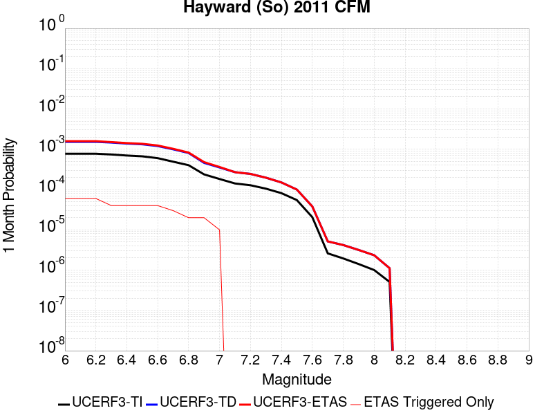 |  | 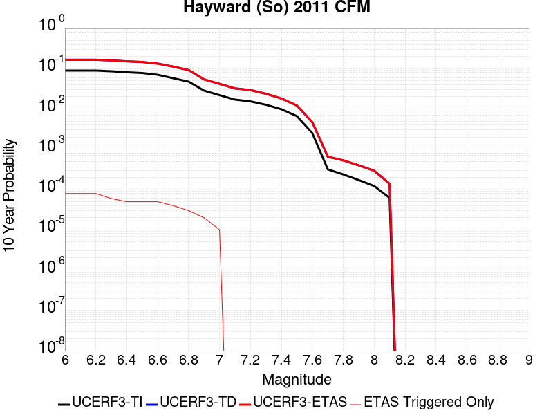 |

| Magnitude | 1 wk TI Prob | 1 wk TD Prob | 1 wk ETAS Prob | 1 wk ETAS/TD Gain | 1 wk ETAS Triggered Only | 1 mo TI Prob | 1 mo TD Prob | 1 mo ETAS Prob | 1 mo ETAS/TD Gain | 1 mo ETAS Triggered Only | 1 yr TI Prob | 1 yr TD Prob | 1 yr ETAS Prob | 1 yr ETAS/TD Gain | 1 yr ETAS Triggered Only | 10 yr TI Prob | 10 yr TD Prob | 10 yr ETAS Prob | 10 yr ETAS/TD Gain | 10 yr ETAS Triggered Only |
|-----|-----|-----|-----|-----|-----|-----|-----|-----|-----|-----|-----|-----|-----|-----|-----|-----|-----|-----|-----|-----|
| 6.0 | 1.8091932E-4 | 3.570541E-4 | 4.629111E-4 | 1.2964733 | 1.0589481E-4 | 7.751381E-4 | 0.0015293444 | 0.0016350772 | 1.069136 | 1.0589481E-4 | 0.00939654 | 0.018463207 | 0.018601794 | 1.0075061 | 1.4119309E-4 | 0.090090066 | 0.16673161 | 0.16684926 | 1.0007056 | 1.4119309E-4 |
| 6.1 | 1.8091932E-4 | 3.570541E-4 | 4.629111E-4 | 1.2964733 | 1.0589481E-4 | 7.751381E-4 | 0.0015293444 | 0.0016350772 | 1.069136 | 1.0589481E-4 | 0.00939654 | 0.018463207 | 0.018601794 | 1.0075061 | 1.4119309E-4 | 0.090090066 | 0.16673161 | 0.16684926 | 1.0007056 | 1.4119309E-4 |
| 6.2 | 1.8091932E-4 | 3.570541E-4 | 4.629111E-4 | 1.2964733 | 1.0589481E-4 | 7.751381E-4 | 0.0015293444 | 0.0016350772 | 1.069136 | 1.0589481E-4 | 0.00939654 | 0.018463207 | 0.018601794 | 1.0075061 | 1.4119309E-4 | 0.090090066 | 0.16673161 | 0.16684926 | 1.0007056 | 1.4119309E-4 |
| 6.3 | 1.7322872E-4 | 3.426234E-4 | 4.4848194E-4 | 1.3089647 | 1.0589481E-4 | 7.4219756E-4 | 0.0014675693 | 0.0015733087 | 1.0720507 | 1.0589481E-4 | 0.0089988755 | 0.017723544 | 0.017862234 | 1.0078253 | 1.4119309E-4 | 0.08643075 | 0.16066726 | 0.16078576 | 1.0007375 | 1.4119309E-4 |
| 6.4 | 1.6334097E-4 | 3.234411E-4 | 4.2930167E-4 | 1.3272947 | 1.0589481E-4 | 6.998449E-4 | 0.0013854484 | 0.0014911966 | 1.0763277 | 1.0589481E-4 | 0.008487372 | 0.016739385 | 0.016843507 | 1.0062202 | 1.0589481E-4 | 0.081704415 | 0.15255594 | 0.15264568 | 1.0005883 | 1.0589481E-4 |
| 6.5 | 1.5600289E-4 | 3.1018828E-4 | 4.1605023E-4 | 1.341283 | 1.0589481E-4 | 6.684125E-4 | 0.0013287093 | 0.0014344634 | 1.0795916 | 1.0589481E-4 | 0.008107598 | 0.016058935 | 0.01616313 | 1.0064882 | 1.0589481E-4 | 0.078181036 | 0.14683272 | 0.14692307 | 1.0006154 | 1.0589481E-4 |
| 6.6 | 1.4046066E-4 | 2.8032906E-4 | 3.8619418E-4 | 1.377646 | 1.0589481E-4 | 6.018354E-4 | 0.0012008639 | 0.0013066315 | 1.0880764 | 1.0589481E-4 | 0.0073027555 | 0.014524006 | 0.014628363 | 1.0071851 | 1.0589481E-4 | 0.07067384 | 0.13391982 | 0.13401154 | 1.0006849 | 1.0589481E-4 |
| 6.7 | 1.14696966E-4 | 2.3271477E-4 | 3.0329486E-4 | 1.3032902 | 7.059654E-5 | 4.914658E-4 | 9.969729E-4 | 0.001067499 | 1.0707403 | 7.059654E-5 | 0.0059671924 | 0.012071652 | 0.012141397 | 1.0057775 | 7.059654E-5 | 0.058094822 | 0.11274672 | 0.11280936 | 1.0005555 | 7.059654E-5 |
| 6.8 | 9.3874296E-5 | 1.8861453E-4 | 2.2390614E-4 | 1.1871097 | 3.529827E-5 | 4.0225635E-4 | 8.0810126E-4 | 8.4337103E-4 | 1.0436453 | 3.529827E-5 | 0.0048864787 | 0.009794984 | 0.009829937 | 1.0035684 | 3.529827E-5 | 0.047804173 | 0.09259856 | 0.09263059 | 1.000346 | 3.529827E-5 |
| 6.9 | 5.551852E-5 | 1.072948E-4 | 1.4258928E-4 | 1.3289487 | 3.529827E-5 | 2.3791482E-4 | 4.5975443E-4 | 4.950365E-4 | 1.0767411 | 3.529827E-5 | 0.0028927654 | 0.0055832625 | 0.0056183636 | 1.0062869 | 3.529827E-5 | 0.028553981 | 0.054245494 | 0.054278877 | 1.0006154 | 3.529827E-5 |
| 7.0 | 4.2662363E-5 | 8.2464416E-5 | 8.2464416E-5 | 1.0 | 0.0 | 1.8282588E-4 | 3.5337146E-4 | 3.5337146E-4 | 1.0 | 0.0 | 0.0022236328 | 0.0042938837 | 0.0042938837 | 1.0 | 0.0 | 0.022015138 | 0.042064495 | 0.042064495 | 1.0 | 0.0 |
| 7.1 | 3.305886E-5 | 6.3019055E-5 | 6.3019055E-5 | 1.0 | 0.0 | 1.4167312E-4 | 2.700538E-4 | 2.700538E-4 | 1.0 | 0.0 | 0.0017235056 | 0.0032829668 | 0.0032829668 | 1.0 | 0.0 | 0.017101998 | 0.032452874 | 0.032452874 | 1.0 | 0.0 |
| 7.2 | 2.9856887E-5 | 5.7013647E-5 | 5.7013647E-5 | 1.0 | 0.0 | 1.2795182E-4 | 2.4432142E-4 | 2.4432142E-4 | 1.0 | 0.0 | 0.0015567001 | 0.0029705726 | 0.0029705726 | 1.0 | 0.0 | 0.015458403 | 0.029453589 | 0.029453589 | 1.0 | 0.0 |
| 7.3 | 2.4559737E-5 | 4.599088E-5 | 4.599088E-5 | 1.0 | 0.0 | 1.0525176E-4 | 1.9708896E-4 | 1.9708896E-4 | 1.0 | 0.0 | 0.0012806869 | 0.0023969305 | 0.0023969305 | 1.0 | 0.0 | 0.012733313 | 0.023857482 | 0.023857482 | 1.0 | 0.0 |
| 7.4 | 1.9002231E-5 | 3.5049303E-5 | 3.5049303E-5 | 1.0 | 0.0 | 8.143559E-5 | 1.502027E-4 | 1.502027E-4 | 1.0 | 0.0 | 9.910273E-4 | 0.0018271938 | 0.0018271938 | 1.0 | 0.0 | 0.009866194 | 0.018258283 | 0.018258283 | 1.0 | 0.0 |
| 7.5 | 1.2783333E-5 | 2.3330069E-5 | 2.3330069E-5 | 1.0 | 0.0 | 5.4784563E-5 | 9.998221E-5 | 9.998221E-5 | 1.0 | 0.0 | 6.667979E-4 | 0.0012166094 | 0.0012166094 | 1.0 | 0.0 | 0.006648007 | 0.012209582 | 0.012209582 | 1.0 | 0.0 |
| 7.6 | 4.8149627E-6 | 8.887544E-6 | 8.887544E-6 | 1.0 | 0.0 | 2.063539E-5 | 3.8088925E-5 | 3.8088925E-5 | 1.0 | 0.0 | 2.5120692E-4 | 4.636352E-4 | 4.636352E-4 | 1.0 | 0.0 | 0.0025092314 | 0.0046812436 | 0.0046812436 | 1.0 | 0.0 |
| 7.7 | 6.0838227E-7 | 1.2056693E-6 | 1.2056693E-6 | 1.0 | 0.0 | 2.6073499E-6 | 5.1671436E-6 | 5.1671436E-6 | 1.0 | 0.0 | 3.174402E-5 | 6.290816E-5 | 6.290816E-5 | 1.0 | 0.0 | 3.1739488E-4 | 6.5293367E-4 | 6.5293367E-4 | 1.0 | 0.0 |
| 7.8 | 4.5542808E-7 | 9.792182E-7 | 9.792182E-7 | 1.0 | 0.0 | 1.9518332E-6 | 4.1966427E-6 | 4.1966427E-6 | 1.0 | 0.0 | 2.376331E-5 | 5.1092928E-5 | 5.1092928E-5 | 1.0 | 0.0 | 2.3760769E-4 | 5.321372E-4 | 5.321372E-4 | 1.0 | 0.0 |
| 7.9 | 3.3016747E-7 | 7.386335E-7 | 7.386335E-7 | 1.0 | 0.0 | 1.4150027E-6 | 3.1655684E-6 | 3.1655684E-6 | 1.0 | 0.0 | 1.7227521E-5 | 3.8540114E-5 | 3.8540114E-5 | 1.0 | 0.0 | 1.7226185E-4 | 3.9930744E-4 | 3.9930744E-4 | 1.0 | 0.0 |
| 8.0 | 2.347038E-7 | 5.4714894E-7 | 5.4714894E-7 | 1.0 | 0.0 | 1.0058731E-6 | 2.344922E-6 | 2.344922E-6 | 1.0 | 0.0 | 1.2246436E-5 | 2.8549053E-5 | 2.8549053E-5 | 1.0 | 0.0 | 1.2245761E-4 | 2.9355253E-4 | 2.9355253E-4 | 1.0 | 0.0 |
| 8.1 | 1.18822804E-7 | 2.6058973E-7 | 2.6058973E-7 | 1.0 | 0.0 | 5.092405E-7 | 1.1168127E-6 | 1.1168127E-6 | 1.0 | 0.0 | 6.1999854E-6 | 1.359711E-5 | 1.359711E-5 | 1.0 | 0.0 | 6.199812E-5 | 1.3917852E-4 | 1.3917852E-4 | 1.0 | 0.0 |

## Rinconada 2011 CFM
*[(top)](#table-of-contents)*

| 1 Week | 1 Month | 1 Year | 10 Year |
|-----|-----|-----|-----|
| 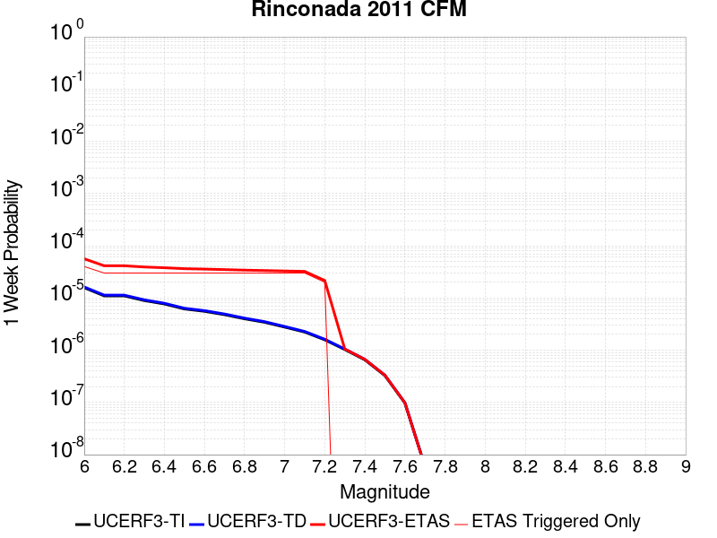 |  |  |  |

| Magnitude | 1 wk TI Prob | 1 wk TD Prob | 1 wk ETAS Prob | 1 wk ETAS/TD Gain | 1 wk ETAS Triggered Only | 1 mo TI Prob | 1 mo TD Prob | 1 mo ETAS Prob | 1 mo ETAS/TD Gain | 1 mo ETAS Triggered Only | 1 yr TI Prob | 1 yr TD Prob | 1 yr ETAS Prob | 1 yr ETAS/TD Gain | 1 yr ETAS Triggered Only | 10 yr TI Prob | 10 yr TD Prob | 10 yr ETAS Prob | 10 yr ETAS/TD Gain | 10 yr ETAS Triggered Only |
|-----|-----|-----|-----|-----|-----|-----|-----|-----|-----|-----|-----|-----|-----|-----|-----|-----|-----|-----|-----|-----|
| 6.0 | 1.5752368E-5 | 1.6274716E-5 | 8.687011E-5 | 5.337734 | 7.059654E-5 | 6.75084E-5 | 6.974694E-5 | 1.4033855E-4 | 2.0121107 | 7.059654E-5 | 8.2160486E-4 | 8.488412E-4 | 9.899145E-4 | 1.166195 | 1.4119309E-4 | 0.008185739 | 0.00845637 | 0.008596369 | 1.0165554 | 1.4119309E-4 |
| 6.1 | 1.0966133E-5 | 1.1323029E-5 | 4.66209E-5 | 4.1173525 | 3.529827E-5 | 4.6996865E-5 | 4.852637E-5 | 8.3822924E-5 | 1.7273686 | 3.529827E-5 | 5.720366E-4 | 5.906491E-4 | 6.964814E-4 | 1.1791795 | 1.0589481E-4 | 0.0057056635 | 0.0058908886 | 0.0059961597 | 1.0178702 | 1.0589481E-4 |
| 6.2 | 1.0966133E-5 | 1.1323029E-5 | 4.66209E-5 | 4.1173525 | 3.529827E-5 | 4.6996865E-5 | 4.852637E-5 | 8.3822924E-5 | 1.7273686 | 3.529827E-5 | 5.720366E-4 | 5.906491E-4 | 6.964814E-4 | 1.1791795 | 1.0589481E-4 | 0.0057056635 | 0.0058908886 | 0.0059961597 | 1.0178702 | 1.0589481E-4 |
| 6.3 | 8.926149E-6 | 9.212771E-6 | 4.4510718E-5 | 4.831414 | 3.529827E-5 | 3.8254362E-5 | 3.948271E-5 | 7.4779586E-5 | 1.8939831 | 3.529827E-5 | 4.6564735E-4 | 4.805963E-4 | 5.864402E-4 | 1.2202345 | 1.0589481E-4 | 0.0046467283 | 0.0047956146 | 0.004901001 | 1.0219758 | 1.0589481E-4 |
| 6.4 | 7.676955E-6 | 7.920191E-6 | 4.321818E-5 | 5.45671 | 3.529827E-5 | 3.290082E-5 | 3.3943234E-5 | 6.9240305E-5 | 2.0398853 | 3.529827E-5 | 4.0049385E-4 | 4.1318068E-4 | 4.8374807E-4 | 1.1707906 | 7.059654E-5 | 0.0039977287 | 0.004124151 | 0.0041944566 | 1.0170473 | 7.059654E-5 |
| 6.5 | 6.1671026E-6 | 6.3589546E-6 | 4.1657E-5 | 6.5509195 | 3.529827E-5 | 2.6430173E-5 | 2.725238E-5 | 6.254969E-5 | 2.295201 | 3.529827E-5 | 3.2173982E-4 | 3.317473E-4 | 4.023204E-4 | 1.2127316 | 7.059654E-5 | 0.003212744 | 0.0033125326 | 0.0033828951 | 1.0212413 | 7.059654E-5 |
| 6.6 | 5.553456E-6 | 5.7248126E-6 | 4.1022882E-5 | 7.1658034 | 3.529827E-5 | 2.3800309E-5 | 2.453468E-5 | 5.9832084E-5 | 2.438674 | 3.529827E-5 | 2.897302E-4 | 2.9866883E-4 | 3.692443E-4 | 1.2363 | 7.059654E-5 | 0.0028935277 | 0.002982683 | 0.003053069 | 1.0235982 | 7.059654E-5 |
| 6.7 | 4.787857E-6 | 4.9333094E-6 | 4.0231407E-5 | 8.155054 | 3.529827E-5 | 2.0519226E-5 | 2.1142583E-5 | 5.644011E-5 | 2.6694992 | 3.529827E-5 | 2.4979294E-4 | 2.573806E-4 | 3.2795896E-4 | 1.274218 | 7.059654E-5 | 0.0024951235 | 0.0025708308 | 0.0026412457 | 1.02739 | 7.059654E-5 |
| 6.8 | 3.9955166E-6 | 4.1134763E-6 | 3.94116E-5 | 9.581094 | 3.529827E-5 | 1.7123532E-5 | 1.7629065E-5 | 5.2926713E-5 | 3.0022416 | 3.529827E-5 | 2.0845905E-4 | 2.1461274E-4 | 2.8519414E-4 | 1.3288779 | 7.059654E-5 | 0.002082636 | 0.0021440585 | 0.0022145037 | 1.032856 | 7.059654E-5 |
| 6.9 | 3.4250072E-6 | 3.5224464E-6 | 3.882059E-5 | 11.020918 | 3.529827E-5 | 1.46785205E-5 | 1.5096111E-5 | 5.039385E-5 | 3.3382006 | 3.529827E-5 | 1.7869633E-4 | 1.8377967E-4 | 2.5436323E-4 | 1.3840662 | 7.059654E-5 | 0.001785527 | 0.0018362794 | 0.0019067463 | 1.0383748 | 7.059654E-5 |
| 7.0 | 2.7712713E-6 | 2.8467E-6 | 3.814487E-5 | 13.39968 | 3.529827E-5 | 1.1876823E-5 | 1.2200086E-5 | 4.7497924E-5 | 3.8932452 | 3.529827E-5 | 1.4459073E-4 | 1.4852593E-4 | 2.1911199E-4 | 1.475244 | 7.059654E-5 | 0.0014449668 | 0.0014842682 | 0.0015547599 | 1.0474926 | 7.059654E-5 |
| 7.1 | 2.227358E-6 | 2.2856984E-6 | 3.758389E-5 | 16.443066 | 3.529827E-5 | 9.545785E-6 | 9.795814E-6 | 4.5093737E-5 | 4.6033683 | 3.529827E-5 | 1.16213734E-4 | 1.19257515E-4 | 1.8984564E-4 | 1.5918967 | 7.059654E-5 | 0.0011615298 | 0.0011919362 | 0.0012624486 | 1.0591578 | 7.059654E-5 |
| 7.2 | 1.581796E-6 | 1.6209011E-6 | 3.6919115E-5 | 22.776907 | 3.529827E-5 | 6.779108E-6 | 6.9467005E-6 | 4.2244727E-5 | 6.0812645 | 3.529827E-5 | 8.253252E-5 | 8.457281E-5 | 1.5516338E-4 | 1.8346722 | 7.059654E-5 | 8.250187E-4 | 8.454067E-4 | 9.159436E-4 | 1.0834354 | 7.059654E-5 |
| 7.3 | 1.0306567E-6 | 1.0546477E-6 | 1.0546477E-6 | 1.0 | 0.0 | 4.4170924E-6 | 4.519911E-6 | 4.519911E-6 | 1.0 | 0.0 | 5.3776774E-5 | 5.5028526E-5 | 9.032486E-5 | 1.6414187 | 3.529827E-5 | 5.376376E-4 | 5.5014924E-4 | 5.854281E-4 | 1.064126 | 3.529827E-5 |
| 7.4 | 6.535541E-7 | 6.682742E-7 | 6.682742E-7 | 1.0 | 0.0 | 2.800943E-6 | 2.864029E-6 | 2.864029E-6 | 1.0 | 0.0 | 3.4100947E-5 | 3.4868997E-5 | 7.016604E-5 | 2.0122757 | 3.529827E-5 | 3.4095717E-4 | 3.4863537E-4 | 3.8392135E-4 | 1.1012117 | 3.529827E-5 |
| 7.5 | 3.2656962E-7 | 3.3316687E-7 | 3.3316687E-7 | 1.0 | 0.0 | 1.3995833E-6 | 1.4278572E-6 | 1.4278572E-6 | 1.0 | 0.0 | 1.7039794E-5 | 1.7384024E-5 | 5.268168E-5 | 3.0304654 | 3.529827E-5 | 1.7038487E-4 | 1.7382667E-4 | 2.091188E-4 | 1.2030306 | 3.529827E-5 |
| 7.6 | 9.754343E-8 | 9.82099E-8 | 9.82099E-8 | 1.0 | 0.0 | 4.180432E-7 | 4.208995E-7 | 4.208995E-7 | 1.0 | 0.0 | 5.089664E-6 | 5.1244397E-6 | 5.1244397E-6 | 1.0 | 0.0 | 5.0895473E-5 | 5.1243223E-5 | 5.1243223E-5 | 1.0 | 0.0 |
| 7.7 | 6.0001453E-9 | 5.8490435E-9 | 5.8490435E-9 | 1.0 | 0.0 | 2.5714908E-8 | 2.506733E-8 | 2.506733E-8 | 1.0 | 0.0 | 3.1307894E-7 | 3.051947E-7 | 3.051947E-7 | 1.0 | 0.0 | 3.1307852E-6 | 3.051943E-6 | 3.051943E-6 | 1.0 | 0.0 |
| 7.8 | 7.400003E-11 | 7.4654505E-11 | 7.4654505E-11 | 1.0 | 0.0 | 3.171432E-10 | 3.1994773E-10 | 3.1994773E-10 | 1.0 | 0.0 | 3.861218E-9 | 3.895363E-9 | 3.895363E-9 | 1.0 | 0.0 | 3.861218E-8 | 3.895363E-8 | 3.895363E-8 | 1.0 | 0.0 |

## Santa Cruz Catalina Ridge alt1
*[(top)](#table-of-contents)*

| 1 Week | 1 Month | 1 Year | 10 Year |
|-----|-----|-----|-----|
|  |  |  |  |

| Magnitude | 1 wk TI Prob | 1 wk TD Prob | 1 wk ETAS Prob | 1 wk ETAS/TD Gain | 1 wk ETAS Triggered Only | 1 mo TI Prob | 1 mo TD Prob | 1 mo ETAS Prob | 1 mo ETAS/TD Gain | 1 mo ETAS Triggered Only | 1 yr TI Prob | 1 yr TD Prob | 1 yr ETAS Prob | 1 yr ETAS/TD Gain | 1 yr ETAS Triggered Only | 10 yr TI Prob | 10 yr TD Prob | 10 yr ETAS Prob | 10 yr ETAS/TD Gain | 10 yr ETAS Triggered Only |
|-----|-----|-----|-----|-----|-----|-----|-----|-----|-----|-----|-----|-----|-----|-----|-----|-----|-----|-----|-----|-----|
| 6.0 | 3.2833184E-5 | 3.65584E-5 | 1.0715236E-4 | 2.9309916 | 7.059654E-5 | 1.4070606E-4 | 1.5667039E-4 | 2.625486E-4 | 1.6758024 | 1.0589481E-4 | 0.00171175 | 0.0019059596 | 0.0020468836 | 1.0739386 | 1.4119309E-4 | 0.016986247 | 0.018913029 | 0.019051552 | 1.0073242 | 1.4119309E-4 |
| 6.1 | 1.9835548E-5 | 2.1659505E-5 | 9.2254515E-5 | 4.259309 | 7.059654E-5 | 8.500672E-5 | 9.282326E-5 | 1.9870824E-4 | 2.140716 | 1.0589481E-4 | 0.0010344655 | 0.0011295575 | 0.0012353327 | 1.0936431 | 1.0589481E-4 | 0.010296632 | 0.011240295 | 0.011345 | 1.0093151 | 1.0589481E-4 |
| 6.2 | 1.9835548E-5 | 2.1659505E-5 | 9.2254515E-5 | 4.259309 | 7.059654E-5 | 8.500672E-5 | 9.282326E-5 | 1.9870824E-4 | 2.140716 | 1.0589481E-4 | 0.0010344655 | 0.0011295575 | 0.0012353327 | 1.0936431 | 1.0589481E-4 | 0.010296632 | 0.011240295 | 0.011345 | 1.0093151 | 1.0589481E-4 |
| 6.3 | 1.5728183E-5 | 1.703395E-5 | 8.762929E-5 | 5.1443906 | 7.059654E-5 | 6.7404755E-5 | 7.300063E-5 | 1.7888771E-4 | 2.4504955 | 1.0589481E-4 | 8.2034385E-4 | 8.884264E-4 | 9.942271E-4 | 1.1190878 | 1.0589481E-4 | 0.008173222 | 0.008849427 | 0.008954384 | 1.0118604 | 1.0589481E-4 |
| 6.4 | 1.5728183E-5 | 1.703395E-5 | 8.762929E-5 | 5.1443906 | 7.059654E-5 | 6.7404755E-5 | 7.300063E-5 | 1.7888771E-4 | 2.4504955 | 1.0589481E-4 | 8.2034385E-4 | 8.884264E-4 | 9.942271E-4 | 1.1190878 | 1.0589481E-4 | 0.008173222 | 0.008849427 | 0.008954384 | 1.0118604 | 1.0589481E-4 |
| 6.5 | 1.3707734E-5 | 1.4794522E-5 | 8.539002E-5 | 5.7717323 | 7.059654E-5 | 5.8746107E-5 | 6.3403575E-5 | 1.3399564E-4 | 2.1133769 | 7.059654E-5 | 7.1499916E-4 | 7.716686E-4 | 8.4221066E-4 | 1.0914149 | 7.059654E-5 | 0.0071270303 | 0.0076902895 | 0.007760343 | 1.0091094 | 7.059654E-5 |
| 6.6 | 1.2539813E-5 | 1.3510219E-5 | 8.4105806E-5 | 6.225347 | 7.059654E-5 | 5.3740947E-5 | 5.789967E-5 | 1.2849212E-4 | 2.2192204 | 7.059654E-5 | 6.540996E-4 | 7.0470315E-4 | 7.7524997E-4 | 1.1001085 | 7.059654E-5 | 0.0065217763 | 0.0070249885 | 0.007095089 | 1.0099788 | 7.059654E-5 |
| 6.7 | 1.1504083E-5 | 1.2377375E-5 | 8.297304E-5 | 6.7036057 | 7.059654E-5 | 4.930228E-5 | 5.3044827E-5 | 1.2363763E-4 | 2.330814 | 7.059654E-5 | 6.0008996E-4 | 6.456314E-4 | 7.1618235E-4 | 1.1092744 | 7.059654E-5 | 0.005984721 | 0.006437786 | 0.006507928 | 1.0108954 | 7.059654E-5 |
| 6.8 | 1.012739E-5 | 1.0877071E-5 | 8.147284E-5 | 7.4903293 | 7.059654E-5 | 4.340238E-5 | 4.6615194E-5 | 1.17208445E-4 | 2.5143828 | 7.059654E-5 | 5.282958E-4 | 5.673937E-4 | 6.379502E-4 | 1.1243519 | 7.059654E-5 | 0.0052704164 | 0.0056596193 | 0.0057298164 | 1.0124031 | 7.059654E-5 |
| 6.9 | 8.9607865E-6 | 9.609117E-6 | 8.0204976E-5 | 8.346758 | 7.059654E-5 | 3.8402806E-5 | 4.1181287E-5 | 1.1177492E-4 | 2.7142162 | 7.059654E-5 | 4.6745385E-4 | 5.012679E-4 | 5.7182903E-4 | 1.1407653 | 7.059654E-5 | 0.0046647177 | 0.005001492 | 0.005071735 | 1.0140445 | 7.059654E-5 |
| 7.0 | 8.046829E-6 | 8.619746E-6 | 7.921568E-5 | 9.190024 | 7.059654E-5 | 3.4485955E-5 | 3.694125E-5 | 1.0753518E-4 | 2.9109786 | 7.059654E-5 | 4.1978562E-4 | 4.496677E-4 | 5.202325E-4 | 1.1569265 | 7.059654E-5 | 0.004189935 | 0.0044876686 | 0.0045579486 | 1.0156606 | 7.059654E-5 |
| 7.1 | 7.136131E-6 | 7.637656E-6 | 4.2935655E-5 | 5.621575 | 3.529827E-5 | 3.0583058E-5 | 3.2732405E-5 | 6.802952E-5 | 2.078354 | 3.529827E-5 | 3.7228514E-4 | 3.9844486E-4 | 4.3372906E-4 | 1.0885549 | 3.529827E-5 | 0.0037166206 | 0.003977381 | 0.004012539 | 1.0088395 | 3.529827E-5 |
| 7.2 | 6.362014E-6 | 6.8049585E-6 | 4.2102987E-5 | 6.187104 | 3.529827E-5 | 2.726549E-5 | 2.9163786E-5 | 6.4461026E-5 | 2.2103107 | 3.529827E-5 | 3.3190678E-4 | 3.550119E-4 | 3.9029762E-4 | 1.0993931 | 3.529827E-5 | 0.0033141149 | 0.003544516 | 0.0035796892 | 1.0099232 | 3.529827E-5 |
| 7.3 | 5.004101E-6 | 5.351715E-6 | 4.0649797E-5 | 7.595658 | 3.529827E-5 | 2.1445969E-5 | 2.2935723E-5 | 5.8233185E-5 | 2.538973 | 3.529827E-5 | 2.6107338E-4 | 2.792072E-4 | 3.1449558E-4 | 1.126388 | 3.529827E-5 | 0.002607669 | 0.0027886187 | 0.0028238185 | 1.0126227 | 3.529827E-5 |
| 7.4 | 3.4901443E-6 | 3.7320526E-6 | 3.903019E-5 | 10.458103 | 3.529827E-5 | 1.4957676E-5 | 1.5994416E-5 | 5.129212E-5 | 3.206877 | 3.529827E-5 | 1.8209449E-4 | 1.9471499E-4 | 2.3000638E-4 | 1.1812464 | 3.529827E-5 | 0.0018194534 | 0.0019454823 | 0.001980712 | 1.0181084 | 3.529827E-5 |
| 7.5 | 1.1215045E-6 | 1.189387E-6 | 1.189387E-6 | 1.0 | 0.0 | 4.806439E-6 | 5.097363E-6 | 5.097363E-6 | 1.0 | 0.0 | 5.851682E-5 | 6.205866E-5 | 6.205866E-5 | 1.0 | 0.0 | 5.850142E-4 | 6.2041637E-4 | 6.2041637E-4 | 1.0 | 0.0 |
| 7.6 | 2.8599047E-7 | 2.9951994E-7 | 2.9951994E-7 | 1.0 | 0.0 | 1.2256729E-6 | 1.2836562E-6 | 1.2836562E-6 | 1.0 | 0.0 | 1.4922465E-5 | 1.5628404E-5 | 1.5628404E-5 | 1.0 | 0.0 | 1.4921463E-4 | 1.5627318E-4 | 1.5627318E-4 | 1.0 | 0.0 |
| 7.7 | 2.0781519E-7 | 2.1744323E-7 | 2.1744323E-7 | 1.0 | 0.0 | 8.906362E-7 | 9.3189925E-7 | 9.3189925E-7 | 1.0 | 0.0 | 1.08434415E-5 | 1.13458145E-5 | 1.13458145E-5 | 1.0 | 0.0 | 1.0842913E-4 | 1.1345245E-4 | 1.1345245E-4 | 1.0 | 0.0 |
| 7.8 | 3.614776E-8 | 3.764102E-8 | 3.764102E-8 | 1.0 | 0.0 | 1.5491896E-7 | 1.6131864E-7 | 1.6131864E-7 | 1.0 | 0.0 | 1.8861368E-6 | 1.9640527E-6 | 1.9640527E-6 | 1.0 | 0.0 | 1.8861208E-5 | 1.9640367E-5 | 1.9640367E-5 | 1.0 | 0.0 |

## San Diego Trough south
*[(top)](#table-of-contents)*

| 1 Week | 1 Month | 1 Year | 10 Year |
|-----|-----|-----|-----|
|  |  |  |  |

| Magnitude | 1 wk TI Prob | 1 wk TD Prob | 1 wk ETAS Prob | 1 wk ETAS/TD Gain | 1 wk ETAS Triggered Only | 1 mo TI Prob | 1 mo TD Prob | 1 mo ETAS Prob | 1 mo ETAS/TD Gain | 1 mo ETAS Triggered Only | 1 yr TI Prob | 1 yr TD Prob | 1 yr ETAS Prob | 1 yr ETAS/TD Gain | 1 yr ETAS Triggered Only | 10 yr TI Prob | 10 yr TD Prob | 10 yr ETAS Prob | 10 yr ETAS/TD Gain | 10 yr ETAS Triggered Only |
|-----|-----|-----|-----|-----|-----|-----|-----|-----|-----|-----|-----|-----|-----|-----|-----|-----|-----|-----|-----|-----|
| 6.0 | 8.279495E-5 | 1.04241306E-4 | 1.748305E-4 | 1.6771709 | 7.059654E-5 | 3.5478722E-4 | 4.4667677E-4 | 5.172418E-4 | 1.1579778 | 7.059654E-5 | 0.004310982 | 0.0054256152 | 0.005495829 | 1.0129411 | 7.059654E-5 | 0.042283054 | 0.05299221 | 0.05309249 | 1.0018924 | 1.0589481E-4 |
| 6.1 | 4.6961468E-5 | 5.772944E-5 | 9.302567E-5 | 1.6114079 | 3.529827E-5 | 2.0124791E-4 | 2.473894E-4 | 2.8267896E-4 | 1.1426477 | 3.529827E-5 | 0.00244744 | 0.0030079768 | 0.003043169 | 1.0116996 | 3.529827E-5 | 0.024206603 | 0.029679462 | 0.029713713 | 1.0011541 | 3.529827E-5 |
| 6.2 | 3.5079658E-5 | 4.214154E-5 | 7.743832E-5 | 1.837577 | 3.529827E-5 | 1.5033272E-4 | 1.8059435E-4 | 2.1588625E-4 | 1.1954209 | 3.529827E-5 | 0.0018287642 | 0.0021965632 | 0.002231784 | 1.0160345 | 3.529827E-5 | 0.018137876 | 0.021751117 | 0.021785649 | 1.0015875 | 3.529827E-5 |
| 6.3 | 3.5079658E-5 | 4.214154E-5 | 7.743832E-5 | 1.837577 | 3.529827E-5 | 1.5033272E-4 | 1.8059435E-4 | 2.1588625E-4 | 1.1954209 | 3.529827E-5 | 0.0018287642 | 0.0021965632 | 0.002231784 | 1.0160345 | 3.529827E-5 | 0.018137876 | 0.021751117 | 0.021785649 | 1.0015875 | 3.529827E-5 |
| 6.4 | 2.7196904E-5 | 3.2087162E-5 | 6.73843E-5 | 2.1000392 | 3.529827E-5 | 1.16552954E-4 | 1.3750927E-4 | 1.7280268E-4 | 1.2566621 | 3.529827E-5 | 0.0014181085 | 0.0016729041 | 0.0017081434 | 1.0210646 | 3.529827E-5 | 0.014090929 | 0.016604643 | 0.016639356 | 1.0020905 | 3.529827E-5 |
| 6.5 | 2.5584688E-5 | 3.010164E-5 | 6.5398846E-5 | 2.1726007 | 3.529827E-5 | 1.0964406E-4 | 1.2900073E-4 | 1.6429446E-4 | 1.2735932 | 3.529827E-5 | 0.0013340989 | 0.0015694655 | 0.0016047084 | 1.0224553 | 3.529827E-5 | 0.013261181 | 0.015585314 | 0.015620062 | 1.0022296 | 3.529827E-5 |
| 6.6 | 2.2034688E-5 | 2.5742738E-5 | 6.1040104E-5 | 2.371158 | 3.529827E-5 | 9.443096E-5 | 1.1032141E-4 | 1.4561578E-4 | 1.3199232 | 3.529827E-5 | 0.0011490905 | 0.0013423424 | 0.0013775933 | 1.0262607 | 3.529827E-5 | 0.011431668 | 0.013343317 | 0.013378145 | 1.0026101 | 3.529827E-5 |
| 6.7 | 1.9394853E-5 | 2.254176E-5 | 5.7839236E-5 | 2.5658703 | 3.529827E-5 | 8.311815E-5 | 9.6603995E-5 | 1.3189887E-4 | 1.3653561 | 3.529827E-5 | 0.0010114936 | 0.0011755243 | 0.001210781 | 1.0299923 | 3.529827E-5 | 0.01006902 | 0.011693766 | 0.011728652 | 1.0029832 | 3.529827E-5 |
| 6.8 | 1.7615313E-5 | 2.0403182E-5 | 5.5700733E-5 | 2.7300022 | 3.529827E-5 | 7.549201E-5 | 8.74393E-5 | 1.2273449E-4 | 1.4036535 | 3.529827E-5 | 9.1872766E-4 | 0.0010640579 | 0.0010993186 | 1.0331379 | 3.529827E-5 | 0.009149387 | 0.010590198 | 0.010625122 | 1.0032978 | 3.529827E-5 |
| 6.9 | 1.5621423E-5 | 1.8026114E-5 | 5.3323747E-5 | 2.9581387 | 3.529827E-5 | 6.6947236E-5 | 7.725251E-5 | 1.12548056E-4 | 1.4568855 | 3.529827E-5 | 8.147778E-4 | 9.40147E-4 | 9.754121E-4 | 1.0375102 | 3.529827E-5 | 0.008117969 | 0.009362142 | 0.009397109 | 1.0037351 | 3.529827E-5 |
| 7.0 | 1.3444376E-5 | 1.544809E-5 | 5.0745813E-5 | 3.284925 | 3.529827E-5 | 5.7617483E-5 | 6.620443E-5 | 1.01500365E-4 | 1.5331355 | 3.529827E-5 | 7.0126704E-4 | 8.057436E-4 | 8.4101345E-4 | 1.043773 | 3.529827E-5 | 0.006990582 | 0.008028555 | 0.00806357 | 1.0043613 | 3.529827E-5 |
| 7.1 | 1.2268361E-5 | 1.407303E-5 | 4.9370803E-5 | 3.5081859 | 3.529827E-5 | 5.2577634E-5 | 6.0311606E-5 | 9.560775E-5 | 1.5852296 | 3.529827E-5 | 6.399447E-4 | 7.3404907E-4 | 7.693214E-4 | 1.0480518 | 3.529827E-5 | 0.0063810493 | 0.0073165493 | 0.007351589 | 1.0047891 | 3.529827E-5 |
| 7.2 | 1.0922655E-5 | 1.2513563E-5 | 4.781139E-5 | 3.8207657 | 3.529827E-5 | 4.681054E-5 | 5.3628468E-5 | 8.892485E-5 | 1.658165 | 3.529827E-5 | 5.697693E-4 | 6.5273355E-4 | 6.8800873E-4 | 1.0540423 | 3.529827E-5 | 0.0056831064 | 0.0065084435 | 0.0065435125 | 1.0053881 | 3.529827E-5 |
| 7.3 | 6.1106753E-6 | 6.928925E-6 | 6.928925E-6 | 1.0 | 0.0 | 2.6188345E-5 | 2.9695057E-5 | 2.9695057E-5 | 1.0 | 0.0 | 3.1879646E-4 | 3.6147775E-4 | 3.6147775E-4 | 1.0 | 0.0 | 0.0031833951 | 0.003608943 | 0.003608943 | 1.0 | 0.0 |
| 7.4 | 4.933187E-6 | 5.5895525E-6 | 5.5895525E-6 | 1.0 | 0.0 | 2.114206E-5 | 2.3955008E-5 | 2.3955008E-5 | 1.0 | 0.0 | 2.5737417E-4 | 2.9161357E-4 | 2.9161357E-4 | 1.0 | 0.0 | 0.002570763 | 0.0029123505 | 0.0029123505 | 1.0 | 0.0 |
| 7.5 | 1.7489613E-6 | 1.969678E-6 | 1.969678E-6 | 1.0 | 0.0 | 7.495527E-6 | 8.4414505E-6 | 8.4414505E-6 | 1.0 | 0.0 | 9.125422E-5 | 1.02770035E-4 | 1.02770035E-4 | 1.0 | 0.0 | 9.1216754E-4 | 0.0010272472 | 0.0010272472 | 1.0 | 0.0 |
| 7.6 | 1.6988751E-7 | 1.7533823E-7 | 1.7533823E-7 | 1.0 | 0.0 | 7.2808916E-7 | 7.5144936E-7 | 7.5144936E-7 | 1.0 | 0.0 | 8.864449E-6 | 9.14886E-6 | 9.14886E-6 | 1.0 | 0.0 | 8.8640954E-5 | 9.1485024E-5 | 9.1485024E-5 | 1.0 | 0.0 |

## Channel Islands Western Deep Ramp
*[(top)](#table-of-contents)*

| 1 Week | 1 Month | 1 Year | 10 Year |
|-----|-----|-----|-----|
|  |  | 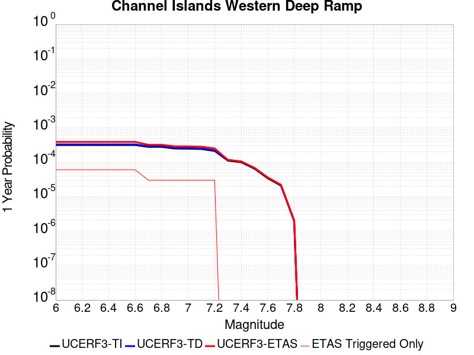 |  |

| Magnitude | 1 wk TI Prob | 1 wk TD Prob | 1 wk ETAS Prob | 1 wk ETAS/TD Gain | 1 wk ETAS Triggered Only | 1 mo TI Prob | 1 mo TD Prob | 1 mo ETAS Prob | 1 mo ETAS/TD Gain | 1 mo ETAS Triggered Only | 1 yr TI Prob | 1 yr TD Prob | 1 yr ETAS Prob | 1 yr ETAS/TD Gain | 1 yr ETAS Triggered Only | 10 yr TI Prob | 10 yr TD Prob | 10 yr ETAS Prob | 10 yr ETAS/TD Gain | 10 yr ETAS Triggered Only |
|-----|-----|-----|-----|-----|-----|-----|-----|-----|-----|-----|-----|-----|-----|-----|-----|-----|-----|-----|-----|-----|
| 6.0 | 6.0213506E-6 | 6.2548684E-6 | 4.1552918E-5 | 6.643292 | 3.529827E-5 | 2.5805533E-5 | 2.6806329E-5 | 6.210365E-5 | 2.3167534 | 3.529827E-5 | 3.1413708E-4 | 3.2632265E-4 | 4.321829E-4 | 1.3244036 | 1.0589481E-4 | 0.0031369338 | 0.0032588763 | 0.003364426 | 1.0323883 | 1.0589481E-4 |
| 6.1 | 6.0213506E-6 | 6.2548684E-6 | 4.1552918E-5 | 6.643292 | 3.529827E-5 | 2.5805533E-5 | 2.6806329E-5 | 6.210365E-5 | 2.3167534 | 3.529827E-5 | 3.1413708E-4 | 3.2632265E-4 | 4.321829E-4 | 1.3244036 | 1.0589481E-4 | 0.0031369338 | 0.0032588763 | 0.003364426 | 1.0323883 | 1.0589481E-4 |
| 6.2 | 6.0213506E-6 | 6.2548684E-6 | 4.1552918E-5 | 6.643292 | 3.529827E-5 | 2.5805533E-5 | 2.6806329E-5 | 6.210365E-5 | 2.3167534 | 3.529827E-5 | 3.1413708E-4 | 3.2632265E-4 | 4.321829E-4 | 1.3244036 | 1.0589481E-4 | 0.0031369338 | 0.0032588763 | 0.003364426 | 1.0323883 | 1.0589481E-4 |
| 6.3 | 6.0213506E-6 | 6.2548684E-6 | 4.1552918E-5 | 6.643292 | 3.529827E-5 | 2.5805533E-5 | 2.6806329E-5 | 6.210365E-5 | 2.3167534 | 3.529827E-5 | 3.1413708E-4 | 3.2632265E-4 | 4.321829E-4 | 1.3244036 | 1.0589481E-4 | 0.0031369338 | 0.0032588763 | 0.003364426 | 1.0323883 | 1.0589481E-4 |
| 6.4 | 6.0213506E-6 | 6.2548684E-6 | 4.1552918E-5 | 6.643292 | 3.529827E-5 | 2.5805533E-5 | 2.6806329E-5 | 6.210365E-5 | 2.3167534 | 3.529827E-5 | 3.1413708E-4 | 3.2632265E-4 | 4.321829E-4 | 1.3244036 | 1.0589481E-4 | 0.0031369338 | 0.0032588763 | 0.003364426 | 1.0323883 | 1.0589481E-4 |
| 6.5 | 6.0213506E-6 | 6.2548684E-6 | 4.1552918E-5 | 6.643292 | 3.529827E-5 | 2.5805533E-5 | 2.6806329E-5 | 6.210365E-5 | 2.3167534 | 3.529827E-5 | 3.1413708E-4 | 3.2632265E-4 | 4.321829E-4 | 1.3244036 | 1.0589481E-4 | 0.0031369338 | 0.0032588763 | 0.003364426 | 1.0323883 | 1.0589481E-4 |
| 6.6 | 6.0213506E-6 | 6.2548684E-6 | 4.1552918E-5 | 6.643292 | 3.529827E-5 | 2.5805533E-5 | 2.6806329E-5 | 6.210365E-5 | 2.3167534 | 3.529827E-5 | 3.1413708E-4 | 3.2632265E-4 | 4.321829E-4 | 1.3244036 | 1.0589481E-4 | 0.0031369338 | 0.0032588763 | 0.003364426 | 1.0323883 | 1.0589481E-4 |
| 6.7 | 5.313309E-6 | 5.5252403E-6 | 5.5252403E-6 | 1.0 | 0.0 | 2.2771126E-5 | 2.367941E-5 | 2.367941E-5 | 1.0 | 0.0 | 2.772032E-4 | 2.8826276E-4 | 3.2355086E-4 | 1.1224164 | 3.529827E-5 | 0.0027685766 | 0.0028792918 | 0.0029144883 | 1.0122241 | 3.529827E-5 |
| 6.8 | 5.313309E-6 | 5.5252403E-6 | 5.5252403E-6 | 1.0 | 0.0 | 2.2771126E-5 | 2.367941E-5 | 2.367941E-5 | 1.0 | 0.0 | 2.772032E-4 | 2.8826276E-4 | 3.2355086E-4 | 1.1224164 | 3.529827E-5 | 0.0027685766 | 0.0028792918 | 0.0029144883 | 1.0122241 | 3.529827E-5 |
| 6.9 | 4.744377E-6 | 4.9394303E-6 | 4.9394303E-6 | 1.0 | 0.0 | 2.0332885E-5 | 2.1168837E-5 | 2.1168837E-5 | 1.0 | 0.0 | 2.4752476E-4 | 2.5770385E-4 | 2.92993E-4 | 1.1369369 | 3.529827E-5 | 0.0024724922 | 0.0025744175 | 0.0026096248 | 1.0136759 | 3.529827E-5 |
| 7.0 | 4.722209E-6 | 4.9164732E-6 | 4.9164732E-6 | 1.0 | 0.0 | 2.0237881E-5 | 2.107045E-5 | 2.107045E-5 | 1.0 | 0.0 | 2.4636835E-4 | 2.5650626E-4 | 2.9179547E-4 | 1.1375765 | 3.529827E-5 | 0.002460954 | 0.0025624693 | 0.002597677 | 1.0137398 | 3.529827E-5 |
| 7.1 | 4.611174E-6 | 4.801409E-6 | 4.801409E-6 | 1.0 | 0.0 | 1.9762025E-5 | 2.0577325E-5 | 2.0577325E-5 | 1.0 | 0.0 | 2.4057609E-4 | 2.5050386E-4 | 2.857933E-4 | 1.1408738 | 3.529827E-5 | 0.002403158 | 0.002502582 | 0.0025377919 | 1.0140694 | 3.529827E-5 |
| 7.2 | 4.043994E-6 | 4.2120264E-6 | 4.2120264E-6 | 1.0 | 0.0 | 1.7331287E-5 | 1.8051438E-5 | 1.8051438E-5 | 1.0 | 0.0 | 2.10988E-4 | 2.1975765E-4 | 2.5504816E-4 | 1.1605883 | 3.529827E-5 | 0.002107878 | 0.0021957543 | 0.002230975 | 1.0160404 | 3.529827E-5 |
| 7.3 | 2.1233036E-6 | 2.2297875E-6 | 2.2297875E-6 | 1.0 | 0.0 | 9.099841E-6 | 9.556197E-6 | 9.556197E-6 | 1.0 | 0.0 | 1.1078493E-4 | 1.1634055E-4 | 1.1634055E-4 | 1.0 | 0.0 | 0.0011072971 | 0.001162802 | 0.001162802 | 1.0 | 0.0 |
| 7.4 | 1.9051884E-6 | 2.0014973E-6 | 2.0014973E-6 | 1.0 | 0.0 | 8.165067E-6 | 8.577817E-6 | 8.577817E-6 | 1.0 | 0.0 | 9.940516E-5 | 1.0442998E-4 | 1.0442998E-4 | 1.0 | 0.0 | 9.93607E-4 | 0.0010438144 | 0.0010438144 | 1.0 | 0.0 |
| 7.5 | 1.2408497E-6 | 1.3038839E-6 | 1.3038839E-6 | 1.0 | 0.0 | 5.317916E-6 | 5.588062E-6 | 5.588062E-6 | 1.0 | 0.0 | 6.4743705E-5 | 6.8032554E-5 | 6.8032554E-5 | 1.0 | 0.0 | 6.4724847E-4 | 6.8011944E-4 | 6.8011944E-4 | 1.0 | 0.0 |
| 7.6 | 6.5440025E-7 | 6.886718E-7 | 6.886718E-7 | 1.0 | 0.0 | 2.8045695E-6 | 2.9514472E-6 | 2.9514472E-6 | 1.0 | 0.0 | 3.4145098E-5 | 3.593329E-5 | 3.593329E-5 | 1.0 | 0.0 | 3.4139853E-4 | 3.5927625E-4 | 3.5927625E-4 | 1.0 | 0.0 |
| 7.7 | 3.985963E-7 | 4.1930787E-7 | 4.1930787E-7 | 1.0 | 0.0 | 1.7082689E-6 | 1.7970326E-6 | 1.7970326E-6 | 1.0 | 0.0 | 2.0797976E-5 | 2.1878664E-5 | 2.1878664E-5 | 1.0 | 0.0 | 2.0796029E-4 | 2.1876628E-4 | 2.1876628E-4 | 1.0 | 0.0 |
| 7.8 | 3.706329E-8 | 3.8591796E-8 | 3.8591796E-8 | 1.0 | 0.0 | 1.5884267E-7 | 1.653934E-7 | 1.653934E-7 | 1.0 | 0.0 | 1.9339077E-6 | 2.0136629E-6 | 2.0136629E-6 | 1.0 | 0.0 | 1.933891E-5 | 2.0136458E-5 | 2.0136458E-5 | 1.0 | 0.0 |

## Sierra Madre
*[(top)](#table-of-contents)*

| 1 Week | 1 Month | 1 Year | 10 Year |
|-----|-----|-----|-----|
|  |  |  |  |

| Magnitude | 1 wk TI Prob | 1 wk TD Prob | 1 wk ETAS Prob | 1 wk ETAS/TD Gain | 1 wk ETAS Triggered Only | 1 mo TI Prob | 1 mo TD Prob | 1 mo ETAS Prob | 1 mo ETAS/TD Gain | 1 mo ETAS Triggered Only | 1 yr TI Prob | 1 yr TD Prob | 1 yr ETAS Prob | 1 yr ETAS/TD Gain | 1 yr ETAS Triggered Only | 10 yr TI Prob | 10 yr TD Prob | 10 yr ETAS Prob | 10 yr ETAS/TD Gain | 10 yr ETAS Triggered Only |
|-----|-----|-----|-----|-----|-----|-----|-----|-----|-----|-----|-----|-----|-----|-----|-----|-----|-----|-----|-----|-----|
| 6.0 | 1.3379373E-5 | 1.10007395E-5 | 1.10007395E-5 | 1.0 | 0.0 | 5.7338908E-5 | 4.7145186E-5 | 4.7145186E-5 | 1.0 | 0.0 | 6.978776E-4 | 5.738429E-4 | 6.4439897E-4 | 1.1229535 | 7.059654E-5 | 0.0069569005 | 0.0057239756 | 0.0058292644 | 1.0183944 | 1.0589481E-4 |
| 6.1 | 1.3379373E-5 | 1.10007395E-5 | 1.10007395E-5 | 1.0 | 0.0 | 5.7338908E-5 | 4.7145186E-5 | 4.7145186E-5 | 1.0 | 0.0 | 6.978776E-4 | 5.738429E-4 | 6.4439897E-4 | 1.1229535 | 7.059654E-5 | 0.0069569005 | 0.0057239756 | 0.0058292644 | 1.0183944 | 1.0589481E-4 |
| 6.2 | 1.3379373E-5 | 1.10007395E-5 | 1.10007395E-5 | 1.0 | 0.0 | 5.7338908E-5 | 4.7145186E-5 | 4.7145186E-5 | 1.0 | 0.0 | 6.978776E-4 | 5.738429E-4 | 6.4439897E-4 | 1.1229535 | 7.059654E-5 | 0.0069569005 | 0.0057239756 | 0.0058292644 | 1.0183944 | 1.0589481E-4 |
| 6.3 | 1.3379373E-5 | 1.10007395E-5 | 1.10007395E-5 | 1.0 | 0.0 | 5.7338908E-5 | 4.7145186E-5 | 4.7145186E-5 | 1.0 | 0.0 | 6.978776E-4 | 5.738429E-4 | 6.4439897E-4 | 1.1229535 | 7.059654E-5 | 0.0069569005 | 0.0057239756 | 0.0058292644 | 1.0183944 | 1.0589481E-4 |
| 6.4 | 1.3379373E-5 | 1.10007395E-5 | 1.10007395E-5 | 1.0 | 0.0 | 5.7338908E-5 | 4.7145186E-5 | 4.7145186E-5 | 1.0 | 0.0 | 6.978776E-4 | 5.738429E-4 | 6.4439897E-4 | 1.1229535 | 7.059654E-5 | 0.0069569005 | 0.0057239756 | 0.0058292644 | 1.0183944 | 1.0589481E-4 |
| 6.5 | 1.26563245E-5 | 1.0230196E-5 | 1.0230196E-5 | 1.0 | 0.0 | 5.4240263E-5 | 4.3842967E-5 | 4.3842967E-5 | 1.0 | 0.0 | 6.601751E-4 | 5.336584E-4 | 5.6893786E-4 | 1.0661086 | 3.529827E-5 | 0.006582173 | 0.0053240913 | 0.0053943116 | 1.0131892 | 7.059654E-5 |
| 6.6 | 1.26563245E-5 | 1.0230196E-5 | 1.0230196E-5 | 1.0 | 0.0 | 5.4240263E-5 | 4.3842967E-5 | 4.3842967E-5 | 1.0 | 0.0 | 6.601751E-4 | 5.336584E-4 | 5.6893786E-4 | 1.0661086 | 3.529827E-5 | 0.006582173 | 0.0053240913 | 0.0053943116 | 1.0131892 | 7.059654E-5 |
| 6.7 | 1.2502474E-5 | 1.006634E-5 | 1.006634E-5 | 1.0 | 0.0 | 5.3580934E-5 | 4.314075E-5 | 4.314075E-5 | 1.0 | 0.0 | 6.521526E-4 | 5.251131E-4 | 5.6039286E-4 | 1.067185 | 3.529827E-5 | 0.0065024206 | 0.0052390425 | 0.005309269 | 1.0134045 | 7.059654E-5 |
| 6.8 | 1.2454966E-5 | 1.0018625E-5 | 1.0018625E-5 | 1.0 | 0.0 | 5.3377335E-5 | 4.2936266E-5 | 4.2936266E-5 | 1.0 | 0.0 | 6.4967526E-4 | 5.226247E-4 | 5.5790454E-4 | 1.0675051 | 3.529827E-5 | 0.006477792 | 0.0052142753 | 0.0052845036 | 1.0134685 | 7.059654E-5 |
| 6.9 | 1.2225574E-5 | 9.792602E-6 | 9.792602E-6 | 1.0 | 0.0 | 5.2394265E-5 | 4.1967625E-5 | 4.1967625E-5 | 1.0 | 0.0 | 6.3771347E-4 | 5.108371E-4 | 5.461173E-4 | 1.0690635 | 3.529827E-5 | 0.006358865 | 0.0050969445 | 0.005167181 | 1.0137801 | 7.059654E-5 |
| 7.0 | 1.182946E-5 | 9.399144E-6 | 9.399144E-6 | 1.0 | 0.0 | 5.06967E-5 | 4.0281426E-5 | 4.0281426E-5 | 1.0 | 0.0 | 6.1705755E-4 | 4.9031706E-4 | 5.25598E-4 | 1.0719554 | 3.529827E-5 | 0.006153469 | 0.004892664 | 0.004962915 | 1.0143585 | 7.059654E-5 |
| 7.1 | 1.14369095E-5 | 8.986159E-6 | 8.986159E-6 | 1.0 | 0.0 | 4.9014405E-5 | 3.8511545E-5 | 3.8511545E-5 | 1.0 | 0.0 | 5.9658696E-4 | 4.687782E-4 | 5.040599E-4 | 1.0752631 | 3.529827E-5 | 0.005949879 | 0.004678199 | 0.0047484655 | 1.0150199 | 7.059654E-5 |
| 7.2 | 1.0836419E-5 | 8.3995565E-6 | 8.3995565E-6 | 1.0 | 0.0 | 4.644097E-5 | 3.5997607E-5 | 3.5997607E-5 | 1.0 | 0.0 | 5.652721E-4 | 4.3818366E-4 | 4.7346647E-4 | 1.0805206 | 3.529827E-5 | 0.0056383642 | 0.004373494 | 0.004443782 | 1.0160713 | 7.059654E-5 |
| 7.3 | 1.0403439E-5 | 8.02082E-6 | 8.02082E-6 | 1.0 | 0.0 | 4.4585406E-5 | 3.4374494E-5 | 3.4374494E-5 | 1.0 | 0.0 | 5.426921E-4 | 4.1843E-4 | 4.537135E-4 | 1.0843235 | 3.529827E-5 | 0.005413687 | 0.004176717 | 0.0042470186 | 1.0168318 | 7.059654E-5 |
| 7.4 | 9.768864E-6 | 7.414448E-6 | 7.414448E-6 | 1.0 | 0.0 | 4.186589E-5 | 3.1775824E-5 | 3.1775824E-5 | 1.0 | 0.0 | 5.09598E-4 | 3.868029E-4 | 4.220875E-4 | 1.0912212 | 3.529827E-5 | 0.0050843097 | 0.0038615882 | 0.003931912 | 1.0182111 | 7.059654E-5 |
| 7.5 | 8.687089E-6 | 6.4501564E-6 | 6.4501564E-6 | 1.0 | 0.0 | 3.722985E-5 | 2.764324E-5 | 2.764324E-5 | 1.0 | 0.0 | 4.5317915E-4 | 3.3650533E-4 | 3.717917E-4 | 1.1048613 | 3.529827E-5 | 0.004522561 | 0.0033602451 | 0.0034306045 | 1.0209388 | 7.059654E-5 |
| 7.6 | 6.3506063E-6 | 4.4303215E-6 | 4.4303215E-6 | 1.0 | 0.0 | 2.72166E-5 | 1.8986955E-5 | 1.8986955E-5 | 1.0 | 0.0 | 3.3131172E-4 | 2.3114192E-4 | 2.6643203E-4 | 1.1526773 | 3.529827E-5 | 0.003308182 | 0.0023092402 | 0.0023796738 | 1.0305008 | 7.059654E-5 |
| 7.7 | 4.62223E-6 | 2.932967E-6 | 2.932967E-6 | 1.0 | 0.0 | 1.9809406E-5 | 1.2569798E-5 | 1.2569798E-5 | 1.0 | 0.0 | 2.4115283E-4 | 1.5302657E-4 | 1.5302657E-4 | 1.0 | 0.0 | 0.0024089129 | 0.001529413 | 0.0015646573 | 1.0230443 | 3.529827E-5 |
| 7.8 | 3.2145008E-6 | 1.9494332E-6 | 1.9494332E-6 | 1.0 | 0.0 | 1.3776359E-5 | 8.3546865E-6 | 8.3546865E-6 | 1.0 | 0.0 | 1.6771426E-4 | 1.0171358E-4 | 1.0171358E-4 | 1.0 | 0.0 | 0.0016758774 | 0.0010168145 | 0.0010520769 | 1.0346793 | 3.529827E-5 |
| 7.9 | 1.0391769E-6 | 5.6026335E-7 | 5.6026335E-7 | 1.0 | 0.0 | 4.4536077E-6 | 2.4011265E-6 | 2.4011265E-6 | 1.0 | 0.0 | 5.4221324E-5 | 2.9233326E-5 | 2.9233326E-5 | 1.0 | 0.0 | 5.4208096E-4 | 2.9229524E-4 | 3.2758317E-4 | 1.1207271 | 3.529827E-5 |
| 8.0 | 1.210983E-7 | 6.613821E-8 | 6.613821E-8 | 1.0 | 0.0 | 5.1899264E-7 | 2.8344945E-7 | 2.8344945E-7 | 1.0 | 0.0 | 6.3187167E-6 | 3.4509917E-6 | 3.4509917E-6 | 1.0 | 0.0 | 6.318537E-5 | 3.45094E-5 | 3.45094E-5 | 1.0 | 0.0 |

## Gillem - Big Crack 2011 CFM
*[(top)](#table-of-contents)*

| 1 Week | 1 Month | 1 Year | 10 Year |
|-----|-----|-----|-----|
|  |  |  |  |

| Magnitude | 1 wk TI Prob | 1 wk TD Prob | 1 wk ETAS Prob | 1 wk ETAS/TD Gain | 1 wk ETAS Triggered Only | 1 mo TI Prob | 1 mo TD Prob | 1 mo ETAS Prob | 1 mo ETAS/TD Gain | 1 mo ETAS Triggered Only | 1 yr TI Prob | 1 yr TD Prob | 1 yr ETAS Prob | 1 yr ETAS/TD Gain | 1 yr ETAS Triggered Only | 10 yr TI Prob | 10 yr TD Prob | 10 yr ETAS Prob | 10 yr ETAS/TD Gain | 10 yr ETAS Triggered Only |
|-----|-----|-----|-----|-----|-----|-----|-----|-----|-----|-----|-----|-----|-----|-----|-----|-----|-----|-----|-----|-----|
| 6.0 | 2.196852E-5 | 2.3604485E-5 | 5.8901922E-5 | 2.49537 | 3.529827E-5 | 9.4147406E-5 | 1.01158665E-4 | 1.3645337E-4 | 1.3489044 | 3.529827E-5 | 0.0011456419 | 0.0012309998 | 0.0013015094 | 1.0572784 | 7.059654E-5 | 0.011397537 | 0.012250669 | 0.012320401 | 1.0056921 | 7.059654E-5 |
| 6.1 | 9.992795E-6 | 1.071189E-5 | 4.6009784E-5 | 4.2952065 | 3.529827E-5 | 4.2825563E-5 | 4.5907396E-5 | 8.1204045E-5 | 1.7688663 | 3.529827E-5 | 5.2127644E-4 | 5.587975E-4 | 6.293546E-4 | 1.1262659 | 7.059654E-5 | 0.0052005537 | 0.0055757347 | 0.0056459373 | 1.0125908 | 7.059654E-5 |
| 6.2 | 9.992795E-6 | 1.071189E-5 | 4.6009784E-5 | 4.2952065 | 3.529827E-5 | 4.2825563E-5 | 4.5907396E-5 | 8.1204045E-5 | 1.7688663 | 3.529827E-5 | 5.2127644E-4 | 5.587975E-4 | 6.293546E-4 | 1.1262659 | 7.059654E-5 | 0.0052005537 | 0.0055757347 | 0.0056459373 | 1.0125908 | 7.059654E-5 |
| 6.3 | 4.6127884E-6 | 4.942657E-6 | 4.0240753E-5 | 8.141522 | 3.529827E-5 | 1.9768944E-5 | 2.1182668E-5 | 5.6480192E-5 | 2.6663396 | 3.529827E-5 | 2.406603E-4 | 2.5787292E-4 | 2.931621E-4 | 1.1368471 | 3.529827E-5 | 0.0024039985 | 0.0025761751 | 0.0026113824 | 1.0136665 | 3.529827E-5 |
| 6.4 | 4.6127884E-6 | 4.942657E-6 | 4.0240753E-5 | 8.141522 | 3.529827E-5 | 1.9768944E-5 | 2.1182668E-5 | 5.6480192E-5 | 2.6663396 | 3.529827E-5 | 2.406603E-4 | 2.5787292E-4 | 2.931621E-4 | 1.1368471 | 3.529827E-5 | 0.0024039985 | 0.0025761751 | 0.0026113824 | 1.0136665 | 3.529827E-5 |
| 6.5 | 2.716712E-6 | 2.9111113E-6 | 2.9111113E-6 | 1.0 | 0.0 | 1.1643E-5 | 1.24761455E-5 | 1.24761455E-5 | 1.0 | 0.0 | 1.417443E-4 | 1.5188892E-4 | 1.5188892E-4 | 1.0 | 0.0 | 0.0014165393 | 0.001518089 | 0.001518089 | 1.0 | 0.0 |
| 6.6 | 1.3818255E-6 | 1.4820689E-6 | 1.4820689E-6 | 1.0 | 0.0 | 5.922096E-6 | 6.3517155E-6 | 6.3517155E-6 | 1.0 | 0.0 | 7.209913E-5 | 7.7330624E-5 | 7.7330624E-5 | 1.0 | 0.0 | 7.2075747E-4 | 7.7315804E-4 | 7.7315804E-4 | 1.0 | 0.0 |

## Tin Mountain
*[(top)](#table-of-contents)*

| 1 Week | 1 Month | 1 Year | 10 Year |
|-----|-----|-----|-----|
|  |  |  |  |

| Magnitude | 1 wk TI Prob | 1 wk TD Prob | 1 wk ETAS Prob | 1 wk ETAS/TD Gain | 1 wk ETAS Triggered Only | 1 mo TI Prob | 1 mo TD Prob | 1 mo ETAS Prob | 1 mo ETAS/TD Gain | 1 mo ETAS Triggered Only | 1 yr TI Prob | 1 yr TD Prob | 1 yr ETAS Prob | 1 yr ETAS/TD Gain | 1 yr ETAS Triggered Only | 10 yr TI Prob | 10 yr TD Prob | 10 yr ETAS Prob | 10 yr ETAS/TD Gain | 10 yr ETAS Triggered Only |
|-----|-----|-----|-----|-----|-----|-----|-----|-----|-----|-----|-----|-----|-----|-----|-----|-----|-----|-----|-----|-----|
| 6.0 | 4.083776E-6 | 4.1815365E-6 | 7.477778E-5 | 17.882847 | 7.059654E-5 | 1.750178E-5 | 1.792077E-5 | 8.851605E-5 | 4.9392996 | 7.059654E-5 | 2.1306332E-4 | 2.1816725E-4 | 3.2403896E-4 | 1.4852778 | 1.0589481E-4 | 0.0021285915 | 0.0021798965 | 0.0022855604 | 1.048472 | 1.0589481E-4 |
| 6.1 | 4.083776E-6 | 4.1815365E-6 | 7.477778E-5 | 17.882847 | 7.059654E-5 | 1.750178E-5 | 1.792077E-5 | 8.851605E-5 | 4.9392996 | 7.059654E-5 | 2.1306332E-4 | 2.1816725E-4 | 3.2403896E-4 | 1.4852778 | 1.0589481E-4 | 0.0021285915 | 0.0021798965 | 0.0022855604 | 1.048472 | 1.0589481E-4 |
| 6.2 | 4.083776E-6 | 4.1815365E-6 | 7.477778E-5 | 17.882847 | 7.059654E-5 | 1.750178E-5 | 1.792077E-5 | 8.851605E-5 | 4.9392996 | 7.059654E-5 | 2.1306332E-4 | 2.1816725E-4 | 3.2403896E-4 | 1.4852778 | 1.0589481E-4 | 0.0021285915 | 0.0021798965 | 0.0022855604 | 1.048472 | 1.0589481E-4 |
| 6.3 | 4.083776E-6 | 4.1815365E-6 | 7.477778E-5 | 17.882847 | 7.059654E-5 | 1.750178E-5 | 1.792077E-5 | 8.851605E-5 | 4.9392996 | 7.059654E-5 | 2.1306332E-4 | 2.1816725E-4 | 3.2403896E-4 | 1.4852778 | 1.0589481E-4 | 0.0021285915 | 0.0021798965 | 0.0022855604 | 1.048472 | 1.0589481E-4 |
| 6.4 | 4.083776E-6 | 4.1815365E-6 | 7.477778E-5 | 17.882847 | 7.059654E-5 | 1.750178E-5 | 1.792077E-5 | 8.851605E-5 | 4.9392996 | 7.059654E-5 | 2.1306332E-4 | 2.1816725E-4 | 3.2403896E-4 | 1.4852778 | 1.0589481E-4 | 0.0021285915 | 0.0021798965 | 0.0022855604 | 1.048472 | 1.0589481E-4 |
| 6.5 | 2.3143427E-6 | 2.3731573E-6 | 7.296953E-5 | 30.747871 | 7.059654E-5 | 9.9185745E-6 | 1.0170638E-5 | 8.076646E-5 | 7.9411397 | 7.059654E-5 | 1.2075195E-4 | 1.2382126E-4 | 2.2970296E-4 | 1.8551173 | 1.0589481E-4 | 0.0012068636 | 0.0012375986 | 0.0013433624 | 1.0854589 | 1.0589481E-4 |
| 6.6 | 2.3143427E-6 | 2.3731573E-6 | 7.296953E-5 | 30.747871 | 7.059654E-5 | 9.9185745E-6 | 1.0170638E-5 | 8.076646E-5 | 7.9411397 | 7.059654E-5 | 1.2075195E-4 | 1.2382126E-4 | 2.2970296E-4 | 1.8551173 | 1.0589481E-4 | 0.0012068636 | 0.0012375986 | 0.0013433624 | 1.0854589 | 1.0589481E-4 |
| 6.7 | 1.7029532E-6 | 1.7497915E-6 | 7.234621E-5 | 41.345615 | 7.059654E-5 | 7.2983503E-6 | 7.499088E-6 | 7.80951E-5 | 10.413946 | 7.059654E-5 | 8.885379E-5 | 9.1298105E-5 | 1.9718325E-4 | 2.1597738 | 1.0589481E-4 | 8.881827E-4 | 9.1265864E-4 | 0.0010184568 | 1.115923 | 1.0589481E-4 |
| 6.8 | 1.2914646E-6 | 1.3299378E-6 | 3.662816E-5 | 27.541258 | 3.529827E-5 | 5.534837E-6 | 5.6997237E-6 | 4.0997795E-5 | 7.192944 | 3.529827E-5 | 6.738455E-5 | 6.939237E-5 | 1.0468819E-4 | 1.5086412 | 3.529827E-5 | 6.736412E-4 | 6.9375033E-4 | 7.290241E-4 | 1.050845 | 3.529827E-5 |
| 6.9 | 5.8708974E-7 | 6.1169936E-7 | 6.1169936E-7 | 1.0 | 0.0 | 2.5160964E-6 | 2.6215664E-6 | 2.6215664E-6 | 1.0 | 0.0 | 3.0633044E-5 | 3.1917145E-5 | 3.1917145E-5 | 1.0 | 0.0 | 3.0628822E-4 | 3.191297E-4 | 3.191297E-4 | 1.0 | 0.0 |
| 7.0 | 4.6248786E-7 | 4.832015E-7 | 4.832015E-7 | 1.0 | 0.0 | 1.9820893E-6 | 2.0708624E-6 | 2.0708624E-6 | 1.0 | 0.0 | 2.413167E-5 | 2.5212494E-5 | 2.5212494E-5 | 1.0 | 0.0 | 2.412905E-4 | 2.5210003E-4 | 2.5210003E-4 | 1.0 | 0.0 |
| 7.1 | 3.804606E-7 | 3.987147E-7 | 3.987147E-7 | 1.0 | 0.0 | 1.6305444E-6 | 1.7087764E-6 | 1.7087764E-6 | 1.0 | 0.0 | 1.9851697E-5 | 2.0804187E-5 | 2.0804187E-5 | 1.0 | 0.0 | 1.9849923E-4 | 2.0802575E-4 | 2.0802575E-4 | 1.0 | 0.0 |
| 7.2 | 3.5864858E-7 | 3.7616863E-7 | 3.7616863E-7 | 1.0 | 0.0 | 1.5370645E-6 | 1.6121504E-6 | 1.6121504E-6 | 1.0 | 0.0 | 1.87136E-5 | 1.9627789E-5 | 1.9627789E-5 | 1.0 | 0.0 | 1.8712023E-4 | 1.9626386E-4 | 1.9626386E-4 | 1.0 | 0.0 |
| 7.3 | 3.342063E-7 | 3.506347E-7 | 3.506347E-7 | 1.0 | 0.0 | 1.4323119E-6 | 1.5027196E-6 | 1.5027196E-6 | 1.0 | 0.0 | 1.7438259E-5 | 1.829549E-5 | 1.829549E-5 | 1.0 | 0.0 | 1.743689E-4 | 1.8294314E-4 | 1.8294314E-4 | 1.0 | 0.0 |
| 7.4 | 2.971242E-7 | 3.1165817E-7 | 3.1165817E-7 | 1.0 | 0.0 | 1.2733886E-6 | 1.3356774E-6 | 1.3356774E-6 | 1.0 | 0.0 | 1.5503398E-5 | 1.6261785E-5 | 1.6261785E-5 | 1.0 | 0.0 | 1.5502315E-4 | 1.6260923E-4 | 1.6260923E-4 | 1.0 | 0.0 |
| 7.5 | 1.4326713E-7 | 1.5012525E-7 | 1.5012525E-7 | 1.0 | 0.0 | 6.140018E-7 | 6.433939E-7 | 6.433939E-7 | 1.0 | 0.0 | 7.4754466E-6 | 7.8333205E-6 | 7.8333205E-6 | 1.0 | 0.0 | 7.475195E-5 | 7.833321E-5 | 7.833321E-5 | 1.0 | 0.0 |

## Los Alamos extension
*[(top)](#table-of-contents)*

| 1 Week | 1 Month | 1 Year | 10 Year |
|-----|-----|-----|-----|
| 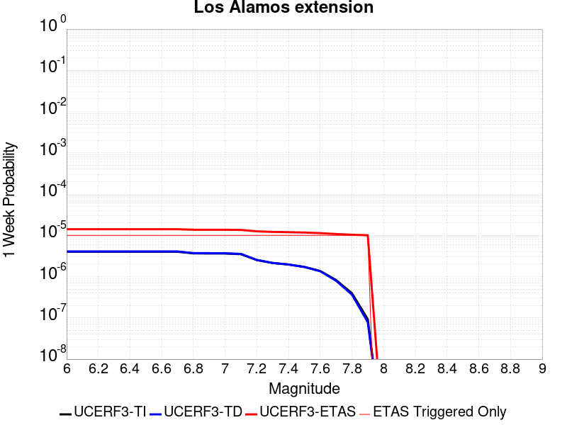 | 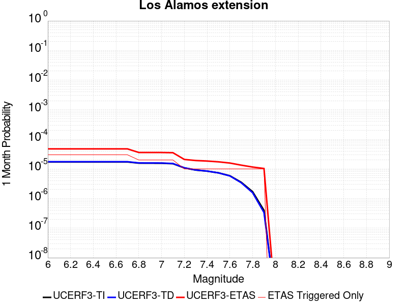 |  |  |

| Magnitude | 1 wk TI Prob | 1 wk TD Prob | 1 wk ETAS Prob | 1 wk ETAS/TD Gain | 1 wk ETAS Triggered Only | 1 mo TI Prob | 1 mo TD Prob | 1 mo ETAS Prob | 1 mo ETAS/TD Gain | 1 mo ETAS Triggered Only | 1 yr TI Prob | 1 yr TD Prob | 1 yr ETAS Prob | 1 yr ETAS/TD Gain | 1 yr ETAS Triggered Only | 10 yr TI Prob | 10 yr TD Prob | 10 yr ETAS Prob | 10 yr ETAS/TD Gain | 10 yr ETAS Triggered Only |
|-----|-----|-----|-----|-----|-----|-----|-----|-----|-----|-----|-----|-----|-----|-----|-----|-----|-----|-----|-----|-----|
| 6.0 | 4.0146506E-6 | 4.0861596E-6 | 3.9384286E-5 | 9.63846 | 3.529827E-5 | 1.7205533E-5 | 1.7512002E-5 | 1.2340496E-4 | 7.0468793 | 1.0589481E-4 | 2.0945723E-4 | 2.1318886E-4 | 3.190611E-4 | 1.4966124 | 1.0589481E-4 | 0.0020925992 | 0.0021299527 | 0.002235622 | 1.0496111 | 1.0589481E-4 |
| 6.1 | 4.0146506E-6 | 4.0861596E-6 | 3.9384286E-5 | 9.63846 | 3.529827E-5 | 1.7205533E-5 | 1.7512002E-5 | 1.2340496E-4 | 7.0468793 | 1.0589481E-4 | 2.0945723E-4 | 2.1318886E-4 | 3.190611E-4 | 1.4966124 | 1.0589481E-4 | 0.0020925992 | 0.0021299527 | 0.002235622 | 1.0496111 | 1.0589481E-4 |
| 6.2 | 4.0146506E-6 | 4.0861596E-6 | 3.9384286E-5 | 9.63846 | 3.529827E-5 | 1.7205533E-5 | 1.7512002E-5 | 1.2340496E-4 | 7.0468793 | 1.0589481E-4 | 2.0945723E-4 | 2.1318886E-4 | 3.190611E-4 | 1.4966124 | 1.0589481E-4 | 0.0020925992 | 0.0021299527 | 0.002235622 | 1.0496111 | 1.0589481E-4 |
| 6.3 | 4.0146506E-6 | 4.0861596E-6 | 3.9384286E-5 | 9.63846 | 3.529827E-5 | 1.7205533E-5 | 1.7512002E-5 | 1.2340496E-4 | 7.0468793 | 1.0589481E-4 | 2.0945723E-4 | 2.1318886E-4 | 3.190611E-4 | 1.4966124 | 1.0589481E-4 | 0.0020925992 | 0.0021299527 | 0.002235622 | 1.0496111 | 1.0589481E-4 |
| 6.4 | 4.0146506E-6 | 4.0861596E-6 | 3.9384286E-5 | 9.63846 | 3.529827E-5 | 1.7205533E-5 | 1.7512002E-5 | 1.2340496E-4 | 7.0468793 | 1.0589481E-4 | 2.0945723E-4 | 2.1318886E-4 | 3.190611E-4 | 1.4966124 | 1.0589481E-4 | 0.0020925992 | 0.0021299527 | 0.002235622 | 1.0496111 | 1.0589481E-4 |
| 6.5 | 4.0146506E-6 | 4.0861596E-6 | 3.9384286E-5 | 9.63846 | 3.529827E-5 | 1.7205533E-5 | 1.7512002E-5 | 1.2340496E-4 | 7.0468793 | 1.0589481E-4 | 2.0945723E-4 | 2.1318886E-4 | 3.190611E-4 | 1.4966124 | 1.0589481E-4 | 0.0020925992 | 0.0021299527 | 0.002235622 | 1.0496111 | 1.0589481E-4 |
| 6.6 | 4.0146506E-6 | 4.0861596E-6 | 3.9384286E-5 | 9.63846 | 3.529827E-5 | 1.7205533E-5 | 1.7512002E-5 | 1.2340496E-4 | 7.0468793 | 1.0589481E-4 | 2.0945723E-4 | 2.1318886E-4 | 3.190611E-4 | 1.4966124 | 1.0589481E-4 | 0.0020925992 | 0.0021299527 | 0.002235622 | 1.0496111 | 1.0589481E-4 |
| 6.7 | 4.0146506E-6 | 4.0861596E-6 | 3.9384286E-5 | 9.63846 | 3.529827E-5 | 1.7205533E-5 | 1.7512002E-5 | 1.2340496E-4 | 7.0468793 | 1.0589481E-4 | 2.0945723E-4 | 2.1318886E-4 | 3.190611E-4 | 1.4966124 | 1.0589481E-4 | 0.0020925992 | 0.0021299527 | 0.002235622 | 1.0496111 | 1.0589481E-4 |
| 6.8 | 3.6584688E-6 | 3.7188588E-6 | 3.9017E-5 | 10.491658 | 3.529827E-5 | 1.5679057E-5 | 1.5937874E-5 | 8.653329E-5 | 5.4294124 | 7.059654E-5 | 1.9087581E-4 | 1.9402728E-4 | 2.6461013E-4 | 1.3637779 | 7.059654E-5 | 0.0019071194 | 0.0019386712 | 0.0020091308 | 1.0363443 | 7.059654E-5 |
| 6.9 | 3.644631E-6 | 3.7045688E-6 | 3.900271E-5 | 10.528272 | 3.529827E-5 | 1.5619753E-5 | 1.5876632E-5 | 8.647205E-5 | 5.4464984 | 7.059654E-5 | 1.901539E-4 | 1.9328178E-4 | 2.6386467E-4 | 1.3651813 | 7.059654E-5 | 0.0018999127 | 0.0019312293 | 0.0020016895 | 1.0364846 | 7.059654E-5 |
| 7.0 | 3.6318522E-6 | 3.6913295E-6 | 3.898947E-5 | 10.562447 | 3.529827E-5 | 1.5564989E-5 | 1.5819893E-5 | 8.641532E-5 | 5.4624467 | 7.059654E-5 | 1.8948725E-4 | 1.925911E-4 | 2.6317404E-4 | 1.3664912 | 7.059654E-5 | 0.0018932576 | 0.0019243343 | 0.0019947952 | 1.0366156 | 7.059654E-5 |
| 7.1 | 3.5001724E-6 | 3.5554E-6 | 3.8853545E-5 | 10.928038 | 3.529827E-5 | 1.5000653E-5 | 1.5237345E-5 | 8.583281E-5 | 5.6330557 | 7.059654E-5 | 1.8261763E-4 | 1.854998E-4 | 2.5608324E-4 | 1.3805041 | 7.059654E-5 | 0.0018246764 | 0.0018535402 | 0.0019240059 | 1.0380168 | 7.059654E-5 |
| 7.2 | 2.5204702E-6 | 2.5436943E-6 | 3.7841874E-5 | 14.876739 | 3.529827E-5 | 1.080197E-5 | 1.0901502E-5 | 4.6199388E-5 | 4.237892 | 3.529827E-5 | 1.3150605E-4 | 1.3271775E-4 | 1.6801133E-4 | 1.2659297 | 3.529827E-5 | 0.0013142825 | 0.0013263905 | 0.001361642 | 1.026577 | 3.529827E-5 |
| 7.3 | 2.1399692E-6 | 2.1501316E-6 | 3.7448324E-5 | 17.41676 | 3.529827E-5 | 9.1712645E-6 | 9.2148175E-6 | 4.4512763E-5 | 4.8305635 | 3.529827E-5 | 1.1165442E-4 | 1.1218466E-4 | 1.4747896E-4 | 1.314609 | 3.529827E-5 | 0.0011159834 | 0.0011212835 | 0.0011565422 | 1.0314449 | 3.529827E-5 |
| 7.4 | 1.9660122E-6 | 1.9702363E-6 | 3.7268437E-5 | 18.915718 | 3.529827E-5 | 8.42574E-6 | 8.4438425E-6 | 4.3741817E-5 | 5.1803207 | 3.529827E-5 | 1.0257855E-4 | 1.0279897E-4 | 1.3809362E-4 | 1.3433366 | 3.529827E-5 | 0.0010253121 | 0.0010275173 | 0.0010627793 | 1.0343176 | 3.529827E-5 |
| 7.5 | 1.7204633E-6 | 1.7150983E-6 | 3.701331E-5 | 21.580866 | 3.529827E-5 | 7.373393E-6 | 7.3504007E-6 | 4.264841E-5 | 5.802189 | 3.529827E-5 | 8.976737E-5 | 8.948748E-5 | 1.247826E-4 | 1.394414 | 3.529827E-5 | 8.9731114E-4 | 8.9451746E-4 | 9.2978415E-4 | 1.0394254 | 3.529827E-5 |
| 7.6 | 1.3717638E-6 | 1.3535827E-6 | 3.6651807E-5 | 27.077627 | 3.529827E-5 | 5.878974E-6 | 5.8010555E-6 | 4.109912E-5 | 7.084766 | 3.529827E-5 | 7.157416E-5 | 7.062559E-5 | 1.0592137E-4 | 1.4997591 | 3.529827E-5 | 7.1551115E-4 | 7.060341E-4 | 7.4130745E-4 | 1.0499599 | 3.529827E-5 |
| 7.7 | 8.272564E-7 | 7.957636E-7 | 3.6094007E-5 | 45.3577 | 3.529827E-5 | 3.5453797E-6 | 3.410411E-6 | 3.870856E-5 | 11.350116 | 3.529827E-5 | 4.3164142E-5 | 4.1520965E-5 | 7.681777E-5 | 1.850096 | 3.529827E-5 | 4.315576E-4 | 4.1513226E-4 | 4.504159E-4 | 1.0849937 | 3.529827E-5 |
| 7.8 | 3.9708277E-7 | 3.6719027E-7 | 3.566545E-5 | 97.1307 | 3.529827E-5 | 1.7017821E-6 | 1.5736716E-6 | 3.6871887E-5 | 23.430483 | 3.529827E-5 | 2.0719E-5 | 1.9159284E-5 | 5.445688E-5 | 2.8423233 | 3.529827E-5 | 2.071707E-4 | 1.9157639E-4 | 2.268679E-4 | 1.1842164 | 3.529827E-5 |
| 7.9 | 9.292528E-8 | 7.889087E-8 | 3.5377157E-5 | 448.43158 | 3.529827E-5 | 3.9825116E-7 | 3.381037E-7 | 3.5636363E-5 | 105.40069 | 3.529827E-5 | 4.848697E-6 | 4.116405E-6 | 3.9414528E-5 | 9.574989 | 3.529827E-5 | 4.8485912E-5 | 4.1163294E-5 | 7.646011E-5 | 1.8574828 | 3.529827E-5 |
| 8.0 | 7.880441E-11 | 8.2353124E-11 | 8.2353124E-11 | 1.0 | 0.0 | 3.3773329E-10 | 3.52942E-10 | 3.52942E-10 | 1.0 | 0.0 | 4.1119033E-9 | 4.2970694E-9 | 4.2970694E-9 | 1.0 | 0.0 | 4.1119034E-8 | 4.2970694E-8 | 4.2970694E-8 | 1.0 | 0.0 |

## Monterey Bay-Tularcitos
*[(top)](#table-of-contents)*

| 1 Week | 1 Month | 1 Year | 10 Year |
|-----|-----|-----|-----|
| 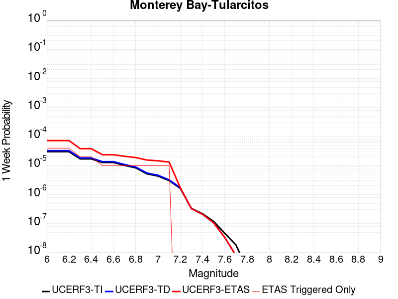 |  |  |  |

| Magnitude | 1 wk TI Prob | 1 wk TD Prob | 1 wk ETAS Prob | 1 wk ETAS/TD Gain | 1 wk ETAS Triggered Only | 1 mo TI Prob | 1 mo TD Prob | 1 mo ETAS Prob | 1 mo ETAS/TD Gain | 1 mo ETAS Triggered Only | 1 yr TI Prob | 1 yr TD Prob | 1 yr ETAS Prob | 1 yr ETAS/TD Gain | 1 yr ETAS Triggered Only | 10 yr TI Prob | 10 yr TD Prob | 10 yr ETAS Prob | 10 yr ETAS/TD Gain | 10 yr ETAS Triggered Only |
|-----|-----|-----|-----|-----|-----|-----|-----|-----|-----|-----|-----|-----|-----|-----|-----|-----|-----|-----|-----|-----|
| 6.0 | 3.0131365E-5 | 3.279877E-5 | 6.8095884E-5 | 2.0761719 | 3.529827E-5 | 1.2912804E-4 | 1.4055918E-4 | 1.7585249E-4 | 1.2510922 | 3.529827E-5 | 0.001571 | 0.0017100703 | 0.001815784 | 1.0618184 | 1.0589481E-4 | 0.015599402 | 0.016979916 | 0.017084014 | 1.0061306 | 1.0589481E-4 |
| 6.1 | 3.0131365E-5 | 3.279877E-5 | 6.8095884E-5 | 2.0761719 | 3.529827E-5 | 1.2912804E-4 | 1.4055918E-4 | 1.7585249E-4 | 1.2510922 | 3.529827E-5 | 0.001571 | 0.0017100703 | 0.001815784 | 1.0618184 | 1.0589481E-4 | 0.015599402 | 0.016979916 | 0.017084014 | 1.0061306 | 1.0589481E-4 |
| 6.2 | 3.0131365E-5 | 3.279877E-5 | 6.8095884E-5 | 2.0761719 | 3.529827E-5 | 1.2912804E-4 | 1.4055918E-4 | 1.7585249E-4 | 1.2510922 | 3.529827E-5 | 0.001571 | 0.0017100703 | 0.001815784 | 1.0618184 | 1.0589481E-4 | 0.015599402 | 0.016979916 | 0.017084014 | 1.0061306 | 1.0589481E-4 |
| 6.3 | 1.6998249E-5 | 1.8330798E-5 | 1.8330798E-5 | 1.0 | 0.0 | 7.28476E-5 | 7.85583E-5 | 7.85583E-5 | 1.0 | 0.0 | 8.865586E-4 | 9.5604634E-4 | 9.913108E-4 | 1.0368857 | 3.529827E-5 | 0.0088303005 | 0.009521258 | 0.00955622 | 1.003672 | 3.529827E-5 |
| 6.4 | 1.6998249E-5 | 1.8330798E-5 | 1.8330798E-5 | 1.0 | 0.0 | 7.28476E-5 | 7.85583E-5 | 7.85583E-5 | 1.0 | 0.0 | 8.865586E-4 | 9.5604634E-4 | 9.913108E-4 | 1.0368857 | 3.529827E-5 | 0.0088303005 | 0.009521258 | 0.00955622 | 1.003672 | 3.529827E-5 |
| 6.5 | 1.27470785E-5 | 1.3693312E-5 | 1.3693312E-5 | 1.0 | 0.0 | 5.4629192E-5 | 5.8684363E-5 | 5.8684363E-5 | 1.0 | 0.0 | 6.649074E-4 | 7.1425823E-4 | 7.495313E-4 | 1.0493842 | 3.529827E-5 | 0.0066292146 | 0.007120678 | 0.0071557253 | 1.0049218 | 3.529827E-5 |
| 6.6 | 1.2739422E-5 | 1.36854E-5 | 1.36854E-5 | 1.0 | 0.0 | 5.4596385E-5 | 5.8650454E-5 | 5.8650454E-5 | 1.0 | 0.0 | 6.645082E-4 | 7.1384566E-4 | 7.4911874E-4 | 1.0494127 | 3.529827E-5 | 0.0066252467 | 0.007116579 | 0.007151626 | 1.0049247 | 3.529827E-5 |
| 6.7 | 1.0160109E-5 | 1.0885755E-5 | 1.0885755E-5 | 1.0 | 0.0 | 4.35426E-5 | 4.665244E-5 | 4.665244E-5 | 1.0 | 0.0 | 5.300022E-4 | 5.6785246E-4 | 6.031307E-4 | 1.0621257 | 3.529827E-5 | 0.005287399 | 0.0056647263 | 0.0056998245 | 1.0061959 | 3.529827E-5 |
| 6.8 | 8.349859E-6 | 8.932587E-6 | 8.932587E-6 | 1.0 | 0.0 | 3.578462E-5 | 3.8281985E-5 | 3.8281985E-5 | 1.0 | 0.0 | 4.3559066E-4 | 4.6598914E-4 | 4.6598914E-4 | 1.0 | 0.0 | 0.004347378 | 0.004650685 | 0.004650685 | 1.0 | 0.0 |
| 6.9 | 5.193639E-6 | 5.53643E-6 | 5.53643E-6 | 1.0 | 0.0 | 2.2258262E-5 | 2.372736E-5 | 2.372736E-5 | 1.0 | 0.0 | 2.7096065E-4 | 2.8884556E-4 | 2.8884556E-4 | 1.0 | 0.0 | 0.0027063051 | 0.0028850222 | 0.0028850222 | 1.0 | 0.0 |
| 7.0 | 4.359381E-6 | 4.643366E-6 | 4.643366E-6 | 1.0 | 0.0 | 1.8682927E-5 | 1.9900004E-5 | 1.9900004E-5 | 1.0 | 0.0 | 2.274409E-4 | 2.422586E-4 | 2.422586E-4 | 1.0 | 0.0 | 0.0022720827 | 0.002420238 | 0.002420238 | 1.0 | 0.0 |
| 7.1 | 3.0398533E-6 | 3.2310427E-6 | 3.2310427E-6 | 1.0 | 0.0 | 1.3027877E-5 | 1.3847267E-5 | 1.3847267E-5 | 1.0 | 0.0 | 1.5860285E-4 | 1.6858005E-4 | 1.6858005E-4 | 1.0 | 0.0 | 0.001584897 | 0.0016847793 | 0.0016847793 | 1.0 | 0.0 |
| 7.2 | 1.642335E-6 | 1.7333153E-6 | 1.7333153E-6 | 1.0 | 0.0 | 7.0385595E-6 | 7.428485E-6 | 7.428485E-6 | 1.0 | 0.0 | 8.569109E-5 | 9.044012E-5 | 9.044012E-5 | 1.0 | 0.0 | 8.5658056E-4 | 9.042358E-4 | 9.042358E-4 | 1.0 | 0.0 |
| 7.3 | 3.356842E-7 | 3.2952389E-7 | 3.2952389E-7 | 1.0 | 0.0 | 1.4386458E-6 | 1.4122444E-6 | 1.4122444E-6 | 1.0 | 0.0 | 1.7515373E-5 | 1.7193941E-5 | 1.7193941E-5 | 1.0 | 0.0 | 1.7513991E-4 | 1.719262E-4 | 1.719262E-4 | 1.0 | 0.0 |
| 7.4 | 2.1973483E-7 | 2.1006413E-7 | 2.1006413E-7 | 1.0 | 0.0 | 9.417204E-7 | 9.0027453E-7 | 9.0027453E-7 | 1.0 | 0.0 | 1.1465385E-5 | 1.0960787E-5 | 1.0960787E-5 | 1.0 | 0.0 | 1.1464794E-4 | 1.096025E-4 | 1.096025E-4 | 1.0 | 0.0 |
| 7.5 | 1.1944135E-7 | 1.0696043E-7 | 1.0696043E-7 | 1.0 | 0.0 | 5.118914E-7 | 4.5840173E-7 | 4.5840173E-7 | 1.0 | 0.0 | 6.23226E-6 | 5.581027E-6 | 5.581027E-6 | 1.0 | 0.0 | 6.2320854E-5 | 5.5808883E-5 | 5.5808883E-5 | 1.0 | 0.0 |
| 7.6 | 4.636058E-8 | 3.336489E-8 | 3.336489E-8 | 1.0 | 0.0 | 1.9868818E-7 | 1.4299238E-7 | 1.4299238E-7 | 1.0 | 0.0 | 2.419026E-6 | 1.7409308E-6 | 1.7409308E-6 | 1.0 | 0.0 | 2.4189996E-5 | 1.7409173E-5 | 1.7409173E-5 | 1.0 | 0.0 |
| 7.7 | 1.8588572E-8 | 8.003744E-9 | 8.003744E-9 | 1.0 | 0.0 | 7.9665305E-8 | 3.430176E-8 | 3.430176E-8 | 1.0 | 0.0 | 9.699246E-7 | 4.1762385E-7 | 4.1762385E-7 | 1.0 | 0.0 | 9.699204E-6 | 4.176231E-6 | 4.176231E-6 | 1.0 | 0.0 |
| 7.8 | 2.7960154E-9 | 7.6099427E-10 | 7.6099427E-10 | 1.0 | 0.0 | 1.1982923E-8 | 3.2614043E-9 | 3.2614043E-9 | 1.0 | 0.0 | 1.4589209E-7 | 3.9707597E-8 | 3.9707597E-8 | 1.0 | 0.0 | 1.4589199E-6 | 3.9707595E-7 | 3.9707595E-7 | 1.0 | 0.0 |

## Holser alt 1
*[(top)](#table-of-contents)*

| 1 Week | 1 Month | 1 Year | 10 Year |
|-----|-----|-----|-----|
|  |  |  |  |

| Magnitude | 1 wk TI Prob | 1 wk TD Prob | 1 wk ETAS Prob | 1 wk ETAS/TD Gain | 1 wk ETAS Triggered Only | 1 mo TI Prob | 1 mo TD Prob | 1 mo ETAS Prob | 1 mo ETAS/TD Gain | 1 mo ETAS Triggered Only | 1 yr TI Prob | 1 yr TD Prob | 1 yr ETAS Prob | 1 yr ETAS/TD Gain | 1 yr ETAS Triggered Only | 10 yr TI Prob | 10 yr TD Prob | 10 yr ETAS Prob | 10 yr ETAS/TD Gain | 10 yr ETAS Triggered Only |
|-----|-----|-----|-----|-----|-----|-----|-----|-----|-----|-----|-----|-----|-----|-----|-----|-----|-----|-----|-----|-----|
| 6.0 | 6.2746653E-6 | 5.789965E-6 | 4.108803E-5 | 7.0964212 | 3.529827E-5 | 2.6891146E-5 | 2.4813964E-5 | 9.540875E-5 | 3.8449621 | 7.059654E-5 | 3.273505E-4 | 3.020797E-4 | 4.079425E-4 | 1.3504467 | 1.0589481E-4 | 0.0032686873 | 0.0030178234 | 0.0031233986 | 1.0349839 | 1.0589481E-4 |
| 6.1 | 6.2746653E-6 | 5.789965E-6 | 4.108803E-5 | 7.0964212 | 3.529827E-5 | 2.6891146E-5 | 2.4813964E-5 | 9.540875E-5 | 3.8449621 | 7.059654E-5 | 3.273505E-4 | 3.020797E-4 | 4.079425E-4 | 1.3504467 | 1.0589481E-4 | 0.0032686873 | 0.0030178234 | 0.0031233986 | 1.0349839 | 1.0589481E-4 |
| 6.2 | 6.2746653E-6 | 5.789965E-6 | 4.108803E-5 | 7.0964212 | 3.529827E-5 | 2.6891146E-5 | 2.4813964E-5 | 9.540875E-5 | 3.8449621 | 7.059654E-5 | 3.273505E-4 | 3.020797E-4 | 4.079425E-4 | 1.3504467 | 1.0589481E-4 | 0.0032686873 | 0.0030178234 | 0.0031233986 | 1.0349839 | 1.0589481E-4 |
| 6.3 | 6.2746653E-6 | 5.789965E-6 | 4.108803E-5 | 7.0964212 | 3.529827E-5 | 2.6891146E-5 | 2.4813964E-5 | 9.540875E-5 | 3.8449621 | 7.059654E-5 | 3.273505E-4 | 3.020797E-4 | 4.079425E-4 | 1.3504467 | 1.0589481E-4 | 0.0032686873 | 0.0030178234 | 0.0031233986 | 1.0349839 | 1.0589481E-4 |
| 6.4 | 6.2746653E-6 | 5.789965E-6 | 4.108803E-5 | 7.0964212 | 3.529827E-5 | 2.6891146E-5 | 2.4813964E-5 | 9.540875E-5 | 3.8449621 | 7.059654E-5 | 3.273505E-4 | 3.020797E-4 | 4.079425E-4 | 1.3504467 | 1.0589481E-4 | 0.0032686873 | 0.0030178234 | 0.0031233986 | 1.0349839 | 1.0589481E-4 |
| 6.5 | 6.2746653E-6 | 5.789965E-6 | 4.108803E-5 | 7.0964212 | 3.529827E-5 | 2.6891146E-5 | 2.4813964E-5 | 9.540875E-5 | 3.8449621 | 7.059654E-5 | 3.273505E-4 | 3.020797E-4 | 4.079425E-4 | 1.3504467 | 1.0589481E-4 | 0.0032686873 | 0.0030178234 | 0.0031233986 | 1.0349839 | 1.0589481E-4 |
| 6.6 | 3.375825E-6 | 2.7711897E-6 | 3.8069364E-5 | 13.737552 | 3.529827E-5 | 1.4467741E-5 | 1.1876474E-5 | 8.247218E-5 | 6.9441633 | 7.059654E-5 | 1.761305E-4 | 1.4458665E-4 | 2.1517299E-4 | 1.488194 | 7.059654E-5 | 0.0017599097 | 0.0014449427 | 0.0015154373 | 1.0487871 | 7.059654E-5 |
| 6.7 | 3.375825E-6 | 2.7711897E-6 | 3.8069364E-5 | 13.737552 | 3.529827E-5 | 1.4467741E-5 | 1.1876474E-5 | 8.247218E-5 | 6.9441633 | 7.059654E-5 | 1.761305E-4 | 1.4458665E-4 | 2.1517299E-4 | 1.488194 | 7.059654E-5 | 0.0017599097 | 0.0014449427 | 0.0015154373 | 1.0487871 | 7.059654E-5 |
| 6.8 | 3.366533E-6 | 2.7615893E-6 | 3.8059763E-5 | 13.781833 | 3.529827E-5 | 1.4427919E-5 | 1.183533E-5 | 8.2431034E-5 | 6.964828 | 7.059654E-5 | 1.7564575E-4 | 1.4408577E-4 | 2.1467215E-4 | 1.4898913 | 7.059654E-5 | 0.0017550698 | 0.0014399405 | 0.0015104355 | 1.0489568 | 7.059654E-5 |
| 6.9 | 3.253174E-6 | 2.6438113E-6 | 3.7941987E-5 | 14.351247 | 3.529827E-5 | 1.39421E-5 | 1.1330571E-5 | 8.1926315E-5 | 7.230554 | 7.059654E-5 | 1.6973184E-4 | 1.3794114E-4 | 2.0852794E-4 | 1.5117168 | 7.059654E-5 | 0.0016960226 | 0.001378571 | 0.0014490703 | 1.0511394 | 7.059654E-5 |
| 7.0 | 2.9336593E-6 | 2.311799E-6 | 3.760999E-5 | 16.26871 | 3.529827E-5 | 1.2572766E-5 | 9.907673E-6 | 8.0503516E-5 | 8.12537 | 7.059654E-5 | 1.5306266E-4 | 1.2061927E-4 | 1.9120729E-4 | 1.5852135 | 7.059654E-5 | 0.0015295728 | 0.0012055405 | 0.001276052 | 1.0584894 | 7.059654E-5 |
| 7.1 | 2.9087812E-6 | 2.2876513E-6 | 3.758584E-5 | 16.429882 | 3.529827E-5 | 1.2466146E-5 | 9.804184E-6 | 8.040003E-5 | 8.200584 | 7.059654E-5 | 1.5176475E-4 | 1.19359414E-4 | 1.8994753E-4 | 1.5913912 | 7.059654E-5 | 0.0015166114 | 0.0011929555 | 0.001263468 | 1.0591073 | 7.059654E-5 |
| 7.2 | 2.8674524E-6 | 2.2475429E-6 | 3.7545735E-5 | 16.705236 | 3.529827E-5 | 1.2289024E-5 | 9.63229E-6 | 8.022815E-5 | 8.329083 | 7.059654E-5 | 1.4960859E-4 | 1.1726685E-4 | 1.8785511E-4 | 1.6019456 | 7.059654E-5 | 0.0014950791 | 0.001172052 | 0.0012425658 | 1.0601627 | 7.059654E-5 |
| 7.3 | 2.8057775E-6 | 2.1954324E-6 | 3.7493624E-5 | 17.078014 | 3.529827E-5 | 1.2024705E-5 | 9.408962E-6 | 8.000484E-5 | 8.503046 | 7.059654E-5 | 1.4639096E-4 | 1.14548115E-4 | 1.8513657E-4 | 1.6162341 | 7.059654E-5 | 0.0014629456 | 0.001144893 | 0.0012154087 | 1.0615915 | 7.059654E-5 |
| 7.4 | 2.683666E-6 | 2.1092305E-6 | 3.7407426E-5 | 17.735106 | 3.529827E-5 | 1.1501375E-5 | 9.039529E-6 | 7.963543E-5 | 8.809689 | 7.059654E-5 | 1.4002025E-4 | 1.1005072E-4 | 1.8063949E-4 | 1.6414204 | 7.059654E-5 | 0.0013993206 | 0.0010999644 | 0.0011704833 | 1.0641102 | 7.059654E-5 |
| 7.5 | 2.434495E-6 | 1.9195363E-6 | 3.721774E-5 | 19.388922 | 3.529827E-5 | 1.0433508E-5 | 8.226558E-6 | 7.8822515E-5 | 9.58147 | 7.059654E-5 | 1.2702055E-4 | 1.0015376E-4 | 1.7074322E-4 | 1.704811 | 7.059654E-5 | 0.0012694797 | 0.0010010883 | 0.0010716141 | 1.0704492 | 7.059654E-5 |
| 7.6 | 1.9914562E-6 | 1.5731459E-6 | 3.687136E-5 | 23.437979 | 3.529827E-5 | 8.534785E-6 | 6.742037E-6 | 7.73381E-5 | 11.471029 | 7.059654E-5 | 1.03906044E-4 | 8.208122E-5 | 1.5267197E-4 | 1.8600109 | 7.059654E-5 | 0.0010385747 | 8.205106E-4 | 8.910492E-4 | 1.0859692 | 7.059654E-5 |
| 7.7 | 1.5229501E-6 | 1.1896061E-6 | 3.6487836E-5 | 30.672197 | 3.529827E-5 | 6.526913E-6 | 5.098302E-6 | 7.569449E-5 | 14.846998 | 7.059654E-5 | 7.946226E-5 | 6.2070074E-5 | 1.3266223E-4 | 2.1372979 | 7.059654E-5 | 7.943385E-4 | 6.2052865E-4 | 6.910814E-4 | 1.1136978 | 7.059654E-5 |
| 7.8 | 6.3489426E-7 | 4.687806E-7 | 3.5767036E-5 | 76.29803 | 3.529827E-5 | 2.7209726E-6 | 2.009058E-6 | 3.7307258E-5 | 18.569527 | 3.529827E-5 | 3.312734E-5 | 2.4460009E-5 | 5.9757418E-5 | 2.443066 | 3.529827E-5 | 3.31224E-4 | 2.4457334E-4 | 2.79863E-4 | 1.1442906 | 3.529827E-5 |
| 7.9 | 1.5459432E-7 | 1.0193758E-7 | 3.5400204E-5 | 347.27335 | 3.529827E-5 | 6.6254694E-7 | 4.3687527E-7 | 3.573513E-5 | 81.797104 | 3.529827E-5 | 8.066479E-6 | 5.3189433E-6 | 4.0617026E-5 | 7.636296 | 3.529827E-5 | 8.066186E-5 | 5.3188178E-5 | 8.848457E-5 | 1.6636134 | 3.529827E-5 |
| 8.0 | 1.8307812E-8 | 9.690293E-9 | 9.690293E-9 | 1.0 | 0.0 | 7.846205E-8 | 4.152983E-8 | 4.152983E-8 | 1.0 | 0.0 | 9.55275E-7 | 5.0562556E-7 | 5.0562556E-7 | 1.0 | 0.0 | 9.552709E-6 | 5.0562444E-6 | 5.0562444E-6 | 1.0 | 0.0 |

## Camp Rock 2011
*[(top)](#table-of-contents)*

| 1 Week | 1 Month | 1 Year | 10 Year |
|-----|-----|-----|-----|
|  | 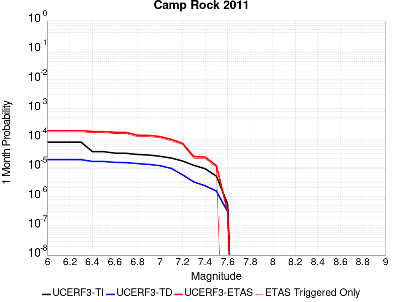 |  |  |

| Magnitude | 1 wk TI Prob | 1 wk TD Prob | 1 wk ETAS Prob | 1 wk ETAS/TD Gain | 1 wk ETAS Triggered Only | 1 mo TI Prob | 1 mo TD Prob | 1 mo ETAS Prob | 1 mo ETAS/TD Gain | 1 mo ETAS Triggered Only | 1 yr TI Prob | 1 yr TD Prob | 1 yr ETAS Prob | 1 yr ETAS/TD Gain | 1 yr ETAS Triggered Only | 10 yr TI Prob | 10 yr TD Prob | 10 yr ETAS Prob | 10 yr ETAS/TD Gain | 10 yr ETAS Triggered Only |
|-----|-----|-----|-----|-----|-----|-----|-----|-----|-----|-----|-----|-----|-----|-----|-----|-----|-----|-----|-----|-----|
| 6.0 | 1.6710783E-5 | 4.25026E-6 | 4.25026E-6 | 1.0 | 0.0 | 7.161568E-5 | 1.8215276E-5 | 5.3512904E-5 | 2.9378035 | 3.529827E-5 | 8.7157206E-4 | 2.2174895E-4 | 3.2762028E-4 | 1.4774377 | 1.0589481E-4 | 0.008681616 | 0.0022153298 | 0.00232099 | 1.047695 | 1.0589481E-4 |
| 6.1 | 1.6710783E-5 | 4.25026E-6 | 4.25026E-6 | 1.0 | 0.0 | 7.161568E-5 | 1.8215276E-5 | 5.3512904E-5 | 2.9378035 | 3.529827E-5 | 8.7157206E-4 | 2.2174895E-4 | 3.2762028E-4 | 1.4774377 | 1.0589481E-4 | 0.008681616 | 0.0022153298 | 0.00232099 | 1.047695 | 1.0589481E-4 |
| 6.2 | 1.6710783E-5 | 4.25026E-6 | 4.25026E-6 | 1.0 | 0.0 | 7.161568E-5 | 1.8215276E-5 | 5.3512904E-5 | 2.9378035 | 3.529827E-5 | 8.7157206E-4 | 2.2174895E-4 | 3.2762028E-4 | 1.4774377 | 1.0589481E-4 | 0.008681616 | 0.0022153298 | 0.00232099 | 1.047695 | 1.0589481E-4 |
| 6.3 | 1.6710783E-5 | 4.25026E-6 | 4.25026E-6 | 1.0 | 0.0 | 7.161568E-5 | 1.8215276E-5 | 5.3512904E-5 | 2.9378035 | 3.529827E-5 | 8.7157206E-4 | 2.2174895E-4 | 3.2762028E-4 | 1.4774377 | 1.0589481E-4 | 0.008681616 | 0.0022153298 | 0.00232099 | 1.047695 | 1.0589481E-4 |
| 6.4 | 7.982846E-6 | 3.6820884E-6 | 3.6820884E-6 | 1.0 | 0.0 | 3.421175E-5 | 1.5780286E-5 | 5.1077997E-5 | 3.2368236 | 3.529827E-5 | 4.1644843E-4 | 1.9210839E-4 | 2.9798286E-4 | 1.5511184 | 1.0589481E-4 | 0.0041566887 | 0.001919458 | 0.0020251495 | 1.0550632 | 1.0589481E-4 |
| 6.5 | 7.982846E-6 | 3.6820884E-6 | 3.6820884E-6 | 1.0 | 0.0 | 3.421175E-5 | 1.5780286E-5 | 5.1077997E-5 | 3.2368236 | 3.529827E-5 | 4.1644843E-4 | 1.9210839E-4 | 2.9798286E-4 | 1.5511184 | 1.0589481E-4 | 0.0041566887 | 0.001919458 | 0.0020251495 | 1.0550632 | 1.0589481E-4 |
| 6.6 | 7.048869E-6 | 3.4243571E-6 | 3.4243571E-6 | 1.0 | 0.0 | 3.0209088E-5 | 1.4675736E-5 | 4.997349E-5 | 3.4051776 | 3.529827E-5 | 3.677336E-4 | 1.7866275E-4 | 2.8453863E-4 | 1.5926019 | 1.0589481E-4 | 0.0036712566 | 0.0017852228 | 0.0018909285 | 1.0592115 | 1.0589481E-4 |
| 6.7 | 6.987307E-6 | 3.3623348E-6 | 3.3623348E-6 | 1.0 | 0.0 | 2.9945259E-5 | 1.4409929E-5 | 4.970769E-5 | 3.4495447 | 3.529827E-5 | 3.6452254E-4 | 1.7542706E-4 | 2.813033E-4 | 1.6035342 | 1.0589481E-4 | 0.0036392517 | 0.001752917 | 0.0018586261 | 1.0603048 | 1.0589481E-4 |
| 6.8 | 6.3737602E-6 | 3.1179077E-6 | 3.1179077E-6 | 1.0 | 0.0 | 2.731583E-5 | 1.3362394E-5 | 4.8660193E-5 | 3.6415772 | 3.529827E-5 | 3.3251947E-4 | 1.626753E-4 | 2.685529E-4 | 1.6508523 | 1.0589481E-4 | 0.0033202237 | 0.0016255907 | 0.0017313134 | 1.0650364 | 1.0589481E-4 |
| 6.9 | 6.112211E-6 | 2.9331156E-6 | 2.9331156E-6 | 1.0 | 0.0 | 2.6194928E-5 | 1.2570436E-5 | 4.7868263E-5 | 3.8080032 | 3.529827E-5 | 3.1887658E-4 | 1.5303459E-4 | 2.589132E-4 | 1.6918606 | 1.0589481E-4 | 0.003184194 | 0.0015293199 | 0.0016350527 | 1.0691372 | 1.0589481E-4 |
| 7.0 | 5.5140117E-6 | 2.641923E-6 | 2.641923E-6 | 1.0 | 0.0 | 2.3631264E-5 | 1.132248E-5 | 4.662035E-5 | 4.1175036 | 3.529827E-5 | 2.8767265E-4 | 1.3784273E-4 | 2.4372293E-4 | 1.7681234 | 1.0589481E-4 | 0.0028730053 | 0.0013775975 | 0.0014833465 | 1.0767633 | 1.0589481E-4 |
| 7.1 | 4.8151105E-6 | 2.1342705E-6 | 2.1342705E-6 | 1.0 | 0.0 | 2.0636026E-5 | 9.146843E-6 | 4.444479E-5 | 4.8590307 | 3.529827E-5 | 2.5121463E-4 | 1.1135734E-4 | 2.1724036E-4 | 1.9508401 | 1.0589481E-4 | 0.0025093083 | 0.0011130372 | 0.0012188142 | 1.0950345 | 1.0589481E-4 |
| 7.2 | 3.818335E-6 | 1.2937425E-6 | 1.2937425E-6 | 1.0 | 0.0 | 1.6364189E-5 | 5.5445994E-6 | 4.0842675E-5 | 7.3662086 | 3.529827E-5 | 1.9921579E-4 | 6.750349E-5 | 1.7339115E-4 | 2.568625 | 1.0589481E-4 | 0.0019903728 | 6.748381E-4 | 7.806614E-4 | 1.1568129 | 1.0589481E-4 |
| 7.3 | 2.7166698E-6 | 7.3835776E-7 | 7.3835776E-7 | 1.0 | 0.0 | 1.1642818E-5 | 3.1643867E-6 | 3.8462545E-5 | 12.154819 | 3.529827E-5 | 1.4174209E-4 | 3.8525748E-5 | 7.382266E-5 | 1.9161901 | 3.529827E-5 | 0.0014165172 | 3.851927E-4 | 4.2047736E-4 | 1.0916027 | 3.529827E-5 |
| 7.4 | 2.0893426E-6 | 5.4618386E-7 | 5.4618386E-7 | 1.0 | 0.0 | 8.954295E-6 | 2.3407858E-6 | 3.7638973E-5 | 16.079632 | 3.529827E-5 | 1.0901308E-4 | 2.84987E-5 | 6.379597E-5 | 2.2385569 | 3.529827E-5 | 0.0010895962 | 2.84951E-4 | 3.2023923E-4 | 1.1238396 | 3.529827E-5 |
| 7.5 | 1.1681728E-6 | 3.6030585E-7 | 3.6030585E-7 | 1.0 | 0.0 | 5.0064455E-6 | 1.544167E-6 | 3.6842383E-5 | 23.859066 | 3.529827E-5 | 6.0951766E-5 | 1.8800076E-5 | 5.4097683E-5 | 2.8775246 | 3.529827E-5 | 6.093505E-4 | 1.8798532E-4 | 2.2327696E-4 | 1.1877362 | 3.529827E-5 |
| 7.6 | 1.3154387E-7 | 7.1197384E-8 | 7.1197384E-8 | 1.0 | 0.0 | 5.6375933E-7 | 3.051316E-7 | 3.051316E-7 | 1.0 | 0.0 | 6.863748E-6 | 3.7149728E-6 | 3.7149728E-6 | 1.0 | 0.0 | 6.863536E-5 | 3.7149264E-5 | 3.7149264E-5 | 1.0 | 0.0 |

## Cleghorn
*[(top)](#table-of-contents)*

| 1 Week | 1 Month | 1 Year | 10 Year |
|-----|-----|-----|-----|
|  |  | 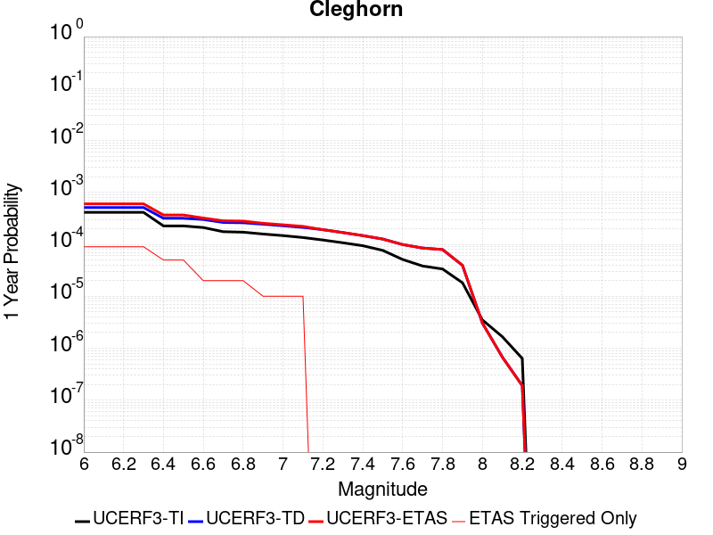 |  |

| Magnitude | 1 wk TI Prob | 1 wk TD Prob | 1 wk ETAS Prob | 1 wk ETAS/TD Gain | 1 wk ETAS Triggered Only | 1 mo TI Prob | 1 mo TD Prob | 1 mo ETAS Prob | 1 mo ETAS/TD Gain | 1 mo ETAS Triggered Only | 1 yr TI Prob | 1 yr TD Prob | 1 yr ETAS Prob | 1 yr ETAS/TD Gain | 1 yr ETAS Triggered Only | 10 yr TI Prob | 10 yr TD Prob | 10 yr ETAS Prob | 10 yr ETAS/TD Gain | 10 yr ETAS Triggered Only |
|-----|-----|-----|-----|-----|-----|-----|-----|-----|-----|-----|-----|-----|-----|-----|-----|-----|-----|-----|-----|-----|
| 6.0 | 7.9267165E-6 | 9.831582E-6 | 8.042743E-5 | 8.180517 | 7.059654E-5 | 3.39712E-5 | 4.2134732E-5 | 1.4802508E-4 | 3.5131369 | 1.0589481E-4 | 4.1352084E-4 | 5.128803E-4 | 6.187208E-4 | 1.206365 | 1.0589481E-4 | 0.004127522 | 0.0051320773 | 0.0052374285 | 1.020528 | 1.0589481E-4 |
| 6.1 | 7.9267165E-6 | 9.831582E-6 | 8.042743E-5 | 8.180517 | 7.059654E-5 | 3.39712E-5 | 4.2134732E-5 | 1.4802508E-4 | 3.5131369 | 1.0589481E-4 | 4.1352084E-4 | 5.128803E-4 | 6.187208E-4 | 1.206365 | 1.0589481E-4 | 0.004127522 | 0.0051320773 | 0.0052374285 | 1.020528 | 1.0589481E-4 |
| 6.2 | 7.9267165E-6 | 9.831582E-6 | 8.042743E-5 | 8.180517 | 7.059654E-5 | 3.39712E-5 | 4.2134732E-5 | 1.4802508E-4 | 3.5131369 | 1.0589481E-4 | 4.1352084E-4 | 5.128803E-4 | 6.187208E-4 | 1.206365 | 1.0589481E-4 | 0.004127522 | 0.0051320773 | 0.0052374285 | 1.020528 | 1.0589481E-4 |
| 6.3 | 7.9267165E-6 | 9.831582E-6 | 8.042743E-5 | 8.180517 | 7.059654E-5 | 3.39712E-5 | 4.2134732E-5 | 1.4802508E-4 | 3.5131369 | 1.0589481E-4 | 4.1352084E-4 | 5.128803E-4 | 6.187208E-4 | 1.206365 | 1.0589481E-4 | 0.004127522 | 0.0051320773 | 0.0052374285 | 1.020528 | 1.0589481E-4 |
| 6.4 | 4.3445207E-6 | 6.0914435E-6 | 4.13895E-5 | 6.794695 | 3.529827E-5 | 1.8619241E-5 | 2.610593E-5 | 9.670063E-5 | 3.7041633 | 7.059654E-5 | 2.2666567E-4 | 3.1779436E-4 | 3.8836847E-4 | 1.2220747 | 7.059654E-5 | 0.0022643462 | 0.0031875873 | 0.0032579587 | 1.0220767 | 7.059654E-5 |
| 6.5 | 4.3445207E-6 | 6.0914435E-6 | 4.13895E-5 | 6.794695 | 3.529827E-5 | 1.8619241E-5 | 2.610593E-5 | 9.670063E-5 | 3.7041633 | 7.059654E-5 | 2.2666567E-4 | 3.1779436E-4 | 3.8836847E-4 | 1.2220747 | 7.059654E-5 | 0.0022643462 | 0.0031875873 | 0.0032579587 | 1.0220767 | 7.059654E-5 |
| 6.6 | 4.040109E-6 | 5.773851E-6 | 4.107192E-5 | 7.1134353 | 3.529827E-5 | 1.7314638E-5 | 2.4744846E-5 | 9.533964E-5 | 3.8529088 | 7.059654E-5 | 2.1078532E-4 | 3.012278E-4 | 3.7180306E-4 | 1.234292 | 7.059654E-5 | 0.002105855 | 0.003022377 | 0.0030927602 | 1.0232874 | 7.059654E-5 |
| 6.7 | 3.3632055E-6 | 5.067348E-6 | 4.036544E-5 | 7.9657917 | 3.529827E-5 | 1.4413658E-5 | 2.1717027E-5 | 9.231203E-5 | 4.2506757 | 7.059654E-5 | 1.7547216E-4 | 2.6437303E-4 | 3.3495092E-4 | 1.2669632 | 7.059654E-5 | 0.0017533366 | 0.0026547113 | 0.0027251204 | 1.0265223 | 7.059654E-5 |
| 6.8 | 3.2902772E-6 | 4.9892556E-6 | 4.028735E-5 | 8.074821 | 3.529827E-5 | 1.4101111E-5 | 2.1382351E-5 | 9.197738E-5 | 4.301556 | 7.059654E-5 | 1.716675E-4 | 2.6029933E-4 | 3.308775E-4 | 1.2711424 | 7.059654E-5 | 0.0017153495 | 0.0026140702 | 0.0026844821 | 1.0269358 | 7.059654E-5 |
| 6.9 | 3.031547E-6 | 4.6910186E-6 | 4.6910186E-6 | 1.0 | 0.0 | 1.299228E-5 | 2.0104211E-5 | 5.540177E-5 | 2.7557297 | 3.529827E-5 | 1.5816953E-4 | 2.4474156E-4 | 2.8003118E-4 | 1.1441914 | 3.529827E-5 | 0.00158057 | 0.0024588439 | 0.0024940553 | 1.0143204 | 3.529827E-5 |
| 7.0 | 2.8259715E-6 | 4.3705895E-6 | 4.3705895E-6 | 1.0 | 0.0 | 1.211125E-5 | 1.8730963E-5 | 5.4028573E-5 | 2.8844523 | 3.529827E-5 | 1.4744449E-4 | 2.2802586E-4 | 2.633161E-4 | 1.1547642 | 3.529827E-5 | 0.001473467 | 0.0022920412 | 0.0023272585 | 1.0153651 | 3.529827E-5 |
| 7.1 | 2.5962665E-6 | 4.0658106E-6 | 4.0658106E-6 | 1.0 | 0.0 | 1.1126809E-5 | 1.7424789E-5 | 5.2722444E-5 | 3.025715 | 3.529827E-5 | 1.3546048E-4 | 2.1212637E-4 | 2.4741713E-4 | 1.1663668 | 3.529827E-5 | 0.0013537793 | 0.002133366 | 0.0021685888 | 1.0165105 | 3.529827E-5 |
| 7.2 | 2.3247253E-6 | 3.6763672E-6 | 3.6763672E-6 | 1.0 | 0.0 | 9.96307E-6 | 1.5755764E-5 | 1.5755764E-5 | 1.0 | 0.0 | 1.21293626E-4 | 1.9180974E-4 | 1.9180974E-4 | 1.0 | 0.0 | 0.0012122744 | 0.0019305905 | 0.0019305905 | 1.0 | 0.0 |
| 7.3 | 2.056928E-6 | 3.2350938E-6 | 3.2350938E-6 | 1.0 | 0.0 | 8.815376E-6 | 1.3864615E-5 | 1.3864615E-5 | 1.0 | 0.0 | 1.0732192E-4 | 1.6878877E-4 | 1.6878877E-4 | 1.0 | 0.0 | 0.001072701 | 0.0017008206 | 0.0017008206 | 1.0 | 0.0 |
| 7.4 | 1.8055999E-6 | 2.8255042E-6 | 2.8255042E-6 | 1.0 | 0.0 | 7.738263E-6 | 1.2109249E-5 | 1.2109249E-5 | 1.0 | 0.0 | 9.4209274E-5 | 1.4742027E-4 | 1.4742027E-4 | 1.0 | 0.0 | 9.4169343E-4 | 0.0014875771 | 0.0014875771 | 1.0 | 0.0 |
| 7.5 | 1.4683443E-6 | 2.4247483E-6 | 2.4247483E-6 | 1.0 | 0.0 | 6.292889E-6 | 1.0391738E-5 | 1.0391738E-5 | 1.0 | 0.0 | 7.661323E-5 | 1.2651215E-4 | 1.2651215E-4 | 1.0 | 0.0 | 7.658682E-4 | 0.0012787961 | 0.0012787961 | 1.0 | 0.0 |
| 7.6 | 9.804088E-7 | 1.900266E-6 | 1.900266E-6 | 1.0 | 0.0 | 4.201745E-6 | 8.143972E-6 | 8.143972E-6 | 1.0 | 0.0 | 5.1155046E-5 | 9.91484E-5 | 9.91484E-5 | 1.0 | 0.0 | 5.114327E-4 | 0.001005471 | 0.001005471 | 1.0 | 0.0 |
| 7.7 | 7.3434086E-7 | 1.6284146E-6 | 1.6284146E-6 | 1.0 | 0.0 | 3.1471714E-6 | 6.978901E-6 | 6.978901E-6 | 1.0 | 0.0 | 3.831614E-5 | 8.4964835E-5 | 8.4964835E-5 | 1.0 | 0.0 | 3.8309532E-4 | 8.6378685E-4 | 8.6378685E-4 | 1.0 | 0.0 |
| 7.8 | 6.434184E-7 | 1.5220047E-6 | 1.5220047E-6 | 1.0 | 0.0 | 2.7575045E-6 | 6.5228614E-6 | 6.5228614E-6 | 1.0 | 0.0 | 3.35721E-5 | 7.941297E-5 | 7.941297E-5 | 1.0 | 0.0 | 3.3567028E-4 | 8.079678E-4 | 8.079678E-4 | 1.0 | 0.0 |
| 7.9 | 3.4943926E-7 | 7.574459E-7 | 7.574459E-7 | 1.0 | 0.0 | 1.497596E-6 | 3.2461926E-6 | 3.2461926E-6 | 1.0 | 0.0 | 1.8233079E-5 | 3.952169E-5 | 3.952169E-5 | 1.0 | 0.0 | 1.8231584E-4 | 4.040099E-4 | 4.040099E-4 | 1.0 | 0.0 |
| 8.0 | 6.717524E-8 | 5.838828E-8 | 5.838828E-8 | 1.0 | 0.0 | 2.8789387E-7 | 2.5023547E-7 | 2.5023547E-7 | 1.0 | 0.0 | 3.505102E-6 | 3.0466126E-6 | 3.0466126E-6 | 1.0 | 0.0 | 3.5050467E-5 | 3.273506E-5 | 3.273506E-5 | 1.0 | 0.0 |
| 8.1 | 3.1984914E-8 | 1.2956093E-8 | 1.2956093E-8 | 1.0 | 0.0 | 1.370782E-7 | 5.552611E-8 | 5.552611E-8 | 1.0 | 0.0 | 1.6689258E-6 | 6.760302E-7 | 6.760302E-7 | 1.0 | 0.0 | 1.6689133E-5 | 7.74454E-6 | 7.74454E-6 | 1.0 | 0.0 |
| 8.2 | 1.21887656E-8 | 3.6495305E-9 | 3.6495305E-9 | 1.0 | 0.0 | 5.2237567E-8 | 1.5640845E-8 | 1.5640845E-8 | 1.0 | 0.0 | 6.359922E-7 | 1.9042727E-7 | 1.9042727E-7 | 1.0 | 0.0 | 6.3599036E-6 | 2.2470974E-6 | 2.2470974E-6 | 1.0 | 0.0 |

## San Cayetano
*[(top)](#table-of-contents)*

| 1 Week | 1 Month | 1 Year | 10 Year |
|-----|-----|-----|-----|
|  |  |  |  |

| Magnitude | 1 wk TI Prob | 1 wk TD Prob | 1 wk ETAS Prob | 1 wk ETAS/TD Gain | 1 wk ETAS Triggered Only | 1 mo TI Prob | 1 mo TD Prob | 1 mo ETAS Prob | 1 mo ETAS/TD Gain | 1 mo ETAS Triggered Only | 1 yr TI Prob | 1 yr TD Prob | 1 yr ETAS Prob | 1 yr ETAS/TD Gain | 1 yr ETAS Triggered Only | 10 yr TI Prob | 10 yr TD Prob | 10 yr ETAS Prob | 10 yr ETAS/TD Gain | 10 yr ETAS Triggered Only |
|-----|-----|-----|-----|-----|-----|-----|-----|-----|-----|-----|-----|-----|-----|-----|-----|-----|-----|-----|-----|-----|
| 6.0 | 2.3476267E-5 | 1.816928E-5 | 8.876454E-5 | 4.885419 | 7.059654E-5 | 1.0060869E-4 | 7.786603E-5 | 1.4845708E-4 | 1.9065704 | 7.059654E-5 | 0.0012242225 | 9.476103E-4 | 0.0010534048 | 1.1116434 | 1.0589481E-4 | 0.012175002 | 0.009436584 | 0.00954148 | 1.0111158 | 1.0589481E-4 |
| 6.1 | 2.3476267E-5 | 1.816928E-5 | 8.876454E-5 | 4.885419 | 7.059654E-5 | 1.0060869E-4 | 7.786603E-5 | 1.4845708E-4 | 1.9065704 | 7.059654E-5 | 0.0012242225 | 9.476103E-4 | 0.0010534048 | 1.1116434 | 1.0589481E-4 | 0.012175002 | 0.009436584 | 0.00954148 | 1.0111158 | 1.0589481E-4 |
| 6.2 | 2.3476267E-5 | 1.816928E-5 | 8.876454E-5 | 4.885419 | 7.059654E-5 | 1.0060869E-4 | 7.786603E-5 | 1.4845708E-4 | 1.9065704 | 7.059654E-5 | 0.0012242225 | 9.476103E-4 | 0.0010534048 | 1.1116434 | 1.0589481E-4 | 0.012175002 | 0.009436584 | 0.00954148 | 1.0111158 | 1.0589481E-4 |
| 6.3 | 2.3476267E-5 | 1.816928E-5 | 8.876454E-5 | 4.885419 | 7.059654E-5 | 1.0060869E-4 | 7.786603E-5 | 1.4845708E-4 | 1.9065704 | 7.059654E-5 | 0.0012242225 | 9.476103E-4 | 0.0010534048 | 1.1116434 | 1.0589481E-4 | 0.012175002 | 0.009436584 | 0.00954148 | 1.0111158 | 1.0589481E-4 |
| 6.4 | 2.3476267E-5 | 1.816928E-5 | 8.876454E-5 | 4.885419 | 7.059654E-5 | 1.0060869E-4 | 7.786603E-5 | 1.4845708E-4 | 1.9065704 | 7.059654E-5 | 0.0012242225 | 9.476103E-4 | 0.0010534048 | 1.1116434 | 1.0589481E-4 | 0.012175002 | 0.009436584 | 0.00954148 | 1.0111158 | 1.0589481E-4 |
| 6.5 | 2.3476267E-5 | 1.816928E-5 | 8.876454E-5 | 4.885419 | 7.059654E-5 | 1.0060869E-4 | 7.786603E-5 | 1.4845708E-4 | 1.9065704 | 7.059654E-5 | 0.0012242225 | 9.476103E-4 | 0.0010534048 | 1.1116434 | 1.0589481E-4 | 0.012175002 | 0.009436584 | 0.00954148 | 1.0111158 | 1.0589481E-4 |
| 6.6 | 2.3476267E-5 | 1.816928E-5 | 8.876454E-5 | 4.885419 | 7.059654E-5 | 1.0060869E-4 | 7.786603E-5 | 1.4845708E-4 | 1.9065704 | 7.059654E-5 | 0.0012242225 | 9.476103E-4 | 0.0010534048 | 1.1116434 | 1.0589481E-4 | 0.012175002 | 0.009436584 | 0.00954148 | 1.0111158 | 1.0589481E-4 |
| 6.7 | 2.3476267E-5 | 1.816928E-5 | 8.876454E-5 | 4.885419 | 7.059654E-5 | 1.0060869E-4 | 7.786603E-5 | 1.4845708E-4 | 1.9065704 | 7.059654E-5 | 0.0012242225 | 9.476103E-4 | 0.0010534048 | 1.1116434 | 1.0589481E-4 | 0.012175002 | 0.009436584 | 0.00954148 | 1.0111158 | 1.0589481E-4 |
| 6.8 | 2.3241924E-5 | 1.7936987E-5 | 8.853226E-5 | 4.9357376 | 7.059654E-5 | 9.960445E-5 | 7.687056E-5 | 1.4746167E-4 | 1.9183115 | 7.059654E-5 | 0.0012120095 | 9.3550084E-4 | 0.0010412965 | 1.1130899 | 1.0589481E-4 | 0.012054204 | 0.009316482 | 0.0094213905 | 1.0112605 | 1.0589481E-4 |
| 6.9 | 2.2761007E-5 | 1.7432423E-5 | 8.802774E-5 | 5.0496554 | 7.059654E-5 | 9.7543525E-5 | 7.470827E-5 | 1.4529953E-4 | 1.9448923 | 7.059654E-5 | 0.0011869454 | 9.09197E-4 | 0.0010149955 | 1.1163648 | 1.0589481E-4 | 0.011806256 | 0.009055603 | 0.009160539 | 1.011588 | 1.0589481E-4 |
| 7.0 | 2.240283E-5 | 1.7066168E-5 | 8.76615E-5 | 5.136566 | 7.059654E-5 | 9.600859E-5 | 7.313869E-5 | 1.4373007E-4 | 1.9651715 | 7.059654E-5 | 0.0011682777 | 8.9010317E-4 | 9.959037E-4 | 1.1188632 | 1.0589481E-4 | 0.011621549 | 0.008866196 | 0.008971151 | 1.0118377 | 1.0589481E-4 |
| 7.1 | 2.1871154E-5 | 1.6586018E-5 | 8.718139E-5 | 5.256318 | 7.059654E-5 | 9.373015E-5 | 7.108101E-5 | 1.4167254E-4 | 1.9931136 | 7.059654E-5 | 0.0011405671 | 8.6507114E-4 | 9.7087433E-4 | 1.1223058 | 1.0589481E-4 | 0.011347309 | 0.008617838 | 0.00872282 | 1.012182 | 1.0589481E-4 |
| 7.2 | 2.0714133E-5 | 1.5564561E-5 | 8.6160006E-5 | 5.5356526 | 7.059654E-5 | 8.8771834E-5 | 6.670357E-5 | 1.372954E-4 | 2.0582917 | 7.059654E-5 | 0.0010802611 | 8.1181666E-4 | 9.176255E-4 | 1.1303359 | 1.0589481E-4 | 0.010750249 | 0.008089285 | 0.008194324 | 1.0129849 | 1.0589481E-4 |
| 7.3 | 1.8408395E-5 | 1.3996864E-5 | 8.4592415E-5 | 6.043669 | 7.059654E-5 | 7.8890735E-5 | 5.99852E-5 | 1.3057751E-4 | 2.1768286 | 7.059654E-5 | 9.600714E-4 | 7.300781E-4 | 8.006231E-4 | 1.0966266 | 7.059654E-5 | 0.009559342 | 0.0072775153 | 0.007347598 | 1.0096301 | 7.059654E-5 |
| 7.4 | 1.6856795E-5 | 1.28500815E-5 | 8.344572E-5 | 6.493789 | 7.059654E-5 | 7.2241404E-5 | 5.5070628E-5 | 1.2566328E-4 | 2.2818568 | 7.059654E-5 | 8.7918417E-4 | 6.7028153E-4 | 7.408307E-4 | 1.1052531 | 7.059654E-5 | 0.00875714 | 0.0066832784 | 0.006753403 | 1.0104926 | 7.059654E-5 |
| 7.5 | 1.2822778E-5 | 9.577542E-6 | 8.0173406E-5 | 8.370979 | 7.059654E-5 | 5.495361E-5 | 4.1045972E-5 | 1.11639616E-4 | 2.7198677 | 7.059654E-5 | 6.688548E-4 | 4.996217E-4 | 5.70183E-4 | 1.1412294 | 7.059654E-5 | 0.006668452 | 0.0049851555 | 0.0050554 | 1.0140908 | 7.059654E-5 |
| 7.6 | 5.6272684E-6 | 3.854903E-6 | 7.445117E-5 | 19.313372 | 7.059654E-5 | 2.4116642E-5 | 1.652091E-5 | 8.7116285E-5 | 5.2730927 | 7.059654E-5 | 2.9358055E-4 | 2.0112359E-4 | 2.7170594E-4 | 1.3509401 | 7.059654E-5 | 0.0029319301 | 0.0020094267 | 0.0020798813 | 1.0350621 | 7.059654E-5 |
| 7.7 | 3.5261346E-6 | 2.3407013E-6 | 7.293708E-5 | 31.160353 | 7.059654E-5 | 1.5111918E-5 | 1.0031539E-5 | 8.0627375E-5 | 8.037388 | 7.059654E-5 | 1.8397206E-4 | 1.2212721E-4 | 1.9271513E-4 | 1.5779868 | 7.059654E-5 | 0.0018381984 | 0.0012206084 | 0.0012911187 | 1.0577666 | 7.059654E-5 |
| 7.8 | 1.4826929E-6 | 1.056428E-6 | 3.635466E-5 | 34.412815 | 3.529827E-5 | 6.354383E-6 | 4.5275406E-6 | 3.9825652E-5 | 8.79631 | 3.529827E-5 | 7.736187E-5 | 5.5121433E-5 | 9.041776E-5 | 1.6403376 | 3.529827E-5 | 7.733494E-4 | 5.5107963E-4 | 5.863585E-4 | 1.0640177 | 3.529827E-5 |
| 7.9 | 2.7568166E-7 | 1.6978244E-7 | 3.5468045E-5 | 208.90291 | 3.529827E-5 | 1.1814923E-6 | 7.2763885E-7 | 3.6025882E-5 | 49.510666 | 3.529827E-5 | 1.4384574E-5 | 8.858967E-6 | 4.4156925E-5 | 4.9844327 | 3.529827E-5 | 1.4383643E-4 | 8.8586174E-5 | 1.2388131E-4 | 1.3984272 | 3.529827E-5 |
| 8.0 | 5.407832E-8 | 2.6887697E-8 | 2.6887697E-8 | 1.0 | 0.0 | 2.3176422E-7 | 1.15232986E-7 | 1.15232986E-7 | 1.0 | 0.0 | 2.8217257E-6 | 1.4029607E-6 | 1.4029607E-6 | 1.0 | 0.0 | 2.8216898E-5 | 1.4029522E-5 | 1.4029522E-5 | 1.0 | 0.0 |

## Ortigalita (South)
*[(top)](#table-of-contents)*

| 1 Week | 1 Month | 1 Year | 10 Year |
|-----|-----|-----|-----|
|  |  |  |  |

| Magnitude | 1 wk TI Prob | 1 wk TD Prob | 1 wk ETAS Prob | 1 wk ETAS/TD Gain | 1 wk ETAS Triggered Only | 1 mo TI Prob | 1 mo TD Prob | 1 mo ETAS Prob | 1 mo ETAS/TD Gain | 1 mo ETAS Triggered Only | 1 yr TI Prob | 1 yr TD Prob | 1 yr ETAS Prob | 1 yr ETAS/TD Gain | 1 yr ETAS Triggered Only | 10 yr TI Prob | 10 yr TD Prob | 10 yr ETAS Prob | 10 yr ETAS/TD Gain | 10 yr ETAS Triggered Only |
|-----|-----|-----|-----|-----|-----|-----|-----|-----|-----|-----|-----|-----|-----|-----|-----|-----|-----|-----|-----|-----|
| 6.0 | 3.72394E-5 | 4.325562E-5 | 1.13849106E-4 | 2.6320074 | 7.059654E-5 | 1.5958765E-4 | 1.8536893E-4 | 2.559524E-4 | 1.3807728 | 7.059654E-5 | 0.0019412481 | 0.0022546875 | 0.0023251248 | 1.0312405 | 7.059654E-5 | 0.019243775 | 0.022334497 | 0.022403516 | 1.0030903 | 7.059654E-5 |
| 6.1 | 2.7299884E-5 | 3.149204E-5 | 1.0208636E-4 | 3.2416558 | 7.059654E-5 | 1.16994255E-4 | 1.3495922E-4 | 2.0554624E-4 | 1.5230247 | 7.059654E-5 | 0.0014234743 | 0.0016419457 | 0.0017124263 | 1.0429251 | 7.059654E-5 | 0.014143906 | 0.01630407 | 0.016373515 | 1.0042593 | 7.059654E-5 |
| 6.2 | 2.7299884E-5 | 3.149204E-5 | 1.0208636E-4 | 3.2416558 | 7.059654E-5 | 1.16994255E-4 | 1.3495922E-4 | 2.0554624E-4 | 1.5230247 | 7.059654E-5 | 0.0014234743 | 0.0016419457 | 0.0017124263 | 1.0429251 | 7.059654E-5 | 0.014143906 | 0.01630407 | 0.016373515 | 1.0042593 | 7.059654E-5 |
| 6.3 | 2.0546433E-5 | 2.363145E-5 | 5.8928887E-5 | 2.4936635 | 3.529827E-5 | 8.805317E-5 | 1.0127382E-4 | 1.3656852E-4 | 1.3485076 | 3.529827E-5 | 0.00107152 | 0.0012323303 | 0.0012675851 | 1.0286082 | 3.529827E-5 | 0.010663681 | 0.01225703 | 0.012291896 | 1.0028446 | 3.529827E-5 |
| 6.4 | 2.0546433E-5 | 2.363145E-5 | 5.8928887E-5 | 2.4936635 | 3.529827E-5 | 8.805317E-5 | 1.0127382E-4 | 1.3656852E-4 | 1.3485076 | 3.529827E-5 | 0.00107152 | 0.0012323303 | 0.0012675851 | 1.0286082 | 3.529827E-5 | 0.010663681 | 0.01225703 | 0.012291896 | 1.0028446 | 3.529827E-5 |
| 6.5 | 1.7779594E-5 | 2.0446974E-5 | 5.5744524E-5 | 2.726297 | 3.529827E-5 | 7.619603E-5 | 8.762702E-5 | 1.229222E-4 | 1.4027888 | 3.529827E-5 | 9.272918E-4 | 0.0010663504 | 0.0011016111 | 1.0330666 | 3.529827E-5 | 0.009234319 | 0.010613803 | 0.0106487265 | 1.0032904 | 3.529827E-5 |
| 6.6 | 1.6272212E-5 | 1.8714967E-5 | 5.4012577E-5 | 2.886063 | 3.529827E-5 | 6.973618E-5 | 8.0204605E-5 | 1.1550004E-4 | 1.4400675 | 3.529827E-5 | 8.487073E-4 | 9.760658E-4 | 0.0010113297 | 1.0361285 | 3.529827E-5 | 0.008454733 | 0.009719091 | 0.009754045 | 1.0035965 | 3.529827E-5 |
| 6.7 | 1.3051484E-5 | 1.5038758E-5 | 5.0336497E-5 | 3.347118 | 3.529827E-5 | 5.593373E-5 | 6.445028E-5 | 9.974628E-5 | 1.5476469 | 3.529827E-5 | 6.807804E-4 | 7.844092E-4 | 8.1967976E-4 | 1.0449646 | 3.529827E-5 | 0.006786986 | 0.007817388 | 0.00785241 | 1.00448 | 3.529827E-5 |
| 6.8 | 1.04277415E-5 | 1.1987235E-5 | 1.1987235E-5 | 1.0 | 0.0 | 4.4689557E-5 | 5.1372896E-5 | 5.1372896E-5 | 1.0 | 0.0 | 5.439595E-4 | 6.2529295E-4 | 6.2529295E-4 | 1.0 | 0.0 | 0.0054262993 | 0.00623609 | 0.00623609 | 1.0 | 0.0 |
| 6.9 | 7.639968E-6 | 8.791503E-6 | 8.791503E-6 | 1.0 | 0.0 | 3.274231E-5 | 3.767736E-5 | 3.767736E-5 | 1.0 | 0.0 | 3.9856473E-4 | 4.586312E-4 | 4.586312E-4 | 1.0 | 0.0 | 0.003978506 | 0.004577433 | 0.004577433 | 1.0 | 0.0 |
| 7.0 | 3.919831E-6 | 4.5334014E-6 | 4.5334014E-6 | 1.0 | 0.0 | 1.679917E-5 | 1.942873E-5 | 1.942873E-5 | 1.0 | 0.0 | 2.045107E-4 | 2.3652123E-4 | 2.3652123E-4 | 1.0 | 0.0 | 0.0020432258 | 0.0023629034 | 0.0023629034 | 1.0 | 0.0 |
| 7.1 | 1.6017933E-6 | 1.8570418E-6 | 1.8570418E-6 | 1.0 | 0.0 | 6.8648105E-6 | 7.958732E-6 | 7.958732E-6 | 1.0 | 0.0 | 8.357586E-5 | 9.689432E-5 | 9.689432E-5 | 1.0 | 0.0 | 8.3544437E-4 | 9.686254E-4 | 9.686254E-4 | 1.0 | 0.0 |

## Pine Mtn
*[(top)](#table-of-contents)*

| 1 Week | 1 Month | 1 Year | 10 Year |
|-----|-----|-----|-----|
|  |  |  |  |

| Magnitude | 1 wk TI Prob | 1 wk TD Prob | 1 wk ETAS Prob | 1 wk ETAS/TD Gain | 1 wk ETAS Triggered Only | 1 mo TI Prob | 1 mo TD Prob | 1 mo ETAS Prob | 1 mo ETAS/TD Gain | 1 mo ETAS Triggered Only | 1 yr TI Prob | 1 yr TD Prob | 1 yr ETAS Prob | 1 yr ETAS/TD Gain | 1 yr ETAS Triggered Only | 10 yr TI Prob | 10 yr TD Prob | 10 yr ETAS Prob | 10 yr ETAS/TD Gain | 10 yr ETAS Triggered Only |
|-----|-----|-----|-----|-----|-----|-----|-----|-----|-----|-----|-----|-----|-----|-----|-----|-----|-----|-----|-----|-----|
| 6.0 | 6.894797E-6 | 7.225461E-6 | 4.2523476E-5 | 5.8852267 | 3.529827E-5 | 2.9548795E-5 | 3.096591E-5 | 6.626309E-5 | 2.139872 | 3.529827E-5 | 3.596972E-4 | 3.7694772E-4 | 4.122327E-4 | 1.0936071 | 3.529827E-5 | 0.0035911554 | 0.003763381 | 0.0038337118 | 1.0186882 | 7.059654E-5 |
| 6.1 | 6.894797E-6 | 7.225461E-6 | 4.2523476E-5 | 5.8852267 | 3.529827E-5 | 2.9548795E-5 | 3.096591E-5 | 6.626309E-5 | 2.139872 | 3.529827E-5 | 3.596972E-4 | 3.7694772E-4 | 4.122327E-4 | 1.0936071 | 3.529827E-5 | 0.0035911554 | 0.003763381 | 0.0038337118 | 1.0186882 | 7.059654E-5 |
| 6.2 | 6.894797E-6 | 7.225461E-6 | 4.2523476E-5 | 5.8852267 | 3.529827E-5 | 2.9548795E-5 | 3.096591E-5 | 6.626309E-5 | 2.139872 | 3.529827E-5 | 3.596972E-4 | 3.7694772E-4 | 4.122327E-4 | 1.0936071 | 3.529827E-5 | 0.0035911554 | 0.003763381 | 0.0038337118 | 1.0186882 | 7.059654E-5 |
| 6.3 | 6.894797E-6 | 7.225461E-6 | 4.2523476E-5 | 5.8852267 | 3.529827E-5 | 2.9548795E-5 | 3.096591E-5 | 6.626309E-5 | 2.139872 | 3.529827E-5 | 3.596972E-4 | 3.7694772E-4 | 4.122327E-4 | 1.0936071 | 3.529827E-5 | 0.0035911554 | 0.003763381 | 0.0038337118 | 1.0186882 | 7.059654E-5 |
| 6.4 | 6.894797E-6 | 7.225461E-6 | 4.2523476E-5 | 5.8852267 | 3.529827E-5 | 2.9548795E-5 | 3.096591E-5 | 6.626309E-5 | 2.139872 | 3.529827E-5 | 3.596972E-4 | 3.7694772E-4 | 4.122327E-4 | 1.0936071 | 3.529827E-5 | 0.0035911554 | 0.003763381 | 0.0038337118 | 1.0186882 | 7.059654E-5 |
| 6.5 | 6.894797E-6 | 7.225461E-6 | 4.2523476E-5 | 5.8852267 | 3.529827E-5 | 2.9548795E-5 | 3.096591E-5 | 6.626309E-5 | 2.139872 | 3.529827E-5 | 3.596972E-4 | 3.7694772E-4 | 4.122327E-4 | 1.0936071 | 3.529827E-5 | 0.0035911554 | 0.003763381 | 0.0038337118 | 1.0186882 | 7.059654E-5 |
| 6.6 | 6.894797E-6 | 7.225461E-6 | 4.2523476E-5 | 5.8852267 | 3.529827E-5 | 2.9548795E-5 | 3.096591E-5 | 6.626309E-5 | 2.139872 | 3.529827E-5 | 3.596972E-4 | 3.7694772E-4 | 4.122327E-4 | 1.0936071 | 3.529827E-5 | 0.0035911554 | 0.003763381 | 0.0038337118 | 1.0186882 | 7.059654E-5 |
| 6.7 | 6.0867933E-6 | 6.3971133E-6 | 4.169516E-5 | 6.5178084 | 3.529827E-5 | 2.6085996E-5 | 2.7415923E-5 | 6.2713225E-5 | 2.2874744 | 3.529827E-5 | 3.1755073E-4 | 3.3373994E-4 | 3.6902644E-4 | 1.1057305 | 3.529827E-5 | 0.0031709734 | 0.0033326065 | 0.0034029677 | 1.021113 | 7.059654E-5 |
| 6.8 | 5.6530425E-6 | 5.9505956E-6 | 4.1248655E-5 | 6.9318533 | 3.529827E-5 | 2.42271E-5 | 2.5502315E-5 | 6.0799684E-5 | 2.384085 | 3.529827E-5 | 2.94925E-4 | 3.104485E-4 | 3.457358E-4 | 1.1136656 | 3.529827E-5 | 0.002945339 | 0.0031003528 | 0.0031707305 | 1.0226998 | 7.059654E-5 |
| 6.9 | 4.6015225E-6 | 4.863834E-6 | 4.0161933E-5 | 8.257258 | 3.529827E-5 | 1.9720663E-5 | 2.0844845E-5 | 5.614238E-5 | 2.693346 | 3.529827E-5 | 2.4007261E-4 | 2.5375787E-4 | 2.890472E-4 | 1.1390668 | 3.529827E-5 | 0.0023981342 | 0.0025348254 | 0.0025700342 | 1.01389 | 3.529827E-5 |
| 7.0 | 4.4875965E-6 | 4.747473E-6 | 4.0045576E-5 | 8.435135 | 3.529827E-5 | 1.9232413E-5 | 2.0346162E-5 | 5.5643715E-5 | 2.7348506 | 3.529827E-5 | 2.3412947E-4 | 2.4768783E-4 | 2.8297736E-4 | 1.1424758 | 3.529827E-5 | 0.0023388295 | 0.0024742614 | 0.0025094724 | 1.0142308 | 3.529827E-5 |
| 7.1 | 3.203907E-6 | 3.4294096E-6 | 3.8727558E-5 | 11.292777 | 3.529827E-5 | 1.3730958E-5 | 1.4697391E-5 | 4.9995142E-5 | 3.401634 | 3.529827E-5 | 1.6716159E-4 | 1.789267E-4 | 2.1421866E-4 | 1.1972425 | 3.529827E-5 | 0.0016703589 | 0.0017878925 | 0.0018231277 | 1.0197077 | 3.529827E-5 |
| 7.2 | 2.2060601E-6 | 2.3784817E-6 | 3.767667E-5 | 15.840639 | 3.529827E-5 | 9.4545085E-6 | 1.0193455E-5 | 4.5491364E-5 | 4.4628015 | 3.529827E-5 | 1.15102564E-4 | 1.240987E-4 | 1.593926E-4 | 1.2844018 | 3.529827E-5 | 0.0011504296 | 0.0012403389 | 0.0012755933 | 1.0284233 | 3.529827E-5 |
| 7.3 | 1.3765207E-6 | 1.5216481E-6 | 1.5216481E-6 | 1.0 | 0.0 | 5.899361E-6 | 6.521333E-6 | 6.521333E-6 | 1.0 | 0.0 | 7.182235E-5 | 7.939443E-5 | 7.939443E-5 | 1.0 | 0.0 | 7.1799144E-4 | 7.936697E-4 | 7.936697E-4 | 1.0 | 0.0 |
| 7.4 | 1.1245983E-6 | 1.2587075E-6 | 1.2587075E-6 | 1.0 | 0.0 | 4.819698E-6 | 5.39445E-6 | 5.39445E-6 | 1.0 | 0.0 | 5.8678244E-5 | 6.567554E-5 | 6.567554E-5 | 1.0 | 0.0 | 5.866275E-4 | 6.5656955E-4 | 6.5656955E-4 | 1.0 | 0.0 |
| 7.5 | 8.031682E-7 | 9.276951E-7 | 9.276951E-7 | 1.0 | 0.0 | 3.4421448E-6 | 3.9758306E-6 | 3.9758306E-6 | 1.0 | 0.0 | 4.1907308E-5 | 4.840473E-5 | 4.840473E-5 | 1.0 | 0.0 | 4.1899405E-4 | 4.8394862E-4 | 4.8394862E-4 | 1.0 | 0.0 |
| 7.6 | 4.8953444E-7 | 6.003009E-7 | 6.003009E-7 | 1.0 | 0.0 | 2.098003E-6 | 2.5727159E-6 | 2.5727159E-6 | 1.0 | 0.0 | 2.5542888E-5 | 3.1322415E-5 | 3.1322415E-5 | 1.0 | 0.0 | 2.5539953E-4 | 3.1318486E-4 | 3.1318486E-4 | 1.0 | 0.0 |
| 7.7 | 6.634529E-8 | 6.788826E-8 | 6.788826E-8 | 1.0 | 0.0 | 2.843369E-7 | 2.9094966E-7 | 2.9094966E-7 | 1.0 | 0.0 | 3.4617963E-6 | 3.5423066E-6 | 3.5423066E-6 | 1.0 | 0.0 | 3.4617424E-5 | 3.542255E-5 | 3.542255E-5 | 1.0 | 0.0 |
| 7.8 | 9.235578E-9 | 9.488566E-9 | 9.488566E-9 | 1.0 | 0.0 | 3.9581046E-8 | 4.0665284E-8 | 4.0665284E-8 | 1.0 | 0.0 | 4.818991E-7 | 4.950997E-7 | 4.950997E-7 | 1.0 | 0.0 | 4.8189804E-6 | 4.950988E-6 | 4.950988E-6 | 1.0 | 0.0 |

## San Gabriel (Extension)
*[(top)](#table-of-contents)*

| 1 Week | 1 Month | 1 Year | 10 Year |
|-----|-----|-----|-----|
|  |  |  |  |

| Magnitude | 1 wk TI Prob | 1 wk TD Prob | 1 wk ETAS Prob | 1 wk ETAS/TD Gain | 1 wk ETAS Triggered Only | 1 mo TI Prob | 1 mo TD Prob | 1 mo ETAS Prob | 1 mo ETAS/TD Gain | 1 mo ETAS Triggered Only | 1 yr TI Prob | 1 yr TD Prob | 1 yr ETAS Prob | 1 yr ETAS/TD Gain | 1 yr ETAS Triggered Only | 10 yr TI Prob | 10 yr TD Prob | 10 yr ETAS Prob | 10 yr ETAS/TD Gain | 10 yr ETAS Triggered Only |
|-----|-----|-----|-----|-----|-----|-----|-----|-----|-----|-----|-----|-----|-----|-----|-----|-----|-----|-----|-----|-----|
| 6.0 | 5.6486106E-6 | 5.7168304E-6 | 5.7168304E-6 | 1.0 | 0.0 | 2.4208108E-5 | 2.450048E-5 | 5.9797883E-5 | 2.4406822 | 3.529827E-5 | 2.9469383E-4 | 2.9825376E-4 | 3.6882923E-4 | 1.236629 | 7.059654E-5 | 0.0029430336 | 0.0029786653 | 0.0030490514 | 1.0236301 | 7.059654E-5 |
| 6.1 | 5.6486106E-6 | 5.7168304E-6 | 5.7168304E-6 | 1.0 | 0.0 | 2.4208108E-5 | 2.450048E-5 | 5.9797883E-5 | 2.4406822 | 3.529827E-5 | 2.9469383E-4 | 2.9825376E-4 | 3.6882923E-4 | 1.236629 | 7.059654E-5 | 0.0029430336 | 0.0029786653 | 0.0030490514 | 1.0236301 | 7.059654E-5 |
| 6.2 | 5.6486106E-6 | 5.7168304E-6 | 5.7168304E-6 | 1.0 | 0.0 | 2.4208108E-5 | 2.450048E-5 | 5.9797883E-5 | 2.4406822 | 3.529827E-5 | 2.9469383E-4 | 2.9825376E-4 | 3.6882923E-4 | 1.236629 | 7.059654E-5 | 0.0029430336 | 0.0029786653 | 0.0030490514 | 1.0236301 | 7.059654E-5 |
| 6.3 | 5.6486106E-6 | 5.7168304E-6 | 5.7168304E-6 | 1.0 | 0.0 | 2.4208108E-5 | 2.450048E-5 | 5.9797883E-5 | 2.4406822 | 3.529827E-5 | 2.9469383E-4 | 2.9825376E-4 | 3.6882923E-4 | 1.236629 | 7.059654E-5 | 0.0029430336 | 0.0029786653 | 0.0030490514 | 1.0236301 | 7.059654E-5 |
| 6.4 | 5.6486106E-6 | 5.7168304E-6 | 5.7168304E-6 | 1.0 | 0.0 | 2.4208108E-5 | 2.450048E-5 | 5.9797883E-5 | 2.4406822 | 3.529827E-5 | 2.9469383E-4 | 2.9825376E-4 | 3.6882923E-4 | 1.236629 | 7.059654E-5 | 0.0029430336 | 0.0029786653 | 0.0030490514 | 1.0236301 | 7.059654E-5 |
| 6.5 | 4.7134554E-6 | 4.7542544E-6 | 4.7542544E-6 | 1.0 | 0.0 | 2.0200367E-5 | 2.0375222E-5 | 5.5672772E-5 | 2.7323763 | 3.529827E-5 | 2.459117E-4 | 2.4804095E-4 | 2.8333045E-4 | 1.142273 | 3.529827E-5 | 0.0024563975 | 0.002477729 | 0.00251294 | 1.0142109 | 3.529827E-5 |
| 6.6 | 4.7134554E-6 | 4.7542544E-6 | 4.7542544E-6 | 1.0 | 0.0 | 2.0200367E-5 | 2.0375222E-5 | 5.5672772E-5 | 2.7323763 | 3.529827E-5 | 2.459117E-4 | 2.4804095E-4 | 2.8333045E-4 | 1.142273 | 3.529827E-5 | 0.0024563975 | 0.002477729 | 0.00251294 | 1.0142109 | 3.529827E-5 |
| 6.7 | 4.2468837E-6 | 4.2740717E-6 | 4.2740717E-6 | 1.0 | 0.0 | 1.8200803E-5 | 1.8317325E-5 | 5.361495E-5 | 2.9270074 | 3.529827E-5 | 2.2157225E-4 | 2.2299135E-4 | 2.5828174E-4 | 1.158259 | 3.529827E-5 | 0.0022135144 | 0.0022277518 | 0.0022629714 | 1.0158095 | 3.529827E-5 |
| 6.8 | 4.1180615E-6 | 4.1414614E-6 | 4.1414614E-6 | 1.0 | 0.0 | 1.7648716E-5 | 1.7749004E-5 | 5.3046646E-5 | 2.9887114 | 3.529827E-5 | 2.1485193E-4 | 2.160734E-4 | 2.5136405E-4 | 1.1633271 | 3.529827E-5 | 0.0021464431 | 0.0021587082 | 0.0021939303 | 1.0163163 | 3.529827E-5 |
| 6.9 | 3.863861E-6 | 3.8797766E-6 | 3.8797766E-6 | 1.0 | 0.0 | 1.65593E-5 | 1.6627511E-5 | 5.1925195E-5 | 3.1228483 | 3.529827E-5 | 2.0159081E-4 | 2.0242184E-4 | 2.3771296E-4 | 1.1743444 | 3.529827E-5 | 0.0020140803 | 0.002022446 | 0.002057673 | 1.0174179 | 3.529827E-5 |
| 7.0 | 3.6947372E-6 | 3.705676E-6 | 3.705676E-6 | 1.0 | 0.0 | 1.5834492E-5 | 1.5881375E-5 | 5.1179086E-5 | 3.2225852 | 3.529827E-5 | 1.9276788E-4 | 1.9333926E-4 | 2.286307E-4 | 1.1825364 | 3.529827E-5 | 0.0019260074 | 0.0019317807 | 0.0019670108 | 1.0182371 | 3.529827E-5 |
| 7.1 | 3.5686835E-6 | 3.5728963E-6 | 3.5728963E-6 | 1.0 | 0.0 | 1.5294268E-5 | 1.5312327E-5 | 5.0610055E-5 | 3.305184 | 3.529827E-5 | 1.861918E-4 | 1.8641229E-4 | 2.2170399E-4 | 1.1893206 | 3.529827E-5 | 0.0018603588 | 0.0018626289 | 0.0018978615 | 1.0189155 | 3.529827E-5 |
| 7.2 | 2.8023446E-6 | 2.7767885E-6 | 2.7767885E-6 | 1.0 | 0.0 | 1.2009994E-5 | 1.1900468E-5 | 4.719832E-5 | 3.9660892 | 3.529827E-5 | 1.4621185E-4 | 1.4487868E-4 | 1.8017183E-4 | 1.2436049 | 3.529827E-5 | 0.001461157 | 0.0014478569 | 0.0014831041 | 1.0243443 | 3.529827E-5 |
| 7.3 | 2.5843012E-6 | 2.5459642E-6 | 2.5459642E-6 | 1.0 | 0.0 | 1.1075529E-5 | 1.0911231E-5 | 4.6209116E-5 | 4.235005 | 3.529827E-5 | 1.3483623E-4 | 1.3283623E-4 | 1.6812982E-4 | 1.2656925 | 3.529827E-5 | 0.0013475444 | 0.0013275818 | 0.0013628332 | 1.0265532 | 3.529827E-5 |
| 7.4 | 2.4464468E-6 | 2.396665E-6 | 2.396665E-6 | 1.0 | 0.0 | 1.04847295E-5 | 1.0271382E-5 | 4.556929E-5 | 4.4365296 | 3.529827E-5 | 1.276441E-4 | 1.25047E-4 | 1.6034085E-4 | 1.2822447 | 3.529827E-5 | 0.0012757082 | 0.0012497796 | 0.0012850338 | 1.0282083 | 3.529827E-5 |
| 7.5 | 2.0420266E-6 | 1.8910426E-6 | 1.8910426E-6 | 1.0 | 0.0 | 8.751514E-6 | 8.104444E-6 | 4.340243E-5 | 5.3553867 | 3.529827E-5 | 1.0654447E-4 | 9.8667166E-5 | 1.3396196E-4 | 1.3577156 | 3.529827E-5 | 0.001064934 | 9.862408E-4 | 0.0010215042 | 1.0357554 | 3.529827E-5 |
| 7.6 | 1.8326596E-6 | 1.6398341E-6 | 1.6398341E-6 | 1.0 | 0.0 | 7.854232E-6 | 7.0278415E-6 | 4.2325864E-5 | 6.0225983 | 3.529827E-5 | 9.562107E-5 | 8.5560634E-5 | 1.2085588E-4 | 1.4125174 | 3.529827E-5 | 9.5579936E-4 | 8.5528276E-4 | 8.9055084E-4 | 1.0412356 | 3.529827E-5 |
| 7.7 | 1.4786998E-6 | 1.2523838E-6 | 1.2523838E-6 | 1.0 | 0.0 | 6.3372695E-6 | 5.367348E-6 | 4.066543E-5 | 7.5764475 | 3.529827E-5 | 7.715353E-5 | 6.534551E-5 | 1.00641475E-4 | 1.5401436 | 3.529827E-5 | 7.7126746E-4 | 6.532707E-4 | 6.885459E-4 | 1.0539979 | 3.529827E-5 |
| 7.8 | 7.6975533E-7 | 6.0693884E-7 | 6.0693884E-7 | 1.0 | 0.0 | 3.2989474E-6 | 2.601164E-6 | 2.601164E-6 | 1.0 | 0.0 | 4.0163945E-5 | 3.166871E-5 | 3.166871E-5 | 1.0 | 0.0 | 4.0156685E-4 | 3.1664805E-4 | 3.1664805E-4 | 1.0 | 0.0 |
| 7.9 | 1.7645915E-7 | 9.213256E-8 | 9.213256E-8 | 1.0 | 0.0 | 7.562533E-7 | 3.9485377E-7 | 3.9485377E-7 | 1.0 | 0.0 | 9.207345E-6 | 4.807334E-6 | 4.807334E-6 | 1.0 | 0.0 | 9.206964E-5 | 4.807699E-5 | 4.807699E-5 | 1.0 | 0.0 |
| 8.0 | 1.0463461E-7 | 2.4949307E-8 | 2.4949307E-8 | 1.0 | 0.0 | 4.4843398E-7 | 1.0692559E-7 | 1.0692559E-7 | 1.0 | 0.0 | 5.45967E-6 | 1.3018183E-6 | 1.3018183E-6 | 1.0 | 0.0 | 5.459536E-5 | 1.3022789E-5 | 1.3022789E-5 | 1.0 | 0.0 |
| 8.1 | 7.875717E-8 | 1.3866874E-8 | 1.3866874E-8 | 1.0 | 0.0 | 3.3753068E-7 | 5.942946E-8 | 5.942946E-8 | 1.0 | 0.0 | 4.109428E-6 | 7.235534E-7 | 7.235534E-7 | 1.0 | 0.0 | 4.109352E-5 | 7.2401926E-6 | 7.2401926E-6 | 1.0 | 0.0 |
| 8.2 | 1.33163E-8 | 1.7733891E-9 | 1.7733891E-9 | 1.0 | 0.0 | 5.7069855E-8 | 7.600239E-9 | 7.600239E-9 | 1.0 | 0.0 | 6.9482525E-7 | 9.25329E-8 | 9.25329E-8 | 1.0 | 0.0 | 6.9482307E-6 | 9.272953E-7 | 9.272953E-7 | 1.0 | 0.0 |

## San Jacinto (Coyote Creek)
*[(top)](#table-of-contents)*

| 1 Week | 1 Month | 1 Year | 10 Year |
|-----|-----|-----|-----|
|  | 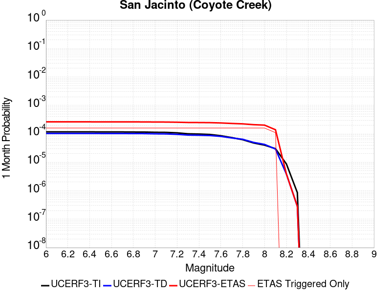 |  |  |

| Magnitude | 1 wk TI Prob | 1 wk TD Prob | 1 wk ETAS Prob | 1 wk ETAS/TD Gain | 1 wk ETAS Triggered Only | 1 mo TI Prob | 1 mo TD Prob | 1 mo ETAS Prob | 1 mo ETAS/TD Gain | 1 mo ETAS Triggered Only | 1 yr TI Prob | 1 yr TD Prob | 1 yr ETAS Prob | 1 yr ETAS/TD Gain | 1 yr ETAS Triggered Only | 10 yr TI Prob | 10 yr TD Prob | 10 yr ETAS Prob | 10 yr ETAS/TD Gain | 10 yr ETAS Triggered Only |
|-----|-----|-----|-----|-----|-----|-----|-----|-----|-----|-----|-----|-----|-----|-----|-----|-----|-----|-----|-----|-----|
| 6.0 | 2.7374346E-5 | 2.4145214E-5 | 9.474005E-5 | 3.9237611 | 7.059654E-5 | 1.1731335E-4 | 1.034754E-4 | 1.7406464E-4 | 1.6821837 | 7.059654E-5 | 0.0014273542 | 0.0012590875 | 0.0013295951 | 1.055999 | 7.059654E-5 | 0.01418221 | 0.012928318 | 0.012998002 | 1.00539 | 7.059654E-5 |
| 6.1 | 2.7374346E-5 | 2.4145214E-5 | 9.474005E-5 | 3.9237611 | 7.059654E-5 | 1.1731335E-4 | 1.034754E-4 | 1.7406464E-4 | 1.6821837 | 7.059654E-5 | 0.0014273542 | 0.0012590875 | 0.0013295951 | 1.055999 | 7.059654E-5 | 0.01418221 | 0.012928318 | 0.012998002 | 1.00539 | 7.059654E-5 |
| 6.2 | 2.7374346E-5 | 2.4145214E-5 | 9.474005E-5 | 3.9237611 | 7.059654E-5 | 1.1731335E-4 | 1.034754E-4 | 1.7406464E-4 | 1.6821837 | 7.059654E-5 | 0.0014273542 | 0.0012590875 | 0.0013295951 | 1.055999 | 7.059654E-5 | 0.01418221 | 0.012928318 | 0.012998002 | 1.00539 | 7.059654E-5 |
| 6.3 | 2.7374346E-5 | 2.4145214E-5 | 9.474005E-5 | 3.9237611 | 7.059654E-5 | 1.1731335E-4 | 1.034754E-4 | 1.7406464E-4 | 1.6821837 | 7.059654E-5 | 0.0014273542 | 0.0012590875 | 0.0013295951 | 1.055999 | 7.059654E-5 | 0.01418221 | 0.012928318 | 0.012998002 | 1.00539 | 7.059654E-5 |
| 6.4 | 2.7374346E-5 | 2.4145214E-5 | 9.474005E-5 | 3.9237611 | 7.059654E-5 | 1.1731335E-4 | 1.034754E-4 | 1.7406464E-4 | 1.6821837 | 7.059654E-5 | 0.0014273542 | 0.0012590875 | 0.0013295951 | 1.055999 | 7.059654E-5 | 0.01418221 | 0.012928318 | 0.012998002 | 1.00539 | 7.059654E-5 |
| 6.5 | 2.7282445E-5 | 2.4031293E-5 | 9.4626135E-5 | 3.9376216 | 7.059654E-5 | 1.16919524E-4 | 1.029872E-4 | 1.7357647E-4 | 1.6854179 | 7.059654E-5 | 0.0014225657 | 0.0012531505 | 0.0013236586 | 1.0562646 | 7.059654E-5 | 0.014134934 | 0.012869646 | 0.012939334 | 1.005415 | 7.059654E-5 |
| 6.6 | 2.7282445E-5 | 2.4031293E-5 | 9.4626135E-5 | 3.9376216 | 7.059654E-5 | 1.16919524E-4 | 1.029872E-4 | 1.7357647E-4 | 1.6854179 | 7.059654E-5 | 0.0014225657 | 0.0012531505 | 0.0013236586 | 1.0562646 | 7.059654E-5 | 0.014134934 | 0.012869646 | 0.012939334 | 1.005415 | 7.059654E-5 |
| 6.7 | 2.7216198E-5 | 2.3956412E-5 | 9.4551266E-5 | 3.9468038 | 7.059654E-5 | 1.1663563E-4 | 1.02666316E-4 | 1.7325561E-4 | 1.6875604 | 7.059654E-5 | 0.0014191137 | 0.0012492483 | 0.0013197566 | 1.0564406 | 7.059654E-5 | 0.014100855 | 0.0128310565 | 0.012900747 | 1.0054314 | 7.059654E-5 |
| 6.8 | 2.7078617E-5 | 2.387363E-5 | 9.446849E-5 | 3.9570222 | 7.059654E-5 | 1.1604605E-4 | 1.0231156E-4 | 1.7290088E-4 | 1.6899447 | 7.059654E-5 | 0.001411945 | 0.0012449342 | 0.0013154427 | 1.0566365 | 7.059654E-5 | 0.014030075 | 0.012788199 | 0.012857893 | 1.0054499 | 7.059654E-5 |
| 6.9 | 2.6982952E-5 | 2.3793142E-5 | 9.4388E-5 | 3.9670255 | 7.059654E-5 | 1.15636096E-4 | 1.0196664E-4 | 1.7255599E-4 | 1.6922789 | 7.059654E-5 | 0.0014069602 | 0.0012407395 | 0.0013112484 | 1.0568281 | 7.059654E-5 | 0.013980856 | 0.012746515 | 0.012816211 | 1.0054679 | 7.059654E-5 |
| 7.0 | 2.6449972E-5 | 2.3370165E-5 | 9.3965056E-5 | 4.020727 | 7.059654E-5 | 1.1335209E-4 | 1.00154015E-4 | 1.7074349E-4 | 1.7048092 | 7.059654E-5 | 0.001379188 | 0.0012186957 | 0.0012892061 | 1.0578574 | 7.059654E-5 | 0.0137065975 | 0.0125278765 | 0.012597589 | 1.0055646 | 7.059654E-5 |
| 7.1 | 2.6257849E-5 | 2.3196202E-5 | 9.37911E-5 | 4.043382 | 7.059654E-5 | 1.1252879E-4 | 9.940852E-5 | 1.6999803E-4 | 1.7100953 | 7.059654E-5 | 0.0013691769 | 0.0012096294 | 0.0012801405 | 1.0582916 | 7.059654E-5 | 0.013607717 | 0.012437741 | 0.01250746 | 1.0056053 | 7.059654E-5 |
| 7.2 | 2.5270041E-5 | 2.2390966E-5 | 9.298592E-5 | 4.152832 | 7.059654E-5 | 1.0829568E-4 | 9.595777E-5 | 1.6654753E-4 | 1.7356337 | 7.059654E-5 | 0.0013177024 | 0.0011676621 | 0.0012381761 | 1.0603892 | 7.059654E-5 | 0.013099162 | 0.012018777 | 0.012088525 | 1.0058032 | 7.059654E-5 |
| 7.3 | 2.339701E-5 | 2.1122814E-5 | 9.171786E-5 | 4.3421235 | 7.059654E-5 | 1.0026905E-4 | 9.0523215E-5 | 1.6111336E-4 | 1.7798016 | 7.059654E-5 | 0.001220092 | 0.0011015651 | 0.0011720838 | 1.0640169 | 7.059654E-5 | 0.012134149 | 0.011357696 | 0.011427491 | 1.0061451 | 7.059654E-5 |
| 7.4 | 2.296333E-5 | 2.0853171E-5 | 9.144824E-5 | 4.3853397 | 7.059654E-5 | 9.841056E-5 | 8.936768E-5 | 1.5995791E-4 | 1.7898855 | 7.059654E-5 | 0.0011974899 | 0.0010875105 | 0.0011580302 | 1.0648451 | 7.059654E-5 | 0.011910575 | 0.01121681 | 0.011286614 | 1.0062232 | 7.059654E-5 |
| 7.5 | 2.2188895E-5 | 2.0376096E-5 | 9.0971196E-5 | 4.464604 | 7.059654E-5 | 9.50918E-5 | 8.732321E-5 | 1.5791359E-4 | 1.8083805 | 7.059654E-5 | 0.0011571277 | 0.0010626436 | 0.0011331651 | 1.0663642 | 7.059654E-5 | 0.011511209 | 0.010966429 | 0.011036251 | 1.006367 | 7.059654E-5 |
| 7.6 | 2.0013189E-5 | 1.8962366E-5 | 8.9557565E-5 | 4.7229114 | 7.059654E-5 | 8.5767984E-5 | 8.1264756E-5 | 1.5185557E-4 | 1.8686521 | 7.059654E-5 | 0.001043725 | 9.889511E-4 | 0.0010594778 | 1.0713147 | 7.059654E-5 | 0.010388365 | 0.010224434 | 0.010294308 | 1.0068341 | 7.059654E-5 |
| 7.7 | 1.7230794E-5 | 1.674371E-5 | 8.733907E-5 | 5.216232 | 7.059654E-5 | 7.384417E-5 | 7.175679E-5 | 1.4234826E-4 | 1.9837602 | 7.059654E-5 | 8.986819E-4 | 8.7328954E-4 | 9.438244E-4 | 1.0807692 | 7.059654E-5 | 0.008950562 | 0.009062956 | 0.009132913 | 1.0077189 | 7.059654E-5 |
| 7.8 | 1.4478809E-5 | 1.4990978E-5 | 8.5586464E-5 | 5.709198 | 7.059654E-5 | 6.205057E-5 | 6.424547E-5 | 1.3483748E-4 | 2.0987856 | 7.059654E-5 | 7.552038E-4 | 7.819085E-4 | 8.5244986E-4 | 1.0902169 | 7.059654E-5 | 0.0075264242 | 0.008141387 | 0.008211409 | 1.0086007 | 7.059654E-5 |
| 7.9 | 1.1114467E-5 | 1.1645102E-5 | 8.224082E-5 | 7.062267 | 7.059654E-5 | 4.7632562E-5 | 4.990663E-5 | 1.20499644E-4 | 2.414502 | 7.059654E-5 | 5.797721E-4 | 6.074444E-4 | 6.7799806E-4 | 1.1161484 | 7.059654E-5 | 0.0057826187 | 0.0063803247 | 0.006450471 | 1.0109941 | 7.059654E-5 |
| 8.0 | 9.327402E-6 | 9.899186E-6 | 8.0495025E-5 | 8.131479 | 7.059654E-5 | 3.9973966E-5 | 4.2424395E-5 | 1.13017944E-4 | 2.6639845 | 7.059654E-5 | 4.8657437E-4 | 5.1639514E-4 | 5.869552E-4 | 1.1366397 | 7.059654E-5 | 0.0048551033 | 0.0054499684 | 0.0055201803 | 1.012883 | 7.059654E-5 |
| 8.1 | 7.0235833E-6 | 6.827495E-6 | 7.742355E-5 | 11.339965 | 7.059654E-5 | 3.0100724E-5 | 2.9260367E-5 | 9.985484E-5 | 3.4126313 | 7.059654E-5 | 3.664147E-4 | 3.5618723E-4 | 4.2675863E-4 | 1.19813 | 7.059654E-5 | 0.003658111 | 0.0037876023 | 0.0038579316 | 1.0185683 | 7.059654E-5 |
| 8.2 | 2.0358202E-6 | 8.994527E-7 | 8.994527E-7 | 1.0 | 0.0 | 8.724915E-6 | 3.854792E-6 | 3.854792E-6 | 1.0 | 0.0 | 1.06220665E-4 | 4.69311E-5 | 4.69311E-5 | 1.0 | 0.0 | 0.001061699 | 5.3254166E-4 | 5.3254166E-4 | 1.0 | 0.0 |
| 8.3 | 2.0051264E-7 | 6.617272E-8 | 6.617272E-8 | 1.0 | 0.0 | 8.5933965E-7 | 2.8359733E-7 | 2.8359733E-7 | 1.0 | 0.0 | 1.046241E-5 | 3.4527925E-6 | 3.4527925E-6 | 1.0 | 0.0 | 1.0461917E-4 | 4.01389E-5 | 4.01389E-5 | 1.0 | 0.0 |

## Antelope Valley 2011
*[(top)](#table-of-contents)*

| 1 Week | 1 Month | 1 Year | 10 Year |
|-----|-----|-----|-----|
|  |  |  |  |

| Magnitude | 1 wk TI Prob | 1 wk TD Prob | 1 wk ETAS Prob | 1 wk ETAS/TD Gain | 1 wk ETAS Triggered Only | 1 mo TI Prob | 1 mo TD Prob | 1 mo ETAS Prob | 1 mo ETAS/TD Gain | 1 mo ETAS Triggered Only | 1 yr TI Prob | 1 yr TD Prob | 1 yr ETAS Prob | 1 yr ETAS/TD Gain | 1 yr ETAS Triggered Only | 10 yr TI Prob | 10 yr TD Prob | 10 yr ETAS Prob | 10 yr ETAS/TD Gain | 10 yr ETAS Triggered Only |
|-----|-----|-----|-----|-----|-----|-----|-----|-----|-----|-----|-----|-----|-----|-----|-----|-----|-----|-----|-----|-----|
| 6.0 | 3.1646934E-5 | 3.6904403E-5 | 7.220137E-5 | 1.9564433 | 3.529827E-5 | 1.3562266E-4 | 1.5815363E-4 | 1.9344632E-4 | 1.2231544 | 3.529827E-5 | 0.0016499552 | 0.0019240845 | 0.001994545 | 1.0366204 | 7.059654E-5 | 0.016377583 | 0.019100651 | 0.019169899 | 1.0036254 | 7.059654E-5 |
| 6.1 | 3.1646934E-5 | 3.6904403E-5 | 7.220137E-5 | 1.9564433 | 3.529827E-5 | 1.3562266E-4 | 1.5815363E-4 | 1.9344632E-4 | 1.2231544 | 3.529827E-5 | 0.0016499552 | 0.0019240845 | 0.001994545 | 1.0366204 | 7.059654E-5 | 0.016377583 | 0.019100651 | 0.019169899 | 1.0036254 | 7.059654E-5 |
| 6.2 | 3.1646934E-5 | 3.6904403E-5 | 7.220137E-5 | 1.9564433 | 3.529827E-5 | 1.3562266E-4 | 1.5815363E-4 | 1.9344632E-4 | 1.2231544 | 3.529827E-5 | 0.0016499552 | 0.0019240845 | 0.001994545 | 1.0366204 | 7.059654E-5 | 0.016377583 | 0.019100651 | 0.019169899 | 1.0036254 | 7.059654E-5 |
| 6.3 | 3.1646934E-5 | 3.6904403E-5 | 7.220137E-5 | 1.9564433 | 3.529827E-5 | 1.3562266E-4 | 1.5815363E-4 | 1.9344632E-4 | 1.2231544 | 3.529827E-5 | 0.0016499552 | 0.0019240845 | 0.001994545 | 1.0366204 | 7.059654E-5 | 0.016377583 | 0.019100651 | 0.019169899 | 1.0036254 | 7.059654E-5 |
| 6.4 | 3.1646934E-5 | 3.6904403E-5 | 7.220137E-5 | 1.9564433 | 3.529827E-5 | 1.3562266E-4 | 1.5815363E-4 | 1.9344632E-4 | 1.2231544 | 3.529827E-5 | 0.0016499552 | 0.0019240845 | 0.001994545 | 1.0366204 | 7.059654E-5 | 0.016377583 | 0.019100651 | 0.019169899 | 1.0036254 | 7.059654E-5 |
| 6.5 | 1.8034107E-5 | 2.0940959E-5 | 5.623849E-5 | 2.6855738 | 3.529827E-5 | 7.7286735E-5 | 8.974457E-5 | 1.2503967E-4 | 1.393284 | 3.529827E-5 | 9.405598E-4 | 0.0010922146 | 0.001162734 | 1.0645655 | 7.059654E-5 | 0.009365888 | 0.010880542 | 0.01095037 | 1.0064178 | 7.059654E-5 |
| 6.6 | 1.8034107E-5 | 2.0940959E-5 | 5.623849E-5 | 2.6855738 | 3.529827E-5 | 7.7286735E-5 | 8.974457E-5 | 1.2503967E-4 | 1.393284 | 3.529827E-5 | 9.405598E-4 | 0.0010922146 | 0.001162734 | 1.0645655 | 7.059654E-5 | 0.009365888 | 0.010880542 | 0.01095037 | 1.0064178 | 7.059654E-5 |
| 6.7 | 1.3567667E-5 | 1.5749509E-5 | 5.1047224E-5 | 3.2411945 | 3.529827E-5 | 5.814585E-5 | 6.749675E-5 | 1.0279264E-4 | 1.5229272 | 3.529827E-5 | 7.076958E-4 | 8.2156935E-4 | 8.568386E-4 | 1.0429292 | 3.529827E-5 | 0.007054463 | 0.008195754 | 0.0082307635 | 1.0042716 | 3.529827E-5 |
| 6.8 | 9.867387E-6 | 1.1467935E-5 | 4.67658E-5 | 4.077962 | 3.529827E-5 | 4.2288117E-5 | 4.91479E-5 | 8.444444E-5 | 1.7181697 | 3.529827E-5 | 5.1473617E-4 | 5.9830636E-4 | 6.335835E-4 | 1.0589616 | 3.529827E-5 | 0.005135455 | 0.005976268 | 0.006011355 | 1.005871 | 3.529827E-5 |
| 6.9 | 7.273233E-6 | 8.454864E-6 | 4.3752836E-5 | 5.174872 | 3.529827E-5 | 3.1170628E-5 | 3.623513E-5 | 7.153212E-5 | 1.9741096 | 3.529827E-5 | 3.794363E-4 | 4.411627E-4 | 4.764454E-4 | 1.0799766 | 3.529827E-5 | 0.0037878908 | 0.004411627 | 0.0044467696 | 1.0079659 | 3.529827E-5 |

## Imperial
*[(top)](#table-of-contents)*

| 1 Week | 1 Month | 1 Year | 10 Year |
|-----|-----|-----|-----|
|  |  |  |  |

| Magnitude | 1 wk TI Prob | 1 wk TD Prob | 1 wk ETAS Prob | 1 wk ETAS/TD Gain | 1 wk ETAS Triggered Only | 1 mo TI Prob | 1 mo TD Prob | 1 mo ETAS Prob | 1 mo ETAS/TD Gain | 1 mo ETAS Triggered Only | 1 yr TI Prob | 1 yr TD Prob | 1 yr ETAS Prob | 1 yr ETAS/TD Gain | 1 yr ETAS Triggered Only | 10 yr TI Prob | 10 yr TD Prob | 10 yr ETAS Prob | 10 yr ETAS/TD Gain | 10 yr ETAS Triggered Only |
|-----|-----|-----|-----|-----|-----|-----|-----|-----|-----|-----|-----|-----|-----|-----|-----|-----|-----|-----|-----|-----|
| 6.0 | 2.7496446E-4 | 5.0552754E-4 | 5.4080796E-4 | 1.0697893 | 3.529827E-5 | 0.0011778869 | 0.002164787 | 0.0022000088 | 1.0162704 | 3.529827E-5 | 0.0142467655 | 0.026038699 | 0.026073078 | 1.0013204 | 3.529827E-5 | 0.13367249 | 0.2280438 | 0.22809829 | 1.000239 | 7.059654E-5 |
| 6.1 | 2.5356023E-4 | 4.8656776E-4 | 5.2184885E-4 | 1.0725101 | 3.529827E-5 | 0.001086234 | 0.0020836622 | 0.002118887 | 1.0169052 | 3.529827E-5 | 0.013144928 | 0.025071215 | 0.025105627 | 1.0013726 | 3.529827E-5 | 0.123940155 | 0.21947981 | 0.21953492 | 1.000251 | 7.059654E-5 |
| 6.2 | 2.4820742E-4 | 4.7752203E-4 | 5.1280344E-4 | 1.0738844 | 3.529827E-5 | 0.0010633124 | 0.0020449557 | 0.0020801818 | 1.0172259 | 3.529827E-5 | 0.01286919 | 0.024611235 | 0.024645664 | 1.0013989 | 3.529827E-5 | 0.12148927 | 0.21598552 | 0.21604088 | 1.0002563 | 7.059654E-5 |
| 6.3 | 2.3205351E-4 | 4.5890483E-4 | 4.941869E-4 | 1.0768832 | 3.529827E-5 | 9.94136E-4 | 0.0019652895 | 0.0020005184 | 1.0179255 | 3.529827E-5 | 0.012036599 | 0.02366133 | 0.023695793 | 1.0014565 | 3.529827E-5 | 0.11405133 | 0.20793462 | 0.20799053 | 1.0002689 | 7.059654E-5 |
| 6.4 | 2.0304754E-4 | 3.987652E-4 | 3.987652E-4 | 1.0 | 0.0 | 8.6991355E-4 | 0.0017078889 | 0.0017078889 | 1.0 | 0.0 | 0.010539869 | 0.020595672 | 0.020595672 | 1.0 | 0.0 | 0.100537635 | 0.1850669 | 0.18509565 | 1.0001554 | 3.529827E-5 |
| 6.5 | 1.854992E-4 | 3.6988858E-4 | 3.6988858E-4 | 1.0 | 0.0 | 7.9475436E-4 | 0.0015842861 | 0.0015842861 | 1.0 | 0.0 | 0.009633281 | 0.01911948 | 0.01911948 | 1.0 | 0.0 | 0.0922623 | 0.173298 | 0.17332718 | 1.0001684 | 3.529827E-5 |
| 6.6 | 1.6586106E-4 | 3.403506E-4 | 3.403506E-4 | 1.0 | 0.0 | 7.106394E-4 | 0.0014578402 | 0.0014578402 | 1.0 | 0.0 | 0.008617763 | 0.01760642 | 0.01760642 | 1.0 | 0.0 | 0.08291132 | 0.16077545 | 0.16080508 | 1.0001843 | 3.529827E-5 |
| 6.7 | 1.4224656E-4 | 3.076692E-4 | 3.076692E-4 | 1.0 | 0.0 | 6.094856E-4 | 0.001317924 | 0.001317924 | 1.0 | 0.0 | 0.0073952693 | 0.015929576 | 0.015929576 | 1.0 | 0.0 | 0.07153955 | 0.14648417 | 0.1465143 | 1.0002056 | 3.529827E-5 |
| 6.8 | 1.2317259E-4 | 2.779122E-4 | 2.779122E-4 | 1.0 | 0.0 | 5.2777573E-4 | 0.0011905148 | 0.0011905148 | 1.0 | 0.0 | 0.0064067547 | 0.0143995695 | 0.0143995695 | 1.0 | 0.0 | 0.06225166 | 0.13293684 | 0.13296744 | 1.0002302 | 3.529827E-5 |
| 6.9 | 9.859898E-5 | 2.5014306E-4 | 2.5014306E-4 | 1.0 | 0.0 | 4.2249862E-4 | 0.0010716055 | 0.0010716055 | 1.0 | 0.0 | 0.0051317946 | 0.012969712 | 0.012969712 | 1.0 | 0.0 | 0.05014893 | 0.11940631 | 0.1194374 | 1.0002604 | 3.529827E-5 |
| 7.0 | 7.3191884E-5 | 2.1266776E-4 | 2.1266776E-4 | 1.0 | 0.0 | 3.136418E-4 | 9.1111806E-4 | 9.1111806E-4 | 1.0 | 0.0 | 0.003811904 | 0.011037128 | 0.011037128 | 1.0 | 0.0 | 0.037471764 | 0.10206493 | 0.102096625 | 1.0003105 | 3.529827E-5 |
| 7.1 | 7.1760296E-5 | 2.0968143E-4 | 2.0968143E-4 | 1.0 | 0.0 | 3.0750787E-4 | 8.983284E-4 | 8.983284E-4 | 1.0 | 0.0 | 0.003737482 | 0.010882978 | 0.010882978 | 1.0 | 0.0 | 0.03675245 | 0.10070146 | 0.1007332 | 1.0003152 | 3.529827E-5 |
| 7.2 | 6.46614E-5 | 1.9136685E-4 | 1.9136685E-4 | 1.0 | 0.0 | 2.7709085E-4 | 8.1988896E-4 | 8.1988896E-4 | 1.0 | 0.0 | 0.0033683628 | 0.0099370815 | 0.0099370815 | 1.0 | 0.0 | 0.033177625 | 0.09250898 | 0.09254101 | 1.0003463 | 3.529827E-5 |
| 7.3 | 6.088115E-5 | 1.78084E-4 | 1.78084E-4 | 1.0 | 0.0 | 2.6089314E-4 | 7.6299673E-4 | 7.6299673E-4 | 1.0 | 0.0 | 0.0031717476 | 0.009250494 | 0.009250494 | 1.0 | 0.0 | 0.031268585 | 0.08655989 | 0.08659214 | 1.0003725 | 3.529827E-5 |
| 7.4 | 4.199346E-5 | 1.1510366E-4 | 1.1510366E-4 | 1.0 | 0.0 | 1.7995955E-4 | 4.9320905E-4 | 4.9320905E-4 | 1.0 | 0.0 | 0.0021888057 | 0.0059884563 | 0.0059884563 | 1.0 | 0.0 | 0.02167372 | 0.057439793 | 0.057473063 | 1.0005792 | 3.529827E-5 |
| 7.5 | 3.130448E-5 | 8.33328E-5 | 8.33328E-5 | 1.0 | 0.0 | 1.3415517E-4 | 3.57092E-4 | 3.57092E-4 | 1.0 | 0.0 | 0.0016321153 | 0.004338988 | 0.004338988 | 1.0 | 0.0 | 0.016201803 | 0.04213201 | 0.04216582 | 1.0008025 | 3.529827E-5 |
| 7.6 | 2.3074248E-5 | 6.0844646E-5 | 6.0844646E-5 | 1.0 | 0.0 | 9.888588E-5 | 2.6073685E-4 | 2.6073685E-4 | 1.0 | 0.0 | 0.0012032706 | 0.0031698733 | 0.0031698733 | 1.0 | 0.0 | 0.011967761 | 0.031026395 | 0.031060599 | 1.0011023 | 3.529827E-5 |
| 7.7 | 1.45864815E-5 | 4.0124698E-5 | 4.0124698E-5 | 1.0 | 0.0 | 6.2511994E-5 | 1.7195169E-4 | 1.7195169E-4 | 1.0 | 0.0 | 7.608177E-4 | 0.0020915072 | 0.0020915072 | 1.0 | 0.0 | 0.007582182 | 0.020627763 | 0.020662334 | 1.0016758 | 3.529827E-5 |
| 7.8 | 1.0352979E-5 | 3.0960902E-5 | 3.0960902E-5 | 1.0 | 0.0 | 4.4369157E-5 | 1.3268284E-4 | 1.3268284E-4 | 1.0 | 0.0 | 5.400606E-4 | 0.0016142189 | 0.0016142189 | 1.0 | 0.0 | 0.0053875 | 0.016016833 | 0.016051566 | 1.0021685 | 3.529827E-5 |
| 7.9 | 8.137906E-6 | 2.2149103E-5 | 2.2149103E-5 | 1.0 | 0.0 | 3.4876273E-5 | 9.492128E-5 | 9.492128E-5 | 1.0 | 0.0 | 4.2453592E-4 | 0.0011550548 | 0.0011550548 | 1.0 | 0.0 | 0.004237258 | 0.011617903 | 0.011617903 | 1.0 | 0.0 |
| 8.0 | 6.93792E-6 | 1.8008766E-5 | 1.8008766E-5 | 1.0 | 0.0 | 2.9733603E-5 | 7.717814E-5 | 7.717814E-5 | 1.0 | 0.0 | 3.6194647E-4 | 9.3923963E-4 | 9.3923963E-4 | 1.0 | 0.0 | 0.0036135751 | 0.00950155 | 0.00950155 | 1.0 | 0.0 |
| 8.1 | 3.4286315E-6 | 6.379872E-6 | 6.379872E-6 | 1.0 | 0.0 | 1.4694053E-5 | 2.7342023E-5 | 2.7342023E-5 | 1.0 | 0.0 | 1.7888541E-4 | 3.328384E-4 | 3.328384E-4 | 1.0 | 0.0 | 0.0017874148 | 0.003486031 | 0.003486031 | 1.0 | 0.0 |
| 8.2 | 1.4906886E-6 | 1.9366646E-6 | 1.9366646E-6 | 1.0 | 0.0 | 6.3886496E-6 | 8.299965E-6 | 8.299965E-6 | 1.0 | 0.0 | 7.7779034E-5 | 1.0104742E-4 | 1.0104742E-4 | 1.0 | 0.0 | 7.775182E-4 | 0.0011075331 | 0.0011075331 | 1.0 | 0.0 |
| 8.3 | 2.5758007E-8 | 1.4500102E-8 | 1.4500102E-8 | 1.0 | 0.0 | 1.10391454E-7 | 6.214329E-8 | 6.214329E-8 | 1.0 | 0.0 | 1.3440151E-6 | 7.565946E-7 | 7.565946E-7 | 1.0 | 0.0 | 1.344007E-5 | 7.887763E-6 | 7.887763E-6 | 1.0 | 0.0 |

## San Juan
*[(top)](#table-of-contents)*

| 1 Week | 1 Month | 1 Year | 10 Year |
|-----|-----|-----|-----|
|  |  |  |  |

| Magnitude | 1 wk TI Prob | 1 wk TD Prob | 1 wk ETAS Prob | 1 wk ETAS/TD Gain | 1 wk ETAS Triggered Only | 1 mo TI Prob | 1 mo TD Prob | 1 mo ETAS Prob | 1 mo ETAS/TD Gain | 1 mo ETAS Triggered Only | 1 yr TI Prob | 1 yr TD Prob | 1 yr ETAS Prob | 1 yr ETAS/TD Gain | 1 yr ETAS Triggered Only | 10 yr TI Prob | 10 yr TD Prob | 10 yr ETAS Prob | 10 yr ETAS/TD Gain | 10 yr ETAS Triggered Only |
|-----|-----|-----|-----|-----|-----|-----|-----|-----|-----|-----|-----|-----|-----|-----|-----|-----|-----|-----|-----|-----|
| 6.0 | 8.682808E-6 | 8.7491635E-6 | 7.934509E-5 | 9.068877 | 7.059654E-5 | 3.72115E-5 | 3.74959E-5 | 1.080898E-4 | 2.8827095 | 7.059654E-5 | 4.5295584E-4 | 4.564218E-4 | 5.2698614E-4 | 1.1546032 | 7.059654E-5 | 0.004520337 | 0.004555385 | 0.00462566 | 1.0154268 | 7.059654E-5 |
| 6.1 | 8.682808E-6 | 8.7491635E-6 | 7.934509E-5 | 9.068877 | 7.059654E-5 | 3.72115E-5 | 3.74959E-5 | 1.080898E-4 | 2.8827095 | 7.059654E-5 | 4.5295584E-4 | 4.564218E-4 | 5.2698614E-4 | 1.1546032 | 7.059654E-5 | 0.004520337 | 0.004555385 | 0.00462566 | 1.0154268 | 7.059654E-5 |
| 6.2 | 8.682808E-6 | 8.7491635E-6 | 7.934509E-5 | 9.068877 | 7.059654E-5 | 3.72115E-5 | 3.74959E-5 | 1.080898E-4 | 2.8827095 | 7.059654E-5 | 4.5295584E-4 | 4.564218E-4 | 5.2698614E-4 | 1.1546032 | 7.059654E-5 | 0.004520337 | 0.004555385 | 0.00462566 | 1.0154268 | 7.059654E-5 |
| 6.3 | 6.3054235E-6 | 6.2825848E-6 | 7.6878685E-5 | 12.236792 | 7.059654E-5 | 2.7022963E-5 | 2.6925094E-5 | 9.751973E-5 | 3.6218903 | 7.059654E-5 | 3.2895492E-4 | 3.2776513E-4 | 3.983385E-4 | 1.215317 | 7.059654E-5 | 0.003284684 | 0.003273017 | 0.0033433824 | 1.0214987 | 7.059654E-5 |
| 6.4 | 6.1490473E-6 | 6.1144656E-6 | 7.6710574E-5 | 12.545753 | 7.059654E-5 | 2.6352795E-5 | 2.6204598E-5 | 9.679929E-5 | 3.6939812 | 7.059654E-5 | 3.2079802E-4 | 3.1899565E-4 | 3.8956967E-4 | 1.2212383 | 7.059654E-5 | 0.0032033534 | 0.0031855737 | 0.0032559454 | 1.0220907 | 7.059654E-5 |
| 6.5 | 5.204848E-6 | 5.137233E-6 | 4.0435323E-5 | 7.871031 | 3.529827E-5 | 2.23063E-5 | 2.2016533E-5 | 5.7314028E-5 | 2.6032267 | 3.529827E-5 | 2.7154534E-4 | 2.6801927E-4 | 3.033081E-4 | 1.1316652 | 3.529827E-5 | 0.0027121378 | 0.0026771144 | 0.0027123182 | 1.0131499 | 3.529827E-5 |
| 6.6 | 4.5179986E-6 | 4.4150297E-6 | 3.9713144E-5 | 8.994988 | 3.529827E-5 | 1.9362706E-5 | 1.8921424E-5 | 5.4219025E-5 | 2.8654835 | 3.529827E-5 | 2.3571544E-4 | 2.3034477E-4 | 2.656349E-4 | 1.1532058 | 3.529827E-5 | 0.0023546559 | 0.0023011973 | 0.0023364143 | 1.0153039 | 3.529827E-5 |
| 6.7 | 3.9442616E-6 | 3.819828E-6 | 3.9117964E-5 | 10.240766 | 3.529827E-5 | 1.6903869E-5 | 1.6370592E-5 | 5.1668285E-5 | 3.1561646 | 3.529827E-5 | 2.0578515E-4 | 1.992944E-4 | 2.3458563E-4 | 1.1770809 | 3.529827E-5 | 0.002055947 | 0.0019912818 | 0.0020265097 | 1.0176911 | 3.529827E-5 |
| 6.8 | 3.4536245E-6 | 3.3163353E-6 | 3.861449E-5 | 11.643723 | 3.529827E-5 | 1.4801163E-5 | 1.4212792E-5 | 4.951056E-5 | 3.4835212 | 3.529827E-5 | 1.8018926E-4 | 1.7302761E-4 | 2.0831978E-4 | 1.2039684 | 3.529827E-5 | 0.0018004322 | 0.0017290477 | 0.001764285 | 1.0203795 | 3.529827E-5 |
| 6.9 | 3.059865E-6 | 2.9120315E-6 | 3.82102E-5 | 13.121492 | 3.529827E-5 | 1.3113641E-5 | 1.2480078E-5 | 4.7777907E-5 | 3.828334 | 3.529827E-5 | 1.596469E-4 | 1.5193493E-4 | 1.8722784E-4 | 1.2322897 | 3.529827E-5 | 0.0015953224 | 0.0015184252 | 0.0015536699 | 1.0232114 | 3.529827E-5 |
| 7.0 | 2.6504351E-6 | 2.4920002E-6 | 3.779018E-5 | 15.164598 | 3.529827E-5 | 1.1358958E-5 | 1.0679961E-5 | 4.5977853E-5 | 4.3050585 | 3.529827E-5 | 1.3828653E-4 | 1.300213E-4 | 1.6531498E-4 | 1.2714454 | 3.529827E-5 | 0.0013820052 | 0.0012995641 | 0.0013348166 | 1.0271263 | 3.529827E-5 |
| 7.1 | 2.2039317E-6 | 2.0338296E-6 | 2.0338296E-6 | 1.0 | 0.0 | 9.445387E-6 | 8.716386E-6 | 8.716386E-6 | 1.0 | 0.0 | 1.1499152E-4 | 1.0611736E-4 | 1.0611736E-4 | 1.0 | 0.0 | 0.0011493203 | 0.0010607769 | 0.0010607769 | 1.0 | 0.0 |
| 7.2 | 1.0786707E-6 | 8.7701903E-7 | 8.7701903E-7 | 1.0 | 0.0 | 4.622866E-6 | 3.7586476E-6 | 3.7586476E-6 | 1.0 | 0.0 | 5.628194E-5 | 4.5760586E-5 | 4.5760586E-5 | 1.0 | 0.0 | 5.6267687E-4 | 4.5757066E-4 | 4.5757066E-4 | 1.0 | 0.0 |
| 7.3 | 6.846433E-7 | 4.868805E-7 | 4.868805E-7 | 1.0 | 0.0 | 2.9341822E-6 | 2.086629E-6 | 2.086629E-6 | 1.0 | 0.0 | 3.5723086E-5 | 2.5404412E-5 | 2.5404412E-5 | 1.0 | 0.0 | 3.571734E-4 | 2.540486E-4 | 2.540486E-4 | 1.0 | 0.0 |
| 7.4 | 5.23043E-7 | 3.2628162E-7 | 3.2628162E-7 | 1.0 | 0.0 | 2.2416111E-6 | 1.398349E-6 | 1.398349E-6 | 1.0 | 0.0 | 2.7291273E-5 | 1.7024766E-5 | 1.7024766E-5 | 1.0 | 0.0 | 2.7287923E-4 | 1.7026656E-4 | 1.7026656E-4 | 1.0 | 0.0 |
| 7.5 | 4.648444E-7 | 2.7234944E-7 | 2.7234944E-7 | 1.0 | 0.0 | 1.9921886E-6 | 1.1672114E-6 | 1.1672114E-6 | 1.0 | 0.0 | 2.4254627E-5 | 1.42107065E-5 | 1.42107065E-5 | 1.0 | 0.0 | 2.425198E-4 | 1.421276E-4 | 1.421276E-4 | 1.0 | 0.0 |
| 7.6 | 3.9906567E-7 | 2.2083314E-7 | 2.2083314E-7 | 1.0 | 0.0 | 1.7102802E-6 | 9.464274E-7 | 9.464274E-7 | 1.0 | 0.0 | 2.0822463E-5 | 1.1522693E-5 | 1.1522693E-5 | 1.0 | 0.0 | 2.0820512E-4 | 1.15245566E-4 | 1.15245566E-4 | 1.0 | 0.0 |
| 7.7 | 1.8784601E-7 | 5.3666906E-8 | 5.3666906E-8 | 1.0 | 0.0 | 8.0505407E-7 | 2.30001E-7 | 2.30001E-7 | 1.0 | 0.0 | 9.80149E-6 | 2.8002585E-6 | 2.8002585E-6 | 1.0 | 0.0 | 9.801057E-5 | 2.8011282E-5 | 2.8011282E-5 | 1.0 | 0.0 |
| 7.8 | 1.00154914E-7 | 1.2415832E-8 | 1.2415832E-8 | 1.0 | 0.0 | 4.2923529E-7 | 5.3210716E-8 | 5.3210716E-8 | 1.0 | 0.0 | 5.225927E-6 | 6.4784024E-7 | 6.4784024E-7 | 1.0 | 0.0 | 5.225804E-5 | 6.484273E-6 | 6.484273E-6 | 1.0 | 0.0 |
| 7.9 | 6.171429E-8 | 4.2966155E-9 | 4.2966155E-9 | 1.0 | 0.0 | 2.6448978E-7 | 1.8414067E-8 | 1.8414067E-8 | 1.0 | 0.0 | 3.2201583E-6 | 2.2419121E-7 | 2.2419121E-7 | 1.0 | 0.0 | 3.2201115E-5 | 2.2472002E-6 | 2.2472002E-6 | 1.0 | 0.0 |
| 8.0 | 1.3974572E-8 | 3.3788217E-10 | 3.3788217E-10 | 1.0 | 0.0 | 5.989102E-8 | 1.448067E-9 | 1.448067E-9 | 1.0 | 0.0 | 7.2917294E-7 | 1.763022E-8 | 1.763022E-8 | 1.0 | 0.0 | 7.2917055E-6 | 1.8060365E-7 | 1.8060365E-7 | 1.0 | 0.0 |
| 8.1 | 1.8403477E-9 | 1.1302803E-10 | 1.1302803E-10 | 1.0 | 0.0 | 7.887204E-9 | 4.844063E-10 | 4.844063E-10 | 1.0 | 0.0 | 9.602671E-8 | 5.8976446E-9 | 5.8976446E-9 | 1.0 | 0.0 | 9.602667E-7 | 6.021993E-8 | 6.021993E-8 | 1.0 | 0.0 |

## Pitas Point (Lower West)
*[(top)](#table-of-contents)*

| 1 Week | 1 Month | 1 Year | 10 Year |
|-----|-----|-----|-----|
| 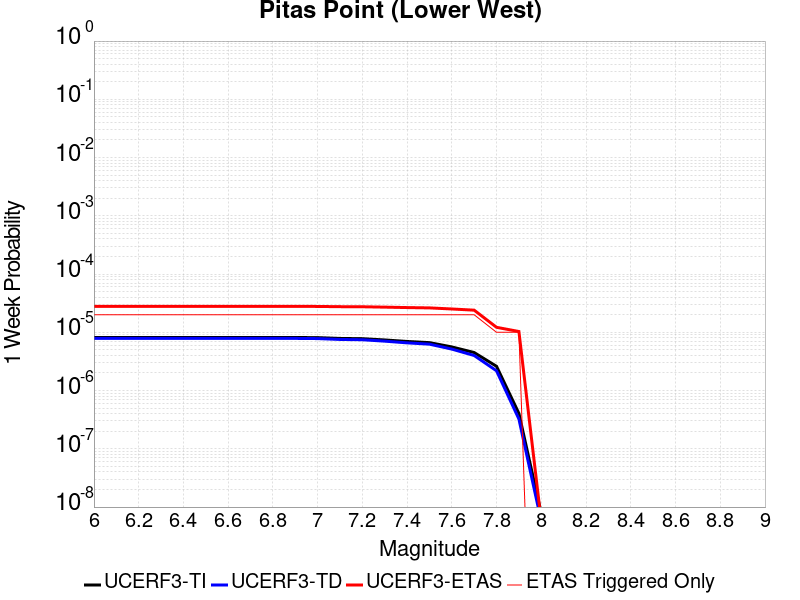 |  |  |  |

| Magnitude | 1 wk TI Prob | 1 wk TD Prob | 1 wk ETAS Prob | 1 wk ETAS/TD Gain | 1 wk ETAS Triggered Only | 1 mo TI Prob | 1 mo TD Prob | 1 mo ETAS Prob | 1 mo ETAS/TD Gain | 1 mo ETAS Triggered Only | 1 yr TI Prob | 1 yr TD Prob | 1 yr ETAS Prob | 1 yr ETAS/TD Gain | 1 yr ETAS Triggered Only | 10 yr TI Prob | 10 yr TD Prob | 10 yr ETAS Prob | 10 yr ETAS/TD Gain | 10 yr ETAS Triggered Only |
|-----|-----|-----|-----|-----|-----|-----|-----|-----|-----|-----|-----|-----|-----|-----|-----|-----|-----|-----|-----|-----|
| 6.0 | 8.151497E-6 | 7.855762E-6 | 7.845175E-5 | 9.986523 | 7.059654E-5 | 3.493452E-5 | 3.3667122E-5 | 1.04261286E-4 | 3.096828 | 7.059654E-5 | 4.252448E-4 | 4.0982084E-4 | 4.8038847E-4 | 1.1721914 | 7.059654E-5 | 0.0042443196 | 0.0040907315 | 0.0041610394 | 1.0171871 | 7.059654E-5 |
| 6.1 | 8.151497E-6 | 7.855762E-6 | 7.845175E-5 | 9.986523 | 7.059654E-5 | 3.493452E-5 | 3.3667122E-5 | 1.04261286E-4 | 3.096828 | 7.059654E-5 | 4.252448E-4 | 4.0982084E-4 | 4.8038847E-4 | 1.1721914 | 7.059654E-5 | 0.0042443196 | 0.0040907315 | 0.0041610394 | 1.0171871 | 7.059654E-5 |
| 6.2 | 8.151497E-6 | 7.855762E-6 | 7.845175E-5 | 9.986523 | 7.059654E-5 | 3.493452E-5 | 3.3667122E-5 | 1.04261286E-4 | 3.096828 | 7.059654E-5 | 4.252448E-4 | 4.0982084E-4 | 4.8038847E-4 | 1.1721914 | 7.059654E-5 | 0.0042443196 | 0.0040907315 | 0.0041610394 | 1.0171871 | 7.059654E-5 |
| 6.3 | 8.151497E-6 | 7.855762E-6 | 7.845175E-5 | 9.986523 | 7.059654E-5 | 3.493452E-5 | 3.3667122E-5 | 1.04261286E-4 | 3.096828 | 7.059654E-5 | 4.252448E-4 | 4.0982084E-4 | 4.8038847E-4 | 1.1721914 | 7.059654E-5 | 0.0042443196 | 0.0040907315 | 0.0041610394 | 1.0171871 | 7.059654E-5 |
| 6.4 | 8.151497E-6 | 7.855762E-6 | 7.845175E-5 | 9.986523 | 7.059654E-5 | 3.493452E-5 | 3.3667122E-5 | 1.04261286E-4 | 3.096828 | 7.059654E-5 | 4.252448E-4 | 4.0982084E-4 | 4.8038847E-4 | 1.1721914 | 7.059654E-5 | 0.0042443196 | 0.0040907315 | 0.0041610394 | 1.0171871 | 7.059654E-5 |
| 6.5 | 8.151497E-6 | 7.855762E-6 | 7.845175E-5 | 9.986523 | 7.059654E-5 | 3.493452E-5 | 3.3667122E-5 | 1.04261286E-4 | 3.096828 | 7.059654E-5 | 4.252448E-4 | 4.0982084E-4 | 4.8038847E-4 | 1.1721914 | 7.059654E-5 | 0.0042443196 | 0.0040907315 | 0.0041610394 | 1.0171871 | 7.059654E-5 |
| 6.6 | 8.151497E-6 | 7.855762E-6 | 7.845175E-5 | 9.986523 | 7.059654E-5 | 3.493452E-5 | 3.3667122E-5 | 1.04261286E-4 | 3.096828 | 7.059654E-5 | 4.252448E-4 | 4.0982084E-4 | 4.8038847E-4 | 1.1721914 | 7.059654E-5 | 0.0042443196 | 0.0040907315 | 0.0041610394 | 1.0171871 | 7.059654E-5 |
| 6.7 | 8.151497E-6 | 7.855762E-6 | 7.845175E-5 | 9.986523 | 7.059654E-5 | 3.493452E-5 | 3.3667122E-5 | 1.04261286E-4 | 3.096828 | 7.059654E-5 | 4.252448E-4 | 4.0982084E-4 | 4.8038847E-4 | 1.1721914 | 7.059654E-5 | 0.0042443196 | 0.0040907315 | 0.0041610394 | 1.0171871 | 7.059654E-5 |
| 6.8 | 8.151497E-6 | 7.855762E-6 | 7.845175E-5 | 9.986523 | 7.059654E-5 | 3.493452E-5 | 3.3667122E-5 | 1.04261286E-4 | 3.096828 | 7.059654E-5 | 4.252448E-4 | 4.0982084E-4 | 4.8038847E-4 | 1.1721914 | 7.059654E-5 | 0.0042443196 | 0.0040907315 | 0.0041610394 | 1.0171871 | 7.059654E-5 |
| 6.9 | 8.151497E-6 | 7.855762E-6 | 7.845175E-5 | 9.986523 | 7.059654E-5 | 3.493452E-5 | 3.3667122E-5 | 1.04261286E-4 | 3.096828 | 7.059654E-5 | 4.252448E-4 | 4.0982084E-4 | 4.8038847E-4 | 1.1721914 | 7.059654E-5 | 0.0042443196 | 0.0040907315 | 0.0041610394 | 1.0171871 | 7.059654E-5 |
| 7.0 | 8.103535E-6 | 7.805192E-6 | 7.840118E-5 | 10.044747 | 7.059654E-5 | 3.4728975E-5 | 3.3450397E-5 | 1.0404458E-4 | 3.1104138 | 7.059654E-5 | 4.2274324E-4 | 4.0718322E-4 | 4.7775102E-4 | 1.1733072 | 7.059654E-5 | 0.0042193993 | 0.004064452 | 0.0041347616 | 1.0172987 | 7.059654E-5 |
| 7.1 | 7.853298E-6 | 7.540883E-6 | 7.8136894E-5 | 10.36177 | 7.059654E-5 | 3.3656554E-5 | 3.2317676E-5 | 1.0291193E-4 | 3.1843855 | 7.059654E-5 | 4.096915E-4 | 3.9339735E-4 | 4.639661E-4 | 1.1793829 | 7.059654E-5 | 0.00408937 | 0.0039270855 | 0.0039974046 | 1.0179062 | 7.059654E-5 |
| 7.2 | 7.771102E-6 | 7.453165E-6 | 7.804918E-5 | 10.4719515 | 7.059654E-5 | 3.33043E-5 | 3.194175E-5 | 1.0253603E-4 | 3.2100947 | 7.059654E-5 | 4.0540437E-4 | 3.8882208E-4 | 4.593912E-4 | 1.1814946 | 7.059654E-5 | 0.0040466557 | 0.0038814936 | 0.003951816 | 1.0181174 | 7.059654E-5 |
| 7.3 | 7.3945344E-6 | 7.0492697E-6 | 7.7645316E-5 | 11.014661 | 7.059654E-5 | 3.1690477E-5 | 3.021081E-5 | 1.0080521E-4 | 3.336727 | 7.059654E-5 | 3.8576324E-4 | 3.6775516E-4 | 4.3832572E-4 | 1.1918956 | 7.059654E-5 | 0.0038509427 | 0.0036715334 | 0.0037418706 | 1.0191575 | 7.059654E-5 |
| 7.4 | 6.964645E-6 | 6.5901186E-6 | 7.7186196E-5 | 11.712414 | 7.059654E-5 | 2.9848137E-5 | 2.8243063E-5 | 9.883761E-5 | 3.4995358 | 7.059654E-5 | 3.6334046E-4 | 3.4380553E-4 | 4.1437778E-4 | 1.205268 | 7.059654E-5 | 0.0036274698 | 0.0034327896 | 0.0035031438 | 1.0204948 | 7.059654E-5 |
| 7.5 | 6.6525035E-6 | 6.259157E-6 | 7.6855256E-5 | 12.278851 | 7.059654E-5 | 2.851042E-5 | 2.6824686E-5 | 9.741933E-5 | 3.6317046 | 7.059654E-5 | 3.4705905E-4 | 3.265421E-4 | 3.9711557E-4 | 1.2161237 | 7.059654E-5 | 0.0034651754 | 0.0032606742 | 0.0033310405 | 1.0215803 | 7.059654E-5 |
| 7.6 | 5.613338E-6 | 5.151386E-6 | 7.5747565E-5 | 14.704307 | 7.059654E-5 | 2.405694E-5 | 2.2077185E-5 | 9.267217E-5 | 4.197644 | 7.059654E-5 | 2.928539E-4 | 2.6875688E-4 | 3.3933442E-4 | 1.2626075 | 7.059654E-5 | 0.0029246826 | 0.0026843501 | 0.0027547572 | 1.0262287 | 7.059654E-5 |
| 7.7 | 4.494704E-6 | 3.996911E-6 | 7.459317E-5 | 18.662704 | 7.059654E-5 | 1.9262876E-5 | 1.7129507E-5 | 8.772484E-5 | 5.12127 | 7.059654E-5 | 2.3450027E-4 | 2.0853203E-4 | 2.7911385E-4 | 1.3384699 | 7.059654E-5 | 0.0023425296 | 0.0020833875 | 0.0021538371 | 1.0338149 | 7.059654E-5 |
| 7.8 | 2.6075882E-6 | 2.1836374E-6 | 3.748183E-5 | 17.16486 | 3.529827E-5 | 1.117533E-5 | 9.358413E-6 | 4.4656354E-5 | 4.7717867 | 3.529827E-5 | 1.3605114E-4 | 1.1393277E-4 | 1.4922702E-4 | 1.3097813 | 3.529827E-5 | 0.0013596788 | 0.0011387484 | 0.0011740064 | 1.0309621 | 3.529827E-5 |
| 7.9 | 4.045984E-7 | 3.242375E-7 | 3.5622495E-5 | 109.86545 | 3.529827E-5 | 1.733992E-6 | 1.3895885E-6 | 3.668781E-5 | 26.401924 | 3.529827E-5 | 2.1111147E-5 | 1.6918111E-5 | 5.2215786E-5 | 3.0863838 | 3.529827E-5 | 2.1109142E-4 | 1.6916855E-4 | 2.0446086E-4 | 1.2086221 | 3.529827E-5 |
| 8.0 | 7.791402E-9 | 5.683497E-9 | 5.683497E-9 | 1.0 | 0.0 | 3.3391725E-8 | 2.4357844E-8 | 2.4357844E-8 | 1.0 | 0.0 | 4.0654416E-7 | 2.9655675E-7 | 2.9655675E-7 | 1.0 | 0.0 | 4.065434E-6 | 2.9655655E-6 | 2.9655655E-6 | 1.0 | 0.0 |

## Calaveras (So) 2011 CFM
*[(top)](#table-of-contents)*

| 1 Week | 1 Month | 1 Year | 10 Year |
|-----|-----|-----|-----|
|  | 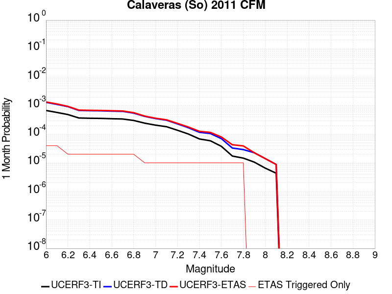 |  |  |

| Magnitude | 1 wk TI Prob | 1 wk TD Prob | 1 wk ETAS Prob | 1 wk ETAS/TD Gain | 1 wk ETAS Triggered Only | 1 mo TI Prob | 1 mo TD Prob | 1 mo ETAS Prob | 1 mo ETAS/TD Gain | 1 mo ETAS Triggered Only | 1 yr TI Prob | 1 yr TD Prob | 1 yr ETAS Prob | 1 yr ETAS/TD Gain | 1 yr ETAS Triggered Only | 10 yr TI Prob | 10 yr TD Prob | 10 yr ETAS Prob | 10 yr ETAS/TD Gain | 10 yr ETAS Triggered Only |
|-----|-----|-----|-----|-----|-----|-----|-----|-----|-----|-----|-----|-----|-----|-----|-----|-----|-----|-----|-----|-----|
| 6.0 | 1.5950744E-4 | 3.071188E-4 | 3.4240625E-4 | 1.1148983 | 3.529827E-5 | 6.834242E-4 | 0.0013155643 | 0.0013508161 | 1.026796 | 3.529827E-5 | 0.00828899 | 0.01585904 | 0.015928516 | 1.004381 | 7.059654E-5 | 0.079865426 | 0.14440064 | 0.14446105 | 1.0004183 | 7.059654E-5 |
| 6.1 | 1.3584697E-4 | 2.6036944E-4 | 2.956585E-4 | 1.1355346 | 3.529827E-5 | 5.8207137E-4 | 0.0011153965 | 0.0011506553 | 1.0316111 | 3.529827E-5 | 0.007063716 | 0.013462106 | 0.013531752 | 1.0051734 | 7.059654E-5 | 0.06843361 | 0.12402854 | 0.12409039 | 1.0004987 | 7.059654E-5 |
| 6.2 | 1.14676266E-4 | 2.1726108E-4 | 2.525517E-4 | 1.1624341 | 3.529827E-5 | 4.9137714E-4 | 9.307893E-4 | 9.6605474E-4 | 1.0378877 | 3.529827E-5 | 0.0059661185 | 0.011245592 | 0.011315394 | 1.0062071 | 7.059654E-5 | 0.058084648 | 0.105019294 | 0.105082475 | 1.0006016 | 7.059654E-5 |
| 6.3 | 8.691518E-5 | 1.5987165E-4 | 1.9516426E-4 | 1.220756 | 3.529827E-5 | 3.7244044E-4 | 6.8496726E-4 | 7.2024134E-4 | 1.0514975 | 3.529827E-5 | 0.004525038 | 0.008300893 | 0.008370904 | 1.008434 | 7.059654E-5 | 0.044339992 | 0.0793347 | 0.0793997 | 1.0008192 | 7.059654E-5 |
| 6.4 | 8.50982E-5 | 1.5693568E-4 | 1.9222841E-4 | 1.2248865 | 3.529827E-5 | 3.646556E-4 | 6.7239115E-4 | 7.076657E-4 | 1.0524614 | 3.529827E-5 | 0.0044306475 | 0.008148931 | 0.0082189515 | 1.0085927 | 7.059654E-5 | 0.04343345 | 0.077940844 | 0.07800594 | 1.0008352 | 7.059654E-5 |
| 6.5 | 8.4062965E-5 | 1.5518135E-4 | 1.9047415E-4 | 1.2274294 | 3.529827E-5 | 3.602201E-4 | 6.648764E-4 | 7.001512E-4 | 1.0530547 | 3.529827E-5 | 0.004376863 | 0.008058134 | 0.008128161 | 1.0086904 | 7.059654E-5 | 0.042916555 | 0.077112116 | 0.077177264 | 1.000845 | 7.059654E-5 |
| 6.6 | 8.194716E-5 | 1.5154095E-4 | 1.8683387E-4 | 1.2328936 | 3.529827E-5 | 3.5115483E-4 | 6.492825E-4 | 6.8455783E-4 | 1.0543298 | 3.529827E-5 | 0.0042669317 | 0.007869979 | 0.00794002 | 1.0088998 | 7.059654E-5 | 0.04185927 | 0.07539739 | 0.07546266 | 1.0008657 | 7.059654E-5 |
| 6.7 | 8.012326E-5 | 1.4821833E-4 | 1.8351137E-4 | 1.2381152 | 3.529827E-5 | 3.433402E-4 | 6.350497E-4 | 6.7032553E-4 | 1.0555482 | 3.529827E-5 | 0.004172157 | 0.007698474 | 0.007768527 | 1.0090996 | 7.059654E-5 | 0.040946912 | 0.073839515 | 0.0739049 | 1.0008855 | 7.059654E-5 |
| 6.8 | 7.119773E-5 | 1.2880519E-4 | 1.640989E-4 | 1.2740085 | 3.529827E-5 | 3.0509746E-4 | 5.519001E-4 | 5.871789E-4 | 1.0639224 | 3.529827E-5 | 0.0037082357 | 0.0066958875 | 0.0067309495 | 1.0052364 | 3.529827E-5 | 0.036469642 | 0.06468402 | 0.06471703 | 1.0005105 | 3.529827E-5 |
| 6.9 | 5.7343088E-5 | 9.9189E-5 | 1.3448377E-4 | 1.3558335 | 3.529827E-5 | 2.4573295E-4 | 4.2502693E-4 | 4.6031017E-4 | 1.0830142 | 3.529827E-5 | 0.0029876942 | 0.0051625078 | 0.0051976237 | 1.0068021 | 3.529827E-5 | 0.02947844 | 0.050509132 | 0.05054265 | 1.0006635 | 3.529827E-5 |
| 7.0 | 4.8746577E-5 | 8.284751E-5 | 1.1814285E-4 | 1.4260279 | 3.529827E-5 | 2.0889717E-4 | 3.550128E-4 | 3.9029852E-4 | 1.0993929 | 3.529827E-5 | 0.0025403565 | 0.004313781 | 0.0043489267 | 1.0081474 | 3.529827E-5 | 0.025115121 | 0.04248505 | 0.04251885 | 1.0007955 | 3.529827E-5 |
| 7.1 | 4.2998014E-5 | 7.264914E-5 | 1.0794485E-4 | 1.4858379 | 3.529827E-5 | 1.8426418E-4 | 3.1131663E-4 | 3.4660392E-4 | 1.1133485 | 3.529827E-5 | 0.002241108 | 0.0037837527 | 0.0038189176 | 1.0092936 | 3.529827E-5 | 0.022186412 | 0.037423246 | 0.03745722 | 1.0009079 | 3.529827E-5 |
| 7.2 | 3.221292E-5 | 5.390566E-5 | 8.9202025E-5 | 1.6547804 | 3.529827E-5 | 1.3804805E-4 | 2.3100396E-4 | 2.6629408E-4 | 1.1527685 | 3.529827E-5 | 0.0016794393 | 0.0028088738 | 0.0028440729 | 1.0125314 | 3.529827E-5 | 0.016668037 | 0.028035998 | 0.028070306 | 1.0012237 | 3.529827E-5 |
| 7.3 | 2.3756531E-5 | 3.9471706E-5 | 7.4768584E-5 | 1.8942324 | 3.529827E-5 | 1.0180973E-4 | 1.6915359E-4 | 2.0444588E-4 | 1.2086406 | 3.529827E-5 | 0.0012388286 | 0.0020575167 | 0.0020927424 | 1.0171205 | 3.529827E-5 | 0.012319452 | 0.02064345 | 0.020678021 | 1.0016747 | 3.529827E-5 |
| 7.4 | 1.5997684E-5 | 2.734085E-5 | 6.263815E-5 | 2.29101 | 3.529827E-5 | 6.8559704E-5 | 1.1716982E-4 | 1.5246395E-4 | 1.3012221 | 3.529827E-5 | 8.343947E-4 | 0.0014256114 | 0.0014608594 | 1.0247248 | 3.529827E-5 | 0.008312687 | 0.014376549 | 0.01441134 | 1.00242 | 3.529827E-5 |
| 7.5 | 1.3814293E-5 | 2.4782603E-5 | 6.0079998E-5 | 2.4242814 | 3.529827E-5 | 5.9202768E-5 | 1.0620684E-4 | 1.4150137E-4 | 1.3323187 | 3.529827E-5 | 7.205553E-4 | 0.0012923037 | 0.0013275563 | 1.0272789 | 3.529827E-5 | 0.007182234 | 0.013055766 | 0.013090603 | 1.0026684 | 3.529827E-5 |
| 7.6 | 8.817309E-6 | 1.6429829E-5 | 5.172752E-5 | 3.1483905 | 3.529827E-5 | 3.7787922E-5 | 7.041166E-5 | 1.0570745E-4 | 1.5012776 | 3.529827E-5 | 4.5997082E-4 | 8.5692614E-4 | 8.9219416E-4 | 1.0411564 | 3.529827E-5 | 0.004590199 | 0.008719863 | 0.008754854 | 1.0040127 | 3.529827E-5 |
| 7.7 | 4.0352206E-6 | 7.706877E-6 | 4.3004875E-5 | 5.5800653 | 3.529827E-5 | 1.7293689E-5 | 3.3029053E-5 | 6.832616E-5 | 2.0686684 | 3.529827E-5 | 2.1053031E-4 | 4.020546E-4 | 4.373387E-4 | 1.0877594 | 3.529827E-5 | 0.0021033096 | 0.0041649863 | 0.0042001377 | 1.0084397 | 3.529827E-5 |
| 7.8 | 3.413169E-6 | 6.7868646E-6 | 4.2084896E-5 | 6.2009335 | 3.529827E-5 | 1.4627784E-5 | 2.9086239E-5 | 6.438348E-5 | 2.2135377 | 3.529827E-5 | 1.7807873E-4 | 3.5406748E-4 | 3.8935326E-4 | 1.0996584 | 3.529827E-5 | 0.0017793609 | 0.0036663096 | 0.0037014785 | 1.0095924 | 3.529827E-5 |
| 7.9 | 2.4740732E-6 | 5.278809E-6 | 5.278809E-6 | 1.0 | 0.0 | 1.06031275E-5 | 2.2623271E-5 | 2.2623271E-5 | 1.0 | 0.0 | 1.2908543E-4 | 2.7540355E-4 | 2.7540355E-4 | 1.0 | 0.0 | 0.0012901047 | 0.002834638 | 0.002834638 | 1.0 | 0.0 |
| 8.0 | 1.5231818E-6 | 3.2887135E-6 | 3.2887135E-6 | 1.0 | 0.0 | 6.527906E-6 | 1.409441E-5 | 1.409441E-5 | 1.0 | 0.0 | 7.9474354E-5 | 1.7158597E-4 | 1.7158597E-4 | 1.0 | 0.0 | 7.944594E-4 | 0.001756374 | 0.001756374 | 1.0 | 0.0 |
| 8.1 | 1.0104524E-6 | 2.0456548E-6 | 2.0456548E-6 | 1.0 | 0.0 | 4.330503E-6 | 8.767062E-6 | 8.767062E-6 | 1.0 | 0.0 | 5.2722597E-5 | 1.06733794E-4 | 1.06733794E-4 | 1.0 | 0.0 | 5.271009E-4 | 0.0010929212 | 0.0010929212 | 1.0 | 0.0 |

## Santa Susana East (connector)
*[(top)](#table-of-contents)*

| 1 Week | 1 Month | 1 Year | 10 Year |
|-----|-----|-----|-----|
|  |  |  |  |

| Magnitude | 1 wk TI Prob | 1 wk TD Prob | 1 wk ETAS Prob | 1 wk ETAS/TD Gain | 1 wk ETAS Triggered Only | 1 mo TI Prob | 1 mo TD Prob | 1 mo ETAS Prob | 1 mo ETAS/TD Gain | 1 mo ETAS Triggered Only | 1 yr TI Prob | 1 yr TD Prob | 1 yr ETAS Prob | 1 yr ETAS/TD Gain | 1 yr ETAS Triggered Only | 10 yr TI Prob | 10 yr TD Prob | 10 yr ETAS Prob | 10 yr ETAS/TD Gain | 10 yr ETAS Triggered Only |
|-----|-----|-----|-----|-----|-----|-----|-----|-----|-----|-----|-----|-----|-----|-----|-----|-----|-----|-----|-----|-----|
| 6.0 | 2.858397E-5 | 3.202091E-5 | 3.202091E-5 | 1.0 | 0.0 | 1.2249697E-4 | 1.3722685E-4 | 1.3722685E-4 | 1.0 | 0.0 | 0.0014903803 | 0.0016697381 | 0.0017049775 | 1.0211047 | 3.529827E-5 | 0.014804244 | 0.016599052 | 0.016633764 | 1.0020912 | 3.529827E-5 |
| 6.1 | 2.858397E-5 | 3.202091E-5 | 3.202091E-5 | 1.0 | 0.0 | 1.2249697E-4 | 1.3722685E-4 | 1.3722685E-4 | 1.0 | 0.0 | 0.0014903803 | 0.0016697381 | 0.0017049775 | 1.0211047 | 3.529827E-5 | 0.014804244 | 0.016599052 | 0.016633764 | 1.0020912 | 3.529827E-5 |
| 6.2 | 2.858397E-5 | 3.202091E-5 | 3.202091E-5 | 1.0 | 0.0 | 1.2249697E-4 | 1.3722685E-4 | 1.3722685E-4 | 1.0 | 0.0 | 0.0014903803 | 0.0016697381 | 0.0017049775 | 1.0211047 | 3.529827E-5 | 0.014804244 | 0.016599052 | 0.016633764 | 1.0020912 | 3.529827E-5 |
| 6.3 | 1.943582E-5 | 2.036718E-5 | 2.036718E-5 | 1.0 | 0.0 | 8.329371E-5 | 8.7285625E-5 | 8.7285625E-5 | 1.0 | 0.0 | 0.001013629 | 0.0010622967 | 0.0010975574 | 1.033193 | 3.529827E-5 | 0.010090181 | 0.010583619 | 0.010618543 | 1.0032998 | 3.529827E-5 |
| 6.4 | 1.943582E-5 | 2.036718E-5 | 2.036718E-5 | 1.0 | 0.0 | 8.329371E-5 | 8.7285625E-5 | 8.7285625E-5 | 1.0 | 0.0 | 0.001013629 | 0.0010622967 | 0.0010975574 | 1.033193 | 3.529827E-5 | 0.010090181 | 0.010583619 | 0.010618543 | 1.0032998 | 3.529827E-5 |
| 6.5 | 1.943582E-5 | 2.036718E-5 | 2.036718E-5 | 1.0 | 0.0 | 8.329371E-5 | 8.7285625E-5 | 8.7285625E-5 | 1.0 | 0.0 | 0.001013629 | 0.0010622967 | 0.0010975574 | 1.033193 | 3.529827E-5 | 0.010090181 | 0.010583619 | 0.010618543 | 1.0032998 | 3.529827E-5 |
| 6.6 | 1.943582E-5 | 2.036718E-5 | 2.036718E-5 | 1.0 | 0.0 | 8.329371E-5 | 8.7285625E-5 | 8.7285625E-5 | 1.0 | 0.0 | 0.001013629 | 0.0010622967 | 0.0010975574 | 1.033193 | 3.529827E-5 | 0.010090181 | 0.010583619 | 0.010618543 | 1.0032998 | 3.529827E-5 |
| 6.7 | 1.9404439E-5 | 2.03546E-5 | 2.03546E-5 | 1.0 | 0.0 | 8.3159226E-5 | 8.723172E-5 | 8.723172E-5 | 1.0 | 0.0 | 0.0010119933 | 0.0010616409 | 0.0010969017 | 1.0332135 | 3.529827E-5 | 0.010073971 | 0.010577125 | 0.010612049 | 1.003302 | 3.529827E-5 |
| 6.8 | 1.2217526E-5 | 1.1592998E-5 | 1.1592998E-5 | 1.0 | 0.0 | 5.2359774E-5 | 4.9683425E-5 | 4.9683425E-5 | 1.0 | 0.0 | 6.372938E-4 | 6.0474465E-4 | 6.400216E-4 | 1.0583336 | 3.529827E-5 | 0.0063546924 | 0.006033037 | 0.006068122 | 1.0058155 | 3.529827E-5 |
| 6.9 | 1.2217526E-5 | 1.1592998E-5 | 1.1592998E-5 | 1.0 | 0.0 | 5.2359774E-5 | 4.9683425E-5 | 4.9683425E-5 | 1.0 | 0.0 | 6.372938E-4 | 6.0474465E-4 | 6.400216E-4 | 1.0583336 | 3.529827E-5 | 0.0063546924 | 0.006033037 | 0.006068122 | 1.0058155 | 3.529827E-5 |
| 7.0 | 9.276017E-6 | 8.059113E-6 | 8.059113E-6 | 1.0 | 0.0 | 3.9753755E-5 | 3.4538618E-5 | 3.4538618E-5 | 1.0 | 0.0 | 4.8389446E-4 | 4.2042998E-4 | 4.557134E-4 | 1.0839223 | 3.529827E-5 | 0.0048284214 | 0.0041970722 | 0.004232222 | 1.0083749 | 3.529827E-5 |
| 7.1 | 9.130355E-6 | 7.942286E-6 | 7.942286E-6 | 1.0 | 0.0 | 3.9129503E-5 | 3.4037945E-5 | 3.4037945E-5 | 1.0 | 0.0 | 4.7629757E-4 | 4.1433662E-4 | 4.4962027E-4 | 1.0851569 | 3.529827E-5 | 0.00475278 | 0.004136367 | 0.004171519 | 1.0084983 | 3.529827E-5 |
| 7.2 | 8.851015E-6 | 7.741445E-6 | 7.741445E-6 | 1.0 | 0.0 | 3.7932372E-5 | 3.317722E-5 | 3.317722E-5 | 1.0 | 0.0 | 4.6172875E-4 | 4.038612E-4 | 4.3914522E-4 | 1.0873667 | 3.529827E-5 | 0.0046077054 | 0.0040319953 | 0.0040671513 | 1.0087192 | 3.529827E-5 |
| 7.3 | 8.573006E-6 | 7.550166E-6 | 7.550166E-6 | 1.0 | 0.0 | 3.6740938E-5 | 3.2357475E-5 | 3.2357475E-5 | 1.0 | 0.0 | 4.472291E-4 | 3.9388443E-4 | 4.291688E-4 | 1.0895805 | 3.529827E-5 | 0.004463301 | 0.0039325804 | 0.00396774 | 1.0089406 | 3.529827E-5 |
| 7.4 | 7.852282E-6 | 6.817687E-6 | 6.817687E-6 | 1.0 | 0.0 | 3.36522E-5 | 2.9218349E-5 | 2.9218349E-5 | 1.0 | 0.0 | 4.096385E-4 | 3.5567835E-4 | 3.9096407E-4 | 1.0992068 | 3.529827E-5 | 0.0040888423 | 0.0035517553 | 0.0035869281 | 1.009903 | 3.529827E-5 |
| 7.5 | 4.8869324E-6 | 4.279055E-6 | 4.279055E-6 | 1.0 | 0.0 | 2.0943828E-5 | 1.8338687E-5 | 1.8338687E-5 | 1.0 | 0.0 | 2.5496128E-4 | 2.232523E-4 | 2.5854268E-4 | 1.158074 | 3.529827E-5 | 0.0025466895 | 0.0022304445 | 0.002265664 | 1.0157903 | 3.529827E-5 |
| 7.6 | 1.3894544E-6 | 1.1568179E-6 | 1.1568179E-6 | 1.0 | 0.0 | 5.954791E-6 | 4.957783E-6 | 4.957783E-6 | 1.0 | 0.0 | 7.249717E-5 | 6.0359558E-5 | 6.0359558E-5 | 1.0 | 0.0 | 7.247352E-4 | 6.0345343E-4 | 6.0345343E-4 | 1.0 | 0.0 |
| 7.7 | 2.9924632E-7 | 2.371928E-7 | 2.371928E-7 | 1.0 | 0.0 | 1.2824837E-6 | 1.0165402E-6 | 1.0165402E-6 | 1.0 | 0.0 | 1.5614127E-5 | 1.2376314E-5 | 1.2376314E-5 | 1.0 | 0.0 | 1.5613029E-4 | 1.2375697E-4 | 1.2375697E-4 | 1.0 | 0.0 |
| 7.8 | 4.8188564E-8 | 2.6323061E-8 | 2.6323061E-8 | 1.0 | 0.0 | 2.065224E-7 | 1.1281311E-7 | 1.1281311E-7 | 1.0 | 0.0 | 2.5144072E-6 | 1.3734989E-6 | 1.3734989E-6 | 1.0 | 0.0 | 2.5143789E-5 | 1.3734912E-5 | 1.3734912E-5 | 1.0 | 0.0 |
| 7.9 | 2.6127251E-9 | 2.7681102E-9 | 2.7681102E-9 | 1.0 | 0.0 | 1.1197393E-8 | 1.186333E-8 | 1.186333E-8 | 1.0 | 0.0 | 1.3632825E-7 | 1.4443603E-7 | 1.4443603E-7 | 1.0 | 0.0 | 1.3632817E-6 | 1.4443604E-6 | 1.4443604E-6 | 1.0 | 0.0 |

## Raymond
*[(top)](#table-of-contents)*

| 1 Week | 1 Month | 1 Year | 10 Year |
|-----|-----|-----|-----|
|  |  |  |  |

| Magnitude | 1 wk TI Prob | 1 wk TD Prob | 1 wk ETAS Prob | 1 wk ETAS/TD Gain | 1 wk ETAS Triggered Only | 1 mo TI Prob | 1 mo TD Prob | 1 mo ETAS Prob | 1 mo ETAS/TD Gain | 1 mo ETAS Triggered Only | 1 yr TI Prob | 1 yr TD Prob | 1 yr ETAS Prob | 1 yr ETAS/TD Gain | 1 yr ETAS Triggered Only | 10 yr TI Prob | 10 yr TD Prob | 10 yr ETAS Prob | 10 yr ETAS/TD Gain | 10 yr ETAS Triggered Only |
|-----|-----|-----|-----|-----|-----|-----|-----|-----|-----|-----|-----|-----|-----|-----|-----|-----|-----|-----|-----|-----|
| 6.0 | 1.5157413E-5 | 1.5810128E-5 | 5.110784E-5 | 3.2326014 | 3.529827E-5 | 6.4958724E-5 | 6.7756075E-5 | 1.0305195E-4 | 1.5209256 | 3.529827E-5 | 7.905855E-4 | 8.2464307E-4 | 8.951814E-4 | 1.085538 | 7.059654E-5 | 0.007877788 | 0.008218348 | 0.008288365 | 1.0085195 | 7.059654E-5 |
| 6.1 | 1.5157413E-5 | 1.5810128E-5 | 5.110784E-5 | 3.2326014 | 3.529827E-5 | 6.4958724E-5 | 6.7756075E-5 | 1.0305195E-4 | 1.5209256 | 3.529827E-5 | 7.905855E-4 | 8.2464307E-4 | 8.951814E-4 | 1.085538 | 7.059654E-5 | 0.007877788 | 0.008218348 | 0.008288365 | 1.0085195 | 7.059654E-5 |
| 6.2 | 1.5157413E-5 | 1.5810128E-5 | 5.110784E-5 | 3.2326014 | 3.529827E-5 | 6.4958724E-5 | 6.7756075E-5 | 1.0305195E-4 | 1.5209256 | 3.529827E-5 | 7.905855E-4 | 8.2464307E-4 | 8.951814E-4 | 1.085538 | 7.059654E-5 | 0.007877788 | 0.008218348 | 0.008288365 | 1.0085195 | 7.059654E-5 |
| 6.3 | 1.5157413E-5 | 1.5810128E-5 | 5.110784E-5 | 3.2326014 | 3.529827E-5 | 6.4958724E-5 | 6.7756075E-5 | 1.0305195E-4 | 1.5209256 | 3.529827E-5 | 7.905855E-4 | 8.2464307E-4 | 8.951814E-4 | 1.085538 | 7.059654E-5 | 0.007877788 | 0.008218348 | 0.008288365 | 1.0085195 | 7.059654E-5 |
| 6.4 | 1.3941944E-5 | 1.445469E-5 | 4.9752452E-5 | 3.441959 | 3.529827E-5 | 5.9749822E-5 | 6.1947336E-5 | 9.724342E-5 | 1.5697757 | 3.529827E-5 | 7.2721124E-4 | 7.5397117E-4 | 8.245144E-4 | 1.0935624 | 7.059654E-5 | 0.007248361 | 0.0075164647 | 0.007586531 | 1.0093217 | 7.059654E-5 |
| 6.5 | 1.3941944E-5 | 1.445469E-5 | 4.9752452E-5 | 3.441959 | 3.529827E-5 | 5.9749822E-5 | 6.1947336E-5 | 9.724342E-5 | 1.5697757 | 3.529827E-5 | 7.2721124E-4 | 7.5397117E-4 | 8.245144E-4 | 1.0935624 | 7.059654E-5 | 0.007248361 | 0.0075164647 | 0.007586531 | 1.0093217 | 7.059654E-5 |
| 6.6 | 1.0542609E-5 | 1.0671113E-5 | 4.5969005E-5 | 4.307799 | 3.529827E-5 | 4.5181827E-5 | 4.573257E-5 | 8.1029226E-5 | 1.7718056 | 3.529827E-5 | 5.499499E-4 | 5.5665727E-4 | 6.272145E-4 | 1.1267517 | 7.059654E-5 | 0.005485909 | 0.00555319 | 0.0056233946 | 1.0126421 | 7.059654E-5 |
| 6.7 | 1.0542609E-5 | 1.0671113E-5 | 4.5969005E-5 | 4.307799 | 3.529827E-5 | 4.5181827E-5 | 4.573257E-5 | 8.1029226E-5 | 1.7718056 | 3.529827E-5 | 5.499499E-4 | 5.5665727E-4 | 6.272145E-4 | 1.1267517 | 7.059654E-5 | 0.005485909 | 0.00555319 | 0.0056233946 | 1.0126421 | 7.059654E-5 |
| 6.8 | 1.0079132E-5 | 1.0176646E-5 | 4.5474557E-5 | 4.468521 | 3.529827E-5 | 4.3195567E-5 | 4.3613498E-5 | 7.891023E-5 | 1.8093075 | 3.529827E-5 | 5.257791E-4 | 5.3087034E-4 | 6.014294E-4 | 1.132912 | 7.059654E-5 | 0.0052453685 | 0.005296571 | 0.005366794 | 1.0132581 | 7.059654E-5 |
| 6.9 | 7.721598E-6 | 7.5489047E-6 | 7.5489047E-6 | 1.0 | 0.0 | 3.3092143E-5 | 3.2352054E-5 | 3.2352054E-5 | 1.0 | 0.0 | 4.0282236E-4 | 3.9381627E-4 | 4.2910065E-4 | 1.089596 | 3.529827E-5 | 0.0040209293 | 0.0039313175 | 0.0039664772 | 1.0089434 | 3.529827E-5 |
| 7.0 | 7.137566E-6 | 6.9113057E-6 | 6.9113057E-6 | 1.0 | 0.0 | 3.058921E-5 | 2.961955E-5 | 2.961955E-5 | 1.0 | 0.0 | 3.7236E-4 | 3.6055944E-4 | 3.9584498E-4 | 1.0978633 | 3.529827E-5 | 0.0037173668 | 0.0035998628 | 0.003635034 | 1.0097702 | 3.529827E-5 |
| 7.1 | 5.654976E-6 | 5.29954E-6 | 5.29954E-6 | 1.0 | 0.0 | 2.4235387E-5 | 2.2712118E-5 | 2.2712118E-5 | 1.0 | 0.0 | 2.9502588E-4 | 2.7648517E-4 | 3.1177368E-4 | 1.1276326 | 3.529827E-5 | 0.0029463451 | 0.002761443 | 0.0027966436 | 1.0127473 | 3.529827E-5 |
| 7.2 | 4.9358455E-6 | 4.5266574E-6 | 4.5266574E-6 | 1.0 | 0.0 | 2.1153453E-5 | 1.9399817E-5 | 1.9399817E-5 | 1.0 | 0.0 | 2.5751285E-4 | 2.3616731E-4 | 2.7145725E-4 | 1.1494277 | 3.529827E-5 | 0.0025721465 | 0.0023591854 | 0.0023944005 | 1.0149268 | 3.529827E-5 |
| 7.3 | 4.2368597E-6 | 3.8056164E-6 | 3.8056164E-6 | 1.0 | 0.0 | 1.8157843E-5 | 1.6309683E-5 | 1.6309683E-5 | 1.0 | 0.0 | 2.2104931E-4 | 1.9855241E-4 | 2.3384368E-4 | 1.1777428 | 3.529827E-5 | 0.0022082955 | 0.0019837688 | 0.0020189972 | 1.0177583 | 3.529827E-5 |
| 7.4 | 3.4999923E-6 | 3.043744E-6 | 3.043744E-6 | 1.0 | 0.0 | 1.49998805E-5 | 1.3044552E-5 | 1.3044552E-5 | 1.0 | 0.0 | 1.8260824E-4 | 1.5880594E-4 | 1.940986E-4 | 1.2222377 | 3.529827E-5 | 0.0018245826 | 0.0015869403 | 0.0016221825 | 1.0222076 | 3.529827E-5 |
| 7.5 | 2.738017E-6 | 2.3020468E-6 | 2.3020468E-6 | 1.0 | 0.0 | 1.1734306E-5 | 9.865878E-6 | 9.865878E-6 | 1.0 | 0.0 | 1.428558E-4 | 1.2011051E-4 | 1.5540454E-4 | 1.2938464 | 3.529827E-5 | 0.0014276401 | 0.0012004703 | 0.0012357262 | 1.0293684 | 3.529827E-5 |
| 7.6 | 1.8186392E-6 | 1.442312E-6 | 1.442312E-6 | 1.0 | 0.0 | 7.794145E-6 | 6.181323E-6 | 6.181323E-6 | 1.0 | 0.0 | 9.488958E-5 | 7.5255055E-5 | 1.1055067E-4 | 1.4690132 | 3.529827E-5 | 9.4849075E-4 | 7.523072E-4 | 7.8757893E-4 | 1.0468848 | 3.529827E-5 |
| 7.7 | 1.0660348E-6 | 7.6438056E-7 | 7.6438056E-7 | 1.0 | 0.0 | 4.5687125E-6 | 3.2759126E-6 | 3.2759126E-6 | 1.0 | 0.0 | 5.5622655E-5 | 3.9883522E-5 | 3.9883522E-5 | 1.0 | 0.0 | 5.5608735E-4 | 3.9877277E-4 | 3.9877277E-4 | 1.0 | 0.0 |
| 7.8 | 6.913602E-7 | 4.3204133E-7 | 4.3204133E-7 | 1.0 | 0.0 | 2.962969E-6 | 1.8516045E-6 | 1.8516045E-6 | 1.0 | 0.0 | 3.607355E-5 | 2.2543056E-5 | 2.2543056E-5 | 1.0 | 0.0 | 3.6067693E-4 | 2.2541556E-4 | 2.2541556E-4 | 1.0 | 0.0 |
| 7.9 | 7.425201E-8 | 5.3222113E-8 | 5.3222113E-8 | 1.0 | 0.0 | 3.1822285E-7 | 2.2809476E-7 | 2.2809476E-7 | 1.0 | 0.0 | 3.874356E-6 | 2.7770516E-6 | 2.7770516E-6 | 1.0 | 0.0 | 3.8742884E-5 | 2.7770298E-5 | 2.7770298E-5 | 1.0 | 0.0 |

## Northridge
*[(top)](#table-of-contents)*

| 1 Week | 1 Month | 1 Year | 10 Year |
|-----|-----|-----|-----|
|  |  |  |  |

| Magnitude | 1 wk TI Prob | 1 wk TD Prob | 1 wk ETAS Prob | 1 wk ETAS/TD Gain | 1 wk ETAS Triggered Only | 1 mo TI Prob | 1 mo TD Prob | 1 mo ETAS Prob | 1 mo ETAS/TD Gain | 1 mo ETAS Triggered Only | 1 yr TI Prob | 1 yr TD Prob | 1 yr ETAS Prob | 1 yr ETAS/TD Gain | 1 yr ETAS Triggered Only | 10 yr TI Prob | 10 yr TD Prob | 10 yr ETAS Prob | 10 yr ETAS/TD Gain | 10 yr ETAS Triggered Only |
|-----|-----|-----|-----|-----|-----|-----|-----|-----|-----|-----|-----|-----|-----|-----|-----|-----|-----|-----|-----|-----|
| 6.0 | 1.8340852E-5 | 7.5880193E-6 | 4.2886022E-5 | 5.651807 | 3.529827E-5 | 7.860128E-5 | 3.251969E-5 | 6.7816814E-5 | 2.0854077 | 3.529827E-5 | 9.565505E-4 | 3.958575E-4 | 4.311418E-4 | 1.0891339 | 3.529827E-5 | 0.009524435 | 0.003951746 | 0.0040220637 | 1.017794 | 7.059654E-5 |
| 6.1 | 1.8340852E-5 | 7.5880193E-6 | 4.2886022E-5 | 5.651807 | 3.529827E-5 | 7.860128E-5 | 3.251969E-5 | 6.7816814E-5 | 2.0854077 | 3.529827E-5 | 9.565505E-4 | 3.958575E-4 | 4.311418E-4 | 1.0891339 | 3.529827E-5 | 0.009524435 | 0.003951746 | 0.0040220637 | 1.017794 | 7.059654E-5 |
| 6.2 | 1.8340852E-5 | 7.5880193E-6 | 4.2886022E-5 | 5.651807 | 3.529827E-5 | 7.860128E-5 | 3.251969E-5 | 6.7816814E-5 | 2.0854077 | 3.529827E-5 | 9.565505E-4 | 3.958575E-4 | 4.311418E-4 | 1.0891339 | 3.529827E-5 | 0.009524435 | 0.003951746 | 0.0040220637 | 1.017794 | 7.059654E-5 |
| 6.3 | 1.8340852E-5 | 7.5880193E-6 | 4.2886022E-5 | 5.651807 | 3.529827E-5 | 7.860128E-5 | 3.251969E-5 | 6.7816814E-5 | 2.0854077 | 3.529827E-5 | 9.565505E-4 | 3.958575E-4 | 4.311418E-4 | 1.0891339 | 3.529827E-5 | 0.009524435 | 0.003951746 | 0.0040220637 | 1.017794 | 7.059654E-5 |
| 6.4 | 1.7361892E-5 | 7.5880193E-6 | 4.2886022E-5 | 5.651807 | 3.529827E-5 | 7.440598E-5 | 3.251969E-5 | 6.7816814E-5 | 2.0854077 | 3.529827E-5 | 9.055163E-4 | 3.958575E-4 | 4.311418E-4 | 1.0891339 | 3.529827E-5 | 0.009018354 | 0.003951746 | 0.0040220637 | 1.017794 | 7.059654E-5 |
| 6.5 | 1.7361892E-5 | 7.5880193E-6 | 4.2886022E-5 | 5.651807 | 3.529827E-5 | 7.440598E-5 | 3.251969E-5 | 6.7816814E-5 | 2.0854077 | 3.529827E-5 | 9.055163E-4 | 3.958575E-4 | 4.311418E-4 | 1.0891339 | 3.529827E-5 | 0.009018354 | 0.003951746 | 0.0040220637 | 1.017794 | 7.059654E-5 |
| 6.6 | 1.5458201E-5 | 7.5880193E-6 | 4.2886022E-5 | 5.651807 | 3.529827E-5 | 6.624775E-5 | 3.251969E-5 | 6.7816814E-5 | 2.0854077 | 3.529827E-5 | 8.0626784E-4 | 3.958575E-4 | 4.311418E-4 | 1.0891339 | 3.529827E-5 | 0.008033488 | 0.003951746 | 0.0040220637 | 1.017794 | 7.059654E-5 |
| 6.7 | 1.2538368E-5 | 6.381603E-6 | 4.1679647E-5 | 6.531219 | 3.529827E-5 | 5.3734755E-5 | 2.7349442E-5 | 6.2646744E-5 | 2.290604 | 3.529827E-5 | 6.5402425E-4 | 3.3292902E-4 | 3.6821555E-4 | 1.1059881 | 3.529827E-5 | 0.0065210275 | 0.0033243506 | 0.0033947125 | 1.0211656 | 7.059654E-5 |
| 6.8 | 1.1438097E-5 | 6.3502566E-6 | 4.16483E-5 | 6.5585227 | 3.529827E-5 | 4.9019498E-5 | 2.7215105E-5 | 6.2512416E-5 | 2.296975 | 3.529827E-5 | 5.9664896E-4 | 3.3129397E-4 | 3.6658053E-4 | 1.1065114 | 3.529827E-5 | 0.005950495 | 0.0033080487 | 0.0033784118 | 1.0212703 | 7.059654E-5 |
| 6.9 | 1.1204891E-5 | 6.2867084E-6 | 4.1584757E-5 | 6.6147103 | 3.529827E-5 | 4.8020076E-5 | 2.694276E-5 | 6.224008E-5 | 2.3100855 | 3.529827E-5 | 5.8448757E-4 | 3.2797916E-4 | 3.6326586E-4 | 1.1075882 | 3.529827E-5 | 0.0058295266 | 0.0032749989 | 0.0033453642 | 1.0214856 | 7.059654E-5 |
| 7.0 | 1.061046E-5 | 6.115359E-6 | 4.1413412E-5 | 6.772033 | 3.529827E-5 | 4.5472607E-5 | 2.6208421E-5 | 6.1505765E-5 | 2.3467941 | 3.529827E-5 | 5.534883E-4 | 3.1904122E-4 | 3.5432825E-4 | 1.1106033 | 3.529827E-5 | 0.0055211177 | 0.0031858785 | 0.0032562502 | 1.0220886 | 7.059654E-5 |
| 7.1 | 1.0266979E-5 | 6.004274E-6 | 4.1302334E-5 | 6.878822 | 3.529827E-5 | 4.40006E-5 | 2.5732352E-5 | 6.1029714E-5 | 2.3717115 | 3.529827E-5 | 5.355756E-4 | 3.1324677E-4 | 3.4853397E-4 | 1.1126499 | 3.529827E-5 | 0.0053428668 | 0.003128098 | 0.003198474 | 1.0224979 | 7.059654E-5 |
| 7.2 | 9.91273E-6 | 5.819984E-6 | 4.1118048E-5 | 7.064976 | 3.529827E-5 | 4.248244E-5 | 2.4942554E-5 | 6.023994E-5 | 2.4151475 | 3.529827E-5 | 5.171009E-4 | 3.036337E-4 | 3.3892124E-4 | 1.1162175 | 3.529827E-5 | 0.0051589934 | 0.0030322333 | 0.003102616 | 1.0232115 | 7.059654E-5 |
| 7.3 | 8.4959265E-6 | 5.193062E-6 | 4.0491148E-5 | 7.797163 | 3.529827E-5 | 3.6410605E-5 | 2.225579E-5 | 5.7553276E-5 | 2.5859911 | 3.529827E-5 | 4.4320893E-4 | 2.709308E-4 | 3.062195E-4 | 1.1302499 | 3.529827E-5 | 0.00442326 | 0.0027060313 | 0.002776437 | 1.026018 | 7.059654E-5 |
| 7.4 | 8.0847185E-6 | 4.9819355E-6 | 4.028003E-5 | 8.0852165 | 3.529827E-5 | 3.4648332E-5 | 2.135098E-5 | 5.6648496E-5 | 2.6532037 | 3.529827E-5 | 4.2176177E-4 | 2.599174E-4 | 2.952065E-4 | 1.1357704 | 3.529827E-5 | 0.0042096223 | 0.00259616 | 0.0026665733 | 1.0271221 | 7.059654E-5 |
| 7.5 | 6.8220684E-6 | 4.2533075E-6 | 3.955143E-5 | 9.298982 | 3.529827E-5 | 2.9237108E-5 | 1.8228335E-5 | 5.352596E-5 | 2.9364152 | 3.529827E-5 | 3.5590364E-4 | 2.2190758E-4 | 2.57198E-4 | 1.1590321 | 3.529827E-5 | 0.0035533418 | 0.002216881 | 0.002287321 | 1.0317744 | 7.059654E-5 |
| 7.6 | 4.4224143E-6 | 2.8999582E-6 | 3.8198126E-5 | 13.171957 | 3.529827E-5 | 1.8953066E-5 | 1.2428334E-5 | 4.7726167E-5 | 3.8401096 | 3.529827E-5 | 2.3072914E-4 | 1.5130457E-4 | 1.865975E-4 | 1.2332575 | 3.529827E-5 | 0.0023048974 | 0.0015120271 | 0.0015825169 | 1.0466194 | 7.059654E-5 |
| 7.7 | 2.5297056E-6 | 1.6045905E-6 | 3.6902806E-5 | 22.998268 | 3.529827E-5 | 1.0841551E-5 | 6.8767986E-6 | 4.2174826E-5 | 6.1329155 | 3.529827E-5 | 1.319879E-4 | 8.3721854E-5 | 1.1901717E-4 | 1.4215783 | 3.529827E-5 | 0.0013190953 | 8.369078E-4 | 9.0744527E-4 | 1.0842835 | 7.059654E-5 |
| 7.8 | 1.2508156E-6 | 8.780076E-7 | 3.6176247E-5 | 41.202656 | 3.529827E-5 | 5.3606273E-6 | 3.7628845E-6 | 3.9061022E-5 | 10.380607 | 3.529827E-5 | 6.526368E-5 | 4.581217E-5 | 8.110882E-5 | 1.7704645 | 3.529827E-5 | 6.524452E-4 | 4.5802852E-4 | 5.2859273E-4 | 1.1540607 | 7.059654E-5 |
| 7.9 | 2.262199E-7 | 1.4664671E-7 | 3.544491E-5 | 241.70273 | 3.529827E-5 | 9.695135E-7 | 6.284858E-7 | 3.5926732E-5 | 57.163956 | 3.529827E-5 | 1.1803763E-5 | 7.651788E-6 | 4.294979E-5 | 5.613039 | 3.529827E-5 | 1.1803136E-4 | 7.651533E-5 | 1.4710646E-4 | 1.9225751 | 7.059654E-5 |
| 8.0 | 2.865362E-9 | 1.2753101E-9 | 1.2753101E-9 | 1.0 | 0.0 | 1.2280123E-8 | 5.4656146E-9 | 5.4656146E-9 | 1.0 | 0.0 | 1.4951048E-7 | 6.654386E-8 | 6.654386E-8 | 1.0 | 0.0 | 1.4951038E-6 | 6.654386E-7 | 6.654386E-7 | 1.0 | 0.0 |

## Mission Hills 2011
*[(top)](#table-of-contents)*

| 1 Week | 1 Month | 1 Year | 10 Year |
|-----|-----|-----|-----|
| 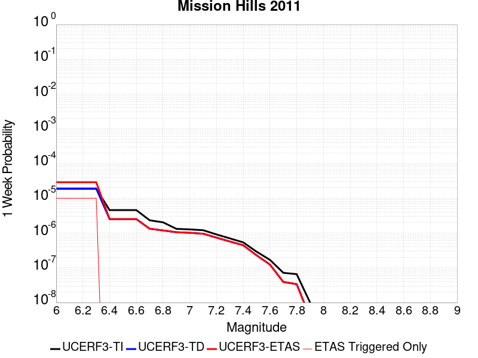 |  |  |  |

| Magnitude | 1 wk TI Prob | 1 wk TD Prob | 1 wk ETAS Prob | 1 wk ETAS/TD Gain | 1 wk ETAS Triggered Only | 1 mo TI Prob | 1 mo TD Prob | 1 mo ETAS Prob | 1 mo ETAS/TD Gain | 1 mo ETAS Triggered Only | 1 yr TI Prob | 1 yr TD Prob | 1 yr ETAS Prob | 1 yr ETAS/TD Gain | 1 yr ETAS Triggered Only | 10 yr TI Prob | 10 yr TD Prob | 10 yr ETAS Prob | 10 yr ETAS/TD Gain | 10 yr ETAS Triggered Only |
|-----|-----|-----|-----|-----|-----|-----|-----|-----|-----|-----|-----|-----|-----|-----|-----|-----|-----|-----|-----|-----|
| 6.0 | 1.8765717E-5 | 1.9054645E-5 | 1.9054645E-5 | 1.0 | 0.0 | 8.0422025E-5 | 8.166215E-5 | 1.1695753E-4 | 1.4322124 | 3.529827E-5 | 9.786983E-4 | 9.941267E-4 | 0.0010646529 | 1.070943 | 7.059654E-5 | 0.009743992 | 0.009930461 | 0.0100003565 | 1.0070385 | 7.059654E-5 |
| 6.1 | 1.8765717E-5 | 1.9054645E-5 | 1.9054645E-5 | 1.0 | 0.0 | 8.0422025E-5 | 8.166215E-5 | 1.1695753E-4 | 1.4322124 | 3.529827E-5 | 9.786983E-4 | 9.941267E-4 | 0.0010646529 | 1.070943 | 7.059654E-5 | 0.009743992 | 0.009930461 | 0.0100003565 | 1.0070385 | 7.059654E-5 |
| 6.2 | 1.8765717E-5 | 1.9054645E-5 | 1.9054645E-5 | 1.0 | 0.0 | 8.0422025E-5 | 8.166215E-5 | 1.1695753E-4 | 1.4322124 | 3.529827E-5 | 9.786983E-4 | 9.941267E-4 | 0.0010646529 | 1.070943 | 7.059654E-5 | 0.009743992 | 0.009930461 | 0.0100003565 | 1.0070385 | 7.059654E-5 |
| 6.3 | 1.8765717E-5 | 1.9054645E-5 | 1.9054645E-5 | 1.0 | 0.0 | 8.0422025E-5 | 8.166215E-5 | 1.1695753E-4 | 1.4322124 | 3.529827E-5 | 9.786983E-4 | 9.941267E-4 | 0.0010646529 | 1.070943 | 7.059654E-5 | 0.009743992 | 0.009930461 | 0.0100003565 | 1.0070385 | 7.059654E-5 |
| 6.4 | 4.566357E-6 | 2.5148488E-6 | 2.5148488E-6 | 1.0 | 0.0 | 1.9569954E-5 | 1.0777889E-5 | 1.0777889E-5 | 1.0 | 0.0 | 2.3823815E-4 | 1.3121472E-4 | 1.3121472E-4 | 1.0 | 0.0 | 0.002379829 | 0.0013115506 | 0.0013115506 | 1.0 | 0.0 |
| 6.5 | 4.566357E-6 | 2.5148488E-6 | 2.5148488E-6 | 1.0 | 0.0 | 1.9569954E-5 | 1.0777889E-5 | 1.0777889E-5 | 1.0 | 0.0 | 2.3823815E-4 | 1.3121472E-4 | 1.3121472E-4 | 1.0 | 0.0 | 0.002379829 | 0.0013115506 | 0.0013115506 | 1.0 | 0.0 |
| 6.6 | 4.566357E-6 | 2.5148488E-6 | 2.5148488E-6 | 1.0 | 0.0 | 1.9569954E-5 | 1.0777889E-5 | 1.0777889E-5 | 1.0 | 0.0 | 2.3823815E-4 | 1.3121472E-4 | 1.3121472E-4 | 1.0 | 0.0 | 0.002379829 | 0.0013115506 | 0.0013115506 | 1.0 | 0.0 |
| 6.7 | 2.3266773E-6 | 1.3296187E-6 | 1.3296187E-6 | 1.0 | 0.0 | 9.971435E-6 | 5.698354E-6 | 5.698354E-6 | 1.0 | 0.0 | 1.2139547E-4 | 6.937531E-5 | 6.937531E-5 | 1.0 | 0.0 | 0.0012132917 | 6.9354265E-4 | 6.9354265E-4 | 1.0 | 0.0 |
| 6.8 | 2.032735E-6 | 1.1894115E-6 | 1.1894115E-6 | 1.0 | 0.0 | 8.711692E-6 | 5.097468E-6 | 5.097468E-6 | 1.0 | 0.0 | 1.06059684E-4 | 6.205996E-5 | 6.205996E-5 | 1.0 | 0.0 | 0.0010600908 | 6.2043115E-4 | 6.2043115E-4 | 1.0 | 0.0 |
| 6.9 | 1.3186259E-6 | 1.0561778E-6 | 1.0561778E-6 | 1.0 | 0.0 | 5.6512413E-6 | 4.5264687E-6 | 4.5264687E-6 | 1.0 | 0.0 | 6.8801695E-5 | 5.5108394E-5 | 5.5108394E-5 | 1.0 | 0.0 | 6.8780396E-4 | 5.5095024E-4 | 5.5095024E-4 | 1.0 | 0.0 |
| 7.0 | 1.2726016E-6 | 1.0159088E-6 | 1.0159088E-6 | 1.0 | 0.0 | 5.4539955E-6 | 4.3538876E-6 | 4.3538876E-6 | 1.0 | 0.0 | 6.6400375E-5 | 5.300732E-5 | 5.300732E-5 | 1.0 | 0.0 | 6.6380535E-4 | 5.299496E-4 | 5.299496E-4 | 1.0 | 0.0 |
| 7.1 | 1.2063913E-6 | 9.570072E-7 | 9.570072E-7 | 1.0 | 0.0 | 5.170238E-6 | 4.101453E-6 | 4.101453E-6 | 1.0 | 0.0 | 6.294583E-5 | 4.9934075E-5 | 4.9934075E-5 | 1.0 | 0.0 | 6.2928005E-4 | 4.992311E-4 | 4.992311E-4 | 1.0 | 0.0 |
| 7.2 | 9.105806E-7 | 7.3765557E-7 | 7.3765557E-7 | 1.0 | 0.0 | 3.9024826E-6 | 3.1613772E-6 | 3.1613772E-6 | 1.0 | 0.0 | 4.7511687E-5 | 3.8489103E-5 | 3.8489103E-5 | 1.0 | 0.0 | 4.7501532E-4 | 3.8482592E-4 | 3.8482592E-4 | 1.0 | 0.0 |
| 7.3 | 7.020432E-7 | 5.710089E-7 | 5.710089E-7 | 1.0 | 0.0 | 3.0087533E-6 | 2.447179E-6 | 2.447179E-6 | 1.0 | 0.0 | 3.6630954E-5 | 2.979401E-5 | 2.979401E-5 | 1.0 | 0.0 | 3.6624918E-4 | 2.9790145E-4 | 2.9790145E-4 | 1.0 | 0.0 |
| 7.4 | 5.3900635E-7 | 4.4480825E-7 | 4.4480825E-7 | 1.0 | 0.0 | 2.3100251E-6 | 1.9063198E-6 | 1.9063198E-6 | 1.0 | 0.0 | 2.8124194E-5 | 2.3209208E-5 | 2.3209208E-5 | 1.0 | 0.0 | 2.8120633E-4 | 2.3206905E-4 | 2.3206905E-4 | 1.0 | 0.0 |
| 7.5 | 2.907075E-7 | 2.2875415E-7 | 2.2875415E-7 | 1.0 | 0.0 | 1.2458887E-6 | 9.803746E-7 | 9.803746E-7 | 1.0 | 0.0 | 1.5168589E-5 | 1.1935997E-5 | 1.1935997E-5 | 1.0 | 0.0 | 1.5167553E-4 | 1.1935373E-4 | 1.1935373E-4 | 1.0 | 0.0 |
| 7.6 | 1.6903675E-7 | 1.2353402E-7 | 1.2353402E-7 | 1.0 | 0.0 | 7.2444305E-7 | 5.294314E-7 | 5.294314E-7 | 1.0 | 0.0 | 8.820059E-6 | 6.4458095E-6 | 6.4458095E-6 | 1.0 | 0.0 | 8.8197085E-5 | 6.445635E-5 | 6.445635E-5 | 1.0 | 0.0 |
| 7.7 | 7.168073E-8 | 3.9135116E-8 | 3.9135116E-8 | 1.0 | 0.0 | 3.072031E-7 | 1.6772192E-7 | 1.6772192E-7 | 1.0 | 0.0 | 3.7401915E-6 | 2.0420127E-6 | 2.0420127E-6 | 1.0 | 0.0 | 3.7401285E-5 | 2.041995E-5 | 2.041995E-5 | 1.0 | 0.0 |
| 7.8 | 6.564101E-8 | 3.3835356E-8 | 3.3835356E-8 | 1.0 | 0.0 | 2.813186E-7 | 1.4500866E-7 | 1.4500866E-7 | 1.0 | 0.0 | 3.4250486E-6 | 1.7654792E-6 | 1.7654792E-6 | 1.0 | 0.0 | 3.424996E-5 | 1.7654662E-5 | 1.7654662E-5 | 1.0 | 0.0 |
| 7.9 | 1.0029074E-8 | 3.7292542E-9 | 3.7292542E-9 | 1.0 | 0.0 | 4.2981743E-8 | 1.5982518E-8 | 1.5982518E-8 | 1.0 | 0.0 | 5.2330256E-7 | 1.9458714E-7 | 1.9458714E-7 | 1.0 | 0.0 | 5.2330133E-6 | 1.945871E-6 | 1.945871E-6 | 1.0 | 0.0 |

## Pitas Point (Lower)-Montalvo
*[(top)](#table-of-contents)*

| 1 Week | 1 Month | 1 Year | 10 Year |
|-----|-----|-----|-----|
|  |  |  |  |

| Magnitude | 1 wk TI Prob | 1 wk TD Prob | 1 wk ETAS Prob | 1 wk ETAS/TD Gain | 1 wk ETAS Triggered Only | 1 mo TI Prob | 1 mo TD Prob | 1 mo ETAS Prob | 1 mo ETAS/TD Gain | 1 mo ETAS Triggered Only | 1 yr TI Prob | 1 yr TD Prob | 1 yr ETAS Prob | 1 yr ETAS/TD Gain | 1 yr ETAS Triggered Only | 10 yr TI Prob | 10 yr TD Prob | 10 yr ETAS Prob | 10 yr ETAS/TD Gain | 10 yr ETAS Triggered Only |
|-----|-----|-----|-----|-----|-----|-----|-----|-----|-----|-----|-----|-----|-----|-----|-----|-----|-----|-----|-----|-----|
| 6.0 | 5.2543637E-6 | 4.8378706E-6 | 7.543407E-5 | 15.592412 | 7.059654E-5 | 2.2518509E-5 | 2.0733567E-5 | 9.132864E-5 | 4.4048686 | 7.059654E-5 | 2.7412834E-4 | 2.5240227E-4 | 3.2298098E-4 | 1.2796279 | 7.059654E-5 | 0.0027379042 | 0.0025211885 | 0.002591607 | 1.0279307 | 7.059654E-5 |
| 6.1 | 5.2543637E-6 | 4.8378706E-6 | 7.543407E-5 | 15.592412 | 7.059654E-5 | 2.2518509E-5 | 2.0733567E-5 | 9.132864E-5 | 4.4048686 | 7.059654E-5 | 2.7412834E-4 | 2.5240227E-4 | 3.2298098E-4 | 1.2796279 | 7.059654E-5 | 0.0027379042 | 0.0025211885 | 0.002591607 | 1.0279307 | 7.059654E-5 |
| 6.2 | 5.2543637E-6 | 4.8378706E-6 | 7.543407E-5 | 15.592412 | 7.059654E-5 | 2.2518509E-5 | 2.0733567E-5 | 9.132864E-5 | 4.4048686 | 7.059654E-5 | 2.7412834E-4 | 2.5240227E-4 | 3.2298098E-4 | 1.2796279 | 7.059654E-5 | 0.0027379042 | 0.0025211885 | 0.002591607 | 1.0279307 | 7.059654E-5 |
| 6.3 | 5.2543637E-6 | 4.8378706E-6 | 7.543407E-5 | 15.592412 | 7.059654E-5 | 2.2518509E-5 | 2.0733567E-5 | 9.132864E-5 | 4.4048686 | 7.059654E-5 | 2.7412834E-4 | 2.5240227E-4 | 3.2298098E-4 | 1.2796279 | 7.059654E-5 | 0.0027379042 | 0.0025211885 | 0.002591607 | 1.0279307 | 7.059654E-5 |
| 6.4 | 5.2543637E-6 | 4.8378706E-6 | 7.543407E-5 | 15.592412 | 7.059654E-5 | 2.2518509E-5 | 2.0733567E-5 | 9.132864E-5 | 4.4048686 | 7.059654E-5 | 2.7412834E-4 | 2.5240227E-4 | 3.2298098E-4 | 1.2796279 | 7.059654E-5 | 0.0027379042 | 0.0025211885 | 0.002591607 | 1.0279307 | 7.059654E-5 |
| 6.5 | 5.2543637E-6 | 4.8378706E-6 | 7.543407E-5 | 15.592412 | 7.059654E-5 | 2.2518509E-5 | 2.0733567E-5 | 9.132864E-5 | 4.4048686 | 7.059654E-5 | 2.7412834E-4 | 2.5240227E-4 | 3.2298098E-4 | 1.2796279 | 7.059654E-5 | 0.0027379042 | 0.0025211885 | 0.002591607 | 1.0279307 | 7.059654E-5 |
| 6.6 | 5.2543637E-6 | 4.8378706E-6 | 7.543407E-5 | 15.592412 | 7.059654E-5 | 2.2518509E-5 | 2.0733567E-5 | 9.132864E-5 | 4.4048686 | 7.059654E-5 | 2.7412834E-4 | 2.5240227E-4 | 3.2298098E-4 | 1.2796279 | 7.059654E-5 | 0.0027379042 | 0.0025211885 | 0.002591607 | 1.0279307 | 7.059654E-5 |
| 6.7 | 5.2543637E-6 | 4.8378706E-6 | 7.543407E-5 | 15.592412 | 7.059654E-5 | 2.2518509E-5 | 2.0733567E-5 | 9.132864E-5 | 4.4048686 | 7.059654E-5 | 2.7412834E-4 | 2.5240227E-4 | 3.2298098E-4 | 1.2796279 | 7.059654E-5 | 0.0027379042 | 0.0025211885 | 0.002591607 | 1.0279307 | 7.059654E-5 |
| 6.8 | 5.2543637E-6 | 4.8378706E-6 | 7.543407E-5 | 15.592412 | 7.059654E-5 | 2.2518509E-5 | 2.0733567E-5 | 9.132864E-5 | 4.4048686 | 7.059654E-5 | 2.7412834E-4 | 2.5240227E-4 | 3.2298098E-4 | 1.2796279 | 7.059654E-5 | 0.0027379042 | 0.0025211885 | 0.002591607 | 1.0279307 | 7.059654E-5 |
| 6.9 | 5.2543637E-6 | 4.8378706E-6 | 7.543407E-5 | 15.592412 | 7.059654E-5 | 2.2518509E-5 | 2.0733567E-5 | 9.132864E-5 | 4.4048686 | 7.059654E-5 | 2.7412834E-4 | 2.5240227E-4 | 3.2298098E-4 | 1.2796279 | 7.059654E-5 | 0.0027379042 | 0.0025211885 | 0.002591607 | 1.0279307 | 7.059654E-5 |
| 7.0 | 5.2543637E-6 | 4.8378706E-6 | 7.543407E-5 | 15.592412 | 7.059654E-5 | 2.2518509E-5 | 2.0733567E-5 | 9.132864E-5 | 4.4048686 | 7.059654E-5 | 2.7412834E-4 | 2.5240227E-4 | 3.2298098E-4 | 1.2796279 | 7.059654E-5 | 0.0027379042 | 0.0025211885 | 0.002591607 | 1.0279307 | 7.059654E-5 |
| 7.1 | 5.2543637E-6 | 4.8378706E-6 | 7.543407E-5 | 15.592412 | 7.059654E-5 | 2.2518509E-5 | 2.0733567E-5 | 9.132864E-5 | 4.4048686 | 7.059654E-5 | 2.7412834E-4 | 2.5240227E-4 | 3.2298098E-4 | 1.2796279 | 7.059654E-5 | 0.0027379042 | 0.0025211885 | 0.002591607 | 1.0279307 | 7.059654E-5 |
| 7.2 | 5.2458695E-6 | 4.8290244E-6 | 7.5425225E-5 | 15.6191435 | 7.059654E-5 | 2.2482105E-5 | 2.0695656E-5 | 9.1290734E-5 | 4.411106 | 7.059654E-5 | 2.7368523E-4 | 2.519408E-4 | 3.2251954E-4 | 1.2801403 | 7.059654E-5 | 0.0027334841 | 0.0025165842 | 0.002587003 | 1.0279819 | 7.059654E-5 |
| 7.3 | 5.22665E-6 | 4.8089414E-6 | 7.540514E-5 | 15.680195 | 7.059654E-5 | 2.2399736E-5 | 2.0609588E-5 | 9.1204674E-5 | 4.4253516 | 7.059654E-5 | 2.7268266E-4 | 2.5089315E-4 | 3.2147198E-4 | 1.2813103 | 7.059654E-5 | 0.002723483 | 0.0025061315 | 0.0025765512 | 1.028099 | 7.059654E-5 |
| 7.4 | 5.210642E-6 | 4.792154E-6 | 7.538836E-5 | 15.731623 | 7.059654E-5 | 2.233113E-5 | 2.0537642E-5 | 9.113274E-5 | 4.437351 | 7.059654E-5 | 2.718476E-4 | 2.5001742E-4 | 3.205963E-4 | 1.282296 | 7.059654E-5 | 0.002715153 | 0.0024973939 | 0.0025678142 | 1.0281975 | 7.059654E-5 |
| 7.5 | 5.1226016E-6 | 4.7000403E-6 | 7.529625E-5 | 16.02034 | 7.059654E-5 | 2.1953823E-5 | 2.0142877E-5 | 9.0737994E-5 | 4.504719 | 7.059654E-5 | 2.67255E-4 | 2.4521223E-4 | 3.1579146E-4 | 1.2878292 | 7.059654E-5 | 0.0026693381 | 0.0024494485 | 0.002519872 | 1.0287508 | 7.059654E-5 |
| 7.6 | 4.8796987E-6 | 4.4449403E-6 | 7.504117E-5 | 16.88238 | 7.059654E-5 | 2.0912828E-5 | 1.9049607E-5 | 8.9644804E-5 | 4.705861 | 7.059654E-5 | 2.5458392E-4 | 2.3190459E-4 | 3.0248475E-4 | 1.30435 | 7.059654E-5 | 0.0025429246 | 0.0023166565 | 0.0023870894 | 1.0304029 | 7.059654E-5 |
| 7.7 | 4.0834398E-6 | 3.6091124E-6 | 7.4205396E-5 | 20.560568 | 7.059654E-5 | 1.7500339E-5 | 1.5467534E-5 | 8.606298E-5 | 5.564105 | 7.059654E-5 | 2.1304579E-4 | 1.8830119E-4 | 2.5888442E-4 | 1.3748423 | 7.059654E-5 | 0.0021284167 | 0.00188144 | 0.0019519038 | 1.037452 | 7.059654E-5 |
| 7.8 | 2.5445438E-6 | 2.121228E-6 | 3.7419424E-5 | 17.640453 | 3.529827E-5 | 1.0905142E-5 | 9.090945E-6 | 4.4388897E-5 | 4.882759 | 3.529827E-5 | 1.3276201E-4 | 1.1067669E-4 | 1.4597105E-4 | 1.318896 | 3.529827E-5 | 0.0013268272 | 0.0011062203 | 0.0011414796 | 1.0318736 | 3.529827E-5 |
| 7.9 | 4.1677114E-7 | 3.3293693E-7 | 3.5631194E-5 | 107.02085 | 3.529827E-5 | 1.7861609E-6 | 1.4268718E-6 | 3.672509E-5 | 25.738186 | 3.529827E-5 | 2.1746291E-5 | 1.737203E-5 | 5.2669686E-5 | 3.0318673 | 3.529827E-5 | 2.1744163E-4 | 1.7370703E-4 | 2.0899916E-4 | 1.2031704 | 3.529827E-5 |
| 8.0 | 7.791402E-9 | 5.683497E-9 | 5.683497E-9 | 1.0 | 0.0 | 3.3391725E-8 | 2.4357844E-8 | 2.4357844E-8 | 1.0 | 0.0 | 4.0654416E-7 | 2.9655675E-7 | 2.9655675E-7 | 1.0 | 0.0 | 4.065434E-6 | 2.9655655E-6 | 2.9655655E-6 | 1.0 | 0.0 |

## Elysian Park (Upper)
*[(top)](#table-of-contents)*

| 1 Week | 1 Month | 1 Year | 10 Year |
|-----|-----|-----|-----|
|  |  |  |  |

| Magnitude | 1 wk TI Prob | 1 wk TD Prob | 1 wk ETAS Prob | 1 wk ETAS/TD Gain | 1 wk ETAS Triggered Only | 1 mo TI Prob | 1 mo TD Prob | 1 mo ETAS Prob | 1 mo ETAS/TD Gain | 1 mo ETAS Triggered Only | 1 yr TI Prob | 1 yr TD Prob | 1 yr ETAS Prob | 1 yr ETAS/TD Gain | 1 yr ETAS Triggered Only | 10 yr TI Prob | 10 yr TD Prob | 10 yr ETAS Prob | 10 yr ETAS/TD Gain | 10 yr ETAS Triggered Only |
|-----|-----|-----|-----|-----|-----|-----|-----|-----|-----|-----|-----|-----|-----|-----|-----|-----|-----|-----|-----|-----|
| 6.0 | 3.1876025E-5 | 3.7035516E-5 | 7.233248E-5 | 1.9530572 | 3.529827E-5 | 1.3660437E-4 | 1.587167E-4 | 1.9400938E-4 | 1.2223626 | 3.529827E-5 | 0.0016618895 | 0.0019311075 | 0.0020015677 | 1.036487 | 7.059654E-5 | 0.016495159 | 0.019189782 | 0.019259024 | 1.0036082 | 7.059654E-5 |
| 6.1 | 3.1876025E-5 | 3.7035516E-5 | 7.233248E-5 | 1.9530572 | 3.529827E-5 | 1.3660437E-4 | 1.587167E-4 | 1.9400938E-4 | 1.2223626 | 3.529827E-5 | 0.0016618895 | 0.0019311075 | 0.0020015677 | 1.036487 | 7.059654E-5 | 0.016495159 | 0.019189782 | 0.019259024 | 1.0036082 | 7.059654E-5 |
| 6.2 | 3.1876025E-5 | 3.7035516E-5 | 7.233248E-5 | 1.9530572 | 3.529827E-5 | 1.3660437E-4 | 1.587167E-4 | 1.9400938E-4 | 1.2223626 | 3.529827E-5 | 0.0016618895 | 0.0019311075 | 0.0020015677 | 1.036487 | 7.059654E-5 | 0.016495159 | 0.019189782 | 0.019259024 | 1.0036082 | 7.059654E-5 |
| 6.3 | 3.1876025E-5 | 3.7035516E-5 | 7.233248E-5 | 1.9530572 | 3.529827E-5 | 1.3660437E-4 | 1.587167E-4 | 1.9400938E-4 | 1.2223626 | 3.529827E-5 | 0.0016618895 | 0.0019311075 | 0.0020015677 | 1.036487 | 7.059654E-5 | 0.016495159 | 0.019189782 | 0.019259024 | 1.0036082 | 7.059654E-5 |
| 6.4 | 1.9273462E-5 | 2.1202266E-5 | 5.6499786E-5 | 2.6647995 | 3.529827E-5 | 8.259794E-5 | 9.086466E-5 | 1.2615972E-4 | 1.3884355 | 3.529827E-5 | 0.001005166 | 0.0011058892 | 0.0011764077 | 1.0637664 | 7.059654E-5 | 0.010006315 | 0.011020724 | 0.011090542 | 1.0063353 | 7.059654E-5 |
| 6.5 | 1.9273462E-5 | 2.1202266E-5 | 5.6499786E-5 | 2.6647995 | 3.529827E-5 | 8.259794E-5 | 9.086466E-5 | 1.2615972E-4 | 1.3884355 | 3.529827E-5 | 0.001005166 | 0.0011058892 | 0.0011764077 | 1.0637664 | 7.059654E-5 | 0.010006315 | 0.011020724 | 0.011090542 | 1.0063353 | 7.059654E-5 |
| 6.6 | 9.813258E-6 | 9.665599E-6 | 4.4963526E-5 | 4.6519136 | 3.529827E-5 | 4.205614E-5 | 4.1423376E-5 | 7.6720185E-5 | 1.8520988 | 3.529827E-5 | 5.119132E-4 | 5.0422014E-4 | 5.395006E-4 | 1.0699704 | 3.529827E-5 | 0.005107356 | 0.0050314846 | 0.0050666053 | 1.0069802 | 3.529827E-5 |
| 6.7 | 9.801478E-6 | 9.653168E-6 | 4.49511E-5 | 4.656616 | 3.529827E-5 | 4.2005657E-5 | 4.1370105E-5 | 7.666691E-5 | 1.853196 | 3.529827E-5 | 5.112989E-4 | 5.035719E-4 | 5.3885236E-4 | 1.0700605 | 3.529827E-5 | 0.0051012407 | 0.0050250315 | 0.005060152 | 1.0069892 | 3.529827E-5 |
| 6.8 | 8.102489E-6 | 7.773004E-6 | 4.3071E-5 | 5.541101 | 3.529827E-5 | 3.4724493E-5 | 3.3312477E-5 | 6.8609574E-5 | 2.0595758 | 3.529827E-5 | 4.2268867E-4 | 4.055089E-4 | 4.4079285E-4 | 1.0870116 | 3.529827E-5 | 0.004218856 | 0.0040481836 | 0.0040833387 | 1.0086843 | 3.529827E-5 |
| 6.9 | 6.08275E-6 | 5.4814514E-6 | 5.4814514E-6 | 1.0 | 0.0 | 2.6068668E-5 | 2.3491726E-5 | 2.3491726E-5 | 1.0 | 0.0 | 3.173398E-4 | 2.85975E-4 | 2.85975E-4 | 1.0 | 0.0 | 0.0031688702 | 0.0028561477 | 0.0028561477 | 1.0 | 0.0 |
| 7.0 | 5.5995934E-6 | 4.98278E-6 | 4.98278E-6 | 1.0 | 0.0 | 2.3998036E-5 | 2.13546E-5 | 2.13546E-5 | 1.0 | 0.0 | 2.9213692E-4 | 2.599619E-4 | 2.599619E-4 | 1.0 | 0.0 | 0.0029175316 | 0.0025966454 | 0.0025966454 | 1.0 | 0.0 |
| 7.1 | 4.709881E-6 | 4.0874015E-6 | 4.0874015E-6 | 1.0 | 0.0 | 2.0185047E-5 | 1.7517319E-5 | 1.7517319E-5 | 1.0 | 0.0 | 2.4572524E-4 | 2.132529E-4 | 2.132529E-4 | 1.0 | 0.0 | 0.002454537 | 0.002130524 | 0.002130524 | 1.0 | 0.0 |
| 7.2 | 3.6063436E-6 | 2.9779544E-6 | 2.9779544E-6 | 1.0 | 0.0 | 1.5455667E-5 | 1.27626E-5 | 1.27626E-5 | 1.0 | 0.0 | 1.881565E-4 | 1.5537368E-4 | 1.5537368E-4 | 1.0 | 0.0 | 0.0018799726 | 0.0015526618 | 0.0015526618 | 1.0 | 0.0 |
| 7.3 | 2.471135E-6 | 2.0954615E-6 | 2.0954615E-6 | 1.0 | 0.0 | 1.0590536E-5 | 8.980519E-6 | 8.980519E-6 | 1.0 | 0.0 | 1.2893214E-4 | 1.093324E-4 | 1.093324E-4 | 1.0 | 0.0 | 0.0012885736 | 0.0010927934 | 0.0010927934 | 1.0 | 0.0 |
| 7.4 | 1.163943E-6 | 1.0275091E-6 | 1.0275091E-6 | 1.0 | 0.0 | 4.988318E-6 | 4.4036033E-6 | 4.4036033E-6 | 1.0 | 0.0 | 6.0731076E-5 | 5.3612584E-5 | 5.3612584E-5 | 1.0 | 0.0 | 6.071448E-4 | 5.359995E-4 | 5.359995E-4 | 1.0 | 0.0 |
| 7.5 | 4.99459E-7 | 4.917604E-7 | 4.917604E-7 | 1.0 | 0.0 | 2.140537E-6 | 2.1075427E-6 | 2.1075427E-6 | 1.0 | 0.0 | 2.6060725E-5 | 2.5659048E-5 | 2.5659048E-5 | 1.0 | 0.0 | 2.605767E-4 | 2.5656243E-4 | 2.5656243E-4 | 1.0 | 0.0 |
| 7.6 | 2.4667852E-7 | 2.4778336E-7 | 2.4778336E-7 | 1.0 | 0.0 | 1.0571932E-6 | 1.0619283E-6 | 1.0619283E-6 | 1.0 | 0.0 | 1.2871251E-5 | 1.2928905E-5 | 1.2928905E-5 | 1.0 | 0.0 | 1.2870505E-4 | 1.2928189E-4 | 1.2928189E-4 | 1.0 | 0.0 |
| 7.7 | 8.2312795E-8 | 7.3864456E-8 | 7.3864456E-8 | 1.0 | 0.0 | 3.527691E-7 | 3.165619E-7 | 3.165619E-7 | 1.0 | 0.0 | 4.294955E-6 | 3.8541357E-6 | 3.8541357E-6 | 1.0 | 0.0 | 4.2948723E-5 | 3.8540802E-5 | 3.8540802E-5 | 1.0 | 0.0 |
| 7.8 | 2.7819295E-8 | 1.7566023E-8 | 1.7566023E-8 | 1.0 | 0.0 | 1.1922555E-7 | 7.5282955E-8 | 7.5282955E-8 | 1.0 | 0.0 | 1.45157E-6 | 9.165697E-7 | 9.165697E-7 | 1.0 | 0.0 | 1.45156055E-5 | 9.165675E-6 | 9.165675E-6 | 1.0 | 0.0 |

## Hosgri (Extension)
*[(top)](#table-of-contents)*

| 1 Week | 1 Month | 1 Year | 10 Year |
|-----|-----|-----|-----|
|  |  |  |  |

| Magnitude | 1 wk TI Prob | 1 wk TD Prob | 1 wk ETAS Prob | 1 wk ETAS/TD Gain | 1 wk ETAS Triggered Only | 1 mo TI Prob | 1 mo TD Prob | 1 mo ETAS Prob | 1 mo ETAS/TD Gain | 1 mo ETAS Triggered Only | 1 yr TI Prob | 1 yr TD Prob | 1 yr ETAS Prob | 1 yr ETAS/TD Gain | 1 yr ETAS Triggered Only | 10 yr TI Prob | 10 yr TD Prob | 10 yr ETAS Prob | 10 yr ETAS/TD Gain | 10 yr ETAS Triggered Only |
|-----|-----|-----|-----|-----|-----|-----|-----|-----|-----|-----|-----|-----|-----|-----|-----|-----|-----|-----|-----|-----|
| 6.0 | 1.1369135E-5 | 1.2083072E-5 | 4.7380916E-5 | 3.9212642 | 3.529827E-5 | 4.8723956E-5 | 5.1783692E-5 | 8.708014E-5 | 1.6816131 | 3.529827E-5 | 5.9305265E-4 | 6.3030684E-4 | 7.008589E-4 | 1.1119329 | 7.059654E-5 | 0.005914725 | 0.0062874397 | 0.0063575925 | 1.0111576 | 7.059654E-5 |
| 6.1 | 6.934979E-6 | 7.324555E-6 | 7.324555E-6 | 1.0 | 0.0 | 2.9721E-5 | 3.1390595E-5 | 3.1390595E-5 | 1.0 | 0.0 | 3.617931E-4 | 3.8211764E-4 | 3.8211764E-4 | 1.0 | 0.0 | 0.0036120464 | 0.0038150186 | 0.0038150186 | 1.0 | 0.0 |
| 6.2 | 6.934979E-6 | 7.324555E-6 | 7.324555E-6 | 1.0 | 0.0 | 2.9721E-5 | 3.1390595E-5 | 3.1390595E-5 | 1.0 | 0.0 | 3.617931E-4 | 3.8211764E-4 | 3.8211764E-4 | 1.0 | 0.0 | 0.0036120464 | 0.0038150186 | 0.0038150186 | 1.0 | 0.0 |
| 6.3 | 4.5484676E-6 | 4.76933E-6 | 4.76933E-6 | 1.0 | 0.0 | 1.9493287E-5 | 2.043983E-5 | 2.043983E-5 | 1.0 | 0.0 | 2.3730492E-4 | 2.4882692E-4 | 2.4882692E-4 | 1.0 | 0.0 | 0.0023705168 | 0.0024855258 | 0.0024855258 | 1.0 | 0.0 |
| 6.4 | 4.218095E-6 | 4.4168614E-6 | 4.4168614E-6 | 1.0 | 0.0 | 1.8077424E-5 | 1.8929271E-5 | 1.8929271E-5 | 1.0 | 0.0 | 2.2007042E-4 | 2.3043984E-4 | 2.3043984E-4 | 1.0 | 0.0 | 0.002198526 | 0.0023020422 | 0.0023020422 | 1.0 | 0.0 |
| 6.5 | 3.717374E-6 | 3.8838775E-6 | 3.8838775E-6 | 1.0 | 0.0 | 1.5931506E-5 | 1.6645085E-5 | 1.6645085E-5 | 1.0 | 0.0 | 1.9394881E-4 | 2.0263524E-4 | 2.0263524E-4 | 1.0 | 0.0 | 0.0019377962 | 0.0020245234 | 0.0020245234 | 1.0 | 0.0 |
| 6.6 | 3.4605036E-6 | 3.608306E-6 | 3.608306E-6 | 1.0 | 0.0 | 1.4830645E-5 | 1.5464078E-5 | 1.5464078E-5 | 1.0 | 0.0 | 1.8054814E-4 | 1.8825903E-4 | 1.8825903E-4 | 1.0 | 0.0 | 0.0018040152 | 0.0018810101 | 0.0018810101 | 1.0 | 0.0 |
| 6.7 | 3.123439E-6 | 3.2465687E-6 | 3.2465687E-6 | 1.0 | 0.0 | 1.33860985E-5 | 1.3913792E-5 | 1.3913792E-5 | 1.0 | 0.0 | 1.6296357E-4 | 1.6938736E-4 | 1.6938736E-4 | 1.0 | 0.0 | 0.001628441 | 0.0016925934 | 0.0016925934 | 1.0 | 0.0 |
| 6.8 | 2.8290783E-6 | 2.9305404E-6 | 2.9305404E-6 | 1.0 | 0.0 | 1.2124565E-5 | 1.2559399E-5 | 1.2559399E-5 | 1.0 | 0.0 | 1.4760658E-4 | 1.5290003E-4 | 1.5290003E-4 | 1.0 | 0.0 | 0.0014750857 | 0.001527957 | 0.001527957 | 1.0 | 0.0 |
| 6.9 | 2.454112E-6 | 2.5283196E-6 | 2.5283196E-6 | 1.0 | 0.0 | 1.0517581E-5 | 1.0835611E-5 | 1.0835611E-5 | 1.0 | 0.0 | 1.2804402E-4 | 1.3191563E-4 | 1.3191563E-4 | 1.0 | 0.0 | 0.0012797028 | 0.0013183793 | 0.0013183793 | 1.0 | 0.0 |
| 7.0 | 2.1008145E-6 | 2.1498704E-6 | 2.1498704E-6 | 1.0 | 0.0 | 9.003459E-6 | 9.213698E-6 | 9.213698E-6 | 1.0 | 0.0 | 1.096116E-4 | 1.1217103E-4 | 1.1217103E-4 | 1.0 | 0.0 | 0.0010955755 | 0.0011211479 | 0.0011211479 | 1.0 | 0.0 |
| 7.1 | 1.744384E-6 | 1.7686352E-6 | 1.7686352E-6 | 1.0 | 0.0 | 7.47591E-6 | 7.5798434E-6 | 7.5798434E-6 | 1.0 | 0.0 | 9.1015405E-5 | 9.22807E-5 | 9.22807E-5 | 1.0 | 0.0 | 9.097813E-4 | 9.2242553E-4 | 9.2242553E-4 | 1.0 | 0.0 |
| 7.2 | 1.5456587E-6 | 1.5562882E-6 | 1.5562882E-6 | 1.0 | 0.0 | 6.6242346E-6 | 6.66979E-6 | 6.66979E-6 | 1.0 | 0.0 | 8.064707E-5 | 8.120168E-5 | 8.120168E-5 | 1.0 | 0.0 | 8.0617814E-4 | 8.117213E-4 | 8.117213E-4 | 1.0 | 0.0 |
| 7.3 | 1.3775123E-6 | 1.3766082E-6 | 1.3766082E-6 | 1.0 | 0.0 | 5.9036106E-6 | 5.899736E-6 | 5.899736E-6 | 1.0 | 0.0 | 7.187409E-5 | 7.182693E-5 | 7.182693E-5 | 1.0 | 0.0 | 7.185085E-4 | 7.180382E-4 | 7.180382E-4 | 1.0 | 0.0 |
| 7.4 | 1.214491E-6 | 1.2023461E-6 | 1.2023461E-6 | 1.0 | 0.0 | 5.2049513E-6 | 5.1529014E-6 | 5.1529014E-6 | 1.0 | 0.0 | 6.336844E-5 | 6.2734776E-5 | 6.2734776E-5 | 1.0 | 0.0 | 6.335037E-4 | 6.271715E-4 | 6.271715E-4 | 1.0 | 0.0 |
| 7.5 | 1.0101123E-6 | 9.842246E-7 | 9.842246E-7 | 1.0 | 0.0 | 4.3290456E-6 | 4.2180986E-6 | 4.2180986E-6 | 1.0 | 0.0 | 5.2704854E-5 | 5.1354145E-5 | 5.1354145E-5 | 1.0 | 0.0 | 5.2692357E-4 | 5.1342335E-4 | 5.1342335E-4 | 1.0 | 0.0 |
| 7.6 | 8.1558215E-7 | 7.765966E-7 | 7.765966E-7 | 1.0 | 0.0 | 3.4953473E-6 | 3.328267E-6 | 3.328267E-6 | 1.0 | 0.0 | 4.255502E-5 | 4.0520903E-5 | 4.0520903E-5 | 1.0 | 0.0 | 4.2546875E-4 | 4.0513556E-4 | 4.0513556E-4 | 1.0 | 0.0 |
| 7.7 | 4.757816E-7 | 4.1308888E-7 | 4.1308888E-7 | 1.0 | 0.0 | 2.0390623E-6 | 1.7703798E-6 | 1.7703798E-6 | 1.0 | 0.0 | 2.4825302E-5 | 2.155416E-5 | 2.155416E-5 | 1.0 | 0.0 | 2.482253E-4 | 2.1552083E-4 | 2.1552083E-4 | 1.0 | 0.0 |
| 7.8 | 2.782787E-7 | 2.0047722E-7 | 2.0047722E-7 | 1.0 | 0.0 | 1.1926223E-6 | 8.5918776E-7 | 8.5918776E-7 | 1.0 | 0.0 | 1.452008E-5 | 1.04605615E-5 | 1.04605615E-5 | 1.0 | 0.0 | 1.4519131E-4 | 1.04600724E-4 | 1.04600724E-4 | 1.0 | 0.0 |
| 7.9 | 1.6948086E-7 | 9.244227E-8 | 9.244227E-8 | 1.0 | 0.0 | 7.2634634E-7 | 3.961811E-7 | 3.961811E-7 | 1.0 | 0.0 | 8.843231E-6 | 4.8234942E-6 | 4.8234942E-6 | 1.0 | 0.0 | 8.842879E-5 | 4.8233902E-5 | 4.8233902E-5 | 1.0 | 0.0 |
| 8.0 | 1.0225492E-7 | 4.4738776E-8 | 4.4738776E-8 | 1.0 | 0.0 | 4.382353E-7 | 1.917376E-7 | 1.917376E-7 | 1.0 | 0.0 | 5.335502E-6 | 2.3344028E-6 | 2.3344028E-6 | 1.0 | 0.0 | 5.335374E-5 | 2.3343786E-5 | 2.3343786E-5 | 1.0 | 0.0 |
| 8.1 | 1.43711345E-8 | 5.787707E-9 | 5.787707E-9 | 1.0 | 0.0 | 6.1590576E-8 | 2.480446E-8 | 2.480446E-8 | 1.0 | 0.0 | 7.4986497E-7 | 3.0199428E-7 | 3.0199428E-7 | 1.0 | 0.0 | 7.4986247E-6 | 3.0199392E-6 | 3.0199392E-6 | 1.0 | 0.0 |

## Emerson-Copper Mtn 2011
*[(top)](#table-of-contents)*

| 1 Week | 1 Month | 1 Year | 10 Year |
|-----|-----|-----|-----|
|  | 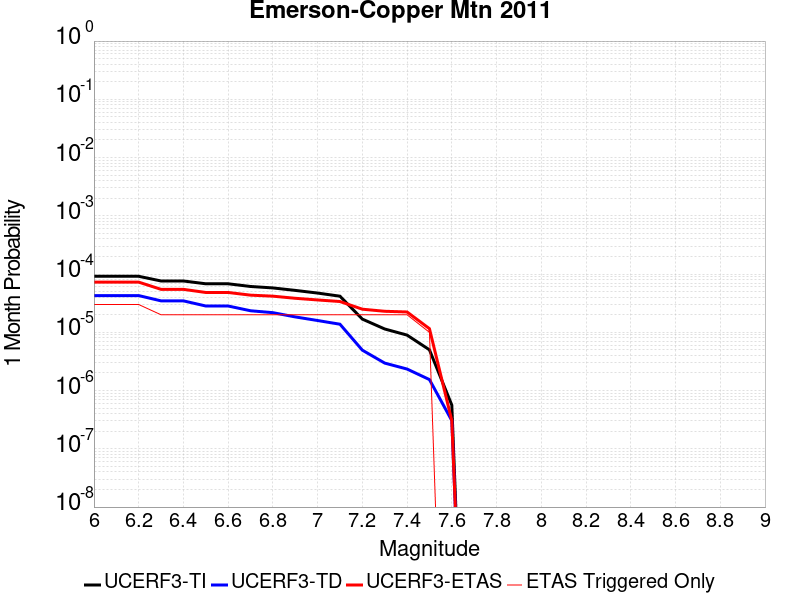 |  |  |

| Magnitude | 1 wk TI Prob | 1 wk TD Prob | 1 wk ETAS Prob | 1 wk ETAS/TD Gain | 1 wk ETAS Triggered Only | 1 mo TI Prob | 1 mo TD Prob | 1 mo ETAS Prob | 1 mo ETAS/TD Gain | 1 mo ETAS Triggered Only | 1 yr TI Prob | 1 yr TD Prob | 1 yr ETAS Prob | 1 yr ETAS/TD Gain | 1 yr ETAS Triggered Only | 10 yr TI Prob | 10 yr TD Prob | 10 yr ETAS Prob | 10 yr ETAS/TD Gain | 10 yr ETAS Triggered Only |
|-----|-----|-----|-----|-----|-----|-----|-----|-----|-----|-----|-----|-----|-----|-----|-----|-----|-----|-----|-----|-----|
| 6.0 | 2.1364202E-5 | 9.968114E-6 | 9.968114E-6 | 1.0 | 0.0 | 9.1557646E-5 | 4.2719836E-5 | 7.80166E-5 | 1.8262383 | 3.529827E-5 | 0.0011141442 | 5.199986E-4 | 5.9055845E-4 | 1.1356924 | 7.059654E-5 | 0.011085749 | 0.005188688 | 0.0052589183 | 1.0135353 | 7.059654E-5 |
| 6.1 | 2.1364202E-5 | 9.968114E-6 | 9.968114E-6 | 1.0 | 0.0 | 9.1557646E-5 | 4.2719836E-5 | 7.80166E-5 | 1.8262383 | 3.529827E-5 | 0.0011141442 | 5.199986E-4 | 5.9055845E-4 | 1.1356924 | 7.059654E-5 | 0.011085749 | 0.005188688 | 0.0052589183 | 1.0135353 | 7.059654E-5 |
| 6.2 | 2.1364202E-5 | 9.968114E-6 | 9.968114E-6 | 1.0 | 0.0 | 9.1557646E-5 | 4.2719836E-5 | 7.80166E-5 | 1.8262383 | 3.529827E-5 | 0.0011141442 | 5.199986E-4 | 5.9055845E-4 | 1.1356924 | 7.059654E-5 | 0.011085749 | 0.005188688 | 0.0052589183 | 1.0135353 | 7.059654E-5 |
| 6.3 | 1.7751237E-5 | 8.089227E-6 | 8.089227E-6 | 1.0 | 0.0 | 7.607452E-5 | 3.466769E-5 | 6.9964735E-5 | 2.018154 | 3.529827E-5 | 9.258136E-4 | 4.2200365E-4 | 4.925704E-4 | 1.1672183 | 7.059654E-5 | 0.00921966 | 0.0042126453 | 0.0042829444 | 1.0166876 | 7.059654E-5 |
| 6.4 | 1.7751237E-5 | 8.089227E-6 | 8.089227E-6 | 1.0 | 0.0 | 7.607452E-5 | 3.466769E-5 | 6.9964735E-5 | 2.018154 | 3.529827E-5 | 9.258136E-4 | 4.2200365E-4 | 4.925704E-4 | 1.1672183 | 7.059654E-5 | 0.00921966 | 0.0042126453 | 0.0042829444 | 1.0166876 | 7.059654E-5 |
| 6.5 | 1.5886664E-5 | 6.603819E-6 | 6.603819E-6 | 1.0 | 0.0 | 6.808392E-5 | 2.8301802E-5 | 6.359907E-5 | 2.247174 | 3.529827E-5 | 8.286065E-4 | 3.4452465E-4 | 3.7981075E-4 | 1.1024197 | 3.529827E-5 | 0.008255237 | 0.0034403696 | 0.0034755464 | 1.0102247 | 3.529827E-5 |
| 6.6 | 1.5886664E-5 | 6.603819E-6 | 6.603819E-6 | 1.0 | 0.0 | 6.808392E-5 | 2.8301802E-5 | 6.359907E-5 | 2.247174 | 3.529827E-5 | 8.286065E-4 | 3.4452465E-4 | 3.7981075E-4 | 1.1024197 | 3.529827E-5 | 0.008255237 | 0.0034403696 | 0.0034755464 | 1.0102247 | 3.529827E-5 |
| 6.7 | 1.428471E-5 | 5.470403E-6 | 5.470403E-6 | 1.0 | 0.0 | 6.121875E-5 | 2.3444394E-5 | 5.8741836E-5 | 2.5055814 | 3.529827E-5 | 7.450834E-4 | 2.8540206E-4 | 3.2069025E-4 | 1.1236438 | 3.529827E-5 | 0.007425902 | 0.0028507432 | 0.002885941 | 1.0123469 | 3.529827E-5 |
| 6.8 | 1.3490684E-5 | 5.073699E-6 | 5.073699E-6 | 1.0 | 0.0 | 5.7815934E-5 | 2.1744265E-5 | 5.704177E-5 | 2.6233017 | 3.529827E-5 | 7.0368167E-4 | 2.6470813E-4 | 2.9999705E-4 | 1.1333126 | 3.529827E-5 | 0.007014576 | 0.002644309 | 0.002679514 | 1.0133134 | 3.529827E-5 |
| 6.9 | 1.2235421E-5 | 4.289677E-6 | 4.289677E-6 | 1.0 | 0.0 | 5.2436466E-5 | 1.838422E-5 | 5.368184E-5 | 2.9199955 | 3.529827E-5 | 6.38227E-4 | 2.238085E-4 | 2.5909886E-4 | 1.1576811 | 3.529827E-5 | 0.0063639707 | 0.0022361854 | 0.0022714047 | 1.0157497 | 3.529827E-5 |
| 7.0 | 1.1009851E-5 | 3.7189886E-6 | 3.7189886E-6 | 1.0 | 0.0 | 4.7184225E-5 | 1.5938444E-5 | 5.123615E-5 | 3.214627 | 3.529827E-5 | 5.743165E-4 | 1.9403672E-4 | 2.2932814E-4 | 1.1818801 | 3.529827E-5 | 0.005728345 | 0.0019390108 | 0.0019742406 | 1.0181689 | 3.529827E-5 |
| 7.1 | 9.726373E-6 | 3.2117953E-6 | 3.2117953E-6 | 1.0 | 0.0 | 4.168379E-5 | 1.3764783E-5 | 4.9062568E-5 | 3.5643544 | 3.529827E-5 | 5.07382E-4 | 1.6757673E-4 | 2.0286908E-4 | 1.2106042 | 3.529827E-5 | 0.0050622504 | 0.0016748349 | 0.001710074 | 1.0210403 | 3.529827E-5 |
| 7.2 | 3.9335127E-6 | 1.1524792E-6 | 1.1524792E-6 | 1.0 | 0.0 | 1.6857803E-5 | 4.9391874E-6 | 4.0237283E-5 | 8.146539 | 3.529827E-5 | 2.0522442E-4 | 6.0133007E-5 | 9.542915E-5 | 1.586968 | 3.529827E-5 | 0.00205035 | 6.011733E-4 | 6.3645036E-4 | 1.0586803 | 3.529827E-5 |
| 7.3 | 2.661632E-6 | 6.911505E-7 | 6.911505E-7 | 1.0 | 0.0 | 1.14069435E-5 | 2.9620703E-6 | 3.8260237E-5 | 12.916721 | 3.529827E-5 | 1.3887069E-4 | 3.6062618E-5 | 7.135962E-5 | 1.9787697 | 3.529827E-5 | 0.0013878393 | 3.605687E-4 | 3.9585424E-4 | 1.0978608 | 3.529827E-5 |
| 7.4 | 2.0893426E-6 | 5.4618386E-7 | 5.4618386E-7 | 1.0 | 0.0 | 8.954295E-6 | 2.3407858E-6 | 3.7638973E-5 | 16.079632 | 3.529827E-5 | 1.0901308E-4 | 2.84987E-5 | 6.379597E-5 | 2.2385569 | 3.529827E-5 | 0.0010895962 | 2.84951E-4 | 3.2023923E-4 | 1.1238396 | 3.529827E-5 |
| 7.5 | 1.1681728E-6 | 3.6030585E-7 | 3.6030585E-7 | 1.0 | 0.0 | 5.0064455E-6 | 1.544167E-6 | 3.6842383E-5 | 23.859066 | 3.529827E-5 | 6.0951766E-5 | 1.8800076E-5 | 5.4097683E-5 | 2.8775246 | 3.529827E-5 | 6.093505E-4 | 1.8798532E-4 | 2.2327696E-4 | 1.1877362 | 3.529827E-5 |
| 7.6 | 1.3154387E-7 | 7.1197384E-8 | 7.1197384E-8 | 1.0 | 0.0 | 5.6375933E-7 | 3.051316E-7 | 3.051316E-7 | 1.0 | 0.0 | 6.863748E-6 | 3.7149728E-6 | 3.7149728E-6 | 1.0 | 0.0 | 6.863536E-5 | 3.7149264E-5 | 3.7149264E-5 | 1.0 | 0.0 |

## North Frontal  (West)
*[(top)](#table-of-contents)*

| 1 Week | 1 Month | 1 Year | 10 Year |
|-----|-----|-----|-----|
|  | 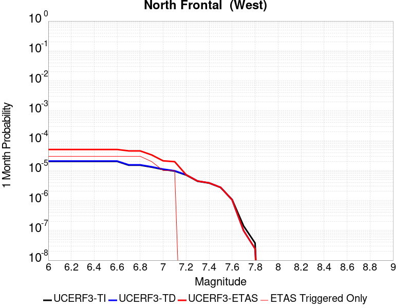 |  |  |

| Magnitude | 1 wk TI Prob | 1 wk TD Prob | 1 wk ETAS Prob | 1 wk ETAS/TD Gain | 1 wk ETAS Triggered Only | 1 mo TI Prob | 1 mo TD Prob | 1 mo ETAS Prob | 1 mo ETAS/TD Gain | 1 mo ETAS Triggered Only | 1 yr TI Prob | 1 yr TD Prob | 1 yr ETAS Prob | 1 yr ETAS/TD Gain | 1 yr ETAS Triggered Only | 10 yr TI Prob | 10 yr TD Prob | 10 yr ETAS Prob | 10 yr ETAS/TD Gain | 10 yr ETAS Triggered Only |
|-----|-----|-----|-----|-----|-----|-----|-----|-----|-----|-----|-----|-----|-----|-----|-----|-----|-----|-----|-----|-----|
| 6.0 | 4.7316266E-6 | 4.8526726E-6 | 4.015077E-5 | 8.273951 | 3.529827E-5 | 2.0278241E-5 | 2.0797012E-5 | 9.139208E-5 | 4.3944817 | 7.059654E-5 | 2.4685962E-4 | 2.5317568E-4 | 3.2375433E-4 | 1.2787735 | 7.059654E-5 | 0.0024658558 | 0.0025290183 | 0.0025994363 | 1.027844 | 7.059654E-5 |
| 6.1 | 4.7316266E-6 | 4.8526726E-6 | 4.015077E-5 | 8.273951 | 3.529827E-5 | 2.0278241E-5 | 2.0797012E-5 | 9.139208E-5 | 4.3944817 | 7.059654E-5 | 2.4685962E-4 | 2.5317568E-4 | 3.2375433E-4 | 1.2787735 | 7.059654E-5 | 0.0024658558 | 0.0025290183 | 0.0025994363 | 1.027844 | 7.059654E-5 |
| 6.2 | 4.7316266E-6 | 4.8526726E-6 | 4.015077E-5 | 8.273951 | 3.529827E-5 | 2.0278241E-5 | 2.0797012E-5 | 9.139208E-5 | 4.3944817 | 7.059654E-5 | 2.4685962E-4 | 2.5317568E-4 | 3.2375433E-4 | 1.2787735 | 7.059654E-5 | 0.0024658558 | 0.0025290183 | 0.0025994363 | 1.027844 | 7.059654E-5 |
| 6.3 | 4.7316266E-6 | 4.8526726E-6 | 4.015077E-5 | 8.273951 | 3.529827E-5 | 2.0278241E-5 | 2.0797012E-5 | 9.139208E-5 | 4.3944817 | 7.059654E-5 | 2.4685962E-4 | 2.5317568E-4 | 3.2375433E-4 | 1.2787735 | 7.059654E-5 | 0.0024658558 | 0.0025290183 | 0.0025994363 | 1.027844 | 7.059654E-5 |
| 6.4 | 4.7316266E-6 | 4.8526726E-6 | 4.015077E-5 | 8.273951 | 3.529827E-5 | 2.0278241E-5 | 2.0797012E-5 | 9.139208E-5 | 4.3944817 | 7.059654E-5 | 2.4685962E-4 | 2.5317568E-4 | 3.2375433E-4 | 1.2787735 | 7.059654E-5 | 0.0024658558 | 0.0025290183 | 0.0025994363 | 1.027844 | 7.059654E-5 |
| 6.5 | 4.7316266E-6 | 4.8526726E-6 | 4.015077E-5 | 8.273951 | 3.529827E-5 | 2.0278241E-5 | 2.0797012E-5 | 9.139208E-5 | 4.3944817 | 7.059654E-5 | 2.4685962E-4 | 2.5317568E-4 | 3.2375433E-4 | 1.2787735 | 7.059654E-5 | 0.0024658558 | 0.0025290183 | 0.0025994363 | 1.027844 | 7.059654E-5 |
| 6.6 | 4.7316266E-6 | 4.8526726E-6 | 4.015077E-5 | 8.273951 | 3.529827E-5 | 2.0278241E-5 | 2.0797012E-5 | 9.139208E-5 | 4.3944817 | 7.059654E-5 | 2.4685962E-4 | 2.5317568E-4 | 3.2375433E-4 | 1.2787735 | 7.059654E-5 | 0.0024658558 | 0.0025290183 | 0.0025994363 | 1.027844 | 7.059654E-5 |
| 6.7 | 3.5382777E-6 | 3.6308859E-6 | 3.892903E-5 | 10.721633 | 3.529827E-5 | 1.516396E-5 | 1.5560852E-5 | 8.6156295E-5 | 5.536734 | 7.059654E-5 | 1.8460557E-4 | 1.8943768E-4 | 2.6002084E-4 | 1.372593 | 7.059654E-5 | 0.0018445229 | 0.0018928389 | 0.0019633018 | 1.0372261 | 7.059654E-5 |
| 6.8 | 3.5382777E-6 | 3.6308859E-6 | 3.892903E-5 | 10.721633 | 3.529827E-5 | 1.516396E-5 | 1.5560852E-5 | 8.6156295E-5 | 5.536734 | 7.059654E-5 | 1.8460557E-4 | 1.8943768E-4 | 2.6002084E-4 | 1.372593 | 7.059654E-5 | 0.0018445229 | 0.0018928389 | 0.0019633018 | 1.0372261 | 7.059654E-5 |
| 6.9 | 3.0428037E-6 | 3.1227605E-6 | 3.1227605E-6 | 1.0 | 0.0 | 1.30405215E-5 | 1.33831945E-5 | 4.868099E-5 | 3.6374717 | 3.529827E-5 | 1.5875678E-4 | 1.6292889E-4 | 1.9822142E-4 | 1.216613 | 3.529827E-5 | 0.0015864341 | 0.0016281615 | 0.0016634023 | 1.0216446 | 3.529827E-5 |
| 7.0 | 2.538778E-6 | 2.6060904E-6 | 2.6060904E-6 | 1.0 | 0.0 | 1.0880432E-5 | 1.1168913E-5 | 4.646679E-5 | 4.160368 | 3.529827E-5 | 1.324612E-4 | 1.3597352E-4 | 1.7126698E-4 | 1.2595614 | 3.529827E-5 | 0.0013238228 | 0.0013589499 | 0.0013942003 | 1.0259393 | 3.529827E-5 |
| 7.1 | 2.2418935E-6 | 2.3012074E-6 | 2.3012074E-6 | 1.0 | 0.0 | 9.60808E-6 | 9.862282E-6 | 4.5160203E-5 | 4.5790825 | 3.529827E-5 | 1.1697209E-4 | 1.2006712E-4 | 1.5536115E-4 | 1.2939526 | 3.529827E-5 | 0.0011691054 | 0.0012000664 | 0.0012353223 | 1.0293783 | 3.529827E-5 |
| 7.2 | 1.6526745E-6 | 1.6924851E-6 | 1.6924851E-6 | 1.0 | 0.0 | 7.082872E-6 | 7.253489E-6 | 7.253489E-6 | 1.0 | 0.0 | 8.623055E-5 | 8.8307905E-5 | 8.8307905E-5 | 1.0 | 0.0 | 8.61971E-4 | 8.827532E-4 | 8.827532E-4 | 1.0 | 0.0 |
| 7.3 | 1.0246019E-6 | 1.0442261E-6 | 1.0442261E-6 | 1.0 | 0.0 | 4.391144E-6 | 4.4752474E-6 | 4.4752474E-6 | 1.0 | 0.0 | 5.3460866E-5 | 5.448489E-5 | 5.448489E-5 | 1.0 | 0.0 | 5.344801E-4 | 5.4472685E-4 | 5.4472685E-4 | 1.0 | 0.0 |
| 7.4 | 8.9045164E-7 | 9.0565584E-7 | 9.0565584E-7 | 1.0 | 0.0 | 3.8162157E-6 | 3.8813773E-6 | 3.8813773E-6 | 1.0 | 0.0 | 4.646144E-5 | 4.7254853E-5 | 4.7254853E-5 | 1.0 | 0.0 | 4.6451724E-4 | 4.7245892E-4 | 4.7245892E-4 | 1.0 | 0.0 |
| 7.5 | 6.3357E-7 | 6.4027006E-7 | 6.4027006E-7 | 1.0 | 0.0 | 2.7152971E-6 | 2.744012E-6 | 2.744012E-6 | 1.0 | 0.0 | 3.305824E-5 | 3.34079E-5 | 3.34079E-5 | 1.0 | 0.0 | 3.3053322E-4 | 3.3403534E-4 | 3.3403534E-4 | 1.0 | 0.0 |
| 7.6 | 2.5087024E-7 | 2.4361097E-7 | 2.4361097E-7 | 1.0 | 0.0 | 1.0751578E-6 | 1.0440467E-6 | 1.0440467E-6 | 1.0 | 0.0 | 1.3089967E-5 | 1.2711216E-5 | 1.2711216E-5 | 1.0 | 0.0 | 1.3089196E-4 | 1.2710695E-4 | 1.2710695E-4 | 1.0 | 0.0 |
| 7.7 | 3.282987E-8 | 2.2874195E-8 | 2.2874195E-8 | 1.0 | 0.0 | 1.4069944E-7 | 9.803227E-8 | 9.803227E-8 | 1.0 | 0.0 | 1.7130144E-6 | 1.1935423E-6 | 1.1935423E-6 | 1.0 | 0.0 | 1.7130013E-5 | 1.1935367E-5 | 1.1935367E-5 | 1.0 | 0.0 |
| 7.8 | 8.77499E-9 | 5.6815956E-9 | 5.6815956E-9 | 1.0 | 0.0 | 3.7607098E-8 | 2.4349696E-8 | 2.4349696E-8 | 1.0 | 0.0 | 4.578663E-7 | 2.9645753E-7 | 2.9645753E-7 | 1.0 | 0.0 | 4.5786537E-6 | 2.9645726E-6 | 2.9645726E-6 | 1.0 | 0.0 |

## Elsinore (Stepovers Combined)
*[(top)](#table-of-contents)*

| 1 Week | 1 Month | 1 Year | 10 Year |
|-----|-----|-----|-----|
|  |  |  |  |

| Magnitude | 1 wk TI Prob | 1 wk TD Prob | 1 wk ETAS Prob | 1 wk ETAS/TD Gain | 1 wk ETAS Triggered Only | 1 mo TI Prob | 1 mo TD Prob | 1 mo ETAS Prob | 1 mo ETAS/TD Gain | 1 mo ETAS Triggered Only | 1 yr TI Prob | 1 yr TD Prob | 1 yr ETAS Prob | 1 yr ETAS/TD Gain | 1 yr ETAS Triggered Only | 10 yr TI Prob | 10 yr TD Prob | 10 yr ETAS Prob | 10 yr ETAS/TD Gain | 10 yr ETAS Triggered Only |
|-----|-----|-----|-----|-----|-----|-----|-----|-----|-----|-----|-----|-----|-----|-----|-----|-----|-----|-----|-----|-----|
| 6.0 | 2.144392E-5 | 1.9760193E-5 | 5.5057764E-5 | 2.786297 | 3.529827E-5 | 9.189928E-5 | 8.468392E-5 | 1.19979195E-4 | 1.4167885 | 3.529827E-5 | 0.0011182994 | 0.0010305607 | 0.0011010845 | 1.0684325 | 7.059654E-5 | 0.011126885 | 0.010264917 | 0.01033479 | 1.0068069 | 7.059654E-5 |
| 6.1 | 2.144392E-5 | 1.9760193E-5 | 5.5057764E-5 | 2.786297 | 3.529827E-5 | 9.189928E-5 | 8.468392E-5 | 1.19979195E-4 | 1.4167885 | 3.529827E-5 | 0.0011182994 | 0.0010305607 | 0.0011010845 | 1.0684325 | 7.059654E-5 | 0.011126885 | 0.010264917 | 0.01033479 | 1.0068069 | 7.059654E-5 |
| 6.2 | 2.144392E-5 | 1.9760193E-5 | 5.5057764E-5 | 2.786297 | 3.529827E-5 | 9.189928E-5 | 8.468392E-5 | 1.19979195E-4 | 1.4167885 | 3.529827E-5 | 0.0011182994 | 0.0010305607 | 0.0011010845 | 1.0684325 | 7.059654E-5 | 0.011126885 | 0.010264917 | 0.01033479 | 1.0068069 | 7.059654E-5 |
| 6.3 | 1.9751555E-5 | 1.7741453E-5 | 5.3039097E-5 | 2.9895577 | 3.529827E-5 | 8.4646774E-5 | 7.603267E-5 | 1.1132826E-4 | 1.464216 | 3.529827E-5 | 0.0010300872 | 9.253213E-4 | 9.958525E-4 | 1.0762235 | 7.059654E-5 | 0.010253254 | 0.009221276 | 0.009291222 | 1.0075853 | 7.059654E-5 |
| 6.4 | 1.9751555E-5 | 1.7741453E-5 | 5.3039097E-5 | 2.9895577 | 3.529827E-5 | 8.4646774E-5 | 7.603267E-5 | 1.1132826E-4 | 1.464216 | 3.529827E-5 | 0.0010300872 | 9.253213E-4 | 9.958525E-4 | 1.0762235 | 7.059654E-5 | 0.010253254 | 0.009221276 | 0.009291222 | 1.0075853 | 7.059654E-5 |
| 6.5 | 1.9751555E-5 | 1.7741453E-5 | 5.3039097E-5 | 2.9895577 | 3.529827E-5 | 8.4646774E-5 | 7.603267E-5 | 1.1132826E-4 | 1.464216 | 3.529827E-5 | 0.0010300872 | 9.253213E-4 | 9.958525E-4 | 1.0762235 | 7.059654E-5 | 0.010253254 | 0.009221276 | 0.009291222 | 1.0075853 | 7.059654E-5 |
| 6.6 | 1.9188685E-5 | 1.7003393E-5 | 5.2301064E-5 | 3.0759192 | 3.529827E-5 | 8.2234634E-5 | 7.286974E-5 | 1.0816544E-4 | 1.484367 | 3.529827E-5 | 0.0010007467 | 8.868442E-4 | 9.5737807E-4 | 1.0795336 | 7.059654E-5 | 0.00996252 | 0.0088398475 | 0.00890982 | 1.0079156 | 7.059654E-5 |
| 6.7 | 1.7608272E-5 | 1.4732616E-5 | 5.003037E-5 | 3.3958914 | 3.529827E-5 | 7.546184E-5 | 6.3138315E-5 | 9.843436E-5 | 1.5590273 | 3.529827E-5 | 9.183606E-4 | 7.684476E-4 | 8.3898986E-4 | 1.0917984 | 7.059654E-5 | 0.009145746 | 0.00766491 | 0.0077349655 | 1.0091398 | 7.059654E-5 |
| 6.8 | 1.697165E-5 | 1.3783365E-5 | 4.9081147E-5 | 3.5608974 | 3.529827E-5 | 7.273361E-5 | 5.9070277E-5 | 9.436646E-5 | 1.5975287 | 3.529827E-5 | 8.8517193E-4 | 7.18952E-4 | 7.8949775E-4 | 1.0981231 | 7.059654E-5 | 0.008816543 | 0.007172675 | 0.0072427653 | 1.0097718 | 7.059654E-5 |
| 6.9 | 1.600365E-5 | 1.2846671E-5 | 4.8144488E-5 | 3.7476237 | 3.529827E-5 | 6.858527E-5 | 5.5056043E-5 | 9.035237E-5 | 1.6410981 | 3.529827E-5 | 8.347058E-4 | 6.7010894E-4 | 7.406582E-4 | 1.1052803 | 7.059654E-5 | 0.008315775 | 0.0066867657 | 0.0067568906 | 1.0104871 | 7.059654E-5 |
| 7.0 | 1.3314581E-5 | 1.0447548E-5 | 4.574545E-5 | 4.3785825 | 3.529827E-5 | 5.7061243E-5 | 4.4774453E-5 | 8.007114E-5 | 1.7883221 | 3.529827E-5 | 6.944992E-4 | 5.449953E-4 | 5.802744E-4 | 1.0647327 | 3.529827E-5 | 0.006923327 | 0.0054405155 | 0.0054756217 | 1.0064528 | 3.529827E-5 |
| 7.1 | 1.2865345E-5 | 9.937536E-6 | 4.5235454E-5 | 4.551979 | 3.529827E-5 | 5.5136024E-5 | 4.258876E-5 | 7.7885525E-5 | 1.8287814 | 3.529827E-5 | 6.710743E-4 | 5.183973E-4 | 5.5367727E-4 | 1.0680559 | 3.529827E-5 | 0.0066905143 | 0.0051752133 | 0.005210329 | 1.0067854 | 3.529827E-5 |
| 7.2 | 1.1650051E-5 | 8.633809E-6 | 4.3931774E-5 | 5.088342 | 3.529827E-5 | 4.9927836E-5 | 3.7001522E-5 | 7.229849E-5 | 1.9539328 | 3.529827E-5 | 6.0770183E-4 | 4.504022E-4 | 4.8568458E-4 | 1.0783353 | 3.529827E-5 | 0.0060604266 | 0.0044963174 | 0.0045314566 | 1.0078152 | 3.529827E-5 |
| 7.3 | 1.0008533E-5 | 7.2010425E-6 | 4.2499058E-5 | 5.9017925 | 3.529827E-5 | 4.2893007E-5 | 3.0861254E-5 | 6.6158434E-5 | 2.1437378 | 3.529827E-5 | 5.220972E-4 | 3.7567242E-4 | 4.1095744E-4 | 1.0939249 | 3.529827E-5 | 0.005208723 | 0.003750761 | 0.0037859268 | 1.0093757 | 3.529827E-5 |
| 7.4 | 9.116759E-6 | 6.410068E-6 | 4.1708114E-5 | 6.5066566 | 3.529827E-5 | 3.907124E-5 | 2.747144E-5 | 6.276874E-5 | 2.2848725 | 3.529827E-5 | 4.7558855E-4 | 3.3441483E-4 | 3.6970127E-4 | 1.105517 | 3.529827E-5 | 0.00474572 | 0.0033392678 | 0.0033744483 | 1.0105354 | 3.529827E-5 |
| 7.5 | 7.870524E-6 | 5.3825365E-6 | 4.0680618E-5 | 7.55789 | 3.529827E-5 | 3.3730383E-5 | 2.3067816E-5 | 5.8365273E-5 | 2.5301602 | 3.529827E-5 | 4.1059E-4 | 2.8081573E-4 | 3.161041E-4 | 1.1256638 | 3.529827E-5 | 0.0040983222 | 0.0028047354 | 0.0028399348 | 1.01255 | 3.529827E-5 |
| 7.6 | 6.9774537E-6 | 4.6776067E-6 | 3.9975712E-5 | 8.546189 | 3.529827E-5 | 2.990303E-5 | 2.0046738E-5 | 5.5344302E-5 | 2.7607634 | 3.529827E-5 | 3.640086E-4 | 2.4404288E-4 | 2.7933254E-4 | 1.1446043 | 3.529827E-5 | 0.003634129 | 0.0024378651 | 0.0024730773 | 1.0144439 | 3.529827E-5 |
| 7.7 | 4.1616954E-6 | 2.32834E-6 | 3.7626527E-5 | 16.160236 | 3.529827E-5 | 1.7835715E-5 | 9.978567E-6 | 4.5276483E-5 | 4.5373735 | 3.529827E-5 | 2.171282E-4 | 1.2148302E-4 | 1.5677701E-4 | 1.290526 | 3.529827E-5 | 0.0021691616 | 0.0012142392 | 0.0012494946 | 1.029035 | 3.529827E-5 |
| 7.8 | 2.2692414E-7 | 9.3854695E-8 | 9.3854695E-8 | 1.0 | 0.0 | 9.725317E-7 | 4.0223435E-7 | 4.0223435E-7 | 1.0 | 0.0 | 1.1840509E-5 | 4.8971956E-6 | 4.8971956E-6 | 1.0 | 0.0 | 1.1839878E-4 | 4.8971204E-5 | 4.8971204E-5 | 1.0 | 0.0 |
| 7.9 | 6.676829E-9 | 3.439853E-9 | 3.439853E-9 | 1.0 | 0.0 | 2.861498E-8 | 1.4742227E-8 | 1.4742227E-8 | 1.0 | 0.0 | 3.4838732E-7 | 1.7948659E-7 | 1.7948659E-7 | 1.0 | 0.0 | 3.4838679E-6 | 1.7948646E-6 | 1.7948646E-6 | 1.0 | 0.0 |

## Simi-Santa Rosa
*[(top)](#table-of-contents)*

| 1 Week | 1 Month | 1 Year | 10 Year |
|-----|-----|-----|-----|
|  |  |  | 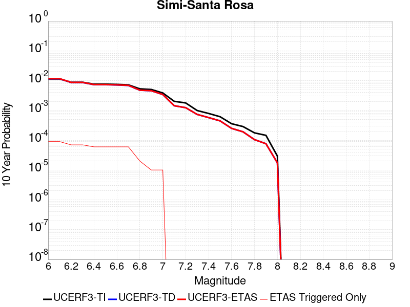 |

| Magnitude | 1 wk TI Prob | 1 wk TD Prob | 1 wk ETAS Prob | 1 wk ETAS/TD Gain | 1 wk ETAS Triggered Only | 1 mo TI Prob | 1 mo TD Prob | 1 mo ETAS Prob | 1 mo ETAS/TD Gain | 1 mo ETAS Triggered Only | 1 yr TI Prob | 1 yr TD Prob | 1 yr ETAS Prob | 1 yr ETAS/TD Gain | 1 yr ETAS Triggered Only | 10 yr TI Prob | 10 yr TD Prob | 10 yr ETAS Prob | 10 yr ETAS/TD Gain | 10 yr ETAS Triggered Only |
|-----|-----|-----|-----|-----|-----|-----|-----|-----|-----|-----|-----|-----|-----|-----|-----|-----|-----|-----|-----|-----|
| 6.0 | 2.198912E-5 | 2.2275442E-5 | 2.2275442E-5 | 1.0 | 0.0 | 9.4235686E-5 | 9.5462936E-5 | 9.5462936E-5 | 1.0 | 0.0 | 0.0011467156 | 0.0011616853 | 0.0012322 | 1.0607002 | 7.059654E-5 | 0.011408163 | 0.011560575 | 0.011630355 | 1.006036 | 7.059654E-5 |
| 6.1 | 2.198912E-5 | 2.2275442E-5 | 2.2275442E-5 | 1.0 | 0.0 | 9.4235686E-5 | 9.5462936E-5 | 9.5462936E-5 | 1.0 | 0.0 | 0.0011467156 | 0.0011616853 | 0.0012322 | 1.0607002 | 7.059654E-5 | 0.011408163 | 0.011560575 | 0.011630355 | 1.006036 | 7.059654E-5 |
| 6.2 | 1.69983E-5 | 1.6668559E-5 | 1.6668559E-5 | 1.0 | 0.0 | 7.284782E-5 | 7.143489E-5 | 7.143489E-5 | 1.0 | 0.0 | 8.865613E-4 | 8.6940196E-4 | 9.3993713E-4 | 1.0811306 | 7.059654E-5 | 0.008830327 | 0.008662928 | 0.008732912 | 1.0080787 | 7.059654E-5 |
| 6.3 | 1.69983E-5 | 1.6668559E-5 | 1.6668559E-5 | 1.0 | 0.0 | 7.284782E-5 | 7.143489E-5 | 7.143489E-5 | 1.0 | 0.0 | 8.865613E-4 | 8.6940196E-4 | 9.3993713E-4 | 1.0811306 | 7.059654E-5 | 0.008830327 | 0.008662928 | 0.008732912 | 1.0080787 | 7.059654E-5 |
| 6.4 | 1.4666188E-5 | 1.4052543E-5 | 1.4052543E-5 | 1.0 | 0.0 | 6.285358E-5 | 6.0223934E-5 | 6.0223934E-5 | 1.0 | 0.0 | 7.6497364E-4 | 7.3300465E-4 | 7.6827704E-4 | 1.0481203 | 3.529827E-5 | 0.0076234564 | 0.007308344 | 0.0073433844 | 1.0047946 | 3.529827E-5 |
| 6.5 | 1.4666188E-5 | 1.4052543E-5 | 1.4052543E-5 | 1.0 | 0.0 | 6.285358E-5 | 6.0223934E-5 | 6.0223934E-5 | 1.0 | 0.0 | 7.6497364E-4 | 7.3300465E-4 | 7.6827704E-4 | 1.0481203 | 3.529827E-5 | 0.0076234564 | 0.007308344 | 0.0073433844 | 1.0047946 | 3.529827E-5 |
| 6.6 | 1.4377586E-5 | 1.3729583E-5 | 1.3729583E-5 | 1.0 | 0.0 | 6.1616774E-5 | 5.883988E-5 | 5.883988E-5 | 1.0 | 0.0 | 7.4992597E-4 | 7.1616494E-4 | 7.514379E-4 | 1.0492526 | 3.529827E-5 | 0.007474003 | 0.0071410383 | 0.0071760844 | 1.0049077 | 3.529827E-5 |
| 6.7 | 1.3881404E-5 | 1.320755E-5 | 1.320755E-5 | 1.0 | 0.0 | 5.9490372E-5 | 5.66027E-5 | 5.66027E-5 | 1.0 | 0.0 | 7.240546E-4 | 6.8894465E-4 | 7.242186E-4 | 1.0512 | 3.529827E-5 | 0.007217 | 0.006870538 | 0.006905594 | 1.0051023 | 3.529827E-5 |
| 6.8 | 1.0176516E-5 | 9.154151E-6 | 9.154151E-6 | 1.0 | 0.0 | 4.3612912E-5 | 3.9231574E-5 | 3.9231574E-5 | 1.0 | 0.0 | 5.308578E-4 | 4.7755634E-4 | 4.7755634E-4 | 1.0 | 0.0 | 0.0052959146 | 0.004766934 | 0.004766934 | 1.0 | 0.0 |
| 6.9 | 9.699797E-6 | 8.774719E-6 | 8.774719E-6 | 1.0 | 0.0 | 4.15699E-5 | 3.7605492E-5 | 3.7605492E-5 | 1.0 | 0.0 | 5.05996E-4 | 4.577671E-4 | 4.577671E-4 | 1.0 | 0.0 | 0.005048454 | 0.0045698597 | 0.0045698597 | 1.0 | 0.0 |
| 7.0 | 7.4049476E-6 | 6.559333E-6 | 6.559333E-6 | 1.0 | 0.0 | 3.1735104E-5 | 2.8111197E-5 | 2.8111197E-5 | 1.0 | 0.0 | 3.8630638E-4 | 3.422127E-4 | 3.422127E-4 | 1.0 | 0.0 | 0.0038563553 | 0.0034180996 | 0.0034180996 | 1.0 | 0.0 |
| 7.1 | 3.873439E-6 | 2.7595095E-6 | 2.7595095E-6 | 1.0 | 0.0 | 1.6600346E-5 | 1.1826417E-5 | 1.1826417E-5 | 1.0 | 0.0 | 2.0209046E-4 | 1.4397735E-4 | 1.4397735E-4 | 1.0 | 0.0 | 0.0020190678 | 0.0014388643 | 0.0014388643 | 1.0 | 0.0 |
| 7.2 | 3.417706E-6 | 2.3676484E-6 | 2.3676484E-6 | 1.0 | 0.0 | 1.4647229E-5 | 1.0147027E-5 | 1.0147027E-5 | 1.0 | 0.0 | 1.7831543E-4 | 1.2353327E-4 | 1.2353327E-4 | 1.0 | 0.0 | 0.0017817242 | 0.0012346683 | 0.0012346683 | 1.0 | 0.0 |
| 7.3 | 1.90225E-6 | 1.4073753E-6 | 1.4073753E-6 | 1.0 | 0.0 | 8.152474E-6 | 6.0315947E-6 | 6.0315947E-6 | 1.0 | 0.0 | 9.9251854E-5 | 7.343221E-5 | 7.343221E-5 | 1.0 | 0.0 | 9.920754E-4 | 7.340817E-4 | 7.340817E-4 | 1.0 | 0.0 |
| 7.4 | 1.5170556E-6 | 1.1024773E-6 | 1.1024773E-6 | 1.0 | 0.0 | 6.5016507E-6 | 4.724894E-6 | 4.724894E-6 | 1.0 | 0.0 | 7.915472E-5 | 5.7524077E-5 | 5.7524077E-5 | 1.0 | 0.0 | 7.9126534E-4 | 5.7509297E-4 | 5.7509297E-4 | 1.0 | 0.0 |
| 7.5 | 1.178732E-6 | 8.535102E-7 | 8.535102E-7 | 1.0 | 0.0 | 5.0516987E-6 | 3.6578958E-6 | 3.6578958E-6 | 1.0 | 0.0 | 6.1502695E-5 | 4.453398E-5 | 4.453398E-5 | 1.0 | 0.0 | 6.148568E-4 | 4.452515E-4 | 4.452515E-4 | 1.0 | 0.0 |
| 7.6 | 6.8722386E-7 | 4.793198E-7 | 4.793198E-7 | 1.0 | 0.0 | 2.9452417E-6 | 2.054226E-6 | 2.054226E-6 | 1.0 | 0.0 | 3.5857727E-5 | 2.5009915E-5 | 2.5009915E-5 | 1.0 | 0.0 | 3.5851944E-4 | 2.5007114E-4 | 2.5007114E-4 | 1.0 | 0.0 |
| 7.7 | 5.5126515E-7 | 3.6731157E-7 | 3.6731157E-7 | 1.0 | 0.0 | 2.3625628E-6 | 1.5741915E-6 | 1.5741915E-6 | 1.0 | 0.0 | 2.8763823E-5 | 1.9165615E-5 | 1.9165615E-5 | 1.0 | 0.0 | 2.87601E-4 | 1.9163972E-4 | 1.9163972E-4 | 1.0 | 0.0 |
| 7.8 | 3.3860243E-7 | 2.0075942E-7 | 2.0075942E-7 | 1.0 | 0.0 | 1.4511525E-6 | 8.6039717E-7 | 8.6039717E-7 | 1.0 | 0.0 | 1.7667637E-5 | 1.0475286E-5 | 1.0475286E-5 | 1.0 | 0.0 | 1.7666233E-4 | 1.04747975E-4 | 1.04747975E-4 | 1.0 | 0.0 |
| 7.9 | 2.7955386E-7 | 1.4649108E-7 | 1.4649108E-7 | 1.0 | 0.0 | 1.1980875E-6 | 6.278188E-7 | 6.278188E-7 | 1.0 | 0.0 | 1.4586617E-5 | 7.643667E-6 | 7.643667E-6 | 1.0 | 0.0 | 1.458566E-4 | 7.643409E-5 | 7.643409E-5 | 1.0 | 0.0 |
| 8.0 | 5.6259015E-8 | 3.3355324E-8 | 3.3355324E-8 | 1.0 | 0.0 | 2.4111003E-7 | 1.4295138E-7 | 1.4295138E-7 | 1.0 | 0.0 | 2.9355108E-6 | 1.7404317E-6 | 1.7404317E-6 | 1.0 | 0.0 | 2.935472E-5 | 1.7404194E-5 | 1.7404194E-5 | 1.0 | 0.0 |

## Channel Islands Thrust
*[(top)](#table-of-contents)*

| 1 Week | 1 Month | 1 Year | 10 Year |
|-----|-----|-----|-----|
|  |  | 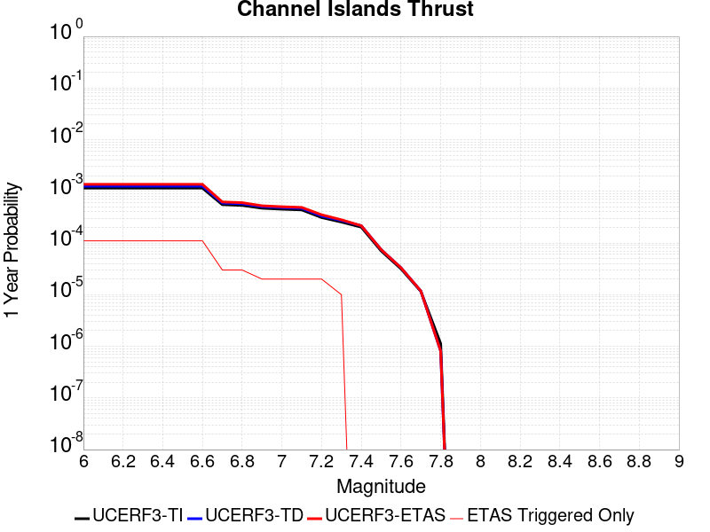 |  |

| Magnitude | 1 wk TI Prob | 1 wk TD Prob | 1 wk ETAS Prob | 1 wk ETAS/TD Gain | 1 wk ETAS Triggered Only | 1 mo TI Prob | 1 mo TD Prob | 1 mo ETAS Prob | 1 mo ETAS/TD Gain | 1 mo ETAS Triggered Only | 1 yr TI Prob | 1 yr TD Prob | 1 yr ETAS Prob | 1 yr ETAS/TD Gain | 1 yr ETAS Triggered Only | 10 yr TI Prob | 10 yr TD Prob | 10 yr ETAS Prob | 10 yr ETAS/TD Gain | 10 yr ETAS Triggered Only |
|-----|-----|-----|-----|-----|-----|-----|-----|-----|-----|-----|-----|-----|-----|-----|-----|-----|-----|-----|-----|-----|
| 6.0 | 2.2156251E-5 | 2.4092022E-5 | 5.938944E-5 | 2.4651082 | 3.529827E-5 | 9.495191E-5 | 1.03248036E-4 | 1.738373E-4 | 1.6836861 | 7.059654E-5 | 0.0011554264 | 0.0012564264 | 0.0013269343 | 1.0561178 | 7.059654E-5 | 0.011494373 | 0.0125038205 | 0.012573535 | 1.0055754 | 7.059654E-5 |
| 6.1 | 2.2156251E-5 | 2.4092022E-5 | 5.938944E-5 | 2.4651082 | 3.529827E-5 | 9.495191E-5 | 1.03248036E-4 | 1.738373E-4 | 1.6836861 | 7.059654E-5 | 0.0011554264 | 0.0012564264 | 0.0013269343 | 1.0561178 | 7.059654E-5 | 0.011494373 | 0.0125038205 | 0.012573535 | 1.0055754 | 7.059654E-5 |
| 6.2 | 2.2156251E-5 | 2.4092022E-5 | 5.938944E-5 | 2.4651082 | 3.529827E-5 | 9.495191E-5 | 1.03248036E-4 | 1.738373E-4 | 1.6836861 | 7.059654E-5 | 0.0011554264 | 0.0012564264 | 0.0013269343 | 1.0561178 | 7.059654E-5 | 0.011494373 | 0.0125038205 | 0.012573535 | 1.0055754 | 7.059654E-5 |
| 6.3 | 2.2156251E-5 | 2.4092022E-5 | 5.938944E-5 | 2.4651082 | 3.529827E-5 | 9.495191E-5 | 1.03248036E-4 | 1.738373E-4 | 1.6836861 | 7.059654E-5 | 0.0011554264 | 0.0012564264 | 0.0013269343 | 1.0561178 | 7.059654E-5 | 0.011494373 | 0.0125038205 | 0.012573535 | 1.0055754 | 7.059654E-5 |
| 6.4 | 2.2156251E-5 | 2.4092022E-5 | 5.938944E-5 | 2.4651082 | 3.529827E-5 | 9.495191E-5 | 1.03248036E-4 | 1.738373E-4 | 1.6836861 | 7.059654E-5 | 0.0011554264 | 0.0012564264 | 0.0013269343 | 1.0561178 | 7.059654E-5 | 0.011494373 | 0.0125038205 | 0.012573535 | 1.0055754 | 7.059654E-5 |
| 6.5 | 2.2156251E-5 | 2.4092022E-5 | 5.938944E-5 | 2.4651082 | 3.529827E-5 | 9.495191E-5 | 1.03248036E-4 | 1.738373E-4 | 1.6836861 | 7.059654E-5 | 0.0011554264 | 0.0012564264 | 0.0013269343 | 1.0561178 | 7.059654E-5 | 0.011494373 | 0.0125038205 | 0.012573535 | 1.0055754 | 7.059654E-5 |
| 6.6 | 2.2156251E-5 | 2.4092022E-5 | 5.938944E-5 | 2.4651082 | 3.529827E-5 | 9.495191E-5 | 1.03248036E-4 | 1.738373E-4 | 1.6836861 | 7.059654E-5 | 0.0011554264 | 0.0012564264 | 0.0013269343 | 1.0561178 | 7.059654E-5 | 0.011494373 | 0.0125038205 | 0.012573535 | 1.0055754 | 7.059654E-5 |
| 6.7 | 1.0601296E-5 | 1.1379544E-5 | 1.1379544E-5 | 1.0 | 0.0 | 4.5433335E-5 | 4.876859E-5 | 8.406514E-5 | 1.7237558 | 3.529827E-5 | 5.5301044E-4 | 5.936007E-4 | 6.28878E-4 | 1.0594294 | 3.529827E-5 | 0.005516363 | 0.005920653 | 0.0059557427 | 1.0059266 | 3.529827E-5 |
| 6.8 | 1.0246747E-5 | 1.0996669E-5 | 1.0996669E-5 | 1.0 | 0.0 | 4.391389E-5 | 4.7127756E-5 | 8.242436E-5 | 1.7489558 | 3.529827E-5 | 5.345204E-4 | 5.7363417E-4 | 6.089122E-4 | 1.0614991 | 3.529827E-5 | 0.0053323656 | 0.005722025 | 0.005757121 | 1.0061336 | 3.529827E-5 |
| 6.9 | 9.049551E-6 | 9.699645E-6 | 9.699645E-6 | 1.0 | 0.0 | 3.878322E-5 | 4.1569267E-5 | 7.686607E-5 | 1.8491082 | 3.529827E-5 | 4.7208337E-4 | 5.059924E-4 | 5.412728E-4 | 1.0697252 | 3.529827E-5 | 0.0047108172 | 0.0050488203 | 0.0050839405 | 1.0069561 | 3.529827E-5 |
| 7.0 | 8.6542195E-6 | 9.274603E-6 | 9.274603E-6 | 1.0 | 0.0 | 3.7088983E-5 | 3.9747716E-5 | 7.504458E-5 | 1.8880225 | 3.529827E-5 | 4.5146482E-4 | 4.8382508E-4 | 5.191063E-4 | 1.0729214 | 3.529827E-5 | 0.004505487 | 0.004828129 | 0.004863257 | 1.0072757 | 3.529827E-5 |
| 7.1 | 8.391028E-6 | 8.992924E-6 | 8.992924E-6 | 1.0 | 0.0 | 3.5961057E-5 | 3.854056E-5 | 7.383747E-5 | 1.915838 | 3.529827E-5 | 4.3773788E-4 | 4.6913436E-4 | 5.0441606E-4 | 1.075206 | 3.529827E-5 | 0.004368766 | 0.0046818503 | 0.004716983 | 1.0075041 | 3.529827E-5 |
| 7.2 | 5.965188E-6 | 6.3716952E-6 | 6.3716952E-6 | 1.0 | 0.0 | 2.556484E-5 | 2.7306982E-5 | 6.260429E-5 | 2.2926111 | 3.529827E-5 | 3.1120746E-4 | 3.3241234E-4 | 3.6769887E-4 | 1.1061529 | 3.529827E-5 | 0.00310772 | 0.0033192092 | 0.0033543904 | 1.0105993 | 3.529827E-5 |
| 7.3 | 4.877518E-6 | 5.2060063E-6 | 5.2060063E-6 | 1.0 | 0.0 | 2.0903482E-5 | 2.2311267E-5 | 2.2311267E-5 | 1.0 | 0.0 | 2.5447016E-4 | 2.716063E-4 | 2.716063E-4 | 1.0 | 0.0 | 0.0025417898 | 0.0027127895 | 0.0027127895 | 1.0 | 0.0 |
| 7.4 | 3.8829853E-6 | 4.141863E-6 | 4.141863E-6 | 1.0 | 0.0 | 1.664126E-5 | 1.7750723E-5 | 1.7750723E-5 | 1.0 | 0.0 | 2.0258849E-4 | 2.1609402E-4 | 2.1609402E-4 | 1.0 | 0.0 | 0.002024039 | 0.0021588807 | 0.0021588807 | 1.0 | 0.0 |
| 7.5 | 1.3489616E-6 | 1.4277903E-6 | 1.4277903E-6 | 1.0 | 0.0 | 5.7812517E-6 | 6.119087E-6 | 6.119087E-6 | 1.0 | 0.0 | 7.038446E-5 | 7.449738E-5 | 7.449738E-5 | 1.0 | 0.0 | 7.036218E-4 | 7.44728E-4 | 7.44728E-4 | 1.0 | 0.0 |
| 7.6 | 6.058192E-7 | 6.353778E-7 | 6.353778E-7 | 1.0 | 0.0 | 2.5963652E-6 | 2.7230449E-6 | 2.7230449E-6 | 1.0 | 0.0 | 3.161029E-5 | 3.3152584E-5 | 3.3152584E-5 | 1.0 | 0.0 | 3.1605794E-4 | 3.31478E-4 | 3.31478E-4 | 1.0 | 0.0 |
| 7.7 | 2.2170494E-7 | 2.2607902E-7 | 2.2607902E-7 | 1.0 | 0.0 | 9.5016367E-7 | 9.689098E-7 | 9.689098E-7 | 1.0 | 0.0 | 1.1568181E-5 | 1.1796425E-5 | 1.1796425E-5 | 1.0 | 0.0 | 1.1567579E-4 | 1.1795909E-4 | 1.1795909E-4 | 1.0 | 0.0 |
| 7.8 | 2.1613102E-8 | 1.5466682E-8 | 1.5466682E-8 | 1.0 | 0.0 | 9.262757E-8 | 6.628578E-8 | 6.628578E-8 | 1.0 | 0.0 | 1.1277401E-6 | 8.070291E-7 | 8.070291E-7 | 1.0 | 0.0 | 1.1277344E-5 | 8.070269E-6 | 8.070269E-6 | 1.0 | 0.0 |

## Los Alamos 2011 CFM
*[(top)](#table-of-contents)*

| 1 Week | 1 Month | 1 Year | 10 Year |
|-----|-----|-----|-----|
|  |  |  | 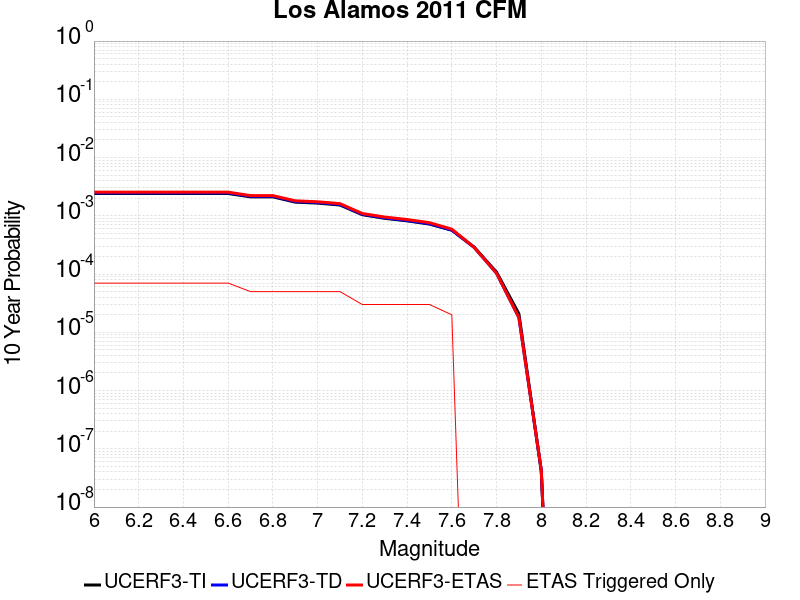 |

| Magnitude | 1 wk TI Prob | 1 wk TD Prob | 1 wk ETAS Prob | 1 wk ETAS/TD Gain | 1 wk ETAS Triggered Only | 1 mo TI Prob | 1 mo TD Prob | 1 mo ETAS Prob | 1 mo ETAS/TD Gain | 1 mo ETAS Triggered Only | 1 yr TI Prob | 1 yr TD Prob | 1 yr ETAS Prob | 1 yr ETAS/TD Gain | 1 yr ETAS Triggered Only | 10 yr TI Prob | 10 yr TD Prob | 10 yr ETAS Prob | 10 yr ETAS/TD Gain | 10 yr ETAS Triggered Only |
|-----|-----|-----|-----|-----|-----|-----|-----|-----|-----|-----|-----|-----|-----|-----|-----|-----|-----|-----|-----|-----|
| 6.0 | 4.6284417E-6 | 4.751731E-6 | 4.0049836E-5 | 8.4284725 | 3.529827E-5 | 1.9836029E-5 | 2.0364414E-5 | 9.095952E-5 | 4.4665914 | 7.059654E-5 | 2.4147688E-4 | 2.4791027E-4 | 3.1848933E-4 | 1.2846959 | 7.059654E-5 | 0.0024121467 | 0.0024765113 | 0.002546933 | 1.0284358 | 7.059654E-5 |
| 6.1 | 4.6284417E-6 | 4.751731E-6 | 4.0049836E-5 | 8.4284725 | 3.529827E-5 | 1.9836029E-5 | 2.0364414E-5 | 9.095952E-5 | 4.4665914 | 7.059654E-5 | 2.4147688E-4 | 2.4791027E-4 | 3.1848933E-4 | 1.2846959 | 7.059654E-5 | 0.0024121467 | 0.0024765113 | 0.002546933 | 1.0284358 | 7.059654E-5 |
| 6.2 | 4.6284417E-6 | 4.751731E-6 | 4.0049836E-5 | 8.4284725 | 3.529827E-5 | 1.9836029E-5 | 2.0364414E-5 | 9.095952E-5 | 4.4665914 | 7.059654E-5 | 2.4147688E-4 | 2.4791027E-4 | 3.1848933E-4 | 1.2846959 | 7.059654E-5 | 0.0024121467 | 0.0024765113 | 0.002546933 | 1.0284358 | 7.059654E-5 |
| 6.3 | 4.6284417E-6 | 4.751731E-6 | 4.0049836E-5 | 8.4284725 | 3.529827E-5 | 1.9836029E-5 | 2.0364414E-5 | 9.095952E-5 | 4.4665914 | 7.059654E-5 | 2.4147688E-4 | 2.4791027E-4 | 3.1848933E-4 | 1.2846959 | 7.059654E-5 | 0.0024121467 | 0.0024765113 | 0.002546933 | 1.0284358 | 7.059654E-5 |
| 6.4 | 4.6284417E-6 | 4.751731E-6 | 4.0049836E-5 | 8.4284725 | 3.529827E-5 | 1.9836029E-5 | 2.0364414E-5 | 9.095952E-5 | 4.4665914 | 7.059654E-5 | 2.4147688E-4 | 2.4791027E-4 | 3.1848933E-4 | 1.2846959 | 7.059654E-5 | 0.0024121467 | 0.0024765113 | 0.002546933 | 1.0284358 | 7.059654E-5 |
| 6.5 | 4.6284417E-6 | 4.751731E-6 | 4.0049836E-5 | 8.4284725 | 3.529827E-5 | 1.9836029E-5 | 2.0364414E-5 | 9.095952E-5 | 4.4665914 | 7.059654E-5 | 2.4147688E-4 | 2.4791027E-4 | 3.1848933E-4 | 1.2846959 | 7.059654E-5 | 0.0024121467 | 0.0024765113 | 0.002546933 | 1.0284358 | 7.059654E-5 |
| 6.6 | 4.6284417E-6 | 4.751731E-6 | 4.0049836E-5 | 8.4284725 | 3.529827E-5 | 1.9836029E-5 | 2.0364414E-5 | 9.095952E-5 | 4.4665914 | 7.059654E-5 | 2.4147688E-4 | 2.4791027E-4 | 3.1848933E-4 | 1.2846959 | 7.059654E-5 | 0.0024121467 | 0.0024765113 | 0.002546933 | 1.0284358 | 7.059654E-5 |
| 6.7 | 4.062321E-6 | 4.166349E-6 | 4.166349E-6 | 1.0 | 0.0 | 1.7409831E-5 | 1.7855667E-5 | 5.3153308E-5 | 2.9768312 | 3.529827E-5 | 2.1194408E-4 | 2.1737257E-4 | 2.5266316E-4 | 1.1623508 | 3.529827E-5 | 0.0021174205 | 0.0021717492 | 0.0022069707 | 1.0162181 | 3.529827E-5 |
| 6.8 | 4.062321E-6 | 4.166349E-6 | 4.166349E-6 | 1.0 | 0.0 | 1.7409831E-5 | 1.7855667E-5 | 5.3153308E-5 | 2.9768312 | 3.529827E-5 | 2.1194408E-4 | 2.1737257E-4 | 2.5266316E-4 | 1.1623508 | 3.529827E-5 | 0.0021174205 | 0.0021717492 | 0.0022069707 | 1.0162181 | 3.529827E-5 |
| 6.9 | 3.2936077E-6 | 3.372958E-6 | 3.372958E-6 | 1.0 | 0.0 | 1.4115385E-5 | 1.4455459E-5 | 4.975322E-5 | 3.441829 | 3.529827E-5 | 1.7184127E-4 | 1.7598194E-4 | 2.11274E-4 | 1.2005436 | 3.529827E-5 | 0.0017170844 | 0.0017585184 | 0.0017937546 | 1.0200374 | 3.529827E-5 |
| 7.0 | 3.1687898E-6 | 3.2448156E-6 | 3.2448156E-6 | 1.0 | 0.0 | 1.3580457E-5 | 1.3906283E-5 | 4.9204064E-5 | 3.5382612 | 3.529827E-5 | 1.6532952E-4 | 1.6929678E-4 | 2.0458907E-4 | 1.208464 | 3.529827E-5 | 0.0016520657 | 0.0016917696 | 0.0017270081 | 1.0208294 | 3.529827E-5 |
| 7.1 | 2.9379228E-6 | 3.0073259E-6 | 3.0073259E-6 | 1.0 | 0.0 | 1.25910365E-5 | 1.288848E-5 | 4.8186295E-5 | 3.7387104 | 3.529827E-5 | 1.5328509E-4 | 1.5690686E-4 | 1.9219959E-4 | 1.2249279 | 3.529827E-5 | 0.001531794 | 0.0015680499 | 0.0016032928 | 1.0224756 | 3.529827E-5 |
| 7.2 | 2.0020686E-6 | 2.0416298E-6 | 2.0416298E-6 | 1.0 | 0.0 | 8.580266E-6 | 8.749813E-6 | 8.749813E-6 | 1.0 | 0.0 | 1.0445973E-4 | 1.0652381E-4 | 1.0652381E-4 | 1.0 | 0.0 | 0.0010441064 | 0.001064732 | 0.001064732 | 1.0 | 0.0 |
| 7.3 | 1.7364243E-6 | 1.7678802E-6 | 1.7678802E-6 | 1.0 | 0.0 | 7.441797E-6 | 7.576608E-6 | 7.576608E-6 | 1.0 | 0.0 | 9.0600115E-5 | 9.2241324E-5 | 9.2241324E-5 | 1.0 | 0.0 | 9.0563187E-4 | 9.2203356E-4 | 9.2203356E-4 | 1.0 | 0.0 |
| 7.4 | 1.5718434E-6 | 1.5983177E-6 | 1.5983177E-6 | 1.0 | 0.0 | 6.7364545E-6 | 6.849915E-6 | 6.849915E-6 | 1.0 | 0.0 | 8.201325E-5 | 8.339455E-5 | 8.339455E-5 | 1.0 | 0.0 | 8.198299E-4 | 8.3363557E-4 | 8.3363557E-4 | 1.0 | 0.0 |
| 7.5 | 1.3841119E-6 | 1.4042793E-6 | 1.4042793E-6 | 1.0 | 0.0 | 5.9318945E-6 | 6.0183256E-6 | 6.0183256E-6 | 1.0 | 0.0 | 7.221842E-5 | 7.327068E-5 | 7.327068E-5 | 1.0 | 0.0 | 7.2194956E-4 | 7.324681E-4 | 7.324681E-4 | 1.0 | 0.0 |
| 7.6 | 1.0843726E-6 | 1.093442E-6 | 1.093442E-6 | 1.0 | 0.0 | 4.647303E-6 | 4.6861724E-6 | 4.6861724E-6 | 1.0 | 0.0 | 5.6579443E-5 | 5.705268E-5 | 5.705268E-5 | 1.0 | 0.0 | 5.656504E-4 | 5.703829E-4 | 5.703829E-4 | 1.0 | 0.0 |
| 7.7 | 5.544814E-7 | 5.5018705E-7 | 5.5018705E-7 | 1.0 | 0.0 | 2.3763469E-6 | 2.3579425E-6 | 2.3579425E-6 | 1.0 | 0.0 | 2.8931638E-5 | 2.8707573E-5 | 2.8707573E-5 | 1.0 | 0.0 | 2.8927872E-4 | 2.870388E-4 | 2.870388E-4 | 1.0 | 0.0 |
| 7.8 | 2.0707465E-7 | 1.977846E-7 | 1.977846E-7 | 1.0 | 0.0 | 8.874625E-7 | 8.4764804E-7 | 8.4764804E-7 | 1.0 | 0.0 | 1.08048025E-5 | 1.0320066E-5 | 1.0320066E-5 | 1.0 | 0.0 | 1.0804277E-4 | 1.0319592E-4 | 1.0319592E-4 | 1.0 | 0.0 |
| 7.9 | 3.9821284E-8 | 3.433109E-8 | 3.433109E-8 | 1.0 | 0.0 | 1.7066264E-7 | 1.4713324E-7 | 1.4713324E-7 | 1.0 | 0.0 | 2.0778157E-6 | 1.7913457E-6 | 1.7913457E-6 | 1.0 | 0.0 | 2.0777963E-5 | 1.7913319E-5 | 1.7913319E-5 | 1.0 | 0.0 |
| 8.0 | 7.880441E-11 | 8.2353124E-11 | 8.2353124E-11 | 1.0 | 0.0 | 3.3773329E-10 | 3.52942E-10 | 3.52942E-10 | 1.0 | 0.0 | 4.1119033E-9 | 4.2970694E-9 | 4.2970694E-9 | 1.0 | 0.0 | 4.1119034E-8 | 4.2970694E-8 | 4.2970694E-8 | 1.0 | 0.0 |

## Santa Susana alt 1
*[(top)](#table-of-contents)*

| 1 Week | 1 Month | 1 Year | 10 Year |
|-----|-----|-----|-----|
| 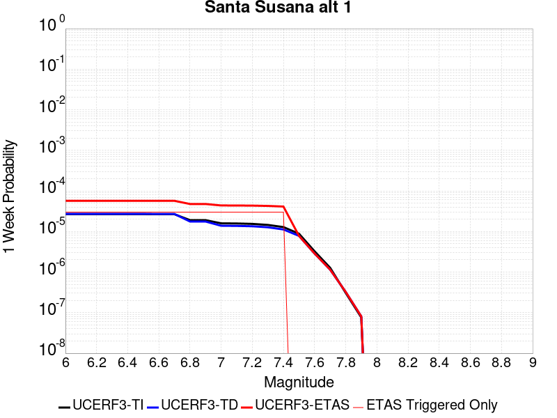 |  |  |  |

| Magnitude | 1 wk TI Prob | 1 wk TD Prob | 1 wk ETAS Prob | 1 wk ETAS/TD Gain | 1 wk ETAS Triggered Only | 1 mo TI Prob | 1 mo TD Prob | 1 mo ETAS Prob | 1 mo ETAS/TD Gain | 1 mo ETAS Triggered Only | 1 yr TI Prob | 1 yr TD Prob | 1 yr ETAS Prob | 1 yr ETAS/TD Gain | 1 yr ETAS Triggered Only | 10 yr TI Prob | 10 yr TD Prob | 10 yr ETAS Prob | 10 yr ETAS/TD Gain | 10 yr ETAS Triggered Only |
|-----|-----|-----|-----|-----|-----|-----|-----|-----|-----|-----|-----|-----|-----|-----|-----|-----|-----|-----|-----|-----|
| 6.0 | 2.674877E-5 | 2.7198023E-5 | 2.7198023E-5 | 1.0 | 0.0 | 1.1463255E-4 | 1.1655839E-4 | 1.1655839E-4 | 1.0 | 0.0 | 0.0013947578 | 0.0014182882 | 0.0014535364 | 1.0248526 | 3.529827E-5 | 0.013860362 | 0.014104128 | 0.014138928 | 1.0024674 | 3.529827E-5 |
| 6.1 | 2.674877E-5 | 2.7198023E-5 | 2.7198023E-5 | 1.0 | 0.0 | 1.1463255E-4 | 1.1655839E-4 | 1.1655839E-4 | 1.0 | 0.0 | 0.0013947578 | 0.0014182882 | 0.0014535364 | 1.0248526 | 3.529827E-5 | 0.013860362 | 0.014104128 | 0.014138928 | 1.0024674 | 3.529827E-5 |
| 6.2 | 2.674877E-5 | 2.7198023E-5 | 2.7198023E-5 | 1.0 | 0.0 | 1.1463255E-4 | 1.1655839E-4 | 1.1655839E-4 | 1.0 | 0.0 | 0.0013947578 | 0.0014182882 | 0.0014535364 | 1.0248526 | 3.529827E-5 | 0.013860362 | 0.014104128 | 0.014138928 | 1.0024674 | 3.529827E-5 |
| 6.3 | 2.674877E-5 | 2.7198023E-5 | 2.7198023E-5 | 1.0 | 0.0 | 1.1463255E-4 | 1.1655839E-4 | 1.1655839E-4 | 1.0 | 0.0 | 0.0013947578 | 0.0014182882 | 0.0014535364 | 1.0248526 | 3.529827E-5 | 0.013860362 | 0.014104128 | 0.014138928 | 1.0024674 | 3.529827E-5 |
| 6.4 | 2.674877E-5 | 2.7198023E-5 | 2.7198023E-5 | 1.0 | 0.0 | 1.1463255E-4 | 1.1655839E-4 | 1.1655839E-4 | 1.0 | 0.0 | 0.0013947578 | 0.0014182882 | 0.0014535364 | 1.0248526 | 3.529827E-5 | 0.013860362 | 0.014104128 | 0.014138928 | 1.0024674 | 3.529827E-5 |
| 6.5 | 2.674877E-5 | 2.7198023E-5 | 2.7198023E-5 | 1.0 | 0.0 | 1.1463255E-4 | 1.1655839E-4 | 1.1655839E-4 | 1.0 | 0.0 | 0.0013947578 | 0.0014182882 | 0.0014535364 | 1.0248526 | 3.529827E-5 | 0.013860362 | 0.014104128 | 0.014138928 | 1.0024674 | 3.529827E-5 |
| 6.6 | 2.6647976E-5 | 2.7074359E-5 | 2.7074359E-5 | 1.0 | 0.0 | 1.14200615E-4 | 1.1602845E-4 | 1.1602845E-4 | 1.0 | 0.0 | 0.0013895056 | 0.0014118447 | 0.0014470932 | 1.0249662 | 3.529827E-5 | 0.013808494 | 0.014040513 | 0.014075316 | 1.0024787 | 3.529827E-5 |
| 6.7 | 2.6647976E-5 | 2.7074359E-5 | 2.7074359E-5 | 1.0 | 0.0 | 1.14200615E-4 | 1.1602845E-4 | 1.1602845E-4 | 1.0 | 0.0 | 0.0013895056 | 0.0014118447 | 0.0014470932 | 1.0249662 | 3.529827E-5 | 0.013808494 | 0.014040513 | 0.014075316 | 1.0024787 | 3.529827E-5 |
| 6.8 | 1.9073179E-5 | 1.7637283E-5 | 1.7637283E-5 | 1.0 | 0.0 | 8.1739636E-5 | 7.558627E-5 | 7.558627E-5 | 1.0 | 0.0 | 9.947256E-4 | 9.198925E-4 | 9.5515826E-4 | 1.0383369 | 3.529827E-5 | 0.009902848 | 0.009163101 | 0.009198076 | 1.003817 | 3.529827E-5 |
| 6.9 | 1.9041876E-5 | 1.7619415E-5 | 1.7619415E-5 | 1.0 | 0.0 | 8.160549E-5 | 7.55097E-5 | 7.55097E-5 | 1.0 | 0.0 | 9.930939E-4 | 9.1896096E-4 | 9.5422677E-4 | 1.0383757 | 3.529827E-5 | 0.0098866755 | 0.0091538625 | 0.009188837 | 1.0038208 | 3.529827E-5 |
| 7.0 | 1.5917482E-5 | 1.3863864E-5 | 1.3863864E-5 | 1.0 | 0.0 | 6.8215995E-5 | 5.9415237E-5 | 5.9415237E-5 | 1.0 | 0.0 | 8.302132E-4 | 7.231451E-4 | 7.584178E-4 | 1.0487769 | 3.529827E-5 | 0.008271185 | 0.0072088144 | 0.007243858 | 1.0048612 | 3.529827E-5 |
| 7.1 | 1.577788E-5 | 1.3743872E-5 | 1.3743872E-5 | 1.0 | 0.0 | 6.761774E-5 | 5.8901005E-5 | 5.8901005E-5 | 1.0 | 0.0 | 8.2293496E-4 | 7.1688846E-4 | 7.521614E-4 | 1.0492029 | 3.529827E-5 | 0.008198941 | 0.007146652 | 0.007181698 | 1.0049038 | 3.529827E-5 |
| 7.2 | 1.5416446E-5 | 1.3469944E-5 | 1.3469944E-5 | 1.0 | 0.0 | 6.606882E-5 | 5.772708E-5 | 5.772708E-5 | 1.0 | 0.0 | 8.0409093E-4 | 7.026052E-4 | 7.3787867E-4 | 1.0502038 | 3.529827E-5 | 0.008011877 | 0.0070047234 | 0.0070397747 | 1.0050039 | 3.529827E-5 |
| 7.3 | 1.4534083E-5 | 1.2717879E-5 | 1.2717879E-5 | 1.0 | 0.0 | 6.228744E-5 | 5.4504082E-5 | 5.4504082E-5 | 1.0 | 0.0 | 7.580857E-4 | 6.633896E-4 | 6.9866446E-4 | 1.0531737 | 3.529827E-5 | 0.007555048 | 0.0066149444 | 0.006650009 | 1.0053009 | 3.529827E-5 |
| 7.4 | 1.2858995E-5 | 1.1229652E-5 | 1.1229652E-5 | 1.0 | 0.0 | 5.5108816E-5 | 4.8126214E-5 | 4.8126214E-5 | 1.0 | 0.0 | 6.7074323E-4 | 5.857831E-4 | 6.2106067E-4 | 1.060223 | 3.529827E-5 | 0.0066872234 | 0.005843165 | 0.005878257 | 1.0060056 | 3.529827E-5 |
| 7.5 | 8.827668E-6 | 7.805457E-6 | 7.805457E-6 | 1.0 | 0.0 | 3.7832317E-5 | 3.3451546E-5 | 3.3451546E-5 | 1.0 | 0.0 | 4.605111E-4 | 4.071989E-4 | 4.424828E-4 | 1.0866503 | 3.529827E-5 | 0.0045955796 | 0.0040647765 | 0.0040999316 | 1.0086486 | 3.529827E-5 |
| 7.6 | 3.2533426E-6 | 2.871988E-6 | 2.871988E-6 | 1.0 | 0.0 | 1.3942822E-5 | 1.2308465E-5 | 1.2308465E-5 | 1.0 | 0.0 | 1.6974064E-4 | 1.4984563E-4 | 1.4984563E-4 | 1.0 | 0.0 | 0.0016961104 | 0.0014974826 | 0.0014974826 | 1.0 | 0.0 |
| 7.7 | 1.2751709E-6 | 1.1491089E-6 | 1.1491089E-6 | 1.0 | 0.0 | 5.4650063E-6 | 4.9247437E-6 | 4.9247437E-6 | 1.0 | 0.0 | 6.653442E-5 | 5.9957198E-5 | 5.9957198E-5 | 1.0 | 0.0 | 6.6514505E-4 | 5.994191E-4 | 5.994191E-4 | 1.0 | 0.0 |
| 7.8 | 3.067544E-7 | 3.2400436E-7 | 3.2400436E-7 | 1.0 | 0.0 | 1.3146611E-6 | 1.3885895E-6 | 1.3885895E-6 | 1.0 | 0.0 | 1.600588E-5 | 1.6905957E-5 | 1.6905957E-5 | 1.0 | 0.0 | 1.6004729E-4 | 1.6904772E-4 | 1.6904772E-4 | 1.0 | 0.0 |
| 7.9 | 7.622999E-8 | 8.087964E-8 | 8.087964E-8 | 1.0 | 0.0 | 3.2669993E-7 | 3.4662696E-7 | 3.4662696E-7 | 1.0 | 0.0 | 3.977564E-6 | 4.2201773E-6 | 4.2201773E-6 | 1.0 | 0.0 | 3.977493E-5 | 4.220118E-5 | 4.220118E-5 | 1.0 | 0.0 |

## Homestead Valley 2011
*[(top)](#table-of-contents)*

| 1 Week | 1 Month | 1 Year | 10 Year |
|-----|-----|-----|-----|
|  |  |  |  |

| Magnitude | 1 wk TI Prob | 1 wk TD Prob | 1 wk ETAS Prob | 1 wk ETAS/TD Gain | 1 wk ETAS Triggered Only | 1 mo TI Prob | 1 mo TD Prob | 1 mo ETAS Prob | 1 mo ETAS/TD Gain | 1 mo ETAS Triggered Only | 1 yr TI Prob | 1 yr TD Prob | 1 yr ETAS Prob | 1 yr ETAS/TD Gain | 1 yr ETAS Triggered Only | 10 yr TI Prob | 10 yr TD Prob | 10 yr ETAS Prob | 10 yr ETAS/TD Gain | 10 yr ETAS Triggered Only |
|-----|-----|-----|-----|-----|-----|-----|-----|-----|-----|-----|-----|-----|-----|-----|-----|-----|-----|-----|-----|-----|
| 6.0 | 1.539795E-5 | 6.286606E-6 | 6.286606E-6 | 1.0 | 0.0 | 6.5989545E-5 | 2.6942436E-5 | 6.223976E-5 | 2.3101013 | 3.529827E-5 | 8.0312655E-4 | 3.279954E-4 | 3.6328207E-4 | 1.1075829 | 3.529827E-5 | 0.008002302 | 0.0032771337 | 0.0033123165 | 1.0107358 | 3.529827E-5 |
| 6.1 | 1.539795E-5 | 6.286606E-6 | 6.286606E-6 | 1.0 | 0.0 | 6.5989545E-5 | 2.6942436E-5 | 6.223976E-5 | 2.3101013 | 3.529827E-5 | 8.0312655E-4 | 3.279954E-4 | 3.6328207E-4 | 1.1075829 | 3.529827E-5 | 0.008002302 | 0.0032771337 | 0.0033123165 | 1.0107358 | 3.529827E-5 |
| 6.2 | 1.539795E-5 | 6.286606E-6 | 6.286606E-6 | 1.0 | 0.0 | 6.5989545E-5 | 2.6942436E-5 | 6.223976E-5 | 2.3101013 | 3.529827E-5 | 8.0312655E-4 | 3.279954E-4 | 3.6328207E-4 | 1.1075829 | 3.529827E-5 | 0.008002302 | 0.0032771337 | 0.0033123165 | 1.0107358 | 3.529827E-5 |
| 6.3 | 1.539795E-5 | 6.286606E-6 | 6.286606E-6 | 1.0 | 0.0 | 6.5989545E-5 | 2.6942436E-5 | 6.223976E-5 | 2.3101013 | 3.529827E-5 | 8.0312655E-4 | 3.279954E-4 | 3.6328207E-4 | 1.1075829 | 3.529827E-5 | 0.008002302 | 0.0032771337 | 0.0033123165 | 1.0107358 | 3.529827E-5 |
| 6.4 | 1.539795E-5 | 6.286606E-6 | 6.286606E-6 | 1.0 | 0.0 | 6.5989545E-5 | 2.6942436E-5 | 6.223976E-5 | 2.3101013 | 3.529827E-5 | 8.0312655E-4 | 3.279954E-4 | 3.6328207E-4 | 1.1075829 | 3.529827E-5 | 0.008002302 | 0.0032771337 | 0.0033123165 | 1.0107358 | 3.529827E-5 |
| 6.5 | 1.0265258E-5 | 2.8788488E-6 | 2.8788488E-6 | 1.0 | 0.0 | 4.3993223E-5 | 1.2337905E-5 | 4.7635738E-5 | 3.8609262 | 3.529827E-5 | 5.3548586E-4 | 1.5021059E-4 | 1.8550355E-4 | 1.2349566 | 3.529827E-5 | 0.005341973 | 0.0015017724 | 0.0015370178 | 1.0234691 | 3.529827E-5 |
| 6.6 | 6.664671E-6 | 5.348204E-7 | 5.348204E-7 | 1.0 | 0.0 | 2.8562565E-5 | 2.2920863E-6 | 3.7590275E-5 | 16.400026 | 3.529827E-5 | 3.476937E-4 | 2.7905911E-5 | 6.3203195E-5 | 2.2648678 | 3.529827E-5 | 0.003471502 | 2.790357E-4 | 3.1432413E-4 | 1.1264656 | 3.529827E-5 |
| 6.7 | 6.5954046E-6 | 5.348204E-7 | 5.348204E-7 | 1.0 | 0.0 | 2.8265715E-5 | 2.2920863E-6 | 3.7590275E-5 | 16.400026 | 3.529827E-5 | 3.4408073E-4 | 2.7905911E-5 | 6.3203195E-5 | 2.2648678 | 3.529827E-5 | 0.0034354846 | 2.790357E-4 | 3.1432413E-4 | 1.1264656 | 3.529827E-5 |
| 6.8 | 4.648189E-6 | 2.3265572E-7 | 2.3265572E-7 | 1.0 | 0.0 | 1.9920659E-5 | 9.970956E-7 | 3.6295332E-5 | 36.401054 | 3.529827E-5 | 2.4250703E-4 | 1.2139576E-5 | 4.7437417E-5 | 3.9076667 | 3.529827E-5 | 0.0024224254 | 1.2138961E-4 | 1.566836E-4 | 1.2907497 | 3.529827E-5 |
| 6.9 | 4.1428534E-6 | 1.9344557E-7 | 1.9344557E-7 | 1.0 | 0.0 | 1.7754966E-5 | 8.290522E-7 | 3.6127294E-5 | 43.576622 | 3.529827E-5 | 2.1614527E-4 | 1.0093667E-5 | 4.539158E-5 | 4.497036 | 3.529827E-5 | 0.0021593515 | 1.0093238E-4 | 1.3622709E-4 | 1.3496866 | 3.529827E-5 |
| 7.0 | 3.0673707E-6 | 1.5367603E-7 | 1.5367603E-7 | 1.0 | 0.0 | 1.3145808E-5 | 6.586114E-7 | 3.595686E-5 | 54.594955 | 3.529827E-5 | 1.6003846E-4 | 8.0185655E-6 | 4.331655E-5 | 5.402033 | 3.529827E-5 | 0.0015992324 | 8.0182865E-5 | 1.154783E-4 | 1.4401869 | 3.529827E-5 |
| 7.1 | 2.340854E-6 | 1.468766E-7 | 1.468766E-7 | 1.0 | 0.0 | 1.0032193E-5 | 6.29471E-7 | 3.592772E-5 | 57.076054 | 3.529827E-5 | 1.221351E-4 | 7.663783E-6 | 4.2961783E-5 | 5.605819 | 3.529827E-5 | 0.00122068 | 7.663529E-5 | 1.1193086E-4 | 1.4605654 | 3.529827E-5 |
| 7.2 | 1.3754182E-6 | 1.3922634E-7 | 1.3922634E-7 | 1.0 | 0.0 | 5.8946357E-6 | 5.966842E-7 | 3.5894933E-5 | 60.15734 | 3.529827E-5 | 7.176483E-5 | 7.2646067E-6 | 4.256262E-5 | 5.8589025 | 3.529827E-5 | 7.174166E-4 | 7.264379E-5 | 1.0793949E-4 | 1.4858737 | 3.529827E-5 |
| 7.3 | 1.2573237E-6 | 1.3827146E-7 | 1.3827146E-7 | 1.0 | 0.0 | 5.388519E-6 | 5.9259185E-7 | 3.589084E-5 | 60.565872 | 3.529827E-5 | 6.560324E-5 | 7.2147827E-6 | 4.25128E-5 | 5.8924575 | 3.529827E-5 | 6.558388E-4 | 7.214558E-5 | 1.074413E-4 | 1.4892292 | 3.529827E-5 |
| 7.4 | 1.0994207E-6 | 1.3106106E-7 | 1.3106106E-7 | 1.0 | 0.0 | 4.7117946E-6 | 5.616901E-7 | 3.585994E-5 | 63.842926 | 3.529827E-5 | 5.736459E-5 | 6.8385566E-6 | 4.2136584E-5 | 6.1616197 | 3.529827E-5 | 5.734978E-4 | 6.838355E-5 | 1.0367941E-4 | 1.5161453 | 3.529827E-5 |
| 7.5 | 5.5569126E-7 | 6.772991E-8 | 6.772991E-8 | 1.0 | 0.0 | 2.3815317E-6 | 2.90271E-7 | 3.558853E-5 | 122.6045 | 3.529827E-5 | 2.8994764E-5 | 3.5340445E-6 | 3.883219E-5 | 10.988031 | 3.529827E-5 | 2.899098E-4 | 3.5339945E-5 | 7.063697E-5 | 1.9987855 | 3.529827E-5 |

## San Jacinto (Borrego)
*[(top)](#table-of-contents)*

| 1 Week | 1 Month | 1 Year | 10 Year |
|-----|-----|-----|-----|
|  | 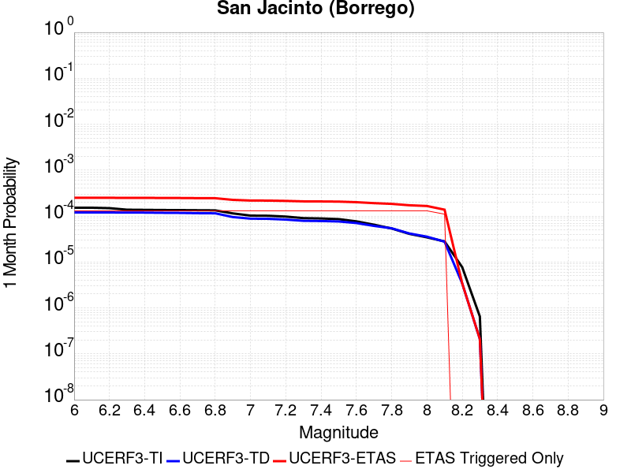 |  |  |

| Magnitude | 1 wk TI Prob | 1 wk TD Prob | 1 wk ETAS Prob | 1 wk ETAS/TD Gain | 1 wk ETAS Triggered Only | 1 mo TI Prob | 1 mo TD Prob | 1 mo ETAS Prob | 1 mo ETAS/TD Gain | 1 mo ETAS Triggered Only | 1 yr TI Prob | 1 yr TD Prob | 1 yr ETAS Prob | 1 yr ETAS/TD Gain | 1 yr ETAS Triggered Only | 10 yr TI Prob | 10 yr TD Prob | 10 yr ETAS Prob | 10 yr ETAS/TD Gain | 10 yr ETAS Triggered Only |
|-----|-----|-----|-----|-----|-----|-----|-----|-----|-----|-----|-----|-----|-----|-----|-----|-----|-----|-----|-----|-----|
| 6.0 | 3.543992E-5 | 2.7926513E-5 | 9.852108E-5 | 3.5278692 | 7.059654E-5 | 1.5187653E-4 | 1.1967963E-4 | 1.9026772E-4 | 1.5898087 | 7.059654E-5 | 0.0018475284 | 0.0014561379 | 0.0015266315 | 1.0484115 | 7.059654E-5 | 0.018322436 | 0.014869647 | 0.014939195 | 1.004677 | 7.059654E-5 |
| 6.1 | 3.542281E-5 | 2.7926513E-5 | 9.852108E-5 | 3.5278692 | 7.059654E-5 | 1.5180321E-4 | 1.1967963E-4 | 1.9026772E-4 | 1.5898087 | 7.059654E-5 | 0.0018466372 | 0.0014561379 | 0.0015266315 | 1.0484115 | 7.059654E-5 | 0.018313672 | 0.014869647 | 0.014939195 | 1.004677 | 7.059654E-5 |
| 6.2 | 3.4688688E-5 | 2.7926511E-5 | 9.852108E-5 | 3.5278692 | 7.059654E-5 | 1.4865733E-4 | 1.1967963E-4 | 1.9026772E-4 | 1.5898087 | 7.059654E-5 | 0.0018084005 | 0.0014561379 | 0.0015266315 | 1.0484115 | 7.059654E-5 | 0.017937548 | 0.014869647 | 0.014939194 | 1.004677 | 7.059654E-5 |
| 6.3 | 3.2087122E-5 | 2.7771865E-5 | 9.836644E-5 | 3.541946 | 7.059654E-5 | 1.3750899E-4 | 1.1901691E-4 | 1.8960505E-4 | 1.5930934 | 7.059654E-5 | 0.0016728862 | 0.00144808 | 0.0015185743 | 1.0486813 | 7.059654E-5 | 0.016603488 | 0.014790683 | 0.014860235 | 1.0047024 | 7.059654E-5 |
| 6.4 | 3.1828724E-5 | 2.7738852E-5 | 9.833343E-5 | 3.5449715 | 7.059654E-5 | 1.364017E-4 | 1.1887544E-4 | 1.894636E-4 | 1.5937992 | 7.059654E-5 | 0.0016594254 | 0.0014463598 | 0.0015168543 | 1.0487392 | 7.059654E-5 | 0.016470885 | 0.014773762 | 0.014843315 | 1.0047079 | 7.059654E-5 |
| 6.5 | 3.1563577E-5 | 2.747857E-5 | 9.807317E-5 | 3.5690784 | 7.059654E-5 | 1.3526545E-4 | 1.1776006E-4 | 1.8834828E-4 | 1.5994242 | 7.059654E-5 | 0.0016456128 | 0.0014327979 | 0.0015032933 | 1.0492013 | 7.059654E-5 | 0.0163348 | 0.014640348 | 0.01470991 | 1.0047514 | 7.059654E-5 |
| 6.6 | 3.1467625E-5 | 2.7322796E-5 | 9.791741E-5 | 3.583726 | 7.059654E-5 | 1.3485427E-4 | 1.1709251E-4 | 1.8768078E-4 | 1.602842 | 7.059654E-5 | 0.0016406142 | 0.0014246812 | 0.0014951772 | 1.0494819 | 7.059654E-5 | 0.016285548 | 0.014560594 | 0.014630163 | 1.0047779 | 7.059654E-5 |
| 6.7 | 3.1223695E-5 | 2.6940816E-5 | 9.7535456E-5 | 3.6203601 | 7.059654E-5 | 1.3380898E-4 | 1.15455594E-4 | 1.8604398E-4 | 1.61139 | 7.059654E-5 | 0.0016279068 | 0.0014047775 | 0.0014752749 | 1.050184 | 7.059654E-5 | 0.01616033 | 0.014364966 | 0.014434548 | 1.004844 | 7.059654E-5 |
| 6.8 | 3.1015585E-5 | 2.6761822E-5 | 9.7356475E-5 | 3.6378865 | 7.059654E-5 | 1.3291716E-4 | 1.1468855E-4 | 1.85277E-4 | 1.6154795 | 7.059654E-5 | 0.001617065 | 0.0013954508 | 0.0014659489 | 1.05052 | 7.059654E-5 | 0.016053487 | 0.014272246 | 0.014341835 | 1.0048758 | 7.059654E-5 |
| 6.9 | 2.6641965E-5 | 2.2184247E-5 | 9.277922E-5 | 4.182212 | 7.059654E-5 | 1.1417485E-4 | 9.50719E-5 | 1.6566172E-4 | 1.7424889 | 7.059654E-5 | 0.0013891924 | 0.0011568897 | 0.0012274046 | 1.0609521 | 7.059654E-5 | 0.0138054015 | 0.011882438 | 0.011952196 | 1.0058707 | 7.059654E-5 |
| 7.0 | 2.3854353E-5 | 2.0479023E-5 | 9.107412E-5 | 4.4471903 | 7.059654E-5 | 1.02228936E-4 | 8.77643E-5 | 1.5835465E-4 | 1.8043172 | 7.059654E-5 | 0.0012439266 | 0.0010680092 | 0.0011385303 | 1.0660305 | 7.059654E-5 | 0.012369866 | 0.0109828 | 0.0110526215 | 1.0063573 | 7.059654E-5 |
| 7.1 | 2.3672901E-5 | 2.031551E-5 | 9.091062E-5 | 4.4749365 | 7.059654E-5 | 1.0145135E-4 | 8.7063585E-5 | 1.5765398E-4 | 1.8107913 | 7.059654E-5 | 0.0012344702 | 0.0010594862 | 0.001130008 | 1.0665622 | 7.059654E-5 | 0.0122763505 | 0.010897976 | 0.010967803 | 1.0064074 | 7.059654E-5 |
| 7.2 | 2.2717244E-5 | 1.9542893E-5 | 9.0138055E-5 | 4.612319 | 7.059654E-5 | 9.735599E-5 | 8.375258E-5 | 1.543432E-4 | 1.8428472 | 7.059654E-5 | 0.0011846646 | 0.001019213 | 0.0010897375 | 1.0691952 | 7.059654E-5 | 0.01178369 | 0.010495341 | 0.010565197 | 1.0066558 | 7.059654E-5 |
| 7.3 | 2.1016205E-5 | 1.8384526E-5 | 8.897977E-5 | 4.8399277 | 7.059654E-5 | 9.006634E-5 | 7.878846E-5 | 1.4937943E-4 | 1.8959559 | 7.059654E-5 | 0.001096006 | 9.5882936E-4 | 0.0010293582 | 1.0735573 | 7.059654E-5 | 0.010906163 | 0.009890967 | 0.009960865 | 1.0070668 | 7.059654E-5 |
| 7.4 | 2.0683625E-5 | 1.8187047E-5 | 8.8782304E-5 | 4.881623 | 7.059654E-5 | 8.86411E-5 | 7.794217E-5 | 1.485332E-4 | 1.9056848 | 7.059654E-5 | 0.001078671 | 9.485349E-4 | 0.0010190645 | 1.0743563 | 7.059654E-5 | 0.010734501 | 0.009787692 | 0.009857598 | 1.0071422 | 7.059654E-5 |
| 7.5 | 1.9993966E-5 | 1.7782075E-5 | 8.837736E-5 | 4.9700255 | 7.059654E-5 | 8.568561E-5 | 7.620667E-5 | 1.4679783E-4 | 1.9263121 | 7.059654E-5 | 0.001042723 | 9.2742336E-4 | 9.979544E-4 | 1.0760505 | 7.059654E-5 | 0.010378438 | 0.009574614 | 0.009644535 | 1.0073028 | 7.059654E-5 |
| 7.6 | 1.788966E-5 | 1.6435291E-5 | 8.703067E-5 | 5.2953534 | 7.059654E-5 | 7.666772E-5 | 7.043507E-5 | 1.4102664E-4 | 2.0022218 | 7.059654E-5 | 9.3302975E-4 | 8.572113E-4 | 9.2774734E-4 | 1.0822854 | 7.059654E-5 | 0.00929122 | 0.008866487 | 0.008936457 | 1.0078915 | 7.059654E-5 |
| 7.7 | 1.5125781E-5 | 1.4237377E-5 | 8.4832915E-5 | 5.9584646 | 7.059654E-5 | 6.4823165E-5 | 6.1015908E-5 | 1.3160815E-4 | 2.156948 | 7.059654E-5 | 7.889362E-4 | 7.426163E-4 | 8.1316044E-4 | 1.0949941 | 7.059654E-5 | 0.007861412 | 0.0077142045 | 0.0077842562 | 1.0090809 | 7.059654E-5 |
| 7.8 | 1.250089E-5 | 1.26304985E-5 | 8.322615E-5 | 6.5893 | 7.059654E-5 | 5.3574146E-5 | 5.412959E-5 | 1.2472231E-4 | 2.304143 | 7.059654E-5 | 6.5207E-4 | 6.588291E-4 | 7.293791E-4 | 1.1070839 | 7.059654E-5 | 0.006501599 | 0.0068677636 | 0.0069378754 | 1.0102088 | 7.059654E-5 |
| 7.9 | 9.561E-6 | 9.754616E-6 | 8.0350466E-5 | 8.237173 | 7.059654E-5 | 4.0975072E-5 | 4.1804833E-5 | 1.12398426E-4 | 2.6886466 | 7.059654E-5 | 4.987573E-4 | 5.088555E-4 | 5.7941617E-4 | 1.1386653 | 7.059654E-5 | 0.0049763937 | 0.0053523467 | 0.005422565 | 1.0131192 | 7.059654E-5 |
| 8.0 | 8.01699E-6 | 8.293488E-6 | 7.888944E-5 | 9.512216 | 7.059654E-5 | 3.4358076E-5 | 3.554304E-5 | 1.0613707E-4 | 2.9861565 | 7.059654E-5 | 4.1822926E-4 | 4.3265108E-4 | 5.0321704E-4 | 1.1631014 | 7.059654E-5 | 0.0041744304 | 0.004573375 | 0.004643649 | 1.0153658 | 7.059654E-5 |
| 8.1 | 6.541947E-6 | 6.4622354E-6 | 7.705832E-5 | 11.924406 | 7.059654E-5 | 2.8036617E-5 | 2.7695003E-5 | 9.828959E-5 | 3.5490007 | 7.059654E-5 | 3.4129233E-4 | 3.37135E-4 | 4.0770773E-4 | 1.2093308 | 7.059654E-5 | 0.0034076865 | 0.0035806994 | 0.0036510432 | 1.0196452 | 7.059654E-5 |
| 8.2 | 1.7968189E-6 | 7.9713476E-7 | 7.9713476E-7 | 1.0 | 0.0 | 7.70063E-6 | 3.4162877E-6 | 3.4162877E-6 | 1.0 | 0.0 | 9.3751136E-5 | 4.159253E-5 | 4.159253E-5 | 1.0 | 0.0 | 9.371159E-4 | 4.712058E-4 | 4.712058E-4 | 1.0 | 0.0 |
| 8.3 | 1.5167889E-7 | 4.897714E-8 | 4.897714E-8 | 1.0 | 0.0 | 6.500522E-7 | 2.09902E-7 | 2.09902E-7 | 1.0 | 0.0 | 7.9143565E-6 | 2.5555544E-6 | 2.5555544E-6 | 1.0 | 0.0 | 7.914075E-5 | 2.969505E-5 | 2.969505E-5 | 1.0 | 0.0 |

## Franklin 2011 CFM
*[(top)](#table-of-contents)*

| 1 Week | 1 Month | 1 Year | 10 Year |
|-----|-----|-----|-----|
|  | 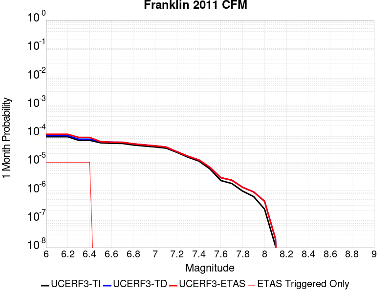 |  |  |

| Magnitude | 1 wk TI Prob | 1 wk TD Prob | 1 wk ETAS Prob | 1 wk ETAS/TD Gain | 1 wk ETAS Triggered Only | 1 mo TI Prob | 1 mo TD Prob | 1 mo ETAS Prob | 1 mo ETAS/TD Gain | 1 mo ETAS Triggered Only | 1 yr TI Prob | 1 yr TD Prob | 1 yr ETAS Prob | 1 yr ETAS/TD Gain | 1 yr ETAS Triggered Only | 10 yr TI Prob | 10 yr TD Prob | 10 yr ETAS Prob | 10 yr ETAS/TD Gain | 10 yr ETAS Triggered Only |
|-----|-----|-----|-----|-----|-----|-----|-----|-----|-----|-----|-----|-----|-----|-----|-----|-----|-----|-----|-----|-----|
| 6.0 | 1.845602E-5 | 2.021262E-5 | 5.5510176E-5 | 2.7463129 | 3.529827E-5 | 7.9094825E-5 | 8.66228E-5 | 1.2191801E-4 | 1.4074587 | 3.529827E-5 | 9.6255407E-4 | 0.0010541513 | 0.0010894125 | 1.0334498 | 3.529827E-5 | 0.009583955 | 0.0105088325 | 0.010543759 | 1.0033237 | 3.529827E-5 |
| 6.1 | 1.845602E-5 | 2.021262E-5 | 5.5510176E-5 | 2.7463129 | 3.529827E-5 | 7.9094825E-5 | 8.66228E-5 | 1.2191801E-4 | 1.4074587 | 3.529827E-5 | 9.6255407E-4 | 0.0010541513 | 0.0010894125 | 1.0334498 | 3.529827E-5 | 0.009583955 | 0.0105088325 | 0.010543759 | 1.0033237 | 3.529827E-5 |
| 6.2 | 1.845602E-5 | 2.021262E-5 | 5.5510176E-5 | 2.7463129 | 3.529827E-5 | 7.9094825E-5 | 8.66228E-5 | 1.2191801E-4 | 1.4074587 | 3.529827E-5 | 9.6255407E-4 | 0.0010541513 | 0.0010894125 | 1.0334498 | 3.529827E-5 | 0.009583955 | 0.0105088325 | 0.010543759 | 1.0033237 | 3.529827E-5 |
| 6.3 | 1.3813506E-5 | 1.5154827E-5 | 5.0452563E-5 | 3.3291414 | 3.529827E-5 | 5.9199396E-5 | 6.4947686E-5 | 1.0024366E-4 | 1.5434524 | 3.529827E-5 | 7.205143E-4 | 7.9045893E-4 | 8.257293E-4 | 1.0446202 | 3.529827E-5 | 0.007181826 | 0.007891679 | 0.007926699 | 1.0044376 | 3.529827E-5 |
| 6.4 | 1.3813506E-5 | 1.5154827E-5 | 5.0452563E-5 | 3.3291414 | 3.529827E-5 | 5.9199396E-5 | 6.4947686E-5 | 1.0024366E-4 | 1.5434524 | 3.529827E-5 | 7.205143E-4 | 7.9045893E-4 | 8.257293E-4 | 1.0446202 | 3.529827E-5 | 0.007181826 | 0.007891679 | 0.007926699 | 1.0044376 | 3.529827E-5 |
| 6.5 | 1.1308949E-5 | 1.24178005E-5 | 1.24178005E-5 | 1.0 | 0.0 | 4.8466023E-5 | 5.3218067E-5 | 5.3218067E-5 | 1.0 | 0.0 | 5.899141E-4 | 6.4773945E-4 | 6.4773945E-4 | 1.0 | 0.0 | 0.0058835056 | 0.006473166 | 0.006473166 | 1.0 | 0.0 |
| 6.6 | 1.0813164E-5 | 1.1876023E-5 | 1.1876023E-5 | 1.0 | 0.0 | 4.6341313E-5 | 5.089626E-5 | 5.089626E-5 | 1.0 | 0.0 | 5.640594E-4 | 6.1948766E-4 | 6.1948766E-4 | 1.0 | 0.0 | 0.005626298 | 0.006192243 | 0.006192243 | 1.0 | 0.0 |
| 6.7 | 1.0706348E-5 | 1.1757787E-5 | 1.1757787E-5 | 1.0 | 0.0 | 4.5883542E-5 | 5.0389554E-5 | 5.0389554E-5 | 1.0 | 0.0 | 5.5848894E-4 | 6.13322E-4 | 6.13322E-4 | 1.0 | 0.0 | 0.005570874 | 0.0061309286 | 0.0061309286 | 1.0 | 0.0 |
| 6.8 | 9.443655E-6 | 1.0349109E-5 | 1.0349109E-5 | 1.0 | 0.0 | 4.0472176E-5 | 4.435258E-5 | 4.435258E-5 | 1.0 | 0.0 | 4.9263734E-4 | 5.398602E-4 | 5.398602E-4 | 1.0 | 0.0 | 0.0049154665 | 0.005400073 | 0.005400073 | 1.0 | 0.0 |
| 6.9 | 8.7001645E-6 | 9.522179E-6 | 9.522179E-6 | 1.0 | 0.0 | 3.728589E-5 | 4.0808707E-5 | 4.0808707E-5 | 1.0 | 0.0 | 4.538611E-4 | 4.96734E-4 | 4.96734E-4 | 1.0 | 0.0 | 0.0045293528 | 0.0049708076 | 0.0049708076 | 1.0 | 0.0 |
| 7.0 | 8.074731E-6 | 8.815796E-6 | 8.815796E-6 | 1.0 | 0.0 | 3.460553E-5 | 3.7781443E-5 | 3.7781443E-5 | 1.0 | 0.0 | 4.212409E-4 | 4.5989305E-4 | 4.5989305E-4 | 1.0 | 0.0 | 0.004204433 | 0.0046039694 | 0.0046039694 | 1.0 | 0.0 |
| 7.1 | 7.3370957E-6 | 7.96167E-6 | 7.96167E-6 | 1.0 | 0.0 | 3.1444317E-5 | 3.4121003E-5 | 3.4121003E-5 | 1.0 | 0.0 | 3.8276732E-4 | 4.1534504E-4 | 4.1534504E-4 | 1.0 | 0.0 | 0.0038210868 | 0.0041600848 | 0.0041600848 | 1.0 | 0.0 |
| 7.2 | 5.1750103E-6 | 5.45711E-6 | 5.45711E-6 | 1.0 | 0.0 | 2.2178427E-5 | 2.3387407E-5 | 2.3387407E-5 | 1.0 | 0.0 | 2.699889E-4 | 2.847048E-4 | 2.847048E-4 | 1.0 | 0.0 | 0.002696611 | 0.0028573172 | 0.0028573172 | 1.0 | 0.0 |
| 7.3 | 3.5221371E-6 | 3.7960522E-6 | 3.7960522E-6 | 1.0 | 0.0 | 1.5094786E-5 | 1.6268694E-5 | 1.6268694E-5 | 1.0 | 0.0 | 1.8376352E-4 | 1.9805344E-4 | 1.9805344E-4 | 1.0 | 0.0 | 0.0018361164 | 0.001992203 | 0.001992203 | 1.0 | 0.0 |
| 7.4 | 2.5749775E-6 | 2.818195E-6 | 2.818195E-6 | 1.0 | 0.0 | 1.1035571E-5 | 1.2077923E-5 | 1.2077923E-5 | 1.0 | 0.0 | 1.343498E-4 | 1.4703887E-4 | 1.4703887E-4 | 1.0 | 0.0 | 0.001342686 | 0.0014816395 | 0.0014816395 | 1.0 | 0.0 |
| 7.5 | 1.3642131E-6 | 1.5497415E-6 | 1.5497415E-6 | 1.0 | 0.0 | 5.8466144E-6 | 6.6417324E-6 | 6.6417324E-6 | 1.0 | 0.0 | 7.1180206E-5 | 8.086011E-5 | 8.086011E-5 | 1.0 | 0.0 | 7.115741E-4 | 8.1911724E-4 | 8.1911724E-4 | 1.0 | 0.0 |
| 7.6 | 5.329124E-7 | 6.70109E-7 | 6.70109E-7 | 1.0 | 0.0 | 2.2839083E-6 | 2.8718923E-6 | 2.8718923E-6 | 1.0 | 0.0 | 2.7806227E-5 | 3.4964734E-5 | 3.4964734E-5 | 1.0 | 0.0 | 2.780275E-4 | 3.5998525E-4 | 3.5998525E-4 | 1.0 | 0.0 |
| 7.7 | 4.199127E-7 | 5.486773E-7 | 5.486773E-7 | 1.0 | 0.0 | 1.7996247E-6 | 2.351472E-6 | 2.351472E-6 | 1.0 | 0.0 | 2.191021E-5 | 2.8628798E-5 | 2.8628798E-5 | 1.0 | 0.0 | 2.190805E-4 | 2.9645552E-4 | 2.9645552E-4 | 1.0 | 0.0 |
| 7.8 | 2.2586491E-7 | 3.066155E-7 | 3.066155E-7 | 1.0 | 0.0 | 9.67992E-7 | 1.3140657E-6 | 1.3140657E-6 | 1.0 | 0.0 | 1.178524E-5 | 1.5998634E-5 | 1.5998634E-5 | 1.0 | 0.0 | 1.17846146E-4 | 1.6628981E-4 | 1.6628981E-4 | 1.0 | 0.0 |
| 7.9 | 1.4568845E-7 | 2.1202585E-7 | 2.1202585E-7 | 1.0 | 0.0 | 6.243789E-7 | 9.086819E-7 | 9.086819E-7 | 1.0 | 0.0 | 7.601787E-6 | 1.1063146E-5 | 1.1063146E-5 | 1.0 | 0.0 | 7.601527E-5 | 1.1508061E-4 | 1.1508061E-4 | 1.0 | 0.0 |
| 8.0 | 5.2868224E-8 | 9.996793E-8 | 9.996793E-8 | 1.0 | 0.0 | 2.2657808E-7 | 4.2843388E-7 | 4.2843388E-7 | 1.0 | 0.0 | 2.7585847E-6 | 5.21617E-6 | 5.21617E-6 | 1.0 | 0.0 | 2.7585504E-5 | 5.4014814E-5 | 5.4014814E-5 | 1.0 | 0.0 |
| 8.1 | 2.654434E-9 | 4.7226045E-9 | 4.7226045E-9 | 1.0 | 0.0 | 1.1376145E-8 | 2.0239735E-8 | 2.0239735E-8 | 1.0 | 0.0 | 1.3850456E-7 | 2.4641872E-7 | 2.4641872E-7 | 1.0 | 0.0 | 1.3850448E-6 | 2.5336271E-6 | 2.5336271E-6 | 1.0 | 0.0 |

## San Jose
*[(top)](#table-of-contents)*

| 1 Week | 1 Month | 1 Year | 10 Year |
|-----|-----|-----|-----|
|  |  | 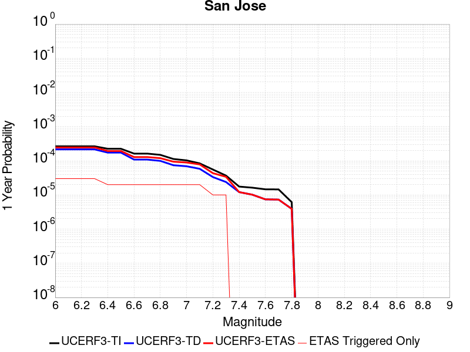 | 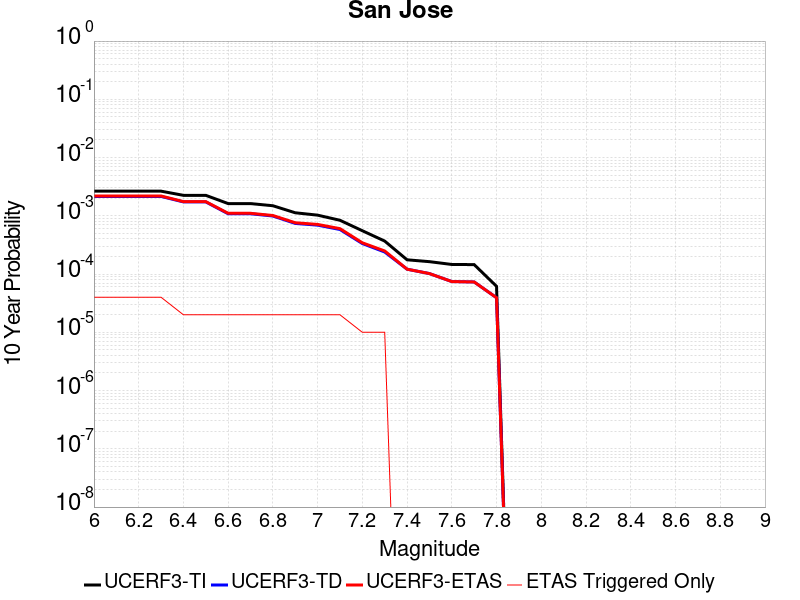 |

| Magnitude | 1 wk TI Prob | 1 wk TD Prob | 1 wk ETAS Prob | 1 wk ETAS/TD Gain | 1 wk ETAS Triggered Only | 1 mo TI Prob | 1 mo TD Prob | 1 mo ETAS Prob | 1 mo ETAS/TD Gain | 1 mo ETAS Triggered Only | 1 yr TI Prob | 1 yr TD Prob | 1 yr ETAS Prob | 1 yr ETAS/TD Gain | 1 yr ETAS Triggered Only | 10 yr TI Prob | 10 yr TD Prob | 10 yr ETAS Prob | 10 yr ETAS/TD Gain | 10 yr ETAS Triggered Only |
|-----|-----|-----|-----|-----|-----|-----|-----|-----|-----|-----|-----|-----|-----|-----|-----|-----|-----|-----|-----|-----|
| 6.0 | 5.0851277E-6 | 4.1256726E-6 | 3.9423798E-5 | 9.555726 | 3.529827E-5 | 2.1793223E-5 | 1.768135E-5 | 5.2978998E-5 | 2.9963207 | 3.529827E-5 | 2.653002E-4 | 2.152518E-4 | 2.5054248E-4 | 1.1639507 | 3.529827E-5 | 0.0026498367 | 0.0021507242 | 0.0021859466 | 1.016377 | 3.529827E-5 |
| 6.1 | 5.0851277E-6 | 4.1256726E-6 | 3.9423798E-5 | 9.555726 | 3.529827E-5 | 2.1793223E-5 | 1.768135E-5 | 5.2978998E-5 | 2.9963207 | 3.529827E-5 | 2.653002E-4 | 2.152518E-4 | 2.5054248E-4 | 1.1639507 | 3.529827E-5 | 0.0026498367 | 0.0021507242 | 0.0021859466 | 1.016377 | 3.529827E-5 |
| 6.2 | 5.0851277E-6 | 4.1256726E-6 | 3.9423798E-5 | 9.555726 | 3.529827E-5 | 2.1793223E-5 | 1.768135E-5 | 5.2978998E-5 | 2.9963207 | 3.529827E-5 | 2.653002E-4 | 2.152518E-4 | 2.5054248E-4 | 1.1639507 | 3.529827E-5 | 0.0026498367 | 0.0021507242 | 0.0021859466 | 1.016377 | 3.529827E-5 |
| 6.3 | 5.0851277E-6 | 4.1256726E-6 | 3.9423798E-5 | 9.555726 | 3.529827E-5 | 2.1793223E-5 | 1.768135E-5 | 5.2978998E-5 | 2.9963207 | 3.529827E-5 | 2.653002E-4 | 2.152518E-4 | 2.5054248E-4 | 1.1639507 | 3.529827E-5 | 0.0026498367 | 0.0021507242 | 0.0021859466 | 1.016377 | 3.529827E-5 |
| 6.4 | 4.3115124E-6 | 3.3237832E-6 | 3.8621936E-5 | 11.619872 | 3.529827E-5 | 1.8477778E-5 | 1.424472E-5 | 4.9542487E-5 | 3.4779546 | 3.529827E-5 | 2.2494372E-4 | 1.7341787E-4 | 2.0871001E-4 | 1.2035093 | 3.529827E-5 | 0.0022471617 | 0.0017330751 | 0.0017683122 | 1.0203321 | 3.529827E-5 |
| 6.5 | 4.3115124E-6 | 3.3237832E-6 | 3.8621936E-5 | 11.619872 | 3.529827E-5 | 1.8477778E-5 | 1.424472E-5 | 4.9542487E-5 | 3.4779546 | 3.529827E-5 | 2.2494372E-4 | 1.7341787E-4 | 2.0871001E-4 | 1.2035093 | 3.529827E-5 | 0.0022471617 | 0.0017330751 | 0.0017683122 | 1.0203321 | 3.529827E-5 |
| 6.6 | 3.110396E-6 | 2.0799866E-6 | 3.7378184E-5 | 17.970396 | 3.529827E-5 | 1.33302E-5 | 8.9141995E-6 | 4.4212156E-5 | 4.959745 | 3.529827E-5 | 1.622831E-4 | 1.0852526E-4 | 1.4381969E-4 | 1.3252187 | 3.529827E-5 | 0.0016216465 | 0.0010847825 | 0.0011200425 | 1.0325042 | 3.529827E-5 |
| 6.7 | 3.110396E-6 | 2.0799866E-6 | 3.7378184E-5 | 17.970396 | 3.529827E-5 | 1.33302E-5 | 8.9141995E-6 | 4.4212156E-5 | 4.959745 | 3.529827E-5 | 1.622831E-4 | 1.0852526E-4 | 1.4381969E-4 | 1.3252187 | 3.529827E-5 | 0.0016216465 | 0.0010847825 | 0.0011200425 | 1.0325042 | 3.529827E-5 |
| 6.8 | 2.856651E-6 | 1.902435E-6 | 3.720064E-5 | 19.554222 | 3.529827E-5 | 1.2242733E-5 | 8.153269E-6 | 4.345125E-5 | 5.329304 | 3.529827E-5 | 1.4904508E-4 | 9.926178E-5 | 1.3455654E-4 | 1.3555726 | 3.529827E-5 | 0.0014894515 | 9.922314E-4 | 0.0010274947 | 1.0355394 | 3.529827E-5 |
| 6.9 | 2.1618725E-6 | 1.4186642E-6 | 3.6716883E-5 | 25.881308 | 3.529827E-5 | 9.265135E-6 | 6.0799757E-6 | 4.1378033E-5 | 6.8056245 | 3.529827E-5 | 1.12797185E-4 | 7.402128E-5 | 1.09316934E-4 | 1.4768312 | 3.529827E-5 | 0.0011273995 | 7.4000744E-4 | 7.7527954E-4 | 1.0476646 | 3.529827E-5 |
| 7.0 | 1.9684312E-6 | 1.3256331E-6 | 3.6623856E-5 | 27.627445 | 3.529827E-5 | 8.436106E-6 | 5.681273E-6 | 4.0979343E-5 | 7.2130566 | 3.529827E-5 | 1.02704755E-4 | 6.9167385E-5 | 1.04463215E-4 | 1.5102959 | 3.529827E-5 | 0.001026573 | 6.914992E-4 | 7.2677305E-4 | 1.0510107 | 3.529827E-5 |
| 7.1 | 1.6070337E-6 | 1.1155087E-6 | 3.641374E-5 | 32.643173 | 3.529827E-5 | 6.887269E-6 | 4.780743E-6 | 4.0078845E-5 | 8.383392 | 3.529827E-5 | 8.384928E-5 | 5.8204052E-5 | 9.350027E-5 | 1.606422 | 3.529827E-5 | 8.3817646E-4 | 5.819267E-4 | 6.1720447E-4 | 1.0606223 | 3.529827E-5 |
| 7.2 | 1.0631658E-6 | 6.4037624E-7 | 3.5938625E-5 | 56.121105 | 3.529827E-5 | 4.556417E-6 | 2.7444669E-6 | 3.804264E-5 | 13.861578 | 3.529827E-5 | 5.5472963E-5 | 3.3413387E-5 | 6.871048E-5 | 2.0563757 | 3.529827E-5 | 5.545912E-4 | 3.3411747E-4 | 3.6940395E-4 | 1.105611 | 3.529827E-5 |
| 7.3 | 7.060711E-7 | 4.5824706E-7 | 3.57565E-5 | 78.02887 | 3.529827E-5 | 3.0260155E-6 | 1.9639147E-6 | 3.7262114E-5 | 18.973389 | 3.529827E-5 | 3.6841117E-5 | 2.3910407E-5 | 5.9207832E-5 | 2.476237 | 3.529827E-5 | 3.6835007E-4 | 2.3911172E-4 | 2.7440154E-4 | 1.1475872 | 3.529827E-5 |
| 7.4 | 3.3677085E-7 | 2.3233133E-7 | 2.3233133E-7 | 1.0 | 0.0 | 1.4433028E-6 | 9.957054E-7 | 9.957054E-7 | 1.0 | 0.0 | 1.757207E-5 | 1.21226485E-5 | 1.21226485E-5 | 1.0 | 0.0 | 1.7570681E-4 | 1.2125263E-4 | 1.2125263E-4 | 1.0 | 0.0 |
| 7.5 | 3.129161E-7 | 1.9530925E-7 | 1.9530925E-7 | 1.0 | 0.0 | 1.3410682E-6 | 8.370394E-7 | 8.370394E-7 | 1.0 | 0.0 | 1.6327383E-5 | 1.0190909E-5 | 1.0190909E-5 | 1.0 | 0.0 | 1.6326184E-4 | 1.0193714E-4 | 1.0193714E-4 | 1.0 | 0.0 |
| 7.6 | 2.8008668E-7 | 1.4242323E-7 | 1.4242323E-7 | 1.0 | 0.0 | 1.2003709E-6 | 6.1038514E-7 | 6.1038514E-7 | 1.0 | 0.0 | 1.46144175E-5 | 7.4314153E-6 | 7.4314153E-6 | 1.0 | 0.0 | 1.4613457E-4 | 7.434427E-5 | 7.434427E-5 | 1.0 | 0.0 |
| 7.7 | 2.7852005E-7 | 1.4016913E-7 | 1.4016913E-7 | 1.0 | 0.0 | 1.1936568E-6 | 6.007248E-7 | 6.007248E-7 | 1.0 | 0.0 | 1.4532674E-5 | 7.3138012E-6 | 7.3138012E-6 | 1.0 | 0.0 | 1.4531724E-4 | 7.316821E-5 | 7.316821E-5 | 1.0 | 0.0 |
| 7.8 | 1.1810797E-7 | 7.5190094E-8 | 7.5190094E-8 | 1.0 | 0.0 | 5.0617695E-7 | 3.222432E-7 | 3.222432E-7 | 1.0 | 0.0 | 6.1626865E-6 | 3.9233046E-6 | 3.9233046E-6 | 1.0 | 0.0 | 6.162516E-5 | 3.9250725E-5 | 3.9250725E-5 | 1.0 | 0.0 |

## Earthquake Valley (No  Extension)
*[(top)](#table-of-contents)*

| 1 Week | 1 Month | 1 Year | 10 Year |
|-----|-----|-----|-----|
|  |  | 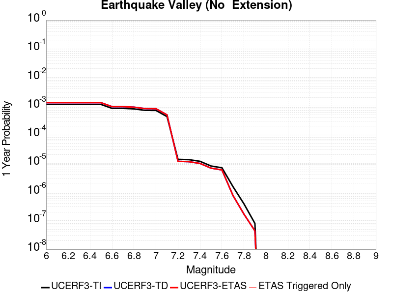 |  |

| Magnitude | 1 wk TI Prob | 1 wk TD Prob | 1 wk ETAS Prob | 1 wk ETAS/TD Gain | 1 wk ETAS Triggered Only | 1 mo TI Prob | 1 mo TD Prob | 1 mo ETAS Prob | 1 mo ETAS/TD Gain | 1 mo ETAS Triggered Only | 1 yr TI Prob | 1 yr TD Prob | 1 yr ETAS Prob | 1 yr ETAS/TD Gain | 1 yr ETAS Triggered Only | 10 yr TI Prob | 10 yr TD Prob | 10 yr ETAS Prob | 10 yr ETAS/TD Gain | 10 yr ETAS Triggered Only |
|-----|-----|-----|-----|-----|-----|-----|-----|-----|-----|-----|-----|-----|-----|-----|-----|-----|-----|-----|-----|-----|
| 6.0 | 2.1859703E-5 | 2.5198362E-5 | 2.5198362E-5 | 1.0 | 0.0 | 9.3681076E-5 | 1.07989326E-4 | 1.07989326E-4 | 1.0 | 0.0 | 0.0011399703 | 0.001314122 | 0.001314122 | 1.0 | 0.0 | 0.011341401 | 0.013077871 | 0.013112708 | 1.0026637 | 3.529827E-5 |
| 6.1 | 2.1859703E-5 | 2.5198362E-5 | 2.5198362E-5 | 1.0 | 0.0 | 9.3681076E-5 | 1.07989326E-4 | 1.07989326E-4 | 1.0 | 0.0 | 0.0011399703 | 0.001314122 | 0.001314122 | 1.0 | 0.0 | 0.011341401 | 0.013077871 | 0.013112708 | 1.0026637 | 3.529827E-5 |
| 6.2 | 2.1859703E-5 | 2.5198362E-5 | 2.5198362E-5 | 1.0 | 0.0 | 9.3681076E-5 | 1.07989326E-4 | 1.07989326E-4 | 1.0 | 0.0 | 0.0011399703 | 0.001314122 | 0.001314122 | 1.0 | 0.0 | 0.011341401 | 0.013077871 | 0.013112708 | 1.0026637 | 3.529827E-5 |
| 6.3 | 2.1859703E-5 | 2.5198362E-5 | 2.5198362E-5 | 1.0 | 0.0 | 9.3681076E-5 | 1.07989326E-4 | 1.07989326E-4 | 1.0 | 0.0 | 0.0011399703 | 0.001314122 | 0.001314122 | 1.0 | 0.0 | 0.011341401 | 0.013077871 | 0.013112708 | 1.0026637 | 3.529827E-5 |
| 6.4 | 2.1859703E-5 | 2.5198362E-5 | 2.5198362E-5 | 1.0 | 0.0 | 9.3681076E-5 | 1.07989326E-4 | 1.07989326E-4 | 1.0 | 0.0 | 0.0011399703 | 0.001314122 | 0.001314122 | 1.0 | 0.0 | 0.011341401 | 0.013077871 | 0.013112708 | 1.0026637 | 3.529827E-5 |
| 6.5 | 2.1859703E-5 | 2.5198362E-5 | 2.5198362E-5 | 1.0 | 0.0 | 9.3681076E-5 | 1.07989326E-4 | 1.07989326E-4 | 1.0 | 0.0 | 0.0011399703 | 0.001314122 | 0.001314122 | 1.0 | 0.0 | 0.011341401 | 0.013077871 | 0.013112708 | 1.0026637 | 3.529827E-5 |
| 6.6 | 1.597E-5 | 1.8356275E-5 | 1.8356275E-5 | 1.0 | 0.0 | 6.8441055E-5 | 7.866787E-5 | 7.866787E-5 | 1.0 | 0.0 | 8.329513E-4 | 9.574478E-4 | 9.574478E-4 | 1.0 | 0.0 | 0.008298361 | 0.009541836 | 0.009541836 | 1.0 | 0.0 |
| 6.7 | 1.597E-5 | 1.8356275E-5 | 1.8356275E-5 | 1.0 | 0.0 | 6.8441055E-5 | 7.866787E-5 | 7.866787E-5 | 1.0 | 0.0 | 8.329513E-4 | 9.574478E-4 | 9.574478E-4 | 1.0 | 0.0 | 0.008298361 | 0.009541836 | 0.009541836 | 1.0 | 0.0 |
| 6.8 | 1.5315149E-5 | 1.7602091E-5 | 1.7602091E-5 | 1.0 | 0.0 | 6.5634704E-5 | 7.543584E-5 | 7.543584E-5 | 1.0 | 0.0 | 7.988095E-4 | 9.181311E-4 | 9.181311E-4 | 1.0 | 0.0 | 0.007959441 | 0.009151919 | 0.009151919 | 1.0 | 0.0 |
| 6.9 | 1.3634728E-5 | 1.5675821E-5 | 1.5675821E-5 | 1.0 | 0.0 | 5.8433237E-5 | 6.718082E-5 | 6.718082E-5 | 1.0 | 0.0 | 7.1119244E-4 | 8.177017E-4 | 8.177017E-4 | 1.0 | 0.0 | 0.007089207 | 0.008155 | 0.008155 | 1.0 | 0.0 |
| 7.0 | 1.3496271E-5 | 1.5517853E-5 | 1.5517853E-5 | 1.0 | 0.0 | 5.783988E-5 | 6.650385E-5 | 6.650385E-5 | 1.0 | 0.0 | 7.03973E-4 | 8.094657E-4 | 8.094657E-4 | 1.0 | 0.0 | 0.007017471 | 0.0080732405 | 0.0080732405 | 1.0 | 0.0 |
| 7.1 | 8.242798E-6 | 9.4726E-6 | 9.4726E-6 | 1.0 | 0.0 | 3.53258E-5 | 4.0596606E-5 | 4.0596606E-5 | 1.0 | 0.0 | 4.300067E-4 | 4.9421866E-4 | 4.9421866E-4 | 1.0 | 0.0 | 0.004291756 | 0.0049377717 | 0.0049377717 | 1.0 | 0.0 |
| 7.2 | 2.6506527E-7 | 2.2560312E-7 | 2.2560312E-7 | 1.0 | 0.0 | 1.1359936E-6 | 9.668702E-7 | 9.668702E-7 | 1.0 | 0.0 | 1.3830633E-5 | 1.17715845E-5 | 1.17715845E-5 | 1.0 | 0.0 | 1.3829772E-4 | 1.1771003E-4 | 1.1771003E-4 | 1.0 | 0.0 |
| 7.3 | 2.5810488E-7 | 2.1955442E-7 | 2.1955442E-7 | 1.0 | 0.0 | 1.1061633E-6 | 9.409472E-7 | 9.409472E-7 | 1.0 | 0.0 | 1.3467455E-5 | 1.1455976E-5 | 1.1455976E-5 | 1.0 | 0.0 | 1.3466639E-4 | 1.1455427E-4 | 1.1455427E-4 | 1.0 | 0.0 |
| 7.4 | 2.2676066E-7 | 1.9110601E-7 | 1.9110601E-7 | 1.0 | 0.0 | 9.71831E-7 | 8.190255E-7 | 8.190255E-7 | 1.0 | 0.0 | 1.1831979E-5 | 9.9715935E-6 | 9.9715935E-6 | 1.0 | 0.0 | 1.1831349E-4 | 9.9711855E-5 | 9.9711855E-5 | 1.0 | 0.0 |
| 7.5 | 1.5553917E-7 | 1.3112096E-7 | 1.3112096E-7 | 1.0 | 0.0 | 6.6659624E-7 | 5.619469E-7 | 5.619469E-7 | 1.0 | 0.0 | 8.115779E-6 | 6.8416834E-6 | 6.8416834E-6 | 1.0 | 0.0 | 8.115482E-5 | 6.841495E-5 | 6.841495E-5 | 1.0 | 0.0 |
| 7.6 | 1.3448629E-7 | 1.1288419E-7 | 1.1288419E-7 | 1.0 | 0.0 | 5.7636964E-7 | 4.837893E-7 | 4.837893E-7 | 1.0 | 0.0 | 7.017278E-6 | 5.890121E-6 | 5.890121E-6 | 1.0 | 0.0 | 7.0170565E-5 | 5.889986E-5 | 5.889986E-5 | 1.0 | 0.0 |
| 7.7 | 2.9719402E-8 | 1.458206E-8 | 1.458206E-8 | 1.0 | 0.0 | 1.2736886E-7 | 6.249454E-8 | 6.249454E-8 | 1.0 | 0.0 | 1.5507147E-6 | 7.608708E-7 | 7.608708E-7 | 1.0 | 0.0 | 1.550704E-5 | 7.6086876E-6 | 7.6086876E-6 | 1.0 | 0.0 |
| 7.8 | 7.4390196E-9 | 3.2502152E-9 | 3.2502152E-9 | 1.0 | 0.0 | 3.1881513E-8 | 1.3929493E-8 | 1.3929493E-8 | 1.0 | 0.0 | 3.8815733E-7 | 1.6959156E-7 | 1.6959156E-7 | 1.0 | 0.0 | 3.8815665E-6 | 1.6959145E-6 | 1.6959145E-6 | 1.0 | 0.0 |
| 7.9 | 1.5373532E-9 | 8.440161E-10 | 8.440161E-10 | 1.0 | 0.0 | 6.5886567E-9 | 3.6172119E-9 | 3.6172119E-9 | 1.0 | 0.0 | 8.021689E-8 | 4.4039556E-8 | 4.4039556E-8 | 1.0 | 0.0 | 8.0216864E-7 | 4.4039552E-7 | 4.4039552E-7 | 1.0 | 0.0 |

## Kern Canyon (Lake Isabella) 2011
*[(top)](#table-of-contents)*

| 1 Week | 1 Month | 1 Year | 10 Year |
|-----|-----|-----|-----|
|  |  |  |  |

| Magnitude | 1 wk TI Prob | 1 wk TD Prob | 1 wk ETAS Prob | 1 wk ETAS/TD Gain | 1 wk ETAS Triggered Only | 1 mo TI Prob | 1 mo TD Prob | 1 mo ETAS Prob | 1 mo ETAS/TD Gain | 1 mo ETAS Triggered Only | 1 yr TI Prob | 1 yr TD Prob | 1 yr ETAS Prob | 1 yr ETAS/TD Gain | 1 yr ETAS Triggered Only | 10 yr TI Prob | 10 yr TD Prob | 10 yr ETAS Prob | 10 yr ETAS/TD Gain | 10 yr ETAS Triggered Only |
|-----|-----|-----|-----|-----|-----|-----|-----|-----|-----|-----|-----|-----|-----|-----|-----|-----|-----|-----|-----|-----|
| 6.0 | 4.2387383E-6 | 4.001639E-6 | 4.001639E-6 | 1.0 | 0.0 | 1.8165894E-5 | 1.7149778E-5 | 1.7149778E-5 | 1.0 | 0.0 | 2.2114732E-4 | 2.087804E-4 | 2.4407131E-4 | 1.1690335 | 3.529827E-5 | 0.0022092736 | 0.0020860266 | 0.002121251 | 1.016886 | 3.529827E-5 |
| 6.1 | 4.2387383E-6 | 4.001639E-6 | 4.001639E-6 | 1.0 | 0.0 | 1.8165894E-5 | 1.7149778E-5 | 1.7149778E-5 | 1.0 | 0.0 | 2.2114732E-4 | 2.087804E-4 | 2.4407131E-4 | 1.1690335 | 3.529827E-5 | 0.0022092736 | 0.0020860266 | 0.002121251 | 1.016886 | 3.529827E-5 |
| 6.2 | 4.2387383E-6 | 4.001639E-6 | 4.001639E-6 | 1.0 | 0.0 | 1.8165894E-5 | 1.7149778E-5 | 1.7149778E-5 | 1.0 | 0.0 | 2.2114732E-4 | 2.087804E-4 | 2.4407131E-4 | 1.1690335 | 3.529827E-5 | 0.0022092736 | 0.0020860266 | 0.002121251 | 1.016886 | 3.529827E-5 |
| 6.3 | 4.2387383E-6 | 4.001639E-6 | 4.001639E-6 | 1.0 | 0.0 | 1.8165894E-5 | 1.7149778E-5 | 1.7149778E-5 | 1.0 | 0.0 | 2.2114732E-4 | 2.087804E-4 | 2.4407131E-4 | 1.1690335 | 3.529827E-5 | 0.0022092736 | 0.0020860266 | 0.002121251 | 1.016886 | 3.529827E-5 |
| 6.4 | 4.2387383E-6 | 4.001639E-6 | 4.001639E-6 | 1.0 | 0.0 | 1.8165894E-5 | 1.7149778E-5 | 1.7149778E-5 | 1.0 | 0.0 | 2.2114732E-4 | 2.087804E-4 | 2.4407131E-4 | 1.1690335 | 3.529827E-5 | 0.0022092736 | 0.0020860266 | 0.002121251 | 1.016886 | 3.529827E-5 |
| 6.5 | 2.7857532E-6 | 2.517867E-6 | 2.517867E-6 | 1.0 | 0.0 | 1.1938888E-5 | 1.0790815E-5 | 1.0790815E-5 | 1.0 | 0.0 | 1.4534626E-4 | 1.3137059E-4 | 1.3137059E-4 | 1.0 | 0.0 | 0.0014525123 | 0.001312962 | 0.001312962 | 1.0 | 0.0 |
| 6.6 | 2.2233348E-6 | 1.9441236E-6 | 1.9441236E-6 | 1.0 | 0.0 | 9.528543E-6 | 8.331932E-6 | 8.331932E-6 | 1.0 | 0.0 | 1.1600384E-4 | 1.01436635E-4 | 1.01436635E-4 | 1.0 | 0.0 | 0.001159433 | 0.001013912 | 0.001013912 | 1.0 | 0.0 |
| 6.7 | 2.1635126E-6 | 1.8835036E-6 | 1.8835036E-6 | 1.0 | 0.0 | 9.272164E-6 | 8.072134E-6 | 8.072134E-6 | 1.0 | 0.0 | 1.1288274E-4 | 9.827388E-5 | 9.827388E-5 | 1.0 | 0.0 | 0.0011282542 | 9.823124E-4 | 9.823124E-4 | 1.0 | 0.0 |
| 6.8 | 1.8685711E-6 | 1.5831425E-6 | 1.5831425E-6 | 1.0 | 0.0 | 8.008137E-6 | 6.784879E-6 | 6.784879E-6 | 1.0 | 0.0 | 9.74947E-5 | 8.260282E-5 | 8.260282E-5 | 1.0 | 0.0 | 9.745194E-4 | 8.2572614E-4 | 8.2572614E-4 | 1.0 | 0.0 |
| 6.9 | 1.5815071E-6 | 1.3064928E-6 | 1.3064928E-6 | 1.0 | 0.0 | 6.77787E-6 | 5.599243E-6 | 5.599243E-6 | 1.0 | 0.0 | 8.251744E-5 | 6.816868E-5 | 6.816868E-5 | 1.0 | 0.0 | 8.248681E-4 | 6.8148033E-4 | 6.8148033E-4 | 1.0 | 0.0 |
| 7.0 | 1.3772564E-6 | 1.1210718E-6 | 1.1210718E-6 | 1.0 | 0.0 | 5.9025137E-6 | 4.8045845E-6 | 4.8045845E-6 | 1.0 | 0.0 | 7.186073E-5 | 5.8494268E-5 | 5.8494268E-5 | 1.0 | 0.0 | 7.18375E-4 | 5.847908E-4 | 5.847908E-4 | 1.0 | 0.0 |
| 7.1 | 1.0916998E-6 | 8.763777E-7 | 8.763777E-7 | 1.0 | 0.0 | 4.678705E-6 | 3.7558991E-6 | 3.7558991E-6 | 1.0 | 0.0 | 5.6961744E-5 | 4.5727127E-5 | 4.5727127E-5 | 1.0 | 0.0 | 5.6947145E-4 | 4.571785E-4 | 4.571785E-4 | 1.0 | 0.0 |
| 7.2 | 7.6277024E-7 | 5.901454E-7 | 5.901454E-7 | 1.0 | 0.0 | 3.2690114E-6 | 2.5291922E-6 | 2.5291922E-6 | 1.0 | 0.0 | 3.9799485E-5 | 3.0792486E-5 | 3.0792486E-5 | 1.0 | 0.0 | 3.9792358E-4 | 3.0788282E-4 | 3.0788282E-4 | 1.0 | 0.0 |
| 7.3 | 5.3265916E-7 | 4.3824414E-7 | 4.3824414E-7 | 1.0 | 0.0 | 2.282823E-6 | 1.878188E-6 | 1.878188E-6 | 1.0 | 0.0 | 2.7793016E-5 | 2.2866701E-5 | 2.2866701E-5 | 1.0 | 0.0 | 2.778954E-4 | 2.2864387E-4 | 2.2864387E-4 | 1.0 | 0.0 |
| 7.4 | 3.4946007E-7 | 3.006571E-7 | 3.006571E-7 | 1.0 | 0.0 | 1.497685E-6 | 1.2885298E-6 | 1.2885298E-6 | 1.0 | 0.0 | 1.8234163E-5 | 1.568774E-5 | 1.568774E-5 | 1.0 | 0.0 | 1.8232666E-4 | 1.5686655E-4 | 1.5686655E-4 | 1.0 | 0.0 |
| 7.5 | 1.8317026E-7 | 1.4244812E-7 | 1.4244812E-7 | 1.0 | 0.0 | 7.850152E-7 | 6.104918E-7 | 6.104918E-7 | 1.0 | 0.0 | 9.557518E-6 | 7.432713E-6 | 7.432713E-6 | 1.0 | 0.0 | 9.5571064E-5 | 7.432472E-5 | 7.432472E-5 | 1.0 | 0.0 |
| 7.6 | 2.572245E-8 | 1.7352555E-8 | 1.7352555E-8 | 1.0 | 0.0 | 1.10239064E-7 | 7.436809E-8 | 7.436809E-8 | 1.0 | 0.0 | 1.3421597E-6 | 9.054312E-7 | 9.054312E-7 | 1.0 | 0.0 | 1.3421517E-5 | 9.05428E-6 | 9.05428E-6 | 1.0 | 0.0 |

## San Andreas (Santa Cruz Mts) 2011 CFM
*[(top)](#table-of-contents)*

| 1 Week | 1 Month | 1 Year | 10 Year |
|-----|-----|-----|-----|
|  |  |  | 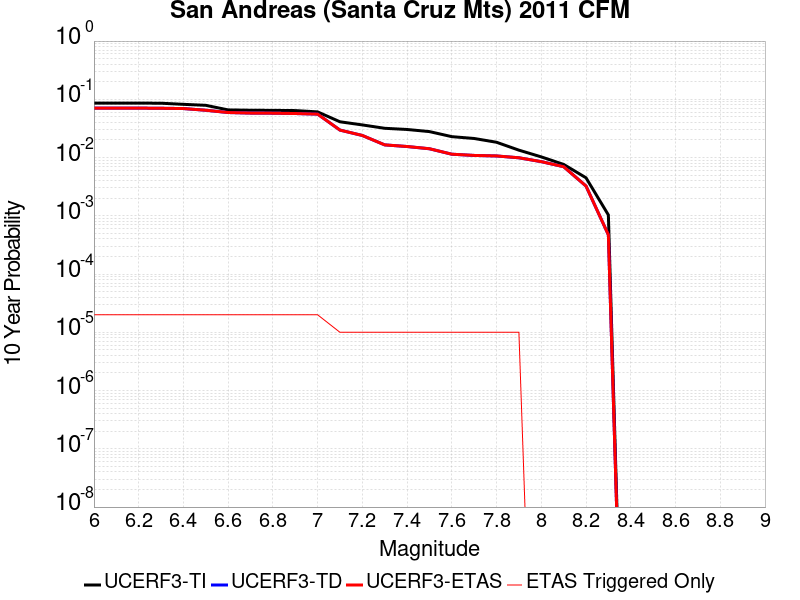 |

| Magnitude | 1 wk TI Prob | 1 wk TD Prob | 1 wk ETAS Prob | 1 wk ETAS/TD Gain | 1 wk ETAS Triggered Only | 1 mo TI Prob | 1 mo TD Prob | 1 mo ETAS Prob | 1 mo ETAS/TD Gain | 1 mo ETAS Triggered Only | 1 yr TI Prob | 1 yr TD Prob | 1 yr ETAS Prob | 1 yr ETAS/TD Gain | 1 yr ETAS Triggered Only | 10 yr TI Prob | 10 yr TD Prob | 10 yr ETAS Prob | 10 yr ETAS/TD Gain | 10 yr ETAS Triggered Only |
|-----|-----|-----|-----|-----|-----|-----|-----|-----|-----|-----|-----|-----|-----|-----|-----|-----|-----|-----|-----|-----|
| 6.0 | 1.7221631E-4 | 1.3793171E-4 | 1.3793171E-4 | 1.0 | 0.0 | 7.378611E-4 | 5.9100403E-4 | 5.9100403E-4 | 1.0 | 0.0 | 0.008946515 | 0.007172124 | 0.007207169 | 1.0048863 | 3.529827E-5 | 0.08594794 | 0.0705551 | 0.0705879 | 1.000465 | 3.529827E-5 |
| 6.1 | 1.7221631E-4 | 1.3793171E-4 | 1.3793171E-4 | 1.0 | 0.0 | 7.378611E-4 | 5.9100403E-4 | 5.9100403E-4 | 1.0 | 0.0 | 0.008946515 | 0.007172124 | 0.007207169 | 1.0048863 | 3.529827E-5 | 0.08594794 | 0.0705551 | 0.0705879 | 1.000465 | 3.529827E-5 |
| 6.2 | 1.7221631E-4 | 1.3793171E-4 | 1.3793171E-4 | 1.0 | 0.0 | 7.378611E-4 | 5.9100403E-4 | 5.9100403E-4 | 1.0 | 0.0 | 0.008946515 | 0.007172124 | 0.007207169 | 1.0048863 | 3.529827E-5 | 0.08594794 | 0.0705551 | 0.0705879 | 1.000465 | 3.529827E-5 |
| 6.3 | 1.716926E-4 | 1.3712609E-4 | 1.3712609E-4 | 1.0 | 0.0 | 7.3561794E-4 | 5.875529E-4 | 5.875529E-4 | 1.0 | 0.0 | 0.008919428 | 0.0071303817 | 0.0071654283 | 1.0049151 | 3.529827E-5 | 0.08569809 | 0.070167266 | 0.070200086 | 1.0004678 | 3.529827E-5 |
| 6.4 | 1.6392978E-4 | 1.3588481E-4 | 1.3588481E-4 | 1.0 | 0.0 | 7.02367E-4 | 5.822355E-4 | 5.822355E-4 | 1.0 | 0.0 | 0.008517839 | 0.007066063 | 0.007101112 | 1.0049602 | 3.529827E-5 | 0.08198654 | 0.06940135 | 0.0694342 | 1.0004733 | 3.529827E-5 |
| 6.5 | 1.5742714E-4 | 1.2648388E-4 | 1.2648388E-4 | 1.0 | 0.0 | 6.745133E-4 | 5.4196286E-4 | 5.4196286E-4 | 1.0 | 0.0 | 0.00818132 | 0.0065787593 | 0.0066138254 | 1.0053302 | 3.529827E-5 | 0.078865945 | 0.06486309 | 0.06489611 | 1.0005089 | 3.529827E-5 |
| 6.6 | 1.3038084E-4 | 1.1588213E-4 | 1.1588213E-4 | 1.0 | 0.0 | 5.5865536E-4 | 4.9654447E-4 | 4.9654447E-4 | 1.0 | 0.0 | 0.006780438 | 0.0060289134 | 0.0060639987 | 1.0058196 | 3.529827E-5 | 0.0657725 | 0.05932738 | 0.059360582 | 1.0005597 | 3.529827E-5 |
| 6.7 | 1.2867592E-4 | 1.1314701E-4 | 1.1314701E-4 | 1.0 | 0.0 | 5.5135164E-4 | 4.8482692E-4 | 4.8482692E-4 | 1.0 | 0.0 | 0.0066920654 | 0.00588703 | 0.005922121 | 1.0059606 | 3.529827E-5 | 0.06494093 | 0.058038417 | 0.058071665 | 1.0005729 | 3.529827E-5 |
| 6.8 | 1.2801298E-4 | 1.1252261E-4 | 1.1252261E-4 | 1.0 | 0.0 | 5.485117E-4 | 4.8215193E-4 | 4.8215193E-4 | 1.0 | 0.0 | 0.0066577005 | 0.0058546383 | 0.00588973 | 1.0059938 | 3.529827E-5 | 0.06461738 | 0.057752274 | 0.057785533 | 1.0005759 | 3.529827E-5 |
| 6.9 | 1.269149E-4 | 1.1094465E-4 | 1.1094465E-4 | 1.0 | 0.0 | 5.4380763E-4 | 4.7539172E-4 | 4.7539172E-4 | 1.0 | 0.0 | 0.006600777 | 0.005772772 | 0.0058078663 | 1.0060793 | 3.529827E-5 | 0.06408122 | 0.0570241 | 0.057057384 | 1.0005836 | 3.529827E-5 |
| 7.0 | 1.2030331E-4 | 1.0824504E-4 | 1.0824504E-4 | 1.0 | 0.0 | 5.154837E-4 | 4.638261E-4 | 4.638261E-4 | 1.0 | 0.0 | 0.006257969 | 0.0056326967 | 0.005667796 | 1.0062314 | 3.529827E-5 | 0.06084648 | 0.055696685 | 0.05573002 | 1.0005984 | 3.529827E-5 |
| 7.1 | 8.049617E-5 | 5.3926604E-5 | 5.3926604E-5 | 1.0 | 0.0 | 3.4493793E-4 | 2.3109373E-4 | 2.3109373E-4 | 1.0 | 0.0 | 0.0041915346 | 0.0028099709 | 0.00284517 | 1.0125265 | 3.529827E-5 | 0.041133516 | 0.029618956 | 0.029653208 | 1.0011564 | 3.529827E-5 |
| 7.2 | 7.093979E-5 | 4.2937932E-5 | 4.2937932E-5 | 1.0 | 0.0 | 3.0399222E-4 | 1.8400686E-4 | 1.8400686E-4 | 1.0 | 0.0 | 0.0036948253 | 0.0022380045 | 0.0022732238 | 1.0157369 | 3.529827E-5 | 0.03633994 | 0.023941692 | 0.023976143 | 1.0014391 | 3.529827E-5 |
| 7.3 | 6.193693E-5 | 2.8894141E-5 | 2.8894141E-5 | 1.0 | 0.0 | 2.6541698E-4 | 1.2382616E-4 | 1.2382616E-4 | 1.0 | 0.0 | 0.0032266637 | 0.0015065427 | 0.0015417879 | 1.0233947 | 3.529827E-5 | 0.031802133 | 0.016499156 | 0.016533872 | 1.002104 | 3.529827E-5 |
| 7.4 | 5.906492E-5 | 2.702346E-5 | 2.702346E-5 | 1.0 | 0.0 | 2.5311083E-4 | 1.1580969E-4 | 1.1580969E-4 | 1.0 | 0.0 | 0.0030772698 | 0.0014090725 | 0.001444321 | 1.0250155 | 3.529827E-5 | 0.030350044 | 0.015471023 | 0.015505775 | 1.0022463 | 3.529827E-5 |
| 7.5 | 5.424296E-5 | 2.4678277E-5 | 2.4678277E-5 | 1.0 | 0.0 | 2.324491E-4 | 1.05759755E-4 | 1.05759755E-4 | 1.0 | 0.0 | 0.002826395 | 0.0012868657 | 0.0013221186 | 1.0273943 | 3.529827E-5 | 0.027907165 | 0.014163188 | 0.014197986 | 1.0024569 | 3.529827E-5 |
| 7.6 | 4.43084E-5 | 1.990431E-5 | 1.990431E-5 | 1.0 | 0.0 | 1.8987931E-4 | 8.53014E-5 | 8.53014E-5 | 1.0 | 0.0 | 0.0023093296 | 0.0010380499 | 0.0010733115 | 1.0339692 | 3.529827E-5 | 0.022854783 | 0.011412679 | 0.011447575 | 1.0030576 | 3.529827E-5 |
| 7.7 | 4.118098E-5 | 1.8936442E-5 | 1.8936442E-5 | 1.0 | 0.0 | 1.7647797E-4 | 8.115366E-5 | 8.115366E-5 | 1.0 | 0.0 | 0.002146502 | 9.875982E-4 | 0.0010228616 | 1.0357063 | 3.529827E-5 | 0.021258866 | 0.010870468 | 0.010905382 | 1.0032119 | 3.529827E-5 |
| 7.8 | 3.5408906E-5 | 1.856446E-5 | 1.856446E-5 | 1.0 | 0.0 | 1.5174363E-4 | 7.955955E-5 | 7.955955E-5 | 1.0 | 0.0 | 0.0018459131 | 9.682073E-4 | 0.0010034714 | 1.036422 | 3.529827E-5 | 0.018306552 | 0.010652021 | 0.010686942 | 1.0032785 | 3.529827E-5 |
| 7.9 | 2.5860836E-5 | 1.7315993E-5 | 1.7315993E-5 | 1.0 | 0.0 | 1.10827445E-4 | 7.420929E-5 | 7.420929E-5 | 1.0 | 0.0 | 0.001348489 | 9.031238E-4 | 9.383902E-4 | 1.0390494 | 3.529827E-5 | 0.013403354 | 0.009907599 | 0.009942547 | 1.0035274 | 3.529827E-5 |
| 8.0 | 1.9777332E-5 | 1.4839596E-5 | 1.4839596E-5 | 1.0 | 0.0 | 8.4757245E-5 | 6.3596715E-5 | 6.3596715E-5 | 1.0 | 0.0 | 0.0010314309 | 7.740152E-4 | 7.740152E-4 | 1.0 | 0.0 | 0.010266567 | 0.008508967 | 0.008508967 | 1.0 | 0.0 |
| 8.1 | 1.468494E-5 | 1.2107374E-5 | 1.2107374E-5 | 1.0 | 0.0 | 6.293394E-5 | 5.1887713E-5 | 5.1887713E-5 | 1.0 | 0.0 | 7.6595135E-4 | 6.3155E-4 | 6.3155E-4 | 1.0 | 0.0 | 0.0076331664 | 0.006969149 | 0.006969149 | 1.0 | 0.0 |
| 8.2 | 8.63836E-6 | 5.469061E-6 | 5.469061E-6 | 1.0 | 0.0 | 3.7021015E-5 | 2.3438623E-5 | 2.3438623E-5 | 1.0 | 0.0 | 4.5063766E-4 | 2.8532793E-4 | 2.8532793E-4 | 1.0 | 0.0 | 0.004497249 | 0.00324569 | 0.00324569 | 1.0 | 0.0 |
| 8.3 | 1.983087E-6 | 7.6599065E-7 | 7.6599065E-7 | 1.0 | 0.0 | 8.498917E-6 | 3.282813E-6 | 3.282813E-6 | 1.0 | 0.0 | 1.034694E-4 | 3.9967534E-5 | 3.9967534E-5 | 1.0 | 0.0 | 0.0010342124 | 4.719687E-4 | 4.719687E-4 | 1.0 | 0.0 |

## White Wolf
*[(top)](#table-of-contents)*

| 1 Week | 1 Month | 1 Year | 10 Year |
|-----|-----|-----|-----|
|  |  |  |  |

| Magnitude | 1 wk TI Prob | 1 wk TD Prob | 1 wk ETAS Prob | 1 wk ETAS/TD Gain | 1 wk ETAS Triggered Only | 1 mo TI Prob | 1 mo TD Prob | 1 mo ETAS Prob | 1 mo ETAS/TD Gain | 1 mo ETAS Triggered Only | 1 yr TI Prob | 1 yr TD Prob | 1 yr ETAS Prob | 1 yr ETAS/TD Gain | 1 yr ETAS Triggered Only | 10 yr TI Prob | 10 yr TD Prob | 10 yr ETAS Prob | 10 yr ETAS/TD Gain | 10 yr ETAS Triggered Only |
|-----|-----|-----|-----|-----|-----|-----|-----|-----|-----|-----|-----|-----|-----|-----|-----|-----|-----|-----|-----|-----|
| 6.0 | 2.0037822E-5 | 1.0469162E-6 | 3.634515E-5 | 34.71639 | 3.529827E-5 | 8.587355E-5 | 4.486776E-6 | 3.978489E-5 | 8.867144 | 3.529827E-5 | 0.001045009 | 5.4625183E-5 | 8.992152E-5 | 1.6461551 | 3.529827E-5 | 0.010401085 | 5.461226E-4 | 5.8140163E-4 | 1.064599 | 3.529827E-5 |
| 6.1 | 2.0037822E-5 | 1.0469162E-6 | 3.634515E-5 | 34.71639 | 3.529827E-5 | 8.587355E-5 | 4.486776E-6 | 3.978489E-5 | 8.867144 | 3.529827E-5 | 0.001045009 | 5.4625183E-5 | 8.992152E-5 | 1.6461551 | 3.529827E-5 | 0.010401085 | 5.461226E-4 | 5.8140163E-4 | 1.064599 | 3.529827E-5 |
| 6.2 | 2.0037822E-5 | 1.0469162E-6 | 3.634515E-5 | 34.71639 | 3.529827E-5 | 8.587355E-5 | 4.486776E-6 | 3.978489E-5 | 8.867144 | 3.529827E-5 | 0.001045009 | 5.4625183E-5 | 8.992152E-5 | 1.6461551 | 3.529827E-5 | 0.010401085 | 5.461226E-4 | 5.8140163E-4 | 1.064599 | 3.529827E-5 |
| 6.3 | 2.0037822E-5 | 1.0469162E-6 | 3.634515E-5 | 34.71639 | 3.529827E-5 | 8.587355E-5 | 4.486776E-6 | 3.978489E-5 | 8.867144 | 3.529827E-5 | 0.001045009 | 5.4625183E-5 | 8.992152E-5 | 1.6461551 | 3.529827E-5 | 0.010401085 | 5.461226E-4 | 5.8140163E-4 | 1.064599 | 3.529827E-5 |
| 6.4 | 1.132487E-5 | 1.0469162E-6 | 3.634515E-5 | 34.71639 | 3.529827E-5 | 4.8534253E-5 | 4.486776E-6 | 3.978489E-5 | 8.867144 | 3.529827E-5 | 5.907443E-4 | 5.4625183E-5 | 8.992152E-5 | 1.6461551 | 3.529827E-5 | 0.005891764 | 5.461226E-4 | 5.8140163E-4 | 1.064599 | 3.529827E-5 |
| 6.5 | 1.132487E-5 | 1.0469162E-6 | 3.634515E-5 | 34.71639 | 3.529827E-5 | 4.8534253E-5 | 4.486776E-6 | 3.978489E-5 | 8.867144 | 3.529827E-5 | 5.907443E-4 | 5.4625183E-5 | 8.992152E-5 | 1.6461551 | 3.529827E-5 | 0.005891764 | 5.461226E-4 | 5.8140163E-4 | 1.064599 | 3.529827E-5 |
| 6.6 | 9.347473E-6 | 1.0469162E-6 | 3.634515E-5 | 34.71639 | 3.529827E-5 | 4.0059982E-5 | 4.486776E-6 | 3.978489E-5 | 8.867144 | 3.529827E-5 | 4.8762115E-4 | 5.4625183E-5 | 8.992152E-5 | 1.6461551 | 3.529827E-5 | 0.0048655253 | 5.461226E-4 | 5.8140163E-4 | 1.064599 | 3.529827E-5 |
| 6.7 | 7.842647E-6 | 1.0048342E-6 | 3.630307E-5 | 36.128418 | 3.529827E-5 | 3.361091E-5 | 4.3064256E-6 | 3.9604543E-5 | 9.196617 | 3.529827E-5 | 4.0913603E-4 | 5.2429517E-5 | 8.772594E-5 | 1.6732166 | 3.529827E-5 | 0.004083836 | 5.2417646E-4 | 5.5945624E-4 | 1.0673051 | 3.529827E-5 |
| 6.8 | 6.26597E-6 | 9.734822E-7 | 3.627172E-5 | 37.259766 | 3.529827E-5 | 2.685388E-5 | 4.17206E-6 | 3.9470182E-5 | 9.460598 | 3.529827E-5 | 3.2689696E-4 | 5.0793697E-5 | 8.609018E-5 | 1.6948987 | 3.529827E-5 | 0.003264165 | 5.078258E-4 | 5.431061E-4 | 1.0694733 | 3.529827E-5 |
| 6.9 | 5.258436E-6 | 9.183254E-7 | 3.6216563E-5 | 39.437614 | 3.529827E-5 | 2.2535958E-5 | 3.9356746E-6 | 3.9233804E-5 | 9.968763 | 3.529827E-5 | 2.7434074E-4 | 4.7915833E-5 | 8.321241E-5 | 1.7366371 | 3.529827E-5 | 0.0027400232 | 4.790598E-4 | 5.1434117E-4 | 1.0736471 | 3.529827E-5 |
| 7.0 | 4.675028E-6 | 8.6611794E-7 | 3.6164358E-5 | 41.75454 | 3.529827E-5 | 2.003568E-5 | 3.7119291E-6 | 3.901007E-5 | 10.509378 | 3.529827E-5 | 2.4390711E-4 | 4.5191846E-5 | 8.048852E-5 | 1.7810408 | 3.529827E-5 | 0.0024363957 | 4.518313E-4 | 4.871136E-4 | 1.0780873 | 3.529827E-5 |
| 7.1 | 2.8270078E-6 | 6.8741696E-7 | 3.5985664E-5 | 52.349106 | 3.529827E-5 | 1.2115692E-5 | 2.9460696E-6 | 3.8244238E-5 | 12.981443 | 3.529827E-5 | 1.4749856E-4 | 3.5867848E-5 | 7.116485E-5 | 1.9840848 | 3.529827E-5 | 0.001474007 | 3.586247E-4 | 3.939103E-4 | 1.0983914 | 3.529827E-5 |
| 7.2 | 1.6881406E-6 | 2.2706382E-7 | 2.2706382E-7 | 1.0 | 0.0 | 7.2348685E-6 | 9.731303E-7 | 9.731303E-7 | 1.0 | 0.0 | 8.808096E-5 | 1.1847799E-5 | 1.1847799E-5 | 1.0 | 0.0 | 8.8046055E-4 | 1.1847183E-4 | 1.1847183E-4 | 1.0 | 0.0 |
| 7.3 | 9.086107E-7 | 1.5266386E-7 | 1.5266386E-7 | 1.0 | 0.0 | 3.8940398E-6 | 6.5427355E-7 | 6.5427355E-7 | 1.0 | 0.0 | 4.7408903E-5 | 7.965752E-6 | 7.965752E-6 | 1.0 | 0.0 | 4.739879E-4 | 7.965475E-5 | 7.965475E-5 | 1.0 | 0.0 |
| 7.4 | 1.9717383E-7 | 9.003913E-8 | 9.003913E-8 | 1.0 | 0.0 | 8.450304E-7 | 3.8588192E-7 | 3.8588192E-7 | 1.0 | 0.0 | 1.0288197E-5 | 4.6981027E-6 | 4.6981027E-6 | 1.0 | 0.0 | 1.028772E-4 | 4.6980065E-5 | 4.6980065E-5 | 1.0 | 0.0 |
| 7.5 | 1.086975E-7 | 6.6597195E-8 | 6.6597195E-8 | 1.0 | 0.0 | 4.6584634E-7 | 2.8541652E-7 | 2.8541652E-7 | 1.0 | 0.0 | 5.6716644E-6 | 3.474941E-6 | 3.474941E-6 | 1.0 | 0.0 | 5.6715195E-5 | 3.474889E-5 | 3.474889E-5 | 1.0 | 0.0 |
| 7.6 | 2.4217808E-8 | 1.5820765E-8 | 1.5820765E-8 | 1.0 | 0.0 | 1.03790605E-7 | 6.780328E-8 | 6.780328E-8 | 1.0 | 0.0 | 1.2636499E-6 | 8.255046E-7 | 8.255046E-7 | 1.0 | 0.0 | 1.2636427E-5 | 8.2550205E-6 | 8.2550205E-6 | 1.0 | 0.0 |

## South Klamath Lake East
*[(top)](#table-of-contents)*

| 1 Week | 1 Month | 1 Year | 10 Year |
|-----|-----|-----|-----|
|  |  |  |  |

| Magnitude | 1 wk TI Prob | 1 wk TD Prob | 1 wk ETAS Prob | 1 wk ETAS/TD Gain | 1 wk ETAS Triggered Only | 1 mo TI Prob | 1 mo TD Prob | 1 mo ETAS Prob | 1 mo ETAS/TD Gain | 1 mo ETAS Triggered Only | 1 yr TI Prob | 1 yr TD Prob | 1 yr ETAS Prob | 1 yr ETAS/TD Gain | 1 yr ETAS Triggered Only | 10 yr TI Prob | 10 yr TD Prob | 10 yr ETAS Prob | 10 yr ETAS/TD Gain | 10 yr ETAS Triggered Only |
|-----|-----|-----|-----|-----|-----|-----|-----|-----|-----|-----|-----|-----|-----|-----|-----|-----|-----|-----|-----|-----|
| 6.0 | 2.3539369E-5 | 2.5047308E-5 | 2.5047308E-5 | 1.0 | 0.0 | 1.0087911E-4 | 1.0734166E-4 | 1.0734166E-4 | 1.0 | 0.0 | 0.0012275111 | 0.0013061843 | 0.0013414365 | 1.0269886 | 3.529827E-5 | 0.012207527 | 0.012993417 | 0.013028257 | 1.0026814 | 3.529827E-5 |
| 6.1 | 2.3539369E-5 | 2.5047308E-5 | 2.5047308E-5 | 1.0 | 0.0 | 1.0087911E-4 | 1.0734166E-4 | 1.0734166E-4 | 1.0 | 0.0 | 0.0012275111 | 0.0013061843 | 0.0013414365 | 1.0269886 | 3.529827E-5 | 0.012207527 | 0.012993417 | 0.013028257 | 1.0026814 | 3.529827E-5 |
| 6.2 | 2.3539369E-5 | 2.5047308E-5 | 2.5047308E-5 | 1.0 | 0.0 | 1.0087911E-4 | 1.0734166E-4 | 1.0734166E-4 | 1.0 | 0.0 | 0.0012275111 | 0.0013061843 | 0.0013414365 | 1.0269886 | 3.529827E-5 | 0.012207527 | 0.012993417 | 0.013028257 | 1.0026814 | 3.529827E-5 |
| 6.3 | 9.807823E-6 | 1.0396044E-5 | 1.0396044E-5 | 1.0 | 0.0 | 4.2032847E-5 | 4.455376E-5 | 4.455376E-5 | 1.0 | 0.0 | 5.1162974E-4 | 5.4231536E-4 | 5.4231536E-4 | 1.0 | 0.0 | 0.005104534 | 0.005410756 | 0.005410756 | 1.0 | 0.0 |
| 6.4 | 9.807823E-6 | 1.0396044E-5 | 1.0396044E-5 | 1.0 | 0.0 | 4.2032847E-5 | 4.455376E-5 | 4.455376E-5 | 1.0 | 0.0 | 5.1162974E-4 | 5.4231536E-4 | 5.4231536E-4 | 1.0 | 0.0 | 0.005104534 | 0.005410756 | 0.005410756 | 1.0 | 0.0 |
| 6.5 | 6.191981E-6 | 6.5508398E-6 | 6.5508398E-6 | 1.0 | 0.0 | 2.653679E-5 | 2.8074743E-5 | 2.8074743E-5 | 1.0 | 0.0 | 3.2303753E-4 | 3.4175918E-4 | 3.4175918E-4 | 1.0 | 0.0 | 0.0032256835 | 0.003412614 | 0.003412614 | 1.0 | 0.0 |
| 6.6 | 4.3693776E-6 | 4.6165574E-6 | 4.6165574E-6 | 1.0 | 0.0 | 1.8725768E-5 | 1.9785102E-5 | 1.9785102E-5 | 1.0 | 0.0 | 2.2796239E-4 | 2.4085813E-4 | 2.4085813E-4 | 1.0 | 0.0 | 0.0022772867 | 0.0024060833 | 0.0024060833 | 1.0 | 0.0 |
| 6.7 | 3.360834E-6 | 3.5512403E-6 | 3.5512403E-6 | 1.0 | 0.0 | 1.4403494E-5 | 1.5219517E-5 | 1.5219517E-5 | 1.0 | 0.0 | 1.7534842E-4 | 1.8528267E-4 | 1.8528267E-4 | 1.0 | 0.0 | 0.0017521014 | 0.0018513618 | 0.0018513618 | 1.0 | 0.0 |
| 6.8 | 2.57873E-6 | 2.7251708E-6 | 2.7251708E-6 | 1.0 | 0.0 | 1.1051653E-5 | 1.1679254E-5 | 1.1679254E-5 | 1.0 | 0.0 | 1.3454557E-4 | 1.4218627E-4 | 1.4218627E-4 | 1.0 | 0.0 | 0.0013446413 | 0.0014210136 | 0.0014210136 | 1.0 | 0.0 |
| 6.9 | 9.987825E-7 | 1.0566213E-6 | 1.0566213E-6 | 1.0 | 0.0 | 4.2804895E-6 | 4.528371E-6 | 4.528371E-6 | 1.0 | 0.0 | 5.211371E-5 | 5.5131848E-5 | 5.5131848E-5 | 1.0 | 0.0 | 5.210149E-4 | 5.5121386E-4 | 5.5121386E-4 | 1.0 | 0.0 |

## Oceanside alt1
*[(top)](#table-of-contents)*

| 1 Week | 1 Month | 1 Year | 10 Year |
|-----|-----|-----|-----|
|  |  | 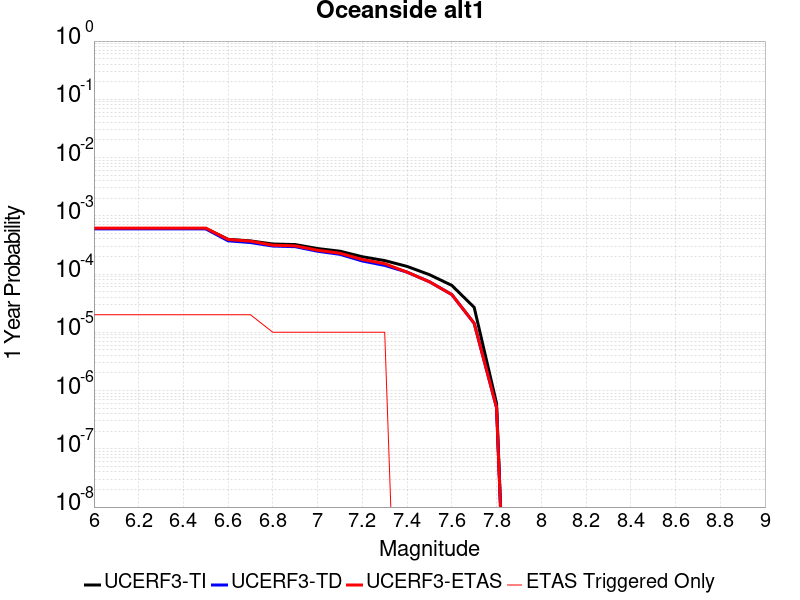 |  |

| Magnitude | 1 wk TI Prob | 1 wk TD Prob | 1 wk ETAS Prob | 1 wk ETAS/TD Gain | 1 wk ETAS Triggered Only | 1 mo TI Prob | 1 mo TD Prob | 1 mo ETAS Prob | 1 mo ETAS/TD Gain | 1 mo ETAS Triggered Only | 1 yr TI Prob | 1 yr TD Prob | 1 yr ETAS Prob | 1 yr ETAS/TD Gain | 1 yr ETAS Triggered Only | 10 yr TI Prob | 10 yr TD Prob | 10 yr ETAS Prob | 10 yr ETAS/TD Gain | 10 yr ETAS Triggered Only |
|-----|-----|-----|-----|-----|-----|-----|-----|-----|-----|-----|-----|-----|-----|-----|-----|-----|-----|-----|-----|-----|
| 6.0 | 1.1617542E-5 | 1.1423493E-5 | 4.6721358E-5 | 4.0899367 | 3.529827E-5 | 4.9788516E-5 | 4.8956997E-5 | 8.425354E-5 | 1.7209704 | 3.529827E-5 | 6.060066E-4 | 5.9590454E-4 | 6.3118176E-4 | 1.0591995 | 3.529827E-5 | 0.0060435664 | 0.005944664 | 0.0059797526 | 1.0059025 | 3.529827E-5 |
| 6.1 | 1.1617542E-5 | 1.1423493E-5 | 4.6721358E-5 | 4.0899367 | 3.529827E-5 | 4.9788516E-5 | 4.8956997E-5 | 8.425354E-5 | 1.7209704 | 3.529827E-5 | 6.060066E-4 | 5.9590454E-4 | 6.3118176E-4 | 1.0591995 | 3.529827E-5 | 0.0060435664 | 0.005944664 | 0.0059797526 | 1.0059025 | 3.529827E-5 |
| 6.2 | 1.1617542E-5 | 1.1423493E-5 | 4.6721358E-5 | 4.0899367 | 3.529827E-5 | 4.9788516E-5 | 4.8956997E-5 | 8.425354E-5 | 1.7209704 | 3.529827E-5 | 6.060066E-4 | 5.9590454E-4 | 6.3118176E-4 | 1.0591995 | 3.529827E-5 | 0.0060435664 | 0.005944664 | 0.0059797526 | 1.0059025 | 3.529827E-5 |
| 6.3 | 1.1617542E-5 | 1.1423493E-5 | 4.6721358E-5 | 4.0899367 | 3.529827E-5 | 4.9788516E-5 | 4.8956997E-5 | 8.425354E-5 | 1.7209704 | 3.529827E-5 | 6.060066E-4 | 5.9590454E-4 | 6.3118176E-4 | 1.0591995 | 3.529827E-5 | 0.0060435664 | 0.005944664 | 0.0059797526 | 1.0059025 | 3.529827E-5 |
| 6.4 | 1.1617542E-5 | 1.1423493E-5 | 4.6721358E-5 | 4.0899367 | 3.529827E-5 | 4.9788516E-5 | 4.8956997E-5 | 8.425354E-5 | 1.7209704 | 3.529827E-5 | 6.060066E-4 | 5.9590454E-4 | 6.3118176E-4 | 1.0591995 | 3.529827E-5 | 0.0060435664 | 0.005944664 | 0.0059797526 | 1.0059025 | 3.529827E-5 |
| 6.5 | 1.1617542E-5 | 1.1423493E-5 | 4.6721358E-5 | 4.0899367 | 3.529827E-5 | 4.9788516E-5 | 4.8956997E-5 | 8.425354E-5 | 1.7209704 | 3.529827E-5 | 6.060066E-4 | 5.9590454E-4 | 6.3118176E-4 | 1.0591995 | 3.529827E-5 | 0.0060435664 | 0.005944664 | 0.0059797526 | 1.0059025 | 3.529827E-5 |
| 6.6 | 7.561768E-6 | 7.1336153E-6 | 4.2431635E-5 | 5.948125 | 3.529827E-5 | 3.2407173E-5 | 3.0572286E-5 | 6.586948E-5 | 2.1545486 | 3.529827E-5 | 3.9448592E-4 | 3.7215507E-4 | 4.074402E-4 | 1.094813 | 3.529827E-5 | 0.0039378637 | 0.00371543 | 0.0037505971 | 1.0094651 | 3.529827E-5 |
| 6.7 | 7.1042605E-6 | 6.6556854E-6 | 4.195372E-5 | 6.303441 | 3.529827E-5 | 3.0446476E-5 | 2.8524059E-5 | 6.3821324E-5 | 2.2374558 | 3.529827E-5 | 3.706228E-4 | 3.472259E-4 | 3.825119E-4 | 1.1016227 | 3.529827E-5 | 0.0037000529 | 0.003466917 | 0.0035020928 | 1.0101461 | 3.529827E-5 |
| 6.8 | 6.285554E-6 | 5.799706E-6 | 4.109777E-5 | 7.086182 | 3.529827E-5 | 2.693781E-5 | 2.4855648E-5 | 6.015304E-5 | 2.4200954 | 3.529827E-5 | 3.2791847E-4 | 3.0257605E-4 | 3.3786363E-4 | 1.1166239 | 3.529827E-5 | 0.0032743502 | 0.0030216982 | 0.0030568899 | 1.0116463 | 3.529827E-5 |
| 6.9 | 6.148883E-6 | 5.6565445E-6 | 4.0954616E-5 | 7.240218 | 3.529827E-5 | 2.635209E-5 | 2.424211E-5 | 5.9539525E-5 | 2.4560373 | 3.529827E-5 | 3.2078946E-4 | 2.9510827E-4 | 3.3039614E-4 | 1.119576 | 3.529827E-5 | 0.003203268 | 0.0029472208 | 0.002982415 | 1.0119416 | 3.529827E-5 |
| 7.0 | 5.253857E-6 | 4.722404E-6 | 4.0020506E-5 | 8.474605 | 3.529827E-5 | 2.2516335E-5 | 2.0238718E-5 | 5.5536275E-5 | 2.7440608 | 3.529827E-5 | 2.7410188E-4 | 2.4637886E-4 | 2.816684E-4 | 1.143233 | 3.529827E-5 | 0.0027376404 | 0.0024610884 | 0.0024962998 | 1.0143073 | 3.529827E-5 |
| 7.1 | 4.730754E-6 | 4.17851E-6 | 3.9476632E-5 | 9.447538 | 3.529827E-5 | 2.0274503E-5 | 1.7907778E-5 | 5.320542E-5 | 2.9710786 | 3.529827E-5 | 2.468141E-4 | 2.1800565E-4 | 2.5329622E-4 | 1.1618792 | 3.529827E-5 | 0.0024654015 | 0.0021779444 | 0.0022131659 | 1.0161718 | 3.529827E-5 |
| 7.2 | 3.7998386E-6 | 3.214026E-6 | 3.8512182E-5 | 11.982536 | 3.529827E-5 | 1.6284921E-5 | 1.37743245E-5 | 4.907211E-5 | 3.5625782 | 3.529827E-5 | 1.9825088E-4 | 1.6768962E-4 | 2.0298197E-4 | 1.2104623 | 3.529827E-5 | 0.001980741 | 0.001675643 | 0.0017108822 | 1.0210302 | 3.529827E-5 |
| 7.3 | 3.2656465E-6 | 2.698376E-6 | 3.799655E-5 | 14.081266 | 3.529827E-5 | 1.3995553E-5 | 1.1564418E-5 | 4.686228E-5 | 4.052282 | 3.529827E-5 | 1.7038253E-4 | 1.407878E-4 | 1.760811E-4 | 1.2506844 | 3.529827E-5 | 0.0017025196 | 0.0014069972 | 0.0014422458 | 1.0250523 | 3.529827E-5 |
| 7.4 | 2.593703E-6 | 2.0680277E-6 | 2.0680277E-6 | 1.0 | 0.0 | 1.1115822E-5 | 8.862946E-6 | 8.862946E-6 | 1.0 | 0.0 | 1.3532673E-4 | 1.0790111E-4 | 1.0790111E-4 | 1.0 | 0.0 | 0.0013524436 | 0.0010784961 | 0.0010784961 | 1.0 | 0.0 |
| 7.5 | 1.8715585E-6 | 1.4137177E-6 | 1.4137177E-6 | 1.0 | 0.0 | 8.020941E-6 | 6.0587763E-6 | 6.0587763E-6 | 1.0 | 0.0 | 9.7650576E-5 | 7.376316E-5 | 7.376316E-5 | 1.0 | 0.0 | 9.7607676E-4 | 7.3739287E-4 | 7.3739287E-4 | 1.0 | 0.0 |
| 7.6 | 1.2246786E-6 | 8.5268175E-7 | 8.5268175E-7 | 1.0 | 0.0 | 5.248612E-6 | 3.6543456E-6 | 3.6543456E-6 | 1.0 | 0.0 | 6.389998E-5 | 4.4490793E-5 | 4.4490793E-5 | 1.0 | 0.0 | 6.3881604E-4 | 4.4482335E-4 | 4.4482335E-4 | 1.0 | 0.0 |
| 7.7 | 5.140719E-7 | 2.734703E-7 | 2.734703E-7 | 1.0 | 0.0 | 2.2031636E-6 | 1.1720151E-6 | 1.1720151E-6 | 1.0 | 0.0 | 2.6823185E-5 | 1.4269205E-5 | 1.4269205E-5 | 1.0 | 0.0 | 2.6819948E-4 | 1.4268424E-4 | 1.4268424E-4 | 1.0 | 0.0 |
| 7.8 | 1.16056995E-8 | 9.782373E-9 | 9.782373E-9 | 1.0 | 0.0 | 4.9738713E-8 | 4.1924455E-8 | 4.1924455E-8 | 1.0 | 0.0 | 6.0556863E-7 | 5.1043025E-7 | 5.1043025E-7 | 1.0 | 0.0 | 6.05567E-6 | 5.1043025E-6 | 5.1043025E-6 | 1.0 | 0.0 |

## Newport-Inglewood (Offshore)
*[(top)](#table-of-contents)*

| 1 Week | 1 Month | 1 Year | 10 Year |
|-----|-----|-----|-----|
|  |  | 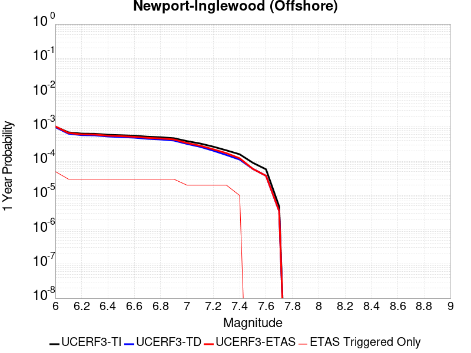 |  |

| Magnitude | 1 wk TI Prob | 1 wk TD Prob | 1 wk ETAS Prob | 1 wk ETAS/TD Gain | 1 wk ETAS Triggered Only | 1 mo TI Prob | 1 mo TD Prob | 1 mo ETAS Prob | 1 mo ETAS/TD Gain | 1 mo ETAS Triggered Only | 1 yr TI Prob | 1 yr TD Prob | 1 yr ETAS Prob | 1 yr ETAS/TD Gain | 1 yr ETAS Triggered Only | 10 yr TI Prob | 10 yr TD Prob | 10 yr ETAS Prob | 10 yr ETAS/TD Gain | 10 yr ETAS Triggered Only |
|-----|-----|-----|-----|-----|-----|-----|-----|-----|-----|-----|-----|-----|-----|-----|-----|-----|-----|-----|-----|-----|
| 6.0 | 1.9626508E-5 | 1.8965357E-5 | 5.4262957E-5 | 2.861162 | 3.529827E-5 | 8.411089E-5 | 8.1277634E-5 | 1.16573035E-4 | 1.4342573 | 3.529827E-5 | 0.001023569 | 9.891186E-4 | 0.001024382 | 1.0356513 | 3.529827E-5 | 0.010188672 | 0.009848503 | 0.009883454 | 1.0035489 | 3.529827E-5 |
| 6.1 | 1.331886E-5 | 1.2218092E-5 | 4.7515932E-5 | 3.8889813 | 3.529827E-5 | 5.707958E-5 | 5.2362207E-5 | 8.7658635E-5 | 1.674082 | 3.529827E-5 | 6.947222E-4 | 6.3732493E-4 | 6.726007E-4 | 1.0553497 | 3.529827E-5 | 0.006925544 | 0.006355149 | 0.006390223 | 1.005519 | 3.529827E-5 |
| 6.2 | 1.2250852E-5 | 1.1076029E-5 | 4.637391E-5 | 4.186871 | 3.529827E-5 | 5.2502597E-5 | 4.7467838E-5 | 8.276443E-5 | 1.7435896 | 3.529827E-5 | 6.3903164E-4 | 5.777687E-4 | 6.130466E-4 | 1.0610589 | 3.529827E-5 | 0.006371971 | 0.0057627866 | 0.0057978816 | 1.0060899 | 3.529827E-5 |
| 6.3 | 1.2106258E-5 | 1.0918891E-5 | 4.6216777E-5 | 4.232735 | 3.529827E-5 | 5.1882926E-5 | 4.6794412E-5 | 8.2091035E-5 | 1.7542913 | 3.529827E-5 | 6.3149154E-4 | 5.69574E-4 | 6.0485216E-4 | 1.0619378 | 3.529827E-5 | 0.0062970007 | 0.005681259 | 0.005716357 | 1.0061778 | 3.529827E-5 |
| 6.4 | 1.1348758E-5 | 1.0109362E-5 | 4.5407276E-5 | 4.491606 | 3.529827E-5 | 4.8636626E-5 | 4.3325123E-5 | 7.8621866E-5 | 1.8146945 | 3.529827E-5 | 5.919901E-4 | 5.273565E-4 | 5.626361E-4 | 1.0668991 | 3.529827E-5 | 0.005904155 | 0.0052611465 | 0.005296259 | 1.0066739 | 3.529827E-5 |
| 6.5 | 1.100837E-5 | 9.7433895E-6 | 4.5041317E-5 | 4.6227565 | 3.529827E-5 | 4.7177873E-5 | 4.1756717E-5 | 7.705351E-5 | 1.8452963 | 3.529827E-5 | 5.7423924E-4 | 5.082702E-4 | 5.4355053E-4 | 1.0694126 | 3.529827E-5 | 0.005727576 | 0.0050711688 | 0.005106288 | 1.0069252 | 3.529827E-5 |
| 6.6 | 1.0634696E-5 | 9.345544E-6 | 4.4643482E-5 | 4.776981 | 3.529827E-5 | 4.557647E-5 | 4.0051716E-5 | 7.534857E-5 | 1.881282 | 3.529827E-5 | 5.5475225E-4 | 4.8752132E-4 | 5.2280235E-4 | 1.0723683 | 3.529827E-5 | 0.0055336943 | 0.0048646047 | 0.0048997314 | 1.0072209 | 3.529827E-5 |
| 6.7 | 9.9780855E-6 | 8.667911E-6 | 4.3965876E-5 | 5.0722575 | 3.529827E-5 | 4.276252E-5 | 3.7147664E-5 | 7.244462E-5 | 1.9501798 | 3.529827E-5 | 5.205093E-4 | 4.5217964E-4 | 4.8746195E-4 | 1.0780272 | 3.529827E-5 | 0.0051929182 | 0.004512675 | 0.004547814 | 1.0077868 | 3.529827E-5 |
| 6.8 | 9.59546E-6 | 8.27295E-6 | 4.357093E-5 | 5.2666736 | 3.529827E-5 | 4.1122752E-5 | 3.5455025E-5 | 7.0752045E-5 | 1.9955435 | 3.529827E-5 | 5.0055445E-4 | 4.315801E-4 | 4.6686313E-4 | 1.0817531 | 3.529827E-5 | 0.004994285 | 0.004307495 | 0.004342641 | 1.0081593 | 3.529827E-5 |
| 6.9 | 9.000614E-6 | 7.70684E-6 | 4.300484E-5 | 5.580087 | 3.529827E-5 | 3.857349E-5 | 3.30289E-5 | 6.832601E-5 | 2.0686734 | 3.529827E-5 | 4.6953102E-4 | 4.0205332E-4 | 4.3733738E-4 | 1.0877597 | 3.529827E-5 | 0.004685402 | 0.0040133307 | 0.0040484876 | 1.00876 | 3.529827E-5 |
| 7.0 | 7.4070194E-6 | 6.148904E-6 | 4.1446958E-5 | 6.740544 | 3.529827E-5 | 3.1743984E-5 | 2.635218E-5 | 6.164952E-5 | 2.3394468 | 3.529827E-5 | 3.8641447E-4 | 3.207907E-4 | 3.5607765E-4 | 1.1099999 | 3.529827E-5 | 0.0038574322 | 0.0032032963 | 0.0032384815 | 1.0109841 | 3.529827E-5 |
| 7.1 | 6.299615E-6 | 5.0565927E-6 | 4.0354684E-5 | 7.980608 | 3.529827E-5 | 2.699807E-5 | 2.1670932E-5 | 5.6968438E-5 | 2.628795 | 3.529827E-5 | 3.2865192E-4 | 2.638118E-4 | 2.9910073E-4 | 1.1337657 | 3.529827E-5 | 0.003281663 | 0.002635001 | 0.0026702061 | 1.0133606 | 3.529827E-5 |
| 7.2 | 5.096653E-6 | 3.892769E-6 | 3.91909E-5 | 10.0676155 | 3.529827E-5 | 2.1842614E-5 | 1.668319E-5 | 5.198087E-5 | 3.1157634 | 3.529827E-5 | 2.6590136E-4 | 2.0309901E-4 | 2.3839012E-4 | 1.173763 | 3.529827E-5 | 0.0026558342 | 0.0020291451 | 0.0020643717 | 1.0173603 | 3.529827E-5 |
| 7.3 | 3.9753018E-6 | 2.9099103E-6 | 3.8208076E-5 | 13.130328 | 3.529827E-5 | 1.7036897E-5 | 1.2470985E-5 | 4.7768815E-5 | 3.8303964 | 3.529827E-5 | 2.0740448E-4 | 1.5182374E-4 | 1.8711665E-4 | 1.2324598 | 3.529827E-5 | 0.00207211 | 0.0015172083 | 0.0015524529 | 1.02323 | 3.529827E-5 |
| 7.4 | 3.0568392E-6 | 2.1449955E-6 | 2.1449955E-6 | 1.0 | 0.0 | 1.3100675E-5 | 9.192806E-6 | 9.192806E-6 | 1.0 | 0.0 | 1.5948903E-4 | 1.1191672E-4 | 1.1191672E-4 | 1.0 | 0.0 | 0.0015937461 | 0.0011186098 | 0.0011186098 | 1.0 | 0.0 |
| 7.5 | 1.7279019E-6 | 1.1469883E-6 | 1.1469883E-6 | 1.0 | 0.0 | 7.405273E-6 | 4.915655E-6 | 4.915655E-6 | 1.0 | 0.0 | 9.015547E-5 | 5.9846494E-5 | 5.9846494E-5 | 1.0 | 0.0 | 9.01189E-4 | 5.9830764E-4 | 5.9830764E-4 | 1.0 | 0.0 |
| 7.6 | 1.1156416E-6 | 7.223012E-7 | 7.223012E-7 | 1.0 | 0.0 | 4.7813123E-6 | 3.095573E-6 | 3.095573E-6 | 1.0 | 0.0 | 5.821092E-5 | 3.7687976E-5 | 3.7687976E-5 | 1.0 | 0.0 | 5.8195676E-4 | 3.7681818E-4 | 3.7681818E-4 | 1.0 | 0.0 |
| 7.7 | 9.117973E-8 | 6.734145E-8 | 6.734145E-8 | 1.0 | 0.0 | 3.907702E-7 | 2.886062E-7 | 2.886062E-7 | 1.0 | 0.0 | 4.757617E-6 | 3.513775E-6 | 3.513775E-6 | 1.0 | 0.0 | 4.7575148E-5 | 3.5137225E-5 | 3.5137225E-5 | 1.0 | 0.0 |

## Hosgri
*[(top)](#table-of-contents)*

| 1 Week | 1 Month | 1 Year | 10 Year |
|-----|-----|-----|-----|
|  |  |  |  |

| Magnitude | 1 wk TI Prob | 1 wk TD Prob | 1 wk ETAS Prob | 1 wk ETAS/TD Gain | 1 wk ETAS Triggered Only | 1 mo TI Prob | 1 mo TD Prob | 1 mo ETAS Prob | 1 mo ETAS/TD Gain | 1 mo ETAS Triggered Only | 1 yr TI Prob | 1 yr TD Prob | 1 yr ETAS Prob | 1 yr ETAS/TD Gain | 1 yr ETAS Triggered Only | 10 yr TI Prob | 10 yr TD Prob | 10 yr ETAS Prob | 10 yr ETAS/TD Gain | 10 yr ETAS Triggered Only |
|-----|-----|-----|-----|-----|-----|-----|-----|-----|-----|-----|-----|-----|-----|-----|-----|-----|-----|-----|-----|-----|
| 6.0 | 2.883978E-5 | 2.9128416E-5 | 2.9128416E-5 | 1.0 | 0.0 | 1.235932E-4 | 1.2483024E-4 | 1.2483024E-4 | 1.0 | 0.0 | 0.0015037085 | 0.001518776 | 0.0015540206 | 1.023206 | 3.529827E-5 | 0.01493574 | 0.01508774 | 0.015122505 | 1.0023042 | 3.529827E-5 |
| 6.1 | 2.883978E-5 | 2.9128416E-5 | 2.9128416E-5 | 1.0 | 0.0 | 1.235932E-4 | 1.2483024E-4 | 1.2483024E-4 | 1.0 | 0.0 | 0.0015037085 | 0.001518776 | 0.0015540206 | 1.023206 | 3.529827E-5 | 0.01493574 | 0.01508774 | 0.015122505 | 1.0023042 | 3.529827E-5 |
| 6.2 | 2.883978E-5 | 2.9128416E-5 | 2.9128416E-5 | 1.0 | 0.0 | 1.235932E-4 | 1.2483024E-4 | 1.2483024E-4 | 1.0 | 0.0 | 0.0015037085 | 0.001518776 | 0.0015540206 | 1.023206 | 3.529827E-5 | 0.01493574 | 0.01508774 | 0.015122505 | 1.0023042 | 3.529827E-5 |
| 6.3 | 2.2914428E-5 | 2.2641969E-5 | 2.2641969E-5 | 1.0 | 0.0 | 9.8200995E-5 | 9.703343E-5 | 9.703343E-5 | 1.0 | 0.0 | 0.0011949413 | 0.0011807467 | 0.0012160033 | 1.0298595 | 3.529827E-5 | 0.011885363 | 0.011746133 | 0.011781016 | 1.0029697 | 3.529827E-5 |
| 6.4 | 2.0195741E-5 | 1.969656E-5 | 1.969656E-5 | 1.0 | 0.0 | 8.65503E-5 | 8.4411105E-5 | 8.4411105E-5 | 1.0 | 0.0 | 0.0010532405 | 0.0010272227 | 0.0010624847 | 1.0343275 | 3.529827E-5 | 0.010482626 | 0.010225792 | 0.01026073 | 1.0034165 | 3.529827E-5 |
| 6.5 | 1.9924333E-5 | 1.940898E-5 | 1.940898E-5 | 1.0 | 0.0 | 8.53872E-5 | 8.3178704E-5 | 8.3178704E-5 | 1.0 | 0.0 | 0.0010390934 | 0.0010122322 | 0.0010474947 | 1.0348364 | 3.529827E-5 | 0.010342481 | 0.010077253 | 0.010112195 | 1.0034674 | 3.529827E-5 |
| 6.6 | 1.809694E-5 | 1.74583E-5 | 1.74583E-5 | 1.0 | 0.0 | 7.7556004E-5 | 7.4819145E-5 | 7.4819145E-5 | 1.0 | 0.0 | 9.438353E-4 | 9.105437E-4 | 9.458099E-4 | 1.0387309 | 3.529827E-5 | 0.009398366 | 0.009069073 | 0.009104052 | 1.0038569 | 3.529827E-5 |
| 6.7 | 1.675989E-5 | 1.6042764E-5 | 1.6042764E-5 | 1.0 | 0.0 | 7.182612E-5 | 6.87529E-5 | 6.87529E-5 | 1.0 | 0.0 | 8.7413215E-4 | 8.3674624E-4 | 8.7201496E-4 | 1.0421499 | 3.529827E-5 | 0.008707017 | 0.0083368635 | 0.008371867 | 1.0041987 | 3.529827E-5 |
| 6.8 | 1.5401129E-5 | 1.4614083E-5 | 1.4614083E-5 | 1.0 | 0.0 | 6.6003166E-5 | 6.2630286E-5 | 6.2630286E-5 | 1.0 | 0.0 | 8.032922E-4 | 7.622578E-4 | 7.622578E-4 | 1.0 | 0.0 | 0.008003947 | 0.007597296 | 0.007597296 | 1.0 | 0.0 |
| 6.9 | 1.356559E-5 | 1.2689968E-5 | 1.2689968E-5 | 1.0 | 0.0 | 5.8136946E-5 | 5.4384444E-5 | 5.4384444E-5 | 1.0 | 0.0 | 7.0758746E-4 | 6.619299E-4 | 6.619299E-4 | 1.0 | 0.0 | 0.007053386 | 0.006600388 | 0.006600388 | 1.0 | 0.0 |
| 7.0 | 1.2030819E-5 | 1.1095962E-5 | 1.1095962E-5 | 1.0 | 0.0 | 5.155963E-5 | 4.7553254E-5 | 4.7553254E-5 | 1.0 | 0.0 | 6.275577E-4 | 5.7880714E-4 | 5.7880714E-4 | 1.0 | 0.0 | 0.006257884 | 0.005773757 | 0.005773757 | 1.0 | 0.0 |
| 7.1 | 1.0972698E-5 | 1.0022179E-5 | 1.0022179E-5 | 1.0 | 0.0 | 4.7025E-5 | 4.2951488E-5 | 4.2951488E-5 | 1.0 | 0.0 | 5.72379E-4 | 5.22809E-4 | 5.22809E-4 | 1.0 | 0.0 | 0.0057090693 | 0.005216542 | 0.005216542 | 1.0 | 0.0 |
| 7.2 | 9.961926E-6 | 9.034746E-6 | 9.034746E-6 | 1.0 | 0.0 | 4.2693267E-5 | 3.8719765E-5 | 3.8719765E-5 | 1.0 | 0.0 | 5.1966653E-4 | 4.713112E-4 | 4.713112E-4 | 1.0 | 0.0 | 0.00518453 | 0.0047038626 | 0.0047038626 | 1.0 | 0.0 |
| 7.3 | 8.700929E-6 | 7.8281E-6 | 7.8281E-6 | 1.0 | 0.0 | 3.7289166E-5 | 3.354857E-5 | 3.354857E-5 | 1.0 | 0.0 | 4.53901E-4 | 4.0837732E-4 | 4.0837732E-4 | 1.0 | 0.0 | 0.00452975 | 0.004077008 | 0.004077008 | 1.0 | 0.0 |
| 7.4 | 7.866285E-6 | 6.998739E-6 | 6.998739E-6 | 1.0 | 0.0 | 3.3712215E-5 | 2.9994251E-5 | 2.9994251E-5 | 1.0 | 0.0 | 4.103689E-4 | 3.6511885E-4 | 3.6511885E-4 | 1.0 | 0.0 | 0.004096119 | 0.0036459267 | 0.0036459267 | 1.0 | 0.0 |
| 7.5 | 6.8381305E-6 | 5.9596955E-6 | 5.9596955E-6 | 1.0 | 0.0 | 2.9305946E-5 | 2.5541302E-5 | 2.5541302E-5 | 1.0 | 0.0 | 3.5674145E-4 | 3.10921E-4 | 3.10921E-4 | 1.0 | 0.0 | 0.0035616932 | 0.0031055948 | 0.0031055948 | 1.0 | 0.0 |
| 7.6 | 5.503376E-6 | 4.5952443E-6 | 4.5952443E-6 | 1.0 | 0.0 | 2.3585684E-5 | 1.9693754E-5 | 1.9693754E-5 | 1.0 | 0.0 | 2.8711787E-4 | 2.397451E-4 | 2.397451E-4 | 1.0 | 0.0 | 0.002867472 | 0.0023955975 | 0.0023955975 | 1.0 | 0.0 |
| 7.7 | 3.6144982E-6 | 2.6522112E-6 | 2.6522112E-6 | 1.0 | 0.0 | 1.5490614E-5 | 1.1366569E-5 | 1.1366569E-5 | 1.0 | 0.0 | 1.8858191E-4 | 1.383792E-4 | 1.383792E-4 | 1.0 | 0.0 | 0.0018842196 | 0.0013836613 | 0.0013836613 | 1.0 | 0.0 |
| 7.8 | 1.9853494E-6 | 1.1361129E-6 | 1.1361129E-6 | 1.0 | 0.0 | 8.508612E-6 | 4.8690463E-6 | 4.8690463E-6 | 1.0 | 0.0 | 1.0358743E-4 | 5.9279027E-5 | 5.9279027E-5 | 1.0 | 0.0 | 0.0010353916 | 5.9336185E-4 | 5.9336185E-4 | 1.0 | 0.0 |
| 7.9 | 1.1818757E-6 | 5.2951856E-7 | 5.2951856E-7 | 1.0 | 0.0 | 5.0651715E-6 | 2.2693632E-6 | 2.2693632E-6 | 1.0 | 0.0 | 6.1666724E-5 | 2.7629147E-5 | 2.7629147E-5 | 1.0 | 0.0 | 6.1649614E-4 | 2.7694515E-4 | 2.7694515E-4 | 1.0 | 0.0 |
| 8.0 | 6.962958E-7 | 2.7139782E-7 | 2.7139782E-7 | 1.0 | 0.0 | 2.9841215E-6 | 1.163133E-6 | 1.163133E-6 | 1.0 | 0.0 | 3.6331072E-5 | 1.4161053E-5 | 1.4161053E-5 | 1.0 | 0.0 | 3.6325134E-4 | 1.4217179E-4 | 1.4217179E-4 | 1.0 | 0.0 |
| 8.1 | 1.5033264E-7 | 6.527624E-8 | 6.527624E-8 | 1.0 | 0.0 | 6.442826E-7 | 2.7975528E-7 | 2.7975528E-7 | 1.0 | 0.0 | 7.844113E-6 | 3.4060151E-6 | 3.4060151E-6 | 1.0 | 0.0 | 7.843835E-5 | 3.407693E-5 | 3.407693E-5 | 1.0 | 0.0 |

## Great Valley 05 Pittsburg - Kirby Hills alt1
*[(top)](#table-of-contents)*

| 1 Week | 1 Month | 1 Year | 10 Year |
|-----|-----|-----|-----|
|  |  | 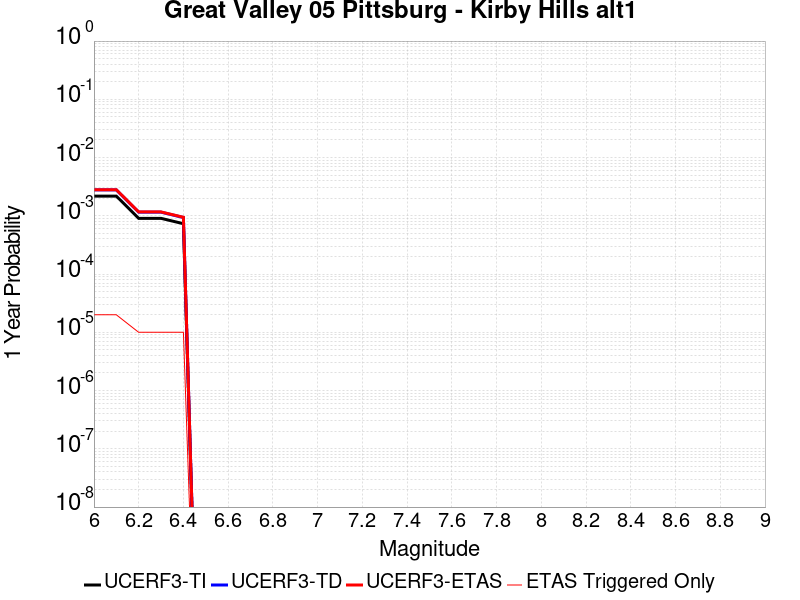 |  |

| Magnitude | 1 wk TI Prob | 1 wk TD Prob | 1 wk ETAS Prob | 1 wk ETAS/TD Gain | 1 wk ETAS Triggered Only | 1 mo TI Prob | 1 mo TD Prob | 1 mo ETAS Prob | 1 mo ETAS/TD Gain | 1 mo ETAS Triggered Only | 1 yr TI Prob | 1 yr TD Prob | 1 yr ETAS Prob | 1 yr ETAS/TD Gain | 1 yr ETAS Triggered Only | 10 yr TI Prob | 10 yr TD Prob | 10 yr ETAS Prob | 10 yr ETAS/TD Gain | 10 yr ETAS Triggered Only |
|-----|-----|-----|-----|-----|-----|-----|-----|-----|-----|-----|-----|-----|-----|-----|-----|-----|-----|-----|-----|-----|
| 6.0 | 4.187212E-5 | 5.3442072E-5 | 5.3442072E-5 | 1.0 | 0.0 | 1.794396E-4 | 2.290231E-4 | 2.6431328E-4 | 1.15409 | 3.529827E-5 | 0.002182488 | 0.0027857882 | 0.002820988 | 1.0126356 | 3.529827E-5 | 0.021611776 | 0.02760304 | 0.027637362 | 1.0012435 | 3.529827E-5 |
| 6.1 | 4.187212E-5 | 5.3442072E-5 | 5.3442072E-5 | 1.0 | 0.0 | 1.794396E-4 | 2.290231E-4 | 2.6431328E-4 | 1.15409 | 3.529827E-5 | 0.002182488 | 0.0027857882 | 0.002820988 | 1.0126356 | 3.529827E-5 | 0.021611776 | 0.02760304 | 0.027637362 | 1.0012435 | 3.529827E-5 |
| 6.2 | 1.7353306E-5 | 2.2154374E-5 | 2.2154374E-5 | 1.0 | 0.0 | 7.436919E-5 | 9.494618E-5 | 1.302411E-4 | 1.371736 | 3.529827E-5 | 9.050688E-4 | 0.0011557543 | 0.0011910117 | 1.030506 | 3.529827E-5 | 0.009013915 | 0.011535114 | 0.011570005 | 1.0030248 | 3.529827E-5 |
| 6.3 | 1.7353306E-5 | 2.2154374E-5 | 2.2154374E-5 | 1.0 | 0.0 | 7.436919E-5 | 9.494618E-5 | 1.302411E-4 | 1.371736 | 3.529827E-5 | 9.050688E-4 | 0.0011557543 | 0.0011910117 | 1.030506 | 3.529827E-5 | 0.009013915 | 0.011535114 | 0.011570005 | 1.0030248 | 3.529827E-5 |
| 6.4 | 1.4028824E-5 | 1.7900597E-5 | 1.7900597E-5 | 1.0 | 0.0 | 6.0122147E-5 | 7.671684E-5 | 1.120124E-4 | 1.4600759 | 3.529827E-5 | 7.3174125E-4 | 9.340275E-4 | 9.692928E-4 | 1.0377562 | 3.529827E-5 | 0.0072933645 | 0.009338138 | 0.009373106 | 1.0037447 | 3.529827E-5 |

## San Jacinto (Superstition Mtn)
*[(top)](#table-of-contents)*

| 1 Week | 1 Month | 1 Year | 10 Year |
|-----|-----|-----|-----|
|  |  |  |  |

| Magnitude | 1 wk TI Prob | 1 wk TD Prob | 1 wk ETAS Prob | 1 wk ETAS/TD Gain | 1 wk ETAS Triggered Only | 1 mo TI Prob | 1 mo TD Prob | 1 mo ETAS Prob | 1 mo ETAS/TD Gain | 1 mo ETAS Triggered Only | 1 yr TI Prob | 1 yr TD Prob | 1 yr ETAS Prob | 1 yr ETAS/TD Gain | 1 yr ETAS Triggered Only | 10 yr TI Prob | 10 yr TD Prob | 10 yr ETAS Prob | 10 yr ETAS/TD Gain | 10 yr ETAS Triggered Only |
|-----|-----|-----|-----|-----|-----|-----|-----|-----|-----|-----|-----|-----|-----|-----|-----|-----|-----|-----|-----|-----|
| 6.0 | 6.4193904E-5 | 9.599367E-5 | 9.599367E-5 | 1.0 | 0.0 | 2.7508775E-4 | 4.1134638E-4 | 4.4663012E-4 | 1.0857762 | 3.529827E-5 | 0.0033440501 | 0.0049980893 | 0.0050332113 | 1.007027 | 3.529827E-5 | 0.03294174 | 0.048823986 | 0.04885756 | 1.0006877 | 3.529827E-5 |
| 6.1 | 6.4193904E-5 | 9.599367E-5 | 9.599367E-5 | 1.0 | 0.0 | 2.7508775E-4 | 4.1134638E-4 | 4.4663012E-4 | 1.0857762 | 3.529827E-5 | 0.0033440501 | 0.0049980893 | 0.0050332113 | 1.007027 | 3.529827E-5 | 0.03294174 | 0.048823986 | 0.04885756 | 1.0006877 | 3.529827E-5 |
| 6.2 | 5.7023593E-5 | 8.3144434E-5 | 8.3144434E-5 | 1.0 | 0.0 | 2.4436394E-4 | 3.5629404E-4 | 3.9157973E-4 | 1.0990353 | 3.529827E-5 | 0.002971072 | 0.0043308944 | 0.0043660398 | 1.008115 | 3.529827E-5 | 0.029316625 | 0.04250403 | 0.042537827 | 1.0007951 | 3.529827E-5 |
| 6.3 | 5.6940098E-5 | 8.298979E-5 | 8.298979E-5 | 1.0 | 0.0 | 2.4400617E-4 | 3.5563146E-4 | 3.9091718E-4 | 1.0992199 | 3.529827E-5 | 0.002966728 | 0.00432286 | 0.0043580057 | 1.0081302 | 3.529827E-5 | 0.029274331 | 0.042427283 | 0.042461082 | 1.0007967 | 3.529827E-5 |
| 6.4 | 5.4171585E-5 | 7.7483564E-5 | 7.7483564E-5 | 1.0 | 0.0 | 2.3214328E-4 | 3.3203943E-4 | 3.67326E-4 | 1.1062722 | 3.529827E-5 | 0.0028226813 | 0.0040367353 | 0.004071891 | 1.008709 | 3.529827E-5 | 0.02787096 | 0.03971653 | 0.039750427 | 1.0008534 | 3.529827E-5 |
| 6.5 | 4.375144E-5 | 5.642133E-5 | 5.642133E-5 | 1.0 | 0.0 | 1.874927E-4 | 2.4178992E-4 | 2.4178992E-4 | 1.0 | 0.0 | 0.0022803338 | 0.002940994 | 0.002940994 | 1.0 | 0.0 | 0.022570757 | 0.029236801 | 0.029236801 | 1.0 | 0.0 |
| 6.6 | 2.772192E-5 | 2.5488358E-5 | 2.5488358E-5 | 1.0 | 0.0 | 1.1880282E-4 | 1.09231354E-4 | 1.09231354E-4 | 1.0 | 0.0 | 0.0014454646 | 0.0013290998 | 0.0013290998 | 1.0 | 0.0 | 0.014360986 | 0.01354049 | 0.01354049 | 1.0 | 0.0 |
| 6.7 | 2.7124124E-5 | 2.4699386E-5 | 2.4699386E-5 | 1.0 | 0.0 | 1.1624106E-4 | 1.05850326E-4 | 1.05850326E-4 | 1.0 | 0.0 | 0.0014143161 | 0.001287985 | 0.001287985 | 1.0 | 0.0 | 0.014053487 | 0.013133943 | 0.013133943 | 1.0 | 0.0 |
| 6.8 | 2.5475807E-5 | 2.216446E-5 | 2.216446E-5 | 1.0 | 0.0 | 1.0917746E-4 | 9.4987154E-5 | 9.4987154E-5 | 1.0 | 0.0 | 0.001328425 | 0.001155867 | 0.001155867 | 1.0 | 0.0 | 0.0132051185 | 0.011822182 | 0.011822182 | 1.0 | 0.0 |
| 6.9 | 2.1162023E-5 | 1.7626244E-5 | 1.7626244E-5 | 1.0 | 0.0 | 9.069123E-5 | 7.5538876E-5 | 7.5538876E-5 | 1.0 | 0.0 | 0.0011036064 | 9.193016E-4 | 9.193016E-4 | 1.0 | 0.0 | 0.010981417 | 0.00944688 | 0.00944688 | 1.0 | 0.0 |
| 7.0 | 1.8754288E-5 | 1.6161559E-5 | 1.6161559E-5 | 1.0 | 0.0 | 8.037304E-5 | 6.9261994E-5 | 6.9261994E-5 | 1.0 | 0.0 | 9.781026E-4 | 8.4294105E-4 | 8.4294105E-4 | 1.0 | 0.0 | 0.009738087 | 0.008670042 | 0.008670042 | 1.0 | 0.0 |
| 7.1 | 1.8678527E-5 | 1.6086702E-5 | 1.6086702E-5 | 1.0 | 0.0 | 8.0048376E-5 | 6.89412E-5 | 6.89412E-5 | 1.0 | 0.0 | 9.7415317E-4 | 8.3903834E-4 | 8.3903834E-4 | 1.0 | 0.0 | 0.009698939 | 0.008630998 | 0.008630998 | 1.0 | 0.0 |
| 7.2 | 1.7804578E-5 | 1.5381282E-5 | 1.5381282E-5 | 1.0 | 0.0 | 7.6303106E-5 | 6.5918124E-5 | 6.5918124E-5 | 1.0 | 0.0 | 9.285943E-4 | 8.022599E-4 | 8.022599E-4 | 1.0 | 0.0 | 0.009247236 | 0.008262311 | 0.008262311 | 1.0 | 0.0 |
| 7.3 | 1.6583685E-5 | 1.4530388E-5 | 1.4530388E-5 | 1.0 | 0.0 | 7.1070994E-5 | 6.227162E-5 | 6.227162E-5 | 1.0 | 0.0 | 8.649459E-4 | 7.5789524E-4 | 7.5789524E-4 | 1.0 | 0.0 | 0.00861587 | 0.007817623 | 0.007817623 | 1.0 | 0.0 |
| 7.4 | 1.6387552E-5 | 1.4395274E-5 | 1.4395274E-5 | 1.0 | 0.0 | 7.023047E-5 | 6.169258E-5 | 6.169258E-5 | 1.0 | 0.0 | 8.5472054E-4 | 7.5085036E-4 | 7.5085036E-4 | 1.0 | 0.0 | 0.008514405 | 0.0077470057 | 0.0077470057 | 1.0 | 0.0 |
| 7.5 | 1.5790754E-5 | 1.4035962E-5 | 1.4035962E-5 | 1.0 | 0.0 | 6.767291E-5 | 6.0152746E-5 | 6.0152746E-5 | 1.0 | 0.0 | 8.236062E-4 | 7.321156E-4 | 7.321156E-4 | 1.0 | 0.0 | 0.008205604 | 0.007557569 | 0.007557569 | 1.0 | 0.0 |
| 7.6 | 1.4248672E-5 | 1.3054932E-5 | 1.3054932E-5 | 1.0 | 0.0 | 6.106431E-5 | 5.594852E-5 | 5.594852E-5 | 1.0 | 0.0 | 7.432043E-4 | 6.8096205E-4 | 6.8096205E-4 | 1.0 | 0.0 | 0.007407237 | 0.0070401574 | 0.0070401574 | 1.0 | 0.0 |
| 7.7 | 1.15449975E-5 | 1.090368E-5 | 1.090368E-5 | 1.0 | 0.0 | 4.947762E-5 | 4.6729223E-5 | 4.6729223E-5 | 1.0 | 0.0 | 6.022235E-4 | 5.687805E-4 | 5.687805E-4 | 1.0 | 0.0 | 0.006005941 | 0.0059101824 | 0.0059101824 | 1.0 | 0.0 |
| 7.8 | 9.1391985E-6 | 9.514299E-6 | 9.514299E-6 | 1.0 | 0.0 | 3.9167408E-5 | 4.0774932E-5 | 4.0774932E-5 | 1.0 | 0.0 | 4.767588E-4 | 4.963223E-4 | 4.963223E-4 | 1.0 | 0.0 | 0.0047573727 | 0.0051766867 | 0.0051766867 | 1.0 | 0.0 |
| 7.9 | 6.973017E-6 | 7.3821784E-6 | 7.3821784E-6 | 1.0 | 0.0 | 2.9884017E-5 | 3.1637526E-5 | 3.1637526E-5 | 1.0 | 0.0 | 3.6377716E-4 | 3.8511935E-4 | 3.8511935E-4 | 1.0 | 0.0 | 0.0036318225 | 0.0040517948 | 0.0040517948 | 1.0 | 0.0 |
| 8.0 | 5.7638235E-6 | 6.259972E-6 | 6.259972E-6 | 1.0 | 0.0 | 2.4701867E-5 | 2.6828178E-5 | 2.6828178E-5 | 1.0 | 0.0 | 3.0070372E-4 | 3.2658462E-4 | 3.2658462E-4 | 1.0 | 0.0 | 0.0030029714 | 0.0034534496 | 0.0034534496 | 1.0 | 0.0 |
| 8.1 | 5.1124434E-6 | 5.4956718E-6 | 5.4956718E-6 | 1.0 | 0.0 | 2.1910288E-5 | 2.355267E-5 | 2.355267E-5 | 1.0 | 0.0 | 2.6672508E-4 | 2.867165E-4 | 2.867165E-4 | 1.0 | 0.0 | 0.0026640517 | 0.003040336 | 0.003040336 | 1.0 | 0.0 |
| 8.2 | 1.1075938E-6 | 5.336568E-7 | 5.336568E-7 | 1.0 | 0.0 | 4.7468216E-6 | 2.2870988E-6 | 2.2870988E-6 | 1.0 | 0.0 | 5.779102E-5 | 2.7845093E-5 | 2.7845093E-5 | 1.0 | 0.0 | 5.777599E-4 | 3.1346595E-4 | 3.1346595E-4 | 1.0 | 0.0 |
| 8.3 | 1.3584393E-8 | 4.473836E-9 | 4.473836E-9 | 1.0 | 0.0 | 5.8218827E-8 | 1.9173582E-8 | 1.9173582E-8 | 1.0 | 0.0 | 7.0881396E-7 | 2.3343837E-7 | 2.3343837E-7 | 1.0 | 0.0 | 7.0881174E-6 | 2.6163038E-6 | 2.6163038E-6 | 1.0 | 0.0 |

## Sisar
*[(top)](#table-of-contents)*

| 1 Week | 1 Month | 1 Year | 10 Year |
|-----|-----|-----|-----|
|  | 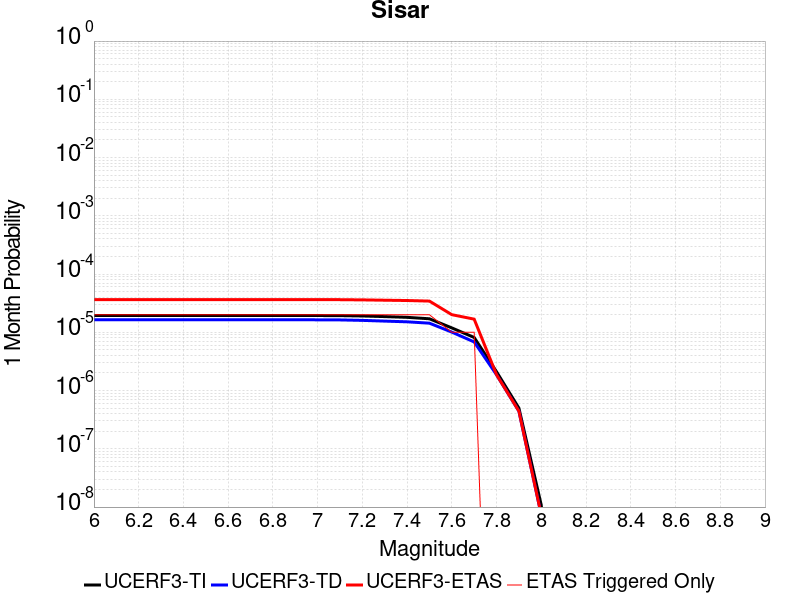 |  |  |

| Magnitude | 1 wk TI Prob | 1 wk TD Prob | 1 wk ETAS Prob | 1 wk ETAS/TD Gain | 1 wk ETAS Triggered Only | 1 mo TI Prob | 1 mo TD Prob | 1 mo ETAS Prob | 1 mo ETAS/TD Gain | 1 mo ETAS Triggered Only | 1 yr TI Prob | 1 yr TD Prob | 1 yr ETAS Prob | 1 yr ETAS/TD Gain | 1 yr ETAS Triggered Only | 10 yr TI Prob | 10 yr TD Prob | 10 yr ETAS Prob | 10 yr ETAS/TD Gain | 10 yr ETAS Triggered Only |
|-----|-----|-----|-----|-----|-----|-----|-----|-----|-----|-----|-----|-----|-----|-----|-----|-----|-----|-----|-----|-----|
| 6.0 | 4.544193E-6 | 3.839576E-6 | 3.839576E-6 | 1.0 | 0.0 | 1.9474966E-5 | 1.6455224E-5 | 5.1752915E-5 | 3.1450748 | 3.529827E-5 | 2.3708193E-4 | 2.0032428E-4 | 2.3561547E-4 | 1.1761703 | 3.529827E-5 | 0.0023682916 | 0.002001471 | 0.0020366984 | 1.0176009 | 3.529827E-5 |
| 6.1 | 4.544193E-6 | 3.839576E-6 | 3.839576E-6 | 1.0 | 0.0 | 1.9474966E-5 | 1.6455224E-5 | 5.1752915E-5 | 3.1450748 | 3.529827E-5 | 2.3708193E-4 | 2.0032428E-4 | 2.3561547E-4 | 1.1761703 | 3.529827E-5 | 0.0023682916 | 0.002001471 | 0.0020366984 | 1.0176009 | 3.529827E-5 |
| 6.2 | 4.544193E-6 | 3.839576E-6 | 3.839576E-6 | 1.0 | 0.0 | 1.9474966E-5 | 1.6455224E-5 | 5.1752915E-5 | 3.1450748 | 3.529827E-5 | 2.3708193E-4 | 2.0032428E-4 | 2.3561547E-4 | 1.1761703 | 3.529827E-5 | 0.0023682916 | 0.002001471 | 0.0020366984 | 1.0176009 | 3.529827E-5 |
| 6.3 | 4.544193E-6 | 3.839576E-6 | 3.839576E-6 | 1.0 | 0.0 | 1.9474966E-5 | 1.6455224E-5 | 5.1752915E-5 | 3.1450748 | 3.529827E-5 | 2.3708193E-4 | 2.0032428E-4 | 2.3561547E-4 | 1.1761703 | 3.529827E-5 | 0.0023682916 | 0.002001471 | 0.0020366984 | 1.0176009 | 3.529827E-5 |
| 6.4 | 4.544193E-6 | 3.839576E-6 | 3.839576E-6 | 1.0 | 0.0 | 1.9474966E-5 | 1.6455224E-5 | 5.1752915E-5 | 3.1450748 | 3.529827E-5 | 2.3708193E-4 | 2.0032428E-4 | 2.3561547E-4 | 1.1761703 | 3.529827E-5 | 0.0023682916 | 0.002001471 | 0.0020366984 | 1.0176009 | 3.529827E-5 |
| 6.5 | 4.544193E-6 | 3.839576E-6 | 3.839576E-6 | 1.0 | 0.0 | 1.9474966E-5 | 1.6455224E-5 | 5.1752915E-5 | 3.1450748 | 3.529827E-5 | 2.3708193E-4 | 2.0032428E-4 | 2.3561547E-4 | 1.1761703 | 3.529827E-5 | 0.0023682916 | 0.002001471 | 0.0020366984 | 1.0176009 | 3.529827E-5 |
| 6.6 | 4.544193E-6 | 3.839576E-6 | 3.839576E-6 | 1.0 | 0.0 | 1.9474966E-5 | 1.6455224E-5 | 5.1752915E-5 | 3.1450748 | 3.529827E-5 | 2.3708193E-4 | 2.0032428E-4 | 2.3561547E-4 | 1.1761703 | 3.529827E-5 | 0.0023682916 | 0.002001471 | 0.0020366984 | 1.0176009 | 3.529827E-5 |
| 6.7 | 4.544193E-6 | 3.839576E-6 | 3.839576E-6 | 1.0 | 0.0 | 1.9474966E-5 | 1.6455224E-5 | 5.1752915E-5 | 3.1450748 | 3.529827E-5 | 2.3708193E-4 | 2.0032428E-4 | 2.3561547E-4 | 1.1761703 | 3.529827E-5 | 0.0023682916 | 0.002001471 | 0.0020366984 | 1.0176009 | 3.529827E-5 |
| 6.8 | 4.544193E-6 | 3.839576E-6 | 3.839576E-6 | 1.0 | 0.0 | 1.9474966E-5 | 1.6455224E-5 | 5.1752915E-5 | 3.1450748 | 3.529827E-5 | 2.3708193E-4 | 2.0032428E-4 | 2.3561547E-4 | 1.1761703 | 3.529827E-5 | 0.0023682916 | 0.002001471 | 0.0020366984 | 1.0176009 | 3.529827E-5 |
| 6.9 | 4.542225E-6 | 3.8375383E-6 | 3.8375383E-6 | 1.0 | 0.0 | 1.9466532E-5 | 1.6446491E-5 | 5.174418E-5 | 3.1462142 | 3.529827E-5 | 2.3697925E-4 | 2.0021795E-4 | 2.3550916E-4 | 1.1762639 | 3.529827E-5 | 0.002367267 | 0.0020004094 | 0.0020356372 | 1.0176102 | 3.529827E-5 |
| 7.0 | 4.5278484E-6 | 3.822602E-6 | 3.822602E-6 | 1.0 | 0.0 | 1.940492E-5 | 1.638248E-5 | 5.1680174E-5 | 3.1546001 | 3.529827E-5 | 2.3622929E-4 | 1.9943877E-4 | 2.3473E-4 | 1.1769527 | 3.529827E-5 | 0.0023597833 | 0.0019926317 | 0.0020278597 | 1.0176791 | 3.529827E-5 |
| 7.1 | 4.5132488E-6 | 3.8073897E-6 | 3.8073897E-6 | 1.0 | 0.0 | 1.9342351E-5 | 1.6317284E-5 | 5.1614978E-5 | 3.163209 | 3.529827E-5 | 2.3546767E-4 | 1.9864515E-4 | 2.3393641E-4 | 1.1776597 | 3.529827E-5 | 0.0023521832 | 0.0019847096 | 0.0020199378 | 1.0177498 | 3.529827E-5 |
| 7.2 | 4.448859E-6 | 3.7398502E-6 | 3.7398502E-6 | 1.0 | 0.0 | 1.9066398E-5 | 1.6027832E-5 | 5.1325536E-5 | 3.2022755 | 3.529827E-5 | 2.3210866E-4 | 1.9512173E-4 | 2.304131E-4 | 1.1808685 | 3.529827E-5 | 0.0023186638 | 0.0019495375 | 0.0019847672 | 1.0180707 | 3.529827E-5 |
| 7.3 | 4.3424366E-6 | 3.6336846E-6 | 3.6336846E-6 | 1.0 | 0.0 | 1.861031E-5 | 1.5572843E-5 | 5.0870563E-5 | 3.2666202 | 3.529827E-5 | 2.2655698E-4 | 1.895832E-4 | 2.2487478E-4 | 1.1861535 | 3.529827E-5 | 0.0022632615 | 0.0018942481 | 0.0019294795 | 1.0185992 | 3.529827E-5 |
| 7.4 | 4.218641E-6 | 3.5330384E-6 | 3.5330384E-6 | 1.0 | 0.0 | 1.8079765E-5 | 1.5141507E-5 | 5.0439245E-5 | 3.3311903 | 3.529827E-5 | 2.2009891E-4 | 1.8433259E-4 | 2.1962436E-4 | 1.191457 | 3.529827E-5 | 0.0021988105 | 0.0018418302 | 0.0018770635 | 1.0191295 | 3.529827E-5 |
| 7.5 | 3.983779E-6 | 3.3478068E-6 | 3.3478068E-6 | 1.0 | 0.0 | 1.7073227E-5 | 1.4347666E-5 | 4.964543E-5 | 3.4601746 | 3.529827E-5 | 2.0784672E-4 | 1.7466917E-4 | 2.0996128E-4 | 1.2020512 | 3.529827E-5 | 0.0020765243 | 0.0017453518 | 0.0017805885 | 1.0201888 | 3.529827E-5 |
| 7.6 | 2.777393E-6 | 2.35225E-6 | 2.35225E-6 | 1.0 | 0.0 | 1.1903058E-5 | 1.0081033E-5 | 4.5378947E-5 | 4.5014186 | 3.529827E-5 | 1.449101E-4 | 1.2272975E-4 | 1.5802369E-4 | 1.2875744 | 3.529827E-5 | 0.0014481564 | 0.0012266274 | 0.0012618824 | 1.0287414 | 3.529827E-5 |
| 7.7 | 1.9028433E-6 | 1.593867E-6 | 1.593867E-6 | 1.0 | 0.0 | 8.155017E-6 | 6.8308404E-6 | 4.212887E-5 | 6.1674504 | 3.529827E-5 | 9.928281E-5 | 8.3162355E-5 | 1.1845769E-4 | 1.4244148 | 3.529827E-5 | 9.923846E-4 | 8.313171E-4 | 8.6658605E-4 | 1.0424254 | 3.529827E-5 |
| 7.8 | 4.9095956E-7 | 4.3583708E-7 | 4.3583708E-7 | 1.0 | 0.0 | 2.1041105E-6 | 1.8678718E-6 | 1.8678718E-6 | 1.0 | 0.0 | 2.5617246E-5 | 2.2741104E-5 | 2.2741104E-5 | 1.0 | 0.0 | 2.5614293E-4 | 2.2738794E-4 | 2.2738794E-4 | 1.0 | 0.0 |
| 7.9 | 1.16657894E-7 | 1.0335569E-7 | 1.0335569E-7 | 1.0 | 0.0 | 4.999623E-7 | 4.4295288E-7 | 4.4295288E-7 | 1.0 | 0.0 | 6.087024E-6 | 5.3929384E-6 | 5.3929384E-6 | 1.0 | 0.0 | 6.0868573E-5 | 5.3928103E-5 | 5.3928103E-5 | 1.0 | 0.0 |
| 8.0 | 2.5100346E-9 | 1.7067566E-9 | 1.7067566E-9 | 1.0 | 0.0 | 1.0757291E-8 | 7.3146724E-9 | 7.3146724E-9 | 1.0 | 0.0 | 1.3097001E-7 | 8.905613E-8 | 8.905613E-8 | 1.0 | 0.0 | 1.3096993E-6 | 8.9056095E-7 | 8.9056095E-7 | 1.0 | 0.0 |

## Del Valle
*[(top)](#table-of-contents)*

| 1 Week | 1 Month | 1 Year | 10 Year |
|-----|-----|-----|-----|
|  |  |  |  |

| Magnitude | 1 wk TI Prob | 1 wk TD Prob | 1 wk ETAS Prob | 1 wk ETAS/TD Gain | 1 wk ETAS Triggered Only | 1 mo TI Prob | 1 mo TD Prob | 1 mo ETAS Prob | 1 mo ETAS/TD Gain | 1 mo ETAS Triggered Only | 1 yr TI Prob | 1 yr TD Prob | 1 yr ETAS Prob | 1 yr ETAS/TD Gain | 1 yr ETAS Triggered Only | 10 yr TI Prob | 10 yr TD Prob | 10 yr ETAS Prob | 10 yr ETAS/TD Gain | 10 yr ETAS Triggered Only |
|-----|-----|-----|-----|-----|-----|-----|-----|-----|-----|-----|-----|-----|-----|-----|-----|-----|-----|-----|-----|-----|
| 6.0 | 1.0716125E-5 | 8.767882E-6 | 8.767882E-6 | 1.0 | 0.0 | 4.592544E-5 | 3.7576207E-5 | 3.7576207E-5 | 1.0 | 0.0 | 5.589988E-4 | 4.5741405E-4 | 4.926962E-4 | 1.0771339 | 3.529827E-5 | 0.0055759475 | 0.00456668 | 0.0046018176 | 1.0076942 | 3.529827E-5 |
| 6.1 | 1.0716125E-5 | 8.767882E-6 | 8.767882E-6 | 1.0 | 0.0 | 4.592544E-5 | 3.7576207E-5 | 3.7576207E-5 | 1.0 | 0.0 | 5.589988E-4 | 4.5741405E-4 | 4.926962E-4 | 1.0771339 | 3.529827E-5 | 0.0055759475 | 0.00456668 | 0.0046018176 | 1.0076942 | 3.529827E-5 |
| 6.2 | 1.0716125E-5 | 8.767882E-6 | 8.767882E-6 | 1.0 | 0.0 | 4.592544E-5 | 3.7576207E-5 | 3.7576207E-5 | 1.0 | 0.0 | 5.589988E-4 | 4.5741405E-4 | 4.926962E-4 | 1.0771339 | 3.529827E-5 | 0.0055759475 | 0.00456668 | 0.0046018176 | 1.0076942 | 3.529827E-5 |
| 6.3 | 7.1293784E-6 | 4.865823E-6 | 4.865823E-6 | 1.0 | 0.0 | 3.055412E-5 | 2.0853364E-5 | 2.0853364E-5 | 1.0 | 0.0 | 3.7193293E-4 | 2.5386087E-4 | 2.891502E-4 | 1.1390104 | 3.529827E-5 | 0.0037131102 | 0.0025357946 | 0.0025710035 | 1.0138847 | 3.529827E-5 |
| 6.4 | 7.1293784E-6 | 4.865823E-6 | 4.865823E-6 | 1.0 | 0.0 | 3.055412E-5 | 2.0853364E-5 | 2.0853364E-5 | 1.0 | 0.0 | 3.7193293E-4 | 2.5386087E-4 | 2.891502E-4 | 1.1390104 | 3.529827E-5 | 0.0037131102 | 0.0025357946 | 0.0025710035 | 1.0138847 | 3.529827E-5 |
| 6.5 | 7.1293784E-6 | 4.865823E-6 | 4.865823E-6 | 1.0 | 0.0 | 3.055412E-5 | 2.0853364E-5 | 2.0853364E-5 | 1.0 | 0.0 | 3.7193293E-4 | 2.5386087E-4 | 2.891502E-4 | 1.1390104 | 3.529827E-5 | 0.0037131102 | 0.0025357946 | 0.0025710035 | 1.0138847 | 3.529827E-5 |
| 6.6 | 7.1293784E-6 | 4.865823E-6 | 4.865823E-6 | 1.0 | 0.0 | 3.055412E-5 | 2.0853364E-5 | 2.0853364E-5 | 1.0 | 0.0 | 3.7193293E-4 | 2.5386087E-4 | 2.891502E-4 | 1.1390104 | 3.529827E-5 | 0.0037131102 | 0.0025357946 | 0.0025710035 | 1.0138847 | 3.529827E-5 |
| 6.7 | 7.12272E-6 | 4.8631987E-6 | 4.8631987E-6 | 1.0 | 0.0 | 3.0525585E-5 | 2.0842117E-5 | 2.0842117E-5 | 1.0 | 0.0 | 3.7158563E-4 | 2.5372396E-4 | 2.890133E-4 | 1.1390854 | 3.529827E-5 | 0.003709649 | 0.0025344288 | 0.0025696375 | 1.0138922 | 3.529827E-5 |
| 6.8 | 6.7558703E-6 | 4.5594015E-6 | 4.5594015E-6 | 1.0 | 0.0 | 2.895341E-5 | 1.9540148E-5 | 1.9540148E-5 | 1.0 | 0.0 | 3.5245073E-4 | 2.3787597E-4 | 2.7316585E-4 | 1.148354 | 3.529827E-5 | 0.0035189227 | 0.0023762889 | 0.002411503 | 1.014819 | 3.529827E-5 |
| 6.9 | 6.6700386E-6 | 4.502539E-6 | 4.502539E-6 | 1.0 | 0.0 | 2.8585566E-5 | 1.9296456E-5 | 1.9296456E-5 | 1.0 | 0.0 | 3.479737E-4 | 2.3490966E-4 | 2.7019964E-4 | 1.1502279 | 3.529827E-5 | 0.003474293 | 0.0023466884 | 0.0023819038 | 1.0150064 | 3.529827E-5 |
| 7.0 | 6.3181424E-6 | 4.0987034E-6 | 4.0987034E-6 | 1.0 | 0.0 | 2.7077473E-5 | 1.7565755E-5 | 1.7565755E-5 | 1.0 | 0.0 | 3.2961834E-4 | 2.1384252E-4 | 2.4913324E-4 | 1.1650313 | 3.529827E-5 | 0.0032912986 | 0.002136422 | 0.002171645 | 1.0164869 | 3.529827E-5 |
| 7.1 | 6.248759E-6 | 4.033895E-6 | 4.033895E-6 | 1.0 | 0.0 | 2.678012E-5 | 1.7288008E-5 | 1.7288008E-5 | 1.0 | 0.0 | 3.2599916E-4 | 2.104616E-4 | 2.4575245E-4 | 1.167683 | 3.529827E-5 | 0.0032552136 | 0.0021026772 | 0.0021379013 | 1.016752 | 3.529827E-5 |
| 7.2 | 6.0411944E-6 | 3.869888E-6 | 3.869888E-6 | 1.0 | 0.0 | 2.5890577E-5 | 1.658513E-5 | 1.658513E-5 | 1.0 | 0.0 | 3.1517216E-4 | 2.0190567E-4 | 2.3719681E-4 | 1.1747903 | 3.529827E-5 | 0.0031472554 | 0.0020172757 | 0.0020525027 | 1.0174627 | 3.529827E-5 |
| 7.3 | 4.7691183E-6 | 3.0781202E-6 | 3.0781202E-6 | 1.0 | 0.0 | 2.0438918E-5 | 1.3191879E-5 | 1.3191879E-5 | 1.0 | 0.0 | 2.488154E-4 | 1.605995E-4 | 1.605995E-4 | 1.0 | 0.0 | 0.00248537 | 0.0016048603 | 0.0016048603 | 1.0 | 0.0 |
| 7.4 | 3.5524722E-6 | 2.1893363E-6 | 2.1893363E-6 | 1.0 | 0.0 | 1.5224792E-5 | 9.382837E-6 | 9.382837E-6 | 1.0 | 0.0 | 1.8534607E-4 | 1.1423013E-4 | 1.1423013E-4 | 1.0 | 0.0 | 0.0018519156 | 0.0011417224 | 0.0011417224 | 1.0 | 0.0 |
| 7.5 | 2.7133442E-6 | 1.5916097E-6 | 1.5916097E-6 | 1.0 | 0.0 | 1.1628566E-5 | 6.821167E-6 | 6.821167E-6 | 1.0 | 0.0 | 1.415686E-4 | 8.304456E-5 | 8.304456E-5 | 1.0 | 0.0 | 0.0014147845 | 8.301372E-4 | 8.301372E-4 | 1.0 | 0.0 |
| 7.6 | 1.915338E-6 | 1.173914E-6 | 1.173914E-6 | 1.0 | 0.0 | 8.208566E-6 | 5.0310505E-6 | 5.0310505E-6 | 1.0 | 0.0 | 9.993471E-5 | 6.125133E-5 | 6.125133E-5 | 1.0 | 0.0 | 9.988978E-4 | 6.123454E-4 | 6.123454E-4 | 1.0 | 0.0 |
| 7.7 | 1.2120448E-6 | 7.180313E-7 | 7.180313E-7 | 1.0 | 0.0 | 5.194467E-6 | 3.0772733E-6 | 3.0772733E-6 | 1.0 | 0.0 | 6.3240805E-5 | 3.746516E-5 | 3.746516E-5 | 1.0 | 0.0 | 6.322281E-4 | 3.7458882E-4 | 3.7458882E-4 | 1.0 | 0.0 |
| 7.8 | 6.272381E-7 | 3.932549E-7 | 3.932549E-7 | 1.0 | 0.0 | 2.6881603E-6 | 1.6853771E-6 | 1.6853771E-6 | 1.0 | 0.0 | 3.272786E-5 | 2.0519275E-5 | 2.0519275E-5 | 1.0 | 0.0 | 3.272304E-4 | 2.0517396E-4 | 2.0517396E-4 | 1.0 | 0.0 |
| 7.9 | 2.0292627E-7 | 1.2004622E-7 | 1.2004622E-7 | 1.0 | 0.0 | 8.6968373E-7 | 5.1448376E-7 | 5.1448376E-7 | 1.0 | 0.0 | 1.0588348E-5 | 6.263822E-6 | 6.263822E-6 | 1.0 | 0.0 | 1.0587843E-4 | 6.263647E-5 | 6.263647E-5 | 1.0 | 0.0 |
| 8.0 | 4.374492E-8 | 2.189964E-8 | 2.189964E-8 | 1.0 | 0.0 | 1.8747821E-7 | 9.385559E-8 | 9.385559E-8 | 1.0 | 0.0 | 2.2825448E-6 | 1.1426913E-6 | 1.1426913E-6 | 1.0 | 0.0 | 2.2825214E-5 | 1.1426858E-5 | 1.1426858E-5 | 1.0 | 0.0 |

## Los Osos 2011
*[(top)](#table-of-contents)*

| 1 Week | 1 Month | 1 Year | 10 Year |
|-----|-----|-----|-----|
|  | 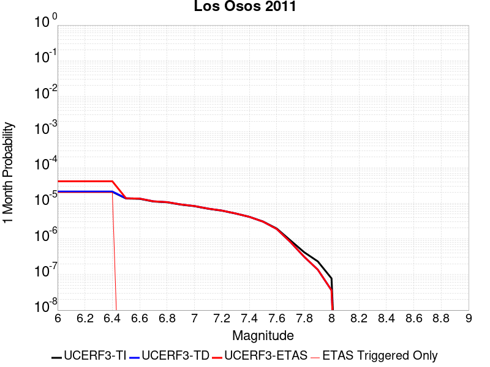 |  |  |

| Magnitude | 1 wk TI Prob | 1 wk TD Prob | 1 wk ETAS Prob | 1 wk ETAS/TD Gain | 1 wk ETAS Triggered Only | 1 mo TI Prob | 1 mo TD Prob | 1 mo ETAS Prob | 1 mo ETAS/TD Gain | 1 mo ETAS Triggered Only | 1 yr TI Prob | 1 yr TD Prob | 1 yr ETAS Prob | 1 yr ETAS/TD Gain | 1 yr ETAS Triggered Only | 10 yr TI Prob | 10 yr TD Prob | 10 yr ETAS Prob | 10 yr ETAS/TD Gain | 10 yr ETAS Triggered Only |
|-----|-----|-----|-----|-----|-----|-----|-----|-----|-----|-----|-----|-----|-----|-----|-----|-----|-----|-----|-----|-----|
| 6.0 | 4.8871775E-6 | 4.9814835E-6 | 4.0279578E-5 | 8.08586 | 3.529827E-5 | 2.0944879E-5 | 2.1349055E-5 | 5.664657E-5 | 2.6533527 | 3.529827E-5 | 2.5497406E-4 | 2.5989654E-4 | 2.9518563E-4 | 1.1357813 | 3.529827E-5 | 0.002546817 | 0.0025962002 | 0.002631407 | 1.0135608 | 3.529827E-5 |
| 6.1 | 4.8871775E-6 | 4.9814835E-6 | 4.0279578E-5 | 8.08586 | 3.529827E-5 | 2.0944879E-5 | 2.1349055E-5 | 5.664657E-5 | 2.6533527 | 3.529827E-5 | 2.5497406E-4 | 2.5989654E-4 | 2.9518563E-4 | 1.1357813 | 3.529827E-5 | 0.002546817 | 0.0025962002 | 0.002631407 | 1.0135608 | 3.529827E-5 |
| 6.2 | 4.8871775E-6 | 4.9814835E-6 | 4.0279578E-5 | 8.08586 | 3.529827E-5 | 2.0944879E-5 | 2.1349055E-5 | 5.664657E-5 | 2.6533527 | 3.529827E-5 | 2.5497406E-4 | 2.5989654E-4 | 2.9518563E-4 | 1.1357813 | 3.529827E-5 | 0.002546817 | 0.0025962002 | 0.002631407 | 1.0135608 | 3.529827E-5 |
| 6.3 | 4.8871775E-6 | 4.9814835E-6 | 4.0279578E-5 | 8.08586 | 3.529827E-5 | 2.0944879E-5 | 2.1349055E-5 | 5.664657E-5 | 2.6533527 | 3.529827E-5 | 2.5497406E-4 | 2.5989654E-4 | 2.9518563E-4 | 1.1357813 | 3.529827E-5 | 0.002546817 | 0.0025962002 | 0.002631407 | 1.0135608 | 3.529827E-5 |
| 6.4 | 4.8871775E-6 | 4.9814835E-6 | 4.0279578E-5 | 8.08586 | 3.529827E-5 | 2.0944879E-5 | 2.1349055E-5 | 5.664657E-5 | 2.6533527 | 3.529827E-5 | 2.5497406E-4 | 2.5989654E-4 | 2.9518563E-4 | 1.1357813 | 3.529827E-5 | 0.002546817 | 0.0025962002 | 0.002631407 | 1.0135608 | 3.529827E-5 |
| 6.5 | 3.1724062E-6 | 3.223395E-6 | 3.223395E-6 | 1.0 | 0.0 | 1.3595956E-5 | 1.3814477E-5 | 1.3814477E-5 | 1.0 | 0.0 | 1.6551818E-4 | 1.681784E-4 | 1.681784E-4 | 1.0 | 0.0 | 0.0016539496 | 0.0016805249 | 0.0016805249 | 1.0 | 0.0 |
| 6.6 | 3.1022591E-6 | 3.1511045E-6 | 3.1511045E-6 | 1.0 | 0.0 | 1.3295328E-5 | 1.3504664E-5 | 1.3504664E-5 | 1.0 | 0.0 | 1.618586E-4 | 1.64407E-4 | 1.64407E-4 | 1.0 | 0.0 | 0.0016174077 | 0.0016428665 | 0.0016428665 | 1.0 | 0.0 |
| 6.7 | 2.611518E-6 | 2.6491832E-6 | 2.6491832E-6 | 1.0 | 0.0 | 1.1192172E-5 | 1.1353593E-5 | 1.1353593E-5 | 1.0 | 0.0 | 1.3625617E-4 | 1.3822126E-4 | 1.3822126E-4 | 1.0 | 0.0 | 0.0013617266 | 0.0013813575 | 0.0013813575 | 1.0 | 0.0 |
| 6.8 | 2.4780884E-6 | 2.5121592E-6 | 2.5121592E-6 | 1.0 | 0.0 | 1.0620336E-5 | 1.0766353E-5 | 1.0766353E-5 | 1.0 | 0.0 | 1.2929492E-4 | 1.3107249E-4 | 1.3107249E-4 | 1.0 | 0.0 | 0.0012921972 | 0.001309956 | 0.001309956 | 1.0 | 0.0 |
| 6.9 | 2.1376322E-6 | 2.1635055E-6 | 2.1635055E-6 | 1.0 | 0.0 | 9.161248E-6 | 9.272134E-6 | 9.272134E-6 | 1.0 | 0.0 | 1.1153249E-4 | 1.128824E-4 | 1.128824E-4 | 1.0 | 0.0 | 0.0011147653 | 0.0011282525 | 0.0011282525 | 1.0 | 0.0 |
| 7.0 | 1.9282882E-6 | 1.9494585E-6 | 1.9494585E-6 | 1.0 | 0.0 | 8.264066E-6 | 8.354796E-6 | 8.354796E-6 | 1.0 | 0.0 | 1.0061036E-4 | 1.017149E-4 | 1.017149E-4 | 1.0 | 0.0 | 0.0010056482 | 0.0010166848 | 0.0010166848 | 1.0 | 0.0 |
| 7.1 | 1.6353226E-6 | 1.6501118E-6 | 1.6501118E-6 | 1.0 | 0.0 | 7.0085066E-6 | 7.0718884E-6 | 7.0718884E-6 | 1.0 | 0.0 | 8.532523E-5 | 8.609685E-5 | 8.609685E-5 | 1.0 | 0.0 | 8.529247E-4 | 8.6063566E-4 | 8.6063566E-4 | 1.0 | 0.0 |
| 7.2 | 1.4446276E-6 | 1.4553341E-6 | 1.4553341E-6 | 1.0 | 0.0 | 6.191247E-6 | 6.237131E-6 | 6.237131E-6 | 1.0 | 0.0 | 7.537582E-5 | 7.593443E-5 | 7.593443E-5 | 1.0 | 0.0 | 7.535026E-4 | 7.590854E-4 | 7.590854E-4 | 1.0 | 0.0 |
| 7.3 | 1.2014582E-6 | 1.2069073E-6 | 1.2069073E-6 | 1.0 | 0.0 | 5.149096E-6 | 5.1724496E-6 | 5.1724496E-6 | 1.0 | 0.0 | 6.268844E-5 | 6.297276E-5 | 6.297276E-5 | 1.0 | 0.0 | 6.267076E-4 | 6.295495E-4 | 6.295495E-4 | 1.0 | 0.0 |
| 7.4 | 9.707733E-7 | 9.709773E-7 | 9.709773E-7 | 1.0 | 0.0 | 4.16045E-6 | 4.161325E-6 | 4.161325E-6 | 1.0 | 0.0 | 5.0652303E-5 | 5.066295E-5 | 5.066295E-5 | 1.0 | 0.0 | 5.064076E-4 | 5.065143E-4 | 5.065143E-4 | 1.0 | 0.0 |
| 7.5 | 7.174908E-7 | 7.1149134E-7 | 7.1149134E-7 | 1.0 | 0.0 | 3.074957E-6 | 3.0492452E-6 | 3.0492452E-6 | 1.0 | 0.0 | 3.743696E-5 | 3.712393E-5 | 3.712393E-5 | 1.0 | 0.0 | 3.7430652E-4 | 3.7117745E-4 | 3.7117745E-4 | 1.0 | 0.0 |
| 7.6 | 4.5535776E-7 | 4.420792E-7 | 4.420792E-7 | 1.0 | 0.0 | 1.9515319E-6 | 1.8946238E-6 | 1.8946238E-6 | 1.0 | 0.0 | 2.3759641E-5 | 2.3066801E-5 | 2.3066801E-5 | 1.0 | 0.0 | 2.37571E-4 | 2.3064416E-4 | 2.3064416E-4 | 1.0 | 0.0 |
| 7.7 | 2.1173553E-7 | 1.9060796E-7 | 1.9060796E-7 | 1.0 | 0.0 | 9.0743765E-7 | 8.1689103E-7 | 8.1689103E-7 | 1.0 | 0.0 | 1.1047998E-5 | 9.945603E-6 | 9.945603E-6 | 1.0 | 0.0 | 1.1047449E-4 | 9.945161E-5 | 9.945161E-5 | 1.0 | 0.0 |
| 7.8 | 9.873608E-8 | 7.3675665E-8 | 7.3675665E-8 | 1.0 | 0.0 | 4.2315455E-7 | 3.157528E-7 | 3.157528E-7 | 1.0 | 0.0 | 5.1518946E-6 | 3.8442836E-6 | 3.8442836E-6 | 1.0 | 0.0 | 5.1517753E-5 | 3.8442176E-5 | 3.8442176E-5 | 1.0 | 0.0 |
| 7.9 | 5.4399106E-8 | 3.1880155E-8 | 3.1880155E-8 | 1.0 | 0.0 | 2.33139E-7 | 1.3662923E-7 | 1.3662923E-7 | 1.0 | 0.0 | 2.8384638E-6 | 1.6634596E-6 | 1.6634596E-6 | 1.0 | 0.0 | 2.8384275E-5 | 1.6634473E-5 | 1.6634473E-5 | 1.0 | 0.0 |
| 8.0 | 1.817203E-8 | 8.420727E-9 | 8.420727E-9 | 1.0 | 0.0 | 7.7880124E-8 | 3.608883E-8 | 3.608883E-8 | 1.0 | 0.0 | 9.481901E-7 | 4.393814E-7 | 4.393814E-7 | 1.0 | 0.0 | 9.481861E-6 | 4.3938057E-6 | 4.3938057E-6 | 1.0 | 0.0 |

## Great Valley 06 (Midland) 2011 CFM alt1
*[(top)](#table-of-contents)*

| 1 Week | 1 Month | 1 Year | 10 Year |
|-----|-----|-----|-----|
|  |  |  |  |

| Magnitude | 1 wk TI Prob | 1 wk TD Prob | 1 wk ETAS Prob | 1 wk ETAS/TD Gain | 1 wk ETAS Triggered Only | 1 mo TI Prob | 1 mo TD Prob | 1 mo ETAS Prob | 1 mo ETAS/TD Gain | 1 mo ETAS Triggered Only | 1 yr TI Prob | 1 yr TD Prob | 1 yr ETAS Prob | 1 yr ETAS/TD Gain | 1 yr ETAS Triggered Only | 10 yr TI Prob | 10 yr TD Prob | 10 yr ETAS Prob | 10 yr ETAS/TD Gain | 10 yr ETAS Triggered Only |
|-----|-----|-----|-----|-----|-----|-----|-----|-----|-----|-----|-----|-----|-----|-----|-----|-----|-----|-----|-----|-----|
| 6.0 | 1.2712525E-5 | 1.3210576E-5 | 1.3210576E-5 | 1.0 | 0.0 | 5.4481112E-5 | 5.6615667E-5 | 5.6615667E-5 | 1.0 | 0.0 | 6.6310563E-4 | 6.8910315E-4 | 7.243771E-4 | 1.0511882 | 3.529827E-5 | 0.0066113044 | 0.006872179 | 0.0069072344 | 1.0051011 | 3.529827E-5 |
| 6.1 | 1.2712525E-5 | 1.3210576E-5 | 1.3210576E-5 | 1.0 | 0.0 | 5.4481112E-5 | 5.6615667E-5 | 5.6615667E-5 | 1.0 | 0.0 | 6.6310563E-4 | 6.8910315E-4 | 7.243771E-4 | 1.0511882 | 3.529827E-5 | 0.0066113044 | 0.006872179 | 0.0069072344 | 1.0051011 | 3.529827E-5 |
| 6.2 | 1.2712525E-5 | 1.3210576E-5 | 1.3210576E-5 | 1.0 | 0.0 | 5.4481112E-5 | 5.6615667E-5 | 5.6615667E-5 | 1.0 | 0.0 | 6.6310563E-4 | 6.8910315E-4 | 7.243771E-4 | 1.0511882 | 3.529827E-5 | 0.0066113044 | 0.006872179 | 0.0069072344 | 1.0051011 | 3.529827E-5 |
| 6.3 | 1.2712525E-5 | 1.3210576E-5 | 1.3210576E-5 | 1.0 | 0.0 | 5.4481112E-5 | 5.6615667E-5 | 5.6615667E-5 | 1.0 | 0.0 | 6.6310563E-4 | 6.8910315E-4 | 7.243771E-4 | 1.0511882 | 3.529827E-5 | 0.0066113044 | 0.006872179 | 0.0069072344 | 1.0051011 | 3.529827E-5 |
| 6.4 | 1.2712525E-5 | 1.3210576E-5 | 1.3210576E-5 | 1.0 | 0.0 | 5.4481112E-5 | 5.6615667E-5 | 5.6615667E-5 | 1.0 | 0.0 | 6.6310563E-4 | 6.8910315E-4 | 7.243771E-4 | 1.0511882 | 3.529827E-5 | 0.0066113044 | 0.006872179 | 0.0069072344 | 1.0051011 | 3.529827E-5 |
| 6.5 | 1.2712525E-5 | 1.3210576E-5 | 1.3210576E-5 | 1.0 | 0.0 | 5.4481112E-5 | 5.6615667E-5 | 5.6615667E-5 | 1.0 | 0.0 | 6.6310563E-4 | 6.8910315E-4 | 7.243771E-4 | 1.0511882 | 3.529827E-5 | 0.0066113044 | 0.006872179 | 0.0069072344 | 1.0051011 | 3.529827E-5 |
| 6.6 | 5.7574384E-6 | 5.9706463E-6 | 5.9706463E-6 | 1.0 | 0.0 | 2.4674504E-5 | 2.5588255E-5 | 2.5588255E-5 | 1.0 | 0.0 | 3.0037065E-4 | 3.1149638E-4 | 3.1149638E-4 | 1.0 | 0.0 | 0.0029996498 | 0.0031109843 | 0.0031109843 | 1.0 | 0.0 |
| 6.7 | 5.7574384E-6 | 5.9706463E-6 | 5.9706463E-6 | 1.0 | 0.0 | 2.4674504E-5 | 2.5588255E-5 | 2.5588255E-5 | 1.0 | 0.0 | 3.0037065E-4 | 3.1149638E-4 | 3.1149638E-4 | 1.0 | 0.0 | 0.0029996498 | 0.0031109843 | 0.0031109843 | 1.0 | 0.0 |
| 6.8 | 3.3474828E-6 | 3.4693849E-6 | 3.4693849E-6 | 1.0 | 0.0 | 1.4346277E-5 | 1.4868716E-5 | 1.4868716E-5 | 1.0 | 0.0 | 1.7465191E-4 | 1.8101306E-4 | 1.8101306E-4 | 1.0 | 0.0 | 0.0017451472 | 0.0018088033 | 0.0018088033 | 1.0 | 0.0 |
| 6.9 | 2.035106E-6 | 2.1090357E-6 | 2.1090357E-6 | 1.0 | 0.0 | 8.721853E-6 | 9.038697E-6 | 9.038697E-6 | 1.0 | 0.0 | 1.0618339E-4 | 1.10041314E-4 | 1.10041314E-4 | 1.0 | 0.0 | 0.0010613267 | 0.0010999405 | 0.0010999405 | 1.0 | 0.0 |
| 7.0 | 1.2424716E-6 | 1.2878762E-6 | 1.2878762E-6 | 1.0 | 0.0 | 5.3248673E-6 | 5.51946E-6 | 5.51946E-6 | 1.0 | 0.0 | 6.482833E-5 | 6.7197805E-5 | 6.7197805E-5 | 1.0 | 0.0 | 6.480942E-4 | 6.718192E-4 | 6.718192E-4 | 1.0 | 0.0 |
| 7.1 | 6.6904556E-7 | 6.939035E-7 | 6.939035E-7 | 1.0 | 0.0 | 2.867335E-6 | 2.97387E-6 | 2.97387E-6 | 1.0 | 0.0 | 3.4909244E-5 | 3.6206526E-5 | 3.6206526E-5 | 1.0 | 0.0 | 3.490376E-4 | 3.6203177E-4 | 3.6203177E-4 | 1.0 | 0.0 |
| 7.2 | 3.948168E-7 | 4.095705E-7 | 4.095705E-7 | 1.0 | 0.0 | 1.6920709E-6 | 1.7553022E-6 | 1.7553022E-6 | 1.0 | 0.0 | 2.0600768E-5 | 2.1370803E-5 | 2.1370803E-5 | 1.0 | 0.0 | 2.0598859E-4 | 2.1370803E-4 | 2.1370803E-4 | 1.0 | 0.0 |

## Cerro Prieto
*[(top)](#table-of-contents)*

| 1 Week | 1 Month | 1 Year | 10 Year |
|-----|-----|-----|-----|
| 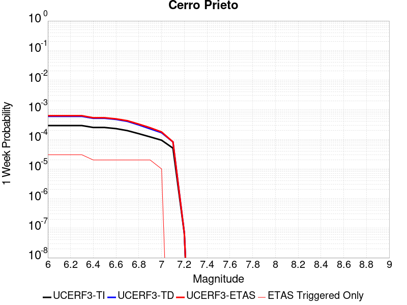 |  |  | 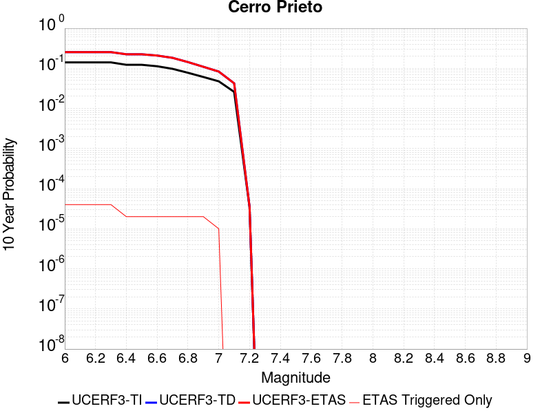 |

| Magnitude | 1 wk TI Prob | 1 wk TD Prob | 1 wk ETAS Prob | 1 wk ETAS/TD Gain | 1 wk ETAS Triggered Only | 1 mo TI Prob | 1 mo TD Prob | 1 mo ETAS Prob | 1 mo ETAS/TD Gain | 1 mo ETAS Triggered Only | 1 yr TI Prob | 1 yr TD Prob | 1 yr ETAS Prob | 1 yr ETAS/TD Gain | 1 yr ETAS Triggered Only | 10 yr TI Prob | 10 yr TD Prob | 10 yr ETAS Prob | 10 yr ETAS/TD Gain | 10 yr ETAS Triggered Only |
|-----|-----|-----|-----|-----|-----|-----|-----|-----|-----|-----|-----|-----|-----|-----|-----|-----|-----|-----|-----|-----|
| 6.0 | 2.9101528E-4 | 5.964804E-4 | 6.317576E-4 | 1.0591422 | 3.529827E-5 | 0.0012466122 | 0.002554082 | 0.0025892903 | 1.013785 | 3.529827E-5 | 0.015072231 | 0.03064807 | 0.030682286 | 1.0011164 | 3.529827E-5 | 0.14089979 | 0.25397858 | 0.2540049 | 1.0001037 | 3.529827E-5 |
| 6.1 | 2.9101528E-4 | 5.964804E-4 | 6.317576E-4 | 1.0591422 | 3.529827E-5 | 0.0012466122 | 0.002554082 | 0.0025892903 | 1.013785 | 3.529827E-5 | 0.015072231 | 0.03064807 | 0.030682286 | 1.0011164 | 3.529827E-5 | 0.14089979 | 0.25397858 | 0.2540049 | 1.0001037 | 3.529827E-5 |
| 6.2 | 2.9101528E-4 | 5.964804E-4 | 6.317576E-4 | 1.0591422 | 3.529827E-5 | 0.0012466122 | 0.002554082 | 0.0025892903 | 1.013785 | 3.529827E-5 | 0.015072231 | 0.03064807 | 0.030682286 | 1.0011164 | 3.529827E-5 | 0.14089979 | 0.25397858 | 0.2540049 | 1.0001037 | 3.529827E-5 |
| 6.3 | 2.9101528E-4 | 5.964804E-4 | 6.317576E-4 | 1.0591422 | 3.529827E-5 | 0.0012466122 | 0.002554082 | 0.0025892903 | 1.013785 | 3.529827E-5 | 0.015072231 | 0.03064807 | 0.030682286 | 1.0011164 | 3.529827E-5 | 0.14089979 | 0.25397858 | 0.2540049 | 1.0001037 | 3.529827E-5 |
| 6.4 | 2.508648E-4 | 5.1397446E-4 | 5.492546E-4 | 1.0686418 | 3.529827E-5 | 0.0010746918 | 0.0022010866 | 0.0022363074 | 1.0160015 | 3.529827E-5 | 0.013006088 | 0.026471792 | 0.026506156 | 1.0012982 | 3.529827E-5 | 0.12270685 | 0.22440416 | 0.22443153 | 1.000122 | 3.529827E-5 |
| 6.5 | 2.508648E-4 | 5.1397446E-4 | 5.492546E-4 | 1.0686418 | 3.529827E-5 | 0.0010746918 | 0.0022010866 | 0.0022363074 | 1.0160015 | 3.529827E-5 | 0.013006088 | 0.026471792 | 0.026506156 | 1.0012982 | 3.529827E-5 | 0.12270685 | 0.22440416 | 0.22443153 | 1.000122 | 3.529827E-5 |
| 6.6 | 2.294914E-4 | 4.7116808E-4 | 5.064497E-4 | 1.0748812 | 3.529827E-5 | 9.831638E-4 | 0.0020179166 | 0.0020531437 | 1.0174571 | 3.529827E-5 | 0.011904482 | 0.02429866 | 0.0243331 | 1.0014174 | 3.529827E-5 | 0.11286586 | 0.20858558 | 0.2086135 | 1.0001339 | 3.529827E-5 |
| 6.7 | 1.9621674E-4 | 4.0419117E-4 | 4.3947517E-4 | 1.0872953 | 3.529827E-5 | 8.4065786E-4 | 0.0017312564 | 0.0017664934 | 1.0203536 | 3.529827E-5 | 0.010187071 | 0.020884845 | 0.020919407 | 1.0016549 | 3.529827E-5 | 0.09732539 | 0.18290249 | 0.18293133 | 1.0001577 | 3.529827E-5 |
| 6.8 | 1.5476145E-4 | 3.056516E-4 | 3.4093906E-4 | 1.11545 | 3.529827E-5 | 6.6309475E-4 | 0.00130938 | 0.001344632 | 1.0269227 | 3.529827E-5 | 0.008043335 | 0.015836509 | 0.015871247 | 1.0021936 | 3.529827E-5 | 0.07758363 | 0.14336355 | 0.1433938 | 1.0002109 | 3.529827E-5 |
| 6.9 | 1.20509176E-4 | 2.2582515E-4 | 2.6111543E-4 | 1.1562726 | 3.529827E-5 | 5.1636563E-4 | 9.6752634E-4 | 0.0010027905 | 1.0364478 | 3.529827E-5 | 0.006268645 | 0.011726342 | 0.011761227 | 1.0029749 | 3.529827E-5 | 0.060947374 | 0.109451205 | 0.10948264 | 1.0002872 | 3.529827E-5 |
| 7.0 | 9.3269155E-5 | 1.6716642E-4 | 1.6716642E-4 | 1.0 | 0.0 | 3.9966372E-4 | 7.162739E-4 | 7.162739E-4 | 1.0 | 0.0 | 0.0048550544 | 0.008693418 | 0.008693418 | 1.0 | 0.0 | 0.04750344 | 0.08315912 | 0.08315912 | 1.0 | 0.0 |
| 7.1 | 5.029709E-5 | 8.1718936E-5 | 8.1718936E-5 | 1.0 | 0.0 | 2.1554115E-4 | 3.5019626E-4 | 3.5019626E-4 | 1.0 | 0.0 | 0.0026210553 | 0.0042587193 | 0.0042587193 | 1.0 | 0.0 | 0.025903556 | 0.042365108 | 0.042365108 | 1.0 | 0.0 |
| 7.2 | 6.5445185E-8 | 6.814903E-8 | 6.814903E-8 | 1.0 | 0.0 | 2.8047933E-7 | 2.9206726E-7 | 2.9206726E-7 | 1.0 | 0.0 | 3.4148304E-6 | 3.555919E-6 | 3.555919E-6 | 1.0 | 0.0 | 3.414778E-5 | 3.5559187E-5 | 3.5559187E-5 | 1.0 | 0.0 |

## Elsinore (Julian)
*[(top)](#table-of-contents)*

| 1 Week | 1 Month | 1 Year | 10 Year |
|-----|-----|-----|-----|
|  |  |  |  |

| Magnitude | 1 wk TI Prob | 1 wk TD Prob | 1 wk ETAS Prob | 1 wk ETAS/TD Gain | 1 wk ETAS Triggered Only | 1 mo TI Prob | 1 mo TD Prob | 1 mo ETAS Prob | 1 mo ETAS/TD Gain | 1 mo ETAS Triggered Only | 1 yr TI Prob | 1 yr TD Prob | 1 yr ETAS Prob | 1 yr ETAS/TD Gain | 1 yr ETAS Triggered Only | 10 yr TI Prob | 10 yr TD Prob | 10 yr ETAS Prob | 10 yr ETAS/TD Gain | 10 yr ETAS Triggered Only |
|-----|-----|-----|-----|-----|-----|-----|-----|-----|-----|-----|-----|-----|-----|-----|-----|-----|-----|-----|-----|-----|
| 6.0 | 1.1710231E-5 | 8.845509E-6 | 4.4143468E-5 | 4.9904947 | 3.529827E-5 | 5.0185736E-5 | 3.7908783E-5 | 7.3205716E-5 | 1.9311017 | 3.529827E-5 | 6.1084004E-4 | 4.614434E-4 | 4.967254E-4 | 1.07646 | 3.529827E-5 | 0.006091637 | 0.0046050567 | 0.0046401923 | 1.0076299 | 3.529827E-5 |
| 6.1 | 1.1710231E-5 | 8.845509E-6 | 4.4143468E-5 | 4.9904947 | 3.529827E-5 | 5.0185736E-5 | 3.7908783E-5 | 7.3205716E-5 | 1.9311017 | 3.529827E-5 | 6.1084004E-4 | 4.614434E-4 | 4.967254E-4 | 1.07646 | 3.529827E-5 | 0.006091637 | 0.0046050567 | 0.0046401923 | 1.0076299 | 3.529827E-5 |
| 6.2 | 1.1710231E-5 | 8.845509E-6 | 4.4143468E-5 | 4.9904947 | 3.529827E-5 | 5.0185736E-5 | 3.7908783E-5 | 7.3205716E-5 | 1.9311017 | 3.529827E-5 | 6.1084004E-4 | 4.614434E-4 | 4.967254E-4 | 1.07646 | 3.529827E-5 | 0.006091637 | 0.0046050567 | 0.0046401923 | 1.0076299 | 3.529827E-5 |
| 6.3 | 1.1710231E-5 | 8.845509E-6 | 4.4143468E-5 | 4.9904947 | 3.529827E-5 | 5.0185736E-5 | 3.7908783E-5 | 7.3205716E-5 | 1.9311017 | 3.529827E-5 | 6.1084004E-4 | 4.614434E-4 | 4.967254E-4 | 1.07646 | 3.529827E-5 | 0.006091637 | 0.0046050567 | 0.0046401923 | 1.0076299 | 3.529827E-5 |
| 6.4 | 1.1710231E-5 | 8.845509E-6 | 4.4143468E-5 | 4.9904947 | 3.529827E-5 | 5.0185736E-5 | 3.7908783E-5 | 7.3205716E-5 | 1.9311017 | 3.529827E-5 | 6.1084004E-4 | 4.614434E-4 | 4.967254E-4 | 1.07646 | 3.529827E-5 | 0.006091637 | 0.0046050567 | 0.0046401923 | 1.0076299 | 3.529827E-5 |
| 6.5 | 1.1710231E-5 | 8.845509E-6 | 4.4143468E-5 | 4.9904947 | 3.529827E-5 | 5.0185736E-5 | 3.7908783E-5 | 7.3205716E-5 | 1.9311017 | 3.529827E-5 | 6.1084004E-4 | 4.614434E-4 | 4.967254E-4 | 1.07646 | 3.529827E-5 | 0.006091637 | 0.0046050567 | 0.0046401923 | 1.0076299 | 3.529827E-5 |
| 6.6 | 1.1650619E-5 | 8.777881E-6 | 4.407584E-5 | 5.0212393 | 3.529827E-5 | 4.993027E-5 | 3.7618956E-5 | 7.29159E-5 | 1.9382755 | 3.529827E-5 | 6.0773146E-4 | 4.5791623E-4 | 4.9319834E-4 | 1.0770493 | 3.529827E-5 | 0.0060607214 | 0.004569931 | 0.004605068 | 1.0076888 | 3.529827E-5 |
| 6.7 | 1.1650619E-5 | 8.777881E-6 | 4.407584E-5 | 5.0212393 | 3.529827E-5 | 4.993027E-5 | 3.7618956E-5 | 7.29159E-5 | 1.9382755 | 3.529827E-5 | 6.0773146E-4 | 4.5791623E-4 | 4.9319834E-4 | 1.0770493 | 3.529827E-5 | 0.0060607214 | 0.004569931 | 0.004605068 | 1.0076888 | 3.529827E-5 |
| 6.8 | 1.1442698E-5 | 8.561041E-6 | 4.385901E-5 | 5.123093 | 3.529827E-5 | 4.9039216E-5 | 3.6689667E-5 | 7.1986644E-5 | 1.9620413 | 3.529827E-5 | 5.968889E-4 | 4.4660683E-4 | 4.8188935E-4 | 1.0790013 | 3.529827E-5 | 0.0059528816 | 0.004457295 | 0.0044924356 | 1.0078839 | 3.529827E-5 |
| 6.9 | 1.1300589E-5 | 8.408907E-6 | 4.370688E-5 | 5.1976886 | 3.529827E-5 | 4.8430196E-5 | 3.6037683E-5 | 7.133468E-5 | 1.9794469 | 3.529827E-5 | 5.894781E-4 | 4.3867214E-4 | 4.7395492E-4 | 1.0804309 | 3.529827E-5 | 0.005879169 | 0.0043782624 | 0.004413406 | 1.0080268 | 3.529827E-5 |
| 7.0 | 1.1117729E-5 | 8.226087E-6 | 4.3524065E-5 | 5.290981 | 3.529827E-5 | 4.764654E-5 | 3.525419E-5 | 7.055122E-5 | 2.001215 | 3.529827E-5 | 5.799422E-4 | 4.291369E-4 | 4.6442004E-4 | 1.0822188 | 3.529827E-5 | 0.0057843104 | 0.004283281 | 0.0043184278 | 1.0082057 | 3.529827E-5 |
| 7.1 | 1.08053955E-5 | 7.9117535E-6 | 4.3209744E-5 | 5.461462 | 3.529827E-5 | 4.6308014E-5 | 3.3907087E-5 | 6.920416E-5 | 2.040994 | 3.529827E-5 | 5.6365423E-4 | 4.127422E-4 | 4.480259E-4 | 1.085486 | 3.529827E-5 | 0.005622267 | 0.0041199517 | 0.0041551045 | 1.0085323 | 3.529827E-5 |
| 7.2 | 1.032804E-5 | 7.433021E-6 | 4.273103E-5 | 5.7488103 | 3.529827E-5 | 4.4262277E-5 | 3.1855423E-5 | 6.715257E-5 | 2.108042 | 3.529827E-5 | 5.387599E-4 | 3.8777234E-4 | 4.2305692E-4 | 1.090993 | 3.529827E-5 | 0.0053745564 | 0.0038711445 | 0.0039063063 | 1.009083 | 3.529827E-5 |
| 7.3 | 9.622426E-6 | 6.8978457E-6 | 4.2195872E-5 | 6.117254 | 3.529827E-5 | 4.1238312E-5 | 2.9561868E-5 | 6.4859094E-5 | 2.194012 | 3.529827E-5 | 5.019608E-4 | 3.5985775E-4 | 3.9514332E-4 | 1.0980542 | 3.529827E-5 | 0.005008285 | 0.0035929221 | 0.0036280935 | 1.0097891 | 3.529827E-5 |
| 7.4 | 9.144434E-6 | 6.4963933E-6 | 4.1794436E-5 | 6.4334826 | 3.529827E-5 | 3.9189843E-5 | 2.7841395E-5 | 6.313869E-5 | 2.2677987 | 3.529827E-5 | 4.7703186E-4 | 3.3891766E-4 | 3.7420396E-4 | 1.1041147 | 3.529827E-5 | 0.0047600917 | 0.0033841513 | 0.00341933 | 1.0103952 | 3.529827E-5 |
| 7.5 | 7.988981E-6 | 5.4983307E-6 | 4.0796407E-5 | 7.4197803 | 3.529827E-5 | 3.4238044E-5 | 2.356407E-5 | 5.8861508E-5 | 2.4979348 | 3.529827E-5 | 4.1676845E-4 | 2.8685606E-4 | 3.221442E-4 | 1.123017 | 3.529827E-5 | 0.0041598766 | 0.002864985 | 0.0029001823 | 1.0122852 | 3.529827E-5 |
| 7.6 | 6.9554876E-6 | 4.6625346E-6 | 3.996064E-5 | 8.570583 | 3.529827E-5 | 2.9808893E-5 | 1.9982144E-5 | 5.527971E-5 | 2.7664554 | 3.529827E-5 | 3.6286283E-4 | 2.4325661E-4 | 2.785463E-4 | 1.1450719 | 3.529827E-5 | 0.0036227088 | 0.0024300197 | 0.002465232 | 1.0144906 | 3.529827E-5 |
| 7.7 | 4.1557314E-6 | 2.3246462E-6 | 3.7622834E-5 | 16.184328 | 3.529827E-5 | 1.7810156E-5 | 9.962735E-6 | 4.5260655E-5 | 4.542995 | 3.529827E-5 | 2.1681708E-4 | 1.2129029E-4 | 1.5658428E-4 | 1.2909877 | 3.529827E-5 | 0.0021660565 | 0.001212314 | 0.0012475695 | 1.0290811 | 3.529827E-5 |
| 7.8 | 2.2597293E-7 | 9.332915E-8 | 9.332915E-8 | 1.0 | 0.0 | 9.684551E-7 | 3.99982E-7 | 3.99982E-7 | 1.0 | 0.0 | 1.1790877E-5 | 4.8697734E-6 | 4.8697734E-6 | 1.0 | 0.0 | 1.17902506E-4 | 4.8696995E-5 | 4.8696995E-5 | 1.0 | 0.0 |
| 7.9 | 6.676829E-9 | 3.439853E-9 | 3.439853E-9 | 1.0 | 0.0 | 2.861498E-8 | 1.4742227E-8 | 1.4742227E-8 | 1.0 | 0.0 | 3.4838732E-7 | 1.7948659E-7 | 1.7948659E-7 | 1.0 | 0.0 | 3.4838679E-6 | 1.7948646E-6 | 1.7948646E-6 | 1.0 | 0.0 |

## Sierra Madre (San Fernando)
*[(top)](#table-of-contents)*

| 1 Week | 1 Month | 1 Year | 10 Year |
|-----|-----|-----|-----|
|  | 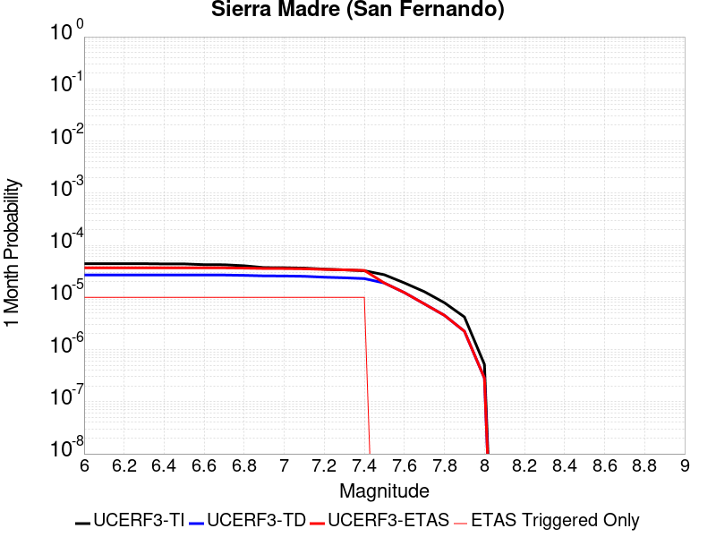 |  |  |

| Magnitude | 1 wk TI Prob | 1 wk TD Prob | 1 wk ETAS Prob | 1 wk ETAS/TD Gain | 1 wk ETAS Triggered Only | 1 mo TI Prob | 1 mo TD Prob | 1 mo ETAS Prob | 1 mo ETAS/TD Gain | 1 mo ETAS Triggered Only | 1 yr TI Prob | 1 yr TD Prob | 1 yr ETAS Prob | 1 yr ETAS/TD Gain | 1 yr ETAS Triggered Only | 10 yr TI Prob | 10 yr TD Prob | 10 yr ETAS Prob | 10 yr ETAS/TD Gain | 10 yr ETAS Triggered Only |
|-----|-----|-----|-----|-----|-----|-----|-----|-----|-----|-----|-----|-----|-----|-----|-----|-----|-----|-----|-----|-----|
| 6.0 | 1.0346413E-5 | 6.2872605E-6 | 6.2872605E-6 | 1.0 | 0.0 | 4.4341014E-5 | 2.694513E-5 | 2.694513E-5 | 1.0 | 0.0 | 5.3971814E-4 | 3.280087E-4 | 3.280087E-4 | 1.0 | 0.0 | 0.0053840918 | 0.0032753581 | 0.0033105407 | 1.0107416 | 3.529827E-5 |
| 6.1 | 1.0346413E-5 | 6.2872605E-6 | 6.2872605E-6 | 1.0 | 0.0 | 4.4341014E-5 | 2.694513E-5 | 2.694513E-5 | 1.0 | 0.0 | 5.3971814E-4 | 3.280087E-4 | 3.280087E-4 | 1.0 | 0.0 | 0.0053840918 | 0.0032753581 | 0.0033105407 | 1.0107416 | 3.529827E-5 |
| 6.2 | 1.0346413E-5 | 6.2872605E-6 | 6.2872605E-6 | 1.0 | 0.0 | 4.4341014E-5 | 2.694513E-5 | 2.694513E-5 | 1.0 | 0.0 | 5.3971814E-4 | 3.280087E-4 | 3.280087E-4 | 1.0 | 0.0 | 0.0053840918 | 0.0032753581 | 0.0033105407 | 1.0107416 | 3.529827E-5 |
| 6.3 | 1.0346413E-5 | 6.2872605E-6 | 6.2872605E-6 | 1.0 | 0.0 | 4.4341014E-5 | 2.694513E-5 | 2.694513E-5 | 1.0 | 0.0 | 5.3971814E-4 | 3.280087E-4 | 3.280087E-4 | 1.0 | 0.0 | 0.0053840918 | 0.0032753581 | 0.0033105407 | 1.0107416 | 3.529827E-5 |
| 6.4 | 1.0249558E-5 | 6.2872605E-6 | 6.2872605E-6 | 1.0 | 0.0 | 4.392594E-5 | 2.694513E-5 | 2.694513E-5 | 1.0 | 0.0 | 5.3466705E-4 | 3.280087E-4 | 3.280087E-4 | 1.0 | 0.0 | 0.0053338245 | 0.0032753581 | 0.0033105407 | 1.0107416 | 3.529827E-5 |
| 6.5 | 1.0249558E-5 | 6.2872605E-6 | 6.2872605E-6 | 1.0 | 0.0 | 4.392594E-5 | 2.694513E-5 | 2.694513E-5 | 1.0 | 0.0 | 5.3466705E-4 | 3.280087E-4 | 3.280087E-4 | 1.0 | 0.0 | 0.0053338245 | 0.0032753581 | 0.0033105407 | 1.0107416 | 3.529827E-5 |
| 6.6 | 9.9035515E-6 | 6.2872605E-6 | 6.2872605E-6 | 1.0 | 0.0 | 4.2443102E-5 | 2.694513E-5 | 2.694513E-5 | 1.0 | 0.0 | 5.166222E-4 | 3.280087E-4 | 3.280087E-4 | 1.0 | 0.0 | 0.0051542283 | 0.0032753581 | 0.0033105407 | 1.0107416 | 3.529827E-5 |
| 6.7 | 9.87217E-6 | 6.2746817E-6 | 6.2746817E-6 | 1.0 | 0.0 | 4.2308613E-5 | 2.689122E-5 | 2.689122E-5 | 1.0 | 0.0 | 5.149856E-4 | 3.2735255E-4 | 3.2735255E-4 | 1.0 | 0.0 | 0.005137938 | 0.0032688158 | 0.0033039988 | 1.0107632 | 3.529827E-5 |
| 6.8 | 9.4359175E-6 | 6.1786586E-6 | 6.1786586E-6 | 1.0 | 0.0 | 4.043902E-5 | 2.6479704E-5 | 2.6479704E-5 | 1.0 | 0.0 | 4.9223384E-4 | 3.2234378E-4 | 3.2234378E-4 | 1.0 | 0.0 | 0.0049114493 | 0.0032188739 | 0.0032540585 | 1.0109308 | 3.529827E-5 |
| 6.9 | 8.700447E-6 | 6.039922E-6 | 6.039922E-6 | 1.0 | 0.0 | 3.72871E-5 | 2.5885129E-5 | 2.5885129E-5 | 1.0 | 0.0 | 4.5387587E-4 | 3.1510694E-4 | 3.1510694E-4 | 1.0 | 0.0 | 0.0045295 | 0.003146711 | 0.0031818983 | 1.0111822 | 3.529827E-5 |
| 7.0 | 8.648878E-6 | 6.0148373E-6 | 6.0148373E-6 | 1.0 | 0.0 | 3.7066096E-5 | 2.5777625E-5 | 2.5777625E-5 | 1.0 | 0.0 | 4.5118626E-4 | 3.1379846E-4 | 3.1379846E-4 | 1.0 | 0.0 | 0.004502713 | 0.003133663 | 0.0031688507 | 1.0112289 | 3.529827E-5 |
| 7.1 | 8.505786E-6 | 5.9244676E-6 | 5.9244676E-6 | 1.0 | 0.0 | 3.645286E-5 | 2.5390334E-5 | 2.5390334E-5 | 1.0 | 0.0 | 4.437232E-4 | 3.0908454E-4 | 3.0908454E-4 | 1.0 | 0.0 | 0.0044283825 | 0.0030866556 | 0.003121845 | 1.0114005 | 3.529827E-5 |
| 7.2 | 8.139752E-6 | 5.6987624E-6 | 5.6987624E-6 | 1.0 | 0.0 | 3.4884186E-5 | 2.4423045E-5 | 2.4423045E-5 | 1.0 | 0.0 | 4.246322E-4 | 2.9731105E-4 | 2.9731105E-4 | 1.0 | 0.0 | 0.004238217 | 0.0029692391 | 0.0030044324 | 1.0118527 | 3.529827E-5 |
| 7.3 | 7.8816E-6 | 5.552077E-6 | 5.552077E-6 | 1.0 | 0.0 | 3.3777847E-5 | 2.3794404E-5 | 2.3794404E-5 | 1.0 | 0.0 | 4.111677E-4 | 2.896594E-4 | 2.896594E-4 | 1.0 | 0.0 | 0.004104078 | 0.0028929242 | 0.0029281203 | 1.0121663 | 3.529827E-5 |
| 7.4 | 7.5810603E-6 | 5.3563126E-6 | 5.3563126E-6 | 1.0 | 0.0 | 3.2489854E-5 | 2.2955428E-5 | 2.2955428E-5 | 1.0 | 0.0 | 3.9549218E-4 | 2.7944756E-4 | 2.7944756E-4 | 1.0 | 0.0 | 0.0039478904 | 0.0027910667 | 0.0028262665 | 1.0126116 | 3.529827E-5 |
| 7.5 | 6.349153E-6 | 4.407576E-6 | 4.407576E-6 | 1.0 | 0.0 | 2.7210372E-5 | 1.888948E-5 | 1.888948E-5 | 1.0 | 0.0 | 3.312359E-4 | 2.2995596E-4 | 2.2995596E-4 | 1.0 | 0.0 | 0.0033074263 | 0.0022972622 | 0.0023324792 | 1.0153301 | 3.529827E-5 |
| 7.6 | 4.430576E-6 | 2.8905868E-6 | 2.8905868E-6 | 1.0 | 0.0 | 1.8988047E-5 | 1.2388171E-5 | 1.2388171E-5 | 1.0 | 0.0 | 2.3115493E-4 | 1.5081577E-4 | 1.5081577E-4 | 1.0 | 0.0 | 0.0023091463 | 0.0015071568 | 0.0015424018 | 1.0233852 | 3.529827E-5 |
| 7.7 | 3.005066E-6 | 1.7510115E-6 | 1.7510115E-6 | 1.0 | 0.0 | 1.2878791E-5 | 7.504313E-6 | 7.504313E-6 | 1.0 | 0.0 | 1.56788E-4 | 9.1361195E-5 | 9.1361195E-5 | 1.0 | 0.0 | 0.0015667742 | 9.132375E-4 | 9.4850356E-4 | 1.0386165 | 3.529827E-5 |
| 7.8 | 1.8459098E-6 | 1.0582091E-6 | 1.0582091E-6 | 1.0 | 0.0 | 7.911018E-6 | 4.535174E-6 | 4.535174E-6 | 1.0 | 0.0 | 9.631238E-5 | 5.5214347E-5 | 5.5214347E-5 | 1.0 | 0.0 | 9.627065E-4 | 5.5200676E-4 | 5.8728555E-4 | 1.06391 | 3.529827E-5 |
| 7.9 | 9.839262E-7 | 5.23421E-7 | 5.23421E-7 | 1.0 | 0.0 | 4.2168194E-6 | 2.2432312E-6 | 2.2432312E-6 | 1.0 | 0.0 | 5.1338568E-5 | 2.7310998E-5 | 2.7310998E-5 | 1.0 | 0.0 | 5.132671E-4 | 2.730767E-4 | 3.0836533E-4 | 1.1292261 | 3.529827E-5 |
| 8.0 | 1.210983E-7 | 6.613821E-8 | 6.613821E-8 | 1.0 | 0.0 | 5.1899264E-7 | 2.8344945E-7 | 2.8344945E-7 | 1.0 | 0.0 | 6.3187167E-6 | 3.4509917E-6 | 3.4509917E-6 | 1.0 | 0.0 | 6.318537E-5 | 3.45094E-5 | 3.45094E-5 | 1.0 | 0.0 |

## Mission Creek
*[(top)](#table-of-contents)*

| 1 Week | 1 Month | 1 Year | 10 Year |
|-----|-----|-----|-----|
|  |  |  |  |

| Magnitude | 1 wk TI Prob | 1 wk TD Prob | 1 wk ETAS Prob | 1 wk ETAS/TD Gain | 1 wk ETAS Triggered Only | 1 mo TI Prob | 1 mo TD Prob | 1 mo ETAS Prob | 1 mo ETAS/TD Gain | 1 mo ETAS Triggered Only | 1 yr TI Prob | 1 yr TD Prob | 1 yr ETAS Prob | 1 yr ETAS/TD Gain | 1 yr ETAS Triggered Only | 10 yr TI Prob | 10 yr TD Prob | 10 yr ETAS Prob | 10 yr ETAS/TD Gain | 10 yr ETAS Triggered Only |
|-----|-----|-----|-----|-----|-----|-----|-----|-----|-----|-----|-----|-----|-----|-----|-----|-----|-----|-----|-----|-----|
| 6.0 | 1.1549387E-5 | 1.632237E-5 | 1.632237E-5 | 1.0 | 0.0 | 4.9496433E-5 | 6.9951224E-5 | 6.9951224E-5 | 1.0 | 0.0 | 6.0245243E-4 | 8.513384E-4 | 8.866066E-4 | 1.0414268 | 3.529827E-5 | 0.006008218 | 0.008509998 | 0.008544995 | 1.0041126 | 3.529827E-5 |
| 6.1 | 1.1549387E-5 | 1.632237E-5 | 1.632237E-5 | 1.0 | 0.0 | 4.9496433E-5 | 6.9951224E-5 | 6.9951224E-5 | 1.0 | 0.0 | 6.0245243E-4 | 8.513384E-4 | 8.866066E-4 | 1.0414268 | 3.529827E-5 | 0.006008218 | 0.008509998 | 0.008544995 | 1.0041126 | 3.529827E-5 |
| 6.2 | 1.1549387E-5 | 1.632237E-5 | 1.632237E-5 | 1.0 | 0.0 | 4.9496433E-5 | 6.9951224E-5 | 6.9951224E-5 | 1.0 | 0.0 | 6.0245243E-4 | 8.513384E-4 | 8.866066E-4 | 1.0414268 | 3.529827E-5 | 0.006008218 | 0.008509998 | 0.008544995 | 1.0041126 | 3.529827E-5 |
| 6.3 | 1.1549387E-5 | 1.632237E-5 | 1.632237E-5 | 1.0 | 0.0 | 4.9496433E-5 | 6.9951224E-5 | 6.9951224E-5 | 1.0 | 0.0 | 6.0245243E-4 | 8.513384E-4 | 8.866066E-4 | 1.0414268 | 3.529827E-5 | 0.006008218 | 0.008509998 | 0.008544995 | 1.0041126 | 3.529827E-5 |
| 6.4 | 1.1549387E-5 | 1.632237E-5 | 1.632237E-5 | 1.0 | 0.0 | 4.9496433E-5 | 6.9951224E-5 | 6.9951224E-5 | 1.0 | 0.0 | 6.0245243E-4 | 8.513384E-4 | 8.866066E-4 | 1.0414268 | 3.529827E-5 | 0.006008218 | 0.008509998 | 0.008544995 | 1.0041126 | 3.529827E-5 |
| 6.5 | 1.1549387E-5 | 1.632237E-5 | 1.632237E-5 | 1.0 | 0.0 | 4.9496433E-5 | 6.9951224E-5 | 6.9951224E-5 | 1.0 | 0.0 | 6.0245243E-4 | 8.513384E-4 | 8.866066E-4 | 1.0414268 | 3.529827E-5 | 0.006008218 | 0.008509998 | 0.008544995 | 1.0041126 | 3.529827E-5 |
| 6.6 | 9.202681E-6 | 1.3845646E-5 | 1.3845646E-5 | 1.0 | 0.0 | 3.9439463E-5 | 5.9337188E-5 | 5.9337188E-5 | 1.0 | 0.0 | 4.800697E-4 | 7.221998E-4 | 7.574726E-4 | 1.0488408 | 3.529827E-5 | 0.004790339 | 0.0072271815 | 0.007262225 | 1.0048488 | 3.529827E-5 |
| 6.7 | 9.019164E-6 | 1.3651316E-5 | 1.3651316E-5 | 1.0 | 0.0 | 3.8652986E-5 | 5.8504378E-5 | 5.8504378E-5 | 1.0 | 0.0 | 4.7049852E-4 | 7.12067E-4 | 7.4734015E-4 | 1.0495362 | 3.529827E-5 | 0.004695036 | 0.007126506 | 0.0071615526 | 1.0049177 | 3.529827E-5 |
| 6.8 | 8.673558E-6 | 1.3273427E-5 | 1.3273427E-5 | 1.0 | 0.0 | 3.717186E-5 | 5.6884925E-5 | 5.6884925E-5 | 1.0 | 0.0 | 4.524734E-4 | 6.923627E-4 | 7.2763656E-4 | 1.0509471 | 3.529827E-5 | 0.0045155324 | 0.006930694 | 0.0069657476 | 1.0050577 | 3.529827E-5 |
| 6.9 | 7.002255E-6 | 1.1477657E-5 | 1.1477657E-5 | 1.0 | 0.0 | 3.000932E-5 | 4.9189068E-5 | 4.9189068E-5 | 1.0 | 0.0 | 3.653022E-4 | 5.9871917E-4 | 6.3399633E-4 | 1.058921 | 3.529827E-5 | 0.0036470229 | 0.005999517 | 0.006034604 | 1.0058482 | 3.529827E-5 |
| 7.0 | 5.84644E-6 | 9.67498E-6 | 9.67498E-6 | 1.0 | 0.0 | 2.5055931E-5 | 4.1463565E-5 | 4.1463565E-5 | 1.0 | 0.0 | 3.0501327E-4 | 5.047066E-4 | 5.39987E-4 | 1.0699029 | 3.529827E-5 | 0.0030459496 | 0.0050638523 | 0.0050989715 | 1.0069354 | 3.529827E-5 |
| 7.1 | 5.54703E-6 | 9.329456E-6 | 9.329456E-6 | 1.0 | 0.0 | 2.377277E-5 | 3.9982795E-5 | 3.9982795E-5 | 1.0 | 0.0 | 2.8939504E-4 | 4.8668624E-4 | 5.2196736E-4 | 1.0724925 | 3.529827E-5 | 0.0028901845 | 0.004884446 | 0.0049195723 | 1.0071914 | 3.529827E-5 |
| 7.2 | 4.384709E-6 | 7.68157E-6 | 7.68157E-6 | 1.0 | 0.0 | 1.8791474E-5 | 3.2920623E-5 | 3.2920623E-5 | 1.0 | 0.0 | 2.2876218E-4 | 4.0073853E-4 | 4.3602264E-4 | 1.0880477 | 3.529827E-5 | 0.0022852682 | 0.004028366 | 0.004063522 | 1.0087271 | 3.529827E-5 |
| 7.3 | 3.7888456E-6 | 6.915452E-6 | 6.915452E-6 | 1.0 | 0.0 | 1.623781E-5 | 2.9637333E-5 | 2.9637333E-5 | 1.0 | 0.0 | 1.9767738E-4 | 3.6077813E-4 | 3.9606367E-4 | 1.097804 | 3.529827E-5 | 0.0019750162 | 0.0036301152 | 0.0036652852 | 1.0096884 | 3.529827E-5 |
| 7.4 | 2.1982462E-6 | 5.0237763E-6 | 5.0237763E-6 | 1.0 | 0.0 | 9.421021E-6 | 2.1530293E-5 | 2.1530293E-5 | 1.0 | 0.0 | 1.1469489E-4 | 2.621E-4 | 2.97389E-4 | 1.1346395 | 3.529827E-5 | 0.0011463572 | 0.0026458844 | 0.0026810893 | 1.0133055 | 3.529827E-5 |
| 7.5 | 2.051923E-6 | 4.615016E-6 | 4.615016E-6 | 1.0 | 0.0 | 8.793926E-6 | 1.9778492E-5 | 1.9778492E-5 | 1.0 | 0.0 | 1.0706078E-4 | 2.4077666E-4 | 2.7606642E-4 | 1.1465664 | 3.529827E-5 | 0.0010700922 | 0.0024335422 | 0.0024687545 | 1.0144696 | 3.529827E-5 |
| 7.6 | 1.8733427E-6 | 4.1233748E-6 | 4.1233748E-6 | 1.0 | 0.0 | 8.028587E-6 | 1.7671488E-5 | 1.7671488E-5 | 1.0 | 0.0 | 9.774366E-5 | 2.151292E-4 | 2.504199E-4 | 1.1640441 | 3.529827E-5 | 9.770069E-4 | 0.0021780801 | 0.0022133016 | 1.0161709 | 3.529827E-5 |
| 7.7 | 1.8411953E-6 | 4.0430496E-6 | 4.0430496E-6 | 1.0 | 0.0 | 7.890813E-6 | 1.732724E-5 | 1.732724E-5 | 1.0 | 0.0 | 9.606641E-5 | 2.1093882E-4 | 2.4622964E-4 | 1.1673036 | 3.529827E-5 | 9.6024893E-4 | 0.0021363653 | 0.0021715881 | 1.0164872 | 3.529827E-5 |
| 7.8 | 1.7194251E-6 | 3.7104276E-6 | 3.7104276E-6 | 1.0 | 0.0 | 7.368944E-6 | 1.5901736E-5 | 1.5901736E-5 | 1.0 | 0.0 | 8.97132E-5 | 1.9358651E-4 | 2.2887795E-4 | 1.1823032 | 3.529827E-5 | 8.967699E-4 | 0.0019623525 | 0.0019975815 | 1.0179524 | 3.529827E-5 |
| 7.9 | 1.4035052E-6 | 2.9500632E-6 | 2.9500632E-6 | 1.0 | 0.0 | 6.0150082E-6 | 1.2643067E-5 | 1.2643067E-5 | 1.0 | 0.0 | 7.3230265E-5 | 1.5391852E-4 | 1.8921137E-4 | 1.2292956 | 3.529827E-5 | 7.3206134E-4 | 0.0015631086 | 0.0015983518 | 1.0225468 | 3.529827E-5 |
| 8.0 | 3.9318823E-7 | 5.528522E-7 | 5.528522E-7 | 1.0 | 0.0 | 1.6850913E-6 | 2.3693647E-6 | 2.3693647E-6 | 1.0 | 0.0 | 2.0515794E-5 | 2.8846638E-5 | 6.414389E-5 | 2.2236176 | 3.529827E-5 | 2.0513899E-4 | 2.9899E-4 | 3.3427772E-4 | 1.118023 | 3.529827E-5 |
| 8.1 | 1.596793E-7 | 1.1380002E-7 | 1.1380002E-7 | 1.0 | 0.0 | 6.8433974E-7 | 4.877143E-7 | 4.877143E-7 | 1.0 | 0.0 | 8.331805E-6 | 5.937906E-6 | 5.937906E-6 | 1.0 | 0.0 | 8.331492E-5 | 6.549966E-5 | 6.549966E-5 | 1.0 | 0.0 |
| 8.2 | 4.9003038E-8 | 2.5444924E-8 | 2.5444924E-8 | 1.0 | 0.0 | 2.10013E-7 | 1.0904967E-7 | 1.0904967E-7 | 1.0 | 0.0 | 2.5569052E-6 | 1.327679E-6 | 1.327679E-6 | 1.0 | 0.0 | 2.556876E-5 | 1.495635E-5 | 1.495635E-5 | 1.0 | 0.0 |

## South Klamath Lake West
*[(top)](#table-of-contents)*

| 1 Week | 1 Month | 1 Year | 10 Year |
|-----|-----|-----|-----|
|  |  |  |  |

| Magnitude | 1 wk TI Prob | 1 wk TD Prob | 1 wk ETAS Prob | 1 wk ETAS/TD Gain | 1 wk ETAS Triggered Only | 1 mo TI Prob | 1 mo TD Prob | 1 mo ETAS Prob | 1 mo ETAS/TD Gain | 1 mo ETAS Triggered Only | 1 yr TI Prob | 1 yr TD Prob | 1 yr ETAS Prob | 1 yr ETAS/TD Gain | 1 yr ETAS Triggered Only | 10 yr TI Prob | 10 yr TD Prob | 10 yr ETAS Prob | 10 yr ETAS/TD Gain | 10 yr ETAS Triggered Only |
|-----|-----|-----|-----|-----|-----|-----|-----|-----|-----|-----|-----|-----|-----|-----|-----|-----|-----|-----|-----|-----|
| 6.0 | 2.174025E-5 | 2.3042025E-5 | 2.3042025E-5 | 1.0 | 0.0 | 9.3169176E-5 | 9.874817E-5 | 9.874817E-5 | 1.0 | 0.0 | 0.0011337444 | 0.0012016617 | 0.0012369176 | 1.0293392 | 3.529827E-5 | 0.011279777 | 0.0119582405 | 0.011993117 | 1.0029165 | 3.529827E-5 |
| 6.1 | 2.174025E-5 | 2.3042025E-5 | 2.3042025E-5 | 1.0 | 0.0 | 9.3169176E-5 | 9.874817E-5 | 9.874817E-5 | 1.0 | 0.0 | 0.0011337444 | 0.0012016617 | 0.0012369176 | 1.0293392 | 3.529827E-5 | 0.011279777 | 0.0119582405 | 0.011993117 | 1.0029165 | 3.529827E-5 |
| 6.2 | 9.834929E-6 | 1.0393841E-5 | 1.0393841E-5 | 1.0 | 0.0 | 4.2149015E-5 | 4.4544326E-5 | 4.4544326E-5 | 1.0 | 0.0 | 5.1304343E-4 | 5.422012E-4 | 5.7748036E-4 | 1.0650665 | 3.529827E-5 | 0.0051186057 | 0.0054096854 | 0.005444793 | 1.0064898 | 3.529827E-5 |
| 6.3 | 9.834929E-6 | 1.0393841E-5 | 1.0393841E-5 | 1.0 | 0.0 | 4.2149015E-5 | 4.4544326E-5 | 4.4544326E-5 | 1.0 | 0.0 | 5.1304343E-4 | 5.422012E-4 | 5.7748036E-4 | 1.0650665 | 3.529827E-5 | 0.0051186057 | 0.0054096854 | 0.005444793 | 1.0064898 | 3.529827E-5 |
| 6.4 | 6.066321E-6 | 6.40043E-6 | 6.40043E-6 | 1.0 | 0.0 | 2.5998259E-5 | 2.743014E-5 | 2.743014E-5 | 1.0 | 0.0 | 3.1648282E-4 | 3.3391351E-4 | 3.692E-4 | 1.1056756 | 3.529827E-5 | 0.0031603249 | 0.0033343881 | 0.0033695686 | 1.0105509 | 3.529827E-5 |
| 6.5 | 6.066321E-6 | 6.40043E-6 | 6.40043E-6 | 1.0 | 0.0 | 2.5998259E-5 | 2.743014E-5 | 2.743014E-5 | 1.0 | 0.0 | 3.1648282E-4 | 3.3391351E-4 | 3.692E-4 | 1.1056756 | 3.529827E-5 | 0.0031603249 | 0.0033343881 | 0.0033695686 | 1.0105509 | 3.529827E-5 |
| 6.6 | 4.2321803E-6 | 4.461291E-6 | 4.461291E-6 | 1.0 | 0.0 | 1.8137789E-5 | 1.9119685E-5 | 1.9119685E-5 | 1.0 | 0.0 | 2.208052E-4 | 2.3275832E-4 | 2.3275832E-4 | 1.0 | 0.0 | 0.0022058594 | 0.0023252473 | 0.0023252473 | 1.0 | 0.0 |
| 6.7 | 3.186646E-6 | 3.360305E-6 | 3.360305E-6 | 1.0 | 0.0 | 1.3656982E-5 | 1.4401232E-5 | 1.4401232E-5 | 1.0 | 0.0 | 1.6626107E-4 | 1.7532158E-4 | 1.7532158E-4 | 1.0 | 0.0 | 0.0016613674 | 0.0017518997 | 0.0017518997 | 1.0 | 0.0 |
| 6.8 | 2.380121E-6 | 2.510907E-6 | 2.510907E-6 | 1.0 | 0.0 | 1.0200479E-5 | 1.07609885E-5 | 1.07609885E-5 | 1.0 | 0.0 | 1.2418375E-4 | 1.3100762E-4 | 1.3100762E-4 | 1.0 | 0.0 | 0.0012411437 | 0.0013093497 | 0.0013093497 | 1.0 | 0.0 |
| 6.9 | 8.928287E-7 | 9.4302504E-7 | 9.4302504E-7 | 1.0 | 0.0 | 3.826403E-6 | 4.0415307E-6 | 4.0415307E-6 | 1.0 | 0.0 | 4.658546E-5 | 4.9204747E-5 | 4.9204747E-5 | 1.0 | 0.0 | 4.6575698E-4 | 4.9196015E-4 | 4.9196015E-4 | 1.0 | 0.0 |

## Mono Lake 2011 CFM
*[(top)](#table-of-contents)*

| 1 Week | 1 Month | 1 Year | 10 Year |
|-----|-----|-----|-----|
|  |  | 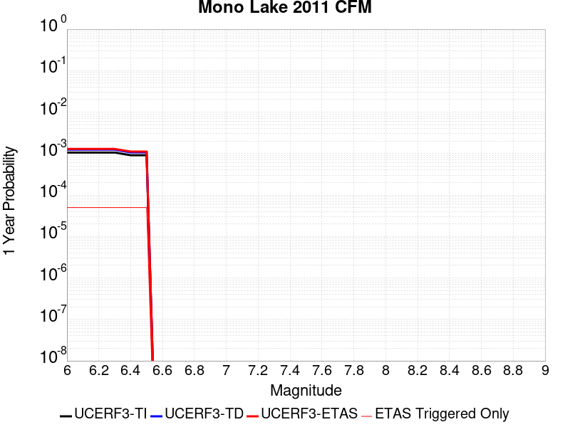 |  |

| Magnitude | 1 wk TI Prob | 1 wk TD Prob | 1 wk ETAS Prob | 1 wk ETAS/TD Gain | 1 wk ETAS Triggered Only | 1 mo TI Prob | 1 mo TD Prob | 1 mo ETAS Prob | 1 mo ETAS/TD Gain | 1 mo ETAS Triggered Only | 1 yr TI Prob | 1 yr TD Prob | 1 yr ETAS Prob | 1 yr ETAS/TD Gain | 1 yr ETAS Triggered Only | 10 yr TI Prob | 10 yr TD Prob | 10 yr ETAS Prob | 10 yr ETAS/TD Gain | 10 yr ETAS Triggered Only |
|-----|-----|-----|-----|-----|-----|-----|-----|-----|-----|-----|-----|-----|-----|-----|-----|-----|-----|-----|-----|-----|
| 6.0 | 2.0341662E-5 | 2.3828166E-5 | 5.9125596E-5 | 2.481332 | 3.529827E-5 | 8.717564E-5 | 1.0211971E-4 | 1.3741438E-4 | 1.3456205 | 3.529827E-5 | 0.0010608466 | 0.0012431298 | 0.0012783842 | 1.0283594 | 3.529827E-5 | 0.010557966 | 0.012413835 | 0.0124486955 | 1.0028082 | 3.529827E-5 |
| 6.1 | 2.0341662E-5 | 2.3828166E-5 | 5.9125596E-5 | 2.481332 | 3.529827E-5 | 8.717564E-5 | 1.0211971E-4 | 1.3741438E-4 | 1.3456205 | 3.529827E-5 | 0.0010608466 | 0.0012431298 | 0.0012783842 | 1.0283594 | 3.529827E-5 | 0.010557966 | 0.012413835 | 0.0124486955 | 1.0028082 | 3.529827E-5 |
| 6.2 | 2.0341662E-5 | 2.3828166E-5 | 5.9125596E-5 | 2.481332 | 3.529827E-5 | 8.717564E-5 | 1.0211971E-4 | 1.3741438E-4 | 1.3456205 | 3.529827E-5 | 0.0010608466 | 0.0012431298 | 0.0012783842 | 1.0283594 | 3.529827E-5 | 0.010557966 | 0.012413835 | 0.0124486955 | 1.0028082 | 3.529827E-5 |
| 6.3 | 2.0341662E-5 | 2.3828166E-5 | 5.9125596E-5 | 2.481332 | 3.529827E-5 | 8.717564E-5 | 1.0211971E-4 | 1.3741438E-4 | 1.3456205 | 3.529827E-5 | 0.0010608466 | 0.0012431298 | 0.0012783842 | 1.0283594 | 3.529827E-5 | 0.010557966 | 0.012413835 | 0.0124486955 | 1.0028082 | 3.529827E-5 |
| 6.4 | 1.749821E-5 | 2.0490985E-5 | 5.5788532E-5 | 2.722589 | 3.529827E-5 | 7.499018E-5 | 8.781851E-5 | 1.2311368E-4 | 1.4019104 | 3.529827E-5 | 9.1262296E-4 | 0.0010691903 | 0.0011044509 | 1.0329788 | 3.529827E-5 | 0.009088841 | 0.010691865 | 0.010726786 | 1.0032661 | 3.529827E-5 |
| 6.5 | 1.749821E-5 | 2.0490985E-5 | 5.5788532E-5 | 2.722589 | 3.529827E-5 | 7.499018E-5 | 8.781851E-5 | 1.2311368E-4 | 1.4019104 | 3.529827E-5 | 9.1262296E-4 | 0.0010691903 | 0.0011044509 | 1.0329788 | 3.529827E-5 | 0.009088841 | 0.010691865 | 0.010726786 | 1.0032661 | 3.529827E-5 |

## Round Valley
*[(top)](#table-of-contents)*

| 1 Week | 1 Month | 1 Year | 10 Year |
|-----|-----|-----|-----|
|  |  |  |  |

| Magnitude | 1 wk TI Prob | 1 wk TD Prob | 1 wk ETAS Prob | 1 wk ETAS/TD Gain | 1 wk ETAS Triggered Only | 1 mo TI Prob | 1 mo TD Prob | 1 mo ETAS Prob | 1 mo ETAS/TD Gain | 1 mo ETAS Triggered Only | 1 yr TI Prob | 1 yr TD Prob | 1 yr ETAS Prob | 1 yr ETAS/TD Gain | 1 yr ETAS Triggered Only | 10 yr TI Prob | 10 yr TD Prob | 10 yr ETAS Prob | 10 yr ETAS/TD Gain | 10 yr ETAS Triggered Only |
|-----|-----|-----|-----|-----|-----|-----|-----|-----|-----|-----|-----|-----|-----|-----|-----|-----|-----|-----|-----|-----|
| 6.0 | 1.588152E-5 | 1.3670716E-5 | 1.3670716E-5 | 1.0 | 0.0 | 6.806188E-5 | 5.8587688E-5 | 5.8587688E-5 | 1.0 | 0.0 | 8.283384E-4 | 7.13111E-4 | 7.483841E-4 | 1.0494636 | 3.529827E-5 | 0.008252576 | 0.0071121147 | 0.007147162 | 1.0049279 | 3.529827E-5 |
| 6.1 | 1.588152E-5 | 1.3670716E-5 | 1.3670716E-5 | 1.0 | 0.0 | 6.806188E-5 | 5.8587688E-5 | 5.8587688E-5 | 1.0 | 0.0 | 8.283384E-4 | 7.13111E-4 | 7.483841E-4 | 1.0494636 | 3.529827E-5 | 0.008252576 | 0.0071121147 | 0.007147162 | 1.0049279 | 3.529827E-5 |
| 6.2 | 1.588152E-5 | 1.3670716E-5 | 1.3670716E-5 | 1.0 | 0.0 | 6.806188E-5 | 5.8587688E-5 | 5.8587688E-5 | 1.0 | 0.0 | 8.283384E-4 | 7.13111E-4 | 7.483841E-4 | 1.0494636 | 3.529827E-5 | 0.008252576 | 0.0071121147 | 0.007147162 | 1.0049279 | 3.529827E-5 |
| 6.3 | 1.588152E-5 | 1.3670716E-5 | 1.3670716E-5 | 1.0 | 0.0 | 6.806188E-5 | 5.8587688E-5 | 5.8587688E-5 | 1.0 | 0.0 | 8.283384E-4 | 7.13111E-4 | 7.483841E-4 | 1.0494636 | 3.529827E-5 | 0.008252576 | 0.0071121147 | 0.007147162 | 1.0049279 | 3.529827E-5 |
| 6.4 | 1.588152E-5 | 1.3670716E-5 | 1.3670716E-5 | 1.0 | 0.0 | 6.806188E-5 | 5.8587688E-5 | 5.8587688E-5 | 1.0 | 0.0 | 8.283384E-4 | 7.13111E-4 | 7.483841E-4 | 1.0494636 | 3.529827E-5 | 0.008252576 | 0.0071121147 | 0.007147162 | 1.0049279 | 3.529827E-5 |
| 6.5 | 1.0646776E-5 | 7.953037E-6 | 7.953037E-6 | 1.0 | 0.0 | 4.5628243E-5 | 3.408405E-5 | 3.408405E-5 | 1.0 | 0.0 | 5.553823E-4 | 4.1490266E-4 | 4.1490266E-4 | 1.0 | 0.0 | 0.005539963 | 0.0041421093 | 0.0041421093 | 1.0 | 0.0 |
| 6.6 | 8.632956E-6 | 5.768742E-6 | 5.768742E-6 | 1.0 | 0.0 | 3.6997862E-5 | 2.4722967E-5 | 2.4722967E-5 | 1.0 | 0.0 | 4.5035584E-4 | 3.009644E-4 | 3.009644E-4 | 1.0 | 0.0 | 0.0044944426 | 0.003005946 | 0.003005946 | 1.0 | 0.0 |
| 6.7 | 8.632956E-6 | 5.768742E-6 | 5.768742E-6 | 1.0 | 0.0 | 3.6997862E-5 | 2.4722967E-5 | 2.4722967E-5 | 1.0 | 0.0 | 4.5035584E-4 | 3.009644E-4 | 3.009644E-4 | 1.0 | 0.0 | 0.0044944426 | 0.003005946 | 0.003005946 | 1.0 | 0.0 |
| 6.8 | 7.143895E-6 | 4.2018346E-6 | 4.2018346E-6 | 1.0 | 0.0 | 3.0616335E-5 | 1.8007748E-5 | 1.8007748E-5 | 1.0 | 0.0 | 3.726901E-4 | 2.1922393E-4 | 2.1922393E-4 | 1.0 | 0.0 | 0.0037206567 | 0.0021902416 | 0.0021902416 | 1.0 | 0.0 |
| 6.9 | 6.5120694E-6 | 3.6644687E-6 | 3.6644687E-6 | 1.0 | 0.0 | 2.790857E-5 | 1.570478E-5 | 1.570478E-5 | 1.0 | 0.0 | 3.3973387E-4 | 1.9119044E-4 | 1.9119044E-4 | 1.0 | 0.0 | 0.0033921495 | 0.0019104085 | 0.0019104085 | 1.0 | 0.0 |
| 7.0 | 5.0614435E-6 | 2.6836676E-6 | 2.6836676E-6 | 1.0 | 0.0 | 2.169172E-5 | 1.1501388E-5 | 1.1501388E-5 | 1.0 | 0.0 | 2.6406467E-4 | 1.4002144E-4 | 1.4002144E-4 | 1.0 | 0.0 | 0.0026375111 | 0.0013994334 | 0.0013994334 | 1.0 | 0.0 |
| 7.1 | 4.41728E-6 | 2.3575074E-6 | 2.3575074E-6 | 1.0 | 0.0 | 1.8931061E-5 | 1.0103569E-5 | 1.0103569E-5 | 1.0 | 0.0 | 2.304613E-4 | 1.23005E-4 | 1.23005E-4 | 1.0 | 0.0 | 0.0023022245 | 0.0012294657 | 0.0012294657 | 1.0 | 0.0 |
| 7.2 | 2.535495E-6 | 1.1208391E-6 | 1.1208391E-6 | 1.0 | 0.0 | 1.0866362E-5 | 4.8035904E-6 | 4.8035904E-6 | 1.0 | 0.0 | 1.3228992E-4 | 5.8482667E-5 | 5.8482667E-5 | 1.0 | 0.0 | 0.0013221119 | 5.84724E-4 | 5.84724E-4 | 1.0 | 0.0 |
| 7.3 | 7.900015E-7 | 4.0889498E-7 | 4.0889498E-7 | 1.0 | 0.0 | 3.3857161E-6 | 1.752407E-6 | 1.752407E-6 | 1.0 | 0.0 | 4.1220315E-5 | 2.1335554E-5 | 2.1335554E-5 | 1.0 | 0.0 | 4.121267E-4 | 2.1335555E-4 | 2.1335555E-4 | 1.0 | 0.0 |

## Cedar Mtn-Mahogany Mtn
*[(top)](#table-of-contents)*

| 1 Week | 1 Month | 1 Year | 10 Year |
|-----|-----|-----|-----|
|  |  |  |  |

| Magnitude | 1 wk TI Prob | 1 wk TD Prob | 1 wk ETAS Prob | 1 wk ETAS/TD Gain | 1 wk ETAS Triggered Only | 1 mo TI Prob | 1 mo TD Prob | 1 mo ETAS Prob | 1 mo ETAS/TD Gain | 1 mo ETAS Triggered Only | 1 yr TI Prob | 1 yr TD Prob | 1 yr ETAS Prob | 1 yr ETAS/TD Gain | 1 yr ETAS Triggered Only | 10 yr TI Prob | 10 yr TD Prob | 10 yr ETAS Prob | 10 yr ETAS/TD Gain | 10 yr ETAS Triggered Only |
|-----|-----|-----|-----|-----|-----|-----|-----|-----|-----|-----|-----|-----|-----|-----|-----|-----|-----|-----|-----|-----|
| 6.0 | 2.7763876E-5 | 2.9588866E-5 | 2.9588866E-5 | 1.0 | 0.0 | 1.1898261E-4 | 1.2680366E-4 | 1.2680366E-4 | 1.0 | 0.0 | 0.0014476506 | 0.0015428112 | 0.0015428112 | 1.0 | 0.0 | 0.0143825635 | 0.015328225 | 0.015362983 | 1.0022675 | 3.529827E-5 |
| 6.1 | 1.6162443E-5 | 1.7142966E-5 | 1.7142966E-5 | 1.0 | 0.0 | 6.926578E-5 | 7.346788E-5 | 7.346788E-5 | 1.0 | 0.0 | 8.4298453E-4 | 8.941221E-4 | 8.941221E-4 | 1.0 | 0.0 | 0.008397939 | 0.008907059 | 0.008907059 | 1.0 | 0.0 |
| 6.2 | 1.6162443E-5 | 1.7142966E-5 | 1.7142966E-5 | 1.0 | 0.0 | 6.926578E-5 | 7.346788E-5 | 7.346788E-5 | 1.0 | 0.0 | 8.4298453E-4 | 8.941221E-4 | 8.941221E-4 | 1.0 | 0.0 | 0.008397939 | 0.008907059 | 0.008907059 | 1.0 | 0.0 |
| 6.3 | 9.746053E-6 | 1.0303152E-5 | 1.0303152E-5 | 1.0 | 0.0 | 4.1768133E-5 | 4.415564E-5 | 4.415564E-5 | 1.0 | 0.0 | 5.0840835E-4 | 5.3746643E-4 | 5.3746643E-4 | 1.0 | 0.0 | 0.0050724675 | 0.005362084 | 0.005362084 | 1.0 | 0.0 |
| 6.4 | 9.746053E-6 | 1.0303152E-5 | 1.0303152E-5 | 1.0 | 0.0 | 4.1768133E-5 | 4.415564E-5 | 4.415564E-5 | 1.0 | 0.0 | 5.0840835E-4 | 5.3746643E-4 | 5.3746643E-4 | 1.0 | 0.0 | 0.0050724675 | 0.005362084 | 0.005362084 | 1.0 | 0.0 |
| 6.5 | 7.290083E-6 | 7.695325E-6 | 7.695325E-6 | 1.0 | 0.0 | 3.124284E-5 | 3.297956E-5 | 3.297956E-5 | 1.0 | 0.0 | 3.8031515E-4 | 4.014543E-4 | 4.014543E-4 | 1.0 | 0.0 | 0.0037966494 | 0.004007511 | 0.004007511 | 1.0 | 0.0 |
| 6.6 | 5.67907E-6 | 5.9891527E-6 | 5.9891527E-6 | 1.0 | 0.0 | 2.4338644E-5 | 2.5667552E-5 | 2.5667552E-5 | 1.0 | 0.0 | 2.962827E-4 | 3.12459E-4 | 3.12459E-4 | 1.0 | 0.0 | 0.0029588798 | 0.003120333 | 0.003120333 | 1.0 | 0.0 |
| 6.7 | 3.4853963E-6 | 3.672631E-6 | 3.672631E-6 | 1.0 | 0.0 | 1.4937327E-5 | 1.5739755E-5 | 1.5739755E-5 | 1.0 | 0.0 | 1.8184677E-4 | 1.916153E-4 | 1.916153E-4 | 1.0 | 0.0 | 0.0018169804 | 0.0019145629 | 0.0019145629 | 1.0 | 0.0 |
| 6.8 | 2.7535168E-6 | 2.9015764E-6 | 2.9015764E-6 | 1.0 | 0.0 | 1.1800733E-5 | 1.2435271E-5 | 1.2435271E-5 | 1.0 | 0.0 | 1.4366445E-4 | 1.5138938E-4 | 1.5138938E-4 | 1.0 | 0.0 | 0.0014357162 | 0.0015129098 | 0.0015129098 | 1.0 | 0.0 |
| 6.9 | 1.6594106E-6 | 1.7496985E-6 | 1.7496985E-6 | 1.0 | 0.0 | 7.1117406E-6 | 7.4986883E-6 | 7.4986883E-6 | 1.0 | 0.0 | 8.6582E-5 | 9.129302E-5 | 9.129302E-5 | 1.0 | 0.0 | 8.654827E-4 | 9.125856E-4 | 9.125856E-4 | 1.0 | 0.0 |
| 7.0 | 5.10215E-7 | 5.389254E-7 | 5.389254E-7 | 1.0 | 0.0 | 2.186634E-6 | 2.3096788E-6 | 2.3096788E-6 | 1.0 | 0.0 | 2.6621943E-5 | 2.8120105E-5 | 2.8120105E-5 | 1.0 | 0.0 | 2.6618753E-4 | 2.81178E-4 | 2.81178E-4 | 1.0 | 0.0 |

## Reliz 2011 CFM
*[(top)](#table-of-contents)*

| 1 Week | 1 Month | 1 Year | 10 Year |
|-----|-----|-----|-----|
| 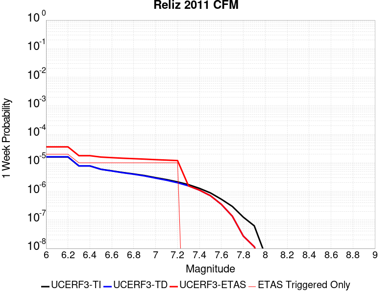 |  | 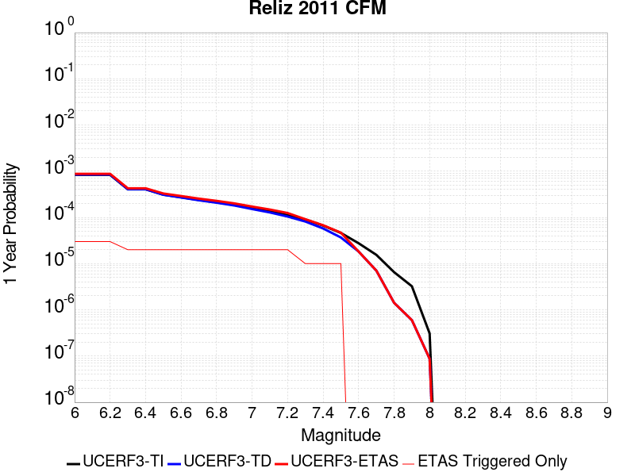 | 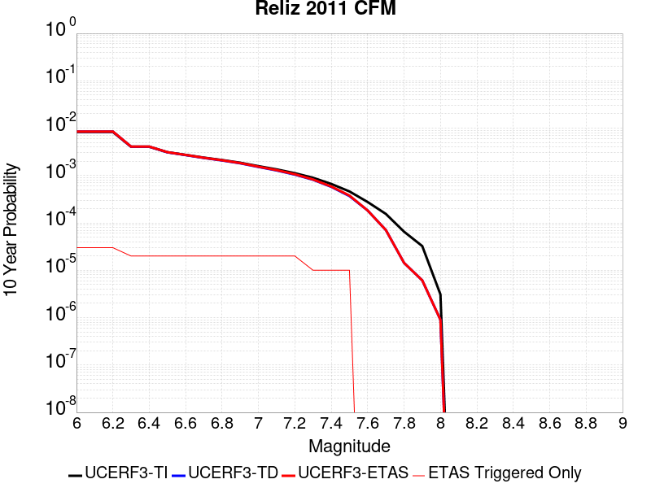 |

| Magnitude | 1 wk TI Prob | 1 wk TD Prob | 1 wk ETAS Prob | 1 wk ETAS/TD Gain | 1 wk ETAS Triggered Only | 1 mo TI Prob | 1 mo TD Prob | 1 mo ETAS Prob | 1 mo ETAS/TD Gain | 1 mo ETAS Triggered Only | 1 yr TI Prob | 1 yr TD Prob | 1 yr ETAS Prob | 1 yr ETAS/TD Gain | 1 yr ETAS Triggered Only | 10 yr TI Prob | 10 yr TD Prob | 10 yr ETAS Prob | 10 yr ETAS/TD Gain | 10 yr ETAS Triggered Only |
|-----|-----|-----|-----|-----|-----|-----|-----|-----|-----|-----|-----|-----|-----|-----|-----|-----|-----|-----|-----|-----|
| 6.0 | 1.6002472E-5 | 1.6282804E-5 | 1.6282804E-5 | 1.0 | 0.0 | 6.8580215E-5 | 6.9781694E-5 | 6.9781694E-5 | 1.0 | 0.0 | 8.3464425E-4 | 8.4928074E-4 | 8.8454905E-4 | 1.0415273 | 3.529827E-5 | 0.008315164 | 0.008462547 | 0.008497547 | 1.0041358 | 3.529827E-5 |
| 6.1 | 1.6002472E-5 | 1.6282804E-5 | 1.6282804E-5 | 1.0 | 0.0 | 6.8580215E-5 | 6.9781694E-5 | 6.9781694E-5 | 1.0 | 0.0 | 8.3464425E-4 | 8.4928074E-4 | 8.8454905E-4 | 1.0415273 | 3.529827E-5 | 0.008315164 | 0.008462547 | 0.008497547 | 1.0041358 | 3.529827E-5 |
| 6.2 | 1.6002472E-5 | 1.6282804E-5 | 1.6282804E-5 | 1.0 | 0.0 | 6.8580215E-5 | 6.9781694E-5 | 6.9781694E-5 | 1.0 | 0.0 | 8.3464425E-4 | 8.4928074E-4 | 8.8454905E-4 | 1.0415273 | 3.529827E-5 | 0.008315164 | 0.008462547 | 0.008497547 | 1.0041358 | 3.529827E-5 |
| 6.3 | 7.792404E-6 | 7.803802E-6 | 7.803802E-6 | 1.0 | 0.0 | 3.339559E-5 | 3.344444E-5 | 3.344444E-5 | 1.0 | 0.0 | 4.0651546E-4 | 4.0711078E-4 | 4.4239467E-4 | 1.0866691 | 3.529827E-5 | 0.0040577264 | 0.004063926 | 0.0040990813 | 1.0086504 | 3.529827E-5 |
| 6.4 | 7.792404E-6 | 7.803802E-6 | 7.803802E-6 | 1.0 | 0.0 | 3.339559E-5 | 3.344444E-5 | 3.344444E-5 | 1.0 | 0.0 | 4.0651546E-4 | 4.0711078E-4 | 4.4239467E-4 | 1.0866691 | 3.529827E-5 | 0.0040577264 | 0.004063926 | 0.0040990813 | 1.0086504 | 3.529827E-5 |
| 6.5 | 5.9659374E-6 | 5.928738E-6 | 5.928738E-6 | 1.0 | 0.0 | 2.5568053E-5 | 2.5408632E-5 | 2.5408632E-5 | 1.0 | 0.0 | 3.1124658E-4 | 3.093064E-4 | 3.4459375E-4 | 1.1140854 | 3.529827E-5 | 0.00310811 | 0.0030889767 | 0.003124166 | 1.0113919 | 3.529827E-5 |
| 6.6 | 5.2350692E-6 | 5.178986E-6 | 5.178986E-6 | 1.0 | 0.0 | 2.2435817E-5 | 2.2195467E-5 | 2.2195467E-5 | 1.0 | 0.0 | 2.7312184E-4 | 2.7019644E-4 | 3.0548518E-4 | 1.130604 | 3.529827E-5 | 0.002727864 | 0.0026988892 | 0.0027340923 | 1.0130435 | 3.529827E-5 |
| 6.7 | 4.580206E-6 | 4.5061206E-6 | 4.5061206E-6 | 1.0 | 0.0 | 1.9629308E-5 | 1.9311801E-5 | 1.9311801E-5 | 1.0 | 0.0 | 2.389606E-4 | 2.350959E-4 | 2.7038588E-4 | 1.1501088 | 3.529827E-5 | 0.002387038 | 0.0023486738 | 0.0023838892 | 1.0149937 | 3.529827E-5 |
| 6.8 | 4.0765017E-6 | 3.9882384E-6 | 3.9882384E-6 | 1.0 | 0.0 | 1.7470604E-5 | 1.7092338E-5 | 1.7092338E-5 | 1.0 | 0.0 | 2.1268385E-4 | 2.0807938E-4 | 2.433703E-4 | 1.1696032 | 3.529827E-5 | 0.002124804 | 0.0020790435 | 0.0021142685 | 1.0169429 | 3.529827E-5 |
| 6.9 | 3.5752896E-6 | 3.4725176E-6 | 3.4725176E-6 | 1.0 | 0.0 | 1.532258E-5 | 1.4882134E-5 | 1.4882134E-5 | 1.0 | 0.0 | 1.8653645E-4 | 1.8117494E-4 | 2.1646681E-4 | 1.1947944 | 3.529827E-5 | 0.0018637994 | 0.0018104686 | 0.001845703 | 1.0194615 | 3.529827E-5 |
| 7.0 | 3.0259848E-6 | 2.9079417E-6 | 2.9079417E-6 | 1.0 | 0.0 | 1.2968442E-5 | 1.2462548E-5 | 1.2462548E-5 | 1.0 | 0.0 | 1.5787935E-4 | 1.5172097E-4 | 1.8701388E-4 | 1.2326173 | 3.529827E-5 | 0.0015776722 | 0.001516369 | 0.0015516138 | 1.0232428 | 3.529827E-5 |
| 7.1 | 2.5861116E-6 | 2.455167E-6 | 2.455167E-6 | 1.0 | 0.0 | 1.1083288E-5 | 1.05221025E-5 | 1.05221025E-5 | 1.0 | 0.0 | 1.3493067E-4 | 1.2809907E-4 | 1.6339282E-4 | 1.2755191 | 3.529827E-5 | 0.0013484878 | 0.001280447 | 0.0013157 | 1.0275319 | 3.529827E-5 |
| 7.2 | 2.1482588E-6 | 2.003237E-6 | 2.003237E-6 | 1.0 | 0.0 | 9.20679E-6 | 8.585273E-6 | 8.585273E-6 | 1.0 | 0.0 | 1.12086906E-4 | 1.0452068E-4 | 1.3981527E-4 | 1.3376803 | 3.529827E-5 | 0.0011203039 | 0.0010449095 | 0.0010801709 | 1.0337459 | 3.529827E-5 |
| 7.3 | 1.7194744E-6 | 1.5611241E-6 | 1.5611241E-6 | 1.0 | 0.0 | 7.3691554E-6 | 6.690515E-6 | 6.690515E-6 | 1.0 | 0.0 | 8.971577E-5 | 8.1453974E-5 | 1.1674937E-4 | 1.4333171 | 3.529827E-5 | 8.967956E-4 | 8.1443513E-4 | 8.4970467E-4 | 1.0433055 | 3.529827E-5 |
| 7.4 | 1.2755178E-6 | 1.10563E-6 | 1.10563E-6 | 1.0 | 0.0 | 5.4664933E-6 | 4.7384056E-6 | 4.7384056E-6 | 1.0 | 0.0 | 6.655252E-5 | 5.768856E-5 | 9.2984796E-5 | 1.6118411 | 3.529827E-5 | 6.6532596E-4 | 5.7692965E-4 | 6.122075E-4 | 1.0611477 | 3.529827E-5 |
| 7.5 | 8.8463224E-7 | 7.0580273E-7 | 7.0580273E-7 | 1.0 | 0.0 | 3.7912755E-6 | 3.0248652E-6 | 3.0248652E-6 | 1.0 | 0.0 | 4.6157802E-5 | 3.6827114E-5 | 7.212408E-5 | 1.9584507 | 3.529827E-5 | 4.6148215E-4 | 3.684038E-4 | 4.0368908E-4 | 1.0957788 | 3.529827E-5 |
| 7.6 | 5.291355E-7 | 3.500777E-7 | 3.500777E-7 | 1.0 | 0.0 | 2.2677216E-6 | 1.5003321E-6 | 1.5003321E-6 | 1.0 | 0.0 | 2.760916E-5 | 1.8266392E-5 | 1.8266392E-5 | 1.0 | 0.0 | 2.760573E-4 | 1.8284164E-4 | 1.8284164E-4 | 1.0 | 0.0 |
| 7.7 | 2.9663357E-7 | 1.351113E-7 | 1.351113E-7 | 1.0 | 0.0 | 1.2712861E-6 | 5.7904833E-7 | 5.7904833E-7 | 1.0 | 0.0 | 1.5477797E-5 | 7.049891E-6 | 7.049891E-6 | 1.0 | 0.0 | 1.547672E-4 | 7.068132E-5 | 7.068132E-5 | 1.0 | 0.0 |
| 7.8 | 1.2509386E-7 | 2.7157126E-8 | 2.7157126E-8 | 1.0 | 0.0 | 5.3611643E-7 | 1.1638769E-7 | 1.1638769E-7 | 1.0 | 0.0 | 6.527198E-6 | 1.4170191E-6 | 1.4170191E-6 | 1.0 | 0.0 | 6.527006E-5 | 1.4326506E-5 | 1.4326506E-5 | 1.0 | 0.0 |
| 7.9 | 6.213493E-8 | 1.1482114E-8 | 1.1482114E-8 | 1.0 | 0.0 | 2.6629255E-7 | 4.920906E-8 | 4.920906E-8 | 1.0 | 0.0 | 3.242107E-6 | 5.9912014E-7 | 5.9912014E-7 | 1.0 | 0.0 | 3.2420594E-5 | 6.1224223E-6 | 6.1224223E-6 | 1.0 | 0.0 |
| 8.0 | 5.92383E-9 | 1.677887E-9 | 1.677887E-9 | 1.0 | 0.0 | 2.5387841E-8 | 7.190944E-9 | 7.190944E-9 | 1.0 | 0.0 | 3.0909692E-7 | 8.754974E-8 | 8.754974E-8 | 1.0 | 0.0 | 3.090965E-6 | 9.003061E-7 | 9.003061E-7 | 1.0 | 0.0 |

## Newport-Inglewood alt 1
*[(top)](#table-of-contents)*

| 1 Week | 1 Month | 1 Year | 10 Year |
|-----|-----|-----|-----|
|  | 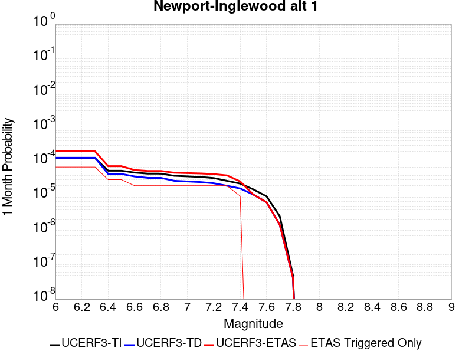 |  |  |

| Magnitude | 1 wk TI Prob | 1 wk TD Prob | 1 wk ETAS Prob | 1 wk ETAS/TD Gain | 1 wk ETAS Triggered Only | 1 mo TI Prob | 1 mo TD Prob | 1 mo ETAS Prob | 1 mo ETAS/TD Gain | 1 mo ETAS Triggered Only | 1 yr TI Prob | 1 yr TD Prob | 1 yr ETAS Prob | 1 yr ETAS/TD Gain | 1 yr ETAS Triggered Only | 10 yr TI Prob | 10 yr TD Prob | 10 yr ETAS Prob | 10 yr ETAS/TD Gain | 10 yr ETAS Triggered Only |
|-----|-----|-----|-----|-----|-----|-----|-----|-----|-----|-----|-----|-----|-----|-----|-----|-----|-----|-----|-----|-----|
| 6.0 | 2.9668912E-5 | 3.0404817E-5 | 6.5702014E-5 | 2.160908 | 3.529827E-5 | 1.2714628E-4 | 1.303026E-4 | 1.6559627E-4 | 1.2708594 | 3.529827E-5 | 0.0015469068 | 0.0015857625 | 0.0016210048 | 1.0222242 | 3.529827E-5 | 0.015361829 | 0.015792042 | 0.015826784 | 1.0021999 | 3.529827E-5 |
| 6.1 | 2.9668912E-5 | 3.0404817E-5 | 6.5702014E-5 | 2.160908 | 3.529827E-5 | 1.2714628E-4 | 1.303026E-4 | 1.6559627E-4 | 1.2708594 | 3.529827E-5 | 0.0015469068 | 0.0015857625 | 0.0016210048 | 1.0222242 | 3.529827E-5 | 0.015361829 | 0.015792042 | 0.015826784 | 1.0021999 | 3.529827E-5 |
| 6.2 | 2.9668912E-5 | 3.0404817E-5 | 6.5702014E-5 | 2.160908 | 3.529827E-5 | 1.2714628E-4 | 1.303026E-4 | 1.6559627E-4 | 1.2708594 | 3.529827E-5 | 0.0015469068 | 0.0015857625 | 0.0016210048 | 1.0222242 | 3.529827E-5 | 0.015361829 | 0.015792042 | 0.015826784 | 1.0021999 | 3.529827E-5 |
| 6.3 | 2.9668912E-5 | 3.0404817E-5 | 6.5702014E-5 | 2.160908 | 3.529827E-5 | 1.2714628E-4 | 1.303026E-4 | 1.6559627E-4 | 1.2708594 | 3.529827E-5 | 0.0015469068 | 0.0015857625 | 0.0016210048 | 1.0222242 | 3.529827E-5 | 0.015361829 | 0.015792042 | 0.015826784 | 1.0021999 | 3.529827E-5 |
| 6.4 | 1.275942E-5 | 1.0272503E-5 | 4.557041E-5 | 4.436155 | 3.529827E-5 | 5.4682085E-5 | 4.402429E-5 | 7.9321006E-5 | 1.8017554 | 3.529827E-5 | 6.65551E-4 | 5.358681E-4 | 5.711474E-4 | 1.065836 | 3.529827E-5 | 0.0066356123 | 0.005346184 | 0.0053812936 | 1.0065672 | 3.529827E-5 |
| 6.5 | 1.275942E-5 | 1.0272503E-5 | 4.557041E-5 | 4.436155 | 3.529827E-5 | 5.4682085E-5 | 4.402429E-5 | 7.9321006E-5 | 1.8017554 | 3.529827E-5 | 6.65551E-4 | 5.358681E-4 | 5.711474E-4 | 1.065836 | 3.529827E-5 | 0.0066356123 | 0.005346184 | 0.0053812936 | 1.0065672 | 3.529827E-5 |
| 6.6 | 1.1255358E-5 | 8.661884E-6 | 4.3959848E-5 | 5.075091 | 3.529827E-5 | 4.8236358E-5 | 3.712184E-5 | 7.24188E-5 | 1.9508408 | 3.529827E-5 | 5.871194E-4 | 4.518664E-4 | 4.871487E-4 | 1.0780814 | 3.529827E-5 | 0.005855706 | 0.004509653 | 0.004544792 | 1.007792 | 3.529827E-5 |
| 6.7 | 1.0504745E-5 | 7.8997955E-6 | 4.3197786E-5 | 5.468216 | 3.529827E-5 | 4.5019555E-5 | 3.3855835E-5 | 6.915291E-5 | 2.0425699 | 3.529827E-5 | 5.4797524E-4 | 4.1211807E-4 | 4.4740178E-4 | 1.0856155 | 3.529827E-5 | 0.0054662596 | 0.004113668 | 0.004148821 | 1.0085454 | 3.529827E-5 |
| 6.8 | 1.0476007E-5 | 7.881176E-6 | 4.317917E-5 | 5.4787717 | 3.529827E-5 | 4.4896402E-5 | 3.3776043E-5 | 6.907312E-5 | 2.045033 | 3.529827E-5 | 5.464766E-4 | 4.1114696E-4 | 4.464307E-4 | 1.0858179 | 3.529827E-5 | 0.005451347 | 0.0041039926 | 0.0041391463 | 1.0085657 | 3.529827E-5 |
| 6.9 | 9.076797E-6 | 6.4896312E-6 | 4.1787673E-5 | 6.4391446 | 3.529827E-5 | 3.889998E-5 | 2.781241E-5 | 6.31097E-5 | 2.26912 | 3.529827E-5 | 4.7350433E-4 | 3.385638E-4 | 3.7385014E-4 | 1.1042235 | 3.529827E-5 | 0.004724967 | 0.0033805177 | 0.0034156966 | 1.0104064 | 3.529827E-5 |
| 7.0 | 8.73795E-6 | 6.2120125E-6 | 4.1510062E-5 | 6.6822248 | 3.529827E-5 | 3.7447822E-5 | 2.6622642E-5 | 6.191997E-5 | 2.3258388 | 3.529827E-5 | 4.5583185E-4 | 3.2408274E-4 | 3.5936956E-4 | 1.1088822 | 3.529827E-5 | 0.0045489795 | 0.0032361327 | 0.0032713166 | 1.0108722 | 3.529827E-5 |
| 7.1 | 8.391299E-6 | 5.95579E-6 | 4.125385E-5 | 6.92668 | 3.529827E-5 | 3.5962214E-5 | 2.5524565E-5 | 6.0821934E-5 | 2.3828783 | 3.529827E-5 | 4.37752E-4 | 3.1071753E-4 | 3.4600485E-4 | 1.1135671 | 3.529827E-5 | 0.004368907 | 0.0031028606 | 0.0031380493 | 1.0113407 | 3.529827E-5 |
| 7.2 | 7.796882E-6 | 5.4965344E-6 | 4.079461E-5 | 7.421879 | 3.529827E-5 | 3.341478E-5 | 2.3556364E-5 | 5.8853802E-5 | 2.4984248 | 3.529827E-5 | 4.06749E-4 | 2.867612E-4 | 3.2204934E-4 | 1.1230576 | 3.529827E-5 | 0.0040600533 | 0.0028639357 | 0.002899133 | 1.0122898 | 3.529827E-5 |
| 7.3 | 6.4738833E-6 | 4.6478162E-6 | 3.9945924E-5 | 8.594557 | 3.529827E-5 | 2.774492E-5 | 1.9919062E-5 | 5.5216628E-5 | 2.7720497 | 3.529827E-5 | 3.3774204E-4 | 2.4248775E-4 | 2.7777746E-4 | 1.1455319 | 3.529827E-5 | 0.0033722918 | 0.0024222482 | 0.0024574609 | 1.0145372 | 3.529827E-5 |
| 7.4 | 5.382145E-6 | 3.8857597E-6 | 3.8857597E-6 | 1.0 | 0.0 | 2.3066134E-5 | 1.665315E-5 | 1.665315E-5 | 1.0 | 0.0 | 2.8079396E-4 | 2.0273338E-4 | 2.0273338E-4 | 1.0 | 0.0 | 0.0028043943 | 0.0020254988 | 0.0020254988 | 1.0 | 0.0 |
| 7.5 | 3.648244E-6 | 2.5737843E-6 | 2.5737843E-6 | 1.0 | 0.0 | 1.5635238E-5 | 1.1030458E-5 | 1.1030458E-5 | 1.0 | 0.0 | 1.9034238E-4 | 1.3428765E-4 | 1.3428765E-4 | 1.0 | 0.0 | 0.0019017943 | 0.0013420755 | 0.0013420755 | 1.0 | 0.0 |
| 7.6 | 2.2906888E-6 | 1.5479842E-6 | 1.5479842E-6 | 1.0 | 0.0 | 9.817201E-6 | 6.634202E-6 | 6.634202E-6 | 1.0 | 0.0 | 1.1951787E-4 | 8.076848E-5 | 8.076848E-5 | 1.0 | 0.0 | 0.0011945361 | 8.07398E-4 | 8.07398E-4 | 1.0 | 0.0 |
| 7.7 | 6.0479874E-7 | 3.397512E-7 | 3.397512E-7 | 1.0 | 0.0 | 2.5919921E-6 | 1.4560758E-6 | 1.4560758E-6 | 1.0 | 0.0 | 3.1557047E-5 | 1.7727592E-5 | 1.7727592E-5 | 1.0 | 0.0 | 3.1552566E-4 | 1.7726317E-4 | 1.7726317E-4 | 1.0 | 0.0 |
| 7.8 | 1.16056995E-8 | 9.782373E-9 | 9.782373E-9 | 1.0 | 0.0 | 4.9738713E-8 | 4.1924455E-8 | 4.1924455E-8 | 1.0 | 0.0 | 6.0556863E-7 | 5.1043025E-7 | 5.1043025E-7 | 1.0 | 0.0 | 6.05567E-6 | 5.1043025E-6 | 5.1043025E-6 | 1.0 | 0.0 |

## San Gabriel
*[(top)](#table-of-contents)*

| 1 Week | 1 Month | 1 Year | 10 Year |
|-----|-----|-----|-----|
|  |  |  |  |

| Magnitude | 1 wk TI Prob | 1 wk TD Prob | 1 wk ETAS Prob | 1 wk ETAS/TD Gain | 1 wk ETAS Triggered Only | 1 mo TI Prob | 1 mo TD Prob | 1 mo ETAS Prob | 1 mo ETAS/TD Gain | 1 mo ETAS Triggered Only | 1 yr TI Prob | 1 yr TD Prob | 1 yr ETAS Prob | 1 yr ETAS/TD Gain | 1 yr ETAS Triggered Only | 10 yr TI Prob | 10 yr TD Prob | 10 yr ETAS Prob | 10 yr ETAS/TD Gain | 10 yr ETAS Triggered Only |
|-----|-----|-----|-----|-----|-----|-----|-----|-----|-----|-----|-----|-----|-----|-----|-----|-----|-----|-----|-----|-----|
| 6.0 | 1.083775E-5 | 1.19851875E-5 | 1.19851875E-5 | 1.0 | 0.0 | 4.6446676E-5 | 5.1364143E-5 | 8.66606E-5 | 1.6871809 | 3.529827E-5 | 5.653415E-4 | 6.251903E-4 | 6.604665E-4 | 1.0564247 | 3.529827E-5 | 0.0056390543 | 0.006246409 | 0.0062814867 | 1.0056157 | 3.529827E-5 |
| 6.1 | 1.083775E-5 | 1.19851875E-5 | 1.19851875E-5 | 1.0 | 0.0 | 4.6446676E-5 | 5.1364143E-5 | 8.66606E-5 | 1.6871809 | 3.529827E-5 | 5.653415E-4 | 6.251903E-4 | 6.604665E-4 | 1.0564247 | 3.529827E-5 | 0.0056390543 | 0.006246409 | 0.0062814867 | 1.0056157 | 3.529827E-5 |
| 6.2 | 1.083775E-5 | 1.19851875E-5 | 1.19851875E-5 | 1.0 | 0.0 | 4.6446676E-5 | 5.1364143E-5 | 8.66606E-5 | 1.6871809 | 3.529827E-5 | 5.653415E-4 | 6.251903E-4 | 6.604665E-4 | 1.0564247 | 3.529827E-5 | 0.0056390543 | 0.006246409 | 0.0062814867 | 1.0056157 | 3.529827E-5 |
| 6.3 | 1.083775E-5 | 1.19851875E-5 | 1.19851875E-5 | 1.0 | 0.0 | 4.6446676E-5 | 5.1364143E-5 | 8.66606E-5 | 1.6871809 | 3.529827E-5 | 5.653415E-4 | 6.251903E-4 | 6.604665E-4 | 1.0564247 | 3.529827E-5 | 0.0056390543 | 0.006246409 | 0.0062814867 | 1.0056157 | 3.529827E-5 |
| 6.4 | 1.083775E-5 | 1.19851875E-5 | 1.19851875E-5 | 1.0 | 0.0 | 4.6446676E-5 | 5.1364143E-5 | 8.66606E-5 | 1.6871809 | 3.529827E-5 | 5.653415E-4 | 6.251903E-4 | 6.604665E-4 | 1.0564247 | 3.529827E-5 | 0.0056390543 | 0.006246409 | 0.0062814867 | 1.0056157 | 3.529827E-5 |
| 6.5 | 6.7317824E-6 | 7.716944E-6 | 7.716944E-6 | 1.0 | 0.0 | 2.8850178E-5 | 3.3072207E-5 | 6.836931E-5 | 2.0672739 | 3.529827E-5 | 3.511943E-4 | 4.0258077E-4 | 4.3786483E-4 | 1.0876447 | 3.529827E-5 | 0.003506398 | 0.0040296097 | 0.0040647658 | 1.0087245 | 3.529827E-5 |
| 6.6 | 6.7317824E-6 | 7.716944E-6 | 7.716944E-6 | 1.0 | 0.0 | 2.8850178E-5 | 3.3072207E-5 | 6.836931E-5 | 2.0672739 | 3.529827E-5 | 3.511943E-4 | 4.0258077E-4 | 4.3786483E-4 | 1.0876447 | 3.529827E-5 | 0.003506398 | 0.0040296097 | 0.0040647658 | 1.0087245 | 3.529827E-5 |
| 6.7 | 6.274881E-6 | 7.2458647E-6 | 7.2458647E-6 | 1.0 | 0.0 | 2.6892068E-5 | 3.1053343E-5 | 6.635052E-5 | 2.1366627 | 3.529827E-5 | 3.2736175E-4 | 3.780098E-4 | 4.1329474E-4 | 1.093344 | 3.529827E-5 | 0.0032687993 | 0.0037847564 | 0.003819921 | 1.0092912 | 3.529827E-5 |
| 6.8 | 5.996209E-6 | 6.958585E-6 | 6.958585E-6 | 1.0 | 0.0 | 2.5697784E-5 | 2.9822171E-5 | 6.511939E-5 | 2.1835897 | 3.529827E-5 | 3.128256E-4 | 3.6302538E-4 | 3.9831083E-4 | 1.0971984 | 3.529827E-5 | 0.003123856 | 0.0036354093 | 0.0036705793 | 1.0096743 | 3.529827E-5 |
| 6.9 | 5.686331E-6 | 6.6236316E-6 | 6.6236316E-6 | 1.0 | 0.0 | 2.4369761E-5 | 2.8386688E-5 | 6.3683954E-5 | 2.2434444 | 3.529827E-5 | 2.9666146E-4 | 3.4555403E-4 | 3.808401E-4 | 1.1021144 | 3.529827E-5 | 0.0029626573 | 0.0034612515 | 0.0034964276 | 1.0101628 | 3.529827E-5 |
| 7.0 | 5.2329838E-6 | 6.147514E-6 | 6.147514E-6 | 1.0 | 0.0 | 2.242688E-5 | 2.6346226E-5 | 6.1643565E-5 | 2.3397493 | 3.529827E-5 | 2.7301308E-4 | 3.2071886E-4 | 3.5600582E-4 | 1.1100246 | 3.529827E-5 | 0.002726779 | 0.0032136322 | 0.0032488168 | 1.0109487 | 3.529827E-5 |
| 7.1 | 5.135671E-6 | 6.03764E-6 | 6.03764E-6 | 1.0 | 0.0 | 2.2009834E-5 | 2.5875348E-5 | 6.117271E-5 | 2.3641307 | 3.529827E-5 | 2.6793676E-4 | 3.1498758E-4 | 3.5027473E-4 | 1.1120272 | 3.529827E-5 | 0.0026761394 | 0.0031564834 | 0.0031916702 | 1.0111475 | 3.529827E-5 |
| 7.2 | 4.989062E-6 | 5.87102E-6 | 5.87102E-6 | 1.0 | 0.0 | 2.1381518E-5 | 2.5161276E-5 | 6.045866E-5 | 2.4028454 | 3.529827E-5 | 2.6028889E-4 | 3.0629625E-4 | 3.4158368E-4 | 1.115207 | 3.529827E-5 | 0.0025998424 | 0.003069813 | 0.0031050027 | 1.0114632 | 3.529827E-5 |
| 7.3 | 4.8219395E-6 | 5.702574E-6 | 5.702574E-6 | 1.0 | 0.0 | 2.0665291E-5 | 2.443938E-5 | 5.9736787E-5 | 2.4442842 | 3.529827E-5 | 2.5157086E-4 | 2.9750957E-4 | 3.3279732E-4 | 1.1186105 | 3.529827E-5 | 0.0025128627 | 0.0029821852 | 0.0030173783 | 1.0118011 | 3.529827E-5 |
| 7.4 | 4.7118383E-6 | 5.5911332E-6 | 5.5911332E-6 | 1.0 | 0.0 | 2.0193436E-5 | 2.3961782E-5 | 5.9259208E-5 | 2.4730718 | 3.529827E-5 | 2.4582737E-4 | 2.916964E-4 | 3.269844E-4 | 1.120975 | 3.529827E-5 | 0.002455556 | 0.0029242067 | 0.0029594018 | 1.0120357 | 3.529827E-5 |
| 7.5 | 4.5506545E-6 | 5.4365014E-6 | 5.4365014E-6 | 1.0 | 0.0 | 1.9502659E-5 | 2.3299088E-5 | 5.8596535E-5 | 2.5149713 | 3.529827E-5 | 2.37419E-4 | 2.8363022E-4 | 3.1891846E-4 | 1.1244165 | 3.529827E-5 | 0.002371655 | 0.002843753 | 0.002878951 | 1.0123773 | 3.529827E-5 |
| 7.6 | 4.343636E-6 | 5.2293817E-6 | 5.2293817E-6 | 1.0 | 0.0 | 1.861545E-5 | 2.2411448E-5 | 5.7708927E-5 | 2.5749755 | 3.529827E-5 | 2.2661954E-4 | 2.7282597E-4 | 3.081146E-4 | 1.1293448 | 3.529827E-5 | 0.0022638857 | 0.0027359722 | 0.0027711738 | 1.0128663 | 3.529827E-5 |
| 7.7 | 2.936235E-6 | 2.7440458E-6 | 2.7440458E-6 | 1.0 | 0.0 | 1.2583803E-5 | 1.1760143E-5 | 4.7057998E-5 | 4.0014815 | 3.529827E-5 | 1.5319703E-4 | 1.4317037E-4 | 1.7846358E-4 | 1.246512 | 3.529827E-5 | 0.0015309147 | 0.0014380751 | 0.0014733225 | 1.0245101 | 3.529827E-5 |
| 7.8 | 1.4541639E-6 | 9.1237047E-7 | 9.1237047E-7 | 1.0 | 0.0 | 6.232116E-6 | 3.9101533E-6 | 3.9101533E-6 | 1.0 | 0.0 | 7.587337E-5 | 4.7605077E-5 | 4.7605077E-5 | 1.0 | 0.0 | 7.584747E-4 | 4.8085177E-4 | 4.8085177E-4 | 1.0 | 0.0 |
| 7.9 | 8.098958E-7 | 2.41753E-7 | 2.41753E-7 | 1.0 | 0.0 | 3.4709774E-6 | 1.0360839E-6 | 1.0360839E-6 | 1.0 | 0.0 | 4.225833E-5 | 1.2614248E-5 | 1.2614248E-5 | 1.0 | 0.0 | 4.2250296E-4 | 1.2921814E-4 | 1.2921814E-4 | 1.0 | 0.0 |
| 8.0 | 5.2473234E-7 | 7.6792055E-8 | 7.6792055E-8 | 1.0 | 0.0 | 2.248851E-6 | 3.2910876E-7 | 3.2910876E-7 | 1.0 | 0.0 | 2.7379416E-5 | 4.0068917E-6 | 4.0068917E-6 | 1.0 | 0.0 | 2.7376044E-4 | 4.21918E-5 | 4.21918E-5 | 1.0 | 0.0 |
| 8.1 | 3.3162388E-7 | 4.1496126E-8 | 4.1496126E-8 | 1.0 | 0.0 | 1.4212444E-6 | 1.7784053E-7 | 1.7784053E-7 | 1.0 | 0.0 | 1.7303513E-5 | 2.1652063E-6 | 2.1652063E-6 | 1.0 | 0.0 | 1.7302166E-4 | 2.2965523E-5 | 2.2965523E-5 | 1.0 | 0.0 |
| 8.2 | 1.0235345E-7 | 1.4043474E-8 | 1.4043474E-8 | 1.0 | 0.0 | 4.3865757E-7 | 6.0186316E-8 | 6.0186316E-8 | 1.0 | 0.0 | 5.340643E-6 | 7.327681E-7 | 7.327681E-7 | 1.0 | 0.0 | 5.3405143E-5 | 7.9273705E-6 | 7.9273705E-6 | 1.0 | 0.0 |

## Northridge Hills
*[(top)](#table-of-contents)*

| 1 Week | 1 Month | 1 Year | 10 Year |
|-----|-----|-----|-----|
|  |  |  |  |

| Magnitude | 1 wk TI Prob | 1 wk TD Prob | 1 wk ETAS Prob | 1 wk ETAS/TD Gain | 1 wk ETAS Triggered Only | 1 mo TI Prob | 1 mo TD Prob | 1 mo ETAS Prob | 1 mo ETAS/TD Gain | 1 mo ETAS Triggered Only | 1 yr TI Prob | 1 yr TD Prob | 1 yr ETAS Prob | 1 yr ETAS/TD Gain | 1 yr ETAS Triggered Only | 10 yr TI Prob | 10 yr TD Prob | 10 yr ETAS Prob | 10 yr ETAS/TD Gain | 10 yr ETAS Triggered Only |
|-----|-----|-----|-----|-----|-----|-----|-----|-----|-----|-----|-----|-----|-----|-----|-----|-----|-----|-----|-----|-----|
| 6.0 | 5.095982E-6 | 3.6152098E-6 | 3.6152098E-6 | 1.0 | 0.0 | 2.183974E-5 | 1.5493664E-5 | 1.5493664E-5 | 1.0 | 0.0 | 2.658664E-4 | 1.8861916E-4 | 1.8861916E-4 | 1.0 | 0.0 | 0.0026554854 | 0.001884603 | 0.0019198349 | 1.0186945 | 3.529827E-5 |
| 6.1 | 5.095982E-6 | 3.6152098E-6 | 3.6152098E-6 | 1.0 | 0.0 | 2.183974E-5 | 1.5493664E-5 | 1.5493664E-5 | 1.0 | 0.0 | 2.658664E-4 | 1.8861916E-4 | 1.8861916E-4 | 1.0 | 0.0 | 0.0026554854 | 0.001884603 | 0.0019198349 | 1.0186945 | 3.529827E-5 |
| 6.2 | 5.095982E-6 | 3.6152098E-6 | 3.6152098E-6 | 1.0 | 0.0 | 2.183974E-5 | 1.5493664E-5 | 1.5493664E-5 | 1.0 | 0.0 | 2.658664E-4 | 1.8861916E-4 | 1.8861916E-4 | 1.0 | 0.0 | 0.0026554854 | 0.001884603 | 0.0019198349 | 1.0186945 | 3.529827E-5 |
| 6.3 | 5.095982E-6 | 3.6152098E-6 | 3.6152098E-6 | 1.0 | 0.0 | 2.183974E-5 | 1.5493664E-5 | 1.5493664E-5 | 1.0 | 0.0 | 2.658664E-4 | 1.8861916E-4 | 1.8861916E-4 | 1.0 | 0.0 | 0.0026554854 | 0.001884603 | 0.0019198349 | 1.0186945 | 3.529827E-5 |
| 6.4 | 5.095982E-6 | 3.6152098E-6 | 3.6152098E-6 | 1.0 | 0.0 | 2.183974E-5 | 1.5493664E-5 | 1.5493664E-5 | 1.0 | 0.0 | 2.658664E-4 | 1.8861916E-4 | 1.8861916E-4 | 1.0 | 0.0 | 0.0026554854 | 0.001884603 | 0.0019198349 | 1.0186945 | 3.529827E-5 |
| 6.5 | 5.095982E-6 | 3.6152098E-6 | 3.6152098E-6 | 1.0 | 0.0 | 2.183974E-5 | 1.5493664E-5 | 1.5493664E-5 | 1.0 | 0.0 | 2.658664E-4 | 1.8861916E-4 | 1.8861916E-4 | 1.0 | 0.0 | 0.0026554854 | 0.001884603 | 0.0019198349 | 1.0186945 | 3.529827E-5 |
| 6.6 | 5.095982E-6 | 3.6152098E-6 | 3.6152098E-6 | 1.0 | 0.0 | 2.183974E-5 | 1.5493664E-5 | 1.5493664E-5 | 1.0 | 0.0 | 2.658664E-4 | 1.8861916E-4 | 1.8861916E-4 | 1.0 | 0.0 | 0.0026554854 | 0.001884603 | 0.0019198349 | 1.0186945 | 3.529827E-5 |
| 6.7 | 5.095982E-6 | 3.6152098E-6 | 3.6152098E-6 | 1.0 | 0.0 | 2.183974E-5 | 1.5493664E-5 | 1.5493664E-5 | 1.0 | 0.0 | 2.658664E-4 | 1.8861916E-4 | 1.8861916E-4 | 1.0 | 0.0 | 0.0026554854 | 0.001884603 | 0.0019198349 | 1.0186945 | 3.529827E-5 |
| 6.8 | 5.095982E-6 | 3.6152098E-6 | 3.6152098E-6 | 1.0 | 0.0 | 2.183974E-5 | 1.5493664E-5 | 1.5493664E-5 | 1.0 | 0.0 | 2.658664E-4 | 1.8861916E-4 | 1.8861916E-4 | 1.0 | 0.0 | 0.0026554854 | 0.001884603 | 0.0019198349 | 1.0186945 | 3.529827E-5 |
| 6.9 | 5.0942654E-6 | 3.6134247E-6 | 3.6134247E-6 | 1.0 | 0.0 | 2.1832384E-5 | 1.5486015E-5 | 1.5486015E-5 | 1.0 | 0.0 | 2.6577685E-4 | 1.8852603E-4 | 1.8852603E-4 | 1.0 | 0.0 | 0.002654592 | 0.0018836735 | 0.0019189052 | 1.0187038 | 3.529827E-5 |
| 7.0 | 4.851143E-6 | 3.3587396E-6 | 3.3587396E-6 | 1.0 | 0.0 | 2.0790447E-5 | 1.4394519E-5 | 1.4394519E-5 | 1.0 | 0.0 | 2.5309427E-4 | 1.7523921E-4 | 1.7523921E-4 | 1.0 | 0.0 | 0.0025280623 | 0.0017510147 | 0.0017862512 | 1.0201235 | 3.529827E-5 |
| 7.1 | 4.7910607E-6 | 3.2970208E-6 | 3.2970208E-6 | 1.0 | 0.0 | 2.0532956E-5 | 1.4130013E-5 | 1.4130013E-5 | 1.0 | 0.0 | 2.4996005E-4 | 1.7201937E-4 | 1.7201937E-4 | 1.0 | 0.0 | 0.0024967908 | 0.0017188663 | 0.0017541038 | 1.0205005 | 3.529827E-5 |
| 7.2 | 4.580079E-6 | 3.1067987E-6 | 3.1067987E-6 | 1.0 | 0.0 | 1.9628762E-5 | 1.3314784E-5 | 1.3314784E-5 | 1.0 | 0.0 | 2.3895396E-4 | 1.6209547E-4 | 1.6209547E-4 | 1.0 | 0.0 | 0.0023869718 | 0.0016197758 | 0.0016550169 | 1.0217568 | 3.529827E-5 |
| 7.3 | 4.290062E-6 | 2.8682275E-6 | 2.8682275E-6 | 1.0 | 0.0 | 1.838585E-5 | 1.2292346E-5 | 1.2292346E-5 | 1.0 | 0.0 | 2.2382473E-4 | 1.4964906E-4 | 1.4964906E-4 | 1.0 | 0.0 | 0.0022359942 | 0.0014954859 | 0.0015307313 | 1.0235679 | 3.529827E-5 |
| 7.4 | 4.0259683E-6 | 2.673904E-6 | 2.673904E-6 | 1.0 | 0.0 | 1.7254037E-5 | 1.1459538E-5 | 1.1459538E-5 | 1.0 | 0.0 | 2.1004764E-4 | 1.3951097E-4 | 1.3951097E-4 | 1.0 | 0.0 | 0.002098492 | 0.0013942367 | 0.0014294857 | 1.025282 | 3.529827E-5 |
| 7.5 | 3.5477108E-6 | 2.285216E-6 | 2.285216E-6 | 1.0 | 0.0 | 1.5204386E-5 | 9.793746E-6 | 9.793746E-6 | 1.0 | 0.0 | 1.8509767E-4 | 1.1923235E-4 | 1.1923235E-4 | 1.0 | 0.0 | 0.0018494357 | 0.0011916853 | 0.0012269415 | 1.0295851 | 3.529827E-5 |
| 7.6 | 2.9990608E-6 | 1.8528339E-6 | 1.8528339E-6 | 1.0 | 0.0 | 1.2853055E-5 | 7.940693E-6 | 7.940693E-6 | 1.0 | 0.0 | 1.564747E-4 | 9.667365E-5 | 9.667365E-5 | 1.0 | 0.0 | 0.0015636457 | 9.663168E-4 | 0.001001581 | 1.0364934 | 3.529827E-5 |
| 7.7 | 2.4542855E-6 | 1.4461344E-6 | 1.4461344E-6 | 1.0 | 0.0 | 1.05183235E-5 | 6.197704E-6 | 6.197704E-6 | 1.0 | 0.0 | 1.2805307E-4 | 7.545444E-5 | 7.545444E-5 | 1.0 | 0.0 | 0.001279793 | 7.5428875E-4 | 7.8956044E-4 | 1.0467615 | 3.529827E-5 |
| 7.8 | 1.3623128E-6 | 8.016168E-7 | 8.016168E-7 | 1.0 | 0.0 | 5.8384703E-6 | 3.4354962E-6 | 3.4354962E-6 | 1.0 | 0.0 | 7.108106E-5 | 4.1826366E-5 | 4.1826366E-5 | 1.0 | 0.0 | 7.1058323E-4 | 4.1818514E-4 | 4.5346864E-4 | 1.084373 | 3.529827E-5 |
| 7.9 | 7.716622E-7 | 4.218757E-7 | 4.218757E-7 | 1.0 | 0.0 | 3.3071194E-6 | 1.8080375E-6 | 1.8080375E-6 | 1.0 | 0.0 | 4.0263436E-5 | 2.2012635E-5 | 2.2012635E-5 | 1.0 | 0.0 | 4.0256142E-4 | 2.2010466E-4 | 2.5539516E-4 | 1.1603351 | 3.529827E-5 |
| 8.0 | 1.2117711E-7 | 6.6220565E-8 | 6.6220565E-8 | 1.0 | 0.0 | 5.1933034E-7 | 2.838024E-7 | 2.838024E-7 | 1.0 | 0.0 | 6.3228285E-6 | 3.4552888E-6 | 3.4552888E-6 | 1.0 | 0.0 | 6.3226486E-5 | 3.455237E-5 | 3.455237E-5 | 1.0 | 0.0 |

## Malibu Coast (Extension) alt 1
*[(top)](#table-of-contents)*

| 1 Week | 1 Month | 1 Year | 10 Year |
|-----|-----|-----|-----|
|  |  |  |  |

| Magnitude | 1 wk TI Prob | 1 wk TD Prob | 1 wk ETAS Prob | 1 wk ETAS/TD Gain | 1 wk ETAS Triggered Only | 1 mo TI Prob | 1 mo TD Prob | 1 mo ETAS Prob | 1 mo ETAS/TD Gain | 1 mo ETAS Triggered Only | 1 yr TI Prob | 1 yr TD Prob | 1 yr ETAS Prob | 1 yr ETAS/TD Gain | 1 yr ETAS Triggered Only | 10 yr TI Prob | 10 yr TD Prob | 10 yr ETAS Prob | 10 yr ETAS/TD Gain | 10 yr ETAS Triggered Only |
|-----|-----|-----|-----|-----|-----|-----|-----|-----|-----|-----|-----|-----|-----|-----|-----|-----|-----|-----|-----|-----|
| 6.0 | 8.930738E-6 | 9.329276E-6 | 9.329276E-6 | 1.0 | 0.0 | 3.827403E-5 | 3.998201E-5 | 7.527887E-5 | 1.8828186 | 3.529827E-5 | 4.6588664E-4 | 4.8667393E-4 | 5.21955E-4 | 1.0724943 | 3.529827E-5 | 0.0046491115 | 0.004856264 | 0.004891391 | 1.0072333 | 3.529827E-5 |
| 6.1 | 7.199952E-6 | 7.5302964E-6 | 7.5302964E-6 | 1.0 | 0.0 | 3.0856572E-5 | 3.2272303E-5 | 6.756943E-5 | 2.0937283 | 3.529827E-5 | 3.75614E-4 | 3.9284505E-4 | 4.2812945E-4 | 1.0898176 | 3.529827E-5 | 0.0037497976 | 0.003921572 | 0.0039567323 | 1.0089657 | 3.529827E-5 |
| 6.2 | 6.3721413E-6 | 6.6667917E-6 | 6.6667917E-6 | 1.0 | 0.0 | 2.7308892E-5 | 2.8571652E-5 | 6.3868916E-5 | 2.2353945 | 3.529827E-5 | 3.3243504E-4 | 3.4780471E-4 | 3.830907E-4 | 1.1014534 | 3.529827E-5 | 0.0033193815 | 0.0034726437 | 0.0035078195 | 1.0101293 | 3.529827E-5 |
| 6.3 | 6.016345E-6 | 6.295158E-6 | 6.295158E-6 | 1.0 | 0.0 | 2.578408E-5 | 2.6978973E-5 | 6.227629E-5 | 2.308327 | 3.529827E-5 | 3.1387596E-4 | 3.2841982E-4 | 3.637065E-4 | 1.1074438 | 3.529827E-5 | 0.00313433 | 0.0032793807 | 0.0033145633 | 1.0107284 | 3.529827E-5 |
| 6.4 | 5.8104883E-6 | 6.0795446E-6 | 6.0795446E-6 | 1.0 | 0.0 | 2.4901856E-5 | 2.6054933E-5 | 6.1352286E-5 | 2.3547282 | 3.529827E-5 | 3.031379E-4 | 3.1717293E-4 | 3.5246002E-4 | 1.111255 | 3.529827E-5 | 0.0030272473 | 0.0031672374 | 0.003202424 | 1.0111095 | 3.529827E-5 |
| 6.5 | 5.476925E-6 | 5.7275133E-6 | 5.7275133E-6 | 1.0 | 0.0 | 2.3472323E-5 | 2.4546256E-5 | 5.984366E-5 | 2.4379954 | 3.529827E-5 | 2.8573806E-4 | 2.9880996E-4 | 3.3409768E-4 | 1.1180942 | 3.529827E-5 | 0.0028537093 | 0.002984114 | 0.0030193068 | 1.0117934 | 3.529827E-5 |
| 6.6 | 5.222387E-6 | 5.45858E-6 | 5.45858E-6 | 1.0 | 0.0 | 2.2381464E-5 | 2.3393704E-5 | 5.869115E-5 | 2.5088437 | 3.529827E-5 | 2.7246025E-4 | 2.8478142E-4 | 3.2006964E-4 | 1.1239133 | 3.529827E-5 | 0.0027212645 | 0.0028441956 | 0.0028793933 | 1.0123754 | 3.529827E-5 |
| 6.7 | 5.0337076E-6 | 5.259103E-6 | 5.259103E-6 | 1.0 | 0.0 | 2.1572854E-5 | 2.253882E-5 | 5.7836296E-5 | 2.5660746 | 3.529827E-5 | 2.6261783E-4 | 2.7437587E-4 | 3.0966444E-4 | 1.1286141 | 3.529827E-5 | 0.002623077 | 0.002740401 | 0.0027756027 | 1.0128454 | 3.529827E-5 |
| 6.8 | 4.5675624E-6 | 4.7587164E-6 | 4.7587164E-6 | 1.0 | 0.0 | 1.9575122E-5 | 2.039434E-5 | 5.569189E-5 | 2.7307522 | 3.529827E-5 | 2.3830103E-4 | 2.48273E-4 | 2.835625E-4 | 1.1421399 | 3.529827E-5 | 0.0023804565 | 0.002479976 | 0.0025151868 | 1.0141981 | 3.529827E-5 |
| 6.9 | 4.2802412E-6 | 4.4520207E-6 | 4.4520207E-6 | 1.0 | 0.0 | 1.8343762E-5 | 1.907995E-5 | 5.4377546E-5 | 2.8499837 | 3.529827E-5 | 2.2331243E-4 | 2.3227377E-4 | 2.6756385E-4 | 1.1519331 | 3.529827E-5 | 0.0022308815 | 0.0023203269 | 0.0023555432 | 1.0151774 | 3.529827E-5 |
| 7.0 | 3.9794063E-6 | 4.130099E-6 | 4.130099E-6 | 1.0 | 0.0 | 1.7054486E-5 | 1.7700306E-5 | 5.299795E-5 | 2.9941828 | 3.529827E-5 | 2.0761859E-4 | 2.1548003E-4 | 2.5077068E-4 | 1.163777 | 3.529827E-5 | 0.0020742472 | 0.0021527244 | 0.0021879468 | 1.0163617 | 3.529827E-5 |
| 7.1 | 3.7730424E-6 | 3.911217E-6 | 3.911217E-6 | 1.0 | 0.0 | 1.6170083E-5 | 1.6762251E-5 | 5.205993E-5 | 3.105784 | 3.529827E-5 | 1.9685295E-4 | 2.0406142E-4 | 2.3935249E-4 | 1.1729434 | 3.529827E-5 | 0.0019667868 | 0.0020387534 | 0.0020739797 | 1.0172783 | 3.529827E-5 |
| 7.2 | 3.424985E-6 | 3.541337E-6 | 3.541337E-6 | 1.0 | 0.0 | 1.4678424E-5 | 1.5177071E-5 | 5.0474806E-5 | 3.3257277 | 3.529827E-5 | 1.7869516E-4 | 1.8476529E-4 | 2.2005703E-4 | 1.1910086 | 3.529827E-5 | 0.0017855153 | 0.0018461287 | 0.0018813618 | 1.0190848 | 3.529827E-5 |
| 7.3 | 2.6966375E-6 | 2.7596534E-6 | 2.7596534E-6 | 1.0 | 0.0 | 1.15569665E-5 | 1.1827032E-5 | 1.1827032E-5 | 1.0 | 0.0 | 1.4069698E-4 | 1.4398464E-4 | 1.4398464E-4 | 1.0 | 0.0 | 0.0014060794 | 0.0014389176 | 0.0014389176 | 1.0 | 0.0 |
| 7.4 | 2.215957E-6 | 2.249378E-6 | 2.249378E-6 | 1.0 | 0.0 | 9.496924E-6 | 9.640156E-6 | 9.640156E-6 | 1.0 | 0.0 | 1.1561892E-4 | 1.17362615E-4 | 1.17362615E-4 | 1.0 | 0.0 | 0.0011555878 | 0.0011730101 | 0.0011730101 | 1.0 | 0.0 |
| 7.5 | 1.2040218E-6 | 1.2219067E-6 | 1.2219067E-6 | 1.0 | 0.0 | 5.160083E-6 | 5.2367322E-6 | 5.2367322E-6 | 1.0 | 0.0 | 6.2822204E-5 | 6.375537E-5 | 6.375537E-5 | 1.0 | 0.0 | 6.280445E-4 | 6.3737266E-4 | 6.3737266E-4 | 1.0 | 0.0 |
| 7.6 | 6.6157446E-7 | 6.678975E-7 | 6.678975E-7 | 1.0 | 0.0 | 2.835316E-6 | 2.8624147E-6 | 2.8624147E-6 | 1.0 | 0.0 | 3.4519428E-5 | 3.484936E-5 | 3.484936E-5 | 1.0 | 0.0 | 3.4514067E-4 | 3.4844046E-4 | 3.4844046E-4 | 1.0 | 0.0 |
| 7.7 | 2.6012302E-7 | 2.4357593E-7 | 2.4357593E-7 | 1.0 | 0.0 | 1.1148124E-6 | 1.0438964E-6 | 1.0438964E-6 | 1.0 | 0.0 | 1.3572758E-5 | 1.2709375E-5 | 1.2709375E-5 | 1.0 | 0.0 | 1.3571928E-4 | 1.2708755E-4 | 1.2708755E-4 | 1.0 | 0.0 |
| 7.8 | 2.8323132E-8 | 2.0266649E-8 | 2.0266649E-8 | 1.0 | 0.0 | 1.2138484E-7 | 8.685707E-8 | 8.685707E-8 | 1.0 | 0.0 | 1.4778595E-6 | 1.0574844E-6 | 1.0574844E-6 | 1.0 | 0.0 | 1.4778497E-5 | 1.0574801E-5 | 1.0574801E-5 | 1.0 | 0.0 |

## San Gregorio (North) 2011 CFM
*[(top)](#table-of-contents)*

| 1 Week | 1 Month | 1 Year | 10 Year |
|-----|-----|-----|-----|
|  | 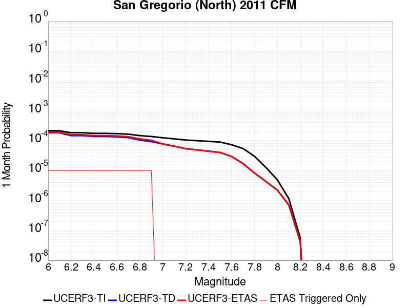 |  |  |

| Magnitude | 1 wk TI Prob | 1 wk TD Prob | 1 wk ETAS Prob | 1 wk ETAS/TD Gain | 1 wk ETAS Triggered Only | 1 mo TI Prob | 1 mo TD Prob | 1 mo ETAS Prob | 1 mo ETAS/TD Gain | 1 mo ETAS Triggered Only | 1 yr TI Prob | 1 yr TD Prob | 1 yr ETAS Prob | 1 yr ETAS/TD Gain | 1 yr ETAS Triggered Only | 10 yr TI Prob | 10 yr TD Prob | 10 yr ETAS Prob | 10 yr ETAS/TD Gain | 10 yr ETAS Triggered Only |
|-----|-----|-----|-----|-----|-----|-----|-----|-----|-----|-----|-----|-----|-----|-----|-----|-----|-----|-----|-----|-----|
| 6.0 | 5.0283932E-5 | 4.3057815E-5 | 4.3057815E-5 | 1.0 | 0.0 | 2.1548476E-4 | 1.8452053E-4 | 1.8452053E-4 | 1.0 | 0.0 | 0.0026203706 | 0.002244237 | 0.002279456 | 1.0156931 | 3.529827E-5 | 0.02589687 | 0.022293162 | 0.022327673 | 1.001548 | 3.529827E-5 |
| 6.1 | 5.0283932E-5 | 4.3057815E-5 | 4.3057815E-5 | 1.0 | 0.0 | 2.1548476E-4 | 1.8452053E-4 | 1.8452053E-4 | 1.0 | 0.0 | 0.0026203706 | 0.002244237 | 0.002279456 | 1.0156931 | 3.529827E-5 | 0.02589687 | 0.022293162 | 0.022327673 | 1.001548 | 3.529827E-5 |
| 6.2 | 4.2998647E-5 | 3.4441564E-5 | 3.4441564E-5 | 1.0 | 0.0 | 1.842669E-4 | 1.475984E-4 | 1.475984E-4 | 1.0 | 0.0 | 0.0022411412 | 0.00179554 | 0.0018307749 | 1.0196235 | 3.529827E-5 | 0.022186736 | 0.017886506 | 0.017921174 | 1.0019381 | 3.529827E-5 |
| 6.3 | 4.2998647E-5 | 3.4441564E-5 | 3.4441564E-5 | 1.0 | 0.0 | 1.842669E-4 | 1.475984E-4 | 1.475984E-4 | 1.0 | 0.0 | 0.0022411412 | 0.00179554 | 0.0018307749 | 1.0196235 | 3.529827E-5 | 0.022186736 | 0.017886506 | 0.017921174 | 1.0019381 | 3.529827E-5 |
| 6.4 | 4.1101295E-5 | 3.2326872E-5 | 3.2326872E-5 | 1.0 | 0.0 | 1.7613651E-4 | 1.3853642E-4 | 1.3853642E-4 | 1.0 | 0.0 | 0.0021423528 | 0.0016853869 | 0.0017206257 | 1.0209085 | 3.529827E-5 | 0.02121817 | 0.016801886 | 0.016836591 | 1.0020655 | 3.529827E-5 |
| 6.5 | 4.1032585E-5 | 3.2244905E-5 | 3.2244905E-5 | 1.0 | 0.0 | 1.7584208E-4 | 1.3818518E-4 | 1.3818518E-4 | 1.0 | 0.0 | 0.0021387753 | 0.0016811171 | 0.001716356 | 1.0209616 | 3.529827E-5 | 0.021183075 | 0.016759839 | 0.016794546 | 1.0020708 | 3.529827E-5 |
| 6.6 | 4.011629E-5 | 3.1266558E-5 | 3.1266558E-5 | 1.0 | 0.0 | 1.7191563E-4 | 1.339927E-4 | 1.339927E-4 | 1.0 | 0.0 | 0.0020910634 | 0.0016301516 | 0.0016653923 | 1.0216181 | 3.529827E-5 | 0.020714961 | 0.01625741 | 0.016292136 | 1.0021359 | 3.529827E-5 |
| 6.7 | 3.8583938E-5 | 2.9453593E-5 | 2.9453593E-5 | 1.0 | 0.0 | 1.6534925E-4 | 1.2622366E-4 | 1.2622366E-4 | 1.0 | 0.0 | 0.0020112682 | 0.0015357039 | 0.001570948 | 1.0229498 | 3.529827E-5 | 0.019931622 | 0.015325955 | 0.015360712 | 1.0022678 | 3.529827E-5 |
| 6.8 | 3.44341E-5 | 2.4450854E-5 | 2.4450854E-5 | 1.0 | 0.0 | 1.4756636E-4 | 1.0478523E-4 | 1.0478523E-4 | 1.0 | 0.0 | 0.0017951399 | 0.0012750238 | 0.001310277 | 1.027649 | 3.529827E-5 | 0.017807078 | 0.012751131 | 0.01278598 | 1.002733 | 3.529827E-5 |
| 6.9 | 3.221199E-5 | 2.1778029E-5 | 2.1778029E-5 | 1.0 | 0.0 | 1.3804408E-4 | 9.333112E-5 | 9.333112E-5 | 1.0 | 0.0 | 0.0016793909 | 0.0011357224 | 0.0011709805 | 1.0310447 | 3.529827E-5 | 0.01666756 | 0.011372583 | 0.01140748 | 1.0030684 | 3.529827E-5 |
| 7.0 | 2.9186718E-5 | 1.8146875E-5 | 1.8146875E-5 | 1.0 | 0.0 | 1.2507994E-4 | 7.7770026E-5 | 7.7770026E-5 | 1.0 | 0.0 | 0.0015217843 | 9.464431E-4 | 9.464431E-4 | 1.0 | 0.0 | 0.015114053 | 0.009496798 | 0.009496798 | 1.0 | 0.0 |
| 7.1 | 2.6840138E-5 | 1.5284508E-5 | 1.5284508E-5 | 1.0 | 0.0 | 1.1502409E-4 | 6.55034E-5 | 6.55034E-5 | 1.0 | 0.0 | 0.0013995186 | 7.9721404E-4 | 7.9721404E-4 | 1.0 | 0.0 | 0.013907375 | 0.008015723 | 0.008015723 | 1.0 | 0.0 |
| 7.2 | 2.453002E-5 | 1.2606672E-5 | 1.2606672E-5 | 1.0 | 0.0 | 1.05124425E-4 | 5.4027478E-5 | 5.4027478E-5 | 1.0 | 0.0 | 0.0012791384 | 6.575866E-4 | 6.575866E-4 | 1.0 | 0.0 | 0.012718005 | 0.00662763 | 0.00662763 | 1.0 | 0.0 |
| 7.3 | 2.3330727E-5 | 1.1488677E-5 | 1.1488677E-5 | 1.0 | 0.0 | 9.9985E-5 | 4.923626E-5 | 4.923626E-5 | 1.0 | 0.0 | 0.0012166376 | 5.9928704E-4 | 5.9928704E-4 | 1.0 | 0.0 | 0.012099981 | 0.006046564 | 0.006046564 | 1.0 | 0.0 |
| 7.4 | 2.2136466E-5 | 1.0368981E-5 | 1.0368981E-5 | 1.0 | 0.0 | 9.486712E-5 | 4.4437733E-5 | 4.4437733E-5 | 1.0 | 0.0 | 0.0011543952 | 5.4089533E-4 | 5.4089533E-4 | 1.0 | 0.0 | 0.011484168 | 0.005464249 | 0.005464249 | 1.0 | 0.0 |
| 7.5 | 2.0994974E-5 | 9.427217E-6 | 9.427217E-6 | 1.0 | 0.0 | 8.997535E-5 | 4.0401734E-5 | 4.0401734E-5 | 1.0 | 0.0 | 0.0010948994 | 4.9178035E-4 | 4.9178035E-4 | 1.0 | 0.0 | 0.010895205 | 0.004973358 | 0.004973358 | 1.0 | 0.0 |
| 7.6 | 1.7091823E-5 | 6.893766E-6 | 6.893766E-6 | 1.0 | 0.0 | 7.3248615E-5 | 2.9544377E-5 | 2.9544377E-5 | 1.0 | 0.0 | 8.9143694E-4 | 3.596435E-4 | 3.596435E-4 | 1.0 | 0.0 | 0.008878695 | 0.0036482841 | 0.0036482841 | 1.0 | 0.0 |
| 7.7 | 1.2772179E-5 | 4.0208706E-6 | 4.0208706E-6 | 1.0 | 0.0 | 5.473676E-5 | 1.7232189E-5 | 1.7232189E-5 | 1.0 | 0.0 | 6.6621625E-4 | 2.0978172E-4 | 2.0978172E-4 | 1.0 | 0.0 | 0.006642225 | 0.002136922 | 0.002136922 | 1.0 | 0.0 |
| 7.8 | 7.041923E-6 | 1.940626E-6 | 1.940626E-6 | 1.0 | 0.0 | 3.017932E-5 | 8.316942E-6 | 8.316942E-6 | 1.0 | 0.0 | 3.6737128E-4 | 1.0125406E-4 | 1.0125406E-4 | 1.0 | 0.0 | 0.0036676454 | 0.0010379003 | 0.0010379003 | 1.0 | 0.0 |
| 7.9 | 2.946768E-6 | 1.0033551E-6 | 1.0033551E-6 | 1.0 | 0.0 | 1.2628945E-5 | 4.300086E-6 | 4.300086E-6 | 1.0 | 0.0 | 1.5374656E-4 | 5.235229E-5 | 5.235229E-5 | 1.0 | 0.0 | 0.0015364023 | 5.3400313E-4 | 5.3400313E-4 | 1.0 | 0.0 |
| 8.0 | 1.1433375E-6 | 5.18146E-7 | 5.18146E-7 | 1.0 | 0.0 | 4.9000087E-6 | 2.2206239E-6 | 2.2206239E-6 | 1.0 | 0.0 | 5.965597E-5 | 2.703576E-5 | 2.703576E-5 | 1.0 | 0.0 | 5.963996E-4 | 2.7398416E-4 | 2.7398416E-4 | 1.0 | 0.0 |
| 8.1 | 2.6675295E-7 | 1.62899E-7 | 1.62899E-7 | 1.0 | 0.0 | 1.1432264E-6 | 6.9813836E-7 | 6.9813836E-7 | 1.0 | 0.0 | 1.3918692E-5 | 8.499802E-6 | 8.499802E-6 | 1.0 | 0.0 | 1.391782E-4 | 8.63795E-5 | 8.63795E-5 | 1.0 | 0.0 |
| 8.2 | 1.2704569E-8 | 9.431393E-9 | 9.431393E-9 | 1.0 | 0.0 | 5.444815E-8 | 4.042026E-8 | 4.042026E-8 | 1.0 | 0.0 | 6.629061E-7 | 4.9211656E-7 | 4.9211656E-7 | 1.0 | 0.0 | 6.629041E-6 | 5.1121438E-6 | 5.1121438E-6 | 1.0 | 0.0 |

## Elysian Park (Lower CFM)
*[(top)](#table-of-contents)*

| 1 Week | 1 Month | 1 Year | 10 Year |
|-----|-----|-----|-----|
|  |  | 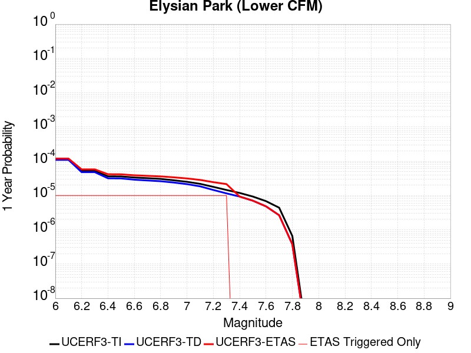 |  |

| Magnitude | 1 wk TI Prob | 1 wk TD Prob | 1 wk ETAS Prob | 1 wk ETAS/TD Gain | 1 wk ETAS Triggered Only | 1 mo TI Prob | 1 mo TD Prob | 1 mo ETAS Prob | 1 mo ETAS/TD Gain | 1 mo ETAS Triggered Only | 1 yr TI Prob | 1 yr TD Prob | 1 yr ETAS Prob | 1 yr ETAS/TD Gain | 1 yr ETAS Triggered Only | 10 yr TI Prob | 10 yr TD Prob | 10 yr ETAS Prob | 10 yr ETAS/TD Gain | 10 yr ETAS Triggered Only |
|-----|-----|-----|-----|-----|-----|-----|-----|-----|-----|-----|-----|-----|-----|-----|-----|-----|-----|-----|-----|-----|
| 6.0 | 2.1766498E-6 | 2.10379E-6 | 2.10379E-6 | 1.0 | 0.0 | 9.328466E-6 | 9.016219E-6 | 9.016219E-6 | 1.0 | 0.0 | 1.1356815E-4 | 1.09768385E-4 | 1.09768385E-4 | 1.0 | 0.0 | 0.0011351013 | 0.0010972836 | 0.0011325431 | 1.0321335 | 3.529827E-5 |
| 6.1 | 2.1766498E-6 | 2.10379E-6 | 2.10379E-6 | 1.0 | 0.0 | 9.328466E-6 | 9.016219E-6 | 9.016219E-6 | 1.0 | 0.0 | 1.1356815E-4 | 1.09768385E-4 | 1.09768385E-4 | 1.0 | 0.0 | 0.0011351013 | 0.0010972836 | 0.0011325431 | 1.0321335 | 3.529827E-5 |
| 6.2 | 1.0031182E-6 | 9.1862177E-7 | 9.1862177E-7 | 1.0 | 0.0 | 4.299071E-6 | 3.9369447E-6 | 3.9369447E-6 | 1.0 | 0.0 | 5.2339932E-5 | 4.793135E-5 | 4.793135E-5 | 1.0 | 0.0 | 5.2327604E-4 | 4.7921992E-4 | 5.145013E-4 | 1.0736225 | 3.529827E-5 |
| 6.3 | 1.0031182E-6 | 9.1862177E-7 | 9.1862177E-7 | 1.0 | 0.0 | 4.299071E-6 | 3.9369447E-6 | 3.9369447E-6 | 1.0 | 0.0 | 5.2339932E-5 | 4.793135E-5 | 4.793135E-5 | 1.0 | 0.0 | 5.2327604E-4 | 4.7921992E-4 | 5.145013E-4 | 1.0736225 | 3.529827E-5 |
| 6.4 | 6.9606244E-7 | 6.091946E-7 | 6.091946E-7 | 1.0 | 0.0 | 2.9831212E-6 | 2.6108314E-6 | 2.6108314E-6 | 1.0 | 0.0 | 3.6318896E-5 | 3.178641E-5 | 3.178641E-5 | 1.0 | 0.0 | 3.6312963E-4 | 3.178189E-4 | 3.178189E-4 | 1.0 | 0.0 |
| 6.5 | 6.901879E-7 | 6.03263E-7 | 6.03263E-7 | 1.0 | 0.0 | 2.9579448E-6 | 2.5854101E-6 | 2.5854101E-6 | 1.0 | 0.0 | 3.6012385E-5 | 3.1476917E-5 | 3.1476917E-5 | 1.0 | 0.0 | 3.600655E-4 | 3.147248E-4 | 3.147248E-4 | 1.0 | 0.0 |
| 6.6 | 6.4198554E-7 | 5.5466126E-7 | 5.5466126E-7 | 1.0 | 0.0 | 2.7513638E-6 | 2.3771174E-6 | 2.3771174E-6 | 1.0 | 0.0 | 3.3497337E-5 | 2.8941022E-5 | 2.8941022E-5 | 1.0 | 0.0 | 3.349229E-4 | 2.893727E-4 | 2.893727E-4 | 1.0 | 0.0 |
| 6.7 | 6.138733E-7 | 5.26342E-7 | 5.26342E-7 | 1.0 | 0.0 | 2.6308828E-6 | 2.2557495E-6 | 2.2557495E-6 | 1.0 | 0.0 | 3.203053E-5 | 2.7463404E-5 | 2.7463404E-5 | 1.0 | 0.0 | 3.2025913E-4 | 2.7460023E-4 | 2.7460023E-4 | 1.0 | 0.0 |
| 6.8 | 5.84778E-7 | 5.00294E-7 | 5.00294E-7 | 1.0 | 0.0 | 2.506189E-6 | 2.1441151E-6 | 2.1441151E-6 | 1.0 | 0.0 | 3.0512423E-5 | 2.6104291E-5 | 2.6104291E-5 | 1.0 | 0.0 | 3.0508233E-4 | 2.6101235E-4 | 2.6101235E-4 | 1.0 | 0.0 |
| 6.9 | 5.322785E-7 | 4.5800772E-7 | 4.5800772E-7 | 1.0 | 0.0 | 2.2811914E-6 | 1.9628887E-6 | 1.9628887E-6 | 1.0 | 0.0 | 2.7773152E-5 | 2.3897908E-5 | 2.3897908E-5 | 1.0 | 0.0 | 2.7769682E-4 | 2.389535E-4 | 2.389535E-4 | 1.0 | 0.0 |
| 7.0 | 4.8147206E-7 | 4.1124116E-7 | 4.1124116E-7 | 1.0 | 0.0 | 2.06345E-6 | 1.7624608E-6 | 1.7624608E-6 | 1.0 | 0.0 | 2.5122214E-5 | 2.145775E-5 | 2.145775E-5 | 1.0 | 0.0 | 2.5119373E-4 | 2.1455686E-4 | 2.1455686E-4 | 1.0 | 0.0 |
| 7.1 | 4.1932955E-7 | 3.5455713E-7 | 3.5455713E-7 | 1.0 | 0.0 | 1.7971255E-6 | 1.5195296E-6 | 1.5195296E-6 | 1.0 | 0.0 | 2.1879783E-5 | 1.8500115E-5 | 1.8500115E-5 | 1.0 | 0.0 | 2.1877629E-4 | 1.8498581E-4 | 1.8498581E-4 | 1.0 | 0.0 |
| 7.2 | 3.426051E-7 | 2.7810324E-7 | 2.7810324E-7 | 1.0 | 0.0 | 1.4683067E-6 | 1.1918704E-6 | 1.1918704E-6 | 1.0 | 0.0 | 1.7876488E-5 | 1.4510925E-5 | 1.4510925E-5 | 1.0 | 0.0 | 1.787505E-4 | 1.4509981E-4 | 1.4509981E-4 | 1.0 | 0.0 |
| 7.3 | 2.7771645E-7 | 2.209654E-7 | 2.209654E-7 | 1.0 | 0.0 | 1.1902127E-6 | 9.469942E-7 | 9.469942E-7 | 1.0 | 0.0 | 1.4490744E-5 | 1.1529593E-5 | 1.1529593E-5 | 1.0 | 0.0 | 1.4489799E-4 | 1.1528997E-4 | 1.1528997E-4 | 1.0 | 0.0 |
| 7.4 | 2.2756493E-7 | 1.7839815E-7 | 1.7839815E-7 | 1.0 | 0.0 | 9.752779E-7 | 7.6456325E-7 | 7.6456325E-7 | 1.0 | 0.0 | 1.1873944E-5 | 9.308518E-6 | 9.308518E-6 | 1.0 | 0.0 | 1.18733085E-4 | 9.30813E-5 | 9.30813E-5 | 1.0 | 0.0 |
| 7.5 | 1.7874558E-7 | 1.3542729E-7 | 1.3542729E-7 | 1.0 | 0.0 | 7.660522E-7 | 5.804025E-7 | 5.804025E-7 | 1.0 | 0.0 | 9.326646E-6 | 7.0663777E-6 | 7.0663777E-6 | 1.0 | 0.0 | 9.326255E-5 | 7.066155E-5 | 7.066155E-5 | 1.0 | 0.0 |
| 7.6 | 1.3124549E-7 | 9.250854E-8 | 9.250854E-8 | 1.0 | 0.0 | 5.624805E-7 | 3.964651E-7 | 3.964651E-7 | 1.0 | 0.0 | 6.8481786E-6 | 4.826952E-6 | 4.826952E-6 | 1.0 | 0.0 | 6.8479676E-5 | 4.8268485E-5 | 4.8268485E-5 | 1.0 | 0.0 |
| 7.7 | 8.439993E-8 | 5.090022E-8 | 5.090022E-8 | 1.0 | 0.0 | 3.6171392E-7 | 2.1814377E-7 | 2.1814377E-7 | 1.0 | 0.0 | 4.403858E-6 | 2.6558973E-6 | 2.6558973E-6 | 1.0 | 0.0 | 4.4037708E-5 | 2.655867E-5 | 2.655867E-5 | 1.0 | 0.0 |
| 7.8 | 1.2591407E-8 | 7.227629E-9 | 7.227629E-9 | 1.0 | 0.0 | 5.3963173E-8 | 3.0975556E-8 | 3.0975556E-8 | 1.0 | 0.0 | 6.570014E-7 | 3.7712732E-7 | 3.7712732E-7 | 1.0 | 0.0 | 6.5699946E-6 | 3.771267E-6 | 3.771267E-6 | 1.0 | 0.0 |
| 7.9 | 2.8324232E-11 | 2.1406099E-11 | 2.1406099E-11 | 1.0 | 0.0 | 1.2138957E-10 | 9.174017E-11 | 9.174017E-11 | 1.0 | 0.0 | 1.4779177E-9 | 1.1169362E-9 | 1.1169362E-9 | 1.0 | 0.0 | 1.4779177E-8 | 1.1169361E-8 | 1.1169361E-8 | 1.0 | 0.0 |

## Earthquake Valley (So Extension)
*[(top)](#table-of-contents)*

| 1 Week | 1 Month | 1 Year | 10 Year |
|-----|-----|-----|-----|
| 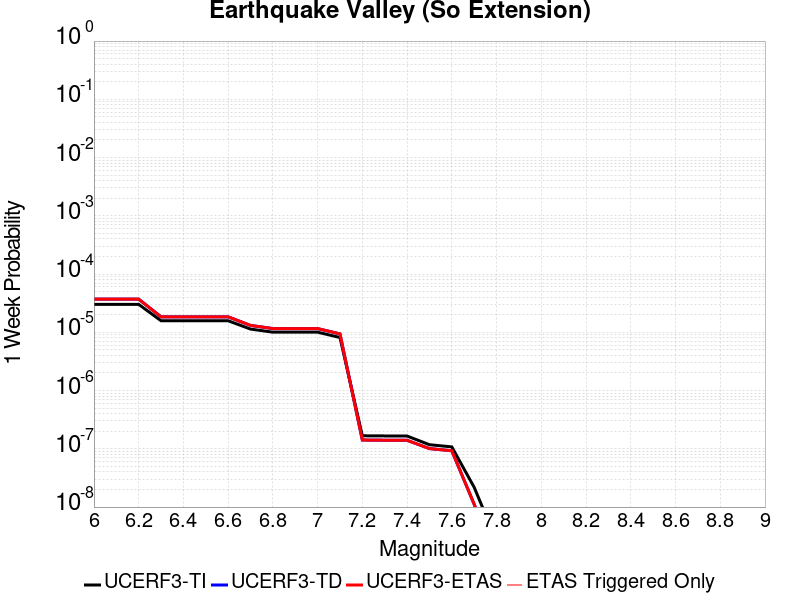 |  |  |  |

| Magnitude | 1 wk TI Prob | 1 wk TD Prob | 1 wk ETAS Prob | 1 wk ETAS/TD Gain | 1 wk ETAS Triggered Only | 1 mo TI Prob | 1 mo TD Prob | 1 mo ETAS Prob | 1 mo ETAS/TD Gain | 1 mo ETAS Triggered Only | 1 yr TI Prob | 1 yr TD Prob | 1 yr ETAS Prob | 1 yr ETAS/TD Gain | 1 yr ETAS Triggered Only | 10 yr TI Prob | 10 yr TD Prob | 10 yr ETAS Prob | 10 yr ETAS/TD Gain | 10 yr ETAS Triggered Only |
|-----|-----|-----|-----|-----|-----|-----|-----|-----|-----|-----|-----|-----|-----|-----|-----|-----|-----|-----|-----|-----|
| 6.0 | 3.0194888E-5 | 3.7072114E-5 | 3.7072114E-5 | 1.0 | 0.0 | 1.2940024E-4 | 1.5887388E-4 | 1.9416654E-4 | 1.2221427 | 3.529827E-5 | 0.0015743093 | 0.0019331174 | 0.0019683475 | 1.0182245 | 3.529827E-5 | 0.01563203 | 0.019213019 | 0.019247638 | 1.0018018 | 3.529827E-5 |
| 6.1 | 3.0194888E-5 | 3.7072114E-5 | 3.7072114E-5 | 1.0 | 0.0 | 1.2940024E-4 | 1.5887388E-4 | 1.9416654E-4 | 1.2221427 | 3.529827E-5 | 0.0015743093 | 0.0019331174 | 0.0019683475 | 1.0182245 | 3.529827E-5 | 0.01563203 | 0.019213019 | 0.019247638 | 1.0018018 | 3.529827E-5 |
| 6.2 | 3.0194888E-5 | 3.7072114E-5 | 3.7072114E-5 | 1.0 | 0.0 | 1.2940024E-4 | 1.5887388E-4 | 1.9416654E-4 | 1.2221427 | 3.529827E-5 | 0.0015743093 | 0.0019331174 | 0.0019683475 | 1.0182245 | 3.529827E-5 | 0.01563203 | 0.019213019 | 0.019247638 | 1.0018018 | 3.529827E-5 |
| 6.3 | 1.5795305E-5 | 1.844658E-5 | 1.844658E-5 | 1.0 | 0.0 | 6.769241E-5 | 7.9055004E-5 | 7.9055004E-5 | 1.0 | 0.0 | 8.238434E-4 | 9.6218096E-4 | 9.6218096E-4 | 1.0 | 0.0 | 0.008207959 | 0.009591061 | 0.009591061 | 1.0 | 0.0 |
| 6.4 | 1.5795305E-5 | 1.844658E-5 | 1.844658E-5 | 1.0 | 0.0 | 6.769241E-5 | 7.9055004E-5 | 7.9055004E-5 | 1.0 | 0.0 | 8.238434E-4 | 9.6218096E-4 | 9.6218096E-4 | 1.0 | 0.0 | 0.008207959 | 0.009591061 | 0.009591061 | 1.0 | 0.0 |
| 6.5 | 1.5795305E-5 | 1.844658E-5 | 1.844658E-5 | 1.0 | 0.0 | 6.769241E-5 | 7.9055004E-5 | 7.9055004E-5 | 1.0 | 0.0 | 8.238434E-4 | 9.6218096E-4 | 9.6218096E-4 | 1.0 | 0.0 | 0.008207959 | 0.009591061 | 0.009591061 | 1.0 | 0.0 |
| 6.6 | 1.5795305E-5 | 1.844658E-5 | 1.844658E-5 | 1.0 | 0.0 | 6.769241E-5 | 7.9055004E-5 | 7.9055004E-5 | 1.0 | 0.0 | 8.238434E-4 | 9.6218096E-4 | 9.6218096E-4 | 1.0 | 0.0 | 0.008207959 | 0.009591061 | 0.009591061 | 1.0 | 0.0 |
| 6.7 | 1.1363076E-5 | 1.3138294E-5 | 1.3138294E-5 | 1.0 | 0.0 | 4.8697988E-5 | 5.6306188E-5 | 5.6306188E-5 | 1.0 | 0.0 | 5.927367E-4 | 6.8538834E-4 | 6.8538834E-4 | 1.0 | 0.0 | 0.0059115817 | 0.0068402183 | 0.0068402183 | 1.0 | 0.0 |
| 6.8 | 1.0049611E-5 | 1.1594334E-5 | 1.1594334E-5 | 1.0 | 0.0 | 4.306905E-5 | 4.9689468E-5 | 4.9689468E-5 | 1.0 | 0.0 | 5.242395E-4 | 6.048745E-4 | 6.048745E-4 | 1.0 | 0.0 | 0.0052300454 | 0.006039458 | 0.006039458 | 1.0 | 0.0 |
| 6.9 | 1.0049611E-5 | 1.1594334E-5 | 1.1594334E-5 | 1.0 | 0.0 | 4.306905E-5 | 4.9689468E-5 | 4.9689468E-5 | 1.0 | 0.0 | 5.242395E-4 | 6.048745E-4 | 6.048745E-4 | 1.0 | 0.0 | 0.0052300454 | 0.006039458 | 0.006039458 | 1.0 | 0.0 |
| 7.0 | 1.0049611E-5 | 1.1594334E-5 | 1.1594334E-5 | 1.0 | 0.0 | 4.306905E-5 | 4.9689468E-5 | 4.9689468E-5 | 1.0 | 0.0 | 5.242395E-4 | 6.048745E-4 | 6.048745E-4 | 1.0 | 0.0 | 0.0052300454 | 0.006039458 | 0.006039458 | 1.0 | 0.0 |
| 7.1 | 8.140254E-6 | 9.383458E-6 | 9.383458E-6 | 1.0 | 0.0 | 3.4886336E-5 | 4.0214578E-5 | 4.0214578E-5 | 1.0 | 0.0 | 4.2465836E-4 | 4.8956956E-4 | 4.8956956E-4 | 1.0 | 0.0 | 0.0042384774 | 0.0048914864 | 0.0048914864 | 1.0 | 0.0 |
| 7.2 | 1.673835E-7 | 1.4154125E-7 | 1.4154125E-7 | 1.0 | 0.0 | 7.173577E-7 | 6.066052E-7 | 6.066052E-7 | 1.0 | 0.0 | 8.733795E-6 | 7.385397E-6 | 7.385397E-6 | 1.0 | 0.0 | 8.733451E-5 | 7.385187E-5 | 7.385187E-5 | 1.0 | 0.0 |
| 7.3 | 1.6632116E-7 | 1.4052354E-7 | 1.4052354E-7 | 1.0 | 0.0 | 7.1280476E-7 | 6.0224363E-7 | 6.0224363E-7 | 1.0 | 0.0 | 8.678364E-6 | 7.332295E-6 | 7.332295E-6 | 1.0 | 0.0 | 8.6780245E-5 | 7.332089E-5 | 7.332089E-5 | 1.0 | 0.0 |
| 7.4 | 1.6569169E-7 | 1.3996983E-7 | 1.3996983E-7 | 1.0 | 0.0 | 7.1010703E-7 | 5.9987053E-7 | 5.9987053E-7 | 1.0 | 0.0 | 8.645519E-6 | 7.303403E-6 | 7.303403E-6 | 1.0 | 0.0 | 8.645182E-5 | 7.303199E-5 | 7.303199E-5 | 1.0 | 0.0 |
| 7.5 | 1.1764555E-7 | 1.0095917E-7 | 1.0095917E-7 | 1.0 | 0.0 | 5.041951E-7 | 4.326821E-7 | 4.326821E-7 | 1.0 | 0.0 | 6.138558E-6 | 5.267894E-6 | 5.267894E-6 | 1.0 | 0.0 | 6.1383886E-5 | 5.2677904E-5 | 5.2677904E-5 | 1.0 | 0.0 |
| 7.6 | 1.07927605E-7 | 9.260736E-8 | 9.260736E-8 | 1.0 | 0.0 | 4.6254678E-7 | 3.9688865E-7 | 3.9688865E-7 | 1.0 | 0.0 | 5.6314925E-6 | 4.832111E-6 | 4.832111E-6 | 1.0 | 0.0 | 5.63135E-5 | 4.8320264E-5 | 4.8320264E-5 | 1.0 | 0.0 |
| 7.7 | 2.1826905E-8 | 1.1180516E-8 | 1.1180516E-8 | 1.0 | 0.0 | 9.3543875E-8 | 4.7916494E-8 | 4.7916494E-8 | 1.0 | 0.0 | 1.1388961E-6 | 5.833832E-7 | 5.833832E-7 | 1.0 | 0.0 | 1.1388902E-5 | 5.8338223E-6 | 5.8338223E-6 | 1.0 | 0.0 |
| 7.8 | 2.6169649E-9 | 1.1969472E-9 | 1.1969472E-9 | 1.0 | 0.0 | 1.1215564E-8 | 5.1297735E-9 | 5.1297735E-9 | 1.0 | 0.0 | 1.3654947E-7 | 6.2454994E-8 | 6.2454994E-8 | 1.0 | 0.0 | 1.365494E-6 | 6.245499E-7 | 6.245499E-7 | 1.0 | 0.0 |

## Calaveras (No) 2011 CFM
*[(top)](#table-of-contents)*

| 1 Week | 1 Month | 1 Year | 10 Year |
|-----|-----|-----|-----|
|  |  |  |  |

| Magnitude | 1 wk TI Prob | 1 wk TD Prob | 1 wk ETAS Prob | 1 wk ETAS/TD Gain | 1 wk ETAS Triggered Only | 1 mo TI Prob | 1 mo TD Prob | 1 mo ETAS Prob | 1 mo ETAS/TD Gain | 1 mo ETAS Triggered Only | 1 yr TI Prob | 1 yr TD Prob | 1 yr ETAS Prob | 1 yr ETAS/TD Gain | 1 yr ETAS Triggered Only | 10 yr TI Prob | 10 yr TD Prob | 10 yr ETAS Prob | 10 yr ETAS/TD Gain | 10 yr ETAS Triggered Only |
|-----|-----|-----|-----|-----|-----|-----|-----|-----|-----|-----|-----|-----|-----|-----|-----|-----|-----|-----|-----|-----|
| 6.0 | 4.8694856E-5 | 6.747121E-5 | 1.02767095E-4 | 1.5231252 | 3.529827E-5 | 2.0867554E-4 | 2.8913133E-4 | 3.2441938E-4 | 1.1220486 | 3.529827E-5 | 0.0025376645 | 0.003514627 | 0.0035498012 | 1.010008 | 3.529827E-5 | 0.02508881 | 0.034771245 | 0.034805313 | 1.0009799 | 3.529827E-5 |
| 6.1 | 4.8694856E-5 | 6.747121E-5 | 1.02767095E-4 | 1.5231252 | 3.529827E-5 | 2.0867554E-4 | 2.8913133E-4 | 3.2441938E-4 | 1.1220486 | 3.529827E-5 | 0.0025376645 | 0.003514627 | 0.0035498012 | 1.010008 | 3.529827E-5 | 0.02508881 | 0.034771245 | 0.034805313 | 1.0009799 | 3.529827E-5 |
| 6.2 | 4.7541962E-5 | 6.580218E-5 | 6.580218E-5 | 1.0 | 0.0 | 2.0373536E-4 | 2.8197994E-4 | 2.8197994E-4 | 1.0 | 0.0 | 0.0024776561 | 0.003427859 | 0.003427859 | 1.0 | 0.0 | 0.024502134 | 0.033932675 | 0.033932675 | 1.0 | 0.0 |
| 6.3 | 4.6717287E-5 | 6.4635555E-5 | 6.4635555E-5 | 1.0 | 0.0 | 2.0020158E-4 | 2.7698115E-4 | 2.7698115E-4 | 1.0 | 0.0 | 0.0024347296 | 0.0033672103 | 0.0033672103 | 1.0 | 0.0 | 0.024082264 | 0.033345193 | 0.033345193 | 1.0 | 0.0 |
| 6.4 | 4.6276386E-5 | 6.399742E-5 | 6.399742E-5 | 1.0 | 0.0 | 1.983123E-4 | 2.7424688E-4 | 2.7424688E-4 | 1.0 | 0.0 | 0.0024117786 | 0.0033340224 | 0.0033340224 | 1.0 | 0.0 | 0.02385771 | 0.033024073 | 0.033024073 | 1.0 | 0.0 |
| 6.5 | 4.5720994E-5 | 6.319881E-5 | 6.319881E-5 | 1.0 | 0.0 | 1.9593239E-4 | 2.70825E-4 | 2.70825E-4 | 1.0 | 0.0 | 0.002382867 | 0.0032924965 | 0.0032924965 | 1.0 | 0.0 | 0.023574775 | 0.032622032 | 0.032622032 | 1.0 | 0.0 |
| 6.6 | 4.549134E-5 | 6.28519E-5 | 6.28519E-5 | 1.0 | 0.0 | 1.949483E-4 | 2.6933852E-4 | 2.6933852E-4 | 1.0 | 0.0 | 0.0023709119 | 0.0032744533 | 0.0032744533 | 1.0 | 0.0 | 0.023457756 | 0.032447387 | 0.032447387 | 1.0 | 0.0 |
| 6.7 | 3.701047E-5 | 5.0359427E-5 | 5.0359427E-5 | 1.0 | 0.0 | 1.5860666E-4 | 2.1580851E-4 | 2.1580851E-4 | 1.0 | 0.0 | 0.0019293258 | 0.002624346 | 0.002624346 | 1.0 | 0.0 | 0.019126613 | 0.026125323 | 0.026125323 | 1.0 | 0.0 |
| 6.8 | 3.5523568E-5 | 4.8341022E-5 | 4.8341022E-5 | 1.0 | 0.0 | 1.5223498E-4 | 2.071596E-4 | 2.071596E-4 | 1.0 | 0.0 | 0.0018518851 | 0.0025192937 | 0.0025192937 | 1.0 | 0.0 | 0.018365284 | 0.025097553 | 0.025097553 | 1.0 | 0.0 |
| 6.9 | 3.2946147E-5 | 4.466269E-5 | 4.466269E-5 | 1.0 | 0.0 | 1.4119013E-4 | 1.9139773E-4 | 1.9139773E-4 | 1.0 | 0.0 | 0.0017176344 | 0.0023278191 | 0.0023278191 | 1.0 | 0.0 | 0.017044188 | 0.023219598 | 0.023219598 | 1.0 | 0.0 |
| 7.0 | 2.7682381E-5 | 3.702223E-5 | 3.702223E-5 | 1.0 | 0.0 | 1.1863338E-4 | 1.5865723E-4 | 1.5865723E-4 | 1.0 | 0.0 | 0.0014434044 | 0.0019299705 | 0.0019299705 | 1.0 | 0.0 | 0.01434065 | 0.01931092 | 0.01931092 | 1.0 | 0.0 |
| 7.1 | 2.471967E-5 | 3.328669E-5 | 3.328669E-5 | 1.0 | 0.0 | 1.05937135E-4 | 1.4264962E-4 | 1.4264962E-4 | 1.0 | 0.0 | 0.0012890215 | 0.0017354045 | 0.0017354045 | 1.0 | 0.0 | 0.0128157 | 0.017385952 | 0.017385952 | 1.0 | 0.0 |
| 7.2 | 1.9748062E-5 | 2.6774684E-5 | 2.6774684E-5 | 1.0 | 0.0 | 8.463181E-5 | 1.1474373E-4 | 1.1474373E-4 | 1.0 | 0.0 | 0.0010299052 | 0.0013961331 | 0.0013961331 | 1.0 | 0.0 | 0.01025145 | 0.014030739 | 0.014030739 | 1.0 | 0.0 |
| 7.3 | 1.1603734E-5 | 1.5783844E-5 | 1.5783844E-5 | 1.0 | 0.0 | 4.9729337E-5 | 6.764337E-5 | 6.764337E-5 | 1.0 | 0.0 | 6.052865E-4 | 8.232611E-4 | 8.232611E-4 | 1.0 | 0.0 | 0.0060364045 | 0.008308666 | 0.008308666 | 1.0 | 0.0 |
| 7.4 | 4.885381E-6 | 6.0349853E-6 | 6.0349853E-6 | 1.0 | 0.0 | 2.0937177E-5 | 2.5863968E-5 | 2.5863968E-5 | 1.0 | 0.0 | 2.5488032E-4 | 3.148485E-4 | 3.148485E-4 | 1.0 | 0.0 | 0.0025458818 | 0.0032010598 | 0.0032010598 | 1.0 | 0.0 |
| 7.5 | 3.0571264E-6 | 4.155299E-6 | 4.155299E-6 | 1.0 | 0.0 | 1.3101904E-5 | 1.7808303E-5 | 1.7808303E-5 | 1.0 | 0.0 | 1.5950401E-4 | 2.1679462E-4 | 2.1679462E-4 | 1.0 | 0.0 | 0.0015938957 | 0.002221121 | 0.002221121 | 1.0 | 0.0 |
| 7.6 | 1.764948E-6 | 2.7955498E-6 | 2.7955498E-6 | 1.0 | 0.0 | 7.564041E-6 | 1.1980874E-5 | 1.1980874E-5 | 1.0 | 0.0 | 9.208831E-5 | 1.4585744E-4 | 1.4585744E-4 | 1.0 | 0.0 | 9.205016E-4 | 0.0015123509 | 0.0015123509 | 1.0 | 0.0 |
| 7.7 | 1.3173734E-6 | 2.058471E-6 | 2.058471E-6 | 1.0 | 0.0 | 5.645874E-6 | 8.8219895E-6 | 8.8219895E-6 | 1.0 | 0.0 | 6.873634E-5 | 1.0740245E-4 | 1.0740245E-4 | 1.0 | 0.0 | 6.8715087E-4 | 0.0011261401 | 0.0011261401 | 1.0 | 0.0 |
| 7.8 | 9.4429885E-7 | 1.5489635E-6 | 1.5489635E-6 | 1.0 | 0.0 | 4.0469886E-6 | 6.638398E-6 | 6.638398E-6 | 1.0 | 0.0 | 4.9270973E-5 | 8.081952E-5 | 8.081952E-5 | 1.0 | 0.0 | 4.926005E-4 | 8.5014524E-4 | 8.5014524E-4 | 1.0 | 0.0 |
| 7.9 | 6.388233E-7 | 1.1148749E-6 | 1.1148749E-6 | 1.0 | 0.0 | 2.7378112E-6 | 4.7780263E-6 | 4.7780263E-6 | 1.0 | 0.0 | 3.3332344E-5 | 5.817093E-5 | 5.817093E-5 | 1.0 | 0.0 | 3.3327343E-4 | 6.0963054E-4 | 6.0963054E-4 | 1.0 | 0.0 |
| 8.0 | 3.087986E-7 | 5.7543696E-7 | 5.7543696E-7 | 1.0 | 0.0 | 1.323422E-6 | 2.466156E-6 | 2.466156E-6 | 1.0 | 0.0 | 1.6112543E-5 | 3.002504E-5 | 3.002504E-5 | 1.0 | 0.0 | 1.6111376E-4 | 3.110302E-4 | 3.110302E-4 | 1.0 | 0.0 |
| 8.1 | 1.6725647E-7 | 2.7410047E-7 | 2.7410047E-7 | 1.0 | 0.0 | 7.168133E-7 | 1.1747159E-6 | 1.1747159E-6 | 1.0 | 0.0 | 8.7271665E-6 | 1.4302073E-5 | 1.4302073E-5 | 1.0 | 0.0 | 8.726824E-5 | 1.48486E-4 | 1.48486E-4 | 1.0 | 0.0 |

## Burnt Mtn
*[(top)](#table-of-contents)*

| 1 Week | 1 Month | 1 Year | 10 Year |
|-----|-----|-----|-----|
|  |  |  |  |

| Magnitude | 1 wk TI Prob | 1 wk TD Prob | 1 wk ETAS Prob | 1 wk ETAS/TD Gain | 1 wk ETAS Triggered Only | 1 mo TI Prob | 1 mo TD Prob | 1 mo ETAS Prob | 1 mo ETAS/TD Gain | 1 mo ETAS Triggered Only | 1 yr TI Prob | 1 yr TD Prob | 1 yr ETAS Prob | 1 yr ETAS/TD Gain | 1 yr ETAS Triggered Only | 10 yr TI Prob | 10 yr TD Prob | 10 yr ETAS Prob | 10 yr ETAS/TD Gain | 10 yr ETAS Triggered Only |
|-----|-----|-----|-----|-----|-----|-----|-----|-----|-----|-----|-----|-----|-----|-----|-----|-----|-----|-----|-----|-----|
| 6.0 | 1.5673151E-5 | 1.1749407E-5 | 4.7047262E-5 | 4.0042243 | 3.529827E-5 | 6.716892E-5 | 5.0354356E-5 | 8.565085E-5 | 1.7009621 | 3.529827E-5 | 8.1747473E-4 | 6.1302073E-4 | 6.4829737E-4 | 1.0575455 | 3.529827E-5 | 0.008144741 | 0.006125938 | 0.00616102 | 1.0057268 | 3.529827E-5 |
| 6.1 | 1.5673151E-5 | 1.1749407E-5 | 4.7047262E-5 | 4.0042243 | 3.529827E-5 | 6.716892E-5 | 5.0354356E-5 | 8.565085E-5 | 1.7009621 | 3.529827E-5 | 8.1747473E-4 | 6.1302073E-4 | 6.4829737E-4 | 1.0575455 | 3.529827E-5 | 0.008144741 | 0.006125938 | 0.00616102 | 1.0057268 | 3.529827E-5 |
| 6.2 | 1.5673151E-5 | 1.1749407E-5 | 4.7047262E-5 | 4.0042243 | 3.529827E-5 | 6.716892E-5 | 5.0354356E-5 | 8.565085E-5 | 1.7009621 | 3.529827E-5 | 8.1747473E-4 | 6.1302073E-4 | 6.4829737E-4 | 1.0575455 | 3.529827E-5 | 0.008144741 | 0.006125938 | 0.00616102 | 1.0057268 | 3.529827E-5 |
| 6.3 | 1.5673151E-5 | 1.1749407E-5 | 4.7047262E-5 | 4.0042243 | 3.529827E-5 | 6.716892E-5 | 5.0354356E-5 | 8.565085E-5 | 1.7009621 | 3.529827E-5 | 8.1747473E-4 | 6.1302073E-4 | 6.4829737E-4 | 1.0575455 | 3.529827E-5 | 0.008144741 | 0.006125938 | 0.00616102 | 1.0057268 | 3.529827E-5 |
| 6.4 | 1.5673151E-5 | 1.1749407E-5 | 4.7047262E-5 | 4.0042243 | 3.529827E-5 | 6.716892E-5 | 5.0354356E-5 | 8.565085E-5 | 1.7009621 | 3.529827E-5 | 8.1747473E-4 | 6.1302073E-4 | 6.4829737E-4 | 1.0575455 | 3.529827E-5 | 0.008144741 | 0.006125938 | 0.00616102 | 1.0057268 | 3.529827E-5 |
| 6.5 | 1.36191375E-5 | 1.0078299E-5 | 4.5376215E-5 | 4.5023685 | 3.529827E-5 | 5.8366426E-5 | 4.3192707E-5 | 7.848945E-5 | 1.8171922 | 3.529827E-5 | 7.103795E-4 | 5.2587123E-4 | 5.6115096E-4 | 1.0670881 | 3.529827E-5 | 0.0070811296 | 0.0052587125 | 0.0052938247 | 1.006677 | 3.529827E-5 |

## Elsinore (Coyote Mountains)
*[(top)](#table-of-contents)*

| 1 Week | 1 Month | 1 Year | 10 Year |
|-----|-----|-----|-----|
| 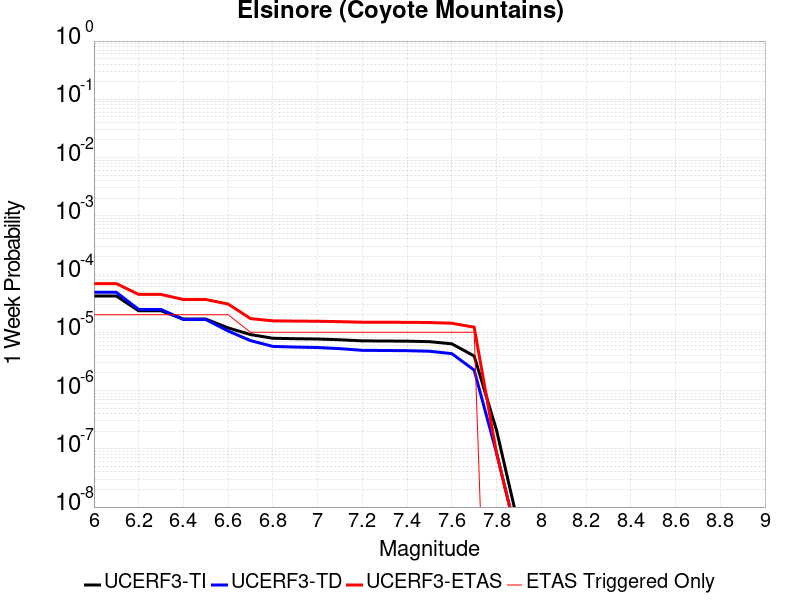 | 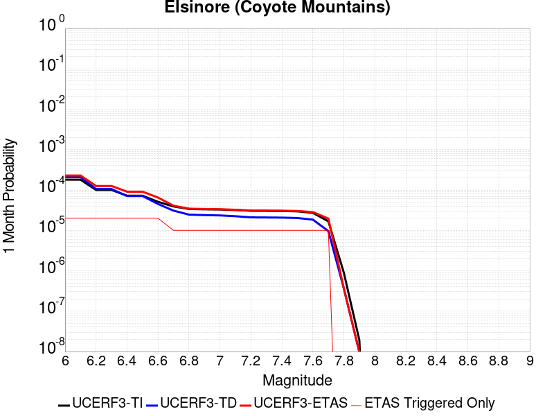 |  |  |

| Magnitude | 1 wk TI Prob | 1 wk TD Prob | 1 wk ETAS Prob | 1 wk ETAS/TD Gain | 1 wk ETAS Triggered Only | 1 mo TI Prob | 1 mo TD Prob | 1 mo ETAS Prob | 1 mo ETAS/TD Gain | 1 mo ETAS Triggered Only | 1 yr TI Prob | 1 yr TD Prob | 1 yr ETAS Prob | 1 yr ETAS/TD Gain | 1 yr ETAS Triggered Only | 10 yr TI Prob | 10 yr TD Prob | 10 yr ETAS Prob | 10 yr ETAS/TD Gain | 10 yr ETAS Triggered Only |
|-----|-----|-----|-----|-----|-----|-----|-----|-----|-----|-----|-----|-----|-----|-----|-----|-----|-----|-----|-----|-----|
| 6.0 | 4.20513E-5 | 4.8631882E-5 | 8.392844E-5 | 1.7257904 | 3.529827E-5 | 1.8020741E-4 | 2.0840895E-4 | 2.4369986E-4 | 1.1693349 | 3.529827E-5 | 0.0021918174 | 0.002535 | 0.0025702089 | 1.0138891 | 3.529827E-5 | 0.021703249 | 0.025111282 | 0.025145695 | 1.0013704 | 3.529827E-5 |
| 6.1 | 4.20513E-5 | 4.8631882E-5 | 8.392844E-5 | 1.7257904 | 3.529827E-5 | 1.8020741E-4 | 2.0840895E-4 | 2.4369986E-4 | 1.1693349 | 3.529827E-5 | 0.0021918174 | 0.002535 | 0.0025702089 | 1.0138891 | 3.529827E-5 | 0.021703249 | 0.025111282 | 0.025145695 | 1.0013704 | 3.529827E-5 |
| 6.2 | 2.3413893E-5 | 2.469566E-5 | 5.999306E-5 | 2.4292955 | 3.529827E-5 | 1.0034139E-4 | 1.0583479E-4 | 1.4112933E-4 | 1.333487 | 3.529827E-5 | 0.0012209718 | 0.0012878707 | 0.0013231235 | 1.027373 | 3.529827E-5 | 0.012142851 | 0.01281264 | 0.012847486 | 1.0027196 | 3.529827E-5 |
| 6.3 | 2.3413893E-5 | 2.469566E-5 | 5.999306E-5 | 2.4292955 | 3.529827E-5 | 1.0034139E-4 | 1.0583479E-4 | 1.4112933E-4 | 1.333487 | 3.529827E-5 | 0.0012209718 | 0.0012878707 | 0.0013231235 | 1.027373 | 3.529827E-5 | 0.012142851 | 0.01281264 | 0.012847486 | 1.0027196 | 3.529827E-5 |
| 6.4 | 1.6894814E-5 | 1.6568361E-5 | 5.1866045E-5 | 3.1304271 | 3.529827E-5 | 7.240433E-5 | 7.1005554E-5 | 1.0630131E-4 | 1.4970846 | 3.529827E-5 | 8.811662E-4 | 8.6418656E-4 | 8.9945435E-4 | 1.0408103 | 3.529827E-5 | 0.0087768035 | 0.00861194 | 0.008646934 | 1.0040635 | 3.529827E-5 |
| 6.5 | 1.6894814E-5 | 1.6568361E-5 | 5.1866045E-5 | 3.1304271 | 3.529827E-5 | 7.240433E-5 | 7.1005554E-5 | 1.0630131E-4 | 1.4970846 | 3.529827E-5 | 8.811662E-4 | 8.6418656E-4 | 8.9945435E-4 | 1.0408103 | 3.529827E-5 | 0.0087768035 | 0.00861194 | 0.008646934 | 1.0040635 | 3.529827E-5 |
| 6.6 | 1.1910969E-5 | 1.0530774E-5 | 4.582867E-5 | 4.351881 | 3.529827E-5 | 5.1046012E-5 | 4.5131183E-5 | 8.042786E-5 | 1.7820907 | 3.529827E-5 | 6.21308E-4 | 5.4934516E-4 | 5.8462407E-4 | 1.0642198 | 3.529827E-5 | 0.0061957375 | 0.005481174 | 0.005516279 | 1.0064046 | 3.529827E-5 |
| 6.7 | 9.1486E-6 | 7.2028593E-6 | 4.2500877E-5 | 5.900556 | 3.529827E-5 | 3.9207694E-5 | 3.0869054E-5 | 6.6166234E-5 | 2.1434488 | 3.529827E-5 | 4.7724912E-4 | 3.757697E-4 | 4.1105473E-4 | 1.0939006 | 3.529827E-5 | 0.0047622547 | 0.0037517229 | 0.0037868887 | 1.0093733 | 3.529827E-5 |
| 6.8 | 7.90441E-6 | 5.7290276E-6 | 4.1027095E-5 | 7.161267 | 3.529827E-5 | 3.3875604E-5 | 2.4552752E-5 | 5.9850154E-5 | 2.437615 | 3.529827E-5 | 4.1235742E-4 | 2.9889002E-4 | 3.3417775E-4 | 1.1180625 | 3.529827E-5 | 0.0041159308 | 0.002985009 | 0.0030202018 | 1.0117899 | 3.529827E-5 |
| 6.9 | 7.77015E-6 | 5.582982E-6 | 4.0881056E-5 | 7.322441 | 3.529827E-5 | 3.3300217E-5 | 2.3926852E-5 | 5.922428E-5 | 2.4752223 | 3.529827E-5 | 4.0535472E-4 | 2.9127175E-4 | 3.2655973E-4 | 1.1211514 | 3.529827E-5 | 0.004046161 | 0.002909027 | 0.0029442227 | 1.0120988 | 3.529827E-5 |
| 7.0 | 7.675798E-6 | 5.47984E-6 | 4.077792E-5 | 7.4414425 | 3.529827E-5 | 3.289586E-5 | 2.3484827E-5 | 5.878227E-5 | 2.5029893 | 3.529827E-5 | 4.004335E-4 | 2.858915E-4 | 3.211797E-4 | 1.123432 | 3.529827E-5 | 0.003997127 | 0.0028553635 | 0.0028905612 | 1.0123268 | 3.529827E-5 |
| 7.1 | 7.447814E-6 | 5.238714E-6 | 4.05368E-5 | 7.7379293 | 3.529827E-5 | 3.191881E-5 | 2.2451446E-5 | 5.7748923E-5 | 2.5721695 | 3.529827E-5 | 3.8854225E-4 | 2.7331332E-4 | 3.0860194E-4 | 1.1291142 | 3.529827E-5 | 0.003878636 | 0.0027298962 | 0.0027650981 | 1.012895 | 3.529827E-5 |
| 7.2 | 7.128185E-6 | 4.905372E-6 | 4.0203468E-5 | 8.195805 | 3.529827E-5 | 3.0549007E-5 | 2.102286E-5 | 5.632039E-5 | 2.679007 | 3.529827E-5 | 3.7187067E-4 | 2.5592445E-4 | 2.9121368E-4 | 1.1378893 | 3.529827E-5 | 0.00371249 | 0.0025564157 | 0.0025916237 | 1.0137724 | 3.529827E-5 |
| 7.3 | 7.0913875E-6 | 4.874047E-6 | 4.0172145E-5 | 8.242051 | 3.529827E-5 | 3.0391306E-5 | 2.0888614E-5 | 5.6186145E-5 | 2.6897979 | 3.529827E-5 | 3.6995133E-4 | 2.5429038E-4 | 2.8957968E-4 | 1.1387756 | 3.529827E-5 | 0.0036933604 | 0.0025401122 | 0.002575321 | 1.0138611 | 3.529827E-5 |
| 7.4 | 7.051521E-6 | 4.837899E-6 | 4.0135998E-5 | 8.296164 | 3.529827E-5 | 3.0220453E-5 | 2.0733693E-5 | 5.6031233E-5 | 2.702424 | 3.529827E-5 | 3.6787192E-4 | 2.5240466E-4 | 2.87694E-4 | 1.1398126 | 3.529827E-5 | 0.0036726352 | 0.0025212981 | 0.0025565075 | 1.0139648 | 3.529827E-5 |
| 7.5 | 6.910666E-6 | 4.733448E-6 | 4.003155E-5 | 8.457165 | 3.529827E-5 | 2.9616802E-5 | 2.0286056E-5 | 5.558361E-5 | 2.739991 | 3.529827E-5 | 3.605249E-4 | 2.4695593E-4 | 2.8224546E-4 | 1.1428982 | 3.529827E-5 | 0.0035994058 | 0.0024669329 | 0.002502144 | 1.0142733 | 3.529827E-5 |
| 7.6 | 6.341753E-6 | 4.3065565E-6 | 3.9604674E-5 | 9.196367 | 3.529827E-5 | 2.7178658E-5 | 1.8456547E-5 | 5.3754164E-5 | 2.9124715 | 3.529827E-5 | 3.3084993E-4 | 2.2468645E-4 | 2.5997678E-4 | 1.1570648 | 3.529827E-5 | 0.0033035777 | 0.002244708 | 0.002279927 | 1.0156898 | 3.529827E-5 |
| 7.7 | 3.9205916E-6 | 2.2439415E-6 | 3.7542133E-5 | 16.730442 | 3.529827E-5 | 1.6802427E-5 | 9.616861E-6 | 4.4914792E-5 | 4.6704216 | 3.529827E-5 | 2.0455034E-4 | 1.1707973E-4 | 1.5237386E-4 | 1.3014538 | 3.529827E-5 | 0.0020436216 | 0.0011702535 | 0.0012055105 | 1.0301276 | 3.529827E-5 |
| 7.8 | 2.0846227E-7 | 8.486417E-8 | 8.486417E-8 | 1.0 | 0.0 | 8.9340944E-7 | 3.6370355E-7 | 3.6370355E-7 | 1.0 | 0.0 | 1.0877206E-5 | 4.428085E-6 | 4.428085E-6 | 1.0 | 0.0 | 1.0876673E-4 | 4.4280296E-5 | 4.4280296E-5 | 1.0 | 0.0 |
| 7.9 | 4.4969806E-9 | 2.2691855E-9 | 2.2691855E-9 | 1.0 | 0.0 | 1.9272775E-8 | 9.72508E-9 | 9.72508E-9 | 1.0 | 0.0 | 2.3464601E-7 | 1.18402845E-7 | 1.18402845E-7 | 1.0 | 0.0 | 2.3464577E-6 | 1.184028E-6 | 1.184028E-6 | 1.0 | 0.0 |

## Kickapoo
*[(top)](#table-of-contents)*

| 1 Week | 1 Month | 1 Year | 10 Year |
|-----|-----|-----|-----|
|  |  |  |  |

| Magnitude | 1 wk TI Prob | 1 wk TD Prob | 1 wk ETAS Prob | 1 wk ETAS/TD Gain | 1 wk ETAS Triggered Only | 1 mo TI Prob | 1 mo TD Prob | 1 mo ETAS Prob | 1 mo ETAS/TD Gain | 1 mo ETAS Triggered Only | 1 yr TI Prob | 1 yr TD Prob | 1 yr ETAS Prob | 1 yr ETAS/TD Gain | 1 yr ETAS Triggered Only | 10 yr TI Prob | 10 yr TD Prob | 10 yr ETAS Prob | 10 yr ETAS/TD Gain | 10 yr ETAS Triggered Only |
|-----|-----|-----|-----|-----|-----|-----|-----|-----|-----|-----|-----|-----|-----|-----|-----|-----|-----|-----|-----|-----|
| 6.0 | 4.4610633E-6 | 4.559828E-8 | 4.559828E-8 | 1.0 | 0.0 | 1.9118703E-5 | 1.954212E-7 | 3.5493686E-5 | 181.62659 | 3.529827E-5 | 2.3274534E-4 | 2.3792506E-6 | 3.7677437E-5 | 15.835842 | 3.529827E-5 | 0.0023250172 | 2.379228E-5 | 5.908971E-5 | 2.4835665 | 3.529827E-5 |
| 6.1 | 4.4610633E-6 | 4.559828E-8 | 4.559828E-8 | 1.0 | 0.0 | 1.9118703E-5 | 1.954212E-7 | 3.5493686E-5 | 181.62659 | 3.529827E-5 | 2.3274534E-4 | 2.3792506E-6 | 3.7677437E-5 | 15.835842 | 3.529827E-5 | 0.0023250172 | 2.379228E-5 | 5.908971E-5 | 2.4835665 | 3.529827E-5 |
| 6.2 | 4.4610633E-6 | 4.559828E-8 | 4.559828E-8 | 1.0 | 0.0 | 1.9118703E-5 | 1.954212E-7 | 3.5493686E-5 | 181.62659 | 3.529827E-5 | 2.3274534E-4 | 2.3792506E-6 | 3.7677437E-5 | 15.835842 | 3.529827E-5 | 0.0023250172 | 2.379228E-5 | 5.908971E-5 | 2.4835665 | 3.529827E-5 |
| 6.3 | 4.4610633E-6 | 4.559828E-8 | 4.559828E-8 | 1.0 | 0.0 | 1.9118703E-5 | 1.954212E-7 | 3.5493686E-5 | 181.62659 | 3.529827E-5 | 2.3274534E-4 | 2.3792506E-6 | 3.7677437E-5 | 15.835842 | 3.529827E-5 | 0.0023250172 | 2.379228E-5 | 5.908971E-5 | 2.4835665 | 3.529827E-5 |
| 6.4 | 4.4610633E-6 | 4.559828E-8 | 4.559828E-8 | 1.0 | 0.0 | 1.9118703E-5 | 1.954212E-7 | 3.5493686E-5 | 181.62659 | 3.529827E-5 | 2.3274534E-4 | 2.3792506E-6 | 3.7677437E-5 | 15.835842 | 3.529827E-5 | 0.0023250172 | 2.379228E-5 | 5.908971E-5 | 2.4835665 | 3.529827E-5 |
| 6.5 | 4.4610633E-6 | 4.559828E-8 | 4.559828E-8 | 1.0 | 0.0 | 1.9118703E-5 | 1.954212E-7 | 3.5493686E-5 | 181.62659 | 3.529827E-5 | 2.3274534E-4 | 2.3792506E-6 | 3.7677437E-5 | 15.835842 | 3.529827E-5 | 0.0023250172 | 2.379228E-5 | 5.908971E-5 | 2.4835665 | 3.529827E-5 |
| 6.6 | 4.236531E-6 | 4.559828E-8 | 4.559828E-8 | 1.0 | 0.0 | 1.8156434E-5 | 1.954212E-7 | 3.5493686E-5 | 181.62659 | 3.529827E-5 | 2.2103215E-4 | 2.3792506E-6 | 3.7677437E-5 | 15.835842 | 3.529827E-5 | 0.0022081244 | 2.379228E-5 | 5.908971E-5 | 2.4835665 | 3.529827E-5 |
| 6.7 | 4.236531E-6 | 4.559828E-8 | 4.559828E-8 | 1.0 | 0.0 | 1.8156434E-5 | 1.954212E-7 | 3.5493686E-5 | 181.62659 | 3.529827E-5 | 2.2103215E-4 | 2.3792506E-6 | 3.7677437E-5 | 15.835842 | 3.529827E-5 | 0.0022081244 | 2.379228E-5 | 5.908971E-5 | 2.4835665 | 3.529827E-5 |
| 6.8 | 2.3202913E-6 | 4.559828E-8 | 4.559828E-8 | 1.0 | 0.0 | 9.944068E-6 | 1.954212E-7 | 3.5493686E-5 | 181.62659 | 3.529827E-5 | 1.210623E-4 | 2.3792506E-6 | 3.7677437E-5 | 15.835842 | 3.529827E-5 | 0.0012099637 | 2.379228E-5 | 5.908971E-5 | 2.4835665 | 3.529827E-5 |
| 6.9 | 2.2111808E-6 | 4.559828E-8 | 4.559828E-8 | 1.0 | 0.0 | 9.4764555E-6 | 1.954212E-7 | 3.5493686E-5 | 181.62659 | 3.529827E-5 | 1.1536973E-4 | 2.3792506E-6 | 3.7677437E-5 | 15.835842 | 3.529827E-5 | 0.0011530985 | 2.379228E-5 | 5.908971E-5 | 2.4835665 | 3.529827E-5 |
| 7.0 | 1.8222031E-6 | 4.559828E-8 | 4.559828E-8 | 1.0 | 0.0 | 7.809419E-6 | 1.954212E-7 | 3.5493686E-5 | 181.62659 | 3.529827E-5 | 9.507552E-5 | 2.3792506E-6 | 3.7677437E-5 | 15.835842 | 3.529827E-5 | 9.5034856E-4 | 2.379228E-5 | 5.908971E-5 | 2.4835665 | 3.529827E-5 |
| 7.1 | 1.3163254E-6 | 4.559828E-8 | 4.559828E-8 | 1.0 | 0.0 | 5.6413824E-6 | 1.954212E-7 | 3.5493686E-5 | 181.62659 | 3.529827E-5 | 6.868167E-5 | 2.3792506E-6 | 3.7677437E-5 | 15.835842 | 3.529827E-5 | 6.866045E-4 | 2.379228E-5 | 5.908971E-5 | 2.4835665 | 3.529827E-5 |
| 7.2 | 6.8603634E-7 | 4.5597357E-8 | 4.5597357E-8 | 1.0 | 0.0 | 2.9401524E-6 | 1.9541724E-7 | 3.5493682E-5 | 181.63025 | 3.529827E-5 | 3.579577E-5 | 2.3792024E-6 | 3.767739E-5 | 15.836142 | 3.529827E-5 | 3.5790002E-4 | 2.37918E-5 | 5.908923E-5 | 2.4835966 | 3.529827E-5 |
| 7.3 | 6.4299127E-7 | 4.5581142E-8 | 4.5581142E-8 | 1.0 | 0.0 | 2.755674E-6 | 1.9534774E-7 | 3.5493613E-5 | 181.6945 | 3.529827E-5 | 3.3549815E-5 | 2.3783564E-6 | 3.7676542E-5 | 15.84142 | 3.529827E-5 | 3.354475E-4 | 2.3783337E-5 | 5.908077E-5 | 2.4841244 | 3.529827E-5 |
| 7.4 | 5.8856347E-7 | 4.4556977E-8 | 4.4556977E-8 | 1.0 | 0.0 | 2.5224124E-6 | 1.9095846E-7 | 3.548922E-5 | 185.84785 | 3.529827E-5 | 3.070994E-5 | 2.3249172E-6 | 3.7623104E-5 | 16.182558 | 3.529827E-5 | 3.0705697E-4 | 2.3248956E-5 | 5.8546408E-5 | 2.518238 | 3.529827E-5 |
| 7.5 | 3.435626E-7 | 2.5357679E-8 | 2.5357679E-8 | 1.0 | 0.0 | 1.4724103E-6 | 1.0867576E-7 | 3.540694E-5 | 325.80347 | 3.529827E-5 | 1.7926448E-5 | 1.3231268E-6 | 3.662135E-5 | 27.677885 | 3.529827E-5 | 1.7925001E-4 | 1.3231205E-5 | 4.8529007E-5 | 3.6677692 | 3.529827E-5 |

## Elsinore (Temecula) rev
*[(top)](#table-of-contents)*

| 1 Week | 1 Month | 1 Year | 10 Year |
|-----|-----|-----|-----|
|  |  |  | 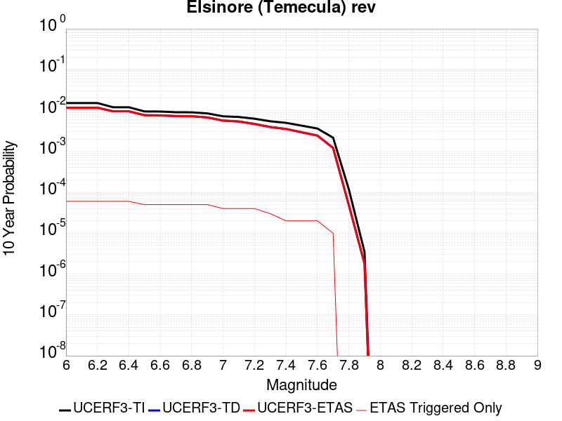 |

| Magnitude | 1 wk TI Prob | 1 wk TD Prob | 1 wk ETAS Prob | 1 wk ETAS/TD Gain | 1 wk ETAS Triggered Only | 1 mo TI Prob | 1 mo TD Prob | 1 mo ETAS Prob | 1 mo ETAS/TD Gain | 1 mo ETAS Triggered Only | 1 yr TI Prob | 1 yr TD Prob | 1 yr ETAS Prob | 1 yr ETAS/TD Gain | 1 yr ETAS Triggered Only | 10 yr TI Prob | 10 yr TD Prob | 10 yr ETAS Prob | 10 yr ETAS/TD Gain | 10 yr ETAS Triggered Only |
|-----|-----|-----|-----|-----|-----|-----|-----|-----|-----|-----|-----|-----|-----|-----|-----|-----|-----|-----|-----|-----|
| 6.0 | 2.9514995E-5 | 2.2517117E-5 | 5.7814592E-5 | 2.5675843 | 3.529827E-5 | 1.264867E-4 | 9.649849E-5 | 1.3179335E-4 | 1.3657557 | 3.529827E-5 | 0.0015388876 | 0.0011742581 | 0.0012095148 | 1.0300248 | 3.529827E-5 | 0.015282745 | 0.011696897 | 0.011731783 | 1.0029825 | 3.529827E-5 |
| 6.1 | 2.9514995E-5 | 2.2517117E-5 | 5.7814592E-5 | 2.5675843 | 3.529827E-5 | 1.264867E-4 | 9.649849E-5 | 1.3179335E-4 | 1.3657557 | 3.529827E-5 | 0.0015388876 | 0.0011742581 | 0.0012095148 | 1.0300248 | 3.529827E-5 | 0.015282745 | 0.011696897 | 0.011731783 | 1.0029825 | 3.529827E-5 |
| 6.2 | 2.9514995E-5 | 2.2517117E-5 | 5.7814592E-5 | 2.5675843 | 3.529827E-5 | 1.264867E-4 | 9.649849E-5 | 1.3179335E-4 | 1.3657557 | 3.529827E-5 | 0.0015388876 | 0.0011742581 | 0.0012095148 | 1.0300248 | 3.529827E-5 | 0.015282745 | 0.011696897 | 0.011731783 | 1.0029825 | 3.529827E-5 |
| 6.3 | 2.3223649E-5 | 1.8406454E-5 | 5.3704076E-5 | 2.9176762 | 3.529827E-5 | 9.952613E-5 | 7.888251E-5 | 1.14178E-4 | 1.4474437 | 3.529827E-5 | 0.001211057 | 9.599888E-4 | 9.952532E-4 | 1.0367341 | 3.529827E-5 | 0.012044783 | 0.009569948 | 0.0096049085 | 1.0036532 | 3.529827E-5 |
| 6.4 | 2.3223649E-5 | 1.8406454E-5 | 5.3704076E-5 | 2.9176762 | 3.529827E-5 | 9.952613E-5 | 7.888251E-5 | 1.14178E-4 | 1.4474437 | 3.529827E-5 | 0.001211057 | 9.599888E-4 | 9.952532E-4 | 1.0367341 | 3.529827E-5 | 0.012044783 | 0.009569948 | 0.0096049085 | 1.0036532 | 3.529827E-5 |
| 6.5 | 1.8338875E-5 | 1.4750118E-5 | 5.0047867E-5 | 3.3930488 | 3.529827E-5 | 7.8592806E-5 | 6.321331E-5 | 9.850934E-5 | 1.558364 | 3.529827E-5 | 9.5644733E-4 | 7.69359E-4 | 8.046301E-4 | 1.0458448 | 3.529827E-5 | 0.009523412 | 0.0076739118 | 0.0077089393 | 1.0045645 | 3.529827E-5 |
| 6.6 | 1.8223333E-5 | 1.4612673E-5 | 4.9910428E-5 | 3.4155576 | 3.529827E-5 | 7.809766E-5 | 6.262429E-5 | 9.792035E-5 | 1.5636162 | 3.529827E-5 | 9.504242E-4 | 7.6219277E-4 | 7.974641E-4 | 1.0462762 | 3.529827E-5 | 0.009463696 | 0.0076027405 | 0.0076377704 | 1.0046076 | 3.529827E-5 |
| 6.7 | 1.7512752E-5 | 1.402721E-5 | 4.9324986E-5 | 3.5163789 | 3.529827E-5 | 7.505249E-5 | 6.011528E-5 | 9.541143E-5 | 1.587141 | 3.529827E-5 | 9.13381E-4 | 7.3166634E-4 | 7.669388E-4 | 1.0482084 | 3.529827E-5 | 0.00909636 | 0.00729892 | 0.0073339604 | 1.0048008 | 3.529827E-5 |
| 6.8 | 1.7417142E-5 | 1.3951195E-5 | 4.9248974E-5 | 3.5300899 | 3.529827E-5 | 7.4642754E-5 | 5.9789512E-5 | 9.508567E-5 | 1.5903403 | 3.529827E-5 | 9.083966E-4 | 7.277028E-4 | 7.6297537E-4 | 1.0484711 | 3.529827E-5 | 0.009046922 | 0.0072594886 | 0.0072945305 | 1.004827 | 3.529827E-5 |
| 6.9 | 1.6402591E-5 | 1.2988613E-5 | 4.8286427E-5 | 3.7175965 | 3.529827E-5 | 7.0294926E-5 | 5.5664343E-5 | 9.0960646E-5 | 1.6340919 | 3.529827E-5 | 8.5550465E-4 | 6.775103E-4 | 7.1278465E-4 | 1.0520647 | 3.529827E-5 | 0.008522186 | 0.006760169 | 0.0067952285 | 1.0051862 | 3.529827E-5 |
| 7.0 | 1.3912486E-5 | 1.0878233E-5 | 4.617612E-5 | 4.2448177 | 3.529827E-5 | 5.9623577E-5 | 4.6620182E-5 | 8.1916805E-5 | 1.7571104 | 3.529827E-5 | 7.2567526E-4 | 5.674556E-4 | 6.0273387E-4 | 1.0621692 | 3.529827E-5 | 0.0072331014 | 0.005663986 | 0.005699084 | 1.0061967 | 3.529827E-5 |
| 7.1 | 1.3405147E-5 | 1.03274215E-5 | 4.5625326E-5 | 4.417882 | 3.529827E-5 | 5.7449364E-5 | 4.425964E-5 | 7.955635E-5 | 1.797492 | 3.529827E-5 | 6.9922156E-4 | 5.3873047E-4 | 5.740097E-4 | 1.065486 | 3.529827E-5 | 0.0069702556 | 0.005377577 | 0.005412685 | 1.0065286 | 3.529827E-5 |
| 7.2 | 1.21402E-5 | 8.996737E-6 | 4.429469E-5 | 4.923417 | 3.529827E-5 | 5.202839E-5 | 3.8556886E-5 | 7.385379E-5 | 1.9154502 | 3.529827E-5 | 6.332616E-4 | 4.6933076E-4 | 5.0461246E-4 | 1.0751745 | 3.529827E-5 | 0.0063146 | 0.004684821 | 0.0047199535 | 1.0074993 | 3.529827E-5 |
| 7.3 | 1.05047775E-5 | 7.571771E-6 | 4.2869775E-5 | 5.6617894 | 3.529827E-5 | 4.5019697E-5 | 3.245005E-5 | 6.7747176E-5 | 2.087737 | 3.529827E-5 | 5.4797693E-4 | 3.950092E-4 | 4.3029356E-4 | 1.0893253 | 3.529827E-5 | 0.005466277 | 0.00394346 | 0.0039786194 | 1.0089158 | 3.529827E-5 |
| 7.4 | 9.624483E-6 | 6.7868696E-6 | 4.20849E-5 | 6.2009296 | 3.529827E-5 | 4.124713E-5 | 2.9086266E-5 | 6.438351E-5 | 2.2135365 | 3.529827E-5 | 5.0206814E-4 | 3.5406914E-4 | 3.8935491E-4 | 1.0996579 | 3.529827E-5 | 0.005009353 | 0.003535204 | 0.0035703776 | 1.0099494 | 3.529827E-5 |
| 7.5 | 8.215151E-6 | 5.635538E-6 | 4.093361E-5 | 7.2634788 | 3.529827E-5 | 3.5207315E-5 | 2.4152088E-5 | 5.9449507E-5 | 2.4614644 | 3.529827E-5 | 4.2856473E-4 | 2.9401327E-4 | 3.2930117E-4 | 1.1200215 | 3.529827E-5 | 0.004277392 | 0.002936371 | 0.0029715656 | 1.0119858 | 3.529827E-5 |
| 7.6 | 6.975058E-6 | 4.676045E-6 | 3.997415E-5 | 8.54871 | 3.529827E-5 | 2.9892764E-5 | 2.0040046E-5 | 5.533761E-5 | 2.7613513 | 3.529827E-5 | 3.6388362E-4 | 2.439614E-4 | 2.7925108E-4 | 1.1446526 | 3.529827E-5 | 0.0036328835 | 0.002437052 | 0.0024722645 | 1.0144488 | 3.529827E-5 |
| 7.7 | 4.159604E-6 | 2.3269924E-6 | 3.762518E-5 | 16.169018 | 3.529827E-5 | 1.7826753E-5 | 9.97279E-6 | 4.527071E-5 | 4.5394225 | 3.529827E-5 | 2.1701909E-4 | 1.21412704E-4 | 1.567067E-4 | 1.2906944 | 3.529827E-5 | 0.0021680726 | 0.0012135367 | 0.0012487922 | 1.0290518 | 3.529827E-5 |
| 7.8 | 2.2692414E-7 | 9.3854695E-8 | 9.3854695E-8 | 1.0 | 0.0 | 9.725317E-7 | 4.0223435E-7 | 4.0223435E-7 | 1.0 | 0.0 | 1.1840509E-5 | 4.8971956E-6 | 4.8971956E-6 | 1.0 | 0.0 | 1.1839878E-4 | 4.8971204E-5 | 4.8971204E-5 | 1.0 | 0.0 |
| 7.9 | 6.676829E-9 | 3.439853E-9 | 3.439853E-9 | 1.0 | 0.0 | 2.861498E-8 | 1.4742227E-8 | 1.4742227E-8 | 1.0 | 0.0 | 3.4838732E-7 | 1.7948659E-7 | 1.7948659E-7 | 1.0 | 0.0 | 3.4838679E-6 | 1.7948646E-6 | 1.7948646E-6 | 1.0 | 0.0 |

## Johnson Valley (No) 2011 rev
*[(top)](#table-of-contents)*

| 1 Week | 1 Month | 1 Year | 10 Year |
|-----|-----|-----|-----|
|  |  |  |  |

| Magnitude | 1 wk TI Prob | 1 wk TD Prob | 1 wk ETAS Prob | 1 wk ETAS/TD Gain | 1 wk ETAS Triggered Only | 1 mo TI Prob | 1 mo TD Prob | 1 mo ETAS Prob | 1 mo ETAS/TD Gain | 1 mo ETAS Triggered Only | 1 yr TI Prob | 1 yr TD Prob | 1 yr ETAS Prob | 1 yr ETAS/TD Gain | 1 yr ETAS Triggered Only | 10 yr TI Prob | 10 yr TD Prob | 10 yr ETAS Prob | 10 yr ETAS/TD Gain | 10 yr ETAS Triggered Only |
|-----|-----|-----|-----|-----|-----|-----|-----|-----|-----|-----|-----|-----|-----|-----|-----|-----|-----|-----|-----|-----|
| 6.0 | 2.577707E-5 | 1.2900938E-5 | 1.2900938E-5 | 1.0 | 0.0 | 1.1046848E-4 | 5.5288787E-5 | 9.0585105E-5 | 1.6383992 | 3.529827E-5 | 0.0013441239 | 6.7297276E-4 | 7.0824724E-4 | 1.052416 | 3.529827E-5 | 0.013360229 | 0.006713257 | 0.006748318 | 1.0052227 | 3.529827E-5 |
| 6.1 | 2.577707E-5 | 1.2900938E-5 | 1.2900938E-5 | 1.0 | 0.0 | 1.1046848E-4 | 5.5288787E-5 | 9.0585105E-5 | 1.6383992 | 3.529827E-5 | 0.0013441239 | 6.7297276E-4 | 7.0824724E-4 | 1.052416 | 3.529827E-5 | 0.013360229 | 0.006713257 | 0.006748318 | 1.0052227 | 3.529827E-5 |
| 6.2 | 2.577707E-5 | 1.2900938E-5 | 1.2900938E-5 | 1.0 | 0.0 | 1.1046848E-4 | 5.5288787E-5 | 9.0585105E-5 | 1.6383992 | 3.529827E-5 | 0.0013441239 | 6.7297276E-4 | 7.0824724E-4 | 1.052416 | 3.529827E-5 | 0.013360229 | 0.006713257 | 0.006748318 | 1.0052227 | 3.529827E-5 |
| 6.3 | 2.577707E-5 | 1.2900938E-5 | 1.2900938E-5 | 1.0 | 0.0 | 1.1046848E-4 | 5.5288787E-5 | 9.0585105E-5 | 1.6383992 | 3.529827E-5 | 0.0013441239 | 6.7297276E-4 | 7.0824724E-4 | 1.052416 | 3.529827E-5 | 0.013360229 | 0.006713257 | 0.006748318 | 1.0052227 | 3.529827E-5 |
| 6.4 | 1.5296591E-5 | 7.536742E-6 | 7.536742E-6 | 1.0 | 0.0 | 6.555518E-5 | 3.2300028E-5 | 6.759716E-5 | 2.0927894 | 3.529827E-5 | 7.97842E-4 | 3.9320064E-4 | 4.2848504E-4 | 1.0897363 | 3.529827E-5 | 0.007949836 | 0.0039268904 | 0.00396205 | 1.0089536 | 3.529827E-5 |
| 6.5 | 1.5296591E-5 | 7.536742E-6 | 7.536742E-6 | 1.0 | 0.0 | 6.555518E-5 | 3.2300028E-5 | 6.759716E-5 | 2.0927894 | 3.529827E-5 | 7.97842E-4 | 3.9320064E-4 | 4.2848504E-4 | 1.0897363 | 3.529827E-5 | 0.007949836 | 0.0039268904 | 0.00396205 | 1.0089536 | 3.529827E-5 |
| 6.6 | 1.3289383E-5 | 5.9917306E-6 | 5.9917306E-6 | 1.0 | 0.0 | 5.6953253E-5 | 2.5678688E-5 | 6.0976054E-5 | 2.3745782 | 3.529827E-5 | 6.9318525E-4 | 3.1261015E-4 | 3.4789738E-4 | 1.1128794 | 3.529827E-5 | 0.0069102696 | 0.0031233684 | 0.0031585563 | 1.011266 | 3.529827E-5 |
| 6.7 | 1.3289383E-5 | 5.9917306E-6 | 5.9917306E-6 | 1.0 | 0.0 | 5.6953253E-5 | 2.5678688E-5 | 6.0976054E-5 | 2.3745782 | 3.529827E-5 | 6.9318525E-4 | 3.1261015E-4 | 3.4789738E-4 | 1.1128794 | 3.529827E-5 | 0.0069102696 | 0.0031233684 | 0.0031585563 | 1.011266 | 3.529827E-5 |
| 6.8 | 8.330789E-6 | 2.9211888E-6 | 2.9211888E-6 | 1.0 | 0.0 | 3.570289E-5 | 1.2519352E-5 | 4.7817182E-5 | 3.8194613 | 3.529827E-5 | 4.34596E-4 | 1.5241816E-4 | 1.8771105E-4 | 1.2315531 | 3.529827E-5 | 0.0043374705 | 0.0015236961 | 0.0015589406 | 1.0231309 | 3.529827E-5 |
| 6.9 | 7.2359003E-6 | 2.3013247E-6 | 2.3013247E-6 | 1.0 | 0.0 | 3.1010633E-5 | 9.8628125E-6 | 4.5160734E-5 | 4.5788903 | 3.529827E-5 | 3.7748902E-4 | 1.2007845E-4 | 1.5537249E-4 | 1.2939248 | 3.529827E-5 | 0.0037684843 | 0.0012006586 | 0.0012359144 | 1.0293638 | 3.529827E-5 |
| 7.0 | 6.5149957E-6 | 2.088482E-6 | 2.088482E-6 | 1.0 | 0.0 | 2.792111E-5 | 8.950637E-6 | 4.424859E-5 | 4.943625 | 3.529827E-5 | 3.398865E-4 | 1.0897385E-4 | 1.4426827E-4 | 1.3238797 | 3.529827E-5 | 0.003393671 | 0.0010897239 | 0.0011249837 | 1.0323566 | 3.529827E-5 |
| 7.1 | 1.1662233E-6 | 2.8802024E-8 | 2.8802024E-8 | 1.0 | 0.0 | 4.9980904E-6 | 1.2343725E-7 | 3.5421705E-5 | 286.96124 | 3.529827E-5 | 6.0850052E-5 | 1.5028476E-6 | 3.6801066E-5 | 24.487558 | 3.529827E-5 | 6.083339E-4 | 1.50283895E-5 | 5.032613E-5 | 3.3487372 | 3.529827E-5 |
| 7.2 | 5.413881E-7 | 2.8802024E-8 | 2.8802024E-8 | 1.0 | 0.0 | 2.3202326E-6 | 1.2343725E-7 | 3.5421705E-5 | 286.96124 | 3.529827E-5 | 2.8248465E-5 | 1.5028476E-6 | 3.6801066E-5 | 24.487558 | 3.529827E-5 | 2.8244875E-4 | 1.50283895E-5 | 5.032613E-5 | 3.3487372 | 3.529827E-5 |
| 7.3 | 5.076821E-7 | 2.8802024E-8 | 2.8802024E-8 | 1.0 | 0.0 | 2.1757785E-6 | 1.2343723E-7 | 3.5421705E-5 | 286.96124 | 3.529827E-5 | 2.648978E-5 | 1.5028475E-6 | 3.6801066E-5 | 24.487558 | 3.529827E-5 | 2.6486625E-4 | 1.50283895E-5 | 5.032613E-5 | 3.3487372 | 3.529827E-5 |
| 7.4 | 4.7568687E-7 | 2.8783948E-8 | 2.8783948E-8 | 1.0 | 0.0 | 2.0386565E-6 | 1.2335977E-7 | 3.5421624E-5 | 287.1408 | 3.529827E-5 | 2.482036E-5 | 1.5019043E-6 | 3.680012E-5 | 24.502308 | 3.529827E-5 | 2.4817587E-4 | 1.5018958E-5 | 5.03167E-5 | 3.3502123 | 3.529827E-5 |
| 7.5 | 3.435626E-7 | 2.5357679E-8 | 2.5357679E-8 | 1.0 | 0.0 | 1.4724103E-6 | 1.0867576E-7 | 3.540694E-5 | 325.80347 | 3.529827E-5 | 1.7926448E-5 | 1.3231268E-6 | 3.662135E-5 | 27.677885 | 3.529827E-5 | 1.7925001E-4 | 1.3231205E-5 | 4.8529007E-5 | 3.6677692 | 3.529827E-5 |

## Clamshell-Sawpit
*[(top)](#table-of-contents)*

| 1 Week | 1 Month | 1 Year | 10 Year |
|-----|-----|-----|-----|
| 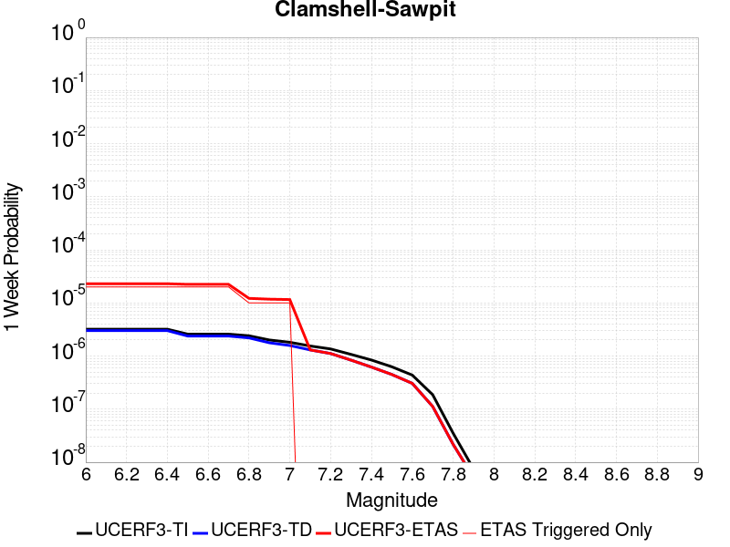 | 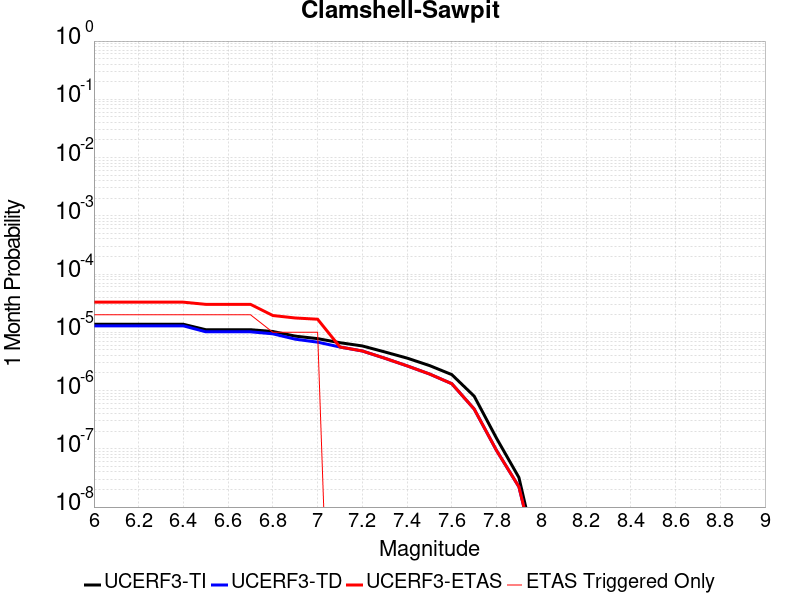 |  |  |

| Magnitude | 1 wk TI Prob | 1 wk TD Prob | 1 wk ETAS Prob | 1 wk ETAS/TD Gain | 1 wk ETAS Triggered Only | 1 mo TI Prob | 1 mo TD Prob | 1 mo ETAS Prob | 1 mo ETAS/TD Gain | 1 mo ETAS Triggered Only | 1 yr TI Prob | 1 yr TD Prob | 1 yr ETAS Prob | 1 yr ETAS/TD Gain | 1 yr ETAS Triggered Only | 10 yr TI Prob | 10 yr TD Prob | 10 yr ETAS Prob | 10 yr ETAS/TD Gain | 10 yr ETAS Triggered Only |
|-----|-----|-----|-----|-----|-----|-----|-----|-----|-----|-----|-----|-----|-----|-----|-----|-----|-----|-----|-----|-----|
| 6.0 | 3.202998E-6 | 3.0127644E-6 | 3.0127644E-6 | 1.0 | 0.0 | 1.3727062E-5 | 1.2911788E-5 | 1.2911788E-5 | 1.0 | 0.0 | 1.6711417E-4 | 1.5719049E-4 | 1.5719049E-4 | 1.0 | 0.0 | 0.0016698855 | 0.0015708724 | 0.0016061151 | 1.0224352 | 3.529827E-5 |
| 6.1 | 3.202998E-6 | 3.0127644E-6 | 3.0127644E-6 | 1.0 | 0.0 | 1.3727062E-5 | 1.2911788E-5 | 1.2911788E-5 | 1.0 | 0.0 | 1.6711417E-4 | 1.5719049E-4 | 1.5719049E-4 | 1.0 | 0.0 | 0.0016698855 | 0.0015708724 | 0.0016061151 | 1.0224352 | 3.529827E-5 |
| 6.2 | 3.202998E-6 | 3.0127644E-6 | 3.0127644E-6 | 1.0 | 0.0 | 1.3727062E-5 | 1.2911788E-5 | 1.2911788E-5 | 1.0 | 0.0 | 1.6711417E-4 | 1.5719049E-4 | 1.5719049E-4 | 1.0 | 0.0 | 0.0016698855 | 0.0015708724 | 0.0016061151 | 1.0224352 | 3.529827E-5 |
| 6.3 | 3.202998E-6 | 3.0127644E-6 | 3.0127644E-6 | 1.0 | 0.0 | 1.3727062E-5 | 1.2911788E-5 | 1.2911788E-5 | 1.0 | 0.0 | 1.6711417E-4 | 1.5719049E-4 | 1.5719049E-4 | 1.0 | 0.0 | 0.0016698855 | 0.0015708724 | 0.0016061151 | 1.0224352 | 3.529827E-5 |
| 6.4 | 3.202998E-6 | 3.0127644E-6 | 3.0127644E-6 | 1.0 | 0.0 | 1.3727062E-5 | 1.2911788E-5 | 1.2911788E-5 | 1.0 | 0.0 | 1.6711417E-4 | 1.5719049E-4 | 1.5719049E-4 | 1.0 | 0.0 | 0.0016698855 | 0.0015708724 | 0.0016061151 | 1.0224352 | 3.529827E-5 |
| 6.5 | 2.5862723E-6 | 2.380775E-6 | 2.380775E-6 | 1.0 | 0.0 | 1.1083977E-5 | 1.0203283E-5 | 1.0203283E-5 | 1.0 | 0.0 | 1.3493907E-4 | 1.2421819E-4 | 1.2421819E-4 | 1.0 | 0.0 | 0.0013485716 | 0.0012415178 | 0.0012415178 | 1.0 | 0.0 |
| 6.6 | 2.5862723E-6 | 2.380775E-6 | 2.380775E-6 | 1.0 | 0.0 | 1.1083977E-5 | 1.0203283E-5 | 1.0203283E-5 | 1.0 | 0.0 | 1.3493907E-4 | 1.2421819E-4 | 1.2421819E-4 | 1.0 | 0.0 | 0.0013485716 | 0.0012415178 | 0.0012415178 | 1.0 | 0.0 |
| 6.7 | 2.5862723E-6 | 2.380775E-6 | 2.380775E-6 | 1.0 | 0.0 | 1.1083977E-5 | 1.0203283E-5 | 1.0203283E-5 | 1.0 | 0.0 | 1.3493907E-4 | 1.2421819E-4 | 1.2421819E-4 | 1.0 | 0.0 | 0.0013485716 | 0.0012415178 | 0.0012415178 | 1.0 | 0.0 |
| 6.8 | 2.4098806E-6 | 2.1977307E-6 | 2.1977307E-6 | 1.0 | 0.0 | 1.0328019E-5 | 9.4188135E-6 | 9.4188135E-6 | 1.0 | 0.0 | 1.2573638E-4 | 1.1466829E-4 | 1.1466829E-4 | 1.0 | 0.0 | 0.0012566525 | 0.0011461178 | 0.0011461178 | 1.0 | 0.0 |
| 6.9 | 2.0073985E-6 | 1.7784248E-6 | 1.7784248E-6 | 1.0 | 0.0 | 8.603109E-6 | 7.621799E-6 | 7.621799E-6 | 1.0 | 0.0 | 1.0473781E-4 | 9.279157E-5 | 9.279157E-5 | 1.0 | 0.0 | 0.0010468846 | 9.275401E-4 | 9.275401E-4 | 1.0 | 0.0 |
| 7.0 | 1.8166766E-6 | 1.5807095E-6 | 1.5807095E-6 | 1.0 | 0.0 | 7.785734E-6 | 6.7744522E-6 | 6.7744522E-6 | 1.0 | 0.0 | 9.478718E-5 | 8.247593E-5 | 8.247593E-5 | 1.0 | 0.0 | 9.4746763E-4 | 8.244633E-4 | 8.244633E-4 | 1.0 | 0.0 |
| 7.1 | 1.5471421E-6 | 1.3052961E-6 | 1.3052961E-6 | 1.0 | 0.0 | 6.6305925E-6 | 5.5941146E-6 | 5.5941146E-6 | 1.0 | 0.0 | 8.072447E-5 | 6.8106274E-5 | 6.8106274E-5 | 1.0 | 0.0 | 8.0695155E-4 | 6.808595E-4 | 6.808595E-4 | 1.0 | 0.0 |
| 7.2 | 1.3608037E-6 | 1.1153443E-6 | 1.1153443E-6 | 1.0 | 0.0 | 5.8320024E-6 | 4.7800386E-6 | 4.7800386E-6 | 1.0 | 0.0 | 7.1002316E-5 | 5.8195463E-5 | 5.8195463E-5 | 1.0 | 0.0 | 7.097964E-4 | 5.818069E-4 | 5.818069E-4 | 1.0 | 0.0 |
| 7.3 | 1.0749634E-6 | 8.384254E-7 | 8.384254E-7 | 1.0 | 0.0 | 4.6069777E-6 | 3.593247E-6 | 3.593247E-6 | 1.0 | 0.0 | 5.608851E-5 | 4.374693E-5 | 4.374693E-5 | 1.0 | 0.0 | 5.6074356E-4 | 4.37386E-4 | 4.37386E-4 | 1.0 | 0.0 |
| 7.4 | 8.416856E-7 | 6.200048E-7 | 6.200048E-7 | 1.0 | 0.0 | 3.607219E-6 | 2.6571608E-6 | 2.6571608E-6 | 1.0 | 0.0 | 4.3917007E-5 | 3.2350472E-5 | 3.2350472E-5 | 1.0 | 0.0 | 4.390833E-4 | 3.2345962E-4 | 3.2345962E-4 | 1.0 | 0.0 |
| 7.5 | 6.2779594E-7 | 4.496886E-7 | 4.496886E-7 | 1.0 | 0.0 | 2.6905511E-6 | 1.9272356E-6 | 1.9272356E-6 | 1.0 | 0.0 | 3.275697E-5 | 2.346386E-5 | 2.346386E-5 | 1.0 | 0.0 | 3.275214E-4 | 2.346157E-4 | 2.346157E-4 | 1.0 | 0.0 |
| 7.6 | 4.3822078E-7 | 3.0595405E-7 | 3.0595405E-7 | 1.0 | 0.0 | 1.8780877E-6 | 1.311231E-6 | 1.311231E-6 | 1.0 | 0.0 | 2.2865479E-5 | 1.5964137E-5 | 1.5964137E-5 | 1.0 | 0.0 | 2.2863125E-4 | 1.5963144E-4 | 1.5963144E-4 | 1.0 | 0.0 |
| 7.7 | 1.8704569E-7 | 1.12379205E-7 | 1.12379205E-7 | 1.0 | 0.0 | 8.0162414E-7 | 4.816251E-7 | 4.816251E-7 | 1.0 | 0.0 | 9.75973E-6 | 5.86377E-6 | 5.86377E-6 | 1.0 | 0.0 | 9.7593016E-5 | 5.863622E-5 | 5.863622E-5 | 1.0 | 0.0 |
| 7.8 | 3.5378733E-8 | 2.1838144E-8 | 2.1838144E-8 | 1.0 | 0.0 | 1.5162313E-7 | 9.359204E-8 | 9.359204E-8 | 1.0 | 0.0 | 1.84601E-6 | 1.1394826E-6 | 1.1394826E-6 | 1.0 | 0.0 | 1.8459947E-5 | 1.139477E-5 | 1.139477E-5 | 1.0 | 0.0 |
| 7.9 | 7.504945E-9 | 5.1920326E-9 | 5.1920326E-9 | 1.0 | 0.0 | 3.2164053E-8 | 2.225157E-8 | 2.225157E-8 | 1.0 | 0.0 | 3.9159727E-7 | 2.7091284E-7 | 2.7091284E-7 | 1.0 | 0.0 | 3.915966E-6 | 2.7091257E-6 | 2.7091257E-6 | 1.0 | 0.0 |
| 8.0 | 1.6554036E-10 | 1.4180768E-10 | 1.4180768E-10 | 1.0 | 0.0 | 7.0945894E-10 | 6.077475E-10 | 6.077475E-10 | 1.0 | 0.0 | 8.637662E-9 | 7.3993256E-9 | 7.3993256E-9 | 1.0 | 0.0 | 8.6376616E-8 | 7.3993256E-8 | 7.3993256E-8 | 1.0 | 0.0 |

## Surprise Valley 2011 CFM
*[(top)](#table-of-contents)*

| 1 Week | 1 Month | 1 Year | 10 Year |
|-----|-----|-----|-----|
|  |  |  |  |

| Magnitude | 1 wk TI Prob | 1 wk TD Prob | 1 wk ETAS Prob | 1 wk ETAS/TD Gain | 1 wk ETAS Triggered Only | 1 mo TI Prob | 1 mo TD Prob | 1 mo ETAS Prob | 1 mo ETAS/TD Gain | 1 mo ETAS Triggered Only | 1 yr TI Prob | 1 yr TD Prob | 1 yr ETAS Prob | 1 yr ETAS/TD Gain | 1 yr ETAS Triggered Only | 10 yr TI Prob | 10 yr TD Prob | 10 yr ETAS Prob | 10 yr ETAS/TD Gain | 10 yr ETAS Triggered Only |
|-----|-----|-----|-----|-----|-----|-----|-----|-----|-----|-----|-----|-----|-----|-----|-----|-----|-----|-----|-----|-----|
| 6.0 | 4.0396248E-5 | 4.485131E-5 | 4.485131E-5 | 1.0 | 0.0 | 1.7311527E-4 | 1.9220692E-4 | 2.274984E-4 | 1.183612 | 3.529827E-5 | 0.002105641 | 0.0023378176 | 0.0023730334 | 1.0150635 | 3.529827E-5 | 0.020858008 | 0.023153966 | 0.023188448 | 1.0014892 | 3.529827E-5 |
| 6.1 | 4.0396248E-5 | 4.485131E-5 | 4.485131E-5 | 1.0 | 0.0 | 1.7311527E-4 | 1.9220692E-4 | 2.274984E-4 | 1.183612 | 3.529827E-5 | 0.002105641 | 0.0023378176 | 0.0023730334 | 1.0150635 | 3.529827E-5 | 0.020858008 | 0.023153966 | 0.023188448 | 1.0014892 | 3.529827E-5 |
| 6.2 | 2.2295266E-5 | 2.440125E-5 | 2.440125E-5 | 1.0 | 0.0 | 9.554764E-5 | 1.0457276E-4 | 1.3986735E-4 | 1.3375121 | 3.529827E-5 | 0.0011626717 | 0.0012724606 | 0.0013077139 | 1.0277048 | 3.529827E-5 | 0.011566074 | 0.012654981 | 0.012689833 | 1.002754 | 3.529827E-5 |
| 6.3 | 1.572643E-5 | 1.7096807E-5 | 1.7096807E-5 | 1.0 | 0.0 | 6.7397246E-5 | 7.327003E-5 | 1.0856571E-4 | 1.4817206 | 3.529827E-5 | 8.202525E-4 | 8.91708E-4 | 9.269748E-4 | 1.0395497 | 3.529827E-5 | 0.008172315 | 0.008882407 | 0.008917391 | 1.0039387 | 3.529827E-5 |
| 6.4 | 1.5714395E-5 | 1.7084629E-5 | 1.7084629E-5 | 1.0 | 0.0 | 6.734567E-5 | 7.3217845E-5 | 1.0851353E-4 | 1.482064 | 3.529827E-5 | 8.1962504E-4 | 8.9107314E-4 | 9.2633994E-4 | 1.039578 | 3.529827E-5 | 0.008166086 | 0.008876109 | 0.008911094 | 1.0039414 | 3.529827E-5 |
| 6.5 | 1.2733495E-5 | 1.38016E-5 | 1.38016E-5 | 1.0 | 0.0 | 5.457098E-5 | 5.9148413E-5 | 5.9148413E-5 | 1.0 | 0.0 | 6.641992E-4 | 7.1990065E-4 | 7.1990065E-4 | 1.0 | 0.0 | 0.0066221743 | 0.0071763797 | 0.0071763797 | 1.0 | 0.0 |
| 6.6 | 1.0983784E-5 | 1.1886554E-5 | 1.1886554E-5 | 1.0 | 0.0 | 4.7072506E-5 | 5.094141E-5 | 5.094141E-5 | 1.0 | 0.0 | 5.7295704E-4 | 6.200405E-4 | 6.200405E-4 | 1.0 | 0.0 | 0.0057148207 | 0.0061836545 | 0.0061836545 | 1.0 | 0.0 |
| 6.7 | 9.104806E-6 | 9.839491E-6 | 9.839491E-6 | 1.0 | 0.0 | 3.902001E-5 | 4.2168587E-5 | 4.2168587E-5 | 1.0 | 0.0 | 4.7496508E-4 | 5.132855E-4 | 5.132855E-4 | 1.0 | 0.0 | 0.004739512 | 0.005121397 | 0.005121397 | 1.0 | 0.0 |
| 6.8 | 6.2162403E-6 | 6.7041337E-6 | 6.7041337E-6 | 1.0 | 0.0 | 2.6640759E-5 | 2.8731698E-5 | 2.8731698E-5 | 1.0 | 0.0 | 3.2430296E-4 | 3.497545E-4 | 3.497545E-4 | 1.0 | 0.0 | 0.003238301 | 0.0034922638 | 0.0034922638 | 1.0 | 0.0 |
| 6.9 | 4.1792696E-6 | 4.50323E-6 | 4.50323E-6 | 1.0 | 0.0 | 1.7911032E-5 | 1.9299423E-5 | 1.9299423E-5 | 1.0 | 0.0 | 2.1804498E-4 | 2.3494668E-4 | 2.3494668E-4 | 1.0 | 0.0 | 0.0021783116 | 0.0023471361 | 0.0023471361 | 1.0 | 0.0 |
| 7.0 | 2.7478413E-6 | 2.9622424E-6 | 2.9622424E-6 | 1.0 | 0.0 | 1.177641E-5 | 1.269527E-5 | 1.269527E-5 | 1.0 | 0.0 | 1.4336836E-4 | 1.545552E-4 | 1.545552E-4 | 1.0 | 0.0 | 0.001432759 | 0.0015445995 | 0.0015445995 | 1.0 | 0.0 |
| 7.1 | 8.128648E-7 | 8.724922E-7 | 8.724922E-7 | 1.0 | 0.0 | 3.4837017E-6 | 3.7392501E-6 | 3.7392501E-6 | 1.0 | 0.0 | 4.2413245E-5 | 4.552502E-5 | 4.552502E-5 | 1.0 | 0.0 | 4.2405148E-4 | 4.5521575E-4 | 4.5521575E-4 | 1.0 | 0.0 |
| 7.2 | 4.8641045E-8 | 4.9402068E-8 | 4.9402068E-8 | 1.0 | 0.0 | 2.084616E-7 | 2.1172312E-7 | 2.1172312E-7 | 1.0 | 0.0 | 2.538017E-6 | 2.577726E-6 | 2.577726E-6 | 1.0 | 0.0 | 2.537988E-5 | 2.5776973E-5 | 2.5776973E-5 | 1.0 | 0.0 |
| 7.3 | 5.3911844E-9 | 5.4758145E-9 | 5.4758145E-9 | 1.0 | 0.0 | 2.3105075E-8 | 2.3467775E-8 | 2.3467775E-8 | 1.0 | 0.0 | 2.8130427E-7 | 2.8572015E-7 | 2.8572015E-7 | 1.0 | 0.0 | 2.8130391E-6 | 2.8571992E-6 | 2.8571992E-6 | 1.0 | 0.0 |

## Great Valley 08 (Quinto)
*[(top)](#table-of-contents)*

| 1 Week | 1 Month | 1 Year | 10 Year |
|-----|-----|-----|-----|
|  | 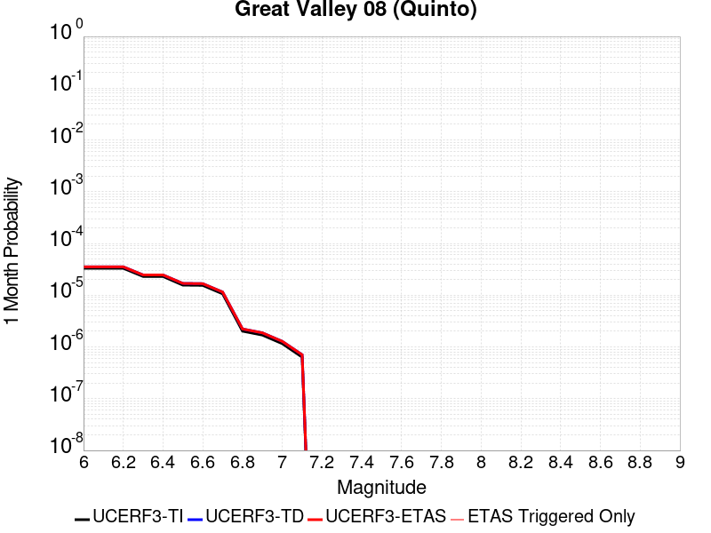 |  |  |

| Magnitude | 1 wk TI Prob | 1 wk TD Prob | 1 wk ETAS Prob | 1 wk ETAS/TD Gain | 1 wk ETAS Triggered Only | 1 mo TI Prob | 1 mo TD Prob | 1 mo ETAS Prob | 1 mo ETAS/TD Gain | 1 mo ETAS Triggered Only | 1 yr TI Prob | 1 yr TD Prob | 1 yr ETAS Prob | 1 yr ETAS/TD Gain | 1 yr ETAS Triggered Only | 10 yr TI Prob | 10 yr TD Prob | 10 yr ETAS Prob | 10 yr ETAS/TD Gain | 10 yr ETAS Triggered Only |
|-----|-----|-----|-----|-----|-----|-----|-----|-----|-----|-----|-----|-----|-----|-----|-----|-----|-----|-----|-----|-----|
| 6.0 | 7.737697E-6 | 8.253038E-6 | 8.253038E-6 | 1.0 | 0.0 | 3.3161137E-5 | 3.536979E-5 | 3.536979E-5 | 1.0 | 0.0 | 4.0366207E-4 | 4.3056096E-4 | 4.6584403E-4 | 1.0819467 | 3.529827E-5 | 0.004029296 | 0.0042991205 | 0.004334267 | 1.0081753 | 3.529827E-5 |
| 6.1 | 7.737697E-6 | 8.253038E-6 | 8.253038E-6 | 1.0 | 0.0 | 3.3161137E-5 | 3.536979E-5 | 3.536979E-5 | 1.0 | 0.0 | 4.0366207E-4 | 4.3056096E-4 | 4.6584403E-4 | 1.0819467 | 3.529827E-5 | 0.004029296 | 0.0042991205 | 0.004334267 | 1.0081753 | 3.529827E-5 |
| 6.2 | 7.737697E-6 | 8.253038E-6 | 8.253038E-6 | 1.0 | 0.0 | 3.3161137E-5 | 3.536979E-5 | 3.536979E-5 | 1.0 | 0.0 | 4.0366207E-4 | 4.3056096E-4 | 4.6584403E-4 | 1.0819467 | 3.529827E-5 | 0.004029296 | 0.0042991205 | 0.004334267 | 1.0081753 | 3.529827E-5 |
| 6.3 | 5.374012E-6 | 5.7505736E-6 | 5.7505736E-6 | 1.0 | 0.0 | 2.3031276E-5 | 2.4645145E-5 | 2.4645145E-5 | 1.0 | 0.0 | 2.803697E-4 | 3.0002446E-4 | 3.3531216E-4 | 1.117616 | 3.529827E-5 | 0.0028001624 | 0.0029972875 | 0.00303248 | 1.0117414 | 3.529827E-5 |
| 6.4 | 5.374012E-6 | 5.7505736E-6 | 5.7505736E-6 | 1.0 | 0.0 | 2.3031276E-5 | 2.4645145E-5 | 2.4645145E-5 | 1.0 | 0.0 | 2.803697E-4 | 3.0002446E-4 | 3.3531216E-4 | 1.117616 | 3.529827E-5 | 0.0028001624 | 0.0029972875 | 0.00303248 | 1.0117414 | 3.529827E-5 |
| 6.5 | 3.65427E-6 | 3.941324E-6 | 3.941324E-6 | 1.0 | 0.0 | 1.5661062E-5 | 1.689132E-5 | 1.689132E-5 | 1.0 | 0.0 | 1.9065675E-4 | 2.0563944E-4 | 2.4093046E-4 | 1.171616 | 3.529827E-5 | 0.0019049325 | 0.0020551833 | 0.002090409 | 1.0171399 | 3.529827E-5 |
| 6.6 | 3.6143538E-6 | 3.8985104E-6 | 3.8985104E-6 | 1.0 | 0.0 | 1.5489995E-5 | 1.6707834E-5 | 1.6707834E-5 | 1.0 | 0.0 | 1.8857437E-4 | 2.0340596E-4 | 2.3869704E-4 | 1.1735008 | 3.529827E-5 | 0.0018841444 | 0.0020328893 | 0.0020681159 | 1.0173283 | 3.529827E-5 |
| 6.7 | 2.4821015E-6 | 2.6857067E-6 | 2.6857067E-6 | 1.0 | 0.0 | 1.0637535E-5 | 1.1510153E-5 | 1.1510153E-5 | 1.0 | 0.0 | 1.2950429E-4 | 1.4013276E-4 | 1.7542609E-4 | 1.2518563 | 3.529827E-5 | 0.0012942884 | 0.0014009989 | 0.0014362477 | 1.0251597 | 3.529827E-5 |
| 6.8 | 4.7110538E-7 | 5.193021E-7 | 5.193021E-7 | 1.0 | 0.0 | 2.0190216E-6 | 2.2255786E-6 | 2.2255786E-6 | 1.0 | 0.0 | 2.458131E-5 | 2.70961E-5 | 2.70961E-5 | 1.0 | 0.0 | 2.457859E-4 | 2.7092977E-4 | 2.7092977E-4 | 1.0 | 0.0 |
| 6.9 | 3.958685E-7 | 4.3703452E-7 | 4.3703452E-7 | 1.0 | 0.0 | 1.6965782E-6 | 1.8730038E-6 | 1.8730038E-6 | 1.0 | 0.0 | 2.0655643E-5 | 2.28036E-5 | 2.28036E-5 | 1.0 | 0.0 | 2.0653724E-4 | 2.2801422E-4 | 2.2801422E-4 | 1.0 | 0.0 |
| 7.0 | 2.70294E-7 | 2.9920008E-7 | 2.9920008E-7 | 1.0 | 0.0 | 1.1584025E-6 | 1.2822856E-6 | 1.2822856E-6 | 1.0 | 0.0 | 1.4103458E-5 | 1.5611728E-5 | 1.5611728E-5 | 1.0 | 0.0 | 1.4102564E-4 | 1.5610759E-4 | 1.5610759E-4 | 1.0 | 0.0 |
| 7.1 | 1.4828602E-7 | 1.6469107E-7 | 1.6469107E-7 | 1.0 | 0.0 | 6.3551136E-7 | 7.058187E-7 | 7.058187E-7 | 1.0 | 0.0 | 7.737323E-6 | 8.593317E-6 | 8.593317E-6 | 1.0 | 0.0 | 7.737054E-5 | 8.593065E-5 | 8.593065E-5 | 1.0 | 0.0 |

## Carlsbad
*[(top)](#table-of-contents)*

| 1 Week | 1 Month | 1 Year | 10 Year |
|-----|-----|-----|-----|
|  |  |  |  |

| Magnitude | 1 wk TI Prob | 1 wk TD Prob | 1 wk ETAS Prob | 1 wk ETAS/TD Gain | 1 wk ETAS Triggered Only | 1 mo TI Prob | 1 mo TD Prob | 1 mo ETAS Prob | 1 mo ETAS/TD Gain | 1 mo ETAS Triggered Only | 1 yr TI Prob | 1 yr TD Prob | 1 yr ETAS Prob | 1 yr ETAS/TD Gain | 1 yr ETAS Triggered Only | 10 yr TI Prob | 10 yr TD Prob | 10 yr ETAS Prob | 10 yr ETAS/TD Gain | 10 yr ETAS Triggered Only |
|-----|-----|-----|-----|-----|-----|-----|-----|-----|-----|-----|-----|-----|-----|-----|-----|-----|-----|-----|-----|-----|
| 6.0 | 4.9038536E-6 | 4.9872565E-6 | 4.9872565E-6 | 1.0 | 0.0 | 2.1016345E-5 | 2.1373784E-5 | 2.1373784E-5 | 1.0 | 0.0 | 2.5584397E-4 | 2.601952E-4 | 2.954843E-4 | 1.1356255 | 3.529827E-5 | 0.002555496 | 0.0025989525 | 0.002634159 | 1.0135465 | 3.529827E-5 |
| 6.1 | 4.9038536E-6 | 4.9872565E-6 | 4.9872565E-6 | 1.0 | 0.0 | 2.1016345E-5 | 2.1373784E-5 | 2.1373784E-5 | 1.0 | 0.0 | 2.5584397E-4 | 2.601952E-4 | 2.954843E-4 | 1.1356255 | 3.529827E-5 | 0.002555496 | 0.0025989525 | 0.002634159 | 1.0135465 | 3.529827E-5 |
| 6.2 | 4.3820614E-6 | 4.4547687E-6 | 4.4547687E-6 | 1.0 | 0.0 | 1.8780129E-5 | 1.9091729E-5 | 1.9091729E-5 | 1.0 | 0.0 | 2.2862408E-4 | 2.3241735E-4 | 2.6770742E-4 | 1.1518393 | 3.529827E-5 | 0.00228389 | 0.0023217786 | 0.002356995 | 1.0151678 | 3.529827E-5 |
| 6.3 | 4.302872E-6 | 4.373006E-6 | 4.373006E-6 | 1.0 | 0.0 | 1.8440749E-5 | 1.8741322E-5 | 1.8741322E-5 | 1.0 | 0.0 | 2.24493E-4 | 2.2815206E-4 | 2.6344229E-4 | 1.1546785 | 3.529827E-5 | 0.0022426634 | 0.0022792136 | 0.0023144314 | 1.0154518 | 3.529827E-5 |
| 6.4 | 4.0835243E-6 | 4.1476546E-6 | 4.1476546E-6 | 1.0 | 0.0 | 1.75007E-5 | 1.7775543E-5 | 1.7775543E-5 | 1.0 | 0.0 | 2.1305021E-4 | 2.1639607E-4 | 2.516867E-4 | 1.1630836 | 3.529827E-5 | 0.0021284607 | 0.0021618877 | 0.0021971096 | 1.0162922 | 3.529827E-5 |
| 6.5 | 3.987806E-6 | 4.0488867E-6 | 4.0488867E-6 | 1.0 | 0.0 | 1.7090486E-5 | 1.7352257E-5 | 1.7352257E-5 | 1.0 | 0.0 | 2.080568E-4 | 2.1124359E-4 | 2.4653442E-4 | 1.1670622 | 3.529827E-5 | 0.002078621 | 0.0021104617 | 0.0021456855 | 1.0166901 | 3.529827E-5 |
| 6.6 | 3.8707576E-6 | 3.927488E-6 | 3.927488E-6 | 1.0 | 0.0 | 1.6588854E-5 | 1.6831984E-5 | 1.6831984E-5 | 1.0 | 0.0 | 2.0195059E-4 | 2.0491047E-4 | 2.4020151E-4 | 1.1722267 | 3.529827E-5 | 0.0020176715 | 0.0020472489 | 0.0020824748 | 1.0172065 | 3.529827E-5 |
| 6.7 | 3.3093434E-6 | 3.3423917E-6 | 3.3423917E-6 | 1.0 | 0.0 | 1.4182823E-5 | 1.4324457E-5 | 1.4324457E-5 | 1.0 | 0.0 | 1.7266218E-4 | 1.7438637E-4 | 2.0967847E-4 | 1.2023789 | 3.529827E-5 | 0.001725281 | 0.0017425013 | 0.0017777381 | 1.020222 | 3.529827E-5 |
| 6.8 | 3.136983E-6 | 3.1664536E-6 | 3.1664536E-6 | 1.0 | 0.0 | 1.3444143E-5 | 1.3570445E-5 | 1.3570445E-5 | 1.0 | 0.0 | 1.6367015E-4 | 1.6520769E-4 | 2.0050013E-4 | 1.2136247 | 3.529827E-5 | 0.0016354966 | 0.0016508545 | 0.0016860944 | 1.0213466 | 3.529827E-5 |
| 6.9 | 2.9056644E-6 | 2.9267585E-6 | 2.9267585E-6 | 1.0 | 0.0 | 1.2452788E-5 | 1.2543191E-5 | 1.2543191E-5 | 1.0 | 0.0 | 1.5160214E-4 | 1.5270269E-4 | 1.8799557E-4 | 1.2311215 | 3.529827E-5 | 0.0015149876 | 0.001525983 | 0.0015612274 | 1.0230962 | 3.529827E-5 |
| 7.0 | 2.5071035E-6 | 2.5113977E-6 | 2.5113977E-6 | 1.0 | 0.0 | 1.0744685E-5 | 1.07630885E-5 | 1.07630885E-5 | 1.0 | 0.0 | 1.308087E-4 | 1.3103275E-4 | 1.3103275E-4 | 1.0 | 0.0 | 0.0013073172 | 0.0013095582 | 0.0013095582 | 1.0 | 0.0 |
| 7.1 | 2.1786877E-6 | 2.1678832E-6 | 2.1678832E-6 | 1.0 | 0.0 | 9.3372E-6 | 9.290896E-6 | 9.290896E-6 | 1.0 | 0.0 | 1.13674476E-4 | 1.1311081E-4 | 1.1311081E-4 | 1.0 | 0.0 | 0.0011361635 | 0.0011305353 | 0.0011305353 | 1.0 | 0.0 |
| 7.2 | 1.6628418E-6 | 1.6213872E-6 | 1.6213872E-6 | 1.0 | 0.0 | 7.1264453E-6 | 6.948784E-6 | 6.948784E-6 | 1.0 | 0.0 | 8.676102E-5 | 8.4598185E-5 | 8.4598185E-5 | 1.0 | 0.0 | 8.672715E-4 | 8.45662E-4 | 8.45662E-4 | 1.0 | 0.0 |
| 7.3 | 1.0595926E-6 | 9.816804E-7 | 9.816804E-7 | 1.0 | 0.0 | 4.541103E-6 | 4.2071947E-6 | 4.2071947E-6 | 1.0 | 0.0 | 5.5286528E-5 | 5.1221403E-5 | 5.1221403E-5 | 1.0 | 0.0 | 5.527277E-4 | 5.1209686E-4 | 5.1209686E-4 | 1.0 | 0.0 |
| 7.4 | 7.956623E-7 | 7.1737975E-7 | 7.1737975E-7 | 1.0 | 0.0 | 3.4099767E-6 | 3.074481E-6 | 3.074481E-6 | 1.0 | 0.0 | 4.1515676E-5 | 3.743117E-5 | 3.743117E-5 | 1.0 | 0.0 | 4.150792E-4 | 3.7424936E-4 | 3.7424936E-4 | 1.0 | 0.0 |
| 7.5 | 5.1043804E-7 | 4.4483627E-7 | 4.4483627E-7 | 1.0 | 0.0 | 2.1875896E-6 | 1.9064398E-6 | 1.9064398E-6 | 1.0 | 0.0 | 2.663358E-5 | 2.3210663E-5 | 2.3210663E-5 | 1.0 | 0.0 | 2.6630386E-4 | 2.3208297E-4 | 2.3208297E-4 | 1.0 | 0.0 |
| 7.6 | 2.3723294E-7 | 1.989569E-7 | 1.989569E-7 | 1.0 | 0.0 | 1.0167122E-6 | 8.5267214E-7 | 8.5267214E-7 | 1.0 | 0.0 | 1.2378401E-5 | 1.0381237E-5 | 1.0381237E-5 | 1.0 | 0.0 | 1.237771E-4 | 1.038078E-4 | 1.038078E-4 | 1.0 | 0.0 |
| 7.7 | 1.9992152E-8 | 9.8601785E-9 | 9.8601785E-9 | 1.0 | 0.0 | 8.568065E-8 | 4.225791E-8 | 4.225791E-8 | 1.0 | 0.0 | 1.0431614E-6 | 5.1449E-7 | 5.1449E-7 | 1.0 | 0.0 | 1.0431565E-5 | 5.1449E-6 | 5.1449E-6 | 1.0 | 0.0 |

## Carson Range (Genoa)
*[(top)](#table-of-contents)*

| 1 Week | 1 Month | 1 Year | 10 Year |
|-----|-----|-----|-----|
|  |  |  | 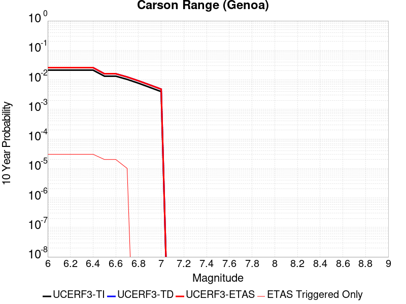 |

| Magnitude | 1 wk TI Prob | 1 wk TD Prob | 1 wk ETAS Prob | 1 wk ETAS/TD Gain | 1 wk ETAS Triggered Only | 1 mo TI Prob | 1 mo TD Prob | 1 mo ETAS Prob | 1 mo ETAS/TD Gain | 1 mo ETAS Triggered Only | 1 yr TI Prob | 1 yr TD Prob | 1 yr ETAS Prob | 1 yr ETAS/TD Gain | 1 yr ETAS Triggered Only | 10 yr TI Prob | 10 yr TD Prob | 10 yr ETAS Prob | 10 yr ETAS/TD Gain | 10 yr ETAS Triggered Only |
|-----|-----|-----|-----|-----|-----|-----|-----|-----|-----|-----|-----|-----|-----|-----|-----|-----|-----|-----|-----|-----|
| 6.0 | 4.1268457E-5 | 5.0146893E-5 | 8.54434E-5 | 1.7038622 | 3.529827E-5 | 1.7685282E-4 | 2.148998E-4 | 2.501905E-4 | 1.1642193 | 3.529827E-5 | 0.0021510567 | 0.0026136558 | 0.0026488616 | 1.01347 | 3.529827E-5 | 0.02130354 | 0.025868816 | 0.025903203 | 1.0013292 | 3.529827E-5 |
| 6.1 | 4.1268457E-5 | 5.0146893E-5 | 8.54434E-5 | 1.7038622 | 3.529827E-5 | 1.7685282E-4 | 2.148998E-4 | 2.501905E-4 | 1.1642193 | 3.529827E-5 | 0.0021510567 | 0.0026136558 | 0.0026488616 | 1.01347 | 3.529827E-5 | 0.02130354 | 0.025868816 | 0.025903203 | 1.0013292 | 3.529827E-5 |
| 6.2 | 4.1268457E-5 | 5.0146893E-5 | 8.54434E-5 | 1.7038622 | 3.529827E-5 | 1.7685282E-4 | 2.148998E-4 | 2.501905E-4 | 1.1642193 | 3.529827E-5 | 0.0021510567 | 0.0026136558 | 0.0026488616 | 1.01347 | 3.529827E-5 | 0.02130354 | 0.025868816 | 0.025903203 | 1.0013292 | 3.529827E-5 |
| 6.3 | 4.1268457E-5 | 5.0146893E-5 | 8.54434E-5 | 1.7038622 | 3.529827E-5 | 1.7685282E-4 | 2.148998E-4 | 2.501905E-4 | 1.1642193 | 3.529827E-5 | 0.0021510567 | 0.0026136558 | 0.0026488616 | 1.01347 | 3.529827E-5 | 0.02130354 | 0.025868816 | 0.025903203 | 1.0013292 | 3.529827E-5 |
| 6.4 | 4.1268457E-5 | 5.0146893E-5 | 8.54434E-5 | 1.7038622 | 3.529827E-5 | 1.7685282E-4 | 2.148998E-4 | 2.501905E-4 | 1.1642193 | 3.529827E-5 | 0.0021510567 | 0.0026136558 | 0.0026488616 | 1.01347 | 3.529827E-5 | 0.02130354 | 0.025868816 | 0.025903203 | 1.0013292 | 3.529827E-5 |
| 6.5 | 2.5677185E-5 | 3.0978295E-5 | 3.0978295E-5 | 1.0 | 0.0 | 1.1004044E-4 | 1.3275839E-4 | 1.3275839E-4 | 1.0 | 0.0 | 0.0013389189 | 0.0016153135 | 0.0016153135 | 1.0 | 0.0 | 0.0133088045 | 0.016053649 | 0.016053649 | 1.0 | 0.0 |
| 6.6 | 2.5677185E-5 | 3.0978295E-5 | 3.0978295E-5 | 1.0 | 0.0 | 1.1004044E-4 | 1.3275839E-4 | 1.3275839E-4 | 1.0 | 0.0 | 0.0013389189 | 0.0016153135 | 0.0016153135 | 1.0 | 0.0 | 0.0133088045 | 0.016053649 | 0.016053649 | 1.0 | 0.0 |
| 6.7 | 1.9969408E-5 | 2.406347E-5 | 2.406347E-5 | 1.0 | 0.0 | 8.558037E-5 | 1.0312595E-4 | 1.0312595E-4 | 1.0 | 0.0 | 0.0010414429 | 0.0012549888 | 0.0012549888 | 1.0 | 0.0 | 0.010365757 | 0.012494174 | 0.012494174 | 1.0 | 0.0 |
| 6.8 | 1.4783156E-5 | 1.7817569E-5 | 1.7817569E-5 | 1.0 | 0.0 | 6.335485E-5 | 7.635951E-5 | 7.635951E-5 | 1.0 | 0.0 | 7.710722E-4 | 9.294106E-4 | 9.294106E-4 | 1.0 | 0.0 | 0.0076840227 | 0.009268024 | 0.009268024 | 1.0 | 0.0 |
| 6.9 | 1.06660555E-5 | 1.2877026E-5 | 1.2877026E-5 | 1.0 | 0.0 | 4.5710865E-5 | 5.5186738E-5 | 5.5186738E-5 | 1.0 | 0.0 | 5.5638765E-4 | 6.718066E-4 | 6.718066E-4 | 1.0 | 0.0 | 0.005549967 | 0.006709056 | 0.006709056 | 1.0 | 0.0 |
| 7.0 | 7.664838E-6 | 9.258307E-6 | 9.258307E-6 | 1.0 | 0.0 | 3.2848893E-5 | 3.9678456E-5 | 3.9678456E-5 | 1.0 | 0.0 | 3.998619E-4 | 4.830852E-4 | 4.830852E-4 | 1.0 | 0.0 | 0.0039914316 | 0.00483085 | 0.00483085 | 1.0 | 0.0 |

## Richfield
*[(top)](#table-of-contents)*

| 1 Week | 1 Month | 1 Year | 10 Year |
|-----|-----|-----|-----|
|  |  |  |  |

| Magnitude | 1 wk TI Prob | 1 wk TD Prob | 1 wk ETAS Prob | 1 wk ETAS/TD Gain | 1 wk ETAS Triggered Only | 1 mo TI Prob | 1 mo TD Prob | 1 mo ETAS Prob | 1 mo ETAS/TD Gain | 1 mo ETAS Triggered Only | 1 yr TI Prob | 1 yr TD Prob | 1 yr ETAS Prob | 1 yr ETAS/TD Gain | 1 yr ETAS Triggered Only | 10 yr TI Prob | 10 yr TD Prob | 10 yr ETAS Prob | 10 yr ETAS/TD Gain | 10 yr ETAS Triggered Only |
|-----|-----|-----|-----|-----|-----|-----|-----|-----|-----|-----|-----|-----|-----|-----|-----|-----|-----|-----|-----|-----|
| 6.0 | 1.5166896E-6 | 1.5392679E-6 | 1.5392679E-6 | 1.0 | 0.0 | 6.5000822E-6 | 6.596852E-6 | 6.596852E-6 | 1.0 | 0.0 | 7.913562E-5 | 8.0314814E-5 | 1.1561025E-4 | 1.4394636 | 3.529827E-5 | 7.910745E-4 | 8.0296566E-4 | 8.382356E-4 | 1.0439246 | 3.529827E-5 |
| 6.1 | 1.5166896E-6 | 1.5392679E-6 | 1.5392679E-6 | 1.0 | 0.0 | 6.5000822E-6 | 6.596852E-6 | 6.596852E-6 | 1.0 | 0.0 | 7.913562E-5 | 8.0314814E-5 | 1.1561025E-4 | 1.4394636 | 3.529827E-5 | 7.910745E-4 | 8.0296566E-4 | 8.382356E-4 | 1.0439246 | 3.529827E-5 |
| 6.2 | 6.473272E-7 | 6.598479E-7 | 6.598479E-7 | 1.0 | 0.0 | 2.7742565E-6 | 2.8279173E-6 | 2.8279173E-6 | 1.0 | 0.0 | 3.377605E-5 | 3.4429482E-5 | 3.4429482E-5 | 1.0 | 0.0 | 3.3770915E-4 | 3.442545E-4 | 3.442545E-4 | 1.0 | 0.0 |
| 6.3 | 6.473272E-7 | 6.598479E-7 | 6.598479E-7 | 1.0 | 0.0 | 2.7742565E-6 | 2.8279173E-6 | 2.8279173E-6 | 1.0 | 0.0 | 3.377605E-5 | 3.4429482E-5 | 3.4429482E-5 | 1.0 | 0.0 | 3.3770915E-4 | 3.442545E-4 | 3.442545E-4 | 1.0 | 0.0 |
| 6.4 | 6.473272E-7 | 6.598479E-7 | 6.598479E-7 | 1.0 | 0.0 | 2.7742565E-6 | 2.8279173E-6 | 2.8279173E-6 | 1.0 | 0.0 | 3.377605E-5 | 3.4429482E-5 | 3.4429482E-5 | 1.0 | 0.0 | 3.3770915E-4 | 3.442545E-4 | 3.442545E-4 | 1.0 | 0.0 |
| 6.5 | 2.7954403E-7 | 2.8531605E-7 | 2.8531605E-7 | 1.0 | 0.0 | 1.1980452E-6 | 1.2227827E-6 | 1.2227827E-6 | 1.0 | 0.0 | 1.4586103E-5 | 1.4887321E-5 | 1.4887321E-5 | 1.0 | 0.0 | 1.4585146E-4 | 1.4886749E-4 | 1.4886749E-4 | 1.0 | 0.0 |
| 6.6 | 2.7954403E-7 | 2.8531605E-7 | 2.8531605E-7 | 1.0 | 0.0 | 1.1980452E-6 | 1.2227827E-6 | 1.2227827E-6 | 1.0 | 0.0 | 1.4586103E-5 | 1.4887321E-5 | 1.4887321E-5 | 1.0 | 0.0 | 1.4585146E-4 | 1.4886749E-4 | 1.4886749E-4 | 1.0 | 0.0 |
| 6.7 | 1.0777299E-7 | 1.08788136E-7 | 1.08788136E-7 | 1.0 | 0.0 | 4.6188418E-7 | 4.6623484E-7 | 4.6623484E-7 | 1.0 | 0.0 | 5.6234253E-6 | 5.6763984E-6 | 5.6763984E-6 | 1.0 | 0.0 | 5.623283E-5 | 5.6762965E-5 | 5.6762965E-5 | 1.0 | 0.0 |
| 6.8 | 2.1301874E-8 | 2.0666182E-8 | 2.0666182E-8 | 1.0 | 0.0 | 9.129375E-8 | 8.8569344E-8 | 8.8569344E-8 | 1.0 | 0.0 | 1.1115008E-6 | 1.0783313E-6 | 1.0783313E-6 | 1.0 | 0.0 | 1.1114952E-5 | 1.0783265E-5 | 1.0783265E-5 | 1.0 | 0.0 |
| 6.9 | 1.8413502E-8 | 1.7751145E-8 | 1.7751145E-8 | 1.0 | 0.0 | 7.891501E-8 | 7.607633E-8 | 7.607633E-8 | 1.0 | 0.0 | 9.607899E-7 | 9.26229E-7 | 9.26229E-7 | 1.0 | 0.0 | 9.607857E-6 | 9.262254E-6 | 9.262254E-6 | 1.0 | 0.0 |
| 7.0 | 1.2290541E-8 | 1.1574364E-8 | 1.1574364E-8 | 1.0 | 0.0 | 5.2673748E-8 | 4.9604413E-8 | 4.9604413E-8 | 1.0 | 0.0 | 6.413027E-7 | 6.039336E-7 | 6.039336E-7 | 1.0 | 0.0 | 6.4130086E-6 | 6.039321E-6 | 6.039321E-6 | 1.0 | 0.0 |
| 7.1 | 6.373573E-9 | 6.155796E-9 | 6.155796E-9 | 1.0 | 0.0 | 2.7315311E-8 | 2.6381983E-8 | 2.6381983E-8 | 1.0 | 0.0 | 3.3256384E-7 | 3.212006E-7 | 3.212006E-7 | 1.0 | 0.0 | 3.3256335E-6 | 3.2120017E-6 | 3.2120017E-6 | 1.0 | 0.0 |
| 7.2 | 3.6989944E-9 | 3.7360146E-9 | 3.7360146E-9 | 1.0 | 0.0 | 1.5852834E-8 | 1.6011493E-8 | 1.6011493E-8 | 1.0 | 0.0 | 1.9300822E-7 | 1.9493989E-7 | 1.9493989E-7 | 1.0 | 0.0 | 1.9300805E-6 | 1.9493975E-6 | 1.9493975E-6 | 1.0 | 0.0 |
| 7.3 | 2.097397E-9 | 2.1200501E-9 | 2.1200501E-9 | 1.0 | 0.0 | 8.9888434E-9 | 9.085929E-9 | 9.085929E-9 | 1.0 | 0.0 | 1.0943917E-7 | 1.1062118E-7 | 1.1062118E-7 | 1.0 | 0.0 | 1.0943911E-6 | 1.1062115E-6 | 1.1062115E-6 | 1.0 | 0.0 |
| 7.4 | 5.8314464E-12 | 5.8918426E-12 | 5.8918426E-12 | 1.0 | 0.0 | 2.4991786E-11 | 2.5250912E-11 | 2.5250912E-11 | 1.0 | 0.0 | 3.0427527E-10 | 3.0742975E-10 | 3.0742975E-10 | 1.0 | 0.0 | 3.0427532E-9 | 3.0742973E-9 | 3.0742973E-9 | 1.0 | 0.0 |

## Hector Mine
*[(top)](#table-of-contents)*

| 1 Week | 1 Month | 1 Year | 10 Year |
|-----|-----|-----|-----|
|  |  |  |  |

| Magnitude | 1 wk TI Prob | 1 wk TD Prob | 1 wk ETAS Prob | 1 wk ETAS/TD Gain | 1 wk ETAS Triggered Only | 1 mo TI Prob | 1 mo TD Prob | 1 mo ETAS Prob | 1 mo ETAS/TD Gain | 1 mo ETAS Triggered Only | 1 yr TI Prob | 1 yr TD Prob | 1 yr ETAS Prob | 1 yr ETAS/TD Gain | 1 yr ETAS Triggered Only | 10 yr TI Prob | 10 yr TD Prob | 10 yr ETAS Prob | 10 yr ETAS/TD Gain | 10 yr ETAS Triggered Only |
|-----|-----|-----|-----|-----|-----|-----|-----|-----|-----|-----|-----|-----|-----|-----|-----|-----|-----|-----|-----|-----|
| 6.0 | 1.8760093E-5 | 2.7963818E-6 | 3.8094553E-5 | 13.622802 | 3.529827E-5 | 8.039792E-5 | 1.1984461E-5 | 4.728231E-5 | 3.9453013 | 3.529827E-5 | 9.78405E-4 | 1.4590504E-4 | 1.8119816E-4 | 1.241891 | 3.529827E-5 | 0.009741086 | 0.0014584847 | 0.0014937314 | 1.0241667 | 3.529827E-5 |
| 6.1 | 1.8760093E-5 | 2.7963818E-6 | 3.8094553E-5 | 13.622802 | 3.529827E-5 | 8.039792E-5 | 1.1984461E-5 | 4.728231E-5 | 3.9453013 | 3.529827E-5 | 9.78405E-4 | 1.4590504E-4 | 1.8119816E-4 | 1.241891 | 3.529827E-5 | 0.009741086 | 0.0014584847 | 0.0014937314 | 1.0241667 | 3.529827E-5 |
| 6.2 | 1.8760093E-5 | 2.7963818E-6 | 3.8094553E-5 | 13.622802 | 3.529827E-5 | 8.039792E-5 | 1.1984461E-5 | 4.728231E-5 | 3.9453013 | 3.529827E-5 | 9.78405E-4 | 1.4590504E-4 | 1.8119816E-4 | 1.241891 | 3.529827E-5 | 0.009741086 | 0.0014584847 | 0.0014937314 | 1.0241667 | 3.529827E-5 |
| 6.3 | 1.8760093E-5 | 2.7963818E-6 | 3.8094553E-5 | 13.622802 | 3.529827E-5 | 8.039792E-5 | 1.1984461E-5 | 4.728231E-5 | 3.9453013 | 3.529827E-5 | 9.78405E-4 | 1.4590504E-4 | 1.8119816E-4 | 1.241891 | 3.529827E-5 | 0.009741086 | 0.0014584847 | 0.0014937314 | 1.0241667 | 3.529827E-5 |
| 6.4 | 1.0888055E-5 | 2.7963818E-6 | 3.8094553E-5 | 13.622802 | 3.529827E-5 | 4.666226E-5 | 1.1984461E-5 | 4.728231E-5 | 3.9453013 | 3.529827E-5 | 5.679649E-4 | 1.4590504E-4 | 1.8119816E-4 | 1.241891 | 3.529827E-5 | 0.0056651547 | 0.0014584847 | 0.0014937314 | 1.0241667 | 3.529827E-5 |
| 6.5 | 1.0888055E-5 | 2.7963818E-6 | 3.8094553E-5 | 13.622802 | 3.529827E-5 | 4.666226E-5 | 1.1984461E-5 | 4.728231E-5 | 3.9453013 | 3.529827E-5 | 5.679649E-4 | 1.4590504E-4 | 1.8119816E-4 | 1.241891 | 3.529827E-5 | 0.0056651547 | 0.0014584847 | 0.0014937314 | 1.0241667 | 3.529827E-5 |
| 6.6 | 1.0730738E-5 | 2.7963818E-6 | 3.8094553E-5 | 13.622802 | 3.529827E-5 | 4.5988065E-5 | 1.1984461E-5 | 4.728231E-5 | 3.9453013 | 3.529827E-5 | 5.5976084E-4 | 1.4590504E-4 | 1.8119816E-4 | 1.241891 | 3.529827E-5 | 0.0055835294 | 0.0014584847 | 0.0014937314 | 1.0241667 | 3.529827E-5 |
| 6.7 | 7.881326E-6 | 2.7710626E-6 | 3.8069236E-5 | 13.738137 | 3.529827E-5 | 3.3776672E-5 | 1.1875951E-5 | 4.7173802E-5 | 3.9722128 | 3.529827E-5 | 4.111534E-4 | 1.445841E-4 | 1.7987727E-4 | 1.2441013 | 3.529827E-5 | 0.0041039353 | 0.0014452925 | 0.0014805397 | 1.0243876 | 3.529827E-5 |
| 6.8 | 7.5683483E-6 | 2.7328138E-6 | 3.8030987E-5 | 13.916421 | 3.529827E-5 | 3.2435375E-5 | 1.1712029E-5 | 4.7009886E-5 | 4.0138125 | 3.529827E-5 | 3.9482914E-4 | 1.4258861E-4 | 1.7788186E-4 | 1.247518 | 3.529827E-5 | 0.0039412836 | 0.0014253634 | 0.0014606112 | 1.0247291 | 3.529827E-5 |
| 6.9 | 6.473048E-6 | 2.5138945E-6 | 3.7812075E-5 | 15.041234 | 3.529827E-5 | 2.7741338E-5 | 1.07738115E-5 | 4.6071702E-5 | 4.2762675 | 3.529827E-5 | 3.3769844E-4 | 1.3116724E-4 | 1.6646087E-4 | 1.2690736 | 3.529827E-5 | 0.0033718573 | 0.0013112876 | 0.0013465397 | 1.0268835 | 3.529827E-5 |
| 7.0 | 4.9959954E-6 | 1.8565124E-6 | 1.8565124E-6 | 1.0 | 0.0 | 2.1411232E-5 | 7.956478E-6 | 7.956478E-6 | 1.0 | 0.0 | 2.6065056E-4 | 9.686937E-5 | 9.686937E-5 | 1.0 | 0.0 | 0.0026034506 | 9.6862105E-4 | 9.6862105E-4 | 1.0 | 0.0 |
| 7.1 | 1.2997541E-6 | 1.5602147E-7 | 1.5602147E-7 | 1.0 | 0.0 | 5.5703626E-6 | 6.686633E-7 | 6.686633E-7 | 1.0 | 0.0 | 6.7817055E-5 | 8.140949E-6 | 8.140949E-6 | 1.0 | 0.0 | 6.779636E-4 | 8.1406906E-5 | 8.1406906E-5 | 1.0 | 0.0 |
| 7.2 | 8.392699E-7 | 9.727592E-8 | 9.727592E-8 | 1.0 | 0.0 | 3.596866E-6 | 4.1689677E-7 | 4.1689677E-7 | 1.0 | 0.0 | 4.3790962E-5 | 5.0757085E-6 | 5.0757085E-6 | 1.0 | 0.0 | 4.3782333E-4 | 5.0756116E-5 | 5.0756116E-5 | 1.0 | 0.0 |
| 7.3 | 3.13015E-7 | 4.829262E-8 | 4.829262E-8 | 1.0 | 0.0 | 1.3414921E-6 | 2.0696835E-7 | 2.0696835E-7 | 1.0 | 0.0 | 1.6332544E-5 | 2.5198376E-6 | 2.5198376E-6 | 1.0 | 0.0 | 1.6331344E-4 | 2.5198176E-5 | 2.5198176E-5 | 1.0 | 0.0 |

