# Parent Section Magnitude-Probability Distributions

Only fault sections with at least one triggered aftershock are plotted. Sections are sorted by total supraseismogenic trigger rate (decreasing)

## Table Of Contents

* [Tank Canyon](#tank-canyon)
* [Garlock (Central)](#garlock-central)
* [Little Lake](#little-lake)
* [Owl Lake](#owl-lake)
* [Airport Lake](#airport-lake)
* [Panamint Valley](#panamint-valley)
* [Garlock (East)](#garlock-east)
* [Ash Hill](#ash-hill)
* [Hunter Mountain-Saline Valley](#hunter-mountain-saline-valley)
* [Blackwater](#blackwater)
* [McLean Lake](#mclean-lake)
* [Goldstone Lake](#goldstone-lake)
* [Garlock (West)](#garlock-west)
* [Gravel Hills-Harper Lk](#gravel-hills-harper-lk)
* [Coyote Canyon](#coyote-canyon)
* [Nelson Lake](#nelson-lake)
* [Death Valley (So)](#death-valley-so)
* [So Sierra Nevada](#so-sierra-nevada)
* [San Andreas (Mojave S)](#san-andreas-mojave-s)
* [Towne Pass](#towne-pass)
* [San Andreas (Mojave N)](#san-andreas-mojave-n)
* [Lenwood-Lockhart-Old Woman Springs](#lenwood-lockhart-old-woman-springs)
* [Bicycle Lake](#bicycle-lake)
* [Paradise](#paradise)
* [Garlic Springs](#garlic-springs)
* [San Andreas (San Bernardino N)](#san-andreas-san-bernardino-n)
* [Coyote Lake](#coyote-lake)
* [Death Valley (Black Mtns Frontal)](#death-valley-black-mtns-frontal)
* [Helendale-So Lockhart](#helendale-so-lockhart)
* [San Andreas (San Bernardino S)](#san-andreas-san-bernardino-s)
* [San Andreas (Big Bend)](#san-andreas-big-bend)
* [Death Valley (No)](#death-valley-no)
* [Red Pass](#red-pass)
* [Calico-Hidalgo](#calico-hidalgo)
* [Elsinore (Glen Ivy) rev](#elsinore-glen-ivy-rev)
* [San Andreas (Parkfield)](#san-andreas-parkfield)
* [Cady](#cady)
* [San Andreas (San Gorgonio Pass-Garnet HIll)](#san-andreas-san-gorgonio-pass-garnet-hill)
* [Manix-Afton Hills](#manix-afton-hills)
* [Baker](#baker)
* [Ludlow](#ludlow)
* [San Andreas (Carrizo) rev](#san-andreas-carrizo-rev)
* [Death Valley (Fish Lake Valley)](#death-valley-fish-lake-valley)
* [San Andreas (Cholame) rev](#san-andreas-cholame-rev)
* [San Andreas (Coachella) rev](#san-andreas-coachella-rev)
* [Santa Ynez (West)](#santa-ynez-west)
* [Cleghorn Lake](#cleghorn-lake)
* [Sierra Nevada  (No Extension)](#sierra-nevada--no-extension)
* [Lake Isabella (Seismicity)](#lake-isabella-seismicity)
* [San Jacinto (San Bernardino)](#san-jacinto-san-bernardino)
* [Scodie Lineament](#scodie-lineament)
* [Santa Ynez (East)](#santa-ynez-east)
* [White Wolf (Extension)](#white-wolf-extension)
* [San Andreas (Creeping Section) 2011 CFM](#san-andreas-creeping-section-2011-cfm)
* [Mission Ridge-Arroyo Parida-Santa Ana](#mission-ridge-arroyo-parida-santa-ana)
* [Cleghorn Pass](#cleghorn-pass)
* [San Jacinto (San Jacinto Valley) rev](#san-jacinto-san-jacinto-valley-rev)
* [San Jacinto (Anza) rev](#san-jacinto-anza-rev)
* [San Jacinto (Stepovers Combined)](#san-jacinto-stepovers-combined)
* [Chino alt 1](#chino-alt-1)
* [Pinto Mtn](#pinto-mtn)
* [Rose Canyon](#rose-canyon)
* [Santa Rosa Island](#santa-rosa-island)
* [Independence rev 2011](#independence-rev-2011)
* [San Andreas (North Branch Mill Creek)](#san-andreas-north-branch-mill-creek)
* [Deep Springs](#deep-springs)
* [Lost Hills](#lost-hills)
* [Whittier alt 1](#whittier-alt-1)
* [Red Mountain](#red-mountain)
* [Ortigalita (North)](#ortigalita-north)
* [Big Pine (Central)](#big-pine-central)
* [Camp Rock 2011](#camp-rock-2011)
* [San Diego Trough north alt1](#san-diego-trough-north-alt1)
* [Pleito](#pleito)
* [Pisgah-Bullion Mtn-Mesquite Lk](#pisgah-bullion-mtn-mesquite-lk)
* [Brawley (Seismic Zone) alt 1](#brawley-seismic-zone-alt-1)
* [Kern Canyon (North Kern) 2011](#kern-canyon-north-kern-2011)
* [San Clemente](#san-clemente)
* [White Mountains](#white-mountains)
* [Oceanic - West Huasna](#oceanic---west-huasna)
* [Bullion Mountains](#bullion-mountains)
* [Dry Mountain](#dry-mountain)
* [San Jacinto (Coyote Creek)](#san-jacinto-coyote-creek)
* [Imperial](#imperial)
* [Mission Creek](#mission-creek)
* [Santa Cruz Island](#santa-cruz-island)
* [Ventura-Pitas Point](#ventura-pitas-point)
* [Owens Valley](#owens-valley)
* [Blue Cut](#blue-cut)
* [San Pedro Basin](#san-pedro-basin)
* [Coronado Bank alt1](#coronado-bank-alt1)
* [Santa Ynez River](#santa-ynez-river)
* [Palos Verdes](#palos-verdes)
* [Oak Ridge (Onshore)](#oak-ridge-onshore)
* [Big Pine (East)](#big-pine-east)
* [San Jacinto (Lytle Creek connector)](#san-jacinto-lytle-creek-connector)
* [Sheephole](#sheephole)
* [Channel Islands Thrust](#channel-islands-thrust)
* [San Cayetano](#san-cayetano)
* [San Jacinto (Borrego)](#san-jacinto-borrego)
* [Great Valley 09 (Laguna Seca)](#great-valley-09-laguna-seca)
* [Kern Canyon (South Kern) 2011](#kern-canyon-south-kern-2011)
* [San Diego Trough south](#san-diego-trough-south)
* [Tin Mountain](#tin-mountain)
* [Newport-Inglewood alt 1](#newport-inglewood-alt-1)
* [San Juan](#san-juan)
* [Calaveras (So) - Paicines extension 2011 CFM](#calaveras-so---paicines-extension-2011-cfm)
* [Monterey Bay-Tularcitos](#monterey-bay-tularcitos)
* [Cleghorn](#cleghorn)
* [Cucamonga](#cucamonga)
* [Santa Cruz Catalina Ridge alt1](#santa-cruz-catalina-ridge-alt1)
* [Simi-Santa Rosa](#simi-santa-rosa)
* [San Jacinto (Clark) rev](#san-jacinto-clark-rev)
* [Los Alamos extension](#los-alamos-extension)
* [Santa Susana alt 1](#santa-susana-alt-1)
* [Hayward (So) 2011 CFM](#hayward-so-2011-cfm)
* [Elsinore (Stepovers Combined)](#elsinore-stepovers-combined)
* [Ortigalita (South)](#ortigalita-south)
* [Elysian Park (Upper)](#elysian-park-upper)
* [Kern Canyon (Lake Isabella) 2011](#kern-canyon-lake-isabella-2011)
* [Hosgri](#hosgri)
* [Los Alamos 2011 CFM](#los-alamos-2011-cfm)
* [Pine Mtn](#pine-mtn)
* [Rinconada 2011 CFM](#rinconada-2011-cfm)
* [Channel Islands Western Deep Ramp](#channel-islands-western-deep-ramp)
* [Pitas Point (Lower West)](#pitas-point-lower-west)
* [Calaveras (So) 2011 CFM](#calaveras-so-2011-cfm)
* [Newport-Inglewood (Offshore)](#newport-inglewood-offshore)
* [San Jacinto (Superstition Mtn)](#san-jacinto-superstition-mtn)
* [Elsinore (Temecula) rev](#elsinore-temecula-rev)
* [Emerson-Copper Mtn 2011](#emerson-copper-mtn-2011)
* [San Luis Range 2011 CFM](#san-luis-range-2011-cfm)
* [Mono Lake 2011 CFM](#mono-lake-2011-cfm)
* [San Gabriel](#san-gabriel)
* [Hosgri (Extension)](#hosgri-extension)
* [Pitas Point (Lower)-Montalvo](#pitas-point-lower-montalvo)
* [Raymond](#raymond)
* [South Klamath Lake West](#south-klamath-lake-west)
* [Sierra Madre](#sierra-madre)
* [Hat Creek-McArthur-Mayfield](#hat-creek-mcarthur-mayfield)
* [Likely 2011 CFM](#likely-2011-cfm)
* [Casmalia 2011 CFM](#casmalia-2011-cfm)
* [San Jose](#san-jose)
* [Redondo Canyon alt 1](#redondo-canyon-alt-1)
* [Cerro Prieto](#cerro-prieto)
* [Great Valley 08 (Quinto)](#great-valley-08-quinto)
* [San Gabriel (Extension)](#san-gabriel-extension)
* [San Gregorio (North) 2011 CFM](#san-gregorio-north-2011-cfm)
* [North Frontal  (West)](#north-frontal--west)
* [Almanor 2011 CFM](#almanor-2011-cfm)
* [Hunting Creek - Berryessa 2011 CFM](#hunting-creek---berryessa-2011-cfm)
* [Elsinore (Coyote Mountains)](#elsinore-coyote-mountains)
* [South Klamath Lake East](#south-klamath-lake-east)
* [Mission Hills 2011](#mission-hills-2011)
* [Santa Susana East (connector)](#santa-susana-east-connector)
* [Gillem - Big Crack 2011 CFM](#gillem---big-crack-2011-cfm)
* [Malibu Coast (Extension) alt 1](#malibu-coast-extension-alt-1)
* [Reliz 2011 CFM](#reliz-2011-cfm)
* [Cedar Mtn-Mahogany Mtn](#cedar-mtn-mahogany-mtn)
* [Carson Range (Genoa)](#carson-range-genoa)
* [La Panza 2011](#la-panza-2011)
* [Surprise Valley 2011 CFM](#surprise-valley-2011-cfm)
* [Calaveras (No) 2011 CFM](#calaveras-no-2011-cfm)
* [Malibu Coast alt 1](#malibu-coast-alt-1)
* [Northridge](#northridge)
* [Sisar](#sisar)
* [Owens Valley Keough Hot Springs](#owens-valley-keough-hot-springs)
* [Great Valley 07 (Orestimba)](#great-valley-07-orestimba)
* [San Andreas (Offshore) 2011 CFM](#san-andreas-offshore-2011-cfm)
* [Holser alt 1](#holser-alt-1)
* [Clamshell-Sawpit](#clamshell-sawpit)
* [Antelope Valley 2011](#antelope-valley-2011)
* [Homestead Valley 2011](#homestead-valley-2011)
* [Maacama 2011 CFM](#maacama-2011-cfm)
* [Los Osos 2011](#los-osos-2011)
* [Del Valle](#del-valle)
* [Quien Sabe 2011 CFM](#quien-sabe-2011-cfm)
* [Elsinore (Julian)](#elsinore-julian)
* [Elysian Park (Lower CFM)](#elysian-park-lower-cfm)
* [Johnson Valley (No) 2011 rev](#johnson-valley-no-2011-rev)
* [Round Valley](#round-valley)
* [Davis Creek](#davis-creek)
* [Oceanside alt1](#oceanside-alt1)
* [Las Positas](#las-positas)
* [San Andreas (Santa Cruz Mts) 2011 CFM](#san-andreas-santa-cruz-mts-2011-cfm)
* [Burnt Mtn](#burnt-mtn)
* [Elmore Ranch](#elmore-ranch)
* [Verdugo](#verdugo)
* [Lions Head 2011 CFM](#lions-head-2011-cfm)
* [Great Valley 05 Pittsburg - Kirby Hills alt1](#great-valley-05-pittsburg---kirby-hills-alt1)
* [Sierra Madre (San Fernando)](#sierra-madre-san-fernando)
* [Richfield](#richfield)
* [Thirty Mile Bank](#thirty-mile-bank)
* [Earthquake Valley (So Extension)](#earthquake-valley-so-extension)
* [Hayward (No) 2011 CFM](#hayward-no-2011-cfm)
* [Great Valley 11](#great-valley-11)
* [Puente Hills](#puente-hills)
* [Monte Vista - Shannon 2011 CFM](#monte-vista---shannon-2011-cfm)
* [Superstition Hills](#superstition-hills)
* [Carlsbad](#carlsbad)
* [Robinson Creek](#robinson-creek)
* [Calaveras (Central) 2011 CFM](#calaveras-central-2011-cfm)
* [Santa Monica alt 1](#santa-monica-alt-1)
* [Anaheim](#anaheim)
* [Honey Lake 2011 CFM](#honey-lake-2011-cfm)
* [Sargent 2011 CFM](#sargent-2011-cfm)
* [Hollywood](#hollywood)
* [San Gorgonio Pass](#san-gorgonio-pass)
* [Fontana (Seismicity)](#fontana-seismicity)
* [Fish Slough 2011 CFM](#fish-slough-2011-cfm)
* [Butano 2011 CFM](#butano-2011-cfm)
* [Morales (East)](#morales-east)
* [Mendocino](#mendocino)
* [Hector Mine](#hector-mine)
* [Green Valley 2011 CFM](#green-valley-2011-cfm)
* [Keddie Ridge 2011 CFM](#keddie-ridge-2011-cfm)
* [Skinner Flat 2011 CFM](#skinner-flat-2011-cfm)
* [East Huasna 2011 CFM](#east-huasna-2011-cfm)
* [South Cuyama](#south-cuyama)
* [Walker Spring 2011 CFM](#walker-spring-2011-cfm)
* [Great Valley 03 Mysterious Ridge](#great-valley-03-mysterious-ridge)
* [North Frontal  (East)](#north-frontal--east)
* [Hayward (So) extension 2011 CFM](#hayward-so-extension-2011-cfm)
* [Kickapoo](#kickapoo)
* [Earthquake Valley (No  Extension)](#earthquake-valley-no--extension)
* [Anacapa-Dume alt 1](#anacapa-dume-alt-1)
* [Northridge Hills](#northridge-hills)
* [Great Valley 12](#great-valley-12)
* [Franklin 2011 CFM](#franklin-2011-cfm)
* [Great Valley 14 (Kettleman Hills)](#great-valley-14-kettleman-hills)
* [San Luis Range - Oceano 2011 CFM](#san-luis-range---oceano-2011-cfm)
* [Goose Lake 2011 CFM](#goose-lake-2011-cfm)
* [Great Valley 06 (Midland) 2011 CFM alt1](#great-valley-06-midland-2011-cfm-alt1)
* [White Wolf](#white-wolf)
* [Greenville (So) 2011 CFM](#greenville-so-2011-cfm)
* [Yorba Linda](#yorba-linda)

## Tank Canyon
*[(top)](#table-of-contents)*

| 1 Week | 1 Month | 1 Year | 10 Year |
|-----|-----|-----|-----|
|  |  |  | 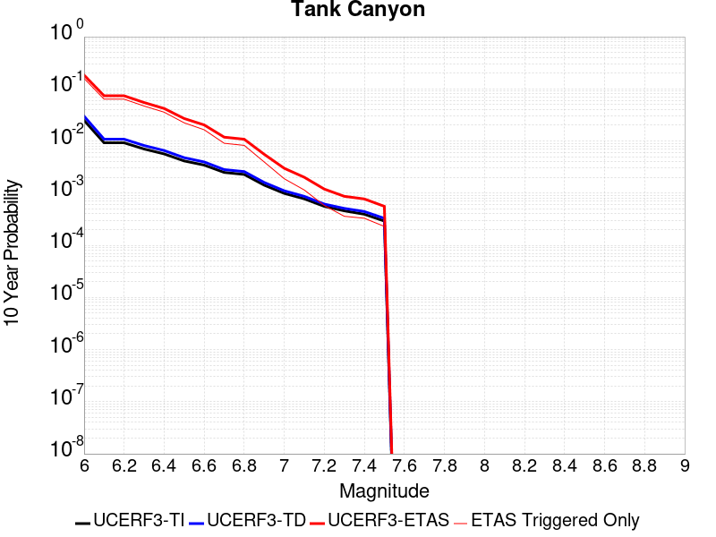 |

| Magnitude | 1 wk TI Prob | 1 wk TD Prob | 1 wk ETAS Prob | 1 wk ETAS/TD Gain | 1 wk ETAS Triggered Only | 1 mo TI Prob | 1 mo TD Prob | 1 mo ETAS Prob | 1 mo ETAS/TD Gain | 1 mo ETAS Triggered Only | 1 yr TI Prob | 1 yr TD Prob | 1 yr ETAS Prob | 1 yr ETAS/TD Gain | 1 yr ETAS Triggered Only | 10 yr TI Prob | 10 yr TD Prob | 10 yr ETAS Prob | 10 yr ETAS/TD Gain | 10 yr ETAS Triggered Only |
|-----|-----|-----|-----|-----|-----|-----|-----|-----|-----|-----|-----|-----|-----|-----|-----|-----|-----|-----|-----|-----|
| 6.0 | 4.8284557E-5 | 5.7964822E-5 | 0.09073271 | 1565.3064 | 0.09068 | 2.0691741E-4 | 2.4840087E-4 | 0.112470515 | 452.7783 | 0.11225 | 0.0025163088 | 0.0030207601 | 0.14342535 | 47.479885 | 0.14083 | 0.02488006 | 0.029863637 | 0.18368846 | 6.1509075 | 0.15856 |
| 6.1 | 1.7796336E-5 | 2.0873314E-5 | 0.03377017 | 1617.8633 | 0.03375 | 7.626778E-5 | 8.945422E-5 | 0.04294562 | 480.0849 | 0.04286 | 9.281647E-4 | 0.0010885983 | 0.056458257 | 51.863266 | 0.05543 | 0.009242975 | 0.010836744 | 0.073678285 | 6.798932 | 0.06353 |
| 6.2 | 1.7796336E-5 | 2.0873314E-5 | 0.03377017 | 1617.8633 | 0.03375 | 7.626778E-5 | 8.945422E-5 | 0.04294562 | 480.0849 | 0.04286 | 9.281647E-4 | 0.0010885983 | 0.056458257 | 51.863266 | 0.05543 | 0.009242975 | 0.010836744 | 0.073678285 | 6.798932 | 0.06353 |
| 6.3 | 1.3515912E-5 | 1.5759564E-5 | 0.02471537 | 1568.2775 | 0.0247 | 5.792405E-5 | 6.753938E-5 | 0.03162541 | 468.25137 | 0.03156 | 7.049971E-4 | 8.2200574E-4 | 0.041578475 | 50.581734 | 0.04079 | 0.007027647 | 0.0081922645 | 0.05468821 | 6.6755915 | 0.04688 |
| 6.4 | 1.0870146E-5 | 1.2618021E-5 | 0.018762382 | 1486.9512 | 0.01875 | 4.658551E-5 | 5.4076212E-5 | 0.023912786 | 442.20526 | 0.02386 | 5.67031E-4 | 6.581969E-4 | 0.03165778 | 48.097733 | 0.03102 | 0.005655863 | 0.0065644905 | 0.042069875 | 6.408704 | 0.03574 |
| 6.5 | 7.964826E-6 | 9.196094E-6 | 0.011929086 | 1297.1906 | 0.01192 | 3.4134522E-5 | 3.9411298E-5 | 0.014988822 | 380.3179 | 0.01495 | 4.1550855E-4 | 4.7973756E-4 | 0.019840445 | 41.356873 | 0.01937 | 0.0041473247 | 0.004788321 | 0.02702135 | 5.6431785 | 0.02234 |
| 6.6 | 6.6317E-6 | 7.6122988E-6 | 0.008797545 | 1155.7015 | 0.00879 | 2.8421264E-5 | 3.2623782E-5 | 0.010992266 | 336.94028 | 0.01096 | 3.4597394E-4 | 3.9713128E-4 | 0.0145715 | 36.6919 | 0.01418 | 0.0034543579 | 0.003965368 | 0.020340178 | 5.129455 | 0.01644 |
| 6.7 | 4.793663E-6 | 5.4307857E-6 | 0.004765405 | 877.47986 | 0.00476 | 2.0544108E-5 | 2.3274613E-5 | 0.0060031353 | 257.92633 | 0.00598 | 2.500958E-4 | 2.8333595E-4 | 0.008001149 | 28.239088 | 0.00772 | 0.0024981452 | 0.0028304397 | 0.011854825 | 4.188333 | 0.00905 |
| 6.8 | 4.382823E-6 | 4.9692567E-6 | 0.0043749474 | 880.4028 | 0.00437 | 1.8783392E-5 | 2.1296666E-5 | 0.0055111796 | 258.78134 | 0.00549 | 2.286638E-4 | 2.5926033E-4 | 0.0072974353 | 28.147135 | 0.00704 | 0.0022842865 | 0.002590253 | 0.010818884 | 4.1767673 | 0.00825 |
| 6.9 | 2.729601E-6 | 3.0735416E-6 | 0.0020530673 | 667.98096 | 0.00205 | 1.1698237E-5 | 1.3172262E-5 | 0.002613138 | 198.38187 | 0.0026 | 1.4241673E-4 | 1.6036171E-4 | 0.0034798293 | 21.699877 | 0.00332 | 0.001423255 | 0.0016026258 | 0.0055562793 | 3.4669847 | 0.00396 |
| 7.0 | 1.8987357E-6 | 2.126939E-6 | 0.0010821247 | 508.77087 | 0.00108 | 8.137413E-6 | 9.115425E-6 | 0.0012891038 | 141.42004 | 0.00128 | 9.90685E-5 | 1.1097535E-4 | 0.0017007989 | 15.325916 | 0.00159 | 9.902435E-4 | 0.0011092679 | 0.0029971714 | 2.7019362 | 0.00189 |
| 7.1 | 1.4928986E-6 | 1.6641272E-6 | 6.216631E-4 | 373.56705 | 6.2E-4 | 6.398121E-6 | 7.1319573E-6 | 7.571266E-4 | 106.15972 | 7.5E-4 | 7.789434E-5 | 8.682871E-5 | 0.0010367462 | 11.940131 | 9.5E-4 | 7.786704E-4 | 8.6800574E-4 | 0.0020170074 | 2.323726 | 0.00115 |
| 7.2 | 1.069082E-6 | 1.1828573E-6 | 2.8118253E-4 | 237.71468 | 2.8E-4 | 4.581772E-6 | 5.0693816E-6 | 3.550676E-4 | 70.0416 | 3.5E-4 | 5.5781646E-5 | 6.171851E-5 | 5.416889E-4 | 8.776766 | 4.8E-4 | 5.576765E-4 | 6.170659E-4 | 0.001196708 | 1.939352 | 5.8E-4 |
| 7.3 | 8.776551E-7 | 9.770005E-7 | 1.7097684E-4 | 175.00179 | 1.7E-4 | 3.7613736E-6 | 4.1871413E-6 | 2.041863E-4 | 48.765087 | 2.0E-4 | 4.579376E-5 | 5.097777E-5 | 3.5096248E-4 | 6.884618 | 3.0E-4 | 4.5784327E-4 | 5.097118E-4 | 8.695283E-4 | 1.7059215 | 3.6E-4 |
| 7.4 | 7.55721E-7 | 8.510244E-7 | 1.508509E-4 | 177.25801 | 1.5E-4 | 3.2388E-6 | 3.6472454E-6 | 1.8364658E-4 | 50.352135 | 1.8E-4 | 3.9431678E-5 | 4.4404827E-5 | 3.1439285E-4 | 7.08015 | 2.7E-4 | 3.942468E-4 | 4.440104E-4 | 7.7386387E-4 | 1.7428958 | 3.3E-4 |
| 7.5 | 5.587665E-7 | 6.305619E-7 | 1.00630496E-4 | 159.58862 | 1.0E-4 | 2.3947114E-6 | 2.702408E-6 | 1.2270208E-4 | 45.40472 | 1.2E-4 | 2.915522E-5 | 3.290182E-5 | 2.2289557E-4 | 6.7745667 | 1.9E-4 | 2.9151395E-4 | 3.290182E-4 | 5.589425E-4 | 1.6988195 | 2.3E-4 |

## Garlock (Central)
*[(top)](#table-of-contents)*

| 1 Week | 1 Month | 1 Year | 10 Year |
|-----|-----|-----|-----|
|  | 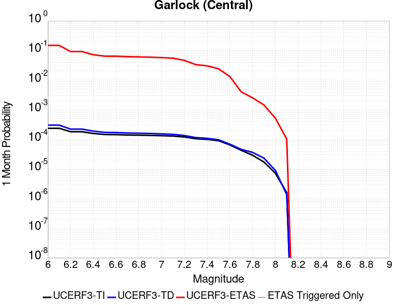 |  |  |

| Magnitude | 1 wk TI Prob | 1 wk TD Prob | 1 wk ETAS Prob | 1 wk ETAS/TD Gain | 1 wk ETAS Triggered Only | 1 mo TI Prob | 1 mo TD Prob | 1 mo ETAS Prob | 1 mo ETAS/TD Gain | 1 mo ETAS Triggered Only | 1 yr TI Prob | 1 yr TD Prob | 1 yr ETAS Prob | 1 yr ETAS/TD Gain | 1 yr ETAS Triggered Only | 10 yr TI Prob | 10 yr TD Prob | 10 yr ETAS Prob | 10 yr ETAS/TD Gain | 10 yr ETAS Triggered Only |
|-----|-----|-----|-----|-----|-----|-----|-----|-----|-----|-----|-----|-----|-----|-----|-----|-----|-----|-----|-----|-----|
| 6.0 | 5.5131142E-5 | 7.024681E-5 | 0.12913118 | 1838.2498 | 0.12907 | 2.3625491E-4 | 3.010234E-4 | 0.14865635 | 493.83655 | 0.1484 | 0.0028726095 | 0.0036588663 | 0.1752288 | 47.89156 | 0.1722 | 0.028357591 | 0.036079824 | 0.21488702 | 5.9558773 | 0.1855 |
| 6.1 | 5.5131142E-5 | 7.024681E-5 | 0.12913118 | 1838.2498 | 0.12907 | 2.3625491E-4 | 3.010234E-4 | 0.14865635 | 493.83655 | 0.1484 | 0.0028726095 | 0.0036588663 | 0.1752288 | 47.89156 | 0.1722 | 0.028357591 | 0.036079824 | 0.21488702 | 5.9558773 | 0.1855 |
| 6.2 | 4.216245E-5 | 5.1661493E-5 | 0.079487555 | 1538.6229 | 0.07944 | 1.806837E-4 | 2.2138779E-4 | 0.09226101 | 416.73938 | 0.09206 | 0.0021976046 | 0.0026920962 | 0.11041132 | 41.01314 | 0.10801 | 0.021759989 | 0.026689773 | 0.1404016 | 5.260502 | 0.11683 |
| 6.3 | 4.216245E-5 | 5.1661493E-5 | 0.079487555 | 1538.6229 | 0.07944 | 1.806837E-4 | 2.2138779E-4 | 0.09226101 | 416.73938 | 0.09206 | 0.0021976046 | 0.0026920962 | 0.11041132 | 41.01314 | 0.10801 | 0.021759989 | 0.026689773 | 0.1404016 | 5.260502 | 0.11683 |
| 6.4 | 3.6858168E-5 | 4.411054E-5 | 0.0614514 | 1393.1228 | 0.06141 | 1.5795401E-4 | 1.8903162E-4 | 0.07183549 | 380.01834 | 0.07166 | 0.0019213937 | 0.002299056 | 0.08667462 | 37.700092 | 0.08457 | 0.019048655 | 0.02284894 | 0.112580724 | 4.927175 | 0.09183 |
| 6.5 | 3.39199E-5 | 4.0018083E-5 | 0.055117816 | 1377.3226 | 0.05508 | 1.453629E-4 | 1.7149492E-4 | 0.064430475 | 375.699 | 0.06427 | 0.0017683565 | 0.002085973 | 0.07796735 | 37.376972 | 0.07604 | 0.017543508 | 0.020759864 | 0.10160593 | 4.894345 | 0.08256 |
| 6.6 | 3.3571985E-5 | 3.9472274E-5 | 0.055027302 | 1394.0748 | 0.05499 | 1.4387199E-4 | 1.6915603E-4 | 0.0643183 | 380.23062 | 0.06416 | 0.0017502342 | 0.0020575512 | 0.077761464 | 37.793213 | 0.07586 | 0.017365133 | 0.020481179 | 0.101124965 | 4.937458 | 0.08233 |
| 6.7 | 3.2580007E-5 | 3.8088703E-5 | 0.05283608 | 1387.185 | 0.0528 | 1.3962112E-4 | 1.632272E-4 | 0.06182316 | 378.75525 | 0.06167 | 0.0016985617 | 0.0019855013 | 0.07484056 | 37.693535 | 0.073 | 0.016856372 | 0.019773813 | 0.09746654 | 4.9290714 | 0.07926 |
| 6.8 | 3.2185937E-5 | 3.7515918E-5 | 0.05185557 | 1382.2285 | 0.05182 | 1.3793244E-4 | 1.6077272E-4 | 0.060661044 | 377.3093 | 0.06051 | 0.0016780337 | 0.001955672 | 0.07334578 | 37.50413 | 0.07153 | 0.016654192 | 0.019480614 | 0.09564736 | 4.909874 | 0.07768 |
| 6.9 | 3.165394E-5 | 3.6720503E-5 | 0.05073486 | 1381.6493 | 0.0507 | 1.3565269E-4 | 1.5736422E-4 | 0.05938804 | 377.3923 | 0.05924 | 0.0016503202 | 0.001914247 | 0.07185011 | 37.5344 | 0.07007 | 0.01638118 | 0.019073246 | 0.093682535 | 4.9117246 | 0.07606 |
| 7.0 | 3.0903822E-5 | 3.5625766E-5 | 0.049183875 | 1380.5703 | 0.04915 | 1.3243823E-4 | 1.5267303E-4 | 0.05756391 | 377.04044 | 0.05742 | 0.0016112428 | 0.0018572307 | 0.069571234 | 37.459663 | 0.06784 | 0.015996104 | 0.018512413 | 0.09081861 | 4.905822 | 0.07367 |
| 7.1 | 3.0069863E-5 | 3.4392073E-5 | 0.046982776 | 1366.0933 | 0.04695 | 1.2886449E-4 | 1.4738638E-4 | 0.055119283 | 373.97812 | 0.05498 | 0.0015677959 | 0.0017929734 | 0.06672634 | 37.215466 | 0.06505 | 0.01556781 | 0.017880075 | 0.08727667 | 4.881225 | 0.07066 |
| 7.2 | 2.7957109E-5 | 3.128145E-5 | 0.039340053 | 1257.6158 | 0.03931 | 1.1981068E-4 | 1.340566E-4 | 0.046297867 | 345.36063 | 0.04617 | 0.0014577188 | 0.0016309366 | 0.056261692 | 34.49655 | 0.05472 | 0.014481937 | 0.016283695 | 0.07469677 | 4.5872126 | 0.05938 |
| 7.3 | 2.4519275E-5 | 2.6714795E-5 | 0.028215962 | 1056.1924 | 0.02819 | 1.0507837E-4 | 1.1448703E-4 | 0.03336068 | 291.39264 | 0.03325 | 0.0012785783 | 0.001393003 | 0.040857952 | 29.330841 | 0.03952 | 0.012712469 | 0.013928054 | 0.056417894 | 4.050666 | 0.04309 |
| 7.4 | 2.3225532E-5 | 2.51994E-5 | 0.02578455 | 1023.2208 | 0.02576 | 9.95342E-5 | 1.0799304E-4 | 0.030304732 | 280.61746 | 0.0302 | 0.0012111551 | 0.0013140367 | 0.03711693 | 28.246494 | 0.03585 | 0.012045753 | 0.013145725 | 0.05171199 | 3.9337494 | 0.03908 |
| 7.5 | 2.097765E-5 | 2.2483688E-5 | 0.020492023 | 911.41736 | 0.02047 | 8.9901114E-5 | 9.635517E-5 | 0.024194034 | 251.09221 | 0.0241 | 0.0010939965 | 0.0011725046 | 0.029728983 | 25.355108 | 0.02859 | 0.010886264 | 0.011740365 | 0.042534534 | 3.6229312 | 0.03116 |
| 7.6 | 1.511254E-5 | 1.5991332E-5 | 0.011145813 | 696.9909 | 0.01113 | 6.476642E-5 | 6.853253E-5 | 0.013207632 | 192.72063 | 0.01314 | 7.882459E-4 | 8.3407195E-4 | 0.016281176 | 19.520111 | 0.01546 | 0.007854558 | 0.008383559 | 0.025151793 | 3.0001333 | 0.01691 |
| 7.7 | 9.934069E-6 | 1.0678794E-5 | 0.0033406431 | 312.82965 | 0.00333 | 4.2573887E-5 | 4.5765457E-5 | 0.0040155835 | 87.742676 | 0.00397 | 5.182138E-4 | 5.570524E-4 | 0.005174479 | 9.289035 | 0.00462 | 0.00517007 | 0.005627684 | 0.010599545 | 1.8834649 | 0.005 |
| 7.8 | 6.7562896E-6 | 8.428449E-6 | 0.002078411 | 246.59471 | 0.00207 | 2.8955206E-5 | 3.6121426E-5 | 0.0025160317 | 69.65483 | 0.00248 | 3.5247262E-4 | 4.3968976E-4 | 0.0032984323 | 7.501726 | 0.00286 | 0.0035191406 | 0.004446654 | 0.0075428253 | 1.6962923 | 0.00311 |
| 7.9 | 3.975453E-6 | 5.37103E-6 | 0.0011953646 | 222.5578 | 0.00119 | 1.7037546E-5 | 2.3018498E-5 | 0.0014429858 | 62.688095 | 0.00142 | 2.0741238E-4 | 2.8021427E-4 | 0.0018997603 | 6.7796702 | 0.00162 | 0.002072189 | 0.0028336283 | 0.004568698 | 1.6123137 | 0.00174 |
| 8.0 | 1.6729537E-6 | 2.0775144E-6 | 4.3207663E-4 | 207.97768 | 4.3E-4 | 7.169782E-6 | 8.903603E-6 | 5.1889906E-4 | 58.279675 | 5.1E-4 | 8.7288594E-5 | 1.0839601E-4 | 6.883331E-4 | 6.3501706 | 5.8E-4 | 8.7254314E-4 | 0.0010969337 | 0.0017362317 | 1.5828046 | 6.4E-4 |
| 8.1 | 3.6733252E-7 | 3.1489964E-7 | 9.031487E-5 | 286.80524 | 9.0E-5 | 1.5742813E-6 | 1.3495693E-6 | 1.0134943E-4 | 75.09761 | 1.0E-4 | 1.9166706E-5 | 1.6430899E-5 | 1.16429255E-4 | 7.0859942 | 1.0E-4 | 1.9165053E-4 | 1.6638759E-4 | 2.6637095E-4 | 1.6009064 | 1.0E-4 |

## Little Lake
*[(top)](#table-of-contents)*

| 1 Week | 1 Month | 1 Year | 10 Year |
|-----|-----|-----|-----|
|  |  |  |  |

| Magnitude | 1 wk TI Prob | 1 wk TD Prob | 1 wk ETAS Prob | 1 wk ETAS/TD Gain | 1 wk ETAS Triggered Only | 1 mo TI Prob | 1 mo TD Prob | 1 mo ETAS Prob | 1 mo ETAS/TD Gain | 1 mo ETAS Triggered Only | 1 yr TI Prob | 1 yr TD Prob | 1 yr ETAS Prob | 1 yr ETAS/TD Gain | 1 yr ETAS Triggered Only | 10 yr TI Prob | 10 yr TD Prob | 10 yr ETAS Prob | 10 yr ETAS/TD Gain | 10 yr ETAS Triggered Only |
|-----|-----|-----|-----|-----|-----|-----|-----|-----|-----|-----|-----|-----|-----|-----|-----|-----|-----|-----|-----|-----|
| 6.0 | 2.8424427E-5 | 3.120572E-5 | 0.058689374 | 1880.7249 | 0.05866 | 1.2181328E-4 | 1.337327E-4 | 0.06772469 | 506.41833 | 0.0676 | 0.0014820677 | 0.0016271127 | 0.08007926 | 49.215553 | 0.07858 | 0.014722223 | 0.016165402 | 0.09991924 | 6.1810555 | 0.08513 |
| 6.1 | 2.8424427E-5 | 3.120572E-5 | 0.058689374 | 1880.7249 | 0.05866 | 1.2181328E-4 | 1.337327E-4 | 0.06772469 | 506.41833 | 0.0676 | 0.0014820677 | 0.0016271127 | 0.08007926 | 49.215553 | 0.07858 | 0.014722223 | 0.016165402 | 0.09991924 | 6.1810555 | 0.08513 |
| 6.2 | 2.8424427E-5 | 3.120572E-5 | 0.058689374 | 1880.7249 | 0.05866 | 1.2181328E-4 | 1.337327E-4 | 0.06772469 | 506.41833 | 0.0676 | 0.0014820677 | 0.0016271127 | 0.08007926 | 49.215553 | 0.07858 | 0.014722223 | 0.016165402 | 0.09991924 | 6.1810555 | 0.08513 |
| 6.3 | 1.48860645E-5 | 1.6081389E-5 | 0.040195435 | 2499.5002 | 0.04018 | 6.379586E-5 | 6.8918576E-5 | 0.046255734 | 671.165 | 0.04619 | 7.7643775E-4 | 8.3878887E-4 | 0.054184005 | 64.59791 | 0.05339 | 0.007737305 | 0.008359048 | 0.065408155 | 7.824833 | 0.05753 |
| 6.4 | 1.48860645E-5 | 1.6081389E-5 | 0.040195435 | 2499.5002 | 0.04018 | 6.379586E-5 | 6.8918576E-5 | 0.046255734 | 671.165 | 0.04619 | 7.7643775E-4 | 8.3878887E-4 | 0.054184005 | 64.59791 | 0.05339 | 0.007737305 | 0.008359048 | 0.065408155 | 7.824833 | 0.05753 |
| 6.5 | 1.2797581E-5 | 1.3765565E-5 | 0.037253253 | 2706.264 | 0.03724 | 5.4845623E-5 | 5.899409E-5 | 0.04285647 | 726.4536 | 0.0428 | 6.675408E-4 | 7.18042E-4 | 0.05015252 | 69.84622 | 0.04947 | 0.006655392 | 0.00715977 | 0.0599888 | 8.3785925 | 0.05321 |
| 6.6 | 9.661896E-6 | 1.0289038E-5 | 0.032619953 | 3170.36 | 0.03261 | 4.1407468E-5 | 4.409522E-5 | 0.037522443 | 850.9412 | 0.03748 | 5.040193E-4 | 5.367433E-4 | 0.043623604 | 81.27461 | 0.04311 | 0.005028777 | 0.0053560743 | 0.051427983 | 9.601805 | 0.04632 |
| 6.7 | 7.767871E-6 | 8.199687E-6 | 0.028707964 | 3501.105 | 0.0287 | 3.329045E-5 | 3.5141118E-5 | 0.032913987 | 936.62317 | 0.03288 | 4.0523586E-4 | 4.2777284E-4 | 0.038051672 | 88.95299 | 0.03764 | 0.004044977 | 0.004270846 | 0.044488348 | 10.416753 | 0.04039 |
| 6.8 | 6.4235196E-6 | 6.7357446E-6 | 0.022336585 | 3316.1272 | 0.02233 | 2.752908E-5 | 2.8867229E-5 | 0.025658127 | 888.83234 | 0.02563 | 3.35115E-4 | 3.5141467E-4 | 0.029661112 | 84.40488 | 0.02932 | 0.003346101 | 0.00350985 | 0.034889325 | 9.940403 | 0.03149 |
| 6.9 | 3.1283696E-6 | 3.1121804E-6 | 0.014103068 | 4531.5713 | 0.0141 | 1.3407229E-5 | 1.3337856E-5 | 0.016173122 | 1212.5729 | 0.01616 | 1.6322079E-4 | 1.6237781E-4 | 0.01855939 | 114.29758 | 0.0184 | 0.0016310095 | 0.00162274 | 0.021210901 | 13.071042 | 0.01962 |
| 7.0 | 2.290603E-6 | 2.2286815E-6 | 0.008772209 | 3936.0532 | 0.00877 | 9.816834E-6 | 9.551463E-6 | 0.010099455 | 1057.3726 | 0.01009 | 1.19513395E-4 | 1.162839E-4 | 0.011454965 | 98.508606 | 0.01134 | 0.0011944914 | 0.0011623327 | 0.013188338 | 11.34644 | 0.01204 |
| 7.1 | 1.293693E-6 | 1.1776827E-6 | 0.003961173 | 3363.5315 | 0.00396 | 5.5443866E-6 | 5.0472063E-6 | 0.004625024 | 916.3533 | 0.00462 | 6.750081E-5 | 6.14487E-5 | 0.005281128 | 85.94369 | 0.00522 | 6.7480316E-4 | 6.143856E-4 | 0.0061309943 | 9.979066 | 0.00552 |
| 7.2 | 4.715842E-7 | 3.0917857E-7 | 2.0030912E-4 | 647.8752 | 2.0E-4 | 2.0210737E-6 | 1.3250503E-6 | 2.2132476E-4 | 167.0312 | 2.2E-4 | 2.4606294E-5 | 1.6132375E-5 | 2.9612787E-4 | 18.356123 | 2.8E-4 | 2.460357E-4 | 1.6131258E-4 | 4.7126258E-4 | 2.9214249 | 3.1E-4 |
| 7.3 | 3.9430947E-7 | 2.3097488E-7 | 1.2023095E-4 | 520.5369 | 1.2E-4 | 1.6898966E-6 | 9.89892E-7 | 1.3098976E-4 | 132.32733 | 1.3E-4 | 2.0574296E-5 | 1.2051869E-5 | 2.0204957E-4 | 16.765 | 1.9E-4 | 2.0572392E-4 | 1.20512224E-4 | 3.404857E-4 | 2.825321 | 2.2E-4 |
| 7.4 | 3.547123E-7 | 1.9679135E-7 | 1.0019677E-4 | 509.1523 | 1.0E-4 | 1.5201948E-6 | 8.4339126E-7 | 1.108433E-4 | 131.42572 | 1.1E-4 | 1.8508214E-5 | 1.0268241E-5 | 1.8026649E-4 | 17.555733 | 1.7E-4 | 1.8506673E-4 | 1.02677724E-4 | 3.026572E-4 | 2.947642 | 2.0E-4 |
| 7.5 | 2.6354266E-7 | 1.4423138E-7 | 9.014422E-5 | 624.99725 | 9.0E-5 | 1.129468E-6 | 6.181344E-7 | 1.00618076E-4 | 162.77702 | 1.0E-4 | 1.3751187E-5 | 7.5257603E-6 | 1.5752463E-4 | 20.93139 | 1.5E-4 | 1.3750336E-4 | 7.5255106E-5 | 2.5524155E-4 | 3.3916843 | 1.8E-4 |
| 7.6 | 1.269913E-7 | 7.572556E-8 | 3.0075724E-5 | 397.1674 | 3.0E-5 | 5.4424834E-7 | 3.245381E-7 | 4.0324525E-5 | 124.25206 | 4.0E-5 | 6.6262032E-6 | 3.9512443E-6 | 7.395097E-5 | 18.715868 | 7.0E-5 | 6.626006E-5 | 3.9511775E-5 | 1.3950783E-4 | 3.530791 | 1.0E-4 |

## Owl Lake
*[(top)](#table-of-contents)*

| 1 Week | 1 Month | 1 Year | 10 Year |
|-----|-----|-----|-----|
|  |  |  |  |

| Magnitude | 1 wk TI Prob | 1 wk TD Prob | 1 wk ETAS Prob | 1 wk ETAS/TD Gain | 1 wk ETAS Triggered Only | 1 mo TI Prob | 1 mo TD Prob | 1 mo ETAS Prob | 1 mo ETAS/TD Gain | 1 mo ETAS Triggered Only | 1 yr TI Prob | 1 yr TD Prob | 1 yr ETAS Prob | 1 yr ETAS/TD Gain | 1 yr ETAS Triggered Only | 10 yr TI Prob | 10 yr TD Prob | 10 yr ETAS Prob | 10 yr ETAS/TD Gain | 10 yr ETAS Triggered Only |
|-----|-----|-----|-----|-----|-----|-----|-----|-----|-----|-----|-----|-----|-----|-----|-----|-----|-----|-----|-----|-----|
| 6.0 | 5.0320643E-5 | 6.635816E-5 | 0.037163895 | 560.0502 | 0.0371 | 2.1564208E-4 | 2.843674E-4 | 0.045781426 | 160.99394 | 0.04551 | 0.0026222812 | 0.0034577388 | 0.059672687 | 17.257719 | 0.05641 | 0.02591553 | 0.034140717 | 0.0946518 | 2.7724023 | 0.06265 |
| 6.1 | 5.0320643E-5 | 6.635816E-5 | 0.037163895 | 560.0502 | 0.0371 | 2.1564208E-4 | 2.843674E-4 | 0.045781426 | 160.99394 | 0.04551 | 0.0026222812 | 0.0034577388 | 0.059672687 | 17.257719 | 0.05641 | 0.02591553 | 0.034140717 | 0.0946518 | 2.7724023 | 0.06265 |
| 6.2 | 2.4125871E-5 | 3.0981035E-5 | 0.02815011 | 908.6239 | 0.02812 | 1.0339249E-4 | 1.3277028E-4 | 0.033978276 | 255.91779 | 0.03385 | 0.0012580766 | 0.001615439 | 0.04349767 | 26.926224 | 0.04195 | 0.012509781 | 0.016070465 | 0.061911743 | 3.8525174 | 0.04659 |
| 6.3 | 1.7433485E-5 | 2.2355514E-5 | 0.024681805 | 1104.059 | 0.02466 | 7.471279E-5 | 9.580672E-5 | 0.029343005 | 306.27292 | 0.02925 | 9.0924866E-4 | 0.0011659743 | 0.037044093 | 31.770933 | 0.03592 | 0.009055373 | 0.011628896 | 0.05065967 | 4.3563614 | 0.03949 |
| 6.4 | 1.7433485E-5 | 2.2355514E-5 | 0.024681805 | 1104.059 | 0.02466 | 7.471279E-5 | 9.580672E-5 | 0.029343005 | 306.27292 | 0.02925 | 9.0924866E-4 | 0.0011659743 | 0.037044093 | 31.770933 | 0.03592 | 0.009055373 | 0.011628896 | 0.05065967 | 4.3563614 | 0.03949 |
| 6.5 | 1.5182742E-5 | 1.9429144E-5 | 0.023328977 | 1200.7207 | 0.02331 | 6.506727E-5 | 8.326596E-5 | 0.027650971 | 332.08014 | 0.02757 | 7.919061E-4 | 0.0010134429 | 0.03469927 | 34.239 | 0.03372 | 0.0078909 | 0.010118429 | 0.046674754 | 4.6128464 | 0.03693 |
| 6.6 | 6.7271576E-6 | 8.547361E-6 | 0.018008394 | 2106.8953 | 0.018 | 2.8830356E-5 | 3.6631063E-5 | 0.020745872 | 566.34644 | 0.02071 | 3.5095305E-4 | 4.458976E-4 | 0.02496496 | 55.9881 | 0.02453 | 0.0035039932 | 0.004467813 | 0.03067022 | 6.864706 | 0.02632 |
| 6.7 | 6.682835E-6 | 8.479807E-6 | 0.017978327 | 2120.134 | 0.01797 | 2.8640408E-5 | 3.6341557E-5 | 0.02071559 | 570.02484 | 0.02068 | 3.4864116E-4 | 4.4237426E-4 | 0.024931537 | 56.358467 | 0.0245 | 0.003480947 | 0.0044327388 | 0.030596247 | 6.902334 | 0.02628 |
| 6.8 | 6.5774975E-6 | 8.32628E-6 | 0.017938176 | 2154.4045 | 0.01793 | 2.8188972E-5 | 3.5683603E-5 | 0.020644948 | 578.5556 | 0.02061 | 3.4314668E-4 | 4.343669E-4 | 0.02484376 | 57.19533 | 0.02442 | 0.0034261728 | 0.004352885 | 0.030418927 | 6.988222 | 0.02618 |
| 6.9 | 6.363419E-6 | 7.999454E-6 | 0.017847857 | 2231.1343 | 0.01784 | 2.727151E-5 | 3.428296E-5 | 0.02053358 | 598.9442 | 0.0205 | 3.3198006E-4 | 4.1732067E-4 | 0.024647204 | 59.06059 | 0.02424 | 0.0033148455 | 0.0041828766 | 0.030054206 | 7.1850567 | 0.02598 |
| 7.0 | 6.1342453E-6 | 7.6316555E-6 | 0.017687496 | 2317.6487 | 0.01768 | 2.6289357E-5 | 3.2706717E-5 | 0.020332042 | 621.64734 | 0.0203 | 3.2002592E-4 | 3.9813702E-4 | 0.024348598 | 61.156326 | 0.02396 | 0.0031956544 | 0.003991571 | 0.029579027 | 7.4103727 | 0.02569 |
| 7.1 | 5.842926E-6 | 7.142211E-6 | 0.016797023 | 2351.796 | 0.01679 | 2.504087E-5 | 3.0609146E-5 | 0.01931002 | 630.8578 | 0.01928 | 3.0482994E-4 | 3.7260808E-4 | 0.023164112 | 62.167503 | 0.0228 | 0.0030441214 | 0.0037370329 | 0.0280857 | 7.5155077 | 0.02444 |
| 7.2 | 4.77173E-6 | 5.358483E-6 | 0.0109853 | 2050.0764 | 0.01098 | 2.045011E-5 | 2.2964748E-5 | 0.012612675 | 549.219 | 0.01259 | 2.4895166E-4 | 2.79564E-4 | 0.015135409 | 54.139336 | 0.01486 | 0.0024867293 | 0.002808645 | 0.01852438 | 6.5954866 | 0.01576 |
| 7.3 | 3.0494948E-6 | 2.710463E-6 | 0.0028827027 | 1063.5463 | 0.00288 | 1.3069198E-5 | 1.1616219E-5 | 0.0033715772 | 290.24738 | 0.00336 | 1.5910587E-4 | 1.4141845E-4 | 0.0041708485 | 29.492958 | 0.00403 | 0.0015899199 | 0.0014232415 | 0.0056771785 | 3.9889076 | 0.00426 |
| 7.4 | 2.7263884E-6 | 2.3056762E-6 | 0.0019523011 | 846.73694 | 0.00195 | 1.1684469E-5 | 9.881433E-6 | 0.0021998598 | 222.6256 | 0.00219 | 1.4224913E-4 | 1.20299905E-4 | 0.0027299859 | 22.693167 | 0.00261 | 0.0014215811 | 0.0012112238 | 0.003957893 | 3.267681 | 0.00275 |
| 7.5 | 2.6090431E-6 | 2.1656133E-6 | 0.001672162 | 772.1425 | 0.00167 | 1.1181565E-5 | 9.281167E-6 | 0.001869264 | 201.40398 | 0.00186 | 1.3612706E-4 | 1.1299244E-4 | 0.0023327416 | 20.645111 | 0.00222 | 0.001360437 | 0.0011379806 | 0.0034753177 | 3.053934 | 0.00234 |
| 7.6 | 2.3008756E-6 | 1.8727933E-6 | 0.0011618707 | 620.3945 | 0.00116 | 9.860858E-6 | 8.0262325E-6 | 0.0013580153 | 169.19711 | 0.00135 | 1.20049335E-4 | 9.7715085E-5 | 0.0017075578 | 17.474863 | 0.00161 | 0.001199845 | 9.849932E-4 | 0.0026833187 | 2.7242002 | 0.0017 |
| 7.7 | 1.7184348E-6 | 1.3419171E-6 | 7.7134086E-4 | 574.8052 | 7.7E-4 | 7.3646997E-6 | 5.7510606E-6 | 9.1574586E-4 | 159.23077 | 9.1E-4 | 8.966153E-5 | 7.0016955E-5 | 0.0010699469 | 15.281255 | 0.001 | 8.962536E-4 | 7.078345E-4 | 0.0017570913 | 2.4823477 | 0.00105 |
| 7.8 | 8.4612907E-7 | 8.4058576E-7 | 2.7084036E-4 | 322.2043 | 2.7E-4 | 3.6262625E-6 | 3.6025056E-6 | 3.136014E-4 | 87.05091 | 3.1E-4 | 4.4148852E-5 | 4.3859643E-5 | 3.7384516E-4 | 8.523671 | 3.3E-4 | 4.414008E-4 | 4.4398365E-4 | 8.2381495E-4 | 1.8555074 | 3.8E-4 |
| 7.9 | 2.716738E-7 | 3.768106E-7 | 7.037679E-5 | 186.76967 | 7.0E-5 | 1.1643157E-6 | 1.6149015E-6 | 1.0161474E-4 | 62.92318 | 1.0E-4 | 1.4175452E-5 | 1.966126E-5 | 1.2965909E-4 | 6.5946484 | 1.1E-4 | 1.4174548E-4 | 1.9836679E-4 | 3.28341E-4 | 1.6552217 | 1.3E-4 |
| 8.0 | 2.1995428E-8 | 3.384878E-8 | 3.384878E-8 | 1.0 | 0.0 | 9.426611E-8 | 1.4506621E-7 | 1.4506621E-7 | 1.0 | 0.0 | 1.1476893E-6 | 1.7661803E-6 | 1.1766163E-5 | 6.6619263 | 1.0E-5 | 1.14768345E-5 | 1.7963059E-5 | 3.7962698E-5 | 2.1133761 | 2.0E-5 |

## Airport Lake
*[(top)](#table-of-contents)*

| 1 Week | 1 Month | 1 Year | 10 Year |
|-----|-----|-----|-----|
|  | 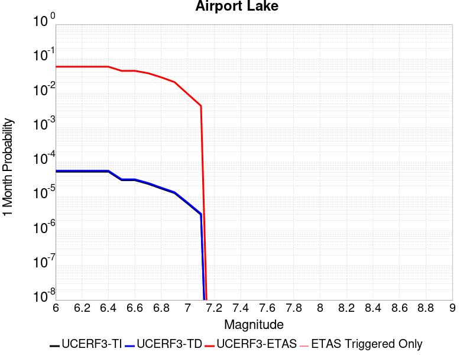 |  |  |

| Magnitude | 1 wk TI Prob | 1 wk TD Prob | 1 wk ETAS Prob | 1 wk ETAS/TD Gain | 1 wk ETAS Triggered Only | 1 mo TI Prob | 1 mo TD Prob | 1 mo ETAS Prob | 1 mo ETAS/TD Gain | 1 mo ETAS Triggered Only | 1 yr TI Prob | 1 yr TD Prob | 1 yr ETAS Prob | 1 yr ETAS/TD Gain | 1 yr ETAS Triggered Only | 10 yr TI Prob | 10 yr TD Prob | 10 yr ETAS Prob | 10 yr ETAS/TD Gain | 10 yr ETAS Triggered Only |
|-----|-----|-----|-----|-----|-----|-----|-----|-----|-----|-----|-----|-----|-----|-----|-----|-----|-----|-----|-----|-----|
| 6.0 | 1.2387061E-5 | 1.3103157E-5 | 0.052002423 | 3968.694 | 0.05199 | 5.3086325E-5 | 5.615534E-5 | 0.05875286 | 1046.256 | 0.0587 | 6.461343E-4 | 6.8350515E-4 | 0.06702813 | 98.065285 | 0.06639 | 0.0064425888 | 0.0068168393 | 0.077303044 | 11.3400135 | 0.07097 |
| 6.1 | 1.2387061E-5 | 1.3103157E-5 | 0.052002423 | 3968.694 | 0.05199 | 5.3086325E-5 | 5.615534E-5 | 0.05875286 | 1046.256 | 0.0587 | 6.461343E-4 | 6.8350515E-4 | 0.06702813 | 98.065285 | 0.06639 | 0.0064425888 | 0.0068168393 | 0.077303044 | 11.3400135 | 0.07097 |
| 6.2 | 1.2387061E-5 | 1.3103157E-5 | 0.052002423 | 3968.694 | 0.05199 | 5.3086325E-5 | 5.615534E-5 | 0.05875286 | 1046.256 | 0.0587 | 6.461343E-4 | 6.8350515E-4 | 0.06702813 | 98.065285 | 0.06639 | 0.0064425888 | 0.0068168393 | 0.077303044 | 11.3400135 | 0.07097 |
| 6.3 | 1.2387061E-5 | 1.3103157E-5 | 0.052002423 | 3968.694 | 0.05199 | 5.3086325E-5 | 5.615534E-5 | 0.05875286 | 1046.256 | 0.0587 | 6.461343E-4 | 6.8350515E-4 | 0.06702813 | 98.065285 | 0.06639 | 0.0064425888 | 0.0068168393 | 0.077303044 | 11.3400135 | 0.07097 |
| 6.4 | 1.2387061E-5 | 1.3103157E-5 | 0.052002423 | 3968.694 | 0.05199 | 5.3086325E-5 | 5.615534E-5 | 0.05875286 | 1046.256 | 0.0587 | 6.461343E-4 | 6.8350515E-4 | 0.06702813 | 98.065285 | 0.06639 | 0.0064425888 | 0.0068168393 | 0.077303044 | 11.3400135 | 0.07097 |
| 6.5 | 6.9922594E-6 | 7.384925E-6 | 0.039367095 | 5330.737 | 0.03936 | 2.996648E-5 | 3.1649324E-5 | 0.044600237 | 1409.2003 | 0.04457 | 3.6478083E-4 | 3.8526783E-4 | 0.05086581 | 132.02715 | 0.0505 | 0.003641826 | 0.0038465366 | 0.0576189 | 14.9794235 | 0.05398 |
| 6.6 | 6.9922594E-6 | 7.384925E-6 | 0.039367095 | 5330.737 | 0.03936 | 2.996648E-5 | 3.1649324E-5 | 0.044600237 | 1409.2003 | 0.04457 | 3.6478083E-4 | 3.8526783E-4 | 0.05086581 | 132.02715 | 0.0505 | 0.003641826 | 0.0038465366 | 0.0576189 | 14.9794235 | 0.05398 |
| 6.7 | 5.477277E-6 | 5.7860684E-6 | 0.033615593 | 5809.7466 | 0.03361 | 2.3473833E-5 | 2.4797222E-5 | 0.038123854 | 1537.4243 | 0.0381 | 2.8575645E-4 | 3.0186825E-4 | 0.04350882 | 144.13182 | 0.04322 | 0.0028538927 | 0.003014966 | 0.049175374 | 16.310425 | 0.0463 |
| 6.8 | 3.9950432E-6 | 4.2190873E-6 | 0.025354112 | 6009.3833 | 0.02535 | 1.7121502E-5 | 1.8081691E-5 | 0.02889756 | 1598.1667 | 0.02888 | 2.0843433E-4 | 2.2012512E-4 | 0.03295292 | 149.70085 | 0.03274 | 0.0020823893 | 0.0021993418 | 0.037172254 | 16.901537 | 0.03505 |
| 6.9 | 2.95695E-6 | 3.1230243E-6 | 0.018423066 | 5899.1104 | 0.01842 | 1.2672582E-5 | 1.3384334E-5 | 0.020973103 | 1566.989 | 0.02096 | 1.5427776E-4 | 1.6294434E-4 | 0.023919072 | 146.7929 | 0.02376 | 0.001541707 | 0.0016284712 | 0.02696714 | 16.55979 | 0.02538 |
| 7.0 | 1.456072E-6 | 1.540812E-6 | 0.0082215285 | 5335.8413 | 0.00822 | 6.2402937E-6 | 6.603469E-6 | 0.009486541 | 1436.5996 | 0.00948 | 7.597293E-5 | 8.039528E-5 | 0.010709541 | 133.21107 | 0.01063 | 7.594696E-4 | 8.0376083E-4 | 0.012064703 | 15.010314 | 0.01127 |
| 7.1 | 6.995192E-7 | 7.4089746E-7 | 0.0036507382 | 4927.454 | 0.00365 | 2.997936E-6 | 3.1752747E-6 | 0.0042931614 | 1352.0599 | 0.00429 | 3.649926E-5 | 3.865897E-5 | 0.0048684725 | 125.93383 | 0.00483 | 3.6493264E-4 | 3.865897E-4 | 0.0054846182 | 14.187181 | 0.0051 |

## Panamint Valley
*[(top)](#table-of-contents)*

| 1 Week | 1 Month | 1 Year | 10 Year |
|-----|-----|-----|-----|
| 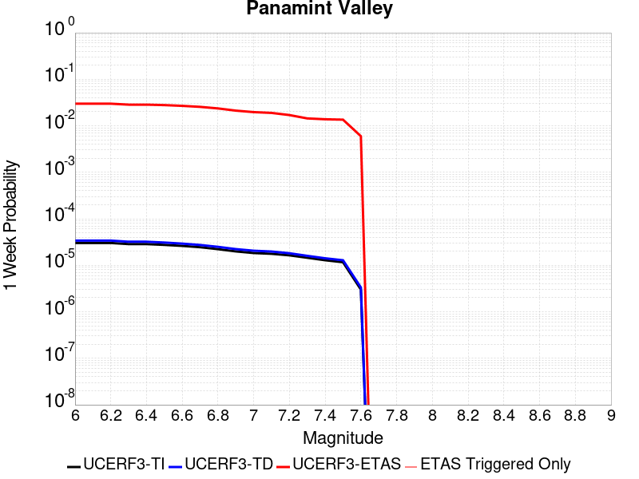 |  |  |  |

| Magnitude | 1 wk TI Prob | 1 wk TD Prob | 1 wk ETAS Prob | 1 wk ETAS/TD Gain | 1 wk ETAS Triggered Only | 1 mo TI Prob | 1 mo TD Prob | 1 mo ETAS Prob | 1 mo ETAS/TD Gain | 1 mo ETAS Triggered Only | 1 yr TI Prob | 1 yr TD Prob | 1 yr ETAS Prob | 1 yr ETAS/TD Gain | 1 yr ETAS Triggered Only | 10 yr TI Prob | 10 yr TD Prob | 10 yr ETAS Prob | 10 yr ETAS/TD Gain | 10 yr ETAS Triggered Only |
|-----|-----|-----|-----|-----|-----|-----|-----|-----|-----|-----|-----|-----|-----|-----|-----|-----|-----|-----|-----|-----|
| 6.0 | 3.0211835E-5 | 3.3984514E-5 | 0.02986297 | 878.72296 | 0.02983 | 1.2947287E-4 | 1.4563995E-4 | 0.03687029 | 253.16057 | 0.03673 | 0.0015751923 | 0.0017717537 | 0.047530536 | 26.82683 | 0.04584 | 0.015640736 | 0.017583137 | 0.06863934 | 3.9037027 | 0.05197 |
| 6.1 | 3.0211835E-5 | 3.3984514E-5 | 0.02986297 | 878.72296 | 0.02983 | 1.2947287E-4 | 1.4563995E-4 | 0.03687029 | 253.16057 | 0.03673 | 0.0015751923 | 0.0017717537 | 0.047530536 | 26.82683 | 0.04584 | 0.015640736 | 0.017583137 | 0.06863934 | 3.9037027 | 0.05197 |
| 6.2 | 3.0211835E-5 | 3.3984514E-5 | 0.02986297 | 878.72296 | 0.02983 | 1.2947287E-4 | 1.4563995E-4 | 0.03687029 | 253.16057 | 0.03673 | 0.0015751923 | 0.0017717537 | 0.047530536 | 26.82683 | 0.04584 | 0.015640736 | 0.017583137 | 0.06863934 | 3.9037027 | 0.05197 |
| 6.3 | 2.8573924E-5 | 3.210268E-5 | 0.02849119 | 887.5019 | 0.02846 | 1.2245393E-4 | 1.3757581E-4 | 0.03508277 | 255.00679 | 0.03495 | 0.001489857 | 0.0016737265 | 0.045080952 | 26.93448 | 0.04348 | 0.01479908 | 0.016617801 | 0.065019876 | 3.9126642 | 0.04922 |
| 6.4 | 2.8573924E-5 | 3.210268E-5 | 0.02849119 | 887.5019 | 0.02846 | 1.2245393E-4 | 1.3757581E-4 | 0.03508277 | 255.00679 | 0.03495 | 0.001489857 | 0.0016737265 | 0.045080952 | 26.93448 | 0.04348 | 0.01479908 | 0.016617801 | 0.065019876 | 3.9126642 | 0.04922 |
| 6.5 | 2.7468774E-5 | 3.0828433E-5 | 0.02785997 | 903.7102 | 0.02783 | 1.1771801E-4 | 1.3211532E-4 | 0.034207612 | 258.92236 | 0.03408 | 0.0014322745 | 0.0016073446 | 0.043729533 | 27.20607 | 0.04219 | 0.014230782 | 0.015963677 | 0.06290221 | 3.9403336 | 0.0477 |
| 6.6 | 2.6135967E-5 | 2.925248E-5 | 0.026828468 | 917.1348 | 0.0268 | 1.1200648E-4 | 1.253619E-4 | 0.032871258 | 262.2109 | 0.03275 | 0.0013628257 | 0.0015252391 | 0.041873604 | 27.453798 | 0.04041 | 0.013544982 | 0.015154043 | 0.060102414 | 3.9660974 | 0.04564 |
| 6.7 | 2.4498746E-5 | 2.7341335E-5 | 0.025526645 | 933.6283 | 0.0255 | 1.04990395E-4 | 1.1717203E-4 | 0.031163534 | 265.96393 | 0.03105 | 0.0012775084 | 0.0014256609 | 0.03948133 | 27.69335 | 0.03811 | 0.012701893 | 0.014171274 | 0.05644361 | 3.9829593 | 0.04288 |
| 6.8 | 2.2244329E-5 | 2.4935423E-5 | 0.023624348 | 947.4211 | 0.0236 | 9.532935E-5 | 1.0686185E-4 | 0.02866381 | 268.2324 | 0.02856 | 0.0011600169 | 0.0013002884 | 0.036035065 | 27.713135 | 0.03478 | 0.011539802 | 0.0129325185 | 0.051457763 | 3.9789436 | 0.03903 |
| 6.9 | 1.9902658E-5 | 2.2290267E-5 | 0.021181818 | 950.2721 | 0.02116 | 8.529431E-5 | 9.552632E-5 | 0.025573092 | 267.70728 | 0.02548 | 0.0010379635 | 0.0011624309 | 0.0318667 | 27.413843 | 0.03074 | 0.010331288 | 0.011568608 | 0.045521226 | 3.9348924 | 0.03435 |
| 7.0 | 1.8353881E-5 | 2.0566185E-5 | 0.019680161 | 956.9184 | 0.01966 | 7.865712E-5 | 8.813792E-5 | 0.02366606 | 268.51166 | 0.02358 | 9.5722964E-4 | 0.0010725686 | 0.029192375 | 27.217257 | 0.02815 | 0.009531168 | 0.010678849 | 0.041674282 | 3.9025068 | 0.03133 |
| 7.1 | 1.7667631E-5 | 1.9772613E-5 | 0.018919399 | 956.84875 | 0.0189 | 7.571623E-5 | 8.473711E-5 | 0.022792812 | 268.98264 | 0.02271 | 9.2145515E-4 | 0.0010312037 | 0.028083278 | 27.233494 | 0.02708 | 0.009176437 | 0.010269073 | 0.040089667 | 3.9039228 | 0.03013 |
| 7.2 | 1.6381597E-5 | 1.8158249E-5 | 0.01700785 | 936.6459 | 0.01699 | 7.020495E-5 | 7.781885E-5 | 0.020576224 | 264.41183 | 0.0205 | 8.544101E-4 | 9.4704994E-4 | 0.025423847 | 26.845308 | 0.0245 | 0.008511325 | 0.009434792 | 0.036348447 | 3.8525968 | 0.02717 |
| 7.3 | 1.4520491E-5 | 1.5966476E-5 | 0.014405737 | 902.249 | 0.01439 | 6.222919E-5 | 6.842605E-5 | 0.01740724 | 254.39493 | 0.01734 | 7.57377E-4 | 8.327849E-4 | 0.021545522 | 25.87165 | 0.02073 | 0.0075480095 | 0.00829975 | 0.03109894 | 3.7469728 | 0.02299 |
| 7.4 | 1.2852287E-5 | 1.4145411E-5 | 0.01381395 | 976.5676 | 0.0138 | 5.5080065E-5 | 6.062187E-5 | 0.016639616 | 274.4821 | 0.01658 | 6.7039346E-4 | 7.378371E-4 | 0.020523228 | 27.81539 | 0.0198 | 0.0066837464 | 0.0073567946 | 0.029165165 | 3.964385 | 0.02197 |
| 7.5 | 1.1637851E-5 | 1.2836797E-5 | 0.013542663 | 1054.9877 | 0.01353 | 4.987555E-5 | 5.5013777E-5 | 0.016284121 | 296.0008 | 0.01623 | 6.070656E-4 | 6.6960254E-4 | 0.020006645 | 29.87839 | 0.01935 | 0.006054099 | 0.0066787465 | 0.027985487 | 4.1902304 | 0.02145 |
| 7.6 | 3.0068115E-6 | 3.3330316E-6 | 0.005973313 | 1792.1561 | 0.00597 | 1.2886271E-5 | 1.4284384E-5 | 0.0070741833 | 495.23898 | 0.00706 | 1.5687906E-4 | 1.7390578E-4 | 0.008552449 | 49.178635 | 0.00838 | 0.0015676835 | 0.0017391363 | 0.01101298 | 6.3324423 | 0.00929 |

## Garlock (East)
*[(top)](#table-of-contents)*

| 1 Week | 1 Month | 1 Year | 10 Year |
|-----|-----|-----|-----|
|  |  |  |  |

| Magnitude | 1 wk TI Prob | 1 wk TD Prob | 1 wk ETAS Prob | 1 wk ETAS/TD Gain | 1 wk ETAS Triggered Only | 1 mo TI Prob | 1 mo TD Prob | 1 mo ETAS Prob | 1 mo ETAS/TD Gain | 1 mo ETAS Triggered Only | 1 yr TI Prob | 1 yr TD Prob | 1 yr ETAS Prob | 1 yr ETAS/TD Gain | 1 yr ETAS Triggered Only | 10 yr TI Prob | 10 yr TD Prob | 10 yr ETAS Prob | 10 yr ETAS/TD Gain | 10 yr ETAS Triggered Only |
|-----|-----|-----|-----|-----|-----|-----|-----|-----|-----|-----|-----|-----|-----|-----|-----|-----|-----|-----|-----|-----|
| 6.0 | 4.5092507E-5 | 6.290325E-5 | 0.024951337 | 396.66214 | 0.02489 | 1.9323928E-4 | 2.6956003E-4 | 0.031441156 | 116.638794 | 0.03118 | 0.0023501497 | 0.0032774 | 0.042647943 | 13.012736 | 0.0395 | 0.023254504 | 0.032351844 | 0.075499274 | 2.333693 | 0.04459 |
| 6.1 | 4.5092507E-5 | 6.290325E-5 | 0.024951337 | 396.66214 | 0.02489 | 1.9323928E-4 | 2.6956003E-4 | 0.031441156 | 116.638794 | 0.03118 | 0.0023501497 | 0.0032774 | 0.042647943 | 13.012736 | 0.0395 | 0.023254504 | 0.032351844 | 0.075499274 | 2.333693 | 0.04459 |
| 6.2 | 2.6674514E-5 | 3.4509674E-5 | 0.017533906 | 508.08667 | 0.0175 | 1.1431433E-4 | 1.4789042E-4 | 0.0217147 | 146.82967 | 0.02157 | 0.0013908884 | 0.0017991117 | 0.028560877 | 15.874988 | 0.02681 | 0.01382215 | 0.017890299 | 0.04723574 | 2.6402988 | 0.02988 |
| 6.3 | 2.6674514E-5 | 3.4509674E-5 | 0.017533906 | 508.08667 | 0.0175 | 1.1431433E-4 | 1.4789042E-4 | 0.0217147 | 146.82967 | 0.02157 | 0.0013908884 | 0.0017991117 | 0.028560877 | 15.874988 | 0.02681 | 0.01382215 | 0.017890299 | 0.04723574 | 2.6402988 | 0.02988 |
| 6.4 | 2.5312667E-5 | 3.233893E-5 | 0.017251782 | 533.46796 | 0.01722 | 1.0847834E-4 | 1.3858822E-4 | 0.021315653 | 153.80566 | 0.02118 | 0.0013199237 | 0.0016860351 | 0.027911743 | 16.554663 | 0.02627 | 0.013121112 | 0.016778335 | 0.04553757 | 2.7140696 | 0.02925 |
| 6.5 | 2.5312667E-5 | 3.233893E-5 | 0.017251782 | 533.46796 | 0.01722 | 1.0847834E-4 | 1.3858822E-4 | 0.021315653 | 153.80566 | 0.02118 | 0.0013199237 | 0.0016860351 | 0.027911743 | 16.554663 | 0.02627 | 0.013121112 | 0.016778335 | 0.04553757 | 2.7140696 | 0.02925 |
| 6.6 | 2.246556E-5 | 2.8133776E-5 | 0.016347675 | 581.06934 | 0.01632 | 9.627742E-5 | 1.20567885E-4 | 0.019938178 | 165.3689 | 0.01982 | 0.0011715472 | 0.0014669491 | 0.025901053 | 17.656408 | 0.02447 | 0.011653901 | 0.01461866 | 0.041450594 | 2.8354578 | 0.02723 |
| 6.7 | 2.2241198E-5 | 2.7803519E-5 | 0.016247353 | 584.36316 | 0.01622 | 9.531594E-5 | 1.1915263E-4 | 0.019836802 | 166.4823 | 0.01972 | 0.0011598538 | 0.0014497414 | 0.02574447 | 17.757973 | 0.02433 | 0.011538187 | 0.014448853 | 0.04113758 | 2.8471172 | 0.02708 |
| 6.8 | 1.9528685E-5 | 2.389819E-5 | 0.015223535 | 637.0162 | 0.0152 | 8.369167E-5 | 1.0241691E-4 | 0.018460536 | 180.24892 | 0.01836 | 0.0010184698 | 0.0012462323 | 0.023648279 | 18.97582 | 0.02243 | 0.010138147 | 0.012436427 | 0.03702676 | 2.9772828 | 0.0249 |
| 6.9 | 1.3318621E-5 | 1.5198884E-5 | 0.013424995 | 883.28815 | 0.01341 | 5.7078556E-5 | 6.513648E-5 | 0.016014097 | 245.8545 | 0.01595 | 6.9470983E-4 | 7.927538E-4 | 0.020027494 | 25.263193 | 0.01925 | 0.0069254204 | 0.007939888 | 0.029041007 | 3.6576092 | 0.02127 |
| 7.0 | 1.1760853E-5 | 1.31077895E-5 | 0.012892939 | 983.60895 | 0.01288 | 5.0402683E-5 | 5.6175057E-5 | 0.015295319 | 272.27954 | 0.01524 | 6.134799E-4 | 6.8372174E-4 | 0.019051155 | 27.863901 | 0.01838 | 0.0061178906 | 0.00685652 | 0.026878294 | 3.920107 | 0.02016 |
| 7.1 | 1.0064758E-5 | 1.0902931E-5 | 0.012120771 | 1111.6985 | 0.01211 | 4.3133965E-5 | 4.672603E-5 | 0.014226063 | 304.45694 | 0.01418 | 5.2502943E-4 | 5.687444E-4 | 0.017589059 | 30.926123 | 0.01703 | 0.005237907 | 0.0057129986 | 0.024226623 | 4.240614 | 0.01862 |
| 7.2 | 9.768808E-6 | 1.0498807E-5 | 0.011760375 | 1120.1631 | 0.01175 | 4.186565E-5 | 4.499413E-5 | 0.013804375 | 306.8039 | 0.01376 | 5.095951E-4 | 5.4766936E-4 | 0.017068617 | 31.165916 | 0.01653 | 0.0050842804 | 0.0055032647 | 0.023414152 | 4.254593 | 0.01801 |
| 7.3 | 9.344516E-6 | 9.944468E-6 | 0.010919836 | 1098.0815 | 0.01091 | 4.004731E-5 | 4.261847E-5 | 0.012732077 | 298.74554 | 0.01269 | 4.8746695E-4 | 5.1875977E-4 | 0.01570088 | 30.266186 | 0.01519 | 0.0048639905 | 0.0052149445 | 0.021688584 | 4.1589293 | 0.01656 |
| 7.4 | 9.023491E-6 | 9.490661E-6 | 0.009929396 | 1046.2281 | 0.00992 | 3.867153E-5 | 4.0673647E-5 | 0.011490208 | 282.49762 | 0.01145 | 4.7072413E-4 | 4.950925E-4 | 0.014198305 | 28.678085 | 0.01371 | 0.004697283 | 0.0049783974 | 0.019784318 | 3.9740336 | 0.01488 |
| 7.5 | 7.081253E-6 | 7.087672E-6 | 0.0050070523 | 706.44525 | 0.005 | 3.0347876E-5 | 3.0375388E-5 | 0.0058601983 | 192.92587 | 0.00583 | 3.6942272E-4 | 3.6975832E-4 | 0.0073471772 | 19.870214 | 0.00698 | 0.003688092 | 0.0037243143 | 0.011156531 | 2.9955933 | 0.00746 |
| 7.6 | 6.116396E-6 | 5.959245E-6 | 0.003095941 | 519.519 | 0.00309 | 2.6212863E-5 | 2.5539372E-5 | 0.0036554467 | 143.12987 | 0.00363 | 3.1909486E-4 | 3.1089774E-4 | 0.004509592 | 14.505065 | 0.0042 | 0.0031863707 | 0.0031357552 | 0.0076615186 | 2.4432771 | 0.00454 |
| 7.7 | 4.797145E-6 | 4.757281E-6 | 0.0018547485 | 389.87573 | 0.00185 | 2.055903E-5 | 2.0388188E-5 | 0.0022103435 | 108.41294 | 0.00219 | 2.5027743E-4 | 2.4819805E-4 | 0.0028475528 | 11.472905 | 0.0026 | 0.0024999576 | 0.0025093474 | 0.005352196 | 2.1329036 | 0.00285 |
| 7.8 | 3.4028885E-6 | 3.978462E-6 | 0.0012139736 | 305.13644 | 0.00121 | 1.4583726E-5 | 1.7050439E-5 | 0.001447026 | 84.86738 | 0.00143 | 1.775424E-4 | 2.0756939E-4 | 0.0018672248 | 8.995666 | 0.00166 | 0.0017740062 | 0.0021012232 | 0.0038774828 | 1.8453456 | 0.00178 |
| 7.9 | 2.5928412E-6 | 3.3724489E-6 | 8.333697E-4 | 247.11113 | 8.3E-4 | 1.1112129E-5 | 1.4453272E-5 | 9.744394E-4 | 67.41998 | 9.6E-4 | 1.3528178E-4 | 1.7595445E-4 | 0.0012757609 | 7.250518 | 0.0011 | 0.0013519945 | 0.0017812408 | 0.002969121 | 1.6668836 | 0.00119 |
| 8.0 | 1.3743648E-6 | 1.6734747E-6 | 3.5167288E-4 | 210.14532 | 3.5E-4 | 5.8901214E-6 | 7.1720146E-6 | 4.27169E-4 | 59.56053 | 4.2E-4 | 7.1709874E-5 | 8.731581E-5 | 5.672739E-4 | 6.496806 | 4.8E-4 | 7.1686733E-4 | 8.837234E-4 | 0.0014032639 | 1.5878994 | 5.2E-4 |
| 8.1 | 3.6733252E-7 | 3.1489964E-7 | 9.031487E-5 | 286.80524 | 9.0E-5 | 1.5742813E-6 | 1.3495693E-6 | 1.0134943E-4 | 75.09761 | 1.0E-4 | 1.9166706E-5 | 1.6430899E-5 | 1.16429255E-4 | 7.0859942 | 1.0E-4 | 1.9165053E-4 | 1.6638759E-4 | 2.6637095E-4 | 1.6009064 | 1.0E-4 |

## Ash Hill
*[(top)](#table-of-contents)*

| 1 Week | 1 Month | 1 Year | 10 Year |
|-----|-----|-----|-----|
|  |  |  |  |

| Magnitude | 1 wk TI Prob | 1 wk TD Prob | 1 wk ETAS Prob | 1 wk ETAS/TD Gain | 1 wk ETAS Triggered Only | 1 mo TI Prob | 1 mo TD Prob | 1 mo ETAS Prob | 1 mo ETAS/TD Gain | 1 mo ETAS Triggered Only | 1 yr TI Prob | 1 yr TD Prob | 1 yr ETAS Prob | 1 yr ETAS/TD Gain | 1 yr ETAS Triggered Only | 10 yr TI Prob | 10 yr TD Prob | 10 yr ETAS Prob | 10 yr ETAS/TD Gain | 10 yr ETAS Triggered Only |
|-----|-----|-----|-----|-----|-----|-----|-----|-----|-----|-----|-----|-----|-----|-----|-----|-----|-----|-----|-----|-----|
| 6.0 | 2.1545662E-5 | 2.3194447E-5 | 0.010932941 | 471.3603 | 0.01091 | 9.2335285E-5 | 9.940143E-5 | 0.014477972 | 145.65154 | 0.01438 | 0.0011236023 | 0.0012096206 | 0.020735972 | 17.142542 | 0.01955 | 0.011179381 | 0.012038348 | 0.034099534 | 2.8325756 | 0.02233 |
| 6.1 | 2.1545662E-5 | 2.3194447E-5 | 0.010932941 | 471.3603 | 0.01091 | 9.2335285E-5 | 9.940143E-5 | 0.014477972 | 145.65154 | 0.01438 | 0.0011236023 | 0.0012096206 | 0.020735972 | 17.142542 | 0.01955 | 0.011179381 | 0.012038348 | 0.034099534 | 2.8325756 | 0.02233 |
| 6.2 | 2.1545662E-5 | 2.3194447E-5 | 0.010932941 | 471.3603 | 0.01091 | 9.2335285E-5 | 9.940143E-5 | 0.014477972 | 145.65154 | 0.01438 | 0.0011236023 | 0.0012096206 | 0.020735972 | 17.142542 | 0.01955 | 0.011179381 | 0.012038348 | 0.034099534 | 2.8325756 | 0.02233 |
| 6.3 | 1.0025529E-5 | 1.0746934E-5 | 0.004650697 | 432.7464 | 0.00464 | 4.2965847E-5 | 4.605755E-5 | 0.0062957695 | 136.69354 | 0.00625 | 5.229836E-4 | 5.6061964E-4 | 0.008985894 | 16.028503 | 0.00843 | 0.005217545 | 0.0055933665 | 0.015249055 | 2.726275 | 0.00971 |
| 6.4 | 1.0025529E-5 | 1.0746934E-5 | 0.004650697 | 432.7464 | 0.00464 | 4.2965847E-5 | 4.605755E-5 | 0.0062957695 | 136.69354 | 0.00625 | 5.229836E-4 | 5.6061964E-4 | 0.008985894 | 16.028503 | 0.00843 | 0.005217545 | 0.0055933665 | 0.015249055 | 2.726275 | 0.00971 |
| 6.5 | 6.9617327E-6 | 7.456634E-6 | 0.002917435 | 391.2536 | 0.00291 | 2.9835655E-5 | 3.195666E-5 | 0.004061828 | 127.10426 | 0.00403 | 3.6318856E-4 | 3.8901155E-4 | 0.0059368527 | 15.261378 | 0.00555 | 0.0036259557 | 0.0038841602 | 0.0104186805 | 2.6823506 | 0.00656 |
| 6.6 | 4.9919777E-6 | 5.3466883E-6 | 0.001995336 | 373.191 | 0.00199 | 2.1394015E-5 | 2.2914215E-5 | 0.0028528494 | 124.50129 | 0.00283 | 2.60441E-4 | 2.7895154E-4 | 0.0041778637 | 14.977022 | 0.0039 | 0.0026013597 | 0.0027866727 | 0.0074037705 | 2.6568496 | 0.00463 |
| 6.7 | 3.6630722E-6 | 3.924624E-6 | 0.0015339187 | 390.84476 | 0.00153 | 1.5698786E-5 | 1.681974E-5 | 0.0022767817 | 135.36368 | 0.00226 | 1.9111596E-4 | 2.0476682E-4 | 0.0031841567 | 15.5501585 | 0.00298 | 0.0019095168 | 0.0020463446 | 0.0055491617 | 2.7117436 | 0.00351 |
| 6.8 | 2.5599613E-6 | 2.744925E-6 | 0.001062742 | 387.16614 | 0.00106 | 1.0971216E-5 | 1.1763939E-5 | 0.001621745 | 137.8573 | 0.00161 | 1.3356637E-4 | 1.4322149E-4 | 0.0022629178 | 15.800127 | 0.00212 | 0.0013348613 | 0.0014317769 | 0.0039781258 | 2.7784538 | 0.00255 |
| 6.9 | 1.7684905E-6 | 1.8968707E-6 | 6.4189563E-4 | 338.39716 | 6.4E-4 | 7.579223E-6 | 8.129446E-6 | 0.0010781208 | 132.61922 | 0.00107 | 9.2273134E-5 | 9.8976E-5 | 0.0015788295 | 15.951639 | 0.00148 | 9.223483E-4 | 9.8976E-4 | 0.0027879784 | 2.8168225 | 0.0018 |

## Hunter Mountain-Saline Valley
*[(top)](#table-of-contents)*

| 1 Week | 1 Month | 1 Year | 10 Year |
|-----|-----|-----|-----|
|  |  |  |  |

| Magnitude | 1 wk TI Prob | 1 wk TD Prob | 1 wk ETAS Prob | 1 wk ETAS/TD Gain | 1 wk ETAS Triggered Only | 1 mo TI Prob | 1 mo TD Prob | 1 mo ETAS Prob | 1 mo ETAS/TD Gain | 1 mo ETAS Triggered Only | 1 yr TI Prob | 1 yr TD Prob | 1 yr ETAS Prob | 1 yr ETAS/TD Gain | 1 yr ETAS Triggered Only | 10 yr TI Prob | 10 yr TD Prob | 10 yr ETAS Prob | 10 yr ETAS/TD Gain | 10 yr ETAS Triggered Only |
|-----|-----|-----|-----|-----|-----|-----|-----|-----|-----|-----|-----|-----|-----|-----|-----|-----|-----|-----|-----|-----|
| 6.0 | 4.5103672E-5 | 5.4570177E-5 | 0.014473783 | 265.23248 | 0.01442 | 1.9328714E-4 | 2.3385242E-4 | 0.017569797 | 75.13199 | 0.01734 | 0.002350731 | 0.0028435152 | 0.023614286 | 8.30461 | 0.02083 | 0.023260195 | 0.028091887 | 0.050620716 | 1.8019693 | 0.02318 |
| 6.1 | 4.5103672E-5 | 5.4570177E-5 | 0.014473783 | 265.23248 | 0.01442 | 1.9328714E-4 | 2.3385242E-4 | 0.017569797 | 75.13199 | 0.01734 | 0.002350731 | 0.0028435152 | 0.023614286 | 8.30461 | 0.02083 | 0.023260195 | 0.028091887 | 0.050620716 | 1.8019693 | 0.02318 |
| 6.2 | 3.9363465E-5 | 4.706337E-5 | 0.01433639 | 304.61887 | 0.01429 | 1.6868966E-4 | 2.0168544E-4 | 0.01737822 | 86.16497 | 0.01718 | 0.002051862 | 0.0024528175 | 0.023052167 | 9.39824 | 0.02065 | 0.020330196 | 0.024273481 | 0.04668592 | 1.9233302 | 0.02297 |
| 6.3 | 3.9363465E-5 | 4.706337E-5 | 0.01433639 | 304.61887 | 0.01429 | 1.6868966E-4 | 2.0168544E-4 | 0.01737822 | 86.16497 | 0.01718 | 0.002051862 | 0.0024528175 | 0.023052167 | 9.39824 | 0.02065 | 0.020330196 | 0.024273481 | 0.04668592 | 1.9233302 | 0.02297 |
| 6.4 | 3.2311684E-5 | 3.795099E-5 | 0.014237412 | 375.1526 | 0.0142 | 1.384713E-4 | 1.6263737E-4 | 0.01722986 | 105.94036 | 0.01707 | 0.0016845843 | 0.0019783843 | 0.022417868 | 11.331401 | 0.02048 | 0.016718714 | 0.019616475 | 0.04194961 | 2.1384888 | 0.02278 |
| 6.5 | 3.2311684E-5 | 3.795099E-5 | 0.014237412 | 375.1526 | 0.0142 | 1.384713E-4 | 1.6263737E-4 | 0.01722986 | 105.94036 | 0.01707 | 0.0016845843 | 0.0019783843 | 0.022417868 | 11.331401 | 0.02048 | 0.016718714 | 0.019616475 | 0.04194961 | 2.1384888 | 0.02278 |
| 6.6 | 2.9305844E-5 | 3.418183E-5 | 0.014183698 | 414.94846 | 0.01415 | 1.2559042E-4 | 1.4648569E-4 | 0.017153993 | 117.103546 | 0.01701 | 0.0015279909 | 0.001782067 | 0.022155695 | 12.432582 | 0.02041 | 0.015175272 | 0.01768569 | 0.040003873 | 2.2619343 | 0.02272 |
| 6.7 | 2.7826512E-5 | 3.2344276E-5 | 0.014131888 | 436.92084 | 0.0141 | 1.19251024E-4 | 1.386113E-4 | 0.01709626 | 123.33959 | 0.01696 | 0.0014509142 | 0.0016863465 | 0.02200203 | 13.047158 | 0.02035 | 0.014414776 | 0.016743187 | 0.03900412 | 2.329552 | 0.02264 |
| 6.8 | 2.3389874E-5 | 2.6866714E-5 | 0.014036491 | 522.4491 | 0.01401 | 1.0023846E-4 | 1.15138246E-4 | 0.0169532 | 147.24213 | 0.01684 | 0.00121972 | 0.001400954 | 0.021552682 | 15.384291 | 0.02018 | 0.01213047 | 0.013927434 | 0.03603518 | 2.5873525 | 0.02242 |
| 6.9 | 2.069209E-5 | 2.3570032E-5 | 0.013993241 | 593.6878 | 0.01397 | 8.867737E-5 | 1.01010715E-4 | 0.016899314 | 167.30219 | 0.0168 | 0.0010791123 | 0.0012291478 | 0.021304442 | 17.332693 | 0.0201 | 0.010738871 | 0.012228523 | 0.03429534 | 2.8045363 | 0.02234 |
| 7.0 | 1.7462342E-5 | 1.9633546E-5 | 0.01393936 | 709.9767 | 0.01392 | 7.483646E-5 | 8.414118E-5 | 0.016812734 | 199.81575 | 0.01673 | 9.1075303E-4 | 0.0010239601 | 0.021003481 | 20.51201 | 0.02 | 0.009070295 | 0.0101960525 | 0.032189496 | 3.1570547 | 0.02222 |
| 7.1 | 1.4807709E-5 | 1.6441749E-5 | 0.013896214 | 845.1785 | 0.01388 | 6.3460066E-5 | 7.046283E-5 | 0.016749287 | 237.70387 | 0.01668 | 7.723524E-4 | 8.575638E-4 | 0.020770473 | 24.220324 | 0.01993 | 0.007696735 | 0.008545532 | 0.030496333 | 3.5686877 | 0.02214 |
| 7.2 | 1.4180048E-5 | 1.5698337E-5 | 0.013895481 | 885.15625 | 0.01388 | 6.077022E-5 | 6.727694E-5 | 0.016736155 | 248.7651 | 0.01667 | 7.396263E-4 | 8.188051E-4 | 0.020712502 | 25.29601 | 0.01991 | 0.0073716943 | 0.008160833 | 0.030100316 | 3.6883876 | 0.02212 |
| 7.3 | 1.3730402E-5 | 1.5172075E-5 | 0.013834963 | 911.8701 | 0.01382 | 5.8843252E-5 | 6.502165E-5 | 0.016673941 | 256.43677 | 0.01661 | 7.161811E-4 | 7.9136714E-4 | 0.020615667 | 26.050697 | 0.01984 | 0.007138774 | 0.007888422 | 0.029754562 | 3.7719278 | 0.02204 |
| 7.4 | 1.2810095E-5 | 1.4109277E-5 | 0.013743916 | 974.10486 | 0.01373 | 5.489925E-5 | 6.0467017E-5 | 0.01656947 | 274.0249 | 0.01651 | 6.681934E-4 | 7.359531E-4 | 0.020451432 | 27.789043 | 0.01973 | 0.006661878 | 0.007338053 | 0.02907735 | 3.9625428 | 0.0219 |
| 7.5 | 1.1595659E-5 | 1.2800664E-5 | 0.013472629 | 1052.4945 | 0.01346 | 4.9694736E-5 | 5.4858923E-5 | 0.016213972 | 295.55762 | 0.01616 | 6.0486543E-4 | 6.6771836E-4 | 0.019934844 | 29.85517 | 0.01928 | 0.006032217 | 0.0066599925 | 0.027897602 | 4.1888337 | 0.02138 |
| 7.6 | 2.997694E-6 | 3.3251579E-6 | 0.0059533054 | 1790.3827 | 0.00595 | 1.28471975E-5 | 1.425064E-5 | 0.00705415 | 495.00586 | 0.00704 | 1.564034E-4 | 1.73495E-4 | 0.0085320445 | 49.177464 | 0.00836 | 0.0015629337 | 0.001735031 | 0.010988947 | 6.333574 | 0.00927 |

## Blackwater
*[(top)](#table-of-contents)*

| 1 Week | 1 Month | 1 Year | 10 Year |
|-----|-----|-----|-----|
|  |  | 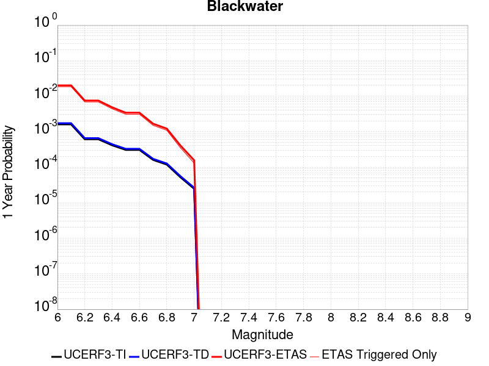 |  |

| Magnitude | 1 wk TI Prob | 1 wk TD Prob | 1 wk ETAS Prob | 1 wk ETAS/TD Gain | 1 wk ETAS Triggered Only | 1 mo TI Prob | 1 mo TD Prob | 1 mo ETAS Prob | 1 mo ETAS/TD Gain | 1 mo ETAS Triggered Only | 1 yr TI Prob | 1 yr TD Prob | 1 yr ETAS Prob | 1 yr ETAS/TD Gain | 1 yr ETAS Triggered Only | 10 yr TI Prob | 10 yr TD Prob | 10 yr ETAS Prob | 10 yr ETAS/TD Gain | 10 yr ETAS Triggered Only |
|-----|-----|-----|-----|-----|-----|-----|-----|-----|-----|-----|-----|-----|-----|-----|-----|-----|-----|-----|-----|-----|
| 6.0 | 3.0708583E-5 | 3.3095846E-5 | 0.010982733 | 331.84625 | 0.01095 | 1.3160157E-4 | 1.4183241E-4 | 0.013859887 | 97.72017 | 0.01372 | 0.0016010714 | 0.0017255784 | 0.020063879 | 11.627336 | 0.01837 | 0.015895851 | 0.017135633 | 0.03798219 | 2.2165616 | 0.02121 |
| 6.1 | 3.0708583E-5 | 3.3095846E-5 | 0.010982733 | 331.84625 | 0.01095 | 1.3160157E-4 | 1.4183241E-4 | 0.013859887 | 97.72017 | 0.01372 | 0.0016010714 | 0.0017255784 | 0.020063879 | 11.627336 | 0.01837 | 0.015895851 | 0.017135633 | 0.03798219 | 2.2165616 | 0.02121 |
| 6.2 | 1.1707779E-5 | 1.2545122E-5 | 0.004082494 | 325.4248 | 0.00407 | 5.017523E-5 | 5.3763757E-5 | 0.0050834934 | 94.55242 | 0.00503 | 6.107122E-4 | 6.5438676E-4 | 0.007489911 | 11.445694 | 0.00684 | 0.006090366 | 0.0065255696 | 0.0144435605 | 2.2133794 | 0.00797 |
| 6.3 | 1.1707779E-5 | 1.2545122E-5 | 0.004082494 | 325.4248 | 0.00407 | 5.017523E-5 | 5.3763757E-5 | 0.0050834934 | 94.55242 | 0.00503 | 6.107122E-4 | 6.5438676E-4 | 0.007489911 | 11.445694 | 0.00684 | 0.006090366 | 0.0065255696 | 0.0144435605 | 2.2133794 | 0.00797 |
| 6.4 | 7.929244E-6 | 8.480098E-6 | 0.0026484577 | 312.3145 | 0.00264 | 3.3982033E-5 | 3.6342793E-5 | 0.003226227 | 88.77212 | 0.00319 | 4.136527E-4 | 4.423877E-4 | 0.004840441 | 10.941627 | 0.0044 | 0.0041288356 | 0.0044154758 | 0.009512869 | 2.1544378 | 0.00512 |
| 6.5 | 5.8832115E-6 | 6.285991E-6 | 0.0019262739 | 306.43918 | 0.00192 | 2.521352E-5 | 2.6939697E-5 | 0.002316878 | 86.00238 | 0.00229 | 3.0693135E-4 | 3.27944E-4 | 0.003406934 | 10.388767 | 0.00308 | 0.0030650778 | 0.0032748538 | 0.0068829986 | 2.1017728 | 0.00362 |
| 6.6 | 5.8832115E-6 | 6.285991E-6 | 0.0019262739 | 306.43918 | 0.00192 | 2.521352E-5 | 2.6939697E-5 | 0.002316878 | 86.00238 | 0.00229 | 3.0693135E-4 | 3.27944E-4 | 0.003406934 | 10.388767 | 0.00308 | 0.0030650778 | 0.0032748538 | 0.0068829986 | 2.1017728 | 0.00362 |
| 6.7 | 3.0715053E-6 | 3.2814662E-6 | 8.932786E-4 | 272.21933 | 8.9E-4 | 1.3163528E-5 | 1.4063357E-5 | 0.0010740485 | 76.37212 | 0.00106 | 1.6025416E-4 | 1.7120909E-4 | 0.0016709523 | 9.759717 | 0.0015 | 0.0016013865 | 0.0017108864 | 0.0034279437 | 2.0036068 | 0.00172 |
| 6.8 | 2.2722281E-6 | 2.4287538E-6 | 6.824271E-4 | 280.9783 | 6.8E-4 | 9.738084E-6 | 1.0408908E-5 | 7.904008E-4 | 75.935036 | 7.8E-4 | 1.1855473E-4 | 1.26722E-4 | 0.0012165839 | 9.600415 | 0.00109 | 0.001184915 | 0.0012665876 | 0.0025249918 | 1.993539 | 0.00126 |
| 6.9 | 9.952399E-7 | 1.0653489E-6 | 2.2106511E-4 | 207.5049 | 2.2E-4 | 4.265307E-6 | 4.5657757E-6 | 2.3456472E-4 | 51.37456 | 2.3E-4 | 5.1928873E-5 | 5.5587418E-5 | 4.0556796E-4 | 7.296039 | 3.5E-4 | 5.191674E-4 | 5.557858E-4 | 9.355745E-4 | 1.6833367 | 3.8E-4 |
| 7.0 | 4.7385504E-7 | 5.0755597E-7 | 9.050751E-5 | 178.32027 | 9.0E-5 | 2.0308057E-6 | 2.1752398E-6 | 1.0217502E-4 | 46.971844 | 1.0E-4 | 2.4724779E-5 | 2.6483543E-5 | 1.564801E-4 | 5.9085784 | 1.3E-4 | 2.4722028E-4 | 2.6483546E-4 | 3.9480103E-4 | 1.4907409 | 1.3E-4 |

## McLean Lake
*[(top)](#table-of-contents)*

| 1 Week | 1 Month | 1 Year | 10 Year |
|-----|-----|-----|-----|
|  |  |  | 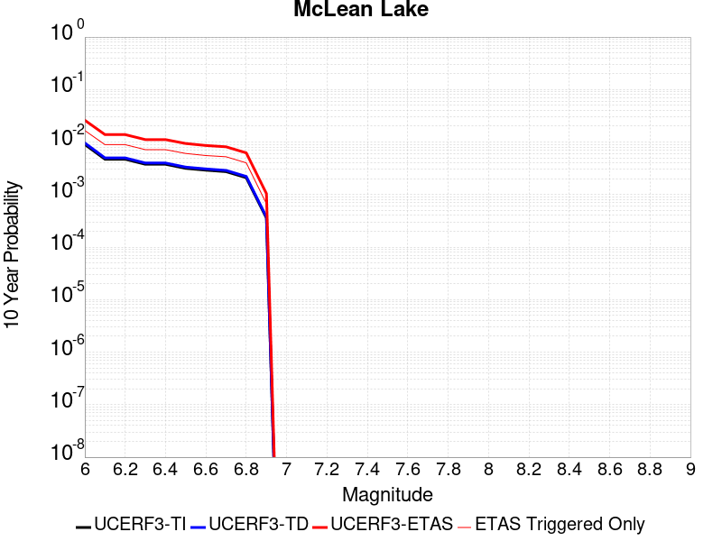 |

| Magnitude | 1 wk TI Prob | 1 wk TD Prob | 1 wk ETAS Prob | 1 wk ETAS/TD Gain | 1 wk ETAS Triggered Only | 1 mo TI Prob | 1 mo TD Prob | 1 mo ETAS Prob | 1 mo ETAS/TD Gain | 1 mo ETAS Triggered Only | 1 yr TI Prob | 1 yr TD Prob | 1 yr ETAS Prob | 1 yr ETAS/TD Gain | 1 yr ETAS Triggered Only | 10 yr TI Prob | 10 yr TD Prob | 10 yr ETAS Prob | 10 yr ETAS/TD Gain | 10 yr ETAS Triggered Only |
|-----|-----|-----|-----|-----|-----|-----|-----|-----|-----|-----|-----|-----|-----|-----|-----|-----|-----|-----|-----|-----|
| 6.0 | 1.7360222E-5 | 1.8501627E-5 | 0.006918374 | 373.93326 | 0.0069 | 7.439883E-5 | 7.9290556E-5 | 0.009788521 | 123.45129 | 0.00971 | 9.0542925E-4 | 9.6498354E-4 | 0.01485157 | 15.390491 | 0.0139 | 0.009017491 | 0.0096127745 | 0.026063107 | 2.711299 | 0.01661 |
| 6.1 | 9.062689E-6 | 9.592193E-6 | 0.0035295584 | 367.96155 | 0.00352 | 3.8839516E-5 | 4.1108804E-5 | 0.005100901 | 124.08293 | 0.00506 | 4.727685E-4 | 5.003936E-4 | 0.007986645 | 15.960727 | 0.00749 | 0.0047176396 | 0.004993552 | 0.013878959 | 2.7793763 | 0.00893 |
| 6.2 | 9.062689E-6 | 9.592193E-6 | 0.0035295584 | 367.96155 | 0.00352 | 3.8839516E-5 | 4.1108804E-5 | 0.005100901 | 124.08293 | 0.00506 | 4.727685E-4 | 5.003936E-4 | 0.007986645 | 15.960727 | 0.00749 | 0.0047176396 | 0.004993552 | 0.013878959 | 2.7793763 | 0.00893 |
| 6.3 | 7.2575485E-6 | 7.66771E-6 | 0.0028576457 | 372.68573 | 0.00285 | 3.110341E-5 | 3.2861237E-5 | 0.0040727286 | 123.93716 | 0.00404 | 3.786182E-4 | 4.0001926E-4 | 0.0063676313 | 15.918312 | 0.00597 | 0.0037797375 | 0.0039936965 | 0.011135062 | 2.7881591 | 0.00717 |
| 6.4 | 7.2575485E-6 | 7.66771E-6 | 0.0028576457 | 372.68573 | 0.00285 | 3.110341E-5 | 3.2861237E-5 | 0.0040727286 | 123.93716 | 0.00404 | 3.786182E-4 | 4.0001926E-4 | 0.0063676313 | 15.918312 | 0.00597 | 0.0037797375 | 0.0039936965 | 0.011135062 | 2.7881591 | 0.00717 |
| 6.5 | 6.06582E-6 | 6.4038773E-6 | 0.0023963887 | 374.209 | 0.00239 | 2.5996113E-5 | 2.7444936E-5 | 0.0034273516 | 124.88103 | 0.0034 | 3.164567E-4 | 3.3409733E-4 | 0.0053624166 | 16.050463 | 0.00503 | 0.0031600643 | 0.0033365893 | 0.009386336 | 2.813153 | 0.00607 |
| 6.6 | 5.598744E-6 | 5.910262E-6 | 0.0021658975 | 366.46387 | 0.00216 | 2.3994397E-5 | 2.5329486E-5 | 0.0031052516 | 122.59434 | 0.00308 | 2.9209262E-4 | 3.0834923E-4 | 0.0049269246 | 15.978391 | 0.00462 | 0.0029170897 | 0.003079843 | 0.008602781 | 2.793253 | 0.00554 |
| 6.7 | 5.246996E-6 | 5.539162E-6 | 0.0020655277 | 372.89536 | 0.00206 | 2.2486933E-5 | 2.3739085E-5 | 0.0029136704 | 122.73727 | 0.00289 | 2.73744E-4 | 2.8899137E-4 | 0.0046677254 | 16.151781 | 0.00438 | 0.0027340704 | 0.0028867796 | 0.008121624 | 2.8133855 | 0.00525 |
| 6.8 | 4.02324E-6 | 4.2469046E-6 | 0.00163424 | 384.80734 | 0.00163 | 1.7242342E-5 | 1.8200926E-5 | 0.0022781598 | 125.16725 | 0.00226 | 2.099053E-4 | 2.2157968E-4 | 0.0035808352 | 16.160484 | 0.00336 | 0.0020970714 | 0.002214172 | 0.006225271 | 2.811557 | 0.00402 |
| 6.9 | 6.835972E-7 | 7.1399285E-7 | 2.4071382E-4 | 337.1376 | 2.4E-4 | 2.9296991E-6 | 3.0599674E-6 | 3.530589E-4 | 115.37995 | 3.5E-4 | 3.56685E-5 | 3.7254784E-5 | 5.872343E-4 | 15.762654 | 5.5E-4 | 3.5662777E-4 | 3.7251666E-4 | 0.0010422671 | 2.7979074 | 6.7E-4 |

## Goldstone Lake
*[(top)](#table-of-contents)*

| 1 Week | 1 Month | 1 Year | 10 Year |
|-----|-----|-----|-----|
|  |  |  |  |

| Magnitude | 1 wk TI Prob | 1 wk TD Prob | 1 wk ETAS Prob | 1 wk ETAS/TD Gain | 1 wk ETAS Triggered Only | 1 mo TI Prob | 1 mo TD Prob | 1 mo ETAS Prob | 1 mo ETAS/TD Gain | 1 mo ETAS Triggered Only | 1 yr TI Prob | 1 yr TD Prob | 1 yr ETAS Prob | 1 yr ETAS/TD Gain | 1 yr ETAS Triggered Only | 10 yr TI Prob | 10 yr TD Prob | 10 yr ETAS Prob | 10 yr ETAS/TD Gain | 10 yr ETAS Triggered Only |
|-----|-----|-----|-----|-----|-----|-----|-----|-----|-----|-----|-----|-----|-----|-----|-----|-----|-----|-----|-----|-----|
| 6.0 | 2.671352E-5 | 3.037609E-5 | 0.005400213 | 177.77841 | 0.00537 | 1.1448149E-4 | 1.3017785E-4 | 0.0075992052 | 58.375565 | 0.00747 | 0.001392921 | 0.0015839594 | 0.012846093 | 8.110114 | 0.01128 | 0.013842222 | 0.015746197 | 0.029319055 | 1.8619771 | 0.01379 |
| 6.1 | 2.671352E-5 | 3.037609E-5 | 0.005400213 | 177.77841 | 0.00537 | 1.1448149E-4 | 1.3017785E-4 | 0.0075992052 | 58.375565 | 0.00747 | 0.001392921 | 0.0015839594 | 0.012846093 | 8.110114 | 0.01128 | 0.013842222 | 0.015746197 | 0.029319055 | 1.8619771 | 0.01379 |
| 6.2 | 1.4197047E-5 | 1.6096245E-5 | 0.0028060514 | 174.32957 | 0.00279 | 6.0843064E-5 | 6.8982634E-5 | 0.003918717 | 56.807297 | 0.00385 | 7.4051257E-4 | 8.3963864E-4 | 0.0066847266 | 7.961433 | 0.00585 | 0.007380498 | 0.0083743585 | 0.015623142 | 1.8655926 | 0.00731 |
| 6.3 | 1.4197047E-5 | 1.6096245E-5 | 0.0028060514 | 174.32957 | 0.00279 | 6.0843064E-5 | 6.8982634E-5 | 0.003918717 | 56.807297 | 0.00385 | 7.4051257E-4 | 8.3963864E-4 | 0.0066847266 | 7.961433 | 0.00585 | 0.007380498 | 0.0083743585 | 0.015623142 | 1.8655926 | 0.00731 |
| 6.4 | 1.3238931E-5 | 1.500846E-5 | 0.002634969 | 175.5656 | 0.00262 | 5.6737044E-5 | 6.4320935E-5 | 0.0036440906 | 56.654816 | 0.00358 | 6.9055456E-4 | 7.82924E-4 | 0.006218665 | 7.9428716 | 0.00544 | 0.006884126 | 0.0078112837 | 0.014558167 | 1.8637356 | 0.0068 |
| 6.5 | 1.3238931E-5 | 1.500846E-5 | 0.002634969 | 175.5656 | 0.00262 | 5.6737044E-5 | 6.4320935E-5 | 0.0036440906 | 56.654816 | 0.00358 | 6.9055456E-4 | 7.82924E-4 | 0.006218665 | 7.9428716 | 0.00544 | 0.006884126 | 0.0078112837 | 0.014558167 | 1.8637356 | 0.0068 |
| 6.6 | 1.1328278E-5 | 1.2855166E-5 | 0.0022328265 | 173.69101 | 0.00222 | 4.8548856E-5 | 5.5092944E-5 | 0.0030749266 | 55.81344 | 0.00302 | 5.90922E-4 | 6.7064585E-4 | 0.0052275877 | 7.794856 | 0.00456 | 0.0058935313 | 0.0066956086 | 0.012357444 | 1.8456043 | 0.0057 |
| 6.7 | 8.651175E-6 | 9.824565E-6 | 0.0016598083 | 168.94473 | 0.00165 | 3.707594E-5 | 4.2105108E-5 | 0.0022120138 | 52.535522 | 0.00217 | 4.5130608E-4 | 5.1259965E-4 | 0.0038009132 | 7.4149747 | 0.00329 | 0.0045039062 | 0.005123051 | 0.009211996 | 1.7981462 | 0.00411 |
| 6.8 | 1.0215377E-6 | 1.1754702E-6 | 6.11754E-5 | 52.043343 | 6.0E-5 | 4.378012E-6 | 5.0377203E-6 | 8.503732E-5 | 16.880117 | 8.0E-5 | 5.3300988E-5 | 6.1332634E-5 | 2.0132404E-4 | 3.2824948 | 1.4E-4 | 5.3288206E-4 | 6.1316835E-4 | 7.730702E-4 | 1.2607797 | 1.6E-4 |
| 6.9 | 7.9360774E-7 | 9.2833966E-7 | 3.0928313E-5 | 33.315727 | 3.0E-5 | 3.4011714E-6 | 3.9785928E-6 | 4.3978434E-5 | 11.053766 | 4.0E-5 | 4.1408475E-5 | 4.843836E-5 | 1.2843449E-4 | 2.6515036 | 8.0E-5 | 4.140076E-4 | 4.8428503E-4 | 5.842366E-4 | 1.20639 | 1.0E-4 |
| 7.0 | 7.4382757E-7 | 8.7473285E-7 | 3.0874708E-5 | 35.296154 | 3.0E-5 | 3.1878285E-6 | 3.74885E-6 | 4.37487E-5 | 11.669899 | 4.0E-5 | 3.8811122E-5 | 4.564136E-5 | 1.1563817E-4 | 2.5336266 | 7.0E-5 | 3.8804344E-4 | 4.5632652E-4 | 5.462854E-4 | 1.1971372 | 9.0E-5 |
| 7.1 | 6.4709513E-7 | 7.7113E-7 | 2.0771115E-5 | 26.935946 | 2.0E-5 | 2.773262E-6 | 3.3048389E-6 | 3.330474E-5 | 10.077568 | 3.0E-5 | 3.376394E-5 | 4.0235733E-5 | 9.023372E-5 | 2.2426264 | 5.0E-5 | 3.375881E-4 | 4.0229043E-4 | 4.622663E-4 | 1.149086 | 6.0E-5 |
| 7.2 | 6.356704E-7 | 7.5883594E-7 | 2.075882E-5 | 27.356138 | 2.0E-5 | 2.7242988E-6 | 3.2521505E-6 | 3.3252054E-5 | 10.224636 | 3.0E-5 | 3.3167835E-5 | 3.959427E-5 | 8.959229E-5 | 2.262759 | 5.0E-5 | 3.3162883E-4 | 3.958781E-4 | 4.5585434E-4 | 1.1515018 | 6.0E-5 |
| 7.3 | 5.7695723E-7 | 6.8965653E-7 | 2.0689642E-5 | 29.999924 | 2.0E-5 | 2.4726714E-6 | 2.9556677E-6 | 3.295558E-5 | 11.1499605 | 3.0E-5 | 3.0104358E-5 | 3.5984718E-5 | 7.5983284E-5 | 2.111543 | 4.0E-5 | 3.0100282E-4 | 3.5979465E-4 | 4.0977667E-4 | 1.1389182 | 5.0E-5 |
| 7.4 | 5.209647E-7 | 6.193514E-7 | 2.0619338E-5 | 33.29183 | 2.0E-5 | 2.232704E-6 | 2.6543607E-6 | 3.265428E-5 | 12.302127 | 3.0E-5 | 2.718283E-5 | 3.2316417E-5 | 7.2315124E-5 | 2.237721 | 4.0E-5 | 2.7179506E-4 | 3.2312275E-4 | 3.731066E-4 | 1.1546899 | 5.0E-5 |
| 7.5 | 4.512955E-7 | 5.348885E-7 | 2.0534877E-5 | 38.39095 | 2.0E-5 | 1.934122E-6 | 2.2923775E-6 | 2.2292332E-5 | 9.724546 | 2.0E-5 | 2.3547682E-5 | 2.7909393E-5 | 4.7908834E-5 | 1.7165846 | 2.0E-5 | 2.3545188E-4 | 2.7906417E-4 | 3.0905582E-4 | 1.1074722 | 3.0E-5 |
| 7.6 | 2.21172E-7 | 2.603961E-7 | 2.0260391E-5 | 77.80605 | 2.0E-5 | 9.478797E-7 | 1.1159829E-6 | 2.111596E-5 | 18.921402 | 2.0E-5 | 1.1540374E-5 | 1.3587036E-5 | 3.3586763E-5 | 2.4719715 | 2.0E-5 | 1.1539775E-4 | 1.3586486E-4 | 1.6586078E-4 | 1.2207776 | 3.0E-5 |

## Garlock (West)
*[(top)](#table-of-contents)*

| 1 Week | 1 Month | 1 Year | 10 Year |
|-----|-----|-----|-----|
|  |  | 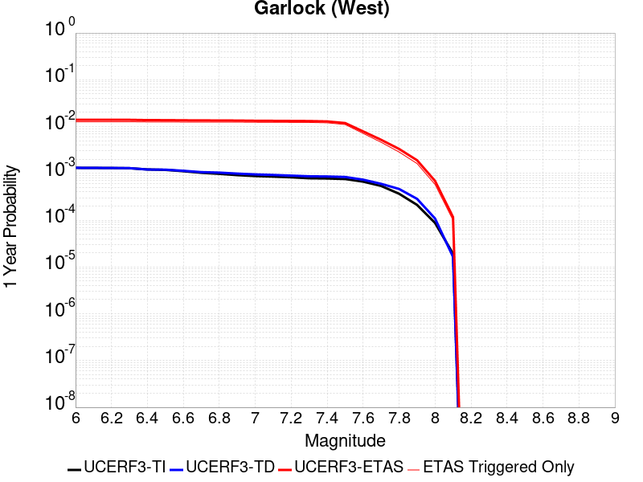 | 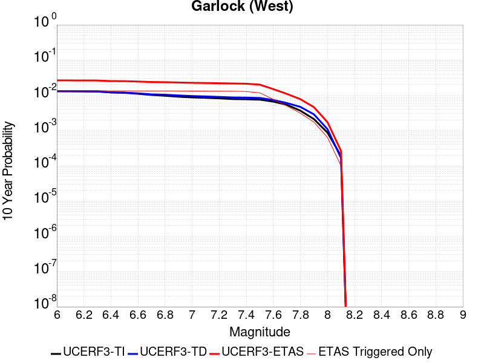 |

| Magnitude | 1 wk TI Prob | 1 wk TD Prob | 1 wk ETAS Prob | 1 wk ETAS/TD Gain | 1 wk ETAS Triggered Only | 1 mo TI Prob | 1 mo TD Prob | 1 mo ETAS Prob | 1 mo ETAS/TD Gain | 1 mo ETAS Triggered Only | 1 yr TI Prob | 1 yr TD Prob | 1 yr ETAS Prob | 1 yr ETAS/TD Gain | 1 yr ETAS Triggered Only | 10 yr TI Prob | 10 yr TD Prob | 10 yr ETAS Prob | 10 yr ETAS/TD Gain | 10 yr ETAS Triggered Only |
|-----|-----|-----|-----|-----|-----|-----|-----|-----|-----|-----|-----|-----|-----|-----|-----|-----|-----|-----|-----|-----|
| 6.0 | 2.5181727E-5 | 2.51973E-5 | 0.00902497 | 358.17212 | 0.009 | 1.0791722E-4 | 1.0798398E-4 | 0.010686842 | 98.96692 | 0.01058 | 0.0013131002 | 0.0013139155 | 0.013957282 | 10.622663 | 0.01266 | 0.013053683 | 0.013141977 | 0.026533639 | 2.018999 | 0.01357 |
| 6.1 | 2.5077732E-5 | 2.5098372E-5 | 0.009024872 | 359.58 | 0.009 | 1.0747157E-4 | 1.0756004E-4 | 0.010686422 | 99.35309 | 0.01058 | 0.001307681 | 0.0013087603 | 0.013952191 | 10.660617 | 0.01266 | 0.013000126 | 0.013091032 | 0.026483387 | 2.0230174 | 0.01357 |
| 6.2 | 2.494612E-5 | 2.498005E-5 | 0.009024755 | 361.2785 | 0.009 | 1.0690756E-4 | 1.0705298E-4 | 0.010685921 | 99.818985 | 0.01058 | 0.0013008224 | 0.0013025942 | 0.013946103 | 10.706407 | 0.01266 | 0.012932341 | 0.013030097 | 0.02642328 | 2.0278652 | 0.01357 |
| 6.3 | 2.4733758E-5 | 2.479942E-5 | 0.009024576 | 363.9027 | 0.009 | 1.0599751E-4 | 1.06278916E-4 | 0.010685154 | 100.5388 | 0.01058 | 0.0012897556 | 0.0012931811 | 0.013936809 | 10.777152 | 0.01266 | 0.012822957 | 0.012937066 | 0.02633151 | 2.0353541 | 0.01357 |
| 6.4 | 2.3237335E-5 | 2.317873E-5 | 0.008972972 | 387.1209 | 0.00895 | 9.958477E-5 | 9.933365E-5 | 0.010628288 | 106.99584 | 0.01053 | 0.0012117702 | 0.001208719 | 0.013733562 | 11.36208 | 0.01254 | 0.012051838 | 0.012101916 | 0.025369387 | 2.0963116 | 0.01343 |
| 6.5 | 2.2732203E-5 | 2.2993298E-5 | 0.008962788 | 389.80002 | 0.00894 | 9.742009E-5 | 9.8539E-5 | 0.010617502 | 107.749245 | 0.01052 | 0.0011854442 | 0.0011990548 | 0.01371403 | 11.437367 | 0.01253 | 0.011791403 | 0.012006322 | 0.025265198 | 2.1043243 | 0.01342 |
| 6.6 | 2.1319436E-5 | 2.17735E-5 | 0.008931579 | 410.20413 | 0.00891 | 9.136581E-5 | 9.331167E-5 | 0.0105823325 | 113.408455 | 0.01049 | 0.001111811 | 0.0011354799 | 0.013601309 | 11.978468 | 0.01248 | 0.011062649 | 0.011377227 | 0.024585227 | 2.1609156 | 0.01336 |
| 6.7 | 1.970802E-5 | 2.0393396E-5 | 0.008930212 | 437.89725 | 0.00891 | 8.446021E-5 | 8.739735E-5 | 0.010576481 | 121.01603 | 0.01049 | 0.001027818 | 0.001063545 | 0.013530272 | 12.721861 | 0.01248 | 0.010230771 | 0.010664964 | 0.02388248 | 2.2393398 | 0.01336 |
| 6.8 | 1.8744462E-5 | 1.9901045E-5 | 0.008929724 | 448.70627 | 0.00891 | 8.033094E-5 | 8.5287415E-5 | 0.010574393 | 123.98538 | 0.01049 | 9.775903E-4 | 0.0010378812 | 0.013504929 | 13.012016 | 0.01248 | 0.009733009 | 0.01041075 | 0.023611872 | 2.2680278 | 0.01334 |
| 6.9 | 1.7559682E-5 | 1.8953415E-5 | 0.008918785 | 470.56348 | 0.0089 | 7.5253614E-5 | 8.12264E-5 | 0.010550376 | 129.8885 | 0.01047 | 9.158276E-4 | 9.884841E-4 | 0.0134361675 | 13.592699 | 0.01246 | 0.0091206245 | 0.009921231 | 0.02310908 | 2.3292553 | 0.01332 |
| 7.0 | 1.6794445E-5 | 1.8216237E-5 | 0.008868055 | 486.82144 | 0.00885 | 7.197421E-5 | 7.8067256E-5 | 0.010487255 | 134.33614 | 0.01041 | 8.759337E-4 | 9.5005584E-4 | 0.013308303 | 14.007917 | 0.01237 | 0.008724891 | 0.009540141 | 0.022643924 | 2.373542 | 0.01323 |
| 7.1 | 1.6337795E-5 | 1.7717046E-5 | 0.008847561 | 499.3813 | 0.00883 | 7.0017246E-5 | 7.5927994E-5 | 0.01045514 | 137.69809 | 0.01038 | 8.521265E-4 | 9.240326E-4 | 0.01325263 | 14.342168 | 0.01234 | 0.008488664 | 0.009281996 | 0.022349566 | 2.4078405 | 0.01319 |
| 7.2 | 1.5780008E-5 | 1.7165687E-5 | 0.008827015 | 514.22437 | 0.00881 | 6.762685E-5 | 7.356516E-5 | 0.010412805 | 141.54532 | 0.01034 | 8.2304585E-4 | 8.9528906E-4 | 0.013184277 | 14.726279 | 0.0123 | 0.008200042 | 0.008996838 | 0.022018619 | 2.4473732 | 0.01314 |
| 7.3 | 1.5058865E-5 | 1.6618762E-5 | 0.008806473 | 529.9115 | 0.00879 | 6.45364E-5 | 7.122133E-5 | 0.010370487 | 145.6093 | 0.0103 | 7.854473E-4 | 8.667759E-4 | 0.013106158 | 15.1205845 | 0.01225 | 0.00782677 | 0.008713539 | 0.021679565 | 2.4880323 | 0.01308 |
| 7.4 | 1.4887923E-5 | 1.6454731E-5 | 0.008676312 | 527.28375 | 0.00866 | 6.380382E-5 | 7.051838E-5 | 0.010189805 | 144.49857 | 0.01012 | 7.7653467E-4 | 8.582243E-4 | 0.0128779 | 15.005285 | 0.01203 | 0.0077382675 | 0.008628399 | 0.021347696 | 2.4741201 | 0.01283 |
| 7.5 | 1.4509299E-5 | 1.6046748E-5 | 0.008035918 | 500.7817 | 0.00802 | 6.218123E-5 | 6.876997E-5 | 0.00937813 | 136.36954 | 0.00931 | 7.567935E-4 | 8.36954E-4 | 0.0118876975 | 14.203526 | 0.01106 | 0.0075422134 | 0.008416704 | 0.02010747 | 2.388996 | 0.01179 |
| 7.6 | 1.2756717E-5 | 1.4050848E-5 | 0.005223978 | 371.7909 | 0.00521 | 5.4670498E-5 | 6.0216535E-5 | 0.006199847 | 102.959206 | 0.00614 | 6.6541E-4 | 7.328904E-4 | 0.00787765 | 10.748743 | 0.00715 | 0.006634211 | 0.0073816874 | 0.015014922 | 2.0340772 | 0.00769 |
| 7.7 | 1.0328985E-5 | 1.1460557E-5 | 0.0033414224 | 291.55847 | 0.00333 | 4.4266326E-5 | 4.911575E-5 | 0.004018921 | 81.8255 | 0.00397 | 5.388092E-4 | 5.978206E-4 | 0.0052150586 | 8.723451 | 0.00462 | 0.0053750467 | 0.006038511 | 0.0110083185 | 1.8230187 | 0.005 |
| 7.8 | 7.0306583E-6 | 8.899601E-6 | 0.0020788813 | 233.59262 | 0.00207 | 3.0131043E-5 | 3.814059E-5 | 0.002518046 | 66.02011 | 0.00248 | 3.667837E-4 | 4.642629E-4 | 0.0033229352 | 7.1574426 | 0.00286 | 0.003661789 | 0.0046952725 | 0.0077906703 | 1.6592584 | 0.00311 |
| 7.9 | 4.060633E-6 | 5.4653938E-6 | 0.0011954589 | 218.73242 | 0.00119 | 1.7402595E-5 | 2.3422906E-5 | 0.0014433897 | 61.622993 | 0.00142 | 2.11856E-4 | 2.851367E-4 | 0.0019046748 | 6.679866 | 0.00162 | 0.0021165414 | 0.002884201 | 0.0046191826 | 1.6015466 | 0.00174 |
| 8.0 | 1.6729537E-6 | 2.0775144E-6 | 4.3207663E-4 | 207.97768 | 4.3E-4 | 7.169782E-6 | 8.903603E-6 | 5.1889906E-4 | 58.279675 | 5.1E-4 | 8.7288594E-5 | 1.0839601E-4 | 6.883331E-4 | 6.3501706 | 5.8E-4 | 8.7254314E-4 | 0.0010969337 | 0.0017362317 | 1.5828046 | 6.4E-4 |
| 8.1 | 3.6733252E-7 | 3.1489964E-7 | 9.031487E-5 | 286.80524 | 9.0E-5 | 1.5742813E-6 | 1.3495693E-6 | 1.0134943E-4 | 75.09761 | 1.0E-4 | 1.9166706E-5 | 1.6430899E-5 | 1.16429255E-4 | 7.0859942 | 1.0E-4 | 1.9165053E-4 | 1.6638759E-4 | 2.6637095E-4 | 1.6009064 | 1.0E-4 |

## Gravel Hills-Harper Lk
*[(top)](#table-of-contents)*

| 1 Week | 1 Month | 1 Year | 10 Year |
|-----|-----|-----|-----|
| 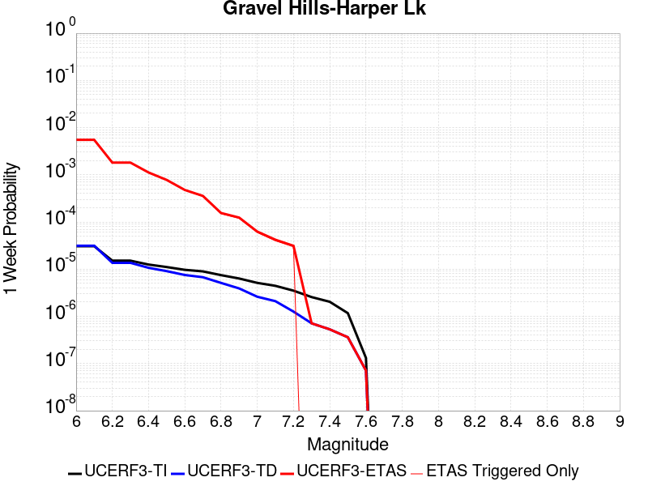 |  |  |  |

| Magnitude | 1 wk TI Prob | 1 wk TD Prob | 1 wk ETAS Prob | 1 wk ETAS/TD Gain | 1 wk ETAS Triggered Only | 1 mo TI Prob | 1 mo TD Prob | 1 mo ETAS Prob | 1 mo ETAS/TD Gain | 1 mo ETAS Triggered Only | 1 yr TI Prob | 1 yr TD Prob | 1 yr ETAS Prob | 1 yr ETAS/TD Gain | 1 yr ETAS Triggered Only | 10 yr TI Prob | 10 yr TD Prob | 10 yr ETAS Prob | 10 yr ETAS/TD Gain | 10 yr ETAS Triggered Only |
|-----|-----|-----|-----|-----|-----|-----|-----|-----|-----|-----|-----|-----|-----|-----|-----|-----|-----|-----|-----|-----|
| 6.0 | 3.0679566E-5 | 3.1464646E-5 | 0.0055112923 | 175.15825 | 0.00548 | 1.3147724E-4 | 1.3484273E-4 | 0.007323873 | 54.314182 | 0.00719 | 0.0015995599 | 0.0016406906 | 0.011464546 | 6.987634 | 0.00984 | 0.015880952 | 0.01630734 | 0.027619803 | 1.693704 | 0.0115 |
| 6.1 | 3.0679566E-5 | 3.1464646E-5 | 0.0055112923 | 175.15825 | 0.00548 | 1.3147724E-4 | 1.3484273E-4 | 0.007323873 | 54.314182 | 0.00719 | 0.0015995599 | 0.0016406906 | 0.011464546 | 6.987634 | 0.00984 | 0.015880952 | 0.01630734 | 0.027619803 | 1.693704 | 0.0115 |
| 6.2 | 1.514536E-5 | 1.3635206E-5 | 0.0018136107 | 133.0094 | 0.0018 | 6.490707E-5 | 5.843536E-5 | 0.0023483015 | 40.186314 | 0.00229 | 7.8995706E-4 | 7.1123015E-4 | 0.0037990324 | 5.3414955 | 0.00309 | 0.007871548 | 0.0070907404 | 0.010645356 | 1.5013038 | 0.00358 |
| 6.3 | 1.514536E-5 | 1.3635206E-5 | 0.0018136107 | 133.0094 | 0.0018 | 6.490707E-5 | 5.843536E-5 | 0.0023483015 | 40.186314 | 0.00229 | 7.8995706E-4 | 7.1123015E-4 | 0.0037990324 | 5.3414955 | 0.00309 | 0.007871548 | 0.0070907404 | 0.010645356 | 1.5013038 | 0.00358 |
| 6.4 | 1.2532521E-5 | 1.06896905E-5 | 0.0011206778 | 104.83726 | 0.00111 | 5.37097E-5 | 4.581219E-5 | 0.0014957457 | 32.649517 | 0.00145 | 6.537194E-4 | 5.576265E-4 | 0.0025365225 | 4.548784 | 0.00198 | 0.0065179965 | 0.005562863 | 0.007869957 | 1.4147315 | 0.00232 |
| 6.5 | 1.1094058E-5 | 9.083664E-6 | 7.7907665E-4 | 85.76679 | 7.7E-4 | 4.7545094E-5 | 3.892943E-5 | 0.0010588897 | 27.20024 | 0.00102 | 5.787078E-4 | 4.7386673E-4 | 0.0019031891 | 4.016296 | 0.00143 | 0.0057720304 | 0.0047289706 | 0.006391073 | 1.3514724 | 0.00167 |
| 6.6 | 9.688328E-6 | 7.5316952E-6 | 4.7752814E-4 | 63.40248 | 4.7E-4 | 4.1520743E-5 | 3.227831E-5 | 7.022567E-4 | 21.756304 | 6.7E-4 | 5.053978E-4 | 3.9292008E-4 | 0.0013325508 | 3.391404 | 9.4E-4 | 0.0050424994 | 0.0039225104 | 0.0050181956 | 1.2793326 | 0.0011 |
| 6.7 | 8.974824E-6 | 6.749413E-6 | 3.5674704E-4 | 52.85601 | 3.5E-4 | 3.8462964E-5 | 2.8925748E-5 | 5.0891185E-4 | 17.593733 | 4.8E-4 | 4.6818596E-4 | 3.5211627E-4 | 0.0010718628 | 3.044059 | 7.2E-4 | 0.004672008 | 0.0035158044 | 0.0043428866 | 1.2352468 | 8.3E-4 |
| 6.8 | 7.4780046E-6 | 5.1161933E-6 | 1.5511543E-4 | 30.318523 | 1.5E-4 | 3.20482E-5 | 2.1926366E-5 | 2.3192176E-4 | 10.5773 | 2.1E-4 | 3.9011694E-4 | 2.669222E-4 | 5.868368E-4 | 2.1985312 | 3.2E-4 | 0.0038943281 | 0.0026661542 | 0.0030351677 | 1.1384066 | 3.7E-4 |
| 6.9 | 6.3409307E-6 | 3.9074966E-6 | 1.2390703E-4 | 31.710077 | 1.2E-4 | 2.7175134E-5 | 1.6746313E-5 | 1.7674363E-4 | 10.554182 | 1.6E-4 | 3.3080703E-4 | 2.0386827E-4 | 4.2382343E-4 | 2.0789082 | 2.2E-4 | 0.0033031502 | 0.0020369107 | 0.0022764218 | 1.1175855 | 2.4E-4 |
| 7.0 | 5.1239335E-6 | 2.6058565E-6 | 6.26057E-5 | 24.025 | 6.0E-5 | 2.195953E-5 | 1.116791E-5 | 1.11166795E-4 | 9.954127 | 1.0E-4 | 2.6732447E-4 | 1.3596108E-4 | 2.9593933E-4 | 2.1766474 | 1.6E-4 | 0.0026700313 | 0.0013588042 | 0.0015285732 | 1.12494 | 1.7E-4 |
| 7.1 | 4.438899E-6 | 2.0984728E-6 | 4.209839E-5 | 20.061441 | 4.0E-5 | 1.9023713E-5 | 8.993425E-6 | 8.89927E-5 | 9.895308 | 8.0E-5 | 2.315891E-4 | 1.0948967E-4 | 2.4947434E-4 | 2.2785194 | 1.4E-4 | 0.002313479 | 0.0010943791 | 0.001244215 | 1.136914 | 1.5E-4 |
| 7.2 | 3.50367E-6 | 1.2615716E-6 | 3.1261534E-5 | 24.779833 | 3.0E-5 | 1.5015643E-5 | 5.4067245E-6 | 6.54064E-5 | 12.097232 | 6.0E-5 | 1.8280011E-4 | 6.582497E-5 | 1.4581971E-4 | 2.2152643 | 8.0E-5 | 0.0018264982 | 6.580629E-4 | 7.380103E-4 | 1.1214889 | 8.0E-5 |
| 7.3 | 2.561638E-6 | 7.1191585E-7 | 7.1191585E-7 | 1.0 | 0.0 | 1.0978401E-5 | 3.0510646E-6 | 2.3051003E-5 | 7.555069 | 2.0E-5 | 1.3365384E-4 | 3.71461E-5 | 5.7145353E-5 | 1.5383946 | 2.0E-5 | 0.0013357349 | 3.7140088E-4 | 3.9139346E-4 | 1.0538301 | 2.0E-5 |
| 7.4 | 2.0368864E-6 | 5.304837E-7 | 5.304837E-7 | 1.0 | 0.0 | 8.729483E-6 | 2.2734996E-6 | 2.2273454E-5 | 9.79699 | 2.0E-5 | 1.06276275E-4 | 2.7679513E-5 | 4.767896E-5 | 1.7225361 | 2.0E-5 | 0.0010622547 | 2.767612E-4 | 2.9675566E-4 | 1.0722445 | 2.0E-5 |
| 7.5 | 1.1681728E-6 | 3.6030585E-7 | 3.6030585E-7 | 1.0 | 0.0 | 5.0064455E-6 | 1.544167E-6 | 1.1544152E-5 | 7.475973 | 1.0E-5 | 6.0951766E-5 | 1.8800076E-5 | 2.8799888E-5 | 1.5319028 | 1.0E-5 | 6.093505E-4 | 1.8798532E-4 | 1.9798345E-4 | 1.0531856 | 1.0E-5 |
| 7.6 | 1.3154387E-7 | 7.1197384E-8 | 7.1197384E-8 | 1.0 | 0.0 | 5.6375933E-7 | 3.051316E-7 | 3.051316E-7 | 1.0 | 0.0 | 6.863748E-6 | 3.7149728E-6 | 3.7149728E-6 | 1.0 | 0.0 | 6.863536E-5 | 3.7149264E-5 | 3.7149264E-5 | 1.0 | 0.0 |

## Coyote Canyon
*[(top)](#table-of-contents)*

| 1 Week | 1 Month | 1 Year | 10 Year |
|-----|-----|-----|-----|
|  |  |  |  |

| Magnitude | 1 wk TI Prob | 1 wk TD Prob | 1 wk ETAS Prob | 1 wk ETAS/TD Gain | 1 wk ETAS Triggered Only | 1 mo TI Prob | 1 mo TD Prob | 1 mo ETAS Prob | 1 mo ETAS/TD Gain | 1 mo ETAS Triggered Only | 1 yr TI Prob | 1 yr TD Prob | 1 yr ETAS Prob | 1 yr ETAS/TD Gain | 1 yr ETAS Triggered Only | 10 yr TI Prob | 10 yr TD Prob | 10 yr ETAS Prob | 10 yr ETAS/TD Gain | 10 yr ETAS Triggered Only |
|-----|-----|-----|-----|-----|-----|-----|-----|-----|-----|-----|-----|-----|-----|-----|-----|-----|-----|-----|-----|-----|
| 6.0 | 3.5090034E-5 | 4.0364324E-5 | 0.0034502267 | 85.477135 | 0.00341 | 1.503772E-4 | 1.7297994E-4 | 0.004942155 | 28.570683 | 0.00477 | 0.0018293047 | 0.0021042528 | 0.009418828 | 4.476092 | 0.00733 | 0.018143194 | 0.020869201 | 0.029710753 | 1.423665 | 0.00903 |
| 6.1 | 3.5090034E-5 | 4.0364324E-5 | 0.0034502267 | 85.477135 | 0.00341 | 1.503772E-4 | 1.7297994E-4 | 0.004942155 | 28.570683 | 0.00477 | 0.0018293047 | 0.0021042528 | 0.009418828 | 4.476092 | 0.00733 | 0.018143194 | 0.020869201 | 0.029710753 | 1.423665 | 0.00903 |
| 6.2 | 1.841879E-5 | 2.1059794E-5 | 0.0018310216 | 86.943954 | 0.00181 | 7.8935285E-5 | 9.0253714E-5 | 0.0026500227 | 29.361925 | 0.00256 | 9.606133E-4 | 0.001098387 | 0.0051938836 | 4.7286463 | 0.0041 | 0.0095647145 | 0.010939667 | 0.016003655 | 1.4629016 | 0.00512 |
| 6.3 | 1.841879E-5 | 2.1059794E-5 | 0.0018310216 | 86.943954 | 0.00181 | 7.8935285E-5 | 9.0253714E-5 | 0.0026500227 | 29.361925 | 0.00256 | 9.606133E-4 | 0.001098387 | 0.0051938836 | 4.7286463 | 0.0041 | 0.0095647145 | 0.010939667 | 0.016003655 | 1.4629016 | 0.00512 |
| 6.4 | 1.712201E-5 | 1.9565212E-5 | 0.0017295318 | 88.398315 | 0.00171 | 7.337798E-5 | 8.3848776E-5 | 0.0025536416 | 30.455322 | 0.00247 | 8.930107E-4 | 0.0010204813 | 0.0048565627 | 4.7590904 | 0.00384 | 0.008894307 | 0.010167871 | 0.014948759 | 1.4701958 | 0.00483 |
| 6.5 | 1.4744935E-5 | 1.6836972E-5 | 0.0014668126 | 87.11855 | 0.00145 | 6.3191044E-5 | 7.215698E-5 | 0.0022320012 | 30.932573 | 0.00216 | 7.6907943E-4 | 8.7825063E-4 | 0.004245291 | 4.833803 | 0.00337 | 0.007664232 | 0.008756994 | 0.013019339 | 1.486736 | 0.0043 |
| 6.6 | 1.2017839E-5 | 1.37240895E-5 | 0.001263707 | 92.079475 | 0.00125 | 5.150401E-5 | 5.88167E-5 | 0.0018487114 | 31.431744 | 0.00179 | 6.268809E-4 | 7.159466E-4 | 0.0035439206 | 4.949979 | 0.00283 | 0.0062511545 | 0.0071450938 | 0.010709443 | 1.4988527 | 0.00359 |
| 6.7 | 1.00956095E-5 | 1.1533517E-5 | 0.0010915211 | 94.63905 | 0.00108 | 4.326618E-5 | 4.942891E-5 | 0.0015893528 | 32.154316 | 0.00154 | 5.266384E-4 | 6.017178E-4 | 0.0029902796 | 4.9695716 | 0.00239 | 0.005253921 | 0.0060094125 | 0.009011264 | 1.499525 | 0.00302 |

## Nelson Lake
*[(top)](#table-of-contents)*

| 1 Week | 1 Month | 1 Year | 10 Year |
|-----|-----|-----|-----|
|  |  |  | 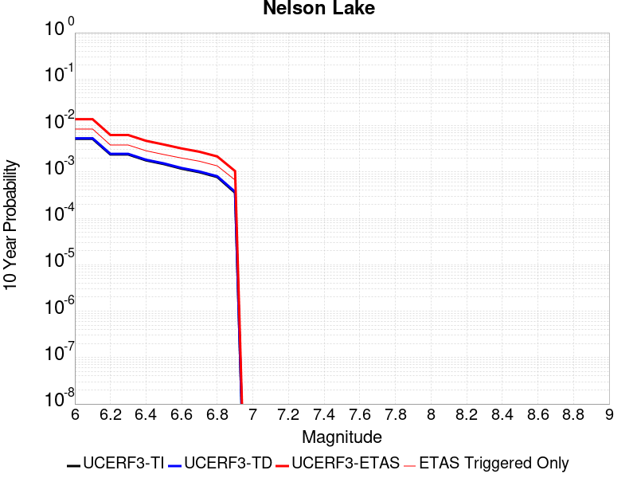 |

| Magnitude | 1 wk TI Prob | 1 wk TD Prob | 1 wk ETAS Prob | 1 wk ETAS/TD Gain | 1 wk ETAS Triggered Only | 1 mo TI Prob | 1 mo TD Prob | 1 mo ETAS Prob | 1 mo ETAS/TD Gain | 1 mo ETAS Triggered Only | 1 yr TI Prob | 1 yr TD Prob | 1 yr ETAS Prob | 1 yr ETAS/TD Gain | 1 yr ETAS Triggered Only | 10 yr TI Prob | 10 yr TD Prob | 10 yr ETAS Prob | 10 yr ETAS/TD Gain | 10 yr ETAS Triggered Only |
|-----|-----|-----|-----|-----|-----|-----|-----|-----|-----|-----|-----|-----|-----|-----|-----|-----|-----|-----|-----|-----|
| 6.0 | 9.913453E-6 | 1.0192255E-5 | 0.0028301636 | 277.67786 | 0.00282 | 4.2485535E-5 | 4.3680422E-5 | 0.004383491 | 100.353676 | 0.00434 | 5.1713863E-4 | 5.316897E-4 | 0.007398037 | 13.914201 | 0.00687 | 0.0051593683 | 0.005305204 | 0.013670587 | 2.5768259 | 0.00841 |
| 6.1 | 9.913453E-6 | 1.0192255E-5 | 0.0028301636 | 277.67786 | 0.00282 | 4.2485535E-5 | 4.3680422E-5 | 0.004383491 | 100.353676 | 0.00434 | 5.1713863E-4 | 5.316897E-4 | 0.007398037 | 13.914201 | 0.00687 | 0.0051593683 | 0.005305204 | 0.013670587 | 2.5768259 | 0.00841 |
| 6.2 | 4.5596407E-6 | 4.696313E-6 | 0.0011346911 | 241.61316 | 0.00113 | 1.954117E-5 | 2.0126909E-5 | 0.0018800895 | 93.411736 | 0.00186 | 2.3788778E-4 | 2.4501883E-4 | 0.0033042692 | 13.485777 | 0.00306 | 0.0023763329 | 0.0024476128 | 0.006238312 | 2.5487332 | 0.0038 |
| 6.3 | 4.5596407E-6 | 4.696313E-6 | 0.0011346911 | 241.61316 | 0.00113 | 1.954117E-5 | 2.0126909E-5 | 0.0018800895 | 93.411736 | 0.00186 | 2.3788778E-4 | 2.4501883E-4 | 0.0033042692 | 13.485777 | 0.00306 | 0.0023763329 | 0.0024476128 | 0.006238312 | 2.5487332 | 0.0038 |
| 6.4 | 3.4025713E-6 | 3.5098972E-6 | 8.535069E-4 | 243.17148 | 8.5E-4 | 1.4582367E-5 | 1.5042335E-5 | 0.0014350209 | 95.39882 | 0.00142 | 1.7752586E-4 | 1.8312587E-4 | 0.0025326954 | 13.830353 | 0.00235 | 0.001773841 | 0.0018298327 | 0.004684599 | 2.5601244 | 0.00286 |
| 6.5 | 2.8352947E-6 | 2.927856E-6 | 7.029258E-4 | 240.08209 | 7.0E-4 | 1.2151207E-5 | 1.2547898E-5 | 0.0012125329 | 96.63234 | 0.0012 | 1.479309E-4 | 1.5276071E-4 | 0.0021224597 | 13.894016 | 0.00197 | 0.0014783246 | 0.0015266308 | 0.0038930126 | 2.5500681 | 0.00237 |
| 6.6 | 2.251518E-6 | 2.3290677E-6 | 6.423276E-4 | 275.78745 | 6.4E-4 | 9.649328E-6 | 9.981683E-6 | 0.001079971 | 108.195274 | 0.00107 | 1.1747423E-4 | 1.2152085E-4 | 0.001791318 | 14.740828 | 0.00167 | 0.0011741214 | 0.0012146058 | 0.0032021885 | 2.636402 | 0.00199 |
| 6.7 | 1.8911853E-6 | 1.9591396E-6 | 5.5195804E-4 | 281.73492 | 5.5E-4 | 8.105055E-6 | 8.39629E-6 | 9.2838856E-4 | 110.5713 | 9.2E-4 | 9.867457E-5 | 1.0222061E-4 | 0.0015220755 | 14.890103 | 0.00142 | 9.863076E-4 | 0.0010217935 | 0.0027200563 | 2.6620414 | 0.0017 |
| 6.8 | 1.4874814E-6 | 1.5438305E-6 | 5.0154305E-4 | 324.86926 | 5.0E-4 | 6.374905E-6 | 6.6164025E-6 | 7.2661164E-4 | 109.81975 | 7.2E-4 | 7.76117E-5 | 8.055224E-5 | 0.0011804636 | 14.6546335 | 0.0011 | 7.75846E-4 | 8.0528157E-4 | 0.0021541945 | 2.6750822 | 0.00135 |
| 6.9 | 6.835972E-7 | 7.1399285E-7 | 2.4071382E-4 | 337.1376 | 2.4E-4 | 2.9296991E-6 | 3.0599674E-6 | 3.530589E-4 | 115.37995 | 3.5E-4 | 3.56685E-5 | 3.7254784E-5 | 5.872343E-4 | 15.762654 | 5.5E-4 | 3.5662777E-4 | 3.7251666E-4 | 0.0010422671 | 2.7979074 | 6.7E-4 |

## Death Valley (So)
*[(top)](#table-of-contents)*

| 1 Week | 1 Month | 1 Year | 10 Year |
|-----|-----|-----|-----|
|  |  | 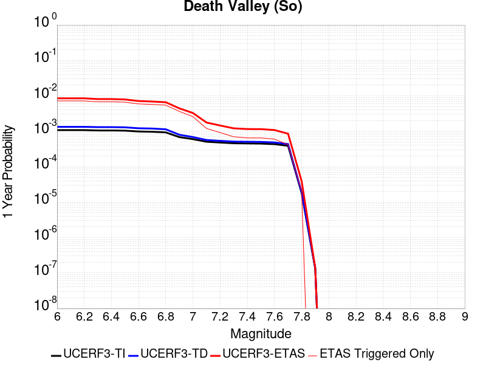 | 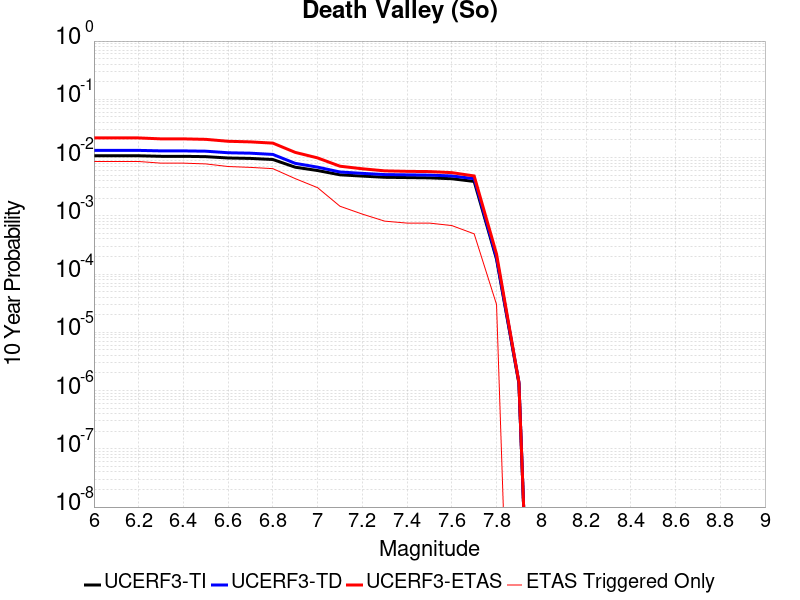 |

| Magnitude | 1 wk TI Prob | 1 wk TD Prob | 1 wk ETAS Prob | 1 wk ETAS/TD Gain | 1 wk ETAS Triggered Only | 1 mo TI Prob | 1 mo TD Prob | 1 mo ETAS Prob | 1 mo ETAS/TD Gain | 1 mo ETAS Triggered Only | 1 yr TI Prob | 1 yr TD Prob | 1 yr ETAS Prob | 1 yr ETAS/TD Gain | 1 yr ETAS Triggered Only | 10 yr TI Prob | 10 yr TD Prob | 10 yr ETAS Prob | 10 yr ETAS/TD Gain | 10 yr ETAS Triggered Only |
|-----|-----|-----|-----|-----|-----|-----|-----|-----|-----|-----|-----|-----|-----|-----|-----|-----|-----|-----|-----|-----|
| 6.0 | 2.0684236E-5 | 2.5617775E-5 | 0.0039755167 | 155.18585 | 0.00395 | 8.864371E-5 | 1.0978594E-4 | 0.005389206 | 49.088306 | 0.00528 | 0.0010787029 | 0.0013358411 | 0.008516236 | 6.3751864 | 0.00719 | 0.010734817 | 0.013281397 | 0.021727707 | 1.6359506 | 0.00856 |
| 6.1 | 2.0684236E-5 | 2.5617775E-5 | 0.0039755167 | 155.18585 | 0.00395 | 8.864371E-5 | 1.0978594E-4 | 0.005389206 | 49.088306 | 0.00528 | 0.0010787029 | 0.0013358411 | 0.008516236 | 6.3751864 | 0.00719 | 0.010734817 | 0.013281397 | 0.021727707 | 1.6359506 | 0.00856 |
| 6.2 | 2.0684236E-5 | 2.5617775E-5 | 0.0039755167 | 155.18585 | 0.00395 | 8.864371E-5 | 1.0978594E-4 | 0.005389206 | 49.088306 | 0.00528 | 0.0010787029 | 0.0013358411 | 0.008516236 | 6.3751864 | 0.00719 | 0.010734817 | 0.013281397 | 0.021727707 | 1.6359506 | 0.00856 |
| 6.3 | 2.0240292E-5 | 2.511786E-5 | 0.0037750236 | 150.2924 | 0.00375 | 8.6741224E-5 | 1.07643624E-4 | 0.0050871074 | 47.25879 | 0.00498 | 0.0010555626 | 0.00130979 | 0.008100883 | 6.184872 | 0.0068 | 0.010505628 | 0.013023956 | 0.020939505 | 1.6077683 | 0.00802 |
| 6.4 | 2.0240292E-5 | 2.511786E-5 | 0.0037750236 | 150.2924 | 0.00375 | 8.6741224E-5 | 1.07643624E-4 | 0.0050871074 | 47.25879 | 0.00498 | 0.0010555626 | 0.00130979 | 0.008100883 | 6.184872 | 0.0068 | 0.010505628 | 0.013023956 | 0.020939505 | 1.6077683 | 0.00802 |
| 6.5 | 1.9962767E-5 | 2.4807114E-5 | 0.0036847163 | 148.53467 | 0.00366 | 8.55519E-5 | 1.0631196E-4 | 0.0049257996 | 46.333447 | 0.00482 | 0.0010410968 | 0.0012935963 | 0.0079050325 | 6.110896 | 0.00662 | 0.010362327 | 0.012863902 | 0.020543821 | 1.5970131 | 0.00778 |
| 6.6 | 1.8937297E-5 | 2.3310964E-5 | 0.0033132343 | 142.132 | 0.00329 | 8.115732E-5 | 9.990039E-5 | 0.0044694636 | 44.7392 | 0.00437 | 9.876423E-4 | 0.0012156231 | 0.0071384143 | 5.8722267 | 0.00593 | 0.009832645 | 0.012092789 | 0.019027898 | 1.5734912 | 0.00702 |
| 6.7 | 1.8621096E-5 | 2.2911607E-5 | 0.003192839 | 139.35466 | 0.00317 | 7.980225E-5 | 9.818898E-5 | 0.0043277736 | 44.07596 | 0.00423 | 9.711593E-4 | 0.0011948098 | 0.0069079753 | 5.781653 | 0.00572 | 0.009669261 | 0.011886904 | 0.018586311 | 1.5635957 | 0.00678 |
| 6.8 | 1.7830353E-5 | 2.1805688E-5 | 0.0030417398 | 139.49295 | 0.00302 | 7.641356E-5 | 9.344968E-5 | 0.0041430714 | 44.33478 | 0.00405 | 9.29938E-4 | 0.00113717 | 0.00660095 | 5.8047166 | 0.00547 | 0.009260561 | 0.011316354 | 0.017693363 | 1.5635215 | 0.00645 |
| 6.9 | 1.3135183E-5 | 1.5303925E-5 | 0.0019852738 | 129.72318 | 0.00197 | 5.6292425E-5 | 6.558664E-5 | 0.0027854082 | 42.469143 | 0.00272 | 6.8514474E-4 | 7.982312E-4 | 0.0044353255 | 5.5564423 | 0.00364 | 0.006830362 | 0.007954649 | 0.0122700455 | 1.5425 | 0.00435 |
| 7.0 | 1.1507512E-5 | 1.3154199E-5 | 0.0013631365 | 103.62747 | 0.00135 | 4.9316975E-5 | 5.6373956E-5 | 0.0019562668 | 34.701607 | 0.0019 | 6.002687E-4 | 6.8614254E-4 | 0.0032743653 | 4.7721357 | 0.00259 | 0.0059864987 | 0.0068409415 | 0.009860145 | 1.4413433 | 0.00304 |
| 7.1 | 9.715903E-6 | 1.0865278E-5 | 6.4085843E-4 | 58.98224 | 6.3E-4 | 4.1638916E-5 | 4.656467E-5 | 8.965251E-4 | 19.253332 | 8.5E-4 | 5.068359E-4 | 5.667817E-4 | 0.0017661015 | 3.1160173 | 0.0012 | 0.0050568148 | 0.0056538144 | 0.00710556 | 1.2567728 | 0.00146 |
| 7.2 | 9.233269E-6 | 1.02863105E-5 | 4.902814E-4 | 47.663483 | 4.8E-4 | 3.9570554E-5 | 4.4083466E-5 | 6.740557E-4 | 15.290442 | 6.3E-4 | 4.81665E-4 | 5.3658825E-4 | 0.0014560946 | 2.7136161 | 9.2E-4 | 0.0048062233 | 0.0053533576 | 0.00641763 | 1.1988046 | 0.00107 |
| 7.3 | 8.8041315E-6 | 9.808164E-6 | 3.6980462E-4 | 37.70376 | 3.6E-4 | 3.7731446E-5 | 4.2034335E-5 | 5.2201416E-4 | 12.4187565 | 4.8E-4 | 4.592835E-4 | 5.1165203E-4 | 0.0012112939 | 2.3674173 | 7.0E-4 | 0.0045833546 | 0.005105167 | 0.005911032 | 1.1578528 | 8.1E-4 |
| 7.4 | 8.708749E-6 | 9.707175E-6 | 3.2970408E-4 | 33.964985 | 3.2E-4 | 3.7322676E-5 | 4.160154E-5 | 4.7158365E-4 | 11.335726 | 4.3E-4 | 4.5430884E-4 | 5.0638523E-4 | 0.0011560561 | 2.2829578 | 6.5E-4 | 0.004533812 | 0.0050527398 | 0.00579895 | 1.1476843 | 7.5E-4 |
| 7.5 | 8.612678E-6 | 9.604817E-6 | 3.2960175E-4 | 34.316296 | 3.2E-4 | 3.6910955E-5 | 4.1162875E-5 | 4.7114518E-4 | 11.445876 | 4.3E-4 | 4.492982E-4 | 5.01047E-4 | 0.0011507213 | 2.2966335 | 6.5E-4 | 0.004483909 | 0.0049995985 | 0.005745849 | 1.1492621 | 7.5E-4 |
| 7.6 | 8.319024E-6 | 9.283916E-6 | 2.892813E-4 | 31.159405 | 2.8E-4 | 3.5652476E-5 | 3.978763E-5 | 4.1977252E-4 | 10.550327 | 3.8E-4 | 4.3398244E-4 | 4.8431093E-4 | 0.0010840204 | 2.2382736 | 6.0E-4 | 0.0043313587 | 0.0048329784 | 0.005509692 | 1.14002 | 6.8E-4 |
| 7.7 | 7.4718328E-6 | 8.34517E-6 | 1.6834383E-4 | 20.172607 | 1.6E-4 | 3.2021748E-5 | 3.5764548E-5 | 2.857556E-4 | 7.989913 | 2.5E-4 | 3.8979502E-4 | 4.353504E-4 | 8.551676E-4 | 1.9643202 | 4.2E-4 | 0.00389112 | 0.0043453807 | 0.0048332512 | 1.1122735 | 4.9E-4 |
| 7.8 | 3.4586725E-7 | 3.6482615E-7 | 3.6482615E-7 | 1.0 | 0.0 | 1.4822873E-6 | 1.5635396E-6 | 1.5635396E-6 | 1.0 | 0.0 | 1.80467E-5 | 1.9035933E-5 | 3.9035553E-5 | 2.0506246 | 2.0E-5 | 1.8045233E-4 | 1.9034347E-4 | 2.2033777E-4 | 1.1575798 | 3.0E-5 |
| 7.9 | 2.5591178E-9 | 2.6696718E-9 | 2.6696718E-9 | 1.0 | 0.0 | 1.0967647E-8 | 1.14414505E-8 | 1.14414505E-8 | 1.0 | 0.0 | 1.335311E-7 | 1.3929966E-7 | 1.3929966E-7 | 1.0 | 0.0 | 1.3353102E-6 | 1.3929966E-6 | 1.3929966E-6 | 1.0 | 0.0 |

## So Sierra Nevada
*[(top)](#table-of-contents)*

| 1 Week | 1 Month | 1 Year | 10 Year |
|-----|-----|-----|-----|
|  |  |  |  |

| Magnitude | 1 wk TI Prob | 1 wk TD Prob | 1 wk ETAS Prob | 1 wk ETAS/TD Gain | 1 wk ETAS Triggered Only | 1 mo TI Prob | 1 mo TD Prob | 1 mo ETAS Prob | 1 mo ETAS/TD Gain | 1 mo ETAS Triggered Only | 1 yr TI Prob | 1 yr TD Prob | 1 yr ETAS Prob | 1 yr ETAS/TD Gain | 1 yr ETAS Triggered Only | 10 yr TI Prob | 10 yr TD Prob | 10 yr ETAS Prob | 10 yr ETAS/TD Gain | 10 yr ETAS Triggered Only |
|-----|-----|-----|-----|-----|-----|-----|-----|-----|-----|-----|-----|-----|-----|-----|-----|-----|-----|-----|-----|-----|
| 6.0 | 1.15488665E-5 | 1.1079643E-5 | 0.00447103 | 403.5356 | 0.00446 | 4.9494203E-5 | 4.748339E-5 | 0.0058772066 | 123.77395 | 0.00583 | 6.024253E-4 | 5.7796965E-4 | 0.007973692 | 13.79604 | 0.0074 | 0.006007948 | 0.005765934 | 0.014216923 | 2.4656758 | 0.0085 |
| 6.1 | 1.15488665E-5 | 1.1079643E-5 | 0.00447103 | 403.5356 | 0.00446 | 4.9494203E-5 | 4.748339E-5 | 0.0058772066 | 123.77395 | 0.00583 | 6.024253E-4 | 5.7796965E-4 | 0.007973692 | 13.79604 | 0.0074 | 0.006007948 | 0.005765934 | 0.014216923 | 2.4656758 | 0.0085 |
| 6.2 | 1.15488665E-5 | 1.1079643E-5 | 0.00447103 | 403.5356 | 0.00446 | 4.9494203E-5 | 4.748339E-5 | 0.0058772066 | 123.77395 | 0.00583 | 6.024253E-4 | 5.7796965E-4 | 0.007973692 | 13.79604 | 0.0074 | 0.006007948 | 0.005765934 | 0.014216923 | 2.4656758 | 0.0085 |
| 6.3 | 1.15488665E-5 | 1.1079643E-5 | 0.00447103 | 403.5356 | 0.00446 | 4.9494203E-5 | 4.748339E-5 | 0.0058772066 | 123.77395 | 0.00583 | 6.024253E-4 | 5.7796965E-4 | 0.007973692 | 13.79604 | 0.0074 | 0.006007948 | 0.005765934 | 0.014216923 | 2.4656758 | 0.0085 |
| 6.4 | 1.15488665E-5 | 1.1079643E-5 | 0.00447103 | 403.5356 | 0.00446 | 4.9494203E-5 | 4.748339E-5 | 0.0058772066 | 123.77395 | 0.00583 | 6.024253E-4 | 5.7796965E-4 | 0.007973692 | 13.79604 | 0.0074 | 0.006007948 | 0.005765934 | 0.014216923 | 2.4656758 | 0.0085 |
| 6.5 | 1.15488665E-5 | 1.1079643E-5 | 0.00447103 | 403.5356 | 0.00446 | 4.9494203E-5 | 4.748339E-5 | 0.0058772066 | 123.77395 | 0.00583 | 6.024253E-4 | 5.7796965E-4 | 0.007973692 | 13.79604 | 0.0074 | 0.006007948 | 0.005765934 | 0.014216923 | 2.4656758 | 0.0085 |
| 6.6 | 7.587044E-6 | 6.935635E-6 | 0.0022169203 | 319.642 | 0.00221 | 3.2515498E-5 | 2.9723828E-5 | 0.0028296406 | 95.197716 | 0.0028 | 3.9580427E-4 | 3.6183043E-4 | 0.003960528 | 10.945811 | 0.0036 | 0.003951 | 0.0036127048 | 0.007697893 | 2.1307838 | 0.0041 |
| 6.7 | 7.587044E-6 | 6.935635E-6 | 0.0022169203 | 319.642 | 0.00221 | 3.2515498E-5 | 2.9723828E-5 | 0.0028296406 | 95.197716 | 0.0028 | 3.9580427E-4 | 3.6183043E-4 | 0.003960528 | 10.945811 | 0.0036 | 0.003951 | 0.0036127048 | 0.007697893 | 2.1307838 | 0.0041 |
| 6.8 | 5.9026956E-6 | 5.1793927E-6 | 0.0015751712 | 304.12277 | 0.00157 | 2.5297022E-5 | 2.2197215E-5 | 0.0019621542 | 88.39641 | 0.00194 | 3.0794772E-4 | 2.7021873E-4 | 0.0027595458 | 10.212267 | 0.00249 | 0.0030752132 | 0.002699018 | 0.0055413255 | 2.0530896 | 0.00285 |
| 6.9 | 5.0118915E-6 | 4.2524252E-6 | 0.001304247 | 306.7066 | 0.0013 | 2.1479358E-5 | 1.8224557E-5 | 0.0016281952 | 89.34073 | 0.00161 | 2.614798E-4 | 2.2186211E-4 | 0.002241414 | 10.102735 | 0.00202 | 0.0026117235 | 0.0022164788 | 0.004541314 | 2.048887 | 0.00233 |
| 7.0 | 4.4924795E-6 | 3.7139177E-6 | 0.0011937096 | 321.41516 | 0.00119 | 1.925334E-5 | 1.5916696E-5 | 0.001435894 | 90.21307 | 0.00142 | 2.3438422E-4 | 1.9376918E-4 | 0.0019534281 | 10.081212 | 0.00176 | 0.0023413717 | 0.0019360651 | 0.003932193 | 2.031023 | 0.002 |
| 7.1 | 3.9118436E-6 | 3.1119775E-6 | 8.3310937E-4 | 267.7106 | 8.3E-4 | 1.6764936E-5 | 1.3336982E-5 | 0.0010033238 | 75.2287 | 9.9E-4 | 2.0409399E-4 | 1.6236622E-4 | 0.0014221616 | 8.758975 | 0.00126 | 0.0020390663 | 0.001622532 | 0.003090147 | 1.9045213 | 0.00147 |
| 7.2 | 3.4200818E-6 | 2.6054543E-6 | 6.326038E-4 | 242.7998 | 6.3E-4 | 1.4657411E-5 | 1.11661875E-5 | 7.811576E-4 | 69.95741 | 7.7E-4 | 1.7843937E-4 | 1.3594035E-4 | 0.0011058085 | 8.134512 | 9.7E-4 | 0.0017829615 | 0.0013586218 | 0.0024771001 | 1.8232448 | 0.00112 |
| 7.3 | 2.6593618E-6 | 1.8284203E-6 | 3.418278E-4 | 186.95253 | 3.4E-4 | 1.13972155E-5 | 7.836065E-6 | 4.2783277E-4 | 54.59791 | 4.2E-4 | 1.3875226E-4 | 9.540021E-5 | 6.553468E-4 | 6.869448 | 5.6E-4 | 0.0013866565 | 9.5362146E-4 | 0.001632973 | 1.7123913 | 6.8E-4 |
| 7.4 | 2.2577992E-6 | 1.436438E-6 | 2.91436E-4 | 202.88799 | 2.9E-4 | 9.676246E-6 | 6.15615E-6 | 3.4615406E-4 | 56.228985 | 3.4E-4 | 1.1780193E-4 | 7.49488E-5 | 5.449136E-4 | 7.270478 | 4.7E-4 | 0.001177395 | 7.492603E-4 | 0.0013188332 | 1.7601804 | 5.7E-4 |
| 7.5 | 1.489319E-6 | 7.353936E-7 | 1.5073529E-4 | 204.97224 | 1.5E-4 | 6.3827797E-6 | 3.1516831E-6 | 1.6315118E-4 | 51.766365 | 1.6E-4 | 7.770758E-5 | 3.8371072E-5 | 2.6836226E-4 | 6.9938693 | 2.3E-4 | 7.7680405E-4 | 3.836449E-4 | 6.635375E-4 | 1.7295616 | 2.8E-4 |
| 7.6 | 1.0680322E-6 | 4.6596554E-7 | 7.046593E-5 | 151.22563 | 7.0E-5 | 4.577273E-6 | 1.9969937E-6 | 8.199683E-5 | 41.06014 | 8.0E-5 | 5.5726876E-5 | 2.4313129E-5 | 1.3431045E-4 | 5.5241947 | 1.1E-4 | 5.5712904E-4 | 2.4310495E-4 | 4.0306605E-4 | 1.657992 | 1.6E-4 |
| 7.7 | 5.509146E-7 | 1.5580486E-7 | 1.01558035E-5 | 65.18284 | 1.0E-5 | 2.3610605E-6 | 6.677349E-7 | 1.0667728E-5 | 15.975992 | 1.0E-5 | 2.8745531E-5 | 8.129644E-6 | 1.8129562E-5 | 2.2300563 | 1.0E-5 | 2.8741814E-4 | 8.1293576E-5 | 1.0129195E-4 | 1.2460018 | 2.0E-5 |

## San Andreas (Mojave S)
*[(top)](#table-of-contents)*

| 1 Week | 1 Month | 1 Year | 10 Year |
|-----|-----|-----|-----|
|  |  |  | 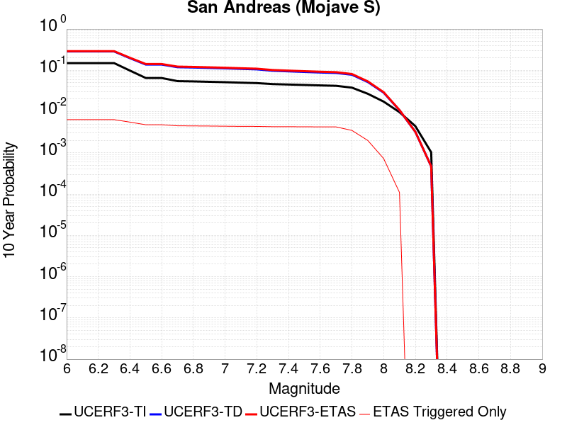 |

| Magnitude | 1 wk TI Prob | 1 wk TD Prob | 1 wk ETAS Prob | 1 wk ETAS/TD Gain | 1 wk ETAS Triggered Only | 1 mo TI Prob | 1 mo TD Prob | 1 mo ETAS Prob | 1 mo ETAS/TD Gain | 1 mo ETAS Triggered Only | 1 yr TI Prob | 1 yr TD Prob | 1 yr ETAS Prob | 1 yr ETAS/TD Gain | 1 yr ETAS Triggered Only | 10 yr TI Prob | 10 yr TD Prob | 10 yr ETAS Prob | 10 yr ETAS/TD Gain | 10 yr ETAS Triggered Only |
|-----|-----|-----|-----|-----|-----|-----|-----|-----|-----|-----|-----|-----|-----|-----|-----|-----|-----|-----|-----|-----|
| 6.0 | 3.1064058E-4 | 6.7460834E-4 | 0.0045320042 | 6.717979 | 0.00386 | 0.0013306376 | 0.0028881032 | 0.007634356 | 2.6433804 | 0.00476 | 0.016080605 | 0.03462235 | 0.040125 | 1.1589335 | 0.0057 | 0.1496549 | 0.28660452 | 0.29116312 | 1.0159055 | 0.00639 |
| 6.1 | 3.1064058E-4 | 6.7460834E-4 | 0.0045320042 | 6.717979 | 0.00386 | 0.0013306376 | 0.0028881032 | 0.007634356 | 2.6433804 | 0.00476 | 0.016080605 | 0.03462235 | 0.040125 | 1.1589335 | 0.0057 | 0.1496549 | 0.28660452 | 0.29116312 | 1.0159055 | 0.00639 |
| 6.2 | 3.1064058E-4 | 6.7460834E-4 | 0.0045320042 | 6.717979 | 0.00386 | 0.0013306376 | 0.0028881032 | 0.007634356 | 2.6433804 | 0.00476 | 0.016080605 | 0.03462235 | 0.040125 | 1.1589335 | 0.0057 | 0.1496549 | 0.28660452 | 0.29116312 | 1.0159055 | 0.00639 |
| 6.3 | 3.1064058E-4 | 6.7460834E-4 | 0.0045320042 | 6.717979 | 0.00386 | 0.0013306376 | 0.0028881032 | 0.007634356 | 2.6433804 | 0.00476 | 0.016080605 | 0.03462235 | 0.040125 | 1.1589335 | 0.0057 | 0.1496549 | 0.28660452 | 0.29116312 | 1.0159055 | 0.00639 |
| 6.4 | 1.9872203E-4 | 4.3179357E-4 | 0.0039202864 | 9.079076 | 0.00349 | 8.5138786E-4 | 0.0018492596 | 0.0060614557 | 3.2777743 | 0.00422 | 0.010316478 | 0.02228844 | 0.027137889 | 1.2175769 | 0.00496 | 0.098504856 | 0.19699748 | 0.20146216 | 1.0226637 | 0.00556 |
| 6.5 | 1.291105E-4 | 2.875267E-4 | 0.0034066297 | 11.848046 | 0.00312 | 5.5321335E-4 | 0.0012316781 | 0.0049371086 | 4.0084405 | 0.00371 | 0.006714592 | 0.0148934 | 0.01914906 | 1.2857413 | 0.00432 | 0.065152965 | 0.13803436 | 0.1421718 | 1.029974 | 0.0048 |
| 6.6 | 1.291105E-4 | 2.875267E-4 | 0.0034066297 | 11.848046 | 0.00312 | 5.5321335E-4 | 0.0012316781 | 0.0049371086 | 4.0084405 | 0.00371 | 0.006714592 | 0.0148934 | 0.01914906 | 1.2857413 | 0.00432 | 0.065152965 | 0.13803436 | 0.1421718 | 1.029974 | 0.0048 |
| 6.7 | 1.08001186E-4 | 2.4333889E-4 | 0.003212616 | 13.202231 | 0.00297 | 4.6278012E-4 | 0.0010424647 | 0.0045488058 | 4.3635106 | 0.00351 | 0.0056198016 | 0.012618446 | 0.016646963 | 1.3192562 | 0.00408 | 0.054797906 | 0.119176775 | 0.123166904 | 1.0334808 | 0.00453 |
| 6.8 | 1.0624356E-4 | 2.3851555E-4 | 0.003187812 | 13.365216 | 0.00295 | 4.5525006E-4 | 0.0010218095 | 0.0045082434 | 4.4120193 | 0.00349 | 0.0055285925 | 0.012369843 | 0.01637962 | 1.3241576 | 0.00406 | 0.053930566 | 0.11712591 | 0.121098846 | 1.0339202 | 0.0045 |
| 6.9 | 1.0393785E-4 | 2.3221898E-4 | 0.0031615386 | 13.6144705 | 0.00293 | 4.4537184E-4 | 9.948451E-4 | 0.0044613928 | 4.4845104 | 0.00347 | 0.0054089287 | 0.012045221 | 0.01602668 | 1.3305426 | 0.00403 | 0.05279156 | 0.11442335 | 0.11838188 | 1.0345955 | 0.00447 |
| 7.0 | 1.0155622E-4 | 2.2591476E-4 | 0.0031452551 | 13.922309 | 0.00292 | 4.3516833E-4 | 9.6784724E-4 | 0.0044244984 | 4.5714846 | 0.00346 | 0.005285311 | 0.0117200995 | 0.015683101 | 1.3381373 | 0.00401 | 0.05161361 | 0.111683756 | 0.115619 | 1.0352355 | 0.00443 |
| 7.1 | 9.885595E-5 | 2.1879886E-4 | 0.0031081666 | 14.205588 | 0.00289 | 4.2359953E-4 | 9.3737274E-4 | 0.0043641576 | 4.6557336 | 0.00343 | 0.0051451353 | 0.011352993 | 0.015287808 | 1.3465884 | 0.00398 | 0.05027629 | 0.1085682 | 0.11248159 | 1.0360454 | 0.00439 |
| 7.2 | 9.6411415E-5 | 2.124288E-4 | 0.003091817 | 14.554604 | 0.00288 | 4.1312634E-4 | 9.1009185E-4 | 0.004326979 | 4.7544427 | 0.00342 | 0.005018219 | 0.011024255 | 0.01495049 | 1.356145 | 0.00397 | 0.049064007 | 0.105758004 | 0.10967478 | 1.0370353 | 0.00438 |
| 7.3 | 9.1180635E-5 | 1.9471257E-4 | 0.0030541557 | 15.685456 | 0.00286 | 3.907156E-4 | 8.342157E-4 | 0.0042313794 | 5.0722847 | 0.0034 | 0.004746591 | 0.01010939 | 0.014009559 | 1.3857967 | 0.00394 | 0.046464786 | 0.09795115 | 0.10183898 | 1.0396916 | 0.00431 |
| 7.4 | 8.887388E-5 | 1.8719878E-4 | 0.0030466635 | 16.275017 | 0.00286 | 3.8083247E-4 | 8.020339E-4 | 0.004199307 | 5.235822 | 0.0034 | 0.0046267817 | 0.00972114 | 0.013622839 | 1.4013623 | 0.00394 | 0.045316286 | 0.09458615 | 0.09848848 | 1.0412569 | 0.00431 |
| 7.5 | 8.6750515E-5 | 1.8051457E-4 | 0.0030200018 | 16.729961 | 0.00284 | 3.7173493E-4 | 7.7340455E-4 | 0.0041507906 | 5.366907 | 0.00338 | 0.004516484 | 0.009375632 | 0.0132489735 | 1.4131286 | 0.00391 | 0.04425787 | 0.091549896 | 0.09543806 | 1.0424705 | 0.00428 |
| 7.6 | 8.453092E-5 | 1.7439072E-4 | 0.0030038971 | 17.225098 | 0.00283 | 3.6222505E-4 | 7.471748E-4 | 0.0041146567 | 5.5069537 | 0.00337 | 0.0044011753 | 0.009058985 | 0.012923654 | 1.4266118 | 0.0039 | 0.04315024 | 0.08870898 | 0.0926002 | 1.043865 | 0.00427 |
| 7.7 | 8.259102E-5 | 1.6961215E-4 | 0.0029891338 | 17.623348 | 0.00282 | 3.539135E-4 | 7.2670676E-4 | 0.004084265 | 5.6202383 | 0.00336 | 0.004300386 | 0.008811831 | 0.012667553 | 1.437562 | 0.00389 | 0.042181134 | 0.08645982 | 0.09035151 | 1.0450114 | 0.00426 |
| 7.8 | 7.444844E-5 | 1.5283503E-4 | 0.0024024912 | 15.719506 | 0.00225 | 3.1902574E-4 | 6.548429E-4 | 0.003353075 | 5.1204267 | 0.0027 | 0.0038772223 | 0.007943616 | 0.011068594 | 1.3933948 | 0.00315 | 0.03810269 | 0.078290746 | 0.08151673 | 1.0412052 | 0.0035 |
| 7.9 | 5.2586525E-5 | 1.00064186E-4 | 0.0013999341 | 13.990361 | 0.0013 | 2.2535135E-4 | 4.2877605E-4 | 0.0019781115 | 4.613391 | 0.00155 | 0.0027402006 | 0.005207864 | 0.0070183855 | 1.3476515 | 0.00182 | 0.027066574 | 0.052200034 | 0.054095633 | 1.0363141 | 0.002 |
| 8.0 | 3.379877E-5 | 5.4074168E-5 | 5.340482E-4 | 9.876217 | 4.8E-4 | 1.4484383E-4 | 2.3172585E-4 | 8.0159376E-4 | 3.4592333 | 5.7E-4 | 0.0017620471 | 0.002817614 | 0.0034857262 | 1.2371198 | 6.7E-4 | 0.017481409 | 0.028834904 | 0.029543852 | 1.0245866 | 7.3E-4 |
| 8.1 | 1.8668277E-5 | 1.9309397E-5 | 1.19307464E-4 | 6.1787257 | 1.0E-4 | 8.000444E-5 | 8.275194E-5 | 1.9274284E-4 | 2.329164 | 1.1E-4 | 9.736188E-4 | 0.0010070398 | 0.001116929 | 1.1091211 | 1.1E-4 | 0.009693642 | 0.010798888 | 0.0109077 | 1.0100763 | 1.1E-4 |
| 8.2 | 8.541571E-6 | 5.460819E-6 | 5.460819E-6 | 1.0 | 0.0 | 3.660622E-5 | 2.3403301E-5 | 2.3403301E-5 | 1.0 | 0.0 | 4.455896E-4 | 2.84898E-4 | 2.84898E-4 | 1.0 | 0.0 | 0.0044469717 | 0.0032408056 | 0.0032408056 | 1.0 | 0.0 |
| 8.3 | 1.983087E-6 | 7.6599065E-7 | 7.6599065E-7 | 1.0 | 0.0 | 8.498917E-6 | 3.282813E-6 | 3.282813E-6 | 1.0 | 0.0 | 1.034694E-4 | 3.9967534E-5 | 3.9967534E-5 | 1.0 | 0.0 | 0.0010342124 | 4.719687E-4 | 4.719687E-4 | 1.0 | 0.0 |

## Towne Pass
*[(top)](#table-of-contents)*

| 1 Week | 1 Month | 1 Year | 10 Year |
|-----|-----|-----|-----|
|  |  |  |  |

| Magnitude | 1 wk TI Prob | 1 wk TD Prob | 1 wk ETAS Prob | 1 wk ETAS/TD Gain | 1 wk ETAS Triggered Only | 1 mo TI Prob | 1 mo TD Prob | 1 mo ETAS Prob | 1 mo ETAS/TD Gain | 1 mo ETAS Triggered Only | 1 yr TI Prob | 1 yr TD Prob | 1 yr ETAS Prob | 1 yr ETAS/TD Gain | 1 yr ETAS Triggered Only | 10 yr TI Prob | 10 yr TD Prob | 10 yr ETAS Prob | 10 yr ETAS/TD Gain | 10 yr ETAS Triggered Only |
|-----|-----|-----|-----|-----|-----|-----|-----|-----|-----|-----|-----|-----|-----|-----|-----|-----|-----|-----|-----|-----|
| 6.0 | 3.849728E-6 | 3.8945414E-6 | 0.0030138828 | 773.8736 | 0.00301 | 1.649873E-5 | 1.669081E-5 | 0.004086623 | 244.8427 | 0.00407 | 2.0085352E-4 | 2.0319603E-4 | 0.0057120766 | 28.111162 | 0.00551 | 0.0020067208 | 0.0020305314 | 0.00860715 | 4.238866 | 0.00659 |
| 6.1 | 3.849728E-6 | 3.8945414E-6 | 0.0030138828 | 773.8736 | 0.00301 | 1.649873E-5 | 1.669081E-5 | 0.004086623 | 244.8427 | 0.00407 | 2.0085352E-4 | 2.0319603E-4 | 0.0057120766 | 28.111162 | 0.00551 | 0.0020067208 | 0.0020305314 | 0.00860715 | 4.238866 | 0.00659 |
| 6.2 | 3.849728E-6 | 3.8945414E-6 | 0.0030138828 | 773.8736 | 0.00301 | 1.649873E-5 | 1.669081E-5 | 0.004086623 | 244.8427 | 0.00407 | 2.0085352E-4 | 2.0319603E-4 | 0.0057120766 | 28.111162 | 0.00551 | 0.0020067208 | 0.0020305314 | 0.00860715 | 4.238866 | 0.00659 |
| 6.3 | 3.849728E-6 | 3.8945414E-6 | 0.0030138828 | 773.8736 | 0.00301 | 1.649873E-5 | 1.669081E-5 | 0.004086623 | 244.8427 | 0.00407 | 2.0085352E-4 | 2.0319603E-4 | 0.0057120766 | 28.111162 | 0.00551 | 0.0020067208 | 0.0020305314 | 0.00860715 | 4.238866 | 0.00659 |
| 6.4 | 3.849728E-6 | 3.8945414E-6 | 0.0030138828 | 773.8736 | 0.00301 | 1.649873E-5 | 1.669081E-5 | 0.004086623 | 244.8427 | 0.00407 | 2.0085352E-4 | 2.0319603E-4 | 0.0057120766 | 28.111162 | 0.00551 | 0.0020067208 | 0.0020305314 | 0.00860715 | 4.238866 | 0.00659 |
| 6.5 | 1.1953545E-6 | 1.203052E-6 | 4.8120247E-4 | 399.98477 | 4.8E-4 | 5.1229376E-6 | 5.1559277E-6 | 6.351527E-4 | 123.18883 | 6.3E-4 | 6.236998E-5 | 6.277173E-5 | 8.427228E-4 | 13.425196 | 7.8E-4 | 6.235248E-4 | 6.275517E-4 | 0.0015669619 | 2.4969444 | 9.4E-4 |
| 6.6 | 1.1953545E-6 | 1.203052E-6 | 4.8120247E-4 | 399.98477 | 4.8E-4 | 5.1229376E-6 | 5.1559277E-6 | 6.351527E-4 | 123.18883 | 6.3E-4 | 6.236998E-5 | 6.277173E-5 | 8.427228E-4 | 13.425196 | 7.8E-4 | 6.235248E-4 | 6.275517E-4 | 0.0015669619 | 2.4969444 | 9.4E-4 |
| 6.7 | 8.375951E-7 | 8.4106705E-7 | 2.8084082E-4 | 333.91016 | 2.8E-4 | 3.5896885E-6 | 3.6045683E-6 | 3.836032E-4 | 106.421394 | 3.8E-4 | 4.370358E-5 | 4.3884793E-5 | 5.038646E-4 | 11.48153 | 4.6E-4 | 4.3694986E-4 | 4.38767E-4 | 9.7853E-4 | 2.2301815 | 5.4E-4 |
| 6.8 | 6.38041E-7 | 6.392156E-7 | 1.906391E-4 | 298.2391 | 1.9E-4 | 2.7344586E-6 | 2.7394929E-6 | 2.527388E-4 | 92.257515 | 2.5E-4 | 3.3291526E-5 | 3.3352855E-5 | 3.2334318E-4 | 9.694618 | 2.9E-4 | 3.3286537E-4 | 3.334823E-4 | 6.8336556E-4 | 2.049181 | 3.5E-4 |
| 6.9 | 5.3460053E-7 | 5.345333E-7 | 1.5053446E-4 | 281.61847 | 1.5E-4 | 2.2911431E-6 | 2.2908553E-6 | 2.1229037E-4 | 92.66861 | 2.1E-4 | 2.789431E-5 | 2.789084E-5 | 2.7788387E-4 | 9.963266 | 2.5E-4 | 2.789081E-4 | 2.7887672E-4 | 5.7879306E-4 | 2.0754442 | 3.0E-4 |
| 7.0 | 3.557783E-7 | 3.5324226E-7 | 7.035322E-5 | 199.16422 | 7.0E-5 | 1.5247632E-6 | 1.5138945E-6 | 9.151376E-5 | 60.449226 | 9.0E-5 | 1.8563835E-5 | 1.843152E-5 | 1.1842968E-4 | 6.425389 | 1.0E-4 | 1.8562283E-4 | 1.8430075E-4 | 2.9428047E-4 | 1.5967405 | 1.1E-4 |
| 7.1 | 3.037942E-7 | 3.0002218E-7 | 5.030001E-5 | 167.6543 | 5.0E-5 | 1.3019744E-6 | 1.2858087E-6 | 7.128572E-5 | 55.440376 | 7.0E-5 | 1.5851423E-5 | 1.5654618E-5 | 9.565336E-5 | 6.110234 | 8.0E-5 | 1.5850292E-4 | 1.5653588E-4 | 2.465218E-4 | 1.5748581 | 9.0E-5 |
| 7.2 | 2.0808248E-7 | 2.0217689E-7 | 4.020217E-5 | 198.84651 | 4.0E-5 | 8.917818E-7 | 8.6647213E-7 | 6.086642E-5 | 70.246254 | 6.0E-5 | 1.0857389E-5 | 1.0549252E-5 | 8.054851E-5 | 7.635472 | 7.0E-5 | 1.0856859E-4 | 1.0548797E-4 | 1.7548059E-4 | 1.6635127 | 7.0E-5 |
| 7.3 | 1.1162073E-7 | 1.0636894E-7 | 2.0106367E-5 | 189.0248 | 2.0E-5 | 4.7837443E-7 | 4.558668E-7 | 3.0455853E-5 | 66.80867 | 3.0E-5 | 5.8241935E-6 | 5.550166E-6 | 4.5549943E-5 | 8.206951 | 4.0E-5 | 5.8240406E-5 | 5.5500474E-5 | 9.549825E-5 | 1.7206745 | 4.0E-5 |

## San Andreas (Mojave N)
*[(top)](#table-of-contents)*

| 1 Week | 1 Month | 1 Year | 10 Year |
|-----|-----|-----|-----|
|  |  | 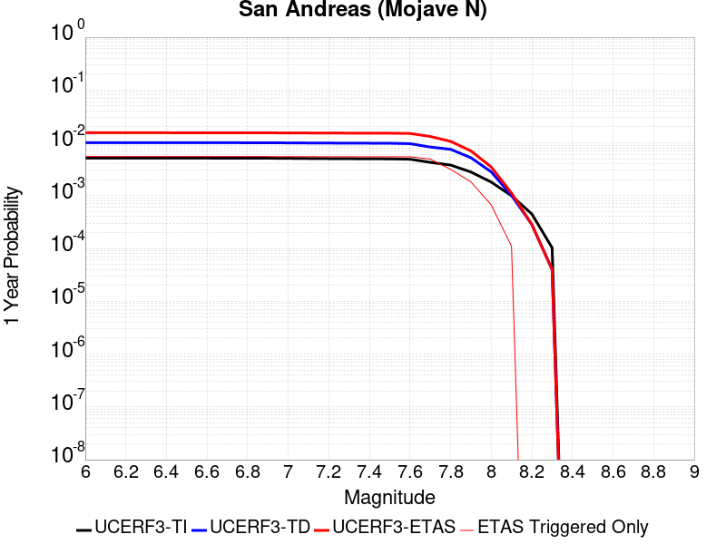 | 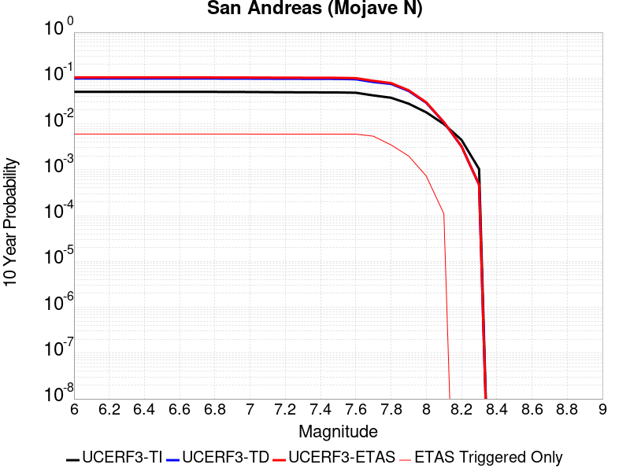 |

| Magnitude | 1 wk TI Prob | 1 wk TD Prob | 1 wk ETAS Prob | 1 wk ETAS/TD Gain | 1 wk ETAS Triggered Only | 1 mo TI Prob | 1 mo TD Prob | 1 mo ETAS Prob | 1 mo ETAS/TD Gain | 1 mo ETAS Triggered Only | 1 yr TI Prob | 1 yr TD Prob | 1 yr ETAS Prob | 1 yr ETAS/TD Gain | 1 yr ETAS Triggered Only | 10 yr TI Prob | 10 yr TD Prob | 10 yr ETAS Prob | 10 yr ETAS/TD Gain | 10 yr ETAS Triggered Only |
|-----|-----|-----|-----|-----|-----|-----|-----|-----|-----|-----|-----|-----|-----|-----|-----|-----|-----|-----|-----|-----|
| 6.0 | 9.877682E-5 | 1.9400702E-4 | 0.0041332426 | 21.304604 | 0.00394 | 4.2326056E-4 | 8.311939E-4 | 0.0055272873 | 6.649817 | 0.0047 | 0.0051410277 | 0.010072956 | 0.015527454 | 1.5414993 | 0.00551 | 0.05023708 | 0.09831428 | 0.10376046 | 1.0553956 | 0.00604 |
| 6.1 | 9.877682E-5 | 1.9400702E-4 | 0.0041332426 | 21.304604 | 0.00394 | 4.2326056E-4 | 8.311939E-4 | 0.0055272873 | 6.649817 | 0.0047 | 0.0051410277 | 0.010072956 | 0.015527454 | 1.5414993 | 0.00551 | 0.05023708 | 0.09831428 | 0.10376046 | 1.0553956 | 0.00604 |
| 6.2 | 9.877682E-5 | 1.9400702E-4 | 0.0041332426 | 21.304604 | 0.00394 | 4.2326056E-4 | 8.311939E-4 | 0.0055272873 | 6.649817 | 0.0047 | 0.0051410277 | 0.010072956 | 0.015527454 | 1.5414993 | 0.00551 | 0.05023708 | 0.09831428 | 0.10376046 | 1.0553956 | 0.00604 |
| 6.3 | 9.877682E-5 | 1.9400702E-4 | 0.0041332426 | 21.304604 | 0.00394 | 4.2326056E-4 | 8.311939E-4 | 0.0055272873 | 6.649817 | 0.0047 | 0.0051410277 | 0.010072956 | 0.015527454 | 1.5414993 | 0.00551 | 0.05023708 | 0.09831428 | 0.10376046 | 1.0553956 | 0.00604 |
| 6.4 | 9.877682E-5 | 1.9400702E-4 | 0.0041332426 | 21.304604 | 0.00394 | 4.2326056E-4 | 8.311939E-4 | 0.0055272873 | 6.649817 | 0.0047 | 0.0051410277 | 0.010072956 | 0.015527454 | 1.5414993 | 0.00551 | 0.05023708 | 0.09831428 | 0.10376046 | 1.0553956 | 0.00604 |
| 6.5 | 9.861474E-5 | 1.9374468E-4 | 0.004122983 | 21.280499 | 0.00393 | 4.2256617E-4 | 8.300703E-4 | 0.0055161775 | 6.645434 | 0.00469 | 0.0051326132 | 0.010059402 | 0.015504076 | 1.5412521 | 0.0055 | 0.050156746 | 0.098192066 | 0.10362997 | 1.0553802 | 0.00603 |
| 6.6 | 9.861474E-5 | 1.9374468E-4 | 0.004122983 | 21.280499 | 0.00393 | 4.2256617E-4 | 8.300703E-4 | 0.0055161775 | 6.645434 | 0.00469 | 0.0051326132 | 0.010059402 | 0.015504076 | 1.5412521 | 0.0055 | 0.050156746 | 0.098192066 | 0.10362997 | 1.0553802 | 0.00603 |
| 6.7 | 9.8552715E-5 | 1.9364421E-4 | 0.004122883 | 21.291021 | 0.00393 | 4.223004E-4 | 8.2964E-4 | 0.005515749 | 6.6483645 | 0.00469 | 0.0051293927 | 0.010054212 | 0.015498914 | 1.5415344 | 0.0055 | 0.050125998 | 0.098145254 | 0.10358344 | 1.0554096 | 0.00603 |
| 6.8 | 9.8464974E-5 | 1.9349584E-4 | 0.0041227355 | 21.306583 | 0.00393 | 4.219245E-4 | 8.290045E-4 | 0.0055151167 | 6.6526976 | 0.00469 | 0.0051248376 | 0.010046546 | 0.015491291 | 1.5419518 | 0.0055 | 0.05008251 | 0.09807528 | 0.10351389 | 1.0554534 | 0.00603 |
| 6.9 | 9.825824E-5 | 1.9317595E-4 | 0.004122417 | 21.340218 | 0.00393 | 4.2103877E-4 | 8.276344E-4 | 0.005513753 | 6.662063 | 0.00469 | 0.0051141046 | 0.010030019 | 0.015474854 | 1.542854 | 0.0055 | 0.049980022 | 0.09792438 | 0.103363894 | 1.0555481 | 0.00603 |
| 7.0 | 9.781462E-5 | 1.924896E-4 | 0.004111735 | 21.360817 | 0.00392 | 4.1913814E-4 | 8.246948E-4 | 0.0054908437 | 6.658031 | 0.00467 | 0.005091073 | 0.009994558 | 0.015419789 | 1.5428183 | 0.00548 | 0.04976007 | 0.09760077 | 0.10302419 | 1.0555674 | 0.00601 |
| 7.1 | 9.7121134E-5 | 1.9150671E-4 | 0.004110756 | 21.465336 | 0.00392 | 4.1616702E-4 | 8.204851E-4 | 0.0054866537 | 6.6870847 | 0.00467 | 0.005055068 | 0.009943774 | 0.015369282 | 1.5456185 | 0.00548 | 0.04941613 | 0.09713728 | 0.102563486 | 1.0558612 | 0.00601 |
| 7.2 | 9.663819E-5 | 1.9081456E-4 | 0.0040900703 | 21.434792 | 0.0039 | 4.1409794E-4 | 8.175206E-4 | 0.0054637194 | 6.68328 | 0.00465 | 0.0050299936 | 0.00990801 | 0.015313913 | 1.5456092 | 0.00546 | 0.049176537 | 0.09681055 | 0.102220654 | 1.0558834 | 0.00599 |
| 7.3 | 9.6277574E-5 | 1.9033969E-4 | 0.004089597 | 21.485783 | 0.0039 | 4.125529E-4 | 8.154867E-4 | 0.0054616947 | 6.6974664 | 0.00465 | 0.0050112694 | 0.009883473 | 0.015289509 | 1.5469774 | 0.00546 | 0.04899759 | 0.09658401 | 0.10199547 | 1.0560286 | 0.00599 |
| 7.4 | 9.593308E-5 | 1.897375E-4 | 0.0040889974 | 21.550814 | 0.0039 | 4.1107697E-4 | 8.129075E-4 | 0.0054591275 | 6.715558 | 0.00465 | 0.0049933824 | 0.009852355 | 0.015258562 | 1.5487221 | 0.00546 | 0.04882661 | 0.09630218 | 0.101715334 | 1.05621 | 0.00599 |
| 7.5 | 9.561707E-5 | 1.8919831E-4 | 0.0040884605 | 21.609392 | 0.0039 | 4.0972308E-4 | 8.1059814E-4 | 0.005456829 | 6.731855 | 0.00465 | 0.0049769743 | 0.009824493 | 0.015230851 | 1.5502939 | 0.00546 | 0.048669744 | 0.09604836 | 0.101463035 | 1.0563744 | 0.00599 |
| 7.6 | 9.418194E-5 | 1.8572104E-4 | 0.004084997 | 21.995335 | 0.0039 | 4.0357444E-4 | 7.957047E-4 | 0.0054420047 | 6.8392262 | 0.00465 | 0.004902454 | 0.009644784 | 0.015052124 | 1.560649 | 0.00546 | 0.047957025 | 0.094430685 | 0.09985504 | 1.0574428 | 0.00599 |
| 7.7 | 8.202141E-5 | 1.6021315E-4 | 0.0036696508 | 22.904804 | 0.00351 | 3.51473E-4 | 6.8644714E-4 | 0.004883564 | 7.1142607 | 0.0042 | 0.00427079 | 0.008325525 | 0.013204563 | 1.5860337 | 0.00492 | 0.04189639 | 0.08223219 | 0.08718814 | 1.0602677 | 0.0054 |
| 7.8 | 7.2859846E-5 | 1.4516473E-4 | 0.002394838 | 16.497383 | 0.00225 | 3.1221908E-4 | 6.219862E-4 | 0.0033203068 | 5.338232 | 0.0027 | 0.003794643 | 0.0075464295 | 0.010672659 | 1.414266 | 0.00315 | 0.037304975 | 0.07472468 | 0.07795389 | 1.0432148 | 0.00349 |
| 7.9 | 5.3874453E-5 | 1.0045676E-4 | 0.0014003261 | 13.939591 | 0.0013 | 2.3087008E-4 | 4.3045796E-4 | 0.0019797909 | 4.599266 | 0.00155 | 0.0028072202 | 0.0052282433 | 0.007038728 | 1.3462893 | 0.00182 | 0.02772022 | 0.05242443 | 0.05431958 | 1.0361501 | 0.002 |
| 8.0 | 3.468538E-5 | 5.4260272E-5 | 5.342342E-4 | 9.845772 | 4.8E-4 | 1.4864317E-4 | 2.325233E-4 | 8.0239074E-4 | 3.4507973 | 5.7E-4 | 0.0018082283 | 0.002827298 | 0.0034954036 | 1.2363054 | 6.7E-4 | 0.017935853 | 0.028947512 | 0.02965638 | 1.0244881 | 7.3E-4 |
| 8.1 | 1.9152367E-5 | 1.940263E-5 | 1.1940069E-4 | 6.1538405 | 1.0E-4 | 8.207899E-5 | 8.3151484E-5 | 1.9314233E-4 | 2.3227768 | 1.1E-4 | 9.988535E-4 | 0.0010118998 | 0.0011217884 | 1.1085964 | 1.1E-4 | 0.009943757 | 0.01085625 | 0.010965056 | 1.0100224 | 1.1E-4 |
| 8.2 | 8.643924E-6 | 5.4748625E-6 | 5.4748625E-6 | 1.0 | 0.0 | 3.704486E-5 | 2.3463486E-5 | 2.3463486E-5 | 1.0 | 0.0 | 4.5092785E-4 | 2.8563058E-4 | 2.8563058E-4 | 1.0 | 0.0 | 0.0045001395 | 0.0032487072 | 0.0032487072 | 1.0 | 0.0 |
| 8.3 | 1.983087E-6 | 7.6599065E-7 | 7.6599065E-7 | 1.0 | 0.0 | 8.498917E-6 | 3.282813E-6 | 3.282813E-6 | 1.0 | 0.0 | 1.034694E-4 | 3.9967534E-5 | 3.9967534E-5 | 1.0 | 0.0 | 0.0010342124 | 4.719687E-4 | 4.719687E-4 | 1.0 | 0.0 |

## Lenwood-Lockhart-Old Woman Springs
*[(top)](#table-of-contents)*

| 1 Week | 1 Month | 1 Year | 10 Year |
|-----|-----|-----|-----|
| 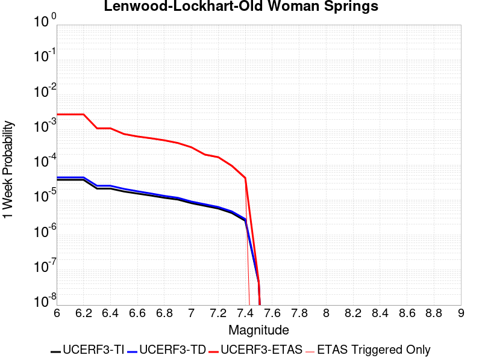 | 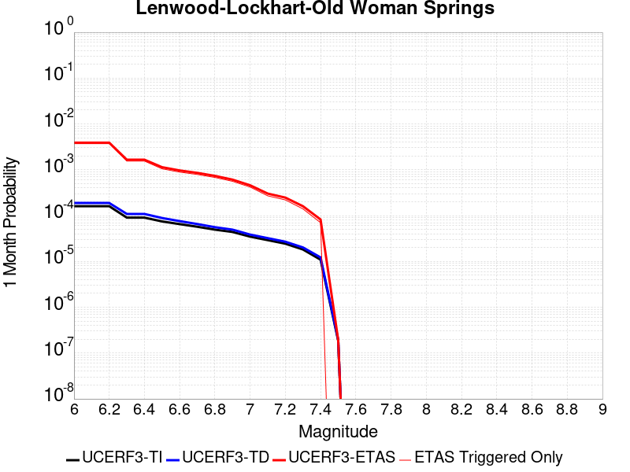 |  |  |

| Magnitude | 1 wk TI Prob | 1 wk TD Prob | 1 wk ETAS Prob | 1 wk ETAS/TD Gain | 1 wk ETAS Triggered Only | 1 mo TI Prob | 1 mo TD Prob | 1 mo ETAS Prob | 1 mo ETAS/TD Gain | 1 mo ETAS Triggered Only | 1 yr TI Prob | 1 yr TD Prob | 1 yr ETAS Prob | 1 yr ETAS/TD Gain | 1 yr ETAS Triggered Only | 10 yr TI Prob | 10 yr TD Prob | 10 yr ETAS Prob | 10 yr ETAS/TD Gain | 10 yr ETAS Triggered Only |
|-----|-----|-----|-----|-----|-----|-----|-----|-----|-----|-----|-----|-----|-----|-----|-----|-----|-----|-----|-----|-----|
| 6.0 | 3.744542E-5 | 4.396252E-5 | 0.002763843 | 62.868164 | 0.00272 | 1.604705E-4 | 1.8839816E-4 | 0.0039076973 | 20.741695 | 0.00372 | 0.0019519776 | 0.0022915069 | 0.0072201868 | 3.1508467 | 0.00494 | 0.019349206 | 0.022696787 | 0.028286962 | 1.2462981 | 0.00572 |
| 6.1 | 3.744542E-5 | 4.396252E-5 | 0.002763843 | 62.868164 | 0.00272 | 1.604705E-4 | 1.8839816E-4 | 0.0039076973 | 20.741695 | 0.00372 | 0.0019519776 | 0.0022915069 | 0.0072201868 | 3.1508467 | 0.00494 | 0.019349206 | 0.022696787 | 0.028286962 | 1.2462981 | 0.00572 |
| 6.2 | 3.744542E-5 | 4.396252E-5 | 0.002763843 | 62.868164 | 0.00272 | 1.604705E-4 | 1.8839816E-4 | 0.0039076973 | 20.741695 | 0.00372 | 0.0019519776 | 0.0022915069 | 0.0072201868 | 3.1508467 | 0.00494 | 0.019349206 | 0.022696787 | 0.028286962 | 1.2462981 | 0.00572 |
| 6.3 | 2.1079984E-5 | 2.5353434E-5 | 0.001105326 | 43.5967 | 0.00108 | 9.0339665E-5 | 1.0865316E-4 | 0.0016584848 | 15.264027 | 0.00155 | 0.0010993304 | 0.0013220694 | 0.0033993195 | 2.571211 | 0.00208 | 0.010939079 | 0.0131442575 | 0.015581791 | 1.1854447 | 0.00247 |
| 6.4 | 2.1079984E-5 | 2.5353434E-5 | 0.001105326 | 43.5967 | 0.00108 | 9.0339665E-5 | 1.0865316E-4 | 0.0016584848 | 15.264027 | 0.00155 | 0.0010993304 | 0.0013220694 | 0.0033993195 | 2.571211 | 0.00208 | 0.010939079 | 0.0131442575 | 0.015581791 | 1.1854447 | 0.00247 |
| 6.5 | 1.7397282E-5 | 2.066241E-5 | 7.606471E-4 | 36.813087 | 7.4E-4 | 7.455765E-5 | 8.8550245E-5 | 0.0011384572 | 12.856625 | 0.00105 | 9.073613E-4 | 0.0010775778 | 0.0024960476 | 2.3163502 | 0.00142 | 0.009036654 | 0.010724821 | 0.012416482 | 1.1577332 | 0.00171 |
| 6.6 | 1.52050325E-5 | 1.7679693E-5 | 6.4766855E-4 | 36.633472 | 6.3E-4 | 6.51628E-5 | 7.576796E-5 | 9.6570054E-4 | 12.7455 | 8.9E-4 | 7.9306826E-4 | 9.220924E-4 | 0.0021209859 | 2.300188 | 0.0012 | 0.007902439 | 0.009183526 | 0.010649934 | 1.1596781 | 0.00148 |
| 6.7 | 1.332523E-5 | 1.5264002E-5 | 5.752554E-4 | 37.687065 | 5.6E-4 | 5.7106878E-5 | 6.5415545E-5 | 8.5536385E-4 | 13.07585 | 7.9E-4 | 6.950544E-4 | 7.961491E-4 | 0.001815337 | 2.280147 | 0.00102 | 0.006928845 | 0.007933599 | 0.009173682 | 1.1563077 | 0.00125 |
| 6.8 | 1.1525329E-5 | 1.3030979E-5 | 5.030246E-4 | 38.60221 | 4.9E-4 | 4.9393333E-5 | 5.584588E-5 | 7.3580793E-4 | 13.175688 | 6.8E-4 | 6.011979E-4 | 6.797157E-4 | 0.0015191447 | 2.2349708 | 8.4E-4 | 0.00599574 | 0.006776819 | 0.0077700424 | 1.1465619 | 0.001 |
| 6.9 | 1.0253909E-5 | 1.15144385E-5 | 4.2150973E-4 | 36.607056 | 4.1E-4 | 4.3944583E-5 | 4.9346683E-5 | 6.093191E-4 | 12.347721 | 5.6E-4 | 5.3489394E-4 | 6.0063385E-4 | 0.0012802255 | 2.1314573 | 6.8E-4 | 0.0053360825 | 0.0059904843 | 0.006825452 | 1.1393824 | 8.4E-4 |
| 7.0 | 8.104563E-6 | 8.991279E-6 | 3.189885E-4 | 35.477543 | 3.1E-4 | 3.4733377E-5 | 3.8533497E-5 | 4.5851732E-4 | 11.899188 | 4.2E-4 | 4.2279682E-4 | 4.6904673E-4 | 9.788076E-4 | 2.0868018 | 5.1E-4 | 0.0042199334 | 0.0046808156 | 0.00528796 | 1.1297091 | 6.1E-4 |
| 7.1 | 6.7986157E-6 | 7.515816E-6 | 1.9751438E-4 | 26.279833 | 1.9E-4 | 2.91366E-5 | 3.2210253E-5 | 3.0220154E-4 | 9.3821535 | 2.7E-4 | 3.5468035E-4 | 3.920914E-4 | 7.419542E-4 | 1.8922989 | 3.5E-4 | 0.003541148 | 0.003914213 | 0.0043524904 | 1.1119709 | 4.4E-4 |
| 7.2 | 5.6893327E-6 | 6.2800136E-6 | 1.66279E-4 | 26.477491 | 1.6E-4 | 2.4382627E-5 | 2.6914078E-5 | 2.4690817E-4 | 9.173941 | 2.2E-4 | 2.9681803E-4 | 3.2763163E-4 | 6.175366E-4 | 1.8848505 | 2.9E-4 | 0.002964219 | 0.0032716845 | 0.0036504413 | 1.1157681 | 3.8E-4 |
| 7.3 | 4.253348E-6 | 4.7069107E-6 | 9.4706484E-5 | 20.120733 | 9.0E-5 | 1.8228506E-5 | 2.0172329E-5 | 1.601695E-4 | 7.9400606 | 1.4E-4 | 2.2190946E-4 | 2.4557224E-4 | 4.2552804E-4 | 1.7328018 | 1.8E-4 | 0.00221688 | 0.0024531898 | 0.002712552 | 1.1057245 | 2.6E-4 |
| 7.4 | 2.5448119E-6 | 2.852045E-6 | 4.285193E-5 | 15.024984 | 4.0E-5 | 1.0906291E-5 | 1.2223002E-5 | 8.222215E-5 | 6.726837 | 7.0E-5 | 1.3277601E-4 | 1.4880655E-4 | 2.2879464E-4 | 1.5375308 | 8.0E-5 | 0.001326967 | 0.0014872311 | 0.0016170378 | 1.0872808 | 1.3E-4 |
| 7.5 | 4.3706837E-8 | 4.562909E-8 | 4.562909E-8 | 1.0 | 0.0 | 1.8731501E-7 | 1.9555324E-7 | 1.9555324E-7 | 1.0 | 0.0 | 2.2805577E-6 | 2.3808586E-6 | 2.3808586E-6 | 1.0 | 0.0 | 2.2805343E-5 | 2.3808387E-5 | 2.3808387E-5 | 1.0 | 0.0 |

## Bicycle Lake
*[(top)](#table-of-contents)*

| 1 Week | 1 Month | 1 Year | 10 Year |
|-----|-----|-----|-----|
|  |  |  |  |

| Magnitude | 1 wk TI Prob | 1 wk TD Prob | 1 wk ETAS Prob | 1 wk ETAS/TD Gain | 1 wk ETAS Triggered Only | 1 mo TI Prob | 1 mo TD Prob | 1 mo ETAS Prob | 1 mo ETAS/TD Gain | 1 mo ETAS Triggered Only | 1 yr TI Prob | 1 yr TD Prob | 1 yr ETAS Prob | 1 yr ETAS/TD Gain | 1 yr ETAS Triggered Only | 10 yr TI Prob | 10 yr TD Prob | 10 yr ETAS Prob | 10 yr ETAS/TD Gain | 10 yr ETAS Triggered Only |
|-----|-----|-----|-----|-----|-----|-----|-----|-----|-----|-----|-----|-----|-----|-----|-----|-----|-----|-----|-----|-----|
| 6.0 | 1.9621975E-5 | 2.2097078E-5 | 0.001612062 | 72.95363 | 0.00159 | 8.4091465E-5 | 9.4699084E-5 | 0.002544467 | 26.86897 | 0.00245 | 0.0010233327 | 0.0011524865 | 0.0050679687 | 4.3974214 | 0.00392 | 0.01018633 | 0.011478408 | 0.016341934 | 1.4237108 | 0.00492 |
| 6.1 | 1.9621975E-5 | 2.2097078E-5 | 0.001612062 | 72.95363 | 0.00159 | 8.4091465E-5 | 9.4699084E-5 | 0.002544467 | 26.86897 | 0.00245 | 0.0010233327 | 0.0011524865 | 0.0050679687 | 4.3974214 | 0.00392 | 0.01018633 | 0.011478408 | 0.016341934 | 1.4237108 | 0.00492 |
| 6.2 | 9.9971285E-6 | 1.1255639E-5 | 9.912446E-4 | 88.06648 | 9.8E-4 | 4.2844134E-5 | 4.8237856E-5 | 0.0015081675 | 31.265224 | 0.00146 | 5.2150246E-4 | 5.871896E-4 | 0.002955798 | 5.033805 | 0.00237 | 0.0052028033 | 0.005861487 | 0.008833961 | 1.5071195 | 0.00299 |
| 6.3 | 9.589428E-6 | 1.0798346E-5 | 9.607881E-4 | 88.97549 | 9.5E-4 | 4.10969E-5 | 4.62781E-5 | 0.0014562128 | 31.466566 | 0.00141 | 5.002399E-4 | 5.6334207E-4 | 0.0027820915 | 4.9385476 | 0.00222 | 0.0049911533 | 0.0056242296 | 0.008398538 | 1.4932779 | 0.00279 |
| 6.4 | 9.589428E-6 | 1.0798346E-5 | 9.607881E-4 | 88.97549 | 9.5E-4 | 4.10969E-5 | 4.62781E-5 | 0.0014562128 | 31.466566 | 0.00141 | 5.002399E-4 | 5.6334207E-4 | 0.0027820915 | 4.9385476 | 0.00222 | 0.0049911533 | 0.0056242296 | 0.008398538 | 1.4932779 | 0.00279 |
| 6.5 | 5.557707E-6 | 6.2856016E-6 | 5.462822E-4 | 86.910095 | 5.4E-4 | 2.3818526E-5 | 2.6938165E-5 | 8.6691556E-4 | 32.181683 | 8.4E-4 | 2.8995197E-4 | 3.2794967E-4 | 0.0016275233 | 4.962723 | 0.0013 | 0.0028957394 | 0.0032772934 | 0.004882017 | 1.489649 | 0.00161 |
| 6.6 | 4.8742945E-6 | 5.5132896E-6 | 5.155105E-4 | 93.50324 | 5.1E-4 | 2.0889667E-5 | 2.3628318E-5 | 7.336115E-4 | 31.04798 | 7.1E-4 | 2.54302E-4 | 2.87663E-4 | 0.0013973437 | 4.857572 | 0.00111 | 0.002540112 | 0.0028754752 | 0.0041916794 | 1.4577346 | 0.00132 |
| 6.7 | 3.991108E-6 | 4.5159104E-6 | 4.4451392E-4 | 98.43285 | 4.4E-4 | 1.7104636E-5 | 1.9353902E-5 | 5.993427E-4 | 30.967539 | 5.8E-4 | 2.0822904E-4 | 2.3563375E-4 | 0.001155417 | 4.9034443 | 9.2E-4 | 0.0020803404 | 0.0023563374 | 0.0033938868 | 1.4403229 | 0.00104 |

## Paradise
*[(top)](#table-of-contents)*

| 1 Week | 1 Month | 1 Year | 10 Year |
|-----|-----|-----|-----|
|  |  | 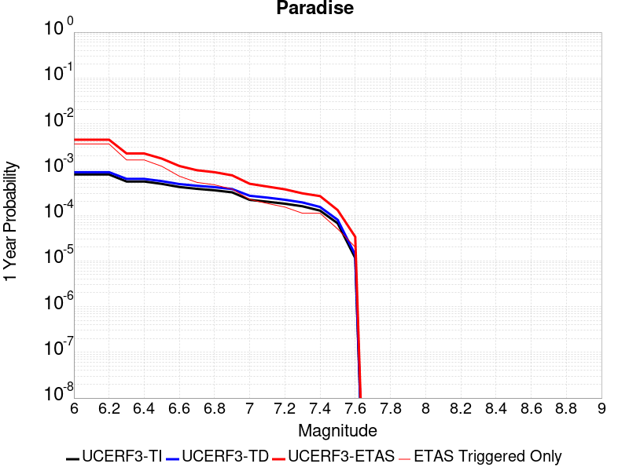 |  |

| Magnitude | 1 wk TI Prob | 1 wk TD Prob | 1 wk ETAS Prob | 1 wk ETAS/TD Gain | 1 wk ETAS Triggered Only | 1 mo TI Prob | 1 mo TD Prob | 1 mo ETAS Prob | 1 mo ETAS/TD Gain | 1 mo ETAS Triggered Only | 1 yr TI Prob | 1 yr TD Prob | 1 yr ETAS Prob | 1 yr ETAS/TD Gain | 1 yr ETAS Triggered Only | 10 yr TI Prob | 10 yr TD Prob | 10 yr ETAS Prob | 10 yr ETAS/TD Gain | 10 yr ETAS Triggered Only |
|-----|-----|-----|-----|-----|-----|-----|-----|-----|-----|-----|-----|-----|-----|-----|-----|-----|-----|-----|-----|-----|
| 6.0 | 1.4851273E-5 | 1.6694692E-5 | 0.0016966666 | 101.62911 | 0.00168 | 6.364676E-5 | 7.154685E-5 | 0.0024813744 | 34.681812 | 0.00241 | 7.7462377E-4 | 8.707584E-4 | 0.004467624 | 5.1307273 | 0.0036 | 0.0077192914 | 0.008675844 | 0.0130079305 | 1.4993274 | 0.00437 |
| 6.1 | 1.4851273E-5 | 1.6694692E-5 | 0.0016966666 | 101.62911 | 0.00168 | 6.364676E-5 | 7.154685E-5 | 0.0024813744 | 34.681812 | 0.00241 | 7.7462377E-4 | 8.707584E-4 | 0.004467624 | 5.1307273 | 0.0036 | 0.0077192914 | 0.008675844 | 0.0130079305 | 1.4993274 | 0.00437 |
| 6.2 | 1.4851273E-5 | 1.6694692E-5 | 0.0016966666 | 101.62911 | 0.00168 | 6.364676E-5 | 7.154685E-5 | 0.0024813744 | 34.681812 | 0.00241 | 7.7462377E-4 | 8.707584E-4 | 0.004467624 | 5.1307273 | 0.0036 | 0.0077192914 | 0.008675844 | 0.0130079305 | 1.4993274 | 0.00437 |
| 6.3 | 1.0426831E-5 | 1.188862E-5 | 7.9187937E-4 | 66.60818 | 7.8E-4 | 4.4685654E-5 | 5.0950268E-5 | 0.0011608937 | 22.78484 | 0.00111 | 5.43912E-4 | 6.201489E-4 | 0.0022291504 | 3.5945406 | 0.00161 | 0.0054258266 | 0.0061847917 | 0.008112793 | 1.3117326 | 0.00194 |
| 6.4 | 1.0426831E-5 | 1.188862E-5 | 7.9187937E-4 | 66.60818 | 7.8E-4 | 4.4685654E-5 | 5.0950268E-5 | 0.0011608937 | 22.78484 | 0.00111 | 5.43912E-4 | 6.201489E-4 | 0.0022291504 | 3.5945406 | 0.00161 | 0.0054258266 | 0.0061847917 | 0.008112793 | 1.3117326 | 0.00194 |
| 6.5 | 9.25027E-6 | 1.06199595E-5 | 5.406143E-4 | 50.9055 | 5.3E-4 | 3.964341E-5 | 4.551335E-5 | 8.254778E-4 | 18.13705 | 7.8E-4 | 4.8255164E-4 | 5.53989E-4 | 0.0017233408 | 3.1107852 | 0.00117 | 0.0048150513 | 0.0055265795 | 0.006918842 | 1.2519213 | 0.0014 |
| 6.6 | 7.904275E-6 | 9.159525E-6 | 3.391565E-4 | 37.02774 | 3.3E-4 | 3.3875025E-5 | 3.9254537E-5 | 5.392349E-4 | 13.73688 | 5.0E-4 | 4.1235037E-4 | 4.7782314E-4 | 0.0011874839 | 2.4851954 | 7.1E-4 | 0.0041158604 | 0.0047683544 | 0.005614301 | 1.1774086 | 8.5E-4 |
| 6.7 | 7.2061953E-6 | 8.407248E-6 | 2.3840531E-4 | 28.357115 | 2.3E-4 | 3.088333E-5 | 3.6030586E-5 | 3.7601835E-4 | 10.436087 | 3.4E-4 | 3.7593965E-4 | 4.3858777E-4 | 9.583597E-4 | 2.1851037 | 5.2E-4 | 0.003753043 | 0.004377591 | 0.005004833 | 1.1432848 | 6.3E-4 |
| 6.8 | 6.6948724E-6 | 7.842166E-6 | 1.9784068E-4 | 25.22781 | 1.9E-4 | 2.8691995E-5 | 3.360887E-5 | 3.2359912E-4 | 9.628385 | 2.9E-4 | 3.4926904E-4 | 4.0911473E-4 | 8.689265E-4 | 2.123919 | 4.6E-4 | 0.003487206 | 0.0040839734 | 0.004611809 | 1.1292456 | 5.3E-4 |
| 6.9 | 6.0421025E-6 | 7.130621E-6 | 1.371297E-4 | 19.231102 | 1.3E-4 | 2.5894467E-5 | 3.0559466E-5 | 2.5055275E-4 | 8.198859 | 2.2E-4 | 3.1521954E-4 | 3.7200135E-4 | 7.4186374E-4 | 1.99425 | 3.7E-4 | 0.0031477278 | 0.0037141247 | 0.0041524903 | 1.1180266 | 4.4E-4 |
| 7.0 | 4.134091E-6 | 5.0803087E-6 | 1.050798E-4 | 20.683743 | 1.0E-4 | 1.7717413E-5 | 2.177258E-5 | 1.7176931E-4 | 7.88925 | 1.5E-4 | 2.1568815E-4 | 2.6505045E-4 | 4.8499214E-4 | 1.8298106 | 2.2E-4 | 0.0021547892 | 0.0026474963 | 0.002926755 | 1.1054803 | 2.8E-4 |
| 7.1 | 3.7674888E-6 | 4.6318696E-6 | 8.46315E-5 | 18.271564 | 8.0E-5 | 1.6146281E-5 | 1.9850726E-5 | 1.3984834E-4 | 7.0449986 | 1.2E-4 | 1.9656324E-4 | 2.4165731E-4 | 4.216138E-4 | 1.7446765 | 1.8E-4 | 0.0019638946 | 0.002414096 | 0.0026435407 | 1.0950438 | 2.3E-4 |
| 7.2 | 3.4065345E-6 | 4.156723E-6 | 6.415648E-5 | 15.434387 | 6.0E-5 | 1.4599351E-5 | 1.7814415E-5 | 1.1781263E-4 | 6.613332 | 1.0E-4 | 1.777326E-4 | 2.1687041E-4 | 3.668379E-4 | 1.6915073 | 1.5E-4 | 0.0017759053 | 0.002166736 | 0.0023663025 | 1.0921048 | 2.0E-4 |
| 7.3 | 2.9934936E-6 | 3.6293168E-6 | 6.36291E-5 | 17.531977 | 6.0E-5 | 1.2829195E-5 | 1.555413E-5 | 1.0555273E-4 | 6.7861543 | 9.0E-5 | 1.5618425E-4 | 1.8935655E-4 | 2.9933572E-4 | 1.5808047 | 1.1E-4 | 0.0015607453 | 0.0018920974 | 0.0020517947 | 1.0844022 | 1.6E-4 |
| 7.4 | 2.4049796E-6 | 2.8889842E-6 | 6.288881E-5 | 21.768486 | 6.0E-5 | 1.0307015E-5 | 1.238131E-5 | 1.02380196E-4 | 8.26893 | 9.0E-5 | 1.2548068E-4 | 1.5073347E-4 | 2.607169E-4 | 1.729655 | 1.1E-4 | 0.0012540985 | 0.0015064536 | 0.0016562277 | 1.0994216 | 1.5E-4 |
| 7.5 | 1.2710091E-6 | 1.5134682E-6 | 4.151341E-5 | 27.429323 | 4.0E-5 | 5.44717E-6 | 6.4862834E-6 | 5.648596E-5 | 8.708525 | 5.0E-5 | 6.631728E-5 | 7.8968886E-5 | 1.2896494E-4 | 1.6331108 | 5.0E-5 | 6.6297496E-4 | 7.8953087E-4 | 8.7945984E-4 | 1.1139017 | 9.0E-5 |
| 7.6 | 2.21172E-7 | 2.603961E-7 | 2.0260391E-5 | 77.80605 | 2.0E-5 | 9.478797E-7 | 1.1159829E-6 | 2.111596E-5 | 18.921402 | 2.0E-5 | 1.1540374E-5 | 1.3587036E-5 | 3.3586763E-5 | 2.4719715 | 2.0E-5 | 1.1539775E-4 | 1.3586486E-4 | 1.6586078E-4 | 1.2207776 | 3.0E-5 |

## Garlic Springs
*[(top)](#table-of-contents)*

| 1 Week | 1 Month | 1 Year | 10 Year |
|-----|-----|-----|-----|
|  |  |  | 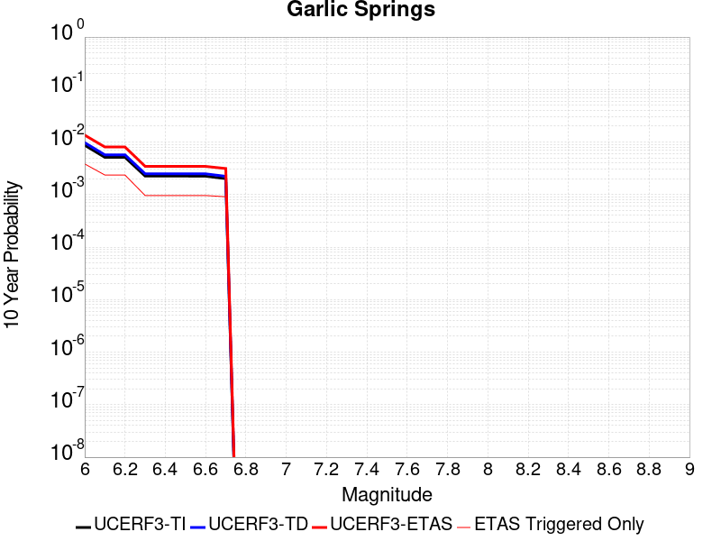 |

| Magnitude | 1 wk TI Prob | 1 wk TD Prob | 1 wk ETAS Prob | 1 wk ETAS/TD Gain | 1 wk ETAS Triggered Only | 1 mo TI Prob | 1 mo TD Prob | 1 mo ETAS Prob | 1 mo ETAS/TD Gain | 1 mo ETAS Triggered Only | 1 yr TI Prob | 1 yr TD Prob | 1 yr ETAS Prob | 1 yr ETAS/TD Gain | 1 yr ETAS Triggered Only | 10 yr TI Prob | 10 yr TD Prob | 10 yr ETAS Prob | 10 yr ETAS/TD Gain | 10 yr ETAS Triggered Only |
|-----|-----|-----|-----|-----|-----|-----|-----|-----|-----|-----|-----|-----|-----|-----|-----|-----|-----|-----|-----|-----|
| 6.0 | 1.6760017E-5 | 1.8776833E-5 | 0.0012987528 | 69.16783 | 0.00128 | 7.182667E-5 | 8.0470316E-5 | 0.0019403206 | 24.112253 | 0.00186 | 8.7413884E-4 | 9.794032E-4 | 0.0039464943 | 4.029489 | 0.00297 | 0.008707083 | 0.009762413 | 0.013564925 | 1.3895054 | 0.00384 |
| 6.1 | 9.852767E-6 | 1.09735865E-5 | 8.0096495E-4 | 72.99026 | 7.9E-4 | 4.222546E-5 | 4.702921E-5 | 0.001176976 | 25.02649 | 0.00113 | 5.139737E-4 | 5.7250116E-4 | 0.0024014534 | 4.19467 | 0.00183 | 0.005127866 | 0.005717221 | 0.008063729 | 1.4104279 | 0.00236 |
| 6.2 | 9.852767E-6 | 1.09735865E-5 | 8.0096495E-4 | 72.99026 | 7.9E-4 | 4.222546E-5 | 4.702921E-5 | 0.001176976 | 25.02649 | 0.00113 | 5.139737E-4 | 5.7250116E-4 | 0.0024014534 | 4.19467 | 0.00183 | 0.005127866 | 0.005717221 | 0.008063729 | 1.4104279 | 0.00236 |
| 6.3 | 4.3167724E-6 | 4.7780286E-6 | 4.3477598E-4 | 90.99484 | 4.3E-4 | 1.8500323E-5 | 2.0477235E-5 | 5.5046636E-4 | 26.881872 | 5.3E-4 | 2.2521814E-4 | 2.4930484E-4 | 9.891203E-4 | 3.9675136 | 7.4E-4 | 0.0022499003 | 0.00249251 | 0.003450117 | 1.3841939 | 9.6E-4 |
| 6.4 | 4.3167724E-6 | 4.7780286E-6 | 4.3477598E-4 | 90.99484 | 4.3E-4 | 1.8500323E-5 | 2.0477235E-5 | 5.5046636E-4 | 26.881872 | 5.3E-4 | 2.2521814E-4 | 2.4930484E-4 | 9.891203E-4 | 3.9675136 | 7.4E-4 | 0.0022499003 | 0.00249251 | 0.003450117 | 1.3841939 | 9.6E-4 |
| 6.5 | 4.3167724E-6 | 4.7780286E-6 | 4.3477598E-4 | 90.99484 | 4.3E-4 | 1.8500323E-5 | 2.0477235E-5 | 5.5046636E-4 | 26.881872 | 5.3E-4 | 2.2521814E-4 | 2.4930484E-4 | 9.891203E-4 | 3.9675136 | 7.4E-4 | 0.0022499003 | 0.00249251 | 0.003450117 | 1.3841939 | 9.6E-4 |
| 6.6 | 4.301311E-6 | 4.760897E-6 | 4.3475884E-4 | 91.31868 | 4.3E-4 | 1.8434059E-5 | 2.0403815E-5 | 5.50393E-4 | 26.975004 | 5.3E-4 | 2.2441156E-4 | 2.4841115E-4 | 9.882273E-4 | 3.9781923 | 7.4E-4 | 0.0022418506 | 0.002483593 | 0.0034412087 | 1.3855767 | 9.6E-4 |
| 6.7 | 3.8599724E-6 | 4.27106E-6 | 4.142693E-4 | 96.9945 | 4.1E-4 | 1.6542634E-5 | 1.8304541E-5 | 5.2829523E-4 | 28.861427 | 5.1E-4 | 2.0138794E-4 | 2.228578E-4 | 9.326996E-4 | 4.185178 | 7.1E-4 | 0.0020120554 | 0.002228578 | 0.00313655 | 1.4074222 | 9.1E-4 |

## San Andreas (San Bernardino N)
*[(top)](#table-of-contents)*

| 1 Week | 1 Month | 1 Year | 10 Year |
|-----|-----|-----|-----|
|  |  |  | 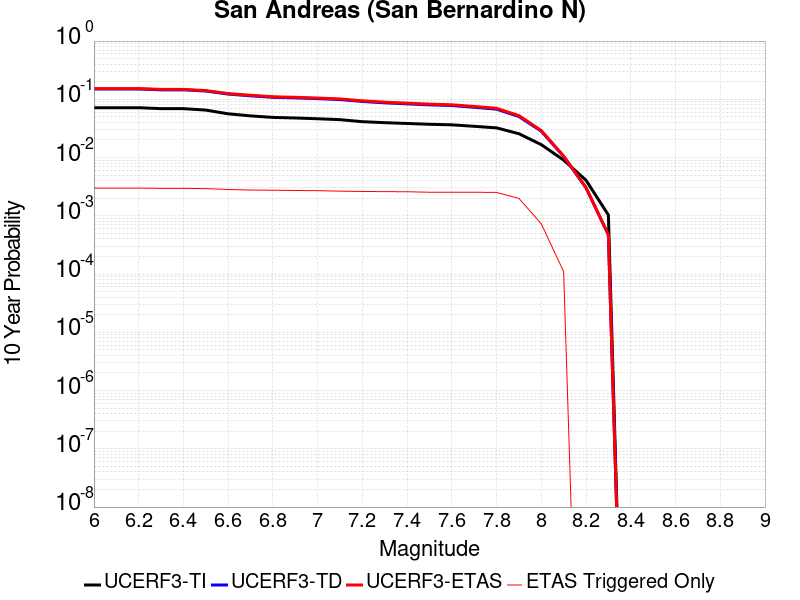 |

| Magnitude | 1 wk TI Prob | 1 wk TD Prob | 1 wk ETAS Prob | 1 wk ETAS/TD Gain | 1 wk ETAS Triggered Only | 1 mo TI Prob | 1 mo TD Prob | 1 mo ETAS Prob | 1 mo ETAS/TD Gain | 1 mo ETAS Triggered Only | 1 yr TI Prob | 1 yr TD Prob | 1 yr ETAS Prob | 1 yr ETAS/TD Gain | 1 yr ETAS Triggered Only | 10 yr TI Prob | 10 yr TD Prob | 10 yr ETAS Prob | 10 yr ETAS/TD Gain | 10 yr ETAS Triggered Only |
|-----|-----|-----|-----|-----|-----|-----|-----|-----|-----|-----|-----|-----|-----|-----|-----|-----|-----|-----|-----|-----|
| 6.0 | 1.4273766E-4 | 3.1606483E-4 | 0.002115496 | 6.693234 | 0.0018 | 6.115894E-4 | 0.0013538664 | 0.0035209286 | 2.600647 | 0.00217 | 0.0074207084 | 0.016360244 | 0.018898034 | 1.1551194 | 0.00258 | 0.07177748 | 0.15026689 | 0.1528076 | 1.0169079 | 0.00299 |
| 6.1 | 1.4273766E-4 | 3.1606483E-4 | 0.002115496 | 6.693234 | 0.0018 | 6.115894E-4 | 0.0013538664 | 0.0035209286 | 2.600647 | 0.00217 | 0.0074207084 | 0.016360244 | 0.018898034 | 1.1551194 | 0.00258 | 0.07177748 | 0.15026689 | 0.1528076 | 1.0169079 | 0.00299 |
| 6.2 | 1.4273766E-4 | 3.1606483E-4 | 0.002115496 | 6.693234 | 0.0018 | 6.115894E-4 | 0.0013538664 | 0.0035209286 | 2.600647 | 0.00217 | 0.0074207084 | 0.016360244 | 0.018898034 | 1.1551194 | 0.00258 | 0.07177748 | 0.15026689 | 0.1528076 | 1.0169079 | 0.00299 |
| 6.3 | 1.3730655E-4 | 3.0511338E-4 | 0.0020945673 | 6.8648815 | 0.00179 | 5.883239E-4 | 0.0013069791 | 0.003464156 | 2.650506 | 0.00216 | 0.0071393442 | 0.015797773 | 0.01831733 | 1.1594882 | 0.00256 | 0.06914291 | 0.14556676 | 0.14809589 | 1.0173743 | 0.00296 |
| 6.4 | 1.3730655E-4 | 3.0511338E-4 | 0.0020945673 | 6.8648815 | 0.00179 | 5.883239E-4 | 0.0013069791 | 0.003464156 | 2.650506 | 0.00216 | 0.0071393442 | 0.015797773 | 0.01831733 | 1.1594882 | 0.00256 | 0.06914291 | 0.14556676 | 0.14809589 | 1.0173743 | 0.00296 |
| 6.5 | 1.2942807E-4 | 2.8925808E-4 | 0.002068743 | 7.1518946 | 0.00178 | 5.545738E-4 | 0.0012390936 | 0.0033864295 | 2.7329893 | 0.00215 | 0.0067310524 | 0.01498286 | 0.017484803 | 1.1669871 | 0.00254 | 0.06530788 | 0.13870941 | 0.141233 | 1.0181932 | 0.00293 |
| 6.6 | 1.1125901E-4 | 2.536472E-4 | 0.0019732108 | 7.7793527 | 0.00172 | 4.767372E-4 | 0.0010866089 | 0.0031643487 | 2.9121323 | 0.00208 | 0.005788839 | 0.013149847 | 0.015587367 | 1.1853648 | 0.00247 | 0.056403454 | 0.122999296 | 0.1254812 | 1.0201783 | 0.00283 |
| 6.7 | 1.02209575E-4 | 2.3499702E-4 | 0.0019445951 | 8.274979 | 0.00171 | 4.3796748E-4 | 0.0010067427 | 0.003054679 | 3.03422 | 0.00205 | 0.0053192247 | 0.012188629 | 0.014569255 | 1.1953152 | 0.00241 | 0.051936906 | 0.114790924 | 0.11724295 | 1.0213609 | 0.00277 |
| 6.8 | 9.610582E-5 | 2.2025521E-4 | 0.001909883 | 8.671227 | 0.00169 | 4.1181705E-4 | 9.436101E-4 | 0.0029716946 | 3.1492822 | 0.00203 | 0.0050023515 | 0.011428202 | 0.013790888 | 1.2067418 | 0.00239 | 0.048912346 | 0.1081929 | 0.11064537 | 1.0226675 | 0.00275 |
| 6.9 | 9.3877505E-5 | 2.1481077E-4 | 0.0018844521 | 8.7726145 | 0.00167 | 4.0227012E-4 | 9.2029345E-4 | 0.0029284437 | 3.182076 | 0.00201 | 0.0048866454 | 0.011147255 | 0.013480948 | 1.2093513 | 0.00236 | 0.04780577 | 0.10578323 | 0.108215496 | 1.022993 | 0.00272 |
| 7.0 | 9.1019785E-5 | 2.0808022E-4 | 0.0018777327 | 9.02408 | 0.00167 | 3.900265E-4 | 8.914682E-4 | 0.0028996763 | 3.2526975 | 0.00201 | 0.0047382377 | 0.010799837 | 0.013134349 | 1.2161618 | 0.00236 | 0.046384744 | 0.102753714 | 0.10517628 | 1.0235764 | 0.0027 |
| 7.1 | 8.771155E-5 | 1.9982594E-4 | 0.0018394982 | 9.2055025 | 0.00164 | 3.758525E-4 | 8.5611636E-4 | 0.0028344213 | 3.3107896 | 0.00198 | 0.0045664064 | 0.0103736 | 0.012679429 | 1.2222786 | 0.00233 | 0.044737056 | 0.09906527 | 0.10145274 | 1.0241001 | 0.00265 |
| 7.2 | 8.0830236E-5 | 1.8388197E-4 | 0.0018135823 | 9.862751 | 0.00163 | 3.4636928E-4 | 7.8782777E-4 | 0.0027562757 | 3.4985766 | 0.00197 | 0.0042088944 | 0.009549725 | 0.011837665 | 1.2395818 | 0.00231 | 0.041300658 | 0.09179615 | 0.094175644 | 1.0259215 | 0.00262 |
| 7.3 | 7.7668235E-5 | 1.7331762E-4 | 0.0017930368 | 10.345381 | 0.00162 | 3.328214E-4 | 7.425784E-4 | 0.002701123 | 3.6374917 | 0.00196 | 0.0040445733 | 0.009003494 | 0.011282786 | 1.2531564 | 0.0023 | 0.03971748 | 0.08706327 | 0.0894369 | 1.0272633 | 0.0026 |
| 7.4 | 7.520177E-5 | 1.6551897E-4 | 0.0017752525 | 10.725371 | 0.00161 | 3.2225347E-4 | 7.0917426E-4 | 0.0026577914 | 3.7477267 | 0.00195 | 0.0039163795 | 0.008600081 | 0.010870387 | 1.2639866 | 0.00229 | 0.038480744 | 0.08351955 | 0.085893236 | 1.0284207 | 0.00259 |
| 7.5 | 7.274697E-5 | 1.5839566E-4 | 0.0017381454 | 10.973441 | 0.00158 | 3.1173544E-4 | 6.78662E-4 | 0.002597359 | 3.827176 | 0.00192 | 0.003788775 | 0.008231463 | 0.010462942 | 1.2710915 | 0.00225 | 0.03724827 | 0.08023631 | 0.08257251 | 1.0291165 | 0.00254 |
| 7.6 | 7.1185845E-5 | 1.540943E-4 | 0.0017338508 | 11.251882 | 0.00158 | 3.0504653E-4 | 6.6023704E-4 | 0.0025789693 | 3.9061263 | 0.00192 | 0.0037076178 | 0.008008812 | 0.010240791 | 1.2786906 | 0.00225 | 0.036463667 | 0.07822598 | 0.080567285 | 1.02993 | 0.00254 |
| 7.7 | 6.709961E-5 | 1.4318313E-4 | 0.0017229569 | 12.033239 | 0.00158 | 2.8753807E-4 | 6.1349774E-4 | 0.0025323199 | 4.127676 | 0.00192 | 0.003495157 | 0.0074437927 | 0.009677044 | 1.3000153 | 0.00225 | 0.034406938 | 0.07305469 | 0.07540914 | 1.0322285 | 0.00254 |
| 7.8 | 6.300812E-5 | 1.3202413E-4 | 0.0017118155 | 12.965929 | 0.00158 | 2.7000686E-4 | 5.65695E-4 | 0.0024746147 | 4.374468 | 0.00191 | 0.0032823787 | 0.006865616 | 0.009090237 | 1.3240235 | 0.00224 | 0.032343175 | 0.06771354 | 0.0700629 | 1.0346956 | 0.00252 |
| 7.9 | 4.983037E-5 | 9.723488E-5 | 0.0013971084 | 14.368388 | 0.0013 | 2.1354125E-4 | 4.1665437E-4 | 0.0019660085 | 4.7185597 | 0.00155 | 0.0025967648 | 0.0050609782 | 0.006861818 | 1.3558284 | 0.00181 | 0.025666296 | 0.05064886 | 0.052538067 | 1.0373001 | 0.00199 |
| 8.0 | 3.2211527E-5 | 5.3304586E-5 | 5.33279E-4 | 10.004374 | 4.8E-4 | 1.380421E-4 | 2.2842824E-4 | 7.9829805E-4 | 3.4947433 | 5.7E-4 | 0.0016793669 | 0.0027775685 | 0.0034457077 | 1.2405481 | 6.7E-4 | 0.016667323 | 0.028361378 | 0.029070675 | 1.0250093 | 7.3E-4 |
| 8.1 | 1.743376E-5 | 1.8824427E-5 | 1.1882254E-4 | 6.312147 | 1.0E-4 | 7.471398E-5 | 8.067362E-5 | 1.9066475E-4 | 2.3634088 | 1.1E-4 | 9.0926304E-4 | 9.817594E-4 | 0.0010916514 | 1.1119337 | 1.1E-4 | 0.009055517 | 0.010484105 | 0.010592951 | 1.010382 | 1.1E-4 |
| 8.2 | 7.831616E-6 | 5.1551065E-6 | 5.1551065E-6 | 1.0 | 0.0 | 3.3563636E-5 | 2.2093127E-5 | 2.2093127E-5 | 1.0 | 0.0 | 4.0856065E-4 | 2.6895068E-4 | 2.6895068E-4 | 1.0 | 0.0 | 0.004078103 | 0.0030418145 | 0.0030418145 | 1.0 | 0.0 |
| 8.3 | 1.983087E-6 | 7.6599065E-7 | 7.6599065E-7 | 1.0 | 0.0 | 8.498917E-6 | 3.282813E-6 | 3.282813E-6 | 1.0 | 0.0 | 1.034694E-4 | 3.9967534E-5 | 3.9967534E-5 | 1.0 | 0.0 | 0.0010342124 | 4.719687E-4 | 4.719687E-4 | 1.0 | 0.0 |

## Coyote Lake
*[(top)](#table-of-contents)*

| 1 Week | 1 Month | 1 Year | 10 Year |
|-----|-----|-----|-----|
|  |  | 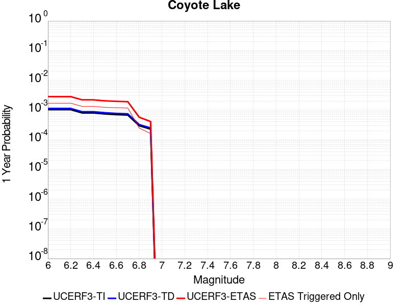 | 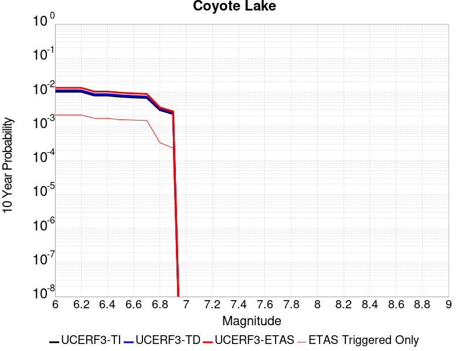 |

| Magnitude | 1 wk TI Prob | 1 wk TD Prob | 1 wk ETAS Prob | 1 wk ETAS/TD Gain | 1 wk ETAS Triggered Only | 1 mo TI Prob | 1 mo TD Prob | 1 mo ETAS Prob | 1 mo ETAS/TD Gain | 1 mo ETAS Triggered Only | 1 yr TI Prob | 1 yr TD Prob | 1 yr ETAS Prob | 1 yr ETAS/TD Gain | 1 yr ETAS Triggered Only | 10 yr TI Prob | 10 yr TD Prob | 10 yr ETAS Prob | 10 yr ETAS/TD Gain | 10 yr ETAS Triggered Only |
|-----|-----|-----|-----|-----|-----|-----|-----|-----|-----|-----|-----|-----|-----|-----|-----|-----|-----|-----|-----|-----|
| 6.0 | 1.980352E-5 | 2.1706745E-5 | 8.5168873E-4 | 39.236134 | 8.3E-4 | 8.486947E-5 | 9.302599E-5 | 0.0012229208 | 13.146012 | 0.00113 | 0.0010327959 | 0.0011320751 | 0.0028301505 | 2.499967 | 0.0017 | 0.010280091 | 0.011270258 | 0.013405914 | 1.1894948 | 0.00216 |
| 6.1 | 1.980352E-5 | 2.1706745E-5 | 8.5168873E-4 | 39.236134 | 8.3E-4 | 8.486947E-5 | 9.302599E-5 | 0.0012229208 | 13.146012 | 0.00113 | 0.0010327959 | 0.0011320751 | 0.0028301505 | 2.499967 | 0.0017 | 0.010280091 | 0.011270258 | 0.013405914 | 1.1894948 | 0.00216 |
| 6.2 | 1.980352E-5 | 2.1706745E-5 | 8.5168873E-4 | 39.236134 | 8.3E-4 | 8.486947E-5 | 9.302599E-5 | 0.0012229208 | 13.146012 | 0.00113 | 0.0010327959 | 0.0011320751 | 0.0028301505 | 2.499967 | 0.0017 | 0.010280091 | 0.011270258 | 0.013405914 | 1.1894948 | 0.00216 |
| 6.3 | 1.5344787E-5 | 1.682067E-5 | 6.968092E-4 | 41.425774 | 6.8E-4 | 6.576172E-5 | 7.2086936E-5 | 9.6202275E-4 | 13.345314 | 8.9E-4 | 8.003548E-4 | 8.773662E-4 | 0.0022061993 | 2.5145705 | 0.00133 | 0.007974784 | 0.00874507 | 0.010440115 | 1.1938287 | 0.00171 |
| 6.4 | 1.5344787E-5 | 1.682067E-5 | 6.968092E-4 | 41.425774 | 6.8E-4 | 6.576172E-5 | 7.2086936E-5 | 9.6202275E-4 | 13.345314 | 8.9E-4 | 8.003548E-4 | 8.773662E-4 | 0.0022061993 | 2.5145705 | 0.00133 | 0.007974784 | 0.00874507 | 0.010440115 | 1.1938287 | 0.00171 |
| 6.5 | 1.4189697E-5 | 1.5557987E-5 | 6.755477E-4 | 43.42128 | 6.6E-4 | 6.081157E-5 | 6.6675726E-5 | 9.066197E-4 | 13.597448 | 8.4E-4 | 7.401293E-4 | 8.115349E-4 | 0.0020405366 | 2.5144165 | 0.00123 | 0.0073766913 | 0.008091656 | 0.009639033 | 1.1912313 | 0.00156 |
| 6.6 | 1.3469301E-5 | 1.4771577E-5 | 6.64762E-4 | 45.002777 | 6.5E-4 | 5.7724297E-5 | 6.330556E-5 | 8.93253E-4 | 14.110182 | 8.3E-4 | 7.025667E-4 | 7.7053264E-4 | 0.001969608 | 2.5561643 | 0.0012 | 0.0070034964 | 0.0076845144 | 0.009192834 | 1.1962804 | 0.00152 |
| 6.7 | 1.3027966E-5 | 1.4281745E-5 | 6.442728E-4 | 45.111626 | 6.3E-4 | 5.5832945E-5 | 6.120638E-5 | 8.711568E-4 | 14.233105 | 8.1E-4 | 6.7955407E-4 | 7.4499263E-4 | 0.001914121 | 2.5693154 | 0.00117 | 0.006774798 | 0.0074308286 | 0.008889905 | 1.1963545 | 0.00147 |
| 6.8 | 5.695434E-6 | 6.2244176E-6 | 1.2622368E-4 | 20.278791 | 1.2E-4 | 2.4408775E-5 | 2.6675973E-5 | 1.9667143E-4 | 7.3726063 | 1.7E-4 | 2.971363E-4 | 3.2476155E-4 | 5.7468034E-4 | 1.7695456 | 2.5E-4 | 0.0029673933 | 0.0032458105 | 0.0035747392 | 1.1013396 | 3.3E-4 |
| 6.9 | 4.385688E-6 | 4.7930553E-6 | 6.4792766E-5 | 13.518051 | 6.0E-5 | 1.879567E-5 | 2.0541665E-5 | 1.2053961E-4 | 5.8680544 | 1.0E-4 | 2.2881327E-4 | 2.5009477E-4 | 4.1005478E-4 | 1.6395974 | 1.6E-4 | 0.002285778 | 0.0025009478 | 0.0027303726 | 1.0917351 | 2.3E-4 |

## Death Valley (Black Mtns Frontal)
*[(top)](#table-of-contents)*

| 1 Week | 1 Month | 1 Year | 10 Year |
|-----|-----|-----|-----|
|  |  |  |  |

| Magnitude | 1 wk TI Prob | 1 wk TD Prob | 1 wk ETAS Prob | 1 wk ETAS/TD Gain | 1 wk ETAS Triggered Only | 1 mo TI Prob | 1 mo TD Prob | 1 mo ETAS Prob | 1 mo ETAS/TD Gain | 1 mo ETAS Triggered Only | 1 yr TI Prob | 1 yr TD Prob | 1 yr ETAS Prob | 1 yr ETAS/TD Gain | 1 yr ETAS Triggered Only | 10 yr TI Prob | 10 yr TD Prob | 10 yr ETAS Prob | 10 yr ETAS/TD Gain | 10 yr ETAS Triggered Only |
|-----|-----|-----|-----|-----|-----|-----|-----|-----|-----|-----|-----|-----|-----|-----|-----|-----|-----|-----|-----|-----|
| 6.0 | 1.6707214E-5 | 1.867027E-5 | 0.0010086518 | 54.024494 | 9.9E-4 | 7.160038E-5 | 8.001302E-5 | 0.001379909 | 17.246054 | 0.0013 | 8.71386E-4 | 9.737309E-4 | 0.0027819683 | 2.85702 | 0.00181 | 0.00867977 | 0.009695496 | 0.011745427 | 1.2114311 | 0.00207 |
| 6.1 | 1.6707214E-5 | 1.867027E-5 | 0.0010086518 | 54.024494 | 9.9E-4 | 7.160038E-5 | 8.001302E-5 | 0.001379909 | 17.246054 | 0.0013 | 8.71386E-4 | 9.737309E-4 | 0.0027819683 | 2.85702 | 0.00181 | 0.00867977 | 0.009695496 | 0.011745427 | 1.2114311 | 0.00207 |
| 6.2 | 1.6707214E-5 | 1.867027E-5 | 0.0010086518 | 54.024494 | 9.9E-4 | 7.160038E-5 | 8.001302E-5 | 0.001379909 | 17.246054 | 0.0013 | 8.71386E-4 | 9.737309E-4 | 0.0027819683 | 2.85702 | 0.00181 | 0.00867977 | 0.009695496 | 0.011745427 | 1.2114311 | 0.00207 |
| 6.3 | 1.6707214E-5 | 1.867027E-5 | 0.0010086518 | 54.024494 | 9.9E-4 | 7.160038E-5 | 8.001302E-5 | 0.001379909 | 17.246054 | 0.0013 | 8.71386E-4 | 9.737309E-4 | 0.0027819683 | 2.85702 | 0.00181 | 0.00867977 | 0.009695496 | 0.011745427 | 1.2114311 | 0.00207 |
| 6.4 | 1.5515609E-5 | 1.7338214E-5 | 8.873231E-4 | 51.17731 | 8.7E-4 | 6.649377E-5 | 7.4304546E-5 | 0.0011942213 | 16.071981 | 0.00112 | 8.0926094E-4 | 9.042885E-4 | 0.0024029322 | 2.6572626 | 0.0015 | 0.008063202 | 0.009006773 | 0.010711282 | 1.1892474 | 0.00172 |
| 6.5 | 1.5515609E-5 | 1.7338214E-5 | 8.873231E-4 | 51.17731 | 8.7E-4 | 6.649377E-5 | 7.4304546E-5 | 0.0011942213 | 16.071981 | 0.00112 | 8.0926094E-4 | 9.042885E-4 | 0.0024029322 | 2.6572626 | 0.0015 | 0.008063202 | 0.009006773 | 0.010711282 | 1.1892474 | 0.00172 |
| 6.6 | 1.5041828E-5 | 1.6809145E-5 | 7.9679606E-4 | 47.402534 | 7.8E-4 | 6.4463384E-5 | 7.203723E-5 | 0.0010919637 | 15.158324 | 0.00102 | 7.8455906E-4 | 8.767063E-4 | 0.002235514 | 2.5499005 | 0.00136 | 0.00781795 | 0.008733132 | 0.010279508 | 1.17707 | 0.00156 |
| 6.7 | 1.4634985E-5 | 1.6356016E-5 | 7.763436E-4 | 47.46532 | 7.6E-4 | 6.271985E-5 | 7.009536E-5 | 0.0010400274 | 14.837321 | 9.7E-4 | 7.6334673E-4 | 8.5308263E-4 | 0.0021319906 | 2.4991608 | 0.00128 | 0.007607299 | 0.008498715 | 0.009956223 | 1.1714973 | 0.00147 |
| 6.8 | 1.4209158E-5 | 1.5882048E-5 | 6.9587125E-4 | 43.814957 | 6.8E-4 | 6.089497E-5 | 6.8064175E-5 | 9.5800357E-4 | 14.075006 | 8.9E-4 | 7.4114406E-4 | 8.2837185E-4 | 0.0019974026 | 2.4112391 | 0.00117 | 0.007386771 | 0.008253456 | 0.009592314 | 1.1622179 | 0.00135 |
| 6.9 | 1.3780098E-5 | 1.5404594E-5 | 6.153954E-4 | 39.948822 | 6.0E-4 | 5.9056227E-5 | 6.6018045E-5 | 8.659652E-4 | 13.117099 | 8.0E-4 | 7.1877235E-4 | 8.0347876E-4 | 0.001872619 | 2.3306391 | 0.00107 | 0.0071645193 | 0.008006332 | 0.009196725 | 1.1486814 | 0.0012 |
| 7.0 | 1.3585064E-5 | 1.5188155E-5 | 5.5517995E-4 | 36.553482 | 5.4E-4 | 5.8220405E-5 | 6.50905E-5 | 7.9504296E-4 | 12.214424 | 7.3E-4 | 7.086029E-4 | 7.9219416E-4 | 0.00178141 | 2.2487037 | 9.9E-4 | 0.007063476 | 0.007894293 | 0.008995531 | 1.1394979 | 0.00111 |
| 7.1 | 1.3398601E-5 | 1.49813395E-5 | 5.349736E-4 | 35.709328 | 5.2E-4 | 5.742131E-5 | 6.420419E-5 | 7.6415925E-4 | 11.902015 | 7.0E-4 | 6.9888023E-4 | 7.8141113E-4 | 0.001740661 | 2.2275865 | 9.6E-4 | 0.0069668638 | 0.007787224 | 0.008858814 | 1.1376086 | 0.00108 |
| 7.2 | 1.3126312E-5 | 1.4679561E-5 | 4.746728E-4 | 32.33563 | 4.6E-4 | 5.6254412E-5 | 6.291092E-5 | 6.6287315E-4 | 10.5366955 | 6.0E-4 | 6.846822E-4 | 7.6567667E-4 | 0.0015950411 | 2.0831785 | 8.3E-4 | 0.006825765 | 0.00763097 | 0.008553873 | 1.1209418 | 9.3E-4 |
| 7.3 | 1.2922429E-5 | 1.4453788E-5 | 4.5444744E-4 | 31.441406 | 4.4E-4 | 5.5380664E-5 | 6.194336E-5 | 6.4190745E-4 | 10.362812 | 5.8E-4 | 6.74051E-4 | 7.53905E-4 | 0.0015533018 | 2.0603418 | 8.0E-4 | 0.006720101 | 0.007514055 | 0.008407292 | 1.1188755 | 9.0E-4 |
| 7.4 | 1.2768878E-5 | 1.4283772E-5 | 4.242779E-4 | 29.703493 | 4.1E-4 | 5.4722615E-5 | 6.1214756E-5 | 5.911823E-4 | 9.657513 | 5.3E-4 | 6.660441E-4 | 7.4504025E-4 | 0.0014944815 | 2.005907 | 7.5E-4 | 0.0066405144 | 0.0074260035 | 0.008269692 | 1.1136127 | 8.5E-4 |
| 7.5 | 1.2521929E-5 | 1.40120155E-5 | 4.140064E-4 | 29.54653 | 4.0E-4 | 5.366431E-5 | 6.005014E-5 | 5.800189E-4 | 9.65891 | 5.2E-4 | 6.531671E-4 | 7.3087064E-4 | 0.0014703298 | 2.011751 | 7.4E-4 | 0.006512506 | 0.0072852457 | 0.008119126 | 1.1144615 | 8.4E-4 |
| 7.6 | 1.1301089E-5 | 1.2648149E-5 | 3.326441E-4 | 26.299826 | 3.2E-4 | 4.8432343E-5 | 5.4205255E-5 | 4.8418195E-4 | 8.93238 | 4.3E-4 | 5.895042E-4 | 6.5975444E-4 | 0.0013093256 | 1.984565 | 6.5E-4 | 0.0058794282 | 0.00657851 | 0.007303708 | 1.1102374 | 7.3E-4 |
| 7.7 | 9.189108E-6 | 1.0283358E-5 | 2.002814E-4 | 19.476265 | 1.9E-4 | 3.93813E-5 | 4.407082E-5 | 3.3405804E-4 | 7.5800276 | 2.9E-4 | 4.7936183E-4 | 5.3643517E-4 | 9.961884E-4 | 1.8570528 | 4.6E-4 | 0.004783291 | 0.005351914 | 0.0058790776 | 1.0985 | 5.3E-4 |
| 7.8 | 3.4586725E-7 | 3.6482615E-7 | 3.6482615E-7 | 1.0 | 0.0 | 1.4822873E-6 | 1.5635396E-6 | 1.5635396E-6 | 1.0 | 0.0 | 1.80467E-5 | 1.9035933E-5 | 3.9035553E-5 | 2.0506246 | 2.0E-5 | 1.8045233E-4 | 1.9034347E-4 | 2.2033777E-4 | 1.1575798 | 3.0E-5 |
| 7.9 | 2.5591178E-9 | 2.6696718E-9 | 2.6696718E-9 | 1.0 | 0.0 | 1.0967647E-8 | 1.14414505E-8 | 1.14414505E-8 | 1.0 | 0.0 | 1.335311E-7 | 1.3929966E-7 | 1.3929966E-7 | 1.0 | 0.0 | 1.3353102E-6 | 1.3929966E-6 | 1.3929966E-6 | 1.0 | 0.0 |

## Helendale-So Lockhart
*[(top)](#table-of-contents)*

| 1 Week | 1 Month | 1 Year | 10 Year |
|-----|-----|-----|-----|
|  |  |  |  |

| Magnitude | 1 wk TI Prob | 1 wk TD Prob | 1 wk ETAS Prob | 1 wk ETAS/TD Gain | 1 wk ETAS Triggered Only | 1 mo TI Prob | 1 mo TD Prob | 1 mo ETAS Prob | 1 mo ETAS/TD Gain | 1 mo ETAS Triggered Only | 1 yr TI Prob | 1 yr TD Prob | 1 yr ETAS Prob | 1 yr ETAS/TD Gain | 1 yr ETAS Triggered Only | 10 yr TI Prob | 10 yr TD Prob | 10 yr ETAS Prob | 10 yr ETAS/TD Gain | 10 yr ETAS Triggered Only |
|-----|-----|-----|-----|-----|-----|-----|-----|-----|-----|-----|-----|-----|-----|-----|-----|-----|-----|-----|-----|-----|
| 6.0 | 1.7296055E-5 | 1.8103729E-5 | 9.1808743E-4 | 50.712612 | 9.0E-4 | 7.412385E-5 | 7.7585224E-5 | 0.0012674929 | 16.336782 | 0.00119 | 9.0208417E-4 | 9.4421144E-4 | 0.002512729 | 2.6611931 | 0.00157 | 0.008984311 | 0.009404116 | 0.011187189 | 1.1896056 | 0.0018 |
| 6.1 | 1.7296055E-5 | 1.8103729E-5 | 9.1808743E-4 | 50.712612 | 9.0E-4 | 7.412385E-5 | 7.7585224E-5 | 0.0012674929 | 16.336782 | 0.00119 | 9.0208417E-4 | 9.4421144E-4 | 0.002512729 | 2.6611931 | 0.00157 | 0.008984311 | 0.009404116 | 0.011187189 | 1.1896056 | 0.0018 |
| 6.2 | 1.7296055E-5 | 1.8103729E-5 | 9.1808743E-4 | 50.712612 | 9.0E-4 | 7.412385E-5 | 7.7585224E-5 | 0.0012674929 | 16.336782 | 0.00119 | 9.0208417E-4 | 9.4421144E-4 | 0.002512729 | 2.6611931 | 0.00157 | 0.008984311 | 0.009404116 | 0.011187189 | 1.1896056 | 0.0018 |
| 6.3 | 1.0669118E-5 | 1.1135425E-5 | 5.511294E-4 | 49.493347 | 5.4E-4 | 4.5723988E-5 | 4.772239E-5 | 7.6768803E-4 | 16.086538 | 7.2E-4 | 5.5654737E-4 | 5.80868E-4 | 0.0015902814 | 2.7377672 | 0.00101 | 0.0055515557 | 0.0057937936 | 0.006957015 | 1.2007703 | 0.00117 |
| 6.4 | 1.0669118E-5 | 1.1135425E-5 | 5.511294E-4 | 49.493347 | 5.4E-4 | 4.5723988E-5 | 4.772239E-5 | 7.6768803E-4 | 16.086538 | 7.2E-4 | 5.5654737E-4 | 5.80868E-4 | 0.0015902814 | 2.7377672 | 0.00101 | 0.0055515557 | 0.0057937936 | 0.006957015 | 1.2007703 | 0.00117 |
| 6.5 | 8.790038E-6 | 9.170197E-6 | 4.791659E-4 | 52.252518 | 4.7E-4 | 3.767105E-5 | 3.930026E-5 | 6.692755E-4 | 17.029799 | 6.3E-4 | 4.585485E-4 | 4.7837716E-4 | 0.0013679514 | 2.8595667 | 8.9E-4 | 0.0045760344 | 0.004773638 | 0.005778817 | 1.2105687 | 0.00101 |
| 6.6 | 7.396949E-6 | 7.715537E-6 | 3.5771282E-4 | 46.362663 | 3.5E-4 | 3.1700827E-5 | 3.3066175E-5 | 5.430493E-4 | 16.423107 | 5.1E-4 | 3.858892E-4 | 4.025073E-4 | 0.0011122215 | 2.7632332 | 7.1E-4 | 0.003852198 | 0.00401789 | 0.004834595 | 1.2032672 | 8.2E-4 |
| 6.7 | 6.4600285E-6 | 6.738031E-6 | 3.2673587E-4 | 48.4913 | 3.2E-4 | 2.7685543E-5 | 2.887696E-5 | 4.888637E-4 | 16.929193 | 4.6E-4 | 3.3701936E-4 | 3.5152107E-4 | 9.713031E-4 | 2.7631435 | 6.2E-4 | 0.0033650869 | 0.003509732 | 0.00423717 | 1.2072631 | 7.3E-4 |
| 6.8 | 5.600104E-6 | 5.836009E-6 | 2.8583437E-4 | 48.97771 | 2.8E-4 | 2.4000226E-5 | 2.5011232E-5 | 4.2500123E-4 | 16.992414 | 4.0E-4 | 2.9216358E-4 | 3.044698E-4 | 7.743267E-4 | 2.5431972 | 4.7E-4 | 0.0029177975 | 0.003040588 | 0.0035889158 | 1.1803361 | 5.5E-4 |
| 6.9 | 4.839122E-6 | 5.0395092E-6 | 2.5503826E-4 | 50.607754 | 2.5E-4 | 2.0738931E-5 | 2.159772E-5 | 3.515906E-4 | 16.27906 | 3.3E-4 | 2.5246723E-4 | 2.6292098E-4 | 6.528184E-4 | 2.4829454 | 3.9E-4 | 0.002521806 | 0.002626147 | 0.0030949125 | 1.1784995 | 4.7E-4 |
| 7.0 | 3.6937633E-6 | 3.845208E-6 | 2.138444E-4 | 55.61322 | 2.1E-4 | 1.5830317E-5 | 1.647936E-5 | 2.7647507E-4 | 16.777052 | 2.6E-4 | 1.9271708E-4 | 2.0061806E-4 | 5.1055587E-4 | 2.5449147 | 3.1E-4 | 0.0019255003 | 0.002004401 | 0.0023836393 | 1.1892028 | 3.8E-4 |
| 7.1 | 2.7858857E-6 | 2.8978538E-6 | 1.4289745E-4 | 49.311478 | 1.4E-4 | 1.1939455E-5 | 1.2419316E-5 | 1.9241708E-4 | 15.493372 | 1.8E-4 | 1.4535317E-4 | 1.511949E-4 | 3.7116162E-4 | 2.4548557 | 2.2E-4 | 0.0014525814 | 0.0015109418 | 0.0017805338 | 1.1784265 | 2.7E-4 |
| 7.2 | 2.1672065E-6 | 2.2540128E-6 | 1.0225379E-4 | 45.36522 | 1.0E-4 | 9.2879945E-6 | 9.66002E-6 | 1.3965876E-4 | 14.457399 | 1.3E-4 | 1.1307546E-4 | 1.1760458E-4 | 2.7758576E-4 | 2.3603313 | 1.6E-4 | 0.0011301794 | 0.0011754417 | 0.0013851948 | 1.1784463 | 2.1E-4 |
| 7.3 | 1.4823496E-6 | 1.5422102E-6 | 4.154215E-5 | 26.936762 | 4.0E-5 | 6.3529114E-6 | 6.6094562E-6 | 6.660906E-5 | 10.077843 | 6.0E-5 | 7.734395E-5 | 8.046731E-5 | 1.6046087E-4 | 1.9941125 | 8.0E-5 | 7.731704E-4 | 8.0439687E-4 | 9.3429233E-4 | 1.1614817 | 1.3E-4 |
| 7.4 | 4.2321457E-7 | 4.4108765E-7 | 1.0441083E-5 | 23.67122 | 1.0E-5 | 1.8137755E-6 | 1.8903745E-6 | 2.1890337E-5 | 11.579894 | 2.0E-5 | 2.2082493E-5 | 2.3015113E-5 | 4.3014654E-5 | 1.8689742 | 2.0E-5 | 2.2080299E-4 | 2.3013182E-4 | 2.701226E-4 | 1.1737734 | 4.0E-5 |
| 7.5 | 5.6942316E-8 | 5.9415648E-8 | 5.9415648E-8 | 1.0 | 0.0 | 2.440385E-7 | 2.5463845E-7 | 2.5463845E-7 | 1.0 | 0.0 | 2.9711643E-6 | 3.1002196E-6 | 3.1002196E-6 | 1.0 | 0.0 | 2.9711247E-5 | 3.1001844E-5 | 3.1001844E-5 | 1.0 | 0.0 |

## San Andreas (San Bernardino S)
*[(top)](#table-of-contents)*

| 1 Week | 1 Month | 1 Year | 10 Year |
|-----|-----|-----|-----|
|  | 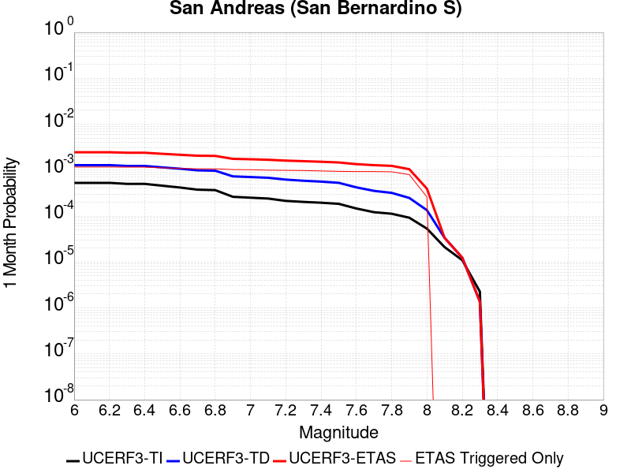 |  |  |

| Magnitude | 1 wk TI Prob | 1 wk TD Prob | 1 wk ETAS Prob | 1 wk ETAS/TD Gain | 1 wk ETAS Triggered Only | 1 mo TI Prob | 1 mo TD Prob | 1 mo ETAS Prob | 1 mo ETAS/TD Gain | 1 mo ETAS Triggered Only | 1 yr TI Prob | 1 yr TD Prob | 1 yr ETAS Prob | 1 yr ETAS/TD Gain | 1 yr ETAS Triggered Only | 10 yr TI Prob | 10 yr TD Prob | 10 yr ETAS Prob | 10 yr ETAS/TD Gain | 10 yr ETAS Triggered Only |
|-----|-----|-----|-----|-----|-----|-----|-----|-----|-----|-----|-----|-----|-----|-----|-----|-----|-----|-----|-----|-----|
| 6.0 | 1.2336002E-4 | 3.0004102E-4 | 0.00126975 | 4.231921 | 9.7E-4 | 5.2857865E-4 | 0.0012852824 | 0.0024537786 | 1.9091357 | 0.00117 | 0.006416472 | 0.015540994 | 0.016988149 | 1.0931185 | 0.00147 | 0.06234337 | 0.14283717 | 0.14429435 | 1.0102017 | 0.0017 |
| 6.1 | 1.2336002E-4 | 3.0004102E-4 | 0.00126975 | 4.231921 | 9.7E-4 | 5.2857865E-4 | 0.0012852824 | 0.0024537786 | 1.9091357 | 0.00117 | 0.006416472 | 0.015540994 | 0.016988149 | 1.0931185 | 0.00147 | 0.06234337 | 0.14283717 | 0.14429435 | 1.0102017 | 0.0017 |
| 6.2 | 1.2336002E-4 | 3.0004102E-4 | 0.00126975 | 4.231921 | 9.7E-4 | 5.2857865E-4 | 0.0012852824 | 0.0024537786 | 1.9091357 | 0.00117 | 0.006416472 | 0.015540994 | 0.016988149 | 1.0931185 | 0.00147 | 0.06234337 | 0.14283717 | 0.14429435 | 1.0102017 | 0.0017 |
| 6.3 | 1.1712257E-4 | 2.8792414E-4 | 0.0012376506 | 4.29853 | 9.5E-4 | 5.018573E-4 | 0.0012334028 | 0.0023919719 | 1.9393276 | 0.00116 | 0.006093008 | 0.014918125 | 0.016356345 | 1.0964075 | 0.00146 | 0.059286322 | 0.13754563 | 0.13900317 | 1.0105969 | 0.00169 |
| 6.4 | 1.1712257E-4 | 2.8792414E-4 | 0.0012376506 | 4.29853 | 9.5E-4 | 5.018573E-4 | 0.0012334028 | 0.0023919719 | 1.9393276 | 0.00116 | 0.006093008 | 0.014918125 | 0.016356345 | 1.0964075 | 0.00146 | 0.059286322 | 0.13754563 | 0.13900317 | 1.0105969 | 0.00169 |
| 6.5 | 1.0689076E-4 | 2.680528E-4 | 0.0011978035 | 4.468536 | 9.3E-4 | 4.5802278E-4 | 0.0011483167 | 0.0022670305 | 1.9742208 | 0.00112 | 0.0055621783 | 0.01389575 | 0.015296019 | 1.1007695 | 0.00142 | 0.05425003 | 0.12879294 | 0.13023044 | 1.0111612 | 0.00165 |
| 6.6 | 9.7648895E-5 | 2.50501E-4 | 0.0011502756 | 4.5919 | 9.0E-4 | 4.1842813E-4 | 0.0010731576 | 0.0021619878 | 2.014604 | 0.00109 | 0.005082469 | 0.012991785 | 0.014353856 | 1.104841 | 0.00138 | 0.049677886 | 0.12095292 | 0.1223506 | 1.0115556 | 0.00159 |
| 6.7 | 8.757013E-5 | 2.3120902E-4 | 0.0011110055 | 4.8051996 | 8.8E-4 | 3.7524657E-4 | 9.905418E-4 | 0.002059482 | 2.0791469 | 0.00107 | 0.00455906 | 0.011997245 | 0.013321169 | 1.1103523 | 0.00134 | 0.04466656 | 0.11226123 | 0.11362834 | 1.0121781 | 0.00154 |
| 6.8 | 8.562978E-5 | 2.2680782E-4 | 0.0011066082 | 4.8790565 | 8.8E-4 | 3.6693315E-4 | 9.7169366E-4 | 0.002040654 | 2.1001 | 0.00107 | 0.004458263 | 0.011770263 | 0.013094491 | 1.1125063 | 0.00134 | 0.043698758 | 0.11027153 | 0.11164171 | 1.0124255 | 0.00154 |
| 6.9 | 6.124075E-5 | 1.7065753E-4 | 0.0010205124 | 5.9798856 | 8.5E-4 | 2.6243398E-4 | 7.311852E-4 | 0.0017604321 | 2.407642 | 0.00103 | 0.0031904527 | 0.008866051 | 0.0101247905 | 1.141973 | 0.00127 | 0.031450346 | 0.08418263 | 0.08551972 | 1.0158832 | 0.00146 |
| 7.0 | 5.8598747E-5 | 1.649477E-4 | 0.0010148075 | 6.1522985 | 8.5E-4 | 2.5111332E-4 | 7.06728E-4 | 0.0017260072 | 2.442251 | 0.00102 | 0.0030530186 | 0.008570663 | 0.009819864 | 1.1457531 | 0.00126 | 0.03011414 | 0.081500374 | 0.08282301 | 1.0162287 | 0.00144 |
| 7.1 | 5.613814E-5 | 1.5913323E-4 | 9.890011E-4 | 6.2149253 | 8.3E-4 | 2.4056983E-4 | 6.818221E-4 | 0.0016811403 | 2.4656584 | 0.001 | 0.0029250039 | 0.008269769 | 0.0094995145 | 1.1487037 | 0.00124 | 0.028868021 | 0.07879931 | 0.08008899 | 1.0163666 | 0.0014 |
| 7.2 | 4.991222E-5 | 1.4519796E-4 | 9.650789E-4 | 6.646642 | 8.2E-4 | 2.1389198E-4 | 6.2212895E-4 | 0.0016115131 | 2.59032 | 9.9E-4 | 0.002601025 | 0.007548217 | 0.008759009 | 1.1604075 | 0.00122 | 0.025707912 | 0.07225321 | 0.07352422 | 1.0175911 | 0.00137 |
| 7.3 | 4.7410045E-5 | 1.3714004E-4 | 9.47029E-4 | 6.9055614 | 8.1E-4 | 2.0317009E-4 | 5.8761094E-4 | 0.0015670351 | 2.6667902 | 9.8E-4 | 0.0024707897 | 0.0071307817 | 0.008332153 | 1.1684768 | 0.00121 | 0.024434982 | 0.06853558 | 0.06980237 | 1.0184838 | 0.00136 |
| 7.4 | 4.5556746E-5 | 1.3121912E-4 | 9.2111545E-4 | 7.0196743 | 7.9E-4 | 1.952286E-4 | 5.622468E-4 | 0.001521707 | 2.7064753 | 9.6E-4 | 0.002374317 | 0.0068239477 | 0.008005827 | 1.1731958 | 0.00119 | 0.023491086 | 0.065788016 | 0.067039855 | 1.0190284 | 0.00134 |
| 7.5 | 4.3084514E-5 | 1.2357246E-4 | 8.934773E-4 | 7.2303915 | 7.7E-4 | 1.8463485E-4 | 5.2948913E-4 | 0.0014689914 | 2.7743561 | 9.4E-4 | 0.0022456115 | 0.0064275465 | 0.007580091 | 1.1793132 | 0.00116 | 0.022230545 | 0.062188786 | 0.063417315 | 1.0197549 | 0.00131 |
| 7.6 | 3.408608E-5 | 9.83552E-5 | 8.682795E-4 | 8.827998 | 7.7E-4 | 1.4607502E-4 | 4.214543E-4 | 0.0013510623 | 3.205715 | 9.3E-4 | 0.0017770125 | 0.0051191594 | 0.006263272 | 1.2234963 | 0.00115 | 0.017628696 | 0.050020292 | 0.051255267 | 1.0246894 | 0.0013 |
| 7.7 | 2.8315713E-5 | 8.248679E-5 | 8.5242325E-4 | 10.334058 | 7.7E-4 | 1.2134742E-4 | 3.5346695E-4 | 0.0012831383 | 3.6301503 | 9.3E-4 | 0.0014764034 | 0.0042949775 | 0.0054300814 | 1.2642863 | 0.00114 | 0.01466633 | 0.0422714 | 0.043506872 | 1.0292271 | 0.00129 |
| 7.8 | 2.6222975E-5 | 7.463088E-5 | 8.445734E-4 | 11.316675 | 7.7E-4 | 1.1237934E-4 | 3.1980744E-4 | 0.0012395132 | 3.875811 | 9.2E-4 | 0.0013673597 | 0.0038867102 | 0.005012318 | 1.2896043 | 0.00113 | 0.013589768 | 0.03843674 | 0.039657928 | 1.0317713 | 0.00127 |
| 7.9 | 2.1469694E-5 | 5.787864E-5 | 7.278399E-4 | 12.575275 | 6.7E-4 | 9.200973E-5 | 2.4802773E-4 | 0.0010478293 | 4.2246456 | 8.0E-4 | 0.0011196428 | 0.0030155594 | 0.004002574 | 1.3273073 | 9.9E-4 | 0.011140184 | 0.030152109 | 0.031199545 | 1.0347384 | 0.00108 |
| 8.0 | 1.2420249E-5 | 3.131896E-5 | 2.5131207E-4 | 8.02428 | 2.2E-4 | 5.322855E-5 | 1.342172E-4 | 3.941823E-4 | 2.9368985 | 2.6E-4 | 6.478649E-4 | 0.0016328706 | 0.0019623318 | 1.201768 | 3.3E-4 | 0.0064597935 | 0.016522504 | 0.016896226 | 1.0226189 | 3.8E-4 |
| 8.1 | 4.9197724E-6 | 7.822348E-6 | 7.822348E-6 | 1.0 | 0.0 | 2.1084568E-5 | 3.352392E-5 | 3.352392E-5 | 1.0 | 0.0 | 2.566744E-4 | 4.0807744E-4 | 4.0807744E-4 | 1.0 | 0.0 | 0.002563781 | 0.0043843705 | 0.0043843705 | 1.0 | 0.0 |
| 8.2 | 2.5634774E-6 | 2.9067196E-6 | 2.9067196E-6 | 1.0 | 0.0 | 1.0986286E-5 | 1.2457311E-5 | 1.2457311E-5 | 1.0 | 0.0 | 1.3374983E-4 | 1.5165724E-4 | 1.5165724E-4 | 1.0 | 0.0 | 0.0013366934 | 0.0017049741 | 0.0017049741 | 1.0 | 0.0 |
| 8.3 | 5.2850464E-7 | 3.2088764E-7 | 3.2088764E-7 | 1.0 | 0.0 | 2.2650179E-6 | 1.375232E-6 | 1.375232E-6 | 1.0 | 0.0 | 2.7576245E-5 | 1.6743334E-5 | 1.6743334E-5 | 1.0 | 0.0 | 2.7572823E-4 | 1.9870348E-4 | 1.9870348E-4 | 1.0 | 0.0 |

## San Andreas (Big Bend)
*[(top)](#table-of-contents)*

| 1 Week | 1 Month | 1 Year | 10 Year |
|-----|-----|-----|-----|
|  | 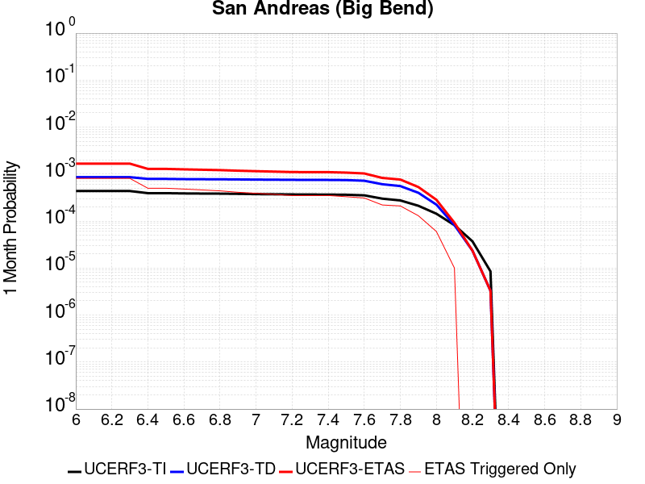 |  | 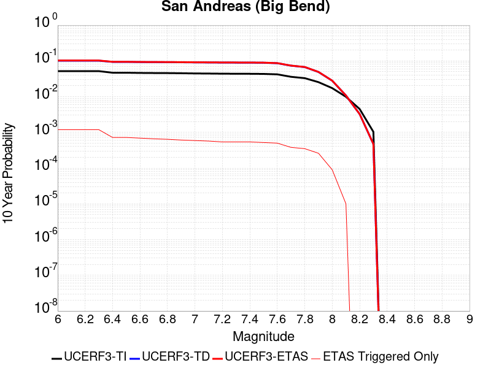 |

| Magnitude | 1 wk TI Prob | 1 wk TD Prob | 1 wk ETAS Prob | 1 wk ETAS/TD Gain | 1 wk ETAS Triggered Only | 1 mo TI Prob | 1 mo TD Prob | 1 mo ETAS Prob | 1 mo ETAS/TD Gain | 1 mo ETAS Triggered Only | 1 yr TI Prob | 1 yr TD Prob | 1 yr ETAS Prob | 1 yr ETAS/TD Gain | 1 yr ETAS Triggered Only | 10 yr TI Prob | 10 yr TD Prob | 10 yr ETAS Prob | 10 yr ETAS/TD Gain | 10 yr ETAS Triggered Only |
|-----|-----|-----|-----|-----|-----|-----|-----|-----|-----|-----|-----|-----|-----|-----|-----|-----|-----|-----|-----|-----|
| 6.0 | 1.0179969E-4 | 2.0072258E-4 | 8.3059614E-4 | 4.13803 | 6.3E-4 | 4.362114E-4 | 8.599571E-4 | 0.0016692606 | 1.9410975 | 8.1E-4 | 0.0052979486 | 0.010419999 | 0.011419474 | 1.095919 | 0.00101 | 0.051734097 | 0.10144902 | 0.1025183 | 1.01054 | 0.00119 |
| 6.1 | 1.0179969E-4 | 2.0072258E-4 | 8.3059614E-4 | 4.13803 | 6.3E-4 | 4.362114E-4 | 8.599571E-4 | 0.0016692606 | 1.9410975 | 8.1E-4 | 0.0052979486 | 0.010419999 | 0.011419474 | 1.095919 | 0.00101 | 0.051734097 | 0.10144902 | 0.1025183 | 1.01054 | 0.00119 |
| 6.2 | 1.0179969E-4 | 2.0072258E-4 | 8.3059614E-4 | 4.13803 | 6.3E-4 | 4.362114E-4 | 8.599571E-4 | 0.0016692606 | 1.9410975 | 8.1E-4 | 0.0052979486 | 0.010419999 | 0.011419474 | 1.095919 | 0.00101 | 0.051734097 | 0.10144902 | 0.1025183 | 1.01054 | 0.00119 |
| 6.3 | 1.0179969E-4 | 2.0072258E-4 | 8.3059614E-4 | 4.13803 | 6.3E-4 | 4.362114E-4 | 8.599571E-4 | 0.0016692606 | 1.9410975 | 8.1E-4 | 0.0052979486 | 0.010419999 | 0.011419474 | 1.095919 | 0.00101 | 0.051734097 | 0.10144902 | 0.1025183 | 1.01054 | 0.00119 |
| 6.4 | 9.1639464E-5 | 1.8429532E-4 | 6.142161E-4 | 3.3327818 | 4.3E-4 | 3.9268145E-4 | 7.895982E-4 | 0.0012892034 | 1.6327335 | 5.0E-4 | 0.0047704205 | 0.009571102 | 0.01016536 | 1.0620887 | 6.0E-4 | 0.046693064 | 0.09377527 | 0.09442776 | 1.0069579 | 7.2E-4 |
| 6.5 | 9.1639464E-5 | 1.8429532E-4 | 6.142161E-4 | 3.3327818 | 4.3E-4 | 3.9268145E-4 | 7.895982E-4 | 0.0012892034 | 1.6327335 | 5.0E-4 | 0.0047704205 | 0.009571102 | 0.01016536 | 1.0620887 | 6.0E-4 | 0.046693064 | 0.09377527 | 0.09442776 | 1.0069579 | 7.2E-4 |
| 6.6 | 9.042622E-5 | 1.823659E-4 | 5.922911E-4 | 3.2478173 | 4.1E-4 | 3.8748336E-4 | 7.8133424E-4 | 0.0012609592 | 1.6138537 | 4.8E-4 | 0.0047074095 | 0.009471365 | 0.010045872 | 1.0606573 | 5.8E-4 | 0.046089325 | 0.092869274 | 0.0934952 | 1.0067399 | 6.9E-4 |
| 6.7 | 8.9836685E-5 | 1.8150927E-4 | 5.7143846E-4 | 3.1482606 | 3.9E-4 | 3.8495753E-4 | 7.776651E-4 | 0.0012373074 | 1.5910542 | 4.6E-4 | 0.00467679 | 0.00942708 | 0.009971895 | 1.0577925 | 5.5E-4 | 0.045795817 | 0.09246355 | 0.09306252 | 1.006478 | 6.6E-4 |
| 6.8 | 8.9471854E-5 | 1.8097709E-4 | 5.5091013E-4 | 3.0440876 | 3.7E-4 | 3.8339442E-4 | 7.7538576E-4 | 0.0012150445 | 1.5670195 | 4.4E-4 | 0.004657841 | 0.009399569 | 0.009924587 | 1.0558555 | 5.3E-4 | 0.04561414 | 0.092210755 | 0.09279174 | 1.0063006 | 6.4E-4 |
| 6.9 | 8.858234E-5 | 1.7979681E-4 | 5.197357E-4 | 2.8906834 | 3.4E-4 | 3.7958333E-4 | 7.703304E-4 | 0.0011800146 | 1.5318291 | 4.1E-4 | 0.004611638 | 0.009338548 | 0.00983388 | 1.0530415 | 5.0E-4 | 0.04517103 | 0.09165087 | 0.092204966 | 1.0060457 | 6.1E-4 |
| 7.0 | 8.7433385E-5 | 1.7818481E-4 | 5.08126E-4 | 2.8516798 | 3.3E-4 | 3.746607E-4 | 7.634259E-4 | 0.0011531282 | 1.510465 | 3.9E-4 | 0.004551957 | 0.009255203 | 0.009730761 | 1.0513827 | 4.8E-4 | 0.044598386 | 0.09088532 | 0.09142169 | 1.0059017 | 5.9E-4 |
| 7.1 | 8.684964E-5 | 1.7730435E-4 | 4.8724937E-4 | 2.748096 | 3.1E-4 | 3.7215967E-4 | 7.596547E-4 | 0.0011293737 | 1.4866934 | 3.7E-4 | 0.0045216335 | 0.009209678 | 0.009665442 | 1.0494875 | 4.6E-4 | 0.04430731 | 0.09046686 | 0.09098529 | 1.0057306 | 5.7E-4 |
| 7.2 | 8.606521E-5 | 1.762105E-4 | 4.661594E-4 | 2.645469 | 2.9E-4 | 3.6879873E-4 | 7.549695E-4 | 0.0011047053 | 1.4632449 | 3.5E-4 | 0.0044808835 | 0.0091531165 | 0.00957918 | 1.0465485 | 4.3E-4 | 0.043916024 | 0.089947365 | 0.0904388 | 1.0054635 | 5.4E-4 |
| 7.3 | 8.568266E-5 | 1.7563057E-4 | 4.6557962E-4 | 2.6509032 | 2.9E-4 | 3.6715972E-4 | 7.524855E-4 | 0.0011022221 | 1.4647752 | 3.5E-4 | 0.0044610105 | 0.009123127 | 0.009549204 | 1.046703 | 4.3E-4 | 0.043725148 | 0.08966853 | 0.09016011 | 1.0054822 | 5.4E-4 |
| 7.4 | 8.5432206E-5 | 1.7525644E-4 | 4.652056E-4 | 2.654428 | 2.9E-4 | 3.6608664E-4 | 7.50883E-4 | 0.0011006203 | 1.4657679 | 3.5E-4 | 0.004447999 | 0.009103781 | 0.009529865 | 1.0468031 | 4.3E-4 | 0.043600157 | 0.08948871 | 0.089980386 | 1.0054942 | 5.4E-4 |
| 7.5 | 8.4791965E-5 | 1.7394972E-4 | 4.53901E-4 | 2.6093805 | 2.8E-4 | 3.633435E-4 | 7.4528606E-4 | 0.0010750401 | 1.442453 | 3.3E-4 | 0.0044147377 | 0.009036204 | 0.0094425 | 1.044963 | 4.1E-4 | 0.043280575 | 0.088866346 | 0.089340135 | 1.0053315 | 5.2E-4 |
| 7.6 | 8.241105E-5 | 1.6840403E-4 | 4.2836025E-4 | 2.543646 | 2.6E-4 | 3.531424E-4 | 7.215321E-4 | 0.0010313084 | 1.4293313 | 3.1E-4 | 0.0042910352 | 0.008749358 | 0.009135947 | 1.0441847 | 3.9E-4 | 0.042091176 | 0.086243294 | 0.08670017 | 1.0052975 | 5.0E-4 |
| 7.7 | 7.00432E-5 | 1.42045E-4 | 3.1202086E-4 | 2.1966338 | 1.7E-4 | 3.001506E-4 | 6.0862233E-4 | 8.2848844E-4 | 1.3612521 | 2.2E-4 | 0.0036482112 | 0.0073848404 | 0.0076726987 | 1.0389796 | 2.9E-4 | 0.035888977 | 0.07351733 | 0.07386939 | 1.0047889 | 3.8E-4 |
| 7.8 | 6.415362E-5 | 1.2968935E-4 | 2.996673E-4 | 2.3106549 | 1.7E-4 | 2.749151E-4 | 5.556931E-4 | 7.655764E-4 | 1.3776964 | 2.1E-4 | 0.0033419547 | 0.0067446055 | 0.007022717 | 1.0412346 | 2.8E-4 | 0.03292141 | 0.06725231 | 0.06757877 | 1.0048543 | 3.5E-4 |
| 7.9 | 4.939911E-5 | 9.3411545E-5 | 2.0340127E-4 | 2.1774747 | 1.1E-4 | 2.116933E-4 | 4.0027377E-4 | 5.3022173E-4 | 1.3246477 | 1.3E-4 | 0.0025743195 | 0.004862453 | 0.00506148 | 1.0409315 | 2.0E-4 | 0.025447013 | 0.048914436 | 0.04916172 | 1.0050554 | 2.6E-4 |
| 8.0 | 3.344983E-5 | 5.222685E-5 | 1.02224236E-4 | 1.957312 | 5.0E-5 | 1.4334853E-4 | 2.2381016E-4 | 2.8379675E-4 | 1.2680243 | 6.0E-5 | 0.0017438711 | 0.0027214854 | 0.0028112405 | 1.0329802 | 9.0E-5 | 0.017302496 | 0.027922187 | 0.028009675 | 1.0031333 | 9.0E-5 |
| 8.1 | 1.9104898E-5 | 1.9173063E-5 | 2.9172872E-5 | 1.5215551 | 1.0E-5 | 8.1875565E-5 | 8.216769E-5 | 9.216687E-5 | 1.1216923 | 1.0E-5 | 9.963791E-4 | 9.999331E-4 | 0.0010099232 | 1.0099907 | 1.0E-5 | 0.009919235 | 0.010749801 | 0.010759694 | 1.0009203 | 1.0E-5 |
| 8.2 | 8.643924E-6 | 5.4748625E-6 | 5.4748625E-6 | 1.0 | 0.0 | 3.704486E-5 | 2.3463486E-5 | 2.3463486E-5 | 1.0 | 0.0 | 4.5092785E-4 | 2.8563058E-4 | 2.8563058E-4 | 1.0 | 0.0 | 0.0045001395 | 0.0032487072 | 0.0032487072 | 1.0 | 0.0 |
| 8.3 | 1.983087E-6 | 7.6599065E-7 | 7.6599065E-7 | 1.0 | 0.0 | 8.498917E-6 | 3.282813E-6 | 3.282813E-6 | 1.0 | 0.0 | 1.034694E-4 | 3.9967534E-5 | 3.9967534E-5 | 1.0 | 0.0 | 0.0010342124 | 4.719687E-4 | 4.719687E-4 | 1.0 | 0.0 |

## Death Valley (No)
*[(top)](#table-of-contents)*

| 1 Week | 1 Month | 1 Year | 10 Year |
|-----|-----|-----|-----|
| 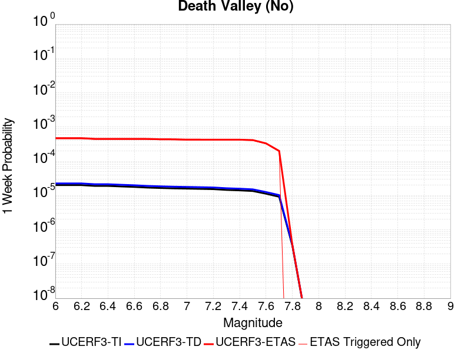 |  | 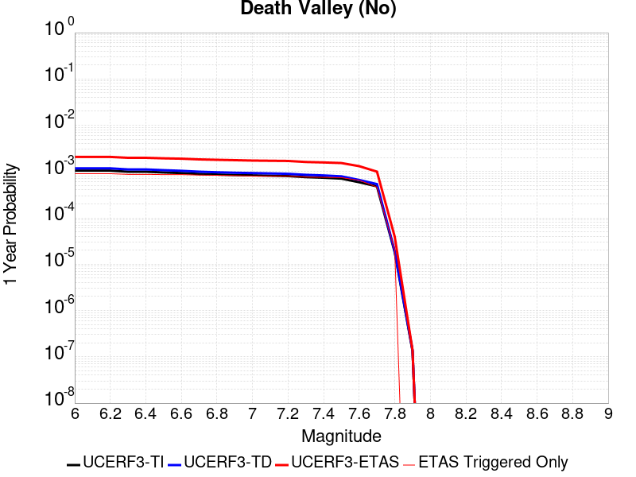 |  |

| Magnitude | 1 wk TI Prob | 1 wk TD Prob | 1 wk ETAS Prob | 1 wk ETAS/TD Gain | 1 wk ETAS Triggered Only | 1 mo TI Prob | 1 mo TD Prob | 1 mo ETAS Prob | 1 mo ETAS/TD Gain | 1 mo ETAS Triggered Only | 1 yr TI Prob | 1 yr TD Prob | 1 yr ETAS Prob | 1 yr ETAS/TD Gain | 1 yr ETAS Triggered Only | 10 yr TI Prob | 10 yr TD Prob | 10 yr ETAS Prob | 10 yr ETAS/TD Gain | 10 yr ETAS Triggered Only |
|-----|-----|-----|-----|-----|-----|-----|-----|-----|-----|-----|-----|-----|-----|-----|-----|-----|-----|-----|-----|-----|
| 6.0 | 2.0074807E-5 | 2.2500084E-5 | 4.7248995E-4 | 20.999475 | 4.5E-4 | 8.603206E-5 | 9.642541E-5 | 6.963675E-4 | 7.2218266 | 6.0E-4 | 0.001046937 | 0.0011733545 | 0.0020722984 | 1.7661316 | 9.0E-4 | 0.010420183 | 0.011672506 | 0.012670717 | 1.0855181 | 0.00101 |
| 6.1 | 2.0074807E-5 | 2.2500084E-5 | 4.7248995E-4 | 20.999475 | 4.5E-4 | 8.603206E-5 | 9.642541E-5 | 6.963675E-4 | 7.2218266 | 6.0E-4 | 0.001046937 | 0.0011733545 | 0.0020722984 | 1.7661316 | 9.0E-4 | 0.010420183 | 0.011672506 | 0.012670717 | 1.0855181 | 0.00101 |
| 6.2 | 2.0074807E-5 | 2.2500084E-5 | 4.7248995E-4 | 20.999475 | 4.5E-4 | 8.603206E-5 | 9.642541E-5 | 6.963675E-4 | 7.2218266 | 6.0E-4 | 0.001046937 | 0.0011733545 | 0.0020722984 | 1.7661316 | 9.0E-4 | 0.010420183 | 0.011672506 | 0.012670717 | 1.0855181 | 0.00101 |
| 6.3 | 1.9050609E-5 | 2.1336948E-5 | 4.5132777E-4 | 21.152407 | 4.3E-4 | 8.164292E-5 | 9.1440896E-5 | 6.713879E-4 | 7.342315 | 5.8E-4 | 9.935491E-4 | 0.001112731 | 0.001981763 | 1.7809901 | 8.7E-4 | 0.009891188 | 0.011072419 | 0.012031678 | 1.0866351 | 9.7E-4 |
| 6.4 | 1.9050609E-5 | 2.1336948E-5 | 4.5132777E-4 | 21.152407 | 4.3E-4 | 8.164292E-5 | 9.1440896E-5 | 6.713879E-4 | 7.342315 | 5.8E-4 | 9.935491E-4 | 0.001112731 | 0.001981763 | 1.7809901 | 8.7E-4 | 0.009891188 | 0.011072419 | 0.012031678 | 1.0866351 | 9.7E-4 |
| 6.5 | 1.8367004E-5 | 2.0561009E-5 | 4.5055218E-4 | 21.912941 | 4.3E-4 | 7.8713354E-5 | 8.811567E-5 | 6.680646E-4 | 7.5816774 | 5.8E-4 | 9.5791375E-4 | 0.0010722869 | 0.0019313646 | 1.8011643 | 8.6E-4 | 0.009537951 | 0.0106719155 | 0.011621671 | 1.0889957 | 9.6E-4 |
| 6.6 | 1.779439E-5 | 1.9910927E-5 | 4.4990238E-4 | 22.59575 | 4.3E-4 | 7.625944E-5 | 8.53298E-5 | 6.652803E-4 | 7.796577 | 5.8E-4 | 9.280632E-4 | 0.0010384015 | 0.0018975085 | 1.8273361 | 8.6E-4 | 0.009241969 | 0.010336253 | 0.0112863295 | 1.091917 | 9.6E-4 |
| 6.7 | 1.7025437E-5 | 1.9043426E-5 | 4.4903523E-4 | 23.579542 | 4.3E-4 | 7.296412E-5 | 8.161216E-5 | 6.615648E-4 | 8.106204 | 5.8E-4 | 8.87976E-4 | 9.931813E-4 | 0.001832347 | 1.8449271 | 8.4E-4 | 0.008844362 | 0.009888145 | 0.01081885 | 1.0941234 | 9.4E-4 |
| 6.8 | 1.6545107E-5 | 1.8512545E-5 | 4.3850477E-4 | 23.686897 | 4.2E-4 | 7.090568E-5 | 7.93371E-5 | 6.492919E-4 | 8.183963 | 5.7E-4 | 8.629347E-4 | 9.655073E-4 | 0.0017947059 | 1.8588217 | 8.3E-4 | 0.008595915 | 0.009613829 | 0.010534888 | 1.0958056 | 9.3E-4 |
| 6.9 | 1.615478E-5 | 1.8087594E-5 | 4.3808E-4 | 24.219915 | 4.2E-4 | 6.9232934E-5 | 7.751599E-5 | 6.374726E-4 | 8.223756 | 5.6E-4 | 8.4258494E-4 | 9.433546E-4 | 0.001762581 | 1.8684183 | 8.2E-4 | 0.008393973 | 0.009394196 | 0.010305553 | 1.0970128 | 9.2E-4 |
| 7.0 | 1.5894311E-5 | 1.780555E-5 | 4.2779825E-4 | 24.02612 | 4.1E-4 | 6.81167E-5 | 7.6307304E-5 | 6.262653E-4 | 8.207149 | 5.5E-4 | 8.2900526E-4 | 9.286515E-4 | 0.0017279086 | 1.8606641 | 8.0E-4 | 0.008259195 | 0.009248397 | 0.0101400735 | 1.0964142 | 9.0E-4 |
| 7.1 | 1.5602263E-5 | 1.7483504E-5 | 4.2747633E-4 | 24.450268 | 4.1E-4 | 6.6865134E-5 | 7.492718E-5 | 6.2488596E-4 | 8.3399105 | 5.5E-4 | 8.137789E-4 | 9.118627E-4 | 0.0017111333 | 1.876525 | 8.0E-4 | 0.008108052 | 0.009081894 | 0.00997372 | 1.0981983 | 9.0E-4 |
| 7.2 | 1.5323829E-5 | 1.717063E-5 | 4.2716358E-4 | 24.877573 | 4.1E-4 | 6.56719E-5 | 7.358637E-5 | 6.235459E-4 | 8.4736595 | 5.5E-4 | 7.99262E-4 | 8.9555193E-4 | 0.0016948355 | 1.8925039 | 8.0E-4 | 0.007963934 | 0.008920107 | 0.009812078 | 1.0999956 | 9.0E-4 |
| 7.3 | 1.4556212E-5 | 1.6302456E-5 | 4.2629577E-4 | 26.149176 | 4.1E-4 | 6.238227E-5 | 6.9865826E-5 | 6.098281E-4 | 8.72856 | 5.4E-4 | 7.592395E-4 | 8.5029035E-4 | 0.0016096442 | 1.8930523 | 7.6E-4 | 0.0075665074 | 0.008471014 | 0.009323729 | 1.1006627 | 8.6E-4 |
| 7.4 | 1.411725E-5 | 1.580796E-5 | 4.2580147E-4 | 26.93589 | 4.1E-4 | 6.0501097E-5 | 6.7746674E-5 | 5.977108E-4 | 8.822732 | 5.3E-4 | 7.363519E-4 | 8.245094E-4 | 0.001573891 | 1.9088818 | 7.5E-4 | 0.0073391674 | 0.008215138 | 0.009058155 | 1.1026175 | 8.5E-4 |
| 7.5 | 1.3503312E-5 | 1.5126289E-5 | 4.1512024E-4 | 27.443626 | 4.0E-4 | 5.7870053E-5 | 6.482538E-5 | 5.8479165E-4 | 9.02103 | 5.2E-4 | 7.043401E-4 | 7.8896893E-4 | 0.0015283851 | 1.937193 | 7.4E-4 | 0.007021119 | 0.007862304 | 0.0086957 | 1.1059989 | 8.4E-4 |
| 7.6 | 1.1279839E-5 | 1.2626327E-5 | 3.326223E-4 | 26.343552 | 3.2E-4 | 4.834127E-5 | 5.4111737E-5 | 4.8408846E-4 | 8.94609 | 4.3E-4 | 5.88396E-4 | 6.5861654E-4 | 0.0013081884 | 1.9862672 | 6.5E-4 | 0.005868405 | 0.006567199 | 0.0072924043 | 1.1104285 | 7.3E-4 |
| 7.7 | 9.189108E-6 | 1.0283358E-5 | 2.002814E-4 | 19.476265 | 1.9E-4 | 3.93813E-5 | 4.407082E-5 | 3.3405804E-4 | 7.5800276 | 2.9E-4 | 4.7936183E-4 | 5.3643517E-4 | 9.961884E-4 | 1.8570528 | 4.6E-4 | 0.004783291 | 0.005351914 | 0.0058790776 | 1.0985 | 5.3E-4 |
| 7.8 | 3.4586725E-7 | 3.6482615E-7 | 3.6482615E-7 | 1.0 | 0.0 | 1.4822873E-6 | 1.5635396E-6 | 1.5635396E-6 | 1.0 | 0.0 | 1.80467E-5 | 1.9035933E-5 | 3.9035553E-5 | 2.0506246 | 2.0E-5 | 1.8045233E-4 | 1.9034347E-4 | 2.2033777E-4 | 1.1575798 | 3.0E-5 |
| 7.9 | 2.5591178E-9 | 2.6696718E-9 | 2.6696718E-9 | 1.0 | 0.0 | 1.0967647E-8 | 1.14414505E-8 | 1.14414505E-8 | 1.0 | 0.0 | 1.335311E-7 | 1.3929966E-7 | 1.3929966E-7 | 1.0 | 0.0 | 1.3353102E-6 | 1.3929966E-6 | 1.3929966E-6 | 1.0 | 0.0 |

## Red Pass
*[(top)](#table-of-contents)*

| 1 Week | 1 Month | 1 Year | 10 Year |
|-----|-----|-----|-----|
|  |  |  |  |

| Magnitude | 1 wk TI Prob | 1 wk TD Prob | 1 wk ETAS Prob | 1 wk ETAS/TD Gain | 1 wk ETAS Triggered Only | 1 mo TI Prob | 1 mo TD Prob | 1 mo ETAS Prob | 1 mo ETAS/TD Gain | 1 mo ETAS Triggered Only | 1 yr TI Prob | 1 yr TD Prob | 1 yr ETAS Prob | 1 yr ETAS/TD Gain | 1 yr ETAS Triggered Only | 10 yr TI Prob | 10 yr TD Prob | 10 yr ETAS Prob | 10 yr ETAS/TD Gain | 10 yr ETAS Triggered Only |
|-----|-----|-----|-----|-----|-----|-----|-----|-----|-----|-----|-----|-----|-----|-----|-----|-----|-----|-----|-----|-----|
| 6.0 | 8.258278E-6 | 8.551265E-6 | 4.485475E-4 | 52.453938 | 4.4E-4 | 3.539214E-5 | 3.6647863E-5 | 6.3662586E-4 | 17.371431 | 6.0E-4 | 4.308141E-4 | 4.4611428E-4 | 0.0012457573 | 2.7924626 | 8.0E-4 | 0.0042997985 | 0.004453945 | 0.0054196245 | 1.2168145 | 9.7E-4 |
| 6.1 | 3.649988E-6 | 3.7753161E-6 | 1.7377468E-4 | 46.02917 | 1.7E-4 | 1.5642712E-5 | 1.6179853E-5 | 2.5617596E-4 | 15.833022 | 2.4E-4 | 1.9043336E-4 | 1.9697666E-4 | 5.069156E-4 | 2.5734806 | 3.1E-4 | 0.0019027026 | 0.001968488 | 0.0023577204 | 1.1977316 | 3.9E-4 |
| 6.2 | 3.649988E-6 | 3.7753161E-6 | 1.7377468E-4 | 46.02917 | 1.7E-4 | 1.5642712E-5 | 1.6179853E-5 | 2.5617596E-4 | 15.833022 | 2.4E-4 | 1.9043336E-4 | 1.9697666E-4 | 5.069156E-4 | 2.5734806 | 3.1E-4 | 0.0019027026 | 0.001968488 | 0.0023577204 | 1.1977316 | 3.9E-4 |
| 6.3 | 1.3924937E-6 | 1.4411166E-6 | 7.144101E-5 | 49.573376 | 7.0E-5 | 5.9678164E-6 | 6.1762075E-6 | 7.617578E-5 | 12.333746 | 7.0E-5 | 7.265574E-5 | 7.519415E-5 | 1.7518662E-4 | 2.3297908 | 1.0E-4 | 7.263199E-4 | 7.518258E-4 | 8.817281E-4 | 1.1727824 | 1.3E-4 |
| 6.4 | 1.3924937E-6 | 1.4411166E-6 | 7.144101E-5 | 49.573376 | 7.0E-5 | 5.9678164E-6 | 6.1762075E-6 | 7.617578E-5 | 12.333746 | 7.0E-5 | 7.265574E-5 | 7.519415E-5 | 1.7518662E-4 | 2.3297908 | 1.0E-4 | 7.263199E-4 | 7.518258E-4 | 8.817281E-4 | 1.1727824 | 1.3E-4 |
| 6.5 | 9.876812E-7 | 1.0221912E-6 | 3.1022162E-5 | 30.348686 | 3.0E-5 | 4.2329125E-6 | 4.3808195E-6 | 3.438069E-5 | 7.848004 | 3.0E-5 | 5.153449E-5 | 5.3336476E-5 | 1.1333328E-4 | 2.1248736 | 6.0E-5 | 5.1522546E-4 | 5.333648E-4 | 6.033274E-4 | 1.1311723 | 7.0E-5 |

## Calico-Hidalgo
*[(top)](#table-of-contents)*

| 1 Week | 1 Month | 1 Year | 10 Year |
|-----|-----|-----|-----|
|  |  |  |  |

| Magnitude | 1 wk TI Prob | 1 wk TD Prob | 1 wk ETAS Prob | 1 wk ETAS/TD Gain | 1 wk ETAS Triggered Only | 1 mo TI Prob | 1 mo TD Prob | 1 mo ETAS Prob | 1 mo ETAS/TD Gain | 1 mo ETAS Triggered Only | 1 yr TI Prob | 1 yr TD Prob | 1 yr ETAS Prob | 1 yr ETAS/TD Gain | 1 yr ETAS Triggered Only | 10 yr TI Prob | 10 yr TD Prob | 10 yr ETAS Prob | 10 yr ETAS/TD Gain | 10 yr ETAS Triggered Only |
|-----|-----|-----|-----|-----|-----|-----|-----|-----|-----|-----|-----|-----|-----|-----|-----|-----|-----|-----|-----|-----|
| 6.0 | 4.0906612E-5 | 5.0703686E-5 | 4.1068543E-4 | 8.099715 | 3.6E-4 | 1.7530227E-4 | 2.172857E-4 | 7.2717486E-4 | 3.34663 | 5.1E-4 | 0.0021322158 | 0.002642648 | 0.0033208511 | 1.2566377 | 6.8E-4 | 0.02111873 | 0.026152607 | 0.026912209 | 1.029045 | 7.8E-4 |
| 6.1 | 4.0906612E-5 | 5.0703686E-5 | 4.1068543E-4 | 8.099715 | 3.6E-4 | 1.7530227E-4 | 2.172857E-4 | 7.2717486E-4 | 3.34663 | 5.1E-4 | 0.0021322158 | 0.002642648 | 0.0033208511 | 1.2566377 | 6.8E-4 | 0.02111873 | 0.026152607 | 0.026912209 | 1.029045 | 7.8E-4 |
| 6.2 | 4.0906612E-5 | 5.0703686E-5 | 4.1068543E-4 | 8.099715 | 3.6E-4 | 1.7530227E-4 | 2.172857E-4 | 7.2717486E-4 | 3.34663 | 5.1E-4 | 0.0021322158 | 0.002642648 | 0.0033208511 | 1.2566377 | 6.8E-4 | 0.02111873 | 0.026152607 | 0.026912209 | 1.029045 | 7.8E-4 |
| 6.3 | 2.4242801E-5 | 3.0090669E-5 | 2.4008435E-4 | 7.978698 | 2.1E-4 | 1.0389358E-4 | 1.2895382E-4 | 4.2891514E-4 | 3.3261142 | 3.0E-4 | 0.0012641704 | 0.0015689151 | 0.0019982404 | 1.2736447 | 4.3E-4 | 0.01257003 | 0.01558206 | 0.01607427 | 1.0315882 | 5.0E-4 |
| 6.4 | 2.4242801E-5 | 3.0090669E-5 | 2.4008435E-4 | 7.978698 | 2.1E-4 | 1.0389358E-4 | 1.2895382E-4 | 4.2891514E-4 | 3.3261142 | 3.0E-4 | 0.0012641704 | 0.0015689151 | 0.0019982404 | 1.2736447 | 4.3E-4 | 0.01257003 | 0.01558206 | 0.01607427 | 1.0315882 | 5.0E-4 |
| 6.5 | 2.0286952E-5 | 2.5315738E-5 | 2.2531068E-4 | 8.900024 | 2.0E-4 | 8.694118E-5 | 1.0849161E-4 | 3.8846122E-4 | 3.5805647 | 2.8E-4 | 0.0010579949 | 0.001320102 | 0.0017295608 | 1.3101721 | 4.1E-4 | 0.010529719 | 0.013124538 | 0.013598238 | 1.0360928 | 4.8E-4 |
| 6.6 | 2.0269223E-5 | 2.5296687E-5 | 2.2529163E-4 | 8.905973 | 2.0E-4 | 8.6865206E-5 | 1.08409964E-4 | 3.8837962E-4 | 3.5825083 | 2.8E-4 | 0.0010570707 | 0.0013191093 | 0.0017285685 | 1.3104057 | 4.1E-4 | 0.010520565 | 0.013114728 | 0.013588432 | 1.03612 | 4.8E-4 |
| 6.7 | 1.799852E-5 | 2.25406E-5 | 2.0253654E-4 | 8.985411 | 1.8E-4 | 7.713423E-5 | 9.659908E-5 | 3.4657493E-4 | 3.5877664 | 2.5E-4 | 9.3870464E-4 | 0.0011754738 | 0.0015350507 | 1.3058995 | 3.6E-4 | 0.009347493 | 0.011694173 | 0.012119145 | 1.0363405 | 4.3E-4 |
| 6.8 | 1.7458793E-5 | 2.184212E-5 | 2.018382E-4 | 9.240778 | 1.8E-4 | 7.4821255E-5 | 9.3605806E-5 | 3.4358242E-4 | 3.6705244 | 2.5E-4 | 9.10568E-4 | 0.0011390693 | 0.0014986593 | 1.3156875 | 3.6E-4 | 0.009068459 | 0.011333893 | 0.011759019 | 1.0375093 | 4.3E-4 |
| 6.9 | 1.542884E-5 | 1.9025927E-5 | 1.990225E-4 | 10.460594 | 1.8E-4 | 6.612192E-5 | 8.153721E-5 | 3.2151764E-4 | 3.9432013 | 2.4E-4 | 8.04737E-4 | 9.922766E-4 | 0.0013219492 | 1.3322386 | 3.3E-4 | 0.008018291 | 0.009879857 | 0.010256103 | 1.0380821 | 3.8E-4 |
| 7.0 | 1.468253E-5 | 1.8030598E-5 | 1.9802735E-4 | 10.982849 | 1.8E-4 | 6.292361E-5 | 7.7271776E-5 | 3.07254E-4 | 3.976277 | 2.3E-4 | 7.658257E-4 | 9.4039086E-4 | 0.0012500994 | 1.3293402 | 3.1E-4 | 0.0076319184 | 0.009365481 | 0.00972211 | 1.038079 | 3.6E-4 |
| 7.1 | 1.3139281E-5 | 1.6200942E-5 | 1.6619852E-4 | 10.258571 | 1.5E-4 | 5.6309986E-5 | 6.943083E-5 | 2.5941763E-4 | 3.7363462 | 1.9E-4 | 6.853584E-4 | 8.4500515E-4 | 0.0011047855 | 1.3074304 | 2.6E-4 | 0.0068324856 | 0.0084192185 | 0.008726609 | 1.0365105 | 3.1E-4 |
| 7.2 | 1.1127404E-5 | 1.3866597E-5 | 1.0386535E-4 | 7.490327 | 9.0E-5 | 4.7688E-5 | 5.942698E-5 | 1.8941925E-4 | 3.1874285 | 1.3E-4 | 5.8044674E-4 | 7.232942E-4 | 9.131568E-4 | 1.2624971 | 1.9E-4 | 0.0057893298 | 0.0072105085 | 0.007448778 | 1.0330447 | 2.4E-4 |
| 7.3 | 9.808154E-6 | 1.2176215E-5 | 1.02175116E-4 | 8.39137 | 9.0E-5 | 4.2034266E-5 | 5.2182797E-5 | 1.7217653E-4 | 3.2994885 | 1.2E-4 | 5.11647E-4 | 6.3515105E-4 | 7.850558E-4 | 1.2360142 | 1.5E-4 | 0.0051047057 | 0.006334433 | 0.0065331664 | 1.0313735 | 2.0E-4 |
| 7.4 | 7.942452E-6 | 9.792144E-6 | 8.979136E-5 | 9.169735 | 8.0E-5 | 3.4038632E-5 | 4.1965708E-5 | 1.519611E-4 | 3.6210778 | 1.1E-4 | 4.1434157E-4 | 5.1082217E-4 | 6.5075065E-4 | 1.2739279 | 1.4E-4 | 0.0041356985 | 0.005097421 | 0.0052765035 | 1.0351319 | 1.8E-4 |
| 7.5 | 4.7121216E-6 | 5.772836E-6 | 6.577249E-5 | 11.393444 | 6.0E-5 | 2.019465E-5 | 2.4740535E-5 | 9.47388E-5 | 3.8292947 | 7.0E-5 | 2.4584212E-4 | 3.0118204E-4 | 3.7116098E-4 | 1.2323476 | 7.0E-5 | 0.0024557032 | 0.0030084911 | 0.0031181602 | 1.0364531 | 1.1E-4 |
| 7.6 | 2.21172E-7 | 2.603961E-7 | 2.0260391E-5 | 77.80605 | 2.0E-5 | 9.478797E-7 | 1.1159829E-6 | 2.111596E-5 | 18.921402 | 2.0E-5 | 1.1540374E-5 | 1.3587036E-5 | 3.3586763E-5 | 2.4719715 | 2.0E-5 | 1.1539775E-4 | 1.3586486E-4 | 1.6586078E-4 | 1.2207776 | 3.0E-5 |

## Elsinore (Glen Ivy) rev
*[(top)](#table-of-contents)*

| 1 Week | 1 Month | 1 Year | 10 Year |
|-----|-----|-----|-----|
|  |  |  |  |

| Magnitude | 1 wk TI Prob | 1 wk TD Prob | 1 wk ETAS Prob | 1 wk ETAS/TD Gain | 1 wk ETAS Triggered Only | 1 mo TI Prob | 1 mo TD Prob | 1 mo ETAS Prob | 1 mo ETAS/TD Gain | 1 mo ETAS Triggered Only | 1 yr TI Prob | 1 yr TD Prob | 1 yr ETAS Prob | 1 yr ETAS/TD Gain | 1 yr ETAS Triggered Only | 10 yr TI Prob | 10 yr TD Prob | 10 yr ETAS Prob | 10 yr ETAS/TD Gain | 10 yr ETAS Triggered Only |
|-----|-----|-----|-----|-----|-----|-----|-----|-----|-----|-----|-----|-----|-----|-----|-----|-----|-----|-----|-----|-----|
| 6.0 | 1.6204086E-4 | 2.9360707E-4 | 5.7352486E-4 | 1.9533756 | 2.8E-4 | 6.94276E-4 | 0.0012578638 | 0.0016473733 | 1.3096595 | 3.9E-4 | 0.008420097 | 0.015234485 | 0.015815496 | 1.0381379 | 5.9E-4 | 0.081081145 | 0.13969168 | 0.14027669 | 1.0041878 | 6.8E-4 |
| 6.1 | 1.6204086E-4 | 2.9360707E-4 | 5.7352486E-4 | 1.9533756 | 2.8E-4 | 6.94276E-4 | 0.0012578638 | 0.0016473733 | 1.3096595 | 3.9E-4 | 0.008420097 | 0.015234485 | 0.015815496 | 1.0381379 | 5.9E-4 | 0.081081145 | 0.13969168 | 0.14027669 | 1.0041878 | 6.8E-4 |
| 6.2 | 1.6204086E-4 | 2.9360707E-4 | 5.7352486E-4 | 1.9533756 | 2.8E-4 | 6.94276E-4 | 0.0012578638 | 0.0016473733 | 1.3096595 | 3.9E-4 | 0.008420097 | 0.015234485 | 0.015815496 | 1.0381379 | 5.9E-4 | 0.081081145 | 0.13969168 | 0.14027669 | 1.0041878 | 6.8E-4 |
| 6.3 | 1.0111737E-4 | 1.7703383E-4 | 3.7699842E-4 | 2.1295276 | 2.0E-4 | 4.332882E-4 | 7.5861247E-4 | 0.0010384 | 1.368815 | 2.8E-4 | 0.005262531 | 0.009217682 | 0.009643719 | 1.0462195 | 4.3E-4 | 0.0513964 | 0.0870191 | 0.0874482 | 1.0049311 | 4.7E-4 |
| 6.4 | 1.0111737E-4 | 1.7703383E-4 | 3.7699842E-4 | 2.1295276 | 2.0E-4 | 4.332882E-4 | 7.5861247E-4 | 0.0010384 | 1.368815 | 2.8E-4 | 0.005262531 | 0.009217682 | 0.009643719 | 1.0462195 | 4.3E-4 | 0.0513964 | 0.0870191 | 0.0874482 | 1.0049311 | 4.7E-4 |
| 6.5 | 3.6624708E-5 | 4.6391084E-5 | 1.1638783E-4 | 2.5088406 | 7.0E-5 | 1.569536E-4 | 1.9880582E-4 | 2.9878595E-4 | 1.5029033 | 1.0E-4 | 0.001909235 | 0.0024181372 | 0.0025977017 | 1.0742575 | 1.8E-4 | 0.01892915 | 0.023739954 | 0.023925444 | 1.0078133 | 1.9E-4 |
| 6.6 | 2.5051324E-5 | 2.614772E-5 | 7.614641E-5 | 2.9121625 | 5.0E-5 | 1.073584E-4 | 1.12057096E-4 | 1.7205038E-4 | 1.5353813 | 6.0E-5 | 0.0013063047 | 0.0013634858 | 0.0014833222 | 1.0878897 | 1.2E-4 | 0.012986525 | 0.013564618 | 0.01368299 | 1.0087266 | 1.2E-4 |
| 6.7 | 2.2189772E-5 | 2.2072849E-5 | 7.207174E-5 | 3.2651763 | 5.0E-5 | 9.509556E-5 | 9.4594696E-5 | 1.5458903E-4 | 1.634225 | 6.0E-5 | 0.0011571734 | 0.0011511183 | 0.0012609917 | 1.0954492 | 1.1E-4 | 0.011511663 | 0.011465415 | 0.011574155 | 1.009484 | 1.1E-4 |
| 6.8 | 1.6654378E-5 | 1.4437705E-5 | 4.443727E-5 | 3.0778625 | 3.0E-5 | 7.137396E-5 | 6.187444E-5 | 9.1872585E-5 | 1.4848229 | 3.0E-5 | 8.686314E-4 | 7.530661E-4 | 8.2301337E-4 | 1.0928833 | 7.0E-5 | 0.008652439 | 0.00751048 | 0.0075799543 | 1.0092503 | 7.0E-5 |
| 6.9 | 1.5042909E-5 | 1.2332022E-5 | 4.2331652E-5 | 3.432661 | 3.0E-5 | 6.446802E-5 | 5.285047E-5 | 8.2848885E-5 | 1.5676092 | 3.0E-5 | 7.8461546E-4 | 6.4326765E-4 | 7.1322266E-4 | 1.1087494 | 7.0E-5 | 0.007818509 | 0.00641828 | 0.0064878305 | 1.0108364 | 7.0E-5 |
| 7.0 | 1.4361385E-5 | 1.1451324E-5 | 4.145098E-5 | 3.6197543 | 3.0E-5 | 6.154734E-5 | 4.9076196E-5 | 7.907472E-5 | 1.6112643 | 3.0E-5 | 7.490812E-4 | 5.973418E-4 | 6.5730594E-4 | 1.100385 | 6.0E-5 | 0.007465612 | 0.0059613534 | 0.006020996 | 1.0100049 | 6.0E-5 |
| 7.1 | 1.3265571E-5 | 1.0244926E-5 | 4.024462E-5 | 3.928249 | 3.0E-5 | 5.6851208E-5 | 4.39061E-5 | 7.390478E-5 | 1.6832464 | 3.0E-5 | 6.919436E-4 | 5.344282E-4 | 5.844015E-4 | 1.0935079 | 5.0E-5 | 0.006897931 | 0.0053347866 | 0.0053845197 | 1.0093224 | 5.0E-5 |
| 7.2 | 1.1596403E-5 | 8.505067E-6 | 3.850481E-5 | 4.5272794 | 3.0E-5 | 4.9697923E-5 | 3.6449786E-5 | 6.6448694E-5 | 1.8230201 | 3.0E-5 | 6.049042E-4 | 4.436875E-4 | 4.936653E-4 | 1.1126419 | 5.0E-5 | 0.006032603 | 0.0044294316 | 0.00447921 | 1.0112381 | 5.0E-5 |
| 7.3 | 1.0150827E-5 | 7.2387597E-6 | 2.7238615E-5 | 3.7628841 | 2.0E-5 | 4.3502816E-5 | 3.1022897E-5 | 5.1022274E-5 | 1.6446651 | 2.0E-5 | 5.2951806E-4 | 3.7763975E-4 | 4.1762463E-4 | 1.1058811 | 4.0E-5 | 0.005282581 | 0.0037703665 | 0.0038102157 | 1.0105691 | 4.0E-5 |
| 7.4 | 9.080705E-6 | 6.352519E-6 | 1.6352456E-5 | 2.5741687 | 1.0E-5 | 3.8916725E-5 | 2.7224805E-5 | 3.7224534E-5 | 1.3673021 | 1.0E-5 | 4.7370812E-4 | 3.3141294E-4 | 3.514063E-4 | 1.0603276 | 2.0E-5 | 0.004726996 | 0.0033093381 | 0.003329272 | 1.0060235 | 2.0E-5 |
| 7.5 | 7.671649E-6 | 5.2256332E-6 | 1.5225581E-5 | 2.9136338 | 1.0E-5 | 3.287808E-5 | 2.2395385E-5 | 3.239516E-5 | 1.4465106 | 1.0E-5 | 4.0021708E-4 | 2.7263095E-4 | 2.926255E-4 | 1.0733392 | 2.0E-5 | 0.0039949706 | 0.00272309 | 0.0027430353 | 1.0073246 | 2.0E-5 |
| 7.6 | 6.990086E-6 | 4.687545E-6 | 1.4687498E-5 | 3.133303 | 1.0E-5 | 2.9957167E-5 | 2.008933E-5 | 3.0089128E-5 | 1.4977667 | 1.0E-5 | 3.6466747E-4 | 2.445613E-4 | 2.645564E-4 | 1.0817591 | 2.0E-5 | 0.0036406964 | 0.002443038 | 0.002462989 | 1.0081666 | 2.0E-5 |
| 7.7 | 4.163505E-6 | 2.3295343E-6 | 1.2329511E-5 | 5.2926936 | 1.0E-5 | 1.7843471E-5 | 9.983683E-6 | 1.9983583E-5 | 2.0016243 | 1.0E-5 | 2.172226E-4 | 1.21545316E-4 | 1.315441E-4 | 1.0822638 | 1.0E-5 | 0.0021701038 | 0.0012148614 | 0.0012248493 | 1.0082214 | 1.0E-5 |
| 7.8 | 2.2692414E-7 | 9.3854695E-8 | 9.3854695E-8 | 1.0 | 0.0 | 9.725317E-7 | 4.0223435E-7 | 4.0223435E-7 | 1.0 | 0.0 | 1.1840509E-5 | 4.8971956E-6 | 4.8971956E-6 | 1.0 | 0.0 | 1.1839878E-4 | 4.8971204E-5 | 4.8971204E-5 | 1.0 | 0.0 |
| 7.9 | 6.676829E-9 | 3.439853E-9 | 3.439853E-9 | 1.0 | 0.0 | 2.861498E-8 | 1.4742227E-8 | 1.4742227E-8 | 1.0 | 0.0 | 3.4838732E-7 | 1.7948659E-7 | 1.7948659E-7 | 1.0 | 0.0 | 3.4838679E-6 | 1.7948646E-6 | 1.7948646E-6 | 1.0 | 0.0 |

## San Andreas (Parkfield)
*[(top)](#table-of-contents)*

| 1 Week | 1 Month | 1 Year | 10 Year |
|-----|-----|-----|-----|
|  |  |  |  |

| Magnitude | 1 wk TI Prob | 1 wk TD Prob | 1 wk ETAS Prob | 1 wk ETAS/TD Gain | 1 wk ETAS Triggered Only | 1 mo TI Prob | 1 mo TD Prob | 1 mo ETAS Prob | 1 mo ETAS/TD Gain | 1 mo ETAS Triggered Only | 1 yr TI Prob | 1 yr TD Prob | 1 yr ETAS Prob | 1 yr ETAS/TD Gain | 1 yr ETAS Triggered Only | 10 yr TI Prob | 10 yr TD Prob | 10 yr ETAS Prob | 10 yr ETAS/TD Gain | 10 yr ETAS Triggered Only |
|-----|-----|-----|-----|-----|-----|-----|-----|-----|-----|-----|-----|-----|-----|-----|-----|-----|-----|-----|-----|-----|
| 6.0 | 5.556969E-4 | 7.7782426E-4 | 0.0011675209 | 1.5010086 | 3.9E-4 | 0.0023793848 | 0.0033298214 | 0.003778323 | 1.1346924 | 4.5E-4 | 0.028586963 | 0.040191233 | 0.040776715 | 1.0145675 | 6.1E-4 | 0.25176284 | 0.33716413 | 0.3376414 | 1.0014155 | 7.2E-4 |
| 6.1 | 1.925858E-4 | 3.0276453E-4 | 5.1270094E-4 | 1.6933984 | 2.1E-4 | 8.2510663E-4 | 0.0012970108 | 0.0015366995 | 1.1848009 | 2.4E-4 | 0.0099994885 | 0.015778083 | 0.016083192 | 1.0193375 | 3.1E-4 | 0.095613256 | 0.1497237 | 0.1500468 | 1.002158 | 3.8E-4 |
| 6.2 | 9.4306815E-5 | 1.8242796E-4 | 3.5239695E-4 | 1.9317046 | 1.7E-4 | 4.0410945E-4 | 7.816011E-4 | 9.7145257E-4 | 1.2429007 | 1.9E-4 | 0.0049089384 | 0.009474681 | 0.009722312 | 1.0261362 | 2.5E-4 | 0.048019063 | 0.09185409 | 0.092135616 | 1.0030649 | 3.1E-4 |
| 6.3 | 9.283051E-5 | 1.7939322E-4 | 3.493627E-4 | 1.947469 | 1.7E-4 | 3.9778434E-4 | 7.686027E-4 | 9.584567E-4 | 1.2470118 | 1.9E-4 | 0.0048322747 | 0.009317789 | 0.00956546 | 1.0265805 | 2.5E-4 | 0.047285385 | 0.09050704 | 0.090788975 | 1.0031152 | 3.1E-4 |
| 6.4 | 9.138826E-5 | 1.770153E-4 | 3.469852E-4 | 1.9601989 | 1.7E-4 | 3.916052E-4 | 7.5841765E-4 | 9.382811E-4 | 1.2371563 | 1.8E-4 | 0.0047573745 | 0.00919484 | 0.009432633 | 1.0258616 | 2.4E-4 | 0.046568092 | 0.08940927 | 0.08968245 | 1.0030553 | 3.0E-4 |
| 6.5 | 9.000255E-5 | 1.7459576E-4 | 3.4456607E-4 | 1.9735078 | 1.7E-4 | 3.8566816E-4 | 7.480541E-4 | 9.2791946E-4 | 1.2404443 | 1.8E-4 | 0.0046854047 | 0.009069731 | 0.009307555 | 1.0262216 | 2.4E-4 | 0.045878403 | 0.088295065 | 0.088568576 | 1.0030977 | 3.0E-4 |
| 6.6 | 8.8109264E-5 | 1.7140752E-4 | 3.4137839E-4 | 1.9916185 | 1.7E-4 | 3.7755648E-4 | 7.3439797E-4 | 9.142658E-4 | 1.2449187 | 1.8E-4 | 0.0045870654 | 0.008904854 | 0.009142716 | 1.0267116 | 2.4E-4 | 0.04493529 | 0.0868267 | 0.08710065 | 1.0031551 | 3.0E-4 |
| 6.7 | 8.738073E-5 | 1.7007832E-4 | 3.4004942E-4 | 1.9993695 | 1.7E-4 | 3.7443507E-4 | 7.287046E-4 | 9.0857345E-4 | 1.2468337 | 1.8E-4 | 0.0045492216 | 0.008836143 | 0.009074022 | 1.0269212 | 2.4E-4 | 0.04457213 | 0.08622707 | 0.086501196 | 1.0031792 | 3.0E-4 |
| 6.8 | 8.710195E-5 | 1.6953335E-4 | 3.3950454E-4 | 2.0025826 | 1.7E-4 | 3.7324068E-4 | 7.263703E-4 | 9.0623955E-4 | 1.2476275 | 1.8E-4 | 0.0045347405 | 0.008807961 | 0.009045847 | 1.027008 | 2.4E-4 | 0.04443313 | 0.08597467 | 0.086248875 | 1.0031894 | 3.0E-4 |
| 6.9 | 8.6801556E-5 | 1.689429E-4 | 3.389142E-4 | 2.006087 | 1.7E-4 | 3.7195362E-4 | 7.2384125E-4 | 9.0371096E-4 | 1.2484933 | 1.8E-4 | 0.0045191357 | 0.008777418 | 0.0090153115 | 1.027103 | 2.4E-4 | 0.044283327 | 0.085700735 | 0.08597502 | 1.0032005 | 3.0E-4 |
| 7.0 | 8.5571606E-5 | 1.6647128E-4 | 3.36443E-4 | 2.021027 | 1.7E-4 | 3.6668387E-4 | 7.132544E-4 | 8.93126E-4 | 1.2521844 | 1.8E-4 | 0.004455241 | 0.008649553 | 0.008887477 | 1.0275071 | 2.4E-4 | 0.043669727 | 0.08454914 | 0.08482377 | 1.0032482 | 3.0E-4 |
| 7.1 | 7.82589E-5 | 1.5128135E-4 | 3.2125565E-4 | 2.123564 | 1.7E-4 | 3.3535215E-4 | 6.481883E-4 | 8.280716E-4 | 1.2775171 | 1.8E-4 | 0.0040752706 | 0.007863307 | 0.00810142 | 1.0302815 | 2.4E-4 | 0.040013418 | 0.07746111 | 0.077728644 | 1.0034539 | 2.9E-4 |
| 7.2 | 7.690929E-5 | 1.4865391E-4 | 3.1862865E-4 | 2.143426 | 1.7E-4 | 3.2956956E-4 | 6.369334E-4 | 8.1681873E-4 | 1.2824241 | 1.8E-4 | 0.004005129 | 0.007727258 | 0.007965404 | 1.0308189 | 2.4E-4 | 0.0393371 | 0.07623427 | 0.07650217 | 1.003514 | 2.9E-4 |
| 7.3 | 7.5543794E-5 | 1.4561978E-4 | 3.15595E-4 | 2.1672537 | 1.7E-4 | 3.2371894E-4 | 6.2393624E-4 | 8.0382393E-4 | 1.288311 | 1.8E-4 | 0.003934157 | 0.007570127 | 0.0078083104 | 1.0314635 | 2.4E-4 | 0.038652334 | 0.074797355 | 0.07506566 | 1.0035871 | 2.9E-4 |
| 7.4 | 7.4214564E-5 | 1.4262961E-4 | 3.1260538E-4 | 2.1917284 | 1.7E-4 | 3.1802364E-4 | 6.111273E-4 | 7.910173E-4 | 1.2943577 | 1.8E-4 | 0.003865065 | 0.00741525 | 0.00765347 | 1.0321257 | 2.4E-4 | 0.03798529 | 0.07337123 | 0.07363996 | 1.0036625 | 2.9E-4 |
| 7.5 | 6.149578E-5 | 1.11907226E-4 | 2.818882E-4 | 2.5189455 | 1.7E-4 | 2.6352672E-4 | 4.7951436E-4 | 6.59428E-4 | 1.3751998 | 1.8E-4 | 0.0032037178 | 0.0058224914 | 0.006051152 | 1.039272 | 2.3E-4 | 0.03157923 | 0.058557566 | 0.058811754 | 1.0043409 | 2.7E-4 |
| 7.6 | 6.0643448E-5 | 1.10193796E-4 | 2.8017507E-4 | 2.5425665 | 1.7E-4 | 2.598746E-4 | 4.7217376E-4 | 6.520888E-4 | 1.3810356 | 1.8E-4 | 0.0031593828 | 0.0057335934 | 0.005962275 | 1.0398844 | 2.3E-4 | 0.031148417 | 0.057718582 | 0.057972997 | 1.0044079 | 2.7E-4 |
| 7.7 | 5.1652263E-5 | 9.174698E-5 | 2.0173688E-4 | 2.1988394 | 1.1E-4 | 2.2134806E-4 | 3.931421E-4 | 5.1309494E-4 | 1.3051131 | 1.2E-4 | 0.002691582 | 0.0047760103 | 0.004935246 | 1.0333408 | 1.6E-4 | 0.026592141 | 0.04853623 | 0.048717007 | 1.0037246 | 1.9E-4 |
| 7.8 | 4.8090482E-5 | 8.559635E-5 | 1.9558694E-4 | 2.2849915 | 1.1E-4 | 2.060858E-4 | 3.6678996E-4 | 4.8674594E-4 | 1.3270427 | 1.2E-4 | 0.0025062072 | 0.0044565317 | 0.004615819 | 1.0357424 | 1.6E-4 | 0.024781305 | 0.04530245 | 0.045483842 | 1.004004 | 1.9E-4 |
| 7.9 | 3.970278E-5 | 6.750426E-5 | 1.4749885E-4 | 2.1850305 | 8.0E-5 | 1.7014367E-4 | 2.892719E-4 | 3.6924877E-4 | 1.2764764 | 8.0E-5 | 0.002069531 | 0.0035162016 | 0.0036357797 | 1.0340078 | 1.2E-4 | 0.020503636 | 0.035881363 | 0.03602598 | 1.0040305 | 1.5E-4 |
| 8.0 | 2.8982335E-5 | 4.069796E-5 | 7.069674E-5 | 1.7371078 | 3.0E-5 | 1.2420409E-4 | 1.7440817E-4 | 2.0440294E-4 | 1.1719803 | 3.0E-5 | 0.0015111357 | 0.0021213528 | 0.0021812255 | 1.0282239 | 6.0E-5 | 0.015009012 | 0.022010697 | 0.022069376 | 1.002666 | 6.0E-5 |
| 8.1 | 1.8836186E-5 | 1.8681134E-5 | 2.8680948E-5 | 1.5352894 | 1.0E-5 | 8.0724014E-5 | 8.005955E-5 | 9.0058755E-5 | 1.124897 | 1.0E-5 | 9.823717E-4 | 9.742898E-4 | 9.8428E-4 | 1.0102539 | 1.0E-5 | 0.009780403 | 0.010488115 | 0.010498011 | 1.0009434 | 1.0E-5 |
| 8.2 | 8.643924E-6 | 5.4748625E-6 | 5.4748625E-6 | 1.0 | 0.0 | 3.704486E-5 | 2.3463486E-5 | 2.3463486E-5 | 1.0 | 0.0 | 4.5092785E-4 | 2.8563058E-4 | 2.8563058E-4 | 1.0 | 0.0 | 0.0045001395 | 0.0032487072 | 0.0032487072 | 1.0 | 0.0 |
| 8.3 | 1.983087E-6 | 7.6599065E-7 | 7.6599065E-7 | 1.0 | 0.0 | 8.498917E-6 | 3.282813E-6 | 3.282813E-6 | 1.0 | 0.0 | 1.034694E-4 | 3.9967534E-5 | 3.9967534E-5 | 1.0 | 0.0 | 0.0010342124 | 4.719687E-4 | 4.719687E-4 | 1.0 | 0.0 |

## Cady
*[(top)](#table-of-contents)*

| 1 Week | 1 Month | 1 Year | 10 Year |
|-----|-----|-----|-----|
| 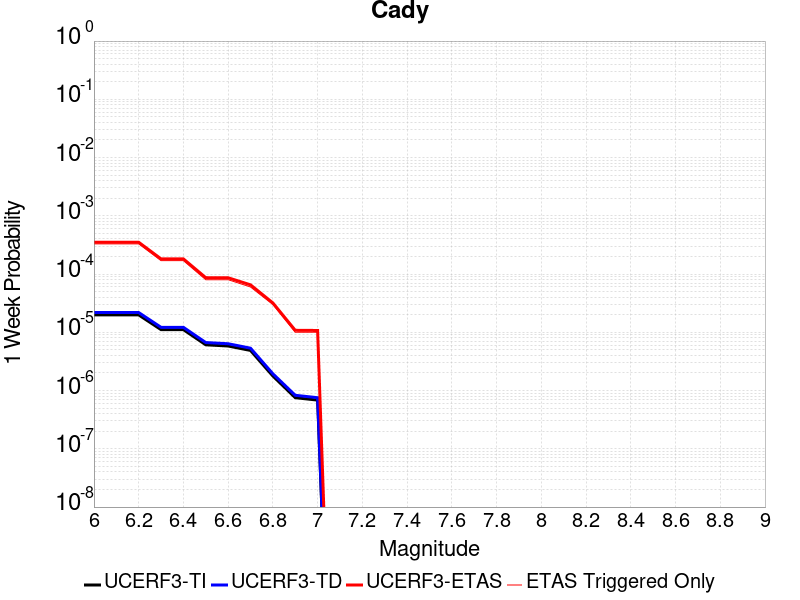 | 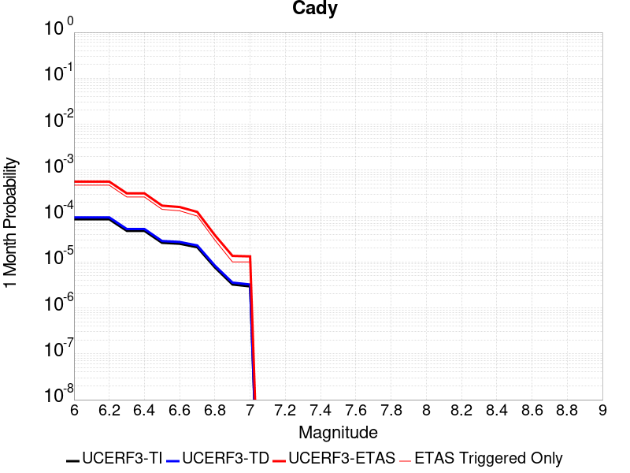 |  |  |

| Magnitude | 1 wk TI Prob | 1 wk TD Prob | 1 wk ETAS Prob | 1 wk ETAS/TD Gain | 1 wk ETAS Triggered Only | 1 mo TI Prob | 1 mo TD Prob | 1 mo ETAS Prob | 1 mo ETAS/TD Gain | 1 mo ETAS Triggered Only | 1 yr TI Prob | 1 yr TD Prob | 1 yr ETAS Prob | 1 yr ETAS/TD Gain | 1 yr ETAS Triggered Only | 10 yr TI Prob | 10 yr TD Prob | 10 yr ETAS Prob | 10 yr ETAS/TD Gain | 10 yr ETAS Triggered Only |
|-----|-----|-----|-----|-----|-----|-----|-----|-----|-----|-----|-----|-----|-----|-----|-----|-----|-----|-----|-----|-----|
| 6.0 | 1.9892565E-5 | 2.1858728E-5 | 3.5185152E-4 | 16.096613 | 3.3E-4 | 8.525106E-5 | 9.3677416E-5 | 5.636334E-4 | 6.016748 | 4.7E-4 | 0.0010374374 | 0.0011400167 | 0.0017393327 | 1.5257081 | 6.0E-4 | 0.010326075 | 0.011350701 | 0.012072414 | 1.0635833 | 7.3E-4 |
| 6.1 | 1.9892565E-5 | 2.1858728E-5 | 3.5185152E-4 | 16.096613 | 3.3E-4 | 8.525106E-5 | 9.3677416E-5 | 5.636334E-4 | 6.016748 | 4.7E-4 | 0.0010374374 | 0.0011400167 | 0.0017393327 | 1.5257081 | 6.0E-4 | 0.010326075 | 0.011350701 | 0.012072414 | 1.0635833 | 7.3E-4 |
| 6.2 | 1.9892565E-5 | 2.1858728E-5 | 3.5185152E-4 | 16.096613 | 3.3E-4 | 8.525106E-5 | 9.3677416E-5 | 5.636334E-4 | 6.016748 | 4.7E-4 | 0.0010374374 | 0.0011400167 | 0.0017393327 | 1.5257081 | 6.0E-4 | 0.010326075 | 0.011350701 | 0.012072414 | 1.0635833 | 7.3E-4 |
| 6.3 | 1.1117327E-5 | 1.2176583E-5 | 1.8217451E-4 | 14.961053 | 1.7E-4 | 4.764482E-5 | 5.2184492E-5 | 3.1217092E-4 | 5.9820633 | 2.6E-4 | 5.7992124E-4 | 6.351925E-4 | 9.649829E-4 | 1.5191976 | 3.3E-4 | 0.0057841022 | 0.0063368753 | 0.0067343405 | 1.0627226 | 4.0E-4 |
| 6.4 | 1.1117327E-5 | 1.2176583E-5 | 1.8217451E-4 | 14.961053 | 1.7E-4 | 4.764482E-5 | 5.2184492E-5 | 3.1217092E-4 | 5.9820633 | 2.6E-4 | 5.7992124E-4 | 6.351925E-4 | 9.649829E-4 | 1.5191976 | 3.3E-4 | 0.0057841022 | 0.0063368753 | 0.0067343405 | 1.0627226 | 4.0E-4 |
| 6.5 | 6.103093E-6 | 6.672021E-6 | 8.667148E-5 | 12.990291 | 8.0E-5 | 2.615585E-5 | 2.8594131E-5 | 1.6859012E-4 | 5.8959694 | 1.4E-4 | 3.1840094E-4 | 3.480905E-4 | 5.480209E-4 | 1.5743632 | 2.0E-4 | 0.0031794512 | 0.0034766865 | 0.0036959217 | 1.0630586 | 2.2E-4 |
| 6.6 | 5.817237E-6 | 6.3656585E-6 | 8.636515E-5 | 13.567355 | 8.0E-5 | 2.4930776E-5 | 2.728118E-5 | 1.5727764E-4 | 5.76506 | 1.3E-4 | 3.034899E-4 | 3.3211018E-4 | 5.2204705E-4 | 1.5719093 | 1.9E-4 | 0.0030307577 | 0.0033173605 | 0.0035266639 | 1.0630933 | 2.1E-4 |
| 6.7 | 4.8846314E-6 | 5.3405684E-6 | 6.5340246E-5 | 12.234699 | 6.0E-5 | 2.0933967E-5 | 2.2888014E-5 | 1.2288573E-4 | 5.368999 | 1.0E-4 | 2.5484123E-4 | 2.7863772E-4 | 4.3859315E-4 | 1.5740623 | 1.6E-4 | 0.0025454918 | 0.0027840391 | 0.002963538 | 1.0644742 | 1.8E-4 |
| 6.8 | 1.7788773E-6 | 1.9399079E-6 | 3.193985E-5 | 16.46462 | 3.0E-5 | 7.6237375E-6 | 8.313874E-6 | 3.8313625E-5 | 4.608396 | 3.0E-5 | 9.281505E-5 | 1.01218284E-4 | 1.5121323E-4 | 1.4939319 | 5.0E-5 | 9.2776294E-4 | 0.0010118765 | 0.0010718157 | 1.0592358 | 6.0E-5 |
| 6.9 | 7.5455404E-7 | 8.297092E-7 | 1.0829701E-5 | 13.052405 | 1.0E-5 | 3.233799E-6 | 3.5558937E-6 | 1.35558585E-5 | 3.8122225 | 1.0E-5 | 3.937079E-5 | 4.3292483E-5 | 7.329118E-5 | 1.6929309 | 3.0E-5 | 3.9363815E-4 | 4.3287344E-4 | 4.6286045E-4 | 1.0692743 | 3.0E-5 |
| 7.0 | 6.8578805E-7 | 7.541816E-7 | 1.0754174E-5 | 14.259396 | 1.0E-5 | 2.9390883E-6 | 3.2322048E-6 | 1.3232172E-5 | 4.0938535 | 1.0E-5 | 3.578281E-5 | 3.9351715E-5 | 5.9350925E-5 | 1.5082171 | 2.0E-5 | 3.577705E-4 | 3.9347992E-4 | 4.1347204E-4 | 1.0508085 | 2.0E-5 |

## San Andreas (San Gorgonio Pass-Garnet HIll)
*[(top)](#table-of-contents)*

| 1 Week | 1 Month | 1 Year | 10 Year |
|-----|-----|-----|-----|
|  |  |  |  |

| Magnitude | 1 wk TI Prob | 1 wk TD Prob | 1 wk ETAS Prob | 1 wk ETAS/TD Gain | 1 wk ETAS Triggered Only | 1 mo TI Prob | 1 mo TD Prob | 1 mo ETAS Prob | 1 mo ETAS/TD Gain | 1 mo ETAS Triggered Only | 1 yr TI Prob | 1 yr TD Prob | 1 yr ETAS Prob | 1 yr ETAS/TD Gain | 1 yr ETAS Triggered Only | 10 yr TI Prob | 10 yr TD Prob | 10 yr ETAS Prob | 10 yr ETAS/TD Gain | 10 yr ETAS Triggered Only |
|-----|-----|-----|-----|-----|-----|-----|-----|-----|-----|-----|-----|-----|-----|-----|-----|-----|-----|-----|-----|-----|
| 6.0 | 8.31567E-5 | 2.3382473E-4 | 6.137359E-4 | 2.624769 | 3.8E-4 | 3.5633717E-4 | 0.0010017233 | 0.0014912325 | 1.488667 | 4.9E-4 | 0.004329778 | 0.012127888 | 0.01273049 | 1.0496873 | 6.1E-4 | 0.042463828 | 0.11257892 | 0.11320899 | 1.0055966 | 7.1E-4 |
| 6.1 | 8.31567E-5 | 2.3382473E-4 | 6.137359E-4 | 2.624769 | 3.8E-4 | 3.5633717E-4 | 0.0010017233 | 0.0014912325 | 1.488667 | 4.9E-4 | 0.004329778 | 0.012127888 | 0.01273049 | 1.0496873 | 6.1E-4 | 0.042463828 | 0.11257892 | 0.11320899 | 1.0055966 | 7.1E-4 |
| 6.2 | 8.31567E-5 | 2.3382473E-4 | 6.137359E-4 | 2.624769 | 3.8E-4 | 3.5633717E-4 | 0.0010017233 | 0.0014912325 | 1.488667 | 4.9E-4 | 0.004329778 | 0.012127888 | 0.01273049 | 1.0496873 | 6.1E-4 | 0.042463828 | 0.11257892 | 0.11320899 | 1.0055966 | 7.1E-4 |
| 6.3 | 8.31567E-5 | 2.3382473E-4 | 6.137359E-4 | 2.624769 | 3.8E-4 | 3.5633717E-4 | 0.0010017233 | 0.0014912325 | 1.488667 | 4.9E-4 | 0.004329778 | 0.012127888 | 0.01273049 | 1.0496873 | 6.1E-4 | 0.042463828 | 0.11257892 | 0.11320899 | 1.0055966 | 7.1E-4 |
| 6.4 | 8.059055E-5 | 2.2940808E-4 | 5.993232E-4 | 2.6124763 | 3.7E-4 | 3.4534236E-4 | 9.828096E-4 | 0.0014623378 | 1.4879158 | 4.8E-4 | 0.0041964394 | 0.011900152 | 0.012493012 | 1.0498195 | 6.0E-4 | 0.041180745 | 0.11056015 | 0.11118276 | 1.0056314 | 7.0E-4 |
| 6.5 | 8.059055E-5 | 2.2940808E-4 | 5.993232E-4 | 2.6124763 | 3.7E-4 | 3.4534236E-4 | 9.828096E-4 | 0.0014623378 | 1.4879158 | 4.8E-4 | 0.0041964394 | 0.011900152 | 0.012493012 | 1.0498195 | 6.0E-4 | 0.041180745 | 0.11056015 | 0.11118276 | 1.0056314 | 7.0E-4 |
| 6.6 | 7.619237E-5 | 2.218517E-4 | 5.9176964E-4 | 2.6674109 | 3.7E-4 | 3.2649786E-4 | 9.5044886E-4 | 0.0014299926 | 1.5045445 | 4.8E-4 | 0.0039678677 | 0.01151087 | 0.012103964 | 1.0515246 | 6.0E-4 | 0.03897764 | 0.10709683 | 0.10772186 | 1.0058361 | 7.0E-4 |
| 6.7 | 7.440636E-5 | 2.1860997E-4 | 5.885291E-4 | 2.692142 | 3.7E-4 | 3.188454E-4 | 9.3656575E-4 | 0.0014161161 | 1.5120307 | 4.8E-4 | 0.0038750346 | 0.011343609 | 0.011936802 | 1.0522932 | 6.0E-4 | 0.038081564 | 0.105605274 | 0.106231354 | 1.0059284 | 7.0E-4 |
| 6.8 | 7.3735864E-5 | 2.1708169E-4 | 5.870014E-4 | 2.7040575 | 3.7E-4 | 3.1597257E-4 | 9.3002064E-4 | 0.0014095742 | 1.5156376 | 4.8E-4 | 0.0038401815 | 0.011264749 | 0.01185799 | 1.0526634 | 6.0E-4 | 0.03774495 | 0.10490683 | 0.10553339 | 1.0059726 | 7.0E-4 |
| 6.9 | 7.27575E-5 | 2.1477141E-4 | 5.8469194E-4 | 2.7223918 | 3.7E-4 | 3.117806E-4 | 9.201265E-4 | 0.001389694 | 1.5103294 | 4.7E-4 | 0.003789323 | 0.011145527 | 0.01172895 | 1.052346 | 5.9E-4 | 0.037253562 | 0.103854746 | 0.104473084 | 1.0059539 | 6.9E-4 |
| 7.0 | 7.102591E-5 | 2.1061185E-4 | 5.8053393E-4 | 2.7564163 | 3.7E-4 | 3.0436125E-4 | 9.023122E-4 | 0.0013618971 | 1.5093414 | 4.6E-4 | 0.003699303 | 0.010930831 | 0.011504491 | 1.0524809 | 5.8E-4 | 0.03638325 | 0.10195695 | 0.102558635 | 1.0059015 | 6.7E-4 |
| 7.1 | 7.028513E-5 | 2.0896831E-4 | 5.78891E-4 | 2.7702334 | 3.7E-4 | 3.0118722E-4 | 8.9527335E-4 | 0.0013548615 | 1.5133495 | 4.6E-4 | 0.0036607897 | 0.010845989 | 0.011419699 | 1.052896 | 5.8E-4 | 0.036010686 | 0.101199985 | 0.101802185 | 1.0059506 | 6.7E-4 |
| 7.2 | 6.8498244E-5 | 2.0504706E-4 | 5.649732E-4 | 2.7553344 | 3.6E-4 | 2.9353087E-4 | 8.784794E-4 | 0.001328084 | 1.5117987 | 4.5E-4 | 0.003567883 | 0.010643536 | 0.01120747 | 1.0529836 | 5.7E-4 | 0.035111405 | 0.09939202 | 0.09997741 | 1.0058898 | 6.5E-4 |
| 7.3 | 6.622592E-5 | 1.9732013E-4 | 5.5724906E-4 | 2.8240864 | 3.6E-4 | 2.8379448E-4 | 8.453858E-4 | 0.0012950053 | 1.5318514 | 4.5E-4 | 0.0034497243 | 0.0102444785 | 0.010808639 | 1.0550697 | 5.7E-4 | 0.033966612 | 0.095888525 | 0.0964762 | 1.0061287 | 6.5E-4 |
| 7.4 | 5.1050705E-5 | 1.4689034E-4 | 4.6684334E-4 | 3.178176 | 3.2E-4 | 2.1877038E-4 | 6.29379E-4 | 0.0010291273 | 1.6351471 | 4.0E-4 | 0.002660276 | 0.0076359594 | 0.0081519885 | 1.0675788 | 5.2E-4 | 0.02628654 | 0.07286301 | 0.073419295 | 1.0076346 | 6.0E-4 |
| 7.5 | 3.9302922E-5 | 1.1129847E-4 | 4.1126506E-4 | 3.695155 | 3.0E-4 | 1.6843023E-4 | 4.7690657E-4 | 8.567253E-4 | 1.7964218 | 3.8E-4 | 0.0020487092 | 0.005790949 | 0.0062681693 | 1.082408 | 4.8E-4 | 0.020299247 | 0.05600951 | 0.056538146 | 1.0094383 | 5.6E-4 |
| 7.6 | 2.9851626E-5 | 8.4949745E-5 | 3.7492512E-4 | 4.413493 | 2.9E-4 | 1.2792926E-4 | 3.6401965E-4 | 7.238886E-4 | 1.9885976 | 3.6E-4 | 0.0015564259 | 0.0044229585 | 0.004880924 | 1.1035428 | 4.6E-4 | 0.0154556995 | 0.04319374 | 0.043710414 | 1.0119618 | 5.4E-4 |
| 7.7 | 2.1135214E-5 | 6.3529005E-5 | 3.5351058E-4 | 5.564554 | 2.9E-4 | 9.0576345E-5 | 2.7223877E-4 | 6.321408E-4 | 2.3220086 | 3.6E-4 | 0.0011022091 | 0.0033094748 | 0.0037579855 | 1.1355232 | 4.5E-4 | 0.010967582 | 0.032582592 | 0.033095326 | 1.0157363 | 5.3E-4 |
| 7.8 | 1.883379E-5 | 5.564028E-5 | 3.4562414E-4 | 6.2117615 | 2.9E-4 | 8.0713755E-5 | 2.3843657E-4 | 5.883531E-4 | 2.4675457 | 3.5E-4 | 9.822468E-4 | 0.0028991038 | 0.0033378282 | 1.1513311 | 4.4E-4 | 0.0097791655 | 0.028695205 | 0.029200284 | 1.0176015 | 5.2E-4 |
| 7.9 | 1.5156185E-5 | 4.1658426E-5 | 3.1164716E-4 | 7.481012 | 2.7E-4 | 6.495346E-5 | 1.785239E-4 | 5.08465E-4 | 2.848162 | 3.3E-4 | 7.9052144E-4 | 0.0021713632 | 0.0025904512 | 1.1930069 | 4.2E-4 | 0.007877152 | 0.021759422 | 0.022228979 | 1.0215794 | 4.8E-4 |
| 8.0 | 1.1405907E-5 | 2.9974231E-5 | 1.9996913E-4 | 6.671368 | 1.7E-4 | 4.8881542E-5 | 1.2845467E-4 | 3.384277E-4 | 2.634608 | 2.1E-4 | 5.9497025E-4 | 0.0015628147 | 0.0018323926 | 1.1724952 | 2.7E-4 | 0.005933798 | 0.015772851 | 0.016087802 | 1.019968 | 3.2E-4 |
| 8.1 | 4.3511436E-6 | 7.369219E-6 | 7.369219E-6 | 1.0 | 0.0 | 1.8647626E-5 | 3.1581985E-5 | 3.1581985E-5 | 1.0 | 0.0 | 2.2701119E-4 | 3.8444297E-4 | 3.8444297E-4 | 1.0 | 0.0 | 0.0022677942 | 0.0041163345 | 0.0041163345 | 1.0 | 0.0 |
| 8.2 | 2.3042528E-6 | 2.7329415E-6 | 2.7329415E-6 | 1.0 | 0.0 | 9.875332E-6 | 1.1712554E-5 | 1.1712554E-5 | 1.0 | 0.0 | 1.2022553E-4 | 1.4259106E-4 | 1.4259106E-4 | 1.0 | 0.0 | 0.0012016051 | 0.0015979785 | 0.0015979785 | 1.0 | 0.0 |
| 8.3 | 5.202968E-7 | 3.1598344E-7 | 3.1598344E-7 | 1.0 | 0.0 | 2.2298414E-6 | 1.3542141E-6 | 1.3542141E-6 | 1.0 | 0.0 | 2.714798E-5 | 1.6487444E-5 | 1.6487444E-5 | 1.0 | 0.0 | 2.7144665E-4 | 1.9563142E-4 | 1.9563142E-4 | 1.0 | 0.0 |

## Manix-Afton Hills
*[(top)](#table-of-contents)*

| 1 Week | 1 Month | 1 Year | 10 Year |
|-----|-----|-----|-----|
|  |  | 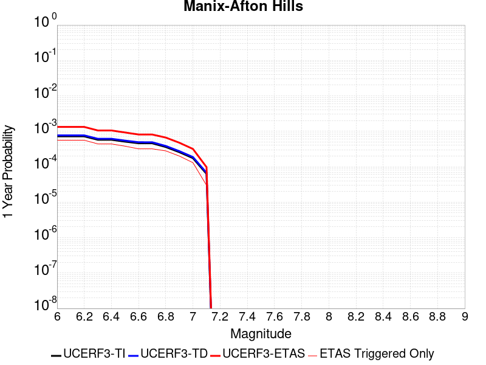 |  |

| Magnitude | 1 wk TI Prob | 1 wk TD Prob | 1 wk ETAS Prob | 1 wk ETAS/TD Gain | 1 wk ETAS Triggered Only | 1 mo TI Prob | 1 mo TD Prob | 1 mo ETAS Prob | 1 mo ETAS/TD Gain | 1 mo ETAS Triggered Only | 1 yr TI Prob | 1 yr TD Prob | 1 yr ETAS Prob | 1 yr ETAS/TD Gain | 1 yr ETAS Triggered Only | 10 yr TI Prob | 10 yr TD Prob | 10 yr ETAS Prob | 10 yr ETAS/TD Gain | 10 yr ETAS Triggered Only |
|-----|-----|-----|-----|-----|-----|-----|-----|-----|-----|-----|-----|-----|-----|-----|-----|-----|-----|-----|-----|-----|
| 6.0 | 1.3783202E-5 | 1.47110895E-5 | 2.9470696E-4 | 20.03298 | 2.8E-4 | 5.906953E-5 | 6.30461E-5 | 4.8301963E-4 | 7.6613717 | 4.2E-4 | 7.189342E-4 | 7.6733343E-4 | 0.0013269037 | 1.7292401 | 5.6E-4 | 0.0071661277 | 0.007648596 | 0.008323395 | 1.0882252 | 6.8E-4 |
| 6.1 | 1.3783202E-5 | 1.47110895E-5 | 2.9470696E-4 | 20.03298 | 2.8E-4 | 5.906953E-5 | 6.30461E-5 | 4.8301963E-4 | 7.6613717 | 4.2E-4 | 7.189342E-4 | 7.6733343E-4 | 0.0013269037 | 1.7292401 | 5.6E-4 | 0.0071661277 | 0.007648596 | 0.008323395 | 1.0882252 | 6.8E-4 |
| 6.2 | 1.3783202E-5 | 1.47110895E-5 | 2.9470696E-4 | 20.03298 | 2.8E-4 | 5.906953E-5 | 6.30461E-5 | 4.8301963E-4 | 7.6613717 | 4.2E-4 | 7.189342E-4 | 7.6733343E-4 | 0.0013269037 | 1.7292401 | 5.6E-4 | 0.0071661277 | 0.007648596 | 0.008323395 | 1.0882252 | 6.8E-4 |
| 6.3 | 1.10494875E-5 | 1.1793136E-5 | 2.2179066E-4 | 18.806759 | 2.1E-4 | 4.7354086E-5 | 5.054109E-5 | 3.805244E-4 | 7.529011 | 3.3E-4 | 5.763835E-4 | 6.151744E-4 | 0.0010549037 | 1.7148043 | 4.4E-4 | 0.005748908 | 0.0061357557 | 0.006672442 | 1.0874687 | 5.4E-4 |
| 6.4 | 1.10494875E-5 | 1.1793136E-5 | 2.2179066E-4 | 18.806759 | 2.1E-4 | 4.7354086E-5 | 5.054109E-5 | 3.805244E-4 | 7.529011 | 3.3E-4 | 5.763835E-4 | 6.151744E-4 | 0.0010549037 | 1.7148043 | 4.4E-4 | 0.005748908 | 0.0061357557 | 0.006672442 | 1.0874687 | 5.4E-4 |
| 6.5 | 9.788949E-6 | 1.045432E-5 | 2.1045223E-4 | 20.130648 | 2.0E-4 | 4.1951964E-5 | 4.480351E-5 | 3.4479008E-4 | 7.695604 | 3.0E-4 | 5.1064545E-4 | 5.453555E-4 | 9.2514826E-4 | 1.6964132 | 3.8E-4 | 0.0050947363 | 0.0054410985 | 0.005898596 | 1.0840818 | 4.6E-4 |
| 6.6 | 8.810006E-6 | 9.4136285E-6 | 1.7941203E-4 | 19.058754 | 1.7E-4 | 3.775662E-5 | 4.0343548E-5 | 2.9033347E-4 | 7.196528 | 2.5E-4 | 4.5958988E-4 | 4.9108086E-4 | 8.109237E-4 | 1.6513039 | 3.2E-4 | 0.0045864056 | 0.004900839 | 0.005298879 | 1.0812187 | 4.0E-4 |
| 6.7 | 8.80128E-6 | 9.404108E-6 | 1.7940252E-4 | 19.077036 | 1.7E-4 | 3.7719226E-5 | 4.0302748E-5 | 2.9029266E-4 | 7.202801 | 2.5E-4 | 4.591348E-4 | 4.9058435E-4 | 8.1042736E-4 | 1.6519634 | 3.2E-4 | 0.004581874 | 0.0048958957 | 0.0052939374 | 1.0813011 | 4.0E-4 |
| 6.8 | 6.8994877E-6 | 7.380076E-6 | 1.5737896E-4 | 21.324844 | 1.5E-4 | 2.9568899E-5 | 3.162856E-5 | 2.616213E-4 | 8.271679 | 2.3E-4 | 3.5994186E-4 | 3.8501783E-4 | 6.6491E-4 | 1.726959 | 2.8E-4 | 0.003593594 | 0.0038443129 | 0.0041929674 | 1.0906936 | 3.5E-4 |
| 6.9 | 4.9328037E-6 | 5.2709615E-6 | 1.2527032E-4 | 23.766125 | 1.2E-4 | 2.1140417E-5 | 2.2589675E-5 | 1.7258628E-4 | 7.6400523 | 1.5E-4 | 2.5735417E-4 | 2.7500073E-4 | 4.7494573E-4 | 1.7270708 | 2.0E-4 | 0.0025705635 | 0.0027472095 | 0.00298655 | 1.0871214 | 2.4E-4 |
| 7.0 | 3.347973E-6 | 3.59003E-6 | 9.3589704E-5 | 26.069338 | 9.0E-5 | 1.4348378E-5 | 1.5385775E-5 | 1.1538424E-4 | 7.49941 | 1.0E-4 | 1.746775E-4 | 1.8730981E-4 | 3.1728548E-4 | 1.6939073 | 1.3E-4 | 0.0017454025 | 0.0018719219 | 0.0020116598 | 1.0746495 | 1.4E-4 |
| 7.1 | 1.2073567E-6 | 1.293482E-6 | 3.1293443E-5 | 24.19318 | 3.0E-5 | 5.1743755E-6 | 5.543492E-6 | 3.5543326E-5 | 6.411721 | 3.0E-5 | 6.29962E-5 | 6.749156E-5 | 9.748953E-5 | 1.44447 | 3.0E-5 | 6.297835E-4 | 6.7487074E-4 | 7.048505E-4 | 1.044423 | 3.0E-5 |

## Baker
*[(top)](#table-of-contents)*

| 1 Week | 1 Month | 1 Year | 10 Year |
|-----|-----|-----|-----|
|  |  |  |  |

| Magnitude | 1 wk TI Prob | 1 wk TD Prob | 1 wk ETAS Prob | 1 wk ETAS/TD Gain | 1 wk ETAS Triggered Only | 1 mo TI Prob | 1 mo TD Prob | 1 mo ETAS Prob | 1 mo ETAS/TD Gain | 1 mo ETAS Triggered Only | 1 yr TI Prob | 1 yr TD Prob | 1 yr ETAS Prob | 1 yr ETAS/TD Gain | 1 yr ETAS Triggered Only | 10 yr TI Prob | 10 yr TD Prob | 10 yr ETAS Prob | 10 yr ETAS/TD Gain | 10 yr ETAS Triggered Only |
|-----|-----|-----|-----|-----|-----|-----|-----|-----|-----|-----|-----|-----|-----|-----|-----|-----|-----|-----|-----|-----|
| 6.0 | 5.695525E-6 | 5.8348373E-6 | 2.7583327E-4 | 47.273514 | 2.7E-4 | 2.4409164E-5 | 2.5006228E-5 | 3.9499698E-4 | 15.795944 | 3.7E-4 | 2.9714106E-4 | 3.044123E-4 | 8.24254E-4 | 2.7076895 | 5.2E-4 | 0.0029674405 | 0.0030403486 | 0.0036484941 | 1.2000248 | 6.1E-4 |
| 6.1 | 5.695525E-6 | 5.8348373E-6 | 2.7583327E-4 | 47.273514 | 2.7E-4 | 2.4409164E-5 | 2.5006228E-5 | 3.9499698E-4 | 15.795944 | 3.7E-4 | 2.9714106E-4 | 3.044123E-4 | 8.24254E-4 | 2.7076895 | 5.2E-4 | 0.0029674405 | 0.0030403486 | 0.0036484941 | 1.2000248 | 6.1E-4 |
| 6.2 | 5.695525E-6 | 5.8348373E-6 | 2.7583327E-4 | 47.273514 | 2.7E-4 | 2.4409164E-5 | 2.5006228E-5 | 3.9499698E-4 | 15.795944 | 3.7E-4 | 2.9714106E-4 | 3.044123E-4 | 8.24254E-4 | 2.7076895 | 5.2E-4 | 0.0029674405 | 0.0030403486 | 0.0036484941 | 1.2000248 | 6.1E-4 |
| 6.3 | 3.2995713E-6 | 3.383667E-6 | 1.9338302E-4 | 57.151905 | 1.9E-4 | 1.4140943E-5 | 1.4501353E-5 | 2.7449758E-4 | 18.929102 | 2.6E-4 | 1.7215237E-4 | 1.7654014E-4 | 5.164801E-4 | 2.9255676 | 3.4E-4 | 0.0017201907 | 0.001764046 | 0.0021932875 | 1.2433279 | 4.3E-4 |
| 6.4 | 3.2995713E-6 | 3.383667E-6 | 1.9338302E-4 | 57.151905 | 1.9E-4 | 1.4140943E-5 | 1.4501353E-5 | 2.7449758E-4 | 18.929102 | 2.6E-4 | 1.7215237E-4 | 1.7654014E-4 | 5.164801E-4 | 2.9255676 | 3.4E-4 | 0.0017201907 | 0.001764046 | 0.0021932875 | 1.2433279 | 4.3E-4 |
| 6.5 | 2.782202E-6 | 2.8558404E-6 | 1.6285539E-4 | 57.02538 | 1.6E-4 | 1.1923668E-5 | 1.223926E-5 | 2.4223645E-4 | 19.791756 | 2.3E-4 | 1.4516099E-4 | 1.4900314E-4 | 4.5895696E-4 | 3.080183 | 3.1E-4 | 0.001450662 | 0.0014890651 | 0.0018784844 | 1.2615193 | 3.9E-4 |
| 6.6 | 2.3163404E-6 | 2.38092E-6 | 1.6238054E-4 | 68.20075 | 1.6E-4 | 9.927136E-6 | 1.0203904E-5 | 2.3020167E-4 | 22.560156 | 2.2E-4 | 1.20856166E-4 | 1.2422565E-4 | 4.0419088E-4 | 3.2536829 | 2.8E-4 | 0.0012079047 | 0.0012415823 | 0.0016011354 | 1.2895926 | 3.6E-4 |
| 6.7 | 2.037056E-6 | 2.0965003E-6 | 1.5209618E-4 | 72.54765 | 1.5E-4 | 8.7302105E-6 | 8.984972E-6 | 2.1898308E-4 | 24.37215 | 2.1E-4 | 1.0628513E-4 | 1.093867E-4 | 3.7935717E-4 | 3.4680374 | 2.7E-4 | 0.0010623431 | 0.0010933448 | 0.0014429621 | 1.3197687 | 3.5E-4 |
| 6.8 | 1.8356744E-6 | 1.8915287E-6 | 1.4189126E-4 | 75.01407 | 1.4E-4 | 7.867153E-6 | 8.106527E-6 | 1.9810499E-4 | 24.437714 | 1.9E-4 | 9.577837E-5 | 9.869264E-5 | 3.4866796E-4 | 3.532867 | 2.5E-4 | 9.57371E-4 | 9.86502E-4 | 0.0013161765 | 1.3341852 | 3.3E-4 |
| 6.9 | 1.6310546E-6 | 1.6832072E-6 | 1.3168299E-4 | 78.23338 | 1.3E-4 | 6.9902153E-6 | 7.213726E-6 | 1.8721243E-4 | 25.952251 | 1.8E-4 | 8.510255E-5 | 8.782368E-5 | 3.178035E-4 | 3.6186535 | 2.3E-4 | 8.5069967E-4 | 8.7790104E-4 | 0.0011776377 | 1.3414241 | 3.0E-4 |
| 7.0 | 1.2058036E-6 | 1.2508665E-6 | 1.0125074E-4 | 80.94448 | 1.0E-4 | 5.1677193E-6 | 5.3608455E-6 | 1.453601E-4 | 27.115143 | 1.4E-4 | 6.291517E-5 | 6.5266366E-5 | 2.452546E-4 | 3.757749 | 1.8E-4 | 6.289736E-4 | 6.524743E-4 | 8.8232424E-4 | 1.3522743 | 2.3E-4 |
| 7.1 | 1.052382E-6 | 1.0951609E-6 | 1.0109505E-4 | 92.310684 | 1.0E-4 | 4.5102006E-6 | 4.693538E-6 | 1.3469293E-4 | 28.697525 | 1.3E-4 | 5.491031E-5 | 5.7142337E-5 | 2.2713262E-4 | 3.974857 | 1.7E-4 | 5.4896745E-4 | 5.7127734E-4 | 7.8115735E-4 | 1.3673873 | 2.1E-4 |
| 7.2 | 1.0067454E-6 | 1.0487711E-6 | 1.0104867E-4 | 96.349594 | 1.0E-4 | 4.3146156E-6 | 4.4947255E-6 | 1.3449414E-4 | 29.92266 | 1.3E-4 | 5.252918E-5 | 5.4721917E-5 | 2.1471316E-4 | 3.9237142 | 1.6E-4 | 5.251676E-4 | 5.470853E-4 | 7.469759E-4 | 1.3653737 | 2.0E-4 |
| 7.3 | 9.3596316E-7 | 9.767723E-7 | 6.0976712E-5 | 62.426743 | 6.0E-5 | 4.0112645E-6 | 4.1861604E-6 | 8.418583E-5 | 20.11051 | 8.0E-5 | 4.8836053E-5 | 5.096532E-5 | 1.6095971E-4 | 3.1582205 | 1.1E-4 | 4.8825322E-4 | 5.095371E-4 | 6.494658E-4 | 1.2746192 | 1.4E-4 |
| 7.4 | 8.8117395E-7 | 9.2076635E-7 | 4.0920728E-5 | 44.442036 | 4.0E-5 | 3.7764542E-6 | 3.9461356E-6 | 6.3945896E-5 | 16.204689 | 6.0E-5 | 4.5977362E-5 | 4.8043148E-5 | 1.3803883E-4 | 2.873226 | 9.0E-5 | 4.596785E-4 | 4.8032837E-4 | 5.9027557E-4 | 1.2289 | 1.1E-4 |
| 7.5 | 8.292386E-7 | 8.6745956E-7 | 4.0867424E-5 | 47.111618 | 4.0E-5 | 3.5538749E-6 | 3.7176785E-6 | 6.371745E-5 | 17.139044 | 6.0E-5 | 4.326757E-5 | 4.5261804E-5 | 1.3525772E-4 | 2.9883416 | 9.0E-5 | 4.3259145E-4 | 4.5252658E-4 | 5.624768E-4 | 1.2429696 | 1.1E-4 |
| 7.6 | 7.553842E-7 | 7.9144706E-7 | 2.079143E-5 | 26.270147 | 2.0E-5 | 3.2373566E-6 | 3.3919116E-6 | 4.3391778E-5 | 12.79272 | 4.0E-5 | 3.9414106E-5 | 4.129575E-5 | 1.1129286E-4 | 2.6950197 | 7.0E-5 | 3.9407116E-4 | 4.1288146E-4 | 4.928484E-4 | 1.1936802 | 8.0E-5 |
| 7.7 | 6.5285366E-7 | 6.852797E-7 | 1.0685273E-5 | 15.592572 | 1.0E-5 | 2.797941E-6 | 2.9369096E-6 | 3.2936823E-5 | 11.214789 | 3.0E-5 | 3.40644E-5 | 3.5756293E-5 | 8.575451E-5 | 2.3983052 | 5.0E-5 | 3.405918E-4 | 3.5750607E-4 | 4.1748464E-4 | 1.1677693 | 6.0E-5 |
| 7.8 | 3.4586725E-7 | 3.6482615E-7 | 3.6482615E-7 | 1.0 | 0.0 | 1.4822873E-6 | 1.5635396E-6 | 1.5635396E-6 | 1.0 | 0.0 | 1.80467E-5 | 1.9035933E-5 | 3.9035553E-5 | 2.0506246 | 2.0E-5 | 1.8045233E-4 | 1.9034347E-4 | 2.2033777E-4 | 1.1575798 | 3.0E-5 |
| 7.9 | 2.5591178E-9 | 2.6696718E-9 | 2.6696718E-9 | 1.0 | 0.0 | 1.0967647E-8 | 1.14414505E-8 | 1.14414505E-8 | 1.0 | 0.0 | 1.335311E-7 | 1.3929966E-7 | 1.3929966E-7 | 1.0 | 0.0 | 1.3353102E-6 | 1.3929966E-6 | 1.3929966E-6 | 1.0 | 0.0 |

## Ludlow
*[(top)](#table-of-contents)*

| 1 Week | 1 Month | 1 Year | 10 Year |
|-----|-----|-----|-----|
| 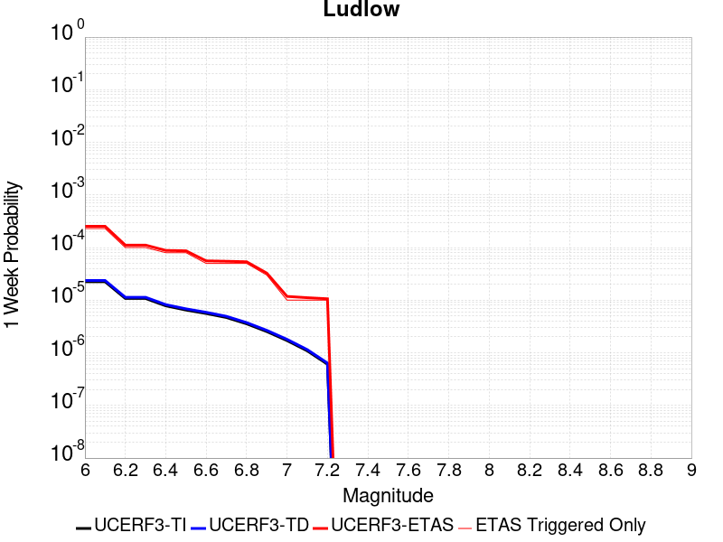 |  |  |  |

| Magnitude | 1 wk TI Prob | 1 wk TD Prob | 1 wk ETAS Prob | 1 wk ETAS/TD Gain | 1 wk ETAS Triggered Only | 1 mo TI Prob | 1 mo TD Prob | 1 mo ETAS Prob | 1 mo ETAS/TD Gain | 1 mo ETAS Triggered Only | 1 yr TI Prob | 1 yr TD Prob | 1 yr ETAS Prob | 1 yr ETAS/TD Gain | 1 yr ETAS Triggered Only | 10 yr TI Prob | 10 yr TD Prob | 10 yr ETAS Prob | 10 yr ETAS/TD Gain | 10 yr ETAS Triggered Only |
|-----|-----|-----|-----|-----|-----|-----|-----|-----|-----|-----|-----|-----|-----|-----|-----|-----|-----|-----|-----|-----|
| 6.0 | 2.2407607E-5 | 2.3657254E-5 | 2.5365182E-4 | 10.721947 | 2.3E-4 | 9.602906E-5 | 1.0138454E-4 | 4.6134804E-4 | 4.5504775 | 3.6E-4 | 0.0011685267 | 0.001233702 | 0.0017430728 | 1.41288 | 5.1E-4 | 0.011624013 | 0.012273042 | 0.0128360465 | 1.0458733 | 5.7E-4 |
| 6.1 | 2.2407607E-5 | 2.3657254E-5 | 2.5365182E-4 | 10.721947 | 2.3E-4 | 9.602906E-5 | 1.0138454E-4 | 4.6134804E-4 | 4.5504775 | 3.6E-4 | 0.0011685267 | 0.001233702 | 0.0017430728 | 1.41288 | 5.1E-4 | 0.011624013 | 0.012273042 | 0.0128360465 | 1.0458733 | 5.7E-4 |
| 6.2 | 1.0781252E-5 | 1.1365663E-5 | 1.1136453E-4 | 9.79833 | 1.0E-4 | 4.620455E-5 | 4.8709102E-5 | 1.8870228E-4 | 3.8740664 | 1.4E-4 | 5.623952E-4 | 5.9287593E-4 | 7.827633E-4 | 1.3202817 | 1.9E-4 | 0.00560974 | 0.0059133614 | 0.006151942 | 1.040346 | 2.4E-4 |
| 6.3 | 1.0781252E-5 | 1.1365663E-5 | 1.1136453E-4 | 9.79833 | 1.0E-4 | 4.620455E-5 | 4.8709102E-5 | 1.8870228E-4 | 3.8740664 | 1.4E-4 | 5.623952E-4 | 5.9287593E-4 | 7.827633E-4 | 1.3202817 | 1.9E-4 | 0.00560974 | 0.0059133614 | 0.006151942 | 1.040346 | 2.4E-4 |
| 6.4 | 7.814439E-6 | 8.237729E-6 | 8.823707E-5 | 10.711334 | 8.0E-5 | 3.3490025E-5 | 3.530408E-5 | 1.453002E-4 | 4.115677 | 1.1E-4 | 4.0766477E-4 | 4.2974384E-4 | 5.5968796E-4 | 1.3023758 | 1.3E-4 | 0.0040691774 | 0.0042892746 | 0.0044685025 | 1.0417851 | 1.8E-4 |
| 6.5 | 6.4986366E-6 | 6.85092E-6 | 8.685037E-5 | 12.677184 | 8.0E-5 | 2.7851002E-5 | 2.9360759E-5 | 1.3935752E-4 | 4.746387 | 1.1E-4 | 3.390332E-4 | 3.5740953E-4 | 4.7736664E-4 | 1.3356293 | 1.2E-4 | 0.003385164 | 0.0035684432 | 0.0037278724 | 1.0446775 | 1.6E-4 |
| 6.6 | 5.582177E-6 | 5.8860055E-6 | 5.588571E-5 | 9.494676 | 5.0E-5 | 2.3923398E-5 | 2.5225498E-5 | 1.0522348E-4 | 4.1713142 | 8.0E-5 | 2.9122844E-4 | 3.0707786E-4 | 3.9705023E-4 | 1.2929952 | 9.0E-5 | 0.0029084706 | 0.003066609 | 0.0031762714 | 1.0357603 | 1.1E-4 |
| 6.7 | 4.6858763E-6 | 4.940427E-6 | 5.494018E-5 | 11.120532 | 5.0E-5 | 2.0082172E-5 | 2.1173091E-5 | 1.011714E-4 | 4.778301 | 8.0E-5 | 2.4447302E-4 | 2.5775246E-4 | 3.4772925E-4 | 1.3490822 | 9.0E-5 | 0.0024420423 | 0.0025745912 | 0.0026743338 | 1.0387411 | 1.0E-4 |
| 6.8 | 3.5584908E-6 | 3.7520183E-6 | 5.375183E-5 | 14.326111 | 5.0E-5 | 1.5250586E-5 | 1.6079981E-5 | 9.607869E-5 | 5.97505 | 8.0E-5 | 1.8566006E-4 | 1.957566E-4 | 2.85739E-4 | 1.4596646 | 9.0E-5 | 0.0018550502 | 0.0019558826 | 0.0020457066 | 1.045925 | 9.0E-5 |
| 6.9 | 2.532834E-6 | 2.6710034E-6 | 3.2670923E-5 | 12.231704 | 3.0E-5 | 1.0854958E-5 | 1.1447109E-5 | 7.144642E-5 | 6.241438 | 6.0E-5 | 1.3215111E-4 | 1.3935992E-4 | 2.0935017E-4 | 1.5022265 | 7.0E-5 | 0.0013207254 | 0.0013927529 | 0.0014626554 | 1.0501902 | 7.0E-5 |
| 7.0 | 1.7083285E-6 | 1.8019439E-6 | 1.1801926E-5 | 6.5495524 | 1.0E-5 | 7.3213873E-6 | 7.722595E-6 | 4.7722286E-5 | 6.1795664 | 4.0E-5 | 8.913424E-5 | 9.40187E-5 | 1.3401493E-4 | 1.4254073 | 4.0E-5 | 8.9098496E-4 | 9.3980576E-4 | 9.797681E-4 | 1.042522 | 4.0E-5 |
| 7.1 | 1.0905424E-6 | 1.1497619E-6 | 1.114975E-5 | 9.697442 | 1.0E-5 | 4.6737446E-6 | 4.9275427E-6 | 4.4927347E-5 | 9.117597 | 4.0E-5 | 5.6901354E-5 | 5.999128E-5 | 9.998888E-5 | 1.6667236 | 4.0E-5 | 5.6886784E-4 | 5.997606E-4 | 6.3973665E-4 | 1.0666533 | 4.0E-5 |
| 7.2 | 6.06668E-7 | 6.387277E-7 | 1.06387215E-5 | 16.656113 | 1.0E-5 | 2.600003E-6 | 2.7374022E-6 | 1.2737375E-5 | 4.6530886 | 1.0E-5 | 3.1654577E-5 | 3.3327433E-5 | 4.3327098E-5 | 1.3000431 | 1.0E-5 | 3.1650066E-4 | 3.3323118E-4 | 3.4322785E-4 | 1.0299993 | 1.0E-5 |

## San Andreas (Carrizo) rev
*[(top)](#table-of-contents)*

| 1 Week | 1 Month | 1 Year | 10 Year |
|-----|-----|-----|-----|
|  |  |  |  |

| Magnitude | 1 wk TI Prob | 1 wk TD Prob | 1 wk ETAS Prob | 1 wk ETAS/TD Gain | 1 wk ETAS Triggered Only | 1 mo TI Prob | 1 mo TD Prob | 1 mo ETAS Prob | 1 mo ETAS/TD Gain | 1 mo ETAS Triggered Only | 1 yr TI Prob | 1 yr TD Prob | 1 yr ETAS Prob | 1 yr ETAS/TD Gain | 1 yr ETAS Triggered Only | 10 yr TI Prob | 10 yr TD Prob | 10 yr ETAS Prob | 10 yr ETAS/TD Gain | 10 yr ETAS Triggered Only |
|-----|-----|-----|-----|-----|-----|-----|-----|-----|-----|-----|-----|-----|-----|-----|-----|-----|-----|-----|-----|-----|
| 6.0 | 1.1674632E-4 | 2.432302E-4 | 6.1314023E-4 | 2.5208228 | 3.7E-4 | 5.002454E-4 | 0.0010420004 | 0.0014615627 | 1.4026508 | 4.2E-4 | 0.006073493 | 0.012613042 | 0.013096862 | 1.0383587 | 4.9E-4 | 0.0591016 | 0.12061418 | 0.12114181 | 1.0043745 | 6.0E-4 |
| 6.1 | 1.1674632E-4 | 2.432302E-4 | 6.1314023E-4 | 2.5208228 | 3.7E-4 | 5.002454E-4 | 0.0010420004 | 0.0014615627 | 1.4026508 | 4.2E-4 | 0.006073493 | 0.012613042 | 0.013096862 | 1.0383587 | 4.9E-4 | 0.0591016 | 0.12061418 | 0.12114181 | 1.0043745 | 6.0E-4 |
| 6.2 | 1.1674632E-4 | 2.432302E-4 | 6.1314023E-4 | 2.5208228 | 3.7E-4 | 5.002454E-4 | 0.0010420004 | 0.0014615627 | 1.4026508 | 4.2E-4 | 0.006073493 | 0.012613042 | 0.013096862 | 1.0383587 | 4.9E-4 | 0.0591016 | 0.12061418 | 0.12114181 | 1.0043745 | 6.0E-4 |
| 6.3 | 1.1674632E-4 | 2.432302E-4 | 6.1314023E-4 | 2.5208228 | 3.7E-4 | 5.002454E-4 | 0.0010420004 | 0.0014615627 | 1.4026508 | 4.2E-4 | 0.006073493 | 0.012613042 | 0.013096862 | 1.0383587 | 4.9E-4 | 0.0591016 | 0.12061418 | 0.12114181 | 1.0043745 | 6.0E-4 |
| 6.4 | 1.1674632E-4 | 2.432302E-4 | 6.1314023E-4 | 2.5208228 | 3.7E-4 | 5.002454E-4 | 0.0010420004 | 0.0014615627 | 1.4026508 | 4.2E-4 | 0.006073493 | 0.012613042 | 0.013096862 | 1.0383587 | 4.9E-4 | 0.0591016 | 0.12061418 | 0.12114181 | 1.0043745 | 6.0E-4 |
| 6.5 | 1.13136164E-4 | 2.3643032E-4 | 5.863476E-4 | 2.4800017 | 3.5E-4 | 4.847792E-4 | 0.0010128808 | 0.0014124757 | 1.3945131 | 4.0E-4 | 0.0058862255 | 0.012262545 | 0.012726781 | 1.0378581 | 4.7E-4 | 0.057327334 | 0.117585555 | 0.11809735 | 1.0043526 | 5.8E-4 |
| 6.6 | 1.13136164E-4 | 2.3643032E-4 | 5.863476E-4 | 2.4800017 | 3.5E-4 | 4.847792E-4 | 0.0010128808 | 0.0014124757 | 1.3945131 | 4.0E-4 | 0.0058862255 | 0.012262545 | 0.012726781 | 1.0378581 | 4.7E-4 | 0.057327334 | 0.117585555 | 0.11809735 | 1.0043526 | 5.8E-4 |
| 6.7 | 1.1149675E-4 | 2.3334254E-4 | 5.8326084E-4 | 2.4995909 | 3.5E-4 | 4.777557E-4 | 9.996577E-4 | 0.0013992578 | 1.399737 | 4.0E-4 | 0.0058011734 | 0.012103349 | 0.012567661 | 1.0383623 | 4.7E-4 | 0.05652051 | 0.1162071 | 0.1167197 | 1.0044111 | 5.8E-4 |
| 6.8 | 1.1103589E-4 | 2.3236412E-4 | 5.6228746E-4 | 2.4198549 | 3.3E-4 | 4.7578133E-4 | 9.954676E-4 | 0.0013750894 | 1.3813502 | 3.8E-4 | 0.005777263 | 0.012052901 | 0.012497477 | 1.0368854 | 4.5E-4 | 0.056293584 | 0.1157674 | 0.116253726 | 1.0042009 | 5.5E-4 |
| 6.9 | 1.1053259E-4 | 2.3128795E-4 | 5.612116E-4 | 2.426463 | 3.3E-4 | 4.7362508E-4 | 9.90859E-4 | 0.0013704825 | 1.3831257 | 3.8E-4 | 0.0057511497 | 0.01199741 | 0.012442011 | 1.0370581 | 4.5E-4 | 0.05604569 | 0.11528359 | 0.11577019 | 1.0042208 | 5.5E-4 |
| 7.0 | 1.1005377E-4 | 2.3029637E-4 | 5.602204E-4 | 2.4326062 | 3.3E-4 | 4.7157376E-4 | 9.866126E-4 | 0.0013662378 | 1.3847762 | 3.8E-4 | 0.0057263062 | 0.011946279 | 0.012390903 | 1.0372187 | 4.5E-4 | 0.055809796 | 0.11483591 | 0.115322754 | 1.0042394 | 5.5E-4 |
| 7.1 | 1.0308142E-4 | 2.1539345E-4 | 5.1532884E-4 | 2.3925002 | 3.0E-4 | 4.417027E-4 | 9.227892E-4 | 0.0012624755 | 1.3681082 | 3.4E-4 | 0.0053644776 | 0.011177397 | 0.011582815 | 1.0362712 | 4.1E-4 | 0.052368138 | 0.108092256 | 0.10854713 | 1.0042082 | 5.1E-4 |
| 7.2 | 1.0027479E-4 | 2.094724E-4 | 5.094096E-4 | 2.4318695 | 3.0E-4 | 4.296783E-4 | 8.9743105E-4 | 0.001237126 | 1.3785192 | 3.4E-4 | 0.0052187922 | 0.010871782 | 0.0112773245 | 1.0373023 | 4.1E-4 | 0.050979212 | 0.10539625 | 0.10585249 | 1.0043288 | 5.1E-4 |
| 7.3 | 9.816942E-5 | 2.0422463E-4 | 5.041634E-4 | 2.4686706 | 3.0E-4 | 4.2065824E-4 | 8.7495585E-4 | 0.0012146584 | 1.3882511 | 3.4E-4 | 0.005109493 | 0.010600842 | 0.011006495 | 1.0382662 | 4.1E-4 | 0.049935985 | 0.102979995 | 0.103437476 | 1.0044425 | 5.1E-4 |
| 7.4 | 9.5634205E-5 | 1.9791997E-4 | 4.8786256E-4 | 2.4649487 | 2.9E-4 | 4.0979648E-4 | 8.479536E-4 | 0.0011776738 | 1.3888422 | 3.3E-4 | 0.0049778637 | 0.010275229 | 0.010671119 | 1.0385286 | 4.0E-4 | 0.048678253 | 0.10006632 | 0.10051629 | 1.0044967 | 5.0E-4 |
| 7.5 | 8.052417E-5 | 1.611261E-4 | 4.310826E-4 | 2.6754363 | 2.7E-4 | 3.4505792E-4 | 6.903579E-4 | 9.901507E-4 | 1.4342573 | 3.0E-4 | 0.0041929903 | 0.008372796 | 0.008729782 | 1.0426364 | 3.6E-4 | 0.04114753 | 0.08281049 | 0.08322322 | 1.0049841 | 4.5E-4 |
| 7.6 | 7.897024E-5 | 1.5765853E-4 | 4.076191E-4 | 2.5854554 | 2.5E-4 | 3.384E-4 | 6.755046E-4 | 9.553155E-4 | 1.414225 | 2.8E-4 | 0.0041122385 | 0.008193332 | 0.008530546 | 1.0411571 | 3.4E-4 | 0.040369697 | 0.08115171 | 0.08154681 | 1.0048687 | 4.3E-4 |
| 7.7 | 6.707427E-5 | 1.3276102E-4 | 2.9273977E-4 | 2.205013 | 1.6E-4 | 2.8742946E-4 | 5.688518E-4 | 7.587437E-4 | 1.3338162 | 1.9E-4 | 0.003493839 | 0.00690381 | 0.007142153 | 1.0345234 | 2.4E-4 | 0.034394164 | 0.069048055 | 0.06933665 | 1.0041796 | 3.1E-4 |
| 7.8 | 6.147705E-5 | 1.2197486E-4 | 2.8195535E-4 | 2.3115857 | 1.6E-4 | 2.6344648E-4 | 5.226447E-4 | 7.125454E-4 | 1.3633456 | 1.9E-4 | 0.0032027436 | 0.006344659 | 0.0065831365 | 1.037587 | 2.4E-4 | 0.031569764 | 0.06351457 | 0.06379551 | 1.0044234 | 3.0E-4 |
| 7.9 | 4.7636717E-5 | 8.87977E-5 | 1.8878882E-4 | 2.1260552 | 1.0E-4 | 2.0414138E-4 | 3.8050607E-4 | 4.904642E-4 | 1.2889787 | 1.1E-4 | 0.0024825884 | 0.0046228287 | 0.004782089 | 1.0344509 | 1.6E-4 | 0.024550365 | 0.046628095 | 0.046828303 | 1.0042937 | 2.1E-4 |
| 8.0 | 3.3554235E-5 | 5.2136907E-5 | 1.02134305E-4 | 1.9589635 | 5.0E-5 | 1.4379594E-4 | 2.2342477E-4 | 2.8341135E-4 | 1.2684867 | 6.0E-5 | 0.0017493097 | 0.002716805 | 0.0028065606 | 1.0330372 | 9.0E-5 | 0.017356034 | 0.027880952 | 0.027968444 | 1.0031381 | 9.0E-5 |
| 8.1 | 1.9175432E-5 | 1.9184976E-5 | 2.9184785E-5 | 1.5212312 | 1.0E-5 | 8.217783E-5 | 8.2218736E-5 | 9.221792E-5 | 1.1216167 | 1.0E-5 | 0.0010000558 | 0.0010005541 | 0.001010544 | 1.0099845 | 1.0E-5 | 0.009955673 | 0.0107580265 | 0.010767919 | 1.0009196 | 1.0E-5 |
| 8.2 | 8.643924E-6 | 5.4748625E-6 | 5.4748625E-6 | 1.0 | 0.0 | 3.704486E-5 | 2.3463486E-5 | 2.3463486E-5 | 1.0 | 0.0 | 4.5092785E-4 | 2.8563058E-4 | 2.8563058E-4 | 1.0 | 0.0 | 0.0045001395 | 0.0032487072 | 0.0032487072 | 1.0 | 0.0 |
| 8.3 | 1.983087E-6 | 7.6599065E-7 | 7.6599065E-7 | 1.0 | 0.0 | 8.498917E-6 | 3.282813E-6 | 3.282813E-6 | 1.0 | 0.0 | 1.034694E-4 | 3.9967534E-5 | 3.9967534E-5 | 1.0 | 0.0 | 0.0010342124 | 4.719687E-4 | 4.719687E-4 | 1.0 | 0.0 |

## Death Valley (Fish Lake Valley)
*[(top)](#table-of-contents)*

| 1 Week | 1 Month | 1 Year | 10 Year |
|-----|-----|-----|-----|
| 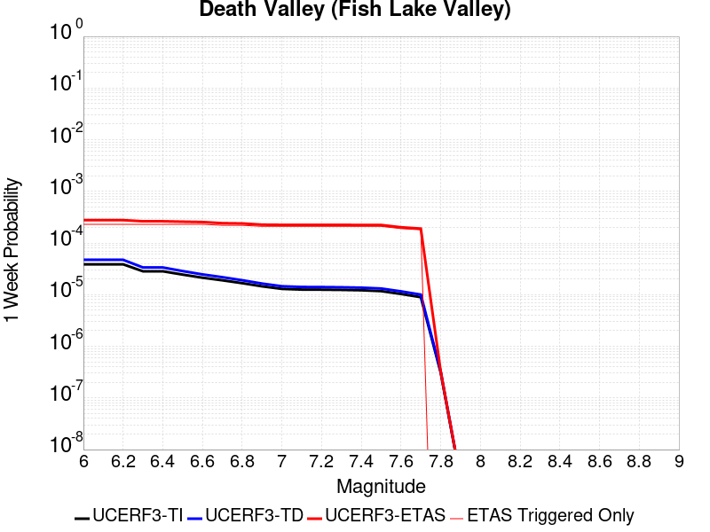 |  | 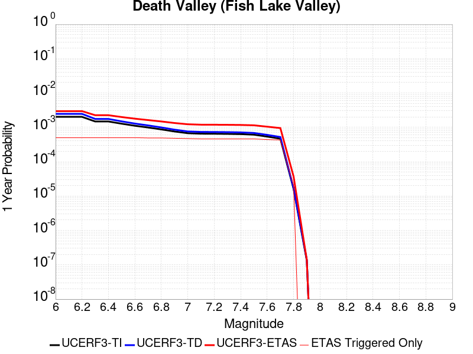 |  |

| Magnitude | 1 wk TI Prob | 1 wk TD Prob | 1 wk ETAS Prob | 1 wk ETAS/TD Gain | 1 wk ETAS Triggered Only | 1 mo TI Prob | 1 mo TD Prob | 1 mo ETAS Prob | 1 mo ETAS/TD Gain | 1 mo ETAS Triggered Only | 1 yr TI Prob | 1 yr TD Prob | 1 yr ETAS Prob | 1 yr ETAS/TD Gain | 1 yr ETAS Triggered Only | 10 yr TI Prob | 10 yr TD Prob | 10 yr ETAS Prob | 10 yr ETAS/TD Gain | 10 yr ETAS Triggered Only |
|-----|-----|-----|-----|-----|-----|-----|-----|-----|-----|-----|-----|-----|-----|-----|-----|-----|-----|-----|-----|-----|
| 6.0 | 3.872328E-5 | 4.7267473E-5 | 2.772566E-4 | 5.8656955 | 2.3E-4 | 1.6594635E-4 | 2.0256084E-4 | 5.22496E-4 | 2.5794523 | 3.2E-4 | 0.0020185246 | 0.002463534 | 0.0029623022 | 1.2024604 | 5.0E-4 | 0.02000288 | 0.024388181 | 0.02494428 | 1.022802 | 5.7E-4 |
| 6.1 | 3.872328E-5 | 4.7267473E-5 | 2.772566E-4 | 5.8656955 | 2.3E-4 | 1.6594635E-4 | 2.0256084E-4 | 5.22496E-4 | 2.5794523 | 3.2E-4 | 0.0020185246 | 0.002463534 | 0.0029623022 | 1.2024604 | 5.0E-4 | 0.02000288 | 0.024388181 | 0.02494428 | 1.022802 | 5.7E-4 |
| 6.2 | 3.872328E-5 | 4.7267473E-5 | 2.772566E-4 | 5.8656955 | 2.3E-4 | 1.6594635E-4 | 2.0256084E-4 | 5.22496E-4 | 2.5794523 | 3.2E-4 | 0.0020185246 | 0.002463534 | 0.0029623022 | 1.2024604 | 5.0E-4 | 0.02000288 | 0.024388181 | 0.02494428 | 1.022802 | 5.7E-4 |
| 6.3 | 2.8356371E-5 | 3.3609853E-5 | 2.6360212E-4 | 7.843002 | 2.3E-4 | 1.2152165E-4 | 1.4403471E-4 | 4.6398863E-4 | 3.2213666 | 3.2E-4 | 0.0014785219 | 0.0017522911 | 0.002251415 | 1.2848407 | 5.0E-4 | 0.014687235 | 0.017391782 | 0.017951868 | 1.0322042 | 5.7E-4 |
| 6.4 | 2.8356371E-5 | 3.3609853E-5 | 2.6360212E-4 | 7.843002 | 2.3E-4 | 1.2152165E-4 | 1.4403471E-4 | 4.6398863E-4 | 3.2213666 | 3.2E-4 | 0.0014785219 | 0.0017522911 | 0.002251415 | 1.2848407 | 5.0E-4 | 0.014687235 | 0.017391782 | 0.017951868 | 1.0322042 | 5.7E-4 |
| 6.5 | 2.4448687E-5 | 2.8607552E-5 | 2.5860098E-4 | 9.039605 | 2.3E-4 | 1.0477588E-4 | 1.2259831E-4 | 4.425591E-4 | 3.60983 | 3.2E-4 | 0.0012748998 | 0.0014916632 | 0.0019909174 | 1.3346963 | 5.0E-4 | 0.012676105 | 0.014821377 | 0.015382929 | 1.0378879 | 5.7E-4 |
| 6.6 | 2.1298161E-5 | 2.4660083E-5 | 2.546544E-4 | 10.326584 | 2.3E-4 | 9.127464E-5 | 1.0568198E-4 | 4.2564818E-4 | 4.027632 | 3.2E-4 | 0.0011107022 | 0.0012859525 | 0.0017853095 | 1.3883169 | 5.0E-4 | 0.011051672 | 0.012788526 | 0.013351236 | 1.0440012 | 5.7E-4 |
| 6.7 | 1.8959729E-5 | 2.1781025E-5 | 2.4177623E-4 | 11.100314 | 2.2E-4 | 8.125345E-5 | 9.334405E-5 | 4.0331512E-4 | 4.320737 | 3.1E-4 | 9.888117E-4 | 0.001135897 | 0.0016253403 | 1.4308871 | 4.9E-4 | 0.009844234 | 0.01130357 | 0.0118572395 | 1.0489819 | 5.6E-4 |
| 6.8 | 1.6691629E-5 | 1.9018353E-5 | 2.3901417E-4 | 12.567554 | 2.2E-4 | 7.153359E-5 | 8.150477E-5 | 3.914795E-4 | 4.8031483 | 3.1E-4 | 8.7057345E-4 | 9.918857E-4 | 0.0014813996 | 1.4935186 | 4.9E-4 | 0.008671708 | 0.009876343 | 0.010430813 | 1.0561411 | 5.6E-4 |
| 6.9 | 1.450505E-5 | 1.638954E-5 | 2.263861E-4 | 13.81284 | 2.1E-4 | 6.216302E-5 | 7.0239046E-5 | 3.7021798E-4 | 5.2708287 | 3.0E-4 | 7.5657194E-4 | 8.5483363E-4 | 0.0013344233 | 1.5610328 | 4.8E-4 | 0.007540013 | 0.008516385 | 0.009061702 | 1.0640314 | 5.5E-4 |
| 7.0 | 1.2940855E-5 | 1.4537972E-5 | 2.2453492E-4 | 15.444721 | 2.1E-4 | 5.545963E-5 | 6.230414E-5 | 3.5228606E-4 | 5.6542964 | 2.9E-4 | 6.750118E-4 | 7.5829466E-4 | 0.0012279383 | 1.6193419 | 4.7E-4 | 0.006729651 | 0.0075576897 | 0.008093609 | 1.0709105 | 5.4E-4 |
| 7.1 | 1.2544658E-5 | 1.4078208E-5 | 2.2407525E-4 | 15.916462 | 2.1E-4 | 5.3761712E-5 | 6.0333812E-5 | 3.5031632E-4 | 5.8063016 | 2.9E-4 | 6.5435225E-4 | 7.343222E-4 | 0.0011939844 | 1.625968 | 4.6E-4 | 0.006524288 | 0.007319551 | 0.007845672 | 1.0718788 | 5.3E-4 |
| 7.2 | 1.2489416E-5 | 1.4015674E-5 | 2.2401274E-4 | 15.983015 | 2.1E-4 | 5.3524967E-5 | 6.0065824E-5 | 3.5004842E-4 | 5.827747 | 2.9E-4 | 6.514716E-4 | 7.310616E-4 | 0.0011907254 | 1.6287619 | 4.6E-4 | 0.006495651 | 0.0072871596 | 0.007813297 | 1.0722007 | 5.3E-4 |
| 7.3 | 1.2368307E-5 | 1.3879812E-5 | 2.238769E-4 | 16.129677 | 2.1E-4 | 5.3005948E-5 | 5.9483587E-5 | 3.4946634E-4 | 5.8750043 | 2.9E-4 | 6.451563E-4 | 7.2397763E-4 | 0.0011836446 | 1.6349188 | 4.6E-4 | 0.0064328653 | 0.007216782 | 0.0077429567 | 1.07291 | 5.3E-4 |
| 7.4 | 1.2161707E-5 | 1.36478675E-5 | 2.2364501E-4 | 16.386808 | 2.1E-4 | 5.212056E-5 | 5.8489582E-5 | 3.4847262E-4 | 5.957858 | 2.9E-4 | 6.3438306E-4 | 7.118836E-4 | 0.0011715562 | 1.6457131 | 4.6E-4 | 0.006325751 | 0.0070966207 | 0.0076228594 | 1.0741534 | 5.3E-4 |
| 7.5 | 1.1707948E-5 | 1.3145515E-5 | 2.2314275E-4 | 16.974821 | 2.1E-4 | 5.0175953E-5 | 5.6336736E-5 | 3.463204E-4 | 6.147328 | 2.9E-4 | 6.10721E-4 | 6.856895E-4 | 0.001145374 | 1.6703976 | 4.6E-4 | 0.0060904534 | 0.006836321 | 0.0073626977 | 1.076997 | 5.3E-4 |
| 7.6 | 1.0319538E-5 | 1.1579622E-5 | 2.0157742E-4 | 17.407944 | 1.9E-4 | 4.4225842E-5 | 4.9626036E-5 | 3.1961265E-4 | 6.440422 | 2.7E-4 | 5.383166E-4 | 6.040347E-4 | 0.001043769 | 1.727995 | 4.4E-4 | 0.0053701443 | 0.0060244603 | 0.006531388 | 1.0841448 | 5.1E-4 |
| 7.7 | 8.937764E-6 | 1.0022779E-5 | 1.9002098E-4 | 18.95891 | 1.8E-4 | 3.830414E-5 | 4.295409E-5 | 3.029429E-4 | 7.0527143 | 2.6E-4 | 4.6625308E-4 | 5.228456E-4 | 9.5262076E-4 | 1.8219925 | 4.3E-4 | 0.0046527605 | 0.005216664 | 0.005714056 | 1.0953467 | 5.0E-4 |
| 7.8 | 3.108007E-7 | 3.284654E-7 | 3.284654E-7 | 1.0 | 0.0 | 1.3320023E-6 | 1.407708E-6 | 1.407708E-6 | 1.0 | 0.0 | 1.6217007E-5 | 1.7138715E-5 | 3.7138372E-5 | 2.1669285 | 2.0E-5 | 1.6215823E-4 | 1.7137431E-4 | 2.0136917E-4 | 1.1750255 | 3.0E-5 |
| 7.9 | 2.5591178E-9 | 2.6696718E-9 | 2.6696718E-9 | 1.0 | 0.0 | 1.0967647E-8 | 1.14414505E-8 | 1.14414505E-8 | 1.0 | 0.0 | 1.335311E-7 | 1.3929966E-7 | 1.3929966E-7 | 1.0 | 0.0 | 1.3353102E-6 | 1.3929966E-6 | 1.3929966E-6 | 1.0 | 0.0 |

## San Andreas (Cholame) rev
*[(top)](#table-of-contents)*

| 1 Week | 1 Month | 1 Year | 10 Year |
|-----|-----|-----|-----|
|  |  | 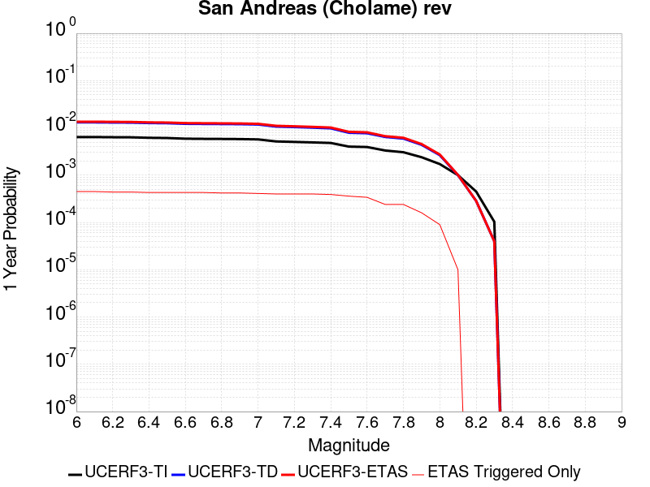 |  |

| Magnitude | 1 wk TI Prob | 1 wk TD Prob | 1 wk ETAS Prob | 1 wk ETAS/TD Gain | 1 wk ETAS Triggered Only | 1 mo TI Prob | 1 mo TD Prob | 1 mo ETAS Prob | 1 mo ETAS/TD Gain | 1 mo ETAS Triggered Only | 1 yr TI Prob | 1 yr TD Prob | 1 yr ETAS Prob | 1 yr ETAS/TD Gain | 1 yr ETAS Triggered Only | 10 yr TI Prob | 10 yr TD Prob | 10 yr ETAS Prob | 10 yr ETAS/TD Gain | 10 yr ETAS Triggered Only |
|-----|-----|-----|-----|-----|-----|-----|-----|-----|-----|-----|-----|-----|-----|-----|-----|-----|-----|-----|-----|-----|
| 6.0 | 1.2302514E-4 | 2.5204287E-4 | 5.719622E-4 | 2.2693052 | 3.2E-4 | 5.27144E-4 | 0.0010797381 | 0.0014393495 | 1.3330542 | 3.6E-4 | 0.0063991086 | 0.0130670825 | 0.013511202 | 1.0339876 | 4.5E-4 | 0.06217949 | 0.12439073 | 0.12488983 | 1.0040123 | 5.7E-4 |
| 6.1 | 1.2302514E-4 | 2.5204287E-4 | 5.719622E-4 | 2.2693052 | 3.2E-4 | 5.27144E-4 | 0.0010797381 | 0.0014393495 | 1.3330542 | 3.6E-4 | 0.0063991086 | 0.0130670825 | 0.013511202 | 1.0339876 | 4.5E-4 | 0.06217949 | 0.12439073 | 0.12488983 | 1.0040123 | 5.7E-4 |
| 6.2 | 1.2203569E-4 | 2.5021084E-4 | 5.6013325E-4 | 2.238645 | 3.1E-4 | 5.2290526E-4 | 0.0010718931 | 0.0014215179 | 1.3261751 | 3.5E-4 | 0.006347804 | 0.01297271 | 0.013407001 | 1.0334773 | 4.4E-4 | 0.061695136 | 0.12357691 | 0.1240677 | 1.0039716 | 5.6E-4 |
| 6.3 | 1.2142645E-4 | 2.4907055E-4 | 5.589934E-4 | 2.2443173 | 3.1E-4 | 5.202953E-4 | 0.0010670102 | 0.0014166367 | 1.3276694 | 3.5E-4 | 0.006316212 | 0.012913967 | 0.013348285 | 1.0336317 | 4.4E-4 | 0.06139677 | 0.12307103 | 0.12356211 | 1.0039902 | 5.6E-4 |
| 6.4 | 1.1865206E-4 | 2.44126E-4 | 5.540503E-4 | 2.269526 | 3.1E-4 | 5.0840975E-4 | 0.0010458364 | 0.0013854807 | 1.3247586 | 3.4E-4 | 0.006172335 | 0.012659196 | 0.013083753 | 1.0335374 | 4.3E-4 | 0.060036868 | 0.1208638 | 0.12134733 | 1.0040005 | 5.5E-4 |
| 6.5 | 1.17443946E-4 | 2.4205919E-4 | 5.519842E-4 | 2.2803686 | 3.1E-4 | 5.032341E-4 | 0.0010369857 | 0.0013766331 | 1.3275334 | 3.4E-4 | 0.006109677 | 0.012552682 | 0.012977284 | 1.0338256 | 4.3E-4 | 0.059444077 | 0.11993805 | 0.12042209 | 1.0040357 | 5.5E-4 |
| 6.6 | 1.13579066E-4 | 2.3514954E-4 | 5.450766E-4 | 2.318 | 3.1E-4 | 4.866766E-4 | 0.001007396 | 0.0013470536 | 1.3371638 | 3.4E-4 | 0.0059092017 | 0.012196515 | 0.0126212705 | 1.0348259 | 4.3E-4 | 0.057545185 | 0.11685214 | 0.117329046 | 1.0040812 | 5.4E-4 |
| 6.7 | 1.1271412E-4 | 2.3359268E-4 | 5.4352026E-4 | 2.3267863 | 3.1E-4 | 4.829711E-4 | 0.0010007289 | 0.0013403887 | 1.3394123 | 3.4E-4 | 0.005864331 | 0.012116249 | 0.012541039 | 1.0350596 | 4.3E-4 | 0.057119697 | 0.116155714 | 0.11663299 | 1.0041089 | 5.4E-4 |
| 6.8 | 1.1217975E-4 | 2.3247694E-4 | 5.324072E-4 | 2.2901504 | 3.0E-4 | 4.8068175E-4 | 9.959509E-4 | 0.0013256222 | 1.3310117 | 3.3E-4 | 0.005836608 | 0.012058721 | 0.012473657 | 1.0344095 | 4.2E-4 | 0.056856725 | 0.11565396 | 0.11611383 | 1.0039762 | 5.2E-4 |
| 6.9 | 1.1146753E-4 | 2.3096445E-4 | 5.3089514E-4 | 2.2986012 | 3.0E-4 | 4.7763053E-4 | 9.894737E-4 | 0.0013191472 | 1.3331807 | 3.3E-4 | 0.0057996577 | 0.011980731 | 0.0123956995 | 1.0346363 | 4.2E-4 | 0.056506127 | 0.11497439 | 0.1154346 | 1.0040027 | 5.2E-4 |
| 7.0 | 1.0965793E-4 | 2.2719789E-4 | 5.2712974E-4 | 2.3201349 | 3.0E-4 | 4.698779E-4 | 9.733434E-4 | 0.0013030221 | 1.3387076 | 3.3E-4 | 0.005705768 | 0.011786487 | 0.012191654 | 1.0343755 | 4.1E-4 | 0.055614736 | 0.11327597 | 0.113728195 | 1.0039923 | 5.1E-4 |
| 7.1 | 9.927982E-5 | 2.0538924E-4 | 5.053276E-4 | 2.4603412 | 3.0E-4 | 4.2541555E-4 | 8.7994366E-4 | 0.0012096532 | 1.374694 | 3.3E-4 | 0.0051671406 | 0.010660981 | 0.011056717 | 1.03712 | 4.0E-4 | 0.05048634 | 0.1033706 | 0.103809945 | 1.0042502 | 4.9E-4 |
| 7.2 | 9.696786E-5 | 2.0043184E-4 | 5.0037174E-4 | 2.496468 | 3.0E-4 | 4.1551032E-4 | 8.5871184E-4 | 0.0011884285 | 1.3839666 | 3.3E-4 | 0.00504711 | 0.010404981 | 0.010800819 | 1.0380431 | 4.0E-4 | 0.04934009 | 0.1011086 | 0.10154906 | 1.0043563 | 4.9E-4 |
| 7.3 | 9.4727984E-5 | 1.9472468E-4 | 4.946663E-4 | 2.5403366 | 3.0E-4 | 4.0591392E-4 | 8.3426846E-4 | 0.0011639931 | 1.3952261 | 3.3E-4 | 0.0049308087 | 0.010110183 | 0.010506138 | 1.0391641 | 4.0E-4 | 0.048228268 | 0.09847952 | 0.09892126 | 1.0044856 | 4.9E-4 |
| 7.4 | 9.220358E-5 | 1.8843076E-4 | 4.783761E-4 | 2.5387368 | 2.9E-4 | 3.9509835E-4 | 8.073114E-4 | 0.001127053 | 1.3960574 | 3.2E-4 | 0.004799717 | 0.009784967 | 0.010171151 | 1.0394671 | 3.9E-4 | 0.046973653 | 0.095557496 | 0.095991634 | 1.0045432 | 4.8E-4 |
| 7.5 | 7.71631E-5 | 1.5177966E-4 | 4.217387E-4 | 2.7786245 | 2.7E-4 | 3.306571E-4 | 6.503223E-4 | 9.501272E-4 | 1.4610097 | 3.0E-4 | 0.0040183207 | 0.007889002 | 0.008246161 | 1.0452732 | 3.6E-4 | 0.03946433 | 0.07828531 | 0.07869086 | 1.0051805 | 4.4E-4 |
| 7.6 | 7.5634416E-5 | 1.483744E-4 | 3.983373E-4 | 2.684677 | 2.5E-4 | 3.241072E-4 | 6.3573546E-4 | 9.1555744E-4 | 1.4401548 | 2.8E-4 | 0.0039388672 | 0.0077126776 | 0.008050055 | 1.0437433 | 3.4E-4 | 0.038697794 | 0.07664872 | 0.07703653 | 1.0050596 | 4.2E-4 |
| 7.7 | 6.3783E-5 | 1.235872E-4 | 2.8356744E-4 | 2.2944725 | 1.6E-4 | 2.7332708E-4 | 5.29552E-4 | 7.1945135E-4 | 1.3586038 | 1.9E-4 | 0.0033226798 | 0.0064282627 | 0.00666672 | 1.0370951 | 2.4E-4 | 0.032734364 | 0.06454029 | 0.06482093 | 1.0043483 | 3.0E-4 |
| 7.8 | 5.863422E-5 | 1.1416107E-4 | 2.741428E-4 | 2.4013686 | 1.6E-4 | 2.512653E-4 | 4.8917E-4 | 6.790771E-4 | 1.388223 | 1.9E-4 | 0.003054864 | 0.0059394026 | 0.006177977 | 1.040168 | 2.4E-4 | 0.030132094 | 0.059659187 | 0.059931885 | 1.004571 | 2.9E-4 |
| 7.9 | 4.595283E-5 | 8.426331E-5 | 1.8425488E-4 | 2.186656 | 1.0E-4 | 1.9692584E-4 | 3.610785E-4 | 4.710388E-4 | 1.3045329 | 1.1E-4 | 0.0023949358 | 0.0043872762 | 0.0045465743 | 1.0363091 | 1.6E-4 | 0.023692891 | 0.044362005 | 0.04456269 | 1.0045238 | 2.1E-4 |
| 8.0 | 3.2950178E-5 | 5.0772942E-5 | 1.00770405E-4 | 1.9847264 | 5.0E-5 | 1.412074E-4 | 2.1758018E-4 | 2.7756713E-4 | 1.2757004 | 6.0E-5 | 0.0017178444 | 0.0026458222 | 0.0027355843 | 1.0339259 | 9.0E-5 | 0.017046256 | 0.027180137 | 0.02726769 | 1.0032213 | 9.0E-5 |
| 8.1 | 1.9177472E-5 | 1.9185145E-5 | 2.9184954E-5 | 1.5212266 | 1.0E-5 | 8.218658E-5 | 8.221946E-5 | 9.2218645E-5 | 1.1216156 | 1.0E-5 | 0.0010001622 | 0.0010005629 | 0.0010105529 | 1.0099844 | 1.0E-5 | 0.009956728 | 0.010758142 | 0.0107680345 | 1.0009196 | 1.0E-5 |
| 8.2 | 8.643924E-6 | 5.4748625E-6 | 5.4748625E-6 | 1.0 | 0.0 | 3.704486E-5 | 2.3463486E-5 | 2.3463486E-5 | 1.0 | 0.0 | 4.5092785E-4 | 2.8563058E-4 | 2.8563058E-4 | 1.0 | 0.0 | 0.0045001395 | 0.0032487072 | 0.0032487072 | 1.0 | 0.0 |
| 8.3 | 1.983087E-6 | 7.6599065E-7 | 7.6599065E-7 | 1.0 | 0.0 | 8.498917E-6 | 3.282813E-6 | 3.282813E-6 | 1.0 | 0.0 | 1.034694E-4 | 3.9967534E-5 | 3.9967534E-5 | 1.0 | 0.0 | 0.0010342124 | 4.719687E-4 | 4.719687E-4 | 1.0 | 0.0 |

## San Andreas (Coachella) rev
*[(top)](#table-of-contents)*

| 1 Week | 1 Month | 1 Year | 10 Year |
|-----|-----|-----|-----|
| 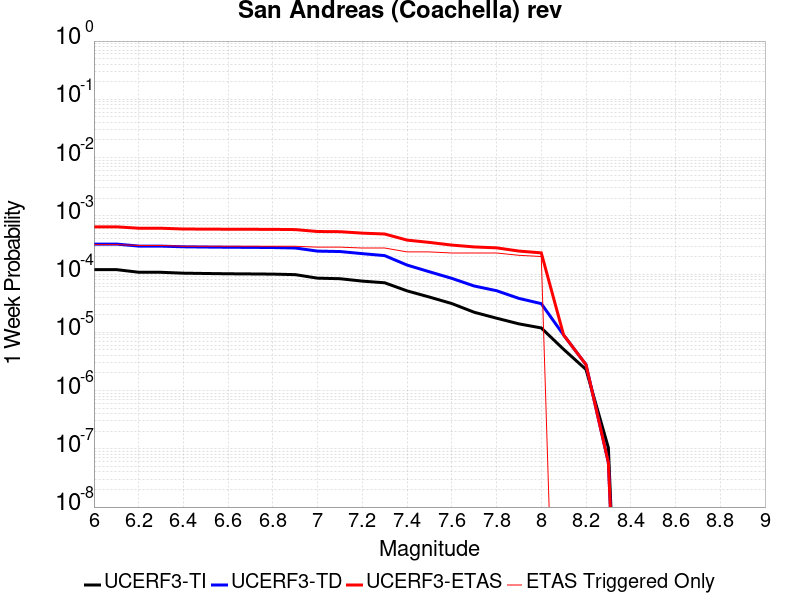 |  |  |  |

| Magnitude | 1 wk TI Prob | 1 wk TD Prob | 1 wk ETAS Prob | 1 wk ETAS/TD Gain | 1 wk ETAS Triggered Only | 1 mo TI Prob | 1 mo TD Prob | 1 mo ETAS Prob | 1 mo ETAS/TD Gain | 1 mo ETAS Triggered Only | 1 yr TI Prob | 1 yr TD Prob | 1 yr ETAS Prob | 1 yr ETAS/TD Gain | 1 yr ETAS Triggered Only | 10 yr TI Prob | 10 yr TD Prob | 10 yr ETAS Prob | 10 yr ETAS/TD Gain | 10 yr ETAS Triggered Only |
|-----|-----|-----|-----|-----|-----|-----|-----|-----|-----|-----|-----|-----|-----|-----|-----|-----|-----|-----|-----|-----|
| 6.0 | 1.1925945E-4 | 3.2729402E-4 | 6.4718927E-4 | 1.9773942 | 3.2E-4 | 5.110118E-4 | 0.0014019393 | 0.0018113645 | 1.292042 | 4.1E-4 | 0.0062038354 | 0.016936364 | 0.017418066 | 1.0284418 | 4.9E-4 | 0.060334753 | 0.15265316 | 0.15310225 | 1.002942 | 5.3E-4 |
| 6.1 | 1.1925945E-4 | 3.2729402E-4 | 6.4718927E-4 | 1.9773942 | 3.2E-4 | 5.110118E-4 | 0.0014019393 | 0.0018113645 | 1.292042 | 4.1E-4 | 0.0062038354 | 0.016936364 | 0.017418066 | 1.0284418 | 4.9E-4 | 0.060334753 | 0.15265316 | 0.15310225 | 1.002942 | 5.3E-4 |
| 6.2 | 1.07432395E-4 | 3.0230157E-4 | 6.1220786E-4 | 2.025156 | 3.1E-4 | 4.603433E-4 | 0.0012949388 | 0.0016844338 | 1.3007826 | 3.9E-4 | 0.005590286 | 0.015653009 | 0.016115652 | 1.0295562 | 4.7E-4 | 0.05451731 | 0.14182423 | 0.14226191 | 1.003086 | 5.1E-4 |
| 6.3 | 1.0718766E-4 | 3.0175463E-4 | 6.1166106E-4 | 2.0270147 | 3.1E-4 | 4.592948E-4 | 0.0012925972 | 0.001682093 | 1.3013282 | 3.9E-4 | 0.005577586 | 0.015624908 | 0.016087564 | 1.0296102 | 4.7E-4 | 0.054396555 | 0.14159249 | 0.14203028 | 1.0030919 | 5.1E-4 |
| 6.4 | 1.0355944E-4 | 2.9383553E-4 | 5.9374736E-4 | 2.0206792 | 3.0E-4 | 4.4375064E-4 | 0.0012586913 | 0.001638213 | 1.3015208 | 3.8E-4 | 0.0053892885 | 0.015217941 | 0.015670942 | 1.0297675 | 4.6E-4 | 0.052604496 | 0.13815255 | 0.13858348 | 1.0031192 | 5.0E-4 |
| 6.5 | 1.0227914E-4 | 2.9102986E-4 | 5.9094257E-4 | 2.030522 | 3.0E-4 | 4.382655E-4 | 0.0012466786 | 0.0016262048 | 1.3044299 | 3.8E-4 | 0.0053228354 | 0.01507372 | 0.015526786 | 1.0300567 | 4.6E-4 | 0.051971316 | 0.13693172 | 0.13736326 | 1.0031514 | 5.0E-4 |
| 6.6 | 1.0116757E-4 | 2.8868738E-4 | 5.8860076E-4 | 2.0388863 | 3.0E-4 | 4.3350324E-4 | 0.0012366489 | 0.001616179 | 1.306902 | 3.8E-4 | 0.0052651367 | 0.01495329 | 0.015406412 | 1.0303024 | 4.6E-4 | 0.051421247 | 0.1359099 | 0.13634194 | 1.003179 | 5.0E-4 |
| 6.7 | 1.0050676E-4 | 2.8727303E-4 | 5.8718683E-4 | 2.0440028 | 3.0E-4 | 4.3067214E-4 | 0.0012305931 | 0.0016101254 | 1.3084142 | 3.8E-4 | 0.005230834 | 0.014880571 | 0.015333725 | 1.0304528 | 4.6E-4 | 0.051094085 | 0.13529462 | 0.13572697 | 1.0031956 | 5.0E-4 |
| 6.8 | 9.976819E-5 | 2.853096E-4 | 5.85224E-4 | 2.0511894 | 3.0E-4 | 4.2750788E-4 | 0.0012221863 | 0.0016017219 | 1.3105382 | 3.8E-4 | 0.0051924936 | 0.0147796115 | 0.015232813 | 1.030664 | 4.6E-4 | 0.050728295 | 0.13444631 | 0.13487908 | 1.003219 | 5.0E-4 |
| 6.9 | 9.77719E-5 | 2.8027873E-4 | 5.8019464E-4 | 2.070063 | 3.0E-4 | 4.1895514E-4 | 0.0012006456 | 0.0015702012 | 1.3077976 | 3.7E-4 | 0.0050888555 | 0.014520878 | 0.014964343 | 1.0305399 | 4.5E-4 | 0.049738888 | 0.1322748 | 0.1327 | 1.0032144 | 4.9E-4 |
| 7.0 | 8.500761E-5 | 2.4762485E-4 | 5.3755305E-4 | 2.1708364 | 2.9E-4 | 3.6426744E-4 | 0.001060821 | 0.0014104497 | 1.3295832 | 3.5E-4 | 0.0044259406 | 0.012839786 | 0.013264265 | 1.0330596 | 4.3E-4 | 0.04338823 | 0.11813272 | 0.1185472 | 1.0035086 | 4.7E-4 |
| 7.1 | 8.319876E-5 | 2.4365232E-4 | 5.3358165E-4 | 2.1899304 | 2.9E-4 | 3.5651738E-4 | 0.0010438096 | 0.0013934443 | 1.3349602 | 3.5E-4 | 0.004331963 | 0.012635092 | 0.01305966 | 1.0336022 | 4.3E-4 | 0.042484846 | 0.116353 | 0.116768315 | 1.0035695 | 4.7E-4 |
| 7.2 | 7.563917E-5 | 2.2413683E-4 | 5.040741E-4 | 2.248957 | 2.8E-4 | 3.2412758E-4 | 9.602359E-4 | 0.001289919 | 1.3433355 | 3.3E-4 | 0.0039391145 | 0.011628893 | 0.012034126 | 1.034847 | 4.1E-4 | 0.03870018 | 0.10775925 | 0.10816076 | 1.003726 | 4.5E-4 |
| 7.3 | 7.082985E-5 | 2.0729867E-4 | 4.872406E-4 | 2.350428 | 2.8E-4 | 3.0352117E-4 | 8.881233E-4 | 0.0012178302 | 1.37124 | 3.3E-4 | 0.0036891096 | 0.010759917 | 0.011165505 | 1.0376943 | 4.1E-4 | 0.03628465 | 0.100282 | 0.10068687 | 1.0040374 | 4.5E-4 |
| 7.4 | 5.146215E-5 | 1.4273795E-4 | 3.8270367E-4 | 2.681163 | 2.4E-4 | 2.2053342E-4 | 6.115915E-4 | 8.9142023E-4 | 1.457542 | 2.8E-4 | 0.0026816884 | 0.0074208933 | 0.0077782217 | 1.0481517 | 3.6E-4 | 0.02649557 | 0.070849575 | 0.07122124 | 1.0052458 | 4.0E-4 |
| 7.5 | 4.0285166E-5 | 1.09416E-4 | 3.4938974E-4 | 3.1932235 | 2.4E-4 | 1.7263928E-4 | 4.6884175E-4 | 7.487105E-4 | 1.5969365 | 2.8E-4 | 0.002099857 | 0.0056932783 | 0.0060412856 | 1.061126 | 3.5E-4 | 0.020801254 | 0.055011146 | 0.055379692 | 1.0066994 | 3.9E-4 |
| 7.6 | 3.1168736E-5 | 8.4389096E-5 | 3.1436968E-4 | 3.7252407 | 2.3E-4 | 1.3357346E-4 | 3.6161754E-4 | 6.315199E-4 | 1.7463752 | 2.7E-4 | 0.0016250437 | 0.0043938323 | 0.0047323382 | 1.0770411 | 3.4E-4 | 0.016132116 | 0.04281005 | 0.043173783 | 1.0084964 | 3.8E-4 |
| 7.7 | 2.2100989E-5 | 6.238755E-5 | 2.923732E-4 | 4.686403 | 2.3E-4 | 9.4715084E-5 | 2.6734784E-4 | 5.372757E-4 | 2.0096502 | 2.7E-4 | 0.001152546 | 0.0032501083 | 0.0035890033 | 1.1042719 | 3.4E-4 | 0.011465867 | 0.0319002 | 0.032268077 | 1.0115322 | 3.8E-4 |
| 7.8 | 1.7484861E-5 | 5.179572E-5 | 2.817838E-4 | 5.4402914 | 2.3E-4 | 7.493296E-5 | 2.2196278E-4 | 4.919029E-4 | 2.21615 | 2.7E-4 | 9.1192697E-4 | 0.0026990508 | 0.00302816 | 1.1219352 | 3.3E-4 | 0.009081938 | 0.026640115 | 0.02700026 | 1.0135188 | 3.7E-4 |
| 7.9 | 1.3967285E-5 | 3.822255E-5 | 2.4821452E-4 | 6.4939284 | 2.1E-4 | 5.985842E-5 | 1.6380067E-4 | 4.137597E-4 | 2.5259955 | 2.5E-4 | 7.2853256E-4 | 0.00199245 | 0.0023018324 | 1.1552774 | 3.1E-4 | 0.0072614877 | 0.019909438 | 0.020232867 | 1.016245 | 3.3E-4 |
| 8.0 | 1.1887396E-5 | 3.106521E-5 | 2.3105899E-4 | 7.43787 | 2.0E-4 | 5.094499E-5 | 1.3312983E-4 | 3.630992E-4 | 2.727407 | 2.3E-4 | 6.200787E-4 | 0.0016196516 | 0.0018892143 | 1.1664325 | 2.7E-4 | 0.006183513 | 0.016279267 | 0.016564546 | 1.0175241 | 2.9E-4 |
| 8.1 | 5.100864E-6 | 8.973418E-6 | 8.973418E-6 | 1.0 | 0.0 | 2.1860664E-5 | 3.8456936E-5 | 3.8456936E-5 | 1.0 | 0.0 | 2.6612106E-4 | 4.6811273E-4 | 4.6811273E-4 | 1.0 | 0.0 | 0.002658026 | 0.004917731 | 0.004917731 | 1.0 | 0.0 |
| 8.2 | 2.3004484E-6 | 2.7864487E-6 | 2.7864487E-6 | 1.0 | 0.0 | 9.859027E-6 | 1.1941868E-5 | 1.1941868E-5 | 1.0 | 0.0 | 1.2002704E-4 | 1.4538258E-4 | 1.4538258E-4 | 1.0 | 0.0 | 0.0011996223 | 0.0015973912 | 0.0015973912 | 1.0 | 0.0 |
| 8.3 | 1.0424446E-7 | 5.8161504E-8 | 5.8161504E-8 | 1.0 | 0.0 | 4.4676187E-7 | 2.4926356E-7 | 2.4926356E-7 | 1.0 | 0.0 | 5.439312E-6 | 3.03478E-6 | 3.03478E-6 | 1.0 | 0.0 | 5.4391792E-5 | 3.190716E-5 | 3.190716E-5 | 1.0 | 0.0 |

## Santa Ynez (West)
*[(top)](#table-of-contents)*

| 1 Week | 1 Month | 1 Year | 10 Year |
|-----|-----|-----|-----|
|  |  |  |  |

| Magnitude | 1 wk TI Prob | 1 wk TD Prob | 1 wk ETAS Prob | 1 wk ETAS/TD Gain | 1 wk ETAS Triggered Only | 1 mo TI Prob | 1 mo TD Prob | 1 mo ETAS Prob | 1 mo ETAS/TD Gain | 1 mo ETAS Triggered Only | 1 yr TI Prob | 1 yr TD Prob | 1 yr ETAS Prob | 1 yr ETAS/TD Gain | 1 yr ETAS Triggered Only | 10 yr TI Prob | 10 yr TD Prob | 10 yr ETAS Prob | 10 yr ETAS/TD Gain | 10 yr ETAS Triggered Only |
|-----|-----|-----|-----|-----|-----|-----|-----|-----|-----|-----|-----|-----|-----|-----|-----|-----|-----|-----|-----|-----|
| 6.0 | 4.7352758E-5 | 5.4972126E-5 | 1.8496499E-4 | 3.3647048 | 1.3E-4 | 2.0292461E-4 | 2.3557522E-4 | 4.0553516E-4 | 1.7214679 | 1.7E-4 | 0.0024678076 | 0.0028645284 | 0.0031536976 | 1.1009483 | 2.9E-4 | 0.024405818 | 0.028304417 | 0.028654227 | 1.0123589 | 3.6E-4 |
| 6.1 | 4.7352758E-5 | 5.4972126E-5 | 1.8496499E-4 | 3.3647048 | 1.3E-4 | 2.0292461E-4 | 2.3557522E-4 | 4.0553516E-4 | 1.7214679 | 1.7E-4 | 0.0024678076 | 0.0028645284 | 0.0031237835 | 1.0905054 | 2.6E-4 | 0.024405818 | 0.028304417 | 0.028625077 | 1.0113289 | 3.3E-4 |
| 6.2 | 3.0415853E-5 | 3.392511E-5 | 9.3923074E-5 | 2.7685416 | 6.0E-5 | 1.3034715E-4 | 1.4538545E-4 | 2.453709E-4 | 1.6877267 | 1.0E-4 | 0.0015858212 | 0.0017686661 | 0.0019483477 | 1.1015916 | 1.8E-4 | 0.015745522 | 0.017549807 | 0.01777577 | 1.0128756 | 2.3E-4 |
| 6.3 | 3.0415853E-5 | 3.392511E-5 | 9.3923074E-5 | 2.7685416 | 6.0E-5 | 1.3034715E-4 | 1.4538545E-4 | 2.453709E-4 | 1.6877267 | 1.0E-4 | 0.0015858212 | 0.0017686661 | 0.0019483477 | 1.1015916 | 1.8E-4 | 0.015745522 | 0.017549807 | 0.01777577 | 1.0128756 | 2.3E-4 |
| 6.4 | 2.5452082E-5 | 2.7912422E-5 | 8.791075E-5 | 3.1495206 | 6.0E-5 | 1.09075794E-4 | 1.196193E-4 | 2.0960852E-4 | 1.7522969 | 9.0E-5 | 0.0013271887 | 0.0014554089 | 0.0016251614 | 1.1166357 | 1.7E-4 | 0.013192902 | 0.014460951 | 0.0146777695 | 1.0149934 | 2.2E-4 |
| 6.5 | 2.3143784E-5 | 2.5128256E-5 | 8.512675E-5 | 3.3876903 | 6.0E-5 | 9.9183875E-5 | 1.0768817E-4 | 1.9767848E-4 | 1.8356564 | 9.0E-5 | 0.0012068948 | 0.0013103267 | 0.0014601302 | 1.1143253 | 1.5E-4 | 0.012003611 | 0.01302768 | 0.013225075 | 1.015152 | 2.0E-4 |
| 6.6 | 1.9118515E-5 | 2.035434E-5 | 7.035332E-5 | 3.4564285 | 5.0E-5 | 8.193392E-5 | 8.7230015E-5 | 1.6722304E-4 | 1.9170356 | 8.0E-5 | 9.97089E-4 | 0.001061516 | 0.0012013674 | 1.1317469 | 1.4E-4 | 0.00992627 | 0.010565365 | 0.010733569 | 1.0159203 | 1.7E-4 |
| 6.7 | 1.722807E-5 | 1.8146347E-5 | 6.814544E-5 | 3.7553256 | 5.0E-5 | 7.3832496E-5 | 7.776777E-5 | 1.5776155E-4 | 2.0286238 | 8.0E-5 | 8.985399E-4 | 9.464169E-4 | 0.0010862844 | 1.1477864 | 1.4E-4 | 0.008949154 | 0.0094245095 | 0.009573096 | 1.0157659 | 1.5E-4 |
| 6.8 | 1.5317364E-5 | 1.5926486E-5 | 6.592569E-5 | 4.1393747 | 5.0E-5 | 6.56442E-5 | 6.82546E-5 | 1.4824915E-4 | 2.172002 | 8.0E-5 | 7.98925E-4 | 8.306873E-4 | 9.7057095E-4 | 1.1683952 | 1.4E-4 | 0.007960589 | 0.00827631 | 0.008425068 | 1.017974 | 1.5E-4 |
| 6.9 | 1.3071226E-5 | 1.3329624E-5 | 6.332896E-5 | 4.7509937 | 5.0E-5 | 5.6018336E-5 | 5.7125722E-5 | 1.3712115E-4 | 2.4003398 | 8.0E-5 | 6.8180985E-4 | 6.9528597E-4 | 8.251956E-4 | 1.1868434 | 1.3E-4 | 0.0067972173 | 0.006931367 | 0.0070703966 | 1.020058 | 1.4E-4 |
| 7.0 | 1.1836986E-5 | 1.19327815E-5 | 5.1932304E-5 | 4.3520703 | 4.0E-5 | 5.0728955E-5 | 5.11395E-5 | 1.2113592E-4 | 2.3687348 | 7.0E-5 | 6.1745E-4 | 6.2244723E-4 | 7.3237874E-4 | 1.1766118 | 1.1E-4 | 0.006157372 | 0.006207231 | 0.0063264864 | 1.0192122 | 1.2E-4 |
| 7.1 | 1.0597169E-5 | 1.0542201E-5 | 3.054199E-5 | 2.8971171 | 2.0E-5 | 4.541565E-5 | 4.5180084E-5 | 8.5178275E-5 | 1.8853058 | 4.0E-5 | 5.5279525E-4 | 5.4992986E-4 | 6.298859E-4 | 1.1453931 | 8.0E-5 | 0.0055142213 | 0.005485821 | 0.005575327 | 1.0163159 | 9.0E-5 |
| 7.2 | 9.59113E-6 | 9.459144E-6 | 2.9458955E-5 | 3.1143363 | 2.0E-5 | 4.11042E-5 | 4.0538565E-5 | 7.0537346E-5 | 1.7400061 | 3.0E-5 | 5.0032866E-4 | 4.934463E-4 | 5.534167E-4 | 1.1215338 | 6.0E-5 | 0.004992037 | 0.0049236254 | 0.0050032316 | 1.0161682 | 8.0E-5 |
| 7.3 | 8.586084E-6 | 8.379583E-6 | 2.8379416E-5 | 3.3867335 | 2.0E-5 | 3.679698E-5 | 3.5912013E-5 | 6.5910936E-5 | 1.8353451 | 3.0E-5 | 4.4791115E-4 | 4.3714207E-4 | 4.871202E-4 | 1.1143293 | 5.0E-5 | 0.004470094 | 0.004362933 | 0.0044326275 | 1.0159743 | 7.0E-5 |
| 7.4 | 7.2622997E-6 | 6.9515427E-6 | 2.6951404E-5 | 3.8770392 | 2.0E-5 | 3.112377E-5 | 2.979199E-5 | 5.97911E-5 | 2.006952 | 3.0E-5 | 3.78866E-4 | 3.626581E-4 | 4.1263996E-4 | 1.137821 | 5.0E-5 | 0.0037822074 | 0.0036207628 | 0.0036805456 | 1.0165111 | 6.0E-5 |
| 7.5 | 5.627296E-6 | 5.251588E-6 | 2.5251482E-5 | 4.808352 | 2.0E-5 | 2.411676E-5 | 2.2506614E-5 | 4.2506166E-5 | 1.8886076 | 2.0E-5 | 2.9358198E-4 | 2.739843E-4 | 3.0397606E-4 | 1.1094654 | 3.0E-5 | 0.0029319443 | 0.002736537 | 0.0027764277 | 1.014577 | 4.0E-5 |
| 7.6 | 2.265244E-6 | 2.0608625E-6 | 2.0608625E-6 | 1.0 | 0.0 | 9.708152E-6 | 8.832238E-6 | 8.832238E-6 | 1.0 | 0.0 | 1.18190335E-4 | 1.0752728E-4 | 1.175262E-4 | 1.0929897 | 1.0E-5 | 0.001181275 | 0.0010747612 | 0.0010947397 | 1.0185888 | 2.0E-5 |
| 7.7 | 1.3099874E-6 | 1.1016252E-6 | 1.1016252E-6 | 1.0 | 0.0 | 5.61422E-6 | 4.7212425E-6 | 4.7212425E-6 | 1.0 | 0.0 | 6.8350986E-5 | 5.7479636E-5 | 5.7479636E-5 | 1.0 | 0.0 | 6.832996E-4 | 5.7465007E-4 | 5.846443E-4 | 1.0173919 | 1.0E-5 |
| 7.8 | 7.903951E-7 | 6.0711415E-7 | 6.0711415E-7 | 1.0 | 0.0 | 3.3874032E-6 | 2.6019152E-6 | 2.6019152E-6 | 1.0 | 0.0 | 4.1240855E-5 | 3.167787E-5 | 3.167787E-5 | 1.0 | 0.0 | 4.12332E-4 | 3.167349E-4 | 3.167349E-4 | 1.0 | 0.0 |
| 7.9 | 7.0753297E-9 | 5.0899476E-9 | 5.0899476E-9 | 1.0 | 0.0 | 3.032284E-8 | 2.181406E-8 | 2.181406E-8 | 1.0 | 0.0 | 3.6918053E-7 | 2.6558615E-7 | 2.6558615E-7 | 1.0 | 0.0 | 3.691799E-6 | 2.6558594E-6 | 2.6558594E-6 | 1.0 | 0.0 |

## Cleghorn Lake
*[(top)](#table-of-contents)*

| 1 Week | 1 Month | 1 Year | 10 Year |
|-----|-----|-----|-----|
|  | 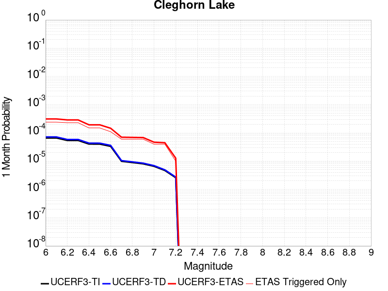 |  |  |

| Magnitude | 1 wk TI Prob | 1 wk TD Prob | 1 wk ETAS Prob | 1 wk ETAS/TD Gain | 1 wk ETAS Triggered Only | 1 mo TI Prob | 1 mo TD Prob | 1 mo ETAS Prob | 1 mo ETAS/TD Gain | 1 mo ETAS Triggered Only | 1 yr TI Prob | 1 yr TD Prob | 1 yr ETAS Prob | 1 yr ETAS/TD Gain | 1 yr ETAS Triggered Only | 10 yr TI Prob | 10 yr TD Prob | 10 yr ETAS Prob | 10 yr ETAS/TD Gain | 10 yr ETAS Triggered Only |
|-----|-----|-----|-----|-----|-----|-----|-----|-----|-----|-----|-----|-----|-----|-----|-----|-----|-----|-----|-----|-----|
| 6.0 | 1.5467183E-5 | 1.6794203E-5 | 2.0679101E-4 | 12.313237 | 1.9E-4 | 6.6286244E-5 | 7.197348E-5 | 3.1195622E-4 | 4.3343215 | 2.4E-4 | 8.067362E-4 | 8.759797E-4 | 0.0012456556 | 1.4220142 | 3.7E-4 | 0.008038137 | 0.008730696 | 0.0091866795 | 1.0522276 | 4.6E-4 |
| 6.1 | 1.5467183E-5 | 1.6794203E-5 | 2.0679101E-4 | 12.313237 | 1.9E-4 | 6.6286244E-5 | 7.197348E-5 | 3.1195622E-4 | 4.3343215 | 2.4E-4 | 8.067362E-4 | 8.759797E-4 | 0.0012456556 | 1.4220142 | 3.7E-4 | 0.008038137 | 0.008730696 | 0.0091866795 | 1.0522276 | 4.6E-4 |
| 6.2 | 1.2624631E-5 | 1.3681544E-5 | 1.9367908E-4 | 14.156229 | 1.8E-4 | 5.410444E-5 | 5.863415E-5 | 2.8862065E-4 | 4.922399 | 2.3E-4 | 6.585225E-4 | 7.1368564E-4 | 0.0010234644 | 1.434055 | 3.1E-4 | 0.0065657445 | 0.0071187317 | 0.0075059556 | 1.0543951 | 3.9E-4 |
| 6.3 | 1.2624631E-5 | 1.3681544E-5 | 1.9367908E-4 | 14.156229 | 1.8E-4 | 5.410444E-5 | 5.863415E-5 | 2.8862065E-4 | 4.922399 | 2.3E-4 | 6.585225E-4 | 7.1368564E-4 | 0.0010234644 | 1.434055 | 3.1E-4 | 0.0065657445 | 0.0071187317 | 0.0075059556 | 1.0543951 | 3.9E-4 |
| 6.4 | 9.417684E-6 | 1.0170118E-5 | 1.20168996E-4 | 11.815891 | 1.1E-4 | 4.036088E-5 | 4.3585722E-5 | 1.9357918E-4 | 4.441344 | 1.5E-4 | 4.912829E-4 | 5.3056807E-4 | 7.5045135E-4 | 1.4144299 | 2.2E-4 | 0.004901982 | 0.005297049 | 0.0055556716 | 1.048824 | 2.6E-4 |
| 6.5 | 9.368219E-6 | 1.0117545E-5 | 1.20116434E-4 | 11.872093 | 1.1E-4 | 4.014889E-5 | 4.3360415E-5 | 1.9335392E-4 | 4.4592266 | 1.5E-4 | 4.8870314E-4 | 5.2782625E-4 | 7.477101E-4 | 1.4165838 | 2.2E-4 | 0.004876298 | 0.0052697617 | 0.0055283913 | 1.0490781 | 2.6E-4 |
| 6.6 | 7.803798E-6 | 8.441831E-6 | 7.844124E-5 | 9.29197 | 7.0E-5 | 3.3444423E-5 | 3.6179E-5 | 1.4617502E-4 | 4.040328 | 1.1E-4 | 4.0710976E-4 | 4.4043022E-4 | 6.2035094E-4 | 1.4085113 | 1.8E-4 | 0.0040636472 | 0.0043994905 | 0.0046085664 | 1.0475228 | 2.1E-4 |
| 6.7 | 2.3108669E-6 | 2.4438336E-6 | 3.244376E-5 | 13.275764 | 3.0E-5 | 9.903678E-6 | 1.0473532E-5 | 7.04729E-5 | 6.728667 | 6.0E-5 | 1.205706E-4 | 1.2750797E-4 | 1.9749904E-4 | 1.5489153 | 7.0E-5 | 0.001205052 | 0.0012743667 | 0.0013442776 | 1.0548593 | 7.0E-5 |
| 6.8 | 2.0882828E-6 | 2.2062823E-6 | 3.2206215E-5 | 14.597506 | 3.0E-5 | 8.949753E-6 | 9.455462E-6 | 6.9454894E-5 | 7.345479 | 6.0E-5 | 1.08957785E-4 | 1.1511434E-4 | 1.8510628E-4 | 1.608021 | 7.0E-5 | 0.0010890438 | 0.0011505639 | 0.0012204834 | 1.0607697 | 7.0E-5 |
| 6.9 | 1.876935E-6 | 1.981051E-6 | 3.198099E-5 | 16.143448 | 3.0E-5 | 8.043982E-6 | 8.490192E-6 | 6.848968E-5 | 8.066918 | 6.0E-5 | 9.7931086E-5 | 1.03363345E-4 | 1.7335611E-4 | 1.6771526 | 7.0E-5 | 9.788794E-4 | 0.0010331686 | 0.0011030963 | 1.0676827 | 7.0E-5 |
| 7.0 | 1.5357559E-6 | 1.6202807E-6 | 1.1620265E-5 | 7.17176 | 1.0E-5 | 6.5817944E-6 | 6.9440425E-6 | 4.6943765E-5 | 6.7602935 | 4.0E-5 | 8.01304E-5 | 8.454057E-5 | 1.2453718E-4 | 1.4731057 | 4.0E-5 | 8.010151E-4 | 8.450965E-4 | 8.850627E-4 | 1.0472919 | 4.0E-5 |
| 7.1 | 1.0905424E-6 | 1.1497619E-6 | 1.114975E-5 | 9.697442 | 1.0E-5 | 4.6737446E-6 | 4.9275427E-6 | 4.4927347E-5 | 9.117597 | 4.0E-5 | 5.6901354E-5 | 5.999128E-5 | 9.998888E-5 | 1.6667236 | 4.0E-5 | 5.6886784E-4 | 5.997606E-4 | 6.3973665E-4 | 1.0666533 | 4.0E-5 |
| 7.2 | 6.06668E-7 | 6.387277E-7 | 1.06387215E-5 | 16.656113 | 1.0E-5 | 2.600003E-6 | 2.7374022E-6 | 1.2737375E-5 | 4.6530886 | 1.0E-5 | 3.1654577E-5 | 3.3327433E-5 | 4.3327098E-5 | 1.3000431 | 1.0E-5 | 3.1650066E-4 | 3.3323118E-4 | 3.4322785E-4 | 1.0299993 | 1.0E-5 |

## Sierra Nevada  (No Extension)
*[(top)](#table-of-contents)*

| 1 Week | 1 Month | 1 Year | 10 Year |
|-----|-----|-----|-----|
|  |  | 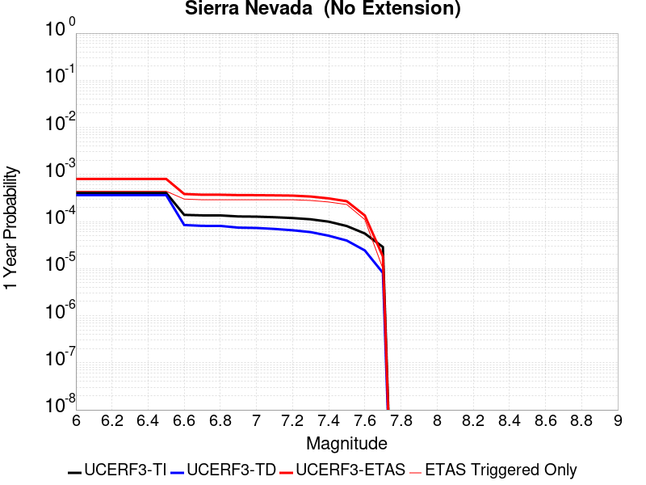 |  |

| Magnitude | 1 wk TI Prob | 1 wk TD Prob | 1 wk ETAS Prob | 1 wk ETAS/TD Gain | 1 wk ETAS Triggered Only | 1 mo TI Prob | 1 mo TD Prob | 1 mo ETAS Prob | 1 mo ETAS/TD Gain | 1 mo ETAS Triggered Only | 1 yr TI Prob | 1 yr TD Prob | 1 yr ETAS Prob | 1 yr ETAS/TD Gain | 1 yr ETAS Triggered Only | 10 yr TI Prob | 10 yr TD Prob | 10 yr ETAS Prob | 10 yr ETAS/TD Gain | 10 yr ETAS Triggered Only |
|-----|-----|-----|-----|-----|-----|-----|-----|-----|-----|-----|-----|-----|-----|-----|-----|-----|-----|-----|-----|-----|
| 6.0 | 7.7690465E-6 | 6.976322E-6 | 2.7697443E-4 | 39.702072 | 2.7E-4 | 3.329549E-5 | 2.9898381E-5 | 3.498888E-4 | 11.7026005 | 3.2E-4 | 4.0529718E-4 | 3.6398784E-4 | 8.0382766E-4 | 2.2083917 | 4.4E-4 | 0.004045588 | 0.0036374326 | 0.0041455775 | 1.1396987 | 5.1E-4 |
| 6.1 | 7.7690465E-6 | 6.976322E-6 | 2.7697443E-4 | 39.702072 | 2.7E-4 | 3.329549E-5 | 2.9898381E-5 | 3.498888E-4 | 11.7026005 | 3.2E-4 | 4.0529718E-4 | 3.6398784E-4 | 8.0382766E-4 | 2.2083917 | 4.4E-4 | 0.004045588 | 0.0036374326 | 0.0041455775 | 1.1396987 | 5.1E-4 |
| 6.2 | 7.7690465E-6 | 6.976322E-6 | 2.7697443E-4 | 39.702072 | 2.7E-4 | 3.329549E-5 | 2.9898381E-5 | 3.498888E-4 | 11.7026005 | 3.2E-4 | 4.0529718E-4 | 3.6398784E-4 | 8.0382766E-4 | 2.2083917 | 4.4E-4 | 0.004045588 | 0.0036374326 | 0.0041455775 | 1.1396987 | 5.1E-4 |
| 6.3 | 7.7690465E-6 | 6.976322E-6 | 2.7697443E-4 | 39.702072 | 2.7E-4 | 3.329549E-5 | 2.9898381E-5 | 3.498888E-4 | 11.7026005 | 3.2E-4 | 4.0529718E-4 | 3.6398784E-4 | 8.0382766E-4 | 2.2083917 | 4.4E-4 | 0.004045588 | 0.0036374326 | 0.0041455775 | 1.1396987 | 5.1E-4 |
| 6.4 | 7.7690465E-6 | 6.976322E-6 | 2.7697443E-4 | 39.702072 | 2.7E-4 | 3.329549E-5 | 2.9898381E-5 | 3.498888E-4 | 11.7026005 | 3.2E-4 | 4.0529718E-4 | 3.6398784E-4 | 8.0382766E-4 | 2.2083917 | 4.4E-4 | 0.004045588 | 0.0036374326 | 0.0041455775 | 1.1396987 | 5.1E-4 |
| 6.5 | 7.7690465E-6 | 6.976322E-6 | 2.7697443E-4 | 39.702072 | 2.7E-4 | 3.329549E-5 | 2.9898381E-5 | 3.498888E-4 | 11.7026005 | 3.2E-4 | 4.0529718E-4 | 3.6398784E-4 | 8.0382766E-4 | 2.2083917 | 4.4E-4 | 0.004045588 | 0.0036374326 | 0.0041455775 | 1.1396987 | 5.1E-4 |
| 6.6 | 2.653E-6 | 1.614854E-6 | 2.0161453E-4 | 124.850006 | 2.0E-4 | 1.136995E-5 | 6.9207845E-6 | 2.1691933E-4 | 31.34317 | 2.1E-4 | 1.3842035E-4 | 8.425733E-5 | 3.8423206E-4 | 4.560221 | 3.0E-4 | 0.0013833415 | 8.422573E-4 | 0.0011919625 | 1.4152 | 3.5E-4 |
| 6.7 | 2.5902466E-6 | 1.5501876E-6 | 1.9154989E-4 | 123.56563 | 1.9E-4 | 1.11010095E-5 | 6.643644E-6 | 2.0664232E-4 | 31.103762 | 2.0E-4 | 1.351464E-4 | 8.0883394E-5 | 3.7085993E-4 | 4.5851183 | 2.9E-4 | 0.0013506424 | 8.0854254E-4 | 0.0011482676 | 1.4201697 | 3.4E-4 |
| 6.8 | 2.5853892E-6 | 1.5469877E-6 | 1.915467E-4 | 123.81914 | 1.9E-4 | 1.1080193E-5 | 6.629931E-6 | 2.0662861E-4 | 31.166027 | 2.0E-4 | 1.34893E-4 | 8.071645E-5 | 3.7069304E-4 | 4.592534 | 2.9E-4 | 0.0013481114 | 8.068743E-4 | 0.0011466 | 1.4210391 | 3.4E-4 |
| 6.9 | 2.458257E-6 | 1.4220619E-6 | 1.9142179E-4 | 134.60861 | 1.9E-4 | 1.0535345E-5 | 6.094537E-6 | 2.0609332E-4 | 33.816074 | 2.0E-4 | 1.2826028E-4 | 7.4198484E-5 | 3.6417696E-4 | 4.908146 | 2.9E-4 | 0.0012818627 | 7.4173906E-4 | 0.0010814868 | 1.4580423 | 3.4E-4 |
| 7.0 | 2.4341468E-6 | 1.3990258E-6 | 1.9139877E-4 | 136.8086 | 1.9E-4 | 1.0432016E-5 | 5.9958115E-6 | 2.0599461E-4 | 34.35642 | 2.0E-4 | 1.270024E-4 | 7.2996576E-5 | 3.629754E-4 | 4.972499 | 2.9E-4 | 0.0012692984 | 7.297279E-4 | 0.0010694797 | 1.4655871 | 3.4E-4 |
| 7.1 | 2.3652476E-6 | 1.3339754E-6 | 1.9133372E-4 | 143.43121 | 1.9E-4 | 1.0136736E-5 | 5.717025E-6 | 2.0571589E-4 | 35.98303 | 2.0E-4 | 1.2340778E-4 | 6.9602575E-5 | 3.595824E-4 | 5.1662226 | 2.9E-4 | 0.0012333926 | 6.9580943E-4 | 0.0010355728 | 1.4882995 | 3.4E-4 |
| 7.2 | 2.272158E-6 | 1.2502821E-6 | 1.9125004E-4 | 152.96552 | 1.9E-4 | 9.737784E-6 | 5.3583412E-6 | 2.0535727E-4 | 38.324783 | 2.0E-4 | 1.1855107E-4 | 6.5235865E-5 | 3.5521694E-4 | 5.4451175 | 2.9E-4 | 0.0011848784 | 6.5216864E-4 | 9.919469E-4 | 1.5209975 | 3.4E-4 |
| 7.3 | 2.1382127E-6 | 1.1419703E-6 | 1.8114176E-4 | 158.62213 | 1.8E-4 | 9.163737E-6 | 4.8941492E-6 | 1.9489322E-4 | 39.821674 | 1.9E-4 | 1.1156279E-4 | 5.958465E-5 | 3.3956795E-4 | 5.698917 | 2.8E-4 | 0.001115068 | 5.956879E-4 | 9.2549133E-4 | 1.5536513 | 3.3E-4 |
| 7.4 | 1.9048055E-6 | 9.575242E-7 | 1.6095737E-4 | 168.09744 | 1.6E-4 | 8.163426E-6 | 4.1036687E-6 | 1.7410297E-4 | 42.426174 | 1.7E-4 | 9.9385186E-5 | 4.996103E-5 | 3.0994805E-4 | 6.203796 | 2.6E-4 | 9.934074E-4 | 4.994987E-4 | 8.093438E-4 | 1.6203122 | 3.1E-4 |
| 7.5 | 1.5373403E-6 | 7.560042E-7 | 1.5075589E-4 | 199.41144 | 1.5E-4 | 6.5885843E-6 | 3.2400142E-6 | 1.632395E-4 | 50.38234 | 1.6E-4 | 8.021306E-5 | 3.9446462E-5 | 2.6943738E-4 | 6.8304577 | 2.3E-4 | 8.0184115E-4 | 3.943951E-4 | 6.7428465E-4 | 1.709668 | 2.8E-4 |
| 7.6 | 1.0680322E-6 | 4.6596554E-7 | 7.046593E-5 | 151.22563 | 7.0E-5 | 4.577273E-6 | 1.9969937E-6 | 8.199683E-5 | 41.06014 | 8.0E-5 | 5.5726876E-5 | 2.4313129E-5 | 1.3431045E-4 | 5.5241947 | 1.1E-4 | 5.5712904E-4 | 2.4310495E-4 | 4.0306605E-4 | 1.657992 | 1.6E-4 |
| 7.7 | 5.509146E-7 | 1.5580486E-7 | 1.01558035E-5 | 65.18284 | 1.0E-5 | 2.3610605E-6 | 6.677349E-7 | 1.0667728E-5 | 15.975992 | 1.0E-5 | 2.8745531E-5 | 8.129644E-6 | 1.8129562E-5 | 2.2300563 | 1.0E-5 | 2.8741814E-4 | 8.1293576E-5 | 1.0129195E-4 | 1.2460018 | 2.0E-5 |

## Lake Isabella (Seismicity)
*[(top)](#table-of-contents)*

| 1 Week | 1 Month | 1 Year | 10 Year |
|-----|-----|-----|-----|
|  |  |  |  |

| Magnitude | 1 wk TI Prob | 1 wk TD Prob | 1 wk ETAS Prob | 1 wk ETAS/TD Gain | 1 wk ETAS Triggered Only | 1 mo TI Prob | 1 mo TD Prob | 1 mo ETAS Prob | 1 mo ETAS/TD Gain | 1 mo ETAS Triggered Only | 1 yr TI Prob | 1 yr TD Prob | 1 yr ETAS Prob | 1 yr ETAS/TD Gain | 1 yr ETAS Triggered Only | 10 yr TI Prob | 10 yr TD Prob | 10 yr ETAS Prob | 10 yr ETAS/TD Gain | 10 yr ETAS Triggered Only |
|-----|-----|-----|-----|-----|-----|-----|-----|-----|-----|-----|-----|-----|-----|-----|-----|-----|-----|-----|-----|-----|
| 6.0 | 9.431637E-6 | 9.741651E-6 | 2.6973913E-4 | 27.689259 | 2.6E-4 | 4.0420677E-5 | 4.1749343E-5 | 3.61736E-4 | 8.664472 | 3.2E-4 | 4.920106E-4 | 5.0819275E-4 | 9.179844E-4 | 1.8063705 | 4.1E-4 | 0.004909227 | 0.005071599 | 0.005539215 | 1.0922029 | 4.7E-4 |
| 6.1 | 9.431637E-6 | 9.741651E-6 | 2.6973913E-4 | 27.689259 | 2.6E-4 | 4.0420677E-5 | 4.1749343E-5 | 3.61736E-4 | 8.664472 | 3.2E-4 | 4.920106E-4 | 5.0819275E-4 | 9.179844E-4 | 1.8063705 | 4.1E-4 | 0.004909227 | 0.005071599 | 0.005539215 | 1.0922029 | 4.7E-4 |
| 6.2 | 9.431637E-6 | 9.741651E-6 | 2.6973913E-4 | 27.689259 | 2.6E-4 | 4.0420677E-5 | 4.1749343E-5 | 3.61736E-4 | 8.664472 | 3.2E-4 | 4.920106E-4 | 5.0819275E-4 | 9.179844E-4 | 1.8063705 | 4.1E-4 | 0.004909227 | 0.005071599 | 0.005539215 | 1.0922029 | 4.7E-4 |
| 6.3 | 9.431637E-6 | 9.741651E-6 | 2.6973913E-4 | 27.689259 | 2.6E-4 | 4.0420677E-5 | 4.1749343E-5 | 3.61736E-4 | 8.664472 | 3.2E-4 | 4.920106E-4 | 5.0819275E-4 | 9.179844E-4 | 1.8063705 | 4.1E-4 | 0.004909227 | 0.005071599 | 0.005539215 | 1.0922029 | 4.7E-4 |
| 6.4 | 5.144063E-6 | 5.3000763E-6 | 1.5529928E-4 | 29.30133 | 1.5E-4 | 2.2045799E-5 | 2.2714434E-5 | 1.9271058E-4 | 8.484058 | 1.7E-4 | 2.6837454E-4 | 2.765166E-4 | 5.06453E-4 | 1.8315465 | 2.3E-4 | 0.0026805066 | 0.0027620657 | 0.00303132 | 1.0974829 | 2.7E-4 |
| 6.5 | 5.144063E-6 | 5.3000763E-6 | 1.5529928E-4 | 29.30133 | 1.5E-4 | 2.2045799E-5 | 2.2714434E-5 | 1.9271058E-4 | 8.484058 | 1.7E-4 | 2.6837454E-4 | 2.765166E-4 | 5.06453E-4 | 1.8315465 | 2.3E-4 | 0.0026805066 | 0.0027620657 | 0.00303132 | 1.0974829 | 2.7E-4 |
| 6.6 | 3.4009804E-6 | 3.498786E-6 | 8.3498504E-5 | 23.864992 | 8.0E-5 | 1.4575549E-5 | 1.4994721E-5 | 1.1499322E-4 | 7.668914 | 1.0E-4 | 1.7744285E-4 | 1.8254704E-4 | 3.3251964E-4 | 1.8215561 | 1.5E-4 | 0.0017730123 | 0.0018241286 | 0.0019938184 | 1.0930252 | 1.7E-4 |
| 6.7 | 3.3880428E-6 | 3.4856528E-6 | 8.348537E-5 | 23.951145 | 8.0E-5 | 1.4520103E-5 | 1.4938435E-5 | 1.1493694E-4 | 7.6940413 | 1.0E-4 | 1.767679E-4 | 1.8186188E-4 | 3.318346E-4 | 1.8246518 | 1.5E-4 | 0.0017662736 | 0.0018172882 | 0.0019869793 | 1.0933759 | 1.7E-4 |
| 6.8 | 2.6582E-6 | 2.7337003E-6 | 6.273354E-5 | 22.948214 | 6.0E-5 | 1.1392236E-5 | 1.1715813E-5 | 9.171488E-5 | 7.828298 | 8.0E-5 | 1.3869164E-4 | 1.4263204E-4 | 2.7261348E-4 | 1.9113063 | 1.3E-4 | 0.0013860512 | 0.0014255369 | 0.001575323 | 1.1050735 | 1.5E-4 |
| 6.9 | 2.406011E-6 | 2.4743288E-6 | 4.247423E-5 | 17.16596 | 4.0E-5 | 1.0311434E-5 | 1.0604231E-5 | 7.060359E-5 | 6.658059 | 6.0E-5 | 1.2553448E-4 | 1.2910018E-4 | 2.3908597E-4 | 1.8519415 | 1.1E-4 | 0.0012546359 | 0.0012903814 | 0.0014202137 | 1.1006154 | 1.3E-4 |
| 7.0 | 1.6953097E-6 | 1.7429371E-6 | 3.1742886E-5 | 18.212294 | 3.0E-5 | 7.265593E-6 | 7.469715E-6 | 4.7469417E-5 | 6.3549166 | 4.0E-5 | 8.8455E-5 | 9.094104E-5 | 1.6093467E-4 | 1.7696595 | 7.0E-5 | 8.84198E-4 | 9.09141E-4 | 9.990592E-4 | 1.0989046 | 9.0E-5 |
| 7.1 | 3.5013824E-7 | 3.5714822E-7 | 1.0357145E-5 | 28.999569 | 1.0E-5 | 1.5005916E-6 | 1.5306344E-6 | 2.1530604E-5 | 14.066458 | 2.0E-5 | 1.826955E-5 | 1.8635317E-5 | 3.8634946E-5 | 2.073211 | 2.0E-5 | 1.8268047E-4 | 1.863378E-4 | 2.0633407E-4 | 1.107312 | 2.0E-5 |
| 7.2 | 2.2321095E-7 | 2.2750574E-7 | 1.02275035E-5 | 44.954926 | 1.0E-5 | 9.56618E-7 | 9.750242E-7 | 1.0975014E-5 | 11.2561455 | 1.0E-5 | 1.1646762E-5 | 1.1870856E-5 | 2.1870737E-5 | 1.8423892 | 1.0E-5 | 1.1646151E-4 | 1.1870232E-4 | 1.2870114E-4 | 1.0842344 | 1.0E-5 |
| 7.3 | 1.5760406E-7 | 1.6060922E-7 | 1.0160607E-5 | 63.262917 | 1.0E-5 | 6.7544585E-7 | 6.8832503E-7 | 1.0688318E-5 | 15.528009 | 1.0E-5 | 8.223522E-6 | 8.380326E-6 | 1.8380242E-5 | 2.193261 | 1.0E-5 | 8.2232174E-5 | 8.3800165E-5 | 9.3799325E-5 | 1.1193215 | 1.0E-5 |
| 7.4 | 1.1216497E-7 | 1.1431706E-7 | 1.0114316E-5 | 88.476 | 1.0E-5 | 4.8070694E-7 | 4.899302E-7 | 1.0489925E-5 | 21.411062 | 1.0E-5 | 5.852591E-6 | 5.964884E-6 | 1.5964824E-5 | 2.6764686 | 1.0E-5 | 5.8524372E-5 | 5.9647282E-5 | 6.964669E-5 | 1.1676422 | 1.0E-5 |
| 7.5 | 4.885185E-8 | 4.9787737E-8 | 4.9787737E-8 | 1.0 | 0.0 | 2.0936506E-7 | 2.13376E-7 | 2.13376E-7 | 1.0 | 0.0 | 2.5490165E-6 | 2.59785E-6 | 2.59785E-6 | 1.0 | 0.0 | 2.5489873E-5 | 2.5978214E-5 | 2.5978214E-5 | 1.0 | 0.0 |
| 7.6 | 1.504641E-9 | 1.5317903E-9 | 1.5317903E-9 | 1.0 | 0.0 | 6.4484613E-9 | 6.5648154E-9 | 6.5648154E-9 | 1.0 | 0.0 | 7.851001E-8 | 7.992663E-8 | 7.992663E-8 | 1.0 | 0.0 | 7.8509987E-7 | 7.992663E-7 | 7.992663E-7 | 1.0 | 0.0 |

## San Jacinto (San Bernardino)
*[(top)](#table-of-contents)*

| 1 Week | 1 Month | 1 Year | 10 Year |
|-----|-----|-----|-----|
|  |  |  |  |

| Magnitude | 1 wk TI Prob | 1 wk TD Prob | 1 wk ETAS Prob | 1 wk ETAS/TD Gain | 1 wk ETAS Triggered Only | 1 mo TI Prob | 1 mo TD Prob | 1 mo ETAS Prob | 1 mo ETAS/TD Gain | 1 mo ETAS Triggered Only | 1 yr TI Prob | 1 yr TD Prob | 1 yr ETAS Prob | 1 yr ETAS/TD Gain | 1 yr ETAS Triggered Only | 10 yr TI Prob | 10 yr TD Prob | 10 yr ETAS Prob | 10 yr ETAS/TD Gain | 10 yr ETAS Triggered Only |
|-----|-----|-----|-----|-----|-----|-----|-----|-----|-----|-----|-----|-----|-----|-----|-----|-----|-----|-----|-----|-----|
| 6.0 | 3.409352E-5 | 3.5986508E-5 | 3.059768E-4 | 8.502542 | 2.7E-4 | 1.461069E-4 | 1.542188E-4 | 4.841679E-4 | 3.139487 | 3.3E-4 | 0.0017774 | 0.0018759987 | 0.002265267 | 1.2074993 | 3.9E-4 | 0.01763251 | 0.019349935 | 0.019791227 | 1.0228059 | 4.5E-4 |
| 6.1 | 3.409352E-5 | 3.5986508E-5 | 3.059768E-4 | 8.502542 | 2.7E-4 | 1.461069E-4 | 1.542188E-4 | 4.841679E-4 | 3.139487 | 3.3E-4 | 0.0017774 | 0.0018759987 | 0.002265267 | 1.2074993 | 3.9E-4 | 0.01763251 | 0.019349935 | 0.019791227 | 1.0228059 | 4.5E-4 |
| 6.2 | 3.409352E-5 | 3.5986508E-5 | 3.059768E-4 | 8.502542 | 2.7E-4 | 1.461069E-4 | 1.542188E-4 | 4.841679E-4 | 3.139487 | 3.3E-4 | 0.0017774 | 0.0018759987 | 0.002265267 | 1.2074993 | 3.9E-4 | 0.01763251 | 0.019349935 | 0.019791227 | 1.0228059 | 4.5E-4 |
| 6.3 | 3.409352E-5 | 3.5986508E-5 | 3.059768E-4 | 8.502542 | 2.7E-4 | 1.461069E-4 | 1.542188E-4 | 4.841679E-4 | 3.139487 | 3.3E-4 | 0.0017774 | 0.0018759987 | 0.002265267 | 1.2074993 | 3.9E-4 | 0.01763251 | 0.019349935 | 0.019791227 | 1.0228059 | 4.5E-4 |
| 6.4 | 3.400795E-5 | 3.5879173E-5 | 3.0586947E-4 | 8.524987 | 2.7E-4 | 1.4574021E-4 | 1.5375883E-4 | 4.8370808E-4 | 3.145888 | 3.3E-4 | 0.0017729428 | 0.0018704084 | 0.002259679 | 1.2081206 | 3.9E-4 | 0.017588645 | 0.019295016 | 0.019736335 | 1.0228721 | 4.5E-4 |
| 6.5 | 3.341482E-5 | 3.5139812E-5 | 3.0513032E-4 | 8.683323 | 2.7E-4 | 1.4319851E-4 | 1.5059051E-4 | 4.805408E-4 | 3.1910431 | 3.3E-4 | 0.0017420477 | 0.0018318989 | 0.0022211845 | 1.2125038 | 3.9E-4 | 0.017284546 | 0.018916558 | 0.019348236 | 1.02282 | 4.4E-4 |
| 6.6 | 3.3364955E-5 | 3.5077028E-5 | 3.0506757E-4 | 8.697075 | 2.7E-4 | 1.4298483E-4 | 1.5032147E-4 | 4.8027188E-4 | 3.1949651 | 3.3E-4 | 0.0017394501 | 0.001828629 | 0.0022179158 | 1.2128845 | 3.9E-4 | 0.017258976 | 0.018884424 | 0.019316114 | 1.0228596 | 4.4E-4 |
| 6.7 | 3.335922E-5 | 3.5066805E-5 | 3.0505733E-4 | 8.69932 | 2.7E-4 | 1.4296026E-4 | 1.5027766E-4 | 4.8022807E-4 | 3.1956053 | 3.3E-4 | 0.0017391514 | 0.0018280965 | 0.0022173834 | 1.2129467 | 3.9E-4 | 0.017256035 | 0.018879214 | 0.019310908 | 1.022866 | 4.4E-4 |
| 6.8 | 3.327683E-5 | 3.496087E-5 | 3.0495142E-4 | 8.72265 | 2.7E-4 | 1.4260718E-4 | 1.498237E-4 | 4.7977426E-4 | 3.2022588 | 3.3E-4 | 0.0017348597 | 0.0018225788 | 0.002211868 | 1.2135925 | 3.9E-4 | 0.017213784 | 0.018824987 | 0.019256704 | 1.0229332 | 4.4E-4 |
| 6.9 | 3.3235785E-5 | 3.4901823E-5 | 2.9489276E-4 | 8.449207 | 2.6E-4 | 1.4243131E-4 | 1.4957068E-4 | 4.695228E-4 | 3.1391368 | 3.2E-4 | 0.0017327217 | 0.0018195034 | 0.002198812 | 1.2084682 | 3.8E-4 | 0.017192734 | 0.018794855 | 0.019216774 | 1.0224487 | 4.3E-4 |
| 7.0 | 3.3197095E-5 | 3.4841752E-5 | 2.948327E-4 | 8.46205 | 2.6E-4 | 1.422655E-4 | 1.4931326E-4 | 4.6926548E-4 | 3.1428251 | 3.2E-4 | 0.0017307063 | 0.0018163746 | 0.0021956845 | 1.208828 | 3.8E-4 | 0.017172894 | 0.018764233 | 0.019186163 | 1.022486 | 4.3E-4 |
| 7.1 | 3.3129716E-5 | 3.4721965E-5 | 2.9471293E-4 | 8.487796 | 2.6E-4 | 1.4197677E-4 | 1.4879994E-4 | 4.6875232E-4 | 3.1502185 | 3.2E-4 | 0.0017271966 | 0.0018101353 | 0.0021894474 | 1.2095491 | 3.8E-4 | 0.017138338 | 0.018703312 | 0.01912527 | 1.0225606 | 4.3E-4 |
| 7.2 | 3.3034008E-5 | 3.458941E-5 | 2.9458042E-4 | 8.516491 | 2.6E-4 | 1.4156665E-4 | 1.4823192E-4 | 4.681845E-4 | 3.1584592 | 3.2E-4 | 0.0017222111 | 0.0018032312 | 0.0021825458 | 1.2103528 | 3.8E-4 | 0.017089253 | 0.018635705 | 0.019057691 | 1.022644 | 4.3E-4 |
| 7.3 | 3.2956614E-5 | 3.445717E-5 | 2.944482E-4 | 8.54534 | 2.6E-4 | 1.4123498E-4 | 1.4766524E-4 | 4.6761797E-4 | 3.166744 | 3.2E-4 | 0.0017181796 | 0.0017963431 | 0.0021756606 | 1.2111609 | 3.8E-4 | 0.017049557 | 0.018568452 | 0.018990468 | 1.0227276 | 4.3E-4 |
| 7.4 | 3.2915937E-5 | 3.4378863E-5 | 2.9436994E-4 | 8.562526 | 2.6E-4 | 1.4106068E-4 | 1.4732967E-4 | 4.6728255E-4 | 3.1716795 | 3.2E-4 | 0.0017160608 | 0.0017922645 | 0.0021715835 | 1.2116423 | 3.8E-4 | 0.017028693 | 0.018528719 | 0.018950751 | 1.0227772 | 4.3E-4 |
| 7.5 | 3.281791E-5 | 3.4243778E-5 | 2.9423487E-4 | 8.59236 | 2.6E-4 | 1.406406E-4 | 1.4675081E-4 | 4.6670384E-4 | 3.1802473 | 3.2E-4 | 0.0017109542 | 0.0017852283 | 0.00216455 | 1.2124779 | 3.8E-4 | 0.016978411 | 0.018459605 | 0.018881667 | 1.0228641 | 4.3E-4 |
| 7.6 | 3.2521442E-5 | 3.396873E-5 | 2.939599E-4 | 8.653838 | 2.6E-4 | 1.3937015E-4 | 1.4557215E-4 | 4.6552558E-4 | 3.1979027 | 3.2E-4 | 0.0016955109 | 0.0017709016 | 0.0021502287 | 1.2141999 | 3.8E-4 | 0.016826328 | 0.018317232 | 0.018739356 | 1.0230452 | 4.3E-4 |
| 7.7 | 3.0287873E-5 | 3.245276E-5 | 2.924443E-4 | 9.011385 | 2.6E-4 | 1.297987E-4 | 1.3907586E-4 | 4.5903135E-4 | 3.3005826 | 3.2E-4 | 0.0015791537 | 0.0016919347 | 0.0020712917 | 1.2242149 | 3.8E-4 | 0.01567979 | 0.01752809 | 0.017950553 | 1.0241021 | 4.3E-4 |
| 7.8 | 2.6316151E-5 | 2.9663592E-5 | 2.8965587E-4 | 9.764693 | 2.6E-4 | 1.1277862E-4 | 1.2712348E-4 | 4.470828E-4 | 3.5169175 | 3.2E-4 | 0.0013722149 | 0.0015466306 | 0.0019160584 | 1.2388598 | 3.7E-4 | 0.013637724 | 0.016069634 | 0.016482884 | 1.0257163 | 4.2E-4 |
| 7.9 | 2.0761147E-5 | 2.34181E-5 | 2.8341202E-4 | 12.1022625 | 2.6E-4 | 8.897331E-5 | 1.0035944E-4 | 4.1032833E-4 | 4.0885873 | 3.1E-4 | 0.0010827117 | 0.0012211921 | 0.0015707647 | 1.2862552 | 3.5E-4 | 0.010774517 | 0.012793174 | 0.013178185 | 1.030095 | 3.9E-4 |
| 8.0 | 1.5738568E-5 | 1.6033575E-5 | 2.1603037E-4 | 13.473624 | 2.0E-4 | 6.744926E-5 | 6.871352E-5 | 3.0869702E-4 | 4.4925227 | 2.4E-4 | 8.2088535E-4 | 8.3626667E-4 | 0.0011060409 | 1.3225936 | 2.7E-4 | 0.008178596 | 0.008865921 | 0.009143438 | 1.0313016 | 2.8E-4 |
| 8.1 | 1.0105832E-5 | 8.3304985E-6 | 1.0832967E-4 | 13.0039835 | 1.0E-4 | 4.3309992E-5 | 3.570165E-5 | 1.4569772E-4 | 4.0809803 | 1.1E-4 | 5.2717153E-4 | 4.345814E-4 | 5.445336E-4 | 1.2530072 | 1.1E-4 | 0.005259227 | 0.004677232 | 0.0047867172 | 1.0234082 | 1.1E-4 |
| 8.2 | 4.189207E-6 | 1.5784357E-6 | 1.5784357E-6 | 1.0 | 0.0 | 1.7953622E-5 | 6.7647065E-6 | 6.7647065E-6 | 1.0 | 0.0 | 2.1856341E-4 | 8.235722E-5 | 8.235722E-5 | 1.0 | 0.0 | 0.0021834858 | 9.565867E-4 | 9.565867E-4 | 1.0 | 0.0 |
| 8.3 | 1.2758221E-6 | 3.6149942E-7 | 3.6149942E-7 | 1.0 | 0.0 | 5.4677976E-6 | 1.5492824E-6 | 1.5492824E-6 | 1.0 | 0.0 | 6.65684E-5 | 1.8862354E-5 | 1.8862354E-5 | 1.0 | 0.0 | 6.6548464E-4 | 2.2751294E-4 | 2.2751294E-4 | 1.0 | 0.0 |

## Scodie Lineament
*[(top)](#table-of-contents)*

| 1 Week | 1 Month | 1 Year | 10 Year |
|-----|-----|-----|-----|
|  | 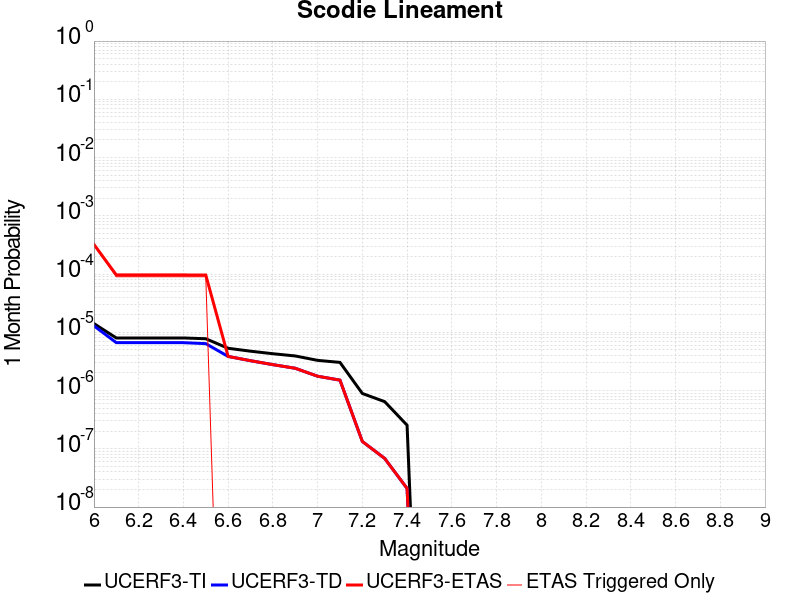 |  |  |

| Magnitude | 1 wk TI Prob | 1 wk TD Prob | 1 wk ETAS Prob | 1 wk ETAS/TD Gain | 1 wk ETAS Triggered Only | 1 mo TI Prob | 1 mo TD Prob | 1 mo ETAS Prob | 1 mo ETAS/TD Gain | 1 mo ETAS Triggered Only | 1 yr TI Prob | 1 yr TD Prob | 1 yr ETAS Prob | 1 yr ETAS/TD Gain | 1 yr ETAS Triggered Only | 10 yr TI Prob | 10 yr TD Prob | 10 yr ETAS Prob | 10 yr ETAS/TD Gain | 10 yr ETAS Triggered Only |
|-----|-----|-----|-----|-----|-----|-----|-----|-----|-----|-----|-----|-----|-----|-----|-----|-----|-----|-----|-----|-----|
| 6.0 | 3.2919327E-6 | 3.0133422E-6 | 2.6301257E-4 | 87.28267 | 2.6E-4 | 1.4108206E-5 | 1.2914278E-5 | 3.229103E-4 | 25.00413 | 3.1E-4 | 1.7175387E-4 | 1.5722317E-4 | 5.571603E-4 | 3.5437543 | 4.0E-4 | 0.0017162118 | 0.0015714309 | 0.0020207237 | 1.2859132 | 4.5E-4 |
| 6.1 | 1.8663811E-6 | 1.5490499E-6 | 7.1548944E-5 | 46.18892 | 7.0E-5 | 7.998751E-6 | 6.6387715E-6 | 9.663817E-5 | 14.556636 | 9.0E-5 | 9.738045E-5 | 8.082454E-5 | 2.0081484E-4 | 2.4845777 | 1.2E-4 | 9.7337784E-4 | 8.080003E-4 | 9.4788714E-4 | 1.1731273 | 1.4E-4 |
| 6.2 | 1.8663811E-6 | 1.5490499E-6 | 7.1548944E-5 | 46.18892 | 7.0E-5 | 7.998751E-6 | 6.6387715E-6 | 9.663817E-5 | 14.556636 | 9.0E-5 | 9.738045E-5 | 8.082454E-5 | 2.0081484E-4 | 2.4845777 | 1.2E-4 | 9.7337784E-4 | 8.080003E-4 | 9.4788714E-4 | 1.1731273 | 1.4E-4 |
| 6.3 | 1.8663811E-6 | 1.5490499E-6 | 7.1548944E-5 | 46.18892 | 7.0E-5 | 7.998751E-6 | 6.6387715E-6 | 9.663817E-5 | 14.556636 | 9.0E-5 | 9.738045E-5 | 8.082454E-5 | 2.0081484E-4 | 2.4845777 | 1.2E-4 | 9.7337784E-4 | 8.080003E-4 | 9.4788714E-4 | 1.1731273 | 1.4E-4 |
| 6.4 | 1.8663811E-6 | 1.5490499E-6 | 7.1548944E-5 | 46.18892 | 7.0E-5 | 7.998751E-6 | 6.6387715E-6 | 9.663817E-5 | 14.556636 | 9.0E-5 | 9.738045E-5 | 8.082454E-5 | 2.0081484E-4 | 2.4845777 | 1.2E-4 | 9.7337784E-4 | 8.080003E-4 | 9.4788714E-4 | 1.1731273 | 1.4E-4 |
| 6.5 | 1.8106311E-6 | 1.4909839E-6 | 7.149088E-5 | 47.94879 | 7.0E-5 | 7.759824E-6 | 6.3899183E-6 | 9.638934E-5 | 15.084597 | 9.0E-5 | 9.447177E-5 | 7.7794975E-5 | 1.9778564E-4 | 2.542396 | 1.2E-4 | 9.4431615E-4 | 7.7772606E-4 | 9.176172E-4 | 1.1798719 | 1.4E-4 |
| 6.6 | 1.2414679E-6 | 8.997558E-7 | 8.997558E-7 | 1.0 | 0.0 | 5.320566E-6 | 3.856091E-6 | 3.856091E-6 | 1.0 | 0.0 | 6.477596E-5 | 4.6946985E-5 | 7.694557E-5 | 1.6389887 | 3.0E-5 | 6.475708E-4 | 4.693793E-4 | 4.993652E-4 | 1.0638841 | 3.0E-5 |
| 6.7 | 1.1062215E-6 | 7.594311E-7 | 7.594311E-7 | 1.0 | 0.0 | 4.7409408E-6 | 3.2547011E-6 | 3.2547011E-6 | 1.0 | 0.0 | 5.7719422E-5 | 3.9625334E-5 | 5.9624545E-5 | 1.5047076 | 2.0E-5 | 5.770443E-4 | 3.961897E-4 | 4.1618178E-4 | 1.0504608 | 2.0E-5 |
| 6.8 | 1.0006736E-6 | 6.500397E-7 | 6.500397E-7 | 1.0 | 0.0 | 4.288594E-6 | 2.7858816E-6 | 2.7858816E-6 | 1.0 | 0.0 | 5.221238E-5 | 3.3917644E-5 | 5.3916967E-5 | 1.5896436 | 2.0E-5 | 5.220012E-4 | 3.3913075E-4 | 3.5912395E-4 | 1.0589544 | 2.0E-5 |
| 6.9 | 9.167364E-7 | 5.631625E-7 | 5.631625E-7 | 1.0 | 0.0 | 3.9288643E-6 | 2.4135516E-6 | 2.4135516E-6 | 1.0 | 0.0 | 4.7832873E-5 | 2.9384651E-5 | 2.9384651E-5 | 1.0 | 0.0 | 4.782258E-4 | 2.9381333E-4 | 2.9381333E-4 | 1.0 | 0.0 |
| 7.0 | 7.6987664E-7 | 4.113383E-7 | 4.113383E-7 | 1.0 | 0.0 | 3.2994672E-6 | 1.7628774E-6 | 1.7628774E-6 | 1.0 | 0.0 | 4.0170275E-5 | 2.1462862E-5 | 2.1462862E-5 | 1.0 | 0.0 | 4.0163012E-4 | 2.1461173E-4 | 2.1461173E-4 | 1.0 | 0.0 |
| 7.1 | 7.1038727E-7 | 3.5211494E-7 | 3.5211494E-7 | 1.0 | 0.0 | 3.0445133E-6 | 1.5090633E-6 | 1.5090633E-6 | 1.0 | 0.0 | 3.706632E-5 | 1.8372726E-5 | 1.8372726E-5 | 1.0 | 0.0 | 3.7060137E-4 | 1.8371557E-4 | 1.8371557E-4 | 1.0 | 0.0 |
| 7.2 | 2.0799602E-7 | 3.1186854E-8 | 3.1186854E-8 | 1.0 | 0.0 | 8.914113E-7 | 1.3365793E-7 | 1.3365793E-7 | 1.0 | 0.0 | 1.0852878E-5 | 1.6272843E-6 | 1.6272843E-6 | 1.0 | 0.0 | 1.08523476E-4 | 1.627273E-5 | 1.627273E-5 | 1.0 | 0.0 |
| 7.3 | 1.5048182E-7 | 1.5945696E-8 | 1.5945696E-8 | 1.0 | 0.0 | 6.449219E-7 | 6.83387E-8 | 6.83387E-8 | 1.0 | 0.0 | 7.851896E-6 | 8.320234E-7 | 8.320234E-7 | 1.0 | 0.0 | 7.851618E-5 | 8.320206E-6 | 8.320206E-6 | 1.0 | 0.0 |
| 7.4 | 5.9334678E-8 | 4.8683537E-9 | 4.8683537E-9 | 1.0 | 0.0 | 2.5429145E-7 | 2.0864372E-8 | 2.0864372E-8 | 1.0 | 0.0 | 3.095994E-6 | 2.5402372E-7 | 2.5402372E-7 | 1.0 | 0.0 | 3.095951E-5 | 2.5402353E-6 | 2.5402353E-6 | 1.0 | 0.0 |

## Santa Ynez (East)
*[(top)](#table-of-contents)*

| 1 Week | 1 Month | 1 Year | 10 Year |
|-----|-----|-----|-----|
|  |  |  |  |

| Magnitude | 1 wk TI Prob | 1 wk TD Prob | 1 wk ETAS Prob | 1 wk ETAS/TD Gain | 1 wk ETAS Triggered Only | 1 mo TI Prob | 1 mo TD Prob | 1 mo ETAS Prob | 1 mo ETAS/TD Gain | 1 mo ETAS Triggered Only | 1 yr TI Prob | 1 yr TD Prob | 1 yr ETAS Prob | 1 yr ETAS/TD Gain | 1 yr ETAS Triggered Only | 10 yr TI Prob | 10 yr TD Prob | 10 yr ETAS Prob | 10 yr ETAS/TD Gain | 10 yr ETAS Triggered Only |
|-----|-----|-----|-----|-----|-----|-----|-----|-----|-----|-----|-----|-----|-----|-----|-----|-----|-----|-----|-----|-----|
| 6.0 | 3.2269712E-5 | 3.67505E-5 | 2.3674316E-4 | 6.4419026 | 2.0E-4 | 1.3829143E-4 | 1.5749598E-4 | 4.474503E-4 | 2.841027 | 2.9E-4 | 0.0016823979 | 0.0019164166 | 0.0022956883 | 1.1979067 | 3.8E-4 | 0.016697178 | 0.019056441 | 0.019488057 | 1.0226493 | 4.4E-4 |
| 6.1 | 3.2269712E-5 | 3.67505E-5 | 2.3674316E-4 | 6.4419026 | 2.0E-4 | 1.3829143E-4 | 1.5749598E-4 | 4.474503E-4 | 2.841027 | 2.9E-4 | 0.0016823979 | 0.0019164166 | 0.0022956883 | 1.1979067 | 3.8E-4 | 0.016697178 | 0.019056441 | 0.019488057 | 1.0226493 | 4.4E-4 |
| 6.2 | 3.2269712E-5 | 3.67505E-5 | 2.3674316E-4 | 6.4419026 | 2.0E-4 | 1.3829143E-4 | 1.5749598E-4 | 4.474503E-4 | 2.841027 | 2.9E-4 | 0.0016823979 | 0.0019164166 | 0.0022956883 | 1.1979067 | 3.8E-4 | 0.016697178 | 0.019056441 | 0.019488057 | 1.0226493 | 4.4E-4 |
| 6.3 | 3.2269712E-5 | 3.67505E-5 | 2.3674316E-4 | 6.4419026 | 2.0E-4 | 1.3829143E-4 | 1.5749598E-4 | 4.474503E-4 | 2.841027 | 2.9E-4 | 0.0016823979 | 0.0019164166 | 0.0022956883 | 1.1979067 | 3.8E-4 | 0.016697178 | 0.019056441 | 0.019488057 | 1.0226493 | 4.4E-4 |
| 6.4 | 1.4404779E-5 | 1.4849382E-5 | 5.4848788E-5 | 3.6936748 | 4.0E-5 | 6.1733306E-5 | 6.363868E-5 | 1.2363486E-4 | 1.9427627 | 6.0E-5 | 7.513438E-4 | 7.745306E-4 | 8.844454E-4 | 1.1419115 | 1.1E-4 | 0.0074880854 | 0.007718862 | 0.007837935 | 1.0154263 | 1.2E-4 |
| 6.5 | 1.4404779E-5 | 1.4849382E-5 | 5.4848788E-5 | 3.6936748 | 4.0E-5 | 6.1733306E-5 | 6.363868E-5 | 1.2363486E-4 | 1.9427627 | 6.0E-5 | 7.513438E-4 | 7.745306E-4 | 8.844454E-4 | 1.1419115 | 1.1E-4 | 0.0074880854 | 0.007718862 | 0.007837935 | 1.0154263 | 1.2E-4 |
| 6.6 | 1.280208E-5 | 1.3011947E-5 | 5.3011427E-5 | 4.074058 | 4.0E-5 | 5.4864904E-5 | 5.5764307E-5 | 1.1576096E-4 | 2.075897 | 6.0E-5 | 6.6777546E-4 | 6.787207E-4 | 7.7865284E-4 | 1.147236 | 1.0E-4 | 0.006657724 | 0.0067666885 | 0.0068759443 | 1.0161461 | 1.1E-4 |
| 6.7 | 1.2457027E-5 | 1.2628468E-5 | 5.2627962E-5 | 4.167407 | 4.0E-5 | 5.3386164E-5 | 5.412089E-5 | 1.1411764E-4 | 2.1085691 | 6.0E-5 | 6.497827E-4 | 6.587243E-4 | 7.5865845E-4 | 1.1517086 | 1.0E-4 | 0.00647886 | 0.006567915 | 0.0066771926 | 1.016638 | 1.1E-4 |
| 6.8 | 1.2095134E-5 | 1.2230915E-5 | 5.2230425E-5 | 4.2703614 | 4.0E-5 | 5.1835254E-5 | 5.241716E-5 | 1.1241402E-4 | 2.1446033 | 6.0E-5 | 6.309115E-4 | 6.379937E-4 | 7.379299E-4 | 1.1566414 | 1.0E-4 | 0.0062912325 | 0.006361809 | 0.006471109 | 1.0171807 | 1.1E-4 |
| 6.9 | 1.1104036E-5 | 1.1157347E-5 | 5.11569E-5 | 4.5850415 | 4.0E-5 | 4.758786E-5 | 4.781633E-5 | 1.0781347E-4 | 2.2547414 | 6.0E-5 | 5.7922816E-4 | 5.820096E-4 | 6.719572E-4 | 1.1545466 | 9.0E-5 | 0.005777207 | 0.0058049993 | 0.0059044184 | 1.0171266 | 1.0E-4 |
| 7.0 | 1.0577444E-5 | 1.058168E-5 | 5.0581257E-5 | 4.780078 | 4.0E-5 | 4.5331115E-5 | 4.5349276E-5 | 1.0534655E-4 | 2.323004 | 6.0E-5 | 5.5176654E-4 | 5.519888E-4 | 6.419391E-4 | 1.1629568 | 9.0E-5 | 0.0055039856 | 0.0055063153 | 0.0056057647 | 1.0180609 | 1.0E-4 |
| 7.1 | 1.0021775E-5 | 9.980988E-6 | 2.9980787E-5 | 3.0037897 | 2.0E-5 | 4.294976E-5 | 4.2774966E-5 | 8.277326E-5 | 1.9350864 | 4.0E-5 | 5.2278786E-4 | 5.2066194E-4 | 5.906255E-4 | 1.1343743 | 7.0E-5 | 0.0052155964 | 0.0051945536 | 0.005274138 | 1.0153208 | 8.0E-5 |
| 7.2 | 8.874109E-6 | 8.748793E-6 | 2.8748618E-5 | 3.2860096 | 2.0E-5 | 3.8031343E-5 | 3.7494297E-5 | 6.749317E-5 | 1.8000917 | 3.0E-5 | 4.629332E-4 | 4.5639853E-4 | 5.1637116E-4 | 1.131404 | 6.0E-5 | 0.0046197 | 0.0045547304 | 0.0046244115 | 1.0152986 | 7.0E-5 |
| 7.3 | 7.5504267E-6 | 7.5051175E-6 | 2.7504968E-5 | 3.6648283 | 2.0E-5 | 3.235857E-5 | 3.21644E-5 | 6.216343E-5 | 1.9326782 | 3.0E-5 | 3.9389438E-4 | 3.915322E-4 | 4.4151265E-4 | 1.1276534 | 5.0E-5 | 0.0039319694 | 0.003908531 | 0.0039682966 | 1.0152911 | 6.0E-5 |
| 7.4 | 6.309394E-6 | 6.1831556E-6 | 2.6183032E-5 | 4.2345743 | 2.0E-5 | 2.703998E-5 | 2.6498974E-5 | 5.649818E-5 | 2.1320894 | 3.0E-5 | 3.2916202E-4 | 3.225782E-4 | 3.725621E-4 | 1.1549512 | 5.0E-5 | 0.003286749 | 0.003221197 | 0.003271036 | 1.0154722 | 5.0E-5 |
| 7.5 | 4.6103073E-6 | 4.4408903E-6 | 2.4440802E-5 | 5.5035815 | 2.0E-5 | 1.975831E-5 | 1.9032252E-5 | 3.903187E-5 | 2.0508277 | 2.0E-5 | 2.4053088E-4 | 2.3169373E-4 | 2.6168677E-4 | 1.1294513 | 3.0E-5 | 0.002402707 | 0.002314591 | 0.0023445217 | 1.0129312 | 3.0E-5 |
| 7.6 | 1.2858658E-6 | 1.3008173E-6 | 1.3008173E-6 | 1.0 | 0.0 | 5.5108417E-6 | 5.5749197E-6 | 5.5749197E-6 | 1.0 | 0.0 | 6.7092435E-5 | 6.78726E-5 | 7.7871926E-5 | 1.1473248 | 1.0E-5 | 6.707218E-4 | 6.785256E-4 | 6.885188E-4 | 1.0147278 | 1.0E-5 |
| 7.7 | 5.3302307E-7 | 5.612138E-7 | 5.612138E-7 | 1.0 | 0.0 | 2.2843826E-6 | 2.4052001E-6 | 2.4052001E-6 | 1.0 | 0.0 | 2.7812002E-5 | 2.9282954E-5 | 2.9282954E-5 | 1.0 | 0.0 | 2.7808524E-4 | 2.9279452E-4 | 2.9279452E-4 | 1.0 | 0.0 |
| 7.8 | 4.613933E-8 | 4.80301E-8 | 4.80301E-8 | 1.0 | 0.0 | 1.9773998E-7 | 2.0584326E-7 | 2.0584326E-7 | 1.0 | 0.0 | 2.4074816E-6 | 2.5061388E-6 | 2.5061388E-6 | 1.0 | 0.0 | 2.4074554E-5 | 2.5061116E-5 | 2.5061116E-5 | 1.0 | 0.0 |

## White Wolf (Extension)
*[(top)](#table-of-contents)*

| 1 Week | 1 Month | 1 Year | 10 Year |
|-----|-----|-----|-----|
|  |  |  |  |

| Magnitude | 1 wk TI Prob | 1 wk TD Prob | 1 wk ETAS Prob | 1 wk ETAS/TD Gain | 1 wk ETAS Triggered Only | 1 mo TI Prob | 1 mo TD Prob | 1 mo ETAS Prob | 1 mo ETAS/TD Gain | 1 mo ETAS Triggered Only | 1 yr TI Prob | 1 yr TD Prob | 1 yr ETAS Prob | 1 yr ETAS/TD Gain | 1 yr ETAS Triggered Only | 10 yr TI Prob | 10 yr TD Prob | 10 yr ETAS Prob | 10 yr ETAS/TD Gain | 10 yr ETAS Triggered Only |
|-----|-----|-----|-----|-----|-----|-----|-----|-----|-----|-----|-----|-----|-----|-----|-----|-----|-----|-----|-----|-----|
| 6.0 | 8.222555E-6 | 6.0666657E-6 | 2.0606545E-4 | 33.96684 | 2.0E-4 | 3.5239045E-5 | 2.5999774E-5 | 3.059925E-4 | 11.769044 | 2.8E-4 | 4.289509E-4 | 3.1650788E-4 | 6.4640347E-4 | 2.042298 | 3.3E-4 | 0.0042812387 | 0.003161223 | 0.0035898637 | 1.1355933 | 4.3E-4 |
| 6.1 | 8.222555E-6 | 6.0666657E-6 | 2.0606545E-4 | 33.96684 | 2.0E-4 | 3.5239045E-5 | 2.5999774E-5 | 3.059925E-4 | 11.769044 | 2.8E-4 | 4.289509E-4 | 3.1650788E-4 | 6.4640347E-4 | 2.042298 | 3.3E-4 | 0.0042812387 | 0.003161223 | 0.0035898637 | 1.1355933 | 4.3E-4 |
| 6.2 | 8.222555E-6 | 6.0666657E-6 | 2.0606545E-4 | 33.96684 | 2.0E-4 | 3.5239045E-5 | 2.5999774E-5 | 3.059925E-4 | 11.769044 | 2.8E-4 | 4.289509E-4 | 3.1650788E-4 | 6.4640347E-4 | 2.042298 | 3.3E-4 | 0.0042812387 | 0.003161223 | 0.0035898637 | 1.1355933 | 4.3E-4 |
| 6.3 | 8.222555E-6 | 6.0666657E-6 | 2.0606545E-4 | 33.96684 | 2.0E-4 | 3.5239045E-5 | 2.5999774E-5 | 3.059925E-4 | 11.769044 | 2.8E-4 | 4.289509E-4 | 3.1650788E-4 | 6.4640347E-4 | 2.042298 | 3.3E-4 | 0.0042812387 | 0.003161223 | 0.0035898637 | 1.1355933 | 4.3E-4 |
| 6.4 | 5.821773E-6 | 3.5571766E-6 | 1.635566E-4 | 45.979336 | 1.6E-4 | 2.4950215E-5 | 1.5244959E-5 | 1.9524222E-4 | 12.807001 | 1.8E-4 | 3.0372653E-4 | 1.8559267E-4 | 3.9555368E-4 | 2.1313002 | 2.1E-4 | 0.0030331176 | 0.001854485 | 0.0021040214 | 1.1345583 | 2.5E-4 |
| 6.5 | 5.766023E-6 | 3.4991106E-6 | 1.6349855E-4 | 46.725746 | 1.6E-4 | 2.4711293E-5 | 1.4996108E-5 | 1.9499341E-4 | 13.002934 | 1.8E-4 | 3.0081844E-4 | 1.8256342E-4 | 3.9252508E-4 | 2.1500752 | 2.1E-4 | 0.0030041158 | 0.0018242426 | 0.0020737865 | 1.1367931 | 2.5E-4 |
| 6.6 | 4.643576E-6 | 2.332624E-6 | 5.2332507E-5 | 22.435038 | 5.0E-5 | 1.9900888E-5 | 9.996925E-6 | 5.9996426E-5 | 6.001488 | 5.0E-5 | 2.4226638E-4 | 1.2170619E-4 | 2.0169646E-4 | 1.6572407 | 8.0E-5 | 0.0024200242 | 0.0012164378 | 0.0013063283 | 1.0738965 | 9.0E-5 |
| 6.7 | 3.9529173E-6 | 1.6483477E-6 | 2.1648315E-5 | 13.133342 | 2.0E-5 | 1.6940963E-5 | 7.0643296E-6 | 2.7064189E-5 | 3.831105 | 2.0E-5 | 2.0623671E-4 | 8.6005006E-5 | 1.2600157E-4 | 1.4650491 | 4.0E-5 | 0.002060454 | 8.597357E-4 | 9.096927E-4 | 1.0581074 | 5.0E-5 |
| 6.8 | 3.4377522E-6 | 1.2245237E-6 | 2.12245E-5 | 17.33286 | 2.0E-5 | 1.473314E-5 | 5.2479486E-6 | 2.5247844E-5 | 4.8109927 | 2.0E-5 | 1.7936122E-4 | 6.3891996E-5 | 1.0388944E-4 | 1.6260165 | 4.0E-5 | 0.0017921652 | 6.387454E-4 | 6.787198E-4 | 1.0625827 | 4.0E-5 |
| 6.9 | 3.1367306E-6 | 1.0033783E-6 | 2.1003358E-5 | 20.93264 | 2.0E-5 | 1.3443062E-5 | 4.3001864E-6 | 2.43001E-5 | 5.6509414 | 2.0E-5 | 1.63657E-4 | 5.235359E-5 | 7.235254E-5 | 1.3819977 | 2.0E-5 | 0.0016353652 | 5.2342017E-4 | 5.434097E-4 | 1.0381902 | 2.0E-5 |
| 7.0 | 2.8298145E-6 | 7.4286646E-7 | 1.0742859E-5 | 14.461359 | 1.0E-5 | 1.2127721E-5 | 3.1837099E-6 | 1.3183678E-5 | 4.14098 | 1.0E-5 | 1.47645E-4 | 3.8761027E-5 | 4.876064E-5 | 1.2579811 | 1.0E-5 | 0.0014754693 | 3.8754768E-4 | 3.975438E-4 | 1.0257933 | 1.0E-5 |
| 7.1 | 2.4091064E-6 | 5.4227525E-7 | 1.054227E-5 | 19.440811 | 1.0E-5 | 1.03247E-5 | 2.3240348E-6 | 1.2324012E-5 | 5.3028517 | 1.0E-5 | 1.2569598E-4 | 2.8294799E-5 | 3.8294515E-5 | 1.3534119 | 1.0E-5 | 0.001256249 | 2.8291598E-4 | 2.9291317E-4 | 1.0353361 | 1.0E-5 |
| 7.2 | 1.3875518E-6 | 1.0743063E-7 | 1.0743063E-7 | 1.0 | 0.0 | 5.9466374E-6 | 4.6041689E-7 | 4.6041689E-7 | 1.0 | 0.0 | 7.23979E-5 | 5.6055624E-6 | 5.6055624E-6 | 1.0 | 0.0 | 7.2374323E-4 | 5.6054323E-5 | 5.6054323E-5 | 1.0 | 0.0 |
| 7.3 | 7.056077E-7 | 5.002034E-8 | 5.002034E-8 | 1.0 | 0.0 | 3.0240296E-6 | 2.1437286E-7 | 2.1437286E-7 | 1.0 | 0.0 | 3.681694E-5 | 2.609987E-6 | 2.609987E-6 | 1.0 | 0.0 | 3.681084E-4 | 2.609961E-5 | 2.609961E-5 | 1.0 | 0.0 |
| 7.4 | 5.9334678E-8 | 4.8683537E-9 | 4.8683537E-9 | 1.0 | 0.0 | 2.5429145E-7 | 2.0864372E-8 | 2.0864372E-8 | 1.0 | 0.0 | 3.095994E-6 | 2.5402372E-7 | 2.5402372E-7 | 1.0 | 0.0 | 3.095951E-5 | 2.5402353E-6 | 2.5402353E-6 | 1.0 | 0.0 |

## San Andreas (Creeping Section) 2011 CFM
*[(top)](#table-of-contents)*

| 1 Week | 1 Month | 1 Year | 10 Year |
|-----|-----|-----|-----|
| 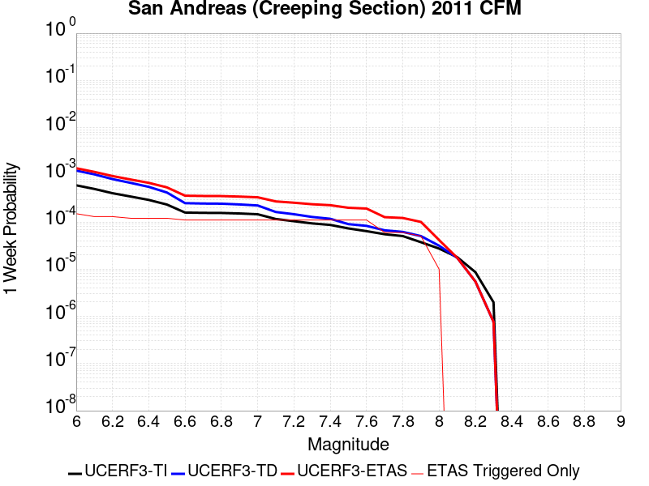 | 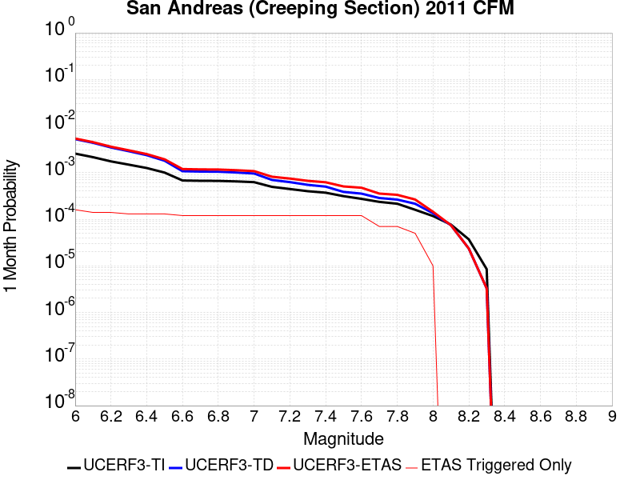 | 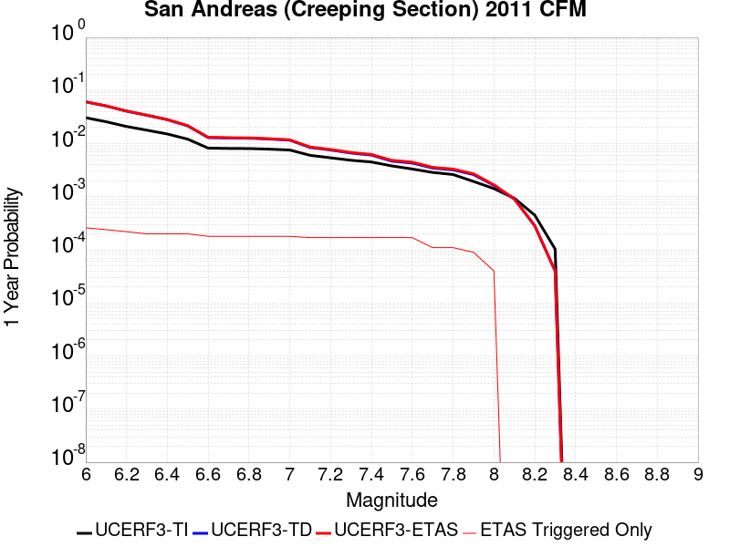 |  |

| Magnitude | 1 wk TI Prob | 1 wk TD Prob | 1 wk ETAS Prob | 1 wk ETAS/TD Gain | 1 wk ETAS Triggered Only | 1 mo TI Prob | 1 mo TD Prob | 1 mo ETAS Prob | 1 mo ETAS/TD Gain | 1 mo ETAS Triggered Only | 1 yr TI Prob | 1 yr TD Prob | 1 yr ETAS Prob | 1 yr ETAS/TD Gain | 1 yr ETAS Triggered Only | 10 yr TI Prob | 10 yr TD Prob | 10 yr ETAS Prob | 10 yr ETAS/TD Gain | 10 yr ETAS Triggered Only |
|-----|-----|-----|-----|-----|-----|-----|-----|-----|-----|-----|-----|-----|-----|-----|-----|-----|-----|-----|-----|-----|
| 6.0 | 5.986481E-4 | 0.001228691 | 0.0013785067 | 1.1219312 | 1.5E-4 | 0.0025631124 | 0.005246795 | 0.0054059555 | 1.0303348 | 1.6E-4 | 0.030762846 | 0.061203245 | 0.061447334 | 1.0039881 | 2.6E-4 | 0.26835477 | 0.425928 | 0.42610598 | 1.0004178 | 3.1E-4 |
| 6.1 | 5.015945E-4 | 0.0010230356 | 0.0011529026 | 1.1269428 | 1.3E-4 | 0.00214792 | 0.004369436 | 0.004508824 | 1.0319008 | 1.4E-4 | 0.025839351 | 0.051246606 | 0.051474307 | 1.0044433 | 2.4E-4 | 0.23032776 | 0.37284943 | 0.37302506 | 1.000471 | 2.8E-4 |
| 6.2 | 4.073338E-4 | 8.1157376E-4 | 9.414682E-4 | 1.1600527 | 1.3E-4 | 0.0017445484 | 0.0034683137 | 0.0036078282 | 1.0402254 | 1.4E-4 | 0.021034058 | 0.04093177 | 0.041142765 | 1.0051548 | 2.2E-4 | 0.19150782 | 0.31302592 | 0.31319764 | 1.0005486 | 2.5E-4 |
| 6.3 | 3.464099E-4 | 6.7455834E-4 | 7.944774E-4 | 1.1777742 | 1.2E-4 | 0.0014837692 | 0.0028832308 | 0.003012856 | 1.0449584 | 1.3E-4 | 0.017915873 | 0.034187846 | 0.03438101 | 1.00565 | 2.0E-4 | 0.16538359 | 0.27130842 | 0.27146873 | 1.0005909 | 2.2E-4 |
| 6.4 | 2.935057E-4 | 5.5516965E-4 | 6.7510305E-4 | 1.2160301 | 1.2E-4 | 0.0012572751 | 0.0023727308 | 0.0025024223 | 1.0546592 | 1.3E-4 | 0.015200248 | 0.02826279 | 0.028457137 | 1.0068765 | 2.0E-4 | 0.14201577 | 0.23297668 | 0.23314542 | 1.0007243 | 2.2E-4 |
| 6.5 | 2.3409708E-4 | 4.2132285E-4 | 5.412723E-4 | 1.2846972 | 1.2E-4 | 0.0010028875 | 0.0018017791 | 0.001931545 | 1.0720209 | 1.3E-4 | 0.012141965 | 0.021586355 | 0.021782037 | 1.0090652 | 2.0E-4 | 0.11499573 | 0.1868149 | 0.18699381 | 1.0009576 | 2.2E-4 |
| 6.6 | 1.5842178E-4 | 2.5068692E-4 | 3.6065935E-4 | 1.4386843 | 1.1E-4 | 6.7877385E-4 | 0.0010739256 | 0.0011937968 | 1.1116196 | 1.2E-4 | 0.0082328 | 0.012995283 | 0.013172944 | 1.0136712 | 1.8E-4 | 0.07934396 | 0.12313759 | 0.123312965 | 1.0014242 | 2.0E-4 |
| 6.7 | 1.5616413E-4 | 2.4605254E-4 | 3.5602547E-4 | 1.446949 | 1.1E-4 | 6.691031E-4 | 0.0010540807 | 0.0011739541 | 1.1137233 | 1.2E-4 | 0.0081159435 | 0.012757154 | 0.012934858 | 1.0139297 | 1.8E-4 | 0.0782586 | 0.12116472 | 0.12134048 | 1.0014507 | 2.0E-4 |
| 6.8 | 1.5538467E-4 | 2.442914E-4 | 3.5426454E-4 | 1.4501718 | 1.1E-4 | 6.6576427E-4 | 0.001046539 | 0.0011664134 | 1.1145437 | 1.2E-4 | 0.008075596 | 0.012666538 | 0.012844258 | 1.0140307 | 1.8E-4 | 0.07788358 | 0.12039561 | 0.120571524 | 1.0014611 | 2.0E-4 |
| 6.9 | 1.5153569E-4 | 2.3538464E-4 | 3.4535874E-4 | 1.4672102 | 1.1E-4 | 6.49277E-4 | 0.0010084033 | 0.0011282823 | 1.11888 | 1.2E-4 | 0.007876333 | 0.012208726 | 0.012386529 | 1.0145636 | 1.8E-4 | 0.07602952 | 0.11646574 | 0.116642445 | 1.0015173 | 2.0E-4 |
| 7.0 | 1.4588932E-4 | 2.2395732E-4 | 3.339327E-4 | 1.491055 | 1.1E-4 | 6.250901E-4 | 9.59466E-4 | 0.0010793508 | 1.1249496 | 1.2E-4 | 0.0075839474 | 0.011619428 | 0.011797336 | 1.0153112 | 1.8E-4 | 0.073302895 | 0.11131206 | 0.1114898 | 1.0015968 | 2.0E-4 |
| 7.1 | 1.1565079E-4 | 1.6281323E-4 | 2.7279533E-4 | 1.6755108 | 1.1E-4 | 4.955521E-4 | 6.9758523E-4 | 8.175015E-4 | 1.171902 | 1.2E-4 | 0.006016669 | 0.008460228 | 0.008628789 | 1.019924 | 1.7E-4 | 0.058563538 | 0.08366478 | 0.08383889 | 1.0020809 | 1.9E-4 |
| 7.2 | 1.0393792E-4 | 1.4615392E-4 | 2.5613784E-4 | 1.7525212 | 1.1E-4 | 4.4537216E-4 | 6.262243E-4 | 7.4614916E-4 | 1.1915046 | 1.2E-4 | 0.005408933 | 0.0075977976 | 0.007766506 | 1.0222049 | 1.7E-4 | 0.052791595 | 0.07561503 | 0.075790666 | 1.0023227 | 1.9E-4 |
| 7.3 | 9.332884E-5 | 1.2780601E-4 | 2.3779194E-4 | 1.8605695 | 1.1E-4 | 3.999194E-4 | 5.4762565E-4 | 6.6756E-4 | 1.2190077 | 1.2E-4 | 0.0048581534 | 0.0066470946 | 0.0068159644 | 1.025405 | 1.7E-4 | 0.047533102 | 0.06647954 | 0.06665691 | 1.002668 | 1.9E-4 |
| 7.4 | 8.670252E-5 | 1.1702972E-4 | 2.2701685E-4 | 1.9398222 | 1.1E-4 | 3.715293E-4 | 5.014601E-4 | 6.2139996E-4 | 1.2391812 | 1.2E-4 | 0.004513991 | 0.0060883067 | 0.006257272 | 1.0277524 | 1.7E-4 | 0.044233937 | 0.061148684 | 0.061327066 | 1.0029172 | 1.9E-4 |
| 7.5 | 7.3036405E-5 | 9.005699E-5 | 2.0004707E-4 | 2.2213387 | 1.1E-4 | 3.129756E-4 | 3.859015E-4 | 5.058552E-4 | 1.3108401 | 1.2E-4 | 0.0038038217 | 0.0046882504 | 0.0048574535 | 1.0360909 | 1.7E-4 | 0.03739367 | 0.047875606 | 0.04805651 | 1.0037786 | 1.9E-4 |
| 7.6 | 6.3935775E-5 | 8.280209E-5 | 1.9279298E-4 | 2.328359 | 1.1E-4 | 2.7398168E-4 | 3.5481792E-4 | 4.7477536E-4 | 1.3380816 | 1.2E-4 | 0.0033306254 | 0.00431137 | 0.004480637 | 1.0392606 | 1.7E-4 | 0.032811474 | 0.043990135 | 0.044171777 | 1.0041292 | 1.9E-4 |
| 7.7 | 5.5050095E-5 | 6.661729E-5 | 1.2661329E-4 | 1.900607 | 6.0E-5 | 2.3590765E-4 | 2.8547147E-4 | 3.5545148E-4 | 1.2451384 | 7.0E-5 | 0.0028683927 | 0.0034700802 | 0.0035796985 | 1.0315895 | 1.1E-4 | 0.0283165 | 0.03579509 | 0.035920434 | 1.0035018 | 1.3E-4 |
| 7.8 | 5.027131E-5 | 6.1627725E-5 | 1.2162403E-4 | 1.9735278 | 6.0E-5 | 2.1543067E-4 | 2.640921E-4 | 3.3407361E-4 | 1.264989 | 7.0E-5 | 0.0026197135 | 0.003210584 | 0.0033202306 | 1.0341517 | 1.1E-4 | 0.025890453 | 0.03312572 | 0.033251412 | 1.0037944 | 1.3E-4 |
| 7.9 | 3.7271806E-5 | 5.0224386E-5 | 1.0022188E-4 | 1.9954823 | 5.0E-5 | 1.5972654E-4 | 2.1522962E-4 | 2.6521887E-4 | 1.23226 | 5.0E-5 | 0.0019429359 | 0.0026172737 | 0.002707038 | 1.0342969 | 9.0E-5 | 0.019260362 | 0.027066687 | 0.027173711 | 1.003954 | 1.1E-4 |
| 8.0 | 2.7310243E-5 | 3.1428404E-5 | 4.142809E-5 | 1.3181735 | 1.0E-5 | 1.17038646E-4 | 1.3468621E-4 | 1.4468486E-4 | 1.0742366 | 1.0E-5 | 0.0014240141 | 0.0016385721 | 0.0016785065 | 1.0243715 | 4.0E-5 | 0.014149235 | 0.01721387 | 0.017253181 | 1.0022837 | 4.0E-5 |
| 8.1 | 1.7940547E-5 | 1.7400796E-5 | 1.7400796E-5 | 1.0 | 0.0 | 7.688579E-5 | 7.457271E-5 | 7.457271E-5 | 1.0 | 0.0 | 9.3568244E-4 | 9.075451E-4 | 9.075451E-4 | 1.0 | 0.0 | 0.009317525 | 0.009799073 | 0.009799073 | 1.0 | 0.0 |
| 8.2 | 8.643924E-6 | 5.4748625E-6 | 5.4748625E-6 | 1.0 | 0.0 | 3.704486E-5 | 2.3463486E-5 | 2.3463486E-5 | 1.0 | 0.0 | 4.5092785E-4 | 2.8563058E-4 | 2.8563058E-4 | 1.0 | 0.0 | 0.0045001395 | 0.0032487072 | 0.0032487072 | 1.0 | 0.0 |
| 8.3 | 1.983087E-6 | 7.6599065E-7 | 7.6599065E-7 | 1.0 | 0.0 | 8.498917E-6 | 3.282813E-6 | 3.282813E-6 | 1.0 | 0.0 | 1.034694E-4 | 3.9967534E-5 | 3.9967534E-5 | 1.0 | 0.0 | 0.0010342124 | 4.719687E-4 | 4.719687E-4 | 1.0 | 0.0 |

## Mission Ridge-Arroyo Parida-Santa Ana
*[(top)](#table-of-contents)*

| 1 Week | 1 Month | 1 Year | 10 Year |
|-----|-----|-----|-----|
|  |  |  |  |

| Magnitude | 1 wk TI Prob | 1 wk TD Prob | 1 wk ETAS Prob | 1 wk ETAS/TD Gain | 1 wk ETAS Triggered Only | 1 mo TI Prob | 1 mo TD Prob | 1 mo ETAS Prob | 1 mo ETAS/TD Gain | 1 mo ETAS Triggered Only | 1 yr TI Prob | 1 yr TD Prob | 1 yr ETAS Prob | 1 yr ETAS/TD Gain | 1 yr ETAS Triggered Only | 10 yr TI Prob | 10 yr TD Prob | 10 yr ETAS Prob | 10 yr ETAS/TD Gain | 10 yr ETAS Triggered Only |
|-----|-----|-----|-----|-----|-----|-----|-----|-----|-----|-----|-----|-----|-----|-----|-----|-----|-----|-----|-----|-----|
| 6.0 | 4.169034E-5 | 4.7138263E-5 | 1.671326E-4 | 3.5455825 | 1.2E-4 | 1.7866064E-4 | 2.0201034E-4 | 3.5198004E-4 | 1.7423862 | 1.5E-4 | 0.0021730233 | 0.00245745 | 0.002666934 | 1.0852444 | 2.1E-4 | 0.021518968 | 0.024384614 | 0.024638275 | 1.0104024 | 2.6E-4 |
| 6.1 | 1.73813E-5 | 1.6854226E-5 | 2.6854057E-5 | 1.593313 | 1.0E-5 | 7.4489166E-5 | 7.223046E-5 | 9.222901E-5 | 1.2768714 | 2.0E-5 | 9.065282E-4 | 8.790618E-4 | 8.990442E-4 | 1.0227315 | 2.0E-5 | 0.009028391 | 0.008756988 | 0.008816463 | 1.0067917 | 6.0E-5 |
| 6.2 | 1.4622182E-5 | 1.367329E-5 | 2.3673152E-5 | 1.7313429 | 1.0E-5 | 6.2664985E-5 | 5.8598518E-5 | 7.8597346E-5 | 1.3412856 | 2.0E-5 | 7.6267915E-4 | 7.132073E-4 | 7.33193E-4 | 1.0280223 | 2.0E-5 | 0.007600669 | 0.007109627 | 0.0071692006 | 1.0083792 | 6.0E-5 |
| 6.3 | 1.3552434E-5 | 1.2482201E-5 | 2.2482076E-5 | 1.8011308 | 1.0E-5 | 5.8080568E-5 | 5.3494066E-5 | 7.3493E-5 | 1.3738532 | 2.0E-5 | 7.069015E-4 | 6.510988E-4 | 6.710858E-4 | 1.0306973 | 2.0E-5 | 0.00704657 | 0.006492275 | 0.00654195 | 1.0076514 | 5.0E-5 |
| 6.4 | 1.30977305E-5 | 1.1979156E-5 | 2.1979036E-5 | 1.8347733 | 1.0E-5 | 5.613192E-5 | 5.1338247E-5 | 7.133722E-5 | 1.3895531 | 2.0E-5 | 6.831918E-4 | 6.248669E-4 | 6.448544E-4 | 1.0319868 | 2.0E-5 | 0.006810953 | 0.0062314444 | 0.006281133 | 1.0079738 | 5.0E-5 |
| 6.5 | 1.225205E-5 | 1.1048803E-5 | 2.1048692E-5 | 1.9050654 | 1.0E-5 | 5.2507727E-5 | 4.7351168E-5 | 6.735022E-5 | 1.422356 | 2.0E-5 | 6.3909404E-4 | 5.7635066E-4 | 5.963392E-4 | 1.0346811 | 2.0E-5 | 0.006372592 | 0.005748869 | 0.0057985815 | 1.0086473 | 5.0E-5 |
| 6.6 | 1.1352241E-5 | 1.0063535E-5 | 2.0063435E-5 | 1.9936767 | 1.0E-5 | 4.8651553E-5 | 4.3128734E-5 | 6.3127874E-5 | 1.4637079 | 2.0E-5 | 5.921717E-4 | 5.2496797E-4 | 5.4495747E-4 | 1.0380776 | 2.0E-5 | 0.0059059616 | 0.0052375244 | 0.0052872626 | 1.0094965 | 5.0E-5 |
| 6.7 | 1.0864116E-5 | 9.517027E-6 | 1.9516932E-5 | 2.0507383 | 1.0E-5 | 4.6559664E-5 | 4.0786632E-5 | 6.0785816E-5 | 1.4903368 | 2.0E-5 | 5.667165E-4 | 4.964661E-4 | 5.164562E-4 | 1.0402647 | 2.0E-5 | 0.005652734 | 0.004953804 | 0.005003556 | 1.0100433 | 5.0E-5 |
| 6.8 | 1.0666365E-5 | 9.299779E-6 | 1.9299685E-5 | 2.0752845 | 1.0E-5 | 4.571219E-5 | 3.9855597E-5 | 5.98548E-5 | 1.5017916 | 2.0E-5 | 5.564038E-4 | 4.8513585E-4 | 5.0512614E-4 | 1.0412055 | 2.0E-5 | 0.005550127 | 0.0048410003 | 0.004890758 | 1.0102785 | 5.0E-5 |
| 6.9 | 1.0038665E-5 | 8.592046E-6 | 1.859196E-5 | 2.1638572 | 1.0E-5 | 4.302214E-5 | 3.682254E-5 | 5.6821806E-5 | 1.5431255 | 2.0E-5 | 5.236687E-4 | 4.4822405E-4 | 4.6821506E-4 | 1.0446005 | 2.0E-5 | 0.005224364 | 0.004473411 | 0.004523187 | 1.0111271 | 5.0E-5 |
| 7.0 | 9.5379955E-6 | 8.025073E-6 | 1.8024994E-5 | 2.2460845 | 1.0E-5 | 4.0876483E-5 | 3.4392728E-5 | 5.439204E-5 | 1.5814983 | 2.0E-5 | 4.975576E-4 | 4.1865272E-4 | 4.3864435E-4 | 1.0477523 | 2.0E-5 | 0.00496445 | 0.0041788397 | 0.0042286306 | 1.0119151 | 5.0E-5 |
| 7.1 | 9.207389E-6 | 7.652375E-6 | 1.7652299E-5 | 2.306774 | 1.0E-5 | 3.945964E-5 | 3.279549E-5 | 5.2794836E-5 | 1.6098199 | 2.0E-5 | 4.803152E-4 | 3.9921363E-4 | 4.1920564E-4 | 1.0500785 | 2.0E-5 | 0.004792784 | 0.003985161 | 0.004034962 | 1.0124966 | 5.0E-5 |
| 7.2 | 7.638091E-6 | 5.9311183E-6 | 1.5931058E-5 | 2.6860127 | 1.0E-5 | 3.2734264E-5 | 2.541883E-5 | 3.5418576E-5 | 1.3933991 | 1.0E-5 | 3.984668E-4 | 3.0943064E-4 | 3.1942755E-4 | 1.0323074 | 1.0E-5 | 0.0039775306 | 0.0030900547 | 0.0031299312 | 1.0129048 | 4.0E-5 |
| 7.3 | 7.2500147E-6 | 5.5961527E-6 | 1.5596097E-5 | 2.786932 | 1.0E-5 | 3.1071122E-5 | 2.3983293E-5 | 3.3983055E-5 | 1.4169469 | 1.0E-5 | 3.7822526E-4 | 2.9195778E-4 | 3.0195486E-4 | 1.0342416 | 1.0E-5 | 0.0037758215 | 0.0029157975 | 0.002955681 | 1.0136784 | 4.0E-5 |
| 7.4 | 6.3899715E-6 | 4.9184964E-6 | 1.4918447E-5 | 3.0331318 | 1.0E-5 | 2.7385306E-5 | 2.10791E-5 | 3.107889E-5 | 1.4743936 | 1.0E-5 | 3.3336508E-4 | 2.5660804E-4 | 2.6660546E-4 | 1.03896 | 1.0E-5 | 0.0033286542 | 0.0025631618 | 0.0026030592 | 1.0155658 | 4.0E-5 |
| 7.5 | 5.379025E-6 | 4.0838527E-6 | 1.4083812E-5 | 3.4486582 | 1.0E-5 | 2.305276E-5 | 1.7502109E-5 | 2.7501934E-5 | 1.5713497 | 1.0E-5 | 2.806312E-4 | 2.1306744E-4 | 2.2306532E-4 | 1.0469235 | 1.0E-5 | 0.0028027708 | 0.002128643 | 0.0021585792 | 1.0140635 | 3.0E-5 |
| 7.6 | 4.1270696E-6 | 3.0883439E-6 | 1.3088313E-5 | 4.2379713 | 1.0E-5 | 1.768732E-5 | 1.3235693E-5 | 2.3235561E-5 | 1.7555227 | 1.0E-5 | 2.1532185E-4 | 1.6113273E-4 | 1.7113112E-4 | 1.0620506 | 1.0E-5 | 0.0021511333 | 0.001610167 | 0.0016401187 | 1.0186017 | 3.0E-5 |
| 7.7 | 2.5406805E-6 | 1.8282013E-6 | 1.8282013E-6 | 1.0 | 0.0 | 1.0888585E-5 | 7.835125E-6 | 7.835125E-6 | 1.0 | 0.0 | 1.3256045E-4 | 9.538854E-5 | 9.538854E-5 | 1.0 | 0.0 | 0.0013248142 | 9.534821E-4 | 9.534821E-4 | 1.0 | 0.0 |
| 7.8 | 4.8608285E-7 | 3.5098864E-7 | 3.5098864E-7 | 1.0 | 0.0 | 2.0832106E-6 | 1.5042363E-6 | 1.5042363E-6 | 1.0 | 0.0 | 2.5362791E-5 | 1.8313924E-5 | 1.8313924E-5 | 1.0 | 0.0 | 2.5359896E-4 | 1.8312426E-4 | 1.8312426E-4 | 1.0 | 0.0 |
| 7.9 | 2.0472514E-8 | 1.2688783E-8 | 1.2688783E-8 | 1.0 | 0.0 | 8.7739345E-8 | 5.43805E-8 | 5.43805E-8 | 1.0 | 0.0 | 1.068226E-6 | 6.6208236E-7 | 6.6208236E-7 | 1.0 | 0.0 | 1.0682209E-5 | 6.620805E-6 | 6.620805E-6 | 1.0 | 0.0 |
| 8.0 | 4.443582E-9 | 2.0321211E-9 | 2.0321211E-9 | 1.0 | 0.0 | 1.9043922E-8 | 8.70909E-9 | 8.70909E-9 | 1.0 | 0.0 | 2.3185973E-7 | 1.0603316E-7 | 1.0603316E-7 | 1.0 | 0.0 | 2.3185949E-6 | 1.0603312E-6 | 1.0603312E-6 | 1.0 | 0.0 |

## Cleghorn Pass
*[(top)](#table-of-contents)*

| 1 Week | 1 Month | 1 Year | 10 Year |
|-----|-----|-----|-----|
|  |  |  |  |

| Magnitude | 1 wk TI Prob | 1 wk TD Prob | 1 wk ETAS Prob | 1 wk ETAS/TD Gain | 1 wk ETAS Triggered Only | 1 mo TI Prob | 1 mo TD Prob | 1 mo ETAS Prob | 1 mo ETAS/TD Gain | 1 mo ETAS Triggered Only | 1 yr TI Prob | 1 yr TD Prob | 1 yr ETAS Prob | 1 yr ETAS/TD Gain | 1 yr ETAS Triggered Only | 10 yr TI Prob | 10 yr TD Prob | 10 yr ETAS Prob | 10 yr ETAS/TD Gain | 10 yr ETAS Triggered Only |
|-----|-----|-----|-----|-----|-----|-----|-----|-----|-----|-----|-----|-----|-----|-----|-----|-----|-----|-----|-----|-----|
| 6.0 | 1.0522846E-5 | 1.1040642E-5 | 1.3103931E-4 | 11.8688135 | 1.2E-4 | 4.509713E-5 | 4.7316473E-5 | 1.9730937E-4 | 4.1699934 | 1.5E-4 | 5.4891926E-4 | 5.759784E-4 | 8.358287E-4 | 1.4511458 | 2.6E-4 | 0.0054756533 | 0.005750022 | 0.0060482966 | 1.0518737 | 3.0E-4 |
| 6.1 | 1.0522846E-5 | 1.1040642E-5 | 1.3103931E-4 | 11.8688135 | 1.2E-4 | 4.509713E-5 | 4.7316473E-5 | 1.9730937E-4 | 4.1699934 | 1.5E-4 | 5.4891926E-4 | 5.759784E-4 | 8.358287E-4 | 1.4511458 | 2.6E-4 | 0.0054756533 | 0.005750022 | 0.0060482966 | 1.0518737 | 3.0E-4 |
| 6.2 | 2.1045846E-6 | 2.2082024E-6 | 2.2208158E-5 | 10.05712 | 2.0E-5 | 9.019617E-6 | 9.463714E-6 | 3.946343E-5 | 4.169973 | 3.0E-5 | 1.098083E-4 | 1.1521882E-4 | 1.6521306E-4 | 1.4339069 | 5.0E-5 | 0.0010975406 | 0.0011520023 | 0.0012019447 | 1.0433527 | 5.0E-5 |
| 6.3 | 2.1045846E-6 | 2.2082024E-6 | 2.2208158E-5 | 10.05712 | 2.0E-5 | 9.019617E-6 | 9.463714E-6 | 3.946343E-5 | 4.169973 | 3.0E-5 | 1.098083E-4 | 1.1521882E-4 | 1.6521306E-4 | 1.4339069 | 5.0E-5 | 0.0010975406 | 0.0011520023 | 0.0012019447 | 1.0433527 | 5.0E-5 |
| 6.4 | 1.7259927E-6 | 1.810877E-6 | 2.1810842E-5 | 12.044352 | 2.0E-5 | 7.3970905E-6 | 7.760902E-6 | 3.776067E-5 | 4.8655 | 3.0E-5 | 9.005586E-5 | 9.4488976E-5 | 1.4448425E-4 | 1.5291122 | 5.0E-5 | 9.001937E-4 | 9.448898E-4 | 9.948425E-4 | 1.0528662 | 5.0E-5 |

## San Jacinto (San Jacinto Valley) rev
*[(top)](#table-of-contents)*

| 1 Week | 1 Month | 1 Year | 10 Year |
|-----|-----|-----|-----|
|  |  |  |  |

| Magnitude | 1 wk TI Prob | 1 wk TD Prob | 1 wk ETAS Prob | 1 wk ETAS/TD Gain | 1 wk ETAS Triggered Only | 1 mo TI Prob | 1 mo TD Prob | 1 mo ETAS Prob | 1 mo ETAS/TD Gain | 1 mo ETAS Triggered Only | 1 yr TI Prob | 1 yr TD Prob | 1 yr ETAS Prob | 1 yr ETAS/TD Gain | 1 yr ETAS Triggered Only | 10 yr TI Prob | 10 yr TD Prob | 10 yr ETAS Prob | 10 yr ETAS/TD Gain | 10 yr ETAS Triggered Only |
|-----|-----|-----|-----|-----|-----|-----|-----|-----|-----|-----|-----|-----|-----|-----|-----|-----|-----|-----|-----|-----|
| 6.0 | 3.652694E-5 | 3.4402394E-5 | 2.3439551E-4 | 6.8133492 | 2.0E-4 | 1.5653463E-4 | 1.474305E-4 | 3.8739512E-4 | 2.6276457 | 2.4E-4 | 0.0019041431 | 0.00179349 | 0.00208297 | 1.1614059 | 2.9E-4 | 0.018879099 | 0.018526595 | 0.018850481 | 1.0174823 | 3.3E-4 |
| 6.1 | 3.652694E-5 | 3.4402394E-5 | 2.3439551E-4 | 6.8133492 | 2.0E-4 | 1.5653463E-4 | 1.474305E-4 | 3.8739512E-4 | 2.6276457 | 2.4E-4 | 0.0019041431 | 0.00179349 | 0.00208297 | 1.1614059 | 2.9E-4 | 0.018879099 | 0.018526595 | 0.018850481 | 1.0174823 | 3.3E-4 |
| 6.2 | 3.652694E-5 | 3.4402394E-5 | 2.3439551E-4 | 6.8133492 | 2.0E-4 | 1.5653463E-4 | 1.474305E-4 | 3.8739512E-4 | 2.6276457 | 2.4E-4 | 0.0019041431 | 0.00179349 | 0.00208297 | 1.1614059 | 2.9E-4 | 0.018879099 | 0.018526595 | 0.018850481 | 1.0174823 | 3.3E-4 |
| 6.3 | 3.652694E-5 | 3.4402394E-5 | 2.3439551E-4 | 6.8133492 | 2.0E-4 | 1.5653463E-4 | 1.474305E-4 | 3.8739512E-4 | 2.6276457 | 2.4E-4 | 0.0019041431 | 0.00179349 | 0.00208297 | 1.1614059 | 2.9E-4 | 0.018879099 | 0.018526595 | 0.018850481 | 1.0174823 | 3.3E-4 |
| 6.4 | 3.646941E-5 | 3.432397E-5 | 2.343171E-4 | 6.826632 | 2.0E-4 | 1.5628811E-4 | 1.4709444E-4 | 3.8705915E-4 | 2.6313648 | 2.4E-4 | 0.0019011468 | 0.0017894056 | 0.0020788866 | 1.161775 | 2.9E-4 | 0.018849645 | 0.018486476 | 0.018810375 | 1.0175209 | 3.3E-4 |
| 6.5 | 3.646941E-5 | 3.432397E-5 | 2.343171E-4 | 6.826632 | 2.0E-4 | 1.5628811E-4 | 1.4709444E-4 | 3.8705915E-4 | 2.6313648 | 2.4E-4 | 0.0019011468 | 0.0017894056 | 0.0020788866 | 1.161775 | 2.9E-4 | 0.018849645 | 0.018486476 | 0.018810375 | 1.0175209 | 3.3E-4 |
| 6.6 | 3.6442503E-5 | 3.4287354E-5 | 2.342805E-4 | 6.8328543 | 2.0E-4 | 1.561728E-4 | 1.4693754E-4 | 3.8690228E-4 | 2.633107 | 2.4E-4 | 0.0018997455 | 0.0017874985 | 0.0020769802 | 1.1619478 | 2.9E-4 | 0.018835869 | 0.018467745 | 0.018791651 | 1.017539 | 3.3E-4 |
| 6.7 | 3.6432113E-5 | 3.4272925E-5 | 2.3426607E-4 | 6.83531 | 2.0E-4 | 1.5612828E-4 | 1.4687571E-4 | 3.8684046E-4 | 2.6337945 | 2.4E-4 | 0.0018992044 | 0.0017867472 | 0.002076229 | 1.1620162 | 2.9E-4 | 0.018830549 | 0.018460369 | 0.018784277 | 1.0175462 | 3.3E-4 |
| 6.8 | 3.6409598E-5 | 3.424198E-5 | 2.3423514E-4 | 6.8405833 | 2.0E-4 | 1.560318E-4 | 1.4674311E-4 | 3.867079E-4 | 2.6352713 | 2.4E-4 | 0.0018980318 | 0.0017851355 | 0.0020746177 | 1.1621627 | 2.9E-4 | 0.018819023 | 0.018444523 | 0.018768437 | 1.0175614 | 3.3E-4 |
| 6.9 | 3.638078E-5 | 3.4202407E-5 | 2.3419557E-4 | 6.847342 | 2.0E-4 | 1.5590832E-4 | 1.4657351E-4 | 3.8653833E-4 | 2.6371636 | 2.4E-4 | 0.0018965311 | 0.001783074 | 0.0020725569 | 1.1623504 | 2.9E-4 | 0.018804269 | 0.018424258 | 0.018748177 | 1.0175812 | 3.3E-4 |
| 7.0 | 3.6294874E-5 | 3.408442E-5 | 2.340776E-4 | 6.8675838 | 2.0E-4 | 1.5554018E-4 | 1.4606792E-4 | 3.8603286E-4 | 2.6428313 | 2.4E-4 | 0.0018920569 | 0.001776929 | 0.0020664136 | 1.162913 | 2.9E-4 | 0.018760284 | 0.018363839 | 0.01868778 | 1.0176401 | 3.3E-4 |
| 7.1 | 3.6260717E-5 | 3.4040702E-5 | 2.340339E-4 | 6.875119 | 2.0E-4 | 1.5539382E-4 | 1.4588058E-4 | 3.8584557E-4 | 2.6449413 | 2.4E-4 | 0.001890278 | 0.0017746518 | 0.0020641373 | 1.1631223 | 2.9E-4 | 0.018742796 | 0.018341439 | 0.018665386 | 1.017662 | 3.3E-4 |
| 7.2 | 3.6210204E-5 | 3.397492E-5 | 2.3396812E-4 | 6.886495 | 2.0E-4 | 1.5517735E-4 | 1.455987E-4 | 3.8556376E-4 | 2.6481264 | 2.4E-4 | 0.001887647 | 0.0017712255 | 0.0020607118 | 1.1634384 | 2.9E-4 | 0.01871693 | 0.01830772 | 0.018631678 | 1.0176952 | 3.3E-4 |
| 7.3 | 3.6119454E-5 | 3.386321E-5 | 2.3385644E-4 | 6.9059153 | 2.0E-4 | 1.5478847E-4 | 1.4511998E-4 | 3.8508515E-4 | 2.653564 | 2.4E-4 | 0.0018829206 | 0.0017654065 | 0.0020548946 | 1.1639781 | 2.9E-4 | 0.018670462 | 0.018250274 | 0.01857425 | 1.0177519 | 3.3E-4 |
| 7.4 | 3.607848E-5 | 3.381071E-5 | 2.3380395E-4 | 6.915086 | 2.0E-4 | 1.5461289E-4 | 1.44895E-4 | 3.8486024E-4 | 2.6561317 | 2.4E-4 | 0.0018807866 | 0.0017626719 | 0.0020521607 | 1.164233 | 2.9E-4 | 0.018649481 | 0.018223269 | 0.018547254 | 1.0177788 | 3.3E-4 |
| 7.5 | 3.5856774E-5 | 3.3620483E-5 | 2.3361375E-4 | 6.948555 | 2.0E-4 | 1.5366284E-4 | 1.4407984E-4 | 3.8404524E-4 | 2.6655033 | 2.4E-4 | 0.0018692396 | 0.0017527633 | 0.002042255 | 1.165163 | 2.9E-4 | 0.018535944 | 0.018124366 | 0.018448386 | 1.0178776 | 3.3E-4 |
| 7.6 | 3.286655E-5 | 3.2143445E-5 | 2.3213701E-4 | 7.221908 | 2.0E-4 | 1.4084904E-4 | 1.3775036E-4 | 3.777173E-4 | 2.742042 | 2.4E-4 | 0.001713488 | 0.0016758227 | 0.0019653365 | 1.1727593 | 2.9E-4 | 0.017003361 | 0.017344031 | 0.017668307 | 1.0186967 | 3.3E-4 |
| 7.7 | 2.8882527E-5 | 2.9236293E-5 | 2.2923044E-4 | 7.8406124 | 2.0E-4 | 1.237764E-4 | 1.2529238E-4 | 3.6526233E-4 | 2.9152794 | 2.4E-4 | 0.0015059357 | 0.0015243685 | 0.0018139265 | 1.1899527 | 2.9E-4 | 0.014957713 | 0.015830461 | 0.016155237 | 1.0205159 | 3.3E-4 |
| 7.8 | 2.4950225E-5 | 2.6527203E-5 | 2.265219E-4 | 8.53923 | 2.0E-4 | 1.0692515E-4 | 1.1368306E-4 | 3.5365578E-4 | 3.1108923 | 2.4E-4 | 0.0013010362 | 0.0013832134 | 0.0016628262 | 1.2021472 | 2.8E-4 | 0.012934455 | 0.014411755 | 0.014727143 | 1.0218841 | 3.2E-4 |
| 7.9 | 1.9881603E-5 | 2.1507445E-5 | 2.2150314E-4 | 10.298905 | 2.0E-4 | 8.520408E-5 | 9.217151E-5 | 3.321494E-4 | 3.6036015 | 2.4E-4 | 0.001036866 | 0.0011216112 | 0.0014012972 | 1.2493609 | 2.8E-4 | 0.010320415 | 0.011777027 | 0.012083376 | 1.0260124 | 3.1E-4 |
| 8.0 | 1.563292E-5 | 1.5937347E-5 | 2.1593415E-4 | 13.548941 | 2.0E-4 | 6.6996516E-5 | 6.8301124E-5 | 3.0828474E-4 | 4.5136113 | 2.4E-4 | 8.153773E-4 | 8.3124964E-4 | 0.0011010253 | 1.3245422 | 2.7E-4 | 0.00812392 | 0.008810506 | 0.009088039 | 1.0315002 | 2.8E-4 |
| 8.1 | 1.0045313E-5 | 8.301802E-6 | 1.0830097E-4 | 13.045477 | 1.0E-4 | 4.305063E-5 | 3.5578672E-5 | 1.4557476E-4 | 4.09163 | 1.1E-4 | 5.2401534E-4 | 4.3308473E-4 | 5.430371E-4 | 1.2538818 | 1.1E-4 | 0.0052278144 | 0.0046591135 | 0.004768601 | 1.0234996 | 1.1E-4 |
| 8.2 | 4.1554413E-6 | 1.5655598E-6 | 1.5655598E-6 | 1.0 | 0.0 | 1.7808914E-5 | 6.709525E-6 | 6.709525E-6 | 1.0 | 0.0 | 2.1680194E-4 | 8.168544E-5 | 8.168544E-5 | 1.0 | 0.0 | 0.0021659054 | 9.482903E-4 | 9.482903E-4 | 1.0 | 0.0 |
| 8.3 | 1.2758221E-6 | 3.6149942E-7 | 3.6149942E-7 | 1.0 | 0.0 | 5.4677976E-6 | 1.5492824E-6 | 1.5492824E-6 | 1.0 | 0.0 | 6.65684E-5 | 1.8862354E-5 | 1.8862354E-5 | 1.0 | 0.0 | 6.6548464E-4 | 2.2751294E-4 | 2.2751294E-4 | 1.0 | 0.0 |

## San Jacinto (Anza) rev
*[(top)](#table-of-contents)*

| 1 Week | 1 Month | 1 Year | 10 Year |
|-----|-----|-----|-----|
|  |  |  |  |

| Magnitude | 1 wk TI Prob | 1 wk TD Prob | 1 wk ETAS Prob | 1 wk ETAS/TD Gain | 1 wk ETAS Triggered Only | 1 mo TI Prob | 1 mo TD Prob | 1 mo ETAS Prob | 1 mo ETAS/TD Gain | 1 mo ETAS Triggered Only | 1 yr TI Prob | 1 yr TD Prob | 1 yr ETAS Prob | 1 yr ETAS/TD Gain | 1 yr ETAS Triggered Only | 10 yr TI Prob | 10 yr TD Prob | 10 yr ETAS Prob | 10 yr ETAS/TD Gain | 10 yr ETAS Triggered Only |
|-----|-----|-----|-----|-----|-----|-----|-----|-----|-----|-----|-----|-----|-----|-----|-----|-----|-----|-----|-----|-----|
| 6.0 | 6.3015636E-5 | 4.3302647E-5 | 2.4329398E-4 | 5.6184554 | 2.0E-4 | 2.7003905E-4 | 1.8556965E-4 | 4.255251E-4 | 2.293075 | 2.4E-4 | 0.0032827691 | 0.0022569813 | 0.0025363492 | 1.1237795 | 2.8E-4 | 0.032346968 | 0.023296192 | 0.023608737 | 1.0134162 | 3.2E-4 |
| 6.1 | 6.3015636E-5 | 4.3302647E-5 | 2.4329398E-4 | 5.6184554 | 2.0E-4 | 2.7003905E-4 | 1.8556965E-4 | 4.255251E-4 | 2.293075 | 2.4E-4 | 0.0032827691 | 0.0022569813 | 0.0025363492 | 1.1237795 | 2.8E-4 | 0.032346968 | 0.023296192 | 0.023608737 | 1.0134162 | 3.2E-4 |
| 6.2 | 6.3015636E-5 | 4.3302647E-5 | 2.4329398E-4 | 5.6184554 | 2.0E-4 | 2.7003905E-4 | 1.8556965E-4 | 4.255251E-4 | 2.293075 | 2.4E-4 | 0.0032827691 | 0.0022569813 | 0.0025363492 | 1.1237795 | 2.8E-4 | 0.032346968 | 0.023296192 | 0.023608737 | 1.0134162 | 3.2E-4 |
| 6.3 | 6.3015636E-5 | 4.3302647E-5 | 2.4329398E-4 | 5.6184554 | 2.0E-4 | 2.7003905E-4 | 1.8556965E-4 | 4.255251E-4 | 2.293075 | 2.4E-4 | 0.0032827691 | 0.0022569813 | 0.0025363492 | 1.1237795 | 2.8E-4 | 0.032346968 | 0.023296192 | 0.023608737 | 1.0134162 | 3.2E-4 |
| 6.4 | 6.3015636E-5 | 4.3302647E-5 | 2.4329398E-4 | 5.6184554 | 2.0E-4 | 2.7003905E-4 | 1.8556965E-4 | 4.255251E-4 | 2.293075 | 2.4E-4 | 0.0032827691 | 0.0022569813 | 0.0025363492 | 1.1237795 | 2.8E-4 | 0.032346968 | 0.023296192 | 0.023608737 | 1.0134162 | 3.2E-4 |
| 6.5 | 5.811017E-5 | 4.0082516E-5 | 2.400745E-4 | 5.9895067 | 2.0E-4 | 2.4901982E-4 | 1.7177092E-4 | 4.117297E-4 | 2.3969698 | 2.4E-4 | 0.0030276014 | 0.002089311 | 0.0023687258 | 1.1337355 | 2.8E-4 | 0.02986684 | 0.021593736 | 0.021906827 | 1.0144991 | 3.2E-4 |
| 6.6 | 5.811017E-5 | 4.0082516E-5 | 2.400745E-4 | 5.9895067 | 2.0E-4 | 2.4901982E-4 | 1.7177092E-4 | 4.117297E-4 | 2.3969698 | 2.4E-4 | 0.0030276014 | 0.002089311 | 0.0023687258 | 1.1337355 | 2.8E-4 | 0.02986684 | 0.021593736 | 0.021906827 | 1.0144991 | 3.2E-4 |
| 6.7 | 5.712442E-5 | 3.9505223E-5 | 2.3949733E-4 | 6.062422 | 2.0E-4 | 2.4479596E-4 | 1.6929714E-4 | 4.0925652E-4 | 2.4173858 | 2.4E-4 | 0.0029763177 | 0.0020592497 | 0.002338673 | 1.1356919 | 2.8E-4 | 0.029367693 | 0.021285562 | 0.02159875 | 1.0147136 | 3.2E-4 |
| 6.8 | 5.6967532E-5 | 3.9361643E-5 | 2.3935377E-4 | 6.0808887 | 2.0E-4 | 2.4412372E-4 | 1.6868189E-4 | 4.086414E-4 | 2.4225566 | 2.4E-4 | 0.0029681553 | 0.002051773 | 0.0023311984 | 1.1361873 | 2.8E-4 | 0.029288229 | 0.021210281 | 0.021523494 | 1.014767 | 3.2E-4 |
| 6.9 | 5.6211324E-5 | 3.9066435E-5 | 2.3905862E-4 | 6.119284 | 2.0E-4 | 2.4088343E-4 | 1.6741687E-4 | 4.0737668E-4 | 2.4333074 | 2.4E-4 | 0.0029288116 | 0.0020364004 | 0.0023158302 | 1.1372175 | 2.8E-4 | 0.028905109 | 0.021049714 | 0.021362977 | 1.0148821 | 3.2E-4 |
| 7.0 | 5.4383527E-5 | 3.792697E-5 | 2.3791939E-4 | 6.2730923 | 2.0E-4 | 2.3305144E-4 | 1.6253405E-4 | 4.0249503E-4 | 2.4763737 | 2.4E-4 | 0.0028337094 | 0.001977061 | 0.0022565073 | 1.1413443 | 2.8E-4 | 0.027978465 | 0.020440677 | 0.020754136 | 1.0153351 | 3.2E-4 |
| 7.1 | 5.1393665E-5 | 3.6389913E-5 | 2.3638264E-4 | 6.4958286 | 2.0E-4 | 2.2023996E-4 | 1.5594746E-4 | 3.9591003E-4 | 2.5387397 | 2.4E-4 | 0.0026781242 | 0.0018970112 | 0.0021764801 | 1.1473206 | 2.8E-4 | 0.026460782 | 0.019614287 | 0.01992801 | 1.0159947 | 3.2E-4 |
| 7.2 | 4.785222E-5 | 3.4741795E-5 | 2.3473485E-4 | 6.7565546 | 2.0E-4 | 2.0506482E-4 | 1.4888494E-4 | 3.888492E-4 | 2.6117432 | 2.4E-4 | 0.0024938055 | 0.0018111705 | 0.0020906634 | 1.1543162 | 2.8E-4 | 0.024660049 | 0.018728992 | 0.019042999 | 1.0167658 | 3.2E-4 |
| 7.3 | 4.2143256E-5 | 3.383628E-5 | 2.3382952E-4 | 6.9106154 | 2.0E-4 | 1.8060145E-4 | 1.4500458E-4 | 3.8496978E-4 | 2.65488 | 2.4E-4 | 0.002196605 | 0.0017640047 | 0.0020435108 | 1.1584498 | 2.8E-4 | 0.02175019 | 0.01823724 | 0.018551406 | 1.0172265 | 3.2E-4 |
| 7.4 | 4.0264713E-5 | 3.347446E-5 | 2.3346777E-4 | 6.9745035 | 2.0E-4 | 1.7255165E-4 | 1.4345412E-4 | 3.8341968E-4 | 2.6727688 | 2.4E-4 | 0.002098792 | 0.0017451581 | 0.0020246694 | 1.1601639 | 2.8E-4 | 0.020790804 | 0.018041821 | 0.018356048 | 1.0174166 | 3.2E-4 |
| 7.5 | 3.694492E-5 | 3.218847E-5 | 2.3218204E-4 | 7.2132053 | 2.0E-4 | 1.5832575E-4 | 1.379433E-4 | 3.7791018E-4 | 2.7396054 | 2.4E-4 | 0.0019259118 | 0.001678169 | 0.0019576992 | 1.1665685 | 2.8E-4 | 0.01909306 | 0.01735827 | 0.017672716 | 1.018115 | 3.2E-4 |
| 7.6 | 3.200565E-5 | 2.9504106E-5 | 2.2949821E-4 | 7.7785172 | 2.0E-4 | 1.3715986E-4 | 1.2644005E-4 | 3.6640972E-4 | 2.8978927 | 2.4E-4 | 0.001668642 | 0.0015383229 | 0.0018178922 | 1.1817364 | 2.8E-4 | 0.01656168 | 0.0159463 | 0.016261198 | 1.0197474 | 3.2E-4 |
| 7.7 | 2.731642E-5 | 2.6092788E-5 | 2.2608756E-4 | 8.664753 | 2.0E-4 | 1.1706512E-4 | 1.1182144E-4 | 3.5179462E-4 | 3.1460388 | 2.4E-4 | 0.001424336 | 0.0013605768 | 0.0016401958 | 1.205515 | 2.8E-4 | 0.014152412 | 0.014167004 | 0.014482471 | 1.0222677 | 3.2E-4 |
| 7.8 | 2.3466424E-5 | 2.3504817E-5 | 2.2350012E-4 | 9.508694 | 2.0E-4 | 1.0056651E-4 | 1.0073105E-4 | 3.4070687E-4 | 3.382342 | 2.4E-4 | 0.0012237094 | 0.0012257113 | 0.0014953804 | 1.2200103 | 2.7E-4 | 0.012169928 | 0.012808893 | 0.013114922 | 1.0238919 | 3.1E-4 |
| 7.9 | 1.8611925E-5 | 1.8908117E-5 | 2.1890433E-4 | 11.577268 | 2.0E-4 | 7.9762955E-5 | 8.1032274E-5 | 3.2101283E-4 | 3.9615428 | 2.4E-4 | 9.7068126E-4 | 9.861222E-4 | 0.0012558559 | 1.2735298 | 2.7E-4 | 0.0096645225 | 0.010393824 | 0.010690706 | 1.0285633 | 3.0E-4 |
| 8.0 | 1.5460775E-5 | 1.5740965E-5 | 2.1573782E-4 | 13.705502 | 2.0E-4 | 6.6258784E-5 | 6.7459536E-5 | 3.0744335E-4 | 4.5574484 | 2.4E-4 | 8.0640207E-4 | 8.21011E-4 | 0.0010907893 | 1.3285928 | 2.7E-4 | 0.008034821 | 0.0087028835 | 0.0089804465 | 1.0318933 | 2.8E-4 |
| 8.1 | 9.983884E-6 | 8.269952E-6 | 1.0826912E-4 | 13.091869 | 1.0E-4 | 4.2787375E-5 | 3.544217E-5 | 1.4543827E-4 | 4.103537 | 1.1E-4 | 5.2081177E-4 | 4.314235E-4 | 5.4137607E-4 | 1.2548599 | 1.1E-4 | 0.0051959283 | 0.004640022 | 0.004749512 | 1.0235968 | 1.1E-4 |
| 8.2 | 4.1226E-6 | 1.5529788E-6 | 1.5529788E-6 | 1.0 | 0.0 | 1.7668166E-5 | 6.6556063E-6 | 6.6556063E-6 | 1.0 | 0.0 | 2.1508869E-4 | 8.102902E-5 | 8.102902E-5 | 1.0 | 0.0 | 0.0021488064 | 9.4050163E-4 | 9.4050163E-4 | 1.0 | 0.0 |
| 8.3 | 1.2750878E-6 | 3.612133E-7 | 3.612133E-7 | 1.0 | 0.0 | 5.4646503E-6 | 1.548056E-6 | 1.548056E-6 | 1.0 | 0.0 | 6.653009E-5 | 1.8847424E-5 | 1.8847424E-5 | 1.0 | 0.0 | 6.6510175E-4 | 2.2734253E-4 | 2.2734253E-4 | 1.0 | 0.0 |

## San Jacinto (Stepovers Combined)
*[(top)](#table-of-contents)*

| 1 Week | 1 Month | 1 Year | 10 Year |
|-----|-----|-----|-----|
|  |  |  |  |

| Magnitude | 1 wk TI Prob | 1 wk TD Prob | 1 wk ETAS Prob | 1 wk ETAS/TD Gain | 1 wk ETAS Triggered Only | 1 mo TI Prob | 1 mo TD Prob | 1 mo ETAS Prob | 1 mo ETAS/TD Gain | 1 mo ETAS Triggered Only | 1 yr TI Prob | 1 yr TD Prob | 1 yr ETAS Prob | 1 yr ETAS/TD Gain | 1 yr ETAS Triggered Only | 10 yr TI Prob | 10 yr TD Prob | 10 yr ETAS Prob | 10 yr ETAS/TD Gain | 10 yr ETAS Triggered Only |
|-----|-----|-----|-----|-----|-----|-----|-----|-----|-----|-----|-----|-----|-----|-----|-----|-----|-----|-----|-----|-----|
| 6.0 | 4.0667746E-5 | 3.5272755E-5 | 2.352657E-4 | 6.6698985 | 2.0E-4 | 1.742787E-4 | 1.5116022E-4 | 3.9112393E-4 | 2.5874794 | 2.4E-4 | 0.0021197782 | 0.0018388226 | 0.0021183079 | 1.1519914 | 2.8E-4 | 0.020996714 | 0.018986892 | 0.019300817 | 1.0165337 | 3.2E-4 |
| 6.1 | 4.0667746E-5 | 3.5272755E-5 | 2.352657E-4 | 6.6698985 | 2.0E-4 | 1.742787E-4 | 1.5116022E-4 | 3.9112393E-4 | 2.5874794 | 2.4E-4 | 0.0021197782 | 0.0018388226 | 0.0021183079 | 1.1519914 | 2.8E-4 | 0.020996714 | 0.018986892 | 0.019300817 | 1.0165337 | 3.2E-4 |
| 6.2 | 4.0667746E-5 | 3.5272755E-5 | 2.352657E-4 | 6.6698985 | 2.0E-4 | 1.742787E-4 | 1.5116022E-4 | 3.9112393E-4 | 2.5874794 | 2.4E-4 | 0.0021197782 | 0.0018388226 | 0.0021183079 | 1.1519914 | 2.8E-4 | 0.020996714 | 0.018986892 | 0.019300817 | 1.0165337 | 3.2E-4 |
| 6.3 | 4.0667746E-5 | 3.5272755E-5 | 2.352657E-4 | 6.6698985 | 2.0E-4 | 1.742787E-4 | 1.5116022E-4 | 3.9112393E-4 | 2.5874794 | 2.4E-4 | 0.0021197782 | 0.0018388226 | 0.0021183079 | 1.1519914 | 2.8E-4 | 0.020996714 | 0.018986892 | 0.019300817 | 1.0165337 | 3.2E-4 |
| 6.4 | 4.0577226E-5 | 3.5144654E-5 | 2.3513763E-4 | 6.6905656 | 2.0E-4 | 1.738908E-4 | 1.5061127E-4 | 3.9057512E-4 | 2.5932662 | 2.4E-4 | 0.0021150648 | 0.0018321523 | 0.0021116394 | 1.1525457 | 2.8E-4 | 0.020950472 | 0.018921461 | 0.019235406 | 1.016592 | 3.2E-4 |
| 6.5 | 4.0577226E-5 | 3.5144654E-5 | 2.3513763E-4 | 6.6905656 | 2.0E-4 | 1.738908E-4 | 1.5061127E-4 | 3.9057512E-4 | 2.5932662 | 2.4E-4 | 0.0021150648 | 0.0018321523 | 0.0021116394 | 1.1525457 | 2.8E-4 | 0.020950472 | 0.018921461 | 0.019235406 | 1.016592 | 3.2E-4 |
| 6.6 | 4.053861E-5 | 3.509E-5 | 2.3508299E-4 | 6.6994295 | 2.0E-4 | 1.7372532E-4 | 1.5037706E-4 | 3.9034098E-4 | 2.595748 | 2.4E-4 | 0.0021130538 | 0.0018293057 | 0.0021087935 | 1.1527835 | 2.8E-4 | 0.020930743 | 0.018893538 | 0.019207492 | 1.0166171 | 3.2E-4 |
| 6.7 | 4.0516545E-5 | 3.5059067E-5 | 2.3505205E-4 | 6.704458 | 2.0E-4 | 1.7363077E-4 | 1.5024451E-4 | 3.9020844E-4 | 2.597156 | 2.4E-4 | 0.002111905 | 0.001827695 | 0.0021071832 | 1.1529185 | 2.8E-4 | 0.020919468 | 0.018877735 | 0.019191694 | 1.0166312 | 3.2E-4 |
| 6.8 | 4.049434E-5 | 3.5030633E-5 | 2.3502363E-4 | 6.7090893 | 2.0E-4 | 1.7353562E-4 | 1.5012265E-4 | 3.900866E-4 | 2.5984528 | 2.4E-4 | 0.0021107488 | 0.0018262138 | 0.0021057024 | 1.1530427 | 2.8E-4 | 0.020908125 | 0.018863149 | 0.019177113 | 1.0166442 | 3.2E-4 |
| 6.9 | 4.046386E-5 | 3.499319E-5 | 2.3498619E-4 | 6.7151976 | 2.0E-4 | 1.73405E-4 | 1.4996222E-4 | 3.8992622E-4 | 2.6001632 | 2.4E-4 | 0.0021091616 | 0.0018242638 | 0.002103753 | 1.1532066 | 2.8E-4 | 0.020892553 | 0.01884392 | 0.01915789 | 1.0166616 | 3.2E-4 |
| 7.0 | 4.036382E-5 | 3.487376E-5 | 2.3486678E-4 | 6.7347713 | 2.0E-4 | 1.7297632E-4 | 1.4945042E-4 | 3.8941455E-4 | 2.6056437 | 2.4E-4 | 0.0021039525 | 0.0018180435 | 0.0020975345 | 1.1537317 | 2.8E-4 | 0.02084144 | 0.018782536 | 0.019096525 | 1.0167171 | 3.2E-4 |
| 7.1 | 4.0343282E-5 | 3.4852223E-5 | 2.3484525E-4 | 6.738315 | 2.0E-4 | 1.7288832E-4 | 1.4935812E-4 | 3.893223E-4 | 2.606636 | 2.4E-4 | 0.002102883 | 0.0018169218 | 0.0020964132 | 1.1538268 | 2.8E-4 | 0.020830948 | 0.018771412 | 0.019085405 | 1.0167272 | 3.2E-4 |
| 7.2 | 4.0257353E-5 | 3.4756722E-5 | 2.3474976E-4 | 6.7540827 | 2.0E-4 | 1.725201E-4 | 1.489489E-4 | 3.8891315E-4 | 2.6110508 | 2.4E-4 | 0.0020984085 | 0.0018119477 | 0.0020914404 | 1.1542499 | 2.8E-4 | 0.020787042 | 0.018722152 | 0.01903616 | 1.016772 | 3.2E-4 |
| 7.3 | 3.9940667E-5 | 3.4584376E-5 | 2.3457746E-4 | 6.7827578 | 2.0E-4 | 1.7116306E-4 | 1.4821035E-4 | 3.8817478E-4 | 2.61908 | 2.4E-4 | 0.0020819185 | 0.0018029709 | 0.0020824661 | 1.1550193 | 2.8E-4 | 0.020625217 | 0.018630784 | 0.018944822 | 1.0168558 | 3.2E-4 |
| 7.4 | 3.9721202E-5 | 3.4469766E-5 | 2.3446287E-4 | 6.801986 | 2.0E-4 | 1.7022261E-4 | 1.4771923E-4 | 3.8768377E-4 | 2.6244638 | 2.4E-4 | 0.0020704903 | 0.0017970012 | 0.002076498 | 1.1555351 | 2.8E-4 | 0.020513052 | 0.018569905 | 0.018883964 | 1.0169122 | 3.2E-4 |
| 7.5 | 3.7036873E-5 | 3.3537188E-5 | 2.3353047E-4 | 6.9633293 | 2.0E-4 | 1.5871979E-4 | 1.437229E-4 | 3.836884E-4 | 2.66964 | 2.4E-4 | 0.0019307006 | 0.0017484248 | 0.0020279353 | 1.1598642 | 2.8E-4 | 0.019140124 | 0.018071463 | 0.01838568 | 1.0173875 | 3.2E-4 |
| 7.6 | 3.2940967E-5 | 3.1317984E-5 | 2.3131173E-4 | 7.3859067 | 2.0E-4 | 1.4116794E-4 | 1.3421304E-4 | 3.7418085E-4 | 2.7879617 | 2.4E-4 | 0.0017173645 | 0.0016328214 | 0.0019123642 | 1.1712023 | 2.8E-4 | 0.01704153 | 0.016904354 | 0.017218944 | 1.01861 | 3.2E-4 |
| 7.7 | 2.8236149E-5 | 2.7883889E-5 | 2.278783E-4 | 8.1724 | 2.0E-4 | 1.2100645E-4 | 1.19496915E-4 | 3.5946825E-4 | 3.0081801 | 2.4E-4 | 0.0014722579 | 0.001453905 | 0.001733498 | 1.1923048 | 2.8E-4 | 0.014625421 | 0.015115095 | 0.015430259 | 1.0208509 | 3.2E-4 |
| 7.8 | 2.4329287E-5 | 2.5207537E-5 | 2.252025E-4 | 8.933935 | 2.0E-4 | 1.042642E-4 | 1.0802783E-4 | 3.480019E-4 | 3.2214098 | 2.4E-4 | 0.0012686774 | 0.0013144462 | 0.0015840912 | 1.2051398 | 2.7E-4 | 0.012614589 | 0.013712396 | 0.014018145 | 1.0222973 | 3.1E-4 |
| 7.9 | 1.9370926E-5 | 2.0421452E-5 | 2.2041737E-4 | 10.793423 | 2.0E-4 | 8.301561E-5 | 8.7517576E-5 | 3.2749656E-4 | 3.7420664 | 2.4E-4 | 0.0010102465 | 0.0010650064 | 0.0013347189 | 1.2532496 | 2.7E-4 | 0.0100566605 | 0.011199483 | 0.011496122 | 1.026487 | 3.0E-4 |
| 8.0 | 1.5583017E-5 | 1.588647E-5 | 2.158833E-4 | 13.58913 | 2.0E-4 | 6.6782646E-5 | 6.808309E-5 | 3.0806675E-4 | 4.524864 | 2.4E-4 | 8.127754E-4 | 8.285971E-4 | 0.0010983733 | 1.325582 | 2.7E-4 | 0.008098091 | 0.008781809 | 0.009059351 | 1.031604 | 2.8E-4 |
| 8.1 | 1.0024873E-5 | 8.292404E-6 | 1.0829158E-4 | 13.059129 | 1.0E-4 | 4.2963035E-5 | 3.5538393E-5 | 1.4553449E-4 | 4.0951343 | 1.1E-4 | 5.229494E-4 | 4.3259456E-4 | 5.42547E-4 | 1.2541697 | 1.1E-4 | 0.0052172043 | 0.0046534105 | 0.0047628987 | 1.0235286 | 1.1E-4 |
| 8.2 | 4.142796E-6 | 1.5610041E-6 | 1.5610041E-6 | 1.0 | 0.0 | 1.775472E-5 | 6.69E-6 | 6.69E-6 | 1.0 | 0.0 | 2.1614227E-4 | 8.144774E-5 | 8.144774E-5 | 1.0 | 0.0 | 0.0021593217 | 9.454649E-4 | 9.454649E-4 | 1.0 | 0.0 |
| 8.3 | 1.2750878E-6 | 3.612133E-7 | 3.612133E-7 | 1.0 | 0.0 | 5.4646503E-6 | 1.548056E-6 | 1.548056E-6 | 1.0 | 0.0 | 6.653009E-5 | 1.8847424E-5 | 1.8847424E-5 | 1.0 | 0.0 | 6.6510175E-4 | 2.2734253E-4 | 2.2734253E-4 | 1.0 | 0.0 |

## Chino alt 1
*[(top)](#table-of-contents)*

| 1 Week | 1 Month | 1 Year | 10 Year |
|-----|-----|-----|-----|
|  |  |  |  |

| Magnitude | 1 wk TI Prob | 1 wk TD Prob | 1 wk ETAS Prob | 1 wk ETAS/TD Gain | 1 wk ETAS Triggered Only | 1 mo TI Prob | 1 mo TD Prob | 1 mo ETAS Prob | 1 mo ETAS/TD Gain | 1 mo ETAS Triggered Only | 1 yr TI Prob | 1 yr TD Prob | 1 yr ETAS Prob | 1 yr ETAS/TD Gain | 1 yr ETAS Triggered Only | 10 yr TI Prob | 10 yr TD Prob | 10 yr ETAS Prob | 10 yr ETAS/TD Gain | 10 yr ETAS Triggered Only |
|-----|-----|-----|-----|-----|-----|-----|-----|-----|-----|-----|-----|-----|-----|-----|-----|-----|-----|-----|-----|-----|
| 6.0 | 3.939946E-5 | 4.8948554E-5 | 1.3894415E-4 | 2.8385751 | 9.0E-5 | 1.6884391E-4 | 2.097656E-4 | 3.2974043E-4 | 1.5719471 | 1.2E-4 | 0.0020537362 | 0.0025513945 | 0.002780808 | 1.0899168 | 2.3E-4 | 0.020348595 | 0.025277847 | 0.025541022 | 1.0104113 | 2.7E-4 |
| 6.1 | 2.1505624E-5 | 2.6879026E-5 | 8.6877415E-5 | 3.2321637 | 6.0E-5 | 9.2163704E-5 | 1.1519137E-4 | 1.8518331E-4 | 1.6076144 | 7.0E-5 | 0.0011215154 | 0.001401664 | 0.0015314817 | 1.0926169 | 1.3E-4 | 0.011158722 | 0.013945141 | 0.014083189 | 1.0098994 | 1.4E-4 |
| 6.2 | 2.1505624E-5 | 2.6879026E-5 | 8.6877415E-5 | 3.2321637 | 6.0E-5 | 9.2163704E-5 | 1.1519137E-4 | 1.8518331E-4 | 1.6076144 | 7.0E-5 | 0.0011215154 | 0.001401664 | 0.0015314817 | 1.0926169 | 1.3E-4 | 0.011158722 | 0.013945141 | 0.014083189 | 1.0098994 | 1.4E-4 |
| 6.3 | 1.4290785E-5 | 1.8165128E-5 | 4.8164584E-5 | 2.6514862 | 3.0E-5 | 6.1244784E-5 | 7.784848E-5 | 1.1784537E-4 | 1.5137787 | 4.0E-5 | 7.454001E-4 | 9.4743853E-4 | 0.0010273627 | 1.0843582 | 8.0E-5 | 0.007429048 | 0.0094444575 | 0.009523702 | 1.0083905 | 8.0E-5 |
| 6.4 | 1.4290785E-5 | 1.8165128E-5 | 4.8164584E-5 | 2.6514862 | 3.0E-5 | 6.1244784E-5 | 7.784848E-5 | 1.1784537E-4 | 1.5137787 | 4.0E-5 | 7.454001E-4 | 9.4743853E-4 | 0.0010273627 | 1.0843582 | 8.0E-5 | 0.007429048 | 0.0094444575 | 0.009523702 | 1.0083905 | 8.0E-5 |
| 6.5 | 1.3017944E-5 | 1.6652088E-5 | 3.6651756E-5 | 2.2010305 | 2.0E-5 | 5.5789995E-5 | 7.136439E-5 | 1.01362246E-4 | 1.4203477 | 3.0E-5 | 6.790315E-4 | 8.685589E-4 | 9.3849807E-4 | 1.0805233 | 7.0E-5 | 0.0067696036 | 0.008661949 | 0.008731343 | 1.0080113 | 7.0E-5 |
| 6.6 | 9.470016E-6 | 1.2039424E-5 | 3.2039185E-5 | 2.661189 | 2.0E-5 | 4.058515E-5 | 5.1596704E-5 | 8.159516E-5 | 1.5814024 | 3.0E-5 | 4.940122E-4 | 6.280428E-4 | 6.780114E-4 | 1.0795624 | 5.0E-5 | 0.004929154 | 0.0062718987 | 0.0063215853 | 1.007922 | 5.0E-5 |
| 6.7 | 8.314155E-6 | 1.0407736E-5 | 3.040753E-5 | 2.9216273 | 2.0E-5 | 3.5631605E-5 | 4.4604003E-5 | 7.460266E-5 | 1.6725553 | 3.0E-5 | 4.3372845E-4 | 5.429507E-4 | 5.9292355E-4 | 1.0920393 | 5.0E-5 | 0.004328829 | 0.005425775 | 0.005475504 | 1.0091653 | 5.0E-5 |
| 6.8 | 3.4856364E-6 | 3.8133708E-6 | 1.3813333E-5 | 3.6223419 | 1.0E-5 | 1.4938357E-5 | 1.6342927E-5 | 2.6342763E-5 | 1.6118755 | 1.0E-5 | 1.8185932E-4 | 1.9895904E-4 | 2.1895506E-4 | 1.1005032 | 2.0E-5 | 0.0018171056 | 0.0019894864 | 0.0020094467 | 1.0100329 | 2.0E-5 |
| 6.9 | 2.2645952E-6 | 2.1529022E-6 | 1.2152881E-5 | 5.644883 | 1.0E-5 | 9.705372E-6 | 9.226692E-6 | 1.92266E-5 | 2.083802 | 1.0E-5 | 1.18156495E-4 | 1.123294E-4 | 1.3232716E-4 | 1.1780277 | 2.0E-5 | 0.0011809369 | 0.0011233423 | 0.0011433198 | 1.017784 | 2.0E-5 |
| 7.0 | 1.7864003E-6 | 1.5430785E-6 | 1.1543063E-5 | 7.4805417 | 1.0E-5 | 7.655979E-6 | 6.613177E-6 | 1.661311E-5 | 2.5121226 | 1.0E-5 | 9.3207556E-5 | 8.051251E-5 | 9.0511705E-5 | 1.1241943 | 1.0E-5 | 9.316847E-4 | 8.0528046E-4 | 8.1527245E-4 | 1.012408 | 1.0E-5 |
| 7.1 | 1.7315456E-6 | 1.4733511E-6 | 1.1473337E-5 | 7.7872386 | 1.0E-5 | 7.420889E-6 | 6.3143466E-6 | 1.6314283E-5 | 2.5836852 | 1.0E-5 | 9.034557E-5 | 7.6874516E-5 | 8.687375E-5 | 1.1300721 | 1.0E-5 | 9.0308854E-4 | 7.6891703E-4 | 7.789093E-4 | 1.0129954 | 1.0E-5 |
| 7.2 | 1.6008337E-6 | 1.3574215E-6 | 1.1357408E-5 | 8.366899 | 1.0E-5 | 6.860698E-6 | 5.817508E-6 | 1.581745E-5 | 2.718939 | 1.0E-5 | 8.352579E-5 | 7.082591E-5 | 8.082521E-5 | 1.1411812 | 1.0E-5 | 8.34944E-4 | 7.0845755E-4 | 7.1845046E-4 | 1.0141052 | 1.0E-5 |
| 7.3 | 1.3320939E-6 | 1.121782E-6 | 1.11217705E-5 | 9.914377 | 1.0E-5 | 5.7089615E-6 | 4.807629E-6 | 1.4807581E-5 | 3.0800176 | 1.0E-5 | 6.9504385E-5 | 5.8531357E-5 | 6.853077E-5 | 1.1708386 | 1.0E-5 | 6.9482654E-4 | 5.8530393E-4 | 5.952981E-4 | 1.0170752 | 1.0E-5 |
| 7.4 | 1.114294E-6 | 9.237111E-7 | 1.0923702E-5 | 11.825886 | 1.0E-5 | 4.775537E-6 | 3.958756E-6 | 1.3958716E-5 | 3.526036 | 1.0E-5 | 5.8140613E-5 | 4.8196827E-5 | 5.8196343E-5 | 1.2074726 | 1.0E-5 | 5.81254E-4 | 4.8188053E-4 | 4.9187575E-4 | 1.020742 | 1.0E-5 |
| 7.5 | 9.354081E-7 | 7.6234323E-7 | 1.07623355E-5 | 14.117441 | 1.0E-5 | 4.0088858E-6 | 3.2671815E-6 | 1.32671485E-5 | 4.0607324 | 1.0E-5 | 4.8807087E-5 | 3.9777242E-5 | 4.9776845E-5 | 1.25139 | 1.0E-5 | 4.879637E-4 | 3.977046E-4 | 4.0770063E-4 | 1.0251343 | 1.0E-5 |
| 7.6 | 8.521771E-7 | 6.88071E-7 | 1.0688064E-5 | 15.533374 | 1.0E-5 | 3.6521824E-6 | 2.9488726E-6 | 1.29488435E-5 | 4.3911166 | 1.0E-5 | 4.4464414E-5 | 3.5901965E-5 | 4.5901605E-5 | 1.2785263 | 1.0E-5 | 4.4455516E-4 | 3.589648E-4 | 3.6896122E-4 | 1.0278479 | 1.0E-5 |
| 7.7 | 2.1803626E-7 | 1.418649E-7 | 1.0141864E-5 | 71.48959 | 1.0E-5 | 9.344408E-7 | 6.079923E-7 | 1.0607986E-5 | 17.447565 | 1.0E-5 | 1.1376757E-5 | 7.4022914E-6 | 1.7402217E-5 | 2.350923 | 1.0E-5 | 1.13761744E-4 | 7.402141E-5 | 8.402066E-5 | 1.135086 | 1.0E-5 |

## Pinto Mtn
*[(top)](#table-of-contents)*

| 1 Week | 1 Month | 1 Year | 10 Year |
|-----|-----|-----|-----|
|  |  |  |  |

| Magnitude | 1 wk TI Prob | 1 wk TD Prob | 1 wk ETAS Prob | 1 wk ETAS/TD Gain | 1 wk ETAS Triggered Only | 1 mo TI Prob | 1 mo TD Prob | 1 mo ETAS Prob | 1 mo ETAS/TD Gain | 1 mo ETAS Triggered Only | 1 yr TI Prob | 1 yr TD Prob | 1 yr ETAS Prob | 1 yr ETAS/TD Gain | 1 yr ETAS Triggered Only | 10 yr TI Prob | 10 yr TD Prob | 10 yr ETAS Prob | 10 yr ETAS/TD Gain | 10 yr ETAS Triggered Only |
|-----|-----|-----|-----|-----|-----|-----|-----|-----|-----|-----|-----|-----|-----|-----|-----|-----|-----|-----|-----|-----|
| 6.0 | 4.4194956E-5 | 4.785362E-5 | 1.778474E-4 | 3.716488 | 1.3E-4 | 1.893932E-4 | 2.0507174E-4 | 3.6503893E-4 | 1.7800548 | 1.6E-4 | 0.0023034236 | 0.0024940541 | 0.0027334555 | 1.0959889 | 2.4E-4 | 0.022796938 | 0.024678145 | 0.024951234 | 1.0110661 | 2.8E-4 |
| 6.1 | 4.4194956E-5 | 4.785362E-5 | 1.778474E-4 | 3.716488 | 1.3E-4 | 1.893932E-4 | 2.0507174E-4 | 3.6503893E-4 | 1.7800548 | 1.6E-4 | 0.0023034236 | 0.0024940541 | 0.0027334555 | 1.0959889 | 2.4E-4 | 0.022796938 | 0.024678145 | 0.024951234 | 1.0110661 | 2.8E-4 |
| 6.2 | 4.4194956E-5 | 4.785362E-5 | 1.778474E-4 | 3.716488 | 1.3E-4 | 1.893932E-4 | 2.0507174E-4 | 3.6503893E-4 | 1.7800548 | 1.6E-4 | 0.0023034236 | 0.0024940541 | 0.0027334555 | 1.0959889 | 2.4E-4 | 0.022796938 | 0.024678145 | 0.024951234 | 1.0110661 | 2.8E-4 |
| 6.3 | 4.4194956E-5 | 4.785362E-5 | 1.778474E-4 | 3.716488 | 1.3E-4 | 1.893932E-4 | 2.0507174E-4 | 3.6503893E-4 | 1.7800548 | 1.6E-4 | 0.0023034236 | 0.0024940541 | 0.0027334555 | 1.0959889 | 2.4E-4 | 0.022796938 | 0.024678145 | 0.024951234 | 1.0110661 | 2.8E-4 |
| 6.4 | 3.729929E-5 | 3.9603186E-5 | 1.3959923E-4 | 3.5249493 | 1.0E-4 | 1.5984432E-4 | 1.6971743E-4 | 2.8969705E-4 | 1.7069377 | 1.2E-4 | 0.0019443673 | 0.002064445 | 0.0022440734 | 1.0870105 | 1.8E-4 | 0.019274427 | 0.02046269 | 0.020658597 | 1.0095739 | 2.0E-4 |
| 6.5 | 3.729929E-5 | 3.9603186E-5 | 1.3959923E-4 | 3.5249493 | 1.0E-4 | 1.5984432E-4 | 1.6971743E-4 | 2.8969705E-4 | 1.7069377 | 1.2E-4 | 0.0019443673 | 0.002064445 | 0.0022440734 | 1.0870105 | 1.8E-4 | 0.019274427 | 0.02046269 | 0.020658597 | 1.0095739 | 2.0E-4 |
| 6.6 | 3.0204548E-5 | 3.1205298E-5 | 8.120374E-5 | 2.602242 | 5.0E-5 | 1.2944164E-4 | 1.3373033E-4 | 1.9372231E-4 | 1.4486041 | 6.0E-5 | 0.0015748127 | 0.0016269855 | 0.001716839 | 1.055227 | 9.0E-5 | 0.015636992 | 0.01615461 | 0.016262831 | 1.0066992 | 1.1E-4 |
| 6.7 | 2.9857754E-5 | 3.081468E-5 | 8.0813144E-5 | 2.622553 | 5.0E-5 | 1.2795553E-4 | 1.3205643E-4 | 1.9204851E-4 | 1.4542912 | 6.0E-5 | 0.0015567453 | 0.001606636 | 0.0016964914 | 1.0559276 | 9.0E-5 | 0.015458848 | 0.01595405 | 0.016062293 | 1.0067848 | 1.1E-4 |
| 6.8 | 2.4819734E-5 | 2.5009364E-5 | 6.500836E-5 | 2.599361 | 4.0E-5 | 1.0636595E-4 | 1.07178705E-4 | 1.5717334E-4 | 1.4664606 | 5.0E-5 | 0.0012942362 | 0.0013041412 | 0.0013840368 | 1.0612631 | 8.0E-5 | 0.012867244 | 0.0129672475 | 0.01306595 | 1.0076118 | 1.0E-4 |
| 6.9 | 2.331124E-5 | 2.3337643E-5 | 6.333671E-5 | 2.7139292 | 4.0E-5 | 9.990149E-5 | 1.00014746E-4 | 1.5000974E-4 | 1.4998763 | 5.0E-5 | 0.001215622 | 0.0012170197 | 0.0012969223 | 1.0656544 | 8.0E-5 | 0.012089936 | 0.012105742 | 0.012204531 | 1.0081606 | 1.0E-4 |
| 7.0 | 2.1818534E-5 | 2.1760772E-5 | 6.17599E-5 | 2.83813 | 4.0E-5 | 9.3504656E-5 | 9.325723E-5 | 1.4325258E-4 | 1.5361015 | 5.0E-5 | 0.0011378246 | 0.0011348352 | 0.0012147444 | 1.0704148 | 8.0E-5 | 0.011320163 | 0.011292503 | 0.011391374 | 1.0087554 | 1.0E-4 |
| 7.1 | 2.066081E-5 | 2.0540418E-5 | 6.0539594E-5 | 2.94734 | 4.0E-5 | 8.854332E-5 | 8.8027504E-5 | 1.380231E-4 | 1.5679543 | 5.0E-5 | 0.0010774818 | 0.0010712275 | 0.0011511417 | 1.0746007 | 8.0E-5 | 0.010722724 | 0.010662688 | 0.010761622 | 1.0092785 | 1.0E-4 |
| 7.2 | 1.8990233E-5 | 1.9053701E-5 | 5.9052938E-5 | 3.0992897 | 4.0E-5 | 8.138417E-5 | 8.1656275E-5 | 1.316522E-4 | 1.6122729 | 5.0E-5 | 9.904018E-4 | 9.937311E-4 | 0.0010636615 | 1.0703716 | 7.0E-5 | 0.009859995 | 0.009894874 | 0.009983983 | 1.0090057 | 9.0E-5 |
| 7.3 | 1.3335872E-5 | 1.4906372E-5 | 5.4905777E-5 | 3.6833763 | 4.0E-5 | 5.7152483E-5 | 6.388296E-5 | 1.03880404E-4 | 1.6261051 | 4.0E-5 | 6.956093E-4 | 7.775102E-4 | 8.374636E-4 | 1.0771095 | 6.0E-5 | 0.006934359 | 0.0077491994 | 0.007818657 | 1.0089632 | 7.0E-5 |
| 7.4 | 9.414066E-6 | 1.186061E-5 | 5.1860137E-5 | 4.372468 | 4.0E-5 | 4.0345374E-5 | 5.0830247E-5 | 9.0828216E-5 | 1.786893 | 4.0E-5 | 4.910942E-4 | 6.1869196E-4 | 6.786549E-4 | 1.0969188 | 6.0E-5 | 0.0049001034 | 0.006170644 | 0.006240212 | 1.011274 | 7.0E-5 |
| 7.5 | 7.2101157E-6 | 9.157893E-6 | 4.9157527E-5 | 5.367777 | 4.0E-5 | 3.090013E-5 | 3.924757E-5 | 7.9246E-5 | 2.0191314 | 4.0E-5 | 3.7614413E-4 | 4.7774217E-4 | 5.277183E-4 | 1.104609 | 5.0E-5 | 0.0037550807 | 0.004767927 | 0.004827641 | 1.0125241 | 6.0E-5 |
| 7.6 | 3.296375E-6 | 4.5453176E-6 | 2.4545227E-5 | 5.4001126 | 2.0E-5 | 1.4127245E-5 | 1.9479796E-5 | 3.9479404E-5 | 2.0266848 | 2.0E-5 | 1.7198564E-4 | 2.3714209E-4 | 2.6713498E-4 | 1.1264764 | 3.0E-5 | 0.0017185259 | 0.0023690276 | 0.002408933 | 1.0168445 | 4.0E-5 |
| 7.7 | 2.5741092E-6 | 3.584251E-6 | 3.584251E-6 | 1.0 | 0.0 | 1.103185E-5 | 1.5360993E-5 | 1.5360993E-5 | 1.0 | 0.0 | 1.3430449E-4 | 1.8700535E-4 | 1.970035E-4 | 1.0534644 | 1.0E-5 | 0.0013422335 | 0.0018686098 | 0.0018785911 | 1.0053415 | 1.0E-5 |

## Rose Canyon
*[(top)](#table-of-contents)*

| 1 Week | 1 Month | 1 Year | 10 Year |
|-----|-----|-----|-----|
|  |  |  |  |

| Magnitude | 1 wk TI Prob | 1 wk TD Prob | 1 wk ETAS Prob | 1 wk ETAS/TD Gain | 1 wk ETAS Triggered Only | 1 mo TI Prob | 1 mo TD Prob | 1 mo ETAS Prob | 1 mo ETAS/TD Gain | 1 mo ETAS Triggered Only | 1 yr TI Prob | 1 yr TD Prob | 1 yr ETAS Prob | 1 yr ETAS/TD Gain | 1 yr ETAS Triggered Only | 10 yr TI Prob | 10 yr TD Prob | 10 yr ETAS Prob | 10 yr ETAS/TD Gain | 10 yr ETAS Triggered Only |
|-----|-----|-----|-----|-----|-----|-----|-----|-----|-----|-----|-----|-----|-----|-----|-----|-----|-----|-----|-----|-----|
| 6.0 | 4.5923203E-5 | 4.9714225E-5 | 2.0970627E-4 | 4.2182345 | 1.6E-4 | 1.9679888E-4 | 2.1304491E-4 | 4.130023E-4 | 1.9385692 | 2.0E-4 | 0.0023933933 | 0.0025909345 | 0.0028203386 | 1.088541 | 2.3E-4 | 0.023677798 | 0.02563999 | 0.025893325 | 1.0098804 | 2.6E-4 |
| 6.1 | 4.5923203E-5 | 4.9714225E-5 | 1.4970926E-4 | 3.0113966 | 1.0E-4 | 1.9679888E-4 | 2.1304491E-4 | 3.4301722E-4 | 1.61007 | 1.3E-4 | 0.0023933933 | 0.0025909345 | 0.002760494 | 1.0654434 | 1.7E-4 | 0.023677798 | 0.02563999 | 0.025825119 | 1.0072203 | 1.9E-4 |
| 6.2 | 2.8844734E-5 | 2.9668723E-5 | 7.966724E-5 | 2.6852264 | 5.0E-5 | 1.2361443E-4 | 1.2714567E-4 | 1.7713931E-4 | 1.3931997 | 5.0E-5 | 0.0015039665 | 0.0015468939 | 0.0016068011 | 1.0387274 | 6.0E-5 | 0.0149382865 | 0.015374276 | 0.015453046 | 1.0051235 | 8.0E-5 |
| 6.3 | 2.3171577E-5 | 2.3161238E-5 | 7.316008E-5 | 3.1587293 | 5.0E-5 | 9.9302975E-5 | 9.9258745E-5 | 1.4925378E-4 | 1.5036839 | 5.0E-5 | 0.0012083431 | 0.0012078186 | 0.0012677462 | 1.0496163 | 6.0E-5 | 0.012017938 | 0.012022437 | 0.012091595 | 1.0057524 | 7.0E-5 |
| 6.4 | 2.0066604E-5 | 1.9667024E-5 | 4.9666436E-5 | 2.525366 | 3.0E-5 | 8.599689E-5 | 8.4284584E-5 | 1.14282055E-4 | 1.355907 | 3.0E-5 | 0.0010465092 | 0.0010256917 | 0.0010656507 | 1.0389581 | 4.0E-5 | 0.010415946 | 0.010217559 | 0.010267047 | 1.0048436 | 5.0E-5 |
| 6.5 | 1.776989E-5 | 1.7113807E-5 | 4.7113295E-5 | 2.7529407 | 3.0E-5 | 7.615444E-5 | 7.334287E-5 | 1.03340666E-4 | 1.4090078 | 3.0E-5 | 9.267859E-4 | 8.925905E-4 | 9.3255483E-4 | 1.0447733 | 4.0E-5 | 0.009229303 | 0.008896211 | 0.008945766 | 1.0055704 | 5.0E-5 |
| 6.6 | 1.5227364E-5 | 1.433926E-5 | 2.4339117E-5 | 1.697376 | 1.0E-5 | 6.52585E-5 | 6.1452556E-5 | 7.145194E-5 | 1.1627172 | 1.0E-5 | 7.942326E-4 | 7.479332E-4 | 7.6791825E-4 | 1.0267204 | 2.0E-5 | 0.007914 | 0.007458359 | 0.0074881352 | 1.0039923 | 3.0E-5 |
| 6.7 | 1.2703898E-5 | 1.1673274E-5 | 2.1673157E-5 | 1.8566477 | 1.0E-5 | 5.4444143E-5 | 5.0027378E-5 | 6.002688E-5 | 1.1998806 | 1.0E-5 | 6.626558E-4 | 6.089174E-4 | 6.289052E-4 | 1.0328252 | 2.0E-5 | 0.006606833 | 0.0060750856 | 0.0061049033 | 1.0049082 | 3.0E-5 |
| 6.8 | 1.1554917E-5 | 1.0609337E-5 | 2.0609232E-5 | 1.942556 | 1.0E-5 | 4.9520135E-5 | 4.546782E-5 | 5.5467364E-5 | 1.2199258 | 1.0E-5 | 6.0274085E-4 | 5.5343413E-4 | 5.7342305E-4 | 1.036118 | 2.0E-5 | 0.0060110865 | 0.0055225673 | 0.0055524018 | 1.0054022 | 3.0E-5 |
| 6.9 | 8.732078E-6 | 7.881357E-6 | 1.7881279E-5 | 2.268807 | 1.0E-5 | 3.7422655E-5 | 3.3776825E-5 | 4.3776487E-5 | 1.296051 | 1.0E-5 | 4.5552556E-4 | 4.111582E-4 | 4.3114997E-4 | 1.0486231 | 2.0E-5 | 0.0045459294 | 0.0041048084 | 0.0041346853 | 1.0072784 | 3.0E-5 |
| 7.0 | 5.9337494E-6 | 5.1074853E-6 | 1.5107435E-5 | 2.9579008 | 1.0E-5 | 2.5430107E-5 | 2.188904E-5 | 3.188882E-5 | 1.4568397 | 1.0E-5 | 3.0956755E-4 | 2.664666E-4 | 2.7646395E-4 | 1.0375181 | 1.0E-5 | 0.0030913667 | 0.0026614866 | 0.0026814335 | 1.0074946 | 2.0E-5 |
| 7.1 | 5.013409E-6 | 4.1773833E-6 | 1.4177342E-5 | 3.3938332 | 1.0E-5 | 2.1485863E-5 | 1.7902948E-5 | 2.790277E-5 | 1.5585572 | 1.0E-5 | 2.6155898E-4 | 2.179467E-4 | 2.2794452E-4 | 1.0458728 | 1.0E-5 | 0.0026125133 | 0.0021773411 | 0.0021972978 | 1.0091655 | 2.0E-5 |
| 7.2 | 4.120763E-6 | 3.2821383E-6 | 1.3282105E-5 | 4.0467844 | 1.0E-5 | 1.7660293E-5 | 1.4066231E-5 | 2.406609E-5 | 1.7109125 | 1.0E-5 | 2.1499286E-4 | 1.7124301E-4 | 1.812413E-4 | 1.0583866 | 1.0E-5 | 0.0021478499 | 0.00171112 | 0.0017310858 | 1.0116682 | 2.0E-5 |
| 7.3 | 3.2081239E-6 | 2.4405372E-6 | 1.2440513E-5 | 5.0974483 | 1.0E-5 | 1.374903E-5 | 1.0459404E-5 | 2.04593E-5 | 1.9560674 | 1.0E-5 | 1.6738157E-4 | 1.2733586E-4 | 1.373346E-4 | 1.0785224 | 1.0E-5 | 0.0016725556 | 0.001272636 | 0.0012926107 | 1.0156955 | 2.0E-5 |
| 7.4 | 2.4194755E-6 | 1.7680634E-6 | 1.1768046E-5 | 6.6558957 | 1.0E-5 | 1.0369139E-5 | 7.577393E-6 | 1.7577317E-5 | 2.3197052 | 1.0E-5 | 1.2623696E-4 | 9.2250906E-5 | 1.02249986E-4 | 1.10839 | 1.0E-5 | 0.0012616527 | 9.2213147E-4 | 9.42113E-4 | 1.0216689 | 2.0E-5 |
| 7.5 | 1.3842889E-6 | 9.3786275E-7 | 9.3786275E-7 | 1.0 | 0.0 | 5.9326535E-6 | 4.019406E-6 | 4.019406E-6 | 1.0 | 0.0 | 7.222766E-5 | 4.8935202E-5 | 4.8935202E-5 | 1.0 | 0.0 | 7.220419E-4 | 4.892478E-4 | 4.992429E-4 | 1.0204295 | 1.0E-5 |
| 7.6 | 1.0021575E-6 | 6.411463E-7 | 6.411463E-7 | 1.0 | 0.0 | 4.2949537E-6 | 2.7477672E-6 | 2.7477672E-6 | 1.0 | 0.0 | 5.2289808E-5 | 3.3453573E-5 | 3.3453573E-5 | 1.0 | 0.0 | 5.2277505E-4 | 3.344875E-4 | 3.344875E-4 | 1.0 | 0.0 |
| 7.7 | 8.7620116E-8 | 6.4492404E-8 | 6.4492404E-8 | 1.0 | 0.0 | 3.7551473E-7 | 2.76396E-7 | 2.76396E-7 | 1.0 | 0.0 | 4.5718825E-6 | 3.3651165E-6 | 3.3651165E-6 | 1.0 | 0.0 | 4.5717883E-5 | 3.3650686E-5 | 3.3650686E-5 | 1.0 | 0.0 |

## Santa Rosa Island
*[(top)](#table-of-contents)*

| 1 Week | 1 Month | 1 Year | 10 Year |
|-----|-----|-----|-----|
|  |  |  |  |

| Magnitude | 1 wk TI Prob | 1 wk TD Prob | 1 wk ETAS Prob | 1 wk ETAS/TD Gain | 1 wk ETAS Triggered Only | 1 mo TI Prob | 1 mo TD Prob | 1 mo ETAS Prob | 1 mo ETAS/TD Gain | 1 mo ETAS Triggered Only | 1 yr TI Prob | 1 yr TD Prob | 1 yr ETAS Prob | 1 yr ETAS/TD Gain | 1 yr ETAS Triggered Only | 10 yr TI Prob | 10 yr TD Prob | 10 yr ETAS Prob | 10 yr ETAS/TD Gain | 10 yr ETAS Triggered Only |
|-----|-----|-----|-----|-----|-----|-----|-----|-----|-----|-----|-----|-----|-----|-----|-----|-----|-----|-----|-----|-----|
| 6.0 | 4.1143165E-5 | 4.7091133E-5 | 1.77085E-4 | 3.7604747 | 1.3E-4 | 1.7631594E-4 | 2.0180465E-4 | 3.917663E-4 | 1.9413146 | 1.9E-4 | 0.002144533 | 0.0024544 | 0.00267386 | 1.089415 | 2.2E-4 | 0.021239553 | 0.024293551 | 0.024547234 | 1.0104424 | 2.6E-4 |
| 6.1 | 2.1061249E-5 | 2.3864959E-5 | 1.2386257E-4 | 5.190144 | 1.0E-4 | 9.0259375E-5 | 1.0227455E-4 | 2.3226126E-4 | 2.2709584 | 1.3E-4 | 0.0010983539 | 0.0012445104 | 0.0013843362 | 1.112354 | 1.4E-4 | 0.01092941 | 0.012378449 | 0.012546344 | 1.0135635 | 1.7E-4 |
| 6.2 | 2.1061249E-5 | 2.3864959E-5 | 1.2386257E-4 | 5.190144 | 1.0E-4 | 9.0259375E-5 | 1.0227455E-4 | 2.3226126E-4 | 2.2709584 | 1.3E-4 | 0.0010983539 | 0.0012445104 | 0.0013843362 | 1.112354 | 1.4E-4 | 0.01092941 | 0.012378449 | 0.012546344 | 1.0135635 | 1.7E-4 |
| 6.3 | 1.5158236E-5 | 1.7074419E-5 | 1.0707288E-4 | 6.270953 | 9.0E-5 | 6.496225E-5 | 7.3174095E-5 | 1.8316605E-4 | 2.5031543 | 1.1E-4 | 7.906284E-4 | 8.905424E-4 | 0.0010004445 | 1.1234102 | 1.1E-4 | 0.007878214 | 0.008870989 | 0.008999837 | 1.0145245 | 1.3E-4 |
| 6.4 | 1.2341918E-5 | 1.3852917E-5 | 8.385195E-5 | 6.0530176 | 7.0E-5 | 5.2892858E-5 | 5.9368336E-5 | 1.49363E-4 | 2.5158696 | 9.0E-5 | 6.437803E-4 | 7.225779E-4 | 8.125129E-4 | 1.124464 | 9.0E-5 | 0.006419184 | 0.007203121 | 0.007312329 | 1.0151612 | 1.1E-4 |
| 6.5 | 9.061158E-6 | 1.0117031E-5 | 6.0116527E-5 | 5.9421115 | 5.0E-5 | 3.883296E-5 | 4.3358013E-5 | 1.1335498E-4 | 2.6143951 | 7.0E-5 | 4.726887E-4 | 5.277613E-4 | 5.9772434E-4 | 1.1325657 | 7.0E-5 | 0.004716845 | 0.0052656173 | 0.0053551435 | 1.017002 | 9.0E-5 |
| 6.6 | 7.5461685E-6 | 8.400733E-6 | 5.8400314E-5 | 6.9518113 | 5.0E-5 | 3.2340322E-5 | 3.600267E-5 | 1.0600015E-4 | 2.94423 | 7.0E-5 | 3.936723E-4 | 4.3824865E-4 | 5.0821796E-4 | 1.1596566 | 7.0E-5 | 0.003929756 | 0.0043742736 | 0.0044539236 | 1.0182087 | 8.0E-5 |
| 6.7 | 5.5023775E-6 | 6.087381E-6 | 5.6087076E-5 | 9.213663 | 5.0E-5 | 2.3581404E-5 | 2.6088532E-5 | 9.6086704E-5 | 3.6831012 | 7.0E-5 | 2.8706578E-4 | 3.1758484E-4 | 3.875626E-4 | 1.2203436 | 7.0E-5 | 0.0028669522 | 0.0031716314 | 0.0032513777 | 1.0251436 | 8.0E-5 |
| 6.8 | 3.7351679E-6 | 4.0831405E-6 | 3.408302E-5 | 8.347256 | 3.0E-5 | 1.6007763E-5 | 1.749907E-5 | 5.749837E-5 | 3.2857957 | 4.0E-5 | 1.948771E-4 | 2.1303284E-4 | 2.530243E-4 | 1.1877245 | 4.0E-5 | 0.0019470629 | 0.0021285315 | 0.002178425 | 1.0234404 | 5.0E-5 |
| 6.9 | 2.456366E-6 | 2.6292705E-6 | 2.2629218E-5 | 8.606652 | 2.0E-5 | 1.0527241E-5 | 1.1268254E-5 | 4.1267915E-5 | 3.6623168 | 3.0E-5 | 1.2816161E-4 | 1.3718237E-4 | 1.6717827E-4 | 1.218657 | 3.0E-5 | 0.0012808773 | 0.0013709799 | 0.0014009388 | 1.0218521 | 3.0E-5 |
| 7.0 | 2.3245157E-6 | 2.4827782E-6 | 2.2482729E-5 | 9.055471 | 2.0E-5 | 9.962172E-6 | 1.0640435E-5 | 4.0640116E-5 | 3.8194036 | 3.0E-5 | 1.2128269E-4 | 1.2953962E-4 | 1.5953573E-4 | 1.2315594 | 3.0E-5 | 0.0012121652 | 0.0012946434 | 0.0013246045 | 1.0231425 | 3.0E-5 |
| 7.1 | 2.2248344E-6 | 2.37325E-6 | 2.2373202E-5 | 9.427242 | 2.0E-5 | 9.53497E-6 | 1.0171032E-5 | 4.0170726E-5 | 3.9495232 | 3.0E-5 | 1.1608207E-4 | 1.2382529E-4 | 1.5382157E-4 | 1.2422469 | 3.0E-5 | 0.0011602144 | 0.001237565 | 0.0012675278 | 1.0242112 | 3.0E-5 |
| 7.2 | 2.1350402E-6 | 2.276154E-6 | 2.2276108E-5 | 9.786732 | 2.0E-5 | 9.150141E-6 | 9.754909E-6 | 3.9754617E-5 | 4.0753446 | 3.0E-5 | 1.1139726E-4 | 1.1875956E-4 | 1.48756E-4 | 1.2525812 | 3.0E-5 | 0.0011134144 | 0.0011869629 | 0.0012169273 | 1.0252446 | 3.0E-5 |
| 7.3 | 1.9793572E-6 | 2.108719E-6 | 2.2108678E-5 | 10.484411 | 2.0E-5 | 8.482932E-6 | 9.037336E-6 | 3.9037066E-5 | 4.3195324 | 3.0E-5 | 1.032748E-4 | 1.10024026E-4 | 1.4002073E-4 | 1.2726377 | 3.0E-5 | 0.0010322682 | 0.0010996973 | 0.0011296644 | 1.0272503 | 3.0E-5 |
| 7.4 | 1.6951194E-6 | 1.8045733E-6 | 2.1804537E-5 | 12.082932 | 2.0E-5 | 7.264777E-6 | 7.733863E-6 | 2.7733708E-5 | 3.5860097 | 2.0E-5 | 8.844508E-5 | 9.415573E-5 | 1.14153845E-4 | 1.212394 | 2.0E-5 | 8.840988E-4 | 9.4116E-4 | 9.611412E-4 | 1.0212303 | 2.0E-5 |
| 7.5 | 8.987207E-7 | 9.5122147E-7 | 9.5122147E-7 | 1.0 | 0.0 | 3.8516546E-6 | 4.076657E-6 | 4.076657E-6 | 1.0 | 0.0 | 4.6892885E-5 | 4.963218E-5 | 4.963218E-5 | 1.0 | 0.0 | 4.688299E-4 | 4.9621216E-4 | 4.9621216E-4 | 1.0 | 0.0 |
| 7.6 | 3.8783037E-7 | 4.052932E-7 | 4.052932E-7 | 1.0 | 0.0 | 1.6621291E-6 | 1.7369698E-6 | 1.7369698E-6 | 1.0 | 0.0 | 2.0236233E-5 | 2.1147409E-5 | 2.1147409E-5 | 1.0 | 0.0 | 2.023439E-4 | 2.1145462E-4 | 2.1145462E-4 | 1.0 | 0.0 |
| 7.7 | 6.181804E-8 | 6.339035E-8 | 6.339035E-8 | 1.0 | 0.0 | 2.6493444E-7 | 2.7167292E-7 | 2.7167292E-7 | 1.0 | 0.0 | 3.225572E-6 | 3.3076128E-6 | 3.3076128E-6 | 1.0 | 0.0 | 3.225525E-5 | 3.307564E-5 | 3.307564E-5 | 1.0 | 0.0 |
| 7.8 | 1.3704449E-9 | 1.3964153E-9 | 1.3964153E-9 | 1.0 | 0.0 | 5.873335E-9 | 5.984637E-9 | 5.984637E-9 | 1.0 | 0.0 | 7.1507856E-8 | 7.286295E-8 | 7.286295E-8 | 1.0 | 0.0 | 7.1507833E-7 | 7.286294E-7 | 7.286294E-7 | 1.0 | 0.0 |

## Independence rev 2011
*[(top)](#table-of-contents)*

| 1 Week | 1 Month | 1 Year | 10 Year |
|-----|-----|-----|-----|
| 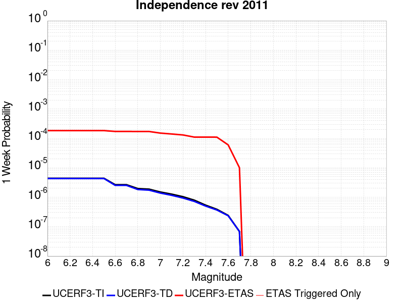 |  |  |  |

| Magnitude | 1 wk TI Prob | 1 wk TD Prob | 1 wk ETAS Prob | 1 wk ETAS/TD Gain | 1 wk ETAS Triggered Only | 1 mo TI Prob | 1 mo TD Prob | 1 mo ETAS Prob | 1 mo ETAS/TD Gain | 1 mo ETAS Triggered Only | 1 yr TI Prob | 1 yr TD Prob | 1 yr ETAS Prob | 1 yr ETAS/TD Gain | 1 yr ETAS Triggered Only | 10 yr TI Prob | 10 yr TD Prob | 10 yr ETAS Prob | 10 yr ETAS/TD Gain | 10 yr ETAS Triggered Only |
|-----|-----|-----|-----|-----|-----|-----|-----|-----|-----|-----|-----|-----|-----|-----|-----|-----|-----|-----|-----|-----|
| 6.0 | 4.422171E-6 | 4.326227E-6 | 1.8432544E-4 | 42.606514 | 1.8E-4 | 1.8952025E-5 | 1.8540857E-5 | 2.0853734E-4 | 11.247448 | 1.9E-4 | 2.3071647E-4 | 2.2571455E-4 | 4.756581E-4 | 2.1073437 | 2.5E-4 | 0.0023047708 | 0.0022551466 | 0.0025245377 | 1.1194562 | 2.7E-4 |
| 6.1 | 4.422171E-6 | 4.326227E-6 | 1.8432544E-4 | 42.606514 | 1.8E-4 | 1.8952025E-5 | 1.8540857E-5 | 2.0853734E-4 | 11.247448 | 1.9E-4 | 2.3071647E-4 | 2.2571455E-4 | 4.756581E-4 | 2.1073437 | 2.5E-4 | 0.0023047708 | 0.0022551466 | 0.0025245377 | 1.1194562 | 2.7E-4 |
| 6.2 | 4.422171E-6 | 4.326227E-6 | 1.8432544E-4 | 42.606514 | 1.8E-4 | 1.8952025E-5 | 1.8540857E-5 | 2.0853734E-4 | 11.247448 | 1.9E-4 | 2.3071647E-4 | 2.2571455E-4 | 4.756581E-4 | 2.1073437 | 2.5E-4 | 0.0023047708 | 0.0022551466 | 0.0025245377 | 1.1194562 | 2.7E-4 |
| 6.3 | 4.422171E-6 | 4.326227E-6 | 1.8432544E-4 | 42.606514 | 1.8E-4 | 1.8952025E-5 | 1.8540857E-5 | 2.0853734E-4 | 11.247448 | 1.9E-4 | 2.3071647E-4 | 2.2571455E-4 | 4.756581E-4 | 2.1073437 | 2.5E-4 | 0.0023047708 | 0.0022551466 | 0.0025245377 | 1.1194562 | 2.7E-4 |
| 6.4 | 4.422171E-6 | 4.326227E-6 | 1.8432544E-4 | 42.606514 | 1.8E-4 | 1.8952025E-5 | 1.8540857E-5 | 2.0853734E-4 | 11.247448 | 1.9E-4 | 2.3071647E-4 | 2.2571455E-4 | 4.756581E-4 | 2.1073437 | 2.5E-4 | 0.0023047708 | 0.0022551466 | 0.0025245377 | 1.1194562 | 2.7E-4 |
| 6.5 | 4.422171E-6 | 4.326227E-6 | 1.8432544E-4 | 42.606514 | 1.8E-4 | 1.8952025E-5 | 1.8540857E-5 | 2.0853734E-4 | 11.247448 | 1.9E-4 | 2.3071647E-4 | 2.2571455E-4 | 4.756581E-4 | 2.1073437 | 2.5E-4 | 0.0023047708 | 0.0022551466 | 0.0025245377 | 1.1194562 | 2.7E-4 |
| 6.6 | 2.663744E-6 | 2.5319862E-6 | 1.7253155E-4 | 68.1408 | 1.7E-4 | 1.1415996E-5 | 1.0851327E-5 | 1.9084937E-4 | 17.587652 | 1.8E-4 | 1.3898089E-4 | 1.3210738E-4 | 3.62077E-4 | 2.740778 | 2.3E-4 | 0.0013889399 | 0.0013203367 | 0.0015700067 | 1.1890956 | 2.5E-4 |
| 6.7 | 2.663744E-6 | 2.5319862E-6 | 1.7253155E-4 | 68.1408 | 1.7E-4 | 1.1415996E-5 | 1.0851327E-5 | 1.9084937E-4 | 17.587652 | 1.8E-4 | 1.3898089E-4 | 1.3210738E-4 | 3.62077E-4 | 2.740778 | 2.3E-4 | 0.0013889399 | 0.0013203367 | 0.0015700067 | 1.1890956 | 2.5E-4 |
| 6.8 | 1.9716529E-6 | 1.8322585E-6 | 1.7183194E-4 | 93.7815 | 1.7E-4 | 8.449913E-6 | 7.852514E-6 | 1.878511E-4 | 23.922417 | 1.8E-4 | 1.0287284E-4 | 9.5600284E-5 | 3.255783E-4 | 3.4056206 | 2.3E-4 | 0.0010282523 | 9.556045E-4 | 0.0012053656 | 1.2613645 | 2.5E-4 |
| 6.9 | 1.8788617E-6 | 1.7429993E-6 | 1.7174271E-4 | 98.53286 | 1.7E-4 | 8.0522395E-6 | 7.4699765E-6 | 1.8746863E-4 | 25.096283 | 1.8E-4 | 9.80316E-5 | 9.0943286E-5 | 3.2092238E-4 | 3.5288186 | 2.3E-4 | 9.798837E-4 | 9.0907275E-4 | 0.0011588455 | 1.2747555 | 2.5E-4 |
| 7.0 | 1.5045488E-6 | 1.3849503E-6 | 1.5138474E-4 | 109.30698 | 1.5E-4 | 6.44805E-6 | 5.9354884E-6 | 1.6593454E-4 | 27.95634 | 1.6E-4 | 7.8502184E-5 | 7.226223E-5 | 2.8224706E-4 | 3.9058726 | 2.1E-4 | 7.8474457E-4 | 7.2239246E-4 | 9.522263E-4 | 1.3181565 | 2.3E-4 |
| 7.1 | 1.272341E-6 | 1.1625096E-6 | 1.4116235E-4 | 121.42896 | 1.4E-4 | 5.4528787E-6 | 4.982175E-6 | 1.5498143E-4 | 31.107182 | 1.5E-4 | 6.6386776E-5 | 6.0656326E-5 | 2.6064418E-4 | 4.2970653 | 2.0E-4 | 6.636695E-4 | 6.064009E-4 | 8.2626747E-4 | 1.3625762 | 2.2E-4 |
| 7.2 | 1.0416892E-6 | 9.4098806E-7 | 1.3094087E-4 | 139.15253 | 1.3E-4 | 4.464375E-6 | 4.0328E-6 | 1.4403224E-4 | 35.715195 | 1.4E-4 | 5.4352407E-5 | 4.909825E-5 | 2.3908893E-4 | 4.8696017 | 1.9E-4 | 5.4339116E-4 | 4.9087586E-4 | 7.007728E-4 | 1.4275967 | 2.1E-4 |
| 7.3 | 7.9450155E-7 | 7.235002E-7 | 1.1072342E-4 | 153.03856 | 1.1E-4 | 3.4050022E-6 | 3.1007114E-6 | 1.2310034E-4 | 39.700676 | 1.2E-4 | 4.1455114E-5 | 3.775052E-5 | 2.077441E-4 | 5.5030794 | 1.7E-4 | 4.144738E-4 | 3.7744216E-4 | 5.6737044E-4 | 1.5031984 | 1.9E-4 |
| 7.4 | 5.3893444E-7 | 5.019512E-7 | 1.105019E-4 | 220.14468 | 1.1E-4 | 2.309717E-6 | 2.1512178E-6 | 1.2215096E-4 | 56.782238 | 1.2E-4 | 2.8120441E-5 | 2.6190766E-5 | 1.9618632E-4 | 7.4906673 | 1.7E-4 | 2.8116882E-4 | 2.6187726E-4 | 4.5182748E-4 | 1.7253407 | 1.9E-4 |
| 7.5 | 3.8852085E-7 | 3.682554E-7 | 1.10368215E-4 | 299.70563 | 1.1E-4 | 1.6650882E-6 | 1.5782365E-6 | 1.2157805E-4 | 77.03411 | 1.2E-4 | 2.027226E-5 | 1.9214862E-5 | 1.892116E-4 | 9.847149 | 1.7E-4 | 2.0270412E-4 | 1.9213221E-4 | 3.8209572E-4 | 1.9887123 | 1.9E-4 |
| 7.6 | 2.414929E-7 | 2.345755E-7 | 6.023456E-5 | 256.78113 | 6.0E-5 | 1.0349692E-6 | 1.0053232E-6 | 7.1005255E-5 | 70.62928 | 7.0E-5 | 1.2600677E-5 | 1.2239742E-5 | 1.1223852E-4 | 9.170007 | 1.0E-4 | 1.2599962E-4 | 1.223908E-4 | 2.4237612E-4 | 1.9803458 | 1.2E-4 |
| 7.7 | 6.8298014E-8 | 6.85897E-8 | 1.0068589E-5 | 146.79448 | 1.0E-5 | 2.9270575E-7 | 2.9395582E-7 | 1.0293953E-5 | 35.018707 | 1.0E-5 | 3.5636867E-6 | 3.5789067E-6 | 1.35788705E-5 | 3.7941394 | 1.0E-5 | 3.5636294E-5 | 3.5788536E-5 | 4.578818E-5 | 1.279409 | 1.0E-5 |

## San Andreas (North Branch Mill Creek)
*[(top)](#table-of-contents)*

| 1 Week | 1 Month | 1 Year | 10 Year |
|-----|-----|-----|-----|
|  |  |  |  |

| Magnitude | 1 wk TI Prob | 1 wk TD Prob | 1 wk ETAS Prob | 1 wk ETAS/TD Gain | 1 wk ETAS Triggered Only | 1 mo TI Prob | 1 mo TD Prob | 1 mo ETAS Prob | 1 mo ETAS/TD Gain | 1 mo ETAS Triggered Only | 1 yr TI Prob | 1 yr TD Prob | 1 yr ETAS Prob | 1 yr ETAS/TD Gain | 1 yr ETAS Triggered Only | 10 yr TI Prob | 10 yr TD Prob | 10 yr ETAS Prob | 10 yr ETAS/TD Gain | 10 yr ETAS Triggered Only |
|-----|-----|-----|-----|-----|-----|-----|-----|-----|-----|-----|-----|-----|-----|-----|-----|-----|-----|-----|-----|-----|
| 6.0 | 1.3461156E-5 | 2.3499893E-5 | 1.7349637E-4 | 7.382858 | 1.5E-4 | 5.7689394E-5 | 1.00709956E-4 | 3.206878E-4 | 3.184271 | 2.2E-4 | 7.02142E-4 | 0.0012254574 | 0.001475151 | 1.2037555 | 2.5E-4 | 0.0069992766 | 0.01222957 | 0.012506146 | 1.0226153 | 2.8E-4 |
| 6.1 | 1.3461156E-5 | 2.3499893E-5 | 1.7349637E-4 | 7.382858 | 1.5E-4 | 5.7689394E-5 | 1.00709956E-4 | 3.206878E-4 | 3.184271 | 2.2E-4 | 7.02142E-4 | 0.0012254574 | 0.001475151 | 1.2037555 | 2.5E-4 | 0.0069992766 | 0.01222957 | 0.012506146 | 1.0226153 | 2.8E-4 |
| 6.2 | 1.3461156E-5 | 2.3499893E-5 | 1.7349637E-4 | 7.382858 | 1.5E-4 | 5.7689394E-5 | 1.00709956E-4 | 3.206878E-4 | 3.184271 | 2.2E-4 | 7.02142E-4 | 0.0012254574 | 0.001475151 | 1.2037555 | 2.5E-4 | 0.0069992766 | 0.01222957 | 0.012506146 | 1.0226153 | 2.8E-4 |
| 6.3 | 1.3461156E-5 | 2.3499893E-5 | 1.7349637E-4 | 7.382858 | 1.5E-4 | 5.7689394E-5 | 1.00709956E-4 | 3.206878E-4 | 3.184271 | 2.2E-4 | 7.02142E-4 | 0.0012254574 | 0.001475151 | 1.2037555 | 2.5E-4 | 0.0069992766 | 0.01222957 | 0.012506146 | 1.0226153 | 2.8E-4 |
| 6.4 | 1.3461156E-5 | 2.3499893E-5 | 1.7349637E-4 | 7.382858 | 1.5E-4 | 5.7689394E-5 | 1.00709956E-4 | 3.206878E-4 | 3.184271 | 2.2E-4 | 7.02142E-4 | 0.0012254574 | 0.001475151 | 1.2037555 | 2.5E-4 | 0.0069992766 | 0.01222957 | 0.012506146 | 1.0226153 | 2.8E-4 |
| 6.5 | 1.3450706E-5 | 2.3488852E-5 | 1.7348533E-4 | 7.385858 | 1.5E-4 | 5.764461E-5 | 1.0066265E-4 | 3.206405E-4 | 3.1852977 | 2.2E-4 | 7.0159714E-4 | 0.001224882 | 0.0014745757 | 1.2038513 | 2.5E-4 | 0.006993862 | 0.01222388 | 0.0125004565 | 1.022626 | 2.8E-4 |
| 6.6 | 1.3074523E-5 | 2.3103135E-5 | 1.7309967E-4 | 7.492475 | 1.5E-4 | 5.6032466E-5 | 9.9009696E-5 | 3.189879E-4 | 3.2217846 | 2.2E-4 | 6.8198174E-4 | 0.0012047797 | 0.0014544785 | 1.2072568 | 2.5E-4 | 0.006798926 | 0.012025044 | 0.012301678 | 1.0230048 | 2.8E-4 |
| 6.7 | 1.3050216E-5 | 2.3078432E-5 | 1.7307496E-4 | 7.499425 | 1.5E-4 | 5.59283E-5 | 9.890384E-5 | 3.1888208E-4 | 3.2241628 | 2.2E-4 | 6.8071426E-4 | 0.0012034923 | 0.0014531914 | 1.2074788 | 2.5E-4 | 0.0067863287 | 0.012012309 | 0.012288946 | 1.0230294 | 2.8E-4 |
| 6.8 | 1.29049395E-5 | 2.292684E-5 | 1.729234E-4 | 7.5424 | 1.5E-4 | 5.530571E-5 | 9.825421E-5 | 3.182326E-4 | 3.23887 | 2.2E-4 | 6.73139E-4 | 0.0011955918 | 0.0014452928 | 1.2088515 | 2.5E-4 | 0.0067110364 | 0.011934154 | 0.012210812 | 1.023182 | 2.8E-4 |
| 6.9 | 1.2867369E-5 | 2.2886245E-5 | 1.728828E-4 | 7.554005 | 1.5E-4 | 5.51447E-5 | 9.8080236E-5 | 3.1805865E-4 | 3.2428415 | 2.2E-4 | 6.711799E-4 | 0.0011934759 | 0.0014431776 | 1.2092222 | 2.5E-4 | 0.006691564 | 0.011913223 | 0.012189887 | 1.0232233 | 2.8E-4 |
| 7.0 | 1.2495996E-5 | 2.2286325E-5 | 1.7228298E-4 | 7.730435 | 1.5E-4 | 5.3553173E-5 | 9.550934E-5 | 3.1548832E-4 | 3.3032196 | 2.2E-4 | 6.518148E-4 | 0.0011622087 | 0.0014119182 | 1.2148577 | 2.5E-4 | 0.0064990623 | 0.0116038285 | 0.011880579 | 1.02385 | 2.8E-4 |
| 7.1 | 1.2452067E-5 | 2.2231397E-5 | 1.7222806E-4 | 7.747064 | 1.5E-4 | 5.3364907E-5 | 9.527396E-5 | 3.15253E-4 | 3.3089104 | 2.2E-4 | 6.4952404E-4 | 0.0011593461 | 0.0014090562 | 1.2153888 | 2.5E-4 | 0.0064762887 | 0.0115755 | 0.011852259 | 1.023909 | 2.8E-4 |
| 7.2 | 1.2002777E-5 | 2.1609963E-5 | 1.7160672E-4 | 7.9410925 | 1.5E-4 | 5.143946E-5 | 9.2610855E-5 | 3.1259048E-4 | 3.3753114 | 2.2E-4 | 6.2609545E-4 | 0.0011269567 | 0.0013666862 | 1.2127229 | 2.4E-4 | 0.006243344 | 0.011254923 | 0.011521884 | 1.0237195 | 2.7E-4 |
| 7.3 | 1.1923425E-5 | 2.1479793E-5 | 1.7147657E-4 | 7.9831576 | 1.5E-4 | 5.109939E-5 | 9.205302E-5 | 3.1203276E-4 | 3.389707 | 2.2E-4 | 6.219575E-4 | 0.001120172 | 0.0013599031 | 1.2140129 | 2.4E-4 | 0.0062021962 | 0.011187789 | 0.0114547685 | 1.0238634 | 2.7E-4 |
| 7.4 | 1.16105175E-5 | 2.0853771E-5 | 1.7085065E-4 | 8.192793 | 1.5E-4 | 4.975841E-5 | 8.937026E-5 | 3.093506E-4 | 3.461449 | 2.2E-4 | 6.0564023E-4 | 0.0010875424 | 0.0013272814 | 1.2204411 | 2.4E-4 | 0.006039923 | 0.010865397 | 0.011132463 | 1.0245795 | 2.7E-4 |
| 7.5 | 1.1037265E-5 | 1.9553907E-5 | 1.6955097E-4 | 8.670951 | 1.5E-4 | 4.7301706E-5 | 8.379978E-5 | 3.0378133E-4 | 3.6250854 | 2.2E-4 | 5.757461E-4 | 0.0010197869 | 0.0012595422 | 1.2351032 | 2.4E-4 | 0.005742567 | 0.010194898 | 0.010462145 | 1.0262139 | 2.7E-4 |
| 7.6 | 1.0720915E-5 | 1.899582E-5 | 1.6899296E-4 | 8.896324 | 1.5E-4 | 4.5945973E-5 | 8.140812E-5 | 3.0139022E-4 | 3.702213 | 2.2E-4 | 5.592486E-4 | 9.906954E-4 | 0.0012304577 | 1.242014 | 2.4E-4 | 0.005578433 | 0.009906623 | 0.010173948 | 1.0269845 | 2.7E-4 |
| 7.7 | 9.276279E-6 | 1.6441649E-5 | 1.6643919E-4 | 10.123023 | 1.5E-4 | 3.9754876E-5 | 7.0462316E-5 | 2.9044683E-4 | 4.1220164 | 2.2E-4 | 4.839081E-4 | 8.575427E-4 | 0.0010973369 | 1.2796295 | 2.4E-4 | 0.0048285574 | 0.008586041 | 0.008853723 | 1.0311764 | 2.7E-4 |
| 7.8 | 5.8346777E-6 | 1.1155013E-5 | 1.6115334E-4 | 14.446718 | 1.5E-4 | 2.5005522E-5 | 4.7806327E-5 | 2.677958E-4 | 5.6016817 | 2.2E-4 | 3.043997E-4 | 5.818867E-4 | 8.1175286E-4 | 1.395036 | 2.3E-4 | 0.0030398308 | 0.0058469265 | 0.006105406 | 1.0442078 | 2.6E-4 |
| 7.9 | 4.690204E-6 | 8.509093E-6 | 1.485079E-4 | 17.452847 | 1.4E-4 | 2.0100719E-5 | 3.6467034E-5 | 2.264601E-4 | 6.2099953 | 1.9E-4 | 2.4469878E-4 | 4.4389578E-4 | 6.43807E-4 | 1.4503562 | 2.0E-4 | 0.002444295 | 0.0044707474 | 0.0046897638 | 1.0489888 | 2.2E-4 |
| 8.0 | 2.9570454E-6 | 4.846947E-6 | 6.484666E-5 | 13.378867 | 6.0E-5 | 1.267299E-5 | 2.0772464E-5 | 9.077101E-5 | 4.369776 | 7.0E-5 | 1.5428272E-4 | 2.5287544E-4 | 3.2285773E-4 | 1.2767462 | 7.0E-5 | 0.0015417566 | 0.002549644 | 0.0026194656 | 1.0273848 | 7.0E-5 |
| 8.1 | 1.6376824E-6 | 2.1968929E-6 | 2.1968929E-6 | 1.0 | 0.0 | 7.01862E-6 | 9.41522E-6 | 9.41522E-6 | 1.0 | 0.0 | 8.544835E-5 | 1.14624294E-4 | 1.14624294E-4 | 1.0 | 0.0 | 8.54155E-4 | 0.0011606582 | 0.0011606582 | 1.0 | 0.0 |
| 8.2 | 6.9631557E-7 | 4.5360213E-7 | 4.5360213E-7 | 1.0 | 0.0 | 2.984206E-6 | 1.9440076E-6 | 1.9440076E-6 | 1.0 | 0.0 | 3.63321E-5 | 2.3668037E-5 | 2.3668037E-5 | 1.0 | 0.0 | 3.6326164E-4 | 2.451564E-4 | 2.451564E-4 | 1.0 | 0.0 |
| 8.3 | 1.7876137E-7 | 8.360375E-8 | 8.360375E-8 | 1.0 | 0.0 | 7.661199E-7 | 3.5830175E-7 | 3.5830175E-7 | 1.0 | 0.0 | 9.32747E-6 | 4.3623154E-6 | 4.3623154E-6 | 1.0 | 0.0 | 9.3270784E-5 | 4.5817014E-5 | 4.5817014E-5 | 1.0 | 0.0 |

## Deep Springs
*[(top)](#table-of-contents)*

| 1 Week | 1 Month | 1 Year | 10 Year |
|-----|-----|-----|-----|
|  |  |  |  |

| Magnitude | 1 wk TI Prob | 1 wk TD Prob | 1 wk ETAS Prob | 1 wk ETAS/TD Gain | 1 wk ETAS Triggered Only | 1 mo TI Prob | 1 mo TD Prob | 1 mo ETAS Prob | 1 mo ETAS/TD Gain | 1 mo ETAS Triggered Only | 1 yr TI Prob | 1 yr TD Prob | 1 yr ETAS Prob | 1 yr ETAS/TD Gain | 1 yr ETAS Triggered Only | 10 yr TI Prob | 10 yr TD Prob | 10 yr ETAS Prob | 10 yr ETAS/TD Gain | 10 yr ETAS Triggered Only |
|-----|-----|-----|-----|-----|-----|-----|-----|-----|-----|-----|-----|-----|-----|-----|-----|-----|-----|-----|-----|-----|
| 6.0 | 1.9810619E-5 | 2.311252E-5 | 1.231102E-4 | 5.3265595 | 1.0E-4 | 8.489989E-5 | 9.905276E-5 | 2.1904087E-4 | 2.2113557 | 1.2E-4 | 0.001033166 | 0.0012058079 | 0.0014155547 | 1.1739471 | 2.1E-4 | 0.010283757 | 0.012042425 | 0.012309173 | 1.0221508 | 2.7E-4 |
| 6.1 | 1.9810619E-5 | 2.311252E-5 | 1.231102E-4 | 5.3265595 | 1.0E-4 | 8.489989E-5 | 9.905276E-5 | 2.1904087E-4 | 2.2113557 | 1.2E-4 | 0.001033166 | 0.0012058079 | 0.0014155547 | 1.1739471 | 2.1E-4 | 0.010283757 | 0.012042425 | 0.012309173 | 1.0221508 | 2.7E-4 |
| 6.2 | 1.9810619E-5 | 2.311252E-5 | 1.231102E-4 | 5.3265595 | 1.0E-4 | 8.489989E-5 | 9.905276E-5 | 2.1904087E-4 | 2.2113557 | 1.2E-4 | 0.001033166 | 0.0012058079 | 0.0014155547 | 1.1739471 | 2.1E-4 | 0.010283757 | 0.012042425 | 0.012309173 | 1.0221508 | 2.7E-4 |
| 6.3 | 1.9810619E-5 | 2.311252E-5 | 1.231102E-4 | 5.3265595 | 1.0E-4 | 8.489989E-5 | 9.905276E-5 | 2.1904087E-4 | 2.2113557 | 1.2E-4 | 0.001033166 | 0.0012058079 | 0.0014155547 | 1.1739471 | 2.1E-4 | 0.010283757 | 0.012042425 | 0.012309173 | 1.0221508 | 2.7E-4 |
| 6.4 | 1.9810619E-5 | 2.311252E-5 | 1.231102E-4 | 5.3265595 | 1.0E-4 | 8.489989E-5 | 9.905276E-5 | 2.1904087E-4 | 2.2113557 | 1.2E-4 | 0.001033166 | 0.0012058079 | 0.0014155547 | 1.1739471 | 2.1E-4 | 0.010283757 | 0.012042425 | 0.012309173 | 1.0221508 | 2.7E-4 |
| 6.5 | 1.7190405E-5 | 2.0050555E-5 | 1.0004895E-4 | 4.9898343 | 8.0E-5 | 7.367108E-5 | 8.593095E-5 | 1.7592323E-4 | 2.0472624 | 9.0E-5 | 8.9657627E-4 | 0.0010462094 | 0.0012060419 | 1.152773 | 1.6E-4 | 0.008929676 | 0.010462056 | 0.010669859 | 1.0198625 | 2.1E-4 |
| 6.6 | 1.7190405E-5 | 2.0050555E-5 | 1.0004895E-4 | 4.9898343 | 8.0E-5 | 7.367108E-5 | 8.593095E-5 | 1.7592323E-4 | 2.0472624 | 9.0E-5 | 8.9657627E-4 | 0.0010462094 | 0.0012060419 | 1.152773 | 1.6E-4 | 0.008929676 | 0.010462056 | 0.010669859 | 1.0198625 | 2.1E-4 |

## Lost Hills
*[(top)](#table-of-contents)*

| 1 Week | 1 Month | 1 Year | 10 Year |
|-----|-----|-----|-----|
|  |  |  |  |

| Magnitude | 1 wk TI Prob | 1 wk TD Prob | 1 wk ETAS Prob | 1 wk ETAS/TD Gain | 1 wk ETAS Triggered Only | 1 mo TI Prob | 1 mo TD Prob | 1 mo ETAS Prob | 1 mo ETAS/TD Gain | 1 mo ETAS Triggered Only | 1 yr TI Prob | 1 yr TD Prob | 1 yr ETAS Prob | 1 yr ETAS/TD Gain | 1 yr ETAS Triggered Only | 10 yr TI Prob | 10 yr TD Prob | 10 yr ETAS Prob | 10 yr ETAS/TD Gain | 10 yr ETAS Triggered Only |
|-----|-----|-----|-----|-----|-----|-----|-----|-----|-----|-----|-----|-----|-----|-----|-----|-----|-----|-----|-----|-----|
| 6.0 | 2.233523E-5 | 2.5106583E-5 | 1.4510356E-4 | 5.779503 | 1.2E-4 | 9.571891E-5 | 1.0759615E-4 | 2.5758002E-4 | 2.393952 | 1.5E-4 | 0.0011647546 | 0.001309364 | 0.0015190891 | 1.1601732 | 2.1E-4 | 0.011586686 | 0.013033091 | 0.0132600935 | 1.0174174 | 2.3E-4 |
| 6.1 | 2.233523E-5 | 2.5106583E-5 | 1.4510356E-4 | 5.779503 | 1.2E-4 | 9.571891E-5 | 1.0759615E-4 | 2.5758002E-4 | 2.393952 | 1.5E-4 | 0.0011647546 | 0.001309364 | 0.0015190891 | 1.1601732 | 2.1E-4 | 0.011586686 | 0.013033091 | 0.0132600935 | 1.0174174 | 2.3E-4 |
| 6.2 | 2.233523E-5 | 2.5106583E-5 | 1.4510356E-4 | 5.779503 | 1.2E-4 | 9.571891E-5 | 1.0759615E-4 | 2.5758002E-4 | 2.393952 | 1.5E-4 | 0.0011647546 | 0.001309364 | 0.0015190891 | 1.1601732 | 2.1E-4 | 0.011586686 | 0.013033091 | 0.0132600935 | 1.0174174 | 2.3E-4 |
| 6.3 | 2.233523E-5 | 2.5106583E-5 | 1.4510356E-4 | 5.779503 | 1.2E-4 | 9.571891E-5 | 1.0759615E-4 | 2.5758002E-4 | 2.393952 | 1.5E-4 | 0.0011647546 | 0.001309364 | 0.0015190891 | 1.1601732 | 2.1E-4 | 0.011586686 | 0.013033091 | 0.0132600935 | 1.0174174 | 2.3E-4 |
| 6.4 | 1.2288092E-5 | 1.3781108E-5 | 7.3780284E-5 | 5.3537264 | 6.0E-5 | 5.2662188E-5 | 5.906108E-5 | 1.3905636E-4 | 2.35445 | 8.0E-5 | 6.409735E-4 | 7.189252E-4 | 8.388389E-4 | 1.1667958 | 1.2E-4 | 0.006391279 | 0.0071752006 | 0.007304268 | 1.017988 | 1.3E-4 |
| 6.5 | 1.2288092E-5 | 1.3781108E-5 | 7.3780284E-5 | 5.3537264 | 6.0E-5 | 5.2662188E-5 | 5.906108E-5 | 1.3905636E-4 | 2.35445 | 8.0E-5 | 6.409735E-4 | 7.189252E-4 | 8.388389E-4 | 1.1667958 | 1.2E-4 | 0.006391279 | 0.0071752006 | 0.007304268 | 1.017988 | 1.3E-4 |
| 6.6 | 8.58281E-6 | 9.63377E-6 | 5.9633287E-5 | 6.1900263 | 5.0E-5 | 3.6782953E-5 | 4.12874E-5 | 1.01284924E-4 | 2.453168 | 6.0E-5 | 4.4774043E-4 | 5.026414E-4 | 6.0259114E-4 | 1.198849 | 1.0E-4 | 0.0044683935 | 0.005023205 | 0.0051326524 | 1.0217884 | 1.1E-4 |
| 6.7 | 7.205685E-6 | 8.088302E-6 | 4.808798E-5 | 5.945374 | 4.0E-5 | 3.088114E-5 | 3.466415E-5 | 8.466242E-5 | 2.4423623 | 5.0E-5 | 3.7591302E-4 | 4.2203604E-4 | 5.0200225E-4 | 1.1894773 | 8.0E-5 | 0.0037527776 | 0.0042203604 | 0.0043099807 | 1.0212352 | 9.0E-5 |

## Whittier alt 1
*[(top)](#table-of-contents)*

| 1 Week | 1 Month | 1 Year | 10 Year |
|-----|-----|-----|-----|
|  |  | 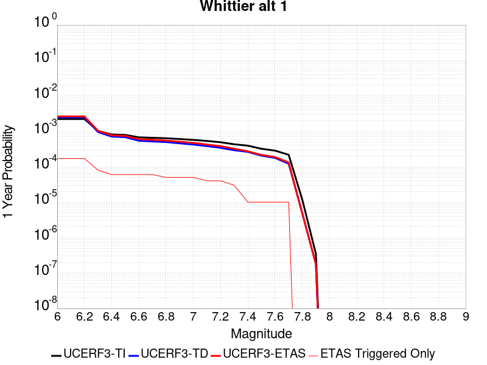 |  |

| Magnitude | 1 wk TI Prob | 1 wk TD Prob | 1 wk ETAS Prob | 1 wk ETAS/TD Gain | 1 wk ETAS Triggered Only | 1 mo TI Prob | 1 mo TD Prob | 1 mo ETAS Prob | 1 mo ETAS/TD Gain | 1 mo ETAS Triggered Only | 1 yr TI Prob | 1 yr TD Prob | 1 yr ETAS Prob | 1 yr ETAS/TD Gain | 1 yr ETAS Triggered Only | 10 yr TI Prob | 10 yr TD Prob | 10 yr ETAS Prob | 10 yr ETAS/TD Gain | 10 yr ETAS Triggered Only |
|-----|-----|-----|-----|-----|-----|-----|-----|-----|-----|-----|-----|-----|-----|-----|-----|-----|-----|-----|-----|-----|
| 6.0 | 4.2554693E-5 | 4.725218E-5 | 1.272484E-4 | 2.6929636 | 8.0E-5 | 1.8236451E-4 | 2.0249544E-4 | 3.0247518E-4 | 1.4937383 | 1.0E-4 | 0.002218027 | 0.0024629154 | 0.0026324966 | 1.0688539 | 1.7E-4 | 0.02196019 | 0.024390234 | 0.024614625 | 1.0092 | 2.3E-4 |
| 6.1 | 4.2554693E-5 | 4.725218E-5 | 1.272484E-4 | 2.6929636 | 8.0E-5 | 1.8236451E-4 | 2.0249544E-4 | 3.0247518E-4 | 1.4937383 | 1.0E-4 | 0.002218027 | 0.0024629154 | 0.0026324966 | 1.0688539 | 1.7E-4 | 0.02196019 | 0.024390234 | 0.024614625 | 1.0092 | 2.3E-4 |
| 6.2 | 4.2554693E-5 | 4.725218E-5 | 1.272484E-4 | 2.6929636 | 8.0E-5 | 1.8236451E-4 | 2.0249544E-4 | 3.0247518E-4 | 1.4937383 | 1.0E-4 | 0.002218027 | 0.0024629154 | 0.0026324966 | 1.0688539 | 1.7E-4 | 0.02196019 | 0.024390234 | 0.024614625 | 1.0092 | 2.3E-4 |
| 6.3 | 1.9617712E-5 | 1.8268593E-5 | 6.826768E-5 | 3.736888 | 5.0E-5 | 8.40732E-5 | 7.829172E-5 | 1.2828781E-4 | 1.6385871 | 5.0E-5 | 0.0010231105 | 9.52804E-4 | 0.0010327278 | 1.0838827 | 8.0E-5 | 0.01018413 | 0.009490474 | 0.00957962 | 1.0093932 | 9.0E-5 |
| 6.4 | 1.5611336E-5 | 1.3604271E-5 | 5.3603726E-5 | 3.9402132 | 4.0E-5 | 6.690401E-5 | 5.8302747E-5 | 9.8300414E-5 | 1.686034 | 4.0E-5 | 8.142519E-4 | 7.0961076E-4 | 7.695682E-4 | 1.0844934 | 6.0E-5 | 0.008112748 | 0.0070754145 | 0.0071349903 | 1.0084201 | 6.0E-5 |
| 6.5 | 1.5150166E-5 | 1.3100925E-5 | 5.31004E-5 | 4.0531797 | 4.0E-5 | 6.492767E-5 | 5.6145647E-5 | 9.61434E-5 | 1.7123928 | 4.0E-5 | 7.9020765E-4 | 6.8336475E-4 | 7.433237E-4 | 1.0877409 | 6.0E-5 | 0.007874036 | 0.0068145846 | 0.0068741757 | 1.0087446 | 6.0E-5 |
| 6.6 | 1.295588E-5 | 1.0380725E-5 | 5.038031E-5 | 4.8532553 | 4.0E-5 | 5.552402E-5 | 4.4488075E-5 | 8.4486295E-5 | 1.8990773 | 4.0E-5 | 6.7579525E-4 | 5.4150965E-4 | 6.0147716E-4 | 1.1107414 | 6.0E-5 | 0.006737438 | 0.0054033357 | 0.0054630116 | 1.0110443 | 6.0E-5 |
| 6.7 | 1.2542085E-5 | 9.899369E-6 | 4.9898972E-5 | 5.0406218 | 4.0E-5 | 5.3750682E-5 | 4.242519E-5 | 8.242349E-5 | 1.9427961 | 4.0E-5 | 6.542181E-4 | 5.164061E-4 | 5.763751E-4 | 1.1161276 | 6.0E-5 | 0.006522954 | 0.0051534795 | 0.0052131703 | 1.0115826 | 6.0E-5 |
| 6.8 | 1.2195878E-5 | 9.495415E-6 | 3.949513E-5 | 4.15939 | 3.0E-5 | 5.2267E-5 | 4.069401E-5 | 7.069279E-5 | 1.7371793 | 3.0E-5 | 6.36165E-4 | 4.9533875E-4 | 5.45314E-4 | 1.100891 | 5.0E-5 | 0.0063434686 | 0.004943688 | 0.004993441 | 1.0100639 | 5.0E-5 |
| 6.9 | 1.1580298E-5 | 8.772933E-6 | 3.877267E-5 | 4.4195786 | 3.0E-5 | 4.9628903E-5 | 3.7597754E-5 | 6.759662E-5 | 1.7978901 | 3.0E-5 | 6.040644E-4 | 4.5765814E-4 | 5.076353E-4 | 1.1092019 | 5.0E-5 | 0.00602425 | 0.0045684157 | 0.0046181874 | 1.0108947 | 5.0E-5 |
| 7.0 | 1.0964795E-5 | 8.083994E-6 | 3.8083752E-5 | 4.711007 | 3.0E-5 | 4.6991136E-5 | 3.4645236E-5 | 6.46442E-5 | 1.8658899 | 3.0E-5 | 5.7196687E-4 | 4.2172565E-4 | 4.7170455E-4 | 1.1185105 | 5.0E-5 | 0.0057049696 | 0.004210462 | 0.0042602513 | 1.0118252 | 5.0E-5 |
| 7.1 | 1.0230601E-5 | 7.3266697E-6 | 3.732645E-5 | 5.0945997 | 3.0E-5 | 4.3844695E-5 | 3.1399642E-5 | 6.13987E-5 | 1.9553949 | 3.0E-5 | 5.336784E-4 | 3.8222488E-4 | 4.222096E-4 | 1.1046104 | 4.0E-5 | 0.005323986 | 0.0038168381 | 0.0038566855 | 1.0104399 | 4.0E-5 |
| 7.2 | 9.40865E-6 | 6.543289E-6 | 3.6543093E-5 | 5.5848203 | 3.0E-5 | 4.032216E-5 | 2.8042374E-5 | 5.8041533E-5 | 2.0697796 | 3.0E-5 | 4.908117E-4 | 3.4136363E-4 | 3.8134996E-4 | 1.1171371 | 4.0E-5 | 0.0048972913 | 0.003409485 | 0.0034493487 | 1.0116919 | 4.0E-5 |
| 7.3 | 8.237384E-6 | 5.5977525E-6 | 2.5597641E-5 | 4.5728426 | 2.0E-5 | 3.5302593E-5 | 2.3990153E-5 | 4.3989672E-5 | 1.8336554 | 2.0E-5 | 4.2972428E-4 | 2.92042E-4 | 3.2203324E-4 | 1.102695 | 3.0E-5 | 0.0042889426 | 0.002916903 | 0.0029468157 | 1.0102549 | 3.0E-5 |
| 7.4 | 7.5316966E-6 | 5.027819E-6 | 1.5027769E-5 | 2.9889238 | 1.0E-5 | 3.2278298E-5 | 2.1547625E-5 | 3.154741E-5 | 1.4640783 | 1.0E-5 | 3.9291743E-4 | 2.6231175E-4 | 2.7230915E-4 | 1.0381125 | 1.0E-5 | 0.0039222343 | 0.0026201333 | 0.002630107 | 1.0038066 | 1.0E-5 |
| 7.5 | 6.149649E-6 | 3.933841E-6 | 1.3933802E-5 | 3.5420349 | 1.0E-5 | 2.6355372E-5 | 1.6859214E-5 | 2.6859045E-5 | 1.5931375 | 1.0E-5 | 3.208294E-4 | 2.052425E-4 | 2.1524045E-4 | 1.0487128 | 1.0E-5 | 0.003203666 | 0.0020506186 | 0.0020605982 | 1.0048666 | 1.0E-5 |
| 7.6 | 5.457711E-6 | 3.3953788E-6 | 1.33953445E-5 | 3.9451694 | 1.0E-5 | 2.338998E-5 | 1.4551547E-5 | 2.4551402E-5 | 1.6872022 | 1.0E-5 | 2.8473578E-4 | 1.771515E-4 | 1.8714972E-4 | 1.0564388 | 1.0E-5 | 0.0028437122 | 0.0017701836 | 0.0017801658 | 1.0056391 | 1.0E-5 |
| 7.7 | 4.1676276E-6 | 2.3331952E-6 | 1.2333172E-5 | 5.2859583 | 1.0E-5 | 1.7861139E-5 | 9.999374E-6 | 1.9999274E-5 | 2.0000527 | 1.0E-5 | 2.1743766E-4 | 1.2173632E-4 | 1.317351E-4 | 1.0821347 | 1.0E-5 | 0.0021722503 | 0.0012167693 | 0.0012267572 | 1.0082085 | 1.0E-5 |
| 7.8 | 2.2692414E-7 | 9.3854695E-8 | 9.3854695E-8 | 1.0 | 0.0 | 9.725317E-7 | 4.0223435E-7 | 4.0223435E-7 | 1.0 | 0.0 | 1.1840509E-5 | 4.8971956E-6 | 4.8971956E-6 | 1.0 | 0.0 | 1.1839878E-4 | 4.8971204E-5 | 4.8971204E-5 | 1.0 | 0.0 |
| 7.9 | 6.676829E-9 | 3.439853E-9 | 3.439853E-9 | 1.0 | 0.0 | 2.861498E-8 | 1.4742227E-8 | 1.4742227E-8 | 1.0 | 0.0 | 3.4838732E-7 | 1.7948659E-7 | 1.7948659E-7 | 1.0 | 0.0 | 3.4838679E-6 | 1.7948646E-6 | 1.7948646E-6 | 1.0 | 0.0 |

## Red Mountain
*[(top)](#table-of-contents)*

| 1 Week | 1 Month | 1 Year | 10 Year |
|-----|-----|-----|-----|
|  |  | 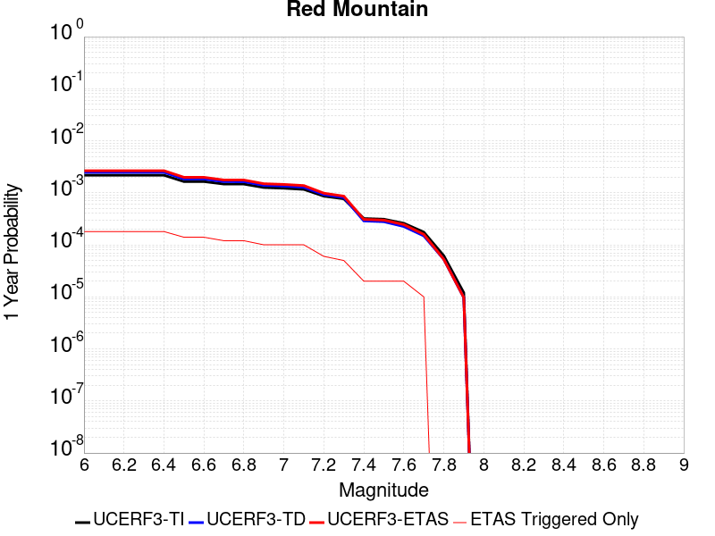 |  |

| Magnitude | 1 wk TI Prob | 1 wk TD Prob | 1 wk ETAS Prob | 1 wk ETAS/TD Gain | 1 wk ETAS Triggered Only | 1 mo TI Prob | 1 mo TD Prob | 1 mo ETAS Prob | 1 mo ETAS/TD Gain | 1 mo ETAS Triggered Only | 1 yr TI Prob | 1 yr TD Prob | 1 yr ETAS Prob | 1 yr ETAS/TD Gain | 1 yr ETAS Triggered Only | 10 yr TI Prob | 10 yr TD Prob | 10 yr ETAS Prob | 10 yr ETAS/TD Gain | 10 yr ETAS Triggered Only |
|-----|-----|-----|-----|-----|-----|-----|-----|-----|-----|-----|-----|-----|-----|-----|-----|-----|-----|-----|-----|-----|
| 6.0 | 4.1810763E-5 | 4.7589947E-5 | 1.3758567E-4 | 2.8910658 | 9.0E-5 | 1.7917668E-4 | 2.039419E-4 | 3.1391947E-4 | 1.5392593 | 1.1E-4 | 0.0021792934 | 0.0024803306 | 0.002659884 | 1.0723909 | 1.8E-4 | 0.021580452 | 0.024544092 | 0.024758691 | 1.0087434 | 2.2E-4 |
| 6.1 | 4.1810763E-5 | 4.7589947E-5 | 1.3758567E-4 | 2.8910658 | 9.0E-5 | 1.7917668E-4 | 2.039419E-4 | 3.1391947E-4 | 1.5392593 | 1.1E-4 | 0.0021792934 | 0.0024803306 | 0.002659884 | 1.0723909 | 1.8E-4 | 0.021580452 | 0.024544092 | 0.024758691 | 1.0087434 | 2.2E-4 |
| 6.2 | 4.1810763E-5 | 4.7589947E-5 | 1.3758567E-4 | 2.8910658 | 9.0E-5 | 1.7917668E-4 | 2.039419E-4 | 3.1391947E-4 | 1.5392593 | 1.1E-4 | 0.0021792934 | 0.0024803306 | 0.002659884 | 1.0723909 | 1.8E-4 | 0.021580452 | 0.024544092 | 0.024758691 | 1.0087434 | 2.2E-4 |
| 6.3 | 4.1810763E-5 | 4.7589947E-5 | 1.3758567E-4 | 2.8910658 | 9.0E-5 | 1.7917668E-4 | 2.039419E-4 | 3.1391947E-4 | 1.5392593 | 1.1E-4 | 0.0021792934 | 0.0024803306 | 0.002659884 | 1.0723909 | 1.8E-4 | 0.021580452 | 0.024544092 | 0.024758691 | 1.0087434 | 2.2E-4 |
| 6.4 | 4.1810763E-5 | 4.7589947E-5 | 1.3758567E-4 | 2.8910658 | 9.0E-5 | 1.7917668E-4 | 2.039419E-4 | 3.1391947E-4 | 1.5392593 | 1.1E-4 | 0.0021792934 | 0.0024803306 | 0.002659884 | 1.0723909 | 1.8E-4 | 0.021580452 | 0.024544092 | 0.024758691 | 1.0087434 | 2.2E-4 |
| 6.5 | 3.154503E-5 | 3.5359728E-5 | 1.15356896E-4 | 3.2623808 | 8.0E-5 | 1.3518598E-4 | 1.5153342E-4 | 2.5151824E-4 | 1.6598204 | 1.0E-4 | 0.0016446467 | 0.0018434501 | 0.001983192 | 1.0758046 | 1.4E-4 | 0.01632528 | 0.018291233 | 0.018458124 | 1.009124 | 1.7E-4 |
| 6.6 | 3.1535834E-5 | 3.534911E-5 | 1.1534628E-4 | 3.2630603 | 8.0E-5 | 1.3514658E-4 | 1.5148791E-4 | 2.5147275E-4 | 1.6600187 | 1.0E-4 | 0.0016441676 | 0.001842897 | 0.001982639 | 1.0758274 | 1.4E-4 | 0.01632056 | 0.018285794 | 0.018452685 | 1.0091268 | 1.7E-4 |
| 6.7 | 2.8267326E-5 | 3.146934E-5 | 1.01467136E-4 | 3.2243173 | 7.0E-5 | 1.2114006E-4 | 1.348621E-4 | 2.1485132E-4 | 1.5931185 | 8.0E-5 | 0.0014738824 | 0.0016407946 | 0.0017605977 | 1.0730153 | 1.2E-4 | 0.014641452 | 0.016295563 | 0.016433282 | 1.0084513 | 1.4E-4 |
| 6.8 | 2.8212884E-5 | 3.1407224E-5 | 1.0140503E-4 | 3.2287166 | 7.0E-5 | 1.20906756E-4 | 1.3459593E-4 | 2.1458516E-4 | 1.5942916 | 8.0E-5 | 0.0014710457 | 0.0016375587 | 0.0017573623 | 1.0731598 | 1.2E-4 | 0.014613459 | 0.01626368 | 0.016401403 | 1.0084682 | 1.4E-4 |
| 6.9 | 2.4227871E-5 | 2.6706979E-5 | 7.670564E-5 | 2.87212 | 5.0E-5 | 1.03829596E-4 | 1.14453884E-4 | 1.7444702E-4 | 1.5241686 | 6.0E-5 | 0.0012633923 | 0.0013926612 | 0.001492522 | 1.071705 | 1.0E-4 | 0.012562336 | 0.013847026 | 0.013965365 | 1.0085461 | 1.2E-4 |
| 7.0 | 2.348524E-5 | 2.5835763E-5 | 7.583447E-5 | 2.935252 | 5.0E-5 | 1.0064714E-4 | 1.1072042E-4 | 1.7071379E-4 | 1.5418454 | 6.0E-5 | 0.0012246901 | 0.0013472632 | 0.0014471285 | 1.0741246 | 1.0E-4 | 0.012179627 | 0.01339859 | 0.013516982 | 1.0088362 | 1.2E-4 |
| 7.1 | 2.2311642E-5 | 2.4462828E-5 | 7.4461605E-5 | 3.0438673 | 5.0E-5 | 9.561782E-5 | 1.048369E-4 | 1.6483062E-4 | 1.5722575 | 6.0E-5 | 0.0011635252 | 0.0012757168 | 0.0013755892 | 1.0782874 | 1.0E-4 | 0.01157452 | 0.012691451 | 0.0128099285 | 1.0093352 | 1.2E-4 |
| 7.2 | 1.6533986E-5 | 1.7670347E-5 | 3.7669994E-5 | 2.1318197 | 2.0E-5 | 7.085802E-5 | 7.572822E-5 | 1.0572594E-4 | 1.3961235 | 3.0E-5 | 8.623549E-4 | 9.216645E-4 | 9.816092E-4 | 1.0650396 | 6.0E-5 | 0.008590161 | 0.009184699 | 0.009254056 | 1.0075513 | 7.0E-5 |
| 7.3 | 1.4703092E-5 | 1.555952E-5 | 2.5559366E-5 | 1.6426833 | 1.0E-5 | 6.301173E-5 | 6.66823E-5 | 8.668097E-5 | 1.2999096 | 2.0E-5 | 7.668978E-4 | 8.1161625E-4 | 8.6157565E-4 | 1.0615555 | 5.0E-5 | 0.0076425658 | 0.008092596 | 0.0081521105 | 1.0073541 | 6.0E-5 |
| 7.4 | 6.1331984E-6 | 5.528872E-6 | 1.5528816E-5 | 2.8086772 | 1.0E-5 | 2.6284872E-5 | 2.3694953E-5 | 3.3694716E-5 | 1.4220208 | 1.0E-5 | 3.199713E-4 | 2.8844838E-4 | 3.0844263E-4 | 1.0693165 | 2.0E-5 | 0.0031951098 | 0.0028807942 | 0.0029107078 | 1.0103838 | 3.0E-5 |
| 7.5 | 5.954766E-6 | 5.3385015E-6 | 1.5338448E-5 | 2.873175 | 1.0E-5 | 2.5520176E-5 | 2.2879094E-5 | 3.2878866E-5 | 1.4370703 | 1.0E-5 | 3.1066386E-4 | 2.785179E-4 | 2.985123E-4 | 1.0717887 | 2.0E-5 | 0.003102299 | 0.0027817423 | 0.002811659 | 1.0107546 | 3.0E-5 |
| 7.6 | 4.9726646E-6 | 4.315295E-6 | 1.4315252E-5 | 3.3173287 | 1.0E-5 | 2.1311245E-5 | 1.8493993E-5 | 2.8493807E-5 | 1.5407062 | 1.0E-5 | 2.5943352E-4 | 2.2514143E-4 | 2.4513694E-4 | 1.0888131 | 2.0E-5 | 0.0025913084 | 0.002249168 | 0.0022791005 | 1.0133083 | 3.0E-5 |
| 7.7 | 3.3613894E-6 | 2.8526642E-6 | 2.8526642E-6 | 1.0 | 0.0 | 1.4405875E-5 | 1.2225649E-5 | 1.2225649E-5 | 1.0 | 0.0 | 1.7537741E-4 | 1.4883737E-4 | 1.5883589E-4 | 1.0671774 | 1.0E-5 | 0.0017523908 | 0.0014874031 | 0.0014973882 | 1.0067132 | 1.0E-5 |
| 7.8 | 1.1828961E-6 | 1.0122756E-6 | 1.0122756E-6 | 1.0 | 0.0 | 5.069545E-6 | 4.338317E-6 | 4.338317E-6 | 1.0 | 0.0 | 6.171996E-5 | 5.281776E-5 | 5.281776E-5 | 1.0 | 0.0 | 6.170282E-4 | 5.2805495E-4 | 5.2805495E-4 | 1.0 | 0.0 |
| 7.9 | 2.2967266E-7 | 1.8618952E-7 | 1.8618952E-7 | 1.0 | 0.0 | 9.843111E-7 | 7.9795484E-7 | 7.9795484E-7 | 1.0 | 0.0 | 1.19839215E-5 | 9.7150605E-6 | 9.7150605E-6 | 1.0 | 0.0 | 1.1983275E-4 | 9.714664E-5 | 9.714664E-5 | 1.0 | 0.0 |

## Ortigalita (North)
*[(top)](#table-of-contents)*

| 1 Week | 1 Month | 1 Year | 10 Year |
|-----|-----|-----|-----|
| 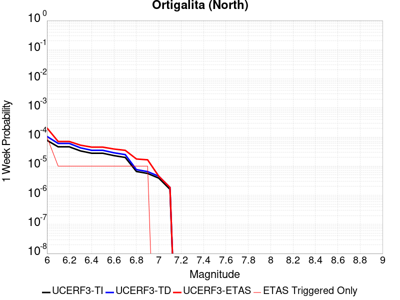 |  |  |  |

| Magnitude | 1 wk TI Prob | 1 wk TD Prob | 1 wk ETAS Prob | 1 wk ETAS/TD Gain | 1 wk ETAS Triggered Only | 1 mo TI Prob | 1 mo TD Prob | 1 mo ETAS Prob | 1 mo ETAS/TD Gain | 1 mo ETAS Triggered Only | 1 yr TI Prob | 1 yr TD Prob | 1 yr ETAS Prob | 1 yr ETAS/TD Gain | 1 yr ETAS Triggered Only | 10 yr TI Prob | 10 yr TD Prob | 10 yr ETAS Prob | 10 yr ETAS/TD Gain | 10 yr ETAS Triggered Only |
|-----|-----|-----|-----|-----|-----|-----|-----|-----|-----|-----|-----|-----|-----|-----|-----|-----|-----|-----|-----|-----|
| 6.0 | 7.711876E-5 | 1.05064966E-4 | 2.0505446E-4 | 1.951692 | 1.0E-4 | 3.3046713E-4 | 4.502116E-4 | 5.7015754E-4 | 1.2664213 | 1.2E-4 | 0.004016016 | 0.0054681194 | 0.0056570806 | 1.0345569 | 1.9E-4 | 0.039442103 | 0.053454787 | 0.0536441 | 1.0035415 | 2.0E-4 |
| 6.1 | 4.607858E-5 | 6.0239203E-5 | 7.02386E-5 | 1.1659949 | 1.0E-5 | 1.9746469E-4 | 2.5814527E-4 | 2.6814267E-4 | 1.0387279 | 1.0E-5 | 0.0024014818 | 0.0031387596 | 0.0031985713 | 1.0190558 | 6.0E-5 | 0.023756953 | 0.030975068 | 0.03103321 | 1.0018771 | 6.0E-5 |
| 6.2 | 4.607858E-5 | 6.0239203E-5 | 7.02386E-5 | 1.1659949 | 1.0E-5 | 1.9746469E-4 | 2.5814527E-4 | 2.6814267E-4 | 1.0387279 | 1.0E-5 | 0.0024014818 | 0.0031387596 | 0.0031985713 | 1.0190558 | 6.0E-5 | 0.023756953 | 0.030975068 | 0.03103321 | 1.0018771 | 6.0E-5 |
| 6.3 | 3.327423E-5 | 4.2475127E-5 | 5.2474705E-5 | 1.2354219 | 1.0E-5 | 1.4259605E-4 | 1.8202531E-4 | 1.920235E-4 | 1.0549275 | 1.0E-5 | 0.0017347244 | 0.002214197 | 0.0022740643 | 1.0270379 | 6.0E-5 | 0.017212452 | 0.021945644 | 0.022004329 | 1.002674 | 6.0E-5 |
| 6.4 | 2.7732503E-5 | 3.4998593E-5 | 4.4998244E-5 | 1.2857158 | 1.0E-5 | 1.1884817E-4 | 1.4998685E-4 | 1.5998536E-4 | 1.0666625 | 1.0E-5 | 0.001446016 | 0.0018248095 | 0.0018847 | 1.0328201 | 6.0E-5 | 0.014366428 | 0.018121224 | 0.018180136 | 1.0032511 | 6.0E-5 |
| 6.5 | 2.7689714E-5 | 3.4948407E-5 | 4.4948058E-5 | 1.286126 | 1.0E-5 | 1.186648E-4 | 1.497718E-4 | 1.597703E-4 | 1.0667583 | 1.0E-5 | 0.0014437864 | 0.0018221956 | 0.0018820863 | 1.0328673 | 6.0E-5 | 0.014344421 | 0.01809551 | 0.018154424 | 1.0032557 | 6.0E-5 |
| 6.6 | 2.2976905E-5 | 2.8718265E-5 | 3.871798E-5 | 1.3482004 | 1.0E-5 | 9.846873E-5 | 1.230739E-4 | 1.3307267E-4 | 1.081242 | 1.0E-5 | 0.0011981975 | 0.0014976363 | 0.0015375764 | 1.0266688 | 4.0E-5 | 0.011917574 | 0.014898697 | 0.014938101 | 1.0026448 | 4.0E-5 |
| 6.7 | 1.9871539E-5 | 2.4904411E-5 | 3.4904162E-5 | 1.4015253 | 1.0E-5 | 8.516096E-5 | 1.0673023E-4 | 1.1672916E-4 | 1.0936842 | 1.0E-5 | 0.0010363415 | 0.0012989145 | 0.0013288757 | 1.0230662 | 3.0E-5 | 0.010315218 | 0.012936919 | 0.012966531 | 1.0022889 | 3.0E-5 |
| 6.8 | 6.5640475E-6 | 7.6054926E-6 | 1.7605416E-5 | 2.3148293 | 1.0E-5 | 2.813133E-5 | 3.2594577E-5 | 4.259425E-5 | 1.3067895 | 1.0E-5 | 3.424451E-4 | 3.9676955E-4 | 4.0676558E-4 | 1.0251936 | 1.0E-5 | 0.0034191788 | 0.003960899 | 0.003970859 | 1.0025147 | 1.0E-5 |
| 6.9 | 5.6219683E-6 | 6.5018376E-6 | 1.6501772E-5 | 2.5380168 | 1.0E-5 | 2.4093928E-5 | 2.7864735E-5 | 3.7864458E-5 | 1.3588666 | 1.0E-5 | 2.933041E-4 | 3.3920293E-4 | 3.4919954E-4 | 1.0294709 | 1.0E-5 | 0.0029291727 | 0.003387109 | 0.003397075 | 1.0029423 | 1.0E-5 |
| 7.0 | 3.875591E-6 | 4.4847548E-6 | 4.4847548E-6 | 1.0 | 0.0 | 1.6609569E-5 | 1.9220248E-5 | 1.9220248E-5 | 1.0 | 0.0 | 2.0220275E-4 | 2.339835E-4 | 2.339835E-4 | 1.0 | 0.0 | 0.0020201886 | 0.0023375798 | 0.0023375798 | 1.0 | 0.0 |
| 7.1 | 1.6017933E-6 | 1.8570418E-6 | 1.8570418E-6 | 1.0 | 0.0 | 6.8648105E-6 | 7.958732E-6 | 7.958732E-6 | 1.0 | 0.0 | 8.357586E-5 | 9.689432E-5 | 9.689432E-5 | 1.0 | 0.0 | 8.3544437E-4 | 9.686254E-4 | 9.686254E-4 | 1.0 | 0.0 |

## Big Pine (Central)
*[(top)](#table-of-contents)*

| 1 Week | 1 Month | 1 Year | 10 Year |
|-----|-----|-----|-----|
| 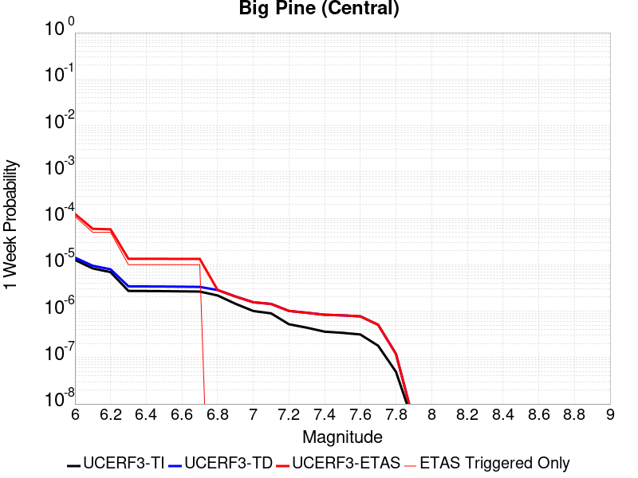 |  | 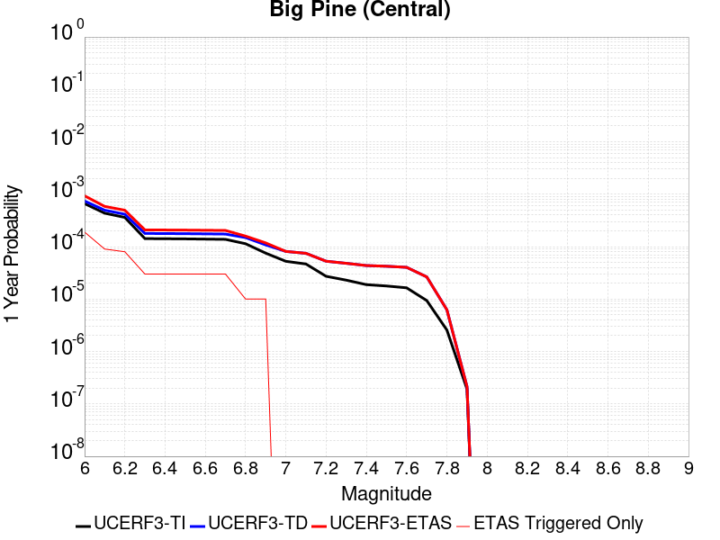 |  |

| Magnitude | 1 wk TI Prob | 1 wk TD Prob | 1 wk ETAS Prob | 1 wk ETAS/TD Gain | 1 wk ETAS Triggered Only | 1 mo TI Prob | 1 mo TD Prob | 1 mo ETAS Prob | 1 mo ETAS/TD Gain | 1 mo ETAS Triggered Only | 1 yr TI Prob | 1 yr TD Prob | 1 yr ETAS Prob | 1 yr ETAS/TD Gain | 1 yr ETAS Triggered Only | 10 yr TI Prob | 10 yr TD Prob | 10 yr ETAS Prob | 10 yr ETAS/TD Gain | 10 yr ETAS Triggered Only |
|-----|-----|-----|-----|-----|-----|-----|-----|-----|-----|-----|-----|-----|-----|-----|-----|-----|-----|-----|-----|-----|
| 6.0 | 1.2706755E-5 | 1.4250529E-5 | 1.2424897E-4 | 8.718902 | 1.1E-4 | 5.4456385E-5 | 6.107247E-5 | 2.110633E-4 | 3.4559486 | 1.5E-4 | 6.628048E-4 | 7.433402E-4 | 9.3319896E-4 | 1.255413 | 1.9E-4 | 0.006608314 | 0.0074135666 | 0.0076418617 | 1.0307941 | 2.3E-4 |
| 6.1 | 8.342579E-6 | 9.510762E-6 | 5.9510287E-5 | 6.2571526 | 5.0E-5 | 3.5753423E-5 | 4.0759893E-5 | 1.1075704E-4 | 2.7173045 | 7.0E-5 | 4.3521097E-4 | 4.961604E-4 | 5.8611576E-4 | 1.1813029 | 9.0E-5 | 0.0043435963 | 0.0049540824 | 0.0050635375 | 1.0220939 | 1.1E-4 |
| 6.2 | 6.923899E-6 | 7.967147E-6 | 5.796675E-5 | 7.275722 | 5.0E-5 | 2.9673516E-5 | 3.4144578E-5 | 9.414253E-5 | 2.7571735 | 6.0E-5 | 3.6121515E-4 | 4.156502E-4 | 4.956169E-4 | 1.1923895 | 8.0E-5 | 0.003606286 | 0.0041520367 | 0.0042516217 | 1.0239846 | 1.0E-4 |
| 6.3 | 2.728396E-6 | 3.4242908E-6 | 1.3424256E-5 | 3.9203029 | 1.0E-5 | 1.1693074E-5 | 1.4675454E-5 | 3.4675162E-5 | 2.3628 | 2.0E-5 | 1.4235388E-4 | 1.7865987E-4 | 2.0865451E-4 | 1.1678869 | 3.0E-5 | 0.0014226272 | 0.0017866704 | 0.001836581 | 1.027935 | 5.0E-5 |
| 6.4 | 2.7136944E-6 | 3.408584E-6 | 1.340855E-5 | 3.9337595 | 1.0E-5 | 1.1630066E-5 | 1.4608141E-5 | 3.460785E-5 | 2.3690796 | 2.0E-5 | 1.4158686E-4 | 1.7784047E-4 | 2.0783514E-4 | 1.1686605 | 3.0E-5 | 0.0014149669 | 0.0017784894 | 0.0018284005 | 1.0280638 | 5.0E-5 |
| 6.5 | 2.6971882E-6 | 3.3909291E-6 | 1.3390895E-5 | 3.9490342 | 1.0E-5 | 1.1559327E-5 | 1.45324775E-5 | 3.4532186E-5 | 2.3762078 | 2.0E-5 | 1.4072572E-4 | 1.7691942E-4 | 2.0691412E-4 | 1.1695387 | 3.0E-5 | 0.0014063664 | 0.0017692937 | 0.0018192052 | 1.0282098 | 5.0E-5 |
| 6.6 | 2.669092E-6 | 3.3609497E-6 | 1.33609165E-5 | 3.9753394 | 1.0E-5 | 1.1438916E-5 | 1.4403995E-5 | 3.4403707E-5 | 2.3884835 | 2.0E-5 | 1.3925991E-4 | 1.753554E-4 | 2.0535014E-4 | 1.1710511 | 3.0E-5 | 0.0013917267 | 0.0017536782 | 0.0018035906 | 1.0284615 | 5.0E-5 |
| 6.7 | 2.6408059E-6 | 3.3309752E-6 | 1.3330942E-5 | 4.002114 | 1.0E-5 | 1.1317691E-5 | 1.4275535E-5 | 3.427525E-5 | 2.4009783 | 2.0E-5 | 1.3778417E-4 | 1.7379165E-4 | 2.0378643E-4 | 1.1725905 | 3.0E-5 | 0.0013769877 | 0.0017380653 | 0.0017879783 | 1.0287176 | 5.0E-5 |
| 6.8 | 2.1786943E-6 | 2.8544325E-6 | 2.8544325E-6 | 1.0 | 0.0 | 9.337228E-6 | 1.2233229E-5 | 2.2233107E-5 | 1.8174356 | 1.0E-5 | 1.1367482E-4 | 1.4893012E-4 | 1.5892863E-4 | 1.0671356 | 1.0E-5 | 0.0011361669 | 0.0014897975 | 0.0015197528 | 1.0201069 | 3.0E-5 |
| 6.9 | 1.4411696E-6 | 2.068499E-6 | 2.068499E-6 | 1.0 | 0.0 | 6.1764263E-6 | 8.864968E-6 | 1.886488E-5 | 2.1280258 | 1.0E-5 | 7.51954E-5 | 1.079259E-4 | 1.1792482E-4 | 1.0926461 | 1.0E-5 | 7.5169955E-4 | 0.0010801847 | 0.0010901738 | 1.0092477 | 1.0E-5 |
| 7.0 | 1.0073411E-6 | 1.554261E-6 | 1.554261E-6 | 1.0 | 0.0 | 4.317169E-6 | 6.6611024E-6 | 6.6611024E-6 | 1.0 | 0.0 | 5.2560266E-5 | 8.1096056E-5 | 8.1096056E-5 | 1.0 | 0.0 | 5.2547833E-4 | 8.1210316E-4 | 8.1210316E-4 | 1.0 | 0.0 |
| 7.1 | 8.947104E-7 | 1.4302494E-6 | 1.4302494E-6 | 1.0 | 0.0 | 3.834468E-6 | 6.129627E-6 | 6.129627E-6 | 1.0 | 0.0 | 4.6683643E-5 | 7.46258E-5 | 7.46258E-5 | 1.0 | 0.0 | 4.6673836E-4 | 7.474457E-4 | 7.474457E-4 | 1.0 | 0.0 |
| 7.2 | 5.215166E-7 | 1.0111678E-6 | 1.0111678E-6 | 1.0 | 0.0 | 2.2350691E-6 | 4.3335694E-6 | 4.3335694E-6 | 1.0 | 0.0 | 2.7211627E-5 | 5.2759973E-5 | 5.2759973E-5 | 1.0 | 0.0 | 2.7208295E-4 | 5.2890263E-4 | 5.2890263E-4 | 1.0 | 0.0 |
| 7.3 | 4.4024807E-7 | 9.219589E-7 | 9.219589E-7 | 1.0 | 0.0 | 1.8867761E-6 | 3.9512465E-6 | 3.9512465E-6 | 1.0 | 0.0 | 2.2971257E-5 | 4.810541E-5 | 4.810541E-5 | 1.0 | 0.0 | 2.2968883E-4 | 4.8237795E-4 | 4.8237795E-4 | 1.0 | 0.0 |
| 7.4 | 3.6130905E-7 | 8.358523E-7 | 8.358523E-7 | 1.0 | 0.0 | 1.5484665E-6 | 3.5822195E-6 | 3.5822195E-6 | 1.0 | 0.0 | 1.8852415E-5 | 4.3612687E-5 | 4.3612687E-5 | 1.0 | 0.0 | 1.8850817E-4 | 4.374597E-4 | 4.374597E-4 | 1.0 | 0.0 |
| 7.5 | 3.408184E-7 | 8.108147E-7 | 8.108147E-7 | 1.0 | 0.0 | 1.4606494E-6 | 3.4749157E-6 | 3.4749157E-6 | 1.0 | 0.0 | 1.7783263E-5 | 4.2306317E-5 | 4.2306317E-5 | 1.0 | 0.0 | 1.778184E-4 | 4.2437963E-4 | 4.2437963E-4 | 1.0 | 0.0 |
| 7.6 | 3.1428627E-7 | 7.7316E-7 | 7.7316E-7 | 1.0 | 0.0 | 1.3469405E-6 | 3.3135389E-6 | 3.3135389E-6 | 1.0 | 0.0 | 1.6398877E-5 | 4.0341627E-5 | 4.0341627E-5 | 1.0 | 0.0 | 1.6397667E-4 | 4.0471106E-4 | 4.0471106E-4 | 1.0 | 0.0 |
| 7.7 | 1.7972785E-7 | 5.077752E-7 | 5.077752E-7 | 1.0 | 0.0 | 7.70262E-7 | 2.1761778E-6 | 2.1761778E-6 | 1.0 | 0.0 | 9.377899E-6 | 2.6494654E-5 | 2.6494654E-5 | 1.0 | 0.0 | 9.377503E-5 | 2.662899E-4 | 2.662899E-4 | 1.0 | 0.0 |
| 7.8 | 4.9230927E-8 | 1.198079E-7 | 1.198079E-7 | 1.0 | 0.0 | 2.1098968E-7 | 5.134623E-7 | 5.134623E-7 | 1.0 | 0.0 | 2.5687964E-6 | 6.2513873E-6 | 6.2513873E-6 | 1.0 | 0.0 | 2.5687666E-5 | 6.295415E-5 | 6.295415E-5 | 1.0 | 0.0 |
| 7.9 | 3.6805972E-9 | 4.105293E-9 | 4.105293E-9 | 1.0 | 0.0 | 1.5773987E-8 | 1.7594115E-8 | 1.7594115E-8 | 1.0 | 0.0 | 1.9204828E-7 | 2.1420831E-7 | 2.1420831E-7 | 1.0 | 0.0 | 1.920481E-6 | 2.1900614E-6 | 2.1900614E-6 | 1.0 | 0.0 |

## Camp Rock 2011
*[(top)](#table-of-contents)*

| 1 Week | 1 Month | 1 Year | 10 Year |
|-----|-----|-----|-----|
|  |  | 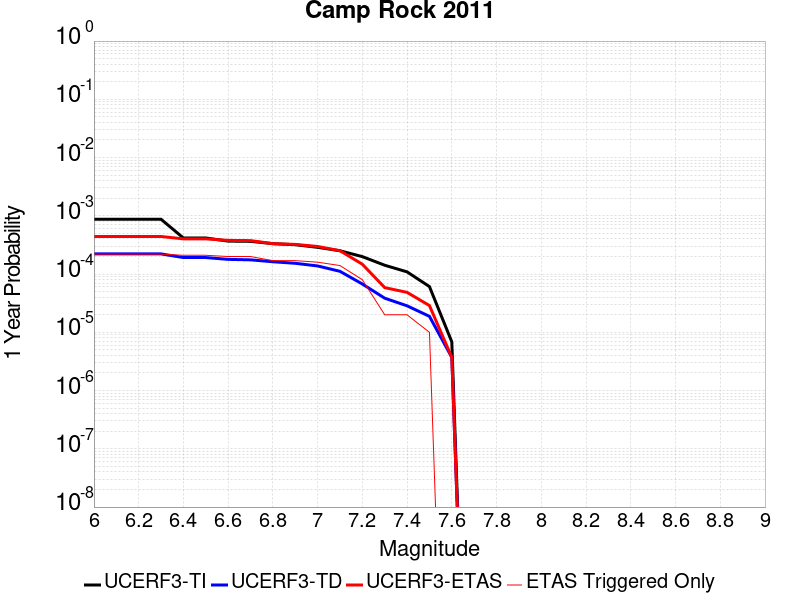 |  |

| Magnitude | 1 wk TI Prob | 1 wk TD Prob | 1 wk ETAS Prob | 1 wk ETAS/TD Gain | 1 wk ETAS Triggered Only | 1 mo TI Prob | 1 mo TD Prob | 1 mo ETAS Prob | 1 mo ETAS/TD Gain | 1 mo ETAS Triggered Only | 1 yr TI Prob | 1 yr TD Prob | 1 yr ETAS Prob | 1 yr ETAS/TD Gain | 1 yr ETAS Triggered Only | 10 yr TI Prob | 10 yr TD Prob | 10 yr ETAS Prob | 10 yr ETAS/TD Gain | 10 yr ETAS Triggered Only |
|-----|-----|-----|-----|-----|-----|-----|-----|-----|-----|-----|-----|-----|-----|-----|-----|-----|-----|-----|-----|-----|
| 6.0 | 1.6710783E-5 | 4.25026E-6 | 1.2424975E-4 | 29.233446 | 1.2E-4 | 7.161568E-5 | 1.8215276E-5 | 1.7821236E-4 | 9.783676 | 1.6E-4 | 8.7157206E-4 | 2.2174895E-4 | 4.4170016E-4 | 1.9918929 | 2.2E-4 | 0.008681616 | 0.0022153298 | 0.002454798 | 1.108096 | 2.4E-4 |
| 6.1 | 1.6710783E-5 | 4.25026E-6 | 1.2424975E-4 | 29.233446 | 1.2E-4 | 7.161568E-5 | 1.8215276E-5 | 1.7821236E-4 | 9.783676 | 1.6E-4 | 8.7157206E-4 | 2.2174895E-4 | 4.4170016E-4 | 1.9918929 | 2.2E-4 | 0.008681616 | 0.0022153298 | 0.002454798 | 1.108096 | 2.4E-4 |
| 6.2 | 1.6710783E-5 | 4.25026E-6 | 1.2424975E-4 | 29.233446 | 1.2E-4 | 7.161568E-5 | 1.8215276E-5 | 1.7821236E-4 | 9.783676 | 1.6E-4 | 8.7157206E-4 | 2.2174895E-4 | 4.4170016E-4 | 1.9918929 | 2.2E-4 | 0.008681616 | 0.0022153298 | 0.002454798 | 1.108096 | 2.4E-4 |
| 6.3 | 1.6710783E-5 | 4.25026E-6 | 1.2424975E-4 | 29.233446 | 1.2E-4 | 7.161568E-5 | 1.8215276E-5 | 1.7821236E-4 | 9.783676 | 1.6E-4 | 8.7157206E-4 | 2.2174895E-4 | 4.4170016E-4 | 1.9918929 | 2.2E-4 | 0.008681616 | 0.0022153298 | 0.002454798 | 1.108096 | 2.4E-4 |
| 6.4 | 7.982846E-6 | 3.6820884E-6 | 1.13681686E-4 | 30.874239 | 1.1E-4 | 3.421175E-5 | 1.5780286E-5 | 1.6577792E-4 | 10.505382 | 1.5E-4 | 4.1644843E-4 | 1.9210839E-4 | 4.0206805E-4 | 2.092923 | 2.1E-4 | 0.0041566887 | 0.001919458 | 0.0021390358 | 1.1143957 | 2.2E-4 |
| 6.5 | 7.982846E-6 | 3.6820884E-6 | 1.13681686E-4 | 30.874239 | 1.1E-4 | 3.421175E-5 | 1.5780286E-5 | 1.6577792E-4 | 10.505382 | 1.5E-4 | 4.1644843E-4 | 1.9210839E-4 | 4.0206805E-4 | 2.092923 | 2.1E-4 | 0.0041566887 | 0.001919458 | 0.0021390358 | 1.1143957 | 2.2E-4 |
| 6.6 | 7.048869E-6 | 3.4243571E-6 | 1.0342401E-4 | 30.202461 | 1.0E-4 | 3.0209088E-5 | 1.4675736E-5 | 1.5467367E-4 | 10.539415 | 1.4E-4 | 3.677336E-4 | 1.7866275E-4 | 3.78627E-4 | 2.1192276 | 2.0E-4 | 0.0036712566 | 0.0017852228 | 0.0019948478 | 1.1174223 | 2.1E-4 |
| 6.7 | 6.987307E-6 | 3.3623348E-6 | 1.03362E-4 | 30.741138 | 1.0E-4 | 2.9945259E-5 | 1.4409929E-5 | 1.5440791E-4 | 10.715384 | 1.4E-4 | 3.6452254E-4 | 1.7542706E-4 | 3.7539197E-4 | 2.139875 | 2.0E-4 | 0.0036392517 | 0.001752917 | 0.0019625488 | 1.1195903 | 2.1E-4 |
| 6.8 | 6.3737602E-6 | 3.1179077E-6 | 7.311769E-5 | 23.450884 | 7.0E-5 | 2.731583E-5 | 1.3362394E-5 | 1.2336092E-4 | 9.231948 | 1.1E-4 | 3.3251947E-4 | 1.626753E-4 | 3.3264764E-4 | 2.0448565 | 1.7E-4 | 0.0033202237 | 0.0016255907 | 0.0018052981 | 1.110549 | 1.8E-4 |
| 6.9 | 6.112211E-6 | 2.9331156E-6 | 7.293291E-5 | 24.865337 | 7.0E-5 | 2.6194928E-5 | 1.2570436E-5 | 1.2256905E-4 | 9.750581 | 1.1E-4 | 3.1887658E-4 | 1.5303459E-4 | 3.2300857E-4 | 2.1106899 | 1.7E-4 | 0.003184194 | 0.0015293199 | 0.0017090446 | 1.1175194 | 1.8E-4 |
| 7.0 | 5.5140117E-6 | 2.641923E-6 | 6.264177E-5 | 23.71067 | 6.0E-5 | 2.3631264E-5 | 1.132248E-5 | 1.11321344E-4 | 9.831888 | 1.0E-4 | 2.8767265E-4 | 1.3784273E-4 | 2.9782066E-4 | 2.1605833 | 1.6E-4 | 0.0028730053 | 0.0013775975 | 0.0015473632 | 1.1232332 | 1.7E-4 |
| 7.1 | 4.8151105E-6 | 2.1342705E-6 | 4.2134187E-5 | 19.741728 | 4.0E-5 | 2.0636026E-5 | 9.146843E-6 | 8.914611E-5 | 9.746108 | 8.0E-5 | 2.5121463E-4 | 1.1135734E-4 | 2.5134176E-4 | 2.2570739 | 1.4E-4 | 0.0025093083 | 0.0011130372 | 0.0012628703 | 1.1346164 | 1.5E-4 |
| 7.2 | 3.818335E-6 | 1.2937425E-6 | 3.1293705E-5 | 24.18851 | 3.0E-5 | 1.6364189E-5 | 5.5445994E-6 | 6.554426E-5 | 11.821281 | 6.0E-5 | 1.9921579E-4 | 6.750349E-5 | 1.4749808E-4 | 2.185044 | 8.0E-5 | 0.0019903728 | 6.748381E-4 | 7.547841E-4 | 1.118467 | 8.0E-5 |
| 7.3 | 2.7166698E-6 | 7.3835776E-7 | 7.3835776E-7 | 1.0 | 0.0 | 1.1642818E-5 | 3.1643867E-6 | 2.3164323E-5 | 7.32032 | 2.0E-5 | 1.4174209E-4 | 3.8525748E-5 | 5.8524976E-5 | 1.5191133 | 2.0E-5 | 0.0014165172 | 3.851927E-4 | 4.0518498E-4 | 1.051902 | 2.0E-5 |
| 7.4 | 2.0893426E-6 | 5.4618386E-7 | 5.4618386E-7 | 1.0 | 0.0 | 8.954295E-6 | 2.3407858E-6 | 2.2340739E-5 | 9.544119 | 2.0E-5 | 1.0901308E-4 | 2.84987E-5 | 4.8498132E-5 | 1.7017664 | 2.0E-5 | 0.0010895962 | 2.84951E-4 | 3.049453E-4 | 1.0701675 | 2.0E-5 |
| 7.5 | 1.1681728E-6 | 3.6030585E-7 | 3.6030585E-7 | 1.0 | 0.0 | 5.0064455E-6 | 1.544167E-6 | 1.1544152E-5 | 7.475973 | 1.0E-5 | 6.0951766E-5 | 1.8800076E-5 | 2.8799888E-5 | 1.5319028 | 1.0E-5 | 6.093505E-4 | 1.8798532E-4 | 1.9798345E-4 | 1.0531856 | 1.0E-5 |
| 7.6 | 1.3154387E-7 | 7.1197384E-8 | 7.1197384E-8 | 1.0 | 0.0 | 5.6375933E-7 | 3.051316E-7 | 3.051316E-7 | 1.0 | 0.0 | 6.863748E-6 | 3.7149728E-6 | 3.7149728E-6 | 1.0 | 0.0 | 6.863536E-5 | 3.7149264E-5 | 3.7149264E-5 | 1.0 | 0.0 |

## San Diego Trough north alt1
*[(top)](#table-of-contents)*

| 1 Week | 1 Month | 1 Year | 10 Year |
|-----|-----|-----|-----|
|  | 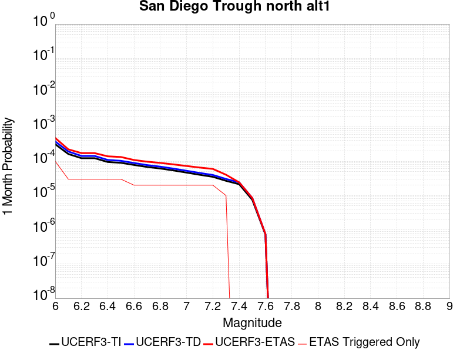 | 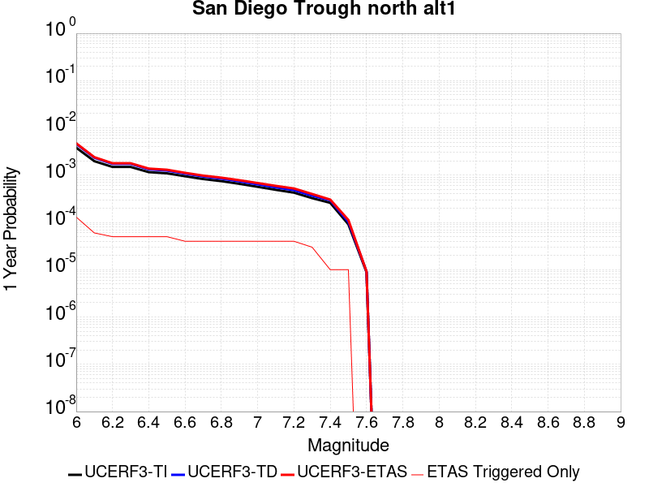 |  |

| Magnitude | 1 wk TI Prob | 1 wk TD Prob | 1 wk ETAS Prob | 1 wk ETAS/TD Gain | 1 wk ETAS Triggered Only | 1 mo TI Prob | 1 mo TD Prob | 1 mo ETAS Prob | 1 mo ETAS/TD Gain | 1 mo ETAS Triggered Only | 1 yr TI Prob | 1 yr TD Prob | 1 yr ETAS Prob | 1 yr ETAS/TD Gain | 1 yr ETAS Triggered Only | 10 yr TI Prob | 10 yr TD Prob | 10 yr ETAS Prob | 10 yr ETAS/TD Gain | 10 yr ETAS Triggered Only |
|-----|-----|-----|-----|-----|-----|-----|-----|-----|-----|-----|-----|-----|-----|-----|-----|-----|-----|-----|-----|-----|
| 6.0 | 7.329252E-5 | 8.821093E-5 | 1.882021E-4 | 2.1335464 | 1.0E-4 | 3.14073E-4 | 3.7799572E-4 | 4.7795792E-4 | 1.2644533 | 1.0E-4 | 0.0038171355 | 0.004593027 | 0.00472243 | 1.0281738 | 1.3E-4 | 0.03752231 | 0.045044992 | 0.04523598 | 1.00424 | 2.0E-4 |
| 6.1 | 3.7940346E-5 | 4.4885E-5 | 7.4883654E-5 | 1.6683447 | 3.0E-5 | 1.6259136E-4 | 1.9235066E-4 | 2.223449E-4 | 1.1559352 | 3.0E-5 | 0.0019777524 | 0.0023394432 | 0.0023993028 | 1.0255871 | 6.0E-5 | 0.019602431 | 0.023156688 | 0.023254372 | 1.0042185 | 1.0E-4 |
| 6.2 | 2.8645263E-5 | 3.329678E-5 | 6.329578E-5 | 1.9009581 | 3.0E-5 | 1.2275964E-4 | 1.4269284E-4 | 1.7268855E-4 | 1.2102118 | 3.0E-5 | 0.0014935739 | 0.0017359189 | 0.0017858321 | 1.0287532 | 5.0E-5 | 0.0148357535 | 0.017226247 | 0.01730487 | 1.004564 | 8.0E-5 |
| 6.3 | 2.8645263E-5 | 3.329678E-5 | 6.329578E-5 | 1.9009581 | 3.0E-5 | 1.2275964E-4 | 1.4269284E-4 | 1.7268855E-4 | 1.2102118 | 3.0E-5 | 0.0014935739 | 0.0017359189 | 0.0017858321 | 1.0287532 | 5.0E-5 | 0.0148357535 | 0.017226247 | 0.01730487 | 1.004564 | 8.0E-5 |
| 6.4 | 2.2204576E-5 | 2.5448318E-5 | 5.5447555E-5 | 2.17883 | 3.0E-5 | 9.5159E-5 | 1.0905972E-4 | 1.3905644E-4 | 1.2750486 | 3.0E-5 | 0.001157945 | 0.0013270034 | 0.001376937 | 1.0376289 | 5.0E-5 | 0.011519298 | 0.013191955 | 0.0132709 | 1.0059843 | 8.0E-5 |
| 6.5 | 2.1004838E-5 | 2.4024694E-5 | 5.4023974E-5 | 2.2486851 | 3.0E-5 | 9.0017624E-5 | 1.0295896E-4 | 1.3295587E-4 | 1.2913482 | 3.0E-5 | 0.0010954136 | 0.0012528138 | 0.0013027512 | 1.0398601 | 5.0E-5 | 0.010900296 | 0.012458589 | 0.012537592 | 1.0063412 | 8.0E-5 |
| 6.6 | 1.820557E-5 | 2.0704787E-5 | 4.0704374E-5 | 1.9659402 | 2.0E-5 | 7.802154E-5 | 8.873181E-5 | 1.0873003E-4 | 1.2253783 | 2.0E-5 | 9.4949827E-4 | 0.0010797799 | 0.0011197367 | 1.0370046 | 4.0E-5 | 0.009454516 | 0.010746004 | 0.010815252 | 1.0064441 | 7.0E-5 |
| 6.7 | 1.5884485E-5 | 1.7983646E-5 | 3.7983285E-5 | 2.1121016 | 2.0E-5 | 6.807459E-5 | 7.707051E-5 | 9.7068965E-5 | 1.2594826 | 2.0E-5 | 8.284929E-4 | 9.3793223E-4 | 9.778948E-4 | 1.042607 | 4.0E-5 | 0.008254109 | 0.009340104 | 0.009399543 | 1.0063639 | 6.0E-5 |
| 6.8 | 1.4331171E-5 | 1.6201066E-5 | 3.620074E-5 | 2.2344668 | 2.0E-5 | 6.141786E-5 | 6.94313E-5 | 8.942991E-5 | 1.2880346 | 2.0E-5 | 7.4750587E-4 | 8.450002E-4 | 8.849664E-4 | 1.0472972 | 4.0E-5 | 0.0074499645 | 0.008418139 | 0.008467718 | 1.0058895 | 5.0E-5 |
| 6.9 | 1.2574203E-5 | 1.4205835E-5 | 3.420555E-5 | 2.4078522 | 2.0E-5 | 5.3888325E-5 | 6.0880735E-5 | 8.0879516E-5 | 1.3284911 | 2.0E-5 | 6.558929E-4 | 7.409723E-4 | 7.809427E-4 | 1.0539432 | 4.0E-5 | 0.0065396037 | 0.007385203 | 0.0074348343 | 1.0067203 | 5.0E-5 |
| 7.0 | 1.0883844E-5 | 1.2289262E-5 | 3.2289016E-5 | 2.627417 | 2.0E-5 | 4.664421E-5 | 5.2667205E-5 | 7.266615E-5 | 1.379723 | 2.0E-5 | 5.677453E-4 | 6.4103556E-4 | 6.810099E-4 | 1.062359 | 4.0E-5 | 0.00566297 | 0.006391993 | 0.0064416733 | 1.0077723 | 5.0E-5 |
| 7.1 | 9.393088E-6 | 1.060702E-5 | 3.0606807E-5 | 2.8855238 | 2.0E-5 | 4.025547E-5 | 4.545787E-5 | 6.545696E-5 | 1.4399478 | 2.0E-5 | 4.900001E-4 | 5.533098E-4 | 5.9328764E-4 | 1.0722523 | 4.0E-5 | 0.0048892107 | 0.005519418 | 0.005559197 | 1.0072072 | 4.0E-5 |
| 7.2 | 8.190791E-6 | 9.258625E-6 | 2.9258441E-5 | 3.1601279 | 2.0E-5 | 3.510292E-5 | 3.9679224E-5 | 5.967843E-5 | 1.5040221 | 2.0E-5 | 4.2729423E-4 | 4.8298817E-4 | 5.229688E-4 | 1.0827777 | 4.0E-5 | 0.0042647356 | 0.004819465 | 0.004859272 | 1.0082597 | 4.0E-5 |
| 7.3 | 6.268162E-6 | 7.089716E-6 | 1.7089646E-5 | 2.4104838 | 1.0E-5 | 2.6863276E-5 | 3.0384144E-5 | 4.038384E-5 | 1.3291091 | 1.0E-5 | 3.2701128E-4 | 3.6986457E-4 | 3.9985348E-4 | 1.0810808 | 3.0E-5 | 0.003265305 | 0.003692536 | 0.003722425 | 1.0080945 | 3.0E-5 |
| 7.4 | 4.985186E-6 | 5.6426816E-6 | 5.6426816E-6 | 1.0 | 0.0 | 2.1364907E-5 | 2.4182698E-5 | 2.4182698E-5 | 1.0 | 0.0 | 2.600867E-4 | 2.9438498E-4 | 3.0438203E-4 | 1.0339592 | 1.0E-5 | 0.002597825 | 0.0029399914 | 0.002949962 | 1.0033914 | 1.0E-5 |
| 7.5 | 1.7489613E-6 | 1.969678E-6 | 1.969678E-6 | 1.0 | 0.0 | 7.495527E-6 | 8.4414505E-6 | 8.4414505E-6 | 1.0 | 0.0 | 9.125422E-5 | 1.02770035E-4 | 1.1276901E-4 | 1.0972946 | 1.0E-5 | 9.1216754E-4 | 0.0010272472 | 0.0010372369 | 1.0097247 | 1.0E-5 |
| 7.6 | 1.6988751E-7 | 1.7533823E-7 | 1.7533823E-7 | 1.0 | 0.0 | 7.2808916E-7 | 7.5144936E-7 | 7.5144936E-7 | 1.0 | 0.0 | 8.864449E-6 | 9.14886E-6 | 9.14886E-6 | 1.0 | 0.0 | 8.8640954E-5 | 9.1485024E-5 | 9.1485024E-5 | 1.0 | 0.0 |

## Pleito
*[(top)](#table-of-contents)*

| 1 Week | 1 Month | 1 Year | 10 Year |
|-----|-----|-----|-----|
| 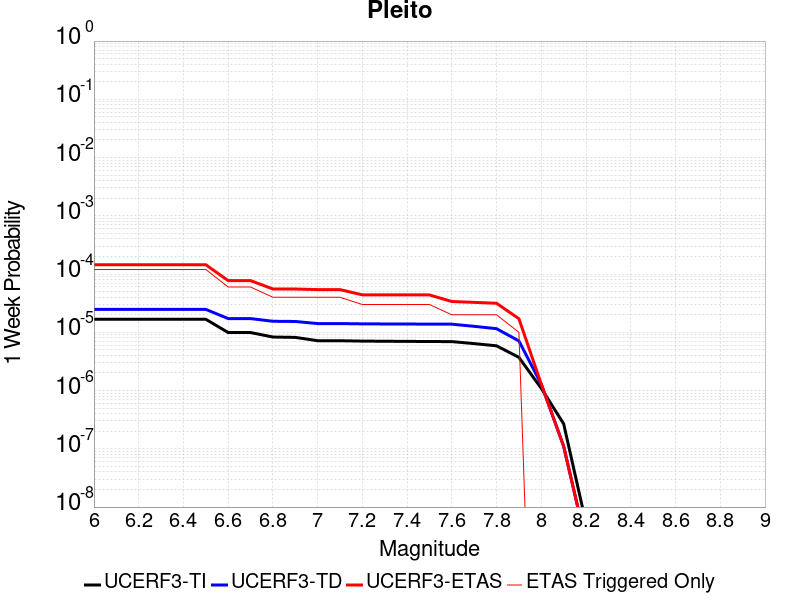 |  |  |  |

| Magnitude | 1 wk TI Prob | 1 wk TD Prob | 1 wk ETAS Prob | 1 wk ETAS/TD Gain | 1 wk ETAS Triggered Only | 1 mo TI Prob | 1 mo TD Prob | 1 mo ETAS Prob | 1 mo ETAS/TD Gain | 1 mo ETAS Triggered Only | 1 yr TI Prob | 1 yr TD Prob | 1 yr ETAS Prob | 1 yr ETAS/TD Gain | 1 yr ETAS Triggered Only | 10 yr TI Prob | 10 yr TD Prob | 10 yr ETAS Prob | 10 yr ETAS/TD Gain | 10 yr ETAS Triggered Only |
|-----|-----|-----|-----|-----|-----|-----|-----|-----|-----|-----|-----|-----|-----|-----|-----|-----|-----|-----|-----|-----|
| 6.0 | 1.6763008E-5 | 2.4763838E-5 | 1.4476087E-4 | 5.8456554 | 1.2E-4 | 7.183948E-5 | 1.0612683E-4 | 2.3611303E-4 | 2.2248194 | 1.3E-4 | 8.742947E-4 | 0.0012914003 | 0.0014811549 | 1.1469371 | 1.9E-4 | 0.00870863 | 0.0129538905 | 0.013180911 | 1.0175253 | 2.3E-4 |
| 6.1 | 1.6763008E-5 | 2.4763838E-5 | 1.4476087E-4 | 5.8456554 | 1.2E-4 | 7.183948E-5 | 1.0612683E-4 | 2.3611303E-4 | 2.2248194 | 1.3E-4 | 8.742947E-4 | 0.0012914003 | 0.0014811549 | 1.1469371 | 1.9E-4 | 0.00870863 | 0.0129538905 | 0.013180911 | 1.0175253 | 2.3E-4 |
| 6.2 | 1.6763008E-5 | 2.4763838E-5 | 1.4476087E-4 | 5.8456554 | 1.2E-4 | 7.183948E-5 | 1.0612683E-4 | 2.3611303E-4 | 2.2248194 | 1.3E-4 | 8.742947E-4 | 0.0012914003 | 0.0014811549 | 1.1469371 | 1.9E-4 | 0.00870863 | 0.0129538905 | 0.013180911 | 1.0175253 | 2.3E-4 |
| 6.3 | 1.6763008E-5 | 2.4763838E-5 | 1.4476087E-4 | 5.8456554 | 1.2E-4 | 7.183948E-5 | 1.0612683E-4 | 2.3611303E-4 | 2.2248194 | 1.3E-4 | 8.742947E-4 | 0.0012914003 | 0.0014811549 | 1.1469371 | 1.9E-4 | 0.00870863 | 0.0129538905 | 0.013180911 | 1.0175253 | 2.3E-4 |
| 6.4 | 1.6763008E-5 | 2.4763838E-5 | 1.4476087E-4 | 5.8456554 | 1.2E-4 | 7.183948E-5 | 1.0612683E-4 | 2.3611303E-4 | 2.2248194 | 1.3E-4 | 8.742947E-4 | 0.0012914003 | 0.0014811549 | 1.1469371 | 1.9E-4 | 0.00870863 | 0.0129538905 | 0.013180911 | 1.0175253 | 2.3E-4 |
| 6.5 | 1.6763008E-5 | 2.4763838E-5 | 1.4476087E-4 | 5.8456554 | 1.2E-4 | 7.183948E-5 | 1.0612683E-4 | 2.3611303E-4 | 2.2248194 | 1.3E-4 | 8.742947E-4 | 0.0012914003 | 0.0014811549 | 1.1469371 | 1.9E-4 | 0.00870863 | 0.0129538905 | 0.013180911 | 1.0175253 | 2.3E-4 |
| 6.6 | 9.910213E-6 | 1.7214623E-5 | 7.721359E-5 | 4.4853487 | 6.0E-5 | 4.247165E-5 | 7.377489E-5 | 1.4376972E-4 | 1.9487623 | 7.0E-5 | 5.169696E-4 | 8.978429E-4 | 9.777711E-4 | 1.0890224 | 8.0E-5 | 0.0051576863 | 0.009050702 | 0.009139887 | 1.009854 | 9.0E-5 |
| 6.7 | 9.910213E-6 | 1.7214623E-5 | 7.721359E-5 | 4.4853487 | 6.0E-5 | 4.247165E-5 | 7.377489E-5 | 1.4376972E-4 | 1.9487623 | 7.0E-5 | 5.169696E-4 | 8.978429E-4 | 9.777711E-4 | 1.0890224 | 8.0E-5 | 0.0051576863 | 0.009050702 | 0.009139887 | 1.009854 | 9.0E-5 |
| 6.8 | 8.300162E-6 | 1.5474232E-5 | 5.5473614E-5 | 3.5849025 | 4.0E-5 | 3.557164E-5 | 6.631646E-5 | 1.16313146E-4 | 1.7539107 | 5.0E-5 | 4.3299864E-4 | 8.071053E-4 | 8.6705683E-4 | 1.0742798 | 6.0E-5 | 0.004321559 | 0.008150139 | 0.0082096495 | 1.0073018 | 6.0E-5 |
| 6.9 | 8.183114E-6 | 1.5345448E-5 | 5.5344834E-5 | 3.6065962 | 4.0E-5 | 3.5070017E-5 | 6.576455E-5 | 1.15761264E-4 | 1.7602379 | 5.0E-5 | 4.2689382E-4 | 8.003907E-4 | 8.603427E-4 | 1.0749034 | 6.0E-5 | 0.0042607468 | 0.008083483 | 0.008142998 | 1.0073625 | 6.0E-5 |
| 7.0 | 7.1748823E-6 | 1.413244E-5 | 5.4131873E-5 | 3.8303277 | 4.0E-5 | 3.0749135E-5 | 6.0566195E-5 | 1.1056317E-4 | 1.825493 | 5.0E-5 | 3.743064E-4 | 7.371445E-4 | 7.9710025E-4 | 1.0813352 | 6.0E-5 | 0.0037367654 | 0.007454939 | 0.007514492 | 1.0079883 | 6.0E-5 |
| 7.1 | 7.1671807E-6 | 1.412281E-5 | 5.4122247E-5 | 3.8322575 | 4.0E-5 | 3.0716128E-5 | 6.052493E-5 | 1.10521905E-4 | 1.8260559 | 5.0E-5 | 3.7390468E-4 | 7.366424E-4 | 7.965982E-4 | 1.0813906 | 6.0E-5 | 0.0037327618 | 0.0074499524 | 0.0075095054 | 1.0079937 | 6.0E-5 |
| 7.2 | 7.0649667E-6 | 1.39701015E-5 | 4.396968E-5 | 3.1474133 | 3.0E-5 | 3.0278077E-5 | 5.9870494E-5 | 9.98681E-5 | 1.6680688 | 4.0E-5 | 3.6857324E-4 | 7.2868E-4 | 7.7864353E-4 | 1.0685673 | 5.0E-5 | 0.0036796255 | 0.0073707094 | 0.007420341 | 1.0067337 | 5.0E-5 |
| 7.3 | 7.02082E-6 | 1.3913556E-5 | 4.391314E-5 | 3.1561406 | 3.0E-5 | 3.008888E-5 | 5.9628168E-5 | 9.962578E-5 | 1.6707839 | 4.0E-5 | 3.6627054E-4 | 7.2573166E-4 | 7.756954E-4 | 1.068846 | 5.0E-5 | 0.0036566744 | 0.007341209 | 0.007390842 | 1.0067608 | 5.0E-5 |
| 7.4 | 6.987146E-6 | 1.3873118E-5 | 4.3872704E-5 | 3.1624255 | 3.0E-5 | 2.9944567E-5 | 5.945487E-5 | 9.945249E-5 | 1.6727391 | 4.0E-5 | 3.6451413E-4 | 7.2362315E-4 | 7.73587E-4 | 1.0690467 | 5.0E-5 | 0.0036391679 | 0.007320144 | 0.007369778 | 1.0067805 | 5.0E-5 |
| 7.5 | 6.9494554E-6 | 1.3830024E-5 | 4.382961E-5 | 3.1691637 | 3.0E-5 | 2.9783041E-5 | 5.9270187E-5 | 9.926782E-5 | 1.6748356 | 4.0E-5 | 3.625482E-4 | 7.2137616E-4 | 7.7134004E-4 | 1.069262 | 5.0E-5 | 0.0036195726 | 0.0072977724 | 0.0073474078 | 1.0068014 | 5.0E-5 |
| 7.6 | 6.92694E-6 | 1.3789138E-5 | 3.3788863E-5 | 2.450397 | 2.0E-5 | 2.9686547E-5 | 5.909497E-5 | 8.90932E-5 | 1.5076274 | 3.0E-5 | 3.6137376E-4 | 7.1924424E-4 | 7.592155E-4 | 1.0555739 | 4.0E-5 | 0.0036078666 | 0.0072765257 | 0.0073162345 | 1.0054572 | 4.0E-5 |
| 7.7 | 6.395867E-6 | 1.2668219E-5 | 3.2667966E-5 | 2.578734 | 2.0E-5 | 2.741057E-5 | 5.429124E-5 | 8.428961E-5 | 1.5525453 | 3.0E-5 | 3.336726E-4 | 6.6079566E-4 | 7.0076925E-4 | 1.0604931 | 4.0E-5 | 0.0033317201 | 0.0066951844 | 0.0067349165 | 1.0059345 | 4.0E-5 |
| 7.8 | 5.8664327E-6 | 1.153586E-5 | 3.153563E-5 | 2.7337043 | 2.0E-5 | 2.5141611E-5 | 4.9438466E-5 | 7.9436984E-5 | 1.6067849 | 3.0E-5 | 3.060561E-4 | 6.017473E-4 | 6.417232E-4 | 1.0664331 | 4.0E-5 | 0.0030563495 | 0.0061006667 | 0.0061404225 | 1.0065167 | 4.0E-5 |
| 7.9 | 3.7167474E-6 | 7.1140853E-6 | 1.7114015E-5 | 2.405652 | 1.0E-5 | 1.592882E-5 | 3.0488582E-5 | 4.0488278E-5 | 1.3279816 | 1.0E-5 | 1.9391612E-4 | 3.7113542E-4 | 3.9112798E-4 | 1.0538687 | 2.0E-5 | 0.0019374699 | 0.0037674906 | 0.0037874153 | 1.0052886 | 2.0E-5 |
| 8.0 | 1.0903841E-6 | 1.2879392E-6 | 1.2879392E-6 | 1.0 | 0.0 | 4.6730665E-6 | 5.5197274E-6 | 5.5197274E-6 | 1.0 | 0.0 | 5.68931E-5 | 6.720063E-5 | 6.720063E-5 | 1.0 | 0.0 | 5.6878536E-4 | 6.941948E-4 | 6.941948E-4 | 1.0 | 0.0 |
| 8.1 | 2.6894583E-7 | 1.1060341E-7 | 1.1060341E-7 | 1.0 | 0.0 | 1.1526245E-6 | 4.740145E-7 | 4.740145E-7 | 1.0 | 0.0 | 1.4033113E-5 | 5.7711113E-6 | 5.7711113E-6 | 1.0 | 0.0 | 1.4032227E-4 | 6.456908E-5 | 6.456908E-5 | 1.0 | 0.0 |
| 8.2 | 5.2967013E-9 | 2.4578228E-9 | 2.4578228E-9 | 1.0 | 0.0 | 2.2700148E-8 | 1.0533527E-8 | 1.0533527E-8 | 1.0 | 0.0 | 2.7637427E-7 | 1.2824569E-7 | 1.2824569E-7 | 1.0 | 0.0 | 2.7637393E-6 | 1.4592787E-6 | 1.4592787E-6 | 1.0 | 0.0 |

## Pisgah-Bullion Mtn-Mesquite Lk
*[(top)](#table-of-contents)*

| 1 Week | 1 Month | 1 Year | 10 Year |
|-----|-----|-----|-----|
|  |  |  |  |

| Magnitude | 1 wk TI Prob | 1 wk TD Prob | 1 wk ETAS Prob | 1 wk ETAS/TD Gain | 1 wk ETAS Triggered Only | 1 mo TI Prob | 1 mo TD Prob | 1 mo ETAS Prob | 1 mo ETAS/TD Gain | 1 mo ETAS Triggered Only | 1 yr TI Prob | 1 yr TD Prob | 1 yr ETAS Prob | 1 yr ETAS/TD Gain | 1 yr ETAS Triggered Only | 10 yr TI Prob | 10 yr TD Prob | 10 yr ETAS Prob | 10 yr ETAS/TD Gain | 10 yr ETAS Triggered Only |
|-----|-----|-----|-----|-----|-----|-----|-----|-----|-----|-----|-----|-----|-----|-----|-----|-----|-----|-----|-----|-----|
| 6.0 | 3.0240792E-5 | 2.4091114E-5 | 1.1408894E-4 | 4.7357273 | 9.0E-5 | 1.2959696E-4 | 1.03244114E-4 | 2.032338E-4 | 1.9684782 | 1.0E-4 | 0.0015767008 | 0.0012563728 | 0.0013961969 | 1.1112919 | 1.4E-4 | 0.015655609 | 0.012502721 | 0.01271997 | 1.0173762 | 2.2E-4 |
| 6.1 | 3.0240792E-5 | 2.4091114E-5 | 1.1408894E-4 | 4.7357273 | 9.0E-5 | 1.2959696E-4 | 1.03244114E-4 | 2.032338E-4 | 1.9684782 | 1.0E-4 | 0.0015767008 | 0.0012563728 | 0.0013961969 | 1.1112919 | 1.4E-4 | 0.015655609 | 0.012502721 | 0.01271997 | 1.0173762 | 2.2E-4 |
| 6.2 | 3.0240792E-5 | 2.4091114E-5 | 1.1408894E-4 | 4.7357273 | 9.0E-5 | 1.2959696E-4 | 1.03244114E-4 | 2.032338E-4 | 1.9684782 | 1.0E-4 | 0.0015767008 | 0.0012563728 | 0.0013961969 | 1.1112919 | 1.4E-4 | 0.015655609 | 0.012502721 | 0.01271997 | 1.0173762 | 2.2E-4 |
| 6.3 | 2.0498217E-5 | 1.36380695E-5 | 6.363739E-5 | 4.666158 | 5.0E-5 | 8.784654E-5 | 5.844765E-5 | 1.0844473E-4 | 1.8554164 | 5.0E-5 | 0.0010690069 | 7.1138405E-4 | 7.8133424E-4 | 1.0983298 | 7.0E-5 | 0.01063879 | 0.0070926943 | 0.007201914 | 1.0153989 | 1.1E-4 |
| 6.4 | 2.0498217E-5 | 1.36380695E-5 | 6.363739E-5 | 4.666158 | 5.0E-5 | 8.784654E-5 | 5.844765E-5 | 1.0844473E-4 | 1.8554164 | 5.0E-5 | 0.0010690069 | 7.1138405E-4 | 7.8133424E-4 | 1.0983298 | 7.0E-5 | 0.01063879 | 0.0070926943 | 0.007201914 | 1.0153989 | 1.1E-4 |
| 6.5 | 1.7316182E-5 | 1.0477042E-5 | 4.0476727E-5 | 3.8633735 | 3.0E-5 | 7.42101E-5 | 4.4900895E-5 | 7.489955E-5 | 1.6681081 | 3.0E-5 | 9.0313336E-4 | 5.465413E-4 | 5.865194E-4 | 1.0731475 | 4.0E-5 | 0.008994718 | 0.0054529672 | 0.0055026943 | 1.0091193 | 5.0E-5 |
| 6.6 | 1.5251077E-5 | 8.414273E-6 | 2.8414104E-5 | 3.3768938 | 2.0E-5 | 6.536012E-5 | 3.6060712E-5 | 5.605999E-5 | 1.5546002 | 2.0E-5 | 7.9546886E-4 | 4.3895794E-4 | 4.6894478E-4 | 1.0683137 | 3.0E-5 | 0.007926274 | 0.0043816264 | 0.004421451 | 1.009089 | 4.0E-5 |
| 6.7 | 1.2997425E-5 | 6.4114965E-6 | 6.4114965E-6 | 1.0 | 0.0 | 5.570206E-5 | 2.7477578E-5 | 2.7477578E-5 | 1.0 | 0.0 | 6.7796157E-4 | 3.3449283E-4 | 3.4448947E-4 | 1.029886 | 1.0E-5 | 0.0067589693 | 0.0033403537 | 0.0033602868 | 1.0059674 | 2.0E-5 |
| 6.8 | 1.035386E-5 | 4.3332193E-6 | 4.3332193E-6 | 1.0 | 0.0 | 4.437293E-5 | 1.8570812E-5 | 1.8570812E-5 | 1.0 | 0.0 | 5.401065E-4 | 2.2607706E-4 | 2.360748E-4 | 1.0442227 | 1.0E-5 | 0.0053879567 | 0.0022585576 | 0.0022685349 | 1.0044177 | 1.0E-5 |
| 6.9 | 8.816252E-6 | 3.580638E-6 | 3.580638E-6 | 1.0 | 0.0 | 3.778339E-5 | 1.5345504E-5 | 1.5345504E-5 | 1.0 | 0.0 | 4.5991567E-4 | 1.8681608E-4 | 1.968142E-4 | 1.0535185 | 1.0E-5 | 0.00458965 | 0.0018666488 | 0.0018766301 | 1.0053473 | 1.0E-5 |
| 7.0 | 6.8232207E-6 | 2.5675843E-6 | 2.5675843E-6 | 1.0 | 0.0 | 2.9242048E-5 | 1.1003888E-5 | 1.1003888E-5 | 1.0 | 0.0 | 3.5596377E-4 | 1.3396442E-4 | 1.3396442E-4 | 1.0 | 0.0 | 0.0035539411 | 0.0013388677 | 0.0013388677 | 1.0 | 0.0 |
| 7.1 | 5.837013E-6 | 2.22738E-6 | 2.22738E-6 | 1.0 | 0.0 | 2.501553E-5 | 9.545881E-6 | 9.545881E-6 | 1.0 | 0.0 | 3.045215E-4 | 1.16215204E-4 | 1.16215204E-4 | 1.0 | 0.0 | 0.0030410455 | 0.0011615733 | 0.0011615733 | 1.0 | 0.0 |
| 7.2 | 4.278052E-6 | 1.6275711E-6 | 1.6275711E-6 | 1.0 | 0.0 | 1.833438E-5 | 6.9752873E-6 | 6.9752873E-6 | 1.0 | 0.0 | 2.231982E-4 | 8.492105E-5 | 8.492105E-5 | 1.0 | 0.0 | 0.0022297418 | 8.489092E-4 | 8.489092E-4 | 1.0 | 0.0 |
| 7.3 | 1.8803692E-6 | 8.344926E-7 | 8.344926E-7 | 1.0 | 0.0 | 8.0587E-6 | 3.5763926E-6 | 3.5763926E-6 | 1.0 | 0.0 | 9.811026E-5 | 4.354186E-5 | 4.354186E-5 | 1.0 | 0.0 | 9.806695E-4 | 4.3534773E-4 | 4.3534773E-4 | 1.0 | 0.0 |

## Brawley (Seismic Zone) alt 1
*[(top)](#table-of-contents)*

| 1 Week | 1 Month | 1 Year | 10 Year |
|-----|-----|-----|-----|
|  |  |  | 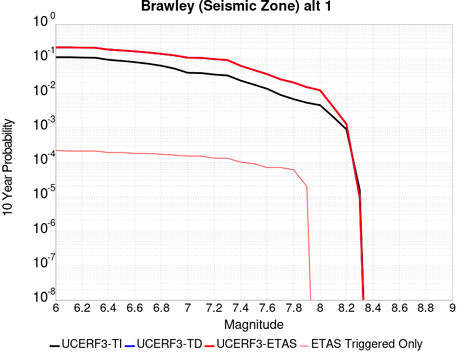 |

| Magnitude | 1 wk TI Prob | 1 wk TD Prob | 1 wk ETAS Prob | 1 wk ETAS/TD Gain | 1 wk ETAS Triggered Only | 1 mo TI Prob | 1 mo TD Prob | 1 mo ETAS Prob | 1 mo ETAS/TD Gain | 1 mo ETAS Triggered Only | 1 yr TI Prob | 1 yr TD Prob | 1 yr ETAS Prob | 1 yr ETAS/TD Gain | 1 yr ETAS Triggered Only | 10 yr TI Prob | 10 yr TD Prob | 10 yr ETAS Prob | 10 yr ETAS/TD Gain | 10 yr ETAS Triggered Only |
|-----|-----|-----|-----|-----|-----|-----|-----|-----|-----|-----|-----|-----|-----|-----|-----|-----|-----|-----|-----|-----|
| 6.0 | 2.2521618E-4 | 4.7632487E-4 | 5.762772E-4 | 1.2098408 | 1.0E-4 | 9.6485513E-4 | 0.0020398323 | 0.002199506 | 1.0782778 | 1.6E-4 | 0.011683988 | 0.024546238 | 0.024741327 | 1.0079479 | 2.0E-4 | 0.11088423 | 0.21350002 | 0.21367306 | 1.0008105 | 2.2E-4 |
| 6.1 | 2.2521618E-4 | 4.7632487E-4 | 5.762772E-4 | 1.2098408 | 1.0E-4 | 9.6485513E-4 | 0.0020398323 | 0.0021895263 | 1.0733855 | 1.5E-4 | 0.011683988 | 0.024546238 | 0.024731573 | 1.0075505 | 1.9E-4 | 0.11088423 | 0.21350002 | 0.21366519 | 1.0007735 | 2.1E-4 |
| 6.2 | 2.198148E-4 | 4.6717093E-4 | 5.671242E-4 | 1.2139544 | 1.0E-4 | 9.417233E-4 | 0.0020006616 | 0.0021503614 | 1.0748252 | 1.5E-4 | 0.011405343 | 0.024080504 | 0.024265928 | 1.0077002 | 1.9E-4 | 0.10837428 | 0.20993657 | 0.21010248 | 1.0007904 | 2.1E-4 |
| 6.3 | 2.1704129E-4 | 4.615278E-4 | 5.6148163E-4 | 1.2165717 | 1.0E-4 | 9.298453E-4 | 0.0019765133 | 0.002126217 | 1.0757412 | 1.5E-4 | 0.011262234 | 0.02379366 | 0.02397914 | 1.0077953 | 1.9E-4 | 0.107082725 | 0.20782755 | 0.20799391 | 1.0008005 | 2.1E-4 |
| 6.4 | 1.876142E-4 | 4.00449E-4 | 4.90413E-4 | 1.2246577 | 9.0E-5 | 8.038131E-4 | 0.0017150956 | 0.0018448726 | 1.0756675 | 1.3E-4 | 0.00974259 | 0.020680401 | 0.020846885 | 1.0080503 | 1.7E-4 | 0.093263686 | 0.18457815 | 0.18473308 | 1.0008394 | 1.9E-4 |
| 6.5 | 1.7390939E-4 | 3.7477075E-4 | 4.6473704E-4 | 1.2400568 | 9.0E-5 | 7.45113E-4 | 0.0016051838 | 0.0017349751 | 1.0808576 | 1.3E-4 | 0.009034078 | 0.019368723 | 0.01953543 | 1.008607 | 1.7E-4 | 0.086755216 | 0.17440031 | 0.17455718 | 1.0008994 | 1.9E-4 |
| 6.6 | 1.591791E-4 | 3.4891962E-4 | 4.388882E-4 | 1.2578491 | 9.0E-5 | 6.8201777E-4 | 0.0014945229 | 0.0016243285 | 1.0868543 | 1.3E-4 | 0.008271996 | 0.018045569 | 0.018202683 | 1.0087065 | 1.6E-4 | 0.07970774 | 0.16380852 | 0.16395904 | 1.0009189 | 1.8E-4 |
| 6.7 | 1.4268003E-4 | 3.20582E-4 | 4.1055316E-4 | 1.2806494 | 9.0E-5 | 6.1134255E-4 | 0.0013732077 | 0.0015030291 | 1.0945388 | 1.3E-4 | 0.007417723 | 0.016592601 | 0.016749946 | 1.0094829 | 1.6E-4 | 0.07174956 | 0.15193306 | 0.15208572 | 1.0010047 | 1.8E-4 |
| 6.8 | 1.239713E-4 | 2.9053655E-4 | 3.7051333E-4 | 1.2752726 | 8.0E-5 | 5.3119735E-4 | 0.0012445687 | 0.0013644194 | 1.0962989 | 1.2E-4 | 0.0064481674 | 0.015048777 | 0.01519652 | 1.0098176 | 1.5E-4 | 0.06264243 | 0.13837762 | 0.1385241 | 1.0010586 | 1.7E-4 |
| 6.9 | 1.0180238E-4 | 2.625439E-4 | 3.3252552E-4 | 1.2665521 | 7.0E-5 | 4.3622297E-4 | 0.0011247073 | 0.0012345836 | 1.0976932 | 1.1E-4 | 0.005298089 | 0.013608336 | 0.013746431 | 1.0101478 | 1.4E-4 | 0.05173543 | 0.124961674 | 0.12510169 | 1.0011204 | 1.6E-4 |
| 7.0 | 7.6619996E-5 | 2.23993E-4 | 2.8397955E-4 | 1.2678055 | 6.0E-5 | 3.283301E-4 | 9.5962E-4 | 0.001059524 | 1.1041079 | 1.0E-4 | 0.0039900932 | 0.011621496 | 0.011749985 | 1.0110562 | 1.3E-4 | 0.039192066 | 0.107266866 | 0.107400775 | 1.0012484 | 1.5E-4 |
| 7.1 | 7.5127435E-5 | 2.2082464E-4 | 2.808114E-4 | 1.2716488 | 6.0E-5 | 3.2193496E-4 | 9.4605127E-4 | 0.0010459566 | 1.1056025 | 1.0E-4 | 0.0039125155 | 0.011458045 | 0.011586555 | 1.0112157 | 1.3E-4 | 0.038443442 | 0.10583085 | 0.10596497 | 1.0012673 | 1.5E-4 |
| 7.2 | 6.788582E-5 | 2.0210193E-4 | 2.5209182E-4 | 1.2473499 | 5.0E-5 | 2.9090676E-4 | 8.6586666E-4 | 9.457974E-4 | 1.0923129 | 8.0E-5 | 0.0035360386 | 0.0104916105 | 0.010600456 | 1.0103745 | 1.1E-4 | 0.034803 | 0.09750131 | 0.09761863 | 1.0012033 | 1.3E-4 |
| 7.3 | 6.399602E-5 | 1.8841137E-4 | 2.3840195E-4 | 1.2653267 | 5.0E-5 | 2.7423984E-4 | 8.072303E-4 | 8.871657E-4 | 1.0990243 | 8.0E-5 | 0.0033337586 | 0.009784332 | 0.009893254 | 1.0111325 | 1.1E-4 | 0.03284188 | 0.09139617 | 0.09151428 | 1.0012923 | 1.3E-4 |
| 7.4 | 4.506759E-5 | 1.2529209E-4 | 1.5528833E-4 | 1.2394105 | 3.0E-5 | 1.9313251E-4 | 5.368565E-4 | 5.868296E-4 | 1.0930848 | 5.0E-5 | 0.0023488526 | 0.0065168133 | 0.006596292 | 1.012196 | 8.0E-5 | 0.023241805 | 0.062363707 | 0.06245747 | 1.0015035 | 1.0E-4 |
| 7.5 | 3.43289E-5 | 9.33541E-5 | 1.233513E-4 | 1.3213271 | 3.0E-5 | 1.4711556E-4 | 4.00028E-4 | 4.5000797E-4 | 1.1249412 | 5.0E-5 | 0.0017896603 | 0.0048595266 | 0.0049291863 | 1.0143347 | 7.0E-5 | 0.01775316 | 0.04705519 | 0.047140956 | 1.0018226 | 9.0E-5 |
| 7.6 | 2.5980507E-5 | 7.053101E-5 | 9.05296E-5 | 1.2835432 | 2.0E-5 | 1.1134028E-4 | 3.0224086E-4 | 3.322318E-4 | 1.0992286 | 3.0E-5 | 0.001354725 | 0.003673598 | 0.0037234141 | 1.0135607 | 5.0E-5 | 0.013464959 | 0.035840835 | 0.035908327 | 1.001883 | 7.0E-5 |
| 7.7 | 1.7292105E-5 | 4.9407296E-5 | 6.9406306E-5 | 1.4047785 | 2.0E-5 | 7.4106916E-5 | 2.117284E-4 | 2.4172205E-4 | 1.1416609 | 3.0E-5 | 9.018782E-4 | 0.0025747516 | 0.002624623 | 1.0193694 | 5.0E-5 | 0.008982267 | 0.025290398 | 0.025358627 | 1.0026978 | 7.0E-5 |
| 7.8 | 1.2927471E-5 | 3.9693266E-5 | 5.9692473E-5 | 1.5038438 | 2.0E-5 | 5.5402274E-5 | 1.7010293E-4 | 2.0009783E-4 | 1.1763338 | 3.0E-5 | 6.743139E-4 | 0.0020690386 | 0.0021089558 | 1.0192926 | 4.0E-5 | 0.0067227143 | 0.020431727 | 0.020490501 | 1.0028766 | 6.0E-5 |
| 7.9 | 1.0200774E-5 | 2.874569E-5 | 2.874569E-5 | 1.0 | 0.0 | 4.371687E-5 | 1.2319001E-4 | 1.3318878E-4 | 1.0811654 | 1.0E-5 | 5.321229E-4 | 0.0014988075 | 0.0015187776 | 1.0133239 | 2.0E-5 | 0.005308505 | 0.014991644 | 0.015011344 | 1.001314 | 2.0E-5 |
| 8.0 | 8.650396E-6 | 2.3277367E-5 | 2.3277367E-5 | 1.0 | 0.0 | 3.70726E-5 | 9.975634E-5 | 9.975634E-5 | 1.0 | 0.0 | 4.5126543E-4 | 0.0012138576 | 0.0012138576 | 1.0 | 0.0 | 0.0045035016 | 0.012211097 | 0.012211097 | 1.0 | 0.0 |
| 8.1 | 3.9368224E-6 | 7.3279825E-6 | 7.3279825E-6 | 1.0 | 0.0 | 1.6871985E-5 | 3.140526E-5 | 3.140526E-5 | 1.0 | 0.0 | 2.0539707E-4 | 3.8229208E-4 | 3.8229208E-4 | 1.0 | 0.0 | 0.0020520731 | 0.004001185 | 0.004001185 | 1.0 | 0.0 |
| 8.2 | 1.7101195E-6 | 2.217876E-6 | 2.217876E-6 | 1.0 | 0.0 | 7.329063E-6 | 9.505149E-6 | 9.505149E-6 | 1.0 | 0.0 | 8.922769E-5 | 1.1571907E-4 | 1.1571907E-4 | 1.0 | 0.0 | 8.9191867E-4 | 0.0012666774 | 0.0012666774 | 1.0 | 0.0 |
| 8.3 | 3.0346666E-8 | 1.721586E-8 | 1.721586E-8 | 1.0 | 0.0 | 1.3005713E-7 | 7.378226E-8 | 7.378226E-8 | 1.0 | 0.0 | 1.5834444E-6 | 8.9829894E-7 | 8.9829894E-7 | 1.0 | 0.0 | 1.5834332E-5 | 9.367729E-6 | 9.367729E-6 | 1.0 | 0.0 |

## Kern Canyon (North Kern) 2011
*[(top)](#table-of-contents)*

| 1 Week | 1 Month | 1 Year | 10 Year |
|-----|-----|-----|-----|
|  |  | 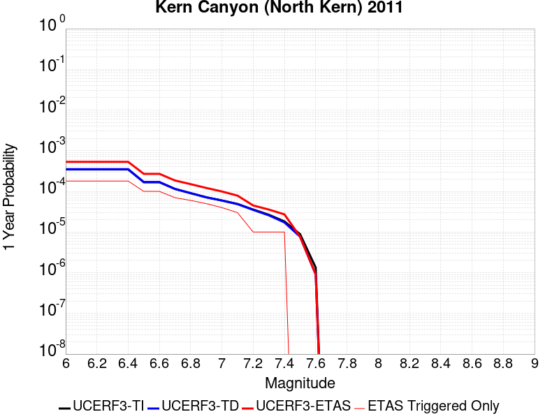 |  |

| Magnitude | 1 wk TI Prob | 1 wk TD Prob | 1 wk ETAS Prob | 1 wk ETAS/TD Gain | 1 wk ETAS Triggered Only | 1 mo TI Prob | 1 mo TD Prob | 1 mo ETAS Prob | 1 mo ETAS/TD Gain | 1 mo ETAS Triggered Only | 1 yr TI Prob | 1 yr TD Prob | 1 yr ETAS Prob | 1 yr ETAS/TD Gain | 1 yr ETAS Triggered Only | 10 yr TI Prob | 10 yr TD Prob | 10 yr ETAS Prob | 10 yr ETAS/TD Gain | 10 yr ETAS Triggered Only |
|-----|-----|-----|-----|-----|-----|-----|-----|-----|-----|-----|-----|-----|-----|-----|-----|-----|-----|-----|-----|-----|
| 6.0 | 6.6264497E-6 | 6.75733E-6 | 1.3675645E-4 | 20.238237 | 1.3E-4 | 2.8398761E-5 | 2.895971E-5 | 1.6895565E-4 | 5.8341627 | 1.4E-4 | 3.4570007E-4 | 3.5253543E-4 | 5.32472E-4 | 1.510407 | 1.8E-4 | 0.0034516277 | 0.0035205502 | 0.0037397756 | 1.0622703 | 2.2E-4 |
| 6.1 | 6.6264497E-6 | 6.75733E-6 | 1.3675645E-4 | 20.238237 | 1.3E-4 | 2.8398761E-5 | 2.895971E-5 | 1.6895565E-4 | 5.8341627 | 1.4E-4 | 3.4570007E-4 | 3.5253543E-4 | 5.32472E-4 | 1.510407 | 1.8E-4 | 0.0034516277 | 0.0035205502 | 0.0037397756 | 1.0622703 | 2.2E-4 |
| 6.2 | 6.6264497E-6 | 6.75733E-6 | 1.3675645E-4 | 20.238237 | 1.3E-4 | 2.8398761E-5 | 2.895971E-5 | 1.6895565E-4 | 5.8341627 | 1.4E-4 | 3.4570007E-4 | 3.5253543E-4 | 5.32472E-4 | 1.510407 | 1.8E-4 | 0.0034516277 | 0.0035205502 | 0.0037397756 | 1.0622703 | 2.2E-4 |
| 6.3 | 6.6264497E-6 | 6.75733E-6 | 1.3675645E-4 | 20.238237 | 1.3E-4 | 2.8398761E-5 | 2.895971E-5 | 1.6895565E-4 | 5.8341627 | 1.4E-4 | 3.4570007E-4 | 3.5253543E-4 | 5.32472E-4 | 1.510407 | 1.8E-4 | 0.0034516277 | 0.0035205502 | 0.0037397756 | 1.0622703 | 2.2E-4 |
| 6.4 | 6.6264497E-6 | 6.75733E-6 | 1.3675645E-4 | 20.238237 | 1.3E-4 | 2.8398761E-5 | 2.895971E-5 | 1.6895565E-4 | 5.8341627 | 1.4E-4 | 3.4570007E-4 | 3.5253543E-4 | 5.32472E-4 | 1.510407 | 1.8E-4 | 0.0034516277 | 0.0035205502 | 0.0037397756 | 1.0622703 | 2.2E-4 |
| 6.5 | 3.2162225E-6 | 3.2570915E-6 | 7.3256866E-5 | 22.491497 | 7.0E-5 | 1.3783738E-5 | 1.3958893E-5 | 8.3957915E-5 | 6.014654 | 7.0E-5 | 1.6780409E-4 | 1.6993708E-4 | 2.6992007E-4 | 1.5883532 | 1.0E-4 | 0.0016767744 | 0.001698151 | 0.0018179473 | 1.0705451 | 1.2E-4 |
| 6.6 | 3.2162225E-6 | 3.2570915E-6 | 7.3256866E-5 | 22.491497 | 7.0E-5 | 1.3783738E-5 | 1.3958893E-5 | 8.3957915E-5 | 6.014654 | 7.0E-5 | 1.6780409E-4 | 1.6993708E-4 | 2.6992007E-4 | 1.5883532 | 1.0E-4 | 0.0016767744 | 0.001698151 | 0.0018179473 | 1.0705451 | 1.2E-4 |
| 6.7 | 2.1908265E-6 | 2.2071222E-6 | 5.220701E-5 | 23.653885 | 5.0E-5 | 9.389223E-6 | 9.459061E-6 | 5.9458587E-5 | 6.285887 | 5.0E-5 | 1.1430779E-4 | 1.1515819E-4 | 1.8515013E-4 | 1.6077895 | 7.0E-5 | 0.0011424901 | 0.0011510046 | 0.001220924 | 1.0607464 | 7.0E-5 |
| 6.8 | 1.7303895E-6 | 1.7365529E-6 | 4.1736483E-5 | 24.0341 | 4.0E-5 | 7.415934E-6 | 7.4423488E-6 | 4.7442052E-5 | 6.374607 | 4.0E-5 | 9.028525E-5 | 9.0606925E-5 | 1.506015E-4 | 1.662141 | 6.0E-5 | 9.024858E-4 | 9.057096E-4 | 9.6565526E-4 | 1.0661864 | 6.0E-5 |
| 6.9 | 1.3700314E-6 | 1.3688622E-6 | 3.136882E-5 | 22.915981 | 3.0E-5 | 5.87155E-6 | 5.8665396E-6 | 3.5866364E-5 | 6.113717 | 3.0E-5 | 7.148377E-5 | 7.142282E-5 | 1.2141925E-4 | 1.7000064 | 5.0E-5 | 7.146078E-4 | 7.140032E-4 | 7.639676E-4 | 1.0699776 | 5.0E-5 |
| 7.0 | 1.1467797E-6 | 1.1413804E-6 | 2.1141357E-5 | 18.522621 | 2.0E-5 | 4.9147607E-6 | 4.8916213E-6 | 2.4891524E-5 | 5.088604 | 2.0E-5 | 5.983557E-5 | 5.9553895E-5 | 9.9551515E-5 | 1.6716205 | 4.0E-5 | 5.981946E-4 | 5.953825E-4 | 6.353587E-4 | 1.0671437 | 4.0E-5 |
| 7.1 | 9.3952065E-7 | 9.3026904E-7 | 1.093026E-5 | 11.749569 | 1.0E-5 | 4.026511E-6 | 3.9868614E-6 | 1.3986822E-5 | 3.5082288 | 1.0E-5 | 4.9021666E-5 | 4.8538972E-5 | 7.8537516E-5 | 1.6180301 | 3.0E-5 | 4.901085E-4 | 4.8528548E-4 | 5.152709E-4 | 1.0617893 | 3.0E-5 |
| 7.2 | 6.858055E-7 | 6.7193E-7 | 1.06719235E-5 | 15.882492 | 1.0E-5 | 2.939163E-6 | 2.879697E-6 | 1.2879668E-5 | 4.4725776 | 1.0E-5 | 3.5783723E-5 | 3.5059755E-5 | 4.5059405E-5 | 1.2852173 | 1.0E-5 | 3.5777962E-4 | 3.5054312E-4 | 3.6053962E-4 | 1.0285171 | 1.0E-5 |
| 7.3 | 5.1101983E-7 | 4.9393E-7 | 1.0493925E-5 | 21.245775 | 1.0E-5 | 2.1900833E-6 | 2.116841E-6 | 1.211682E-5 | 5.7240105 | 1.0E-5 | 2.6663936E-5 | 2.5772239E-5 | 3.577198E-5 | 1.3880044 | 1.0E-5 | 2.6660739E-4 | 2.57693E-4 | 2.676904E-4 | 1.0387958 | 1.0E-5 |
| 7.4 | 3.4999414E-7 | 3.2995905E-7 | 1.0329955E-5 | 31.306782 | 1.0E-5 | 1.499974E-6 | 1.4141094E-6 | 1.1414096E-5 | 8.071578 | 1.0E-5 | 1.8262032E-5 | 1.721665E-5 | 2.7216476E-5 | 1.5808231 | 1.0E-5 | 1.826053E-4 | 1.7215339E-4 | 1.8215168E-4 | 1.0580777 | 1.0E-5 |
| 7.5 | 1.7021522E-7 | 1.4750044E-7 | 1.4750044E-7 | 1.0 | 0.0 | 7.2949354E-7 | 6.321446E-7 | 6.321446E-7 | 1.0 | 0.0 | 8.881548E-6 | 7.696334E-6 | 7.696334E-6 | 1.0 | 0.0 | 8.8811925E-5 | 7.696076E-5 | 7.696076E-5 | 1.0 | 0.0 |
| 7.6 | 2.572245E-8 | 1.7352555E-8 | 1.7352555E-8 | 1.0 | 0.0 | 1.10239064E-7 | 7.436809E-8 | 7.436809E-8 | 1.0 | 0.0 | 1.3421597E-6 | 9.054312E-7 | 9.054312E-7 | 1.0 | 0.0 | 1.3421517E-5 | 9.05428E-6 | 9.05428E-6 | 1.0 | 0.0 |

## San Clemente
*[(top)](#table-of-contents)*

| 1 Week | 1 Month | 1 Year | 10 Year |
|-----|-----|-----|-----|
| 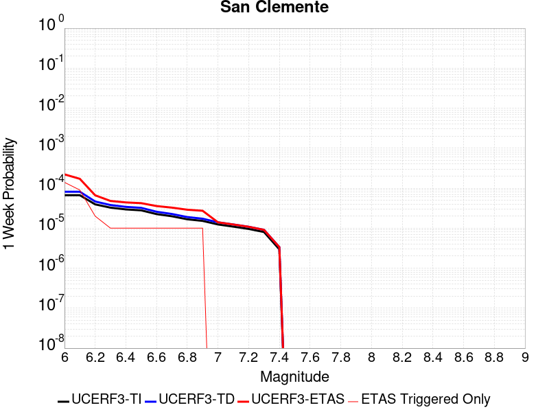 |  |  |  |

| Magnitude | 1 wk TI Prob | 1 wk TD Prob | 1 wk ETAS Prob | 1 wk ETAS/TD Gain | 1 wk ETAS Triggered Only | 1 mo TI Prob | 1 mo TD Prob | 1 mo ETAS Prob | 1 mo ETAS/TD Gain | 1 mo ETAS Triggered Only | 1 yr TI Prob | 1 yr TD Prob | 1 yr ETAS Prob | 1 yr ETAS/TD Gain | 1 yr ETAS Triggered Only | 10 yr TI Prob | 10 yr TD Prob | 10 yr ETAS Prob | 10 yr ETAS/TD Gain | 10 yr ETAS Triggered Only |
|-----|-----|-----|-----|-----|-----|-----|-----|-----|-----|-----|-----|-----|-----|-----|-----|-----|-----|-----|-----|-----|
| 6.0 | 6.681379E-5 | 8.163422E-5 | 2.2162279E-4 | 2.714827 | 1.4E-4 | 2.8631336E-4 | 3.498173E-4 | 4.9976486E-4 | 1.4286453 | 1.5E-4 | 0.003480294 | 0.0042512873 | 0.00444048 | 1.0445024 | 1.9E-4 | 0.03426291 | 0.041755714 | 0.041956946 | 1.0048193 | 2.1E-4 |
| 6.1 | 6.681379E-5 | 8.163422E-5 | 1.7162687E-4 | 2.1023889 | 9.0E-5 | 2.8631336E-4 | 3.498173E-4 | 4.4978232E-4 | 1.2857635 | 1.0E-4 | 0.003480294 | 0.0042512873 | 0.0043906923 | 1.0327913 | 1.4E-4 | 0.03426291 | 0.041755714 | 0.04189945 | 1.0034423 | 1.5E-4 |
| 6.2 | 3.9400576E-5 | 4.6451984E-5 | 6.645106E-5 | 1.4305321 | 2.0E-5 | 1.6884868E-4 | 1.9906509E-4 | 2.1906111E-4 | 1.1004497 | 2.0E-5 | 0.0020537945 | 0.002420985 | 0.0024808396 | 1.0247233 | 6.0E-5 | 0.020349167 | 0.02395286 | 0.024011424 | 1.0024449 | 6.0E-5 |
| 6.3 | 3.2590255E-5 | 3.7929087E-5 | 4.792871E-5 | 1.2636399 | 1.0E-5 | 1.3966505E-4 | 1.6254328E-4 | 1.7254165E-4 | 1.0615121 | 1.0E-5 | 0.0016990956 | 0.0019771985 | 0.0020071391 | 1.015143 | 3.0E-5 | 0.01686163 | 0.019599866 | 0.019629277 | 1.0015006 | 3.0E-5 |
| 6.4 | 2.9454652E-5 | 3.4097775E-5 | 4.4097436E-5 | 1.2932643 | 1.0E-5 | 1.2622811E-4 | 1.4612528E-4 | 1.5612383E-4 | 1.0684245 | 1.0E-5 | 0.0015357438 | 0.0017776482 | 0.0018075949 | 1.0168462 | 3.0E-5 | 0.015251739 | 0.017637458 | 0.017666928 | 1.001671 | 3.0E-5 |
| 6.5 | 2.790836E-5 | 3.2247463E-5 | 4.224714E-5 | 1.310092 | 1.0E-5 | 1.1960178E-4 | 1.3819622E-4 | 1.4819484E-4 | 1.0723509 | 1.0E-5 | 0.001455179 | 0.0016812651 | 0.0017112147 | 1.0178137 | 3.0E-5 | 0.014456868 | 0.016688475 | 0.016717974 | 1.0017676 | 3.0E-5 |
| 6.6 | 2.2492153E-5 | 2.5762707E-5 | 3.576245E-5 | 1.388148 | 1.0E-5 | 9.639138E-5 | 1.1040701E-4 | 1.2040591E-4 | 1.090564 | 1.0E-5 | 0.0011729331 | 0.0013433908 | 0.0013733505 | 1.0223016 | 3.0E-5 | 0.011667615 | 0.013354415 | 0.013384014 | 1.0022165 | 3.0E-5 |
| 6.7 | 1.9862755E-5 | 2.2666423E-5 | 3.2666198E-5 | 1.4411712 | 1.0E-5 | 8.512331E-5 | 9.713826E-5 | 1.0713729E-4 | 1.102936 | 1.0E-5 | 0.0010358836 | 0.0011820279 | 0.0012119925 | 1.0253501 | 3.0E-5 | 0.010310682 | 0.011758701 | 0.011788348 | 1.0025213 | 3.0E-5 |
| 6.8 | 1.6697575E-5 | 1.897771E-5 | 2.897752E-5 | 1.526924 | 1.0E-5 | 7.155907E-5 | 8.133056E-5 | 9.132974E-5 | 1.1229451 | 1.0E-5 | 8.7088346E-4 | 9.897591E-4 | 9.997492E-4 | 1.0100935 | 1.0E-5 | 0.008674784 | 0.0098545365 | 0.009864438 | 1.0010048 | 1.0E-5 |
| 6.9 | 1.5218415E-5 | 1.72694E-5 | 2.7269229E-5 | 1.5790489 | 1.0E-5 | 6.522015E-5 | 7.4009666E-5 | 8.400893E-5 | 1.1351075 | 1.0E-5 | 7.93766E-4 | 9.00704E-4 | 9.10695E-4 | 1.0110924 | 1.0E-5 | 0.007909367 | 0.008971481 | 0.008981391 | 1.0011046 | 1.0E-5 |
| 7.0 | 1.2392958E-5 | 1.4033016E-5 | 1.4033016E-5 | 1.0 | 0.0 | 5.3111595E-5 | 6.014015E-5 | 6.014015E-5 | 1.0 | 0.0 | 6.4644177E-4 | 7.319679E-4 | 7.319679E-4 | 1.0 | 0.0 | 0.0064456454 | 0.0072963564 | 0.0072963564 | 1.0 | 0.0 |
| 7.1 | 1.0934128E-5 | 1.2375138E-5 | 1.2375138E-5 | 1.0 | 0.0 | 4.6859706E-5 | 5.303527E-5 | 5.303527E-5 | 1.0 | 0.0 | 5.7036756E-4 | 6.455204E-4 | 6.455204E-4 | 1.0 | 0.0 | 0.0056890585 | 0.0064371997 | 0.0064371997 | 1.0 | 0.0 |
| 7.2 | 9.5798805E-6 | 1.0844935E-5 | 1.0844935E-5 | 1.0 | 0.0 | 4.1055984E-5 | 4.6477508E-5 | 4.6477508E-5 | 1.0 | 0.0 | 4.9974193E-4 | 5.657239E-4 | 5.657239E-4 | 1.0 | 0.0 | 0.0049861963 | 0.0056435615 | 0.0056435615 | 1.0 | 0.0 |
| 7.3 | 8.0167365E-6 | 9.083918E-6 | 9.083918E-6 | 1.0 | 0.0 | 3.4356988E-5 | 3.8930535E-5 | 3.8930535E-5 | 1.0 | 0.0 | 4.1821605E-4 | 4.7388324E-4 | 4.7388324E-4 | 1.0 | 0.0 | 0.0041742986 | 0.0047294297 | 0.0047294297 | 1.0 | 0.0 |
| 7.4 | 2.9581017E-6 | 3.3623792E-6 | 3.3623792E-6 | 1.0 | 0.0 | 1.2677518E-5 | 1.4410146E-5 | 1.4410146E-5 | 1.0 | 0.0 | 1.5433785E-4 | 1.7543444E-4 | 1.7543444E-4 | 1.0 | 0.0 | 0.001542307 | 0.0017534546 | 0.0017534546 | 1.0 | 0.0 |

## White Mountains
*[(top)](#table-of-contents)*

| 1 Week | 1 Month | 1 Year | 10 Year |
|-----|-----|-----|-----|
|  |  |  | 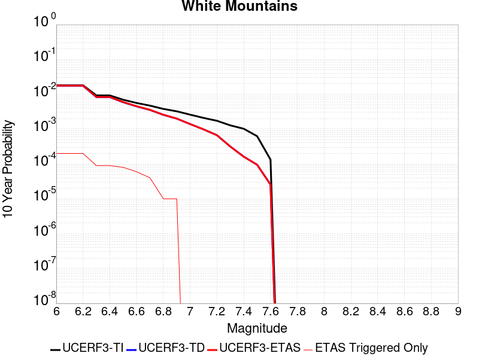 |

| Magnitude | 1 wk TI Prob | 1 wk TD Prob | 1 wk ETAS Prob | 1 wk ETAS/TD Gain | 1 wk ETAS Triggered Only | 1 mo TI Prob | 1 mo TD Prob | 1 mo ETAS Prob | 1 mo ETAS/TD Gain | 1 mo ETAS Triggered Only | 1 yr TI Prob | 1 yr TD Prob | 1 yr ETAS Prob | 1 yr ETAS/TD Gain | 1 yr ETAS Triggered Only | 10 yr TI Prob | 10 yr TD Prob | 10 yr ETAS Prob | 10 yr ETAS/TD Gain | 10 yr ETAS Triggered Only |
|-----|-----|-----|-----|-----|-----|-----|-----|-----|-----|-----|-----|-----|-----|-----|-----|-----|-----|-----|-----|-----|
| 6.0 | 3.503579E-5 | 3.378405E-5 | 9.378202E-5 | 2.7759259 | 6.0E-5 | 1.5014476E-4 | 1.4478143E-4 | 2.347684E-4 | 1.6215366 | 9.0E-5 | 0.0018264796 | 0.0017614096 | 0.0019011629 | 1.0793418 | 1.4E-4 | 0.018115403 | 0.017486818 | 0.017683322 | 1.0112371 | 2.0E-4 |
| 6.1 | 3.503579E-5 | 3.378405E-5 | 9.378202E-5 | 2.7759259 | 6.0E-5 | 1.5014476E-4 | 1.4478143E-4 | 2.347684E-4 | 1.6215366 | 9.0E-5 | 0.0018264796 | 0.0017614096 | 0.0019011629 | 1.0793418 | 1.4E-4 | 0.018115403 | 0.017486818 | 0.017683322 | 1.0112371 | 2.0E-4 |
| 6.2 | 3.503579E-5 | 3.378405E-5 | 9.378202E-5 | 2.7759259 | 6.0E-5 | 1.5014476E-4 | 1.4478143E-4 | 2.347684E-4 | 1.6215366 | 9.0E-5 | 0.0018264796 | 0.0017614096 | 0.0019011629 | 1.0793418 | 1.4E-4 | 0.018115403 | 0.017486818 | 0.017683322 | 1.0112371 | 2.0E-4 |
| 6.3 | 1.7818425E-5 | 1.5916074E-5 | 3.5915757E-5 | 2.2565713 | 2.0E-5 | 7.636245E-5 | 6.821004E-5 | 9.8207995E-5 | 1.439788 | 3.0E-5 | 9.293162E-4 | 8.301551E-4 | 8.7012193E-4 | 1.0481437 | 4.0E-5 | 0.009254395 | 0.008271999 | 0.008361254 | 1.0107901 | 9.0E-5 |
| 6.4 | 1.7818425E-5 | 1.5916074E-5 | 3.5915757E-5 | 2.2565713 | 2.0E-5 | 7.636245E-5 | 6.821004E-5 | 9.8207995E-5 | 1.439788 | 3.0E-5 | 9.293162E-4 | 8.301551E-4 | 8.7012193E-4 | 1.0481437 | 4.0E-5 | 0.009254395 | 0.008271999 | 0.008361254 | 1.0107901 | 9.0E-5 |
| 6.5 | 1.3397557E-5 | 1.13362685E-5 | 3.1336043E-5 | 2.764229 | 2.0E-5 | 5.741684E-5 | 4.858314E-5 | 7.858169E-5 | 1.6174681 | 3.0E-5 | 6.988258E-4 | 5.913462E-4 | 6.3132256E-4 | 1.0676023 | 4.0E-5 | 0.006966323 | 0.005898432 | 0.00597796 | 1.0134829 | 8.0E-5 |
| 6.6 | 1.0818695E-5 | 8.625366E-6 | 1.862528E-5 | 2.1593611 | 1.0E-5 | 4.6365014E-5 | 3.6965357E-5 | 5.6964618E-5 | 1.5410272 | 2.0E-5 | 5.6434784E-4 | 4.4996463E-4 | 4.7995112E-4 | 1.0666419 | 3.0E-5 | 0.005629168 | 0.004490972 | 0.0045507024 | 1.0133002 | 6.0E-5 |
| 6.7 | 9.067908E-6 | 6.802442E-6 | 6.802442E-6 | 1.0 | 0.0 | 3.8861883E-5 | 2.9153016E-5 | 2.9153016E-5 | 1.0 | 0.0 | 4.7304068E-4 | 3.5488335E-4 | 3.648798E-4 | 1.0281683 | 1.0E-5 | 0.00472035 | 0.0035434833 | 0.0035833416 | 1.0112484 | 4.0E-5 |
| 6.8 | 7.295947E-6 | 4.936391E-6 | 4.936391E-6 | 1.0 | 0.0 | 3.126797E-5 | 2.1155796E-5 | 2.1155796E-5 | 1.0 | 0.0 | 3.8062103E-4 | 2.575425E-4 | 2.575425E-4 | 1.0 | 0.0 | 0.0037996976 | 0.0025725532 | 0.0025825277 | 1.0038772 | 1.0E-5 |
| 6.9 | 6.2243444E-6 | 3.832213E-6 | 3.832213E-6 | 1.0 | 0.0 | 2.6675489E-5 | 1.642367E-5 | 1.642367E-5 | 1.0 | 0.0 | 3.2472567E-4 | 1.9994036E-4 | 1.9994036E-4 | 1.0 | 0.0 | 0.0032425157 | 0.0019976576 | 0.0020076376 | 1.0049958 | 1.0E-5 |
| 7.0 | 4.9878413E-6 | 2.6795342E-6 | 2.6795342E-6 | 1.0 | 0.0 | 2.1376287E-5 | 1.14836685E-5 | 1.14836685E-5 | 1.0 | 0.0 | 2.602252E-4 | 1.3980496E-4 | 1.3980496E-4 | 1.0 | 0.0 | 0.002599207 | 0.0013971963 | 0.0013971963 | 1.0 | 0.0 |
| 7.1 | 4.0252844E-6 | 1.8857575E-6 | 1.8857575E-6 | 1.0 | 0.0 | 1.7251105E-5 | 8.081794E-6 | 8.081794E-6 | 1.0 | 0.0 | 2.1001195E-4 | 9.8391516E-5 | 9.8391516E-5 | 1.0 | 0.0 | 0.0020981359 | 9.834924E-4 | 9.834924E-4 | 1.0 | 0.0 |
| 7.2 | 3.3284066E-6 | 1.281964E-6 | 1.281964E-6 | 1.0 | 0.0 | 1.4264522E-5 | 5.494121E-6 | 5.494121E-6 | 1.0 | 0.0 | 1.736567E-4 | 6.688897E-5 | 6.688897E-5 | 1.0 | 0.0 | 0.0017352107 | 6.6869846E-4 | 6.6869846E-4 | 1.0 | 0.0 |
| 7.3 | 2.458226E-6 | 6.05722E-7 | 6.05722E-7 | 1.0 | 0.0 | 1.0535211E-5 | 2.5959491E-6 | 2.5959491E-6 | 1.0 | 0.0 | 1.2825865E-4 | 3.1605257E-5 | 3.1605257E-5 | 1.0 | 0.0 | 0.0012818464 | 3.160114E-4 | 3.160114E-4 | 1.0 | 0.0 |
| 7.4 | 1.965953E-6 | 3.1089303E-7 | 3.1089303E-7 | 1.0 | 0.0 | 8.425486E-6 | 1.332398E-6 | 1.332398E-6 | 1.0 | 0.0 | 1.0257547E-4 | 1.6221828E-5 | 1.6221828E-5 | 1.0 | 0.0 | 0.0010252813 | 1.6220656E-4 | 1.6220656E-4 | 1.0 | 0.0 |
| 7.5 | 1.2014192E-6 | 1.8244253E-7 | 1.8244253E-7 | 1.0 | 0.0 | 5.148929E-6 | 7.8189635E-7 | 7.8189635E-7 | 1.0 | 0.0 | 6.2686406E-5 | 9.519547E-6 | 9.519547E-6 | 1.0 | 0.0 | 6.266873E-4 | 9.519148E-5 | 9.519148E-5 | 1.0 | 0.0 |
| 7.6 | 2.5612175E-7 | 4.8946475E-8 | 4.8946475E-8 | 1.0 | 0.0 | 1.0976642E-6 | 2.0977059E-7 | 2.0977059E-7 | 1.0 | 0.0 | 1.3363979E-5 | 2.5539543E-6 | 2.5539543E-6 | 1.0 | 0.0 | 1.3363175E-4 | 2.5539286E-5 | 2.5539286E-5 | 1.0 | 0.0 |

## Oceanic - West Huasna
*[(top)](#table-of-contents)*

| 1 Week | 1 Month | 1 Year | 10 Year |
|-----|-----|-----|-----|
| 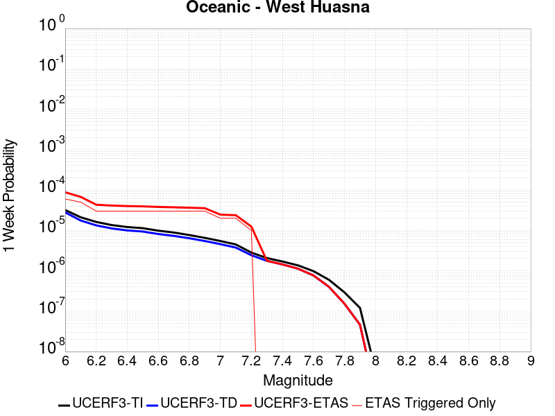 |  |  | 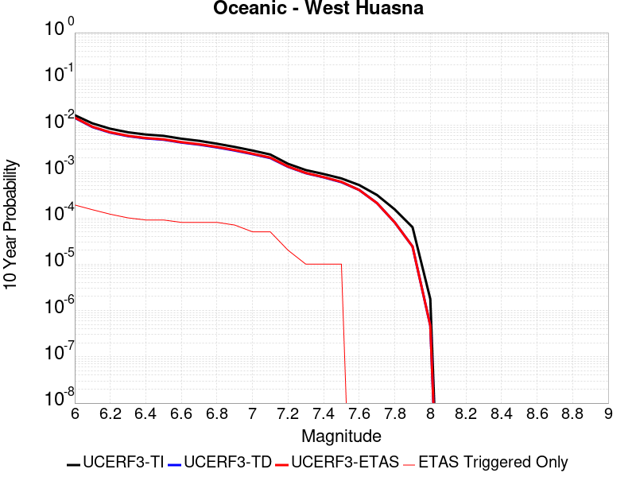 |

| Magnitude | 1 wk TI Prob | 1 wk TD Prob | 1 wk ETAS Prob | 1 wk ETAS/TD Gain | 1 wk ETAS Triggered Only | 1 mo TI Prob | 1 mo TD Prob | 1 mo ETAS Prob | 1 mo ETAS/TD Gain | 1 mo ETAS Triggered Only | 1 yr TI Prob | 1 yr TD Prob | 1 yr ETAS Prob | 1 yr ETAS/TD Gain | 1 yr ETAS Triggered Only | 10 yr TI Prob | 10 yr TD Prob | 10 yr ETAS Prob | 10 yr ETAS/TD Gain | 10 yr ETAS Triggered Only |
|-----|-----|-----|-----|-----|-----|-----|-----|-----|-----|-----|-----|-----|-----|-----|-----|-----|-----|-----|-----|-----|
| 6.0 | 3.195567E-5 | 2.7926868E-5 | 8.792519E-5 | 3.1484087 | 6.0E-5 | 1.3694567E-4 | 1.1968133E-4 | 2.1966937E-4 | 1.8354522 | 1.0E-4 | 0.0016660384 | 0.0014561893 | 0.0015860001 | 1.0891441 | 1.3E-4 | 0.016536033 | 0.014471028 | 0.014658278 | 1.0129397 | 1.9E-4 |
| 6.1 | 2.1156782E-5 | 1.7573486E-5 | 6.7572604E-5 | 3.8451452 | 5.0E-5 | 9.066878E-5 | 7.531282E-5 | 1.553068E-4 | 2.0621562 | 8.0E-5 | 0.0011033333 | 9.165572E-4 | 0.0010264564 | 1.1199043 | 1.1E-4 | 0.010978713 | 0.009128777 | 0.009277408 | 1.0162816 | 1.5E-4 |
| 6.2 | 1.6195117E-5 | 1.3327152E-5 | 4.3326752E-5 | 3.2510135 | 3.0E-5 | 6.9405796E-5 | 5.7115132E-5 | 1.17111704E-4 | 2.0504496 | 6.0E-5 | 8.44688E-4 | 6.9515745E-4 | 7.850949E-4 | 1.1293771 | 9.0E-5 | 0.008414844 | 0.006930123 | 0.007049292 | 1.0171957 | 1.2E-4 |
| 6.3 | 1.3559345E-5 | 1.1179142E-5 | 4.1178806E-5 | 3.683539 | 3.0E-5 | 5.811018E-5 | 4.7909736E-5 | 1.0790686E-4 | 2.252295 | 6.0E-5 | 7.072618E-4 | 5.831459E-4 | 6.630992E-4 | 1.1371069 | 8.0E-5 | 0.0070501505 | 0.0058162753 | 0.0059156935 | 1.0170932 | 1.0E-4 |
| 6.4 | 1.2120619E-5 | 1.0000977E-5 | 4.000068E-5 | 3.9996767 | 3.0E-5 | 5.1944477E-5 | 4.2860633E-5 | 1.0285806E-4 | 2.399826 | 6.0E-5 | 6.322405E-4 | 5.2170374E-4 | 6.0166203E-4 | 1.1532637 | 8.0E-5 | 0.006304447 | 0.0052048573 | 0.005294389 | 1.0172015 | 9.0E-5 |
| 6.5 | 1.13511915E-5 | 9.3674735E-6 | 3.936719E-5 | 4.202541 | 3.0E-5 | 4.8647056E-5 | 4.01457E-5 | 1.0014329E-4 | 2.494496 | 6.0E-5 | 5.9211696E-4 | 4.886647E-4 | 5.6862563E-4 | 1.1636314 | 8.0E-5 | 0.0059054173 | 0.0048759608 | 0.004965522 | 1.0183679 | 9.0E-5 |
| 6.6 | 9.850605E-6 | 8.135418E-6 | 3.8135175E-5 | 4.6875496 | 3.0E-5 | 4.2216197E-5 | 3.4865614E-5 | 8.486387E-5 | 2.4340277 | 5.0E-5 | 5.1386096E-4 | 4.2440637E-4 | 4.943767E-4 | 1.1648662 | 7.0E-5 | 0.0051267436 | 0.004235991 | 0.004315652 | 1.0188057 | 8.0E-5 |
| 6.7 | 8.8558645E-6 | 7.318433E-6 | 3.7318212E-5 | 5.0992084 | 3.0E-5 | 3.7953152E-5 | 3.1364336E-5 | 8.136277E-5 | 2.5941174 | 5.0E-5 | 4.6198163E-4 | 3.8179406E-4 | 4.5176732E-4 | 1.1832749 | 7.0E-5 | 0.004610224 | 0.0038114067 | 0.0038911018 | 1.0209097 | 8.0E-5 |
| 6.8 | 7.67136E-6 | 6.391756E-6 | 3.6391564E-5 | 5.693516 | 3.0E-5 | 3.2876844E-5 | 2.7392953E-5 | 7.739158E-5 | 2.825237 | 5.0E-5 | 4.0020206E-4 | 3.3345833E-4 | 4.0343497E-4 | 1.2098513 | 7.0E-5 | 0.003994821 | 0.0033296007 | 0.0034093342 | 1.0239469 | 8.0E-5 |
| 6.9 | 6.534529E-6 | 5.4583297E-6 | 3.5458164E-5 | 6.4961567 | 3.0E-5 | 2.8004823E-5 | 2.3392633E-5 | 7.3391464E-5 | 3.137375 | 5.0E-5 | 3.4090536E-4 | 2.847682E-4 | 3.5474828E-4 | 1.245744 | 7.0E-5 | 0.0034038287 | 0.0028440498 | 0.0029138506 | 1.0245428 | 7.0E-5 |
| 7.0 | 5.460525E-6 | 4.5699517E-6 | 2.4569861E-5 | 5.376394 | 2.0E-5 | 2.3402039E-5 | 1.958536E-5 | 4.9584774E-5 | 2.5317264 | 3.0E-5 | 2.8488258E-4 | 2.3842578E-4 | 2.8841387E-4 | 1.2096589 | 5.0E-5 | 0.0028451765 | 0.0023817138 | 0.0024315948 | 1.0209433 | 5.0E-5 |
| 7.1 | 4.4825083E-6 | 3.7524428E-6 | 2.3752367E-5 | 6.329841 | 2.0E-5 | 1.9210609E-5 | 1.60818E-5 | 4.6081317E-5 | 2.865433 | 3.0E-5 | 2.3386406E-4 | 1.9577841E-4 | 2.4576864E-4 | 1.2553408 | 5.0E-5 | 0.002336181 | 0.0019560715 | 0.0020059736 | 1.0255114 | 5.0E-5 |
| 7.2 | 2.821708E-6 | 2.4249334E-6 | 1.2424909E-5 | 5.1238146 | 1.0E-5 | 1.2092979E-5 | 1.039253E-5 | 2.0392426E-5 | 1.9622196 | 1.0E-5 | 1.4722206E-4 | 1.2652173E-4 | 1.4651919E-4 | 1.1580557 | 2.0E-5 | 0.0014712457 | 0.0012644994 | 0.001284474 | 1.0157965 | 2.0E-5 |
| 7.3 | 2.0644757E-6 | 1.7687412E-6 | 1.7687412E-6 | 1.0 | 0.0 | 8.847723E-6 | 7.5802973E-6 | 7.5802973E-6 | 1.0 | 0.0 | 1.0771569E-4 | 9.228622E-5 | 1.0228529E-4 | 1.1083485 | 1.0E-5 | 0.001076635 | 9.2248066E-4 | 9.324714E-4 | 1.0108303 | 1.0E-5 |
| 7.4 | 1.6980367E-6 | 1.4379892E-6 | 1.4379892E-6 | 1.0 | 0.0 | 7.27728E-6 | 6.162796E-6 | 6.162796E-6 | 1.0 | 0.0 | 8.8597284E-5 | 7.5029464E-5 | 8.502871E-5 | 1.133271 | 1.0E-5 | 8.8561967E-4 | 7.500429E-4 | 7.600354E-4 | 1.0133226 | 1.0E-5 |
| 7.5 | 1.3637683E-6 | 1.1302635E-6 | 1.1302635E-6 | 1.0 | 0.0 | 5.844708E-6 | 4.8439774E-6 | 4.8439774E-6 | 1.0 | 0.0 | 7.1156996E-5 | 5.897383E-5 | 6.897324E-5 | 1.1695567 | 1.0E-5 | 7.1134215E-4 | 5.895833E-4 | 5.9957744E-4 | 1.0169511 | 1.0E-5 |
| 7.6 | 9.802994E-7 | 7.677247E-7 | 7.677247E-7 | 1.0 | 0.0 | 4.2012766E-6 | 3.2902446E-6 | 3.2902446E-6 | 1.0 | 0.0 | 5.1149345E-5 | 4.0057992E-5 | 4.0057992E-5 | 1.0 | 0.0 | 5.113757E-4 | 4.0050913E-4 | 4.0050913E-4 | 1.0 | 0.0 |
| 7.7 | 5.986191E-7 | 4.0050548E-7 | 4.0050548E-7 | 1.0 | 0.0 | 2.5655079E-6 | 1.7164509E-6 | 1.7164509E-6 | 1.0 | 0.0 | 3.1234613E-5 | 2.089759E-5 | 2.089759E-5 | 1.0 | 0.0 | 3.123022E-4 | 2.089576E-4 | 2.089576E-4 | 1.0 | 0.0 |
| 7.8 | 2.9189815E-7 | 1.5285792E-7 | 1.5285792E-7 | 1.0 | 0.0 | 1.2509914E-6 | 6.5510517E-7 | 6.5510517E-7 | 1.0 | 0.0 | 1.5230714E-5 | 7.9758765E-6 | 7.9758765E-6 | 1.0 | 0.0 | 1.522967E-4 | 7.9757214E-5 | 7.9757214E-5 | 1.0 | 0.0 |
| 7.9 | 1.2057845E-7 | 4.621248E-8 | 4.621248E-8 | 1.0 | 0.0 | 5.1676466E-7 | 1.9805347E-7 | 1.9805347E-7 | 1.0 | 0.0 | 6.2915915E-6 | 2.4112983E-6 | 2.4112983E-6 | 1.0 | 0.0 | 6.2914136E-5 | 2.4114026E-5 | 2.4114026E-5 | 1.0 | 0.0 |
| 8.0 | 3.3806387E-9 | 9.011393E-10 | 9.011393E-10 | 1.0 | 0.0 | 1.4488451E-8 | 3.8620254E-9 | 3.8620254E-9 | 1.0 | 0.0 | 1.7639688E-7 | 4.702016E-8 | 4.702016E-8 | 1.0 | 0.0 | 1.7639674E-6 | 4.7129527E-7 | 4.7129527E-7 | 1.0 | 0.0 |

## Bullion Mountains
*[(top)](#table-of-contents)*

| 1 Week | 1 Month | 1 Year | 10 Year |
|-----|-----|-----|-----|
|  |  |  |  |

| Magnitude | 1 wk TI Prob | 1 wk TD Prob | 1 wk ETAS Prob | 1 wk ETAS/TD Gain | 1 wk ETAS Triggered Only | 1 mo TI Prob | 1 mo TD Prob | 1 mo ETAS Prob | 1 mo ETAS/TD Gain | 1 mo ETAS Triggered Only | 1 yr TI Prob | 1 yr TD Prob | 1 yr ETAS Prob | 1 yr ETAS/TD Gain | 1 yr ETAS Triggered Only | 10 yr TI Prob | 10 yr TD Prob | 10 yr ETAS Prob | 10 yr ETAS/TD Gain | 10 yr ETAS Triggered Only |
|-----|-----|-----|-----|-----|-----|-----|-----|-----|-----|-----|-----|-----|-----|-----|-----|-----|-----|-----|-----|-----|
| 6.0 | 1.6420427E-5 | 1.4692089E-5 | 5.4691503E-5 | 3.7225134 | 4.0E-5 | 7.037136E-5 | 6.296479E-5 | 1.3296038E-4 | 2.1116624 | 7.0E-5 | 8.5643446E-4 | 7.663651E-4 | 8.862731E-4 | 1.1564634 | 1.2E-4 | 0.008531413 | 0.007641016 | 0.007849411 | 1.0272733 | 2.1E-4 |
| 6.1 | 1.6420427E-5 | 1.4692089E-5 | 5.4691503E-5 | 3.7225134 | 4.0E-5 | 7.037136E-5 | 6.296479E-5 | 1.3296038E-4 | 2.1116624 | 7.0E-5 | 8.5643446E-4 | 7.663651E-4 | 8.862731E-4 | 1.1564634 | 1.2E-4 | 0.008531413 | 0.007641016 | 0.007849411 | 1.0272733 | 2.1E-4 |
| 6.2 | 1.6420427E-5 | 1.4692089E-5 | 5.4691503E-5 | 3.7225134 | 4.0E-5 | 7.037136E-5 | 6.296479E-5 | 1.3296038E-4 | 2.1116624 | 7.0E-5 | 8.5643446E-4 | 7.663651E-4 | 8.862731E-4 | 1.1564634 | 1.2E-4 | 0.008531413 | 0.007641016 | 0.007849411 | 1.0272733 | 2.1E-4 |
| 6.3 | 1.2046778E-5 | 9.862335E-6 | 4.986194E-5 | 5.0557947 | 4.0E-5 | 5.1628023E-5 | 4.2266598E-5 | 1.1226364E-4 | 2.6560843 | 7.0E-5 | 6.283899E-4 | 5.144975E-4 | 6.1444606E-4 | 1.1942644 | 1.0E-4 | 0.0062661595 | 0.005135345 | 0.005274626 | 1.027122 | 1.4E-4 |
| 6.4 | 1.2046778E-5 | 9.862335E-6 | 4.986194E-5 | 5.0557947 | 4.0E-5 | 5.1628023E-5 | 4.2266598E-5 | 1.1226364E-4 | 2.6560843 | 7.0E-5 | 6.283899E-4 | 5.144975E-4 | 6.1444606E-4 | 1.1942644 | 1.0E-4 | 0.0062661595 | 0.005135345 | 0.005274626 | 1.027122 | 1.4E-4 |
| 6.5 | 1.0244343E-5 | 7.879458E-6 | 3.787922E-5 | 4.807338 | 3.0E-5 | 4.390359E-5 | 3.3768785E-5 | 9.376676E-5 | 2.7767289 | 6.0E-5 | 5.343951E-4 | 4.110781E-4 | 4.910452E-4 | 1.1945302 | 8.0E-5 | 0.005331118 | 0.004105208 | 0.0042047976 | 1.0242593 | 1.0E-4 |
| 6.6 | 9.605408E-6 | 7.1774966E-6 | 3.717728E-5 | 5.1797004 | 3.0E-5 | 4.1165385E-5 | 3.076045E-5 | 9.075861E-5 | 2.9504967 | 6.0E-5 | 5.010733E-4 | 3.744645E-4 | 4.4443828E-4 | 1.1868637 | 7.0E-5 | 0.00499945 | 0.003740332 | 0.0038200328 | 1.0213084 | 8.0E-5 |
| 6.7 | 8.60418E-6 | 6.1240044E-6 | 3.612382E-5 | 5.8987255 | 3.0E-5 | 3.687454E-5 | 2.624558E-5 | 8.624401E-5 | 3.2860394 | 6.0E-5 | 4.48855E-4 | 3.1951256E-4 | 3.894902E-4 | 1.2190137 | 7.0E-5 | 0.004479495 | 0.0031924439 | 0.0032622204 | 1.0218568 | 7.0E-5 |
| 6.8 | 5.187994E-6 | 2.5631666E-6 | 1.2563141E-5 | 4.901414 | 1.0E-5 | 2.223407E-5 | 1.0984976E-5 | 2.0984866E-5 | 1.9103242 | 1.0E-5 | 2.7066618E-4 | 1.3373788E-4 | 1.4373654E-4 | 1.0747632 | 1.0E-5 | 0.0027033675 | 0.0013369655 | 0.0013469522 | 1.0074697 | 1.0E-5 |
| 6.9 | 4.5302368E-6 | 2.3443165E-6 | 1.2344293E-5 | 5.2656255 | 1.0E-5 | 1.9415156E-5 | 1.0047055E-5 | 2.0046955E-5 | 1.9953066 | 1.0E-5 | 2.3635388E-4 | 1.2232E-4 | 1.3231878E-4 | 1.0817428 | 1.0E-5 | 0.0023610266 | 0.0012229157 | 0.0012329036 | 1.0081671 | 1.0E-5 |
| 7.0 | 3.431668E-6 | 1.6882402E-6 | 1.6882402E-6 | 1.0 | 0.0 | 1.4707065E-5 | 7.235315E-6 | 7.235315E-6 | 1.0 | 0.0 | 1.7904381E-4 | 8.808996E-5 | 8.808996E-5 | 1.0 | 0.0 | 0.0017889962 | 8.808996E-4 | 8.808996E-4 | 1.0 | 0.0 |

## Dry Mountain
*[(top)](#table-of-contents)*

| 1 Week | 1 Month | 1 Year | 10 Year |
|-----|-----|-----|-----|
|  |  | 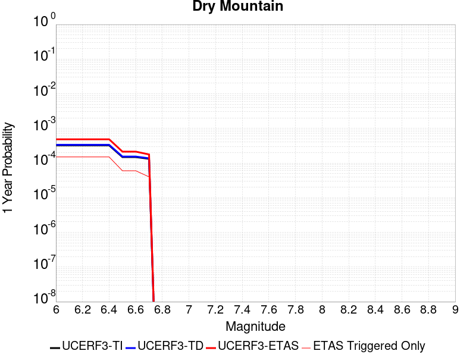 |  |

| Magnitude | 1 wk TI Prob | 1 wk TD Prob | 1 wk ETAS Prob | 1 wk ETAS/TD Gain | 1 wk ETAS Triggered Only | 1 mo TI Prob | 1 mo TD Prob | 1 mo ETAS Prob | 1 mo ETAS/TD Gain | 1 mo ETAS Triggered Only | 1 yr TI Prob | 1 yr TD Prob | 1 yr ETAS Prob | 1 yr ETAS/TD Gain | 1 yr ETAS Triggered Only | 10 yr TI Prob | 10 yr TD Prob | 10 yr ETAS Prob | 10 yr ETAS/TD Gain | 10 yr ETAS Triggered Only |
|-----|-----|-----|-----|-----|-----|-----|-----|-----|-----|-----|-----|-----|-----|-----|-----|-----|-----|-----|-----|-----|
| 6.0 | 6.222801E-6 | 6.439381E-6 | 7.643893E-5 | 11.87054 | 7.0E-5 | 2.6668875E-5 | 2.7597147E-5 | 1.1759466E-4 | 4.261117 | 9.0E-5 | 3.2464517E-4 | 3.3595937E-4 | 4.8590897E-4 | 1.4463326 | 1.5E-4 | 0.0032417132 | 0.0033560768 | 0.0035554057 | 1.0593934 | 2.0E-4 |
| 6.1 | 6.222801E-6 | 6.439381E-6 | 7.643893E-5 | 11.87054 | 7.0E-5 | 2.6668875E-5 | 2.7597147E-5 | 1.1759466E-4 | 4.261117 | 9.0E-5 | 3.2464517E-4 | 3.3595937E-4 | 4.8590897E-4 | 1.4463326 | 1.5E-4 | 0.0032417132 | 0.0033560768 | 0.0035554057 | 1.0593934 | 2.0E-4 |
| 6.2 | 6.222801E-6 | 6.439381E-6 | 7.643893E-5 | 11.87054 | 7.0E-5 | 2.6668875E-5 | 2.7597147E-5 | 1.1759466E-4 | 4.261117 | 9.0E-5 | 3.2464517E-4 | 3.3595937E-4 | 4.8590897E-4 | 1.4463326 | 1.5E-4 | 0.0032417132 | 0.0033560768 | 0.0035554057 | 1.0593934 | 2.0E-4 |
| 6.3 | 6.222801E-6 | 6.439381E-6 | 7.643893E-5 | 11.87054 | 7.0E-5 | 2.6668875E-5 | 2.7597147E-5 | 1.1759466E-4 | 4.261117 | 9.0E-5 | 3.2464517E-4 | 3.3595937E-4 | 4.8590897E-4 | 1.4463326 | 1.5E-4 | 0.0032417132 | 0.0033560768 | 0.0035554057 | 1.0593934 | 2.0E-4 |
| 6.4 | 6.222801E-6 | 6.439381E-6 | 7.643893E-5 | 11.87054 | 7.0E-5 | 2.6668875E-5 | 2.7597147E-5 | 1.1759466E-4 | 4.261117 | 9.0E-5 | 3.2464517E-4 | 3.3595937E-4 | 4.8590897E-4 | 1.4463326 | 1.5E-4 | 0.0032417132 | 0.0033560768 | 0.0035554057 | 1.0593934 | 2.0E-4 |
| 6.5 | 2.8528623E-6 | 2.9521684E-6 | 3.295208E-5 | 11.161992 | 3.0E-5 | 1.22264955E-5 | 1.2652138E-5 | 6.26515E-5 | 4.9518514 | 5.0E-5 | 1.4884741E-4 | 1.540376E-4 | 2.1402835E-4 | 1.3894553 | 6.0E-5 | 0.0014874774 | 0.0015401616 | 0.001630023 | 1.0583454 | 9.0E-5 |
| 6.6 | 2.8528623E-6 | 2.9521684E-6 | 3.295208E-5 | 11.161992 | 3.0E-5 | 1.22264955E-5 | 1.2652138E-5 | 6.26515E-5 | 4.9518514 | 5.0E-5 | 1.4884741E-4 | 1.540376E-4 | 2.1402835E-4 | 1.3894553 | 6.0E-5 | 0.0014874774 | 0.0015401616 | 0.001630023 | 1.0583454 | 9.0E-5 |
| 6.7 | 2.541E-6 | 2.6293578E-6 | 3.262928E-5 | 12.4096 | 3.0E-5 | 1.0889954E-5 | 1.1268677E-5 | 5.1268227E-5 | 4.5496225 | 4.0E-5 | 1.3257713E-4 | 1.3719614E-4 | 1.7719065E-4 | 1.2915134 | 4.0E-5 | 0.0013249806 | 0.0013719613 | 0.001431879 | 1.043673 | 6.0E-5 |

## San Jacinto (Coyote Creek)
*[(top)](#table-of-contents)*

| 1 Week | 1 Month | 1 Year | 10 Year |
|-----|-----|-----|-----|
|  |  |  |  |

| Magnitude | 1 wk TI Prob | 1 wk TD Prob | 1 wk ETAS Prob | 1 wk ETAS/TD Gain | 1 wk ETAS Triggered Only | 1 mo TI Prob | 1 mo TD Prob | 1 mo ETAS Prob | 1 mo ETAS/TD Gain | 1 mo ETAS Triggered Only | 1 yr TI Prob | 1 yr TD Prob | 1 yr ETAS Prob | 1 yr ETAS/TD Gain | 1 yr ETAS Triggered Only | 10 yr TI Prob | 10 yr TD Prob | 10 yr ETAS Prob | 10 yr ETAS/TD Gain | 10 yr ETAS Triggered Only |
|-----|-----|-----|-----|-----|-----|-----|-----|-----|-----|-----|-----|-----|-----|-----|-----|-----|-----|-----|-----|-----|
| 6.0 | 2.7374346E-5 | 2.4145214E-5 | 1.5414208E-4 | 6.38396 | 1.3E-4 | 1.1731335E-4 | 1.034754E-4 | 2.6345885E-4 | 2.5461013 | 1.6E-4 | 0.0014273542 | 0.0012590875 | 0.0014388608 | 1.1427807 | 1.8E-4 | 0.01418221 | 0.012928318 | 0.013125733 | 1.0152699 | 2.0E-4 |
| 6.1 | 2.7374346E-5 | 2.4145214E-5 | 1.5414208E-4 | 6.38396 | 1.3E-4 | 1.1731335E-4 | 1.034754E-4 | 2.6345885E-4 | 2.5461013 | 1.6E-4 | 0.0014273542 | 0.0012590875 | 0.0014388608 | 1.1427807 | 1.8E-4 | 0.01418221 | 0.012928318 | 0.013125733 | 1.0152699 | 2.0E-4 |
| 6.2 | 2.7374346E-5 | 2.4145214E-5 | 1.5414208E-4 | 6.38396 | 1.3E-4 | 1.1731335E-4 | 1.034754E-4 | 2.6345885E-4 | 2.5461013 | 1.6E-4 | 0.0014273542 | 0.0012590875 | 0.0014388608 | 1.1427807 | 1.8E-4 | 0.01418221 | 0.012928318 | 0.013125733 | 1.0152699 | 2.0E-4 |
| 6.3 | 2.7374346E-5 | 2.4145214E-5 | 1.5414208E-4 | 6.38396 | 1.3E-4 | 1.1731335E-4 | 1.034754E-4 | 2.6345885E-4 | 2.5461013 | 1.6E-4 | 0.0014273542 | 0.0012590875 | 0.0014388608 | 1.1427807 | 1.8E-4 | 0.01418221 | 0.012928318 | 0.013125733 | 1.0152699 | 2.0E-4 |
| 6.4 | 2.7374346E-5 | 2.4145214E-5 | 1.5414208E-4 | 6.38396 | 1.3E-4 | 1.1731335E-4 | 1.034754E-4 | 2.6345885E-4 | 2.5461013 | 1.6E-4 | 0.0014273542 | 0.0012590875 | 0.0014388608 | 1.1427807 | 1.8E-4 | 0.01418221 | 0.012928318 | 0.013125733 | 1.0152699 | 2.0E-4 |
| 6.5 | 2.7282445E-5 | 2.4031293E-5 | 1.5402817E-4 | 6.4094834 | 1.3E-4 | 1.16919524E-4 | 1.029872E-4 | 2.6297072E-4 | 2.553431 | 1.6E-4 | 0.0014225657 | 0.0012531505 | 0.001432925 | 1.143458 | 1.8E-4 | 0.014134934 | 0.012869646 | 0.013067071 | 1.0153404 | 2.0E-4 |
| 6.6 | 2.7282445E-5 | 2.4031293E-5 | 1.5402817E-4 | 6.4094834 | 1.3E-4 | 1.16919524E-4 | 1.029872E-4 | 2.6297072E-4 | 2.553431 | 1.6E-4 | 0.0014225657 | 0.0012531505 | 0.001432925 | 1.143458 | 1.8E-4 | 0.014134934 | 0.012869646 | 0.013067071 | 1.0153404 | 2.0E-4 |
| 6.7 | 2.7216198E-5 | 2.3956412E-5 | 1.539533E-4 | 6.426392 | 1.3E-4 | 1.1663563E-4 | 1.02666316E-4 | 2.6264988E-4 | 2.558287 | 1.6E-4 | 0.0014191137 | 0.0012492483 | 0.0014290235 | 1.1439066 | 1.8E-4 | 0.014100855 | 0.0128310565 | 0.01302849 | 1.0153872 | 2.0E-4 |
| 6.8 | 2.7078617E-5 | 2.387363E-5 | 1.5387053E-4 | 6.4452085 | 1.3E-4 | 1.1604605E-4 | 1.0231156E-4 | 2.622952E-4 | 2.5636907 | 1.6E-4 | 0.001411945 | 0.0012449342 | 0.00142471 | 1.144406 | 1.8E-4 | 0.014030075 | 0.012788199 | 0.012985641 | 1.0154394 | 2.0E-4 |
| 6.9 | 2.6982952E-5 | 2.3793142E-5 | 1.5379005E-4 | 6.4636292 | 1.3E-4 | 1.15636096E-4 | 1.0196664E-4 | 2.6195034E-4 | 2.5689807 | 1.6E-4 | 0.0014069602 | 0.0012407395 | 0.0014205162 | 1.1448947 | 1.8E-4 | 0.013980856 | 0.012746515 | 0.012943965 | 1.0154905 | 2.0E-4 |
| 7.0 | 2.6449972E-5 | 2.3370165E-5 | 1.5336713E-4 | 6.562518 | 1.3E-4 | 1.1335209E-4 | 1.00154015E-4 | 2.6013798E-4 | 2.5973794 | 1.6E-4 | 0.001379188 | 0.0012186957 | 0.0013984763 | 1.1475189 | 1.8E-4 | 0.0137065975 | 0.0125278765 | 0.012725371 | 1.0157644 | 2.0E-4 |
| 7.1 | 2.6257849E-5 | 2.3196202E-5 | 1.5319319E-4 | 6.604236 | 1.3E-4 | 1.1252879E-4 | 9.940852E-5 | 2.593926E-4 | 2.60936 | 1.6E-4 | 0.0013691769 | 0.0012096294 | 0.0013894116 | 1.148626 | 1.8E-4 | 0.013607717 | 0.012437741 | 0.012635254 | 1.0158801 | 2.0E-4 |
| 7.2 | 2.5270041E-5 | 2.2390966E-5 | 1.5238805E-4 | 6.805783 | 1.3E-4 | 1.0829568E-4 | 9.595777E-5 | 2.559424E-4 | 2.6672401 | 1.6E-4 | 0.0013177024 | 0.0011676621 | 0.0013474518 | 1.1539742 | 1.8E-4 | 0.013099162 | 0.012018777 | 0.012216373 | 1.0164406 | 2.0E-4 |
| 7.3 | 2.339701E-5 | 2.1122814E-5 | 1.5112007E-4 | 7.154353 | 1.3E-4 | 1.0026905E-4 | 9.0523215E-5 | 2.5050875E-4 | 2.7673423 | 1.6E-4 | 0.001220092 | 0.0011015651 | 0.0012813668 | 1.1632239 | 1.8E-4 | 0.012134149 | 0.011357696 | 0.011555424 | 1.0174092 | 2.0E-4 |
| 7.4 | 2.296333E-5 | 2.0853171E-5 | 1.5085046E-4 | 7.233934 | 1.3E-4 | 9.841056E-5 | 8.936768E-5 | 2.4935338E-4 | 2.7901964 | 1.6E-4 | 0.0011974899 | 0.0010875105 | 0.0012673147 | 1.1653357 | 1.8E-4 | 0.011910575 | 0.01121681 | 0.011414566 | 1.0176303 | 2.0E-4 |
| 7.5 | 2.2188895E-5 | 2.0376096E-5 | 1.5037345E-4 | 7.379895 | 1.3E-4 | 9.50918E-5 | 8.732321E-5 | 2.4730925E-4 | 2.8321135 | 1.6E-4 | 0.0011571277 | 0.0010626436 | 0.0012424523 | 1.1692089 | 1.8E-4 | 0.011511209 | 0.010966429 | 0.011164235 | 1.0180374 | 2.0E-4 |
| 7.6 | 2.0013189E-5 | 1.8962366E-5 | 1.489599E-4 | 7.8555546 | 1.3E-4 | 8.5767984E-5 | 8.1264756E-5 | 2.4125175E-4 | 2.968713 | 1.6E-4 | 0.001043725 | 9.889511E-4 | 0.0011687732 | 1.181831 | 1.8E-4 | 0.010388365 | 0.010224434 | 0.010422389 | 1.019361 | 2.0E-4 |
| 7.7 | 1.7230794E-5 | 1.674371E-5 | 1.4674153E-4 | 8.76398 | 1.3E-4 | 7.384417E-5 | 7.175679E-5 | 2.317453E-4 | 3.2295942 | 1.6E-4 | 8.986819E-4 | 8.7328954E-4 | 0.0010531323 | 1.2059371 | 1.8E-4 | 0.008950562 | 0.009062956 | 0.009261143 | 1.0218679 | 2.0E-4 |
| 7.8 | 1.4478809E-5 | 1.4990978E-5 | 1.4498903E-4 | 9.671752 | 1.3E-4 | 6.205057E-5 | 6.424547E-5 | 2.2423519E-4 | 3.490288 | 1.6E-4 | 7.552038E-4 | 7.819085E-4 | 9.5177564E-4 | 1.2172468 | 1.7E-4 | 0.0075264242 | 0.008141387 | 0.00832984 | 1.0231476 | 1.9E-4 |
| 7.9 | 1.1114467E-5 | 1.1645102E-5 | 1.4164358E-4 | 12.163362 | 1.3E-4 | 4.7632562E-5 | 4.990663E-5 | 2.0989864E-4 | 4.2058268 | 1.6E-4 | 5.797721E-4 | 6.074444E-4 | 7.7734113E-4 | 1.279691 | 1.7E-4 | 0.0057826187 | 0.0063803247 | 0.0065591764 | 1.0280317 | 1.8E-4 |
| 8.0 | 9.327402E-6 | 9.899186E-6 | 1.398979E-4 | 14.132262 | 1.3E-4 | 3.9973966E-5 | 4.2424395E-5 | 2.024176E-4 | 4.771255 | 1.6E-4 | 4.8657437E-4 | 5.1639514E-4 | 6.863074E-4 | 1.3290353 | 1.7E-4 | 0.0048551033 | 0.0054499684 | 0.0056289877 | 1.0328478 | 1.8E-4 |
| 8.1 | 7.0235833E-6 | 6.827495E-6 | 1.0682681E-4 | 15.646561 | 1.0E-4 | 3.0100724E-5 | 2.9260367E-5 | 1.3925714E-4 | 4.759241 | 1.1E-4 | 3.664147E-4 | 3.5618723E-4 | 4.6614805E-4 | 1.3087163 | 1.1E-4 | 0.003658111 | 0.0037876023 | 0.0038971857 | 1.0289321 | 1.1E-4 |
| 8.2 | 2.0358202E-6 | 8.994527E-7 | 8.994527E-7 | 1.0 | 0.0 | 8.724915E-6 | 3.854792E-6 | 3.854792E-6 | 1.0 | 0.0 | 1.06220665E-4 | 4.69311E-5 | 4.69311E-5 | 1.0 | 0.0 | 0.001061699 | 5.3254166E-4 | 5.3254166E-4 | 1.0 | 0.0 |
| 8.3 | 2.0051264E-7 | 6.617272E-8 | 6.617272E-8 | 1.0 | 0.0 | 8.5933965E-7 | 2.8359733E-7 | 2.8359733E-7 | 1.0 | 0.0 | 1.046241E-5 | 3.4527925E-6 | 3.4527925E-6 | 1.0 | 0.0 | 1.0461917E-4 | 4.01389E-5 | 4.01389E-5 | 1.0 | 0.0 |

## Imperial
*[(top)](#table-of-contents)*

| 1 Week | 1 Month | 1 Year | 10 Year |
|-----|-----|-----|-----|
|  |  |  |  |

| Magnitude | 1 wk TI Prob | 1 wk TD Prob | 1 wk ETAS Prob | 1 wk ETAS/TD Gain | 1 wk ETAS Triggered Only | 1 mo TI Prob | 1 mo TD Prob | 1 mo ETAS Prob | 1 mo ETAS/TD Gain | 1 mo ETAS Triggered Only | 1 yr TI Prob | 1 yr TD Prob | 1 yr ETAS Prob | 1 yr ETAS/TD Gain | 1 yr ETAS Triggered Only | 10 yr TI Prob | 10 yr TD Prob | 10 yr ETAS Prob | 10 yr ETAS/TD Gain | 10 yr ETAS Triggered Only |
|-----|-----|-----|-----|-----|-----|-----|-----|-----|-----|-----|-----|-----|-----|-----|-----|-----|-----|-----|-----|-----|
| 6.0 | 2.7496446E-4 | 5.0552754E-4 | 5.95482E-4 | 1.1779418 | 9.0E-5 | 0.0011778869 | 0.002164787 | 0.002304484 | 1.0645314 | 1.4E-4 | 0.0142467655 | 0.026038699 | 0.026214011 | 1.0067328 | 1.8E-4 | 0.13367249 | 0.2280438 | 0.22819047 | 1.0006431 | 1.9E-4 |
| 6.1 | 2.5356023E-4 | 4.8656776E-4 | 5.76524E-4 | 1.1848791 | 9.0E-5 | 0.001086234 | 0.0020836622 | 0.0022233706 | 1.0670494 | 1.4E-4 | 0.013144928 | 0.025071215 | 0.025246702 | 1.0069995 | 1.8E-4 | 0.123940155 | 0.21947981 | 0.21962811 | 1.0006757 | 1.9E-4 |
| 6.2 | 2.4820742E-4 | 4.7752203E-4 | 5.6747906E-4 | 1.188383 | 9.0E-5 | 0.0010633124 | 0.0020449557 | 0.0021846695 | 1.0683211 | 1.4E-4 | 0.01286919 | 0.024611235 | 0.024786806 | 1.0071337 | 1.8E-4 | 0.12148927 | 0.21598552 | 0.21613449 | 1.0006897 | 1.9E-4 |
| 6.3 | 2.3205351E-4 | 4.5890483E-4 | 5.488635E-4 | 1.1960291 | 9.0E-5 | 9.94136E-4 | 0.0019652895 | 0.0021050142 | 1.0710963 | 1.4E-4 | 0.012036599 | 0.02366133 | 0.02383707 | 1.0074273 | 1.8E-4 | 0.11405133 | 0.20793462 | 0.2080851 | 1.0007237 | 1.9E-4 |
| 6.4 | 2.0304754E-4 | 3.987652E-4 | 4.787333E-4 | 1.2005394 | 8.0E-5 | 8.6991355E-4 | 0.0017078889 | 0.001827684 | 1.0701421 | 1.2E-4 | 0.010539869 | 0.020595672 | 0.020752376 | 1.0076087 | 1.6E-4 | 0.100537635 | 0.1850669 | 0.18520543 | 1.0007486 | 1.7E-4 |
| 6.5 | 1.854992E-4 | 3.6988858E-4 | 4.4985898E-4 | 1.2162013 | 8.0E-5 | 7.9475436E-4 | 0.0015842861 | 0.001704096 | 1.0756239 | 1.2E-4 | 0.009633281 | 0.01911948 | 0.019276422 | 1.0082084 | 1.6E-4 | 0.0922623 | 0.173298 | 0.17343855 | 1.000811 | 1.7E-4 |
| 6.6 | 1.6586106E-4 | 3.403506E-4 | 4.203234E-4 | 1.2349718 | 8.0E-5 | 7.106394E-4 | 0.0014578402 | 0.0015776653 | 1.0821935 | 1.2E-4 | 0.008617763 | 0.01760642 | 0.01775378 | 1.0083696 | 1.5E-4 | 0.08291132 | 0.16077545 | 0.16090973 | 1.0008352 | 1.6E-4 |
| 6.7 | 1.4224656E-4 | 3.076692E-4 | 3.8764457E-4 | 1.2599396 | 8.0E-5 | 6.094856E-4 | 0.001317924 | 0.0014377659 | 1.0909323 | 1.2E-4 | 0.0073952693 | 0.015929576 | 0.016077187 | 1.0092665 | 1.5E-4 | 0.07153955 | 0.14648417 | 0.14662072 | 1.0009322 | 1.6E-4 |
| 6.8 | 1.2317259E-4 | 2.779122E-4 | 3.4789272E-4 | 1.2518082 | 7.0E-5 | 5.2777573E-4 | 0.0011905148 | 0.0013003837 | 1.0922871 | 1.1E-4 | 0.0064067547 | 0.0143995695 | 0.014537553 | 1.0095825 | 1.4E-4 | 0.06225166 | 0.13293684 | 0.1330669 | 1.0009784 | 1.5E-4 |
| 6.9 | 9.859898E-5 | 2.5014306E-4 | 3.1012803E-4 | 1.2398027 | 6.0E-5 | 4.2249862E-4 | 0.0010716055 | 0.0011714983 | 1.093218 | 1.0E-4 | 0.0051317946 | 0.012969712 | 0.013098026 | 1.0098933 | 1.3E-4 | 0.05014893 | 0.11940631 | 0.1195296 | 1.0010325 | 1.4E-4 |
| 7.0 | 7.3191884E-5 | 2.1266776E-4 | 2.6265712E-4 | 1.2350585 | 5.0E-5 | 3.136418E-4 | 9.1111806E-4 | 0.001001036 | 1.0986897 | 9.0E-5 | 0.003811904 | 0.011037128 | 0.011155803 | 1.0107524 | 1.2E-4 | 0.037471764 | 0.10206493 | 0.10218166 | 1.0011437 | 1.3E-4 |
| 7.1 | 7.1760296E-5 | 2.0968143E-4 | 2.5967092E-4 | 1.238407 | 5.0E-5 | 3.0750787E-4 | 8.983284E-4 | 9.882475E-4 | 1.1000961 | 9.0E-5 | 0.003737482 | 0.010882978 | 0.011001673 | 1.0109063 | 1.2E-4 | 0.03675245 | 0.10070146 | 0.100818366 | 1.001161 | 1.3E-4 |
| 7.2 | 6.46614E-5 | 1.9136685E-4 | 2.3135921E-4 | 1.2089826 | 4.0E-5 | 2.7709085E-4 | 8.1988896E-4 | 8.898315E-4 | 1.0853074 | 7.0E-5 | 0.0033683628 | 0.0099370815 | 0.010036088 | 1.0099633 | 1.0E-4 | 0.033177625 | 0.09250898 | 0.0926088 | 1.0010791 | 1.1E-4 |
| 7.3 | 6.088115E-5 | 1.78084E-4 | 2.1807686E-4 | 1.2245731 | 4.0E-5 | 2.6089314E-4 | 7.6299673E-4 | 8.329433E-4 | 1.0916735 | 7.0E-5 | 0.0031717476 | 0.009250494 | 0.009349569 | 1.0107102 | 1.0E-4 | 0.031268585 | 0.08655989 | 0.08666037 | 1.0011607 | 1.1E-4 |
| 7.4 | 4.199346E-5 | 1.1510366E-4 | 1.3510136E-4 | 1.1737365 | 2.0E-5 | 1.7995955E-4 | 4.9320905E-4 | 5.3318933E-4 | 1.0810615 | 4.0E-5 | 0.0021888057 | 0.0059884563 | 0.006058037 | 1.0116192 | 7.0E-5 | 0.02167372 | 0.057439793 | 0.0575152 | 1.0013127 | 8.0E-5 |
| 7.5 | 3.130448E-5 | 8.33328E-5 | 1.03331135E-4 | 1.2399815 | 2.0E-5 | 1.3415517E-4 | 3.57092E-4 | 3.9707773E-4 | 1.1119759 | 4.0E-5 | 0.0016321153 | 0.004338988 | 0.004398728 | 1.0137681 | 6.0E-5 | 0.016201803 | 0.04213201 | 0.04219906 | 1.0015914 | 7.0E-5 |
| 7.6 | 2.3074248E-5 | 6.0844646E-5 | 7.084404E-5 | 1.164343 | 1.0E-5 | 9.888588E-5 | 2.6073685E-4 | 2.8073162E-4 | 1.0766857 | 2.0E-5 | 0.0012032706 | 0.0031698733 | 0.0032097467 | 1.0125788 | 4.0E-5 | 0.011967761 | 0.031026395 | 0.031074844 | 1.0015615 | 5.0E-5 |
| 7.7 | 1.45864815E-5 | 4.0124698E-5 | 5.0124298E-5 | 1.2492131 | 1.0E-5 | 6.2511994E-5 | 1.7195169E-4 | 1.9194825E-4 | 1.1162918 | 2.0E-5 | 7.608177E-4 | 0.0020915072 | 0.0021314234 | 1.0190849 | 4.0E-5 | 0.007582182 | 0.020627763 | 0.020676732 | 1.0023739 | 5.0E-5 |
| 7.8 | 1.0352979E-5 | 3.0960902E-5 | 4.0960593E-5 | 1.322978 | 1.0E-5 | 4.4369157E-5 | 1.3268284E-4 | 1.5268018E-4 | 1.1507154 | 2.0E-5 | 5.400606E-4 | 0.0016142189 | 0.0016441705 | 1.0185548 | 3.0E-5 | 0.0053875 | 0.016016833 | 0.016056193 | 1.0024574 | 4.0E-5 |
| 7.9 | 8.137906E-6 | 2.2149103E-5 | 2.2149103E-5 | 1.0 | 0.0 | 3.4876273E-5 | 9.492128E-5 | 1.0492033E-4 | 1.1053405 | 1.0E-5 | 4.2453592E-4 | 0.0011550548 | 0.0011750316 | 1.0172952 | 2.0E-5 | 0.004237258 | 0.011617903 | 0.01163767 | 1.0017015 | 2.0E-5 |
| 8.0 | 6.93792E-6 | 1.8008766E-5 | 1.8008766E-5 | 1.0 | 0.0 | 2.9733603E-5 | 7.717814E-5 | 7.717814E-5 | 1.0 | 0.0 | 3.6194647E-4 | 9.3923963E-4 | 9.3923963E-4 | 1.0 | 0.0 | 0.0036135751 | 0.00950155 | 0.00950155 | 1.0 | 0.0 |
| 8.1 | 3.4286315E-6 | 6.379872E-6 | 6.379872E-6 | 1.0 | 0.0 | 1.4694053E-5 | 2.7342023E-5 | 2.7342023E-5 | 1.0 | 0.0 | 1.7888541E-4 | 3.328384E-4 | 3.328384E-4 | 1.0 | 0.0 | 0.0017874148 | 0.003486031 | 0.003486031 | 1.0 | 0.0 |
| 8.2 | 1.4906886E-6 | 1.9366646E-6 | 1.9366646E-6 | 1.0 | 0.0 | 6.3886496E-6 | 8.299965E-6 | 8.299965E-6 | 1.0 | 0.0 | 7.7779034E-5 | 1.0104742E-4 | 1.0104742E-4 | 1.0 | 0.0 | 7.775182E-4 | 0.0011075331 | 0.0011075331 | 1.0 | 0.0 |
| 8.3 | 2.5758007E-8 | 1.4500102E-8 | 1.4500102E-8 | 1.0 | 0.0 | 1.10391454E-7 | 6.214329E-8 | 6.214329E-8 | 1.0 | 0.0 | 1.3440151E-6 | 7.565946E-7 | 7.565946E-7 | 1.0 | 0.0 | 1.344007E-5 | 7.887763E-6 | 7.887763E-6 | 1.0 | 0.0 |

## Mission Creek
*[(top)](#table-of-contents)*

| 1 Week | 1 Month | 1 Year | 10 Year |
|-----|-----|-----|-----|
|  |  | 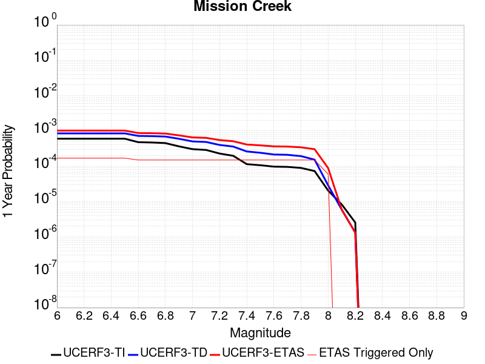 |  |

| Magnitude | 1 wk TI Prob | 1 wk TD Prob | 1 wk ETAS Prob | 1 wk ETAS/TD Gain | 1 wk ETAS Triggered Only | 1 mo TI Prob | 1 mo TD Prob | 1 mo ETAS Prob | 1 mo ETAS/TD Gain | 1 mo ETAS Triggered Only | 1 yr TI Prob | 1 yr TD Prob | 1 yr ETAS Prob | 1 yr ETAS/TD Gain | 1 yr ETAS Triggered Only | 10 yr TI Prob | 10 yr TD Prob | 10 yr ETAS Prob | 10 yr ETAS/TD Gain | 10 yr ETAS Triggered Only |
|-----|-----|-----|-----|-----|-----|-----|-----|-----|-----|-----|-----|-----|-----|-----|-----|-----|-----|-----|-----|-----|
| 6.0 | 1.1549387E-5 | 1.632237E-5 | 1.363204E-4 | 8.351753 | 1.2E-4 | 4.9496433E-5 | 6.9951224E-5 | 2.2994004E-4 | 3.287148 | 1.6E-4 | 6.0245243E-4 | 8.513384E-4 | 0.0010211937 | 1.1995156 | 1.7E-4 | 0.006008218 | 0.008509998 | 0.0086983815 | 1.0221367 | 1.9E-4 |
| 6.1 | 1.1549387E-5 | 1.632237E-5 | 1.363204E-4 | 8.351753 | 1.2E-4 | 4.9496433E-5 | 6.9951224E-5 | 2.2994004E-4 | 3.287148 | 1.6E-4 | 6.0245243E-4 | 8.513384E-4 | 0.0010211937 | 1.1995156 | 1.7E-4 | 0.006008218 | 0.008509998 | 0.0086983815 | 1.0221367 | 1.9E-4 |
| 6.2 | 1.1549387E-5 | 1.632237E-5 | 1.363204E-4 | 8.351753 | 1.2E-4 | 4.9496433E-5 | 6.9951224E-5 | 2.2994004E-4 | 3.287148 | 1.6E-4 | 6.0245243E-4 | 8.513384E-4 | 0.0010211937 | 1.1995156 | 1.7E-4 | 0.006008218 | 0.008509998 | 0.0086983815 | 1.0221367 | 1.9E-4 |
| 6.3 | 1.1549387E-5 | 1.632237E-5 | 1.363204E-4 | 8.351753 | 1.2E-4 | 4.9496433E-5 | 6.9951224E-5 | 2.2994004E-4 | 3.287148 | 1.6E-4 | 6.0245243E-4 | 8.513384E-4 | 0.0010211937 | 1.1995156 | 1.7E-4 | 0.006008218 | 0.008509998 | 0.0086983815 | 1.0221367 | 1.9E-4 |
| 6.4 | 1.1549387E-5 | 1.632237E-5 | 1.363204E-4 | 8.351753 | 1.2E-4 | 4.9496433E-5 | 6.9951224E-5 | 2.2994004E-4 | 3.287148 | 1.6E-4 | 6.0245243E-4 | 8.513384E-4 | 0.0010211937 | 1.1995156 | 1.7E-4 | 0.006008218 | 0.008509998 | 0.0086983815 | 1.0221367 | 1.9E-4 |
| 6.5 | 1.1549387E-5 | 1.632237E-5 | 1.363204E-4 | 8.351753 | 1.2E-4 | 4.9496433E-5 | 6.9951224E-5 | 2.2994004E-4 | 3.287148 | 1.6E-4 | 6.0245243E-4 | 8.513384E-4 | 0.0010211937 | 1.1995156 | 1.7E-4 | 0.006008218 | 0.008509998 | 0.0086983815 | 1.0221367 | 1.9E-4 |
| 6.6 | 9.202681E-6 | 1.3845646E-5 | 1.3384399E-4 | 9.666864 | 1.2E-4 | 3.9439463E-5 | 5.9337188E-5 | 1.9932888E-4 | 3.3592572 | 1.4E-4 | 4.800697E-4 | 7.221998E-4 | 8.720915E-4 | 1.2075487 | 1.5E-4 | 0.004790339 | 0.0072271815 | 0.007386025 | 1.0219786 | 1.6E-4 |
| 6.7 | 9.019164E-6 | 1.3651316E-5 | 1.3364968E-4 | 9.790241 | 1.2E-4 | 3.8652986E-5 | 5.8504378E-5 | 1.9849619E-4 | 3.3928432 | 1.4E-4 | 4.7049852E-4 | 7.12067E-4 | 8.6196023E-4 | 1.2105043 | 1.5E-4 | 0.004695036 | 0.007126506 | 0.0072853654 | 1.0222914 | 1.6E-4 |
| 6.8 | 8.673558E-6 | 1.3273427E-5 | 1.3327184E-4 | 10.0405 | 1.2E-4 | 3.717186E-5 | 5.6884925E-5 | 1.9687696E-4 | 3.460969 | 1.4E-4 | 4.524734E-4 | 6.923627E-4 | 8.4225886E-4 | 1.2164994 | 1.5E-4 | 0.0045155324 | 0.006930694 | 0.007089585 | 1.0229257 | 1.6E-4 |
| 6.9 | 7.002255E-6 | 1.1477657E-5 | 1.3147628E-4 | 11.454976 | 1.2E-4 | 3.000932E-5 | 4.9189068E-5 | 1.8918219E-4 | 3.846021 | 1.4E-4 | 3.653022E-4 | 5.9871917E-4 | 7.486294E-4 | 1.2503848 | 1.5E-4 | 0.0036470229 | 0.005999517 | 0.0061585573 | 1.0265088 | 1.6E-4 |
| 7.0 | 5.84644E-6 | 9.67498E-6 | 1.2967382E-4 | 13.403007 | 1.2E-4 | 2.5055931E-5 | 4.1463565E-5 | 1.8145776E-4 | 4.3763185 | 1.4E-4 | 3.0501327E-4 | 5.047066E-4 | 6.546308E-4 | 1.2970524 | 1.5E-4 | 0.0030459496 | 0.0050638523 | 0.005223042 | 1.0314364 | 1.6E-4 |
| 7.1 | 5.54703E-6 | 9.329456E-6 | 1.2932834E-4 | 13.862367 | 1.2E-4 | 2.377277E-5 | 3.9982795E-5 | 1.799772E-4 | 4.501366 | 1.4E-4 | 2.8939504E-4 | 4.8668624E-4 | 6.3661323E-4 | 1.3080567 | 1.5E-4 | 0.0028901845 | 0.004884446 | 0.005043665 | 1.0325971 | 1.6E-4 |
| 7.2 | 4.384709E-6 | 7.68157E-6 | 1.2768064E-4 | 16.621685 | 1.2E-4 | 1.8791474E-5 | 3.2920623E-5 | 1.7291601E-4 | 5.2525134 | 1.4E-4 | 2.2876218E-4 | 4.0073853E-4 | 5.506784E-4 | 1.3741589 | 1.5E-4 | 0.0022852682 | 0.004028366 | 0.0041877213 | 1.0395583 | 1.6E-4 |
| 7.3 | 3.7888456E-6 | 6.915452E-6 | 1.2691462E-4 | 18.352325 | 1.2E-4 | 1.623781E-5 | 2.9637333E-5 | 1.6963319E-4 | 5.723632 | 1.4E-4 | 1.9767738E-4 | 3.6077813E-4 | 5.10724E-4 | 1.415618 | 1.5E-4 | 0.0019750162 | 0.0036301152 | 0.0037895343 | 1.0439157 | 1.6E-4 |
| 7.4 | 2.1982462E-6 | 5.0237763E-6 | 1.2502317E-4 | 24.886293 | 1.2E-4 | 9.421021E-6 | 2.1530293E-5 | 1.6152728E-4 | 7.5023255 | 1.4E-4 | 1.1469489E-4 | 2.621E-4 | 4.1206068E-4 | 1.5721507 | 1.5E-4 | 0.0011463572 | 0.0026458844 | 0.0028054612 | 1.0603113 | 1.6E-4 |
| 7.5 | 2.051923E-6 | 4.615016E-6 | 1.2461447E-4 | 27.001957 | 1.2E-4 | 8.793926E-6 | 1.9778492E-5 | 1.5977572E-4 | 8.078257 | 1.4E-4 | 1.0706078E-4 | 2.4077666E-4 | 3.9074055E-4 | 1.622834 | 1.5E-4 | 0.0010700922 | 0.0024335422 | 0.0025931527 | 1.0655878 | 1.6E-4 |
| 7.6 | 1.8733427E-6 | 4.1233748E-6 | 1.2412287E-4 | 30.102255 | 1.2E-4 | 8.028587E-6 | 1.7671488E-5 | 1.5766901E-4 | 8.922226 | 1.4E-4 | 9.774366E-5 | 2.151292E-4 | 3.6509693E-4 | 1.6971054 | 1.5E-4 | 9.770069E-4 | 0.0021780801 | 0.0023377317 | 1.0732992 | 1.6E-4 |
| 7.7 | 1.8411953E-6 | 4.0430496E-6 | 1.2404256E-4 | 30.680445 | 1.2E-4 | 7.890813E-6 | 1.732724E-5 | 1.5732482E-4 | 9.079623 | 1.4E-4 | 9.606641E-5 | 2.1093882E-4 | 3.6090717E-4 | 1.7109567 | 1.5E-4 | 9.6024893E-4 | 0.0021363653 | 0.0022960235 | 1.0747336 | 1.6E-4 |
| 7.8 | 1.7194251E-6 | 3.7104276E-6 | 1.2370998E-4 | 33.341167 | 1.2E-4 | 7.368944E-6 | 1.5901736E-5 | 1.5589951E-4 | 9.80393 | 1.4E-4 | 8.97132E-5 | 1.9358651E-4 | 3.4355748E-4 | 1.7746974 | 1.5E-4 | 8.967699E-4 | 0.0019623525 | 0.0021220385 | 1.0813748 | 1.6E-4 |
| 7.9 | 1.4035052E-6 | 2.9500632E-6 | 1.2294971E-4 | 41.676975 | 1.2E-4 | 6.0150082E-6 | 1.2643067E-5 | 1.526413E-4 | 12.073123 | 1.4E-4 | 7.3230265E-5 | 1.5391852E-4 | 3.0389545E-4 | 1.9743916 | 1.5E-4 | 7.3206134E-4 | 0.0015631086 | 0.0017228585 | 1.1022002 | 1.6E-4 |
| 8.0 | 3.9318823E-7 | 5.528522E-7 | 5.0552826E-5 | 91.44003 | 5.0E-5 | 1.6850913E-6 | 2.3693647E-6 | 5.2369247E-5 | 22.102654 | 5.0E-5 | 2.0515794E-5 | 2.8846638E-5 | 8.884491E-5 | 3.079905 | 6.0E-5 | 2.0513899E-4 | 2.9899E-4 | 3.5897206E-4 | 1.2006156 | 6.0E-5 |
| 8.1 | 1.596793E-7 | 1.1380002E-7 | 1.1380002E-7 | 1.0 | 0.0 | 6.8433974E-7 | 4.877143E-7 | 4.877143E-7 | 1.0 | 0.0 | 8.331805E-6 | 5.937906E-6 | 5.937906E-6 | 1.0 | 0.0 | 8.331492E-5 | 6.549966E-5 | 6.549966E-5 | 1.0 | 0.0 |
| 8.2 | 4.9003038E-8 | 2.5444924E-8 | 2.5444924E-8 | 1.0 | 0.0 | 2.10013E-7 | 1.0904967E-7 | 1.0904967E-7 | 1.0 | 0.0 | 2.5569052E-6 | 1.327679E-6 | 1.327679E-6 | 1.0 | 0.0 | 2.556876E-5 | 1.495635E-5 | 1.495635E-5 | 1.0 | 0.0 |

## Santa Cruz Island
*[(top)](#table-of-contents)*

| 1 Week | 1 Month | 1 Year | 10 Year |
|-----|-----|-----|-----|
|  | 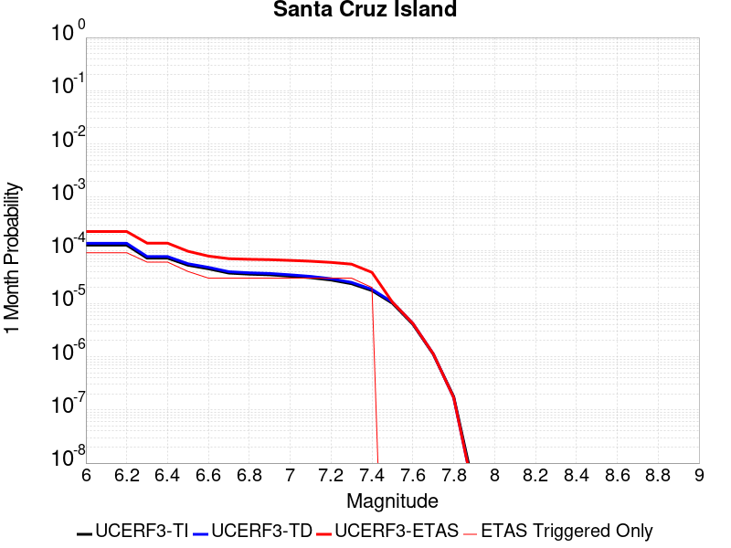 |  |  |

| Magnitude | 1 wk TI Prob | 1 wk TD Prob | 1 wk ETAS Prob | 1 wk ETAS/TD Gain | 1 wk ETAS Triggered Only | 1 mo TI Prob | 1 mo TD Prob | 1 mo ETAS Prob | 1 mo ETAS/TD Gain | 1 mo ETAS Triggered Only | 1 yr TI Prob | 1 yr TD Prob | 1 yr ETAS Prob | 1 yr ETAS/TD Gain | 1 yr ETAS Triggered Only | 10 yr TI Prob | 10 yr TD Prob | 10 yr ETAS Prob | 10 yr ETAS/TD Gain | 10 yr ETAS Triggered Only |
|-----|-----|-----|-----|-----|-----|-----|-----|-----|-----|-----|-----|-----|-----|-----|-----|-----|-----|-----|-----|-----|
| 6.0 | 2.9164563E-5 | 3.1599742E-5 | 9.1597845E-5 | 2.8986895 | 6.0E-5 | 1.2498499E-4 | 1.3542121E-4 | 2.2540902E-4 | 1.6645031 | 9.0E-5 | 0.0015206301 | 0.0016476426 | 0.0017674448 | 1.0727113 | 1.2E-4 | 0.015102667 | 0.016368 | 0.01649587 | 1.0078124 | 1.3E-4 |
| 6.1 | 2.9164563E-5 | 3.1599742E-5 | 9.1597845E-5 | 2.8986895 | 6.0E-5 | 1.2498499E-4 | 1.3542121E-4 | 2.2540902E-4 | 1.6645031 | 9.0E-5 | 0.0015206301 | 0.0016476426 | 0.0017674448 | 1.0727113 | 1.2E-4 | 0.015102667 | 0.016368 | 0.01649587 | 1.0078124 | 1.3E-4 |
| 6.2 | 2.9164563E-5 | 3.1599742E-5 | 9.1597845E-5 | 2.8986895 | 6.0E-5 | 1.2498499E-4 | 1.3542121E-4 | 2.2540902E-4 | 1.6645031 | 9.0E-5 | 0.0015206301 | 0.0016476426 | 0.0017674448 | 1.0727113 | 1.2E-4 | 0.015102667 | 0.016368 | 0.01649587 | 1.0078124 | 1.3E-4 |
| 6.3 | 1.6635553E-5 | 1.780436E-5 | 6.780347E-5 | 3.8082511 | 5.0E-5 | 7.1293274E-5 | 7.630226E-5 | 1.3629769E-4 | 1.7862862 | 6.0E-5 | 8.6765E-4 | 9.2860236E-4 | 0.001008528 | 1.086071 | 8.0E-5 | 0.008642701 | 0.009249094 | 0.009328353 | 1.0085695 | 8.0E-5 |
| 6.4 | 1.6635553E-5 | 1.780436E-5 | 6.780347E-5 | 3.8082511 | 5.0E-5 | 7.1293274E-5 | 7.630226E-5 | 1.3629769E-4 | 1.7862862 | 6.0E-5 | 8.6765E-4 | 9.2860236E-4 | 0.001008528 | 1.086071 | 8.0E-5 | 0.008642701 | 0.009249094 | 0.009328353 | 1.0085695 | 8.0E-5 |
| 6.5 | 1.2238748E-5 | 1.3042995E-5 | 4.3042604E-5 | 3.300055 | 3.0E-5 | 5.2450723E-5 | 5.5897377E-5 | 9.589514E-5 | 1.7155571 | 4.0E-5 | 6.3840044E-4 | 6.8034173E-4 | 7.303077E-4 | 1.0734425 | 5.0E-5 | 0.0063656955 | 0.0067829876 | 0.0068326485 | 1.0073214 | 5.0E-5 |
| 6.6 | 1.0489767E-5 | 1.1156636E-5 | 3.1156414E-5 | 2.7926352 | 2.0E-5 | 4.495537E-5 | 4.781329E-5 | 7.7811856E-5 | 1.6274107 | 3.0E-5 | 5.4719415E-4 | 5.819735E-4 | 6.1195606E-4 | 1.0515187 | 3.0E-5 | 0.005458487 | 0.0058047357 | 0.005834562 | 1.0051382 | 3.0E-5 |
| 6.7 | 8.699222E-6 | 9.236782E-6 | 2.9236597E-5 | 3.1652362 | 2.0E-5 | 3.7281847E-5 | 3.958561E-5 | 6.958442E-5 | 1.7578211 | 3.0E-5 | 4.5381195E-4 | 4.8184878E-4 | 5.1183434E-4 | 1.0622302 | 3.0E-5 | 0.0045288634 | 0.004808108 | 0.0048379637 | 1.0062095 | 3.0E-5 |
| 6.8 | 8.307732E-6 | 8.8169045E-6 | 2.8816728E-5 | 3.26835 | 2.0E-5 | 3.560408E-5 | 3.7786187E-5 | 6.7785055E-5 | 1.7939109 | 3.0E-5 | 4.3339343E-4 | 4.5995016E-4 | 4.899363E-4 | 1.0651945 | 3.0E-5 | 0.004325492 | 0.0045900354 | 0.0046198973 | 1.0065058 | 3.0E-5 |
| 6.9 | 8.073121E-6 | 8.564939E-6 | 2.8564767E-5 | 3.3350813 | 2.0E-5 | 3.459863E-5 | 3.6706366E-5 | 6.670527E-5 | 1.817267 | 3.0E-5 | 4.2115687E-4 | 4.468088E-4 | 4.767954E-4 | 1.0671128 | 3.0E-5 | 0.004203596 | 0.004459156 | 0.0044890223 | 1.0066978 | 3.0E-5 |
| 7.0 | 7.617019E-6 | 8.074664E-6 | 2.8074503E-5 | 3.4768631 | 2.0E-5 | 3.264396E-5 | 3.4605247E-5 | 6.460421E-5 | 1.8668905 | 3.0E-5 | 3.9736772E-4 | 4.212378E-4 | 4.5122518E-4 | 1.0711887 | 3.0E-5 | 0.003966579 | 0.0042044413 | 0.004234315 | 1.0071054 | 3.0E-5 |
| 7.1 | 7.1224836E-6 | 7.545788E-6 | 2.7545637E-5 | 3.6504653 | 2.0E-5 | 3.052457E-5 | 3.2338692E-5 | 6.233772E-5 | 1.9276513 | 3.0E-5 | 3.715733E-4 | 3.936528E-4 | 4.23641E-4 | 1.0761793 | 3.0E-5 | 0.003709526 | 0.003929598 | 0.0039594797 | 1.0076044 | 3.0E-5 |
| 7.2 | 6.441115E-6 | 6.8273835E-6 | 2.6827247E-5 | 3.92936 | 2.0E-5 | 2.7604487E-5 | 2.9259887E-5 | 5.9259008E-5 | 2.0252645 | 3.0E-5 | 3.360328E-4 | 3.5618112E-4 | 3.8617043E-4 | 1.0841968 | 3.0E-5 | 0.0033552512 | 0.003556131 | 0.0035860243 | 1.0084062 | 3.0E-5 |
| 7.3 | 5.494274E-6 | 5.8199944E-6 | 2.5819878E-5 | 4.4364095 | 2.0E-5 | 2.3546674E-5 | 2.4942596E-5 | 5.4941847E-5 | 2.2027318 | 3.0E-5 | 2.8664304E-4 | 3.0363398E-4 | 3.3362486E-4 | 1.0987731 | 3.0E-5 | 0.002862736 | 0.0030322142 | 0.0030621234 | 1.0098637 | 3.0E-5 |
| 7.4 | 4.0802624E-6 | 4.312256E-6 | 2.431217E-5 | 5.6379237 | 2.0E-5 | 1.7486722E-5 | 1.8480967E-5 | 3.8480597E-5 | 2.0821745 | 2.0E-5 | 2.1288003E-4 | 2.2498262E-4 | 2.4497812E-4 | 1.0888758 | 2.0E-5 | 0.0021267622 | 0.0022475575 | 0.0022675125 | 1.0088786 | 2.0E-5 |
| 7.5 | 2.3584746E-6 | 2.4753094E-6 | 2.4753094E-6 | 1.0 | 0.0 | 1.0107709E-5 | 1.0608426E-5 | 1.0608426E-5 | 1.0 | 0.0 | 1.2305441E-4 | 1.2915E-4 | 1.2915E-4 | 1.0 | 0.0 | 0.0012298629 | 0.0012907543 | 0.0012907543 | 1.0 | 0.0 |
| 7.6 | 9.4981914E-7 | 9.86093E-7 | 9.86093E-7 | 1.0 | 0.0 | 4.0706473E-6 | 4.2261063E-6 | 4.2261063E-6 | 1.0 | 0.0 | 4.9559E-5 | 5.145164E-5 | 5.145164E-5 | 1.0 | 0.0 | 4.954795E-4 | 5.1439856E-4 | 5.1439856E-4 | 1.0 | 0.0 |
| 7.7 | 2.6013532E-7 | 2.6416603E-7 | 2.6416603E-7 | 1.0 | 0.0 | 1.1148652E-6 | 1.1321397E-6 | 1.1321397E-6 | 1.0 | 0.0 | 1.3573399E-5 | 1.3783714E-5 | 1.3783714E-5 | 1.0 | 0.0 | 1.357257E-4 | 1.3782867E-4 | 1.3782867E-4 | 1.0 | 0.0 |
| 7.8 | 4.1522263E-8 | 3.965679E-8 | 3.965679E-8 | 1.0 | 0.0 | 1.7795254E-7 | 1.6995766E-7 | 1.6995766E-7 | 1.0 | 0.0 | 2.16657E-6 | 2.0692328E-6 | 2.0692328E-6 | 1.0 | 0.0 | 2.1665488E-5 | 2.0692156E-5 | 2.0692156E-5 | 1.0 | 0.0 |
| 7.9 | 7.7242046E-10 | 5.9468175E-10 | 5.9468175E-10 | 1.0 | 0.0 | 3.3103735E-9 | 2.5486364E-9 | 2.5486364E-9 | 1.0 | 0.0 | 4.0303796E-8 | 3.1029646E-8 | 3.1029646E-8 | 1.0 | 0.0 | 4.030379E-7 | 3.1029643E-7 | 3.1029643E-7 | 1.0 | 0.0 |

## Ventura-Pitas Point
*[(top)](#table-of-contents)*

| 1 Week | 1 Month | 1 Year | 10 Year |
|-----|-----|-----|-----|
|  |  |  |  |

| Magnitude | 1 wk TI Prob | 1 wk TD Prob | 1 wk ETAS Prob | 1 wk ETAS/TD Gain | 1 wk ETAS Triggered Only | 1 mo TI Prob | 1 mo TD Prob | 1 mo ETAS Prob | 1 mo ETAS/TD Gain | 1 mo ETAS Triggered Only | 1 yr TI Prob | 1 yr TD Prob | 1 yr ETAS Prob | 1 yr ETAS/TD Gain | 1 yr ETAS Triggered Only | 10 yr TI Prob | 10 yr TD Prob | 10 yr ETAS Prob | 10 yr ETAS/TD Gain | 10 yr ETAS Triggered Only |
|-----|-----|-----|-----|-----|-----|-----|-----|-----|-----|-----|-----|-----|-----|-----|-----|-----|-----|-----|-----|-----|
| 6.0 | 3.3179622E-5 | 3.3735185E-5 | 9.373316E-5 | 2.7784986 | 6.0E-5 | 1.4219063E-4 | 1.445728E-4 | 2.1456268E-4 | 1.4841151 | 7.0E-5 | 0.0017297962 | 0.0017590096 | 0.0018987634 | 1.0794502 | 1.4E-4 | 0.017163932 | 0.0174764 | 0.017633604 | 1.0089952 | 1.6E-4 |
| 6.1 | 3.3179622E-5 | 3.3735185E-5 | 9.373316E-5 | 2.7784986 | 6.0E-5 | 1.4219063E-4 | 1.445728E-4 | 2.1456268E-4 | 1.4841151 | 7.0E-5 | 0.0017297962 | 0.0017590096 | 0.0018987634 | 1.0794502 | 1.4E-4 | 0.017163932 | 0.0174764 | 0.017633604 | 1.0089952 | 1.6E-4 |
| 6.2 | 3.3179622E-5 | 3.3735185E-5 | 9.373316E-5 | 2.7784986 | 6.0E-5 | 1.4219063E-4 | 1.445728E-4 | 2.1456268E-4 | 1.4841151 | 7.0E-5 | 0.0017297962 | 0.0017590096 | 0.0018987634 | 1.0794502 | 1.4E-4 | 0.017163932 | 0.0174764 | 0.017633604 | 1.0089952 | 1.6E-4 |
| 6.3 | 3.3179622E-5 | 3.3735185E-5 | 9.373316E-5 | 2.7784986 | 6.0E-5 | 1.4219063E-4 | 1.445728E-4 | 2.1456268E-4 | 1.4841151 | 7.0E-5 | 0.0017297962 | 0.0017590096 | 0.0018987634 | 1.0794502 | 1.4E-4 | 0.017163932 | 0.0174764 | 0.017633604 | 1.0089952 | 1.6E-4 |
| 6.4 | 1.8754668E-5 | 1.701961E-5 | 4.70191E-5 | 2.7626426 | 3.0E-5 | 8.037467E-5 | 7.293928E-5 | 1.1293636E-4 | 1.5483613 | 4.0E-5 | 9.781223E-4 | 8.8769704E-4 | 9.876082E-4 | 1.1125511 | 1.0E-4 | 0.009738282 | 0.008843848 | 0.008952875 | 1.012328 | 1.1E-4 |
| 6.5 | 1.8754668E-5 | 1.701961E-5 | 4.70191E-5 | 2.7626426 | 3.0E-5 | 8.037467E-5 | 7.293928E-5 | 1.1293636E-4 | 1.5483613 | 4.0E-5 | 9.781223E-4 | 8.8769704E-4 | 9.876082E-4 | 1.1125511 | 1.0E-4 | 0.009738282 | 0.008843848 | 0.008952875 | 1.012328 | 1.1E-4 |
| 6.6 | 1.4361558E-5 | 1.2122275E-5 | 4.2121912E-5 | 3.4747531 | 3.0E-5 | 6.154808E-5 | 5.1951585E-5 | 9.194951E-5 | 1.7699076 | 4.0E-5 | 7.490902E-4 | 6.3232926E-4 | 7.222724E-4 | 1.1422409 | 9.0E-5 | 0.0074657016 | 0.0063055577 | 0.006404927 | 1.015759 | 1.0E-4 |
| 6.7 | 1.4361558E-5 | 1.2122275E-5 | 4.2121912E-5 | 3.4747531 | 3.0E-5 | 6.154808E-5 | 5.1951585E-5 | 9.194951E-5 | 1.7699076 | 4.0E-5 | 7.490902E-4 | 6.3232926E-4 | 7.222724E-4 | 1.1422409 | 9.0E-5 | 0.0074657016 | 0.0063055577 | 0.006404927 | 1.015759 | 1.0E-4 |
| 6.8 | 1.3663846E-5 | 1.13444175E-5 | 4.134408E-5 | 3.6444423 | 3.0E-5 | 5.8558027E-5 | 4.861804E-5 | 8.861609E-5 | 1.8226999 | 4.0E-5 | 7.127108E-4 | 5.917658E-4 | 6.817125E-4 | 1.1519972 | 9.0E-5 | 0.007104293 | 0.005902116 | 0.006001526 | 1.0168431 | 1.0E-4 |
| 6.9 | 1.3644157E-5 | 1.1322519E-5 | 4.132218E-5 | 3.649557 | 3.0E-5 | 5.8473648E-5 | 4.8524187E-5 | 8.852225E-5 | 1.8242911 | 4.0E-5 | 7.116841E-4 | 5.9062376E-4 | 6.805706E-4 | 1.1522913 | 9.0E-5 | 0.007094092 | 0.0058907564 | 0.0059901676 | 1.0168757 | 1.0E-4 |
| 7.0 | 1.3568845E-5 | 1.1242086E-5 | 4.1241747E-5 | 3.668514 | 3.0E-5 | 5.8150898E-5 | 4.817949E-5 | 8.817756E-5 | 1.8301889 | 4.0E-5 | 7.077572E-4 | 5.864293E-4 | 6.763765E-4 | 1.1533812 | 9.0E-5 | 0.007055073 | 0.0058490336 | 0.0059484486 | 1.0169969 | 1.0E-4 |
| 7.1 | 1.306572E-5 | 1.072054E-5 | 4.0720217E-5 | 3.7983365 | 3.0E-5 | 5.599474E-5 | 4.5944373E-5 | 7.594299E-5 | 1.6529336 | 3.0E-5 | 6.815227E-4 | 5.5923103E-4 | 6.391863E-4 | 1.1429735 | 8.0E-5 | 0.0067943637 | 0.0055784425 | 0.0056679402 | 1.0160435 | 9.0E-5 |
| 7.2 | 1.232604E-5 | 9.995143E-6 | 3.9994844E-5 | 4.0014277 | 3.0E-5 | 5.2824813E-5 | 4.2835632E-5 | 7.283435E-5 | 1.7003214 | 3.0E-5 | 6.429523E-4 | 5.214008E-4 | 6.013591E-4 | 1.1533529 | 8.0E-5 | 0.0064109527 | 0.005201967 | 0.0052914987 | 1.0172112 | 9.0E-5 |
| 7.3 | 1.0917261E-5 | 8.84384E-6 | 3.8843576E-5 | 4.3921614 | 3.0E-5 | 4.678742E-5 | 3.790163E-5 | 6.7900495E-5 | 1.7914927 | 3.0E-5 | 5.69488E-4 | 4.6135622E-4 | 5.2132853E-4 | 1.1299914 | 6.0E-5 | 0.0056803077 | 0.00460415 | 0.004673828 | 1.0151336 | 7.0E-5 |
| 7.4 | 1.039959E-5 | 8.423562E-6 | 3.842331E-5 | 4.5614085 | 3.0E-5 | 4.456891E-5 | 3.610049E-5 | 6.6099405E-5 | 1.8309836 | 3.0E-5 | 5.424914E-4 | 4.3943635E-4 | 4.9941E-4 | 1.1364785 | 6.0E-5 | 0.0054116896 | 0.004385836 | 0.0044555287 | 1.0158905 | 7.0E-5 |
| 7.5 | 9.015877E-6 | 7.2975445E-6 | 2.72974E-5 | 3.7406278 | 2.0E-5 | 3.86389E-5 | 3.1274823E-5 | 5.1274197E-5 | 1.639472 | 2.0E-5 | 4.7032707E-4 | 3.8070587E-4 | 4.3068684E-4 | 1.131285 | 5.0E-5 | 0.004693329 | 0.0038006818 | 0.0038604538 | 1.0157267 | 6.0E-5 |
| 7.6 | 4.900162E-6 | 3.8741155E-6 | 2.3874038E-5 | 6.1624484 | 2.0E-5 | 2.1000526E-5 | 1.6603248E-5 | 3.6602916E-5 | 2.2045636 | 2.0E-5 | 2.556514E-4 | 2.0212591E-4 | 2.4211784E-4 | 1.1978564 | 4.0E-5 | 0.0025535747 | 0.0020194345 | 0.0020693336 | 1.0247095 | 5.0E-5 |
| 7.7 | 3.8850626E-6 | 3.1267302E-6 | 2.3126668E-5 | 7.396438 | 2.0E-5 | 1.6650163E-5 | 1.3400205E-5 | 3.3399938E-5 | 2.4924946 | 2.0E-5 | 2.0269687E-4 | 1.6313537E-4 | 2.0312883E-4 | 1.2451551 | 4.0E-5 | 0.002025121 | 0.0016301654 | 0.0016800839 | 1.0306218 | 5.0E-5 |
| 7.8 | 2.4654719E-6 | 2.029875E-6 | 1.2029855E-5 | 5.9264016 | 1.0E-5 | 1.0566265E-5 | 8.699436E-6 | 1.869935E-5 | 2.1494899 | 1.0E-5 | 1.2863669E-4 | 1.0591053E-4 | 1.2590841E-4 | 1.1888187 | 2.0E-5 | 0.0012856225 | 0.0010586053 | 0.001078584 | 1.0188727 | 2.0E-5 |
| 7.9 | 4.095894E-7 | 3.2764765E-7 | 1.0327644E-5 | 31.520582 | 1.0E-5 | 1.7553821E-6 | 1.4042034E-6 | 1.14041895E-5 | 8.121466 | 1.0E-5 | 2.1371567E-5 | 1.7096047E-5 | 2.7095875E-5 | 1.5849205 | 1.0E-5 | 2.1369511E-4 | 1.7094762E-4 | 1.809459E-4 | 1.0584874 | 1.0E-5 |
| 8.0 | 7.791402E-9 | 5.683497E-9 | 5.683497E-9 | 1.0 | 0.0 | 3.3391725E-8 | 2.4357844E-8 | 2.4357844E-8 | 1.0 | 0.0 | 4.0654416E-7 | 2.9655675E-7 | 2.9655675E-7 | 1.0 | 0.0 | 4.065434E-6 | 2.9655655E-6 | 2.9655655E-6 | 1.0 | 0.0 |

## Owens Valley
*[(top)](#table-of-contents)*

| 1 Week | 1 Month | 1 Year | 10 Year |
|-----|-----|-----|-----|
|  |  |  |  |

| Magnitude | 1 wk TI Prob | 1 wk TD Prob | 1 wk ETAS Prob | 1 wk ETAS/TD Gain | 1 wk ETAS Triggered Only | 1 mo TI Prob | 1 mo TD Prob | 1 mo ETAS Prob | 1 mo ETAS/TD Gain | 1 mo ETAS Triggered Only | 1 yr TI Prob | 1 yr TD Prob | 1 yr ETAS Prob | 1 yr ETAS/TD Gain | 1 yr ETAS Triggered Only | 10 yr TI Prob | 10 yr TD Prob | 10 yr ETAS Prob | 10 yr ETAS/TD Gain | 10 yr ETAS Triggered Only |
|-----|-----|-----|-----|-----|-----|-----|-----|-----|-----|-----|-----|-----|-----|-----|-----|-----|-----|-----|-----|-----|
| 6.0 | 4.83821E-5 | 3.626567E-6 | 9.3626244E-5 | 25.816769 | 9.0E-5 | 2.0733538E-4 | 1.5542342E-5 | 1.1554079E-4 | 7.4339366 | 1.0E-4 | 0.002521386 | 1.8921259E-4 | 3.0918987E-4 | 1.6340873 | 1.2E-4 | 0.024929691 | 0.001925011 | 0.0020946837 | 1.0881412 | 1.7E-4 |
| 6.1 | 4.83821E-5 | 3.626567E-6 | 9.3626244E-5 | 25.816769 | 9.0E-5 | 2.0733538E-4 | 1.5542342E-5 | 1.1554079E-4 | 7.4339366 | 1.0E-4 | 0.002521386 | 1.8921259E-4 | 3.0918987E-4 | 1.6340873 | 1.2E-4 | 0.024929691 | 0.001925011 | 0.0020946837 | 1.0881412 | 1.7E-4 |
| 6.2 | 4.83821E-5 | 3.626567E-6 | 9.3626244E-5 | 25.816769 | 9.0E-5 | 2.0733538E-4 | 1.5542342E-5 | 1.1554079E-4 | 7.4339366 | 1.0E-4 | 0.002521386 | 1.8921259E-4 | 3.0918987E-4 | 1.6340873 | 1.2E-4 | 0.024929691 | 0.001925011 | 0.0020946837 | 1.0881412 | 1.7E-4 |
| 6.3 | 3.953008E-5 | 3.1553948E-6 | 7.315518E-5 | 23.184158 | 7.0E-5 | 1.6940363E-4 | 1.3523055E-5 | 8.352211E-5 | 6.1762753 | 7.0E-5 | 0.002060538 | 1.6463149E-4 | 2.446183E-4 | 1.4858538 | 8.0E-5 | 0.020415364 | 0.0016592 | 0.0017790009 | 1.072204 | 1.2E-4 |
| 6.4 | 3.953008E-5 | 3.1553948E-6 | 7.315518E-5 | 23.184158 | 7.0E-5 | 1.6940363E-4 | 1.3523055E-5 | 8.352211E-5 | 6.1762753 | 7.0E-5 | 0.002060538 | 1.6463149E-4 | 2.446183E-4 | 1.4858538 | 8.0E-5 | 0.020415364 | 0.0016592 | 0.0017790009 | 1.072204 | 1.2E-4 |
| 6.5 | 3.457342E-5 | 2.9715961E-6 | 6.297142E-5 | 21.191109 | 6.0E-5 | 1.4816338E-4 | 1.2735354E-5 | 7.273459E-5 | 5.711234 | 6.0E-5 | 0.0018023965 | 1.550426E-4 | 2.2503175E-4 | 1.4514188 | 7.0E-5 | 0.017878477 | 0.001555719 | 0.0016655478 | 1.0705968 | 1.1E-4 |
| 6.6 | 3.1127765E-5 | 2.8744932E-6 | 6.287432E-5 | 21.873184 | 6.0E-5 | 1.3339789E-4 | 1.2319203E-5 | 7.2318464E-5 | 5.870385 | 6.0E-5 | 0.0016229092 | 1.4997667E-4 | 2.1996615E-4 | 1.4666693 | 7.0E-5 | 0.016111081 | 0.0015012559 | 0.0016110907 | 1.073162 | 1.1E-4 |
| 6.7 | 2.806885E-5 | 2.8104134E-6 | 6.281024E-5 | 22.349112 | 6.0E-5 | 1.2028952E-4 | 1.20445775E-5 | 7.2043855E-5 | 5.981435 | 6.0E-5 | 0.001463541 | 1.4663354E-4 | 2.1662327E-4 | 1.4773105 | 7.0E-5 | 0.014539397 | 0.0014657511 | 0.0015755899 | 1.0749369 | 1.1E-4 |
| 6.8 | 2.524524E-5 | 2.2353688E-6 | 5.2235257E-5 | 23.367624 | 5.0E-5 | 1.0818939E-4 | 9.580118E-6 | 5.957964E-5 | 6.2190924 | 5.0E-5 | 0.0013164099 | 1.16632E-4 | 1.76625E-4 | 1.5143785 | 6.0E-5 | 0.01308639 | 0.0011659812 | 0.0012558763 | 1.0770983 | 9.0E-5 |
| 6.9 | 2.2704568E-5 | 1.6081682E-6 | 5.1608087E-5 | 32.091225 | 5.0E-5 | 9.730166E-5 | 6.8921313E-6 | 5.6891786E-5 | 8.2546 | 5.0E-5 | 0.0011840039 | 8.390849E-5 | 1.4390345E-4 | 1.7150047 | 6.0E-5 | 0.011777153 | 8.3897985E-4 | 9.2890434E-4 | 1.1071831 | 9.0E-5 |
| 7.0 | 2.0871712E-5 | 1.5395453E-6 | 5.1539468E-5 | 33.47707 | 5.0E-5 | 8.944713E-5 | 6.598035E-6 | 5.6597706E-5 | 8.577964 | 5.0E-5 | 0.0010884746 | 8.032813E-5 | 1.403233E-4 | 1.7468764 | 6.0E-5 | 0.010831586 | 8.0316263E-4 | 8.930903E-4 | 1.111967 | 9.0E-5 |
| 7.1 | 1.944928E-5 | 1.3864178E-6 | 5.138635E-5 | 37.064117 | 5.0E-5 | 8.335139E-5 | 5.941777E-6 | 5.594148E-5 | 9.414941 | 5.0E-5 | 0.0010143308 | 7.233874E-5 | 1.323344E-4 | 1.8293711 | 6.0E-5 | 0.010097133 | 7.2330976E-4 | 8.1324467E-4 | 1.124338 | 9.0E-5 |
| 7.2 | 1.7876306E-5 | 1.2489141E-6 | 5.124885E-5 | 41.03473 | 5.0E-5 | 7.6610486E-5 | 5.352478E-6 | 5.535221E-5 | 10.341417 | 5.0E-5 | 9.3233347E-4 | 6.516448E-5 | 1.2516057E-4 | 1.920687 | 6.0E-5 | 0.009284316 | 6.5159105E-4 | 7.415324E-4 | 1.1380334 | 9.0E-5 |
| 7.3 | 1.2618672E-5 | 1.1115209E-6 | 5.1111467E-5 | 45.98336 | 5.0E-5 | 5.40789E-5 | 4.763652E-6 | 5.4763415E-5 | 11.4960985 | 5.0E-5 | 6.582117E-4 | 5.799593E-5 | 1.1799245E-4 | 2.0344954 | 6.0E-5 | 0.0065626553 | 5.7994033E-4 | 6.6988816E-4 | 1.1550983 | 9.0E-5 |
| 7.4 | 7.4874442E-6 | 8.5486437E-7 | 4.085483E-5 | 47.791008 | 4.0E-5 | 3.208865E-5 | 3.6636993E-6 | 4.3663553E-5 | 11.917887 | 4.0E-5 | 3.906093E-4 | 4.4604632E-5 | 9.46024E-5 | 2.12091 | 5.0E-5 | 0.003899234 | 4.4604883E-4 | 5.2601314E-4 | 1.1792725 | 8.0E-5 |
| 7.5 | 2.4734156E-6 | 6.068616E-7 | 3.0606843E-5 | 50.43464 | 3.0E-5 | 1.060031E-5 | 2.6008327E-6 | 3.2600754E-5 | 12.534738 | 3.0E-5 | 1.2905113E-4 | 3.166468E-5 | 6.166373E-5 | 1.9473978 | 3.0E-5 | 0.0012897621 | 3.1660203E-4 | 3.7658302E-4 | 1.1894524 | 6.0E-5 |
| 7.6 | 1.1328841E-6 | 3.196531E-7 | 1.031965E-5 | 32.283905 | 1.0E-5 | 4.8552088E-6 | 1.3699412E-6 | 1.1369927E-5 | 8.299574 | 1.0E-5 | 5.9110564E-5 | 1.6678909E-5 | 2.6678741E-5 | 1.5995497 | 1.0E-5 | 5.9094845E-4 | 1.6677675E-4 | 2.0677008E-4 | 1.2398016 | 4.0E-5 |
| 7.7 | 4.8613185E-7 | 8.964689E-8 | 8.964689E-8 | 1.0 | 0.0 | 2.0834207E-6 | 3.8420092E-7 | 3.8420092E-7 | 1.0 | 0.0 | 2.536535E-5 | 4.6776368E-6 | 4.6776368E-6 | 1.0 | 0.0 | 2.5362454E-4 | 4.677545E-5 | 5.677498E-5 | 1.2137773 | 1.0E-5 |

## Blue Cut
*[(top)](#table-of-contents)*

| 1 Week | 1 Month | 1 Year | 10 Year |
|-----|-----|-----|-----|
|  |  |  |  |

| Magnitude | 1 wk TI Prob | 1 wk TD Prob | 1 wk ETAS Prob | 1 wk ETAS/TD Gain | 1 wk ETAS Triggered Only | 1 mo TI Prob | 1 mo TD Prob | 1 mo ETAS Prob | 1 mo ETAS/TD Gain | 1 mo ETAS Triggered Only | 1 yr TI Prob | 1 yr TD Prob | 1 yr ETAS Prob | 1 yr ETAS/TD Gain | 1 yr ETAS Triggered Only | 10 yr TI Prob | 10 yr TD Prob | 10 yr ETAS Prob | 10 yr ETAS/TD Gain | 10 yr ETAS Triggered Only |
|-----|-----|-----|-----|-----|-----|-----|-----|-----|-----|-----|-----|-----|-----|-----|-----|-----|-----|-----|-----|-----|
| 6.0 | 2.1227985E-5 | 2.2719574E-5 | 1.1271753E-4 | 4.9612517 | 9.0E-5 | 9.097391E-5 | 9.73663E-5 | 1.9735657E-4 | 2.0269494 | 1.0E-4 | 0.0011070445 | 0.0011848481 | 0.0013446586 | 1.1348784 | 1.6E-4 | 0.011015458 | 0.011791152 | 0.011969029 | 1.0150857 | 1.8E-4 |
| 6.1 | 2.1227985E-5 | 2.2719574E-5 | 1.1271753E-4 | 4.9612517 | 9.0E-5 | 9.097391E-5 | 9.73663E-5 | 1.9735657E-4 | 2.0269494 | 1.0E-4 | 0.0011070445 | 0.0011848481 | 0.0013446586 | 1.1348784 | 1.6E-4 | 0.011015458 | 0.011791152 | 0.011969029 | 1.0150857 | 1.8E-4 |
| 6.2 | 2.1227985E-5 | 2.2719574E-5 | 1.1271753E-4 | 4.9612517 | 9.0E-5 | 9.097391E-5 | 9.73663E-5 | 1.9735657E-4 | 2.0269494 | 1.0E-4 | 0.0011070445 | 0.0011848481 | 0.0013446586 | 1.1348784 | 1.6E-4 | 0.011015458 | 0.011791152 | 0.011969029 | 1.0150857 | 1.8E-4 |
| 6.3 | 1.1613981E-5 | 1.2353542E-5 | 6.235293E-5 | 5.0473723 | 5.0E-5 | 4.9773254E-5 | 5.2942745E-5 | 1.1293957E-4 | 2.1332397 | 6.0E-5 | 6.0582085E-4 | 6.443998E-4 | 7.143547E-4 | 1.1085582 | 7.0E-5 | 0.0060417196 | 0.0064265593 | 0.006506045 | 1.0123683 | 8.0E-5 |
| 6.4 | 1.1613981E-5 | 1.2353542E-5 | 6.235293E-5 | 5.0473723 | 5.0E-5 | 4.9773254E-5 | 5.2942745E-5 | 1.1293957E-4 | 2.1332397 | 6.0E-5 | 6.0582085E-4 | 6.443998E-4 | 7.143547E-4 | 1.1085582 | 7.0E-5 | 0.0060417196 | 0.0064265593 | 0.006506045 | 1.0123683 | 8.0E-5 |
| 6.5 | 8.931326E-6 | 9.4816E-6 | 3.9481314E-5 | 4.163993 | 3.0E-5 | 3.8276554E-5 | 4.0634844E-5 | 7.063363E-5 | 1.7382526 | 3.0E-5 | 4.6591737E-4 | 4.946261E-4 | 5.3460634E-4 | 1.0808291 | 4.0E-5 | 0.0046494175 | 0.004936161 | 0.004985914 | 1.0100794 | 5.0E-5 |
| 6.6 | 7.345353E-6 | 7.79028E-6 | 2.7790124E-5 | 3.5672822 | 2.0E-5 | 3.1479703E-5 | 3.338653E-5 | 5.3385862E-5 | 1.599024 | 2.0E-5 | 3.83198E-4 | 4.064132E-4 | 4.36401E-4 | 1.0737865 | 3.0E-5 | 0.0038253788 | 0.0040574907 | 0.0040973285 | 1.0098183 | 4.0E-5 |
| 6.7 | 6.2775666E-6 | 6.655149E-6 | 2.6655016E-5 | 4.005172 | 2.0E-5 | 2.690358E-5 | 2.8521798E-5 | 4.8521226E-5 | 1.7011981 | 2.0E-5 | 3.2750185E-4 | 3.472051E-4 | 3.7719466E-4 | 1.0863743 | 3.0E-5 | 0.0032701963 | 0.003467367 | 0.0035072283 | 1.0114962 | 4.0E-5 |
| 6.8 | 5.5234095E-6 | 5.8551113E-6 | 2.5854994E-5 | 4.415799 | 2.0E-5 | 2.367154E-5 | 2.5093133E-5 | 4.509263E-5 | 1.7970108 | 2.0E-5 | 2.8816288E-4 | 3.0547334E-4 | 3.354642E-4 | 1.0981783 | 3.0E-5 | 0.002877895 | 0.0030512505 | 0.0030911285 | 1.0130694 | 4.0E-5 |
| 6.9 | 4.7780054E-6 | 5.0654203E-6 | 2.506532E-5 | 4.9483194 | 2.0E-5 | 2.0477004E-5 | 2.1708804E-5 | 4.170837E-5 | 1.9212652 | 2.0E-5 | 2.4927902E-4 | 2.642797E-4 | 2.9427174E-4 | 1.113486 | 3.0E-5 | 0.0024899957 | 0.002640346 | 0.0026802404 | 1.0151095 | 4.0E-5 |
| 7.0 | 3.883171E-6 | 4.118487E-6 | 2.4118404E-5 | 5.856132 | 2.0E-5 | 1.6642054E-5 | 1.7650578E-5 | 3.7650225E-5 | 2.1330874 | 2.0E-5 | 2.0259817E-4 | 2.1488148E-4 | 2.4487503E-4 | 1.1395818 | 3.0E-5 | 0.0020241356 | 0.0021474129 | 0.0021773484 | 1.0139403 | 3.0E-5 |
| 7.1 | 2.8358215E-6 | 3.0097158E-6 | 3.0097158E-6 | 1.0 | 0.0 | 1.2153464E-5 | 1.2898756E-5 | 1.2898756E-5 | 1.0 | 0.0 | 1.4795837E-4 | 1.5703762E-4 | 1.6703604E-4 | 1.063669 | 1.0E-5 | 0.001478599 | 0.0015699116 | 0.001579896 | 1.0063598 | 1.0E-5 |

## San Pedro Basin
*[(top)](#table-of-contents)*

| 1 Week | 1 Month | 1 Year | 10 Year |
|-----|-----|-----|-----|
| 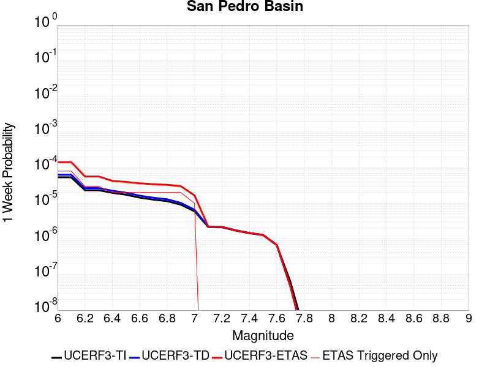 |  |  |  |

| Magnitude | 1 wk TI Prob | 1 wk TD Prob | 1 wk ETAS Prob | 1 wk ETAS/TD Gain | 1 wk ETAS Triggered Only | 1 mo TI Prob | 1 mo TD Prob | 1 mo ETAS Prob | 1 mo ETAS/TD Gain | 1 mo ETAS Triggered Only | 1 yr TI Prob | 1 yr TD Prob | 1 yr ETAS Prob | 1 yr ETAS/TD Gain | 1 yr ETAS Triggered Only | 10 yr TI Prob | 10 yr TD Prob | 10 yr ETAS Prob | 10 yr ETAS/TD Gain | 10 yr ETAS Triggered Only |
|-----|-----|-----|-----|-----|-----|-----|-----|-----|-----|-----|-----|-----|-----|-----|-----|-----|-----|-----|-----|-----|
| 6.0 | 5.3449043E-5 | 6.336954E-5 | 1.4336446E-4 | 2.2623563 | 8.0E-5 | 2.2904722E-4 | 2.715589E-4 | 3.6153448E-4 | 1.3313298 | 9.0E-5 | 0.0027850836 | 0.0033018254 | 0.003441363 | 1.0422608 | 1.4E-4 | 0.027504366 | 0.03258945 | 0.03275391 | 1.0050464 | 1.7E-4 |
| 6.1 | 5.3449043E-5 | 6.336954E-5 | 1.4336446E-4 | 2.2623563 | 8.0E-5 | 2.2904722E-4 | 2.715589E-4 | 3.6153448E-4 | 1.3313298 | 9.0E-5 | 0.0027850836 | 0.0033018254 | 0.003441363 | 1.0422608 | 1.4E-4 | 0.027504366 | 0.03258945 | 0.03275391 | 1.0050464 | 1.7E-4 |
| 6.2 | 2.3189454E-5 | 2.6642796E-5 | 5.6642E-5 | 2.125978 | 3.0E-5 | 9.9379584E-5 | 1.14178685E-4 | 1.5417412E-4 | 1.350288 | 4.0E-5 | 0.0012092749 | 0.0013892864 | 0.0014591891 | 1.0503156 | 7.0E-5 | 0.012027155 | 0.013810883 | 0.01389964 | 1.0064266 | 9.0E-5 |
| 6.3 | 2.3189454E-5 | 2.6642796E-5 | 5.6642E-5 | 2.125978 | 3.0E-5 | 9.9379584E-5 | 1.14178685E-4 | 1.5417412E-4 | 1.350288 | 4.0E-5 | 0.0012092749 | 0.0013892864 | 0.0014591891 | 1.0503156 | 7.0E-5 | 0.012027155 | 0.013810883 | 0.01389964 | 1.0064266 | 9.0E-5 |
| 6.4 | 1.966056E-5 | 2.2463413E-5 | 4.2462965E-5 | 1.8903166 | 2.0E-5 | 8.425682E-5 | 9.626844E-5 | 1.2626556E-4 | 1.3115985 | 3.0E-5 | 0.001025344 | 0.0011714783 | 0.0012214198 | 1.0426311 | 5.0E-5 | 0.010206259 | 0.011657117 | 0.0117263 | 1.005935 | 7.0E-5 |
| 6.5 | 1.7342953E-5 | 1.9745148E-5 | 3.9744755E-5 | 2.012887 | 2.0E-5 | 7.4324824E-5 | 8.4619525E-5 | 1.0461784E-4 | 1.236332 | 2.0E-5 | 9.04529E-4 | 0.0010297928 | 0.0010597619 | 1.0291021 | 3.0E-5 | 0.009008561 | 0.010253931 | 0.010303418 | 1.0048262 | 5.0E-5 |
| 6.6 | 1.439804E-5 | 1.6322716E-5 | 3.6322388E-5 | 2.2252662 | 2.0E-5 | 6.170443E-5 | 6.99528E-5 | 8.9951405E-5 | 1.2858871 | 2.0E-5 | 7.509924E-4 | 8.513747E-4 | 8.8134914E-4 | 1.0352072 | 3.0E-5 | 0.0074845953 | 0.008484332 | 0.008533908 | 1.0058432 | 5.0E-5 |
| 6.7 | 1.2634884E-5 | 1.4285297E-5 | 3.428501E-5 | 2.4000208 | 2.0E-5 | 5.414838E-5 | 6.1221435E-5 | 8.122021E-5 | 1.326663 | 2.0E-5 | 6.590571E-4 | 7.4514654E-4 | 7.751242E-4 | 1.0402305 | 3.0E-5 | 0.006571059 | 0.007429501 | 0.00747913 | 1.0066799 | 5.0E-5 |
| 6.8 | 1.146091E-5 | 1.2933192E-5 | 3.2932934E-5 | 2.5463886 | 2.0E-5 | 4.911726E-5 | 5.5426954E-5 | 7.542584E-5 | 1.3608153 | 2.0E-5 | 5.9783855E-4 | 6.7464396E-4 | 7.0462376E-4 | 1.0444379 | 3.0E-5 | 0.0059623276 | 0.006728899 | 0.0067785624 | 1.0073806 | 5.0E-5 |
| 6.9 | 9.109035E-6 | 1.0235011E-5 | 3.0234807E-5 | 2.954057 | 2.0E-5 | 3.9038136E-5 | 4.3863754E-5 | 6.386288E-5 | 1.4559373 | 2.0E-5 | 4.7518566E-4 | 5.3393835E-4 | 5.539277E-4 | 1.0374376 | 2.0E-5 | 0.0047417083 | 0.005329309 | 0.0053690956 | 1.0074657 | 4.0E-5 |
| 7.0 | 5.9351028E-6 | 6.583964E-6 | 1.6583897E-5 | 2.5188317 | 1.0E-5 | 2.5435906E-5 | 2.8216817E-5 | 3.8216534E-5 | 1.3543886 | 1.0E-5 | 3.0963816E-4 | 3.435092E-4 | 3.5350578E-4 | 1.0291013 | 1.0E-5 | 0.0030920706 | 0.0034320992 | 0.0034520305 | 1.0058073 | 2.0E-5 |
| 7.1 | 2.1557585E-6 | 2.209648E-6 | 2.209648E-6 | 1.0 | 0.0 | 9.238933E-6 | 9.469887E-6 | 9.469887E-6 | 1.0 | 0.0 | 1.1247819E-4 | 1.1528993E-4 | 1.1528993E-4 | 1.0 | 0.0 | 0.0011242128 | 0.0011523166 | 0.0011523166 | 1.0 | 0.0 |
| 7.2 | 2.1251979E-6 | 2.1779945E-6 | 2.1779945E-6 | 1.0 | 0.0 | 9.107958E-6 | 9.334229E-6 | 9.334229E-6 | 1.0 | 0.0 | 1.1088375E-4 | 1.1363847E-4 | 1.1363847E-4 | 1.0 | 0.0 | 0.0011082845 | 0.0011358189 | 0.0011358189 | 1.0 | 0.0 |
| 7.3 | 1.7145798E-6 | 1.7442874E-6 | 1.7442874E-6 | 1.0 | 0.0 | 7.3481783E-6 | 7.4754967E-6 | 7.4754967E-6 | 1.0 | 0.0 | 8.94604E-5 | 9.1010465E-5 | 9.1010465E-5 | 1.0 | 0.0 | 8.9424395E-4 | 9.0974104E-4 | 9.0974104E-4 | 1.0 | 0.0 |
| 7.4 | 1.4467993E-6 | 1.4641868E-6 | 1.4641868E-6 | 1.0 | 0.0 | 6.200554E-6 | 6.2750714E-6 | 6.2750714E-6 | 1.0 | 0.0 | 7.548913E-5 | 7.639639E-5 | 7.639639E-5 | 1.0 | 0.0 | 7.546349E-4 | 7.6370855E-4 | 7.6370855E-4 | 1.0 | 0.0 |
| 7.5 | 1.2803735E-6 | 1.2931497E-6 | 1.2931497E-6 | 1.0 | 0.0 | 5.487303E-6 | 5.5420587E-6 | 5.5420587E-6 | 1.0 | 0.0 | 6.680587E-5 | 6.7472545E-5 | 6.7472545E-5 | 1.0 | 0.0 | 6.678579E-4 | 6.7452766E-4 | 6.7452766E-4 | 1.0 | 0.0 |
| 7.6 | 6.755009E-7 | 6.769465E-7 | 6.769465E-7 | 1.0 | 0.0 | 2.8950008E-6 | 2.9011965E-6 | 2.9011965E-6 | 1.0 | 0.0 | 3.5246063E-5 | 3.5321555E-5 | 3.5321555E-5 | 1.0 | 0.0 | 3.5240475E-4 | 3.5316512E-4 | 3.5316512E-4 | 1.0 | 0.0 |
| 7.7 | 6.211885E-8 | 4.569953E-8 | 4.569953E-8 | 1.0 | 0.0 | 2.6622362E-7 | 1.9585512E-7 | 1.9585512E-7 | 1.0 | 0.0 | 3.2412677E-6 | 2.3845337E-6 | 2.3845337E-6 | 1.0 | 0.0 | 3.2412205E-5 | 2.3845101E-5 | 2.3845101E-5 | 1.0 | 0.0 |
| 7.8 | 2.6580573E-9 | 1.5138163E-9 | 1.5138163E-9 | 1.0 | 0.0 | 1.1391674E-8 | 6.487784E-9 | 6.487784E-9 | 1.0 | 0.0 | 1.3869362E-7 | 7.898877E-8 | 7.898877E-8 | 1.0 | 0.0 | 1.3869354E-6 | 7.898877E-7 | 7.898877E-7 | 1.0 | 0.0 |

## Coronado Bank alt1
*[(top)](#table-of-contents)*

| 1 Week | 1 Month | 1 Year | 10 Year |
|-----|-----|-----|-----|
|  |  | 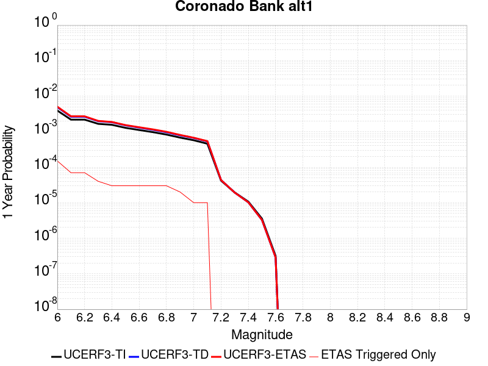 |  |

| Magnitude | 1 wk TI Prob | 1 wk TD Prob | 1 wk ETAS Prob | 1 wk ETAS/TD Gain | 1 wk ETAS Triggered Only | 1 mo TI Prob | 1 mo TD Prob | 1 mo ETAS Prob | 1 mo ETAS/TD Gain | 1 mo ETAS Triggered Only | 1 yr TI Prob | 1 yr TD Prob | 1 yr ETAS Prob | 1 yr ETAS/TD Gain | 1 yr ETAS Triggered Only | 10 yr TI Prob | 10 yr TD Prob | 10 yr ETAS Prob | 10 yr ETAS/TD Gain | 10 yr ETAS Triggered Only |
|-----|-----|-----|-----|-----|-----|-----|-----|-----|-----|-----|-----|-----|-----|-----|-----|-----|-----|-----|-----|-----|
| 6.0 | 7.533492E-5 | 9.394913E-5 | 1.7394162E-4 | 1.8514446 | 8.0E-5 | 3.22824E-4 | 4.0258127E-4 | 5.1253696E-4 | 1.2731267 | 1.1E-4 | 0.0039233007 | 0.0048909658 | 0.005040232 | 1.0305188 | 1.5E-4 | 0.03854755 | 0.04790356 | 0.0480559 | 1.00318 | 1.6E-4 |
| 6.1 | 4.1807285E-5 | 5.049283E-5 | 1.004903E-4 | 1.9901896 | 5.0E-5 | 1.7916178E-4 | 2.1638049E-4 | 2.763675E-4 | 1.2772293 | 6.0E-5 | 0.0021791123 | 0.0026313474 | 0.0027011633 | 1.0265323 | 7.0E-5 | 0.021578677 | 0.026011046 | 0.026079226 | 1.0026212 | 7.0E-5 |
| 6.2 | 4.1807285E-5 | 5.049283E-5 | 1.004903E-4 | 1.9901896 | 5.0E-5 | 1.7916178E-4 | 2.1638049E-4 | 2.763675E-4 | 1.2772293 | 6.0E-5 | 0.0021791123 | 0.0026313474 | 0.0027011633 | 1.0265323 | 7.0E-5 | 0.021578677 | 0.026011046 | 0.026079226 | 1.0026212 | 7.0E-5 |
| 6.3 | 3.1793104E-5 | 3.7711117E-5 | 6.770998E-5 | 1.7954915 | 3.0E-5 | 1.3624904E-4 | 1.6160926E-4 | 1.9160441E-4 | 1.1856029 | 3.0E-5 | 0.0016575698 | 0.001965848 | 0.0020057694 | 1.0203074 | 4.0E-5 | 0.016452603 | 0.019488465 | 0.019527685 | 1.0020125 | 4.0E-5 |
| 6.4 | 2.9878007E-5 | 3.5335794E-5 | 5.5335087E-5 | 1.5659783 | 2.0E-5 | 1.2804232E-4 | 1.5143053E-4 | 1.714275E-4 | 1.1320537 | 2.0E-5 | 0.0015578003 | 0.0018421387 | 0.0018720834 | 1.0162554 | 3.0E-5 | 0.015469253 | 0.01827244 | 0.018301893 | 1.0016118 | 3.0E-5 |
| 6.5 | 2.4512565E-5 | 2.8764043E-5 | 4.8763468E-5 | 1.6952926 | 2.0E-5 | 1.0504962E-4 | 1.2326881E-4 | 1.4326634E-4 | 1.162227 | 2.0E-5 | 0.0012782287 | 0.0014997921 | 0.0015297472 | 1.0199728 | 3.0E-5 | 0.012709012 | 0.014899683 | 0.014929236 | 1.0019835 | 3.0E-5 |
| 6.6 | 2.1317413E-5 | 2.490667E-5 | 4.490617E-5 | 1.8029778 | 2.0E-5 | 9.135714E-5 | 1.0673863E-4 | 1.267365E-4 | 1.1873536 | 2.0E-5 | 0.0011117056 | 0.0012987906 | 0.0013287516 | 1.0230684 | 3.0E-5 | 0.011061605 | 0.012914404 | 0.012944018 | 1.002293 | 3.0E-5 |
| 6.7 | 1.8585655E-5 | 2.163488E-5 | 4.163445E-5 | 1.9244131 | 2.0E-5 | 7.9650374E-5 | 9.271773E-5 | 1.1271588E-4 | 1.2156885 | 2.0E-5 | 9.6931186E-4 | 0.0011282742 | 0.0011582405 | 1.0265592 | 3.0E-5 | 0.0096509475 | 0.011227623 | 0.011257285 | 1.002642 | 3.0E-5 |
| 6.8 | 1.5862879E-5 | 1.8419474E-5 | 3.8419108E-5 | 2.0857873 | 2.0E-5 | 6.798199E-5 | 7.893833E-5 | 9.893675E-5 | 1.2533424 | 2.0E-5 | 8.273665E-4 | 9.6066965E-4 | 9.906408E-4 | 1.0311983 | 3.0E-5 | 0.008242928 | 0.00956715 | 0.009596863 | 1.0031058 | 3.0E-5 |
| 6.9 | 1.3021509E-5 | 1.5095265E-5 | 2.5095114E-5 | 1.6624494 | 1.0E-5 | 5.5805274E-5 | 6.469249E-5 | 7.4691845E-5 | 1.1545675 | 1.0E-5 | 6.792174E-4 | 7.8736455E-4 | 8.0734876E-4 | 1.0253812 | 2.0E-5 | 0.006771452 | 0.007847573 | 0.007867415 | 1.0025285 | 2.0E-5 |
| 7.0 | 1.0974371E-5 | 1.2720104E-5 | 2.2719976E-5 | 1.7861471 | 1.0E-5 | 4.7032172E-5 | 5.451369E-5 | 6.4513144E-5 | 1.1834302 | 1.0E-5 | 5.7246623E-4 | 6.6351966E-4 | 6.73513E-4 | 1.0150611 | 1.0E-5 | 0.0057099373 | 0.006617135 | 0.0066270684 | 1.0015012 | 1.0E-5 |
| 7.1 | 8.766221E-6 | 1.01638325E-5 | 2.016373E-5 | 1.9838709 | 1.0E-5 | 3.7568978E-5 | 4.355865E-5 | 5.3558215E-5 | 1.2295655 | 1.0E-5 | 4.573063E-4 | 5.3021475E-4 | 5.402094E-4 | 1.0188503 | 1.0E-5 | 0.0045636636 | 0.0052911965 | 0.0053011435 | 1.0018799 | 1.0E-5 |
| 7.2 | 8.026024E-7 | 8.331765E-7 | 8.331765E-7 | 1.0 | 0.0 | 3.43972E-6 | 3.5707515E-6 | 3.5707515E-6 | 1.0 | 0.0 | 4.1877785E-5 | 4.3473043E-5 | 4.3473043E-5 | 1.0 | 0.0 | 4.1869894E-4 | 4.3464647E-4 | 4.3464647E-4 | 1.0 | 0.0 |
| 7.3 | 3.7293114E-7 | 3.7000953E-7 | 3.7000953E-7 | 1.0 | 0.0 | 1.5982754E-6 | 1.5857541E-6 | 1.5857541E-6 | 1.0 | 0.0 | 1.9458828E-5 | 1.9306386E-5 | 1.9306386E-5 | 1.0 | 0.0 | 1.9457124E-4 | 1.9304715E-4 | 1.9304715E-4 | 1.0 | 0.0 |
| 7.4 | 2.0557036E-7 | 1.9674363E-7 | 1.9674363E-7 | 1.0 | 0.0 | 8.810155E-7 | 8.431867E-7 | 8.431867E-7 | 1.0 | 0.0 | 1.0726311E-5 | 1.026575E-5 | 1.026575E-5 | 1.0 | 0.0 | 1.0725793E-4 | 1.0265279E-4 | 1.0265279E-4 | 1.0 | 0.0 |
| 7.5 | 6.845446E-8 | 6.279369E-8 | 6.279369E-8 | 1.0 | 0.0 | 2.9337625E-7 | 2.691158E-7 | 2.691158E-7 | 1.0 | 0.0 | 3.5718497E-6 | 3.2764797E-6 | 3.2764797E-6 | 1.0 | 0.0 | 3.5717923E-5 | 3.2764325E-5 | 3.2764325E-5 | 1.0 | 0.0 |
| 7.6 | 6.0975145E-9 | 5.53185E-9 | 5.53185E-9 | 1.0 | 0.0 | 2.6132206E-8 | 2.370793E-8 | 2.370793E-8 | 1.0 | 0.0 | 3.1815955E-7 | 2.88644E-7 | 2.88644E-7 | 1.0 | 0.0 | 3.181591E-6 | 2.8864374E-6 | 2.8864374E-6 | 1.0 | 0.0 |

## Santa Ynez River
*[(top)](#table-of-contents)*

| 1 Week | 1 Month | 1 Year | 10 Year |
|-----|-----|-----|-----|
|  |  |  |  |

| Magnitude | 1 wk TI Prob | 1 wk TD Prob | 1 wk ETAS Prob | 1 wk ETAS/TD Gain | 1 wk ETAS Triggered Only | 1 mo TI Prob | 1 mo TD Prob | 1 mo ETAS Prob | 1 mo ETAS/TD Gain | 1 mo ETAS Triggered Only | 1 yr TI Prob | 1 yr TD Prob | 1 yr ETAS Prob | 1 yr ETAS/TD Gain | 1 yr ETAS Triggered Only | 10 yr TI Prob | 10 yr TD Prob | 10 yr ETAS Prob | 10 yr ETAS/TD Gain | 10 yr ETAS Triggered Only |
|-----|-----|-----|-----|-----|-----|-----|-----|-----|-----|-----|-----|-----|-----|-----|-----|-----|-----|-----|-----|-----|
| 6.0 | 1.6396456E-5 | 1.7209435E-5 | 9.720806E-5 | 5.648533 | 8.0E-5 | 7.026863E-5 | 7.375284E-5 | 1.5374694E-4 | 2.084624 | 8.0E-5 | 8.551848E-4 | 8.976064E-4 | 0.0010374808 | 1.1558304 | 1.4E-4 | 0.0085190125 | 0.008943358 | 0.009101927 | 1.0177304 | 1.6E-4 |
| 6.1 | 1.6396456E-5 | 1.7209435E-5 | 9.720806E-5 | 5.648533 | 8.0E-5 | 7.026863E-5 | 7.375284E-5 | 1.5374694E-4 | 2.084624 | 8.0E-5 | 8.551848E-4 | 8.976064E-4 | 0.0010374808 | 1.1558304 | 1.4E-4 | 0.0085190125 | 0.008943358 | 0.009101927 | 1.0177304 | 1.6E-4 |
| 6.2 | 1.6396456E-5 | 1.7209435E-5 | 9.720806E-5 | 5.648533 | 8.0E-5 | 7.026863E-5 | 7.375284E-5 | 1.5374694E-4 | 2.084624 | 8.0E-5 | 8.551848E-4 | 8.976064E-4 | 0.0010374808 | 1.1558304 | 1.4E-4 | 0.0085190125 | 0.008943358 | 0.009101927 | 1.0177304 | 1.6E-4 |
| 6.3 | 9.736976E-6 | 1.012233E-5 | 9.012152E-5 | 8.903238 | 8.0E-5 | 4.172923E-5 | 4.338072E-5 | 1.2337725E-4 | 2.844057 | 8.0E-5 | 5.0793495E-4 | 5.280373E-4 | 6.479739E-4 | 1.2271367 | 1.2E-4 | 0.005067755 | 0.005268332 | 0.0054075946 | 1.0264338 | 1.4E-4 |
| 6.4 | 9.736976E-6 | 1.012233E-5 | 9.012152E-5 | 8.903238 | 8.0E-5 | 4.172923E-5 | 4.338072E-5 | 1.2337725E-4 | 2.844057 | 8.0E-5 | 5.0793495E-4 | 5.280373E-4 | 6.479739E-4 | 1.2271367 | 1.2E-4 | 0.005067755 | 0.005268332 | 0.0054075946 | 1.0264338 | 1.4E-4 |
| 6.5 | 7.081964E-6 | 7.3298966E-6 | 7.732939E-5 | 10.54986 | 7.0E-5 | 3.035092E-5 | 3.1413474E-5 | 1.0141127E-4 | 3.2282734 | 7.0E-5 | 3.694598E-4 | 3.8239348E-4 | 4.8235524E-4 | 1.2614107 | 1.0E-4 | 0.0036884616 | 0.0038175168 | 0.0039270967 | 1.0287045 | 1.1E-4 |
| 6.6 | 5.873247E-6 | 6.059743E-6 | 6.605938E-5 | 10.90135 | 6.0E-5 | 2.5170815E-5 | 2.5970074E-5 | 8.596852E-5 | 3.3102915 | 6.0E-5 | 3.064116E-4 | 3.1614062E-4 | 3.9611533E-4 | 1.2529719 | 8.0E-5 | 0.0030598943 | 0.0031569963 | 0.0032467123 | 1.0284181 | 9.0E-5 |
| 6.7 | 4.973277E-6 | 5.115901E-6 | 6.511559E-5 | 12.728079 | 6.0E-5 | 2.1313872E-5 | 2.1925109E-5 | 8.192379E-5 | 3.7365284 | 6.0E-5 | 2.5946548E-4 | 2.66906E-4 | 3.4688463E-4 | 1.299651 | 8.0E-5 | 0.0025916274 | 0.0026659032 | 0.0027456898 | 1.0299286 | 8.0E-5 |
| 6.8 | 4.396492E-6 | 4.5109778E-6 | 6.451071E-5 | 14.300826 | 6.0E-5 | 1.884197E-5 | 1.9332621E-5 | 7.933146E-5 | 4.1035028 | 6.0E-5 | 2.2937685E-4 | 2.3534958E-4 | 3.0533312E-4 | 1.29736 | 7.0E-5 | 0.0022914023 | 0.0023510386 | 0.002420874 | 1.0297041 | 7.0E-5 |
| 6.9 | 3.5255632E-6 | 3.6013332E-6 | 6.360112E-5 | 17.660437 | 6.0E-5 | 1.5109469E-5 | 1.5434196E-5 | 7.543327E-5 | 4.887412 | 6.0E-5 | 1.8394225E-4 | 1.8789528E-4 | 2.5788211E-4 | 1.3724779 | 7.0E-5 | 0.0018379007 | 0.0018773803 | 0.0019472489 | 1.037216 | 7.0E-5 |
| 7.0 | 3.211603E-6 | 3.273654E-6 | 4.327352E-5 | 13.218722 | 4.0E-5 | 1.376394E-5 | 1.4029872E-5 | 5.402931E-5 | 3.8510196 | 4.0E-5 | 1.6756308E-4 | 1.7080043E-4 | 2.2079189E-4 | 1.2926893 | 5.0E-5 | 0.0016743679 | 0.0017067058 | 0.0017566205 | 1.0292462 | 5.0E-5 |
| 7.1 | 2.5094619E-6 | 2.5409204E-6 | 3.2540844E-5 | 12.806715 | 3.0E-5 | 1.0754793E-5 | 1.0889614E-5 | 4.088929E-5 | 3.7548885 | 3.0E-5 | 1.3093173E-4 | 1.3257304E-4 | 1.7256774E-4 | 1.3016804 | 4.0E-5 | 0.0013085462 | 0.0013249456 | 0.0013648926 | 1.0301499 | 4.0E-5 |
| 7.2 | 2.0515774E-6 | 2.0619375E-6 | 3.2061875E-5 | 15.549392 | 3.0E-5 | 8.792445E-6 | 8.836846E-6 | 3.883658E-5 | 4.3948464 | 3.0E-5 | 1.0704277E-4 | 1.0758333E-4 | 1.4757902E-4 | 1.3717648 | 4.0E-5 | 0.0010699122 | 0.0010753168 | 0.0011152737 | 1.0371584 | 4.0E-5 |
| 7.3 | 1.6845745E-6 | 1.6773907E-6 | 3.167734E-5 | 18.884892 | 3.0E-5 | 7.219585E-6 | 7.1887976E-6 | 3.7188584E-5 | 5.1731296 | 3.0E-5 | 8.78949E-5 | 8.752012E-5 | 1.175175E-4 | 1.3427483 | 3.0E-5 | 8.7860145E-4 | 8.7485946E-4 | 9.048332E-4 | 1.0342612 | 3.0E-5 |
| 7.4 | 1.3600285E-6 | 1.3333357E-6 | 3.1333297E-5 | 23.49993 | 3.0E-5 | 5.82868E-6 | 5.714284E-6 | 3.571411E-5 | 6.249972 | 3.0E-5 | 7.096187E-5 | 6.956921E-5 | 9.956712E-5 | 1.4311953 | 3.0E-5 | 7.0939213E-4 | 6.954765E-4 | 7.2545564E-4 | 1.0431058 | 3.0E-5 |
| 7.5 | 9.735342E-7 | 9.290103E-7 | 3.0928983E-5 | 33.2924 | 3.0E-5 | 4.172283E-6 | 3.9814668E-6 | 3.398135E-5 | 8.534882 | 3.0E-5 | 5.079636E-5 | 4.8473295E-5 | 7.847184E-5 | 1.6188675 | 3.0E-5 | 5.0784746E-4 | 4.8462892E-4 | 5.146144E-4 | 1.0618731 | 3.0E-5 |
| 7.6 | 5.067187E-7 | 4.77857E-7 | 1.0477852E-5 | 21.926754 | 1.0E-5 | 2.1716498E-6 | 2.047957E-6 | 1.2047936E-5 | 5.882905 | 1.0E-5 | 2.6439517E-5 | 2.4933597E-5 | 3.493335E-5 | 1.4010552 | 1.0E-5 | 2.643637E-4 | 2.4930874E-4 | 2.5930625E-4 | 1.0401009 | 1.0E-5 |
| 7.7 | 2.769089E-7 | 2.5759124E-7 | 1.0257589E-5 | 39.821182 | 1.0E-5 | 1.1867519E-6 | 1.1039621E-6 | 1.1103951E-5 | 10.058272 | 1.0E-5 | 1.4448608E-5 | 1.34406555E-5 | 2.3440522E-5 | 1.7440014 | 1.0E-5 | 1.444767E-4 | 1.3439846E-4 | 1.4439711E-4 | 1.0743957 | 1.0E-5 |
| 7.8 | 1.7044663E-7 | 1.5449015E-7 | 1.0154488E-5 | 65.729034 | 1.0E-5 | 7.3048534E-7 | 6.621005E-7 | 1.0662094E-5 | 16.103437 | 1.0E-5 | 8.893623E-6 | 8.061043E-6 | 1.8060964E-5 | 2.240524 | 1.0E-5 | 8.893267E-5 | 8.060753E-5 | 9.060673E-5 | 1.1240479 | 1.0E-5 |
| 7.9 | 4.8344287E-8 | 4.0910923E-8 | 1.0040911E-5 | 245.4335 | 1.0E-5 | 2.0718979E-7 | 1.7533252E-7 | 1.017533E-5 | 58.034477 | 1.0E-5 | 2.5225327E-6 | 2.1346711E-6 | 1.213465E-5 | 5.684552 | 1.0E-5 | 2.5225041E-5 | 2.1346512E-5 | 3.13463E-5 | 1.4684507 | 1.0E-5 |

## Palos Verdes
*[(top)](#table-of-contents)*

| 1 Week | 1 Month | 1 Year | 10 Year |
|-----|-----|-----|-----|
|  |  |  | 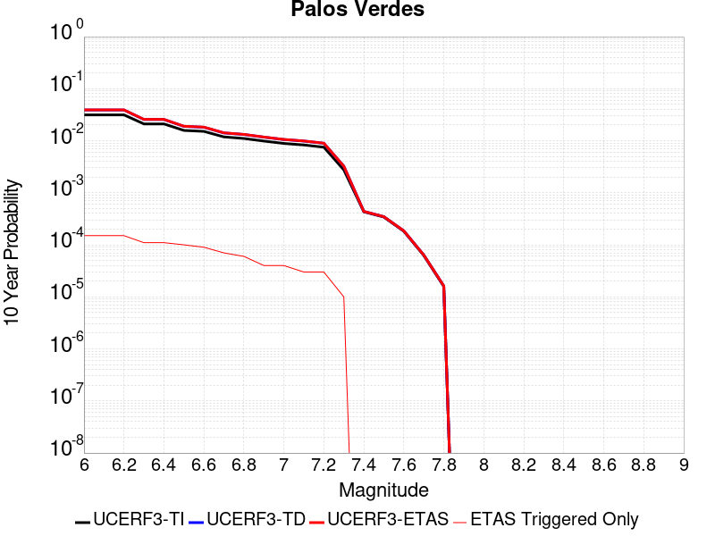 |

| Magnitude | 1 wk TI Prob | 1 wk TD Prob | 1 wk ETAS Prob | 1 wk ETAS/TD Gain | 1 wk ETAS Triggered Only | 1 mo TI Prob | 1 mo TD Prob | 1 mo ETAS Prob | 1 mo ETAS/TD Gain | 1 mo ETAS Triggered Only | 1 yr TI Prob | 1 yr TD Prob | 1 yr ETAS Prob | 1 yr ETAS/TD Gain | 1 yr ETAS Triggered Only | 10 yr TI Prob | 10 yr TD Prob | 10 yr ETAS Prob | 10 yr ETAS/TD Gain | 10 yr ETAS Triggered Only |
|-----|-----|-----|-----|-----|-----|-----|-----|-----|-----|-----|-----|-----|-----|-----|-----|-----|-----|-----|-----|-----|
| 6.0 | 6.126063E-5 | 7.622612E-5 | 1.6621925E-4 | 2.1806076 | 9.0E-5 | 2.6251914E-4 | 3.2664582E-4 | 4.4660663E-4 | 1.3672504 | 1.2E-4 | 0.0031914865 | 0.003970174 | 0.0041096183 | 1.035123 | 1.4E-4 | 0.031460393 | 0.039048895 | 0.039193038 | 1.0036913 | 1.5E-4 |
| 6.1 | 6.126063E-5 | 7.622612E-5 | 1.6621925E-4 | 2.1806076 | 9.0E-5 | 2.6251914E-4 | 3.2664582E-4 | 4.4660663E-4 | 1.3672504 | 1.2E-4 | 0.0031914865 | 0.003970174 | 0.0041096183 | 1.035123 | 1.4E-4 | 0.031460393 | 0.039048895 | 0.039193038 | 1.0036913 | 1.5E-4 |
| 6.2 | 6.126063E-5 | 7.622612E-5 | 1.6621925E-4 | 2.1806076 | 9.0E-5 | 2.6251914E-4 | 3.2664582E-4 | 4.4660663E-4 | 1.3672504 | 1.2E-4 | 0.0031914865 | 0.003970174 | 0.0041096183 | 1.035123 | 1.4E-4 | 0.031460393 | 0.039048895 | 0.039193038 | 1.0036913 | 1.5E-4 |
| 6.3 | 4.0838047E-5 | 4.9749437E-5 | 1.0974645E-4 | 2.2059839 | 6.0E-5 | 1.7500846E-4 | 2.1319572E-4 | 2.9317866E-4 | 1.3751621 | 8.0E-5 | 0.0021286458 | 0.0025927818 | 0.0026925225 | 1.0384686 | 1.0E-4 | 0.021083709 | 0.025646681 | 0.02575386 | 1.004179 | 1.1E-4 |
| 6.4 | 4.0838047E-5 | 4.9749437E-5 | 1.0974645E-4 | 2.2059839 | 6.0E-5 | 1.7500846E-4 | 2.1319572E-4 | 2.9317866E-4 | 1.3751621 | 8.0E-5 | 0.0021286458 | 0.0025927818 | 0.0026925225 | 1.0384686 | 1.0E-4 | 0.021083709 | 0.025646681 | 0.02575386 | 1.004179 | 1.1E-4 |
| 6.5 | 3.0512005E-5 | 3.656162E-5 | 8.65598E-5 | 2.3675041 | 5.0E-5 | 1.3075917E-4 | 1.5668393E-4 | 2.1667453E-4 | 1.3828765 | 6.0E-5 | 0.0015908304 | 0.0019060767 | 0.001995905 | 1.0471274 | 9.0E-5 | 0.015794903 | 0.018909154 | 0.019007262 | 1.0051885 | 1.0E-4 |
| 6.6 | 2.9255087E-5 | 3.515442E-5 | 7.515302E-5 | 2.137797 | 4.0E-5 | 1.2537291E-4 | 1.5065377E-4 | 2.0064623E-4 | 1.3318368 | 5.0E-5 | 0.0015253464 | 0.0018327828 | 0.0019126362 | 1.0435694 | 8.0E-5 | 0.015149189 | 0.018188225 | 0.018276589 | 1.0048583 | 9.0E-5 |
| 6.7 | 2.287198E-5 | 2.7248278E-5 | 5.724746E-5 | 2.100957 | 3.0E-5 | 9.801909E-5 | 1.16773626E-4 | 1.4677012E-4 | 1.2568773 | 3.0E-5 | 0.001192729 | 0.0014208833 | 0.0014807981 | 1.0421673 | 6.0E-5 | 0.011863477 | 0.014127217 | 0.014196228 | 1.004885 | 7.0E-5 |
| 6.8 | 2.1325764E-5 | 2.5431877E-5 | 5.5431115E-5 | 2.179592 | 3.0E-5 | 9.139293E-5 | 1.0898971E-4 | 1.3898645E-4 | 1.2752253 | 3.0E-5 | 0.001112141 | 0.0013262323 | 0.001376166 | 1.0376508 | 5.0E-5 | 0.011065915 | 0.013192211 | 0.013251419 | 1.0044881 | 6.0E-5 |
| 6.9 | 1.9009392E-5 | 2.2613547E-5 | 3.2613323E-5 | 1.4422028 | 1.0E-5 | 8.1466285E-5 | 9.6912096E-5 | 1.0691113E-4 | 1.1031762 | 1.0E-5 | 9.914007E-4 | 0.0011793535 | 0.001209318 | 1.0254077 | 3.0E-5 | 0.009869894 | 0.011739632 | 0.011779163 | 1.0033673 | 4.0E-5 |
| 7.0 | 1.7098473E-5 | 2.0319356E-5 | 3.0319152E-5 | 1.4921316 | 1.0E-5 | 7.3277115E-5 | 8.708052E-5 | 9.7079654E-5 | 1.1148262 | 1.0E-5 | 8.917837E-4 | 0.001059775 | 0.0010897432 | 1.0282779 | 3.0E-5 | 0.008882134 | 0.010555646 | 0.010595224 | 1.0037495 | 4.0E-5 |
| 7.1 | 1.5982785E-5 | 1.899476E-5 | 2.8994571E-5 | 1.526451 | 1.0E-5 | 6.849585E-5 | 8.1404054E-5 | 9.1403235E-5 | 1.122834 | 1.0E-5 | 8.336179E-4 | 9.907284E-4 | 0.0010206987 | 1.0302508 | 3.0E-5 | 0.008304977 | 0.009871479 | 0.009901184 | 1.0030091 | 3.0E-5 |
| 7.2 | 1.4468002E-5 | 1.7197237E-5 | 2.7197064E-5 | 1.5814788 | 1.0E-5 | 6.200425E-5 | 7.370083E-5 | 8.370009E-5 | 1.1356736 | 1.0E-5 | 7.546402E-4 | 8.970222E-4 | 9.269953E-4 | 1.033414 | 3.0E-5 | 0.007520827 | 0.008942284 | 0.008972015 | 1.0033249 | 3.0E-5 |
| 7.3 | 5.288233E-6 | 6.2036747E-6 | 6.2036747E-6 | 1.0 | 0.0 | 2.2663658E-5 | 2.6587102E-5 | 2.6587102E-5 | 1.0 | 0.0 | 2.7589512E-4 | 3.236848E-4 | 3.3368156E-4 | 1.0308843 | 1.0E-5 | 0.0027555283 | 0.0032355562 | 0.003245524 | 1.0030806 | 1.0E-5 |
| 7.4 | 8.279556E-7 | 8.408347E-7 | 8.408347E-7 | 1.0 | 0.0 | 3.5483763E-6 | 3.6035726E-6 | 3.6035726E-6 | 1.0 | 0.0 | 4.3200624E-5 | 4.3872686E-5 | 4.3872686E-5 | 1.0 | 0.0 | 4.3192226E-4 | 4.3864746E-4 | 4.3864746E-4 | 1.0 | 0.0 |
| 7.5 | 6.559831E-7 | 6.667229E-7 | 6.667229E-7 | 1.0 | 0.0 | 2.8113532E-6 | 2.857381E-6 | 2.857381E-6 | 1.0 | 0.0 | 3.4227687E-5 | 3.4788125E-5 | 3.4788125E-5 | 1.0 | 0.0 | 3.4222414E-4 | 3.4783344E-4 | 3.4783344E-4 | 1.0 | 0.0 |
| 7.6 | 3.5018968E-7 | 3.5620027E-7 | 3.5620027E-7 | 1.0 | 0.0 | 1.500812E-6 | 1.526572E-6 | 1.526572E-6 | 1.0 | 0.0 | 1.8272232E-5 | 1.8585903E-5 | 1.8585903E-5 | 1.0 | 0.0 | 1.8270731E-4 | 1.8584808E-4 | 1.8584808E-4 | 1.0 | 0.0 |
| 7.7 | 1.1986104E-7 | 1.2198376E-7 | 1.2198376E-7 | 1.0 | 0.0 | 5.1369005E-7 | 5.2278745E-7 | 5.2278745E-7 | 1.0 | 0.0 | 6.2541585E-6 | 6.364919E-6 | 6.364919E-6 | 1.0 | 0.0 | 6.2539824E-5 | 6.364741E-5 | 6.364741E-5 | 1.0 | 0.0 |
| 7.8 | 3.0445005E-8 | 3.1027582E-8 | 3.1027582E-8 | 1.0 | 0.0 | 1.3047858E-7 | 1.3297536E-7 | 1.3297536E-7 | 1.0 | 0.0 | 1.5885756E-6 | 1.6189739E-6 | 1.6189739E-6 | 1.0 | 0.0 | 1.5885644E-5 | 1.6189642E-5 | 1.6189642E-5 | 1.0 | 0.0 |

## Oak Ridge (Onshore)
*[(top)](#table-of-contents)*

| 1 Week | 1 Month | 1 Year | 10 Year |
|-----|-----|-----|-----|
|  |  |  |  |

| Magnitude | 1 wk TI Prob | 1 wk TD Prob | 1 wk ETAS Prob | 1 wk ETAS/TD Gain | 1 wk ETAS Triggered Only | 1 mo TI Prob | 1 mo TD Prob | 1 mo ETAS Prob | 1 mo ETAS/TD Gain | 1 mo ETAS Triggered Only | 1 yr TI Prob | 1 yr TD Prob | 1 yr ETAS Prob | 1 yr ETAS/TD Gain | 1 yr ETAS Triggered Only | 10 yr TI Prob | 10 yr TD Prob | 10 yr ETAS Prob | 10 yr ETAS/TD Gain | 10 yr ETAS Triggered Only |
|-----|-----|-----|-----|-----|-----|-----|-----|-----|-----|-----|-----|-----|-----|-----|-----|-----|-----|-----|-----|-----|
| 6.0 | 3.155064E-5 | 2.9525974E-5 | 9.952391E-5 | 3.370724 | 7.0E-5 | 1.3521002E-4 | 1.2653397E-4 | 2.2652131E-4 | 1.7902017 | 1.0E-4 | 0.001644939 | 0.0015395004 | 0.0016693003 | 1.084313 | 1.3E-4 | 0.01632816 | 0.015292859 | 0.015440565 | 1.0096585 | 1.5E-4 |
| 6.1 | 3.155064E-5 | 2.9525974E-5 | 9.952391E-5 | 3.370724 | 7.0E-5 | 1.3521002E-4 | 1.2653397E-4 | 2.2652131E-4 | 1.7902017 | 1.0E-4 | 0.001644939 | 0.0015395004 | 0.0016693003 | 1.084313 | 1.3E-4 | 0.01632816 | 0.015292859 | 0.015440565 | 1.0096585 | 1.5E-4 |
| 6.2 | 3.155064E-5 | 2.9525974E-5 | 9.952391E-5 | 3.370724 | 7.0E-5 | 1.3521002E-4 | 1.2653397E-4 | 2.2652131E-4 | 1.7902017 | 1.0E-4 | 0.001644939 | 0.0015395004 | 0.0016693003 | 1.084313 | 1.3E-4 | 0.01632816 | 0.015292859 | 0.015440565 | 1.0096585 | 1.5E-4 |
| 6.3 | 3.155064E-5 | 2.9525974E-5 | 9.952391E-5 | 3.370724 | 7.0E-5 | 1.3521002E-4 | 1.2653397E-4 | 2.2652131E-4 | 1.7902017 | 1.0E-4 | 0.001644939 | 0.0015395004 | 0.0016693003 | 1.084313 | 1.3E-4 | 0.01632816 | 0.015292859 | 0.015440565 | 1.0096585 | 1.5E-4 |
| 6.4 | 3.155064E-5 | 2.9525974E-5 | 9.952391E-5 | 3.370724 | 7.0E-5 | 1.3521002E-4 | 1.2653397E-4 | 2.2652131E-4 | 1.7902017 | 1.0E-4 | 0.001644939 | 0.0015395004 | 0.0016693003 | 1.084313 | 1.3E-4 | 0.01632816 | 0.015292859 | 0.015440565 | 1.0096585 | 1.5E-4 |
| 6.5 | 3.155064E-5 | 2.9525974E-5 | 9.952391E-5 | 3.370724 | 7.0E-5 | 1.3521002E-4 | 1.2653397E-4 | 2.2652131E-4 | 1.7902017 | 1.0E-4 | 0.001644939 | 0.0015395004 | 0.0016693003 | 1.084313 | 1.3E-4 | 0.01632816 | 0.015292859 | 0.015440565 | 1.0096585 | 1.5E-4 |
| 6.6 | 3.155064E-5 | 2.9525974E-5 | 9.952391E-5 | 3.370724 | 7.0E-5 | 1.3521002E-4 | 1.2653397E-4 | 2.2652131E-4 | 1.7902017 | 1.0E-4 | 0.001644939 | 0.0015395004 | 0.0016693003 | 1.084313 | 1.3E-4 | 0.01632816 | 0.015292859 | 0.015440565 | 1.0096585 | 1.5E-4 |
| 6.7 | 3.098897E-5 | 2.8864175E-5 | 9.8862154E-5 | 3.4250817 | 7.0E-5 | 1.328031E-4 | 1.2369796E-4 | 2.2368558E-4 | 1.8083208 | 1.0E-4 | 0.0016156785 | 0.0015050198 | 0.0016348242 | 1.0862476 | 1.3E-4 | 0.016039822 | 0.014952714 | 0.015100471 | 1.0098816 | 1.5E-4 |
| 6.8 | 3.0449872E-5 | 2.8239372E-5 | 9.82374E-5 | 3.4787385 | 7.0E-5 | 1.3049292E-4 | 1.2102048E-4 | 2.2100838E-4 | 1.8262064 | 1.0E-4 | 0.0015875935 | 0.0014724657 | 0.0016022742 | 1.0881573 | 1.3E-4 | 0.015762992 | 0.014631462 | 0.014779267 | 1.0101019 | 1.5E-4 |
| 6.9 | 2.697928E-5 | 2.4219773E-5 | 7.4218566E-5 | 3.064379 | 5.0E-5 | 1.15620365E-4 | 1.0379502E-4 | 1.7378776E-4 | 1.6743362 | 7.0E-5 | 0.0014067689 | 0.0012629933 | 0.0013528797 | 1.0711693 | 9.0E-5 | 0.0139789665 | 0.01256087 | 0.012659614 | 1.0078613 | 1.0E-4 |
| 7.0 | 2.4893961E-5 | 2.1862043E-5 | 7.186095E-5 | 3.287019 | 5.0E-5 | 1.0668404E-4 | 9.3691204E-5 | 1.6368464E-4 | 1.7470653 | 7.0E-5 | 0.0012981043 | 0.0011401111 | 0.0012300086 | 1.0788497 | 9.0E-5 | 0.012905477 | 0.011344905 | 0.0114437705 | 1.0087146 | 1.0E-4 |
| 7.1 | 2.0945363E-5 | 1.7354487E-5 | 5.7353795E-5 | 3.3048394 | 4.0E-5 | 8.976275E-5 | 7.437428E-5 | 1.3436982E-4 | 1.8066705 | 6.0E-5 | 0.0010923136 | 9.051354E-4 | 9.85063E-4 | 1.0883045 | 8.0E-5 | 0.0108696 | 0.009015423 | 0.009104611 | 1.009893 | 9.0E-5 |
| 7.2 | 2.0439404E-5 | 1.6809423E-5 | 5.6808753E-5 | 3.3795776 | 4.0E-5 | 8.7594504E-5 | 7.203843E-5 | 1.320341E-4 | 1.8328289 | 6.0E-5 | 0.0010659413 | 8.767196E-4 | 9.566494E-4 | 1.0911692 | 8.0E-5 | 0.010608427 | 0.008733526 | 0.00882274 | 1.0102152 | 9.0E-5 |
| 7.3 | 1.8463334E-5 | 1.5381811E-5 | 5.5381195E-5 | 3.600434 | 4.0E-5 | 7.912617E-5 | 6.59204E-5 | 1.2591644E-4 | 1.9101286 | 6.0E-5 | 9.6293533E-4 | 8.0228975E-4 | 8.822256E-4 | 1.0996346 | 8.0E-5 | 0.009587734 | 0.007994797 | 0.008084077 | 1.0111673 | 9.0E-5 |
| 7.4 | 1.763139E-5 | 1.451684E-5 | 5.451626E-5 | 3.7553806 | 4.0E-5 | 7.556091E-5 | 6.221356E-5 | 1.2220984E-4 | 1.9643599 | 6.0E-5 | 9.1956573E-4 | 7.571909E-4 | 8.371303E-4 | 1.1055737 | 8.0E-5 | 0.009157699 | 0.007546914 | 0.0076362346 | 1.0118355 | 9.0E-5 |
| 7.5 | 1.3594944E-5 | 1.1163356E-5 | 2.1163245E-5 | 1.895778 | 1.0E-5 | 5.8262744E-5 | 4.784209E-5 | 7.7840654E-5 | 1.6270329 | 3.0E-5 | 7.0911803E-4 | 5.8232434E-4 | 6.322952E-4 | 1.0858128 | 5.0E-5 | 0.007068595 | 0.0058082556 | 0.0058679073 | 1.0102701 | 6.0E-5 |
| 7.6 | 6.9889534E-6 | 5.6367144E-6 | 1.5636659E-5 | 2.7740731 | 1.0E-5 | 2.9952313E-5 | 2.4157125E-5 | 4.415664E-5 | 1.827893 | 2.0E-5 | 3.646084E-4 | 2.9407372E-4 | 3.240649E-4 | 1.1019852 | 3.0E-5 | 0.0036401073 | 0.0029368899 | 0.0029767724 | 1.0135798 | 4.0E-5 |
| 7.7 | 4.0824193E-6 | 3.2832586E-6 | 3.2832586E-6 | 1.0 | 0.0 | 1.7495966E-5 | 1.4071033E-5 | 2.4070892E-5 | 1.7106699 | 1.0E-5 | 2.1299256E-4 | 1.713015E-4 | 1.9129807E-4 | 1.1167332 | 2.0E-5 | 0.0021278851 | 0.0017117079 | 0.0017316736 | 1.0116643 | 2.0E-5 |
| 7.8 | 1.7023609E-6 | 1.4370495E-6 | 1.4370495E-6 | 1.0 | 0.0 | 7.295812E-6 | 6.1587693E-6 | 6.1587693E-6 | 1.0 | 0.0 | 8.882289E-5 | 7.498047E-5 | 7.498047E-5 | 1.0 | 0.0 | 8.8787393E-4 | 7.495545E-4 | 7.495545E-4 | 1.0 | 0.0 |
| 7.9 | 2.721225E-7 | 2.2616497E-7 | 2.2616497E-7 | 1.0 | 0.0 | 1.1662388E-6 | 9.692781E-7 | 9.692781E-7 | 1.0 | 0.0 | 1.4198865E-5 | 1.1800899E-5 | 1.1800899E-5 | 1.0 | 0.0 | 1.4197957E-4 | 1.1800301E-4 | 1.1800301E-4 | 1.0 | 0.0 |
| 8.0 | 9.364255E-9 | 5.1206666E-9 | 5.1206666E-9 | 1.0 | 0.0 | 4.0132523E-8 | 2.1945715E-8 | 2.1945715E-8 | 1.0 | 0.0 | 4.8861335E-7 | 2.6718905E-7 | 2.6718905E-7 | 1.0 | 0.0 | 4.8861225E-6 | 2.6718876E-6 | 2.6718876E-6 | 1.0 | 0.0 |

## Big Pine (East)
*[(top)](#table-of-contents)*

| 1 Week | 1 Month | 1 Year | 10 Year |
|-----|-----|-----|-----|
|  | 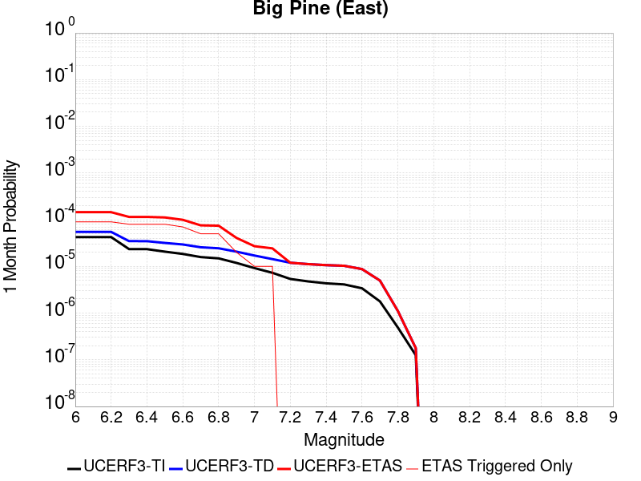 |  |  |

| Magnitude | 1 wk TI Prob | 1 wk TD Prob | 1 wk ETAS Prob | 1 wk ETAS/TD Gain | 1 wk ETAS Triggered Only | 1 mo TI Prob | 1 mo TD Prob | 1 mo ETAS Prob | 1 mo ETAS/TD Gain | 1 mo ETAS Triggered Only | 1 yr TI Prob | 1 yr TD Prob | 1 yr ETAS Prob | 1 yr ETAS/TD Gain | 1 yr ETAS Triggered Only | 10 yr TI Prob | 10 yr TD Prob | 10 yr ETAS Prob | 10 yr ETAS/TD Gain | 10 yr ETAS Triggered Only |
|-----|-----|-----|-----|-----|-----|-----|-----|-----|-----|-----|-----|-----|-----|-----|-----|-----|-----|-----|-----|-----|
| 6.0 | 9.916913E-6 | 1.2816984E-5 | 7.281621E-5 | 5.681228 | 6.0E-5 | 4.250036E-5 | 5.49289E-5 | 1.4492396E-4 | 2.6383917 | 9.0E-5 | 5.173191E-4 | 6.685763E-4 | 8.084827E-4 | 1.2092602 | 1.4E-4 | 0.0051611643 | 0.006670441 | 0.006829374 | 1.0238264 | 1.6E-4 |
| 6.1 | 9.916913E-6 | 1.2816984E-5 | 7.281621E-5 | 5.681228 | 6.0E-5 | 4.250036E-5 | 5.49289E-5 | 1.4492396E-4 | 2.6383917 | 9.0E-5 | 5.173191E-4 | 6.685763E-4 | 8.084827E-4 | 1.2092602 | 1.4E-4 | 0.0051611643 | 0.006670441 | 0.006829374 | 1.0238264 | 1.6E-4 |
| 6.2 | 9.916913E-6 | 1.2816984E-5 | 7.281621E-5 | 5.681228 | 6.0E-5 | 4.250036E-5 | 5.49289E-5 | 1.4492396E-4 | 2.6383917 | 9.0E-5 | 5.173191E-4 | 6.685763E-4 | 8.084827E-4 | 1.2092602 | 1.4E-4 | 0.0051611643 | 0.006670441 | 0.006829374 | 1.0238264 | 1.6E-4 |
| 6.3 | 5.479711E-6 | 8.112951E-6 | 6.8112466E-5 | 8.395522 | 6.0E-5 | 2.3484265E-5 | 3.4769346E-5 | 1.1476657E-4 | 3.3007972 | 8.0E-5 | 2.858834E-4 | 4.2323777E-4 | 5.231954E-4 | 1.2361739 | 1.0E-4 | 0.0028551589 | 0.004227244 | 0.0043467362 | 1.0282673 | 1.2E-4 |
| 6.4 | 5.465009E-6 | 8.097245E-6 | 6.809676E-5 | 8.409867 | 6.0E-5 | 2.3421257E-5 | 3.4702036E-5 | 1.1469926E-4 | 3.3052604 | 8.0E-5 | 2.851165E-4 | 4.2241855E-4 | 5.2237633E-4 | 1.236632 | 1.0E-4 | 0.0028475097 | 0.0042190826 | 0.0043385765 | 1.0283222 | 1.2E-4 |
| 6.5 | 4.826767E-6 | 7.422301E-6 | 6.742185E-5 | 9.083686 | 6.0E-5 | 2.068598E-5 | 3.180949E-5 | 1.1180695E-4 | 3.5148928 | 8.0E-5 | 2.518227E-4 | 3.872145E-4 | 4.8717577E-4 | 1.2581547 | 1.0E-4 | 0.0025153751 | 0.003868283 | 0.003987819 | 1.0309016 | 1.2E-4 |
| 6.6 | 4.3146847E-6 | 6.8822374E-6 | 6.6881825E-5 | 9.718036 | 6.0E-5 | 1.8491375E-5 | 2.9494982E-5 | 9.949292E-5 | 3.373215 | 7.0E-5 | 2.2510924E-4 | 3.590447E-4 | 4.4901238E-4 | 1.2505752 | 9.0E-5 | 0.0022488134 | 0.0035874986 | 0.0036971038 | 1.030552 | 1.1E-4 |
| 6.7 | 3.6968106E-6 | 5.9954727E-6 | 4.599523E-5 | 7.671661 | 4.0E-5 | 1.5843378E-5 | 2.5694639E-5 | 7.569335E-5 | 2.9458814 | 5.0E-5 | 1.9287605E-4 | 3.1278885E-4 | 3.727701E-4 | 1.1917627 | 6.0E-5 | 0.0019270873 | 0.0031262483 | 0.003205998 | 1.0255098 | 8.0E-5 |
| 6.8 | 3.4671132E-6 | 5.702177E-6 | 4.570195E-5 | 8.014825 | 4.0E-5 | 1.4858972E-5 | 2.4437682E-5 | 7.443646E-5 | 3.0459707 | 5.0E-5 | 1.8089297E-4 | 2.974896E-4 | 3.5747176E-4 | 1.2016277 | 6.0E-5 | 0.0018074579 | 0.002973667 | 0.0030534293 | 1.0268228 | 8.0E-5 |
| 6.9 | 2.7686972E-6 | 4.825223E-6 | 1.4825175E-5 | 3.072433 | 1.0E-5 | 1.1865792E-5 | 2.0679368E-5 | 4.0678955E-5 | 1.9671276 | 2.0E-5 | 1.4445644E-4 | 2.5174298E-4 | 2.817354E-4 | 1.1191392 | 3.0E-5 | 0.0014436257 | 0.0025172636 | 0.0025571631 | 1.0158503 | 4.0E-5 |
| 7.0 | 2.1472624E-6 | 3.9850406E-6 | 1.3985001E-5 | 3.5093746 | 1.0E-5 | 9.20252E-6 | 1.7078637E-5 | 2.7078466E-5 | 1.5855168 | 1.0E-5 | 1.12034926E-4 | 2.079131E-4 | 2.2790894E-4 | 1.096174 | 2.0E-5 | 0.0011197845 | 0.0020798394 | 0.002109777 | 1.0143942 | 3.0E-5 |
| 7.1 | 1.7018335E-6 | 3.344876E-6 | 1.3344843E-5 | 3.9896374 | 1.0E-5 | 7.293552E-6 | 1.4335106E-5 | 2.4334962E-5 | 1.6975782 | 1.0E-5 | 8.879537E-5 | 1.7451629E-4 | 1.945128E-4 | 1.1145825 | 2.0E-5 | 8.87599E-4 | 0.0017464145 | 0.0017763621 | 1.017148 | 3.0E-5 |
| 7.2 | 1.25603E-6 | 2.794484E-6 | 2.794484E-6 | 1.0 | 0.0 | 5.3829745E-6 | 1.1976307E-5 | 1.1976307E-5 | 1.0 | 0.0 | 6.553574E-5 | 1.4580201E-4 | 1.4580201E-4 | 1.0 | 0.0 | 6.551642E-4 | 0.001459661 | 0.0014696465 | 1.006841 | 1.0E-5 |
| 7.3 | 1.112297E-6 | 2.610332E-6 | 2.610332E-6 | 1.0 | 0.0 | 4.7669787E-6 | 1.118709E-5 | 1.118709E-5 | 1.0 | 0.0 | 5.803642E-5 | 1.3619453E-4 | 1.3619453E-4 | 1.0 | 0.0 | 5.802127E-4 | 0.0013635408 | 0.0013735272 | 1.0073239 | 1.0E-5 |
| 7.4 | 1.0137181E-6 | 2.4834917E-6 | 2.4834917E-6 | 1.0 | 0.0 | 4.3444993E-6 | 1.0643494E-5 | 1.0643494E-5 | 1.0 | 0.0 | 5.2892992E-5 | 1.2957705E-4 | 1.2957705E-4 | 1.0 | 0.0 | 5.288041E-4 | 0.0012972289 | 0.0013072159 | 1.0076988 | 1.0E-5 |
| 7.5 | 9.598608E-7 | 2.4071483E-6 | 2.4071483E-6 | 1.0 | 0.0 | 4.1136827E-6 | 1.031631E-5 | 1.031631E-5 | 1.0 | 0.0 | 5.0082934E-5 | 1.2559404E-4 | 1.2559404E-4 | 1.0 | 0.0 | 5.007165E-4 | 0.0012572526 | 0.00126724 | 1.0079439 | 1.0E-5 |
| 7.6 | 7.929459E-7 | 2.0448588E-6 | 2.0448588E-6 | 1.0 | 0.0 | 3.3983351E-6 | 8.763653E-6 | 8.763653E-6 | 1.0 | 0.0 | 4.1373947E-5 | 1.06692416E-4 | 1.06692416E-4 | 1.0 | 0.0 | 4.1366243E-4 | 0.0010685222 | 0.0010785116 | 1.0093488 | 1.0E-5 |
| 7.7 | 4.155788E-7 | 1.1605589E-6 | 1.1605589E-6 | 1.0 | 0.0 | 1.7810507E-6 | 4.9738146E-6 | 4.9738146E-6 | 1.0 | 0.0 | 2.1684076E-5 | 6.0554554E-5 | 6.0554554E-5 | 1.0 | 0.0 | 2.1681961E-4 | 6.0857297E-4 | 6.185669E-4 | 1.0164219 | 1.0E-5 |
| 7.8 | 1.14666925E-7 | 2.592015E-7 | 2.592015E-7 | 1.0 | 0.0 | 4.914296E-7 | 1.1108631E-6 | 1.1108631E-6 | 1.0 | 0.0 | 5.9831386E-6 | 1.3524678E-5 | 1.3524678E-5 | 1.0 | 0.0 | 5.9829777E-5 | 1.3634123E-4 | 1.3634123E-4 | 1.0 | 0.0 |
| 7.9 | 2.9231824E-8 | 4.1463963E-8 | 4.1463963E-8 | 1.0 | 0.0 | 1.2527924E-7 | 1.7770269E-7 | 1.7770269E-7 | 1.0 | 0.0 | 1.5252737E-6 | 2.1635283E-6 | 2.1635283E-6 | 1.0 | 0.0 | 1.5252632E-5 | 2.1967755E-5 | 2.1967755E-5 | 1.0 | 0.0 |

## San Jacinto (Lytle Creek connector)
*[(top)](#table-of-contents)*

| 1 Week | 1 Month | 1 Year | 10 Year |
|-----|-----|-----|-----|
|  | 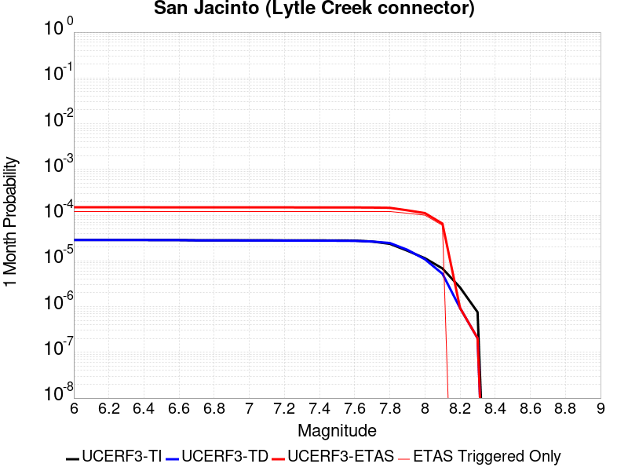 |  |  |

| Magnitude | 1 wk TI Prob | 1 wk TD Prob | 1 wk ETAS Prob | 1 wk ETAS/TD Gain | 1 wk ETAS Triggered Only | 1 mo TI Prob | 1 mo TD Prob | 1 mo ETAS Prob | 1 mo ETAS/TD Gain | 1 mo ETAS Triggered Only | 1 yr TI Prob | 1 yr TD Prob | 1 yr ETAS Prob | 1 yr ETAS/TD Gain | 1 yr ETAS Triggered Only | 10 yr TI Prob | 10 yr TD Prob | 10 yr ETAS Prob | 10 yr ETAS/TD Gain | 10 yr ETAS Triggered Only |
|-----|-----|-----|-----|-----|-----|-----|-----|-----|-----|-----|-----|-----|-----|-----|-----|-----|-----|-----|-----|-----|
| 6.0 | 6.693995E-6 | 6.660216E-6 | 9.665962E-5 | 14.512985 | 9.0E-5 | 2.8688235E-5 | 2.854347E-5 | 1.4854004E-4 | 5.203994 | 1.2E-4 | 3.492233E-4 | 3.4746144E-4 | 4.974093E-4 | 1.4315525 | 1.5E-4 | 0.00348675 | 0.0035493854 | 0.0037088173 | 1.0449182 | 1.6E-4 |
| 6.1 | 6.693995E-6 | 6.660216E-6 | 9.665962E-5 | 14.512985 | 9.0E-5 | 2.8688235E-5 | 2.854347E-5 | 1.4854004E-4 | 5.203994 | 1.2E-4 | 3.492233E-4 | 3.4746144E-4 | 4.974093E-4 | 1.4315525 | 1.5E-4 | 0.00348675 | 0.0035493854 | 0.0037088173 | 1.0449182 | 1.6E-4 |
| 6.2 | 6.693995E-6 | 6.660216E-6 | 9.665962E-5 | 14.512985 | 9.0E-5 | 2.8688235E-5 | 2.854347E-5 | 1.4854004E-4 | 5.203994 | 1.2E-4 | 3.492233E-4 | 3.4746144E-4 | 4.974093E-4 | 1.4315525 | 1.5E-4 | 0.00348675 | 0.0035493854 | 0.0037088173 | 1.0449182 | 1.6E-4 |
| 6.3 | 6.693995E-6 | 6.660216E-6 | 9.665962E-5 | 14.512985 | 9.0E-5 | 2.8688235E-5 | 2.854347E-5 | 1.4854004E-4 | 5.203994 | 1.2E-4 | 3.492233E-4 | 3.4746144E-4 | 4.974093E-4 | 1.4315525 | 1.5E-4 | 0.00348675 | 0.0035493854 | 0.0037088173 | 1.0449182 | 1.6E-4 |
| 6.4 | 6.693995E-6 | 6.660216E-6 | 9.665962E-5 | 14.512985 | 9.0E-5 | 2.8688235E-5 | 2.854347E-5 | 1.4854004E-4 | 5.203994 | 1.2E-4 | 3.492233E-4 | 3.4746144E-4 | 4.974093E-4 | 1.4315525 | 1.5E-4 | 0.00348675 | 0.0035493854 | 0.0037088173 | 1.0449182 | 1.6E-4 |
| 6.5 | 6.6561875E-6 | 6.6204343E-6 | 9.6619835E-5 | 14.594185 | 9.0E-5 | 2.8526205E-5 | 2.837298E-5 | 1.4836958E-4 | 5.2292557 | 1.2E-4 | 3.472512E-4 | 3.4538636E-4 | 4.9533456E-4 | 1.4341463 | 1.5E-4 | 0.0034670907 | 0.003528701 | 0.0036881363 | 1.0451825 | 1.6E-4 |
| 6.6 | 6.6561875E-6 | 6.6204343E-6 | 9.6619835E-5 | 14.594185 | 9.0E-5 | 2.8526205E-5 | 2.837298E-5 | 1.4836958E-4 | 5.2292557 | 1.2E-4 | 3.472512E-4 | 3.4538636E-4 | 4.9533456E-4 | 1.4341463 | 1.5E-4 | 0.0034670907 | 0.003528701 | 0.0036881363 | 1.0451825 | 1.6E-4 |
| 6.7 | 6.5802237E-6 | 6.539611E-6 | 9.653902E-5 | 14.762197 | 9.0E-5 | 2.8200653E-5 | 2.8026603E-5 | 1.4802325E-4 | 5.281526 | 1.2E-4 | 3.4328885E-4 | 3.4117055E-4 | 4.911194E-4 | 1.4395128 | 1.5E-4 | 0.0034275902 | 0.0034866752 | 0.0036461174 | 1.045729 | 1.6E-4 |
| 6.8 | 6.575632E-6 | 6.5341005E-6 | 9.653351E-5 | 14.773803 | 9.0E-5 | 2.8180975E-5 | 2.8002989E-5 | 1.4799963E-4 | 5.2851367 | 1.2E-4 | 3.4304935E-4 | 3.4088313E-4 | 4.9083197E-4 | 1.4398835 | 1.5E-4 | 0.0034252026 | 0.00348381 | 0.0036432527 | 1.0457667 | 1.6E-4 |
| 6.9 | 6.570433E-6 | 6.525495E-6 | 9.6524906E-5 | 14.791967 | 9.0E-5 | 2.8158694E-5 | 2.7966107E-5 | 1.4796275E-4 | 5.290788 | 1.2E-4 | 3.4277816E-4 | 3.4043423E-4 | 4.903832E-4 | 1.4404638 | 1.5E-4 | 0.0034224992 | 0.0034793352 | 0.0036387786 | 1.0458258 | 1.6E-4 |
| 7.0 | 6.5643826E-6 | 6.515616E-6 | 9.651503E-5 | 14.812879 | 9.0E-5 | 2.8132765E-5 | 2.792377E-5 | 1.4792042E-4 | 5.297294 | 1.2E-4 | 3.424626E-4 | 3.3991894E-4 | 4.8986793E-4 | 1.4411317 | 1.5E-4 | 0.0034193532 | 0.0034741985 | 0.0036336426 | 1.0458938 | 1.6E-4 |
| 7.1 | 6.557402E-6 | 6.5043278E-6 | 9.650374E-5 | 14.836851 | 9.0E-5 | 2.8102848E-5 | 2.7875392E-5 | 1.4787205E-4 | 5.304752 | 1.2E-4 | 3.4209844E-4 | 3.3933012E-4 | 4.892792E-4 | 1.4418974 | 1.5E-4 | 0.0034157229 | 0.0034683298 | 0.0036277748 | 1.0459718 | 1.6E-4 |
| 7.2 | 6.546394E-6 | 6.4862943E-6 | 9.648571E-5 | 14.87532 | 9.0E-5 | 2.8055672E-5 | 2.7798109E-5 | 1.4779477E-4 | 5.3167205 | 1.2E-4 | 3.4152428E-4 | 3.3838948E-4 | 4.8833876E-4 | 1.4431262 | 1.5E-4 | 0.0034099987 | 0.0034589572 | 0.0036184036 | 1.0460967 | 1.6E-4 |
| 7.3 | 6.5364216E-6 | 6.4670803E-6 | 9.64665E-5 | 14.916546 | 9.0E-5 | 2.8012933E-5 | 2.7715765E-5 | 1.4771243E-4 | 5.329546 | 1.2E-4 | 3.4100408E-4 | 3.3738726E-4 | 4.8733666E-4 | 1.444443 | 1.5E-4 | 0.003404813 | 0.0034489788 | 0.003608427 | 1.0462306 | 1.6E-4 |
| 7.4 | 6.5269523E-6 | 6.4481674E-6 | 9.6447584E-5 | 14.957364 | 9.0E-5 | 2.7972354E-5 | 2.7634711E-5 | 1.4763139E-4 | 5.342245 | 1.2E-4 | 3.4051016E-4 | 3.3640073E-4 | 4.8635027E-4 | 1.4457468 | 1.5E-4 | 0.0033998888 | 0.003439161 | 0.0035986106 | 1.046363 | 1.6E-4 |
| 7.5 | 6.5111835E-6 | 6.424442E-6 | 9.6423864E-5 | 15.008909 | 9.0E-5 | 2.7904773E-5 | 2.7533031E-5 | 1.4752973E-4 | 5.358281 | 1.2E-4 | 3.3968766E-4 | 3.3516317E-4 | 4.851129E-4 | 1.4473932 | 1.5E-4 | 0.0033916887 | 0.003426834 | 0.0035862857 | 1.0465304 | 1.6E-4 |
| 7.6 | 6.4768806E-6 | 6.383551E-6 | 9.638297E-5 | 15.098646 | 9.0E-5 | 2.7757764E-5 | 2.735779E-5 | 1.4735451E-4 | 5.3861995 | 1.2E-4 | 3.3789838E-4 | 3.3303024E-4 | 4.829803E-4 | 1.4502596 | 1.5E-4 | 0.0033738504 | 0.0034055663 | 0.0035650213 | 1.046822 | 1.6E-4 |
| 7.7 | 6.1655364E-6 | 6.1760365E-6 | 9.617548E-5 | 15.572363 | 9.0E-5 | 2.642346E-5 | 2.646846E-5 | 1.4646529E-4 | 5.533578 | 1.2E-4 | 3.2165812E-4 | 3.2220592E-4 | 4.7215758E-4 | 1.4653908 | 1.5E-4 | 0.0032119295 | 0.0032971818 | 0.0034566543 | 1.0483663 | 1.6E-4 |
| 7.8 | 5.5043524E-6 | 5.737097E-6 | 9.573658E-5 | 16.687286 | 9.0E-5 | 2.3589868E-5 | 2.4587327E-5 | 1.4458438E-4 | 5.880443 | 1.2E-4 | 2.871688E-4 | 2.9930964E-4 | 4.4926474E-4 | 1.5010033 | 1.5E-4 | 0.0028679797 | 0.0030672832 | 0.0032267924 | 1.0520034 | 1.6E-4 |
| 7.9 | 3.889249E-6 | 4.076761E-6 | 8.407643E-5 | 20.623343 | 8.0E-5 | 1.6668104E-5 | 1.7471715E-5 | 1.274698E-4 | 7.2957797 | 1.1E-4 | 2.0291525E-4 | 2.1269741E-4 | 3.4266978E-4 | 1.6110669 | 1.3E-4 | 0.0020273007 | 0.0021943315 | 0.0023340243 | 1.0636607 | 1.4E-4 |
| 8.0 | 2.668535E-6 | 2.5315155E-6 | 7.253134E-5 | 28.651352 | 7.0E-5 | 1.1436528E-5 | 1.0849307E-5 | 1.10848225E-4 | 10.217079 | 1.0E-4 | 1.3923083E-4 | 1.3208234E-4 | 2.420678E-4 | 1.832704 | 1.1E-4 | 0.0013914363 | 0.0013757964 | 0.001485645 | 1.0798436 | 1.1E-4 |
| 8.1 | 1.5911459E-6 | 1.218661E-6 | 5.12186E-5 | 42.028587 | 5.0E-5 | 6.8191785E-6 | 5.2228224E-6 | 6.5222506E-5 | 12.487981 | 6.0E-5 | 8.3020335E-5 | 6.3586034E-5 | 1.2358221E-4 | 1.9435434 | 6.0E-5 | 8.298933E-4 | 6.6932244E-4 | 7.2928227E-4 | 1.0895829 | 6.0E-5 |
| 8.2 | 6.1294963E-7 | 2.1812275E-7 | 2.1812275E-7 | 1.0 | 0.0 | 2.6269242E-6 | 9.3481145E-7 | 9.3481145E-7 | 1.0 | 0.0 | 3.1982334E-5 | 1.138127E-5 | 1.138127E-5 | 1.0 | 0.0 | 3.1977732E-4 | 1.2784546E-4 | 1.2784546E-4 | 1.0 | 0.0 |
| 8.3 | 1.762871E-7 | 4.7546838E-8 | 4.7546838E-8 | 1.0 | 0.0 | 7.5551594E-7 | 2.0377215E-7 | 2.0377215E-7 | 1.0 | 0.0 | 9.1983675E-6 | 2.480923E-6 | 2.480923E-6 | 1.0 | 0.0 | 9.197987E-5 | 2.868753E-5 | 2.868753E-5 | 1.0 | 0.0 |

## Sheephole
*[(top)](#table-of-contents)*

| 1 Week | 1 Month | 1 Year | 10 Year |
|-----|-----|-----|-----|
|  |  |  |  |

| Magnitude | 1 wk TI Prob | 1 wk TD Prob | 1 wk ETAS Prob | 1 wk ETAS/TD Gain | 1 wk ETAS Triggered Only | 1 mo TI Prob | 1 mo TD Prob | 1 mo ETAS Prob | 1 mo ETAS/TD Gain | 1 mo ETAS Triggered Only | 1 yr TI Prob | 1 yr TD Prob | 1 yr ETAS Prob | 1 yr ETAS/TD Gain | 1 yr ETAS Triggered Only | 10 yr TI Prob | 10 yr TD Prob | 10 yr ETAS Prob | 10 yr ETAS/TD Gain | 10 yr ETAS Triggered Only |
|-----|-----|-----|-----|-----|-----|-----|-----|-----|-----|-----|-----|-----|-----|-----|-----|-----|-----|-----|-----|-----|
| 6.0 | 4.5579695E-6 | 4.7412627E-6 | 7.474093E-5 | 15.76393 | 7.0E-5 | 1.9534009E-5 | 2.031957E-5 | 1.3031733E-4 | 6.4133906 | 1.1E-4 | 2.3780059E-4 | 2.473682E-4 | 3.7733605E-4 | 1.5254023 | 1.3E-4 | 0.0023754628 | 0.002471473 | 0.0026310778 | 1.0645788 | 1.6E-4 |
| 6.1 | 4.5579695E-6 | 4.7412627E-6 | 7.474093E-5 | 15.76393 | 7.0E-5 | 1.9534009E-5 | 2.031957E-5 | 1.3031733E-4 | 6.4133906 | 1.1E-4 | 2.3780059E-4 | 2.473682E-4 | 3.7733605E-4 | 1.5254023 | 1.3E-4 | 0.0023754628 | 0.002471473 | 0.0026310778 | 1.0645788 | 1.6E-4 |
| 6.2 | 2.6677674E-6 | 2.7873941E-6 | 7.2787196E-5 | 26.112991 | 7.0E-5 | 1.1433239E-5 | 1.1945926E-5 | 1.1194473E-4 | 9.3709545 | 1.0E-4 | 1.3919079E-4 | 1.4543302E-4 | 2.454185E-4 | 1.6875017 | 1.0E-4 | 0.0013910364 | 0.0014534844 | 0.00157331 | 1.0824403 | 1.2E-4 |
| 6.3 | 2.6677674E-6 | 2.7873941E-6 | 7.2787196E-5 | 26.112991 | 7.0E-5 | 1.1433239E-5 | 1.1945926E-5 | 1.1194473E-4 | 9.3709545 | 1.0E-4 | 1.3919079E-4 | 1.4543302E-4 | 2.454185E-4 | 1.6875017 | 1.0E-4 | 0.0013910364 | 0.0014534844 | 0.00157331 | 1.0824403 | 1.2E-4 |
| 6.4 | 2.2159759E-6 | 2.3228788E-6 | 5.232276E-5 | 22.524965 | 5.0E-5 | 9.497005E-6 | 9.955161E-6 | 7.9954465E-5 | 8.031459 | 7.0E-5 | 1.156199E-4 | 1.2119815E-4 | 1.9118967E-4 | 1.5774965 | 7.0E-5 | 0.0011555976 | 0.0012113999 | 0.001291303 | 1.0659593 | 8.0E-5 |
| 6.5 | 2.1986082E-6 | 2.304759E-6 | 5.2304644E-5 | 22.694191 | 5.0E-5 | 9.4225725E-6 | 9.877506E-6 | 7.9876816E-5 | 8.08674 | 7.0E-5 | 1.1471378E-4 | 1.2025281E-4 | 1.9024439E-4 | 1.582037 | 7.0E-5 | 0.0011465458 | 0.0012019566 | 0.0012818605 | 1.0664781 | 8.0E-5 |
| 6.6 | 1.5232331E-6 | 1.6018919E-6 | 2.160186E-5 | 13.485217 | 2.0E-5 | 6.5281256E-6 | 6.865234E-6 | 4.686496E-5 | 6.8264184 | 4.0E-5 | 7.947703E-5 | 8.35812E-5 | 1.2357786E-4 | 1.4785365 | 4.0E-5 | 7.9448614E-4 | 8.3551643E-4 | 8.75483E-4 | 1.0478346 | 4.0E-5 |
| 6.7 | 1.3137362E-6 | 1.382819E-6 | 2.1382792E-5 | 15.463188 | 2.0E-5 | 5.6302856E-6 | 5.926355E-6 | 4.5926117E-5 | 7.7494717 | 4.0E-5 | 6.854657E-5 | 7.215112E-5 | 1.12148235E-4 | 1.5543519 | 4.0E-5 | 6.8525434E-4 | 7.212908E-4 | 7.61262E-4 | 1.0554161 | 4.0E-5 |
| 6.8 | 1.2275751E-6 | 1.2922847E-6 | 2.1292259E-5 | 16.476446 | 2.0E-5 | 5.2610258E-6 | 5.5383516E-6 | 4.553813E-5 | 8.222325 | 4.0E-5 | 6.4051106E-5 | 6.7427485E-5 | 1.07424785E-4 | 1.59319 | 4.0E-5 | 6.4032647E-4 | 6.740836E-4 | 7.140566E-4 | 1.0592998 | 4.0E-5 |
| 6.9 | 1.1837088E-6 | 1.246102E-6 | 2.1246076E-5 | 17.05003 | 2.0E-5 | 5.0730278E-6 | 5.340427E-6 | 4.5340214E-5 | 8.489998 | 4.0E-5 | 6.176237E-5 | 6.501789E-5 | 1.0501529E-4 | 1.6151752 | 4.0E-5 | 6.17452E-4 | 6.5000186E-4 | 6.8997586E-4 | 1.0614983 | 4.0E-5 |
| 7.0 | 9.849371E-7 | 1.0366288E-6 | 1.1036618E-5 | 10.646645 | 1.0E-5 | 4.2211523E-6 | 4.442688E-6 | 3.4442553E-5 | 7.752639 | 3.0E-5 | 5.1391315E-5 | 5.4088487E-5 | 8.408686E-5 | 1.5546167 | 3.0E-5 | 5.137943E-4 | 5.407633E-4 | 5.7074707E-4 | 1.0554471 | 3.0E-5 |
| 7.1 | 8.1643645E-7 | 8.591669E-7 | 1.08591585E-5 | 12.639173 | 1.0E-5 | 3.4990085E-6 | 3.682139E-6 | 3.368203E-5 | 9.147408 | 3.0E-5 | 4.2599597E-5 | 4.482921E-5 | 7.482786E-5 | 1.6691766 | 3.0E-5 | 4.259143E-4 | 4.4821028E-4 | 4.7819686E-4 | 1.0669029 | 3.0E-5 |
| 7.2 | 5.7295756E-7 | 6.029502E-7 | 1.0602944E-5 | 17.585108 | 1.0E-5 | 2.45553E-6 | 2.58407E-6 | 1.2584044E-5 | 4.869854 | 1.0E-5 | 2.9895667E-5 | 3.1460666E-5 | 4.1460353E-5 | 1.3178473 | 1.0E-5 | 2.9891645E-4 | 3.145688E-4 | 3.2456568E-4 | 1.0317795 | 1.0E-5 |

## Channel Islands Thrust
*[(top)](#table-of-contents)*

| 1 Week | 1 Month | 1 Year | 10 Year |
|-----|-----|-----|-----|
| 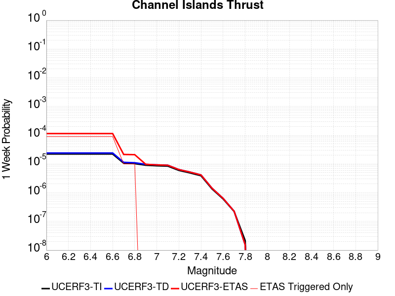 |  |  |  |

| Magnitude | 1 wk TI Prob | 1 wk TD Prob | 1 wk ETAS Prob | 1 wk ETAS/TD Gain | 1 wk ETAS Triggered Only | 1 mo TI Prob | 1 mo TD Prob | 1 mo ETAS Prob | 1 mo ETAS/TD Gain | 1 mo ETAS Triggered Only | 1 yr TI Prob | 1 yr TD Prob | 1 yr ETAS Prob | 1 yr ETAS/TD Gain | 1 yr ETAS Triggered Only | 10 yr TI Prob | 10 yr TD Prob | 10 yr ETAS Prob | 10 yr ETAS/TD Gain | 10 yr ETAS Triggered Only |
|-----|-----|-----|-----|-----|-----|-----|-----|-----|-----|-----|-----|-----|-----|-----|-----|-----|-----|-----|-----|-----|
| 6.0 | 2.2156251E-5 | 2.4092022E-5 | 1.1408985E-4 | 4.7355866 | 9.0E-5 | 9.495191E-5 | 1.03248036E-4 | 2.1323668E-4 | 2.0652854 | 1.1E-4 | 0.0011554264 | 0.0012564264 | 0.0013662883 | 1.0874399 | 1.1E-4 | 0.011494373 | 0.0125038205 | 0.01262232 | 1.009477 | 1.2E-4 |
| 6.1 | 2.2156251E-5 | 2.4092022E-5 | 1.1408985E-4 | 4.7355866 | 9.0E-5 | 9.495191E-5 | 1.03248036E-4 | 2.1323668E-4 | 2.0652854 | 1.1E-4 | 0.0011554264 | 0.0012564264 | 0.0013662883 | 1.0874399 | 1.1E-4 | 0.011494373 | 0.0125038205 | 0.01262232 | 1.009477 | 1.2E-4 |
| 6.2 | 2.2156251E-5 | 2.4092022E-5 | 1.1408985E-4 | 4.7355866 | 9.0E-5 | 9.495191E-5 | 1.03248036E-4 | 2.1323668E-4 | 2.0652854 | 1.1E-4 | 0.0011554264 | 0.0012564264 | 0.0013662883 | 1.0874399 | 1.1E-4 | 0.011494373 | 0.0125038205 | 0.01262232 | 1.009477 | 1.2E-4 |
| 6.3 | 2.2156251E-5 | 2.4092022E-5 | 1.1408985E-4 | 4.7355866 | 9.0E-5 | 9.495191E-5 | 1.03248036E-4 | 2.1323668E-4 | 2.0652854 | 1.1E-4 | 0.0011554264 | 0.0012564264 | 0.0013662883 | 1.0874399 | 1.1E-4 | 0.011494373 | 0.0125038205 | 0.01262232 | 1.009477 | 1.2E-4 |
| 6.4 | 2.2156251E-5 | 2.4092022E-5 | 1.1408985E-4 | 4.7355866 | 9.0E-5 | 9.495191E-5 | 1.03248036E-4 | 2.1323668E-4 | 2.0652854 | 1.1E-4 | 0.0011554264 | 0.0012564264 | 0.0013662883 | 1.0874399 | 1.1E-4 | 0.011494373 | 0.0125038205 | 0.01262232 | 1.009477 | 1.2E-4 |
| 6.5 | 2.2156251E-5 | 2.4092022E-5 | 1.1408985E-4 | 4.7355866 | 9.0E-5 | 9.495191E-5 | 1.03248036E-4 | 2.1323668E-4 | 2.0652854 | 1.1E-4 | 0.0011554264 | 0.0012564264 | 0.0013662883 | 1.0874399 | 1.1E-4 | 0.011494373 | 0.0125038205 | 0.01262232 | 1.009477 | 1.2E-4 |
| 6.6 | 2.2156251E-5 | 2.4092022E-5 | 1.1408985E-4 | 4.7355866 | 9.0E-5 | 9.495191E-5 | 1.03248036E-4 | 2.1323668E-4 | 2.0652854 | 1.1E-4 | 0.0011554264 | 0.0012564264 | 0.0013662883 | 1.0874399 | 1.1E-4 | 0.011494373 | 0.0125038205 | 0.01262232 | 1.009477 | 1.2E-4 |
| 6.7 | 1.0601296E-5 | 1.1379544E-5 | 2.137943E-5 | 1.8787599 | 1.0E-5 | 4.5433335E-5 | 4.876859E-5 | 7.876712E-5 | 1.61512 | 3.0E-5 | 5.5301044E-4 | 5.936007E-4 | 6.2358286E-4 | 1.050509 | 3.0E-5 | 0.005516363 | 0.005920653 | 0.0059504756 | 1.005037 | 3.0E-5 |
| 6.8 | 1.0246747E-5 | 1.0996669E-5 | 2.0996558E-5 | 1.9093564 | 1.0E-5 | 4.391389E-5 | 4.7127756E-5 | 7.7126344E-5 | 1.6365376 | 3.0E-5 | 5.345204E-4 | 5.7363417E-4 | 6.0361694E-4 | 1.0522681 | 3.0E-5 | 0.0053323656 | 0.005722025 | 0.0057518533 | 1.0052129 | 3.0E-5 |
| 6.9 | 9.049551E-6 | 9.699645E-6 | 9.699645E-6 | 1.0 | 0.0 | 3.878322E-5 | 4.1569267E-5 | 6.156843E-5 | 1.4811047 | 2.0E-5 | 4.7208337E-4 | 5.059924E-4 | 5.2598224E-4 | 1.0395063 | 2.0E-5 | 0.0047108172 | 0.0050488203 | 0.0050687194 | 1.0039413 | 2.0E-5 |
| 7.0 | 8.6542195E-6 | 9.274603E-6 | 9.274603E-6 | 1.0 | 0.0 | 3.7088983E-5 | 3.9747716E-5 | 5.9746922E-5 | 1.5031536 | 2.0E-5 | 4.5146482E-4 | 4.8382508E-4 | 5.0381536E-4 | 1.0413172 | 2.0E-5 | 0.004505487 | 0.004828129 | 0.0048480327 | 1.0041224 | 2.0E-5 |
| 7.1 | 8.391028E-6 | 8.992924E-6 | 8.992924E-6 | 1.0 | 0.0 | 3.5961057E-5 | 3.854056E-5 | 5.853979E-5 | 1.5189139 | 2.0E-5 | 4.3773788E-4 | 4.6913436E-4 | 4.8912497E-4 | 1.0426117 | 2.0E-5 | 0.004368766 | 0.0046818503 | 0.0047017564 | 1.0042518 | 2.0E-5 |
| 7.2 | 5.965188E-6 | 6.3716952E-6 | 6.3716952E-6 | 1.0 | 0.0 | 2.556484E-5 | 2.7306982E-5 | 4.7306436E-5 | 1.7323934 | 2.0E-5 | 3.1120746E-4 | 3.3241234E-4 | 3.5240568E-4 | 1.0601462 | 2.0E-5 | 0.00310772 | 0.0033192092 | 0.0033391428 | 1.0060055 | 2.0E-5 |
| 7.3 | 4.877518E-6 | 5.2060063E-6 | 5.2060063E-6 | 1.0 | 0.0 | 2.0903482E-5 | 2.2311267E-5 | 3.2311043E-5 | 1.448194 | 1.0E-5 | 2.5447016E-4 | 2.716063E-4 | 2.8160357E-4 | 1.036808 | 1.0E-5 | 0.0025417898 | 0.0027127895 | 0.0027227623 | 1.0036763 | 1.0E-5 |
| 7.4 | 3.8829853E-6 | 4.141863E-6 | 4.141863E-6 | 1.0 | 0.0 | 1.664126E-5 | 1.7750723E-5 | 1.7750723E-5 | 1.0 | 0.0 | 2.0258849E-4 | 2.1609402E-4 | 2.1609402E-4 | 1.0 | 0.0 | 0.002024039 | 0.0021588807 | 0.0021588807 | 1.0 | 0.0 |
| 7.5 | 1.3489616E-6 | 1.4277903E-6 | 1.4277903E-6 | 1.0 | 0.0 | 5.7812517E-6 | 6.119087E-6 | 6.119087E-6 | 1.0 | 0.0 | 7.038446E-5 | 7.449738E-5 | 7.449738E-5 | 1.0 | 0.0 | 7.036218E-4 | 7.44728E-4 | 7.44728E-4 | 1.0 | 0.0 |
| 7.6 | 6.058192E-7 | 6.353778E-7 | 6.353778E-7 | 1.0 | 0.0 | 2.5963652E-6 | 2.7230449E-6 | 2.7230449E-6 | 1.0 | 0.0 | 3.161029E-5 | 3.3152584E-5 | 3.3152584E-5 | 1.0 | 0.0 | 3.1605794E-4 | 3.31478E-4 | 3.31478E-4 | 1.0 | 0.0 |
| 7.7 | 2.2170494E-7 | 2.2607902E-7 | 2.2607902E-7 | 1.0 | 0.0 | 9.5016367E-7 | 9.689098E-7 | 9.689098E-7 | 1.0 | 0.0 | 1.1568181E-5 | 1.1796425E-5 | 1.1796425E-5 | 1.0 | 0.0 | 1.1567579E-4 | 1.1795909E-4 | 1.1795909E-4 | 1.0 | 0.0 |
| 7.8 | 2.1613102E-8 | 1.5466682E-8 | 1.5466682E-8 | 1.0 | 0.0 | 9.262757E-8 | 6.628578E-8 | 6.628578E-8 | 1.0 | 0.0 | 1.1277401E-6 | 8.070291E-7 | 8.070291E-7 | 1.0 | 0.0 | 1.1277344E-5 | 8.070269E-6 | 8.070269E-6 | 1.0 | 0.0 |

## San Cayetano
*[(top)](#table-of-contents)*

| 1 Week | 1 Month | 1 Year | 10 Year |
|-----|-----|-----|-----|
|  |  |  |  |

| Magnitude | 1 wk TI Prob | 1 wk TD Prob | 1 wk ETAS Prob | 1 wk ETAS/TD Gain | 1 wk ETAS Triggered Only | 1 mo TI Prob | 1 mo TD Prob | 1 mo ETAS Prob | 1 mo ETAS/TD Gain | 1 mo ETAS Triggered Only | 1 yr TI Prob | 1 yr TD Prob | 1 yr ETAS Prob | 1 yr ETAS/TD Gain | 1 yr ETAS Triggered Only | 10 yr TI Prob | 10 yr TD Prob | 10 yr ETAS Prob | 10 yr ETAS/TD Gain | 10 yr ETAS Triggered Only |
|-----|-----|-----|-----|-----|-----|-----|-----|-----|-----|-----|-----|-----|-----|-----|-----|-----|-----|-----|-----|-----|
| 6.0 | 2.3476267E-5 | 1.816928E-5 | 7.816819E-5 | 4.3022175 | 6.0E-5 | 1.0060869E-4 | 7.786603E-5 | 1.578598E-4 | 2.0273256 | 8.0E-5 | 0.0012242225 | 9.476103E-4 | 0.0010575061 | 1.1159714 | 1.1E-4 | 0.012175002 | 0.009436584 | 0.009565357 | 1.0136461 | 1.3E-4 |
| 6.1 | 2.3476267E-5 | 1.816928E-5 | 7.816819E-5 | 4.3022175 | 6.0E-5 | 1.0060869E-4 | 7.786603E-5 | 1.578598E-4 | 2.0273256 | 8.0E-5 | 0.0012242225 | 9.476103E-4 | 0.0010575061 | 1.1159714 | 1.1E-4 | 0.012175002 | 0.009436584 | 0.009565357 | 1.0136461 | 1.3E-4 |
| 6.2 | 2.3476267E-5 | 1.816928E-5 | 7.816819E-5 | 4.3022175 | 6.0E-5 | 1.0060869E-4 | 7.786603E-5 | 1.578598E-4 | 2.0273256 | 8.0E-5 | 0.0012242225 | 9.476103E-4 | 0.0010575061 | 1.1159714 | 1.1E-4 | 0.012175002 | 0.009436584 | 0.009565357 | 1.0136461 | 1.3E-4 |
| 6.3 | 2.3476267E-5 | 1.816928E-5 | 7.816819E-5 | 4.3022175 | 6.0E-5 | 1.0060869E-4 | 7.786603E-5 | 1.578598E-4 | 2.0273256 | 8.0E-5 | 0.0012242225 | 9.476103E-4 | 0.0010575061 | 1.1159714 | 1.1E-4 | 0.012175002 | 0.009436584 | 0.009565357 | 1.0136461 | 1.3E-4 |
| 6.4 | 2.3476267E-5 | 1.816928E-5 | 7.816819E-5 | 4.3022175 | 6.0E-5 | 1.0060869E-4 | 7.786603E-5 | 1.578598E-4 | 2.0273256 | 8.0E-5 | 0.0012242225 | 9.476103E-4 | 0.0010575061 | 1.1159714 | 1.1E-4 | 0.012175002 | 0.009436584 | 0.009565357 | 1.0136461 | 1.3E-4 |
| 6.5 | 2.3476267E-5 | 1.816928E-5 | 7.816819E-5 | 4.3022175 | 6.0E-5 | 1.0060869E-4 | 7.786603E-5 | 1.578598E-4 | 2.0273256 | 8.0E-5 | 0.0012242225 | 9.476103E-4 | 0.0010575061 | 1.1159714 | 1.1E-4 | 0.012175002 | 0.009436584 | 0.009565357 | 1.0136461 | 1.3E-4 |
| 6.6 | 2.3476267E-5 | 1.816928E-5 | 7.816819E-5 | 4.3022175 | 6.0E-5 | 1.0060869E-4 | 7.786603E-5 | 1.578598E-4 | 2.0273256 | 8.0E-5 | 0.0012242225 | 9.476103E-4 | 0.0010575061 | 1.1159714 | 1.1E-4 | 0.012175002 | 0.009436584 | 0.009565357 | 1.0136461 | 1.3E-4 |
| 6.7 | 2.3476267E-5 | 1.816928E-5 | 7.816819E-5 | 4.3022175 | 6.0E-5 | 1.0060869E-4 | 7.786603E-5 | 1.578598E-4 | 2.0273256 | 8.0E-5 | 0.0012242225 | 9.476103E-4 | 0.0010575061 | 1.1159714 | 1.1E-4 | 0.012175002 | 0.009436584 | 0.009565357 | 1.0136461 | 1.3E-4 |
| 6.8 | 2.3241924E-5 | 1.7936987E-5 | 7.793591E-5 | 4.3449836 | 6.0E-5 | 9.960445E-5 | 7.687056E-5 | 1.5686441E-4 | 2.0406306 | 8.0E-5 | 0.0012120095 | 9.3550084E-4 | 0.001045398 | 1.1174741 | 1.1E-4 | 0.012054204 | 0.009316482 | 0.0094452705 | 1.0138237 | 1.3E-4 |
| 6.9 | 2.2761007E-5 | 1.7432423E-5 | 7.7431374E-5 | 4.441802 | 6.0E-5 | 9.7543525E-5 | 7.470827E-5 | 1.5470228E-4 | 2.070752 | 8.0E-5 | 0.0011869454 | 9.09197E-4 | 0.001019097 | 1.1208758 | 1.1E-4 | 0.011806256 | 0.009055603 | 0.009184426 | 1.0142257 | 1.3E-4 |
| 7.0 | 2.240283E-5 | 1.7066168E-5 | 6.706532E-5 | 3.929723 | 5.0E-5 | 9.600859E-5 | 7.313869E-5 | 1.4313357E-4 | 1.9570158 | 7.0E-5 | 0.0011682777 | 8.9010317E-4 | 9.900142E-4 | 1.1122465 | 1.0E-4 | 0.011621549 | 0.008866196 | 0.008985131 | 1.0134145 | 1.2E-4 |
| 7.1 | 2.1871154E-5 | 1.6586018E-5 | 6.658519E-5 | 4.0145373 | 5.0E-5 | 9.373015E-5 | 7.108101E-5 | 1.4107605E-4 | 1.9847218 | 7.0E-5 | 0.0011405671 | 8.6507114E-4 | 9.6498465E-4 | 1.1154975 | 1.0E-4 | 0.011347309 | 0.008617838 | 0.008736804 | 1.0138046 | 1.2E-4 |
| 7.2 | 2.0714133E-5 | 1.5564561E-5 | 6.5563785E-5 | 4.212376 | 5.0E-5 | 8.8771834E-5 | 6.670357E-5 | 1.2669957E-4 | 1.8994421 | 6.0E-5 | 0.0010802611 | 8.1181666E-4 | 9.017436E-4 | 1.1107725 | 9.0E-5 | 0.010750249 | 0.008089285 | 0.008198395 | 1.0134883 | 1.1E-4 |
| 7.3 | 1.8408395E-5 | 1.3996864E-5 | 6.3996165E-5 | 4.5721784 | 5.0E-5 | 7.8890735E-5 | 5.99852E-5 | 1.199816E-4 | 2.0001867 | 6.0E-5 | 9.600714E-4 | 7.300781E-4 | 8.00027E-4 | 1.0958102 | 7.0E-5 | 0.009559342 | 0.0072775153 | 0.0073668603 | 1.0122769 | 9.0E-5 |
| 7.4 | 1.6856795E-5 | 1.28500815E-5 | 6.284944E-5 | 4.890976 | 5.0E-5 | 7.2241404E-5 | 5.5070628E-5 | 1.1506733E-4 | 2.08945 | 6.0E-5 | 8.7918417E-4 | 6.7028153E-4 | 7.4023457E-4 | 1.1043637 | 7.0E-5 | 0.00875714 | 0.0066832784 | 0.006772677 | 1.0133765 | 9.0E-5 |
| 7.5 | 1.2822778E-5 | 9.577542E-6 | 4.957716E-5 | 5.176397 | 4.0E-5 | 5.495361E-5 | 4.1045972E-5 | 9.104392E-5 | 2.2180963 | 5.0E-5 | 6.688548E-4 | 4.996217E-4 | 5.5959175E-4 | 1.1200309 | 6.0E-5 | 0.006668452 | 0.0049851555 | 0.0050548064 | 1.0139717 | 7.0E-5 |
| 7.6 | 5.6272684E-6 | 3.854903E-6 | 3.3854787E-5 | 8.782267 | 3.0E-5 | 2.4116642E-5 | 1.652091E-5 | 4.6520414E-5 | 2.8158507 | 3.0E-5 | 2.9358055E-4 | 2.0112359E-4 | 2.4111556E-4 | 1.1988426 | 4.0E-5 | 0.0029319301 | 0.0020094267 | 0.0020593263 | 1.0248327 | 5.0E-5 |
| 7.7 | 3.5261346E-6 | 2.3407013E-6 | 2.2340655E-5 | 9.544428 | 2.0E-5 | 1.5111918E-5 | 1.0031539E-5 | 3.0031339E-5 | 2.9936922 | 2.0E-5 | 1.8397206E-4 | 1.2212721E-4 | 1.5212355E-4 | 1.2456155 | 3.0E-5 | 0.0018381984 | 0.0012206084 | 0.0012605595 | 1.0327306 | 4.0E-5 |
| 7.8 | 1.4826929E-6 | 1.056428E-6 | 1.1056417E-5 | 10.465851 | 1.0E-5 | 6.354383E-6 | 4.5275406E-6 | 1.4527495E-5 | 3.2086947 | 1.0E-5 | 7.736187E-5 | 5.5121433E-5 | 7.512033E-5 | 1.3628153 | 2.0E-5 | 7.733494E-4 | 5.5107963E-4 | 5.710686E-4 | 1.0362724 | 2.0E-5 |
| 7.9 | 2.7568166E-7 | 1.6978244E-7 | 1.0169781E-5 | 59.898895 | 1.0E-5 | 1.1814923E-6 | 7.2763885E-7 | 1.0727632E-5 | 14.743072 | 1.0E-5 | 1.4384574E-5 | 8.858967E-6 | 1.8858878E-5 | 2.1287897 | 1.0E-5 | 1.4383643E-4 | 8.8586174E-5 | 9.858529E-5 | 1.1128744 | 1.0E-5 |
| 8.0 | 5.407832E-8 | 2.6887697E-8 | 2.6887697E-8 | 1.0 | 0.0 | 2.3176422E-7 | 1.15232986E-7 | 1.15232986E-7 | 1.0 | 0.0 | 2.8217257E-6 | 1.4029607E-6 | 1.4029607E-6 | 1.0 | 0.0 | 2.8216898E-5 | 1.4029522E-5 | 1.4029522E-5 | 1.0 | 0.0 |

## San Jacinto (Borrego)
*[(top)](#table-of-contents)*

| 1 Week | 1 Month | 1 Year | 10 Year |
|-----|-----|-----|-----|
|  |  |  | 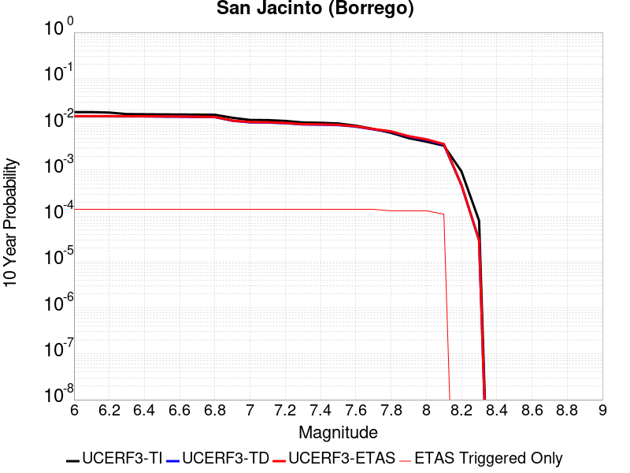 |

| Magnitude | 1 wk TI Prob | 1 wk TD Prob | 1 wk ETAS Prob | 1 wk ETAS/TD Gain | 1 wk ETAS Triggered Only | 1 mo TI Prob | 1 mo TD Prob | 1 mo ETAS Prob | 1 mo ETAS/TD Gain | 1 mo ETAS Triggered Only | 1 yr TI Prob | 1 yr TD Prob | 1 yr ETAS Prob | 1 yr ETAS/TD Gain | 1 yr ETAS Triggered Only | 10 yr TI Prob | 10 yr TD Prob | 10 yr ETAS Prob | 10 yr ETAS/TD Gain | 10 yr ETAS Triggered Only |
|-----|-----|-----|-----|-----|-----|-----|-----|-----|-----|-----|-----|-----|-----|-----|-----|-----|-----|-----|-----|-----|
| 6.0 | 3.543992E-5 | 2.7926513E-5 | 1.3792345E-4 | 4.9387994 | 1.1E-4 | 1.5187653E-4 | 1.1967963E-4 | 2.4966407E-4 | 2.0861032 | 1.3E-4 | 0.0018475284 | 0.0014561379 | 0.0015959339 | 1.0960047 | 1.4E-4 | 0.018322436 | 0.014869647 | 0.015007566 | 1.0092752 | 1.4E-4 |
| 6.1 | 3.542281E-5 | 2.7926513E-5 | 1.3792345E-4 | 4.9387994 | 1.1E-4 | 1.5180321E-4 | 1.1967963E-4 | 2.4966407E-4 | 2.0861032 | 1.3E-4 | 0.0018466372 | 0.0014561379 | 0.0015959339 | 1.0960047 | 1.4E-4 | 0.018313672 | 0.014869647 | 0.015007566 | 1.0092752 | 1.4E-4 |
| 6.2 | 3.4688688E-5 | 2.7926511E-5 | 1.3792345E-4 | 4.9387994 | 1.1E-4 | 1.4865733E-4 | 1.1967963E-4 | 2.4966407E-4 | 2.0861032 | 1.3E-4 | 0.0018084005 | 0.0014561379 | 0.0015959339 | 1.0960047 | 1.4E-4 | 0.017937548 | 0.014869647 | 0.015007565 | 1.0092752 | 1.4E-4 |
| 6.3 | 3.2087122E-5 | 2.7771865E-5 | 1.377688E-4 | 4.9607334 | 1.1E-4 | 1.3750899E-4 | 1.1901691E-4 | 2.4900143E-4 | 2.0921516 | 1.3E-4 | 0.0016728862 | 0.00144808 | 0.0015878773 | 1.0965397 | 1.4E-4 | 0.016603488 | 0.014790683 | 0.014928612 | 1.0093254 | 1.4E-4 |
| 6.4 | 3.1828724E-5 | 2.7738852E-5 | 1.377358E-4 | 4.9654474 | 1.1E-4 | 1.364017E-4 | 1.1887544E-4 | 2.4886E-4 | 2.0934517 | 1.3E-4 | 0.0016594254 | 0.0014463598 | 0.0015861574 | 1.0966548 | 1.4E-4 | 0.016470885 | 0.014773762 | 0.0149116935 | 1.0093362 | 1.4E-4 |
| 6.5 | 3.1563577E-5 | 2.747857E-5 | 1.3747555E-4 | 5.0030093 | 1.1E-4 | 1.3526545E-4 | 1.1776006E-4 | 2.4774476E-4 | 2.1038096 | 1.3E-4 | 0.0016456128 | 0.0014327979 | 0.0015725973 | 1.0975709 | 1.4E-4 | 0.0163348 | 0.014640348 | 0.014778298 | 1.0094227 | 1.4E-4 |
| 6.6 | 3.1467625E-5 | 2.7322796E-5 | 1.3731979E-4 | 5.025832 | 1.1E-4 | 1.3485427E-4 | 1.1709251E-4 | 2.470773E-4 | 2.1101034 | 1.3E-4 | 0.0016406142 | 0.0014246812 | 0.0015644818 | 1.0981276 | 1.4E-4 | 0.016285548 | 0.014560594 | 0.014698556 | 1.009475 | 1.4E-4 |
| 6.7 | 3.1223695E-5 | 2.6940816E-5 | 1.3693784E-4 | 5.0829144 | 1.1E-4 | 1.3380898E-4 | 1.15455594E-4 | 2.4544058E-4 | 2.125844 | 1.3E-4 | 0.0016279068 | 0.0014047775 | 0.0015445809 | 1.0995198 | 1.4E-4 | 0.01616033 | 0.014364966 | 0.014502955 | 1.0096059 | 1.4E-4 |
| 6.8 | 3.1015585E-5 | 2.6761822E-5 | 1.3675888E-4 | 5.110223 | 1.1E-4 | 1.3291716E-4 | 1.1468855E-4 | 2.4467363E-4 | 2.1333747 | 1.3E-4 | 0.001617065 | 0.0013954508 | 0.0015352555 | 1.100186 | 1.4E-4 | 0.016053487 | 0.014272246 | 0.014410248 | 1.0096693 | 1.4E-4 |
| 6.9 | 2.6641965E-5 | 2.2184247E-5 | 1.3218181E-4 | 5.9583635 | 1.1E-4 | 1.1417485E-4 | 9.50719E-5 | 2.2505954E-4 | 2.3672562 | 1.3E-4 | 0.0013891924 | 0.0011568897 | 0.0012967277 | 1.1208742 | 1.4E-4 | 0.0138054015 | 0.011882438 | 0.012020775 | 1.0116421 | 1.4E-4 |
| 7.0 | 2.3854353E-5 | 2.0479023E-5 | 1.3047676E-4 | 6.3712397 | 1.1E-4 | 1.02228936E-4 | 8.77643E-5 | 2.177529E-4 | 2.48111 | 1.3E-4 | 0.0012439266 | 0.0010680092 | 0.0012078597 | 1.130945 | 1.4E-4 | 0.012369866 | 0.0109828 | 0.011121263 | 1.0126072 | 1.4E-4 |
| 7.1 | 2.3672901E-5 | 2.031551E-5 | 1.3031327E-4 | 6.414472 | 1.1E-4 | 1.0145135E-4 | 8.7063585E-5 | 2.1705226E-4 | 2.4930315 | 1.3E-4 | 0.0012344702 | 0.0010594862 | 0.0011993379 | 1.1319995 | 1.4E-4 | 0.0122763505 | 0.010897976 | 0.01103645 | 1.0127064 | 1.4E-4 |
| 7.2 | 2.2717244E-5 | 1.9542893E-5 | 1.2954074E-4 | 6.628535 | 1.1E-4 | 9.735599E-5 | 8.375258E-5 | 2.1374169E-4 | 2.552061 | 1.3E-4 | 0.0011846646 | 0.001019213 | 0.0011590703 | 1.1372209 | 1.4E-4 | 0.01178369 | 0.010495341 | 0.010633872 | 1.0131992 | 1.4E-4 |
| 7.3 | 2.1016205E-5 | 1.8384526E-5 | 1.283825E-4 | 6.983183 | 1.1E-4 | 9.006634E-5 | 7.878846E-5 | 2.087782E-4 | 2.649858 | 1.3E-4 | 0.001096006 | 9.5882936E-4 | 0.0010986951 | 1.1458714 | 1.4E-4 | 0.010906163 | 0.009890967 | 0.010029582 | 1.0140144 | 1.4E-4 |
| 7.4 | 2.0683625E-5 | 1.8187047E-5 | 1.2818504E-4 | 7.0481505 | 1.1E-4 | 8.86411E-5 | 7.794217E-5 | 2.0793204E-4 | 2.6677732 | 1.3E-4 | 0.001078671 | 9.485349E-4 | 0.001088402 | 1.147456 | 1.4E-4 | 0.010734501 | 0.009787692 | 0.009926322 | 1.0141637 | 1.4E-4 |
| 7.5 | 1.9993966E-5 | 1.7782075E-5 | 1.2778012E-4 | 7.185895 | 1.1E-4 | 8.568561E-5 | 7.620667E-5 | 2.0619677E-4 | 2.7057574 | 1.3E-4 | 0.001042723 | 9.2742336E-4 | 0.0010672935 | 1.1508158 | 1.4E-4 | 0.010378438 | 0.009574614 | 0.009713274 | 1.014482 | 1.4E-4 |
| 7.6 | 1.788966E-5 | 1.6435291E-5 | 1.2643349E-4 | 7.692805 | 1.1E-4 | 7.666772E-5 | 7.043507E-5 | 2.0042591E-4 | 2.8455415 | 1.3E-4 | 9.3302975E-4 | 8.572113E-4 | 9.970913E-4 | 1.1631802 | 1.4E-4 | 0.00929122 | 0.008866487 | 0.009005246 | 1.0156498 | 1.4E-4 |
| 7.7 | 1.5125781E-5 | 1.4237377E-5 | 1.2423581E-4 | 8.726032 | 1.1E-4 | 6.4823165E-5 | 6.1015908E-5 | 1.9100797E-4 | 3.130462 | 1.3E-4 | 7.889362E-4 | 7.426163E-4 | 8.8251237E-4 | 1.1883826 | 1.4E-4 | 0.007861412 | 0.0077142045 | 0.007853124 | 1.0180084 | 1.4E-4 |
| 7.8 | 1.250089E-5 | 1.26304985E-5 | 1.226291E-4 | 9.708968 | 1.1E-4 | 5.3574146E-5 | 5.412959E-5 | 1.8412255E-4 | 3.401514 | 1.3E-4 | 6.5207E-4 | 6.588291E-4 | 7.8874343E-4 | 1.1971898 | 1.3E-4 | 0.006501599 | 0.0068677636 | 0.006996871 | 1.0187991 | 1.3E-4 |
| 7.9 | 9.561E-6 | 9.754616E-6 | 1.19753546E-4 | 12.276602 | 1.1E-4 | 4.0975072E-5 | 4.1804833E-5 | 1.717994E-4 | 4.109558 | 1.3E-4 | 4.987573E-4 | 5.088555E-4 | 6.387894E-4 | 1.2553452 | 1.3E-4 | 0.0049763937 | 0.0053523467 | 0.0054816506 | 1.0241584 | 1.3E-4 |
| 8.0 | 8.01699E-6 | 8.293488E-6 | 1.1829258E-4 | 14.263309 | 1.1E-4 | 3.4358076E-5 | 3.554304E-5 | 1.6553841E-4 | 4.6574078 | 1.3E-4 | 4.1822926E-4 | 4.3265108E-4 | 5.6259485E-4 | 1.300343 | 1.3E-4 | 0.0041744304 | 0.004573375 | 0.0047027804 | 1.0282954 | 1.3E-4 |
| 8.1 | 6.541947E-6 | 6.4622354E-6 | 1.06461586E-4 | 16.47442 | 1.0E-4 | 2.8036617E-5 | 2.7695003E-5 | 1.3769195E-4 | 4.9717255 | 1.1E-4 | 3.4129233E-4 | 3.37135E-4 | 4.470979E-4 | 1.3261688 | 1.1E-4 | 0.0034076865 | 0.0035806994 | 0.0036903056 | 1.0306102 | 1.1E-4 |
| 8.2 | 1.7968189E-6 | 7.9713476E-7 | 7.9713476E-7 | 1.0 | 0.0 | 7.70063E-6 | 3.4162877E-6 | 3.4162877E-6 | 1.0 | 0.0 | 9.3751136E-5 | 4.159253E-5 | 4.159253E-5 | 1.0 | 0.0 | 9.371159E-4 | 4.712058E-4 | 4.712058E-4 | 1.0 | 0.0 |
| 8.3 | 1.5167889E-7 | 4.897714E-8 | 4.897714E-8 | 1.0 | 0.0 | 6.500522E-7 | 2.09902E-7 | 2.09902E-7 | 1.0 | 0.0 | 7.9143565E-6 | 2.5555544E-6 | 2.5555544E-6 | 1.0 | 0.0 | 7.914075E-5 | 2.969505E-5 | 2.969505E-5 | 1.0 | 0.0 |

## Great Valley 09 (Laguna Seca)
*[(top)](#table-of-contents)*

| 1 Week | 1 Month | 1 Year | 10 Year |
|-----|-----|-----|-----|
|  |  |  |  |

| Magnitude | 1 wk TI Prob | 1 wk TD Prob | 1 wk ETAS Prob | 1 wk ETAS/TD Gain | 1 wk ETAS Triggered Only | 1 mo TI Prob | 1 mo TD Prob | 1 mo ETAS Prob | 1 mo ETAS/TD Gain | 1 mo ETAS Triggered Only | 1 yr TI Prob | 1 yr TD Prob | 1 yr ETAS Prob | 1 yr ETAS/TD Gain | 1 yr ETAS Triggered Only | 10 yr TI Prob | 10 yr TD Prob | 10 yr ETAS Prob | 10 yr ETAS/TD Gain | 10 yr ETAS Triggered Only |
|-----|-----|-----|-----|-----|-----|-----|-----|-----|-----|-----|-----|-----|-----|-----|-----|-----|-----|-----|-----|-----|
| 6.0 | 5.4353277E-5 | 7.05022E-5 | 1.1049938E-4 | 1.5673182 | 4.0E-5 | 2.3292181E-4 | 3.0211566E-4 | 3.6209755E-4 | 1.1985394 | 6.0E-5 | 0.0028321352 | 0.0036721937 | 0.0037718266 | 1.0271317 | 1.0E-4 | 0.02796312 | 0.03611547 | 0.036221497 | 1.0029358 | 1.1E-4 |
| 6.1 | 4.5578287E-5 | 5.822118E-5 | 7.8220015E-5 | 1.3434976 | 2.0E-5 | 1.953209E-4 | 2.4949326E-4 | 2.894833E-4 | 1.160285 | 4.0E-5 | 0.0023754383 | 0.003033432 | 0.0031032197 | 1.0230062 | 7.0E-5 | 0.023502063 | 0.029919548 | 0.029987453 | 1.0022696 | 7.0E-5 |
| 6.2 | 2.8536782E-5 | 3.4737273E-5 | 3.4737273E-5 | 1.0 | 0.0 | 1.2229476E-4 | 1.4886224E-4 | 1.4886224E-4 | 1.0 | 0.0 | 0.0014879217 | 0.001810813 | 0.0018307768 | 1.0110247 | 2.0E-5 | 0.014779986 | 0.017958116 | 0.017977757 | 1.0010937 | 2.0E-5 |
| 6.3 | 2.3698774E-5 | 2.8213295E-5 | 2.8213295E-5 | 1.0 | 0.0 | 1.01562226E-4 | 1.20905075E-4 | 1.20905075E-4 | 1.0 | 0.0 | 0.0012358186 | 0.0014710218 | 0.0014909924 | 1.013576 | 2.0E-5 | 0.012289686 | 0.014611342 | 0.01463105 | 1.0013489 | 2.0E-5 |
| 6.4 | 1.9191197E-5 | 2.2123184E-5 | 2.2123184E-5 | 1.0 | 0.0 | 8.2245395E-5 | 9.4806666E-5 | 9.4806666E-5 | 1.0 | 0.0 | 0.0010008777 | 0.0011536429 | 0.0011736198 | 1.0173163 | 2.0E-5 | 0.009963818 | 0.011476948 | 0.011496718 | 1.0017226 | 2.0E-5 |
| 6.5 | 1.5203241E-5 | 1.6802203E-5 | 1.6802203E-5 | 1.0 | 0.0 | 6.5155116E-5 | 7.200386E-5 | 7.200386E-5 | 1.0 | 0.0 | 7.9297484E-4 | 8.7626575E-4 | 8.8625704E-4 | 1.011402 | 1.0E-5 | 0.007901512 | 0.0087295165 | 0.0087394295 | 1.0011356 | 1.0E-5 |
| 6.6 | 1.0984925E-5 | 1.1242595E-5 | 1.1242595E-5 | 1.0 | 0.0 | 4.70774E-5 | 4.8181686E-5 | 4.8181686E-5 | 1.0 | 0.0 | 5.730166E-4 | 5.8645656E-4 | 5.8645656E-4 | 1.0 | 0.0 | 0.005715413 | 0.0058494853 | 0.0058494853 | 1.0 | 0.0 |
| 6.7 | 9.134616E-6 | 9.019894E-6 | 9.019894E-6 | 1.0 | 0.0 | 3.9147766E-5 | 3.865613E-5 | 3.865613E-5 | 1.0 | 0.0 | 4.7651984E-4 | 4.7053912E-4 | 4.7053912E-4 | 1.0 | 0.0 | 0.004754993 | 0.0046956735 | 0.0046956735 | 1.0 | 0.0 |
| 6.8 | 7.785589E-6 | 7.4519444E-6 | 7.4519444E-6 | 1.0 | 0.0 | 3.3366385E-5 | 3.1936524E-5 | 3.1936524E-5 | 1.0 | 0.0 | 4.0616E-4 | 3.8875983E-4 | 3.8875983E-4 | 1.0 | 0.0 | 0.0040541845 | 0.0038810016 | 0.0038810016 | 1.0 | 0.0 |
| 6.9 | 5.579095E-6 | 4.898492E-6 | 4.898492E-6 | 1.0 | 0.0 | 2.3910188E-5 | 2.0993377E-5 | 2.0993377E-5 | 1.0 | 0.0 | 2.9106764E-4 | 2.5556577E-4 | 2.5556577E-4 | 1.0 | 0.0 | 0.002906867 | 0.002552856 | 0.002552856 | 1.0 | 0.0 |
| 7.0 | 2.6816688E-6 | 1.5216126E-6 | 1.5216126E-6 | 1.0 | 0.0 | 1.1492816E-5 | 6.521181E-6 | 6.521181E-6 | 1.0 | 0.0 | 1.3991605E-4 | 7.939258E-5 | 7.939258E-5 | 1.0 | 0.0 | 0.0013982799 | 7.9365086E-4 | 7.9365086E-4 | 1.0 | 0.0 |
| 7.1 | 1.9951021E-6 | 7.453827E-7 | 7.453827E-7 | 1.0 | 0.0 | 8.55041E-6 | 3.1944935E-6 | 3.1944935E-6 | 1.0 | 0.0 | 1.0409627E-4 | 3.8892307E-5 | 3.8892307E-5 | 1.0 | 0.0 | 0.0010404752 | 3.8885913E-4 | 3.8885913E-4 | 1.0 | 0.0 |
| 7.2 | 1.9951021E-6 | 7.453827E-7 | 7.453827E-7 | 1.0 | 0.0 | 8.55041E-6 | 3.1944935E-6 | 3.1944935E-6 | 1.0 | 0.0 | 1.0409627E-4 | 3.8892307E-5 | 3.8892307E-5 | 1.0 | 0.0 | 0.0010404752 | 3.8885913E-4 | 3.8885913E-4 | 1.0 | 0.0 |
| 7.3 | 1.7087556E-6 | 6.578881E-7 | 6.578881E-7 | 1.0 | 0.0 | 7.3232177E-6 | 2.8195177E-6 | 2.8195177E-6 | 1.0 | 0.0 | 8.915652E-5 | 3.4327128E-5 | 3.4327128E-5 | 1.0 | 0.0 | 8.9120766E-4 | 3.432223E-4 | 3.432223E-4 | 1.0 | 0.0 |
| 7.4 | 1.3804846E-6 | 6.073852E-7 | 6.073852E-7 | 1.0 | 0.0 | 5.916349E-6 | 2.6030768E-6 | 2.6030768E-6 | 1.0 | 0.0 | 7.2029165E-5 | 3.169204E-5 | 3.169204E-5 | 1.0 | 0.0 | 7.200583E-4 | 3.1687922E-4 | 3.1687922E-4 | 1.0 | 0.0 |
| 7.5 | 1.3804846E-6 | 6.073852E-7 | 6.073852E-7 | 1.0 | 0.0 | 5.916349E-6 | 2.6030768E-6 | 2.6030768E-6 | 1.0 | 0.0 | 7.2029165E-5 | 3.169204E-5 | 3.169204E-5 | 1.0 | 0.0 | 7.200583E-4 | 3.1687922E-4 | 3.1687922E-4 | 1.0 | 0.0 |

## Kern Canyon (South Kern) 2011
*[(top)](#table-of-contents)*

| 1 Week | 1 Month | 1 Year | 10 Year |
|-----|-----|-----|-----|
| 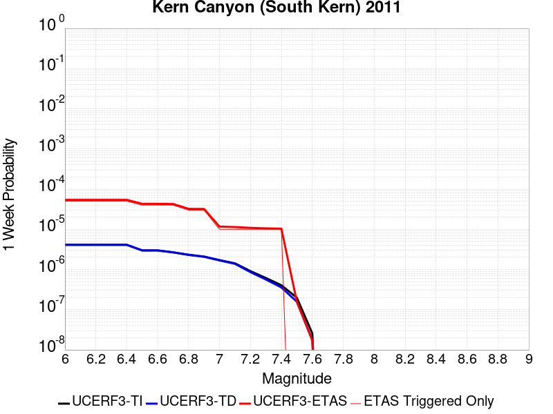 |  |  |  |

| Magnitude | 1 wk TI Prob | 1 wk TD Prob | 1 wk ETAS Prob | 1 wk ETAS/TD Gain | 1 wk ETAS Triggered Only | 1 mo TI Prob | 1 mo TD Prob | 1 mo ETAS Prob | 1 mo ETAS/TD Gain | 1 mo ETAS Triggered Only | 1 yr TI Prob | 1 yr TD Prob | 1 yr ETAS Prob | 1 yr ETAS/TD Gain | 1 yr ETAS Triggered Only | 10 yr TI Prob | 10 yr TD Prob | 10 yr ETAS Prob | 10 yr ETAS/TD Gain | 10 yr ETAS Triggered Only |
|-----|-----|-----|-----|-----|-----|-----|-----|-----|-----|-----|-----|-----|-----|-----|-----|-----|-----|-----|-----|-----|
| 6.0 | 4.105075E-6 | 4.1137264E-6 | 5.411352E-5 | 13.15438 | 5.0E-5 | 1.7593058E-5 | 1.763014E-5 | 7.762908E-5 | 4.4032025 | 6.0E-5 | 2.1417443E-4 | 2.1462646E-4 | 3.2460285E-4 | 1.5124084 | 1.1E-4 | 0.0021396813 | 0.0021442557 | 0.0022540197 | 1.0511899 | 1.1E-4 |
| 6.1 | 4.105075E-6 | 4.1137264E-6 | 5.411352E-5 | 13.15438 | 5.0E-5 | 1.7593058E-5 | 1.763014E-5 | 7.762908E-5 | 4.4032025 | 6.0E-5 | 2.1417443E-4 | 2.1462646E-4 | 3.2460285E-4 | 1.5124084 | 1.1E-4 | 0.0021396813 | 0.0021442557 | 0.0022540197 | 1.0511899 | 1.1E-4 |
| 6.2 | 4.105075E-6 | 4.1137264E-6 | 5.411352E-5 | 13.15438 | 5.0E-5 | 1.7593058E-5 | 1.763014E-5 | 7.762908E-5 | 4.4032025 | 6.0E-5 | 2.1417443E-4 | 2.1462646E-4 | 3.2460285E-4 | 1.5124084 | 1.1E-4 | 0.0021396813 | 0.0021442557 | 0.0022540197 | 1.0511899 | 1.1E-4 |
| 6.3 | 4.105075E-6 | 4.1137264E-6 | 5.411352E-5 | 13.15438 | 5.0E-5 | 1.7593058E-5 | 1.763014E-5 | 7.762908E-5 | 4.4032025 | 6.0E-5 | 2.1417443E-4 | 2.1462646E-4 | 3.2460285E-4 | 1.5124084 | 1.1E-4 | 0.0021396813 | 0.0021442557 | 0.0022540197 | 1.0511899 | 1.1E-4 |
| 6.4 | 4.105075E-6 | 4.1137264E-6 | 5.411352E-5 | 13.15438 | 5.0E-5 | 1.7593058E-5 | 1.763014E-5 | 7.762908E-5 | 4.4032025 | 6.0E-5 | 2.1417443E-4 | 2.1462646E-4 | 3.2460285E-4 | 1.5124084 | 1.1E-4 | 0.0021396813 | 0.0021442557 | 0.0022540197 | 1.0511899 | 1.1E-4 |
| 6.5 | 2.9849807E-6 | 2.9731548E-6 | 4.2973035E-5 | 14.453683 | 4.0E-5 | 1.2792712E-5 | 1.274203E-5 | 5.274152E-5 | 4.1391773 | 4.0E-5 | 1.5574014E-4 | 1.5512333E-4 | 2.3511091E-4 | 1.5156387 | 8.0E-5 | 0.0015563103 | 0.0015501656 | 0.0016300416 | 1.0515274 | 8.0E-5 |
| 6.6 | 2.9849807E-6 | 2.9731548E-6 | 4.2973035E-5 | 14.453683 | 4.0E-5 | 1.2792712E-5 | 1.274203E-5 | 5.274152E-5 | 4.1391773 | 4.0E-5 | 1.5574014E-4 | 1.5512333E-4 | 2.3511091E-4 | 1.5156387 | 8.0E-5 | 0.0015563103 | 0.0015501656 | 0.0016300416 | 1.0515274 | 8.0E-5 |
| 6.7 | 2.6756725E-6 | 2.6582206E-6 | 4.2658114E-5 | 16.047619 | 4.0E-5 | 1.1467117E-5 | 1.1392325E-5 | 5.139187E-5 | 4.5110955 | 4.0E-5 | 1.396032E-4 | 1.3869285E-4 | 2.0868314E-4 | 1.5046424 | 7.0E-5 | 0.0013951553 | 0.0013860738 | 0.0014559767 | 1.0504323 | 7.0E-5 |
| 6.8 | 2.3283721E-6 | 2.3047787E-6 | 3.230471E-5 | 14.016403 | 3.0E-5 | 9.9787E-6 | 9.877586E-6 | 3.987729E-5 | 4.037149 | 3.0E-5 | 1.214839E-4 | 1.20253055E-4 | 1.8024584E-4 | 1.4988878 | 6.0E-5 | 0.001214175 | 0.0012018873 | 0.0012618152 | 1.0498614 | 6.0E-5 |
| 6.9 | 2.0972677E-6 | 2.0696411E-6 | 3.206958E-5 | 15.495236 | 3.0E-5 | 8.988259E-6 | 8.869861E-6 | 3.8869595E-5 | 4.3822103 | 3.0E-5 | 1.0942656E-4 | 1.0798526E-4 | 1.6797878E-4 | 1.5555714 | 6.0E-5 | 0.0010937268 | 0.0010793337 | 0.001139269 | 1.0555298 | 6.0E-5 |
| 7.0 | 1.7132242E-6 | 1.6787036E-6 | 1.1678687E-5 | 6.956968 | 1.0E-5 | 7.3423685E-6 | 7.194424E-6 | 1.7194352E-5 | 2.3899553 | 1.0E-5 | 8.938967E-5 | 8.758863E-5 | 1.2758512E-4 | 1.4566402 | 4.0E-5 | 8.935372E-4 | 8.7554497E-4 | 9.1550994E-4 | 1.0456458 | 4.0E-5 |
| 7.1 | 1.4215541E-6 | 1.3815752E-6 | 1.1381561E-5 | 8.238105 | 1.0E-5 | 6.0923603E-6 | 5.9210233E-6 | 1.5920965E-5 | 2.6888874 | 1.0E-5 | 7.417196E-5 | 7.20861E-5 | 1.1208322E-4 | 1.554852 | 4.0E-5 | 7.414721E-4 | 7.206299E-4 | 7.606011E-4 | 1.055467 | 4.0E-5 |
| 7.2 | 9.097853E-7 | 8.6037755E-7 | 1.0860369E-5 | 12.622794 | 1.0E-5 | 3.899074E-6 | 3.6873273E-6 | 1.368729E-5 | 3.7119815 | 1.0E-5 | 4.7470192E-5 | 4.4892295E-5 | 5.4891847E-5 | 1.2227454 | 1.0E-5 | 4.7460053E-4 | 4.4883334E-4 | 4.5882884E-4 | 1.02227 | 1.0E-5 |
| 7.3 | 6.144169E-7 | 5.628206E-7 | 1.0562815E-5 | 18.767641 | 1.0E-5 | 2.6332125E-6 | 2.4120861E-6 | 1.24120625E-5 | 5.1457787 | 1.0E-5 | 3.205889E-5 | 2.9366758E-5 | 3.9366467E-5 | 1.3405111 | 1.0E-5 | 3.2054266E-4 | 2.936293E-4 | 3.0362635E-4 | 1.0340465 | 1.0E-5 |
| 7.4 | 4.049844E-7 | 3.5728314E-7 | 1.0357279E-5 | 28.988997 | 1.0E-5 | 1.7356463E-6 | 1.5312125E-6 | 1.1531197E-5 | 7.530762 | 1.0E-5 | 2.1131287E-5 | 1.8642357E-5 | 2.864217E-5 | 1.536403 | 1.0E-5 | 2.1129279E-4 | 1.8640817E-4 | 1.964063E-4 | 1.0536357 | 1.0E-5 |
| 7.5 | 1.9871162E-7 | 1.583044E-7 | 1.583044E-7 | 1.0 | 0.0 | 8.5162094E-7 | 6.7844724E-7 | 6.7844724E-7 | 1.0 | 0.0 | 1.0368436E-5 | 8.260065E-6 | 8.260065E-6 | 1.0 | 0.0 | 1.0367952E-4 | 8.259767E-5 | 8.259767E-5 | 1.0 | 0.0 |
| 7.6 | 2.572245E-8 | 1.7352555E-8 | 1.7352555E-8 | 1.0 | 0.0 | 1.10239064E-7 | 7.436809E-8 | 7.436809E-8 | 1.0 | 0.0 | 1.3421597E-6 | 9.054312E-7 | 9.054312E-7 | 1.0 | 0.0 | 1.3421517E-5 | 9.05428E-6 | 9.05428E-6 | 1.0 | 0.0 |

## San Diego Trough south
*[(top)](#table-of-contents)*

| 1 Week | 1 Month | 1 Year | 10 Year |
|-----|-----|-----|-----|
|  |  |  |  |

| Magnitude | 1 wk TI Prob | 1 wk TD Prob | 1 wk ETAS Prob | 1 wk ETAS/TD Gain | 1 wk ETAS Triggered Only | 1 mo TI Prob | 1 mo TD Prob | 1 mo ETAS Prob | 1 mo ETAS/TD Gain | 1 mo ETAS Triggered Only | 1 yr TI Prob | 1 yr TD Prob | 1 yr ETAS Prob | 1 yr ETAS/TD Gain | 1 yr ETAS Triggered Only | 10 yr TI Prob | 10 yr TD Prob | 10 yr ETAS Prob | 10 yr ETAS/TD Gain | 10 yr ETAS Triggered Only |
|-----|-----|-----|-----|-----|-----|-----|-----|-----|-----|-----|-----|-----|-----|-----|-----|-----|-----|-----|-----|-----|
| 6.0 | 8.279495E-5 | 1.04241306E-4 | 1.6423505E-4 | 1.5755275 | 6.0E-5 | 3.5478722E-4 | 4.4667677E-4 | 5.166455E-4 | 1.1566429 | 7.0E-5 | 0.004310982 | 0.0054256152 | 0.005515127 | 1.016498 | 9.0E-5 | 0.042283054 | 0.05299221 | 0.05309638 | 1.0019658 | 1.1E-4 |
| 6.1 | 4.6961468E-5 | 5.772944E-5 | 9.7727134E-5 | 1.6928474 | 4.0E-5 | 2.0124791E-4 | 2.473894E-4 | 2.8737952E-4 | 1.1616484 | 4.0E-5 | 0.00244744 | 0.0030079768 | 0.0030677964 | 1.019887 | 6.0E-5 | 0.024206603 | 0.029679462 | 0.029737681 | 1.0019616 | 6.0E-5 |
| 6.2 | 3.5079658E-5 | 4.214154E-5 | 7.2140276E-5 | 1.7118567 | 3.0E-5 | 1.5033272E-4 | 1.8059435E-4 | 2.1058893E-4 | 1.1660881 | 3.0E-5 | 0.0018287642 | 0.0021965632 | 0.0022464532 | 1.0227128 | 5.0E-5 | 0.018137876 | 0.021751117 | 0.02180003 | 1.0022488 | 5.0E-5 |
| 6.3 | 3.5079658E-5 | 4.214154E-5 | 7.2140276E-5 | 1.7118567 | 3.0E-5 | 1.5033272E-4 | 1.8059435E-4 | 2.1058893E-4 | 1.1660881 | 3.0E-5 | 0.0018287642 | 0.0021965632 | 0.0022464532 | 1.0227128 | 5.0E-5 | 0.018137876 | 0.021751117 | 0.02180003 | 1.0022488 | 5.0E-5 |
| 6.4 | 2.7196904E-5 | 3.2087162E-5 | 6.2086205E-5 | 1.9349233 | 3.0E-5 | 1.16552954E-4 | 1.3750927E-4 | 1.6750515E-4 | 1.2181371 | 3.0E-5 | 0.0014181085 | 0.0016729041 | 0.0017228205 | 1.0298381 | 5.0E-5 | 0.014090929 | 0.016604643 | 0.016653813 | 1.0029612 | 5.0E-5 |
| 6.5 | 2.5584688E-5 | 3.010164E-5 | 6.0100738E-5 | 1.9965935 | 3.0E-5 | 1.0964406E-4 | 1.2900073E-4 | 1.5899687E-4 | 1.2325268 | 3.0E-5 | 0.0013340989 | 0.0015694655 | 0.0016193871 | 1.031808 | 5.0E-5 | 0.013261181 | 0.015585314 | 0.015634535 | 1.0031581 | 5.0E-5 |
| 6.6 | 2.2034688E-5 | 2.5742738E-5 | 5.5741966E-5 | 2.165347 | 3.0E-5 | 9.443096E-5 | 1.1032141E-4 | 1.403181E-4 | 1.2719027 | 3.0E-5 | 0.0011490905 | 0.0013423424 | 0.0013922752 | 1.0371983 | 5.0E-5 | 0.011431668 | 0.013343317 | 0.0133926505 | 1.0036972 | 5.0E-5 |
| 6.7 | 1.9394853E-5 | 2.254176E-5 | 4.254131E-5 | 1.8872222 | 2.0E-5 | 8.311815E-5 | 9.6603995E-5 | 1.1660207E-4 | 1.2070107 | 2.0E-5 | 0.0010114936 | 0.0011755243 | 0.0012154772 | 1.0339874 | 4.0E-5 | 0.01006902 | 0.011693766 | 0.011733298 | 1.0033807 | 4.0E-5 |
| 6.8 | 1.7615313E-5 | 2.0403182E-5 | 4.0402774E-5 | 1.9802192 | 2.0E-5 | 7.549201E-5 | 8.74393E-5 | 1.07437554E-4 | 1.22871 | 2.0E-5 | 9.1872766E-4 | 0.0010640579 | 0.0011040154 | 1.0375519 | 4.0E-5 | 0.009149387 | 0.010590198 | 0.010629774 | 1.0037371 | 4.0E-5 |
| 6.9 | 1.5621423E-5 | 1.8026114E-5 | 3.8025755E-5 | 2.1094813 | 2.0E-5 | 6.6947236E-5 | 7.725251E-5 | 9.7250966E-5 | 1.2588713 | 2.0E-5 | 8.147778E-4 | 9.40147E-4 | 9.801093E-4 | 1.0425066 | 4.0E-5 | 0.008117969 | 0.009362142 | 0.0094017675 | 1.0042325 | 4.0E-5 |
| 7.0 | 1.3444376E-5 | 1.544809E-5 | 3.544778E-5 | 2.2946386 | 2.0E-5 | 5.7617483E-5 | 6.620443E-5 | 8.620311E-5 | 1.3020746 | 2.0E-5 | 7.0126704E-4 | 8.057436E-4 | 8.457114E-4 | 1.0496036 | 4.0E-5 | 0.006990582 | 0.008028555 | 0.008068234 | 1.0049422 | 4.0E-5 |
| 7.1 | 1.2268361E-5 | 1.407303E-5 | 3.407275E-5 | 2.421138 | 2.0E-5 | 5.2577634E-5 | 6.0311606E-5 | 8.03104E-5 | 1.3315911 | 2.0E-5 | 6.399447E-4 | 7.3404907E-4 | 7.740197E-4 | 1.0544523 | 4.0E-5 | 0.0063810493 | 0.0073165493 | 0.0073562562 | 1.005427 | 4.0E-5 |
| 7.2 | 1.0922655E-5 | 1.2513563E-5 | 3.251331E-5 | 2.5982459 | 2.0E-5 | 4.681054E-5 | 5.3628468E-5 | 7.3627394E-5 | 1.3729162 | 2.0E-5 | 5.697693E-4 | 6.5273355E-4 | 6.927074E-4 | 1.0612408 | 4.0E-5 | 0.0056831064 | 0.0065084435 | 0.0065481835 | 1.0061059 | 4.0E-5 |
| 7.3 | 6.1106753E-6 | 6.928925E-6 | 1.6928856E-5 | 2.4432154 | 1.0E-5 | 2.6188345E-5 | 2.9695057E-5 | 3.9694758E-5 | 1.3367463 | 1.0E-5 | 3.1879646E-4 | 3.6147775E-4 | 3.914669E-4 | 1.0829626 | 3.0E-5 | 0.0031833951 | 0.003608943 | 0.0036388347 | 1.0082827 | 3.0E-5 |
| 7.4 | 4.933187E-6 | 5.5895525E-6 | 5.5895525E-6 | 1.0 | 0.0 | 2.114206E-5 | 2.3955008E-5 | 2.3955008E-5 | 1.0 | 0.0 | 2.5737417E-4 | 2.9161357E-4 | 3.0161065E-4 | 1.034282 | 1.0E-5 | 0.002570763 | 0.0029123505 | 0.0029223212 | 1.0034237 | 1.0E-5 |
| 7.5 | 1.7489613E-6 | 1.969678E-6 | 1.969678E-6 | 1.0 | 0.0 | 7.495527E-6 | 8.4414505E-6 | 8.4414505E-6 | 1.0 | 0.0 | 9.125422E-5 | 1.02770035E-4 | 1.1276901E-4 | 1.0972946 | 1.0E-5 | 9.1216754E-4 | 0.0010272472 | 0.0010372369 | 1.0097247 | 1.0E-5 |
| 7.6 | 1.6988751E-7 | 1.7533823E-7 | 1.7533823E-7 | 1.0 | 0.0 | 7.2808916E-7 | 7.5144936E-7 | 7.5144936E-7 | 1.0 | 0.0 | 8.864449E-6 | 9.14886E-6 | 9.14886E-6 | 1.0 | 0.0 | 8.8640954E-5 | 9.1485024E-5 | 9.1485024E-5 | 1.0 | 0.0 |

## Tin Mountain
*[(top)](#table-of-contents)*

| 1 Week | 1 Month | 1 Year | 10 Year |
|-----|-----|-----|-----|
|  | 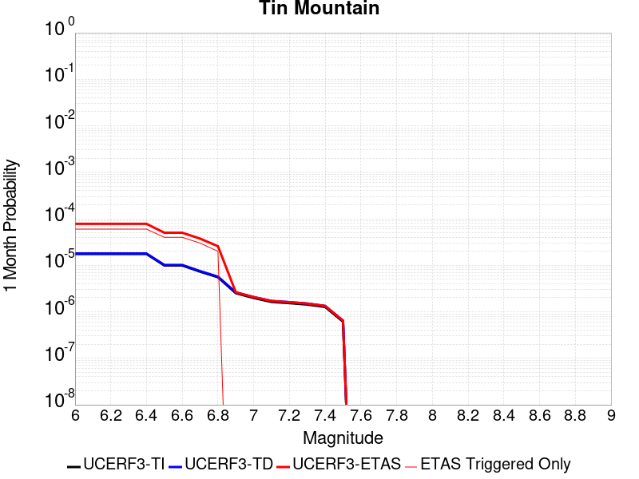 |  |  |

| Magnitude | 1 wk TI Prob | 1 wk TD Prob | 1 wk ETAS Prob | 1 wk ETAS/TD Gain | 1 wk ETAS Triggered Only | 1 mo TI Prob | 1 mo TD Prob | 1 mo ETAS Prob | 1 mo ETAS/TD Gain | 1 mo ETAS Triggered Only | 1 yr TI Prob | 1 yr TD Prob | 1 yr ETAS Prob | 1 yr ETAS/TD Gain | 1 yr ETAS Triggered Only | 10 yr TI Prob | 10 yr TD Prob | 10 yr ETAS Prob | 10 yr ETAS/TD Gain | 10 yr ETAS Triggered Only |
|-----|-----|-----|-----|-----|-----|-----|-----|-----|-----|-----|-----|-----|-----|-----|-----|-----|-----|-----|-----|-----|
| 6.0 | 4.083776E-6 | 4.1815365E-6 | 6.418129E-5 | 15.348732 | 6.0E-5 | 1.750178E-5 | 1.792077E-5 | 7.791969E-5 | 4.3480105 | 6.0E-5 | 2.1306332E-4 | 2.1816725E-4 | 2.981498E-4 | 1.3666111 | 8.0E-5 | 0.0021285915 | 0.0021798965 | 0.0022896565 | 1.0503511 | 1.1E-4 |
| 6.1 | 4.083776E-6 | 4.1815365E-6 | 6.418129E-5 | 15.348732 | 6.0E-5 | 1.750178E-5 | 1.792077E-5 | 7.791969E-5 | 4.3480105 | 6.0E-5 | 2.1306332E-4 | 2.1816725E-4 | 2.981498E-4 | 1.3666111 | 8.0E-5 | 0.0021285915 | 0.0021798965 | 0.0022896565 | 1.0503511 | 1.1E-4 |
| 6.2 | 4.083776E-6 | 4.1815365E-6 | 6.418129E-5 | 15.348732 | 6.0E-5 | 1.750178E-5 | 1.792077E-5 | 7.791969E-5 | 4.3480105 | 6.0E-5 | 2.1306332E-4 | 2.1816725E-4 | 2.981498E-4 | 1.3666111 | 8.0E-5 | 0.0021285915 | 0.0021798965 | 0.0022896565 | 1.0503511 | 1.1E-4 |
| 6.3 | 4.083776E-6 | 4.1815365E-6 | 6.418129E-5 | 15.348732 | 6.0E-5 | 1.750178E-5 | 1.792077E-5 | 7.791969E-5 | 4.3480105 | 6.0E-5 | 2.1306332E-4 | 2.1816725E-4 | 2.981498E-4 | 1.3666111 | 8.0E-5 | 0.0021285915 | 0.0021798965 | 0.0022896565 | 1.0503511 | 1.1E-4 |
| 6.4 | 4.083776E-6 | 4.1815365E-6 | 6.418129E-5 | 15.348732 | 6.0E-5 | 1.750178E-5 | 1.792077E-5 | 7.791969E-5 | 4.3480105 | 6.0E-5 | 2.1306332E-4 | 2.1816725E-4 | 2.981498E-4 | 1.3666111 | 8.0E-5 | 0.0021285915 | 0.0021798965 | 0.0022896565 | 1.0503511 | 1.1E-4 |
| 6.5 | 2.3143427E-6 | 2.3731573E-6 | 4.2373063E-5 | 17.855145 | 4.0E-5 | 9.9185745E-6 | 1.0170638E-5 | 5.017023E-5 | 4.93285 | 4.0E-5 | 1.2075195E-4 | 1.2382126E-4 | 1.7381506E-4 | 1.4037579 | 5.0E-5 | 0.0012068636 | 0.0012375986 | 0.0012875367 | 1.0403508 | 5.0E-5 |
| 6.6 | 2.3143427E-6 | 2.3731573E-6 | 4.2373063E-5 | 17.855145 | 4.0E-5 | 9.9185745E-6 | 1.0170638E-5 | 5.017023E-5 | 4.93285 | 4.0E-5 | 1.2075195E-4 | 1.2382126E-4 | 1.7381506E-4 | 1.4037579 | 5.0E-5 | 0.0012068636 | 0.0012375986 | 0.0012875367 | 1.0403508 | 5.0E-5 |
| 6.7 | 1.7029532E-6 | 1.7497915E-6 | 3.174974E-5 | 18.14487 | 3.0E-5 | 7.2983503E-6 | 7.499088E-6 | 3.7498863E-5 | 5.0004563 | 3.0E-5 | 8.885379E-5 | 9.1298105E-5 | 1.3129445E-4 | 1.4380852 | 4.0E-5 | 8.881827E-4 | 9.1265864E-4 | 9.526221E-4 | 1.043788 | 4.0E-5 |
| 6.8 | 1.2914646E-6 | 1.3299378E-6 | 2.1329912E-5 | 16.038277 | 2.0E-5 | 5.534837E-6 | 5.6997237E-6 | 2.569961E-5 | 4.508922 | 2.0E-5 | 6.738455E-5 | 6.939237E-5 | 8.939098E-5 | 1.2881961 | 2.0E-5 | 6.736412E-4 | 6.9375033E-4 | 7.1373646E-4 | 1.0288088 | 2.0E-5 |
| 6.9 | 5.8708974E-7 | 6.1169936E-7 | 6.1169936E-7 | 1.0 | 0.0 | 2.5160964E-6 | 2.6215664E-6 | 2.6215664E-6 | 1.0 | 0.0 | 3.0633044E-5 | 3.1917145E-5 | 3.1917145E-5 | 1.0 | 0.0 | 3.0628822E-4 | 3.191297E-4 | 3.191297E-4 | 1.0 | 0.0 |
| 7.0 | 4.6248786E-7 | 4.832015E-7 | 4.832015E-7 | 1.0 | 0.0 | 1.9820893E-6 | 2.0708624E-6 | 2.0708624E-6 | 1.0 | 0.0 | 2.413167E-5 | 2.5212494E-5 | 2.5212494E-5 | 1.0 | 0.0 | 2.412905E-4 | 2.5210003E-4 | 2.5210003E-4 | 1.0 | 0.0 |
| 7.1 | 3.804606E-7 | 3.987147E-7 | 3.987147E-7 | 1.0 | 0.0 | 1.6305444E-6 | 1.7087764E-6 | 1.7087764E-6 | 1.0 | 0.0 | 1.9851697E-5 | 2.0804187E-5 | 2.0804187E-5 | 1.0 | 0.0 | 1.9849923E-4 | 2.0802575E-4 | 2.0802575E-4 | 1.0 | 0.0 |
| 7.2 | 3.5864858E-7 | 3.7616863E-7 | 3.7616863E-7 | 1.0 | 0.0 | 1.5370645E-6 | 1.6121504E-6 | 1.6121504E-6 | 1.0 | 0.0 | 1.87136E-5 | 1.9627789E-5 | 1.9627789E-5 | 1.0 | 0.0 | 1.8712023E-4 | 1.9626386E-4 | 1.9626386E-4 | 1.0 | 0.0 |
| 7.3 | 3.342063E-7 | 3.506347E-7 | 3.506347E-7 | 1.0 | 0.0 | 1.4323119E-6 | 1.5027196E-6 | 1.5027196E-6 | 1.0 | 0.0 | 1.7438259E-5 | 1.829549E-5 | 1.829549E-5 | 1.0 | 0.0 | 1.743689E-4 | 1.8294314E-4 | 1.8294314E-4 | 1.0 | 0.0 |
| 7.4 | 2.971242E-7 | 3.1165817E-7 | 3.1165817E-7 | 1.0 | 0.0 | 1.2733886E-6 | 1.3356774E-6 | 1.3356774E-6 | 1.0 | 0.0 | 1.5503398E-5 | 1.6261785E-5 | 1.6261785E-5 | 1.0 | 0.0 | 1.5502315E-4 | 1.6260923E-4 | 1.6260923E-4 | 1.0 | 0.0 |
| 7.5 | 1.4326713E-7 | 1.5012525E-7 | 1.5012525E-7 | 1.0 | 0.0 | 6.140018E-7 | 6.433939E-7 | 6.433939E-7 | 1.0 | 0.0 | 7.4754466E-6 | 7.8333205E-6 | 7.8333205E-6 | 1.0 | 0.0 | 7.475195E-5 | 7.833321E-5 | 7.833321E-5 | 1.0 | 0.0 |

## Newport-Inglewood alt 1
*[(top)](#table-of-contents)*

| 1 Week | 1 Month | 1 Year | 10 Year |
|-----|-----|-----|-----|
|  |  |  |  |

| Magnitude | 1 wk TI Prob | 1 wk TD Prob | 1 wk ETAS Prob | 1 wk ETAS/TD Gain | 1 wk ETAS Triggered Only | 1 mo TI Prob | 1 mo TD Prob | 1 mo ETAS Prob | 1 mo ETAS/TD Gain | 1 mo ETAS Triggered Only | 1 yr TI Prob | 1 yr TD Prob | 1 yr ETAS Prob | 1 yr ETAS/TD Gain | 1 yr ETAS Triggered Only | 10 yr TI Prob | 10 yr TD Prob | 10 yr ETAS Prob | 10 yr ETAS/TD Gain | 10 yr ETAS Triggered Only |
|-----|-----|-----|-----|-----|-----|-----|-----|-----|-----|-----|-----|-----|-----|-----|-----|-----|-----|-----|-----|-----|
| 6.0 | 2.9668912E-5 | 3.0404817E-5 | 9.0402995E-5 | 2.9733114 | 6.0E-5 | 1.2714628E-4 | 1.303026E-4 | 2.0029348E-4 | 1.5371411 | 7.0E-5 | 0.0015469068 | 0.0015857625 | 0.0016656356 | 1.0503689 | 8.0E-5 | 0.015361829 | 0.015792042 | 0.015890464 | 1.0062323 | 1.0E-4 |
| 6.1 | 2.9668912E-5 | 3.0404817E-5 | 9.0402995E-5 | 2.9733114 | 6.0E-5 | 1.2714628E-4 | 1.303026E-4 | 2.0029348E-4 | 1.5371411 | 7.0E-5 | 0.0015469068 | 0.0015857625 | 0.0016656356 | 1.0503689 | 8.0E-5 | 0.015361829 | 0.015792042 | 0.015890464 | 1.0062323 | 1.0E-4 |
| 6.2 | 2.9668912E-5 | 3.0404817E-5 | 9.0402995E-5 | 2.9733114 | 6.0E-5 | 1.2714628E-4 | 1.303026E-4 | 2.0029348E-4 | 1.5371411 | 7.0E-5 | 0.0015469068 | 0.0015857625 | 0.0016656356 | 1.0503689 | 8.0E-5 | 0.015361829 | 0.015792042 | 0.015890464 | 1.0062323 | 1.0E-4 |
| 6.3 | 2.9668912E-5 | 3.0404817E-5 | 9.0402995E-5 | 2.9733114 | 6.0E-5 | 1.2714628E-4 | 1.303026E-4 | 2.0029348E-4 | 1.5371411 | 7.0E-5 | 0.0015469068 | 0.0015857625 | 0.0016656356 | 1.0503689 | 8.0E-5 | 0.015361829 | 0.015792042 | 0.015890464 | 1.0062323 | 1.0E-4 |
| 6.4 | 1.275942E-5 | 1.0272503E-5 | 3.0272296E-5 | 2.9469252 | 2.0E-5 | 5.4682085E-5 | 4.402429E-5 | 7.402297E-5 | 1.681412 | 3.0E-5 | 6.65551E-4 | 5.358681E-4 | 5.7584664E-4 | 1.0746052 | 4.0E-5 | 0.0066356123 | 0.005346184 | 0.0053959168 | 1.0093025 | 5.0E-5 |
| 6.5 | 1.275942E-5 | 1.0272503E-5 | 3.0272296E-5 | 2.9469252 | 2.0E-5 | 5.4682085E-5 | 4.402429E-5 | 7.402297E-5 | 1.681412 | 3.0E-5 | 6.65551E-4 | 5.358681E-4 | 5.7584664E-4 | 1.0746052 | 4.0E-5 | 0.0066356123 | 0.005346184 | 0.0053959168 | 1.0093025 | 5.0E-5 |
| 6.6 | 1.1255358E-5 | 8.661884E-6 | 2.866171E-5 | 3.3089466 | 2.0E-5 | 4.8236358E-5 | 3.712184E-5 | 5.71211E-5 | 1.5387464 | 2.0E-5 | 5.871194E-4 | 4.518664E-4 | 4.8185283E-4 | 1.0663613 | 3.0E-5 | 0.005855706 | 0.004509653 | 0.0045494726 | 1.0088298 | 4.0E-5 |
| 6.7 | 1.0504745E-5 | 7.8997955E-6 | 2.7899638E-5 | 3.531691 | 2.0E-5 | 4.5019555E-5 | 3.3855835E-5 | 5.3855158E-5 | 1.5907202 | 2.0E-5 | 5.4797524E-4 | 4.1211807E-4 | 4.421057E-4 | 1.0727646 | 3.0E-5 | 0.0054662596 | 0.004113668 | 0.0041535036 | 1.0096837 | 4.0E-5 |
| 6.8 | 1.0476007E-5 | 7.881176E-6 | 2.7881018E-5 | 3.537672 | 2.0E-5 | 4.4896402E-5 | 3.3776043E-5 | 5.3775366E-5 | 1.5921158 | 2.0E-5 | 5.464766E-4 | 4.1114696E-4 | 4.4113462E-4 | 1.0729367 | 3.0E-5 | 0.005451347 | 0.0041039926 | 0.0041438285 | 1.0097066 | 4.0E-5 |
| 6.9 | 9.076797E-6 | 6.4896312E-6 | 2.64895E-5 | 4.081819 | 2.0E-5 | 3.889998E-5 | 2.781241E-5 | 4.7811853E-5 | 1.7190834 | 2.0E-5 | 4.7350433E-4 | 3.385638E-4 | 3.6855365E-4 | 1.0885795 | 3.0E-5 | 0.004724967 | 0.0033805177 | 0.0034203825 | 1.0117925 | 4.0E-5 |
| 7.0 | 8.73795E-6 | 6.2120125E-6 | 2.6211888E-5 | 4.2195487 | 2.0E-5 | 3.7447822E-5 | 2.6622642E-5 | 4.662211E-5 | 1.7512202 | 2.0E-5 | 4.5583185E-4 | 3.2408274E-4 | 3.4407625E-4 | 1.0616926 | 2.0E-5 | 0.0045489795 | 0.0032361327 | 0.0032660356 | 1.0092403 | 3.0E-5 |
| 7.1 | 8.391299E-6 | 5.95579E-6 | 2.5955671E-5 | 4.358057 | 2.0E-5 | 3.5962214E-5 | 2.5524565E-5 | 4.5524055E-5 | 1.7835388 | 2.0E-5 | 4.37752E-4 | 3.1071753E-4 | 3.3071134E-4 | 1.0643471 | 2.0E-5 | 0.004368907 | 0.0031028606 | 0.0031327675 | 1.0096385 | 3.0E-5 |
| 7.2 | 7.796882E-6 | 5.4965344E-6 | 2.5496423E-5 | 4.6386366 | 2.0E-5 | 3.341478E-5 | 2.3556364E-5 | 4.3555894E-5 | 1.8490075 | 2.0E-5 | 4.06749E-4 | 2.867612E-4 | 3.0675545E-4 | 1.0697244 | 2.0E-5 | 0.0040600533 | 0.0028639357 | 0.0028938497 | 1.0104451 | 3.0E-5 |
| 7.3 | 6.4738833E-6 | 4.6478162E-6 | 2.4647723E-5 | 5.303076 | 2.0E-5 | 2.774492E-5 | 1.9919062E-5 | 3.9918665E-5 | 2.0040433 | 2.0E-5 | 3.3774204E-4 | 2.4248775E-4 | 2.6248288E-4 | 1.0824584 | 2.0E-5 | 0.0033722918 | 0.0024222482 | 0.0024521756 | 1.0123552 | 3.0E-5 |
| 7.4 | 5.382145E-6 | 3.8857597E-6 | 1.3885721E-5 | 3.5734892 | 1.0E-5 | 2.3066134E-5 | 1.665315E-5 | 2.6652984E-5 | 1.600477 | 1.0E-5 | 2.8079396E-4 | 2.0273338E-4 | 2.1273135E-4 | 1.0493158 | 1.0E-5 | 0.0028043943 | 0.0020254988 | 0.0020454584 | 1.0098541 | 2.0E-5 |
| 7.5 | 3.648244E-6 | 2.5737843E-6 | 2.5737843E-6 | 1.0 | 0.0 | 1.5635238E-5 | 1.1030458E-5 | 1.1030458E-5 | 1.0 | 0.0 | 1.9034238E-4 | 1.3428765E-4 | 1.3428765E-4 | 1.0 | 0.0 | 0.0019017943 | 0.0013420755 | 0.0013520621 | 1.0074412 | 1.0E-5 |
| 7.6 | 2.2906888E-6 | 1.5479842E-6 | 1.5479842E-6 | 1.0 | 0.0 | 9.817201E-6 | 6.634202E-6 | 6.634202E-6 | 1.0 | 0.0 | 1.1951787E-4 | 8.076848E-5 | 8.076848E-5 | 1.0 | 0.0 | 0.0011945361 | 8.07398E-4 | 8.07398E-4 | 1.0 | 0.0 |
| 7.7 | 6.0479874E-7 | 3.397512E-7 | 3.397512E-7 | 1.0 | 0.0 | 2.5919921E-6 | 1.4560758E-6 | 1.4560758E-6 | 1.0 | 0.0 | 3.1557047E-5 | 1.7727592E-5 | 1.7727592E-5 | 1.0 | 0.0 | 3.1552566E-4 | 1.7726317E-4 | 1.7726317E-4 | 1.0 | 0.0 |
| 7.8 | 1.16056995E-8 | 9.782373E-9 | 9.782373E-9 | 1.0 | 0.0 | 4.9738713E-8 | 4.1924455E-8 | 4.1924455E-8 | 1.0 | 0.0 | 6.0556863E-7 | 5.1043025E-7 | 5.1043025E-7 | 1.0 | 0.0 | 6.05567E-6 | 5.1043025E-6 | 5.1043025E-6 | 1.0 | 0.0 |

## San Juan
*[(top)](#table-of-contents)*

| 1 Week | 1 Month | 1 Year | 10 Year |
|-----|-----|-----|-----|
| 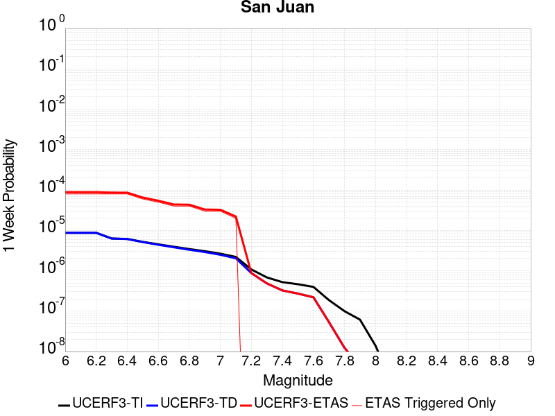 |  |  |  |

| Magnitude | 1 wk TI Prob | 1 wk TD Prob | 1 wk ETAS Prob | 1 wk ETAS/TD Gain | 1 wk ETAS Triggered Only | 1 mo TI Prob | 1 mo TD Prob | 1 mo ETAS Prob | 1 mo ETAS/TD Gain | 1 mo ETAS Triggered Only | 1 yr TI Prob | 1 yr TD Prob | 1 yr ETAS Prob | 1 yr ETAS/TD Gain | 1 yr ETAS Triggered Only | 10 yr TI Prob | 10 yr TD Prob | 10 yr ETAS Prob | 10 yr ETAS/TD Gain | 10 yr ETAS Triggered Only |
|-----|-----|-----|-----|-----|-----|-----|-----|-----|-----|-----|-----|-----|-----|-----|-----|-----|-----|-----|-----|-----|
| 6.0 | 8.682808E-6 | 8.7491635E-6 | 8.8748464E-5 | 10.143651 | 8.0E-5 | 3.72115E-5 | 3.74959E-5 | 1.2749253E-4 | 3.4001722 | 9.0E-5 | 4.5295584E-4 | 4.564218E-4 | 5.563762E-4 | 1.2189956 | 1.0E-4 | 0.004520337 | 0.004555385 | 0.0046549295 | 1.021852 | 1.0E-4 |
| 6.1 | 8.682808E-6 | 8.7491635E-6 | 8.8748464E-5 | 10.143651 | 8.0E-5 | 3.72115E-5 | 3.74959E-5 | 1.2749253E-4 | 3.4001722 | 9.0E-5 | 4.5295584E-4 | 4.564218E-4 | 5.563762E-4 | 1.2189956 | 1.0E-4 | 0.004520337 | 0.004555385 | 0.0046549295 | 1.021852 | 1.0E-4 |
| 6.2 | 8.682808E-6 | 8.7491635E-6 | 8.8748464E-5 | 10.143651 | 8.0E-5 | 3.72115E-5 | 3.74959E-5 | 1.2749253E-4 | 3.4001722 | 9.0E-5 | 4.5295584E-4 | 4.564218E-4 | 5.563762E-4 | 1.2189956 | 1.0E-4 | 0.004520337 | 0.004555385 | 0.0046549295 | 1.021852 | 1.0E-4 |
| 6.3 | 6.3054235E-6 | 6.2825848E-6 | 8.628208E-5 | 13.733532 | 8.0E-5 | 2.7022963E-5 | 2.6925094E-5 | 1.0692294E-4 | 3.971126 | 8.0E-5 | 3.2895492E-4 | 3.2776513E-4 | 4.177356E-4 | 1.2744969 | 9.0E-5 | 0.003284684 | 0.003273017 | 0.0033627222 | 1.0274075 | 9.0E-5 |
| 6.4 | 6.1490473E-6 | 6.1144656E-6 | 8.611398E-5 | 14.083647 | 8.0E-5 | 2.6352795E-5 | 2.6204598E-5 | 1.06202504E-4 | 4.0528193 | 8.0E-5 | 3.2079802E-4 | 3.1899565E-4 | 4.0896694E-4 | 1.2820455 | 9.0E-5 | 0.0032033534 | 0.0031855737 | 0.003275287 | 1.0281624 | 9.0E-5 |
| 6.5 | 5.204848E-6 | 5.137233E-6 | 6.513693E-5 | 12.6793785 | 6.0E-5 | 2.23063E-5 | 2.2016533E-5 | 8.201521E-5 | 3.7251647 | 6.0E-5 | 2.7154534E-4 | 2.6801927E-4 | 3.380005E-4 | 1.2611052 | 7.0E-5 | 0.0027121378 | 0.0026771144 | 0.002746927 | 1.0260775 | 7.0E-5 |
| 6.6 | 4.5179986E-6 | 4.4150297E-6 | 5.441481E-5 | 12.324902 | 5.0E-5 | 1.9362706E-5 | 1.8921424E-5 | 6.8920475E-5 | 3.6424572 | 5.0E-5 | 2.3571544E-4 | 2.3034477E-4 | 2.8033325E-4 | 1.2170159 | 5.0E-5 | 0.0023546559 | 0.0023011973 | 0.0023510822 | 1.0216779 | 5.0E-5 |
| 6.7 | 3.9442616E-6 | 3.819828E-6 | 4.3819677E-5 | 11.471636 | 4.0E-5 | 1.6903869E-5 | 1.6370592E-5 | 5.6369936E-5 | 3.4433658 | 4.0E-5 | 2.0578515E-4 | 1.992944E-4 | 2.3928643E-4 | 1.2006681 | 4.0E-5 | 0.002055947 | 0.0019912818 | 0.002031202 | 1.0200475 | 4.0E-5 |
| 6.8 | 3.4536245E-6 | 3.3163353E-6 | 4.3316202E-5 | 13.061466 | 4.0E-5 | 1.4801163E-5 | 1.4212792E-5 | 5.421222E-5 | 3.814326 | 4.0E-5 | 1.8018926E-4 | 1.7302761E-4 | 2.1302068E-4 | 1.2311369 | 4.0E-5 | 0.0018004322 | 0.0017290477 | 0.0017689787 | 1.0230942 | 4.0E-5 |
| 6.9 | 3.059865E-6 | 2.9120315E-6 | 3.2911943E-5 | 11.302056 | 3.0E-5 | 1.3113641E-5 | 1.2480078E-5 | 4.2479704E-5 | 3.403801 | 3.0E-5 | 1.596469E-4 | 1.5193493E-4 | 1.8193037E-4 | 1.197423 | 3.0E-5 | 0.0015953224 | 0.0015184252 | 0.0015483797 | 1.0197273 | 3.0E-5 |
| 7.0 | 2.6504351E-6 | 2.4920002E-6 | 3.2491924E-5 | 13.038492 | 3.0E-5 | 1.1358958E-5 | 1.0679961E-5 | 4.067964E-5 | 3.8089693 | 3.0E-5 | 1.3828653E-4 | 1.300213E-4 | 1.600174E-4 | 1.2307014 | 3.0E-5 | 0.0013820052 | 0.0012995641 | 0.0013295253 | 1.0230547 | 3.0E-5 |
| 7.1 | 2.2039317E-6 | 2.0338296E-6 | 2.203379E-5 | 10.833646 | 2.0E-5 | 9.445387E-6 | 8.716386E-6 | 2.8716211E-5 | 3.294509 | 2.0E-5 | 1.1499152E-4 | 1.0611736E-4 | 1.2611524E-4 | 1.1884506 | 2.0E-5 | 0.0011493203 | 0.0010607769 | 0.0010807557 | 1.0188341 | 2.0E-5 |
| 7.2 | 1.0786707E-6 | 8.7701903E-7 | 8.7701903E-7 | 1.0 | 0.0 | 4.622866E-6 | 3.7586476E-6 | 3.7586476E-6 | 1.0 | 0.0 | 5.628194E-5 | 4.5760586E-5 | 4.5760586E-5 | 1.0 | 0.0 | 5.6267687E-4 | 4.5757066E-4 | 4.5757066E-4 | 1.0 | 0.0 |
| 7.3 | 6.846433E-7 | 4.868805E-7 | 4.868805E-7 | 1.0 | 0.0 | 2.9341822E-6 | 2.086629E-6 | 2.086629E-6 | 1.0 | 0.0 | 3.5723086E-5 | 2.5404412E-5 | 2.5404412E-5 | 1.0 | 0.0 | 3.571734E-4 | 2.540486E-4 | 2.540486E-4 | 1.0 | 0.0 |
| 7.4 | 5.23043E-7 | 3.2628162E-7 | 3.2628162E-7 | 1.0 | 0.0 | 2.2416111E-6 | 1.398349E-6 | 1.398349E-6 | 1.0 | 0.0 | 2.7291273E-5 | 1.7024766E-5 | 1.7024766E-5 | 1.0 | 0.0 | 2.7287923E-4 | 1.7026656E-4 | 1.7026656E-4 | 1.0 | 0.0 |
| 7.5 | 4.648444E-7 | 2.7234944E-7 | 2.7234944E-7 | 1.0 | 0.0 | 1.9921886E-6 | 1.1672114E-6 | 1.1672114E-6 | 1.0 | 0.0 | 2.4254627E-5 | 1.42107065E-5 | 1.42107065E-5 | 1.0 | 0.0 | 2.425198E-4 | 1.421276E-4 | 1.421276E-4 | 1.0 | 0.0 |
| 7.6 | 3.9906567E-7 | 2.2083314E-7 | 2.2083314E-7 | 1.0 | 0.0 | 1.7102802E-6 | 9.464274E-7 | 9.464274E-7 | 1.0 | 0.0 | 2.0822463E-5 | 1.1522693E-5 | 1.1522693E-5 | 1.0 | 0.0 | 2.0820512E-4 | 1.15245566E-4 | 1.15245566E-4 | 1.0 | 0.0 |
| 7.7 | 1.8784601E-7 | 5.3666906E-8 | 5.3666906E-8 | 1.0 | 0.0 | 8.0505407E-7 | 2.30001E-7 | 2.30001E-7 | 1.0 | 0.0 | 9.80149E-6 | 2.8002585E-6 | 2.8002585E-6 | 1.0 | 0.0 | 9.801057E-5 | 2.8011282E-5 | 2.8011282E-5 | 1.0 | 0.0 |
| 7.8 | 1.00154914E-7 | 1.2415832E-8 | 1.2415832E-8 | 1.0 | 0.0 | 4.2923529E-7 | 5.3210716E-8 | 5.3210716E-8 | 1.0 | 0.0 | 5.225927E-6 | 6.4784024E-7 | 6.4784024E-7 | 1.0 | 0.0 | 5.225804E-5 | 6.484273E-6 | 6.484273E-6 | 1.0 | 0.0 |
| 7.9 | 6.171429E-8 | 4.2966155E-9 | 4.2966155E-9 | 1.0 | 0.0 | 2.6448978E-7 | 1.8414067E-8 | 1.8414067E-8 | 1.0 | 0.0 | 3.2201583E-6 | 2.2419121E-7 | 2.2419121E-7 | 1.0 | 0.0 | 3.2201115E-5 | 2.2472002E-6 | 2.2472002E-6 | 1.0 | 0.0 |
| 8.0 | 1.3974572E-8 | 3.3788217E-10 | 3.3788217E-10 | 1.0 | 0.0 | 5.989102E-8 | 1.448067E-9 | 1.448067E-9 | 1.0 | 0.0 | 7.2917294E-7 | 1.763022E-8 | 1.763022E-8 | 1.0 | 0.0 | 7.2917055E-6 | 1.8060365E-7 | 1.8060365E-7 | 1.0 | 0.0 |
| 8.1 | 1.8403477E-9 | 1.1302803E-10 | 1.1302803E-10 | 1.0 | 0.0 | 7.887204E-9 | 4.844063E-10 | 4.844063E-10 | 1.0 | 0.0 | 9.602671E-8 | 5.8976446E-9 | 5.8976446E-9 | 1.0 | 0.0 | 9.602667E-7 | 6.021993E-8 | 6.021993E-8 | 1.0 | 0.0 |

## Calaveras (So) - Paicines extension 2011 CFM
*[(top)](#table-of-contents)*

| 1 Week | 1 Month | 1 Year | 10 Year |
|-----|-----|-----|-----|
|  |  |  |  |

| Magnitude | 1 wk TI Prob | 1 wk TD Prob | 1 wk ETAS Prob | 1 wk ETAS/TD Gain | 1 wk ETAS Triggered Only | 1 mo TI Prob | 1 mo TD Prob | 1 mo ETAS Prob | 1 mo ETAS/TD Gain | 1 mo ETAS Triggered Only | 1 yr TI Prob | 1 yr TD Prob | 1 yr ETAS Prob | 1 yr ETAS/TD Gain | 1 yr ETAS Triggered Only | 10 yr TI Prob | 10 yr TD Prob | 10 yr ETAS Prob | 10 yr ETAS/TD Gain | 10 yr ETAS Triggered Only |
|-----|-----|-----|-----|-----|-----|-----|-----|-----|-----|-----|-----|-----|-----|-----|-----|-----|-----|-----|-----|-----|
| 6.0 | 1.5183659E-4 | 3.0533716E-4 | 3.2533106E-4 | 1.0654813 | 2.0E-5 | 6.5056595E-4 | 0.0013069661 | 0.00132694 | 1.0152826 | 2.0E-5 | 0.007891912 | 0.01569571 | 0.01576461 | 1.0043898 | 7.0E-5 | 0.076174594 | 0.13848671 | 0.13855565 | 1.0004977 | 8.0E-5 |
| 6.1 | 1.5024997E-4 | 3.0227835E-4 | 3.222723E-4 | 1.0661442 | 2.0E-5 | 6.437695E-4 | 0.00129387 | 0.0013138441 | 1.0154375 | 2.0E-5 | 0.0078097614 | 0.015539104 | 0.015608016 | 1.0044347 | 7.0E-5 | 0.075409345 | 0.13715632 | 0.13722536 | 1.0005033 | 8.0E-5 |
| 6.2 | 1.2743923E-4 | 2.5306802E-4 | 2.7306296E-4 | 1.0790101 | 2.0E-5 | 5.460538E-4 | 0.0010841049 | 0.0011040833 | 1.0184284 | 2.0E-5 | 0.0066279583 | 0.013046704 | 0.013096051 | 1.0037824 | 5.0E-5 | 0.064337276 | 0.11725405 | 0.117298186 | 1.0003765 | 5.0E-5 |
| 6.3 | 1.1525114E-4 | 2.2595265E-4 | 2.4594812E-4 | 1.0884941 | 2.0E-5 | 4.9383997E-4 | 9.6799526E-4 | 9.87976E-4 | 1.0206412 | 2.0E-5 | 0.0059959386 | 0.011667927 | 0.011717344 | 1.0042353 | 5.0E-5 | 0.058367174 | 0.10637007 | 0.10641475 | 1.0004201 | 5.0E-5 |
| 6.4 | 1.07200925E-4 | 2.0836305E-4 | 2.2835888E-4 | 1.0959663 | 2.0E-5 | 4.5935164E-4 | 8.926636E-4 | 9.126457E-4 | 1.0223849 | 2.0E-5 | 0.0055782744 | 0.010772766 | 0.010822226 | 1.0045913 | 5.0E-5 | 0.0544031 | 0.09919256 | 0.0992376 | 1.0004541 | 5.0E-5 |
| 6.5 | 9.69631E-5 | 1.8729115E-4 | 2.072874E-4 | 1.1067656 | 2.0E-5 | 4.1548995E-4 | 8.024135E-4 | 8.223975E-4 | 1.0249048 | 2.0E-5 | 0.0050468626 | 0.009694662 | 0.009734275 | 1.004086 | 4.0E-5 | 0.04933773 | 0.090084255 | 0.09012065 | 1.000404 | 4.0E-5 |
| 6.6 | 8.0552316E-5 | 1.5070537E-4 | 1.7070236E-4 | 1.1326892 | 2.0E-5 | 3.4517853E-4 | 6.456994E-4 | 6.6568644E-4 | 1.0309541 | 2.0E-5 | 0.0041944524 | 0.007826256 | 0.007865943 | 1.005071 | 4.0E-5 | 0.04116161 | 0.074854024 | 0.07489103 | 1.0004944 | 4.0E-5 |
| 6.7 | 7.815757E-5 | 1.4610609E-4 | 1.6610317E-4 | 1.1368668 | 2.0E-5 | 3.34918E-4 | 6.260017E-4 | 6.4598914E-4 | 1.0319288 | 2.0E-5 | 0.004070005 | 0.0075890915 | 0.0076287882 | 1.0052307 | 4.0E-5 | 0.039962657 | 0.072703585 | 0.072740674 | 1.0005102 | 4.0E-5 |
| 6.8 | 6.965264E-5 | 1.2721405E-4 | 1.472115E-4 | 1.1571953 | 2.0E-5 | 2.9847719E-4 | 5.450839E-4 | 5.65073E-4 | 1.0366716 | 2.0E-5 | 0.0036279052 | 0.00661342 | 0.0066432212 | 1.0045062 | 3.0E-5 | 0.03569247 | 0.06379891 | 0.06382699 | 1.0004402 | 3.0E-5 |
| 6.9 | 5.8000453E-5 | 1.01435086E-4 | 1.1143407E-4 | 1.0985752 | 1.0E-5 | 2.4854968E-4 | 4.3464993E-4 | 4.446456E-4 | 1.022997 | 1.0E-5 | 0.0030218933 | 0.0052791284 | 0.005299023 | 1.0037686 | 2.0E-5 | 0.029811295 | 0.051501602 | 0.05152057 | 1.0003684 | 2.0E-5 |
| 7.0 | 4.9865852E-5 | 8.567692E-5 | 9.567606E-5 | 1.1167076 | 1.0E-5 | 2.1369329E-4 | 3.671356E-4 | 3.7713192E-4 | 1.0272279 | 1.0E-5 | 0.0025986114 | 0.0044608037 | 0.0044807144 | 1.0044636 | 2.0E-5 | 0.025684336 | 0.043781694 | 0.043800816 | 1.0004368 | 2.0E-5 |
| 7.1 | 4.283875E-5 | 7.112159E-5 | 8.1120874E-5 | 1.1405942 | 1.0E-5 | 1.8358172E-4 | 3.047715E-4 | 3.1476846E-4 | 1.0328015 | 1.0E-5 | 0.0022328163 | 0.003704336 | 0.0037242621 | 1.0053791 | 2.0E-5 | 0.022105146 | 0.03673583 | 0.036755096 | 1.0005244 | 2.0E-5 |
| 7.2 | 3.450115E-5 | 5.5776054E-5 | 6.57755E-5 | 1.1792784 | 1.0E-5 | 1.478537E-4 | 2.390185E-4 | 2.490161E-4 | 1.0418278 | 1.0E-5 | 0.0017986323 | 0.0029061958 | 0.0029261378 | 1.0068618 | 2.0E-5 | 0.017841442 | 0.029079199 | 0.029098617 | 1.0006678 | 2.0E-5 |
| 7.3 | 2.5709045E-5 | 4.0588155E-5 | 5.058775E-5 | 1.2463673 | 1.0E-5 | 1.1017697E-4 | 1.7393773E-4 | 1.8393599E-4 | 1.0574819 | 1.0E-5 | 0.0013405791 | 0.002115652 | 0.0021356097 | 1.0094334 | 2.0E-5 | 0.013325208 | 0.021297242 | 0.021316817 | 1.0009191 | 2.0E-5 |
| 7.4 | 1.8003093E-5 | 2.8509934E-5 | 3.850965E-5 | 1.350745 | 1.0E-5 | 7.715383E-5 | 1.2217973E-4 | 1.3217851E-4 | 1.0818367 | 1.0E-5 | 9.3894306E-4 | 0.0014865254 | 0.0015064958 | 1.0134342 | 2.0E-5 | 0.009349857 | 0.015052196 | 0.015071895 | 1.0013087 | 2.0E-5 |
| 7.5 | 1.5595824E-5 | 2.5822499E-5 | 3.582224E-5 | 1.3872492 | 1.0E-5 | 6.683753E-5 | 1.1066317E-4 | 1.20662065E-4 | 1.0903543 | 1.0E-5 | 8.134431E-4 | 0.0013464936 | 0.0013664666 | 1.0148335 | 2.0E-5 | 0.008104719 | 0.01365213 | 0.013671857 | 1.0014449 | 2.0E-5 |
| 7.6 | 1.1110309E-5 | 1.9222098E-5 | 2.9221905E-5 | 1.5202246 | 1.0E-5 | 4.761474E-5 | 8.2377825E-5 | 9.2377E-5 | 1.1213819 | 1.0E-5 | 5.795553E-4 | 0.0010024898 | 0.0010224698 | 1.0199304 | 2.0E-5 | 0.0057804612 | 0.010203943 | 0.010223739 | 1.00194 | 2.0E-5 |
| 7.7 | 6.2140443E-6 | 1.0437076E-5 | 2.0436972E-5 | 1.9581127 | 1.0E-5 | 2.6631347E-5 | 4.4729557E-5 | 5.4729113E-5 | 1.2235558 | 1.0E-5 | 3.241884E-4 | 5.444464E-4 | 5.644355E-4 | 1.0367146 | 2.0E-5 | 0.0032371588 | 0.005619835 | 0.0056397226 | 1.0035388 | 2.0E-5 |
| 7.8 | 5.305533E-6 | 9.433038E-6 | 1.9432944E-5 | 2.0600939 | 1.0E-5 | 2.27378E-5 | 4.042668E-5 | 5.0426275E-5 | 1.2473514 | 1.0E-5 | 2.7679754E-4 | 4.920837E-4 | 5.120739E-4 | 1.0406235 | 2.0E-5 | 0.0027645302 | 0.005074324 | 0.0050942227 | 1.0039214 | 2.0E-5 |
| 7.9 | 3.363505E-6 | 7.3848937E-6 | 7.3848937E-6 | 1.0 | 0.0 | 1.4414942E-5 | 3.164916E-5 | 3.164916E-5 | 1.0 | 0.0 | 1.7548777E-4 | 3.8526047E-4 | 3.9525662E-4 | 1.0259465 | 1.0E-5 | 0.0017534926 | 0.003948527 | 0.0039584874 | 1.0025226 | 1.0E-5 |
| 8.0 | 2.0271132E-6 | 4.413104E-6 | 4.413104E-6 | 1.0 | 0.0 | 8.687599E-6 | 1.8913164E-5 | 1.8913164E-5 | 1.0 | 0.0 | 1.05766376E-4 | 2.302435E-4 | 2.4024119E-4 | 1.0434222 | 1.0E-5 | 0.0010571606 | 0.002351099 | 0.0023610755 | 1.0042434 | 1.0E-5 |
| 8.1 | 1.2206116E-6 | 2.3751331E-6 | 2.3751331E-6 | 1.0 | 0.0 | 5.2311816E-6 | 1.0179103E-5 | 1.0179103E-5 | 1.0 | 0.0 | 6.3687774E-5 | 1.2392356E-4 | 1.2392356E-4 | 1.0 | 0.0 | 6.366953E-4 | 0.0012705477 | 0.0012705477 | 1.0 | 0.0 |

## Monterey Bay-Tularcitos
*[(top)](#table-of-contents)*

| 1 Week | 1 Month | 1 Year | 10 Year |
|-----|-----|-----|-----|
|  | 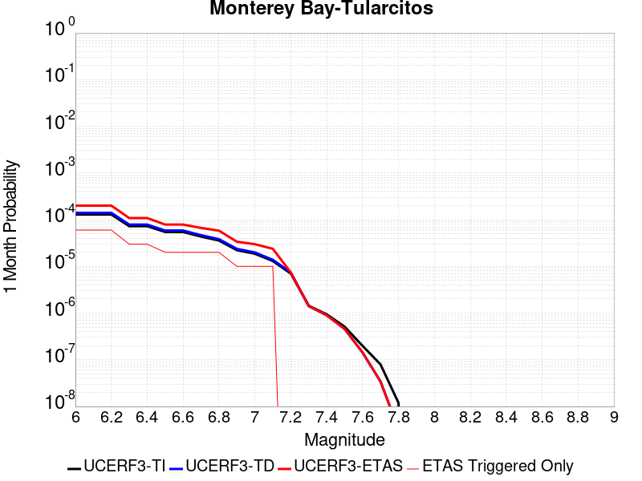 | 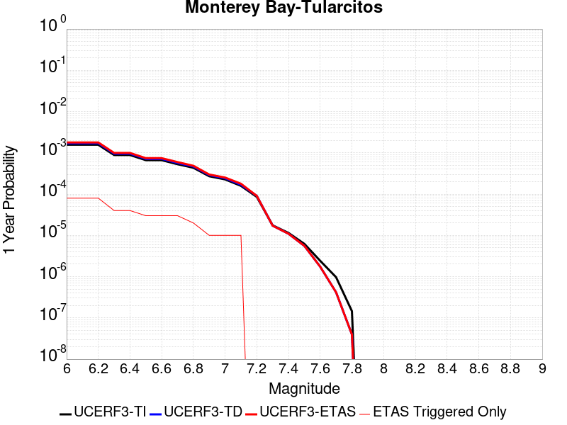 |  |

| Magnitude | 1 wk TI Prob | 1 wk TD Prob | 1 wk ETAS Prob | 1 wk ETAS/TD Gain | 1 wk ETAS Triggered Only | 1 mo TI Prob | 1 mo TD Prob | 1 mo ETAS Prob | 1 mo ETAS/TD Gain | 1 mo ETAS Triggered Only | 1 yr TI Prob | 1 yr TD Prob | 1 yr ETAS Prob | 1 yr ETAS/TD Gain | 1 yr ETAS Triggered Only | 10 yr TI Prob | 10 yr TD Prob | 10 yr ETAS Prob | 10 yr ETAS/TD Gain | 10 yr ETAS Triggered Only |
|-----|-----|-----|-----|-----|-----|-----|-----|-----|-----|-----|-----|-----|-----|-----|-----|-----|-----|-----|-----|-----|
| 6.0 | 3.0131365E-5 | 3.279877E-5 | 7.279746E-5 | 2.219518 | 4.0E-5 | 1.2912804E-4 | 1.4055918E-4 | 2.0055076E-4 | 1.4268064 | 6.0E-5 | 0.001571 | 0.0017100703 | 0.0017899334 | 1.0467017 | 8.0E-5 | 0.015599402 | 0.016979916 | 0.017068388 | 1.0052104 | 9.0E-5 |
| 6.1 | 3.0131365E-5 | 3.279877E-5 | 7.279746E-5 | 2.219518 | 4.0E-5 | 1.2912804E-4 | 1.4055918E-4 | 2.0055076E-4 | 1.4268064 | 6.0E-5 | 0.001571 | 0.0017100703 | 0.0017899334 | 1.0467017 | 8.0E-5 | 0.015599402 | 0.016979916 | 0.017068388 | 1.0052104 | 9.0E-5 |
| 6.2 | 3.0131365E-5 | 3.279877E-5 | 7.279746E-5 | 2.219518 | 4.0E-5 | 1.2912804E-4 | 1.4055918E-4 | 2.0055076E-4 | 1.4268064 | 6.0E-5 | 0.001571 | 0.0017100703 | 0.0017899334 | 1.0467017 | 8.0E-5 | 0.015599402 | 0.016979916 | 0.017068388 | 1.0052104 | 9.0E-5 |
| 6.3 | 1.6998249E-5 | 1.8330798E-5 | 3.8330432E-5 | 2.09104 | 2.0E-5 | 7.28476E-5 | 7.85583E-5 | 1.0855595E-4 | 1.381852 | 3.0E-5 | 8.865586E-4 | 9.5604634E-4 | 9.96008E-4 | 1.041799 | 4.0E-5 | 0.0088303005 | 0.009521258 | 0.009570782 | 1.0052015 | 5.0E-5 |
| 6.4 | 1.6998249E-5 | 1.8330798E-5 | 3.8330432E-5 | 2.09104 | 2.0E-5 | 7.28476E-5 | 7.85583E-5 | 1.0855595E-4 | 1.381852 | 3.0E-5 | 8.865586E-4 | 9.5604634E-4 | 9.96008E-4 | 1.041799 | 4.0E-5 | 0.0088303005 | 0.009521258 | 0.009570782 | 1.0052015 | 5.0E-5 |
| 6.5 | 1.27470785E-5 | 1.3693312E-5 | 2.3693176E-5 | 1.7302735 | 1.0E-5 | 5.4629192E-5 | 5.8684363E-5 | 7.868319E-5 | 1.3407863 | 2.0E-5 | 6.649074E-4 | 7.1425823E-4 | 7.442368E-4 | 1.0419716 | 3.0E-5 | 0.0066292146 | 0.007120678 | 0.0071504647 | 1.004183 | 3.0E-5 |
| 6.6 | 1.2739422E-5 | 1.36854E-5 | 2.3685263E-5 | 1.7306957 | 1.0E-5 | 5.4596385E-5 | 5.8650454E-5 | 7.864928E-5 | 1.3409834 | 2.0E-5 | 6.645082E-4 | 7.1384566E-4 | 7.4382423E-4 | 1.0419959 | 3.0E-5 | 0.0066252467 | 0.007116579 | 0.0071463655 | 1.0041856 | 3.0E-5 |
| 6.7 | 1.0160109E-5 | 1.0885755E-5 | 2.0885645E-5 | 1.9186218 | 1.0E-5 | 4.35426E-5 | 4.665244E-5 | 6.6651504E-5 | 1.4286821 | 2.0E-5 | 5.300022E-4 | 5.6785246E-4 | 5.9783546E-4 | 1.0528007 | 3.0E-5 | 0.005287399 | 0.0056647263 | 0.005694556 | 1.005266 | 3.0E-5 |
| 6.8 | 8.349859E-6 | 8.932587E-6 | 1.8932498E-5 | 2.1194866 | 1.0E-5 | 3.578462E-5 | 3.8281985E-5 | 5.828122E-5 | 1.522419 | 2.0E-5 | 4.3559066E-4 | 4.6598914E-4 | 4.8597984E-4 | 1.0428995 | 2.0E-5 | 0.004347378 | 0.004650685 | 0.004670592 | 1.0042804 | 2.0E-5 |
| 6.9 | 5.193639E-6 | 5.53643E-6 | 1.5536374E-5 | 2.8062081 | 1.0E-5 | 2.2258262E-5 | 2.372736E-5 | 3.3727123E-5 | 1.4214444 | 1.0E-5 | 2.7096065E-4 | 2.8884556E-4 | 2.9884267E-4 | 1.0346106 | 1.0E-5 | 0.0027063051 | 0.0028850222 | 0.0028949934 | 1.0034562 | 1.0E-5 |
| 7.0 | 4.359381E-6 | 4.643366E-6 | 1.4643319E-5 | 3.1536002 | 1.0E-5 | 1.8682927E-5 | 1.9900004E-5 | 2.9899806E-5 | 1.5025024 | 1.0E-5 | 2.274409E-4 | 2.422586E-4 | 2.5225617E-4 | 1.0412682 | 1.0E-5 | 0.0022720827 | 0.002420238 | 0.0024302138 | 1.0041218 | 1.0E-5 |
| 7.1 | 3.0398533E-6 | 3.2310427E-6 | 1.3231011E-5 | 4.0949664 | 1.0E-5 | 1.3027877E-5 | 1.3847267E-5 | 2.3847128E-5 | 1.7221541 | 1.0E-5 | 1.5860285E-4 | 1.6858005E-4 | 1.7857837E-4 | 1.059309 | 1.0E-5 | 0.001584897 | 0.0016847793 | 0.0016947625 | 1.0059255 | 1.0E-5 |
| 7.2 | 1.642335E-6 | 1.7333153E-6 | 1.7333153E-6 | 1.0 | 0.0 | 7.0385595E-6 | 7.428485E-6 | 7.428485E-6 | 1.0 | 0.0 | 8.569109E-5 | 9.044012E-5 | 9.044012E-5 | 1.0 | 0.0 | 8.5658056E-4 | 9.042358E-4 | 9.042358E-4 | 1.0 | 0.0 |
| 7.3 | 3.356842E-7 | 3.2952389E-7 | 3.2952389E-7 | 1.0 | 0.0 | 1.4386458E-6 | 1.4122444E-6 | 1.4122444E-6 | 1.0 | 0.0 | 1.7515373E-5 | 1.7193941E-5 | 1.7193941E-5 | 1.0 | 0.0 | 1.7513991E-4 | 1.719262E-4 | 1.719262E-4 | 1.0 | 0.0 |
| 7.4 | 2.1973483E-7 | 2.1006413E-7 | 2.1006413E-7 | 1.0 | 0.0 | 9.417204E-7 | 9.0027453E-7 | 9.0027453E-7 | 1.0 | 0.0 | 1.1465385E-5 | 1.0960787E-5 | 1.0960787E-5 | 1.0 | 0.0 | 1.1464794E-4 | 1.096025E-4 | 1.096025E-4 | 1.0 | 0.0 |
| 7.5 | 1.1944135E-7 | 1.0696043E-7 | 1.0696043E-7 | 1.0 | 0.0 | 5.118914E-7 | 4.5840173E-7 | 4.5840173E-7 | 1.0 | 0.0 | 6.23226E-6 | 5.581027E-6 | 5.581027E-6 | 1.0 | 0.0 | 6.2320854E-5 | 5.5808883E-5 | 5.5808883E-5 | 1.0 | 0.0 |
| 7.6 | 4.636058E-8 | 3.336489E-8 | 3.336489E-8 | 1.0 | 0.0 | 1.9868818E-7 | 1.4299238E-7 | 1.4299238E-7 | 1.0 | 0.0 | 2.419026E-6 | 1.7409308E-6 | 1.7409308E-6 | 1.0 | 0.0 | 2.4189996E-5 | 1.7409173E-5 | 1.7409173E-5 | 1.0 | 0.0 |
| 7.7 | 1.8588572E-8 | 8.003744E-9 | 8.003744E-9 | 1.0 | 0.0 | 7.9665305E-8 | 3.430176E-8 | 3.430176E-8 | 1.0 | 0.0 | 9.699246E-7 | 4.1762385E-7 | 4.1762385E-7 | 1.0 | 0.0 | 9.699204E-6 | 4.176231E-6 | 4.176231E-6 | 1.0 | 0.0 |
| 7.8 | 2.7960154E-9 | 7.6099427E-10 | 7.6099427E-10 | 1.0 | 0.0 | 1.1982923E-8 | 3.2614043E-9 | 3.2614043E-9 | 1.0 | 0.0 | 1.4589209E-7 | 3.9707597E-8 | 3.9707597E-8 | 1.0 | 0.0 | 1.4589199E-6 | 3.9707595E-7 | 3.9707595E-7 | 1.0 | 0.0 |

## Cleghorn
*[(top)](#table-of-contents)*

| 1 Week | 1 Month | 1 Year | 10 Year |
|-----|-----|-----|-----|
|  |  |  |  |

| Magnitude | 1 wk TI Prob | 1 wk TD Prob | 1 wk ETAS Prob | 1 wk ETAS/TD Gain | 1 wk ETAS Triggered Only | 1 mo TI Prob | 1 mo TD Prob | 1 mo ETAS Prob | 1 mo ETAS/TD Gain | 1 mo ETAS Triggered Only | 1 yr TI Prob | 1 yr TD Prob | 1 yr ETAS Prob | 1 yr ETAS/TD Gain | 1 yr ETAS Triggered Only | 10 yr TI Prob | 10 yr TD Prob | 10 yr ETAS Prob | 10 yr ETAS/TD Gain | 10 yr ETAS Triggered Only |
|-----|-----|-----|-----|-----|-----|-----|-----|-----|-----|-----|-----|-----|-----|-----|-----|-----|-----|-----|-----|-----|
| 6.0 | 7.9267165E-6 | 9.831582E-6 | 7.98309E-5 | 8.119842 | 7.0E-5 | 3.39712E-5 | 4.2134732E-5 | 1.2213136E-4 | 2.898591 | 8.0E-5 | 4.1352084E-4 | 5.128803E-4 | 6.028341E-4 | 1.1753895 | 9.0E-5 | 0.004127522 | 0.0051320773 | 0.005231564 | 1.0193853 | 1.0E-4 |
| 6.1 | 7.9267165E-6 | 9.831582E-6 | 7.98309E-5 | 8.119842 | 7.0E-5 | 3.39712E-5 | 4.2134732E-5 | 1.2213136E-4 | 2.898591 | 8.0E-5 | 4.1352084E-4 | 5.128803E-4 | 6.028341E-4 | 1.1753895 | 9.0E-5 | 0.004127522 | 0.0051320773 | 0.005231564 | 1.0193853 | 1.0E-4 |
| 6.2 | 7.9267165E-6 | 9.831582E-6 | 7.98309E-5 | 8.119842 | 7.0E-5 | 3.39712E-5 | 4.2134732E-5 | 1.2213136E-4 | 2.898591 | 8.0E-5 | 4.1352084E-4 | 5.128803E-4 | 6.028341E-4 | 1.1753895 | 9.0E-5 | 0.004127522 | 0.0051320773 | 0.005231564 | 1.0193853 | 1.0E-4 |
| 6.3 | 7.9267165E-6 | 9.831582E-6 | 7.98309E-5 | 8.119842 | 7.0E-5 | 3.39712E-5 | 4.2134732E-5 | 1.2213136E-4 | 2.898591 | 8.0E-5 | 4.1352084E-4 | 5.128803E-4 | 6.028341E-4 | 1.1753895 | 9.0E-5 | 0.004127522 | 0.0051320773 | 0.005231564 | 1.0193853 | 1.0E-4 |
| 6.4 | 4.3445207E-6 | 6.0914435E-6 | 3.609126E-5 | 5.924911 | 3.0E-5 | 1.8619241E-5 | 2.610593E-5 | 6.610488E-5 | 2.5321789 | 4.0E-5 | 2.2666567E-4 | 3.1779436E-4 | 3.6777847E-4 | 1.1572845 | 5.0E-5 | 0.0022643462 | 0.0031875873 | 0.003247396 | 1.0187631 | 6.0E-5 |
| 6.5 | 4.3445207E-6 | 6.0914435E-6 | 3.609126E-5 | 5.924911 | 3.0E-5 | 1.8619241E-5 | 2.610593E-5 | 6.610488E-5 | 2.5321789 | 4.0E-5 | 2.2666567E-4 | 3.1779436E-4 | 3.6777847E-4 | 1.1572845 | 5.0E-5 | 0.0022643462 | 0.0031875873 | 0.003247396 | 1.0187631 | 6.0E-5 |
| 6.6 | 4.040109E-6 | 5.773851E-6 | 1.5773794E-5 | 2.7319362 | 1.0E-5 | 1.7314638E-5 | 2.4744846E-5 | 4.4744353E-5 | 1.8082291 | 2.0E-5 | 2.1078532E-4 | 3.012278E-4 | 3.2122177E-4 | 1.0663749 | 2.0E-5 | 0.002105855 | 0.003022377 | 0.0030522863 | 1.0098959 | 3.0E-5 |
| 6.7 | 3.3632055E-6 | 5.067348E-6 | 1.5067298E-5 | 2.973409 | 1.0E-5 | 1.4413658E-5 | 2.1717027E-5 | 4.1716594E-5 | 1.9209164 | 2.0E-5 | 1.7547216E-4 | 2.6437303E-4 | 2.8436776E-4 | 1.0756307 | 2.0E-5 | 0.0017533366 | 0.0026547113 | 0.0026846316 | 1.0112706 | 3.0E-5 |
| 6.8 | 3.2902772E-6 | 4.9892556E-6 | 1.4989206E-5 | 3.004297 | 1.0E-5 | 1.4101111E-5 | 2.1382351E-5 | 4.138192E-5 | 1.9353309 | 2.0E-5 | 1.716675E-4 | 2.6029933E-4 | 2.8029413E-4 | 1.0768147 | 2.0E-5 | 0.0017153495 | 0.0026140702 | 0.0026439917 | 1.0114464 | 3.0E-5 |
| 6.9 | 3.031547E-6 | 4.6910186E-6 | 4.6910186E-6 | 1.0 | 0.0 | 1.299228E-5 | 2.0104211E-5 | 3.010401E-5 | 1.4973983 | 1.0E-5 | 1.5816953E-4 | 2.4474156E-4 | 2.547391E-4 | 1.0408494 | 1.0E-5 | 0.00158057 | 0.0024588439 | 0.0024787947 | 1.0081139 | 2.0E-5 |
| 7.0 | 2.8259715E-6 | 4.3705895E-6 | 4.3705895E-6 | 1.0 | 0.0 | 1.211125E-5 | 1.8730963E-5 | 2.8730776E-5 | 1.5338653 | 1.0E-5 | 1.4744449E-4 | 2.2802586E-4 | 2.3802358E-4 | 1.0438447 | 1.0E-5 | 0.001473467 | 0.0022920412 | 0.0023119953 | 1.0087059 | 2.0E-5 |
| 7.1 | 2.5962665E-6 | 4.0658106E-6 | 4.0658106E-6 | 1.0 | 0.0 | 1.1126809E-5 | 1.7424789E-5 | 2.7424614E-5 | 1.5738851 | 1.0E-5 | 1.3546048E-4 | 2.1212637E-4 | 2.2212425E-4 | 1.0471317 | 1.0E-5 | 0.0013537793 | 0.002133366 | 0.0021533233 | 1.0093548 | 2.0E-5 |
| 7.2 | 2.3247253E-6 | 3.6763672E-6 | 3.6763672E-6 | 1.0 | 0.0 | 9.96307E-6 | 1.5755764E-5 | 1.5755764E-5 | 1.0 | 0.0 | 1.21293626E-4 | 1.9180974E-4 | 1.9180974E-4 | 1.0 | 0.0 | 0.0012122744 | 0.0019305905 | 0.0019405711 | 1.0051697 | 1.0E-5 |
| 7.3 | 2.056928E-6 | 3.2350938E-6 | 3.2350938E-6 | 1.0 | 0.0 | 8.815376E-6 | 1.3864615E-5 | 1.3864615E-5 | 1.0 | 0.0 | 1.0732192E-4 | 1.6878877E-4 | 1.6878877E-4 | 1.0 | 0.0 | 0.001072701 | 0.0017008206 | 0.0017108036 | 1.0058695 | 1.0E-5 |
| 7.4 | 1.8055999E-6 | 2.8255042E-6 | 2.8255042E-6 | 1.0 | 0.0 | 7.738263E-6 | 1.2109249E-5 | 1.2109249E-5 | 1.0 | 0.0 | 9.4209274E-5 | 1.4742027E-4 | 1.4742027E-4 | 1.0 | 0.0 | 9.4169343E-4 | 0.0014875771 | 0.0014975623 | 1.0067123 | 1.0E-5 |
| 7.5 | 1.4683443E-6 | 2.4247483E-6 | 2.4247483E-6 | 1.0 | 0.0 | 6.292889E-6 | 1.0391738E-5 | 1.0391738E-5 | 1.0 | 0.0 | 7.661323E-5 | 1.2651215E-4 | 1.2651215E-4 | 1.0 | 0.0 | 7.658682E-4 | 0.0012787961 | 0.0012887834 | 1.0078099 | 1.0E-5 |
| 7.6 | 9.804088E-7 | 1.900266E-6 | 1.900266E-6 | 1.0 | 0.0 | 4.201745E-6 | 8.143972E-6 | 8.143972E-6 | 1.0 | 0.0 | 5.1155046E-5 | 9.91484E-5 | 9.91484E-5 | 1.0 | 0.0 | 5.114327E-4 | 0.001005471 | 0.0010154609 | 1.0099356 | 1.0E-5 |
| 7.7 | 7.3434086E-7 | 1.6284146E-6 | 1.6284146E-6 | 1.0 | 0.0 | 3.1471714E-6 | 6.978901E-6 | 6.978901E-6 | 1.0 | 0.0 | 3.831614E-5 | 8.4964835E-5 | 8.4964835E-5 | 1.0 | 0.0 | 3.8309532E-4 | 8.6378685E-4 | 8.737782E-4 | 1.0115669 | 1.0E-5 |
| 7.8 | 6.434184E-7 | 1.5220047E-6 | 1.5220047E-6 | 1.0 | 0.0 | 2.7575045E-6 | 6.5228614E-6 | 6.5228614E-6 | 1.0 | 0.0 | 3.35721E-5 | 7.941297E-5 | 7.941297E-5 | 1.0 | 0.0 | 3.3567028E-4 | 8.079678E-4 | 8.179597E-4 | 1.0123668 | 1.0E-5 |
| 7.9 | 3.4943926E-7 | 7.574459E-7 | 7.574459E-7 | 1.0 | 0.0 | 1.497596E-6 | 3.2461926E-6 | 3.2461926E-6 | 1.0 | 0.0 | 1.8233079E-5 | 3.952169E-5 | 3.952169E-5 | 1.0 | 0.0 | 1.8231584E-4 | 4.040099E-4 | 4.1400586E-4 | 1.0247419 | 1.0E-5 |
| 8.0 | 6.717524E-8 | 5.838828E-8 | 5.838828E-8 | 1.0 | 0.0 | 2.8789387E-7 | 2.5023547E-7 | 2.5023547E-7 | 1.0 | 0.0 | 3.505102E-6 | 3.0466126E-6 | 3.0466126E-6 | 1.0 | 0.0 | 3.5050467E-5 | 3.273506E-5 | 3.273506E-5 | 1.0 | 0.0 |
| 8.1 | 3.1984914E-8 | 1.2956093E-8 | 1.2956093E-8 | 1.0 | 0.0 | 1.370782E-7 | 5.552611E-8 | 5.552611E-8 | 1.0 | 0.0 | 1.6689258E-6 | 6.760302E-7 | 6.760302E-7 | 1.0 | 0.0 | 1.6689133E-5 | 7.74454E-6 | 7.74454E-6 | 1.0 | 0.0 |
| 8.2 | 1.21887656E-8 | 3.6495305E-9 | 3.6495305E-9 | 1.0 | 0.0 | 5.2237567E-8 | 1.5640845E-8 | 1.5640845E-8 | 1.0 | 0.0 | 6.359922E-7 | 1.9042727E-7 | 1.9042727E-7 | 1.0 | 0.0 | 6.3599036E-6 | 2.2470974E-6 | 2.2470974E-6 | 1.0 | 0.0 |

## Cucamonga
*[(top)](#table-of-contents)*

| 1 Week | 1 Month | 1 Year | 10 Year |
|-----|-----|-----|-----|
|  | 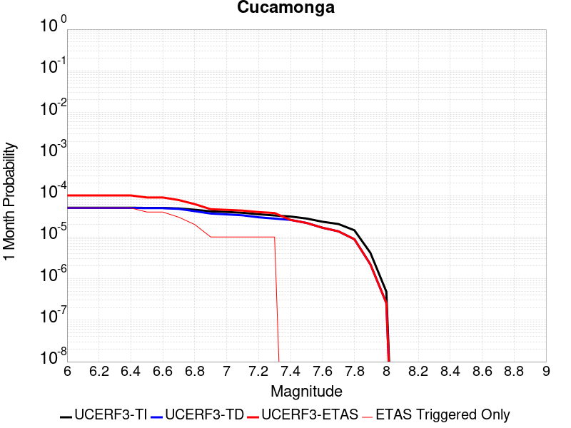 | 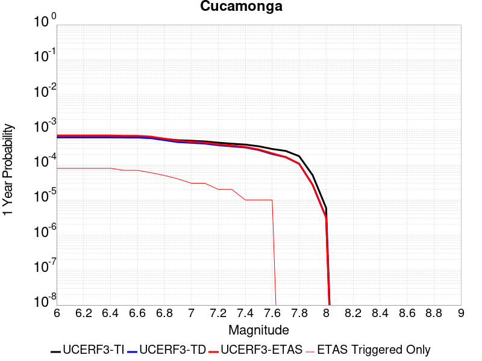 |  |

| Magnitude | 1 wk TI Prob | 1 wk TD Prob | 1 wk ETAS Prob | 1 wk ETAS/TD Gain | 1 wk ETAS Triggered Only | 1 mo TI Prob | 1 mo TD Prob | 1 mo ETAS Prob | 1 mo ETAS/TD Gain | 1 mo ETAS Triggered Only | 1 yr TI Prob | 1 yr TD Prob | 1 yr ETAS Prob | 1 yr ETAS/TD Gain | 1 yr ETAS Triggered Only | 10 yr TI Prob | 10 yr TD Prob | 10 yr ETAS Prob | 10 yr ETAS/TD Gain | 10 yr ETAS Triggered Only |
|-----|-----|-----|-----|-----|-----|-----|-----|-----|-----|-----|-----|-----|-----|-----|-----|-----|-----|-----|-----|-----|
| 6.0 | 1.1848348E-5 | 1.1737008E-5 | 5.1736537E-5 | 4.4079833 | 4.0E-5 | 5.0777642E-5 | 5.030051E-5 | 1.0029799E-4 | 1.9939758 | 5.0E-5 | 6.180424E-4 | 6.1223935E-4 | 6.9219037E-4 | 1.1305878 | 8.0E-5 | 0.0061632637 | 0.0061067017 | 0.006206091 | 1.0162754 | 1.0E-4 |
| 6.1 | 1.1848348E-5 | 1.1737008E-5 | 5.1736537E-5 | 4.4079833 | 4.0E-5 | 5.0777642E-5 | 5.030051E-5 | 1.0029799E-4 | 1.9939758 | 5.0E-5 | 6.180424E-4 | 6.1223935E-4 | 6.9219037E-4 | 1.1305878 | 8.0E-5 | 0.0061632637 | 0.0061067017 | 0.006206091 | 1.0162754 | 1.0E-4 |
| 6.2 | 1.1848348E-5 | 1.1737008E-5 | 5.1736537E-5 | 4.4079833 | 4.0E-5 | 5.0777642E-5 | 5.030051E-5 | 1.0029799E-4 | 1.9939758 | 5.0E-5 | 6.180424E-4 | 6.1223935E-4 | 6.9219037E-4 | 1.1305878 | 8.0E-5 | 0.0061632637 | 0.0061067017 | 0.006206091 | 1.0162754 | 1.0E-4 |
| 6.3 | 1.1848348E-5 | 1.1737008E-5 | 5.1736537E-5 | 4.4079833 | 4.0E-5 | 5.0777642E-5 | 5.030051E-5 | 1.0029799E-4 | 1.9939758 | 5.0E-5 | 6.180424E-4 | 6.1223935E-4 | 6.9219037E-4 | 1.1305878 | 8.0E-5 | 0.0061632637 | 0.0061067017 | 0.006206091 | 1.0162754 | 1.0E-4 |
| 6.4 | 1.1848348E-5 | 1.1737008E-5 | 5.1736537E-5 | 4.4079833 | 4.0E-5 | 5.0777642E-5 | 5.030051E-5 | 1.0029799E-4 | 1.9939758 | 5.0E-5 | 6.180424E-4 | 6.1223935E-4 | 6.9219037E-4 | 1.1305878 | 8.0E-5 | 0.0061632637 | 0.0061067017 | 0.006206091 | 1.0162754 | 1.0E-4 |
| 6.5 | 1.16988695E-5 | 1.15760395E-5 | 4.157569E-5 | 3.59153 | 3.0E-5 | 5.013705E-5 | 4.9610666E-5 | 8.9608686E-5 | 1.8062382 | 4.0E-5 | 6.102476E-4 | 6.0384517E-4 | 6.738029E-4 | 1.1158538 | 7.0E-5 | 0.006085745 | 0.006023216 | 0.0061126743 | 1.0148522 | 9.0E-5 |
| 6.6 | 1.16988695E-5 | 1.15760395E-5 | 4.157569E-5 | 3.59153 | 3.0E-5 | 5.013705E-5 | 4.9610666E-5 | 8.9608686E-5 | 1.8062382 | 4.0E-5 | 6.102476E-4 | 6.0384517E-4 | 6.738029E-4 | 1.1158538 | 7.0E-5 | 0.006085745 | 0.006023216 | 0.0061126743 | 1.0148522 | 9.0E-5 |
| 6.7 | 1.1397107E-5 | 1.11149475E-5 | 4.1114614E-5 | 3.699038 | 3.0E-5 | 4.884383E-5 | 4.7634636E-5 | 7.76332E-5 | 1.6297638 | 3.0E-5 | 5.9451134E-4 | 5.797998E-4 | 6.3976506E-4 | 1.103424 | 6.0E-5 | 0.005929234 | 0.0057840226 | 0.00586356 | 1.0137511 | 8.0E-5 |
| 6.8 | 1.058387E-5 | 9.784992E-6 | 2.9784796E-5 | 3.0439267 | 2.0E-5 | 4.5358654E-5 | 4.193501E-5 | 6.193417E-5 | 1.4769084 | 2.0E-5 | 5.521017E-4 | 5.1044027E-4 | 5.6041474E-4 | 1.0979047 | 5.0E-5 | 0.00550732 | 0.0050936877 | 0.005163331 | 1.0136725 | 7.0E-5 |
| 6.9 | 9.690046E-6 | 8.57948E-6 | 1.8579394E-5 | 2.1655617 | 1.0E-5 | 4.1528107E-5 | 3.6768684E-5 | 4.6768317E-5 | 1.2719606 | 1.0E-5 | 5.054874E-4 | 4.475672E-4 | 4.875493E-4 | 1.0893321 | 4.0E-5 | 0.005043391 | 0.004467594 | 0.0045273257 | 1.01337 | 6.0E-5 |
| 7.0 | 9.381461E-6 | 8.187101E-6 | 1.818702E-5 | 2.2214236 | 1.0E-5 | 4.020564E-5 | 3.5087105E-5 | 4.5086756E-5 | 1.284995 | 1.0E-5 | 4.893937E-4 | 4.2710215E-4 | 4.5708934E-4 | 1.0702108 | 3.0E-5 | 0.0048831734 | 0.0042637475 | 0.004313534 | 1.0116768 | 5.0E-5 |
| 7.1 | 8.946492E-6 | 7.781886E-6 | 1.7781807E-5 | 2.2850256 | 1.0E-5 | 3.8341543E-5 | 3.3350516E-5 | 4.335018E-5 | 1.2998354 | 1.0E-5 | 4.667083E-4 | 4.0596718E-4 | 4.35955E-4 | 1.0738676 | 3.0E-5 | 0.0046572937 | 0.004053192 | 0.0041029896 | 1.012286 | 5.0E-5 |
| 7.2 | 8.251016E-6 | 6.9752796E-6 | 1.697521E-5 | 2.4336243 | 1.0E-5 | 3.5361016E-5 | 2.9893714E-5 | 3.9893417E-5 | 1.3345085 | 1.0E-5 | 4.3043532E-4 | 3.6389544E-4 | 3.8388814E-4 | 1.0549408 | 2.0E-5 | 0.0042960253 | 0.0036339292 | 0.0036737837 | 1.0109674 | 4.0E-5 |
| 7.3 | 7.717881E-6 | 6.4863502E-6 | 1.6486285E-5 | 2.541689 | 1.0E-5 | 3.3076216E-5 | 2.7798349E-5 | 3.7798072E-5 | 1.3597236 | 1.0E-5 | 4.026285E-4 | 3.3839257E-4 | 3.583858E-4 | 1.059083 | 2.0E-5 | 0.004018998 | 0.00337971 | 0.0034195748 | 1.0117953 | 4.0E-5 |
| 7.4 | 7.275623E-6 | 6.031997E-6 | 6.031997E-6 | 1.0 | 0.0 | 3.118087E-5 | 2.585116E-5 | 2.585116E-5 | 1.0 | 0.0 | 3.7956095E-4 | 3.1469265E-4 | 3.246895E-4 | 1.031767 | 1.0E-5 | 0.0037891332 | 0.0031434062 | 0.003173312 | 1.0095137 | 3.0E-5 |
| 7.5 | 6.5109502E-6 | 5.1006014E-6 | 5.1006014E-6 | 1.0 | 0.0 | 2.7903774E-5 | 2.1859538E-5 | 2.1859538E-5 | 1.0 | 0.0 | 3.3967546E-4 | 2.661075E-4 | 2.7610484E-4 | 1.0375688 | 1.0E-5 | 0.0033915674 | 0.002658813 | 0.0026787599 | 1.0075022 | 2.0E-5 |
| 7.6 | 5.4495326E-6 | 3.90857E-6 | 3.90857E-6 | 1.0 | 0.0 | 2.335493E-5 | 1.6750908E-5 | 1.6750908E-5 | 1.0 | 0.0 | 2.8430918E-4 | 2.0392328E-4 | 2.1392123E-4 | 1.049028 | 1.0E-5 | 0.0028394572 | 0.002038282 | 0.0020582415 | 1.0097922 | 2.0E-5 |
| 7.7 | 4.7997164E-6 | 3.2002547E-6 | 3.2002547E-6 | 1.0 | 0.0 | 2.057005E-5 | 1.3715306E-5 | 1.3715306E-5 | 1.0 | 0.0 | 2.504116E-4 | 1.6697108E-4 | 1.6697108E-4 | 1.0 | 0.0 | 0.002501296 | 0.0016693877 | 0.001679371 | 1.0059803 | 1.0E-5 |
| 7.8 | 3.3941733E-6 | 2.0641899E-6 | 2.0641899E-6 | 1.0 | 0.0 | 1.4546376E-5 | 8.846498E-6 | 8.846498E-6 | 1.0 | 0.0 | 1.7708774E-4 | 1.07700806E-4 | 1.07700806E-4 | 1.0 | 0.0 | 0.0017694668 | 0.001076723 | 0.0010867122 | 1.0092775 | 1.0E-5 |
| 7.9 | 9.750552E-7 | 5.155946E-7 | 5.155946E-7 | 1.0 | 0.0 | 4.178801E-6 | 2.2096892E-6 | 2.2096892E-6 | 1.0 | 0.0 | 5.0875715E-5 | 2.690264E-5 | 2.690264E-5 | 1.0 | 0.0 | 5.086407E-4 | 2.6899425E-4 | 2.7899156E-4 | 1.0371655 | 1.0E-5 |
| 8.0 | 1.133857E-7 | 6.053707E-8 | 6.053707E-8 | 1.0 | 0.0 | 4.8593864E-7 | 2.5944456E-7 | 2.5944456E-7 | 1.0 | 0.0 | 5.9162867E-6 | 3.158733E-6 | 3.158733E-6 | 1.0 | 0.0 | 5.916129E-5 | 3.1586897E-5 | 3.1586897E-5 | 1.0 | 0.0 |

## Santa Cruz Catalina Ridge alt1
*[(top)](#table-of-contents)*

| 1 Week | 1 Month | 1 Year | 10 Year |
|-----|-----|-----|-----|
|  |  |  |  |

| Magnitude | 1 wk TI Prob | 1 wk TD Prob | 1 wk ETAS Prob | 1 wk ETAS/TD Gain | 1 wk ETAS Triggered Only | 1 mo TI Prob | 1 mo TD Prob | 1 mo ETAS Prob | 1 mo ETAS/TD Gain | 1 mo ETAS Triggered Only | 1 yr TI Prob | 1 yr TD Prob | 1 yr ETAS Prob | 1 yr ETAS/TD Gain | 1 yr ETAS Triggered Only | 10 yr TI Prob | 10 yr TD Prob | 10 yr ETAS Prob | 10 yr ETAS/TD Gain | 10 yr ETAS Triggered Only |
|-----|-----|-----|-----|-----|-----|-----|-----|-----|-----|-----|-----|-----|-----|-----|-----|-----|-----|-----|-----|-----|
| 6.0 | 3.2833184E-5 | 3.65584E-5 | 7.6556935E-5 | 2.0940998 | 4.0E-5 | 1.4070606E-4 | 1.5667039E-4 | 2.2665941E-4 | 1.4467279 | 7.0E-5 | 0.00171175 | 0.0019059596 | 0.001985807 | 1.0418936 | 8.0E-5 | 0.016986247 | 0.018913029 | 0.019001327 | 1.0046686 | 9.0E-5 |
| 6.1 | 1.9835548E-5 | 2.1659505E-5 | 4.165907E-5 | 1.9233621 | 2.0E-5 | 8.500672E-5 | 9.282326E-5 | 1.2282048E-4 | 1.3231648 | 3.0E-5 | 0.0010344655 | 0.0011295575 | 0.0011595236 | 1.0265291 | 3.0E-5 | 0.010296632 | 0.011240295 | 0.011279846 | 1.0035186 | 4.0E-5 |
| 6.2 | 1.9835548E-5 | 2.1659505E-5 | 4.165907E-5 | 1.9233621 | 2.0E-5 | 8.500672E-5 | 9.282326E-5 | 1.2282048E-4 | 1.3231648 | 3.0E-5 | 0.0010344655 | 0.0011295575 | 0.0011595236 | 1.0265291 | 3.0E-5 | 0.010296632 | 0.011240295 | 0.011279846 | 1.0035186 | 4.0E-5 |
| 6.3 | 1.5728183E-5 | 1.703395E-5 | 3.703361E-5 | 2.174106 | 2.0E-5 | 6.7404755E-5 | 7.300063E-5 | 1.0299844E-4 | 1.4109254 | 3.0E-5 | 8.2034385E-4 | 8.884264E-4 | 9.183997E-4 | 1.0337375 | 3.0E-5 | 0.008173222 | 0.008849427 | 0.008889073 | 1.0044801 | 4.0E-5 |
| 6.4 | 1.5728183E-5 | 1.703395E-5 | 3.703361E-5 | 2.174106 | 2.0E-5 | 6.7404755E-5 | 7.300063E-5 | 1.0299844E-4 | 1.4109254 | 3.0E-5 | 8.2034385E-4 | 8.884264E-4 | 9.183997E-4 | 1.0337375 | 3.0E-5 | 0.008173222 | 0.008849427 | 0.008889073 | 1.0044801 | 4.0E-5 |
| 6.5 | 1.3707734E-5 | 1.4794522E-5 | 3.4794226E-5 | 2.3518317 | 2.0E-5 | 5.8746107E-5 | 6.3403575E-5 | 8.34023E-5 | 1.3154197 | 2.0E-5 | 7.1499916E-4 | 7.716686E-4 | 7.916532E-4 | 1.0258979 | 2.0E-5 | 0.0071270303 | 0.0076902895 | 0.007720059 | 1.003871 | 3.0E-5 |
| 6.6 | 1.2539813E-5 | 1.3510219E-5 | 3.350995E-5 | 2.480341 | 2.0E-5 | 5.3740947E-5 | 5.789967E-5 | 7.789851E-5 | 1.3454051 | 2.0E-5 | 6.540996E-4 | 7.0470315E-4 | 7.2468905E-4 | 1.0283607 | 2.0E-5 | 0.0065217763 | 0.0070249885 | 0.007054778 | 1.0042405 | 3.0E-5 |
| 6.7 | 1.1504083E-5 | 1.2377375E-5 | 3.2377127E-5 | 2.6158316 | 2.0E-5 | 4.930228E-5 | 5.3044827E-5 | 7.304377E-5 | 1.3770196 | 2.0E-5 | 6.0008996E-4 | 6.456314E-4 | 6.6561846E-4 | 1.0309575 | 2.0E-5 | 0.005984721 | 0.006437786 | 0.006457657 | 1.0030867 | 2.0E-5 |
| 6.8 | 1.012739E-5 | 1.0877071E-5 | 3.0876854E-5 | 2.8387103 | 2.0E-5 | 4.340238E-5 | 4.6615194E-5 | 6.6614266E-5 | 1.4290247 | 2.0E-5 | 5.282958E-4 | 5.673937E-4 | 5.8738235E-4 | 1.0352288 | 2.0E-5 | 0.0052704164 | 0.0056596193 | 0.0056795063 | 1.0035138 | 2.0E-5 |
| 6.9 | 8.9607865E-6 | 9.609117E-6 | 2.9608926E-5 | 3.0813367 | 2.0E-5 | 3.8402806E-5 | 4.1181287E-5 | 6.1180464E-5 | 1.4856374 | 2.0E-5 | 4.6745385E-4 | 5.012679E-4 | 5.2125787E-4 | 1.0398788 | 2.0E-5 | 0.0046647177 | 0.005001492 | 0.005021392 | 1.0039788 | 2.0E-5 |
| 7.0 | 8.046829E-6 | 8.619746E-6 | 2.8619574E-5 | 3.320234 | 2.0E-5 | 3.4485955E-5 | 3.694125E-5 | 5.694051E-5 | 1.5413802 | 2.0E-5 | 4.1978562E-4 | 4.496677E-4 | 4.6965873E-4 | 1.0444573 | 2.0E-5 | 0.004189935 | 0.0044876686 | 0.004507579 | 1.0044366 | 2.0E-5 |
| 7.1 | 7.136131E-6 | 7.637656E-6 | 1.763758E-5 | 2.3092923 | 1.0E-5 | 3.0583058E-5 | 3.2732405E-5 | 4.2732077E-5 | 1.3054976 | 1.0E-5 | 3.7228514E-4 | 3.9844486E-4 | 4.084409E-4 | 1.0250876 | 1.0E-5 | 0.0037166206 | 0.003977381 | 0.0039873417 | 1.0025042 | 1.0E-5 |
| 7.2 | 6.362014E-6 | 6.8049585E-6 | 1.680489E-5 | 2.4695067 | 1.0E-5 | 2.726549E-5 | 2.9163786E-5 | 3.9163493E-5 | 1.342881 | 1.0E-5 | 3.3190678E-4 | 3.550119E-4 | 3.6500834E-4 | 1.0281581 | 1.0E-5 | 0.0033141149 | 0.003544516 | 0.0035544806 | 1.0028113 | 1.0E-5 |
| 7.3 | 5.004101E-6 | 5.351715E-6 | 1.5351661E-5 | 2.8685498 | 1.0E-5 | 2.1445969E-5 | 2.2935723E-5 | 3.293549E-5 | 1.435991 | 1.0E-5 | 2.6107338E-4 | 2.792072E-4 | 2.8920438E-4 | 1.0358057 | 1.0E-5 | 0.002607669 | 0.0027886187 | 0.0027985908 | 1.003576 | 1.0E-5 |
| 7.4 | 3.4901443E-6 | 3.7320526E-6 | 1.3732015E-5 | 3.6794808 | 1.0E-5 | 1.4957676E-5 | 1.5994416E-5 | 2.5994255E-5 | 1.6252083 | 1.0E-5 | 1.8209449E-4 | 1.9471499E-4 | 2.0471304E-4 | 1.0513471 | 1.0E-5 | 0.0018194534 | 0.0019454823 | 0.0019554629 | 1.0051302 | 1.0E-5 |
| 7.5 | 1.1215045E-6 | 1.189387E-6 | 1.189387E-6 | 1.0 | 0.0 | 4.806439E-6 | 5.097363E-6 | 5.097363E-6 | 1.0 | 0.0 | 5.851682E-5 | 6.205866E-5 | 6.205866E-5 | 1.0 | 0.0 | 5.850142E-4 | 6.2041637E-4 | 6.2041637E-4 | 1.0 | 0.0 |
| 7.6 | 2.8599047E-7 | 2.9951994E-7 | 2.9951994E-7 | 1.0 | 0.0 | 1.2256729E-6 | 1.2836562E-6 | 1.2836562E-6 | 1.0 | 0.0 | 1.4922465E-5 | 1.5628404E-5 | 1.5628404E-5 | 1.0 | 0.0 | 1.4921463E-4 | 1.5627318E-4 | 1.5627318E-4 | 1.0 | 0.0 |
| 7.7 | 2.0781519E-7 | 2.1744323E-7 | 2.1744323E-7 | 1.0 | 0.0 | 8.906362E-7 | 9.3189925E-7 | 9.3189925E-7 | 1.0 | 0.0 | 1.08434415E-5 | 1.13458145E-5 | 1.13458145E-5 | 1.0 | 0.0 | 1.0842913E-4 | 1.1345245E-4 | 1.1345245E-4 | 1.0 | 0.0 |
| 7.8 | 3.614776E-8 | 3.764102E-8 | 3.764102E-8 | 1.0 | 0.0 | 1.5491896E-7 | 1.6131864E-7 | 1.6131864E-7 | 1.0 | 0.0 | 1.8861368E-6 | 1.9640527E-6 | 1.9640527E-6 | 1.0 | 0.0 | 1.8861208E-5 | 1.9640367E-5 | 1.9640367E-5 | 1.0 | 0.0 |

## Simi-Santa Rosa
*[(top)](#table-of-contents)*

| 1 Week | 1 Month | 1 Year | 10 Year |
|-----|-----|-----|-----|
|  | 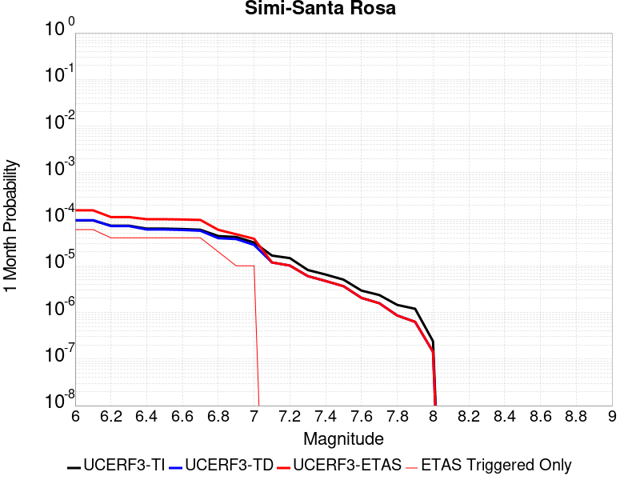 |  |  |

| Magnitude | 1 wk TI Prob | 1 wk TD Prob | 1 wk ETAS Prob | 1 wk ETAS/TD Gain | 1 wk ETAS Triggered Only | 1 mo TI Prob | 1 mo TD Prob | 1 mo ETAS Prob | 1 mo ETAS/TD Gain | 1 mo ETAS Triggered Only | 1 yr TI Prob | 1 yr TD Prob | 1 yr ETAS Prob | 1 yr ETAS/TD Gain | 1 yr ETAS Triggered Only | 10 yr TI Prob | 10 yr TD Prob | 10 yr ETAS Prob | 10 yr ETAS/TD Gain | 10 yr ETAS Triggered Only |
|-----|-----|-----|-----|-----|-----|-----|-----|-----|-----|-----|-----|-----|-----|-----|-----|-----|-----|-----|-----|-----|
| 6.0 | 2.198912E-5 | 2.2275442E-5 | 7.227433E-5 | 3.2445743 | 5.0E-5 | 9.4235686E-5 | 9.5462936E-5 | 1.5545721E-4 | 1.6284562 | 6.0E-5 | 0.0011467156 | 0.0011616853 | 0.0012515808 | 1.0773836 | 9.0E-5 | 0.011408163 | 0.011560575 | 0.011649535 | 1.0076951 | 9.0E-5 |
| 6.1 | 2.198912E-5 | 2.2275442E-5 | 7.227433E-5 | 3.2445743 | 5.0E-5 | 9.4235686E-5 | 9.5462936E-5 | 1.5545721E-4 | 1.6284562 | 6.0E-5 | 0.0011467156 | 0.0011616853 | 0.0012515808 | 1.0773836 | 9.0E-5 | 0.011408163 | 0.011560575 | 0.011649535 | 1.0076951 | 9.0E-5 |
| 6.2 | 1.69983E-5 | 1.6668559E-5 | 4.6668058E-5 | 2.7997656 | 3.0E-5 | 7.284782E-5 | 7.143489E-5 | 1.1143203E-4 | 1.5599104 | 4.0E-5 | 8.865613E-4 | 8.6940196E-4 | 9.393411E-4 | 1.0804452 | 7.0E-5 | 0.008830327 | 0.008662928 | 0.008732321 | 1.0080104 | 7.0E-5 |
| 6.3 | 1.69983E-5 | 1.6668559E-5 | 4.6668058E-5 | 2.7997656 | 3.0E-5 | 7.284782E-5 | 7.143489E-5 | 1.1143203E-4 | 1.5599104 | 4.0E-5 | 8.865613E-4 | 8.6940196E-4 | 9.393411E-4 | 1.0804452 | 7.0E-5 | 0.008830327 | 0.008662928 | 0.008732321 | 1.0080104 | 7.0E-5 |
| 6.4 | 1.4666188E-5 | 1.4052543E-5 | 4.405212E-5 | 3.134815 | 3.0E-5 | 6.285358E-5 | 6.0223934E-5 | 1.0022152E-4 | 1.6641477 | 4.0E-5 | 7.6497364E-4 | 7.3300465E-4 | 7.9296064E-4 | 1.0817949 | 6.0E-5 | 0.0076234564 | 0.007308344 | 0.0073679057 | 1.0081497 | 6.0E-5 |
| 6.5 | 1.4666188E-5 | 1.4052543E-5 | 4.405212E-5 | 3.134815 | 3.0E-5 | 6.285358E-5 | 6.0223934E-5 | 1.0022152E-4 | 1.6641477 | 4.0E-5 | 7.6497364E-4 | 7.3300465E-4 | 7.9296064E-4 | 1.0817949 | 6.0E-5 | 0.0076234564 | 0.007308344 | 0.0073679057 | 1.0081497 | 6.0E-5 |
| 6.6 | 1.4377586E-5 | 1.3729583E-5 | 4.372917E-5 | 3.1850328 | 3.0E-5 | 6.1616774E-5 | 5.883988E-5 | 9.8837525E-5 | 1.6797711 | 4.0E-5 | 7.4992597E-4 | 7.1616494E-4 | 7.76122E-4 | 1.0837196 | 6.0E-5 | 0.007474003 | 0.0071410383 | 0.00720061 | 1.0083421 | 6.0E-5 |
| 6.7 | 1.3881404E-5 | 1.320755E-5 | 4.3207154E-5 | 3.271398 | 3.0E-5 | 5.9490372E-5 | 5.66027E-5 | 9.660044E-5 | 1.7066401 | 4.0E-5 | 7.240546E-4 | 6.8894465E-4 | 7.489033E-4 | 1.0870297 | 6.0E-5 | 0.007217 | 0.006870538 | 0.006930126 | 1.008673 | 6.0E-5 |
| 6.8 | 1.0176516E-5 | 9.154151E-6 | 1.9154058E-5 | 2.0923908 | 1.0E-5 | 4.3612912E-5 | 3.9231574E-5 | 5.923079E-5 | 1.5097735 | 2.0E-5 | 5.308578E-4 | 4.7755634E-4 | 4.975468E-4 | 1.0418599 | 2.0E-5 | 0.0052959146 | 0.004766934 | 0.004786839 | 1.0041755 | 2.0E-5 |
| 6.9 | 9.699797E-6 | 8.774719E-6 | 1.8774632E-5 | 2.1396275 | 1.0E-5 | 4.15699E-5 | 3.7605492E-5 | 4.7605117E-5 | 1.2659086 | 1.0E-5 | 5.05996E-4 | 4.577671E-4 | 4.6776255E-4 | 1.0218352 | 1.0E-5 | 0.005048454 | 0.0045698597 | 0.004579814 | 1.0021782 | 1.0E-5 |
| 7.0 | 7.4049476E-6 | 6.559333E-6 | 1.6559268E-5 | 2.5245352 | 1.0E-5 | 3.1735104E-5 | 2.8111197E-5 | 3.8110917E-5 | 1.3557202 | 1.0E-5 | 3.8630638E-4 | 3.422127E-4 | 3.522093E-4 | 1.0292116 | 1.0E-5 | 0.0038563553 | 0.0034180996 | 0.0034280655 | 1.0029156 | 1.0E-5 |
| 7.1 | 3.873439E-6 | 2.7595095E-6 | 2.7595095E-6 | 1.0 | 0.0 | 1.6600346E-5 | 1.1826417E-5 | 1.1826417E-5 | 1.0 | 0.0 | 2.0209046E-4 | 1.4397735E-4 | 1.4397735E-4 | 1.0 | 0.0 | 0.0020190678 | 0.0014388643 | 0.0014388643 | 1.0 | 0.0 |
| 7.2 | 3.417706E-6 | 2.3676484E-6 | 2.3676484E-6 | 1.0 | 0.0 | 1.4647229E-5 | 1.0147027E-5 | 1.0147027E-5 | 1.0 | 0.0 | 1.7831543E-4 | 1.2353327E-4 | 1.2353327E-4 | 1.0 | 0.0 | 0.0017817242 | 0.0012346683 | 0.0012346683 | 1.0 | 0.0 |
| 7.3 | 1.90225E-6 | 1.4073753E-6 | 1.4073753E-6 | 1.0 | 0.0 | 8.152474E-6 | 6.0315947E-6 | 6.0315947E-6 | 1.0 | 0.0 | 9.9251854E-5 | 7.343221E-5 | 7.343221E-5 | 1.0 | 0.0 | 9.920754E-4 | 7.340817E-4 | 7.340817E-4 | 1.0 | 0.0 |
| 7.4 | 1.5170556E-6 | 1.1024773E-6 | 1.1024773E-6 | 1.0 | 0.0 | 6.5016507E-6 | 4.724894E-6 | 4.724894E-6 | 1.0 | 0.0 | 7.915472E-5 | 5.7524077E-5 | 5.7524077E-5 | 1.0 | 0.0 | 7.9126534E-4 | 5.7509297E-4 | 5.7509297E-4 | 1.0 | 0.0 |
| 7.5 | 1.178732E-6 | 8.535102E-7 | 8.535102E-7 | 1.0 | 0.0 | 5.0516987E-6 | 3.6578958E-6 | 3.6578958E-6 | 1.0 | 0.0 | 6.1502695E-5 | 4.453398E-5 | 4.453398E-5 | 1.0 | 0.0 | 6.148568E-4 | 4.452515E-4 | 4.452515E-4 | 1.0 | 0.0 |
| 7.6 | 6.8722386E-7 | 4.793198E-7 | 4.793198E-7 | 1.0 | 0.0 | 2.9452417E-6 | 2.054226E-6 | 2.054226E-6 | 1.0 | 0.0 | 3.5857727E-5 | 2.5009915E-5 | 2.5009915E-5 | 1.0 | 0.0 | 3.5851944E-4 | 2.5007114E-4 | 2.5007114E-4 | 1.0 | 0.0 |
| 7.7 | 5.5126515E-7 | 3.6731157E-7 | 3.6731157E-7 | 1.0 | 0.0 | 2.3625628E-6 | 1.5741915E-6 | 1.5741915E-6 | 1.0 | 0.0 | 2.8763823E-5 | 1.9165615E-5 | 1.9165615E-5 | 1.0 | 0.0 | 2.87601E-4 | 1.9163972E-4 | 1.9163972E-4 | 1.0 | 0.0 |
| 7.8 | 3.3860243E-7 | 2.0075942E-7 | 2.0075942E-7 | 1.0 | 0.0 | 1.4511525E-6 | 8.6039717E-7 | 8.6039717E-7 | 1.0 | 0.0 | 1.7667637E-5 | 1.0475286E-5 | 1.0475286E-5 | 1.0 | 0.0 | 1.7666233E-4 | 1.04747975E-4 | 1.04747975E-4 | 1.0 | 0.0 |
| 7.9 | 2.7955386E-7 | 1.4649108E-7 | 1.4649108E-7 | 1.0 | 0.0 | 1.1980875E-6 | 6.278188E-7 | 6.278188E-7 | 1.0 | 0.0 | 1.4586617E-5 | 7.643667E-6 | 7.643667E-6 | 1.0 | 0.0 | 1.458566E-4 | 7.643409E-5 | 7.643409E-5 | 1.0 | 0.0 |
| 8.0 | 5.6259015E-8 | 3.3355324E-8 | 3.3355324E-8 | 1.0 | 0.0 | 2.4111003E-7 | 1.4295138E-7 | 1.4295138E-7 | 1.0 | 0.0 | 2.9355108E-6 | 1.7404317E-6 | 1.7404317E-6 | 1.0 | 0.0 | 2.935472E-5 | 1.7404194E-5 | 1.7404194E-5 | 1.0 | 0.0 |

## San Jacinto (Clark) rev
*[(top)](#table-of-contents)*

| 1 Week | 1 Month | 1 Year | 10 Year |
|-----|-----|-----|-----|
|  | 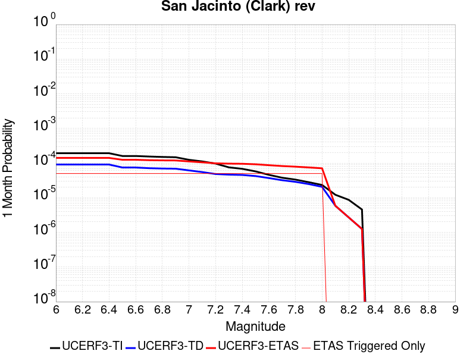 |  |  |

| Magnitude | 1 wk TI Prob | 1 wk TD Prob | 1 wk ETAS Prob | 1 wk ETAS/TD Gain | 1 wk ETAS Triggered Only | 1 mo TI Prob | 1 mo TD Prob | 1 mo ETAS Prob | 1 mo ETAS/TD Gain | 1 mo ETAS Triggered Only | 1 yr TI Prob | 1 yr TD Prob | 1 yr ETAS Prob | 1 yr ETAS/TD Gain | 1 yr ETAS Triggered Only | 10 yr TI Prob | 10 yr TD Prob | 10 yr ETAS Prob | 10 yr ETAS/TD Gain | 10 yr ETAS Triggered Only |
|-----|-----|-----|-----|-----|-----|-----|-----|-----|-----|-----|-----|-----|-----|-----|-----|-----|-----|-----|-----|-----|
| 6.0 | 4.482615E-5 | 2.1154196E-5 | 6.115335E-5 | 2.890838 | 4.0E-5 | 1.9209793E-4 | 9.065773E-5 | 1.4065321E-4 | 1.5514749 | 5.0E-5 | 0.0023362834 | 0.0011032083 | 0.001173131 | 1.0633813 | 7.0E-5 | 0.02311874 | 0.011503847 | 0.011592812 | 1.0077335 | 9.0E-5 |
| 6.1 | 4.482615E-5 | 2.1154196E-5 | 6.115335E-5 | 2.890838 | 4.0E-5 | 1.9209793E-4 | 9.065773E-5 | 1.4065321E-4 | 1.5514749 | 5.0E-5 | 0.0023362834 | 0.0011032083 | 0.001173131 | 1.0633813 | 7.0E-5 | 0.02311874 | 0.011503847 | 0.011592812 | 1.0077335 | 9.0E-5 |
| 6.2 | 4.482615E-5 | 2.1154196E-5 | 6.115335E-5 | 2.890838 | 4.0E-5 | 1.9209793E-4 | 9.065773E-5 | 1.4065321E-4 | 1.5514749 | 5.0E-5 | 0.0023362834 | 0.0011032083 | 0.001173131 | 1.0633813 | 7.0E-5 | 0.02311874 | 0.011503847 | 0.011592812 | 1.0077335 | 9.0E-5 |
| 6.3 | 4.482615E-5 | 2.1154196E-5 | 6.115335E-5 | 2.890838 | 4.0E-5 | 1.9209793E-4 | 9.065773E-5 | 1.4065321E-4 | 1.5514749 | 5.0E-5 | 0.0023362834 | 0.0011032083 | 0.001173131 | 1.0633813 | 7.0E-5 | 0.02311874 | 0.011503847 | 0.011592812 | 1.0077335 | 9.0E-5 |
| 6.4 | 4.482615E-5 | 2.1154196E-5 | 6.115335E-5 | 2.890838 | 4.0E-5 | 1.9209793E-4 | 9.065773E-5 | 1.4065321E-4 | 1.5514749 | 5.0E-5 | 0.0023362834 | 0.0011032083 | 0.001173131 | 1.0633813 | 7.0E-5 | 0.02311874 | 0.011503847 | 0.011592812 | 1.0077335 | 9.0E-5 |
| 6.5 | 3.7294863E-5 | 1.7356087E-5 | 5.735539E-5 | 3.304627 | 4.0E-5 | 1.5982533E-4 | 7.438113E-5 | 1.2437742E-4 | 1.6721635 | 5.0E-5 | 0.0019441366 | 9.052186E-4 | 9.751552E-4 | 1.0772594 | 7.0E-5 | 0.01927216 | 0.0094941035 | 0.009583249 | 1.0093895 | 9.0E-5 |
| 6.6 | 3.7294863E-5 | 1.7356087E-5 | 5.735539E-5 | 3.304627 | 4.0E-5 | 1.5982533E-4 | 7.438113E-5 | 1.2437742E-4 | 1.6721635 | 5.0E-5 | 0.0019441366 | 9.052186E-4 | 9.751552E-4 | 1.0772594 | 7.0E-5 | 0.01927216 | 0.0094941035 | 0.009583249 | 1.0093895 | 9.0E-5 |
| 6.7 | 3.6039248E-5 | 1.6604314E-5 | 5.6603647E-5 | 3.4089727 | 4.0E-5 | 1.5444479E-4 | 7.1159426E-5 | 1.2115586E-4 | 1.7025976 | 5.0E-5 | 0.0018787434 | 8.6602574E-4 | 9.3596516E-4 | 1.080759 | 7.0E-5 | 0.01862939 | 0.009096047 | 0.0091852285 | 1.0098044 | 9.0E-5 |
| 6.8 | 3.5031844E-5 | 1.6232942E-5 | 5.6232293E-5 | 3.464085 | 4.0E-5 | 1.5012783E-4 | 6.956792E-5 | 1.19564436E-4 | 1.7186722 | 5.0E-5 | 0.0018262739 | 8.4666436E-4 | 9.1660506E-4 | 1.0826074 | 7.0E-5 | 0.01811338 | 0.008895969 | 0.008985168 | 1.0100269 | 9.0E-5 |
| 6.9 | 3.435112E-5 | 1.6063195E-5 | 5.6062552E-5 | 3.4901247 | 4.0E-5 | 1.4721078E-4 | 6.884047E-5 | 1.1883703E-4 | 1.726267 | 5.0E-5 | 0.0017908178 | 8.3781447E-4 | 9.0775586E-4 | 1.0834807 | 7.0E-5 | 0.017764548 | 0.008804181 | 0.008893388 | 1.0101324 | 9.0E-5 |
| 7.0 | 2.8959772E-5 | 1.4336745E-5 | 5.433617E-5 | 3.7899935 | 4.0E-5 | 1.241074E-4 | 6.144176E-5 | 1.1143869E-4 | 1.8137287 | 5.0E-5 | 0.0015099603 | 7.477995E-4 | 8.1774715E-4 | 1.0935379 | 7.0E-5 | 0.014997416 | 0.007868037 | 0.007957328 | 1.0113487 | 9.0E-5 |
| 7.1 | 2.6002877E-5 | 1.2829002E-5 | 5.2828487E-5 | 4.1178956 | 4.0E-5 | 1.11436144E-4 | 5.498029E-5 | 1.0497754E-4 | 1.9093668 | 5.0E-5 | 0.0013558907 | 6.691816E-4 | 7.3913473E-4 | 1.1045353 | 7.0E-5 | 0.013476475 | 0.0070465137 | 0.0071358797 | 1.0126823 | 9.0E-5 |
| 7.2 | 2.2544838E-5 | 1.1262543E-5 | 5.1262094E-5 | 4.5515556 | 4.0E-5 | 9.661716E-5 | 4.8267157E-5 | 9.826475E-5 | 2.035851 | 5.0E-5 | 0.001175679 | 5.874956E-4 | 6.5745454E-4 | 1.1190798 | 7.0E-5 | 0.011694785 | 0.0061927503 | 0.0062821927 | 1.0144432 | 9.0E-5 |
| 7.3 | 1.75334E-5 | 1.0811715E-5 | 5.0811283E-5 | 4.699651 | 4.0E-5 | 7.514098E-5 | 4.6335106E-5 | 9.633279E-5 | 2.0790455 | 5.0E-5 | 9.144575E-4 | 5.6398526E-4 | 6.339458E-4 | 1.1240467 | 7.0E-5 | 0.009107036 | 0.0059337732 | 0.0060232393 | 1.0150775 | 9.0E-5 |
| 7.4 | 1.5924552E-5 | 1.0611516E-5 | 5.0611092E-5 | 4.7694497 | 4.0E-5 | 6.82463E-5 | 4.547714E-5 | 9.547487E-5 | 2.0994034 | 5.0E-5 | 8.305819E-4 | 5.535449E-4 | 6.2350614E-4 | 1.1263877 | 7.0E-5 | 0.008274844 | 0.0058210334 | 0.0059105093 | 1.0153712 | 9.0E-5 |
| 7.5 | 1.3428931E-5 | 9.8519E-6 | 4.9851507E-5 | 5.0600905 | 4.0E-5 | 5.7551293E-5 | 4.2221753E-5 | 9.221964E-5 | 2.1841738 | 5.0E-5 | 7.004617E-4 | 5.1392964E-4 | 5.838937E-4 | 1.1361355 | 7.0E-5 | 0.006982579 | 0.0054066023 | 0.005496116 | 1.0165563 | 9.0E-5 |
| 7.6 | 1.0688787E-5 | 8.614839E-6 | 4.8614496E-5 | 5.6431108 | 4.0E-5 | 4.5808283E-5 | 3.692022E-5 | 8.691838E-5 | 2.3542213 | 5.0E-5 | 5.5757316E-4 | 4.4941145E-4 | 5.1938E-4 | 1.1556892 | 7.0E-5 | 0.005561762 | 0.0047416524 | 0.0048312256 | 1.0188907 | 9.0E-5 |
| 7.7 | 8.81236E-6 | 7.4680274E-6 | 4.746773E-5 | 6.356127 | 4.0E-5 | 3.776671E-5 | 3.2005442E-5 | 8.200384E-5 | 2.5621843 | 5.0E-5 | 4.597127E-4 | 3.8959677E-4 | 4.595695E-4 | 1.179603 | 7.0E-5 | 0.0045876284 | 0.0041346536 | 0.0042242813 | 1.0216773 | 9.0E-5 |
| 7.8 | 7.780431E-6 | 6.696579E-6 | 4.669631E-5 | 6.9731593 | 4.0E-5 | 3.3344273E-5 | 2.8699309E-5 | 7.869788E-5 | 2.7421522 | 5.0E-5 | 4.0589093E-4 | 3.4935825E-4 | 4.193338E-4 | 1.2002974 | 7.0E-5 | 0.0040515037 | 0.0037227906 | 0.0038124556 | 1.0240854 | 9.0E-5 |
| 7.9 | 6.5437994E-6 | 5.780382E-6 | 4.578015E-5 | 7.919918 | 4.0E-5 | 2.8044553E-5 | 2.477283E-5 | 7.477159E-5 | 3.0182903 | 5.0E-5 | 3.4138895E-4 | 3.0156763E-4 | 3.715465E-4 | 1.2320504 | 7.0E-5 | 0.0034086495 | 0.0032344845 | 0.0033241934 | 1.0277351 | 9.0E-5 |
| 8.0 | 5.4488164E-6 | 4.8133406E-6 | 4.4813147E-5 | 9.310197 | 4.0E-5 | 2.3351862E-5 | 2.062844E-5 | 7.062741E-5 | 3.423788 | 5.0E-5 | 2.8427184E-4 | 2.5112246E-4 | 3.211049E-4 | 1.2786784 | 7.0E-5 | 0.0028390845 | 0.002710839 | 0.0027806493 | 1.0257523 | 7.0E-5 |
| 8.1 | 2.8397242E-6 | 1.3670389E-6 | 1.3670389E-6 | 1.0 | 0.0 | 1.217019E-5 | 5.858725E-6 | 5.858725E-6 | 1.0 | 0.0 | 1.4816198E-4 | 7.132765E-5 | 7.132765E-5 | 1.0 | 0.0 | 0.0014806325 | 8.115382E-4 | 8.115382E-4 | 1.0 | 0.0 |
| 8.2 | 2.030244E-6 | 6.318974E-7 | 6.318974E-7 | 1.0 | 0.0 | 8.701017E-6 | 2.708129E-6 | 2.708129E-6 | 1.0 | 0.0 | 1.05929736E-4 | 3.2970976E-5 | 3.2970976E-5 | 1.0 | 0.0 | 0.0010587925 | 3.9486602E-4 | 3.9486602E-4 | 1.0 | 0.0 |
| 8.3 | 1.0659804E-6 | 2.9250086E-7 | 2.9250086E-7 | 1.0 | 0.0 | 4.568479E-6 | 1.2535745E-6 | 1.2535745E-6 | 1.0 | 0.0 | 5.5619817E-5 | 1.5262167E-5 | 1.5262167E-5 | 1.0 | 0.0 | 5.5605895E-4 | 1.8566217E-4 | 1.8566217E-4 | 1.0 | 0.0 |

## Los Alamos extension
*[(top)](#table-of-contents)*

| 1 Week | 1 Month | 1 Year | 10 Year |
|-----|-----|-----|-----|
|  |  |  |  |

| Magnitude | 1 wk TI Prob | 1 wk TD Prob | 1 wk ETAS Prob | 1 wk ETAS/TD Gain | 1 wk ETAS Triggered Only | 1 mo TI Prob | 1 mo TD Prob | 1 mo ETAS Prob | 1 mo ETAS/TD Gain | 1 mo ETAS Triggered Only | 1 yr TI Prob | 1 yr TD Prob | 1 yr ETAS Prob | 1 yr ETAS/TD Gain | 1 yr ETAS Triggered Only | 10 yr TI Prob | 10 yr TD Prob | 10 yr ETAS Prob | 10 yr ETAS/TD Gain | 10 yr ETAS Triggered Only |
|-----|-----|-----|-----|-----|-----|-----|-----|-----|-----|-----|-----|-----|-----|-----|-----|-----|-----|-----|-----|-----|
| 6.0 | 4.0146506E-6 | 4.0861596E-6 | 1.4086118E-5 | 3.4472756 | 1.0E-5 | 1.7205533E-5 | 1.7512002E-5 | 4.7511476E-5 | 2.713081 | 3.0E-5 | 2.0945723E-4 | 2.1318886E-4 | 2.9317182E-4 | 1.3751742 | 8.0E-5 | 0.0020925992 | 0.0021299527 | 0.002219761 | 1.0421644 | 9.0E-5 |
| 6.1 | 4.0146506E-6 | 4.0861596E-6 | 1.4086118E-5 | 3.4472756 | 1.0E-5 | 1.7205533E-5 | 1.7512002E-5 | 4.7511476E-5 | 2.713081 | 3.0E-5 | 2.0945723E-4 | 2.1318886E-4 | 2.9317182E-4 | 1.3751742 | 8.0E-5 | 0.0020925992 | 0.0021299527 | 0.002219761 | 1.0421644 | 9.0E-5 |
| 6.2 | 4.0146506E-6 | 4.0861596E-6 | 1.4086118E-5 | 3.4472756 | 1.0E-5 | 1.7205533E-5 | 1.7512002E-5 | 4.7511476E-5 | 2.713081 | 3.0E-5 | 2.0945723E-4 | 2.1318886E-4 | 2.9317182E-4 | 1.3751742 | 8.0E-5 | 0.0020925992 | 0.0021299527 | 0.002219761 | 1.0421644 | 9.0E-5 |
| 6.3 | 4.0146506E-6 | 4.0861596E-6 | 1.4086118E-5 | 3.4472756 | 1.0E-5 | 1.7205533E-5 | 1.7512002E-5 | 4.7511476E-5 | 2.713081 | 3.0E-5 | 2.0945723E-4 | 2.1318886E-4 | 2.9317182E-4 | 1.3751742 | 8.0E-5 | 0.0020925992 | 0.0021299527 | 0.002219761 | 1.0421644 | 9.0E-5 |
| 6.4 | 4.0146506E-6 | 4.0861596E-6 | 1.4086118E-5 | 3.4472756 | 1.0E-5 | 1.7205533E-5 | 1.7512002E-5 | 4.7511476E-5 | 2.713081 | 3.0E-5 | 2.0945723E-4 | 2.1318886E-4 | 2.9317182E-4 | 1.3751742 | 8.0E-5 | 0.0020925992 | 0.0021299527 | 0.002219761 | 1.0421644 | 9.0E-5 |
| 6.5 | 4.0146506E-6 | 4.0861596E-6 | 1.4086118E-5 | 3.4472756 | 1.0E-5 | 1.7205533E-5 | 1.7512002E-5 | 4.7511476E-5 | 2.713081 | 3.0E-5 | 2.0945723E-4 | 2.1318886E-4 | 2.9317182E-4 | 1.3751742 | 8.0E-5 | 0.0020925992 | 0.0021299527 | 0.002219761 | 1.0421644 | 9.0E-5 |
| 6.6 | 4.0146506E-6 | 4.0861596E-6 | 1.4086118E-5 | 3.4472756 | 1.0E-5 | 1.7205533E-5 | 1.7512002E-5 | 4.7511476E-5 | 2.713081 | 3.0E-5 | 2.0945723E-4 | 2.1318886E-4 | 2.9317182E-4 | 1.3751742 | 8.0E-5 | 0.0020925992 | 0.0021299527 | 0.002219761 | 1.0421644 | 9.0E-5 |
| 6.7 | 4.0146506E-6 | 4.0861596E-6 | 1.4086118E-5 | 3.4472756 | 1.0E-5 | 1.7205533E-5 | 1.7512002E-5 | 4.7511476E-5 | 2.713081 | 3.0E-5 | 2.0945723E-4 | 2.1318886E-4 | 2.9317182E-4 | 1.3751742 | 8.0E-5 | 0.0020925992 | 0.0021299527 | 0.002219761 | 1.0421644 | 9.0E-5 |
| 6.8 | 3.6584688E-6 | 3.7188588E-6 | 1.3718822E-5 | 3.6889868 | 1.0E-5 | 1.5679057E-5 | 1.5937874E-5 | 3.5937555E-5 | 2.2548525 | 2.0E-5 | 1.9087581E-4 | 1.9402728E-4 | 2.4401757E-4 | 1.2576457 | 5.0E-5 | 0.0019071194 | 0.0019386712 | 0.001998555 | 1.030889 | 6.0E-5 |
| 6.9 | 3.644631E-6 | 3.7045688E-6 | 1.3704532E-5 | 3.6993594 | 1.0E-5 | 1.5619753E-5 | 1.5876632E-5 | 3.5876314E-5 | 2.259693 | 2.0E-5 | 1.901539E-4 | 1.9328178E-4 | 2.4327212E-4 | 1.2586397 | 5.0E-5 | 0.0018999127 | 0.0019312293 | 0.0019911134 | 1.0310082 | 6.0E-5 |
| 7.0 | 3.6318522E-6 | 3.6913295E-6 | 1.3691292E-5 | 3.709041 | 1.0E-5 | 1.5564989E-5 | 1.5819893E-5 | 3.5819576E-5 | 2.2642112 | 2.0E-5 | 1.8948725E-4 | 1.925911E-4 | 2.4258147E-4 | 1.2595674 | 5.0E-5 | 0.0018932576 | 0.0019243343 | 0.0019842188 | 1.0311196 | 6.0E-5 |
| 7.1 | 3.5001724E-6 | 3.5554E-6 | 1.3555365E-5 | 3.812613 | 1.0E-5 | 1.5000653E-5 | 1.5237345E-5 | 3.523704E-5 | 2.3125446 | 2.0E-5 | 1.8261763E-4 | 1.854998E-4 | 2.3549053E-4 | 1.269492 | 5.0E-5 | 0.0018246764 | 0.0018535402 | 0.001913429 | 1.0323105 | 6.0E-5 |
| 7.2 | 2.5204702E-6 | 2.5436943E-6 | 1.2543669E-5 | 4.93128 | 1.0E-5 | 1.080197E-5 | 1.0901502E-5 | 2.0901392E-5 | 1.9172949 | 1.0E-5 | 1.3150605E-4 | 1.3271775E-4 | 1.6271377E-4 | 1.2260137 | 3.0E-5 | 0.0013142825 | 0.0013263905 | 0.0013663375 | 1.030117 | 4.0E-5 |
| 7.3 | 2.1399692E-6 | 2.1501316E-6 | 1.215011E-5 | 5.650868 | 1.0E-5 | 9.1712645E-6 | 9.2148175E-6 | 1.9214725E-5 | 2.0851986 | 1.0E-5 | 1.1165442E-4 | 1.1218466E-4 | 1.4218129E-4 | 1.2673862 | 3.0E-5 | 0.0011159834 | 0.0011212835 | 0.0011612386 | 1.0356334 | 4.0E-5 |
| 7.4 | 1.9660122E-6 | 1.9702363E-6 | 1.1970216E-5 | 6.0755234 | 1.0E-5 | 8.42574E-6 | 8.4438425E-6 | 1.8443758E-5 | 2.184285 | 1.0E-5 | 1.0257855E-4 | 1.0279897E-4 | 1.3279589E-4 | 1.2918017 | 3.0E-5 | 0.0010253121 | 0.0010275173 | 0.0010674762 | 1.0388888 | 4.0E-5 |
| 7.5 | 1.7204633E-6 | 1.7150983E-6 | 1.1715081E-5 | 6.8305597 | 1.0E-5 | 7.373393E-6 | 7.3504007E-6 | 1.7350327E-5 | 2.36046 | 1.0E-5 | 8.976737E-5 | 8.948748E-5 | 1.194848E-4 | 1.3352125 | 3.0E-5 | 8.9731114E-4 | 8.9451746E-4 | 9.344817E-4 | 1.0446769 | 4.0E-5 |
| 7.6 | 1.3717638E-6 | 1.3535827E-6 | 1.1353569E-5 | 8.387792 | 1.0E-5 | 5.878974E-6 | 5.8010555E-6 | 1.5800997E-5 | 2.7238142 | 1.0E-5 | 7.157416E-5 | 7.062559E-5 | 9.062418E-5 | 1.2831634 | 2.0E-5 | 7.1551115E-4 | 7.060341E-4 | 7.360129E-4 | 1.0424609 | 3.0E-5 |
| 7.7 | 8.272564E-7 | 7.957636E-7 | 1.0795756E-5 | 13.566536 | 1.0E-5 | 3.5453797E-6 | 3.410411E-6 | 1.3410377E-5 | 3.932188 | 1.0E-5 | 4.3164142E-5 | 4.1520965E-5 | 5.152055E-5 | 1.2408322 | 1.0E-5 | 4.315576E-4 | 4.1513226E-4 | 4.2512812E-4 | 1.0240787 | 1.0E-5 |
| 7.8 | 3.9708277E-7 | 3.6719027E-7 | 1.0367186E-5 | 28.233828 | 1.0E-5 | 1.7017821E-6 | 1.5736716E-6 | 1.1573656E-5 | 7.354556 | 1.0E-5 | 2.0719E-5 | 1.9159284E-5 | 2.9159093E-5 | 1.5219302 | 1.0E-5 | 2.071707E-4 | 1.9157639E-4 | 2.0157447E-4 | 1.0521885 | 1.0E-5 |
| 7.9 | 9.292528E-8 | 7.889087E-8 | 1.007889E-5 | 127.75737 | 1.0E-5 | 3.9825116E-7 | 3.381037E-7 | 1.03381E-5 | 30.576715 | 1.0E-5 | 4.848697E-6 | 4.116405E-6 | 1.4116364E-5 | 3.4292943 | 1.0E-5 | 4.8485912E-5 | 4.1163294E-5 | 5.1162882E-5 | 1.2429249 | 1.0E-5 |
| 8.0 | 7.880441E-11 | 8.2353124E-11 | 8.2353124E-11 | 1.0 | 0.0 | 3.3773329E-10 | 3.52942E-10 | 3.52942E-10 | 1.0 | 0.0 | 4.1119033E-9 | 4.2970694E-9 | 4.2970694E-9 | 1.0 | 0.0 | 4.1119034E-8 | 4.2970694E-8 | 4.2970694E-8 | 1.0 | 0.0 |

## Santa Susana alt 1
*[(top)](#table-of-contents)*

| 1 Week | 1 Month | 1 Year | 10 Year |
|-----|-----|-----|-----|
|  |  |  |  |

| Magnitude | 1 wk TI Prob | 1 wk TD Prob | 1 wk ETAS Prob | 1 wk ETAS/TD Gain | 1 wk ETAS Triggered Only | 1 mo TI Prob | 1 mo TD Prob | 1 mo ETAS Prob | 1 mo ETAS/TD Gain | 1 mo ETAS Triggered Only | 1 yr TI Prob | 1 yr TD Prob | 1 yr ETAS Prob | 1 yr ETAS/TD Gain | 1 yr ETAS Triggered Only | 10 yr TI Prob | 10 yr TD Prob | 10 yr ETAS Prob | 10 yr ETAS/TD Gain | 10 yr ETAS Triggered Only |
|-----|-----|-----|-----|-----|-----|-----|-----|-----|-----|-----|-----|-----|-----|-----|-----|-----|-----|-----|-----|-----|
| 6.0 | 2.674877E-5 | 2.7198023E-5 | 5.7197205E-5 | 2.1029913 | 3.0E-5 | 1.1463255E-4 | 1.1655839E-4 | 1.5655372E-4 | 1.3431356 | 4.0E-5 | 0.0013947578 | 0.0014182882 | 0.0014682172 | 1.0352038 | 5.0E-5 | 0.013860362 | 0.014104128 | 0.014173141 | 1.0048931 | 7.0E-5 |
| 6.1 | 2.674877E-5 | 2.7198023E-5 | 5.7197205E-5 | 2.1029913 | 3.0E-5 | 1.1463255E-4 | 1.1655839E-4 | 1.5655372E-4 | 1.3431356 | 4.0E-5 | 0.0013947578 | 0.0014182882 | 0.0014682172 | 1.0352038 | 5.0E-5 | 0.013860362 | 0.014104128 | 0.014173141 | 1.0048931 | 7.0E-5 |
| 6.2 | 2.674877E-5 | 2.7198023E-5 | 5.7197205E-5 | 2.1029913 | 3.0E-5 | 1.1463255E-4 | 1.1655839E-4 | 1.5655372E-4 | 1.3431356 | 4.0E-5 | 0.0013947578 | 0.0014182882 | 0.0014682172 | 1.0352038 | 5.0E-5 | 0.013860362 | 0.014104128 | 0.014173141 | 1.0048931 | 7.0E-5 |
| 6.3 | 2.674877E-5 | 2.7198023E-5 | 5.7197205E-5 | 2.1029913 | 3.0E-5 | 1.1463255E-4 | 1.1655839E-4 | 1.5655372E-4 | 1.3431356 | 4.0E-5 | 0.0013947578 | 0.0014182882 | 0.0014682172 | 1.0352038 | 5.0E-5 | 0.013860362 | 0.014104128 | 0.014173141 | 1.0048931 | 7.0E-5 |
| 6.4 | 2.674877E-5 | 2.7198023E-5 | 5.7197205E-5 | 2.1029913 | 3.0E-5 | 1.1463255E-4 | 1.1655839E-4 | 1.5655372E-4 | 1.3431356 | 4.0E-5 | 0.0013947578 | 0.0014182882 | 0.0014682172 | 1.0352038 | 5.0E-5 | 0.013860362 | 0.014104128 | 0.014173141 | 1.0048931 | 7.0E-5 |
| 6.5 | 2.674877E-5 | 2.7198023E-5 | 5.7197205E-5 | 2.1029913 | 3.0E-5 | 1.1463255E-4 | 1.1655839E-4 | 1.5655372E-4 | 1.3431356 | 4.0E-5 | 0.0013947578 | 0.0014182882 | 0.0014682172 | 1.0352038 | 5.0E-5 | 0.013860362 | 0.014104128 | 0.014173141 | 1.0048931 | 7.0E-5 |
| 6.6 | 2.6647976E-5 | 2.7074359E-5 | 5.7073546E-5 | 2.1080294 | 3.0E-5 | 1.14200615E-4 | 1.1602845E-4 | 1.5602382E-4 | 1.3447031 | 4.0E-5 | 0.0013895056 | 0.0014118447 | 0.0014617742 | 1.0353646 | 5.0E-5 | 0.013808494 | 0.014040513 | 0.0141095305 | 1.0049156 | 7.0E-5 |
| 6.7 | 2.6647976E-5 | 2.7074359E-5 | 5.7073546E-5 | 2.1080294 | 3.0E-5 | 1.14200615E-4 | 1.1602845E-4 | 1.5602382E-4 | 1.3447031 | 4.0E-5 | 0.0013895056 | 0.0014118447 | 0.0014617742 | 1.0353646 | 5.0E-5 | 0.013808494 | 0.014040513 | 0.0141095305 | 1.0049156 | 7.0E-5 |
| 6.8 | 1.9073179E-5 | 1.7637283E-5 | 4.7636753E-5 | 2.7009122 | 3.0E-5 | 8.1739636E-5 | 7.558627E-5 | 1.1558325E-4 | 1.5291566 | 4.0E-5 | 9.947256E-4 | 9.198925E-4 | 9.698465E-4 | 1.0543041 | 5.0E-5 | 0.009902848 | 0.009163101 | 0.00923246 | 1.0075693 | 7.0E-5 |
| 6.9 | 1.9041876E-5 | 1.7619415E-5 | 4.7618887E-5 | 2.7026372 | 3.0E-5 | 8.160549E-5 | 7.55097E-5 | 1.1550668E-4 | 1.5296932 | 4.0E-5 | 9.930939E-4 | 9.1896096E-4 | 9.68915E-4 | 1.0543593 | 5.0E-5 | 0.0098866755 | 0.0091538625 | 0.009223222 | 1.0075771 | 7.0E-5 |
| 7.0 | 1.5917482E-5 | 1.3863864E-5 | 4.386345E-5 | 3.1638687 | 3.0E-5 | 6.8215995E-5 | 5.9415237E-5 | 9.941286E-5 | 1.673188 | 4.0E-5 | 8.302132E-4 | 7.231451E-4 | 7.731089E-4 | 1.0690924 | 5.0E-5 | 0.008271185 | 0.0072088144 | 0.0072783097 | 1.0096403 | 7.0E-5 |
| 7.1 | 1.577788E-5 | 1.3743872E-5 | 4.374346E-5 | 3.182761 | 3.0E-5 | 6.761774E-5 | 5.8901005E-5 | 9.889865E-5 | 1.6790656 | 4.0E-5 | 8.2293496E-4 | 7.1688846E-4 | 7.668526E-4 | 1.0696958 | 5.0E-5 | 0.008198941 | 0.007146652 | 0.007216152 | 1.0097249 | 7.0E-5 |
| 7.2 | 1.5416446E-5 | 1.3469944E-5 | 4.346954E-5 | 3.2271507 | 3.0E-5 | 6.606882E-5 | 5.772708E-5 | 9.772477E-5 | 1.6928756 | 4.0E-5 | 8.0409093E-4 | 7.026052E-4 | 7.5257005E-4 | 1.0711137 | 5.0E-5 | 0.008011877 | 0.0070047234 | 0.007074233 | 1.0099232 | 7.0E-5 |
| 7.3 | 1.4534083E-5 | 1.2717879E-5 | 4.2717496E-5 | 3.3588538 | 3.0E-5 | 6.228744E-5 | 5.4504082E-5 | 9.45019E-5 | 1.73385 | 4.0E-5 | 7.580857E-4 | 6.633896E-4 | 7.133564E-4 | 1.0753205 | 5.0E-5 | 0.007555048 | 0.0066149444 | 0.006684481 | 1.0105121 | 7.0E-5 |
| 7.4 | 1.2858995E-5 | 1.1229652E-5 | 4.1229316E-5 | 3.6714685 | 3.0E-5 | 5.5108816E-5 | 4.8126214E-5 | 8.812429E-5 | 1.8311079 | 4.0E-5 | 6.7074323E-4 | 5.857831E-4 | 6.357538E-4 | 1.0853058 | 5.0E-5 | 0.0066872234 | 0.005843165 | 0.005912756 | 1.0119098 | 7.0E-5 |
| 7.5 | 8.827668E-6 | 7.805457E-6 | 7.805457E-6 | 1.0 | 0.0 | 3.7832317E-5 | 3.3451546E-5 | 4.345121E-5 | 1.2989298 | 1.0E-5 | 4.605111E-4 | 4.071989E-4 | 4.2719077E-4 | 1.049096 | 2.0E-5 | 0.0045955796 | 0.0040647765 | 0.0040946547 | 1.0073504 | 3.0E-5 |
| 7.6 | 3.2533426E-6 | 2.871988E-6 | 2.871988E-6 | 1.0 | 0.0 | 1.3942822E-5 | 1.2308465E-5 | 1.2308465E-5 | 1.0 | 0.0 | 1.6974064E-4 | 1.4984563E-4 | 1.4984563E-4 | 1.0 | 0.0 | 0.0016961104 | 0.0014974826 | 0.0015074677 | 1.0066679 | 1.0E-5 |
| 7.7 | 1.2751709E-6 | 1.1491089E-6 | 1.1491089E-6 | 1.0 | 0.0 | 5.4650063E-6 | 4.9247437E-6 | 4.9247437E-6 | 1.0 | 0.0 | 6.653442E-5 | 5.9957198E-5 | 5.9957198E-5 | 1.0 | 0.0 | 6.6514505E-4 | 5.994191E-4 | 5.994191E-4 | 1.0 | 0.0 |
| 7.8 | 3.067544E-7 | 3.2400436E-7 | 3.2400436E-7 | 1.0 | 0.0 | 1.3146611E-6 | 1.3885895E-6 | 1.3885895E-6 | 1.0 | 0.0 | 1.600588E-5 | 1.6905957E-5 | 1.6905957E-5 | 1.0 | 0.0 | 1.6004729E-4 | 1.6904772E-4 | 1.6904772E-4 | 1.0 | 0.0 |
| 7.9 | 7.622999E-8 | 8.087964E-8 | 8.087964E-8 | 1.0 | 0.0 | 3.2669993E-7 | 3.4662696E-7 | 3.4662696E-7 | 1.0 | 0.0 | 3.977564E-6 | 4.2201773E-6 | 4.2201773E-6 | 1.0 | 0.0 | 3.977493E-5 | 4.220118E-5 | 4.220118E-5 | 1.0 | 0.0 |

## Hayward (So) 2011 CFM
*[(top)](#table-of-contents)*

| 1 Week | 1 Month | 1 Year | 10 Year |
|-----|-----|-----|-----|
|  |  | 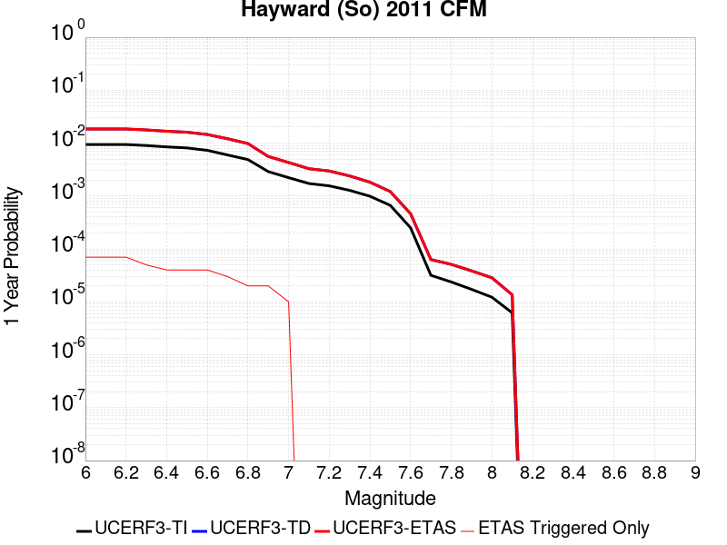 |  |

| Magnitude | 1 wk TI Prob | 1 wk TD Prob | 1 wk ETAS Prob | 1 wk ETAS/TD Gain | 1 wk ETAS Triggered Only | 1 mo TI Prob | 1 mo TD Prob | 1 mo ETAS Prob | 1 mo ETAS/TD Gain | 1 mo ETAS Triggered Only | 1 yr TI Prob | 1 yr TD Prob | 1 yr ETAS Prob | 1 yr ETAS/TD Gain | 1 yr ETAS Triggered Only | 10 yr TI Prob | 10 yr TD Prob | 10 yr ETAS Prob | 10 yr ETAS/TD Gain | 10 yr ETAS Triggered Only |
|-----|-----|-----|-----|-----|-----|-----|-----|-----|-----|-----|-----|-----|-----|-----|-----|-----|-----|-----|-----|-----|
| 6.0 | 1.8091932E-4 | 3.570541E-4 | 4.0703622E-4 | 1.1399848 | 5.0E-5 | 7.751381E-4 | 0.0015293444 | 0.0015892526 | 1.0391725 | 6.0E-5 | 0.00939654 | 0.018463207 | 0.018531917 | 1.0037214 | 7.0E-5 | 0.090090066 | 0.16673161 | 0.16679828 | 1.0003998 | 8.0E-5 |
| 6.1 | 1.8091932E-4 | 3.570541E-4 | 4.0703622E-4 | 1.1399848 | 5.0E-5 | 7.751381E-4 | 0.0015293444 | 0.0015892526 | 1.0391725 | 6.0E-5 | 0.00939654 | 0.018463207 | 0.018531917 | 1.0037214 | 7.0E-5 | 0.090090066 | 0.16673161 | 0.16679828 | 1.0003998 | 8.0E-5 |
| 6.2 | 1.8091932E-4 | 3.570541E-4 | 4.0703622E-4 | 1.1399848 | 5.0E-5 | 7.751381E-4 | 0.0015293444 | 0.0015892526 | 1.0391725 | 6.0E-5 | 0.00939654 | 0.018463207 | 0.018531917 | 1.0037214 | 7.0E-5 | 0.090090066 | 0.16673161 | 0.16679828 | 1.0003998 | 8.0E-5 |
| 6.3 | 1.7322872E-4 | 3.426234E-4 | 3.826097E-4 | 1.1167063 | 4.0E-5 | 7.4219756E-4 | 0.0014675693 | 0.0015075105 | 1.027216 | 4.0E-5 | 0.0089988755 | 0.017723544 | 0.017772658 | 1.0027711 | 5.0E-5 | 0.08643075 | 0.16066726 | 0.16071762 | 1.0003134 | 6.0E-5 |
| 6.4 | 1.6334097E-4 | 3.234411E-4 | 3.6342817E-4 | 1.1236302 | 4.0E-5 | 6.998449E-4 | 0.0013854484 | 0.001425393 | 1.0288315 | 4.0E-5 | 0.008487372 | 0.016739385 | 0.016778715 | 1.0023496 | 4.0E-5 | 0.081704415 | 0.15255594 | 0.1525983 | 1.0002778 | 5.0E-5 |
| 6.5 | 1.5600289E-4 | 3.1018828E-4 | 3.5017586E-4 | 1.128914 | 4.0E-5 | 6.684125E-4 | 0.0013287093 | 0.0013686562 | 1.0300643 | 4.0E-5 | 0.008107598 | 0.016058935 | 0.016098293 | 1.0024508 | 4.0E-5 | 0.078181036 | 0.14683272 | 0.14687537 | 1.0002905 | 5.0E-5 |
| 6.6 | 1.4046066E-4 | 2.8032906E-4 | 3.2031786E-4 | 1.1426494 | 4.0E-5 | 6.018354E-4 | 0.0012008639 | 0.0012408159 | 1.0332694 | 4.0E-5 | 0.0073027555 | 0.014524006 | 0.014563425 | 1.002714 | 4.0E-5 | 0.07067384 | 0.13391982 | 0.13396312 | 1.0003234 | 5.0E-5 |
| 6.7 | 1.14696966E-4 | 2.3271477E-4 | 2.627078E-4 | 1.1288831 | 3.0E-5 | 4.914658E-4 | 9.969729E-4 | 0.001026943 | 1.0300611 | 3.0E-5 | 0.0059671924 | 0.012071652 | 0.012101291 | 1.0024551 | 3.0E-5 | 0.058094822 | 0.11274672 | 0.11278222 | 1.0003148 | 4.0E-5 |
| 6.8 | 9.3874296E-5 | 1.8861453E-4 | 2.0861076E-4 | 1.1060164 | 2.0E-5 | 4.0225635E-4 | 8.0810126E-4 | 8.280851E-4 | 1.0247294 | 2.0E-5 | 0.0048864787 | 0.009794984 | 0.009814788 | 1.0020219 | 2.0E-5 | 0.047804173 | 0.09259856 | 0.09262578 | 1.000294 | 3.0E-5 |
| 6.9 | 5.551852E-5 | 1.072948E-4 | 1.2729265E-4 | 1.1863823 | 2.0E-5 | 2.3791482E-4 | 4.5975443E-4 | 4.797452E-4 | 1.0434815 | 2.0E-5 | 0.0028927654 | 0.0055832625 | 0.005603151 | 1.0035621 | 2.0E-5 | 0.028553981 | 0.054245494 | 0.054264408 | 1.0003487 | 2.0E-5 |
| 7.0 | 4.2662363E-5 | 8.2464416E-5 | 9.24636E-5 | 1.1212544 | 1.0E-5 | 1.8282588E-4 | 3.5337146E-4 | 3.6336793E-4 | 1.0282888 | 1.0E-5 | 0.0022236328 | 0.0042938837 | 0.004303841 | 1.0023189 | 1.0E-5 | 0.022015138 | 0.042064495 | 0.042074073 | 1.0002277 | 1.0E-5 |
| 7.1 | 3.305886E-5 | 6.3019055E-5 | 6.3019055E-5 | 1.0 | 0.0 | 1.4167312E-4 | 2.700538E-4 | 2.700538E-4 | 1.0 | 0.0 | 0.0017235056 | 0.0032829668 | 0.0032829668 | 1.0 | 0.0 | 0.017101998 | 0.032452874 | 0.032452874 | 1.0 | 0.0 |
| 7.2 | 2.9856887E-5 | 5.7013647E-5 | 5.7013647E-5 | 1.0 | 0.0 | 1.2795182E-4 | 2.4432142E-4 | 2.4432142E-4 | 1.0 | 0.0 | 0.0015567001 | 0.0029705726 | 0.0029705726 | 1.0 | 0.0 | 0.015458403 | 0.029453589 | 0.029453589 | 1.0 | 0.0 |
| 7.3 | 2.4559737E-5 | 4.599088E-5 | 4.599088E-5 | 1.0 | 0.0 | 1.0525176E-4 | 1.9708896E-4 | 1.9708896E-4 | 1.0 | 0.0 | 0.0012806869 | 0.0023969305 | 0.0023969305 | 1.0 | 0.0 | 0.012733313 | 0.023857482 | 0.023857482 | 1.0 | 0.0 |
| 7.4 | 1.9002231E-5 | 3.5049303E-5 | 3.5049303E-5 | 1.0 | 0.0 | 8.143559E-5 | 1.502027E-4 | 1.502027E-4 | 1.0 | 0.0 | 9.910273E-4 | 0.0018271938 | 0.0018271938 | 1.0 | 0.0 | 0.009866194 | 0.018258283 | 0.018258283 | 1.0 | 0.0 |
| 7.5 | 1.2783333E-5 | 2.3330069E-5 | 2.3330069E-5 | 1.0 | 0.0 | 5.4784563E-5 | 9.998221E-5 | 9.998221E-5 | 1.0 | 0.0 | 6.667979E-4 | 0.0012166094 | 0.0012166094 | 1.0 | 0.0 | 0.006648007 | 0.012209582 | 0.012209582 | 1.0 | 0.0 |
| 7.6 | 4.8149627E-6 | 8.887544E-6 | 8.887544E-6 | 1.0 | 0.0 | 2.063539E-5 | 3.8088925E-5 | 3.8088925E-5 | 1.0 | 0.0 | 2.5120692E-4 | 4.636352E-4 | 4.636352E-4 | 1.0 | 0.0 | 0.0025092314 | 0.0046812436 | 0.0046812436 | 1.0 | 0.0 |
| 7.7 | 6.0838227E-7 | 1.2056693E-6 | 1.2056693E-6 | 1.0 | 0.0 | 2.6073499E-6 | 5.1671436E-6 | 5.1671436E-6 | 1.0 | 0.0 | 3.174402E-5 | 6.290816E-5 | 6.290816E-5 | 1.0 | 0.0 | 3.1739488E-4 | 6.5293367E-4 | 6.5293367E-4 | 1.0 | 0.0 |
| 7.8 | 4.5542808E-7 | 9.792182E-7 | 9.792182E-7 | 1.0 | 0.0 | 1.9518332E-6 | 4.1966427E-6 | 4.1966427E-6 | 1.0 | 0.0 | 2.376331E-5 | 5.1092928E-5 | 5.1092928E-5 | 1.0 | 0.0 | 2.3760769E-4 | 5.321372E-4 | 5.321372E-4 | 1.0 | 0.0 |
| 7.9 | 3.3016747E-7 | 7.386335E-7 | 7.386335E-7 | 1.0 | 0.0 | 1.4150027E-6 | 3.1655684E-6 | 3.1655684E-6 | 1.0 | 0.0 | 1.7227521E-5 | 3.8540114E-5 | 3.8540114E-5 | 1.0 | 0.0 | 1.7226185E-4 | 3.9930744E-4 | 3.9930744E-4 | 1.0 | 0.0 |
| 8.0 | 2.347038E-7 | 5.4714894E-7 | 5.4714894E-7 | 1.0 | 0.0 | 1.0058731E-6 | 2.344922E-6 | 2.344922E-6 | 1.0 | 0.0 | 1.2246436E-5 | 2.8549053E-5 | 2.8549053E-5 | 1.0 | 0.0 | 1.2245761E-4 | 2.9355253E-4 | 2.9355253E-4 | 1.0 | 0.0 |
| 8.1 | 1.18822804E-7 | 2.6058973E-7 | 2.6058973E-7 | 1.0 | 0.0 | 5.092405E-7 | 1.1168127E-6 | 1.1168127E-6 | 1.0 | 0.0 | 6.1999854E-6 | 1.359711E-5 | 1.359711E-5 | 1.0 | 0.0 | 6.199812E-5 | 1.3917852E-4 | 1.3917852E-4 | 1.0 | 0.0 |

## Elsinore (Stepovers Combined)
*[(top)](#table-of-contents)*

| 1 Week | 1 Month | 1 Year | 10 Year |
|-----|-----|-----|-----|
| 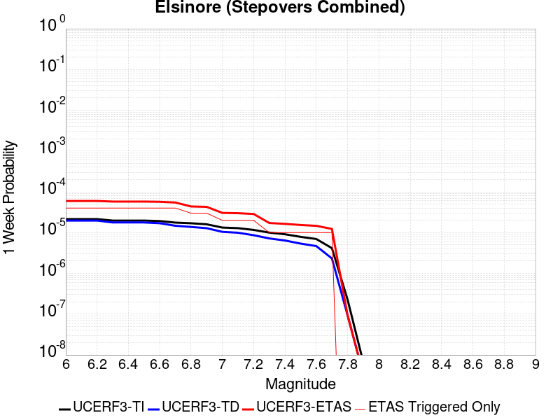 |  |  |  |

| Magnitude | 1 wk TI Prob | 1 wk TD Prob | 1 wk ETAS Prob | 1 wk ETAS/TD Gain | 1 wk ETAS Triggered Only | 1 mo TI Prob | 1 mo TD Prob | 1 mo ETAS Prob | 1 mo ETAS/TD Gain | 1 mo ETAS Triggered Only | 1 yr TI Prob | 1 yr TD Prob | 1 yr ETAS Prob | 1 yr ETAS/TD Gain | 1 yr ETAS Triggered Only | 10 yr TI Prob | 10 yr TD Prob | 10 yr ETAS Prob | 10 yr ETAS/TD Gain | 10 yr ETAS Triggered Only |
|-----|-----|-----|-----|-----|-----|-----|-----|-----|-----|-----|-----|-----|-----|-----|-----|-----|-----|-----|-----|-----|
| 6.0 | 2.144392E-5 | 1.9760193E-5 | 5.97594E-5 | 3.0242317 | 4.0E-5 | 9.189928E-5 | 8.468392E-5 | 1.2468053E-4 | 1.4723047 | 4.0E-5 | 0.0011182994 | 0.0010305607 | 0.0011104782 | 1.0775477 | 8.0E-5 | 0.011126885 | 0.010264917 | 0.010344096 | 1.0077136 | 8.0E-5 |
| 6.1 | 2.144392E-5 | 1.9760193E-5 | 5.97594E-5 | 3.0242317 | 4.0E-5 | 9.189928E-5 | 8.468392E-5 | 1.2468053E-4 | 1.4723047 | 4.0E-5 | 0.0011182994 | 0.0010305607 | 0.0011104782 | 1.0775477 | 8.0E-5 | 0.011126885 | 0.010264917 | 0.010344096 | 1.0077136 | 8.0E-5 |
| 6.2 | 2.144392E-5 | 1.9760193E-5 | 5.97594E-5 | 3.0242317 | 4.0E-5 | 9.189928E-5 | 8.468392E-5 | 1.2468053E-4 | 1.4723047 | 4.0E-5 | 0.0011182994 | 0.0010305607 | 0.0011104782 | 1.0775477 | 8.0E-5 | 0.011126885 | 0.010264917 | 0.010344096 | 1.0077136 | 8.0E-5 |
| 6.3 | 1.9751555E-5 | 1.7741453E-5 | 5.7740745E-5 | 3.254567 | 4.0E-5 | 8.4646774E-5 | 7.603267E-5 | 1.1602963E-4 | 1.5260496 | 4.0E-5 | 0.0010300872 | 9.253213E-4 | 0.0010052472 | 1.0863764 | 8.0E-5 | 0.010253254 | 0.009221276 | 0.009300538 | 1.0085956 | 8.0E-5 |
| 6.4 | 1.9751555E-5 | 1.7741453E-5 | 5.7740745E-5 | 3.254567 | 4.0E-5 | 8.4646774E-5 | 7.603267E-5 | 1.1602963E-4 | 1.5260496 | 4.0E-5 | 0.0010300872 | 9.253213E-4 | 0.0010052472 | 1.0863764 | 8.0E-5 | 0.010253254 | 0.009221276 | 0.009300538 | 1.0085956 | 8.0E-5 |
| 6.5 | 1.9751555E-5 | 1.7741453E-5 | 5.7740745E-5 | 3.254567 | 4.0E-5 | 8.4646774E-5 | 7.603267E-5 | 1.1602963E-4 | 1.5260496 | 4.0E-5 | 0.0010300872 | 9.253213E-4 | 0.0010052472 | 1.0863764 | 8.0E-5 | 0.010253254 | 0.009221276 | 0.009300538 | 1.0085956 | 8.0E-5 |
| 6.6 | 1.9188685E-5 | 1.7003393E-5 | 5.700271E-5 | 3.3524318 | 4.0E-5 | 8.2234634E-5 | 7.286974E-5 | 1.1286682E-4 | 1.5488847 | 4.0E-5 | 0.0010007467 | 8.868442E-4 | 9.667732E-4 | 1.0901275 | 8.0E-5 | 0.00996252 | 0.0088398475 | 0.00891914 | 1.0089699 | 8.0E-5 |
| 6.7 | 1.7608272E-5 | 1.4732616E-5 | 5.4732027E-5 | 3.7150242 | 4.0E-5 | 7.546184E-5 | 6.3138315E-5 | 1.0313579E-4 | 1.6334897 | 4.0E-5 | 9.183606E-4 | 7.684476E-4 | 8.383938E-4 | 1.0910227 | 7.0E-5 | 0.009145746 | 0.00766491 | 0.0077343737 | 1.0090625 | 7.0E-5 |
| 6.8 | 1.697165E-5 | 1.3783365E-5 | 4.378295E-5 | 3.1765068 | 3.0E-5 | 7.273361E-5 | 5.9070277E-5 | 8.9068504E-5 | 1.5078397 | 3.0E-5 | 8.8517193E-4 | 7.18952E-4 | 7.7890884E-4 | 1.0833948 | 6.0E-5 | 0.008816543 | 0.007172675 | 0.0072322446 | 1.0083051 | 6.0E-5 |
| 6.9 | 1.600365E-5 | 1.2846671E-5 | 4.2846284E-5 | 3.3352053 | 3.0E-5 | 6.858527E-5 | 5.5056043E-5 | 8.5054395E-5 | 1.5448693 | 3.0E-5 | 8.347058E-4 | 6.7010894E-4 | 7.300688E-4 | 1.0894777 | 6.0E-5 | 0.008315775 | 0.0066867657 | 0.0067463648 | 1.0089129 | 6.0E-5 |
| 7.0 | 1.3314581E-5 | 1.0447548E-5 | 3.044734E-5 | 2.9143047 | 2.0E-5 | 5.7061243E-5 | 4.4774453E-5 | 6.477356E-5 | 1.4466633 | 2.0E-5 | 6.944992E-4 | 5.449953E-4 | 5.8497355E-4 | 1.0733551 | 4.0E-5 | 0.006923327 | 0.0054405155 | 0.005480298 | 1.0073123 | 4.0E-5 |
| 7.1 | 1.2865345E-5 | 9.937536E-6 | 2.9937337E-5 | 3.0125513 | 2.0E-5 | 5.5136024E-5 | 4.258876E-5 | 6.2587904E-5 | 1.4695874 | 2.0E-5 | 6.710743E-4 | 5.183973E-4 | 5.583766E-4 | 1.0771209 | 4.0E-5 | 0.0066905143 | 0.0051752133 | 0.0052150064 | 1.0076891 | 4.0E-5 |
| 7.2 | 1.1650051E-5 | 8.633809E-6 | 2.8633636E-5 | 3.3164546 | 2.0E-5 | 4.9927836E-5 | 3.7001522E-5 | 5.7000783E-5 | 1.5404983 | 2.0E-5 | 6.0770183E-4 | 4.504022E-4 | 4.903842E-4 | 1.0887696 | 4.0E-5 | 0.0060604266 | 0.0044963174 | 0.0045361375 | 1.0088562 | 4.0E-5 |
| 7.3 | 1.0008533E-5 | 7.2010425E-6 | 1.7200971E-5 | 2.3886778 | 1.0E-5 | 4.2893007E-5 | 3.0861254E-5 | 4.0860945E-5 | 1.3240209 | 1.0E-5 | 5.220972E-4 | 3.7567242E-4 | 4.0566115E-4 | 1.0798268 | 3.0E-5 | 0.005208723 | 0.003750761 | 0.0037806483 | 1.0079684 | 3.0E-5 |
| 7.4 | 9.116759E-6 | 6.410068E-6 | 1.6410004E-5 | 2.5600357 | 1.0E-5 | 3.907124E-5 | 2.747144E-5 | 3.7471164E-5 | 1.3640044 | 1.0E-5 | 4.7558855E-4 | 3.3441483E-4 | 3.5440814E-4 | 1.059786 | 2.0E-5 | 0.00474572 | 0.0033392678 | 0.0033592011 | 1.0059693 | 2.0E-5 |
| 7.5 | 7.870524E-6 | 5.3825365E-6 | 1.5382482E-5 | 2.85785 | 1.0E-5 | 3.3730383E-5 | 2.3067816E-5 | 3.3067587E-5 | 1.4334944 | 1.0E-5 | 4.1059E-4 | 2.8081573E-4 | 3.0081012E-4 | 1.0712011 | 2.0E-5 | 0.0040983222 | 0.0028047354 | 0.0028246795 | 1.0071108 | 2.0E-5 |
| 7.6 | 6.9774537E-6 | 4.6776067E-6 | 1.467756E-5 | 3.1378353 | 1.0E-5 | 2.990303E-5 | 2.0046738E-5 | 3.0046538E-5 | 1.4988242 | 1.0E-5 | 3.640086E-4 | 2.4404288E-4 | 2.64038E-4 | 1.0819328 | 2.0E-5 | 0.003634129 | 0.0024378651 | 0.0024578164 | 1.008184 | 2.0E-5 |
| 7.7 | 4.1616954E-6 | 2.32834E-6 | 1.2328317E-5 | 5.294895 | 1.0E-5 | 1.7835715E-5 | 9.978567E-6 | 1.9978466E-5 | 2.002138 | 1.0E-5 | 2.171282E-4 | 1.2148302E-4 | 1.3148181E-4 | 1.082306 | 1.0E-5 | 0.0021691616 | 0.0012142392 | 0.001224227 | 1.0082256 | 1.0E-5 |
| 7.8 | 2.2692414E-7 | 9.3854695E-8 | 9.3854695E-8 | 1.0 | 0.0 | 9.725317E-7 | 4.0223435E-7 | 4.0223435E-7 | 1.0 | 0.0 | 1.1840509E-5 | 4.8971956E-6 | 4.8971956E-6 | 1.0 | 0.0 | 1.1839878E-4 | 4.8971204E-5 | 4.8971204E-5 | 1.0 | 0.0 |
| 7.9 | 6.676829E-9 | 3.439853E-9 | 3.439853E-9 | 1.0 | 0.0 | 2.861498E-8 | 1.4742227E-8 | 1.4742227E-8 | 1.0 | 0.0 | 3.4838732E-7 | 1.7948659E-7 | 1.7948659E-7 | 1.0 | 0.0 | 3.4838679E-6 | 1.7948646E-6 | 1.7948646E-6 | 1.0 | 0.0 |

## Ortigalita (South)
*[(top)](#table-of-contents)*

| 1 Week | 1 Month | 1 Year | 10 Year |
|-----|-----|-----|-----|
|  |  |  |  |

| Magnitude | 1 wk TI Prob | 1 wk TD Prob | 1 wk ETAS Prob | 1 wk ETAS/TD Gain | 1 wk ETAS Triggered Only | 1 mo TI Prob | 1 mo TD Prob | 1 mo ETAS Prob | 1 mo ETAS/TD Gain | 1 mo ETAS Triggered Only | 1 yr TI Prob | 1 yr TD Prob | 1 yr ETAS Prob | 1 yr ETAS/TD Gain | 1 yr ETAS Triggered Only | 10 yr TI Prob | 10 yr TD Prob | 10 yr ETAS Prob | 10 yr ETAS/TD Gain | 10 yr ETAS Triggered Only |
|-----|-----|-----|-----|-----|-----|-----|-----|-----|-----|-----|-----|-----|-----|-----|-----|-----|-----|-----|-----|-----|
| 6.0 | 3.72394E-5 | 4.325562E-5 | 8.3253886E-5 | 1.9246954 | 4.0E-5 | 1.5958765E-4 | 1.8536893E-4 | 2.3535966E-4 | 1.2696824 | 5.0E-5 | 0.0019412481 | 0.0022546875 | 0.0023245297 | 1.0309764 | 7.0E-5 | 0.019243775 | 0.022334497 | 0.02241271 | 1.0035019 | 8.0E-5 |
| 6.1 | 2.7299884E-5 | 3.149204E-5 | 7.149078E-5 | 2.2701223 | 4.0E-5 | 1.16994255E-4 | 1.3495922E-4 | 1.8495249E-4 | 1.3704323 | 5.0E-5 | 0.0014234743 | 0.0016419457 | 0.0017118307 | 1.0425624 | 7.0E-5 | 0.014143906 | 0.01630407 | 0.016372928 | 1.0042235 | 7.0E-5 |
| 6.2 | 2.7299884E-5 | 3.149204E-5 | 7.149078E-5 | 2.2701223 | 4.0E-5 | 1.16994255E-4 | 1.3495922E-4 | 1.8495249E-4 | 1.3704323 | 5.0E-5 | 0.0014234743 | 0.0016419457 | 0.0017118307 | 1.0425624 | 7.0E-5 | 0.014143906 | 0.01630407 | 0.016372928 | 1.0042235 | 7.0E-5 |
| 6.3 | 2.0546433E-5 | 2.363145E-5 | 5.363074E-5 | 2.2694647 | 3.0E-5 | 8.805317E-5 | 1.0127382E-4 | 1.3127078E-4 | 1.2961966 | 3.0E-5 | 0.00107152 | 0.0012323303 | 0.0012822687 | 1.0405235 | 5.0E-5 | 0.010663681 | 0.01225703 | 0.012306417 | 1.0040293 | 5.0E-5 |
| 6.4 | 2.0546433E-5 | 2.363145E-5 | 5.363074E-5 | 2.2694647 | 3.0E-5 | 8.805317E-5 | 1.0127382E-4 | 1.3127078E-4 | 1.2961966 | 3.0E-5 | 0.00107152 | 0.0012323303 | 0.0012822687 | 1.0405235 | 5.0E-5 | 0.010663681 | 0.01225703 | 0.012306417 | 1.0040293 | 5.0E-5 |
| 6.5 | 1.7779594E-5 | 2.0446974E-5 | 5.044636E-5 | 2.4671798 | 3.0E-5 | 7.619603E-5 | 8.762702E-5 | 1.1762439E-4 | 1.3423301 | 3.0E-5 | 9.272918E-4 | 0.0010663504 | 0.0011063077 | 1.0374712 | 4.0E-5 | 0.009234319 | 0.010613803 | 0.010653378 | 1.0037286 | 4.0E-5 |
| 6.6 | 1.6272212E-5 | 1.8714967E-5 | 4.8714406E-5 | 2.602965 | 3.0E-5 | 6.973618E-5 | 8.0204605E-5 | 1.102022E-4 | 1.3740133 | 3.0E-5 | 8.487073E-4 | 9.760658E-4 | 0.0010160268 | 1.0409409 | 4.0E-5 | 0.008454733 | 0.009719091 | 0.009758702 | 1.0040756 | 4.0E-5 |
| 6.7 | 1.3051484E-5 | 1.5038758E-5 | 4.5038305E-5 | 2.9948156 | 3.0E-5 | 5.593373E-5 | 6.445028E-5 | 9.444835E-5 | 1.465445 | 3.0E-5 | 6.807804E-4 | 7.844092E-4 | 8.243778E-4 | 1.0509537 | 4.0E-5 | 0.006786986 | 0.007817388 | 0.007857075 | 1.0050768 | 4.0E-5 |
| 6.8 | 1.04277415E-5 | 1.1987235E-5 | 2.1987114E-5 | 1.8342108 | 1.0E-5 | 4.4689557E-5 | 5.1372896E-5 | 6.137238E-5 | 1.1946452 | 1.0E-5 | 5.439595E-4 | 6.2529295E-4 | 6.452804E-4 | 1.031965 | 2.0E-5 | 0.0054262993 | 0.00623609 | 0.006255965 | 1.0031872 | 2.0E-5 |
| 6.9 | 7.639968E-6 | 8.791503E-6 | 1.8791416E-5 | 2.137452 | 1.0E-5 | 3.274231E-5 | 3.767736E-5 | 4.7676982E-5 | 1.2654014 | 1.0E-5 | 3.9856473E-4 | 4.586312E-4 | 4.78622E-4 | 1.043588 | 2.0E-5 | 0.003978506 | 0.004577433 | 0.0045973416 | 1.0043492 | 2.0E-5 |
| 7.0 | 3.919831E-6 | 4.5334014E-6 | 4.5334014E-6 | 1.0 | 0.0 | 1.679917E-5 | 1.942873E-5 | 1.942873E-5 | 1.0 | 0.0 | 2.045107E-4 | 2.3652123E-4 | 2.3652123E-4 | 1.0 | 0.0 | 0.0020432258 | 0.0023629034 | 0.0023629034 | 1.0 | 0.0 |
| 7.1 | 1.6017933E-6 | 1.8570418E-6 | 1.8570418E-6 | 1.0 | 0.0 | 6.8648105E-6 | 7.958732E-6 | 7.958732E-6 | 1.0 | 0.0 | 8.357586E-5 | 9.689432E-5 | 9.689432E-5 | 1.0 | 0.0 | 8.3544437E-4 | 9.686254E-4 | 9.686254E-4 | 1.0 | 0.0 |

## Elysian Park (Upper)
*[(top)](#table-of-contents)*

| 1 Week | 1 Month | 1 Year | 10 Year |
|-----|-----|-----|-----|
|  |  |  | 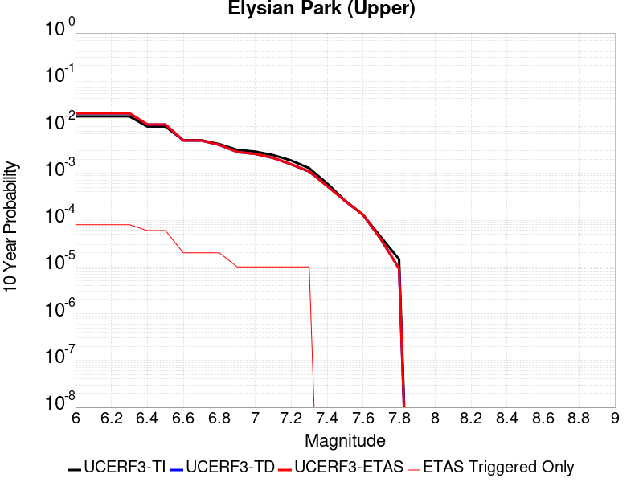 |

| Magnitude | 1 wk TI Prob | 1 wk TD Prob | 1 wk ETAS Prob | 1 wk ETAS/TD Gain | 1 wk ETAS Triggered Only | 1 mo TI Prob | 1 mo TD Prob | 1 mo ETAS Prob | 1 mo ETAS/TD Gain | 1 mo ETAS Triggered Only | 1 yr TI Prob | 1 yr TD Prob | 1 yr ETAS Prob | 1 yr ETAS/TD Gain | 1 yr ETAS Triggered Only | 10 yr TI Prob | 10 yr TD Prob | 10 yr ETAS Prob | 10 yr ETAS/TD Gain | 10 yr ETAS Triggered Only |
|-----|-----|-----|-----|-----|-----|-----|-----|-----|-----|-----|-----|-----|-----|-----|-----|-----|-----|-----|-----|-----|
| 6.0 | 3.1876025E-5 | 3.7035516E-5 | 8.703366E-5 | 2.3500056 | 5.0E-5 | 1.3660437E-4 | 1.587167E-4 | 2.0870878E-4 | 1.3149767 | 5.0E-5 | 0.0016618895 | 0.0019311075 | 0.0020009722 | 1.0361786 | 7.0E-5 | 0.016495159 | 0.019189782 | 0.019268248 | 1.0040889 | 8.0E-5 |
| 6.1 | 3.1876025E-5 | 3.7035516E-5 | 8.703366E-5 | 2.3500056 | 5.0E-5 | 1.3660437E-4 | 1.587167E-4 | 2.0870878E-4 | 1.3149767 | 5.0E-5 | 0.0016618895 | 0.0019311075 | 0.0020009722 | 1.0361786 | 7.0E-5 | 0.016495159 | 0.019189782 | 0.019268248 | 1.0040889 | 8.0E-5 |
| 6.2 | 3.1876025E-5 | 3.7035516E-5 | 8.703366E-5 | 2.3500056 | 5.0E-5 | 1.3660437E-4 | 1.587167E-4 | 2.0870878E-4 | 1.3149767 | 5.0E-5 | 0.0016618895 | 0.0019311075 | 0.0020009722 | 1.0361786 | 7.0E-5 | 0.016495159 | 0.019189782 | 0.019268248 | 1.0040889 | 8.0E-5 |
| 6.3 | 3.1876025E-5 | 3.7035516E-5 | 8.703366E-5 | 2.3500056 | 5.0E-5 | 1.3660437E-4 | 1.587167E-4 | 2.0870878E-4 | 1.3149767 | 5.0E-5 | 0.0016618895 | 0.0019311075 | 0.0020009722 | 1.0361786 | 7.0E-5 | 0.016495159 | 0.019189782 | 0.019268248 | 1.0040889 | 8.0E-5 |
| 6.4 | 1.9273462E-5 | 2.1202266E-5 | 6.120142E-5 | 2.886551 | 4.0E-5 | 8.259794E-5 | 9.086466E-5 | 1.3086104E-4 | 1.4401752 | 4.0E-5 | 0.001005166 | 0.0011058892 | 0.001155834 | 1.0451624 | 5.0E-5 | 0.010006315 | 0.011020724 | 0.011080062 | 1.0053843 | 6.0E-5 |
| 6.5 | 1.9273462E-5 | 2.1202266E-5 | 6.120142E-5 | 2.886551 | 4.0E-5 | 8.259794E-5 | 9.086466E-5 | 1.3086104E-4 | 1.4401752 | 4.0E-5 | 0.001005166 | 0.0011058892 | 0.001155834 | 1.0451624 | 5.0E-5 | 0.010006315 | 0.011020724 | 0.011080062 | 1.0053843 | 6.0E-5 |
| 6.6 | 9.813258E-6 | 9.665599E-6 | 2.9665405E-5 | 3.0691743 | 2.0E-5 | 4.205614E-5 | 4.1423376E-5 | 6.142255E-5 | 1.4827992 | 2.0E-5 | 5.119132E-4 | 5.0422014E-4 | 5.2421005E-4 | 1.0396452 | 2.0E-5 | 0.005107356 | 0.0050314846 | 0.005051384 | 1.003955 | 2.0E-5 |
| 6.7 | 9.801478E-6 | 9.653168E-6 | 2.9652974E-5 | 3.0718386 | 2.0E-5 | 4.2005657E-5 | 4.1370105E-5 | 6.1369275E-5 | 1.4834208 | 2.0E-5 | 5.112989E-4 | 5.035719E-4 | 5.235618E-4 | 1.0396963 | 2.0E-5 | 0.0051012407 | 0.0050250315 | 0.0050449306 | 1.0039601 | 2.0E-5 |
| 6.8 | 8.102489E-6 | 7.773004E-6 | 2.7772849E-5 | 3.5729878 | 2.0E-5 | 3.4724493E-5 | 3.3312477E-5 | 5.331181E-5 | 1.6003556 | 2.0E-5 | 4.2268867E-4 | 4.055089E-4 | 4.255008E-4 | 1.0493008 | 2.0E-5 | 0.004218856 | 0.0040481836 | 0.0040681027 | 1.0049205 | 2.0E-5 |
| 6.9 | 6.08275E-6 | 5.4814514E-6 | 1.5481397E-5 | 2.8243244 | 1.0E-5 | 2.6068668E-5 | 2.3491726E-5 | 3.349149E-5 | 1.4256718 | 1.0E-5 | 3.173398E-4 | 2.85975E-4 | 2.9597213E-4 | 1.0349581 | 1.0E-5 | 0.0031688702 | 0.0028561477 | 0.0028661191 | 1.0034912 | 1.0E-5 |
| 7.0 | 5.5995934E-6 | 4.98278E-6 | 1.498273E-5 | 3.0069017 | 1.0E-5 | 2.3998036E-5 | 2.13546E-5 | 3.1354386E-5 | 1.4682732 | 1.0E-5 | 2.9213692E-4 | 2.599619E-4 | 2.699593E-4 | 1.0384572 | 1.0E-5 | 0.0029175316 | 0.0025966454 | 0.0026066194 | 1.0038412 | 1.0E-5 |
| 7.1 | 4.709881E-6 | 4.0874015E-6 | 1.4087361E-5 | 3.4465322 | 1.0E-5 | 2.0185047E-5 | 1.7517319E-5 | 2.7517144E-5 | 1.5708536 | 1.0E-5 | 2.4572524E-4 | 2.132529E-4 | 2.2325077E-4 | 1.0468826 | 1.0E-5 | 0.002454537 | 0.002130524 | 0.0021405027 | 1.0046837 | 1.0E-5 |
| 7.2 | 3.6063436E-6 | 2.9779544E-6 | 1.2977925E-5 | 4.358 | 1.0E-5 | 1.5455667E-5 | 1.27626E-5 | 2.2762473E-5 | 1.7835294 | 1.0E-5 | 1.881565E-4 | 1.5537368E-4 | 1.6537213E-4 | 1.064351 | 1.0E-5 | 0.0018799726 | 0.0015526618 | 0.0015626462 | 1.0064305 | 1.0E-5 |
| 7.3 | 2.471135E-6 | 2.0954615E-6 | 1.2095441E-5 | 5.772208 | 1.0E-5 | 1.0590536E-5 | 8.980519E-6 | 1.8980429E-5 | 2.1135113 | 1.0E-5 | 1.2893214E-4 | 1.093324E-4 | 1.19331315E-4 | 1.0914541 | 1.0E-5 | 0.0012885736 | 0.0010927934 | 0.0011027824 | 1.0091408 | 1.0E-5 |
| 7.4 | 1.163943E-6 | 1.0275091E-6 | 1.0275091E-6 | 1.0 | 0.0 | 4.988318E-6 | 4.4036033E-6 | 4.4036033E-6 | 1.0 | 0.0 | 6.0731076E-5 | 5.3612584E-5 | 5.3612584E-5 | 1.0 | 0.0 | 6.071448E-4 | 5.359995E-4 | 5.359995E-4 | 1.0 | 0.0 |
| 7.5 | 4.99459E-7 | 4.917604E-7 | 4.917604E-7 | 1.0 | 0.0 | 2.140537E-6 | 2.1075427E-6 | 2.1075427E-6 | 1.0 | 0.0 | 2.6060725E-5 | 2.5659048E-5 | 2.5659048E-5 | 1.0 | 0.0 | 2.605767E-4 | 2.5656243E-4 | 2.5656243E-4 | 1.0 | 0.0 |
| 7.6 | 2.4667852E-7 | 2.4778336E-7 | 2.4778336E-7 | 1.0 | 0.0 | 1.0571932E-6 | 1.0619283E-6 | 1.0619283E-6 | 1.0 | 0.0 | 1.2871251E-5 | 1.2928905E-5 | 1.2928905E-5 | 1.0 | 0.0 | 1.2870505E-4 | 1.2928189E-4 | 1.2928189E-4 | 1.0 | 0.0 |
| 7.7 | 8.2312795E-8 | 7.3864456E-8 | 7.3864456E-8 | 1.0 | 0.0 | 3.527691E-7 | 3.165619E-7 | 3.165619E-7 | 1.0 | 0.0 | 4.294955E-6 | 3.8541357E-6 | 3.8541357E-6 | 1.0 | 0.0 | 4.2948723E-5 | 3.8540802E-5 | 3.8540802E-5 | 1.0 | 0.0 |
| 7.8 | 2.7819295E-8 | 1.7566023E-8 | 1.7566023E-8 | 1.0 | 0.0 | 1.1922555E-7 | 7.5282955E-8 | 7.5282955E-8 | 1.0 | 0.0 | 1.45157E-6 | 9.165697E-7 | 9.165697E-7 | 1.0 | 0.0 | 1.45156055E-5 | 9.165675E-6 | 9.165675E-6 | 1.0 | 0.0 |

## Kern Canyon (Lake Isabella) 2011
*[(top)](#table-of-contents)*

| 1 Week | 1 Month | 1 Year | 10 Year |
|-----|-----|-----|-----|
|  |  |  |  |

| Magnitude | 1 wk TI Prob | 1 wk TD Prob | 1 wk ETAS Prob | 1 wk ETAS/TD Gain | 1 wk ETAS Triggered Only | 1 mo TI Prob | 1 mo TD Prob | 1 mo ETAS Prob | 1 mo ETAS/TD Gain | 1 mo ETAS Triggered Only | 1 yr TI Prob | 1 yr TD Prob | 1 yr ETAS Prob | 1 yr ETAS/TD Gain | 1 yr ETAS Triggered Only | 10 yr TI Prob | 10 yr TD Prob | 10 yr ETAS Prob | 10 yr ETAS/TD Gain | 10 yr ETAS Triggered Only |
|-----|-----|-----|-----|-----|-----|-----|-----|-----|-----|-----|-----|-----|-----|-----|-----|-----|-----|-----|-----|-----|
| 6.0 | 4.2387383E-6 | 4.001639E-6 | 2.4001558E-5 | 5.9979324 | 2.0E-5 | 1.8165894E-5 | 1.7149778E-5 | 5.7149093E-5 | 3.3323517 | 4.0E-5 | 2.2114732E-4 | 2.087804E-4 | 2.787658E-4 | 1.3352106 | 7.0E-5 | 0.0022092736 | 0.0020860266 | 0.0021558804 | 1.0334866 | 7.0E-5 |
| 6.1 | 4.2387383E-6 | 4.001639E-6 | 2.4001558E-5 | 5.9979324 | 2.0E-5 | 1.8165894E-5 | 1.7149778E-5 | 5.7149093E-5 | 3.3323517 | 4.0E-5 | 2.2114732E-4 | 2.087804E-4 | 2.787658E-4 | 1.3352106 | 7.0E-5 | 0.0022092736 | 0.0020860266 | 0.0021558804 | 1.0334866 | 7.0E-5 |
| 6.2 | 4.2387383E-6 | 4.001639E-6 | 2.4001558E-5 | 5.9979324 | 2.0E-5 | 1.8165894E-5 | 1.7149778E-5 | 5.7149093E-5 | 3.3323517 | 4.0E-5 | 2.2114732E-4 | 2.087804E-4 | 2.787658E-4 | 1.3352106 | 7.0E-5 | 0.0022092736 | 0.0020860266 | 0.0021558804 | 1.0334866 | 7.0E-5 |
| 6.3 | 4.2387383E-6 | 4.001639E-6 | 2.4001558E-5 | 5.9979324 | 2.0E-5 | 1.8165894E-5 | 1.7149778E-5 | 5.7149093E-5 | 3.3323517 | 4.0E-5 | 2.2114732E-4 | 2.087804E-4 | 2.787658E-4 | 1.3352106 | 7.0E-5 | 0.0022092736 | 0.0020860266 | 0.0021558804 | 1.0334866 | 7.0E-5 |
| 6.4 | 4.2387383E-6 | 4.001639E-6 | 2.4001558E-5 | 5.9979324 | 2.0E-5 | 1.8165894E-5 | 1.7149778E-5 | 5.7149093E-5 | 3.3323517 | 4.0E-5 | 2.2114732E-4 | 2.087804E-4 | 2.787658E-4 | 1.3352106 | 7.0E-5 | 0.0022092736 | 0.0020860266 | 0.0021558804 | 1.0334866 | 7.0E-5 |
| 6.5 | 2.7857532E-6 | 2.517867E-6 | 1.2517842E-5 | 4.971606 | 1.0E-5 | 1.1938888E-5 | 1.0790815E-5 | 3.07906E-5 | 2.853408 | 2.0E-5 | 1.4534626E-4 | 1.3137059E-4 | 1.7136533E-4 | 1.3044422 | 4.0E-5 | 0.0014525123 | 0.001312962 | 0.0013529095 | 1.0304254 | 4.0E-5 |
| 6.6 | 2.2233348E-6 | 1.9441236E-6 | 1.1944104E-5 | 6.143696 | 1.0E-5 | 9.528543E-6 | 8.331932E-6 | 2.8331766E-5 | 3.4003837 | 2.0E-5 | 1.1600384E-4 | 1.01436635E-4 | 1.4143258E-4 | 1.3942949 | 4.0E-5 | 0.001159433 | 0.001013912 | 0.0010538715 | 1.0394112 | 4.0E-5 |
| 6.7 | 2.1635126E-6 | 1.8835036E-6 | 1.1883485E-5 | 6.3092446 | 1.0E-5 | 9.272164E-6 | 8.072134E-6 | 2.8071972E-5 | 3.4776397 | 2.0E-5 | 1.1288274E-4 | 9.827388E-5 | 1.3826994E-4 | 1.4069858 | 4.0E-5 | 0.0011282542 | 9.823124E-4 | 0.0010222731 | 1.0406803 | 4.0E-5 |
| 6.8 | 1.8685711E-6 | 1.5831425E-6 | 1.5831425E-6 | 1.0 | 0.0 | 8.008137E-6 | 6.784879E-6 | 1.6784812E-5 | 2.4738555 | 1.0E-5 | 9.74947E-5 | 8.260282E-5 | 1.0260117E-4 | 1.2421025 | 2.0E-5 | 9.745194E-4 | 8.2572614E-4 | 8.457096E-4 | 1.0242012 | 2.0E-5 |
| 6.9 | 1.5815071E-6 | 1.3064928E-6 | 1.3064928E-6 | 1.0 | 0.0 | 6.77787E-6 | 5.599243E-6 | 1.5599187E-5 | 2.7859457 | 1.0E-5 | 8.251744E-5 | 6.816868E-5 | 8.816732E-5 | 1.2933699 | 2.0E-5 | 8.248681E-4 | 6.8148033E-4 | 7.0146675E-4 | 1.0293279 | 2.0E-5 |
| 7.0 | 1.3772564E-6 | 1.1210718E-6 | 1.1210718E-6 | 1.0 | 0.0 | 5.9025137E-6 | 4.8045845E-6 | 1.48045365E-5 | 3.0813353 | 1.0E-5 | 7.186073E-5 | 5.8494268E-5 | 7.8493096E-5 | 1.3418938 | 2.0E-5 | 7.18375E-4 | 5.847908E-4 | 6.0477905E-4 | 1.0341803 | 2.0E-5 |
| 7.1 | 1.0916998E-6 | 8.763777E-7 | 8.763777E-7 | 1.0 | 0.0 | 4.678705E-6 | 3.7558991E-6 | 1.3755862E-5 | 3.6624682 | 1.0E-5 | 5.6961744E-5 | 4.5727127E-5 | 6.572621E-5 | 1.4373572 | 2.0E-5 | 5.6947145E-4 | 4.571785E-4 | 4.7716938E-4 | 1.0437266 | 2.0E-5 |
| 7.2 | 7.6277024E-7 | 5.901454E-7 | 5.901454E-7 | 1.0 | 0.0 | 3.2690114E-6 | 2.5291922E-6 | 2.5291922E-6 | 1.0 | 0.0 | 3.9799485E-5 | 3.0792486E-5 | 3.0792486E-5 | 1.0 | 0.0 | 3.9792358E-4 | 3.0788282E-4 | 3.0788282E-4 | 1.0 | 0.0 |
| 7.3 | 5.3265916E-7 | 4.3824414E-7 | 4.3824414E-7 | 1.0 | 0.0 | 2.282823E-6 | 1.878188E-6 | 1.878188E-6 | 1.0 | 0.0 | 2.7793016E-5 | 2.2866701E-5 | 2.2866701E-5 | 1.0 | 0.0 | 2.778954E-4 | 2.2864387E-4 | 2.2864387E-4 | 1.0 | 0.0 |
| 7.4 | 3.4946007E-7 | 3.006571E-7 | 3.006571E-7 | 1.0 | 0.0 | 1.497685E-6 | 1.2885298E-6 | 1.2885298E-6 | 1.0 | 0.0 | 1.8234163E-5 | 1.568774E-5 | 1.568774E-5 | 1.0 | 0.0 | 1.8232666E-4 | 1.5686655E-4 | 1.5686655E-4 | 1.0 | 0.0 |
| 7.5 | 1.8317026E-7 | 1.4244812E-7 | 1.4244812E-7 | 1.0 | 0.0 | 7.850152E-7 | 6.104918E-7 | 6.104918E-7 | 1.0 | 0.0 | 9.557518E-6 | 7.432713E-6 | 7.432713E-6 | 1.0 | 0.0 | 9.5571064E-5 | 7.432472E-5 | 7.432472E-5 | 1.0 | 0.0 |
| 7.6 | 2.572245E-8 | 1.7352555E-8 | 1.7352555E-8 | 1.0 | 0.0 | 1.10239064E-7 | 7.436809E-8 | 7.436809E-8 | 1.0 | 0.0 | 1.3421597E-6 | 9.054312E-7 | 9.054312E-7 | 1.0 | 0.0 | 1.3421517E-5 | 9.05428E-6 | 9.05428E-6 | 1.0 | 0.0 |

## Hosgri
*[(top)](#table-of-contents)*

| 1 Week | 1 Month | 1 Year | 10 Year |
|-----|-----|-----|-----|
|  | 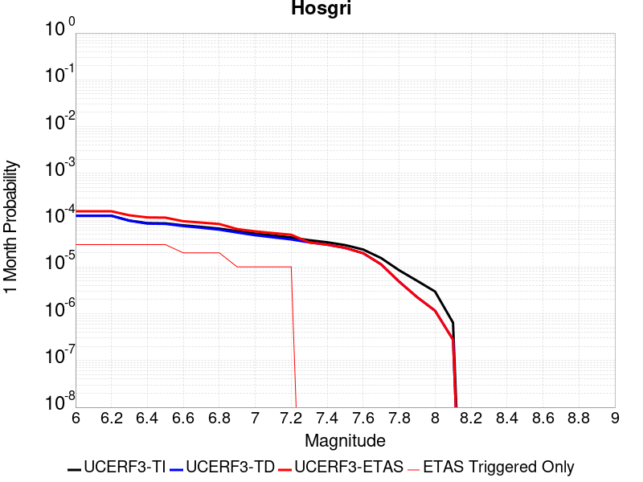 | 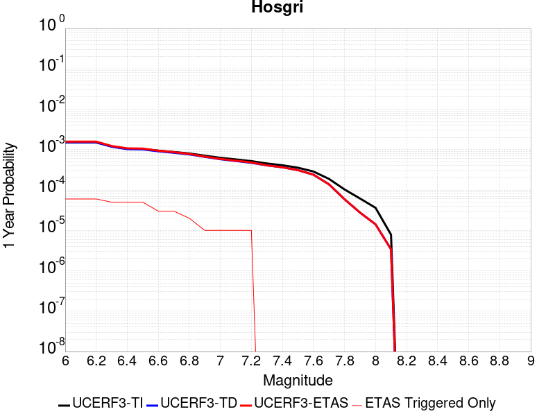 |  |

| Magnitude | 1 wk TI Prob | 1 wk TD Prob | 1 wk ETAS Prob | 1 wk ETAS/TD Gain | 1 wk ETAS Triggered Only | 1 mo TI Prob | 1 mo TD Prob | 1 mo ETAS Prob | 1 mo ETAS/TD Gain | 1 mo ETAS Triggered Only | 1 yr TI Prob | 1 yr TD Prob | 1 yr ETAS Prob | 1 yr ETAS/TD Gain | 1 yr ETAS Triggered Only | 10 yr TI Prob | 10 yr TD Prob | 10 yr ETAS Prob | 10 yr ETAS/TD Gain | 10 yr ETAS Triggered Only |
|-----|-----|-----|-----|-----|-----|-----|-----|-----|-----|-----|-----|-----|-----|-----|-----|-----|-----|-----|-----|-----|
| 6.0 | 2.883978E-5 | 2.9128416E-5 | 5.9127542E-5 | 2.0298922 | 3.0E-5 | 1.235932E-4 | 1.2483024E-4 | 1.548265E-4 | 1.2402964 | 3.0E-5 | 0.0015037085 | 0.001518776 | 0.0015786848 | 1.0394455 | 6.0E-5 | 0.01493574 | 0.01508774 | 0.0151566835 | 1.0045695 | 7.0E-5 |
| 6.1 | 2.883978E-5 | 2.9128416E-5 | 5.9127542E-5 | 2.0298922 | 3.0E-5 | 1.235932E-4 | 1.2483024E-4 | 1.548265E-4 | 1.2402964 | 3.0E-5 | 0.0015037085 | 0.001518776 | 0.0015786848 | 1.0394455 | 6.0E-5 | 0.01493574 | 0.01508774 | 0.0151566835 | 1.0045695 | 7.0E-5 |
| 6.2 | 2.883978E-5 | 2.9128416E-5 | 5.9127542E-5 | 2.0298922 | 3.0E-5 | 1.235932E-4 | 1.2483024E-4 | 1.548265E-4 | 1.2402964 | 3.0E-5 | 0.0015037085 | 0.001518776 | 0.0015786848 | 1.0394455 | 6.0E-5 | 0.01493574 | 0.01508774 | 0.0151566835 | 1.0045695 | 7.0E-5 |
| 6.3 | 2.2914428E-5 | 2.2641969E-5 | 5.264129E-5 | 2.324943 | 3.0E-5 | 9.8200995E-5 | 9.703343E-5 | 1.2703052E-4 | 1.3091418 | 3.0E-5 | 0.0011949413 | 0.0011807467 | 0.0012306876 | 1.042296 | 5.0E-5 | 0.011885363 | 0.011746133 | 0.011805428 | 1.005048 | 6.0E-5 |
| 6.4 | 2.0195741E-5 | 1.969656E-5 | 4.969597E-5 | 2.5230787 | 3.0E-5 | 8.65503E-5 | 8.4411105E-5 | 1.14408576E-4 | 1.3553735 | 3.0E-5 | 0.0010532405 | 0.0010272227 | 0.0010771713 | 1.048625 | 5.0E-5 | 0.010482626 | 0.010225792 | 0.010275281 | 1.0048395 | 5.0E-5 |
| 6.5 | 1.9924333E-5 | 1.940898E-5 | 4.9408398E-5 | 2.5456462 | 3.0E-5 | 8.53872E-5 | 8.3178704E-5 | 1.1317621E-4 | 1.3606392 | 3.0E-5 | 0.0010390934 | 0.0010122322 | 0.0010621815 | 1.0493457 | 5.0E-5 | 0.010342481 | 0.010077253 | 0.010126749 | 1.0049117 | 5.0E-5 |
| 6.6 | 1.809694E-5 | 1.74583E-5 | 3.745795E-5 | 2.145567 | 2.0E-5 | 7.7556004E-5 | 7.4819145E-5 | 9.481765E-5 | 1.2672913 | 2.0E-5 | 9.438353E-4 | 9.105437E-4 | 9.405164E-4 | 1.0329174 | 3.0E-5 | 0.009398366 | 0.009069073 | 0.009098801 | 1.0032779 | 3.0E-5 |
| 6.7 | 1.675989E-5 | 1.6042764E-5 | 3.6042446E-5 | 2.2466478 | 2.0E-5 | 7.182612E-5 | 6.87529E-5 | 8.875153E-5 | 1.2908769 | 2.0E-5 | 8.7413215E-4 | 8.3674624E-4 | 8.6672115E-4 | 1.0358231 | 3.0E-5 | 0.008707017 | 0.0083368635 | 0.008366613 | 1.0035685 | 3.0E-5 |
| 6.8 | 1.5401129E-5 | 1.4614083E-5 | 3.461379E-5 | 2.368523 | 2.0E-5 | 6.6003166E-5 | 6.2630286E-5 | 8.262903E-5 | 1.3193144 | 2.0E-5 | 8.032922E-4 | 7.622578E-4 | 7.8224257E-4 | 1.0262178 | 2.0E-5 | 0.008003947 | 0.007597296 | 0.0076171444 | 1.0026125 | 2.0E-5 |
| 6.9 | 1.356559E-5 | 1.2689968E-5 | 2.2689841E-5 | 1.788014 | 1.0E-5 | 5.8136946E-5 | 5.4384444E-5 | 6.43839E-5 | 1.1838661 | 1.0E-5 | 7.0758746E-4 | 6.619299E-4 | 6.719233E-4 | 1.0150974 | 1.0E-5 | 0.007053386 | 0.006600388 | 0.006610322 | 1.001505 | 1.0E-5 |
| 7.0 | 1.2030819E-5 | 1.1095962E-5 | 2.109585E-5 | 1.9012188 | 1.0E-5 | 5.155963E-5 | 4.7553254E-5 | 5.7552777E-5 | 1.2102805 | 1.0E-5 | 6.275577E-4 | 5.7880714E-4 | 5.888014E-4 | 1.0172669 | 1.0E-5 | 0.006257884 | 0.005773757 | 0.0057836995 | 1.001722 | 1.0E-5 |
| 7.1 | 1.0972698E-5 | 1.0022179E-5 | 2.0022078E-5 | 1.997777 | 1.0E-5 | 4.7025E-5 | 4.2951488E-5 | 5.2951058E-5 | 1.2328109 | 1.0E-5 | 5.72379E-4 | 5.22809E-4 | 5.3280377E-4 | 1.0191175 | 1.0E-5 | 0.0057090693 | 0.005216542 | 0.00522649 | 1.001907 | 1.0E-5 |
| 7.2 | 9.961926E-6 | 9.034746E-6 | 1.9034655E-5 | 2.106828 | 1.0E-5 | 4.2693267E-5 | 3.8719765E-5 | 4.8719376E-5 | 1.2582561 | 1.0E-5 | 5.1966653E-4 | 4.713112E-4 | 4.813065E-4 | 1.0212075 | 1.0E-5 | 0.00518453 | 0.0047038626 | 0.0047138156 | 1.002116 | 1.0E-5 |
| 7.3 | 8.700929E-6 | 7.8281E-6 | 7.8281E-6 | 1.0 | 0.0 | 3.7289166E-5 | 3.354857E-5 | 3.354857E-5 | 1.0 | 0.0 | 4.53901E-4 | 4.0837732E-4 | 4.0837732E-4 | 1.0 | 0.0 | 0.00452975 | 0.004077008 | 0.004077008 | 1.0 | 0.0 |
| 7.4 | 7.866285E-6 | 6.998739E-6 | 6.998739E-6 | 1.0 | 0.0 | 3.3712215E-5 | 2.9994251E-5 | 2.9994251E-5 | 1.0 | 0.0 | 4.103689E-4 | 3.6511885E-4 | 3.6511885E-4 | 1.0 | 0.0 | 0.004096119 | 0.0036459267 | 0.0036459267 | 1.0 | 0.0 |
| 7.5 | 6.8381305E-6 | 5.9596955E-6 | 5.9596955E-6 | 1.0 | 0.0 | 2.9305946E-5 | 2.5541302E-5 | 2.5541302E-5 | 1.0 | 0.0 | 3.5674145E-4 | 3.10921E-4 | 3.10921E-4 | 1.0 | 0.0 | 0.0035616932 | 0.0031055948 | 0.0031055948 | 1.0 | 0.0 |
| 7.6 | 5.503376E-6 | 4.5952443E-6 | 4.5952443E-6 | 1.0 | 0.0 | 2.3585684E-5 | 1.9693754E-5 | 1.9693754E-5 | 1.0 | 0.0 | 2.8711787E-4 | 2.397451E-4 | 2.397451E-4 | 1.0 | 0.0 | 0.002867472 | 0.0023955975 | 0.0023955975 | 1.0 | 0.0 |
| 7.7 | 3.6144982E-6 | 2.6522112E-6 | 2.6522112E-6 | 1.0 | 0.0 | 1.5490614E-5 | 1.1366569E-5 | 1.1366569E-5 | 1.0 | 0.0 | 1.8858191E-4 | 1.383792E-4 | 1.383792E-4 | 1.0 | 0.0 | 0.0018842196 | 0.0013836613 | 0.0013836613 | 1.0 | 0.0 |
| 7.8 | 1.9853494E-6 | 1.1361129E-6 | 1.1361129E-6 | 1.0 | 0.0 | 8.508612E-6 | 4.8690463E-6 | 4.8690463E-6 | 1.0 | 0.0 | 1.0358743E-4 | 5.9279027E-5 | 5.9279027E-5 | 1.0 | 0.0 | 0.0010353916 | 5.9336185E-4 | 5.9336185E-4 | 1.0 | 0.0 |
| 7.9 | 1.1818757E-6 | 5.2951856E-7 | 5.2951856E-7 | 1.0 | 0.0 | 5.0651715E-6 | 2.2693632E-6 | 2.2693632E-6 | 1.0 | 0.0 | 6.1666724E-5 | 2.7629147E-5 | 2.7629147E-5 | 1.0 | 0.0 | 6.1649614E-4 | 2.7694515E-4 | 2.7694515E-4 | 1.0 | 0.0 |
| 8.0 | 6.962958E-7 | 2.7139782E-7 | 2.7139782E-7 | 1.0 | 0.0 | 2.9841215E-6 | 1.163133E-6 | 1.163133E-6 | 1.0 | 0.0 | 3.6331072E-5 | 1.4161053E-5 | 1.4161053E-5 | 1.0 | 0.0 | 3.6325134E-4 | 1.4217179E-4 | 1.4217179E-4 | 1.0 | 0.0 |
| 8.1 | 1.5033264E-7 | 6.527624E-8 | 6.527624E-8 | 1.0 | 0.0 | 6.442826E-7 | 2.7975528E-7 | 2.7975528E-7 | 1.0 | 0.0 | 7.844113E-6 | 3.4060151E-6 | 3.4060151E-6 | 1.0 | 0.0 | 7.843835E-5 | 3.407693E-5 | 3.407693E-5 | 1.0 | 0.0 |

## Los Alamos 2011 CFM
*[(top)](#table-of-contents)*

| 1 Week | 1 Month | 1 Year | 10 Year |
|-----|-----|-----|-----|
|  |  |  |  |

| Magnitude | 1 wk TI Prob | 1 wk TD Prob | 1 wk ETAS Prob | 1 wk ETAS/TD Gain | 1 wk ETAS Triggered Only | 1 mo TI Prob | 1 mo TD Prob | 1 mo ETAS Prob | 1 mo ETAS/TD Gain | 1 mo ETAS Triggered Only | 1 yr TI Prob | 1 yr TD Prob | 1 yr ETAS Prob | 1 yr ETAS/TD Gain | 1 yr ETAS Triggered Only | 10 yr TI Prob | 10 yr TD Prob | 10 yr ETAS Prob | 10 yr ETAS/TD Gain | 10 yr ETAS Triggered Only |
|-----|-----|-----|-----|-----|-----|-----|-----|-----|-----|-----|-----|-----|-----|-----|-----|-----|-----|-----|-----|-----|
| 6.0 | 4.6284417E-6 | 4.751731E-6 | 1.4751684E-5 | 3.1044862 | 1.0E-5 | 1.9836029E-5 | 2.0364414E-5 | 4.0364004E-5 | 1.9820853 | 2.0E-5 | 2.4147688E-4 | 2.4791027E-4 | 3.0789542E-4 | 1.241963 | 6.0E-5 | 0.0024121467 | 0.0024765113 | 0.0025463381 | 1.0281956 | 7.0E-5 |
| 6.1 | 4.6284417E-6 | 4.751731E-6 | 1.4751684E-5 | 3.1044862 | 1.0E-5 | 1.9836029E-5 | 2.0364414E-5 | 4.0364004E-5 | 1.9820853 | 2.0E-5 | 2.4147688E-4 | 2.4791027E-4 | 3.0789542E-4 | 1.241963 | 6.0E-5 | 0.0024121467 | 0.0024765113 | 0.0025463381 | 1.0281956 | 7.0E-5 |
| 6.2 | 4.6284417E-6 | 4.751731E-6 | 1.4751684E-5 | 3.1044862 | 1.0E-5 | 1.9836029E-5 | 2.0364414E-5 | 4.0364004E-5 | 1.9820853 | 2.0E-5 | 2.4147688E-4 | 2.4791027E-4 | 3.0789542E-4 | 1.241963 | 6.0E-5 | 0.0024121467 | 0.0024765113 | 0.0025463381 | 1.0281956 | 7.0E-5 |
| 6.3 | 4.6284417E-6 | 4.751731E-6 | 1.4751684E-5 | 3.1044862 | 1.0E-5 | 1.9836029E-5 | 2.0364414E-5 | 4.0364004E-5 | 1.9820853 | 2.0E-5 | 2.4147688E-4 | 2.4791027E-4 | 3.0789542E-4 | 1.241963 | 6.0E-5 | 0.0024121467 | 0.0024765113 | 0.0025463381 | 1.0281956 | 7.0E-5 |
| 6.4 | 4.6284417E-6 | 4.751731E-6 | 1.4751684E-5 | 3.1044862 | 1.0E-5 | 1.9836029E-5 | 2.0364414E-5 | 4.0364004E-5 | 1.9820853 | 2.0E-5 | 2.4147688E-4 | 2.4791027E-4 | 3.0789542E-4 | 1.241963 | 6.0E-5 | 0.0024121467 | 0.0024765113 | 0.0025463381 | 1.0281956 | 7.0E-5 |
| 6.5 | 4.6284417E-6 | 4.751731E-6 | 1.4751684E-5 | 3.1044862 | 1.0E-5 | 1.9836029E-5 | 2.0364414E-5 | 4.0364004E-5 | 1.9820853 | 2.0E-5 | 2.4147688E-4 | 2.4791027E-4 | 3.0789542E-4 | 1.241963 | 6.0E-5 | 0.0024121467 | 0.0024765113 | 0.0025463381 | 1.0281956 | 7.0E-5 |
| 6.6 | 4.6284417E-6 | 4.751731E-6 | 1.4751684E-5 | 3.1044862 | 1.0E-5 | 1.9836029E-5 | 2.0364414E-5 | 4.0364004E-5 | 1.9820853 | 2.0E-5 | 2.4147688E-4 | 2.4791027E-4 | 3.0789542E-4 | 1.241963 | 6.0E-5 | 0.0024121467 | 0.0024765113 | 0.0025463381 | 1.0281956 | 7.0E-5 |
| 6.7 | 4.062321E-6 | 4.166349E-6 | 4.166349E-6 | 1.0 | 0.0 | 1.7409831E-5 | 1.7855667E-5 | 2.7855489E-5 | 1.5600363 | 1.0E-5 | 2.1194408E-4 | 2.1737257E-4 | 2.5736386E-4 | 1.1839758 | 4.0E-5 | 0.0021174205 | 0.0021717492 | 0.0022216407 | 1.022973 | 5.0E-5 |
| 6.8 | 4.062321E-6 | 4.166349E-6 | 4.166349E-6 | 1.0 | 0.0 | 1.7409831E-5 | 1.7855667E-5 | 2.7855489E-5 | 1.5600363 | 1.0E-5 | 2.1194408E-4 | 2.1737257E-4 | 2.5736386E-4 | 1.1839758 | 4.0E-5 | 0.0021174205 | 0.0021717492 | 0.0022216407 | 1.022973 | 5.0E-5 |
| 6.9 | 3.2936077E-6 | 3.372958E-6 | 3.372958E-6 | 1.0 | 0.0 | 1.4115385E-5 | 1.4455459E-5 | 2.4455314E-5 | 1.6917702 | 1.0E-5 | 1.7184127E-4 | 1.7598194E-4 | 2.159749E-4 | 1.2272561 | 4.0E-5 | 0.0017170844 | 0.0017585184 | 0.0018084305 | 1.028383 | 5.0E-5 |
| 7.0 | 3.1687898E-6 | 3.2448156E-6 | 3.2448156E-6 | 1.0 | 0.0 | 1.3580457E-5 | 1.3906283E-5 | 2.3906145E-5 | 1.7190894 | 1.0E-5 | 1.6532952E-4 | 1.6929678E-4 | 2.0929001E-4 | 1.2362314 | 4.0E-5 | 0.0016520657 | 0.0016917696 | 0.0017416851 | 1.0295049 | 5.0E-5 |
| 7.1 | 2.9379228E-6 | 3.0073259E-6 | 3.0073259E-6 | 1.0 | 0.0 | 1.25910365E-5 | 1.288848E-5 | 2.2888351E-5 | 1.7758766 | 1.0E-5 | 1.5328509E-4 | 1.5690686E-4 | 1.9690058E-4 | 1.2548883 | 4.0E-5 | 0.001531794 | 0.0015680499 | 0.0016179715 | 1.0318367 | 5.0E-5 |
| 7.2 | 2.0020686E-6 | 2.0416298E-6 | 2.0416298E-6 | 1.0 | 0.0 | 8.580266E-6 | 8.749813E-6 | 8.749813E-6 | 1.0 | 0.0 | 1.0445973E-4 | 1.0652381E-4 | 1.2652167E-4 | 1.1877315 | 2.0E-5 | 0.0010441064 | 0.001064732 | 0.0010947 | 1.0281461 | 3.0E-5 |
| 7.3 | 1.7364243E-6 | 1.7678802E-6 | 1.7678802E-6 | 1.0 | 0.0 | 7.441797E-6 | 7.576608E-6 | 7.576608E-6 | 1.0 | 0.0 | 9.0600115E-5 | 9.2241324E-5 | 1.1223948E-4 | 1.2168026 | 2.0E-5 | 9.0563187E-4 | 9.2203356E-4 | 9.520059E-4 | 1.0325068 | 3.0E-5 |
| 7.4 | 1.5718434E-6 | 1.5983177E-6 | 1.5983177E-6 | 1.0 | 0.0 | 6.7364545E-6 | 6.849915E-6 | 6.849915E-6 | 1.0 | 0.0 | 8.201325E-5 | 8.339455E-5 | 1.03392886E-4 | 1.2398038 | 2.0E-5 | 8.198299E-4 | 8.3363557E-4 | 8.636106E-4 | 1.035957 | 3.0E-5 |
| 7.5 | 1.3841119E-6 | 1.4042793E-6 | 1.4042793E-6 | 1.0 | 0.0 | 5.9318945E-6 | 6.0183256E-6 | 6.0183256E-6 | 1.0 | 0.0 | 7.221842E-5 | 7.327068E-5 | 9.326922E-5 | 1.2729405 | 2.0E-5 | 7.2194956E-4 | 7.324681E-4 | 7.6244614E-4 | 1.0409274 | 3.0E-5 |
| 7.6 | 1.0843726E-6 | 1.093442E-6 | 1.093442E-6 | 1.0 | 0.0 | 4.647303E-6 | 4.6861724E-6 | 4.6861724E-6 | 1.0 | 0.0 | 5.6579443E-5 | 5.705268E-5 | 6.705211E-5 | 1.1752666 | 1.0E-5 | 5.656504E-4 | 5.703829E-4 | 5.903715E-4 | 1.0350442 | 2.0E-5 |
| 7.7 | 5.544814E-7 | 5.5018705E-7 | 5.5018705E-7 | 1.0 | 0.0 | 2.3763469E-6 | 2.3579425E-6 | 2.3579425E-6 | 1.0 | 0.0 | 2.8931638E-5 | 2.8707573E-5 | 2.8707573E-5 | 1.0 | 0.0 | 2.8927872E-4 | 2.870388E-4 | 2.870388E-4 | 1.0 | 0.0 |
| 7.8 | 2.0707465E-7 | 1.977846E-7 | 1.977846E-7 | 1.0 | 0.0 | 8.874625E-7 | 8.4764804E-7 | 8.4764804E-7 | 1.0 | 0.0 | 1.08048025E-5 | 1.0320066E-5 | 1.0320066E-5 | 1.0 | 0.0 | 1.0804277E-4 | 1.0319592E-4 | 1.0319592E-4 | 1.0 | 0.0 |
| 7.9 | 3.9821284E-8 | 3.433109E-8 | 3.433109E-8 | 1.0 | 0.0 | 1.7066264E-7 | 1.4713324E-7 | 1.4713324E-7 | 1.0 | 0.0 | 2.0778157E-6 | 1.7913457E-6 | 1.7913457E-6 | 1.0 | 0.0 | 2.0777963E-5 | 1.7913319E-5 | 1.7913319E-5 | 1.0 | 0.0 |
| 8.0 | 7.880441E-11 | 8.2353124E-11 | 8.2353124E-11 | 1.0 | 0.0 | 3.3773329E-10 | 3.52942E-10 | 3.52942E-10 | 1.0 | 0.0 | 4.1119033E-9 | 4.2970694E-9 | 4.2970694E-9 | 1.0 | 0.0 | 4.1119034E-8 | 4.2970694E-8 | 4.2970694E-8 | 1.0 | 0.0 |

## Pine Mtn
*[(top)](#table-of-contents)*

| 1 Week | 1 Month | 1 Year | 10 Year |
|-----|-----|-----|-----|
|  |  |  |  |

| Magnitude | 1 wk TI Prob | 1 wk TD Prob | 1 wk ETAS Prob | 1 wk ETAS/TD Gain | 1 wk ETAS Triggered Only | 1 mo TI Prob | 1 mo TD Prob | 1 mo ETAS Prob | 1 mo ETAS/TD Gain | 1 mo ETAS Triggered Only | 1 yr TI Prob | 1 yr TD Prob | 1 yr ETAS Prob | 1 yr ETAS/TD Gain | 1 yr ETAS Triggered Only | 10 yr TI Prob | 10 yr TD Prob | 10 yr ETAS Prob | 10 yr ETAS/TD Gain | 10 yr ETAS Triggered Only |
|-----|-----|-----|-----|-----|-----|-----|-----|-----|-----|-----|-----|-----|-----|-----|-----|-----|-----|-----|-----|-----|
| 6.0 | 6.894797E-6 | 7.225461E-6 | 3.7225243E-5 | 5.151954 | 3.0E-5 | 2.9548795E-5 | 3.096591E-5 | 6.0964983E-5 | 1.9687773 | 3.0E-5 | 3.596972E-4 | 3.7694772E-4 | 4.1693266E-4 | 1.1060755 | 4.0E-5 | 0.0035911554 | 0.003763381 | 0.0038331177 | 1.0185302 | 7.0E-5 |
| 6.1 | 6.894797E-6 | 7.225461E-6 | 3.7225243E-5 | 5.151954 | 3.0E-5 | 2.9548795E-5 | 3.096591E-5 | 6.0964983E-5 | 1.9687773 | 3.0E-5 | 3.596972E-4 | 3.7694772E-4 | 4.1693266E-4 | 1.1060755 | 4.0E-5 | 0.0035911554 | 0.003763381 | 0.0038331177 | 1.0185302 | 7.0E-5 |
| 6.2 | 6.894797E-6 | 7.225461E-6 | 3.7225243E-5 | 5.151954 | 3.0E-5 | 2.9548795E-5 | 3.096591E-5 | 6.0964983E-5 | 1.9687773 | 3.0E-5 | 3.596972E-4 | 3.7694772E-4 | 4.1693266E-4 | 1.1060755 | 4.0E-5 | 0.0035911554 | 0.003763381 | 0.0038331177 | 1.0185302 | 7.0E-5 |
| 6.3 | 6.894797E-6 | 7.225461E-6 | 3.7225243E-5 | 5.151954 | 3.0E-5 | 2.9548795E-5 | 3.096591E-5 | 6.0964983E-5 | 1.9687773 | 3.0E-5 | 3.596972E-4 | 3.7694772E-4 | 4.1693266E-4 | 1.1060755 | 4.0E-5 | 0.0035911554 | 0.003763381 | 0.0038331177 | 1.0185302 | 7.0E-5 |
| 6.4 | 6.894797E-6 | 7.225461E-6 | 3.7225243E-5 | 5.151954 | 3.0E-5 | 2.9548795E-5 | 3.096591E-5 | 6.0964983E-5 | 1.9687773 | 3.0E-5 | 3.596972E-4 | 3.7694772E-4 | 4.1693266E-4 | 1.1060755 | 4.0E-5 | 0.0035911554 | 0.003763381 | 0.0038331177 | 1.0185302 | 7.0E-5 |
| 6.5 | 6.894797E-6 | 7.225461E-6 | 3.7225243E-5 | 5.151954 | 3.0E-5 | 2.9548795E-5 | 3.096591E-5 | 6.0964983E-5 | 1.9687773 | 3.0E-5 | 3.596972E-4 | 3.7694772E-4 | 4.1693266E-4 | 1.1060755 | 4.0E-5 | 0.0035911554 | 0.003763381 | 0.0038331177 | 1.0185302 | 7.0E-5 |
| 6.6 | 6.894797E-6 | 7.225461E-6 | 3.7225243E-5 | 5.151954 | 3.0E-5 | 2.9548795E-5 | 3.096591E-5 | 6.0964983E-5 | 1.9687773 | 3.0E-5 | 3.596972E-4 | 3.7694772E-4 | 4.1693266E-4 | 1.1060755 | 4.0E-5 | 0.0035911554 | 0.003763381 | 0.0038331177 | 1.0185302 | 7.0E-5 |
| 6.7 | 6.0867933E-6 | 6.3971133E-6 | 3.6396923E-5 | 5.689585 | 3.0E-5 | 2.6085996E-5 | 2.7415923E-5 | 5.74151E-5 | 2.0942247 | 3.0E-5 | 3.1755073E-4 | 3.3373994E-4 | 3.737266E-4 | 1.1198138 | 4.0E-5 | 0.0031709734 | 0.0033326065 | 0.003402373 | 1.0209346 | 7.0E-5 |
| 6.8 | 5.6530425E-6 | 5.9505956E-6 | 2.5950476E-5 | 4.360988 | 2.0E-5 | 2.42271E-5 | 2.5502315E-5 | 4.5501805E-5 | 1.7842225 | 2.0E-5 | 2.94925E-4 | 3.104485E-4 | 3.304423E-4 | 1.0644029 | 2.0E-5 | 0.002945339 | 0.0031003528 | 0.003150198 | 1.0160772 | 5.0E-5 |
| 6.9 | 4.6015225E-6 | 4.863834E-6 | 2.4863737E-5 | 5.1119623 | 2.0E-5 | 1.9720663E-5 | 2.0844845E-5 | 4.084443E-5 | 1.9594499 | 2.0E-5 | 2.4007261E-4 | 2.5375787E-4 | 2.737528E-4 | 1.0787953 | 2.0E-5 | 0.0023981342 | 0.0025348254 | 0.0025647494 | 1.0118052 | 3.0E-5 |
| 7.0 | 4.4875965E-6 | 4.747473E-6 | 2.4747378E-5 | 5.2127476 | 2.0E-5 | 1.9232413E-5 | 2.0346162E-5 | 4.0345756E-5 | 1.9829663 | 2.0E-5 | 2.3412947E-4 | 2.4768783E-4 | 2.6768286E-4 | 1.0807269 | 2.0E-5 | 0.0023388295 | 0.0024742614 | 0.0025041872 | 1.0120949 | 3.0E-5 |
| 7.1 | 3.203907E-6 | 3.4294096E-6 | 1.3429375E-5 | 3.9159439 | 1.0E-5 | 1.3730958E-5 | 1.4697391E-5 | 2.4697243E-5 | 1.6803828 | 1.0E-5 | 1.6716159E-4 | 1.789267E-4 | 1.8892491E-4 | 1.0558788 | 1.0E-5 | 0.0016703589 | 0.0017878925 | 0.0018078568 | 1.0111663 | 2.0E-5 |
| 7.2 | 2.2060601E-6 | 2.3784817E-6 | 1.23784575E-5 | 5.204353 | 1.0E-5 | 9.4545085E-6 | 1.0193455E-5 | 2.0193353E-5 | 1.9810116 | 1.0E-5 | 1.15102564E-4 | 1.240987E-4 | 1.3409746E-4 | 1.080571 | 1.0E-5 | 0.0011504296 | 0.0012403389 | 0.001260314 | 1.0161046 | 2.0E-5 |
| 7.3 | 1.3765207E-6 | 1.5216481E-6 | 1.5216481E-6 | 1.0 | 0.0 | 5.899361E-6 | 6.521333E-6 | 6.521333E-6 | 1.0 | 0.0 | 7.182235E-5 | 7.939443E-5 | 7.939443E-5 | 1.0 | 0.0 | 7.1799144E-4 | 7.936697E-4 | 8.036618E-4 | 1.0125897 | 1.0E-5 |
| 7.4 | 1.1245983E-6 | 1.2587075E-6 | 1.2587075E-6 | 1.0 | 0.0 | 4.819698E-6 | 5.39445E-6 | 5.39445E-6 | 1.0 | 0.0 | 5.8678244E-5 | 6.567554E-5 | 6.567554E-5 | 1.0 | 0.0 | 5.866275E-4 | 6.5656955E-4 | 6.5656955E-4 | 1.0 | 0.0 |
| 7.5 | 8.031682E-7 | 9.276951E-7 | 9.276951E-7 | 1.0 | 0.0 | 3.4421448E-6 | 3.9758306E-6 | 3.9758306E-6 | 1.0 | 0.0 | 4.1907308E-5 | 4.840473E-5 | 4.840473E-5 | 1.0 | 0.0 | 4.1899405E-4 | 4.8394862E-4 | 4.8394862E-4 | 1.0 | 0.0 |
| 7.6 | 4.8953444E-7 | 6.003009E-7 | 6.003009E-7 | 1.0 | 0.0 | 2.098003E-6 | 2.5727159E-6 | 2.5727159E-6 | 1.0 | 0.0 | 2.5542888E-5 | 3.1322415E-5 | 3.1322415E-5 | 1.0 | 0.0 | 2.5539953E-4 | 3.1318486E-4 | 3.1318486E-4 | 1.0 | 0.0 |
| 7.7 | 6.634529E-8 | 6.788826E-8 | 6.788826E-8 | 1.0 | 0.0 | 2.843369E-7 | 2.9094966E-7 | 2.9094966E-7 | 1.0 | 0.0 | 3.4617963E-6 | 3.5423066E-6 | 3.5423066E-6 | 1.0 | 0.0 | 3.4617424E-5 | 3.542255E-5 | 3.542255E-5 | 1.0 | 0.0 |
| 7.8 | 9.235578E-9 | 9.488566E-9 | 9.488566E-9 | 1.0 | 0.0 | 3.9581046E-8 | 4.0665284E-8 | 4.0665284E-8 | 1.0 | 0.0 | 4.818991E-7 | 4.950997E-7 | 4.950997E-7 | 1.0 | 0.0 | 4.8189804E-6 | 4.950988E-6 | 4.950988E-6 | 1.0 | 0.0 |

## Rinconada 2011 CFM
*[(top)](#table-of-contents)*

| 1 Week | 1 Month | 1 Year | 10 Year |
|-----|-----|-----|-----|
|  |  |  |  |

| Magnitude | 1 wk TI Prob | 1 wk TD Prob | 1 wk ETAS Prob | 1 wk ETAS/TD Gain | 1 wk ETAS Triggered Only | 1 mo TI Prob | 1 mo TD Prob | 1 mo ETAS Prob | 1 mo ETAS/TD Gain | 1 mo ETAS Triggered Only | 1 yr TI Prob | 1 yr TD Prob | 1 yr ETAS Prob | 1 yr ETAS/TD Gain | 1 yr ETAS Triggered Only | 10 yr TI Prob | 10 yr TD Prob | 10 yr ETAS Prob | 10 yr ETAS/TD Gain | 10 yr ETAS Triggered Only |
|-----|-----|-----|-----|-----|-----|-----|-----|-----|-----|-----|-----|-----|-----|-----|-----|-----|-----|-----|-----|-----|
| 6.0 | 1.5752368E-5 | 1.6274716E-5 | 5.6274064E-5 | 3.4577603 | 4.0E-5 | 6.75084E-5 | 6.974694E-5 | 1.1974345E-4 | 1.7168274 | 5.0E-5 | 8.2160486E-4 | 8.488412E-4 | 9.187818E-4 | 1.0823953 | 7.0E-5 | 0.008185739 | 0.00845637 | 0.008525778 | 1.0082078 | 7.0E-5 |
| 6.1 | 1.0966133E-5 | 1.1323029E-5 | 4.1322688E-5 | 3.6494377 | 3.0E-5 | 4.6996865E-5 | 4.852637E-5 | 8.852443E-5 | 1.8242542 | 4.0E-5 | 5.720366E-4 | 5.906491E-4 | 6.506137E-4 | 1.1015232 | 6.0E-5 | 0.0057056635 | 0.0058908886 | 0.005950535 | 1.0101253 | 6.0E-5 |
| 6.2 | 1.0966133E-5 | 1.1323029E-5 | 4.1322688E-5 | 3.6494377 | 3.0E-5 | 4.6996865E-5 | 4.852637E-5 | 8.852443E-5 | 1.8242542 | 4.0E-5 | 5.720366E-4 | 5.906491E-4 | 6.506137E-4 | 1.1015232 | 6.0E-5 | 0.0057056635 | 0.0058908886 | 0.005950535 | 1.0101253 | 6.0E-5 |
| 6.3 | 8.926149E-6 | 9.212771E-6 | 3.9212497E-5 | 4.256319 | 3.0E-5 | 3.8254362E-5 | 3.948271E-5 | 7.9481135E-5 | 2.0130618 | 4.0E-5 | 4.6564735E-4 | 4.805963E-4 | 5.4056745E-4 | 1.124785 | 6.0E-5 | 0.0046467283 | 0.0047956146 | 0.004855327 | 1.0124514 | 6.0E-5 |
| 6.4 | 7.676955E-6 | 7.920191E-6 | 3.7919952E-5 | 4.7877574 | 3.0E-5 | 3.290082E-5 | 3.3943234E-5 | 7.3941876E-5 | 2.1783981 | 4.0E-5 | 4.0049385E-4 | 4.1318068E-4 | 4.6316005E-4 | 1.1209624 | 5.0E-5 | 0.0039977287 | 0.004124151 | 0.0041739447 | 1.0120738 | 5.0E-5 |
| 6.5 | 6.1671026E-6 | 6.3589546E-6 | 3.6358764E-5 | 5.717726 | 3.0E-5 | 2.6430173E-5 | 2.725238E-5 | 6.725129E-5 | 2.4677217 | 4.0E-5 | 3.2173982E-4 | 3.317473E-4 | 3.817307E-4 | 1.1506672 | 5.0E-5 | 0.003212744 | 0.0033125326 | 0.003362367 | 1.0150442 | 5.0E-5 |
| 6.6 | 5.553456E-6 | 5.7248126E-6 | 3.572464E-5 | 6.2403164 | 3.0E-5 | 2.3800309E-5 | 2.453468E-5 | 6.45337E-5 | 2.6303053 | 4.0E-5 | 2.897302E-4 | 2.9866883E-4 | 3.486539E-4 | 1.1673595 | 5.0E-5 | 0.0028935277 | 0.002982683 | 0.003032534 | 1.0167134 | 5.0E-5 |
| 6.7 | 4.787857E-6 | 4.9333094E-6 | 3.493316E-5 | 7.0810804 | 3.0E-5 | 2.0519226E-5 | 2.1142583E-5 | 6.1141734E-5 | 2.8918765 | 4.0E-5 | 2.4979294E-4 | 2.573806E-4 | 3.073677E-4 | 1.1942148 | 5.0E-5 | 0.0024951235 | 0.0025708308 | 0.0026207021 | 1.0193989 | 5.0E-5 |
| 6.8 | 3.9955166E-6 | 4.1134763E-6 | 3.4113353E-5 | 8.293072 | 3.0E-5 | 1.7123532E-5 | 1.7629065E-5 | 5.762836E-5 | 3.2689402 | 4.0E-5 | 2.0845905E-4 | 2.1461274E-4 | 2.6460201E-4 | 1.2329278 | 5.0E-5 | 0.002082636 | 0.0021440585 | 0.0021939513 | 1.0232702 | 5.0E-5 |
| 6.9 | 3.4250072E-6 | 3.5224464E-6 | 3.352234E-5 | 9.516778 | 3.0E-5 | 1.46785205E-5 | 1.5096111E-5 | 5.509551E-5 | 3.649649 | 4.0E-5 | 1.7869633E-4 | 1.8377967E-4 | 2.3377048E-4 | 1.2720149 | 5.0E-5 | 0.001785527 | 0.0018362794 | 0.0018861876 | 1.027179 | 5.0E-5 |
| 7.0 | 2.7712713E-6 | 2.8467E-6 | 3.2846616E-5 | 11.538488 | 3.0E-5 | 1.1876823E-5 | 1.2200086E-5 | 4.219972E-5 | 3.458969 | 3.0E-5 | 1.4459073E-4 | 1.4852593E-4 | 1.8851999E-4 | 1.2692733 | 4.0E-5 | 0.0014449668 | 0.0014842682 | 0.0015242088 | 1.0269094 | 4.0E-5 |
| 7.1 | 2.227358E-6 | 2.2856984E-6 | 3.228563E-5 | 14.125061 | 3.0E-5 | 9.545785E-6 | 9.795814E-6 | 3.979552E-5 | 4.062503 | 3.0E-5 | 1.16213734E-4 | 1.19257515E-4 | 1.5925274E-4 | 1.3353686 | 4.0E-5 | 0.0011615298 | 0.0011919362 | 0.0012318885 | 1.0335188 | 4.0E-5 |
| 7.2 | 1.581796E-6 | 1.6209011E-6 | 2.1620868E-5 | 13.338796 | 2.0E-5 | 6.779108E-6 | 6.9467005E-6 | 2.6946562E-5 | 3.8790445 | 2.0E-5 | 8.253252E-5 | 8.457281E-5 | 1.1457026E-4 | 1.354694 | 3.0E-5 | 8.250187E-4 | 8.454067E-4 | 8.7538135E-4 | 1.0354558 | 3.0E-5 |
| 7.3 | 1.0306567E-6 | 1.0546477E-6 | 1.0546477E-6 | 1.0 | 0.0 | 4.4170924E-6 | 4.519911E-6 | 4.519911E-6 | 1.0 | 0.0 | 5.3776774E-5 | 5.5028526E-5 | 6.5027976E-5 | 1.1817139 | 1.0E-5 | 5.376376E-4 | 5.5014924E-4 | 5.6014373E-4 | 1.0181669 | 1.0E-5 |
| 7.4 | 6.535541E-7 | 6.682742E-7 | 6.682742E-7 | 1.0 | 0.0 | 2.800943E-6 | 2.864029E-6 | 2.864029E-6 | 1.0 | 0.0 | 3.4100947E-5 | 3.4868997E-5 | 4.4868648E-5 | 1.2867777 | 1.0E-5 | 3.4095717E-4 | 3.4863537E-4 | 3.586319E-4 | 1.0286733 | 1.0E-5 |
| 7.5 | 3.2656962E-7 | 3.3316687E-7 | 3.3316687E-7 | 1.0 | 0.0 | 1.3995833E-6 | 1.4278572E-6 | 1.4278572E-6 | 1.0 | 0.0 | 1.7039794E-5 | 1.7384024E-5 | 2.7383849E-5 | 1.5752308 | 1.0E-5 | 1.7038487E-4 | 1.7382667E-4 | 1.8382493E-4 | 1.0575186 | 1.0E-5 |
| 7.6 | 9.754343E-8 | 9.82099E-8 | 9.82099E-8 | 1.0 | 0.0 | 4.180432E-7 | 4.208995E-7 | 4.208995E-7 | 1.0 | 0.0 | 5.089664E-6 | 5.1244397E-6 | 5.1244397E-6 | 1.0 | 0.0 | 5.0895473E-5 | 5.1243223E-5 | 5.1243223E-5 | 1.0 | 0.0 |
| 7.7 | 6.0001453E-9 | 5.8490435E-9 | 5.8490435E-9 | 1.0 | 0.0 | 2.5714908E-8 | 2.506733E-8 | 2.506733E-8 | 1.0 | 0.0 | 3.1307894E-7 | 3.051947E-7 | 3.051947E-7 | 1.0 | 0.0 | 3.1307852E-6 | 3.051943E-6 | 3.051943E-6 | 1.0 | 0.0 |
| 7.8 | 7.400003E-11 | 7.4654505E-11 | 7.4654505E-11 | 1.0 | 0.0 | 3.171432E-10 | 3.1994773E-10 | 3.1994773E-10 | 1.0 | 0.0 | 3.861218E-9 | 3.895363E-9 | 3.895363E-9 | 1.0 | 0.0 | 3.861218E-8 | 3.895363E-8 | 3.895363E-8 | 1.0 | 0.0 |

## Channel Islands Western Deep Ramp
*[(top)](#table-of-contents)*

| 1 Week | 1 Month | 1 Year | 10 Year |
|-----|-----|-----|-----|
| 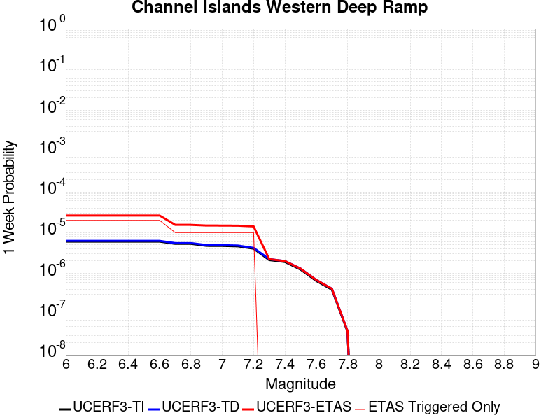 |  |  |  |

| Magnitude | 1 wk TI Prob | 1 wk TD Prob | 1 wk ETAS Prob | 1 wk ETAS/TD Gain | 1 wk ETAS Triggered Only | 1 mo TI Prob | 1 mo TD Prob | 1 mo ETAS Prob | 1 mo ETAS/TD Gain | 1 mo ETAS Triggered Only | 1 yr TI Prob | 1 yr TD Prob | 1 yr ETAS Prob | 1 yr ETAS/TD Gain | 1 yr ETAS Triggered Only | 10 yr TI Prob | 10 yr TD Prob | 10 yr ETAS Prob | 10 yr ETAS/TD Gain | 10 yr ETAS Triggered Only |
|-----|-----|-----|-----|-----|-----|-----|-----|-----|-----|-----|-----|-----|-----|-----|-----|-----|-----|-----|-----|-----|
| 6.0 | 6.0213506E-6 | 6.2548684E-6 | 2.6254744E-5 | 4.1974893 | 2.0E-5 | 2.5805533E-5 | 2.6806329E-5 | 4.680579E-5 | 1.7460725 | 2.0E-5 | 3.1413708E-4 | 3.2632265E-4 | 3.8630306E-4 | 1.1838071 | 6.0E-5 | 0.0031369338 | 0.0032588763 | 0.0033286482 | 1.0214097 | 7.0E-5 |
| 6.1 | 6.0213506E-6 | 6.2548684E-6 | 2.6254744E-5 | 4.1974893 | 2.0E-5 | 2.5805533E-5 | 2.6806329E-5 | 4.680579E-5 | 1.7460725 | 2.0E-5 | 3.1413708E-4 | 3.2632265E-4 | 3.8630306E-4 | 1.1838071 | 6.0E-5 | 0.0031369338 | 0.0032588763 | 0.0033286482 | 1.0214097 | 7.0E-5 |
| 6.2 | 6.0213506E-6 | 6.2548684E-6 | 2.6254744E-5 | 4.1974893 | 2.0E-5 | 2.5805533E-5 | 2.6806329E-5 | 4.680579E-5 | 1.7460725 | 2.0E-5 | 3.1413708E-4 | 3.2632265E-4 | 3.8630306E-4 | 1.1838071 | 6.0E-5 | 0.0031369338 | 0.0032588763 | 0.0033286482 | 1.0214097 | 7.0E-5 |
| 6.3 | 6.0213506E-6 | 6.2548684E-6 | 2.6254744E-5 | 4.1974893 | 2.0E-5 | 2.5805533E-5 | 2.6806329E-5 | 4.680579E-5 | 1.7460725 | 2.0E-5 | 3.1413708E-4 | 3.2632265E-4 | 3.8630306E-4 | 1.1838071 | 6.0E-5 | 0.0031369338 | 0.0032588763 | 0.0033286482 | 1.0214097 | 7.0E-5 |
| 6.4 | 6.0213506E-6 | 6.2548684E-6 | 2.6254744E-5 | 4.1974893 | 2.0E-5 | 2.5805533E-5 | 2.6806329E-5 | 4.680579E-5 | 1.7460725 | 2.0E-5 | 3.1413708E-4 | 3.2632265E-4 | 3.8630306E-4 | 1.1838071 | 6.0E-5 | 0.0031369338 | 0.0032588763 | 0.0033286482 | 1.0214097 | 7.0E-5 |
| 6.5 | 6.0213506E-6 | 6.2548684E-6 | 2.6254744E-5 | 4.1974893 | 2.0E-5 | 2.5805533E-5 | 2.6806329E-5 | 4.680579E-5 | 1.7460725 | 2.0E-5 | 3.1413708E-4 | 3.2632265E-4 | 3.8630306E-4 | 1.1838071 | 6.0E-5 | 0.0031369338 | 0.0032588763 | 0.0033286482 | 1.0214097 | 7.0E-5 |
| 6.6 | 6.0213506E-6 | 6.2548684E-6 | 2.6254744E-5 | 4.1974893 | 2.0E-5 | 2.5805533E-5 | 2.6806329E-5 | 4.680579E-5 | 1.7460725 | 2.0E-5 | 3.1413708E-4 | 3.2632265E-4 | 3.8630306E-4 | 1.1838071 | 6.0E-5 | 0.0031369338 | 0.0032588763 | 0.0033286482 | 1.0214097 | 7.0E-5 |
| 6.7 | 5.313309E-6 | 5.5252403E-6 | 1.5525186E-5 | 2.809866 | 1.0E-5 | 2.2771126E-5 | 2.367941E-5 | 3.3679175E-5 | 1.4222978 | 1.0E-5 | 2.772032E-4 | 2.8826276E-4 | 3.182541E-4 | 1.1040417 | 3.0E-5 | 0.0027685766 | 0.0028792918 | 0.0029191766 | 1.0138524 | 4.0E-5 |
| 6.8 | 5.313309E-6 | 5.5252403E-6 | 1.5525186E-5 | 2.809866 | 1.0E-5 | 2.2771126E-5 | 2.367941E-5 | 3.3679175E-5 | 1.4222978 | 1.0E-5 | 2.772032E-4 | 2.8826276E-4 | 3.182541E-4 | 1.1040417 | 3.0E-5 | 0.0027685766 | 0.0028792918 | 0.0029191766 | 1.0138524 | 4.0E-5 |
| 6.9 | 4.744377E-6 | 4.9394303E-6 | 1.4939381E-5 | 3.024515 | 1.0E-5 | 2.0332885E-5 | 2.1168837E-5 | 3.1168624E-5 | 1.4723825 | 1.0E-5 | 2.4752476E-4 | 2.5770385E-4 | 2.876961E-4 | 1.1163827 | 3.0E-5 | 0.0024724922 | 0.0025744175 | 0.0026143144 | 1.0154974 | 4.0E-5 |
| 7.0 | 4.722209E-6 | 4.9164732E-6 | 1.4916424E-5 | 3.0339684 | 1.0E-5 | 2.0237881E-5 | 2.107045E-5 | 3.1070238E-5 | 1.4745883 | 1.0E-5 | 2.4636835E-4 | 2.5650626E-4 | 2.8649857E-4 | 1.1169262 | 3.0E-5 | 0.002460954 | 0.0025624693 | 0.0026023667 | 1.0155699 | 4.0E-5 |
| 7.1 | 4.611174E-6 | 4.801409E-6 | 1.48013605E-5 | 3.082712 | 1.0E-5 | 1.9762025E-5 | 2.0577325E-5 | 3.057712E-5 | 1.4859618 | 1.0E-5 | 2.4057609E-4 | 2.5050386E-4 | 2.8049634E-4 | 1.1197287 | 3.0E-5 | 0.002403158 | 0.002502582 | 0.0025424818 | 1.0159435 | 4.0E-5 |
| 7.2 | 4.043994E-6 | 4.2120264E-6 | 1.4211984E-5 | 3.374144 | 1.0E-5 | 1.7331287E-5 | 1.8051438E-5 | 2.8051258E-5 | 1.5539625 | 1.0E-5 | 2.10988E-4 | 2.1975765E-4 | 2.4975106E-4 | 1.136484 | 3.0E-5 | 0.002107878 | 0.0021957543 | 0.0022356664 | 1.018177 | 4.0E-5 |
| 7.3 | 2.1233036E-6 | 2.2297875E-6 | 2.2297875E-6 | 1.0 | 0.0 | 9.099841E-6 | 9.556197E-6 | 9.556197E-6 | 1.0 | 0.0 | 1.1078493E-4 | 1.1634055E-4 | 1.1634055E-4 | 1.0 | 0.0 | 0.0011072971 | 0.001162802 | 0.001162802 | 1.0 | 0.0 |
| 7.4 | 1.9051884E-6 | 2.0014973E-6 | 2.0014973E-6 | 1.0 | 0.0 | 8.165067E-6 | 8.577817E-6 | 8.577817E-6 | 1.0 | 0.0 | 9.940516E-5 | 1.0442998E-4 | 1.0442998E-4 | 1.0 | 0.0 | 9.93607E-4 | 0.0010438144 | 0.0010438144 | 1.0 | 0.0 |
| 7.5 | 1.2408497E-6 | 1.3038839E-6 | 1.3038839E-6 | 1.0 | 0.0 | 5.317916E-6 | 5.588062E-6 | 5.588062E-6 | 1.0 | 0.0 | 6.4743705E-5 | 6.8032554E-5 | 6.8032554E-5 | 1.0 | 0.0 | 6.4724847E-4 | 6.8011944E-4 | 6.8011944E-4 | 1.0 | 0.0 |
| 7.6 | 6.5440025E-7 | 6.886718E-7 | 6.886718E-7 | 1.0 | 0.0 | 2.8045695E-6 | 2.9514472E-6 | 2.9514472E-6 | 1.0 | 0.0 | 3.4145098E-5 | 3.593329E-5 | 3.593329E-5 | 1.0 | 0.0 | 3.4139853E-4 | 3.5927625E-4 | 3.5927625E-4 | 1.0 | 0.0 |
| 7.7 | 3.985963E-7 | 4.1930787E-7 | 4.1930787E-7 | 1.0 | 0.0 | 1.7082689E-6 | 1.7970326E-6 | 1.7970326E-6 | 1.0 | 0.0 | 2.0797976E-5 | 2.1878664E-5 | 2.1878664E-5 | 1.0 | 0.0 | 2.0796029E-4 | 2.1876628E-4 | 2.1876628E-4 | 1.0 | 0.0 |
| 7.8 | 3.706329E-8 | 3.8591796E-8 | 3.8591796E-8 | 1.0 | 0.0 | 1.5884267E-7 | 1.653934E-7 | 1.653934E-7 | 1.0 | 0.0 | 1.9339077E-6 | 2.0136629E-6 | 2.0136629E-6 | 1.0 | 0.0 | 1.933891E-5 | 2.0136458E-5 | 2.0136458E-5 | 1.0 | 0.0 |

## Pitas Point (Lower West)
*[(top)](#table-of-contents)*

| 1 Week | 1 Month | 1 Year | 10 Year |
|-----|-----|-----|-----|
|  |  |  |  |

| Magnitude | 1 wk TI Prob | 1 wk TD Prob | 1 wk ETAS Prob | 1 wk ETAS/TD Gain | 1 wk ETAS Triggered Only | 1 mo TI Prob | 1 mo TD Prob | 1 mo ETAS Prob | 1 mo ETAS/TD Gain | 1 mo ETAS Triggered Only | 1 yr TI Prob | 1 yr TD Prob | 1 yr ETAS Prob | 1 yr ETAS/TD Gain | 1 yr ETAS Triggered Only | 10 yr TI Prob | 10 yr TD Prob | 10 yr ETAS Prob | 10 yr ETAS/TD Gain | 10 yr ETAS Triggered Only |
|-----|-----|-----|-----|-----|-----|-----|-----|-----|-----|-----|-----|-----|-----|-----|-----|-----|-----|-----|-----|-----|
| 6.0 | 8.151497E-6 | 7.855762E-6 | 2.7855605E-5 | 3.545882 | 2.0E-5 | 3.493452E-5 | 3.3667122E-5 | 5.366645E-5 | 1.5940313 | 2.0E-5 | 4.252448E-4 | 4.0982084E-4 | 4.5980036E-4 | 1.1219546 | 5.0E-5 | 0.0042443196 | 0.0040907315 | 0.004160445 | 1.0170418 | 7.0E-5 |
| 6.1 | 8.151497E-6 | 7.855762E-6 | 2.7855605E-5 | 3.545882 | 2.0E-5 | 3.493452E-5 | 3.3667122E-5 | 5.366645E-5 | 1.5940313 | 2.0E-5 | 4.252448E-4 | 4.0982084E-4 | 4.5980036E-4 | 1.1219546 | 5.0E-5 | 0.0042443196 | 0.0040907315 | 0.004160445 | 1.0170418 | 7.0E-5 |
| 6.2 | 8.151497E-6 | 7.855762E-6 | 2.7855605E-5 | 3.545882 | 2.0E-5 | 3.493452E-5 | 3.3667122E-5 | 5.366645E-5 | 1.5940313 | 2.0E-5 | 4.252448E-4 | 4.0982084E-4 | 4.5980036E-4 | 1.1219546 | 5.0E-5 | 0.0042443196 | 0.0040907315 | 0.004160445 | 1.0170418 | 7.0E-5 |
| 6.3 | 8.151497E-6 | 7.855762E-6 | 2.7855605E-5 | 3.545882 | 2.0E-5 | 3.493452E-5 | 3.3667122E-5 | 5.366645E-5 | 1.5940313 | 2.0E-5 | 4.252448E-4 | 4.0982084E-4 | 4.5980036E-4 | 1.1219546 | 5.0E-5 | 0.0042443196 | 0.0040907315 | 0.004160445 | 1.0170418 | 7.0E-5 |
| 6.4 | 8.151497E-6 | 7.855762E-6 | 2.7855605E-5 | 3.545882 | 2.0E-5 | 3.493452E-5 | 3.3667122E-5 | 5.366645E-5 | 1.5940313 | 2.0E-5 | 4.252448E-4 | 4.0982084E-4 | 4.5980036E-4 | 1.1219546 | 5.0E-5 | 0.0042443196 | 0.0040907315 | 0.004160445 | 1.0170418 | 7.0E-5 |
| 6.5 | 8.151497E-6 | 7.855762E-6 | 2.7855605E-5 | 3.545882 | 2.0E-5 | 3.493452E-5 | 3.3667122E-5 | 5.366645E-5 | 1.5940313 | 2.0E-5 | 4.252448E-4 | 4.0982084E-4 | 4.5980036E-4 | 1.1219546 | 5.0E-5 | 0.0042443196 | 0.0040907315 | 0.004160445 | 1.0170418 | 7.0E-5 |
| 6.6 | 8.151497E-6 | 7.855762E-6 | 2.7855605E-5 | 3.545882 | 2.0E-5 | 3.493452E-5 | 3.3667122E-5 | 5.366645E-5 | 1.5940313 | 2.0E-5 | 4.252448E-4 | 4.0982084E-4 | 4.5980036E-4 | 1.1219546 | 5.0E-5 | 0.0042443196 | 0.0040907315 | 0.004160445 | 1.0170418 | 7.0E-5 |
| 6.7 | 8.151497E-6 | 7.855762E-6 | 2.7855605E-5 | 3.545882 | 2.0E-5 | 3.493452E-5 | 3.3667122E-5 | 5.366645E-5 | 1.5940313 | 2.0E-5 | 4.252448E-4 | 4.0982084E-4 | 4.5980036E-4 | 1.1219546 | 5.0E-5 | 0.0042443196 | 0.0040907315 | 0.004160445 | 1.0170418 | 7.0E-5 |
| 6.8 | 8.151497E-6 | 7.855762E-6 | 2.7855605E-5 | 3.545882 | 2.0E-5 | 3.493452E-5 | 3.3667122E-5 | 5.366645E-5 | 1.5940313 | 2.0E-5 | 4.252448E-4 | 4.0982084E-4 | 4.5980036E-4 | 1.1219546 | 5.0E-5 | 0.0042443196 | 0.0040907315 | 0.004160445 | 1.0170418 | 7.0E-5 |
| 6.9 | 8.151497E-6 | 7.855762E-6 | 2.7855605E-5 | 3.545882 | 2.0E-5 | 3.493452E-5 | 3.3667122E-5 | 5.366645E-5 | 1.5940313 | 2.0E-5 | 4.252448E-4 | 4.0982084E-4 | 4.5980036E-4 | 1.1219546 | 5.0E-5 | 0.0042443196 | 0.0040907315 | 0.004160445 | 1.0170418 | 7.0E-5 |
| 7.0 | 8.103535E-6 | 7.805192E-6 | 2.7805036E-5 | 3.562377 | 2.0E-5 | 3.4728975E-5 | 3.3450397E-5 | 5.344973E-5 | 1.5978802 | 2.0E-5 | 4.2274324E-4 | 4.0718322E-4 | 4.5716288E-4 | 1.1227448 | 5.0E-5 | 0.0042193993 | 0.004064452 | 0.0041341675 | 1.0171525 | 7.0E-5 |
| 7.1 | 7.853298E-6 | 7.540883E-6 | 2.7540733E-5 | 3.6521893 | 2.0E-5 | 3.3656554E-5 | 3.2317676E-5 | 5.2317027E-5 | 1.6188364 | 2.0E-5 | 4.096915E-4 | 3.9339735E-4 | 4.4337768E-4 | 1.127048 | 5.0E-5 | 0.00408937 | 0.0039270855 | 0.0039968104 | 1.0177549 | 7.0E-5 |
| 7.2 | 7.771102E-6 | 7.453165E-6 | 2.7453016E-5 | 3.6834037 | 2.0E-5 | 3.33043E-5 | 3.194175E-5 | 5.1941108E-5 | 1.6261199 | 2.0E-5 | 4.0540437E-4 | 3.8882208E-4 | 4.3880264E-4 | 1.1285435 | 5.0E-5 | 0.0040466557 | 0.0038814936 | 0.0039512217 | 1.0179642 | 7.0E-5 |
| 7.3 | 7.3945344E-6 | 7.0492697E-6 | 2.704913E-5 | 3.8371534 | 2.0E-5 | 3.1690477E-5 | 3.021081E-5 | 5.0210205E-5 | 1.6619947 | 2.0E-5 | 3.8576324E-4 | 3.6775516E-4 | 4.1773677E-4 | 1.13591 | 5.0E-5 | 0.0038509427 | 0.0036715334 | 0.0037412762 | 1.0189956 | 7.0E-5 |
| 7.4 | 6.964645E-6 | 6.5901186E-6 | 2.6589987E-5 | 4.0348268 | 2.0E-5 | 2.9848137E-5 | 2.8243063E-5 | 4.82425E-5 | 1.7081186 | 2.0E-5 | 3.6334046E-4 | 3.4380553E-4 | 3.9378833E-4 | 1.1453811 | 5.0E-5 | 0.0036274698 | 0.0034327896 | 0.0035025494 | 1.0203216 | 7.0E-5 |
| 7.5 | 6.6525035E-6 | 6.259157E-6 | 2.6259031E-5 | 4.195298 | 2.0E-5 | 2.851042E-5 | 2.6824686E-5 | 4.682415E-5 | 1.7455618 | 2.0E-5 | 3.4705905E-4 | 3.265421E-4 | 3.7652577E-4 | 1.1530696 | 5.0E-5 | 0.0034651754 | 0.0032606742 | 0.003330446 | 1.021398 | 7.0E-5 |
| 7.6 | 5.613338E-6 | 5.151386E-6 | 2.5151283E-5 | 4.88243 | 2.0E-5 | 2.405694E-5 | 2.2077185E-5 | 4.2076743E-5 | 1.9058926 | 2.0E-5 | 2.928539E-4 | 2.6875688E-4 | 3.0874612E-4 | 1.1487935 | 4.0E-5 | 0.0029246826 | 0.0026843501 | 0.002744189 | 1.0222918 | 6.0E-5 |
| 7.7 | 4.494704E-6 | 3.996911E-6 | 2.399683E-5 | 6.0038443 | 2.0E-5 | 1.9262876E-5 | 1.7129507E-5 | 3.7129164E-5 | 2.1675558 | 2.0E-5 | 2.3450027E-4 | 2.0853203E-4 | 2.485237E-4 | 1.1917771 | 4.0E-5 | 0.0023425296 | 0.0020833875 | 0.0021332833 | 1.0239494 | 5.0E-5 |
| 7.8 | 2.6075882E-6 | 2.1836374E-6 | 1.2183616E-5 | 5.5795045 | 1.0E-5 | 1.117533E-5 | 9.358413E-6 | 1.935832E-5 | 2.0685472 | 1.0E-5 | 1.3605114E-4 | 1.1393277E-4 | 1.3393049E-4 | 1.1755221 | 2.0E-5 | 0.0013596788 | 0.0011387484 | 0.0011587256 | 1.0175432 | 2.0E-5 |
| 7.9 | 4.045984E-7 | 3.242375E-7 | 1.0324235E-5 | 31.841581 | 1.0E-5 | 1.733992E-6 | 1.3895885E-6 | 1.1389575E-5 | 8.196365 | 1.0E-5 | 2.1111147E-5 | 1.6918111E-5 | 2.6917944E-5 | 1.5910726 | 1.0E-5 | 2.1109142E-4 | 1.6916855E-4 | 1.7916686E-4 | 1.0591027 | 1.0E-5 |
| 8.0 | 7.791402E-9 | 5.683497E-9 | 5.683497E-9 | 1.0 | 0.0 | 3.3391725E-8 | 2.4357844E-8 | 2.4357844E-8 | 1.0 | 0.0 | 4.0654416E-7 | 2.9655675E-7 | 2.9655675E-7 | 1.0 | 0.0 | 4.065434E-6 | 2.9655655E-6 | 2.9655655E-6 | 1.0 | 0.0 |

## Calaveras (So) 2011 CFM
*[(top)](#table-of-contents)*

| 1 Week | 1 Month | 1 Year | 10 Year |
|-----|-----|-----|-----|
|  |  | 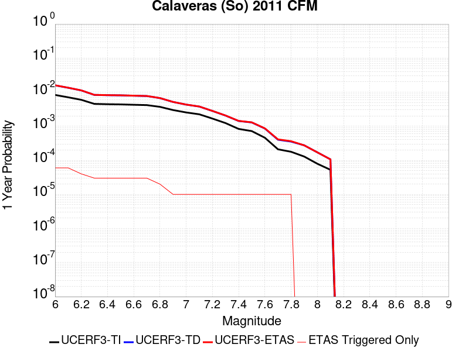 | 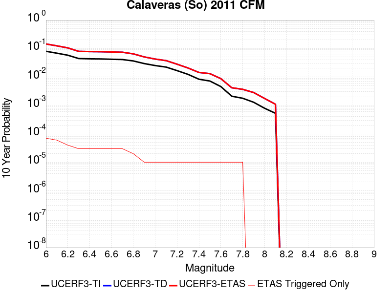 |

| Magnitude | 1 wk TI Prob | 1 wk TD Prob | 1 wk ETAS Prob | 1 wk ETAS/TD Gain | 1 wk ETAS Triggered Only | 1 mo TI Prob | 1 mo TD Prob | 1 mo ETAS Prob | 1 mo ETAS/TD Gain | 1 mo ETAS Triggered Only | 1 yr TI Prob | 1 yr TD Prob | 1 yr ETAS Prob | 1 yr ETAS/TD Gain | 1 yr ETAS Triggered Only | 10 yr TI Prob | 10 yr TD Prob | 10 yr ETAS Prob | 10 yr ETAS/TD Gain | 10 yr ETAS Triggered Only |
|-----|-----|-----|-----|-----|-----|-----|-----|-----|-----|-----|-----|-----|-----|-----|-----|-----|-----|-----|-----|-----|
| 6.0 | 1.5950744E-4 | 3.071188E-4 | 3.3710958E-4 | 1.0976521 | 3.0E-5 | 6.834242E-4 | 0.0013155643 | 0.0013555117 | 1.0303652 | 4.0E-5 | 0.00828899 | 0.01585904 | 0.01591809 | 1.0037234 | 6.0E-5 | 0.079865426 | 0.14440064 | 0.14446053 | 1.0004147 | 7.0E-5 |
| 6.1 | 1.3584697E-4 | 2.6036944E-4 | 2.903616E-4 | 1.1151909 | 3.0E-5 | 5.8207137E-4 | 0.0011153965 | 0.0011553519 | 1.0358217 | 4.0E-5 | 0.007063716 | 0.013462106 | 0.013521298 | 1.0043969 | 6.0E-5 | 0.06843361 | 0.12402854 | 0.124081105 | 1.0004238 | 6.0E-5 |
| 6.2 | 1.14676266E-4 | 2.1726108E-4 | 2.3725674E-4 | 1.0920352 | 2.0E-5 | 4.9137714E-4 | 9.307893E-4 | 9.507707E-4 | 1.0214671 | 2.0E-5 | 0.0059661185 | 0.011245592 | 0.011285142 | 1.0035169 | 4.0E-5 | 0.058084648 | 0.105019294 | 0.105055094 | 1.0003409 | 4.0E-5 |
| 6.3 | 8.691518E-5 | 1.5987165E-4 | 1.7986844E-4 | 1.1250803 | 2.0E-5 | 3.7244044E-4 | 6.8496726E-4 | 7.0495356E-4 | 1.0291785 | 2.0E-5 | 0.004525038 | 0.008300893 | 0.008330644 | 1.003584 | 3.0E-5 | 0.044339992 | 0.0793347 | 0.07936232 | 1.0003481 | 3.0E-5 |
| 6.4 | 8.50982E-5 | 1.5693568E-4 | 1.7693255E-4 | 1.1274208 | 2.0E-5 | 3.646556E-4 | 6.7239115E-4 | 6.923777E-4 | 1.0297246 | 2.0E-5 | 0.0044306475 | 0.008148931 | 0.008178686 | 1.0036515 | 3.0E-5 | 0.04343345 | 0.077940844 | 0.07796851 | 1.0003549 | 3.0E-5 |
| 6.5 | 8.4062965E-5 | 1.5518135E-4 | 1.7517825E-4 | 1.1288614 | 2.0E-5 | 3.602201E-4 | 6.648764E-4 | 6.8486313E-4 | 1.0300608 | 2.0E-5 | 0.004376863 | 0.008058134 | 0.008087891 | 1.003693 | 3.0E-5 | 0.042916555 | 0.077112116 | 0.0771398 | 1.000359 | 3.0E-5 |
| 6.6 | 8.194716E-5 | 1.5154095E-4 | 1.7153792E-4 | 1.1319575 | 2.0E-5 | 3.5115483E-4 | 6.492825E-4 | 6.6926953E-4 | 1.0307832 | 2.0E-5 | 0.0042669317 | 0.007869979 | 0.0078997435 | 1.0037819 | 3.0E-5 | 0.04185927 | 0.07539739 | 0.075425126 | 1.0003679 | 3.0E-5 |
| 6.7 | 8.012326E-5 | 1.4821833E-4 | 1.6821537E-4 | 1.1349161 | 2.0E-5 | 3.433402E-4 | 6.350497E-4 | 6.55037E-4 | 1.0314736 | 2.0E-5 | 0.004172157 | 0.007698474 | 0.0077282432 | 1.0038669 | 3.0E-5 | 0.040946912 | 0.073839515 | 0.0738673 | 1.0003763 | 3.0E-5 |
| 6.8 | 7.119773E-5 | 1.2880519E-4 | 1.488026E-4 | 1.1552533 | 2.0E-5 | 3.0509746E-4 | 5.519001E-4 | 5.718891E-4 | 1.0362184 | 2.0E-5 | 0.0037082357 | 0.0066958875 | 0.0067157536 | 1.0029669 | 2.0E-5 | 0.036469642 | 0.06468402 | 0.06470272 | 1.0002892 | 2.0E-5 |
| 6.9 | 5.7343088E-5 | 9.9189E-5 | 1.0918801E-4 | 1.1008077 | 1.0E-5 | 2.4573295E-4 | 4.2502693E-4 | 4.3502267E-4 | 1.023518 | 1.0E-5 | 0.0029876942 | 0.0051625078 | 0.005172456 | 1.001927 | 1.0E-5 | 0.02947844 | 0.050509132 | 0.05051863 | 1.000188 | 1.0E-5 |
| 7.0 | 4.8746577E-5 | 8.284751E-5 | 9.284668E-5 | 1.1206937 | 1.0E-5 | 2.0889717E-4 | 3.550128E-4 | 3.6500924E-4 | 1.028158 | 1.0E-5 | 0.0025403565 | 0.004313781 | 0.0043237377 | 1.0023081 | 1.0E-5 | 0.025115121 | 0.04248505 | 0.042494625 | 1.0002254 | 1.0E-5 |
| 7.1 | 4.2998014E-5 | 7.264914E-5 | 8.264841E-5 | 1.1376379 | 1.0E-5 | 1.8426418E-4 | 3.1131663E-4 | 3.213135E-4 | 1.0321116 | 1.0E-5 | 0.002241108 | 0.0037837527 | 0.003793715 | 1.0026329 | 1.0E-5 | 0.022186412 | 0.037423246 | 0.037432868 | 1.0002573 | 1.0E-5 |
| 7.2 | 3.221292E-5 | 5.390566E-5 | 6.390512E-5 | 1.1854993 | 1.0E-5 | 1.3804805E-4 | 2.3100396E-4 | 2.4100165E-4 | 1.0432793 | 1.0E-5 | 0.0016794393 | 0.0028088738 | 0.0028188457 | 1.0035502 | 1.0E-5 | 0.016668037 | 0.028035998 | 0.028045718 | 1.0003467 | 1.0E-5 |
| 7.3 | 2.3756531E-5 | 3.9471706E-5 | 4.9471313E-5 | 1.2533361 | 1.0E-5 | 1.0180973E-4 | 1.6915359E-4 | 1.7915189E-4 | 1.0591079 | 1.0E-5 | 0.0012388286 | 0.0020575167 | 0.002067496 | 1.0048503 | 1.0E-5 | 0.012319452 | 0.02064345 | 0.020653244 | 1.0004745 | 1.0E-5 |
| 7.4 | 1.5997684E-5 | 2.734085E-5 | 3.7340575E-5 | 1.365743 | 1.0E-5 | 6.8559704E-5 | 1.1716982E-4 | 1.2716865E-4 | 1.0853362 | 1.0E-5 | 8.343947E-4 | 0.0014256114 | 0.0014355972 | 1.0070045 | 1.0E-5 | 0.008312687 | 0.014376549 | 0.014386405 | 1.0006856 | 1.0E-5 |
| 7.5 | 1.3814293E-5 | 2.4782603E-5 | 3.4782355E-5 | 1.4034989 | 1.0E-5 | 5.9202768E-5 | 1.0620684E-4 | 1.1620578E-4 | 1.0941459 | 1.0E-5 | 7.205553E-4 | 0.0012923037 | 0.0013022907 | 1.0077281 | 1.0E-5 | 0.007182234 | 0.013055766 | 0.013065635 | 1.0007559 | 1.0E-5 |
| 7.6 | 8.817309E-6 | 1.6429829E-5 | 2.6429665E-5 | 1.608639 | 1.0E-5 | 3.7787922E-5 | 7.041166E-5 | 8.041096E-5 | 1.1420119 | 1.0E-5 | 4.5997082E-4 | 8.5692614E-4 | 8.669176E-4 | 1.0116596 | 1.0E-5 | 0.004590199 | 0.008719863 | 0.008729776 | 1.0011368 | 1.0E-5 |
| 7.7 | 4.0352206E-6 | 7.706877E-6 | 1.77068E-5 | 2.2975326 | 1.0E-5 | 1.7293689E-5 | 3.3029053E-5 | 4.3028725E-5 | 1.3027537 | 1.0E-5 | 2.1053031E-4 | 4.020546E-4 | 4.1205058E-4 | 1.0248623 | 1.0E-5 | 0.0021033096 | 0.0041649863 | 0.0041749445 | 1.002391 | 1.0E-5 |
| 7.8 | 3.413169E-6 | 6.7868646E-6 | 1.6786797E-5 | 2.4734244 | 1.0E-5 | 1.4627784E-5 | 2.9086239E-5 | 3.908595E-5 | 1.3437952 | 1.0E-5 | 1.7807873E-4 | 3.5406748E-4 | 3.6406395E-4 | 1.0282332 | 1.0E-5 | 0.0017793609 | 0.0036663096 | 0.003676273 | 1.0027175 | 1.0E-5 |
| 7.9 | 2.4740732E-6 | 5.278809E-6 | 5.278809E-6 | 1.0 | 0.0 | 1.06031275E-5 | 2.2623271E-5 | 2.2623271E-5 | 1.0 | 0.0 | 1.2908543E-4 | 2.7540355E-4 | 2.7540355E-4 | 1.0 | 0.0 | 0.0012901047 | 0.002834638 | 0.002834638 | 1.0 | 0.0 |
| 8.0 | 1.5231818E-6 | 3.2887135E-6 | 3.2887135E-6 | 1.0 | 0.0 | 6.527906E-6 | 1.409441E-5 | 1.409441E-5 | 1.0 | 0.0 | 7.9474354E-5 | 1.7158597E-4 | 1.7158597E-4 | 1.0 | 0.0 | 7.944594E-4 | 0.001756374 | 0.001756374 | 1.0 | 0.0 |
| 8.1 | 1.0104524E-6 | 2.0456548E-6 | 2.0456548E-6 | 1.0 | 0.0 | 4.330503E-6 | 8.767062E-6 | 8.767062E-6 | 1.0 | 0.0 | 5.2722597E-5 | 1.06733794E-4 | 1.06733794E-4 | 1.0 | 0.0 | 5.271009E-4 | 0.0010929212 | 0.0010929212 | 1.0 | 0.0 |

## Newport-Inglewood (Offshore)
*[(top)](#table-of-contents)*

| 1 Week | 1 Month | 1 Year | 10 Year |
|-----|-----|-----|-----|
|  |  |  |  |

| Magnitude | 1 wk TI Prob | 1 wk TD Prob | 1 wk ETAS Prob | 1 wk ETAS/TD Gain | 1 wk ETAS Triggered Only | 1 mo TI Prob | 1 mo TD Prob | 1 mo ETAS Prob | 1 mo ETAS/TD Gain | 1 mo ETAS Triggered Only | 1 yr TI Prob | 1 yr TD Prob | 1 yr ETAS Prob | 1 yr ETAS/TD Gain | 1 yr ETAS Triggered Only | 10 yr TI Prob | 10 yr TD Prob | 10 yr ETAS Prob | 10 yr ETAS/TD Gain | 10 yr ETAS Triggered Only |
|-----|-----|-----|-----|-----|-----|-----|-----|-----|-----|-----|-----|-----|-----|-----|-----|-----|-----|-----|-----|-----|
| 6.0 | 1.9626508E-5 | 1.8965357E-5 | 4.8964786E-5 | 2.5818017 | 3.0E-5 | 8.411089E-5 | 8.1277634E-5 | 1.112752E-4 | 1.3690752 | 3.0E-5 | 0.001023569 | 9.891186E-4 | 0.0010390691 | 1.0505 | 5.0E-5 | 0.010188672 | 0.009848503 | 0.009907912 | 1.0060323 | 6.0E-5 |
| 6.1 | 1.331886E-5 | 1.2218092E-5 | 3.221785E-5 | 2.6368968 | 2.0E-5 | 5.707958E-5 | 5.2362207E-5 | 7.236116E-5 | 1.3819349 | 2.0E-5 | 6.947222E-4 | 6.3732493E-4 | 6.673058E-4 | 1.0470418 | 3.0E-5 | 0.006925544 | 0.006355149 | 0.006394895 | 1.0062541 | 4.0E-5 |
| 6.2 | 1.2250852E-5 | 1.1076029E-5 | 3.1075808E-5 | 2.8056812 | 2.0E-5 | 5.2502597E-5 | 4.7467838E-5 | 6.746689E-5 | 1.4213179 | 2.0E-5 | 6.3903164E-4 | 5.777687E-4 | 6.0775137E-4 | 1.051894 | 3.0E-5 | 0.006371971 | 0.0057627866 | 0.0058025564 | 1.0069011 | 4.0E-5 |
| 6.3 | 1.2106258E-5 | 1.0918891E-5 | 3.0918673E-5 | 2.831668 | 2.0E-5 | 5.1882926E-5 | 4.6794412E-5 | 6.679348E-5 | 1.4273814 | 2.0E-5 | 6.3149154E-4 | 5.69574E-4 | 5.9955695E-4 | 1.0526409 | 3.0E-5 | 0.0062970007 | 0.005681259 | 0.0057210317 | 1.0070007 | 4.0E-5 |
| 6.4 | 1.1348758E-5 | 1.0109362E-5 | 3.010916E-5 | 2.9783442 | 2.0E-5 | 4.8636626E-5 | 4.3325123E-5 | 6.332425E-5 | 1.4616059 | 2.0E-5 | 5.919901E-4 | 5.273565E-4 | 5.573407E-4 | 1.0568575 | 3.0E-5 | 0.005904155 | 0.0052611465 | 0.005300936 | 1.0075629 | 4.0E-5 |
| 6.5 | 1.100837E-5 | 9.7433895E-6 | 2.9743194E-5 | 3.0526538 | 2.0E-5 | 4.7177873E-5 | 4.1756717E-5 | 6.175588E-5 | 1.4789449 | 2.0E-5 | 5.7423924E-4 | 5.082702E-4 | 5.38255E-4 | 1.0589937 | 3.0E-5 | 0.005727576 | 0.0050711688 | 0.005110966 | 1.0078478 | 4.0E-5 |
| 6.6 | 1.0634696E-5 | 9.345544E-6 | 2.9345356E-5 | 3.1400375 | 2.0E-5 | 4.557647E-5 | 4.0051716E-5 | 6.0050916E-5 | 1.4993343 | 2.0E-5 | 5.5475225E-4 | 4.8752132E-4 | 5.175067E-4 | 1.0615058 | 3.0E-5 | 0.0055336943 | 0.0048646047 | 0.00490441 | 1.0081826 | 4.0E-5 |
| 6.7 | 9.9780855E-6 | 8.667911E-6 | 2.8667737E-5 | 3.307341 | 2.0E-5 | 4.276252E-5 | 3.7147664E-5 | 5.714692E-5 | 1.5383719 | 2.0E-5 | 5.205093E-4 | 4.5217964E-4 | 4.8216607E-4 | 1.0663153 | 3.0E-5 | 0.0051929182 | 0.004512675 | 0.0045524943 | 1.0088239 | 4.0E-5 |
| 6.8 | 9.59546E-6 | 8.27295E-6 | 2.8272785E-5 | 3.4174972 | 2.0E-5 | 4.1122752E-5 | 3.5455025E-5 | 5.5454315E-5 | 1.564075 | 2.0E-5 | 5.0055445E-4 | 4.315801E-4 | 4.6156714E-4 | 1.069482 | 3.0E-5 | 0.004994285 | 0.004307495 | 0.004347323 | 1.0092461 | 4.0E-5 |
| 6.9 | 9.000614E-6 | 7.70684E-6 | 2.7706687E-5 | 3.5950773 | 2.0E-5 | 3.857349E-5 | 3.30289E-5 | 5.302824E-5 | 1.6055104 | 2.0E-5 | 4.6953102E-4 | 4.0205332E-4 | 4.3204124E-4 | 1.074587 | 3.0E-5 | 0.004685402 | 0.0040133307 | 0.0040531703 | 1.0099268 | 4.0E-5 |
| 7.0 | 7.4070194E-6 | 6.148904E-6 | 2.614878E-5 | 4.252592 | 2.0E-5 | 3.1743984E-5 | 2.635218E-5 | 4.635165E-5 | 1.7589304 | 2.0E-5 | 3.8641447E-4 | 3.207907E-4 | 3.4078432E-4 | 1.062326 | 2.0E-5 | 0.0038574322 | 0.0032032963 | 0.0032332002 | 1.0093354 | 3.0E-5 |
| 7.1 | 6.299615E-6 | 5.0565927E-6 | 2.5056492E-5 | 4.9552126 | 2.0E-5 | 2.699807E-5 | 2.1670932E-5 | 4.16705E-5 | 1.9228752 | 2.0E-5 | 3.2865192E-4 | 2.638118E-4 | 2.8380653E-4 | 1.0757916 | 2.0E-5 | 0.003281663 | 0.002635001 | 0.0026649218 | 1.0113552 | 3.0E-5 |
| 7.2 | 5.096653E-6 | 3.892769E-6 | 2.3892691E-5 | 6.137711 | 2.0E-5 | 2.1842614E-5 | 1.668319E-5 | 3.6682857E-5 | 2.1987915 | 2.0E-5 | 2.6590136E-4 | 2.0309901E-4 | 2.2309495E-4 | 1.0984541 | 2.0E-5 | 0.0026558342 | 0.0020291451 | 0.0020590844 | 1.0147545 | 3.0E-5 |
| 7.3 | 3.9753018E-6 | 2.9099103E-6 | 2.2909851E-5 | 7.873044 | 2.0E-5 | 1.7036897E-5 | 1.2470985E-5 | 3.2470736E-5 | 2.6037025 | 2.0E-5 | 2.0740448E-4 | 1.5182374E-4 | 1.718207E-4 | 1.1317117 | 2.0E-5 | 0.00207211 | 0.0015172083 | 0.0015471628 | 1.0197432 | 3.0E-5 |
| 7.4 | 3.0568392E-6 | 2.1449955E-6 | 1.2144974E-5 | 5.6620045 | 1.0E-5 | 1.3100675E-5 | 9.192806E-6 | 1.9192714E-5 | 2.0877972 | 1.0E-5 | 1.5948903E-4 | 1.1191672E-4 | 1.21915604E-4 | 1.0893421 | 1.0E-5 | 0.0015937461 | 0.0011186098 | 0.0011385875 | 1.0178593 | 2.0E-5 |
| 7.5 | 1.7279019E-6 | 1.1469883E-6 | 1.1469883E-6 | 1.0 | 0.0 | 7.405273E-6 | 4.915655E-6 | 4.915655E-6 | 1.0 | 0.0 | 9.015547E-5 | 5.9846494E-5 | 5.9846494E-5 | 1.0 | 0.0 | 9.01189E-4 | 5.9830764E-4 | 6.0830166E-4 | 1.0167038 | 1.0E-5 |
| 7.6 | 1.1156416E-6 | 7.223012E-7 | 7.223012E-7 | 1.0 | 0.0 | 4.7813123E-6 | 3.095573E-6 | 3.095573E-6 | 1.0 | 0.0 | 5.821092E-5 | 3.7687976E-5 | 3.7687976E-5 | 1.0 | 0.0 | 5.8195676E-4 | 3.7681818E-4 | 3.7681818E-4 | 1.0 | 0.0 |
| 7.7 | 9.117973E-8 | 6.734145E-8 | 6.734145E-8 | 1.0 | 0.0 | 3.907702E-7 | 2.886062E-7 | 2.886062E-7 | 1.0 | 0.0 | 4.757617E-6 | 3.513775E-6 | 3.513775E-6 | 1.0 | 0.0 | 4.7575148E-5 | 3.5137225E-5 | 3.5137225E-5 | 1.0 | 0.0 |

## San Jacinto (Superstition Mtn)
*[(top)](#table-of-contents)*

| 1 Week | 1 Month | 1 Year | 10 Year |
|-----|-----|-----|-----|
|  |  |  |  |

| Magnitude | 1 wk TI Prob | 1 wk TD Prob | 1 wk ETAS Prob | 1 wk ETAS/TD Gain | 1 wk ETAS Triggered Only | 1 mo TI Prob | 1 mo TD Prob | 1 mo ETAS Prob | 1 mo ETAS/TD Gain | 1 mo ETAS Triggered Only | 1 yr TI Prob | 1 yr TD Prob | 1 yr ETAS Prob | 1 yr ETAS/TD Gain | 1 yr ETAS Triggered Only | 10 yr TI Prob | 10 yr TD Prob | 10 yr ETAS Prob | 10 yr ETAS/TD Gain | 10 yr ETAS Triggered Only |
|-----|-----|-----|-----|-----|-----|-----|-----|-----|-----|-----|-----|-----|-----|-----|-----|-----|-----|-----|-----|-----|
| 6.0 | 6.4193904E-5 | 9.599367E-5 | 1.1599175E-4 | 1.208327 | 2.0E-5 | 2.7508775E-4 | 4.1134638E-4 | 4.4133404E-4 | 1.0729012 | 3.0E-5 | 0.0033440501 | 0.0049980893 | 0.0050478396 | 1.0099539 | 5.0E-5 | 0.03294174 | 0.048823986 | 0.048871543 | 1.000974 | 5.0E-5 |
| 6.1 | 6.4193904E-5 | 9.599367E-5 | 1.1599175E-4 | 1.208327 | 2.0E-5 | 2.7508775E-4 | 4.1134638E-4 | 4.4133404E-4 | 1.0729012 | 3.0E-5 | 0.0033440501 | 0.0049980893 | 0.0050478396 | 1.0099539 | 5.0E-5 | 0.03294174 | 0.048823986 | 0.048871543 | 1.000974 | 5.0E-5 |
| 6.2 | 5.7023593E-5 | 8.3144434E-5 | 1.0314277E-4 | 1.2405252 | 2.0E-5 | 2.4436394E-4 | 3.5629404E-4 | 3.8628333E-4 | 1.0841701 | 3.0E-5 | 0.002971072 | 0.0043308944 | 0.004370721 | 1.0091959 | 4.0E-5 | 0.029316625 | 0.04250403 | 0.04254233 | 1.0009011 | 4.0E-5 |
| 6.3 | 5.6940098E-5 | 8.298979E-5 | 1.0298813E-4 | 1.2409735 | 2.0E-5 | 2.4400617E-4 | 3.5563146E-4 | 3.856208E-4 | 1.084327 | 3.0E-5 | 0.002966728 | 0.00432286 | 0.004362687 | 1.0092131 | 4.0E-5 | 0.029274331 | 0.042427283 | 0.042465586 | 1.0009028 | 4.0E-5 |
| 6.4 | 5.4171585E-5 | 7.7483564E-5 | 9.7482014E-5 | 1.2580993 | 2.0E-5 | 2.3214328E-4 | 3.3203943E-4 | 3.6202947E-4 | 1.0903207 | 3.0E-5 | 0.0028226813 | 0.0040367353 | 0.0040765735 | 1.009869 | 4.0E-5 | 0.02787096 | 0.03971653 | 0.039754942 | 1.0009671 | 4.0E-5 |
| 6.5 | 4.375144E-5 | 5.642133E-5 | 6.642076E-5 | 1.177228 | 1.0E-5 | 1.874927E-4 | 2.4178992E-4 | 2.517875E-4 | 1.0413482 | 1.0E-5 | 0.0022803338 | 0.002940994 | 0.0029609352 | 1.0067804 | 2.0E-5 | 0.022570757 | 0.029236801 | 0.029256217 | 1.0006641 | 2.0E-5 |
| 6.6 | 2.772192E-5 | 2.5488358E-5 | 3.54881E-5 | 1.392326 | 1.0E-5 | 1.1880282E-4 | 1.09231354E-4 | 1.1923026E-4 | 1.0915388 | 1.0E-5 | 0.0014454646 | 0.0013290998 | 0.0013490731 | 1.0150278 | 2.0E-5 | 0.014360986 | 0.01354049 | 0.01356022 | 1.0014571 | 2.0E-5 |
| 6.7 | 2.7124124E-5 | 2.4699386E-5 | 3.469914E-5 | 1.4048584 | 1.0E-5 | 1.1624106E-4 | 1.05850326E-4 | 1.1584927E-4 | 1.094463 | 1.0E-5 | 0.0014143161 | 0.001287985 | 0.0013079593 | 1.0155082 | 2.0E-5 | 0.014053487 | 0.013133943 | 0.013153681 | 1.0015028 | 2.0E-5 |
| 6.8 | 2.5475807E-5 | 2.216446E-5 | 3.2164236E-5 | 1.4511627 | 1.0E-5 | 1.0917746E-4 | 9.4987154E-5 | 1.04986204E-4 | 1.1052674 | 1.0E-5 | 0.001328425 | 0.001155867 | 0.0011758439 | 1.0172831 | 2.0E-5 | 0.0132051185 | 0.011822182 | 0.011841945 | 1.0016718 | 2.0E-5 |
| 6.9 | 2.1162023E-5 | 1.7626244E-5 | 2.7626067E-5 | 1.5673258 | 1.0E-5 | 9.069123E-5 | 7.5538876E-5 | 8.553812E-5 | 1.1323721 | 1.0E-5 | 0.0011036064 | 9.193016E-4 | 9.3928317E-4 | 1.0217357 | 2.0E-5 | 0.010981417 | 0.00944688 | 0.009466691 | 1.0020971 | 2.0E-5 |
| 7.0 | 1.8754288E-5 | 1.6161559E-5 | 2.6161397E-5 | 1.6187422 | 1.0E-5 | 8.037304E-5 | 6.9261994E-5 | 7.926131E-5 | 1.1443694 | 1.0E-5 | 9.781026E-4 | 8.4294105E-4 | 8.629242E-4 | 1.0237064 | 2.0E-5 | 0.009738087 | 0.008670042 | 0.008689868 | 1.0022868 | 2.0E-5 |
| 7.1 | 1.8678527E-5 | 1.6086702E-5 | 2.608654E-5 | 1.6216215 | 1.0E-5 | 8.0048376E-5 | 6.89412E-5 | 7.894051E-5 | 1.1450411 | 1.0E-5 | 9.7415317E-4 | 8.3903834E-4 | 8.5902156E-4 | 1.0238168 | 2.0E-5 | 0.009698939 | 0.008630998 | 0.008650825 | 1.0022973 | 2.0E-5 |
| 7.2 | 1.7804578E-5 | 1.5381282E-5 | 2.5381127E-5 | 1.6501309 | 1.0E-5 | 7.6303106E-5 | 6.5918124E-5 | 7.5917465E-5 | 1.1516933 | 1.0E-5 | 9.285943E-4 | 8.022599E-4 | 8.2224386E-4 | 1.0249096 | 2.0E-5 | 0.009247236 | 0.008262311 | 0.008282146 | 1.0024006 | 2.0E-5 |
| 7.3 | 1.6583685E-5 | 1.4530388E-5 | 2.4530244E-5 | 1.6882029 | 1.0E-5 | 7.1070994E-5 | 6.227162E-5 | 7.2270996E-5 | 1.1605768 | 1.0E-5 | 8.649459E-4 | 7.5789524E-4 | 7.778801E-4 | 1.0263689 | 2.0E-5 | 0.00861587 | 0.007817623 | 0.007837467 | 1.0025383 | 2.0E-5 |
| 7.4 | 1.6387552E-5 | 1.4395274E-5 | 2.4395129E-5 | 1.6946625 | 1.0E-5 | 7.023047E-5 | 6.169258E-5 | 7.169197E-5 | 1.162084 | 1.0E-5 | 8.5472054E-4 | 7.5085036E-4 | 7.708353E-4 | 1.0266165 | 2.0E-5 | 0.008514405 | 0.0077470057 | 0.0077668508 | 1.0025617 | 2.0E-5 |
| 7.5 | 1.5790754E-5 | 1.4035962E-5 | 2.4035822E-5 | 1.7124456 | 1.0E-5 | 6.767291E-5 | 6.0152746E-5 | 7.015214E-5 | 1.1662334 | 1.0E-5 | 8.236062E-4 | 7.321156E-4 | 7.5210095E-4 | 1.0272981 | 2.0E-5 | 0.008205604 | 0.007557569 | 0.007577418 | 1.0026263 | 2.0E-5 |
| 7.6 | 1.4248672E-5 | 1.3054932E-5 | 2.3054801E-5 | 1.765984 | 1.0E-5 | 6.106431E-5 | 5.594852E-5 | 6.594796E-5 | 1.1787257 | 1.0E-5 | 7.432043E-4 | 6.8096205E-4 | 7.0094847E-4 | 1.0293502 | 2.0E-5 | 0.007407237 | 0.0070401574 | 0.0070600165 | 1.0028208 | 2.0E-5 |
| 7.7 | 1.15449975E-5 | 1.090368E-5 | 2.090357E-5 | 1.9171116 | 1.0E-5 | 4.947762E-5 | 4.6729223E-5 | 5.6728757E-5 | 1.2139889 | 1.0E-5 | 6.022235E-4 | 5.687805E-4 | 5.8876915E-4 | 1.0351429 | 2.0E-5 | 0.006005941 | 0.0059101824 | 0.0059300642 | 1.003364 | 2.0E-5 |
| 7.8 | 9.1391985E-6 | 9.514299E-6 | 1.9514204E-5 | 2.0510397 | 1.0E-5 | 3.9167408E-5 | 4.0774932E-5 | 5.0774524E-5 | 1.2452388 | 1.0E-5 | 4.767588E-4 | 4.963223E-4 | 5.0631736E-4 | 1.0201381 | 1.0E-5 | 0.0047573727 | 0.0051766867 | 0.0051866346 | 1.0019218 | 1.0E-5 |
| 7.9 | 6.973017E-6 | 7.3821784E-6 | 1.7382104E-5 | 2.3546038 | 1.0E-5 | 2.9884017E-5 | 3.1637526E-5 | 4.163721E-5 | 1.3160703 | 1.0E-5 | 3.6377716E-4 | 3.8511935E-4 | 3.951155E-4 | 1.025956 | 1.0E-5 | 0.0036318225 | 0.0040517948 | 0.004061754 | 1.0024581 | 1.0E-5 |
| 8.0 | 5.7638235E-6 | 6.259972E-6 | 1.625991E-5 | 2.5974412 | 1.0E-5 | 2.4701867E-5 | 2.6828178E-5 | 3.682791E-5 | 1.3727324 | 1.0E-5 | 3.0070372E-4 | 3.2658462E-4 | 3.3658135E-4 | 1.03061 | 1.0E-5 | 0.0030029714 | 0.0034534496 | 0.003463415 | 1.0028857 | 1.0E-5 |
| 8.1 | 5.1124434E-6 | 5.4956718E-6 | 1.5495616E-5 | 2.8196037 | 1.0E-5 | 2.1910288E-5 | 2.355267E-5 | 3.3552435E-5 | 1.4245703 | 1.0E-5 | 2.6672508E-4 | 2.867165E-4 | 2.9671364E-4 | 1.0348676 | 1.0E-5 | 0.0026640517 | 0.003040336 | 0.0030503056 | 1.0032791 | 1.0E-5 |
| 8.2 | 1.1075938E-6 | 5.336568E-7 | 5.336568E-7 | 1.0 | 0.0 | 4.7468216E-6 | 2.2870988E-6 | 2.2870988E-6 | 1.0 | 0.0 | 5.779102E-5 | 2.7845093E-5 | 2.7845093E-5 | 1.0 | 0.0 | 5.777599E-4 | 3.1346595E-4 | 3.1346595E-4 | 1.0 | 0.0 |
| 8.3 | 1.3584393E-8 | 4.473836E-9 | 4.473836E-9 | 1.0 | 0.0 | 5.8218827E-8 | 1.9173582E-8 | 1.9173582E-8 | 1.0 | 0.0 | 7.0881396E-7 | 2.3343837E-7 | 2.3343837E-7 | 1.0 | 0.0 | 7.0881174E-6 | 2.6163038E-6 | 2.6163038E-6 | 1.0 | 0.0 |

## Elsinore (Temecula) rev
*[(top)](#table-of-contents)*

| 1 Week | 1 Month | 1 Year | 10 Year |
|-----|-----|-----|-----|
|  |  |  |  |

| Magnitude | 1 wk TI Prob | 1 wk TD Prob | 1 wk ETAS Prob | 1 wk ETAS/TD Gain | 1 wk ETAS Triggered Only | 1 mo TI Prob | 1 mo TD Prob | 1 mo ETAS Prob | 1 mo ETAS/TD Gain | 1 mo ETAS Triggered Only | 1 yr TI Prob | 1 yr TD Prob | 1 yr ETAS Prob | 1 yr ETAS/TD Gain | 1 yr ETAS Triggered Only | 10 yr TI Prob | 10 yr TD Prob | 10 yr ETAS Prob | 10 yr ETAS/TD Gain | 10 yr ETAS Triggered Only |
|-----|-----|-----|-----|-----|-----|-----|-----|-----|-----|-----|-----|-----|-----|-----|-----|-----|-----|-----|-----|-----|
| 6.0 | 2.9514995E-5 | 2.2517117E-5 | 6.2516214E-5 | 2.7763865 | 4.0E-5 | 1.264867E-4 | 9.649849E-5 | 1.3649462E-4 | 1.4144742 | 4.0E-5 | 0.0015388876 | 0.0011742581 | 0.0012341876 | 1.0510361 | 6.0E-5 | 0.015282745 | 0.011696897 | 0.011756196 | 1.0050696 | 6.0E-5 |
| 6.1 | 2.9514995E-5 | 2.2517117E-5 | 6.2516214E-5 | 2.7763865 | 4.0E-5 | 1.264867E-4 | 9.649849E-5 | 1.3649462E-4 | 1.4144742 | 4.0E-5 | 0.0015388876 | 0.0011742581 | 0.0012341876 | 1.0510361 | 6.0E-5 | 0.015282745 | 0.011696897 | 0.011756196 | 1.0050696 | 6.0E-5 |
| 6.2 | 2.9514995E-5 | 2.2517117E-5 | 6.2516214E-5 | 2.7763865 | 4.0E-5 | 1.264867E-4 | 9.649849E-5 | 1.3649462E-4 | 1.4144742 | 4.0E-5 | 0.0015388876 | 0.0011742581 | 0.0012341876 | 1.0510361 | 6.0E-5 | 0.015282745 | 0.011696897 | 0.011756196 | 1.0050696 | 6.0E-5 |
| 6.3 | 2.3223649E-5 | 1.8406454E-5 | 5.8405716E-5 | 3.1731107 | 4.0E-5 | 9.952613E-5 | 7.888251E-5 | 1.1887936E-4 | 1.5070432 | 4.0E-5 | 0.001211057 | 9.599888E-4 | 0.0010199312 | 1.0624408 | 6.0E-5 | 0.012044783 | 0.009569948 | 0.009629373 | 1.0062096 | 6.0E-5 |
| 6.4 | 2.3223649E-5 | 1.8406454E-5 | 5.8405716E-5 | 3.1731107 | 4.0E-5 | 9.952613E-5 | 7.888251E-5 | 1.1887936E-4 | 1.5070432 | 4.0E-5 | 0.001211057 | 9.599888E-4 | 0.0010199312 | 1.0624408 | 6.0E-5 | 0.012044783 | 0.009569948 | 0.009629373 | 1.0062096 | 6.0E-5 |
| 6.5 | 1.8338875E-5 | 1.4750118E-5 | 4.4749675E-5 | 3.033852 | 3.0E-5 | 7.8592806E-5 | 6.321331E-5 | 9.321141E-5 | 1.4745536 | 3.0E-5 | 9.5644733E-4 | 7.69359E-4 | 8.1932056E-4 | 1.0649391 | 5.0E-5 | 0.009523412 | 0.0076739118 | 0.007723528 | 1.0064656 | 5.0E-5 |
| 6.6 | 1.8223333E-5 | 1.4612673E-5 | 4.4612236E-5 | 3.0529823 | 3.0E-5 | 7.809766E-5 | 6.262429E-5 | 9.262241E-5 | 1.4790174 | 3.0E-5 | 9.504242E-4 | 7.6219277E-4 | 8.1215467E-4 | 1.0655502 | 5.0E-5 | 0.009463696 | 0.0076027405 | 0.0076523605 | 1.0065266 | 5.0E-5 |
| 6.7 | 1.7512752E-5 | 1.402721E-5 | 4.402679E-5 | 3.1386704 | 3.0E-5 | 7.505249E-5 | 6.011528E-5 | 9.011348E-5 | 1.4990112 | 3.0E-5 | 9.13381E-4 | 7.3166634E-4 | 7.8162976E-4 | 1.0682871 | 5.0E-5 | 0.00909636 | 0.00729892 | 0.007348555 | 1.0068003 | 5.0E-5 |
| 6.8 | 1.7417142E-5 | 1.3951195E-5 | 4.3950775E-5 | 3.1503234 | 3.0E-5 | 7.4642754E-5 | 5.9789512E-5 | 8.978772E-5 | 1.5017302 | 3.0E-5 | 9.083966E-4 | 7.277028E-4 | 7.776664E-4 | 1.0686594 | 5.0E-5 | 0.009046922 | 0.0072594886 | 0.0073091257 | 1.0068375 | 5.0E-5 |
| 6.9 | 1.6402591E-5 | 1.2988613E-5 | 4.2988224E-5 | 3.3096855 | 3.0E-5 | 7.0294926E-5 | 5.5664343E-5 | 8.566267E-5 | 1.5389147 | 3.0E-5 | 8.5550465E-4 | 6.775103E-4 | 7.2747644E-4 | 1.0737497 | 5.0E-5 | 0.008522186 | 0.006760169 | 0.0068098307 | 1.0073463 | 5.0E-5 |
| 7.0 | 1.3912486E-5 | 1.0878233E-5 | 3.0878015E-5 | 2.8385139 | 2.0E-5 | 5.9623577E-5 | 4.6620182E-5 | 6.661925E-5 | 1.4289788 | 2.0E-5 | 7.2567526E-4 | 5.674556E-4 | 6.074329E-4 | 1.0704501 | 4.0E-5 | 0.0072331014 | 0.005663986 | 0.0057037594 | 1.0070221 | 4.0E-5 |
| 7.1 | 1.3405147E-5 | 1.03274215E-5 | 3.0327214E-5 | 2.9365718 | 2.0E-5 | 5.7449364E-5 | 4.425964E-5 | 6.4258755E-5 | 1.451859 | 2.0E-5 | 6.9922156E-4 | 5.3873047E-4 | 5.787089E-4 | 1.0742086 | 4.0E-5 | 0.0069702556 | 0.005377577 | 0.005417362 | 1.0073982 | 4.0E-5 |
| 7.2 | 1.21402E-5 | 8.996737E-6 | 2.8996557E-5 | 3.2230082 | 2.0E-5 | 5.202839E-5 | 3.8556886E-5 | 5.8556114E-5 | 1.5186942 | 2.0E-5 | 6.332616E-4 | 4.6933076E-4 | 5.0931197E-4 | 1.0851878 | 4.0E-5 | 0.0063146 | 0.004684821 | 0.0047246334 | 1.0084982 | 4.0E-5 |
| 7.3 | 1.05047775E-5 | 7.571771E-6 | 1.7571696E-5 | 2.320685 | 1.0E-5 | 4.5019697E-5 | 3.245005E-5 | 4.2449727E-5 | 1.3081559 | 1.0E-5 | 5.4797693E-4 | 3.950092E-4 | 4.2499736E-4 | 1.0759176 | 3.0E-5 | 0.005466277 | 0.00394346 | 0.003973342 | 1.0075775 | 3.0E-5 |
| 7.4 | 9.624483E-6 | 6.7868696E-6 | 1.6786802E-5 | 2.4734235 | 1.0E-5 | 4.124713E-5 | 2.9086266E-5 | 3.9085975E-5 | 1.3437948 | 1.0E-5 | 5.0206814E-4 | 3.5406914E-4 | 3.7406205E-4 | 1.0564661 | 2.0E-5 | 0.005009353 | 0.003535204 | 0.0035551335 | 1.0056374 | 2.0E-5 |
| 7.5 | 8.215151E-6 | 5.635538E-6 | 1.5635482E-5 | 2.7744434 | 1.0E-5 | 3.5207315E-5 | 2.4152088E-5 | 3.4151846E-5 | 1.4140328 | 1.0E-5 | 4.2856473E-4 | 2.9401327E-4 | 3.140074E-4 | 1.0680041 | 2.0E-5 | 0.004277392 | 0.002936371 | 0.0029563121 | 1.0067911 | 2.0E-5 |
| 7.6 | 6.975058E-6 | 4.676045E-6 | 1.46759985E-5 | 3.1385493 | 1.0E-5 | 2.9892764E-5 | 2.0040046E-5 | 3.0039846E-5 | 1.4989909 | 1.0E-5 | 3.6388362E-4 | 2.439614E-4 | 2.6395652E-4 | 1.0819602 | 2.0E-5 | 0.0036328835 | 0.002437052 | 0.0024570033 | 1.0081866 | 2.0E-5 |
| 7.7 | 4.159604E-6 | 2.3269924E-6 | 1.2326969E-5 | 5.297383 | 1.0E-5 | 1.7826753E-5 | 9.97279E-6 | 1.9972691E-5 | 2.0027184 | 1.0E-5 | 2.1701909E-4 | 1.21412704E-4 | 1.3141149E-4 | 1.0823537 | 1.0E-5 | 0.0021680726 | 0.0012135367 | 0.0012235246 | 1.0082303 | 1.0E-5 |
| 7.8 | 2.2692414E-7 | 9.3854695E-8 | 9.3854695E-8 | 1.0 | 0.0 | 9.725317E-7 | 4.0223435E-7 | 4.0223435E-7 | 1.0 | 0.0 | 1.1840509E-5 | 4.8971956E-6 | 4.8971956E-6 | 1.0 | 0.0 | 1.1839878E-4 | 4.8971204E-5 | 4.8971204E-5 | 1.0 | 0.0 |
| 7.9 | 6.676829E-9 | 3.439853E-9 | 3.439853E-9 | 1.0 | 0.0 | 2.861498E-8 | 1.4742227E-8 | 1.4742227E-8 | 1.0 | 0.0 | 3.4838732E-7 | 1.7948659E-7 | 1.7948659E-7 | 1.0 | 0.0 | 3.4838679E-6 | 1.7948646E-6 | 1.7948646E-6 | 1.0 | 0.0 |

## Emerson-Copper Mtn 2011
*[(top)](#table-of-contents)*

| 1 Week | 1 Month | 1 Year | 10 Year |
|-----|-----|-----|-----|
|  |  | 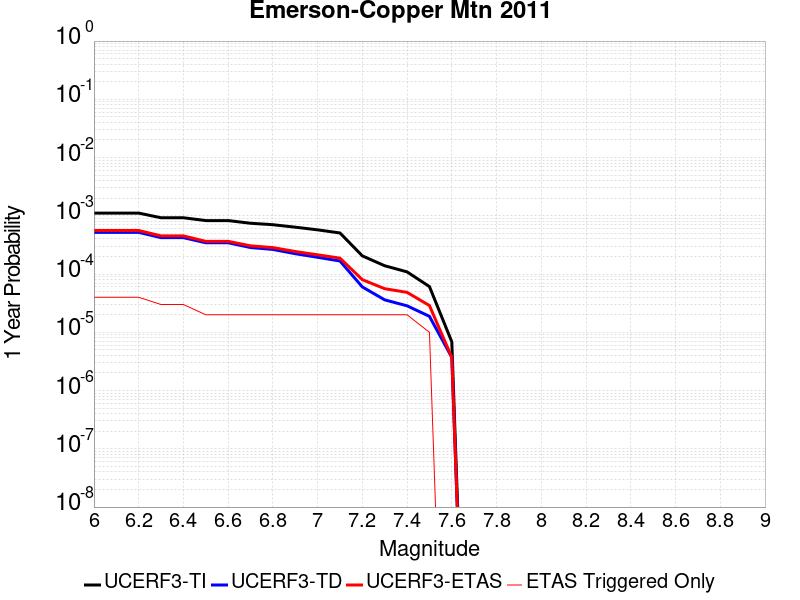 | 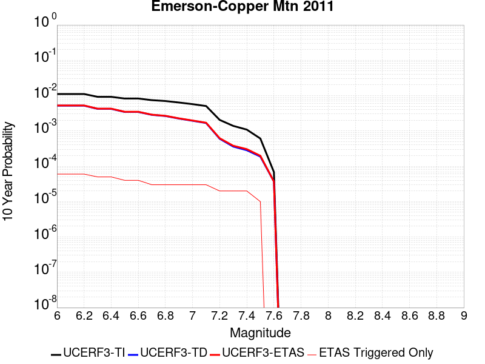 |

| Magnitude | 1 wk TI Prob | 1 wk TD Prob | 1 wk ETAS Prob | 1 wk ETAS/TD Gain | 1 wk ETAS Triggered Only | 1 mo TI Prob | 1 mo TD Prob | 1 mo ETAS Prob | 1 mo ETAS/TD Gain | 1 mo ETAS Triggered Only | 1 yr TI Prob | 1 yr TD Prob | 1 yr ETAS Prob | 1 yr ETAS/TD Gain | 1 yr ETAS Triggered Only | 10 yr TI Prob | 10 yr TD Prob | 10 yr ETAS Prob | 10 yr ETAS/TD Gain | 10 yr ETAS Triggered Only |
|-----|-----|-----|-----|-----|-----|-----|-----|-----|-----|-----|-----|-----|-----|-----|-----|-----|-----|-----|-----|-----|
| 6.0 | 2.1364202E-5 | 9.968114E-6 | 1.9968014E-5 | 2.0031888 | 1.0E-5 | 9.1557646E-5 | 4.2719836E-5 | 7.2718554E-5 | 1.7022198 | 3.0E-5 | 0.0011141442 | 5.199986E-4 | 5.599778E-4 | 1.0768833 | 4.0E-5 | 0.011085749 | 0.005188688 | 0.0052483766 | 1.0115036 | 6.0E-5 |
| 6.1 | 2.1364202E-5 | 9.968114E-6 | 1.9968014E-5 | 2.0031888 | 1.0E-5 | 9.1557646E-5 | 4.2719836E-5 | 7.2718554E-5 | 1.7022198 | 3.0E-5 | 0.0011141442 | 5.199986E-4 | 5.599778E-4 | 1.0768833 | 4.0E-5 | 0.011085749 | 0.005188688 | 0.0052483766 | 1.0115036 | 6.0E-5 |
| 6.2 | 2.1364202E-5 | 9.968114E-6 | 1.9968014E-5 | 2.0031888 | 1.0E-5 | 9.1557646E-5 | 4.2719836E-5 | 7.2718554E-5 | 1.7022198 | 3.0E-5 | 0.0011141442 | 5.199986E-4 | 5.599778E-4 | 1.0768833 | 4.0E-5 | 0.011085749 | 0.005188688 | 0.0052483766 | 1.0115036 | 6.0E-5 |
| 6.3 | 1.7751237E-5 | 8.089227E-6 | 8.089227E-6 | 1.0 | 0.0 | 7.607452E-5 | 3.466769E-5 | 5.4666994E-5 | 1.576886 | 2.0E-5 | 9.258136E-4 | 4.2200365E-4 | 4.5199099E-4 | 1.0710595 | 3.0E-5 | 0.00921966 | 0.0042126453 | 0.004262435 | 1.011819 | 5.0E-5 |
| 6.4 | 1.7751237E-5 | 8.089227E-6 | 8.089227E-6 | 1.0 | 0.0 | 7.607452E-5 | 3.466769E-5 | 5.4666994E-5 | 1.576886 | 2.0E-5 | 9.258136E-4 | 4.2200365E-4 | 4.5199099E-4 | 1.0710595 | 3.0E-5 | 0.00921966 | 0.0042126453 | 0.004262435 | 1.011819 | 5.0E-5 |
| 6.5 | 1.5886664E-5 | 6.603819E-6 | 6.603819E-6 | 1.0 | 0.0 | 6.808392E-5 | 2.8301802E-5 | 4.8301234E-5 | 1.7066488 | 2.0E-5 | 8.286065E-4 | 3.4452465E-4 | 3.6451776E-4 | 1.058031 | 2.0E-5 | 0.008255237 | 0.0034403696 | 0.0034802319 | 1.0115867 | 4.0E-5 |
| 6.6 | 1.5886664E-5 | 6.603819E-6 | 6.603819E-6 | 1.0 | 0.0 | 6.808392E-5 | 2.8301802E-5 | 4.8301234E-5 | 1.7066488 | 2.0E-5 | 8.286065E-4 | 3.4452465E-4 | 3.6451776E-4 | 1.058031 | 2.0E-5 | 0.008255237 | 0.0034403696 | 0.0034802319 | 1.0115867 | 4.0E-5 |
| 6.7 | 1.428471E-5 | 5.470403E-6 | 5.470403E-6 | 1.0 | 0.0 | 6.121875E-5 | 2.3444394E-5 | 4.3443924E-5 | 1.8530624 | 2.0E-5 | 7.450834E-4 | 2.8540206E-4 | 3.0539636E-4 | 1.0700566 | 2.0E-5 | 0.007425902 | 0.0028507432 | 0.0028806578 | 1.0104935 | 3.0E-5 |
| 6.8 | 1.3490684E-5 | 5.073699E-6 | 5.073699E-6 | 1.0 | 0.0 | 5.7815934E-5 | 2.1744265E-5 | 4.1743828E-5 | 1.9197628 | 2.0E-5 | 7.0368167E-4 | 2.6470813E-4 | 2.8470284E-4 | 1.0755349 | 2.0E-5 | 0.007014576 | 0.002644309 | 0.0026742297 | 1.0113151 | 3.0E-5 |
| 6.9 | 1.2235421E-5 | 4.289677E-6 | 4.289677E-6 | 1.0 | 0.0 | 5.2436466E-5 | 1.838422E-5 | 3.8383852E-5 | 2.0878694 | 2.0E-5 | 6.38227E-4 | 2.238085E-4 | 2.4380402E-4 | 1.0893421 | 2.0E-5 | 0.0063639707 | 0.0022361854 | 0.0022661183 | 1.0133857 | 3.0E-5 |
| 7.0 | 1.1009851E-5 | 3.7189886E-6 | 3.7189886E-6 | 1.0 | 0.0 | 4.7184225E-5 | 1.5938444E-5 | 3.5938127E-5 | 2.2548077 | 2.0E-5 | 5.743165E-4 | 1.9403672E-4 | 2.1403284E-4 | 1.1030533 | 2.0E-5 | 0.005728345 | 0.0019390108 | 0.0019689526 | 1.0154418 | 3.0E-5 |
| 7.1 | 9.726373E-6 | 3.2117953E-6 | 3.2117953E-6 | 1.0 | 0.0 | 4.168379E-5 | 1.3764783E-5 | 3.3764507E-5 | 2.4529634 | 2.0E-5 | 5.07382E-4 | 1.6757673E-4 | 1.8757337E-4 | 1.1193283 | 2.0E-5 | 0.0050622504 | 0.0016748349 | 0.0017047846 | 1.0178822 | 3.0E-5 |
| 7.2 | 3.9335127E-6 | 1.1524792E-6 | 1.1524792E-6 | 1.0 | 0.0 | 1.6857803E-5 | 4.9391874E-6 | 2.4939089E-5 | 5.049229 | 2.0E-5 | 2.0522442E-4 | 6.0133007E-5 | 8.01318E-5 | 1.332576 | 2.0E-5 | 0.00205035 | 6.011733E-4 | 6.211613E-4 | 1.0332483 | 2.0E-5 |
| 7.3 | 2.661632E-6 | 6.911505E-7 | 6.911505E-7 | 1.0 | 0.0 | 1.14069435E-5 | 2.9620703E-6 | 2.2962011E-5 | 7.752014 | 2.0E-5 | 1.3887069E-4 | 3.6062618E-5 | 5.6061897E-5 | 1.5545709 | 2.0E-5 | 0.0013878393 | 3.605687E-4 | 3.8056148E-4 | 1.0554479 | 2.0E-5 |
| 7.4 | 2.0893426E-6 | 5.4618386E-7 | 5.4618386E-7 | 1.0 | 0.0 | 8.954295E-6 | 2.3407858E-6 | 2.2340739E-5 | 9.544119 | 2.0E-5 | 1.0901308E-4 | 2.84987E-5 | 4.8498132E-5 | 1.7017664 | 2.0E-5 | 0.0010895962 | 2.84951E-4 | 3.049453E-4 | 1.0701675 | 2.0E-5 |
| 7.5 | 1.1681728E-6 | 3.6030585E-7 | 3.6030585E-7 | 1.0 | 0.0 | 5.0064455E-6 | 1.544167E-6 | 1.1544152E-5 | 7.475973 | 1.0E-5 | 6.0951766E-5 | 1.8800076E-5 | 2.8799888E-5 | 1.5319028 | 1.0E-5 | 6.093505E-4 | 1.8798532E-4 | 1.9798345E-4 | 1.0531856 | 1.0E-5 |
| 7.6 | 1.3154387E-7 | 7.1197384E-8 | 7.1197384E-8 | 1.0 | 0.0 | 5.6375933E-7 | 3.051316E-7 | 3.051316E-7 | 1.0 | 0.0 | 6.863748E-6 | 3.7149728E-6 | 3.7149728E-6 | 1.0 | 0.0 | 6.863536E-5 | 3.7149264E-5 | 3.7149264E-5 | 1.0 | 0.0 |

## San Luis Range 2011 CFM
*[(top)](#table-of-contents)*

| 1 Week | 1 Month | 1 Year | 10 Year |
|-----|-----|-----|-----|
| 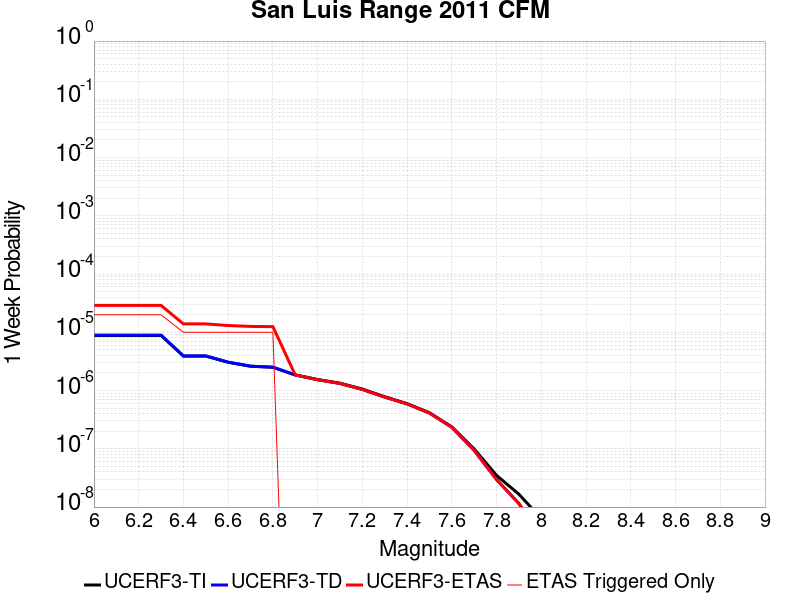 | 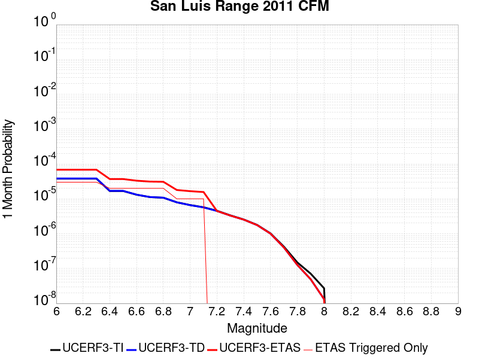 |  | 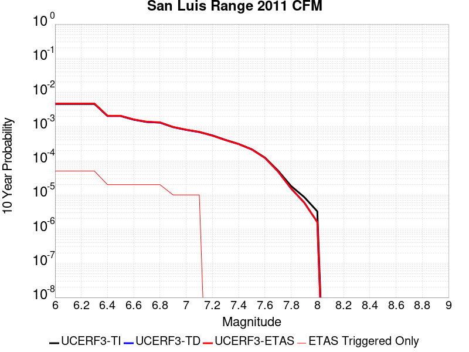 |

| Magnitude | 1 wk TI Prob | 1 wk TD Prob | 1 wk ETAS Prob | 1 wk ETAS/TD Gain | 1 wk ETAS Triggered Only | 1 mo TI Prob | 1 mo TD Prob | 1 mo ETAS Prob | 1 mo ETAS/TD Gain | 1 mo ETAS Triggered Only | 1 yr TI Prob | 1 yr TD Prob | 1 yr ETAS Prob | 1 yr ETAS/TD Gain | 1 yr ETAS Triggered Only | 10 yr TI Prob | 10 yr TD Prob | 10 yr ETAS Prob | 10 yr ETAS/TD Gain | 10 yr ETAS Triggered Only |
|-----|-----|-----|-----|-----|-----|-----|-----|-----|-----|-----|-----|-----|-----|-----|-----|-----|-----|-----|-----|-----|
| 6.0 | 8.8368415E-6 | 8.965454E-6 | 2.8965274E-5 | 3.230765 | 2.0E-5 | 3.787163E-5 | 3.842285E-5 | 6.84217E-5 | 1.7807554 | 3.0E-5 | 4.609895E-4 | 4.677057E-4 | 4.976917E-4 | 1.0641129 | 3.0E-5 | 0.0046003438 | 0.0046679964 | 0.004717763 | 1.0106612 | 5.0E-5 |
| 6.1 | 8.8368415E-6 | 8.965454E-6 | 2.8965274E-5 | 3.230765 | 2.0E-5 | 3.787163E-5 | 3.842285E-5 | 6.84217E-5 | 1.7807554 | 3.0E-5 | 4.609895E-4 | 4.677057E-4 | 4.976917E-4 | 1.0641129 | 3.0E-5 | 0.0046003438 | 0.0046679964 | 0.004717763 | 1.0106612 | 5.0E-5 |
| 6.2 | 8.8368415E-6 | 8.965454E-6 | 2.8965274E-5 | 3.230765 | 2.0E-5 | 3.787163E-5 | 3.842285E-5 | 6.84217E-5 | 1.7807554 | 3.0E-5 | 4.609895E-4 | 4.677057E-4 | 4.976917E-4 | 1.0641129 | 3.0E-5 | 0.0046003438 | 0.0046679964 | 0.004717763 | 1.0106612 | 5.0E-5 |
| 6.3 | 8.8368415E-6 | 8.965454E-6 | 2.8965274E-5 | 3.230765 | 2.0E-5 | 3.787163E-5 | 3.842285E-5 | 6.84217E-5 | 1.7807554 | 3.0E-5 | 4.609895E-4 | 4.677057E-4 | 4.976917E-4 | 1.0641129 | 3.0E-5 | 0.0046003438 | 0.0046679964 | 0.004717763 | 1.0106612 | 5.0E-5 |
| 6.4 | 3.9094193E-6 | 3.9412025E-6 | 1.3941163E-5 | 3.5372865 | 1.0E-5 | 1.6754546E-5 | 1.689076E-5 | 3.6890422E-5 | 2.1840594 | 2.0E-5 | 2.039675E-4 | 2.056259E-4 | 2.2562178E-4 | 1.097244 | 2.0E-5 | 0.0020378039 | 0.0020543851 | 0.002074344 | 1.0097153 | 2.0E-5 |
| 6.5 | 3.9094193E-6 | 3.9412025E-6 | 1.3941163E-5 | 3.5372865 | 1.0E-5 | 1.6754546E-5 | 1.689076E-5 | 3.6890422E-5 | 2.1840594 | 2.0E-5 | 2.039675E-4 | 2.056259E-4 | 2.2562178E-4 | 1.097244 | 2.0E-5 | 0.0020378039 | 0.0020543851 | 0.002074344 | 1.0097153 | 2.0E-5 |
| 6.6 | 3.0587726E-6 | 3.0753883E-6 | 1.3075358E-5 | 4.251612 | 1.0E-5 | 1.3108959E-5 | 1.318017E-5 | 3.3179906E-5 | 2.5174112 | 2.0E-5 | 1.595899E-4 | 1.6045687E-4 | 1.8045366E-4 | 1.1246241 | 2.0E-5 | 0.0015947534 | 0.0016034221 | 0.00162339 | 1.0124533 | 2.0E-5 |
| 6.7 | 2.6160574E-6 | 2.6251273E-6 | 1.2625101E-5 | 4.809329 | 1.0E-5 | 1.1211626E-5 | 1.1250498E-5 | 3.125027E-5 | 2.7776792 | 2.0E-5 | 1.3649299E-4 | 1.3696625E-4 | 1.5696352E-4 | 1.1460013 | 2.0E-5 | 0.0013640919 | 0.0013688246 | 0.0013887972 | 1.0145911 | 2.0E-5 |
| 6.8 | 2.5110312E-6 | 2.51814E-6 | 1.2518115E-5 | 4.9711747 | 1.0E-5 | 1.0761518E-5 | 1.0791985E-5 | 3.079177E-5 | 2.853207 | 2.0E-5 | 1.310136E-4 | 1.3138456E-4 | 1.5138193E-4 | 1.1522049 | 2.0E-5 | 0.0013093639 | 0.0013130746 | 0.0013330483 | 1.0152115 | 2.0E-5 |
| 6.9 | 1.8564405E-6 | 1.852487E-6 | 1.852487E-6 | 1.0 | 0.0 | 7.95615E-6 | 7.939206E-6 | 1.7939126E-5 | 2.2595618 | 1.0E-5 | 9.686181E-5 | 9.665557E-5 | 1.06654596E-4 | 1.1034502 | 1.0E-5 | 9.68196E-4 | 9.661373E-4 | 9.7612763E-4 | 1.0103405 | 1.0E-5 |
| 7.0 | 1.546127E-6 | 1.5369537E-6 | 1.5369537E-6 | 1.0 | 0.0 | 6.626242E-6 | 6.586928E-6 | 1.6586862E-5 | 2.5181484 | 1.0E-5 | 8.06715E-5 | 8.0192905E-5 | 9.01921E-5 | 1.1246893 | 1.0E-5 | 8.0642226E-4 | 8.016404E-4 | 8.116324E-4 | 1.0124644 | 1.0E-5 |
| 7.1 | 1.3368208E-6 | 1.3235326E-6 | 1.3235326E-6 | 1.0 | 0.0 | 5.7292195E-6 | 5.67227E-6 | 1.5672214E-5 | 2.7629526 | 1.0E-5 | 6.975101E-5 | 6.905771E-5 | 7.905702E-5 | 1.1447965 | 1.0E-5 | 6.972912E-4 | 6.9036294E-4 | 7.0035603E-4 | 1.0144751 | 1.0E-5 |
| 7.2 | 1.0623363E-6 | 1.0454368E-6 | 1.0454368E-6 | 1.0 | 0.0 | 4.5528623E-6 | 4.4804356E-6 | 4.4804356E-6 | 1.0 | 0.0 | 5.5429686E-5 | 5.4547938E-5 | 5.4547938E-5 | 1.0 | 0.0 | 5.5415864E-4 | 5.4534577E-4 | 5.4534577E-4 | 1.0 | 0.0 |
| 7.3 | 7.831679E-7 | 7.7273904E-7 | 7.7273904E-7 | 1.0 | 0.0 | 3.3564295E-6 | 3.3117344E-6 | 3.3117344E-6 | 1.0 | 0.0 | 4.086376E-5 | 4.0319625E-5 | 4.0319625E-5 | 1.0 | 0.0 | 4.0856248E-4 | 4.031232E-4 | 4.031232E-4 | 1.0 | 0.0 |
| 7.4 | 5.9558846E-7 | 5.910636E-7 | 5.910636E-7 | 1.0 | 0.0 | 2.5525194E-6 | 2.5331274E-6 | 2.5331274E-6 | 1.0 | 0.0 | 3.107648E-5 | 3.084039E-5 | 3.084039E-5 | 1.0 | 0.0 | 3.1072134E-4 | 3.083612E-4 | 3.083612E-4 | 1.0 | 0.0 |
| 7.5 | 4.1616502E-7 | 4.119631E-7 | 4.119631E-7 | 1.0 | 0.0 | 1.7835631E-6 | 1.7655549E-6 | 1.7655549E-6 | 1.0 | 0.0 | 2.1714664E-5 | 2.149542E-5 | 2.149542E-5 | 1.0 | 0.0 | 2.1712543E-4 | 2.1493346E-4 | 2.1493346E-4 | 1.0 | 0.0 |
| 7.6 | 2.3816014E-7 | 2.3376548E-7 | 2.3376548E-7 | 1.0 | 0.0 | 1.0206859E-6 | 1.0018516E-6 | 1.0018516E-6 | 1.0 | 0.0 | 1.242678E-5 | 1.2197475E-5 | 1.2197475E-5 | 1.0 | 0.0 | 1.2426086E-4 | 1.2196808E-4 | 1.2196808E-4 | 1.0 | 0.0 |
| 7.7 | 9.918777E-8 | 9.3867584E-8 | 9.3867584E-8 | 1.0 | 0.0 | 4.2509038E-7 | 4.0228957E-7 | 4.0228957E-7 | 1.0 | 0.0 | 5.1754632E-6 | 4.8978645E-6 | 4.8978645E-6 | 1.0 | 0.0 | 5.1753424E-5 | 4.897757E-5 | 4.897757E-5 | 1.0 | 0.0 |
| 7.8 | 3.4982556E-8 | 2.968655E-8 | 2.968655E-8 | 1.0 | 0.0 | 1.4992524E-7 | 1.2722806E-7 | 1.2722806E-7 | 1.0 | 0.0 | 1.8253382E-6 | 1.5490006E-6 | 1.5490006E-6 | 1.0 | 0.0 | 1.8253233E-5 | 1.5489897E-5 | 1.5489897E-5 | 1.0 | 0.0 |
| 7.9 | 1.6624908E-8 | 1.1477036E-8 | 1.1477036E-8 | 1.0 | 0.0 | 7.12496E-8 | 4.91873E-8 | 4.91873E-8 | 1.0 | 0.0 | 8.6746354E-7 | 5.988552E-7 | 5.988552E-7 | 1.0 | 0.0 | 8.674601E-6 | 5.988536E-6 | 5.988536E-6 | 1.0 | 0.0 |
| 8.0 | 6.3352315E-9 | 3.0888412E-9 | 3.0888412E-9 | 1.0 | 0.0 | 2.715099E-8 | 1.3237893E-8 | 1.3237893E-8 | 1.0 | 0.0 | 3.3056327E-7 | 1.6117131E-7 | 1.6117131E-7 | 1.0 | 0.0 | 3.3056278E-6 | 1.611712E-6 | 1.611712E-6 | 1.0 | 0.0 |

## Mono Lake 2011 CFM
*[(top)](#table-of-contents)*

| 1 Week | 1 Month | 1 Year | 10 Year |
|-----|-----|-----|-----|
|  |  |  |  |

| Magnitude | 1 wk TI Prob | 1 wk TD Prob | 1 wk ETAS Prob | 1 wk ETAS/TD Gain | 1 wk ETAS Triggered Only | 1 mo TI Prob | 1 mo TD Prob | 1 mo ETAS Prob | 1 mo ETAS/TD Gain | 1 mo ETAS Triggered Only | 1 yr TI Prob | 1 yr TD Prob | 1 yr ETAS Prob | 1 yr ETAS/TD Gain | 1 yr ETAS Triggered Only | 10 yr TI Prob | 10 yr TD Prob | 10 yr ETAS Prob | 10 yr ETAS/TD Gain | 10 yr ETAS Triggered Only |
|-----|-----|-----|-----|-----|-----|-----|-----|-----|-----|-----|-----|-----|-----|-----|-----|-----|-----|-----|-----|-----|
| 6.0 | 2.0341662E-5 | 2.3828166E-5 | 5.382745E-5 | 2.258984 | 3.0E-5 | 8.717564E-5 | 1.0211971E-4 | 1.4211563E-4 | 1.3916571 | 4.0E-5 | 0.0010608466 | 0.0012431298 | 0.0012930677 | 1.040171 | 5.0E-5 | 0.010557966 | 0.012413835 | 0.012463215 | 1.0039778 | 5.0E-5 |
| 6.1 | 2.0341662E-5 | 2.3828166E-5 | 5.382745E-5 | 2.258984 | 3.0E-5 | 8.717564E-5 | 1.0211971E-4 | 1.4211563E-4 | 1.3916571 | 4.0E-5 | 0.0010608466 | 0.0012431298 | 0.0012930677 | 1.040171 | 5.0E-5 | 0.010557966 | 0.012413835 | 0.012463215 | 1.0039778 | 5.0E-5 |
| 6.2 | 2.0341662E-5 | 2.3828166E-5 | 5.382745E-5 | 2.258984 | 3.0E-5 | 8.717564E-5 | 1.0211971E-4 | 1.4211563E-4 | 1.3916571 | 4.0E-5 | 0.0010608466 | 0.0012431298 | 0.0012930677 | 1.040171 | 5.0E-5 | 0.010557966 | 0.012413835 | 0.012463215 | 1.0039778 | 5.0E-5 |
| 6.3 | 2.0341662E-5 | 2.3828166E-5 | 5.382745E-5 | 2.258984 | 3.0E-5 | 8.717564E-5 | 1.0211971E-4 | 1.4211563E-4 | 1.3916571 | 4.0E-5 | 0.0010608466 | 0.0012431298 | 0.0012930677 | 1.040171 | 5.0E-5 | 0.010557966 | 0.012413835 | 0.012463215 | 1.0039778 | 5.0E-5 |
| 6.4 | 1.749821E-5 | 2.0490985E-5 | 5.049037E-5 | 2.4640284 | 3.0E-5 | 7.499018E-5 | 8.781851E-5 | 1.27815E-4 | 1.4554448 | 4.0E-5 | 9.1262296E-4 | 0.0010691903 | 0.0011191369 | 1.0467143 | 5.0E-5 | 0.009088841 | 0.010691865 | 0.010741331 | 1.0046264 | 5.0E-5 |
| 6.5 | 1.749821E-5 | 2.0490985E-5 | 5.049037E-5 | 2.4640284 | 3.0E-5 | 7.499018E-5 | 8.781851E-5 | 1.27815E-4 | 1.4554448 | 4.0E-5 | 9.1262296E-4 | 0.0010691903 | 0.0011191369 | 1.0467143 | 5.0E-5 | 0.009088841 | 0.010691865 | 0.010741331 | 1.0046264 | 5.0E-5 |

## San Gabriel
*[(top)](#table-of-contents)*

| 1 Week | 1 Month | 1 Year | 10 Year |
|-----|-----|-----|-----|
| 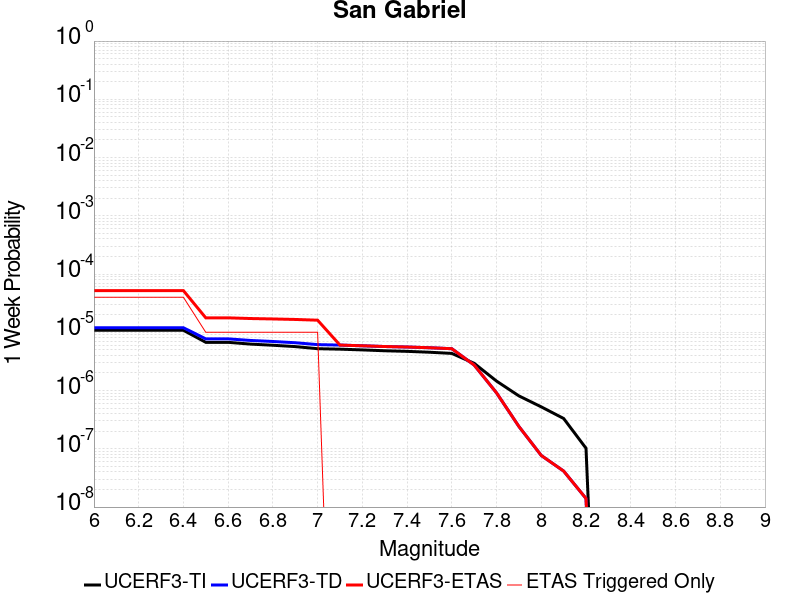 |  |  |  |

| Magnitude | 1 wk TI Prob | 1 wk TD Prob | 1 wk ETAS Prob | 1 wk ETAS/TD Gain | 1 wk ETAS Triggered Only | 1 mo TI Prob | 1 mo TD Prob | 1 mo ETAS Prob | 1 mo ETAS/TD Gain | 1 mo ETAS Triggered Only | 1 yr TI Prob | 1 yr TD Prob | 1 yr ETAS Prob | 1 yr ETAS/TD Gain | 1 yr ETAS Triggered Only | 10 yr TI Prob | 10 yr TD Prob | 10 yr ETAS Prob | 10 yr ETAS/TD Gain | 10 yr ETAS Triggered Only |
|-----|-----|-----|-----|-----|-----|-----|-----|-----|-----|-----|-----|-----|-----|-----|-----|-----|-----|-----|-----|-----|
| 6.0 | 1.083775E-5 | 1.19851875E-5 | 5.198471E-5 | 4.337413 | 4.0E-5 | 4.6446676E-5 | 5.1364143E-5 | 1.0136158E-4 | 1.9733918 | 5.0E-5 | 5.653415E-4 | 6.251903E-4 | 6.7515904E-4 | 1.0799257 | 5.0E-5 | 0.0056390543 | 0.006246409 | 0.006296097 | 1.0079546 | 5.0E-5 |
| 6.1 | 1.083775E-5 | 1.19851875E-5 | 5.198471E-5 | 4.337413 | 4.0E-5 | 4.6446676E-5 | 5.1364143E-5 | 1.0136158E-4 | 1.9733918 | 5.0E-5 | 5.653415E-4 | 6.251903E-4 | 6.7515904E-4 | 1.0799257 | 5.0E-5 | 0.0056390543 | 0.006246409 | 0.006296097 | 1.0079546 | 5.0E-5 |
| 6.2 | 1.083775E-5 | 1.19851875E-5 | 5.198471E-5 | 4.337413 | 4.0E-5 | 4.6446676E-5 | 5.1364143E-5 | 1.0136158E-4 | 1.9733918 | 5.0E-5 | 5.653415E-4 | 6.251903E-4 | 6.7515904E-4 | 1.0799257 | 5.0E-5 | 0.0056390543 | 0.006246409 | 0.006296097 | 1.0079546 | 5.0E-5 |
| 6.3 | 1.083775E-5 | 1.19851875E-5 | 5.198471E-5 | 4.337413 | 4.0E-5 | 4.6446676E-5 | 5.1364143E-5 | 1.0136158E-4 | 1.9733918 | 5.0E-5 | 5.653415E-4 | 6.251903E-4 | 6.7515904E-4 | 1.0799257 | 5.0E-5 | 0.0056390543 | 0.006246409 | 0.006296097 | 1.0079546 | 5.0E-5 |
| 6.4 | 1.083775E-5 | 1.19851875E-5 | 5.198471E-5 | 4.337413 | 4.0E-5 | 4.6446676E-5 | 5.1364143E-5 | 1.0136158E-4 | 1.9733918 | 5.0E-5 | 5.653415E-4 | 6.251903E-4 | 6.7515904E-4 | 1.0799257 | 5.0E-5 | 0.0056390543 | 0.006246409 | 0.006296097 | 1.0079546 | 5.0E-5 |
| 6.5 | 6.7317824E-6 | 7.716944E-6 | 1.7716868E-5 | 2.2958395 | 1.0E-5 | 2.8850178E-5 | 3.3072207E-5 | 5.3071544E-5 | 1.6047174 | 2.0E-5 | 3.511943E-4 | 4.0258077E-4 | 4.2257272E-4 | 1.0496595 | 2.0E-5 | 0.003506398 | 0.0040296097 | 0.004049529 | 1.0049433 | 2.0E-5 |
| 6.6 | 6.7317824E-6 | 7.716944E-6 | 1.7716868E-5 | 2.2958395 | 1.0E-5 | 2.8850178E-5 | 3.3072207E-5 | 5.3071544E-5 | 1.6047174 | 2.0E-5 | 3.511943E-4 | 4.0258077E-4 | 4.2257272E-4 | 1.0496595 | 2.0E-5 | 0.003506398 | 0.0040296097 | 0.004049529 | 1.0049433 | 2.0E-5 |
| 6.7 | 6.274881E-6 | 7.2458647E-6 | 1.7245793E-5 | 2.3800876 | 1.0E-5 | 2.6892068E-5 | 3.1053343E-5 | 5.105272E-5 | 1.6440331 | 2.0E-5 | 3.2736175E-4 | 3.780098E-4 | 3.9800224E-4 | 1.0528886 | 2.0E-5 | 0.0032687993 | 0.0037847564 | 0.0038046807 | 1.0052644 | 2.0E-5 |
| 6.8 | 5.996209E-6 | 6.958585E-6 | 1.6958515E-5 | 2.4370637 | 1.0E-5 | 2.5697784E-5 | 2.9822171E-5 | 4.9821574E-5 | 1.670622 | 2.0E-5 | 3.128256E-4 | 3.6302538E-4 | 3.830181E-4 | 1.0550725 | 2.0E-5 | 0.003123856 | 0.0036354093 | 0.0036553366 | 1.0054815 | 2.0E-5 |
| 6.9 | 5.686331E-6 | 6.6236316E-6 | 1.6623566E-5 | 2.5097358 | 1.0E-5 | 2.4369761E-5 | 2.8386688E-5 | 4.8386122E-5 | 1.7045356 | 2.0E-5 | 2.9666146E-4 | 3.4555403E-4 | 3.655471E-4 | 1.0578581 | 2.0E-5 | 0.0029626573 | 0.0034612515 | 0.0034811823 | 1.0057583 | 2.0E-5 |
| 7.0 | 5.2329838E-6 | 6.147514E-6 | 1.6147453E-5 | 2.6266637 | 1.0E-5 | 2.242688E-5 | 2.6346226E-5 | 4.63457E-5 | 1.759102 | 2.0E-5 | 2.7301308E-4 | 3.2071886E-4 | 3.4071246E-4 | 1.0623399 | 2.0E-5 | 0.002726779 | 0.0032136322 | 0.0032335678 | 1.0062035 | 2.0E-5 |
| 7.1 | 5.135671E-6 | 6.03764E-6 | 6.03764E-6 | 1.0 | 0.0 | 2.2009834E-5 | 2.5875348E-5 | 3.5875088E-5 | 1.3864583 | 1.0E-5 | 2.6793676E-4 | 3.1498758E-4 | 3.2498443E-4 | 1.0317373 | 1.0E-5 | 0.0026761394 | 0.0031564834 | 0.0031664518 | 1.0031581 | 1.0E-5 |
| 7.2 | 4.989062E-6 | 5.87102E-6 | 5.87102E-6 | 1.0 | 0.0 | 2.1381518E-5 | 2.5161276E-5 | 3.5161025E-5 | 1.3974261 | 1.0E-5 | 2.6028889E-4 | 3.0629625E-4 | 3.1629318E-4 | 1.0326381 | 1.0E-5 | 0.0025998424 | 0.003069813 | 0.0030797822 | 1.0032475 | 1.0E-5 |
| 7.3 | 4.8219395E-6 | 5.702574E-6 | 5.702574E-6 | 1.0 | 0.0 | 2.0665291E-5 | 2.443938E-5 | 3.4439134E-5 | 1.4091657 | 1.0E-5 | 2.5157086E-4 | 2.9750957E-4 | 3.075066E-4 | 1.0336024 | 1.0E-5 | 0.0025128627 | 0.0029821852 | 0.0029921555 | 1.0033432 | 1.0E-5 |
| 7.4 | 4.7118383E-6 | 5.5911332E-6 | 5.5911332E-6 | 1.0 | 0.0 | 2.0193436E-5 | 2.3961782E-5 | 3.3961544E-5 | 1.4173212 | 1.0E-5 | 2.4582737E-4 | 2.916964E-4 | 3.0169348E-4 | 1.0342722 | 1.0E-5 | 0.002455556 | 0.0029242067 | 0.0029341774 | 1.0034097 | 1.0E-5 |
| 7.5 | 4.5506545E-6 | 5.4365014E-6 | 5.4365014E-6 | 1.0 | 0.0 | 1.9502659E-5 | 2.3299088E-5 | 3.3298853E-5 | 1.4291914 | 1.0E-5 | 2.37419E-4 | 2.8363022E-4 | 2.9362738E-4 | 1.0352472 | 1.0E-5 | 0.002371655 | 0.002843753 | 0.0028537244 | 1.0035064 | 1.0E-5 |
| 7.6 | 4.343636E-6 | 5.2293817E-6 | 5.2293817E-6 | 1.0 | 0.0 | 1.861545E-5 | 2.2411448E-5 | 3.2411222E-5 | 1.4461906 | 1.0E-5 | 2.2661954E-4 | 2.7282597E-4 | 2.8282322E-4 | 1.0366434 | 1.0E-5 | 0.0022638857 | 0.0027359722 | 0.002745945 | 1.0036451 | 1.0E-5 |
| 7.7 | 2.936235E-6 | 2.7440458E-6 | 2.7440458E-6 | 1.0 | 0.0 | 1.2583803E-5 | 1.1760143E-5 | 2.1760026E-5 | 1.8503197 | 1.0E-5 | 1.5319703E-4 | 1.4317037E-4 | 1.5316893E-4 | 1.0698369 | 1.0E-5 | 0.0015309147 | 0.0014380751 | 0.0014480606 | 1.0069437 | 1.0E-5 |
| 7.8 | 1.4541639E-6 | 9.1237047E-7 | 9.1237047E-7 | 1.0 | 0.0 | 6.232116E-6 | 3.9101533E-6 | 3.9101533E-6 | 1.0 | 0.0 | 7.587337E-5 | 4.7605077E-5 | 4.7605077E-5 | 1.0 | 0.0 | 7.584747E-4 | 4.8085177E-4 | 4.8085177E-4 | 1.0 | 0.0 |
| 7.9 | 8.098958E-7 | 2.41753E-7 | 2.41753E-7 | 1.0 | 0.0 | 3.4709774E-6 | 1.0360839E-6 | 1.0360839E-6 | 1.0 | 0.0 | 4.225833E-5 | 1.2614248E-5 | 1.2614248E-5 | 1.0 | 0.0 | 4.2250296E-4 | 1.2921814E-4 | 1.2921814E-4 | 1.0 | 0.0 |
| 8.0 | 5.2473234E-7 | 7.6792055E-8 | 7.6792055E-8 | 1.0 | 0.0 | 2.248851E-6 | 3.2910876E-7 | 3.2910876E-7 | 1.0 | 0.0 | 2.7379416E-5 | 4.0068917E-6 | 4.0068917E-6 | 1.0 | 0.0 | 2.7376044E-4 | 4.21918E-5 | 4.21918E-5 | 1.0 | 0.0 |
| 8.1 | 3.3162388E-7 | 4.1496126E-8 | 4.1496126E-8 | 1.0 | 0.0 | 1.4212444E-6 | 1.7784053E-7 | 1.7784053E-7 | 1.0 | 0.0 | 1.7303513E-5 | 2.1652063E-6 | 2.1652063E-6 | 1.0 | 0.0 | 1.7302166E-4 | 2.2965523E-5 | 2.2965523E-5 | 1.0 | 0.0 |
| 8.2 | 1.0235345E-7 | 1.4043474E-8 | 1.4043474E-8 | 1.0 | 0.0 | 4.3865757E-7 | 6.0186316E-8 | 6.0186316E-8 | 1.0 | 0.0 | 5.340643E-6 | 7.327681E-7 | 7.327681E-7 | 1.0 | 0.0 | 5.3405143E-5 | 7.9273705E-6 | 7.9273705E-6 | 1.0 | 0.0 |

## Hosgri (Extension)
*[(top)](#table-of-contents)*

| 1 Week | 1 Month | 1 Year | 10 Year |
|-----|-----|-----|-----|
|  | 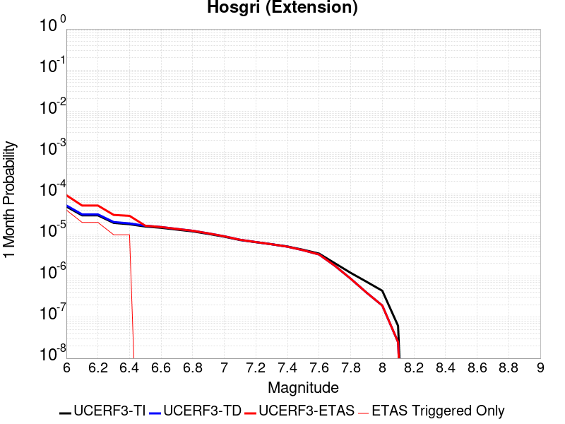 |  |  |

| Magnitude | 1 wk TI Prob | 1 wk TD Prob | 1 wk ETAS Prob | 1 wk ETAS/TD Gain | 1 wk ETAS Triggered Only | 1 mo TI Prob | 1 mo TD Prob | 1 mo ETAS Prob | 1 mo ETAS/TD Gain | 1 mo ETAS Triggered Only | 1 yr TI Prob | 1 yr TD Prob | 1 yr ETAS Prob | 1 yr ETAS/TD Gain | 1 yr ETAS Triggered Only | 10 yr TI Prob | 10 yr TD Prob | 10 yr ETAS Prob | 10 yr ETAS/TD Gain | 10 yr ETAS Triggered Only |
|-----|-----|-----|-----|-----|-----|-----|-----|-----|-----|-----|-----|-----|-----|-----|-----|-----|-----|-----|-----|-----|
| 6.0 | 1.1369135E-5 | 1.2083072E-5 | 4.208271E-5 | 3.4827824 | 3.0E-5 | 4.8723956E-5 | 5.1783692E-5 | 9.178162E-5 | 1.772404 | 4.0E-5 | 5.9305265E-4 | 6.3030684E-4 | 6.802753E-4 | 1.0792764 | 5.0E-5 | 0.005914725 | 0.0062874397 | 0.0063371253 | 1.0079024 | 5.0E-5 |
| 6.1 | 6.934979E-6 | 7.324555E-6 | 2.7324408E-5 | 3.7305214 | 2.0E-5 | 2.9721E-5 | 3.1390595E-5 | 5.138997E-5 | 1.6371135 | 2.0E-5 | 3.617931E-4 | 3.8211764E-4 | 4.0211E-4 | 1.0523199 | 2.0E-5 | 0.0036120464 | 0.0038150186 | 0.0038349421 | 1.0052224 | 2.0E-5 |
| 6.2 | 6.934979E-6 | 7.324555E-6 | 2.7324408E-5 | 3.7305214 | 2.0E-5 | 2.9721E-5 | 3.1390595E-5 | 5.138997E-5 | 1.6371135 | 2.0E-5 | 3.617931E-4 | 3.8211764E-4 | 4.0211E-4 | 1.0523199 | 2.0E-5 | 0.0036120464 | 0.0038150186 | 0.0038349421 | 1.0052224 | 2.0E-5 |
| 6.3 | 4.5484676E-6 | 4.76933E-6 | 1.4769283E-5 | 3.0967205 | 1.0E-5 | 1.9493287E-5 | 2.043983E-5 | 3.0439625E-5 | 1.4892309 | 1.0E-5 | 2.3730492E-4 | 2.4882692E-4 | 2.5882444E-4 | 1.0401785 | 1.0E-5 | 0.0023705168 | 0.0024855258 | 0.002495501 | 1.0040133 | 1.0E-5 |
| 6.4 | 4.218095E-6 | 4.4168614E-6 | 1.4416817E-5 | 3.264041 | 1.0E-5 | 1.8077424E-5 | 1.8929271E-5 | 2.8929082E-5 | 1.5282724 | 1.0E-5 | 2.2007042E-4 | 2.3043984E-4 | 2.4043753E-4 | 1.0433853 | 1.0E-5 | 0.002198526 | 0.0023020422 | 0.0023120192 | 1.004334 | 1.0E-5 |
| 6.5 | 3.717374E-6 | 3.8838775E-6 | 3.8838775E-6 | 1.0 | 0.0 | 1.5931506E-5 | 1.6645085E-5 | 1.6645085E-5 | 1.0 | 0.0 | 1.9394881E-4 | 2.0263524E-4 | 2.0263524E-4 | 1.0 | 0.0 | 0.0019377962 | 0.0020245234 | 0.0020245234 | 1.0 | 0.0 |
| 6.6 | 3.4605036E-6 | 3.608306E-6 | 3.608306E-6 | 1.0 | 0.0 | 1.4830645E-5 | 1.5464078E-5 | 1.5464078E-5 | 1.0 | 0.0 | 1.8054814E-4 | 1.8825903E-4 | 1.8825903E-4 | 1.0 | 0.0 | 0.0018040152 | 0.0018810101 | 0.0018810101 | 1.0 | 0.0 |
| 6.7 | 3.123439E-6 | 3.2465687E-6 | 3.2465687E-6 | 1.0 | 0.0 | 1.33860985E-5 | 1.3913792E-5 | 1.3913792E-5 | 1.0 | 0.0 | 1.6296357E-4 | 1.6938736E-4 | 1.6938736E-4 | 1.0 | 0.0 | 0.001628441 | 0.0016925934 | 0.0016925934 | 1.0 | 0.0 |
| 6.8 | 2.8290783E-6 | 2.9305404E-6 | 2.9305404E-6 | 1.0 | 0.0 | 1.2124565E-5 | 1.2559399E-5 | 1.2559399E-5 | 1.0 | 0.0 | 1.4760658E-4 | 1.5290003E-4 | 1.5290003E-4 | 1.0 | 0.0 | 0.0014750857 | 0.001527957 | 0.001527957 | 1.0 | 0.0 |
| 6.9 | 2.454112E-6 | 2.5283196E-6 | 2.5283196E-6 | 1.0 | 0.0 | 1.0517581E-5 | 1.0835611E-5 | 1.0835611E-5 | 1.0 | 0.0 | 1.2804402E-4 | 1.3191563E-4 | 1.3191563E-4 | 1.0 | 0.0 | 0.0012797028 | 0.0013183793 | 0.0013183793 | 1.0 | 0.0 |
| 7.0 | 2.1008145E-6 | 2.1498704E-6 | 2.1498704E-6 | 1.0 | 0.0 | 9.003459E-6 | 9.213698E-6 | 9.213698E-6 | 1.0 | 0.0 | 1.096116E-4 | 1.1217103E-4 | 1.1217103E-4 | 1.0 | 0.0 | 0.0010955755 | 0.0011211479 | 0.0011211479 | 1.0 | 0.0 |
| 7.1 | 1.744384E-6 | 1.7686352E-6 | 1.7686352E-6 | 1.0 | 0.0 | 7.47591E-6 | 7.5798434E-6 | 7.5798434E-6 | 1.0 | 0.0 | 9.1015405E-5 | 9.22807E-5 | 9.22807E-5 | 1.0 | 0.0 | 9.097813E-4 | 9.2242553E-4 | 9.2242553E-4 | 1.0 | 0.0 |
| 7.2 | 1.5456587E-6 | 1.5562882E-6 | 1.5562882E-6 | 1.0 | 0.0 | 6.6242346E-6 | 6.66979E-6 | 6.66979E-6 | 1.0 | 0.0 | 8.064707E-5 | 8.120168E-5 | 8.120168E-5 | 1.0 | 0.0 | 8.0617814E-4 | 8.117213E-4 | 8.117213E-4 | 1.0 | 0.0 |
| 7.3 | 1.3775123E-6 | 1.3766082E-6 | 1.3766082E-6 | 1.0 | 0.0 | 5.9036106E-6 | 5.899736E-6 | 5.899736E-6 | 1.0 | 0.0 | 7.187409E-5 | 7.182693E-5 | 7.182693E-5 | 1.0 | 0.0 | 7.185085E-4 | 7.180382E-4 | 7.180382E-4 | 1.0 | 0.0 |
| 7.4 | 1.214491E-6 | 1.2023461E-6 | 1.2023461E-6 | 1.0 | 0.0 | 5.2049513E-6 | 5.1529014E-6 | 5.1529014E-6 | 1.0 | 0.0 | 6.336844E-5 | 6.2734776E-5 | 6.2734776E-5 | 1.0 | 0.0 | 6.335037E-4 | 6.271715E-4 | 6.271715E-4 | 1.0 | 0.0 |
| 7.5 | 1.0101123E-6 | 9.842246E-7 | 9.842246E-7 | 1.0 | 0.0 | 4.3290456E-6 | 4.2180986E-6 | 4.2180986E-6 | 1.0 | 0.0 | 5.2704854E-5 | 5.1354145E-5 | 5.1354145E-5 | 1.0 | 0.0 | 5.2692357E-4 | 5.1342335E-4 | 5.1342335E-4 | 1.0 | 0.0 |
| 7.6 | 8.1558215E-7 | 7.765966E-7 | 7.765966E-7 | 1.0 | 0.0 | 3.4953473E-6 | 3.328267E-6 | 3.328267E-6 | 1.0 | 0.0 | 4.255502E-5 | 4.0520903E-5 | 4.0520903E-5 | 1.0 | 0.0 | 4.2546875E-4 | 4.0513556E-4 | 4.0513556E-4 | 1.0 | 0.0 |
| 7.7 | 4.757816E-7 | 4.1308888E-7 | 4.1308888E-7 | 1.0 | 0.0 | 2.0390623E-6 | 1.7703798E-6 | 1.7703798E-6 | 1.0 | 0.0 | 2.4825302E-5 | 2.155416E-5 | 2.155416E-5 | 1.0 | 0.0 | 2.482253E-4 | 2.1552083E-4 | 2.1552083E-4 | 1.0 | 0.0 |
| 7.8 | 2.782787E-7 | 2.0047722E-7 | 2.0047722E-7 | 1.0 | 0.0 | 1.1926223E-6 | 8.5918776E-7 | 8.5918776E-7 | 1.0 | 0.0 | 1.452008E-5 | 1.04605615E-5 | 1.04605615E-5 | 1.0 | 0.0 | 1.4519131E-4 | 1.04600724E-4 | 1.04600724E-4 | 1.0 | 0.0 |
| 7.9 | 1.6948086E-7 | 9.244227E-8 | 9.244227E-8 | 1.0 | 0.0 | 7.2634634E-7 | 3.961811E-7 | 3.961811E-7 | 1.0 | 0.0 | 8.843231E-6 | 4.8234942E-6 | 4.8234942E-6 | 1.0 | 0.0 | 8.842879E-5 | 4.8233902E-5 | 4.8233902E-5 | 1.0 | 0.0 |
| 8.0 | 1.0225492E-7 | 4.4738776E-8 | 4.4738776E-8 | 1.0 | 0.0 | 4.382353E-7 | 1.917376E-7 | 1.917376E-7 | 1.0 | 0.0 | 5.335502E-6 | 2.3344028E-6 | 2.3344028E-6 | 1.0 | 0.0 | 5.335374E-5 | 2.3343786E-5 | 2.3343786E-5 | 1.0 | 0.0 |
| 8.1 | 1.43711345E-8 | 5.787707E-9 | 5.787707E-9 | 1.0 | 0.0 | 6.1590576E-8 | 2.480446E-8 | 2.480446E-8 | 1.0 | 0.0 | 7.4986497E-7 | 3.0199428E-7 | 3.0199428E-7 | 1.0 | 0.0 | 7.4986247E-6 | 3.0199392E-6 | 3.0199392E-6 | 1.0 | 0.0 |

## Pitas Point (Lower)-Montalvo
*[(top)](#table-of-contents)*

| 1 Week | 1 Month | 1 Year | 10 Year |
|-----|-----|-----|-----|
|  |  |  |  |

| Magnitude | 1 wk TI Prob | 1 wk TD Prob | 1 wk ETAS Prob | 1 wk ETAS/TD Gain | 1 wk ETAS Triggered Only | 1 mo TI Prob | 1 mo TD Prob | 1 mo ETAS Prob | 1 mo ETAS/TD Gain | 1 mo ETAS Triggered Only | 1 yr TI Prob | 1 yr TD Prob | 1 yr ETAS Prob | 1 yr ETAS/TD Gain | 1 yr ETAS Triggered Only | 10 yr TI Prob | 10 yr TD Prob | 10 yr ETAS Prob | 10 yr ETAS/TD Gain | 10 yr ETAS Triggered Only |
|-----|-----|-----|-----|-----|-----|-----|-----|-----|-----|-----|-----|-----|-----|-----|-----|-----|-----|-----|-----|-----|
| 6.0 | 5.2543637E-6 | 4.8378706E-6 | 2.4837775E-5 | 5.1340303 | 2.0E-5 | 2.2518509E-5 | 2.0733567E-5 | 4.0733154E-5 | 1.9645994 | 2.0E-5 | 2.7412834E-4 | 2.5240227E-4 | 2.9239216E-4 | 1.1584371 | 4.0E-5 | 0.0027379042 | 0.0025211885 | 0.0025710624 | 1.019782 | 5.0E-5 |
| 6.1 | 5.2543637E-6 | 4.8378706E-6 | 2.4837775E-5 | 5.1340303 | 2.0E-5 | 2.2518509E-5 | 2.0733567E-5 | 4.0733154E-5 | 1.9645994 | 2.0E-5 | 2.7412834E-4 | 2.5240227E-4 | 2.9239216E-4 | 1.1584371 | 4.0E-5 | 0.0027379042 | 0.0025211885 | 0.0025710624 | 1.019782 | 5.0E-5 |
| 6.2 | 5.2543637E-6 | 4.8378706E-6 | 2.4837775E-5 | 5.1340303 | 2.0E-5 | 2.2518509E-5 | 2.0733567E-5 | 4.0733154E-5 | 1.9645994 | 2.0E-5 | 2.7412834E-4 | 2.5240227E-4 | 2.9239216E-4 | 1.1584371 | 4.0E-5 | 0.0027379042 | 0.0025211885 | 0.0025710624 | 1.019782 | 5.0E-5 |
| 6.3 | 5.2543637E-6 | 4.8378706E-6 | 2.4837775E-5 | 5.1340303 | 2.0E-5 | 2.2518509E-5 | 2.0733567E-5 | 4.0733154E-5 | 1.9645994 | 2.0E-5 | 2.7412834E-4 | 2.5240227E-4 | 2.9239216E-4 | 1.1584371 | 4.0E-5 | 0.0027379042 | 0.0025211885 | 0.0025710624 | 1.019782 | 5.0E-5 |
| 6.4 | 5.2543637E-6 | 4.8378706E-6 | 2.4837775E-5 | 5.1340303 | 2.0E-5 | 2.2518509E-5 | 2.0733567E-5 | 4.0733154E-5 | 1.9645994 | 2.0E-5 | 2.7412834E-4 | 2.5240227E-4 | 2.9239216E-4 | 1.1584371 | 4.0E-5 | 0.0027379042 | 0.0025211885 | 0.0025710624 | 1.019782 | 5.0E-5 |
| 6.5 | 5.2543637E-6 | 4.8378706E-6 | 2.4837775E-5 | 5.1340303 | 2.0E-5 | 2.2518509E-5 | 2.0733567E-5 | 4.0733154E-5 | 1.9645994 | 2.0E-5 | 2.7412834E-4 | 2.5240227E-4 | 2.9239216E-4 | 1.1584371 | 4.0E-5 | 0.0027379042 | 0.0025211885 | 0.0025710624 | 1.019782 | 5.0E-5 |
| 6.6 | 5.2543637E-6 | 4.8378706E-6 | 2.4837775E-5 | 5.1340303 | 2.0E-5 | 2.2518509E-5 | 2.0733567E-5 | 4.0733154E-5 | 1.9645994 | 2.0E-5 | 2.7412834E-4 | 2.5240227E-4 | 2.9239216E-4 | 1.1584371 | 4.0E-5 | 0.0027379042 | 0.0025211885 | 0.0025710624 | 1.019782 | 5.0E-5 |
| 6.7 | 5.2543637E-6 | 4.8378706E-6 | 2.4837775E-5 | 5.1340303 | 2.0E-5 | 2.2518509E-5 | 2.0733567E-5 | 4.0733154E-5 | 1.9645994 | 2.0E-5 | 2.7412834E-4 | 2.5240227E-4 | 2.9239216E-4 | 1.1584371 | 4.0E-5 | 0.0027379042 | 0.0025211885 | 0.0025710624 | 1.019782 | 5.0E-5 |
| 6.8 | 5.2543637E-6 | 4.8378706E-6 | 2.4837775E-5 | 5.1340303 | 2.0E-5 | 2.2518509E-5 | 2.0733567E-5 | 4.0733154E-5 | 1.9645994 | 2.0E-5 | 2.7412834E-4 | 2.5240227E-4 | 2.9239216E-4 | 1.1584371 | 4.0E-5 | 0.0027379042 | 0.0025211885 | 0.0025710624 | 1.019782 | 5.0E-5 |
| 6.9 | 5.2543637E-6 | 4.8378706E-6 | 2.4837775E-5 | 5.1340303 | 2.0E-5 | 2.2518509E-5 | 2.0733567E-5 | 4.0733154E-5 | 1.9645994 | 2.0E-5 | 2.7412834E-4 | 2.5240227E-4 | 2.9239216E-4 | 1.1584371 | 4.0E-5 | 0.0027379042 | 0.0025211885 | 0.0025710624 | 1.019782 | 5.0E-5 |
| 7.0 | 5.2543637E-6 | 4.8378706E-6 | 2.4837775E-5 | 5.1340303 | 2.0E-5 | 2.2518509E-5 | 2.0733567E-5 | 4.0733154E-5 | 1.9645994 | 2.0E-5 | 2.7412834E-4 | 2.5240227E-4 | 2.9239216E-4 | 1.1584371 | 4.0E-5 | 0.0027379042 | 0.0025211885 | 0.0025710624 | 1.019782 | 5.0E-5 |
| 7.1 | 5.2543637E-6 | 4.8378706E-6 | 2.4837775E-5 | 5.1340303 | 2.0E-5 | 2.2518509E-5 | 2.0733567E-5 | 4.0733154E-5 | 1.9645994 | 2.0E-5 | 2.7412834E-4 | 2.5240227E-4 | 2.9239216E-4 | 1.1584371 | 4.0E-5 | 0.0027379042 | 0.0025211885 | 0.0025710624 | 1.019782 | 5.0E-5 |
| 7.2 | 5.2458695E-6 | 4.8290244E-6 | 2.4828927E-5 | 5.1416035 | 2.0E-5 | 2.2482105E-5 | 2.0695656E-5 | 4.0695242E-5 | 1.9663664 | 2.0E-5 | 2.7368523E-4 | 2.519408E-4 | 2.9193072E-4 | 1.1587274 | 4.0E-5 | 0.0027334841 | 0.0025165842 | 0.0025664584 | 1.0198182 | 5.0E-5 |
| 7.3 | 5.22665E-6 | 4.8089414E-6 | 2.4808845E-5 | 5.1588993 | 2.0E-5 | 2.2399736E-5 | 2.0609588E-5 | 4.0609175E-5 | 1.9704021 | 2.0E-5 | 2.7268266E-4 | 2.5089315E-4 | 2.9088312E-4 | 1.1593904 | 4.0E-5 | 0.002723483 | 0.0025061315 | 0.0025560062 | 1.019901 | 5.0E-5 |
| 7.4 | 5.210642E-6 | 4.792154E-6 | 2.4792058E-5 | 5.1734686 | 2.0E-5 | 2.233113E-5 | 2.0537642E-5 | 4.053723E-5 | 1.9738016 | 2.0E-5 | 2.718476E-4 | 2.5001742E-4 | 2.9000742E-4 | 1.1599488 | 4.0E-5 | 0.002715153 | 0.0024973939 | 0.002547269 | 1.0199709 | 5.0E-5 |
| 7.5 | 5.1226016E-6 | 4.7000403E-6 | 2.4699946E-5 | 5.2552624 | 2.0E-5 | 2.1953823E-5 | 2.0142877E-5 | 4.0142473E-5 | 1.9928868 | 2.0E-5 | 2.67255E-4 | 2.4521223E-4 | 2.8520243E-4 | 1.163084 | 4.0E-5 | 0.0026693381 | 0.0024494485 | 0.002499326 | 1.0203627 | 5.0E-5 |
| 7.6 | 4.8796987E-6 | 4.4449403E-6 | 2.4444851E-5 | 5.499478 | 2.0E-5 | 2.0912828E-5 | 1.9049607E-5 | 3.9049228E-5 | 2.0498705 | 2.0E-5 | 2.5458392E-4 | 2.3190459E-4 | 2.7189532E-4 | 1.1724447 | 4.0E-5 | 0.0025429246 | 0.0023166565 | 0.0023665405 | 1.0215328 | 5.0E-5 |
| 7.7 | 4.0834398E-6 | 3.6091124E-6 | 2.360904E-5 | 6.5415087 | 2.0E-5 | 1.7500339E-5 | 1.5467534E-5 | 3.5467223E-5 | 2.293011 | 2.0E-5 | 2.1304579E-4 | 1.8830119E-4 | 2.2829366E-4 | 1.2123857 | 4.0E-5 | 0.0021284167 | 0.00188144 | 0.001931346 | 1.0265254 | 5.0E-5 |
| 7.8 | 2.5445438E-6 | 2.121228E-6 | 1.2121207E-5 | 5.7142406 | 1.0E-5 | 1.0905142E-5 | 9.090945E-6 | 1.9090854E-5 | 2.0999856 | 1.0E-5 | 1.3276201E-4 | 1.1067669E-4 | 1.3067447E-4 | 1.1806865 | 2.0E-5 | 0.0013268272 | 0.0011062203 | 0.0011261982 | 1.0180596 | 2.0E-5 |
| 7.9 | 4.1677114E-7 | 3.3293693E-7 | 1.0332934E-5 | 31.035707 | 1.0E-5 | 1.7861609E-6 | 1.4268718E-6 | 1.1426858E-5 | 8.0083275 | 1.0E-5 | 2.1746291E-5 | 1.737203E-5 | 2.7371856E-5 | 1.575628 | 1.0E-5 | 2.1744163E-4 | 1.7370703E-4 | 1.8370528E-4 | 1.0575582 | 1.0E-5 |
| 8.0 | 7.791402E-9 | 5.683497E-9 | 5.683497E-9 | 1.0 | 0.0 | 3.3391725E-8 | 2.4357844E-8 | 2.4357844E-8 | 1.0 | 0.0 | 4.0654416E-7 | 2.9655675E-7 | 2.9655675E-7 | 1.0 | 0.0 | 4.065434E-6 | 2.9655655E-6 | 2.9655655E-6 | 1.0 | 0.0 |

## Raymond
*[(top)](#table-of-contents)*

| 1 Week | 1 Month | 1 Year | 10 Year |
|-----|-----|-----|-----|
|  | 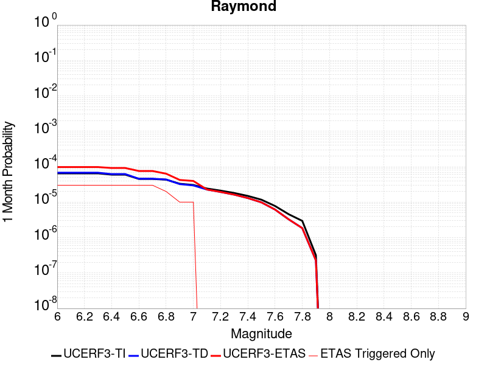 |  | 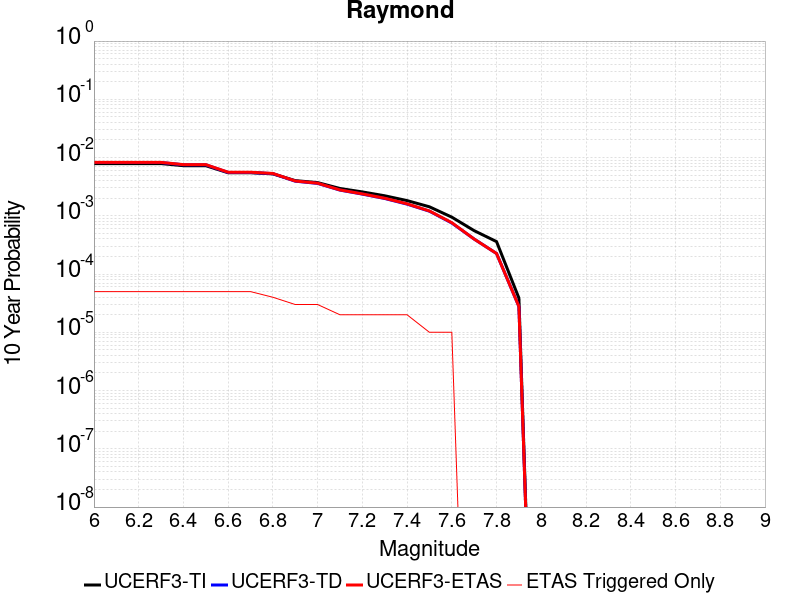 |

| Magnitude | 1 wk TI Prob | 1 wk TD Prob | 1 wk ETAS Prob | 1 wk ETAS/TD Gain | 1 wk ETAS Triggered Only | 1 mo TI Prob | 1 mo TD Prob | 1 mo ETAS Prob | 1 mo ETAS/TD Gain | 1 mo ETAS Triggered Only | 1 yr TI Prob | 1 yr TD Prob | 1 yr ETAS Prob | 1 yr ETAS/TD Gain | 1 yr ETAS Triggered Only | 10 yr TI Prob | 10 yr TD Prob | 10 yr ETAS Prob | 10 yr ETAS/TD Gain | 10 yr ETAS Triggered Only |
|-----|-----|-----|-----|-----|-----|-----|-----|-----|-----|-----|-----|-----|-----|-----|-----|-----|-----|-----|-----|-----|
| 6.0 | 1.5157413E-5 | 1.5810128E-5 | 4.5809655E-5 | 2.8974879 | 3.0E-5 | 6.4958724E-5 | 6.7756075E-5 | 9.775404E-5 | 1.4427347 | 3.0E-5 | 7.905855E-4 | 8.2464307E-4 | 8.646101E-4 | 1.0484658 | 4.0E-5 | 0.007877788 | 0.008218348 | 0.008267937 | 1.0060339 | 5.0E-5 |
| 6.1 | 1.5157413E-5 | 1.5810128E-5 | 4.5809655E-5 | 2.8974879 | 3.0E-5 | 6.4958724E-5 | 6.7756075E-5 | 9.775404E-5 | 1.4427347 | 3.0E-5 | 7.905855E-4 | 8.2464307E-4 | 8.646101E-4 | 1.0484658 | 4.0E-5 | 0.007877788 | 0.008218348 | 0.008267937 | 1.0060339 | 5.0E-5 |
| 6.2 | 1.5157413E-5 | 1.5810128E-5 | 4.5809655E-5 | 2.8974879 | 3.0E-5 | 6.4958724E-5 | 6.7756075E-5 | 9.775404E-5 | 1.4427347 | 3.0E-5 | 7.905855E-4 | 8.2464307E-4 | 8.646101E-4 | 1.0484658 | 4.0E-5 | 0.007877788 | 0.008218348 | 0.008267937 | 1.0060339 | 5.0E-5 |
| 6.3 | 1.5157413E-5 | 1.5810128E-5 | 4.5809655E-5 | 2.8974879 | 3.0E-5 | 6.4958724E-5 | 6.7756075E-5 | 9.775404E-5 | 1.4427347 | 3.0E-5 | 7.905855E-4 | 8.2464307E-4 | 8.646101E-4 | 1.0484658 | 4.0E-5 | 0.007877788 | 0.008218348 | 0.008267937 | 1.0060339 | 5.0E-5 |
| 6.4 | 1.3941944E-5 | 1.445469E-5 | 4.4454257E-5 | 3.0754209 | 3.0E-5 | 5.9749822E-5 | 6.1947336E-5 | 9.1945476E-5 | 1.4842523 | 3.0E-5 | 7.2721124E-4 | 7.5397117E-4 | 7.9394097E-4 | 1.0530124 | 4.0E-5 | 0.007248361 | 0.0075164647 | 0.007566089 | 1.006602 | 5.0E-5 |
| 6.5 | 1.3941944E-5 | 1.445469E-5 | 4.4454257E-5 | 3.0754209 | 3.0E-5 | 5.9749822E-5 | 6.1947336E-5 | 9.1945476E-5 | 1.4842523 | 3.0E-5 | 7.2721124E-4 | 7.5397117E-4 | 7.9394097E-4 | 1.0530124 | 4.0E-5 | 0.007248361 | 0.0075164647 | 0.007566089 | 1.006602 | 5.0E-5 |
| 6.6 | 1.0542609E-5 | 1.0671113E-5 | 4.067079E-5 | 3.8112981 | 3.0E-5 | 4.5181827E-5 | 4.573257E-5 | 7.57312E-5 | 1.6559576 | 3.0E-5 | 5.499499E-4 | 5.5665727E-4 | 5.96635E-4 | 1.0718175 | 4.0E-5 | 0.005485909 | 0.00555319 | 0.0056029125 | 1.0089538 | 5.0E-5 |
| 6.7 | 1.0542609E-5 | 1.0671113E-5 | 4.067079E-5 | 3.8112981 | 3.0E-5 | 4.5181827E-5 | 4.573257E-5 | 7.57312E-5 | 1.6559576 | 3.0E-5 | 5.499499E-4 | 5.5665727E-4 | 5.96635E-4 | 1.0718175 | 4.0E-5 | 0.005485909 | 0.00555319 | 0.0056029125 | 1.0089538 | 5.0E-5 |
| 6.8 | 1.0079132E-5 | 1.0176646E-5 | 3.0176443E-5 | 2.965264 | 2.0E-5 | 4.3195567E-5 | 4.3613498E-5 | 6.361263E-5 | 1.4585537 | 2.0E-5 | 5.257791E-4 | 5.3087034E-4 | 5.608544E-4 | 1.056481 | 3.0E-5 | 0.0052453685 | 0.005296571 | 0.0053363596 | 1.0075121 | 4.0E-5 |
| 6.9 | 7.721598E-6 | 7.5489047E-6 | 1.754883E-5 | 2.3246856 | 1.0E-5 | 3.3092143E-5 | 3.2352054E-5 | 4.235173E-5 | 1.3090894 | 1.0E-5 | 4.0282236E-4 | 3.9381627E-4 | 4.1380842E-4 | 1.0507652 | 2.0E-5 | 0.0040209293 | 0.0039313175 | 0.0039612 | 1.007601 | 3.0E-5 |
| 7.0 | 7.137566E-6 | 6.9113057E-6 | 1.6911237E-5 | 2.4468946 | 1.0E-5 | 3.058921E-5 | 2.961955E-5 | 3.9619255E-5 | 1.3376049 | 1.0E-5 | 3.7236E-4 | 3.6055944E-4 | 3.8055223E-4 | 1.0554494 | 2.0E-5 | 0.0037173668 | 0.0035998628 | 0.0036297548 | 1.0083036 | 3.0E-5 |
| 7.1 | 5.654976E-6 | 5.29954E-6 | 5.29954E-6 | 1.0 | 0.0 | 2.4235387E-5 | 2.2712118E-5 | 2.2712118E-5 | 1.0 | 0.0 | 2.9502588E-4 | 2.7648517E-4 | 2.8648242E-4 | 1.0361583 | 1.0E-5 | 0.0029463451 | 0.002761443 | 0.0027813877 | 1.0072225 | 2.0E-5 |
| 7.2 | 4.9358455E-6 | 4.5266574E-6 | 4.5266574E-6 | 1.0 | 0.0 | 2.1153453E-5 | 1.9399817E-5 | 1.9399817E-5 | 1.0 | 0.0 | 2.5751285E-4 | 2.3616731E-4 | 2.4616494E-4 | 1.0423329 | 1.0E-5 | 0.0025721465 | 0.0023591854 | 0.0023791383 | 1.0084575 | 2.0E-5 |
| 7.3 | 4.2368597E-6 | 3.8056164E-6 | 3.8056164E-6 | 1.0 | 0.0 | 1.8157843E-5 | 1.6309683E-5 | 1.6309683E-5 | 1.0 | 0.0 | 2.2104931E-4 | 1.9855241E-4 | 2.0855042E-4 | 1.0503545 | 1.0E-5 | 0.0022082955 | 0.0019837688 | 0.002003729 | 1.0100619 | 2.0E-5 |
| 7.4 | 3.4999923E-6 | 3.043744E-6 | 3.043744E-6 | 1.0 | 0.0 | 1.49998805E-5 | 1.3044552E-5 | 1.3044552E-5 | 1.0 | 0.0 | 1.8260824E-4 | 1.5880594E-4 | 1.6880434E-4 | 1.0629599 | 1.0E-5 | 0.0018245826 | 0.0015869403 | 0.0016069085 | 1.0125829 | 2.0E-5 |
| 7.5 | 2.738017E-6 | 2.3020468E-6 | 2.3020468E-6 | 1.0 | 0.0 | 1.1734306E-5 | 9.865878E-6 | 9.865878E-6 | 1.0 | 0.0 | 1.428558E-4 | 1.2011051E-4 | 1.3010931E-4 | 1.0832467 | 1.0E-5 | 0.0014276401 | 0.0012004703 | 0.0012104583 | 1.0083201 | 1.0E-5 |
| 7.6 | 1.8186392E-6 | 1.442312E-6 | 1.442312E-6 | 1.0 | 0.0 | 7.794145E-6 | 6.181323E-6 | 6.181323E-6 | 1.0 | 0.0 | 9.488958E-5 | 7.5255055E-5 | 8.52543E-5 | 1.1328714 | 1.0E-5 | 9.4849075E-4 | 7.523072E-4 | 7.622997E-4 | 1.0132824 | 1.0E-5 |
| 7.7 | 1.0660348E-6 | 7.6438056E-7 | 7.6438056E-7 | 1.0 | 0.0 | 4.5687125E-6 | 3.2759126E-6 | 3.2759126E-6 | 1.0 | 0.0 | 5.5622655E-5 | 3.9883522E-5 | 3.9883522E-5 | 1.0 | 0.0 | 5.5608735E-4 | 3.9877277E-4 | 3.9877277E-4 | 1.0 | 0.0 |
| 7.8 | 6.913602E-7 | 4.3204133E-7 | 4.3204133E-7 | 1.0 | 0.0 | 2.962969E-6 | 1.8516045E-6 | 1.8516045E-6 | 1.0 | 0.0 | 3.607355E-5 | 2.2543056E-5 | 2.2543056E-5 | 1.0 | 0.0 | 3.6067693E-4 | 2.2541556E-4 | 2.2541556E-4 | 1.0 | 0.0 |
| 7.9 | 7.425201E-8 | 5.3222113E-8 | 5.3222113E-8 | 1.0 | 0.0 | 3.1822285E-7 | 2.2809476E-7 | 2.2809476E-7 | 1.0 | 0.0 | 3.874356E-6 | 2.7770516E-6 | 2.7770516E-6 | 1.0 | 0.0 | 3.8742884E-5 | 2.7770298E-5 | 2.7770298E-5 | 1.0 | 0.0 |

## South Klamath Lake West
*[(top)](#table-of-contents)*

| 1 Week | 1 Month | 1 Year | 10 Year |
|-----|-----|-----|-----|
|  |  | 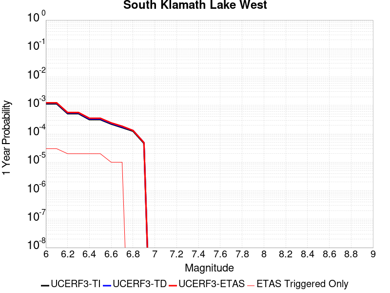 |  |

| Magnitude | 1 wk TI Prob | 1 wk TD Prob | 1 wk ETAS Prob | 1 wk ETAS/TD Gain | 1 wk ETAS Triggered Only | 1 mo TI Prob | 1 mo TD Prob | 1 mo ETAS Prob | 1 mo ETAS/TD Gain | 1 mo ETAS Triggered Only | 1 yr TI Prob | 1 yr TD Prob | 1 yr ETAS Prob | 1 yr ETAS/TD Gain | 1 yr ETAS Triggered Only | 10 yr TI Prob | 10 yr TD Prob | 10 yr ETAS Prob | 10 yr ETAS/TD Gain | 10 yr ETAS Triggered Only |
|-----|-----|-----|-----|-----|-----|-----|-----|-----|-----|-----|-----|-----|-----|-----|-----|-----|-----|-----|-----|-----|
| 6.0 | 2.174025E-5 | 2.3042025E-5 | 2.3042025E-5 | 1.0 | 0.0 | 9.3169176E-5 | 9.874817E-5 | 1.0874718E-4 | 1.1012577 | 1.0E-5 | 0.0011337444 | 0.0012016617 | 0.0012316257 | 1.0249355 | 3.0E-5 | 0.011279777 | 0.0119582405 | 0.011987882 | 1.0024787 | 3.0E-5 |
| 6.1 | 2.174025E-5 | 2.3042025E-5 | 2.3042025E-5 | 1.0 | 0.0 | 9.3169176E-5 | 9.874817E-5 | 1.0874718E-4 | 1.1012577 | 1.0E-5 | 0.0011337444 | 0.0012016617 | 0.0012316257 | 1.0249355 | 3.0E-5 | 0.011279777 | 0.0119582405 | 0.011987882 | 1.0024787 | 3.0E-5 |
| 6.2 | 9.834929E-6 | 1.0393841E-5 | 1.0393841E-5 | 1.0 | 0.0 | 4.2149015E-5 | 4.4544326E-5 | 4.4544326E-5 | 1.0 | 0.0 | 5.1304343E-4 | 5.422012E-4 | 5.621904E-4 | 1.0368667 | 2.0E-5 | 0.0051186057 | 0.0054096854 | 0.005429577 | 1.0036771 | 2.0E-5 |
| 6.3 | 9.834929E-6 | 1.0393841E-5 | 1.0393841E-5 | 1.0 | 0.0 | 4.2149015E-5 | 4.4544326E-5 | 4.4544326E-5 | 1.0 | 0.0 | 5.1304343E-4 | 5.422012E-4 | 5.621904E-4 | 1.0368667 | 2.0E-5 | 0.0051186057 | 0.0054096854 | 0.005429577 | 1.0036771 | 2.0E-5 |
| 6.4 | 6.066321E-6 | 6.40043E-6 | 6.40043E-6 | 1.0 | 0.0 | 2.5998259E-5 | 2.743014E-5 | 2.743014E-5 | 1.0 | 0.0 | 3.1648282E-4 | 3.3391351E-4 | 3.5390683E-4 | 1.0598757 | 2.0E-5 | 0.0031603249 | 0.0033343881 | 0.0033543215 | 1.0059781 | 2.0E-5 |
| 6.5 | 6.066321E-6 | 6.40043E-6 | 6.40043E-6 | 1.0 | 0.0 | 2.5998259E-5 | 2.743014E-5 | 2.743014E-5 | 1.0 | 0.0 | 3.1648282E-4 | 3.3391351E-4 | 3.5390683E-4 | 1.0598757 | 2.0E-5 | 0.0031603249 | 0.0033343881 | 0.0033543215 | 1.0059781 | 2.0E-5 |
| 6.6 | 4.2321803E-6 | 4.461291E-6 | 4.461291E-6 | 1.0 | 0.0 | 1.8137789E-5 | 1.9119685E-5 | 1.9119685E-5 | 1.0 | 0.0 | 2.208052E-4 | 2.3275832E-4 | 2.42756E-4 | 1.042953 | 1.0E-5 | 0.0022058594 | 0.0023252473 | 0.002335224 | 1.0042906 | 1.0E-5 |
| 6.7 | 3.186646E-6 | 3.360305E-6 | 3.360305E-6 | 1.0 | 0.0 | 1.3656982E-5 | 1.4401232E-5 | 1.4401232E-5 | 1.0 | 0.0 | 1.6626107E-4 | 1.7532158E-4 | 1.8531982E-4 | 1.057028 | 1.0E-5 | 0.0016613674 | 0.0017518997 | 0.0017618822 | 1.0056981 | 1.0E-5 |
| 6.8 | 2.380121E-6 | 2.510907E-6 | 2.510907E-6 | 1.0 | 0.0 | 1.0200479E-5 | 1.07609885E-5 | 1.07609885E-5 | 1.0 | 0.0 | 1.2418375E-4 | 1.3100762E-4 | 1.3100762E-4 | 1.0 | 0.0 | 0.0012411437 | 0.0013093497 | 0.0013093497 | 1.0 | 0.0 |
| 6.9 | 8.928287E-7 | 9.4302504E-7 | 9.4302504E-7 | 1.0 | 0.0 | 3.826403E-6 | 4.0415307E-6 | 4.0415307E-6 | 1.0 | 0.0 | 4.658546E-5 | 4.9204747E-5 | 4.9204747E-5 | 1.0 | 0.0 | 4.6575698E-4 | 4.9196015E-4 | 4.9196015E-4 | 1.0 | 0.0 |

## Sierra Madre
*[(top)](#table-of-contents)*

| 1 Week | 1 Month | 1 Year | 10 Year |
|-----|-----|-----|-----|
|  |  |  |  |

| Magnitude | 1 wk TI Prob | 1 wk TD Prob | 1 wk ETAS Prob | 1 wk ETAS/TD Gain | 1 wk ETAS Triggered Only | 1 mo TI Prob | 1 mo TD Prob | 1 mo ETAS Prob | 1 mo ETAS/TD Gain | 1 mo ETAS Triggered Only | 1 yr TI Prob | 1 yr TD Prob | 1 yr ETAS Prob | 1 yr ETAS/TD Gain | 1 yr ETAS Triggered Only | 10 yr TI Prob | 10 yr TD Prob | 10 yr ETAS Prob | 10 yr ETAS/TD Gain | 10 yr ETAS Triggered Only |
|-----|-----|-----|-----|-----|-----|-----|-----|-----|-----|-----|-----|-----|-----|-----|-----|-----|-----|-----|-----|-----|
| 6.0 | 1.3379373E-5 | 1.10007395E-5 | 1.10007395E-5 | 1.0 | 0.0 | 5.7338908E-5 | 4.7145186E-5 | 4.7145186E-5 | 1.0 | 0.0 | 6.978776E-4 | 5.738429E-4 | 6.038257E-4 | 1.0522491 | 3.0E-5 | 0.0069569005 | 0.0057239756 | 0.0057736896 | 1.0086852 | 5.0E-5 |
| 6.1 | 1.3379373E-5 | 1.10007395E-5 | 1.10007395E-5 | 1.0 | 0.0 | 5.7338908E-5 | 4.7145186E-5 | 4.7145186E-5 | 1.0 | 0.0 | 6.978776E-4 | 5.738429E-4 | 6.038257E-4 | 1.0522491 | 3.0E-5 | 0.0069569005 | 0.0057239756 | 0.0057736896 | 1.0086852 | 5.0E-5 |
| 6.2 | 1.3379373E-5 | 1.10007395E-5 | 1.10007395E-5 | 1.0 | 0.0 | 5.7338908E-5 | 4.7145186E-5 | 4.7145186E-5 | 1.0 | 0.0 | 6.978776E-4 | 5.738429E-4 | 6.038257E-4 | 1.0522491 | 3.0E-5 | 0.0069569005 | 0.0057239756 | 0.0057736896 | 1.0086852 | 5.0E-5 |
| 6.3 | 1.3379373E-5 | 1.10007395E-5 | 1.10007395E-5 | 1.0 | 0.0 | 5.7338908E-5 | 4.7145186E-5 | 4.7145186E-5 | 1.0 | 0.0 | 6.978776E-4 | 5.738429E-4 | 6.038257E-4 | 1.0522491 | 3.0E-5 | 0.0069569005 | 0.0057239756 | 0.0057736896 | 1.0086852 | 5.0E-5 |
| 6.4 | 1.3379373E-5 | 1.10007395E-5 | 1.10007395E-5 | 1.0 | 0.0 | 5.7338908E-5 | 4.7145186E-5 | 4.7145186E-5 | 1.0 | 0.0 | 6.978776E-4 | 5.738429E-4 | 6.038257E-4 | 1.0522491 | 3.0E-5 | 0.0069569005 | 0.0057239756 | 0.0057736896 | 1.0086852 | 5.0E-5 |
| 6.5 | 1.26563245E-5 | 1.0230196E-5 | 1.0230196E-5 | 1.0 | 0.0 | 5.4240263E-5 | 4.3842967E-5 | 4.3842967E-5 | 1.0 | 0.0 | 6.601751E-4 | 5.336584E-4 | 5.436531E-4 | 1.0187286 | 1.0E-5 | 0.006582173 | 0.0053240913 | 0.0053539313 | 1.0056047 | 3.0E-5 |
| 6.6 | 1.26563245E-5 | 1.0230196E-5 | 1.0230196E-5 | 1.0 | 0.0 | 5.4240263E-5 | 4.3842967E-5 | 4.3842967E-5 | 1.0 | 0.0 | 6.601751E-4 | 5.336584E-4 | 5.436531E-4 | 1.0187286 | 1.0E-5 | 0.006582173 | 0.0053240913 | 0.0053539313 | 1.0056047 | 3.0E-5 |
| 6.7 | 1.2502474E-5 | 1.006634E-5 | 1.006634E-5 | 1.0 | 0.0 | 5.3580934E-5 | 4.314075E-5 | 4.314075E-5 | 1.0 | 0.0 | 6.521526E-4 | 5.251131E-4 | 5.3510786E-4 | 1.0190336 | 1.0E-5 | 0.0065024206 | 0.0052390425 | 0.0052688853 | 1.0056963 | 3.0E-5 |
| 6.8 | 1.2454966E-5 | 1.0018625E-5 | 1.0018625E-5 | 1.0 | 0.0 | 5.3377335E-5 | 4.2936266E-5 | 4.2936266E-5 | 1.0 | 0.0 | 6.4967526E-4 | 5.226247E-4 | 5.326195E-4 | 1.0191242 | 1.0E-5 | 0.006477792 | 0.0052142753 | 0.005244119 | 1.0057235 | 3.0E-5 |
| 6.9 | 1.2225574E-5 | 9.792602E-6 | 9.792602E-6 | 1.0 | 0.0 | 5.2394265E-5 | 4.1967625E-5 | 4.1967625E-5 | 1.0 | 0.0 | 6.3771347E-4 | 5.108371E-4 | 5.20832E-4 | 1.0195657 | 1.0E-5 | 0.006358865 | 0.0050969445 | 0.0051267915 | 1.0058559 | 3.0E-5 |
| 7.0 | 1.182946E-5 | 9.399144E-6 | 9.399144E-6 | 1.0 | 0.0 | 5.06967E-5 | 4.0281426E-5 | 4.0281426E-5 | 1.0 | 0.0 | 6.1705755E-4 | 4.9031706E-4 | 5.0031213E-4 | 1.0203849 | 1.0E-5 | 0.006153469 | 0.004892664 | 0.004922517 | 1.0061016 | 3.0E-5 |
| 7.1 | 1.14369095E-5 | 8.986159E-6 | 8.986159E-6 | 1.0 | 0.0 | 4.9014405E-5 | 3.8511545E-5 | 3.8511545E-5 | 1.0 | 0.0 | 5.9658696E-4 | 4.687782E-4 | 4.787735E-4 | 1.021322 | 1.0E-5 | 0.005949879 | 0.004678199 | 0.0047080587 | 1.0063827 | 3.0E-5 |
| 7.2 | 1.0836419E-5 | 8.3995565E-6 | 8.3995565E-6 | 1.0 | 0.0 | 4.644097E-5 | 3.5997607E-5 | 3.5997607E-5 | 1.0 | 0.0 | 5.652721E-4 | 4.3818366E-4 | 4.481793E-4 | 1.0228115 | 1.0E-5 | 0.0056383642 | 0.004373494 | 0.004403363 | 1.0068295 | 3.0E-5 |
| 7.3 | 1.0403439E-5 | 8.02082E-6 | 8.02082E-6 | 1.0 | 0.0 | 4.4585406E-5 | 3.4374494E-5 | 3.4374494E-5 | 1.0 | 0.0 | 5.426921E-4 | 4.1843E-4 | 4.2842582E-4 | 1.0238888 | 1.0E-5 | 0.005413687 | 0.004176717 | 0.0042065918 | 1.0071527 | 3.0E-5 |
| 7.4 | 9.768864E-6 | 7.414448E-6 | 7.414448E-6 | 1.0 | 0.0 | 4.186589E-5 | 3.1775824E-5 | 3.1775824E-5 | 1.0 | 0.0 | 5.09598E-4 | 3.868029E-4 | 3.96799E-4 | 1.0258429 | 1.0E-5 | 0.0050843097 | 0.0038615882 | 0.0038914725 | 1.0077388 | 3.0E-5 |
| 7.5 | 8.687089E-6 | 6.4501564E-6 | 6.4501564E-6 | 1.0 | 0.0 | 3.722985E-5 | 2.764324E-5 | 2.764324E-5 | 1.0 | 0.0 | 4.5317915E-4 | 3.3650533E-4 | 3.4650197E-4 | 1.0297072 | 1.0E-5 | 0.004522561 | 0.0033602451 | 0.003380178 | 1.005932 | 2.0E-5 |
| 7.6 | 6.3506063E-6 | 4.4303215E-6 | 4.4303215E-6 | 1.0 | 0.0 | 2.72166E-5 | 1.8986955E-5 | 1.8986955E-5 | 1.0 | 0.0 | 3.3131172E-4 | 2.3114192E-4 | 2.4113961E-4 | 1.0432534 | 1.0E-5 | 0.003308182 | 0.0023092402 | 0.002329194 | 1.0086409 | 2.0E-5 |
| 7.7 | 4.62223E-6 | 2.932967E-6 | 2.932967E-6 | 1.0 | 0.0 | 1.9809406E-5 | 1.2569798E-5 | 1.2569798E-5 | 1.0 | 0.0 | 2.4115283E-4 | 1.5302657E-4 | 1.5302657E-4 | 1.0 | 0.0 | 0.0024089129 | 0.001529413 | 0.0015393978 | 1.0065285 | 1.0E-5 |
| 7.8 | 3.2145008E-6 | 1.9494332E-6 | 1.9494332E-6 | 1.0 | 0.0 | 1.3776359E-5 | 8.3546865E-6 | 8.3546865E-6 | 1.0 | 0.0 | 1.6771426E-4 | 1.0171358E-4 | 1.0171358E-4 | 1.0 | 0.0 | 0.0016758774 | 0.0010168145 | 0.0010268043 | 1.0098246 | 1.0E-5 |
| 7.9 | 1.0391769E-6 | 5.6026335E-7 | 5.6026335E-7 | 1.0 | 0.0 | 4.4536077E-6 | 2.4011265E-6 | 2.4011265E-6 | 1.0 | 0.0 | 5.4221324E-5 | 2.9233326E-5 | 2.9233326E-5 | 1.0 | 0.0 | 5.4208096E-4 | 2.9229524E-4 | 3.0229232E-4 | 1.034202 | 1.0E-5 |
| 8.0 | 1.210983E-7 | 6.613821E-8 | 6.613821E-8 | 1.0 | 0.0 | 5.1899264E-7 | 2.8344945E-7 | 2.8344945E-7 | 1.0 | 0.0 | 6.3187167E-6 | 3.4509917E-6 | 3.4509917E-6 | 1.0 | 0.0 | 6.318537E-5 | 3.45094E-5 | 3.45094E-5 | 1.0 | 0.0 |

## Hat Creek-McArthur-Mayfield
*[(top)](#table-of-contents)*

| 1 Week | 1 Month | 1 Year | 10 Year |
|-----|-----|-----|-----|
|  | 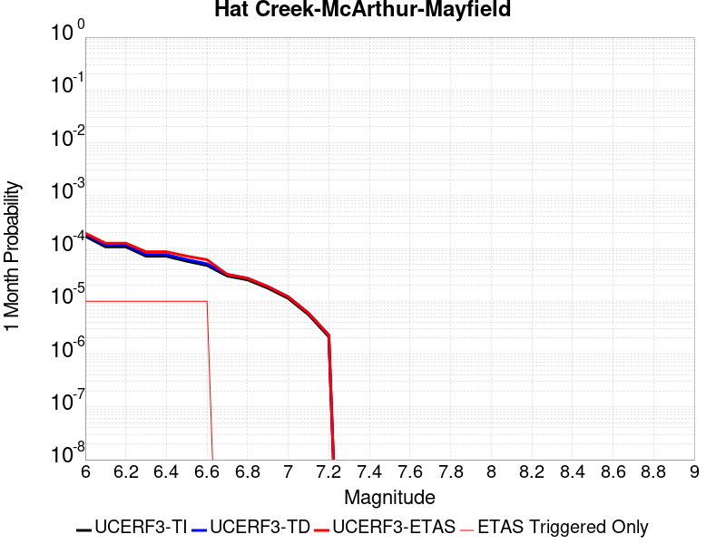 |  |  |

| Magnitude | 1 wk TI Prob | 1 wk TD Prob | 1 wk ETAS Prob | 1 wk ETAS/TD Gain | 1 wk ETAS Triggered Only | 1 mo TI Prob | 1 mo TD Prob | 1 mo ETAS Prob | 1 mo ETAS/TD Gain | 1 mo ETAS Triggered Only | 1 yr TI Prob | 1 yr TD Prob | 1 yr ETAS Prob | 1 yr ETAS/TD Gain | 1 yr ETAS Triggered Only | 10 yr TI Prob | 10 yr TD Prob | 10 yr ETAS Prob | 10 yr ETAS/TD Gain | 10 yr ETAS Triggered Only |
|-----|-----|-----|-----|-----|-----|-----|-----|-----|-----|-----|-----|-----|-----|-----|-----|-----|-----|-----|-----|-----|
| 6.0 | 3.967457E-5 | 4.315831E-5 | 4.315831E-5 | 1.0 | 0.0 | 1.7002279E-4 | 1.8495171E-4 | 1.9494987E-4 | 1.0540582 | 1.0E-5 | 0.002068062 | 0.002249576 | 0.0022795084 | 1.0133059 | 3.0E-5 | 0.02048922 | 0.022280399 | 0.022319507 | 1.0017554 | 4.0E-5 |
| 6.1 | 2.5044013E-5 | 2.7071164E-5 | 2.7071164E-5 | 1.0 | 0.0 | 1.0732707E-4 | 1.1601429E-4 | 1.2601314E-4 | 1.0861863 | 1.0E-5 | 0.0013059238 | 0.0014115906 | 0.0014415482 | 1.0212226 | 3.0E-5 | 0.01298276 | 0.01402966 | 0.014069099 | 1.0028111 | 4.0E-5 |
| 6.2 | 2.5044013E-5 | 2.7071164E-5 | 2.7071164E-5 | 1.0 | 0.0 | 1.0732707E-4 | 1.1601429E-4 | 1.2601314E-4 | 1.0861863 | 1.0E-5 | 0.0013059238 | 0.0014115906 | 0.0014415482 | 1.0212226 | 3.0E-5 | 0.01298276 | 0.01402966 | 0.014069099 | 1.0028111 | 4.0E-5 |
| 6.3 | 1.6624012E-5 | 1.7891072E-5 | 1.7891072E-5 | 1.0 | 0.0 | 7.124382E-5 | 7.6673816E-5 | 8.667305E-5 | 1.1304126 | 1.0E-5 | 8.670483E-4 | 9.331125E-4 | 9.4310316E-4 | 1.0107068 | 1.0E-5 | 0.008636732 | 0.009292879 | 0.009302787 | 1.0010661 | 1.0E-5 |
| 6.4 | 1.6624012E-5 | 1.7891072E-5 | 1.7891072E-5 | 1.0 | 0.0 | 7.124382E-5 | 7.6673816E-5 | 8.667305E-5 | 1.1304126 | 1.0E-5 | 8.670483E-4 | 9.331125E-4 | 9.4310316E-4 | 1.0107068 | 1.0E-5 | 0.008636732 | 0.009292879 | 0.009302787 | 1.0010661 | 1.0E-5 |
| 6.5 | 1.3394842E-5 | 1.4392137E-5 | 1.4392137E-5 | 1.0 | 0.0 | 5.7405203E-5 | 6.167916E-5 | 7.167854E-5 | 1.1621193 | 1.0E-5 | 6.986842E-4 | 7.506906E-4 | 7.606831E-4 | 1.013311 | 1.0E-5 | 0.006964916 | 0.0074821403 | 0.007492066 | 1.0013266 | 1.0E-5 |
| 6.6 | 1.1137514E-5 | 1.1954546E-5 | 1.1954546E-5 | 1.0 | 0.0 | 4.7731326E-5 | 5.1232782E-5 | 6.123227E-5 | 1.1951776 | 1.0E-5 | 5.809739E-4 | 6.2358467E-4 | 6.335784E-4 | 1.0160263 | 1.0E-5 | 0.005794574 | 0.00621877 | 0.0062287077 | 1.001598 | 1.0E-5 |
| 6.7 | 7.0200663E-6 | 7.5242897E-6 | 7.5242897E-6 | 1.0 | 0.0 | 3.008565E-5 | 3.2246568E-5 | 3.2246568E-5 | 1.0 | 0.0 | 3.6623122E-4 | 3.925328E-4 | 3.925328E-4 | 1.0 | 0.0 | 0.0036562826 | 0.0039185574 | 0.0039185574 | 1.0 | 0.0 |
| 6.8 | 5.940172E-6 | 6.3654766E-6 | 6.3654766E-6 | 1.0 | 0.0 | 2.545763E-5 | 2.7280335E-5 | 2.7280335E-5 | 1.0 | 0.0 | 3.0990256E-4 | 3.3208873E-4 | 3.3208873E-4 | 1.0 | 0.0 | 0.0030947074 | 0.0033160534 | 0.0033160534 | 1.0 | 0.0 |
| 6.9 | 4.129831E-6 | 4.423547E-6 | 4.423547E-6 | 1.0 | 0.0 | 1.7699154E-5 | 1.8957926E-5 | 1.8957926E-5 | 1.0 | 0.0 | 2.154659E-4 | 2.3078908E-4 | 2.3078908E-4 | 1.0 | 0.0 | 0.002152571 | 0.0023055724 | 0.0023055724 | 1.0 | 0.0 |
| 7.0 | 2.6512955E-6 | 2.8374002E-6 | 2.8374002E-6 | 1.0 | 0.0 | 1.1362646E-5 | 1.2160232E-5 | 1.2160232E-5 | 1.0 | 0.0 | 1.3833142E-4 | 1.480412E-4 | 1.480412E-4 | 1.0 | 0.0 | 0.0013824535 | 0.0014794683 | 0.0014794683 | 1.0 | 0.0 |
| 7.1 | 1.2992575E-6 | 1.3909317E-6 | 1.3909317E-6 | 1.0 | 0.0 | 5.568235E-6 | 5.961124E-6 | 5.961124E-6 | 1.0 | 0.0 | 6.779115E-5 | 7.257448E-5 | 7.257448E-5 | 1.0 | 0.0 | 6.7770475E-4 | 7.2552945E-4 | 7.2552945E-4 | 1.0 | 0.0 |
| 7.2 | 4.968191E-7 | 5.3271475E-7 | 5.3271475E-7 | 1.0 | 0.0 | 2.1292228E-6 | 2.283062E-6 | 2.283062E-6 | 1.0 | 0.0 | 2.592298E-5 | 2.7796052E-5 | 2.7796052E-5 | 1.0 | 0.0 | 2.5919956E-4 | 2.7793812E-4 | 2.7793812E-4 | 1.0 | 0.0 |

## Likely 2011 CFM
*[(top)](#table-of-contents)*

| 1 Week | 1 Month | 1 Year | 10 Year |
|-----|-----|-----|-----|
|  |  |  |  |

| Magnitude | 1 wk TI Prob | 1 wk TD Prob | 1 wk ETAS Prob | 1 wk ETAS/TD Gain | 1 wk ETAS Triggered Only | 1 mo TI Prob | 1 mo TD Prob | 1 mo ETAS Prob | 1 mo ETAS/TD Gain | 1 mo ETAS Triggered Only | 1 yr TI Prob | 1 yr TD Prob | 1 yr ETAS Prob | 1 yr ETAS/TD Gain | 1 yr ETAS Triggered Only | 10 yr TI Prob | 10 yr TD Prob | 10 yr ETAS Prob | 10 yr ETAS/TD Gain | 10 yr ETAS Triggered Only |
|-----|-----|-----|-----|-----|-----|-----|-----|-----|-----|-----|-----|-----|-----|-----|-----|-----|-----|-----|-----|-----|
| 6.0 | 2.5315949E-5 | 2.7104748E-5 | 3.7104477E-5 | 1.368929 | 1.0E-5 | 1.0849241E-4 | 1.16158284E-4 | 1.3615596E-4 | 1.1721588 | 2.0E-5 | 0.0013200947 | 0.0014133542 | 0.0014333259 | 1.0141307 | 2.0E-5 | 0.013122803 | 0.01404831 | 0.014077889 | 1.0021055 | 3.0E-5 |
| 6.1 | 2.5315949E-5 | 2.7104748E-5 | 3.7104477E-5 | 1.368929 | 1.0E-5 | 1.0849241E-4 | 1.16158284E-4 | 1.3615596E-4 | 1.1721588 | 2.0E-5 | 0.0013200947 | 0.0014133542 | 0.0014333259 | 1.0141307 | 2.0E-5 | 0.013122803 | 0.01404831 | 0.014077889 | 1.0021055 | 3.0E-5 |
| 6.2 | 1.6375941E-5 | 1.7465842E-5 | 1.7465842E-5 | 1.0 | 0.0 | 7.0180715E-5 | 7.485153E-5 | 8.4850784E-5 | 1.1335878 | 1.0E-5 | 8.5411523E-4 | 9.109487E-4 | 9.2093955E-4 | 1.0109676 | 1.0E-5 | 0.008508399 | 0.009073433 | 0.009093251 | 1.0021843 | 2.0E-5 |
| 6.3 | 1.1945543E-5 | 1.2712587E-5 | 1.2712587E-5 | 1.0 | 0.0 | 5.119418E-5 | 5.4481407E-5 | 5.4481407E-5 | 1.0 | 0.0 | 6.2311086E-4 | 6.631146E-4 | 6.73108E-4 | 1.0150703 | 1.0E-5 | 0.0062136655 | 0.0066119144 | 0.0066317823 | 1.0030048 | 2.0E-5 |
| 6.4 | 9.192729E-6 | 9.768488E-6 | 9.768488E-6 | 1.0 | 0.0 | 3.939681E-5 | 4.1864292E-5 | 4.1864292E-5 | 1.0 | 0.0 | 4.7955062E-4 | 5.0958124E-4 | 5.195762E-4 | 1.019614 | 1.0E-5 | 0.004785171 | 0.0050844094 | 0.0051043076 | 1.0039136 | 2.0E-5 |
| 6.5 | 7.67906E-6 | 8.152622E-6 | 8.152622E-6 | 1.0 | 0.0 | 3.2909844E-5 | 3.4939352E-5 | 3.4939352E-5 | 1.0 | 0.0 | 4.006037E-4 | 4.2530545E-4 | 4.2530545E-4 | 1.0 | 0.0 | 0.0039988225 | 0.004245108 | 0.0042550657 | 1.0023457 | 1.0E-5 |
| 6.6 | 6.4884057E-6 | 6.8847507E-6 | 6.8847507E-6 | 1.0 | 0.0 | 2.7807157E-5 | 2.9505749E-5 | 2.9505749E-5 | 1.0 | 0.0 | 3.3849955E-4 | 3.591747E-4 | 3.591747E-4 | 1.0 | 0.0 | 0.003379844 | 0.0035860867 | 0.003596051 | 1.0027785 | 1.0E-5 |
| 6.7 | 4.6060636E-6 | 4.884041E-6 | 4.884041E-6 | 1.0 | 0.0 | 1.9740122E-5 | 2.0931442E-5 | 2.0931442E-5 | 1.0 | 0.0 | 2.403095E-4 | 2.5481134E-4 | 2.5481134E-4 | 1.0 | 0.0 | 0.002400498 | 0.0025452746 | 0.0025552493 | 1.0039189 | 1.0E-5 |
| 6.8 | 3.2795615E-6 | 3.4773732E-6 | 3.4773732E-6 | 1.0 | 0.0 | 1.4055187E-5 | 1.4902946E-5 | 1.4902946E-5 | 1.0 | 0.0 | 1.7110848E-4 | 1.8142881E-4 | 1.8142881E-4 | 1.0 | 0.0 | 0.0017097679 | 0.0018128622 | 0.0018128622 | 1.0 | 0.0 |
| 6.9 | 2.3289967E-6 | 2.4705569E-6 | 2.4705569E-6 | 1.0 | 0.0 | 9.981376E-6 | 1.058806E-5 | 1.058806E-5 | 1.0 | 0.0 | 1.2151648E-4 | 1.2890245E-4 | 1.2890245E-4 | 1.0 | 0.0 | 0.0012145005 | 0.0012883197 | 0.0012883197 | 1.0 | 0.0 |
| 7.0 | 1.211292E-6 | 1.2863958E-6 | 1.2863958E-6 | 1.0 | 0.0 | 5.1912407E-6 | 5.5131145E-6 | 5.5131145E-6 | 1.0 | 0.0 | 6.320152E-5 | 6.712041E-5 | 6.712041E-5 | 1.0 | 0.0 | 6.3183554E-4 | 6.710312E-4 | 6.710312E-4 | 1.0 | 0.0 |

## Casmalia 2011 CFM
*[(top)](#table-of-contents)*

| 1 Week | 1 Month | 1 Year | 10 Year |
|-----|-----|-----|-----|
|  |  | 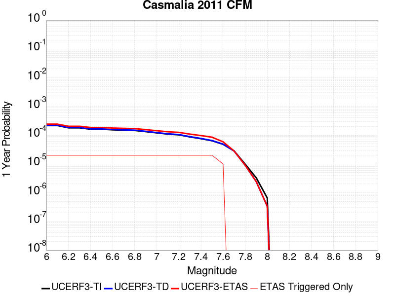 | 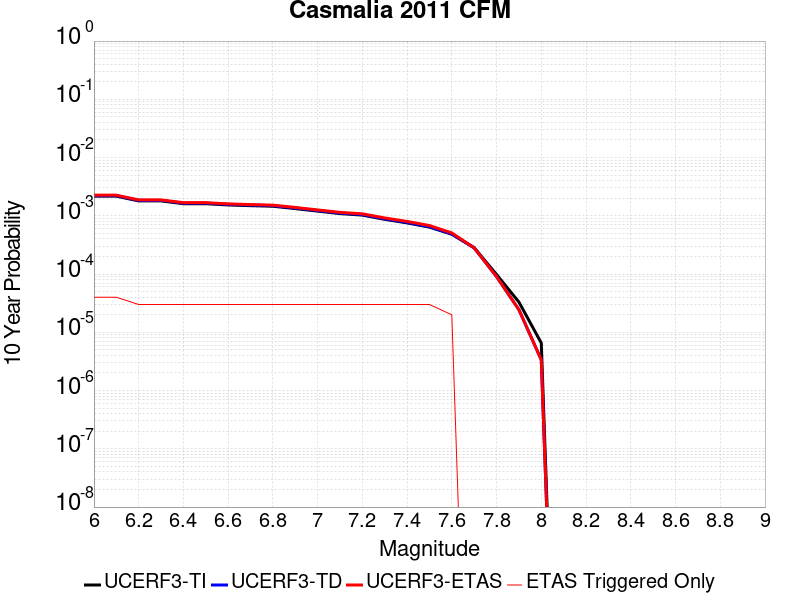 |

| Magnitude | 1 wk TI Prob | 1 wk TD Prob | 1 wk ETAS Prob | 1 wk ETAS/TD Gain | 1 wk ETAS Triggered Only | 1 mo TI Prob | 1 mo TD Prob | 1 mo ETAS Prob | 1 mo ETAS/TD Gain | 1 mo ETAS Triggered Only | 1 yr TI Prob | 1 yr TD Prob | 1 yr ETAS Prob | 1 yr ETAS/TD Gain | 1 yr ETAS Triggered Only | 10 yr TI Prob | 10 yr TD Prob | 10 yr ETAS Prob | 10 yr ETAS/TD Gain | 10 yr ETAS Triggered Only |
|-----|-----|-----|-----|-----|-----|-----|-----|-----|-----|-----|-----|-----|-----|-----|-----|-----|-----|-----|-----|-----|
| 6.0 | 4.1704893E-6 | 4.262483E-6 | 4.262483E-6 | 1.0 | 0.0 | 1.7873403E-5 | 1.8267656E-5 | 1.8267656E-5 | 1.0 | 0.0 | 2.1758694E-4 | 2.2238622E-4 | 2.4238178E-4 | 1.0899136 | 2.0E-5 | 0.0021737402 | 0.0022216577 | 0.0022615688 | 1.0179646 | 4.0E-5 |
| 6.1 | 4.1704893E-6 | 4.262483E-6 | 4.262483E-6 | 1.0 | 0.0 | 1.7873403E-5 | 1.8267656E-5 | 1.8267656E-5 | 1.0 | 0.0 | 2.1758694E-4 | 2.2238622E-4 | 2.4238178E-4 | 1.0899136 | 2.0E-5 | 0.0021737402 | 0.0022216577 | 0.0022615688 | 1.0179646 | 4.0E-5 |
| 6.2 | 3.457312E-6 | 3.5370217E-6 | 3.5370217E-6 | 1.0 | 0.0 | 1.4816967E-5 | 1.5158577E-5 | 1.5158577E-5 | 1.0 | 0.0 | 1.8038164E-4 | 1.8454014E-4 | 2.0453644E-4 | 1.1083575 | 2.0E-5 | 0.001802353 | 0.0018438784 | 0.001873823 | 1.01624 | 3.0E-5 |
| 6.3 | 3.457312E-6 | 3.5370217E-6 | 3.5370217E-6 | 1.0 | 0.0 | 1.4816967E-5 | 1.5158577E-5 | 1.5158577E-5 | 1.0 | 0.0 | 1.8038164E-4 | 1.8454014E-4 | 2.0453644E-4 | 1.1083575 | 2.0E-5 | 0.001802353 | 0.0018438784 | 0.001873823 | 1.01624 | 3.0E-5 |
| 6.4 | 3.0957337E-6 | 3.1692257E-6 | 3.1692257E-6 | 1.0 | 0.0 | 1.3267363E-5 | 1.3582326E-5 | 1.3582326E-5 | 1.0 | 0.0 | 1.6151817E-4 | 1.6535232E-4 | 1.8534901E-4 | 1.1209339 | 2.0E-5 | 0.0016140083 | 0.0016522991 | 0.0016822495 | 1.0181265 | 3.0E-5 |
| 6.5 | 3.0957337E-6 | 3.1692257E-6 | 3.1692257E-6 | 1.0 | 0.0 | 1.3267363E-5 | 1.3582326E-5 | 1.3582326E-5 | 1.0 | 0.0 | 1.6151817E-4 | 1.6535232E-4 | 1.8534901E-4 | 1.1209339 | 2.0E-5 | 0.0016140083 | 0.0016522991 | 0.0016822495 | 1.0181265 | 3.0E-5 |
| 6.6 | 2.9459152E-6 | 3.0165752E-6 | 3.0165752E-6 | 1.0 | 0.0 | 1.262529E-5 | 1.2928115E-5 | 1.2928115E-5 | 1.0 | 0.0 | 1.5370206E-4 | 1.5738848E-4 | 1.7738534E-4 | 1.1270541 | 2.0E-5 | 0.0015359579 | 0.0015727758 | 0.0016027286 | 1.0190445 | 3.0E-5 |
| 6.7 | 2.8634809E-6 | 2.9324726E-6 | 2.9324726E-6 | 1.0 | 0.0 | 1.2272003E-5 | 1.256768E-5 | 1.256768E-5 | 1.0 | 0.0 | 1.4940138E-4 | 1.530008E-4 | 1.7299774E-4 | 1.1306983 | 2.0E-5 | 0.0014930099 | 0.0015289601 | 0.0015589142 | 1.0195912 | 3.0E-5 |
| 6.8 | 2.7999822E-6 | 2.8675968E-6 | 2.8675968E-6 | 1.0 | 0.0 | 1.1999869E-5 | 1.2289643E-5 | 1.2289643E-5 | 1.0 | 0.0 | 1.460886E-4 | 1.4961617E-4 | 1.6961318E-4 | 1.1336554 | 2.0E-5 | 0.001459926 | 0.0014951597 | 0.0015251149 | 1.0200348 | 3.0E-5 |
| 6.9 | 2.551052E-6 | 2.6119649E-6 | 2.6119649E-6 | 1.0 | 0.0 | 1.0933034E-5 | 1.1194087E-5 | 1.1194087E-5 | 1.0 | 0.0 | 1.3310155E-4 | 1.3627953E-4 | 1.562768E-4 | 1.1467372 | 2.0E-5 | 0.0013302186 | 0.0013619636 | 0.0013919227 | 1.021997 | 3.0E-5 |
| 7.0 | 2.3081875E-6 | 2.3624088E-6 | 2.3624088E-6 | 1.0 | 0.0 | 9.892195E-6 | 1.01245705E-5 | 1.01245705E-5 | 1.0 | 0.0 | 1.20430814E-4 | 1.232597E-4 | 1.4325723E-4 | 1.1622391 | 2.0E-5 | 0.0012036557 | 0.0012319161 | 0.0012618792 | 1.0243223 | 3.0E-5 |
| 7.1 | 2.093245E-6 | 2.1417243E-6 | 2.1417243E-6 | 1.0 | 0.0 | 8.971019E-6 | 9.178786E-6 | 9.178786E-6 | 1.0 | 0.0 | 1.09216686E-4 | 1.1174601E-4 | 1.3174377E-4 | 1.1789573 | 2.0E-5 | 0.0010916302 | 0.0011169002 | 0.0011468667 | 1.0268301 | 3.0E-5 |
| 7.2 | 1.9714576E-6 | 2.0165091E-6 | 2.0165091E-6 | 1.0 | 0.0 | 8.449076E-6 | 8.642153E-6 | 8.642153E-6 | 1.0 | 0.0 | 1.0286264E-4 | 1.05213156E-4 | 1.2521105E-4 | 1.1900703 | 2.0E-5 | 0.0010281504 | 0.0010516352 | 0.0010816037 | 1.028497 | 3.0E-5 |
| 7.3 | 1.6689512E-6 | 1.7047131E-6 | 1.7047131E-6 | 1.0 | 0.0 | 7.1526288E-6 | 7.3058927E-6 | 7.3058927E-6 | 1.0 | 0.0 | 8.7079774E-5 | 8.894562E-5 | 1.0894384E-4 | 1.2248365 | 2.0E-5 | 8.7045657E-4 | 8.89101E-4 | 9.190743E-4 | 1.0337119 | 3.0E-5 |
| 7.4 | 1.4490954E-6 | 1.4778908E-6 | 1.4778908E-6 | 1.0 | 0.0 | 6.210394E-6 | 6.333802E-6 | 6.333802E-6 | 1.0 | 0.0 | 7.560892E-5 | 7.711132E-5 | 9.7109776E-5 | 1.2593453 | 2.0E-5 | 7.55832E-4 | 7.7084627E-4 | 8.0082315E-4 | 1.0388882 | 3.0E-5 |
| 7.5 | 1.226873E-6 | 1.2481701E-6 | 1.2481701E-6 | 1.0 | 0.0 | 5.2580162E-6 | 5.3492895E-6 | 5.3492895E-6 | 1.0 | 0.0 | 6.401447E-5 | 6.5125656E-5 | 8.512435E-5 | 1.3070786 | 2.0E-5 | 6.399603E-4 | 6.5106625E-4 | 6.810467E-4 | 1.0460483 | 3.0E-5 |
| 7.6 | 9.2561345E-7 | 9.361923E-7 | 9.361923E-7 | 1.0 | 0.0 | 3.966909E-6 | 4.012247E-6 | 4.012247E-6 | 1.0 | 0.0 | 4.8296046E-5 | 4.884801E-5 | 5.8847523E-5 | 1.2047067 | 1.0E-5 | 4.828555E-4 | 4.8837316E-4 | 5.0836336E-4 | 1.0409323 | 2.0E-5 |
| 7.7 | 5.4367933E-7 | 5.392888E-7 | 5.392888E-7 | 1.0 | 0.0 | 2.3300522E-6 | 2.3112357E-6 | 2.3112357E-6 | 1.0 | 0.0 | 2.8368017E-5 | 2.8138933E-5 | 2.8138933E-5 | 1.0 | 0.0 | 2.8364395E-4 | 2.8135383E-4 | 2.8135383E-4 | 1.0 | 0.0 |
| 7.8 | 1.8825742E-7 | 1.7342276E-7 | 1.7342276E-7 | 1.0 | 0.0 | 8.068173E-7 | 7.4324015E-7 | 7.4324015E-7 | 1.0 | 0.0 | 9.822956E-6 | 9.048912E-6 | 9.048912E-6 | 1.0 | 0.0 | 9.822522E-5 | 9.048546E-5 | 9.048546E-5 | 1.0 | 0.0 |
| 7.9 | 6.342771E-8 | 4.6790706E-8 | 4.6790706E-8 | 1.0 | 0.0 | 2.7183304E-7 | 2.0053157E-7 | 2.0053157E-7 | 1.0 | 0.0 | 3.3095623E-6 | 2.4414692E-6 | 2.4414692E-6 | 1.0 | 0.0 | 3.309513E-5 | 2.4414428E-5 | 2.4414428E-5 | 1.0 | 0.0 |
| 8.0 | 1.2574819E-8 | 6.4733463E-9 | 6.4733463E-9 | 1.0 | 0.0 | 5.3892084E-8 | 2.7742912E-8 | 2.7742912E-8 | 1.0 | 0.0 | 6.561359E-7 | 3.377699E-7 | 3.377699E-7 | 1.0 | 0.0 | 6.56134E-6 | 3.377694E-6 | 3.377694E-6 | 1.0 | 0.0 |

## San Jose
*[(top)](#table-of-contents)*

| 1 Week | 1 Month | 1 Year | 10 Year |
|-----|-----|-----|-----|
|  | 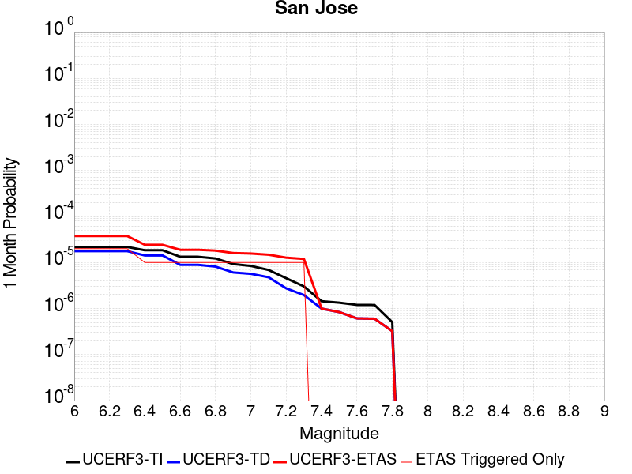 |  |  |

| Magnitude | 1 wk TI Prob | 1 wk TD Prob | 1 wk ETAS Prob | 1 wk ETAS/TD Gain | 1 wk ETAS Triggered Only | 1 mo TI Prob | 1 mo TD Prob | 1 mo ETAS Prob | 1 mo ETAS/TD Gain | 1 mo ETAS Triggered Only | 1 yr TI Prob | 1 yr TD Prob | 1 yr ETAS Prob | 1 yr ETAS/TD Gain | 1 yr ETAS Triggered Only | 10 yr TI Prob | 10 yr TD Prob | 10 yr ETAS Prob | 10 yr ETAS/TD Gain | 10 yr ETAS Triggered Only |
|-----|-----|-----|-----|-----|-----|-----|-----|-----|-----|-----|-----|-----|-----|-----|-----|-----|-----|-----|-----|-----|
| 6.0 | 5.0851277E-6 | 4.1256726E-6 | 1.4125631E-5 | 3.4238372 | 1.0E-5 | 2.1793223E-5 | 1.768135E-5 | 3.7680995E-5 | 2.1311154 | 2.0E-5 | 2.653002E-4 | 2.152518E-4 | 2.4524535E-4 | 1.1393417 | 3.0E-5 | 0.0026498367 | 0.0021507242 | 0.002190638 | 1.0185584 | 4.0E-5 |
| 6.1 | 5.0851277E-6 | 4.1256726E-6 | 1.4125631E-5 | 3.4238372 | 1.0E-5 | 2.1793223E-5 | 1.768135E-5 | 3.7680995E-5 | 2.1311154 | 2.0E-5 | 2.653002E-4 | 2.152518E-4 | 2.4524535E-4 | 1.1393417 | 3.0E-5 | 0.0026498367 | 0.0021507242 | 0.002190638 | 1.0185584 | 4.0E-5 |
| 6.2 | 5.0851277E-6 | 4.1256726E-6 | 1.4125631E-5 | 3.4238372 | 1.0E-5 | 2.1793223E-5 | 1.768135E-5 | 3.7680995E-5 | 2.1311154 | 2.0E-5 | 2.653002E-4 | 2.152518E-4 | 2.4524535E-4 | 1.1393417 | 3.0E-5 | 0.0026498367 | 0.0021507242 | 0.002190638 | 1.0185584 | 4.0E-5 |
| 6.3 | 5.0851277E-6 | 4.1256726E-6 | 1.4125631E-5 | 3.4238372 | 1.0E-5 | 2.1793223E-5 | 1.768135E-5 | 3.7680995E-5 | 2.1311154 | 2.0E-5 | 2.653002E-4 | 2.152518E-4 | 2.4524535E-4 | 1.1393417 | 3.0E-5 | 0.0026498367 | 0.0021507242 | 0.002190638 | 1.0185584 | 4.0E-5 |
| 6.4 | 4.3115124E-6 | 3.3237832E-6 | 1.332375E-5 | 4.00861 | 1.0E-5 | 1.8477778E-5 | 1.424472E-5 | 2.4244577E-5 | 1.7020046 | 1.0E-5 | 2.2494372E-4 | 1.7341787E-4 | 1.9341441E-4 | 1.1153084 | 2.0E-5 | 0.0022471617 | 0.0017330751 | 0.0017530405 | 1.0115201 | 2.0E-5 |
| 6.5 | 4.3115124E-6 | 3.3237832E-6 | 1.332375E-5 | 4.00861 | 1.0E-5 | 1.8477778E-5 | 1.424472E-5 | 2.4244577E-5 | 1.7020046 | 1.0E-5 | 2.2494372E-4 | 1.7341787E-4 | 1.9341441E-4 | 1.1153084 | 2.0E-5 | 0.0022471617 | 0.0017330751 | 0.0017530405 | 1.0115201 | 2.0E-5 |
| 6.6 | 3.110396E-6 | 2.0799866E-6 | 1.2079966E-5 | 5.807713 | 1.0E-5 | 1.33302E-5 | 8.9141995E-6 | 1.891411E-5 | 2.1217957 | 1.0E-5 | 1.622831E-4 | 1.0852526E-4 | 1.2852308E-4 | 1.184269 | 2.0E-5 | 0.0016216465 | 0.0010847825 | 0.0011047609 | 1.0184169 | 2.0E-5 |
| 6.7 | 3.110396E-6 | 2.0799866E-6 | 1.2079966E-5 | 5.807713 | 1.0E-5 | 1.33302E-5 | 8.9141995E-6 | 1.891411E-5 | 2.1217957 | 1.0E-5 | 1.622831E-4 | 1.0852526E-4 | 1.2852308E-4 | 1.184269 | 2.0E-5 | 0.0016216465 | 0.0010847825 | 0.0011047609 | 1.0184169 | 2.0E-5 |
| 6.8 | 2.856651E-6 | 1.902435E-6 | 1.1902416E-5 | 6.256411 | 1.0E-5 | 1.2242733E-5 | 8.153269E-6 | 1.8153187E-5 | 2.226492 | 1.0E-5 | 1.4904508E-4 | 9.926178E-5 | 1.1925979E-4 | 1.2014674 | 2.0E-5 | 0.0014894515 | 9.922314E-4 | 0.0010122115 | 1.0201366 | 2.0E-5 |
| 6.9 | 2.1618725E-6 | 1.4186642E-6 | 1.141865E-5 | 8.048875 | 1.0E-5 | 9.265135E-6 | 6.0799757E-6 | 1.6079915E-5 | 2.6447334 | 1.0E-5 | 1.12797185E-4 | 7.402128E-5 | 9.40198E-5 | 1.2701726 | 2.0E-5 | 0.0011273995 | 7.4000744E-4 | 7.5999263E-4 | 1.0270067 | 2.0E-5 |
| 7.0 | 1.9684312E-6 | 1.3256331E-6 | 1.132562E-5 | 8.543555 | 1.0E-5 | 8.436106E-6 | 5.681273E-6 | 1.5681217E-5 | 2.760159 | 1.0E-5 | 1.02704755E-4 | 6.9167385E-5 | 8.9166E-5 | 1.2891337 | 2.0E-5 | 0.001026573 | 6.914992E-4 | 7.114854E-4 | 1.0289026 | 2.0E-5 |
| 7.1 | 1.6070337E-6 | 1.1155087E-6 | 1.1115498E-5 | 9.964511 | 1.0E-5 | 6.887269E-6 | 4.780743E-6 | 1.4780695E-5 | 3.091715 | 1.0E-5 | 8.384928E-5 | 5.8204052E-5 | 7.820289E-5 | 1.3435987 | 2.0E-5 | 8.3817646E-4 | 5.819267E-4 | 6.019151E-4 | 1.0343486 | 2.0E-5 |
| 7.2 | 1.0631658E-6 | 6.4037624E-7 | 1.06403695E-5 | 16.615808 | 1.0E-5 | 4.556417E-6 | 2.7444669E-6 | 1.2744439E-5 | 4.643685 | 1.0E-5 | 5.5472963E-5 | 3.3413387E-5 | 4.3413052E-5 | 1.2992712 | 1.0E-5 | 5.545912E-4 | 3.3411747E-4 | 3.4411415E-4 | 1.0299196 | 1.0E-5 |
| 7.3 | 7.060711E-7 | 4.5824706E-7 | 1.0458242E-5 | 22.822279 | 1.0E-5 | 3.0260155E-6 | 1.9639147E-6 | 1.1963895E-5 | 6.0918612 | 1.0E-5 | 3.6841117E-5 | 2.3910407E-5 | 3.3910168E-5 | 1.4182179 | 1.0E-5 | 3.6835007E-4 | 2.3911172E-4 | 2.4910932E-4 | 1.0418115 | 1.0E-5 |
| 7.4 | 3.3677085E-7 | 2.3233133E-7 | 2.3233133E-7 | 1.0 | 0.0 | 1.4433028E-6 | 9.957054E-7 | 9.957054E-7 | 1.0 | 0.0 | 1.757207E-5 | 1.21226485E-5 | 1.21226485E-5 | 1.0 | 0.0 | 1.7570681E-4 | 1.2125263E-4 | 1.2125263E-4 | 1.0 | 0.0 |
| 7.5 | 3.129161E-7 | 1.9530925E-7 | 1.9530925E-7 | 1.0 | 0.0 | 1.3410682E-6 | 8.370394E-7 | 8.370394E-7 | 1.0 | 0.0 | 1.6327383E-5 | 1.0190909E-5 | 1.0190909E-5 | 1.0 | 0.0 | 1.6326184E-4 | 1.0193714E-4 | 1.0193714E-4 | 1.0 | 0.0 |
| 7.6 | 2.8008668E-7 | 1.4242323E-7 | 1.4242323E-7 | 1.0 | 0.0 | 1.2003709E-6 | 6.1038514E-7 | 6.1038514E-7 | 1.0 | 0.0 | 1.46144175E-5 | 7.4314153E-6 | 7.4314153E-6 | 1.0 | 0.0 | 1.4613457E-4 | 7.434427E-5 | 7.434427E-5 | 1.0 | 0.0 |
| 7.7 | 2.7852005E-7 | 1.4016913E-7 | 1.4016913E-7 | 1.0 | 0.0 | 1.1936568E-6 | 6.007248E-7 | 6.007248E-7 | 1.0 | 0.0 | 1.4532674E-5 | 7.3138012E-6 | 7.3138012E-6 | 1.0 | 0.0 | 1.4531724E-4 | 7.316821E-5 | 7.316821E-5 | 1.0 | 0.0 |
| 7.8 | 1.1810797E-7 | 7.5190094E-8 | 7.5190094E-8 | 1.0 | 0.0 | 5.0617695E-7 | 3.222432E-7 | 3.222432E-7 | 1.0 | 0.0 | 6.1626865E-6 | 3.9233046E-6 | 3.9233046E-6 | 1.0 | 0.0 | 6.162516E-5 | 3.9250725E-5 | 3.9250725E-5 | 1.0 | 0.0 |

## Redondo Canyon alt 1
*[(top)](#table-of-contents)*

| 1 Week | 1 Month | 1 Year | 10 Year |
|-----|-----|-----|-----|
|  |  |  |  |

| Magnitude | 1 wk TI Prob | 1 wk TD Prob | 1 wk ETAS Prob | 1 wk ETAS/TD Gain | 1 wk ETAS Triggered Only | 1 mo TI Prob | 1 mo TD Prob | 1 mo ETAS Prob | 1 mo ETAS/TD Gain | 1 mo ETAS Triggered Only | 1 yr TI Prob | 1 yr TD Prob | 1 yr ETAS Prob | 1 yr ETAS/TD Gain | 1 yr ETAS Triggered Only | 10 yr TI Prob | 10 yr TD Prob | 10 yr ETAS Prob | 10 yr ETAS/TD Gain | 10 yr ETAS Triggered Only |
|-----|-----|-----|-----|-----|-----|-----|-----|-----|-----|-----|-----|-----|-----|-----|-----|-----|-----|-----|-----|-----|
| 6.0 | 1.0346246E-5 | 1.09813445E-5 | 3.0981126E-5 | 2.8212507 | 2.0E-5 | 4.43403E-5 | 4.7062502E-5 | 7.706109E-5 | 1.6374202 | 3.0E-5 | 5.3970946E-4 | 5.729142E-4 | 6.128913E-4 | 1.0697784 | 4.0E-5 | 0.0053840056 | 0.005722111 | 0.0057618823 | 1.0069504 | 4.0E-5 |
| 6.1 | 1.0346246E-5 | 1.09813445E-5 | 3.0981126E-5 | 2.8212507 | 2.0E-5 | 4.43403E-5 | 4.7062502E-5 | 7.706109E-5 | 1.6374202 | 3.0E-5 | 5.3970946E-4 | 5.729142E-4 | 6.128913E-4 | 1.0697784 | 4.0E-5 | 0.0053840056 | 0.005722111 | 0.0057618823 | 1.0069504 | 4.0E-5 |
| 6.2 | 1.0346246E-5 | 1.09813445E-5 | 3.0981126E-5 | 2.8212507 | 2.0E-5 | 4.43403E-5 | 4.7062502E-5 | 7.706109E-5 | 1.6374202 | 3.0E-5 | 5.3970946E-4 | 5.729142E-4 | 6.128913E-4 | 1.0697784 | 4.0E-5 | 0.0053840056 | 0.005722111 | 0.0057618823 | 1.0069504 | 4.0E-5 |
| 6.3 | 3.2052794E-6 | 3.2361174E-6 | 1.3236085E-5 | 4.0901127 | 1.0E-5 | 1.373684E-5 | 1.3869023E-5 | 2.3868884E-5 | 1.7210213 | 1.0E-5 | 1.6723319E-4 | 1.6884625E-4 | 1.8884287E-4 | 1.118431 | 2.0E-5 | 0.001671074 | 0.0016875692 | 0.0017075355 | 1.0118314 | 2.0E-5 |
| 6.4 | 3.2052794E-6 | 3.2361174E-6 | 1.3236085E-5 | 4.0901127 | 1.0E-5 | 1.373684E-5 | 1.3869023E-5 | 2.3868884E-5 | 1.7210213 | 1.0E-5 | 1.6723319E-4 | 1.6884625E-4 | 1.8884287E-4 | 1.118431 | 2.0E-5 | 0.001671074 | 0.0016875692 | 0.0017075355 | 1.0118314 | 2.0E-5 |
| 6.5 | 3.2052794E-6 | 3.2361174E-6 | 1.3236085E-5 | 4.0901127 | 1.0E-5 | 1.373684E-5 | 1.3869023E-5 | 2.3868884E-5 | 1.7210213 | 1.0E-5 | 1.6723319E-4 | 1.6884625E-4 | 1.8884287E-4 | 1.118431 | 2.0E-5 | 0.001671074 | 0.0016875692 | 0.0017075355 | 1.0118314 | 2.0E-5 |
| 6.6 | 1.948328E-6 | 1.8288681E-6 | 1.8288681E-6 | 1.0 | 0.0 | 8.349951E-6 | 7.837991E-6 | 7.837991E-6 | 1.0 | 0.0 | 1.016559E-4 | 9.542486E-5 | 1.05423904E-4 | 1.1047845 | 1.0E-5 | 0.0010160941 | 9.539858E-4 | 9.6397626E-4 | 1.0104723 | 1.0E-5 |
| 6.7 | 1.948328E-6 | 1.8288681E-6 | 1.8288681E-6 | 1.0 | 0.0 | 8.349951E-6 | 7.837991E-6 | 7.837991E-6 | 1.0 | 0.0 | 1.016559E-4 | 9.542486E-5 | 1.05423904E-4 | 1.1047845 | 1.0E-5 | 0.0010160941 | 9.539858E-4 | 9.6397626E-4 | 1.0104723 | 1.0E-5 |
| 6.8 | 1.1278219E-6 | 9.033076E-7 | 9.033076E-7 | 1.0 | 0.0 | 4.8335132E-6 | 3.871315E-6 | 3.871315E-6 | 1.0 | 0.0 | 5.8846435E-5 | 4.7132668E-5 | 4.7132668E-5 | 1.0 | 0.0 | 5.8830855E-4 | 4.7126875E-4 | 4.7126875E-4 | 1.0 | 0.0 |
| 6.9 | 1.1278219E-6 | 9.033076E-7 | 9.033076E-7 | 1.0 | 0.0 | 4.8335132E-6 | 3.871315E-6 | 3.871315E-6 | 1.0 | 0.0 | 5.8846435E-5 | 4.7132668E-5 | 4.7132668E-5 | 1.0 | 0.0 | 5.8830855E-4 | 4.7126875E-4 | 4.7126875E-4 | 1.0 | 0.0 |
| 7.0 | 1.1278219E-6 | 9.033076E-7 | 9.033076E-7 | 1.0 | 0.0 | 4.8335132E-6 | 3.871315E-6 | 3.871315E-6 | 1.0 | 0.0 | 5.8846435E-5 | 4.7132668E-5 | 4.7132668E-5 | 1.0 | 0.0 | 5.8830855E-4 | 4.7126875E-4 | 4.7126875E-4 | 1.0 | 0.0 |
| 7.1 | 1.0545139E-6 | 8.5692716E-7 | 8.5692716E-7 | 1.0 | 0.0 | 4.5193374E-6 | 3.6725423E-6 | 3.6725423E-6 | 1.0 | 0.0 | 5.5021545E-5 | 4.471271E-5 | 4.471271E-5 | 1.0 | 0.0 | 5.500792E-4 | 4.470789E-4 | 4.470789E-4 | 1.0 | 0.0 |
| 7.2 | 1.0545139E-6 | 8.5692716E-7 | 8.5692716E-7 | 1.0 | 0.0 | 4.5193374E-6 | 3.6725423E-6 | 3.6725423E-6 | 1.0 | 0.0 | 5.5021545E-5 | 4.471271E-5 | 4.471271E-5 | 1.0 | 0.0 | 5.500792E-4 | 4.470789E-4 | 4.470789E-4 | 1.0 | 0.0 |
| 7.3 | 9.505161E-8 | 5.8957607E-8 | 5.8957607E-8 | 1.0 | 0.0 | 4.0736398E-7 | 2.5267545E-7 | 2.5267545E-7 | 1.0 | 0.0 | 4.959645E-6 | 3.0763204E-6 | 3.0763204E-6 | 1.0 | 0.0 | 4.9595343E-5 | 3.0762894E-5 | 3.0762894E-5 | 1.0 | 0.0 |
| 7.4 | 3.9520785E-8 | 2.6987191E-8 | 2.6987191E-8 | 1.0 | 0.0 | 1.6937479E-7 | 1.1565938E-7 | 1.1565938E-7 | 1.0 | 0.0 | 2.062136E-6 | 1.4081523E-6 | 1.4081523E-6 | 1.0 | 0.0 | 2.062117E-5 | 1.4081461E-5 | 1.4081461E-5 | 1.0 | 0.0 |
| 7.5 | 5.6133214E-9 | 3.7368215E-9 | 3.7368215E-9 | 1.0 | 0.0 | 2.4057092E-8 | 1.601495E-8 | 1.601495E-8 | 1.0 | 0.0 | 2.9289507E-7 | 1.9498201E-7 | 1.9498201E-7 | 1.0 | 0.0 | 2.9289467E-6 | 1.9498186E-6 | 1.9498186E-6 | 1.0 | 0.0 |
| 7.6 | 4.1064334E-9 | 2.5957634E-9 | 2.5957634E-9 | 1.0 | 0.0 | 1.7599E-8 | 1.11247E-8 | 1.11247E-8 | 1.0 | 0.0 | 2.142678E-7 | 1.3544322E-7 | 1.3544322E-7 | 1.0 | 0.0 | 2.1426758E-6 | 1.3544316E-6 | 1.3544316E-6 | 1.0 | 0.0 |
| 7.7 | 1.361975E-9 | 6.360824E-10 | 6.360824E-10 | 1.0 | 0.0 | 5.8370353E-9 | 2.7260674E-9 | 2.7260674E-9 | 1.0 | 0.0 | 7.1065905E-8 | 3.318987E-8 | 3.318987E-8 | 1.0 | 0.0 | 7.106588E-7 | 3.318987E-7 | 3.318987E-7 | 1.0 | 0.0 |
| 7.8 | 1.361975E-9 | 6.360824E-10 | 6.360824E-10 | 1.0 | 0.0 | 5.8370353E-9 | 2.7260674E-9 | 2.7260674E-9 | 1.0 | 0.0 | 7.1065905E-8 | 3.318987E-8 | 3.318987E-8 | 1.0 | 0.0 | 7.106588E-7 | 3.318987E-7 | 3.318987E-7 | 1.0 | 0.0 |

## Cerro Prieto
*[(top)](#table-of-contents)*

| 1 Week | 1 Month | 1 Year | 10 Year |
|-----|-----|-----|-----|
|  | 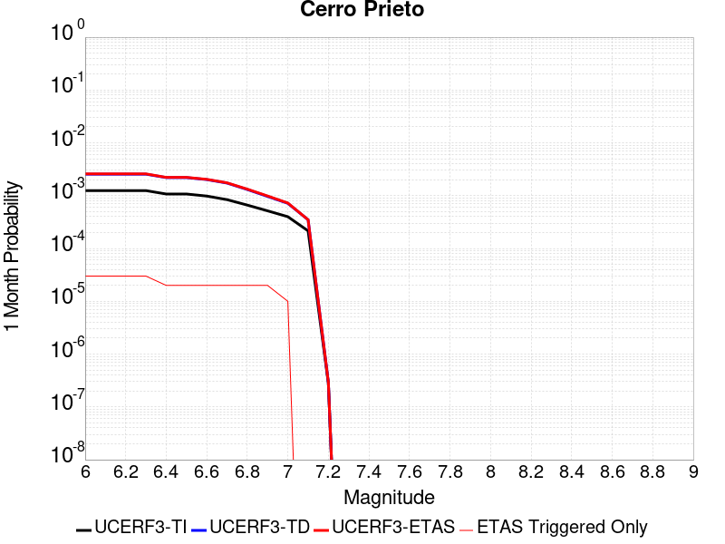 |  |  |

| Magnitude | 1 wk TI Prob | 1 wk TD Prob | 1 wk ETAS Prob | 1 wk ETAS/TD Gain | 1 wk ETAS Triggered Only | 1 mo TI Prob | 1 mo TD Prob | 1 mo ETAS Prob | 1 mo ETAS/TD Gain | 1 mo ETAS Triggered Only | 1 yr TI Prob | 1 yr TD Prob | 1 yr ETAS Prob | 1 yr ETAS/TD Gain | 1 yr ETAS Triggered Only | 10 yr TI Prob | 10 yr TD Prob | 10 yr ETAS Prob | 10 yr ETAS/TD Gain | 10 yr ETAS Triggered Only |
|-----|-----|-----|-----|-----|-----|-----|-----|-----|-----|-----|-----|-----|-----|-----|-----|-----|-----|-----|-----|-----|
| 6.0 | 2.9101528E-4 | 5.964804E-4 | 6.2646245E-4 | 1.0502651 | 3.0E-5 | 0.0012466122 | 0.002554082 | 0.0025840055 | 1.0117159 | 3.0E-5 | 0.015072231 | 0.03064807 | 0.030677151 | 1.0009489 | 3.0E-5 | 0.14089979 | 0.25397858 | 0.2540084 | 1.0001175 | 4.0E-5 |
| 6.1 | 2.9101528E-4 | 5.964804E-4 | 6.2646245E-4 | 1.0502651 | 3.0E-5 | 0.0012466122 | 0.002554082 | 0.0025840055 | 1.0117159 | 3.0E-5 | 0.015072231 | 0.03064807 | 0.030677151 | 1.0009489 | 3.0E-5 | 0.14089979 | 0.25397858 | 0.2540084 | 1.0001175 | 4.0E-5 |
| 6.2 | 2.9101528E-4 | 5.964804E-4 | 6.2646245E-4 | 1.0502651 | 3.0E-5 | 0.0012466122 | 0.002554082 | 0.0025840055 | 1.0117159 | 3.0E-5 | 0.015072231 | 0.03064807 | 0.030677151 | 1.0009489 | 3.0E-5 | 0.14089979 | 0.25397858 | 0.2540084 | 1.0001175 | 4.0E-5 |
| 6.3 | 2.9101528E-4 | 5.964804E-4 | 6.2646245E-4 | 1.0502651 | 3.0E-5 | 0.0012466122 | 0.002554082 | 0.0025840055 | 1.0117159 | 3.0E-5 | 0.015072231 | 0.03064807 | 0.030677151 | 1.0009489 | 3.0E-5 | 0.14089979 | 0.25397858 | 0.2540084 | 1.0001175 | 4.0E-5 |
| 6.4 | 2.508648E-4 | 5.1397446E-4 | 5.3396414E-4 | 1.0388924 | 2.0E-5 | 0.0010746918 | 0.0022010866 | 0.0022210428 | 1.0090665 | 2.0E-5 | 0.013006088 | 0.026471792 | 0.026491262 | 1.0007355 | 2.0E-5 | 0.12270685 | 0.22440416 | 0.22441967 | 1.0000691 | 2.0E-5 |
| 6.5 | 2.508648E-4 | 5.1397446E-4 | 5.3396414E-4 | 1.0388924 | 2.0E-5 | 0.0010746918 | 0.0022010866 | 0.0022210428 | 1.0090665 | 2.0E-5 | 0.013006088 | 0.026471792 | 0.026491262 | 1.0007355 | 2.0E-5 | 0.12270685 | 0.22440416 | 0.22441967 | 1.0000691 | 2.0E-5 |
| 6.6 | 2.294914E-4 | 4.7116808E-4 | 4.9115863E-4 | 1.0424277 | 2.0E-5 | 9.831638E-4 | 0.0020179166 | 0.0020378763 | 1.0098913 | 2.0E-5 | 0.011904482 | 0.02429866 | 0.024318174 | 1.0008031 | 2.0E-5 | 0.11286586 | 0.20858558 | 0.2086014 | 1.0000759 | 2.0E-5 |
| 6.7 | 1.9621674E-4 | 4.0419117E-4 | 4.241831E-4 | 1.0494615 | 2.0E-5 | 8.4065786E-4 | 0.0017312564 | 0.0017512217 | 1.0115323 | 2.0E-5 | 0.010187071 | 0.020884845 | 0.020904427 | 1.0009376 | 2.0E-5 | 0.09732539 | 0.18290249 | 0.18291883 | 1.0000894 | 2.0E-5 |
| 6.8 | 1.5476145E-4 | 3.056516E-4 | 3.2564547E-4 | 1.065414 | 2.0E-5 | 6.6309475E-4 | 0.00130938 | 0.0013293538 | 1.0152544 | 2.0E-5 | 0.008043335 | 0.015836509 | 0.015856192 | 1.0012429 | 2.0E-5 | 0.07758363 | 0.14336355 | 0.14338069 | 1.0001194 | 2.0E-5 |
| 6.9 | 1.20509176E-4 | 2.2582515E-4 | 2.4582064E-4 | 1.0885441 | 2.0E-5 | 5.1636563E-4 | 9.6752634E-4 | 9.87507E-4 | 1.0206512 | 2.0E-5 | 0.006268645 | 0.011726342 | 0.011746108 | 1.0016856 | 2.0E-5 | 0.060947374 | 0.109451205 | 0.10946901 | 1.0001627 | 2.0E-5 |
| 7.0 | 9.3269155E-5 | 1.6716642E-4 | 1.7716475E-4 | 1.0598106 | 1.0E-5 | 3.9966372E-4 | 7.162739E-4 | 7.2626676E-4 | 1.0139512 | 1.0E-5 | 0.0048550544 | 0.008693418 | 0.008703331 | 1.0011402 | 1.0E-5 | 0.04750344 | 0.08315912 | 0.08316828 | 1.0001103 | 1.0E-5 |
| 7.1 | 5.029709E-5 | 8.1718936E-5 | 8.1718936E-5 | 1.0 | 0.0 | 2.1554115E-4 | 3.5019626E-4 | 3.5019626E-4 | 1.0 | 0.0 | 0.0026210553 | 0.0042587193 | 0.0042587193 | 1.0 | 0.0 | 0.025903556 | 0.042365108 | 0.042365108 | 1.0 | 0.0 |
| 7.2 | 6.5445185E-8 | 6.814903E-8 | 6.814903E-8 | 1.0 | 0.0 | 2.8047933E-7 | 2.9206726E-7 | 2.9206726E-7 | 1.0 | 0.0 | 3.4148304E-6 | 3.555919E-6 | 3.555919E-6 | 1.0 | 0.0 | 3.414778E-5 | 3.5559187E-5 | 3.5559187E-5 | 1.0 | 0.0 |

## Great Valley 08 (Quinto)
*[(top)](#table-of-contents)*

| 1 Week | 1 Month | 1 Year | 10 Year |
|-----|-----|-----|-----|
|  |  |  |  |

| Magnitude | 1 wk TI Prob | 1 wk TD Prob | 1 wk ETAS Prob | 1 wk ETAS/TD Gain | 1 wk ETAS Triggered Only | 1 mo TI Prob | 1 mo TD Prob | 1 mo ETAS Prob | 1 mo ETAS/TD Gain | 1 mo ETAS Triggered Only | 1 yr TI Prob | 1 yr TD Prob | 1 yr ETAS Prob | 1 yr ETAS/TD Gain | 1 yr ETAS Triggered Only | 10 yr TI Prob | 10 yr TD Prob | 10 yr ETAS Prob | 10 yr ETAS/TD Gain | 10 yr ETAS Triggered Only |
|-----|-----|-----|-----|-----|-----|-----|-----|-----|-----|-----|-----|-----|-----|-----|-----|-----|-----|-----|-----|-----|
| 6.0 | 7.737697E-6 | 8.253038E-6 | 8.253038E-6 | 1.0 | 0.0 | 3.3161137E-5 | 3.536979E-5 | 3.536979E-5 | 1.0 | 0.0 | 4.0366207E-4 | 4.3056096E-4 | 4.6054804E-4 | 1.0696466 | 3.0E-5 | 0.004029296 | 0.0042991205 | 0.0043389485 | 1.0092642 | 4.0E-5 |
| 6.1 | 7.737697E-6 | 8.253038E-6 | 8.253038E-6 | 1.0 | 0.0 | 3.3161137E-5 | 3.536979E-5 | 3.536979E-5 | 1.0 | 0.0 | 4.0366207E-4 | 4.3056096E-4 | 4.6054804E-4 | 1.0696466 | 3.0E-5 | 0.004029296 | 0.0042991205 | 0.0043389485 | 1.0092642 | 4.0E-5 |
| 6.2 | 7.737697E-6 | 8.253038E-6 | 8.253038E-6 | 1.0 | 0.0 | 3.3161137E-5 | 3.536979E-5 | 3.536979E-5 | 1.0 | 0.0 | 4.0366207E-4 | 4.3056096E-4 | 4.6054804E-4 | 1.0696466 | 3.0E-5 | 0.004029296 | 0.0042991205 | 0.0043389485 | 1.0092642 | 4.0E-5 |
| 6.3 | 5.374012E-6 | 5.7505736E-6 | 5.7505736E-6 | 1.0 | 0.0 | 2.3031276E-5 | 2.4645145E-5 | 2.4645145E-5 | 1.0 | 0.0 | 2.803697E-4 | 3.0002446E-4 | 3.1002148E-4 | 1.0333207 | 1.0E-5 | 0.0028001624 | 0.0029972875 | 0.0030172276 | 1.0066527 | 2.0E-5 |
| 6.4 | 5.374012E-6 | 5.7505736E-6 | 5.7505736E-6 | 1.0 | 0.0 | 2.3031276E-5 | 2.4645145E-5 | 2.4645145E-5 | 1.0 | 0.0 | 2.803697E-4 | 3.0002446E-4 | 3.1002148E-4 | 1.0333207 | 1.0E-5 | 0.0028001624 | 0.0029972875 | 0.0030172276 | 1.0066527 | 2.0E-5 |
| 6.5 | 3.65427E-6 | 3.941324E-6 | 3.941324E-6 | 1.0 | 0.0 | 1.5661062E-5 | 1.689132E-5 | 1.689132E-5 | 1.0 | 0.0 | 1.9065675E-4 | 2.0563944E-4 | 2.156374E-4 | 1.0486188 | 1.0E-5 | 0.0019049325 | 0.0020551833 | 0.0020651626 | 1.0048558 | 1.0E-5 |
| 6.6 | 3.6143538E-6 | 3.8985104E-6 | 3.8985104E-6 | 1.0 | 0.0 | 1.5489995E-5 | 1.6707834E-5 | 1.6707834E-5 | 1.0 | 0.0 | 1.8857437E-4 | 2.0340596E-4 | 2.1340392E-4 | 1.0491527 | 1.0E-5 | 0.0018841444 | 0.0020328893 | 0.0020428689 | 1.0049092 | 1.0E-5 |
| 6.7 | 2.4821015E-6 | 2.6857067E-6 | 2.6857067E-6 | 1.0 | 0.0 | 1.0637535E-5 | 1.1510153E-5 | 1.1510153E-5 | 1.0 | 0.0 | 1.2950429E-4 | 1.4013276E-4 | 1.5013135E-4 | 1.0713509 | 1.0E-5 | 0.0012942884 | 0.0014009989 | 0.0014109849 | 1.0071278 | 1.0E-5 |
| 6.8 | 4.7110538E-7 | 5.193021E-7 | 5.193021E-7 | 1.0 | 0.0 | 2.0190216E-6 | 2.2255786E-6 | 2.2255786E-6 | 1.0 | 0.0 | 2.458131E-5 | 2.70961E-5 | 2.70961E-5 | 1.0 | 0.0 | 2.457859E-4 | 2.7092977E-4 | 2.7092977E-4 | 1.0 | 0.0 |
| 6.9 | 3.958685E-7 | 4.3703452E-7 | 4.3703452E-7 | 1.0 | 0.0 | 1.6965782E-6 | 1.8730038E-6 | 1.8730038E-6 | 1.0 | 0.0 | 2.0655643E-5 | 2.28036E-5 | 2.28036E-5 | 1.0 | 0.0 | 2.0653724E-4 | 2.2801422E-4 | 2.2801422E-4 | 1.0 | 0.0 |
| 7.0 | 2.70294E-7 | 2.9920008E-7 | 2.9920008E-7 | 1.0 | 0.0 | 1.1584025E-6 | 1.2822856E-6 | 1.2822856E-6 | 1.0 | 0.0 | 1.4103458E-5 | 1.5611728E-5 | 1.5611728E-5 | 1.0 | 0.0 | 1.4102564E-4 | 1.5610759E-4 | 1.5610759E-4 | 1.0 | 0.0 |
| 7.1 | 1.4828602E-7 | 1.6469107E-7 | 1.6469107E-7 | 1.0 | 0.0 | 6.3551136E-7 | 7.058187E-7 | 7.058187E-7 | 1.0 | 0.0 | 7.737323E-6 | 8.593317E-6 | 8.593317E-6 | 1.0 | 0.0 | 7.737054E-5 | 8.593065E-5 | 8.593065E-5 | 1.0 | 0.0 |

## San Gabriel (Extension)
*[(top)](#table-of-contents)*

| 1 Week | 1 Month | 1 Year | 10 Year |
|-----|-----|-----|-----|
| 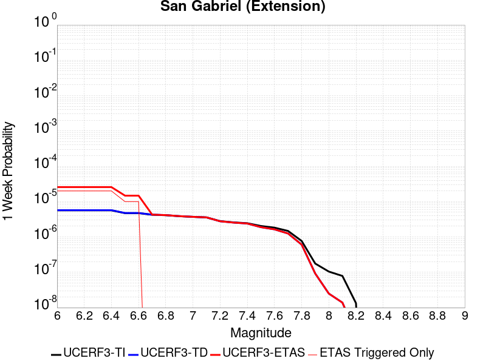 | 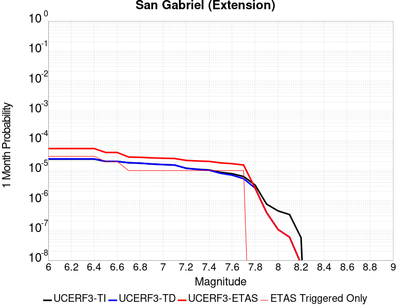 |  |  |

| Magnitude | 1 wk TI Prob | 1 wk TD Prob | 1 wk ETAS Prob | 1 wk ETAS/TD Gain | 1 wk ETAS Triggered Only | 1 mo TI Prob | 1 mo TD Prob | 1 mo ETAS Prob | 1 mo ETAS/TD Gain | 1 mo ETAS Triggered Only | 1 yr TI Prob | 1 yr TD Prob | 1 yr ETAS Prob | 1 yr ETAS/TD Gain | 1 yr ETAS Triggered Only | 10 yr TI Prob | 10 yr TD Prob | 10 yr ETAS Prob | 10 yr ETAS/TD Gain | 10 yr ETAS Triggered Only |
|-----|-----|-----|-----|-----|-----|-----|-----|-----|-----|-----|-----|-----|-----|-----|-----|-----|-----|-----|-----|-----|
| 6.0 | 5.6486106E-6 | 5.7168304E-6 | 2.5716716E-5 | 4.498422 | 2.0E-5 | 2.4208108E-5 | 2.450048E-5 | 5.4499742E-5 | 2.2244358 | 3.0E-5 | 2.9469383E-4 | 2.9825376E-4 | 3.3824184E-4 | 1.134074 | 4.0E-5 | 0.0029430336 | 0.0029786653 | 0.003018546 | 1.0133889 | 4.0E-5 |
| 6.1 | 5.6486106E-6 | 5.7168304E-6 | 2.5716716E-5 | 4.498422 | 2.0E-5 | 2.4208108E-5 | 2.450048E-5 | 5.4499742E-5 | 2.2244358 | 3.0E-5 | 2.9469383E-4 | 2.9825376E-4 | 3.3824184E-4 | 1.134074 | 4.0E-5 | 0.0029430336 | 0.0029786653 | 0.003018546 | 1.0133889 | 4.0E-5 |
| 6.2 | 5.6486106E-6 | 5.7168304E-6 | 2.5716716E-5 | 4.498422 | 2.0E-5 | 2.4208108E-5 | 2.450048E-5 | 5.4499742E-5 | 2.2244358 | 3.0E-5 | 2.9469383E-4 | 2.9825376E-4 | 3.3824184E-4 | 1.134074 | 4.0E-5 | 0.0029430336 | 0.0029786653 | 0.003018546 | 1.0133889 | 4.0E-5 |
| 6.3 | 5.6486106E-6 | 5.7168304E-6 | 2.5716716E-5 | 4.498422 | 2.0E-5 | 2.4208108E-5 | 2.450048E-5 | 5.4499742E-5 | 2.2244358 | 3.0E-5 | 2.9469383E-4 | 2.9825376E-4 | 3.3824184E-4 | 1.134074 | 4.0E-5 | 0.0029430336 | 0.0029786653 | 0.003018546 | 1.0133889 | 4.0E-5 |
| 6.4 | 5.6486106E-6 | 5.7168304E-6 | 2.5716716E-5 | 4.498422 | 2.0E-5 | 2.4208108E-5 | 2.450048E-5 | 5.4499742E-5 | 2.2244358 | 3.0E-5 | 2.9469383E-4 | 2.9825376E-4 | 3.3824184E-4 | 1.134074 | 4.0E-5 | 0.0029430336 | 0.0029786653 | 0.003018546 | 1.0133889 | 4.0E-5 |
| 6.5 | 4.7134554E-6 | 4.7542544E-6 | 1.4754207E-5 | 3.1033692 | 1.0E-5 | 2.0200367E-5 | 2.0375222E-5 | 4.0374813E-5 | 1.9815644 | 2.0E-5 | 2.459117E-4 | 2.4804095E-4 | 2.6803598E-4 | 1.0806118 | 2.0E-5 | 0.0024563975 | 0.002477729 | 0.0024976796 | 1.0080519 | 2.0E-5 |
| 6.6 | 4.7134554E-6 | 4.7542544E-6 | 1.4754207E-5 | 3.1033692 | 1.0E-5 | 2.0200367E-5 | 2.0375222E-5 | 4.0374813E-5 | 1.9815644 | 2.0E-5 | 2.459117E-4 | 2.4804095E-4 | 2.6803598E-4 | 1.0806118 | 2.0E-5 | 0.0024563975 | 0.002477729 | 0.0024976796 | 1.0080519 | 2.0E-5 |
| 6.7 | 4.2468837E-6 | 4.2740717E-6 | 4.2740717E-6 | 1.0 | 0.0 | 1.8200803E-5 | 1.8317325E-5 | 2.8317143E-5 | 1.5459212 | 1.0E-5 | 2.2157225E-4 | 2.2299135E-4 | 2.3298911E-4 | 1.0448347 | 1.0E-5 | 0.0022135144 | 0.0022277518 | 0.0022377295 | 1.0044788 | 1.0E-5 |
| 6.8 | 4.1180615E-6 | 4.1414614E-6 | 4.1414614E-6 | 1.0 | 0.0 | 1.7648716E-5 | 1.7749004E-5 | 2.7748825E-5 | 1.5634019 | 1.0E-5 | 2.1485193E-4 | 2.160734E-4 | 2.2607125E-4 | 1.0462706 | 1.0E-5 | 0.0021464431 | 0.0021587082 | 0.0021686866 | 1.0046225 | 1.0E-5 |
| 6.9 | 3.863861E-6 | 3.8797766E-6 | 3.8797766E-6 | 1.0 | 0.0 | 1.65593E-5 | 1.6627511E-5 | 2.6627346E-5 | 1.6014029 | 1.0E-5 | 2.0159081E-4 | 2.0242184E-4 | 2.124198E-4 | 1.0493917 | 1.0E-5 | 0.0020140803 | 0.002022446 | 0.0020324257 | 1.0049345 | 1.0E-5 |
| 7.0 | 3.6947372E-6 | 3.705676E-6 | 3.705676E-6 | 1.0 | 0.0 | 1.5834492E-5 | 1.5881375E-5 | 2.5881216E-5 | 1.6296583 | 1.0E-5 | 1.9276788E-4 | 1.9333926E-4 | 2.0333733E-4 | 1.0517125 | 1.0E-5 | 0.0019260074 | 0.0019317807 | 0.0019417615 | 1.0051665 | 1.0E-5 |
| 7.1 | 3.5686835E-6 | 3.5728963E-6 | 3.5728963E-6 | 1.0 | 0.0 | 1.5294268E-5 | 1.5312327E-5 | 2.5312174E-5 | 1.6530586 | 1.0E-5 | 1.861918E-4 | 1.8641229E-4 | 1.9641043E-4 | 1.0536345 | 1.0E-5 | 0.0018603588 | 0.0018626289 | 0.0018726103 | 1.0053588 | 1.0E-5 |
| 7.2 | 2.8023446E-6 | 2.7767885E-6 | 2.7767885E-6 | 1.0 | 0.0 | 1.2009994E-5 | 1.1900468E-5 | 2.1900349E-5 | 1.840293 | 1.0E-5 | 1.4621185E-4 | 1.4487868E-4 | 1.5487723E-4 | 1.0690132 | 1.0E-5 | 0.001461157 | 0.0014478569 | 0.0014578424 | 1.0068967 | 1.0E-5 |
| 7.3 | 2.5843012E-6 | 2.5459642E-6 | 2.5459642E-6 | 1.0 | 0.0 | 1.1075529E-5 | 1.0911231E-5 | 2.0911122E-5 | 1.916477 | 1.0E-5 | 1.3483623E-4 | 1.3283623E-4 | 1.428349E-4 | 1.0752707 | 1.0E-5 | 0.0013475444 | 0.0013275818 | 0.0013375685 | 1.0075225 | 1.0E-5 |
| 7.4 | 2.4464468E-6 | 2.396665E-6 | 2.396665E-6 | 1.0 | 0.0 | 1.04847295E-5 | 1.0271382E-5 | 2.0271278E-5 | 1.9735688 | 1.0E-5 | 1.276441E-4 | 1.25047E-4 | 1.3504575E-4 | 1.07996 | 1.0E-5 | 0.0012757082 | 0.0012497796 | 0.0012597671 | 1.0079914 | 1.0E-5 |
| 7.5 | 2.0420266E-6 | 1.8910426E-6 | 1.8910426E-6 | 1.0 | 0.0 | 8.751514E-6 | 8.104444E-6 | 1.8104363E-5 | 2.233881 | 1.0E-5 | 1.0654447E-4 | 9.8667166E-5 | 1.0866618E-4 | 1.1013409 | 1.0E-5 | 0.001064934 | 9.862408E-4 | 9.962309E-4 | 1.0101296 | 1.0E-5 |
| 7.6 | 1.8326596E-6 | 1.6398341E-6 | 1.6398341E-6 | 1.0 | 0.0 | 7.854232E-6 | 7.0278415E-6 | 1.702777E-5 | 2.422902 | 1.0E-5 | 9.562107E-5 | 8.5560634E-5 | 9.555978E-5 | 1.1168662 | 1.0E-5 | 9.5579936E-4 | 8.5528276E-4 | 8.652742E-4 | 1.011682 | 1.0E-5 |
| 7.7 | 1.4786998E-6 | 1.2523838E-6 | 1.2523838E-6 | 1.0 | 0.0 | 6.3372695E-6 | 5.367348E-6 | 1.5367294E-5 | 2.8631077 | 1.0E-5 | 7.715353E-5 | 6.534551E-5 | 7.5344855E-5 | 1.1530226 | 1.0E-5 | 7.7126746E-4 | 6.532707E-4 | 6.6326413E-4 | 1.0152975 | 1.0E-5 |
| 7.8 | 7.6975533E-7 | 6.0693884E-7 | 6.0693884E-7 | 1.0 | 0.0 | 3.2989474E-6 | 2.601164E-6 | 2.601164E-6 | 1.0 | 0.0 | 4.0163945E-5 | 3.166871E-5 | 3.166871E-5 | 1.0 | 0.0 | 4.0156685E-4 | 3.1664805E-4 | 3.1664805E-4 | 1.0 | 0.0 |
| 7.9 | 1.7645915E-7 | 9.213256E-8 | 9.213256E-8 | 1.0 | 0.0 | 7.562533E-7 | 3.9485377E-7 | 3.9485377E-7 | 1.0 | 0.0 | 9.207345E-6 | 4.807334E-6 | 4.807334E-6 | 1.0 | 0.0 | 9.206964E-5 | 4.807699E-5 | 4.807699E-5 | 1.0 | 0.0 |
| 8.0 | 1.0463461E-7 | 2.4949307E-8 | 2.4949307E-8 | 1.0 | 0.0 | 4.4843398E-7 | 1.0692559E-7 | 1.0692559E-7 | 1.0 | 0.0 | 5.45967E-6 | 1.3018183E-6 | 1.3018183E-6 | 1.0 | 0.0 | 5.459536E-5 | 1.3022789E-5 | 1.3022789E-5 | 1.0 | 0.0 |
| 8.1 | 7.875717E-8 | 1.3866874E-8 | 1.3866874E-8 | 1.0 | 0.0 | 3.3753068E-7 | 5.942946E-8 | 5.942946E-8 | 1.0 | 0.0 | 4.109428E-6 | 7.235534E-7 | 7.235534E-7 | 1.0 | 0.0 | 4.109352E-5 | 7.2401926E-6 | 7.2401926E-6 | 1.0 | 0.0 |
| 8.2 | 1.33163E-8 | 1.7733891E-9 | 1.7733891E-9 | 1.0 | 0.0 | 5.7069855E-8 | 7.600239E-9 | 7.600239E-9 | 1.0 | 0.0 | 6.9482525E-7 | 9.25329E-8 | 9.25329E-8 | 1.0 | 0.0 | 6.9482307E-6 | 9.272953E-7 | 9.272953E-7 | 1.0 | 0.0 |

## San Gregorio (North) 2011 CFM
*[(top)](#table-of-contents)*

| 1 Week | 1 Month | 1 Year | 10 Year |
|-----|-----|-----|-----|
|  |  |  |  |

| Magnitude | 1 wk TI Prob | 1 wk TD Prob | 1 wk ETAS Prob | 1 wk ETAS/TD Gain | 1 wk ETAS Triggered Only | 1 mo TI Prob | 1 mo TD Prob | 1 mo ETAS Prob | 1 mo ETAS/TD Gain | 1 mo ETAS Triggered Only | 1 yr TI Prob | 1 yr TD Prob | 1 yr ETAS Prob | 1 yr ETAS/TD Gain | 1 yr ETAS Triggered Only | 10 yr TI Prob | 10 yr TD Prob | 10 yr ETAS Prob | 10 yr ETAS/TD Gain | 10 yr ETAS Triggered Only |
|-----|-----|-----|-----|-----|-----|-----|-----|-----|-----|-----|-----|-----|-----|-----|-----|-----|-----|-----|-----|-----|
| 6.0 | 5.0283932E-5 | 4.3057815E-5 | 5.305738E-5 | 1.2322359 | 1.0E-5 | 2.1548476E-4 | 1.8452053E-4 | 1.9451868E-4 | 1.0541846 | 1.0E-5 | 0.0026203706 | 0.002244237 | 0.002264192 | 1.0088917 | 2.0E-5 | 0.02589687 | 0.022293162 | 0.022322493 | 1.0013157 | 3.0E-5 |
| 6.1 | 5.0283932E-5 | 4.3057815E-5 | 5.305738E-5 | 1.2322359 | 1.0E-5 | 2.1548476E-4 | 1.8452053E-4 | 1.9451868E-4 | 1.0541846 | 1.0E-5 | 0.0026203706 | 0.002244237 | 0.002264192 | 1.0088917 | 2.0E-5 | 0.02589687 | 0.022293162 | 0.022322493 | 1.0013157 | 3.0E-5 |
| 6.2 | 4.2998647E-5 | 3.4441564E-5 | 4.4441218E-5 | 1.2903368 | 1.0E-5 | 1.842669E-4 | 1.475984E-4 | 1.5759692E-4 | 1.0677414 | 1.0E-5 | 0.0022411412 | 0.00179554 | 0.001815504 | 1.0111188 | 2.0E-5 | 0.022186736 | 0.017886506 | 0.01791597 | 1.0016472 | 3.0E-5 |
| 6.3 | 4.2998647E-5 | 3.4441564E-5 | 4.4441218E-5 | 1.2903368 | 1.0E-5 | 1.842669E-4 | 1.475984E-4 | 1.5759692E-4 | 1.0677414 | 1.0E-5 | 0.0022411412 | 0.00179554 | 0.001815504 | 1.0111188 | 2.0E-5 | 0.022186736 | 0.017886506 | 0.01791597 | 1.0016472 | 3.0E-5 |
| 6.4 | 4.1101295E-5 | 3.2326872E-5 | 4.232655E-5 | 1.3093302 | 1.0E-5 | 1.7613651E-4 | 1.3853642E-4 | 1.4853504E-4 | 1.0721732 | 1.0E-5 | 0.0021423528 | 0.0016853869 | 0.0017053531 | 1.0118467 | 2.0E-5 | 0.02121817 | 0.016801886 | 0.01682155 | 1.0011704 | 2.0E-5 |
| 6.5 | 4.1032585E-5 | 3.2244905E-5 | 4.2244585E-5 | 1.3101165 | 1.0E-5 | 1.7584208E-4 | 1.3818518E-4 | 1.481838E-4 | 1.0723567 | 1.0E-5 | 0.0021387753 | 0.0016811171 | 0.0017010835 | 1.0118768 | 2.0E-5 | 0.021183075 | 0.016759839 | 0.016779503 | 1.0011734 | 2.0E-5 |
| 6.6 | 4.011629E-5 | 3.1266558E-5 | 4.1266245E-5 | 1.3198205 | 1.0E-5 | 1.7191563E-4 | 1.339927E-4 | 1.4399135E-4 | 1.074621 | 1.0E-5 | 0.0020910634 | 0.0016301516 | 0.001650119 | 1.0122488 | 2.0E-5 | 0.020714961 | 0.01625741 | 0.016277086 | 1.0012102 | 2.0E-5 |
| 6.7 | 3.8583938E-5 | 2.9453593E-5 | 3.9453298E-5 | 1.3395071 | 1.0E-5 | 1.6534925E-4 | 1.2622366E-4 | 1.362224E-4 | 1.0792145 | 1.0E-5 | 0.0020112682 | 0.0015357039 | 0.0015556732 | 1.0130033 | 2.0E-5 | 0.019931622 | 0.015325955 | 0.015345648 | 1.001285 | 2.0E-5 |
| 6.8 | 3.44341E-5 | 2.4450854E-5 | 3.445061E-5 | 1.4089737 | 1.0E-5 | 1.4756636E-4 | 1.0478523E-4 | 1.14784176E-4 | 1.0954233 | 1.0E-5 | 0.0017951399 | 0.0012750238 | 0.0012949983 | 1.015666 | 2.0E-5 | 0.017807078 | 0.012751131 | 0.012770876 | 1.0015485 | 2.0E-5 |
| 6.9 | 3.221199E-5 | 2.1778029E-5 | 3.177781E-5 | 1.4591683 | 1.0E-5 | 1.3804408E-4 | 9.333112E-5 | 1.0333019E-4 | 1.1071354 | 1.0E-5 | 0.0016793909 | 0.0011357224 | 0.0011556996 | 1.0175899 | 2.0E-5 | 0.01666756 | 0.011372583 | 0.011392356 | 1.0017387 | 2.0E-5 |
| 7.0 | 2.9186718E-5 | 1.8146875E-5 | 1.8146875E-5 | 1.0 | 0.0 | 1.2507994E-4 | 7.7770026E-5 | 7.7770026E-5 | 1.0 | 0.0 | 0.0015217843 | 9.464431E-4 | 9.464431E-4 | 1.0 | 0.0 | 0.015114053 | 0.009496798 | 0.009496798 | 1.0 | 0.0 |
| 7.1 | 2.6840138E-5 | 1.5284508E-5 | 1.5284508E-5 | 1.0 | 0.0 | 1.1502409E-4 | 6.55034E-5 | 6.55034E-5 | 1.0 | 0.0 | 0.0013995186 | 7.9721404E-4 | 7.9721404E-4 | 1.0 | 0.0 | 0.013907375 | 0.008015723 | 0.008015723 | 1.0 | 0.0 |
| 7.2 | 2.453002E-5 | 1.2606672E-5 | 1.2606672E-5 | 1.0 | 0.0 | 1.05124425E-4 | 5.4027478E-5 | 5.4027478E-5 | 1.0 | 0.0 | 0.0012791384 | 6.575866E-4 | 6.575866E-4 | 1.0 | 0.0 | 0.012718005 | 0.00662763 | 0.00662763 | 1.0 | 0.0 |
| 7.3 | 2.3330727E-5 | 1.1488677E-5 | 1.1488677E-5 | 1.0 | 0.0 | 9.9985E-5 | 4.923626E-5 | 4.923626E-5 | 1.0 | 0.0 | 0.0012166376 | 5.9928704E-4 | 5.9928704E-4 | 1.0 | 0.0 | 0.012099981 | 0.006046564 | 0.006046564 | 1.0 | 0.0 |
| 7.4 | 2.2136466E-5 | 1.0368981E-5 | 1.0368981E-5 | 1.0 | 0.0 | 9.486712E-5 | 4.4437733E-5 | 4.4437733E-5 | 1.0 | 0.0 | 0.0011543952 | 5.4089533E-4 | 5.4089533E-4 | 1.0 | 0.0 | 0.011484168 | 0.005464249 | 0.005464249 | 1.0 | 0.0 |
| 7.5 | 2.0994974E-5 | 9.427217E-6 | 9.427217E-6 | 1.0 | 0.0 | 8.997535E-5 | 4.0401734E-5 | 4.0401734E-5 | 1.0 | 0.0 | 0.0010948994 | 4.9178035E-4 | 4.9178035E-4 | 1.0 | 0.0 | 0.010895205 | 0.004973358 | 0.004973358 | 1.0 | 0.0 |
| 7.6 | 1.7091823E-5 | 6.893766E-6 | 6.893766E-6 | 1.0 | 0.0 | 7.3248615E-5 | 2.9544377E-5 | 2.9544377E-5 | 1.0 | 0.0 | 8.9143694E-4 | 3.596435E-4 | 3.596435E-4 | 1.0 | 0.0 | 0.008878695 | 0.0036482841 | 0.0036482841 | 1.0 | 0.0 |
| 7.7 | 1.2772179E-5 | 4.0208706E-6 | 4.0208706E-6 | 1.0 | 0.0 | 5.473676E-5 | 1.7232189E-5 | 1.7232189E-5 | 1.0 | 0.0 | 6.6621625E-4 | 2.0978172E-4 | 2.0978172E-4 | 1.0 | 0.0 | 0.006642225 | 0.002136922 | 0.002136922 | 1.0 | 0.0 |
| 7.8 | 7.041923E-6 | 1.940626E-6 | 1.940626E-6 | 1.0 | 0.0 | 3.017932E-5 | 8.316942E-6 | 8.316942E-6 | 1.0 | 0.0 | 3.6737128E-4 | 1.0125406E-4 | 1.0125406E-4 | 1.0 | 0.0 | 0.0036676454 | 0.0010379003 | 0.0010379003 | 1.0 | 0.0 |
| 7.9 | 2.946768E-6 | 1.0033551E-6 | 1.0033551E-6 | 1.0 | 0.0 | 1.2628945E-5 | 4.300086E-6 | 4.300086E-6 | 1.0 | 0.0 | 1.5374656E-4 | 5.235229E-5 | 5.235229E-5 | 1.0 | 0.0 | 0.0015364023 | 5.3400313E-4 | 5.3400313E-4 | 1.0 | 0.0 |
| 8.0 | 1.1433375E-6 | 5.18146E-7 | 5.18146E-7 | 1.0 | 0.0 | 4.9000087E-6 | 2.2206239E-6 | 2.2206239E-6 | 1.0 | 0.0 | 5.965597E-5 | 2.703576E-5 | 2.703576E-5 | 1.0 | 0.0 | 5.963996E-4 | 2.7398416E-4 | 2.7398416E-4 | 1.0 | 0.0 |
| 8.1 | 2.6675295E-7 | 1.62899E-7 | 1.62899E-7 | 1.0 | 0.0 | 1.1432264E-6 | 6.9813836E-7 | 6.9813836E-7 | 1.0 | 0.0 | 1.3918692E-5 | 8.499802E-6 | 8.499802E-6 | 1.0 | 0.0 | 1.391782E-4 | 8.63795E-5 | 8.63795E-5 | 1.0 | 0.0 |
| 8.2 | 1.2704569E-8 | 9.431393E-9 | 9.431393E-9 | 1.0 | 0.0 | 5.444815E-8 | 4.042026E-8 | 4.042026E-8 | 1.0 | 0.0 | 6.629061E-7 | 4.9211656E-7 | 4.9211656E-7 | 1.0 | 0.0 | 6.629041E-6 | 5.1121438E-6 | 5.1121438E-6 | 1.0 | 0.0 |

## North Frontal  (West)
*[(top)](#table-of-contents)*

| 1 Week | 1 Month | 1 Year | 10 Year |
|-----|-----|-----|-----|
|  |  |  |  |

| Magnitude | 1 wk TI Prob | 1 wk TD Prob | 1 wk ETAS Prob | 1 wk ETAS/TD Gain | 1 wk ETAS Triggered Only | 1 mo TI Prob | 1 mo TD Prob | 1 mo ETAS Prob | 1 mo ETAS/TD Gain | 1 mo ETAS Triggered Only | 1 yr TI Prob | 1 yr TD Prob | 1 yr ETAS Prob | 1 yr ETAS/TD Gain | 1 yr ETAS Triggered Only | 10 yr TI Prob | 10 yr TD Prob | 10 yr ETAS Prob | 10 yr ETAS/TD Gain | 10 yr ETAS Triggered Only |
|-----|-----|-----|-----|-----|-----|-----|-----|-----|-----|-----|-----|-----|-----|-----|-----|-----|-----|-----|-----|-----|
| 6.0 | 4.7316266E-6 | 4.8526726E-6 | 2.4852576E-5 | 5.1214204 | 2.0E-5 | 2.0278241E-5 | 2.0797012E-5 | 5.079639E-5 | 2.442485 | 3.0E-5 | 2.4685962E-4 | 2.5317568E-4 | 2.8316808E-4 | 1.1184648 | 3.0E-5 | 0.0024658558 | 0.0025290183 | 0.0025689173 | 1.0157764 | 4.0E-5 |
| 6.1 | 4.7316266E-6 | 4.8526726E-6 | 2.4852576E-5 | 5.1214204 | 2.0E-5 | 2.0278241E-5 | 2.0797012E-5 | 5.079639E-5 | 2.442485 | 3.0E-5 | 2.4685962E-4 | 2.5317568E-4 | 2.8316808E-4 | 1.1184648 | 3.0E-5 | 0.0024658558 | 0.0025290183 | 0.0025689173 | 1.0157764 | 4.0E-5 |
| 6.2 | 4.7316266E-6 | 4.8526726E-6 | 2.4852576E-5 | 5.1214204 | 2.0E-5 | 2.0278241E-5 | 2.0797012E-5 | 5.079639E-5 | 2.442485 | 3.0E-5 | 2.4685962E-4 | 2.5317568E-4 | 2.8316808E-4 | 1.1184648 | 3.0E-5 | 0.0024658558 | 0.0025290183 | 0.0025689173 | 1.0157764 | 4.0E-5 |
| 6.3 | 4.7316266E-6 | 4.8526726E-6 | 2.4852576E-5 | 5.1214204 | 2.0E-5 | 2.0278241E-5 | 2.0797012E-5 | 5.079639E-5 | 2.442485 | 3.0E-5 | 2.4685962E-4 | 2.5317568E-4 | 2.8316808E-4 | 1.1184648 | 3.0E-5 | 0.0024658558 | 0.0025290183 | 0.0025689173 | 1.0157764 | 4.0E-5 |
| 6.4 | 4.7316266E-6 | 4.8526726E-6 | 2.4852576E-5 | 5.1214204 | 2.0E-5 | 2.0278241E-5 | 2.0797012E-5 | 5.079639E-5 | 2.442485 | 3.0E-5 | 2.4685962E-4 | 2.5317568E-4 | 2.8316808E-4 | 1.1184648 | 3.0E-5 | 0.0024658558 | 0.0025290183 | 0.0025689173 | 1.0157764 | 4.0E-5 |
| 6.5 | 4.7316266E-6 | 4.8526726E-6 | 2.4852576E-5 | 5.1214204 | 2.0E-5 | 2.0278241E-5 | 2.0797012E-5 | 5.079639E-5 | 2.442485 | 3.0E-5 | 2.4685962E-4 | 2.5317568E-4 | 2.8316808E-4 | 1.1184648 | 3.0E-5 | 0.0024658558 | 0.0025290183 | 0.0025689173 | 1.0157764 | 4.0E-5 |
| 6.6 | 4.7316266E-6 | 4.8526726E-6 | 2.4852576E-5 | 5.1214204 | 2.0E-5 | 2.0278241E-5 | 2.0797012E-5 | 5.079639E-5 | 2.442485 | 3.0E-5 | 2.4685962E-4 | 2.5317568E-4 | 2.8316808E-4 | 1.1184648 | 3.0E-5 | 0.0024658558 | 0.0025290183 | 0.0025689173 | 1.0157764 | 4.0E-5 |
| 6.7 | 3.5382777E-6 | 3.6308859E-6 | 2.3630813E-5 | 6.5082774 | 2.0E-5 | 1.516396E-5 | 1.5560852E-5 | 4.5560384E-5 | 2.927885 | 3.0E-5 | 1.8460557E-4 | 1.8943768E-4 | 2.19432E-4 | 1.1583334 | 3.0E-5 | 0.0018445229 | 0.0018928389 | 0.0019327631 | 1.0210923 | 4.0E-5 |
| 6.8 | 3.5382777E-6 | 3.6308859E-6 | 2.3630813E-5 | 6.5082774 | 2.0E-5 | 1.516396E-5 | 1.5560852E-5 | 4.5560384E-5 | 2.927885 | 3.0E-5 | 1.8460557E-4 | 1.8943768E-4 | 2.19432E-4 | 1.1583334 | 3.0E-5 | 0.0018445229 | 0.0018928389 | 0.0019327631 | 1.0210923 | 4.0E-5 |
| 6.9 | 3.0428037E-6 | 3.1227605E-6 | 1.312273E-5 | 4.202285 | 1.0E-5 | 1.30405215E-5 | 1.33831945E-5 | 3.3382927E-5 | 2.4943914 | 2.0E-5 | 1.5875678E-4 | 1.6292889E-4 | 1.8292564E-4 | 1.1227329 | 2.0E-5 | 0.0015864341 | 0.0016281615 | 0.0016581127 | 1.0183957 | 3.0E-5 |
| 7.0 | 2.538778E-6 | 2.6060904E-6 | 2.6060904E-6 | 1.0 | 0.0 | 1.0880432E-5 | 1.1168913E-5 | 2.1168802E-5 | 1.8953322 | 1.0E-5 | 1.324612E-4 | 1.3597352E-4 | 1.4597215E-4 | 1.0735338 | 1.0E-5 | 0.0013238228 | 0.0013589499 | 0.0013789227 | 1.0146972 | 2.0E-5 |
| 7.1 | 2.2418935E-6 | 2.3012074E-6 | 2.3012074E-6 | 1.0 | 0.0 | 9.60808E-6 | 9.862282E-6 | 1.9862184E-5 | 2.0139542 | 1.0E-5 | 1.1697209E-4 | 1.2006712E-4 | 1.3006592E-4 | 1.0832767 | 1.0E-5 | 0.0011691054 | 0.0012000664 | 0.0012100544 | 1.0083228 | 1.0E-5 |
| 7.2 | 1.6526745E-6 | 1.6924851E-6 | 1.6924851E-6 | 1.0 | 0.0 | 7.082872E-6 | 7.253489E-6 | 7.253489E-6 | 1.0 | 0.0 | 8.623055E-5 | 8.8307905E-5 | 8.8307905E-5 | 1.0 | 0.0 | 8.61971E-4 | 8.827532E-4 | 8.827532E-4 | 1.0 | 0.0 |
| 7.3 | 1.0246019E-6 | 1.0442261E-6 | 1.0442261E-6 | 1.0 | 0.0 | 4.391144E-6 | 4.4752474E-6 | 4.4752474E-6 | 1.0 | 0.0 | 5.3460866E-5 | 5.448489E-5 | 5.448489E-5 | 1.0 | 0.0 | 5.344801E-4 | 5.4472685E-4 | 5.4472685E-4 | 1.0 | 0.0 |
| 7.4 | 8.9045164E-7 | 9.0565584E-7 | 9.0565584E-7 | 1.0 | 0.0 | 3.8162157E-6 | 3.8813773E-6 | 3.8813773E-6 | 1.0 | 0.0 | 4.646144E-5 | 4.7254853E-5 | 4.7254853E-5 | 1.0 | 0.0 | 4.6451724E-4 | 4.7245892E-4 | 4.7245892E-4 | 1.0 | 0.0 |
| 7.5 | 6.3357E-7 | 6.4027006E-7 | 6.4027006E-7 | 1.0 | 0.0 | 2.7152971E-6 | 2.744012E-6 | 2.744012E-6 | 1.0 | 0.0 | 3.305824E-5 | 3.34079E-5 | 3.34079E-5 | 1.0 | 0.0 | 3.3053322E-4 | 3.3403534E-4 | 3.3403534E-4 | 1.0 | 0.0 |
| 7.6 | 2.5087024E-7 | 2.4361097E-7 | 2.4361097E-7 | 1.0 | 0.0 | 1.0751578E-6 | 1.0440467E-6 | 1.0440467E-6 | 1.0 | 0.0 | 1.3089967E-5 | 1.2711216E-5 | 1.2711216E-5 | 1.0 | 0.0 | 1.3089196E-4 | 1.2710695E-4 | 1.2710695E-4 | 1.0 | 0.0 |
| 7.7 | 3.282987E-8 | 2.2874195E-8 | 2.2874195E-8 | 1.0 | 0.0 | 1.4069944E-7 | 9.803227E-8 | 9.803227E-8 | 1.0 | 0.0 | 1.7130144E-6 | 1.1935423E-6 | 1.1935423E-6 | 1.0 | 0.0 | 1.7130013E-5 | 1.1935367E-5 | 1.1935367E-5 | 1.0 | 0.0 |
| 7.8 | 8.77499E-9 | 5.6815956E-9 | 5.6815956E-9 | 1.0 | 0.0 | 3.7607098E-8 | 2.4349696E-8 | 2.4349696E-8 | 1.0 | 0.0 | 4.578663E-7 | 2.9645753E-7 | 2.9645753E-7 | 1.0 | 0.0 | 4.5786537E-6 | 2.9645726E-6 | 2.9645726E-6 | 1.0 | 0.0 |

## Almanor 2011 CFM
*[(top)](#table-of-contents)*

| 1 Week | 1 Month | 1 Year | 10 Year |
|-----|-----|-----|-----|
| 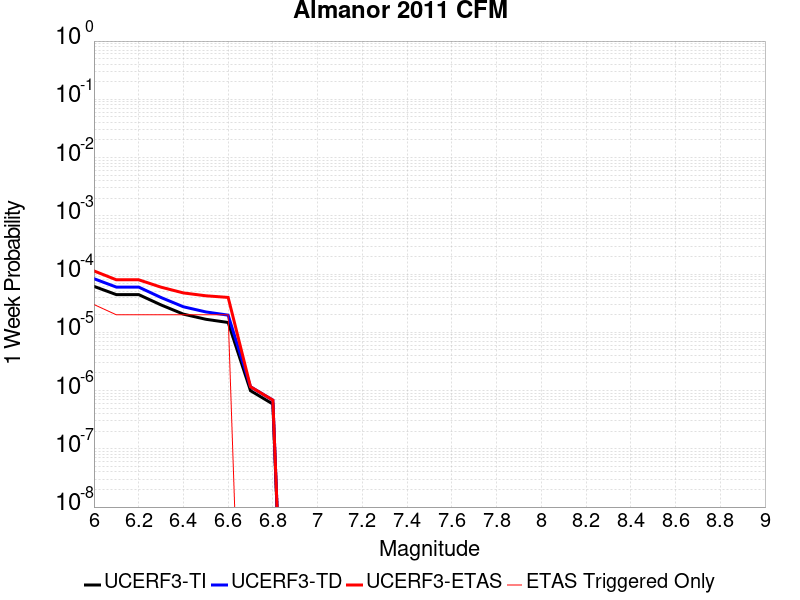 | 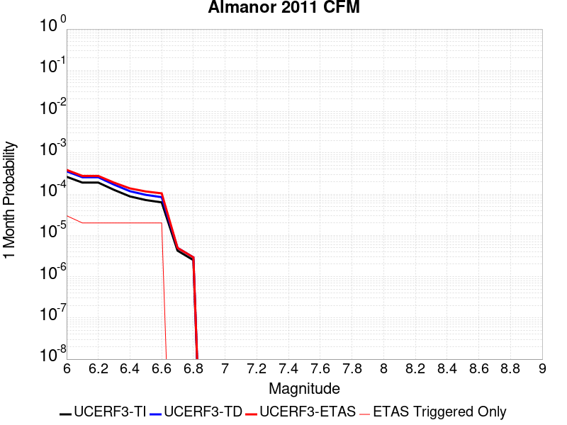 |  |  |

| Magnitude | 1 wk TI Prob | 1 wk TD Prob | 1 wk ETAS Prob | 1 wk ETAS/TD Gain | 1 wk ETAS Triggered Only | 1 mo TI Prob | 1 mo TD Prob | 1 mo ETAS Prob | 1 mo ETAS/TD Gain | 1 mo ETAS Triggered Only | 1 yr TI Prob | 1 yr TD Prob | 1 yr ETAS Prob | 1 yr ETAS/TD Gain | 1 yr ETAS Triggered Only | 10 yr TI Prob | 10 yr TD Prob | 10 yr ETAS Prob | 10 yr ETAS/TD Gain | 10 yr ETAS Triggered Only |
|-----|-----|-----|-----|-----|-----|-----|-----|-----|-----|-----|-----|-----|-----|-----|-----|-----|-----|-----|-----|-----|
| 6.0 | 6.1479834E-5 | 8.32787E-5 | 1.132762E-4 | 1.3602061 | 3.0E-5 | 2.6345838E-4 | 3.5686578E-4 | 3.8685507E-4 | 1.0840353 | 3.0E-5 | 0.0032028882 | 0.0043366123 | 0.004366482 | 1.0068878 | 3.0E-5 | 0.031571172 | 0.04258577 | 0.042624068 | 1.0008993 | 4.0E-5 |
| 6.1 | 4.4387216E-5 | 5.9770442E-5 | 7.976925E-5 | 1.3345935 | 2.0E-5 | 1.9021705E-4 | 2.561381E-4 | 2.7613295E-4 | 1.0780629 | 2.0E-5 | 0.0023134327 | 0.003114426 | 0.0031343638 | 1.0064018 | 2.0E-5 | 0.022894967 | 0.030755036 | 0.030784113 | 1.0009454 | 3.0E-5 |
| 6.2 | 4.4387216E-5 | 5.9770442E-5 | 7.976925E-5 | 1.3345935 | 2.0E-5 | 1.9021705E-4 | 2.561381E-4 | 2.7613295E-4 | 1.0780629 | 2.0E-5 | 0.0023134327 | 0.003114426 | 0.0031343638 | 1.0064018 | 2.0E-5 | 0.022894967 | 0.030755036 | 0.030784113 | 1.0009454 | 3.0E-5 |
| 6.3 | 2.9523822E-5 | 3.954719E-5 | 5.95464E-5 | 1.5057049 | 2.0E-5 | 1.2652454E-4 | 1.6947983E-4 | 1.8947644E-4 | 1.1179881 | 2.0E-5 | 0.0015393476 | 0.0020618725 | 0.0020818315 | 1.0096799 | 2.0E-5 | 0.015287281 | 0.020460794 | 0.02049018 | 1.0014362 | 3.0E-5 |
| 6.4 | 2.0512744E-5 | 2.7431617E-5 | 4.743107E-5 | 1.7290657 | 2.0E-5 | 8.79088E-5 | 1.175612E-4 | 1.3755885E-4 | 1.1701041 | 2.0E-5 | 0.001069764 | 0.0014307408 | 0.0014507122 | 1.0139588 | 2.0E-5 | 0.010646289 | 0.014244413 | 0.014273985 | 1.002076 | 3.0E-5 |
| 6.5 | 1.6750226E-5 | 2.23913E-5 | 4.239085E-5 | 1.8931841 | 2.0E-5 | 7.178471E-5 | 9.596152E-5 | 1.159596E-4 | 1.2083969 | 2.0E-5 | 8.7362836E-4 | 0.0011680633 | 0.0011880399 | 1.0171024 | 2.0E-5 | 0.008702018 | 0.011649038 | 0.011678688 | 1.0025454 | 3.0E-5 |
| 6.6 | 1.4745303E-5 | 1.9707952E-5 | 3.9707556E-5 | 2.0147989 | 2.0E-5 | 6.319262E-5 | 8.446223E-5 | 1.0446054E-4 | 1.2367722 | 2.0E-5 | 7.690986E-4 | 0.0010281964 | 0.0010481759 | 1.0194316 | 2.0E-5 | 0.0076644225 | 0.010264971 | 0.010284767 | 1.0019283 | 2.0E-5 |
| 6.7 | 9.951145E-7 | 1.1616347E-6 | 1.1616347E-6 | 1.0 | 0.0 | 4.26477E-6 | 4.9784257E-6 | 4.9784257E-6 | 1.0 | 0.0 | 5.1922336E-5 | 6.0610826E-5 | 6.0610826E-5 | 1.0 | 0.0 | 5.1910203E-4 | 6.059602E-4 | 6.059602E-4 | 1.0 | 0.0 |
| 6.8 | 5.866312E-7 | 6.849384E-7 | 6.849384E-7 | 1.0 | 0.0 | 2.5141312E-6 | 2.9354478E-6 | 2.9354478E-6 | 1.0 | 0.0 | 3.0609117E-5 | 3.5738623E-5 | 3.5738623E-5 | 1.0 | 0.0 | 3.06049E-4 | 3.5734157E-4 | 3.5734157E-4 | 1.0 | 0.0 |

## Hunting Creek - Berryessa 2011 CFM
*[(top)](#table-of-contents)*

| 1 Week | 1 Month | 1 Year | 10 Year |
|-----|-----|-----|-----|
| 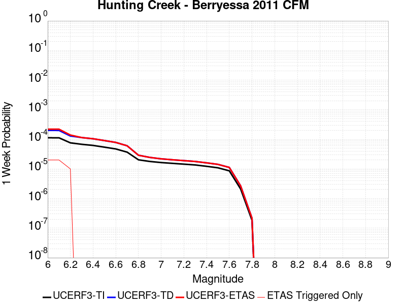 | 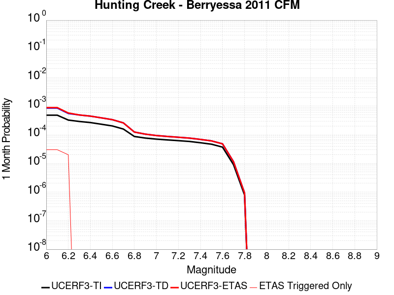 | 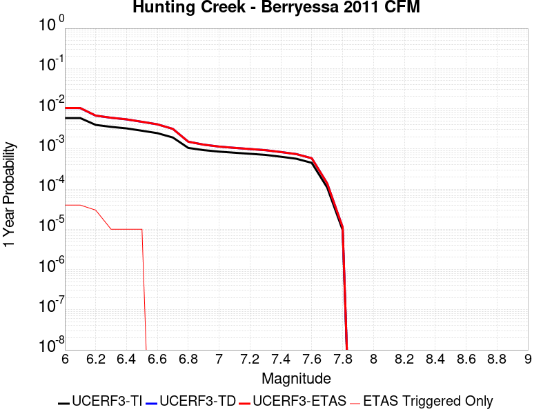 |  |

| Magnitude | 1 wk TI Prob | 1 wk TD Prob | 1 wk ETAS Prob | 1 wk ETAS/TD Gain | 1 wk ETAS Triggered Only | 1 mo TI Prob | 1 mo TD Prob | 1 mo ETAS Prob | 1 mo ETAS/TD Gain | 1 mo ETAS Triggered Only | 1 yr TI Prob | 1 yr TD Prob | 1 yr ETAS Prob | 1 yr ETAS/TD Gain | 1 yr ETAS Triggered Only | 10 yr TI Prob | 10 yr TD Prob | 10 yr ETAS Prob | 10 yr ETAS/TD Gain | 10 yr ETAS Triggered Only |
|-----|-----|-----|-----|-----|-----|-----|-----|-----|-----|-----|-----|-----|-----|-----|-----|-----|-----|-----|-----|-----|
| 6.0 | 1.1270982E-4 | 2.0012174E-4 | 2.2011774E-4 | 1.0999192 | 2.0E-5 | 4.8295266E-4 | 8.5739547E-4 | 8.8736974E-4 | 1.0349597 | 3.0E-5 | 0.0058641075 | 0.010386313 | 0.010425897 | 1.0038112 | 4.0E-5 | 0.057117578 | 0.09803703 | 0.0980731 | 1.000368 | 4.0E-5 |
| 6.1 | 1.1239393E-4 | 1.9960315E-4 | 2.1959915E-4 | 1.1001788 | 2.0E-5 | 4.8159933E-4 | 8.551744E-4 | 8.851487E-4 | 1.0350505 | 3.0E-5 | 0.0058477195 | 0.010359551 | 0.010399137 | 1.0038211 | 4.0E-5 | 0.056962132 | 0.09779551 | 0.09783159 | 1.0003691 | 4.0E-5 |
| 6.2 | 7.596265E-5 | 1.2940196E-4 | 1.3940067E-4 | 1.0772686 | 1.0E-5 | 3.2551357E-4 | 5.5444165E-4 | 5.7443057E-4 | 1.0360523 | 2.0E-5 | 0.0039559277 | 0.0067210156 | 0.006750814 | 1.0044336 | 3.0E-5 | 0.038862433 | 0.0645915 | 0.06461956 | 1.0004344 | 3.0E-5 |
| 6.3 | 6.78794E-5 | 1.145119E-4 | 1.145119E-4 | 1.0 | 0.0 | 2.9087928E-4 | 4.906513E-4 | 4.906513E-4 | 1.0 | 0.0 | 0.003535705 | 0.005952679 | 0.0059626196 | 1.0016699 | 1.0E-5 | 0.034799766 | 0.057465393 | 0.057474818 | 1.000164 | 1.0E-5 |
| 6.4 | 6.2165134E-5 | 1.0436625E-4 | 1.0436625E-4 | 1.0 | 0.0 | 2.6639478E-4 | 4.4721062E-4 | 4.4721062E-4 | 1.0 | 0.0 | 0.0032385332 | 0.005427573 | 0.0054375185 | 1.0018325 | 1.0E-5 | 0.03191742 | 0.052550517 | 0.05255999 | 1.0001802 | 1.0E-5 |
| 6.5 | 5.4368087E-5 | 9.071415E-5 | 9.071415E-5 | 1.0 | 0.0 | 2.3298527E-4 | 3.8872007E-4 | 3.8872007E-4 | 1.0 | 0.0 | 0.0028329059 | 0.0047198683 | 0.0047298213 | 1.0021087 | 1.0E-5 | 0.027970633 | 0.045880128 | 0.04588967 | 1.0002079 | 1.0E-5 |
| 6.6 | 4.729947E-5 | 7.847572E-5 | 7.847572E-5 | 1.0 | 0.0 | 2.0269625E-4 | 3.362842E-4 | 3.362842E-4 | 1.0 | 0.0 | 0.002465034 | 0.0040849647 | 0.0040849647 | 1.0 | 0.0 | 0.02437869 | 0.03985155 | 0.03985155 | 1.0 | 0.0 |
| 6.7 | 3.6875328E-5 | 6.0451803E-5 | 6.0451803E-5 | 1.0 | 0.0 | 1.5802756E-4 | 2.59056E-4 | 2.59056E-4 | 1.0 | 0.0 | 0.0019222875 | 0.0031482063 | 0.0031482063 | 1.0 | 0.0 | 0.019057442 | 0.03089237 | 0.03089237 | 1.0 | 0.0 |
| 6.8 | 2.0292036E-5 | 2.8976308E-5 | 2.8976308E-5 | 1.0 | 0.0 | 8.6962966E-5 | 1.2417832E-4 | 1.2417832E-4 | 1.0 | 0.0 | 0.0010582599 | 0.0015108072 | 0.0015108072 | 1.0 | 0.0 | 0.010532344 | 0.014978523 | 0.014978523 | 1.0 | 0.0 |
| 6.9 | 1.7871042E-5 | 2.4472254E-5 | 2.4472254E-5 | 1.0 | 0.0 | 7.658793E-5 | 1.048769E-4 | 1.048769E-4 | 1.0 | 0.0 | 9.320591E-4 | 0.0012761299 | 0.0012761299 | 1.0 | 0.0 | 0.009281595 | 0.012679775 | 0.012679775 | 1.0 | 0.0 |
| 7.0 | 1.6415532E-5 | 2.1906277E-5 | 2.1906277E-5 | 1.0 | 0.0 | 7.035038E-5 | 9.3880684E-5 | 9.3880684E-5 | 1.0 | 0.0 | 8.561793E-4 | 0.0011424015 | 0.0011424015 | 1.0 | 0.0 | 0.008528882 | 0.01136452 | 0.01136452 | 1.0 | 0.0 |
| 7.1 | 1.5409885E-5 | 2.0346342E-5 | 2.0346342E-5 | 1.0 | 0.0 | 6.6040695E-5 | 8.7195716E-5 | 8.7195716E-5 | 1.0 | 0.0 | 8.0374884E-4 | 0.0010610938 | 0.0010610938 | 1.0 | 0.0 | 0.00800848 | 0.010560595 | 0.010560595 | 1.0 | 0.0 |
| 7.2 | 1.4497423E-5 | 1.9054964E-5 | 1.9054964E-5 | 1.0 | 0.0 | 6.213033E-5 | 8.166159E-5 | 8.166159E-5 | 1.0 | 0.0 | 7.5617427E-4 | 9.937795E-4 | 9.937795E-4 | 1.0 | 0.0 | 0.0075360634 | 0.009893929 | 0.009893929 | 1.0 | 0.0 |
| 7.3 | 1.3615175E-5 | 1.7826127E-5 | 1.7826127E-5 | 1.0 | 0.0 | 5.8349444E-5 | 7.639547E-5 | 7.639547E-5 | 1.0 | 0.0 | 7.101729E-4 | 9.297209E-4 | 9.297209E-4 | 1.0 | 0.0 | 0.0070790765 | 0.009258823 | 0.009258823 | 1.0 | 0.0 |
| 7.4 | 1.2252825E-5 | 1.602625E-5 | 1.602625E-5 | 1.0 | 0.0 | 5.251105E-5 | 6.868213E-5 | 6.868213E-5 | 1.0 | 0.0 | 6.391345E-4 | 8.35887E-4 | 8.35887E-4 | 1.0 | 0.0 | 0.0063729943 | 0.008327872 | 0.008327872 | 1.0 | 0.0 |
| 7.5 | 1.0913301E-5 | 1.4241117E-5 | 1.4241117E-5 | 1.0 | 0.0 | 4.6770452E-5 | 6.1031948E-5 | 6.1031948E-5 | 1.0 | 0.0 | 5.6928146E-4 | 7.4281334E-4 | 7.4281334E-4 | 1.0 | 0.0 | 0.0056782532 | 0.0074036797 | 0.0074036797 | 1.0 | 0.0 |
| 7.6 | 8.623192E-6 | 1.12346415E-5 | 1.12346415E-5 | 1.0 | 0.0 | 3.6956015E-5 | 4.814759E-5 | 4.814759E-5 | 1.0 | 0.0 | 4.4984656E-4 | 5.8604183E-4 | 5.8604183E-4 | 1.0 | 0.0 | 0.00448937 | 0.0058452785 | 0.0058452785 | 1.0 | 0.0 |
| 7.7 | 2.0993634E-6 | 2.662584E-6 | 2.662584E-6 | 1.0 | 0.0 | 8.997241E-6 | 1.1411025E-5 | 1.1411025E-5 | 1.0 | 0.0 | 1.09535904E-4 | 1.3892044E-4 | 1.3892044E-4 | 1.0 | 0.0 | 0.0010948193 | 0.0013883426 | 0.0013883426 | 1.0 | 0.0 |
| 7.8 | 1.8428308E-7 | 2.167437E-7 | 2.167437E-7 | 1.0 | 0.0 | 7.897844E-7 | 9.289013E-7 | 9.289013E-7 | 1.0 | 0.0 | 9.615583E-6 | 1.1309318E-5 | 1.1309318E-5 | 1.0 | 0.0 | 9.615166E-5 | 1.13086026E-4 | 1.13086026E-4 | 1.0 | 0.0 |

## Elsinore (Coyote Mountains)
*[(top)](#table-of-contents)*

| 1 Week | 1 Month | 1 Year | 10 Year |
|-----|-----|-----|-----|
|  |  |  |  |

| Magnitude | 1 wk TI Prob | 1 wk TD Prob | 1 wk ETAS Prob | 1 wk ETAS/TD Gain | 1 wk ETAS Triggered Only | 1 mo TI Prob | 1 mo TD Prob | 1 mo ETAS Prob | 1 mo ETAS/TD Gain | 1 mo ETAS Triggered Only | 1 yr TI Prob | 1 yr TD Prob | 1 yr ETAS Prob | 1 yr ETAS/TD Gain | 1 yr ETAS Triggered Only | 10 yr TI Prob | 10 yr TD Prob | 10 yr ETAS Prob | 10 yr ETAS/TD Gain | 10 yr ETAS Triggered Only |
|-----|-----|-----|-----|-----|-----|-----|-----|-----|-----|-----|-----|-----|-----|-----|-----|-----|-----|-----|-----|-----|
| 6.0 | 4.20513E-5 | 4.8631882E-5 | 6.863091E-5 | 1.4112328 | 2.0E-5 | 1.8020741E-4 | 2.0840895E-4 | 2.2840478E-4 | 1.0959451 | 2.0E-5 | 0.0021918174 | 0.002535 | 0.0025748985 | 1.0157391 | 4.0E-5 | 0.021703249 | 0.025111282 | 0.025150279 | 1.0015529 | 4.0E-5 |
| 6.1 | 4.20513E-5 | 4.8631882E-5 | 6.863091E-5 | 1.4112328 | 2.0E-5 | 1.8020741E-4 | 2.0840895E-4 | 2.2840478E-4 | 1.0959451 | 2.0E-5 | 0.0021918174 | 0.002535 | 0.0025748985 | 1.0157391 | 4.0E-5 | 0.021703249 | 0.025111282 | 0.025150279 | 1.0015529 | 4.0E-5 |
| 6.2 | 2.3413893E-5 | 2.469566E-5 | 4.4695167E-5 | 1.8098389 | 2.0E-5 | 1.0034139E-4 | 1.0583479E-4 | 1.2583268E-4 | 1.1889538 | 2.0E-5 | 0.0012209718 | 0.0012878707 | 0.001317832 | 1.0232643 | 3.0E-5 | 0.012142851 | 0.01281264 | 0.012842256 | 1.0023115 | 3.0E-5 |
| 6.3 | 2.3413893E-5 | 2.469566E-5 | 4.4695167E-5 | 1.8098389 | 2.0E-5 | 1.0034139E-4 | 1.0583479E-4 | 1.2583268E-4 | 1.1889538 | 2.0E-5 | 0.0012209718 | 0.0012878707 | 0.001317832 | 1.0232643 | 3.0E-5 | 0.012142851 | 0.01281264 | 0.012842256 | 1.0023115 | 3.0E-5 |
| 6.4 | 1.6894814E-5 | 1.6568361E-5 | 3.656803E-5 | 2.2071 | 2.0E-5 | 7.240433E-5 | 7.1005554E-5 | 9.100413E-5 | 1.2816482 | 2.0E-5 | 8.811662E-4 | 8.6418656E-4 | 8.9416065E-4 | 1.0346848 | 3.0E-5 | 0.0087768035 | 0.00861194 | 0.008641682 | 1.0034535 | 3.0E-5 |
| 6.5 | 1.6894814E-5 | 1.6568361E-5 | 3.656803E-5 | 2.2071 | 2.0E-5 | 7.240433E-5 | 7.1005554E-5 | 9.100413E-5 | 1.2816482 | 2.0E-5 | 8.811662E-4 | 8.6418656E-4 | 8.9416065E-4 | 1.0346848 | 3.0E-5 | 0.0087768035 | 0.00861194 | 0.008641682 | 1.0034535 | 3.0E-5 |
| 6.6 | 1.1910969E-5 | 1.0530774E-5 | 3.0530562E-5 | 2.8991756 | 2.0E-5 | 5.1046012E-5 | 4.5131183E-5 | 6.5130276E-5 | 1.4431326 | 2.0E-5 | 6.21308E-4 | 5.4934516E-4 | 5.793287E-4 | 1.0545805 | 3.0E-5 | 0.0061957375 | 0.005481174 | 0.00551101 | 1.0054433 | 3.0E-5 |
| 6.7 | 9.1486E-6 | 7.2028593E-6 | 1.7202787E-5 | 2.3883276 | 1.0E-5 | 3.9207694E-5 | 3.0869054E-5 | 4.0868745E-5 | 1.3239391 | 1.0E-5 | 4.7724912E-4 | 3.757697E-4 | 3.957622E-4 | 1.053204 | 2.0E-5 | 0.0047622547 | 0.0037517229 | 0.0037716478 | 1.0053109 | 2.0E-5 |
| 6.8 | 7.90441E-6 | 5.7290276E-6 | 1.572897E-5 | 2.745487 | 1.0E-5 | 3.3875604E-5 | 2.4552752E-5 | 3.4552504E-5 | 1.4072763 | 1.0E-5 | 4.1235742E-4 | 2.9889002E-4 | 3.1888403E-4 | 1.0668943 | 2.0E-5 | 0.0041159308 | 0.002985009 | 0.0030049493 | 1.0066801 | 2.0E-5 |
| 6.9 | 7.77015E-6 | 5.582982E-6 | 1.5582926E-5 | 2.7911475 | 1.0E-5 | 3.3300217E-5 | 2.3926852E-5 | 3.392661E-5 | 1.4179305 | 1.0E-5 | 4.0535472E-4 | 2.9127175E-4 | 3.1126593E-4 | 1.0686444 | 2.0E-5 | 0.004046161 | 0.002909027 | 0.0029289688 | 1.0068551 | 2.0E-5 |
| 7.0 | 7.675798E-6 | 5.47984E-6 | 1.5479785E-5 | 2.8248606 | 1.0E-5 | 3.289586E-5 | 2.3484827E-5 | 3.348459E-5 | 1.4257969 | 1.0E-5 | 4.004335E-4 | 2.858915E-4 | 3.058858E-4 | 1.0699366 | 2.0E-5 | 0.003997127 | 0.0028553635 | 0.0028753066 | 1.0069844 | 2.0E-5 |
| 7.1 | 7.447814E-6 | 5.238714E-6 | 1.5238662E-5 | 2.9088554 | 1.0E-5 | 3.191881E-5 | 2.2451446E-5 | 3.2451222E-5 | 1.4453956 | 1.0E-5 | 3.8854225E-4 | 2.7331332E-4 | 2.9330785E-4 | 1.0731561 | 2.0E-5 | 0.003878636 | 0.0027298962 | 0.0027498417 | 1.0073063 | 2.0E-5 |
| 7.2 | 7.128185E-6 | 4.905372E-6 | 1.4905323E-5 | 3.0385714 | 1.0E-5 | 3.0549007E-5 | 2.102286E-5 | 3.102265E-5 | 1.4756627 | 1.0E-5 | 3.7187067E-4 | 2.5592445E-4 | 2.7591933E-4 | 1.0781281 | 2.0E-5 | 0.00371249 | 0.0025564157 | 0.0025763644 | 1.0078034 | 2.0E-5 |
| 7.3 | 7.0913875E-6 | 4.874047E-6 | 1.4873998E-5 | 3.051673 | 1.0E-5 | 3.0391306E-5 | 2.0888614E-5 | 3.0888405E-5 | 1.4787197 | 1.0E-5 | 3.6995133E-4 | 2.5429038E-4 | 2.742853E-4 | 1.0786302 | 2.0E-5 | 0.0036933604 | 0.0025401122 | 0.0025600616 | 1.0078536 | 2.0E-5 |
| 7.4 | 7.051521E-6 | 4.837899E-6 | 1.483785E-5 | 3.067003 | 1.0E-5 | 3.0220453E-5 | 2.0733693E-5 | 3.0733485E-5 | 1.4822967 | 1.0E-5 | 3.6787192E-4 | 2.5240466E-4 | 2.723996E-4 | 1.0792178 | 2.0E-5 | 0.0036726352 | 0.0025212981 | 0.0025412478 | 1.0079124 | 2.0E-5 |
| 7.5 | 6.910666E-6 | 4.733448E-6 | 1.47334E-5 | 3.1126149 | 1.0E-5 | 2.9616802E-5 | 2.0286056E-5 | 3.0285852E-5 | 1.4929395 | 1.0E-5 | 3.605249E-4 | 2.4695593E-4 | 2.6695098E-4 | 1.0809661 | 2.0E-5 | 0.0035994058 | 0.0024669329 | 0.0024868834 | 1.0080873 | 2.0E-5 |
| 7.6 | 6.341753E-6 | 4.3065565E-6 | 1.4306514E-5 | 3.322031 | 1.0E-5 | 2.7178658E-5 | 1.8456547E-5 | 2.8456361E-5 | 1.5418032 | 1.0E-5 | 3.3084993E-4 | 2.2468645E-4 | 2.4468196E-4 | 1.088993 | 2.0E-5 | 0.0033035777 | 0.002244708 | 0.002264663 | 1.0088898 | 2.0E-5 |
| 7.7 | 3.9205916E-6 | 2.2439415E-6 | 1.2243919E-5 | 5.4564342 | 1.0E-5 | 1.6802427E-5 | 9.616861E-6 | 1.9616764E-5 | 2.0398304 | 1.0E-5 | 2.0455034E-4 | 1.1707973E-4 | 1.2707856E-4 | 1.0854019 | 1.0E-5 | 0.0020436216 | 0.0011702535 | 0.0011802417 | 1.0085351 | 1.0E-5 |
| 7.8 | 2.0846227E-7 | 8.486417E-8 | 8.486417E-8 | 1.0 | 0.0 | 8.9340944E-7 | 3.6370355E-7 | 3.6370355E-7 | 1.0 | 0.0 | 1.0877206E-5 | 4.428085E-6 | 4.428085E-6 | 1.0 | 0.0 | 1.0876673E-4 | 4.4280296E-5 | 4.4280296E-5 | 1.0 | 0.0 |
| 7.9 | 4.4969806E-9 | 2.2691855E-9 | 2.2691855E-9 | 1.0 | 0.0 | 1.9272775E-8 | 9.72508E-9 | 9.72508E-9 | 1.0 | 0.0 | 2.3464601E-7 | 1.18402845E-7 | 1.18402845E-7 | 1.0 | 0.0 | 2.3464577E-6 | 1.184028E-6 | 1.184028E-6 | 1.0 | 0.0 |

## South Klamath Lake East
*[(top)](#table-of-contents)*

| 1 Week | 1 Month | 1 Year | 10 Year |
|-----|-----|-----|-----|
|  |  |  |  |

| Magnitude | 1 wk TI Prob | 1 wk TD Prob | 1 wk ETAS Prob | 1 wk ETAS/TD Gain | 1 wk ETAS Triggered Only | 1 mo TI Prob | 1 mo TD Prob | 1 mo ETAS Prob | 1 mo ETAS/TD Gain | 1 mo ETAS Triggered Only | 1 yr TI Prob | 1 yr TD Prob | 1 yr ETAS Prob | 1 yr ETAS/TD Gain | 1 yr ETAS Triggered Only | 10 yr TI Prob | 10 yr TD Prob | 10 yr ETAS Prob | 10 yr ETAS/TD Gain | 10 yr ETAS Triggered Only |
|-----|-----|-----|-----|-----|-----|-----|-----|-----|-----|-----|-----|-----|-----|-----|-----|-----|-----|-----|-----|-----|
| 6.0 | 2.3539369E-5 | 2.5047308E-5 | 2.5047308E-5 | 1.0 | 0.0 | 1.0087911E-4 | 1.0734166E-4 | 1.1734058E-4 | 1.0931505 | 1.0E-5 | 0.0012275111 | 0.0013061843 | 0.0013361452 | 1.0229377 | 3.0E-5 | 0.012207527 | 0.012993417 | 0.013023027 | 1.0022788 | 3.0E-5 |
| 6.1 | 2.3539369E-5 | 2.5047308E-5 | 2.5047308E-5 | 1.0 | 0.0 | 1.0087911E-4 | 1.0734166E-4 | 1.1734058E-4 | 1.0931505 | 1.0E-5 | 0.0012275111 | 0.0013061843 | 0.0013361452 | 1.0229377 | 3.0E-5 | 0.012207527 | 0.012993417 | 0.013023027 | 1.0022788 | 3.0E-5 |
| 6.2 | 2.3539369E-5 | 2.5047308E-5 | 2.5047308E-5 | 1.0 | 0.0 | 1.0087911E-4 | 1.0734166E-4 | 1.1734058E-4 | 1.0931505 | 1.0E-5 | 0.0012275111 | 0.0013061843 | 0.0013361452 | 1.0229377 | 3.0E-5 | 0.012207527 | 0.012993417 | 0.013023027 | 1.0022788 | 3.0E-5 |
| 6.3 | 9.807823E-6 | 1.0396044E-5 | 1.0396044E-5 | 1.0 | 0.0 | 4.2032847E-5 | 4.455376E-5 | 5.455331E-5 | 1.224438 | 1.0E-5 | 5.1162974E-4 | 5.4231536E-4 | 5.623045E-4 | 1.0368589 | 2.0E-5 | 0.005104534 | 0.005410756 | 0.0054306476 | 1.0036763 | 2.0E-5 |
| 6.4 | 9.807823E-6 | 1.0396044E-5 | 1.0396044E-5 | 1.0 | 0.0 | 4.2032847E-5 | 4.455376E-5 | 5.455331E-5 | 1.224438 | 1.0E-5 | 5.1162974E-4 | 5.4231536E-4 | 5.623045E-4 | 1.0368589 | 2.0E-5 | 0.005104534 | 0.005410756 | 0.0054306476 | 1.0036763 | 2.0E-5 |
| 6.5 | 6.191981E-6 | 6.5508398E-6 | 6.5508398E-6 | 1.0 | 0.0 | 2.653679E-5 | 2.8074743E-5 | 2.8074743E-5 | 1.0 | 0.0 | 3.2303753E-4 | 3.4175918E-4 | 3.5175576E-4 | 1.0292504 | 1.0E-5 | 0.0032256835 | 0.003412614 | 0.00342258 | 1.0029203 | 1.0E-5 |
| 6.6 | 4.3693776E-6 | 4.6165574E-6 | 4.6165574E-6 | 1.0 | 0.0 | 1.8725768E-5 | 1.9785102E-5 | 1.9785102E-5 | 1.0 | 0.0 | 2.2796239E-4 | 2.4085813E-4 | 2.5085572E-4 | 1.0415082 | 1.0E-5 | 0.0022772867 | 0.0024060833 | 0.0024160594 | 1.0041461 | 1.0E-5 |
| 6.7 | 3.360834E-6 | 3.5512403E-6 | 3.5512403E-6 | 1.0 | 0.0 | 1.4403494E-5 | 1.5219517E-5 | 1.5219517E-5 | 1.0 | 0.0 | 1.7534842E-4 | 1.8528267E-4 | 1.9528082E-4 | 1.0539616 | 1.0E-5 | 0.0017521014 | 0.0018513618 | 0.0018613433 | 1.0053915 | 1.0E-5 |
| 6.8 | 2.57873E-6 | 2.7251708E-6 | 2.7251708E-6 | 1.0 | 0.0 | 1.1051653E-5 | 1.1679254E-5 | 1.1679254E-5 | 1.0 | 0.0 | 1.3454557E-4 | 1.4218627E-4 | 1.5218485E-4 | 1.0703202 | 1.0E-5 | 0.0013446413 | 0.0014210136 | 0.0014309994 | 1.0070273 | 1.0E-5 |
| 6.9 | 9.987825E-7 | 1.0566213E-6 | 1.0566213E-6 | 1.0 | 0.0 | 4.2804895E-6 | 4.528371E-6 | 4.528371E-6 | 1.0 | 0.0 | 5.211371E-5 | 5.5131848E-5 | 6.5131295E-5 | 1.1813734 | 1.0E-5 | 5.210149E-4 | 5.5121386E-4 | 5.6120835E-4 | 1.0181317 | 1.0E-5 |

## Mission Hills 2011
*[(top)](#table-of-contents)*

| 1 Week | 1 Month | 1 Year | 10 Year |
|-----|-----|-----|-----|
|  |  |  |  |

| Magnitude | 1 wk TI Prob | 1 wk TD Prob | 1 wk ETAS Prob | 1 wk ETAS/TD Gain | 1 wk ETAS Triggered Only | 1 mo TI Prob | 1 mo TD Prob | 1 mo ETAS Prob | 1 mo ETAS/TD Gain | 1 mo ETAS Triggered Only | 1 yr TI Prob | 1 yr TD Prob | 1 yr ETAS Prob | 1 yr ETAS/TD Gain | 1 yr ETAS Triggered Only | 10 yr TI Prob | 10 yr TD Prob | 10 yr ETAS Prob | 10 yr ETAS/TD Gain | 10 yr ETAS Triggered Only |
|-----|-----|-----|-----|-----|-----|-----|-----|-----|-----|-----|-----|-----|-----|-----|-----|-----|-----|-----|-----|-----|
| 6.0 | 1.8765717E-5 | 1.9054645E-5 | 2.9054456E-5 | 1.5247964 | 1.0E-5 | 8.0422025E-5 | 8.166215E-5 | 1.116597E-4 | 1.3673372 | 3.0E-5 | 9.786983E-4 | 9.941267E-4 | 0.0010340868 | 1.0401963 | 4.0E-5 | 0.009743992 | 0.009930461 | 0.009970063 | 1.003988 | 4.0E-5 |
| 6.1 | 1.8765717E-5 | 1.9054645E-5 | 2.9054456E-5 | 1.5247964 | 1.0E-5 | 8.0422025E-5 | 8.166215E-5 | 1.116597E-4 | 1.3673372 | 3.0E-5 | 9.786983E-4 | 9.941267E-4 | 0.0010340868 | 1.0401963 | 4.0E-5 | 0.009743992 | 0.009930461 | 0.009970063 | 1.003988 | 4.0E-5 |
| 6.2 | 1.8765717E-5 | 1.9054645E-5 | 2.9054456E-5 | 1.5247964 | 1.0E-5 | 8.0422025E-5 | 8.166215E-5 | 1.116597E-4 | 1.3673372 | 3.0E-5 | 9.786983E-4 | 9.941267E-4 | 0.0010340868 | 1.0401963 | 4.0E-5 | 0.009743992 | 0.009930461 | 0.009970063 | 1.003988 | 4.0E-5 |
| 6.3 | 1.8765717E-5 | 1.9054645E-5 | 2.9054456E-5 | 1.5247964 | 1.0E-5 | 8.0422025E-5 | 8.166215E-5 | 1.116597E-4 | 1.3673372 | 3.0E-5 | 9.786983E-4 | 9.941267E-4 | 0.0010340868 | 1.0401963 | 4.0E-5 | 0.009743992 | 0.009930461 | 0.009970063 | 1.003988 | 4.0E-5 |
| 6.4 | 4.566357E-6 | 2.5148488E-6 | 2.5148488E-6 | 1.0 | 0.0 | 1.9569954E-5 | 1.0777889E-5 | 1.0777889E-5 | 1.0 | 0.0 | 2.3823815E-4 | 1.3121472E-4 | 1.3121472E-4 | 1.0 | 0.0 | 0.002379829 | 0.0013115506 | 0.0013115506 | 1.0 | 0.0 |
| 6.5 | 4.566357E-6 | 2.5148488E-6 | 2.5148488E-6 | 1.0 | 0.0 | 1.9569954E-5 | 1.0777889E-5 | 1.0777889E-5 | 1.0 | 0.0 | 2.3823815E-4 | 1.3121472E-4 | 1.3121472E-4 | 1.0 | 0.0 | 0.002379829 | 0.0013115506 | 0.0013115506 | 1.0 | 0.0 |
| 6.6 | 4.566357E-6 | 2.5148488E-6 | 2.5148488E-6 | 1.0 | 0.0 | 1.9569954E-5 | 1.0777889E-5 | 1.0777889E-5 | 1.0 | 0.0 | 2.3823815E-4 | 1.3121472E-4 | 1.3121472E-4 | 1.0 | 0.0 | 0.002379829 | 0.0013115506 | 0.0013115506 | 1.0 | 0.0 |
| 6.7 | 2.3266773E-6 | 1.3296187E-6 | 1.3296187E-6 | 1.0 | 0.0 | 9.971435E-6 | 5.698354E-6 | 5.698354E-6 | 1.0 | 0.0 | 1.2139547E-4 | 6.937531E-5 | 6.937531E-5 | 1.0 | 0.0 | 0.0012132917 | 6.9354265E-4 | 6.9354265E-4 | 1.0 | 0.0 |
| 6.8 | 2.032735E-6 | 1.1894115E-6 | 1.1894115E-6 | 1.0 | 0.0 | 8.711692E-6 | 5.097468E-6 | 5.097468E-6 | 1.0 | 0.0 | 1.06059684E-4 | 6.205996E-5 | 6.205996E-5 | 1.0 | 0.0 | 0.0010600908 | 6.2043115E-4 | 6.2043115E-4 | 1.0 | 0.0 |
| 6.9 | 1.3186259E-6 | 1.0561778E-6 | 1.0561778E-6 | 1.0 | 0.0 | 5.6512413E-6 | 4.5264687E-6 | 4.5264687E-6 | 1.0 | 0.0 | 6.8801695E-5 | 5.5108394E-5 | 5.5108394E-5 | 1.0 | 0.0 | 6.8780396E-4 | 5.5095024E-4 | 5.5095024E-4 | 1.0 | 0.0 |
| 7.0 | 1.2726016E-6 | 1.0159088E-6 | 1.0159088E-6 | 1.0 | 0.0 | 5.4539955E-6 | 4.3538876E-6 | 4.3538876E-6 | 1.0 | 0.0 | 6.6400375E-5 | 5.300732E-5 | 5.300732E-5 | 1.0 | 0.0 | 6.6380535E-4 | 5.299496E-4 | 5.299496E-4 | 1.0 | 0.0 |
| 7.1 | 1.2063913E-6 | 9.570072E-7 | 9.570072E-7 | 1.0 | 0.0 | 5.170238E-6 | 4.101453E-6 | 4.101453E-6 | 1.0 | 0.0 | 6.294583E-5 | 4.9934075E-5 | 4.9934075E-5 | 1.0 | 0.0 | 6.2928005E-4 | 4.992311E-4 | 4.992311E-4 | 1.0 | 0.0 |
| 7.2 | 9.105806E-7 | 7.3765557E-7 | 7.3765557E-7 | 1.0 | 0.0 | 3.9024826E-6 | 3.1613772E-6 | 3.1613772E-6 | 1.0 | 0.0 | 4.7511687E-5 | 3.8489103E-5 | 3.8489103E-5 | 1.0 | 0.0 | 4.7501532E-4 | 3.8482592E-4 | 3.8482592E-4 | 1.0 | 0.0 |
| 7.3 | 7.020432E-7 | 5.710089E-7 | 5.710089E-7 | 1.0 | 0.0 | 3.0087533E-6 | 2.447179E-6 | 2.447179E-6 | 1.0 | 0.0 | 3.6630954E-5 | 2.979401E-5 | 2.979401E-5 | 1.0 | 0.0 | 3.6624918E-4 | 2.9790145E-4 | 2.9790145E-4 | 1.0 | 0.0 |
| 7.4 | 5.3900635E-7 | 4.4480825E-7 | 4.4480825E-7 | 1.0 | 0.0 | 2.3100251E-6 | 1.9063198E-6 | 1.9063198E-6 | 1.0 | 0.0 | 2.8124194E-5 | 2.3209208E-5 | 2.3209208E-5 | 1.0 | 0.0 | 2.8120633E-4 | 2.3206905E-4 | 2.3206905E-4 | 1.0 | 0.0 |
| 7.5 | 2.907075E-7 | 2.2875415E-7 | 2.2875415E-7 | 1.0 | 0.0 | 1.2458887E-6 | 9.803746E-7 | 9.803746E-7 | 1.0 | 0.0 | 1.5168589E-5 | 1.1935997E-5 | 1.1935997E-5 | 1.0 | 0.0 | 1.5167553E-4 | 1.1935373E-4 | 1.1935373E-4 | 1.0 | 0.0 |
| 7.6 | 1.6903675E-7 | 1.2353402E-7 | 1.2353402E-7 | 1.0 | 0.0 | 7.2444305E-7 | 5.294314E-7 | 5.294314E-7 | 1.0 | 0.0 | 8.820059E-6 | 6.4458095E-6 | 6.4458095E-6 | 1.0 | 0.0 | 8.8197085E-5 | 6.445635E-5 | 6.445635E-5 | 1.0 | 0.0 |
| 7.7 | 7.168073E-8 | 3.9135116E-8 | 3.9135116E-8 | 1.0 | 0.0 | 3.072031E-7 | 1.6772192E-7 | 1.6772192E-7 | 1.0 | 0.0 | 3.7401915E-6 | 2.0420127E-6 | 2.0420127E-6 | 1.0 | 0.0 | 3.7401285E-5 | 2.041995E-5 | 2.041995E-5 | 1.0 | 0.0 |
| 7.8 | 6.564101E-8 | 3.3835356E-8 | 3.3835356E-8 | 1.0 | 0.0 | 2.813186E-7 | 1.4500866E-7 | 1.4500866E-7 | 1.0 | 0.0 | 3.4250486E-6 | 1.7654792E-6 | 1.7654792E-6 | 1.0 | 0.0 | 3.424996E-5 | 1.7654662E-5 | 1.7654662E-5 | 1.0 | 0.0 |
| 7.9 | 1.0029074E-8 | 3.7292542E-9 | 3.7292542E-9 | 1.0 | 0.0 | 4.2981743E-8 | 1.5982518E-8 | 1.5982518E-8 | 1.0 | 0.0 | 5.2330256E-7 | 1.9458714E-7 | 1.9458714E-7 | 1.0 | 0.0 | 5.2330133E-6 | 1.945871E-6 | 1.945871E-6 | 1.0 | 0.0 |

## Santa Susana East (connector)
*[(top)](#table-of-contents)*

| 1 Week | 1 Month | 1 Year | 10 Year |
|-----|-----|-----|-----|
|  |  |  |  |

| Magnitude | 1 wk TI Prob | 1 wk TD Prob | 1 wk ETAS Prob | 1 wk ETAS/TD Gain | 1 wk ETAS Triggered Only | 1 mo TI Prob | 1 mo TD Prob | 1 mo ETAS Prob | 1 mo ETAS/TD Gain | 1 mo ETAS Triggered Only | 1 yr TI Prob | 1 yr TD Prob | 1 yr ETAS Prob | 1 yr ETAS/TD Gain | 1 yr ETAS Triggered Only | 10 yr TI Prob | 10 yr TD Prob | 10 yr ETAS Prob | 10 yr ETAS/TD Gain | 10 yr ETAS Triggered Only |
|-----|-----|-----|-----|-----|-----|-----|-----|-----|-----|-----|-----|-----|-----|-----|-----|-----|-----|-----|-----|-----|
| 6.0 | 2.858397E-5 | 3.202091E-5 | 5.202027E-5 | 1.6245718 | 2.0E-5 | 1.2249697E-4 | 1.3722685E-4 | 1.572241E-4 | 1.145724 | 2.0E-5 | 0.0014903803 | 0.0016697381 | 0.001699688 | 1.017937 | 3.0E-5 | 0.014804244 | 0.016599052 | 0.016628554 | 1.0017773 | 3.0E-5 |
| 6.1 | 2.858397E-5 | 3.202091E-5 | 5.202027E-5 | 1.6245718 | 2.0E-5 | 1.2249697E-4 | 1.3722685E-4 | 1.572241E-4 | 1.145724 | 2.0E-5 | 0.0014903803 | 0.0016697381 | 0.001699688 | 1.017937 | 3.0E-5 | 0.014804244 | 0.016599052 | 0.016628554 | 1.0017773 | 3.0E-5 |
| 6.2 | 2.858397E-5 | 3.202091E-5 | 5.202027E-5 | 1.6245718 | 2.0E-5 | 1.2249697E-4 | 1.3722685E-4 | 1.572241E-4 | 1.145724 | 2.0E-5 | 0.0014903803 | 0.0016697381 | 0.001699688 | 1.017937 | 3.0E-5 | 0.014804244 | 0.016599052 | 0.016628554 | 1.0017773 | 3.0E-5 |
| 6.3 | 1.943582E-5 | 2.036718E-5 | 4.0366773E-5 | 1.981952 | 2.0E-5 | 8.329371E-5 | 8.7285625E-5 | 1.0728388E-4 | 1.2291127 | 2.0E-5 | 0.001013629 | 0.0010622967 | 0.0010922648 | 1.0282106 | 3.0E-5 | 0.010090181 | 0.010583619 | 0.010613301 | 1.0028045 | 3.0E-5 |
| 6.4 | 1.943582E-5 | 2.036718E-5 | 4.0366773E-5 | 1.981952 | 2.0E-5 | 8.329371E-5 | 8.7285625E-5 | 1.0728388E-4 | 1.2291127 | 2.0E-5 | 0.001013629 | 0.0010622967 | 0.0010922648 | 1.0282106 | 3.0E-5 | 0.010090181 | 0.010583619 | 0.010613301 | 1.0028045 | 3.0E-5 |
| 6.5 | 1.943582E-5 | 2.036718E-5 | 4.0366773E-5 | 1.981952 | 2.0E-5 | 8.329371E-5 | 8.7285625E-5 | 1.0728388E-4 | 1.2291127 | 2.0E-5 | 0.001013629 | 0.0010622967 | 0.0010922648 | 1.0282106 | 3.0E-5 | 0.010090181 | 0.010583619 | 0.010613301 | 1.0028045 | 3.0E-5 |
| 6.6 | 1.943582E-5 | 2.036718E-5 | 4.0366773E-5 | 1.981952 | 2.0E-5 | 8.329371E-5 | 8.7285625E-5 | 1.0728388E-4 | 1.2291127 | 2.0E-5 | 0.001013629 | 0.0010622967 | 0.0010922648 | 1.0282106 | 3.0E-5 | 0.010090181 | 0.010583619 | 0.010613301 | 1.0028045 | 3.0E-5 |
| 6.7 | 1.9404439E-5 | 2.03546E-5 | 4.0354193E-5 | 1.9825588 | 2.0E-5 | 8.3159226E-5 | 8.723172E-5 | 1.0722998E-4 | 1.2292544 | 2.0E-5 | 0.0010119933 | 0.0010616409 | 0.0010916091 | 1.0282282 | 3.0E-5 | 0.010073971 | 0.010577125 | 0.010606807 | 1.0028063 | 3.0E-5 |
| 6.8 | 1.2217526E-5 | 1.1592998E-5 | 3.1592765E-5 | 2.7251594 | 2.0E-5 | 5.2359774E-5 | 4.9683425E-5 | 6.968243E-5 | 1.4025288 | 2.0E-5 | 6.372938E-4 | 6.0474465E-4 | 6.347265E-4 | 1.0495777 | 3.0E-5 | 0.0063546924 | 0.006033037 | 0.006062856 | 1.0049427 | 3.0E-5 |
| 6.9 | 1.2217526E-5 | 1.1592998E-5 | 3.1592765E-5 | 2.7251594 | 2.0E-5 | 5.2359774E-5 | 4.9683425E-5 | 6.968243E-5 | 1.4025288 | 2.0E-5 | 6.372938E-4 | 6.0474465E-4 | 6.347265E-4 | 1.0495777 | 3.0E-5 | 0.0063546924 | 0.006033037 | 0.006062856 | 1.0049427 | 3.0E-5 |
| 7.0 | 9.276017E-6 | 8.059113E-6 | 2.8058952E-5 | 3.4816427 | 2.0E-5 | 3.9753755E-5 | 3.4538618E-5 | 5.4537926E-5 | 1.579042 | 2.0E-5 | 4.8389446E-4 | 4.2042998E-4 | 4.5041737E-4 | 1.0713255 | 3.0E-5 | 0.0048284214 | 0.0041970722 | 0.0042269463 | 1.0071179 | 3.0E-5 |
| 7.1 | 9.130355E-6 | 7.942286E-6 | 2.7942127E-5 | 3.5181465 | 2.0E-5 | 3.9129503E-5 | 3.4037945E-5 | 5.4037264E-5 | 1.5875596 | 2.0E-5 | 4.7629757E-4 | 4.1433662E-4 | 4.443242E-4 | 1.0723749 | 3.0E-5 | 0.00475278 | 0.004136367 | 0.0041662427 | 1.0072228 | 3.0E-5 |
| 7.2 | 8.851015E-6 | 7.741445E-6 | 2.7741291E-5 | 3.583477 | 2.0E-5 | 3.7932372E-5 | 3.317722E-5 | 5.3176555E-5 | 1.6028032 | 2.0E-5 | 4.6172875E-4 | 4.038612E-4 | 4.3384908E-4 | 1.074253 | 3.0E-5 | 0.0046077054 | 0.0040319953 | 0.0040618745 | 1.0074105 | 3.0E-5 |
| 7.3 | 8.573006E-6 | 7.550166E-6 | 2.7550015E-5 | 3.6489282 | 2.0E-5 | 3.6740938E-5 | 3.2357475E-5 | 5.2356827E-5 | 1.6180753 | 2.0E-5 | 4.472291E-4 | 3.9388443E-4 | 4.2387264E-4 | 1.0761344 | 3.0E-5 | 0.004463301 | 0.0039325804 | 0.003962463 | 1.0075985 | 3.0E-5 |
| 7.4 | 7.852282E-6 | 6.817687E-6 | 2.681755E-5 | 3.9335263 | 2.0E-5 | 3.36522E-5 | 2.9218349E-5 | 4.9217764E-5 | 1.6844814 | 2.0E-5 | 4.096385E-4 | 3.5567835E-4 | 3.8566766E-4 | 1.0843159 | 3.0E-5 | 0.0040888423 | 0.0035517553 | 0.0035816487 | 1.0084165 | 3.0E-5 |
| 7.5 | 4.8869324E-6 | 4.279055E-6 | 4.279055E-6 | 1.0 | 0.0 | 2.0943828E-5 | 1.8338687E-5 | 1.8338687E-5 | 1.0 | 0.0 | 2.5496128E-4 | 2.232523E-4 | 2.3325007E-4 | 1.0447824 | 1.0E-5 | 0.0025466895 | 0.0022304445 | 0.0022404222 | 1.0044734 | 1.0E-5 |
| 7.6 | 1.3894544E-6 | 1.1568179E-6 | 1.1568179E-6 | 1.0 | 0.0 | 5.954791E-6 | 4.957783E-6 | 4.957783E-6 | 1.0 | 0.0 | 7.249717E-5 | 6.0359558E-5 | 6.0359558E-5 | 1.0 | 0.0 | 7.247352E-4 | 6.0345343E-4 | 6.0345343E-4 | 1.0 | 0.0 |
| 7.7 | 2.9924632E-7 | 2.371928E-7 | 2.371928E-7 | 1.0 | 0.0 | 1.2824837E-6 | 1.0165402E-6 | 1.0165402E-6 | 1.0 | 0.0 | 1.5614127E-5 | 1.2376314E-5 | 1.2376314E-5 | 1.0 | 0.0 | 1.5613029E-4 | 1.2375697E-4 | 1.2375697E-4 | 1.0 | 0.0 |
| 7.8 | 4.8188564E-8 | 2.6323061E-8 | 2.6323061E-8 | 1.0 | 0.0 | 2.065224E-7 | 1.1281311E-7 | 1.1281311E-7 | 1.0 | 0.0 | 2.5144072E-6 | 1.3734989E-6 | 1.3734989E-6 | 1.0 | 0.0 | 2.5143789E-5 | 1.3734912E-5 | 1.3734912E-5 | 1.0 | 0.0 |
| 7.9 | 2.6127251E-9 | 2.7681102E-9 | 2.7681102E-9 | 1.0 | 0.0 | 1.1197393E-8 | 1.186333E-8 | 1.186333E-8 | 1.0 | 0.0 | 1.3632825E-7 | 1.4443603E-7 | 1.4443603E-7 | 1.0 | 0.0 | 1.3632817E-6 | 1.4443604E-6 | 1.4443604E-6 | 1.0 | 0.0 |

## Gillem - Big Crack 2011 CFM
*[(top)](#table-of-contents)*

| 1 Week | 1 Month | 1 Year | 10 Year |
|-----|-----|-----|-----|
|  |  |  |  |

| Magnitude | 1 wk TI Prob | 1 wk TD Prob | 1 wk ETAS Prob | 1 wk ETAS/TD Gain | 1 wk ETAS Triggered Only | 1 mo TI Prob | 1 mo TD Prob | 1 mo ETAS Prob | 1 mo ETAS/TD Gain | 1 mo ETAS Triggered Only | 1 yr TI Prob | 1 yr TD Prob | 1 yr ETAS Prob | 1 yr ETAS/TD Gain | 1 yr ETAS Triggered Only | 10 yr TI Prob | 10 yr TD Prob | 10 yr ETAS Prob | 10 yr ETAS/TD Gain | 10 yr ETAS Triggered Only |
|-----|-----|-----|-----|-----|-----|-----|-----|-----|-----|-----|-----|-----|-----|-----|-----|-----|-----|-----|-----|-----|
| 6.0 | 2.196852E-5 | 2.3604485E-5 | 3.360425E-5 | 1.4236383 | 1.0E-5 | 9.4147406E-5 | 1.01158665E-4 | 1.1115765E-4 | 1.0988446 | 1.0E-5 | 0.0011456419 | 0.0012309998 | 0.0012609628 | 1.0243404 | 3.0E-5 | 0.011397537 | 0.012250669 | 0.012280302 | 1.0024189 | 3.0E-5 |
| 6.1 | 9.992795E-6 | 1.071189E-5 | 2.0711783E-5 | 1.9335321 | 1.0E-5 | 4.2825563E-5 | 4.5907396E-5 | 5.5906938E-5 | 1.2178198 | 1.0E-5 | 5.2127644E-4 | 5.587975E-4 | 5.887808E-4 | 1.0536567 | 3.0E-5 | 0.0052005537 | 0.0055757347 | 0.0056055672 | 1.0053505 | 3.0E-5 |
| 6.2 | 9.992795E-6 | 1.071189E-5 | 2.0711783E-5 | 1.9335321 | 1.0E-5 | 4.2825563E-5 | 4.5907396E-5 | 5.5906938E-5 | 1.2178198 | 1.0E-5 | 5.2127644E-4 | 5.587975E-4 | 5.887808E-4 | 1.0536567 | 3.0E-5 | 0.0052005537 | 0.0055757347 | 0.0056055672 | 1.0053505 | 3.0E-5 |
| 6.3 | 4.6127884E-6 | 4.942657E-6 | 1.4942608E-5 | 3.0231934 | 1.0E-5 | 1.9768944E-5 | 2.1182668E-5 | 3.118246E-5 | 1.472074 | 1.0E-5 | 2.406603E-4 | 2.5787292E-4 | 2.6787035E-4 | 1.0387688 | 1.0E-5 | 0.0024039985 | 0.0025761751 | 0.0025861494 | 1.0038717 | 1.0E-5 |
| 6.4 | 4.6127884E-6 | 4.942657E-6 | 1.4942608E-5 | 3.0231934 | 1.0E-5 | 1.9768944E-5 | 2.1182668E-5 | 3.118246E-5 | 1.472074 | 1.0E-5 | 2.406603E-4 | 2.5787292E-4 | 2.6787035E-4 | 1.0387688 | 1.0E-5 | 0.0024039985 | 0.0025761751 | 0.0025861494 | 1.0038717 | 1.0E-5 |
| 6.5 | 2.716712E-6 | 2.9111113E-6 | 2.9111113E-6 | 1.0 | 0.0 | 1.1643E-5 | 1.24761455E-5 | 1.24761455E-5 | 1.0 | 0.0 | 1.417443E-4 | 1.5188892E-4 | 1.5188892E-4 | 1.0 | 0.0 | 0.0014165393 | 0.001518089 | 0.001518089 | 1.0 | 0.0 |
| 6.6 | 1.3818255E-6 | 1.4820689E-6 | 1.4820689E-6 | 1.0 | 0.0 | 5.922096E-6 | 6.3517155E-6 | 6.3517155E-6 | 1.0 | 0.0 | 7.209913E-5 | 7.7330624E-5 | 7.7330624E-5 | 1.0 | 0.0 | 7.2075747E-4 | 7.7315804E-4 | 7.7315804E-4 | 1.0 | 0.0 |

## Malibu Coast (Extension) alt 1
*[(top)](#table-of-contents)*

| 1 Week | 1 Month | 1 Year | 10 Year |
|-----|-----|-----|-----|
|  |  |  |  |

| Magnitude | 1 wk TI Prob | 1 wk TD Prob | 1 wk ETAS Prob | 1 wk ETAS/TD Gain | 1 wk ETAS Triggered Only | 1 mo TI Prob | 1 mo TD Prob | 1 mo ETAS Prob | 1 mo ETAS/TD Gain | 1 mo ETAS Triggered Only | 1 yr TI Prob | 1 yr TD Prob | 1 yr ETAS Prob | 1 yr ETAS/TD Gain | 1 yr ETAS Triggered Only | 10 yr TI Prob | 10 yr TD Prob | 10 yr ETAS Prob | 10 yr ETAS/TD Gain | 10 yr ETAS Triggered Only |
|-----|-----|-----|-----|-----|-----|-----|-----|-----|-----|-----|-----|-----|-----|-----|-----|-----|-----|-----|-----|-----|
| 6.0 | 8.930738E-6 | 9.329276E-6 | 1.9329182E-5 | 2.0718846 | 1.0E-5 | 3.827403E-5 | 3.998201E-5 | 6.998081E-5 | 1.7503076 | 3.0E-5 | 4.6588664E-4 | 4.8667393E-4 | 5.1665935E-4 | 1.061613 | 3.0E-5 | 0.0046491115 | 0.004856264 | 0.004886118 | 1.0061476 | 3.0E-5 |
| 6.1 | 7.199952E-6 | 7.5302964E-6 | 1.7530221E-5 | 2.327959 | 1.0E-5 | 3.0856572E-5 | 3.2272303E-5 | 6.2271334E-5 | 1.9295597 | 3.0E-5 | 3.75614E-4 | 3.9284505E-4 | 4.2283328E-4 | 1.076336 | 3.0E-5 | 0.0037497976 | 0.003921572 | 0.0039514545 | 1.00762 | 3.0E-5 |
| 6.2 | 6.3721413E-6 | 6.6667917E-6 | 1.6666725E-5 | 2.4999619 | 1.0E-5 | 2.7308892E-5 | 2.8571652E-5 | 5.8570797E-5 | 2.0499618 | 3.0E-5 | 3.3243504E-4 | 3.4780471E-4 | 3.7779426E-4 | 1.0862253 | 3.0E-5 | 0.0033193815 | 0.0034726437 | 0.0035025396 | 1.0086089 | 3.0E-5 |
| 6.3 | 6.016345E-6 | 6.295158E-6 | 1.6295095E-5 | 2.5885124 | 1.0E-5 | 2.578408E-5 | 2.6978973E-5 | 5.6978162E-5 | 2.111947 | 3.0E-5 | 3.1387596E-4 | 3.2841982E-4 | 3.5840995E-4 | 1.0913165 | 3.0E-5 | 0.00313433 | 0.0032793807 | 0.0033092822 | 1.0091181 | 3.0E-5 |
| 6.4 | 5.8104883E-6 | 6.0795446E-6 | 1.6079484E-5 | 2.64485 | 1.0E-5 | 2.4901856E-5 | 2.6054933E-5 | 5.6054152E-5 | 2.1513834 | 3.0E-5 | 3.031379E-4 | 3.1717293E-4 | 3.4716344E-4 | 1.0945556 | 3.0E-5 | 0.0030272473 | 0.0031672374 | 0.0031971424 | 1.009442 | 3.0E-5 |
| 6.5 | 5.476925E-6 | 5.7275133E-6 | 1.5727455E-5 | 2.7459486 | 1.0E-5 | 2.3472323E-5 | 2.4546256E-5 | 5.454552E-5 | 2.2221522 | 3.0E-5 | 2.8573806E-4 | 2.9880996E-4 | 3.2880102E-4 | 1.1003683 | 3.0E-5 | 0.0028537093 | 0.002984114 | 0.0030140243 | 1.0100232 | 3.0E-5 |
| 6.6 | 5.222387E-6 | 5.45858E-6 | 1.5458525E-5 | 2.8319683 | 1.0E-5 | 2.2381464E-5 | 2.3393704E-5 | 5.3393003E-5 | 2.2823663 | 3.0E-5 | 2.7246025E-4 | 2.8478142E-4 | 3.147729E-4 | 1.1053139 | 3.0E-5 | 0.0027212645 | 0.0028441956 | 0.0028741101 | 1.0105178 | 3.0E-5 |
| 6.7 | 5.0337076E-6 | 5.259103E-6 | 1.5259051E-5 | 2.901455 | 1.0E-5 | 2.1572854E-5 | 2.253882E-5 | 5.2538144E-5 | 2.3310068 | 3.0E-5 | 2.6261783E-4 | 2.7437587E-4 | 3.0436763E-4 | 1.1093091 | 3.0E-5 | 0.002623077 | 0.002740401 | 0.0027703189 | 1.0109173 | 3.0E-5 |
| 6.8 | 4.5675624E-6 | 4.7587164E-6 | 1.4758669E-5 | 3.101397 | 1.0E-5 | 1.9575122E-5 | 2.039434E-5 | 5.039373E-5 | 2.4709663 | 3.0E-5 | 2.3830103E-4 | 2.48273E-4 | 2.7826554E-4 | 1.1208048 | 3.0E-5 | 0.0023804565 | 0.002479976 | 0.0025099015 | 1.0120668 | 3.0E-5 |
| 6.9 | 4.2802412E-6 | 4.4520207E-6 | 1.4451976E-5 | 3.2461612 | 1.0E-5 | 1.8343762E-5 | 1.907995E-5 | 4.9079375E-5 | 2.5723011 | 3.0E-5 | 2.2331243E-4 | 2.3227377E-4 | 2.622668E-4 | 1.129128 | 3.0E-5 | 0.0022308815 | 0.0023203269 | 0.0023502572 | 1.0128992 | 3.0E-5 |
| 7.0 | 3.9794063E-6 | 4.130099E-6 | 1.4130058E-5 | 3.4212394 | 1.0E-5 | 1.7054486E-5 | 1.7700306E-5 | 4.7699774E-5 | 2.694856 | 3.0E-5 | 2.0761859E-4 | 2.1548003E-4 | 2.4547358E-4 | 1.139194 | 3.0E-5 | 0.0020742472 | 0.0021527244 | 0.00218266 | 1.0139059 | 3.0E-5 |
| 7.1 | 3.7730424E-6 | 3.911217E-6 | 1.3911178E-5 | 3.5567389 | 1.0E-5 | 1.6170083E-5 | 1.6762251E-5 | 4.676175E-5 | 2.7897058 | 3.0E-5 | 1.9685295E-4 | 2.0406142E-4 | 2.340553E-4 | 1.1469846 | 3.0E-5 | 0.0019667868 | 0.0020387534 | 0.0020686921 | 1.0146849 | 3.0E-5 |
| 7.2 | 3.424985E-6 | 3.541337E-6 | 1.3541302E-5 | 3.8237822 | 1.0E-5 | 1.4678424E-5 | 1.5177071E-5 | 4.5176617E-5 | 2.976636 | 3.0E-5 | 1.7869516E-4 | 1.8476529E-4 | 2.1475974E-4 | 1.1623381 | 3.0E-5 | 0.0017855153 | 0.0018461287 | 0.0018760734 | 1.0162202 | 3.0E-5 |
| 7.3 | 2.6966375E-6 | 2.7596534E-6 | 1.2759626E-5 | 4.6236334 | 1.0E-5 | 1.15569665E-5 | 1.1827032E-5 | 3.1826796E-5 | 2.6910214 | 2.0E-5 | 1.4069698E-4 | 1.4398464E-4 | 1.6398176E-4 | 1.1388837 | 2.0E-5 | 0.0014060794 | 0.0014389176 | 0.0014588889 | 1.0138793 | 2.0E-5 |
| 7.4 | 2.215957E-6 | 2.249378E-6 | 1.2249356E-5 | 5.4456635 | 1.0E-5 | 9.496924E-6 | 9.640156E-6 | 1.964006E-5 | 2.0373175 | 1.0E-5 | 1.1561892E-4 | 1.17362615E-4 | 1.2736145E-4 | 1.085196 | 1.0E-5 | 0.0011555878 | 0.0011730101 | 0.0011829983 | 1.0085151 | 1.0E-5 |
| 7.5 | 1.2040218E-6 | 1.2219067E-6 | 1.2219067E-6 | 1.0 | 0.0 | 5.160083E-6 | 5.2367322E-6 | 5.2367322E-6 | 1.0 | 0.0 | 6.2822204E-5 | 6.375537E-5 | 6.375537E-5 | 1.0 | 0.0 | 6.280445E-4 | 6.3737266E-4 | 6.3737266E-4 | 1.0 | 0.0 |
| 7.6 | 6.6157446E-7 | 6.678975E-7 | 6.678975E-7 | 1.0 | 0.0 | 2.835316E-6 | 2.8624147E-6 | 2.8624147E-6 | 1.0 | 0.0 | 3.4519428E-5 | 3.484936E-5 | 3.484936E-5 | 1.0 | 0.0 | 3.4514067E-4 | 3.4844046E-4 | 3.4844046E-4 | 1.0 | 0.0 |
| 7.7 | 2.6012302E-7 | 2.4357593E-7 | 2.4357593E-7 | 1.0 | 0.0 | 1.1148124E-6 | 1.0438964E-6 | 1.0438964E-6 | 1.0 | 0.0 | 1.3572758E-5 | 1.2709375E-5 | 1.2709375E-5 | 1.0 | 0.0 | 1.3571928E-4 | 1.2708755E-4 | 1.2708755E-4 | 1.0 | 0.0 |
| 7.8 | 2.8323132E-8 | 2.0266649E-8 | 2.0266649E-8 | 1.0 | 0.0 | 1.2138484E-7 | 8.685707E-8 | 8.685707E-8 | 1.0 | 0.0 | 1.4778595E-6 | 1.0574844E-6 | 1.0574844E-6 | 1.0 | 0.0 | 1.4778497E-5 | 1.0574801E-5 | 1.0574801E-5 | 1.0 | 0.0 |

## Reliz 2011 CFM
*[(top)](#table-of-contents)*

| 1 Week | 1 Month | 1 Year | 10 Year |
|-----|-----|-----|-----|
|  | 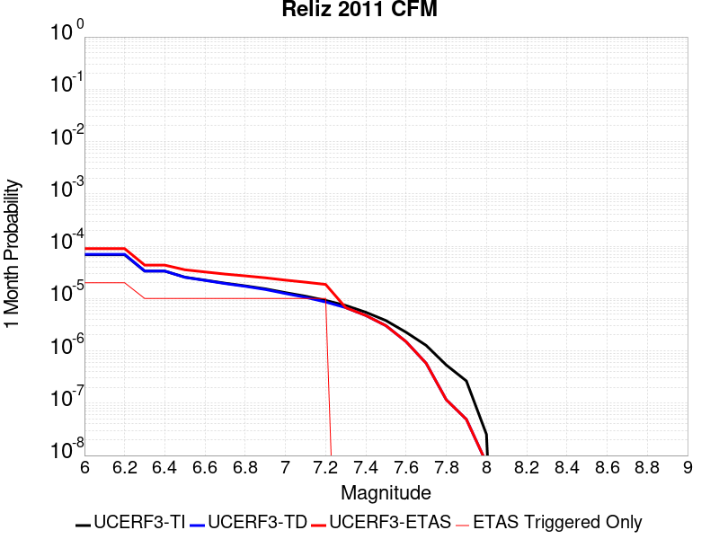 |  |  |

| Magnitude | 1 wk TI Prob | 1 wk TD Prob | 1 wk ETAS Prob | 1 wk ETAS/TD Gain | 1 wk ETAS Triggered Only | 1 mo TI Prob | 1 mo TD Prob | 1 mo ETAS Prob | 1 mo ETAS/TD Gain | 1 mo ETAS Triggered Only | 1 yr TI Prob | 1 yr TD Prob | 1 yr ETAS Prob | 1 yr ETAS/TD Gain | 1 yr ETAS Triggered Only | 10 yr TI Prob | 10 yr TD Prob | 10 yr ETAS Prob | 10 yr ETAS/TD Gain | 10 yr ETAS Triggered Only |
|-----|-----|-----|-----|-----|-----|-----|-----|-----|-----|-----|-----|-----|-----|-----|-----|-----|-----|-----|-----|-----|
| 6.0 | 1.6002472E-5 | 1.6282804E-5 | 3.628248E-5 | 2.2282696 | 2.0E-5 | 6.8580215E-5 | 6.9781694E-5 | 8.97803E-5 | 1.2865881 | 2.0E-5 | 8.3464425E-4 | 8.4928074E-4 | 8.792553E-4 | 1.035294 | 3.0E-5 | 0.008315164 | 0.008462547 | 0.008492294 | 1.003515 | 3.0E-5 |
| 6.1 | 1.6002472E-5 | 1.6282804E-5 | 3.628248E-5 | 2.2282696 | 2.0E-5 | 6.8580215E-5 | 6.9781694E-5 | 8.97803E-5 | 1.2865881 | 2.0E-5 | 8.3464425E-4 | 8.4928074E-4 | 8.792553E-4 | 1.035294 | 3.0E-5 | 0.008315164 | 0.008462547 | 0.008492294 | 1.003515 | 3.0E-5 |
| 6.2 | 1.6002472E-5 | 1.6282804E-5 | 3.628248E-5 | 2.2282696 | 2.0E-5 | 6.8580215E-5 | 6.9781694E-5 | 8.97803E-5 | 1.2865881 | 2.0E-5 | 8.3464425E-4 | 8.4928074E-4 | 8.792553E-4 | 1.035294 | 3.0E-5 | 0.008315164 | 0.008462547 | 0.008492294 | 1.003515 | 3.0E-5 |
| 6.3 | 7.792404E-6 | 7.803802E-6 | 1.7803724E-5 | 2.2814167 | 1.0E-5 | 3.339559E-5 | 3.344444E-5 | 4.3444106E-5 | 1.2989933 | 1.0E-5 | 4.0651546E-4 | 4.0711078E-4 | 4.2710264E-4 | 1.0491067 | 2.0E-5 | 0.0040577264 | 0.004063926 | 0.0040838453 | 1.0049013 | 2.0E-5 |
| 6.4 | 7.792404E-6 | 7.803802E-6 | 1.7803724E-5 | 2.2814167 | 1.0E-5 | 3.339559E-5 | 3.344444E-5 | 4.3444106E-5 | 1.2989933 | 1.0E-5 | 4.0651546E-4 | 4.0711078E-4 | 4.2710264E-4 | 1.0491067 | 2.0E-5 | 0.0040577264 | 0.004063926 | 0.0040838453 | 1.0049013 | 2.0E-5 |
| 6.5 | 5.9659374E-6 | 5.928738E-6 | 1.592868E-5 | 2.6866896 | 1.0E-5 | 2.5568053E-5 | 2.5408632E-5 | 3.540838E-5 | 1.3935571 | 1.0E-5 | 3.1124658E-4 | 3.093064E-4 | 3.293002E-4 | 1.0646408 | 2.0E-5 | 0.00310811 | 0.0030889767 | 0.003108915 | 1.0064546 | 2.0E-5 |
| 6.6 | 5.2350692E-6 | 5.178986E-6 | 1.51789345E-5 | 2.9308698 | 1.0E-5 | 2.2435817E-5 | 2.2195467E-5 | 3.2195243E-5 | 1.4505324 | 1.0E-5 | 2.7312184E-4 | 2.7019644E-4 | 2.9019103E-4 | 1.0740002 | 2.0E-5 | 0.002727864 | 0.0026988892 | 0.0027188354 | 1.0073905 | 2.0E-5 |
| 6.7 | 4.580206E-6 | 4.5061206E-6 | 1.4506076E-5 | 3.219194 | 1.0E-5 | 1.9629308E-5 | 1.9311801E-5 | 2.9311608E-5 | 1.5178081 | 1.0E-5 | 2.389606E-4 | 2.350959E-4 | 2.550912E-4 | 1.0850517 | 2.0E-5 | 0.002387038 | 0.0023486738 | 0.0023686267 | 1.0084955 | 2.0E-5 |
| 6.8 | 4.0765017E-6 | 3.9882384E-6 | 1.3988199E-5 | 3.5073628 | 1.0E-5 | 1.7470604E-5 | 1.7092338E-5 | 2.7092166E-5 | 1.5850475 | 1.0E-5 | 2.1268385E-4 | 2.0807938E-4 | 2.2807521E-4 | 1.0960971 | 2.0E-5 | 0.002124804 | 0.0020790435 | 0.002099002 | 1.0095998 | 2.0E-5 |
| 6.9 | 3.5752896E-6 | 3.4725176E-6 | 1.3472483E-5 | 3.879745 | 1.0E-5 | 1.532258E-5 | 1.4882134E-5 | 2.4881985E-5 | 1.6719366 | 1.0E-5 | 1.8653645E-4 | 1.8117494E-4 | 2.0117131E-4 | 1.1103705 | 2.0E-5 | 0.0018637994 | 0.0018104686 | 0.0018304324 | 1.0110269 | 2.0E-5 |
| 7.0 | 3.0259848E-6 | 2.9079417E-6 | 1.2907913E-5 | 4.4388485 | 1.0E-5 | 1.2968442E-5 | 1.2462548E-5 | 2.2462424E-5 | 1.8023942 | 1.0E-5 | 1.5787935E-4 | 1.5172097E-4 | 1.7171794E-4 | 1.1318009 | 2.0E-5 | 0.0015776722 | 0.001516369 | 0.0015363387 | 1.0131694 | 2.0E-5 |
| 7.1 | 2.5861116E-6 | 2.455167E-6 | 1.24551425E-5 | 5.0730324 | 1.0E-5 | 1.1083288E-5 | 1.05221025E-5 | 2.0521997E-5 | 1.9503704 | 1.0E-5 | 1.3493067E-4 | 1.2809907E-4 | 1.4809651E-4 | 1.1561091 | 2.0E-5 | 0.0013484878 | 0.001280447 | 0.0013004213 | 1.0155995 | 2.0E-5 |
| 7.2 | 2.1482588E-6 | 2.003237E-6 | 1.2003216E-5 | 5.991911 | 1.0E-5 | 9.20679E-6 | 8.585273E-6 | 1.8585186E-5 | 2.1647754 | 1.0E-5 | 1.12086906E-4 | 1.0452068E-4 | 1.245186E-4 | 1.1913297 | 2.0E-5 | 0.0011203039 | 0.0010449095 | 0.0010648886 | 1.0191205 | 2.0E-5 |
| 7.3 | 1.7194744E-6 | 1.5611241E-6 | 1.5611241E-6 | 1.0 | 0.0 | 7.3691554E-6 | 6.690515E-6 | 6.690515E-6 | 1.0 | 0.0 | 8.971577E-5 | 8.1453974E-5 | 9.145316E-5 | 1.1227587 | 1.0E-5 | 8.967956E-4 | 8.1443513E-4 | 8.24427E-4 | 1.0122684 | 1.0E-5 |
| 7.4 | 1.2755178E-6 | 1.10563E-6 | 1.10563E-6 | 1.0 | 0.0 | 5.4664933E-6 | 4.7384056E-6 | 4.7384056E-6 | 1.0 | 0.0 | 6.655252E-5 | 5.768856E-5 | 6.7687986E-5 | 1.1733346 | 1.0E-5 | 6.6532596E-4 | 5.7692965E-4 | 5.8692385E-4 | 1.0173231 | 1.0E-5 |
| 7.5 | 8.8463224E-7 | 7.0580273E-7 | 7.0580273E-7 | 1.0 | 0.0 | 3.7912755E-6 | 3.0248652E-6 | 3.0248652E-6 | 1.0 | 0.0 | 4.6157802E-5 | 3.6827114E-5 | 4.6826743E-5 | 1.2715291 | 1.0E-5 | 4.6148215E-4 | 3.684038E-4 | 3.7840012E-4 | 1.0271342 | 1.0E-5 |
| 7.6 | 5.291355E-7 | 3.500777E-7 | 3.500777E-7 | 1.0 | 0.0 | 2.2677216E-6 | 1.5003321E-6 | 1.5003321E-6 | 1.0 | 0.0 | 2.760916E-5 | 1.8266392E-5 | 1.8266392E-5 | 1.0 | 0.0 | 2.760573E-4 | 1.8284164E-4 | 1.8284164E-4 | 1.0 | 0.0 |
| 7.7 | 2.9663357E-7 | 1.351113E-7 | 1.351113E-7 | 1.0 | 0.0 | 1.2712861E-6 | 5.7904833E-7 | 5.7904833E-7 | 1.0 | 0.0 | 1.5477797E-5 | 7.049891E-6 | 7.049891E-6 | 1.0 | 0.0 | 1.547672E-4 | 7.068132E-5 | 7.068132E-5 | 1.0 | 0.0 |
| 7.8 | 1.2509386E-7 | 2.7157126E-8 | 2.7157126E-8 | 1.0 | 0.0 | 5.3611643E-7 | 1.1638769E-7 | 1.1638769E-7 | 1.0 | 0.0 | 6.527198E-6 | 1.4170191E-6 | 1.4170191E-6 | 1.0 | 0.0 | 6.527006E-5 | 1.4326506E-5 | 1.4326506E-5 | 1.0 | 0.0 |
| 7.9 | 6.213493E-8 | 1.1482114E-8 | 1.1482114E-8 | 1.0 | 0.0 | 2.6629255E-7 | 4.920906E-8 | 4.920906E-8 | 1.0 | 0.0 | 3.242107E-6 | 5.9912014E-7 | 5.9912014E-7 | 1.0 | 0.0 | 3.2420594E-5 | 6.1224223E-6 | 6.1224223E-6 | 1.0 | 0.0 |
| 8.0 | 5.92383E-9 | 1.677887E-9 | 1.677887E-9 | 1.0 | 0.0 | 2.5387841E-8 | 7.190944E-9 | 7.190944E-9 | 1.0 | 0.0 | 3.0909692E-7 | 8.754974E-8 | 8.754974E-8 | 1.0 | 0.0 | 3.090965E-6 | 9.003061E-7 | 9.003061E-7 | 1.0 | 0.0 |

## Cedar Mtn-Mahogany Mtn
*[(top)](#table-of-contents)*

| 1 Week | 1 Month | 1 Year | 10 Year |
|-----|-----|-----|-----|
|  |  |  |  |

| Magnitude | 1 wk TI Prob | 1 wk TD Prob | 1 wk ETAS Prob | 1 wk ETAS/TD Gain | 1 wk ETAS Triggered Only | 1 mo TI Prob | 1 mo TD Prob | 1 mo ETAS Prob | 1 mo ETAS/TD Gain | 1 mo ETAS Triggered Only | 1 yr TI Prob | 1 yr TD Prob | 1 yr ETAS Prob | 1 yr ETAS/TD Gain | 1 yr ETAS Triggered Only | 10 yr TI Prob | 10 yr TD Prob | 10 yr ETAS Prob | 10 yr ETAS/TD Gain | 10 yr ETAS Triggered Only |
|-----|-----|-----|-----|-----|-----|-----|-----|-----|-----|-----|-----|-----|-----|-----|-----|-----|-----|-----|-----|-----|
| 6.0 | 2.7763876E-5 | 2.9588866E-5 | 2.9588866E-5 | 1.0 | 0.0 | 1.1898261E-4 | 1.2680366E-4 | 1.2680366E-4 | 1.0 | 0.0 | 0.0014476506 | 0.0015428112 | 0.0015627804 | 1.0129434 | 2.0E-5 | 0.0143825635 | 0.015328225 | 0.015357765 | 1.0019271 | 3.0E-5 |
| 6.1 | 1.6162443E-5 | 1.7142966E-5 | 1.7142966E-5 | 1.0 | 0.0 | 6.926578E-5 | 7.346788E-5 | 7.346788E-5 | 1.0 | 0.0 | 8.4298453E-4 | 8.941221E-4 | 8.941221E-4 | 1.0 | 0.0 | 0.008397939 | 0.008907059 | 0.008907059 | 1.0 | 0.0 |
| 6.2 | 1.6162443E-5 | 1.7142966E-5 | 1.7142966E-5 | 1.0 | 0.0 | 6.926578E-5 | 7.346788E-5 | 7.346788E-5 | 1.0 | 0.0 | 8.4298453E-4 | 8.941221E-4 | 8.941221E-4 | 1.0 | 0.0 | 0.008397939 | 0.008907059 | 0.008907059 | 1.0 | 0.0 |
| 6.3 | 9.746053E-6 | 1.0303152E-5 | 1.0303152E-5 | 1.0 | 0.0 | 4.1768133E-5 | 4.415564E-5 | 4.415564E-5 | 1.0 | 0.0 | 5.0840835E-4 | 5.3746643E-4 | 5.3746643E-4 | 1.0 | 0.0 | 0.0050724675 | 0.005362084 | 0.005362084 | 1.0 | 0.0 |
| 6.4 | 9.746053E-6 | 1.0303152E-5 | 1.0303152E-5 | 1.0 | 0.0 | 4.1768133E-5 | 4.415564E-5 | 4.415564E-5 | 1.0 | 0.0 | 5.0840835E-4 | 5.3746643E-4 | 5.3746643E-4 | 1.0 | 0.0 | 0.0050724675 | 0.005362084 | 0.005362084 | 1.0 | 0.0 |
| 6.5 | 7.290083E-6 | 7.695325E-6 | 7.695325E-6 | 1.0 | 0.0 | 3.124284E-5 | 3.297956E-5 | 3.297956E-5 | 1.0 | 0.0 | 3.8031515E-4 | 4.014543E-4 | 4.014543E-4 | 1.0 | 0.0 | 0.0037966494 | 0.004007511 | 0.004007511 | 1.0 | 0.0 |
| 6.6 | 5.67907E-6 | 5.9891527E-6 | 5.9891527E-6 | 1.0 | 0.0 | 2.4338644E-5 | 2.5667552E-5 | 2.5667552E-5 | 1.0 | 0.0 | 2.962827E-4 | 3.12459E-4 | 3.12459E-4 | 1.0 | 0.0 | 0.0029588798 | 0.003120333 | 0.003120333 | 1.0 | 0.0 |
| 6.7 | 3.4853963E-6 | 3.672631E-6 | 3.672631E-6 | 1.0 | 0.0 | 1.4937327E-5 | 1.5739755E-5 | 1.5739755E-5 | 1.0 | 0.0 | 1.8184677E-4 | 1.916153E-4 | 1.916153E-4 | 1.0 | 0.0 | 0.0018169804 | 0.0019145629 | 0.0019145629 | 1.0 | 0.0 |
| 6.8 | 2.7535168E-6 | 2.9015764E-6 | 2.9015764E-6 | 1.0 | 0.0 | 1.1800733E-5 | 1.2435271E-5 | 1.2435271E-5 | 1.0 | 0.0 | 1.4366445E-4 | 1.5138938E-4 | 1.5138938E-4 | 1.0 | 0.0 | 0.0014357162 | 0.0015129098 | 0.0015129098 | 1.0 | 0.0 |
| 6.9 | 1.6594106E-6 | 1.7496985E-6 | 1.7496985E-6 | 1.0 | 0.0 | 7.1117406E-6 | 7.4986883E-6 | 7.4986883E-6 | 1.0 | 0.0 | 8.6582E-5 | 9.129302E-5 | 9.129302E-5 | 1.0 | 0.0 | 8.654827E-4 | 9.125856E-4 | 9.125856E-4 | 1.0 | 0.0 |
| 7.0 | 5.10215E-7 | 5.389254E-7 | 5.389254E-7 | 1.0 | 0.0 | 2.186634E-6 | 2.3096788E-6 | 2.3096788E-6 | 1.0 | 0.0 | 2.6621943E-5 | 2.8120105E-5 | 2.8120105E-5 | 1.0 | 0.0 | 2.6618753E-4 | 2.81178E-4 | 2.81178E-4 | 1.0 | 0.0 |

## Carson Range (Genoa)
*[(top)](#table-of-contents)*

| 1 Week | 1 Month | 1 Year | 10 Year |
|-----|-----|-----|-----|
|  |  |  |  |

| Magnitude | 1 wk TI Prob | 1 wk TD Prob | 1 wk ETAS Prob | 1 wk ETAS/TD Gain | 1 wk ETAS Triggered Only | 1 mo TI Prob | 1 mo TD Prob | 1 mo ETAS Prob | 1 mo ETAS/TD Gain | 1 mo ETAS Triggered Only | 1 yr TI Prob | 1 yr TD Prob | 1 yr ETAS Prob | 1 yr ETAS/TD Gain | 1 yr ETAS Triggered Only | 10 yr TI Prob | 10 yr TD Prob | 10 yr ETAS Prob | 10 yr ETAS/TD Gain | 10 yr ETAS Triggered Only |
|-----|-----|-----|-----|-----|-----|-----|-----|-----|-----|-----|-----|-----|-----|-----|-----|-----|-----|-----|-----|-----|
| 6.0 | 4.1268457E-5 | 5.0146893E-5 | 8.0145386E-5 | 1.5982125 | 3.0E-5 | 1.7685282E-4 | 2.148998E-4 | 2.4489337E-4 | 1.13957 | 3.0E-5 | 0.0021510567 | 0.0026136558 | 0.0026435773 | 1.0114481 | 3.0E-5 | 0.02130354 | 0.025868816 | 0.025898041 | 1.0011297 | 3.0E-5 |
| 6.1 | 4.1268457E-5 | 5.0146893E-5 | 8.0145386E-5 | 1.5982125 | 3.0E-5 | 1.7685282E-4 | 2.148998E-4 | 2.4489337E-4 | 1.13957 | 3.0E-5 | 0.0021510567 | 0.0026136558 | 0.0026435773 | 1.0114481 | 3.0E-5 | 0.02130354 | 0.025868816 | 0.025898041 | 1.0011297 | 3.0E-5 |
| 6.2 | 4.1268457E-5 | 5.0146893E-5 | 8.0145386E-5 | 1.5982125 | 3.0E-5 | 1.7685282E-4 | 2.148998E-4 | 2.4489337E-4 | 1.13957 | 3.0E-5 | 0.0021510567 | 0.0026136558 | 0.0026435773 | 1.0114481 | 3.0E-5 | 0.02130354 | 0.025868816 | 0.025898041 | 1.0011297 | 3.0E-5 |
| 6.3 | 4.1268457E-5 | 5.0146893E-5 | 8.0145386E-5 | 1.5982125 | 3.0E-5 | 1.7685282E-4 | 2.148998E-4 | 2.4489337E-4 | 1.13957 | 3.0E-5 | 0.0021510567 | 0.0026136558 | 0.0026435773 | 1.0114481 | 3.0E-5 | 0.02130354 | 0.025868816 | 0.025898041 | 1.0011297 | 3.0E-5 |
| 6.4 | 4.1268457E-5 | 5.0146893E-5 | 8.0145386E-5 | 1.5982125 | 3.0E-5 | 1.7685282E-4 | 2.148998E-4 | 2.4489337E-4 | 1.13957 | 3.0E-5 | 0.0021510567 | 0.0026136558 | 0.0026435773 | 1.0114481 | 3.0E-5 | 0.02130354 | 0.025868816 | 0.025898041 | 1.0011297 | 3.0E-5 |
| 6.5 | 2.5677185E-5 | 3.0978295E-5 | 5.0977676E-5 | 1.6455933 | 2.0E-5 | 1.1004044E-4 | 1.3275839E-4 | 1.5275573E-4 | 1.1506296 | 2.0E-5 | 0.0013389189 | 0.0016153135 | 0.0016352811 | 1.0123615 | 2.0E-5 | 0.0133088045 | 0.016053649 | 0.01607333 | 1.0012258 | 2.0E-5 |
| 6.6 | 2.5677185E-5 | 3.0978295E-5 | 5.0977676E-5 | 1.6455933 | 2.0E-5 | 1.1004044E-4 | 1.3275839E-4 | 1.5275573E-4 | 1.1506296 | 2.0E-5 | 0.0013389189 | 0.0016153135 | 0.0016352811 | 1.0123615 | 2.0E-5 | 0.0133088045 | 0.016053649 | 0.01607333 | 1.0012258 | 2.0E-5 |
| 6.7 | 1.9969408E-5 | 2.406347E-5 | 3.4063232E-5 | 1.4155576 | 1.0E-5 | 8.558037E-5 | 1.0312595E-4 | 1.1312492E-4 | 1.0969588 | 1.0E-5 | 0.0010414429 | 0.0012549888 | 0.0012649763 | 1.0079582 | 1.0E-5 | 0.010365757 | 0.012494174 | 0.012504049 | 1.0007904 | 1.0E-5 |
| 6.8 | 1.4783156E-5 | 1.7817569E-5 | 1.7817569E-5 | 1.0 | 0.0 | 6.335485E-5 | 7.635951E-5 | 7.635951E-5 | 1.0 | 0.0 | 7.710722E-4 | 9.294106E-4 | 9.294106E-4 | 1.0 | 0.0 | 0.0076840227 | 0.009268024 | 0.009268024 | 1.0 | 0.0 |
| 6.9 | 1.06660555E-5 | 1.2877026E-5 | 1.2877026E-5 | 1.0 | 0.0 | 4.5710865E-5 | 5.5186738E-5 | 5.5186738E-5 | 1.0 | 0.0 | 5.5638765E-4 | 6.718066E-4 | 6.718066E-4 | 1.0 | 0.0 | 0.005549967 | 0.006709056 | 0.006709056 | 1.0 | 0.0 |
| 7.0 | 7.664838E-6 | 9.258307E-6 | 9.258307E-6 | 1.0 | 0.0 | 3.2848893E-5 | 3.9678456E-5 | 3.9678456E-5 | 1.0 | 0.0 | 3.998619E-4 | 4.830852E-4 | 4.830852E-4 | 1.0 | 0.0 | 0.0039914316 | 0.00483085 | 0.00483085 | 1.0 | 0.0 |

## La Panza 2011
*[(top)](#table-of-contents)*

| 1 Week | 1 Month | 1 Year | 10 Year |
|-----|-----|-----|-----|
| 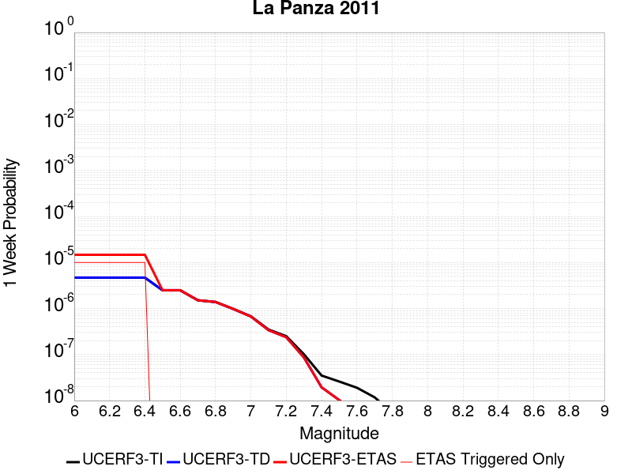 | 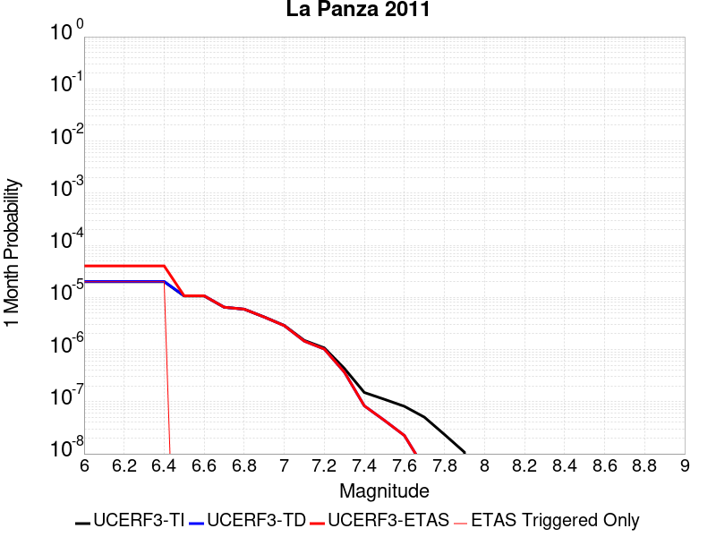 | 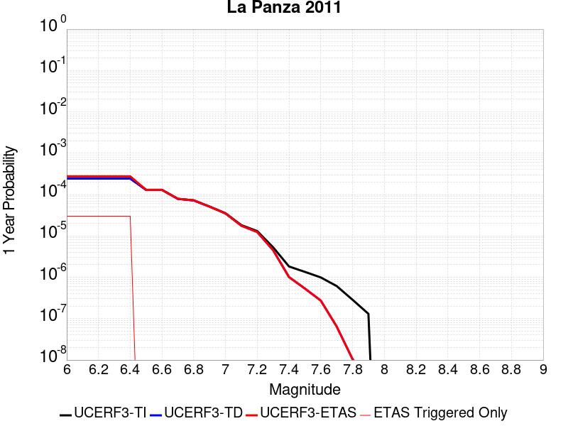 |  |

| Magnitude | 1 wk TI Prob | 1 wk TD Prob | 1 wk ETAS Prob | 1 wk ETAS/TD Gain | 1 wk ETAS Triggered Only | 1 mo TI Prob | 1 mo TD Prob | 1 mo ETAS Prob | 1 mo ETAS/TD Gain | 1 mo ETAS Triggered Only | 1 yr TI Prob | 1 yr TD Prob | 1 yr ETAS Prob | 1 yr ETAS/TD Gain | 1 yr ETAS Triggered Only | 10 yr TI Prob | 10 yr TD Prob | 10 yr ETAS Prob | 10 yr ETAS/TD Gain | 10 yr ETAS Triggered Only |
|-----|-----|-----|-----|-----|-----|-----|-----|-----|-----|-----|-----|-----|-----|-----|-----|-----|-----|-----|-----|-----|
| 6.0 | 4.6754544E-6 | 4.717587E-6 | 1.471754E-5 | 3.1197178 | 1.0E-5 | 2.0037509E-5 | 2.0218084E-5 | 4.021768E-5 | 1.9891934 | 2.0E-5 | 2.4392935E-4 | 2.4612935E-4 | 2.7612195E-4 | 1.1218572 | 3.0E-5 | 0.0024366176 | 0.002458762 | 0.002488688 | 1.0121713 | 3.0E-5 |
| 6.1 | 4.6754544E-6 | 4.717587E-6 | 1.471754E-5 | 3.1197178 | 1.0E-5 | 2.0037509E-5 | 2.0218084E-5 | 4.021768E-5 | 1.9891934 | 2.0E-5 | 2.4392935E-4 | 2.4612935E-4 | 2.7612195E-4 | 1.1218572 | 3.0E-5 | 0.0024366176 | 0.002458762 | 0.002488688 | 1.0121713 | 3.0E-5 |
| 6.2 | 4.6754544E-6 | 4.717587E-6 | 1.471754E-5 | 3.1197178 | 1.0E-5 | 2.0037509E-5 | 2.0218084E-5 | 4.021768E-5 | 1.9891934 | 2.0E-5 | 2.4392935E-4 | 2.4612935E-4 | 2.7612195E-4 | 1.1218572 | 3.0E-5 | 0.0024366176 | 0.002458762 | 0.002488688 | 1.0121713 | 3.0E-5 |
| 6.3 | 4.6754544E-6 | 4.717587E-6 | 1.471754E-5 | 3.1197178 | 1.0E-5 | 2.0037509E-5 | 2.0218084E-5 | 4.021768E-5 | 1.9891934 | 2.0E-5 | 2.4392935E-4 | 2.4612935E-4 | 2.7612195E-4 | 1.1218572 | 3.0E-5 | 0.0024366176 | 0.002458762 | 0.002488688 | 1.0121713 | 3.0E-5 |
| 6.4 | 4.6754544E-6 | 4.717587E-6 | 1.471754E-5 | 3.1197178 | 1.0E-5 | 2.0037509E-5 | 2.0218084E-5 | 4.021768E-5 | 1.9891934 | 2.0E-5 | 2.4392935E-4 | 2.4612935E-4 | 2.7612195E-4 | 1.1218572 | 3.0E-5 | 0.0024366176 | 0.002458762 | 0.002488688 | 1.0121713 | 3.0E-5 |
| 6.5 | 2.485343E-6 | 2.5005988E-6 | 2.5005988E-6 | 1.0 | 0.0 | 1.0651426E-5 | 1.0716811E-5 | 1.0716811E-5 | 1.0 | 0.0 | 1.296734E-4 | 1.3046975E-4 | 1.3046975E-4 | 1.0 | 0.0 | 0.0012959775 | 0.0013039699 | 0.0013039699 | 1.0 | 0.0 |
| 6.6 | 2.485343E-6 | 2.5005988E-6 | 2.5005988E-6 | 1.0 | 0.0 | 1.0651426E-5 | 1.0716811E-5 | 1.0716811E-5 | 1.0 | 0.0 | 1.296734E-4 | 1.3046975E-4 | 1.3046975E-4 | 1.0 | 0.0 | 0.0012959775 | 0.0013039699 | 0.0013039699 | 1.0 | 0.0 |
| 6.7 | 1.5108508E-6 | 1.5146375E-6 | 1.5146375E-6 | 1.0 | 0.0 | 6.4750584E-6 | 6.491288E-6 | 6.491288E-6 | 1.0 | 0.0 | 7.8830984E-5 | 7.902867E-5 | 7.902867E-5 | 1.0 | 0.0 | 7.880303E-4 | 7.900165E-4 | 7.900165E-4 | 1.0 | 0.0 |
| 6.8 | 1.3865837E-6 | 1.3885102E-6 | 1.3885102E-6 | 1.0 | 0.0 | 5.942488E-6 | 5.9507447E-6 | 5.9507447E-6 | 1.0 | 0.0 | 7.234739E-5 | 7.244801E-5 | 7.244801E-5 | 1.0 | 0.0 | 7.232384E-4 | 7.242537E-4 | 7.242537E-4 | 1.0 | 0.0 |
| 6.9 | 9.826583E-7 | 9.796287E-7 | 9.796287E-7 | 1.0 | 0.0 | 4.2113857E-6 | 4.198402E-6 | 4.198402E-6 | 1.0 | 0.0 | 5.1272415E-5 | 5.11144E-5 | 5.11144E-5 | 1.0 | 0.0 | 5.126059E-4 | 5.110318E-4 | 5.110318E-4 | 1.0 | 0.0 |
| 7.0 | 6.7797646E-7 | 6.7102144E-7 | 6.7102144E-7 | 1.0 | 0.0 | 2.9056102E-6 | 2.8758034E-6 | 2.8758034E-6 | 1.0 | 0.0 | 3.537523E-5 | 3.5012374E-5 | 3.5012374E-5 | 1.0 | 0.0 | 3.5369597E-4 | 3.5007167E-4 | 3.5007167E-4 | 1.0 | 0.0 |
| 7.1 | 3.4979826E-7 | 3.387388E-7 | 3.387388E-7 | 1.0 | 0.0 | 1.4991346E-6 | 1.4517369E-6 | 1.4517369E-6 | 1.0 | 0.0 | 1.825181E-5 | 1.7674765E-5 | 1.7674765E-5 | 1.0 | 0.0 | 1.825031E-4 | 1.7673477E-4 | 1.7673477E-4 | 1.0 | 0.0 |
| 7.2 | 2.5088332E-7 | 2.3831899E-7 | 2.3831899E-7 | 1.0 | 0.0 | 1.0752137E-6 | 1.0213668E-6 | 1.0213668E-6 | 1.0 | 0.0 | 1.3090649E-5 | 1.2435077E-5 | 1.2435077E-5 | 1.0 | 0.0 | 1.3089878E-4 | 1.2434467E-4 | 1.2434467E-4 | 1.0 | 0.0 |
| 7.3 | 1.0159086E-7 | 8.64462E-8 | 8.64462E-8 | 1.0 | 0.0 | 4.3538932E-7 | 3.7048366E-7 | 3.7048366E-7 | 1.0 | 0.0 | 5.300852E-6 | 4.5106294E-6 | 4.5106294E-6 | 1.0 | 0.0 | 5.3007258E-5 | 4.5105422E-5 | 4.5105422E-5 | 1.0 | 0.0 |
| 7.4 | 3.5006252E-8 | 1.9404325E-8 | 1.9404325E-8 | 1.0 | 0.0 | 1.5002678E-7 | 8.3161396E-8 | 8.3161396E-8 | 1.0 | 0.0 | 1.8265745E-6 | 1.0124895E-6 | 1.0124895E-6 | 1.0 | 0.0 | 1.8265595E-5 | 1.01248515E-5 | 1.01248515E-5 | 1.0 | 0.0 |
| 7.5 | 2.592274E-8 | 1.0239094E-8 | 1.0239094E-8 | 1.0 | 0.0 | 1.1109746E-7 | 4.388183E-8 | 4.388183E-8 | 1.0 | 0.0 | 1.3526106E-6 | 5.342612E-7 | 5.342612E-7 | 1.0 | 0.0 | 1.3526024E-5 | 5.3425997E-6 | 5.3425997E-6 | 1.0 | 0.0 |
| 7.6 | 1.9016717E-8 | 5.244801E-9 | 5.244801E-9 | 1.0 | 0.0 | 8.150022E-8 | 2.247772E-8 | 2.247772E-8 | 1.0 | 0.0 | 9.922647E-7 | 2.736662E-7 | 2.736662E-7 | 1.0 | 0.0 | 9.922603E-6 | 2.7366589E-6 | 2.7366589E-6 | 1.0 | 0.0 |
| 7.7 | 1.17738495E-8 | 1.2398075E-9 | 1.2398075E-9 | 1.0 | 0.0 | 5.0459356E-8 | 5.3134603E-9 | 5.3134603E-9 | 1.0 | 0.0 | 6.1434247E-7 | 6.469138E-8 | 6.469138E-8 | 1.0 | 0.0 | 6.143408E-6 | 6.469136E-7 | 6.469136E-7 | 1.0 | 0.0 |
| 7.8 | 5.489079E-9 | 2.0111768E-10 | 2.0111768E-10 | 1.0 | 0.0 | 2.3524624E-8 | 8.6193275E-10 | 8.6193275E-10 | 1.0 | 0.0 | 2.8641225E-7 | 1.04940305E-8 | 1.04940305E-8 | 1.0 | 0.0 | 2.8641189E-6 | 1.04940305E-7 | 1.04940305E-7 | 1.0 | 0.0 |
| 7.9 | 2.5081048E-9 | 6.683887E-11 | 6.683887E-11 | 1.0 | 0.0 | 1.0749021E-8 | 2.8645197E-10 | 2.8645197E-10 | 1.0 | 0.0 | 1.3086932E-7 | 3.487552E-9 | 3.487552E-9 | 1.0 | 0.0 | 1.3086925E-6 | 3.487552E-8 | 3.487552E-8 | 1.0 | 0.0 |

## Surprise Valley 2011 CFM
*[(top)](#table-of-contents)*

| 1 Week | 1 Month | 1 Year | 10 Year |
|-----|-----|-----|-----|
| 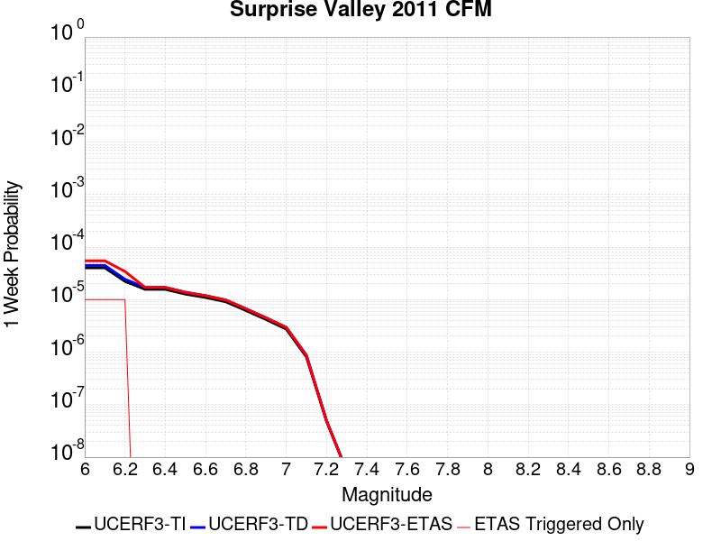 |  |  |  |

| Magnitude | 1 wk TI Prob | 1 wk TD Prob | 1 wk ETAS Prob | 1 wk ETAS/TD Gain | 1 wk ETAS Triggered Only | 1 mo TI Prob | 1 mo TD Prob | 1 mo ETAS Prob | 1 mo ETAS/TD Gain | 1 mo ETAS Triggered Only | 1 yr TI Prob | 1 yr TD Prob | 1 yr ETAS Prob | 1 yr ETAS/TD Gain | 1 yr ETAS Triggered Only | 10 yr TI Prob | 10 yr TD Prob | 10 yr ETAS Prob | 10 yr ETAS/TD Gain | 10 yr ETAS Triggered Only |
|-----|-----|-----|-----|-----|-----|-----|-----|-----|-----|-----|-----|-----|-----|-----|-----|-----|-----|-----|-----|-----|
| 6.0 | 4.0396248E-5 | 4.485131E-5 | 5.485086E-5 | 1.2229489 | 1.0E-5 | 1.7311527E-4 | 1.9220692E-4 | 2.1220307E-4 | 1.1040345 | 2.0E-5 | 0.002105641 | 0.0023378176 | 0.0023677475 | 1.0128025 | 3.0E-5 | 0.020858008 | 0.023153966 | 0.023183271 | 1.0012656 | 3.0E-5 |
| 6.1 | 4.0396248E-5 | 4.485131E-5 | 5.485086E-5 | 1.2229489 | 1.0E-5 | 1.7311527E-4 | 1.9220692E-4 | 2.1220307E-4 | 1.1040345 | 2.0E-5 | 0.002105641 | 0.0023378176 | 0.0023677475 | 1.0128025 | 3.0E-5 | 0.020858008 | 0.023153966 | 0.023183271 | 1.0012656 | 3.0E-5 |
| 6.2 | 2.2295266E-5 | 2.440125E-5 | 3.4401004E-5 | 1.409805 | 1.0E-5 | 9.554764E-5 | 1.0457276E-4 | 1.2457067E-4 | 1.1912344 | 2.0E-5 | 0.0011626717 | 0.0012724606 | 0.0013024224 | 1.0235463 | 3.0E-5 | 0.011566074 | 0.012654981 | 0.012684601 | 1.0023406 | 3.0E-5 |
| 6.3 | 1.572643E-5 | 1.7096807E-5 | 1.7096807E-5 | 1.0 | 0.0 | 6.7397246E-5 | 7.327003E-5 | 8.32693E-5 | 1.1364714 | 1.0E-5 | 8.202525E-4 | 8.91708E-4 | 9.116902E-4 | 1.0224088 | 2.0E-5 | 0.008172315 | 0.008882407 | 0.008902229 | 1.0022316 | 2.0E-5 |
| 6.4 | 1.5714395E-5 | 1.7084629E-5 | 1.7084629E-5 | 1.0 | 0.0 | 6.734567E-5 | 7.3217845E-5 | 8.3217106E-5 | 1.1365688 | 1.0E-5 | 8.1962504E-4 | 8.9107314E-4 | 9.110553E-4 | 1.0224248 | 2.0E-5 | 0.008166086 | 0.008876109 | 0.008895931 | 1.0022333 | 2.0E-5 |
| 6.5 | 1.2733495E-5 | 1.38016E-5 | 1.38016E-5 | 1.0 | 0.0 | 5.457098E-5 | 5.9148413E-5 | 5.9148413E-5 | 1.0 | 0.0 | 6.641992E-4 | 7.1990065E-4 | 7.2989345E-4 | 1.0138808 | 1.0E-5 | 0.0066221743 | 0.0071763797 | 0.007186308 | 1.0013834 | 1.0E-5 |
| 6.6 | 1.0983784E-5 | 1.1886554E-5 | 1.1886554E-5 | 1.0 | 0.0 | 4.7072506E-5 | 5.094141E-5 | 5.094141E-5 | 1.0 | 0.0 | 5.7295704E-4 | 6.200405E-4 | 6.300343E-4 | 1.0161179 | 1.0E-5 | 0.0057148207 | 0.0061836545 | 0.0061935927 | 1.0016072 | 1.0E-5 |
| 6.7 | 9.104806E-6 | 9.839491E-6 | 9.839491E-6 | 1.0 | 0.0 | 3.902001E-5 | 4.2168587E-5 | 4.2168587E-5 | 1.0 | 0.0 | 4.7496508E-4 | 5.132855E-4 | 5.132855E-4 | 1.0 | 0.0 | 0.004739512 | 0.005121397 | 0.005121397 | 1.0 | 0.0 |
| 6.8 | 6.2162403E-6 | 6.7041337E-6 | 6.7041337E-6 | 1.0 | 0.0 | 2.6640759E-5 | 2.8731698E-5 | 2.8731698E-5 | 1.0 | 0.0 | 3.2430296E-4 | 3.497545E-4 | 3.497545E-4 | 1.0 | 0.0 | 0.003238301 | 0.0034922638 | 0.0034922638 | 1.0 | 0.0 |
| 6.9 | 4.1792696E-6 | 4.50323E-6 | 4.50323E-6 | 1.0 | 0.0 | 1.7911032E-5 | 1.9299423E-5 | 1.9299423E-5 | 1.0 | 0.0 | 2.1804498E-4 | 2.3494668E-4 | 2.3494668E-4 | 1.0 | 0.0 | 0.0021783116 | 0.0023471361 | 0.0023471361 | 1.0 | 0.0 |
| 7.0 | 2.7478413E-6 | 2.9622424E-6 | 2.9622424E-6 | 1.0 | 0.0 | 1.177641E-5 | 1.269527E-5 | 1.269527E-5 | 1.0 | 0.0 | 1.4336836E-4 | 1.545552E-4 | 1.545552E-4 | 1.0 | 0.0 | 0.001432759 | 0.0015445995 | 0.0015445995 | 1.0 | 0.0 |
| 7.1 | 8.128648E-7 | 8.724922E-7 | 8.724922E-7 | 1.0 | 0.0 | 3.4837017E-6 | 3.7392501E-6 | 3.7392501E-6 | 1.0 | 0.0 | 4.2413245E-5 | 4.552502E-5 | 4.552502E-5 | 1.0 | 0.0 | 4.2405148E-4 | 4.5521575E-4 | 4.5521575E-4 | 1.0 | 0.0 |
| 7.2 | 4.8641045E-8 | 4.9402068E-8 | 4.9402068E-8 | 1.0 | 0.0 | 2.084616E-7 | 2.1172312E-7 | 2.1172312E-7 | 1.0 | 0.0 | 2.538017E-6 | 2.577726E-6 | 2.577726E-6 | 1.0 | 0.0 | 2.537988E-5 | 2.5776973E-5 | 2.5776973E-5 | 1.0 | 0.0 |
| 7.3 | 5.3911844E-9 | 5.4758145E-9 | 5.4758145E-9 | 1.0 | 0.0 | 2.3105075E-8 | 2.3467775E-8 | 2.3467775E-8 | 1.0 | 0.0 | 2.8130427E-7 | 2.8572015E-7 | 2.8572015E-7 | 1.0 | 0.0 | 2.8130391E-6 | 2.8571992E-6 | 2.8571992E-6 | 1.0 | 0.0 |

## Calaveras (No) 2011 CFM
*[(top)](#table-of-contents)*

| 1 Week | 1 Month | 1 Year | 10 Year |
|-----|-----|-----|-----|
| 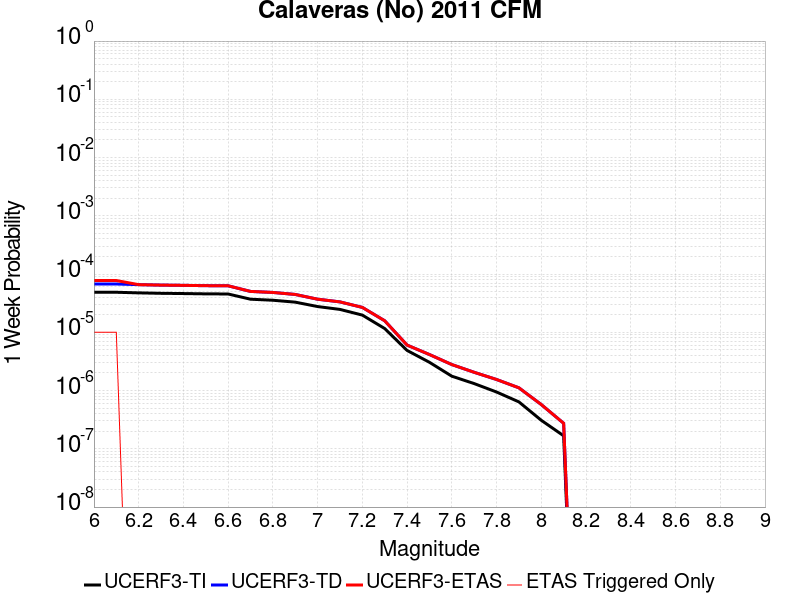 |  |  |  |

| Magnitude | 1 wk TI Prob | 1 wk TD Prob | 1 wk ETAS Prob | 1 wk ETAS/TD Gain | 1 wk ETAS Triggered Only | 1 mo TI Prob | 1 mo TD Prob | 1 mo ETAS Prob | 1 mo ETAS/TD Gain | 1 mo ETAS Triggered Only | 1 yr TI Prob | 1 yr TD Prob | 1 yr ETAS Prob | 1 yr ETAS/TD Gain | 1 yr ETAS Triggered Only | 10 yr TI Prob | 10 yr TD Prob | 10 yr ETAS Prob | 10 yr ETAS/TD Gain | 10 yr ETAS Triggered Only |
|-----|-----|-----|-----|-----|-----|-----|-----|-----|-----|-----|-----|-----|-----|-----|-----|-----|-----|-----|-----|-----|
| 6.0 | 4.8694856E-5 | 6.747121E-5 | 7.7470526E-5 | 1.1482013 | 1.0E-5 | 2.0867554E-4 | 2.8913133E-4 | 3.0912555E-4 | 1.0691527 | 2.0E-5 | 0.0025376645 | 0.003514627 | 0.0035445215 | 1.0085057 | 3.0E-5 | 0.02508881 | 0.034771245 | 0.0348002 | 1.0008328 | 3.0E-5 |
| 6.1 | 4.8694856E-5 | 6.747121E-5 | 7.7470526E-5 | 1.1482013 | 1.0E-5 | 2.0867554E-4 | 2.8913133E-4 | 3.0912555E-4 | 1.0691527 | 2.0E-5 | 0.0025376645 | 0.003514627 | 0.0035445215 | 1.0085057 | 3.0E-5 | 0.02508881 | 0.034771245 | 0.0348002 | 1.0008328 | 3.0E-5 |
| 6.2 | 4.7541962E-5 | 6.580218E-5 | 6.580218E-5 | 1.0 | 0.0 | 2.0373536E-4 | 2.8197994E-4 | 2.919771E-4 | 1.0354536 | 1.0E-5 | 0.0024776561 | 0.003427859 | 0.0034477904 | 1.0058146 | 2.0E-5 | 0.024502134 | 0.033932675 | 0.033951998 | 1.0005693 | 2.0E-5 |
| 6.3 | 4.6717287E-5 | 6.4635555E-5 | 6.4635555E-5 | 1.0 | 0.0 | 2.0020158E-4 | 2.7698115E-4 | 2.7698115E-4 | 1.0 | 0.0 | 0.0024347296 | 0.0033672103 | 0.0033771766 | 1.0029598 | 1.0E-5 | 0.024082264 | 0.033345193 | 0.03335486 | 1.0002899 | 1.0E-5 |
| 6.4 | 4.6276386E-5 | 6.399742E-5 | 6.399742E-5 | 1.0 | 0.0 | 1.983123E-4 | 2.7424688E-4 | 2.7424688E-4 | 1.0 | 0.0 | 0.0024117786 | 0.0033340224 | 0.0033439891 | 1.0029894 | 1.0E-5 | 0.02385771 | 0.033024073 | 0.03303374 | 1.0002928 | 1.0E-5 |
| 6.5 | 4.5720994E-5 | 6.319881E-5 | 6.319881E-5 | 1.0 | 0.0 | 1.9593239E-4 | 2.70825E-4 | 2.70825E-4 | 1.0 | 0.0 | 0.002382867 | 0.0032924965 | 0.0033024636 | 1.0030272 | 1.0E-5 | 0.023574775 | 0.032622032 | 0.032631706 | 1.0002966 | 1.0E-5 |
| 6.6 | 4.549134E-5 | 6.28519E-5 | 6.28519E-5 | 1.0 | 0.0 | 1.949483E-4 | 2.6933852E-4 | 2.6933852E-4 | 1.0 | 0.0 | 0.0023709119 | 0.0032744533 | 0.0032844206 | 1.0030439 | 1.0E-5 | 0.023457756 | 0.032447387 | 0.032457065 | 1.0002981 | 1.0E-5 |
| 6.7 | 3.701047E-5 | 5.0359427E-5 | 5.0359427E-5 | 1.0 | 0.0 | 1.5860666E-4 | 2.1580851E-4 | 2.1580851E-4 | 1.0 | 0.0 | 0.0019293258 | 0.002624346 | 0.002624346 | 1.0 | 0.0 | 0.019126613 | 0.026125323 | 0.026125323 | 1.0 | 0.0 |
| 6.8 | 3.5523568E-5 | 4.8341022E-5 | 4.8341022E-5 | 1.0 | 0.0 | 1.5223498E-4 | 2.071596E-4 | 2.071596E-4 | 1.0 | 0.0 | 0.0018518851 | 0.0025192937 | 0.0025192937 | 1.0 | 0.0 | 0.018365284 | 0.025097553 | 0.025097553 | 1.0 | 0.0 |
| 6.9 | 3.2946147E-5 | 4.466269E-5 | 4.466269E-5 | 1.0 | 0.0 | 1.4119013E-4 | 1.9139773E-4 | 1.9139773E-4 | 1.0 | 0.0 | 0.0017176344 | 0.0023278191 | 0.0023278191 | 1.0 | 0.0 | 0.017044188 | 0.023219598 | 0.023219598 | 1.0 | 0.0 |
| 7.0 | 2.7682381E-5 | 3.702223E-5 | 3.702223E-5 | 1.0 | 0.0 | 1.1863338E-4 | 1.5865723E-4 | 1.5865723E-4 | 1.0 | 0.0 | 0.0014434044 | 0.0019299705 | 0.0019299705 | 1.0 | 0.0 | 0.01434065 | 0.01931092 | 0.01931092 | 1.0 | 0.0 |
| 7.1 | 2.471967E-5 | 3.328669E-5 | 3.328669E-5 | 1.0 | 0.0 | 1.05937135E-4 | 1.4264962E-4 | 1.4264962E-4 | 1.0 | 0.0 | 0.0012890215 | 0.0017354045 | 0.0017354045 | 1.0 | 0.0 | 0.0128157 | 0.017385952 | 0.017385952 | 1.0 | 0.0 |
| 7.2 | 1.9748062E-5 | 2.6774684E-5 | 2.6774684E-5 | 1.0 | 0.0 | 8.463181E-5 | 1.1474373E-4 | 1.1474373E-4 | 1.0 | 0.0 | 0.0010299052 | 0.0013961331 | 0.0013961331 | 1.0 | 0.0 | 0.01025145 | 0.014030739 | 0.014030739 | 1.0 | 0.0 |
| 7.3 | 1.1603734E-5 | 1.5783844E-5 | 1.5783844E-5 | 1.0 | 0.0 | 4.9729337E-5 | 6.764337E-5 | 6.764337E-5 | 1.0 | 0.0 | 6.052865E-4 | 8.232611E-4 | 8.232611E-4 | 1.0 | 0.0 | 0.0060364045 | 0.008308666 | 0.008308666 | 1.0 | 0.0 |
| 7.4 | 4.885381E-6 | 6.0349853E-6 | 6.0349853E-6 | 1.0 | 0.0 | 2.0937177E-5 | 2.5863968E-5 | 2.5863968E-5 | 1.0 | 0.0 | 2.5488032E-4 | 3.148485E-4 | 3.148485E-4 | 1.0 | 0.0 | 0.0025458818 | 0.0032010598 | 0.0032010598 | 1.0 | 0.0 |
| 7.5 | 3.0571264E-6 | 4.155299E-6 | 4.155299E-6 | 1.0 | 0.0 | 1.3101904E-5 | 1.7808303E-5 | 1.7808303E-5 | 1.0 | 0.0 | 1.5950401E-4 | 2.1679462E-4 | 2.1679462E-4 | 1.0 | 0.0 | 0.0015938957 | 0.002221121 | 0.002221121 | 1.0 | 0.0 |
| 7.6 | 1.764948E-6 | 2.7955498E-6 | 2.7955498E-6 | 1.0 | 0.0 | 7.564041E-6 | 1.1980874E-5 | 1.1980874E-5 | 1.0 | 0.0 | 9.208831E-5 | 1.4585744E-4 | 1.4585744E-4 | 1.0 | 0.0 | 9.205016E-4 | 0.0015123509 | 0.0015123509 | 1.0 | 0.0 |
| 7.7 | 1.3173734E-6 | 2.058471E-6 | 2.058471E-6 | 1.0 | 0.0 | 5.645874E-6 | 8.8219895E-6 | 8.8219895E-6 | 1.0 | 0.0 | 6.873634E-5 | 1.0740245E-4 | 1.0740245E-4 | 1.0 | 0.0 | 6.8715087E-4 | 0.0011261401 | 0.0011261401 | 1.0 | 0.0 |
| 7.8 | 9.4429885E-7 | 1.5489635E-6 | 1.5489635E-6 | 1.0 | 0.0 | 4.0469886E-6 | 6.638398E-6 | 6.638398E-6 | 1.0 | 0.0 | 4.9270973E-5 | 8.081952E-5 | 8.081952E-5 | 1.0 | 0.0 | 4.926005E-4 | 8.5014524E-4 | 8.5014524E-4 | 1.0 | 0.0 |
| 7.9 | 6.388233E-7 | 1.1148749E-6 | 1.1148749E-6 | 1.0 | 0.0 | 2.7378112E-6 | 4.7780263E-6 | 4.7780263E-6 | 1.0 | 0.0 | 3.3332344E-5 | 5.817093E-5 | 5.817093E-5 | 1.0 | 0.0 | 3.3327343E-4 | 6.0963054E-4 | 6.0963054E-4 | 1.0 | 0.0 |
| 8.0 | 3.087986E-7 | 5.7543696E-7 | 5.7543696E-7 | 1.0 | 0.0 | 1.323422E-6 | 2.466156E-6 | 2.466156E-6 | 1.0 | 0.0 | 1.6112543E-5 | 3.002504E-5 | 3.002504E-5 | 1.0 | 0.0 | 1.6111376E-4 | 3.110302E-4 | 3.110302E-4 | 1.0 | 0.0 |
| 8.1 | 1.6725647E-7 | 2.7410047E-7 | 2.7410047E-7 | 1.0 | 0.0 | 7.168133E-7 | 1.1747159E-6 | 1.1747159E-6 | 1.0 | 0.0 | 8.7271665E-6 | 1.4302073E-5 | 1.4302073E-5 | 1.0 | 0.0 | 8.726824E-5 | 1.48486E-4 | 1.48486E-4 | 1.0 | 0.0 |

## Malibu Coast alt 1
*[(top)](#table-of-contents)*

| 1 Week | 1 Month | 1 Year | 10 Year |
|-----|-----|-----|-----|
| 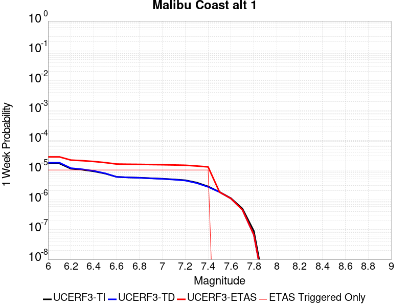 | 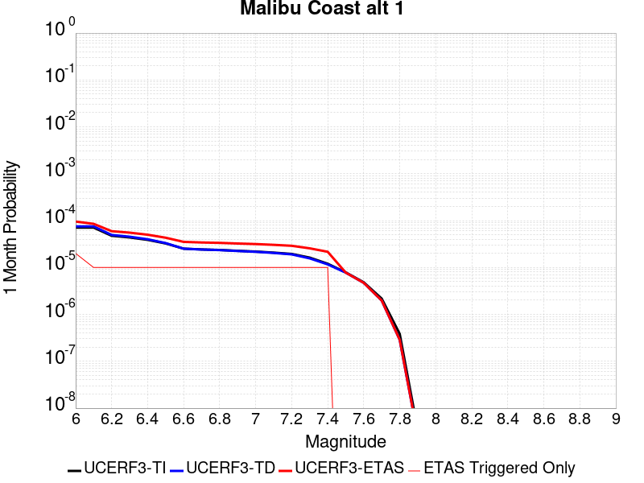 |  |  |

| Magnitude | 1 wk TI Prob | 1 wk TD Prob | 1 wk ETAS Prob | 1 wk ETAS/TD Gain | 1 wk ETAS Triggered Only | 1 mo TI Prob | 1 mo TD Prob | 1 mo ETAS Prob | 1 mo ETAS/TD Gain | 1 mo ETAS Triggered Only | 1 yr TI Prob | 1 yr TD Prob | 1 yr ETAS Prob | 1 yr ETAS/TD Gain | 1 yr ETAS Triggered Only | 10 yr TI Prob | 10 yr TD Prob | 10 yr ETAS Prob | 10 yr ETAS/TD Gain | 10 yr ETAS Triggered Only |
|-----|-----|-----|-----|-----|-----|-----|-----|-----|-----|-----|-----|-----|-----|-----|-----|-----|-----|-----|-----|-----|
| 6.0 | 1.6572556E-5 | 1.7598066E-5 | 2.7597891E-5 | 1.5682342 | 1.0E-5 | 7.102331E-5 | 7.541821E-5 | 9.5416704E-5 | 1.265168 | 2.0E-5 | 8.6436566E-4 | 9.178488E-4 | 9.378304E-4 | 1.0217701 | 2.0E-5 | 0.0086101135 | 0.009142512 | 0.009172238 | 1.0032513 | 3.0E-5 |
| 6.1 | 1.6572556E-5 | 1.7598066E-5 | 2.7597891E-5 | 1.5682342 | 1.0E-5 | 7.102331E-5 | 7.541821E-5 | 8.541746E-5 | 1.132584 | 1.0E-5 | 8.6436566E-4 | 9.178488E-4 | 9.278396E-4 | 1.010885 | 1.0E-5 | 0.0086101135 | 0.009142512 | 0.00916233 | 1.0021676 | 2.0E-5 |
| 6.2 | 1.1085717E-5 | 1.1557147E-5 | 2.155703E-5 | 1.8652555 | 1.0E-5 | 4.750935E-5 | 4.952971E-5 | 5.9529215E-5 | 1.201889 | 1.0E-5 | 5.782728E-4 | 6.028609E-4 | 6.128549E-4 | 1.0165776 | 1.0E-5 | 0.0057677035 | 0.0060126255 | 0.0060325055 | 1.0033064 | 2.0E-5 |
| 6.3 | 1.0208568E-5 | 1.0592237E-5 | 2.0592131E-5 | 1.9440776 | 1.0E-5 | 4.375027E-5 | 4.539453E-5 | 5.5394077E-5 | 1.2202809 | 1.0E-5 | 5.325294E-4 | 5.5254117E-4 | 5.6253566E-4 | 1.0180882 | 1.0E-5 | 0.0053125503 | 0.0055119814 | 0.005531871 | 1.0036085 | 2.0E-5 |
| 6.4 | 9.0682315E-6 | 9.342637E-6 | 1.9342544E-5 | 2.0703516 | 1.0E-5 | 3.8863272E-5 | 4.003927E-5 | 5.003887E-5 | 1.2497448 | 1.0E-5 | 4.730576E-4 | 4.8737114E-4 | 4.9736624E-4 | 1.0205083 | 1.0E-5 | 0.0047205184 | 0.004863236 | 0.0048731877 | 1.0020462 | 1.0E-5 |
| 6.5 | 7.605796E-6 | 7.748587E-6 | 1.774851E-5 | 2.2905478 | 1.0E-5 | 3.259586E-5 | 3.3207816E-5 | 4.3207485E-5 | 1.301124 | 1.0E-5 | 3.9678233E-4 | 4.0423148E-4 | 4.1422746E-4 | 1.0247283 | 1.0E-5 | 0.0039607463 | 0.0040351 | 0.0040450594 | 1.0024682 | 1.0E-5 |
| 6.6 | 5.889873E-6 | 5.8795385E-6 | 1.587948E-5 | 2.7008038 | 1.0E-5 | 2.5242069E-5 | 2.519778E-5 | 3.519753E-5 | 1.3968503 | 1.0E-5 | 3.0727885E-4 | 3.0673988E-4 | 3.167368E-4 | 1.0325909 | 1.0E-5 | 0.003068543 | 0.0030631777 | 0.003073147 | 1.0032545 | 1.0E-5 |
| 6.7 | 5.66586E-6 | 5.641641E-6 | 1.5641584E-5 | 2.7725239 | 1.0E-5 | 2.428203E-5 | 2.417824E-5 | 3.4177996E-5 | 1.4135851 | 1.0E-5 | 2.955936E-4 | 2.9433038E-4 | 3.0432743E-4 | 1.0339655 | 1.0E-5 | 0.0029520073 | 0.0029394177 | 0.0029493882 | 1.003392 | 1.0E-5 |
| 6.8 | 5.521556E-6 | 5.489427E-6 | 1.5489371E-5 | 2.8216739 | 1.0E-5 | 2.3663597E-5 | 2.3525903E-5 | 3.352567E-5 | 1.4250534 | 1.0E-5 | 2.880662E-4 | 2.8639034E-4 | 2.9638747E-4 | 1.0349073 | 1.0E-5 | 0.0028769306 | 0.002860224 | 0.0028701955 | 1.0034863 | 1.0E-5 |
| 6.9 | 5.29752E-6 | 5.2499317E-6 | 1.5249879E-5 | 2.9047768 | 1.0E-5 | 2.270346E-5 | 2.2499513E-5 | 3.2499287E-5 | 1.4444441 | 1.0E-5 | 2.7637955E-4 | 2.7389723E-4 | 2.8389448E-4 | 1.0365001 | 1.0E-5 | 0.0027603607 | 0.0027356069 | 0.0027455795 | 1.0036455 | 1.0E-5 |
| 7.0 | 5.106743E-6 | 5.0476788E-6 | 1.5047628E-5 | 2.9810987 | 1.0E-5 | 2.1885859E-5 | 2.163273E-5 | 3.1632513E-5 | 1.4622525 | 1.0E-5 | 2.6642776E-4 | 2.6334674E-4 | 2.7334408E-4 | 1.0379628 | 1.0E-5 | 0.0026610855 | 0.0026303562 | 0.0026403298 | 1.0037918 | 1.0E-5 |
| 7.1 | 4.8469647E-6 | 4.770373E-6 | 1.4770325E-5 | 3.0962622 | 1.0E-5 | 2.0772539E-5 | 2.0444295E-5 | 3.0444091E-5 | 1.489124 | 1.0E-5 | 2.528763E-4 | 2.4888094E-4 | 2.5887846E-4 | 1.0401698 | 1.0E-5 | 0.0025258875 | 0.00248603 | 0.0024960053 | 1.0040125 | 1.0E-5 |
| 7.2 | 4.545514E-6 | 4.4481935E-6 | 1.4448149E-5 | 3.2480936 | 1.0E-5 | 1.9480629E-5 | 1.9063547E-5 | 2.9063358E-5 | 1.5245513 | 1.0E-5 | 2.3715083E-4 | 2.3207403E-4 | 2.4207172E-4 | 1.0430797 | 1.0E-5 | 0.0023689792 | 0.0023183243 | 0.002328301 | 1.0043035 | 1.0E-5 |
| 7.3 | 3.794097E-6 | 3.6519348E-6 | 1.3651898E-5 | 3.7382646 | 1.0E-5 | 1.6260314E-5 | 1.5651056E-5 | 2.56509E-5 | 1.6389245 | 1.0E-5 | 1.9795135E-4 | 1.9053498E-4 | 2.0053308E-4 | 1.0524738 | 1.0E-5 | 0.001977751 | 0.0019037209 | 0.0019137019 | 1.0052428 | 1.0E-5 |
| 7.4 | 2.808217E-6 | 2.719077E-6 | 1.271905E-5 | 4.6777086 | 1.0E-5 | 1.203516E-5 | 1.1653135E-5 | 2.1653019E-5 | 1.8581282 | 1.0E-5 | 1.4651821E-4 | 1.418677E-4 | 1.5186628E-4 | 1.0704782 | 1.0E-5 | 0.0014642165 | 0.001417774 | 0.0014277599 | 1.0070434 | 1.0E-5 |
| 7.5 | 1.83809E-6 | 1.8190691E-6 | 1.8190691E-6 | 1.0 | 0.0 | 7.877505E-6 | 7.795988E-6 | 7.795988E-6 | 1.0 | 0.0 | 9.59044E-5 | 9.491203E-5 | 9.491203E-5 | 1.0 | 0.0 | 9.5863023E-4 | 9.48717E-4 | 9.48717E-4 | 1.0 | 0.0 |
| 7.6 | 1.1292672E-6 | 1.1001447E-6 | 1.1001447E-6 | 1.0 | 0.0 | 4.839708E-6 | 4.714897E-6 | 4.714897E-6 | 1.0 | 0.0 | 5.8921847E-5 | 5.7402376E-5 | 5.7402376E-5 | 1.0 | 0.0 | 5.890623E-4 | 5.738771E-4 | 5.738771E-4 | 1.0 | 0.0 |
| 7.7 | 5.065272E-7 | 4.609151E-7 | 4.609151E-7 | 1.0 | 0.0 | 2.170829E-6 | 1.975349E-6 | 1.975349E-6 | 1.0 | 0.0 | 2.6429525E-5 | 2.404962E-5 | 2.404962E-5 | 1.0 | 0.0 | 2.642638E-4 | 2.4047129E-4 | 2.4047129E-4 | 1.0 | 0.0 |
| 7.8 | 8.952991E-8 | 6.707874E-8 | 6.707874E-8 | 1.0 | 0.0 | 3.8369956E-7 | 2.8748025E-7 | 2.8748025E-7 | 1.0 | 0.0 | 4.671532E-6 | 3.5000667E-6 | 3.5000667E-6 | 1.0 | 0.0 | 4.671434E-5 | 3.5000136E-5 | 3.5000136E-5 | 1.0 | 0.0 |
| 7.9 | 8.007447E-10 | 6.1608785E-10 | 6.1608785E-10 | 1.0 | 0.0 | 3.4317629E-9 | 2.6403764E-9 | 2.6403764E-9 | 1.0 | 0.0 | 4.1781714E-8 | 3.2146584E-8 | 3.2146584E-8 | 1.0 | 0.0 | 4.1781706E-7 | 3.214658E-7 | 3.214658E-7 | 1.0 | 0.0 |

## Northridge
*[(top)](#table-of-contents)*

| 1 Week | 1 Month | 1 Year | 10 Year |
|-----|-----|-----|-----|
|  |  | 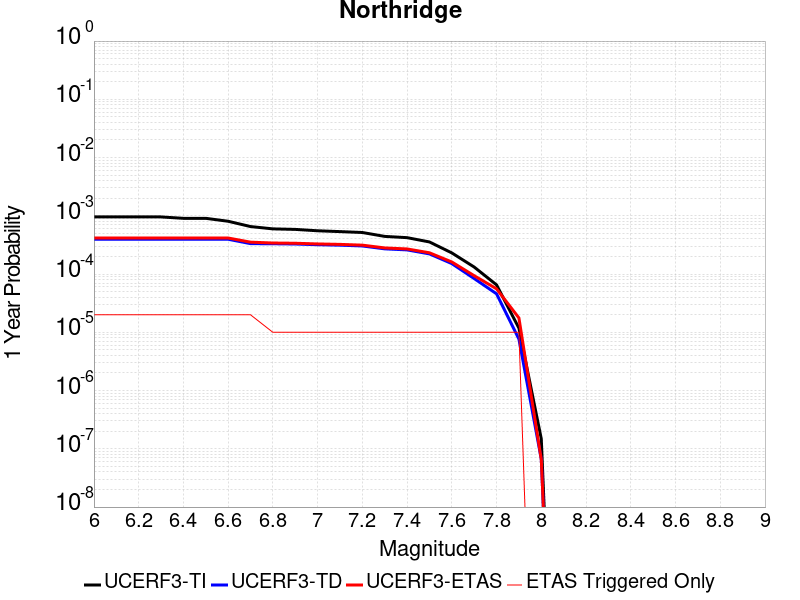 |  |

| Magnitude | 1 wk TI Prob | 1 wk TD Prob | 1 wk ETAS Prob | 1 wk ETAS/TD Gain | 1 wk ETAS Triggered Only | 1 mo TI Prob | 1 mo TD Prob | 1 mo ETAS Prob | 1 mo ETAS/TD Gain | 1 mo ETAS Triggered Only | 1 yr TI Prob | 1 yr TD Prob | 1 yr ETAS Prob | 1 yr ETAS/TD Gain | 1 yr ETAS Triggered Only | 10 yr TI Prob | 10 yr TD Prob | 10 yr ETAS Prob | 10 yr ETAS/TD Gain | 10 yr ETAS Triggered Only |
|-----|-----|-----|-----|-----|-----|-----|-----|-----|-----|-----|-----|-----|-----|-----|-----|-----|-----|-----|-----|-----|
| 6.0 | 1.8340852E-5 | 7.5880193E-6 | 1.7587943E-5 | 2.317857 | 1.0E-5 | 7.860128E-5 | 3.251969E-5 | 4.2519365E-5 | 1.307496 | 1.0E-5 | 9.565505E-4 | 3.958575E-4 | 4.158496E-4 | 1.0505033 | 2.0E-5 | 0.009524435 | 0.003951746 | 0.0039816275 | 1.0075616 | 3.0E-5 |
| 6.1 | 1.8340852E-5 | 7.5880193E-6 | 1.7587943E-5 | 2.317857 | 1.0E-5 | 7.860128E-5 | 3.251969E-5 | 4.2519365E-5 | 1.307496 | 1.0E-5 | 9.565505E-4 | 3.958575E-4 | 4.158496E-4 | 1.0505033 | 2.0E-5 | 0.009524435 | 0.003951746 | 0.0039816275 | 1.0075616 | 3.0E-5 |
| 6.2 | 1.8340852E-5 | 7.5880193E-6 | 1.7587943E-5 | 2.317857 | 1.0E-5 | 7.860128E-5 | 3.251969E-5 | 4.2519365E-5 | 1.307496 | 1.0E-5 | 9.565505E-4 | 3.958575E-4 | 4.158496E-4 | 1.0505033 | 2.0E-5 | 0.009524435 | 0.003951746 | 0.0039816275 | 1.0075616 | 3.0E-5 |
| 6.3 | 1.8340852E-5 | 7.5880193E-6 | 1.7587943E-5 | 2.317857 | 1.0E-5 | 7.860128E-5 | 3.251969E-5 | 4.2519365E-5 | 1.307496 | 1.0E-5 | 9.565505E-4 | 3.958575E-4 | 4.158496E-4 | 1.0505033 | 2.0E-5 | 0.009524435 | 0.003951746 | 0.0039816275 | 1.0075616 | 3.0E-5 |
| 6.4 | 1.7361892E-5 | 7.5880193E-6 | 1.7587943E-5 | 2.317857 | 1.0E-5 | 7.440598E-5 | 3.251969E-5 | 4.2519365E-5 | 1.307496 | 1.0E-5 | 9.055163E-4 | 3.958575E-4 | 4.158496E-4 | 1.0505033 | 2.0E-5 | 0.009018354 | 0.003951746 | 0.0039816275 | 1.0075616 | 3.0E-5 |
| 6.5 | 1.7361892E-5 | 7.5880193E-6 | 1.7587943E-5 | 2.317857 | 1.0E-5 | 7.440598E-5 | 3.251969E-5 | 4.2519365E-5 | 1.307496 | 1.0E-5 | 9.055163E-4 | 3.958575E-4 | 4.158496E-4 | 1.0505033 | 2.0E-5 | 0.009018354 | 0.003951746 | 0.0039816275 | 1.0075616 | 3.0E-5 |
| 6.6 | 1.5458201E-5 | 7.5880193E-6 | 1.7587943E-5 | 2.317857 | 1.0E-5 | 6.624775E-5 | 3.251969E-5 | 4.2519365E-5 | 1.307496 | 1.0E-5 | 8.0626784E-4 | 3.958575E-4 | 4.158496E-4 | 1.0505033 | 2.0E-5 | 0.008033488 | 0.003951746 | 0.0039816275 | 1.0075616 | 3.0E-5 |
| 6.7 | 1.2538368E-5 | 6.381603E-6 | 1.6381538E-5 | 2.5669944 | 1.0E-5 | 5.3734755E-5 | 2.7349442E-5 | 3.7349168E-5 | 1.3656281 | 1.0E-5 | 6.5402425E-4 | 3.3292902E-4 | 3.5292236E-4 | 1.0600529 | 2.0E-5 | 0.0065210275 | 0.0033243506 | 0.003354251 | 1.0089943 | 3.0E-5 |
| 6.8 | 1.1438097E-5 | 6.3502566E-6 | 1.6350194E-5 | 2.5747294 | 1.0E-5 | 4.9019498E-5 | 2.7215105E-5 | 3.721483E-5 | 1.367433 | 1.0E-5 | 5.9664896E-4 | 3.3129397E-4 | 3.4129064E-4 | 1.0301747 | 1.0E-5 | 0.005950495 | 0.0033080487 | 0.0033279825 | 1.0060259 | 2.0E-5 |
| 6.9 | 1.1204891E-5 | 6.2867084E-6 | 1.6286645E-5 | 2.5906475 | 1.0E-5 | 4.8020076E-5 | 2.694276E-5 | 3.6942492E-5 | 1.3711472 | 1.0E-5 | 5.8448757E-4 | 3.2797916E-4 | 3.379759E-4 | 1.0304798 | 1.0E-5 | 0.0058295266 | 0.0032749989 | 0.0032949334 | 1.0060868 | 2.0E-5 |
| 7.0 | 1.061046E-5 | 6.115359E-6 | 1.6115298E-5 | 2.635217 | 1.0E-5 | 4.5472607E-5 | 2.6208421E-5 | 3.620816E-5 | 1.3815467 | 1.0E-5 | 5.534883E-4 | 3.1904122E-4 | 3.2903804E-4 | 1.0313339 | 1.0E-5 | 0.0055211177 | 0.0031858785 | 0.0032058149 | 1.0062577 | 2.0E-5 |
| 7.1 | 1.0266979E-5 | 6.004274E-6 | 1.6004215E-5 | 2.6654704 | 1.0E-5 | 4.40006E-5 | 2.5732352E-5 | 3.5732093E-5 | 1.3886058 | 1.0E-5 | 5.355756E-4 | 3.1324677E-4 | 3.2324364E-4 | 1.0319138 | 1.0E-5 | 0.0053428668 | 0.003128098 | 0.0031480356 | 1.0063736 | 2.0E-5 |
| 7.2 | 9.91273E-6 | 5.819984E-6 | 1.5819925E-5 | 2.7182078 | 1.0E-5 | 4.248244E-5 | 2.4942554E-5 | 3.4942303E-5 | 1.4009112 | 1.0E-5 | 5.171009E-4 | 3.036337E-4 | 3.1363065E-4 | 1.0329244 | 1.0E-5 | 0.0051589934 | 0.0030322333 | 0.0030521727 | 1.0065758 | 2.0E-5 |
| 7.3 | 8.4959265E-6 | 5.193062E-6 | 1.519301E-5 | 2.9256363 | 1.0E-5 | 3.6410605E-5 | 2.225579E-5 | 3.2255568E-5 | 1.4493113 | 1.0E-5 | 4.4320893E-4 | 2.709308E-4 | 2.809281E-4 | 1.0368998 | 1.0E-5 | 0.00442326 | 0.0027060313 | 0.0027259772 | 1.007371 | 2.0E-5 |
| 7.4 | 8.0847185E-6 | 4.9819355E-6 | 1.4981886E-5 | 3.007242 | 1.0E-5 | 3.4648332E-5 | 2.135098E-5 | 3.1350766E-5 | 1.4683526 | 1.0E-5 | 4.2176177E-4 | 2.599174E-4 | 2.699148E-4 | 1.0384637 | 1.0E-5 | 0.0042096223 | 0.00259616 | 0.002616108 | 1.0076836 | 2.0E-5 |
| 7.5 | 6.8220684E-6 | 4.2533075E-6 | 1.4253265E-5 | 3.3511014 | 1.0E-5 | 2.9237108E-5 | 1.8228335E-5 | 2.8228153E-5 | 1.5485865 | 1.0E-5 | 3.5590364E-4 | 2.2190758E-4 | 2.3190536E-4 | 1.0450538 | 1.0E-5 | 0.0035533418 | 0.002216881 | 0.0022368366 | 1.0090017 | 2.0E-5 |
| 7.6 | 4.4224143E-6 | 2.8999582E-6 | 1.2899929E-5 | 4.4483156 | 1.0E-5 | 1.8953066E-5 | 1.2428334E-5 | 2.242821E-5 | 1.8046031 | 1.0E-5 | 2.3072914E-4 | 1.5130457E-4 | 1.6130306E-4 | 1.0660819 | 1.0E-5 | 0.0023048974 | 0.0015120271 | 0.0015319969 | 1.0132073 | 2.0E-5 |
| 7.7 | 2.5297056E-6 | 1.6045905E-6 | 1.1604575E-5 | 7.2321095 | 1.0E-5 | 1.0841551E-5 | 6.8767986E-6 | 1.687673E-5 | 2.454155 | 1.0E-5 | 1.319879E-4 | 8.3721854E-5 | 9.372101E-5 | 1.1194332 | 1.0E-5 | 0.0013190953 | 8.369078E-4 | 8.568911E-4 | 1.0238775 | 2.0E-5 |
| 7.8 | 1.2508156E-6 | 8.780076E-7 | 1.0877999E-5 | 12.389413 | 1.0E-5 | 5.3606273E-6 | 3.7628845E-6 | 1.3762847E-5 | 3.6575258 | 1.0E-5 | 6.526368E-5 | 4.581217E-5 | 5.581171E-5 | 1.2182726 | 1.0E-5 | 6.524452E-4 | 4.5802852E-4 | 4.7801936E-4 | 1.0436454 | 2.0E-5 |
| 7.9 | 2.262199E-7 | 1.4664671E-7 | 1.0146645E-5 | 69.191086 | 1.0E-5 | 9.695135E-7 | 6.284858E-7 | 1.062848E-5 | 16.91125 | 1.0E-5 | 1.1803763E-5 | 7.651788E-6 | 1.7651711E-5 | 2.306874 | 1.0E-5 | 1.1803136E-4 | 7.651533E-5 | 9.6513795E-5 | 1.2613655 | 2.0E-5 |
| 8.0 | 2.865362E-9 | 1.2753101E-9 | 1.2753101E-9 | 1.0 | 0.0 | 1.2280123E-8 | 5.4656146E-9 | 5.4656146E-9 | 1.0 | 0.0 | 1.4951048E-7 | 6.654386E-8 | 6.654386E-8 | 1.0 | 0.0 | 1.4951038E-6 | 6.654386E-7 | 6.654386E-7 | 1.0 | 0.0 |

## Sisar
*[(top)](#table-of-contents)*

| 1 Week | 1 Month | 1 Year | 10 Year |
|-----|-----|-----|-----|
|  |  |  |  |

| Magnitude | 1 wk TI Prob | 1 wk TD Prob | 1 wk ETAS Prob | 1 wk ETAS/TD Gain | 1 wk ETAS Triggered Only | 1 mo TI Prob | 1 mo TD Prob | 1 mo ETAS Prob | 1 mo ETAS/TD Gain | 1 mo ETAS Triggered Only | 1 yr TI Prob | 1 yr TD Prob | 1 yr ETAS Prob | 1 yr ETAS/TD Gain | 1 yr ETAS Triggered Only | 10 yr TI Prob | 10 yr TD Prob | 10 yr ETAS Prob | 10 yr ETAS/TD Gain | 10 yr ETAS Triggered Only |
|-----|-----|-----|-----|-----|-----|-----|-----|-----|-----|-----|-----|-----|-----|-----|-----|-----|-----|-----|-----|-----|
| 6.0 | 4.544193E-6 | 3.839576E-6 | 3.839576E-6 | 1.0 | 0.0 | 1.9474966E-5 | 1.6455224E-5 | 3.6454894E-5 | 2.2153995 | 2.0E-5 | 2.3708193E-4 | 2.0032428E-4 | 2.3031827E-4 | 1.1497272 | 3.0E-5 | 0.0023682916 | 0.002001471 | 0.0020314108 | 1.014959 | 3.0E-5 |
| 6.1 | 4.544193E-6 | 3.839576E-6 | 3.839576E-6 | 1.0 | 0.0 | 1.9474966E-5 | 1.6455224E-5 | 3.6454894E-5 | 2.2153995 | 2.0E-5 | 2.3708193E-4 | 2.0032428E-4 | 2.3031827E-4 | 1.1497272 | 3.0E-5 | 0.0023682916 | 0.002001471 | 0.0020314108 | 1.014959 | 3.0E-5 |
| 6.2 | 4.544193E-6 | 3.839576E-6 | 3.839576E-6 | 1.0 | 0.0 | 1.9474966E-5 | 1.6455224E-5 | 3.6454894E-5 | 2.2153995 | 2.0E-5 | 2.3708193E-4 | 2.0032428E-4 | 2.3031827E-4 | 1.1497272 | 3.0E-5 | 0.0023682916 | 0.002001471 | 0.0020314108 | 1.014959 | 3.0E-5 |
| 6.3 | 4.544193E-6 | 3.839576E-6 | 3.839576E-6 | 1.0 | 0.0 | 1.9474966E-5 | 1.6455224E-5 | 3.6454894E-5 | 2.2153995 | 2.0E-5 | 2.3708193E-4 | 2.0032428E-4 | 2.3031827E-4 | 1.1497272 | 3.0E-5 | 0.0023682916 | 0.002001471 | 0.0020314108 | 1.014959 | 3.0E-5 |
| 6.4 | 4.544193E-6 | 3.839576E-6 | 3.839576E-6 | 1.0 | 0.0 | 1.9474966E-5 | 1.6455224E-5 | 3.6454894E-5 | 2.2153995 | 2.0E-5 | 2.3708193E-4 | 2.0032428E-4 | 2.3031827E-4 | 1.1497272 | 3.0E-5 | 0.0023682916 | 0.002001471 | 0.0020314108 | 1.014959 | 3.0E-5 |
| 6.5 | 4.544193E-6 | 3.839576E-6 | 3.839576E-6 | 1.0 | 0.0 | 1.9474966E-5 | 1.6455224E-5 | 3.6454894E-5 | 2.2153995 | 2.0E-5 | 2.3708193E-4 | 2.0032428E-4 | 2.3031827E-4 | 1.1497272 | 3.0E-5 | 0.0023682916 | 0.002001471 | 0.0020314108 | 1.014959 | 3.0E-5 |
| 6.6 | 4.544193E-6 | 3.839576E-6 | 3.839576E-6 | 1.0 | 0.0 | 1.9474966E-5 | 1.6455224E-5 | 3.6454894E-5 | 2.2153995 | 2.0E-5 | 2.3708193E-4 | 2.0032428E-4 | 2.3031827E-4 | 1.1497272 | 3.0E-5 | 0.0023682916 | 0.002001471 | 0.0020314108 | 1.014959 | 3.0E-5 |
| 6.7 | 4.544193E-6 | 3.839576E-6 | 3.839576E-6 | 1.0 | 0.0 | 1.9474966E-5 | 1.6455224E-5 | 3.6454894E-5 | 2.2153995 | 2.0E-5 | 2.3708193E-4 | 2.0032428E-4 | 2.3031827E-4 | 1.1497272 | 3.0E-5 | 0.0023682916 | 0.002001471 | 0.0020314108 | 1.014959 | 3.0E-5 |
| 6.8 | 4.544193E-6 | 3.839576E-6 | 3.839576E-6 | 1.0 | 0.0 | 1.9474966E-5 | 1.6455224E-5 | 3.6454894E-5 | 2.2153995 | 2.0E-5 | 2.3708193E-4 | 2.0032428E-4 | 2.3031827E-4 | 1.1497272 | 3.0E-5 | 0.0023682916 | 0.002001471 | 0.0020314108 | 1.014959 | 3.0E-5 |
| 6.9 | 4.542225E-6 | 3.8375383E-6 | 3.8375383E-6 | 1.0 | 0.0 | 1.9466532E-5 | 1.6446491E-5 | 3.6446163E-5 | 2.216045 | 2.0E-5 | 2.3697925E-4 | 2.0021795E-4 | 2.3021195E-4 | 1.1498067 | 3.0E-5 | 0.002367267 | 0.0020004094 | 0.0020303493 | 1.014967 | 3.0E-5 |
| 7.0 | 4.5278484E-6 | 3.822602E-6 | 3.822602E-6 | 1.0 | 0.0 | 1.940492E-5 | 1.638248E-5 | 3.6382153E-5 | 2.2207963 | 2.0E-5 | 2.3622929E-4 | 1.9943877E-4 | 2.2943279E-4 | 1.150392 | 3.0E-5 | 0.0023597833 | 0.0019926317 | 0.0020225719 | 1.0150255 | 3.0E-5 |
| 7.1 | 4.5132488E-6 | 3.8073897E-6 | 3.8073897E-6 | 1.0 | 0.0 | 1.9342351E-5 | 1.6317284E-5 | 3.6316957E-5 | 2.2256742 | 2.0E-5 | 2.3546767E-4 | 1.9864515E-4 | 2.286392E-4 | 1.1509931 | 3.0E-5 | 0.0023521832 | 0.0019847096 | 0.00201465 | 1.0150856 | 3.0E-5 |
| 7.2 | 4.448859E-6 | 3.7398502E-6 | 3.7398502E-6 | 1.0 | 0.0 | 1.9066398E-5 | 1.6027832E-5 | 3.602751E-5 | 2.2478094 | 2.0E-5 | 2.3210866E-4 | 1.9512173E-4 | 2.2511587E-4 | 1.1537201 | 3.0E-5 | 0.0023186638 | 0.0019495375 | 0.001979479 | 1.0153582 | 3.0E-5 |
| 7.3 | 4.3424366E-6 | 3.6336846E-6 | 3.6336846E-6 | 1.0 | 0.0 | 1.861031E-5 | 1.5572843E-5 | 3.557253E-5 | 2.284267 | 2.0E-5 | 2.2655698E-4 | 1.895832E-4 | 2.1957752E-4 | 1.1582118 | 3.0E-5 | 0.0022632615 | 0.0018942481 | 0.0019241913 | 1.0158074 | 3.0E-5 |
| 7.4 | 4.218641E-6 | 3.5330384E-6 | 3.5330384E-6 | 1.0 | 0.0 | 1.8079765E-5 | 1.5141507E-5 | 3.5141205E-5 | 2.3208525 | 2.0E-5 | 2.2009891E-4 | 1.8433259E-4 | 2.1432705E-4 | 1.1627192 | 3.0E-5 | 0.0021988105 | 0.0018418302 | 0.001871775 | 1.0162581 | 3.0E-5 |
| 7.5 | 3.983779E-6 | 3.3478068E-6 | 3.3478068E-6 | 1.0 | 0.0 | 1.7073227E-5 | 1.4347666E-5 | 3.434738E-5 | 2.393935 | 2.0E-5 | 2.0784672E-4 | 1.7466917E-4 | 2.0466393E-4 | 1.1717232 | 3.0E-5 | 0.0020765243 | 0.0017453518 | 0.0017752994 | 1.0171585 | 3.0E-5 |
| 7.6 | 2.777393E-6 | 2.35225E-6 | 2.35225E-6 | 1.0 | 0.0 | 1.1903058E-5 | 1.0081033E-5 | 2.0080932E-5 | 1.9919518 | 1.0E-5 | 1.449101E-4 | 1.2272975E-4 | 1.427273E-4 | 1.1629397 | 2.0E-5 | 0.0014481564 | 0.0012266274 | 0.0012466029 | 1.0162848 | 2.0E-5 |
| 7.7 | 1.9028433E-6 | 1.593867E-6 | 1.593867E-6 | 1.0 | 0.0 | 8.155017E-6 | 6.8308404E-6 | 1.6830772E-5 | 2.4639387 | 1.0E-5 | 9.928281E-5 | 8.3162355E-5 | 1.03160695E-4 | 1.2404734 | 2.0E-5 | 9.923846E-4 | 8.313171E-4 | 8.513005E-4 | 1.0240382 | 2.0E-5 |
| 7.8 | 4.9095956E-7 | 4.3583708E-7 | 4.3583708E-7 | 1.0 | 0.0 | 2.1041105E-6 | 1.8678718E-6 | 1.8678718E-6 | 1.0 | 0.0 | 2.5617246E-5 | 2.2741104E-5 | 3.2740878E-5 | 1.4397224 | 1.0E-5 | 2.5614293E-4 | 2.2738794E-4 | 2.3738567E-4 | 1.0439677 | 1.0E-5 |
| 7.9 | 1.16657894E-7 | 1.0335569E-7 | 1.0335569E-7 | 1.0 | 0.0 | 4.999623E-7 | 4.4295288E-7 | 4.4295288E-7 | 1.0 | 0.0 | 6.087024E-6 | 5.3929384E-6 | 5.3929384E-6 | 1.0 | 0.0 | 6.0868573E-5 | 5.3928103E-5 | 5.3928103E-5 | 1.0 | 0.0 |
| 8.0 | 2.5100346E-9 | 1.7067566E-9 | 1.7067566E-9 | 1.0 | 0.0 | 1.0757291E-8 | 7.3146724E-9 | 7.3146724E-9 | 1.0 | 0.0 | 1.3097001E-7 | 8.905613E-8 | 8.905613E-8 | 1.0 | 0.0 | 1.3096993E-6 | 8.9056095E-7 | 8.9056095E-7 | 1.0 | 0.0 |

## Owens Valley Keough Hot Springs
*[(top)](#table-of-contents)*

| 1 Week | 1 Month | 1 Year | 10 Year |
|-----|-----|-----|-----|
| 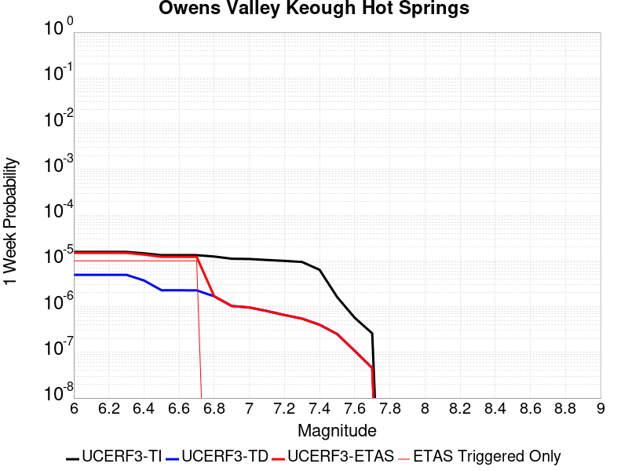 |  |  | 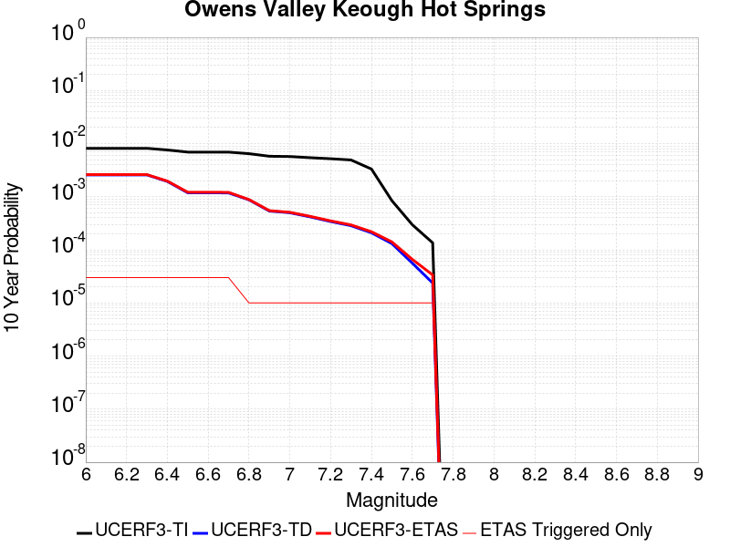 |

| Magnitude | 1 wk TI Prob | 1 wk TD Prob | 1 wk ETAS Prob | 1 wk ETAS/TD Gain | 1 wk ETAS Triggered Only | 1 mo TI Prob | 1 mo TD Prob | 1 mo ETAS Prob | 1 mo ETAS/TD Gain | 1 mo ETAS Triggered Only | 1 yr TI Prob | 1 yr TD Prob | 1 yr ETAS Prob | 1 yr ETAS/TD Gain | 1 yr ETAS Triggered Only | 10 yr TI Prob | 10 yr TD Prob | 10 yr ETAS Prob | 10 yr ETAS/TD Gain | 10 yr ETAS Triggered Only |
|-----|-----|-----|-----|-----|-----|-----|-----|-----|-----|-----|-----|-----|-----|-----|-----|-----|-----|-----|-----|-----|
| 6.0 | 1.5708529E-5 | 4.950656E-6 | 1.4950607E-5 | 3.0199244 | 1.0E-5 | 6.7320536E-5 | 2.1216953E-5 | 3.121674E-5 | 1.4713112 | 1.0E-5 | 8.193192E-4 | 2.582909E-4 | 2.6828834E-4 | 1.0387061 | 1.0E-5 | 0.008163051 | 0.0025805652 | 0.0026104876 | 1.0115954 | 3.0E-5 |
| 6.1 | 1.5708529E-5 | 4.950656E-6 | 1.4950607E-5 | 3.0199244 | 1.0E-5 | 6.7320536E-5 | 2.1216953E-5 | 3.121674E-5 | 1.4713112 | 1.0E-5 | 8.193192E-4 | 2.582909E-4 | 2.6828834E-4 | 1.0387061 | 1.0E-5 | 0.008163051 | 0.0025805652 | 0.0026104876 | 1.0115954 | 3.0E-5 |
| 6.2 | 1.5708529E-5 | 4.950656E-6 | 1.4950607E-5 | 3.0199244 | 1.0E-5 | 6.7320536E-5 | 2.1216953E-5 | 3.121674E-5 | 1.4713112 | 1.0E-5 | 8.193192E-4 | 2.582909E-4 | 2.6828834E-4 | 1.0387061 | 1.0E-5 | 0.008163051 | 0.0025805652 | 0.0026104876 | 1.0115954 | 3.0E-5 |
| 6.3 | 1.5708529E-5 | 4.950656E-6 | 1.4950607E-5 | 3.0199244 | 1.0E-5 | 6.7320536E-5 | 2.1216953E-5 | 3.121674E-5 | 1.4713112 | 1.0E-5 | 8.193192E-4 | 2.582909E-4 | 2.6828834E-4 | 1.0387061 | 1.0E-5 | 0.008163051 | 0.0025805652 | 0.0026104876 | 1.0115954 | 3.0E-5 |
| 6.4 | 1.4622509E-5 | 3.7265204E-6 | 1.3726483E-5 | 3.6834583 | 1.0E-5 | 6.266639E-5 | 1.5970723E-5 | 2.5970563E-5 | 1.6261357 | 1.0E-5 | 7.626962E-4 | 1.944295E-4 | 2.0442756E-4 | 1.0514225 | 1.0E-5 | 0.007600839 | 0.0019430731 | 0.0019730148 | 1.0154095 | 3.0E-5 |
| 6.5 | 1.3335527E-5 | 2.2777172E-6 | 1.2277695E-5 | 5.390351 | 1.0E-5 | 5.7151006E-5 | 9.761612E-6 | 1.9761514E-5 | 2.024411 | 1.0E-5 | 6.955913E-4 | 1.18841825E-4 | 1.2884063E-4 | 1.0841354 | 1.0E-5 | 0.0069341804 | 0.0011880046 | 0.001217969 | 1.0252224 | 3.0E-5 |
| 6.6 | 1.3332855E-5 | 2.2748663E-6 | 1.2274843E-5 | 5.3958526 | 1.0E-5 | 5.7139558E-5 | 9.749395E-6 | 1.9749297E-5 | 2.0256948 | 1.0E-5 | 6.9545204E-4 | 1.186931E-4 | 1.2869191E-4 | 1.0842409 | 1.0E-5 | 0.0069327964 | 0.0011865189 | 0.0012164833 | 1.025254 | 3.0E-5 |
| 6.7 | 1.3318214E-5 | 2.2640966E-6 | 1.2264074E-5 | 5.416763 | 1.0E-5 | 5.707681E-5 | 9.703239E-6 | 1.9703142E-5 | 2.0305736 | 1.0E-5 | 6.946886E-4 | 1.1813121E-4 | 1.2813004E-4 | 1.0846416 | 1.0E-5 | 0.0069252094 | 0.001180906 | 0.0012108706 | 1.0253742 | 3.0E-5 |
| 6.8 | 1.2441338E-5 | 1.6777863E-6 | 1.6777863E-6 | 1.0 | 0.0 | 5.331893E-5 | 7.1904947E-6 | 7.1904947E-6 | 1.0 | 0.0 | 6.489646E-4 | 8.7541055E-5 | 8.7541055E-5 | 1.0 | 0.0 | 0.0064707273 | 8.752499E-4 | 8.8524114E-4 | 1.0114154 | 1.0E-5 |
| 6.9 | 1.1130476E-5 | 1.0303868E-6 | 1.0303868E-6 | 1.0 | 0.0 | 4.7701167E-5 | 4.415936E-6 | 4.415936E-6 | 1.0 | 0.0 | 5.806069E-4 | 5.3762706E-5 | 5.3762706E-5 | 1.0 | 0.0 | 0.0057909233 | 5.37651E-4 | 5.476456E-4 | 1.0185894 | 1.0E-5 |
| 7.0 | 1.0986073E-5 | 9.579413E-7 | 9.579413E-7 | 1.0 | 0.0 | 4.7082318E-5 | 4.1054564E-6 | 4.1054564E-6 | 1.0 | 0.0 | 5.730765E-4 | 4.99828E-5 | 4.99828E-5 | 1.0 | 0.0 | 0.0057160086 | 4.9986853E-4 | 5.0986354E-4 | 1.0199952 | 1.0E-5 |
| 7.1 | 1.0451338E-5 | 8.0002656E-7 | 8.0002656E-7 | 1.0 | 0.0 | 4.4790682E-5 | 3.4286807E-6 | 3.4286807E-6 | 1.0 | 0.0 | 5.451901E-4 | 4.1743395E-5 | 4.1743395E-5 | 1.0 | 0.0 | 0.005438545 | 4.1750458E-4 | 4.275004E-4 | 1.0239419 | 1.0E-5 |
| 7.2 | 9.989061E-6 | 6.544956E-7 | 6.544956E-7 | 1.0 | 0.0 | 4.280956E-5 | 2.804978E-6 | 2.804978E-6 | 1.0 | 0.0 | 5.2108173E-4 | 3.4150078E-5 | 3.4150078E-5 | 1.0 | 0.0 | 0.0051986156 | 3.415851E-4 | 3.515817E-4 | 1.0292653 | 1.0E-5 |
| 7.3 | 9.465365E-6 | 5.4600474E-7 | 5.4600474E-7 | 1.0 | 0.0 | 4.056522E-5 | 2.3400182E-6 | 2.3400182E-6 | 1.0 | 0.0 | 4.937696E-4 | 2.8489352E-5 | 2.8489352E-5 | 1.0 | 0.0 | 0.0049267393 | 2.8498896E-4 | 2.949861E-4 | 1.0350791 | 1.0E-5 |
| 7.4 | 6.3824805E-6 | 4.016335E-7 | 4.016335E-7 | 1.0 | 0.0 | 2.73532E-5 | 1.7212853E-6 | 1.7212853E-6 | 1.0 | 0.0 | 3.3297433E-4 | 2.095645E-5 | 2.095645E-5 | 1.0 | 0.0 | 0.0033247585 | 2.0963654E-4 | 2.1963443E-4 | 1.0476916 | 1.0E-5 |
| 7.5 | 1.6192645E-6 | 2.516124E-7 | 2.516124E-7 | 1.0 | 0.0 | 6.9396865E-6 | 1.0783383E-6 | 1.0783383E-6 | 1.0 | 0.0 | 8.448741E-5 | 1.31286915E-5 | 1.31286915E-5 | 1.0 | 0.0 | 8.4455294E-4 | 1.3127929E-4 | 1.4127798E-4 | 1.0761635 | 1.0E-5 |
| 7.6 | 5.7062545E-7 | 1.07924045E-7 | 1.07924045E-7 | 1.0 | 0.0 | 2.4455355E-6 | 4.6253152E-7 | 4.6253152E-7 | 1.0 | 0.0 | 2.9773988E-5 | 5.6313074E-6 | 5.6313074E-6 | 1.0 | 0.0 | 2.977E-4 | 5.6311732E-5 | 6.631117E-5 | 1.1775728 | 1.0E-5 |
| 7.7 | 2.5988817E-7 | 4.5457977E-8 | 4.5457977E-8 | 1.0 | 0.0 | 1.113806E-6 | 1.9481989E-7 | 1.9481989E-7 | 1.0 | 0.0 | 1.3560503E-5 | 2.3719301E-6 | 2.3719301E-6 | 1.0 | 0.0 | 1.3559677E-4 | 2.371909E-5 | 3.3718854E-5 | 1.4215913 | 1.0E-5 |

## Great Valley 07 (Orestimba)
*[(top)](#table-of-contents)*

| 1 Week | 1 Month | 1 Year | 10 Year |
|-----|-----|-----|-----|
|  |  |  |  |

| Magnitude | 1 wk TI Prob | 1 wk TD Prob | 1 wk ETAS Prob | 1 wk ETAS/TD Gain | 1 wk ETAS Triggered Only | 1 mo TI Prob | 1 mo TD Prob | 1 mo ETAS Prob | 1 mo ETAS/TD Gain | 1 mo ETAS Triggered Only | 1 yr TI Prob | 1 yr TD Prob | 1 yr ETAS Prob | 1 yr ETAS/TD Gain | 1 yr ETAS Triggered Only | 10 yr TI Prob | 10 yr TD Prob | 10 yr ETAS Prob | 10 yr ETAS/TD Gain | 10 yr ETAS Triggered Only |
|-----|-----|-----|-----|-----|-----|-----|-----|-----|-----|-----|-----|-----|-----|-----|-----|-----|-----|-----|-----|-----|
| 6.0 | 2.9687902E-5 | 3.27575E-5 | 3.27575E-5 | 1.0 | 0.0 | 1.2722766E-4 | 1.4038214E-4 | 1.5038073E-4 | 1.0712241 | 1.0E-5 | 0.0015478961 | 0.0017078844 | 0.0017278503 | 1.0116904 | 2.0E-5 | 0.015371585 | 0.016955135 | 0.016984627 | 1.0017394 | 3.0E-5 |
| 6.1 | 2.9687902E-5 | 3.27575E-5 | 3.27575E-5 | 1.0 | 0.0 | 1.2722766E-4 | 1.4038214E-4 | 1.4038214E-4 | 1.0 | 0.0 | 0.0015478961 | 0.0017078844 | 0.0017178673 | 1.0058452 | 1.0E-5 | 0.015371585 | 0.016955135 | 0.016974797 | 1.0011595 | 2.0E-5 |
| 6.2 | 1.9231524E-5 | 2.1159167E-5 | 2.1159167E-5 | 1.0 | 0.0 | 8.2418206E-5 | 9.067912E-5 | 9.067912E-5 | 1.0 | 0.0 | 0.0010029797 | 0.0011034822 | 0.0011134712 | 1.0090523 | 1.0E-5 | 0.00998465 | 0.01098244 | 0.01100222 | 1.0018011 | 2.0E-5 |
| 6.3 | 1.324766E-5 | 1.4548534E-5 | 1.4548534E-5 | 1.0 | 0.0 | 5.6774446E-5 | 6.234942E-5 | 6.234942E-5 | 1.0 | 0.0 | 6.910097E-4 | 7.5884897E-4 | 7.6884136E-4 | 1.0131679 | 1.0E-5 | 0.006888649 | 0.0075635235 | 0.0075833723 | 1.0026243 | 2.0E-5 |
| 6.4 | 7.818645E-6 | 8.57284E-6 | 8.57284E-6 | 1.0 | 0.0 | 3.3508048E-5 | 3.6740246E-5 | 3.6740246E-5 | 1.0 | 0.0 | 4.078841E-4 | 4.4722404E-4 | 4.5721958E-4 | 1.0223502 | 1.0E-5 | 0.004071363 | 0.0044635804 | 0.004473536 | 1.0022304 | 1.0E-5 |
| 6.5 | 5.3076565E-6 | 5.8178007E-6 | 5.8178007E-6 | 1.0 | 0.0 | 2.27469E-5 | 2.4933206E-5 | 2.4933206E-5 | 1.0 | 0.0 | 2.7690834E-4 | 3.035216E-4 | 3.1351857E-4 | 1.0329366 | 1.0E-5 | 0.0027656353 | 0.00303128 | 0.0030412497 | 1.003289 | 1.0E-5 |
| 6.6 | 3.6003578E-6 | 3.9484953E-6 | 3.9484953E-6 | 1.0 | 0.0 | 1.5430012E-5 | 1.6922022E-5 | 1.6922022E-5 | 1.0 | 0.0 | 1.8784421E-4 | 2.0600771E-4 | 2.0600771E-4 | 1.0 | 0.0 | 0.0018768552 | 0.0020583214 | 0.0020583214 | 1.0 | 0.0 |
| 6.7 | 2.5361826E-6 | 2.7834678E-6 | 2.7834678E-6 | 1.0 | 0.0 | 1.0869308E-5 | 1.1929101E-5 | 1.1929101E-5 | 1.0 | 0.0 | 1.3232579E-4 | 1.4522845E-4 | 1.4522845E-4 | 1.0 | 0.0 | 0.0013224703 | 0.0014514653 | 0.0014514653 | 1.0 | 0.0 |
| 6.8 | 1.2115831E-6 | 1.3313797E-6 | 1.3313797E-6 | 1.0 | 0.0 | 5.1924885E-6 | 5.7059065E-6 | 5.7059065E-6 | 1.0 | 0.0 | 6.3216714E-5 | 6.9468166E-5 | 6.9468166E-5 | 1.0 | 0.0 | 6.3198735E-4 | 6.945596E-4 | 6.945596E-4 | 1.0 | 0.0 |

## San Andreas (Offshore) 2011 CFM
*[(top)](#table-of-contents)*

| 1 Week | 1 Month | 1 Year | 10 Year |
|-----|-----|-----|-----|
|  |  | 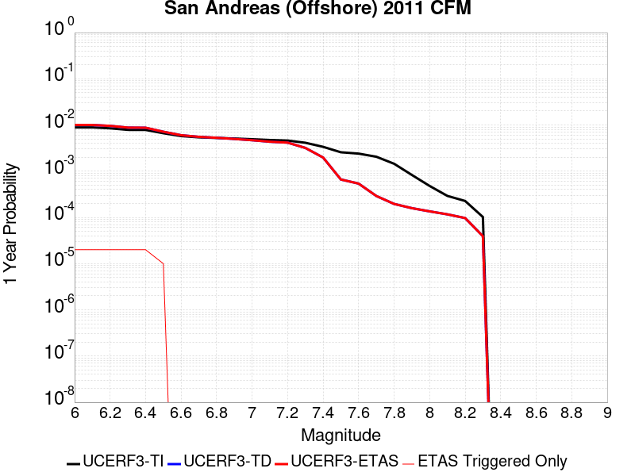 |  |

| Magnitude | 1 wk TI Prob | 1 wk TD Prob | 1 wk ETAS Prob | 1 wk ETAS/TD Gain | 1 wk ETAS Triggered Only | 1 mo TI Prob | 1 mo TD Prob | 1 mo ETAS Prob | 1 mo ETAS/TD Gain | 1 mo ETAS Triggered Only | 1 yr TI Prob | 1 yr TD Prob | 1 yr ETAS Prob | 1 yr ETAS/TD Gain | 1 yr ETAS Triggered Only | 10 yr TI Prob | 10 yr TD Prob | 10 yr ETAS Prob | 10 yr ETAS/TD Gain | 10 yr ETAS Triggered Only |
|-----|-----|-----|-----|-----|-----|-----|-----|-----|-----|-----|-----|-----|-----|-----|-----|-----|-----|-----|-----|-----|
| 6.0 | 1.7072787E-4 | 1.9226041E-4 | 2.022585E-4 | 1.0520028 | 1.0E-5 | 7.3148566E-4 | 8.237154E-4 | 8.43699E-4 | 1.0242603 | 2.0E-5 | 0.008869528 | 0.0099831335 | 0.010002934 | 1.0019834 | 2.0E-5 | 0.085237645 | 0.09682738 | 0.09685448 | 1.0002798 | 3.0E-5 |
| 6.1 | 1.7072787E-4 | 1.9226041E-4 | 2.022585E-4 | 1.0520028 | 1.0E-5 | 7.3148566E-4 | 8.237154E-4 | 8.43699E-4 | 1.0242603 | 2.0E-5 | 0.008869528 | 0.0099831335 | 0.010002934 | 1.0019834 | 2.0E-5 | 0.085237645 | 0.09682738 | 0.09685448 | 1.0002798 | 3.0E-5 |
| 6.2 | 1.6312556E-4 | 1.8407789E-4 | 1.9407604E-4 | 1.0543149 | 1.0E-5 | 6.989222E-4 | 7.8866904E-4 | 8.086533E-4 | 1.0253391 | 2.0E-5 | 0.008476226 | 0.009560268 | 0.009580078 | 1.002072 | 2.0E-5 | 0.08160117 | 0.09284818 | 0.0928754 | 1.0002931 | 3.0E-5 |
| 6.3 | 1.5103363E-4 | 1.6880741E-4 | 1.7880571E-4 | 1.0592291 | 1.0E-5 | 6.471264E-4 | 7.232619E-4 | 7.4324745E-4 | 1.0276325 | 2.0E-5 | 0.007850339 | 0.008770605 | 0.008790429 | 1.0022603 | 2.0E-5 | 0.075787395 | 0.085489064 | 0.085516505 | 1.0003209 | 3.0E-5 |
| 6.4 | 1.5047993E-4 | 1.676667E-4 | 1.7766502E-4 | 1.0596322 | 1.0E-5 | 6.4475456E-4 | 7.1837584E-4 | 7.383615E-4 | 1.0278206 | 2.0E-5 | 0.007821669 | 0.008711592 | 0.008731418 | 1.0022758 | 2.0E-5 | 0.0755203 | 0.08496926 | 0.084996715 | 1.000323 | 3.0E-5 |
| 6.5 | 1.2760791E-4 | 1.3735025E-4 | 1.4734887E-4 | 1.0727966 | 1.0E-5 | 5.467764E-4 | 5.885125E-4 | 5.985066E-4 | 1.016982 | 1.0E-5 | 0.0066367025 | 0.0071418737 | 0.007151802 | 1.0013902 | 1.0E-5 | 0.064419635 | 0.07025001 | 0.07026861 | 1.0002646 | 2.0E-5 |
| 6.6 | 1.1063525E-4 | 1.15566356E-4 | 1.15566356E-4 | 1.0 | 0.0 | 4.740649E-4 | 4.9519143E-4 | 4.9519143E-4 | 1.0 | 0.0 | 0.0057564764 | 0.006012491 | 0.006012491 | 1.0 | 0.0 | 0.05609626 | 0.05948894 | 0.059498347 | 1.0001581 | 1.0E-5 |
| 6.7 | 1.0391049E-4 | 1.0645922E-4 | 1.0645922E-4 | 1.0 | 0.0 | 4.4525467E-4 | 4.5617504E-4 | 4.5617504E-4 | 1.0 | 0.0 | 0.0054075094 | 0.005539975 | 0.005539975 | 1.0 | 0.0 | 0.052778035 | 0.05498876 | 0.05499821 | 1.0001719 | 1.0E-5 |
| 6.8 | 1.0096706E-4 | 1.01582686E-4 | 1.01582686E-4 | 1.0 | 0.0 | 4.3264418E-4 | 4.3528268E-4 | 4.3528268E-4 | 1.0 | 0.0 | 0.0052547283 | 0.005286866 | 0.005286866 | 1.0 | 0.0 | 0.051321987 | 0.052687574 | 0.052697048 | 1.0001798 | 1.0E-5 |
| 6.9 | 9.800265E-5 | 9.588748E-5 | 9.588748E-5 | 1.0 | 0.0 | 4.1994374E-4 | 4.1088252E-4 | 4.1088252E-4 | 1.0 | 0.0 | 0.0051008356 | 0.0049911886 | 0.0049911886 | 1.0 | 0.0 | 0.049853306 | 0.05001504 | 0.05001504 | 1.0 | 0.0 |
| 7.0 | 9.4642375E-5 | 9.002143E-5 | 9.002143E-5 | 1.0 | 0.0 | 4.0554712E-4 | 3.8574997E-4 | 3.8574997E-4 | 1.0 | 0.0 | 0.004926363 | 0.0046865544 | 0.0046865544 | 1.0 | 0.0 | 0.048185747 | 0.047196057 | 0.047196057 | 1.0 | 0.0 |
| 7.1 | 9.0996844E-5 | 8.354169E-5 | 8.354169E-5 | 1.0 | 0.0 | 3.8992817E-4 | 3.5798753E-4 | 3.5798753E-4 | 1.0 | 0.0 | 0.004737046 | 0.004349944 | 0.004349944 | 1.0 | 0.0 | 0.04637333 | 0.044047635 | 0.044047635 | 1.0 | 0.0 |
| 7.2 | 8.848287E-5 | 7.9818135E-5 | 7.9818135E-5 | 1.0 | 0.0 | 3.791572E-4 | 3.4203375E-4 | 3.4203375E-4 | 1.0 | 0.0 | 0.004606472 | 0.0041564633 | 0.0041564633 | 1.0 | 0.0 | 0.045121472 | 0.042191572 | 0.042191572 | 1.0 | 0.0 |
| 7.3 | 7.9280784E-5 | 6.1276216E-5 | 6.1276216E-5 | 1.0 | 0.0 | 3.3973053E-4 | 2.625865E-4 | 2.625865E-4 | 1.0 | 0.0 | 0.004128377 | 0.0031924061 | 0.0031924061 | 1.0 | 0.0 | 0.040525194 | 0.032904375 | 0.032904375 | 1.0 | 0.0 |
| 7.4 | 6.468038E-5 | 3.7933212E-5 | 3.7933212E-5 | 1.0 | 0.0 | 2.771722E-4 | 1.625611E-4 | 1.625611E-4 | 1.0 | 0.0 | 0.0033693502 | 0.0019774425 | 0.0019774425 | 1.0 | 0.0 | 0.0331872 | 0.02082181 | 0.02082181 | 1.0 | 0.0 |
| 7.5 | 4.930574E-5 | 1.2703362E-5 | 1.2703362E-5 | 1.0 | 0.0 | 2.1129321E-4 | 5.444185E-5 | 5.444185E-5 | 1.0 | 0.0 | 0.0025694598 | 6.6262955E-4 | 6.6262955E-4 | 1.0 | 0.0 | 0.02539953 | 0.007481418 | 0.007481418 | 1.0 | 0.0 |
| 7.6 | 4.612566E-5 | 1.0336213E-5 | 1.0336213E-5 | 1.0 | 0.0 | 1.9766642E-4 | 4.429731E-5 | 4.429731E-5 | 1.0 | 0.0 | 0.0024039324 | 5.391877E-4 | 5.391877E-4 | 1.0 | 0.0 | 0.023780935 | 0.006172099 | 0.006172099 | 1.0 | 0.0 |
| 7.7 | 3.9435414E-5 | 5.574925E-6 | 5.574925E-6 | 1.0 | 0.0 | 1.6899795E-4 | 2.3892318E-5 | 2.3892318E-5 | 1.0 | 0.0 | 0.0020556084 | 2.9085035E-4 | 2.9085035E-4 | 1.0 | 0.0 | 0.020366974 | 0.0035420412 | 0.0035420412 | 1.0 | 0.0 |
| 7.8 | 2.7787428E-5 | 3.7553348E-6 | 3.7553348E-6 | 1.0 | 0.0 | 1.1908354E-4 | 1.6094193E-5 | 1.6094193E-5 | 1.0 | 0.0 | 0.0014488777 | 1.9592921E-4 | 1.9592921E-4 | 1.0 | 0.0 | 0.014394675 | 0.0023877125 | 0.0023877125 | 1.0 | 0.0 |
| 7.9 | 1.590671E-5 | 3.04085E-6 | 3.04085E-6 | 1.0 | 0.0 | 6.816983E-5 | 1.303215E-5 | 1.303215E-5 | 1.0 | 0.0 | 8.2965166E-4 | 1.586549E-4 | 1.586549E-4 | 1.0 | 0.0 | 0.008265611 | 0.001904262 | 0.001904262 | 1.0 | 0.0 |
| 8.0 | 9.193638E-6 | 2.5920847E-6 | 2.5920847E-6 | 1.0 | 0.0 | 3.940071E-5 | 1.1108887E-5 | 1.1108887E-5 | 1.0 | 0.0 | 4.7959806E-4 | 1.3524233E-4 | 1.3524233E-4 | 1.0 | 0.0 | 0.0047856434 | 0.0016115032 | 0.0016115032 | 1.0 | 0.0 |
| 8.1 | 5.601576E-6 | 2.2343472E-6 | 2.2343472E-6 | 1.0 | 0.0 | 2.4006533E-5 | 9.575739E-6 | 9.575739E-6 | 1.0 | 0.0 | 2.9224035E-4 | 1.16578405E-4 | 1.16578405E-4 | 1.0 | 0.0 | 0.0029185633 | 0.0014020674 | 0.0014020674 | 1.0 | 0.0 |
| 8.2 | 4.3508785E-6 | 1.857566E-6 | 1.857566E-6 | 1.0 | 0.0 | 1.864649E-5 | 7.960973E-6 | 7.960973E-6 | 1.0 | 0.0 | 2.2699735E-4 | 9.692056E-5 | 9.692056E-5 | 1.0 | 0.0 | 0.0022676561 | 0.0011594221 | 0.0011594221 | 1.0 | 0.0 |
| 8.3 | 1.9573292E-6 | 7.514906E-7 | 7.514906E-7 | 1.0 | 0.0 | 8.388526E-6 | 3.22067E-6 | 3.22067E-6 | 1.0 | 0.0 | 1.0212552E-4 | 3.921097E-5 | 3.921097E-5 | 1.0 | 0.0 | 0.001020786 | 4.640846E-4 | 4.640846E-4 | 1.0 | 0.0 |

## Holser alt 1
*[(top)](#table-of-contents)*

| 1 Week | 1 Month | 1 Year | 10 Year |
|-----|-----|-----|-----|
|  |  |  |  |

| Magnitude | 1 wk TI Prob | 1 wk TD Prob | 1 wk ETAS Prob | 1 wk ETAS/TD Gain | 1 wk ETAS Triggered Only | 1 mo TI Prob | 1 mo TD Prob | 1 mo ETAS Prob | 1 mo ETAS/TD Gain | 1 mo ETAS Triggered Only | 1 yr TI Prob | 1 yr TD Prob | 1 yr ETAS Prob | 1 yr ETAS/TD Gain | 1 yr ETAS Triggered Only | 10 yr TI Prob | 10 yr TD Prob | 10 yr ETAS Prob | 10 yr ETAS/TD Gain | 10 yr ETAS Triggered Only |
|-----|-----|-----|-----|-----|-----|-----|-----|-----|-----|-----|-----|-----|-----|-----|-----|-----|-----|-----|-----|-----|
| 6.0 | 6.2746653E-6 | 5.789965E-6 | 1.5789907E-5 | 2.727116 | 1.0E-5 | 2.6891146E-5 | 2.4813964E-5 | 4.4813467E-5 | 1.8059778 | 2.0E-5 | 3.273505E-4 | 3.020797E-4 | 3.320706E-4 | 1.0992815 | 3.0E-5 | 0.0032686873 | 0.0030178234 | 0.0030477329 | 1.009911 | 3.0E-5 |
| 6.1 | 6.2746653E-6 | 5.789965E-6 | 1.5789907E-5 | 2.727116 | 1.0E-5 | 2.6891146E-5 | 2.4813964E-5 | 4.4813467E-5 | 1.8059778 | 2.0E-5 | 3.273505E-4 | 3.020797E-4 | 3.320706E-4 | 1.0992815 | 3.0E-5 | 0.0032686873 | 0.0030178234 | 0.0030477329 | 1.009911 | 3.0E-5 |
| 6.2 | 6.2746653E-6 | 5.789965E-6 | 1.5789907E-5 | 2.727116 | 1.0E-5 | 2.6891146E-5 | 2.4813964E-5 | 4.4813467E-5 | 1.8059778 | 2.0E-5 | 3.273505E-4 | 3.020797E-4 | 3.320706E-4 | 1.0992815 | 3.0E-5 | 0.0032686873 | 0.0030178234 | 0.0030477329 | 1.009911 | 3.0E-5 |
| 6.3 | 6.2746653E-6 | 5.789965E-6 | 1.5789907E-5 | 2.727116 | 1.0E-5 | 2.6891146E-5 | 2.4813964E-5 | 4.4813467E-5 | 1.8059778 | 2.0E-5 | 3.273505E-4 | 3.020797E-4 | 3.320706E-4 | 1.0992815 | 3.0E-5 | 0.0032686873 | 0.0030178234 | 0.0030477329 | 1.009911 | 3.0E-5 |
| 6.4 | 6.2746653E-6 | 5.789965E-6 | 1.5789907E-5 | 2.727116 | 1.0E-5 | 2.6891146E-5 | 2.4813964E-5 | 4.4813467E-5 | 1.8059778 | 2.0E-5 | 3.273505E-4 | 3.020797E-4 | 3.320706E-4 | 1.0992815 | 3.0E-5 | 0.0032686873 | 0.0030178234 | 0.0030477329 | 1.009911 | 3.0E-5 |
| 6.5 | 6.2746653E-6 | 5.789965E-6 | 1.5789907E-5 | 2.727116 | 1.0E-5 | 2.6891146E-5 | 2.4813964E-5 | 4.4813467E-5 | 1.8059778 | 2.0E-5 | 3.273505E-4 | 3.020797E-4 | 3.320706E-4 | 1.0992815 | 3.0E-5 | 0.0032686873 | 0.0030178234 | 0.0030477329 | 1.009911 | 3.0E-5 |
| 6.6 | 3.375825E-6 | 2.7711897E-6 | 1.2771162E-5 | 4.6085486 | 1.0E-5 | 1.4467741E-5 | 1.1876474E-5 | 3.1876236E-5 | 2.6839814 | 2.0E-5 | 1.761305E-4 | 1.4458665E-4 | 1.6458376E-4 | 1.1383053 | 2.0E-5 | 0.0017599097 | 0.0014449427 | 0.0014649138 | 1.0138214 | 2.0E-5 |
| 6.7 | 3.375825E-6 | 2.7711897E-6 | 1.2771162E-5 | 4.6085486 | 1.0E-5 | 1.4467741E-5 | 1.1876474E-5 | 3.1876236E-5 | 2.6839814 | 2.0E-5 | 1.761305E-4 | 1.4458665E-4 | 1.6458376E-4 | 1.1383053 | 2.0E-5 | 0.0017599097 | 0.0014449427 | 0.0014649138 | 1.0138214 | 2.0E-5 |
| 6.8 | 3.366533E-6 | 2.7615893E-6 | 1.2761561E-5 | 4.6210933 | 1.0E-5 | 1.4427919E-5 | 1.183533E-5 | 3.1835094E-5 | 2.6898358 | 2.0E-5 | 1.7564575E-4 | 1.4408577E-4 | 1.640829E-4 | 1.1387862 | 2.0E-5 | 0.0017550698 | 0.0014399405 | 0.0014599117 | 1.0138694 | 2.0E-5 |
| 6.9 | 3.253174E-6 | 2.6438113E-6 | 1.2643785E-5 | 4.782408 | 1.0E-5 | 1.39421E-5 | 1.1330571E-5 | 3.1330346E-5 | 2.765116 | 2.0E-5 | 1.6973184E-4 | 1.3794114E-4 | 1.5793838E-4 | 1.1449693 | 2.0E-5 | 0.0016960226 | 0.001378571 | 0.0013985435 | 1.0144877 | 2.0E-5 |
| 7.0 | 2.9336593E-6 | 2.311799E-6 | 1.2311776E-5 | 5.3256254 | 1.0E-5 | 1.2572766E-5 | 9.907673E-6 | 2.9907475E-5 | 3.0186174 | 2.0E-5 | 1.5306266E-4 | 1.2061927E-4 | 1.4061686E-4 | 1.165791 | 2.0E-5 | 0.0015295728 | 0.0012055405 | 0.0012255164 | 1.0165701 | 2.0E-5 |
| 7.1 | 2.9087812E-6 | 2.2876513E-6 | 1.2287628E-5 | 5.3712854 | 1.0E-5 | 1.2466146E-5 | 9.804184E-6 | 2.9803987E-5 | 3.0399256 | 2.0E-5 | 1.5176475E-4 | 1.19359414E-4 | 1.3935703E-4 | 1.1675411 | 2.0E-5 | 0.0015166114 | 0.0011929555 | 0.0012129317 | 1.0167451 | 2.0E-5 |
| 7.2 | 2.8674524E-6 | 2.2475429E-6 | 1.224752E-5 | 5.4492936 | 1.0E-5 | 1.2289024E-5 | 9.63229E-6 | 2.9632098E-5 | 3.0763292 | 2.0E-5 | 1.4960859E-4 | 1.1726685E-4 | 1.372645E-4 | 1.1705312 | 2.0E-5 | 0.0014950791 | 0.001172052 | 0.0011920286 | 1.0170441 | 2.0E-5 |
| 7.3 | 2.8057775E-6 | 2.1954324E-6 | 1.2195411E-5 | 5.554901 | 1.0E-5 | 1.2024705E-5 | 9.408962E-6 | 2.9408775E-5 | 3.125613 | 2.0E-5 | 1.4639096E-4 | 1.14548115E-4 | 1.3454583E-4 | 1.1745791 | 2.0E-5 | 0.0014629456 | 0.001144893 | 0.0011648701 | 1.0174489 | 2.0E-5 |
| 7.4 | 2.683666E-6 | 2.1092305E-6 | 1.210921E-5 | 5.7410555 | 1.0E-5 | 1.1501375E-5 | 9.039529E-6 | 2.9039347E-5 | 3.2124848 | 2.0E-5 | 1.4002025E-4 | 1.1005072E-4 | 1.3004852E-4 | 1.1817144 | 2.0E-5 | 0.0013993206 | 0.0010999644 | 0.0011199424 | 1.0181624 | 2.0E-5 |
| 7.5 | 2.434495E-6 | 1.9195363E-6 | 1.1919517E-5 | 6.209582 | 1.0E-5 | 1.0433508E-5 | 8.226558E-6 | 2.8226394E-5 | 3.4311304 | 2.0E-5 | 1.2702055E-4 | 1.0015376E-4 | 1.2015176E-4 | 1.1996729 | 2.0E-5 | 0.0012694797 | 0.0010010883 | 0.0010210682 | 1.0199583 | 2.0E-5 |
| 7.6 | 1.9914562E-6 | 1.5731459E-6 | 1.157313E-5 | 7.356679 | 1.0E-5 | 8.534785E-6 | 6.742037E-6 | 2.6741902E-5 | 3.9664426 | 2.0E-5 | 1.03906044E-4 | 8.208122E-5 | 1.0207958E-4 | 1.2436411 | 2.0E-5 | 0.0010385747 | 8.205106E-4 | 8.404942E-4 | 1.024355 | 2.0E-5 |
| 7.7 | 1.5229501E-6 | 1.1896061E-6 | 1.1189594E-5 | 9.406134 | 1.0E-5 | 6.526913E-6 | 5.098302E-6 | 2.50982E-5 | 4.9228544 | 2.0E-5 | 7.946226E-5 | 6.2070074E-5 | 8.206883E-5 | 1.3221965 | 2.0E-5 | 7.943385E-4 | 6.2052865E-4 | 6.405162E-4 | 1.0322106 | 2.0E-5 |
| 7.8 | 6.3489426E-7 | 4.687806E-7 | 1.0468776E-5 | 22.331932 | 1.0E-5 | 2.7209726E-6 | 2.009058E-6 | 1.2009038E-5 | 5.977447 | 1.0E-5 | 3.312734E-5 | 2.4460009E-5 | 3.4459765E-5 | 1.4088206 | 1.0E-5 | 3.31224E-4 | 2.4457334E-4 | 2.545709E-4 | 1.0408776 | 1.0E-5 |
| 7.9 | 1.5459432E-7 | 1.0193758E-7 | 1.0101937E-5 | 99.099236 | 1.0E-5 | 6.6254694E-7 | 4.3687527E-7 | 1.0436871E-5 | 23.889818 | 1.0E-5 | 8.066479E-6 | 5.3189433E-6 | 1.531889E-5 | 2.8800626 | 1.0E-5 | 8.066186E-5 | 5.3188178E-5 | 6.318765E-5 | 1.1880018 | 1.0E-5 |
| 8.0 | 1.8307812E-8 | 9.690293E-9 | 9.690293E-9 | 1.0 | 0.0 | 7.846205E-8 | 4.152983E-8 | 4.152983E-8 | 1.0 | 0.0 | 9.55275E-7 | 5.0562556E-7 | 5.0562556E-7 | 1.0 | 0.0 | 9.552709E-6 | 5.0562444E-6 | 5.0562444E-6 | 1.0 | 0.0 |

## Clamshell-Sawpit
*[(top)](#table-of-contents)*

| 1 Week | 1 Month | 1 Year | 10 Year |
|-----|-----|-----|-----|
|  |  | 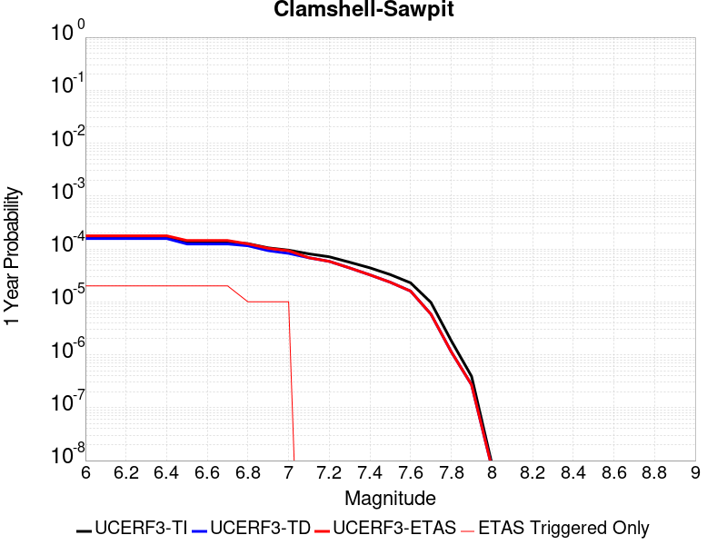 |  |

| Magnitude | 1 wk TI Prob | 1 wk TD Prob | 1 wk ETAS Prob | 1 wk ETAS/TD Gain | 1 wk ETAS Triggered Only | 1 mo TI Prob | 1 mo TD Prob | 1 mo ETAS Prob | 1 mo ETAS/TD Gain | 1 mo ETAS Triggered Only | 1 yr TI Prob | 1 yr TD Prob | 1 yr ETAS Prob | 1 yr ETAS/TD Gain | 1 yr ETAS Triggered Only | 10 yr TI Prob | 10 yr TD Prob | 10 yr ETAS Prob | 10 yr ETAS/TD Gain | 10 yr ETAS Triggered Only |
|-----|-----|-----|-----|-----|-----|-----|-----|-----|-----|-----|-----|-----|-----|-----|-----|-----|-----|-----|-----|-----|
| 6.0 | 3.202998E-6 | 3.0127644E-6 | 2.3012704E-5 | 7.6384015 | 2.0E-5 | 1.3727062E-5 | 1.2911788E-5 | 3.291153E-5 | 2.548952 | 2.0E-5 | 1.6711417E-4 | 1.5719049E-4 | 1.7718734E-4 | 1.1272142 | 2.0E-5 | 0.0016698855 | 0.0015708724 | 0.0016008252 | 1.0190676 | 3.0E-5 |
| 6.1 | 3.202998E-6 | 3.0127644E-6 | 2.3012704E-5 | 7.6384015 | 2.0E-5 | 1.3727062E-5 | 1.2911788E-5 | 3.291153E-5 | 2.548952 | 2.0E-5 | 1.6711417E-4 | 1.5719049E-4 | 1.7718734E-4 | 1.1272142 | 2.0E-5 | 0.0016698855 | 0.0015708724 | 0.0016008252 | 1.0190676 | 3.0E-5 |
| 6.2 | 3.202998E-6 | 3.0127644E-6 | 2.3012704E-5 | 7.6384015 | 2.0E-5 | 1.3727062E-5 | 1.2911788E-5 | 3.291153E-5 | 2.548952 | 2.0E-5 | 1.6711417E-4 | 1.5719049E-4 | 1.7718734E-4 | 1.1272142 | 2.0E-5 | 0.0016698855 | 0.0015708724 | 0.0016008252 | 1.0190676 | 3.0E-5 |
| 6.3 | 3.202998E-6 | 3.0127644E-6 | 2.3012704E-5 | 7.6384015 | 2.0E-5 | 1.3727062E-5 | 1.2911788E-5 | 3.291153E-5 | 2.548952 | 2.0E-5 | 1.6711417E-4 | 1.5719049E-4 | 1.7718734E-4 | 1.1272142 | 2.0E-5 | 0.0016698855 | 0.0015708724 | 0.0016008252 | 1.0190676 | 3.0E-5 |
| 6.4 | 3.202998E-6 | 3.0127644E-6 | 2.3012704E-5 | 7.6384015 | 2.0E-5 | 1.3727062E-5 | 1.2911788E-5 | 3.291153E-5 | 2.548952 | 2.0E-5 | 1.6711417E-4 | 1.5719049E-4 | 1.7718734E-4 | 1.1272142 | 2.0E-5 | 0.0016698855 | 0.0015708724 | 0.0016008252 | 1.0190676 | 3.0E-5 |
| 6.5 | 2.5862723E-6 | 2.380775E-6 | 2.2380727E-5 | 9.400606 | 2.0E-5 | 1.1083977E-5 | 1.0203283E-5 | 3.0203078E-5 | 2.9601336 | 2.0E-5 | 1.3493907E-4 | 1.2421819E-4 | 1.4421571E-4 | 1.160987 | 2.0E-5 | 0.0013485716 | 0.0012415178 | 0.0012614931 | 1.0160893 | 2.0E-5 |
| 6.6 | 2.5862723E-6 | 2.380775E-6 | 2.2380727E-5 | 9.400606 | 2.0E-5 | 1.1083977E-5 | 1.0203283E-5 | 3.0203078E-5 | 2.9601336 | 2.0E-5 | 1.3493907E-4 | 1.2421819E-4 | 1.4421571E-4 | 1.160987 | 2.0E-5 | 0.0013485716 | 0.0012415178 | 0.0012614931 | 1.0160893 | 2.0E-5 |
| 6.7 | 2.5862723E-6 | 2.380775E-6 | 2.2380727E-5 | 9.400606 | 2.0E-5 | 1.1083977E-5 | 1.0203283E-5 | 3.0203078E-5 | 2.9601336 | 2.0E-5 | 1.3493907E-4 | 1.2421819E-4 | 1.4421571E-4 | 1.160987 | 2.0E-5 | 0.0013485716 | 0.0012415178 | 0.0012614931 | 1.0160893 | 2.0E-5 |
| 6.8 | 2.4098806E-6 | 2.1977307E-6 | 1.2197709E-5 | 5.550138 | 1.0E-5 | 1.0328019E-5 | 9.4188135E-6 | 1.941872E-5 | 2.0616949 | 1.0E-5 | 1.2573638E-4 | 1.1466829E-4 | 1.2466715E-4 | 1.087198 | 1.0E-5 | 0.0012566525 | 0.0011461178 | 0.0011561064 | 1.0087152 | 1.0E-5 |
| 6.9 | 2.0073985E-6 | 1.7784248E-6 | 1.1778407E-5 | 6.6229434 | 1.0E-5 | 8.603109E-6 | 7.621799E-6 | 1.7621722E-5 | 2.3120162 | 1.0E-5 | 1.0473781E-4 | 9.279157E-5 | 1.0279064E-4 | 1.1077584 | 1.0E-5 | 0.0010468846 | 9.275401E-4 | 9.3753083E-4 | 1.0107712 | 1.0E-5 |
| 7.0 | 1.8166766E-6 | 1.5807095E-6 | 1.1580693E-5 | 7.326263 | 1.0E-5 | 7.785734E-6 | 6.7744522E-6 | 1.6774384E-5 | 2.476124 | 1.0E-5 | 9.478718E-5 | 8.247593E-5 | 9.2475115E-5 | 1.1212375 | 1.0E-5 | 9.4746763E-4 | 8.244633E-4 | 8.344551E-4 | 1.012119 | 1.0E-5 |
| 7.1 | 1.5471421E-6 | 1.3052961E-6 | 1.3052961E-6 | 1.0 | 0.0 | 6.6305925E-6 | 5.5941146E-6 | 5.5941146E-6 | 1.0 | 0.0 | 8.072447E-5 | 6.8106274E-5 | 6.8106274E-5 | 1.0 | 0.0 | 8.0695155E-4 | 6.808595E-4 | 6.808595E-4 | 1.0 | 0.0 |
| 7.2 | 1.3608037E-6 | 1.1153443E-6 | 1.1153443E-6 | 1.0 | 0.0 | 5.8320024E-6 | 4.7800386E-6 | 4.7800386E-6 | 1.0 | 0.0 | 7.1002316E-5 | 5.8195463E-5 | 5.8195463E-5 | 1.0 | 0.0 | 7.097964E-4 | 5.818069E-4 | 5.818069E-4 | 1.0 | 0.0 |
| 7.3 | 1.0749634E-6 | 8.384254E-7 | 8.384254E-7 | 1.0 | 0.0 | 4.6069777E-6 | 3.593247E-6 | 3.593247E-6 | 1.0 | 0.0 | 5.608851E-5 | 4.374693E-5 | 4.374693E-5 | 1.0 | 0.0 | 5.6074356E-4 | 4.37386E-4 | 4.37386E-4 | 1.0 | 0.0 |
| 7.4 | 8.416856E-7 | 6.200048E-7 | 6.200048E-7 | 1.0 | 0.0 | 3.607219E-6 | 2.6571608E-6 | 2.6571608E-6 | 1.0 | 0.0 | 4.3917007E-5 | 3.2350472E-5 | 3.2350472E-5 | 1.0 | 0.0 | 4.390833E-4 | 3.2345962E-4 | 3.2345962E-4 | 1.0 | 0.0 |
| 7.5 | 6.2779594E-7 | 4.496886E-7 | 4.496886E-7 | 1.0 | 0.0 | 2.6905511E-6 | 1.9272356E-6 | 1.9272356E-6 | 1.0 | 0.0 | 3.275697E-5 | 2.346386E-5 | 2.346386E-5 | 1.0 | 0.0 | 3.275214E-4 | 2.346157E-4 | 2.346157E-4 | 1.0 | 0.0 |
| 7.6 | 4.3822078E-7 | 3.0595405E-7 | 3.0595405E-7 | 1.0 | 0.0 | 1.8780877E-6 | 1.311231E-6 | 1.311231E-6 | 1.0 | 0.0 | 2.2865479E-5 | 1.5964137E-5 | 1.5964137E-5 | 1.0 | 0.0 | 2.2863125E-4 | 1.5963144E-4 | 1.5963144E-4 | 1.0 | 0.0 |
| 7.7 | 1.8704569E-7 | 1.12379205E-7 | 1.12379205E-7 | 1.0 | 0.0 | 8.0162414E-7 | 4.816251E-7 | 4.816251E-7 | 1.0 | 0.0 | 9.75973E-6 | 5.86377E-6 | 5.86377E-6 | 1.0 | 0.0 | 9.7593016E-5 | 5.863622E-5 | 5.863622E-5 | 1.0 | 0.0 |
| 7.8 | 3.5378733E-8 | 2.1838144E-8 | 2.1838144E-8 | 1.0 | 0.0 | 1.5162313E-7 | 9.359204E-8 | 9.359204E-8 | 1.0 | 0.0 | 1.84601E-6 | 1.1394826E-6 | 1.1394826E-6 | 1.0 | 0.0 | 1.8459947E-5 | 1.139477E-5 | 1.139477E-5 | 1.0 | 0.0 |
| 7.9 | 7.504945E-9 | 5.1920326E-9 | 5.1920326E-9 | 1.0 | 0.0 | 3.2164053E-8 | 2.225157E-8 | 2.225157E-8 | 1.0 | 0.0 | 3.9159727E-7 | 2.7091284E-7 | 2.7091284E-7 | 1.0 | 0.0 | 3.915966E-6 | 2.7091257E-6 | 2.7091257E-6 | 1.0 | 0.0 |
| 8.0 | 1.6554036E-10 | 1.4180768E-10 | 1.4180768E-10 | 1.0 | 0.0 | 7.0945894E-10 | 6.077475E-10 | 6.077475E-10 | 1.0 | 0.0 | 8.637662E-9 | 7.3993256E-9 | 7.3993256E-9 | 1.0 | 0.0 | 8.6376616E-8 | 7.3993256E-8 | 7.3993256E-8 | 1.0 | 0.0 |

## Antelope Valley 2011
*[(top)](#table-of-contents)*

| 1 Week | 1 Month | 1 Year | 10 Year |
|-----|-----|-----|-----|
|  | 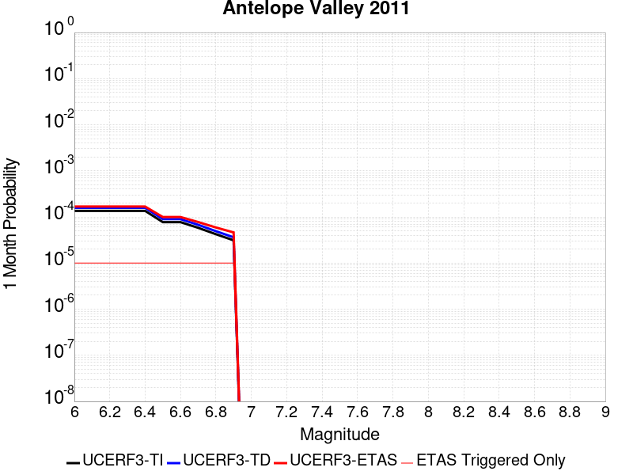 | 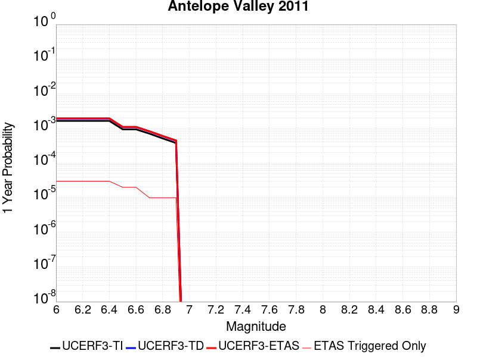 | 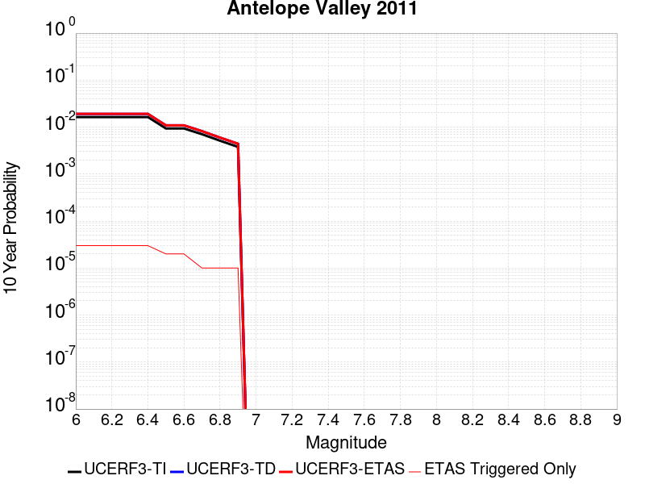 |

| Magnitude | 1 wk TI Prob | 1 wk TD Prob | 1 wk ETAS Prob | 1 wk ETAS/TD Gain | 1 wk ETAS Triggered Only | 1 mo TI Prob | 1 mo TD Prob | 1 mo ETAS Prob | 1 mo ETAS/TD Gain | 1 mo ETAS Triggered Only | 1 yr TI Prob | 1 yr TD Prob | 1 yr ETAS Prob | 1 yr ETAS/TD Gain | 1 yr ETAS Triggered Only | 10 yr TI Prob | 10 yr TD Prob | 10 yr ETAS Prob | 10 yr ETAS/TD Gain | 10 yr ETAS Triggered Only |
|-----|-----|-----|-----|-----|-----|-----|-----|-----|-----|-----|-----|-----|-----|-----|-----|-----|-----|-----|-----|-----|
| 6.0 | 3.1646934E-5 | 3.6904403E-5 | 4.690403E-5 | 1.2709603 | 1.0E-5 | 1.3562266E-4 | 1.5815363E-4 | 1.6815205E-4 | 1.0632197 | 1.0E-5 | 0.0016499552 | 0.0019240845 | 0.0019540268 | 1.0155618 | 3.0E-5 | 0.016377583 | 0.019100651 | 0.019130077 | 1.0015407 | 3.0E-5 |
| 6.1 | 3.1646934E-5 | 3.6904403E-5 | 4.690403E-5 | 1.2709603 | 1.0E-5 | 1.3562266E-4 | 1.5815363E-4 | 1.6815205E-4 | 1.0632197 | 1.0E-5 | 0.0016499552 | 0.0019240845 | 0.0019540268 | 1.0155618 | 3.0E-5 | 0.016377583 | 0.019100651 | 0.019130077 | 1.0015407 | 3.0E-5 |
| 6.2 | 3.1646934E-5 | 3.6904403E-5 | 4.690403E-5 | 1.2709603 | 1.0E-5 | 1.3562266E-4 | 1.5815363E-4 | 1.6815205E-4 | 1.0632197 | 1.0E-5 | 0.0016499552 | 0.0019240845 | 0.0019540268 | 1.0155618 | 3.0E-5 | 0.016377583 | 0.019100651 | 0.019130077 | 1.0015407 | 3.0E-5 |
| 6.3 | 3.1646934E-5 | 3.6904403E-5 | 4.690403E-5 | 1.2709603 | 1.0E-5 | 1.3562266E-4 | 1.5815363E-4 | 1.6815205E-4 | 1.0632197 | 1.0E-5 | 0.0016499552 | 0.0019240845 | 0.0019540268 | 1.0155618 | 3.0E-5 | 0.016377583 | 0.019100651 | 0.019130077 | 1.0015407 | 3.0E-5 |
| 6.4 | 3.1646934E-5 | 3.6904403E-5 | 4.690403E-5 | 1.2709603 | 1.0E-5 | 1.3562266E-4 | 1.5815363E-4 | 1.6815205E-4 | 1.0632197 | 1.0E-5 | 0.0016499552 | 0.0019240845 | 0.0019540268 | 1.0155618 | 3.0E-5 | 0.016377583 | 0.019100651 | 0.019130077 | 1.0015407 | 3.0E-5 |
| 6.5 | 1.8034107E-5 | 2.0940959E-5 | 3.0940748E-5 | 1.4775231 | 1.0E-5 | 7.7286735E-5 | 8.974457E-5 | 9.974367E-5 | 1.1114174 | 1.0E-5 | 9.405598E-4 | 0.0010922146 | 0.0011121928 | 1.0182915 | 2.0E-5 | 0.009365888 | 0.010880542 | 0.010900324 | 1.0018182 | 2.0E-5 |
| 6.6 | 1.8034107E-5 | 2.0940959E-5 | 3.0940748E-5 | 1.4775231 | 1.0E-5 | 7.7286735E-5 | 8.974457E-5 | 9.974367E-5 | 1.1114174 | 1.0E-5 | 9.405598E-4 | 0.0010922146 | 0.0011121928 | 1.0182915 | 2.0E-5 | 0.009365888 | 0.010880542 | 0.010900324 | 1.0018182 | 2.0E-5 |
| 6.7 | 1.3567667E-5 | 1.5749509E-5 | 2.5749352E-5 | 1.6349304 | 1.0E-5 | 5.814585E-5 | 6.749675E-5 | 7.749607E-5 | 1.1481453 | 1.0E-5 | 7.076958E-4 | 8.2156935E-4 | 8.315611E-4 | 1.0121619 | 1.0E-5 | 0.007054463 | 0.008195754 | 0.008205673 | 1.0012101 | 1.0E-5 |
| 6.8 | 9.867387E-6 | 1.1467935E-5 | 2.146782E-5 | 1.8719866 | 1.0E-5 | 4.2288117E-5 | 4.91479E-5 | 5.914741E-5 | 1.2034575 | 1.0E-5 | 5.1473617E-4 | 5.9830636E-4 | 6.083004E-4 | 1.0167038 | 1.0E-5 | 0.005135455 | 0.005976268 | 0.005986208 | 1.0016633 | 1.0E-5 |
| 6.9 | 7.273233E-6 | 8.454864E-6 | 1.8454779E-5 | 2.1827412 | 1.0E-5 | 3.1170628E-5 | 3.623513E-5 | 4.6234767E-5 | 1.2759653 | 1.0E-5 | 3.794363E-4 | 4.411627E-4 | 4.511583E-4 | 1.0226574 | 1.0E-5 | 0.0037878908 | 0.004411627 | 0.004421583 | 1.0022568 | 1.0E-5 |

## Homestead Valley 2011
*[(top)](#table-of-contents)*

| 1 Week | 1 Month | 1 Year | 10 Year |
|-----|-----|-----|-----|
|  |  |  |  |

| Magnitude | 1 wk TI Prob | 1 wk TD Prob | 1 wk ETAS Prob | 1 wk ETAS/TD Gain | 1 wk ETAS Triggered Only | 1 mo TI Prob | 1 mo TD Prob | 1 mo ETAS Prob | 1 mo ETAS/TD Gain | 1 mo ETAS Triggered Only | 1 yr TI Prob | 1 yr TD Prob | 1 yr ETAS Prob | 1 yr ETAS/TD Gain | 1 yr ETAS Triggered Only | 10 yr TI Prob | 10 yr TD Prob | 10 yr ETAS Prob | 10 yr ETAS/TD Gain | 10 yr ETAS Triggered Only |
|-----|-----|-----|-----|-----|-----|-----|-----|-----|-----|-----|-----|-----|-----|-----|-----|-----|-----|-----|-----|-----|
| 6.0 | 1.539795E-5 | 6.286606E-6 | 6.286606E-6 | 1.0 | 0.0 | 6.5989545E-5 | 2.6942436E-5 | 4.6941896E-5 | 1.7423034 | 2.0E-5 | 8.0312655E-4 | 3.279954E-4 | 3.4798883E-4 | 1.0609565 | 2.0E-5 | 0.008002302 | 0.0032771337 | 0.0032970682 | 1.0060829 | 2.0E-5 |
| 6.1 | 1.539795E-5 | 6.286606E-6 | 6.286606E-6 | 1.0 | 0.0 | 6.5989545E-5 | 2.6942436E-5 | 4.6941896E-5 | 1.7423034 | 2.0E-5 | 8.0312655E-4 | 3.279954E-4 | 3.4798883E-4 | 1.0609565 | 2.0E-5 | 0.008002302 | 0.0032771337 | 0.0032970682 | 1.0060829 | 2.0E-5 |
| 6.2 | 1.539795E-5 | 6.286606E-6 | 6.286606E-6 | 1.0 | 0.0 | 6.5989545E-5 | 2.6942436E-5 | 4.6941896E-5 | 1.7423034 | 2.0E-5 | 8.0312655E-4 | 3.279954E-4 | 3.4798883E-4 | 1.0609565 | 2.0E-5 | 0.008002302 | 0.0032771337 | 0.0032970682 | 1.0060829 | 2.0E-5 |
| 6.3 | 1.539795E-5 | 6.286606E-6 | 6.286606E-6 | 1.0 | 0.0 | 6.5989545E-5 | 2.6942436E-5 | 4.6941896E-5 | 1.7423034 | 2.0E-5 | 8.0312655E-4 | 3.279954E-4 | 3.4798883E-4 | 1.0609565 | 2.0E-5 | 0.008002302 | 0.0032771337 | 0.0032970682 | 1.0060829 | 2.0E-5 |
| 6.4 | 1.539795E-5 | 6.286606E-6 | 6.286606E-6 | 1.0 | 0.0 | 6.5989545E-5 | 2.6942436E-5 | 4.6941896E-5 | 1.7423034 | 2.0E-5 | 8.0312655E-4 | 3.279954E-4 | 3.4798883E-4 | 1.0609565 | 2.0E-5 | 0.008002302 | 0.0032771337 | 0.0032970682 | 1.0060829 | 2.0E-5 |
| 6.5 | 1.0265258E-5 | 2.8788488E-6 | 2.8788488E-6 | 1.0 | 0.0 | 4.3993223E-5 | 1.2337905E-5 | 3.233766E-5 | 2.6210008 | 2.0E-5 | 5.3548586E-4 | 1.5021059E-4 | 1.7020758E-4 | 1.1331264 | 2.0E-5 | 0.005341973 | 0.0015017724 | 0.0015217424 | 1.0132976 | 2.0E-5 |
| 6.6 | 6.664671E-6 | 5.348204E-7 | 5.348204E-7 | 1.0 | 0.0 | 2.8562565E-5 | 2.2920863E-6 | 2.229204E-5 | 9.725656 | 2.0E-5 | 3.476937E-4 | 2.7905911E-5 | 4.7905352E-5 | 1.7166741 | 2.0E-5 | 0.003471502 | 2.790357E-4 | 2.9903013E-4 | 1.0716554 | 2.0E-5 |
| 6.7 | 6.5954046E-6 | 5.348204E-7 | 5.348204E-7 | 1.0 | 0.0 | 2.8265715E-5 | 2.2920863E-6 | 2.229204E-5 | 9.725656 | 2.0E-5 | 3.4408073E-4 | 2.7905911E-5 | 4.7905352E-5 | 1.7166741 | 2.0E-5 | 0.0034354846 | 2.790357E-4 | 2.9903013E-4 | 1.0716554 | 2.0E-5 |
| 6.8 | 4.648189E-6 | 2.3265572E-7 | 2.3265572E-7 | 1.0 | 0.0 | 1.9920659E-5 | 9.970956E-7 | 2.0997075E-5 | 21.058237 | 2.0E-5 | 2.4250703E-4 | 1.2139576E-5 | 3.2139335E-5 | 2.647484 | 2.0E-5 | 0.0024224254 | 1.2138961E-4 | 1.4138718E-4 | 1.1647388 | 2.0E-5 |
| 6.9 | 4.1428534E-6 | 1.9344557E-7 | 1.9344557E-7 | 1.0 | 0.0 | 1.7754966E-5 | 8.290522E-7 | 2.0829035E-5 | 25.123913 | 2.0E-5 | 2.1614527E-4 | 1.0093667E-5 | 3.0093464E-5 | 2.9814205 | 2.0E-5 | 0.0021593515 | 1.0093238E-4 | 1.2093036E-4 | 1.1981325 | 2.0E-5 |
| 7.0 | 3.0673707E-6 | 1.5367603E-7 | 1.5367603E-7 | 1.0 | 0.0 | 1.3145808E-5 | 6.586114E-7 | 2.0658597E-5 | 31.366901 | 2.0E-5 | 1.6003846E-4 | 8.0185655E-6 | 2.8018405E-5 | 3.494192 | 2.0E-5 | 0.0015992324 | 8.0182865E-5 | 1.00181256E-4 | 1.2494099 | 2.0E-5 |
| 7.1 | 2.340854E-6 | 1.468766E-7 | 1.468766E-7 | 1.0 | 0.0 | 1.0032193E-5 | 6.29471E-7 | 2.0629459E-5 | 32.77269 | 2.0E-5 | 1.221351E-4 | 7.663783E-6 | 2.766363E-5 | 3.609657 | 2.0E-5 | 0.00122068 | 7.663529E-5 | 9.6633754E-5 | 1.2609564 | 2.0E-5 |
| 7.2 | 1.3754182E-6 | 1.3922634E-7 | 1.3922634E-7 | 1.0 | 0.0 | 5.8946357E-6 | 5.966842E-7 | 2.0596672E-5 | 34.51855 | 2.0E-5 | 7.176483E-5 | 7.2646067E-6 | 2.7264461E-5 | 3.7530541 | 2.0E-5 | 7.174166E-4 | 7.264379E-5 | 9.264233E-5 | 1.2752961 | 2.0E-5 |
| 7.3 | 1.2573237E-6 | 1.3827146E-7 | 1.3827146E-7 | 1.0 | 0.0 | 5.388519E-6 | 5.9259185E-7 | 2.059258E-5 | 34.750023 | 2.0E-5 | 6.560324E-5 | 7.2147827E-6 | 2.7214639E-5 | 3.7720664 | 2.0E-5 | 6.558388E-4 | 7.214558E-5 | 9.214413E-5 | 1.2771972 | 2.0E-5 |
| 7.4 | 1.0994207E-6 | 1.3106106E-7 | 1.3106106E-7 | 1.0 | 0.0 | 4.7117946E-6 | 5.616901E-7 | 2.056168E-5 | 36.6068 | 2.0E-5 | 5.736459E-5 | 6.8385566E-6 | 2.683842E-5 | 3.9245737 | 2.0E-5 | 5.734978E-4 | 6.838355E-5 | 8.8382185E-5 | 1.2924479 | 2.0E-5 |
| 7.5 | 5.5569126E-7 | 6.772991E-8 | 6.772991E-8 | 1.0 | 0.0 | 2.3815317E-6 | 2.90271E-7 | 1.0290268E-5 | 35.450554 | 1.0E-5 | 2.8994764E-5 | 3.5340445E-6 | 1.3534009E-5 | 3.8296092 | 1.0E-5 | 2.899098E-4 | 3.5339945E-5 | 4.533959E-5 | 1.2829559 | 1.0E-5 |

## Maacama 2011 CFM
*[(top)](#table-of-contents)*

| 1 Week | 1 Month | 1 Year | 10 Year |
|-----|-----|-----|-----|
| 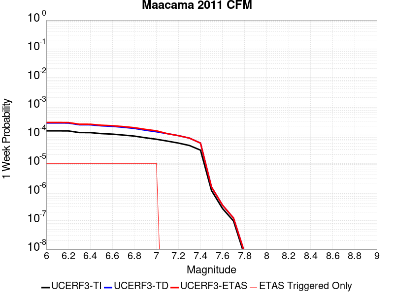 | 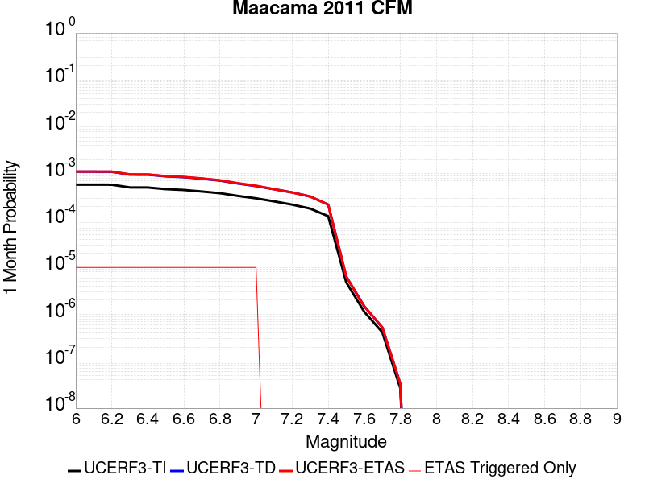 |  | 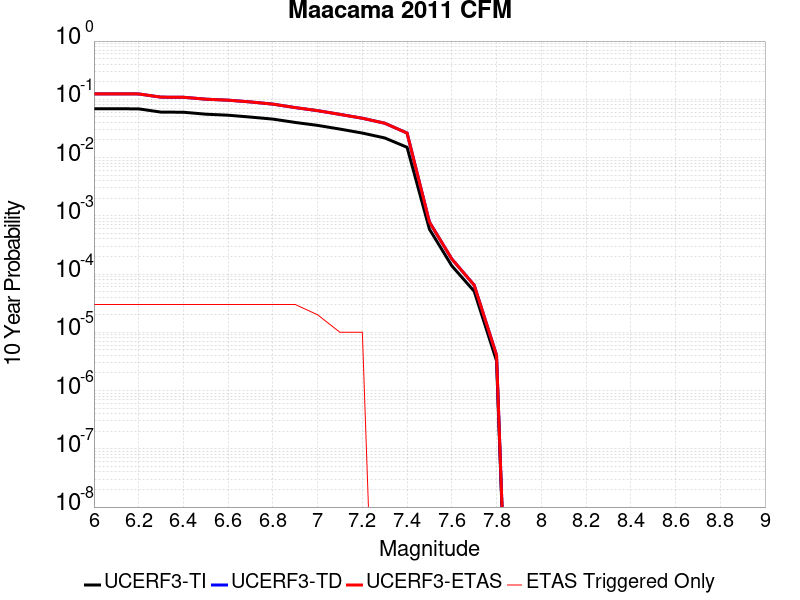 |

| Magnitude | 1 wk TI Prob | 1 wk TD Prob | 1 wk ETAS Prob | 1 wk ETAS/TD Gain | 1 wk ETAS Triggered Only | 1 mo TI Prob | 1 mo TD Prob | 1 mo ETAS Prob | 1 mo ETAS/TD Gain | 1 mo ETAS Triggered Only | 1 yr TI Prob | 1 yr TD Prob | 1 yr ETAS Prob | 1 yr ETAS/TD Gain | 1 yr ETAS Triggered Only | 10 yr TI Prob | 10 yr TD Prob | 10 yr ETAS Prob | 10 yr ETAS/TD Gain | 10 yr ETAS Triggered Only |
|-----|-----|-----|-----|-----|-----|-----|-----|-----|-----|-----|-----|-----|-----|-----|-----|-----|-----|-----|-----|-----|
| 6.0 | 1.368203E-4 | 2.5787868E-4 | 2.678761E-4 | 1.0387679 | 1.0E-5 | 5.862409E-4 | 0.0011047312 | 0.0011147201 | 1.009042 | 1.0E-5 | 0.0071141496 | 0.013350483 | 0.013380082 | 1.002217 | 3.0E-5 | 0.06890667 | 0.124189645 | 0.124215916 | 1.0002116 | 3.0E-5 |
| 6.1 | 1.368203E-4 | 2.5787868E-4 | 2.678761E-4 | 1.0387679 | 1.0E-5 | 5.862409E-4 | 0.0011047312 | 0.0011147201 | 1.009042 | 1.0E-5 | 0.0071141496 | 0.013350483 | 0.013380082 | 1.002217 | 3.0E-5 | 0.06890667 | 0.124189645 | 0.124215916 | 1.0002116 | 3.0E-5 |
| 6.2 | 1.360743E-4 | 2.566255E-4 | 2.6662293E-4 | 1.0389572 | 1.0E-5 | 5.8304524E-4 | 0.001099365 | 0.001109354 | 1.0090861 | 1.0E-5 | 0.007075496 | 0.013286048 | 0.013315649 | 1.002228 | 3.0E-5 | 0.06854413 | 0.12362404 | 0.123650335 | 1.0002127 | 3.0E-5 |
| 6.3 | 1.1917239E-4 | 2.235362E-4 | 2.3353397E-4 | 1.0447255 | 1.0E-5 | 5.1063887E-4 | 9.5765886E-4 | 9.676493E-4 | 1.0104321 | 1.0E-5 | 0.0061993203 | 0.011587509 | 0.011617161 | 1.002559 | 3.0E-5 | 0.060292065 | 0.10884413 | 0.10887087 | 1.0002456 | 3.0E-5 |
| 6.4 | 1.1859289E-4 | 2.2257185E-4 | 2.3256961E-4 | 1.0449194 | 1.0E-5 | 5.0815626E-4 | 9.535289E-4 | 9.635194E-4 | 1.0104773 | 1.0E-5 | 0.006169266 | 0.0115378285 | 0.011567483 | 1.0025702 | 3.0E-5 | 0.06000784 | 0.108401 | 0.10842775 | 1.0002468 | 3.0E-5 |
| 6.5 | 1.09512424E-4 | 2.0515872E-4 | 2.1515667E-4 | 1.0487328 | 1.0E-5 | 4.6925453E-4 | 8.789523E-4 | 8.8894356E-4 | 1.0113672 | 1.0E-5 | 0.005698218 | 0.01063927 | 0.01066895 | 1.0027897 | 3.0E-5 | 0.055543028 | 0.100493506 | 0.100520484 | 1.0002686 | 3.0E-5 |
| 6.6 | 1.0502928E-4 | 1.9674368E-4 | 2.0674172E-4 | 1.0508176 | 1.0E-5 | 4.500478E-4 | 8.4291224E-4 | 8.529038E-4 | 1.0118536 | 1.0E-5 | 0.0054655746 | 0.01020536 | 0.010235054 | 1.0029097 | 3.0E-5 | 0.053330887 | 0.096646085 | 0.09667319 | 1.0002804 | 3.0E-5 |
| 6.7 | 9.739358E-5 | 1.825636E-4 | 1.9256177E-4 | 1.0547655 | 1.0E-5 | 4.173343E-4 | 7.821781E-4 | 7.921703E-4 | 1.0127748 | 1.0E-5 | 0.0050692135 | 0.009475501 | 0.009505217 | 1.003136 | 3.0E-5 | 0.049551267 | 0.090118766 | 0.090146065 | 1.0003029 | 3.0E-5 |
| 6.8 | 8.969524E-5 | 1.6657855E-4 | 1.7657688E-4 | 1.0600218 | 1.0E-5 | 3.8435153E-4 | 7.1370887E-4 | 7.237017E-4 | 1.0140014 | 1.0E-5 | 0.0046694432 | 0.008649083 | 0.008678823 | 1.0034386 | 3.0E-5 | 0.045725387 | 0.082651116 | 0.08267863 | 1.000333 | 3.0E-5 |
| 6.9 | 7.838291E-5 | 1.4417822E-4 | 1.5417679E-4 | 1.0693486 | 1.0E-5 | 3.358835E-4 | 6.177581E-4 | 6.277519E-4 | 1.0161775 | 1.0E-5 | 0.0040817154 | 0.007491799 | 0.0075215744 | 1.0039744 | 3.0E-5 | 0.04007554 | 0.07205178 | 0.072079614 | 1.0003864 | 3.0E-5 |
| 7.0 | 6.961957E-5 | 1.270709E-4 | 1.3706963E-4 | 1.0786862 | 1.0E-5 | 2.9833548E-4 | 5.4447335E-4 | 5.544679E-4 | 1.0183563 | 1.0E-5 | 0.0036261857 | 0.006606736 | 0.006626604 | 1.0030072 | 2.0E-5 | 0.035675827 | 0.063870616 | 0.06388934 | 1.0002931 | 2.0E-5 |
| 7.1 | 5.999398E-5 | 1.0904674E-4 | 1.0904674E-4 | 1.0 | 0.0 | 2.570917E-4 | 4.6726142E-4 | 4.6726142E-4 | 1.0 | 0.0 | 0.0031255994 | 0.0056728474 | 0.0056827907 | 1.0017527 | 1.0E-5 | 0.030820016 | 0.055138282 | 0.055147734 | 1.0001713 | 1.0E-5 |
| 7.2 | 5.116532E-5 | 9.3055336E-5 | 9.3055336E-5 | 1.0 | 0.0 | 2.1926152E-4 | 3.9875024E-4 | 3.9875024E-4 | 1.0 | 0.0 | 0.002666241 | 0.004843103 | 0.0048530544 | 1.0020548 | 1.0E-5 | 0.026344774 | 0.04730284 | 0.047312364 | 1.0002013 | 1.0E-5 |
| 7.3 | 4.2087835E-5 | 7.617328E-5 | 7.617328E-5 | 1.0 | 0.0 | 1.8036396E-4 | 3.2641852E-4 | 3.2641852E-4 | 1.0 | 0.0 | 0.0021937196 | 0.0039661685 | 0.0039661685 | 1.0 | 0.0 | 0.0217219 | 0.038904376 | 0.038904376 | 1.0 | 0.0 |
| 7.4 | 2.8991652E-5 | 5.1167233E-5 | 5.1167233E-5 | 1.0 | 0.0 | 1.2424402E-4 | 2.1927188E-4 | 2.1927188E-4 | 1.0 | 0.0 | 0.0015116213 | 0.0026660617 | 0.0026660617 | 1.0 | 0.0 | 0.015013801 | 0.026331667 | 0.026331667 | 1.0 | 0.0 |
| 7.5 | 1.1292299E-6 | 1.4950161E-6 | 1.4950161E-6 | 1.0 | 0.0 | 4.8395473E-6 | 6.4072037E-6 | 6.4072037E-6 | 1.0 | 0.0 | 5.8919897E-5 | 7.800615E-5 | 7.800615E-5 | 1.0 | 0.0 | 5.890428E-4 | 7.8048074E-4 | 7.8048074E-4 | 1.0 | 0.0 |
| 7.6 | 2.6535366E-7 | 3.4720597E-7 | 3.4720597E-7 | 1.0 | 0.0 | 1.1372296E-6 | 1.4880247E-6 | 1.4880247E-6 | 1.0 | 0.0 | 1.3845682E-5 | 1.8116552E-5 | 1.8116552E-5 | 1.0 | 0.0 | 1.3844819E-4 | 1.816747E-4 | 1.816747E-4 | 1.0 | 0.0 |
| 7.7 | 9.727789E-8 | 1.2302169E-7 | 1.2302169E-7 | 1.0 | 0.0 | 4.1690518E-7 | 5.2723567E-7 | 5.2723567E-7 | 1.0 | 0.0 | 5.0758085E-6 | 6.419076E-6 | 6.419076E-6 | 1.0 | 0.0 | 5.0756928E-5 | 6.45712E-5 | 6.45712E-5 | 1.0 | 0.0 |
| 7.8 | 6.1939325E-9 | 7.711523E-9 | 7.711523E-9 | 1.0 | 0.0 | 2.6545425E-8 | 3.3049385E-8 | 3.3049385E-8 | 1.0 | 0.0 | 3.231905E-7 | 4.0237617E-7 | 4.0237617E-7 | 1.0 | 0.0 | 3.2319003E-6 | 4.0598557E-6 | 4.0598557E-6 | 1.0 | 0.0 |

## Los Osos 2011
*[(top)](#table-of-contents)*

| 1 Week | 1 Month | 1 Year | 10 Year |
|-----|-----|-----|-----|
|  |  |  |  |

| Magnitude | 1 wk TI Prob | 1 wk TD Prob | 1 wk ETAS Prob | 1 wk ETAS/TD Gain | 1 wk ETAS Triggered Only | 1 mo TI Prob | 1 mo TD Prob | 1 mo ETAS Prob | 1 mo ETAS/TD Gain | 1 mo ETAS Triggered Only | 1 yr TI Prob | 1 yr TD Prob | 1 yr ETAS Prob | 1 yr ETAS/TD Gain | 1 yr ETAS Triggered Only | 10 yr TI Prob | 10 yr TD Prob | 10 yr ETAS Prob | 10 yr ETAS/TD Gain | 10 yr ETAS Triggered Only |
|-----|-----|-----|-----|-----|-----|-----|-----|-----|-----|-----|-----|-----|-----|-----|-----|-----|-----|-----|-----|-----|
| 6.0 | 4.8871775E-6 | 4.9814835E-6 | 2.4981384E-5 | 5.014848 | 2.0E-5 | 2.0944879E-5 | 2.1349055E-5 | 4.1348627E-5 | 1.9367896 | 2.0E-5 | 2.5497406E-4 | 2.5989654E-4 | 2.8988873E-4 | 1.1154006 | 3.0E-5 | 0.002546817 | 0.0025962002 | 0.0026261224 | 1.0115254 | 3.0E-5 |
| 6.1 | 4.8871775E-6 | 4.9814835E-6 | 2.4981384E-5 | 5.014848 | 2.0E-5 | 2.0944879E-5 | 2.1349055E-5 | 4.1348627E-5 | 1.9367896 | 2.0E-5 | 2.5497406E-4 | 2.5989654E-4 | 2.8988873E-4 | 1.1154006 | 3.0E-5 | 0.002546817 | 0.0025962002 | 0.0026261224 | 1.0115254 | 3.0E-5 |
| 6.2 | 4.8871775E-6 | 4.9814835E-6 | 2.4981384E-5 | 5.014848 | 2.0E-5 | 2.0944879E-5 | 2.1349055E-5 | 4.1348627E-5 | 1.9367896 | 2.0E-5 | 2.5497406E-4 | 2.5989654E-4 | 2.8988873E-4 | 1.1154006 | 3.0E-5 | 0.002546817 | 0.0025962002 | 0.0026261224 | 1.0115254 | 3.0E-5 |
| 6.3 | 4.8871775E-6 | 4.9814835E-6 | 2.4981384E-5 | 5.014848 | 2.0E-5 | 2.0944879E-5 | 2.1349055E-5 | 4.1348627E-5 | 1.9367896 | 2.0E-5 | 2.5497406E-4 | 2.5989654E-4 | 2.8988873E-4 | 1.1154006 | 3.0E-5 | 0.002546817 | 0.0025962002 | 0.0026261224 | 1.0115254 | 3.0E-5 |
| 6.4 | 4.8871775E-6 | 4.9814835E-6 | 2.4981384E-5 | 5.014848 | 2.0E-5 | 2.0944879E-5 | 2.1349055E-5 | 4.1348627E-5 | 1.9367896 | 2.0E-5 | 2.5497406E-4 | 2.5989654E-4 | 2.8988873E-4 | 1.1154006 | 3.0E-5 | 0.002546817 | 0.0025962002 | 0.0026261224 | 1.0115254 | 3.0E-5 |
| 6.5 | 3.1724062E-6 | 3.223395E-6 | 3.223395E-6 | 1.0 | 0.0 | 1.3595956E-5 | 1.3814477E-5 | 1.3814477E-5 | 1.0 | 0.0 | 1.6551818E-4 | 1.681784E-4 | 1.681784E-4 | 1.0 | 0.0 | 0.0016539496 | 0.0016805249 | 0.0016805249 | 1.0 | 0.0 |
| 6.6 | 3.1022591E-6 | 3.1511045E-6 | 3.1511045E-6 | 1.0 | 0.0 | 1.3295328E-5 | 1.3504664E-5 | 1.3504664E-5 | 1.0 | 0.0 | 1.618586E-4 | 1.64407E-4 | 1.64407E-4 | 1.0 | 0.0 | 0.0016174077 | 0.0016428665 | 0.0016428665 | 1.0 | 0.0 |
| 6.7 | 2.611518E-6 | 2.6491832E-6 | 2.6491832E-6 | 1.0 | 0.0 | 1.1192172E-5 | 1.1353593E-5 | 1.1353593E-5 | 1.0 | 0.0 | 1.3625617E-4 | 1.3822126E-4 | 1.3822126E-4 | 1.0 | 0.0 | 0.0013617266 | 0.0013813575 | 0.0013813575 | 1.0 | 0.0 |
| 6.8 | 2.4780884E-6 | 2.5121592E-6 | 2.5121592E-6 | 1.0 | 0.0 | 1.0620336E-5 | 1.0766353E-5 | 1.0766353E-5 | 1.0 | 0.0 | 1.2929492E-4 | 1.3107249E-4 | 1.3107249E-4 | 1.0 | 0.0 | 0.0012921972 | 0.001309956 | 0.001309956 | 1.0 | 0.0 |
| 6.9 | 2.1376322E-6 | 2.1635055E-6 | 2.1635055E-6 | 1.0 | 0.0 | 9.161248E-6 | 9.272134E-6 | 9.272134E-6 | 1.0 | 0.0 | 1.1153249E-4 | 1.128824E-4 | 1.128824E-4 | 1.0 | 0.0 | 0.0011147653 | 0.0011282525 | 0.0011282525 | 1.0 | 0.0 |
| 7.0 | 1.9282882E-6 | 1.9494585E-6 | 1.9494585E-6 | 1.0 | 0.0 | 8.264066E-6 | 8.354796E-6 | 8.354796E-6 | 1.0 | 0.0 | 1.0061036E-4 | 1.017149E-4 | 1.017149E-4 | 1.0 | 0.0 | 0.0010056482 | 0.0010166848 | 0.0010166848 | 1.0 | 0.0 |
| 7.1 | 1.6353226E-6 | 1.6501118E-6 | 1.6501118E-6 | 1.0 | 0.0 | 7.0085066E-6 | 7.0718884E-6 | 7.0718884E-6 | 1.0 | 0.0 | 8.532523E-5 | 8.609685E-5 | 8.609685E-5 | 1.0 | 0.0 | 8.529247E-4 | 8.6063566E-4 | 8.6063566E-4 | 1.0 | 0.0 |
| 7.2 | 1.4446276E-6 | 1.4553341E-6 | 1.4553341E-6 | 1.0 | 0.0 | 6.191247E-6 | 6.237131E-6 | 6.237131E-6 | 1.0 | 0.0 | 7.537582E-5 | 7.593443E-5 | 7.593443E-5 | 1.0 | 0.0 | 7.535026E-4 | 7.590854E-4 | 7.590854E-4 | 1.0 | 0.0 |
| 7.3 | 1.2014582E-6 | 1.2069073E-6 | 1.2069073E-6 | 1.0 | 0.0 | 5.149096E-6 | 5.1724496E-6 | 5.1724496E-6 | 1.0 | 0.0 | 6.268844E-5 | 6.297276E-5 | 6.297276E-5 | 1.0 | 0.0 | 6.267076E-4 | 6.295495E-4 | 6.295495E-4 | 1.0 | 0.0 |
| 7.4 | 9.707733E-7 | 9.709773E-7 | 9.709773E-7 | 1.0 | 0.0 | 4.16045E-6 | 4.161325E-6 | 4.161325E-6 | 1.0 | 0.0 | 5.0652303E-5 | 5.066295E-5 | 5.066295E-5 | 1.0 | 0.0 | 5.064076E-4 | 5.065143E-4 | 5.065143E-4 | 1.0 | 0.0 |
| 7.5 | 7.174908E-7 | 7.1149134E-7 | 7.1149134E-7 | 1.0 | 0.0 | 3.074957E-6 | 3.0492452E-6 | 3.0492452E-6 | 1.0 | 0.0 | 3.743696E-5 | 3.712393E-5 | 3.712393E-5 | 1.0 | 0.0 | 3.7430652E-4 | 3.7117745E-4 | 3.7117745E-4 | 1.0 | 0.0 |
| 7.6 | 4.5535776E-7 | 4.420792E-7 | 4.420792E-7 | 1.0 | 0.0 | 1.9515319E-6 | 1.8946238E-6 | 1.8946238E-6 | 1.0 | 0.0 | 2.3759641E-5 | 2.3066801E-5 | 2.3066801E-5 | 1.0 | 0.0 | 2.37571E-4 | 2.3064416E-4 | 2.3064416E-4 | 1.0 | 0.0 |
| 7.7 | 2.1173553E-7 | 1.9060796E-7 | 1.9060796E-7 | 1.0 | 0.0 | 9.0743765E-7 | 8.1689103E-7 | 8.1689103E-7 | 1.0 | 0.0 | 1.1047998E-5 | 9.945603E-6 | 9.945603E-6 | 1.0 | 0.0 | 1.1047449E-4 | 9.945161E-5 | 9.945161E-5 | 1.0 | 0.0 |
| 7.8 | 9.873608E-8 | 7.3675665E-8 | 7.3675665E-8 | 1.0 | 0.0 | 4.2315455E-7 | 3.157528E-7 | 3.157528E-7 | 1.0 | 0.0 | 5.1518946E-6 | 3.8442836E-6 | 3.8442836E-6 | 1.0 | 0.0 | 5.1517753E-5 | 3.8442176E-5 | 3.8442176E-5 | 1.0 | 0.0 |
| 7.9 | 5.4399106E-8 | 3.1880155E-8 | 3.1880155E-8 | 1.0 | 0.0 | 2.33139E-7 | 1.3662923E-7 | 1.3662923E-7 | 1.0 | 0.0 | 2.8384638E-6 | 1.6634596E-6 | 1.6634596E-6 | 1.0 | 0.0 | 2.8384275E-5 | 1.6634473E-5 | 1.6634473E-5 | 1.0 | 0.0 |
| 8.0 | 1.817203E-8 | 8.420727E-9 | 8.420727E-9 | 1.0 | 0.0 | 7.7880124E-8 | 3.608883E-8 | 3.608883E-8 | 1.0 | 0.0 | 9.481901E-7 | 4.393814E-7 | 4.393814E-7 | 1.0 | 0.0 | 9.481861E-6 | 4.3938057E-6 | 4.3938057E-6 | 1.0 | 0.0 |

## Del Valle
*[(top)](#table-of-contents)*

| 1 Week | 1 Month | 1 Year | 10 Year |
|-----|-----|-----|-----|
|  |  |  | 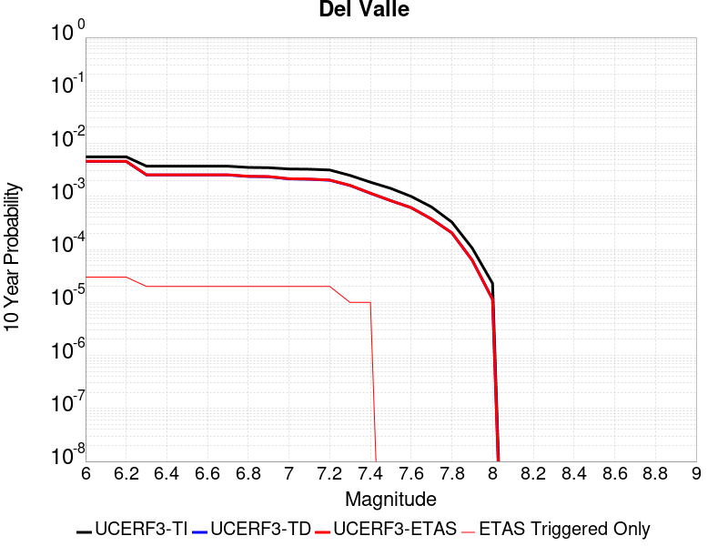 |

| Magnitude | 1 wk TI Prob | 1 wk TD Prob | 1 wk ETAS Prob | 1 wk ETAS/TD Gain | 1 wk ETAS Triggered Only | 1 mo TI Prob | 1 mo TD Prob | 1 mo ETAS Prob | 1 mo ETAS/TD Gain | 1 mo ETAS Triggered Only | 1 yr TI Prob | 1 yr TD Prob | 1 yr ETAS Prob | 1 yr ETAS/TD Gain | 1 yr ETAS Triggered Only | 10 yr TI Prob | 10 yr TD Prob | 10 yr ETAS Prob | 10 yr ETAS/TD Gain | 10 yr ETAS Triggered Only |
|-----|-----|-----|-----|-----|-----|-----|-----|-----|-----|-----|-----|-----|-----|-----|-----|-----|-----|-----|-----|-----|
| 6.0 | 1.0716125E-5 | 8.767882E-6 | 1.8767794E-5 | 2.1405163 | 1.0E-5 | 4.592544E-5 | 3.7576207E-5 | 4.757583E-5 | 1.2661159 | 1.0E-5 | 5.589988E-4 | 4.5741405E-4 | 4.774049E-4 | 1.043704 | 2.0E-5 | 0.0055759475 | 0.00456668 | 0.0045965435 | 1.0065393 | 3.0E-5 |
| 6.1 | 1.0716125E-5 | 8.767882E-6 | 1.8767794E-5 | 2.1405163 | 1.0E-5 | 4.592544E-5 | 3.7576207E-5 | 4.757583E-5 | 1.2661159 | 1.0E-5 | 5.589988E-4 | 4.5741405E-4 | 4.774049E-4 | 1.043704 | 2.0E-5 | 0.0055759475 | 0.00456668 | 0.0045965435 | 1.0065393 | 3.0E-5 |
| 6.2 | 1.0716125E-5 | 8.767882E-6 | 1.8767794E-5 | 2.1405163 | 1.0E-5 | 4.592544E-5 | 3.7576207E-5 | 4.757583E-5 | 1.2661159 | 1.0E-5 | 5.589988E-4 | 4.5741405E-4 | 4.774049E-4 | 1.043704 | 2.0E-5 | 0.0055759475 | 0.00456668 | 0.0045965435 | 1.0065393 | 3.0E-5 |
| 6.3 | 7.1293784E-6 | 4.865823E-6 | 4.865823E-6 | 1.0 | 0.0 | 3.055412E-5 | 2.0853364E-5 | 2.0853364E-5 | 1.0 | 0.0 | 3.7193293E-4 | 2.5386087E-4 | 2.6385832E-4 | 1.0393816 | 1.0E-5 | 0.0037131102 | 0.0025357946 | 0.002555744 | 1.0078671 | 2.0E-5 |
| 6.4 | 7.1293784E-6 | 4.865823E-6 | 4.865823E-6 | 1.0 | 0.0 | 3.055412E-5 | 2.0853364E-5 | 2.0853364E-5 | 1.0 | 0.0 | 3.7193293E-4 | 2.5386087E-4 | 2.6385832E-4 | 1.0393816 | 1.0E-5 | 0.0037131102 | 0.0025357946 | 0.002555744 | 1.0078671 | 2.0E-5 |
| 6.5 | 7.1293784E-6 | 4.865823E-6 | 4.865823E-6 | 1.0 | 0.0 | 3.055412E-5 | 2.0853364E-5 | 2.0853364E-5 | 1.0 | 0.0 | 3.7193293E-4 | 2.5386087E-4 | 2.6385832E-4 | 1.0393816 | 1.0E-5 | 0.0037131102 | 0.0025357946 | 0.002555744 | 1.0078671 | 2.0E-5 |
| 6.6 | 7.1293784E-6 | 4.865823E-6 | 4.865823E-6 | 1.0 | 0.0 | 3.055412E-5 | 2.0853364E-5 | 2.0853364E-5 | 1.0 | 0.0 | 3.7193293E-4 | 2.5386087E-4 | 2.6385832E-4 | 1.0393816 | 1.0E-5 | 0.0037131102 | 0.0025357946 | 0.002555744 | 1.0078671 | 2.0E-5 |
| 6.7 | 7.12272E-6 | 4.8631987E-6 | 4.8631987E-6 | 1.0 | 0.0 | 3.0525585E-5 | 2.0842117E-5 | 2.0842117E-5 | 1.0 | 0.0 | 3.7158563E-4 | 2.5372396E-4 | 2.6372142E-4 | 1.039403 | 1.0E-5 | 0.003709649 | 0.0025344288 | 0.002554378 | 1.0078713 | 2.0E-5 |
| 6.8 | 6.7558703E-6 | 4.5594015E-6 | 4.5594015E-6 | 1.0 | 0.0 | 2.895341E-5 | 1.9540148E-5 | 1.9540148E-5 | 1.0 | 0.0 | 3.5245073E-4 | 2.3787597E-4 | 2.478736E-4 | 1.0420287 | 1.0E-5 | 0.0035189227 | 0.0023762889 | 0.0023962413 | 1.0083965 | 2.0E-5 |
| 6.9 | 6.6700386E-6 | 4.502539E-6 | 4.502539E-6 | 1.0 | 0.0 | 2.8585566E-5 | 1.9296456E-5 | 1.9296456E-5 | 1.0 | 0.0 | 3.479737E-4 | 2.3490966E-4 | 2.449073E-4 | 1.0425595 | 1.0E-5 | 0.003474293 | 0.0023466884 | 0.0023666415 | 1.0085026 | 2.0E-5 |
| 7.0 | 6.3181424E-6 | 4.0987034E-6 | 4.0987034E-6 | 1.0 | 0.0 | 2.7077473E-5 | 1.7565755E-5 | 1.7565755E-5 | 1.0 | 0.0 | 3.2961834E-4 | 2.1384252E-4 | 2.2384037E-4 | 1.0467534 | 1.0E-5 | 0.0032912986 | 0.002136422 | 0.0021563794 | 1.0093415 | 2.0E-5 |
| 7.1 | 6.248759E-6 | 4.033895E-6 | 4.033895E-6 | 1.0 | 0.0 | 2.678012E-5 | 1.7288008E-5 | 1.7288008E-5 | 1.0 | 0.0 | 3.2599916E-4 | 2.104616E-4 | 2.204595E-4 | 1.0475047 | 1.0E-5 | 0.0032552136 | 0.0021026772 | 0.0021226353 | 1.0094917 | 2.0E-5 |
| 7.2 | 6.0411944E-6 | 3.869888E-6 | 3.869888E-6 | 1.0 | 0.0 | 2.5890577E-5 | 1.658513E-5 | 1.658513E-5 | 1.0 | 0.0 | 3.1517216E-4 | 2.0190567E-4 | 2.1190365E-4 | 1.0495181 | 1.0E-5 | 0.0031472554 | 0.0020172757 | 0.0020372353 | 1.0098944 | 2.0E-5 |
| 7.3 | 4.7691183E-6 | 3.0781202E-6 | 3.0781202E-6 | 1.0 | 0.0 | 2.0438918E-5 | 1.3191879E-5 | 1.3191879E-5 | 1.0 | 0.0 | 2.488154E-4 | 1.605995E-4 | 1.605995E-4 | 1.0 | 0.0 | 0.00248537 | 0.0016048603 | 0.0016148442 | 1.006221 | 1.0E-5 |
| 7.4 | 3.5524722E-6 | 2.1893363E-6 | 2.1893363E-6 | 1.0 | 0.0 | 1.5224792E-5 | 9.382837E-6 | 9.382837E-6 | 1.0 | 0.0 | 1.8534607E-4 | 1.1423013E-4 | 1.1423013E-4 | 1.0 | 0.0 | 0.0018519156 | 0.0011417224 | 0.001151711 | 1.0087487 | 1.0E-5 |
| 7.5 | 2.7133442E-6 | 1.5916097E-6 | 1.5916097E-6 | 1.0 | 0.0 | 1.1628566E-5 | 6.821167E-6 | 6.821167E-6 | 1.0 | 0.0 | 1.415686E-4 | 8.304456E-5 | 8.304456E-5 | 1.0 | 0.0 | 0.0014147845 | 8.301372E-4 | 8.301372E-4 | 1.0 | 0.0 |
| 7.6 | 1.915338E-6 | 1.173914E-6 | 1.173914E-6 | 1.0 | 0.0 | 8.208566E-6 | 5.0310505E-6 | 5.0310505E-6 | 1.0 | 0.0 | 9.993471E-5 | 6.125133E-5 | 6.125133E-5 | 1.0 | 0.0 | 9.988978E-4 | 6.123454E-4 | 6.123454E-4 | 1.0 | 0.0 |
| 7.7 | 1.2120448E-6 | 7.180313E-7 | 7.180313E-7 | 1.0 | 0.0 | 5.194467E-6 | 3.0772733E-6 | 3.0772733E-6 | 1.0 | 0.0 | 6.3240805E-5 | 3.746516E-5 | 3.746516E-5 | 1.0 | 0.0 | 6.322281E-4 | 3.7458882E-4 | 3.7458882E-4 | 1.0 | 0.0 |
| 7.8 | 6.272381E-7 | 3.932549E-7 | 3.932549E-7 | 1.0 | 0.0 | 2.6881603E-6 | 1.6853771E-6 | 1.6853771E-6 | 1.0 | 0.0 | 3.272786E-5 | 2.0519275E-5 | 2.0519275E-5 | 1.0 | 0.0 | 3.272304E-4 | 2.0517396E-4 | 2.0517396E-4 | 1.0 | 0.0 |
| 7.9 | 2.0292627E-7 | 1.2004622E-7 | 1.2004622E-7 | 1.0 | 0.0 | 8.6968373E-7 | 5.1448376E-7 | 5.1448376E-7 | 1.0 | 0.0 | 1.0588348E-5 | 6.263822E-6 | 6.263822E-6 | 1.0 | 0.0 | 1.0587843E-4 | 6.263647E-5 | 6.263647E-5 | 1.0 | 0.0 |
| 8.0 | 4.374492E-8 | 2.189964E-8 | 2.189964E-8 | 1.0 | 0.0 | 1.8747821E-7 | 9.385559E-8 | 9.385559E-8 | 1.0 | 0.0 | 2.2825448E-6 | 1.1426913E-6 | 1.1426913E-6 | 1.0 | 0.0 | 2.2825214E-5 | 1.1426858E-5 | 1.1426858E-5 | 1.0 | 0.0 |

## Quien Sabe 2011 CFM
*[(top)](#table-of-contents)*

| 1 Week | 1 Month | 1 Year | 10 Year |
|-----|-----|-----|-----|
|  | 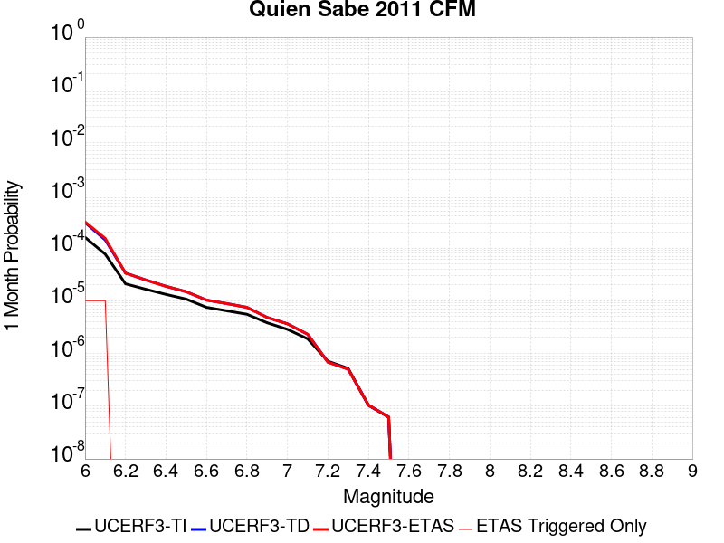 | 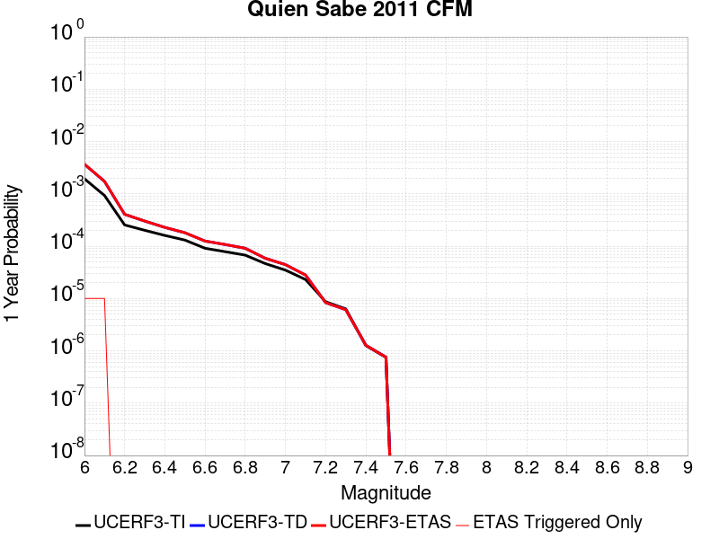 | 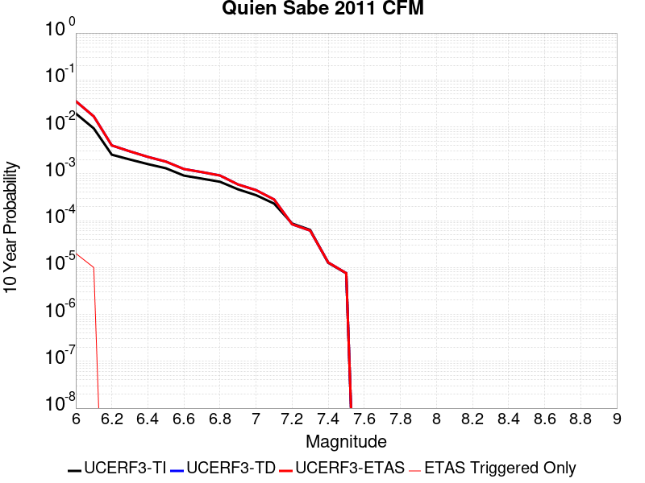 |

| Magnitude | 1 wk TI Prob | 1 wk TD Prob | 1 wk ETAS Prob | 1 wk ETAS/TD Gain | 1 wk ETAS Triggered Only | 1 mo TI Prob | 1 mo TD Prob | 1 mo ETAS Prob | 1 mo ETAS/TD Gain | 1 mo ETAS Triggered Only | 1 yr TI Prob | 1 yr TD Prob | 1 yr ETAS Prob | 1 yr ETAS/TD Gain | 1 yr ETAS Triggered Only | 10 yr TI Prob | 10 yr TD Prob | 10 yr ETAS Prob | 10 yr ETAS/TD Gain | 10 yr ETAS Triggered Only |
|-----|-----|-----|-----|-----|-----|-----|-----|-----|-----|-----|-----|-----|-----|-----|-----|-----|-----|-----|-----|-----|
| 6.0 | 3.729899E-5 | 7.087805E-5 | 8.087735E-5 | 1.1410774 | 1.0E-5 | 1.5984301E-4 | 3.037322E-4 | 3.1372916E-4 | 1.0329137 | 1.0E-5 | 0.0019443515 | 0.0036852323 | 0.0036951953 | 1.0027035 | 1.0E-5 | 0.019274272 | 0.035349756 | 0.03536905 | 1.0005457 | 2.0E-5 |
| 6.1 | 1.7825725E-5 | 3.31456E-5 | 4.3145268E-5 | 1.3016891 | 1.0E-5 | 7.639373E-5 | 1.4204586E-4 | 1.5204445E-4 | 1.0703897 | 1.0E-5 | 9.296967E-4 | 0.0017267246 | 0.0017367073 | 1.0057813 | 1.0E-5 | 0.009258169 | 0.016698597 | 0.01670843 | 1.0005889 | 1.0E-5 |
| 6.2 | 4.8865336E-6 | 7.804963E-6 | 7.804963E-6 | 1.0 | 0.0 | 2.0942118E-5 | 3.344947E-5 | 3.344947E-5 | 1.0 | 0.0 | 2.5494045E-4 | 4.0691497E-4 | 4.0691497E-4 | 1.0 | 0.0 | 0.0025464818 | 0.0040135453 | 0.0040135453 | 1.0 | 0.0 |
| 6.3 | 3.858491E-6 | 5.789573E-6 | 5.789573E-6 | 1.0 | 0.0 | 1.6536285E-5 | 2.4812247E-5 | 2.4812247E-5 | 1.0 | 0.0 | 2.0131067E-4 | 3.0205192E-4 | 3.0205192E-4 | 1.0 | 0.0 | 0.002011284 | 0.0030019816 | 0.0030019816 | 1.0 | 0.0 |
| 6.4 | 3.0771805E-6 | 4.384806E-6 | 4.384806E-6 | 1.0 | 0.0 | 1.318785E-5 | 1.8791905E-5 | 1.8791905E-5 | 1.0 | 0.0 | 1.6055023E-4 | 2.2876984E-4 | 2.2876984E-4 | 1.0 | 0.0 | 0.001604343 | 0.002286477 | 0.002286477 | 1.0 | 0.0 |
| 6.5 | 2.5081235E-6 | 3.463511E-6 | 3.463511E-6 | 1.0 | 0.0 | 1.0749056E-5 | 1.4843542E-5 | 1.4843542E-5 | 1.0 | 0.0 | 1.308619E-4 | 1.807066E-4 | 1.807066E-4 | 1.0 | 0.0 | 0.0013078486 | 0.0018123116 | 0.0018123116 | 1.0 | 0.0 |
| 6.6 | 1.7505364E-6 | 2.4023168E-6 | 2.4023168E-6 | 1.0 | 0.0 | 7.502277E-6 | 1.0295607E-5 | 1.0295607E-5 | 1.0 | 0.0 | 9.13364E-5 | 1.2534253E-4 | 1.2534253E-4 | 1.0 | 0.0 | 9.129886E-4 | 0.0012582915 | 0.0012582915 | 1.0 | 0.0 |
| 6.7 | 1.505737E-6 | 2.0637349E-6 | 2.0637349E-6 | 1.0 | 0.0 | 6.4531428E-6 | 8.844551E-6 | 8.844551E-6 | 1.0 | 0.0 | 7.8564175E-5 | 1.0767768E-4 | 1.0767768E-4 | 1.0 | 0.0 | 7.853641E-4 | 0.0010818138 | 0.0010818138 | 1.0 | 0.0 |
| 6.8 | 1.2924105E-6 | 1.7484025E-6 | 1.7484025E-6 | 1.0 | 0.0 | 5.5388905E-6 | 7.4931354E-6 | 7.4931354E-6 | 1.0 | 0.0 | 6.74339E-5 | 9.122565E-5 | 9.122565E-5 | 1.0 | 0.0 | 6.741344E-4 | 9.1609603E-4 | 9.1609603E-4 | 1.0 | 0.0 |
| 6.9 | 8.9075286E-7 | 1.1249955E-6 | 1.1249955E-6 | 1.0 | 0.0 | 3.8175067E-6 | 4.8214015E-6 | 4.8214015E-6 | 1.0 | 0.0 | 4.6477155E-5 | 5.8699206E-5 | 5.8699206E-5 | 1.0 | 0.0 | 4.6467435E-4 | 5.903947E-4 | 5.903947E-4 | 1.0 | 0.0 |
| 7.0 | 6.6891175E-7 | 8.51663E-7 | 8.51663E-7 | 1.0 | 0.0 | 2.8667614E-6 | 3.6499803E-6 | 3.6499803E-6 | 1.0 | 0.0 | 3.4902263E-5 | 4.44378E-5 | 4.44378E-5 | 1.0 | 0.0 | 3.4896782E-4 | 4.4678617E-4 | 4.4678617E-4 | 1.0 | 0.0 |
| 7.1 | 4.4205015E-7 | 5.3919683E-7 | 5.3919683E-7 | 1.0 | 0.0 | 1.8944993E-6 | 2.3108425E-6 | 2.3108425E-6 | 1.0 | 0.0 | 2.3065284E-5 | 2.8134315E-5 | 2.8134315E-5 | 1.0 | 0.0 | 2.3062891E-4 | 2.826926E-4 | 2.826926E-4 | 1.0 | 0.0 |
| 7.2 | 1.6620965E-7 | 1.5987598E-7 | 1.5987598E-7 | 1.0 | 0.0 | 7.123269E-7 | 6.851826E-7 | 6.851826E-7 | 1.0 | 0.0 | 8.672545E-6 | 8.34207E-6 | 8.34207E-6 | 1.0 | 0.0 | 8.6722066E-5 | 8.3573126E-5 | 8.3573126E-5 | 1.0 | 0.0 |
| 7.3 | 1.2142488E-7 | 1.1726492E-7 | 1.1726492E-7 | 1.0 | 0.0 | 5.2039223E-7 | 5.0256386E-7 | 5.0256386E-7 | 1.0 | 0.0 | 6.335757E-6 | 6.118701E-6 | 6.118701E-6 | 1.0 | 0.0 | 6.3355765E-5 | 6.124848E-5 | 6.124848E-5 | 1.0 | 0.0 |
| 7.4 | 2.4192937E-8 | 2.4543448E-8 | 2.4543448E-8 | 1.0 | 0.0 | 1.0368401E-7 | 1.051862E-7 | 1.051862E-7 | 1.0 | 0.0 | 1.2623522E-6 | 1.2806413E-6 | 1.2806413E-6 | 1.0 | 0.0 | 1.2623449E-5 | 1.2812683E-5 | 1.2812683E-5 | 1.0 | 0.0 |
| 7.5 | 1.4432802E-8 | 1.4506471E-8 | 1.4506471E-8 | 1.0 | 0.0 | 6.185486E-8 | 6.2170585E-8 | 6.2170585E-8 | 1.0 | 0.0 | 7.530827E-7 | 7.5692674E-7 | 7.5692674E-7 | 1.0 | 0.0 | 7.530801E-6 | 7.5735175E-6 | 7.5735175E-6 | 1.0 | 0.0 |

## Elsinore (Julian)
*[(top)](#table-of-contents)*

| 1 Week | 1 Month | 1 Year | 10 Year |
|-----|-----|-----|-----|
|  |  |  | 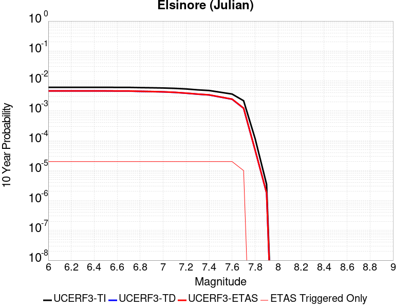 |

| Magnitude | 1 wk TI Prob | 1 wk TD Prob | 1 wk ETAS Prob | 1 wk ETAS/TD Gain | 1 wk ETAS Triggered Only | 1 mo TI Prob | 1 mo TD Prob | 1 mo ETAS Prob | 1 mo ETAS/TD Gain | 1 mo ETAS Triggered Only | 1 yr TI Prob | 1 yr TD Prob | 1 yr ETAS Prob | 1 yr ETAS/TD Gain | 1 yr ETAS Triggered Only | 10 yr TI Prob | 10 yr TD Prob | 10 yr ETAS Prob | 10 yr ETAS/TD Gain | 10 yr ETAS Triggered Only |
|-----|-----|-----|-----|-----|-----|-----|-----|-----|-----|-----|-----|-----|-----|-----|-----|-----|-----|-----|-----|-----|
| 6.0 | 1.1710231E-5 | 8.845509E-6 | 1.884542E-5 | 2.1305072 | 1.0E-5 | 5.0185736E-5 | 3.7908783E-5 | 4.7908405E-5 | 1.2637811 | 1.0E-5 | 6.1084004E-4 | 4.614434E-4 | 4.8143414E-4 | 1.0433222 | 2.0E-5 | 0.006091637 | 0.0046050567 | 0.0046249647 | 1.004323 | 2.0E-5 |
| 6.1 | 1.1710231E-5 | 8.845509E-6 | 1.884542E-5 | 2.1305072 | 1.0E-5 | 5.0185736E-5 | 3.7908783E-5 | 4.7908405E-5 | 1.2637811 | 1.0E-5 | 6.1084004E-4 | 4.614434E-4 | 4.8143414E-4 | 1.0433222 | 2.0E-5 | 0.006091637 | 0.0046050567 | 0.0046249647 | 1.004323 | 2.0E-5 |
| 6.2 | 1.1710231E-5 | 8.845509E-6 | 1.884542E-5 | 2.1305072 | 1.0E-5 | 5.0185736E-5 | 3.7908783E-5 | 4.7908405E-5 | 1.2637811 | 1.0E-5 | 6.1084004E-4 | 4.614434E-4 | 4.8143414E-4 | 1.0433222 | 2.0E-5 | 0.006091637 | 0.0046050567 | 0.0046249647 | 1.004323 | 2.0E-5 |
| 6.3 | 1.1710231E-5 | 8.845509E-6 | 1.884542E-5 | 2.1305072 | 1.0E-5 | 5.0185736E-5 | 3.7908783E-5 | 4.7908405E-5 | 1.2637811 | 1.0E-5 | 6.1084004E-4 | 4.614434E-4 | 4.8143414E-4 | 1.0433222 | 2.0E-5 | 0.006091637 | 0.0046050567 | 0.0046249647 | 1.004323 | 2.0E-5 |
| 6.4 | 1.1710231E-5 | 8.845509E-6 | 1.884542E-5 | 2.1305072 | 1.0E-5 | 5.0185736E-5 | 3.7908783E-5 | 4.7908405E-5 | 1.2637811 | 1.0E-5 | 6.1084004E-4 | 4.614434E-4 | 4.8143414E-4 | 1.0433222 | 2.0E-5 | 0.006091637 | 0.0046050567 | 0.0046249647 | 1.004323 | 2.0E-5 |
| 6.5 | 1.1710231E-5 | 8.845509E-6 | 1.884542E-5 | 2.1305072 | 1.0E-5 | 5.0185736E-5 | 3.7908783E-5 | 4.7908405E-5 | 1.2637811 | 1.0E-5 | 6.1084004E-4 | 4.614434E-4 | 4.8143414E-4 | 1.0433222 | 2.0E-5 | 0.006091637 | 0.0046050567 | 0.0046249647 | 1.004323 | 2.0E-5 |
| 6.6 | 1.1650619E-5 | 8.777881E-6 | 1.8777793E-5 | 2.1392171 | 1.0E-5 | 4.993027E-5 | 3.7618956E-5 | 4.761858E-5 | 1.2658135 | 1.0E-5 | 6.0773146E-4 | 4.5791623E-4 | 4.7790707E-4 | 1.0436561 | 2.0E-5 | 0.0060607214 | 0.004569931 | 0.0045898394 | 1.0043564 | 2.0E-5 |
| 6.7 | 1.1650619E-5 | 8.777881E-6 | 1.8777793E-5 | 2.1392171 | 1.0E-5 | 4.993027E-5 | 3.7618956E-5 | 4.761858E-5 | 1.2658135 | 1.0E-5 | 6.0773146E-4 | 4.5791623E-4 | 4.7790707E-4 | 1.0436561 | 2.0E-5 | 0.0060607214 | 0.004569931 | 0.0045898394 | 1.0043564 | 2.0E-5 |
| 6.8 | 1.1442698E-5 | 8.561041E-6 | 1.8560955E-5 | 2.1680722 | 1.0E-5 | 4.9039216E-5 | 3.6689667E-5 | 4.66893E-5 | 1.2725463 | 1.0E-5 | 5.968889E-4 | 4.4660683E-4 | 4.665979E-4 | 1.0447621 | 2.0E-5 | 0.0059528816 | 0.004457295 | 0.0044772057 | 1.004467 | 2.0E-5 |
| 6.9 | 1.1300589E-5 | 8.408907E-6 | 1.8408824E-5 | 2.1892052 | 1.0E-5 | 4.8430196E-5 | 3.6037683E-5 | 4.6037323E-5 | 1.2774773 | 1.0E-5 | 5.894781E-4 | 4.3867214E-4 | 4.5866336E-4 | 1.0455722 | 2.0E-5 | 0.005879169 | 0.0043782624 | 0.0043981746 | 1.0045481 | 2.0E-5 |
| 7.0 | 1.1117729E-5 | 8.226087E-6 | 1.8226005E-5 | 2.2156348 | 1.0E-5 | 4.764654E-5 | 3.525419E-5 | 4.525384E-5 | 1.2836442 | 1.0E-5 | 5.799422E-4 | 4.291369E-4 | 4.4912833E-4 | 1.0465852 | 2.0E-5 | 0.0057843104 | 0.004283281 | 0.004303195 | 1.0046493 | 2.0E-5 |
| 7.1 | 1.08053955E-5 | 7.9117535E-6 | 1.7911674E-5 | 2.2639322 | 1.0E-5 | 4.6308014E-5 | 3.3907087E-5 | 4.3906748E-5 | 1.2949136 | 1.0E-5 | 5.6365423E-4 | 4.127422E-4 | 4.3273394E-4 | 1.0484364 | 2.0E-5 | 0.005622267 | 0.0041199517 | 0.0041398695 | 1.0048344 | 2.0E-5 |
| 7.2 | 1.032804E-5 | 7.433021E-6 | 1.7432947E-5 | 2.345338 | 1.0E-5 | 4.4262277E-5 | 3.1855423E-5 | 4.1855106E-5 | 1.3139083 | 1.0E-5 | 5.387599E-4 | 3.8777234E-4 | 4.0776457E-4 | 1.0515567 | 2.0E-5 | 0.0053745564 | 0.0038711445 | 0.003891067 | 1.0051464 | 2.0E-5 |
| 7.3 | 9.622426E-6 | 6.8978457E-6 | 1.6897777E-5 | 2.449718 | 1.0E-5 | 4.1238312E-5 | 2.9561868E-5 | 3.9561575E-5 | 1.3382636 | 1.0E-5 | 5.019608E-4 | 3.5985775E-4 | 3.7985053E-4 | 1.0555575 | 2.0E-5 | 0.005008285 | 0.0035929221 | 0.00361285 | 1.0055465 | 2.0E-5 |
| 7.4 | 9.144434E-6 | 6.4963933E-6 | 1.6496328E-5 | 2.5393057 | 1.0E-5 | 3.9189843E-5 | 2.7841395E-5 | 3.7841117E-5 | 1.3591673 | 1.0E-5 | 4.7703186E-4 | 3.3891766E-4 | 3.5891088E-4 | 1.0589914 | 2.0E-5 | 0.0047600917 | 0.0033841513 | 0.0034040837 | 1.0058899 | 2.0E-5 |
| 7.5 | 7.988981E-6 | 5.4983307E-6 | 1.5498275E-5 | 2.8187237 | 1.0E-5 | 3.4238044E-5 | 2.356407E-5 | 3.3563832E-5 | 1.4243649 | 1.0E-5 | 4.1676845E-4 | 2.8685606E-4 | 3.068503E-4 | 1.0697014 | 2.0E-5 | 0.0041598766 | 0.002864985 | 0.0028849277 | 1.0069609 | 2.0E-5 |
| 7.6 | 6.9554876E-6 | 4.6625346E-6 | 1.4662488E-5 | 3.1447463 | 1.0E-5 | 2.9808893E-5 | 1.9982144E-5 | 2.9981944E-5 | 1.5004368 | 1.0E-5 | 3.6286283E-4 | 2.4325661E-4 | 2.6325174E-4 | 1.0821977 | 2.0E-5 | 0.0036227088 | 0.0024300197 | 0.002449971 | 1.0082104 | 2.0E-5 |
| 7.7 | 4.1557314E-6 | 2.3246462E-6 | 1.2324623E-5 | 5.30172 | 1.0E-5 | 1.7810156E-5 | 9.962735E-6 | 1.9962636E-5 | 2.0037305 | 1.0E-5 | 2.1681708E-4 | 1.2129029E-4 | 1.3128908E-4 | 1.0824368 | 1.0E-5 | 0.0021660565 | 0.001212314 | 0.0012223019 | 1.0082387 | 1.0E-5 |
| 7.8 | 2.2597293E-7 | 9.332915E-8 | 9.332915E-8 | 1.0 | 0.0 | 9.684551E-7 | 3.99982E-7 | 3.99982E-7 | 1.0 | 0.0 | 1.1790877E-5 | 4.8697734E-6 | 4.8697734E-6 | 1.0 | 0.0 | 1.17902506E-4 | 4.8696995E-5 | 4.8696995E-5 | 1.0 | 0.0 |
| 7.9 | 6.676829E-9 | 3.439853E-9 | 3.439853E-9 | 1.0 | 0.0 | 2.861498E-8 | 1.4742227E-8 | 1.4742227E-8 | 1.0 | 0.0 | 3.4838732E-7 | 1.7948659E-7 | 1.7948659E-7 | 1.0 | 0.0 | 3.4838679E-6 | 1.7948646E-6 | 1.7948646E-6 | 1.0 | 0.0 |

## Elysian Park (Lower CFM)
*[(top)](#table-of-contents)*

| 1 Week | 1 Month | 1 Year | 10 Year |
|-----|-----|-----|-----|
|  |  |  |  |

| Magnitude | 1 wk TI Prob | 1 wk TD Prob | 1 wk ETAS Prob | 1 wk ETAS/TD Gain | 1 wk ETAS Triggered Only | 1 mo TI Prob | 1 mo TD Prob | 1 mo ETAS Prob | 1 mo ETAS/TD Gain | 1 mo ETAS Triggered Only | 1 yr TI Prob | 1 yr TD Prob | 1 yr ETAS Prob | 1 yr ETAS/TD Gain | 1 yr ETAS Triggered Only | 10 yr TI Prob | 10 yr TD Prob | 10 yr ETAS Prob | 10 yr ETAS/TD Gain | 10 yr ETAS Triggered Only |
|-----|-----|-----|-----|-----|-----|-----|-----|-----|-----|-----|-----|-----|-----|-----|-----|-----|-----|-----|-----|-----|
| 6.0 | 2.1766498E-6 | 2.10379E-6 | 1.2103769E-5 | 5.7533164 | 1.0E-5 | 9.328466E-6 | 9.016219E-6 | 1.9016128E-5 | 2.1091022 | 1.0E-5 | 1.1356815E-4 | 1.09768385E-4 | 1.1976729E-4 | 1.0910909 | 1.0E-5 | 0.0011351013 | 0.0010972836 | 0.0011172616 | 1.0182068 | 2.0E-5 |
| 6.1 | 2.1766498E-6 | 2.10379E-6 | 1.2103769E-5 | 5.7533164 | 1.0E-5 | 9.328466E-6 | 9.016219E-6 | 1.9016128E-5 | 2.1091022 | 1.0E-5 | 1.1356815E-4 | 1.09768385E-4 | 1.1976729E-4 | 1.0910909 | 1.0E-5 | 0.0011351013 | 0.0010972836 | 0.0011172616 | 1.0182068 | 2.0E-5 |
| 6.2 | 1.0031182E-6 | 9.1862177E-7 | 1.0918612E-5 | 11.885863 | 1.0E-5 | 4.299071E-6 | 3.9369447E-6 | 1.3936906E-5 | 3.5400307 | 1.0E-5 | 5.2339932E-5 | 4.793135E-5 | 5.793087E-5 | 1.2086217 | 1.0E-5 | 5.2327604E-4 | 4.7921992E-4 | 4.992103E-4 | 1.0417145 | 2.0E-5 |
| 6.3 | 1.0031182E-6 | 9.1862177E-7 | 1.0918612E-5 | 11.885863 | 1.0E-5 | 4.299071E-6 | 3.9369447E-6 | 1.3936906E-5 | 3.5400307 | 1.0E-5 | 5.2339932E-5 | 4.793135E-5 | 5.793087E-5 | 1.2086217 | 1.0E-5 | 5.2327604E-4 | 4.7921992E-4 | 4.992103E-4 | 1.0417145 | 2.0E-5 |
| 6.4 | 6.9606244E-7 | 6.091946E-7 | 1.0609188E-5 | 17.415106 | 1.0E-5 | 2.9831212E-6 | 2.6108314E-6 | 1.2610805E-5 | 4.8301873 | 1.0E-5 | 3.6318896E-5 | 3.178641E-5 | 4.1786094E-5 | 1.3145899 | 1.0E-5 | 3.6312963E-4 | 3.178189E-4 | 3.278157E-4 | 1.0314544 | 1.0E-5 |
| 6.5 | 6.901879E-7 | 6.03263E-7 | 1.0603257E-5 | 17.576508 | 1.0E-5 | 2.9579448E-6 | 2.5854101E-6 | 1.2585384E-5 | 4.8678484 | 1.0E-5 | 3.6012385E-5 | 3.1476917E-5 | 4.14766E-5 | 1.3176831 | 1.0E-5 | 3.600655E-4 | 3.147248E-4 | 3.2472168E-4 | 1.0317638 | 1.0E-5 |
| 6.6 | 6.4198554E-7 | 5.5466126E-7 | 1.0554656E-5 | 19.02901 | 1.0E-5 | 2.7513638E-6 | 2.3771174E-6 | 1.2377093E-5 | 5.2067657 | 1.0E-5 | 3.3497337E-5 | 2.8941022E-5 | 3.8940732E-5 | 1.3455203 | 1.0E-5 | 3.349229E-4 | 2.893727E-4 | 2.993698E-4 | 1.0345476 | 1.0E-5 |
| 6.7 | 6.138733E-7 | 5.26342E-7 | 1.0526337E-5 | 19.999044 | 1.0E-5 | 2.6308828E-6 | 2.2557495E-6 | 1.2255727E-5 | 5.433107 | 1.0E-5 | 3.203053E-5 | 2.7463404E-5 | 3.7463127E-5 | 1.364111 | 1.0E-5 | 3.2025913E-4 | 2.7460023E-4 | 2.8459748E-4 | 1.0364066 | 1.0E-5 |
| 6.8 | 5.84778E-7 | 5.00294E-7 | 1.0500289E-5 | 20.988237 | 1.0E-5 | 2.506189E-6 | 2.1441151E-6 | 1.21440935E-5 | 5.6639185 | 1.0E-5 | 3.0512423E-5 | 2.6104291E-5 | 3.610403E-5 | 1.3830688 | 1.0E-5 | 3.0508233E-4 | 2.6101235E-4 | 2.7100975E-4 | 1.0383023 | 1.0E-5 |
| 6.9 | 5.322785E-7 | 4.5800772E-7 | 1.0458003E-5 | 22.833683 | 1.0E-5 | 2.2811914E-6 | 1.9628887E-6 | 1.1962869E-5 | 6.0945225 | 1.0E-5 | 2.7773152E-5 | 2.3897908E-5 | 3.389767E-5 | 1.4184366 | 1.0E-5 | 2.7769682E-4 | 2.389535E-4 | 2.489511E-4 | 1.0418391 | 1.0E-5 |
| 7.0 | 4.8147206E-7 | 4.1124116E-7 | 1.0411237E-5 | 25.316624 | 1.0E-5 | 2.06345E-6 | 1.7624608E-6 | 1.1762443E-5 | 6.673875 | 1.0E-5 | 2.5122214E-5 | 2.145775E-5 | 3.1457534E-5 | 1.4660221 | 1.0E-5 | 2.5119373E-4 | 2.1455686E-4 | 2.2455472E-4 | 1.0465977 | 1.0E-5 |
| 7.1 | 4.1932955E-7 | 3.5455713E-7 | 1.03545535E-5 | 29.20419 | 1.0E-5 | 1.7971255E-6 | 1.5195296E-6 | 1.1519514E-5 | 7.580974 | 1.0E-5 | 2.1879783E-5 | 1.8500115E-5 | 2.8499931E-5 | 1.5405271 | 1.0E-5 | 2.1877629E-4 | 1.8498581E-4 | 1.9498396E-4 | 1.0540482 | 1.0E-5 |
| 7.2 | 3.426051E-7 | 2.7810324E-7 | 1.02781005E-5 | 36.95786 | 1.0E-5 | 1.4683067E-6 | 1.1918704E-6 | 1.1191859E-5 | 9.390164 | 1.0E-5 | 1.7876488E-5 | 1.4510925E-5 | 2.451078E-5 | 1.6891259 | 1.0E-5 | 1.787505E-4 | 1.4509981E-4 | 1.5509836E-4 | 1.0689081 | 1.0E-5 |
| 7.3 | 2.7771645E-7 | 2.209654E-7 | 1.0220963E-5 | 46.255943 | 1.0E-5 | 1.1902127E-6 | 9.469942E-7 | 1.0946985E-5 | 11.559717 | 1.0E-5 | 1.4490744E-5 | 1.1529593E-5 | 2.1529479E-5 | 1.8673233 | 1.0E-5 | 1.4489799E-4 | 1.1528997E-4 | 1.2528882E-4 | 1.0867279 | 1.0E-5 |
| 7.4 | 2.2756493E-7 | 1.7839815E-7 | 1.7839815E-7 | 1.0 | 0.0 | 9.752779E-7 | 7.6456325E-7 | 7.6456325E-7 | 1.0 | 0.0 | 1.1873944E-5 | 9.308518E-6 | 9.308518E-6 | 1.0 | 0.0 | 1.18733085E-4 | 9.30813E-5 | 9.30813E-5 | 1.0 | 0.0 |
| 7.5 | 1.7874558E-7 | 1.3542729E-7 | 1.3542729E-7 | 1.0 | 0.0 | 7.660522E-7 | 5.804025E-7 | 5.804025E-7 | 1.0 | 0.0 | 9.326646E-6 | 7.0663777E-6 | 7.0663777E-6 | 1.0 | 0.0 | 9.326255E-5 | 7.066155E-5 | 7.066155E-5 | 1.0 | 0.0 |
| 7.6 | 1.3124549E-7 | 9.250854E-8 | 9.250854E-8 | 1.0 | 0.0 | 5.624805E-7 | 3.964651E-7 | 3.964651E-7 | 1.0 | 0.0 | 6.8481786E-6 | 4.826952E-6 | 4.826952E-6 | 1.0 | 0.0 | 6.8479676E-5 | 4.8268485E-5 | 4.8268485E-5 | 1.0 | 0.0 |
| 7.7 | 8.439993E-8 | 5.090022E-8 | 5.090022E-8 | 1.0 | 0.0 | 3.6171392E-7 | 2.1814377E-7 | 2.1814377E-7 | 1.0 | 0.0 | 4.403858E-6 | 2.6558973E-6 | 2.6558973E-6 | 1.0 | 0.0 | 4.4037708E-5 | 2.655867E-5 | 2.655867E-5 | 1.0 | 0.0 |
| 7.8 | 1.2591407E-8 | 7.227629E-9 | 7.227629E-9 | 1.0 | 0.0 | 5.3963173E-8 | 3.0975556E-8 | 3.0975556E-8 | 1.0 | 0.0 | 6.570014E-7 | 3.7712732E-7 | 3.7712732E-7 | 1.0 | 0.0 | 6.5699946E-6 | 3.771267E-6 | 3.771267E-6 | 1.0 | 0.0 |
| 7.9 | 2.8324232E-11 | 2.1406099E-11 | 2.1406099E-11 | 1.0 | 0.0 | 1.2138957E-10 | 9.174017E-11 | 9.174017E-11 | 1.0 | 0.0 | 1.4779177E-9 | 1.1169362E-9 | 1.1169362E-9 | 1.0 | 0.0 | 1.4779177E-8 | 1.1169361E-8 | 1.1169361E-8 | 1.0 | 0.0 |

## Johnson Valley (No) 2011 rev
*[(top)](#table-of-contents)*

| 1 Week | 1 Month | 1 Year | 10 Year |
|-----|-----|-----|-----|
|  |  | 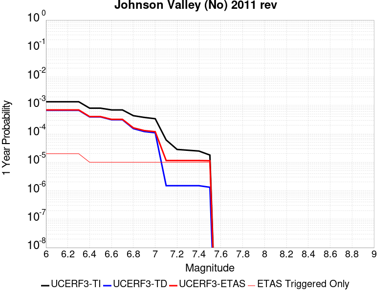 |  |

| Magnitude | 1 wk TI Prob | 1 wk TD Prob | 1 wk ETAS Prob | 1 wk ETAS/TD Gain | 1 wk ETAS Triggered Only | 1 mo TI Prob | 1 mo TD Prob | 1 mo ETAS Prob | 1 mo ETAS/TD Gain | 1 mo ETAS Triggered Only | 1 yr TI Prob | 1 yr TD Prob | 1 yr ETAS Prob | 1 yr ETAS/TD Gain | 1 yr ETAS Triggered Only | 10 yr TI Prob | 10 yr TD Prob | 10 yr ETAS Prob | 10 yr ETAS/TD Gain | 10 yr ETAS Triggered Only |
|-----|-----|-----|-----|-----|-----|-----|-----|-----|-----|-----|-----|-----|-----|-----|-----|-----|-----|-----|-----|-----|
| 6.0 | 2.577707E-5 | 1.2900938E-5 | 2.290081E-5 | 1.7751274 | 1.0E-5 | 1.1046848E-4 | 5.5288787E-5 | 7.528768E-5 | 1.361717 | 2.0E-5 | 0.0013441239 | 6.7297276E-4 | 6.929593E-4 | 1.0296988 | 2.0E-5 | 0.013360229 | 0.006713257 | 0.0067331227 | 1.0029591 | 2.0E-5 |
| 6.1 | 2.577707E-5 | 1.2900938E-5 | 2.290081E-5 | 1.7751274 | 1.0E-5 | 1.1046848E-4 | 5.5288787E-5 | 7.528768E-5 | 1.361717 | 2.0E-5 | 0.0013441239 | 6.7297276E-4 | 6.929593E-4 | 1.0296988 | 2.0E-5 | 0.013360229 | 0.006713257 | 0.0067331227 | 1.0029591 | 2.0E-5 |
| 6.2 | 2.577707E-5 | 1.2900938E-5 | 2.290081E-5 | 1.7751274 | 1.0E-5 | 1.1046848E-4 | 5.5288787E-5 | 7.528768E-5 | 1.361717 | 2.0E-5 | 0.0013441239 | 6.7297276E-4 | 6.929593E-4 | 1.0296988 | 2.0E-5 | 0.013360229 | 0.006713257 | 0.0067331227 | 1.0029591 | 2.0E-5 |
| 6.3 | 2.577707E-5 | 1.2900938E-5 | 2.290081E-5 | 1.7751274 | 1.0E-5 | 1.1046848E-4 | 5.5288787E-5 | 7.528768E-5 | 1.361717 | 2.0E-5 | 0.0013441239 | 6.7297276E-4 | 6.929593E-4 | 1.0296988 | 2.0E-5 | 0.013360229 | 0.006713257 | 0.0067331227 | 1.0029591 | 2.0E-5 |
| 6.4 | 1.5296591E-5 | 7.536742E-6 | 7.536742E-6 | 1.0 | 0.0 | 6.555518E-5 | 3.2300028E-5 | 4.2299707E-5 | 1.3095872 | 1.0E-5 | 7.97842E-4 | 3.9320064E-4 | 4.031967E-4 | 1.0254223 | 1.0E-5 | 0.007949836 | 0.0039268904 | 0.0039368514 | 1.0025365 | 1.0E-5 |
| 6.5 | 1.5296591E-5 | 7.536742E-6 | 7.536742E-6 | 1.0 | 0.0 | 6.555518E-5 | 3.2300028E-5 | 4.2299707E-5 | 1.3095872 | 1.0E-5 | 7.97842E-4 | 3.9320064E-4 | 4.031967E-4 | 1.0254223 | 1.0E-5 | 0.007949836 | 0.0039268904 | 0.0039368514 | 1.0025365 | 1.0E-5 |
| 6.6 | 1.3289383E-5 | 5.9917306E-6 | 5.9917306E-6 | 1.0 | 0.0 | 5.6953253E-5 | 2.5678688E-5 | 3.5678433E-5 | 1.389418 | 1.0E-5 | 6.9318525E-4 | 3.1261015E-4 | 3.2260703E-4 | 1.0319787 | 1.0E-5 | 0.0069102696 | 0.0031233684 | 0.003133337 | 1.0031917 | 1.0E-5 |
| 6.7 | 1.3289383E-5 | 5.9917306E-6 | 5.9917306E-6 | 1.0 | 0.0 | 5.6953253E-5 | 2.5678688E-5 | 3.5678433E-5 | 1.389418 | 1.0E-5 | 6.9318525E-4 | 3.1261015E-4 | 3.2260703E-4 | 1.0319787 | 1.0E-5 | 0.0069102696 | 0.0031233684 | 0.003133337 | 1.0031917 | 1.0E-5 |
| 6.8 | 8.330789E-6 | 2.9211888E-6 | 2.9211888E-6 | 1.0 | 0.0 | 3.570289E-5 | 1.2519352E-5 | 2.2519227E-5 | 1.7987534 | 1.0E-5 | 4.34596E-4 | 1.5241816E-4 | 1.6241663E-4 | 1.065599 | 1.0E-5 | 0.0043374705 | 0.0015236961 | 0.001533681 | 1.0065529 | 1.0E-5 |
| 6.9 | 7.2359003E-6 | 2.3013247E-6 | 2.3013247E-6 | 1.0 | 0.0 | 3.1010633E-5 | 9.8628125E-6 | 1.9862713E-5 | 2.0138996 | 1.0E-5 | 3.7748902E-4 | 1.2007845E-4 | 1.3007726E-4 | 1.0832689 | 1.0E-5 | 0.0037684843 | 0.0012006586 | 0.0012106466 | 1.0083188 | 1.0E-5 |
| 7.0 | 6.5149957E-6 | 2.088482E-6 | 2.088482E-6 | 1.0 | 0.0 | 2.792111E-5 | 8.950637E-6 | 1.8950546E-5 | 2.117229 | 1.0E-5 | 3.398865E-4 | 1.0897385E-4 | 1.1897276E-4 | 1.0917552 | 1.0E-5 | 0.003393671 | 0.0010897239 | 0.001099713 | 1.0091666 | 1.0E-5 |
| 7.1 | 1.1662233E-6 | 2.8802024E-8 | 2.8802024E-8 | 1.0 | 0.0 | 4.9980904E-6 | 1.2343725E-7 | 1.0123436E-5 | 82.01282 | 1.0E-5 | 6.0850052E-5 | 1.5028476E-6 | 1.1502832E-5 | 7.654025 | 1.0E-5 | 6.083339E-4 | 1.50283895E-5 | 2.502824E-5 | 1.6653973 | 1.0E-5 |
| 7.2 | 5.413881E-7 | 2.8802024E-8 | 2.8802024E-8 | 1.0 | 0.0 | 2.3202326E-6 | 1.2343725E-7 | 1.0123436E-5 | 82.01282 | 1.0E-5 | 2.8248465E-5 | 1.5028476E-6 | 1.1502832E-5 | 7.654025 | 1.0E-5 | 2.8244875E-4 | 1.50283895E-5 | 2.502824E-5 | 1.6653973 | 1.0E-5 |
| 7.3 | 5.076821E-7 | 2.8802024E-8 | 2.8802024E-8 | 1.0 | 0.0 | 2.1757785E-6 | 1.2343723E-7 | 1.0123436E-5 | 82.01282 | 1.0E-5 | 2.648978E-5 | 1.5028475E-6 | 1.1502832E-5 | 7.654025 | 1.0E-5 | 2.6486625E-4 | 1.50283895E-5 | 2.502824E-5 | 1.6653973 | 1.0E-5 |
| 7.4 | 4.7568687E-7 | 2.8783948E-8 | 2.8783948E-8 | 1.0 | 0.0 | 2.0386565E-6 | 1.2335977E-7 | 1.0123358E-5 | 82.0637 | 1.0E-5 | 2.482036E-5 | 1.5019043E-6 | 1.1501889E-5 | 7.6582036 | 1.0E-5 | 2.4817587E-4 | 1.5018958E-5 | 2.5018808E-5 | 1.6658151 | 1.0E-5 |
| 7.5 | 3.435626E-7 | 2.5357679E-8 | 2.5357679E-8 | 1.0 | 0.0 | 1.4724103E-6 | 1.0867576E-7 | 1.0108674E-5 | 93.01682 | 1.0E-5 | 1.7926448E-5 | 1.3231268E-6 | 1.13231135E-5 | 8.557844 | 1.0E-5 | 1.7925001E-4 | 1.3231205E-5 | 2.3231072E-5 | 1.755779 | 1.0E-5 |

## Round Valley
*[(top)](#table-of-contents)*

| 1 Week | 1 Month | 1 Year | 10 Year |
|-----|-----|-----|-----|
|  |  |  |  |

| Magnitude | 1 wk TI Prob | 1 wk TD Prob | 1 wk ETAS Prob | 1 wk ETAS/TD Gain | 1 wk ETAS Triggered Only | 1 mo TI Prob | 1 mo TD Prob | 1 mo ETAS Prob | 1 mo ETAS/TD Gain | 1 mo ETAS Triggered Only | 1 yr TI Prob | 1 yr TD Prob | 1 yr ETAS Prob | 1 yr ETAS/TD Gain | 1 yr ETAS Triggered Only | 10 yr TI Prob | 10 yr TD Prob | 10 yr ETAS Prob | 10 yr ETAS/TD Gain | 10 yr ETAS Triggered Only |
|-----|-----|-----|-----|-----|-----|-----|-----|-----|-----|-----|-----|-----|-----|-----|-----|-----|-----|-----|-----|-----|
| 6.0 | 1.588152E-5 | 1.3670716E-5 | 2.3670578E-5 | 1.7314806 | 1.0E-5 | 6.806188E-5 | 5.8587688E-5 | 6.85871E-5 | 1.1706743 | 1.0E-5 | 8.283384E-4 | 7.13111E-4 | 7.330968E-4 | 1.0280261 | 2.0E-5 | 0.008252576 | 0.0071121147 | 0.007131973 | 1.0027921 | 2.0E-5 |
| 6.1 | 1.588152E-5 | 1.3670716E-5 | 2.3670578E-5 | 1.7314806 | 1.0E-5 | 6.806188E-5 | 5.8587688E-5 | 6.85871E-5 | 1.1706743 | 1.0E-5 | 8.283384E-4 | 7.13111E-4 | 7.330968E-4 | 1.0280261 | 2.0E-5 | 0.008252576 | 0.0071121147 | 0.007131973 | 1.0027921 | 2.0E-5 |
| 6.2 | 1.588152E-5 | 1.3670716E-5 | 2.3670578E-5 | 1.7314806 | 1.0E-5 | 6.806188E-5 | 5.8587688E-5 | 6.85871E-5 | 1.1706743 | 1.0E-5 | 8.283384E-4 | 7.13111E-4 | 7.330968E-4 | 1.0280261 | 2.0E-5 | 0.008252576 | 0.0071121147 | 0.007131973 | 1.0027921 | 2.0E-5 |
| 6.3 | 1.588152E-5 | 1.3670716E-5 | 2.3670578E-5 | 1.7314806 | 1.0E-5 | 6.806188E-5 | 5.8587688E-5 | 6.85871E-5 | 1.1706743 | 1.0E-5 | 8.283384E-4 | 7.13111E-4 | 7.330968E-4 | 1.0280261 | 2.0E-5 | 0.008252576 | 0.0071121147 | 0.007131973 | 1.0027921 | 2.0E-5 |
| 6.4 | 1.588152E-5 | 1.3670716E-5 | 2.3670578E-5 | 1.7314806 | 1.0E-5 | 6.806188E-5 | 5.8587688E-5 | 6.85871E-5 | 1.1706743 | 1.0E-5 | 8.283384E-4 | 7.13111E-4 | 7.330968E-4 | 1.0280261 | 2.0E-5 | 0.008252576 | 0.0071121147 | 0.007131973 | 1.0027921 | 2.0E-5 |
| 6.5 | 1.0646776E-5 | 7.953037E-6 | 7.953037E-6 | 1.0 | 0.0 | 4.5628243E-5 | 3.408405E-5 | 3.408405E-5 | 1.0 | 0.0 | 5.553823E-4 | 4.1490266E-4 | 4.1490266E-4 | 1.0 | 0.0 | 0.005539963 | 0.0041421093 | 0.0041421093 | 1.0 | 0.0 |
| 6.6 | 8.632956E-6 | 5.768742E-6 | 5.768742E-6 | 1.0 | 0.0 | 3.6997862E-5 | 2.4722967E-5 | 2.4722967E-5 | 1.0 | 0.0 | 4.5035584E-4 | 3.009644E-4 | 3.009644E-4 | 1.0 | 0.0 | 0.0044944426 | 0.003005946 | 0.003005946 | 1.0 | 0.0 |
| 6.7 | 8.632956E-6 | 5.768742E-6 | 5.768742E-6 | 1.0 | 0.0 | 3.6997862E-5 | 2.4722967E-5 | 2.4722967E-5 | 1.0 | 0.0 | 4.5035584E-4 | 3.009644E-4 | 3.009644E-4 | 1.0 | 0.0 | 0.0044944426 | 0.003005946 | 0.003005946 | 1.0 | 0.0 |
| 6.8 | 7.143895E-6 | 4.2018346E-6 | 4.2018346E-6 | 1.0 | 0.0 | 3.0616335E-5 | 1.8007748E-5 | 1.8007748E-5 | 1.0 | 0.0 | 3.726901E-4 | 2.1922393E-4 | 2.1922393E-4 | 1.0 | 0.0 | 0.0037206567 | 0.0021902416 | 0.0021902416 | 1.0 | 0.0 |
| 6.9 | 6.5120694E-6 | 3.6644687E-6 | 3.6644687E-6 | 1.0 | 0.0 | 2.790857E-5 | 1.570478E-5 | 1.570478E-5 | 1.0 | 0.0 | 3.3973387E-4 | 1.9119044E-4 | 1.9119044E-4 | 1.0 | 0.0 | 0.0033921495 | 0.0019104085 | 0.0019104085 | 1.0 | 0.0 |
| 7.0 | 5.0614435E-6 | 2.6836676E-6 | 2.6836676E-6 | 1.0 | 0.0 | 2.169172E-5 | 1.1501388E-5 | 1.1501388E-5 | 1.0 | 0.0 | 2.6406467E-4 | 1.4002144E-4 | 1.4002144E-4 | 1.0 | 0.0 | 0.0026375111 | 0.0013994334 | 0.0013994334 | 1.0 | 0.0 |
| 7.1 | 4.41728E-6 | 2.3575074E-6 | 2.3575074E-6 | 1.0 | 0.0 | 1.8931061E-5 | 1.0103569E-5 | 1.0103569E-5 | 1.0 | 0.0 | 2.304613E-4 | 1.23005E-4 | 1.23005E-4 | 1.0 | 0.0 | 0.0023022245 | 0.0012294657 | 0.0012294657 | 1.0 | 0.0 |
| 7.2 | 2.535495E-6 | 1.1208391E-6 | 1.1208391E-6 | 1.0 | 0.0 | 1.0866362E-5 | 4.8035904E-6 | 4.8035904E-6 | 1.0 | 0.0 | 1.3228992E-4 | 5.8482667E-5 | 5.8482667E-5 | 1.0 | 0.0 | 0.0013221119 | 5.84724E-4 | 5.84724E-4 | 1.0 | 0.0 |
| 7.3 | 7.900015E-7 | 4.0889498E-7 | 4.0889498E-7 | 1.0 | 0.0 | 3.3857161E-6 | 1.752407E-6 | 1.752407E-6 | 1.0 | 0.0 | 4.1220315E-5 | 2.1335554E-5 | 2.1335554E-5 | 1.0 | 0.0 | 4.121267E-4 | 2.1335555E-4 | 2.1335555E-4 | 1.0 | 0.0 |

## Davis Creek
*[(top)](#table-of-contents)*

| 1 Week | 1 Month | 1 Year | 10 Year |
|-----|-----|-----|-----|
|  |  |  | 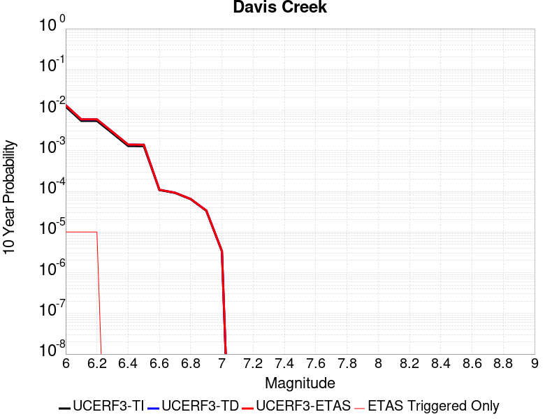 |

| Magnitude | 1 wk TI Prob | 1 wk TD Prob | 1 wk ETAS Prob | 1 wk ETAS/TD Gain | 1 wk ETAS Triggered Only | 1 mo TI Prob | 1 mo TD Prob | 1 mo ETAS Prob | 1 mo ETAS/TD Gain | 1 mo ETAS Triggered Only | 1 yr TI Prob | 1 yr TD Prob | 1 yr ETAS Prob | 1 yr ETAS/TD Gain | 1 yr ETAS Triggered Only | 10 yr TI Prob | 10 yr TD Prob | 10 yr ETAS Prob | 10 yr ETAS/TD Gain | 10 yr ETAS Triggered Only |
|-----|-----|-----|-----|-----|-----|-----|-----|-----|-----|-----|-----|-----|-----|-----|-----|-----|-----|-----|-----|-----|
| 6.0 | 2.331472E-5 | 2.5417214E-5 | 3.541696E-5 | 1.3934242 | 1.0E-5 | 9.99164E-5 | 1.0892704E-4 | 1.1892595E-4 | 1.0917946 | 1.0E-5 | 0.0012158032 | 0.0013254983 | 0.0013354851 | 1.0075344 | 1.0E-5 | 0.01209173 | 0.013187704 | 0.013197572 | 1.0007483 | 1.0E-5 |
| 6.1 | 1.0407654E-5 | 1.1316986E-5 | 2.1316873E-5 | 1.8836174 | 1.0E-5 | 4.4603472E-5 | 4.8500624E-5 | 5.8500136E-5 | 1.206173 | 1.0E-5 | 5.4291193E-4 | 5.9036224E-4 | 6.003563E-4 | 1.0169288 | 1.0E-5 | 0.0054158745 | 0.005890611 | 0.005900552 | 1.0016876 | 1.0E-5 |
| 6.2 | 1.0407654E-5 | 1.1316986E-5 | 2.1316873E-5 | 1.8836174 | 1.0E-5 | 4.4603472E-5 | 4.8500624E-5 | 5.8500136E-5 | 1.206173 | 1.0E-5 | 5.4291193E-4 | 5.9036224E-4 | 6.003563E-4 | 1.0169288 | 1.0E-5 | 0.0054158745 | 0.005890611 | 0.005900552 | 1.0016876 | 1.0E-5 |
| 6.3 | 5.1323277E-6 | 5.568556E-6 | 5.568556E-6 | 1.0 | 0.0 | 2.1995505E-5 | 2.386507E-5 | 2.386507E-5 | 1.0 | 0.0 | 2.6776237E-4 | 2.905271E-4 | 2.905271E-4 | 1.0 | 0.0 | 0.0026743996 | 0.0029023192 | 0.0029023192 | 1.0 | 0.0 |
| 6.4 | 2.4985154E-6 | 2.704538E-6 | 2.704538E-6 | 1.0 | 0.0 | 1.07078795E-5 | 1.1590847E-5 | 1.1590847E-5 | 1.0 | 0.0 | 1.3036063E-4 | 1.4111304E-4 | 1.4111304E-4 | 1.0 | 0.0 | 0.0013028418 | 0.001410589 | 0.001410589 | 1.0 | 0.0 |
| 6.5 | 2.4846438E-6 | 2.6904722E-6 | 2.6904722E-6 | 1.0 | 0.0 | 1.064843E-5 | 1.1530565E-5 | 1.1530565E-5 | 1.0 | 0.0 | 1.2963692E-4 | 1.403792E-4 | 1.403792E-4 | 1.0 | 0.0 | 0.0012956132 | 0.0014032599 | 0.0014032599 | 1.0 | 0.0 |
| 6.6 | 2.072566E-7 | 2.1018087E-7 | 2.1018087E-7 | 1.0 | 0.0 | 8.882423E-7 | 9.0077486E-7 | 9.0077486E-7 | 1.0 | 0.0 | 1.0814296E-5 | 1.0966881E-5 | 1.0966881E-5 | 1.0 | 0.0 | 1.081377E-4 | 1.09663575E-4 | 1.09663575E-4 | 1.0 | 0.0 |
| 6.7 | 1.7544528E-7 | 1.7790826E-7 | 1.7790826E-7 | 1.0 | 0.0 | 7.5190815E-7 | 7.6246374E-7 | 7.6246374E-7 | 1.0 | 0.0 | 9.154443E-6 | 9.282958E-6 | 9.282958E-6 | 1.0 | 0.0 | 9.1540656E-5 | 9.282586E-5 | 9.282586E-5 | 1.0 | 0.0 |
| 6.8 | 1.2320395E-7 | 1.2481138E-7 | 1.2481138E-7 | 1.0 | 0.0 | 5.280168E-7 | 5.349058E-7 | 5.349058E-7 | 1.0 | 0.0 | 6.428586E-6 | 6.5124595E-6 | 6.5124595E-6 | 1.0 | 0.0 | 6.4284E-5 | 6.5122804E-5 | 6.5122804E-5 | 1.0 | 0.0 |
| 6.9 | 6.399997E-8 | 6.486058E-8 | 6.486058E-8 | 1.0 | 0.0 | 2.7428555E-7 | 2.7797387E-7 | 2.7797387E-7 | 1.0 | 0.0 | 3.3394215E-6 | 3.3843273E-6 | 3.3843273E-6 | 1.0 | 0.0 | 3.3393713E-5 | 3.384282E-5 | 3.384282E-5 | 1.0 | 0.0 |
| 7.0 | 6.4455685E-9 | 6.535264E-9 | 6.535264E-9 | 1.0 | 0.0 | 2.7623864E-8 | 2.8008275E-8 | 2.8008275E-8 | 1.0 | 0.0 | 3.3632048E-7 | 3.4100074E-7 | 3.4100074E-7 | 1.0 | 0.0 | 3.3631998E-6 | 3.4100074E-6 | 3.4100074E-6 | 1.0 | 0.0 |

## Oceanside alt1
*[(top)](#table-of-contents)*

| 1 Week | 1 Month | 1 Year | 10 Year |
|-----|-----|-----|-----|
|  |  |  |  |

| Magnitude | 1 wk TI Prob | 1 wk TD Prob | 1 wk ETAS Prob | 1 wk ETAS/TD Gain | 1 wk ETAS Triggered Only | 1 mo TI Prob | 1 mo TD Prob | 1 mo ETAS Prob | 1 mo ETAS/TD Gain | 1 mo ETAS Triggered Only | 1 yr TI Prob | 1 yr TD Prob | 1 yr ETAS Prob | 1 yr ETAS/TD Gain | 1 yr ETAS Triggered Only | 10 yr TI Prob | 10 yr TD Prob | 10 yr ETAS Prob | 10 yr ETAS/TD Gain | 10 yr ETAS Triggered Only |
|-----|-----|-----|-----|-----|-----|-----|-----|-----|-----|-----|-----|-----|-----|-----|-----|-----|-----|-----|-----|-----|
| 6.0 | 1.1617542E-5 | 1.1423493E-5 | 3.1423264E-5 | 2.7507582 | 2.0E-5 | 4.9788516E-5 | 4.8956997E-5 | 6.895602E-5 | 1.4085017 | 2.0E-5 | 6.060066E-4 | 5.9590454E-4 | 6.158926E-4 | 1.0335424 | 2.0E-5 | 0.0060435664 | 0.005944664 | 0.0059645455 | 1.0033444 | 2.0E-5 |
| 6.1 | 1.1617542E-5 | 1.1423493E-5 | 3.1423264E-5 | 2.7507582 | 2.0E-5 | 4.9788516E-5 | 4.8956997E-5 | 6.895602E-5 | 1.4085017 | 2.0E-5 | 6.060066E-4 | 5.9590454E-4 | 6.158926E-4 | 1.0335424 | 2.0E-5 | 0.0060435664 | 0.005944664 | 0.0059645455 | 1.0033444 | 2.0E-5 |
| 6.2 | 1.1617542E-5 | 1.1423493E-5 | 3.1423264E-5 | 2.7507582 | 2.0E-5 | 4.9788516E-5 | 4.8956997E-5 | 6.895602E-5 | 1.4085017 | 2.0E-5 | 6.060066E-4 | 5.9590454E-4 | 6.158926E-4 | 1.0335424 | 2.0E-5 | 0.0060435664 | 0.005944664 | 0.0059645455 | 1.0033444 | 2.0E-5 |
| 6.3 | 1.1617542E-5 | 1.1423493E-5 | 3.1423264E-5 | 2.7507582 | 2.0E-5 | 4.9788516E-5 | 4.8956997E-5 | 6.895602E-5 | 1.4085017 | 2.0E-5 | 6.060066E-4 | 5.9590454E-4 | 6.158926E-4 | 1.0335424 | 2.0E-5 | 0.0060435664 | 0.005944664 | 0.0059645455 | 1.0033444 | 2.0E-5 |
| 6.4 | 1.1617542E-5 | 1.1423493E-5 | 3.1423264E-5 | 2.7507582 | 2.0E-5 | 4.9788516E-5 | 4.8956997E-5 | 6.895602E-5 | 1.4085017 | 2.0E-5 | 6.060066E-4 | 5.9590454E-4 | 6.158926E-4 | 1.0335424 | 2.0E-5 | 0.0060435664 | 0.005944664 | 0.0059645455 | 1.0033444 | 2.0E-5 |
| 6.5 | 1.1617542E-5 | 1.1423493E-5 | 3.1423264E-5 | 2.7507582 | 2.0E-5 | 4.9788516E-5 | 4.8956997E-5 | 6.895602E-5 | 1.4085017 | 2.0E-5 | 6.060066E-4 | 5.9590454E-4 | 6.158926E-4 | 1.0335424 | 2.0E-5 | 0.0060435664 | 0.005944664 | 0.0059645455 | 1.0033444 | 2.0E-5 |
| 6.6 | 7.561768E-6 | 7.1336153E-6 | 2.7133472E-5 | 3.8036075 | 2.0E-5 | 3.2407173E-5 | 3.0572286E-5 | 5.0571674E-5 | 1.6541673 | 2.0E-5 | 3.9448592E-4 | 3.7215507E-4 | 3.9214763E-4 | 1.0537211 | 2.0E-5 | 0.0039378637 | 0.00371543 | 0.0037353556 | 1.005363 | 2.0E-5 |
| 6.7 | 7.1042605E-6 | 6.6556854E-6 | 2.6655553E-5 | 4.0049295 | 2.0E-5 | 3.0446476E-5 | 2.8524059E-5 | 4.852349E-5 | 1.7011424 | 2.0E-5 | 3.706228E-4 | 3.472259E-4 | 3.6721895E-4 | 1.0575794 | 2.0E-5 | 0.0037000529 | 0.003466917 | 0.0034868477 | 1.0057489 | 2.0E-5 |
| 6.8 | 6.285554E-6 | 5.799706E-6 | 1.5799647E-5 | 2.7242155 | 1.0E-5 | 2.693781E-5 | 2.4855648E-5 | 3.48554E-5 | 1.402313 | 1.0E-5 | 3.2791847E-4 | 3.0257605E-4 | 3.12573E-4 | 1.0330396 | 1.0E-5 | 0.0032743502 | 0.0030216982 | 0.003031668 | 1.0032994 | 1.0E-5 |
| 6.9 | 6.148883E-6 | 5.6565445E-6 | 1.5656487E-5 | 2.7678537 | 1.0E-5 | 2.635209E-5 | 2.424211E-5 | 3.4241868E-5 | 1.4124954 | 1.0E-5 | 3.2078946E-4 | 2.9510827E-4 | 3.0510532E-4 | 1.0338758 | 1.0E-5 | 0.003203268 | 0.0029472208 | 0.0029571913 | 1.003383 | 1.0E-5 |
| 7.0 | 5.253857E-6 | 4.722404E-6 | 1.4722356E-5 | 3.1175556 | 1.0E-5 | 2.2516335E-5 | 2.0238718E-5 | 3.0238516E-5 | 1.4940925 | 1.0E-5 | 2.7410188E-4 | 2.4637886E-4 | 2.5637637E-4 | 1.0405779 | 1.0E-5 | 0.0027376404 | 0.0024610884 | 0.0024710638 | 1.0040532 | 1.0E-5 |
| 7.1 | 4.730754E-6 | 4.17851E-6 | 1.41784685E-5 | 3.3931875 | 1.0E-5 | 2.0274503E-5 | 1.7907778E-5 | 2.79076E-5 | 1.5584066 | 1.0E-5 | 2.468141E-4 | 2.1800565E-4 | 2.2800347E-4 | 1.0458604 | 1.0E-5 | 0.0024654015 | 0.0021779444 | 0.0021879226 | 1.0045815 | 1.0E-5 |
| 7.2 | 3.7998386E-6 | 3.214026E-6 | 1.3213994E-5 | 4.1113524 | 1.0E-5 | 1.6284921E-5 | 1.37743245E-5 | 2.3774188E-5 | 1.7259784 | 1.0E-5 | 1.9825088E-4 | 1.6768962E-4 | 1.7768794E-4 | 1.059624 | 1.0E-5 | 0.001980741 | 0.001675643 | 0.0016856263 | 1.0059578 | 1.0E-5 |
| 7.3 | 3.2656465E-6 | 2.698376E-6 | 1.2698349E-5 | 4.7059226 | 1.0E-5 | 1.3995553E-5 | 1.1564418E-5 | 2.1564301E-5 | 1.8647114 | 1.0E-5 | 1.7038253E-4 | 1.407878E-4 | 1.5078639E-4 | 1.0710189 | 1.0E-5 | 0.0017025196 | 0.0014069972 | 0.0014169831 | 1.0070974 | 1.0E-5 |
| 7.4 | 2.593703E-6 | 2.0680277E-6 | 2.0680277E-6 | 1.0 | 0.0 | 1.1115822E-5 | 8.862946E-6 | 8.862946E-6 | 1.0 | 0.0 | 1.3532673E-4 | 1.0790111E-4 | 1.0790111E-4 | 1.0 | 0.0 | 0.0013524436 | 0.0010784961 | 0.0010784961 | 1.0 | 0.0 |
| 7.5 | 1.8715585E-6 | 1.4137177E-6 | 1.4137177E-6 | 1.0 | 0.0 | 8.020941E-6 | 6.0587763E-6 | 6.0587763E-6 | 1.0 | 0.0 | 9.7650576E-5 | 7.376316E-5 | 7.376316E-5 | 1.0 | 0.0 | 9.7607676E-4 | 7.3739287E-4 | 7.3739287E-4 | 1.0 | 0.0 |
| 7.6 | 1.2246786E-6 | 8.5268175E-7 | 8.5268175E-7 | 1.0 | 0.0 | 5.248612E-6 | 3.6543456E-6 | 3.6543456E-6 | 1.0 | 0.0 | 6.389998E-5 | 4.4490793E-5 | 4.4490793E-5 | 1.0 | 0.0 | 6.3881604E-4 | 4.4482335E-4 | 4.4482335E-4 | 1.0 | 0.0 |
| 7.7 | 5.140719E-7 | 2.734703E-7 | 2.734703E-7 | 1.0 | 0.0 | 2.2031636E-6 | 1.1720151E-6 | 1.1720151E-6 | 1.0 | 0.0 | 2.6823185E-5 | 1.4269205E-5 | 1.4269205E-5 | 1.0 | 0.0 | 2.6819948E-4 | 1.4268424E-4 | 1.4268424E-4 | 1.0 | 0.0 |
| 7.8 | 1.16056995E-8 | 9.782373E-9 | 9.782373E-9 | 1.0 | 0.0 | 4.9738713E-8 | 4.1924455E-8 | 4.1924455E-8 | 1.0 | 0.0 | 6.0556863E-7 | 5.1043025E-7 | 5.1043025E-7 | 1.0 | 0.0 | 6.05567E-6 | 5.1043025E-6 | 5.1043025E-6 | 1.0 | 0.0 |

## Las Positas
*[(top)](#table-of-contents)*

| 1 Week | 1 Month | 1 Year | 10 Year |
|-----|-----|-----|-----|
|  |  |  |  |

| Magnitude | 1 wk TI Prob | 1 wk TD Prob | 1 wk ETAS Prob | 1 wk ETAS/TD Gain | 1 wk ETAS Triggered Only | 1 mo TI Prob | 1 mo TD Prob | 1 mo ETAS Prob | 1 mo ETAS/TD Gain | 1 mo ETAS Triggered Only | 1 yr TI Prob | 1 yr TD Prob | 1 yr ETAS Prob | 1 yr ETAS/TD Gain | 1 yr ETAS Triggered Only | 10 yr TI Prob | 10 yr TD Prob | 10 yr ETAS Prob | 10 yr ETAS/TD Gain | 10 yr ETAS Triggered Only |
|-----|-----|-----|-----|-----|-----|-----|-----|-----|-----|-----|-----|-----|-----|-----|-----|-----|-----|-----|-----|-----|
| 6.0 | 1.0659424E-5 | 1.15911225E-5 | 2.1591006E-5 | 1.8627192 | 1.0E-5 | 4.568245E-5 | 4.9676237E-5 | 5.967574E-5 | 1.2012935 | 1.0E-5 | 5.560419E-4 | 6.048082E-4 | 6.247961E-4 | 1.0330484 | 2.0E-5 | 0.005546526 | 0.006048082 | 0.006067961 | 1.0032868 | 2.0E-5 |
| 6.1 | 1.0659424E-5 | 1.15911225E-5 | 2.1591006E-5 | 1.8627192 | 1.0E-5 | 4.568245E-5 | 4.9676237E-5 | 5.967574E-5 | 1.2012935 | 1.0E-5 | 5.560419E-4 | 6.048082E-4 | 6.247961E-4 | 1.0330484 | 2.0E-5 | 0.005546526 | 0.006048082 | 0.006067961 | 1.0032868 | 2.0E-5 |
| 6.2 | 1.0659424E-5 | 1.15911225E-5 | 2.1591006E-5 | 1.8627192 | 1.0E-5 | 4.568245E-5 | 4.9676237E-5 | 5.967574E-5 | 1.2012935 | 1.0E-5 | 5.560419E-4 | 6.048082E-4 | 6.247961E-4 | 1.0330484 | 2.0E-5 | 0.005546526 | 0.006048082 | 0.006067961 | 1.0032868 | 2.0E-5 |
| 6.3 | 1.0659424E-5 | 1.15911225E-5 | 2.1591006E-5 | 1.8627192 | 1.0E-5 | 4.568245E-5 | 4.9676237E-5 | 5.967574E-5 | 1.2012935 | 1.0E-5 | 5.560419E-4 | 6.048082E-4 | 6.247961E-4 | 1.0330484 | 2.0E-5 | 0.005546526 | 0.006048082 | 0.006067961 | 1.0032868 | 2.0E-5 |

## San Andreas (Santa Cruz Mts) 2011 CFM
*[(top)](#table-of-contents)*

| 1 Week | 1 Month | 1 Year | 10 Year |
|-----|-----|-----|-----|
|  |  |  |  |

| Magnitude | 1 wk TI Prob | 1 wk TD Prob | 1 wk ETAS Prob | 1 wk ETAS/TD Gain | 1 wk ETAS Triggered Only | 1 mo TI Prob | 1 mo TD Prob | 1 mo ETAS Prob | 1 mo ETAS/TD Gain | 1 mo ETAS Triggered Only | 1 yr TI Prob | 1 yr TD Prob | 1 yr ETAS Prob | 1 yr ETAS/TD Gain | 1 yr ETAS Triggered Only | 10 yr TI Prob | 10 yr TD Prob | 10 yr ETAS Prob | 10 yr ETAS/TD Gain | 10 yr ETAS Triggered Only |
|-----|-----|-----|-----|-----|-----|-----|-----|-----|-----|-----|-----|-----|-----|-----|-----|-----|-----|-----|-----|-----|
| 6.0 | 1.7221631E-4 | 1.3793171E-4 | 1.3793171E-4 | 1.0 | 0.0 | 7.378611E-4 | 5.9100403E-4 | 5.9100403E-4 | 1.0 | 0.0 | 0.008946515 | 0.007172124 | 0.0071919803 | 1.0027685 | 2.0E-5 | 0.08594794 | 0.0705551 | 0.07057369 | 1.0002635 | 2.0E-5 |
| 6.1 | 1.7221631E-4 | 1.3793171E-4 | 1.3793171E-4 | 1.0 | 0.0 | 7.378611E-4 | 5.9100403E-4 | 5.9100403E-4 | 1.0 | 0.0 | 0.008946515 | 0.007172124 | 0.0071919803 | 1.0027685 | 2.0E-5 | 0.08594794 | 0.0705551 | 0.07057369 | 1.0002635 | 2.0E-5 |
| 6.2 | 1.7221631E-4 | 1.3793171E-4 | 1.3793171E-4 | 1.0 | 0.0 | 7.378611E-4 | 5.9100403E-4 | 5.9100403E-4 | 1.0 | 0.0 | 0.008946515 | 0.007172124 | 0.0071919803 | 1.0027685 | 2.0E-5 | 0.08594794 | 0.0705551 | 0.07057369 | 1.0002635 | 2.0E-5 |
| 6.3 | 1.716926E-4 | 1.3712609E-4 | 1.3712609E-4 | 1.0 | 0.0 | 7.3561794E-4 | 5.875529E-4 | 5.875529E-4 | 1.0 | 0.0 | 0.008919428 | 0.0071303817 | 0.007150239 | 1.0027848 | 2.0E-5 | 0.08569809 | 0.070167266 | 0.07018586 | 1.000265 | 2.0E-5 |
| 6.4 | 1.6392978E-4 | 1.3588481E-4 | 1.3588481E-4 | 1.0 | 0.0 | 7.02367E-4 | 5.822355E-4 | 5.822355E-4 | 1.0 | 0.0 | 0.008517839 | 0.007066063 | 0.0070859217 | 1.0028105 | 2.0E-5 | 0.08198654 | 0.06940135 | 0.069419965 | 1.0002682 | 2.0E-5 |
| 6.5 | 1.5742714E-4 | 1.2648388E-4 | 1.2648388E-4 | 1.0 | 0.0 | 6.745133E-4 | 5.4196286E-4 | 5.4196286E-4 | 1.0 | 0.0 | 0.00818132 | 0.0065787593 | 0.0065986277 | 1.00302 | 2.0E-5 | 0.078865945 | 0.06486309 | 0.0648818 | 1.0002884 | 2.0E-5 |
| 6.6 | 1.3038084E-4 | 1.1588213E-4 | 1.1588213E-4 | 1.0 | 0.0 | 5.5865536E-4 | 4.9654447E-4 | 4.9654447E-4 | 1.0 | 0.0 | 0.006780438 | 0.0060289134 | 0.0060487925 | 1.0032973 | 2.0E-5 | 0.0657725 | 0.05932738 | 0.05934619 | 1.0003171 | 2.0E-5 |
| 6.7 | 1.2867592E-4 | 1.1314701E-4 | 1.1314701E-4 | 1.0 | 0.0 | 5.5135164E-4 | 4.8482692E-4 | 4.8482692E-4 | 1.0 | 0.0 | 0.0066920654 | 0.00588703 | 0.0059069125 | 1.0033773 | 2.0E-5 | 0.06494093 | 0.058038417 | 0.058057256 | 1.0003246 | 2.0E-5 |
| 6.8 | 1.2801298E-4 | 1.1252261E-4 | 1.1252261E-4 | 1.0 | 0.0 | 5.485117E-4 | 4.8215193E-4 | 4.8215193E-4 | 1.0 | 0.0 | 0.0066577005 | 0.0058546383 | 0.005874521 | 1.0033962 | 2.0E-5 | 0.06461738 | 0.057752274 | 0.057771116 | 1.0003263 | 2.0E-5 |
| 6.9 | 1.269149E-4 | 1.1094465E-4 | 1.1094465E-4 | 1.0 | 0.0 | 5.4380763E-4 | 4.7539172E-4 | 4.7539172E-4 | 1.0 | 0.0 | 0.006600777 | 0.005772772 | 0.0057926564 | 1.0034446 | 2.0E-5 | 0.06408122 | 0.0570241 | 0.057042956 | 1.0003307 | 2.0E-5 |
| 7.0 | 1.2030331E-4 | 1.0824504E-4 | 1.0824504E-4 | 1.0 | 0.0 | 5.154837E-4 | 4.638261E-4 | 4.638261E-4 | 1.0 | 0.0 | 0.006257969 | 0.0056326967 | 0.0056525837 | 1.0035307 | 2.0E-5 | 0.06084648 | 0.055696685 | 0.055715572 | 1.000339 | 2.0E-5 |
| 7.1 | 8.049617E-5 | 5.3926604E-5 | 5.3926604E-5 | 1.0 | 0.0 | 3.4493793E-4 | 2.3109373E-4 | 2.3109373E-4 | 1.0 | 0.0 | 0.0041915346 | 0.0028099709 | 0.0028199428 | 1.0035487 | 1.0E-5 | 0.041133516 | 0.029618956 | 0.02962866 | 1.0003276 | 1.0E-5 |
| 7.2 | 7.093979E-5 | 4.2937932E-5 | 4.2937932E-5 | 1.0 | 0.0 | 3.0399222E-4 | 1.8400686E-4 | 1.8400686E-4 | 1.0 | 0.0 | 0.0036948253 | 0.0022380045 | 0.0022479822 | 1.0044583 | 1.0E-5 | 0.03633994 | 0.023941692 | 0.023951452 | 1.0004077 | 1.0E-5 |
| 7.3 | 6.193693E-5 | 2.8894141E-5 | 2.8894141E-5 | 1.0 | 0.0 | 2.6541698E-4 | 1.2382616E-4 | 1.2382616E-4 | 1.0 | 0.0 | 0.0032266637 | 0.0015065427 | 0.0015165276 | 1.0066277 | 1.0E-5 | 0.031802133 | 0.016499156 | 0.01650899 | 1.000596 | 1.0E-5 |
| 7.4 | 5.906492E-5 | 2.702346E-5 | 2.702346E-5 | 1.0 | 0.0 | 2.5311083E-4 | 1.1580969E-4 | 1.1580969E-4 | 1.0 | 0.0 | 0.0030772698 | 0.0014090725 | 0.0014190584 | 1.0070869 | 1.0E-5 | 0.030350044 | 0.015471023 | 0.015480868 | 1.0006363 | 1.0E-5 |
| 7.5 | 5.424296E-5 | 2.4678277E-5 | 2.4678277E-5 | 1.0 | 0.0 | 2.324491E-4 | 1.05759755E-4 | 1.05759755E-4 | 1.0 | 0.0 | 0.002826395 | 0.0012868657 | 0.0012968528 | 1.0077608 | 1.0E-5 | 0.027907165 | 0.014163188 | 0.014173046 | 1.0006961 | 1.0E-5 |
| 7.6 | 4.43084E-5 | 1.990431E-5 | 1.990431E-5 | 1.0 | 0.0 | 1.8987931E-4 | 8.53014E-5 | 8.53014E-5 | 1.0 | 0.0 | 0.0023093296 | 0.0010380499 | 0.0010480395 | 1.0096234 | 1.0E-5 | 0.022854783 | 0.011412679 | 0.011422565 | 1.0008662 | 1.0E-5 |
| 7.7 | 4.118098E-5 | 1.8936442E-5 | 1.8936442E-5 | 1.0 | 0.0 | 1.7647797E-4 | 8.115366E-5 | 8.115366E-5 | 1.0 | 0.0 | 0.002146502 | 9.875982E-4 | 9.975883E-4 | 1.0101156 | 1.0E-5 | 0.021258866 | 0.010870468 | 0.010880359 | 1.0009099 | 1.0E-5 |
| 7.8 | 3.5408906E-5 | 1.856446E-5 | 1.856446E-5 | 1.0 | 0.0 | 1.5174363E-4 | 7.955955E-5 | 7.955955E-5 | 1.0 | 0.0 | 0.0018459131 | 9.682073E-4 | 9.781977E-4 | 1.0103184 | 1.0E-5 | 0.018306552 | 0.010652021 | 0.010661914 | 1.0009288 | 1.0E-5 |
| 7.9 | 2.5860836E-5 | 1.7315993E-5 | 1.7315993E-5 | 1.0 | 0.0 | 1.10827445E-4 | 7.420929E-5 | 7.420929E-5 | 1.0 | 0.0 | 0.001348489 | 9.031238E-4 | 9.131148E-4 | 1.0110626 | 1.0E-5 | 0.013403354 | 0.009907599 | 0.0099174995 | 1.0009993 | 1.0E-5 |
| 8.0 | 1.9777332E-5 | 1.4839596E-5 | 1.4839596E-5 | 1.0 | 0.0 | 8.4757245E-5 | 6.3596715E-5 | 6.3596715E-5 | 1.0 | 0.0 | 0.0010314309 | 7.740152E-4 | 7.740152E-4 | 1.0 | 0.0 | 0.010266567 | 0.008508967 | 0.008508967 | 1.0 | 0.0 |
| 8.1 | 1.468494E-5 | 1.2107374E-5 | 1.2107374E-5 | 1.0 | 0.0 | 6.293394E-5 | 5.1887713E-5 | 5.1887713E-5 | 1.0 | 0.0 | 7.6595135E-4 | 6.3155E-4 | 6.3155E-4 | 1.0 | 0.0 | 0.0076331664 | 0.006969149 | 0.006969149 | 1.0 | 0.0 |
| 8.2 | 8.63836E-6 | 5.469061E-6 | 5.469061E-6 | 1.0 | 0.0 | 3.7021015E-5 | 2.3438623E-5 | 2.3438623E-5 | 1.0 | 0.0 | 4.5063766E-4 | 2.8532793E-4 | 2.8532793E-4 | 1.0 | 0.0 | 0.004497249 | 0.00324569 | 0.00324569 | 1.0 | 0.0 |
| 8.3 | 1.983087E-6 | 7.6599065E-7 | 7.6599065E-7 | 1.0 | 0.0 | 8.498917E-6 | 3.282813E-6 | 3.282813E-6 | 1.0 | 0.0 | 1.034694E-4 | 3.9967534E-5 | 3.9967534E-5 | 1.0 | 0.0 | 0.0010342124 | 4.719687E-4 | 4.719687E-4 | 1.0 | 0.0 |

## Burnt Mtn
*[(top)](#table-of-contents)*

| 1 Week | 1 Month | 1 Year | 10 Year |
|-----|-----|-----|-----|
|  |  | 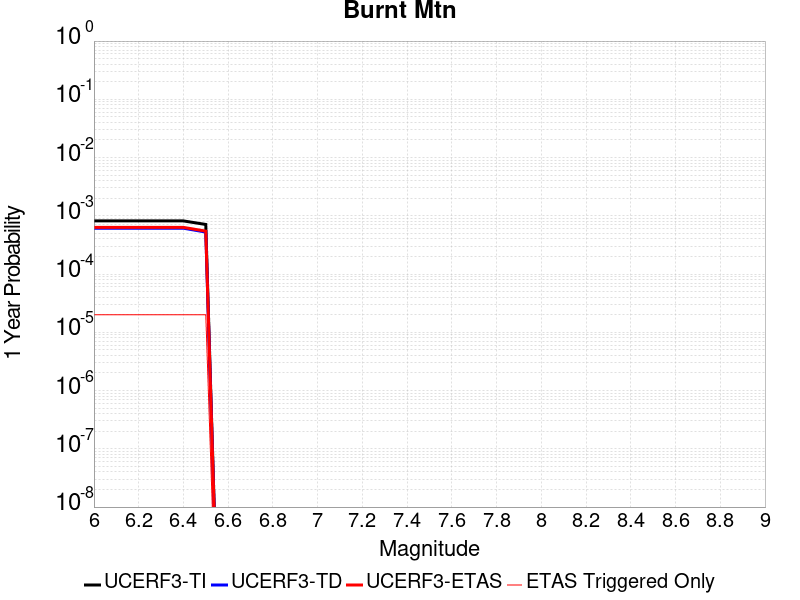 |  |

| Magnitude | 1 wk TI Prob | 1 wk TD Prob | 1 wk ETAS Prob | 1 wk ETAS/TD Gain | 1 wk ETAS Triggered Only | 1 mo TI Prob | 1 mo TD Prob | 1 mo ETAS Prob | 1 mo ETAS/TD Gain | 1 mo ETAS Triggered Only | 1 yr TI Prob | 1 yr TD Prob | 1 yr ETAS Prob | 1 yr ETAS/TD Gain | 1 yr ETAS Triggered Only | 10 yr TI Prob | 10 yr TD Prob | 10 yr ETAS Prob | 10 yr ETAS/TD Gain | 10 yr ETAS Triggered Only |
|-----|-----|-----|-----|-----|-----|-----|-----|-----|-----|-----|-----|-----|-----|-----|-----|-----|-----|-----|-----|-----|
| 6.0 | 1.5673151E-5 | 1.1749407E-5 | 2.1749289E-5 | 1.8510967 | 1.0E-5 | 6.716892E-5 | 5.0354356E-5 | 6.0353854E-5 | 1.1985825 | 1.0E-5 | 8.1747473E-4 | 6.1302073E-4 | 6.330085E-4 | 1.0326053 | 2.0E-5 | 0.008144741 | 0.006125938 | 0.0061458154 | 1.0032448 | 2.0E-5 |
| 6.1 | 1.5673151E-5 | 1.1749407E-5 | 2.1749289E-5 | 1.8510967 | 1.0E-5 | 6.716892E-5 | 5.0354356E-5 | 6.0353854E-5 | 1.1985825 | 1.0E-5 | 8.1747473E-4 | 6.1302073E-4 | 6.330085E-4 | 1.0326053 | 2.0E-5 | 0.008144741 | 0.006125938 | 0.0061458154 | 1.0032448 | 2.0E-5 |
| 6.2 | 1.5673151E-5 | 1.1749407E-5 | 2.1749289E-5 | 1.8510967 | 1.0E-5 | 6.716892E-5 | 5.0354356E-5 | 6.0353854E-5 | 1.1985825 | 1.0E-5 | 8.1747473E-4 | 6.1302073E-4 | 6.330085E-4 | 1.0326053 | 2.0E-5 | 0.008144741 | 0.006125938 | 0.0061458154 | 1.0032448 | 2.0E-5 |
| 6.3 | 1.5673151E-5 | 1.1749407E-5 | 2.1749289E-5 | 1.8510967 | 1.0E-5 | 6.716892E-5 | 5.0354356E-5 | 6.0353854E-5 | 1.1985825 | 1.0E-5 | 8.1747473E-4 | 6.1302073E-4 | 6.330085E-4 | 1.0326053 | 2.0E-5 | 0.008144741 | 0.006125938 | 0.0061458154 | 1.0032448 | 2.0E-5 |
| 6.4 | 1.5673151E-5 | 1.1749407E-5 | 2.1749289E-5 | 1.8510967 | 1.0E-5 | 6.716892E-5 | 5.0354356E-5 | 6.0353854E-5 | 1.1985825 | 1.0E-5 | 8.1747473E-4 | 6.1302073E-4 | 6.330085E-4 | 1.0326053 | 2.0E-5 | 0.008144741 | 0.006125938 | 0.0061458154 | 1.0032448 | 2.0E-5 |
| 6.5 | 1.36191375E-5 | 1.0078299E-5 | 2.0078198E-5 | 1.992221 | 1.0E-5 | 5.8366426E-5 | 4.3192707E-5 | 5.3192278E-5 | 1.2315105 | 1.0E-5 | 7.103795E-4 | 5.2587123E-4 | 5.4586073E-4 | 1.0380121 | 2.0E-5 | 0.0070811296 | 0.0052587125 | 0.005278607 | 1.0037832 | 2.0E-5 |

## Elmore Ranch
*[(top)](#table-of-contents)*

| 1 Week | 1 Month | 1 Year | 10 Year |
|-----|-----|-----|-----|
| 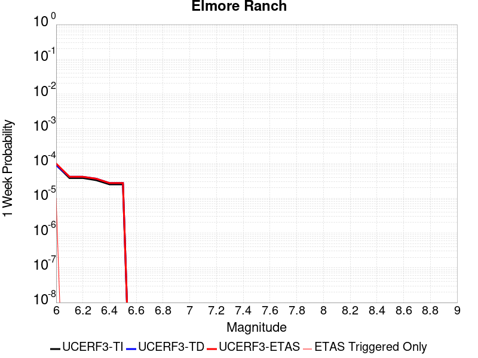 | 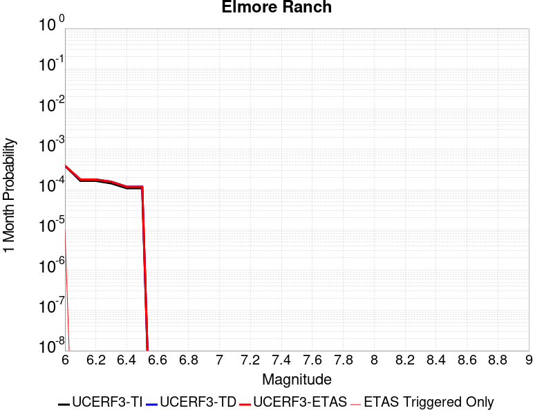 |  |  |

| Magnitude | 1 wk TI Prob | 1 wk TD Prob | 1 wk ETAS Prob | 1 wk ETAS/TD Gain | 1 wk ETAS Triggered Only | 1 mo TI Prob | 1 mo TD Prob | 1 mo ETAS Prob | 1 mo ETAS/TD Gain | 1 mo ETAS Triggered Only | 1 yr TI Prob | 1 yr TD Prob | 1 yr ETAS Prob | 1 yr ETAS/TD Gain | 1 yr ETAS Triggered Only | 10 yr TI Prob | 10 yr TD Prob | 10 yr ETAS Prob | 10 yr ETAS/TD Gain | 10 yr ETAS Triggered Only |
|-----|-----|-----|-----|-----|-----|-----|-----|-----|-----|-----|-----|-----|-----|-----|-----|-----|-----|-----|-----|-----|
| 6.0 | 9.102099E-5 | 8.952015E-5 | 9.951925E-5 | 1.1116967 | 1.0E-5 | 3.9003167E-4 | 3.8361453E-4 | 3.9361068E-4 | 1.0260578 | 1.0E-5 | 0.0047383 | 0.004662009 | 0.0046719625 | 1.002135 | 1.0E-5 | 0.046385348 | 0.045870975 | 0.045890056 | 1.000416 | 2.0E-5 |
| 6.1 | 3.8306698E-5 | 4.1498504E-5 | 4.1498504E-5 | 1.0 | 0.0 | 1.6416123E-4 | 1.7784268E-4 | 1.7784268E-4 | 1.0 | 0.0 | 0.0019968306 | 0.0021631396 | 0.0021631396 | 1.0 | 0.0 | 0.019789828 | 0.021628205 | 0.021628205 | 1.0 | 0.0 |
| 6.2 | 3.8306698E-5 | 4.1498504E-5 | 4.1498504E-5 | 1.0 | 0.0 | 1.6416123E-4 | 1.7784268E-4 | 1.7784268E-4 | 1.0 | 0.0 | 0.0019968306 | 0.0021631396 | 0.0021631396 | 1.0 | 0.0 | 0.019789828 | 0.021628205 | 0.021628205 | 1.0 | 0.0 |
| 6.3 | 3.3197924E-5 | 3.6554302E-5 | 3.6554302E-5 | 1.0 | 0.0 | 1.4226905E-4 | 1.5665586E-4 | 1.5665586E-4 | 1.0 | 0.0 | 0.0017307495 | 0.001905917 | 0.001905917 | 1.0 | 0.0 | 0.017173318 | 0.01908996 | 0.01908996 | 1.0 | 0.0 |
| 6.4 | 2.5148964E-5 | 2.7420487E-5 | 2.7420487E-5 | 1.0 | 0.0 | 1.0777682E-4 | 1.17514726E-4 | 1.17514726E-4 | 1.0 | 0.0 | 0.0013113929 | 0.0014304507 | 0.0014304507 | 1.0 | 0.0 | 0.01303681 | 0.014387194 | 0.014387194 | 1.0 | 0.0 |
| 6.5 | 2.5148964E-5 | 2.7420487E-5 | 2.7420487E-5 | 1.0 | 0.0 | 1.0777682E-4 | 1.17514726E-4 | 1.17514726E-4 | 1.0 | 0.0 | 0.0013113929 | 0.0014304507 | 0.0014304507 | 1.0 | 0.0 | 0.01303681 | 0.014387194 | 0.014387194 | 1.0 | 0.0 |

## Verdugo
*[(top)](#table-of-contents)*

| 1 Week | 1 Month | 1 Year | 10 Year |
|-----|-----|-----|-----|
|  |  | 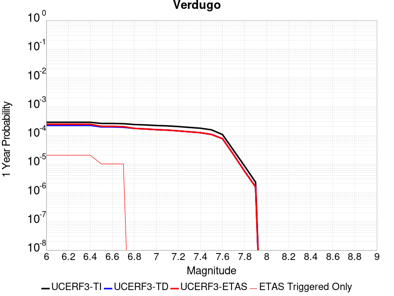 |  |

| Magnitude | 1 wk TI Prob | 1 wk TD Prob | 1 wk ETAS Prob | 1 wk ETAS/TD Gain | 1 wk ETAS Triggered Only | 1 mo TI Prob | 1 mo TD Prob | 1 mo ETAS Prob | 1 mo ETAS/TD Gain | 1 mo ETAS Triggered Only | 1 yr TI Prob | 1 yr TD Prob | 1 yr ETAS Prob | 1 yr ETAS/TD Gain | 1 yr ETAS Triggered Only | 10 yr TI Prob | 10 yr TD Prob | 10 yr ETAS Prob | 10 yr ETAS/TD Gain | 10 yr ETAS Triggered Only |
|-----|-----|-----|-----|-----|-----|-----|-----|-----|-----|-----|-----|-----|-----|-----|-----|-----|-----|-----|-----|-----|
| 6.0 | 5.392987E-6 | 4.216517E-6 | 4.216517E-6 | 1.0 | 0.0 | 2.3112598E-5 | 1.8070665E-5 | 1.8070665E-5 | 1.0 | 0.0 | 2.8135953E-4 | 2.1998861E-4 | 2.399842E-4 | 1.0908937 | 2.0E-5 | 0.0028100356 | 0.0021977562 | 0.002217712 | 1.0090802 | 2.0E-5 |
| 6.1 | 5.392987E-6 | 4.216517E-6 | 4.216517E-6 | 1.0 | 0.0 | 2.3112598E-5 | 1.8070665E-5 | 1.8070665E-5 | 1.0 | 0.0 | 2.8135953E-4 | 2.1998861E-4 | 2.399842E-4 | 1.0908937 | 2.0E-5 | 0.0028100356 | 0.0021977562 | 0.002217712 | 1.0090802 | 2.0E-5 |
| 6.2 | 5.392987E-6 | 4.216517E-6 | 4.216517E-6 | 1.0 | 0.0 | 2.3112598E-5 | 1.8070665E-5 | 1.8070665E-5 | 1.0 | 0.0 | 2.8135953E-4 | 2.1998861E-4 | 2.399842E-4 | 1.0908937 | 2.0E-5 | 0.0028100356 | 0.0021977562 | 0.002217712 | 1.0090802 | 2.0E-5 |
| 6.3 | 5.392987E-6 | 4.216517E-6 | 4.216517E-6 | 1.0 | 0.0 | 2.3112598E-5 | 1.8070665E-5 | 1.8070665E-5 | 1.0 | 0.0 | 2.8135953E-4 | 2.1998861E-4 | 2.399842E-4 | 1.0908937 | 2.0E-5 | 0.0028100356 | 0.0021977562 | 0.002217712 | 1.0090802 | 2.0E-5 |
| 6.4 | 5.392987E-6 | 4.216517E-6 | 4.216517E-6 | 1.0 | 0.0 | 2.3112598E-5 | 1.8070665E-5 | 1.8070665E-5 | 1.0 | 0.0 | 2.8135953E-4 | 2.1998861E-4 | 2.399842E-4 | 1.0908937 | 2.0E-5 | 0.0028100356 | 0.0021977562 | 0.002217712 | 1.0090802 | 2.0E-5 |
| 6.5 | 4.9154837E-6 | 3.722465E-6 | 3.722465E-6 | 1.0 | 0.0 | 2.1066187E-5 | 1.5953325E-5 | 1.5953325E-5 | 1.0 | 0.0 | 2.5645064E-4 | 1.9421462E-4 | 2.0421269E-4 | 1.0514795 | 1.0E-5 | 0.002561549 | 0.0019404698 | 0.0019504504 | 1.0051434 | 1.0E-5 |
| 6.6 | 4.9154837E-6 | 3.722465E-6 | 3.722465E-6 | 1.0 | 0.0 | 2.1066187E-5 | 1.5953325E-5 | 1.5953325E-5 | 1.0 | 0.0 | 2.5645064E-4 | 1.9421462E-4 | 2.0421269E-4 | 1.0514795 | 1.0E-5 | 0.002561549 | 0.0019404698 | 0.0019504504 | 1.0051434 | 1.0E-5 |
| 6.7 | 4.817006E-6 | 3.6206518E-6 | 3.6206518E-6 | 1.0 | 0.0 | 2.0644147E-5 | 1.5516987E-5 | 1.5516987E-5 | 1.0 | 0.0 | 2.513135E-4 | 1.8890314E-4 | 1.9890125E-4 | 1.0529271 | 1.0E-5 | 0.0025102948 | 0.0018874453 | 0.0018974264 | 1.0052881 | 1.0E-5 |
| 6.8 | 4.507407E-6 | 3.3071042E-6 | 3.3071042E-6 | 1.0 | 0.0 | 1.9317316E-5 | 1.4173227E-5 | 1.4173227E-5 | 1.0 | 0.0 | 2.3516294E-4 | 1.7254551E-4 | 1.7254551E-4 | 1.0 | 0.0 | 0.0023491425 | 0.0017241298 | 0.0017241298 | 1.0 | 0.0 |
| 6.9 | 4.3573054E-6 | 3.161011E-6 | 3.161011E-6 | 1.0 | 0.0 | 1.8674033E-5 | 1.354712E-5 | 1.354712E-5 | 1.0 | 0.0 | 2.2733262E-4 | 1.6492383E-4 | 1.6492383E-4 | 1.0 | 0.0 | 0.0022710022 | 0.0016480266 | 0.0016480266 | 1.0 | 0.0 |
| 7.0 | 4.171527E-6 | 2.9836704E-6 | 2.9836704E-6 | 1.0 | 0.0 | 1.787785E-5 | 1.2787096E-5 | 1.2787096E-5 | 1.0 | 0.0 | 2.1764109E-4 | 1.5567189E-4 | 1.5567189E-4 | 1.0 | 0.0 | 0.0021742806 | 0.0015556397 | 0.0015556397 | 1.0 | 0.0 |
| 7.1 | 4.0405484E-6 | 2.882261E-6 | 2.882261E-6 | 1.0 | 0.0 | 1.731652E-5 | 1.235249E-5 | 1.235249E-5 | 1.0 | 0.0 | 2.1080824E-4 | 1.503813E-4 | 1.503813E-4 | 1.0 | 0.0 | 0.0021060838 | 0.0015028063 | 0.0015028063 | 1.0 | 0.0 |
| 7.2 | 3.8306007E-6 | 2.7018452E-6 | 2.7018452E-6 | 1.0 | 0.0 | 1.6416758E-5 | 1.15792855E-5 | 1.15792855E-5 | 1.0 | 0.0 | 1.9985568E-4 | 1.4096878E-4 | 1.4096878E-4 | 1.0 | 0.0 | 0.0019967605 | 0.0014088044 | 0.0014088044 | 1.0 | 0.0 |
| 7.3 | 3.5750938E-6 | 2.5121758E-6 | 2.5121758E-6 | 1.0 | 0.0 | 1.532174E-5 | 1.0766424E-5 | 1.0766424E-5 | 1.0 | 0.0 | 1.8652623E-4 | 1.3107344E-4 | 1.3107344E-4 | 1.0 | 0.0 | 0.0018636974 | 0.0013099718 | 0.0013099718 | 1.0 | 0.0 |
| 7.4 | 3.3510041E-6 | 2.3408586E-6 | 2.3408586E-6 | 1.0 | 0.0 | 1.4361368E-5 | 1.0032213E-5 | 1.0032213E-5 | 1.0 | 0.0 | 1.7483562E-4 | 1.2213545E-4 | 1.2213545E-4 | 1.0 | 0.0 | 0.0017469813 | 0.0012206937 | 0.0012206937 | 1.0 | 0.0 |
| 7.5 | 2.948287E-6 | 2.0391124E-6 | 2.0391124E-6 | 1.0 | 0.0 | 1.2635454E-5 | 8.739024E-6 | 8.739024E-6 | 1.0 | 0.0 | 1.538258E-4 | 1.0639253E-4 | 1.0639253E-4 | 1.0 | 0.0 | 0.0015371935 | 0.0010634261 | 0.0010634261 | 1.0 | 0.0 |
| 7.6 | 2.0134323E-6 | 1.4471265E-6 | 1.4471265E-6 | 1.0 | 0.0 | 8.628967E-6 | 6.2019562E-6 | 6.2019562E-6 | 1.0 | 0.0 | 1.05052604E-4 | 7.550629E-5 | 7.550629E-5 | 1.0 | 0.0 | 0.0010500296 | 7.548152E-4 | 7.548152E-4 | 1.0 | 0.0 |
| 7.7 | 5.726436E-7 | 4.045248E-7 | 4.045248E-7 | 1.0 | 0.0 | 2.4541846E-6 | 1.7336766E-6 | 1.7336766E-6 | 1.0 | 0.0 | 2.9879287E-5 | 2.1107335E-5 | 2.1107335E-5 | 1.0 | 0.0 | 2.987527E-4 | 2.1105584E-4 | 2.1105584E-4 | 1.0 | 0.0 |
| 7.8 | 1.6248204E-7 | 1.0687696E-7 | 1.0687696E-7 | 1.0 | 0.0 | 6.963514E-7 | 4.5804404E-7 | 4.5804404E-7 | 1.0 | 0.0 | 8.478045E-6 | 5.5766723E-6 | 5.5766723E-6 | 1.0 | 0.0 | 8.477722E-5 | 5.5765355E-5 | 5.5765355E-5 | 1.0 | 0.0 |
| 7.9 | 4.4475744E-8 | 3.0375546E-8 | 3.0375546E-8 | 1.0 | 0.0 | 1.9061031E-7 | 1.301809E-7 | 1.301809E-7 | 1.0 | 0.0 | 2.320678E-6 | 1.5849514E-6 | 1.5849514E-6 | 1.0 | 0.0 | 2.3206538E-5 | 1.5849415E-5 | 1.5849415E-5 | 1.0 | 0.0 |

## Lions Head 2011 CFM
*[(top)](#table-of-contents)*

| 1 Week | 1 Month | 1 Year | 10 Year |
|-----|-----|-----|-----|
|  |  | 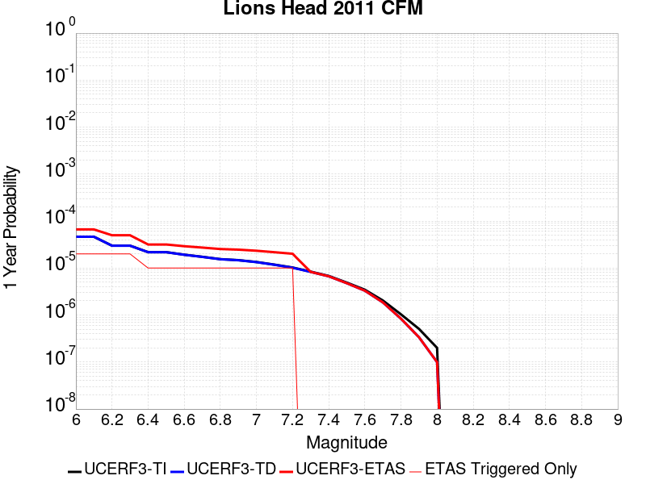 | 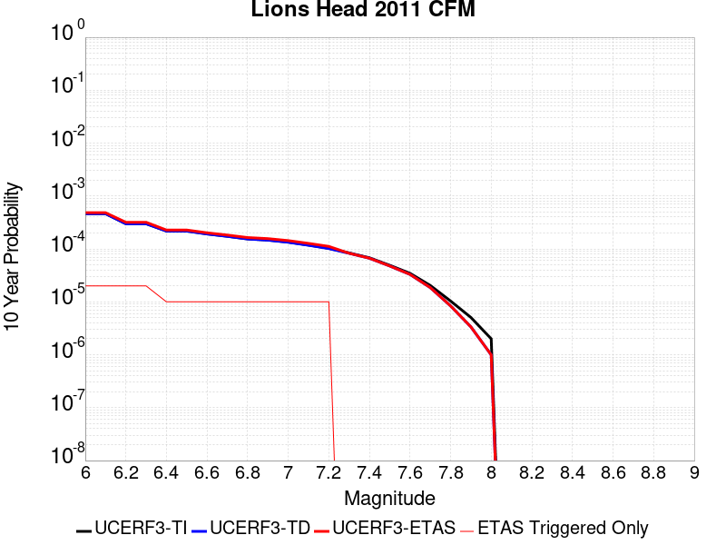 |

| Magnitude | 1 wk TI Prob | 1 wk TD Prob | 1 wk ETAS Prob | 1 wk ETAS/TD Gain | 1 wk ETAS Triggered Only | 1 mo TI Prob | 1 mo TD Prob | 1 mo ETAS Prob | 1 mo ETAS/TD Gain | 1 mo ETAS Triggered Only | 1 yr TI Prob | 1 yr TD Prob | 1 yr ETAS Prob | 1 yr ETAS/TD Gain | 1 yr ETAS Triggered Only | 10 yr TI Prob | 10 yr TD Prob | 10 yr ETAS Prob | 10 yr ETAS/TD Gain | 10 yr ETAS Triggered Only |
|-----|-----|-----|-----|-----|-----|-----|-----|-----|-----|-----|-----|-----|-----|-----|-----|-----|-----|-----|-----|-----|
| 6.0 | 8.889363E-7 | 8.891425E-7 | 2.0889125E-5 | 23.493563 | 2.0E-5 | 3.8097214E-6 | 3.8106054E-6 | 2.381053E-5 | 6.24849 | 2.0E-5 | 4.638237E-5 | 4.6393197E-5 | 6.639227E-5 | 1.4310777 | 2.0E-5 | 4.637269E-4 | 4.638414E-4 | 4.8383212E-4 | 1.0430982 | 2.0E-5 |
| 6.1 | 8.889363E-7 | 8.891425E-7 | 2.0889125E-5 | 23.493563 | 2.0E-5 | 3.8097214E-6 | 3.8106054E-6 | 2.381053E-5 | 6.24849 | 2.0E-5 | 4.638237E-5 | 4.6393197E-5 | 6.639227E-5 | 1.4310777 | 2.0E-5 | 4.637269E-4 | 4.638414E-4 | 4.8383212E-4 | 1.0430982 | 2.0E-5 |
| 6.2 | 5.7435483E-7 | 5.736071E-7 | 2.0573596E-5 | 35.86705 | 2.0E-5 | 2.4615185E-6 | 2.458314E-6 | 2.2458265E-5 | 9.135637 | 2.0E-5 | 2.9968574E-5 | 2.9929575E-5 | 4.9928978E-5 | 1.6682153 | 2.0E-5 | 2.9964533E-4 | 2.992569E-4 | 3.1925092E-4 | 1.0668122 | 2.0E-5 |
| 6.3 | 5.7435483E-7 | 5.736071E-7 | 2.0573596E-5 | 35.86705 | 2.0E-5 | 2.4615185E-6 | 2.458314E-6 | 2.2458265E-5 | 9.135637 | 2.0E-5 | 2.9968574E-5 | 2.9929575E-5 | 4.9928978E-5 | 1.6682153 | 2.0E-5 | 2.9964533E-4 | 2.992569E-4 | 3.1925092E-4 | 1.0668122 | 2.0E-5 |
| 6.4 | 4.1835764E-7 | 4.171541E-7 | 1.04171495E-5 | 24.971947 | 1.0E-5 | 1.7929601E-6 | 1.787802E-6 | 1.1787784E-5 | 6.5934505 | 1.0E-5 | 2.1829072E-5 | 2.1766275E-5 | 3.1766056E-5 | 1.4594164 | 1.0E-5 | 2.1826927E-4 | 2.1764166E-4 | 2.2763948E-4 | 1.0459371 | 1.0E-5 |
| 6.5 | 4.1835764E-7 | 4.171541E-7 | 1.04171495E-5 | 24.971947 | 1.0E-5 | 1.7929601E-6 | 1.787802E-6 | 1.1787784E-5 | 6.5934505 | 1.0E-5 | 2.1829072E-5 | 2.1766275E-5 | 3.1766056E-5 | 1.4594164 | 1.0E-5 | 2.1826927E-4 | 2.1764166E-4 | 2.2763948E-4 | 1.0459371 | 1.0E-5 |
| 6.6 | 3.6896213E-7 | 3.6761884E-7 | 1.0367615E-5 | 28.202078 | 1.0E-5 | 1.5812653E-6 | 1.5755083E-6 | 1.1575493E-5 | 7.347148 | 1.0E-5 | 1.9251736E-5 | 1.9181647E-5 | 2.9181454E-5 | 1.5213217 | 1.0E-5 | 1.9250068E-4 | 1.9180003E-4 | 2.0179812E-4 | 1.0521276 | 1.0E-5 |
| 6.7 | 3.3283942E-7 | 3.3139824E-7 | 1.0331395E-5 | 31.175167 | 1.0E-5 | 1.4264539E-6 | 1.4202773E-6 | 1.1420263E-5 | 8.040869 | 1.0E-5 | 1.7366938E-5 | 1.7291739E-5 | 2.7291566E-5 | 1.5783008 | 1.0E-5 | 1.736558E-4 | 1.7290401E-4 | 1.8290228E-4 | 1.0578256 | 1.0E-5 |
| 6.8 | 2.9684807E-7 | 2.953145E-7 | 1.0295312E-5 | 34.862194 | 1.0E-5 | 1.2722054E-6 | 1.2656328E-6 | 1.126562E-5 | 8.9011755 | 1.0E-5 | 1.5488991E-5 | 1.5408972E-5 | 2.5408817E-5 | 1.6489626 | 1.0E-5 | 1.5487912E-4 | 1.5407907E-4 | 1.6407752E-4 | 1.0648917 | 1.0E-5 |
| 6.9 | 2.8254823E-7 | 2.8096647E-7 | 1.0280964E-5 | 36.591423 | 1.0E-5 | 1.2109203E-6 | 1.2041414E-6 | 1.120413E-5 | 9.304662 | 1.0E-5 | 1.4742856E-5 | 1.4660324E-5 | 2.4660178E-5 | 1.6821032 | 1.0E-5 | 1.4741877E-4 | 1.465936E-4 | 1.5659213E-4 | 1.0682058 | 1.0E-5 |
| 7.0 | 2.5794475E-7 | 2.5627148E-7 | 1.0256269E-5 | 40.02111 | 1.0E-5 | 1.105477E-6 | 1.0983058E-6 | 1.1098295E-5 | 10.104922 | 1.0E-5 | 1.34591E-5 | 1.3371792E-5 | 2.3371658E-5 | 1.7478329 | 1.0E-5 | 1.3458285E-4 | 1.337099E-4 | 1.4370856E-4 | 1.0747788 | 1.0E-5 |
| 7.1 | 2.2678832E-7 | 2.2496131E-7 | 1.0224959E-5 | 45.45208 | 1.0E-5 | 9.719496E-7 | 9.641195E-7 | 1.096411E-5 | 11.3721485 | 1.0E-5 | 1.1833421E-5 | 1.1738091E-5 | 2.1737975E-5 | 1.8519173 | 1.0E-5 | 1.1832791E-4 | 1.1737474E-4 | 1.2737355E-4 | 1.0851872 | 1.0E-5 |
| 7.2 | 1.968546E-7 | 1.9487938E-7 | 1.0194877E-5 | 52.313786 | 1.0E-5 | 8.436623E-7 | 8.35197E-7 | 1.0835189E-5 | 12.973213 | 1.0E-5 | 1.027154E-5 | 1.0168476E-5 | 2.0168374E-5 | 1.9834216 | 1.0E-5 | 1.0271065E-4 | 1.0168012E-4 | 1.116791E-4 | 1.0983377 | 1.0E-5 |
| 7.3 | 1.6101195E-7 | 1.5880458E-7 | 1.5880458E-7 | 1.0 | 0.0 | 6.90051E-7 | 6.8059086E-7 | 6.8059086E-7 | 1.0 | 0.0 | 8.401339E-6 | 8.2861625E-6 | 8.2861625E-6 | 1.0 | 0.0 | 8.4010215E-5 | 8.285854E-5 | 8.285854E-5 | 1.0 | 0.0 |
| 7.4 | 1.304744E-7 | 1.2803389E-7 | 1.2803389E-7 | 1.0 | 0.0 | 5.591759E-7 | 5.487165E-7 | 5.487165E-7 | 1.0 | 0.0 | 6.807945E-6 | 6.680603E-6 | 6.680603E-6 | 1.0 | 0.0 | 6.807737E-5 | 6.680403E-5 | 6.680403E-5 | 1.0 | 0.0 |
| 7.5 | 9.410614E-8 | 9.132599E-8 | 9.132599E-8 | 1.0 | 0.0 | 4.0331196E-7 | 3.91397E-7 | 3.91397E-7 | 1.0 | 0.0 | 4.910312E-6 | 4.7652484E-6 | 4.7652484E-6 | 1.0 | 0.0 | 4.9102036E-5 | 4.765146E-5 | 4.765146E-5 | 1.0 | 0.0 |
| 7.6 | 6.6360826E-8 | 6.327055E-8 | 6.327055E-8 | 1.0 | 0.0 | 2.844035E-7 | 2.7115945E-7 | 2.7115945E-7 | 1.0 | 0.0 | 3.462607E-6 | 3.3013614E-6 | 3.3013614E-6 | 1.0 | 0.0 | 3.4625533E-5 | 3.3013126E-5 | 3.3013126E-5 | 1.0 | 0.0 |
| 7.7 | 3.9100893E-8 | 3.5617894E-8 | 3.5617894E-8 | 1.0 | 0.0 | 1.6757524E-7 | 1.5264811E-7 | 1.5264811E-7 | 1.0 | 0.0 | 2.0402267E-6 | 1.8584891E-6 | 1.8584891E-6 | 1.0 | 0.0 | 2.040208E-5 | 1.8584737E-5 | 1.8584737E-5 | 1.0 | 0.0 |
| 7.8 | 1.9858547E-8 | 1.6059074E-8 | 1.6059074E-8 | 1.0 | 0.0 | 8.5108056E-8 | 6.882461E-8 | 6.882461E-8 | 1.0 | 0.0 | 1.0361902E-6 | 8.3793924E-7 | 8.3793924E-7 | 1.0 | 0.0 | 1.0361853E-5 | 8.379361E-6 | 8.379361E-6 | 1.0 | 0.0 |
| 7.9 | 9.717722E-9 | 6.4448784E-9 | 6.4448784E-9 | 1.0 | 0.0 | 4.1647375E-8 | 2.762091E-8 | 2.762091E-8 | 1.0 | 0.0 | 5.070567E-7 | 3.3628453E-7 | 3.3628453E-7 | 1.0 | 0.0 | 5.0705553E-6 | 3.3628403E-6 | 3.3628403E-6 | 1.0 | 0.0 |
| 8.0 | 3.8397716E-9 | 1.908926E-9 | 1.908926E-9 | 1.0 | 0.0 | 1.6456164E-8 | 8.18111E-9 | 8.18111E-9 | 1.0 | 0.0 | 2.0035378E-7 | 9.9605E-8 | 9.9605E-8 | 1.0 | 0.0 | 2.0035359E-6 | 9.960496E-7 | 9.960496E-7 | 1.0 | 0.0 |

## Great Valley 05 Pittsburg - Kirby Hills alt1
*[(top)](#table-of-contents)*

| 1 Week | 1 Month | 1 Year | 10 Year |
|-----|-----|-----|-----|
|  |  |  |  |

| Magnitude | 1 wk TI Prob | 1 wk TD Prob | 1 wk ETAS Prob | 1 wk ETAS/TD Gain | 1 wk ETAS Triggered Only | 1 mo TI Prob | 1 mo TD Prob | 1 mo ETAS Prob | 1 mo ETAS/TD Gain | 1 mo ETAS Triggered Only | 1 yr TI Prob | 1 yr TD Prob | 1 yr ETAS Prob | 1 yr ETAS/TD Gain | 1 yr ETAS Triggered Only | 10 yr TI Prob | 10 yr TD Prob | 10 yr ETAS Prob | 10 yr ETAS/TD Gain | 10 yr ETAS Triggered Only |
|-----|-----|-----|-----|-----|-----|-----|-----|-----|-----|-----|-----|-----|-----|-----|-----|-----|-----|-----|-----|-----|
| 6.0 | 4.187212E-5 | 5.3442072E-5 | 6.344154E-5 | 1.1871085 | 1.0E-5 | 1.794396E-4 | 2.290231E-4 | 2.490185E-4 | 1.0873075 | 2.0E-5 | 0.002182488 | 0.0027857882 | 0.0028057324 | 1.0071594 | 2.0E-5 | 0.021611776 | 0.02760304 | 0.027622487 | 1.0007045 | 2.0E-5 |
| 6.1 | 4.187212E-5 | 5.3442072E-5 | 6.344154E-5 | 1.1871085 | 1.0E-5 | 1.794396E-4 | 2.290231E-4 | 2.490185E-4 | 1.0873075 | 2.0E-5 | 0.002182488 | 0.0027857882 | 0.0028057324 | 1.0071594 | 2.0E-5 | 0.021611776 | 0.02760304 | 0.027622487 | 1.0007045 | 2.0E-5 |
| 6.2 | 1.7353306E-5 | 2.2154374E-5 | 2.2154374E-5 | 1.0 | 0.0 | 7.436919E-5 | 9.494618E-5 | 1.0494523E-4 | 1.1053128 | 1.0E-5 | 9.050688E-4 | 0.0011557543 | 0.0011657428 | 1.0086423 | 1.0E-5 | 0.009013915 | 0.011535114 | 0.011544998 | 1.0008569 | 1.0E-5 |
| 6.3 | 1.7353306E-5 | 2.2154374E-5 | 2.2154374E-5 | 1.0 | 0.0 | 7.436919E-5 | 9.494618E-5 | 1.0494523E-4 | 1.1053128 | 1.0E-5 | 9.050688E-4 | 0.0011557543 | 0.0011657428 | 1.0086423 | 1.0E-5 | 0.009013915 | 0.011535114 | 0.011544998 | 1.0008569 | 1.0E-5 |
| 6.4 | 1.4028824E-5 | 1.7900597E-5 | 1.7900597E-5 | 1.0 | 0.0 | 6.0122147E-5 | 7.671684E-5 | 8.671607E-5 | 1.1303395 | 1.0E-5 | 7.3174125E-4 | 9.340275E-4 | 9.440182E-4 | 1.0106963 | 1.0E-5 | 0.0072933645 | 0.009338138 | 0.009348044 | 1.0010608 | 1.0E-5 |

## Sierra Madre (San Fernando)
*[(top)](#table-of-contents)*

| 1 Week | 1 Month | 1 Year | 10 Year |
|-----|-----|-----|-----|
| 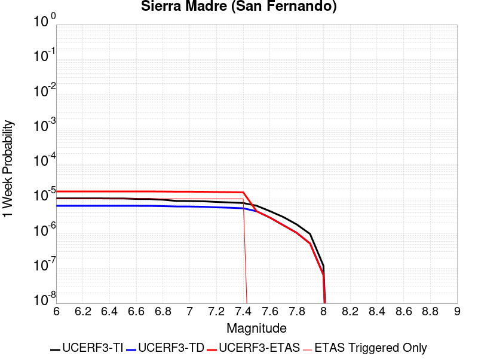 |  |  |  |

| Magnitude | 1 wk TI Prob | 1 wk TD Prob | 1 wk ETAS Prob | 1 wk ETAS/TD Gain | 1 wk ETAS Triggered Only | 1 mo TI Prob | 1 mo TD Prob | 1 mo ETAS Prob | 1 mo ETAS/TD Gain | 1 mo ETAS Triggered Only | 1 yr TI Prob | 1 yr TD Prob | 1 yr ETAS Prob | 1 yr ETAS/TD Gain | 1 yr ETAS Triggered Only | 10 yr TI Prob | 10 yr TD Prob | 10 yr ETAS Prob | 10 yr ETAS/TD Gain | 10 yr ETAS Triggered Only |
|-----|-----|-----|-----|-----|-----|-----|-----|-----|-----|-----|-----|-----|-----|-----|-----|-----|-----|-----|-----|-----|
| 6.0 | 1.0346413E-5 | 6.2872605E-6 | 1.6287198E-5 | 2.5905077 | 1.0E-5 | 4.4341014E-5 | 2.694513E-5 | 3.694486E-5 | 1.3711146 | 1.0E-5 | 5.3971814E-4 | 3.280087E-4 | 3.380054E-4 | 1.030477 | 1.0E-5 | 0.0053840918 | 0.0032753581 | 0.0032952926 | 1.0060862 | 2.0E-5 |
| 6.1 | 1.0346413E-5 | 6.2872605E-6 | 1.6287198E-5 | 2.5905077 | 1.0E-5 | 4.4341014E-5 | 2.694513E-5 | 3.694486E-5 | 1.3711146 | 1.0E-5 | 5.3971814E-4 | 3.280087E-4 | 3.380054E-4 | 1.030477 | 1.0E-5 | 0.0053840918 | 0.0032753581 | 0.0032952926 | 1.0060862 | 2.0E-5 |
| 6.2 | 1.0346413E-5 | 6.2872605E-6 | 1.6287198E-5 | 2.5905077 | 1.0E-5 | 4.4341014E-5 | 2.694513E-5 | 3.694486E-5 | 1.3711146 | 1.0E-5 | 5.3971814E-4 | 3.280087E-4 | 3.380054E-4 | 1.030477 | 1.0E-5 | 0.0053840918 | 0.0032753581 | 0.0032952926 | 1.0060862 | 2.0E-5 |
| 6.3 | 1.0346413E-5 | 6.2872605E-6 | 1.6287198E-5 | 2.5905077 | 1.0E-5 | 4.4341014E-5 | 2.694513E-5 | 3.694486E-5 | 1.3711146 | 1.0E-5 | 5.3971814E-4 | 3.280087E-4 | 3.380054E-4 | 1.030477 | 1.0E-5 | 0.0053840918 | 0.0032753581 | 0.0032952926 | 1.0060862 | 2.0E-5 |
| 6.4 | 1.0249558E-5 | 6.2872605E-6 | 1.6287198E-5 | 2.5905077 | 1.0E-5 | 4.392594E-5 | 2.694513E-5 | 3.694486E-5 | 1.3711146 | 1.0E-5 | 5.3466705E-4 | 3.280087E-4 | 3.380054E-4 | 1.030477 | 1.0E-5 | 0.0053338245 | 0.0032753581 | 0.0032952926 | 1.0060862 | 2.0E-5 |
| 6.5 | 1.0249558E-5 | 6.2872605E-6 | 1.6287198E-5 | 2.5905077 | 1.0E-5 | 4.392594E-5 | 2.694513E-5 | 3.694486E-5 | 1.3711146 | 1.0E-5 | 5.3466705E-4 | 3.280087E-4 | 3.380054E-4 | 1.030477 | 1.0E-5 | 0.0053338245 | 0.0032753581 | 0.0032952926 | 1.0060862 | 2.0E-5 |
| 6.6 | 9.9035515E-6 | 6.2872605E-6 | 1.6287198E-5 | 2.5905077 | 1.0E-5 | 4.2443102E-5 | 2.694513E-5 | 3.694486E-5 | 1.3711146 | 1.0E-5 | 5.166222E-4 | 3.280087E-4 | 3.380054E-4 | 1.030477 | 1.0E-5 | 0.0051542283 | 0.0032753581 | 0.0032952926 | 1.0060862 | 2.0E-5 |
| 6.7 | 9.87217E-6 | 6.2746817E-6 | 1.6274618E-5 | 2.5936964 | 1.0E-5 | 4.2308613E-5 | 2.689122E-5 | 3.6890953E-5 | 1.3718586 | 1.0E-5 | 5.149856E-4 | 3.2735255E-4 | 3.3734928E-4 | 1.0305381 | 1.0E-5 | 0.005137938 | 0.0032688158 | 0.0032887505 | 1.0060984 | 2.0E-5 |
| 6.8 | 9.4359175E-6 | 6.1786586E-6 | 1.6178597E-5 | 2.6184642 | 1.0E-5 | 4.043902E-5 | 2.6479704E-5 | 3.647944E-5 | 1.3776377 | 1.0E-5 | 4.9223384E-4 | 3.2234378E-4 | 3.3234057E-4 | 1.0310128 | 1.0E-5 | 0.0049114493 | 0.0032188739 | 0.0032388095 | 1.0061934 | 2.0E-5 |
| 6.9 | 8.700447E-6 | 6.039922E-6 | 1.6039861E-5 | 2.6556406 | 1.0E-5 | 3.72871E-5 | 2.5885129E-5 | 3.588487E-5 | 1.3863122 | 1.0E-5 | 4.5387587E-4 | 3.1510694E-4 | 3.2510379E-4 | 1.0317253 | 1.0E-5 | 0.0045295 | 0.003146711 | 0.003166648 | 1.0063359 | 2.0E-5 |
| 7.0 | 8.648878E-6 | 6.0148373E-6 | 1.6014777E-5 | 2.6625454 | 1.0E-5 | 3.7066096E-5 | 2.5777625E-5 | 3.5777368E-5 | 1.3879234 | 1.0E-5 | 4.5118626E-4 | 3.1379846E-4 | 3.2379534E-4 | 1.0318576 | 1.0E-5 | 0.004502713 | 0.003133663 | 0.0031536005 | 1.0063623 | 2.0E-5 |
| 7.1 | 8.505786E-6 | 5.9244676E-6 | 1.5924408E-5 | 2.6879053 | 1.0E-5 | 3.645286E-5 | 2.5390334E-5 | 3.539008E-5 | 1.3938407 | 1.0E-5 | 4.437232E-4 | 3.0908454E-4 | 3.1908145E-4 | 1.0323436 | 1.0E-5 | 0.0044283825 | 0.0030866556 | 0.0031065939 | 1.0064595 | 2.0E-5 |
| 7.2 | 8.139752E-6 | 5.6987624E-6 | 1.5698706E-5 | 2.754757 | 1.0E-5 | 3.4884186E-5 | 2.4423045E-5 | 3.4422803E-5 | 1.4094393 | 1.0E-5 | 4.246322E-4 | 2.9731105E-4 | 3.0730807E-4 | 1.0336248 | 1.0E-5 | 0.004238217 | 0.0029692391 | 0.0029891797 | 1.0067158 | 2.0E-5 |
| 7.3 | 7.8816E-6 | 5.552077E-6 | 1.5552021E-5 | 2.801118 | 1.0E-5 | 3.3777847E-5 | 2.3794404E-5 | 3.3794167E-5 | 1.4202569 | 1.0E-5 | 4.111677E-4 | 2.896594E-4 | 2.996565E-4 | 1.0345134 | 1.0E-5 | 0.004104078 | 0.0028929242 | 0.0029128664 | 1.0068934 | 2.0E-5 |
| 7.4 | 7.5810603E-6 | 5.3563126E-6 | 1.535626E-5 | 2.866946 | 1.0E-5 | 3.2489854E-5 | 2.2955428E-5 | 3.29552E-5 | 1.4356169 | 1.0E-5 | 3.9549218E-4 | 2.7944756E-4 | 2.8944475E-4 | 1.035775 | 1.0E-5 | 0.0039478904 | 0.0027910667 | 0.0028110107 | 1.0071458 | 2.0E-5 |
| 7.5 | 6.349153E-6 | 4.407576E-6 | 4.407576E-6 | 1.0 | 0.0 | 2.7210372E-5 | 1.888948E-5 | 1.888948E-5 | 1.0 | 0.0 | 3.312359E-4 | 2.2995596E-4 | 2.2995596E-4 | 1.0 | 0.0 | 0.0033074263 | 0.0022972622 | 0.0023072392 | 1.004343 | 1.0E-5 |
| 7.6 | 4.430576E-6 | 2.8905868E-6 | 2.8905868E-6 | 1.0 | 0.0 | 1.8988047E-5 | 1.2388171E-5 | 1.2388171E-5 | 1.0 | 0.0 | 2.3115493E-4 | 1.5081577E-4 | 1.5081577E-4 | 1.0 | 0.0 | 0.0023091463 | 0.0015071568 | 0.0015171417 | 1.006625 | 1.0E-5 |
| 7.7 | 3.005066E-6 | 1.7510115E-6 | 1.7510115E-6 | 1.0 | 0.0 | 1.2878791E-5 | 7.504313E-6 | 7.504313E-6 | 1.0 | 0.0 | 1.56788E-4 | 9.1361195E-5 | 9.1361195E-5 | 1.0 | 0.0 | 0.0015667742 | 9.132375E-4 | 9.232284E-4 | 1.0109401 | 1.0E-5 |
| 7.8 | 1.8459098E-6 | 1.0582091E-6 | 1.0582091E-6 | 1.0 | 0.0 | 7.911018E-6 | 4.535174E-6 | 4.535174E-6 | 1.0 | 0.0 | 9.631238E-5 | 5.5214347E-5 | 5.5214347E-5 | 1.0 | 0.0 | 9.627065E-4 | 5.5200676E-4 | 5.6200125E-4 | 1.0181057 | 1.0E-5 |
| 7.9 | 9.839262E-7 | 5.23421E-7 | 5.23421E-7 | 1.0 | 0.0 | 4.2168194E-6 | 2.2432312E-6 | 2.2432312E-6 | 1.0 | 0.0 | 5.1338568E-5 | 2.7310998E-5 | 2.7310998E-5 | 1.0 | 0.0 | 5.132671E-4 | 2.730767E-4 | 2.8307398E-4 | 1.0366098 | 1.0E-5 |
| 8.0 | 1.210983E-7 | 6.613821E-8 | 6.613821E-8 | 1.0 | 0.0 | 5.1899264E-7 | 2.8344945E-7 | 2.8344945E-7 | 1.0 | 0.0 | 6.3187167E-6 | 3.4509917E-6 | 3.4509917E-6 | 1.0 | 0.0 | 6.318537E-5 | 3.45094E-5 | 3.45094E-5 | 1.0 | 0.0 |

## Richfield
*[(top)](#table-of-contents)*

| 1 Week | 1 Month | 1 Year | 10 Year |
|-----|-----|-----|-----|
| 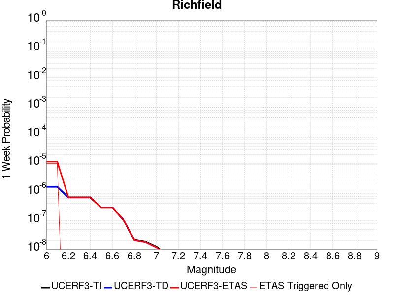 |  |  |  |

| Magnitude | 1 wk TI Prob | 1 wk TD Prob | 1 wk ETAS Prob | 1 wk ETAS/TD Gain | 1 wk ETAS Triggered Only | 1 mo TI Prob | 1 mo TD Prob | 1 mo ETAS Prob | 1 mo ETAS/TD Gain | 1 mo ETAS Triggered Only | 1 yr TI Prob | 1 yr TD Prob | 1 yr ETAS Prob | 1 yr ETAS/TD Gain | 1 yr ETAS Triggered Only | 10 yr TI Prob | 10 yr TD Prob | 10 yr ETAS Prob | 10 yr ETAS/TD Gain | 10 yr ETAS Triggered Only |
|-----|-----|-----|-----|-----|-----|-----|-----|-----|-----|-----|-----|-----|-----|-----|-----|-----|-----|-----|-----|-----|
| 6.0 | 1.5166896E-6 | 1.5392679E-6 | 1.1539252E-5 | 7.496585 | 1.0E-5 | 6.5000822E-6 | 6.596852E-6 | 1.6596787E-5 | 2.5158646 | 1.0E-5 | 7.913562E-5 | 8.0314814E-5 | 1.00313206E-4 | 1.2490001 | 2.0E-5 | 7.910745E-4 | 8.0296566E-4 | 8.229496E-4 | 1.0248877 | 2.0E-5 |
| 6.1 | 1.5166896E-6 | 1.5392679E-6 | 1.1539252E-5 | 7.496585 | 1.0E-5 | 6.5000822E-6 | 6.596852E-6 | 1.6596787E-5 | 2.5158646 | 1.0E-5 | 7.913562E-5 | 8.0314814E-5 | 1.00313206E-4 | 1.2490001 | 2.0E-5 | 7.910745E-4 | 8.0296566E-4 | 8.229496E-4 | 1.0248877 | 2.0E-5 |
| 6.2 | 6.473272E-7 | 6.598479E-7 | 6.598479E-7 | 1.0 | 0.0 | 2.7742565E-6 | 2.8279173E-6 | 2.8279173E-6 | 1.0 | 0.0 | 3.377605E-5 | 3.4429482E-5 | 3.4429482E-5 | 1.0 | 0.0 | 3.3770915E-4 | 3.442545E-4 | 3.442545E-4 | 1.0 | 0.0 |
| 6.3 | 6.473272E-7 | 6.598479E-7 | 6.598479E-7 | 1.0 | 0.0 | 2.7742565E-6 | 2.8279173E-6 | 2.8279173E-6 | 1.0 | 0.0 | 3.377605E-5 | 3.4429482E-5 | 3.4429482E-5 | 1.0 | 0.0 | 3.3770915E-4 | 3.442545E-4 | 3.442545E-4 | 1.0 | 0.0 |
| 6.4 | 6.473272E-7 | 6.598479E-7 | 6.598479E-7 | 1.0 | 0.0 | 2.7742565E-6 | 2.8279173E-6 | 2.8279173E-6 | 1.0 | 0.0 | 3.377605E-5 | 3.4429482E-5 | 3.4429482E-5 | 1.0 | 0.0 | 3.3770915E-4 | 3.442545E-4 | 3.442545E-4 | 1.0 | 0.0 |
| 6.5 | 2.7954403E-7 | 2.8531605E-7 | 2.8531605E-7 | 1.0 | 0.0 | 1.1980452E-6 | 1.2227827E-6 | 1.2227827E-6 | 1.0 | 0.0 | 1.4586103E-5 | 1.4887321E-5 | 1.4887321E-5 | 1.0 | 0.0 | 1.4585146E-4 | 1.4886749E-4 | 1.4886749E-4 | 1.0 | 0.0 |
| 6.6 | 2.7954403E-7 | 2.8531605E-7 | 2.8531605E-7 | 1.0 | 0.0 | 1.1980452E-6 | 1.2227827E-6 | 1.2227827E-6 | 1.0 | 0.0 | 1.4586103E-5 | 1.4887321E-5 | 1.4887321E-5 | 1.0 | 0.0 | 1.4585146E-4 | 1.4886749E-4 | 1.4886749E-4 | 1.0 | 0.0 |
| 6.7 | 1.0777299E-7 | 1.08788136E-7 | 1.08788136E-7 | 1.0 | 0.0 | 4.6188418E-7 | 4.6623484E-7 | 4.6623484E-7 | 1.0 | 0.0 | 5.6234253E-6 | 5.6763984E-6 | 5.6763984E-6 | 1.0 | 0.0 | 5.623283E-5 | 5.6762965E-5 | 5.6762965E-5 | 1.0 | 0.0 |
| 6.8 | 2.1301874E-8 | 2.0666182E-8 | 2.0666182E-8 | 1.0 | 0.0 | 9.129375E-8 | 8.8569344E-8 | 8.8569344E-8 | 1.0 | 0.0 | 1.1115008E-6 | 1.0783313E-6 | 1.0783313E-6 | 1.0 | 0.0 | 1.1114952E-5 | 1.0783265E-5 | 1.0783265E-5 | 1.0 | 0.0 |
| 6.9 | 1.8413502E-8 | 1.7751145E-8 | 1.7751145E-8 | 1.0 | 0.0 | 7.891501E-8 | 7.607633E-8 | 7.607633E-8 | 1.0 | 0.0 | 9.607899E-7 | 9.26229E-7 | 9.26229E-7 | 1.0 | 0.0 | 9.607857E-6 | 9.262254E-6 | 9.262254E-6 | 1.0 | 0.0 |
| 7.0 | 1.2290541E-8 | 1.1574364E-8 | 1.1574364E-8 | 1.0 | 0.0 | 5.2673748E-8 | 4.9604413E-8 | 4.9604413E-8 | 1.0 | 0.0 | 6.413027E-7 | 6.039336E-7 | 6.039336E-7 | 1.0 | 0.0 | 6.4130086E-6 | 6.039321E-6 | 6.039321E-6 | 1.0 | 0.0 |
| 7.1 | 6.373573E-9 | 6.155796E-9 | 6.155796E-9 | 1.0 | 0.0 | 2.7315311E-8 | 2.6381983E-8 | 2.6381983E-8 | 1.0 | 0.0 | 3.3256384E-7 | 3.212006E-7 | 3.212006E-7 | 1.0 | 0.0 | 3.3256335E-6 | 3.2120017E-6 | 3.2120017E-6 | 1.0 | 0.0 |
| 7.2 | 3.6989944E-9 | 3.7360146E-9 | 3.7360146E-9 | 1.0 | 0.0 | 1.5852834E-8 | 1.6011493E-8 | 1.6011493E-8 | 1.0 | 0.0 | 1.9300822E-7 | 1.9493989E-7 | 1.9493989E-7 | 1.0 | 0.0 | 1.9300805E-6 | 1.9493975E-6 | 1.9493975E-6 | 1.0 | 0.0 |
| 7.3 | 2.097397E-9 | 2.1200501E-9 | 2.1200501E-9 | 1.0 | 0.0 | 8.9888434E-9 | 9.085929E-9 | 9.085929E-9 | 1.0 | 0.0 | 1.0943917E-7 | 1.1062118E-7 | 1.1062118E-7 | 1.0 | 0.0 | 1.0943911E-6 | 1.1062115E-6 | 1.1062115E-6 | 1.0 | 0.0 |
| 7.4 | 5.8314464E-12 | 5.8918426E-12 | 5.8918426E-12 | 1.0 | 0.0 | 2.4991786E-11 | 2.5250912E-11 | 2.5250912E-11 | 1.0 | 0.0 | 3.0427527E-10 | 3.0742975E-10 | 3.0742975E-10 | 1.0 | 0.0 | 3.0427532E-9 | 3.0742973E-9 | 3.0742973E-9 | 1.0 | 0.0 |

## Thirty Mile Bank
*[(top)](#table-of-contents)*

| 1 Week | 1 Month | 1 Year | 10 Year |
|-----|-----|-----|-----|
|  |  |  |  |

| Magnitude | 1 wk TI Prob | 1 wk TD Prob | 1 wk ETAS Prob | 1 wk ETAS/TD Gain | 1 wk ETAS Triggered Only | 1 mo TI Prob | 1 mo TD Prob | 1 mo ETAS Prob | 1 mo ETAS/TD Gain | 1 mo ETAS Triggered Only | 1 yr TI Prob | 1 yr TD Prob | 1 yr ETAS Prob | 1 yr ETAS/TD Gain | 1 yr ETAS Triggered Only | 10 yr TI Prob | 10 yr TD Prob | 10 yr ETAS Prob | 10 yr ETAS/TD Gain | 10 yr ETAS Triggered Only |
|-----|-----|-----|-----|-----|-----|-----|-----|-----|-----|-----|-----|-----|-----|-----|-----|-----|-----|-----|-----|-----|
| 6.0 | 6.5124755E-6 | 6.6592643E-6 | 6.6592643E-6 | 1.0 | 0.0 | 2.791031E-5 | 2.8539416E-5 | 2.8539416E-5 | 1.0 | 0.0 | 3.3975503E-4 | 3.4741635E-4 | 3.5741288E-4 | 1.0287739 | 1.0E-5 | 0.0033923604 | 0.003469164 | 0.0034791294 | 1.0028726 | 1.0E-5 |
| 6.1 | 6.5124755E-6 | 6.6592643E-6 | 6.6592643E-6 | 1.0 | 0.0 | 2.791031E-5 | 2.8539416E-5 | 2.8539416E-5 | 1.0 | 0.0 | 3.3975503E-4 | 3.4741635E-4 | 3.5741288E-4 | 1.0287739 | 1.0E-5 | 0.0033923604 | 0.003469164 | 0.0034791294 | 1.0028726 | 1.0E-5 |
| 6.2 | 6.5124755E-6 | 6.6592643E-6 | 6.6592643E-6 | 1.0 | 0.0 | 2.791031E-5 | 2.8539416E-5 | 2.8539416E-5 | 1.0 | 0.0 | 3.3975503E-4 | 3.4741635E-4 | 3.5741288E-4 | 1.0287739 | 1.0E-5 | 0.0033923604 | 0.003469164 | 0.0034791294 | 1.0028726 | 1.0E-5 |
| 6.3 | 6.5124755E-6 | 6.6592643E-6 | 6.6592643E-6 | 1.0 | 0.0 | 2.791031E-5 | 2.8539416E-5 | 2.8539416E-5 | 1.0 | 0.0 | 3.3975503E-4 | 3.4741635E-4 | 3.5741288E-4 | 1.0287739 | 1.0E-5 | 0.0033923604 | 0.003469164 | 0.0034791294 | 1.0028726 | 1.0E-5 |
| 6.4 | 6.5124755E-6 | 6.6592643E-6 | 6.6592643E-6 | 1.0 | 0.0 | 2.791031E-5 | 2.8539416E-5 | 2.8539416E-5 | 1.0 | 0.0 | 3.3975503E-4 | 3.4741635E-4 | 3.5741288E-4 | 1.0287739 | 1.0E-5 | 0.0033923604 | 0.003469164 | 0.0034791294 | 1.0028726 | 1.0E-5 |
| 6.5 | 6.5124755E-6 | 6.6592643E-6 | 6.6592643E-6 | 1.0 | 0.0 | 2.791031E-5 | 2.8539416E-5 | 2.8539416E-5 | 1.0 | 0.0 | 3.3975503E-4 | 3.4741635E-4 | 3.5741288E-4 | 1.0287739 | 1.0E-5 | 0.0033923604 | 0.003469164 | 0.0034791294 | 1.0028726 | 1.0E-5 |
| 6.6 | 6.5124755E-6 | 6.6592643E-6 | 6.6592643E-6 | 1.0 | 0.0 | 2.791031E-5 | 2.8539416E-5 | 2.8539416E-5 | 1.0 | 0.0 | 3.3975503E-4 | 3.4741635E-4 | 3.5741288E-4 | 1.0287739 | 1.0E-5 | 0.0033923604 | 0.003469164 | 0.0034791294 | 1.0028726 | 1.0E-5 |
| 6.7 | 3.5261137E-6 | 3.6098995E-6 | 3.6098995E-6 | 1.0 | 0.0 | 1.5111828E-5 | 1.547091E-5 | 1.547091E-5 | 1.0 | 0.0 | 1.8397097E-4 | 1.883427E-4 | 1.883427E-4 | 1.0 | 0.0 | 0.0018381875 | 0.0018818958 | 0.0018818958 | 1.0 | 0.0 |
| 6.8 | 3.370743E-6 | 3.4509355E-6 | 3.4509355E-6 | 1.0 | 0.0 | 1.4445961E-5 | 1.47896435E-5 | 1.47896435E-5 | 1.0 | 0.0 | 1.7586538E-4 | 1.8004965E-4 | 1.8004965E-4 | 1.0 | 0.0 | 0.0017572626 | 0.0017990996 | 0.0017990996 | 1.0 | 0.0 |
| 6.9 | 2.2756835E-6 | 2.333161E-6 | 2.333161E-6 | 1.0 | 0.0 | 9.752893E-6 | 9.999225E-6 | 9.999225E-6 | 1.0 | 0.0 | 1.18735006E-4 | 1.2173401E-4 | 1.2173401E-4 | 1.0 | 0.0 | 0.0011867158 | 0.0012166979 | 0.0012166979 | 1.0 | 0.0 |
| 7.0 | 2.1617404E-6 | 2.21598E-6 | 2.21598E-6 | 1.0 | 0.0 | 9.264569E-6 | 9.497024E-6 | 9.497024E-6 | 1.0 | 0.0 | 1.1279029E-4 | 1.1562037E-4 | 1.1562037E-4 | 1.0 | 0.0 | 0.0011273306 | 0.0011556263 | 0.0011556263 | 1.0 | 0.0 |
| 7.1 | 1.5900777E-6 | 1.6327014E-6 | 1.6327014E-6 | 1.0 | 0.0 | 6.814601E-6 | 6.997274E-6 | 6.997274E-6 | 1.0 | 0.0 | 8.296461E-5 | 8.518861E-5 | 8.518861E-5 | 1.0 | 0.0 | 8.293364E-4 | 8.5157226E-4 | 8.5157226E-4 | 1.0 | 0.0 |
| 7.2 | 1.2971728E-6 | 1.3328992E-6 | 1.3328992E-6 | 1.0 | 0.0 | 5.5593005E-6 | 5.712413E-6 | 5.712413E-6 | 1.0 | 0.0 | 6.768238E-5 | 6.954651E-5 | 6.954651E-5 | 1.0 | 0.0 | 6.7661767E-4 | 6.952578E-4 | 6.952578E-4 | 1.0 | 0.0 |
| 7.3 | 8.2454284E-7 | 8.448891E-7 | 8.448891E-7 | 1.0 | 0.0 | 3.5337503E-6 | 3.6209485E-6 | 3.6209485E-6 | 1.0 | 0.0 | 4.302256E-5 | 4.408422E-5 | 4.408422E-5 | 1.0 | 0.0 | 4.301423E-4 | 4.4076078E-4 | 4.4076078E-4 | 1.0 | 0.0 |
| 7.4 | 4.2619024E-7 | 4.3863466E-7 | 4.3863466E-7 | 1.0 | 0.0 | 1.8265283E-6 | 1.8798615E-6 | 1.8798615E-6 | 1.0 | 0.0 | 2.2237757E-5 | 2.2887078E-5 | 2.2887078E-5 | 1.0 | 0.0 | 2.223553E-4 | 2.288476E-4 | 2.288476E-4 | 1.0 | 0.0 |
| 7.5 | 2.993922E-7 | 3.086453E-7 | 3.086453E-7 | 1.0 | 0.0 | 1.2831089E-6 | 1.3227649E-6 | 1.3227649E-6 | 1.0 | 0.0 | 1.5621737E-5 | 1.6104546E-5 | 1.6104546E-5 | 1.0 | 0.0 | 1.562064E-4 | 1.6103406E-4 | 1.6103406E-4 | 1.0 | 0.0 |
| 7.6 | 1.6988751E-7 | 1.7533823E-7 | 1.7533823E-7 | 1.0 | 0.0 | 7.2808916E-7 | 7.5144936E-7 | 7.5144936E-7 | 1.0 | 0.0 | 8.864449E-6 | 9.14886E-6 | 9.14886E-6 | 1.0 | 0.0 | 8.8640954E-5 | 9.1485024E-5 | 9.1485024E-5 | 1.0 | 0.0 |

## Earthquake Valley (So Extension)
*[(top)](#table-of-contents)*

| 1 Week | 1 Month | 1 Year | 10 Year |
|-----|-----|-----|-----|
|  |  |  |  |

| Magnitude | 1 wk TI Prob | 1 wk TD Prob | 1 wk ETAS Prob | 1 wk ETAS/TD Gain | 1 wk ETAS Triggered Only | 1 mo TI Prob | 1 mo TD Prob | 1 mo ETAS Prob | 1 mo ETAS/TD Gain | 1 mo ETAS Triggered Only | 1 yr TI Prob | 1 yr TD Prob | 1 yr ETAS Prob | 1 yr ETAS/TD Gain | 1 yr ETAS Triggered Only | 10 yr TI Prob | 10 yr TD Prob | 10 yr ETAS Prob | 10 yr ETAS/TD Gain | 10 yr ETAS Triggered Only |
|-----|-----|-----|-----|-----|-----|-----|-----|-----|-----|-----|-----|-----|-----|-----|-----|-----|-----|-----|-----|-----|
| 6.0 | 3.0194888E-5 | 3.7072114E-5 | 3.7072114E-5 | 1.0 | 0.0 | 1.2940024E-4 | 1.5887388E-4 | 1.6887228E-4 | 1.062933 | 1.0E-5 | 0.0015743093 | 0.0019331174 | 0.001943098 | 1.005163 | 1.0E-5 | 0.01563203 | 0.019213019 | 0.019222826 | 1.0005105 | 1.0E-5 |
| 6.1 | 3.0194888E-5 | 3.7072114E-5 | 3.7072114E-5 | 1.0 | 0.0 | 1.2940024E-4 | 1.5887388E-4 | 1.6887228E-4 | 1.062933 | 1.0E-5 | 0.0015743093 | 0.0019331174 | 0.001943098 | 1.005163 | 1.0E-5 | 0.01563203 | 0.019213019 | 0.019222826 | 1.0005105 | 1.0E-5 |
| 6.2 | 3.0194888E-5 | 3.7072114E-5 | 3.7072114E-5 | 1.0 | 0.0 | 1.2940024E-4 | 1.5887388E-4 | 1.6887228E-4 | 1.062933 | 1.0E-5 | 0.0015743093 | 0.0019331174 | 0.001943098 | 1.005163 | 1.0E-5 | 0.01563203 | 0.019213019 | 0.019222826 | 1.0005105 | 1.0E-5 |
| 6.3 | 1.5795305E-5 | 1.844658E-5 | 1.844658E-5 | 1.0 | 0.0 | 6.769241E-5 | 7.9055004E-5 | 7.9055004E-5 | 1.0 | 0.0 | 8.238434E-4 | 9.6218096E-4 | 9.6218096E-4 | 1.0 | 0.0 | 0.008207959 | 0.009591061 | 0.009591061 | 1.0 | 0.0 |
| 6.4 | 1.5795305E-5 | 1.844658E-5 | 1.844658E-5 | 1.0 | 0.0 | 6.769241E-5 | 7.9055004E-5 | 7.9055004E-5 | 1.0 | 0.0 | 8.238434E-4 | 9.6218096E-4 | 9.6218096E-4 | 1.0 | 0.0 | 0.008207959 | 0.009591061 | 0.009591061 | 1.0 | 0.0 |
| 6.5 | 1.5795305E-5 | 1.844658E-5 | 1.844658E-5 | 1.0 | 0.0 | 6.769241E-5 | 7.9055004E-5 | 7.9055004E-5 | 1.0 | 0.0 | 8.238434E-4 | 9.6218096E-4 | 9.6218096E-4 | 1.0 | 0.0 | 0.008207959 | 0.009591061 | 0.009591061 | 1.0 | 0.0 |
| 6.6 | 1.5795305E-5 | 1.844658E-5 | 1.844658E-5 | 1.0 | 0.0 | 6.769241E-5 | 7.9055004E-5 | 7.9055004E-5 | 1.0 | 0.0 | 8.238434E-4 | 9.6218096E-4 | 9.6218096E-4 | 1.0 | 0.0 | 0.008207959 | 0.009591061 | 0.009591061 | 1.0 | 0.0 |
| 6.7 | 1.1363076E-5 | 1.3138294E-5 | 1.3138294E-5 | 1.0 | 0.0 | 4.8697988E-5 | 5.6306188E-5 | 5.6306188E-5 | 1.0 | 0.0 | 5.927367E-4 | 6.8538834E-4 | 6.8538834E-4 | 1.0 | 0.0 | 0.0059115817 | 0.0068402183 | 0.0068402183 | 1.0 | 0.0 |
| 6.8 | 1.0049611E-5 | 1.1594334E-5 | 1.1594334E-5 | 1.0 | 0.0 | 4.306905E-5 | 4.9689468E-5 | 4.9689468E-5 | 1.0 | 0.0 | 5.242395E-4 | 6.048745E-4 | 6.048745E-4 | 1.0 | 0.0 | 0.0052300454 | 0.006039458 | 0.006039458 | 1.0 | 0.0 |
| 6.9 | 1.0049611E-5 | 1.1594334E-5 | 1.1594334E-5 | 1.0 | 0.0 | 4.306905E-5 | 4.9689468E-5 | 4.9689468E-5 | 1.0 | 0.0 | 5.242395E-4 | 6.048745E-4 | 6.048745E-4 | 1.0 | 0.0 | 0.0052300454 | 0.006039458 | 0.006039458 | 1.0 | 0.0 |
| 7.0 | 1.0049611E-5 | 1.1594334E-5 | 1.1594334E-5 | 1.0 | 0.0 | 4.306905E-5 | 4.9689468E-5 | 4.9689468E-5 | 1.0 | 0.0 | 5.242395E-4 | 6.048745E-4 | 6.048745E-4 | 1.0 | 0.0 | 0.0052300454 | 0.006039458 | 0.006039458 | 1.0 | 0.0 |
| 7.1 | 8.140254E-6 | 9.383458E-6 | 9.383458E-6 | 1.0 | 0.0 | 3.4886336E-5 | 4.0214578E-5 | 4.0214578E-5 | 1.0 | 0.0 | 4.2465836E-4 | 4.8956956E-4 | 4.8956956E-4 | 1.0 | 0.0 | 0.0042384774 | 0.0048914864 | 0.0048914864 | 1.0 | 0.0 |
| 7.2 | 1.673835E-7 | 1.4154125E-7 | 1.4154125E-7 | 1.0 | 0.0 | 7.173577E-7 | 6.066052E-7 | 6.066052E-7 | 1.0 | 0.0 | 8.733795E-6 | 7.385397E-6 | 7.385397E-6 | 1.0 | 0.0 | 8.733451E-5 | 7.385187E-5 | 7.385187E-5 | 1.0 | 0.0 |
| 7.3 | 1.6632116E-7 | 1.4052354E-7 | 1.4052354E-7 | 1.0 | 0.0 | 7.1280476E-7 | 6.0224363E-7 | 6.0224363E-7 | 1.0 | 0.0 | 8.678364E-6 | 7.332295E-6 | 7.332295E-6 | 1.0 | 0.0 | 8.6780245E-5 | 7.332089E-5 | 7.332089E-5 | 1.0 | 0.0 |
| 7.4 | 1.6569169E-7 | 1.3996983E-7 | 1.3996983E-7 | 1.0 | 0.0 | 7.1010703E-7 | 5.9987053E-7 | 5.9987053E-7 | 1.0 | 0.0 | 8.645519E-6 | 7.303403E-6 | 7.303403E-6 | 1.0 | 0.0 | 8.645182E-5 | 7.303199E-5 | 7.303199E-5 | 1.0 | 0.0 |
| 7.5 | 1.1764555E-7 | 1.0095917E-7 | 1.0095917E-7 | 1.0 | 0.0 | 5.041951E-7 | 4.326821E-7 | 4.326821E-7 | 1.0 | 0.0 | 6.138558E-6 | 5.267894E-6 | 5.267894E-6 | 1.0 | 0.0 | 6.1383886E-5 | 5.2677904E-5 | 5.2677904E-5 | 1.0 | 0.0 |
| 7.6 | 1.07927605E-7 | 9.260736E-8 | 9.260736E-8 | 1.0 | 0.0 | 4.6254678E-7 | 3.9688865E-7 | 3.9688865E-7 | 1.0 | 0.0 | 5.6314925E-6 | 4.832111E-6 | 4.832111E-6 | 1.0 | 0.0 | 5.63135E-5 | 4.8320264E-5 | 4.8320264E-5 | 1.0 | 0.0 |
| 7.7 | 2.1826905E-8 | 1.1180516E-8 | 1.1180516E-8 | 1.0 | 0.0 | 9.3543875E-8 | 4.7916494E-8 | 4.7916494E-8 | 1.0 | 0.0 | 1.1388961E-6 | 5.833832E-7 | 5.833832E-7 | 1.0 | 0.0 | 1.1388902E-5 | 5.8338223E-6 | 5.8338223E-6 | 1.0 | 0.0 |
| 7.8 | 2.6169649E-9 | 1.1969472E-9 | 1.1969472E-9 | 1.0 | 0.0 | 1.1215564E-8 | 5.1297735E-9 | 5.1297735E-9 | 1.0 | 0.0 | 1.3654947E-7 | 6.2454994E-8 | 6.2454994E-8 | 1.0 | 0.0 | 1.365494E-6 | 6.245499E-7 | 6.245499E-7 | 1.0 | 0.0 |

## Hayward (No) 2011 CFM
*[(top)](#table-of-contents)*

| 1 Week | 1 Month | 1 Year | 10 Year |
|-----|-----|-----|-----|
| 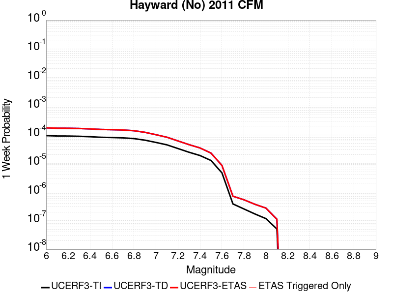 |  |  |  |

| Magnitude | 1 wk TI Prob | 1 wk TD Prob | 1 wk ETAS Prob | 1 wk ETAS/TD Gain | 1 wk ETAS Triggered Only | 1 mo TI Prob | 1 mo TD Prob | 1 mo ETAS Prob | 1 mo ETAS/TD Gain | 1 mo ETAS Triggered Only | 1 yr TI Prob | 1 yr TD Prob | 1 yr ETAS Prob | 1 yr ETAS/TD Gain | 1 yr ETAS Triggered Only | 10 yr TI Prob | 10 yr TD Prob | 10 yr ETAS Prob | 10 yr ETAS/TD Gain | 10 yr ETAS Triggered Only |
|-----|-----|-----|-----|-----|-----|-----|-----|-----|-----|-----|-----|-----|-----|-----|-----|-----|-----|-----|-----|-----|
| 6.0 | 9.3068506E-5 | 1.739599E-4 | 1.739599E-4 | 1.0 | 0.0 | 3.9880406E-4 | 7.453244E-4 | 7.453244E-4 | 1.0 | 0.0 | 0.0048446343 | 0.009036438 | 0.009036438 | 1.0 | 0.0 | 0.047403704 | 0.08637534 | 0.086384475 | 1.0001057 | 1.0E-5 |
| 6.1 | 9.055486E-5 | 1.6947114E-4 | 1.6947114E-4 | 1.0 | 0.0 | 3.880345E-4 | 7.261021E-4 | 7.261021E-4 | 1.0 | 0.0 | 0.0047140904 | 0.008804537 | 0.008804537 | 1.0 | 0.0 | 0.046153355 | 0.08426854 | 0.0842777 | 1.0001087 | 1.0E-5 |
| 6.2 | 9.006742E-5 | 1.6867711E-4 | 1.6867711E-4 | 1.0 | 0.0 | 3.859461E-4 | 7.22701E-4 | 7.22701E-4 | 1.0 | 0.0 | 0.0046887742 | 0.008763513 | 0.008763513 | 1.0 | 0.0 | 0.0459107 | 0.083892785 | 0.08390194 | 1.0001092 | 1.0E-5 |
| 6.3 | 8.8336754E-5 | 1.6547246E-4 | 1.6547246E-4 | 1.0 | 0.0 | 3.7853114E-4 | 7.089758E-4 | 7.089758E-4 | 1.0 | 0.0 | 0.004598882 | 0.008597788 | 0.008597788 | 1.0 | 0.0 | 0.04504866 | 0.08238599 | 0.082395166 | 1.0001113 | 1.0E-5 |
| 6.4 | 8.526157E-5 | 1.5974249E-4 | 1.5974249E-4 | 1.0 | 0.0 | 3.6535555E-4 | 6.8443175E-4 | 6.8443175E-4 | 1.0 | 0.0 | 0.0044391346 | 0.008301278 | 0.008301278 | 1.0 | 0.0 | 0.043514993 | 0.079682834 | 0.07969204 | 1.0001155 | 1.0E-5 |
| 6.5 | 8.152396E-5 | 1.530663E-4 | 1.530663E-4 | 1.0 | 0.0 | 3.493416E-4 | 6.558342E-4 | 6.558342E-4 | 1.0 | 0.0 | 0.0042449418 | 0.007955698 | 0.007955698 | 1.0 | 0.0 | 0.04164765 | 0.07651369 | 0.076522924 | 1.0001206 | 1.0E-5 |
| 6.6 | 7.987405E-5 | 1.5010842E-4 | 1.5010842E-4 | 1.0 | 0.0 | 3.4227243E-4 | 6.4316386E-4 | 6.4316386E-4 | 1.0 | 0.0 | 0.0041592065 | 0.0078025614 | 0.0078025614 | 1.0 | 0.0 | 0.04082218 | 0.07510622 | 0.075115465 | 1.0001231 | 1.0E-5 |
| 6.7 | 7.777665E-5 | 1.4650106E-4 | 1.4650106E-4 | 1.0 | 0.0 | 3.332859E-4 | 6.277113E-4 | 6.277113E-4 | 1.0 | 0.0 | 0.004050208 | 0.00761576 | 0.00761576 | 1.0 | 0.0 | 0.039771806 | 0.073382616 | 0.073391885 | 1.0001262 | 1.0E-5 |
| 6.8 | 7.3284005E-5 | 1.3800753E-4 | 1.3800753E-4 | 1.0 | 0.0 | 3.140365E-4 | 5.913274E-4 | 5.913274E-4 | 1.0 | 0.0 | 0.0038166929 | 0.0071757827 | 0.0071757827 | 1.0 | 0.0 | 0.037518036 | 0.06929621 | 0.06930552 | 1.0001343 | 1.0E-5 |
| 6.9 | 6.458263E-5 | 1.2131439E-4 | 1.2131439E-4 | 1.0 | 0.0 | 2.7675333E-4 | 5.198157E-4 | 5.198157E-4 | 1.0 | 0.0 | 0.0033642664 | 0.0063104923 | 0.0063104923 | 1.0 | 0.0 | 0.033137884 | 0.061225023 | 0.061225023 | 1.0 | 0.0 |
| 7.0 | 5.3853604E-5 | 1.00250414E-4 | 1.00250414E-4 | 1.0 | 0.0 | 2.3078074E-4 | 4.295742E-4 | 4.295742E-4 | 1.0 | 0.0 | 0.0028061352 | 0.0052175885 | 0.0052175885 | 1.0 | 0.0 | 0.027709642 | 0.0509578 | 0.0509578 | 1.0 | 0.0 |
| 7.1 | 4.4308683E-5 | 8.170626E-5 | 8.170626E-5 | 1.0 | 0.0 | 1.8988053E-4 | 3.501229E-4 | 3.501229E-4 | 1.0 | 0.0 | 0.0023093442 | 0.0042544557 | 0.0042544557 | 1.0 | 0.0 | 0.022854926 | 0.04182473 | 0.04182473 | 1.0 | 0.0 |
| 7.2 | 3.295973E-5 | 6.0771144E-5 | 6.0771144E-5 | 1.0 | 0.0 | 1.4124835E-4 | 2.604219E-4 | 2.604219E-4 | 1.0 | 0.0 | 0.0017183421 | 0.0031660495 | 0.0031660495 | 1.0 | 0.0 | 0.017051157 | 0.031369876 | 0.031369876 | 1.0 | 0.0 |
| 7.3 | 2.452256E-5 | 4.5180346E-5 | 4.5180346E-5 | 1.0 | 0.0 | 1.05092455E-4 | 1.9361576E-4 | 1.9361576E-4 | 1.0 | 0.0 | 0.0012787496 | 0.0023547374 | 0.0023547374 | 1.0 | 0.0 | 0.0127141625 | 0.02344111 | 0.02344111 | 1.0 | 0.0 |
| 7.4 | 1.8829967E-5 | 3.4602548E-5 | 3.4602548E-5 | 1.0 | 0.0 | 8.069736E-5 | 1.4828827E-4 | 1.4828827E-4 | 1.0 | 0.0 | 9.820475E-4 | 0.0018039243 | 0.0018039243 | 1.0 | 0.0 | 0.009777189 | 0.0180195 | 0.0180195 | 1.0 | 0.0 |
| 7.5 | 1.26374125E-5 | 2.2921116E-5 | 2.2921116E-5 | 1.0 | 0.0 | 5.4159216E-5 | 9.822969E-5 | 9.822969E-5 | 1.0 | 0.0 | 6.5918895E-4 | 0.0011952962 | 0.0011952962 | 1.0 | 0.0 | 0.00657237 | 0.011988836 | 0.011988836 | 1.0 | 0.0 |
| 7.6 | 4.666429E-6 | 8.4791645E-6 | 8.4791645E-6 | 1.0 | 0.0 | 1.9998828E-5 | 3.6338777E-5 | 3.6338777E-5 | 1.0 | 0.0 | 2.4345852E-4 | 4.4233602E-4 | 4.4233602E-4 | 1.0 | 0.0 | 0.0024319198 | 0.0044591012 | 0.0044591012 | 1.0 | 0.0 |
| 7.7 | 3.8399318E-7 | 7.133867E-7 | 7.133867E-7 | 1.0 | 0.0 | 1.6456839E-6 | 3.057368E-6 | 3.057368E-6 | 1.0 | 0.0 | 2.003602E-5 | 3.722282E-5 | 3.722282E-5 | 1.0 | 0.0 | 2.0034213E-4 | 3.8614936E-4 | 3.8614936E-4 | 1.0 | 0.0 |
| 7.8 | 2.5637698E-7 | 5.3662194E-7 | 5.3662194E-7 | 1.0 | 0.0 | 1.098758E-6 | 2.299806E-6 | 2.299806E-6 | 1.0 | 0.0 | 1.3377297E-5 | 2.7999782E-5 | 2.7999782E-5 | 1.0 | 0.0 | 1.3376492E-4 | 2.9244382E-4 | 2.9244382E-4 | 1.0 | 0.0 |
| 7.9 | 1.7141245E-7 | 3.7290573E-7 | 3.7290573E-7 | 1.0 | 0.0 | 7.3462456E-7 | 1.5981665E-6 | 1.5981665E-6 | 1.0 | 0.0 | 8.944017E-6 | 1.9457504E-5 | 1.9457504E-5 | 1.0 | 0.0 | 8.943657E-5 | 2.0245428E-4 | 2.0245428E-4 | 1.0 | 0.0 |
| 8.0 | 1.1808895E-7 | 2.7509762E-7 | 2.7509762E-7 | 1.0 | 0.0 | 5.060954E-7 | 1.1789892E-6 | 1.1789892E-6 | 1.0 | 0.0 | 6.161694E-6 | 1.43541E-5 | 1.43541E-5 | 1.0 | 0.0 | 6.161523E-5 | 1.4816441E-4 | 1.4816441E-4 | 1.0 | 0.0 |
| 8.1 | 5.138535E-8 | 1.1229867E-7 | 1.1229867E-7 | 1.0 | 0.0 | 2.2022292E-7 | 4.812799E-7 | 4.812799E-7 | 1.0 | 0.0 | 2.6812106E-6 | 5.8595674E-6 | 5.8595674E-6 | 1.0 | 0.0 | 2.6811784E-5 | 6.0158476E-5 | 6.0158476E-5 | 1.0 | 0.0 |

## Great Valley 11
*[(top)](#table-of-contents)*

| 1 Week | 1 Month | 1 Year | 10 Year |
|-----|-----|-----|-----|
|  | 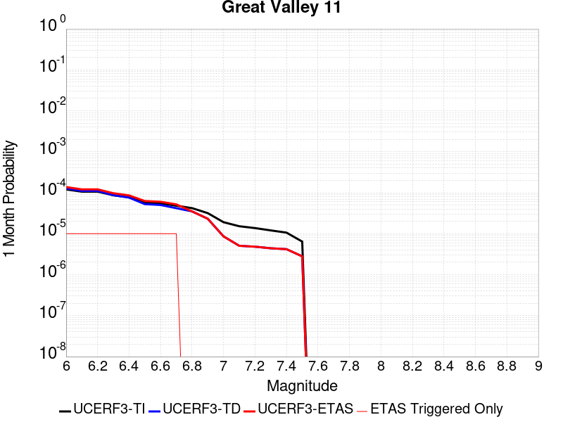 | 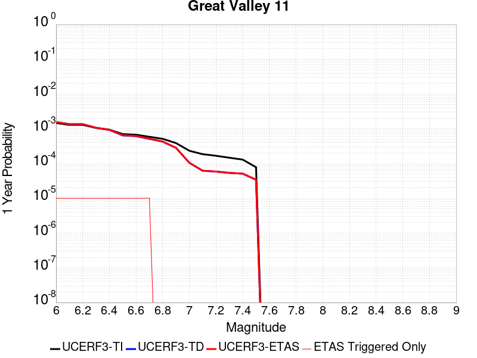 | 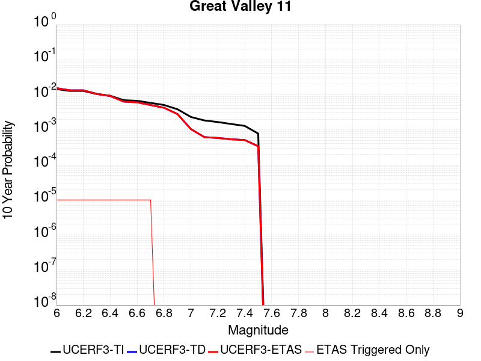 |

| Magnitude | 1 wk TI Prob | 1 wk TD Prob | 1 wk ETAS Prob | 1 wk ETAS/TD Gain | 1 wk ETAS Triggered Only | 1 mo TI Prob | 1 mo TD Prob | 1 mo ETAS Prob | 1 mo ETAS/TD Gain | 1 mo ETAS Triggered Only | 1 yr TI Prob | 1 yr TD Prob | 1 yr ETAS Prob | 1 yr ETAS/TD Gain | 1 yr ETAS Triggered Only | 10 yr TI Prob | 10 yr TD Prob | 10 yr ETAS Prob | 10 yr ETAS/TD Gain | 10 yr ETAS Triggered Only |
|-----|-----|-----|-----|-----|-----|-----|-----|-----|-----|-----|-----|-----|-----|-----|-----|-----|-----|-----|-----|-----|
| 6.0 | 2.8099583E-5 | 2.9832152E-5 | 3.983185E-5 | 1.3351988 | 1.0E-5 | 1.20421224E-4 | 1.278462E-4 | 1.3784492E-4 | 1.078209 | 1.0E-5 | 0.0014651422 | 0.0015554909 | 0.0015654754 | 1.0064188 | 1.0E-5 | 0.0145552 | 0.01545356 | 0.015463406 | 1.000637 | 1.0E-5 |
| 6.1 | 2.483194E-5 | 2.590715E-5 | 3.590689E-5 | 1.3859838 | 1.0E-5 | 1.0641825E-4 | 1.11026246E-4 | 1.21025136E-4 | 1.0900588 | 1.0E-5 | 0.0012948721 | 0.0013509706 | 0.001360957 | 1.007392 | 1.0E-5 | 0.012873529 | 0.013433994 | 0.013443859 | 1.0007343 | 1.0E-5 |
| 6.2 | 2.483194E-5 | 2.590715E-5 | 3.590689E-5 | 1.3859838 | 1.0E-5 | 1.0641825E-4 | 1.11026246E-4 | 1.21025136E-4 | 1.0900588 | 1.0E-5 | 0.0012948721 | 0.0013509706 | 0.001360957 | 1.007392 | 1.0E-5 | 0.012873529 | 0.013433994 | 0.013443859 | 1.0007343 | 1.0E-5 |
| 6.3 | 2.0257901E-5 | 2.0398922E-5 | 3.0398718E-5 | 1.490212 | 1.0E-5 | 8.681669E-5 | 8.742122E-5 | 9.742035E-5 | 1.1143787 | 1.0E-5 | 0.0010564806 | 0.0010638756 | 0.001073865 | 1.0093896 | 1.0E-5 | 0.01051472 | 0.010592012 | 0.010601905 | 1.0009341 | 1.0E-5 |
| 6.4 | 1.8054898E-5 | 1.7780874E-5 | 2.7780698E-5 | 1.562392 | 1.0E-5 | 7.737584E-5 | 7.62017E-5 | 8.620094E-5 | 1.1312207 | 1.0E-5 | 9.416436E-4 | 9.2739856E-4 | 9.373893E-4 | 1.0107728 | 1.0E-5 | 0.009376635 | 0.009239036 | 0.009248943 | 1.0010724 | 1.0E-5 |
| 6.5 | 1.34804895E-5 | 1.2321055E-5 | 2.2320932E-5 | 1.8116088 | 1.0E-5 | 5.777225E-5 | 5.2803476E-5 | 6.2802945E-5 | 1.1893715 | 1.0E-5 | 7.031501E-4 | 6.4269686E-4 | 6.526904E-4 | 1.0155494 | 1.0E-5 | 0.007009294 | 0.0064088185 | 0.0064187543 | 1.0015503 | 1.0E-5 |
| 6.6 | 1.294883E-5 | 1.1732312E-5 | 2.1732194E-5 | 1.852337 | 1.0E-5 | 5.5493805E-5 | 5.028039E-5 | 6.0279886E-5 | 1.1988747 | 1.0E-5 | 6.754276E-4 | 6.1199587E-4 | 6.219898E-4 | 1.01633 | 1.0E-5 | 0.006733784 | 0.0061035305 | 0.0061134696 | 1.0016284 | 1.0E-5 |
| 6.7 | 1.1272237E-5 | 9.811886E-6 | 1.9811787E-5 | 2.0191622 | 1.0E-5 | 4.8308695E-5 | 4.2050277E-5 | 5.2049858E-5 | 1.2378006 | 1.0E-5 | 5.879996E-4 | 5.118446E-4 | 5.218395E-4 | 1.0195272 | 1.0E-5 | 0.005864462 | 0.0051069413 | 0.00511689 | 1.0019481 | 1.0E-5 |
| 6.8 | 9.8337505E-6 | 8.19377E-6 | 8.19377E-6 | 1.0 | 0.0 | 4.2143965E-5 | 3.5115696E-5 | 3.5115696E-5 | 1.0 | 0.0 | 5.1298196E-4 | 4.2745177E-4 | 4.2745177E-4 | 1.0 | 0.0 | 0.005117994 | 0.0042665056 | 0.0042665056 | 1.0 | 0.0 |
| 6.9 | 7.4224813E-6 | 5.4131347E-6 | 5.4131347E-6 | 1.0 | 0.0 | 3.1810247E-5 | 2.319895E-5 | 2.319895E-5 | 1.0 | 0.0 | 3.872209E-4 | 2.8241202E-4 | 2.8241202E-4 | 1.0 | 0.0 | 0.0038654688 | 0.0028206722 | 0.0028206722 | 1.0 | 0.0 |
| 7.0 | 4.4628923E-6 | 2.0110795E-6 | 2.0110795E-6 | 1.0 | 0.0 | 1.912654E-5 | 8.618884E-6 | 8.618884E-6 | 1.0 | 0.0 | 2.3284076E-4 | 1.04929975E-4 | 1.04929975E-4 | 1.0 | 0.0 | 0.0023259693 | 0.0010488159 | 0.0010488159 | 1.0 | 0.0 |
| 7.1 | 3.5546527E-6 | 1.1855836E-6 | 1.1855836E-6 | 1.0 | 0.0 | 1.5234136E-5 | 5.081063E-6 | 5.081063E-6 | 1.0 | 0.0 | 1.8545982E-4 | 6.186026E-5 | 6.186026E-5 | 1.0 | 0.0 | 0.0018530512 | 6.1843713E-4 | 6.1843713E-4 | 1.0 | 0.0 |
| 7.2 | 3.2039936E-6 | 1.1254128E-6 | 1.1254128E-6 | 1.0 | 0.0 | 1.3731329E-5 | 4.823189E-6 | 4.823189E-6 | 1.0 | 0.0 | 1.671661E-4 | 5.8720816E-5 | 5.8720816E-5 | 1.0 | 0.0 | 0.0016704041 | 5.870597E-4 | 5.870597E-4 | 1.0 | 0.0 |
| 7.3 | 2.8120473E-6 | 1.0305612E-6 | 1.0305612E-6 | 1.0 | 0.0 | 1.2051575E-5 | 4.4166836E-6 | 4.4166836E-6 | 1.0 | 0.0 | 1.4671806E-4 | 5.3771862E-5 | 5.3771862E-5 | 1.0 | 0.0 | 0.0014662122 | 5.3759513E-4 | 5.3759513E-4 | 1.0 | 0.0 |
| 7.4 | 2.4837766E-6 | 9.800582E-7 | 9.800582E-7 | 1.0 | 0.0 | 1.0644713E-5 | 4.200243E-6 | 4.200243E-6 | 1.0 | 0.0 | 1.2959167E-4 | 5.1136827E-5 | 5.1136827E-5 | 1.0 | 0.0 | 0.0012951613 | 5.112572E-4 | 5.112572E-4 | 1.0 | 0.0 |
| 7.5 | 1.5002679E-6 | 6.546144E-7 | 6.546144E-7 | 1.0 | 0.0 | 6.4297037E-6 | 2.8054874E-6 | 2.8054874E-6 | 1.0 | 0.0 | 7.827883E-5 | 3.4156317E-5 | 3.4156317E-5 | 1.0 | 0.0 | 7.825126E-4 | 3.4151482E-4 | 3.4151482E-4 | 1.0 | 0.0 |

## Puente Hills
*[(top)](#table-of-contents)*

| 1 Week | 1 Month | 1 Year | 10 Year |
|-----|-----|-----|-----|
| 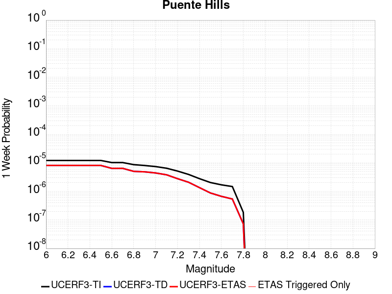 |  | 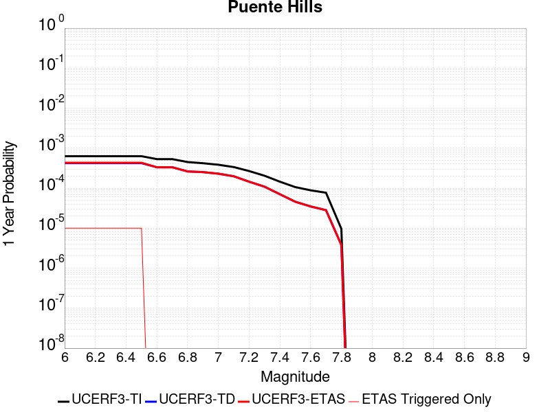 |  |

| Magnitude | 1 wk TI Prob | 1 wk TD Prob | 1 wk ETAS Prob | 1 wk ETAS/TD Gain | 1 wk ETAS Triggered Only | 1 mo TI Prob | 1 mo TD Prob | 1 mo ETAS Prob | 1 mo ETAS/TD Gain | 1 mo ETAS Triggered Only | 1 yr TI Prob | 1 yr TD Prob | 1 yr ETAS Prob | 1 yr ETAS/TD Gain | 1 yr ETAS Triggered Only | 10 yr TI Prob | 10 yr TD Prob | 10 yr ETAS Prob | 10 yr ETAS/TD Gain | 10 yr ETAS Triggered Only |
|-----|-----|-----|-----|-----|-----|-----|-----|-----|-----|-----|-----|-----|-----|-----|-----|-----|-----|-----|-----|-----|
| 6.0 | 1.2101656E-5 | 8.098625E-6 | 8.098625E-6 | 1.0 | 0.0 | 5.1863204E-5 | 3.4707962E-5 | 4.4707616E-5 | 1.2881083 | 1.0E-5 | 6.312516E-4 | 4.2249315E-4 | 4.3248892E-4 | 1.023659 | 1.0E-5 | 0.0062946146 | 0.0042174594 | 0.004227417 | 1.002361 | 1.0E-5 |
| 6.1 | 1.2101656E-5 | 8.098625E-6 | 8.098625E-6 | 1.0 | 0.0 | 5.1863204E-5 | 3.4707962E-5 | 4.4707616E-5 | 1.2881083 | 1.0E-5 | 6.312516E-4 | 4.2249315E-4 | 4.3248892E-4 | 1.023659 | 1.0E-5 | 0.0062946146 | 0.0042174594 | 0.004227417 | 1.002361 | 1.0E-5 |
| 6.2 | 1.2101656E-5 | 8.098625E-6 | 8.098625E-6 | 1.0 | 0.0 | 5.1863204E-5 | 3.4707962E-5 | 4.4707616E-5 | 1.2881083 | 1.0E-5 | 6.312516E-4 | 4.2249315E-4 | 4.3248892E-4 | 1.023659 | 1.0E-5 | 0.0062946146 | 0.0042174594 | 0.004227417 | 1.002361 | 1.0E-5 |
| 6.3 | 1.2101656E-5 | 8.098625E-6 | 8.098625E-6 | 1.0 | 0.0 | 5.1863204E-5 | 3.4707962E-5 | 4.4707616E-5 | 1.2881083 | 1.0E-5 | 6.312516E-4 | 4.2249315E-4 | 4.3248892E-4 | 1.023659 | 1.0E-5 | 0.0062946146 | 0.0042174594 | 0.004227417 | 1.002361 | 1.0E-5 |
| 6.4 | 1.2101656E-5 | 8.098625E-6 | 8.098625E-6 | 1.0 | 0.0 | 5.1863204E-5 | 3.4707962E-5 | 4.4707616E-5 | 1.2881083 | 1.0E-5 | 6.312516E-4 | 4.2249315E-4 | 4.3248892E-4 | 1.023659 | 1.0E-5 | 0.0062946146 | 0.0042174594 | 0.004227417 | 1.002361 | 1.0E-5 |
| 6.5 | 1.2101656E-5 | 8.098625E-6 | 8.098625E-6 | 1.0 | 0.0 | 5.1863204E-5 | 3.4707962E-5 | 4.4707616E-5 | 1.2881083 | 1.0E-5 | 6.312516E-4 | 4.2249315E-4 | 4.3248892E-4 | 1.023659 | 1.0E-5 | 0.0062946146 | 0.0042174594 | 0.004227417 | 1.002361 | 1.0E-5 |
| 6.6 | 1.0222488E-5 | 6.3991847E-6 | 6.3991847E-6 | 1.0 | 0.0 | 4.3809923E-5 | 2.7424803E-5 | 2.7424803E-5 | 1.0 | 0.0 | 5.332553E-4 | 3.3384826E-4 | 3.3384826E-4 | 1.0 | 0.0 | 0.0053197746 | 0.0033337125 | 0.0033337125 | 1.0 | 0.0 |
| 6.7 | 1.0222488E-5 | 6.3991847E-6 | 6.3991847E-6 | 1.0 | 0.0 | 4.3809923E-5 | 2.7424803E-5 | 2.7424803E-5 | 1.0 | 0.0 | 5.332553E-4 | 3.3384826E-4 | 3.3384826E-4 | 1.0 | 0.0 | 0.0053197746 | 0.0033337125 | 0.0033337125 | 1.0 | 0.0 |
| 6.8 | 8.6367845E-6 | 5.0282533E-6 | 5.0282533E-6 | 1.0 | 0.0 | 3.7014266E-5 | 2.1549482E-5 | 2.1549482E-5 | 1.0 | 0.0 | 4.505555E-4 | 2.623339E-4 | 2.623339E-4 | 1.0 | 0.0 | 0.004496431 | 0.0026202986 | 0.0026202986 | 1.0 | 0.0 |
| 6.9 | 8.066481E-6 | 4.836117E-6 | 4.836117E-6 | 1.0 | 0.0 | 3.4570177E-5 | 2.0726053E-5 | 2.0726053E-5 | 1.0 | 0.0 | 4.2081063E-4 | 2.52311E-4 | 2.52311E-4 | 1.0 | 0.0 | 0.0042001465 | 0.0025202993 | 0.0025202993 | 1.0 | 0.0 |
| 7.0 | 7.393828E-6 | 4.417296E-6 | 4.417296E-6 | 1.0 | 0.0 | 3.168745E-5 | 1.8931134E-5 | 1.8931134E-5 | 1.0 | 0.0 | 3.857264E-4 | 2.3046264E-4 | 2.3046264E-4 | 1.0 | 0.0 | 0.0038505755 | 0.0023022818 | 0.0023022818 | 1.0 | 0.0 |
| 7.1 | 6.4660953E-6 | 3.8044495E-6 | 3.8044495E-6 | 1.0 | 0.0 | 2.7711543E-5 | 1.6304684E-5 | 1.6304684E-5 | 1.0 | 0.0 | 3.373358E-4 | 1.984918E-4 | 1.984918E-4 | 1.0 | 0.0 | 0.0033682417 | 0.001983181 | 0.001983181 | 1.0 | 0.0 |
| 7.2 | 5.143232E-6 | 2.7865456E-6 | 2.7865456E-6 | 1.0 | 0.0 | 2.2042237E-5 | 1.1942284E-5 | 1.1942284E-5 | 1.0 | 0.0 | 2.6833118E-4 | 1.453877E-4 | 1.453877E-4 | 1.0 | 0.0 | 0.002680074 | 0.0014529356 | 0.0014529356 | 1.0 | 0.0 |
| 7.3 | 3.928255E-6 | 2.0913774E-6 | 2.0913774E-6 | 1.0 | 0.0 | 1.683527E-5 | 8.963015E-6 | 8.963015E-6 | 1.0 | 0.0 | 2.0495013E-4 | 1.0911931E-4 | 1.0911931E-4 | 1.0 | 0.0 | 0.002047612 | 0.001090664 | 0.001090664 | 1.0 | 0.0 |
| 7.4 | 2.7894434E-6 | 1.3546753E-6 | 1.3546753E-6 | 1.0 | 0.0 | 1.1954703E-5 | 5.8057385E-6 | 5.8057385E-6 | 1.0 | 0.0 | 1.4553878E-4 | 7.068262E-5 | 7.068262E-5 | 1.0 | 0.0 | 0.001454435 | 7.066058E-4 | 7.066058E-4 | 1.0 | 0.0 |
| 7.5 | 2.041735E-6 | 8.787305E-7 | 8.787305E-7 | 1.0 | 0.0 | 8.750263E-6 | 3.7659825E-6 | 3.7659825E-6 | 1.0 | 0.0 | 1.06529245E-4 | 4.5849905E-5 | 4.5849905E-5 | 1.0 | 0.0 | 0.0010647819 | 4.5840783E-4 | 4.5840783E-4 | 1.0 | 0.0 |
| 7.6 | 1.6959062E-6 | 6.6986263E-7 | 6.6986263E-7 | 1.0 | 0.0 | 7.268149E-6 | 2.8708366E-6 | 2.8708366E-6 | 1.0 | 0.0 | 8.848612E-5 | 3.4951907E-5 | 3.4951907E-5 | 1.0 | 0.0 | 8.84509E-4 | 3.4946698E-4 | 3.4946698E-4 | 1.0 | 0.0 |
| 7.7 | 1.4767965E-6 | 5.407607E-7 | 5.407607E-7 | 1.0 | 0.0 | 6.3291122E-6 | 2.317544E-6 | 2.317544E-6 | 1.0 | 0.0 | 7.705422E-5 | 2.8215758E-5 | 2.8215758E-5 | 1.0 | 0.0 | 7.702751E-4 | 2.8212433E-4 | 2.8212433E-4 | 1.0 | 0.0 |
| 7.8 | 1.8432911E-7 | 7.28201E-8 | 7.28201E-8 | 1.0 | 0.0 | 7.8998164E-7 | 3.1208612E-7 | 3.1208612E-7 | 1.0 | 0.0 | 9.617985E-6 | 3.7996451E-6 | 3.7996451E-6 | 1.0 | 0.0 | 9.617568E-5 | 3.7996128E-5 | 3.7996128E-5 | 1.0 | 0.0 |

## Monte Vista - Shannon 2011 CFM
*[(top)](#table-of-contents)*

| 1 Week | 1 Month | 1 Year | 10 Year |
|-----|-----|-----|-----|
|  |  | 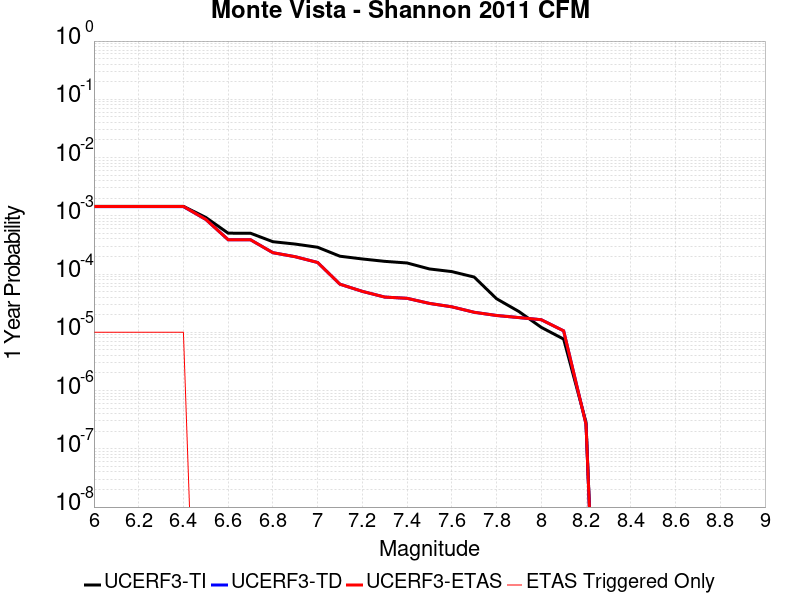 | 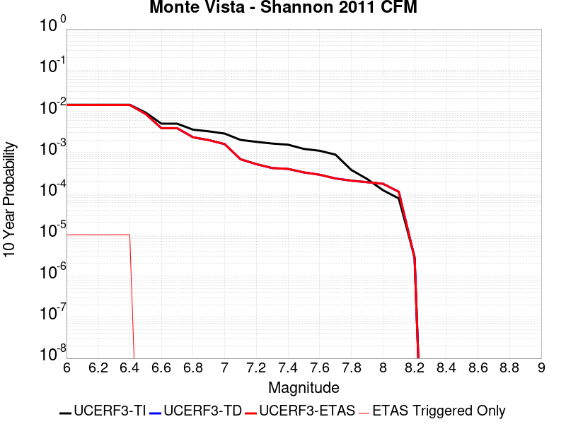 |

| Magnitude | 1 wk TI Prob | 1 wk TD Prob | 1 wk ETAS Prob | 1 wk ETAS/TD Gain | 1 wk ETAS Triggered Only | 1 mo TI Prob | 1 mo TD Prob | 1 mo ETAS Prob | 1 mo ETAS/TD Gain | 1 mo ETAS Triggered Only | 1 yr TI Prob | 1 yr TD Prob | 1 yr ETAS Prob | 1 yr ETAS/TD Gain | 1 yr ETAS Triggered Only | 10 yr TI Prob | 10 yr TD Prob | 10 yr ETAS Prob | 10 yr ETAS/TD Gain | 10 yr ETAS Triggered Only |
|-----|-----|-----|-----|-----|-----|-----|-----|-----|-----|-----|-----|-----|-----|-----|-----|-----|-----|-----|-----|-----|
| 6.0 | 2.7907707E-5 | 2.7584209E-5 | 2.7584209E-5 | 1.0 | 0.0 | 1.19598975E-4 | 1.1821338E-4 | 1.1821338E-4 | 1.0 | 0.0 | 0.0014551448 | 0.0014384214 | 0.001448407 | 1.006942 | 1.0E-5 | 0.014456532 | 0.014320195 | 0.014330052 | 1.0006883 | 1.0E-5 |
| 6.1 | 2.7907707E-5 | 2.7584209E-5 | 2.7584209E-5 | 1.0 | 0.0 | 1.19598975E-4 | 1.1821338E-4 | 1.1821338E-4 | 1.0 | 0.0 | 0.0014551448 | 0.0014384214 | 0.001448407 | 1.006942 | 1.0E-5 | 0.014456532 | 0.014320195 | 0.014330052 | 1.0006883 | 1.0E-5 |
| 6.2 | 2.7907707E-5 | 2.7584209E-5 | 2.7584209E-5 | 1.0 | 0.0 | 1.19598975E-4 | 1.1821338E-4 | 1.1821338E-4 | 1.0 | 0.0 | 0.0014551448 | 0.0014384214 | 0.001448407 | 1.006942 | 1.0E-5 | 0.014456532 | 0.014320195 | 0.014330052 | 1.0006883 | 1.0E-5 |
| 6.3 | 2.7907707E-5 | 2.7584209E-5 | 2.7584209E-5 | 1.0 | 0.0 | 1.19598975E-4 | 1.1821338E-4 | 1.1821338E-4 | 1.0 | 0.0 | 0.0014551448 | 0.0014384214 | 0.001448407 | 1.006942 | 1.0E-5 | 0.014456532 | 0.014320195 | 0.014330052 | 1.0006883 | 1.0E-5 |
| 6.4 | 2.7907707E-5 | 2.7584209E-5 | 2.7584209E-5 | 1.0 | 0.0 | 1.19598975E-4 | 1.1821338E-4 | 1.1821338E-4 | 1.0 | 0.0 | 0.0014551448 | 0.0014384214 | 0.001448407 | 1.006942 | 1.0E-5 | 0.014456532 | 0.014320195 | 0.014330052 | 1.0006883 | 1.0E-5 |
| 6.5 | 1.7990213E-5 | 1.6639884E-5 | 1.6639884E-5 | 1.0 | 0.0 | 7.709863E-5 | 7.131221E-5 | 7.131221E-5 | 1.0 | 0.0 | 9.382716E-4 | 8.679467E-4 | 8.679467E-4 | 1.0 | 0.0 | 0.0093431985 | 0.008668941 | 0.008668941 | 1.0 | 0.0 |
| 6.6 | 9.650407E-6 | 7.4571435E-6 | 7.4571435E-6 | 1.0 | 0.0 | 4.135823E-5 | 3.195884E-5 | 3.195884E-5 | 1.0 | 0.0 | 5.0342013E-4 | 3.8903722E-4 | 3.8903722E-4 | 1.0 | 0.0 | 0.005022812 | 0.0039012418 | 0.0039012418 | 1.0 | 0.0 |
| 6.7 | 9.62828E-6 | 7.4350583E-6 | 7.4350583E-6 | 1.0 | 0.0 | 4.1263404E-5 | 3.186419E-5 | 3.186419E-5 | 1.0 | 0.0 | 5.022661E-4 | 3.878853E-4 | 3.878853E-4 | 1.0 | 0.0 | 0.0050113243 | 0.003889763 | 0.003889763 | 1.0 | 0.0 |
| 6.8 | 6.887523E-6 | 4.4615676E-6 | 4.4615676E-6 | 1.0 | 0.0 | 2.9517621E-5 | 1.9120876E-5 | 1.9120876E-5 | 1.0 | 0.0 | 3.5931775E-4 | 2.3277402E-4 | 2.3277402E-4 | 1.0 | 0.0 | 0.0035873733 | 0.0023424553 | 0.0023424553 | 1.0 | 0.0 |
| 6.9 | 6.2722347E-6 | 3.8034377E-6 | 3.8034377E-6 | 1.0 | 0.0 | 2.6880729E-5 | 1.6300357E-5 | 1.6300357E-5 | 1.0 | 0.0 | 3.2722374E-4 | 1.984408E-4 | 1.984408E-4 | 1.0 | 0.0 | 0.003267423 | 0.0019997752 | 0.0019997752 | 1.0 | 0.0 |
| 7.0 | 5.5320347E-6 | 3.0305885E-6 | 3.0305885E-6 | 1.0 | 0.0 | 2.3708504E-5 | 1.2988182E-5 | 1.2988182E-5 | 1.0 | 0.0 | 2.8861282E-4 | 1.5812147E-4 | 1.5812147E-4 | 1.0 | 0.0 | 0.0028823826 | 0.001597215 | 0.001597215 | 1.0 | 0.0 |
| 7.1 | 3.8794055E-6 | 1.2837862E-6 | 1.2837862E-6 | 1.0 | 0.0 | 1.6625918E-5 | 5.5019295E-6 | 5.5019295E-6 | 1.0 | 0.0 | 2.0240174E-4 | 6.698394E-5 | 6.698394E-5 | 1.0 | 0.0 | 0.002022175 | 6.865884E-4 | 6.865884E-4 | 1.0 | 0.0 |
| 7.2 | 3.4813652E-6 | 9.671046E-7 | 9.671046E-7 | 1.0 | 0.0 | 1.49200505E-5 | 4.1447274E-6 | 4.1447274E-6 | 1.0 | 0.0 | 1.8163648E-4 | 5.0460894E-5 | 5.0460894E-5 | 1.0 | 0.0 | 0.0018148809 | 5.214329E-4 | 5.214329E-4 | 1.0 | 0.0 |
| 7.3 | 3.1682148E-6 | 7.719097E-7 | 7.719097E-7 | 1.0 | 0.0 | 1.3577992E-5 | 3.30818E-6 | 3.30818E-6 | 1.0 | 0.0 | 1.6529951E-4 | 4.027635E-5 | 4.027635E-5 | 1.0 | 0.0 | 0.0016517661 | 4.1960424E-4 | 4.1960424E-4 | 1.0 | 0.0 |
| 7.4 | 2.9707667E-6 | 7.3457204E-7 | 7.3457204E-7 | 1.0 | 0.0 | 1.2731795E-5 | 3.148162E-6 | 3.148162E-6 | 1.0 | 0.0 | 1.5499859E-4 | 3.8328202E-5 | 3.8328202E-5 | 1.0 | 0.0 | 0.0015489052 | 3.9992164E-4 | 3.9992164E-4 | 1.0 | 0.0 |
| 7.5 | 2.3462758E-6 | 6.007889E-7 | 6.007889E-7 | 1.0 | 0.0 | 1.0055429E-5 | 2.574807E-6 | 2.574807E-6 | 1.0 | 0.0 | 1.2241797E-4 | 3.1347827E-5 | 3.1347827E-5 | 1.0 | 0.0 | 0.0012235056 | 3.2839534E-4 | 3.2839534E-4 | 1.0 | 0.0 |
| 7.6 | 2.112783E-6 | 5.251582E-7 | 5.251582E-7 | 1.0 | 0.0 | 9.054753E-6 | 2.250676E-6 | 2.250676E-6 | 1.0 | 0.0 | 1.1023604E-4 | 2.7401638E-5 | 2.7401638E-5 | 1.0 | 0.0 | 0.0011018137 | 2.885138E-4 | 2.885138E-4 | 1.0 | 0.0 |
| 7.7 | 1.7022471E-6 | 4.231601E-7 | 4.231601E-7 | 1.0 | 0.0 | 7.2953244E-6 | 1.8135419E-6 | 1.8135419E-6 | 1.0 | 0.0 | 8.881695E-5 | 2.207965E-5 | 2.207965E-5 | 1.0 | 0.0 | 8.878146E-4 | 2.3398738E-4 | 2.3398738E-4 | 1.0 | 0.0 |
| 7.8 | 7.230914E-7 | 3.7285864E-7 | 3.7285864E-7 | 1.0 | 0.0 | 3.0989595E-6 | 1.5979647E-6 | 1.5979647E-6 | 1.0 | 0.0 | 3.772918E-5 | 1.9455047E-5 | 1.9455047E-5 | 1.0 | 0.0 | 3.7722773E-4 | 2.0726922E-4 | 2.0726922E-4 | 1.0 | 0.0 |
| 7.9 | 4.3588446E-7 | 3.4305793E-7 | 3.4305793E-7 | 1.0 | 0.0 | 1.868075E-6 | 1.4702474E-6 | 1.4702474E-6 | 1.0 | 0.0 | 2.2743576E-5 | 1.7900116E-5 | 1.7900116E-5 | 1.0 | 0.0 | 2.2741247E-4 | 1.8995286E-4 | 1.8995286E-4 | 1.0 | 0.0 |
| 8.0 | 2.3317523E-7 | 3.1513588E-7 | 3.1513588E-7 | 1.0 | 0.0 | 9.99322E-7 | 1.3505817E-6 | 1.3505817E-6 | 1.0 | 0.0 | 1.2166677E-5 | 1.644321E-5 | 1.644321E-5 | 1.0 | 0.0 | 1.21660116E-4 | 1.7399415E-4 | 1.7399415E-4 | 1.0 | 0.0 |
| 8.1 | 1.4662456E-7 | 2.030774E-7 | 2.030774E-7 | 1.0 | 0.0 | 6.283908E-7 | 8.703314E-7 | 8.703314E-7 | 1.0 | 0.0 | 7.650631E-6 | 1.05962345E-5 | 1.05962345E-5 | 1.0 | 0.0 | 7.650368E-5 | 1.113227E-4 | 1.113227E-4 | 1.0 | 0.0 |
| 8.2 | 5.4931775E-9 | 5.07573E-9 | 5.07573E-9 | 1.0 | 0.0 | 2.3542189E-8 | 2.1753127E-8 | 2.1753127E-8 | 1.0 | 0.0 | 2.8662612E-7 | 2.6484432E-7 | 2.6484432E-7 | 1.0 | 0.0 | 2.8662573E-6 | 2.7539324E-6 | 2.7539324E-6 | 1.0 | 0.0 |

## Superstition Hills
*[(top)](#table-of-contents)*

| 1 Week | 1 Month | 1 Year | 10 Year |
|-----|-----|-----|-----|
|  | 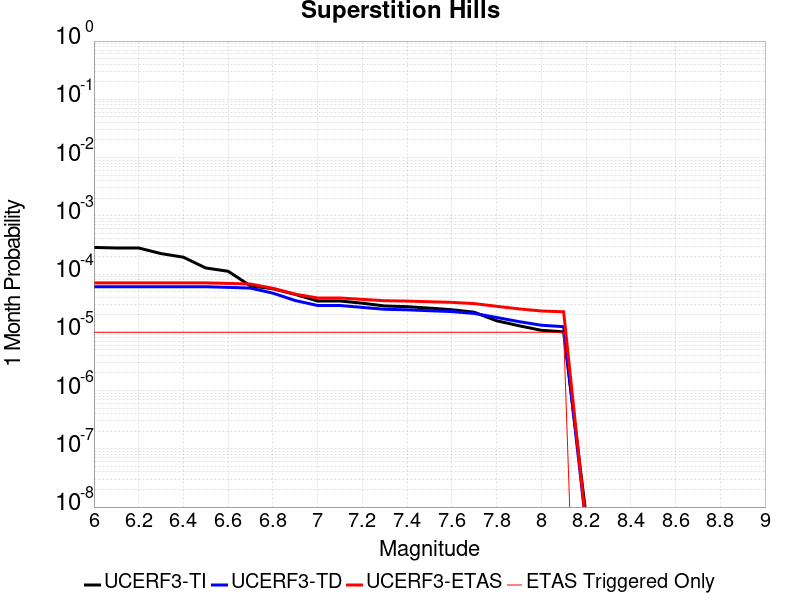 | 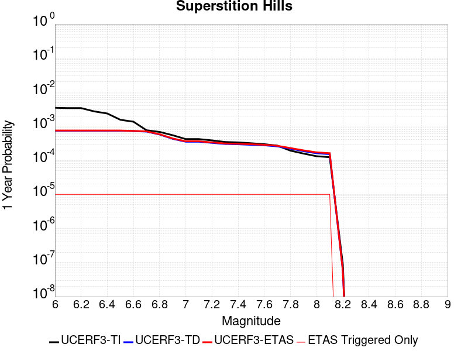 | 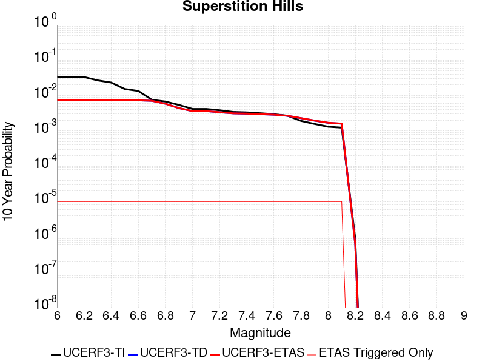 |

| Magnitude | 1 wk TI Prob | 1 wk TD Prob | 1 wk ETAS Prob | 1 wk ETAS/TD Gain | 1 wk ETAS Triggered Only | 1 mo TI Prob | 1 mo TD Prob | 1 mo ETAS Prob | 1 mo ETAS/TD Gain | 1 mo ETAS Triggered Only | 1 yr TI Prob | 1 yr TD Prob | 1 yr ETAS Prob | 1 yr ETAS/TD Gain | 1 yr ETAS Triggered Only | 10 yr TI Prob | 10 yr TD Prob | 10 yr ETAS Prob | 10 yr ETAS/TD Gain | 10 yr ETAS Triggered Only |
|-----|-----|-----|-----|-----|-----|-----|-----|-----|-----|-----|-----|-----|-----|-----|-----|-----|-----|-----|-----|-----|
| 6.0 | 6.6865185E-5 | 1.41376995E-5 | 2.4137558E-5 | 1.7073187 | 1.0E-5 | 2.8653358E-4 | 6.0588824E-5 | 7.058822E-5 | 1.1650369 | 1.0E-5 | 0.0034829667 | 7.374355E-4 | 7.474281E-4 | 1.0135505 | 1.0E-5 | 0.03428881 | 0.0075204074 | 0.007530332 | 1.0013198 | 1.0E-5 |
| 6.1 | 6.544851E-5 | 1.41376995E-5 | 2.4137558E-5 | 1.7073187 | 1.0E-5 | 2.8046346E-4 | 6.0588824E-5 | 7.058822E-5 | 1.1650369 | 1.0E-5 | 0.0034092965 | 7.374355E-4 | 7.474281E-4 | 1.0135505 | 1.0E-5 | 0.033574644 | 0.007520407 | 0.0075303316 | 1.0013198 | 1.0E-5 |
| 6.2 | 6.544851E-5 | 1.41376995E-5 | 2.4137558E-5 | 1.7073187 | 1.0E-5 | 2.8046346E-4 | 6.0588824E-5 | 7.058822E-5 | 1.1650369 | 1.0E-5 | 0.0034092965 | 7.374355E-4 | 7.474281E-4 | 1.0135505 | 1.0E-5 | 0.033574644 | 0.007520407 | 0.0075303316 | 1.0013198 | 1.0E-5 |
| 6.3 | 5.2402065E-5 | 1.4137698E-5 | 2.4137556E-5 | 1.7073188 | 1.0E-5 | 2.2456095E-4 | 6.058882E-5 | 7.058821E-5 | 1.1650369 | 1.0E-5 | 0.0027306017 | 7.374354E-4 | 7.4742804E-4 | 1.0135505 | 1.0E-5 | 0.02697292 | 0.007520402 | 0.0075303265 | 1.0013198 | 1.0E-5 |
| 6.4 | 4.542238E-5 | 1.4137698E-5 | 2.4137556E-5 | 1.7073188 | 1.0E-5 | 1.9465282E-4 | 6.0588816E-5 | 7.058821E-5 | 1.1650369 | 1.0E-5 | 0.0023673223 | 7.3743536E-4 | 7.47428E-4 | 1.0135505 | 1.0E-5 | 0.023422617 | 0.0075203986 | 0.007530323 | 1.0013198 | 1.0E-5 |
| 6.5 | 2.9672969E-5 | 1.4137696E-5 | 2.4137555E-5 | 1.7073188 | 1.0E-5 | 1.2716366E-4 | 6.058881E-5 | 7.0588205E-5 | 1.1650369 | 1.0E-5 | 0.0015471181 | 7.374353E-4 | 7.474279E-4 | 1.0135505 | 1.0E-5 | 0.015363912 | 0.007520392 | 0.007530317 | 1.0013198 | 1.0E-5 |
| 6.6 | 2.6056105E-5 | 1.3803458E-5 | 2.380332E-5 | 1.7244462 | 1.0E-5 | 1.1166424E-4 | 5.9156428E-5 | 6.915584E-5 | 1.1690333 | 1.0E-5 | 0.0013586642 | 7.200076E-4 | 7.300004E-4 | 1.0138787 | 1.0E-5 | 0.013503874 | 0.0073448285 | 0.007354755 | 1.0013515 | 1.0E-5 |
| 6.7 | 1.4611248E-5 | 1.3383359E-5 | 2.3383225E-5 | 1.7471865 | 1.0E-5 | 6.261813E-5 | 5.7356083E-5 | 6.735551E-5 | 1.1743394 | 1.0E-5 | 7.6210906E-4 | 6.981025E-4 | 7.0809555E-4 | 1.0143145 | 1.0E-5 | 0.0075950073 | 0.00712602 | 0.0071359486 | 1.0013933 | 1.0E-5 |
| 6.8 | 1.30607E-5 | 1.09787925E-5 | 2.0978683E-5 | 1.9108369 | 1.0E-5 | 5.597323E-5 | 4.705117E-5 | 5.70507E-5 | 1.2125245 | 1.0E-5 | 6.8126095E-4 | 5.7270617E-4 | 5.827004E-4 | 1.0174509 | 1.0E-5 | 0.006791762 | 0.00587438 | 0.0058843214 | 1.0016923 | 1.0E-5 |
| 6.9 | 1.0443096E-5 | 8.195349E-6 | 1.8195267E-5 | 2.220194 | 1.0E-5 | 4.4755358E-5 | 3.5122466E-5 | 4.5122117E-5 | 1.284708 | 1.0E-5 | 5.447602E-4 | 4.2753448E-4 | 4.375302E-4 | 1.0233799 | 1.0E-5 | 0.005434267 | 0.0044094524 | 0.0044194083 | 1.0022578 | 1.0E-5 |
| 7.0 | 8.045912E-6 | 6.739692E-6 | 1.6739625E-5 | 2.4837375 | 1.0E-5 | 3.4482026E-5 | 2.888408E-5 | 3.888379E-5 | 1.3462014 | 1.0E-5 | 4.197378E-4 | 3.5160795E-4 | 3.6160444E-4 | 1.0284308 | 1.0E-5 | 0.0041894587 | 0.0036334093 | 0.003643373 | 1.0027423 | 1.0E-5 |
| 7.1 | 8.045912E-6 | 6.739692E-6 | 1.6739625E-5 | 2.4837375 | 1.0E-5 | 3.4482026E-5 | 2.888408E-5 | 3.888379E-5 | 1.3462014 | 1.0E-5 | 4.197378E-4 | 3.5160795E-4 | 3.6160444E-4 | 1.0284308 | 1.0E-5 | 0.0041894587 | 0.0036334093 | 0.003643373 | 1.0027423 | 1.0E-5 |
| 7.2 | 7.375506E-6 | 6.2466297E-6 | 1.6246568E-5 | 2.6008532 | 1.0E-5 | 3.1608928E-5 | 2.6771E-5 | 3.6770733E-5 | 1.3735285 | 1.0E-5 | 3.8477074E-4 | 3.2588904E-4 | 3.358858E-4 | 1.0306753 | 1.0E-5 | 0.003841052 | 0.003373887 | 0.0033838532 | 1.0029539 | 1.0E-5 |
| 7.3 | 6.6063913E-6 | 5.7990574E-6 | 1.5799E-5 | 2.7244081 | 1.0E-5 | 2.8312797E-5 | 2.485287E-5 | 3.4852623E-5 | 1.402358 | 1.0E-5 | 3.446538E-4 | 3.025424E-4 | 3.1253937E-4 | 1.0330433 | 1.0E-5 | 0.0034411973 | 0.003138153 | 0.0031481218 | 1.0031766 | 1.0E-5 |
| 7.4 | 6.4313126E-6 | 5.680481E-6 | 1.5680425E-5 | 2.760404 | 1.0E-5 | 2.7562477E-5 | 2.4344696E-5 | 3.434445E-5 | 1.4107571 | 1.0E-5 | 3.355215E-4 | 2.9635706E-4 | 3.063541E-4 | 1.0337331 | 1.0E-5 | 0.0033501536 | 0.0030759154 | 0.0030858845 | 1.0032411 | 1.0E-5 |
| 7.5 | 6.0742927E-6 | 5.4763104E-6 | 1.5476255E-5 | 2.826037 | 1.0E-5 | 2.6032423E-5 | 2.3469694E-5 | 3.346946E-5 | 1.4260714 | 1.0E-5 | 3.1689866E-4 | 2.8570674E-4 | 2.9570388E-4 | 1.0349909 | 1.0E-5 | 0.0031644711 | 0.002967756 | 0.0029777263 | 1.0033596 | 1.0E-5 |
| 7.6 | 5.6987187E-6 | 5.294521E-6 | 1.5294469E-5 | 2.888735 | 1.0E-5 | 2.4422852E-5 | 2.269061E-5 | 3.2690383E-5 | 1.4407009 | 1.0E-5 | 2.9730765E-4 | 2.7622381E-4 | 2.8622107E-4 | 1.0361925 | 1.0E-5 | 0.002969102 | 0.0028710118 | 0.002880983 | 1.003473 | 1.0E-5 |
| 7.7 | 5.1658035E-6 | 4.925535E-6 | 1.4925486E-5 | 3.0302262 | 1.0E-5 | 2.2138971E-5 | 2.1109268E-5 | 3.110906E-5 | 1.4737155 | 1.0E-5 | 2.6950863E-4 | 2.5697565E-4 | 2.6697307E-4 | 1.0389042 | 1.0E-5 | 0.00269182 | 0.0026760625 | 0.0026860356 | 1.0037268 | 1.0E-5 |
| 7.8 | 3.6864697E-6 | 4.1964995E-6 | 1.4196457E-5 | 3.3829286 | 1.0E-5 | 1.579906E-5 | 1.7984876E-5 | 2.7984695E-5 | 1.5560127 | 1.0E-5 | 1.9233658E-4 | 2.1894433E-4 | 2.2894214E-4 | 1.0456637 | 1.0E-5 | 0.0019217018 | 0.0022892624 | 0.0022992396 | 1.0043582 | 1.0E-5 |
| 7.9 | 3.0265903E-6 | 3.5637288E-6 | 1.3563693E-5 | 3.8060396 | 1.0E-5 | 1.2971037E-5 | 1.5273037E-5 | 2.5272884E-5 | 1.6547387 | 1.0E-5 | 1.5791094E-4 | 1.859338E-4 | 1.9593193E-4 | 1.0537726 | 1.0E-5 | 0.0015779877 | 0.0019534735 | 0.001963454 | 1.0051091 | 1.0E-5 |
| 8.0 | 2.5271493E-6 | 3.0867361E-6 | 1.3086706E-5 | 4.239658 | 1.0E-5 | 1.0830595E-5 | 1.3228804E-5 | 2.3228673E-5 | 1.7559162 | 1.0E-5 | 1.3185451E-4 | 1.610492E-4 | 1.7104759E-4 | 1.0620828 | 1.0E-5 | 0.0013177631 | 0.0016973554 | 0.0017073384 | 1.0058815 | 1.0E-5 |
| 8.1 | 2.3749135E-6 | 2.917377E-6 | 1.2917348E-5 | 4.4277267 | 1.0E-5 | 1.0178161E-5 | 1.25029865E-5 | 2.2502862E-5 | 1.7997988 | 1.0E-5 | 1.2391206E-4 | 1.5221364E-4 | 1.6221212E-4 | 1.0656872 | 1.0E-5 | 0.0012384299 | 0.001604949 | 0.001614933 | 1.0062207 | 1.0E-5 |
| 8.2 | 1.7186406E-9 | 1.1440594E-9 | 1.1440594E-9 | 1.0 | 0.0 | 7.3656024E-9 | 4.9031117E-9 | 4.9031117E-9 | 1.0 | 0.0 | 8.9676206E-8 | 5.969538E-8 | 5.969538E-8 | 1.0 | 0.0 | 8.9676166E-7 | 6.389059E-7 | 6.389059E-7 | 1.0 | 0.0 |

## Carlsbad
*[(top)](#table-of-contents)*

| 1 Week | 1 Month | 1 Year | 10 Year |
|-----|-----|-----|-----|
|  |  |  |  |

| Magnitude | 1 wk TI Prob | 1 wk TD Prob | 1 wk ETAS Prob | 1 wk ETAS/TD Gain | 1 wk ETAS Triggered Only | 1 mo TI Prob | 1 mo TD Prob | 1 mo ETAS Prob | 1 mo ETAS/TD Gain | 1 mo ETAS Triggered Only | 1 yr TI Prob | 1 yr TD Prob | 1 yr ETAS Prob | 1 yr ETAS/TD Gain | 1 yr ETAS Triggered Only | 10 yr TI Prob | 10 yr TD Prob | 10 yr ETAS Prob | 10 yr ETAS/TD Gain | 10 yr ETAS Triggered Only |
|-----|-----|-----|-----|-----|-----|-----|-----|-----|-----|-----|-----|-----|-----|-----|-----|-----|-----|-----|-----|-----|
| 6.0 | 4.9038536E-6 | 4.9872565E-6 | 4.9872565E-6 | 1.0 | 0.0 | 2.1016345E-5 | 2.1373784E-5 | 2.1373784E-5 | 1.0 | 0.0 | 2.5584397E-4 | 2.601952E-4 | 2.701926E-4 | 1.0384227 | 1.0E-5 | 0.002555496 | 0.0025989525 | 0.0026089265 | 1.0038377 | 1.0E-5 |
| 6.1 | 4.9038536E-6 | 4.9872565E-6 | 4.9872565E-6 | 1.0 | 0.0 | 2.1016345E-5 | 2.1373784E-5 | 2.1373784E-5 | 1.0 | 0.0 | 2.5584397E-4 | 2.601952E-4 | 2.701926E-4 | 1.0384227 | 1.0E-5 | 0.002555496 | 0.0025989525 | 0.0026089265 | 1.0038377 | 1.0E-5 |
| 6.2 | 4.3820614E-6 | 4.4547687E-6 | 4.4547687E-6 | 1.0 | 0.0 | 1.8780129E-5 | 1.9091729E-5 | 1.9091729E-5 | 1.0 | 0.0 | 2.2862408E-4 | 2.3241735E-4 | 2.4241503E-4 | 1.0430161 | 1.0E-5 | 0.00228389 | 0.0023217786 | 0.0023317554 | 1.004297 | 1.0E-5 |
| 6.3 | 4.302872E-6 | 4.373006E-6 | 4.373006E-6 | 1.0 | 0.0 | 1.8440749E-5 | 1.8741322E-5 | 1.8741322E-5 | 1.0 | 0.0 | 2.24493E-4 | 2.2815206E-4 | 2.3814978E-4 | 1.0438204 | 1.0E-5 | 0.0022426634 | 0.0022792136 | 0.0022891907 | 1.0043775 | 1.0E-5 |
| 6.4 | 4.0835243E-6 | 4.1476546E-6 | 4.1476546E-6 | 1.0 | 0.0 | 1.75007E-5 | 1.7775543E-5 | 1.7775543E-5 | 1.0 | 0.0 | 2.1305021E-4 | 2.1639607E-4 | 2.2639391E-4 | 1.0462016 | 1.0E-5 | 0.0021284607 | 0.0021618877 | 0.0021718661 | 1.0046155 | 1.0E-5 |
| 6.5 | 3.987806E-6 | 4.0488867E-6 | 4.0488867E-6 | 1.0 | 0.0 | 1.7090486E-5 | 1.7352257E-5 | 1.7352257E-5 | 1.0 | 0.0 | 2.080568E-4 | 2.1124359E-4 | 2.2124147E-4 | 1.0473287 | 1.0E-5 | 0.002078621 | 0.0021104617 | 0.0021204406 | 1.0047283 | 1.0E-5 |
| 6.6 | 3.8707576E-6 | 3.927488E-6 | 3.927488E-6 | 1.0 | 0.0 | 1.6588854E-5 | 1.6831984E-5 | 1.6831984E-5 | 1.0 | 0.0 | 2.0195059E-4 | 2.0491047E-4 | 2.1490842E-4 | 1.0487918 | 1.0E-5 | 0.0020176715 | 0.0020472489 | 0.0020572285 | 1.0048746 | 1.0E-5 |
| 6.7 | 3.3093434E-6 | 3.3423917E-6 | 3.3423917E-6 | 1.0 | 0.0 | 1.4182823E-5 | 1.4324457E-5 | 1.4324457E-5 | 1.0 | 0.0 | 1.7266218E-4 | 1.7438637E-4 | 1.8438463E-4 | 1.057334 | 1.0E-5 | 0.001725281 | 0.0017425013 | 0.0017524839 | 1.0057288 | 1.0E-5 |
| 6.8 | 3.136983E-6 | 3.1664536E-6 | 3.1664536E-6 | 1.0 | 0.0 | 1.3444143E-5 | 1.3570445E-5 | 1.3570445E-5 | 1.0 | 0.0 | 1.6367015E-4 | 1.6520769E-4 | 1.7520603E-4 | 1.0605198 | 1.0E-5 | 0.0016354966 | 0.0016508545 | 0.0016608379 | 1.0060475 | 1.0E-5 |
| 6.9 | 2.9056644E-6 | 2.9267585E-6 | 2.9267585E-6 | 1.0 | 0.0 | 1.2452788E-5 | 1.2543191E-5 | 1.2543191E-5 | 1.0 | 0.0 | 1.5160214E-4 | 1.5270269E-4 | 1.6270117E-4 | 1.0654768 | 1.0E-5 | 0.0015149876 | 0.001525983 | 0.0015359677 | 1.0065432 | 1.0E-5 |
| 7.0 | 2.5071035E-6 | 2.5113977E-6 | 2.5113977E-6 | 1.0 | 0.0 | 1.0744685E-5 | 1.07630885E-5 | 1.07630885E-5 | 1.0 | 0.0 | 1.308087E-4 | 1.3103275E-4 | 1.3103275E-4 | 1.0 | 0.0 | 0.0013073172 | 0.0013095582 | 0.0013095582 | 1.0 | 0.0 |
| 7.1 | 2.1786877E-6 | 2.1678832E-6 | 2.1678832E-6 | 1.0 | 0.0 | 9.3372E-6 | 9.290896E-6 | 9.290896E-6 | 1.0 | 0.0 | 1.13674476E-4 | 1.1311081E-4 | 1.1311081E-4 | 1.0 | 0.0 | 0.0011361635 | 0.0011305353 | 0.0011305353 | 1.0 | 0.0 |
| 7.2 | 1.6628418E-6 | 1.6213872E-6 | 1.6213872E-6 | 1.0 | 0.0 | 7.1264453E-6 | 6.948784E-6 | 6.948784E-6 | 1.0 | 0.0 | 8.676102E-5 | 8.4598185E-5 | 8.4598185E-5 | 1.0 | 0.0 | 8.672715E-4 | 8.45662E-4 | 8.45662E-4 | 1.0 | 0.0 |
| 7.3 | 1.0595926E-6 | 9.816804E-7 | 9.816804E-7 | 1.0 | 0.0 | 4.541103E-6 | 4.2071947E-6 | 4.2071947E-6 | 1.0 | 0.0 | 5.5286528E-5 | 5.1221403E-5 | 5.1221403E-5 | 1.0 | 0.0 | 5.527277E-4 | 5.1209686E-4 | 5.1209686E-4 | 1.0 | 0.0 |
| 7.4 | 7.956623E-7 | 7.1737975E-7 | 7.1737975E-7 | 1.0 | 0.0 | 3.4099767E-6 | 3.074481E-6 | 3.074481E-6 | 1.0 | 0.0 | 4.1515676E-5 | 3.743117E-5 | 3.743117E-5 | 1.0 | 0.0 | 4.150792E-4 | 3.7424936E-4 | 3.7424936E-4 | 1.0 | 0.0 |
| 7.5 | 5.1043804E-7 | 4.4483627E-7 | 4.4483627E-7 | 1.0 | 0.0 | 2.1875896E-6 | 1.9064398E-6 | 1.9064398E-6 | 1.0 | 0.0 | 2.663358E-5 | 2.3210663E-5 | 2.3210663E-5 | 1.0 | 0.0 | 2.6630386E-4 | 2.3208297E-4 | 2.3208297E-4 | 1.0 | 0.0 |
| 7.6 | 2.3723294E-7 | 1.989569E-7 | 1.989569E-7 | 1.0 | 0.0 | 1.0167122E-6 | 8.5267214E-7 | 8.5267214E-7 | 1.0 | 0.0 | 1.2378401E-5 | 1.0381237E-5 | 1.0381237E-5 | 1.0 | 0.0 | 1.237771E-4 | 1.038078E-4 | 1.038078E-4 | 1.0 | 0.0 |
| 7.7 | 1.9992152E-8 | 9.8601785E-9 | 9.8601785E-9 | 1.0 | 0.0 | 8.568065E-8 | 4.225791E-8 | 4.225791E-8 | 1.0 | 0.0 | 1.0431614E-6 | 5.1449E-7 | 5.1449E-7 | 1.0 | 0.0 | 1.0431565E-5 | 5.1449E-6 | 5.1449E-6 | 1.0 | 0.0 |

## Robinson Creek
*[(top)](#table-of-contents)*

| 1 Week | 1 Month | 1 Year | 10 Year |
|-----|-----|-----|-----|
|  | 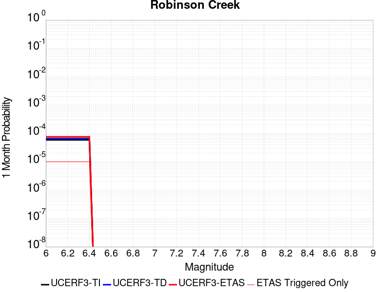 |  |  |

| Magnitude | 1 wk TI Prob | 1 wk TD Prob | 1 wk ETAS Prob | 1 wk ETAS/TD Gain | 1 wk ETAS Triggered Only | 1 mo TI Prob | 1 mo TD Prob | 1 mo ETAS Prob | 1 mo ETAS/TD Gain | 1 mo ETAS Triggered Only | 1 yr TI Prob | 1 yr TD Prob | 1 yr ETAS Prob | 1 yr ETAS/TD Gain | 1 yr ETAS Triggered Only | 10 yr TI Prob | 10 yr TD Prob | 10 yr ETAS Prob | 10 yr ETAS/TD Gain | 10 yr ETAS Triggered Only |
|-----|-----|-----|-----|-----|-----|-----|-----|-----|-----|-----|-----|-----|-----|-----|-----|-----|-----|-----|-----|-----|
| 6.0 | 1.3705327E-5 | 1.5285013E-5 | 2.528486E-5 | 1.6542256 | 1.0E-5 | 5.8735794E-5 | 6.55072E-5 | 7.550655E-5 | 1.152645 | 1.0E-5 | 7.1487366E-4 | 7.9755014E-4 | 8.075422E-4 | 1.0125284 | 1.0E-5 | 0.0071257832 | 0.007975501 | 0.007985421 | 1.0012438 | 1.0E-5 |
| 6.1 | 1.3705327E-5 | 1.5285013E-5 | 2.528486E-5 | 1.6542256 | 1.0E-5 | 5.8735794E-5 | 6.55072E-5 | 7.550655E-5 | 1.152645 | 1.0E-5 | 7.1487366E-4 | 7.9755014E-4 | 8.075422E-4 | 1.0125284 | 1.0E-5 | 0.0071257832 | 0.007975501 | 0.007985421 | 1.0012438 | 1.0E-5 |
| 6.2 | 1.3705327E-5 | 1.5285013E-5 | 2.528486E-5 | 1.6542256 | 1.0E-5 | 5.8735794E-5 | 6.55072E-5 | 7.550655E-5 | 1.152645 | 1.0E-5 | 7.1487366E-4 | 7.9755014E-4 | 8.075422E-4 | 1.0125284 | 1.0E-5 | 0.0071257832 | 0.007975501 | 0.007985421 | 1.0012438 | 1.0E-5 |
| 6.3 | 1.3705327E-5 | 1.5285013E-5 | 2.528486E-5 | 1.6542256 | 1.0E-5 | 5.8735794E-5 | 6.55072E-5 | 7.550655E-5 | 1.152645 | 1.0E-5 | 7.1487366E-4 | 7.9755014E-4 | 8.075422E-4 | 1.0125284 | 1.0E-5 | 0.0071257832 | 0.007975501 | 0.007985421 | 1.0012438 | 1.0E-5 |
| 6.4 | 1.3705327E-5 | 1.5285013E-5 | 2.528486E-5 | 1.6542256 | 1.0E-5 | 5.8735794E-5 | 6.55072E-5 | 7.550655E-5 | 1.152645 | 1.0E-5 | 7.1487366E-4 | 7.9755014E-4 | 8.075422E-4 | 1.0125284 | 1.0E-5 | 0.0071257832 | 0.007975501 | 0.007985421 | 1.0012438 | 1.0E-5 |

## Calaveras (Central) 2011 CFM
*[(top)](#table-of-contents)*

| 1 Week | 1 Month | 1 Year | 10 Year |
|-----|-----|-----|-----|
|  | 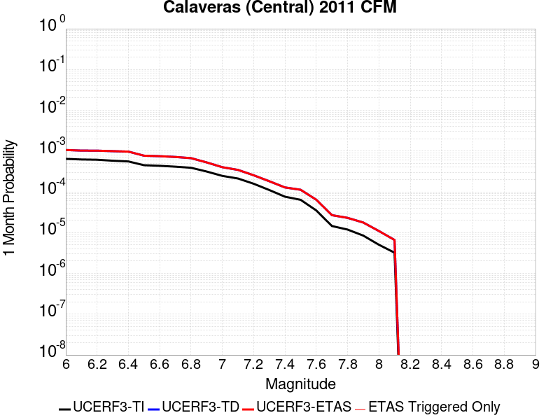 | 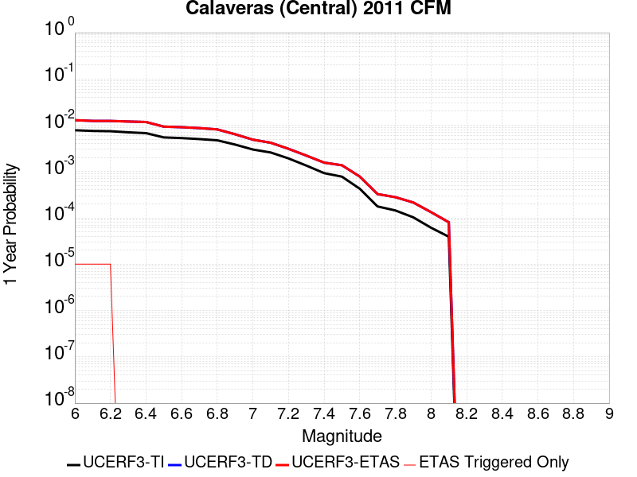 |  |

| Magnitude | 1 wk TI Prob | 1 wk TD Prob | 1 wk ETAS Prob | 1 wk ETAS/TD Gain | 1 wk ETAS Triggered Only | 1 mo TI Prob | 1 mo TD Prob | 1 mo ETAS Prob | 1 mo ETAS/TD Gain | 1 mo ETAS Triggered Only | 1 yr TI Prob | 1 yr TD Prob | 1 yr ETAS Prob | 1 yr ETAS/TD Gain | 1 yr ETAS Triggered Only | 10 yr TI Prob | 10 yr TD Prob | 10 yr ETAS Prob | 10 yr ETAS/TD Gain | 10 yr ETAS Triggered Only |
|-----|-----|-----|-----|-----|-----|-----|-----|-----|-----|-----|-----|-----|-----|-----|-----|-----|-----|-----|-----|-----|
| 6.0 | 1.5010907E-4 | 2.481574E-4 | 2.481574E-4 | 1.0 | 0.0 | 6.4316596E-4 | 0.0010621005 | 0.0010621005 | 1.0 | 0.0 | 0.0078024664 | 0.012850073 | 0.012859945 | 1.0007682 | 1.0E-5 | 0.07534136 | 0.120401435 | 0.12041023 | 1.0000731 | 1.0E-5 |
| 6.1 | 1.4521465E-4 | 2.397987E-4 | 2.397987E-4 | 1.0 | 0.0 | 6.222001E-4 | 0.0010263061 | 0.0010263061 | 1.0 | 0.0 | 0.0075490056 | 0.012419341 | 0.012429217 | 1.0007952 | 1.0E-5 | 0.07297657 | 0.11667323 | 0.11668206 | 1.0000757 | 1.0E-5 |
| 6.2 | 1.429998E-4 | 2.3911126E-4 | 2.3911126E-4 | 1.0 | 0.0 | 6.127123E-4 | 0.0010233623 | 0.0010233623 | 1.0 | 0.0 | 0.007434286 | 0.01238394 | 0.012393816 | 1.0007975 | 1.0E-5 | 0.07190444 | 0.1163272 | 0.11633603 | 1.0000759 | 1.0E-5 |
| 6.3 | 1.3536277E-4 | 2.3242626E-4 | 2.3242626E-4 | 1.0 | 0.0 | 5.799972E-4 | 9.947343E-4 | 9.947343E-4 | 1.0 | 0.0 | 0.0070386264 | 0.012040132 | 0.012040132 | 1.0 | 0.0 | 0.0681982 | 0.11323977 | 0.11323977 | 1.0 | 0.0 |
| 6.4 | 1.2993296E-4 | 2.2666177E-4 | 2.2666177E-4 | 1.0 | 0.0 | 5.5673666E-4 | 9.700479E-4 | 9.700479E-4 | 1.0 | 0.0 | 0.006757223 | 0.011742937 | 0.011742937 | 1.0 | 0.0 | 0.06555412 | 0.11051771 | 0.11051771 | 1.0 | 0.0 |
| 6.5 | 1.0498927E-4 | 1.7981697E-4 | 1.7981697E-4 | 1.0 | 0.0 | 4.498764E-4 | 7.704157E-4 | 7.704157E-4 | 1.0 | 0.0 | 0.005463498 | 0.00933924 | 0.00933924 | 1.0 | 0.0 | 0.053311124 | 0.089199215 | 0.089199215 | 1.0 | 0.0 |
| 6.6 | 1.0157505E-4 | 1.7469203E-4 | 1.7469203E-4 | 1.0 | 0.0 | 4.35249E-4 | 7.484645E-4 | 7.484645E-4 | 1.0 | 0.0 | 0.0052862884 | 0.009074297 | 0.009074297 | 1.0 | 0.0 | 0.05162293 | 0.08677671 | 0.08677671 | 1.0 | 0.0 |
| 6.7 | 9.660386E-5 | 1.6728524E-4 | 1.6728524E-4 | 1.0 | 0.0 | 4.1395082E-4 | 7.1673887E-4 | 7.1673887E-4 | 1.0 | 0.0 | 0.0050282106 | 0.008691208 | 0.008691208 | 1.0 | 0.0 | 0.049159497 | 0.083266065 | 0.083266065 | 1.0 | 0.0 |
| 6.8 | 9.089927E-5 | 1.5643016E-4 | 1.5643016E-4 | 1.0 | 0.0 | 3.8951015E-4 | 6.702439E-4 | 6.702439E-4 | 1.0 | 0.0 | 0.0047319788 | 0.008129478 | 0.008129478 | 1.0 | 0.0 | 0.046324775 | 0.078159414 | 0.078159414 | 1.0 | 0.0 |
| 6.9 | 7.353187E-5 | 1.2295354E-4 | 1.2295354E-4 | 1.0 | 0.0 | 3.150985E-4 | 5.2683795E-4 | 5.2683795E-4 | 1.0 | 0.0 | 0.0038295772 | 0.006395508 | 0.006395508 | 1.0 | 0.0 | 0.037642512 | 0.062187865 | 0.062187865 | 1.0 | 0.0 |
| 7.0 | 5.746064E-5 | 9.3887444E-5 | 9.3887444E-5 | 1.0 | 0.0 | 2.4623662E-4 | 4.0231308E-4 | 4.0231308E-4 | 1.0 | 0.0 | 0.0029938098 | 0.004887232 | 0.004887232 | 1.0 | 0.0 | 0.02953797 | 0.04798685 | 0.04798685 | 1.0 | 0.0 |
| 7.1 | 4.9557195E-5 | 8.052461E-5 | 8.052461E-5 | 1.0 | 0.0 | 2.123707E-4 | 3.4506017E-4 | 3.4506017E-4 | 1.0 | 0.0 | 0.0025825473 | 0.0041930773 | 0.0041930773 | 1.0 | 0.0 | 0.0255274 | 0.041373078 | 0.041373078 | 1.0 | 0.0 |
| 7.2 | 3.687595E-5 | 5.9524526E-5 | 5.9524526E-5 | 1.0 | 0.0 | 1.5803022E-4 | 2.5508032E-4 | 2.5508032E-4 | 1.0 | 0.0 | 0.0019223199 | 0.0031012094 | 0.0031012094 | 1.0 | 0.0 | 0.01905776 | 0.030883716 | 0.030883716 | 1.0 | 0.0 |
| 7.3 | 2.5846984E-5 | 4.247213E-5 | 4.247213E-5 | 1.0 | 0.0 | 1.1076809E-4 | 1.8201082E-4 | 1.8201082E-4 | 1.0 | 0.0 | 0.0013477671 | 0.002213747 | 0.002213747 | 1.0 | 0.0 | 0.013396223 | 0.02217554 | 0.02217554 | 1.0 | 0.0 |
| 7.4 | 1.7747854E-5 | 2.9936204E-5 | 2.9936204E-5 | 1.0 | 0.0 | 7.6060016E-5 | 1.2829172E-4 | 1.2829172E-4 | 1.0 | 0.0 | 9.2563726E-4 | 0.0015608355 | 0.0015608355 | 1.0 | 0.0 | 0.009217911 | 0.015709236 | 0.015709236 | 1.0 | 0.0 |
| 7.5 | 1.4883479E-5 | 2.6243379E-5 | 2.6243379E-5 | 1.0 | 0.0 | 6.378478E-5 | 1.1246678E-4 | 1.1246678E-4 | 1.0 | 0.0 | 7.76303E-4 | 0.0013684258 | 0.0013684258 | 1.0 | 0.0 | 0.0077359667 | 0.013802425 | 0.013802425 | 1.0 | 0.0 |
| 7.6 | 8.166975E-6 | 1.4963478E-5 | 1.4963478E-5 | 1.0 | 0.0 | 3.5000852E-5 | 6.412763E-5 | 6.412763E-5 | 1.0 | 0.0 | 4.2605202E-4 | 7.804755E-4 | 7.804755E-4 | 1.0 | 0.0 | 0.004252361 | 0.00793984 | 0.00793984 | 1.0 | 0.0 |
| 7.7 | 3.3858064E-6 | 6.253914E-6 | 6.253914E-6 | 1.0 | 0.0 | 1.4510518E-5 | 2.6802214E-5 | 2.6802214E-5 | 1.0 | 0.0 | 1.7665124E-4 | 3.2626814E-4 | 3.2626814E-4 | 1.0 | 0.0 | 0.0017651088 | 0.0033882293 | 0.0033882293 | 1.0 | 0.0 |
| 7.8 | 2.7721615E-6 | 5.3663807E-6 | 5.3663807E-6 | 1.0 | 0.0 | 1.1880637E-5 | 2.2998573E-5 | 2.2998573E-5 | 1.0 | 0.0 | 1.4463716E-4 | 2.799717E-4 | 2.799717E-4 | 1.0 | 0.0 | 0.0014454306 | 0.0029074624 | 0.0029074624 | 1.0 | 0.0 |
| 7.9 | 1.9736292E-6 | 4.1284193E-6 | 4.1284193E-6 | 1.0 | 0.0 | 8.4583835E-6 | 1.7693106E-5 | 1.7693106E-5 | 1.0 | 0.0 | 1.0297595E-4 | 2.1539231E-4 | 2.1539231E-4 | 1.0 | 0.0 | 0.0010292825 | 0.0022236116 | 0.0022236116 | 1.0 | 0.0 |
| 8.0 | 1.1767289E-6 | 2.5544743E-6 | 2.5544743E-6 | 1.0 | 0.0 | 5.0431145E-6 | 1.0947701E-5 | 1.0947701E-5 | 1.0 | 0.0 | 6.139818E-5 | 1.3328013E-4 | 1.3328013E-4 | 1.0 | 0.0 | 6.1381224E-4 | 0.0013660848 | 0.0013660848 | 1.0 | 0.0 |
| 8.1 | 7.5112825E-7 | 1.5409794E-6 | 1.5409794E-6 | 1.0 | 0.0 | 3.2191172E-6 | 6.6041807E-6 | 6.6041807E-6 | 1.0 | 0.0 | 3.9192048E-5 | 8.0402955E-5 | 8.0402955E-5 | 1.0 | 0.0 | 3.9185135E-4 | 8.235564E-4 | 8.235564E-4 | 1.0 | 0.0 |

## Santa Monica alt 1
*[(top)](#table-of-contents)*

| 1 Week | 1 Month | 1 Year | 10 Year |
|-----|-----|-----|-----|
| 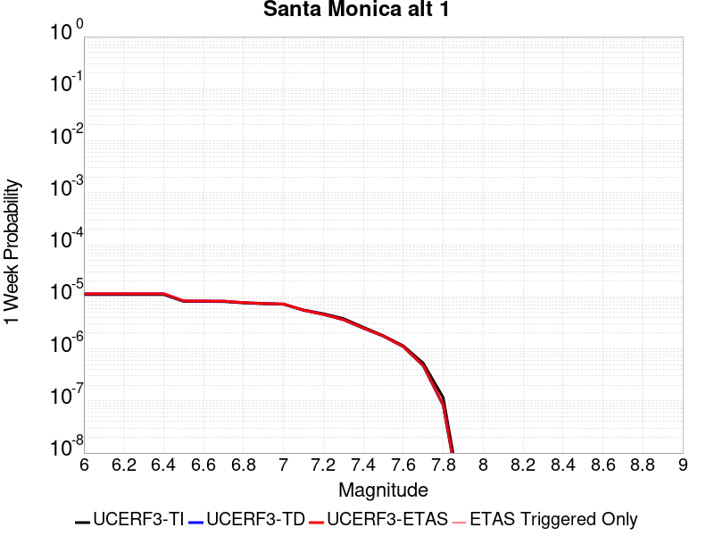 |  |  | 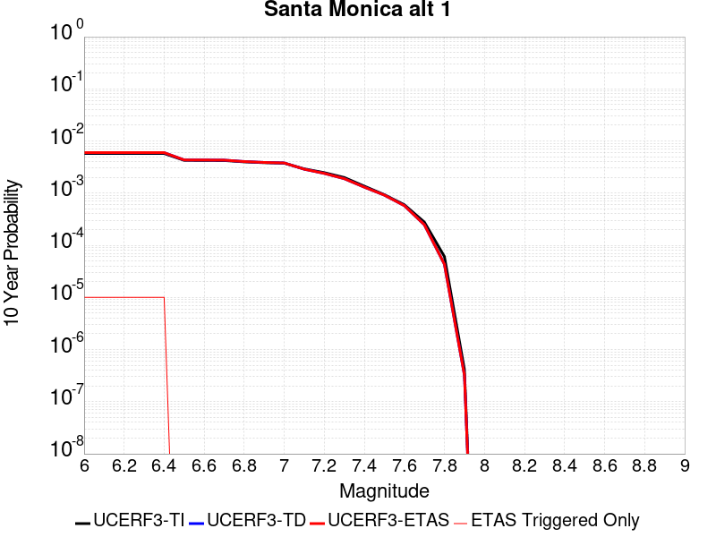 |

| Magnitude | 1 wk TI Prob | 1 wk TD Prob | 1 wk ETAS Prob | 1 wk ETAS/TD Gain | 1 wk ETAS Triggered Only | 1 mo TI Prob | 1 mo TD Prob | 1 mo ETAS Prob | 1 mo ETAS/TD Gain | 1 mo ETAS Triggered Only | 1 yr TI Prob | 1 yr TD Prob | 1 yr ETAS Prob | 1 yr ETAS/TD Gain | 1 yr ETAS Triggered Only | 10 yr TI Prob | 10 yr TD Prob | 10 yr ETAS Prob | 10 yr ETAS/TD Gain | 10 yr ETAS Triggered Only |
|-----|-----|-----|-----|-----|-----|-----|-----|-----|-----|-----|-----|-----|-----|-----|-----|-----|-----|-----|-----|-----|
| 6.0 | 1.1066008E-5 | 1.148031E-5 | 1.148031E-5 | 1.0 | 0.0 | 4.742488E-5 | 4.920048E-5 | 5.919999E-5 | 1.20324 | 1.0E-5 | 5.7724497E-4 | 5.9886515E-4 | 6.088591E-4 | 1.0166882 | 1.0E-5 | 0.005757478 | 0.0059739 | 0.00598384 | 1.0016639 | 1.0E-5 |
| 6.1 | 1.1066008E-5 | 1.148031E-5 | 1.148031E-5 | 1.0 | 0.0 | 4.742488E-5 | 4.920048E-5 | 5.919999E-5 | 1.20324 | 1.0E-5 | 5.7724497E-4 | 5.9886515E-4 | 6.088591E-4 | 1.0166882 | 1.0E-5 | 0.005757478 | 0.0059739 | 0.00598384 | 1.0016639 | 1.0E-5 |
| 6.2 | 1.1066008E-5 | 1.148031E-5 | 1.148031E-5 | 1.0 | 0.0 | 4.742488E-5 | 4.920048E-5 | 5.919999E-5 | 1.20324 | 1.0E-5 | 5.7724497E-4 | 5.9886515E-4 | 6.088591E-4 | 1.0166882 | 1.0E-5 | 0.005757478 | 0.0059739 | 0.00598384 | 1.0016639 | 1.0E-5 |
| 6.3 | 1.1066008E-5 | 1.148031E-5 | 1.148031E-5 | 1.0 | 0.0 | 4.742488E-5 | 4.920048E-5 | 5.919999E-5 | 1.20324 | 1.0E-5 | 5.7724497E-4 | 5.9886515E-4 | 6.088591E-4 | 1.0166882 | 1.0E-5 | 0.005757478 | 0.0059739 | 0.00598384 | 1.0016639 | 1.0E-5 |
| 6.4 | 1.1066008E-5 | 1.148031E-5 | 1.148031E-5 | 1.0 | 0.0 | 4.742488E-5 | 4.920048E-5 | 5.919999E-5 | 1.20324 | 1.0E-5 | 5.7724497E-4 | 5.9886515E-4 | 6.088591E-4 | 1.0166882 | 1.0E-5 | 0.005757478 | 0.0059739 | 0.00598384 | 1.0016639 | 1.0E-5 |
| 6.5 | 8.183544E-6 | 8.335432E-6 | 8.335432E-6 | 1.0 | 0.0 | 3.5071862E-5 | 3.57228E-5 | 3.57228E-5 | 1.0 | 0.0 | 4.2691626E-4 | 4.3483984E-4 | 4.3483984E-4 | 1.0 | 0.0 | 0.0042609703 | 0.0043400554 | 0.0043400554 | 1.0 | 0.0 |
| 6.6 | 8.1543285E-6 | 8.303646E-6 | 8.303646E-6 | 1.0 | 0.0 | 3.4946657E-5 | 3.5586578E-5 | 3.5586578E-5 | 1.0 | 0.0 | 4.2539247E-4 | 4.3318202E-4 | 4.3318202E-4 | 1.0 | 0.0 | 0.0042457907 | 0.004323542 | 0.004323542 | 1.0 | 0.0 |
| 6.7 | 8.110878E-6 | 8.257042E-6 | 8.257042E-6 | 1.0 | 0.0 | 3.4760444E-5 | 3.5386853E-5 | 3.5386853E-5 | 1.0 | 0.0 | 4.231262E-4 | 4.3075136E-4 | 4.3075136E-4 | 1.0 | 0.0 | 0.0042232145 | 0.0042993296 | 0.0042993296 | 1.0 | 0.0 |
| 6.8 | 7.644036E-6 | 7.75106E-6 | 7.75106E-6 | 1.0 | 0.0 | 3.275974E-5 | 3.3218414E-5 | 3.3218414E-5 | 1.0 | 0.0 | 3.9877684E-4 | 4.0436056E-4 | 4.0436056E-4 | 1.0 | 0.0 | 0.00398062 | 0.0040363944 | 0.0040363944 | 1.0 | 0.0 |
| 6.9 | 7.3698293E-6 | 7.455719E-6 | 7.455719E-6 | 1.0 | 0.0 | 3.15846E-5 | 3.19527E-5 | 3.19527E-5 | 1.0 | 0.0 | 3.8447464E-4 | 3.8895605E-4 | 3.8895605E-4 | 1.0 | 0.0 | 0.0038381014 | 0.0038828964 | 0.0038828964 | 1.0 | 0.0 |
| 7.0 | 7.209872E-6 | 7.2856255E-6 | 7.2856255E-6 | 1.0 | 0.0 | 3.0899086E-5 | 3.1223743E-5 | 3.1223743E-5 | 1.0 | 0.0 | 3.7613141E-4 | 3.8008415E-4 | 3.8008415E-4 | 1.0 | 0.0 | 0.0037549543 | 0.0037944836 | 0.0037944836 | 1.0 | 0.0 |
| 7.1 | 5.603456E-6 | 5.5238925E-6 | 5.5238925E-6 | 1.0 | 0.0 | 2.4014591E-5 | 2.3673612E-5 | 2.3673612E-5 | 1.0 | 0.0 | 2.923384E-4 | 2.881885E-4 | 2.881885E-4 | 1.0 | 0.0 | 0.0029195412 | 0.0028781896 | 0.0028781896 | 1.0 | 0.0 |
| 7.2 | 4.7483613E-6 | 4.5911324E-6 | 4.5911324E-6 | 1.0 | 0.0 | 2.0349962E-5 | 1.9676136E-5 | 1.9676136E-5 | 1.0 | 0.0 | 2.4773262E-4 | 2.3953074E-4 | 2.3953074E-4 | 1.0 | 0.0 | 0.0024745662 | 0.0023927398 | 0.0023927398 | 1.0 | 0.0 |
| 7.3 | 3.829015E-6 | 3.6342253E-6 | 3.6342253E-6 | 1.0 | 0.0 | 1.6409962E-5 | 1.5575159E-5 | 1.5575159E-5 | 1.0 | 0.0 | 1.9977297E-4 | 1.8961114E-4 | 1.8961114E-4 | 1.0 | 0.0 | 0.0019959346 | 0.0018945024 | 0.0018945024 | 1.0 | 0.0 |
| 7.4 | 2.610755E-6 | 2.4995716E-6 | 2.4995716E-6 | 1.0 | 0.0 | 1.1188902E-5 | 1.0712406E-5 | 1.0712406E-5 | 1.0 | 0.0 | 1.3621636E-4 | 1.3041578E-4 | 1.3041578E-4 | 1.0 | 0.0 | 0.001361329 | 0.0013033969 | 0.0013033969 | 1.0 | 0.0 |
| 7.5 | 1.792146E-6 | 1.7584184E-6 | 1.7584184E-6 | 1.0 | 0.0 | 7.680603E-6 | 7.536057E-6 | 7.536057E-6 | 1.0 | 0.0 | 9.3507326E-5 | 9.1747665E-5 | 9.1747665E-5 | 1.0 | 0.0 | 9.3467993E-4 | 9.1710105E-4 | 9.1710105E-4 | 1.0 | 0.0 |
| 7.6 | 1.1473018E-6 | 1.1029152E-6 | 1.1029152E-6 | 1.0 | 0.0 | 4.9169985E-6 | 4.726771E-6 | 4.726771E-6 | 1.0 | 0.0 | 5.986281E-5 | 5.7546935E-5 | 5.7546935E-5 | 1.0 | 0.0 | 5.984669E-4 | 5.7532196E-4 | 5.7532196E-4 | 1.0 | 0.0 |
| 7.7 | 5.330919E-7 | 4.7452556E-7 | 4.7452556E-7 | 1.0 | 0.0 | 2.2846775E-6 | 2.0336795E-6 | 2.0336795E-6 | 1.0 | 0.0 | 2.7815593E-5 | 2.4759778E-5 | 2.4759778E-5 | 1.0 | 0.0 | 2.7812112E-4 | 2.4757133E-4 | 2.4757133E-4 | 1.0 | 0.0 |
| 7.8 | 1.1668574E-7 | 8.2966224E-8 | 8.2966224E-8 | 1.0 | 0.0 | 5.000816E-7 | 3.5556948E-7 | 3.5556948E-7 | 1.0 | 0.0 | 6.0884768E-6 | 4.32905E-6 | 4.32905E-6 | 1.0 | 0.0 | 6.08831E-5 | 4.3289692E-5 | 4.3289692E-5 | 1.0 | 0.0 |
| 7.9 | 8.007447E-10 | 6.1608785E-10 | 6.1608785E-10 | 1.0 | 0.0 | 3.4317629E-9 | 2.6403764E-9 | 2.6403764E-9 | 1.0 | 0.0 | 4.1781714E-8 | 3.2146584E-8 | 3.2146584E-8 | 1.0 | 0.0 | 4.1781706E-7 | 3.214658E-7 | 3.214658E-7 | 1.0 | 0.0 |

## Anaheim
*[(top)](#table-of-contents)*

| 1 Week | 1 Month | 1 Year | 10 Year |
|-----|-----|-----|-----|
|  |  |  | 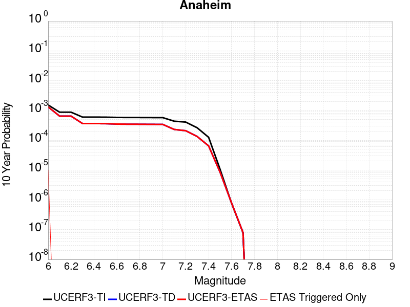 |

| Magnitude | 1 wk TI Prob | 1 wk TD Prob | 1 wk ETAS Prob | 1 wk ETAS/TD Gain | 1 wk ETAS Triggered Only | 1 mo TI Prob | 1 mo TD Prob | 1 mo ETAS Prob | 1 mo ETAS/TD Gain | 1 mo ETAS Triggered Only | 1 yr TI Prob | 1 yr TD Prob | 1 yr ETAS Prob | 1 yr ETAS/TD Gain | 1 yr ETAS Triggered Only | 10 yr TI Prob | 10 yr TD Prob | 10 yr ETAS Prob | 10 yr ETAS/TD Gain | 10 yr ETAS Triggered Only |
|-----|-----|-----|-----|-----|-----|-----|-----|-----|-----|-----|-----|-----|-----|-----|-----|-----|-----|-----|-----|-----|
| 6.0 | 2.9254998E-6 | 2.5122863E-6 | 2.5122863E-6 | 1.0 | 0.0 | 1.25377965E-5 | 1.0766909E-5 | 1.0766909E-5 | 1.0 | 0.0 | 1.5263697E-4 | 1.3108159E-4 | 1.4108028E-4 | 1.0762783 | 1.0E-5 | 0.0015253217 | 0.0013102728 | 0.0013202598 | 1.007622 | 1.0E-5 |
| 6.1 | 1.6729715E-6 | 1.2337348E-6 | 1.2337348E-6 | 1.0 | 0.0 | 7.1698582E-6 | 5.287426E-6 | 5.287426E-6 | 1.0 | 0.0 | 8.7289525E-5 | 6.437293E-5 | 6.437293E-5 | 1.0 | 0.0 | 8.7255245E-4 | 6.435838E-4 | 6.435838E-4 | 1.0 | 0.0 |
| 6.2 | 1.6729715E-6 | 1.2337348E-6 | 1.2337348E-6 | 1.0 | 0.0 | 7.1698582E-6 | 5.287426E-6 | 5.287426E-6 | 1.0 | 0.0 | 8.7289525E-5 | 6.437293E-5 | 6.437293E-5 | 1.0 | 0.0 | 8.7255245E-4 | 6.435838E-4 | 6.435838E-4 | 1.0 | 0.0 |
| 6.3 | 1.1444064E-6 | 6.9596666E-7 | 6.9596666E-7 | 1.0 | 0.0 | 4.9045893E-6 | 2.9827113E-6 | 2.9827113E-6 | 1.0 | 0.0 | 5.971174E-5 | 3.631396E-5 | 3.631396E-5 | 1.0 | 0.0 | 5.96957E-4 | 3.6308577E-4 | 3.6308577E-4 | 1.0 | 0.0 |
| 6.4 | 1.1444064E-6 | 6.9596666E-7 | 6.9596666E-7 | 1.0 | 0.0 | 4.9045893E-6 | 2.9827113E-6 | 2.9827113E-6 | 1.0 | 0.0 | 5.971174E-5 | 3.631396E-5 | 3.631396E-5 | 1.0 | 0.0 | 5.96957E-4 | 3.6308577E-4 | 3.6308577E-4 | 1.0 | 0.0 |
| 6.5 | 1.1385318E-6 | 6.9003505E-7 | 6.9003505E-7 | 1.0 | 0.0 | 4.879413E-6 | 2.95729E-6 | 2.95729E-6 | 1.0 | 0.0 | 5.9405233E-5 | 3.6004465E-5 | 3.6004465E-5 | 1.0 | 0.0 | 5.938936E-4 | 3.5999183E-4 | 3.5999183E-4 | 1.0 | 0.0 |
| 6.6 | 1.1165511E-6 | 6.678222E-7 | 6.678222E-7 | 1.0 | 0.0 | 4.78521E-6 | 2.862092E-6 | 2.862092E-6 | 1.0 | 0.0 | 5.8258374E-5 | 3.484547E-5 | 3.484547E-5 | 1.0 | 0.0 | 5.8243104E-4 | 3.484055E-4 | 3.484055E-4 | 1.0 | 0.0 |
| 6.7 | 1.1098243E-6 | 6.610416E-7 | 6.610416E-7 | 1.0 | 0.0 | 4.7563813E-6 | 2.8330326E-6 | 2.8330326E-6 | 1.0 | 0.0 | 5.7907404E-5 | 3.449168E-5 | 3.449168E-5 | 1.0 | 0.0 | 5.7892315E-4 | 3.4486872E-4 | 3.4486872E-4 | 1.0 | 0.0 |
| 6.8 | 1.1077587E-6 | 6.589619E-7 | 6.589619E-7 | 1.0 | 0.0 | 4.7475287E-6 | 2.8241195E-6 | 2.8241195E-6 | 1.0 | 0.0 | 5.779963E-5 | 3.438317E-5 | 3.438317E-5 | 1.0 | 0.0 | 5.77846E-4 | 3.4378393E-4 | 3.4378393E-4 | 1.0 | 0.0 |
| 6.9 | 1.1024468E-6 | 6.5361957E-7 | 6.5361957E-7 | 1.0 | 0.0 | 4.7247636E-6 | 2.8012241E-6 | 2.8012241E-6 | 1.0 | 0.0 | 5.752248E-5 | 3.4104425E-5 | 3.4104425E-5 | 1.0 | 0.0 | 5.750759E-4 | 3.4099736E-4 | 3.4099736E-4 | 1.0 | 0.0 |
| 7.0 | 1.0993066E-6 | 6.510303E-7 | 6.510303E-7 | 1.0 | 0.0 | 4.7113053E-6 | 2.7901272E-6 | 2.7901272E-6 | 1.0 | 0.0 | 5.7358633E-5 | 3.3969325E-5 | 3.3969325E-5 | 1.0 | 0.0 | 5.734383E-4 | 3.3964674E-4 | 3.3964674E-4 | 1.0 | 0.0 |
| 7.1 | 8.334877E-7 | 4.4049145E-7 | 4.4049145E-7 | 1.0 | 0.0 | 3.5720855E-6 | 1.8878193E-6 | 1.8878193E-6 | 1.0 | 0.0 | 4.348927E-5 | 2.298398E-5 | 2.298398E-5 | 1.0 | 0.0 | 4.3480762E-4 | 2.2981827E-4 | 2.2981827E-4 | 1.0 | 0.0 |
| 7.2 | 7.794411E-7 | 3.997645E-7 | 3.997645E-7 | 1.0 | 0.0 | 3.3404576E-6 | 1.7132754E-6 | 1.7132754E-6 | 1.0 | 0.0 | 4.0669314E-5 | 2.0858948E-5 | 2.0858948E-5 | 1.0 | 0.0 | 4.066187E-4 | 2.0857195E-4 | 2.0857195E-4 | 1.0 | 0.0 |
| 7.3 | 5.01704E-7 | 2.5573388E-7 | 2.5573388E-7 | 1.0 | 0.0 | 2.150158E-6 | 1.0960019E-6 | 1.0960019E-6 | 1.0 | 0.0 | 2.617786E-5 | 1.3343754E-5 | 1.3343754E-5 | 1.0 | 0.0 | 2.6174777E-4 | 1.3343077E-4 | 1.3343077E-4 | 1.0 | 0.0 |
| 7.4 | 2.4008182E-7 | 1.2367859E-7 | 1.2367859E-7 | 1.0 | 0.0 | 1.0289217E-6 | 5.30051E-7 | 5.30051E-7 | 1.0 | 0.0 | 1.252705E-5 | 6.4533597E-6 | 6.4533597E-6 | 1.0 | 0.0 | 1.2526344E-4 | 6.453248E-5 | 6.453248E-5 | 1.0 | 0.0 |
| 7.5 | 2.0263876E-8 | 1.6120866E-8 | 1.6120866E-8 | 1.0 | 0.0 | 8.684518E-8 | 6.908943E-8 | 6.908943E-8 | 1.0 | 0.0 | 1.0573395E-6 | 8.4116357E-7 | 8.4116357E-7 | 1.0 | 0.0 | 1.0573345E-5 | 8.411613E-6 | 8.411613E-6 | 1.0 | 0.0 |
| 7.6 | 1.4871431E-9 | 1.508418E-9 | 1.508418E-9 | 1.0 | 0.0 | 6.37347E-9 | 6.4646484E-9 | 6.4646484E-9 | 1.0 | 0.0 | 7.7596994E-8 | 7.870709E-8 | 7.870709E-8 | 1.0 | 0.0 | 7.759697E-7 | 7.8707063E-7 | 7.8707063E-7 | 1.0 | 0.0 |
| 7.7 | 1.5093293E-10 | 1.5333512E-10 | 1.5333512E-10 | 1.0 | 0.0 | 6.4685546E-10 | 6.571509E-10 | 6.571509E-10 | 1.0 | 0.0 | 7.875465E-9 | 8.0008125E-9 | 8.0008125E-9 | 1.0 | 0.0 | 7.8754645E-8 | 8.000812E-8 | 8.000812E-8 | 1.0 | 0.0 |

## Honey Lake 2011 CFM
*[(top)](#table-of-contents)*

| 1 Week | 1 Month | 1 Year | 10 Year |
|-----|-----|-----|-----|
|  | 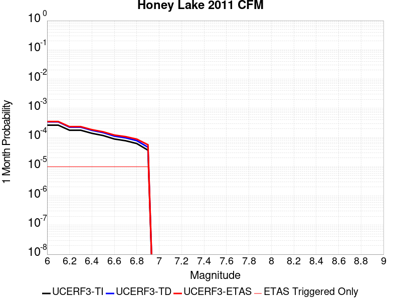 |  |  |

| Magnitude | 1 wk TI Prob | 1 wk TD Prob | 1 wk ETAS Prob | 1 wk ETAS/TD Gain | 1 wk ETAS Triggered Only | 1 mo TI Prob | 1 mo TD Prob | 1 mo ETAS Prob | 1 mo ETAS/TD Gain | 1 mo ETAS Triggered Only | 1 yr TI Prob | 1 yr TD Prob | 1 yr ETAS Prob | 1 yr ETAS/TD Gain | 1 yr ETAS Triggered Only | 10 yr TI Prob | 10 yr TD Prob | 10 yr ETAS Prob | 10 yr ETAS/TD Gain | 10 yr ETAS Triggered Only |
|-----|-----|-----|-----|-----|-----|-----|-----|-----|-----|-----|-----|-----|-----|-----|-----|-----|-----|-----|-----|-----|
| 6.0 | 6.155506E-5 | 7.954667E-5 | 7.954667E-5 | 1.0 | 0.0 | 2.6378073E-4 | 3.40873E-4 | 3.508696E-4 | 1.0293264 | 1.0E-5 | 0.0032068014 | 0.0041427943 | 0.004152753 | 1.0024039 | 1.0E-5 | 0.03160919 | 0.040702924 | 0.040712517 | 1.0002357 | 1.0E-5 |
| 6.1 | 6.155506E-5 | 7.954667E-5 | 7.954667E-5 | 1.0 | 0.0 | 2.6378073E-4 | 3.40873E-4 | 3.508696E-4 | 1.0293264 | 1.0E-5 | 0.0032068014 | 0.0041427943 | 0.004152753 | 1.0024039 | 1.0E-5 | 0.03160919 | 0.040702924 | 0.040712517 | 1.0002357 | 1.0E-5 |
| 6.2 | 4.1335024E-5 | 5.257629E-5 | 5.257629E-5 | 1.0 | 0.0 | 1.7713808E-4 | 2.253086E-4 | 2.3530635E-4 | 1.0443735 | 1.0E-5 | 0.0021545228 | 0.0027398595 | 0.002749832 | 1.0036398 | 1.0E-5 | 0.021337535 | 0.027076708 | 0.027086439 | 1.0003593 | 1.0E-5 |
| 6.3 | 4.1335024E-5 | 5.257629E-5 | 5.257629E-5 | 1.0 | 0.0 | 1.7713808E-4 | 2.253086E-4 | 2.3530635E-4 | 1.0443735 | 1.0E-5 | 0.0021545228 | 0.0027398595 | 0.002749832 | 1.0036398 | 1.0E-5 | 0.021337535 | 0.027076708 | 0.027086439 | 1.0003593 | 1.0E-5 |
| 6.4 | 3.2393702E-5 | 4.0887444E-5 | 4.0887444E-5 | 1.0 | 0.0 | 1.3882275E-4 | 1.7522085E-4 | 1.8521909E-4 | 1.0570608 | 1.0E-5 | 0.0016888566 | 0.002131335 | 0.0021413136 | 1.004682 | 1.0E-5 | 0.016760793 | 0.02111982 | 0.02112961 | 1.0004635 | 1.0E-5 |
| 6.5 | 2.7205504E-5 | 3.4211684E-5 | 3.4211684E-5 | 1.0 | 0.0 | 1.1658981E-4 | 1.4661385E-4 | 1.5661238E-4 | 1.0681964 | 1.0E-5 | 0.0014185566 | 0.0017836588 | 0.0017936409 | 1.0055964 | 1.0E-5 | 0.014095354 | 0.017702932 | 0.017712755 | 1.0005549 | 1.0E-5 |
| 6.6 | 2.069265E-5 | 2.5955307E-5 | 2.5955307E-5 | 1.0 | 0.0 | 8.867977E-5 | 1.1123277E-4 | 1.21231664E-4 | 1.0898916 | 1.0E-5 | 0.0010791414 | 0.0013535038 | 0.0013634902 | 1.0073782 | 1.0E-5 | 0.010739161 | 0.013461002 | 0.013470868 | 1.0007329 | 1.0E-5 |
| 6.7 | 1.8060919E-5 | 2.2656828E-5 | 2.2656828E-5 | 1.0 | 0.0 | 7.7401644E-5 | 9.709754E-5 | 1.07096566E-4 | 1.1029792 | 1.0E-5 | 9.419576E-4 | 0.0011816026 | 0.0011915908 | 1.0084531 | 1.0E-5 | 0.009379748 | 0.011761238 | 0.01177112 | 1.0008403 | 1.0E-5 |
| 6.8 | 1.4474663E-5 | 1.818127E-5 | 1.818127E-5 | 1.0 | 0.0 | 6.203279E-5 | 7.791784E-5 | 8.791706E-5 | 1.1283303 | 1.0E-5 | 7.5498753E-4 | 9.483136E-4 | 9.583041E-4 | 1.010535 | 1.0E-5 | 0.007524277 | 0.009450192 | 0.009460097 | 1.0010482 | 1.0E-5 |
| 6.9 | 8.564552E-6 | 1.0802308E-5 | 1.0802308E-5 | 1.0 | 0.0 | 3.6704707E-5 | 4.6295158E-5 | 5.6294695E-5 | 1.2159953 | 1.0E-5 | 4.4678818E-4 | 5.635644E-4 | 5.735588E-4 | 1.0177342 | 1.0E-5 | 0.0044589094 | 0.0056278477 | 0.0056377915 | 1.0017669 | 1.0E-5 |

## Sargent 2011 CFM
*[(top)](#table-of-contents)*

| 1 Week | 1 Month | 1 Year | 10 Year |
|-----|-----|-----|-----|
|  | 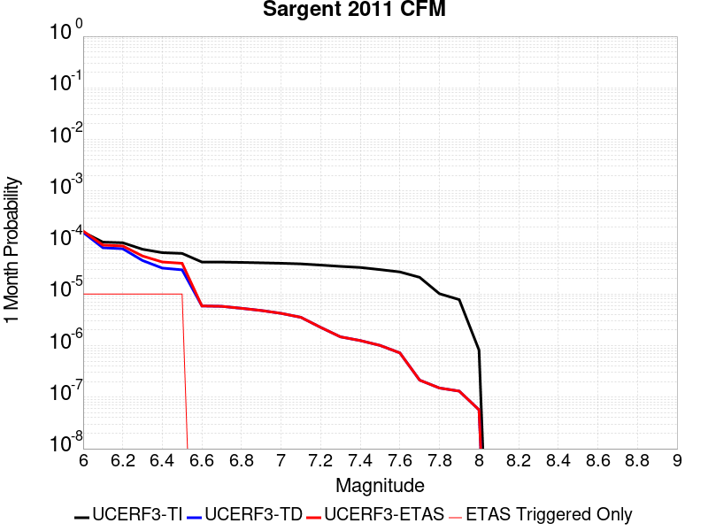 |  | 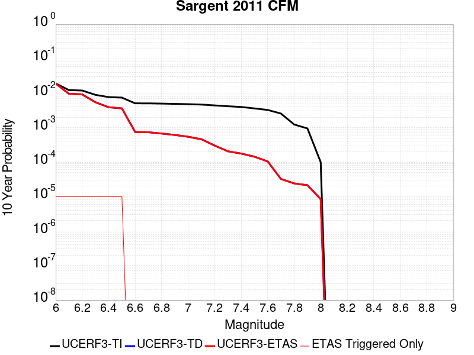 |

| Magnitude | 1 wk TI Prob | 1 wk TD Prob | 1 wk ETAS Prob | 1 wk ETAS/TD Gain | 1 wk ETAS Triggered Only | 1 mo TI Prob | 1 mo TD Prob | 1 mo ETAS Prob | 1 mo ETAS/TD Gain | 1 mo ETAS Triggered Only | 1 yr TI Prob | 1 yr TD Prob | 1 yr ETAS Prob | 1 yr ETAS/TD Gain | 1 yr ETAS Triggered Only | 10 yr TI Prob | 10 yr TD Prob | 10 yr ETAS Prob | 10 yr ETAS/TD Gain | 10 yr ETAS Triggered Only |
|-----|-----|-----|-----|-----|-----|-----|-----|-----|-----|-----|-----|-----|-----|-----|-----|-----|-----|-----|-----|-----|
| 6.0 | 3.7327867E-5 | 3.664913E-5 | 4.6648765E-5 | 1.2728478 | 1.0E-5 | 1.5996677E-4 | 1.5706103E-4 | 1.6705946E-4 | 1.0636595 | 1.0E-5 | 0.0019458556 | 0.0019110236 | 0.0019210045 | 1.0052228 | 1.0E-5 | 0.01928905 | 0.019018095 | 0.019027904 | 1.0005158 | 1.0E-5 |
| 6.1 | 2.3771476E-5 | 1.8479273E-5 | 2.8479088E-5 | 1.5411369 | 1.0E-5 | 1.01873775E-4 | 7.919498E-5 | 8.919418E-5 | 1.1262606 | 1.0E-5 | 0.0012396075 | 9.638493E-4 | 9.7383966E-4 | 1.010365 | 1.0E-5 | 0.012327154 | 0.009636091 | 0.009645995 | 1.0010278 | 1.0E-5 |
| 6.2 | 2.3112721E-5 | 1.7710632E-5 | 2.7710455E-5 | 1.5646226 | 1.0E-5 | 9.9050754E-5 | 7.590099E-5 | 8.590023E-5 | 1.1317406 | 1.0E-5 | 0.0012052758 | 9.237792E-4 | 9.3377E-4 | 1.0108151 | 1.0E-5 | 0.011987597 | 0.009238743 | 0.009248652 | 1.0010724 | 1.0E-5 |
| 6.3 | 1.728509E-5 | 1.0458927E-5 | 2.0458821E-5 | 1.9561111 | 1.0E-5 | 7.407686E-5 | 4.482347E-5 | 5.4823024E-5 | 1.2230874 | 1.0E-5 | 9.015125E-4 | 5.456343E-4 | 5.5562885E-4 | 1.0183173 | 1.0E-5 | 0.008978641 | 0.0054791216 | 0.0054890667 | 1.0018151 | 1.0E-5 |
| 6.4 | 1.48395575E-5 | 7.4559816E-6 | 1.7455906E-5 | 2.341195 | 1.0E-5 | 6.3596555E-5 | 3.195403E-5 | 4.195371E-5 | 1.3129395 | 1.0E-5 | 7.7401294E-4 | 3.8900663E-4 | 3.9900275E-4 | 1.0256965 | 1.0E-5 | 0.0077132257 | 0.003918666 | 0.003928627 | 1.0025419 | 1.0E-5 |
| 6.5 | 1.4358964E-5 | 6.894759E-6 | 1.689469E-5 | 2.450367 | 1.0E-5 | 6.1536964E-5 | 2.9548846E-5 | 3.954855E-5 | 1.3384126 | 1.0E-5 | 7.48955E-4 | 3.5973339E-4 | 3.697298E-4 | 1.0277884 | 1.0E-5 | 0.0074643586 | 0.0036269152 | 0.003636879 | 1.0027472 | 1.0E-5 |
| 6.6 | 9.772591E-6 | 1.3736154E-6 | 1.3736154E-6 | 1.0 | 0.0 | 4.188186E-5 | 5.88691E-6 | 5.88691E-6 | 1.0 | 0.0 | 5.097923E-4 | 7.16708E-5 | 7.16708E-5 | 1.0 | 0.0 | 0.005086244 | 7.483097E-4 | 7.483097E-4 | 1.0 | 0.0 |
| 6.7 | 9.752745E-6 | 1.3523068E-6 | 1.3523068E-6 | 1.0 | 0.0 | 4.179681E-5 | 5.795587E-6 | 5.795587E-6 | 1.0 | 0.0 | 5.0875737E-4 | 7.055902E-5 | 7.055902E-5 | 1.0 | 0.0 | 0.005075942 | 7.371994E-4 | 7.371994E-4 | 1.0 | 0.0 |
| 6.8 | 9.608213E-6 | 1.2361709E-6 | 1.2361709E-6 | 1.0 | 0.0 | 4.1177405E-5 | 5.2978644E-6 | 5.2978644E-6 | 1.0 | 0.0 | 5.012196E-4 | 6.449961E-5 | 6.449961E-5 | 1.0 | 0.0 | 0.005000906 | 6.7634037E-4 | 6.7634037E-4 | 1.0 | 0.0 |
| 6.9 | 9.427164E-6 | 1.12094E-6 | 1.12094E-6 | 1.0 | 0.0 | 4.04015E-5 | 4.80402E-6 | 4.80402E-6 | 1.0 | 0.0 | 4.9177726E-4 | 5.8487396E-5 | 5.8487396E-5 | 1.0 | 0.0 | 0.004906904 | 6.1557174E-4 | 6.1557174E-4 | 1.0 | 0.0 |
| 7.0 | 9.247601E-6 | 9.873988E-7 | 9.873988E-7 | 1.0 | 0.0 | 3.9631974E-5 | 4.2317024E-6 | 4.2317024E-6 | 1.0 | 0.0 | 4.8241246E-4 | 5.1519775E-5 | 5.1519775E-5 | 1.0 | 0.0 | 0.0048136655 | 5.4542476E-4 | 5.4542476E-4 | 1.0 | 0.0 |
| 7.1 | 8.995454E-6 | 8.2711284E-7 | 8.2711284E-7 | 1.0 | 0.0 | 3.8551374E-5 | 3.5447645E-6 | 3.5447645E-6 | 1.0 | 0.0 | 4.6926187E-4 | 4.3156666E-5 | 4.3156666E-5 | 1.0 | 0.0 | 0.004682722 | 4.609069E-4 | 4.609069E-4 | 1.0 | 0.0 |
| 7.2 | 8.520861E-6 | 5.2766507E-7 | 5.2766507E-7 | 1.0 | 0.0 | 3.6517464E-5 | 2.2614197E-6 | 2.2614197E-6 | 1.0 | 0.0 | 4.445094E-4 | 2.7532446E-5 | 2.7532446E-5 | 1.0 | 0.0 | 0.004436213 | 3.0297207E-4 | 3.0297207E-4 | 1.0 | 0.0 |
| 7.3 | 8.043592E-6 | 3.456507E-7 | 3.456507E-7 | 1.0 | 0.0 | 3.4472083E-5 | 1.4813593E-6 | 1.4813593E-6 | 1.0 | 0.0 | 4.196168E-4 | 1.8035402E-5 | 1.8035402E-5 | 1.0 | 0.0 | 0.004188253 | 2.0669671E-4 | 2.0669671E-4 | 1.0 | 0.0 |
| 7.4 | 7.662316E-6 | 2.928958E-7 | 2.928958E-7 | 1.0 | 0.0 | 3.2838085E-5 | 1.2552671E-6 | 1.2552671E-6 | 1.0 | 0.0 | 3.9973034E-4 | 1.528277E-5 | 1.528277E-5 | 1.0 | 0.0 | 0.0039901207 | 1.7736501E-4 | 1.7736501E-4 | 1.0 | 0.0 |
| 7.5 | 6.961638E-6 | 2.3574503E-7 | 2.3574503E-7 | 1.0 | 0.0 | 2.9835252E-5 | 1.0103355E-6 | 1.0103355E-6 | 1.0 | 0.0 | 3.6318362E-4 | 1.2300766E-5 | 1.2300766E-5 | 1.0 | 0.0 | 0.0036259065 | 1.4409334E-4 | 1.4409334E-4 | 1.0 | 0.0 |
| 7.6 | 6.282332E-6 | 1.6892966E-7 | 1.6892966E-7 | 1.0 | 0.0 | 2.6924003E-5 | 7.2398404E-7 | 7.2398404E-7 | 1.0 | 0.0 | 3.2775043E-4 | 8.814471E-6 | 8.814471E-6 | 1.0 | 0.0 | 0.0032726745 | 1.05050465E-4 | 1.05050465E-4 | 1.0 | 0.0 |
| 7.7 | 4.934408E-6 | 5.001089E-8 | 5.001089E-8 | 1.0 | 0.0 | 2.114729E-5 | 2.1433237E-7 | 2.1433237E-7 | 1.0 | 0.0 | 2.5743784E-4 | 2.6094935E-6 | 2.6094935E-6 | 1.0 | 0.0 | 0.0025713982 | 3.2545366E-5 | 3.2545366E-5 | 1.0 | 0.0 |
| 7.8 | 2.373212E-6 | 3.5172643E-8 | 3.5172643E-8 | 1.0 | 0.0 | 1.0170869E-5 | 1.507399E-7 | 1.507399E-7 | 1.0 | 0.0 | 1.238233E-4 | 1.8352566E-6 | 1.8352566E-6 | 1.0 | 0.0 | 0.0012375432 | 2.4125171E-5 | 2.4125171E-5 | 1.0 | 0.0 |
| 7.9 | 1.8227792E-6 | 3.0619603E-8 | 3.0619603E-8 | 1.0 | 0.0 | 7.811887E-6 | 1.3122687E-7 | 1.3122687E-7 | 1.0 | 0.0 | 9.510558E-5 | 1.5976858E-6 | 1.5976858E-6 | 1.0 | 0.0 | 9.5064886E-4 | 2.1410624E-5 | 2.1410624E-5 | 1.0 | 0.0 |
| 8.0 | 1.9095137E-7 | 1.326461E-8 | 1.326461E-8 | 1.0 | 0.0 | 8.1836276E-7 | 5.684833E-8 | 5.684833E-8 | 1.0 | 0.0 | 9.963521E-6 | 6.921282E-7 | 6.921282E-7 | 1.0 | 0.0 | 9.963074E-5 | 8.463319E-6 | 8.463319E-6 | 1.0 | 0.0 |

## Hollywood
*[(top)](#table-of-contents)*

| 1 Week | 1 Month | 1 Year | 10 Year |
|-----|-----|-----|-----|
|  |  | 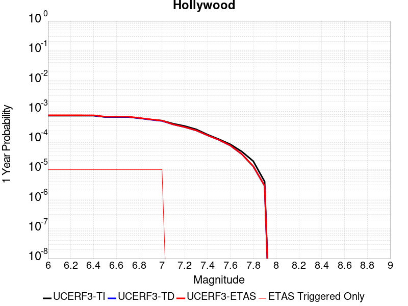 |  |

| Magnitude | 1 wk TI Prob | 1 wk TD Prob | 1 wk ETAS Prob | 1 wk ETAS/TD Gain | 1 wk ETAS Triggered Only | 1 mo TI Prob | 1 mo TD Prob | 1 mo ETAS Prob | 1 mo ETAS/TD Gain | 1 mo ETAS Triggered Only | 1 yr TI Prob | 1 yr TD Prob | 1 yr ETAS Prob | 1 yr ETAS/TD Gain | 1 yr ETAS Triggered Only | 10 yr TI Prob | 10 yr TD Prob | 10 yr ETAS Prob | 10 yr ETAS/TD Gain | 10 yr ETAS Triggered Only |
|-----|-----|-----|-----|-----|-----|-----|-----|-----|-----|-----|-----|-----|-----|-----|-----|-----|-----|-----|-----|-----|
| 6.0 | 1.24487615E-5 | 1.2593226E-5 | 2.25931E-5 | 1.7940677 | 1.0E-5 | 5.3350745E-5 | 5.3969878E-5 | 6.396934E-5 | 1.1852785 | 1.0E-5 | 6.4935174E-4 | 6.568898E-4 | 6.6688325E-4 | 1.0152133 | 1.0E-5 | 0.0064745755 | 0.006549969 | 0.0065599033 | 1.0015167 | 1.0E-5 |
| 6.1 | 1.24487615E-5 | 1.2593226E-5 | 2.25931E-5 | 1.7940677 | 1.0E-5 | 5.3350745E-5 | 5.3969878E-5 | 6.396934E-5 | 1.1852785 | 1.0E-5 | 6.4935174E-4 | 6.568898E-4 | 6.6688325E-4 | 1.0152133 | 1.0E-5 | 0.0064745755 | 0.006549969 | 0.0065599033 | 1.0015167 | 1.0E-5 |
| 6.2 | 1.24487615E-5 | 1.2593226E-5 | 2.25931E-5 | 1.7940677 | 1.0E-5 | 5.3350745E-5 | 5.3969878E-5 | 6.396934E-5 | 1.1852785 | 1.0E-5 | 6.4935174E-4 | 6.568898E-4 | 6.6688325E-4 | 1.0152133 | 1.0E-5 | 0.0064745755 | 0.006549969 | 0.0065599033 | 1.0015167 | 1.0E-5 |
| 6.3 | 1.24487615E-5 | 1.2593226E-5 | 2.25931E-5 | 1.7940677 | 1.0E-5 | 5.3350745E-5 | 5.3969878E-5 | 6.396934E-5 | 1.1852785 | 1.0E-5 | 6.4935174E-4 | 6.568898E-4 | 6.6688325E-4 | 1.0152133 | 1.0E-5 | 0.0064745755 | 0.006549969 | 0.0065599033 | 1.0015167 | 1.0E-5 |
| 6.4 | 1.2431024E-5 | 1.2573839E-5 | 2.2573713E-5 | 1.795292 | 1.0E-5 | 5.327473E-5 | 5.3886797E-5 | 6.3886255E-5 | 1.1855642 | 1.0E-5 | 6.4842677E-4 | 6.558789E-4 | 6.6587236E-4 | 1.0152367 | 1.0E-5 | 0.0064653796 | 0.0065399194 | 0.006549854 | 1.0015191 | 1.0E-5 |
| 6.5 | 1.1242222E-5 | 1.13178E-5 | 2.1317686E-5 | 1.8835539 | 1.0E-5 | 4.8180063E-5 | 4.850397E-5 | 5.8503487E-5 | 1.2061586 | 1.0E-5 | 5.864344E-4 | 5.9037853E-4 | 6.003726E-4 | 1.0169283 | 1.0E-5 | 0.0058488925 | 0.005888388 | 0.005898329 | 1.0016882 | 1.0E-5 |
| 6.6 | 1.1234066E-5 | 1.13089145E-5 | 2.13088E-5 | 1.8842481 | 1.0E-5 | 4.8145106E-5 | 4.846589E-5 | 5.8465404E-5 | 1.2063206 | 1.0E-5 | 5.86009E-4 | 5.8991514E-4 | 5.999092E-4 | 1.0169415 | 1.0E-5 | 0.005844661 | 0.0058837784 | 0.00589372 | 1.0016896 | 1.0E-5 |
| 6.7 | 1.12294E-5 | 1.1303658E-5 | 2.1303544E-5 | 1.8846594 | 1.0E-5 | 4.812511E-5 | 4.8443362E-5 | 5.8442878E-5 | 1.2064166 | 1.0E-5 | 5.857657E-4 | 5.89641E-4 | 5.996351E-4 | 1.0169494 | 1.0E-5 | 0.0058422405 | 0.005881052 | 0.005890993 | 1.0016904 | 1.0E-5 |
| 6.8 | 1.0252819E-5 | 1.0218445E-5 | 2.0218342E-5 | 1.9786125 | 1.0E-5 | 4.3939912E-5 | 4.379261E-5 | 5.3792173E-5 | 1.2283391 | 1.0E-5 | 5.3483713E-4 | 5.330467E-4 | 5.430414E-4 | 1.0187501 | 1.0E-5 | 0.005335517 | 0.005317908 | 0.0053278543 | 1.0018704 | 1.0E-5 |
| 6.9 | 9.252289E-6 | 9.110306E-6 | 1.9110215E-5 | 2.097648 | 1.0E-5 | 3.9652066E-5 | 3.9043593E-5 | 4.9043203E-5 | 1.256114 | 1.0E-5 | 4.8265693E-4 | 4.752537E-4 | 4.8524895E-4 | 1.0210314 | 1.0E-5 | 0.0048161 | 0.004742547 | 0.0047524995 | 1.0020986 | 1.0E-5 |
| 7.0 | 8.474604E-6 | 8.258257E-6 | 1.8258175E-5 | 2.2108994 | 1.0E-5 | 3.6319227E-5 | 3.539206E-5 | 4.5391705E-5 | 1.2825392 | 1.0E-5 | 4.4209688E-4 | 4.3081454E-4 | 4.4081022E-4 | 1.0232018 | 1.0E-5 | 0.004412184 | 0.004299944 | 0.004309901 | 1.0023156 | 1.0E-5 |
| 7.1 | 6.643643E-6 | 6.2683675E-6 | 6.2683675E-6 | 1.0 | 0.0 | 2.8472443E-5 | 2.6864158E-5 | 2.6864158E-5 | 1.0 | 0.0 | 3.4659685E-4 | 3.2702246E-4 | 3.2702246E-4 | 1.0 | 0.0 | 0.0034605677 | 0.0032654584 | 0.0032654584 | 1.0 | 0.0 |
| 7.2 | 5.549002E-6 | 5.108709E-6 | 5.108709E-6 | 1.0 | 0.0 | 2.378122E-5 | 2.1894284E-5 | 2.1894284E-5 | 1.0 | 0.0 | 2.8949787E-4 | 2.6653046E-4 | 2.6653046E-4 | 1.0 | 0.0 | 0.0028912104 | 0.0026621243 | 0.0026621243 | 1.0 | 0.0 |
| 7.3 | 4.3059727E-6 | 3.9598885E-6 | 3.9598885E-6 | 1.0 | 0.0 | 1.8454039E-5 | 1.6970842E-5 | 1.6970842E-5 | 1.0 | 0.0 | 2.2465475E-4 | 2.066005E-4 | 2.066005E-4 | 1.0 | 0.0 | 0.0022442779 | 0.0020640944 | 0.0020640944 | 1.0 | 0.0 |
| 7.4 | 2.8550733E-6 | 2.7012966E-6 | 2.7012966E-6 | 1.0 | 0.0 | 1.2235971E-5 | 1.1576934E-5 | 1.1576934E-5 | 1.0 | 0.0 | 1.4896276E-4 | 1.409401E-4 | 1.409401E-4 | 1.0 | 0.0 | 0.0014886294 | 0.0014085122 | 0.0014085122 | 1.0 | 0.0 |
| 7.5 | 1.9927045E-6 | 1.8976367E-6 | 1.8976367E-6 | 1.0 | 0.0 | 8.540134E-6 | 8.132703E-6 | 8.132703E-6 | 1.0 | 0.0 | 1.0397117E-4 | 9.90112E-5 | 9.90112E-5 | 1.0 | 0.0 | 0.0010392254 | 9.896745E-4 | 9.896745E-4 | 1.0 | 0.0 |
| 7.6 | 1.345084E-6 | 1.2216007E-6 | 1.2216007E-6 | 1.0 | 0.0 | 5.764633E-6 | 5.235421E-6 | 5.235421E-6 | 1.0 | 0.0 | 7.018215E-5 | 6.3739404E-5 | 6.3739404E-5 | 1.0 | 0.0 | 7.0159987E-4 | 6.3721323E-4 | 6.3721323E-4 | 1.0 | 0.0 |
| 7.7 | 7.6835164E-7 | 6.277697E-7 | 6.277697E-7 | 1.0 | 0.0 | 3.2929315E-6 | 2.6904388E-6 | 2.6904388E-6 | 1.0 | 0.0 | 4.00907E-5 | 3.2755615E-5 | 3.2755615E-5 | 1.0 | 0.0 | 4.0083472E-4 | 3.2750933E-4 | 3.2750933E-4 | 1.0 | 0.0 |
| 7.8 | 3.6562128E-7 | 2.453479E-7 | 2.453479E-7 | 1.0 | 0.0 | 1.5669474E-6 | 1.0514907E-6 | 1.0514907E-6 | 1.0 | 0.0 | 1.9077417E-5 | 1.2801827E-5 | 1.2801827E-5 | 1.0 | 0.0 | 1.907578E-4 | 1.2801126E-4 | 1.2801126E-4 | 1.0 | 0.0 |
| 7.9 | 7.5024424E-8 | 5.3816795E-8 | 5.3816795E-8 | 1.0 | 0.0 | 3.215332E-7 | 2.306434E-7 | 2.306434E-7 | 1.0 | 0.0 | 3.91466E-6 | 2.808081E-6 | 2.808081E-6 | 1.0 | 0.0 | 3.9145907E-5 | 2.8080585E-5 | 2.8080585E-5 | 1.0 | 0.0 |

## San Gorgonio Pass
*[(top)](#table-of-contents)*

| 1 Week | 1 Month | 1 Year | 10 Year |
|-----|-----|-----|-----|
|  | 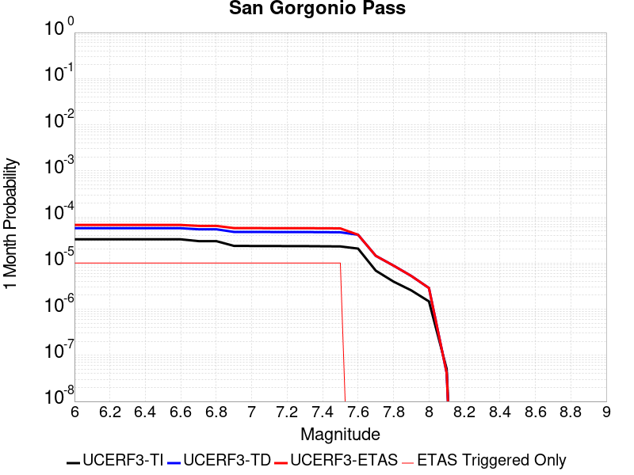 |  |  |

| Magnitude | 1 wk TI Prob | 1 wk TD Prob | 1 wk ETAS Prob | 1 wk ETAS/TD Gain | 1 wk ETAS Triggered Only | 1 mo TI Prob | 1 mo TD Prob | 1 mo ETAS Prob | 1 mo ETAS/TD Gain | 1 mo ETAS Triggered Only | 1 yr TI Prob | 1 yr TD Prob | 1 yr ETAS Prob | 1 yr ETAS/TD Gain | 1 yr ETAS Triggered Only | 10 yr TI Prob | 10 yr TD Prob | 10 yr ETAS Prob | 10 yr ETAS/TD Gain | 10 yr ETAS Triggered Only |
|-----|-----|-----|-----|-----|-----|-----|-----|-----|-----|-----|-----|-----|-----|-----|-----|-----|-----|-----|-----|-----|
| 6.0 | 7.644328E-6 | 1.3314231E-5 | 2.3314098E-5 | 1.751066 | 1.0E-5 | 3.2760996E-5 | 5.705979E-5 | 6.705922E-5 | 1.1752448 | 1.0E-5 | 3.987921E-4 | 6.944901E-4 | 7.044832E-4 | 1.014389 | 1.0E-5 | 0.003980772 | 0.0069299806 | 0.0069399113 | 1.001433 | 1.0E-5 |
| 6.1 | 7.644328E-6 | 1.3314231E-5 | 2.3314098E-5 | 1.751066 | 1.0E-5 | 3.2760996E-5 | 5.705979E-5 | 6.705922E-5 | 1.1752448 | 1.0E-5 | 3.987921E-4 | 6.944901E-4 | 7.044832E-4 | 1.014389 | 1.0E-5 | 0.003980772 | 0.0069299806 | 0.0069399113 | 1.001433 | 1.0E-5 |
| 6.2 | 7.644328E-6 | 1.3314231E-5 | 2.3314098E-5 | 1.751066 | 1.0E-5 | 3.2760996E-5 | 5.705979E-5 | 6.705922E-5 | 1.1752448 | 1.0E-5 | 3.987921E-4 | 6.944901E-4 | 7.044832E-4 | 1.014389 | 1.0E-5 | 0.003980772 | 0.0069299806 | 0.0069399113 | 1.001433 | 1.0E-5 |
| 6.3 | 7.644328E-6 | 1.3314231E-5 | 2.3314098E-5 | 1.751066 | 1.0E-5 | 3.2760996E-5 | 5.705979E-5 | 6.705922E-5 | 1.1752448 | 1.0E-5 | 3.987921E-4 | 6.944901E-4 | 7.044832E-4 | 1.014389 | 1.0E-5 | 0.003980772 | 0.0069299806 | 0.0069399113 | 1.001433 | 1.0E-5 |
| 6.4 | 7.644328E-6 | 1.3314231E-5 | 2.3314098E-5 | 1.751066 | 1.0E-5 | 3.2760996E-5 | 5.705979E-5 | 6.705922E-5 | 1.1752448 | 1.0E-5 | 3.987921E-4 | 6.944901E-4 | 7.044832E-4 | 1.014389 | 1.0E-5 | 0.003980772 | 0.0069299806 | 0.0069399113 | 1.001433 | 1.0E-5 |
| 6.5 | 7.644328E-6 | 1.3314231E-5 | 2.3314098E-5 | 1.751066 | 1.0E-5 | 3.2760996E-5 | 5.705979E-5 | 6.705922E-5 | 1.1752448 | 1.0E-5 | 3.987921E-4 | 6.944901E-4 | 7.044832E-4 | 1.014389 | 1.0E-5 | 0.003980772 | 0.0069299806 | 0.0069399113 | 1.001433 | 1.0E-5 |
| 6.6 | 7.644328E-6 | 1.3314231E-5 | 2.3314098E-5 | 1.751066 | 1.0E-5 | 3.2760996E-5 | 5.705979E-5 | 6.705922E-5 | 1.1752448 | 1.0E-5 | 3.987921E-4 | 6.944901E-4 | 7.044832E-4 | 1.014389 | 1.0E-5 | 0.003980772 | 0.0069299806 | 0.0069399113 | 1.001433 | 1.0E-5 |
| 6.7 | 6.987586E-6 | 1.2618505E-5 | 2.2618378E-5 | 1.7924769 | 1.0E-5 | 2.9946454E-5 | 5.4078235E-5 | 6.407769E-5 | 1.1849073 | 1.0E-5 | 3.645371E-4 | 6.582117E-4 | 6.6820515E-4 | 1.0151827 | 1.0E-5 | 0.0036393967 | 0.0065693567 | 0.006579291 | 1.0015122 | 1.0E-5 |
| 6.8 | 6.987586E-6 | 1.2618505E-5 | 2.2618378E-5 | 1.7924769 | 1.0E-5 | 2.9946454E-5 | 5.4078235E-5 | 6.407769E-5 | 1.1849073 | 1.0E-5 | 3.645371E-4 | 6.582117E-4 | 6.6820515E-4 | 1.0151827 | 1.0E-5 | 0.0036393967 | 0.0065693567 | 0.006579291 | 1.0015122 | 1.0E-5 |
| 6.9 | 5.504702E-6 | 1.1049368E-5 | 2.1049258E-5 | 1.905019 | 1.0E-5 | 2.3591367E-5 | 4.7353606E-5 | 5.7353132E-5 | 1.2111672 | 1.0E-5 | 2.8718702E-4 | 5.7638274E-4 | 5.8637693E-4 | 1.0173396 | 1.0E-5 | 0.0028681618 | 0.005755309 | 0.005765252 | 1.0017276 | 1.0E-5 |
| 7.0 | 5.4825764E-6 | 1.102571E-5 | 2.1025598E-5 | 1.9069611 | 1.0E-5 | 2.3496545E-5 | 4.7252215E-5 | 5.7251742E-5 | 1.2116203 | 1.0E-5 | 2.8603288E-4 | 5.751489E-4 | 5.8514316E-4 | 1.0173768 | 1.0E-5 | 0.00285665 | 0.005743035 | 0.0057529774 | 1.0017313 | 1.0E-5 |
| 7.1 | 5.4692787E-6 | 1.101142E-5 | 2.101131E-5 | 1.9081382 | 1.0E-5 | 2.3439556E-5 | 4.7190973E-5 | 5.71905E-5 | 1.211895 | 1.0E-5 | 2.8533922E-4 | 5.744037E-4 | 5.8439793E-4 | 1.0173993 | 1.0E-5 | 0.0028497311 | 0.0057356213 | 0.005745564 | 1.0017335 | 1.0E-5 |
| 7.2 | 5.453661E-6 | 1.0994446E-5 | 2.0994336E-5 | 1.9095402 | 1.0E-5 | 2.3372622E-5 | 4.7118232E-5 | 5.7117762E-5 | 1.2122221 | 1.0E-5 | 2.8452452E-4 | 5.7351857E-4 | 5.835128E-4 | 1.0174263 | 1.0E-5 | 0.002841605 | 0.0057268157 | 0.005736758 | 1.0017362 | 1.0E-5 |
| 7.3 | 5.4422303E-6 | 1.0981369E-5 | 2.0981259E-5 | 1.9106232 | 1.0E-5 | 2.3323635E-5 | 4.706219E-5 | 5.706172E-5 | 1.2124748 | 1.0E-5 | 2.8392827E-4 | 5.728366E-4 | 5.8283086E-4 | 1.017447 | 1.0E-5 | 0.0028356577 | 0.005720031 | 0.005729974 | 1.0017382 | 1.0E-5 |
| 7.4 | 5.398595E-6 | 1.0928734E-5 | 2.0928625E-5 | 1.915009 | 1.0E-5 | 2.313663E-5 | 4.683662E-5 | 5.683615E-5 | 1.2134981 | 1.0E-5 | 2.8165206E-4 | 5.700917E-4 | 5.80086E-4 | 1.017531 | 1.0E-5 | 0.0028129534 | 0.005692723 | 0.0057026665 | 1.0017467 | 1.0E-5 |
| 7.5 | 5.3578788E-6 | 1.0855281E-5 | 2.0855172E-5 | 1.9212006 | 1.0E-5 | 2.2962136E-5 | 4.6521833E-5 | 5.6521367E-5 | 1.2149428 | 1.0E-5 | 2.7952815E-4 | 5.662612E-4 | 5.762555E-4 | 1.0176497 | 1.0E-5 | 0.002791768 | 0.0056546377 | 0.0056645814 | 1.0017585 | 1.0E-5 |
| 7.6 | 4.8091474E-6 | 9.60368E-6 | 9.60368E-6 | 1.0 | 0.0 | 2.0610469E-5 | 4.1158008E-5 | 4.1158008E-5 | 1.0 | 0.0 | 2.5090357E-4 | 5.0098833E-4 | 5.0098833E-4 | 1.0 | 0.0 | 0.0025062046 | 0.0050053033 | 0.0050053033 | 1.0 | 0.0 |
| 7.7 | 1.5991155E-6 | 3.352866E-6 | 3.352866E-6 | 1.0 | 0.0 | 6.853334E-6 | 1.4369349E-5 | 1.4369349E-5 | 1.0 | 0.0 | 8.343615E-5 | 1.7493303E-4 | 1.7493303E-4 | 1.0 | 0.0 | 8.340483E-4 | 0.0017534072 | 0.0017534072 | 1.0 | 0.0 |
| 7.8 | 9.258398E-7 | 2.0579948E-6 | 2.0579948E-6 | 1.0 | 0.0 | 3.967879E-6 | 8.819949E-6 | 8.819949E-6 | 1.0 | 0.0 | 4.8307855E-5 | 1.073776E-4 | 1.073776E-4 | 1.0 | 0.0 | 4.8297356E-4 | 0.001078687 | 0.001078687 | 1.0 | 0.0 |
| 7.9 | 5.975575E-7 | 1.2291794E-6 | 1.2291794E-6 | 1.0 | 0.0 | 2.5609581E-6 | 5.2679006E-6 | 5.2679006E-6 | 1.0 | 0.0 | 3.117922E-5 | 6.4134816E-5 | 6.4134816E-5 | 1.0 | 0.0 | 3.1174847E-4 | 6.463092E-4 | 6.463092E-4 | 1.0 | 0.0 |
| 8.0 | 3.4413725E-7 | 6.7148494E-7 | 6.7148494E-7 | 1.0 | 0.0 | 1.4748731E-6 | 2.8777895E-6 | 2.8777895E-6 | 1.0 | 0.0 | 1.7956432E-5 | 3.503653E-5 | 3.503653E-5 | 1.0 | 0.0 | 1.7954981E-4 | 3.5373896E-4 | 3.5373896E-4 | 1.0 | 0.0 |
| 8.1 | 1.1787731E-8 | 9.634385E-9 | 9.634385E-9 | 1.0 | 0.0 | 5.0518846E-8 | 4.129022E-8 | 4.129022E-8 | 1.0 | 0.0 | 6.1506677E-7 | 5.027083E-7 | 5.027083E-7 | 1.0 | 0.0 | 6.1506507E-6 | 5.2424944E-6 | 5.2424944E-6 | 1.0 | 0.0 |

## Fontana (Seismicity)
*[(top)](#table-of-contents)*

| 1 Week | 1 Month | 1 Year | 10 Year |
|-----|-----|-----|-----|
|  |  |  |  |

| Magnitude | 1 wk TI Prob | 1 wk TD Prob | 1 wk ETAS Prob | 1 wk ETAS/TD Gain | 1 wk ETAS Triggered Only | 1 mo TI Prob | 1 mo TD Prob | 1 mo ETAS Prob | 1 mo ETAS/TD Gain | 1 mo ETAS Triggered Only | 1 yr TI Prob | 1 yr TD Prob | 1 yr ETAS Prob | 1 yr ETAS/TD Gain | 1 yr ETAS Triggered Only | 10 yr TI Prob | 10 yr TD Prob | 10 yr ETAS Prob | 10 yr ETAS/TD Gain | 10 yr ETAS Triggered Only |
|-----|-----|-----|-----|-----|-----|-----|-----|-----|-----|-----|-----|-----|-----|-----|-----|-----|-----|-----|-----|-----|
| 6.0 | 7.1789214E-6 | 7.5520006E-6 | 1.7551925E-5 | 2.3241425 | 1.0E-5 | 3.076644E-5 | 3.2365548E-5 | 4.2365224E-5 | 1.3089606 | 1.0E-5 | 3.7451705E-4 | 3.9402005E-4 | 4.0401611E-4 | 1.0253694 | 1.0E-5 | 0.003738865 | 0.003937214 | 0.0039471746 | 1.0025299 | 1.0E-5 |
| 6.1 | 7.1789214E-6 | 7.5520006E-6 | 1.7551925E-5 | 2.3241425 | 1.0E-5 | 3.076644E-5 | 3.2365548E-5 | 4.2365224E-5 | 1.3089606 | 1.0E-5 | 3.7451705E-4 | 3.9402005E-4 | 4.0401611E-4 | 1.0253694 | 1.0E-5 | 0.003738865 | 0.003937214 | 0.0039471746 | 1.0025299 | 1.0E-5 |
| 6.2 | 7.1789214E-6 | 7.5520006E-6 | 1.7551925E-5 | 2.3241425 | 1.0E-5 | 3.076644E-5 | 3.2365548E-5 | 4.2365224E-5 | 1.3089606 | 1.0E-5 | 3.7451705E-4 | 3.9402005E-4 | 4.0401611E-4 | 1.0253694 | 1.0E-5 | 0.003738865 | 0.003937214 | 0.0039471746 | 1.0025299 | 1.0E-5 |
| 6.3 | 7.1789214E-6 | 7.5520006E-6 | 1.7551925E-5 | 2.3241425 | 1.0E-5 | 3.076644E-5 | 3.2365548E-5 | 4.2365224E-5 | 1.3089606 | 1.0E-5 | 3.7451705E-4 | 3.9402005E-4 | 4.0401611E-4 | 1.0253694 | 1.0E-5 | 0.003738865 | 0.003937214 | 0.0039471746 | 1.0025299 | 1.0E-5 |
| 6.4 | 7.1789214E-6 | 7.5520006E-6 | 1.7551925E-5 | 2.3241425 | 1.0E-5 | 3.076644E-5 | 3.2365548E-5 | 4.2365224E-5 | 1.3089606 | 1.0E-5 | 3.7451705E-4 | 3.9402005E-4 | 4.0401611E-4 | 1.0253694 | 1.0E-5 | 0.003738865 | 0.003937214 | 0.0039471746 | 1.0025299 | 1.0E-5 |
| 6.5 | 5.2611317E-6 | 5.532726E-6 | 5.532726E-6 | 1.0 | 0.0 | 2.2547512E-5 | 2.3711682E-5 | 2.3711682E-5 | 1.0 | 0.0 | 2.744814E-4 | 2.8868974E-4 | 2.8868974E-4 | 1.0 | 0.0 | 0.002741426 | 0.0028868972 | 0.0028868972 | 1.0 | 0.0 |
| 6.6 | 5.2611317E-6 | 5.532726E-6 | 5.532726E-6 | 1.0 | 0.0 | 2.2547512E-5 | 2.3711682E-5 | 2.3711682E-5 | 1.0 | 0.0 | 2.744814E-4 | 2.8868974E-4 | 2.8868974E-4 | 1.0 | 0.0 | 0.002741426 | 0.0028868972 | 0.0028868972 | 1.0 | 0.0 |

## Fish Slough 2011 CFM
*[(top)](#table-of-contents)*

| 1 Week | 1 Month | 1 Year | 10 Year |
|-----|-----|-----|-----|
| 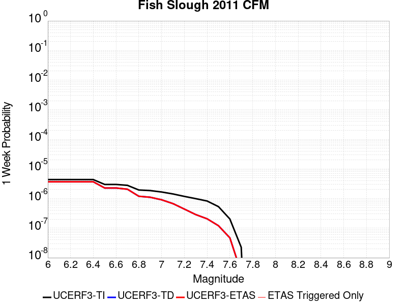 |  |  | 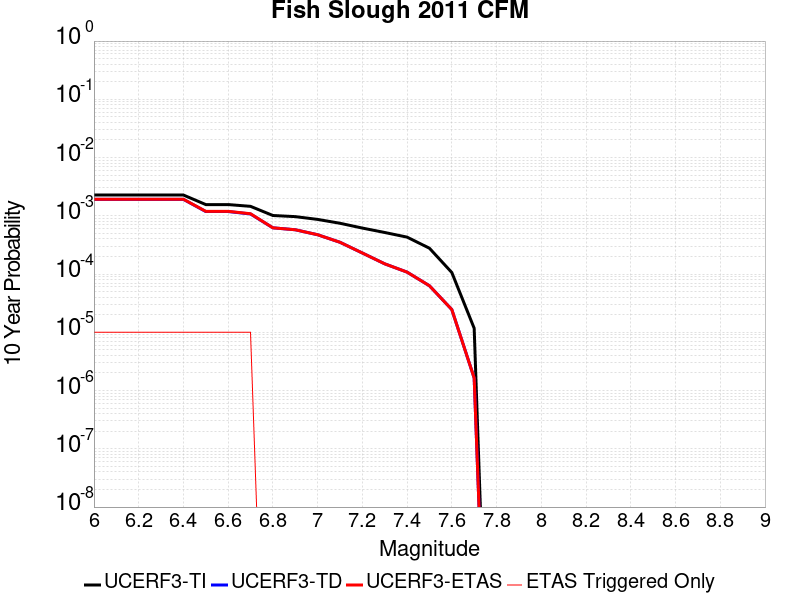 |

| Magnitude | 1 wk TI Prob | 1 wk TD Prob | 1 wk ETAS Prob | 1 wk ETAS/TD Gain | 1 wk ETAS Triggered Only | 1 mo TI Prob | 1 mo TD Prob | 1 mo ETAS Prob | 1 mo ETAS/TD Gain | 1 mo ETAS Triggered Only | 1 yr TI Prob | 1 yr TD Prob | 1 yr ETAS Prob | 1 yr ETAS/TD Gain | 1 yr ETAS Triggered Only | 10 yr TI Prob | 10 yr TD Prob | 10 yr ETAS Prob | 10 yr ETAS/TD Gain | 10 yr ETAS Triggered Only |
|-----|-----|-----|-----|-----|-----|-----|-----|-----|-----|-----|-----|-----|-----|-----|-----|-----|-----|-----|-----|-----|
| 6.0 | 4.3629925E-6 | 3.6772697E-6 | 3.6772697E-6 | 1.0 | 0.0 | 1.8698405E-5 | 1.5759644E-5 | 2.5759487E-5 | 1.6345221 | 1.0E-5 | 2.276293E-4 | 1.918589E-4 | 2.0185698E-4 | 1.0521116 | 1.0E-5 | 0.0022739628 | 0.0019171416 | 0.0019271224 | 1.0052061 | 1.0E-5 |
| 6.1 | 4.3629925E-6 | 3.6772697E-6 | 3.6772697E-6 | 1.0 | 0.0 | 1.8698405E-5 | 1.5759644E-5 | 2.5759487E-5 | 1.6345221 | 1.0E-5 | 2.276293E-4 | 1.918589E-4 | 2.0185698E-4 | 1.0521116 | 1.0E-5 | 0.0022739628 | 0.0019171416 | 0.0019271224 | 1.0052061 | 1.0E-5 |
| 6.2 | 4.3629925E-6 | 3.6772697E-6 | 3.6772697E-6 | 1.0 | 0.0 | 1.8698405E-5 | 1.5759644E-5 | 2.5759487E-5 | 1.6345221 | 1.0E-5 | 2.276293E-4 | 1.918589E-4 | 2.0185698E-4 | 1.0521116 | 1.0E-5 | 0.0022739628 | 0.0019171416 | 0.0019271224 | 1.0052061 | 1.0E-5 |
| 6.3 | 4.3629925E-6 | 3.6772697E-6 | 3.6772697E-6 | 1.0 | 0.0 | 1.8698405E-5 | 1.5759644E-5 | 2.5759487E-5 | 1.6345221 | 1.0E-5 | 2.276293E-4 | 1.918589E-4 | 2.0185698E-4 | 1.0521116 | 1.0E-5 | 0.0022739628 | 0.0019171416 | 0.0019271224 | 1.0052061 | 1.0E-5 |
| 6.4 | 4.3629925E-6 | 3.6772697E-6 | 3.6772697E-6 | 1.0 | 0.0 | 1.8698405E-5 | 1.5759644E-5 | 2.5759487E-5 | 1.6345221 | 1.0E-5 | 2.276293E-4 | 1.918589E-4 | 2.0185698E-4 | 1.0521116 | 1.0E-5 | 0.0022739628 | 0.0019171416 | 0.0019271224 | 1.0052061 | 1.0E-5 |
| 6.5 | 2.991715E-6 | 2.2703898E-6 | 2.2703898E-6 | 1.0 | 0.0 | 1.2821573E-5 | 9.730211E-6 | 1.9730114E-5 | 2.0277169 | 1.0E-5 | 1.5609147E-4 | 1.1845979E-4 | 1.284586E-4 | 1.0844069 | 1.0E-5 | 0.0015598187 | 0.0011840566 | 0.0011940448 | 1.0084355 | 1.0E-5 |
| 6.6 | 2.991715E-6 | 2.2703898E-6 | 2.2703898E-6 | 1.0 | 0.0 | 1.2821573E-5 | 9.730211E-6 | 1.9730114E-5 | 2.0277169 | 1.0E-5 | 1.5609147E-4 | 1.1845979E-4 | 1.284586E-4 | 1.0844069 | 1.0E-5 | 0.0015598187 | 0.0011840566 | 0.0011940448 | 1.0084355 | 1.0E-5 |
| 6.7 | 2.7890346E-6 | 2.0621853E-6 | 2.0621853E-6 | 1.0 | 0.0 | 1.1952951E-5 | 8.837912E-6 | 1.8837824E-5 | 2.131479 | 1.0E-5 | 1.4551746E-4 | 1.0759717E-4 | 1.17596086E-4 | 1.0929292 | 1.0E-5 | 0.0014542221 | 0.0010755389 | 0.0010855282 | 1.0092877 | 1.0E-5 |
| 6.8 | 1.9416723E-6 | 1.192555E-6 | 1.192555E-6 | 1.0 | 0.0 | 8.321425E-6 | 5.1109405E-6 | 5.1109405E-6 | 1.0 | 0.0 | 1.01308644E-4 | 6.222397E-5 | 6.222397E-5 | 1.0 | 0.0 | 0.0010126247 | 6.220695E-4 | 6.220695E-4 | 1.0 | 0.0 |
| 6.9 | 1.8567416E-6 | 1.1046966E-6 | 1.1046966E-6 | 1.0 | 0.0 | 7.957439E-6 | 4.7344056E-6 | 4.7344056E-6 | 1.0 | 0.0 | 9.687752E-5 | 5.7639903E-5 | 5.7639903E-5 | 1.0 | 0.0 | 9.6835295E-4 | 5.762534E-4 | 5.762534E-4 | 1.0 | 0.0 |
| 7.0 | 1.6634067E-6 | 9.073966E-7 | 9.073966E-7 | 1.0 | 0.0 | 7.1288664E-6 | 3.888837E-6 | 3.888837E-6 | 1.0 | 0.0 | 8.679049E-5 | 4.734559E-5 | 4.734559E-5 | 1.0 | 0.0 | 8.6756604E-4 | 4.733579E-4 | 4.733579E-4 | 1.0 | 0.0 |
| 7.1 | 1.4281054E-6 | 6.7366227E-7 | 6.7366227E-7 | 1.0 | 0.0 | 6.1204373E-6 | 2.8871211E-6 | 2.8871211E-6 | 1.0 | 0.0 | 7.451377E-5 | 3.515015E-5 | 3.515015E-5 | 1.0 | 0.0 | 7.44888E-4 | 3.5144767E-4 | 3.5144767E-4 | 1.0 | 0.0 |
| 7.2 | 1.1810387E-6 | 4.408355E-7 | 4.408355E-7 | 1.0 | 0.0 | 5.0615845E-6 | 1.8892936E-6 | 1.8892936E-6 | 1.0 | 0.0 | 6.1623046E-5 | 2.3001916E-5 | 2.3001916E-5 | 1.0 | 0.0 | 6.160596E-4 | 2.2999625E-4 | 2.2999625E-4 | 1.0 | 0.0 |
| 7.3 | 9.918052E-7 | 2.8733467E-7 | 2.8733467E-7 | 1.0 | 0.0 | 4.2505867E-6 | 1.2314338E-6 | 1.2314338E-6 | 1.0 | 0.0 | 5.1749663E-5 | 1.4992604E-5 | 1.4992604E-5 | 1.0 | 0.0 | 5.173762E-4 | 1.4991604E-4 | 1.4991604E-4 | 1.0 | 0.0 |
| 7.4 | 8.25252E-7 | 2.0694807E-7 | 2.0694807E-7 | 1.0 | 0.0 | 3.5367896E-6 | 8.8692E-7 | 8.8692E-7 | 1.0 | 0.0 | 4.3059565E-5 | 1.0798199E-5 | 1.0798199E-5 | 1.0 | 0.0 | 4.305122E-4 | 1.07976804E-4 | 1.07976804E-4 | 1.0 | 0.0 |
| 7.5 | 5.3248567E-7 | 1.2072739E-7 | 1.2072739E-7 | 1.0 | 0.0 | 2.2820795E-6 | 5.17403E-7 | 5.17403E-7 | 1.0 | 0.0 | 2.7783964E-5 | 6.299364E-6 | 6.299364E-6 | 1.0 | 0.0 | 2.778049E-4 | 6.2991894E-5 | 6.2991894E-5 | 1.0 | 0.0 |
| 7.6 | 2.037542E-7 | 4.7129152E-8 | 4.7129152E-8 | 1.0 | 0.0 | 8.73232E-7 | 2.0198206E-7 | 2.0198206E-7 | 1.0 | 0.0 | 1.0631547E-5 | 2.459129E-6 | 2.459129E-6 | 1.0 | 0.0 | 1.0631039E-4 | 2.459104E-5 | 2.459104E-5 | 1.0 | 0.0 |
| 7.7 | 2.2501226E-8 | 3.1514258E-9 | 3.1514258E-9 | 1.0 | 0.0 | 9.6433816E-8 | 1.350611E-8 | 1.350611E-8 | 1.0 | 0.0 | 1.1740811E-6 | 1.6443688E-7 | 1.6443688E-7 | 1.0 | 0.0 | 1.1740749E-5 | 1.6443678E-6 | 1.6443678E-6 | 1.0 | 0.0 |

## Butano 2011 CFM
*[(top)](#table-of-contents)*

| 1 Week | 1 Month | 1 Year | 10 Year |
|-----|-----|-----|-----|
|  |  | 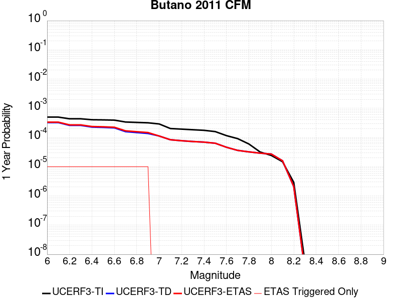 | 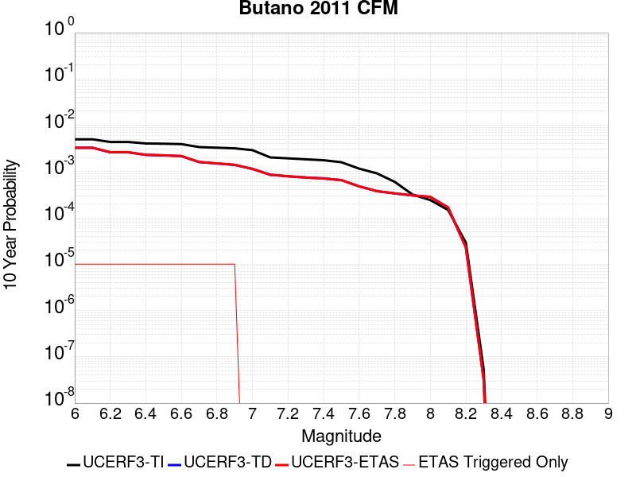 |

| Magnitude | 1 wk TI Prob | 1 wk TD Prob | 1 wk ETAS Prob | 1 wk ETAS/TD Gain | 1 wk ETAS Triggered Only | 1 mo TI Prob | 1 mo TD Prob | 1 mo ETAS Prob | 1 mo ETAS/TD Gain | 1 mo ETAS Triggered Only | 1 yr TI Prob | 1 yr TD Prob | 1 yr ETAS Prob | 1 yr ETAS/TD Gain | 1 yr ETAS Triggered Only | 10 yr TI Prob | 10 yr TD Prob | 10 yr ETAS Prob | 10 yr ETAS/TD Gain | 10 yr ETAS Triggered Only |
|-----|-----|-----|-----|-----|-----|-----|-----|-----|-----|-----|-----|-----|-----|-----|-----|-----|-----|-----|-----|-----|
| 6.0 | 9.561135E-6 | 6.2256954E-6 | 1.6225633E-5 | 2.6062362 | 1.0E-5 | 4.097565E-5 | 2.6681291E-5 | 3.6681024E-5 | 1.3747845 | 1.0E-5 | 4.9876433E-4 | 3.247985E-4 | 3.3479524E-4 | 1.0307783 | 1.0E-5 | 0.004976464 | 0.003260905 | 0.0032708722 | 1.0030566 | 1.0E-5 |
| 6.1 | 9.561135E-6 | 6.2256954E-6 | 1.6225633E-5 | 2.6062362 | 1.0E-5 | 4.097565E-5 | 2.6681291E-5 | 3.6681024E-5 | 1.3747845 | 1.0E-5 | 4.9876433E-4 | 3.247985E-4 | 3.3479524E-4 | 1.0307783 | 1.0E-5 | 0.004976464 | 0.003260905 | 0.0032708722 | 1.0030566 | 1.0E-5 |
| 6.2 | 8.364741E-6 | 4.9787805E-6 | 1.4978731E-5 | 3.008514 | 1.0E-5 | 3.5848396E-5 | 2.1337464E-5 | 3.133725E-5 | 1.4686493 | 1.0E-5 | 4.3636683E-4 | 2.5975425E-4 | 2.6975165E-4 | 1.0384879 | 1.0E-5 | 0.0043551093 | 0.0026121214 | 0.0026220952 | 1.0038183 | 1.0E-5 |
| 6.3 | 8.364741E-6 | 4.9787805E-6 | 1.4978731E-5 | 3.008514 | 1.0E-5 | 3.5848396E-5 | 2.1337464E-5 | 3.133725E-5 | 1.4686493 | 1.0E-5 | 4.3636683E-4 | 2.5975425E-4 | 2.6975165E-4 | 1.0384879 | 1.0E-5 | 0.0043551093 | 0.0026121214 | 0.0026220952 | 1.0038183 | 1.0E-5 |
| 6.4 | 7.768282E-6 | 4.3567284E-6 | 1.4356685E-5 | 3.2952905 | 1.0E-5 | 3.329221E-5 | 1.8671566E-5 | 2.867138E-5 | 1.5355637 | 1.0E-5 | 4.0525728E-4 | 2.2730397E-4 | 2.3730169E-4 | 1.0439839 | 1.0E-5 | 0.0040451903 | 0.0022883145 | 0.0022982918 | 1.0043601 | 1.0E-5 |
| 6.5 | 7.673437E-6 | 4.2562915E-6 | 1.42562485E-5 | 3.3494532 | 1.0E-5 | 3.2885746E-5 | 1.8241128E-5 | 2.8240946E-5 | 1.5482017 | 1.0E-5 | 4.0031038E-4 | 2.2206445E-4 | 2.3206224E-4 | 1.045022 | 1.0E-5 | 0.0039959005 | 0.002236025 | 0.0022460027 | 1.0044622 | 1.0E-5 |
| 6.6 | 7.5244197E-6 | 4.101255E-6 | 1.4101214E-5 | 3.4382682 | 1.0E-5 | 3.2247113E-5 | 1.7576695E-5 | 2.757652E-5 | 1.5689251 | 1.0E-5 | 3.9253788E-4 | 2.1397659E-4 | 2.2397445E-4 | 1.0467241 | 1.0E-5 | 0.003918452 | 0.0021553051 | 0.0021652835 | 1.0046297 | 1.0E-5 |
| 6.7 | 6.4921405E-6 | 3.0413205E-6 | 1.304129E-5 | 4.2880354 | 1.0E-5 | 2.7823162E-5 | 1.3034165E-5 | 2.3034036E-5 | 1.7672044 | 1.0E-5 | 3.3869434E-4 | 1.586795E-4 | 1.6867791E-4 | 1.0630101 | 1.0E-5 | 0.003381786 | 0.0016031476 | 0.0016131316 | 1.0062277 | 1.0E-5 |
| 6.8 | 6.2890294E-6 | 2.8280872E-6 | 1.2828059E-5 | 4.535949 | 1.0E-5 | 2.6952705E-5 | 1.2120317E-5 | 2.2120195E-5 | 1.825051 | 1.0E-5 | 3.2809976E-4 | 1.4755495E-4 | 1.5755347E-4 | 1.0677614 | 1.0E-5 | 0.0032761577 | 0.0014920565 | 0.0015020416 | 1.0066922 | 1.0E-5 |
| 6.9 | 6.0965517E-6 | 2.6346027E-6 | 1.2634577E-5 | 4.7956285 | 1.0E-5 | 2.6127816E-5 | 1.1291106E-5 | 2.1290993E-5 | 1.8856429 | 1.0E-5 | 3.1805973E-4 | 1.374606E-4 | 1.4745923E-4 | 1.0727382 | 1.0E-5 | 0.0031760489 | 0.001391243 | 0.0014012291 | 1.0071778 | 1.0E-5 |
| 7.0 | 5.566252E-6 | 2.1520116E-6 | 2.1520116E-6 | 1.0 | 0.0 | 2.3855147E-5 | 9.222874E-6 | 9.222874E-6 | 1.0 | 0.0 | 2.9039773E-4 | 1.1228274E-4 | 1.1228274E-4 | 1.0 | 0.0 | 0.0029001853 | 0.0011397449 | 0.0011397449 | 1.0 | 0.0 |
| 7.1 | 3.878588E-6 | 1.6034423E-6 | 1.6034423E-6 | 1.0 | 0.0 | 1.6622414E-5 | 6.8718773E-6 | 6.8718773E-6 | 1.0 | 0.0 | 2.023591E-4 | 8.36619E-5 | 8.36619E-5 | 1.0 | 0.0 | 0.0020217493 | 8.533922E-4 | 8.533922E-4 | 1.0 | 0.0 |
| 7.2 | 3.7038085E-6 | 1.4845051E-6 | 1.4845051E-6 | 1.0 | 0.0 | 1.587337E-5 | 6.362149E-6 | 6.362149E-6 | 1.0 | 0.0 | 1.9324113E-4 | 7.745641E-5 | 7.745641E-5 | 1.0 | 0.0 | 0.0019307317 | 7.913504E-4 | 7.913504E-4 | 1.0 | 0.0 |
| 7.3 | 3.5277278E-6 | 1.3926247E-6 | 1.3926247E-6 | 1.0 | 0.0 | 1.5118746E-5 | 5.9683775E-6 | 5.9683775E-6 | 1.0 | 0.0 | 1.8405518E-4 | 7.266257E-5 | 7.266257E-5 | 1.0 | 0.0 | 0.0018390282 | 7.433578E-4 | 7.433578E-4 | 1.0 | 0.0 |
| 7.4 | 3.3711294E-6 | 1.3298818E-6 | 1.3298818E-6 | 1.0 | 0.0 | 1.4447617E-5 | 5.699481E-6 | 5.699481E-6 | 1.0 | 0.0 | 1.7588554E-4 | 6.9388974E-5 | 6.9388974E-5 | 1.0 | 0.0 | 0.0017574639 | 7.10591E-4 | 7.10591E-4 | 1.0 | 0.0 |
| 7.5 | 3.0496426E-6 | 1.2188874E-6 | 1.2188874E-6 | 1.0 | 0.0 | 1.3069831E-5 | 5.223793E-6 | 5.223793E-6 | 1.0 | 0.0 | 1.5911358E-4 | 6.359782E-5 | 6.359782E-5 | 1.0 | 0.0 | 0.001589997 | 6.526465E-4 | 6.526465E-4 | 1.0 | 0.0 |
| 7.6 | 2.2179781E-6 | 8.870908E-7 | 8.870908E-7 | 1.0 | 0.0 | 9.505586E-6 | 3.801812E-6 | 3.801812E-6 | 1.0 | 0.0 | 1.1572436E-4 | 4.6286077E-5 | 4.6286077E-5 | 1.0 | 0.0 | 0.0011566412 | 4.7951055E-4 | 4.7951055E-4 | 1.0 | 0.0 |
| 7.7 | 1.7519328E-6 | 6.9309675E-7 | 6.9309675E-7 | 1.0 | 0.0 | 7.508262E-6 | 2.9704113E-6 | 2.9704113E-6 | 1.0 | 0.0 | 9.140925E-5 | 3.6164158E-5 | 3.6164158E-5 | 1.0 | 0.0 | 9.137166E-4 | 3.7759746E-4 | 3.7759746E-4 | 1.0 | 0.0 |
| 7.8 | 1.1478974E-6 | 6.174061E-7 | 6.174061E-7 | 1.0 | 0.0 | 4.9195505E-6 | 2.6460236E-6 | 2.6460236E-6 | 1.0 | 0.0 | 5.9893882E-5 | 3.221486E-5 | 3.221486E-5 | 1.0 | 0.0 | 5.9877743E-4 | 3.377777E-4 | 3.377777E-4 | 1.0 | 0.0 |
| 7.9 | 6.1154634E-7 | 5.581767E-7 | 5.581767E-7 | 1.0 | 0.0 | 2.6209104E-6 | 2.3921834E-6 | 2.3921834E-6 | 1.0 | 0.0 | 3.1909116E-5 | 2.9124443E-5 | 2.9124443E-5 | 1.0 | 0.0 | 3.1904536E-4 | 3.0563958E-4 | 3.0563958E-4 | 1.0 | 0.0 |
| 8.0 | 4.6520046E-7 | 5.189283E-7 | 5.189283E-7 | 1.0 | 0.0 | 1.9937147E-6 | 2.2239765E-6 | 2.2239765E-6 | 1.0 | 0.0 | 2.4273206E-5 | 2.7076578E-5 | 2.7076578E-5 | 1.0 | 0.0 | 2.4270554E-4 | 2.8419052E-4 | 2.8419052E-4 | 1.0 | 0.0 |
| 8.1 | 2.8425194E-7 | 3.0570487E-7 | 3.0570487E-7 | 1.0 | 0.0 | 1.218222E-6 | 1.3101632E-6 | 1.3101632E-6 | 1.0 | 0.0 | 1.4831752E-5 | 1.5951118E-5 | 1.5951118E-5 | 1.0 | 0.0 | 1.4830762E-4 | 1.6740595E-4 | 1.6740595E-4 | 1.0 | 0.0 |
| 8.2 | 5.585778E-8 | 4.0522167E-8 | 4.0522167E-8 | 1.0 | 0.0 | 2.3939046E-7 | 1.7366644E-7 | 1.7366644E-7 | 1.0 | 0.0 | 2.914575E-6 | 2.1143867E-6 | 2.1143867E-6 | 1.0 | 0.0 | 2.9145367E-5 | 2.2976306E-5 | 2.2976306E-5 | 1.0 | 0.0 |
| 8.3 | 1.0371215E-10 | 5.356804E-11 | 5.356804E-11 | 1.0 | 0.0 | 4.4448079E-10 | 2.2957702E-10 | 2.2957702E-10 | 1.0 | 0.0 | 5.4115543E-9 | 2.795101E-9 | 2.795101E-9 | 1.0 | 0.0 | 5.4115542E-8 | 3.2150194E-8 | 3.2150194E-8 | 1.0 | 0.0 |

## Morales (East)
*[(top)](#table-of-contents)*

| 1 Week | 1 Month | 1 Year | 10 Year |
|-----|-----|-----|-----|
| 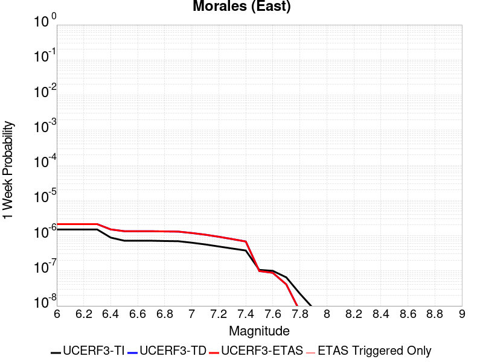 |  |  |  |

| Magnitude | 1 wk TI Prob | 1 wk TD Prob | 1 wk ETAS Prob | 1 wk ETAS/TD Gain | 1 wk ETAS Triggered Only | 1 mo TI Prob | 1 mo TD Prob | 1 mo ETAS Prob | 1 mo ETAS/TD Gain | 1 mo ETAS Triggered Only | 1 yr TI Prob | 1 yr TD Prob | 1 yr ETAS Prob | 1 yr ETAS/TD Gain | 1 yr ETAS Triggered Only | 10 yr TI Prob | 10 yr TD Prob | 10 yr ETAS Prob | 10 yr ETAS/TD Gain | 10 yr ETAS Triggered Only |
|-----|-----|-----|-----|-----|-----|-----|-----|-----|-----|-----|-----|-----|-----|-----|-----|-----|-----|-----|-----|-----|
| 6.0 | 1.4942771E-6 | 2.123479E-6 | 2.123479E-6 | 1.0 | 0.0 | 6.404029E-6 | 9.100596E-6 | 9.100596E-6 | 1.0 | 0.0 | 7.7966266E-5 | 1.107947E-4 | 1.2079359E-4 | 1.090247 | 1.0E-5 | 7.793892E-4 | 0.0011074544 | 0.0011174433 | 1.0090197 | 1.0E-5 |
| 6.1 | 1.4942771E-6 | 2.123479E-6 | 2.123479E-6 | 1.0 | 0.0 | 6.404029E-6 | 9.100596E-6 | 9.100596E-6 | 1.0 | 0.0 | 7.7966266E-5 | 1.107947E-4 | 1.2079359E-4 | 1.090247 | 1.0E-5 | 7.793892E-4 | 0.0011074544 | 0.0011174433 | 1.0090197 | 1.0E-5 |
| 6.2 | 1.4942771E-6 | 2.123479E-6 | 2.123479E-6 | 1.0 | 0.0 | 6.404029E-6 | 9.100596E-6 | 9.100596E-6 | 1.0 | 0.0 | 7.7966266E-5 | 1.107947E-4 | 1.2079359E-4 | 1.090247 | 1.0E-5 | 7.793892E-4 | 0.0011074544 | 0.0011174433 | 1.0090197 | 1.0E-5 |
| 6.3 | 1.4942771E-6 | 2.123479E-6 | 2.123479E-6 | 1.0 | 0.0 | 6.404029E-6 | 9.100596E-6 | 9.100596E-6 | 1.0 | 0.0 | 7.7966266E-5 | 1.107947E-4 | 1.2079359E-4 | 1.090247 | 1.0E-5 | 7.793892E-4 | 0.0011074544 | 0.0011174433 | 1.0090197 | 1.0E-5 |
| 6.4 | 8.798845E-7 | 1.5022731E-6 | 1.5022731E-6 | 1.0 | 0.0 | 3.7709283E-6 | 6.438298E-6 | 6.438298E-6 | 1.0 | 0.0 | 4.5910085E-5 | 7.8383564E-5 | 8.838278E-5 | 1.1275678 | 1.0E-5 | 4.59006E-4 | 7.835727E-4 | 7.9356483E-4 | 1.012752 | 1.0E-5 |
| 6.5 | 7.1751725E-7 | 1.3384229E-6 | 1.3384229E-6 | 1.0 | 0.0 | 3.0750705E-6 | 5.7360858E-6 | 5.7360858E-6 | 1.0 | 0.0 | 3.7438338E-5 | 6.9834685E-5 | 7.983398E-5 | 1.1431854 | 1.0E-5 | 3.743203E-4 | 6.9813756E-4 | 7.0813054E-4 | 1.0143138 | 1.0E-5 |
| 6.6 | 7.1751725E-7 | 1.3384229E-6 | 1.3384229E-6 | 1.0 | 0.0 | 3.0750705E-6 | 5.7360858E-6 | 5.7360858E-6 | 1.0 | 0.0 | 3.7438338E-5 | 6.9834685E-5 | 7.983398E-5 | 1.1431854 | 1.0E-5 | 3.743203E-4 | 6.9813756E-4 | 7.0813054E-4 | 1.0143138 | 1.0E-5 |
| 6.7 | 7.159057E-7 | 1.3358889E-6 | 1.3358889E-6 | 1.0 | 0.0 | 3.0681638E-6 | 5.725226E-6 | 5.725226E-6 | 1.0 | 0.0 | 3.7354253E-5 | 6.970247E-5 | 7.970178E-5 | 1.1434569 | 1.0E-5 | 3.7347974E-4 | 6.968163E-4 | 7.0680934E-4 | 1.014341 | 1.0E-5 |
| 6.8 | 7.032203E-7 | 1.3174443E-6 | 1.3174443E-6 | 1.0 | 0.0 | 3.0137978E-6 | 5.646178E-6 | 5.646178E-6 | 1.0 | 0.0 | 3.669237E-5 | 6.8740126E-5 | 7.873944E-5 | 1.1454655 | 1.0E-5 | 3.6686313E-4 | 6.871988E-4 | 6.971919E-4 | 1.0145419 | 1.0E-5 |
| 6.9 | 6.941549E-7 | 1.3025061E-6 | 1.3025061E-6 | 1.0 | 0.0 | 2.974946E-6 | 5.582158E-6 | 5.582158E-6 | 1.0 | 0.0 | 3.6219368E-5 | 6.7960726E-5 | 7.7960045E-5 | 1.1471338 | 1.0E-5 | 3.6213463E-4 | 6.7940954E-4 | 6.8940275E-4 | 1.0147086 | 1.0E-5 |
| 7.0 | 6.2932247E-7 | 1.18774E-6 | 1.18774E-6 | 1.0 | 0.0 | 2.6970936E-6 | 5.090305E-6 | 5.090305E-6 | 1.0 | 0.0 | 3.283662E-5 | 6.1972765E-5 | 7.197215E-5 | 1.1613512 | 1.0E-5 | 3.283177E-4 | 6.1956374E-4 | 6.2955753E-4 | 1.0161304 | 1.0E-5 |
| 7.1 | 5.6200963E-7 | 1.0640374E-6 | 1.0640374E-6 | 1.0 | 0.0 | 2.4086105E-6 | 4.5601523E-6 | 4.5601523E-6 | 1.0 | 0.0 | 2.9324437E-5 | 5.551849E-5 | 6.551793E-5 | 1.1801102 | 1.0E-5 | 2.9320567E-4 | 5.550534E-4 | 5.650479E-4 | 1.0180063 | 1.0E-5 |
| 7.2 | 4.91044E-7 | 9.285713E-7 | 9.285713E-7 | 1.0 | 0.0 | 2.1044725E-6 | 3.9795855E-6 | 3.9795855E-6 | 1.0 | 0.0 | 2.5621652E-5 | 4.8450413E-5 | 5.844993E-5 | 1.2063866 | 1.0E-5 | 2.56187E-4 | 4.8440482E-4 | 4.944E-4 | 1.0206339 | 1.0E-5 |
| 7.3 | 4.2978448E-7 | 7.9739846E-7 | 7.9739846E-7 | 1.0 | 0.0 | 1.8419321E-6 | 3.4174175E-6 | 3.4174175E-6 | 1.0 | 0.0 | 2.2425293E-5 | 4.1606294E-5 | 5.160588E-5 | 1.2403382 | 1.0E-5 | 2.242303E-4 | 4.1599068E-4 | 4.2598654E-4 | 1.024029 | 1.0E-5 |
| 7.4 | 3.774317E-7 | 6.806746E-7 | 6.806746E-7 | 1.0 | 0.0 | 1.6175634E-6 | 2.9171736E-6 | 2.9171736E-6 | 1.0 | 0.0 | 1.9693656E-5 | 3.5516037E-5 | 4.5515684E-5 | 1.2815529 | 1.0E-5 | 1.969191E-4 | 3.551089E-4 | 3.6510537E-4 | 1.0281503 | 1.0E-5 |
| 7.5 | 1.0603232E-7 | 9.840901E-8 | 9.840901E-8 | 1.0 | 0.0 | 4.5442414E-7 | 4.2175284E-7 | 4.2175284E-7 | 1.0 | 0.0 | 5.5326E-6 | 5.134829E-6 | 5.134829E-6 | 1.0 | 0.0 | 5.532462E-5 | 5.134967E-5 | 5.134967E-5 | 1.0 | 0.0 |
| 7.6 | 9.960384E-8 | 8.755334E-8 | 8.755334E-8 | 1.0 | 0.0 | 4.2687353E-7 | 3.7522852E-7 | 3.7522852E-7 | 1.0 | 0.0 | 5.197173E-6 | 4.568398E-6 | 4.568398E-6 | 1.0 | 0.0 | 5.1970514E-5 | 4.5685607E-5 | 4.5685607E-5 | 1.0 | 0.0 |
| 7.7 | 6.499468E-8 | 4.1038682E-8 | 4.1038682E-8 | 1.0 | 0.0 | 2.785486E-7 | 1.7588006E-7 | 1.7588006E-7 | 1.0 | 0.0 | 3.3913238E-6 | 2.1413375E-6 | 2.1413375E-6 | 1.0 | 0.0 | 3.3912722E-5 | 2.1415728E-5 | 2.1415728E-5 | 1.0 | 0.0 |
| 7.8 | 2.2517119E-8 | 7.1312614E-9 | 7.1312614E-9 | 1.0 | 0.0 | 9.6501935E-8 | 3.0562546E-8 | 3.0562546E-8 | 1.0 | 0.0 | 1.1749105E-6 | 3.7209892E-7 | 3.7209892E-7 | 1.0 | 0.0 | 1.1749043E-5 | 3.7235213E-6 | 3.7235213E-6 | 1.0 | 0.0 |
| 7.9 | 8.493023E-9 | 9.970124E-10 | 9.970124E-10 | 1.0 | 0.0 | 3.639867E-8 | 4.2729082E-9 | 4.2729082E-9 | 1.0 | 0.0 | 4.4315374E-7 | 5.202266E-8 | 5.202266E-8 | 1.0 | 0.0 | 4.4315284E-6 | 5.2233156E-7 | 5.2233156E-7 | 1.0 | 0.0 |
| 8.0 | 1.4971842E-9 | 5.5458416E-11 | 5.5458416E-11 | 1.0 | 0.0 | 6.4165038E-9 | 2.376762E-10 | 2.376762E-10 | 1.0 | 0.0 | 7.812093E-8 | 2.8937068E-9 | 2.8937068E-9 | 1.0 | 0.0 | 7.81209E-7 | 3.019288E-8 | 3.019288E-8 | 1.0 | 0.0 |

## Mendocino
*[(top)](#table-of-contents)*

| 1 Week | 1 Month | 1 Year | 10 Year |
|-----|-----|-----|-----|
|  | 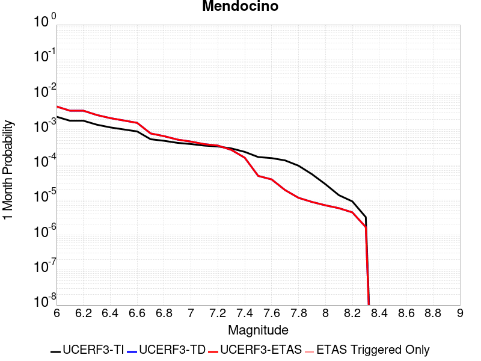 |  | 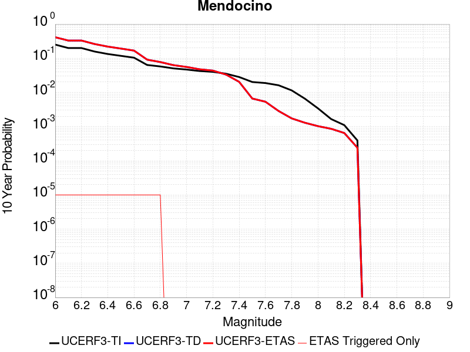 |

| Magnitude | 1 wk TI Prob | 1 wk TD Prob | 1 wk ETAS Prob | 1 wk ETAS/TD Gain | 1 wk ETAS Triggered Only | 1 mo TI Prob | 1 mo TD Prob | 1 mo ETAS Prob | 1 mo ETAS/TD Gain | 1 mo ETAS Triggered Only | 1 yr TI Prob | 1 yr TD Prob | 1 yr ETAS Prob | 1 yr ETAS/TD Gain | 1 yr ETAS Triggered Only | 10 yr TI Prob | 10 yr TD Prob | 10 yr ETAS Prob | 10 yr ETAS/TD Gain | 10 yr ETAS Triggered Only |
|-----|-----|-----|-----|-----|-----|-----|-----|-----|-----|-----|-----|-----|-----|-----|-----|-----|-----|-----|-----|-----|
| 6.0 | 5.5409013E-4 | 0.0010850244 | 0.0010850244 | 1.0 | 0.0 | 0.0023725112 | 0.004636911 | 0.004636911 | 1.0 | 0.0 | 0.028505474 | 0.05467285 | 0.05467285 | 1.0 | 0.0 | 0.25113493 | 0.411882 | 0.41188788 | 1.0000143 | 1.0E-5 |
| 6.1 | 4.2515888E-4 | 8.233315E-4 | 8.233315E-4 | 1.0 | 0.0 | 0.0018208373 | 0.0035215917 | 0.0035215917 | 1.0 | 0.0 | 0.021944538 | 0.041749846 | 0.041749846 | 1.0 | 0.0 | 0.19899574 | 0.32995537 | 0.32996207 | 1.0000203 | 1.0E-5 |
| 6.2 | 4.2515888E-4 | 8.233315E-4 | 8.233315E-4 | 1.0 | 0.0 | 0.0018208373 | 0.0035215917 | 0.0035215917 | 1.0 | 0.0 | 0.021944538 | 0.041749846 | 0.041749846 | 1.0 | 0.0 | 0.19899574 | 0.32995537 | 0.32996207 | 1.0000203 | 1.0E-5 |
| 6.3 | 3.2773745E-4 | 6.1941805E-4 | 6.1941805E-4 | 1.0 | 0.0 | 0.0014038329 | 0.0026506495 | 0.0026506495 | 1.0 | 0.0 | 0.016958237 | 0.031592727 | 0.031592727 | 1.0 | 0.0 | 0.1572094 | 0.26077813 | 0.26078552 | 1.0000284 | 1.0E-5 |
| 6.4 | 2.7417165E-4 | 5.0483743E-4 | 5.0483743E-4 | 1.0 | 0.0 | 0.0011744922 | 0.0021604756 | 0.0021604756 | 1.0 | 0.0 | 0.014205975 | 0.025837418 | 0.025837418 | 1.0 | 0.0 | 0.13331394 | 0.21947995 | 0.21948774 | 1.0000355 | 1.0E-5 |
| 6.5 | 2.3984899E-4 | 4.322691E-4 | 4.322691E-4 | 1.0 | 0.0 | 0.0010275192 | 0.0018508129 | 0.0018508129 | 1.0 | 0.0 | 0.012438473 | 0.022180691 | 0.022180691 | 1.0 | 0.0 | 0.11764851 | 0.19203661 | 0.19204469 | 1.0000421 | 1.0E-5 |
| 6.6 | 2.1023539E-4 | 3.6937738E-4 | 3.6937738E-4 | 1.0 | 0.0 | 9.0069766E-4 | 0.0015816262 | 0.0015816262 | 1.0 | 0.0 | 0.010910975 | 0.018990388 | 0.018990388 | 1.0 | 0.0 | 0.10390546 | 0.16749348 | 0.1675018 | 1.0000497 | 1.0E-5 |
| 6.7 | 1.2592976E-4 | 1.8438937E-4 | 1.8438937E-4 | 1.0 | 0.0 | 5.395873E-4 | 7.8949484E-4 | 7.8949484E-4 | 1.0 | 0.0 | 0.006549705 | 0.009555929 | 0.009555929 | 1.0 | 0.0 | 0.063599944 | 0.09096867 | 0.09097776 | 1.0000999 | 1.0E-5 |
| 6.8 | 1.13663555E-4 | 1.5403709E-4 | 1.5403709E-4 | 1.0 | 0.0 | 4.8703855E-4 | 6.599124E-4 | 6.599124E-4 | 1.0 | 0.0 | 0.0059135845 | 0.007999982 | 0.007999982 | 1.0 | 0.0 | 0.057586733 | 0.07739284 | 0.07740206 | 1.0001192 | 1.0E-5 |
| 6.9 | 9.926894E-5 | 1.229904E-4 | 1.229904E-4 | 1.0 | 0.0 | 4.2536893E-4 | 5.2698E-4 | 5.2698E-4 | 1.0 | 0.0 | 0.0051665753 | 0.006396752 | 0.006396752 | 1.0 | 0.0 | 0.050480947 | 0.06286036 | 0.06286036 | 1.0 | 0.0 |
| 7.0 | 9.168125E-5 | 1.0784077E-4 | 1.0784077E-4 | 1.0 | 0.0 | 3.9286047E-4 | 4.6207767E-4 | 4.6207767E-4 | 1.0 | 0.0 | 0.004772591 | 0.0056109587 | 0.0056109587 | 1.0 | 0.0 | 0.04671385 | 0.055621758 | 0.055621758 | 1.0 | 0.0 |
| 7.1 | 8.2854116E-5 | 9.1050766E-5 | 9.1050766E-5 | 1.0 | 0.0 | 3.5504074E-4 | 3.9016004E-4 | 3.9016004E-4 | 1.0 | 0.0 | 0.004314056 | 0.0047398703 | 0.0047398703 | 1.0 | 0.0 | 0.042312626 | 0.047481373 | 0.047481373 | 1.0 | 0.0 |
| 7.2 | 7.8255274E-5 | 8.300278E-5 | 8.300278E-5 | 1.0 | 0.0 | 3.3533663E-4 | 3.5567852E-4 | 3.5567852E-4 | 1.0 | 0.0 | 0.0040750825 | 0.0043219337 | 0.0043219337 | 1.0 | 0.0 | 0.040011603 | 0.043525863 | 0.043525863 | 1.0 | 0.0 |
| 7.3 | 6.887904E-5 | 6.2587686E-5 | 6.2587686E-5 | 1.0 | 0.0 | 2.9516246E-4 | 2.682059E-4 | 2.682059E-4 | 1.0 | 0.0 | 0.0035876823 | 0.0032606125 | 0.0032606125 | 1.0 | 0.0 | 0.035303112 | 0.033351965 | 0.033351965 | 1.0 | 0.0 |
| 7.4 | 5.4898497E-5 | 3.7399142E-5 | 3.7399142E-5 | 1.0 | 0.0 | 2.3525805E-4 | 1.6027251E-4 | 1.6027251E-4 | 1.0 | 0.0 | 0.0028605047 | 0.0019496274 | 0.0019496274 | 1.0 | 0.0 | 0.02823963 | 0.020410953 | 0.020410953 | 1.0 | 0.0 |
| 7.5 | 3.9103943E-5 | 1.1307368E-5 | 1.1307368E-5 | 1.0 | 0.0 | 1.6757756E-4 | 4.8459257E-5 | 4.8459257E-5 | 1.0 | 0.0 | 0.0020383475 | 5.8983336E-4 | 5.8983336E-4 | 1.0 | 0.0 | 0.020197518 | 0.00662414 | 0.00662414 | 1.0 | 0.0 |
| 7.6 | 3.641042E-5 | 8.984288E-6 | 8.984288E-6 | 1.0 | 0.0 | 1.5603533E-4 | 3.850353E-5 | 3.850353E-5 | 1.0 | 0.0 | 0.0018980748 | 4.68681E-4 | 4.68681E-4 | 1.0 | 0.0 | 0.018819444 | 0.005348026 | 0.005348026 | 1.0 | 0.0 |
| 7.7 | 3.1318774E-5 | 4.4553763E-6 | 4.4553763E-6 | 1.0 | 0.0 | 1.342164E-4 | 1.9094332E-5 | 1.9094332E-5 | 1.0 | 0.0 | 0.0016328598 | 2.3244887E-4 | 2.3244887E-4 | 1.0 | 0.0 | 0.016209139 | 0.0028659757 | 0.0028659757 | 1.0 | 0.0 |
| 7.8 | 2.209241E-5 | 2.6815096E-6 | 2.6815096E-6 | 1.0 | 0.0 | 9.467832E-5 | 1.1492133E-5 | 1.1492133E-5 | 1.0 | 0.0 | 0.001152099 | 1.3990777E-4 | 1.3990777E-4 | 1.0 | 0.0 | 0.011461443 | 0.0017378427 | 0.0017378427 | 1.0 | 0.0 |
| 7.9 | 1.2640477E-5 | 2.0423045E-6 | 2.0423045E-6 | 1.0 | 0.0 | 5.4172346E-5 | 8.752703E-6 | 8.752703E-6 | 1.0 | 0.0 | 6.593487E-4 | 1.0655898E-4 | 1.0655898E-4 | 1.0 | 0.0 | 0.006573958 | 0.0012980766 | 0.0012980766 | 1.0 | 0.0 |
| 8.0 | 6.5548907E-6 | 1.638728E-6 | 1.638728E-6 | 1.0 | 0.0 | 2.8092087E-5 | 7.0231013E-6 | 7.0231013E-6 | 1.0 | 0.0 | 3.4196748E-4 | 8.550293E-5 | 8.550293E-5 | 1.0 | 0.0 | 0.0034144172 | 0.0010310268 | 0.0010310268 | 1.0 | 0.0 |
| 8.1 | 3.1916707E-6 | 1.3582962E-6 | 1.3582962E-6 | 1.0 | 0.0 | 1.3678517E-5 | 5.8212563E-6 | 5.8212563E-6 | 1.0 | 0.0 | 1.6652321E-4 | 7.0871516E-5 | 7.0871516E-5 | 1.0 | 0.0 | 0.0016639848 | 8.627292E-4 | 8.627292E-4 | 1.0 | 0.0 |
| 8.2 | 2.1193785E-6 | 1.0301144E-6 | 1.0301144E-6 | 1.0 | 0.0 | 9.083019E-6 | 4.4147682E-6 | 4.4147682E-6 | 1.0 | 0.0 | 1.1058014E-4 | 5.37485E-5 | 5.37485E-5 | 1.0 | 0.0 | 0.0011052513 | 6.5027695E-4 | 6.5027695E-4 | 1.0 | 0.0 |
| 8.3 | 7.536878E-7 | 3.927364E-7 | 3.927364E-7 | 1.0 | 0.0 | 3.2300866E-6 | 1.683155E-6 | 1.683155E-6 | 1.0 | 0.0 | 3.9325594E-5 | 2.0492233E-5 | 2.0492233E-5 | 1.0 | 0.0 | 3.9318635E-4 | 2.4130501E-4 | 2.4130501E-4 | 1.0 | 0.0 |

## Hector Mine
*[(top)](#table-of-contents)*

| 1 Week | 1 Month | 1 Year | 10 Year |
|-----|-----|-----|-----|
|  | 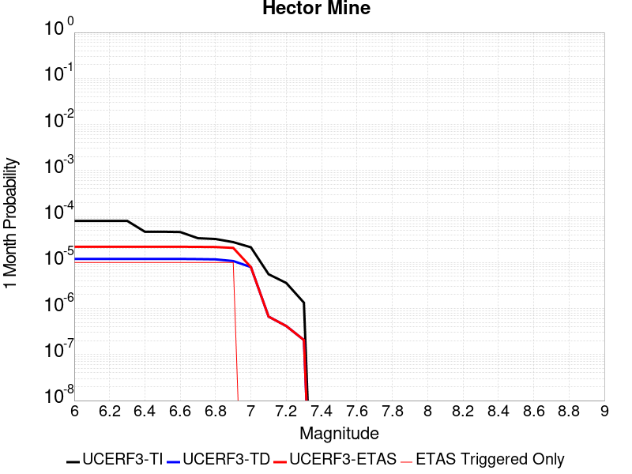 |  |  |

| Magnitude | 1 wk TI Prob | 1 wk TD Prob | 1 wk ETAS Prob | 1 wk ETAS/TD Gain | 1 wk ETAS Triggered Only | 1 mo TI Prob | 1 mo TD Prob | 1 mo ETAS Prob | 1 mo ETAS/TD Gain | 1 mo ETAS Triggered Only | 1 yr TI Prob | 1 yr TD Prob | 1 yr ETAS Prob | 1 yr ETAS/TD Gain | 1 yr ETAS Triggered Only | 10 yr TI Prob | 10 yr TD Prob | 10 yr ETAS Prob | 10 yr ETAS/TD Gain | 10 yr ETAS Triggered Only |
|-----|-----|-----|-----|-----|-----|-----|-----|-----|-----|-----|-----|-----|-----|-----|-----|-----|-----|-----|-----|-----|
| 6.0 | 1.8760093E-5 | 2.7963818E-6 | 1.2796354E-5 | 4.57604 | 1.0E-5 | 8.039792E-5 | 1.1984461E-5 | 2.198434E-5 | 1.8344039 | 1.0E-5 | 9.78405E-4 | 1.4590504E-4 | 1.5590357E-4 | 1.0685277 | 1.0E-5 | 0.009741086 | 0.0014584847 | 0.0014684701 | 1.0068464 | 1.0E-5 |
| 6.1 | 1.8760093E-5 | 2.7963818E-6 | 1.2796354E-5 | 4.57604 | 1.0E-5 | 8.039792E-5 | 1.1984461E-5 | 2.198434E-5 | 1.8344039 | 1.0E-5 | 9.78405E-4 | 1.4590504E-4 | 1.5590357E-4 | 1.0685277 | 1.0E-5 | 0.009741086 | 0.0014584847 | 0.0014684701 | 1.0068464 | 1.0E-5 |
| 6.2 | 1.8760093E-5 | 2.7963818E-6 | 1.2796354E-5 | 4.57604 | 1.0E-5 | 8.039792E-5 | 1.1984461E-5 | 2.198434E-5 | 1.8344039 | 1.0E-5 | 9.78405E-4 | 1.4590504E-4 | 1.5590357E-4 | 1.0685277 | 1.0E-5 | 0.009741086 | 0.0014584847 | 0.0014684701 | 1.0068464 | 1.0E-5 |
| 6.3 | 1.8760093E-5 | 2.7963818E-6 | 1.2796354E-5 | 4.57604 | 1.0E-5 | 8.039792E-5 | 1.1984461E-5 | 2.198434E-5 | 1.8344039 | 1.0E-5 | 9.78405E-4 | 1.4590504E-4 | 1.5590357E-4 | 1.0685277 | 1.0E-5 | 0.009741086 | 0.0014584847 | 0.0014684701 | 1.0068464 | 1.0E-5 |
| 6.4 | 1.0888055E-5 | 2.7963818E-6 | 1.2796354E-5 | 4.57604 | 1.0E-5 | 4.666226E-5 | 1.1984461E-5 | 2.198434E-5 | 1.8344039 | 1.0E-5 | 5.679649E-4 | 1.4590504E-4 | 1.5590357E-4 | 1.0685277 | 1.0E-5 | 0.0056651547 | 0.0014584847 | 0.0014684701 | 1.0068464 | 1.0E-5 |
| 6.5 | 1.0888055E-5 | 2.7963818E-6 | 1.2796354E-5 | 4.57604 | 1.0E-5 | 4.666226E-5 | 1.1984461E-5 | 2.198434E-5 | 1.8344039 | 1.0E-5 | 5.679649E-4 | 1.4590504E-4 | 1.5590357E-4 | 1.0685277 | 1.0E-5 | 0.0056651547 | 0.0014584847 | 0.0014684701 | 1.0068464 | 1.0E-5 |
| 6.6 | 1.0730738E-5 | 2.7963818E-6 | 1.2796354E-5 | 4.57604 | 1.0E-5 | 4.5988065E-5 | 1.1984461E-5 | 2.198434E-5 | 1.8344039 | 1.0E-5 | 5.5976084E-4 | 1.4590504E-4 | 1.5590357E-4 | 1.0685277 | 1.0E-5 | 0.0055835294 | 0.0014584847 | 0.0014684701 | 1.0068464 | 1.0E-5 |
| 6.7 | 7.881326E-6 | 2.7710626E-6 | 1.2771035E-5 | 4.608714 | 1.0E-5 | 3.3776672E-5 | 1.1875951E-5 | 2.1875832E-5 | 1.8420279 | 1.0E-5 | 4.111534E-4 | 1.445841E-4 | 1.5458265E-4 | 1.0691539 | 1.0E-5 | 0.0041039353 | 0.0014452925 | 0.001455278 | 1.006909 | 1.0E-5 |
| 6.8 | 7.5683483E-6 | 2.7328138E-6 | 1.2732787E-5 | 4.659222 | 1.0E-5 | 3.2435375E-5 | 1.1712029E-5 | 2.1711912E-5 | 1.853813 | 1.0E-5 | 3.9482914E-4 | 1.4258861E-4 | 1.5258719E-4 | 1.0701219 | 1.0E-5 | 0.0039412836 | 0.0014253634 | 0.001435349 | 1.0070058 | 1.0E-5 |
| 6.9 | 6.473048E-6 | 2.5138945E-6 | 1.25138695E-5 | 4.9778814 | 1.0E-5 | 2.7741338E-5 | 1.07738115E-5 | 2.0773705E-5 | 1.9281666 | 1.0E-5 | 3.3769844E-4 | 1.3116724E-4 | 1.4116592E-4 | 1.0762285 | 1.0E-5 | 0.0033718573 | 0.0013112876 | 0.0013212746 | 1.007616 | 1.0E-5 |
| 7.0 | 4.9959954E-6 | 1.8565124E-6 | 1.8565124E-6 | 1.0 | 0.0 | 2.1411232E-5 | 7.956478E-6 | 7.956478E-6 | 1.0 | 0.0 | 2.6065056E-4 | 9.686937E-5 | 9.686937E-5 | 1.0 | 0.0 | 0.0026034506 | 9.6862105E-4 | 9.6862105E-4 | 1.0 | 0.0 |
| 7.1 | 1.2997541E-6 | 1.5602147E-7 | 1.5602147E-7 | 1.0 | 0.0 | 5.5703626E-6 | 6.686633E-7 | 6.686633E-7 | 1.0 | 0.0 | 6.7817055E-5 | 8.140949E-6 | 8.140949E-6 | 1.0 | 0.0 | 6.779636E-4 | 8.1406906E-5 | 8.1406906E-5 | 1.0 | 0.0 |
| 7.2 | 8.392699E-7 | 9.727592E-8 | 9.727592E-8 | 1.0 | 0.0 | 3.596866E-6 | 4.1689677E-7 | 4.1689677E-7 | 1.0 | 0.0 | 4.3790962E-5 | 5.0757085E-6 | 5.0757085E-6 | 1.0 | 0.0 | 4.3782333E-4 | 5.0756116E-5 | 5.0756116E-5 | 1.0 | 0.0 |
| 7.3 | 3.13015E-7 | 4.829262E-8 | 4.829262E-8 | 1.0 | 0.0 | 1.3414921E-6 | 2.0696835E-7 | 2.0696835E-7 | 1.0 | 0.0 | 1.6332544E-5 | 2.5198376E-6 | 2.5198376E-6 | 1.0 | 0.0 | 1.6331344E-4 | 2.5198176E-5 | 2.5198176E-5 | 1.0 | 0.0 |

## Green Valley 2011 CFM
*[(top)](#table-of-contents)*

| 1 Week | 1 Month | 1 Year | 10 Year |
|-----|-----|-----|-----|
|  |  | 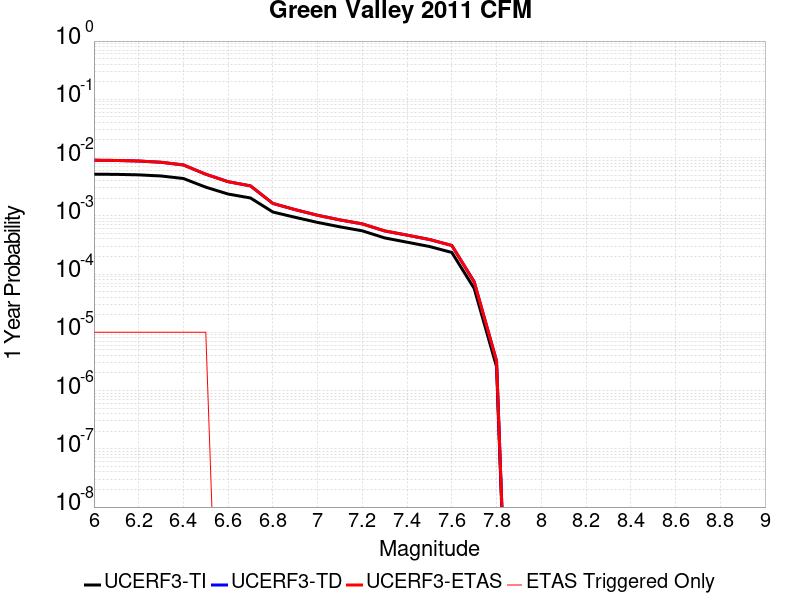 | 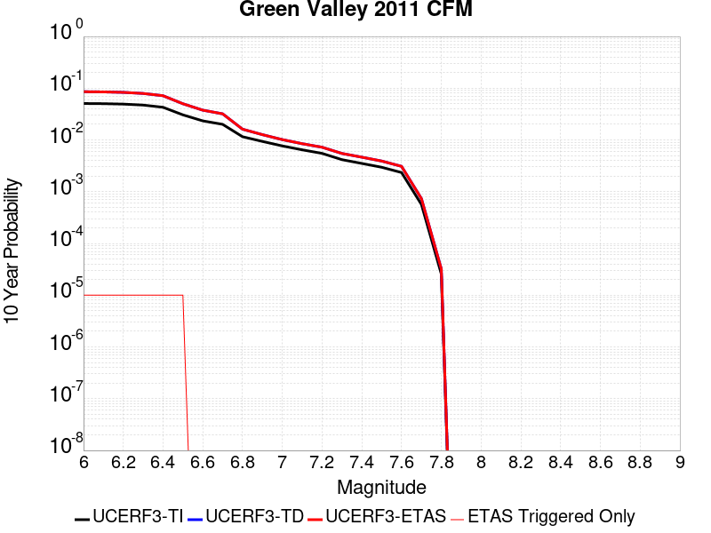 |

| Magnitude | 1 wk TI Prob | 1 wk TD Prob | 1 wk ETAS Prob | 1 wk ETAS/TD Gain | 1 wk ETAS Triggered Only | 1 mo TI Prob | 1 mo TD Prob | 1 mo ETAS Prob | 1 mo ETAS/TD Gain | 1 mo ETAS Triggered Only | 1 yr TI Prob | 1 yr TD Prob | 1 yr ETAS Prob | 1 yr ETAS/TD Gain | 1 yr ETAS Triggered Only | 10 yr TI Prob | 10 yr TD Prob | 10 yr ETAS Prob | 10 yr ETAS/TD Gain | 10 yr ETAS Triggered Only |
|-----|-----|-----|-----|-----|-----|-----|-----|-----|-----|-----|-----|-----|-----|-----|-----|-----|-----|-----|-----|-----|
| 6.0 | 9.9629346E-5 | 1.7305532E-4 | 1.7305532E-4 | 1.0 | 0.0 | 4.2691303E-4 | 7.4143766E-4 | 7.4143766E-4 | 1.0 | 0.0 | 0.0051852856 | 0.008986705 | 0.008996615 | 1.0011028 | 1.0E-5 | 0.050659515 | 0.085522056 | 0.085531205 | 1.0001069 | 1.0E-5 |
| 6.1 | 9.88615E-5 | 1.7152846E-4 | 1.7152846E-4 | 1.0 | 0.0 | 4.2362334E-4 | 7.348976E-4 | 7.348976E-4 | 1.0 | 0.0 | 0.0051454236 | 0.0089077335 | 0.008917645 | 1.0011126 | 1.0E-5 | 0.050279044 | 0.084809676 | 0.084818825 | 1.0001079 | 1.0E-5 |
| 6.2 | 9.696895E-5 | 1.6791887E-4 | 1.6791887E-4 | 1.0 | 0.0 | 4.15515E-4 | 7.194366E-4 | 7.194366E-4 | 1.0 | 0.0 | 0.0050471667 | 0.008721114 | 0.008731027 | 1.0011367 | 1.0E-5 | 0.04934063 | 0.0831186 | 0.083127774 | 1.0001103 | 1.0E-5 |
| 6.3 | 9.275224E-5 | 1.5971228E-4 | 1.5971228E-4 | 1.0 | 0.0 | 3.9744904E-4 | 6.842841E-4 | 6.842841E-4 | 1.0 | 0.0 | 0.0048282105 | 0.008296439 | 0.008306356 | 1.0011953 | 1.0E-5 | 0.047246475 | 0.07925707 | 0.07926627 | 1.0001162 | 1.0E-5 |
| 6.4 | 8.391499E-5 | 1.4367796E-4 | 1.4367796E-4 | 1.0 | 0.0 | 3.595861E-4 | 6.156248E-4 | 6.156248E-4 | 1.0 | 0.0 | 0.004369175 | 0.0074670846 | 0.0074770097 | 1.0013292 | 1.0E-5 | 0.04284265 | 0.071630865 | 0.07164015 | 1.0001296 | 1.0E-5 |
| 6.5 | 5.9519385E-5 | 9.9340905E-5 | 9.9340905E-5 | 1.0 | 0.0 | 2.5505814E-4 | 4.2568138E-4 | 4.2568138E-4 | 1.0 | 0.0 | 0.0031009112 | 0.005168295 | 0.0051782434 | 1.0019249 | 1.0E-5 | 0.030579966 | 0.050145864 | 0.05015536 | 1.0001894 | 1.0E-5 |
| 6.6 | 4.5361558E-5 | 7.402609E-5 | 7.402609E-5 | 1.0 | 0.0 | 1.9439218E-4 | 3.1721895E-4 | 3.1721895E-4 | 1.0 | 0.0 | 0.0023641558 | 0.0038539418 | 0.0038539418 | 1.0 | 0.0 | 0.023391623 | 0.037665963 | 0.037665963 | 1.0 | 0.0 |
| 6.7 | 3.8808106E-5 | 6.2651976E-5 | 6.2651976E-5 | 1.0 | 0.0 | 1.6630985E-4 | 2.6848342E-4 | 2.6848342E-4 | 1.0 | 0.0 | 0.0020229418 | 0.0032626586 | 0.0032626586 | 1.0 | 0.0 | 0.020046256 | 0.032005914 | 0.032005914 | 1.0 | 0.0 |
| 6.8 | 2.2284667E-5 | 3.1285235E-5 | 3.1285235E-5 | 1.0 | 0.0 | 9.550222E-5 | 1.3407279E-4 | 1.3407279E-4 | 1.0 | 0.0 | 0.0011621192 | 0.0016311078 | 0.0016311078 | 1.0 | 0.0 | 0.011560607 | 0.016165998 | 0.016165998 | 1.0 | 0.0 |
| 6.9 | 1.8050168E-5 | 2.4448054E-5 | 2.4448054E-5 | 1.0 | 0.0 | 7.735557E-5 | 1.047732E-4 | 1.047732E-4 | 1.0 | 0.0 | 9.4139716E-4 | 0.0012748708 | 0.0012748708 | 1.0 | 0.0 | 0.009374191 | 0.012667833 | 0.012667833 | 1.0 | 0.0 |
| 7.0 | 1.4763166E-5 | 1.9582854E-5 | 1.9582854E-5 | 1.0 | 0.0 | 6.326917E-5 | 8.3923835E-5 | 8.3923835E-5 | 1.0 | 0.0 | 7.7002996E-4 | 0.0010212966 | 0.0010212966 | 1.0 | 0.0 | 0.007673672 | 0.010165343 | 0.010165343 | 1.0 | 0.0 |
| 7.1 | 1.2399713E-5 | 1.6303715E-5 | 1.6303715E-5 | 1.0 | 0.0 | 5.3140546E-5 | 6.98712E-5 | 6.98712E-5 | 1.0 | 0.0 | 6.467941E-4 | 8.503518E-4 | 8.503518E-4 | 1.0 | 0.0 | 0.006449148 | 0.008471259 | 0.008471259 | 1.0 | 0.0 |
| 7.2 | 1.0584195E-5 | 1.3921742E-5 | 1.3921742E-5 | 1.0 | 0.0 | 4.5360044E-5 | 5.9663253E-5 | 5.9663253E-5 | 1.0 | 0.0 | 5.521186E-4 | 7.261596E-4 | 7.261596E-4 | 1.0 | 0.0 | 0.0055074887 | 0.007238285 | 0.007238285 | 1.0 | 0.0 |
| 7.3 | 7.998173E-6 | 1.054402E-5 | 1.054402E-5 | 1.0 | 0.0 | 3.4277433E-5 | 4.518788E-5 | 4.518788E-5 | 1.0 | 0.0 | 4.1724785E-4 | 5.500247E-4 | 5.500247E-4 | 1.0 | 0.0 | 0.004164653 | 0.0054868995 | 0.0054868995 | 1.0 | 0.0 |
| 7.4 | 6.7571127E-6 | 8.932697E-6 | 8.932697E-6 | 1.0 | 0.0 | 2.8958733E-5 | 3.828243E-5 | 3.828243E-5 | 1.0 | 0.0 | 3.5251552E-4 | 4.6598984E-4 | 4.6598984E-4 | 1.0 | 0.0 | 0.0035195686 | 0.0046503306 | 0.0046503306 | 1.0 | 0.0 |
| 7.5 | 5.69878E-6 | 7.516314E-6 | 7.516314E-6 | 1.0 | 0.0 | 2.4423114E-5 | 3.221238E-5 | 3.221238E-5 | 1.0 | 0.0 | 2.9731085E-4 | 3.9211605E-4 | 3.9211605E-4 | 1.0 | 0.0 | 0.002969134 | 0.0039143935 | 0.0039143935 | 1.0 | 0.0 |
| 7.6 | 4.503664E-6 | 5.9356807E-6 | 5.9356807E-6 | 1.0 | 0.0 | 1.9301275E-5 | 2.5438389E-5 | 2.5438389E-5 | 1.0 | 0.0 | 2.3496768E-4 | 3.096692E-4 | 3.096692E-4 | 1.0 | 0.0 | 0.002347194 | 0.003092502 | 0.003092502 | 1.0 | 0.0 |
| 7.7 | 1.0873546E-6 | 1.4106979E-6 | 1.4106979E-6 | 1.0 | 0.0 | 4.6600826E-6 | 6.045834E-6 | 6.045834E-6 | 1.0 | 0.0 | 5.6735033E-5 | 7.360557E-5 | 7.360557E-5 | 1.0 | 0.0 | 5.672055E-4 | 7.35814E-4 | 7.35814E-4 | 1.0 | 0.0 |
| 7.8 | 4.9373917E-8 | 6.1777136E-8 | 6.1777136E-8 | 1.0 | 0.0 | 2.1160248E-7 | 2.6475914E-7 | 2.6475914E-7 | 1.0 | 0.0 | 2.5762572E-6 | 3.223439E-6 | 3.223439E-6 | 1.0 | 0.0 | 2.5762274E-5 | 3.2232296E-5 | 3.2232296E-5 | 1.0 | 0.0 |

## Keddie Ridge 2011 CFM
*[(top)](#table-of-contents)*

| 1 Week | 1 Month | 1 Year | 10 Year |
|-----|-----|-----|-----|
|  |  |  |  |

| Magnitude | 1 wk TI Prob | 1 wk TD Prob | 1 wk ETAS Prob | 1 wk ETAS/TD Gain | 1 wk ETAS Triggered Only | 1 mo TI Prob | 1 mo TD Prob | 1 mo ETAS Prob | 1 mo ETAS/TD Gain | 1 mo ETAS Triggered Only | 1 yr TI Prob | 1 yr TD Prob | 1 yr ETAS Prob | 1 yr ETAS/TD Gain | 1 yr ETAS Triggered Only | 10 yr TI Prob | 10 yr TD Prob | 10 yr ETAS Prob | 10 yr ETAS/TD Gain | 10 yr ETAS Triggered Only |
|-----|-----|-----|-----|-----|-----|-----|-----|-----|-----|-----|-----|-----|-----|-----|-----|-----|-----|-----|-----|-----|
| 6.0 | 2.2591947E-5 | 2.5189187E-5 | 2.5189187E-5 | 1.0 | 0.0 | 9.6819036E-5 | 1.07949636E-4 | 1.17948555E-4 | 1.0926257 | 1.0E-5 | 0.0011781343 | 0.0013135736 | 0.0013235604 | 1.0076028 | 1.0E-5 | 0.011719079 | 0.013066036 | 0.013075906 | 1.0007553 | 1.0E-5 |
| 6.1 | 2.2591947E-5 | 2.5189187E-5 | 2.5189187E-5 | 1.0 | 0.0 | 9.6819036E-5 | 1.07949636E-4 | 1.17948555E-4 | 1.0926257 | 1.0E-5 | 0.0011781343 | 0.0013135736 | 0.0013235604 | 1.0076028 | 1.0E-5 | 0.011719079 | 0.013066036 | 0.013075906 | 1.0007553 | 1.0E-5 |
| 6.2 | 1.3775145E-5 | 1.5322817E-5 | 1.5322817E-5 | 1.0 | 0.0 | 5.9035E-5 | 6.566771E-5 | 7.566705E-5 | 1.1522719 | 1.0E-5 | 7.185141E-4 | 7.9923525E-4 | 8.0922723E-4 | 1.012502 | 1.0E-5 | 0.0071619535 | 0.007966028 | 0.007975947 | 1.0012454 | 1.0E-5 |
| 6.3 | 9.705435E-6 | 1.0768351E-5 | 1.0768351E-5 | 1.0 | 0.0 | 4.1594063E-5 | 4.614933E-5 | 5.6148867E-5 | 1.2166779 | 1.0E-5 | 5.0629E-4 | 5.6173565E-4 | 5.7173E-4 | 1.017792 | 1.0E-5 | 0.005051381 | 0.0056043873 | 0.0056143315 | 1.0017743 | 1.0E-5 |
| 6.4 | 7.2549733E-6 | 8.027269E-6 | 8.027269E-6 | 1.0 | 0.0 | 3.109237E-5 | 3.4402172E-5 | 3.4402172E-5 | 1.0 | 0.0 | 3.7848388E-4 | 4.187739E-4 | 4.187739E-4 | 1.0 | 0.0 | 0.003778399 | 0.0041806344 | 0.0041806344 | 1.0 | 0.0 |
| 6.5 | 5.983293E-6 | 6.613024E-6 | 6.613024E-6 | 1.0 | 0.0 | 2.5642432E-5 | 2.8341263E-5 | 2.8341263E-5 | 1.0 | 0.0 | 3.1215188E-4 | 3.4500696E-4 | 3.4500696E-4 | 1.0 | 0.0 | 0.0031171376 | 0.0034453757 | 0.0034453757 | 1.0 | 0.0 |
| 6.6 | 4.0336154E-6 | 4.4578046E-6 | 4.4578046E-6 | 1.0 | 0.0 | 1.728681E-5 | 1.9104758E-5 | 1.9104758E-5 | 1.0 | 0.0 | 2.1044657E-4 | 2.3257964E-4 | 2.3257964E-4 | 1.0 | 0.0 | 0.002102474 | 0.0023237579 | 0.0023237579 | 1.0 | 0.0 |
| 6.7 | 1.5832104E-6 | 1.7816087E-6 | 1.7816087E-6 | 1.0 | 0.0 | 6.7851697E-6 | 7.635445E-6 | 7.635445E-6 | 1.0 | 0.0 | 8.260631E-5 | 9.295785E-5 | 9.295785E-5 | 1.0 | 0.0 | 8.2575605E-4 | 9.2921633E-4 | 9.2921633E-4 | 1.0 | 0.0 |
| 6.8 | 7.5177275E-7 | 8.5902946E-7 | 8.5902946E-7 | 1.0 | 0.0 | 3.221879E-6 | 3.6815507E-6 | 3.6815507E-6 | 1.0 | 0.0 | 3.9225673E-5 | 4.4822125E-5 | 4.4822125E-5 | 1.0 | 0.0 | 3.921875E-4 | 4.481474E-4 | 4.481474E-4 | 1.0 | 0.0 |

## Skinner Flat 2011 CFM
*[(top)](#table-of-contents)*

| 1 Week | 1 Month | 1 Year | 10 Year |
|-----|-----|-----|-----|
|  |  |  |  |

| Magnitude | 1 wk TI Prob | 1 wk TD Prob | 1 wk ETAS Prob | 1 wk ETAS/TD Gain | 1 wk ETAS Triggered Only | 1 mo TI Prob | 1 mo TD Prob | 1 mo ETAS Prob | 1 mo ETAS/TD Gain | 1 mo ETAS Triggered Only | 1 yr TI Prob | 1 yr TD Prob | 1 yr ETAS Prob | 1 yr ETAS/TD Gain | 1 yr ETAS Triggered Only | 10 yr TI Prob | 10 yr TD Prob | 10 yr ETAS Prob | 10 yr ETAS/TD Gain | 10 yr ETAS Triggered Only |
|-----|-----|-----|-----|-----|-----|-----|-----|-----|-----|-----|-----|-----|-----|-----|-----|-----|-----|-----|-----|-----|
| 6.0 | 4.3279074E-6 | 4.484953E-6 | 4.484953E-6 | 1.0 | 0.0 | 1.8548042E-5 | 1.9221226E-5 | 2.9221035E-5 | 1.5202482 | 1.0E-5 | 2.2579901E-4 | 2.3401844E-4 | 2.440161E-4 | 1.0427216 | 1.0E-5 | 0.002255697 | 0.0023401843 | 0.002350161 | 1.0042632 | 1.0E-5 |
| 6.1 | 4.3279074E-6 | 4.484953E-6 | 4.484953E-6 | 1.0 | 0.0 | 1.8548042E-5 | 1.9221226E-5 | 2.9221035E-5 | 1.5202482 | 1.0E-5 | 2.2579901E-4 | 2.3401844E-4 | 2.440161E-4 | 1.0427216 | 1.0E-5 | 0.002255697 | 0.0023401843 | 0.002350161 | 1.0042632 | 1.0E-5 |

## East Huasna 2011 CFM
*[(top)](#table-of-contents)*

| 1 Week | 1 Month | 1 Year | 10 Year |
|-----|-----|-----|-----|
|  | 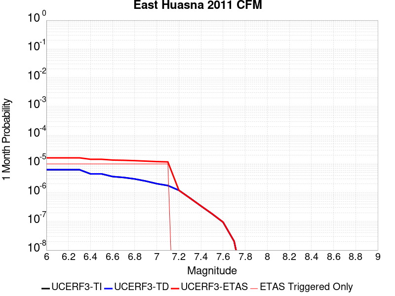 |  |  |

| Magnitude | 1 wk TI Prob | 1 wk TD Prob | 1 wk ETAS Prob | 1 wk ETAS/TD Gain | 1 wk ETAS Triggered Only | 1 mo TI Prob | 1 mo TD Prob | 1 mo ETAS Prob | 1 mo ETAS/TD Gain | 1 mo ETAS Triggered Only | 1 yr TI Prob | 1 yr TD Prob | 1 yr ETAS Prob | 1 yr ETAS/TD Gain | 1 yr ETAS Triggered Only | 10 yr TI Prob | 10 yr TD Prob | 10 yr ETAS Prob | 10 yr ETAS/TD Gain | 10 yr ETAS Triggered Only |
|-----|-----|-----|-----|-----|-----|-----|-----|-----|-----|-----|-----|-----|-----|-----|-----|-----|-----|-----|-----|-----|
| 6.0 | 1.4658423E-6 | 1.4715657E-6 | 1.4715657E-6 | 1.0 | 0.0 | 6.282166E-6 | 6.3066955E-6 | 1.6306632E-5 | 2.5856063 | 1.0E-5 | 7.6482684E-5 | 7.678138E-5 | 8.6780616E-5 | 1.13023 | 1.0E-5 | 7.645637E-4 | 7.6755555E-4 | 7.775479E-4 | 1.0130184 | 1.0E-5 |
| 6.1 | 1.4658423E-6 | 1.4715657E-6 | 1.4715657E-6 | 1.0 | 0.0 | 6.282166E-6 | 6.3066955E-6 | 1.6306632E-5 | 2.5856063 | 1.0E-5 | 7.6482684E-5 | 7.678138E-5 | 8.6780616E-5 | 1.13023 | 1.0E-5 | 7.645637E-4 | 7.6755555E-4 | 7.775479E-4 | 1.0130184 | 1.0E-5 |
| 6.2 | 1.4658423E-6 | 1.4715657E-6 | 1.4715657E-6 | 1.0 | 0.0 | 6.282166E-6 | 6.3066955E-6 | 1.6306632E-5 | 2.5856063 | 1.0E-5 | 7.6482684E-5 | 7.678138E-5 | 8.6780616E-5 | 1.13023 | 1.0E-5 | 7.645637E-4 | 7.6755555E-4 | 7.775479E-4 | 1.0130184 | 1.0E-5 |
| 6.3 | 1.4658423E-6 | 1.4715657E-6 | 1.4715657E-6 | 1.0 | 0.0 | 6.282166E-6 | 6.3066955E-6 | 1.6306632E-5 | 2.5856063 | 1.0E-5 | 7.6482684E-5 | 7.678138E-5 | 8.6780616E-5 | 1.13023 | 1.0E-5 | 7.645637E-4 | 7.6755555E-4 | 7.775479E-4 | 1.0130184 | 1.0E-5 |
| 6.4 | 1.0488257E-6 | 1.0527513E-6 | 1.0527513E-6 | 1.0 | 0.0 | 4.4949593E-6 | 4.5117836E-6 | 1.4511738E-5 | 3.2164085 | 1.0E-5 | 5.472476E-5 | 5.49296E-5 | 6.4929045E-5 | 1.1820412 | 1.0E-5 | 5.4711284E-4 | 5.491621E-4 | 5.5915664E-4 | 1.0181996 | 1.0E-5 |
| 6.5 | 1.0488257E-6 | 1.0527513E-6 | 1.0527513E-6 | 1.0 | 0.0 | 4.4949593E-6 | 4.5117836E-6 | 1.4511738E-5 | 3.2164085 | 1.0E-5 | 5.472476E-5 | 5.49296E-5 | 6.4929045E-5 | 1.1820412 | 1.0E-5 | 5.4711284E-4 | 5.491621E-4 | 5.5915664E-4 | 1.0181996 | 1.0E-5 |
| 6.6 | 8.463064E-7 | 8.49363E-7 | 8.49363E-7 | 1.0 | 0.0 | 3.6270226E-6 | 3.6401223E-6 | 1.3640086E-5 | 3.7471504 | 1.0E-5 | 4.4158103E-5 | 4.4317596E-5 | 5.431715E-5 | 1.225634 | 1.0E-5 | 4.414933E-4 | 4.4308844E-4 | 4.53084E-4 | 1.0225588 | 1.0E-5 |
| 6.7 | 7.876149E-7 | 7.902531E-7 | 7.902531E-7 | 1.0 | 0.0 | 3.375488E-6 | 3.3867946E-6 | 1.3386761E-5 | 3.9526343 | 1.0E-5 | 4.109579E-5 | 4.1233452E-5 | 5.1233037E-5 | 1.2425115 | 1.0E-5 | 4.108819E-4 | 4.1225864E-4 | 4.222545E-4 | 1.0242466 | 1.0E-5 |
| 6.8 | 6.9940785E-7 | 7.0165754E-7 | 7.0165754E-7 | 1.0 | 0.0 | 2.9974588E-6 | 3.0071003E-6 | 1.300707E-5 | 4.325453 | 1.0E-5 | 3.649345E-5 | 3.6610836E-5 | 4.661047E-5 | 1.2731332 | 1.0E-5 | 3.6487455E-4 | 3.660485E-4 | 3.7604486E-4 | 1.0273088 | 1.0E-5 |
| 6.9 | 5.899658E-7 | 5.9155974E-7 | 5.9155974E-7 | 1.0 | 0.0 | 2.5284223E-6 | 2.5352535E-6 | 1.2535228E-5 | 4.944369 | 1.0E-5 | 3.0783107E-5 | 3.086628E-5 | 4.086597E-5 | 1.3239682 | 1.0E-5 | 3.0778843E-4 | 3.086202E-4 | 3.186171E-4 | 1.0323923 | 1.0E-5 |
| 7.0 | 4.793814E-7 | 4.8032706E-7 | 4.8032706E-7 | 1.0 | 0.0 | 2.05449E-6 | 2.058543E-6 | 1.2058523E-5 | 5.857795 | 1.0E-5 | 2.501313E-5 | 2.5062474E-5 | 3.5062225E-5 | 1.3989929 | 1.0E-5 | 2.5010316E-4 | 2.5059667E-4 | 2.6059416E-4 | 1.0398948 | 1.0E-5 |
| 7.1 | 4.1256908E-7 | 4.129939E-7 | 4.129939E-7 | 1.0 | 0.0 | 1.768152E-6 | 1.7699726E-6 | 1.1769955E-5 | 6.649795 | 1.0E-5 | 2.1527037E-5 | 2.1549205E-5 | 3.154899E-5 | 1.4640442 | 1.0E-5 | 2.1524953E-4 | 2.154713E-4 | 2.2546915E-4 | 1.0464 | 1.0E-5 |
| 7.2 | 2.822599E-7 | 2.8161398E-7 | 2.8161398E-7 | 1.0 | 0.0 | 1.2096847E-6 | 1.2069165E-6 | 1.2069165E-6 | 1.0 | 0.0 | 1.47278115E-5 | 1.469411E-5 | 1.469411E-5 | 1.0 | 0.0 | 1.4726835E-4 | 1.4693146E-4 | 1.4693146E-4 | 1.0 | 0.0 |
| 7.3 | 1.5261652E-7 | 1.5075E-7 | 1.5075E-7 | 1.0 | 0.0 | 6.540707E-7 | 6.4607127E-7 | 6.4607127E-7 | 1.0 | 0.0 | 7.963281E-6 | 7.8658895E-6 | 7.8658895E-6 | 1.0 | 0.0 | 7.962996E-5 | 7.865613E-5 | 7.865613E-5 | 1.0 | 0.0 |
| 7.4 | 7.976414E-8 | 8.057865E-8 | 8.057865E-8 | 1.0 | 0.0 | 3.418463E-7 | 3.45337E-7 | 3.45337E-7 | 1.0 | 0.0 | 4.1619705E-6 | 4.2044703E-6 | 4.2044703E-6 | 1.0 | 0.0 | 4.161893E-5 | 4.2043914E-5 | 4.2043914E-5 | 1.0 | 0.0 |
| 7.5 | 4.2715055E-8 | 4.3202512E-8 | 4.3202512E-8 | 1.0 | 0.0 | 1.830645E-7 | 1.8515361E-7 | 1.8515361E-7 | 1.0 | 0.0 | 2.228808E-6 | 2.2542429E-6 | 2.2542429E-6 | 1.0 | 0.0 | 2.2287857E-5 | 2.2542203E-5 | 2.2542203E-5 | 1.0 | 0.0 |
| 7.6 | 2.1807532E-8 | 2.2057476E-8 | 2.2057476E-8 | 1.0 | 0.0 | 9.346085E-8 | 9.4532034E-8 | 9.4532034E-8 | 1.0 | 0.0 | 1.1378852E-6 | 1.1509269E-6 | 1.1509269E-6 | 1.0 | 0.0 | 1.1378794E-5 | 1.1509211E-5 | 1.1509211E-5 | 1.0 | 0.0 |
| 7.7 | 4.7196043E-9 | 4.767283E-9 | 4.767283E-9 | 1.0 | 0.0 | 2.0226874E-8 | 2.0431212E-8 | 2.0431212E-8 | 1.0 | 0.0 | 2.4626218E-7 | 2.4874998E-7 | 2.4874998E-7 | 1.0 | 0.0 | 2.462619E-6 | 2.487497E-6 | 2.487497E-6 | 1.0 | 0.0 |
| 7.8 | 7.400003E-11 | 7.4654505E-11 | 7.4654505E-11 | 1.0 | 0.0 | 3.171432E-10 | 3.1994773E-10 | 3.1994773E-10 | 1.0 | 0.0 | 3.861218E-9 | 3.895363E-9 | 3.895363E-9 | 1.0 | 0.0 | 3.861218E-8 | 3.895363E-8 | 3.895363E-8 | 1.0 | 0.0 |

## South Cuyama
*[(top)](#table-of-contents)*

| 1 Week | 1 Month | 1 Year | 10 Year |
|-----|-----|-----|-----|
|  |  |  |  |

| Magnitude | 1 wk TI Prob | 1 wk TD Prob | 1 wk ETAS Prob | 1 wk ETAS/TD Gain | 1 wk ETAS Triggered Only | 1 mo TI Prob | 1 mo TD Prob | 1 mo ETAS Prob | 1 mo ETAS/TD Gain | 1 mo ETAS Triggered Only | 1 yr TI Prob | 1 yr TD Prob | 1 yr ETAS Prob | 1 yr ETAS/TD Gain | 1 yr ETAS Triggered Only | 10 yr TI Prob | 10 yr TD Prob | 10 yr ETAS Prob | 10 yr ETAS/TD Gain | 10 yr ETAS Triggered Only |
|-----|-----|-----|-----|-----|-----|-----|-----|-----|-----|-----|-----|-----|-----|-----|-----|-----|-----|-----|-----|-----|
| 6.0 | 1.2747308E-6 | 1.2818697E-6 | 1.2818697E-6 | 1.0 | 0.0 | 5.4631205E-6 | 5.4937163E-6 | 5.4937163E-6 | 1.0 | 0.0 | 6.6511464E-5 | 6.6884015E-5 | 7.688334E-5 | 1.1495025 | 1.0E-5 | 6.649156E-4 | 6.686458E-4 | 6.786391E-4 | 1.0149456 | 1.0E-5 |
| 6.1 | 1.2747308E-6 | 1.2818697E-6 | 1.2818697E-6 | 1.0 | 0.0 | 5.4631205E-6 | 5.4937163E-6 | 5.4937163E-6 | 1.0 | 0.0 | 6.6511464E-5 | 6.6884015E-5 | 7.688334E-5 | 1.1495025 | 1.0E-5 | 6.649156E-4 | 6.686458E-4 | 6.786391E-4 | 1.0149456 | 1.0E-5 |
| 6.2 | 1.2747308E-6 | 1.2818697E-6 | 1.2818697E-6 | 1.0 | 0.0 | 5.4631205E-6 | 5.4937163E-6 | 5.4937163E-6 | 1.0 | 0.0 | 6.6511464E-5 | 6.6884015E-5 | 7.688334E-5 | 1.1495025 | 1.0E-5 | 6.649156E-4 | 6.686458E-4 | 6.786391E-4 | 1.0149456 | 1.0E-5 |
| 6.3 | 1.2747308E-6 | 1.2818697E-6 | 1.2818697E-6 | 1.0 | 0.0 | 5.4631205E-6 | 5.4937163E-6 | 5.4937163E-6 | 1.0 | 0.0 | 6.6511464E-5 | 6.6884015E-5 | 7.688334E-5 | 1.1495025 | 1.0E-5 | 6.649156E-4 | 6.686458E-4 | 6.786391E-4 | 1.0149456 | 1.0E-5 |
| 6.4 | 1.2747308E-6 | 1.2818697E-6 | 1.2818697E-6 | 1.0 | 0.0 | 5.4631205E-6 | 5.4937163E-6 | 5.4937163E-6 | 1.0 | 0.0 | 6.6511464E-5 | 6.6884015E-5 | 7.688334E-5 | 1.1495025 | 1.0E-5 | 6.649156E-4 | 6.686458E-4 | 6.786391E-4 | 1.0149456 | 1.0E-5 |
| 6.5 | 1.2747308E-6 | 1.2818697E-6 | 1.2818697E-6 | 1.0 | 0.0 | 5.4631205E-6 | 5.4937163E-6 | 5.4937163E-6 | 1.0 | 0.0 | 6.6511464E-5 | 6.6884015E-5 | 7.688334E-5 | 1.1495025 | 1.0E-5 | 6.649156E-4 | 6.686458E-4 | 6.786391E-4 | 1.0149456 | 1.0E-5 |
| 6.6 | 1.2747308E-6 | 1.2818697E-6 | 1.2818697E-6 | 1.0 | 0.0 | 5.4631205E-6 | 5.4937163E-6 | 5.4937163E-6 | 1.0 | 0.0 | 6.6511464E-5 | 6.6884015E-5 | 7.688334E-5 | 1.1495025 | 1.0E-5 | 6.649156E-4 | 6.686458E-4 | 6.786391E-4 | 1.0149456 | 1.0E-5 |
| 6.7 | 1.2747308E-6 | 1.2818697E-6 | 1.2818697E-6 | 1.0 | 0.0 | 5.4631205E-6 | 5.4937163E-6 | 5.4937163E-6 | 1.0 | 0.0 | 6.6511464E-5 | 6.6884015E-5 | 7.688334E-5 | 1.1495025 | 1.0E-5 | 6.649156E-4 | 6.686458E-4 | 6.786391E-4 | 1.0149456 | 1.0E-5 |
| 6.8 | 1.2747308E-6 | 1.2818697E-6 | 1.2818697E-6 | 1.0 | 0.0 | 5.4631205E-6 | 5.4937163E-6 | 5.4937163E-6 | 1.0 | 0.0 | 6.6511464E-5 | 6.6884015E-5 | 7.688334E-5 | 1.1495025 | 1.0E-5 | 6.649156E-4 | 6.686458E-4 | 6.786391E-4 | 1.0149456 | 1.0E-5 |
| 6.9 | 8.4566324E-7 | 8.507883E-7 | 8.507883E-7 | 1.0 | 0.0 | 3.624266E-6 | 3.6462304E-6 | 3.6462304E-6 | 1.0 | 0.0 | 4.4124543E-5 | 4.439196E-5 | 5.4391516E-5 | 1.225256 | 1.0E-5 | 4.4115784E-4 | 4.4383196E-4 | 4.5382752E-4 | 1.022521 | 1.0E-5 |
| 7.0 | 8.2277904E-7 | 8.27782E-7 | 8.27782E-7 | 1.0 | 0.0 | 3.526191E-6 | 3.5476323E-6 | 3.5476323E-6 | 1.0 | 0.0 | 4.293053E-5 | 4.3191576E-5 | 5.3191146E-5 | 1.2315166 | 1.0E-5 | 4.292224E-4 | 4.3183283E-4 | 4.418285E-4 | 1.0231471 | 1.0E-5 |
| 7.1 | 6.7661887E-7 | 6.80913E-7 | 6.80913E-7 | 1.0 | 0.0 | 2.899792E-6 | 2.9181954E-6 | 2.9181954E-6 | 1.0 | 0.0 | 3.5304394E-5 | 3.5528454E-5 | 3.5528454E-5 | 1.0 | 0.0 | 3.5298787E-4 | 3.552281E-4 | 3.552281E-4 | 1.0 | 0.0 |
| 7.2 | 5.783336E-7 | 5.8211907E-7 | 5.8211907E-7 | 1.0 | 0.0 | 2.4785702E-6 | 2.4947938E-6 | 2.4947938E-6 | 1.0 | 0.0 | 3.0176174E-5 | 3.0373692E-5 | 3.0373692E-5 | 1.0 | 0.0 | 3.0172078E-4 | 3.0369565E-4 | 3.0369565E-4 | 1.0 | 0.0 |
| 7.3 | 5.136759E-7 | 5.170938E-7 | 5.170938E-7 | 1.0 | 0.0 | 2.2014663E-6 | 2.2161144E-6 | 2.2161144E-6 | 1.0 | 0.0 | 2.6802521E-5 | 2.698086E-5 | 2.698086E-5 | 1.0 | 0.0 | 2.679929E-4 | 2.6977606E-4 | 2.6977606E-4 | 1.0 | 0.0 |
| 7.4 | 4.3370295E-7 | 4.3665364E-7 | 4.3665364E-7 | 1.0 | 0.0 | 1.8587256E-6 | 1.8713713E-6 | 1.8713713E-6 | 1.0 | 0.0 | 2.2629749E-5 | 2.278371E-5 | 2.278371E-5 | 1.0 | 0.0 | 2.2627445E-4 | 2.278139E-4 | 2.278139E-4 | 1.0 | 0.0 |
| 7.5 | 3.3242574E-7 | 3.3476465E-7 | 3.3476465E-7 | 1.0 | 0.0 | 1.4246809E-6 | 1.4347048E-6 | 1.4347048E-6 | 1.0 | 0.0 | 1.7345352E-5 | 1.7467393E-5 | 1.7467393E-5 | 1.0 | 0.0 | 1.7343998E-4 | 1.7466032E-4 | 1.7466032E-4 | 1.0 | 0.0 |
| 7.6 | 2.0627535E-7 | 2.07789E-7 | 2.07789E-7 | 1.0 | 0.0 | 8.840369E-7 | 8.90524E-7 | 8.90524E-7 | 1.0 | 0.0 | 1.0763096E-5 | 1.0842076E-5 | 1.0842076E-5 | 1.0 | 0.0 | 1.0762575E-4 | 1.0841556E-4 | 1.0841556E-4 | 1.0 | 0.0 |
| 7.7 | 6.15236E-8 | 6.1983044E-8 | 6.1983044E-8 | 1.0 | 0.0 | 2.6367252E-7 | 2.656416E-7 | 2.656416E-7 | 1.0 | 0.0 | 3.2102084E-6 | 3.2341818E-6 | 3.2341818E-6 | 1.0 | 0.0 | 3.210162E-5 | 3.234136E-5 | 3.234136E-5 | 1.0 | 0.0 |
| 7.8 | 1.1765573E-8 | 1.1873414E-8 | 1.1873414E-8 | 1.0 | 0.0 | 5.0423886E-8 | 5.0886058E-8 | 5.0886058E-8 | 1.0 | 0.0 | 6.1391063E-7 | 6.195376E-7 | 6.195376E-7 | 1.0 | 0.0 | 6.1390897E-6 | 6.19536E-6 | 6.19536E-6 | 1.0 | 0.0 |
| 7.9 | 6.0381755E-10 | 6.10058E-10 | 6.10058E-10 | 1.0 | 0.0 | 2.5877895E-9 | 2.614534E-9 | 2.614534E-9 | 1.0 | 0.0 | 3.1506335E-8 | 3.1831952E-8 | 3.1831952E-8 | 1.0 | 0.0 | 3.1506332E-7 | 3.183195E-7 | 3.183195E-7 | 1.0 | 0.0 |

## Walker Spring 2011 CFM
*[(top)](#table-of-contents)*

| 1 Week | 1 Month | 1 Year | 10 Year |
|-----|-----|-----|-----|
|  | 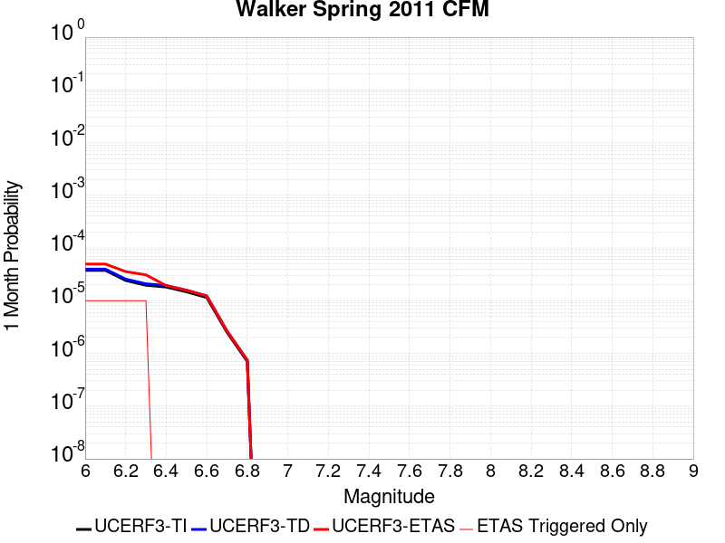 | 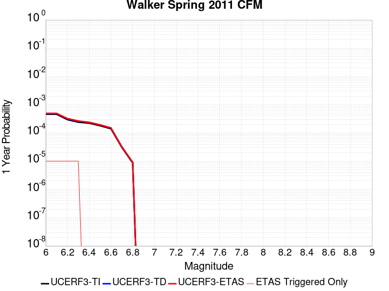 |  |

| Magnitude | 1 wk TI Prob | 1 wk TD Prob | 1 wk ETAS Prob | 1 wk ETAS/TD Gain | 1 wk ETAS Triggered Only | 1 mo TI Prob | 1 mo TD Prob | 1 mo ETAS Prob | 1 mo ETAS/TD Gain | 1 mo ETAS Triggered Only | 1 yr TI Prob | 1 yr TD Prob | 1 yr ETAS Prob | 1 yr ETAS/TD Gain | 1 yr ETAS Triggered Only | 10 yr TI Prob | 10 yr TD Prob | 10 yr ETAS Prob | 10 yr ETAS/TD Gain | 10 yr ETAS Triggered Only |
|-----|-----|-----|-----|-----|-----|-----|-----|-----|-----|-----|-----|-----|-----|-----|-----|-----|-----|-----|-----|-----|
| 6.0 | 8.791276E-6 | 9.264088E-6 | 9.264088E-6 | 1.0 | 0.0 | 3.767635E-5 | 3.970269E-5 | 4.9702292E-5 | 1.251862 | 1.0E-5 | 4.58613E-4 | 4.832839E-4 | 4.932791E-4 | 1.0206817 | 1.0E-5 | 0.004576677 | 0.0048234025 | 0.004833354 | 1.0020633 | 1.0E-5 |
| 6.1 | 8.791276E-6 | 9.264088E-6 | 9.264088E-6 | 1.0 | 0.0 | 3.767635E-5 | 3.970269E-5 | 4.9702292E-5 | 1.251862 | 1.0E-5 | 4.58613E-4 | 4.832839E-4 | 4.932791E-4 | 1.0206817 | 1.0E-5 | 0.004576677 | 0.0048234025 | 0.004833354 | 1.0020633 | 1.0E-5 |
| 6.2 | 5.654515E-6 | 5.99876E-6 | 5.99876E-6 | 1.0 | 0.0 | 2.4233412E-5 | 2.5708747E-5 | 3.570849E-5 | 1.3889626 | 1.0E-5 | 2.9500184E-4 | 3.1296405E-4 | 3.2296093E-4 | 1.0319426 | 1.0E-5 | 0.0029461053 | 0.0031257276 | 0.0031356963 | 1.0031892 | 1.0E-5 |
| 6.3 | 4.591685E-6 | 4.8947268E-6 | 4.8947268E-6 | 1.0 | 0.0 | 1.96785E-5 | 2.0977257E-5 | 3.0977048E-5 | 1.4766967 | 1.0E-5 | 2.395594E-4 | 2.5537255E-4 | 2.6536998E-4 | 1.0391484 | 1.0E-5 | 0.002393013 | 0.0025512208 | 0.0025611953 | 1.0039097 | 1.0E-5 |
| 6.4 | 4.243283E-6 | 4.52266E-6 | 4.52266E-6 | 1.0 | 0.0 | 1.8185372E-5 | 1.938271E-5 | 1.938271E-5 | 1.0 | 0.0 | 2.2138441E-4 | 2.3596318E-4 | 2.3596318E-4 | 1.0 | 0.0 | 0.00221164 | 0.0023575418 | 0.0023575418 | 1.0 | 0.0 |
| 6.5 | 3.4445666E-6 | 3.6860924E-6 | 3.6860924E-6 | 1.0 | 0.0 | 1.4762345E-5 | 1.5797466E-5 | 1.5797466E-5 | 1.0 | 0.0 | 1.7971672E-4 | 1.923212E-4 | 1.923212E-4 | 1.0 | 0.0 | 0.0017957145 | 0.0019219425 | 0.0019219425 | 1.0 | 0.0 |
| 6.6 | 2.68766E-6 | 2.8794348E-6 | 2.8794348E-6 | 1.0 | 0.0 | 1.1518492E-5 | 1.2340398E-5 | 1.2340398E-5 | 1.0 | 0.0 | 1.4022861E-4 | 1.502378E-4 | 1.502378E-4 | 1.0 | 0.0 | 0.0014014016 | 0.0015017362 | 0.0015017362 | 1.0 | 0.0 |
| 6.7 | 5.880964E-7 | 6.1997474E-7 | 6.1997474E-7 | 1.0 | 0.0 | 2.5204106E-6 | 2.6570326E-6 | 2.6570326E-6 | 1.0 | 0.0 | 3.0685565E-5 | 3.2348988E-5 | 3.2348988E-5 | 1.0 | 0.0 | 3.068133E-4 | 3.2345214E-4 | 3.2345214E-4 | 1.0 | 0.0 |
| 6.8 | 1.6514163E-7 | 1.7409117E-7 | 1.7409117E-7 | 1.0 | 0.0 | 7.077497E-7 | 7.46105E-7 | 7.46105E-7 | 1.0 | 0.0 | 8.616818E-6 | 9.083828E-6 | 9.083828E-6 | 1.0 | 0.0 | 8.616484E-5 | 9.0838286E-5 | 9.0838286E-5 | 1.0 | 0.0 |

## Great Valley 03 Mysterious Ridge
*[(top)](#table-of-contents)*

| 1 Week | 1 Month | 1 Year | 10 Year |
|-----|-----|-----|-----|
| 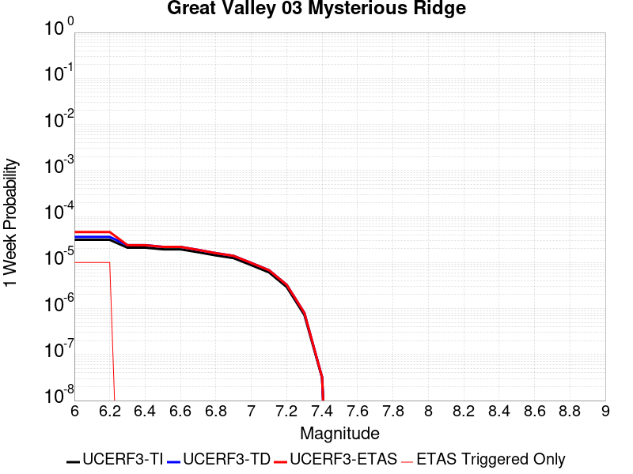 | 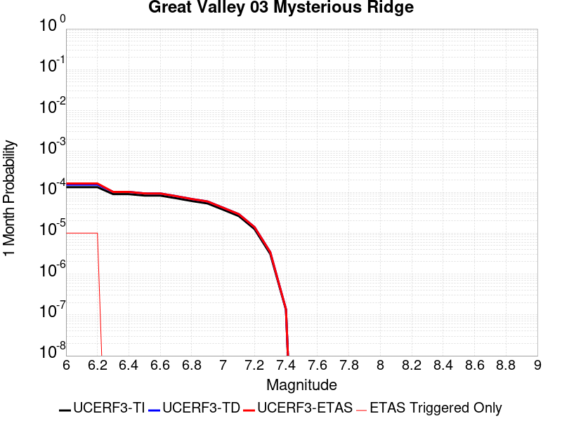 |  |  |

| Magnitude | 1 wk TI Prob | 1 wk TD Prob | 1 wk ETAS Prob | 1 wk ETAS/TD Gain | 1 wk ETAS Triggered Only | 1 mo TI Prob | 1 mo TD Prob | 1 mo ETAS Prob | 1 mo ETAS/TD Gain | 1 mo ETAS Triggered Only | 1 yr TI Prob | 1 yr TD Prob | 1 yr ETAS Prob | 1 yr ETAS/TD Gain | 1 yr ETAS Triggered Only | 10 yr TI Prob | 10 yr TD Prob | 10 yr ETAS Prob | 10 yr ETAS/TD Gain | 10 yr ETAS Triggered Only |
|-----|-----|-----|-----|-----|-----|-----|-----|-----|-----|-----|-----|-----|-----|-----|-----|-----|-----|-----|-----|-----|
| 6.0 | 3.1182444E-5 | 3.603423E-5 | 4.603387E-5 | 1.277504 | 1.0E-5 | 1.336322E-4 | 1.544242E-4 | 1.6442266E-4 | 1.0647467 | 1.0E-5 | 0.0016257578 | 0.0018786696 | 0.0018886508 | 1.0053129 | 1.0E-5 | 0.016139153 | 0.018646652 | 0.018656464 | 1.0005263 | 1.0E-5 |
| 6.1 | 3.1182444E-5 | 3.603423E-5 | 4.603387E-5 | 1.277504 | 1.0E-5 | 1.336322E-4 | 1.544242E-4 | 1.6442266E-4 | 1.0647467 | 1.0E-5 | 0.0016257578 | 0.0018786696 | 0.0018886508 | 1.0053129 | 1.0E-5 | 0.016139153 | 0.018646652 | 0.018656464 | 1.0005263 | 1.0E-5 |
| 6.2 | 3.1182444E-5 | 3.603423E-5 | 4.603387E-5 | 1.277504 | 1.0E-5 | 1.336322E-4 | 1.544242E-4 | 1.6442266E-4 | 1.0647467 | 1.0E-5 | 0.0016257578 | 0.0018786696 | 0.0018886508 | 1.0053129 | 1.0E-5 | 0.016139153 | 0.018646652 | 0.018656464 | 1.0005263 | 1.0E-5 |
| 6.3 | 2.106934E-5 | 2.3850307E-5 | 2.3850307E-5 | 1.0 | 0.0 | 9.0294045E-5 | 1.0221177E-4 | 1.0221177E-4 | 1.0 | 0.0 | 0.0010987755 | 0.0012437489 | 0.0012437489 | 1.0 | 0.0 | 0.010933585 | 0.012371127 | 0.012371127 | 1.0 | 0.0 |
| 6.4 | 2.106934E-5 | 2.3850307E-5 | 2.3850307E-5 | 1.0 | 0.0 | 9.0294045E-5 | 1.0221177E-4 | 1.0221177E-4 | 1.0 | 0.0 | 0.0010987755 | 0.0012437489 | 0.0012437489 | 1.0 | 0.0 | 0.010933585 | 0.012371127 | 0.012371127 | 1.0 | 0.0 |
| 6.5 | 1.9389783E-5 | 2.1884984E-5 | 2.1884984E-5 | 1.0 | 0.0 | 8.309642E-5 | 9.3789575E-5 | 9.3789575E-5 | 1.0 | 0.0 | 0.0010112294 | 0.0011413174 | 0.0011413174 | 1.0 | 0.0 | 0.010066401 | 0.011357434 | 0.011357434 | 1.0 | 0.0 |
| 6.6 | 1.9370193E-5 | 2.1864906E-5 | 2.1864906E-5 | 1.0 | 0.0 | 8.301247E-5 | 9.370353E-5 | 9.370353E-5 | 1.0 | 0.0 | 0.0010102082 | 0.001140271 | 0.001140271 | 1.0 | 0.0 | 0.010056281 | 0.011347076 | 0.011347076 | 1.0 | 0.0 |
| 6.7 | 1.6723505E-5 | 1.8799281E-5 | 1.8799281E-5 | 1.0 | 0.0 | 7.16702E-5 | 8.056597E-5 | 8.056597E-5 | 1.0 | 0.0 | 8.722353E-4 | 9.804688E-4 | 9.804688E-4 | 1.0 | 0.0 | 0.008688197 | 0.009763439 | 0.009763439 | 1.0 | 0.0 |
| 6.8 | 1.426937E-5 | 1.599721E-5 | 1.599721E-5 | 1.0 | 0.0 | 6.115301E-5 | 6.855775E-5 | 6.855775E-5 | 1.0 | 0.0 | 7.4428355E-4 | 8.343854E-4 | 8.343854E-4 | 1.0 | 0.0 | 0.007417957 | 0.008314005 | 0.008314005 | 1.0 | 0.0 |
| 6.9 | 1.2469891E-5 | 1.3956928E-5 | 1.3956928E-5 | 1.0 | 0.0 | 5.3441294E-5 | 5.9814105E-5 | 5.9814105E-5 | 1.0 | 0.0 | 6.504535E-4 | 7.280055E-4 | 7.280055E-4 | 1.0 | 0.0 | 0.006485529 | 0.00725743 | 0.00725743 | 1.0 | 0.0 |
| 7.0 | 8.7746275E-6 | 9.791734E-6 | 9.791734E-6 | 1.0 | 0.0 | 3.7605005E-5 | 4.196394E-5 | 4.196394E-5 | 1.0 | 0.0 | 4.5774475E-4 | 5.1079853E-4 | 5.1079853E-4 | 1.0 | 0.0 | 0.00456803 | 0.005096977 | 0.005096977 | 1.0 | 0.0 |
| 7.1 | 6.1067153E-6 | 6.813725E-6 | 6.813725E-6 | 1.0 | 0.0 | 2.6171374E-5 | 2.9201385E-5 | 2.9201385E-5 | 1.0 | 0.0 | 3.1858988E-4 | 3.5547445E-4 | 3.5547445E-4 | 1.0 | 0.0 | 0.0031813353 | 0.003549609 | 0.003549609 | 1.0 | 0.0 |
| 7.2 | 2.939283E-6 | 3.2741057E-6 | 3.2741057E-6 | 1.0 | 0.0 | 1.2596866E-5 | 1.4031816E-5 | 1.4031816E-5 | 1.0 | 0.0 | 1.5335606E-4 | 1.7082572E-4 | 1.7082572E-4 | 1.0 | 0.0 | 0.0015325027 | 0.001707116 | 0.001707116 | 1.0 | 0.0 |
| 7.3 | 7.2387763E-7 | 8.008505E-7 | 8.008505E-7 | 1.0 | 0.0 | 3.102329E-6 | 3.4322145E-6 | 3.4322145E-6 | 1.0 | 0.0 | 3.77702E-5 | 4.178687E-5 | 4.178687E-5 | 1.0 | 0.0 | 3.7763783E-4 | 4.1783508E-4 | 4.1783508E-4 | 1.0 | 0.0 |
| 7.4 | 3.112171E-8 | 3.2068368E-8 | 3.2068368E-8 | 1.0 | 0.0 | 1.3337875E-7 | 1.3743585E-7 | 1.3743585E-7 | 1.0 | 0.0 | 1.6238852E-6 | 1.6732803E-6 | 1.6732803E-6 | 1.0 | 0.0 | 1.6238733E-5 | 1.6732685E-5 | 1.6732685E-5 | 1.0 | 0.0 |

## North Frontal  (East)
*[(top)](#table-of-contents)*

| 1 Week | 1 Month | 1 Year | 10 Year |
|-----|-----|-----|-----|
|  |  |  |  |

| Magnitude | 1 wk TI Prob | 1 wk TD Prob | 1 wk ETAS Prob | 1 wk ETAS/TD Gain | 1 wk ETAS Triggered Only | 1 mo TI Prob | 1 mo TD Prob | 1 mo ETAS Prob | 1 mo ETAS/TD Gain | 1 mo ETAS Triggered Only | 1 yr TI Prob | 1 yr TD Prob | 1 yr ETAS Prob | 1 yr ETAS/TD Gain | 1 yr ETAS Triggered Only | 10 yr TI Prob | 10 yr TD Prob | 10 yr ETAS Prob | 10 yr ETAS/TD Gain | 10 yr ETAS Triggered Only |
|-----|-----|-----|-----|-----|-----|-----|-----|-----|-----|-----|-----|-----|-----|-----|-----|-----|-----|-----|-----|-----|
| 6.0 | 7.135738E-6 | 7.4771765E-6 | 1.7477101E-5 | 2.3373933 | 1.0E-5 | 3.0581377E-5 | 3.204476E-5 | 4.204444E-5 | 1.3120534 | 1.0E-5 | 3.7226462E-4 | 3.9009505E-4 | 4.0009117E-4 | 1.0256248 | 1.0E-5 | 0.0037164164 | 0.0038960609 | 0.0039060218 | 1.0025567 | 1.0E-5 |
| 6.1 | 7.135738E-6 | 7.4771765E-6 | 1.7477101E-5 | 2.3373933 | 1.0E-5 | 3.0581377E-5 | 3.204476E-5 | 4.204444E-5 | 1.3120534 | 1.0E-5 | 3.7226462E-4 | 3.9009505E-4 | 4.0009117E-4 | 1.0256248 | 1.0E-5 | 0.0037164164 | 0.0038960609 | 0.0039060218 | 1.0025567 | 1.0E-5 |
| 6.2 | 7.135738E-6 | 7.4771765E-6 | 1.7477101E-5 | 2.3373933 | 1.0E-5 | 3.0581377E-5 | 3.204476E-5 | 4.204444E-5 | 1.3120534 | 1.0E-5 | 3.7226462E-4 | 3.9009505E-4 | 4.0009117E-4 | 1.0256248 | 1.0E-5 | 0.0037164164 | 0.0038960609 | 0.0039060218 | 1.0025567 | 1.0E-5 |
| 6.3 | 7.135738E-6 | 7.4771765E-6 | 1.7477101E-5 | 2.3373933 | 1.0E-5 | 3.0581377E-5 | 3.204476E-5 | 4.204444E-5 | 1.3120534 | 1.0E-5 | 3.7226462E-4 | 3.9009505E-4 | 4.0009117E-4 | 1.0256248 | 1.0E-5 | 0.0037164164 | 0.0038960609 | 0.0039060218 | 1.0025567 | 1.0E-5 |
| 6.4 | 7.135738E-6 | 7.4771765E-6 | 1.7477101E-5 | 2.3373933 | 1.0E-5 | 3.0581377E-5 | 3.204476E-5 | 4.204444E-5 | 1.3120534 | 1.0E-5 | 3.7226462E-4 | 3.9009505E-4 | 4.0009117E-4 | 1.0256248 | 1.0E-5 | 0.0037164164 | 0.0038960609 | 0.0039060218 | 1.0025567 | 1.0E-5 |
| 6.5 | 7.135738E-6 | 7.4771765E-6 | 1.7477101E-5 | 2.3373933 | 1.0E-5 | 3.0581377E-5 | 3.204476E-5 | 4.204444E-5 | 1.3120534 | 1.0E-5 | 3.7226462E-4 | 3.9009505E-4 | 4.0009117E-4 | 1.0256248 | 1.0E-5 | 0.0037164164 | 0.0038960609 | 0.0039060218 | 1.0025567 | 1.0E-5 |
| 6.6 | 7.135738E-6 | 7.4771765E-6 | 1.7477101E-5 | 2.3373933 | 1.0E-5 | 3.0581377E-5 | 3.204476E-5 | 4.204444E-5 | 1.3120534 | 1.0E-5 | 3.7226462E-4 | 3.9009505E-4 | 4.0009117E-4 | 1.0256248 | 1.0E-5 | 0.0037164164 | 0.0038960609 | 0.0039060218 | 1.0025567 | 1.0E-5 |
| 6.7 | 7.135738E-6 | 7.4771765E-6 | 1.7477101E-5 | 2.3373933 | 1.0E-5 | 3.0581377E-5 | 3.204476E-5 | 4.204444E-5 | 1.3120534 | 1.0E-5 | 3.7226462E-4 | 3.9009505E-4 | 4.0009117E-4 | 1.0256248 | 1.0E-5 | 0.0037164164 | 0.0038960609 | 0.0039060218 | 1.0025567 | 1.0E-5 |
| 6.8 | 5.959142E-6 | 6.236683E-6 | 1.623662E-5 | 2.6034064 | 1.0E-5 | 2.553893E-5 | 2.6728469E-5 | 3.67282E-5 | 1.374123 | 1.0E-5 | 3.108921E-4 | 3.253886E-4 | 3.3538532E-4 | 1.0307225 | 1.0E-5 | 0.0031045752 | 0.0032508948 | 0.0032608623 | 1.0030661 | 1.0E-5 |
| 6.9 | 2.2946929E-6 | 2.3824605E-6 | 2.3824605E-6 | 1.0 | 0.0 | 9.834361E-6 | 1.0210508E-5 | 1.0210508E-5 | 1.0 | 0.0 | 1.1972676E-4 | 1.2430632E-4 | 1.2430632E-4 | 1.0 | 0.0 | 0.0011966228 | 0.0012424142 | 0.0012424142 | 1.0 | 0.0 |
| 7.0 | 2.2468673E-6 | 2.3321538E-6 | 2.3321538E-6 | 1.0 | 0.0 | 9.629396E-6 | 9.994909E-6 | 9.994909E-6 | 1.0 | 0.0 | 1.1723159E-4 | 1.21681696E-4 | 1.21681696E-4 | 1.0 | 0.0 | 0.0011716976 | 0.0012161969 | 0.0012161969 | 1.0 | 0.0 |
| 7.1 | 1.9921076E-6 | 2.0646032E-6 | 2.0646032E-6 | 1.0 | 0.0 | 8.537577E-6 | 8.848272E-6 | 8.848272E-6 | 1.0 | 0.0 | 1.0394004E-4 | 1.0772282E-4 | 1.0772282E-4 | 1.0 | 0.0 | 0.0010389143 | 0.0010767487 | 0.0010767487 | 1.0 | 0.0 |
| 7.2 | 1.4524545E-6 | 1.5045148E-6 | 1.5045148E-6 | 1.0 | 0.0 | 6.2247905E-6 | 6.447906E-6 | 6.447906E-6 | 1.0 | 0.0 | 7.5784184E-5 | 7.850068E-5 | 7.850068E-5 | 1.0 | 0.0 | 7.575835E-4 | 7.8475394E-4 | 7.8475394E-4 | 1.0 | 0.0 |
| 7.3 | 8.9802575E-7 | 9.3087283E-7 | 9.3087283E-7 | 1.0 | 0.0 | 3.848676E-6 | 3.9894494E-6 | 3.9894494E-6 | 1.0 | 0.0 | 4.685662E-5 | 4.857058E-5 | 4.857058E-5 | 1.0 | 0.0 | 4.6846745E-4 | 4.8561094E-4 | 4.8561094E-4 | 1.0 | 0.0 |
| 7.4 | 7.776139E-7 | 8.0604747E-7 | 8.0604747E-7 | 1.0 | 0.0 | 3.3326266E-6 | 3.4544853E-6 | 3.4544853E-6 | 1.0 | 0.0 | 4.0573974E-5 | 4.2057654E-5 | 4.2057654E-5 | 1.0 | 0.0 | 4.0566566E-4 | 4.205077E-4 | 4.205077E-4 | 1.0 | 0.0 |
| 7.5 | 5.244417E-7 | 5.441219E-7 | 5.441219E-7 | 1.0 | 0.0 | 2.2476054E-6 | 2.3319494E-6 | 2.3319494E-6 | 1.0 | 0.0 | 2.7364253E-5 | 2.839118E-5 | 2.839118E-5 | 1.0 | 0.0 | 2.7360884E-4 | 2.8388205E-4 | 2.8388205E-4 | 1.0 | 0.0 |
| 7.6 | 1.5489647E-7 | 1.6089504E-7 | 1.6089504E-7 | 1.0 | 0.0 | 6.6384183E-7 | 6.895501E-7 | 6.895501E-7 | 1.0 | 0.0 | 8.082245E-6 | 8.395261E-6 | 8.395261E-6 | 1.0 | 0.0 | 8.08195E-5 | 8.395143E-5 | 8.395143E-5 | 1.0 | 0.0 |

## Hayward (So) extension 2011 CFM
*[(top)](#table-of-contents)*

| 1 Week | 1 Month | 1 Year | 10 Year |
|-----|-----|-----|-----|
| 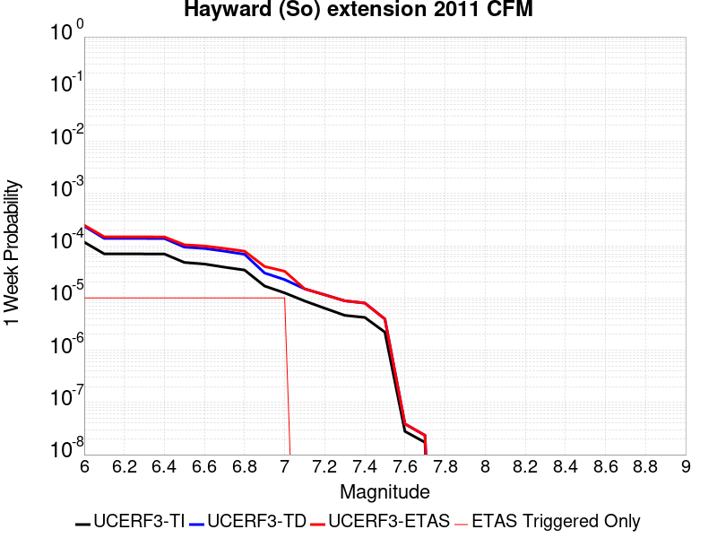 |  |  | 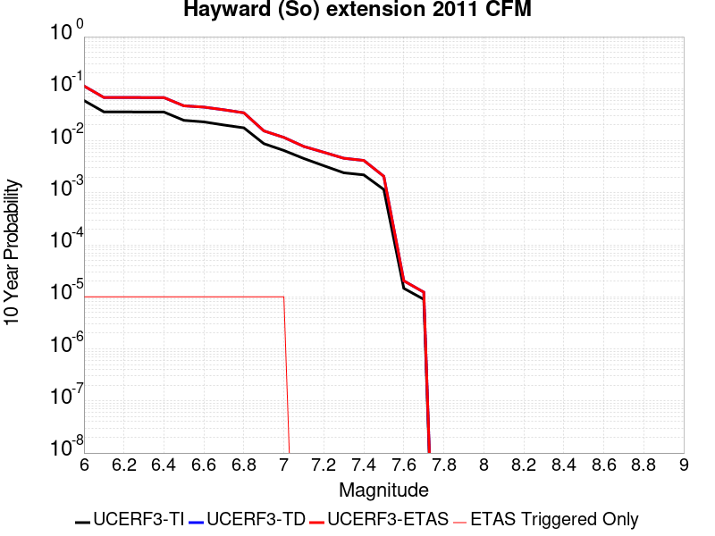 |

| Magnitude | 1 wk TI Prob | 1 wk TD Prob | 1 wk ETAS Prob | 1 wk ETAS/TD Gain | 1 wk ETAS Triggered Only | 1 mo TI Prob | 1 mo TD Prob | 1 mo ETAS Prob | 1 mo ETAS/TD Gain | 1 mo ETAS Triggered Only | 1 yr TI Prob | 1 yr TD Prob | 1 yr ETAS Prob | 1 yr ETAS/TD Gain | 1 yr ETAS Triggered Only | 10 yr TI Prob | 10 yr TD Prob | 10 yr ETAS Prob | 10 yr ETAS/TD Gain | 10 yr ETAS Triggered Only |
|-----|-----|-----|-----|-----|-----|-----|-----|-----|-----|-----|-----|-----|-----|-----|-----|-----|-----|-----|-----|-----|
| 6.0 | 1.1721256E-4 | 2.3697627E-4 | 2.469739E-4 | 1.0421883 | 1.0E-5 | 5.022428E-4 | 0.0010129517 | 0.0010229415 | 1.0098622 | 1.0E-5 | 0.0060976758 | 0.012248711 | 0.012258588 | 1.0008065 | 1.0E-5 | 0.0593305 | 0.112843215 | 0.11285209 | 1.0000787 | 1.0E-5 |
| 6.1 | 6.99169E-5 | 1.3822885E-4 | 1.4822747E-4 | 1.0723338 | 1.0E-5 | 2.9960944E-4 | 5.9128006E-4 | 6.0127414E-4 | 1.0169024 | 1.0E-5 | 0.0036416445 | 0.0071720886 | 0.007182017 | 1.0013843 | 1.0E-5 | 0.035825435 | 0.067803554 | 0.067812875 | 1.0001374 | 1.0E-5 |
| 6.2 | 6.99169E-5 | 1.3822885E-4 | 1.4822747E-4 | 1.0723338 | 1.0E-5 | 2.9960944E-4 | 5.9128006E-4 | 6.0127414E-4 | 1.0169024 | 1.0E-5 | 0.0036416445 | 0.0071720886 | 0.007182017 | 1.0013843 | 1.0E-5 | 0.035825435 | 0.067803554 | 0.067812875 | 1.0001374 | 1.0E-5 |
| 6.3 | 6.970908E-5 | 1.379104E-4 | 1.4790903E-4 | 1.0725008 | 1.0E-5 | 2.9871898E-4 | 5.899159E-4 | 5.9991E-4 | 1.0169415 | 1.0E-5 | 0.0036308395 | 0.007155625 | 0.0071655535 | 1.0013875 | 1.0E-5 | 0.035720866 | 0.067652516 | 0.06766184 | 1.0001378 | 1.0E-5 |
| 6.4 | 6.9517155E-5 | 1.375792E-4 | 1.4757783E-4 | 1.0726753 | 1.0E-5 | 2.9789665E-4 | 5.884971E-4 | 5.984912E-4 | 1.0169824 | 1.0E-5 | 0.0036208609 | 0.0071385372 | 0.007148466 | 1.0013908 | 1.0E-5 | 0.03562429 | 0.06749655 | 0.06750588 | 1.0001382 | 1.0E-5 |
| 6.5 | 4.786248E-5 | 9.41498E-5 | 1.0414886E-4 | 1.1062037 | 1.0E-5 | 2.0510878E-4 | 4.034394E-4 | 4.1343534E-4 | 1.0247768 | 1.0E-5 | 0.0024943394 | 0.004901227 | 0.0049111783 | 1.0020303 | 1.0E-5 | 0.02466527 | 0.046901822 | 0.04691135 | 1.0002033 | 1.0E-5 |
| 6.6 | 4.4662214E-5 | 8.881654E-5 | 9.881565E-5 | 1.1125816 | 1.0E-5 | 1.9139545E-4 | 3.805894E-4 | 3.9058557E-4 | 1.026265 | 1.0E-5 | 0.0023277493 | 0.0046242937 | 0.004634247 | 1.0021524 | 1.0E-5 | 0.02303517 | 0.044293344 | 0.044302903 | 1.0002158 | 1.0E-5 |
| 6.7 | 3.884542E-5 | 7.8648096E-5 | 8.8647306E-5 | 1.1271386 | 1.0E-5 | 1.6646975E-4 | 3.370222E-4 | 3.4701882E-4 | 1.0296617 | 1.0E-5 | 0.002024885 | 0.0040959697 | 0.004105929 | 1.0024314 | 1.0E-5 | 0.020065336 | 0.039333146 | 0.039342754 | 1.0002443 | 1.0E-5 |
| 6.8 | 3.4221863E-5 | 6.855653E-5 | 7.855585E-5 | 1.1458551 | 1.0E-5 | 1.4665688E-4 | 2.93783E-4 | 3.0378008E-4 | 1.0340288 | 1.0E-5 | 0.0017840851 | 0.0035713627 | 0.003581327 | 1.0027901 | 1.0E-5 | 0.017698295 | 0.034421004 | 0.034430657 | 1.0002805 | 1.0E-5 |
| 6.9 | 1.6927712E-5 | 3.0061563E-5 | 4.0061263E-5 | 1.3326406 | 1.0E-5 | 7.2545314E-5 | 1.2882923E-4 | 1.3882795E-4 | 1.0776122 | 1.0E-5 | 8.828813E-4 | 0.0015674243 | 0.0015774086 | 1.00637 | 1.0E-5 | 0.008793819 | 0.01546327 | 0.015473115 | 1.0006367 | 1.0E-5 |
| 7.0 | 1.2509653E-5 | 2.2462571E-5 | 3.2462347E-5 | 1.445175 | 1.0E-5 | 5.3611697E-5 | 9.6264856E-5 | 1.0626389E-4 | 1.10387 | 1.0E-5 | 6.525269E-4 | 0.0011714385 | 0.0011814268 | 1.0085266 | 1.0E-5 | 0.0065061417 | 0.01158231 | 0.011592194 | 1.0008534 | 1.0E-5 |
| 7.1 | 8.751583E-6 | 1.4925648E-5 | 1.4925648E-5 | 1.0 | 0.0 | 3.750624E-5 | 6.3965526E-5 | 6.3965526E-5 | 1.0 | 0.0 | 4.5654282E-4 | 7.785079E-4 | 7.785079E-4 | 1.0 | 0.0 | 0.0045560603 | 0.007763496 | 0.007763496 | 1.0 | 0.0 |
| 7.2 | 6.354379E-6 | 1.1498636E-5 | 1.1498636E-5 | 1.0 | 0.0 | 2.7232769E-5 | 4.9278966E-5 | 4.9278966E-5 | 1.0 | 0.0 | 3.3150852E-4 | 5.99811E-4 | 5.99811E-4 | 1.0 | 0.0 | 0.0033101442 | 0.0060003046 | 0.0060003046 | 1.0 | 0.0 |
| 7.3 | 4.645554E-6 | 8.818172E-6 | 8.818172E-6 | 1.0 | 0.0 | 1.9909365E-5 | 3.779164E-5 | 3.779164E-5 | 1.0 | 0.0 | 2.4236954E-4 | 4.6002E-4 | 4.6002E-4 | 1.0 | 0.0 | 0.0024210536 | 0.004610708 | 0.004610708 | 1.0 | 0.0 |
| 7.4 | 4.23437E-6 | 7.992532E-6 | 7.992532E-6 | 1.0 | 0.0 | 1.8147173E-5 | 3.425328E-5 | 3.425328E-5 | 1.0 | 0.0 | 2.2091944E-4 | 4.1695772E-4 | 4.1695772E-4 | 1.0 | 0.0 | 0.0022069993 | 0.004181972 | 0.004181972 | 1.0 | 0.0 |
| 7.5 | 2.2187417E-6 | 3.9522306E-6 | 3.9522306E-6 | 1.0 | 0.0 | 9.508858E-6 | 1.6938036E-5 | 1.6938036E-5 | 1.0 | 0.0 | 1.157642E-4 | 2.0620368E-4 | 2.0620368E-4 | 1.0 | 0.0 | 0.0011570391 | 0.0020734754 | 0.0020734754 | 1.0 | 0.0 |
| 7.6 | 2.7952495E-8 | 3.878529E-8 | 3.878529E-8 | 1.0 | 0.0 | 1.1979641E-7 | 1.6622266E-7 | 1.6622266E-7 | 1.0 | 0.0 | 1.4585203E-6 | 2.0237592E-6 | 2.0237592E-6 | 1.0 | 0.0 | 1.4585107E-5 | 2.0328182E-5 | 2.0328182E-5 | 1.0 | 0.0 |
| 7.7 | 1.7192724E-8 | 2.3436517E-8 | 2.3436517E-8 | 1.0 | 0.0 | 7.36831E-8 | 1.0044221E-7 | 1.0044221E-7 | 1.0 | 0.0 | 8.9709135E-7 | 1.2228833E-6 | 1.2228833E-6 | 1.0 | 0.0 | 8.970877E-6 | 1.2296933E-5 | 1.2296933E-5 | 1.0 | 0.0 |

## Kickapoo
*[(top)](#table-of-contents)*

| 1 Week | 1 Month | 1 Year | 10 Year |
|-----|-----|-----|-----|
|  |  | 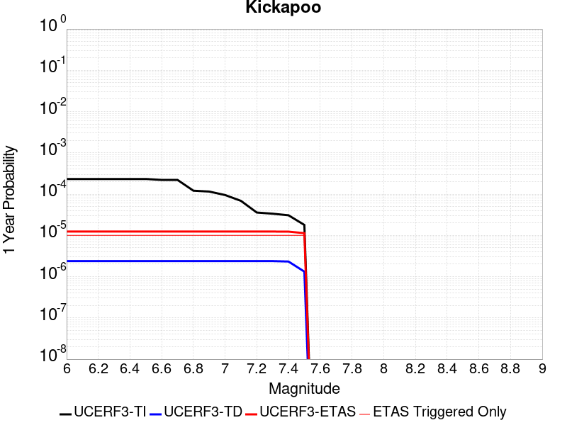 |  |

| Magnitude | 1 wk TI Prob | 1 wk TD Prob | 1 wk ETAS Prob | 1 wk ETAS/TD Gain | 1 wk ETAS Triggered Only | 1 mo TI Prob | 1 mo TD Prob | 1 mo ETAS Prob | 1 mo ETAS/TD Gain | 1 mo ETAS Triggered Only | 1 yr TI Prob | 1 yr TD Prob | 1 yr ETAS Prob | 1 yr ETAS/TD Gain | 1 yr ETAS Triggered Only | 10 yr TI Prob | 10 yr TD Prob | 10 yr ETAS Prob | 10 yr ETAS/TD Gain | 10 yr ETAS Triggered Only |
|-----|-----|-----|-----|-----|-----|-----|-----|-----|-----|-----|-----|-----|-----|-----|-----|-----|-----|-----|-----|-----|
| 6.0 | 4.4610633E-6 | 4.559828E-8 | 4.559828E-8 | 1.0 | 0.0 | 1.9118703E-5 | 1.954212E-7 | 1.0195419E-5 | 52.171513 | 1.0E-5 | 2.3274534E-4 | 2.3792506E-6 | 1.2379227E-5 | 5.202994 | 1.0E-5 | 0.0023250172 | 2.379228E-5 | 3.3792043E-5 | 1.4202944 | 1.0E-5 |
| 6.1 | 4.4610633E-6 | 4.559828E-8 | 4.559828E-8 | 1.0 | 0.0 | 1.9118703E-5 | 1.954212E-7 | 1.0195419E-5 | 52.171513 | 1.0E-5 | 2.3274534E-4 | 2.3792506E-6 | 1.2379227E-5 | 5.202994 | 1.0E-5 | 0.0023250172 | 2.379228E-5 | 3.3792043E-5 | 1.4202944 | 1.0E-5 |
| 6.2 | 4.4610633E-6 | 4.559828E-8 | 4.559828E-8 | 1.0 | 0.0 | 1.9118703E-5 | 1.954212E-7 | 1.0195419E-5 | 52.171513 | 1.0E-5 | 2.3274534E-4 | 2.3792506E-6 | 1.2379227E-5 | 5.202994 | 1.0E-5 | 0.0023250172 | 2.379228E-5 | 3.3792043E-5 | 1.4202944 | 1.0E-5 |
| 6.3 | 4.4610633E-6 | 4.559828E-8 | 4.559828E-8 | 1.0 | 0.0 | 1.9118703E-5 | 1.954212E-7 | 1.0195419E-5 | 52.171513 | 1.0E-5 | 2.3274534E-4 | 2.3792506E-6 | 1.2379227E-5 | 5.202994 | 1.0E-5 | 0.0023250172 | 2.379228E-5 | 3.3792043E-5 | 1.4202944 | 1.0E-5 |
| 6.4 | 4.4610633E-6 | 4.559828E-8 | 4.559828E-8 | 1.0 | 0.0 | 1.9118703E-5 | 1.954212E-7 | 1.0195419E-5 | 52.171513 | 1.0E-5 | 2.3274534E-4 | 2.3792506E-6 | 1.2379227E-5 | 5.202994 | 1.0E-5 | 0.0023250172 | 2.379228E-5 | 3.3792043E-5 | 1.4202944 | 1.0E-5 |
| 6.5 | 4.4610633E-6 | 4.559828E-8 | 4.559828E-8 | 1.0 | 0.0 | 1.9118703E-5 | 1.954212E-7 | 1.0195419E-5 | 52.171513 | 1.0E-5 | 2.3274534E-4 | 2.3792506E-6 | 1.2379227E-5 | 5.202994 | 1.0E-5 | 0.0023250172 | 2.379228E-5 | 3.3792043E-5 | 1.4202944 | 1.0E-5 |
| 6.6 | 4.236531E-6 | 4.559828E-8 | 4.559828E-8 | 1.0 | 0.0 | 1.8156434E-5 | 1.954212E-7 | 1.0195419E-5 | 52.171513 | 1.0E-5 | 2.2103215E-4 | 2.3792506E-6 | 1.2379227E-5 | 5.202994 | 1.0E-5 | 0.0022081244 | 2.379228E-5 | 3.3792043E-5 | 1.4202944 | 1.0E-5 |
| 6.7 | 4.236531E-6 | 4.559828E-8 | 4.559828E-8 | 1.0 | 0.0 | 1.8156434E-5 | 1.954212E-7 | 1.0195419E-5 | 52.171513 | 1.0E-5 | 2.2103215E-4 | 2.3792506E-6 | 1.2379227E-5 | 5.202994 | 1.0E-5 | 0.0022081244 | 2.379228E-5 | 3.3792043E-5 | 1.4202944 | 1.0E-5 |
| 6.8 | 2.3202913E-6 | 4.559828E-8 | 4.559828E-8 | 1.0 | 0.0 | 9.944068E-6 | 1.954212E-7 | 1.0195419E-5 | 52.171513 | 1.0E-5 | 1.210623E-4 | 2.3792506E-6 | 1.2379227E-5 | 5.202994 | 1.0E-5 | 0.0012099637 | 2.379228E-5 | 3.3792043E-5 | 1.4202944 | 1.0E-5 |
| 6.9 | 2.2111808E-6 | 4.559828E-8 | 4.559828E-8 | 1.0 | 0.0 | 9.4764555E-6 | 1.954212E-7 | 1.0195419E-5 | 52.171513 | 1.0E-5 | 1.1536973E-4 | 2.3792506E-6 | 1.2379227E-5 | 5.202994 | 1.0E-5 | 0.0011530985 | 2.379228E-5 | 3.3792043E-5 | 1.4202944 | 1.0E-5 |
| 7.0 | 1.8222031E-6 | 4.559828E-8 | 4.559828E-8 | 1.0 | 0.0 | 7.809419E-6 | 1.954212E-7 | 1.0195419E-5 | 52.171513 | 1.0E-5 | 9.507552E-5 | 2.3792506E-6 | 1.2379227E-5 | 5.202994 | 1.0E-5 | 9.5034856E-4 | 2.379228E-5 | 3.3792043E-5 | 1.4202944 | 1.0E-5 |
| 7.1 | 1.3163254E-6 | 4.559828E-8 | 4.559828E-8 | 1.0 | 0.0 | 5.6413824E-6 | 1.954212E-7 | 1.0195419E-5 | 52.171513 | 1.0E-5 | 6.868167E-5 | 2.3792506E-6 | 1.2379227E-5 | 5.202994 | 1.0E-5 | 6.866045E-4 | 2.379228E-5 | 3.3792043E-5 | 1.4202944 | 1.0E-5 |
| 7.2 | 6.8603634E-7 | 4.5597357E-8 | 4.5597357E-8 | 1.0 | 0.0 | 2.9401524E-6 | 1.9541724E-7 | 1.0195416E-5 | 52.17255 | 1.0E-5 | 3.579577E-5 | 2.3792024E-6 | 1.2379179E-5 | 5.203079 | 1.0E-5 | 3.5790002E-4 | 2.37918E-5 | 3.3791563E-5 | 1.4203029 | 1.0E-5 |
| 7.3 | 6.4299127E-7 | 4.5581142E-8 | 4.5581142E-8 | 1.0 | 0.0 | 2.755674E-6 | 1.9534774E-7 | 1.0195346E-5 | 52.190754 | 1.0E-5 | 3.3549815E-5 | 2.3783564E-6 | 1.2378333E-5 | 5.204574 | 1.0E-5 | 3.354475E-4 | 2.3783337E-5 | 3.37831E-5 | 1.4204525 | 1.0E-5 |
| 7.4 | 5.8856347E-7 | 4.4556977E-8 | 4.4556977E-8 | 1.0 | 0.0 | 2.5224124E-6 | 1.9095846E-7 | 1.0190956E-5 | 53.367397 | 1.0E-5 | 3.070994E-5 | 2.3249172E-6 | 1.2324894E-5 | 5.3012185 | 1.0E-5 | 3.0705697E-4 | 2.3248956E-5 | 3.3248725E-5 | 1.4301169 | 1.0E-5 |
| 7.5 | 3.435626E-7 | 2.5357679E-8 | 2.5357679E-8 | 1.0 | 0.0 | 1.4724103E-6 | 1.0867576E-7 | 1.0108674E-5 | 93.01682 | 1.0E-5 | 1.7926448E-5 | 1.3231268E-6 | 1.13231135E-5 | 8.557844 | 1.0E-5 | 1.7925001E-4 | 1.3231205E-5 | 2.3231072E-5 | 1.755779 | 1.0E-5 |

## Earthquake Valley (No  Extension)
*[(top)](#table-of-contents)*

| 1 Week | 1 Month | 1 Year | 10 Year |
|-----|-----|-----|-----|
| 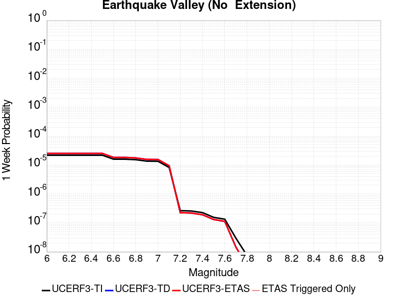 |  |  |  |

| Magnitude | 1 wk TI Prob | 1 wk TD Prob | 1 wk ETAS Prob | 1 wk ETAS/TD Gain | 1 wk ETAS Triggered Only | 1 mo TI Prob | 1 mo TD Prob | 1 mo ETAS Prob | 1 mo ETAS/TD Gain | 1 mo ETAS Triggered Only | 1 yr TI Prob | 1 yr TD Prob | 1 yr ETAS Prob | 1 yr ETAS/TD Gain | 1 yr ETAS Triggered Only | 10 yr TI Prob | 10 yr TD Prob | 10 yr ETAS Prob | 10 yr ETAS/TD Gain | 10 yr ETAS Triggered Only |
|-----|-----|-----|-----|-----|-----|-----|-----|-----|-----|-----|-----|-----|-----|-----|-----|-----|-----|-----|-----|-----|
| 6.0 | 2.1859703E-5 | 2.5198362E-5 | 2.5198362E-5 | 1.0 | 0.0 | 9.3681076E-5 | 1.07989326E-4 | 1.07989326E-4 | 1.0 | 0.0 | 0.0011399703 | 0.001314122 | 0.001314122 | 1.0 | 0.0 | 0.011341401 | 0.013077871 | 0.01308774 | 1.0007546 | 1.0E-5 |
| 6.1 | 2.1859703E-5 | 2.5198362E-5 | 2.5198362E-5 | 1.0 | 0.0 | 9.3681076E-5 | 1.07989326E-4 | 1.07989326E-4 | 1.0 | 0.0 | 0.0011399703 | 0.001314122 | 0.001314122 | 1.0 | 0.0 | 0.011341401 | 0.013077871 | 0.01308774 | 1.0007546 | 1.0E-5 |
| 6.2 | 2.1859703E-5 | 2.5198362E-5 | 2.5198362E-5 | 1.0 | 0.0 | 9.3681076E-5 | 1.07989326E-4 | 1.07989326E-4 | 1.0 | 0.0 | 0.0011399703 | 0.001314122 | 0.001314122 | 1.0 | 0.0 | 0.011341401 | 0.013077871 | 0.01308774 | 1.0007546 | 1.0E-5 |
| 6.3 | 2.1859703E-5 | 2.5198362E-5 | 2.5198362E-5 | 1.0 | 0.0 | 9.3681076E-5 | 1.07989326E-4 | 1.07989326E-4 | 1.0 | 0.0 | 0.0011399703 | 0.001314122 | 0.001314122 | 1.0 | 0.0 | 0.011341401 | 0.013077871 | 0.01308774 | 1.0007546 | 1.0E-5 |
| 6.4 | 2.1859703E-5 | 2.5198362E-5 | 2.5198362E-5 | 1.0 | 0.0 | 9.3681076E-5 | 1.07989326E-4 | 1.07989326E-4 | 1.0 | 0.0 | 0.0011399703 | 0.001314122 | 0.001314122 | 1.0 | 0.0 | 0.011341401 | 0.013077871 | 0.01308774 | 1.0007546 | 1.0E-5 |
| 6.5 | 2.1859703E-5 | 2.5198362E-5 | 2.5198362E-5 | 1.0 | 0.0 | 9.3681076E-5 | 1.07989326E-4 | 1.07989326E-4 | 1.0 | 0.0 | 0.0011399703 | 0.001314122 | 0.001314122 | 1.0 | 0.0 | 0.011341401 | 0.013077871 | 0.01308774 | 1.0007546 | 1.0E-5 |
| 6.6 | 1.597E-5 | 1.8356275E-5 | 1.8356275E-5 | 1.0 | 0.0 | 6.8441055E-5 | 7.866787E-5 | 7.866787E-5 | 1.0 | 0.0 | 8.329513E-4 | 9.574478E-4 | 9.574478E-4 | 1.0 | 0.0 | 0.008298361 | 0.009541836 | 0.009541836 | 1.0 | 0.0 |
| 6.7 | 1.597E-5 | 1.8356275E-5 | 1.8356275E-5 | 1.0 | 0.0 | 6.8441055E-5 | 7.866787E-5 | 7.866787E-5 | 1.0 | 0.0 | 8.329513E-4 | 9.574478E-4 | 9.574478E-4 | 1.0 | 0.0 | 0.008298361 | 0.009541836 | 0.009541836 | 1.0 | 0.0 |
| 6.8 | 1.5315149E-5 | 1.7602091E-5 | 1.7602091E-5 | 1.0 | 0.0 | 6.5634704E-5 | 7.543584E-5 | 7.543584E-5 | 1.0 | 0.0 | 7.988095E-4 | 9.181311E-4 | 9.181311E-4 | 1.0 | 0.0 | 0.007959441 | 0.009151919 | 0.009151919 | 1.0 | 0.0 |
| 6.9 | 1.3634728E-5 | 1.5675821E-5 | 1.5675821E-5 | 1.0 | 0.0 | 5.8433237E-5 | 6.718082E-5 | 6.718082E-5 | 1.0 | 0.0 | 7.1119244E-4 | 8.177017E-4 | 8.177017E-4 | 1.0 | 0.0 | 0.007089207 | 0.008155 | 0.008155 | 1.0 | 0.0 |
| 7.0 | 1.3496271E-5 | 1.5517853E-5 | 1.5517853E-5 | 1.0 | 0.0 | 5.783988E-5 | 6.650385E-5 | 6.650385E-5 | 1.0 | 0.0 | 7.03973E-4 | 8.094657E-4 | 8.094657E-4 | 1.0 | 0.0 | 0.007017471 | 0.0080732405 | 0.0080732405 | 1.0 | 0.0 |
| 7.1 | 8.242798E-6 | 9.4726E-6 | 9.4726E-6 | 1.0 | 0.0 | 3.53258E-5 | 4.0596606E-5 | 4.0596606E-5 | 1.0 | 0.0 | 4.300067E-4 | 4.9421866E-4 | 4.9421866E-4 | 1.0 | 0.0 | 0.004291756 | 0.0049377717 | 0.0049377717 | 1.0 | 0.0 |
| 7.2 | 2.6506527E-7 | 2.2560312E-7 | 2.2560312E-7 | 1.0 | 0.0 | 1.1359936E-6 | 9.668702E-7 | 9.668702E-7 | 1.0 | 0.0 | 1.3830633E-5 | 1.17715845E-5 | 1.17715845E-5 | 1.0 | 0.0 | 1.3829772E-4 | 1.1771003E-4 | 1.1771003E-4 | 1.0 | 0.0 |
| 7.3 | 2.5810488E-7 | 2.1955442E-7 | 2.1955442E-7 | 1.0 | 0.0 | 1.1061633E-6 | 9.409472E-7 | 9.409472E-7 | 1.0 | 0.0 | 1.3467455E-5 | 1.1455976E-5 | 1.1455976E-5 | 1.0 | 0.0 | 1.3466639E-4 | 1.1455427E-4 | 1.1455427E-4 | 1.0 | 0.0 |
| 7.4 | 2.2676066E-7 | 1.9110601E-7 | 1.9110601E-7 | 1.0 | 0.0 | 9.71831E-7 | 8.190255E-7 | 8.190255E-7 | 1.0 | 0.0 | 1.1831979E-5 | 9.9715935E-6 | 9.9715935E-6 | 1.0 | 0.0 | 1.1831349E-4 | 9.9711855E-5 | 9.9711855E-5 | 1.0 | 0.0 |
| 7.5 | 1.5553917E-7 | 1.3112096E-7 | 1.3112096E-7 | 1.0 | 0.0 | 6.6659624E-7 | 5.619469E-7 | 5.619469E-7 | 1.0 | 0.0 | 8.115779E-6 | 6.8416834E-6 | 6.8416834E-6 | 1.0 | 0.0 | 8.115482E-5 | 6.841495E-5 | 6.841495E-5 | 1.0 | 0.0 |
| 7.6 | 1.3448629E-7 | 1.1288419E-7 | 1.1288419E-7 | 1.0 | 0.0 | 5.7636964E-7 | 4.837893E-7 | 4.837893E-7 | 1.0 | 0.0 | 7.017278E-6 | 5.890121E-6 | 5.890121E-6 | 1.0 | 0.0 | 7.0170565E-5 | 5.889986E-5 | 5.889986E-5 | 1.0 | 0.0 |
| 7.7 | 2.9719402E-8 | 1.458206E-8 | 1.458206E-8 | 1.0 | 0.0 | 1.2736886E-7 | 6.249454E-8 | 6.249454E-8 | 1.0 | 0.0 | 1.5507147E-6 | 7.608708E-7 | 7.608708E-7 | 1.0 | 0.0 | 1.550704E-5 | 7.6086876E-6 | 7.6086876E-6 | 1.0 | 0.0 |
| 7.8 | 7.4390196E-9 | 3.2502152E-9 | 3.2502152E-9 | 1.0 | 0.0 | 3.1881513E-8 | 1.3929493E-8 | 1.3929493E-8 | 1.0 | 0.0 | 3.8815733E-7 | 1.6959156E-7 | 1.6959156E-7 | 1.0 | 0.0 | 3.8815665E-6 | 1.6959145E-6 | 1.6959145E-6 | 1.0 | 0.0 |
| 7.9 | 1.5373532E-9 | 8.440161E-10 | 8.440161E-10 | 1.0 | 0.0 | 6.5886567E-9 | 3.6172119E-9 | 3.6172119E-9 | 1.0 | 0.0 | 8.021689E-8 | 4.4039556E-8 | 4.4039556E-8 | 1.0 | 0.0 | 8.0216864E-7 | 4.4039552E-7 | 4.4039552E-7 | 1.0 | 0.0 |

## Anacapa-Dume alt 1
*[(top)](#table-of-contents)*

| 1 Week | 1 Month | 1 Year | 10 Year |
|-----|-----|-----|-----|
|  |  | 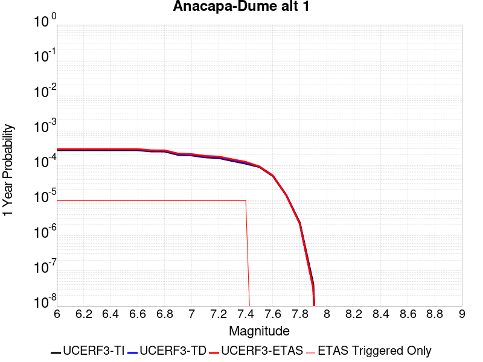 |  |

| Magnitude | 1 wk TI Prob | 1 wk TD Prob | 1 wk ETAS Prob | 1 wk ETAS/TD Gain | 1 wk ETAS Triggered Only | 1 mo TI Prob | 1 mo TD Prob | 1 mo ETAS Prob | 1 mo ETAS/TD Gain | 1 mo ETAS Triggered Only | 1 yr TI Prob | 1 yr TD Prob | 1 yr ETAS Prob | 1 yr ETAS/TD Gain | 1 yr ETAS Triggered Only | 10 yr TI Prob | 10 yr TD Prob | 10 yr ETAS Prob | 10 yr ETAS/TD Gain | 10 yr ETAS Triggered Only |
|-----|-----|-----|-----|-----|-----|-----|-----|-----|-----|-----|-----|-----|-----|-----|-----|-----|-----|-----|-----|-----|
| 6.0 | 5.1871802E-6 | 5.3673907E-6 | 1.5367337E-5 | 2.8630927 | 1.0E-5 | 2.2230583E-5 | 2.3002905E-5 | 3.3002674E-5 | 1.4347177 | 1.0E-5 | 2.7062374E-4 | 2.8002524E-4 | 2.9002244E-4 | 1.035701 | 1.0E-5 | 0.002702944 | 0.0027968092 | 0.002806781 | 1.0035655 | 1.0E-5 |
| 6.1 | 5.1871802E-6 | 5.3673907E-6 | 1.5367337E-5 | 2.8630927 | 1.0E-5 | 2.2230583E-5 | 2.3002905E-5 | 3.3002674E-5 | 1.4347177 | 1.0E-5 | 2.7062374E-4 | 2.8002524E-4 | 2.9002244E-4 | 1.035701 | 1.0E-5 | 0.002702944 | 0.0027968092 | 0.002806781 | 1.0035655 | 1.0E-5 |
| 6.2 | 5.1871802E-6 | 5.3673907E-6 | 1.5367337E-5 | 2.8630927 | 1.0E-5 | 2.2230583E-5 | 2.3002905E-5 | 3.3002674E-5 | 1.4347177 | 1.0E-5 | 2.7062374E-4 | 2.8002524E-4 | 2.9002244E-4 | 1.035701 | 1.0E-5 | 0.002702944 | 0.0027968092 | 0.002806781 | 1.0035655 | 1.0E-5 |
| 6.3 | 5.1871802E-6 | 5.3673907E-6 | 1.5367337E-5 | 2.8630927 | 1.0E-5 | 2.2230583E-5 | 2.3002905E-5 | 3.3002674E-5 | 1.4347177 | 1.0E-5 | 2.7062374E-4 | 2.8002524E-4 | 2.9002244E-4 | 1.035701 | 1.0E-5 | 0.002702944 | 0.0027968092 | 0.002806781 | 1.0035655 | 1.0E-5 |
| 6.4 | 5.1871802E-6 | 5.3673907E-6 | 1.5367337E-5 | 2.8630927 | 1.0E-5 | 2.2230583E-5 | 2.3002905E-5 | 3.3002674E-5 | 1.4347177 | 1.0E-5 | 2.7062374E-4 | 2.8002524E-4 | 2.9002244E-4 | 1.035701 | 1.0E-5 | 0.002702944 | 0.0027968092 | 0.002806781 | 1.0035655 | 1.0E-5 |
| 6.5 | 5.1871802E-6 | 5.3673907E-6 | 1.5367337E-5 | 2.8630927 | 1.0E-5 | 2.2230583E-5 | 2.3002905E-5 | 3.3002674E-5 | 1.4347177 | 1.0E-5 | 2.7062374E-4 | 2.8002524E-4 | 2.9002244E-4 | 1.035701 | 1.0E-5 | 0.002702944 | 0.0027968092 | 0.002806781 | 1.0035655 | 1.0E-5 |
| 6.6 | 5.1871802E-6 | 5.3673907E-6 | 1.5367337E-5 | 2.8630927 | 1.0E-5 | 2.2230583E-5 | 2.3002905E-5 | 3.3002674E-5 | 1.4347177 | 1.0E-5 | 2.7062374E-4 | 2.8002524E-4 | 2.9002244E-4 | 1.035701 | 1.0E-5 | 0.002702944 | 0.0027968092 | 0.002806781 | 1.0035655 | 1.0E-5 |
| 6.7 | 4.7693475E-6 | 4.9366918E-6 | 1.4936642E-5 | 3.025638 | 1.0E-5 | 2.04399E-5 | 2.1157082E-5 | 3.115687E-5 | 1.4726449 | 1.0E-5 | 2.4882736E-4 | 2.5755778E-4 | 2.675552E-4 | 1.0388162 | 1.0E-5 | 0.0024854892 | 0.002572669 | 0.0025826432 | 1.003877 | 1.0E-5 |
| 6.8 | 4.753408E-6 | 4.92024E-6 | 1.4920191E-5 | 3.032411 | 1.0E-5 | 2.037159E-5 | 2.1086576E-5 | 3.1086365E-5 | 1.4742254 | 1.0E-5 | 2.4799586E-4 | 2.5669957E-4 | 2.66697E-4 | 1.038946 | 1.0E-5 | 0.002477193 | 0.0025641066 | 0.002574081 | 1.00389 | 1.0E-5 |
| 6.9 | 3.800069E-6 | 3.937126E-6 | 1.3937087E-5 | 3.5399137 | 1.0E-5 | 1.6285909E-5 | 1.687329E-5 | 2.687312E-5 | 1.5926427 | 1.0E-5 | 1.9826289E-4 | 2.0541316E-4 | 2.1541111E-4 | 1.0486723 | 1.0E-5 | 0.001980861 | 0.0020522568 | 0.0020622362 | 1.0048627 | 1.0E-5 |
| 7.0 | 3.6671938E-6 | 3.7999182E-6 | 1.379988E-5 | 3.6316257 | 1.0E-5 | 1.571645E-5 | 1.6285263E-5 | 2.62851E-5 | 1.614042 | 1.0E-5 | 1.9133097E-4 | 1.9825528E-4 | 2.0825329E-4 | 1.05043 | 1.0E-5 | 0.0019116632 | 0.0019808074 | 0.0019907875 | 1.0050385 | 1.0E-5 |
| 7.1 | 3.2394885E-6 | 3.3587933E-6 | 1.335876E-5 | 3.9772499 | 1.0E-5 | 1.3883448E-5 | 1.4394749E-5 | 2.4394605E-5 | 1.6946877 | 1.0E-5 | 1.6901788E-4 | 1.7524208E-4 | 1.8524034E-4 | 1.0570539 | 1.0E-5 | 0.0016888938 | 0.0017510501 | 0.0017610326 | 1.0057008 | 1.0E-5 |
| 7.2 | 3.0935948E-6 | 3.2079258E-6 | 1.3207894E-5 | 4.117269 | 1.0E-5 | 1.3258196E-5 | 1.3748182E-5 | 2.3748045E-5 | 1.7273589 | 1.0E-5 | 1.6140658E-4 | 1.6737137E-4 | 1.7736969E-4 | 1.0597373 | 1.0E-5 | 0.001612894 | 0.0016724641 | 0.0016824474 | 1.0059692 | 1.0E-5 |
| 7.3 | 2.5604163E-6 | 2.647073E-6 | 1.2647047E-5 | 4.7777476 | 1.0E-5 | 1.0973167E-5 | 1.1344549E-5 | 2.1344436E-5 | 1.8814706 | 1.0E-5 | 1.3359012E-4 | 1.3811118E-4 | 1.481098E-4 | 1.0723954 | 1.0E-5 | 0.0013350984 | 0.0013802581 | 0.0013902442 | 1.007235 | 1.0E-5 |
| 7.4 | 2.1429005E-6 | 2.2106028E-6 | 1.221058E-5 | 5.523643 | 1.0E-5 | 9.1838265E-6 | 9.473977E-6 | 1.9473882E-5 | 2.055513 | 1.0E-5 | 1.11807356E-4 | 1.1533959E-4 | 1.2533844E-4 | 1.0866905 | 1.0E-5 | 0.0011175112 | 0.0011527999 | 0.0011627885 | 1.0086645 | 1.0E-5 |
| 7.5 | 1.7237151E-6 | 1.7761449E-6 | 1.7761449E-6 | 1.0 | 0.0 | 7.3873293E-6 | 7.6120277E-6 | 7.6120277E-6 | 1.0 | 0.0 | 8.993702E-5 | 9.267252E-5 | 9.267252E-5 | 1.0 | 0.0 | 8.990063E-4 | 9.2634105E-4 | 9.2634105E-4 | 1.0 | 0.0 |
| 7.6 | 9.541696E-7 | 9.823206E-7 | 9.823206E-7 | 1.0 | 0.0 | 4.089292E-6 | 4.2099387E-6 | 4.2099387E-6 | 1.0 | 0.0 | 4.9785995E-5 | 5.1254807E-5 | 5.1254807E-5 | 1.0 | 0.0 | 4.9774844E-4 | 5.1243114E-4 | 5.1243114E-4 | 1.0 | 0.0 |
| 7.7 | 2.7226676E-7 | 2.7172416E-7 | 2.7172416E-7 | 1.0 | 0.0 | 1.166857E-6 | 1.1645316E-6 | 1.1645316E-6 | 1.0 | 0.0 | 1.4206392E-5 | 1.4178081E-5 | 1.4178081E-5 | 1.0 | 0.0 | 1.4205484E-4 | 1.4177183E-4 | 1.4177183E-4 | 1.0 | 0.0 |
| 7.8 | 4.5017995E-8 | 4.2157676E-8 | 4.2157676E-8 | 1.0 | 0.0 | 1.9293425E-7 | 1.8067574E-7 | 1.8067574E-7 | 1.0 | 0.0 | 2.348972E-6 | 2.1997253E-6 | 2.1997253E-6 | 1.0 | 0.0 | 2.348947E-5 | 2.1997055E-5 | 2.1997055E-5 | 1.0 | 0.0 |
| 7.9 | 8.007447E-10 | 6.1608785E-10 | 6.1608785E-10 | 1.0 | 0.0 | 3.4317629E-9 | 2.6403764E-9 | 2.6403764E-9 | 1.0 | 0.0 | 4.1781714E-8 | 3.2146584E-8 | 3.2146584E-8 | 1.0 | 0.0 | 4.1781706E-7 | 3.214658E-7 | 3.214658E-7 | 1.0 | 0.0 |

## Northridge Hills
*[(top)](#table-of-contents)*

| 1 Week | 1 Month | 1 Year | 10 Year |
|-----|-----|-----|-----|
|  |  |  |  |

| Magnitude | 1 wk TI Prob | 1 wk TD Prob | 1 wk ETAS Prob | 1 wk ETAS/TD Gain | 1 wk ETAS Triggered Only | 1 mo TI Prob | 1 mo TD Prob | 1 mo ETAS Prob | 1 mo ETAS/TD Gain | 1 mo ETAS Triggered Only | 1 yr TI Prob | 1 yr TD Prob | 1 yr ETAS Prob | 1 yr ETAS/TD Gain | 1 yr ETAS Triggered Only | 10 yr TI Prob | 10 yr TD Prob | 10 yr ETAS Prob | 10 yr ETAS/TD Gain | 10 yr ETAS Triggered Only |
|-----|-----|-----|-----|-----|-----|-----|-----|-----|-----|-----|-----|-----|-----|-----|-----|-----|-----|-----|-----|-----|
| 6.0 | 5.095982E-6 | 3.6152098E-6 | 3.6152098E-6 | 1.0 | 0.0 | 2.183974E-5 | 1.5493664E-5 | 1.5493664E-5 | 1.0 | 0.0 | 2.658664E-4 | 1.8861916E-4 | 1.8861916E-4 | 1.0 | 0.0 | 0.0026554854 | 0.001884603 | 0.0018945843 | 1.0052961 | 1.0E-5 |
| 6.1 | 5.095982E-6 | 3.6152098E-6 | 3.6152098E-6 | 1.0 | 0.0 | 2.183974E-5 | 1.5493664E-5 | 1.5493664E-5 | 1.0 | 0.0 | 2.658664E-4 | 1.8861916E-4 | 1.8861916E-4 | 1.0 | 0.0 | 0.0026554854 | 0.001884603 | 0.0018945843 | 1.0052961 | 1.0E-5 |
| 6.2 | 5.095982E-6 | 3.6152098E-6 | 3.6152098E-6 | 1.0 | 0.0 | 2.183974E-5 | 1.5493664E-5 | 1.5493664E-5 | 1.0 | 0.0 | 2.658664E-4 | 1.8861916E-4 | 1.8861916E-4 | 1.0 | 0.0 | 0.0026554854 | 0.001884603 | 0.0018945843 | 1.0052961 | 1.0E-5 |
| 6.3 | 5.095982E-6 | 3.6152098E-6 | 3.6152098E-6 | 1.0 | 0.0 | 2.183974E-5 | 1.5493664E-5 | 1.5493664E-5 | 1.0 | 0.0 | 2.658664E-4 | 1.8861916E-4 | 1.8861916E-4 | 1.0 | 0.0 | 0.0026554854 | 0.001884603 | 0.0018945843 | 1.0052961 | 1.0E-5 |
| 6.4 | 5.095982E-6 | 3.6152098E-6 | 3.6152098E-6 | 1.0 | 0.0 | 2.183974E-5 | 1.5493664E-5 | 1.5493664E-5 | 1.0 | 0.0 | 2.658664E-4 | 1.8861916E-4 | 1.8861916E-4 | 1.0 | 0.0 | 0.0026554854 | 0.001884603 | 0.0018945843 | 1.0052961 | 1.0E-5 |
| 6.5 | 5.095982E-6 | 3.6152098E-6 | 3.6152098E-6 | 1.0 | 0.0 | 2.183974E-5 | 1.5493664E-5 | 1.5493664E-5 | 1.0 | 0.0 | 2.658664E-4 | 1.8861916E-4 | 1.8861916E-4 | 1.0 | 0.0 | 0.0026554854 | 0.001884603 | 0.0018945843 | 1.0052961 | 1.0E-5 |
| 6.6 | 5.095982E-6 | 3.6152098E-6 | 3.6152098E-6 | 1.0 | 0.0 | 2.183974E-5 | 1.5493664E-5 | 1.5493664E-5 | 1.0 | 0.0 | 2.658664E-4 | 1.8861916E-4 | 1.8861916E-4 | 1.0 | 0.0 | 0.0026554854 | 0.001884603 | 0.0018945843 | 1.0052961 | 1.0E-5 |
| 6.7 | 5.095982E-6 | 3.6152098E-6 | 3.6152098E-6 | 1.0 | 0.0 | 2.183974E-5 | 1.5493664E-5 | 1.5493664E-5 | 1.0 | 0.0 | 2.658664E-4 | 1.8861916E-4 | 1.8861916E-4 | 1.0 | 0.0 | 0.0026554854 | 0.001884603 | 0.0018945843 | 1.0052961 | 1.0E-5 |
| 6.8 | 5.095982E-6 | 3.6152098E-6 | 3.6152098E-6 | 1.0 | 0.0 | 2.183974E-5 | 1.5493664E-5 | 1.5493664E-5 | 1.0 | 0.0 | 2.658664E-4 | 1.8861916E-4 | 1.8861916E-4 | 1.0 | 0.0 | 0.0026554854 | 0.001884603 | 0.0018945843 | 1.0052961 | 1.0E-5 |
| 6.9 | 5.0942654E-6 | 3.6134247E-6 | 3.6134247E-6 | 1.0 | 0.0 | 2.1832384E-5 | 1.5486015E-5 | 1.5486015E-5 | 1.0 | 0.0 | 2.6577685E-4 | 1.8852603E-4 | 1.8852603E-4 | 1.0 | 0.0 | 0.002654592 | 0.0018836735 | 0.0018936546 | 1.0052987 | 1.0E-5 |
| 7.0 | 4.851143E-6 | 3.3587396E-6 | 3.3587396E-6 | 1.0 | 0.0 | 2.0790447E-5 | 1.4394519E-5 | 1.4394519E-5 | 1.0 | 0.0 | 2.5309427E-4 | 1.7523921E-4 | 1.7523921E-4 | 1.0 | 0.0 | 0.0025280623 | 0.0017510147 | 0.0017609972 | 1.005701 | 1.0E-5 |
| 7.1 | 4.7910607E-6 | 3.2970208E-6 | 3.2970208E-6 | 1.0 | 0.0 | 2.0532956E-5 | 1.4130013E-5 | 1.4130013E-5 | 1.0 | 0.0 | 2.4996005E-4 | 1.7201937E-4 | 1.7201937E-4 | 1.0 | 0.0 | 0.0024967908 | 0.0017188663 | 0.001728849 | 1.0058078 | 1.0E-5 |
| 7.2 | 4.580079E-6 | 3.1067987E-6 | 3.1067987E-6 | 1.0 | 0.0 | 1.9628762E-5 | 1.3314784E-5 | 1.3314784E-5 | 1.0 | 0.0 | 2.3895396E-4 | 1.6209547E-4 | 1.6209547E-4 | 1.0 | 0.0 | 0.0023869718 | 0.0016197758 | 0.0016297597 | 1.0061637 | 1.0E-5 |
| 7.3 | 4.290062E-6 | 2.8682275E-6 | 2.8682275E-6 | 1.0 | 0.0 | 1.838585E-5 | 1.2292346E-5 | 1.2292346E-5 | 1.0 | 0.0 | 2.2382473E-4 | 1.4964906E-4 | 1.4964906E-4 | 1.0 | 0.0 | 0.0022359942 | 0.0014954859 | 0.0015054708 | 1.0066768 | 1.0E-5 |
| 7.4 | 4.0259683E-6 | 2.673904E-6 | 2.673904E-6 | 1.0 | 0.0 | 1.7254037E-5 | 1.1459538E-5 | 1.1459538E-5 | 1.0 | 0.0 | 2.1004764E-4 | 1.3951097E-4 | 1.3951097E-4 | 1.0 | 0.0 | 0.002098492 | 0.0013942367 | 0.0014042228 | 1.0071623 | 1.0E-5 |
| 7.5 | 3.5477108E-6 | 2.285216E-6 | 2.285216E-6 | 1.0 | 0.0 | 1.5204386E-5 | 9.793746E-6 | 9.793746E-6 | 1.0 | 0.0 | 1.8509767E-4 | 1.1923235E-4 | 1.1923235E-4 | 1.0 | 0.0 | 0.0018494357 | 0.0011916853 | 0.0012016734 | 1.0083815 | 1.0E-5 |
| 7.6 | 2.9990608E-6 | 1.8528339E-6 | 1.8528339E-6 | 1.0 | 0.0 | 1.2853055E-5 | 7.940693E-6 | 7.940693E-6 | 1.0 | 0.0 | 1.564747E-4 | 9.667365E-5 | 9.667365E-5 | 1.0 | 0.0 | 0.0015636457 | 9.663168E-4 | 9.763071E-4 | 1.0103385 | 1.0E-5 |
| 7.7 | 2.4542855E-6 | 1.4461344E-6 | 1.4461344E-6 | 1.0 | 0.0 | 1.05183235E-5 | 6.197704E-6 | 6.197704E-6 | 1.0 | 0.0 | 1.2805307E-4 | 7.545444E-5 | 7.545444E-5 | 1.0 | 0.0 | 0.001279793 | 7.5428875E-4 | 7.642812E-4 | 1.0132475 | 1.0E-5 |
| 7.8 | 1.3623128E-6 | 8.016168E-7 | 8.016168E-7 | 1.0 | 0.0 | 5.8384703E-6 | 3.4354962E-6 | 3.4354962E-6 | 1.0 | 0.0 | 7.108106E-5 | 4.1826366E-5 | 4.1826366E-5 | 1.0 | 0.0 | 7.1058323E-4 | 4.1818514E-4 | 4.2818097E-4 | 1.0239029 | 1.0E-5 |
| 7.9 | 7.716622E-7 | 4.218757E-7 | 4.218757E-7 | 1.0 | 0.0 | 3.3071194E-6 | 1.8080375E-6 | 1.8080375E-6 | 1.0 | 0.0 | 4.0263436E-5 | 2.2012635E-5 | 2.2012635E-5 | 1.0 | 0.0 | 4.0256142E-4 | 2.2010466E-4 | 2.3010245E-4 | 1.0454229 | 1.0E-5 |
| 8.0 | 1.2117711E-7 | 6.6220565E-8 | 6.6220565E-8 | 1.0 | 0.0 | 5.1933034E-7 | 2.838024E-7 | 2.838024E-7 | 1.0 | 0.0 | 6.3228285E-6 | 3.4552888E-6 | 3.4552888E-6 | 1.0 | 0.0 | 6.3226486E-5 | 3.455237E-5 | 3.455237E-5 | 1.0 | 0.0 |

## Great Valley 12
*[(top)](#table-of-contents)*

| 1 Week | 1 Month | 1 Year | 10 Year |
|-----|-----|-----|-----|
|  |  |  |  |

| Magnitude | 1 wk TI Prob | 1 wk TD Prob | 1 wk ETAS Prob | 1 wk ETAS/TD Gain | 1 wk ETAS Triggered Only | 1 mo TI Prob | 1 mo TD Prob | 1 mo ETAS Prob | 1 mo ETAS/TD Gain | 1 mo ETAS Triggered Only | 1 yr TI Prob | 1 yr TD Prob | 1 yr ETAS Prob | 1 yr ETAS/TD Gain | 1 yr ETAS Triggered Only | 10 yr TI Prob | 10 yr TD Prob | 10 yr ETAS Prob | 10 yr ETAS/TD Gain | 10 yr ETAS Triggered Only |
|-----|-----|-----|-----|-----|-----|-----|-----|-----|-----|-----|-----|-----|-----|-----|-----|-----|-----|-----|-----|-----|
| 6.0 | 8.757157E-6 | 5.5550595E-6 | 1.5555004E-5 | 2.8001509 | 1.0E-5 | 3.7530135E-5 | 2.3807186E-5 | 3.3806948E-5 | 1.4200312 | 1.0E-5 | 4.5683357E-4 | 2.8981516E-4 | 2.9981227E-4 | 1.0344948 | 1.0E-5 | 0.004558956 | 0.002894493 | 0.002904464 | 1.0034448 | 1.0E-5 |
| 6.1 | 8.757157E-6 | 5.5550595E-6 | 1.5555004E-5 | 2.8001509 | 1.0E-5 | 3.7530135E-5 | 2.3807186E-5 | 3.3806948E-5 | 1.4200312 | 1.0E-5 | 4.5683357E-4 | 2.8981516E-4 | 2.9981227E-4 | 1.0344948 | 1.0E-5 | 0.004558956 | 0.002894493 | 0.002904464 | 1.0034448 | 1.0E-5 |
| 6.2 | 8.499136E-6 | 5.2807277E-6 | 1.5280675E-5 | 2.8936684 | 1.0E-5 | 3.642436E-5 | 2.26315E-5 | 3.2631273E-5 | 1.441852 | 1.0E-5 | 4.4337637E-4 | 2.7550483E-4 | 2.8550206E-4 | 1.036287 | 1.0E-5 | 0.0044249278 | 0.0027517474 | 0.0027617197 | 1.0036241 | 1.0E-5 |
| 6.3 | 8.186883E-6 | 4.948873E-6 | 1.4948823E-5 | 3.020652 | 1.0E-5 | 3.508617E-5 | 2.120929E-5 | 3.1209078E-5 | 1.4714816 | 1.0E-5 | 4.270904E-4 | 2.581935E-4 | 2.6819092E-4 | 1.0387206 | 1.0E-5 | 0.004262705 | 0.002579036 | 0.0025890102 | 1.0038674 | 1.0E-5 |
| 6.4 | 7.979878E-6 | 4.7208764E-6 | 1.4720829E-5 | 3.1182408 | 1.0E-5 | 3.419903E-5 | 2.0232175E-5 | 3.0231973E-5 | 1.4942522 | 1.0E-5 | 4.1629362E-4 | 2.4629984E-4 | 2.5629738E-4 | 1.0405909 | 1.0E-5 | 0.0041551464 | 0.0024603626 | 0.002470338 | 1.0040544 | 1.0E-5 |
| 6.5 | 7.871003E-6 | 4.6008513E-6 | 1.4600805E-5 | 3.1735008 | 1.0E-5 | 3.373243E-5 | 1.971779E-5 | 2.9717592E-5 | 1.5071462 | 1.0E-5 | 4.1061494E-4 | 2.4003859E-4 | 2.500362E-4 | 1.0416499 | 1.0E-5 | 0.0040985704 | 0.002397886 | 0.002407862 | 1.0041603 | 1.0E-5 |
| 6.6 | 7.508221E-6 | 4.2042357E-6 | 1.4204194E-5 | 3.3785436 | 1.0E-5 | 3.2177693E-5 | 1.8018034E-5 | 2.8017854E-5 | 1.5549895 | 1.0E-5 | 3.91693E-4 | 2.1934835E-4 | 2.2934616E-4 | 1.0455796 | 1.0E-5 | 0.003910033 | 0.0021914048 | 0.0022013828 | 1.0045533 | 1.0E-5 |
| 6.7 | 7.1297914E-6 | 3.7819577E-6 | 1.378192E-5 | 3.644123 | 1.0E-5 | 3.055589E-5 | 1.6208294E-5 | 2.6208132E-5 | 1.616958 | 1.0E-5 | 3.7195446E-4 | 1.973189E-4 | 2.0731693E-4 | 1.0506694 | 1.0E-5 | 0.0037133251 | 0.001971516 | 0.0019814963 | 1.0050622 | 1.0E-5 |
| 6.8 | 6.376581E-6 | 2.9485313E-6 | 2.9485313E-6 | 1.0 | 0.0 | 2.7327918E-5 | 1.2636502E-5 | 1.2636502E-5 | 1.0 | 0.0 | 3.326666E-4 | 1.5383872E-4 | 1.5383872E-4 | 1.0 | 0.0 | 0.0033216903 | 0.0015373388 | 0.0015373388 | 1.0 | 0.0 |
| 6.9 | 5.9095E-6 | 2.6865973E-6 | 2.6865973E-6 | 1.0 | 0.0 | 2.5326184E-5 | 1.1513938E-5 | 1.1513938E-5 | 1.0 | 0.0 | 3.0830267E-4 | 1.4017333E-4 | 1.4017333E-4 | 1.0 | 0.0 | 0.003078753 | 0.0014008647 | 0.0014008647 | 1.0 | 0.0 |
| 7.0 | 5.3239864E-6 | 2.1967287E-6 | 2.1967287E-6 | 1.0 | 0.0 | 2.2816885E-5 | 9.414519E-6 | 9.414519E-6 | 1.0 | 0.0 | 2.7776015E-4 | 1.14615876E-4 | 1.14615876E-4 | 1.0 | 0.0 | 0.0027741324 | 0.001145581 | 0.001145581 | 1.0 | 0.0 |
| 7.1 | 4.329147E-6 | 1.3708027E-6 | 1.3708027E-6 | 1.0 | 0.0 | 1.8553355E-5 | 5.8748556E-6 | 5.8748556E-6 | 1.0 | 0.0 | 2.2586368E-4 | 7.152411E-5 | 7.152411E-5 | 1.0 | 0.0 | 0.0022563424 | 7.150196E-4 | 7.150196E-4 | 1.0 | 0.0 |
| 7.2 | 3.978488E-6 | 1.3106319E-6 | 1.3106319E-6 | 1.0 | 0.0 | 1.7050552E-5 | 5.6169824E-6 | 5.6169824E-6 | 1.0 | 0.0 | 2.075707E-4 | 6.83847E-5 | 6.83847E-5 | 1.0 | 0.0 | 0.0020737692 | 6.8364514E-4 | 6.8364514E-4 | 1.0 | 0.0 |
| 7.3 | 3.586542E-6 | 1.2157802E-6 | 1.2157802E-6 | 1.0 | 0.0 | 1.5370804E-5 | 5.210477E-6 | 5.210477E-6 | 1.0 | 0.0 | 1.8712347E-4 | 6.343579E-5 | 6.343579E-5 | 1.0 | 0.0 | 0.0018696598 | 6.341854E-4 | 6.341854E-4 | 1.0 | 0.0 |
| 7.4 | 2.4837766E-6 | 9.800582E-7 | 9.800582E-7 | 1.0 | 0.0 | 1.0644713E-5 | 4.200243E-6 | 4.200243E-6 | 1.0 | 0.0 | 1.2959167E-4 | 5.1136827E-5 | 5.1136827E-5 | 1.0 | 0.0 | 0.0012951613 | 5.112572E-4 | 5.112572E-4 | 1.0 | 0.0 |
| 7.5 | 1.5002679E-6 | 6.546144E-7 | 6.546144E-7 | 1.0 | 0.0 | 6.4297037E-6 | 2.8054874E-6 | 2.8054874E-6 | 1.0 | 0.0 | 7.827883E-5 | 3.4156317E-5 | 3.4156317E-5 | 1.0 | 0.0 | 7.825126E-4 | 3.4151482E-4 | 3.4151482E-4 | 1.0 | 0.0 |

## Franklin 2011 CFM
*[(top)](#table-of-contents)*

| 1 Week | 1 Month | 1 Year | 10 Year |
|-----|-----|-----|-----|
|  |  | 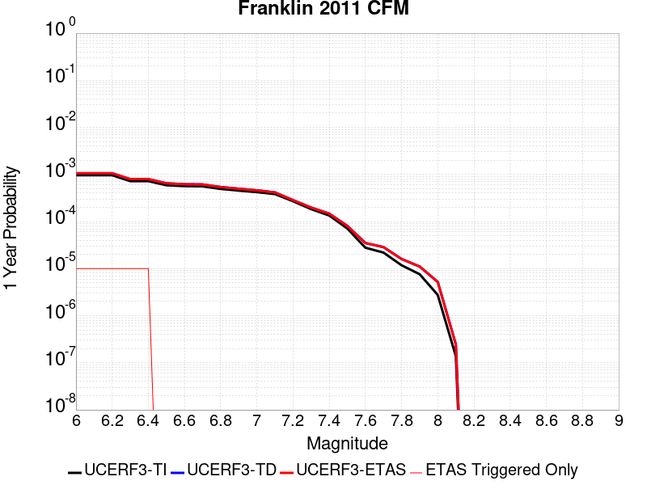 | 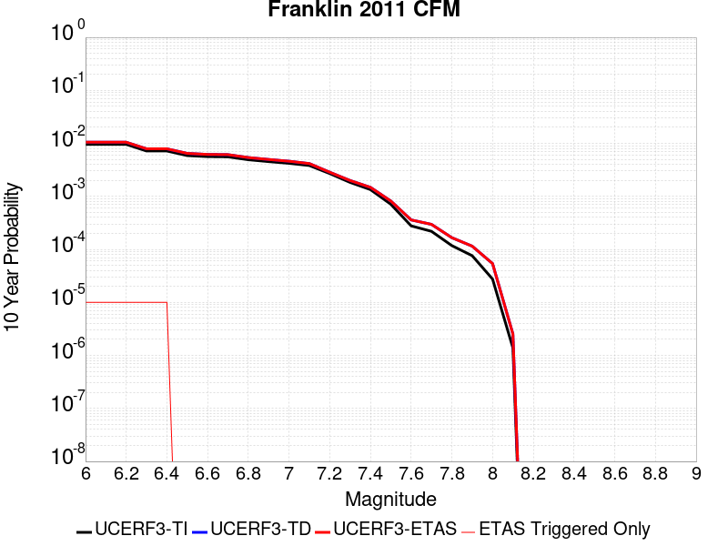 |

| Magnitude | 1 wk TI Prob | 1 wk TD Prob | 1 wk ETAS Prob | 1 wk ETAS/TD Gain | 1 wk ETAS Triggered Only | 1 mo TI Prob | 1 mo TD Prob | 1 mo ETAS Prob | 1 mo ETAS/TD Gain | 1 mo ETAS Triggered Only | 1 yr TI Prob | 1 yr TD Prob | 1 yr ETAS Prob | 1 yr ETAS/TD Gain | 1 yr ETAS Triggered Only | 10 yr TI Prob | 10 yr TD Prob | 10 yr ETAS Prob | 10 yr ETAS/TD Gain | 10 yr ETAS Triggered Only |
|-----|-----|-----|-----|-----|-----|-----|-----|-----|-----|-----|-----|-----|-----|-----|-----|-----|-----|-----|-----|-----|
| 6.0 | 1.845602E-5 | 2.021262E-5 | 3.0212417E-5 | 1.4947304 | 1.0E-5 | 7.9094825E-5 | 8.66228E-5 | 9.662194E-5 | 1.1154331 | 1.0E-5 | 9.6255407E-4 | 0.0010541513 | 0.0010641408 | 1.0094763 | 1.0E-5 | 0.009583955 | 0.0105088325 | 0.010518727 | 1.0009416 | 1.0E-5 |
| 6.1 | 1.845602E-5 | 2.021262E-5 | 3.0212417E-5 | 1.4947304 | 1.0E-5 | 7.9094825E-5 | 8.66228E-5 | 9.662194E-5 | 1.1154331 | 1.0E-5 | 9.6255407E-4 | 0.0010541513 | 0.0010641408 | 1.0094763 | 1.0E-5 | 0.009583955 | 0.0105088325 | 0.010518727 | 1.0009416 | 1.0E-5 |
| 6.2 | 1.845602E-5 | 2.021262E-5 | 3.0212417E-5 | 1.4947304 | 1.0E-5 | 7.9094825E-5 | 8.66228E-5 | 9.662194E-5 | 1.1154331 | 1.0E-5 | 9.6255407E-4 | 0.0010541513 | 0.0010641408 | 1.0094763 | 1.0E-5 | 0.009583955 | 0.0105088325 | 0.010518727 | 1.0009416 | 1.0E-5 |
| 6.3 | 1.3813506E-5 | 1.5154827E-5 | 2.5154675E-5 | 1.6598457 | 1.0E-5 | 5.9199396E-5 | 6.4947686E-5 | 7.4947035E-5 | 1.1539601 | 1.0E-5 | 7.205143E-4 | 7.9045893E-4 | 8.0045103E-4 | 1.0126408 | 1.0E-5 | 0.007181826 | 0.007891679 | 0.007901601 | 1.0012572 | 1.0E-5 |
| 6.4 | 1.3813506E-5 | 1.5154827E-5 | 2.5154675E-5 | 1.6598457 | 1.0E-5 | 5.9199396E-5 | 6.4947686E-5 | 7.4947035E-5 | 1.1539601 | 1.0E-5 | 7.205143E-4 | 7.9045893E-4 | 8.0045103E-4 | 1.0126408 | 1.0E-5 | 0.007181826 | 0.007891679 | 0.007901601 | 1.0012572 | 1.0E-5 |
| 6.5 | 1.1308949E-5 | 1.24178005E-5 | 1.24178005E-5 | 1.0 | 0.0 | 4.8466023E-5 | 5.3218067E-5 | 5.3218067E-5 | 1.0 | 0.0 | 5.899141E-4 | 6.4773945E-4 | 6.4773945E-4 | 1.0 | 0.0 | 0.0058835056 | 0.006473166 | 0.006473166 | 1.0 | 0.0 |
| 6.6 | 1.0813164E-5 | 1.1876023E-5 | 1.1876023E-5 | 1.0 | 0.0 | 4.6341313E-5 | 5.089626E-5 | 5.089626E-5 | 1.0 | 0.0 | 5.640594E-4 | 6.1948766E-4 | 6.1948766E-4 | 1.0 | 0.0 | 0.005626298 | 0.006192243 | 0.006192243 | 1.0 | 0.0 |
| 6.7 | 1.0706348E-5 | 1.1757787E-5 | 1.1757787E-5 | 1.0 | 0.0 | 4.5883542E-5 | 5.0389554E-5 | 5.0389554E-5 | 1.0 | 0.0 | 5.5848894E-4 | 6.13322E-4 | 6.13322E-4 | 1.0 | 0.0 | 0.005570874 | 0.0061309286 | 0.0061309286 | 1.0 | 0.0 |
| 6.8 | 9.443655E-6 | 1.0349109E-5 | 1.0349109E-5 | 1.0 | 0.0 | 4.0472176E-5 | 4.435258E-5 | 4.435258E-5 | 1.0 | 0.0 | 4.9263734E-4 | 5.398602E-4 | 5.398602E-4 | 1.0 | 0.0 | 0.0049154665 | 0.005400073 | 0.005400073 | 1.0 | 0.0 |
| 6.9 | 8.7001645E-6 | 9.522179E-6 | 9.522179E-6 | 1.0 | 0.0 | 3.728589E-5 | 4.0808707E-5 | 4.0808707E-5 | 1.0 | 0.0 | 4.538611E-4 | 4.96734E-4 | 4.96734E-4 | 1.0 | 0.0 | 0.0045293528 | 0.0049708076 | 0.0049708076 | 1.0 | 0.0 |
| 7.0 | 8.074731E-6 | 8.815796E-6 | 8.815796E-6 | 1.0 | 0.0 | 3.460553E-5 | 3.7781443E-5 | 3.7781443E-5 | 1.0 | 0.0 | 4.212409E-4 | 4.5989305E-4 | 4.5989305E-4 | 1.0 | 0.0 | 0.004204433 | 0.0046039694 | 0.0046039694 | 1.0 | 0.0 |
| 7.1 | 7.3370957E-6 | 7.96167E-6 | 7.96167E-6 | 1.0 | 0.0 | 3.1444317E-5 | 3.4121003E-5 | 3.4121003E-5 | 1.0 | 0.0 | 3.8276732E-4 | 4.1534504E-4 | 4.1534504E-4 | 1.0 | 0.0 | 0.0038210868 | 0.0041600848 | 0.0041600848 | 1.0 | 0.0 |
| 7.2 | 5.1750103E-6 | 5.45711E-6 | 5.45711E-6 | 1.0 | 0.0 | 2.2178427E-5 | 2.3387407E-5 | 2.3387407E-5 | 1.0 | 0.0 | 2.699889E-4 | 2.847048E-4 | 2.847048E-4 | 1.0 | 0.0 | 0.002696611 | 0.0028573172 | 0.0028573172 | 1.0 | 0.0 |
| 7.3 | 3.5221371E-6 | 3.7960522E-6 | 3.7960522E-6 | 1.0 | 0.0 | 1.5094786E-5 | 1.6268694E-5 | 1.6268694E-5 | 1.0 | 0.0 | 1.8376352E-4 | 1.9805344E-4 | 1.9805344E-4 | 1.0 | 0.0 | 0.0018361164 | 0.001992203 | 0.001992203 | 1.0 | 0.0 |
| 7.4 | 2.5749775E-6 | 2.818195E-6 | 2.818195E-6 | 1.0 | 0.0 | 1.1035571E-5 | 1.2077923E-5 | 1.2077923E-5 | 1.0 | 0.0 | 1.343498E-4 | 1.4703887E-4 | 1.4703887E-4 | 1.0 | 0.0 | 0.001342686 | 0.0014816395 | 0.0014816395 | 1.0 | 0.0 |
| 7.5 | 1.3642131E-6 | 1.5497415E-6 | 1.5497415E-6 | 1.0 | 0.0 | 5.8466144E-6 | 6.6417324E-6 | 6.6417324E-6 | 1.0 | 0.0 | 7.1180206E-5 | 8.086011E-5 | 8.086011E-5 | 1.0 | 0.0 | 7.115741E-4 | 8.1911724E-4 | 8.1911724E-4 | 1.0 | 0.0 |
| 7.6 | 5.329124E-7 | 6.70109E-7 | 6.70109E-7 | 1.0 | 0.0 | 2.2839083E-6 | 2.8718923E-6 | 2.8718923E-6 | 1.0 | 0.0 | 2.7806227E-5 | 3.4964734E-5 | 3.4964734E-5 | 1.0 | 0.0 | 2.780275E-4 | 3.5998525E-4 | 3.5998525E-4 | 1.0 | 0.0 |
| 7.7 | 4.199127E-7 | 5.486773E-7 | 5.486773E-7 | 1.0 | 0.0 | 1.7996247E-6 | 2.351472E-6 | 2.351472E-6 | 1.0 | 0.0 | 2.191021E-5 | 2.8628798E-5 | 2.8628798E-5 | 1.0 | 0.0 | 2.190805E-4 | 2.9645552E-4 | 2.9645552E-4 | 1.0 | 0.0 |
| 7.8 | 2.2586491E-7 | 3.066155E-7 | 3.066155E-7 | 1.0 | 0.0 | 9.67992E-7 | 1.3140657E-6 | 1.3140657E-6 | 1.0 | 0.0 | 1.178524E-5 | 1.5998634E-5 | 1.5998634E-5 | 1.0 | 0.0 | 1.17846146E-4 | 1.6628981E-4 | 1.6628981E-4 | 1.0 | 0.0 |
| 7.9 | 1.4568845E-7 | 2.1202585E-7 | 2.1202585E-7 | 1.0 | 0.0 | 6.243789E-7 | 9.086819E-7 | 9.086819E-7 | 1.0 | 0.0 | 7.601787E-6 | 1.1063146E-5 | 1.1063146E-5 | 1.0 | 0.0 | 7.601527E-5 | 1.1508061E-4 | 1.1508061E-4 | 1.0 | 0.0 |
| 8.0 | 5.2868224E-8 | 9.996793E-8 | 9.996793E-8 | 1.0 | 0.0 | 2.2657808E-7 | 4.2843388E-7 | 4.2843388E-7 | 1.0 | 0.0 | 2.7585847E-6 | 5.21617E-6 | 5.21617E-6 | 1.0 | 0.0 | 2.7585504E-5 | 5.4014814E-5 | 5.4014814E-5 | 1.0 | 0.0 |
| 8.1 | 2.654434E-9 | 4.7226045E-9 | 4.7226045E-9 | 1.0 | 0.0 | 1.1376145E-8 | 2.0239735E-8 | 2.0239735E-8 | 1.0 | 0.0 | 1.3850456E-7 | 2.4641872E-7 | 2.4641872E-7 | 1.0 | 0.0 | 1.3850448E-6 | 2.5336271E-6 | 2.5336271E-6 | 1.0 | 0.0 |

## Great Valley 14 (Kettleman Hills)
*[(top)](#table-of-contents)*

| 1 Week | 1 Month | 1 Year | 10 Year |
|-----|-----|-----|-----|
|  |  |  |  |

| Magnitude | 1 wk TI Prob | 1 wk TD Prob | 1 wk ETAS Prob | 1 wk ETAS/TD Gain | 1 wk ETAS Triggered Only | 1 mo TI Prob | 1 mo TD Prob | 1 mo ETAS Prob | 1 mo ETAS/TD Gain | 1 mo ETAS Triggered Only | 1 yr TI Prob | 1 yr TD Prob | 1 yr ETAS Prob | 1 yr ETAS/TD Gain | 1 yr ETAS Triggered Only | 10 yr TI Prob | 10 yr TD Prob | 10 yr ETAS Prob | 10 yr ETAS/TD Gain | 10 yr ETAS Triggered Only |
|-----|-----|-----|-----|-----|-----|-----|-----|-----|-----|-----|-----|-----|-----|-----|-----|-----|-----|-----|-----|-----|
| 6.0 | 6.2057843E-6 | 2.8768916E-6 | 1.28768625E-5 | 4.4759636 | 1.0E-5 | 2.6595946E-5 | 1.232949E-5 | 2.2329368E-5 | 1.8110535 | 1.0E-5 | 3.2375753E-4 | 1.5010356E-4 | 1.6010206E-4 | 1.0666107 | 1.0E-5 | 0.0032328626 | 0.0015002531 | 0.001510238 | 1.0066556 | 1.0E-5 |
| 6.1 | 6.2057843E-6 | 2.8768916E-6 | 1.28768625E-5 | 4.4759636 | 1.0E-5 | 2.6595946E-5 | 1.232949E-5 | 2.2329368E-5 | 1.8110535 | 1.0E-5 | 3.2375753E-4 | 1.5010356E-4 | 1.6010206E-4 | 1.0666107 | 1.0E-5 | 0.0032328626 | 0.0015002531 | 0.001510238 | 1.0066556 | 1.0E-5 |
| 6.2 | 6.2057843E-6 | 2.8768916E-6 | 1.28768625E-5 | 4.4759636 | 1.0E-5 | 2.6595946E-5 | 1.232949E-5 | 2.2329368E-5 | 1.8110535 | 1.0E-5 | 3.2375753E-4 | 1.5010356E-4 | 1.6010206E-4 | 1.0666107 | 1.0E-5 | 0.0032328626 | 0.0015002531 | 0.001510238 | 1.0066556 | 1.0E-5 |
| 6.3 | 6.2057843E-6 | 2.8768916E-6 | 1.28768625E-5 | 4.4759636 | 1.0E-5 | 2.6595946E-5 | 1.232949E-5 | 2.2329368E-5 | 1.8110535 | 1.0E-5 | 3.2375753E-4 | 1.5010356E-4 | 1.6010206E-4 | 1.0666107 | 1.0E-5 | 0.0032328626 | 0.0015002531 | 0.001510238 | 1.0066556 | 1.0E-5 |
| 6.4 | 6.2057843E-6 | 2.8768916E-6 | 1.28768625E-5 | 4.4759636 | 1.0E-5 | 2.6595946E-5 | 1.232949E-5 | 2.2329368E-5 | 1.8110535 | 1.0E-5 | 3.2375753E-4 | 1.5010356E-4 | 1.6010206E-4 | 1.0666107 | 1.0E-5 | 0.0032328626 | 0.0015002531 | 0.001510238 | 1.0066556 | 1.0E-5 |
| 6.5 | 6.2057843E-6 | 2.8768916E-6 | 1.28768625E-5 | 4.4759636 | 1.0E-5 | 2.6595946E-5 | 1.232949E-5 | 2.2329368E-5 | 1.8110535 | 1.0E-5 | 3.2375753E-4 | 1.5010356E-4 | 1.6010206E-4 | 1.0666107 | 1.0E-5 | 0.0032328626 | 0.0015002531 | 0.001510238 | 1.0066556 | 1.0E-5 |
| 6.6 | 6.2057843E-6 | 2.8768916E-6 | 1.28768625E-5 | 4.4759636 | 1.0E-5 | 2.6595946E-5 | 1.232949E-5 | 2.2329368E-5 | 1.8110535 | 1.0E-5 | 3.2375753E-4 | 1.5010356E-4 | 1.6010206E-4 | 1.0666107 | 1.0E-5 | 0.0032328626 | 0.0015002531 | 0.001510238 | 1.0066556 | 1.0E-5 |
| 6.7 | 6.2057843E-6 | 2.8768916E-6 | 1.28768625E-5 | 4.4759636 | 1.0E-5 | 2.6595946E-5 | 1.232949E-5 | 2.2329368E-5 | 1.8110535 | 1.0E-5 | 3.2375753E-4 | 1.5010356E-4 | 1.6010206E-4 | 1.0666107 | 1.0E-5 | 0.0032328626 | 0.0015002531 | 0.001510238 | 1.0066556 | 1.0E-5 |
| 6.8 | 6.2057843E-6 | 2.8768916E-6 | 1.28768625E-5 | 4.4759636 | 1.0E-5 | 2.6595946E-5 | 1.232949E-5 | 2.2329368E-5 | 1.8110535 | 1.0E-5 | 3.2375753E-4 | 1.5010356E-4 | 1.6010206E-4 | 1.0666107 | 1.0E-5 | 0.0032328626 | 0.0015002531 | 0.001510238 | 1.0066556 | 1.0E-5 |
| 6.9 | 6.2057843E-6 | 2.8768916E-6 | 1.28768625E-5 | 4.4759636 | 1.0E-5 | 2.6595946E-5 | 1.232949E-5 | 2.2329368E-5 | 1.8110535 | 1.0E-5 | 3.2375753E-4 | 1.5010356E-4 | 1.6010206E-4 | 1.0666107 | 1.0E-5 | 0.0032328626 | 0.0015002531 | 0.001510238 | 1.0066556 | 1.0E-5 |
| 7.0 | 6.2057843E-6 | 2.8768916E-6 | 1.28768625E-5 | 4.4759636 | 1.0E-5 | 2.6595946E-5 | 1.232949E-5 | 2.2329368E-5 | 1.8110535 | 1.0E-5 | 3.2375753E-4 | 1.5010356E-4 | 1.6010206E-4 | 1.0666107 | 1.0E-5 | 0.0032328626 | 0.0015002531 | 0.001510238 | 1.0066556 | 1.0E-5 |
| 7.1 | 4.95113E-6 | 1.5606404E-6 | 1.5606404E-6 | 1.0 | 0.0 | 2.1218955E-5 | 6.6884427E-6 | 6.6884427E-6 | 1.0 | 0.0 | 2.5831014E-4 | 8.1428945E-5 | 8.1428945E-5 | 1.0 | 0.0 | 0.0025801011 | 8.1401E-4 | 8.1401E-4 | 1.0 | 0.0 |
| 7.2 | 4.95113E-6 | 1.5606404E-6 | 1.5606404E-6 | 1.0 | 0.0 | 2.1218955E-5 | 6.6884427E-6 | 6.6884427E-6 | 1.0 | 0.0 | 2.5831014E-4 | 8.1428945E-5 | 8.1428945E-5 | 1.0 | 0.0 | 0.0025801011 | 8.1401E-4 | 8.1401E-4 | 1.0 | 0.0 |
| 7.3 | 4.5549086E-6 | 1.4226472E-6 | 1.4226472E-6 | 1.0 | 0.0 | 1.9520892E-5 | 6.097046E-6 | 6.097046E-6 | 1.0 | 0.0 | 2.3764092E-4 | 7.4229174E-5 | 7.4229174E-5 | 1.0 | 0.0 | 0.0023738695 | 7.420604E-4 | 7.420604E-4 | 1.0 | 0.0 |
| 7.4 | 2.4837766E-6 | 9.800582E-7 | 9.800582E-7 | 1.0 | 0.0 | 1.0644713E-5 | 4.200243E-6 | 4.200243E-6 | 1.0 | 0.0 | 1.2959167E-4 | 5.1136827E-5 | 5.1136827E-5 | 1.0 | 0.0 | 0.0012951613 | 5.112572E-4 | 5.112572E-4 | 1.0 | 0.0 |
| 7.5 | 1.5002679E-6 | 6.546144E-7 | 6.546144E-7 | 1.0 | 0.0 | 6.4297037E-6 | 2.8054874E-6 | 2.8054874E-6 | 1.0 | 0.0 | 7.827883E-5 | 3.4156317E-5 | 3.4156317E-5 | 1.0 | 0.0 | 7.825126E-4 | 3.4151482E-4 | 3.4151482E-4 | 1.0 | 0.0 |

## San Luis Range - Oceano 2011 CFM
*[(top)](#table-of-contents)*

| 1 Week | 1 Month | 1 Year | 10 Year |
|-----|-----|-----|-----|
|  |  |  |  |

| Magnitude | 1 wk TI Prob | 1 wk TD Prob | 1 wk ETAS Prob | 1 wk ETAS/TD Gain | 1 wk ETAS Triggered Only | 1 mo TI Prob | 1 mo TD Prob | 1 mo ETAS Prob | 1 mo ETAS/TD Gain | 1 mo ETAS Triggered Only | 1 yr TI Prob | 1 yr TD Prob | 1 yr ETAS Prob | 1 yr ETAS/TD Gain | 1 yr ETAS Triggered Only | 10 yr TI Prob | 10 yr TD Prob | 10 yr ETAS Prob | 10 yr ETAS/TD Gain | 10 yr ETAS Triggered Only |
|-----|-----|-----|-----|-----|-----|-----|-----|-----|-----|-----|-----|-----|-----|-----|-----|-----|-----|-----|-----|-----|
| 6.0 | 1.6025788E-6 | 1.620119E-6 | 1.620119E-6 | 1.0 | 0.0 | 6.8681766E-6 | 6.943351E-6 | 6.943351E-6 | 1.0 | 0.0 | 8.361684E-5 | 8.453243E-5 | 9.4531584E-5 | 1.1182878 | 1.0E-5 | 8.3585386E-4 | 8.4504357E-4 | 8.5503515E-4 | 1.0118237 | 1.0E-5 |
| 6.1 | 1.6025788E-6 | 1.620119E-6 | 1.620119E-6 | 1.0 | 0.0 | 6.8681766E-6 | 6.943351E-6 | 6.943351E-6 | 1.0 | 0.0 | 8.361684E-5 | 8.453243E-5 | 9.4531584E-5 | 1.1182878 | 1.0E-5 | 8.3585386E-4 | 8.4504357E-4 | 8.5503515E-4 | 1.0118237 | 1.0E-5 |
| 6.2 | 1.6025788E-6 | 1.620119E-6 | 1.620119E-6 | 1.0 | 0.0 | 6.8681766E-6 | 6.943351E-6 | 6.943351E-6 | 1.0 | 0.0 | 8.361684E-5 | 8.453243E-5 | 9.4531584E-5 | 1.1182878 | 1.0E-5 | 8.3585386E-4 | 8.4504357E-4 | 8.5503515E-4 | 1.0118237 | 1.0E-5 |
| 6.3 | 1.6025788E-6 | 1.620119E-6 | 1.620119E-6 | 1.0 | 0.0 | 6.8681766E-6 | 6.943351E-6 | 6.943351E-6 | 1.0 | 0.0 | 8.361684E-5 | 8.453243E-5 | 9.4531584E-5 | 1.1182878 | 1.0E-5 | 8.3585386E-4 | 8.4504357E-4 | 8.5503515E-4 | 1.0118237 | 1.0E-5 |
| 6.4 | 1.1621186E-6 | 1.1749894E-6 | 1.1749894E-6 | 1.0 | 0.0 | 4.980499E-6 | 5.0356607E-6 | 5.0356607E-6 | 1.0 | 0.0 | 6.0635884E-5 | 6.130771E-5 | 7.1307106E-5 | 1.1631016 | 1.0E-5 | 6.0619344E-4 | 6.1293464E-4 | 6.229285E-4 | 1.016305 | 1.0E-5 |
| 6.5 | 1.1621186E-6 | 1.1749894E-6 | 1.1749894E-6 | 1.0 | 0.0 | 4.980499E-6 | 5.0356607E-6 | 5.0356607E-6 | 1.0 | 0.0 | 6.0635884E-5 | 6.130771E-5 | 7.1307106E-5 | 1.1631016 | 1.0E-5 | 6.0619344E-4 | 6.1293464E-4 | 6.229285E-4 | 1.016305 | 1.0E-5 |
| 6.6 | 7.164729E-7 | 7.2485784E-7 | 7.2485784E-7 | 1.0 | 0.0 | 3.0705946E-6 | 3.10653E-6 | 3.10653E-6 | 1.0 | 0.0 | 3.738385E-5 | 3.7821363E-5 | 4.7820984E-5 | 1.2643908 | 1.0E-5 | 3.737756E-4 | 3.7815105E-4 | 3.8814725E-4 | 1.0264344 | 1.0E-5 |
| 6.7 | 7.164729E-7 | 7.2485784E-7 | 7.2485784E-7 | 1.0 | 0.0 | 3.0705946E-6 | 3.10653E-6 | 3.10653E-6 | 1.0 | 0.0 | 3.738385E-5 | 3.7821363E-5 | 4.7820984E-5 | 1.2643908 | 1.0E-5 | 3.737756E-4 | 3.7815105E-4 | 3.8814725E-4 | 1.0264344 | 1.0E-5 |
| 6.8 | 6.700177E-7 | 6.7774397E-7 | 6.7774397E-7 | 1.0 | 0.0 | 2.8715012E-6 | 2.904614E-6 | 2.904614E-6 | 1.0 | 0.0 | 3.495997E-5 | 3.536312E-5 | 4.536276E-5 | 1.2827705 | 1.0E-5 | 3.495447E-4 | 3.5357653E-4 | 3.63573E-4 | 1.0282724 | 1.0E-5 |
| 6.9 | 5.657865E-7 | 5.7217864E-7 | 5.7217864E-7 | 1.0 | 0.0 | 2.424797E-6 | 2.452192E-6 | 2.452192E-6 | 1.0 | 0.0 | 2.9521503E-5 | 2.9855039E-5 | 3.9854738E-5 | 1.3349419 | 1.0E-5 | 2.9517582E-4 | 2.9851135E-4 | 3.0850834E-4 | 1.0334896 | 1.0E-5 |
| 7.0 | 4.608413E-7 | 4.660169E-7 | 4.660169E-7 | 1.0 | 0.0 | 1.9750328E-6 | 1.9972138E-6 | 1.9972138E-6 | 1.0 | 0.0 | 2.4045758E-5 | 2.431581E-5 | 3.4315566E-5 | 1.4112451 | 1.0E-5 | 2.4043156E-4 | 2.4313178E-4 | 2.5312934E-4 | 1.0411199 | 1.0E-5 |
| 7.1 | 3.9177846E-7 | 3.9621602E-7 | 3.9621602E-7 | 1.0 | 0.0 | 1.6790494E-6 | 1.6980675E-6 | 1.6980675E-6 | 1.0 | 0.0 | 2.0442236E-5 | 2.0673779E-5 | 2.0673779E-5 | 1.0 | 0.0 | 2.0440355E-4 | 2.067187E-4 | 2.067187E-4 | 1.0 | 0.0 |
| 7.2 | 3.3974752E-7 | 3.436653E-7 | 3.436653E-7 | 1.0 | 0.0 | 1.45606E-6 | 1.4728505E-6 | 1.4728505E-6 | 1.0 | 0.0 | 1.7727387E-5 | 1.7931809E-5 | 1.7931809E-5 | 1.0 | 0.0 | 1.7725973E-4 | 1.7930372E-4 | 1.7930372E-4 | 1.0 | 0.0 |
| 7.3 | 2.8900928E-7 | 2.923402E-7 | 2.923402E-7 | 1.0 | 0.0 | 1.2386106E-6 | 1.2528859E-6 | 1.2528859E-6 | 1.0 | 0.0 | 1.5079979E-5 | 1.525378E-5 | 1.525378E-5 | 1.0 | 0.0 | 1.5078956E-4 | 1.5252741E-4 | 1.5252741E-4 | 1.0 | 0.0 |
| 7.4 | 2.1881527E-7 | 2.2139594E-7 | 2.2139594E-7 | 1.0 | 0.0 | 9.3777936E-7 | 9.488394E-7 | 9.488394E-7 | 1.0 | 0.0 | 1.14174045E-5 | 1.1552059E-5 | 1.1552059E-5 | 1.0 | 0.0 | 1.1416818E-4 | 1.1551464E-4 | 1.1551464E-4 | 1.0 | 0.0 |
| 7.5 | 1.356398E-7 | 1.3718639E-7 | 1.3718639E-7 | 1.0 | 0.0 | 5.813133E-7 | 5.8794154E-7 | 5.8794154E-7 | 1.0 | 0.0 | 7.0774663E-6 | 7.158165E-6 | 7.158165E-6 | 1.0 | 0.0 | 7.077241E-5 | 7.157937E-5 | 7.157937E-5 | 1.0 | 0.0 |
| 7.6 | 5.9269272E-8 | 6.001364E-8 | 6.001364E-8 | 1.0 | 0.0 | 2.5401116E-7 | 2.572013E-7 | 2.572013E-7 | 1.0 | 0.0 | 3.0925814E-6 | 3.1314214E-6 | 3.1314214E-6 | 1.0 | 0.0 | 3.0925385E-5 | 3.1313786E-5 | 3.1313786E-5 | 1.0 | 0.0 |
| 7.7 | 5.946232E-9 | 6.036928E-9 | 6.036928E-9 | 1.0 | 0.0 | 2.5483851E-8 | 2.5872547E-8 | 2.5872547E-8 | 1.0 | 0.0 | 3.1026585E-7 | 3.1499823E-7 | 3.1499823E-7 | 1.0 | 0.0 | 3.102654E-6 | 3.1499787E-6 | 3.1499787E-6 | 1.0 | 0.0 |

## Goose Lake 2011 CFM
*[(top)](#table-of-contents)*

| 1 Week | 1 Month | 1 Year | 10 Year |
|-----|-----|-----|-----|
|  |  |  |  |

| Magnitude | 1 wk TI Prob | 1 wk TD Prob | 1 wk ETAS Prob | 1 wk ETAS/TD Gain | 1 wk ETAS Triggered Only | 1 mo TI Prob | 1 mo TD Prob | 1 mo ETAS Prob | 1 mo ETAS/TD Gain | 1 mo ETAS Triggered Only | 1 yr TI Prob | 1 yr TD Prob | 1 yr ETAS Prob | 1 yr ETAS/TD Gain | 1 yr ETAS Triggered Only | 10 yr TI Prob | 10 yr TD Prob | 10 yr ETAS Prob | 10 yr ETAS/TD Gain | 10 yr ETAS Triggered Only |
|-----|-----|-----|-----|-----|-----|-----|-----|-----|-----|-----|-----|-----|-----|-----|-----|-----|-----|-----|-----|-----|
| 6.0 | 3.780968E-6 | 3.8230223E-6 | 3.8230223E-6 | 1.0 | 0.0 | 1.6204049E-5 | 1.6384285E-5 | 1.6384285E-5 | 1.0 | 0.0 | 1.9726643E-4 | 1.994615E-4 | 2.0945951E-4 | 1.050125 | 1.0E-5 | 0.001970914 | 0.001992933 | 0.002002913 | 1.0050077 | 1.0E-5 |
| 6.1 | 2.2035124E-6 | 2.229801E-6 | 2.229801E-6 | 1.0 | 0.0 | 9.443591E-6 | 9.556257E-6 | 9.556257E-6 | 1.0 | 0.0 | 1.1496965E-4 | 1.163414E-4 | 1.163414E-4 | 1.0 | 0.0 | 0.0011491019 | 0.0011628233 | 0.0011628233 | 1.0 | 0.0 |
| 6.2 | 1.5624689E-6 | 1.5826923E-6 | 1.5826923E-6 | 1.0 | 0.0 | 6.6962784E-6 | 6.7829496E-6 | 6.7829496E-6 | 1.0 | 0.0 | 8.152414E-5 | 8.2579325E-5 | 8.2579325E-5 | 1.0 | 0.0 | 8.1494235E-4 | 8.2549086E-4 | 8.2549086E-4 | 1.0 | 0.0 |
| 6.3 | 1.5624689E-6 | 1.5826923E-6 | 1.5826923E-6 | 1.0 | 0.0 | 6.6962784E-6 | 6.7829496E-6 | 6.7829496E-6 | 1.0 | 0.0 | 8.152414E-5 | 8.2579325E-5 | 8.2579325E-5 | 1.0 | 0.0 | 8.1494235E-4 | 8.2549086E-4 | 8.2549086E-4 | 1.0 | 0.0 |
| 6.4 | 1.256464E-6 | 1.2738695E-6 | 1.2738695E-6 | 1.0 | 0.0 | 5.3848344E-6 | 5.4594293E-6 | 5.4594293E-6 | 1.0 | 0.0 | 6.5558386E-5 | 6.646655E-5 | 6.646655E-5 | 1.0 | 0.0 | 6.553905E-4 | 6.644687E-4 | 6.644687E-4 | 1.0 | 0.0 |
| 6.5 | 1.0910911E-6 | 1.1069404E-6 | 1.1069404E-6 | 1.0 | 0.0 | 4.6760965E-6 | 4.7440217E-6 | 4.7440217E-6 | 1.0 | 0.0 | 5.692999E-5 | 5.7756948E-5 | 5.7756948E-5 | 1.0 | 0.0 | 5.6915404E-4 | 5.7742064E-4 | 5.7742064E-4 | 1.0 | 0.0 |
| 6.6 | 9.546601E-7 | 9.691246E-7 | 9.691246E-7 | 1.0 | 0.0 | 4.091394E-6 | 4.1533845E-6 | 4.1533845E-6 | 1.0 | 0.0 | 4.9811584E-5 | 5.056629E-5 | 5.056629E-5 | 1.0 | 0.0 | 4.980042E-4 | 5.055487E-4 | 5.055487E-4 | 1.0 | 0.0 |
| 6.7 | 7.790316E-7 | 7.9159634E-7 | 7.9159634E-7 | 1.0 | 0.0 | 3.3387028E-6 | 3.3925514E-6 | 3.3925514E-6 | 1.0 | 0.0 | 4.0647945E-5 | 4.1303538E-5 | 4.1303538E-5 | 1.0 | 0.0 | 4.0640513E-4 | 4.129592E-4 | 4.129592E-4 | 1.0 | 0.0 |
| 6.8 | 6.3714384E-7 | 6.4787395E-7 | 6.4787395E-7 | 1.0 | 0.0 | 2.7306137E-6 | 2.7765998E-6 | 2.7765998E-6 | 1.0 | 0.0 | 3.3244716E-5 | 3.3804583E-5 | 3.3804583E-5 | 1.0 | 0.0 | 3.323974E-4 | 3.379949E-4 | 3.379949E-4 | 1.0 | 0.0 |
| 6.9 | 4.92586E-7 | 5.0139147E-7 | 5.0139147E-7 | 1.0 | 0.0 | 2.1110811E-6 | 2.1488188E-6 | 2.1488188E-6 | 1.0 | 0.0 | 2.5702111E-5 | 2.616156E-5 | 2.616156E-5 | 1.0 | 0.0 | 2.569914E-4 | 2.6158517E-4 | 2.6158517E-4 | 1.0 | 0.0 |
| 7.0 | 3.130245E-7 | 3.190354E-7 | 3.190354E-7 | 1.0 | 0.0 | 1.3415328E-6 | 1.3672939E-6 | 1.3672939E-6 | 1.0 | 0.0 | 1.6333039E-5 | 1.6646678E-5 | 1.6646678E-5 | 1.0 | 0.0 | 1.6331839E-4 | 1.6645451E-4 | 1.6645451E-4 | 1.0 | 0.0 |
| 7.1 | 1.7680084E-7 | 1.8023923E-7 | 1.8023923E-7 | 1.0 | 0.0 | 7.5771766E-7 | 7.724536E-7 | 7.724536E-7 | 1.0 | 0.0 | 9.225173E-6 | 9.404583E-6 | 9.404583E-6 | 1.0 | 0.0 | 9.22479E-5 | 9.4041956E-5 | 9.4041956E-5 | 1.0 | 0.0 |
| 7.2 | 4.8641045E-8 | 4.9402068E-8 | 4.9402068E-8 | 1.0 | 0.0 | 2.084616E-7 | 2.1172312E-7 | 2.1172312E-7 | 1.0 | 0.0 | 2.538017E-6 | 2.577726E-6 | 2.577726E-6 | 1.0 | 0.0 | 2.537988E-5 | 2.5776973E-5 | 2.5776973E-5 | 1.0 | 0.0 |
| 7.3 | 5.3911844E-9 | 5.4758145E-9 | 5.4758145E-9 | 1.0 | 0.0 | 2.3105075E-8 | 2.3467775E-8 | 2.3467775E-8 | 1.0 | 0.0 | 2.8130427E-7 | 2.8572015E-7 | 2.8572015E-7 | 1.0 | 0.0 | 2.8130391E-6 | 2.8571992E-6 | 2.8571992E-6 | 1.0 | 0.0 |

## Great Valley 06 (Midland) 2011 CFM alt1
*[(top)](#table-of-contents)*

| 1 Week | 1 Month | 1 Year | 10 Year |
|-----|-----|-----|-----|
|  |  |  |  |

| Magnitude | 1 wk TI Prob | 1 wk TD Prob | 1 wk ETAS Prob | 1 wk ETAS/TD Gain | 1 wk ETAS Triggered Only | 1 mo TI Prob | 1 mo TD Prob | 1 mo ETAS Prob | 1 mo ETAS/TD Gain | 1 mo ETAS Triggered Only | 1 yr TI Prob | 1 yr TD Prob | 1 yr ETAS Prob | 1 yr ETAS/TD Gain | 1 yr ETAS Triggered Only | 10 yr TI Prob | 10 yr TD Prob | 10 yr ETAS Prob | 10 yr ETAS/TD Gain | 10 yr ETAS Triggered Only |
|-----|-----|-----|-----|-----|-----|-----|-----|-----|-----|-----|-----|-----|-----|-----|-----|-----|-----|-----|-----|-----|
| 6.0 | 1.2712525E-5 | 1.3210576E-5 | 1.3210576E-5 | 1.0 | 0.0 | 5.4481112E-5 | 5.6615667E-5 | 5.6615667E-5 | 1.0 | 0.0 | 6.6310563E-4 | 6.8910315E-4 | 6.9909624E-4 | 1.0145016 | 1.0E-5 | 0.0066113044 | 0.006872179 | 0.00688211 | 1.0014452 | 1.0E-5 |
| 6.1 | 1.2712525E-5 | 1.3210576E-5 | 1.3210576E-5 | 1.0 | 0.0 | 5.4481112E-5 | 5.6615667E-5 | 5.6615667E-5 | 1.0 | 0.0 | 6.6310563E-4 | 6.8910315E-4 | 6.9909624E-4 | 1.0145016 | 1.0E-5 | 0.0066113044 | 0.006872179 | 0.00688211 | 1.0014452 | 1.0E-5 |
| 6.2 | 1.2712525E-5 | 1.3210576E-5 | 1.3210576E-5 | 1.0 | 0.0 | 5.4481112E-5 | 5.6615667E-5 | 5.6615667E-5 | 1.0 | 0.0 | 6.6310563E-4 | 6.8910315E-4 | 6.9909624E-4 | 1.0145016 | 1.0E-5 | 0.0066113044 | 0.006872179 | 0.00688211 | 1.0014452 | 1.0E-5 |
| 6.3 | 1.2712525E-5 | 1.3210576E-5 | 1.3210576E-5 | 1.0 | 0.0 | 5.4481112E-5 | 5.6615667E-5 | 5.6615667E-5 | 1.0 | 0.0 | 6.6310563E-4 | 6.8910315E-4 | 6.9909624E-4 | 1.0145016 | 1.0E-5 | 0.0066113044 | 0.006872179 | 0.00688211 | 1.0014452 | 1.0E-5 |
| 6.4 | 1.2712525E-5 | 1.3210576E-5 | 1.3210576E-5 | 1.0 | 0.0 | 5.4481112E-5 | 5.6615667E-5 | 5.6615667E-5 | 1.0 | 0.0 | 6.6310563E-4 | 6.8910315E-4 | 6.9909624E-4 | 1.0145016 | 1.0E-5 | 0.0066113044 | 0.006872179 | 0.00688211 | 1.0014452 | 1.0E-5 |
| 6.5 | 1.2712525E-5 | 1.3210576E-5 | 1.3210576E-5 | 1.0 | 0.0 | 5.4481112E-5 | 5.6615667E-5 | 5.6615667E-5 | 1.0 | 0.0 | 6.6310563E-4 | 6.8910315E-4 | 6.9909624E-4 | 1.0145016 | 1.0E-5 | 0.0066113044 | 0.006872179 | 0.00688211 | 1.0014452 | 1.0E-5 |
| 6.6 | 5.7574384E-6 | 5.9706463E-6 | 5.9706463E-6 | 1.0 | 0.0 | 2.4674504E-5 | 2.5588255E-5 | 2.5588255E-5 | 1.0 | 0.0 | 3.0037065E-4 | 3.1149638E-4 | 3.1149638E-4 | 1.0 | 0.0 | 0.0029996498 | 0.0031109843 | 0.0031109843 | 1.0 | 0.0 |
| 6.7 | 5.7574384E-6 | 5.9706463E-6 | 5.9706463E-6 | 1.0 | 0.0 | 2.4674504E-5 | 2.5588255E-5 | 2.5588255E-5 | 1.0 | 0.0 | 3.0037065E-4 | 3.1149638E-4 | 3.1149638E-4 | 1.0 | 0.0 | 0.0029996498 | 0.0031109843 | 0.0031109843 | 1.0 | 0.0 |
| 6.8 | 3.3474828E-6 | 3.4693849E-6 | 3.4693849E-6 | 1.0 | 0.0 | 1.4346277E-5 | 1.4868716E-5 | 1.4868716E-5 | 1.0 | 0.0 | 1.7465191E-4 | 1.8101306E-4 | 1.8101306E-4 | 1.0 | 0.0 | 0.0017451472 | 0.0018088033 | 0.0018088033 | 1.0 | 0.0 |
| 6.9 | 2.035106E-6 | 2.1090357E-6 | 2.1090357E-6 | 1.0 | 0.0 | 8.721853E-6 | 9.038697E-6 | 9.038697E-6 | 1.0 | 0.0 | 1.0618339E-4 | 1.10041314E-4 | 1.10041314E-4 | 1.0 | 0.0 | 0.0010613267 | 0.0010999405 | 0.0010999405 | 1.0 | 0.0 |
| 7.0 | 1.2424716E-6 | 1.2878762E-6 | 1.2878762E-6 | 1.0 | 0.0 | 5.3248673E-6 | 5.51946E-6 | 5.51946E-6 | 1.0 | 0.0 | 6.482833E-5 | 6.7197805E-5 | 6.7197805E-5 | 1.0 | 0.0 | 6.480942E-4 | 6.718192E-4 | 6.718192E-4 | 1.0 | 0.0 |
| 7.1 | 6.6904556E-7 | 6.939035E-7 | 6.939035E-7 | 1.0 | 0.0 | 2.867335E-6 | 2.97387E-6 | 2.97387E-6 | 1.0 | 0.0 | 3.4909244E-5 | 3.6206526E-5 | 3.6206526E-5 | 1.0 | 0.0 | 3.490376E-4 | 3.6203177E-4 | 3.6203177E-4 | 1.0 | 0.0 |
| 7.2 | 3.948168E-7 | 4.095705E-7 | 4.095705E-7 | 1.0 | 0.0 | 1.6920709E-6 | 1.7553022E-6 | 1.7553022E-6 | 1.0 | 0.0 | 2.0600768E-5 | 2.1370803E-5 | 2.1370803E-5 | 1.0 | 0.0 | 2.0598859E-4 | 2.1370803E-4 | 2.1370803E-4 | 1.0 | 0.0 |

## White Wolf
*[(top)](#table-of-contents)*

| 1 Week | 1 Month | 1 Year | 10 Year |
|-----|-----|-----|-----|
|  |  | 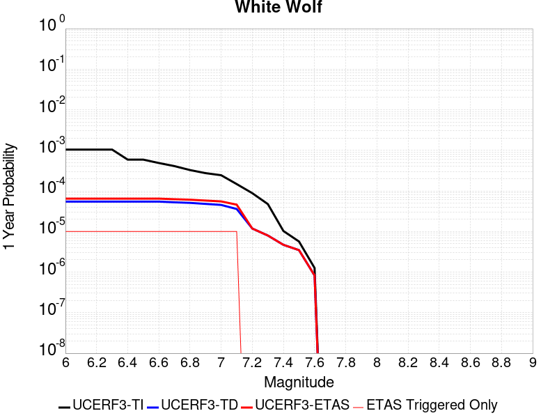 |  |

| Magnitude | 1 wk TI Prob | 1 wk TD Prob | 1 wk ETAS Prob | 1 wk ETAS/TD Gain | 1 wk ETAS Triggered Only | 1 mo TI Prob | 1 mo TD Prob | 1 mo ETAS Prob | 1 mo ETAS/TD Gain | 1 mo ETAS Triggered Only | 1 yr TI Prob | 1 yr TD Prob | 1 yr ETAS Prob | 1 yr ETAS/TD Gain | 1 yr ETAS Triggered Only | 10 yr TI Prob | 10 yr TD Prob | 10 yr ETAS Prob | 10 yr ETAS/TD Gain | 10 yr ETAS Triggered Only |
|-----|-----|-----|-----|-----|-----|-----|-----|-----|-----|-----|-----|-----|-----|-----|-----|-----|-----|-----|-----|-----|
| 6.0 | 2.0037822E-5 | 1.0469162E-6 | 1.10469055E-5 | 10.551853 | 1.0E-5 | 8.587355E-5 | 4.486776E-6 | 1.4486731E-5 | 3.2287617 | 1.0E-5 | 0.001045009 | 5.4625183E-5 | 6.462463E-5 | 1.1830558 | 1.0E-5 | 0.010401085 | 5.461226E-4 | 5.5611716E-4 | 1.0183009 | 1.0E-5 |
| 6.1 | 2.0037822E-5 | 1.0469162E-6 | 1.10469055E-5 | 10.551853 | 1.0E-5 | 8.587355E-5 | 4.486776E-6 | 1.4486731E-5 | 3.2287617 | 1.0E-5 | 0.001045009 | 5.4625183E-5 | 6.462463E-5 | 1.1830558 | 1.0E-5 | 0.010401085 | 5.461226E-4 | 5.5611716E-4 | 1.0183009 | 1.0E-5 |
| 6.2 | 2.0037822E-5 | 1.0469162E-6 | 1.10469055E-5 | 10.551853 | 1.0E-5 | 8.587355E-5 | 4.486776E-6 | 1.4486731E-5 | 3.2287617 | 1.0E-5 | 0.001045009 | 5.4625183E-5 | 6.462463E-5 | 1.1830558 | 1.0E-5 | 0.010401085 | 5.461226E-4 | 5.5611716E-4 | 1.0183009 | 1.0E-5 |
| 6.3 | 2.0037822E-5 | 1.0469162E-6 | 1.10469055E-5 | 10.551853 | 1.0E-5 | 8.587355E-5 | 4.486776E-6 | 1.4486731E-5 | 3.2287617 | 1.0E-5 | 0.001045009 | 5.4625183E-5 | 6.462463E-5 | 1.1830558 | 1.0E-5 | 0.010401085 | 5.461226E-4 | 5.5611716E-4 | 1.0183009 | 1.0E-5 |
| 6.4 | 1.132487E-5 | 1.0469162E-6 | 1.10469055E-5 | 10.551853 | 1.0E-5 | 4.8534253E-5 | 4.486776E-6 | 1.4486731E-5 | 3.2287617 | 1.0E-5 | 5.907443E-4 | 5.4625183E-5 | 6.462463E-5 | 1.1830558 | 1.0E-5 | 0.005891764 | 5.461226E-4 | 5.5611716E-4 | 1.0183009 | 1.0E-5 |
| 6.5 | 1.132487E-5 | 1.0469162E-6 | 1.10469055E-5 | 10.551853 | 1.0E-5 | 4.8534253E-5 | 4.486776E-6 | 1.4486731E-5 | 3.2287617 | 1.0E-5 | 5.907443E-4 | 5.4625183E-5 | 6.462463E-5 | 1.1830558 | 1.0E-5 | 0.005891764 | 5.461226E-4 | 5.5611716E-4 | 1.0183009 | 1.0E-5 |
| 6.6 | 9.347473E-6 | 1.0469162E-6 | 1.10469055E-5 | 10.551853 | 1.0E-5 | 4.0059982E-5 | 4.486776E-6 | 1.4486731E-5 | 3.2287617 | 1.0E-5 | 4.8762115E-4 | 5.4625183E-5 | 6.462463E-5 | 1.1830558 | 1.0E-5 | 0.0048655253 | 5.461226E-4 | 5.5611716E-4 | 1.0183009 | 1.0E-5 |
| 6.7 | 7.842647E-6 | 1.0048342E-6 | 1.1004824E-5 | 10.95188 | 1.0E-5 | 3.361091E-5 | 4.3064256E-6 | 1.4306383E-5 | 3.3221016 | 1.0E-5 | 4.0913603E-4 | 5.2429517E-5 | 6.2429E-5 | 1.1907222 | 1.0E-5 | 0.004083836 | 5.2417646E-4 | 5.341712E-4 | 1.0190675 | 1.0E-5 |
| 6.8 | 6.26597E-6 | 9.734822E-7 | 1.0973473E-5 | 11.272391 | 1.0E-5 | 2.685388E-5 | 4.17206E-6 | 1.4172018E-5 | 3.3968873 | 1.0E-5 | 3.2689696E-4 | 5.0793697E-5 | 6.079319E-5 | 1.1968648 | 1.0E-5 | 0.003264165 | 5.078258E-4 | 5.178207E-4 | 1.0196818 | 1.0E-5 |
| 6.9 | 5.258436E-6 | 9.183254E-7 | 1.0918317E-5 | 11.889377 | 1.0E-5 | 2.2535958E-5 | 3.9356746E-6 | 1.3935635E-5 | 3.5408506 | 1.0E-5 | 2.7434074E-4 | 4.7915833E-5 | 5.7915353E-5 | 1.2086893 | 1.0E-5 | 0.0027400232 | 4.790598E-4 | 4.89055E-4 | 1.0208642 | 1.0E-5 |
| 7.0 | 4.675028E-6 | 8.6611794E-7 | 1.086611E-5 | 12.545761 | 1.0E-5 | 2.003568E-5 | 3.7119291E-6 | 1.3711892E-5 | 3.694007 | 1.0E-5 | 2.4390711E-4 | 4.5191846E-5 | 5.5191394E-5 | 1.2212689 | 1.0E-5 | 0.0024363957 | 4.518313E-4 | 4.6182677E-4 | 1.0221221 | 1.0E-5 |
| 7.1 | 2.8270078E-6 | 6.8741696E-7 | 1.068741E-5 | 15.547201 | 1.0E-5 | 1.2115692E-5 | 2.9460696E-6 | 1.294604E-5 | 4.394343 | 1.0E-5 | 1.4749856E-4 | 3.5867848E-5 | 4.586749E-5 | 1.2787912 | 1.0E-5 | 0.001474007 | 3.586247E-4 | 3.686211E-4 | 1.0278744 | 1.0E-5 |
| 7.2 | 1.6881406E-6 | 2.2706382E-7 | 2.2706382E-7 | 1.0 | 0.0 | 7.2348685E-6 | 9.731303E-7 | 9.731303E-7 | 1.0 | 0.0 | 8.808096E-5 | 1.1847799E-5 | 1.1847799E-5 | 1.0 | 0.0 | 8.8046055E-4 | 1.1847183E-4 | 1.1847183E-4 | 1.0 | 0.0 |
| 7.3 | 9.086107E-7 | 1.5266386E-7 | 1.5266386E-7 | 1.0 | 0.0 | 3.8940398E-6 | 6.5427355E-7 | 6.5427355E-7 | 1.0 | 0.0 | 4.7408903E-5 | 7.965752E-6 | 7.965752E-6 | 1.0 | 0.0 | 4.739879E-4 | 7.965475E-5 | 7.965475E-5 | 1.0 | 0.0 |
| 7.4 | 1.9717383E-7 | 9.003913E-8 | 9.003913E-8 | 1.0 | 0.0 | 8.450304E-7 | 3.8588192E-7 | 3.8588192E-7 | 1.0 | 0.0 | 1.0288197E-5 | 4.6981027E-6 | 4.6981027E-6 | 1.0 | 0.0 | 1.028772E-4 | 4.6980065E-5 | 4.6980065E-5 | 1.0 | 0.0 |
| 7.5 | 1.086975E-7 | 6.6597195E-8 | 6.6597195E-8 | 1.0 | 0.0 | 4.6584634E-7 | 2.8541652E-7 | 2.8541652E-7 | 1.0 | 0.0 | 5.6716644E-6 | 3.474941E-6 | 3.474941E-6 | 1.0 | 0.0 | 5.6715195E-5 | 3.474889E-5 | 3.474889E-5 | 1.0 | 0.0 |
| 7.6 | 2.4217808E-8 | 1.5820765E-8 | 1.5820765E-8 | 1.0 | 0.0 | 1.03790605E-7 | 6.780328E-8 | 6.780328E-8 | 1.0 | 0.0 | 1.2636499E-6 | 8.255046E-7 | 8.255046E-7 | 1.0 | 0.0 | 1.2636427E-5 | 8.2550205E-6 | 8.2550205E-6 | 1.0 | 0.0 |

## Greenville (So) 2011 CFM
*[(top)](#table-of-contents)*

| 1 Week | 1 Month | 1 Year | 10 Year |
|-----|-----|-----|-----|
| 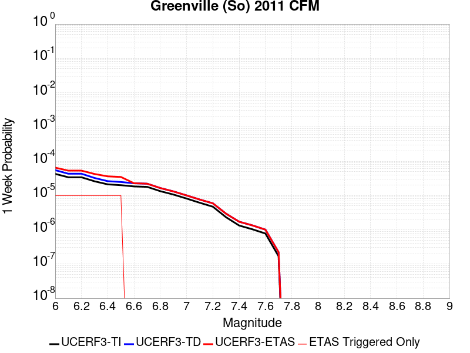 |  |  | 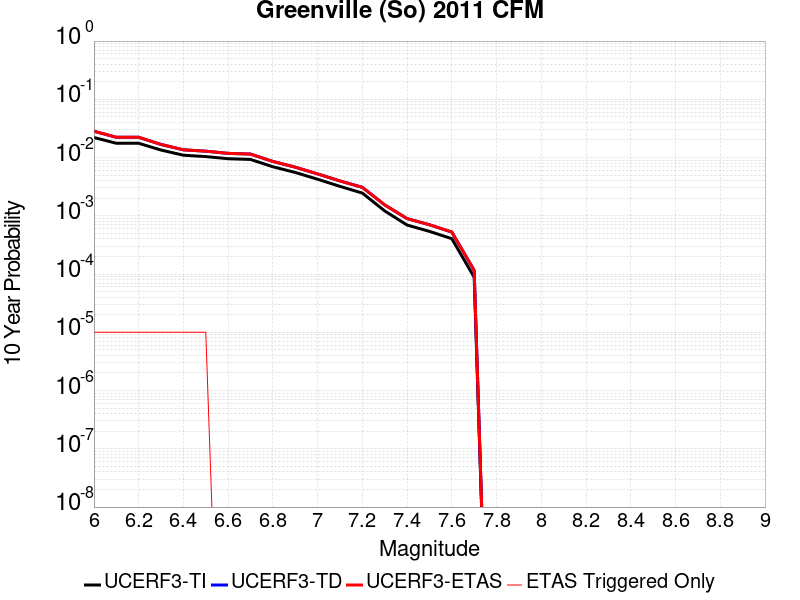 |

| Magnitude | 1 wk TI Prob | 1 wk TD Prob | 1 wk ETAS Prob | 1 wk ETAS/TD Gain | 1 wk ETAS Triggered Only | 1 mo TI Prob | 1 mo TD Prob | 1 mo ETAS Prob | 1 mo ETAS/TD Gain | 1 mo ETAS Triggered Only | 1 yr TI Prob | 1 yr TD Prob | 1 yr ETAS Prob | 1 yr ETAS/TD Gain | 1 yr ETAS Triggered Only | 10 yr TI Prob | 10 yr TD Prob | 10 yr ETAS Prob | 10 yr ETAS/TD Gain | 10 yr ETAS Triggered Only |
|-----|-----|-----|-----|-----|-----|-----|-----|-----|-----|-----|-----|-----|-----|-----|-----|-----|-----|-----|-----|-----|
| 6.0 | 4.279693E-5 | 5.5040087E-5 | 6.503954E-5 | 1.1816758 | 1.0E-5 | 1.8340252E-4 | 2.3586681E-4 | 2.4586444E-4 | 1.0423868 | 1.0E-5 | 0.0022306389 | 0.0028682416 | 0.0028782128 | 1.0034765 | 1.0E-5 | 0.022083808 | 0.028338138 | 0.028347854 | 1.0003428 | 1.0E-5 |
| 6.1 | 3.4037297E-5 | 4.3192387E-5 | 5.3191958E-5 | 1.2315123 | 1.0E-5 | 1.4586597E-4 | 1.8509831E-4 | 1.9509645E-4 | 1.0540154 | 1.0E-5 | 0.0017744715 | 0.0022514379 | 0.0022614154 | 1.0044316 | 1.0E-5 | 0.01760369 | 0.022302566 | 0.022312343 | 1.0004383 | 1.0E-5 |
| 6.2 | 3.4037297E-5 | 4.3192387E-5 | 5.3191958E-5 | 1.2315123 | 1.0E-5 | 1.4586597E-4 | 1.8509831E-4 | 1.9509645E-4 | 1.0540154 | 1.0E-5 | 0.0017744715 | 0.0022514379 | 0.0022614154 | 1.0044316 | 1.0E-5 | 0.01760369 | 0.022302566 | 0.022312343 | 1.0004383 | 1.0E-5 |
| 6.3 | 2.5956324E-5 | 3.2428903E-5 | 4.242858E-5 | 1.3083569 | 1.0E-5 | 1.11236644E-4 | 1.3897405E-4 | 1.4897266E-4 | 1.0719459 | 1.0E-5 | 0.0013534647 | 0.0016907708 | 0.0017007539 | 1.0059044 | 1.0E-5 | 0.013452509 | 0.016785882 | 0.016795715 | 1.0005858 | 1.0E-5 |
| 6.4 | 2.1145053E-5 | 2.6197677E-5 | 3.6197416E-5 | 1.3817033 | 1.0E-5 | 9.061851E-5 | 1.1227112E-4 | 1.2227E-4 | 1.0890601 | 1.0E-5 | 0.0011027219 | 0.0013660751 | 0.0013760615 | 1.0073103 | 1.0E-5 | 0.01097266 | 0.01358018 | 0.013590044 | 1.0007263 | 1.0E-5 |
| 6.5 | 2.0030959E-5 | 2.479578E-5 | 3.4795532E-5 | 1.4032844 | 1.0E-5 | 8.584414E-5 | 1.06263484E-4 | 1.1626242E-4 | 1.0940957 | 1.0E-5 | 0.0010446513 | 0.0012930221 | 0.0013030092 | 1.0077238 | 1.0E-5 | 0.010397541 | 0.012858339 | 0.01286821 | 1.0007677 | 1.0E-5 |
| 6.6 | 1.8395405E-5 | 2.2754466E-5 | 2.2754466E-5 | 1.0 | 0.0 | 7.8835066E-5 | 9.751565E-5 | 9.751565E-5 | 1.0 | 0.0 | 9.5939427E-4 | 0.0011866348 | 0.0011866348 | 1.0 | 0.0 | 0.009552629 | 0.011806041 | 0.011806041 | 1.0 | 0.0 |
| 6.7 | 1.7883482E-5 | 2.212551E-5 | 2.212551E-5 | 1.0 | 0.0 | 7.664124E-5 | 9.482033E-5 | 9.482033E-5 | 1.0 | 0.0 | 9.3270757E-4 | 0.0011538545 | 0.0011538545 | 1.0 | 0.0 | 0.009288026 | 0.011481688 | 0.011481688 | 1.0 | 0.0 |
| 6.8 | 1.3373564E-5 | 1.6505966E-5 | 1.6505966E-5 | 1.0 | 0.0 | 5.7314013E-5 | 7.073802E-5 | 7.073802E-5 | 1.0 | 0.0 | 6.975747E-4 | 8.609098E-4 | 8.609098E-4 | 1.0 | 0.0 | 0.0069538904 | 0.008577357 | 0.008577357 | 1.0 | 0.0 |
| 6.9 | 1.06692905E-5 | 1.3152582E-5 | 1.3152582E-5 | 1.0 | 0.0 | 4.5724726E-5 | 5.6367055E-5 | 5.6367055E-5 | 1.0 | 0.0 | 5.5655633E-4 | 6.86064E-4 | 6.86064E-4 | 1.0 | 0.0 | 0.005551645 | 0.006840693 | 0.006840693 | 1.0 | 0.0 |
| 7.0 | 8.157512E-6 | 1.0062639E-5 | 1.0062639E-5 | 1.0 | 0.0 | 3.4960296E-5 | 4.3124903E-5 | 4.3124903E-5 | 1.0 | 0.0 | 4.2555845E-4 | 5.2492286E-4 | 5.2492286E-4 | 1.0 | 0.0 | 0.004247444 | 0.0052373074 | 0.0052373074 | 1.0 | 0.0 |
| 7.1 | 6.1467113E-6 | 7.6274314E-6 | 7.6274314E-6 | 1.0 | 0.0 | 2.6342783E-5 | 3.268859E-5 | 3.268859E-5 | 1.0 | 0.0 | 3.206762E-4 | 3.9791173E-4 | 3.9791173E-4 | 1.0 | 0.0 | 0.0032021382 | 0.0039721807 | 0.0039721807 | 1.0 | 0.0 |
| 7.2 | 4.713467E-6 | 5.9141557E-6 | 5.9141557E-6 | 1.0 | 0.0 | 2.0200418E-5 | 2.5346139E-5 | 2.5346139E-5 | 1.0 | 0.0 | 2.4591232E-4 | 3.0854615E-4 | 3.0854615E-4 | 1.0 | 0.0 | 0.0024564038 | 0.0030813308 | 0.0030813308 | 1.0 | 0.0 |
| 7.3 | 2.3266216E-6 | 2.954009E-6 | 2.954009E-6 | 1.0 | 0.0 | 9.971197E-6 | 1.2659978E-5 | 1.2659978E-5 | 1.0 | 0.0 | 1.2139256E-4 | 1.5412449E-4 | 1.5412449E-4 | 1.0 | 0.0 | 0.0012132627 | 0.0015402455 | 0.0015402455 | 1.0 | 0.0 |
| 7.4 | 1.3314E-6 | 1.7179472E-6 | 1.7179472E-6 | 1.0 | 0.0 | 5.7059874E-6 | 7.36261E-6 | 7.36261E-6 | 1.0 | 0.0 | 6.946818E-5 | 8.963614E-5 | 8.963614E-5 | 1.0 | 0.0 | 6.9446466E-4 | 8.9603866E-4 | 8.9603866E-4 | 1.0 | 0.0 |
| 7.5 | 1.0362941E-6 | 1.3468821E-6 | 1.3468821E-6 | 1.0 | 0.0 | 4.4412527E-6 | 5.772339E-6 | 5.772339E-6 | 1.0 | 0.0 | 5.407091E-5 | 7.027601E-5 | 7.027601E-5 | 1.0 | 0.0 | 5.405776E-4 | 7.025681E-4 | 7.025681E-4 | 1.0 | 0.0 |
| 7.6 | 7.764784E-7 | 1.0088593E-6 | 1.0088593E-6 | 1.0 | 0.0 | 3.3277602E-6 | 4.323676E-6 | 4.323676E-6 | 1.0 | 0.0 | 4.0514726E-5 | 5.263952E-5 | 5.263952E-5 | 1.0 | 0.0 | 4.050734E-4 | 5.262919E-4 | 5.262919E-4 | 1.0 | 0.0 |
| 7.7 | 1.6927763E-7 | 2.2139248E-7 | 2.2139248E-7 | 1.0 | 0.0 | 7.2547533E-7 | 9.4882455E-7 | 9.4882455E-7 | 1.0 | 0.0 | 8.832627E-6 | 1.15518815E-5 | 1.15518815E-5 | 1.0 | 0.0 | 8.8322755E-5 | 1.15515526E-4 | 1.15515526E-4 | 1.0 | 0.0 |

## Yorba Linda
*[(top)](#table-of-contents)*

| 1 Week | 1 Month | 1 Year | 10 Year |
|-----|-----|-----|-----|
|  |  |  |  |

| Magnitude | 1 wk TI Prob | 1 wk TD Prob | 1 wk ETAS Prob | 1 wk ETAS/TD Gain | 1 wk ETAS Triggered Only | 1 mo TI Prob | 1 mo TD Prob | 1 mo ETAS Prob | 1 mo ETAS/TD Gain | 1 mo ETAS Triggered Only | 1 yr TI Prob | 1 yr TD Prob | 1 yr ETAS Prob | 1 yr ETAS/TD Gain | 1 yr ETAS Triggered Only | 10 yr TI Prob | 10 yr TD Prob | 10 yr ETAS Prob | 10 yr ETAS/TD Gain | 10 yr ETAS Triggered Only |
|-----|-----|-----|-----|-----|-----|-----|-----|-----|-----|-----|-----|-----|-----|-----|-----|-----|-----|-----|-----|-----|
| 6.0 | 1.9346849E-6 | 1.6909235E-6 | 1.1690907E-5 | 6.913918 | 1.0E-5 | 8.29148E-6 | 7.2468E-6 | 1.7246728E-5 | 2.3799093 | 1.0E-5 | 1.009441E-4 | 8.822717E-5 | 9.8226286E-5 | 1.1133338 | 1.0E-5 | 0.0010089825 | 8.820145E-4 | 8.920057E-4 | 1.0113276 | 1.0E-5 |
| 6.1 | 1.9346849E-6 | 1.6909235E-6 | 1.1690907E-5 | 6.913918 | 1.0E-5 | 8.29148E-6 | 7.2468E-6 | 1.7246728E-5 | 2.3799093 | 1.0E-5 | 1.009441E-4 | 8.822717E-5 | 9.8226286E-5 | 1.1133338 | 1.0E-5 | 0.0010089825 | 8.820145E-4 | 8.920057E-4 | 1.0113276 | 1.0E-5 |
| 6.2 | 1.9346849E-6 | 1.6909235E-6 | 1.1690907E-5 | 6.913918 | 1.0E-5 | 8.29148E-6 | 7.2468E-6 | 1.7246728E-5 | 2.3799093 | 1.0E-5 | 1.009441E-4 | 8.822717E-5 | 9.8226286E-5 | 1.1133338 | 1.0E-5 | 0.0010089825 | 8.820145E-4 | 8.920057E-4 | 1.0113276 | 1.0E-5 |
| 6.3 | 1.1028608E-6 | 8.481986E-7 | 1.084819E-5 | 12.789681 | 1.0E-5 | 4.7265376E-6 | 3.6351323E-6 | 1.36350955E-5 | 3.7509215 | 1.0E-5 | 5.754407E-5 | 4.4256903E-5 | 5.425646E-5 | 1.2259434 | 1.0E-5 | 5.7529175E-4 | 4.4248742E-4 | 4.52483E-4 | 1.0225896 | 1.0E-5 |
| 6.4 | 1.1028608E-6 | 8.481986E-7 | 1.084819E-5 | 12.789681 | 1.0E-5 | 4.7265376E-6 | 3.6351323E-6 | 1.36350955E-5 | 3.7509215 | 1.0E-5 | 5.754407E-5 | 4.4256903E-5 | 5.425646E-5 | 1.2259434 | 1.0E-5 | 5.7529175E-4 | 4.4248742E-4 | 4.52483E-4 | 1.0225896 | 1.0E-5 |
| 6.5 | 8.4451364E-7 | 5.8692325E-7 | 5.8692325E-7 | 1.0 | 0.0 | 3.619339E-6 | 2.5153831E-6 | 2.5153831E-6 | 1.0 | 0.0 | 4.406456E-5 | 3.0624382E-5 | 3.0624382E-5 | 1.0 | 0.0 | 4.4055824E-4 | 3.0620373E-4 | 3.0620373E-4 | 1.0 | 0.0 |
| 6.6 | 8.422957E-7 | 5.8447665E-7 | 5.8447665E-7 | 1.0 | 0.0 | 3.6098338E-6 | 2.5048976E-6 | 2.5048976E-6 | 1.0 | 0.0 | 4.3948843E-5 | 3.0496723E-5 | 3.0496723E-5 | 1.0 | 0.0 | 4.394015E-4 | 3.0492753E-4 | 3.0492753E-4 | 1.0 | 0.0 |
| 6.7 | 8.4119705E-7 | 5.832608E-7 | 5.832608E-7 | 1.0 | 0.0 | 3.6051254E-6 | 2.499687E-6 | 2.499687E-6 | 1.0 | 0.0 | 4.3891516E-5 | 3.0433286E-5 | 3.0433286E-5 | 1.0 | 0.0 | 4.388285E-4 | 3.0429332E-4 | 3.0429332E-4 | 1.0 | 0.0 |
| 6.8 | 7.5919155E-7 | 4.995118E-7 | 4.995118E-7 | 1.0 | 0.0 | 3.253674E-6 | 2.1407632E-6 | 2.1407632E-6 | 1.0 | 0.0 | 3.961276E-5 | 2.6063499E-5 | 2.6063499E-5 | 1.0 | 0.0 | 3.9605703E-4 | 2.6060612E-4 | 2.6060612E-4 | 1.0 | 0.0 |
| 6.9 | 7.5804564E-7 | 4.981302E-7 | 4.981302E-7 | 1.0 | 0.0 | 3.248763E-6 | 2.134842E-6 | 2.134842E-6 | 1.0 | 0.0 | 3.955297E-5 | 2.5991409E-5 | 2.5991409E-5 | 1.0 | 0.0 | 3.9545933E-4 | 2.598854E-4 | 2.598854E-4 | 1.0 | 0.0 |
| 7.0 | 7.539293E-7 | 4.943436E-7 | 4.943436E-7 | 1.0 | 0.0 | 3.2311218E-6 | 2.118614E-6 | 2.118614E-6 | 1.0 | 0.0 | 3.9338196E-5 | 2.5793837E-5 | 2.5793837E-5 | 1.0 | 0.0 | 3.9331234E-4 | 2.5791014E-4 | 2.5791014E-4 | 1.0 | 0.0 |
| 7.1 | 6.0900885E-7 | 3.781838E-7 | 3.781838E-7 | 1.0 | 0.0 | 2.6100352E-6 | 1.6207867E-6 | 1.6207867E-6 | 1.0 | 0.0 | 3.1776715E-5 | 1.9732903E-5 | 1.9732903E-5 | 1.0 | 0.0 | 3.1772171E-4 | 1.9731186E-4 | 1.9731186E-4 | 1.0 | 0.0 |
| 7.2 | 5.849925E-7 | 3.5880063E-7 | 3.5880063E-7 | 1.0 | 0.0 | 2.5071083E-6 | 1.5377161E-6 | 1.5377161E-6 | 1.0 | 0.0 | 3.0523614E-5 | 1.8721537E-5 | 1.8721537E-5 | 1.0 | 0.0 | 3.0519423E-4 | 1.8719993E-4 | 1.8719993E-4 | 1.0 | 0.0 |
| 7.3 | 4.89808E-7 | 3.038045E-7 | 3.038045E-7 | 1.0 | 0.0 | 2.0991754E-6 | 1.3020187E-6 | 1.3020187E-6 | 1.0 | 0.0 | 2.5557161E-5 | 1.5851965E-5 | 1.5851965E-5 | 1.0 | 0.0 | 2.5554223E-4 | 1.5850857E-4 | 1.5850857E-4 | 1.0 | 0.0 |
| 7.4 | 3.8700415E-7 | 2.4723E-7 | 2.4723E-7 | 1.0 | 0.0 | 1.6585881E-6 | 1.0595568E-6 | 1.0595568E-6 | 1.0 | 0.0 | 2.0193123E-5 | 1.2900028E-5 | 1.2900028E-5 | 1.0 | 0.0 | 2.0191289E-4 | 1.2899292E-4 | 1.2899292E-4 | 1.0 | 0.0 |
| 7.5 | 2.900565E-7 | 1.8637812E-7 | 1.8637812E-7 | 1.0 | 0.0 | 1.2430987E-6 | 7.987631E-7 | 7.987631E-7 | 1.0 | 0.0 | 1.5134622E-5 | 9.7248985E-6 | 9.7248985E-6 | 1.0 | 0.0 | 1.5133592E-4 | 9.724481E-5 | 9.724481E-5 | 1.0 | 0.0 |
| 7.6 | 2.2770318E-7 | 1.4814457E-7 | 1.4814457E-7 | 1.0 | 0.0 | 9.758704E-7 | 6.349051E-7 | 6.349051E-7 | 1.0 | 0.0 | 1.1881158E-5 | 7.729943E-6 | 7.729943E-6 | 1.0 | 0.0 | 1.1880523E-4 | 7.729679E-5 | 7.729679E-5 | 1.0 | 0.0 |
| 7.7 | 1.5017194E-7 | 8.735719E-8 | 8.735719E-8 | 1.0 | 0.0 | 6.4359386E-7 | 3.743879E-7 | 3.743879E-7 | 1.0 | 0.0 | 7.835727E-6 | 4.5581633E-6 | 4.5581633E-6 | 1.0 | 0.0 | 7.835451E-5 | 4.5580728E-5 | 4.5580728E-5 | 1.0 | 0.0 |
| 7.8 | 3.895753E-8 | 1.8533399E-8 | 1.8533399E-8 | 1.0 | 0.0 | 1.6696083E-7 | 7.9428844E-8 | 7.9428844E-8 | 1.0 | 0.0 | 2.0327461E-6 | 9.670458E-7 | 9.670458E-7 | 1.0 | 0.0 | 2.0327276E-5 | 9.670418E-6 | 9.670418E-6 | 1.0 | 0.0 |
| 7.9 | 6.648505E-9 | 3.4184469E-9 | 3.4184469E-9 | 1.0 | 0.0 | 2.8493591E-8 | 1.4650486E-8 | 1.4650486E-8 | 1.0 | 0.0 | 3.4690942E-7 | 1.7836966E-7 | 1.7836966E-7 | 1.0 | 0.0 | 3.4690888E-6 | 1.7836953E-6 | 1.7836953E-6 | 1.0 | 0.0 |

